cola Report for Hierarchical Partitioning - 'NestorowaHSC'
==================

**Date**: 2021-07-26 11:29:16 CEST, **cola version**: 1.9.4

----------------------------------------------------------------

<style type='text/css'>

body, td, th {
   font-family: Arial,Helvetica,sans-serif;
   background-color: white;
   font-size: 13px;
  max-width: 800px;
  margin: auto;
  margin-left:210px;
  padding: 0px 10px 0px 10px;
  border-left: 1px solid #EEEEEE;
  line-height: 150%;
}

tt, code, pre {
   font-family: 'DejaVu Sans Mono', 'Droid Sans Mono', 'Lucida Console', Consolas, Monaco, 

monospace;
}

h1 {
   font-size:2.2em;
}

h2 {
   font-size:1.8em;
}

h3 {
   font-size:1.4em;
}

h4 {
   font-size:1.0em;
}

h5 {
   font-size:0.9em;
}

h6 {
   font-size:0.8em;
}

a {
  text-decoration: none;
  color: #0366d6;
}

a:hover {
  text-decoration: underline;
}

a:visited {
   color: #0366d6;
}

pre, img {
  max-width: 100%;
}
pre {
  overflow-x: auto;
}
pre code {
   display: block; padding: 0.5em;
}

code {
  font-size: 92%;
  border: 1px solid #ccc;
}

code[class] {
  background-color: #F8F8F8;
}

table, td, th {
  border: 1px solid #ccc;
}

blockquote {
   color:#666666;
   margin:0;
   padding-left: 1em;
   border-left: 0.5em #EEE solid;
}

hr {
   height: 0px;
   border-bottom: none;
   border-top-width: thin;
   border-top-style: dotted;
   border-top-color: #999999;
}

@media print {
   * {
      background: transparent !important;
      color: black !important;
      filter:none !important;
      -ms-filter: none !important;
   }

   body {
      font-size:12pt;
      max-width:100%;
   }

   a, a:visited {
      text-decoration: underline;
   }

   hr {
      visibility: hidden;
      page-break-before: always;
   }

   pre, blockquote {
      padding-right: 1em;
      page-break-inside: avoid;
   }

   tr, img {
      page-break-inside: avoid;
   }

   img {
      max-width: 100% !important;
   }

   @page :left {
      margin: 15mm 20mm 15mm 10mm;
   }

   @page :right {
      margin: 15mm 10mm 15mm 20mm;
   }

   p, h2, h3 {
      orphans: 3; widows: 3;
   }

   h2, h3 {
      page-break-after: avoid;
   }
}
</style>


## Summary


First the variable is renamed to `res_rh`.


```r
res_rh = rh
```


The partition hierarchy and all available functions which can be applied to `res_rh` object.


```r
res_rh
```

```
#> A 'HierarchicalPartition' object with 'ATC:skmeans' method.
#>   On a matrix with 22269 rows and 1920 columns.
#>   Performed in total 8700 partitions.
#>   There are 36 groups under the following parameters:
#>     - min_samples: 19
#>     - mean_silhouette_cutoff: 0.9
#>     - min_n_signatures: 624 (signatures are selected based on:)
#>       - fdr_cutoff: 0.05
#>       - group_diff (scaled values): 0.5
#> 
#> Hierarchy of the partition:
#>   0, 1920 cols
#>   |-- 01, 598 cols, 12685 signatures
#>   |   |-- 011, 154 cols, 1938 signatures
#>   |   |   |-- 0111, 82 cols, 1497 signatures
#>   |   |   |   |-- 01111, 29 cols (b)
#>   |   |   |   |-- 01112, 35 cols (b)
#>   |   |   |   `-- 01113, 18 cols (b)
#>   |   |   `-- 0112, 72 cols, 871 signatures
#>   |   |       |-- 01121, 44 cols (a)
#>   |   |       `-- 01122, 28 cols (b)
#>   |   |-- 012, 248 cols, 1324 signatures
#>   |   |   |-- 0121, 124 cols, 1199 signatures
#>   |   |   |   |-- 01211, 41 cols (a)
#>   |   |   |   |-- 01212, 47 cols (a)
#>   |   |   |   `-- 01213, 36 cols (b)
#>   |   |   `-- 0122, 124 cols, 1413 signatures
#>   |   |       |-- 01221, 49 cols (a)
#>   |   |       |-- 01222, 41 cols, 125 signatures (c)
#>   |   |       `-- 01223, 34 cols (b)
#>   |   |-- 013, 115 cols, 2134 signatures
#>   |   |   |-- 0131, 68 cols, 904 signatures
#>   |   |   |   |-- 01311, 33 cols (b)
#>   |   |   |   `-- 01312, 35 cols (b)
#>   |   |   `-- 0132, 47 cols, 177 signatures (c)
#>   |   `-- 014, 81 cols, 848 signatures
#>   |       |-- 0141, 45 cols, 14 signatures (c)
#>   |       `-- 0142, 36 cols (b)
#>   |-- 02, 584 cols, 5481 signatures
#>   |   |-- 021, 197 cols, 2897 signatures
#>   |   |   |-- 0211, 102 cols, 1314 signatures
#>   |   |   |   |-- 02111, 43 cols, 337 signatures (c)
#>   |   |   |   `-- 02112, 59 cols, 29 signatures (c)
#>   |   |   |-- 0212, 53 cols, 999 signatures
#>   |   |   |   |-- 02121, 30 cols (b)
#>   |   |   |   `-- 02122, 23 cols (b)
#>   |   |   `-- 0213, 42 cols, 123 signatures (c)
#>   |   |-- 022, 258 cols, 63 signatures (c)
#>   |   `-- 023, 129 cols, 541 signatures (c)
#>   |-- 03, 373 cols, 2046 signatures
#>   |   |-- 031, 159 cols, 741 signatures
#>   |   |   |-- 0311, 82 cols, 111 signatures (c)
#>   |   |   `-- 0312, 77 cols, 165 signatures (c)
#>   |   |-- 032, 124 cols, 767 signatures
#>   |   |   |-- 0321, 68 cols, 108 signatures (c)
#>   |   |   `-- 0322, 56 cols, 76 signatures (c)
#>   |   `-- 033, 90 cols, 710 signatures
#>   |       |-- 0331, 44 cols, 11 signatures (c)
#>   |       `-- 0332, 46 cols, 116 signatures (c)
#>   `-- 04, 365 cols, 3418 signatures
#>       |-- 041, 147 cols, 3285 signatures
#>       |   |-- 0411, 45 cols, 567 signatures (c)
#>       |   |-- 0412, 55 cols, 175 signatures (c)
#>       |   `-- 0413, 47 cols, 92 signatures (c)
#>       |-- 042, 141 cols, 630 signatures
#>       |   |-- 0421, 52 cols, 42 signatures (c)
#>       |   |-- 0422, 46 cols (a)
#>       |   `-- 0423, 43 cols, 18 signatures (c)
#>       `-- 043, 77 cols, 593 signatures (c)
#> Stop reason:
#>   a) Mean silhouette score was too small
#>   b) Subgroup had too few columns.
#>   c) There were too few signatures.
#> 
#> Following methods can be applied to this 'HierarchicalPartition' object:
#>  [1] "all_leaves"            "all_nodes"             "cola_report"           "collect_classes"      
#>  [5] "colnames"              "compare_signatures"    "dimension_reduction"   "functional_enrichment"
#>  [9] "get_anno_col"          "get_anno"              "get_children_nodes"    "get_classes"          
#> [13] "get_matrix"            "get_signatures"        "is_leaf_node"          "max_depth"            
#> [17] "merge_node"            "ncol"                  "node_info"             "node_level"           
#> [21] "nrow"                  "rownames"              "show"                  "split_node"           
#> [25] "suggest_best_k"        "test_to_known_factors" "top_rows_heatmap"      "top_rows_overlap"     
#> 
#> You can get result for a single node by e.g. object["01"]
```

The call of `hierarchical_partition()` was:


```
#> hierarchical_partition(data = lt$mat, subset = 500, cores = 4)
```

Dimension of the input matrix:


```r
mat = get_matrix(res_rh)
dim(mat)
```

```
#> [1] 22269  1920
```

All the methods that were tried:


```r
res_rh@param$combination_method
```

```
#> [[1]]
#> [1] "ATC"     "skmeans"
```

### Density distribution

The density distribution for each sample is visualized as one column in the following heatmap.
The clustering is based on the distance which is the Kolmogorov-Smirnov statistic between two distributions.


```r
library(ComplexHeatmap)
densityHeatmap(mat, ylab = "value", cluster_columns = TRUE, show_column_names = FALSE,
    mc.cores = 1)
```

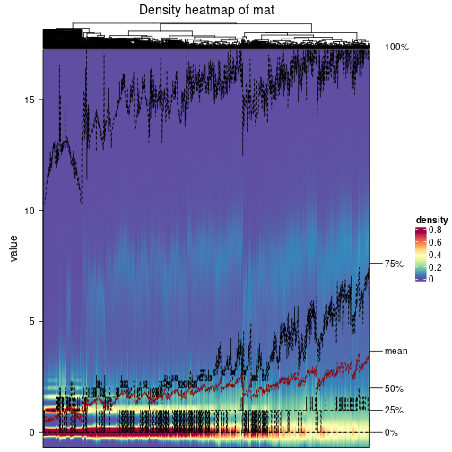


Some values about the hierarchy:


```r
all_nodes(res_rh)
```

```
#>  [1] "0"     "01"    "011"   "0111"  "01111" "01112" "01113" "0112"  "01121" "01122" "012"   "0121" 
#> [13] "01211" "01212" "01213" "0122"  "01221" "01222" "01223" "013"   "0131"  "01311" "01312" "0132" 
#> [25] "014"   "0141"  "0142"  "02"    "021"   "0211"  "02111" "02112" "0212"  "02121" "02122" "0213" 
#> [37] "022"   "023"   "03"    "031"   "0311"  "0312"  "032"   "0321"  "0322"  "033"   "0331"  "0332" 
#> [49] "04"    "041"   "0411"  "0412"  "0413"  "042"   "0421"  "0422"  "0423"  "043"
```

```r
all_leaves(res_rh)
```

```
#>  [1] "01111" "01112" "01113" "01121" "01122" "01211" "01212" "01213" "01221" "01222" "01223" "01311"
#> [13] "01312" "0132"  "0141"  "0142"  "02111" "02112" "02121" "02122" "0213"  "022"   "023"   "0311" 
#> [25] "0312"  "0321"  "0322"  "0331"  "0332"  "0411"  "0412"  "0413"  "0421"  "0422"  "0423"  "043"
```

```r
node_info(res_rh)
```

```
#>       id best_method depth best_k n_columns n_signatures p_signatures is_leaf
#> 1      0 ATC:skmeans     1      4      1920        12492     0.560959   FALSE
#> 2     01 ATC:skmeans     2      4       598        12685     0.569626   FALSE
#> 3    011 ATC:skmeans     3      2       154         1938     0.087027   FALSE
#> 4   0111 ATC:skmeans     4      3        82         1497     0.067223   FALSE
#> 5  01111 not applied     5     NA        29           NA           NA    TRUE
#> 6  01112 not applied     5     NA        35           NA           NA    TRUE
#> 7  01113 not applied     5     NA        18           NA           NA    TRUE
#> 8   0112 ATC:skmeans     4      2        72          871     0.039113   FALSE
#> 9  01121 ATC:skmeans     5      3        44           NA           NA    TRUE
#> 10 01122 not applied     5     NA        28           NA           NA    TRUE
#> 11   012 ATC:skmeans     3      2       248         1324     0.059455   FALSE
#> 12  0121 ATC:skmeans     4      3       124         1199     0.053842   FALSE
#> 13 01211 ATC:skmeans     5      3        41           NA           NA    TRUE
#> 14 01212 ATC:skmeans     5      3        47           NA           NA    TRUE
#> 15 01213 not applied     5     NA        36           NA           NA    TRUE
#> 16  0122 ATC:skmeans     4      3       124         1413     0.063451   FALSE
#> 17 01221 ATC:skmeans     5      2        49           NA           NA    TRUE
#> 18 01222 ATC:skmeans     5      2        41          125     0.005613    TRUE
#> 19 01223 not applied     5     NA        34           NA           NA    TRUE
#> 20   013 ATC:skmeans     3      2       115         2134     0.095828   FALSE
#> 21  0131 ATC:skmeans     4      2        68          904     0.040595   FALSE
#> 22 01311 not applied     5     NA        33           NA           NA    TRUE
#> 23 01312 not applied     5     NA        35           NA           NA    TRUE
#> 24  0132 ATC:skmeans     4      2        47          177     0.007948    TRUE
#> 25   014 ATC:skmeans     3      2        81          848     0.038080   FALSE
#> 26  0141 ATC:skmeans     4      2        45           14     0.000629    TRUE
#> 27  0142 not applied     4     NA        36           NA           NA    TRUE
#> 28    02 ATC:skmeans     2      3       584         5481     0.246127   FALSE
#> 29   021 ATC:skmeans     3      3       197         2897     0.130091   FALSE
#> 30  0211 ATC:skmeans     4      2       102         1314     0.059006   FALSE
#> 31 02111 ATC:skmeans     5      3        43          337     0.015133    TRUE
#> 32 02112 ATC:skmeans     5      2        59           29     0.001302    TRUE
#> 33  0212 ATC:skmeans     4      2        53          999     0.044861   FALSE
#> 34 02121 not applied     5     NA        30           NA           NA    TRUE
#> 35 02122 not applied     5     NA        23           NA           NA    TRUE
#> 36  0213 ATC:skmeans     4      2        42          123     0.005523    TRUE
#> 37   022 ATC:skmeans     3      2       258           63     0.002829    TRUE
#> 38   023 ATC:skmeans     3      2       129          541     0.024294    TRUE
#> 39    03 ATC:skmeans     2      3       373         2046     0.091877   FALSE
#> 40   031 ATC:skmeans     3      2       159          741     0.033275   FALSE
#> 41  0311 ATC:skmeans     4      2        82          111     0.004985    TRUE
#> 42  0312 ATC:skmeans     4      2        77          165     0.007409    TRUE
#> 43   032 ATC:skmeans     3      2       124          767     0.034442   FALSE
#> 44  0321 ATC:skmeans     4      3        68          108     0.004850    TRUE
#> 45  0322 ATC:skmeans     4      2        56           76     0.003413    TRUE
#> 46   033 ATC:skmeans     3      2        90          710     0.031883   FALSE
#> 47  0331 ATC:skmeans     4      2        44           11     0.000494    TRUE
#> 48  0332 ATC:skmeans     4      2        46          116     0.005209    TRUE
#> 49    04 ATC:skmeans     2      3       365         3418     0.153487   FALSE
#> 50   041 ATC:skmeans     3      3       147         3285     0.147514   FALSE
#> 51  0411 ATC:skmeans     4      2        45          567     0.025461    TRUE
#> 52  0412 ATC:skmeans     4      2        55          175     0.007858    TRUE
#> 53  0413 ATC:skmeans     4      2        47           92     0.004131    TRUE
#> 54   042 ATC:skmeans     3      3       141          630     0.028290   FALSE
#> 55  0421 ATC:skmeans     4      2        52           42     0.001886    TRUE
#> 56  0422 ATC:skmeans     4      2        46           NA           NA    TRUE
#> 57  0423 ATC:skmeans     4      2        43           18     0.000808    TRUE
#> 58   043 ATC:skmeans     3      2        77          593     0.026629    TRUE
```

In the output from `node_info()`, there are the following columns:

- `id`: The node id.
- `best_method`: The best method selected.
- `depth`: Depth of the node in the hierarchy.
- `best_k`: Best number of groups of the partition on that node.
- `n_columns`: Number of columns in the submatrix.
- `n_signatures`: Number of signatures with the `best_k`.
- `p_signatures`: Proportion of hte signatures in total number of rows in the matrix.
- `is_leaf`: Whether the node is a leaf.

Labels of nodes are encoded in a special way. The number of digits
correspond to the depth of the node in the hierarchy and the value of the
digits correspond to the index of the subgroup in the current node, E.g. a label
of “012” means the node is the second subgroup of the partition which is the
first subgroup of the root node.

### Suggest the best k


Following table shows the best `k` (number of partitions) for each node in the
partition hierarchy. Clicking on the node name in the table goes to the
corresponding section for the partitioning on that node.

[The cola vignette](https://jokergoo.github.io/cola_vignettes/cola.html#toc_13)
explains the definition of the metrics used for determining the best
number of partitions.


```r
suggest_best_k(res_rh)
```


|Node                  |Best method                                         |Is leaf   |Best k |1-PAC |Mean silhouette |Concordance | #samples|   |
|:---------------------|:---------------------------------------------------|:---------|:------|:-----|:---------------|:-----------|--------:|:--|
|[Node0](#Node0)       |ATC:skmeans                                         |          |4      |1.00  |0.96            |0.98        |     1920|** |
|[Node01](#Node01)     |ATC:skmeans                                         |          |4      |1.00  |0.99            |1.00        |      598|** |
|[Node011](#Node011)   |ATC:skmeans                                         |          |2      |1.00  |0.99            |0.99        |      154|** |
|[Node0111](#Node0111) |ATC:skmeans                                         |          |3      |1.00  |0.97            |0.99        |       82|** |
|Node01111-leaf        |<span style='color:grey;'><i>not applied</i></span> |✓ (b)     |       |      |                |            |       29|   |
|Node01112-leaf        |<span style='color:grey;'><i>not applied</i></span> |✓ (b)     |       |      |                |            |       35|   |
|Node01113-leaf        |<span style='color:grey;'><i>not applied</i></span> |✓ (b)     |       |      |                |            |       18|   |
|[Node0112](#Node0112) |ATC:skmeans                                         |          |2      |1.00  |0.99            |0.99        |       72|** |
|Node01121-leaf        |ATC:skmeans                                         |✓ (a)     |3      |0.78  |0.84            |0.93        |       44|   |
|Node01122-leaf        |<span style='color:grey;'><i>not applied</i></span> |✓ (b)     |       |      |                |            |       28|   |
|[Node012](#Node012)   |ATC:skmeans                                         |          |4      |0.97  |0.94            |0.98        |      248|** |
|[Node0121](#Node0121) |ATC:skmeans                                         |          |3      |0.98  |0.96            |0.98        |      124|** |
|Node01211-leaf        |ATC:skmeans                                         |✓ (a)     |3      |0.61  |0.69            |0.86        |       41|   |
|Node01212-leaf        |ATC:skmeans                                         |✓ (a)     |3      |0.87  |0.89            |0.95        |       47|   |
|Node01213-leaf        |<span style='color:grey;'><i>not applied</i></span> |✓ (b)     |       |      |                |            |       36|   |
|[Node0122](#Node0122) |ATC:skmeans                                         |          |3      |1.00  |0.96            |0.98        |      124|** |
|Node01221-leaf        |ATC:skmeans                                         |✓ (a)     |2      |0.83  |0.90            |0.96        |       49|   |
|Node01222-leaf        |ATC:skmeans                                         |✓ (&#99;) |2      |1.00  |1.00            |1.00        |       41|** |
|Node01223-leaf        |<span style='color:grey;'><i>not applied</i></span> |✓ (b)     |       |      |                |            |       34|   |
|[Node013](#Node013)   |ATC:skmeans                                         |          |2      |1.00  |0.97            |0.99        |      115|** |
|[Node0131](#Node0131) |ATC:skmeans                                         |          |2      |1.00  |0.95            |0.98        |       68|** |
|Node01311-leaf        |<span style='color:grey;'><i>not applied</i></span> |✓ (b)     |       |      |                |            |       33|   |
|Node01312-leaf        |<span style='color:grey;'><i>not applied</i></span> |✓ (b)     |       |      |                |            |       35|   |
|Node0132-leaf         |ATC:skmeans                                         |✓ (&#99;) |2      |1.00  |0.99            |1.00        |       47|** |
|[Node014](#Node014)   |ATC:skmeans                                         |          |3      |0.90  |0.94            |0.97        |       81|*  |
|Node0141-leaf         |ATC:skmeans                                         |✓ (&#99;) |3      |0.94  |0.93            |0.97        |       45|*  |
|Node0142-leaf         |<span style='color:grey;'><i>not applied</i></span> |✓ (b)     |       |      |                |            |       36|   |
|[Node02](#Node02)     |ATC:skmeans                                         |          |4      |0.92  |0.92            |0.97        |      584|*  |
|[Node021](#Node021)   |ATC:skmeans                                         |          |4      |0.95  |0.93            |0.97        |      197|*  |
|[Node0211](#Node0211) |ATC:skmeans                                         |          |3      |0.92  |0.93            |0.97        |      102|*  |
|Node02111-leaf        |ATC:skmeans                                         |✓ (&#99;) |3      |1.00  |0.98            |0.99        |       43|** |
|Node02112-leaf        |ATC:skmeans                                         |✓ (&#99;) |2      |1.00  |0.98            |0.99        |       59|** |
|[Node0212](#Node0212) |ATC:skmeans                                         |          |2      |1.00  |0.97            |0.98        |       53|** |
|Node02121-leaf        |<span style='color:grey;'><i>not applied</i></span> |✓ (b)     |       |      |                |            |       30|   |
|Node02122-leaf        |<span style='color:grey;'><i>not applied</i></span> |✓ (b)     |       |      |                |            |       23|   |
|Node0213-leaf         |ATC:skmeans                                         |✓ (&#99;) |2      |1.00  |1.00            |1.00        |       42|** |
|Node022-leaf          |ATC:skmeans                                         |✓ (&#99;) |4      |0.93  |0.92            |0.96        |      258|*  |
|Node023-leaf          |ATC:skmeans                                         |✓ (&#99;) |3      |0.91  |0.91            |0.96        |      129|*  |
|[Node03](#Node03)     |ATC:skmeans                                         |          |3      |0.99  |0.97            |0.99        |      373|** |
|[Node031](#Node031)   |ATC:skmeans                                         |          |2      |0.95  |0.94            |0.97        |      159|*  |
|Node0311-leaf         |ATC:skmeans                                         |✓ (&#99;) |2      |0.97  |0.95            |0.98        |       82|** |
|Node0312-leaf         |ATC:skmeans                                         |✓ (&#99;) |3      |0.93  |0.93            |0.97        |       77|*  |
|[Node032](#Node032)   |ATC:skmeans                                         |          |2      |1.00  |0.99            |1.00        |      124|** |
|Node0321-leaf         |ATC:skmeans                                         |✓ (&#99;) |3      |0.92  |0.94            |0.97        |       68|*  |
|Node0322-leaf         |ATC:skmeans                                         |✓ (&#99;) |2      |0.96  |0.95            |0.98        |       56|** |
|[Node033](#Node033)   |ATC:skmeans                                         |          |3      |0.91  |0.94            |0.97        |       90|*  |
|Node0331-leaf         |ATC:skmeans                                         |✓ (&#99;) |2      |1.00  |0.97            |0.99        |       44|** |
|Node0332-leaf         |ATC:skmeans                                         |✓ (&#99;) |2      |0.91  |0.97            |0.98        |       46|*  |
|[Node04](#Node04)     |ATC:skmeans                                         |          |3      |1.00  |0.97            |0.99        |      365|** |
|[Node041](#Node041)   |ATC:skmeans                                         |          |3      |0.99  |0.96            |0.98        |      147|** |
|Node0411-leaf         |ATC:skmeans                                         |✓ (&#99;) |2      |0.95  |0.94            |0.97        |       45|** |
|Node0412-leaf         |ATC:skmeans                                         |✓ (&#99;) |2      |1.00  |0.97            |0.99        |       55|** |
|Node0413-leaf         |ATC:skmeans                                         |✓ (&#99;) |2      |1.00  |1.00            |1.00        |       47|** |
|[Node042](#Node042)   |ATC:skmeans                                         |          |3      |1.00  |0.97            |0.99        |      141|** |
|Node0421-leaf         |ATC:skmeans                                         |✓ (&#99;) |2      |1.00  |0.97            |0.99        |       52|** |
|Node0422-leaf         |ATC:skmeans                                         |✓ (a)     |2      |0.42  |0.74            |0.89        |       46|   |
|Node0423-leaf         |ATC:skmeans                                         |✓ (&#99;) |2      |1.00  |0.97            |0.99        |       43|** |
|Node043-leaf          |ATC:skmeans                                         |✓ (&#99;) |2      |1.00  |1.00            |1.00        |       77|** |


Stop reason: a) Mean silhouette score was too small b) Subgroup had too few columns. c) There were too few signatures. 

\*\*: 1-PAC > 0.95, \*: 1-PAC > 0.9


### Partition hierarchy

The nodes of the hierarchy can be merged by setting the `merge_node` parameters. Here we 
control the hierarchy with the `min_n_signatures` parameter. The value of `min_n_signatures` is
from `node_info()`.


<style type='text/css'>


.ui-helper-hidden {
	display: none;
}
.ui-helper-hidden-accessible {
	border: 0;
	clip: rect(0 0 0 0);
	height: 1px;
	margin: -1px;
	overflow: hidden;
	padding: 0;
	position: absolute;
	width: 1px;
}
.ui-helper-reset {
	margin: 0;
	padding: 0;
	border: 0;
	outline: 0;
	line-height: 1.3;
	text-decoration: none;
	font-size: 100%;
	list-style: none;
}
.ui-helper-clearfix:before,
.ui-helper-clearfix:after {
	content: "";
	display: table;
	border-collapse: collapse;
}
.ui-helper-clearfix:after {
	clear: both;
}
.ui-helper-zfix {
	width: 100%;
	height: 100%;
	top: 0;
	left: 0;
	position: absolute;
	opacity: 0;
	filter:Alpha(Opacity=0); 
}

.ui-front {
	z-index: 100;
}


.ui-state-disabled {
	cursor: default !important;
	pointer-events: none;
}


.ui-icon {
	display: inline-block;
	vertical-align: middle;
	margin-top: -.25em;
	position: relative;
	text-indent: -99999px;
	overflow: hidden;
	background-repeat: no-repeat;
}

.ui-widget-icon-block {
	left: 50%;
	margin-left: -8px;
	display: block;
}


.ui-widget-overlay {
	position: fixed;
	top: 0;
	left: 0;
	width: 100%;
	height: 100%;
}
.ui-accordion .ui-accordion-header {
	display: block;
	cursor: pointer;
	position: relative;
	margin: 2px 0 0 0;
	padding: .5em .5em .5em .7em;
	font-size: 100%;
}
.ui-accordion .ui-accordion-content {
	padding: 1em 2.2em;
	border-top: 0;
	overflow: auto;
}
.ui-autocomplete {
	position: absolute;
	top: 0;
	left: 0;
	cursor: default;
}
.ui-menu {
	list-style: none;
	padding: 0;
	margin: 0;
	display: block;
	outline: 0;
}
.ui-menu .ui-menu {
	position: absolute;
}
.ui-menu .ui-menu-item {
	margin: 0;
	cursor: pointer;
	
	list-style-image: url("data:image/gif;base64,R0lGODlhAQABAIAAAAAAAP///yH5BAEAAAAALAAAAAABAAEAAAIBRAA7");
}
.ui-menu .ui-menu-item-wrapper {
	position: relative;
	padding: 3px 1em 3px .4em;
}
.ui-menu .ui-menu-divider {
	margin: 5px 0;
	height: 0;
	font-size: 0;
	line-height: 0;
	border-width: 1px 0 0 0;
}
.ui-menu .ui-state-focus,
.ui-menu .ui-state-active {
	margin: -1px;
}


.ui-menu-icons {
	position: relative;
}
.ui-menu-icons .ui-menu-item-wrapper {
	padding-left: 2em;
}


.ui-menu .ui-icon {
	position: absolute;
	top: 0;
	bottom: 0;
	left: .2em;
	margin: auto 0;
}


.ui-menu .ui-menu-icon {
	left: auto;
	right: 0;
}
.ui-button {
	padding: .4em 1em;
	display: inline-block;
	position: relative;
	line-height: normal;
	margin-right: .1em;
	cursor: pointer;
	vertical-align: middle;
	text-align: center;
	-webkit-user-select: none;
	-moz-user-select: none;
	-ms-user-select: none;
	user-select: none;

	
	overflow: visible;
}

.ui-button,
.ui-button:link,
.ui-button:visited,
.ui-button:hover,
.ui-button:active {
	text-decoration: none;
}


.ui-button-icon-only {
	width: 2em;
	box-sizing: border-box;
	text-indent: -9999px;
	white-space: nowrap;
}


input.ui-button.ui-button-icon-only {
	text-indent: 0;
}


.ui-button-icon-only .ui-icon {
	position: absolute;
	top: 50%;
	left: 50%;
	margin-top: -8px;
	margin-left: -8px;
}

.ui-button.ui-icon-notext .ui-icon {
	padding: 0;
	width: 2.1em;
	height: 2.1em;
	text-indent: -9999px;
	white-space: nowrap;

}

input.ui-button.ui-icon-notext .ui-icon {
	width: auto;
	height: auto;
	text-indent: 0;
	white-space: normal;
	padding: .4em 1em;
}


input.ui-button::-moz-focus-inner,
button.ui-button::-moz-focus-inner {
	border: 0;
	padding: 0;
}
.ui-controlgroup {
	vertical-align: middle;
	display: inline-block;
}
.ui-controlgroup > .ui-controlgroup-item {
	float: left;
	margin-left: 0;
	margin-right: 0;
}
.ui-controlgroup > .ui-controlgroup-item:focus,
.ui-controlgroup > .ui-controlgroup-item.ui-visual-focus {
	z-index: 9999;
}
.ui-controlgroup-vertical > .ui-controlgroup-item {
	display: block;
	float: none;
	width: 100%;
	margin-top: 0;
	margin-bottom: 0;
	text-align: left;
}
.ui-controlgroup-vertical .ui-controlgroup-item {
	box-sizing: border-box;
}
.ui-controlgroup .ui-controlgroup-label {
	padding: .4em 1em;
}
.ui-controlgroup .ui-controlgroup-label span {
	font-size: 80%;
}
.ui-controlgroup-horizontal .ui-controlgroup-label + .ui-controlgroup-item {
	border-left: none;
}
.ui-controlgroup-vertical .ui-controlgroup-label + .ui-controlgroup-item {
	border-top: none;
}
.ui-controlgroup-horizontal .ui-controlgroup-label.ui-widget-content {
	border-right: none;
}
.ui-controlgroup-vertical .ui-controlgroup-label.ui-widget-content {
	border-bottom: none;
}


.ui-controlgroup-vertical .ui-spinner-input {

	
	width: 75%;
	width: calc( 100% - 2.4em );
}
.ui-controlgroup-vertical .ui-spinner .ui-spinner-up {
	border-top-style: solid;
}

.ui-checkboxradio-label .ui-icon-background {
	box-shadow: inset 1px 1px 1px #ccc;
	border-radius: .12em;
	border: none;
}
.ui-checkboxradio-radio-label .ui-icon-background {
	width: 16px;
	height: 16px;
	border-radius: 1em;
	overflow: visible;
	border: none;
}
.ui-checkboxradio-radio-label.ui-checkboxradio-checked .ui-icon,
.ui-checkboxradio-radio-label.ui-checkboxradio-checked:hover .ui-icon {
	background-image: none;
	width: 8px;
	height: 8px;
	border-width: 4px;
	border-style: solid;
}
.ui-checkboxradio-disabled {
	pointer-events: none;
}
.ui-datepicker {
	width: 17em;
	padding: .2em .2em 0;
	display: none;
}
.ui-datepicker .ui-datepicker-header {
	position: relative;
	padding: .2em 0;
}
.ui-datepicker .ui-datepicker-prev,
.ui-datepicker .ui-datepicker-next {
	position: absolute;
	top: 2px;
	width: 1.8em;
	height: 1.8em;
}
.ui-datepicker .ui-datepicker-prev-hover,
.ui-datepicker .ui-datepicker-next-hover {
	top: 1px;
}
.ui-datepicker .ui-datepicker-prev {
	left: 2px;
}
.ui-datepicker .ui-datepicker-next {
	right: 2px;
}
.ui-datepicker .ui-datepicker-prev-hover {
	left: 1px;
}
.ui-datepicker .ui-datepicker-next-hover {
	right: 1px;
}
.ui-datepicker .ui-datepicker-prev span,
.ui-datepicker .ui-datepicker-next span {
	display: block;
	position: absolute;
	left: 50%;
	margin-left: -8px;
	top: 50%;
	margin-top: -8px;
}
.ui-datepicker .ui-datepicker-title {
	margin: 0 2.3em;
	line-height: 1.8em;
	text-align: center;
}
.ui-datepicker .ui-datepicker-title select {
	font-size: 1em;
	margin: 1px 0;
}
.ui-datepicker select.ui-datepicker-month,
.ui-datepicker select.ui-datepicker-year {
	width: 45%;
}
.ui-datepicker table {
	width: 100%;
	font-size: .9em;
	border-collapse: collapse;
	margin: 0 0 .4em;
}
.ui-datepicker th {
	padding: .7em .3em;
	text-align: center;
	font-weight: bold;
	border: 0;
}
.ui-datepicker td {
	border: 0;
	padding: 1px;
}
.ui-datepicker td span,
.ui-datepicker td a {
	display: block;
	padding: .2em;
	text-align: right;
	text-decoration: none;
}
.ui-datepicker .ui-datepicker-buttonpane {
	background-image: none;
	margin: .7em 0 0 0;
	padding: 0 .2em;
	border-left: 0;
	border-right: 0;
	border-bottom: 0;
}
.ui-datepicker .ui-datepicker-buttonpane button {
	float: right;
	margin: .5em .2em .4em;
	cursor: pointer;
	padding: .2em .6em .3em .6em;
	width: auto;
	overflow: visible;
}
.ui-datepicker .ui-datepicker-buttonpane button.ui-datepicker-current {
	float: left;
}


.ui-datepicker.ui-datepicker-multi {
	width: auto;
}
.ui-datepicker-multi .ui-datepicker-group {
	float: left;
}
.ui-datepicker-multi .ui-datepicker-group table {
	width: 95%;
	margin: 0 auto .4em;
}
.ui-datepicker-multi-2 .ui-datepicker-group {
	width: 50%;
}
.ui-datepicker-multi-3 .ui-datepicker-group {
	width: 33.3%;
}
.ui-datepicker-multi-4 .ui-datepicker-group {
	width: 25%;
}
.ui-datepicker-multi .ui-datepicker-group-last .ui-datepicker-header,
.ui-datepicker-multi .ui-datepicker-group-middle .ui-datepicker-header {
	border-left-width: 0;
}
.ui-datepicker-multi .ui-datepicker-buttonpane {
	clear: left;
}
.ui-datepicker-row-break {
	clear: both;
	width: 100%;
	font-size: 0;
}


.ui-datepicker-rtl {
	direction: rtl;
}
.ui-datepicker-rtl .ui-datepicker-prev {
	right: 2px;
	left: auto;
}
.ui-datepicker-rtl .ui-datepicker-next {
	left: 2px;
	right: auto;
}
.ui-datepicker-rtl .ui-datepicker-prev:hover {
	right: 1px;
	left: auto;
}
.ui-datepicker-rtl .ui-datepicker-next:hover {
	left: 1px;
	right: auto;
}
.ui-datepicker-rtl .ui-datepicker-buttonpane {
	clear: right;
}
.ui-datepicker-rtl .ui-datepicker-buttonpane button {
	float: left;
}
.ui-datepicker-rtl .ui-datepicker-buttonpane button.ui-datepicker-current,
.ui-datepicker-rtl .ui-datepicker-group {
	float: right;
}
.ui-datepicker-rtl .ui-datepicker-group-last .ui-datepicker-header,
.ui-datepicker-rtl .ui-datepicker-group-middle .ui-datepicker-header {
	border-right-width: 0;
	border-left-width: 1px;
}


.ui-datepicker .ui-icon {
	display: block;
	text-indent: -99999px;
	overflow: hidden;
	background-repeat: no-repeat;
	left: .5em;
	top: .3em;
}
.ui-dialog {
	position: absolute;
	top: 0;
	left: 0;
	padding: .2em;
	outline: 0;
}
.ui-dialog .ui-dialog-titlebar {
	padding: .4em 1em;
	position: relative;
}
.ui-dialog .ui-dialog-title {
	float: left;
	margin: .1em 0;
	white-space: nowrap;
	width: 90%;
	overflow: hidden;
	text-overflow: ellipsis;
}
.ui-dialog .ui-dialog-titlebar-close {
	position: absolute;
	right: .3em;
	top: 50%;
	width: 20px;
	margin: -10px 0 0 0;
	padding: 1px;
	height: 20px;
}
.ui-dialog .ui-dialog-content {
	position: relative;
	border: 0;
	padding: .5em 1em;
	background: none;
	overflow: auto;
}
.ui-dialog .ui-dialog-buttonpane {
	text-align: left;
	border-width: 1px 0 0 0;
	background-image: none;
	margin-top: .5em;
	padding: .3em 1em .5em .4em;
}
.ui-dialog .ui-dialog-buttonpane .ui-dialog-buttonset {
	float: right;
}
.ui-dialog .ui-dialog-buttonpane button {
	margin: .5em .4em .5em 0;
	cursor: pointer;
}
.ui-dialog .ui-resizable-n {
	height: 2px;
	top: 0;
}
.ui-dialog .ui-resizable-e {
	width: 2px;
	right: 0;
}
.ui-dialog .ui-resizable-s {
	height: 2px;
	bottom: 0;
}
.ui-dialog .ui-resizable-w {
	width: 2px;
	left: 0;
}
.ui-dialog .ui-resizable-se,
.ui-dialog .ui-resizable-sw,
.ui-dialog .ui-resizable-ne,
.ui-dialog .ui-resizable-nw {
	width: 7px;
	height: 7px;
}
.ui-dialog .ui-resizable-se {
	right: 0;
	bottom: 0;
}
.ui-dialog .ui-resizable-sw {
	left: 0;
	bottom: 0;
}
.ui-dialog .ui-resizable-ne {
	right: 0;
	top: 0;
}
.ui-dialog .ui-resizable-nw {
	left: 0;
	top: 0;
}
.ui-draggable .ui-dialog-titlebar {
	cursor: move;
}
.ui-draggable-handle {
	-ms-touch-action: none;
	touch-action: none;
}
.ui-resizable {
	position: relative;
}
.ui-resizable-handle {
	position: absolute;
	font-size: 0.1px;
	display: block;
	-ms-touch-action: none;
	touch-action: none;
}
.ui-resizable-disabled .ui-resizable-handle,
.ui-resizable-autohide .ui-resizable-handle {
	display: none;
}
.ui-resizable-n {
	cursor: n-resize;
	height: 7px;
	width: 100%;
	top: -5px;
	left: 0;
}
.ui-resizable-s {
	cursor: s-resize;
	height: 7px;
	width: 100%;
	bottom: -5px;
	left: 0;
}
.ui-resizable-e {
	cursor: e-resize;
	width: 7px;
	right: -5px;
	top: 0;
	height: 100%;
}
.ui-resizable-w {
	cursor: w-resize;
	width: 7px;
	left: -5px;
	top: 0;
	height: 100%;
}
.ui-resizable-se {
	cursor: se-resize;
	width: 12px;
	height: 12px;
	right: 1px;
	bottom: 1px;
}
.ui-resizable-sw {
	cursor: sw-resize;
	width: 9px;
	height: 9px;
	left: -5px;
	bottom: -5px;
}
.ui-resizable-nw {
	cursor: nw-resize;
	width: 9px;
	height: 9px;
	left: -5px;
	top: -5px;
}
.ui-resizable-ne {
	cursor: ne-resize;
	width: 9px;
	height: 9px;
	right: -5px;
	top: -5px;
}
.ui-progressbar {
	height: 2em;
	text-align: left;
	overflow: hidden;
}
.ui-progressbar .ui-progressbar-value {
	margin: -1px;
	height: 100%;
}
.ui-progressbar .ui-progressbar-overlay {
	background: url("data:image/gif;base64,R0lGODlhKAAoAIABAAAAAP///yH/C05FVFNDQVBFMi4wAwEAAAAh+QQJAQABACwAAAAAKAAoAAACkYwNqXrdC52DS06a7MFZI+4FHBCKoDeWKXqymPqGqxvJrXZbMx7Ttc+w9XgU2FB3lOyQRWET2IFGiU9m1frDVpxZZc6bfHwv4c1YXP6k1Vdy292Fb6UkuvFtXpvWSzA+HycXJHUXiGYIiMg2R6W459gnWGfHNdjIqDWVqemH2ekpObkpOlppWUqZiqr6edqqWQAAIfkECQEAAQAsAAAAACgAKAAAApSMgZnGfaqcg1E2uuzDmmHUBR8Qil95hiPKqWn3aqtLsS18y7G1SzNeowWBENtQd+T1JktP05nzPTdJZlR6vUxNWWjV+vUWhWNkWFwxl9VpZRedYcflIOLafaa28XdsH/ynlcc1uPVDZxQIR0K25+cICCmoqCe5mGhZOfeYSUh5yJcJyrkZWWpaR8doJ2o4NYq62lAAACH5BAkBAAEALAAAAAAoACgAAAKVDI4Yy22ZnINRNqosw0Bv7i1gyHUkFj7oSaWlu3ovC8GxNso5fluz3qLVhBVeT/Lz7ZTHyxL5dDalQWPVOsQWtRnuwXaFTj9jVVh8pma9JjZ4zYSj5ZOyma7uuolffh+IR5aW97cHuBUXKGKXlKjn+DiHWMcYJah4N0lYCMlJOXipGRr5qdgoSTrqWSq6WFl2ypoaUAAAIfkECQEAAQAsAAAAACgAKAAAApaEb6HLgd/iO7FNWtcFWe+ufODGjRfoiJ2akShbueb0wtI50zm02pbvwfWEMWBQ1zKGlLIhskiEPm9R6vRXxV4ZzWT2yHOGpWMyorblKlNp8HmHEb/lCXjcW7bmtXP8Xt229OVWR1fod2eWqNfHuMjXCPkIGNileOiImVmCOEmoSfn3yXlJWmoHGhqp6ilYuWYpmTqKUgAAIfkECQEAAQAsAAAAACgAKAAAApiEH6kb58biQ3FNWtMFWW3eNVcojuFGfqnZqSebuS06w5V80/X02pKe8zFwP6EFWOT1lDFk8rGERh1TTNOocQ61Hm4Xm2VexUHpzjymViHrFbiELsefVrn6XKfnt2Q9G/+Xdie499XHd2g4h7ioOGhXGJboGAnXSBnoBwKYyfioubZJ2Hn0RuRZaflZOil56Zp6iioKSXpUAAAh+QQJAQABACwAAAAAKAAoAAACkoQRqRvnxuI7kU1a1UU5bd5tnSeOZXhmn5lWK3qNTWvRdQxP8qvaC+/yaYQzXO7BMvaUEmJRd3TsiMAgswmNYrSgZdYrTX6tSHGZO73ezuAw2uxuQ+BbeZfMxsexY35+/Qe4J1inV0g4x3WHuMhIl2jXOKT2Q+VU5fgoSUI52VfZyfkJGkha6jmY+aaYdirq+lQAACH5BAkBAAEALAAAAAAoACgAAAKWBIKpYe0L3YNKToqswUlvznigd4wiR4KhZrKt9Upqip61i9E3vMvxRdHlbEFiEXfk9YARYxOZZD6VQ2pUunBmtRXo1Lf8hMVVcNl8JafV38aM2/Fu5V16Bn63r6xt97j09+MXSFi4BniGFae3hzbH9+hYBzkpuUh5aZmHuanZOZgIuvbGiNeomCnaxxap2upaCZsq+1kAACH5BAkBAAEALAAAAAAoACgAAAKXjI8By5zf4kOxTVrXNVlv1X0d8IGZGKLnNpYtm8Lr9cqVeuOSvfOW79D9aDHizNhDJidFZhNydEahOaDH6nomtJjp1tutKoNWkvA6JqfRVLHU/QUfau9l2x7G54d1fl995xcIGAdXqMfBNadoYrhH+Mg2KBlpVpbluCiXmMnZ2Sh4GBqJ+ckIOqqJ6LmKSllZmsoq6wpQAAAh+QQJAQABACwAAAAAKAAoAAAClYx/oLvoxuJDkU1a1YUZbJ59nSd2ZXhWqbRa2/gF8Gu2DY3iqs7yrq+xBYEkYvFSM8aSSObE+ZgRl1BHFZNr7pRCavZ5BW2142hY3AN/zWtsmf12p9XxxFl2lpLn1rseztfXZjdIWIf2s5dItwjYKBgo9yg5pHgzJXTEeGlZuenpyPmpGQoKOWkYmSpaSnqKileI2FAAACH5BAkBAAEALAAAAAAoACgAAAKVjB+gu+jG4kORTVrVhRlsnn2dJ3ZleFaptFrb+CXmO9OozeL5VfP99HvAWhpiUdcwkpBH3825AwYdU8xTqlLGhtCosArKMpvfa1mMRae9VvWZfeB2XfPkeLmm18lUcBj+p5dnN8jXZ3YIGEhYuOUn45aoCDkp16hl5IjYJvjWKcnoGQpqyPlpOhr3aElaqrq56Bq7VAAAOw==");
	height: 100%;
	filter: alpha(opacity=25); 
	opacity: 0.25;
}
.ui-progressbar-indeterminate .ui-progressbar-value {
	background-image: none;
}
.ui-selectable {
	-ms-touch-action: none;
	touch-action: none;
}
.ui-selectable-helper {
	position: absolute;
	z-index: 100;
	border: 1px dotted black;
}
.ui-selectmenu-menu {
	padding: 0;
	margin: 0;
	position: absolute;
	top: 0;
	left: 0;
	display: none;
}
.ui-selectmenu-menu .ui-menu {
	overflow: auto;
	overflow-x: hidden;
	padding-bottom: 1px;
}
.ui-selectmenu-menu .ui-menu .ui-selectmenu-optgroup {
	font-size: 1em;
	font-weight: bold;
	line-height: 1.5;
	padding: 2px 0.4em;
	margin: 0.5em 0 0 0;
	height: auto;
	border: 0;
}
.ui-selectmenu-open {
	display: block;
}
.ui-selectmenu-text {
	display: block;
	margin-right: 20px;
	overflow: hidden;
	text-overflow: ellipsis;
}
.ui-selectmenu-button.ui-button {
	text-align: left;
	white-space: nowrap;
	width: 14em;
}
.ui-selectmenu-icon.ui-icon {
	float: right;
	margin-top: 0;
}
.ui-slider {
	position: relative;
	text-align: left;
}
.ui-slider .ui-slider-handle {
	position: absolute;
	z-index: 2;
	width: 1.2em;
	height: 1.2em;
	cursor: default;
	-ms-touch-action: none;
	touch-action: none;
}
.ui-slider .ui-slider-range {
	position: absolute;
	z-index: 1;
	font-size: .7em;
	display: block;
	border: 0;
	background-position: 0 0;
}


.ui-slider.ui-state-disabled .ui-slider-handle,
.ui-slider.ui-state-disabled .ui-slider-range {
	filter: inherit;
}

.ui-slider-horizontal {
	height: .8em;
}
.ui-slider-horizontal .ui-slider-handle {
	top: -.3em;
	margin-left: -.6em;
}
.ui-slider-horizontal .ui-slider-range {
	top: 0;
	height: 100%;
}
.ui-slider-horizontal .ui-slider-range-min {
	left: 0;
}
.ui-slider-horizontal .ui-slider-range-max {
	right: 0;
}

.ui-slider-vertical {
	width: .8em;
	height: 100px;
}
.ui-slider-vertical .ui-slider-handle {
	left: -.3em;
	margin-left: 0;
	margin-bottom: -.6em;
}
.ui-slider-vertical .ui-slider-range {
	left: 0;
	width: 100%;
}
.ui-slider-vertical .ui-slider-range-min {
	bottom: 0;
}
.ui-slider-vertical .ui-slider-range-max {
	top: 0;
}
.ui-sortable-handle {
	-ms-touch-action: none;
	touch-action: none;
}
.ui-spinner {
	position: relative;
	display: inline-block;
	overflow: hidden;
	padding: 0;
	vertical-align: middle;
}
.ui-spinner-input {
	border: none;
	background: none;
	color: inherit;
	padding: .222em 0;
	margin: .2em 0;
	vertical-align: middle;
	margin-left: .4em;
	margin-right: 2em;
}
.ui-spinner-button {
	width: 1.6em;
	height: 50%;
	font-size: .5em;
	padding: 0;
	margin: 0;
	text-align: center;
	position: absolute;
	cursor: default;
	display: block;
	overflow: hidden;
	right: 0;
}

.ui-spinner a.ui-spinner-button {
	border-top-style: none;
	border-bottom-style: none;
	border-right-style: none;
}
.ui-spinner-up {
	top: 0;
}
.ui-spinner-down {
	bottom: 0;
}
.ui-tabs {
	position: relative;
	padding: .2em;
}
.ui-tabs .ui-tabs-nav {
	margin: 0;
	padding: .2em .2em 0;
}
.ui-tabs .ui-tabs-nav li {
	list-style: none;
	float: left;
	position: relative;
	top: 0;
	margin: 1px .2em 0 0;
	border-bottom-width: 0;
	padding: 0;
	white-space: nowrap;
}
.ui-tabs .ui-tabs-nav .ui-tabs-anchor {
	float: left;
	padding: .5em 1em;
	text-decoration: none;
}
.ui-tabs .ui-tabs-nav li.ui-tabs-active {
	margin-bottom: -1px;
	padding-bottom: 1px;
}
.ui-tabs .ui-tabs-nav li.ui-tabs-active .ui-tabs-anchor,
.ui-tabs .ui-tabs-nav li.ui-state-disabled .ui-tabs-anchor,
.ui-tabs .ui-tabs-nav li.ui-tabs-loading .ui-tabs-anchor {
	cursor: text;
}
.ui-tabs-collapsible .ui-tabs-nav li.ui-tabs-active .ui-tabs-anchor {
	cursor: pointer;
}
.ui-tabs .ui-tabs-panel {
	display: block;
	border-width: 0;
	padding: 1em 1.4em;
	background: none;
}
.ui-tooltip {
	padding: 8px;
	position: absolute;
	z-index: 9999;
	max-width: 300px;
}
body .ui-tooltip {
	border-width: 2px;
}

.ui-widget {
	font-family: Arial,Helvetica,sans-serif;
	font-size: 1em;
}
.ui-widget .ui-widget {
	font-size: 1em;
}
.ui-widget input,
.ui-widget select,
.ui-widget textarea,
.ui-widget button {
	font-family: Arial,Helvetica,sans-serif;
	font-size: 1em;
}
.ui-widget.ui-widget-content {
	border: 1px solid #c5c5c5;
}
.ui-widget-content {
	border: 1px solid #dddddd;
	background: #ffffff;
	color: #333333;
}
.ui-widget-content a {
	color: #333333;
}
.ui-widget-header {
	border: 1px solid #dddddd;
	background: #e9e9e9;
	color: #333333;
	font-weight: bold;
}
.ui-widget-header a {
	color: #333333;
}


.ui-state-default,
.ui-widget-content .ui-state-default,
.ui-widget-header .ui-state-default,
.ui-button,


html .ui-button.ui-state-disabled:hover,
html .ui-button.ui-state-disabled:active {
	border: 1px solid #c5c5c5;
	background: #f6f6f6;
	font-weight: normal;
	color: #454545;
}
.ui-state-default a,
.ui-state-default a:link,
.ui-state-default a:visited,
a.ui-button,
a:link.ui-button,
a:visited.ui-button,
.ui-button {
	color: #454545;
	text-decoration: none;
}
.ui-state-hover,
.ui-widget-content .ui-state-hover,
.ui-widget-header .ui-state-hover,
.ui-state-focus,
.ui-widget-content .ui-state-focus,
.ui-widget-header .ui-state-focus,
.ui-button:hover,
.ui-button:focus {
	border: 1px solid #cccccc;
	background: #ededed;
	font-weight: normal;
	color: #2b2b2b;
}
.ui-state-hover a,
.ui-state-hover a:hover,
.ui-state-hover a:link,
.ui-state-hover a:visited,
.ui-state-focus a,
.ui-state-focus a:hover,
.ui-state-focus a:link,
.ui-state-focus a:visited,
a.ui-button:hover,
a.ui-button:focus {
	color: #2b2b2b;
	text-decoration: none;
}

.ui-visual-focus {
	box-shadow: 0 0 3px 1px rgb(94, 158, 214);
}
.ui-state-active,
.ui-widget-content .ui-state-active,
.ui-widget-header .ui-state-active,
a.ui-button:active,
.ui-button:active,
.ui-button.ui-state-active:hover {
	border: 1px solid #003eff;
	background: #007fff;
	font-weight: normal;
	color: #ffffff;
}
.ui-icon-background,
.ui-state-active .ui-icon-background {
	border: #003eff;
	background-color: #ffffff;
}
.ui-state-active a,
.ui-state-active a:link,
.ui-state-active a:visited {
	color: #ffffff;
	text-decoration: none;
}


.ui-state-highlight,
.ui-widget-content .ui-state-highlight,
.ui-widget-header .ui-state-highlight {
	border: 1px solid #dad55e;
	background: #fffa90;
	color: #777620;
}
.ui-state-checked {
	border: 1px solid #dad55e;
	background: #fffa90;
}
.ui-state-highlight a,
.ui-widget-content .ui-state-highlight a,
.ui-widget-header .ui-state-highlight a {
	color: #777620;
}
.ui-state-error,
.ui-widget-content .ui-state-error,
.ui-widget-header .ui-state-error {
	border: 1px solid #f1a899;
	background: #fddfdf;
	color: #5f3f3f;
}
.ui-state-error a,
.ui-widget-content .ui-state-error a,
.ui-widget-header .ui-state-error a {
	color: #5f3f3f;
}
.ui-state-error-text,
.ui-widget-content .ui-state-error-text,
.ui-widget-header .ui-state-error-text {
	color: #5f3f3f;
}
.ui-priority-primary,
.ui-widget-content .ui-priority-primary,
.ui-widget-header .ui-priority-primary {
	font-weight: bold;
}
.ui-priority-secondary,
.ui-widget-content .ui-priority-secondary,
.ui-widget-header .ui-priority-secondary {
	opacity: .7;
	filter:Alpha(Opacity=70); 
	font-weight: normal;
}
.ui-state-disabled,
.ui-widget-content .ui-state-disabled,
.ui-widget-header .ui-state-disabled {
	opacity: .35;
	filter:Alpha(Opacity=35); 
	background-image: none;
}
.ui-state-disabled .ui-icon {
	filter:Alpha(Opacity=35); 
}


.ui-icon {
	width: 16px;
	height: 16px;
}
.ui-icon,
.ui-widget-content .ui-icon {
	background-image: url("images/ui-icons_444444_256x240.png");
}
.ui-widget-header .ui-icon {
	background-image: url("images/ui-icons_444444_256x240.png");
}
.ui-state-hover .ui-icon,
.ui-state-focus .ui-icon,
.ui-button:hover .ui-icon,
.ui-button:focus .ui-icon {
	background-image: url("images/ui-icons_555555_256x240.png");
}
.ui-state-active .ui-icon,
.ui-button:active .ui-icon {
	background-image: url("images/ui-icons_ffffff_256x240.png");
}
.ui-state-highlight .ui-icon,
.ui-button .ui-state-highlight.ui-icon {
	background-image: url("images/ui-icons_777620_256x240.png");
}
.ui-state-error .ui-icon,
.ui-state-error-text .ui-icon {
	background-image: url("images/ui-icons_cc0000_256x240.png");
}
.ui-button .ui-icon {
	background-image: url("images/ui-icons_777777_256x240.png");
}


.ui-icon-blank { background-position: 16px 16px; }
.ui-icon-caret-1-n { background-position: 0 0; }
.ui-icon-caret-1-ne { background-position: -16px 0; }
.ui-icon-caret-1-e { background-position: -32px 0; }
.ui-icon-caret-1-se { background-position: -48px 0; }
.ui-icon-caret-1-s { background-position: -65px 0; }
.ui-icon-caret-1-sw { background-position: -80px 0; }
.ui-icon-caret-1-w { background-position: -96px 0; }
.ui-icon-caret-1-nw { background-position: -112px 0; }
.ui-icon-caret-2-n-s { background-position: -128px 0; }
.ui-icon-caret-2-e-w { background-position: -144px 0; }
.ui-icon-triangle-1-n { background-position: 0 -16px; }
.ui-icon-triangle-1-ne { background-position: -16px -16px; }
.ui-icon-triangle-1-e { background-position: -32px -16px; }
.ui-icon-triangle-1-se { background-position: -48px -16px; }
.ui-icon-triangle-1-s { background-position: -65px -16px; }
.ui-icon-triangle-1-sw { background-position: -80px -16px; }
.ui-icon-triangle-1-w { background-position: -96px -16px; }
.ui-icon-triangle-1-nw { background-position: -112px -16px; }
.ui-icon-triangle-2-n-s { background-position: -128px -16px; }
.ui-icon-triangle-2-e-w { background-position: -144px -16px; }
.ui-icon-arrow-1-n { background-position: 0 -32px; }
.ui-icon-arrow-1-ne { background-position: -16px -32px; }
.ui-icon-arrow-1-e { background-position: -32px -32px; }
.ui-icon-arrow-1-se { background-position: -48px -32px; }
.ui-icon-arrow-1-s { background-position: -65px -32px; }
.ui-icon-arrow-1-sw { background-position: -80px -32px; }
.ui-icon-arrow-1-w { background-position: -96px -32px; }
.ui-icon-arrow-1-nw { background-position: -112px -32px; }
.ui-icon-arrow-2-n-s { background-position: -128px -32px; }
.ui-icon-arrow-2-ne-sw { background-position: -144px -32px; }
.ui-icon-arrow-2-e-w { background-position: -160px -32px; }
.ui-icon-arrow-2-se-nw { background-position: -176px -32px; }
.ui-icon-arrowstop-1-n { background-position: -192px -32px; }
.ui-icon-arrowstop-1-e { background-position: -208px -32px; }
.ui-icon-arrowstop-1-s { background-position: -224px -32px; }
.ui-icon-arrowstop-1-w { background-position: -240px -32px; }
.ui-icon-arrowthick-1-n { background-position: 1px -48px; }
.ui-icon-arrowthick-1-ne { background-position: -16px -48px; }
.ui-icon-arrowthick-1-e { background-position: -32px -48px; }
.ui-icon-arrowthick-1-se { background-position: -48px -48px; }
.ui-icon-arrowthick-1-s { background-position: -64px -48px; }
.ui-icon-arrowthick-1-sw { background-position: -80px -48px; }
.ui-icon-arrowthick-1-w { background-position: -96px -48px; }
.ui-icon-arrowthick-1-nw { background-position: -112px -48px; }
.ui-icon-arrowthick-2-n-s { background-position: -128px -48px; }
.ui-icon-arrowthick-2-ne-sw { background-position: -144px -48px; }
.ui-icon-arrowthick-2-e-w { background-position: -160px -48px; }
.ui-icon-arrowthick-2-se-nw { background-position: -176px -48px; }
.ui-icon-arrowthickstop-1-n { background-position: -192px -48px; }
.ui-icon-arrowthickstop-1-e { background-position: -208px -48px; }
.ui-icon-arrowthickstop-1-s { background-position: -224px -48px; }
.ui-icon-arrowthickstop-1-w { background-position: -240px -48px; }
.ui-icon-arrowreturnthick-1-w { background-position: 0 -64px; }
.ui-icon-arrowreturnthick-1-n { background-position: -16px -64px; }
.ui-icon-arrowreturnthick-1-e { background-position: -32px -64px; }
.ui-icon-arrowreturnthick-1-s { background-position: -48px -64px; }
.ui-icon-arrowreturn-1-w { background-position: -64px -64px; }
.ui-icon-arrowreturn-1-n { background-position: -80px -64px; }
.ui-icon-arrowreturn-1-e { background-position: -96px -64px; }
.ui-icon-arrowreturn-1-s { background-position: -112px -64px; }
.ui-icon-arrowrefresh-1-w { background-position: -128px -64px; }
.ui-icon-arrowrefresh-1-n { background-position: -144px -64px; }
.ui-icon-arrowrefresh-1-e { background-position: -160px -64px; }
.ui-icon-arrowrefresh-1-s { background-position: -176px -64px; }
.ui-icon-arrow-4 { background-position: 0 -80px; }
.ui-icon-arrow-4-diag { background-position: -16px -80px; }
.ui-icon-extlink { background-position: -32px -80px; }
.ui-icon-newwin { background-position: -48px -80px; }
.ui-icon-refresh { background-position: -64px -80px; }
.ui-icon-shuffle { background-position: -80px -80px; }
.ui-icon-transfer-e-w { background-position: -96px -80px; }
.ui-icon-transferthick-e-w { background-position: -112px -80px; }
.ui-icon-folder-collapsed { background-position: 0 -96px; }
.ui-icon-folder-open { background-position: -16px -96px; }
.ui-icon-document { background-position: -32px -96px; }
.ui-icon-document-b { background-position: -48px -96px; }
.ui-icon-note { background-position: -64px -96px; }
.ui-icon-mail-closed { background-position: -80px -96px; }
.ui-icon-mail-open { background-position: -96px -96px; }
.ui-icon-suitcase { background-position: -112px -96px; }
.ui-icon-comment { background-position: -128px -96px; }
.ui-icon-person { background-position: -144px -96px; }
.ui-icon-print { background-position: -160px -96px; }
.ui-icon-trash { background-position: -176px -96px; }
.ui-icon-locked { background-position: -192px -96px; }
.ui-icon-unlocked { background-position: -208px -96px; }
.ui-icon-bookmark { background-position: -224px -96px; }
.ui-icon-tag { background-position: -240px -96px; }
.ui-icon-home { background-position: 0 -112px; }
.ui-icon-flag { background-position: -16px -112px; }
.ui-icon-calendar { background-position: -32px -112px; }
.ui-icon-cart { background-position: -48px -112px; }
.ui-icon-pencil { background-position: -64px -112px; }
.ui-icon-clock { background-position: -80px -112px; }
.ui-icon-disk { background-position: -96px -112px; }
.ui-icon-calculator { background-position: -112px -112px; }
.ui-icon-zoomin { background-position: -128px -112px; }
.ui-icon-zoomout { background-position: -144px -112px; }
.ui-icon-search { background-position: -160px -112px; }
.ui-icon-wrench { background-position: -176px -112px; }
.ui-icon-gear { background-position: -192px -112px; }
.ui-icon-heart { background-position: -208px -112px; }
.ui-icon-star { background-position: -224px -112px; }
.ui-icon-link { background-position: -240px -112px; }
.ui-icon-cancel { background-position: 0 -128px; }
.ui-icon-plus { background-position: -16px -128px; }
.ui-icon-plusthick { background-position: -32px -128px; }
.ui-icon-minus { background-position: -48px -128px; }
.ui-icon-minusthick { background-position: -64px -128px; }
.ui-icon-close { background-position: -80px -128px; }
.ui-icon-closethick { background-position: -96px -128px; }
.ui-icon-key { background-position: -112px -128px; }
.ui-icon-lightbulb { background-position: -128px -128px; }
.ui-icon-scissors { background-position: -144px -128px; }
.ui-icon-clipboard { background-position: -160px -128px; }
.ui-icon-copy { background-position: -176px -128px; }
.ui-icon-contact { background-position: -192px -128px; }
.ui-icon-image { background-position: -208px -128px; }
.ui-icon-video { background-position: -224px -128px; }
.ui-icon-script { background-position: -240px -128px; }
.ui-icon-alert { background-position: 0 -144px; }
.ui-icon-info { background-position: -16px -144px; }
.ui-icon-notice { background-position: -32px -144px; }
.ui-icon-help { background-position: -48px -144px; }
.ui-icon-check { background-position: -64px -144px; }
.ui-icon-bullet { background-position: -80px -144px; }
.ui-icon-radio-on { background-position: -96px -144px; }
.ui-icon-radio-off { background-position: -112px -144px; }
.ui-icon-pin-w { background-position: -128px -144px; }
.ui-icon-pin-s { background-position: -144px -144px; }
.ui-icon-play { background-position: 0 -160px; }
.ui-icon-pause { background-position: -16px -160px; }
.ui-icon-seek-next { background-position: -32px -160px; }
.ui-icon-seek-prev { background-position: -48px -160px; }
.ui-icon-seek-end { background-position: -64px -160px; }
.ui-icon-seek-start { background-position: -80px -160px; }

.ui-icon-seek-first { background-position: -80px -160px; }
.ui-icon-stop { background-position: -96px -160px; }
.ui-icon-eject { background-position: -112px -160px; }
.ui-icon-volume-off { background-position: -128px -160px; }
.ui-icon-volume-on { background-position: -144px -160px; }
.ui-icon-power { background-position: 0 -176px; }
.ui-icon-signal-diag { background-position: -16px -176px; }
.ui-icon-signal { background-position: -32px -176px; }
.ui-icon-battery-0 { background-position: -48px -176px; }
.ui-icon-battery-1 { background-position: -64px -176px; }
.ui-icon-battery-2 { background-position: -80px -176px; }
.ui-icon-battery-3 { background-position: -96px -176px; }
.ui-icon-circle-plus { background-position: 0 -192px; }
.ui-icon-circle-minus { background-position: -16px -192px; }
.ui-icon-circle-close { background-position: -32px -192px; }
.ui-icon-circle-triangle-e { background-position: -48px -192px; }
.ui-icon-circle-triangle-s { background-position: -64px -192px; }
.ui-icon-circle-triangle-w { background-position: -80px -192px; }
.ui-icon-circle-triangle-n { background-position: -96px -192px; }
.ui-icon-circle-arrow-e { background-position: -112px -192px; }
.ui-icon-circle-arrow-s { background-position: -128px -192px; }
.ui-icon-circle-arrow-w { background-position: -144px -192px; }
.ui-icon-circle-arrow-n { background-position: -160px -192px; }
.ui-icon-circle-zoomin { background-position: -176px -192px; }
.ui-icon-circle-zoomout { background-position: -192px -192px; }
.ui-icon-circle-check { background-position: -208px -192px; }
.ui-icon-circlesmall-plus { background-position: 0 -208px; }
.ui-icon-circlesmall-minus { background-position: -16px -208px; }
.ui-icon-circlesmall-close { background-position: -32px -208px; }
.ui-icon-squaresmall-plus { background-position: -48px -208px; }
.ui-icon-squaresmall-minus { background-position: -64px -208px; }
.ui-icon-squaresmall-close { background-position: -80px -208px; }
.ui-icon-grip-dotted-vertical { background-position: 0 -224px; }
.ui-icon-grip-dotted-horizontal { background-position: -16px -224px; }
.ui-icon-grip-solid-vertical { background-position: -32px -224px; }
.ui-icon-grip-solid-horizontal { background-position: -48px -224px; }
.ui-icon-gripsmall-diagonal-se { background-position: -64px -224px; }
.ui-icon-grip-diagonal-se { background-position: -80px -224px; }


.ui-corner-all,
.ui-corner-top,
.ui-corner-left,
.ui-corner-tl {
	border-top-left-radius: 3px;
}
.ui-corner-all,
.ui-corner-top,
.ui-corner-right,
.ui-corner-tr {
	border-top-right-radius: 3px;
}
.ui-corner-all,
.ui-corner-bottom,
.ui-corner-left,
.ui-corner-bl {
	border-bottom-left-radius: 3px;
}
.ui-corner-all,
.ui-corner-bottom,
.ui-corner-right,
.ui-corner-br {
	border-bottom-right-radius: 3px;
}


.ui-widget-overlay {
	background: #aaaaaa;
	opacity: .3;
	filter: Alpha(Opacity=30); 
}
.ui-widget-shadow {
	-webkit-box-shadow: 0px 0px 5px #666666;
	box-shadow: 0px 0px 5px #666666;
} 
</style>
<script src='js/jquery-1.12.4.js'></script>
<script src='js/jquery-ui.js'></script>

<script>
$( function() {
	$( '#tabs-collect-classes-from-hierarchical-partition' ).tabs();
} );
</script>
<div id='tabs-collect-classes-from-hierarchical-partition'>
<ul>
<li><a href='#tab-collect-classes-from-hierarchical-partition-1'>n_signatures ≥ 630</a></li>
<li><a href='#tab-collect-classes-from-hierarchical-partition-2'>n_signatures ≥ 710</a></li>
<li><a href='#tab-collect-classes-from-hierarchical-partition-3'>n_signatures ≥ 741</a></li>
<li><a href='#tab-collect-classes-from-hierarchical-partition-4'>n_signatures ≥ 767</a></li>
<li><a href='#tab-collect-classes-from-hierarchical-partition-5'>n_signatures ≥ 848</a></li>
<li><a href='#tab-collect-classes-from-hierarchical-partition-6'>n_signatures ≥ 871</a></li>
<li><a href='#tab-collect-classes-from-hierarchical-partition-7'>n_signatures ≥ 904</a></li>
<li><a href='#tab-collect-classes-from-hierarchical-partition-8'>n_signatures ≥ 999</a></li>
<li><a href='#tab-collect-classes-from-hierarchical-partition-9'>n_signatures ≥ 1199</a></li>
<li><a href='#tab-collect-classes-from-hierarchical-partition-10'>n_signatures ≥ 1314</a></li>
<li><a href='#tab-collect-classes-from-hierarchical-partition-11'>n_signatures ≥ 1324</a></li>
<li><a href='#tab-collect-classes-from-hierarchical-partition-12'>n_signatures ≥ 1413</a></li>
<li><a href='#tab-collect-classes-from-hierarchical-partition-13'>n_signatures ≥ 1497</a></li>
<li><a href='#tab-collect-classes-from-hierarchical-partition-14'>n_signatures ≥ 1938</a></li>
<li><a href='#tab-collect-classes-from-hierarchical-partition-15'>n_signatures ≥ 2046</a></li>
<li><a href='#tab-collect-classes-from-hierarchical-partition-16'>n_signatures ≥ 2134</a></li>
<li><a href='#tab-collect-classes-from-hierarchical-partition-17'>n_signatures ≥ 2897</a></li>
<li><a href='#tab-collect-classes-from-hierarchical-partition-18'>n_signatures ≥ 3285</a></li>
<li><a href='#tab-collect-classes-from-hierarchical-partition-19'>n_signatures ≥ 3418</a></li>
<li><a href='#tab-collect-classes-from-hierarchical-partition-20'>n_signatures ≥ 5481</a></li>
<li><a href='#tab-collect-classes-from-hierarchical-partition-21'>n_signatures ≥ 12492</a></li>
<li><a href='#tab-collect-classes-from-hierarchical-partition-22'>n_signatures ≥ 12685</a></li>
</ul>
<div id='tab-collect-classes-from-hierarchical-partition-1'>
<pre><code class="r">collect_classes(res_rh, merge_node = merge_node_param(min_n_signatures = 630))
</code></pre>

<p></p>

</div>
<div id='tab-collect-classes-from-hierarchical-partition-2'>
<pre><code class="r">collect_classes(res_rh, merge_node = merge_node_param(min_n_signatures = 710))
</code></pre>

<p></p>

</div>
<div id='tab-collect-classes-from-hierarchical-partition-3'>
<pre><code class="r">collect_classes(res_rh, merge_node = merge_node_param(min_n_signatures = 741))
</code></pre>

<p></p>

</div>
<div id='tab-collect-classes-from-hierarchical-partition-4'>
<pre><code class="r">collect_classes(res_rh, merge_node = merge_node_param(min_n_signatures = 767))
</code></pre>

<p></p>

</div>
<div id='tab-collect-classes-from-hierarchical-partition-5'>
<pre><code class="r">collect_classes(res_rh, merge_node = merge_node_param(min_n_signatures = 848))
</code></pre>

<p></p>

</div>
<div id='tab-collect-classes-from-hierarchical-partition-6'>
<pre><code class="r">collect_classes(res_rh, merge_node = merge_node_param(min_n_signatures = 871))
</code></pre>

<p></p>

</div>
<div id='tab-collect-classes-from-hierarchical-partition-7'>
<pre><code class="r">collect_classes(res_rh, merge_node = merge_node_param(min_n_signatures = 904))
</code></pre>

<p></p>

</div>
<div id='tab-collect-classes-from-hierarchical-partition-8'>
<pre><code class="r">collect_classes(res_rh, merge_node = merge_node_param(min_n_signatures = 999))
</code></pre>

<p></p>

</div>
<div id='tab-collect-classes-from-hierarchical-partition-9'>
<pre><code class="r">collect_classes(res_rh, merge_node = merge_node_param(min_n_signatures = 1199))
</code></pre>

<p></p>

</div>
<div id='tab-collect-classes-from-hierarchical-partition-10'>
<pre><code class="r">collect_classes(res_rh, merge_node = merge_node_param(min_n_signatures = 1314))
</code></pre>

<p></p>

</div>
<div id='tab-collect-classes-from-hierarchical-partition-11'>
<pre><code class="r">collect_classes(res_rh, merge_node = merge_node_param(min_n_signatures = 1324))
</code></pre>

<p></p>

</div>
<div id='tab-collect-classes-from-hierarchical-partition-12'>
<pre><code class="r">collect_classes(res_rh, merge_node = merge_node_param(min_n_signatures = 1413))
</code></pre>

<p></p>

</div>
<div id='tab-collect-classes-from-hierarchical-partition-13'>
<pre><code class="r">collect_classes(res_rh, merge_node = merge_node_param(min_n_signatures = 1497))
</code></pre>

<p></p>

</div>
<div id='tab-collect-classes-from-hierarchical-partition-14'>
<pre><code class="r">collect_classes(res_rh, merge_node = merge_node_param(min_n_signatures = 1938))
</code></pre>

<p></p>

</div>
<div id='tab-collect-classes-from-hierarchical-partition-15'>
<pre><code class="r">collect_classes(res_rh, merge_node = merge_node_param(min_n_signatures = 2046))
</code></pre>

<p></p>

</div>
<div id='tab-collect-classes-from-hierarchical-partition-16'>
<pre><code class="r">collect_classes(res_rh, merge_node = merge_node_param(min_n_signatures = 2134))
</code></pre>

<p></p>

</div>
<div id='tab-collect-classes-from-hierarchical-partition-17'>
<pre><code class="r">collect_classes(res_rh, merge_node = merge_node_param(min_n_signatures = 2897))
</code></pre>

<p></p>

</div>
<div id='tab-collect-classes-from-hierarchical-partition-18'>
<pre><code class="r">collect_classes(res_rh, merge_node = merge_node_param(min_n_signatures = 3285))
</code></pre>

<p></p>

</div>
<div id='tab-collect-classes-from-hierarchical-partition-19'>
<pre><code class="r">collect_classes(res_rh, merge_node = merge_node_param(min_n_signatures = 3418))
</code></pre>

<p></p>

</div>
<div id='tab-collect-classes-from-hierarchical-partition-20'>
<pre><code class="r">collect_classes(res_rh, merge_node = merge_node_param(min_n_signatures = 5481))
</code></pre>

<p></p>

</div>
<div id='tab-collect-classes-from-hierarchical-partition-21'>
<pre><code class="r">collect_classes(res_rh, merge_node = merge_node_param(min_n_signatures = 12492))
</code></pre>

<p></p>

</div>
<div id='tab-collect-classes-from-hierarchical-partition-22'>
<pre><code class="r">collect_classes(res_rh, merge_node = merge_node_param(min_n_signatures = 12685))
</code></pre>

<pre><code>#&gt; Error in max(children_height): invalid &#39;type&#39; (list) of argument
</code></pre>

</div>
</div>

Following shows the table of the partitions (You need to click the **show/hide
code output** link to see it).


<script>
$( function() {
	$( '#tabs-get-classes-from-hierarchical-partition' ).tabs();
} );
</script>
<div id='tabs-get-classes-from-hierarchical-partition'>
<ul>
<li><a href='#tab-get-classes-from-hierarchical-partition-1'>n_signatures ≥ 630</a></li>
<li><a href='#tab-get-classes-from-hierarchical-partition-2'>n_signatures ≥ 710</a></li>
<li><a href='#tab-get-classes-from-hierarchical-partition-3'>n_signatures ≥ 741</a></li>
<li><a href='#tab-get-classes-from-hierarchical-partition-4'>n_signatures ≥ 767</a></li>
<li><a href='#tab-get-classes-from-hierarchical-partition-5'>n_signatures ≥ 848</a></li>
<li><a href='#tab-get-classes-from-hierarchical-partition-6'>n_signatures ≥ 871</a></li>
<li><a href='#tab-get-classes-from-hierarchical-partition-7'>n_signatures ≥ 904</a></li>
<li><a href='#tab-get-classes-from-hierarchical-partition-8'>n_signatures ≥ 999</a></li>
<li><a href='#tab-get-classes-from-hierarchical-partition-9'>n_signatures ≥ 1199</a></li>
<li><a href='#tab-get-classes-from-hierarchical-partition-10'>n_signatures ≥ 1314</a></li>
<li><a href='#tab-get-classes-from-hierarchical-partition-11'>n_signatures ≥ 1324</a></li>
<li><a href='#tab-get-classes-from-hierarchical-partition-12'>n_signatures ≥ 1413</a></li>
<li><a href='#tab-get-classes-from-hierarchical-partition-13'>n_signatures ≥ 1497</a></li>
<li><a href='#tab-get-classes-from-hierarchical-partition-14'>n_signatures ≥ 1938</a></li>
<li><a href='#tab-get-classes-from-hierarchical-partition-15'>n_signatures ≥ 2046</a></li>
<li><a href='#tab-get-classes-from-hierarchical-partition-16'>n_signatures ≥ 2134</a></li>
<li><a href='#tab-get-classes-from-hierarchical-partition-17'>n_signatures ≥ 2897</a></li>
<li><a href='#tab-get-classes-from-hierarchical-partition-18'>n_signatures ≥ 3285</a></li>
<li><a href='#tab-get-classes-from-hierarchical-partition-19'>n_signatures ≥ 3418</a></li>
<li><a href='#tab-get-classes-from-hierarchical-partition-20'>n_signatures ≥ 5481</a></li>
<li><a href='#tab-get-classes-from-hierarchical-partition-21'>n_signatures ≥ 12492</a></li>
<li><a href='#tab-get-classes-from-hierarchical-partition-22'>n_signatures ≥ 12685</a></li>
</ul>

<div id='tab-get-classes-from-hierarchical-partition-1'>
<p><a id='tab-get-classes-from-hierarchical-partition-1-a' style='color:#0366d6' href='#'>show/hide code output</a></p>
<pre><code class="r">get_classes(res_rh, merge_node = merge_node_param(min_n_signatures = 630))
</code></pre>

<pre><code>#&gt;   HSPC_007   HSPC_013   HSPC_019   HSPC_025   HSPC_031   HSPC_037 LT-HSC_001   HSPC_001   HSPC_008 
#&gt;     &quot;0213&quot;      &quot;023&quot;    &quot;02112&quot;     &quot;0422&quot;     &quot;0322&quot;     &quot;0422&quot;      &quot;023&quot;    &quot;01221&quot;     &quot;0423&quot; 
#&gt;   HSPC_014   HSPC_020   HSPC_026   HSPC_032   HSPC_038 LT-HSC_002   HSPC_002   HSPC_009   HSPC_015 
#&gt;      &quot;022&quot;     &quot;0423&quot;     &quot;0412&quot;    &quot;02111&quot;      &quot;022&quot;     &quot;0422&quot;      &quot;022&quot;      &quot;022&quot;      &quot;023&quot; 
#&gt;   HSPC_021   HSPC_027   HSPC_033   HSPC_039 LT-HSC_003   HSPC_003   HSPC_010   HSPC_016   HSPC_022 
#&gt;      &quot;022&quot;     &quot;0332&quot;     &quot;0311&quot;    &quot;02112&quot;      &quot;023&quot;    &quot;01213&quot;     &quot;0213&quot;    &quot;01221&quot;     &quot;0412&quot; 
#&gt;   HSPC_028   HSPC_034   HSPC_040 LT-HSC_004   HSPC_004   HSPC_011   HSPC_017   HSPC_023   HSPC_029 
#&gt;     &quot;0312&quot;    &quot;01213&quot;     &quot;0321&quot;      &quot;022&quot;     &quot;0311&quot;     &quot;0421&quot;      &quot;022&quot;     &quot;0422&quot;    &quot;02112&quot; 
#&gt;   HSPC_035   HSPC_041 LT-HSC_005   HSPC_005   HSPC_012   HSPC_018   HSPC_024   HSPC_030   HSPC_036 
#&gt;      &quot;022&quot;     &quot;0421&quot;    &quot;02112&quot;    &quot;02112&quot;     &quot;0422&quot;     &quot;0421&quot;      &quot;022&quot;     &quot;0311&quot;    &quot;01212&quot; 
#&gt;   HSPC_042 LT-HSC_006   HSPC_006   Prog_007   Prog_013   Prog_019   Prog_025   Prog_031   Prog_037 
#&gt;     &quot;0322&quot;      &quot;022&quot;     &quot;0412&quot;    &quot;01223&quot;    &quot;01212&quot;    &quot;01312&quot;     &quot;0411&quot;     &quot;0331&quot;     &quot;0332&quot; 
#&gt; LT-HSC_007   Prog_001   Prog_008   Prog_014   Prog_020   Prog_026   Prog_032   Prog_038 LT-HSC_008 
#&gt;     &quot;0423&quot;      &quot;043&quot;    &quot;01112&quot;    &quot;01121&quot;     &quot;0142&quot;     &quot;0331&quot;     &quot;0141&quot;     &quot;0141&quot;     &quot;0312&quot; 
#&gt;   Prog_002   Prog_009   Prog_015   Prog_021   Prog_027   Prog_033   Prog_039 LT-HSC_009   Prog_003 
#&gt;    &quot;01213&quot;    &quot;01112&quot;    &quot;01212&quot;     &quot;0141&quot;    &quot;01222&quot;    &quot;01121&quot;    &quot;01112&quot;      &quot;022&quot;    &quot;01222&quot; 
#&gt;   Prog_010   Prog_016   Prog_022   Prog_028   Prog_034   Prog_040 LT-HSC_010   Prog_004   Prog_011 
#&gt;     &quot;0412&quot;     &quot;0411&quot;     &quot;0411&quot;    &quot;01122&quot;    &quot;02112&quot;     &quot;0421&quot;     &quot;0412&quot;     &quot;0331&quot;     &quot;0142&quot; 
#&gt;   Prog_017   Prog_023   Prog_029   Prog_035   Prog_041 LT-HSC_011   Prog_005   Prog_012   Prog_018 
#&gt;    &quot;01211&quot;    &quot;01222&quot;     &quot;0142&quot;    &quot;01111&quot;     &quot;0213&quot;     &quot;0213&quot;     &quot;0213&quot;      &quot;022&quot;      &quot;022&quot; 
#&gt;   Prog_024   Prog_030   Prog_036   Prog_042 LT-HSC_012   Prog_006   HSPC_049   HSPC_055   HSPC_061 
#&gt;     &quot;0142&quot;     &quot;0411&quot;     &quot;0412&quot;     &quot;0411&quot;     &quot;0411&quot;    &quot;01111&quot;     &quot;0311&quot;     &quot;0422&quot;     &quot;0422&quot; 
#&gt;   HSPC_067   HSPC_073   HSPC_079 LT-HSC_013   HSPC_043   HSPC_050   HSPC_056   HSPC_062   HSPC_068 
#&gt;     &quot;0421&quot;      &quot;022&quot;     &quot;0412&quot;      &quot;022&quot;     &quot;0421&quot;      &quot;043&quot;      &quot;022&quot;     &quot;0413&quot;      &quot;022&quot; 
#&gt;   HSPC_074   HSPC_080 LT-HSC_014   HSPC_044   HSPC_051   HSPC_057   HSPC_063   HSPC_069   HSPC_075 
#&gt;      &quot;022&quot;     &quot;0321&quot;      &quot;022&quot;      &quot;043&quot;     &quot;0322&quot;      &quot;022&quot;     &quot;0412&quot;     &quot;0321&quot;      &quot;022&quot; 
#&gt;   HSPC_081 LT-HSC_015   HSPC_045   HSPC_052   HSPC_058   HSPC_064   HSPC_070   HSPC_076   HSPC_082 
#&gt;     &quot;0321&quot;      &quot;022&quot;     &quot;0421&quot;      &quot;043&quot;     &quot;0311&quot;     &quot;0413&quot;     &quot;0332&quot;     &quot;0321&quot;     &quot;0421&quot; 
#&gt; LT-HSC_016   HSPC_046   HSPC_053   HSPC_059   HSPC_065   HSPC_071   HSPC_077   HSPC_083 LT-HSC_017 
#&gt;      &quot;022&quot;     &quot;0322&quot;    &quot;01212&quot;    &quot;02112&quot;     &quot;0321&quot;     &quot;0413&quot;    &quot;01212&quot;      &quot;022&quot;      &quot;022&quot; 
#&gt;   HSPC_047   HSPC_054   HSPC_060   HSPC_066   HSPC_072   HSPC_078   HSPC_084 LT-HSC_018   HSPC_048 
#&gt;      &quot;023&quot;     &quot;0312&quot;     &quot;0311&quot;     &quot;0311&quot;     &quot;0413&quot;      &quot;043&quot;     &quot;0421&quot;      &quot;022&quot;     &quot;0322&quot; 
#&gt;   Prog_049   Prog_055   Prog_061   Prog_067   Prog_073   Prog_079 LT-HSC_019   Prog_043   Prog_050 
#&gt;    &quot;01112&quot;    &quot;01211&quot;    &quot;01121&quot;     &quot;0142&quot;     &quot;0321&quot;    &quot;01112&quot;    &quot;02112&quot;     &quot;0132&quot;    &quot;01211&quot; 
#&gt;   Prog_056   Prog_062   Prog_068   Prog_074   Prog_080 LT-HSC_020   Prog_044   Prog_051   Prog_057 
#&gt;    &quot;01222&quot;     &quot;0423&quot;     &quot;0321&quot;     &quot;0411&quot;      &quot;043&quot;     &quot;0311&quot;     &quot;0321&quot;     &quot;0141&quot;    &quot;01312&quot; 
#&gt;   Prog_063   Prog_069   Prog_075   Prog_081 LT-HSC_021   Prog_045   Prog_052   Prog_058   Prog_064 
#&gt;      &quot;043&quot;    &quot;01222&quot;    &quot;01211&quot;    &quot;01112&quot;     &quot;0413&quot;     &quot;0132&quot;      &quot;043&quot;     &quot;0142&quot;     &quot;0141&quot; 
#&gt;   Prog_070   Prog_076   Prog_082 LT-HSC_022   Prog_046   Prog_053   Prog_059   Prog_065   Prog_071 
#&gt;     &quot;0412&quot;     &quot;0141&quot;    &quot;01111&quot;      &quot;022&quot;    &quot;01122&quot;    &quot;01121&quot;    &quot;01222&quot;    &quot;01312&quot;    &quot;01223&quot; 
#&gt;   Prog_077   Prog_083 LT-HSC_023   Prog_047   Prog_054   Prog_060   Prog_066   Prog_072   Prog_078 
#&gt;    &quot;01222&quot;    &quot;01212&quot;      &quot;022&quot;    &quot;01211&quot;     &quot;0411&quot;     &quot;0213&quot;     &quot;0142&quot;     &quot;0331&quot;     &quot;0142&quot; 
#&gt;   Prog_084 LT-HSC_024   Prog_048   HSPC_091   HSPC_097   HSPC_103   HSPC_109   HSPC_115   HSPC_121 
#&gt;    &quot;01121&quot;     &quot;0331&quot;     &quot;0321&quot;    &quot;02122&quot;      &quot;023&quot;      &quot;022&quot;      &quot;043&quot;      &quot;022&quot;      &quot;023&quot; 
#&gt; LT-HSC_025   HSPC_085   HSPC_092   HSPC_098   HSPC_104   HSPC_110   HSPC_116   HSPC_122 LT-HSC_026 
#&gt;    &quot;02121&quot;     &quot;0421&quot;    &quot;02121&quot;      &quot;043&quot;      &quot;023&quot;      &quot;043&quot;    &quot;02111&quot;     &quot;0311&quot;      &quot;022&quot; 
#&gt;   HSPC_086   HSPC_093   HSPC_099   HSPC_105   HSPC_111   HSPC_117   HSPC_123 LT-HSC_027   HSPC_087 
#&gt;    &quot;02112&quot;    &quot;02112&quot;     &quot;0422&quot;      &quot;022&quot;      &quot;022&quot;     &quot;0422&quot;      &quot;022&quot;      &quot;023&quot;      &quot;022&quot; 
#&gt;   HSPC_094   HSPC_100   HSPC_106   HSPC_112   HSPC_118   HSPC_124 LT-HSC_028   HSPC_088   HSPC_095 
#&gt;    &quot;01221&quot;     &quot;0321&quot;      &quot;022&quot;    &quot;02111&quot;     &quot;0311&quot;    &quot;02111&quot;     &quot;0321&quot;     &quot;0321&quot;      &quot;022&quot; 
#&gt;   HSPC_101   HSPC_107   HSPC_113   HSPC_119   HSPC_125 LT-HSC_029   HSPC_089   HSPC_096   HSPC_102 
#&gt;    &quot;01213&quot;     &quot;0422&quot;      &quot;023&quot;      &quot;023&quot;     &quot;0311&quot;    &quot;02122&quot;     &quot;0321&quot;      &quot;043&quot;    &quot;01211&quot; 
#&gt;   HSPC_108   HSPC_114   HSPC_120   HSPC_126 LT-HSC_030   HSPC_090   Prog_091   Prog_097   Prog_103 
#&gt;     &quot;0311&quot;     &quot;0322&quot;     &quot;0312&quot;     &quot;0322&quot;    &quot;02121&quot;    &quot;01221&quot;    &quot;01111&quot;    &quot;01211&quot;    &quot;01221&quot; 
#&gt;   Prog_109   Prog_115   Prog_121 LT-HSC_031   Prog_085   Prog_092   Prog_098   Prog_104   Prog_110 
#&gt;     &quot;0412&quot;     &quot;0142&quot;     &quot;0213&quot;     &quot;0321&quot;    &quot;01222&quot;     &quot;0331&quot;    &quot;01121&quot;    &quot;02111&quot;    &quot;01112&quot; 
#&gt;   Prog_116   Prog_122 LT-HSC_032   Prog_086   Prog_093   Prog_099   Prog_105   Prog_111   Prog_117 
#&gt;    &quot;01221&quot;     &quot;0331&quot;    &quot;01111&quot;    &quot;02122&quot;    &quot;01223&quot;    &quot;01222&quot;    &quot;01211&quot;     &quot;0142&quot;     &quot;0132&quot; 
#&gt;   Prog_123 LT-HSC_033   Prog_087   Prog_094   Prog_100   Prog_106   Prog_112   Prog_118   Prog_124 
#&gt;    &quot;01211&quot;     &quot;0312&quot;    &quot;01211&quot;     &quot;0141&quot;    &quot;01121&quot;     &quot;0311&quot;    &quot;01112&quot;     &quot;0412&quot;     &quot;0332&quot; 
#&gt; LT-HSC_034   Prog_088   Prog_095   Prog_101   Prog_107   Prog_113   Prog_119   Prog_125 LT-HSC_035 
#&gt;     &quot;0312&quot;      &quot;043&quot;    &quot;01122&quot;    &quot;01312&quot;    &quot;01112&quot;    &quot;01223&quot;    &quot;01111&quot;     &quot;0311&quot;    &quot;02122&quot; 
#&gt;   Prog_089   Prog_096   Prog_102   Prog_108   Prog_114   Prog_120   Prog_126 LT-HSC_036   Prog_090 
#&gt;     &quot;0142&quot;     &quot;0322&quot;     &quot;0311&quot;     &quot;0411&quot;     &quot;0413&quot;      &quot;023&quot;     &quot;0141&quot;     &quot;0331&quot;    &quot;01121&quot; 
#&gt;   HSPC_133   HSPC_139   HSPC_145   HSPC_151   HSPC_157   HSPC_163 LT-HSC_037   HSPC_127   HSPC_134 
#&gt;      &quot;022&quot;      &quot;022&quot;      &quot;023&quot;     &quot;0422&quot;      &quot;043&quot;      &quot;023&quot;      &quot;023&quot;     &quot;0412&quot;      &quot;023&quot; 
#&gt;   HSPC_140   HSPC_146   HSPC_152   HSPC_158   HSPC_164 LT-HSC_038   HSPC_128   HSPC_135   HSPC_141 
#&gt;      &quot;023&quot;     &quot;0412&quot;      &quot;022&quot;     &quot;0422&quot;      &quot;022&quot;      &quot;023&quot;      &quot;023&quot;     &quot;0312&quot;      &quot;022&quot; 
#&gt;   HSPC_147   HSPC_153   HSPC_159   HSPC_165 LT-HSC_039   HSPC_129   HSPC_136   HSPC_142   HSPC_148 
#&gt;      &quot;023&quot;      &quot;022&quot;     &quot;0422&quot;      &quot;043&quot;      &quot;022&quot;    &quot;02111&quot;     &quot;0422&quot;     &quot;0421&quot;      &quot;043&quot; 
#&gt;   HSPC_154   HSPC_160   HSPC_166 LT-HSC_040   HSPC_130   HSPC_137   HSPC_143   HSPC_149   HSPC_155 
#&gt;      &quot;043&quot;    &quot;02112&quot;     &quot;0422&quot;      &quot;022&quot;     &quot;0422&quot;    &quot;02111&quot;      &quot;022&quot;      &quot;022&quot;      &quot;023&quot; 
#&gt;   HSPC_161   HSPC_167 LT-HSC_041   HSPC_131   HSPC_138   HSPC_144   HSPC_150   HSPC_156   HSPC_162 
#&gt;     &quot;0422&quot;      &quot;023&quot;      &quot;022&quot;      &quot;022&quot;    &quot;01221&quot;     &quot;0312&quot;    &quot;02111&quot;    &quot;01221&quot;     &quot;0322&quot; 
#&gt;   HSPC_168 LT-HSC_042   HSPC_132   Prog_133   Prog_139   Prog_145   Prog_151   Prog_157   Prog_163 
#&gt;     &quot;0413&quot;      &quot;022&quot;     &quot;0132&quot;    &quot;01211&quot;    &quot;01121&quot;    &quot;01213&quot;     &quot;0321&quot;    &quot;01222&quot;    &quot;01113&quot; 
#&gt; LT-HSC_043   Prog_127   Prog_134   Prog_140   Prog_146   Prog_152   Prog_158   Prog_164 LT-HSC_044 
#&gt;     &quot;0132&quot;     &quot;0321&quot;      &quot;043&quot;    &quot;01111&quot;    &quot;01113&quot;      &quot;043&quot;    &quot;01112&quot;     &quot;0213&quot;      &quot;043&quot; 
#&gt;   Prog_128   Prog_135   Prog_141   Prog_147   Prog_153   Prog_159   Prog_165 LT-HSC_045   Prog_129 
#&gt;    &quot;01211&quot;     &quot;0322&quot;     &quot;0132&quot;    &quot;02112&quot;    &quot;01222&quot;     &quot;0412&quot;      &quot;043&quot;     &quot;0412&quot;    &quot;01311&quot; 
#&gt;   Prog_136   Prog_142   Prog_148   Prog_154   Prog_160   Prog_166 LT-HSC_046   Prog_130   Prog_137 
#&gt;     &quot;0132&quot;     &quot;0332&quot;      &quot;023&quot;     &quot;0331&quot;      &quot;022&quot;     &quot;0141&quot;     &quot;0312&quot;    &quot;01312&quot;    &quot;01222&quot; 
#&gt;   Prog_143   Prog_149   Prog_155   Prog_161   Prog_167 LT-HSC_047   Prog_131   Prog_138   Prog_144 
#&gt;    &quot;01312&quot;     &quot;0413&quot;    &quot;01211&quot;     &quot;0332&quot;    &quot;01212&quot;     &quot;0213&quot;     &quot;0331&quot;    &quot;02111&quot;      &quot;043&quot; 
#&gt;   Prog_150   Prog_156   Prog_162   Prog_168 LT-HSC_048   Prog_132   HSPC_175   HSPC_181   HSPC_187 
#&gt;    &quot;01312&quot;    &quot;02122&quot;     &quot;0412&quot;    &quot;01312&quot;      &quot;023&quot;    &quot;01312&quot;     &quot;0421&quot;      &quot;022&quot;      &quot;022&quot; 
#&gt;   HSPC_193   HSPC_199   HSPC_205 LT-HSC_049   HSPC_169   HSPC_176   HSPC_182   HSPC_188   HSPC_194 
#&gt;     &quot;0332&quot;     &quot;0312&quot;      &quot;022&quot;      &quot;022&quot;     &quot;0423&quot;      &quot;022&quot;      &quot;023&quot;    &quot;02111&quot;    &quot;02112&quot; 
#&gt;   HSPC_200   HSPC_206 LT-HSC_050   HSPC_170   HSPC_177   HSPC_183   HSPC_189   HSPC_195   HSPC_201 
#&gt;      &quot;022&quot;    &quot;01223&quot;      &quot;022&quot;      &quot;023&quot;      &quot;022&quot;     &quot;0332&quot;     &quot;0311&quot;    &quot;01213&quot;    &quot;02112&quot; 
#&gt;   HSPC_207 LT-HSC_051   HSPC_171   HSPC_178   HSPC_184   HSPC_190   HSPC_196   HSPC_202   HSPC_208 
#&gt;     &quot;0321&quot;      &quot;022&quot;      &quot;022&quot;     &quot;0311&quot;    &quot;02121&quot;     &quot;0413&quot;     &quot;0421&quot;     &quot;0322&quot;      &quot;022&quot; 
#&gt; LT-HSC_052   HSPC_172   HSPC_179   HSPC_185   HSPC_191   HSPC_197   HSPC_203   HSPC_209 LT-HSC_053 
#&gt;    &quot;01221&quot;    &quot;01221&quot;    &quot;01221&quot;      &quot;023&quot;      &quot;022&quot;    &quot;02112&quot;     &quot;0423&quot;    &quot;02112&quot;    &quot;02112&quot; 
#&gt;   HSPC_173   HSPC_180   HSPC_186   HSPC_192   HSPC_198   HSPC_204   HSPC_210 LT-HSC_054   HSPC_174 
#&gt;      &quot;023&quot;      &quot;043&quot;     &quot;0331&quot;      &quot;022&quot;     &quot;0312&quot;     &quot;0412&quot;      &quot;043&quot;      &quot;022&quot;     &quot;0311&quot; 
#&gt;   Prog_175   Prog_181   Prog_187   Prog_193   Prog_199   Prog_205 LT-HSC_055   Prog_169   Prog_176 
#&gt;     &quot;0411&quot;    &quot;02112&quot;     &quot;0331&quot;     &quot;0422&quot;     &quot;0321&quot;     &quot;0413&quot;     &quot;0132&quot;    &quot;02112&quot;    &quot;01221&quot; 
#&gt;   Prog_182   Prog_188   Prog_194   Prog_200   Prog_206 LT-HSC_056   Prog_170   Prog_177   Prog_183 
#&gt;      &quot;043&quot;     &quot;0141&quot;      &quot;023&quot;      &quot;043&quot;    &quot;01222&quot;    &quot;01312&quot;    &quot;01112&quot;     &quot;0423&quot;     &quot;0132&quot; 
#&gt;   Prog_189   Prog_195   Prog_201   Prog_207 LT-HSC_057   Prog_171   Prog_178   Prog_184   Prog_190 
#&gt;    &quot;01222&quot;     &quot;0421&quot;     &quot;0412&quot;     &quot;0142&quot;     &quot;0312&quot;     &quot;0421&quot;    &quot;01121&quot;    &quot;01312&quot;    &quot;01211&quot; 
#&gt;   Prog_196   Prog_202   Prog_208 LT-HSC_058   Prog_172   Prog_179   Prog_185   Prog_191   Prog_197 
#&gt;    &quot;01111&quot;     &quot;0213&quot;     &quot;0331&quot;     &quot;0322&quot;     &quot;0141&quot;    &quot;01311&quot;    &quot;01111&quot;     &quot;0331&quot;    &quot;01312&quot; 
#&gt;   Prog_203   Prog_209 LT-HSC_059   Prog_173   Prog_180   Prog_186   Prog_192   Prog_198   Prog_204 
#&gt;     &quot;0132&quot;    &quot;01311&quot;    &quot;02122&quot;      &quot;043&quot;     &quot;0322&quot;    &quot;01223&quot;    &quot;01211&quot;    &quot;02112&quot;      &quot;023&quot; 
#&gt;   Prog_210 LT-HSC_060   Prog_174   HSPC_217   HSPC_223   HSPC_229   HSPC_235   HSPC_241   HSPC_247 
#&gt;     &quot;0322&quot;    &quot;01311&quot;     &quot;0213&quot;    &quot;02122&quot;      &quot;022&quot;      &quot;023&quot;      &quot;022&quot;    &quot;02112&quot;      &quot;023&quot; 
#&gt; LT-HSC_061   HSPC_211   HSPC_218   HSPC_224   HSPC_230   HSPC_236   HSPC_242   HSPC_248 LT-HSC_062 
#&gt;    &quot;02121&quot;     &quot;0423&quot;      &quot;022&quot;      &quot;022&quot;     &quot;0422&quot;      &quot;043&quot;      &quot;023&quot;      &quot;022&quot;      &quot;023&quot; 
#&gt;   HSPC_212   HSPC_219   HSPC_225   HSPC_231   HSPC_237   HSPC_243   HSPC_249 LT-HSC_063   HSPC_213 
#&gt;      &quot;023&quot;     &quot;0421&quot;      &quot;022&quot;      &quot;023&quot;      &quot;022&quot;     &quot;0412&quot;      &quot;022&quot;     &quot;0332&quot;     &quot;0413&quot; 
#&gt;   HSPC_220   HSPC_226   HSPC_232   HSPC_238   HSPC_244   HSPC_250 LT-HSC_064   HSPC_214   HSPC_221 
#&gt;      &quot;022&quot;    &quot;02112&quot;      &quot;023&quot;    &quot;02122&quot;     &quot;0322&quot;     &quot;0413&quot;    &quot;01121&quot;    &quot;01213&quot;     &quot;0312&quot; 
#&gt;   HSPC_227   HSPC_233   HSPC_239   HSPC_245   HSPC_251 LT-HSC_065   HSPC_215   HSPC_222   HSPC_228 
#&gt;      &quot;022&quot;     &quot;0421&quot;      &quot;022&quot;      &quot;022&quot;     &quot;0413&quot;     &quot;0312&quot;     &quot;0412&quot;     &quot;0423&quot;      &quot;023&quot; 
#&gt;   HSPC_234   HSPC_240   HSPC_246   HSPC_252 LT-HSC_066   HSPC_216   Prog_217   Prog_223   Prog_229 
#&gt;    &quot;02112&quot;     &quot;0312&quot;      &quot;022&quot;     &quot;0213&quot;     &quot;0312&quot;    &quot;01213&quot;    &quot;01111&quot;     &quot;0421&quot;    &quot;01112&quot; 
#&gt;   Prog_235   Prog_241   Prog_247 LT-HSC_067   Prog_211   Prog_218   Prog_224   Prog_230   Prog_236 
#&gt;      &quot;023&quot;      &quot;022&quot;     &quot;0331&quot;     &quot;0213&quot;    &quot;01121&quot;    &quot;01222&quot;     &quot;0132&quot;     &quot;0413&quot;    &quot;01213&quot; 
#&gt;   Prog_242   Prog_248 LT-HSC_068   Prog_212   Prog_219   Prog_225   Prog_231   Prog_237   Prog_243 
#&gt;     &quot;0142&quot;      &quot;043&quot;    &quot;01221&quot;     &quot;0141&quot;     &quot;0213&quot;     &quot;0331&quot;     &quot;0132&quot;     &quot;0423&quot;    &quot;01312&quot; 
#&gt;   Prog_249 LT-HSC_069   Prog_213   Prog_220   Prog_226   Prog_232   Prog_238   Prog_244   Prog_250 
#&gt;    &quot;01111&quot;     &quot;0322&quot;      &quot;043&quot;     &quot;0213&quot;     &quot;0311&quot;     &quot;0332&quot;    &quot;01211&quot;     &quot;0321&quot;     &quot;0141&quot; 
#&gt; LT-HSC_070   Prog_214   Prog_221   Prog_227   Prog_233   Prog_239   Prog_245   Prog_251 LT-HSC_071 
#&gt;      &quot;043&quot;     &quot;0413&quot;    &quot;01111&quot;     &quot;0132&quot;    &quot;01222&quot;    &quot;01111&quot;    &quot;01211&quot;    &quot;02122&quot;     &quot;0322&quot; 
#&gt;   Prog_215   Prog_222   Prog_228   Prog_234   Prog_240   Prog_246   Prog_252 LT-HSC_072   Prog_216 
#&gt;    &quot;01113&quot;     &quot;0322&quot;    &quot;01311&quot;    &quot;01212&quot;    &quot;01221&quot;     &quot;0332&quot;     &quot;0322&quot;    &quot;01211&quot;    &quot;01113&quot; 
#&gt;   HSPC_259   HSPC_265   HSPC_271   HSPC_277   HSPC_283   HSPC_289 LT-HSC_073   HSPC_253   HSPC_260 
#&gt;      &quot;023&quot;      &quot;022&quot;     &quot;0412&quot;      &quot;023&quot;      &quot;022&quot;      &quot;022&quot;      &quot;023&quot;     &quot;0413&quot;    &quot;02112&quot; 
#&gt;   HSPC_266   HSPC_272   HSPC_278   HSPC_284   HSPC_290 LT-HSC_074   HSPC_254   HSPC_261   HSPC_267 
#&gt;      &quot;022&quot;    &quot;02112&quot;     &quot;0423&quot;    &quot;02112&quot;     &quot;0413&quot;      &quot;022&quot;      &quot;022&quot;     &quot;0132&quot;     &quot;0311&quot; 
#&gt;   HSPC_273   HSPC_279   HSPC_285   HSPC_291 LT-HSC_075   HSPC_255   HSPC_262   HSPC_268   HSPC_274 
#&gt;    &quot;02112&quot;      &quot;043&quot;    &quot;01213&quot;     &quot;0332&quot;     &quot;0312&quot;     &quot;0322&quot;    &quot;02121&quot;    &quot;01212&quot;      &quot;022&quot; 
#&gt;   HSPC_280   HSPC_286   HSPC_292 LT-HSC_076   HSPC_256   HSPC_263   HSPC_269   HSPC_275   HSPC_281 
#&gt;     &quot;0412&quot;     &quot;0423&quot;     &quot;0412&quot;     &quot;0421&quot;    &quot;01121&quot;     &quot;0412&quot;     &quot;0132&quot;    &quot;01312&quot;      &quot;023&quot; 
#&gt;   HSPC_287   HSPC_293 LT-HSC_077   HSPC_257   HSPC_264   HSPC_270   HSPC_276   HSPC_282   HSPC_288 
#&gt;     &quot;0413&quot;     &quot;0412&quot;      &quot;023&quot;     &quot;0413&quot;      &quot;022&quot;     &quot;0321&quot;     &quot;0321&quot;    &quot;01212&quot;    &quot;01212&quot; 
#&gt;   HSPC_294 LT-HSC_078   HSPC_258   Prog_259   Prog_265   Prog_271   Prog_277   Prog_283   Prog_289 
#&gt;     &quot;0413&quot;      &quot;022&quot;    &quot;01222&quot;     &quot;0312&quot;    &quot;01121&quot;     &quot;0332&quot;     &quot;0312&quot;     &quot;0421&quot;     &quot;0412&quot; 
#&gt; LT-HSC_079   Prog_253   Prog_260   Prog_266   Prog_272   Prog_278   Prog_284   Prog_290 LT-HSC_080 
#&gt;    &quot;02112&quot;     &quot;0142&quot;    &quot;01223&quot;    &quot;01221&quot;    &quot;01223&quot;    &quot;01121&quot;     &quot;0142&quot;    &quot;01122&quot;     &quot;0321&quot; 
#&gt;   Prog_254   Prog_261   Prog_267   Prog_273   Prog_279   Prog_285   Prog_291 LT-HSC_081   Prog_255 
#&gt;    &quot;01121&quot;     &quot;0141&quot;    &quot;01311&quot;    &quot;01312&quot;    &quot;01112&quot;     &quot;0141&quot;     &quot;0411&quot;    &quot;01221&quot;    &quot;01211&quot; 
#&gt;   Prog_262   Prog_268   Prog_274   Prog_280   Prog_286   Prog_292 LT-HSC_082   Prog_256   Prog_263 
#&gt;    &quot;01223&quot;    &quot;01223&quot;     &quot;0141&quot;     &quot;0332&quot;    &quot;01121&quot;    &quot;01222&quot;     &quot;0322&quot;     &quot;0423&quot;    &quot;01311&quot; 
#&gt;   Prog_269   Prog_275   Prog_281   Prog_287   Prog_293 LT-HSC_083   Prog_257   Prog_264   Prog_270 
#&gt;    &quot;01122&quot;    &quot;01223&quot;     &quot;0142&quot;    &quot;01312&quot;     &quot;0332&quot;    &quot;02121&quot;     &quot;0213&quot;      &quot;023&quot;    &quot;01311&quot; 
#&gt;   Prog_276   Prog_282   Prog_288   Prog_294 LT-HSC_084   Prog_258   HSPC_301   HSPC_307   HSPC_313 
#&gt;    &quot;01212&quot;    &quot;01113&quot;    &quot;01122&quot;    &quot;01222&quot;     &quot;0332&quot;     &quot;0132&quot;      &quot;023&quot;      &quot;022&quot;     &quot;0422&quot; 
#&gt;   HSPC_319   HSPC_325   HSPC_331 LT-HSC_085   HSPC_295   HSPC_302   HSPC_308   HSPC_314   HSPC_320 
#&gt;    &quot;02122&quot;      &quot;022&quot;      &quot;022&quot;      &quot;022&quot;     &quot;0413&quot;      &quot;023&quot;      &quot;043&quot;     &quot;0423&quot;      &quot;043&quot; 
#&gt;   HSPC_326   HSPC_332 LT-HSC_086   HSPC_296   HSPC_303   HSPC_309   HSPC_315   HSPC_321   HSPC_327 
#&gt;      &quot;022&quot;    &quot;01211&quot;     &quot;0423&quot;      &quot;022&quot;    &quot;01221&quot;      &quot;022&quot;      &quot;022&quot;     &quot;0421&quot;    &quot;01212&quot; 
#&gt;   HSPC_333 LT-HSC_087   HSPC_297   HSPC_304   HSPC_310   HSPC_316   HSPC_322   HSPC_328   HSPC_334 
#&gt;    &quot;01213&quot;    &quot;02122&quot;      &quot;022&quot;     &quot;0322&quot;      &quot;022&quot;      &quot;023&quot;     &quot;0312&quot;     &quot;0423&quot;      &quot;022&quot; 
#&gt; LT-HSC_088   HSPC_298   HSPC_305   HSPC_311   HSPC_317   HSPC_323   HSPC_329   HSPC_335 LT-HSC_089 
#&gt;      &quot;043&quot;     &quot;0322&quot;     &quot;0412&quot;    &quot;02122&quot;      &quot;023&quot;     &quot;0311&quot;     &quot;0423&quot;      &quot;022&quot;      &quot;022&quot; 
#&gt;   HSPC_299   HSPC_306   HSPC_312   HSPC_318   HSPC_324   HSPC_330   HSPC_336 LT-HSC_090   HSPC_300 
#&gt;     &quot;0332&quot;     &quot;0332&quot;     &quot;0413&quot;      &quot;022&quot;     &quot;0312&quot;     &quot;0311&quot;      &quot;022&quot;     &quot;0322&quot;    &quot;01221&quot; 
#&gt;   Prog_301   Prog_307   Prog_313   Prog_319   Prog_325   Prog_331 LT-HSC_091   Prog_295   Prog_302 
#&gt;     &quot;0411&quot;     &quot;0412&quot;     &quot;0413&quot;     &quot;0132&quot;    &quot;01211&quot;    &quot;01212&quot;    &quot;01111&quot;     &quot;0412&quot;    &quot;02122&quot; 
#&gt;   Prog_308   Prog_314   Prog_320   Prog_326   Prog_332 LT-HSC_092   Prog_296   Prog_303   Prog_309 
#&gt;    &quot;01223&quot;     &quot;0331&quot;    &quot;01221&quot;    &quot;01111&quot;    &quot;01222&quot;    &quot;02122&quot;    &quot;01222&quot;      &quot;022&quot;      &quot;022&quot; 
#&gt;   Prog_315   Prog_321   Prog_327   Prog_333 LT-HSC_093   Prog_297   Prog_304   Prog_310   Prog_316 
#&gt;     &quot;0411&quot;     &quot;0411&quot;    &quot;01211&quot;      &quot;043&quot;     &quot;0423&quot;      &quot;043&quot;    &quot;01211&quot;     &quot;0412&quot;     &quot;0411&quot; 
#&gt;   Prog_322   Prog_328   Prog_334 LT-HSC_094   Prog_298   Prog_305   Prog_311   Prog_317   Prog_323 
#&gt;      &quot;043&quot;     &quot;0411&quot;     &quot;0142&quot;     &quot;0423&quot;     &quot;0142&quot;     &quot;0413&quot;      &quot;043&quot;    &quot;02122&quot;     &quot;0411&quot; 
#&gt;   Prog_329   Prog_335 LT-HSC_095   Prog_299   Prog_306   Prog_312   Prog_318   Prog_324   Prog_330 
#&gt;     &quot;0411&quot;     &quot;0413&quot;    &quot;01112&quot;    &quot;01121&quot;      &quot;022&quot;    &quot;01111&quot;    &quot;01111&quot;    &quot;01122&quot;     &quot;0132&quot; 
#&gt;   Prog_336 LT-HSC_096   Prog_300   HSPC_343   HSPC_349   HSPC_355   HSPC_361   HSPC_367   HSPC_373 
#&gt;     &quot;0132&quot;    &quot;01212&quot;    &quot;01311&quot;     &quot;0132&quot;     &quot;0311&quot;     &quot;0213&quot;      &quot;023&quot;      &quot;022&quot;      &quot;023&quot; 
#&gt; LT-HSC_097   HSPC_337   HSPC_344   HSPC_350   HSPC_356   HSPC_362   HSPC_368   HSPC_374 LT-HSC_098 
#&gt;    &quot;02121&quot;      &quot;022&quot;     &quot;0412&quot;      &quot;022&quot;      &quot;043&quot;     &quot;0411&quot;     &quot;0421&quot;     &quot;0321&quot;    &quot;01122&quot; 
#&gt;   HSPC_338   HSPC_345   HSPC_351   HSPC_357   HSPC_363   HSPC_369   HSPC_375 LT-HSC_099   HSPC_339 
#&gt;    &quot;01112&quot;      &quot;043&quot;      &quot;043&quot;    &quot;02111&quot;      &quot;022&quot;    &quot;02111&quot;    &quot;02111&quot;      &quot;023&quot;     &quot;0321&quot; 
#&gt;   HSPC_346   HSPC_352   HSPC_358   HSPC_364   HSPC_370   HSPC_376 LT-HSC_100   HSPC_340   HSPC_347 
#&gt;    &quot;01213&quot;     &quot;0412&quot;     &quot;0421&quot;     &quot;0422&quot;    &quot;01312&quot;     &quot;0421&quot;    &quot;01112&quot;     &quot;0213&quot;    &quot;02112&quot; 
#&gt;   HSPC_353   HSPC_359   HSPC_365   HSPC_371   HSPC_377 LT-HSC_101   HSPC_341   HSPC_348   HSPC_354 
#&gt;    &quot;01212&quot;     &quot;0321&quot;      &quot;023&quot;    &quot;01212&quot;     &quot;0413&quot;     &quot;0411&quot;    &quot;01221&quot;     &quot;0331&quot;      &quot;022&quot; 
#&gt;   HSPC_360   HSPC_366   HSPC_372   HSPC_378 LT-HSC_102   HSPC_342   Prog_343   Prog_349   Prog_355 
#&gt;     &quot;0422&quot;     &quot;0213&quot;     &quot;0421&quot;    &quot;02121&quot;    &quot;01112&quot;    &quot;01311&quot;     &quot;0132&quot;     &quot;0411&quot;     &quot;0413&quot; 
#&gt;   Prog_361   Prog_367   Prog_373 LT-HSC_103   Prog_337   Prog_344   Prog_350   Prog_356   Prog_362 
#&gt;     &quot;0141&quot;    &quot;01312&quot;    &quot;01113&quot;     &quot;0132&quot;    &quot;01111&quot;    &quot;02112&quot;     &quot;0141&quot;    &quot;01121&quot;     &quot;0412&quot; 
#&gt;   Prog_368   Prog_374 LT-HSC_104   Prog_338   Prog_345   Prog_351   Prog_357   Prog_363   Prog_369 
#&gt;     &quot;0142&quot;     &quot;0141&quot;    &quot;02122&quot;    &quot;01221&quot;     &quot;0411&quot;     &quot;0142&quot;    &quot;01112&quot;     &quot;0141&quot;     &quot;0411&quot; 
#&gt;   Prog_375 LT-HSC_105   Prog_339   Prog_346   Prog_352   Prog_358   Prog_364   Prog_370   Prog_376 
#&gt;    &quot;01112&quot;     &quot;0411&quot;    &quot;01122&quot;     &quot;0141&quot;    &quot;01112&quot;     &quot;0311&quot;    &quot;01122&quot;     &quot;0411&quot;    &quot;01121&quot; 
#&gt; LT-HSC_106   Prog_340   Prog_347   Prog_353   Prog_359   Prog_365   Prog_371   Prog_377 LT-HSC_107 
#&gt;     &quot;0412&quot;     &quot;0142&quot;     &quot;0213&quot;     &quot;0132&quot;    &quot;01122&quot;     &quot;0213&quot;    &quot;01212&quot;    &quot;01111&quot;      &quot;023&quot; 
#&gt;   Prog_341   Prog_348   Prog_354   Prog_360   Prog_366   Prog_372   Prog_378 LT-HSC_108   Prog_342 
#&gt;    &quot;01212&quot;    &quot;02121&quot;     &quot;0412&quot;    &quot;01112&quot;     &quot;0142&quot;    &quot;01121&quot;     &quot;0322&quot;    &quot;01211&quot;    &quot;01112&quot; 
#&gt;   HSPC_385   HSPC_391   HSPC_397   HSPC_403   HSPC_409   HSPC_415   HSPC_421   HSPC_379   HSPC_386 
#&gt;    &quot;02111&quot;     &quot;0311&quot;    &quot;02111&quot;     &quot;0421&quot;      &quot;023&quot;      &quot;023&quot;      &quot;043&quot;    &quot;02121&quot;     &quot;0421&quot; 
#&gt;   HSPC_392   HSPC_398   HSPC_404   HSPC_410   HSPC_416   HSPC_422   HSPC_380   HSPC_387   HSPC_393 
#&gt;     &quot;0321&quot;     &quot;0321&quot;    &quot;01121&quot;    &quot;01212&quot;     &quot;0311&quot;     &quot;0321&quot;     &quot;0321&quot;     &quot;0412&quot;     &quot;0411&quot; 
#&gt;   HSPC_399   HSPC_405   HSPC_411   HSPC_417   HSPC_423   HSPC_381   HSPC_388   HSPC_394   HSPC_400 
#&gt;     &quot;0311&quot;     &quot;0321&quot;    &quot;01212&quot;    &quot;01221&quot;    &quot;01221&quot;    &quot;02112&quot;    &quot;01221&quot;    &quot;02111&quot;     &quot;0412&quot; 
#&gt;   HSPC_406   HSPC_412   HSPC_418   HSPC_424   HSPC_382   HSPC_389   HSPC_395   HSPC_401   HSPC_407 
#&gt;     &quot;0421&quot;    &quot;01312&quot;     &quot;0311&quot;     &quot;0413&quot;    &quot;01221&quot;     &quot;0141&quot;      &quot;043&quot;    &quot;02111&quot;    &quot;01311&quot; 
#&gt;   HSPC_413   HSPC_419   HSPC_425   HSPC_383   HSPC_390   HSPC_396   HSPC_402   HSPC_408   HSPC_414 
#&gt;     &quot;0421&quot;    &quot;01312&quot;     &quot;0413&quot;      &quot;022&quot;     &quot;0423&quot;     &quot;0321&quot;     &quot;0321&quot;    &quot;01111&quot;    &quot;02112&quot; 
#&gt;   HSPC_420   HSPC_426   HSPC_384   Prog_385   Prog_391   Prog_397   Prog_403   Prog_409   Prog_415 
#&gt;    &quot;01221&quot;     &quot;0422&quot;    &quot;02112&quot;    &quot;01111&quot;     &quot;0213&quot;    &quot;01112&quot;    &quot;01121&quot;    &quot;01112&quot;    &quot;01112&quot; 
#&gt;   Prog_421   Prog_379   Prog_386   Prog_392   Prog_398   Prog_404   Prog_410   Prog_416   Prog_422 
#&gt;    &quot;01112&quot;    &quot;01122&quot;    &quot;01112&quot;    &quot;01222&quot;    &quot;01112&quot;    &quot;01113&quot;    &quot;01121&quot;    &quot;01121&quot;     &quot;0413&quot; 
#&gt;   Prog_380   Prog_387   Prog_393   Prog_399   Prog_405   Prog_411   Prog_417   Prog_423   Prog_381 
#&gt;    &quot;01122&quot;    &quot;01311&quot;    &quot;01121&quot;    &quot;01223&quot;    &quot;01223&quot;     &quot;0422&quot;     &quot;0411&quot;     &quot;0412&quot;    &quot;01122&quot; 
#&gt;   Prog_388   Prog_394   Prog_400   Prog_406   Prog_412   Prog_418   Prog_424   Prog_382   Prog_389 
#&gt;    &quot;01112&quot;     &quot;0331&quot;    &quot;02111&quot;    &quot;01121&quot;    &quot;01213&quot;     &quot;0141&quot;    &quot;01121&quot;     &quot;0311&quot;     &quot;0132&quot; 
#&gt;   Prog_395   Prog_401   Prog_407   Prog_413   Prog_419   Prog_425   Prog_383   Prog_390   Prog_396 
#&gt;    &quot;01112&quot;     &quot;0132&quot;     &quot;0331&quot;    &quot;01212&quot;    &quot;01112&quot;     &quot;0142&quot;    &quot;01111&quot;      &quot;043&quot;     &quot;0141&quot; 
#&gt;   Prog_402   Prog_408   Prog_414   Prog_420   Prog_426   Prog_384   HSPC_433   HSPC_439   HSPC_445 
#&gt;     &quot;0412&quot;     &quot;0141&quot;    &quot;01312&quot;    &quot;01212&quot;    &quot;01211&quot;     &quot;0411&quot;    &quot;02121&quot;    &quot;02121&quot;    &quot;02121&quot; 
#&gt;   HSPC_451   HSPC_457   HSPC_463 LT-HSC_109   HSPC_427   HSPC_434   HSPC_440   HSPC_446   HSPC_452 
#&gt;      &quot;023&quot;      &quot;022&quot;     &quot;0322&quot;      &quot;022&quot;      &quot;023&quot;     &quot;0213&quot;     &quot;0423&quot;      &quot;022&quot;    &quot;02111&quot; 
#&gt;   HSPC_458   HSPC_464 LT-HSC_110   HSPC_428   HSPC_435   HSPC_441   HSPC_447   HSPC_453   HSPC_459 
#&gt;    &quot;02112&quot;    &quot;02112&quot;     &quot;0312&quot;    &quot;02121&quot;     &quot;0312&quot;     &quot;0312&quot;     &quot;0332&quot;     &quot;0322&quot;     &quot;0311&quot; 
#&gt;   HSPC_465 LT-HSC_111   HSPC_429   HSPC_436   HSPC_442   HSPC_448   HSPC_454   HSPC_460   HSPC_466 
#&gt;     &quot;0311&quot;      &quot;022&quot;    &quot;02111&quot;     &quot;0132&quot;    &quot;01221&quot;     &quot;0311&quot;     &quot;0132&quot;     &quot;0312&quot;     &quot;0421&quot; 
#&gt; LT-HSC_112   HSPC_430   HSPC_437   HSPC_443   HSPC_449   HSPC_455   HSPC_461   HSPC_467 LT-HSC_113 
#&gt;     &quot;0322&quot;     &quot;0312&quot;    &quot;02112&quot;     &quot;0311&quot;     &quot;0311&quot;      &quot;022&quot;     &quot;0423&quot;     &quot;0312&quot;     &quot;0322&quot; 
#&gt;   HSPC_431   HSPC_438   HSPC_444   HSPC_450   HSPC_456   HSPC_462   HSPC_468 LT-HSC_114   HSPC_432 
#&gt;     &quot;0312&quot;     &quot;0213&quot;      &quot;022&quot;      &quot;022&quot;    &quot;01221&quot;     &quot;0312&quot;     &quot;0311&quot;      &quot;023&quot;      &quot;022&quot; 
#&gt;   Prog_433   Prog_439   Prog_445   Prog_451   Prog_457   Prog_463 LT-HSC_115   Prog_427   Prog_434 
#&gt;     &quot;0311&quot;     &quot;0331&quot;     &quot;0321&quot;    &quot;01312&quot;     &quot;0141&quot;     &quot;0331&quot;    &quot;01221&quot;      &quot;022&quot;    &quot;01111&quot; 
#&gt;   Prog_440   Prog_446   Prog_452   Prog_458   Prog_464 LT-HSC_116   Prog_428   Prog_435   Prog_441 
#&gt;      &quot;043&quot;     &quot;0321&quot;    &quot;02121&quot;      &quot;043&quot;     &quot;0321&quot;     &quot;0312&quot;    &quot;01221&quot;     &quot;0411&quot;    &quot;01211&quot; 
#&gt;   Prog_447   Prog_453   Prog_459   Prog_465 LT-HSC_117   Prog_429   Prog_436   Prog_442   Prog_448 
#&gt;    &quot;01223&quot;     &quot;0142&quot;     &quot;0331&quot;      &quot;043&quot;     &quot;0312&quot;    &quot;01111&quot;    &quot;01221&quot;    &quot;02112&quot;     &quot;0332&quot; 
#&gt;   Prog_454   Prog_460   Prog_466 LT-HSC_118   Prog_430   Prog_437   Prog_443   Prog_449   Prog_455 
#&gt;     &quot;0412&quot;     &quot;0421&quot;     &quot;0411&quot;    &quot;02112&quot;    &quot;01121&quot;     &quot;0132&quot;    &quot;01311&quot;    &quot;01111&quot;     &quot;0312&quot; 
#&gt;   Prog_461   Prog_467 LT-HSC_119   Prog_431   Prog_438   Prog_444   Prog_450   Prog_456   Prog_462 
#&gt;      &quot;022&quot;     &quot;0331&quot;     &quot;0213&quot;     &quot;0331&quot;      &quot;022&quot;    &quot;01111&quot;    &quot;01222&quot;    &quot;01223&quot;     &quot;0423&quot; 
#&gt;   Prog_468 LT-HSC_120   Prog_432   HSPC_475   HSPC_481   HSPC_487   HSPC_493   HSPC_499   HSPC_505 
#&gt;     &quot;0411&quot;     &quot;0413&quot;      &quot;043&quot;      &quot;022&quot;      &quot;023&quot;    &quot;02121&quot;      &quot;022&quot;      &quot;022&quot;     &quot;0421&quot; 
#&gt; LT-HSC_121   HSPC_469   HSPC_476   HSPC_482   HSPC_488   HSPC_494   HSPC_500   HSPC_506 LT-HSC_122 
#&gt;     &quot;0213&quot;      &quot;023&quot;    &quot;02111&quot;      &quot;022&quot;      &quot;022&quot;      &quot;022&quot;      &quot;022&quot;      &quot;022&quot;     &quot;0423&quot; 
#&gt;   HSPC_470   HSPC_477   HSPC_483   HSPC_489   HSPC_495   HSPC_501   HSPC_507 LT-HSC_123   HSPC_471 
#&gt;      &quot;022&quot;    &quot;01221&quot;      &quot;022&quot;     &quot;0421&quot;      &quot;043&quot;      &quot;023&quot;      &quot;022&quot;      &quot;022&quot;      &quot;022&quot; 
#&gt;   HSPC_478   HSPC_484   HSPC_490   HSPC_496   HSPC_502   HSPC_508 LT-HSC_124   HSPC_472   HSPC_479 
#&gt;      &quot;022&quot;    &quot;02112&quot;     &quot;0311&quot;     &quot;0312&quot;     &quot;0321&quot;    &quot;01311&quot;     &quot;0312&quot;     &quot;0321&quot;     &quot;0312&quot; 
#&gt;   HSPC_485   HSPC_491   HSPC_497   HSPC_503   HSPC_509 LT-HSC_125   HSPC_473   HSPC_480   HSPC_486 
#&gt;    &quot;01212&quot;     &quot;0412&quot;      &quot;022&quot;    &quot;01212&quot;     &quot;0422&quot;     &quot;0312&quot;     &quot;0311&quot;     &quot;0321&quot;     &quot;0423&quot; 
#&gt;   HSPC_492   HSPC_498   HSPC_504   HSPC_510 LT-HSC_126   HSPC_474   Prog_475   Prog_481   Prog_487 
#&gt;     &quot;0321&quot;     &quot;0311&quot;      &quot;022&quot;     &quot;0412&quot;     &quot;0322&quot;     &quot;0321&quot;    &quot;01312&quot;     &quot;0332&quot;    &quot;01312&quot; 
#&gt;   Prog_493   Prog_499   Prog_505 LT-HSC_127   Prog_469   Prog_476   Prog_482   Prog_488   Prog_494 
#&gt;    &quot;01222&quot;    &quot;01212&quot;    &quot;01312&quot;    &quot;02122&quot;     &quot;0423&quot;    &quot;01213&quot;    &quot;01222&quot;    &quot;01311&quot;      &quot;043&quot; 
#&gt;   Prog_500   Prog_506 LT-HSC_128   Prog_470   Prog_477   Prog_483   Prog_489   Prog_495   Prog_501 
#&gt;    &quot;01312&quot;    &quot;01211&quot;     &quot;0312&quot;    &quot;01213&quot;    &quot;01121&quot;      &quot;043&quot;    &quot;01211&quot;     &quot;0321&quot;    &quot;01223&quot; 
#&gt;   Prog_507 LT-HSC_129   Prog_471   Prog_478   Prog_484   Prog_490   Prog_496   Prog_502   Prog_508 
#&gt;     &quot;0411&quot;    &quot;02112&quot;    &quot;01222&quot;    &quot;01113&quot;    &quot;01223&quot;      &quot;043&quot;     &quot;0331&quot;    &quot;01121&quot;    &quot;01113&quot; 
#&gt; LT-HSC_130   Prog_472   Prog_479   Prog_485   Prog_491   Prog_497   Prog_503   Prog_509 LT-HSC_131 
#&gt;     &quot;0132&quot;      &quot;043&quot;    &quot;01222&quot;     &quot;0132&quot;    &quot;01311&quot;     &quot;0411&quot;      &quot;043&quot;     &quot;0311&quot;     &quot;0312&quot; 
#&gt;   Prog_473   Prog_480   Prog_486   Prog_492   Prog_498   Prog_504   Prog_510 LT-HSC_132   Prog_474 
#&gt;    &quot;01223&quot;      &quot;023&quot;    &quot;01211&quot;     &quot;0311&quot;     &quot;0213&quot;    &quot;01213&quot;     &quot;0422&quot;     &quot;0141&quot;     &quot;0322&quot; 
#&gt;   HSPC_517   HSPC_523   HSPC_529   HSPC_535   HSPC_541   HSPC_547 LT-HSC_133   HSPC_511   HSPC_518 
#&gt;      &quot;023&quot;     &quot;0322&quot;    &quot;02111&quot;      &quot;022&quot;      &quot;022&quot;     &quot;0322&quot;    &quot;02121&quot;      &quot;023&quot;      &quot;022&quot; 
#&gt;   HSPC_524   HSPC_530   HSPC_536   HSPC_542   HSPC_548 LT-HSC_134   HSPC_512   HSPC_519   HSPC_525 
#&gt;      &quot;022&quot;      &quot;022&quot;    &quot;02111&quot;    &quot;02111&quot;      &quot;022&quot;      &quot;023&quot;     &quot;0321&quot;    &quot;02112&quot;      &quot;023&quot; 
#&gt;   HSPC_531   HSPC_537   HSPC_543   HSPC_549 LT-HSC_135   HSPC_513   HSPC_520   HSPC_526   HSPC_532 
#&gt;      &quot;022&quot;     &quot;0422&quot;     &quot;0422&quot;      &quot;022&quot;      &quot;022&quot;    &quot;02121&quot;     &quot;0422&quot;     &quot;0311&quot;     &quot;0421&quot; 
#&gt;   HSPC_538   HSPC_544   HSPC_550 LT-HSC_136   HSPC_514   HSPC_521   HSPC_527   HSPC_533   HSPC_539 
#&gt;     &quot;0311&quot;    &quot;01213&quot;     &quot;0422&quot;      &quot;023&quot;     &quot;0312&quot;      &quot;022&quot;    &quot;01221&quot;     &quot;0322&quot;      &quot;022&quot; 
#&gt;   HSPC_545   HSPC_551 LT-HSC_137   HSPC_515   HSPC_522   HSPC_528   HSPC_534   HSPC_540   HSPC_546 
#&gt;      &quot;022&quot;     &quot;0421&quot;      &quot;022&quot;     &quot;0311&quot;      &quot;022&quot;     &quot;0413&quot;     &quot;0311&quot;     &quot;0321&quot;      &quot;022&quot; 
#&gt;   HSPC_552 LT-HSC_138   HSPC_516   Prog_517   Prog_523   Prog_529   Prog_535   Prog_541   Prog_547 
#&gt;     &quot;0421&quot;      &quot;022&quot;     &quot;0321&quot;     &quot;0332&quot;    &quot;01122&quot;    &quot;01311&quot;    &quot;01122&quot;    &quot;01311&quot;     &quot;0132&quot; 
#&gt; LT-HSC_139   Prog_511   Prog_518   Prog_524   Prog_530   Prog_536   Prog_542   Prog_548 LT-HSC_140 
#&gt;     &quot;0312&quot;     &quot;0312&quot;     &quot;0413&quot;     &quot;0422&quot;    &quot;01213&quot;    &quot;01122&quot;     &quot;0413&quot;    &quot;01122&quot;      &quot;022&quot; 
#&gt;   Prog_512   Prog_519   Prog_525   Prog_531   Prog_537   Prog_543   Prog_549 LT-HSC_141   Prog_513 
#&gt;     &quot;0411&quot;     &quot;0422&quot;      &quot;043&quot;    &quot;01312&quot;      &quot;022&quot;     &quot;0142&quot;     &quot;0413&quot;    &quot;02111&quot;     &quot;0331&quot; 
#&gt;   Prog_520   Prog_526   Prog_532   Prog_538   Prog_544   Prog_550 LT-HSC_142   Prog_514   Prog_521 
#&gt;    &quot;01311&quot;      &quot;023&quot;      &quot;022&quot;    &quot;02121&quot;      &quot;023&quot;    &quot;01213&quot;    &quot;01213&quot;    &quot;01223&quot;    &quot;01213&quot; 
#&gt;   Prog_527   Prog_533   Prog_539   Prog_545   Prog_551 LT-HSC_143   Prog_515   Prog_522   Prog_528 
#&gt;    &quot;01213&quot;      &quot;022&quot;     &quot;0411&quot;     &quot;0141&quot;    &quot;01212&quot;     &quot;0132&quot;      &quot;043&quot;      &quot;022&quot;     &quot;0142&quot; 
#&gt;   Prog_534   Prog_540   Prog_546   Prog_552 LT-HSC_144   Prog_516   HSPC_559   HSPC_565   HSPC_571 
#&gt;      &quot;043&quot;      &quot;023&quot;      &quot;023&quot;     &quot;0412&quot;     &quot;0421&quot;    &quot;01111&quot;      &quot;022&quot;      &quot;023&quot;     &quot;0311&quot; 
#&gt;   HSPC_577   HSPC_583   HSPC_589 LT-HSC_145   HSPC_553   HSPC_560   HSPC_566   HSPC_572   HSPC_578 
#&gt;      &quot;022&quot;    &quot;02111&quot;      &quot;022&quot;      &quot;022&quot;    &quot;01312&quot;      &quot;022&quot;      &quot;022&quot;      &quot;023&quot;      &quot;022&quot; 
#&gt;   HSPC_584   HSPC_590 LT-HSC_146   HSPC_554   HSPC_561   HSPC_567   HSPC_573   HSPC_579   HSPC_585 
#&gt;      &quot;022&quot;     &quot;0421&quot;     &quot;0312&quot;      &quot;022&quot;    &quot;02111&quot;     &quot;0311&quot;      &quot;022&quot;     &quot;0311&quot;      &quot;022&quot; 
#&gt;   HSPC_591 LT-HSC_147   HSPC_555   HSPC_562   HSPC_568   HSPC_574   HSPC_580   HSPC_586   HSPC_592 
#&gt;      &quot;023&quot;      &quot;022&quot;      &quot;022&quot;      &quot;023&quot;      &quot;022&quot;    &quot;01213&quot;     &quot;0322&quot;     &quot;0321&quot;     &quot;0311&quot; 
#&gt; LT-HSC_148   HSPC_556   HSPC_563   HSPC_569   HSPC_575   HSPC_581   HSPC_587   HSPC_593 LT-HSC_149 
#&gt;     &quot;0423&quot;     &quot;0321&quot;     &quot;0312&quot;     &quot;0413&quot;     &quot;0311&quot;    &quot;02112&quot;    &quot;02112&quot;      &quot;022&quot;      &quot;022&quot; 
#&gt;   HSPC_557   HSPC_564   HSPC_570   HSPC_576   HSPC_582   HSPC_588   HSPC_594 LT-HSC_150   HSPC_558 
#&gt;     &quot;0321&quot;    &quot;02112&quot;    &quot;02112&quot;      &quot;022&quot;      &quot;022&quot;    &quot;02121&quot;      &quot;022&quot;      &quot;022&quot;    &quot;02112&quot; 
#&gt;   Prog_559   Prog_565   Prog_571   Prog_577   Prog_583   Prog_589 LT-HSC_151   Prog_553   Prog_560 
#&gt;    &quot;01222&quot;    &quot;01213&quot;    &quot;01223&quot;    &quot;01212&quot;      &quot;023&quot;      &quot;023&quot;     &quot;0322&quot;      &quot;043&quot;    &quot;01211&quot; 
#&gt;   Prog_566   Prog_572   Prog_578   Prog_584   Prog_590 LT-HSC_152   Prog_554   Prog_561   Prog_567 
#&gt;     &quot;0142&quot;     &quot;0321&quot;     &quot;0413&quot;    &quot;01211&quot;    &quot;01221&quot;      &quot;022&quot;     &quot;0311&quot;     &quot;0421&quot;    &quot;01212&quot; 
#&gt;   Prog_573   Prog_579   Prog_585   Prog_591 LT-HSC_153   Prog_555   Prog_562   Prog_568   Prog_574 
#&gt;      &quot;023&quot;    &quot;01223&quot;     &quot;0331&quot;      &quot;023&quot;      &quot;022&quot;     &quot;0312&quot;    &quot;01121&quot;     &quot;0331&quot;    &quot;01211&quot; 
#&gt;   Prog_580   Prog_586   Prog_592 LT-HSC_154   Prog_556   Prog_563   Prog_569   Prog_575   Prog_581 
#&gt;     &quot;0311&quot;      &quot;043&quot;    &quot;01111&quot;    &quot;02112&quot;     &quot;0331&quot;     &quot;0213&quot;    &quot;01311&quot;    &quot;01113&quot;    &quot;01222&quot; 
#&gt;   Prog_587   Prog_593 LT-HSC_155   Prog_557   Prog_564   Prog_570   Prog_576   Prog_582   Prog_588 
#&gt;     &quot;0132&quot;    &quot;01222&quot;    &quot;02111&quot;    &quot;01222&quot;     &quot;0312&quot;     &quot;0411&quot;     &quot;0141&quot;    &quot;01223&quot;     &quot;0312&quot; 
#&gt;   Prog_594 LT-HSC_156   Prog_558   HSPC_601   HSPC_607   HSPC_613   HSPC_619   HSPC_625   HSPC_631 
#&gt;     &quot;0331&quot;    &quot;01222&quot;     &quot;0311&quot;     &quot;0422&quot;      &quot;023&quot;     &quot;0421&quot;    &quot;02112&quot;      &quot;022&quot;     &quot;0412&quot; 
#&gt; LT-HSC_157   HSPC_595   HSPC_602   HSPC_608   HSPC_614   HSPC_620   HSPC_626   HSPC_632 LT-HSC_158 
#&gt;      &quot;023&quot;     &quot;0312&quot;      &quot;022&quot;      &quot;022&quot;     &quot;0421&quot;      &quot;022&quot;      &quot;023&quot;    &quot;02112&quot;      &quot;022&quot; 
#&gt;   HSPC_596   HSPC_603   HSPC_609   HSPC_615   HSPC_621   HSPC_627   HSPC_633 LT-HSC_159   HSPC_597 
#&gt;     &quot;0423&quot;     &quot;0321&quot;      &quot;023&quot;      &quot;023&quot;    &quot;02111&quot;     &quot;0422&quot;      &quot;023&quot;     &quot;0411&quot;     &quot;0423&quot; 
#&gt;   HSPC_604   HSPC_610   HSPC_616   HSPC_622   HSPC_628   HSPC_634 LT-HSC_160   HSPC_598   HSPC_605 
#&gt;      &quot;022&quot;      &quot;022&quot;    &quot;02111&quot;    &quot;02111&quot;     &quot;0422&quot;     &quot;0422&quot;      &quot;023&quot;     &quot;0423&quot;     &quot;0213&quot; 
#&gt;   HSPC_611   HSPC_617   HSPC_623   HSPC_629   HSPC_635 LT-HSC_161   HSPC_599   HSPC_606   HSPC_612 
#&gt;    &quot;02112&quot;     &quot;0322&quot;     &quot;0422&quot;     &quot;0421&quot;     &quot;0421&quot;      &quot;023&quot;      &quot;022&quot;     &quot;0312&quot;     &quot;0311&quot; 
#&gt;   HSPC_618   HSPC_624   HSPC_630   HSPC_636 LT-HSC_162   HSPC_600   Prog_601   Prog_607   Prog_613 
#&gt;      &quot;022&quot;     &quot;0322&quot;      &quot;022&quot;     &quot;0311&quot;      &quot;023&quot;      &quot;023&quot;    &quot;02112&quot;    &quot;01213&quot;     &quot;0331&quot; 
#&gt;   Prog_619   Prog_625   Prog_631 LT-HSC_163   Prog_595   Prog_602   Prog_608   Prog_614   Prog_620 
#&gt;      &quot;022&quot;     &quot;0413&quot;     &quot;0322&quot;      &quot;022&quot;      &quot;022&quot;     &quot;0132&quot;    &quot;01122&quot;     &quot;0132&quot;     &quot;0422&quot; 
#&gt;   Prog_626   Prog_632 LT-HSC_164   Prog_596   Prog_603   Prog_609   Prog_615   Prog_621   Prog_627 
#&gt;    &quot;01211&quot;    &quot;01222&quot;     &quot;0312&quot;     &quot;0332&quot;    &quot;01122&quot;    &quot;01212&quot;     &quot;0411&quot;    &quot;01212&quot;     &quot;0311&quot; 
#&gt;   Prog_633 LT-HSC_165   Prog_597   Prog_604   Prog_610   Prog_616   Prog_622   Prog_628   Prog_634 
#&gt;      &quot;043&quot;      &quot;022&quot;     &quot;0331&quot;     &quot;0331&quot;     &quot;0331&quot;    &quot;01112&quot;    &quot;01213&quot;    &quot;01212&quot;      &quot;043&quot; 
#&gt; LT-HSC_166   Prog_598   Prog_605   Prog_611   Prog_617   Prog_623   Prog_629   Prog_635 LT-HSC_167 
#&gt;     &quot;0421&quot;    &quot;01212&quot;     &quot;0141&quot;     &quot;0331&quot;     &quot;0311&quot;     &quot;0132&quot;    &quot;01221&quot;     &quot;0331&quot;      &quot;022&quot; 
#&gt;   Prog_599   Prog_606   Prog_612   Prog_618   Prog_624   Prog_630   Prog_636 LT-HSC_168   Prog_600 
#&gt;    &quot;01222&quot;     &quot;0312&quot;    &quot;01311&quot;    &quot;01222&quot;    &quot;01222&quot;    &quot;01312&quot;     &quot;0213&quot;    &quot;01311&quot;    &quot;01222&quot; 
#&gt;   HSPC_643   HSPC_649   HSPC_655   HSPC_661   HSPC_667   HSPC_673 LT-HSC_169   HSPC_637   HSPC_644 
#&gt;     &quot;0422&quot;     &quot;0322&quot;    &quot;02121&quot;     &quot;0422&quot;      &quot;022&quot;      &quot;022&quot;      &quot;023&quot;     &quot;0312&quot;     &quot;0132&quot; 
#&gt;   HSPC_650   HSPC_656   HSPC_662   HSPC_668   HSPC_674 LT-HSC_170   HSPC_638   HSPC_645   HSPC_651 
#&gt;    &quot;02112&quot;      &quot;022&quot;      &quot;022&quot;     &quot;0321&quot;     &quot;0311&quot;     &quot;0423&quot;     &quot;0132&quot;     &quot;0322&quot;     &quot;0411&quot; 
#&gt;   HSPC_657   HSPC_663   HSPC_669   HSPC_675 LT-HSC_171   HSPC_639   HSPC_646   HSPC_652   HSPC_658 
#&gt;      &quot;023&quot;     &quot;0412&quot;      &quot;022&quot;    &quot;02121&quot;     &quot;0423&quot;     &quot;0312&quot;     &quot;0312&quot;     &quot;0423&quot;     &quot;0412&quot; 
#&gt;   HSPC_664   HSPC_670   HSPC_676 LT-HSC_172   HSPC_640   HSPC_647   HSPC_653   HSPC_659   HSPC_665 
#&gt;     &quot;0322&quot;      &quot;023&quot;      &quot;022&quot;      &quot;022&quot;     &quot;0312&quot;      &quot;022&quot;    &quot;02111&quot;    &quot;02112&quot;     &quot;0423&quot; 
#&gt;   HSPC_671   HSPC_677 LT-HSC_173   HSPC_641   HSPC_648   HSPC_654   HSPC_660   HSPC_666   HSPC_672 
#&gt;     &quot;0321&quot;      &quot;023&quot;      &quot;022&quot;     &quot;0312&quot;      &quot;022&quot;     &quot;0423&quot;      &quot;043&quot;     &quot;0413&quot;     &quot;0321&quot; 
#&gt;   HSPC_678 LT-HSC_174   HSPC_642   Prog_643   Prog_649   Prog_655   Prog_661   Prog_667   Prog_673 
#&gt;      &quot;022&quot;     &quot;0312&quot;    &quot;02112&quot;     &quot;0412&quot;    &quot;01121&quot;    &quot;01121&quot;    &quot;01312&quot;      &quot;043&quot;     &quot;0423&quot; 
#&gt; LT-HSC_175   Prog_637   Prog_644   Prog_650   Prog_656   Prog_662   Prog_668   Prog_674 LT-HSC_176 
#&gt;    &quot;02111&quot;     &quot;0141&quot;     &quot;0332&quot;    &quot;01212&quot;     &quot;0332&quot;     &quot;0332&quot;      &quot;023&quot;     &quot;0332&quot;      &quot;022&quot; 
#&gt;   Prog_638   Prog_645   Prog_651   Prog_657   Prog_663   Prog_669   Prog_675 LT-HSC_177   Prog_639 
#&gt;    &quot;01122&quot;      &quot;043&quot;     &quot;0312&quot;    &quot;01112&quot;    &quot;01122&quot;      &quot;023&quot;    &quot;01223&quot;      &quot;022&quot;     &quot;0142&quot; 
#&gt;   Prog_646   Prog_652   Prog_658   Prog_664   Prog_670   Prog_676 LT-HSC_178   Prog_640   Prog_647 
#&gt;    &quot;01223&quot;    &quot;01222&quot;    &quot;01213&quot;      &quot;023&quot;    &quot;01211&quot;     &quot;0331&quot;    &quot;02112&quot;    &quot;01113&quot;      &quot;043&quot; 
#&gt;   Prog_653   Prog_659   Prog_665   Prog_671   Prog_677 LT-HSC_179   Prog_641   Prog_648   Prog_654 
#&gt;      &quot;043&quot;     &quot;0332&quot;     &quot;0311&quot;     &quot;0312&quot;    &quot;01121&quot;     &quot;0312&quot;      &quot;023&quot;     &quot;0421&quot;     &quot;0132&quot; 
#&gt;   Prog_660   Prog_666   Prog_672   Prog_678 LT-HSC_180   Prog_642   HSPC_685   HSPC_691   HSPC_697 
#&gt;     &quot;0312&quot;     &quot;0332&quot;     &quot;0312&quot;     &quot;0411&quot;      &quot;043&quot;     &quot;0322&quot;     &quot;0213&quot;    &quot;02121&quot;     &quot;0413&quot; 
#&gt;   HSPC_703   HSPC_709   HSPC_715 LT-HSC_181   HSPC_679   HSPC_686   HSPC_692   HSPC_698   HSPC_704 
#&gt;      &quot;022&quot;      &quot;023&quot;    &quot;02122&quot;    &quot;02121&quot;     &quot;0312&quot;    &quot;02112&quot;      &quot;023&quot;      &quot;022&quot;      &quot;022&quot; 
#&gt;   HSPC_710   HSPC_716 LT-HSC_182   HSPC_680   HSPC_687   HSPC_693   HSPC_699   HSPC_705   HSPC_711 
#&gt;    &quot;02111&quot;      &quot;022&quot;     &quot;0213&quot;      &quot;022&quot;      &quot;023&quot;      &quot;023&quot;      &quot;022&quot;    &quot;01213&quot;    &quot;02111&quot; 
#&gt;   HSPC_717 LT-HSC_183   HSPC_681   HSPC_688   HSPC_694   HSPC_700   HSPC_706   HSPC_712   HSPC_718 
#&gt;     &quot;0412&quot;     &quot;0312&quot;     &quot;0423&quot;    &quot;02111&quot;    &quot;02111&quot;     &quot;0413&quot;     &quot;0332&quot;    &quot;02111&quot;    &quot;02111&quot; 
#&gt; LT-HSC_184   HSPC_682   HSPC_689   HSPC_695   HSPC_701   HSPC_707   HSPC_713   HSPC_719 LT-HSC_185 
#&gt;     &quot;0311&quot;    &quot;01213&quot;      &quot;022&quot;     &quot;0132&quot;     &quot;0421&quot;     &quot;0421&quot;    &quot;02121&quot;      &quot;022&quot;      &quot;023&quot; 
#&gt;   HSPC_683   HSPC_690   HSPC_696   HSPC_702   HSPC_708   HSPC_714   HSPC_720 LT-HSC_186   HSPC_684 
#&gt;     &quot;0412&quot;      &quot;022&quot;      &quot;043&quot;      &quot;022&quot;     &quot;0311&quot;      &quot;022&quot;    &quot;01213&quot;    &quot;02111&quot;      &quot;023&quot; 
#&gt;   Prog_685   Prog_691   Prog_697   Prog_703   Prog_709   Prog_715 LT-HSC_187   Prog_679   Prog_686 
#&gt;    &quot;01211&quot;     &quot;0213&quot;    &quot;01122&quot;      &quot;043&quot;     &quot;0141&quot;    &quot;01212&quot;     &quot;0312&quot;    &quot;01223&quot;     &quot;0413&quot; 
#&gt;   Prog_692   Prog_698   Prog_704   Prog_710   Prog_716 LT-HSC_188   Prog_680   Prog_687   Prog_693 
#&gt;     &quot;0321&quot;    &quot;01312&quot;     &quot;0311&quot;     &quot;0311&quot;     &quot;0331&quot;     &quot;0312&quot;    &quot;01221&quot;    &quot;01212&quot;    &quot;01221&quot; 
#&gt;   Prog_699   Prog_705   Prog_711   Prog_717 LT-HSC_189   Prog_681   Prog_688   Prog_694   Prog_700 
#&gt;    &quot;01213&quot;    &quot;01213&quot;     &quot;0331&quot;    &quot;01212&quot;    &quot;02111&quot;    &quot;01312&quot;    &quot;01122&quot;     &quot;0332&quot;    &quot;01112&quot; 
#&gt;   Prog_706   Prog_712   Prog_718 LT-HSC_190   Prog_682   Prog_689   Prog_695   Prog_701   Prog_707 
#&gt;    &quot;01311&quot;     &quot;0132&quot;    &quot;01222&quot;      &quot;023&quot;     &quot;0132&quot;     &quot;0332&quot;    &quot;01111&quot;    &quot;01112&quot;     &quot;0332&quot; 
#&gt;   Prog_713   Prog_719 LT-HSC_191   Prog_683   Prog_690   Prog_696   Prog_702   Prog_708   Prog_714 
#&gt;    &quot;01311&quot;    &quot;01121&quot;     &quot;0312&quot;      &quot;023&quot;     &quot;0332&quot;     &quot;0411&quot;     &quot;0142&quot;     &quot;0141&quot;     &quot;0141&quot; 
#&gt;   Prog_720 LT-HSC_192   Prog_684   HSPC_727   HSPC_733   HSPC_739   HSPC_745   HSPC_751   HSPC_757 
#&gt;     &quot;0141&quot;    &quot;01221&quot;     &quot;0321&quot;      &quot;022&quot;      &quot;022&quot;      &quot;023&quot;      &quot;023&quot;      &quot;022&quot;      &quot;022&quot; 
#&gt; LT-HSC_193   HSPC_721   HSPC_728   HSPC_734   HSPC_740   HSPC_746   HSPC_752   HSPC_758 LT-HSC_194 
#&gt;      &quot;022&quot;      &quot;023&quot;     &quot;0213&quot;    &quot;01213&quot;      &quot;022&quot;      &quot;023&quot;      &quot;023&quot;     &quot;0322&quot;      &quot;022&quot; 
#&gt;   HSPC_722   HSPC_729   HSPC_735   HSPC_741   HSPC_747   HSPC_753   HSPC_759 LT-HSC_195   HSPC_723 
#&gt;     &quot;0312&quot;     &quot;0312&quot;     &quot;0423&quot;    &quot;02112&quot;      &quot;022&quot;     &quot;0312&quot;     &quot;0321&quot;     &quot;0322&quot;     &quot;0322&quot; 
#&gt;   HSPC_730   HSPC_736   HSPC_742   HSPC_748   HSPC_754   HSPC_760 LT-HSC_196   HSPC_724   HSPC_731 
#&gt;     &quot;0311&quot;     &quot;0322&quot;     &quot;0322&quot;      &quot;022&quot;     &quot;0213&quot;     &quot;0421&quot;    &quot;02111&quot;     &quot;0322&quot;     &quot;0412&quot; 
#&gt;   HSPC_737   HSPC_743   HSPC_749   HSPC_755   HSPC_761 LT-HSC_197   HSPC_725   HSPC_732   HSPC_738 
#&gt;    &quot;01212&quot;     &quot;0311&quot;      &quot;022&quot;     &quot;0312&quot;     &quot;0322&quot;      &quot;022&quot;      &quot;023&quot;     &quot;0322&quot;      &quot;022&quot; 
#&gt;   HSPC_744   HSPC_750   HSPC_756   HSPC_762 LT-HSC_198   HSPC_726   Prog_727   Prog_733   Prog_739 
#&gt;     &quot;0421&quot;     &quot;0311&quot;      &quot;022&quot;     &quot;0423&quot;      &quot;022&quot;     &quot;0213&quot;    &quot;01213&quot;     &quot;0331&quot;     &quot;0412&quot; 
#&gt;   Prog_745   Prog_751   Prog_757 LT-HSC_199   Prog_721   Prog_728   Prog_734   Prog_740   Prog_746 
#&gt;     &quot;0332&quot;     &quot;0332&quot;     &quot;0412&quot;    &quot;02112&quot;     &quot;0141&quot;     &quot;0321&quot;     &quot;0142&quot;     &quot;0332&quot;     &quot;0411&quot; 
#&gt;   Prog_752   Prog_758 LT-HSC_200   Prog_722   Prog_729   Prog_735   Prog_741   Prog_747   Prog_753 
#&gt;     &quot;0331&quot;     &quot;0331&quot;      &quot;022&quot;     &quot;0142&quot;      &quot;023&quot;    &quot;01213&quot;     &quot;0213&quot;     &quot;0332&quot;    &quot;01311&quot; 
#&gt;   Prog_759 LT-HSC_201   Prog_723   Prog_730   Prog_736   Prog_742   Prog_748   Prog_754   Prog_760 
#&gt;    &quot;01212&quot;      &quot;022&quot;    &quot;01122&quot;    &quot;01121&quot;    &quot;01311&quot;     &quot;0213&quot;     &quot;0413&quot;    &quot;01312&quot;    &quot;01222&quot; 
#&gt; LT-HSC_202   Prog_724   Prog_731   Prog_737   Prog_743   Prog_749   Prog_755   Prog_761 LT-HSC_203 
#&gt;     &quot;0312&quot;     &quot;0332&quot;    &quot;01121&quot;     &quot;0312&quot;    &quot;01213&quot;      &quot;043&quot;     &quot;0213&quot;     &quot;0412&quot;     &quot;0213&quot; 
#&gt;   Prog_725   Prog_732   Prog_738   Prog_744   Prog_750   Prog_756   Prog_762 LT-HSC_204   Prog_726 
#&gt;     &quot;0311&quot;      &quot;043&quot;     &quot;0332&quot;     &quot;0332&quot;     &quot;0413&quot;      &quot;043&quot;     &quot;0311&quot;     &quot;0322&quot;     &quot;0311&quot; 
#&gt;   HSPC_769   HSPC_775   HSPC_781   HSPC_787   HSPC_793   HSPC_799 LT-HSC_205   HSPC_763   HSPC_770 
#&gt;      &quot;023&quot;      &quot;023&quot;      &quot;022&quot;      &quot;023&quot;    &quot;02121&quot;      &quot;023&quot;      &quot;023&quot;    &quot;02121&quot;     &quot;0422&quot; 
#&gt;   HSPC_776   HSPC_782   HSPC_788   HSPC_794   HSPC_800 LT-HSC_206   HSPC_764   HSPC_771   HSPC_777 
#&gt;      &quot;023&quot;      &quot;022&quot;      &quot;023&quot;     &quot;0321&quot;     &quot;0413&quot;      &quot;022&quot;      &quot;022&quot;     &quot;0321&quot;     &quot;0321&quot; 
#&gt;   HSPC_783   HSPC_789   HSPC_795   HSPC_801 LT-HSC_207   HSPC_765   HSPC_772   HSPC_778   HSPC_784 
#&gt;      &quot;022&quot;     &quot;0421&quot;     &quot;0322&quot;     &quot;0311&quot;     &quot;0422&quot;      &quot;023&quot;     &quot;0423&quot;     &quot;0312&quot;     &quot;0312&quot; 
#&gt;   HSPC_790   HSPC_796   HSPC_802 LT-HSC_208   HSPC_766   HSPC_773   HSPC_779   HSPC_785   HSPC_791 
#&gt;     &quot;0423&quot;    &quot;01212&quot;      &quot;022&quot;      &quot;022&quot;    &quot;01221&quot;     &quot;0322&quot;     &quot;0422&quot;     &quot;0311&quot;      &quot;043&quot; 
#&gt;   HSPC_797   HSPC_803 LT-HSC_209   HSPC_767   HSPC_774   HSPC_780   HSPC_786   HSPC_792   HSPC_798 
#&gt;     &quot;0321&quot;      &quot;022&quot;    &quot;02112&quot;    &quot;01221&quot;     &quot;0321&quot;     &quot;0311&quot;     &quot;0311&quot;     &quot;0213&quot;      &quot;022&quot; 
#&gt;   HSPC_804 LT-HSC_210   HSPC_768   Prog_769   Prog_775   Prog_781   Prog_787   Prog_793   Prog_799 
#&gt;      &quot;022&quot;      &quot;022&quot;      &quot;023&quot;    &quot;01223&quot;     &quot;0332&quot;    &quot;01223&quot;      &quot;043&quot;     &quot;0132&quot;     &quot;0332&quot; 
#&gt; LT-HSC_211   Prog_763   Prog_770   Prog_776   Prog_782   Prog_788   Prog_794   Prog_800 LT-HSC_212 
#&gt;     &quot;0423&quot;    &quot;01221&quot;     &quot;0142&quot;    &quot;01121&quot;    &quot;01221&quot;    &quot;01122&quot;    &quot;01222&quot;    &quot;01223&quot;     &quot;0312&quot; 
#&gt;   Prog_764   Prog_771   Prog_777   Prog_783   Prog_789   Prog_795   Prog_801 LT-HSC_213   Prog_765 
#&gt;    &quot;01223&quot;     &quot;0142&quot;    &quot;01211&quot;     &quot;0141&quot;    &quot;01211&quot;    &quot;01211&quot;     &quot;0132&quot;      &quot;022&quot;    &quot;01311&quot; 
#&gt;   Prog_772   Prog_778   Prog_784   Prog_790   Prog_796   Prog_802 LT-HSC_214   Prog_766   Prog_773 
#&gt;    &quot;01223&quot;      &quot;023&quot;     &quot;0321&quot;    &quot;01121&quot;     &quot;0412&quot;     &quot;0141&quot;     &quot;0311&quot;    &quot;02122&quot;    &quot;02122&quot; 
#&gt;   Prog_779   Prog_785   Prog_791   Prog_797   Prog_803 LT-HSC_215   Prog_767   Prog_774   Prog_780 
#&gt;    &quot;01311&quot;     &quot;0332&quot;    &quot;01211&quot;     &quot;0311&quot;      &quot;043&quot;     &quot;0322&quot;    &quot;01113&quot;    &quot;01212&quot;    &quot;01113&quot; 
#&gt;   Prog_786   Prog_792   Prog_798   Prog_804 LT-HSC_216   Prog_768   HSPC_811   HSPC_817   HSPC_823 
#&gt;    &quot;01113&quot;    &quot;01312&quot;    &quot;01311&quot;    &quot;01212&quot;     &quot;0411&quot;    &quot;01221&quot;    &quot;02122&quot;    &quot;02122&quot;    &quot;02121&quot; 
#&gt;   HSPC_829   HSPC_835   HSPC_841   HSPC_847   HSPC_805   HSPC_812   HSPC_818   HSPC_824   HSPC_830 
#&gt;     &quot;0213&quot;     &quot;0321&quot;      &quot;043&quot;      &quot;023&quot;    &quot;02122&quot;    &quot;01221&quot;     &quot;0312&quot;     &quot;0311&quot;    &quot;02121&quot; 
#&gt;   HSPC_836   HSPC_842   HSPC_848   HSPC_806   HSPC_813   HSPC_819   HSPC_825   HSPC_831   HSPC_837 
#&gt;      &quot;023&quot;      &quot;023&quot;      &quot;022&quot;      &quot;023&quot;    &quot;01221&quot;     &quot;0421&quot;     &quot;0311&quot;     &quot;0311&quot;     &quot;0412&quot; 
#&gt;   HSPC_843   HSPC_849   HSPC_807   HSPC_814   HSPC_820   HSPC_826   HSPC_832   HSPC_838   HSPC_844 
#&gt;     &quot;0311&quot;      &quot;022&quot;    &quot;01212&quot;     &quot;0413&quot;    &quot;01221&quot;     &quot;0311&quot;     &quot;0321&quot;     &quot;0321&quot;      &quot;022&quot; 
#&gt;   HSPC_850   HSPC_808   HSPC_815   HSPC_821   HSPC_827   HSPC_833   HSPC_839   HSPC_845   HSPC_851 
#&gt;    &quot;02111&quot;    &quot;01221&quot;     &quot;0321&quot;     &quot;0423&quot;      &quot;022&quot;    &quot;01221&quot;     &quot;0413&quot;     &quot;0311&quot;      &quot;023&quot; 
#&gt;   HSPC_809   HSPC_816   HSPC_822   HSPC_828   HSPC_834   HSPC_840   HSPC_846   HSPC_852   HSPC_810 
#&gt;      &quot;022&quot;     &quot;0421&quot;     &quot;0312&quot;     &quot;0321&quot;     &quot;0322&quot;      &quot;022&quot;     &quot;0422&quot;      &quot;022&quot;      &quot;022&quot; 
#&gt;   Prog_811   Prog_817   Prog_823   Prog_829   Prog_835   Prog_841   Prog_847   Prog_805   Prog_812 
#&gt;     &quot;0142&quot;     &quot;0132&quot;     &quot;0311&quot;    &quot;01212&quot;     &quot;0141&quot;     &quot;0411&quot;    &quot;01223&quot;     &quot;0422&quot;      &quot;023&quot; 
#&gt;   Prog_818   Prog_824   Prog_830   Prog_836   Prog_842   Prog_848   Prog_806   Prog_813   Prog_819 
#&gt;     &quot;0142&quot;    &quot;01223&quot;    &quot;01122&quot;    &quot;01311&quot;     &quot;0141&quot;      &quot;022&quot;     &quot;0332&quot;    &quot;01121&quot;    &quot;01121&quot; 
#&gt;   Prog_825   Prog_831   Prog_837   Prog_843   Prog_849   Prog_807   Prog_814   Prog_820   Prog_826 
#&gt;    &quot;01113&quot;     &quot;0141&quot;     &quot;0141&quot;    &quot;01312&quot;     &quot;0422&quot;     &quot;0141&quot;    &quot;01121&quot;     &quot;0132&quot;    &quot;01122&quot; 
#&gt;   Prog_832   Prog_838   Prog_844   Prog_850   Prog_808   Prog_815   Prog_821   Prog_827   Prog_833 
#&gt;    &quot;01211&quot;    &quot;01121&quot;     &quot;0141&quot;     &quot;0142&quot;    &quot;01212&quot;     &quot;0141&quot;    &quot;01113&quot;     &quot;0331&quot;    &quot;01221&quot; 
#&gt;   Prog_839   Prog_845   Prog_851   Prog_809   Prog_816   Prog_822   Prog_828   Prog_834   Prog_840 
#&gt;    &quot;01311&quot;    &quot;01311&quot;     &quot;0332&quot;     &quot;0132&quot;    &quot;01223&quot;    &quot;01113&quot;    &quot;01113&quot;    &quot;01212&quot;    &quot;01212&quot; 
#&gt;   Prog_846   Prog_852   Prog_810 
#&gt;    &quot;01211&quot;     &quot;0411&quot;    &quot;01311&quot;
</code></pre>

<script>
$('#tab-get-classes-from-hierarchical-partition-1-a').parent().next().next().hide();
$('#tab-get-classes-from-hierarchical-partition-1-a').click(function(){
  $('#tab-get-classes-from-hierarchical-partition-1-a').parent().next().next().toggle();
  return(false);
});
</script>
</div>

<div id='tab-get-classes-from-hierarchical-partition-2'>
<p><a id='tab-get-classes-from-hierarchical-partition-2-a' style='color:#0366d6' href='#'>show/hide code output</a></p>
<pre><code class="r">get_classes(res_rh, merge_node = merge_node_param(min_n_signatures = 710))
</code></pre>

<pre><code>#&gt;   HSPC_007   HSPC_013   HSPC_019   HSPC_025   HSPC_031   HSPC_037 LT-HSC_001   HSPC_001   HSPC_008 
#&gt;     &quot;0213&quot;      &quot;023&quot;    &quot;02112&quot;      &quot;042&quot;     &quot;0322&quot;      &quot;042&quot;      &quot;023&quot;    &quot;01221&quot;      &quot;042&quot; 
#&gt;   HSPC_014   HSPC_020   HSPC_026   HSPC_032   HSPC_038 LT-HSC_002   HSPC_002   HSPC_009   HSPC_015 
#&gt;      &quot;022&quot;      &quot;042&quot;     &quot;0412&quot;    &quot;02111&quot;      &quot;022&quot;      &quot;042&quot;      &quot;022&quot;      &quot;022&quot;      &quot;023&quot; 
#&gt;   HSPC_021   HSPC_027   HSPC_033   HSPC_039 LT-HSC_003   HSPC_003   HSPC_010   HSPC_016   HSPC_022 
#&gt;      &quot;022&quot;     &quot;0332&quot;     &quot;0311&quot;    &quot;02112&quot;      &quot;023&quot;    &quot;01213&quot;     &quot;0213&quot;    &quot;01221&quot;     &quot;0412&quot; 
#&gt;   HSPC_028   HSPC_034   HSPC_040 LT-HSC_004   HSPC_004   HSPC_011   HSPC_017   HSPC_023   HSPC_029 
#&gt;     &quot;0312&quot;    &quot;01213&quot;     &quot;0321&quot;      &quot;022&quot;     &quot;0311&quot;      &quot;042&quot;      &quot;022&quot;      &quot;042&quot;    &quot;02112&quot; 
#&gt;   HSPC_035   HSPC_041 LT-HSC_005   HSPC_005   HSPC_012   HSPC_018   HSPC_024   HSPC_030   HSPC_036 
#&gt;      &quot;022&quot;      &quot;042&quot;    &quot;02112&quot;    &quot;02112&quot;      &quot;042&quot;      &quot;042&quot;      &quot;022&quot;     &quot;0311&quot;    &quot;01212&quot; 
#&gt;   HSPC_042 LT-HSC_006   HSPC_006   Prog_007   Prog_013   Prog_019   Prog_025   Prog_031   Prog_037 
#&gt;     &quot;0322&quot;      &quot;022&quot;     &quot;0412&quot;    &quot;01223&quot;    &quot;01212&quot;    &quot;01312&quot;     &quot;0411&quot;     &quot;0331&quot;     &quot;0332&quot; 
#&gt; LT-HSC_007   Prog_001   Prog_008   Prog_014   Prog_020   Prog_026   Prog_032   Prog_038 LT-HSC_008 
#&gt;      &quot;042&quot;      &quot;043&quot;    &quot;01112&quot;    &quot;01121&quot;     &quot;0142&quot;     &quot;0331&quot;     &quot;0141&quot;     &quot;0141&quot;     &quot;0312&quot; 
#&gt;   Prog_002   Prog_009   Prog_015   Prog_021   Prog_027   Prog_033   Prog_039 LT-HSC_009   Prog_003 
#&gt;    &quot;01213&quot;    &quot;01112&quot;    &quot;01212&quot;     &quot;0141&quot;    &quot;01222&quot;    &quot;01121&quot;    &quot;01112&quot;      &quot;022&quot;    &quot;01222&quot; 
#&gt;   Prog_010   Prog_016   Prog_022   Prog_028   Prog_034   Prog_040 LT-HSC_010   Prog_004   Prog_011 
#&gt;     &quot;0412&quot;     &quot;0411&quot;     &quot;0411&quot;    &quot;01122&quot;    &quot;02112&quot;      &quot;042&quot;     &quot;0412&quot;     &quot;0331&quot;     &quot;0142&quot; 
#&gt;   Prog_017   Prog_023   Prog_029   Prog_035   Prog_041 LT-HSC_011   Prog_005   Prog_012   Prog_018 
#&gt;    &quot;01211&quot;    &quot;01222&quot;     &quot;0142&quot;    &quot;01111&quot;     &quot;0213&quot;     &quot;0213&quot;     &quot;0213&quot;      &quot;022&quot;      &quot;022&quot; 
#&gt;   Prog_024   Prog_030   Prog_036   Prog_042 LT-HSC_012   Prog_006   HSPC_049   HSPC_055   HSPC_061 
#&gt;     &quot;0142&quot;     &quot;0411&quot;     &quot;0412&quot;     &quot;0411&quot;     &quot;0411&quot;    &quot;01111&quot;     &quot;0311&quot;      &quot;042&quot;      &quot;042&quot; 
#&gt;   HSPC_067   HSPC_073   HSPC_079 LT-HSC_013   HSPC_043   HSPC_050   HSPC_056   HSPC_062   HSPC_068 
#&gt;      &quot;042&quot;      &quot;022&quot;     &quot;0412&quot;      &quot;022&quot;      &quot;042&quot;      &quot;043&quot;      &quot;022&quot;     &quot;0413&quot;      &quot;022&quot; 
#&gt;   HSPC_074   HSPC_080 LT-HSC_014   HSPC_044   HSPC_051   HSPC_057   HSPC_063   HSPC_069   HSPC_075 
#&gt;      &quot;022&quot;     &quot;0321&quot;      &quot;022&quot;      &quot;043&quot;     &quot;0322&quot;      &quot;022&quot;     &quot;0412&quot;     &quot;0321&quot;      &quot;022&quot; 
#&gt;   HSPC_081 LT-HSC_015   HSPC_045   HSPC_052   HSPC_058   HSPC_064   HSPC_070   HSPC_076   HSPC_082 
#&gt;     &quot;0321&quot;      &quot;022&quot;      &quot;042&quot;      &quot;043&quot;     &quot;0311&quot;     &quot;0413&quot;     &quot;0332&quot;     &quot;0321&quot;      &quot;042&quot; 
#&gt; LT-HSC_016   HSPC_046   HSPC_053   HSPC_059   HSPC_065   HSPC_071   HSPC_077   HSPC_083 LT-HSC_017 
#&gt;      &quot;022&quot;     &quot;0322&quot;    &quot;01212&quot;    &quot;02112&quot;     &quot;0321&quot;     &quot;0413&quot;    &quot;01212&quot;      &quot;022&quot;      &quot;022&quot; 
#&gt;   HSPC_047   HSPC_054   HSPC_060   HSPC_066   HSPC_072   HSPC_078   HSPC_084 LT-HSC_018   HSPC_048 
#&gt;      &quot;023&quot;     &quot;0312&quot;     &quot;0311&quot;     &quot;0311&quot;     &quot;0413&quot;      &quot;043&quot;      &quot;042&quot;      &quot;022&quot;     &quot;0322&quot; 
#&gt;   Prog_049   Prog_055   Prog_061   Prog_067   Prog_073   Prog_079 LT-HSC_019   Prog_043   Prog_050 
#&gt;    &quot;01112&quot;    &quot;01211&quot;    &quot;01121&quot;     &quot;0142&quot;     &quot;0321&quot;    &quot;01112&quot;    &quot;02112&quot;     &quot;0132&quot;    &quot;01211&quot; 
#&gt;   Prog_056   Prog_062   Prog_068   Prog_074   Prog_080 LT-HSC_020   Prog_044   Prog_051   Prog_057 
#&gt;    &quot;01222&quot;      &quot;042&quot;     &quot;0321&quot;     &quot;0411&quot;      &quot;043&quot;     &quot;0311&quot;     &quot;0321&quot;     &quot;0141&quot;    &quot;01312&quot; 
#&gt;   Prog_063   Prog_069   Prog_075   Prog_081 LT-HSC_021   Prog_045   Prog_052   Prog_058   Prog_064 
#&gt;      &quot;043&quot;    &quot;01222&quot;    &quot;01211&quot;    &quot;01112&quot;     &quot;0413&quot;     &quot;0132&quot;      &quot;043&quot;     &quot;0142&quot;     &quot;0141&quot; 
#&gt;   Prog_070   Prog_076   Prog_082 LT-HSC_022   Prog_046   Prog_053   Prog_059   Prog_065   Prog_071 
#&gt;     &quot;0412&quot;     &quot;0141&quot;    &quot;01111&quot;      &quot;022&quot;    &quot;01122&quot;    &quot;01121&quot;    &quot;01222&quot;    &quot;01312&quot;    &quot;01223&quot; 
#&gt;   Prog_077   Prog_083 LT-HSC_023   Prog_047   Prog_054   Prog_060   Prog_066   Prog_072   Prog_078 
#&gt;    &quot;01222&quot;    &quot;01212&quot;      &quot;022&quot;    &quot;01211&quot;     &quot;0411&quot;     &quot;0213&quot;     &quot;0142&quot;     &quot;0331&quot;     &quot;0142&quot; 
#&gt;   Prog_084 LT-HSC_024   Prog_048   HSPC_091   HSPC_097   HSPC_103   HSPC_109   HSPC_115   HSPC_121 
#&gt;    &quot;01121&quot;     &quot;0331&quot;     &quot;0321&quot;    &quot;02122&quot;      &quot;023&quot;      &quot;022&quot;      &quot;043&quot;      &quot;022&quot;      &quot;023&quot; 
#&gt; LT-HSC_025   HSPC_085   HSPC_092   HSPC_098   HSPC_104   HSPC_110   HSPC_116   HSPC_122 LT-HSC_026 
#&gt;    &quot;02121&quot;      &quot;042&quot;    &quot;02121&quot;      &quot;043&quot;      &quot;023&quot;      &quot;043&quot;    &quot;02111&quot;     &quot;0311&quot;      &quot;022&quot; 
#&gt;   HSPC_086   HSPC_093   HSPC_099   HSPC_105   HSPC_111   HSPC_117   HSPC_123 LT-HSC_027   HSPC_087 
#&gt;    &quot;02112&quot;    &quot;02112&quot;      &quot;042&quot;      &quot;022&quot;      &quot;022&quot;      &quot;042&quot;      &quot;022&quot;      &quot;023&quot;      &quot;022&quot; 
#&gt;   HSPC_094   HSPC_100   HSPC_106   HSPC_112   HSPC_118   HSPC_124 LT-HSC_028   HSPC_088   HSPC_095 
#&gt;    &quot;01221&quot;     &quot;0321&quot;      &quot;022&quot;    &quot;02111&quot;     &quot;0311&quot;    &quot;02111&quot;     &quot;0321&quot;     &quot;0321&quot;      &quot;022&quot; 
#&gt;   HSPC_101   HSPC_107   HSPC_113   HSPC_119   HSPC_125 LT-HSC_029   HSPC_089   HSPC_096   HSPC_102 
#&gt;    &quot;01213&quot;      &quot;042&quot;      &quot;023&quot;      &quot;023&quot;     &quot;0311&quot;    &quot;02122&quot;     &quot;0321&quot;      &quot;043&quot;    &quot;01211&quot; 
#&gt;   HSPC_108   HSPC_114   HSPC_120   HSPC_126 LT-HSC_030   HSPC_090   Prog_091   Prog_097   Prog_103 
#&gt;     &quot;0311&quot;     &quot;0322&quot;     &quot;0312&quot;     &quot;0322&quot;    &quot;02121&quot;    &quot;01221&quot;    &quot;01111&quot;    &quot;01211&quot;    &quot;01221&quot; 
#&gt;   Prog_109   Prog_115   Prog_121 LT-HSC_031   Prog_085   Prog_092   Prog_098   Prog_104   Prog_110 
#&gt;     &quot;0412&quot;     &quot;0142&quot;     &quot;0213&quot;     &quot;0321&quot;    &quot;01222&quot;     &quot;0331&quot;    &quot;01121&quot;    &quot;02111&quot;    &quot;01112&quot; 
#&gt;   Prog_116   Prog_122 LT-HSC_032   Prog_086   Prog_093   Prog_099   Prog_105   Prog_111   Prog_117 
#&gt;    &quot;01221&quot;     &quot;0331&quot;    &quot;01111&quot;    &quot;02122&quot;    &quot;01223&quot;    &quot;01222&quot;    &quot;01211&quot;     &quot;0142&quot;     &quot;0132&quot; 
#&gt;   Prog_123 LT-HSC_033   Prog_087   Prog_094   Prog_100   Prog_106   Prog_112   Prog_118   Prog_124 
#&gt;    &quot;01211&quot;     &quot;0312&quot;    &quot;01211&quot;     &quot;0141&quot;    &quot;01121&quot;     &quot;0311&quot;    &quot;01112&quot;     &quot;0412&quot;     &quot;0332&quot; 
#&gt; LT-HSC_034   Prog_088   Prog_095   Prog_101   Prog_107   Prog_113   Prog_119   Prog_125 LT-HSC_035 
#&gt;     &quot;0312&quot;      &quot;043&quot;    &quot;01122&quot;    &quot;01312&quot;    &quot;01112&quot;    &quot;01223&quot;    &quot;01111&quot;     &quot;0311&quot;    &quot;02122&quot; 
#&gt;   Prog_089   Prog_096   Prog_102   Prog_108   Prog_114   Prog_120   Prog_126 LT-HSC_036   Prog_090 
#&gt;     &quot;0142&quot;     &quot;0322&quot;     &quot;0311&quot;     &quot;0411&quot;     &quot;0413&quot;      &quot;023&quot;     &quot;0141&quot;     &quot;0331&quot;    &quot;01121&quot; 
#&gt;   HSPC_133   HSPC_139   HSPC_145   HSPC_151   HSPC_157   HSPC_163 LT-HSC_037   HSPC_127   HSPC_134 
#&gt;      &quot;022&quot;      &quot;022&quot;      &quot;023&quot;      &quot;042&quot;      &quot;043&quot;      &quot;023&quot;      &quot;023&quot;     &quot;0412&quot;      &quot;023&quot; 
#&gt;   HSPC_140   HSPC_146   HSPC_152   HSPC_158   HSPC_164 LT-HSC_038   HSPC_128   HSPC_135   HSPC_141 
#&gt;      &quot;023&quot;     &quot;0412&quot;      &quot;022&quot;      &quot;042&quot;      &quot;022&quot;      &quot;023&quot;      &quot;023&quot;     &quot;0312&quot;      &quot;022&quot; 
#&gt;   HSPC_147   HSPC_153   HSPC_159   HSPC_165 LT-HSC_039   HSPC_129   HSPC_136   HSPC_142   HSPC_148 
#&gt;      &quot;023&quot;      &quot;022&quot;      &quot;042&quot;      &quot;043&quot;      &quot;022&quot;    &quot;02111&quot;      &quot;042&quot;      &quot;042&quot;      &quot;043&quot; 
#&gt;   HSPC_154   HSPC_160   HSPC_166 LT-HSC_040   HSPC_130   HSPC_137   HSPC_143   HSPC_149   HSPC_155 
#&gt;      &quot;043&quot;    &quot;02112&quot;      &quot;042&quot;      &quot;022&quot;      &quot;042&quot;    &quot;02111&quot;      &quot;022&quot;      &quot;022&quot;      &quot;023&quot; 
#&gt;   HSPC_161   HSPC_167 LT-HSC_041   HSPC_131   HSPC_138   HSPC_144   HSPC_150   HSPC_156   HSPC_162 
#&gt;      &quot;042&quot;      &quot;023&quot;      &quot;022&quot;      &quot;022&quot;    &quot;01221&quot;     &quot;0312&quot;    &quot;02111&quot;    &quot;01221&quot;     &quot;0322&quot; 
#&gt;   HSPC_168 LT-HSC_042   HSPC_132   Prog_133   Prog_139   Prog_145   Prog_151   Prog_157   Prog_163 
#&gt;     &quot;0413&quot;      &quot;022&quot;     &quot;0132&quot;    &quot;01211&quot;    &quot;01121&quot;    &quot;01213&quot;     &quot;0321&quot;    &quot;01222&quot;    &quot;01113&quot; 
#&gt; LT-HSC_043   Prog_127   Prog_134   Prog_140   Prog_146   Prog_152   Prog_158   Prog_164 LT-HSC_044 
#&gt;     &quot;0132&quot;     &quot;0321&quot;      &quot;043&quot;    &quot;01111&quot;    &quot;01113&quot;      &quot;043&quot;    &quot;01112&quot;     &quot;0213&quot;      &quot;043&quot; 
#&gt;   Prog_128   Prog_135   Prog_141   Prog_147   Prog_153   Prog_159   Prog_165 LT-HSC_045   Prog_129 
#&gt;    &quot;01211&quot;     &quot;0322&quot;     &quot;0132&quot;    &quot;02112&quot;    &quot;01222&quot;     &quot;0412&quot;      &quot;043&quot;     &quot;0412&quot;    &quot;01311&quot; 
#&gt;   Prog_136   Prog_142   Prog_148   Prog_154   Prog_160   Prog_166 LT-HSC_046   Prog_130   Prog_137 
#&gt;     &quot;0132&quot;     &quot;0332&quot;      &quot;023&quot;     &quot;0331&quot;      &quot;022&quot;     &quot;0141&quot;     &quot;0312&quot;    &quot;01312&quot;    &quot;01222&quot; 
#&gt;   Prog_143   Prog_149   Prog_155   Prog_161   Prog_167 LT-HSC_047   Prog_131   Prog_138   Prog_144 
#&gt;    &quot;01312&quot;     &quot;0413&quot;    &quot;01211&quot;     &quot;0332&quot;    &quot;01212&quot;     &quot;0213&quot;     &quot;0331&quot;    &quot;02111&quot;      &quot;043&quot; 
#&gt;   Prog_150   Prog_156   Prog_162   Prog_168 LT-HSC_048   Prog_132   HSPC_175   HSPC_181   HSPC_187 
#&gt;    &quot;01312&quot;    &quot;02122&quot;     &quot;0412&quot;    &quot;01312&quot;      &quot;023&quot;    &quot;01312&quot;      &quot;042&quot;      &quot;022&quot;      &quot;022&quot; 
#&gt;   HSPC_193   HSPC_199   HSPC_205 LT-HSC_049   HSPC_169   HSPC_176   HSPC_182   HSPC_188   HSPC_194 
#&gt;     &quot;0332&quot;     &quot;0312&quot;      &quot;022&quot;      &quot;022&quot;      &quot;042&quot;      &quot;022&quot;      &quot;023&quot;    &quot;02111&quot;    &quot;02112&quot; 
#&gt;   HSPC_200   HSPC_206 LT-HSC_050   HSPC_170   HSPC_177   HSPC_183   HSPC_189   HSPC_195   HSPC_201 
#&gt;      &quot;022&quot;    &quot;01223&quot;      &quot;022&quot;      &quot;023&quot;      &quot;022&quot;     &quot;0332&quot;     &quot;0311&quot;    &quot;01213&quot;    &quot;02112&quot; 
#&gt;   HSPC_207 LT-HSC_051   HSPC_171   HSPC_178   HSPC_184   HSPC_190   HSPC_196   HSPC_202   HSPC_208 
#&gt;     &quot;0321&quot;      &quot;022&quot;      &quot;022&quot;     &quot;0311&quot;    &quot;02121&quot;     &quot;0413&quot;      &quot;042&quot;     &quot;0322&quot;      &quot;022&quot; 
#&gt; LT-HSC_052   HSPC_172   HSPC_179   HSPC_185   HSPC_191   HSPC_197   HSPC_203   HSPC_209 LT-HSC_053 
#&gt;    &quot;01221&quot;    &quot;01221&quot;    &quot;01221&quot;      &quot;023&quot;      &quot;022&quot;    &quot;02112&quot;      &quot;042&quot;    &quot;02112&quot;    &quot;02112&quot; 
#&gt;   HSPC_173   HSPC_180   HSPC_186   HSPC_192   HSPC_198   HSPC_204   HSPC_210 LT-HSC_054   HSPC_174 
#&gt;      &quot;023&quot;      &quot;043&quot;     &quot;0331&quot;      &quot;022&quot;     &quot;0312&quot;     &quot;0412&quot;      &quot;043&quot;      &quot;022&quot;     &quot;0311&quot; 
#&gt;   Prog_175   Prog_181   Prog_187   Prog_193   Prog_199   Prog_205 LT-HSC_055   Prog_169   Prog_176 
#&gt;     &quot;0411&quot;    &quot;02112&quot;     &quot;0331&quot;      &quot;042&quot;     &quot;0321&quot;     &quot;0413&quot;     &quot;0132&quot;    &quot;02112&quot;    &quot;01221&quot; 
#&gt;   Prog_182   Prog_188   Prog_194   Prog_200   Prog_206 LT-HSC_056   Prog_170   Prog_177   Prog_183 
#&gt;      &quot;043&quot;     &quot;0141&quot;      &quot;023&quot;      &quot;043&quot;    &quot;01222&quot;    &quot;01312&quot;    &quot;01112&quot;      &quot;042&quot;     &quot;0132&quot; 
#&gt;   Prog_189   Prog_195   Prog_201   Prog_207 LT-HSC_057   Prog_171   Prog_178   Prog_184   Prog_190 
#&gt;    &quot;01222&quot;      &quot;042&quot;     &quot;0412&quot;     &quot;0142&quot;     &quot;0312&quot;      &quot;042&quot;    &quot;01121&quot;    &quot;01312&quot;    &quot;01211&quot; 
#&gt;   Prog_196   Prog_202   Prog_208 LT-HSC_058   Prog_172   Prog_179   Prog_185   Prog_191   Prog_197 
#&gt;    &quot;01111&quot;     &quot;0213&quot;     &quot;0331&quot;     &quot;0322&quot;     &quot;0141&quot;    &quot;01311&quot;    &quot;01111&quot;     &quot;0331&quot;    &quot;01312&quot; 
#&gt;   Prog_203   Prog_209 LT-HSC_059   Prog_173   Prog_180   Prog_186   Prog_192   Prog_198   Prog_204 
#&gt;     &quot;0132&quot;    &quot;01311&quot;    &quot;02122&quot;      &quot;043&quot;     &quot;0322&quot;    &quot;01223&quot;    &quot;01211&quot;    &quot;02112&quot;      &quot;023&quot; 
#&gt;   Prog_210 LT-HSC_060   Prog_174   HSPC_217   HSPC_223   HSPC_229   HSPC_235   HSPC_241   HSPC_247 
#&gt;     &quot;0322&quot;    &quot;01311&quot;     &quot;0213&quot;    &quot;02122&quot;      &quot;022&quot;      &quot;023&quot;      &quot;022&quot;    &quot;02112&quot;      &quot;023&quot; 
#&gt; LT-HSC_061   HSPC_211   HSPC_218   HSPC_224   HSPC_230   HSPC_236   HSPC_242   HSPC_248 LT-HSC_062 
#&gt;    &quot;02121&quot;      &quot;042&quot;      &quot;022&quot;      &quot;022&quot;      &quot;042&quot;      &quot;043&quot;      &quot;023&quot;      &quot;022&quot;      &quot;023&quot; 
#&gt;   HSPC_212   HSPC_219   HSPC_225   HSPC_231   HSPC_237   HSPC_243   HSPC_249 LT-HSC_063   HSPC_213 
#&gt;      &quot;023&quot;      &quot;042&quot;      &quot;022&quot;      &quot;023&quot;      &quot;022&quot;     &quot;0412&quot;      &quot;022&quot;     &quot;0332&quot;     &quot;0413&quot; 
#&gt;   HSPC_220   HSPC_226   HSPC_232   HSPC_238   HSPC_244   HSPC_250 LT-HSC_064   HSPC_214   HSPC_221 
#&gt;      &quot;022&quot;    &quot;02112&quot;      &quot;023&quot;    &quot;02122&quot;     &quot;0322&quot;     &quot;0413&quot;    &quot;01121&quot;    &quot;01213&quot;     &quot;0312&quot; 
#&gt;   HSPC_227   HSPC_233   HSPC_239   HSPC_245   HSPC_251 LT-HSC_065   HSPC_215   HSPC_222   HSPC_228 
#&gt;      &quot;022&quot;      &quot;042&quot;      &quot;022&quot;      &quot;022&quot;     &quot;0413&quot;     &quot;0312&quot;     &quot;0412&quot;      &quot;042&quot;      &quot;023&quot; 
#&gt;   HSPC_234   HSPC_240   HSPC_246   HSPC_252 LT-HSC_066   HSPC_216   Prog_217   Prog_223   Prog_229 
#&gt;    &quot;02112&quot;     &quot;0312&quot;      &quot;022&quot;     &quot;0213&quot;     &quot;0312&quot;    &quot;01213&quot;    &quot;01111&quot;      &quot;042&quot;    &quot;01112&quot; 
#&gt;   Prog_235   Prog_241   Prog_247 LT-HSC_067   Prog_211   Prog_218   Prog_224   Prog_230   Prog_236 
#&gt;      &quot;023&quot;      &quot;022&quot;     &quot;0331&quot;     &quot;0213&quot;    &quot;01121&quot;    &quot;01222&quot;     &quot;0132&quot;     &quot;0413&quot;    &quot;01213&quot; 
#&gt;   Prog_242   Prog_248 LT-HSC_068   Prog_212   Prog_219   Prog_225   Prog_231   Prog_237   Prog_243 
#&gt;     &quot;0142&quot;      &quot;043&quot;    &quot;01221&quot;     &quot;0141&quot;     &quot;0213&quot;     &quot;0331&quot;     &quot;0132&quot;      &quot;042&quot;    &quot;01312&quot; 
#&gt;   Prog_249 LT-HSC_069   Prog_213   Prog_220   Prog_226   Prog_232   Prog_238   Prog_244   Prog_250 
#&gt;    &quot;01111&quot;     &quot;0322&quot;      &quot;043&quot;     &quot;0213&quot;     &quot;0311&quot;     &quot;0332&quot;    &quot;01211&quot;     &quot;0321&quot;     &quot;0141&quot; 
#&gt; LT-HSC_070   Prog_214   Prog_221   Prog_227   Prog_233   Prog_239   Prog_245   Prog_251 LT-HSC_071 
#&gt;      &quot;043&quot;     &quot;0413&quot;    &quot;01111&quot;     &quot;0132&quot;    &quot;01222&quot;    &quot;01111&quot;    &quot;01211&quot;    &quot;02122&quot;     &quot;0322&quot; 
#&gt;   Prog_215   Prog_222   Prog_228   Prog_234   Prog_240   Prog_246   Prog_252 LT-HSC_072   Prog_216 
#&gt;    &quot;01113&quot;     &quot;0322&quot;    &quot;01311&quot;    &quot;01212&quot;    &quot;01221&quot;     &quot;0332&quot;     &quot;0322&quot;    &quot;01211&quot;    &quot;01113&quot; 
#&gt;   HSPC_259   HSPC_265   HSPC_271   HSPC_277   HSPC_283   HSPC_289 LT-HSC_073   HSPC_253   HSPC_260 
#&gt;      &quot;023&quot;      &quot;022&quot;     &quot;0412&quot;      &quot;023&quot;      &quot;022&quot;      &quot;022&quot;      &quot;023&quot;     &quot;0413&quot;    &quot;02112&quot; 
#&gt;   HSPC_266   HSPC_272   HSPC_278   HSPC_284   HSPC_290 LT-HSC_074   HSPC_254   HSPC_261   HSPC_267 
#&gt;      &quot;022&quot;    &quot;02112&quot;      &quot;042&quot;    &quot;02112&quot;     &quot;0413&quot;      &quot;022&quot;      &quot;022&quot;     &quot;0132&quot;     &quot;0311&quot; 
#&gt;   HSPC_273   HSPC_279   HSPC_285   HSPC_291 LT-HSC_075   HSPC_255   HSPC_262   HSPC_268   HSPC_274 
#&gt;    &quot;02112&quot;      &quot;043&quot;    &quot;01213&quot;     &quot;0332&quot;     &quot;0312&quot;     &quot;0322&quot;    &quot;02121&quot;    &quot;01212&quot;      &quot;022&quot; 
#&gt;   HSPC_280   HSPC_286   HSPC_292 LT-HSC_076   HSPC_256   HSPC_263   HSPC_269   HSPC_275   HSPC_281 
#&gt;     &quot;0412&quot;      &quot;042&quot;     &quot;0412&quot;      &quot;042&quot;    &quot;01121&quot;     &quot;0412&quot;     &quot;0132&quot;    &quot;01312&quot;      &quot;023&quot; 
#&gt;   HSPC_287   HSPC_293 LT-HSC_077   HSPC_257   HSPC_264   HSPC_270   HSPC_276   HSPC_282   HSPC_288 
#&gt;     &quot;0413&quot;     &quot;0412&quot;      &quot;023&quot;     &quot;0413&quot;      &quot;022&quot;     &quot;0321&quot;     &quot;0321&quot;    &quot;01212&quot;    &quot;01212&quot; 
#&gt;   HSPC_294 LT-HSC_078   HSPC_258   Prog_259   Prog_265   Prog_271   Prog_277   Prog_283   Prog_289 
#&gt;     &quot;0413&quot;      &quot;022&quot;    &quot;01222&quot;     &quot;0312&quot;    &quot;01121&quot;     &quot;0332&quot;     &quot;0312&quot;      &quot;042&quot;     &quot;0412&quot; 
#&gt; LT-HSC_079   Prog_253   Prog_260   Prog_266   Prog_272   Prog_278   Prog_284   Prog_290 LT-HSC_080 
#&gt;    &quot;02112&quot;     &quot;0142&quot;    &quot;01223&quot;    &quot;01221&quot;    &quot;01223&quot;    &quot;01121&quot;     &quot;0142&quot;    &quot;01122&quot;     &quot;0321&quot; 
#&gt;   Prog_254   Prog_261   Prog_267   Prog_273   Prog_279   Prog_285   Prog_291 LT-HSC_081   Prog_255 
#&gt;    &quot;01121&quot;     &quot;0141&quot;    &quot;01311&quot;    &quot;01312&quot;    &quot;01112&quot;     &quot;0141&quot;     &quot;0411&quot;    &quot;01221&quot;    &quot;01211&quot; 
#&gt;   Prog_262   Prog_268   Prog_274   Prog_280   Prog_286   Prog_292 LT-HSC_082   Prog_256   Prog_263 
#&gt;    &quot;01223&quot;    &quot;01223&quot;     &quot;0141&quot;     &quot;0332&quot;    &quot;01121&quot;    &quot;01222&quot;     &quot;0322&quot;      &quot;042&quot;    &quot;01311&quot; 
#&gt;   Prog_269   Prog_275   Prog_281   Prog_287   Prog_293 LT-HSC_083   Prog_257   Prog_264   Prog_270 
#&gt;    &quot;01122&quot;    &quot;01223&quot;     &quot;0142&quot;    &quot;01312&quot;     &quot;0332&quot;    &quot;02121&quot;     &quot;0213&quot;      &quot;023&quot;    &quot;01311&quot; 
#&gt;   Prog_276   Prog_282   Prog_288   Prog_294 LT-HSC_084   Prog_258   HSPC_301   HSPC_307   HSPC_313 
#&gt;    &quot;01212&quot;    &quot;01113&quot;    &quot;01122&quot;    &quot;01222&quot;     &quot;0332&quot;     &quot;0132&quot;      &quot;023&quot;      &quot;022&quot;      &quot;042&quot; 
#&gt;   HSPC_319   HSPC_325   HSPC_331 LT-HSC_085   HSPC_295   HSPC_302   HSPC_308   HSPC_314   HSPC_320 
#&gt;    &quot;02122&quot;      &quot;022&quot;      &quot;022&quot;      &quot;022&quot;     &quot;0413&quot;      &quot;023&quot;      &quot;043&quot;      &quot;042&quot;      &quot;043&quot; 
#&gt;   HSPC_326   HSPC_332 LT-HSC_086   HSPC_296   HSPC_303   HSPC_309   HSPC_315   HSPC_321   HSPC_327 
#&gt;      &quot;022&quot;    &quot;01211&quot;      &quot;042&quot;      &quot;022&quot;    &quot;01221&quot;      &quot;022&quot;      &quot;022&quot;      &quot;042&quot;    &quot;01212&quot; 
#&gt;   HSPC_333 LT-HSC_087   HSPC_297   HSPC_304   HSPC_310   HSPC_316   HSPC_322   HSPC_328   HSPC_334 
#&gt;    &quot;01213&quot;    &quot;02122&quot;      &quot;022&quot;     &quot;0322&quot;      &quot;022&quot;      &quot;023&quot;     &quot;0312&quot;      &quot;042&quot;      &quot;022&quot; 
#&gt; LT-HSC_088   HSPC_298   HSPC_305   HSPC_311   HSPC_317   HSPC_323   HSPC_329   HSPC_335 LT-HSC_089 
#&gt;      &quot;043&quot;     &quot;0322&quot;     &quot;0412&quot;    &quot;02122&quot;      &quot;023&quot;     &quot;0311&quot;      &quot;042&quot;      &quot;022&quot;      &quot;022&quot; 
#&gt;   HSPC_299   HSPC_306   HSPC_312   HSPC_318   HSPC_324   HSPC_330   HSPC_336 LT-HSC_090   HSPC_300 
#&gt;     &quot;0332&quot;     &quot;0332&quot;     &quot;0413&quot;      &quot;022&quot;     &quot;0312&quot;     &quot;0311&quot;      &quot;022&quot;     &quot;0322&quot;    &quot;01221&quot; 
#&gt;   Prog_301   Prog_307   Prog_313   Prog_319   Prog_325   Prog_331 LT-HSC_091   Prog_295   Prog_302 
#&gt;     &quot;0411&quot;     &quot;0412&quot;     &quot;0413&quot;     &quot;0132&quot;    &quot;01211&quot;    &quot;01212&quot;    &quot;01111&quot;     &quot;0412&quot;    &quot;02122&quot; 
#&gt;   Prog_308   Prog_314   Prog_320   Prog_326   Prog_332 LT-HSC_092   Prog_296   Prog_303   Prog_309 
#&gt;    &quot;01223&quot;     &quot;0331&quot;    &quot;01221&quot;    &quot;01111&quot;    &quot;01222&quot;    &quot;02122&quot;    &quot;01222&quot;      &quot;022&quot;      &quot;022&quot; 
#&gt;   Prog_315   Prog_321   Prog_327   Prog_333 LT-HSC_093   Prog_297   Prog_304   Prog_310   Prog_316 
#&gt;     &quot;0411&quot;     &quot;0411&quot;    &quot;01211&quot;      &quot;043&quot;      &quot;042&quot;      &quot;043&quot;    &quot;01211&quot;     &quot;0412&quot;     &quot;0411&quot; 
#&gt;   Prog_322   Prog_328   Prog_334 LT-HSC_094   Prog_298   Prog_305   Prog_311   Prog_317   Prog_323 
#&gt;      &quot;043&quot;     &quot;0411&quot;     &quot;0142&quot;      &quot;042&quot;     &quot;0142&quot;     &quot;0413&quot;      &quot;043&quot;    &quot;02122&quot;     &quot;0411&quot; 
#&gt;   Prog_329   Prog_335 LT-HSC_095   Prog_299   Prog_306   Prog_312   Prog_318   Prog_324   Prog_330 
#&gt;     &quot;0411&quot;     &quot;0413&quot;    &quot;01112&quot;    &quot;01121&quot;      &quot;022&quot;    &quot;01111&quot;    &quot;01111&quot;    &quot;01122&quot;     &quot;0132&quot; 
#&gt;   Prog_336 LT-HSC_096   Prog_300   HSPC_343   HSPC_349   HSPC_355   HSPC_361   HSPC_367   HSPC_373 
#&gt;     &quot;0132&quot;    &quot;01212&quot;    &quot;01311&quot;     &quot;0132&quot;     &quot;0311&quot;     &quot;0213&quot;      &quot;023&quot;      &quot;022&quot;      &quot;023&quot; 
#&gt; LT-HSC_097   HSPC_337   HSPC_344   HSPC_350   HSPC_356   HSPC_362   HSPC_368   HSPC_374 LT-HSC_098 
#&gt;    &quot;02121&quot;      &quot;022&quot;     &quot;0412&quot;      &quot;022&quot;      &quot;043&quot;     &quot;0411&quot;      &quot;042&quot;     &quot;0321&quot;    &quot;01122&quot; 
#&gt;   HSPC_338   HSPC_345   HSPC_351   HSPC_357   HSPC_363   HSPC_369   HSPC_375 LT-HSC_099   HSPC_339 
#&gt;    &quot;01112&quot;      &quot;043&quot;      &quot;043&quot;    &quot;02111&quot;      &quot;022&quot;    &quot;02111&quot;    &quot;02111&quot;      &quot;023&quot;     &quot;0321&quot; 
#&gt;   HSPC_346   HSPC_352   HSPC_358   HSPC_364   HSPC_370   HSPC_376 LT-HSC_100   HSPC_340   HSPC_347 
#&gt;    &quot;01213&quot;     &quot;0412&quot;      &quot;042&quot;      &quot;042&quot;    &quot;01312&quot;      &quot;042&quot;    &quot;01112&quot;     &quot;0213&quot;    &quot;02112&quot; 
#&gt;   HSPC_353   HSPC_359   HSPC_365   HSPC_371   HSPC_377 LT-HSC_101   HSPC_341   HSPC_348   HSPC_354 
#&gt;    &quot;01212&quot;     &quot;0321&quot;      &quot;023&quot;    &quot;01212&quot;     &quot;0413&quot;     &quot;0411&quot;    &quot;01221&quot;     &quot;0331&quot;      &quot;022&quot; 
#&gt;   HSPC_360   HSPC_366   HSPC_372   HSPC_378 LT-HSC_102   HSPC_342   Prog_343   Prog_349   Prog_355 
#&gt;      &quot;042&quot;     &quot;0213&quot;      &quot;042&quot;    &quot;02121&quot;    &quot;01112&quot;    &quot;01311&quot;     &quot;0132&quot;     &quot;0411&quot;     &quot;0413&quot; 
#&gt;   Prog_361   Prog_367   Prog_373 LT-HSC_103   Prog_337   Prog_344   Prog_350   Prog_356   Prog_362 
#&gt;     &quot;0141&quot;    &quot;01312&quot;    &quot;01113&quot;     &quot;0132&quot;    &quot;01111&quot;    &quot;02112&quot;     &quot;0141&quot;    &quot;01121&quot;     &quot;0412&quot; 
#&gt;   Prog_368   Prog_374 LT-HSC_104   Prog_338   Prog_345   Prog_351   Prog_357   Prog_363   Prog_369 
#&gt;     &quot;0142&quot;     &quot;0141&quot;    &quot;02122&quot;    &quot;01221&quot;     &quot;0411&quot;     &quot;0142&quot;    &quot;01112&quot;     &quot;0141&quot;     &quot;0411&quot; 
#&gt;   Prog_375 LT-HSC_105   Prog_339   Prog_346   Prog_352   Prog_358   Prog_364   Prog_370   Prog_376 
#&gt;    &quot;01112&quot;     &quot;0411&quot;    &quot;01122&quot;     &quot;0141&quot;    &quot;01112&quot;     &quot;0311&quot;    &quot;01122&quot;     &quot;0411&quot;    &quot;01121&quot; 
#&gt; LT-HSC_106   Prog_340   Prog_347   Prog_353   Prog_359   Prog_365   Prog_371   Prog_377 LT-HSC_107 
#&gt;     &quot;0412&quot;     &quot;0142&quot;     &quot;0213&quot;     &quot;0132&quot;    &quot;01122&quot;     &quot;0213&quot;    &quot;01212&quot;    &quot;01111&quot;      &quot;023&quot; 
#&gt;   Prog_341   Prog_348   Prog_354   Prog_360   Prog_366   Prog_372   Prog_378 LT-HSC_108   Prog_342 
#&gt;    &quot;01212&quot;    &quot;02121&quot;     &quot;0412&quot;    &quot;01112&quot;     &quot;0142&quot;    &quot;01121&quot;     &quot;0322&quot;    &quot;01211&quot;    &quot;01112&quot; 
#&gt;   HSPC_385   HSPC_391   HSPC_397   HSPC_403   HSPC_409   HSPC_415   HSPC_421   HSPC_379   HSPC_386 
#&gt;    &quot;02111&quot;     &quot;0311&quot;    &quot;02111&quot;      &quot;042&quot;      &quot;023&quot;      &quot;023&quot;      &quot;043&quot;    &quot;02121&quot;      &quot;042&quot; 
#&gt;   HSPC_392   HSPC_398   HSPC_404   HSPC_410   HSPC_416   HSPC_422   HSPC_380   HSPC_387   HSPC_393 
#&gt;     &quot;0321&quot;     &quot;0321&quot;    &quot;01121&quot;    &quot;01212&quot;     &quot;0311&quot;     &quot;0321&quot;     &quot;0321&quot;     &quot;0412&quot;     &quot;0411&quot; 
#&gt;   HSPC_399   HSPC_405   HSPC_411   HSPC_417   HSPC_423   HSPC_381   HSPC_388   HSPC_394   HSPC_400 
#&gt;     &quot;0311&quot;     &quot;0321&quot;    &quot;01212&quot;    &quot;01221&quot;    &quot;01221&quot;    &quot;02112&quot;    &quot;01221&quot;    &quot;02111&quot;     &quot;0412&quot; 
#&gt;   HSPC_406   HSPC_412   HSPC_418   HSPC_424   HSPC_382   HSPC_389   HSPC_395   HSPC_401   HSPC_407 
#&gt;      &quot;042&quot;    &quot;01312&quot;     &quot;0311&quot;     &quot;0413&quot;    &quot;01221&quot;     &quot;0141&quot;      &quot;043&quot;    &quot;02111&quot;    &quot;01311&quot; 
#&gt;   HSPC_413   HSPC_419   HSPC_425   HSPC_383   HSPC_390   HSPC_396   HSPC_402   HSPC_408   HSPC_414 
#&gt;      &quot;042&quot;    &quot;01312&quot;     &quot;0413&quot;      &quot;022&quot;      &quot;042&quot;     &quot;0321&quot;     &quot;0321&quot;    &quot;01111&quot;    &quot;02112&quot; 
#&gt;   HSPC_420   HSPC_426   HSPC_384   Prog_385   Prog_391   Prog_397   Prog_403   Prog_409   Prog_415 
#&gt;    &quot;01221&quot;      &quot;042&quot;    &quot;02112&quot;    &quot;01111&quot;     &quot;0213&quot;    &quot;01112&quot;    &quot;01121&quot;    &quot;01112&quot;    &quot;01112&quot; 
#&gt;   Prog_421   Prog_379   Prog_386   Prog_392   Prog_398   Prog_404   Prog_410   Prog_416   Prog_422 
#&gt;    &quot;01112&quot;    &quot;01122&quot;    &quot;01112&quot;    &quot;01222&quot;    &quot;01112&quot;    &quot;01113&quot;    &quot;01121&quot;    &quot;01121&quot;     &quot;0413&quot; 
#&gt;   Prog_380   Prog_387   Prog_393   Prog_399   Prog_405   Prog_411   Prog_417   Prog_423   Prog_381 
#&gt;    &quot;01122&quot;    &quot;01311&quot;    &quot;01121&quot;    &quot;01223&quot;    &quot;01223&quot;      &quot;042&quot;     &quot;0411&quot;     &quot;0412&quot;    &quot;01122&quot; 
#&gt;   Prog_388   Prog_394   Prog_400   Prog_406   Prog_412   Prog_418   Prog_424   Prog_382   Prog_389 
#&gt;    &quot;01112&quot;     &quot;0331&quot;    &quot;02111&quot;    &quot;01121&quot;    &quot;01213&quot;     &quot;0141&quot;    &quot;01121&quot;     &quot;0311&quot;     &quot;0132&quot; 
#&gt;   Prog_395   Prog_401   Prog_407   Prog_413   Prog_419   Prog_425   Prog_383   Prog_390   Prog_396 
#&gt;    &quot;01112&quot;     &quot;0132&quot;     &quot;0331&quot;    &quot;01212&quot;    &quot;01112&quot;     &quot;0142&quot;    &quot;01111&quot;      &quot;043&quot;     &quot;0141&quot; 
#&gt;   Prog_402   Prog_408   Prog_414   Prog_420   Prog_426   Prog_384   HSPC_433   HSPC_439   HSPC_445 
#&gt;     &quot;0412&quot;     &quot;0141&quot;    &quot;01312&quot;    &quot;01212&quot;    &quot;01211&quot;     &quot;0411&quot;    &quot;02121&quot;    &quot;02121&quot;    &quot;02121&quot; 
#&gt;   HSPC_451   HSPC_457   HSPC_463 LT-HSC_109   HSPC_427   HSPC_434   HSPC_440   HSPC_446   HSPC_452 
#&gt;      &quot;023&quot;      &quot;022&quot;     &quot;0322&quot;      &quot;022&quot;      &quot;023&quot;     &quot;0213&quot;      &quot;042&quot;      &quot;022&quot;    &quot;02111&quot; 
#&gt;   HSPC_458   HSPC_464 LT-HSC_110   HSPC_428   HSPC_435   HSPC_441   HSPC_447   HSPC_453   HSPC_459 
#&gt;    &quot;02112&quot;    &quot;02112&quot;     &quot;0312&quot;    &quot;02121&quot;     &quot;0312&quot;     &quot;0312&quot;     &quot;0332&quot;     &quot;0322&quot;     &quot;0311&quot; 
#&gt;   HSPC_465 LT-HSC_111   HSPC_429   HSPC_436   HSPC_442   HSPC_448   HSPC_454   HSPC_460   HSPC_466 
#&gt;     &quot;0311&quot;      &quot;022&quot;    &quot;02111&quot;     &quot;0132&quot;    &quot;01221&quot;     &quot;0311&quot;     &quot;0132&quot;     &quot;0312&quot;      &quot;042&quot; 
#&gt; LT-HSC_112   HSPC_430   HSPC_437   HSPC_443   HSPC_449   HSPC_455   HSPC_461   HSPC_467 LT-HSC_113 
#&gt;     &quot;0322&quot;     &quot;0312&quot;    &quot;02112&quot;     &quot;0311&quot;     &quot;0311&quot;      &quot;022&quot;      &quot;042&quot;     &quot;0312&quot;     &quot;0322&quot; 
#&gt;   HSPC_431   HSPC_438   HSPC_444   HSPC_450   HSPC_456   HSPC_462   HSPC_468 LT-HSC_114   HSPC_432 
#&gt;     &quot;0312&quot;     &quot;0213&quot;      &quot;022&quot;      &quot;022&quot;    &quot;01221&quot;     &quot;0312&quot;     &quot;0311&quot;      &quot;023&quot;      &quot;022&quot; 
#&gt;   Prog_433   Prog_439   Prog_445   Prog_451   Prog_457   Prog_463 LT-HSC_115   Prog_427   Prog_434 
#&gt;     &quot;0311&quot;     &quot;0331&quot;     &quot;0321&quot;    &quot;01312&quot;     &quot;0141&quot;     &quot;0331&quot;    &quot;01221&quot;      &quot;022&quot;    &quot;01111&quot; 
#&gt;   Prog_440   Prog_446   Prog_452   Prog_458   Prog_464 LT-HSC_116   Prog_428   Prog_435   Prog_441 
#&gt;      &quot;043&quot;     &quot;0321&quot;    &quot;02121&quot;      &quot;043&quot;     &quot;0321&quot;     &quot;0312&quot;    &quot;01221&quot;     &quot;0411&quot;    &quot;01211&quot; 
#&gt;   Prog_447   Prog_453   Prog_459   Prog_465 LT-HSC_117   Prog_429   Prog_436   Prog_442   Prog_448 
#&gt;    &quot;01223&quot;     &quot;0142&quot;     &quot;0331&quot;      &quot;043&quot;     &quot;0312&quot;    &quot;01111&quot;    &quot;01221&quot;    &quot;02112&quot;     &quot;0332&quot; 
#&gt;   Prog_454   Prog_460   Prog_466 LT-HSC_118   Prog_430   Prog_437   Prog_443   Prog_449   Prog_455 
#&gt;     &quot;0412&quot;      &quot;042&quot;     &quot;0411&quot;    &quot;02112&quot;    &quot;01121&quot;     &quot;0132&quot;    &quot;01311&quot;    &quot;01111&quot;     &quot;0312&quot; 
#&gt;   Prog_461   Prog_467 LT-HSC_119   Prog_431   Prog_438   Prog_444   Prog_450   Prog_456   Prog_462 
#&gt;      &quot;022&quot;     &quot;0331&quot;     &quot;0213&quot;     &quot;0331&quot;      &quot;022&quot;    &quot;01111&quot;    &quot;01222&quot;    &quot;01223&quot;      &quot;042&quot; 
#&gt;   Prog_468 LT-HSC_120   Prog_432   HSPC_475   HSPC_481   HSPC_487   HSPC_493   HSPC_499   HSPC_505 
#&gt;     &quot;0411&quot;     &quot;0413&quot;      &quot;043&quot;      &quot;022&quot;      &quot;023&quot;    &quot;02121&quot;      &quot;022&quot;      &quot;022&quot;      &quot;042&quot; 
#&gt; LT-HSC_121   HSPC_469   HSPC_476   HSPC_482   HSPC_488   HSPC_494   HSPC_500   HSPC_506 LT-HSC_122 
#&gt;     &quot;0213&quot;      &quot;023&quot;    &quot;02111&quot;      &quot;022&quot;      &quot;022&quot;      &quot;022&quot;      &quot;022&quot;      &quot;022&quot;      &quot;042&quot; 
#&gt;   HSPC_470   HSPC_477   HSPC_483   HSPC_489   HSPC_495   HSPC_501   HSPC_507 LT-HSC_123   HSPC_471 
#&gt;      &quot;022&quot;    &quot;01221&quot;      &quot;022&quot;      &quot;042&quot;      &quot;043&quot;      &quot;023&quot;      &quot;022&quot;      &quot;022&quot;      &quot;022&quot; 
#&gt;   HSPC_478   HSPC_484   HSPC_490   HSPC_496   HSPC_502   HSPC_508 LT-HSC_124   HSPC_472   HSPC_479 
#&gt;      &quot;022&quot;    &quot;02112&quot;     &quot;0311&quot;     &quot;0312&quot;     &quot;0321&quot;    &quot;01311&quot;     &quot;0312&quot;     &quot;0321&quot;     &quot;0312&quot; 
#&gt;   HSPC_485   HSPC_491   HSPC_497   HSPC_503   HSPC_509 LT-HSC_125   HSPC_473   HSPC_480   HSPC_486 
#&gt;    &quot;01212&quot;     &quot;0412&quot;      &quot;022&quot;    &quot;01212&quot;      &quot;042&quot;     &quot;0312&quot;     &quot;0311&quot;     &quot;0321&quot;      &quot;042&quot; 
#&gt;   HSPC_492   HSPC_498   HSPC_504   HSPC_510 LT-HSC_126   HSPC_474   Prog_475   Prog_481   Prog_487 
#&gt;     &quot;0321&quot;     &quot;0311&quot;      &quot;022&quot;     &quot;0412&quot;     &quot;0322&quot;     &quot;0321&quot;    &quot;01312&quot;     &quot;0332&quot;    &quot;01312&quot; 
#&gt;   Prog_493   Prog_499   Prog_505 LT-HSC_127   Prog_469   Prog_476   Prog_482   Prog_488   Prog_494 
#&gt;    &quot;01222&quot;    &quot;01212&quot;    &quot;01312&quot;    &quot;02122&quot;      &quot;042&quot;    &quot;01213&quot;    &quot;01222&quot;    &quot;01311&quot;      &quot;043&quot; 
#&gt;   Prog_500   Prog_506 LT-HSC_128   Prog_470   Prog_477   Prog_483   Prog_489   Prog_495   Prog_501 
#&gt;    &quot;01312&quot;    &quot;01211&quot;     &quot;0312&quot;    &quot;01213&quot;    &quot;01121&quot;      &quot;043&quot;    &quot;01211&quot;     &quot;0321&quot;    &quot;01223&quot; 
#&gt;   Prog_507 LT-HSC_129   Prog_471   Prog_478   Prog_484   Prog_490   Prog_496   Prog_502   Prog_508 
#&gt;     &quot;0411&quot;    &quot;02112&quot;    &quot;01222&quot;    &quot;01113&quot;    &quot;01223&quot;      &quot;043&quot;     &quot;0331&quot;    &quot;01121&quot;    &quot;01113&quot; 
#&gt; LT-HSC_130   Prog_472   Prog_479   Prog_485   Prog_491   Prog_497   Prog_503   Prog_509 LT-HSC_131 
#&gt;     &quot;0132&quot;      &quot;043&quot;    &quot;01222&quot;     &quot;0132&quot;    &quot;01311&quot;     &quot;0411&quot;      &quot;043&quot;     &quot;0311&quot;     &quot;0312&quot; 
#&gt;   Prog_473   Prog_480   Prog_486   Prog_492   Prog_498   Prog_504   Prog_510 LT-HSC_132   Prog_474 
#&gt;    &quot;01223&quot;      &quot;023&quot;    &quot;01211&quot;     &quot;0311&quot;     &quot;0213&quot;    &quot;01213&quot;      &quot;042&quot;     &quot;0141&quot;     &quot;0322&quot; 
#&gt;   HSPC_517   HSPC_523   HSPC_529   HSPC_535   HSPC_541   HSPC_547 LT-HSC_133   HSPC_511   HSPC_518 
#&gt;      &quot;023&quot;     &quot;0322&quot;    &quot;02111&quot;      &quot;022&quot;      &quot;022&quot;     &quot;0322&quot;    &quot;02121&quot;      &quot;023&quot;      &quot;022&quot; 
#&gt;   HSPC_524   HSPC_530   HSPC_536   HSPC_542   HSPC_548 LT-HSC_134   HSPC_512   HSPC_519   HSPC_525 
#&gt;      &quot;022&quot;      &quot;022&quot;    &quot;02111&quot;    &quot;02111&quot;      &quot;022&quot;      &quot;023&quot;     &quot;0321&quot;    &quot;02112&quot;      &quot;023&quot; 
#&gt;   HSPC_531   HSPC_537   HSPC_543   HSPC_549 LT-HSC_135   HSPC_513   HSPC_520   HSPC_526   HSPC_532 
#&gt;      &quot;022&quot;      &quot;042&quot;      &quot;042&quot;      &quot;022&quot;      &quot;022&quot;    &quot;02121&quot;      &quot;042&quot;     &quot;0311&quot;      &quot;042&quot; 
#&gt;   HSPC_538   HSPC_544   HSPC_550 LT-HSC_136   HSPC_514   HSPC_521   HSPC_527   HSPC_533   HSPC_539 
#&gt;     &quot;0311&quot;    &quot;01213&quot;      &quot;042&quot;      &quot;023&quot;     &quot;0312&quot;      &quot;022&quot;    &quot;01221&quot;     &quot;0322&quot;      &quot;022&quot; 
#&gt;   HSPC_545   HSPC_551 LT-HSC_137   HSPC_515   HSPC_522   HSPC_528   HSPC_534   HSPC_540   HSPC_546 
#&gt;      &quot;022&quot;      &quot;042&quot;      &quot;022&quot;     &quot;0311&quot;      &quot;022&quot;     &quot;0413&quot;     &quot;0311&quot;     &quot;0321&quot;      &quot;022&quot; 
#&gt;   HSPC_552 LT-HSC_138   HSPC_516   Prog_517   Prog_523   Prog_529   Prog_535   Prog_541   Prog_547 
#&gt;      &quot;042&quot;      &quot;022&quot;     &quot;0321&quot;     &quot;0332&quot;    &quot;01122&quot;    &quot;01311&quot;    &quot;01122&quot;    &quot;01311&quot;     &quot;0132&quot; 
#&gt; LT-HSC_139   Prog_511   Prog_518   Prog_524   Prog_530   Prog_536   Prog_542   Prog_548 LT-HSC_140 
#&gt;     &quot;0312&quot;     &quot;0312&quot;     &quot;0413&quot;      &quot;042&quot;    &quot;01213&quot;    &quot;01122&quot;     &quot;0413&quot;    &quot;01122&quot;      &quot;022&quot; 
#&gt;   Prog_512   Prog_519   Prog_525   Prog_531   Prog_537   Prog_543   Prog_549 LT-HSC_141   Prog_513 
#&gt;     &quot;0411&quot;      &quot;042&quot;      &quot;043&quot;    &quot;01312&quot;      &quot;022&quot;     &quot;0142&quot;     &quot;0413&quot;    &quot;02111&quot;     &quot;0331&quot; 
#&gt;   Prog_520   Prog_526   Prog_532   Prog_538   Prog_544   Prog_550 LT-HSC_142   Prog_514   Prog_521 
#&gt;    &quot;01311&quot;      &quot;023&quot;      &quot;022&quot;    &quot;02121&quot;      &quot;023&quot;    &quot;01213&quot;    &quot;01213&quot;    &quot;01223&quot;    &quot;01213&quot; 
#&gt;   Prog_527   Prog_533   Prog_539   Prog_545   Prog_551 LT-HSC_143   Prog_515   Prog_522   Prog_528 
#&gt;    &quot;01213&quot;      &quot;022&quot;     &quot;0411&quot;     &quot;0141&quot;    &quot;01212&quot;     &quot;0132&quot;      &quot;043&quot;      &quot;022&quot;     &quot;0142&quot; 
#&gt;   Prog_534   Prog_540   Prog_546   Prog_552 LT-HSC_144   Prog_516   HSPC_559   HSPC_565   HSPC_571 
#&gt;      &quot;043&quot;      &quot;023&quot;      &quot;023&quot;     &quot;0412&quot;      &quot;042&quot;    &quot;01111&quot;      &quot;022&quot;      &quot;023&quot;     &quot;0311&quot; 
#&gt;   HSPC_577   HSPC_583   HSPC_589 LT-HSC_145   HSPC_553   HSPC_560   HSPC_566   HSPC_572   HSPC_578 
#&gt;      &quot;022&quot;    &quot;02111&quot;      &quot;022&quot;      &quot;022&quot;    &quot;01312&quot;      &quot;022&quot;      &quot;022&quot;      &quot;023&quot;      &quot;022&quot; 
#&gt;   HSPC_584   HSPC_590 LT-HSC_146   HSPC_554   HSPC_561   HSPC_567   HSPC_573   HSPC_579   HSPC_585 
#&gt;      &quot;022&quot;      &quot;042&quot;     &quot;0312&quot;      &quot;022&quot;    &quot;02111&quot;     &quot;0311&quot;      &quot;022&quot;     &quot;0311&quot;      &quot;022&quot; 
#&gt;   HSPC_591 LT-HSC_147   HSPC_555   HSPC_562   HSPC_568   HSPC_574   HSPC_580   HSPC_586   HSPC_592 
#&gt;      &quot;023&quot;      &quot;022&quot;      &quot;022&quot;      &quot;023&quot;      &quot;022&quot;    &quot;01213&quot;     &quot;0322&quot;     &quot;0321&quot;     &quot;0311&quot; 
#&gt; LT-HSC_148   HSPC_556   HSPC_563   HSPC_569   HSPC_575   HSPC_581   HSPC_587   HSPC_593 LT-HSC_149 
#&gt;      &quot;042&quot;     &quot;0321&quot;     &quot;0312&quot;     &quot;0413&quot;     &quot;0311&quot;    &quot;02112&quot;    &quot;02112&quot;      &quot;022&quot;      &quot;022&quot; 
#&gt;   HSPC_557   HSPC_564   HSPC_570   HSPC_576   HSPC_582   HSPC_588   HSPC_594 LT-HSC_150   HSPC_558 
#&gt;     &quot;0321&quot;    &quot;02112&quot;    &quot;02112&quot;      &quot;022&quot;      &quot;022&quot;    &quot;02121&quot;      &quot;022&quot;      &quot;022&quot;    &quot;02112&quot; 
#&gt;   Prog_559   Prog_565   Prog_571   Prog_577   Prog_583   Prog_589 LT-HSC_151   Prog_553   Prog_560 
#&gt;    &quot;01222&quot;    &quot;01213&quot;    &quot;01223&quot;    &quot;01212&quot;      &quot;023&quot;      &quot;023&quot;     &quot;0322&quot;      &quot;043&quot;    &quot;01211&quot; 
#&gt;   Prog_566   Prog_572   Prog_578   Prog_584   Prog_590 LT-HSC_152   Prog_554   Prog_561   Prog_567 
#&gt;     &quot;0142&quot;     &quot;0321&quot;     &quot;0413&quot;    &quot;01211&quot;    &quot;01221&quot;      &quot;022&quot;     &quot;0311&quot;      &quot;042&quot;    &quot;01212&quot; 
#&gt;   Prog_573   Prog_579   Prog_585   Prog_591 LT-HSC_153   Prog_555   Prog_562   Prog_568   Prog_574 
#&gt;      &quot;023&quot;    &quot;01223&quot;     &quot;0331&quot;      &quot;023&quot;      &quot;022&quot;     &quot;0312&quot;    &quot;01121&quot;     &quot;0331&quot;    &quot;01211&quot; 
#&gt;   Prog_580   Prog_586   Prog_592 LT-HSC_154   Prog_556   Prog_563   Prog_569   Prog_575   Prog_581 
#&gt;     &quot;0311&quot;      &quot;043&quot;    &quot;01111&quot;    &quot;02112&quot;     &quot;0331&quot;     &quot;0213&quot;    &quot;01311&quot;    &quot;01113&quot;    &quot;01222&quot; 
#&gt;   Prog_587   Prog_593 LT-HSC_155   Prog_557   Prog_564   Prog_570   Prog_576   Prog_582   Prog_588 
#&gt;     &quot;0132&quot;    &quot;01222&quot;    &quot;02111&quot;    &quot;01222&quot;     &quot;0312&quot;     &quot;0411&quot;     &quot;0141&quot;    &quot;01223&quot;     &quot;0312&quot; 
#&gt;   Prog_594 LT-HSC_156   Prog_558   HSPC_601   HSPC_607   HSPC_613   HSPC_619   HSPC_625   HSPC_631 
#&gt;     &quot;0331&quot;    &quot;01222&quot;     &quot;0311&quot;      &quot;042&quot;      &quot;023&quot;      &quot;042&quot;    &quot;02112&quot;      &quot;022&quot;     &quot;0412&quot; 
#&gt; LT-HSC_157   HSPC_595   HSPC_602   HSPC_608   HSPC_614   HSPC_620   HSPC_626   HSPC_632 LT-HSC_158 
#&gt;      &quot;023&quot;     &quot;0312&quot;      &quot;022&quot;      &quot;022&quot;      &quot;042&quot;      &quot;022&quot;      &quot;023&quot;    &quot;02112&quot;      &quot;022&quot; 
#&gt;   HSPC_596   HSPC_603   HSPC_609   HSPC_615   HSPC_621   HSPC_627   HSPC_633 LT-HSC_159   HSPC_597 
#&gt;      &quot;042&quot;     &quot;0321&quot;      &quot;023&quot;      &quot;023&quot;    &quot;02111&quot;      &quot;042&quot;      &quot;023&quot;     &quot;0411&quot;      &quot;042&quot; 
#&gt;   HSPC_604   HSPC_610   HSPC_616   HSPC_622   HSPC_628   HSPC_634 LT-HSC_160   HSPC_598   HSPC_605 
#&gt;      &quot;022&quot;      &quot;022&quot;    &quot;02111&quot;    &quot;02111&quot;      &quot;042&quot;      &quot;042&quot;      &quot;023&quot;      &quot;042&quot;     &quot;0213&quot; 
#&gt;   HSPC_611   HSPC_617   HSPC_623   HSPC_629   HSPC_635 LT-HSC_161   HSPC_599   HSPC_606   HSPC_612 
#&gt;    &quot;02112&quot;     &quot;0322&quot;      &quot;042&quot;      &quot;042&quot;      &quot;042&quot;      &quot;023&quot;      &quot;022&quot;     &quot;0312&quot;     &quot;0311&quot; 
#&gt;   HSPC_618   HSPC_624   HSPC_630   HSPC_636 LT-HSC_162   HSPC_600   Prog_601   Prog_607   Prog_613 
#&gt;      &quot;022&quot;     &quot;0322&quot;      &quot;022&quot;     &quot;0311&quot;      &quot;023&quot;      &quot;023&quot;    &quot;02112&quot;    &quot;01213&quot;     &quot;0331&quot; 
#&gt;   Prog_619   Prog_625   Prog_631 LT-HSC_163   Prog_595   Prog_602   Prog_608   Prog_614   Prog_620 
#&gt;      &quot;022&quot;     &quot;0413&quot;     &quot;0322&quot;      &quot;022&quot;      &quot;022&quot;     &quot;0132&quot;    &quot;01122&quot;     &quot;0132&quot;      &quot;042&quot; 
#&gt;   Prog_626   Prog_632 LT-HSC_164   Prog_596   Prog_603   Prog_609   Prog_615   Prog_621   Prog_627 
#&gt;    &quot;01211&quot;    &quot;01222&quot;     &quot;0312&quot;     &quot;0332&quot;    &quot;01122&quot;    &quot;01212&quot;     &quot;0411&quot;    &quot;01212&quot;     &quot;0311&quot; 
#&gt;   Prog_633 LT-HSC_165   Prog_597   Prog_604   Prog_610   Prog_616   Prog_622   Prog_628   Prog_634 
#&gt;      &quot;043&quot;      &quot;022&quot;     &quot;0331&quot;     &quot;0331&quot;     &quot;0331&quot;    &quot;01112&quot;    &quot;01213&quot;    &quot;01212&quot;      &quot;043&quot; 
#&gt; LT-HSC_166   Prog_598   Prog_605   Prog_611   Prog_617   Prog_623   Prog_629   Prog_635 LT-HSC_167 
#&gt;      &quot;042&quot;    &quot;01212&quot;     &quot;0141&quot;     &quot;0331&quot;     &quot;0311&quot;     &quot;0132&quot;    &quot;01221&quot;     &quot;0331&quot;      &quot;022&quot; 
#&gt;   Prog_599   Prog_606   Prog_612   Prog_618   Prog_624   Prog_630   Prog_636 LT-HSC_168   Prog_600 
#&gt;    &quot;01222&quot;     &quot;0312&quot;    &quot;01311&quot;    &quot;01222&quot;    &quot;01222&quot;    &quot;01312&quot;     &quot;0213&quot;    &quot;01311&quot;    &quot;01222&quot; 
#&gt;   HSPC_643   HSPC_649   HSPC_655   HSPC_661   HSPC_667   HSPC_673 LT-HSC_169   HSPC_637   HSPC_644 
#&gt;      &quot;042&quot;     &quot;0322&quot;    &quot;02121&quot;      &quot;042&quot;      &quot;022&quot;      &quot;022&quot;      &quot;023&quot;     &quot;0312&quot;     &quot;0132&quot; 
#&gt;   HSPC_650   HSPC_656   HSPC_662   HSPC_668   HSPC_674 LT-HSC_170   HSPC_638   HSPC_645   HSPC_651 
#&gt;    &quot;02112&quot;      &quot;022&quot;      &quot;022&quot;     &quot;0321&quot;     &quot;0311&quot;      &quot;042&quot;     &quot;0132&quot;     &quot;0322&quot;     &quot;0411&quot; 
#&gt;   HSPC_657   HSPC_663   HSPC_669   HSPC_675 LT-HSC_171   HSPC_639   HSPC_646   HSPC_652   HSPC_658 
#&gt;      &quot;023&quot;     &quot;0412&quot;      &quot;022&quot;    &quot;02121&quot;      &quot;042&quot;     &quot;0312&quot;     &quot;0312&quot;      &quot;042&quot;     &quot;0412&quot; 
#&gt;   HSPC_664   HSPC_670   HSPC_676 LT-HSC_172   HSPC_640   HSPC_647   HSPC_653   HSPC_659   HSPC_665 
#&gt;     &quot;0322&quot;      &quot;023&quot;      &quot;022&quot;      &quot;022&quot;     &quot;0312&quot;      &quot;022&quot;    &quot;02111&quot;    &quot;02112&quot;      &quot;042&quot; 
#&gt;   HSPC_671   HSPC_677 LT-HSC_173   HSPC_641   HSPC_648   HSPC_654   HSPC_660   HSPC_666   HSPC_672 
#&gt;     &quot;0321&quot;      &quot;023&quot;      &quot;022&quot;     &quot;0312&quot;      &quot;022&quot;      &quot;042&quot;      &quot;043&quot;     &quot;0413&quot;     &quot;0321&quot; 
#&gt;   HSPC_678 LT-HSC_174   HSPC_642   Prog_643   Prog_649   Prog_655   Prog_661   Prog_667   Prog_673 
#&gt;      &quot;022&quot;     &quot;0312&quot;    &quot;02112&quot;     &quot;0412&quot;    &quot;01121&quot;    &quot;01121&quot;    &quot;01312&quot;      &quot;043&quot;      &quot;042&quot; 
#&gt; LT-HSC_175   Prog_637   Prog_644   Prog_650   Prog_656   Prog_662   Prog_668   Prog_674 LT-HSC_176 
#&gt;    &quot;02111&quot;     &quot;0141&quot;     &quot;0332&quot;    &quot;01212&quot;     &quot;0332&quot;     &quot;0332&quot;      &quot;023&quot;     &quot;0332&quot;      &quot;022&quot; 
#&gt;   Prog_638   Prog_645   Prog_651   Prog_657   Prog_663   Prog_669   Prog_675 LT-HSC_177   Prog_639 
#&gt;    &quot;01122&quot;      &quot;043&quot;     &quot;0312&quot;    &quot;01112&quot;    &quot;01122&quot;      &quot;023&quot;    &quot;01223&quot;      &quot;022&quot;     &quot;0142&quot; 
#&gt;   Prog_646   Prog_652   Prog_658   Prog_664   Prog_670   Prog_676 LT-HSC_178   Prog_640   Prog_647 
#&gt;    &quot;01223&quot;    &quot;01222&quot;    &quot;01213&quot;      &quot;023&quot;    &quot;01211&quot;     &quot;0331&quot;    &quot;02112&quot;    &quot;01113&quot;      &quot;043&quot; 
#&gt;   Prog_653   Prog_659   Prog_665   Prog_671   Prog_677 LT-HSC_179   Prog_641   Prog_648   Prog_654 
#&gt;      &quot;043&quot;     &quot;0332&quot;     &quot;0311&quot;     &quot;0312&quot;    &quot;01121&quot;     &quot;0312&quot;      &quot;023&quot;      &quot;042&quot;     &quot;0132&quot; 
#&gt;   Prog_660   Prog_666   Prog_672   Prog_678 LT-HSC_180   Prog_642   HSPC_685   HSPC_691   HSPC_697 
#&gt;     &quot;0312&quot;     &quot;0332&quot;     &quot;0312&quot;     &quot;0411&quot;      &quot;043&quot;     &quot;0322&quot;     &quot;0213&quot;    &quot;02121&quot;     &quot;0413&quot; 
#&gt;   HSPC_703   HSPC_709   HSPC_715 LT-HSC_181   HSPC_679   HSPC_686   HSPC_692   HSPC_698   HSPC_704 
#&gt;      &quot;022&quot;      &quot;023&quot;    &quot;02122&quot;    &quot;02121&quot;     &quot;0312&quot;    &quot;02112&quot;      &quot;023&quot;      &quot;022&quot;      &quot;022&quot; 
#&gt;   HSPC_710   HSPC_716 LT-HSC_182   HSPC_680   HSPC_687   HSPC_693   HSPC_699   HSPC_705   HSPC_711 
#&gt;    &quot;02111&quot;      &quot;022&quot;     &quot;0213&quot;      &quot;022&quot;      &quot;023&quot;      &quot;023&quot;      &quot;022&quot;    &quot;01213&quot;    &quot;02111&quot; 
#&gt;   HSPC_717 LT-HSC_183   HSPC_681   HSPC_688   HSPC_694   HSPC_700   HSPC_706   HSPC_712   HSPC_718 
#&gt;     &quot;0412&quot;     &quot;0312&quot;      &quot;042&quot;    &quot;02111&quot;    &quot;02111&quot;     &quot;0413&quot;     &quot;0332&quot;    &quot;02111&quot;    &quot;02111&quot; 
#&gt; LT-HSC_184   HSPC_682   HSPC_689   HSPC_695   HSPC_701   HSPC_707   HSPC_713   HSPC_719 LT-HSC_185 
#&gt;     &quot;0311&quot;    &quot;01213&quot;      &quot;022&quot;     &quot;0132&quot;      &quot;042&quot;      &quot;042&quot;    &quot;02121&quot;      &quot;022&quot;      &quot;023&quot; 
#&gt;   HSPC_683   HSPC_690   HSPC_696   HSPC_702   HSPC_708   HSPC_714   HSPC_720 LT-HSC_186   HSPC_684 
#&gt;     &quot;0412&quot;      &quot;022&quot;      &quot;043&quot;      &quot;022&quot;     &quot;0311&quot;      &quot;022&quot;    &quot;01213&quot;    &quot;02111&quot;      &quot;023&quot; 
#&gt;   Prog_685   Prog_691   Prog_697   Prog_703   Prog_709   Prog_715 LT-HSC_187   Prog_679   Prog_686 
#&gt;    &quot;01211&quot;     &quot;0213&quot;    &quot;01122&quot;      &quot;043&quot;     &quot;0141&quot;    &quot;01212&quot;     &quot;0312&quot;    &quot;01223&quot;     &quot;0413&quot; 
#&gt;   Prog_692   Prog_698   Prog_704   Prog_710   Prog_716 LT-HSC_188   Prog_680   Prog_687   Prog_693 
#&gt;     &quot;0321&quot;    &quot;01312&quot;     &quot;0311&quot;     &quot;0311&quot;     &quot;0331&quot;     &quot;0312&quot;    &quot;01221&quot;    &quot;01212&quot;    &quot;01221&quot; 
#&gt;   Prog_699   Prog_705   Prog_711   Prog_717 LT-HSC_189   Prog_681   Prog_688   Prog_694   Prog_700 
#&gt;    &quot;01213&quot;    &quot;01213&quot;     &quot;0331&quot;    &quot;01212&quot;    &quot;02111&quot;    &quot;01312&quot;    &quot;01122&quot;     &quot;0332&quot;    &quot;01112&quot; 
#&gt;   Prog_706   Prog_712   Prog_718 LT-HSC_190   Prog_682   Prog_689   Prog_695   Prog_701   Prog_707 
#&gt;    &quot;01311&quot;     &quot;0132&quot;    &quot;01222&quot;      &quot;023&quot;     &quot;0132&quot;     &quot;0332&quot;    &quot;01111&quot;    &quot;01112&quot;     &quot;0332&quot; 
#&gt;   Prog_713   Prog_719 LT-HSC_191   Prog_683   Prog_690   Prog_696   Prog_702   Prog_708   Prog_714 
#&gt;    &quot;01311&quot;    &quot;01121&quot;     &quot;0312&quot;      &quot;023&quot;     &quot;0332&quot;     &quot;0411&quot;     &quot;0142&quot;     &quot;0141&quot;     &quot;0141&quot; 
#&gt;   Prog_720 LT-HSC_192   Prog_684   HSPC_727   HSPC_733   HSPC_739   HSPC_745   HSPC_751   HSPC_757 
#&gt;     &quot;0141&quot;    &quot;01221&quot;     &quot;0321&quot;      &quot;022&quot;      &quot;022&quot;      &quot;023&quot;      &quot;023&quot;      &quot;022&quot;      &quot;022&quot; 
#&gt; LT-HSC_193   HSPC_721   HSPC_728   HSPC_734   HSPC_740   HSPC_746   HSPC_752   HSPC_758 LT-HSC_194 
#&gt;      &quot;022&quot;      &quot;023&quot;     &quot;0213&quot;    &quot;01213&quot;      &quot;022&quot;      &quot;023&quot;      &quot;023&quot;     &quot;0322&quot;      &quot;022&quot; 
#&gt;   HSPC_722   HSPC_729   HSPC_735   HSPC_741   HSPC_747   HSPC_753   HSPC_759 LT-HSC_195   HSPC_723 
#&gt;     &quot;0312&quot;     &quot;0312&quot;      &quot;042&quot;    &quot;02112&quot;      &quot;022&quot;     &quot;0312&quot;     &quot;0321&quot;     &quot;0322&quot;     &quot;0322&quot; 
#&gt;   HSPC_730   HSPC_736   HSPC_742   HSPC_748   HSPC_754   HSPC_760 LT-HSC_196   HSPC_724   HSPC_731 
#&gt;     &quot;0311&quot;     &quot;0322&quot;     &quot;0322&quot;      &quot;022&quot;     &quot;0213&quot;      &quot;042&quot;    &quot;02111&quot;     &quot;0322&quot;     &quot;0412&quot; 
#&gt;   HSPC_737   HSPC_743   HSPC_749   HSPC_755   HSPC_761 LT-HSC_197   HSPC_725   HSPC_732   HSPC_738 
#&gt;    &quot;01212&quot;     &quot;0311&quot;      &quot;022&quot;     &quot;0312&quot;     &quot;0322&quot;      &quot;022&quot;      &quot;023&quot;     &quot;0322&quot;      &quot;022&quot; 
#&gt;   HSPC_744   HSPC_750   HSPC_756   HSPC_762 LT-HSC_198   HSPC_726   Prog_727   Prog_733   Prog_739 
#&gt;      &quot;042&quot;     &quot;0311&quot;      &quot;022&quot;      &quot;042&quot;      &quot;022&quot;     &quot;0213&quot;    &quot;01213&quot;     &quot;0331&quot;     &quot;0412&quot; 
#&gt;   Prog_745   Prog_751   Prog_757 LT-HSC_199   Prog_721   Prog_728   Prog_734   Prog_740   Prog_746 
#&gt;     &quot;0332&quot;     &quot;0332&quot;     &quot;0412&quot;    &quot;02112&quot;     &quot;0141&quot;     &quot;0321&quot;     &quot;0142&quot;     &quot;0332&quot;     &quot;0411&quot; 
#&gt;   Prog_752   Prog_758 LT-HSC_200   Prog_722   Prog_729   Prog_735   Prog_741   Prog_747   Prog_753 
#&gt;     &quot;0331&quot;     &quot;0331&quot;      &quot;022&quot;     &quot;0142&quot;      &quot;023&quot;    &quot;01213&quot;     &quot;0213&quot;     &quot;0332&quot;    &quot;01311&quot; 
#&gt;   Prog_759 LT-HSC_201   Prog_723   Prog_730   Prog_736   Prog_742   Prog_748   Prog_754   Prog_760 
#&gt;    &quot;01212&quot;      &quot;022&quot;    &quot;01122&quot;    &quot;01121&quot;    &quot;01311&quot;     &quot;0213&quot;     &quot;0413&quot;    &quot;01312&quot;    &quot;01222&quot; 
#&gt; LT-HSC_202   Prog_724   Prog_731   Prog_737   Prog_743   Prog_749   Prog_755   Prog_761 LT-HSC_203 
#&gt;     &quot;0312&quot;     &quot;0332&quot;    &quot;01121&quot;     &quot;0312&quot;    &quot;01213&quot;      &quot;043&quot;     &quot;0213&quot;     &quot;0412&quot;     &quot;0213&quot; 
#&gt;   Prog_725   Prog_732   Prog_738   Prog_744   Prog_750   Prog_756   Prog_762 LT-HSC_204   Prog_726 
#&gt;     &quot;0311&quot;      &quot;043&quot;     &quot;0332&quot;     &quot;0332&quot;     &quot;0413&quot;      &quot;043&quot;     &quot;0311&quot;     &quot;0322&quot;     &quot;0311&quot; 
#&gt;   HSPC_769   HSPC_775   HSPC_781   HSPC_787   HSPC_793   HSPC_799 LT-HSC_205   HSPC_763   HSPC_770 
#&gt;      &quot;023&quot;      &quot;023&quot;      &quot;022&quot;      &quot;023&quot;    &quot;02121&quot;      &quot;023&quot;      &quot;023&quot;    &quot;02121&quot;      &quot;042&quot; 
#&gt;   HSPC_776   HSPC_782   HSPC_788   HSPC_794   HSPC_800 LT-HSC_206   HSPC_764   HSPC_771   HSPC_777 
#&gt;      &quot;023&quot;      &quot;022&quot;      &quot;023&quot;     &quot;0321&quot;     &quot;0413&quot;      &quot;022&quot;      &quot;022&quot;     &quot;0321&quot;     &quot;0321&quot; 
#&gt;   HSPC_783   HSPC_789   HSPC_795   HSPC_801 LT-HSC_207   HSPC_765   HSPC_772   HSPC_778   HSPC_784 
#&gt;      &quot;022&quot;      &quot;042&quot;     &quot;0322&quot;     &quot;0311&quot;      &quot;042&quot;      &quot;023&quot;      &quot;042&quot;     &quot;0312&quot;     &quot;0312&quot; 
#&gt;   HSPC_790   HSPC_796   HSPC_802 LT-HSC_208   HSPC_766   HSPC_773   HSPC_779   HSPC_785   HSPC_791 
#&gt;      &quot;042&quot;    &quot;01212&quot;      &quot;022&quot;      &quot;022&quot;    &quot;01221&quot;     &quot;0322&quot;      &quot;042&quot;     &quot;0311&quot;      &quot;043&quot; 
#&gt;   HSPC_797   HSPC_803 LT-HSC_209   HSPC_767   HSPC_774   HSPC_780   HSPC_786   HSPC_792   HSPC_798 
#&gt;     &quot;0321&quot;      &quot;022&quot;    &quot;02112&quot;    &quot;01221&quot;     &quot;0321&quot;     &quot;0311&quot;     &quot;0311&quot;     &quot;0213&quot;      &quot;022&quot; 
#&gt;   HSPC_804 LT-HSC_210   HSPC_768   Prog_769   Prog_775   Prog_781   Prog_787   Prog_793   Prog_799 
#&gt;      &quot;022&quot;      &quot;022&quot;      &quot;023&quot;    &quot;01223&quot;     &quot;0332&quot;    &quot;01223&quot;      &quot;043&quot;     &quot;0132&quot;     &quot;0332&quot; 
#&gt; LT-HSC_211   Prog_763   Prog_770   Prog_776   Prog_782   Prog_788   Prog_794   Prog_800 LT-HSC_212 
#&gt;      &quot;042&quot;    &quot;01221&quot;     &quot;0142&quot;    &quot;01121&quot;    &quot;01221&quot;    &quot;01122&quot;    &quot;01222&quot;    &quot;01223&quot;     &quot;0312&quot; 
#&gt;   Prog_764   Prog_771   Prog_777   Prog_783   Prog_789   Prog_795   Prog_801 LT-HSC_213   Prog_765 
#&gt;    &quot;01223&quot;     &quot;0142&quot;    &quot;01211&quot;     &quot;0141&quot;    &quot;01211&quot;    &quot;01211&quot;     &quot;0132&quot;      &quot;022&quot;    &quot;01311&quot; 
#&gt;   Prog_772   Prog_778   Prog_784   Prog_790   Prog_796   Prog_802 LT-HSC_214   Prog_766   Prog_773 
#&gt;    &quot;01223&quot;      &quot;023&quot;     &quot;0321&quot;    &quot;01121&quot;     &quot;0412&quot;     &quot;0141&quot;     &quot;0311&quot;    &quot;02122&quot;    &quot;02122&quot; 
#&gt;   Prog_779   Prog_785   Prog_791   Prog_797   Prog_803 LT-HSC_215   Prog_767   Prog_774   Prog_780 
#&gt;    &quot;01311&quot;     &quot;0332&quot;    &quot;01211&quot;     &quot;0311&quot;      &quot;043&quot;     &quot;0322&quot;    &quot;01113&quot;    &quot;01212&quot;    &quot;01113&quot; 
#&gt;   Prog_786   Prog_792   Prog_798   Prog_804 LT-HSC_216   Prog_768   HSPC_811   HSPC_817   HSPC_823 
#&gt;    &quot;01113&quot;    &quot;01312&quot;    &quot;01311&quot;    &quot;01212&quot;     &quot;0411&quot;    &quot;01221&quot;    &quot;02122&quot;    &quot;02122&quot;    &quot;02121&quot; 
#&gt;   HSPC_829   HSPC_835   HSPC_841   HSPC_847   HSPC_805   HSPC_812   HSPC_818   HSPC_824   HSPC_830 
#&gt;     &quot;0213&quot;     &quot;0321&quot;      &quot;043&quot;      &quot;023&quot;    &quot;02122&quot;    &quot;01221&quot;     &quot;0312&quot;     &quot;0311&quot;    &quot;02121&quot; 
#&gt;   HSPC_836   HSPC_842   HSPC_848   HSPC_806   HSPC_813   HSPC_819   HSPC_825   HSPC_831   HSPC_837 
#&gt;      &quot;023&quot;      &quot;023&quot;      &quot;022&quot;      &quot;023&quot;    &quot;01221&quot;      &quot;042&quot;     &quot;0311&quot;     &quot;0311&quot;     &quot;0412&quot; 
#&gt;   HSPC_843   HSPC_849   HSPC_807   HSPC_814   HSPC_820   HSPC_826   HSPC_832   HSPC_838   HSPC_844 
#&gt;     &quot;0311&quot;      &quot;022&quot;    &quot;01212&quot;     &quot;0413&quot;    &quot;01221&quot;     &quot;0311&quot;     &quot;0321&quot;     &quot;0321&quot;      &quot;022&quot; 
#&gt;   HSPC_850   HSPC_808   HSPC_815   HSPC_821   HSPC_827   HSPC_833   HSPC_839   HSPC_845   HSPC_851 
#&gt;    &quot;02111&quot;    &quot;01221&quot;     &quot;0321&quot;      &quot;042&quot;      &quot;022&quot;    &quot;01221&quot;     &quot;0413&quot;     &quot;0311&quot;      &quot;023&quot; 
#&gt;   HSPC_809   HSPC_816   HSPC_822   HSPC_828   HSPC_834   HSPC_840   HSPC_846   HSPC_852   HSPC_810 
#&gt;      &quot;022&quot;      &quot;042&quot;     &quot;0312&quot;     &quot;0321&quot;     &quot;0322&quot;      &quot;022&quot;      &quot;042&quot;      &quot;022&quot;      &quot;022&quot; 
#&gt;   Prog_811   Prog_817   Prog_823   Prog_829   Prog_835   Prog_841   Prog_847   Prog_805   Prog_812 
#&gt;     &quot;0142&quot;     &quot;0132&quot;     &quot;0311&quot;    &quot;01212&quot;     &quot;0141&quot;     &quot;0411&quot;    &quot;01223&quot;      &quot;042&quot;      &quot;023&quot; 
#&gt;   Prog_818   Prog_824   Prog_830   Prog_836   Prog_842   Prog_848   Prog_806   Prog_813   Prog_819 
#&gt;     &quot;0142&quot;    &quot;01223&quot;    &quot;01122&quot;    &quot;01311&quot;     &quot;0141&quot;      &quot;022&quot;     &quot;0332&quot;    &quot;01121&quot;    &quot;01121&quot; 
#&gt;   Prog_825   Prog_831   Prog_837   Prog_843   Prog_849   Prog_807   Prog_814   Prog_820   Prog_826 
#&gt;    &quot;01113&quot;     &quot;0141&quot;     &quot;0141&quot;    &quot;01312&quot;      &quot;042&quot;     &quot;0141&quot;    &quot;01121&quot;     &quot;0132&quot;    &quot;01122&quot; 
#&gt;   Prog_832   Prog_838   Prog_844   Prog_850   Prog_808   Prog_815   Prog_821   Prog_827   Prog_833 
#&gt;    &quot;01211&quot;    &quot;01121&quot;     &quot;0141&quot;     &quot;0142&quot;    &quot;01212&quot;     &quot;0141&quot;    &quot;01113&quot;     &quot;0331&quot;    &quot;01221&quot; 
#&gt;   Prog_839   Prog_845   Prog_851   Prog_809   Prog_816   Prog_822   Prog_828   Prog_834   Prog_840 
#&gt;    &quot;01311&quot;    &quot;01311&quot;     &quot;0332&quot;     &quot;0132&quot;    &quot;01223&quot;    &quot;01113&quot;    &quot;01113&quot;    &quot;01212&quot;    &quot;01212&quot; 
#&gt;   Prog_846   Prog_852   Prog_810 
#&gt;    &quot;01211&quot;     &quot;0411&quot;    &quot;01311&quot;
</code></pre>

<script>
$('#tab-get-classes-from-hierarchical-partition-2-a').parent().next().next().hide();
$('#tab-get-classes-from-hierarchical-partition-2-a').click(function(){
  $('#tab-get-classes-from-hierarchical-partition-2-a').parent().next().next().toggle();
  return(false);
});
</script>
</div>

<div id='tab-get-classes-from-hierarchical-partition-3'>
<p><a id='tab-get-classes-from-hierarchical-partition-3-a' style='color:#0366d6' href='#'>show/hide code output</a></p>
<pre><code class="r">get_classes(res_rh, merge_node = merge_node_param(min_n_signatures = 741))
</code></pre>

<pre><code>#&gt;   HSPC_007   HSPC_013   HSPC_019   HSPC_025   HSPC_031   HSPC_037 LT-HSC_001   HSPC_001   HSPC_008 
#&gt;     &quot;0213&quot;      &quot;023&quot;    &quot;02112&quot;      &quot;042&quot;     &quot;0322&quot;      &quot;042&quot;      &quot;023&quot;    &quot;01221&quot;      &quot;042&quot; 
#&gt;   HSPC_014   HSPC_020   HSPC_026   HSPC_032   HSPC_038 LT-HSC_002   HSPC_002   HSPC_009   HSPC_015 
#&gt;      &quot;022&quot;      &quot;042&quot;     &quot;0412&quot;    &quot;02111&quot;      &quot;022&quot;      &quot;042&quot;      &quot;022&quot;      &quot;022&quot;      &quot;023&quot; 
#&gt;   HSPC_021   HSPC_027   HSPC_033   HSPC_039 LT-HSC_003   HSPC_003   HSPC_010   HSPC_016   HSPC_022 
#&gt;      &quot;022&quot;      &quot;033&quot;     &quot;0311&quot;    &quot;02112&quot;      &quot;023&quot;    &quot;01213&quot;     &quot;0213&quot;    &quot;01221&quot;     &quot;0412&quot; 
#&gt;   HSPC_028   HSPC_034   HSPC_040 LT-HSC_004   HSPC_004   HSPC_011   HSPC_017   HSPC_023   HSPC_029 
#&gt;     &quot;0312&quot;    &quot;01213&quot;     &quot;0321&quot;      &quot;022&quot;     &quot;0311&quot;      &quot;042&quot;      &quot;022&quot;      &quot;042&quot;    &quot;02112&quot; 
#&gt;   HSPC_035   HSPC_041 LT-HSC_005   HSPC_005   HSPC_012   HSPC_018   HSPC_024   HSPC_030   HSPC_036 
#&gt;      &quot;022&quot;      &quot;042&quot;    &quot;02112&quot;    &quot;02112&quot;      &quot;042&quot;      &quot;042&quot;      &quot;022&quot;     &quot;0311&quot;    &quot;01212&quot; 
#&gt;   HSPC_042 LT-HSC_006   HSPC_006   Prog_007   Prog_013   Prog_019   Prog_025   Prog_031   Prog_037 
#&gt;     &quot;0322&quot;      &quot;022&quot;     &quot;0412&quot;    &quot;01223&quot;    &quot;01212&quot;    &quot;01312&quot;     &quot;0411&quot;      &quot;033&quot;      &quot;033&quot; 
#&gt; LT-HSC_007   Prog_001   Prog_008   Prog_014   Prog_020   Prog_026   Prog_032   Prog_038 LT-HSC_008 
#&gt;      &quot;042&quot;      &quot;043&quot;    &quot;01112&quot;    &quot;01121&quot;     &quot;0142&quot;      &quot;033&quot;     &quot;0141&quot;     &quot;0141&quot;     &quot;0312&quot; 
#&gt;   Prog_002   Prog_009   Prog_015   Prog_021   Prog_027   Prog_033   Prog_039 LT-HSC_009   Prog_003 
#&gt;    &quot;01213&quot;    &quot;01112&quot;    &quot;01212&quot;     &quot;0141&quot;    &quot;01222&quot;    &quot;01121&quot;    &quot;01112&quot;      &quot;022&quot;    &quot;01222&quot; 
#&gt;   Prog_010   Prog_016   Prog_022   Prog_028   Prog_034   Prog_040 LT-HSC_010   Prog_004   Prog_011 
#&gt;     &quot;0412&quot;     &quot;0411&quot;     &quot;0411&quot;    &quot;01122&quot;    &quot;02112&quot;      &quot;042&quot;     &quot;0412&quot;      &quot;033&quot;     &quot;0142&quot; 
#&gt;   Prog_017   Prog_023   Prog_029   Prog_035   Prog_041 LT-HSC_011   Prog_005   Prog_012   Prog_018 
#&gt;    &quot;01211&quot;    &quot;01222&quot;     &quot;0142&quot;    &quot;01111&quot;     &quot;0213&quot;     &quot;0213&quot;     &quot;0213&quot;      &quot;022&quot;      &quot;022&quot; 
#&gt;   Prog_024   Prog_030   Prog_036   Prog_042 LT-HSC_012   Prog_006   HSPC_049   HSPC_055   HSPC_061 
#&gt;     &quot;0142&quot;     &quot;0411&quot;     &quot;0412&quot;     &quot;0411&quot;     &quot;0411&quot;    &quot;01111&quot;     &quot;0311&quot;      &quot;042&quot;      &quot;042&quot; 
#&gt;   HSPC_067   HSPC_073   HSPC_079 LT-HSC_013   HSPC_043   HSPC_050   HSPC_056   HSPC_062   HSPC_068 
#&gt;      &quot;042&quot;      &quot;022&quot;     &quot;0412&quot;      &quot;022&quot;      &quot;042&quot;      &quot;043&quot;      &quot;022&quot;     &quot;0413&quot;      &quot;022&quot; 
#&gt;   HSPC_074   HSPC_080 LT-HSC_014   HSPC_044   HSPC_051   HSPC_057   HSPC_063   HSPC_069   HSPC_075 
#&gt;      &quot;022&quot;     &quot;0321&quot;      &quot;022&quot;      &quot;043&quot;     &quot;0322&quot;      &quot;022&quot;     &quot;0412&quot;     &quot;0321&quot;      &quot;022&quot; 
#&gt;   HSPC_081 LT-HSC_015   HSPC_045   HSPC_052   HSPC_058   HSPC_064   HSPC_070   HSPC_076   HSPC_082 
#&gt;     &quot;0321&quot;      &quot;022&quot;      &quot;042&quot;      &quot;043&quot;     &quot;0311&quot;     &quot;0413&quot;      &quot;033&quot;     &quot;0321&quot;      &quot;042&quot; 
#&gt; LT-HSC_016   HSPC_046   HSPC_053   HSPC_059   HSPC_065   HSPC_071   HSPC_077   HSPC_083 LT-HSC_017 
#&gt;      &quot;022&quot;     &quot;0322&quot;    &quot;01212&quot;    &quot;02112&quot;     &quot;0321&quot;     &quot;0413&quot;    &quot;01212&quot;      &quot;022&quot;      &quot;022&quot; 
#&gt;   HSPC_047   HSPC_054   HSPC_060   HSPC_066   HSPC_072   HSPC_078   HSPC_084 LT-HSC_018   HSPC_048 
#&gt;      &quot;023&quot;     &quot;0312&quot;     &quot;0311&quot;     &quot;0311&quot;     &quot;0413&quot;      &quot;043&quot;      &quot;042&quot;      &quot;022&quot;     &quot;0322&quot; 
#&gt;   Prog_049   Prog_055   Prog_061   Prog_067   Prog_073   Prog_079 LT-HSC_019   Prog_043   Prog_050 
#&gt;    &quot;01112&quot;    &quot;01211&quot;    &quot;01121&quot;     &quot;0142&quot;     &quot;0321&quot;    &quot;01112&quot;    &quot;02112&quot;     &quot;0132&quot;    &quot;01211&quot; 
#&gt;   Prog_056   Prog_062   Prog_068   Prog_074   Prog_080 LT-HSC_020   Prog_044   Prog_051   Prog_057 
#&gt;    &quot;01222&quot;      &quot;042&quot;     &quot;0321&quot;     &quot;0411&quot;      &quot;043&quot;     &quot;0311&quot;     &quot;0321&quot;     &quot;0141&quot;    &quot;01312&quot; 
#&gt;   Prog_063   Prog_069   Prog_075   Prog_081 LT-HSC_021   Prog_045   Prog_052   Prog_058   Prog_064 
#&gt;      &quot;043&quot;    &quot;01222&quot;    &quot;01211&quot;    &quot;01112&quot;     &quot;0413&quot;     &quot;0132&quot;      &quot;043&quot;     &quot;0142&quot;     &quot;0141&quot; 
#&gt;   Prog_070   Prog_076   Prog_082 LT-HSC_022   Prog_046   Prog_053   Prog_059   Prog_065   Prog_071 
#&gt;     &quot;0412&quot;     &quot;0141&quot;    &quot;01111&quot;      &quot;022&quot;    &quot;01122&quot;    &quot;01121&quot;    &quot;01222&quot;    &quot;01312&quot;    &quot;01223&quot; 
#&gt;   Prog_077   Prog_083 LT-HSC_023   Prog_047   Prog_054   Prog_060   Prog_066   Prog_072   Prog_078 
#&gt;    &quot;01222&quot;    &quot;01212&quot;      &quot;022&quot;    &quot;01211&quot;     &quot;0411&quot;     &quot;0213&quot;     &quot;0142&quot;      &quot;033&quot;     &quot;0142&quot; 
#&gt;   Prog_084 LT-HSC_024   Prog_048   HSPC_091   HSPC_097   HSPC_103   HSPC_109   HSPC_115   HSPC_121 
#&gt;    &quot;01121&quot;      &quot;033&quot;     &quot;0321&quot;    &quot;02122&quot;      &quot;023&quot;      &quot;022&quot;      &quot;043&quot;      &quot;022&quot;      &quot;023&quot; 
#&gt; LT-HSC_025   HSPC_085   HSPC_092   HSPC_098   HSPC_104   HSPC_110   HSPC_116   HSPC_122 LT-HSC_026 
#&gt;    &quot;02121&quot;      &quot;042&quot;    &quot;02121&quot;      &quot;043&quot;      &quot;023&quot;      &quot;043&quot;    &quot;02111&quot;     &quot;0311&quot;      &quot;022&quot; 
#&gt;   HSPC_086   HSPC_093   HSPC_099   HSPC_105   HSPC_111   HSPC_117   HSPC_123 LT-HSC_027   HSPC_087 
#&gt;    &quot;02112&quot;    &quot;02112&quot;      &quot;042&quot;      &quot;022&quot;      &quot;022&quot;      &quot;042&quot;      &quot;022&quot;      &quot;023&quot;      &quot;022&quot; 
#&gt;   HSPC_094   HSPC_100   HSPC_106   HSPC_112   HSPC_118   HSPC_124 LT-HSC_028   HSPC_088   HSPC_095 
#&gt;    &quot;01221&quot;     &quot;0321&quot;      &quot;022&quot;    &quot;02111&quot;     &quot;0311&quot;    &quot;02111&quot;     &quot;0321&quot;     &quot;0321&quot;      &quot;022&quot; 
#&gt;   HSPC_101   HSPC_107   HSPC_113   HSPC_119   HSPC_125 LT-HSC_029   HSPC_089   HSPC_096   HSPC_102 
#&gt;    &quot;01213&quot;      &quot;042&quot;      &quot;023&quot;      &quot;023&quot;     &quot;0311&quot;    &quot;02122&quot;     &quot;0321&quot;      &quot;043&quot;    &quot;01211&quot; 
#&gt;   HSPC_108   HSPC_114   HSPC_120   HSPC_126 LT-HSC_030   HSPC_090   Prog_091   Prog_097   Prog_103 
#&gt;     &quot;0311&quot;     &quot;0322&quot;     &quot;0312&quot;     &quot;0322&quot;    &quot;02121&quot;    &quot;01221&quot;    &quot;01111&quot;    &quot;01211&quot;    &quot;01221&quot; 
#&gt;   Prog_109   Prog_115   Prog_121 LT-HSC_031   Prog_085   Prog_092   Prog_098   Prog_104   Prog_110 
#&gt;     &quot;0412&quot;     &quot;0142&quot;     &quot;0213&quot;     &quot;0321&quot;    &quot;01222&quot;      &quot;033&quot;    &quot;01121&quot;    &quot;02111&quot;    &quot;01112&quot; 
#&gt;   Prog_116   Prog_122 LT-HSC_032   Prog_086   Prog_093   Prog_099   Prog_105   Prog_111   Prog_117 
#&gt;    &quot;01221&quot;      &quot;033&quot;    &quot;01111&quot;    &quot;02122&quot;    &quot;01223&quot;    &quot;01222&quot;    &quot;01211&quot;     &quot;0142&quot;     &quot;0132&quot; 
#&gt;   Prog_123 LT-HSC_033   Prog_087   Prog_094   Prog_100   Prog_106   Prog_112   Prog_118   Prog_124 
#&gt;    &quot;01211&quot;     &quot;0312&quot;    &quot;01211&quot;     &quot;0141&quot;    &quot;01121&quot;     &quot;0311&quot;    &quot;01112&quot;     &quot;0412&quot;      &quot;033&quot; 
#&gt; LT-HSC_034   Prog_088   Prog_095   Prog_101   Prog_107   Prog_113   Prog_119   Prog_125 LT-HSC_035 
#&gt;     &quot;0312&quot;      &quot;043&quot;    &quot;01122&quot;    &quot;01312&quot;    &quot;01112&quot;    &quot;01223&quot;    &quot;01111&quot;     &quot;0311&quot;    &quot;02122&quot; 
#&gt;   Prog_089   Prog_096   Prog_102   Prog_108   Prog_114   Prog_120   Prog_126 LT-HSC_036   Prog_090 
#&gt;     &quot;0142&quot;     &quot;0322&quot;     &quot;0311&quot;     &quot;0411&quot;     &quot;0413&quot;      &quot;023&quot;     &quot;0141&quot;      &quot;033&quot;    &quot;01121&quot; 
#&gt;   HSPC_133   HSPC_139   HSPC_145   HSPC_151   HSPC_157   HSPC_163 LT-HSC_037   HSPC_127   HSPC_134 
#&gt;      &quot;022&quot;      &quot;022&quot;      &quot;023&quot;      &quot;042&quot;      &quot;043&quot;      &quot;023&quot;      &quot;023&quot;     &quot;0412&quot;      &quot;023&quot; 
#&gt;   HSPC_140   HSPC_146   HSPC_152   HSPC_158   HSPC_164 LT-HSC_038   HSPC_128   HSPC_135   HSPC_141 
#&gt;      &quot;023&quot;     &quot;0412&quot;      &quot;022&quot;      &quot;042&quot;      &quot;022&quot;      &quot;023&quot;      &quot;023&quot;     &quot;0312&quot;      &quot;022&quot; 
#&gt;   HSPC_147   HSPC_153   HSPC_159   HSPC_165 LT-HSC_039   HSPC_129   HSPC_136   HSPC_142   HSPC_148 
#&gt;      &quot;023&quot;      &quot;022&quot;      &quot;042&quot;      &quot;043&quot;      &quot;022&quot;    &quot;02111&quot;      &quot;042&quot;      &quot;042&quot;      &quot;043&quot; 
#&gt;   HSPC_154   HSPC_160   HSPC_166 LT-HSC_040   HSPC_130   HSPC_137   HSPC_143   HSPC_149   HSPC_155 
#&gt;      &quot;043&quot;    &quot;02112&quot;      &quot;042&quot;      &quot;022&quot;      &quot;042&quot;    &quot;02111&quot;      &quot;022&quot;      &quot;022&quot;      &quot;023&quot; 
#&gt;   HSPC_161   HSPC_167 LT-HSC_041   HSPC_131   HSPC_138   HSPC_144   HSPC_150   HSPC_156   HSPC_162 
#&gt;      &quot;042&quot;      &quot;023&quot;      &quot;022&quot;      &quot;022&quot;    &quot;01221&quot;     &quot;0312&quot;    &quot;02111&quot;    &quot;01221&quot;     &quot;0322&quot; 
#&gt;   HSPC_168 LT-HSC_042   HSPC_132   Prog_133   Prog_139   Prog_145   Prog_151   Prog_157   Prog_163 
#&gt;     &quot;0413&quot;      &quot;022&quot;     &quot;0132&quot;    &quot;01211&quot;    &quot;01121&quot;    &quot;01213&quot;     &quot;0321&quot;    &quot;01222&quot;    &quot;01113&quot; 
#&gt; LT-HSC_043   Prog_127   Prog_134   Prog_140   Prog_146   Prog_152   Prog_158   Prog_164 LT-HSC_044 
#&gt;     &quot;0132&quot;     &quot;0321&quot;      &quot;043&quot;    &quot;01111&quot;    &quot;01113&quot;      &quot;043&quot;    &quot;01112&quot;     &quot;0213&quot;      &quot;043&quot; 
#&gt;   Prog_128   Prog_135   Prog_141   Prog_147   Prog_153   Prog_159   Prog_165 LT-HSC_045   Prog_129 
#&gt;    &quot;01211&quot;     &quot;0322&quot;     &quot;0132&quot;    &quot;02112&quot;    &quot;01222&quot;     &quot;0412&quot;      &quot;043&quot;     &quot;0412&quot;    &quot;01311&quot; 
#&gt;   Prog_136   Prog_142   Prog_148   Prog_154   Prog_160   Prog_166 LT-HSC_046   Prog_130   Prog_137 
#&gt;     &quot;0132&quot;      &quot;033&quot;      &quot;023&quot;      &quot;033&quot;      &quot;022&quot;     &quot;0141&quot;     &quot;0312&quot;    &quot;01312&quot;    &quot;01222&quot; 
#&gt;   Prog_143   Prog_149   Prog_155   Prog_161   Prog_167 LT-HSC_047   Prog_131   Prog_138   Prog_144 
#&gt;    &quot;01312&quot;     &quot;0413&quot;    &quot;01211&quot;      &quot;033&quot;    &quot;01212&quot;     &quot;0213&quot;      &quot;033&quot;    &quot;02111&quot;      &quot;043&quot; 
#&gt;   Prog_150   Prog_156   Prog_162   Prog_168 LT-HSC_048   Prog_132   HSPC_175   HSPC_181   HSPC_187 
#&gt;    &quot;01312&quot;    &quot;02122&quot;     &quot;0412&quot;    &quot;01312&quot;      &quot;023&quot;    &quot;01312&quot;      &quot;042&quot;      &quot;022&quot;      &quot;022&quot; 
#&gt;   HSPC_193   HSPC_199   HSPC_205 LT-HSC_049   HSPC_169   HSPC_176   HSPC_182   HSPC_188   HSPC_194 
#&gt;      &quot;033&quot;     &quot;0312&quot;      &quot;022&quot;      &quot;022&quot;      &quot;042&quot;      &quot;022&quot;      &quot;023&quot;    &quot;02111&quot;    &quot;02112&quot; 
#&gt;   HSPC_200   HSPC_206 LT-HSC_050   HSPC_170   HSPC_177   HSPC_183   HSPC_189   HSPC_195   HSPC_201 
#&gt;      &quot;022&quot;    &quot;01223&quot;      &quot;022&quot;      &quot;023&quot;      &quot;022&quot;      &quot;033&quot;     &quot;0311&quot;    &quot;01213&quot;    &quot;02112&quot; 
#&gt;   HSPC_207 LT-HSC_051   HSPC_171   HSPC_178   HSPC_184   HSPC_190   HSPC_196   HSPC_202   HSPC_208 
#&gt;     &quot;0321&quot;      &quot;022&quot;      &quot;022&quot;     &quot;0311&quot;    &quot;02121&quot;     &quot;0413&quot;      &quot;042&quot;     &quot;0322&quot;      &quot;022&quot; 
#&gt; LT-HSC_052   HSPC_172   HSPC_179   HSPC_185   HSPC_191   HSPC_197   HSPC_203   HSPC_209 LT-HSC_053 
#&gt;    &quot;01221&quot;    &quot;01221&quot;    &quot;01221&quot;      &quot;023&quot;      &quot;022&quot;    &quot;02112&quot;      &quot;042&quot;    &quot;02112&quot;    &quot;02112&quot; 
#&gt;   HSPC_173   HSPC_180   HSPC_186   HSPC_192   HSPC_198   HSPC_204   HSPC_210 LT-HSC_054   HSPC_174 
#&gt;      &quot;023&quot;      &quot;043&quot;      &quot;033&quot;      &quot;022&quot;     &quot;0312&quot;     &quot;0412&quot;      &quot;043&quot;      &quot;022&quot;     &quot;0311&quot; 
#&gt;   Prog_175   Prog_181   Prog_187   Prog_193   Prog_199   Prog_205 LT-HSC_055   Prog_169   Prog_176 
#&gt;     &quot;0411&quot;    &quot;02112&quot;      &quot;033&quot;      &quot;042&quot;     &quot;0321&quot;     &quot;0413&quot;     &quot;0132&quot;    &quot;02112&quot;    &quot;01221&quot; 
#&gt;   Prog_182   Prog_188   Prog_194   Prog_200   Prog_206 LT-HSC_056   Prog_170   Prog_177   Prog_183 
#&gt;      &quot;043&quot;     &quot;0141&quot;      &quot;023&quot;      &quot;043&quot;    &quot;01222&quot;    &quot;01312&quot;    &quot;01112&quot;      &quot;042&quot;     &quot;0132&quot; 
#&gt;   Prog_189   Prog_195   Prog_201   Prog_207 LT-HSC_057   Prog_171   Prog_178   Prog_184   Prog_190 
#&gt;    &quot;01222&quot;      &quot;042&quot;     &quot;0412&quot;     &quot;0142&quot;     &quot;0312&quot;      &quot;042&quot;    &quot;01121&quot;    &quot;01312&quot;    &quot;01211&quot; 
#&gt;   Prog_196   Prog_202   Prog_208 LT-HSC_058   Prog_172   Prog_179   Prog_185   Prog_191   Prog_197 
#&gt;    &quot;01111&quot;     &quot;0213&quot;      &quot;033&quot;     &quot;0322&quot;     &quot;0141&quot;    &quot;01311&quot;    &quot;01111&quot;      &quot;033&quot;    &quot;01312&quot; 
#&gt;   Prog_203   Prog_209 LT-HSC_059   Prog_173   Prog_180   Prog_186   Prog_192   Prog_198   Prog_204 
#&gt;     &quot;0132&quot;    &quot;01311&quot;    &quot;02122&quot;      &quot;043&quot;     &quot;0322&quot;    &quot;01223&quot;    &quot;01211&quot;    &quot;02112&quot;      &quot;023&quot; 
#&gt;   Prog_210 LT-HSC_060   Prog_174   HSPC_217   HSPC_223   HSPC_229   HSPC_235   HSPC_241   HSPC_247 
#&gt;     &quot;0322&quot;    &quot;01311&quot;     &quot;0213&quot;    &quot;02122&quot;      &quot;022&quot;      &quot;023&quot;      &quot;022&quot;    &quot;02112&quot;      &quot;023&quot; 
#&gt; LT-HSC_061   HSPC_211   HSPC_218   HSPC_224   HSPC_230   HSPC_236   HSPC_242   HSPC_248 LT-HSC_062 
#&gt;    &quot;02121&quot;      &quot;042&quot;      &quot;022&quot;      &quot;022&quot;      &quot;042&quot;      &quot;043&quot;      &quot;023&quot;      &quot;022&quot;      &quot;023&quot; 
#&gt;   HSPC_212   HSPC_219   HSPC_225   HSPC_231   HSPC_237   HSPC_243   HSPC_249 LT-HSC_063   HSPC_213 
#&gt;      &quot;023&quot;      &quot;042&quot;      &quot;022&quot;      &quot;023&quot;      &quot;022&quot;     &quot;0412&quot;      &quot;022&quot;      &quot;033&quot;     &quot;0413&quot; 
#&gt;   HSPC_220   HSPC_226   HSPC_232   HSPC_238   HSPC_244   HSPC_250 LT-HSC_064   HSPC_214   HSPC_221 
#&gt;      &quot;022&quot;    &quot;02112&quot;      &quot;023&quot;    &quot;02122&quot;     &quot;0322&quot;     &quot;0413&quot;    &quot;01121&quot;    &quot;01213&quot;     &quot;0312&quot; 
#&gt;   HSPC_227   HSPC_233   HSPC_239   HSPC_245   HSPC_251 LT-HSC_065   HSPC_215   HSPC_222   HSPC_228 
#&gt;      &quot;022&quot;      &quot;042&quot;      &quot;022&quot;      &quot;022&quot;     &quot;0413&quot;     &quot;0312&quot;     &quot;0412&quot;      &quot;042&quot;      &quot;023&quot; 
#&gt;   HSPC_234   HSPC_240   HSPC_246   HSPC_252 LT-HSC_066   HSPC_216   Prog_217   Prog_223   Prog_229 
#&gt;    &quot;02112&quot;     &quot;0312&quot;      &quot;022&quot;     &quot;0213&quot;     &quot;0312&quot;    &quot;01213&quot;    &quot;01111&quot;      &quot;042&quot;    &quot;01112&quot; 
#&gt;   Prog_235   Prog_241   Prog_247 LT-HSC_067   Prog_211   Prog_218   Prog_224   Prog_230   Prog_236 
#&gt;      &quot;023&quot;      &quot;022&quot;      &quot;033&quot;     &quot;0213&quot;    &quot;01121&quot;    &quot;01222&quot;     &quot;0132&quot;     &quot;0413&quot;    &quot;01213&quot; 
#&gt;   Prog_242   Prog_248 LT-HSC_068   Prog_212   Prog_219   Prog_225   Prog_231   Prog_237   Prog_243 
#&gt;     &quot;0142&quot;      &quot;043&quot;    &quot;01221&quot;     &quot;0141&quot;     &quot;0213&quot;      &quot;033&quot;     &quot;0132&quot;      &quot;042&quot;    &quot;01312&quot; 
#&gt;   Prog_249 LT-HSC_069   Prog_213   Prog_220   Prog_226   Prog_232   Prog_238   Prog_244   Prog_250 
#&gt;    &quot;01111&quot;     &quot;0322&quot;      &quot;043&quot;     &quot;0213&quot;     &quot;0311&quot;      &quot;033&quot;    &quot;01211&quot;     &quot;0321&quot;     &quot;0141&quot; 
#&gt; LT-HSC_070   Prog_214   Prog_221   Prog_227   Prog_233   Prog_239   Prog_245   Prog_251 LT-HSC_071 
#&gt;      &quot;043&quot;     &quot;0413&quot;    &quot;01111&quot;     &quot;0132&quot;    &quot;01222&quot;    &quot;01111&quot;    &quot;01211&quot;    &quot;02122&quot;     &quot;0322&quot; 
#&gt;   Prog_215   Prog_222   Prog_228   Prog_234   Prog_240   Prog_246   Prog_252 LT-HSC_072   Prog_216 
#&gt;    &quot;01113&quot;     &quot;0322&quot;    &quot;01311&quot;    &quot;01212&quot;    &quot;01221&quot;      &quot;033&quot;     &quot;0322&quot;    &quot;01211&quot;    &quot;01113&quot; 
#&gt;   HSPC_259   HSPC_265   HSPC_271   HSPC_277   HSPC_283   HSPC_289 LT-HSC_073   HSPC_253   HSPC_260 
#&gt;      &quot;023&quot;      &quot;022&quot;     &quot;0412&quot;      &quot;023&quot;      &quot;022&quot;      &quot;022&quot;      &quot;023&quot;     &quot;0413&quot;    &quot;02112&quot; 
#&gt;   HSPC_266   HSPC_272   HSPC_278   HSPC_284   HSPC_290 LT-HSC_074   HSPC_254   HSPC_261   HSPC_267 
#&gt;      &quot;022&quot;    &quot;02112&quot;      &quot;042&quot;    &quot;02112&quot;     &quot;0413&quot;      &quot;022&quot;      &quot;022&quot;     &quot;0132&quot;     &quot;0311&quot; 
#&gt;   HSPC_273   HSPC_279   HSPC_285   HSPC_291 LT-HSC_075   HSPC_255   HSPC_262   HSPC_268   HSPC_274 
#&gt;    &quot;02112&quot;      &quot;043&quot;    &quot;01213&quot;      &quot;033&quot;     &quot;0312&quot;     &quot;0322&quot;    &quot;02121&quot;    &quot;01212&quot;      &quot;022&quot; 
#&gt;   HSPC_280   HSPC_286   HSPC_292 LT-HSC_076   HSPC_256   HSPC_263   HSPC_269   HSPC_275   HSPC_281 
#&gt;     &quot;0412&quot;      &quot;042&quot;     &quot;0412&quot;      &quot;042&quot;    &quot;01121&quot;     &quot;0412&quot;     &quot;0132&quot;    &quot;01312&quot;      &quot;023&quot; 
#&gt;   HSPC_287   HSPC_293 LT-HSC_077   HSPC_257   HSPC_264   HSPC_270   HSPC_276   HSPC_282   HSPC_288 
#&gt;     &quot;0413&quot;     &quot;0412&quot;      &quot;023&quot;     &quot;0413&quot;      &quot;022&quot;     &quot;0321&quot;     &quot;0321&quot;    &quot;01212&quot;    &quot;01212&quot; 
#&gt;   HSPC_294 LT-HSC_078   HSPC_258   Prog_259   Prog_265   Prog_271   Prog_277   Prog_283   Prog_289 
#&gt;     &quot;0413&quot;      &quot;022&quot;    &quot;01222&quot;     &quot;0312&quot;    &quot;01121&quot;      &quot;033&quot;     &quot;0312&quot;      &quot;042&quot;     &quot;0412&quot; 
#&gt; LT-HSC_079   Prog_253   Prog_260   Prog_266   Prog_272   Prog_278   Prog_284   Prog_290 LT-HSC_080 
#&gt;    &quot;02112&quot;     &quot;0142&quot;    &quot;01223&quot;    &quot;01221&quot;    &quot;01223&quot;    &quot;01121&quot;     &quot;0142&quot;    &quot;01122&quot;     &quot;0321&quot; 
#&gt;   Prog_254   Prog_261   Prog_267   Prog_273   Prog_279   Prog_285   Prog_291 LT-HSC_081   Prog_255 
#&gt;    &quot;01121&quot;     &quot;0141&quot;    &quot;01311&quot;    &quot;01312&quot;    &quot;01112&quot;     &quot;0141&quot;     &quot;0411&quot;    &quot;01221&quot;    &quot;01211&quot; 
#&gt;   Prog_262   Prog_268   Prog_274   Prog_280   Prog_286   Prog_292 LT-HSC_082   Prog_256   Prog_263 
#&gt;    &quot;01223&quot;    &quot;01223&quot;     &quot;0141&quot;      &quot;033&quot;    &quot;01121&quot;    &quot;01222&quot;     &quot;0322&quot;      &quot;042&quot;    &quot;01311&quot; 
#&gt;   Prog_269   Prog_275   Prog_281   Prog_287   Prog_293 LT-HSC_083   Prog_257   Prog_264   Prog_270 
#&gt;    &quot;01122&quot;    &quot;01223&quot;     &quot;0142&quot;    &quot;01312&quot;      &quot;033&quot;    &quot;02121&quot;     &quot;0213&quot;      &quot;023&quot;    &quot;01311&quot; 
#&gt;   Prog_276   Prog_282   Prog_288   Prog_294 LT-HSC_084   Prog_258   HSPC_301   HSPC_307   HSPC_313 
#&gt;    &quot;01212&quot;    &quot;01113&quot;    &quot;01122&quot;    &quot;01222&quot;      &quot;033&quot;     &quot;0132&quot;      &quot;023&quot;      &quot;022&quot;      &quot;042&quot; 
#&gt;   HSPC_319   HSPC_325   HSPC_331 LT-HSC_085   HSPC_295   HSPC_302   HSPC_308   HSPC_314   HSPC_320 
#&gt;    &quot;02122&quot;      &quot;022&quot;      &quot;022&quot;      &quot;022&quot;     &quot;0413&quot;      &quot;023&quot;      &quot;043&quot;      &quot;042&quot;      &quot;043&quot; 
#&gt;   HSPC_326   HSPC_332 LT-HSC_086   HSPC_296   HSPC_303   HSPC_309   HSPC_315   HSPC_321   HSPC_327 
#&gt;      &quot;022&quot;    &quot;01211&quot;      &quot;042&quot;      &quot;022&quot;    &quot;01221&quot;      &quot;022&quot;      &quot;022&quot;      &quot;042&quot;    &quot;01212&quot; 
#&gt;   HSPC_333 LT-HSC_087   HSPC_297   HSPC_304   HSPC_310   HSPC_316   HSPC_322   HSPC_328   HSPC_334 
#&gt;    &quot;01213&quot;    &quot;02122&quot;      &quot;022&quot;     &quot;0322&quot;      &quot;022&quot;      &quot;023&quot;     &quot;0312&quot;      &quot;042&quot;      &quot;022&quot; 
#&gt; LT-HSC_088   HSPC_298   HSPC_305   HSPC_311   HSPC_317   HSPC_323   HSPC_329   HSPC_335 LT-HSC_089 
#&gt;      &quot;043&quot;     &quot;0322&quot;     &quot;0412&quot;    &quot;02122&quot;      &quot;023&quot;     &quot;0311&quot;      &quot;042&quot;      &quot;022&quot;      &quot;022&quot; 
#&gt;   HSPC_299   HSPC_306   HSPC_312   HSPC_318   HSPC_324   HSPC_330   HSPC_336 LT-HSC_090   HSPC_300 
#&gt;      &quot;033&quot;      &quot;033&quot;     &quot;0413&quot;      &quot;022&quot;     &quot;0312&quot;     &quot;0311&quot;      &quot;022&quot;     &quot;0322&quot;    &quot;01221&quot; 
#&gt;   Prog_301   Prog_307   Prog_313   Prog_319   Prog_325   Prog_331 LT-HSC_091   Prog_295   Prog_302 
#&gt;     &quot;0411&quot;     &quot;0412&quot;     &quot;0413&quot;     &quot;0132&quot;    &quot;01211&quot;    &quot;01212&quot;    &quot;01111&quot;     &quot;0412&quot;    &quot;02122&quot; 
#&gt;   Prog_308   Prog_314   Prog_320   Prog_326   Prog_332 LT-HSC_092   Prog_296   Prog_303   Prog_309 
#&gt;    &quot;01223&quot;      &quot;033&quot;    &quot;01221&quot;    &quot;01111&quot;    &quot;01222&quot;    &quot;02122&quot;    &quot;01222&quot;      &quot;022&quot;      &quot;022&quot; 
#&gt;   Prog_315   Prog_321   Prog_327   Prog_333 LT-HSC_093   Prog_297   Prog_304   Prog_310   Prog_316 
#&gt;     &quot;0411&quot;     &quot;0411&quot;    &quot;01211&quot;      &quot;043&quot;      &quot;042&quot;      &quot;043&quot;    &quot;01211&quot;     &quot;0412&quot;     &quot;0411&quot; 
#&gt;   Prog_322   Prog_328   Prog_334 LT-HSC_094   Prog_298   Prog_305   Prog_311   Prog_317   Prog_323 
#&gt;      &quot;043&quot;     &quot;0411&quot;     &quot;0142&quot;      &quot;042&quot;     &quot;0142&quot;     &quot;0413&quot;      &quot;043&quot;    &quot;02122&quot;     &quot;0411&quot; 
#&gt;   Prog_329   Prog_335 LT-HSC_095   Prog_299   Prog_306   Prog_312   Prog_318   Prog_324   Prog_330 
#&gt;     &quot;0411&quot;     &quot;0413&quot;    &quot;01112&quot;    &quot;01121&quot;      &quot;022&quot;    &quot;01111&quot;    &quot;01111&quot;    &quot;01122&quot;     &quot;0132&quot; 
#&gt;   Prog_336 LT-HSC_096   Prog_300   HSPC_343   HSPC_349   HSPC_355   HSPC_361   HSPC_367   HSPC_373 
#&gt;     &quot;0132&quot;    &quot;01212&quot;    &quot;01311&quot;     &quot;0132&quot;     &quot;0311&quot;     &quot;0213&quot;      &quot;023&quot;      &quot;022&quot;      &quot;023&quot; 
#&gt; LT-HSC_097   HSPC_337   HSPC_344   HSPC_350   HSPC_356   HSPC_362   HSPC_368   HSPC_374 LT-HSC_098 
#&gt;    &quot;02121&quot;      &quot;022&quot;     &quot;0412&quot;      &quot;022&quot;      &quot;043&quot;     &quot;0411&quot;      &quot;042&quot;     &quot;0321&quot;    &quot;01122&quot; 
#&gt;   HSPC_338   HSPC_345   HSPC_351   HSPC_357   HSPC_363   HSPC_369   HSPC_375 LT-HSC_099   HSPC_339 
#&gt;    &quot;01112&quot;      &quot;043&quot;      &quot;043&quot;    &quot;02111&quot;      &quot;022&quot;    &quot;02111&quot;    &quot;02111&quot;      &quot;023&quot;     &quot;0321&quot; 
#&gt;   HSPC_346   HSPC_352   HSPC_358   HSPC_364   HSPC_370   HSPC_376 LT-HSC_100   HSPC_340   HSPC_347 
#&gt;    &quot;01213&quot;     &quot;0412&quot;      &quot;042&quot;      &quot;042&quot;    &quot;01312&quot;      &quot;042&quot;    &quot;01112&quot;     &quot;0213&quot;    &quot;02112&quot; 
#&gt;   HSPC_353   HSPC_359   HSPC_365   HSPC_371   HSPC_377 LT-HSC_101   HSPC_341   HSPC_348   HSPC_354 
#&gt;    &quot;01212&quot;     &quot;0321&quot;      &quot;023&quot;    &quot;01212&quot;     &quot;0413&quot;     &quot;0411&quot;    &quot;01221&quot;      &quot;033&quot;      &quot;022&quot; 
#&gt;   HSPC_360   HSPC_366   HSPC_372   HSPC_378 LT-HSC_102   HSPC_342   Prog_343   Prog_349   Prog_355 
#&gt;      &quot;042&quot;     &quot;0213&quot;      &quot;042&quot;    &quot;02121&quot;    &quot;01112&quot;    &quot;01311&quot;     &quot;0132&quot;     &quot;0411&quot;     &quot;0413&quot; 
#&gt;   Prog_361   Prog_367   Prog_373 LT-HSC_103   Prog_337   Prog_344   Prog_350   Prog_356   Prog_362 
#&gt;     &quot;0141&quot;    &quot;01312&quot;    &quot;01113&quot;     &quot;0132&quot;    &quot;01111&quot;    &quot;02112&quot;     &quot;0141&quot;    &quot;01121&quot;     &quot;0412&quot; 
#&gt;   Prog_368   Prog_374 LT-HSC_104   Prog_338   Prog_345   Prog_351   Prog_357   Prog_363   Prog_369 
#&gt;     &quot;0142&quot;     &quot;0141&quot;    &quot;02122&quot;    &quot;01221&quot;     &quot;0411&quot;     &quot;0142&quot;    &quot;01112&quot;     &quot;0141&quot;     &quot;0411&quot; 
#&gt;   Prog_375 LT-HSC_105   Prog_339   Prog_346   Prog_352   Prog_358   Prog_364   Prog_370   Prog_376 
#&gt;    &quot;01112&quot;     &quot;0411&quot;    &quot;01122&quot;     &quot;0141&quot;    &quot;01112&quot;     &quot;0311&quot;    &quot;01122&quot;     &quot;0411&quot;    &quot;01121&quot; 
#&gt; LT-HSC_106   Prog_340   Prog_347   Prog_353   Prog_359   Prog_365   Prog_371   Prog_377 LT-HSC_107 
#&gt;     &quot;0412&quot;     &quot;0142&quot;     &quot;0213&quot;     &quot;0132&quot;    &quot;01122&quot;     &quot;0213&quot;    &quot;01212&quot;    &quot;01111&quot;      &quot;023&quot; 
#&gt;   Prog_341   Prog_348   Prog_354   Prog_360   Prog_366   Prog_372   Prog_378 LT-HSC_108   Prog_342 
#&gt;    &quot;01212&quot;    &quot;02121&quot;     &quot;0412&quot;    &quot;01112&quot;     &quot;0142&quot;    &quot;01121&quot;     &quot;0322&quot;    &quot;01211&quot;    &quot;01112&quot; 
#&gt;   HSPC_385   HSPC_391   HSPC_397   HSPC_403   HSPC_409   HSPC_415   HSPC_421   HSPC_379   HSPC_386 
#&gt;    &quot;02111&quot;     &quot;0311&quot;    &quot;02111&quot;      &quot;042&quot;      &quot;023&quot;      &quot;023&quot;      &quot;043&quot;    &quot;02121&quot;      &quot;042&quot; 
#&gt;   HSPC_392   HSPC_398   HSPC_404   HSPC_410   HSPC_416   HSPC_422   HSPC_380   HSPC_387   HSPC_393 
#&gt;     &quot;0321&quot;     &quot;0321&quot;    &quot;01121&quot;    &quot;01212&quot;     &quot;0311&quot;     &quot;0321&quot;     &quot;0321&quot;     &quot;0412&quot;     &quot;0411&quot; 
#&gt;   HSPC_399   HSPC_405   HSPC_411   HSPC_417   HSPC_423   HSPC_381   HSPC_388   HSPC_394   HSPC_400 
#&gt;     &quot;0311&quot;     &quot;0321&quot;    &quot;01212&quot;    &quot;01221&quot;    &quot;01221&quot;    &quot;02112&quot;    &quot;01221&quot;    &quot;02111&quot;     &quot;0412&quot; 
#&gt;   HSPC_406   HSPC_412   HSPC_418   HSPC_424   HSPC_382   HSPC_389   HSPC_395   HSPC_401   HSPC_407 
#&gt;      &quot;042&quot;    &quot;01312&quot;     &quot;0311&quot;     &quot;0413&quot;    &quot;01221&quot;     &quot;0141&quot;      &quot;043&quot;    &quot;02111&quot;    &quot;01311&quot; 
#&gt;   HSPC_413   HSPC_419   HSPC_425   HSPC_383   HSPC_390   HSPC_396   HSPC_402   HSPC_408   HSPC_414 
#&gt;      &quot;042&quot;    &quot;01312&quot;     &quot;0413&quot;      &quot;022&quot;      &quot;042&quot;     &quot;0321&quot;     &quot;0321&quot;    &quot;01111&quot;    &quot;02112&quot; 
#&gt;   HSPC_420   HSPC_426   HSPC_384   Prog_385   Prog_391   Prog_397   Prog_403   Prog_409   Prog_415 
#&gt;    &quot;01221&quot;      &quot;042&quot;    &quot;02112&quot;    &quot;01111&quot;     &quot;0213&quot;    &quot;01112&quot;    &quot;01121&quot;    &quot;01112&quot;    &quot;01112&quot; 
#&gt;   Prog_421   Prog_379   Prog_386   Prog_392   Prog_398   Prog_404   Prog_410   Prog_416   Prog_422 
#&gt;    &quot;01112&quot;    &quot;01122&quot;    &quot;01112&quot;    &quot;01222&quot;    &quot;01112&quot;    &quot;01113&quot;    &quot;01121&quot;    &quot;01121&quot;     &quot;0413&quot; 
#&gt;   Prog_380   Prog_387   Prog_393   Prog_399   Prog_405   Prog_411   Prog_417   Prog_423   Prog_381 
#&gt;    &quot;01122&quot;    &quot;01311&quot;    &quot;01121&quot;    &quot;01223&quot;    &quot;01223&quot;      &quot;042&quot;     &quot;0411&quot;     &quot;0412&quot;    &quot;01122&quot; 
#&gt;   Prog_388   Prog_394   Prog_400   Prog_406   Prog_412   Prog_418   Prog_424   Prog_382   Prog_389 
#&gt;    &quot;01112&quot;      &quot;033&quot;    &quot;02111&quot;    &quot;01121&quot;    &quot;01213&quot;     &quot;0141&quot;    &quot;01121&quot;     &quot;0311&quot;     &quot;0132&quot; 
#&gt;   Prog_395   Prog_401   Prog_407   Prog_413   Prog_419   Prog_425   Prog_383   Prog_390   Prog_396 
#&gt;    &quot;01112&quot;     &quot;0132&quot;      &quot;033&quot;    &quot;01212&quot;    &quot;01112&quot;     &quot;0142&quot;    &quot;01111&quot;      &quot;043&quot;     &quot;0141&quot; 
#&gt;   Prog_402   Prog_408   Prog_414   Prog_420   Prog_426   Prog_384   HSPC_433   HSPC_439   HSPC_445 
#&gt;     &quot;0412&quot;     &quot;0141&quot;    &quot;01312&quot;    &quot;01212&quot;    &quot;01211&quot;     &quot;0411&quot;    &quot;02121&quot;    &quot;02121&quot;    &quot;02121&quot; 
#&gt;   HSPC_451   HSPC_457   HSPC_463 LT-HSC_109   HSPC_427   HSPC_434   HSPC_440   HSPC_446   HSPC_452 
#&gt;      &quot;023&quot;      &quot;022&quot;     &quot;0322&quot;      &quot;022&quot;      &quot;023&quot;     &quot;0213&quot;      &quot;042&quot;      &quot;022&quot;    &quot;02111&quot; 
#&gt;   HSPC_458   HSPC_464 LT-HSC_110   HSPC_428   HSPC_435   HSPC_441   HSPC_447   HSPC_453   HSPC_459 
#&gt;    &quot;02112&quot;    &quot;02112&quot;     &quot;0312&quot;    &quot;02121&quot;     &quot;0312&quot;     &quot;0312&quot;      &quot;033&quot;     &quot;0322&quot;     &quot;0311&quot; 
#&gt;   HSPC_465 LT-HSC_111   HSPC_429   HSPC_436   HSPC_442   HSPC_448   HSPC_454   HSPC_460   HSPC_466 
#&gt;     &quot;0311&quot;      &quot;022&quot;    &quot;02111&quot;     &quot;0132&quot;    &quot;01221&quot;     &quot;0311&quot;     &quot;0132&quot;     &quot;0312&quot;      &quot;042&quot; 
#&gt; LT-HSC_112   HSPC_430   HSPC_437   HSPC_443   HSPC_449   HSPC_455   HSPC_461   HSPC_467 LT-HSC_113 
#&gt;     &quot;0322&quot;     &quot;0312&quot;    &quot;02112&quot;     &quot;0311&quot;     &quot;0311&quot;      &quot;022&quot;      &quot;042&quot;     &quot;0312&quot;     &quot;0322&quot; 
#&gt;   HSPC_431   HSPC_438   HSPC_444   HSPC_450   HSPC_456   HSPC_462   HSPC_468 LT-HSC_114   HSPC_432 
#&gt;     &quot;0312&quot;     &quot;0213&quot;      &quot;022&quot;      &quot;022&quot;    &quot;01221&quot;     &quot;0312&quot;     &quot;0311&quot;      &quot;023&quot;      &quot;022&quot; 
#&gt;   Prog_433   Prog_439   Prog_445   Prog_451   Prog_457   Prog_463 LT-HSC_115   Prog_427   Prog_434 
#&gt;     &quot;0311&quot;      &quot;033&quot;     &quot;0321&quot;    &quot;01312&quot;     &quot;0141&quot;      &quot;033&quot;    &quot;01221&quot;      &quot;022&quot;    &quot;01111&quot; 
#&gt;   Prog_440   Prog_446   Prog_452   Prog_458   Prog_464 LT-HSC_116   Prog_428   Prog_435   Prog_441 
#&gt;      &quot;043&quot;     &quot;0321&quot;    &quot;02121&quot;      &quot;043&quot;     &quot;0321&quot;     &quot;0312&quot;    &quot;01221&quot;     &quot;0411&quot;    &quot;01211&quot; 
#&gt;   Prog_447   Prog_453   Prog_459   Prog_465 LT-HSC_117   Prog_429   Prog_436   Prog_442   Prog_448 
#&gt;    &quot;01223&quot;     &quot;0142&quot;      &quot;033&quot;      &quot;043&quot;     &quot;0312&quot;    &quot;01111&quot;    &quot;01221&quot;    &quot;02112&quot;      &quot;033&quot; 
#&gt;   Prog_454   Prog_460   Prog_466 LT-HSC_118   Prog_430   Prog_437   Prog_443   Prog_449   Prog_455 
#&gt;     &quot;0412&quot;      &quot;042&quot;     &quot;0411&quot;    &quot;02112&quot;    &quot;01121&quot;     &quot;0132&quot;    &quot;01311&quot;    &quot;01111&quot;     &quot;0312&quot; 
#&gt;   Prog_461   Prog_467 LT-HSC_119   Prog_431   Prog_438   Prog_444   Prog_450   Prog_456   Prog_462 
#&gt;      &quot;022&quot;      &quot;033&quot;     &quot;0213&quot;      &quot;033&quot;      &quot;022&quot;    &quot;01111&quot;    &quot;01222&quot;    &quot;01223&quot;      &quot;042&quot; 
#&gt;   Prog_468 LT-HSC_120   Prog_432   HSPC_475   HSPC_481   HSPC_487   HSPC_493   HSPC_499   HSPC_505 
#&gt;     &quot;0411&quot;     &quot;0413&quot;      &quot;043&quot;      &quot;022&quot;      &quot;023&quot;    &quot;02121&quot;      &quot;022&quot;      &quot;022&quot;      &quot;042&quot; 
#&gt; LT-HSC_121   HSPC_469   HSPC_476   HSPC_482   HSPC_488   HSPC_494   HSPC_500   HSPC_506 LT-HSC_122 
#&gt;     &quot;0213&quot;      &quot;023&quot;    &quot;02111&quot;      &quot;022&quot;      &quot;022&quot;      &quot;022&quot;      &quot;022&quot;      &quot;022&quot;      &quot;042&quot; 
#&gt;   HSPC_470   HSPC_477   HSPC_483   HSPC_489   HSPC_495   HSPC_501   HSPC_507 LT-HSC_123   HSPC_471 
#&gt;      &quot;022&quot;    &quot;01221&quot;      &quot;022&quot;      &quot;042&quot;      &quot;043&quot;      &quot;023&quot;      &quot;022&quot;      &quot;022&quot;      &quot;022&quot; 
#&gt;   HSPC_478   HSPC_484   HSPC_490   HSPC_496   HSPC_502   HSPC_508 LT-HSC_124   HSPC_472   HSPC_479 
#&gt;      &quot;022&quot;    &quot;02112&quot;     &quot;0311&quot;     &quot;0312&quot;     &quot;0321&quot;    &quot;01311&quot;     &quot;0312&quot;     &quot;0321&quot;     &quot;0312&quot; 
#&gt;   HSPC_485   HSPC_491   HSPC_497   HSPC_503   HSPC_509 LT-HSC_125   HSPC_473   HSPC_480   HSPC_486 
#&gt;    &quot;01212&quot;     &quot;0412&quot;      &quot;022&quot;    &quot;01212&quot;      &quot;042&quot;     &quot;0312&quot;     &quot;0311&quot;     &quot;0321&quot;      &quot;042&quot; 
#&gt;   HSPC_492   HSPC_498   HSPC_504   HSPC_510 LT-HSC_126   HSPC_474   Prog_475   Prog_481   Prog_487 
#&gt;     &quot;0321&quot;     &quot;0311&quot;      &quot;022&quot;     &quot;0412&quot;     &quot;0322&quot;     &quot;0321&quot;    &quot;01312&quot;      &quot;033&quot;    &quot;01312&quot; 
#&gt;   Prog_493   Prog_499   Prog_505 LT-HSC_127   Prog_469   Prog_476   Prog_482   Prog_488   Prog_494 
#&gt;    &quot;01222&quot;    &quot;01212&quot;    &quot;01312&quot;    &quot;02122&quot;      &quot;042&quot;    &quot;01213&quot;    &quot;01222&quot;    &quot;01311&quot;      &quot;043&quot; 
#&gt;   Prog_500   Prog_506 LT-HSC_128   Prog_470   Prog_477   Prog_483   Prog_489   Prog_495   Prog_501 
#&gt;    &quot;01312&quot;    &quot;01211&quot;     &quot;0312&quot;    &quot;01213&quot;    &quot;01121&quot;      &quot;043&quot;    &quot;01211&quot;     &quot;0321&quot;    &quot;01223&quot; 
#&gt;   Prog_507 LT-HSC_129   Prog_471   Prog_478   Prog_484   Prog_490   Prog_496   Prog_502   Prog_508 
#&gt;     &quot;0411&quot;    &quot;02112&quot;    &quot;01222&quot;    &quot;01113&quot;    &quot;01223&quot;      &quot;043&quot;      &quot;033&quot;    &quot;01121&quot;    &quot;01113&quot; 
#&gt; LT-HSC_130   Prog_472   Prog_479   Prog_485   Prog_491   Prog_497   Prog_503   Prog_509 LT-HSC_131 
#&gt;     &quot;0132&quot;      &quot;043&quot;    &quot;01222&quot;     &quot;0132&quot;    &quot;01311&quot;     &quot;0411&quot;      &quot;043&quot;     &quot;0311&quot;     &quot;0312&quot; 
#&gt;   Prog_473   Prog_480   Prog_486   Prog_492   Prog_498   Prog_504   Prog_510 LT-HSC_132   Prog_474 
#&gt;    &quot;01223&quot;      &quot;023&quot;    &quot;01211&quot;     &quot;0311&quot;     &quot;0213&quot;    &quot;01213&quot;      &quot;042&quot;     &quot;0141&quot;     &quot;0322&quot; 
#&gt;   HSPC_517   HSPC_523   HSPC_529   HSPC_535   HSPC_541   HSPC_547 LT-HSC_133   HSPC_511   HSPC_518 
#&gt;      &quot;023&quot;     &quot;0322&quot;    &quot;02111&quot;      &quot;022&quot;      &quot;022&quot;     &quot;0322&quot;    &quot;02121&quot;      &quot;023&quot;      &quot;022&quot; 
#&gt;   HSPC_524   HSPC_530   HSPC_536   HSPC_542   HSPC_548 LT-HSC_134   HSPC_512   HSPC_519   HSPC_525 
#&gt;      &quot;022&quot;      &quot;022&quot;    &quot;02111&quot;    &quot;02111&quot;      &quot;022&quot;      &quot;023&quot;     &quot;0321&quot;    &quot;02112&quot;      &quot;023&quot; 
#&gt;   HSPC_531   HSPC_537   HSPC_543   HSPC_549 LT-HSC_135   HSPC_513   HSPC_520   HSPC_526   HSPC_532 
#&gt;      &quot;022&quot;      &quot;042&quot;      &quot;042&quot;      &quot;022&quot;      &quot;022&quot;    &quot;02121&quot;      &quot;042&quot;     &quot;0311&quot;      &quot;042&quot; 
#&gt;   HSPC_538   HSPC_544   HSPC_550 LT-HSC_136   HSPC_514   HSPC_521   HSPC_527   HSPC_533   HSPC_539 
#&gt;     &quot;0311&quot;    &quot;01213&quot;      &quot;042&quot;      &quot;023&quot;     &quot;0312&quot;      &quot;022&quot;    &quot;01221&quot;     &quot;0322&quot;      &quot;022&quot; 
#&gt;   HSPC_545   HSPC_551 LT-HSC_137   HSPC_515   HSPC_522   HSPC_528   HSPC_534   HSPC_540   HSPC_546 
#&gt;      &quot;022&quot;      &quot;042&quot;      &quot;022&quot;     &quot;0311&quot;      &quot;022&quot;     &quot;0413&quot;     &quot;0311&quot;     &quot;0321&quot;      &quot;022&quot; 
#&gt;   HSPC_552 LT-HSC_138   HSPC_516   Prog_517   Prog_523   Prog_529   Prog_535   Prog_541   Prog_547 
#&gt;      &quot;042&quot;      &quot;022&quot;     &quot;0321&quot;      &quot;033&quot;    &quot;01122&quot;    &quot;01311&quot;    &quot;01122&quot;    &quot;01311&quot;     &quot;0132&quot; 
#&gt; LT-HSC_139   Prog_511   Prog_518   Prog_524   Prog_530   Prog_536   Prog_542   Prog_548 LT-HSC_140 
#&gt;     &quot;0312&quot;     &quot;0312&quot;     &quot;0413&quot;      &quot;042&quot;    &quot;01213&quot;    &quot;01122&quot;     &quot;0413&quot;    &quot;01122&quot;      &quot;022&quot; 
#&gt;   Prog_512   Prog_519   Prog_525   Prog_531   Prog_537   Prog_543   Prog_549 LT-HSC_141   Prog_513 
#&gt;     &quot;0411&quot;      &quot;042&quot;      &quot;043&quot;    &quot;01312&quot;      &quot;022&quot;     &quot;0142&quot;     &quot;0413&quot;    &quot;02111&quot;      &quot;033&quot; 
#&gt;   Prog_520   Prog_526   Prog_532   Prog_538   Prog_544   Prog_550 LT-HSC_142   Prog_514   Prog_521 
#&gt;    &quot;01311&quot;      &quot;023&quot;      &quot;022&quot;    &quot;02121&quot;      &quot;023&quot;    &quot;01213&quot;    &quot;01213&quot;    &quot;01223&quot;    &quot;01213&quot; 
#&gt;   Prog_527   Prog_533   Prog_539   Prog_545   Prog_551 LT-HSC_143   Prog_515   Prog_522   Prog_528 
#&gt;    &quot;01213&quot;      &quot;022&quot;     &quot;0411&quot;     &quot;0141&quot;    &quot;01212&quot;     &quot;0132&quot;      &quot;043&quot;      &quot;022&quot;     &quot;0142&quot; 
#&gt;   Prog_534   Prog_540   Prog_546   Prog_552 LT-HSC_144   Prog_516   HSPC_559   HSPC_565   HSPC_571 
#&gt;      &quot;043&quot;      &quot;023&quot;      &quot;023&quot;     &quot;0412&quot;      &quot;042&quot;    &quot;01111&quot;      &quot;022&quot;      &quot;023&quot;     &quot;0311&quot; 
#&gt;   HSPC_577   HSPC_583   HSPC_589 LT-HSC_145   HSPC_553   HSPC_560   HSPC_566   HSPC_572   HSPC_578 
#&gt;      &quot;022&quot;    &quot;02111&quot;      &quot;022&quot;      &quot;022&quot;    &quot;01312&quot;      &quot;022&quot;      &quot;022&quot;      &quot;023&quot;      &quot;022&quot; 
#&gt;   HSPC_584   HSPC_590 LT-HSC_146   HSPC_554   HSPC_561   HSPC_567   HSPC_573   HSPC_579   HSPC_585 
#&gt;      &quot;022&quot;      &quot;042&quot;     &quot;0312&quot;      &quot;022&quot;    &quot;02111&quot;     &quot;0311&quot;      &quot;022&quot;     &quot;0311&quot;      &quot;022&quot; 
#&gt;   HSPC_591 LT-HSC_147   HSPC_555   HSPC_562   HSPC_568   HSPC_574   HSPC_580   HSPC_586   HSPC_592 
#&gt;      &quot;023&quot;      &quot;022&quot;      &quot;022&quot;      &quot;023&quot;      &quot;022&quot;    &quot;01213&quot;     &quot;0322&quot;     &quot;0321&quot;     &quot;0311&quot; 
#&gt; LT-HSC_148   HSPC_556   HSPC_563   HSPC_569   HSPC_575   HSPC_581   HSPC_587   HSPC_593 LT-HSC_149 
#&gt;      &quot;042&quot;     &quot;0321&quot;     &quot;0312&quot;     &quot;0413&quot;     &quot;0311&quot;    &quot;02112&quot;    &quot;02112&quot;      &quot;022&quot;      &quot;022&quot; 
#&gt;   HSPC_557   HSPC_564   HSPC_570   HSPC_576   HSPC_582   HSPC_588   HSPC_594 LT-HSC_150   HSPC_558 
#&gt;     &quot;0321&quot;    &quot;02112&quot;    &quot;02112&quot;      &quot;022&quot;      &quot;022&quot;    &quot;02121&quot;      &quot;022&quot;      &quot;022&quot;    &quot;02112&quot; 
#&gt;   Prog_559   Prog_565   Prog_571   Prog_577   Prog_583   Prog_589 LT-HSC_151   Prog_553   Prog_560 
#&gt;    &quot;01222&quot;    &quot;01213&quot;    &quot;01223&quot;    &quot;01212&quot;      &quot;023&quot;      &quot;023&quot;     &quot;0322&quot;      &quot;043&quot;    &quot;01211&quot; 
#&gt;   Prog_566   Prog_572   Prog_578   Prog_584   Prog_590 LT-HSC_152   Prog_554   Prog_561   Prog_567 
#&gt;     &quot;0142&quot;     &quot;0321&quot;     &quot;0413&quot;    &quot;01211&quot;    &quot;01221&quot;      &quot;022&quot;     &quot;0311&quot;      &quot;042&quot;    &quot;01212&quot; 
#&gt;   Prog_573   Prog_579   Prog_585   Prog_591 LT-HSC_153   Prog_555   Prog_562   Prog_568   Prog_574 
#&gt;      &quot;023&quot;    &quot;01223&quot;      &quot;033&quot;      &quot;023&quot;      &quot;022&quot;     &quot;0312&quot;    &quot;01121&quot;      &quot;033&quot;    &quot;01211&quot; 
#&gt;   Prog_580   Prog_586   Prog_592 LT-HSC_154   Prog_556   Prog_563   Prog_569   Prog_575   Prog_581 
#&gt;     &quot;0311&quot;      &quot;043&quot;    &quot;01111&quot;    &quot;02112&quot;      &quot;033&quot;     &quot;0213&quot;    &quot;01311&quot;    &quot;01113&quot;    &quot;01222&quot; 
#&gt;   Prog_587   Prog_593 LT-HSC_155   Prog_557   Prog_564   Prog_570   Prog_576   Prog_582   Prog_588 
#&gt;     &quot;0132&quot;    &quot;01222&quot;    &quot;02111&quot;    &quot;01222&quot;     &quot;0312&quot;     &quot;0411&quot;     &quot;0141&quot;    &quot;01223&quot;     &quot;0312&quot; 
#&gt;   Prog_594 LT-HSC_156   Prog_558   HSPC_601   HSPC_607   HSPC_613   HSPC_619   HSPC_625   HSPC_631 
#&gt;      &quot;033&quot;    &quot;01222&quot;     &quot;0311&quot;      &quot;042&quot;      &quot;023&quot;      &quot;042&quot;    &quot;02112&quot;      &quot;022&quot;     &quot;0412&quot; 
#&gt; LT-HSC_157   HSPC_595   HSPC_602   HSPC_608   HSPC_614   HSPC_620   HSPC_626   HSPC_632 LT-HSC_158 
#&gt;      &quot;023&quot;     &quot;0312&quot;      &quot;022&quot;      &quot;022&quot;      &quot;042&quot;      &quot;022&quot;      &quot;023&quot;    &quot;02112&quot;      &quot;022&quot; 
#&gt;   HSPC_596   HSPC_603   HSPC_609   HSPC_615   HSPC_621   HSPC_627   HSPC_633 LT-HSC_159   HSPC_597 
#&gt;      &quot;042&quot;     &quot;0321&quot;      &quot;023&quot;      &quot;023&quot;    &quot;02111&quot;      &quot;042&quot;      &quot;023&quot;     &quot;0411&quot;      &quot;042&quot; 
#&gt;   HSPC_604   HSPC_610   HSPC_616   HSPC_622   HSPC_628   HSPC_634 LT-HSC_160   HSPC_598   HSPC_605 
#&gt;      &quot;022&quot;      &quot;022&quot;    &quot;02111&quot;    &quot;02111&quot;      &quot;042&quot;      &quot;042&quot;      &quot;023&quot;      &quot;042&quot;     &quot;0213&quot; 
#&gt;   HSPC_611   HSPC_617   HSPC_623   HSPC_629   HSPC_635 LT-HSC_161   HSPC_599   HSPC_606   HSPC_612 
#&gt;    &quot;02112&quot;     &quot;0322&quot;      &quot;042&quot;      &quot;042&quot;      &quot;042&quot;      &quot;023&quot;      &quot;022&quot;     &quot;0312&quot;     &quot;0311&quot; 
#&gt;   HSPC_618   HSPC_624   HSPC_630   HSPC_636 LT-HSC_162   HSPC_600   Prog_601   Prog_607   Prog_613 
#&gt;      &quot;022&quot;     &quot;0322&quot;      &quot;022&quot;     &quot;0311&quot;      &quot;023&quot;      &quot;023&quot;    &quot;02112&quot;    &quot;01213&quot;      &quot;033&quot; 
#&gt;   Prog_619   Prog_625   Prog_631 LT-HSC_163   Prog_595   Prog_602   Prog_608   Prog_614   Prog_620 
#&gt;      &quot;022&quot;     &quot;0413&quot;     &quot;0322&quot;      &quot;022&quot;      &quot;022&quot;     &quot;0132&quot;    &quot;01122&quot;     &quot;0132&quot;      &quot;042&quot; 
#&gt;   Prog_626   Prog_632 LT-HSC_164   Prog_596   Prog_603   Prog_609   Prog_615   Prog_621   Prog_627 
#&gt;    &quot;01211&quot;    &quot;01222&quot;     &quot;0312&quot;      &quot;033&quot;    &quot;01122&quot;    &quot;01212&quot;     &quot;0411&quot;    &quot;01212&quot;     &quot;0311&quot; 
#&gt;   Prog_633 LT-HSC_165   Prog_597   Prog_604   Prog_610   Prog_616   Prog_622   Prog_628   Prog_634 
#&gt;      &quot;043&quot;      &quot;022&quot;      &quot;033&quot;      &quot;033&quot;      &quot;033&quot;    &quot;01112&quot;    &quot;01213&quot;    &quot;01212&quot;      &quot;043&quot; 
#&gt; LT-HSC_166   Prog_598   Prog_605   Prog_611   Prog_617   Prog_623   Prog_629   Prog_635 LT-HSC_167 
#&gt;      &quot;042&quot;    &quot;01212&quot;     &quot;0141&quot;      &quot;033&quot;     &quot;0311&quot;     &quot;0132&quot;    &quot;01221&quot;      &quot;033&quot;      &quot;022&quot; 
#&gt;   Prog_599   Prog_606   Prog_612   Prog_618   Prog_624   Prog_630   Prog_636 LT-HSC_168   Prog_600 
#&gt;    &quot;01222&quot;     &quot;0312&quot;    &quot;01311&quot;    &quot;01222&quot;    &quot;01222&quot;    &quot;01312&quot;     &quot;0213&quot;    &quot;01311&quot;    &quot;01222&quot; 
#&gt;   HSPC_643   HSPC_649   HSPC_655   HSPC_661   HSPC_667   HSPC_673 LT-HSC_169   HSPC_637   HSPC_644 
#&gt;      &quot;042&quot;     &quot;0322&quot;    &quot;02121&quot;      &quot;042&quot;      &quot;022&quot;      &quot;022&quot;      &quot;023&quot;     &quot;0312&quot;     &quot;0132&quot; 
#&gt;   HSPC_650   HSPC_656   HSPC_662   HSPC_668   HSPC_674 LT-HSC_170   HSPC_638   HSPC_645   HSPC_651 
#&gt;    &quot;02112&quot;      &quot;022&quot;      &quot;022&quot;     &quot;0321&quot;     &quot;0311&quot;      &quot;042&quot;     &quot;0132&quot;     &quot;0322&quot;     &quot;0411&quot; 
#&gt;   HSPC_657   HSPC_663   HSPC_669   HSPC_675 LT-HSC_171   HSPC_639   HSPC_646   HSPC_652   HSPC_658 
#&gt;      &quot;023&quot;     &quot;0412&quot;      &quot;022&quot;    &quot;02121&quot;      &quot;042&quot;     &quot;0312&quot;     &quot;0312&quot;      &quot;042&quot;     &quot;0412&quot; 
#&gt;   HSPC_664   HSPC_670   HSPC_676 LT-HSC_172   HSPC_640   HSPC_647   HSPC_653   HSPC_659   HSPC_665 
#&gt;     &quot;0322&quot;      &quot;023&quot;      &quot;022&quot;      &quot;022&quot;     &quot;0312&quot;      &quot;022&quot;    &quot;02111&quot;    &quot;02112&quot;      &quot;042&quot; 
#&gt;   HSPC_671   HSPC_677 LT-HSC_173   HSPC_641   HSPC_648   HSPC_654   HSPC_660   HSPC_666   HSPC_672 
#&gt;     &quot;0321&quot;      &quot;023&quot;      &quot;022&quot;     &quot;0312&quot;      &quot;022&quot;      &quot;042&quot;      &quot;043&quot;     &quot;0413&quot;     &quot;0321&quot; 
#&gt;   HSPC_678 LT-HSC_174   HSPC_642   Prog_643   Prog_649   Prog_655   Prog_661   Prog_667   Prog_673 
#&gt;      &quot;022&quot;     &quot;0312&quot;    &quot;02112&quot;     &quot;0412&quot;    &quot;01121&quot;    &quot;01121&quot;    &quot;01312&quot;      &quot;043&quot;      &quot;042&quot; 
#&gt; LT-HSC_175   Prog_637   Prog_644   Prog_650   Prog_656   Prog_662   Prog_668   Prog_674 LT-HSC_176 
#&gt;    &quot;02111&quot;     &quot;0141&quot;      &quot;033&quot;    &quot;01212&quot;      &quot;033&quot;      &quot;033&quot;      &quot;023&quot;      &quot;033&quot;      &quot;022&quot; 
#&gt;   Prog_638   Prog_645   Prog_651   Prog_657   Prog_663   Prog_669   Prog_675 LT-HSC_177   Prog_639 
#&gt;    &quot;01122&quot;      &quot;043&quot;     &quot;0312&quot;    &quot;01112&quot;    &quot;01122&quot;      &quot;023&quot;    &quot;01223&quot;      &quot;022&quot;     &quot;0142&quot; 
#&gt;   Prog_646   Prog_652   Prog_658   Prog_664   Prog_670   Prog_676 LT-HSC_178   Prog_640   Prog_647 
#&gt;    &quot;01223&quot;    &quot;01222&quot;    &quot;01213&quot;      &quot;023&quot;    &quot;01211&quot;      &quot;033&quot;    &quot;02112&quot;    &quot;01113&quot;      &quot;043&quot; 
#&gt;   Prog_653   Prog_659   Prog_665   Prog_671   Prog_677 LT-HSC_179   Prog_641   Prog_648   Prog_654 
#&gt;      &quot;043&quot;      &quot;033&quot;     &quot;0311&quot;     &quot;0312&quot;    &quot;01121&quot;     &quot;0312&quot;      &quot;023&quot;      &quot;042&quot;     &quot;0132&quot; 
#&gt;   Prog_660   Prog_666   Prog_672   Prog_678 LT-HSC_180   Prog_642   HSPC_685   HSPC_691   HSPC_697 
#&gt;     &quot;0312&quot;      &quot;033&quot;     &quot;0312&quot;     &quot;0411&quot;      &quot;043&quot;     &quot;0322&quot;     &quot;0213&quot;    &quot;02121&quot;     &quot;0413&quot; 
#&gt;   HSPC_703   HSPC_709   HSPC_715 LT-HSC_181   HSPC_679   HSPC_686   HSPC_692   HSPC_698   HSPC_704 
#&gt;      &quot;022&quot;      &quot;023&quot;    &quot;02122&quot;    &quot;02121&quot;     &quot;0312&quot;    &quot;02112&quot;      &quot;023&quot;      &quot;022&quot;      &quot;022&quot; 
#&gt;   HSPC_710   HSPC_716 LT-HSC_182   HSPC_680   HSPC_687   HSPC_693   HSPC_699   HSPC_705   HSPC_711 
#&gt;    &quot;02111&quot;      &quot;022&quot;     &quot;0213&quot;      &quot;022&quot;      &quot;023&quot;      &quot;023&quot;      &quot;022&quot;    &quot;01213&quot;    &quot;02111&quot; 
#&gt;   HSPC_717 LT-HSC_183   HSPC_681   HSPC_688   HSPC_694   HSPC_700   HSPC_706   HSPC_712   HSPC_718 
#&gt;     &quot;0412&quot;     &quot;0312&quot;      &quot;042&quot;    &quot;02111&quot;    &quot;02111&quot;     &quot;0413&quot;      &quot;033&quot;    &quot;02111&quot;    &quot;02111&quot; 
#&gt; LT-HSC_184   HSPC_682   HSPC_689   HSPC_695   HSPC_701   HSPC_707   HSPC_713   HSPC_719 LT-HSC_185 
#&gt;     &quot;0311&quot;    &quot;01213&quot;      &quot;022&quot;     &quot;0132&quot;      &quot;042&quot;      &quot;042&quot;    &quot;02121&quot;      &quot;022&quot;      &quot;023&quot; 
#&gt;   HSPC_683   HSPC_690   HSPC_696   HSPC_702   HSPC_708   HSPC_714   HSPC_720 LT-HSC_186   HSPC_684 
#&gt;     &quot;0412&quot;      &quot;022&quot;      &quot;043&quot;      &quot;022&quot;     &quot;0311&quot;      &quot;022&quot;    &quot;01213&quot;    &quot;02111&quot;      &quot;023&quot; 
#&gt;   Prog_685   Prog_691   Prog_697   Prog_703   Prog_709   Prog_715 LT-HSC_187   Prog_679   Prog_686 
#&gt;    &quot;01211&quot;     &quot;0213&quot;    &quot;01122&quot;      &quot;043&quot;     &quot;0141&quot;    &quot;01212&quot;     &quot;0312&quot;    &quot;01223&quot;     &quot;0413&quot; 
#&gt;   Prog_692   Prog_698   Prog_704   Prog_710   Prog_716 LT-HSC_188   Prog_680   Prog_687   Prog_693 
#&gt;     &quot;0321&quot;    &quot;01312&quot;     &quot;0311&quot;     &quot;0311&quot;      &quot;033&quot;     &quot;0312&quot;    &quot;01221&quot;    &quot;01212&quot;    &quot;01221&quot; 
#&gt;   Prog_699   Prog_705   Prog_711   Prog_717 LT-HSC_189   Prog_681   Prog_688   Prog_694   Prog_700 
#&gt;    &quot;01213&quot;    &quot;01213&quot;      &quot;033&quot;    &quot;01212&quot;    &quot;02111&quot;    &quot;01312&quot;    &quot;01122&quot;      &quot;033&quot;    &quot;01112&quot; 
#&gt;   Prog_706   Prog_712   Prog_718 LT-HSC_190   Prog_682   Prog_689   Prog_695   Prog_701   Prog_707 
#&gt;    &quot;01311&quot;     &quot;0132&quot;    &quot;01222&quot;      &quot;023&quot;     &quot;0132&quot;      &quot;033&quot;    &quot;01111&quot;    &quot;01112&quot;      &quot;033&quot; 
#&gt;   Prog_713   Prog_719 LT-HSC_191   Prog_683   Prog_690   Prog_696   Prog_702   Prog_708   Prog_714 
#&gt;    &quot;01311&quot;    &quot;01121&quot;     &quot;0312&quot;      &quot;023&quot;      &quot;033&quot;     &quot;0411&quot;     &quot;0142&quot;     &quot;0141&quot;     &quot;0141&quot; 
#&gt;   Prog_720 LT-HSC_192   Prog_684   HSPC_727   HSPC_733   HSPC_739   HSPC_745   HSPC_751   HSPC_757 
#&gt;     &quot;0141&quot;    &quot;01221&quot;     &quot;0321&quot;      &quot;022&quot;      &quot;022&quot;      &quot;023&quot;      &quot;023&quot;      &quot;022&quot;      &quot;022&quot; 
#&gt; LT-HSC_193   HSPC_721   HSPC_728   HSPC_734   HSPC_740   HSPC_746   HSPC_752   HSPC_758 LT-HSC_194 
#&gt;      &quot;022&quot;      &quot;023&quot;     &quot;0213&quot;    &quot;01213&quot;      &quot;022&quot;      &quot;023&quot;      &quot;023&quot;     &quot;0322&quot;      &quot;022&quot; 
#&gt;   HSPC_722   HSPC_729   HSPC_735   HSPC_741   HSPC_747   HSPC_753   HSPC_759 LT-HSC_195   HSPC_723 
#&gt;     &quot;0312&quot;     &quot;0312&quot;      &quot;042&quot;    &quot;02112&quot;      &quot;022&quot;     &quot;0312&quot;     &quot;0321&quot;     &quot;0322&quot;     &quot;0322&quot; 
#&gt;   HSPC_730   HSPC_736   HSPC_742   HSPC_748   HSPC_754   HSPC_760 LT-HSC_196   HSPC_724   HSPC_731 
#&gt;     &quot;0311&quot;     &quot;0322&quot;     &quot;0322&quot;      &quot;022&quot;     &quot;0213&quot;      &quot;042&quot;    &quot;02111&quot;     &quot;0322&quot;     &quot;0412&quot; 
#&gt;   HSPC_737   HSPC_743   HSPC_749   HSPC_755   HSPC_761 LT-HSC_197   HSPC_725   HSPC_732   HSPC_738 
#&gt;    &quot;01212&quot;     &quot;0311&quot;      &quot;022&quot;     &quot;0312&quot;     &quot;0322&quot;      &quot;022&quot;      &quot;023&quot;     &quot;0322&quot;      &quot;022&quot; 
#&gt;   HSPC_744   HSPC_750   HSPC_756   HSPC_762 LT-HSC_198   HSPC_726   Prog_727   Prog_733   Prog_739 
#&gt;      &quot;042&quot;     &quot;0311&quot;      &quot;022&quot;      &quot;042&quot;      &quot;022&quot;     &quot;0213&quot;    &quot;01213&quot;      &quot;033&quot;     &quot;0412&quot; 
#&gt;   Prog_745   Prog_751   Prog_757 LT-HSC_199   Prog_721   Prog_728   Prog_734   Prog_740   Prog_746 
#&gt;      &quot;033&quot;      &quot;033&quot;     &quot;0412&quot;    &quot;02112&quot;     &quot;0141&quot;     &quot;0321&quot;     &quot;0142&quot;      &quot;033&quot;     &quot;0411&quot; 
#&gt;   Prog_752   Prog_758 LT-HSC_200   Prog_722   Prog_729   Prog_735   Prog_741   Prog_747   Prog_753 
#&gt;      &quot;033&quot;      &quot;033&quot;      &quot;022&quot;     &quot;0142&quot;      &quot;023&quot;    &quot;01213&quot;     &quot;0213&quot;      &quot;033&quot;    &quot;01311&quot; 
#&gt;   Prog_759 LT-HSC_201   Prog_723   Prog_730   Prog_736   Prog_742   Prog_748   Prog_754   Prog_760 
#&gt;    &quot;01212&quot;      &quot;022&quot;    &quot;01122&quot;    &quot;01121&quot;    &quot;01311&quot;     &quot;0213&quot;     &quot;0413&quot;    &quot;01312&quot;    &quot;01222&quot; 
#&gt; LT-HSC_202   Prog_724   Prog_731   Prog_737   Prog_743   Prog_749   Prog_755   Prog_761 LT-HSC_203 
#&gt;     &quot;0312&quot;      &quot;033&quot;    &quot;01121&quot;     &quot;0312&quot;    &quot;01213&quot;      &quot;043&quot;     &quot;0213&quot;     &quot;0412&quot;     &quot;0213&quot; 
#&gt;   Prog_725   Prog_732   Prog_738   Prog_744   Prog_750   Prog_756   Prog_762 LT-HSC_204   Prog_726 
#&gt;     &quot;0311&quot;      &quot;043&quot;      &quot;033&quot;      &quot;033&quot;     &quot;0413&quot;      &quot;043&quot;     &quot;0311&quot;     &quot;0322&quot;     &quot;0311&quot; 
#&gt;   HSPC_769   HSPC_775   HSPC_781   HSPC_787   HSPC_793   HSPC_799 LT-HSC_205   HSPC_763   HSPC_770 
#&gt;      &quot;023&quot;      &quot;023&quot;      &quot;022&quot;      &quot;023&quot;    &quot;02121&quot;      &quot;023&quot;      &quot;023&quot;    &quot;02121&quot;      &quot;042&quot; 
#&gt;   HSPC_776   HSPC_782   HSPC_788   HSPC_794   HSPC_800 LT-HSC_206   HSPC_764   HSPC_771   HSPC_777 
#&gt;      &quot;023&quot;      &quot;022&quot;      &quot;023&quot;     &quot;0321&quot;     &quot;0413&quot;      &quot;022&quot;      &quot;022&quot;     &quot;0321&quot;     &quot;0321&quot; 
#&gt;   HSPC_783   HSPC_789   HSPC_795   HSPC_801 LT-HSC_207   HSPC_765   HSPC_772   HSPC_778   HSPC_784 
#&gt;      &quot;022&quot;      &quot;042&quot;     &quot;0322&quot;     &quot;0311&quot;      &quot;042&quot;      &quot;023&quot;      &quot;042&quot;     &quot;0312&quot;     &quot;0312&quot; 
#&gt;   HSPC_790   HSPC_796   HSPC_802 LT-HSC_208   HSPC_766   HSPC_773   HSPC_779   HSPC_785   HSPC_791 
#&gt;      &quot;042&quot;    &quot;01212&quot;      &quot;022&quot;      &quot;022&quot;    &quot;01221&quot;     &quot;0322&quot;      &quot;042&quot;     &quot;0311&quot;      &quot;043&quot; 
#&gt;   HSPC_797   HSPC_803 LT-HSC_209   HSPC_767   HSPC_774   HSPC_780   HSPC_786   HSPC_792   HSPC_798 
#&gt;     &quot;0321&quot;      &quot;022&quot;    &quot;02112&quot;    &quot;01221&quot;     &quot;0321&quot;     &quot;0311&quot;     &quot;0311&quot;     &quot;0213&quot;      &quot;022&quot; 
#&gt;   HSPC_804 LT-HSC_210   HSPC_768   Prog_769   Prog_775   Prog_781   Prog_787   Prog_793   Prog_799 
#&gt;      &quot;022&quot;      &quot;022&quot;      &quot;023&quot;    &quot;01223&quot;      &quot;033&quot;    &quot;01223&quot;      &quot;043&quot;     &quot;0132&quot;      &quot;033&quot; 
#&gt; LT-HSC_211   Prog_763   Prog_770   Prog_776   Prog_782   Prog_788   Prog_794   Prog_800 LT-HSC_212 
#&gt;      &quot;042&quot;    &quot;01221&quot;     &quot;0142&quot;    &quot;01121&quot;    &quot;01221&quot;    &quot;01122&quot;    &quot;01222&quot;    &quot;01223&quot;     &quot;0312&quot; 
#&gt;   Prog_764   Prog_771   Prog_777   Prog_783   Prog_789   Prog_795   Prog_801 LT-HSC_213   Prog_765 
#&gt;    &quot;01223&quot;     &quot;0142&quot;    &quot;01211&quot;     &quot;0141&quot;    &quot;01211&quot;    &quot;01211&quot;     &quot;0132&quot;      &quot;022&quot;    &quot;01311&quot; 
#&gt;   Prog_772   Prog_778   Prog_784   Prog_790   Prog_796   Prog_802 LT-HSC_214   Prog_766   Prog_773 
#&gt;    &quot;01223&quot;      &quot;023&quot;     &quot;0321&quot;    &quot;01121&quot;     &quot;0412&quot;     &quot;0141&quot;     &quot;0311&quot;    &quot;02122&quot;    &quot;02122&quot; 
#&gt;   Prog_779   Prog_785   Prog_791   Prog_797   Prog_803 LT-HSC_215   Prog_767   Prog_774   Prog_780 
#&gt;    &quot;01311&quot;      &quot;033&quot;    &quot;01211&quot;     &quot;0311&quot;      &quot;043&quot;     &quot;0322&quot;    &quot;01113&quot;    &quot;01212&quot;    &quot;01113&quot; 
#&gt;   Prog_786   Prog_792   Prog_798   Prog_804 LT-HSC_216   Prog_768   HSPC_811   HSPC_817   HSPC_823 
#&gt;    &quot;01113&quot;    &quot;01312&quot;    &quot;01311&quot;    &quot;01212&quot;     &quot;0411&quot;    &quot;01221&quot;    &quot;02122&quot;    &quot;02122&quot;    &quot;02121&quot; 
#&gt;   HSPC_829   HSPC_835   HSPC_841   HSPC_847   HSPC_805   HSPC_812   HSPC_818   HSPC_824   HSPC_830 
#&gt;     &quot;0213&quot;     &quot;0321&quot;      &quot;043&quot;      &quot;023&quot;    &quot;02122&quot;    &quot;01221&quot;     &quot;0312&quot;     &quot;0311&quot;    &quot;02121&quot; 
#&gt;   HSPC_836   HSPC_842   HSPC_848   HSPC_806   HSPC_813   HSPC_819   HSPC_825   HSPC_831   HSPC_837 
#&gt;      &quot;023&quot;      &quot;023&quot;      &quot;022&quot;      &quot;023&quot;    &quot;01221&quot;      &quot;042&quot;     &quot;0311&quot;     &quot;0311&quot;     &quot;0412&quot; 
#&gt;   HSPC_843   HSPC_849   HSPC_807   HSPC_814   HSPC_820   HSPC_826   HSPC_832   HSPC_838   HSPC_844 
#&gt;     &quot;0311&quot;      &quot;022&quot;    &quot;01212&quot;     &quot;0413&quot;    &quot;01221&quot;     &quot;0311&quot;     &quot;0321&quot;     &quot;0321&quot;      &quot;022&quot; 
#&gt;   HSPC_850   HSPC_808   HSPC_815   HSPC_821   HSPC_827   HSPC_833   HSPC_839   HSPC_845   HSPC_851 
#&gt;    &quot;02111&quot;    &quot;01221&quot;     &quot;0321&quot;      &quot;042&quot;      &quot;022&quot;    &quot;01221&quot;     &quot;0413&quot;     &quot;0311&quot;      &quot;023&quot; 
#&gt;   HSPC_809   HSPC_816   HSPC_822   HSPC_828   HSPC_834   HSPC_840   HSPC_846   HSPC_852   HSPC_810 
#&gt;      &quot;022&quot;      &quot;042&quot;     &quot;0312&quot;     &quot;0321&quot;     &quot;0322&quot;      &quot;022&quot;      &quot;042&quot;      &quot;022&quot;      &quot;022&quot; 
#&gt;   Prog_811   Prog_817   Prog_823   Prog_829   Prog_835   Prog_841   Prog_847   Prog_805   Prog_812 
#&gt;     &quot;0142&quot;     &quot;0132&quot;     &quot;0311&quot;    &quot;01212&quot;     &quot;0141&quot;     &quot;0411&quot;    &quot;01223&quot;      &quot;042&quot;      &quot;023&quot; 
#&gt;   Prog_818   Prog_824   Prog_830   Prog_836   Prog_842   Prog_848   Prog_806   Prog_813   Prog_819 
#&gt;     &quot;0142&quot;    &quot;01223&quot;    &quot;01122&quot;    &quot;01311&quot;     &quot;0141&quot;      &quot;022&quot;      &quot;033&quot;    &quot;01121&quot;    &quot;01121&quot; 
#&gt;   Prog_825   Prog_831   Prog_837   Prog_843   Prog_849   Prog_807   Prog_814   Prog_820   Prog_826 
#&gt;    &quot;01113&quot;     &quot;0141&quot;     &quot;0141&quot;    &quot;01312&quot;      &quot;042&quot;     &quot;0141&quot;    &quot;01121&quot;     &quot;0132&quot;    &quot;01122&quot; 
#&gt;   Prog_832   Prog_838   Prog_844   Prog_850   Prog_808   Prog_815   Prog_821   Prog_827   Prog_833 
#&gt;    &quot;01211&quot;    &quot;01121&quot;     &quot;0141&quot;     &quot;0142&quot;    &quot;01212&quot;     &quot;0141&quot;    &quot;01113&quot;      &quot;033&quot;    &quot;01221&quot; 
#&gt;   Prog_839   Prog_845   Prog_851   Prog_809   Prog_816   Prog_822   Prog_828   Prog_834   Prog_840 
#&gt;    &quot;01311&quot;    &quot;01311&quot;      &quot;033&quot;     &quot;0132&quot;    &quot;01223&quot;    &quot;01113&quot;    &quot;01113&quot;    &quot;01212&quot;    &quot;01212&quot; 
#&gt;   Prog_846   Prog_852   Prog_810 
#&gt;    &quot;01211&quot;     &quot;0411&quot;    &quot;01311&quot;
</code></pre>

<script>
$('#tab-get-classes-from-hierarchical-partition-3-a').parent().next().next().hide();
$('#tab-get-classes-from-hierarchical-partition-3-a').click(function(){
  $('#tab-get-classes-from-hierarchical-partition-3-a').parent().next().next().toggle();
  return(false);
});
</script>
</div>

<div id='tab-get-classes-from-hierarchical-partition-4'>
<p><a id='tab-get-classes-from-hierarchical-partition-4-a' style='color:#0366d6' href='#'>show/hide code output</a></p>
<pre><code class="r">get_classes(res_rh, merge_node = merge_node_param(min_n_signatures = 767))
</code></pre>

<pre><code>#&gt;   HSPC_007   HSPC_013   HSPC_019   HSPC_025   HSPC_031   HSPC_037 LT-HSC_001   HSPC_001   HSPC_008 
#&gt;     &quot;0213&quot;      &quot;023&quot;    &quot;02112&quot;      &quot;042&quot;     &quot;0322&quot;      &quot;042&quot;      &quot;023&quot;    &quot;01221&quot;      &quot;042&quot; 
#&gt;   HSPC_014   HSPC_020   HSPC_026   HSPC_032   HSPC_038 LT-HSC_002   HSPC_002   HSPC_009   HSPC_015 
#&gt;      &quot;022&quot;      &quot;042&quot;     &quot;0412&quot;    &quot;02111&quot;      &quot;022&quot;      &quot;042&quot;      &quot;022&quot;      &quot;022&quot;      &quot;023&quot; 
#&gt;   HSPC_021   HSPC_027   HSPC_033   HSPC_039 LT-HSC_003   HSPC_003   HSPC_010   HSPC_016   HSPC_022 
#&gt;      &quot;022&quot;      &quot;033&quot;      &quot;031&quot;    &quot;02112&quot;      &quot;023&quot;    &quot;01213&quot;     &quot;0213&quot;    &quot;01221&quot;     &quot;0412&quot; 
#&gt;   HSPC_028   HSPC_034   HSPC_040 LT-HSC_004   HSPC_004   HSPC_011   HSPC_017   HSPC_023   HSPC_029 
#&gt;      &quot;031&quot;    &quot;01213&quot;     &quot;0321&quot;      &quot;022&quot;      &quot;031&quot;      &quot;042&quot;      &quot;022&quot;      &quot;042&quot;    &quot;02112&quot; 
#&gt;   HSPC_035   HSPC_041 LT-HSC_005   HSPC_005   HSPC_012   HSPC_018   HSPC_024   HSPC_030   HSPC_036 
#&gt;      &quot;022&quot;      &quot;042&quot;    &quot;02112&quot;    &quot;02112&quot;      &quot;042&quot;      &quot;042&quot;      &quot;022&quot;      &quot;031&quot;    &quot;01212&quot; 
#&gt;   HSPC_042 LT-HSC_006   HSPC_006   Prog_007   Prog_013   Prog_019   Prog_025   Prog_031   Prog_037 
#&gt;     &quot;0322&quot;      &quot;022&quot;     &quot;0412&quot;    &quot;01223&quot;    &quot;01212&quot;    &quot;01312&quot;     &quot;0411&quot;      &quot;033&quot;      &quot;033&quot; 
#&gt; LT-HSC_007   Prog_001   Prog_008   Prog_014   Prog_020   Prog_026   Prog_032   Prog_038 LT-HSC_008 
#&gt;      &quot;042&quot;      &quot;043&quot;    &quot;01112&quot;    &quot;01121&quot;     &quot;0142&quot;      &quot;033&quot;     &quot;0141&quot;     &quot;0141&quot;      &quot;031&quot; 
#&gt;   Prog_002   Prog_009   Prog_015   Prog_021   Prog_027   Prog_033   Prog_039 LT-HSC_009   Prog_003 
#&gt;    &quot;01213&quot;    &quot;01112&quot;    &quot;01212&quot;     &quot;0141&quot;    &quot;01222&quot;    &quot;01121&quot;    &quot;01112&quot;      &quot;022&quot;    &quot;01222&quot; 
#&gt;   Prog_010   Prog_016   Prog_022   Prog_028   Prog_034   Prog_040 LT-HSC_010   Prog_004   Prog_011 
#&gt;     &quot;0412&quot;     &quot;0411&quot;     &quot;0411&quot;    &quot;01122&quot;    &quot;02112&quot;      &quot;042&quot;     &quot;0412&quot;      &quot;033&quot;     &quot;0142&quot; 
#&gt;   Prog_017   Prog_023   Prog_029   Prog_035   Prog_041 LT-HSC_011   Prog_005   Prog_012   Prog_018 
#&gt;    &quot;01211&quot;    &quot;01222&quot;     &quot;0142&quot;    &quot;01111&quot;     &quot;0213&quot;     &quot;0213&quot;     &quot;0213&quot;      &quot;022&quot;      &quot;022&quot; 
#&gt;   Prog_024   Prog_030   Prog_036   Prog_042 LT-HSC_012   Prog_006   HSPC_049   HSPC_055   HSPC_061 
#&gt;     &quot;0142&quot;     &quot;0411&quot;     &quot;0412&quot;     &quot;0411&quot;     &quot;0411&quot;    &quot;01111&quot;      &quot;031&quot;      &quot;042&quot;      &quot;042&quot; 
#&gt;   HSPC_067   HSPC_073   HSPC_079 LT-HSC_013   HSPC_043   HSPC_050   HSPC_056   HSPC_062   HSPC_068 
#&gt;      &quot;042&quot;      &quot;022&quot;     &quot;0412&quot;      &quot;022&quot;      &quot;042&quot;      &quot;043&quot;      &quot;022&quot;     &quot;0413&quot;      &quot;022&quot; 
#&gt;   HSPC_074   HSPC_080 LT-HSC_014   HSPC_044   HSPC_051   HSPC_057   HSPC_063   HSPC_069   HSPC_075 
#&gt;      &quot;022&quot;     &quot;0321&quot;      &quot;022&quot;      &quot;043&quot;     &quot;0322&quot;      &quot;022&quot;     &quot;0412&quot;     &quot;0321&quot;      &quot;022&quot; 
#&gt;   HSPC_081 LT-HSC_015   HSPC_045   HSPC_052   HSPC_058   HSPC_064   HSPC_070   HSPC_076   HSPC_082 
#&gt;     &quot;0321&quot;      &quot;022&quot;      &quot;042&quot;      &quot;043&quot;      &quot;031&quot;     &quot;0413&quot;      &quot;033&quot;     &quot;0321&quot;      &quot;042&quot; 
#&gt; LT-HSC_016   HSPC_046   HSPC_053   HSPC_059   HSPC_065   HSPC_071   HSPC_077   HSPC_083 LT-HSC_017 
#&gt;      &quot;022&quot;     &quot;0322&quot;    &quot;01212&quot;    &quot;02112&quot;     &quot;0321&quot;     &quot;0413&quot;    &quot;01212&quot;      &quot;022&quot;      &quot;022&quot; 
#&gt;   HSPC_047   HSPC_054   HSPC_060   HSPC_066   HSPC_072   HSPC_078   HSPC_084 LT-HSC_018   HSPC_048 
#&gt;      &quot;023&quot;      &quot;031&quot;      &quot;031&quot;      &quot;031&quot;     &quot;0413&quot;      &quot;043&quot;      &quot;042&quot;      &quot;022&quot;     &quot;0322&quot; 
#&gt;   Prog_049   Prog_055   Prog_061   Prog_067   Prog_073   Prog_079 LT-HSC_019   Prog_043   Prog_050 
#&gt;    &quot;01112&quot;    &quot;01211&quot;    &quot;01121&quot;     &quot;0142&quot;     &quot;0321&quot;    &quot;01112&quot;    &quot;02112&quot;     &quot;0132&quot;    &quot;01211&quot; 
#&gt;   Prog_056   Prog_062   Prog_068   Prog_074   Prog_080 LT-HSC_020   Prog_044   Prog_051   Prog_057 
#&gt;    &quot;01222&quot;      &quot;042&quot;     &quot;0321&quot;     &quot;0411&quot;      &quot;043&quot;      &quot;031&quot;     &quot;0321&quot;     &quot;0141&quot;    &quot;01312&quot; 
#&gt;   Prog_063   Prog_069   Prog_075   Prog_081 LT-HSC_021   Prog_045   Prog_052   Prog_058   Prog_064 
#&gt;      &quot;043&quot;    &quot;01222&quot;    &quot;01211&quot;    &quot;01112&quot;     &quot;0413&quot;     &quot;0132&quot;      &quot;043&quot;     &quot;0142&quot;     &quot;0141&quot; 
#&gt;   Prog_070   Prog_076   Prog_082 LT-HSC_022   Prog_046   Prog_053   Prog_059   Prog_065   Prog_071 
#&gt;     &quot;0412&quot;     &quot;0141&quot;    &quot;01111&quot;      &quot;022&quot;    &quot;01122&quot;    &quot;01121&quot;    &quot;01222&quot;    &quot;01312&quot;    &quot;01223&quot; 
#&gt;   Prog_077   Prog_083 LT-HSC_023   Prog_047   Prog_054   Prog_060   Prog_066   Prog_072   Prog_078 
#&gt;    &quot;01222&quot;    &quot;01212&quot;      &quot;022&quot;    &quot;01211&quot;     &quot;0411&quot;     &quot;0213&quot;     &quot;0142&quot;      &quot;033&quot;     &quot;0142&quot; 
#&gt;   Prog_084 LT-HSC_024   Prog_048   HSPC_091   HSPC_097   HSPC_103   HSPC_109   HSPC_115   HSPC_121 
#&gt;    &quot;01121&quot;      &quot;033&quot;     &quot;0321&quot;    &quot;02122&quot;      &quot;023&quot;      &quot;022&quot;      &quot;043&quot;      &quot;022&quot;      &quot;023&quot; 
#&gt; LT-HSC_025   HSPC_085   HSPC_092   HSPC_098   HSPC_104   HSPC_110   HSPC_116   HSPC_122 LT-HSC_026 
#&gt;    &quot;02121&quot;      &quot;042&quot;    &quot;02121&quot;      &quot;043&quot;      &quot;023&quot;      &quot;043&quot;    &quot;02111&quot;      &quot;031&quot;      &quot;022&quot; 
#&gt;   HSPC_086   HSPC_093   HSPC_099   HSPC_105   HSPC_111   HSPC_117   HSPC_123 LT-HSC_027   HSPC_087 
#&gt;    &quot;02112&quot;    &quot;02112&quot;      &quot;042&quot;      &quot;022&quot;      &quot;022&quot;      &quot;042&quot;      &quot;022&quot;      &quot;023&quot;      &quot;022&quot; 
#&gt;   HSPC_094   HSPC_100   HSPC_106   HSPC_112   HSPC_118   HSPC_124 LT-HSC_028   HSPC_088   HSPC_095 
#&gt;    &quot;01221&quot;     &quot;0321&quot;      &quot;022&quot;    &quot;02111&quot;      &quot;031&quot;    &quot;02111&quot;     &quot;0321&quot;     &quot;0321&quot;      &quot;022&quot; 
#&gt;   HSPC_101   HSPC_107   HSPC_113   HSPC_119   HSPC_125 LT-HSC_029   HSPC_089   HSPC_096   HSPC_102 
#&gt;    &quot;01213&quot;      &quot;042&quot;      &quot;023&quot;      &quot;023&quot;      &quot;031&quot;    &quot;02122&quot;     &quot;0321&quot;      &quot;043&quot;    &quot;01211&quot; 
#&gt;   HSPC_108   HSPC_114   HSPC_120   HSPC_126 LT-HSC_030   HSPC_090   Prog_091   Prog_097   Prog_103 
#&gt;      &quot;031&quot;     &quot;0322&quot;      &quot;031&quot;     &quot;0322&quot;    &quot;02121&quot;    &quot;01221&quot;    &quot;01111&quot;    &quot;01211&quot;    &quot;01221&quot; 
#&gt;   Prog_109   Prog_115   Prog_121 LT-HSC_031   Prog_085   Prog_092   Prog_098   Prog_104   Prog_110 
#&gt;     &quot;0412&quot;     &quot;0142&quot;     &quot;0213&quot;     &quot;0321&quot;    &quot;01222&quot;      &quot;033&quot;    &quot;01121&quot;    &quot;02111&quot;    &quot;01112&quot; 
#&gt;   Prog_116   Prog_122 LT-HSC_032   Prog_086   Prog_093   Prog_099   Prog_105   Prog_111   Prog_117 
#&gt;    &quot;01221&quot;      &quot;033&quot;    &quot;01111&quot;    &quot;02122&quot;    &quot;01223&quot;    &quot;01222&quot;    &quot;01211&quot;     &quot;0142&quot;     &quot;0132&quot; 
#&gt;   Prog_123 LT-HSC_033   Prog_087   Prog_094   Prog_100   Prog_106   Prog_112   Prog_118   Prog_124 
#&gt;    &quot;01211&quot;      &quot;031&quot;    &quot;01211&quot;     &quot;0141&quot;    &quot;01121&quot;      &quot;031&quot;    &quot;01112&quot;     &quot;0412&quot;      &quot;033&quot; 
#&gt; LT-HSC_034   Prog_088   Prog_095   Prog_101   Prog_107   Prog_113   Prog_119   Prog_125 LT-HSC_035 
#&gt;      &quot;031&quot;      &quot;043&quot;    &quot;01122&quot;    &quot;01312&quot;    &quot;01112&quot;    &quot;01223&quot;    &quot;01111&quot;      &quot;031&quot;    &quot;02122&quot; 
#&gt;   Prog_089   Prog_096   Prog_102   Prog_108   Prog_114   Prog_120   Prog_126 LT-HSC_036   Prog_090 
#&gt;     &quot;0142&quot;     &quot;0322&quot;      &quot;031&quot;     &quot;0411&quot;     &quot;0413&quot;      &quot;023&quot;     &quot;0141&quot;      &quot;033&quot;    &quot;01121&quot; 
#&gt;   HSPC_133   HSPC_139   HSPC_145   HSPC_151   HSPC_157   HSPC_163 LT-HSC_037   HSPC_127   HSPC_134 
#&gt;      &quot;022&quot;      &quot;022&quot;      &quot;023&quot;      &quot;042&quot;      &quot;043&quot;      &quot;023&quot;      &quot;023&quot;     &quot;0412&quot;      &quot;023&quot; 
#&gt;   HSPC_140   HSPC_146   HSPC_152   HSPC_158   HSPC_164 LT-HSC_038   HSPC_128   HSPC_135   HSPC_141 
#&gt;      &quot;023&quot;     &quot;0412&quot;      &quot;022&quot;      &quot;042&quot;      &quot;022&quot;      &quot;023&quot;      &quot;023&quot;      &quot;031&quot;      &quot;022&quot; 
#&gt;   HSPC_147   HSPC_153   HSPC_159   HSPC_165 LT-HSC_039   HSPC_129   HSPC_136   HSPC_142   HSPC_148 
#&gt;      &quot;023&quot;      &quot;022&quot;      &quot;042&quot;      &quot;043&quot;      &quot;022&quot;    &quot;02111&quot;      &quot;042&quot;      &quot;042&quot;      &quot;043&quot; 
#&gt;   HSPC_154   HSPC_160   HSPC_166 LT-HSC_040   HSPC_130   HSPC_137   HSPC_143   HSPC_149   HSPC_155 
#&gt;      &quot;043&quot;    &quot;02112&quot;      &quot;042&quot;      &quot;022&quot;      &quot;042&quot;    &quot;02111&quot;      &quot;022&quot;      &quot;022&quot;      &quot;023&quot; 
#&gt;   HSPC_161   HSPC_167 LT-HSC_041   HSPC_131   HSPC_138   HSPC_144   HSPC_150   HSPC_156   HSPC_162 
#&gt;      &quot;042&quot;      &quot;023&quot;      &quot;022&quot;      &quot;022&quot;    &quot;01221&quot;      &quot;031&quot;    &quot;02111&quot;    &quot;01221&quot;     &quot;0322&quot; 
#&gt;   HSPC_168 LT-HSC_042   HSPC_132   Prog_133   Prog_139   Prog_145   Prog_151   Prog_157   Prog_163 
#&gt;     &quot;0413&quot;      &quot;022&quot;     &quot;0132&quot;    &quot;01211&quot;    &quot;01121&quot;    &quot;01213&quot;     &quot;0321&quot;    &quot;01222&quot;    &quot;01113&quot; 
#&gt; LT-HSC_043   Prog_127   Prog_134   Prog_140   Prog_146   Prog_152   Prog_158   Prog_164 LT-HSC_044 
#&gt;     &quot;0132&quot;     &quot;0321&quot;      &quot;043&quot;    &quot;01111&quot;    &quot;01113&quot;      &quot;043&quot;    &quot;01112&quot;     &quot;0213&quot;      &quot;043&quot; 
#&gt;   Prog_128   Prog_135   Prog_141   Prog_147   Prog_153   Prog_159   Prog_165 LT-HSC_045   Prog_129 
#&gt;    &quot;01211&quot;     &quot;0322&quot;     &quot;0132&quot;    &quot;02112&quot;    &quot;01222&quot;     &quot;0412&quot;      &quot;043&quot;     &quot;0412&quot;    &quot;01311&quot; 
#&gt;   Prog_136   Prog_142   Prog_148   Prog_154   Prog_160   Prog_166 LT-HSC_046   Prog_130   Prog_137 
#&gt;     &quot;0132&quot;      &quot;033&quot;      &quot;023&quot;      &quot;033&quot;      &quot;022&quot;     &quot;0141&quot;      &quot;031&quot;    &quot;01312&quot;    &quot;01222&quot; 
#&gt;   Prog_143   Prog_149   Prog_155   Prog_161   Prog_167 LT-HSC_047   Prog_131   Prog_138   Prog_144 
#&gt;    &quot;01312&quot;     &quot;0413&quot;    &quot;01211&quot;      &quot;033&quot;    &quot;01212&quot;     &quot;0213&quot;      &quot;033&quot;    &quot;02111&quot;      &quot;043&quot; 
#&gt;   Prog_150   Prog_156   Prog_162   Prog_168 LT-HSC_048   Prog_132   HSPC_175   HSPC_181   HSPC_187 
#&gt;    &quot;01312&quot;    &quot;02122&quot;     &quot;0412&quot;    &quot;01312&quot;      &quot;023&quot;    &quot;01312&quot;      &quot;042&quot;      &quot;022&quot;      &quot;022&quot; 
#&gt;   HSPC_193   HSPC_199   HSPC_205 LT-HSC_049   HSPC_169   HSPC_176   HSPC_182   HSPC_188   HSPC_194 
#&gt;      &quot;033&quot;      &quot;031&quot;      &quot;022&quot;      &quot;022&quot;      &quot;042&quot;      &quot;022&quot;      &quot;023&quot;    &quot;02111&quot;    &quot;02112&quot; 
#&gt;   HSPC_200   HSPC_206 LT-HSC_050   HSPC_170   HSPC_177   HSPC_183   HSPC_189   HSPC_195   HSPC_201 
#&gt;      &quot;022&quot;    &quot;01223&quot;      &quot;022&quot;      &quot;023&quot;      &quot;022&quot;      &quot;033&quot;      &quot;031&quot;    &quot;01213&quot;    &quot;02112&quot; 
#&gt;   HSPC_207 LT-HSC_051   HSPC_171   HSPC_178   HSPC_184   HSPC_190   HSPC_196   HSPC_202   HSPC_208 
#&gt;     &quot;0321&quot;      &quot;022&quot;      &quot;022&quot;      &quot;031&quot;    &quot;02121&quot;     &quot;0413&quot;      &quot;042&quot;     &quot;0322&quot;      &quot;022&quot; 
#&gt; LT-HSC_052   HSPC_172   HSPC_179   HSPC_185   HSPC_191   HSPC_197   HSPC_203   HSPC_209 LT-HSC_053 
#&gt;    &quot;01221&quot;    &quot;01221&quot;    &quot;01221&quot;      &quot;023&quot;      &quot;022&quot;    &quot;02112&quot;      &quot;042&quot;    &quot;02112&quot;    &quot;02112&quot; 
#&gt;   HSPC_173   HSPC_180   HSPC_186   HSPC_192   HSPC_198   HSPC_204   HSPC_210 LT-HSC_054   HSPC_174 
#&gt;      &quot;023&quot;      &quot;043&quot;      &quot;033&quot;      &quot;022&quot;      &quot;031&quot;     &quot;0412&quot;      &quot;043&quot;      &quot;022&quot;      &quot;031&quot; 
#&gt;   Prog_175   Prog_181   Prog_187   Prog_193   Prog_199   Prog_205 LT-HSC_055   Prog_169   Prog_176 
#&gt;     &quot;0411&quot;    &quot;02112&quot;      &quot;033&quot;      &quot;042&quot;     &quot;0321&quot;     &quot;0413&quot;     &quot;0132&quot;    &quot;02112&quot;    &quot;01221&quot; 
#&gt;   Prog_182   Prog_188   Prog_194   Prog_200   Prog_206 LT-HSC_056   Prog_170   Prog_177   Prog_183 
#&gt;      &quot;043&quot;     &quot;0141&quot;      &quot;023&quot;      &quot;043&quot;    &quot;01222&quot;    &quot;01312&quot;    &quot;01112&quot;      &quot;042&quot;     &quot;0132&quot; 
#&gt;   Prog_189   Prog_195   Prog_201   Prog_207 LT-HSC_057   Prog_171   Prog_178   Prog_184   Prog_190 
#&gt;    &quot;01222&quot;      &quot;042&quot;     &quot;0412&quot;     &quot;0142&quot;      &quot;031&quot;      &quot;042&quot;    &quot;01121&quot;    &quot;01312&quot;    &quot;01211&quot; 
#&gt;   Prog_196   Prog_202   Prog_208 LT-HSC_058   Prog_172   Prog_179   Prog_185   Prog_191   Prog_197 
#&gt;    &quot;01111&quot;     &quot;0213&quot;      &quot;033&quot;     &quot;0322&quot;     &quot;0141&quot;    &quot;01311&quot;    &quot;01111&quot;      &quot;033&quot;    &quot;01312&quot; 
#&gt;   Prog_203   Prog_209 LT-HSC_059   Prog_173   Prog_180   Prog_186   Prog_192   Prog_198   Prog_204 
#&gt;     &quot;0132&quot;    &quot;01311&quot;    &quot;02122&quot;      &quot;043&quot;     &quot;0322&quot;    &quot;01223&quot;    &quot;01211&quot;    &quot;02112&quot;      &quot;023&quot; 
#&gt;   Prog_210 LT-HSC_060   Prog_174   HSPC_217   HSPC_223   HSPC_229   HSPC_235   HSPC_241   HSPC_247 
#&gt;     &quot;0322&quot;    &quot;01311&quot;     &quot;0213&quot;    &quot;02122&quot;      &quot;022&quot;      &quot;023&quot;      &quot;022&quot;    &quot;02112&quot;      &quot;023&quot; 
#&gt; LT-HSC_061   HSPC_211   HSPC_218   HSPC_224   HSPC_230   HSPC_236   HSPC_242   HSPC_248 LT-HSC_062 
#&gt;    &quot;02121&quot;      &quot;042&quot;      &quot;022&quot;      &quot;022&quot;      &quot;042&quot;      &quot;043&quot;      &quot;023&quot;      &quot;022&quot;      &quot;023&quot; 
#&gt;   HSPC_212   HSPC_219   HSPC_225   HSPC_231   HSPC_237   HSPC_243   HSPC_249 LT-HSC_063   HSPC_213 
#&gt;      &quot;023&quot;      &quot;042&quot;      &quot;022&quot;      &quot;023&quot;      &quot;022&quot;     &quot;0412&quot;      &quot;022&quot;      &quot;033&quot;     &quot;0413&quot; 
#&gt;   HSPC_220   HSPC_226   HSPC_232   HSPC_238   HSPC_244   HSPC_250 LT-HSC_064   HSPC_214   HSPC_221 
#&gt;      &quot;022&quot;    &quot;02112&quot;      &quot;023&quot;    &quot;02122&quot;     &quot;0322&quot;     &quot;0413&quot;    &quot;01121&quot;    &quot;01213&quot;      &quot;031&quot; 
#&gt;   HSPC_227   HSPC_233   HSPC_239   HSPC_245   HSPC_251 LT-HSC_065   HSPC_215   HSPC_222   HSPC_228 
#&gt;      &quot;022&quot;      &quot;042&quot;      &quot;022&quot;      &quot;022&quot;     &quot;0413&quot;      &quot;031&quot;     &quot;0412&quot;      &quot;042&quot;      &quot;023&quot; 
#&gt;   HSPC_234   HSPC_240   HSPC_246   HSPC_252 LT-HSC_066   HSPC_216   Prog_217   Prog_223   Prog_229 
#&gt;    &quot;02112&quot;      &quot;031&quot;      &quot;022&quot;     &quot;0213&quot;      &quot;031&quot;    &quot;01213&quot;    &quot;01111&quot;      &quot;042&quot;    &quot;01112&quot; 
#&gt;   Prog_235   Prog_241   Prog_247 LT-HSC_067   Prog_211   Prog_218   Prog_224   Prog_230   Prog_236 
#&gt;      &quot;023&quot;      &quot;022&quot;      &quot;033&quot;     &quot;0213&quot;    &quot;01121&quot;    &quot;01222&quot;     &quot;0132&quot;     &quot;0413&quot;    &quot;01213&quot; 
#&gt;   Prog_242   Prog_248 LT-HSC_068   Prog_212   Prog_219   Prog_225   Prog_231   Prog_237   Prog_243 
#&gt;     &quot;0142&quot;      &quot;043&quot;    &quot;01221&quot;     &quot;0141&quot;     &quot;0213&quot;      &quot;033&quot;     &quot;0132&quot;      &quot;042&quot;    &quot;01312&quot; 
#&gt;   Prog_249 LT-HSC_069   Prog_213   Prog_220   Prog_226   Prog_232   Prog_238   Prog_244   Prog_250 
#&gt;    &quot;01111&quot;     &quot;0322&quot;      &quot;043&quot;     &quot;0213&quot;      &quot;031&quot;      &quot;033&quot;    &quot;01211&quot;     &quot;0321&quot;     &quot;0141&quot; 
#&gt; LT-HSC_070   Prog_214   Prog_221   Prog_227   Prog_233   Prog_239   Prog_245   Prog_251 LT-HSC_071 
#&gt;      &quot;043&quot;     &quot;0413&quot;    &quot;01111&quot;     &quot;0132&quot;    &quot;01222&quot;    &quot;01111&quot;    &quot;01211&quot;    &quot;02122&quot;     &quot;0322&quot; 
#&gt;   Prog_215   Prog_222   Prog_228   Prog_234   Prog_240   Prog_246   Prog_252 LT-HSC_072   Prog_216 
#&gt;    &quot;01113&quot;     &quot;0322&quot;    &quot;01311&quot;    &quot;01212&quot;    &quot;01221&quot;      &quot;033&quot;     &quot;0322&quot;    &quot;01211&quot;    &quot;01113&quot; 
#&gt;   HSPC_259   HSPC_265   HSPC_271   HSPC_277   HSPC_283   HSPC_289 LT-HSC_073   HSPC_253   HSPC_260 
#&gt;      &quot;023&quot;      &quot;022&quot;     &quot;0412&quot;      &quot;023&quot;      &quot;022&quot;      &quot;022&quot;      &quot;023&quot;     &quot;0413&quot;    &quot;02112&quot; 
#&gt;   HSPC_266   HSPC_272   HSPC_278   HSPC_284   HSPC_290 LT-HSC_074   HSPC_254   HSPC_261   HSPC_267 
#&gt;      &quot;022&quot;    &quot;02112&quot;      &quot;042&quot;    &quot;02112&quot;     &quot;0413&quot;      &quot;022&quot;      &quot;022&quot;     &quot;0132&quot;      &quot;031&quot; 
#&gt;   HSPC_273   HSPC_279   HSPC_285   HSPC_291 LT-HSC_075   HSPC_255   HSPC_262   HSPC_268   HSPC_274 
#&gt;    &quot;02112&quot;      &quot;043&quot;    &quot;01213&quot;      &quot;033&quot;      &quot;031&quot;     &quot;0322&quot;    &quot;02121&quot;    &quot;01212&quot;      &quot;022&quot; 
#&gt;   HSPC_280   HSPC_286   HSPC_292 LT-HSC_076   HSPC_256   HSPC_263   HSPC_269   HSPC_275   HSPC_281 
#&gt;     &quot;0412&quot;      &quot;042&quot;     &quot;0412&quot;      &quot;042&quot;    &quot;01121&quot;     &quot;0412&quot;     &quot;0132&quot;    &quot;01312&quot;      &quot;023&quot; 
#&gt;   HSPC_287   HSPC_293 LT-HSC_077   HSPC_257   HSPC_264   HSPC_270   HSPC_276   HSPC_282   HSPC_288 
#&gt;     &quot;0413&quot;     &quot;0412&quot;      &quot;023&quot;     &quot;0413&quot;      &quot;022&quot;     &quot;0321&quot;     &quot;0321&quot;    &quot;01212&quot;    &quot;01212&quot; 
#&gt;   HSPC_294 LT-HSC_078   HSPC_258   Prog_259   Prog_265   Prog_271   Prog_277   Prog_283   Prog_289 
#&gt;     &quot;0413&quot;      &quot;022&quot;    &quot;01222&quot;      &quot;031&quot;    &quot;01121&quot;      &quot;033&quot;      &quot;031&quot;      &quot;042&quot;     &quot;0412&quot; 
#&gt; LT-HSC_079   Prog_253   Prog_260   Prog_266   Prog_272   Prog_278   Prog_284   Prog_290 LT-HSC_080 
#&gt;    &quot;02112&quot;     &quot;0142&quot;    &quot;01223&quot;    &quot;01221&quot;    &quot;01223&quot;    &quot;01121&quot;     &quot;0142&quot;    &quot;01122&quot;     &quot;0321&quot; 
#&gt;   Prog_254   Prog_261   Prog_267   Prog_273   Prog_279   Prog_285   Prog_291 LT-HSC_081   Prog_255 
#&gt;    &quot;01121&quot;     &quot;0141&quot;    &quot;01311&quot;    &quot;01312&quot;    &quot;01112&quot;     &quot;0141&quot;     &quot;0411&quot;    &quot;01221&quot;    &quot;01211&quot; 
#&gt;   Prog_262   Prog_268   Prog_274   Prog_280   Prog_286   Prog_292 LT-HSC_082   Prog_256   Prog_263 
#&gt;    &quot;01223&quot;    &quot;01223&quot;     &quot;0141&quot;      &quot;033&quot;    &quot;01121&quot;    &quot;01222&quot;     &quot;0322&quot;      &quot;042&quot;    &quot;01311&quot; 
#&gt;   Prog_269   Prog_275   Prog_281   Prog_287   Prog_293 LT-HSC_083   Prog_257   Prog_264   Prog_270 
#&gt;    &quot;01122&quot;    &quot;01223&quot;     &quot;0142&quot;    &quot;01312&quot;      &quot;033&quot;    &quot;02121&quot;     &quot;0213&quot;      &quot;023&quot;    &quot;01311&quot; 
#&gt;   Prog_276   Prog_282   Prog_288   Prog_294 LT-HSC_084   Prog_258   HSPC_301   HSPC_307   HSPC_313 
#&gt;    &quot;01212&quot;    &quot;01113&quot;    &quot;01122&quot;    &quot;01222&quot;      &quot;033&quot;     &quot;0132&quot;      &quot;023&quot;      &quot;022&quot;      &quot;042&quot; 
#&gt;   HSPC_319   HSPC_325   HSPC_331 LT-HSC_085   HSPC_295   HSPC_302   HSPC_308   HSPC_314   HSPC_320 
#&gt;    &quot;02122&quot;      &quot;022&quot;      &quot;022&quot;      &quot;022&quot;     &quot;0413&quot;      &quot;023&quot;      &quot;043&quot;      &quot;042&quot;      &quot;043&quot; 
#&gt;   HSPC_326   HSPC_332 LT-HSC_086   HSPC_296   HSPC_303   HSPC_309   HSPC_315   HSPC_321   HSPC_327 
#&gt;      &quot;022&quot;    &quot;01211&quot;      &quot;042&quot;      &quot;022&quot;    &quot;01221&quot;      &quot;022&quot;      &quot;022&quot;      &quot;042&quot;    &quot;01212&quot; 
#&gt;   HSPC_333 LT-HSC_087   HSPC_297   HSPC_304   HSPC_310   HSPC_316   HSPC_322   HSPC_328   HSPC_334 
#&gt;    &quot;01213&quot;    &quot;02122&quot;      &quot;022&quot;     &quot;0322&quot;      &quot;022&quot;      &quot;023&quot;      &quot;031&quot;      &quot;042&quot;      &quot;022&quot; 
#&gt; LT-HSC_088   HSPC_298   HSPC_305   HSPC_311   HSPC_317   HSPC_323   HSPC_329   HSPC_335 LT-HSC_089 
#&gt;      &quot;043&quot;     &quot;0322&quot;     &quot;0412&quot;    &quot;02122&quot;      &quot;023&quot;      &quot;031&quot;      &quot;042&quot;      &quot;022&quot;      &quot;022&quot; 
#&gt;   HSPC_299   HSPC_306   HSPC_312   HSPC_318   HSPC_324   HSPC_330   HSPC_336 LT-HSC_090   HSPC_300 
#&gt;      &quot;033&quot;      &quot;033&quot;     &quot;0413&quot;      &quot;022&quot;      &quot;031&quot;      &quot;031&quot;      &quot;022&quot;     &quot;0322&quot;    &quot;01221&quot; 
#&gt;   Prog_301   Prog_307   Prog_313   Prog_319   Prog_325   Prog_331 LT-HSC_091   Prog_295   Prog_302 
#&gt;     &quot;0411&quot;     &quot;0412&quot;     &quot;0413&quot;     &quot;0132&quot;    &quot;01211&quot;    &quot;01212&quot;    &quot;01111&quot;     &quot;0412&quot;    &quot;02122&quot; 
#&gt;   Prog_308   Prog_314   Prog_320   Prog_326   Prog_332 LT-HSC_092   Prog_296   Prog_303   Prog_309 
#&gt;    &quot;01223&quot;      &quot;033&quot;    &quot;01221&quot;    &quot;01111&quot;    &quot;01222&quot;    &quot;02122&quot;    &quot;01222&quot;      &quot;022&quot;      &quot;022&quot; 
#&gt;   Prog_315   Prog_321   Prog_327   Prog_333 LT-HSC_093   Prog_297   Prog_304   Prog_310   Prog_316 
#&gt;     &quot;0411&quot;     &quot;0411&quot;    &quot;01211&quot;      &quot;043&quot;      &quot;042&quot;      &quot;043&quot;    &quot;01211&quot;     &quot;0412&quot;     &quot;0411&quot; 
#&gt;   Prog_322   Prog_328   Prog_334 LT-HSC_094   Prog_298   Prog_305   Prog_311   Prog_317   Prog_323 
#&gt;      &quot;043&quot;     &quot;0411&quot;     &quot;0142&quot;      &quot;042&quot;     &quot;0142&quot;     &quot;0413&quot;      &quot;043&quot;    &quot;02122&quot;     &quot;0411&quot; 
#&gt;   Prog_329   Prog_335 LT-HSC_095   Prog_299   Prog_306   Prog_312   Prog_318   Prog_324   Prog_330 
#&gt;     &quot;0411&quot;     &quot;0413&quot;    &quot;01112&quot;    &quot;01121&quot;      &quot;022&quot;    &quot;01111&quot;    &quot;01111&quot;    &quot;01122&quot;     &quot;0132&quot; 
#&gt;   Prog_336 LT-HSC_096   Prog_300   HSPC_343   HSPC_349   HSPC_355   HSPC_361   HSPC_367   HSPC_373 
#&gt;     &quot;0132&quot;    &quot;01212&quot;    &quot;01311&quot;     &quot;0132&quot;      &quot;031&quot;     &quot;0213&quot;      &quot;023&quot;      &quot;022&quot;      &quot;023&quot; 
#&gt; LT-HSC_097   HSPC_337   HSPC_344   HSPC_350   HSPC_356   HSPC_362   HSPC_368   HSPC_374 LT-HSC_098 
#&gt;    &quot;02121&quot;      &quot;022&quot;     &quot;0412&quot;      &quot;022&quot;      &quot;043&quot;     &quot;0411&quot;      &quot;042&quot;     &quot;0321&quot;    &quot;01122&quot; 
#&gt;   HSPC_338   HSPC_345   HSPC_351   HSPC_357   HSPC_363   HSPC_369   HSPC_375 LT-HSC_099   HSPC_339 
#&gt;    &quot;01112&quot;      &quot;043&quot;      &quot;043&quot;    &quot;02111&quot;      &quot;022&quot;    &quot;02111&quot;    &quot;02111&quot;      &quot;023&quot;     &quot;0321&quot; 
#&gt;   HSPC_346   HSPC_352   HSPC_358   HSPC_364   HSPC_370   HSPC_376 LT-HSC_100   HSPC_340   HSPC_347 
#&gt;    &quot;01213&quot;     &quot;0412&quot;      &quot;042&quot;      &quot;042&quot;    &quot;01312&quot;      &quot;042&quot;    &quot;01112&quot;     &quot;0213&quot;    &quot;02112&quot; 
#&gt;   HSPC_353   HSPC_359   HSPC_365   HSPC_371   HSPC_377 LT-HSC_101   HSPC_341   HSPC_348   HSPC_354 
#&gt;    &quot;01212&quot;     &quot;0321&quot;      &quot;023&quot;    &quot;01212&quot;     &quot;0413&quot;     &quot;0411&quot;    &quot;01221&quot;      &quot;033&quot;      &quot;022&quot; 
#&gt;   HSPC_360   HSPC_366   HSPC_372   HSPC_378 LT-HSC_102   HSPC_342   Prog_343   Prog_349   Prog_355 
#&gt;      &quot;042&quot;     &quot;0213&quot;      &quot;042&quot;    &quot;02121&quot;    &quot;01112&quot;    &quot;01311&quot;     &quot;0132&quot;     &quot;0411&quot;     &quot;0413&quot; 
#&gt;   Prog_361   Prog_367   Prog_373 LT-HSC_103   Prog_337   Prog_344   Prog_350   Prog_356   Prog_362 
#&gt;     &quot;0141&quot;    &quot;01312&quot;    &quot;01113&quot;     &quot;0132&quot;    &quot;01111&quot;    &quot;02112&quot;     &quot;0141&quot;    &quot;01121&quot;     &quot;0412&quot; 
#&gt;   Prog_368   Prog_374 LT-HSC_104   Prog_338   Prog_345   Prog_351   Prog_357   Prog_363   Prog_369 
#&gt;     &quot;0142&quot;     &quot;0141&quot;    &quot;02122&quot;    &quot;01221&quot;     &quot;0411&quot;     &quot;0142&quot;    &quot;01112&quot;     &quot;0141&quot;     &quot;0411&quot; 
#&gt;   Prog_375 LT-HSC_105   Prog_339   Prog_346   Prog_352   Prog_358   Prog_364   Prog_370   Prog_376 
#&gt;    &quot;01112&quot;     &quot;0411&quot;    &quot;01122&quot;     &quot;0141&quot;    &quot;01112&quot;      &quot;031&quot;    &quot;01122&quot;     &quot;0411&quot;    &quot;01121&quot; 
#&gt; LT-HSC_106   Prog_340   Prog_347   Prog_353   Prog_359   Prog_365   Prog_371   Prog_377 LT-HSC_107 
#&gt;     &quot;0412&quot;     &quot;0142&quot;     &quot;0213&quot;     &quot;0132&quot;    &quot;01122&quot;     &quot;0213&quot;    &quot;01212&quot;    &quot;01111&quot;      &quot;023&quot; 
#&gt;   Prog_341   Prog_348   Prog_354   Prog_360   Prog_366   Prog_372   Prog_378 LT-HSC_108   Prog_342 
#&gt;    &quot;01212&quot;    &quot;02121&quot;     &quot;0412&quot;    &quot;01112&quot;     &quot;0142&quot;    &quot;01121&quot;     &quot;0322&quot;    &quot;01211&quot;    &quot;01112&quot; 
#&gt;   HSPC_385   HSPC_391   HSPC_397   HSPC_403   HSPC_409   HSPC_415   HSPC_421   HSPC_379   HSPC_386 
#&gt;    &quot;02111&quot;      &quot;031&quot;    &quot;02111&quot;      &quot;042&quot;      &quot;023&quot;      &quot;023&quot;      &quot;043&quot;    &quot;02121&quot;      &quot;042&quot; 
#&gt;   HSPC_392   HSPC_398   HSPC_404   HSPC_410   HSPC_416   HSPC_422   HSPC_380   HSPC_387   HSPC_393 
#&gt;     &quot;0321&quot;     &quot;0321&quot;    &quot;01121&quot;    &quot;01212&quot;      &quot;031&quot;     &quot;0321&quot;     &quot;0321&quot;     &quot;0412&quot;     &quot;0411&quot; 
#&gt;   HSPC_399   HSPC_405   HSPC_411   HSPC_417   HSPC_423   HSPC_381   HSPC_388   HSPC_394   HSPC_400 
#&gt;      &quot;031&quot;     &quot;0321&quot;    &quot;01212&quot;    &quot;01221&quot;    &quot;01221&quot;    &quot;02112&quot;    &quot;01221&quot;    &quot;02111&quot;     &quot;0412&quot; 
#&gt;   HSPC_406   HSPC_412   HSPC_418   HSPC_424   HSPC_382   HSPC_389   HSPC_395   HSPC_401   HSPC_407 
#&gt;      &quot;042&quot;    &quot;01312&quot;      &quot;031&quot;     &quot;0413&quot;    &quot;01221&quot;     &quot;0141&quot;      &quot;043&quot;    &quot;02111&quot;    &quot;01311&quot; 
#&gt;   HSPC_413   HSPC_419   HSPC_425   HSPC_383   HSPC_390   HSPC_396   HSPC_402   HSPC_408   HSPC_414 
#&gt;      &quot;042&quot;    &quot;01312&quot;     &quot;0413&quot;      &quot;022&quot;      &quot;042&quot;     &quot;0321&quot;     &quot;0321&quot;    &quot;01111&quot;    &quot;02112&quot; 
#&gt;   HSPC_420   HSPC_426   HSPC_384   Prog_385   Prog_391   Prog_397   Prog_403   Prog_409   Prog_415 
#&gt;    &quot;01221&quot;      &quot;042&quot;    &quot;02112&quot;    &quot;01111&quot;     &quot;0213&quot;    &quot;01112&quot;    &quot;01121&quot;    &quot;01112&quot;    &quot;01112&quot; 
#&gt;   Prog_421   Prog_379   Prog_386   Prog_392   Prog_398   Prog_404   Prog_410   Prog_416   Prog_422 
#&gt;    &quot;01112&quot;    &quot;01122&quot;    &quot;01112&quot;    &quot;01222&quot;    &quot;01112&quot;    &quot;01113&quot;    &quot;01121&quot;    &quot;01121&quot;     &quot;0413&quot; 
#&gt;   Prog_380   Prog_387   Prog_393   Prog_399   Prog_405   Prog_411   Prog_417   Prog_423   Prog_381 
#&gt;    &quot;01122&quot;    &quot;01311&quot;    &quot;01121&quot;    &quot;01223&quot;    &quot;01223&quot;      &quot;042&quot;     &quot;0411&quot;     &quot;0412&quot;    &quot;01122&quot; 
#&gt;   Prog_388   Prog_394   Prog_400   Prog_406   Prog_412   Prog_418   Prog_424   Prog_382   Prog_389 
#&gt;    &quot;01112&quot;      &quot;033&quot;    &quot;02111&quot;    &quot;01121&quot;    &quot;01213&quot;     &quot;0141&quot;    &quot;01121&quot;      &quot;031&quot;     &quot;0132&quot; 
#&gt;   Prog_395   Prog_401   Prog_407   Prog_413   Prog_419   Prog_425   Prog_383   Prog_390   Prog_396 
#&gt;    &quot;01112&quot;     &quot;0132&quot;      &quot;033&quot;    &quot;01212&quot;    &quot;01112&quot;     &quot;0142&quot;    &quot;01111&quot;      &quot;043&quot;     &quot;0141&quot; 
#&gt;   Prog_402   Prog_408   Prog_414   Prog_420   Prog_426   Prog_384   HSPC_433   HSPC_439   HSPC_445 
#&gt;     &quot;0412&quot;     &quot;0141&quot;    &quot;01312&quot;    &quot;01212&quot;    &quot;01211&quot;     &quot;0411&quot;    &quot;02121&quot;    &quot;02121&quot;    &quot;02121&quot; 
#&gt;   HSPC_451   HSPC_457   HSPC_463 LT-HSC_109   HSPC_427   HSPC_434   HSPC_440   HSPC_446   HSPC_452 
#&gt;      &quot;023&quot;      &quot;022&quot;     &quot;0322&quot;      &quot;022&quot;      &quot;023&quot;     &quot;0213&quot;      &quot;042&quot;      &quot;022&quot;    &quot;02111&quot; 
#&gt;   HSPC_458   HSPC_464 LT-HSC_110   HSPC_428   HSPC_435   HSPC_441   HSPC_447   HSPC_453   HSPC_459 
#&gt;    &quot;02112&quot;    &quot;02112&quot;      &quot;031&quot;    &quot;02121&quot;      &quot;031&quot;      &quot;031&quot;      &quot;033&quot;     &quot;0322&quot;      &quot;031&quot; 
#&gt;   HSPC_465 LT-HSC_111   HSPC_429   HSPC_436   HSPC_442   HSPC_448   HSPC_454   HSPC_460   HSPC_466 
#&gt;      &quot;031&quot;      &quot;022&quot;    &quot;02111&quot;     &quot;0132&quot;    &quot;01221&quot;      &quot;031&quot;     &quot;0132&quot;      &quot;031&quot;      &quot;042&quot; 
#&gt; LT-HSC_112   HSPC_430   HSPC_437   HSPC_443   HSPC_449   HSPC_455   HSPC_461   HSPC_467 LT-HSC_113 
#&gt;     &quot;0322&quot;      &quot;031&quot;    &quot;02112&quot;      &quot;031&quot;      &quot;031&quot;      &quot;022&quot;      &quot;042&quot;      &quot;031&quot;     &quot;0322&quot; 
#&gt;   HSPC_431   HSPC_438   HSPC_444   HSPC_450   HSPC_456   HSPC_462   HSPC_468 LT-HSC_114   HSPC_432 
#&gt;      &quot;031&quot;     &quot;0213&quot;      &quot;022&quot;      &quot;022&quot;    &quot;01221&quot;      &quot;031&quot;      &quot;031&quot;      &quot;023&quot;      &quot;022&quot; 
#&gt;   Prog_433   Prog_439   Prog_445   Prog_451   Prog_457   Prog_463 LT-HSC_115   Prog_427   Prog_434 
#&gt;      &quot;031&quot;      &quot;033&quot;     &quot;0321&quot;    &quot;01312&quot;     &quot;0141&quot;      &quot;033&quot;    &quot;01221&quot;      &quot;022&quot;    &quot;01111&quot; 
#&gt;   Prog_440   Prog_446   Prog_452   Prog_458   Prog_464 LT-HSC_116   Prog_428   Prog_435   Prog_441 
#&gt;      &quot;043&quot;     &quot;0321&quot;    &quot;02121&quot;      &quot;043&quot;     &quot;0321&quot;      &quot;031&quot;    &quot;01221&quot;     &quot;0411&quot;    &quot;01211&quot; 
#&gt;   Prog_447   Prog_453   Prog_459   Prog_465 LT-HSC_117   Prog_429   Prog_436   Prog_442   Prog_448 
#&gt;    &quot;01223&quot;     &quot;0142&quot;      &quot;033&quot;      &quot;043&quot;      &quot;031&quot;    &quot;01111&quot;    &quot;01221&quot;    &quot;02112&quot;      &quot;033&quot; 
#&gt;   Prog_454   Prog_460   Prog_466 LT-HSC_118   Prog_430   Prog_437   Prog_443   Prog_449   Prog_455 
#&gt;     &quot;0412&quot;      &quot;042&quot;     &quot;0411&quot;    &quot;02112&quot;    &quot;01121&quot;     &quot;0132&quot;    &quot;01311&quot;    &quot;01111&quot;      &quot;031&quot; 
#&gt;   Prog_461   Prog_467 LT-HSC_119   Prog_431   Prog_438   Prog_444   Prog_450   Prog_456   Prog_462 
#&gt;      &quot;022&quot;      &quot;033&quot;     &quot;0213&quot;      &quot;033&quot;      &quot;022&quot;    &quot;01111&quot;    &quot;01222&quot;    &quot;01223&quot;      &quot;042&quot; 
#&gt;   Prog_468 LT-HSC_120   Prog_432   HSPC_475   HSPC_481   HSPC_487   HSPC_493   HSPC_499   HSPC_505 
#&gt;     &quot;0411&quot;     &quot;0413&quot;      &quot;043&quot;      &quot;022&quot;      &quot;023&quot;    &quot;02121&quot;      &quot;022&quot;      &quot;022&quot;      &quot;042&quot; 
#&gt; LT-HSC_121   HSPC_469   HSPC_476   HSPC_482   HSPC_488   HSPC_494   HSPC_500   HSPC_506 LT-HSC_122 
#&gt;     &quot;0213&quot;      &quot;023&quot;    &quot;02111&quot;      &quot;022&quot;      &quot;022&quot;      &quot;022&quot;      &quot;022&quot;      &quot;022&quot;      &quot;042&quot; 
#&gt;   HSPC_470   HSPC_477   HSPC_483   HSPC_489   HSPC_495   HSPC_501   HSPC_507 LT-HSC_123   HSPC_471 
#&gt;      &quot;022&quot;    &quot;01221&quot;      &quot;022&quot;      &quot;042&quot;      &quot;043&quot;      &quot;023&quot;      &quot;022&quot;      &quot;022&quot;      &quot;022&quot; 
#&gt;   HSPC_478   HSPC_484   HSPC_490   HSPC_496   HSPC_502   HSPC_508 LT-HSC_124   HSPC_472   HSPC_479 
#&gt;      &quot;022&quot;    &quot;02112&quot;      &quot;031&quot;      &quot;031&quot;     &quot;0321&quot;    &quot;01311&quot;      &quot;031&quot;     &quot;0321&quot;      &quot;031&quot; 
#&gt;   HSPC_485   HSPC_491   HSPC_497   HSPC_503   HSPC_509 LT-HSC_125   HSPC_473   HSPC_480   HSPC_486 
#&gt;    &quot;01212&quot;     &quot;0412&quot;      &quot;022&quot;    &quot;01212&quot;      &quot;042&quot;      &quot;031&quot;      &quot;031&quot;     &quot;0321&quot;      &quot;042&quot; 
#&gt;   HSPC_492   HSPC_498   HSPC_504   HSPC_510 LT-HSC_126   HSPC_474   Prog_475   Prog_481   Prog_487 
#&gt;     &quot;0321&quot;      &quot;031&quot;      &quot;022&quot;     &quot;0412&quot;     &quot;0322&quot;     &quot;0321&quot;    &quot;01312&quot;      &quot;033&quot;    &quot;01312&quot; 
#&gt;   Prog_493   Prog_499   Prog_505 LT-HSC_127   Prog_469   Prog_476   Prog_482   Prog_488   Prog_494 
#&gt;    &quot;01222&quot;    &quot;01212&quot;    &quot;01312&quot;    &quot;02122&quot;      &quot;042&quot;    &quot;01213&quot;    &quot;01222&quot;    &quot;01311&quot;      &quot;043&quot; 
#&gt;   Prog_500   Prog_506 LT-HSC_128   Prog_470   Prog_477   Prog_483   Prog_489   Prog_495   Prog_501 
#&gt;    &quot;01312&quot;    &quot;01211&quot;      &quot;031&quot;    &quot;01213&quot;    &quot;01121&quot;      &quot;043&quot;    &quot;01211&quot;     &quot;0321&quot;    &quot;01223&quot; 
#&gt;   Prog_507 LT-HSC_129   Prog_471   Prog_478   Prog_484   Prog_490   Prog_496   Prog_502   Prog_508 
#&gt;     &quot;0411&quot;    &quot;02112&quot;    &quot;01222&quot;    &quot;01113&quot;    &quot;01223&quot;      &quot;043&quot;      &quot;033&quot;    &quot;01121&quot;    &quot;01113&quot; 
#&gt; LT-HSC_130   Prog_472   Prog_479   Prog_485   Prog_491   Prog_497   Prog_503   Prog_509 LT-HSC_131 
#&gt;     &quot;0132&quot;      &quot;043&quot;    &quot;01222&quot;     &quot;0132&quot;    &quot;01311&quot;     &quot;0411&quot;      &quot;043&quot;      &quot;031&quot;      &quot;031&quot; 
#&gt;   Prog_473   Prog_480   Prog_486   Prog_492   Prog_498   Prog_504   Prog_510 LT-HSC_132   Prog_474 
#&gt;    &quot;01223&quot;      &quot;023&quot;    &quot;01211&quot;      &quot;031&quot;     &quot;0213&quot;    &quot;01213&quot;      &quot;042&quot;     &quot;0141&quot;     &quot;0322&quot; 
#&gt;   HSPC_517   HSPC_523   HSPC_529   HSPC_535   HSPC_541   HSPC_547 LT-HSC_133   HSPC_511   HSPC_518 
#&gt;      &quot;023&quot;     &quot;0322&quot;    &quot;02111&quot;      &quot;022&quot;      &quot;022&quot;     &quot;0322&quot;    &quot;02121&quot;      &quot;023&quot;      &quot;022&quot; 
#&gt;   HSPC_524   HSPC_530   HSPC_536   HSPC_542   HSPC_548 LT-HSC_134   HSPC_512   HSPC_519   HSPC_525 
#&gt;      &quot;022&quot;      &quot;022&quot;    &quot;02111&quot;    &quot;02111&quot;      &quot;022&quot;      &quot;023&quot;     &quot;0321&quot;    &quot;02112&quot;      &quot;023&quot; 
#&gt;   HSPC_531   HSPC_537   HSPC_543   HSPC_549 LT-HSC_135   HSPC_513   HSPC_520   HSPC_526   HSPC_532 
#&gt;      &quot;022&quot;      &quot;042&quot;      &quot;042&quot;      &quot;022&quot;      &quot;022&quot;    &quot;02121&quot;      &quot;042&quot;      &quot;031&quot;      &quot;042&quot; 
#&gt;   HSPC_538   HSPC_544   HSPC_550 LT-HSC_136   HSPC_514   HSPC_521   HSPC_527   HSPC_533   HSPC_539 
#&gt;      &quot;031&quot;    &quot;01213&quot;      &quot;042&quot;      &quot;023&quot;      &quot;031&quot;      &quot;022&quot;    &quot;01221&quot;     &quot;0322&quot;      &quot;022&quot; 
#&gt;   HSPC_545   HSPC_551 LT-HSC_137   HSPC_515   HSPC_522   HSPC_528   HSPC_534   HSPC_540   HSPC_546 
#&gt;      &quot;022&quot;      &quot;042&quot;      &quot;022&quot;      &quot;031&quot;      &quot;022&quot;     &quot;0413&quot;      &quot;031&quot;     &quot;0321&quot;      &quot;022&quot; 
#&gt;   HSPC_552 LT-HSC_138   HSPC_516   Prog_517   Prog_523   Prog_529   Prog_535   Prog_541   Prog_547 
#&gt;      &quot;042&quot;      &quot;022&quot;     &quot;0321&quot;      &quot;033&quot;    &quot;01122&quot;    &quot;01311&quot;    &quot;01122&quot;    &quot;01311&quot;     &quot;0132&quot; 
#&gt; LT-HSC_139   Prog_511   Prog_518   Prog_524   Prog_530   Prog_536   Prog_542   Prog_548 LT-HSC_140 
#&gt;      &quot;031&quot;      &quot;031&quot;     &quot;0413&quot;      &quot;042&quot;    &quot;01213&quot;    &quot;01122&quot;     &quot;0413&quot;    &quot;01122&quot;      &quot;022&quot; 
#&gt;   Prog_512   Prog_519   Prog_525   Prog_531   Prog_537   Prog_543   Prog_549 LT-HSC_141   Prog_513 
#&gt;     &quot;0411&quot;      &quot;042&quot;      &quot;043&quot;    &quot;01312&quot;      &quot;022&quot;     &quot;0142&quot;     &quot;0413&quot;    &quot;02111&quot;      &quot;033&quot; 
#&gt;   Prog_520   Prog_526   Prog_532   Prog_538   Prog_544   Prog_550 LT-HSC_142   Prog_514   Prog_521 
#&gt;    &quot;01311&quot;      &quot;023&quot;      &quot;022&quot;    &quot;02121&quot;      &quot;023&quot;    &quot;01213&quot;    &quot;01213&quot;    &quot;01223&quot;    &quot;01213&quot; 
#&gt;   Prog_527   Prog_533   Prog_539   Prog_545   Prog_551 LT-HSC_143   Prog_515   Prog_522   Prog_528 
#&gt;    &quot;01213&quot;      &quot;022&quot;     &quot;0411&quot;     &quot;0141&quot;    &quot;01212&quot;     &quot;0132&quot;      &quot;043&quot;      &quot;022&quot;     &quot;0142&quot; 
#&gt;   Prog_534   Prog_540   Prog_546   Prog_552 LT-HSC_144   Prog_516   HSPC_559   HSPC_565   HSPC_571 
#&gt;      &quot;043&quot;      &quot;023&quot;      &quot;023&quot;     &quot;0412&quot;      &quot;042&quot;    &quot;01111&quot;      &quot;022&quot;      &quot;023&quot;      &quot;031&quot; 
#&gt;   HSPC_577   HSPC_583   HSPC_589 LT-HSC_145   HSPC_553   HSPC_560   HSPC_566   HSPC_572   HSPC_578 
#&gt;      &quot;022&quot;    &quot;02111&quot;      &quot;022&quot;      &quot;022&quot;    &quot;01312&quot;      &quot;022&quot;      &quot;022&quot;      &quot;023&quot;      &quot;022&quot; 
#&gt;   HSPC_584   HSPC_590 LT-HSC_146   HSPC_554   HSPC_561   HSPC_567   HSPC_573   HSPC_579   HSPC_585 
#&gt;      &quot;022&quot;      &quot;042&quot;      &quot;031&quot;      &quot;022&quot;    &quot;02111&quot;      &quot;031&quot;      &quot;022&quot;      &quot;031&quot;      &quot;022&quot; 
#&gt;   HSPC_591 LT-HSC_147   HSPC_555   HSPC_562   HSPC_568   HSPC_574   HSPC_580   HSPC_586   HSPC_592 
#&gt;      &quot;023&quot;      &quot;022&quot;      &quot;022&quot;      &quot;023&quot;      &quot;022&quot;    &quot;01213&quot;     &quot;0322&quot;     &quot;0321&quot;      &quot;031&quot; 
#&gt; LT-HSC_148   HSPC_556   HSPC_563   HSPC_569   HSPC_575   HSPC_581   HSPC_587   HSPC_593 LT-HSC_149 
#&gt;      &quot;042&quot;     &quot;0321&quot;      &quot;031&quot;     &quot;0413&quot;      &quot;031&quot;    &quot;02112&quot;    &quot;02112&quot;      &quot;022&quot;      &quot;022&quot; 
#&gt;   HSPC_557   HSPC_564   HSPC_570   HSPC_576   HSPC_582   HSPC_588   HSPC_594 LT-HSC_150   HSPC_558 
#&gt;     &quot;0321&quot;    &quot;02112&quot;    &quot;02112&quot;      &quot;022&quot;      &quot;022&quot;    &quot;02121&quot;      &quot;022&quot;      &quot;022&quot;    &quot;02112&quot; 
#&gt;   Prog_559   Prog_565   Prog_571   Prog_577   Prog_583   Prog_589 LT-HSC_151   Prog_553   Prog_560 
#&gt;    &quot;01222&quot;    &quot;01213&quot;    &quot;01223&quot;    &quot;01212&quot;      &quot;023&quot;      &quot;023&quot;     &quot;0322&quot;      &quot;043&quot;    &quot;01211&quot; 
#&gt;   Prog_566   Prog_572   Prog_578   Prog_584   Prog_590 LT-HSC_152   Prog_554   Prog_561   Prog_567 
#&gt;     &quot;0142&quot;     &quot;0321&quot;     &quot;0413&quot;    &quot;01211&quot;    &quot;01221&quot;      &quot;022&quot;      &quot;031&quot;      &quot;042&quot;    &quot;01212&quot; 
#&gt;   Prog_573   Prog_579   Prog_585   Prog_591 LT-HSC_153   Prog_555   Prog_562   Prog_568   Prog_574 
#&gt;      &quot;023&quot;    &quot;01223&quot;      &quot;033&quot;      &quot;023&quot;      &quot;022&quot;      &quot;031&quot;    &quot;01121&quot;      &quot;033&quot;    &quot;01211&quot; 
#&gt;   Prog_580   Prog_586   Prog_592 LT-HSC_154   Prog_556   Prog_563   Prog_569   Prog_575   Prog_581 
#&gt;      &quot;031&quot;      &quot;043&quot;    &quot;01111&quot;    &quot;02112&quot;      &quot;033&quot;     &quot;0213&quot;    &quot;01311&quot;    &quot;01113&quot;    &quot;01222&quot; 
#&gt;   Prog_587   Prog_593 LT-HSC_155   Prog_557   Prog_564   Prog_570   Prog_576   Prog_582   Prog_588 
#&gt;     &quot;0132&quot;    &quot;01222&quot;    &quot;02111&quot;    &quot;01222&quot;      &quot;031&quot;     &quot;0411&quot;     &quot;0141&quot;    &quot;01223&quot;      &quot;031&quot; 
#&gt;   Prog_594 LT-HSC_156   Prog_558   HSPC_601   HSPC_607   HSPC_613   HSPC_619   HSPC_625   HSPC_631 
#&gt;      &quot;033&quot;    &quot;01222&quot;      &quot;031&quot;      &quot;042&quot;      &quot;023&quot;      &quot;042&quot;    &quot;02112&quot;      &quot;022&quot;     &quot;0412&quot; 
#&gt; LT-HSC_157   HSPC_595   HSPC_602   HSPC_608   HSPC_614   HSPC_620   HSPC_626   HSPC_632 LT-HSC_158 
#&gt;      &quot;023&quot;      &quot;031&quot;      &quot;022&quot;      &quot;022&quot;      &quot;042&quot;      &quot;022&quot;      &quot;023&quot;    &quot;02112&quot;      &quot;022&quot; 
#&gt;   HSPC_596   HSPC_603   HSPC_609   HSPC_615   HSPC_621   HSPC_627   HSPC_633 LT-HSC_159   HSPC_597 
#&gt;      &quot;042&quot;     &quot;0321&quot;      &quot;023&quot;      &quot;023&quot;    &quot;02111&quot;      &quot;042&quot;      &quot;023&quot;     &quot;0411&quot;      &quot;042&quot; 
#&gt;   HSPC_604   HSPC_610   HSPC_616   HSPC_622   HSPC_628   HSPC_634 LT-HSC_160   HSPC_598   HSPC_605 
#&gt;      &quot;022&quot;      &quot;022&quot;    &quot;02111&quot;    &quot;02111&quot;      &quot;042&quot;      &quot;042&quot;      &quot;023&quot;      &quot;042&quot;     &quot;0213&quot; 
#&gt;   HSPC_611   HSPC_617   HSPC_623   HSPC_629   HSPC_635 LT-HSC_161   HSPC_599   HSPC_606   HSPC_612 
#&gt;    &quot;02112&quot;     &quot;0322&quot;      &quot;042&quot;      &quot;042&quot;      &quot;042&quot;      &quot;023&quot;      &quot;022&quot;      &quot;031&quot;      &quot;031&quot; 
#&gt;   HSPC_618   HSPC_624   HSPC_630   HSPC_636 LT-HSC_162   HSPC_600   Prog_601   Prog_607   Prog_613 
#&gt;      &quot;022&quot;     &quot;0322&quot;      &quot;022&quot;      &quot;031&quot;      &quot;023&quot;      &quot;023&quot;    &quot;02112&quot;    &quot;01213&quot;      &quot;033&quot; 
#&gt;   Prog_619   Prog_625   Prog_631 LT-HSC_163   Prog_595   Prog_602   Prog_608   Prog_614   Prog_620 
#&gt;      &quot;022&quot;     &quot;0413&quot;     &quot;0322&quot;      &quot;022&quot;      &quot;022&quot;     &quot;0132&quot;    &quot;01122&quot;     &quot;0132&quot;      &quot;042&quot; 
#&gt;   Prog_626   Prog_632 LT-HSC_164   Prog_596   Prog_603   Prog_609   Prog_615   Prog_621   Prog_627 
#&gt;    &quot;01211&quot;    &quot;01222&quot;      &quot;031&quot;      &quot;033&quot;    &quot;01122&quot;    &quot;01212&quot;     &quot;0411&quot;    &quot;01212&quot;      &quot;031&quot; 
#&gt;   Prog_633 LT-HSC_165   Prog_597   Prog_604   Prog_610   Prog_616   Prog_622   Prog_628   Prog_634 
#&gt;      &quot;043&quot;      &quot;022&quot;      &quot;033&quot;      &quot;033&quot;      &quot;033&quot;    &quot;01112&quot;    &quot;01213&quot;    &quot;01212&quot;      &quot;043&quot; 
#&gt; LT-HSC_166   Prog_598   Prog_605   Prog_611   Prog_617   Prog_623   Prog_629   Prog_635 LT-HSC_167 
#&gt;      &quot;042&quot;    &quot;01212&quot;     &quot;0141&quot;      &quot;033&quot;      &quot;031&quot;     &quot;0132&quot;    &quot;01221&quot;      &quot;033&quot;      &quot;022&quot; 
#&gt;   Prog_599   Prog_606   Prog_612   Prog_618   Prog_624   Prog_630   Prog_636 LT-HSC_168   Prog_600 
#&gt;    &quot;01222&quot;      &quot;031&quot;    &quot;01311&quot;    &quot;01222&quot;    &quot;01222&quot;    &quot;01312&quot;     &quot;0213&quot;    &quot;01311&quot;    &quot;01222&quot; 
#&gt;   HSPC_643   HSPC_649   HSPC_655   HSPC_661   HSPC_667   HSPC_673 LT-HSC_169   HSPC_637   HSPC_644 
#&gt;      &quot;042&quot;     &quot;0322&quot;    &quot;02121&quot;      &quot;042&quot;      &quot;022&quot;      &quot;022&quot;      &quot;023&quot;      &quot;031&quot;     &quot;0132&quot; 
#&gt;   HSPC_650   HSPC_656   HSPC_662   HSPC_668   HSPC_674 LT-HSC_170   HSPC_638   HSPC_645   HSPC_651 
#&gt;    &quot;02112&quot;      &quot;022&quot;      &quot;022&quot;     &quot;0321&quot;      &quot;031&quot;      &quot;042&quot;     &quot;0132&quot;     &quot;0322&quot;     &quot;0411&quot; 
#&gt;   HSPC_657   HSPC_663   HSPC_669   HSPC_675 LT-HSC_171   HSPC_639   HSPC_646   HSPC_652   HSPC_658 
#&gt;      &quot;023&quot;     &quot;0412&quot;      &quot;022&quot;    &quot;02121&quot;      &quot;042&quot;      &quot;031&quot;      &quot;031&quot;      &quot;042&quot;     &quot;0412&quot; 
#&gt;   HSPC_664   HSPC_670   HSPC_676 LT-HSC_172   HSPC_640   HSPC_647   HSPC_653   HSPC_659   HSPC_665 
#&gt;     &quot;0322&quot;      &quot;023&quot;      &quot;022&quot;      &quot;022&quot;      &quot;031&quot;      &quot;022&quot;    &quot;02111&quot;    &quot;02112&quot;      &quot;042&quot; 
#&gt;   HSPC_671   HSPC_677 LT-HSC_173   HSPC_641   HSPC_648   HSPC_654   HSPC_660   HSPC_666   HSPC_672 
#&gt;     &quot;0321&quot;      &quot;023&quot;      &quot;022&quot;      &quot;031&quot;      &quot;022&quot;      &quot;042&quot;      &quot;043&quot;     &quot;0413&quot;     &quot;0321&quot; 
#&gt;   HSPC_678 LT-HSC_174   HSPC_642   Prog_643   Prog_649   Prog_655   Prog_661   Prog_667   Prog_673 
#&gt;      &quot;022&quot;      &quot;031&quot;    &quot;02112&quot;     &quot;0412&quot;    &quot;01121&quot;    &quot;01121&quot;    &quot;01312&quot;      &quot;043&quot;      &quot;042&quot; 
#&gt; LT-HSC_175   Prog_637   Prog_644   Prog_650   Prog_656   Prog_662   Prog_668   Prog_674 LT-HSC_176 
#&gt;    &quot;02111&quot;     &quot;0141&quot;      &quot;033&quot;    &quot;01212&quot;      &quot;033&quot;      &quot;033&quot;      &quot;023&quot;      &quot;033&quot;      &quot;022&quot; 
#&gt;   Prog_638   Prog_645   Prog_651   Prog_657   Prog_663   Prog_669   Prog_675 LT-HSC_177   Prog_639 
#&gt;    &quot;01122&quot;      &quot;043&quot;      &quot;031&quot;    &quot;01112&quot;    &quot;01122&quot;      &quot;023&quot;    &quot;01223&quot;      &quot;022&quot;     &quot;0142&quot; 
#&gt;   Prog_646   Prog_652   Prog_658   Prog_664   Prog_670   Prog_676 LT-HSC_178   Prog_640   Prog_647 
#&gt;    &quot;01223&quot;    &quot;01222&quot;    &quot;01213&quot;      &quot;023&quot;    &quot;01211&quot;      &quot;033&quot;    &quot;02112&quot;    &quot;01113&quot;      &quot;043&quot; 
#&gt;   Prog_653   Prog_659   Prog_665   Prog_671   Prog_677 LT-HSC_179   Prog_641   Prog_648   Prog_654 
#&gt;      &quot;043&quot;      &quot;033&quot;      &quot;031&quot;      &quot;031&quot;    &quot;01121&quot;      &quot;031&quot;      &quot;023&quot;      &quot;042&quot;     &quot;0132&quot; 
#&gt;   Prog_660   Prog_666   Prog_672   Prog_678 LT-HSC_180   Prog_642   HSPC_685   HSPC_691   HSPC_697 
#&gt;      &quot;031&quot;      &quot;033&quot;      &quot;031&quot;     &quot;0411&quot;      &quot;043&quot;     &quot;0322&quot;     &quot;0213&quot;    &quot;02121&quot;     &quot;0413&quot; 
#&gt;   HSPC_703   HSPC_709   HSPC_715 LT-HSC_181   HSPC_679   HSPC_686   HSPC_692   HSPC_698   HSPC_704 
#&gt;      &quot;022&quot;      &quot;023&quot;    &quot;02122&quot;    &quot;02121&quot;      &quot;031&quot;    &quot;02112&quot;      &quot;023&quot;      &quot;022&quot;      &quot;022&quot; 
#&gt;   HSPC_710   HSPC_716 LT-HSC_182   HSPC_680   HSPC_687   HSPC_693   HSPC_699   HSPC_705   HSPC_711 
#&gt;    &quot;02111&quot;      &quot;022&quot;     &quot;0213&quot;      &quot;022&quot;      &quot;023&quot;      &quot;023&quot;      &quot;022&quot;    &quot;01213&quot;    &quot;02111&quot; 
#&gt;   HSPC_717 LT-HSC_183   HSPC_681   HSPC_688   HSPC_694   HSPC_700   HSPC_706   HSPC_712   HSPC_718 
#&gt;     &quot;0412&quot;      &quot;031&quot;      &quot;042&quot;    &quot;02111&quot;    &quot;02111&quot;     &quot;0413&quot;      &quot;033&quot;    &quot;02111&quot;    &quot;02111&quot; 
#&gt; LT-HSC_184   HSPC_682   HSPC_689   HSPC_695   HSPC_701   HSPC_707   HSPC_713   HSPC_719 LT-HSC_185 
#&gt;      &quot;031&quot;    &quot;01213&quot;      &quot;022&quot;     &quot;0132&quot;      &quot;042&quot;      &quot;042&quot;    &quot;02121&quot;      &quot;022&quot;      &quot;023&quot; 
#&gt;   HSPC_683   HSPC_690   HSPC_696   HSPC_702   HSPC_708   HSPC_714   HSPC_720 LT-HSC_186   HSPC_684 
#&gt;     &quot;0412&quot;      &quot;022&quot;      &quot;043&quot;      &quot;022&quot;      &quot;031&quot;      &quot;022&quot;    &quot;01213&quot;    &quot;02111&quot;      &quot;023&quot; 
#&gt;   Prog_685   Prog_691   Prog_697   Prog_703   Prog_709   Prog_715 LT-HSC_187   Prog_679   Prog_686 
#&gt;    &quot;01211&quot;     &quot;0213&quot;    &quot;01122&quot;      &quot;043&quot;     &quot;0141&quot;    &quot;01212&quot;      &quot;031&quot;    &quot;01223&quot;     &quot;0413&quot; 
#&gt;   Prog_692   Prog_698   Prog_704   Prog_710   Prog_716 LT-HSC_188   Prog_680   Prog_687   Prog_693 
#&gt;     &quot;0321&quot;    &quot;01312&quot;      &quot;031&quot;      &quot;031&quot;      &quot;033&quot;      &quot;031&quot;    &quot;01221&quot;    &quot;01212&quot;    &quot;01221&quot; 
#&gt;   Prog_699   Prog_705   Prog_711   Prog_717 LT-HSC_189   Prog_681   Prog_688   Prog_694   Prog_700 
#&gt;    &quot;01213&quot;    &quot;01213&quot;      &quot;033&quot;    &quot;01212&quot;    &quot;02111&quot;    &quot;01312&quot;    &quot;01122&quot;      &quot;033&quot;    &quot;01112&quot; 
#&gt;   Prog_706   Prog_712   Prog_718 LT-HSC_190   Prog_682   Prog_689   Prog_695   Prog_701   Prog_707 
#&gt;    &quot;01311&quot;     &quot;0132&quot;    &quot;01222&quot;      &quot;023&quot;     &quot;0132&quot;      &quot;033&quot;    &quot;01111&quot;    &quot;01112&quot;      &quot;033&quot; 
#&gt;   Prog_713   Prog_719 LT-HSC_191   Prog_683   Prog_690   Prog_696   Prog_702   Prog_708   Prog_714 
#&gt;    &quot;01311&quot;    &quot;01121&quot;      &quot;031&quot;      &quot;023&quot;      &quot;033&quot;     &quot;0411&quot;     &quot;0142&quot;     &quot;0141&quot;     &quot;0141&quot; 
#&gt;   Prog_720 LT-HSC_192   Prog_684   HSPC_727   HSPC_733   HSPC_739   HSPC_745   HSPC_751   HSPC_757 
#&gt;     &quot;0141&quot;    &quot;01221&quot;     &quot;0321&quot;      &quot;022&quot;      &quot;022&quot;      &quot;023&quot;      &quot;023&quot;      &quot;022&quot;      &quot;022&quot; 
#&gt; LT-HSC_193   HSPC_721   HSPC_728   HSPC_734   HSPC_740   HSPC_746   HSPC_752   HSPC_758 LT-HSC_194 
#&gt;      &quot;022&quot;      &quot;023&quot;     &quot;0213&quot;    &quot;01213&quot;      &quot;022&quot;      &quot;023&quot;      &quot;023&quot;     &quot;0322&quot;      &quot;022&quot; 
#&gt;   HSPC_722   HSPC_729   HSPC_735   HSPC_741   HSPC_747   HSPC_753   HSPC_759 LT-HSC_195   HSPC_723 
#&gt;      &quot;031&quot;      &quot;031&quot;      &quot;042&quot;    &quot;02112&quot;      &quot;022&quot;      &quot;031&quot;     &quot;0321&quot;     &quot;0322&quot;     &quot;0322&quot; 
#&gt;   HSPC_730   HSPC_736   HSPC_742   HSPC_748   HSPC_754   HSPC_760 LT-HSC_196   HSPC_724   HSPC_731 
#&gt;      &quot;031&quot;     &quot;0322&quot;     &quot;0322&quot;      &quot;022&quot;     &quot;0213&quot;      &quot;042&quot;    &quot;02111&quot;     &quot;0322&quot;     &quot;0412&quot; 
#&gt;   HSPC_737   HSPC_743   HSPC_749   HSPC_755   HSPC_761 LT-HSC_197   HSPC_725   HSPC_732   HSPC_738 
#&gt;    &quot;01212&quot;      &quot;031&quot;      &quot;022&quot;      &quot;031&quot;     &quot;0322&quot;      &quot;022&quot;      &quot;023&quot;     &quot;0322&quot;      &quot;022&quot; 
#&gt;   HSPC_744   HSPC_750   HSPC_756   HSPC_762 LT-HSC_198   HSPC_726   Prog_727   Prog_733   Prog_739 
#&gt;      &quot;042&quot;      &quot;031&quot;      &quot;022&quot;      &quot;042&quot;      &quot;022&quot;     &quot;0213&quot;    &quot;01213&quot;      &quot;033&quot;     &quot;0412&quot; 
#&gt;   Prog_745   Prog_751   Prog_757 LT-HSC_199   Prog_721   Prog_728   Prog_734   Prog_740   Prog_746 
#&gt;      &quot;033&quot;      &quot;033&quot;     &quot;0412&quot;    &quot;02112&quot;     &quot;0141&quot;     &quot;0321&quot;     &quot;0142&quot;      &quot;033&quot;     &quot;0411&quot; 
#&gt;   Prog_752   Prog_758 LT-HSC_200   Prog_722   Prog_729   Prog_735   Prog_741   Prog_747   Prog_753 
#&gt;      &quot;033&quot;      &quot;033&quot;      &quot;022&quot;     &quot;0142&quot;      &quot;023&quot;    &quot;01213&quot;     &quot;0213&quot;      &quot;033&quot;    &quot;01311&quot; 
#&gt;   Prog_759 LT-HSC_201   Prog_723   Prog_730   Prog_736   Prog_742   Prog_748   Prog_754   Prog_760 
#&gt;    &quot;01212&quot;      &quot;022&quot;    &quot;01122&quot;    &quot;01121&quot;    &quot;01311&quot;     &quot;0213&quot;     &quot;0413&quot;    &quot;01312&quot;    &quot;01222&quot; 
#&gt; LT-HSC_202   Prog_724   Prog_731   Prog_737   Prog_743   Prog_749   Prog_755   Prog_761 LT-HSC_203 
#&gt;      &quot;031&quot;      &quot;033&quot;    &quot;01121&quot;      &quot;031&quot;    &quot;01213&quot;      &quot;043&quot;     &quot;0213&quot;     &quot;0412&quot;     &quot;0213&quot; 
#&gt;   Prog_725   Prog_732   Prog_738   Prog_744   Prog_750   Prog_756   Prog_762 LT-HSC_204   Prog_726 
#&gt;      &quot;031&quot;      &quot;043&quot;      &quot;033&quot;      &quot;033&quot;     &quot;0413&quot;      &quot;043&quot;      &quot;031&quot;     &quot;0322&quot;      &quot;031&quot; 
#&gt;   HSPC_769   HSPC_775   HSPC_781   HSPC_787   HSPC_793   HSPC_799 LT-HSC_205   HSPC_763   HSPC_770 
#&gt;      &quot;023&quot;      &quot;023&quot;      &quot;022&quot;      &quot;023&quot;    &quot;02121&quot;      &quot;023&quot;      &quot;023&quot;    &quot;02121&quot;      &quot;042&quot; 
#&gt;   HSPC_776   HSPC_782   HSPC_788   HSPC_794   HSPC_800 LT-HSC_206   HSPC_764   HSPC_771   HSPC_777 
#&gt;      &quot;023&quot;      &quot;022&quot;      &quot;023&quot;     &quot;0321&quot;     &quot;0413&quot;      &quot;022&quot;      &quot;022&quot;     &quot;0321&quot;     &quot;0321&quot; 
#&gt;   HSPC_783   HSPC_789   HSPC_795   HSPC_801 LT-HSC_207   HSPC_765   HSPC_772   HSPC_778   HSPC_784 
#&gt;      &quot;022&quot;      &quot;042&quot;     &quot;0322&quot;      &quot;031&quot;      &quot;042&quot;      &quot;023&quot;      &quot;042&quot;      &quot;031&quot;      &quot;031&quot; 
#&gt;   HSPC_790   HSPC_796   HSPC_802 LT-HSC_208   HSPC_766   HSPC_773   HSPC_779   HSPC_785   HSPC_791 
#&gt;      &quot;042&quot;    &quot;01212&quot;      &quot;022&quot;      &quot;022&quot;    &quot;01221&quot;     &quot;0322&quot;      &quot;042&quot;      &quot;031&quot;      &quot;043&quot; 
#&gt;   HSPC_797   HSPC_803 LT-HSC_209   HSPC_767   HSPC_774   HSPC_780   HSPC_786   HSPC_792   HSPC_798 
#&gt;     &quot;0321&quot;      &quot;022&quot;    &quot;02112&quot;    &quot;01221&quot;     &quot;0321&quot;      &quot;031&quot;      &quot;031&quot;     &quot;0213&quot;      &quot;022&quot; 
#&gt;   HSPC_804 LT-HSC_210   HSPC_768   Prog_769   Prog_775   Prog_781   Prog_787   Prog_793   Prog_799 
#&gt;      &quot;022&quot;      &quot;022&quot;      &quot;023&quot;    &quot;01223&quot;      &quot;033&quot;    &quot;01223&quot;      &quot;043&quot;     &quot;0132&quot;      &quot;033&quot; 
#&gt; LT-HSC_211   Prog_763   Prog_770   Prog_776   Prog_782   Prog_788   Prog_794   Prog_800 LT-HSC_212 
#&gt;      &quot;042&quot;    &quot;01221&quot;     &quot;0142&quot;    &quot;01121&quot;    &quot;01221&quot;    &quot;01122&quot;    &quot;01222&quot;    &quot;01223&quot;      &quot;031&quot; 
#&gt;   Prog_764   Prog_771   Prog_777   Prog_783   Prog_789   Prog_795   Prog_801 LT-HSC_213   Prog_765 
#&gt;    &quot;01223&quot;     &quot;0142&quot;    &quot;01211&quot;     &quot;0141&quot;    &quot;01211&quot;    &quot;01211&quot;     &quot;0132&quot;      &quot;022&quot;    &quot;01311&quot; 
#&gt;   Prog_772   Prog_778   Prog_784   Prog_790   Prog_796   Prog_802 LT-HSC_214   Prog_766   Prog_773 
#&gt;    &quot;01223&quot;      &quot;023&quot;     &quot;0321&quot;    &quot;01121&quot;     &quot;0412&quot;     &quot;0141&quot;      &quot;031&quot;    &quot;02122&quot;    &quot;02122&quot; 
#&gt;   Prog_779   Prog_785   Prog_791   Prog_797   Prog_803 LT-HSC_215   Prog_767   Prog_774   Prog_780 
#&gt;    &quot;01311&quot;      &quot;033&quot;    &quot;01211&quot;      &quot;031&quot;      &quot;043&quot;     &quot;0322&quot;    &quot;01113&quot;    &quot;01212&quot;    &quot;01113&quot; 
#&gt;   Prog_786   Prog_792   Prog_798   Prog_804 LT-HSC_216   Prog_768   HSPC_811   HSPC_817   HSPC_823 
#&gt;    &quot;01113&quot;    &quot;01312&quot;    &quot;01311&quot;    &quot;01212&quot;     &quot;0411&quot;    &quot;01221&quot;    &quot;02122&quot;    &quot;02122&quot;    &quot;02121&quot; 
#&gt;   HSPC_829   HSPC_835   HSPC_841   HSPC_847   HSPC_805   HSPC_812   HSPC_818   HSPC_824   HSPC_830 
#&gt;     &quot;0213&quot;     &quot;0321&quot;      &quot;043&quot;      &quot;023&quot;    &quot;02122&quot;    &quot;01221&quot;      &quot;031&quot;      &quot;031&quot;    &quot;02121&quot; 
#&gt;   HSPC_836   HSPC_842   HSPC_848   HSPC_806   HSPC_813   HSPC_819   HSPC_825   HSPC_831   HSPC_837 
#&gt;      &quot;023&quot;      &quot;023&quot;      &quot;022&quot;      &quot;023&quot;    &quot;01221&quot;      &quot;042&quot;      &quot;031&quot;      &quot;031&quot;     &quot;0412&quot; 
#&gt;   HSPC_843   HSPC_849   HSPC_807   HSPC_814   HSPC_820   HSPC_826   HSPC_832   HSPC_838   HSPC_844 
#&gt;      &quot;031&quot;      &quot;022&quot;    &quot;01212&quot;     &quot;0413&quot;    &quot;01221&quot;      &quot;031&quot;     &quot;0321&quot;     &quot;0321&quot;      &quot;022&quot; 
#&gt;   HSPC_850   HSPC_808   HSPC_815   HSPC_821   HSPC_827   HSPC_833   HSPC_839   HSPC_845   HSPC_851 
#&gt;    &quot;02111&quot;    &quot;01221&quot;     &quot;0321&quot;      &quot;042&quot;      &quot;022&quot;    &quot;01221&quot;     &quot;0413&quot;      &quot;031&quot;      &quot;023&quot; 
#&gt;   HSPC_809   HSPC_816   HSPC_822   HSPC_828   HSPC_834   HSPC_840   HSPC_846   HSPC_852   HSPC_810 
#&gt;      &quot;022&quot;      &quot;042&quot;      &quot;031&quot;     &quot;0321&quot;     &quot;0322&quot;      &quot;022&quot;      &quot;042&quot;      &quot;022&quot;      &quot;022&quot; 
#&gt;   Prog_811   Prog_817   Prog_823   Prog_829   Prog_835   Prog_841   Prog_847   Prog_805   Prog_812 
#&gt;     &quot;0142&quot;     &quot;0132&quot;      &quot;031&quot;    &quot;01212&quot;     &quot;0141&quot;     &quot;0411&quot;    &quot;01223&quot;      &quot;042&quot;      &quot;023&quot; 
#&gt;   Prog_818   Prog_824   Prog_830   Prog_836   Prog_842   Prog_848   Prog_806   Prog_813   Prog_819 
#&gt;     &quot;0142&quot;    &quot;01223&quot;    &quot;01122&quot;    &quot;01311&quot;     &quot;0141&quot;      &quot;022&quot;      &quot;033&quot;    &quot;01121&quot;    &quot;01121&quot; 
#&gt;   Prog_825   Prog_831   Prog_837   Prog_843   Prog_849   Prog_807   Prog_814   Prog_820   Prog_826 
#&gt;    &quot;01113&quot;     &quot;0141&quot;     &quot;0141&quot;    &quot;01312&quot;      &quot;042&quot;     &quot;0141&quot;    &quot;01121&quot;     &quot;0132&quot;    &quot;01122&quot; 
#&gt;   Prog_832   Prog_838   Prog_844   Prog_850   Prog_808   Prog_815   Prog_821   Prog_827   Prog_833 
#&gt;    &quot;01211&quot;    &quot;01121&quot;     &quot;0141&quot;     &quot;0142&quot;    &quot;01212&quot;     &quot;0141&quot;    &quot;01113&quot;      &quot;033&quot;    &quot;01221&quot; 
#&gt;   Prog_839   Prog_845   Prog_851   Prog_809   Prog_816   Prog_822   Prog_828   Prog_834   Prog_840 
#&gt;    &quot;01311&quot;    &quot;01311&quot;      &quot;033&quot;     &quot;0132&quot;    &quot;01223&quot;    &quot;01113&quot;    &quot;01113&quot;    &quot;01212&quot;    &quot;01212&quot; 
#&gt;   Prog_846   Prog_852   Prog_810 
#&gt;    &quot;01211&quot;     &quot;0411&quot;    &quot;01311&quot;
</code></pre>

<script>
$('#tab-get-classes-from-hierarchical-partition-4-a').parent().next().next().hide();
$('#tab-get-classes-from-hierarchical-partition-4-a').click(function(){
  $('#tab-get-classes-from-hierarchical-partition-4-a').parent().next().next().toggle();
  return(false);
});
</script>
</div>

<div id='tab-get-classes-from-hierarchical-partition-5'>
<p><a id='tab-get-classes-from-hierarchical-partition-5-a' style='color:#0366d6' href='#'>show/hide code output</a></p>
<pre><code class="r">get_classes(res_rh, merge_node = merge_node_param(min_n_signatures = 848))
</code></pre>

<pre><code>#&gt;   HSPC_007   HSPC_013   HSPC_019   HSPC_025   HSPC_031   HSPC_037 LT-HSC_001   HSPC_001   HSPC_008 
#&gt;     &quot;0213&quot;      &quot;023&quot;    &quot;02112&quot;      &quot;042&quot;      &quot;032&quot;      &quot;042&quot;      &quot;023&quot;    &quot;01221&quot;      &quot;042&quot; 
#&gt;   HSPC_014   HSPC_020   HSPC_026   HSPC_032   HSPC_038 LT-HSC_002   HSPC_002   HSPC_009   HSPC_015 
#&gt;      &quot;022&quot;      &quot;042&quot;     &quot;0412&quot;    &quot;02111&quot;      &quot;022&quot;      &quot;042&quot;      &quot;022&quot;      &quot;022&quot;      &quot;023&quot; 
#&gt;   HSPC_021   HSPC_027   HSPC_033   HSPC_039 LT-HSC_003   HSPC_003   HSPC_010   HSPC_016   HSPC_022 
#&gt;      &quot;022&quot;      &quot;033&quot;      &quot;031&quot;    &quot;02112&quot;      &quot;023&quot;    &quot;01213&quot;     &quot;0213&quot;    &quot;01221&quot;     &quot;0412&quot; 
#&gt;   HSPC_028   HSPC_034   HSPC_040 LT-HSC_004   HSPC_004   HSPC_011   HSPC_017   HSPC_023   HSPC_029 
#&gt;      &quot;031&quot;    &quot;01213&quot;      &quot;032&quot;      &quot;022&quot;      &quot;031&quot;      &quot;042&quot;      &quot;022&quot;      &quot;042&quot;    &quot;02112&quot; 
#&gt;   HSPC_035   HSPC_041 LT-HSC_005   HSPC_005   HSPC_012   HSPC_018   HSPC_024   HSPC_030   HSPC_036 
#&gt;      &quot;022&quot;      &quot;042&quot;    &quot;02112&quot;    &quot;02112&quot;      &quot;042&quot;      &quot;042&quot;      &quot;022&quot;      &quot;031&quot;    &quot;01212&quot; 
#&gt;   HSPC_042 LT-HSC_006   HSPC_006   Prog_007   Prog_013   Prog_019   Prog_025   Prog_031   Prog_037 
#&gt;      &quot;032&quot;      &quot;022&quot;     &quot;0412&quot;    &quot;01223&quot;    &quot;01212&quot;    &quot;01312&quot;     &quot;0411&quot;      &quot;033&quot;      &quot;033&quot; 
#&gt; LT-HSC_007   Prog_001   Prog_008   Prog_014   Prog_020   Prog_026   Prog_032   Prog_038 LT-HSC_008 
#&gt;      &quot;042&quot;      &quot;043&quot;    &quot;01112&quot;    &quot;01121&quot;     &quot;0142&quot;      &quot;033&quot;     &quot;0141&quot;     &quot;0141&quot;      &quot;031&quot; 
#&gt;   Prog_002   Prog_009   Prog_015   Prog_021   Prog_027   Prog_033   Prog_039 LT-HSC_009   Prog_003 
#&gt;    &quot;01213&quot;    &quot;01112&quot;    &quot;01212&quot;     &quot;0141&quot;    &quot;01222&quot;    &quot;01121&quot;    &quot;01112&quot;      &quot;022&quot;    &quot;01222&quot; 
#&gt;   Prog_010   Prog_016   Prog_022   Prog_028   Prog_034   Prog_040 LT-HSC_010   Prog_004   Prog_011 
#&gt;     &quot;0412&quot;     &quot;0411&quot;     &quot;0411&quot;    &quot;01122&quot;    &quot;02112&quot;      &quot;042&quot;     &quot;0412&quot;      &quot;033&quot;     &quot;0142&quot; 
#&gt;   Prog_017   Prog_023   Prog_029   Prog_035   Prog_041 LT-HSC_011   Prog_005   Prog_012   Prog_018 
#&gt;    &quot;01211&quot;    &quot;01222&quot;     &quot;0142&quot;    &quot;01111&quot;     &quot;0213&quot;     &quot;0213&quot;     &quot;0213&quot;      &quot;022&quot;      &quot;022&quot; 
#&gt;   Prog_024   Prog_030   Prog_036   Prog_042 LT-HSC_012   Prog_006   HSPC_049   HSPC_055   HSPC_061 
#&gt;     &quot;0142&quot;     &quot;0411&quot;     &quot;0412&quot;     &quot;0411&quot;     &quot;0411&quot;    &quot;01111&quot;      &quot;031&quot;      &quot;042&quot;      &quot;042&quot; 
#&gt;   HSPC_067   HSPC_073   HSPC_079 LT-HSC_013   HSPC_043   HSPC_050   HSPC_056   HSPC_062   HSPC_068 
#&gt;      &quot;042&quot;      &quot;022&quot;     &quot;0412&quot;      &quot;022&quot;      &quot;042&quot;      &quot;043&quot;      &quot;022&quot;     &quot;0413&quot;      &quot;022&quot; 
#&gt;   HSPC_074   HSPC_080 LT-HSC_014   HSPC_044   HSPC_051   HSPC_057   HSPC_063   HSPC_069   HSPC_075 
#&gt;      &quot;022&quot;      &quot;032&quot;      &quot;022&quot;      &quot;043&quot;      &quot;032&quot;      &quot;022&quot;     &quot;0412&quot;      &quot;032&quot;      &quot;022&quot; 
#&gt;   HSPC_081 LT-HSC_015   HSPC_045   HSPC_052   HSPC_058   HSPC_064   HSPC_070   HSPC_076   HSPC_082 
#&gt;      &quot;032&quot;      &quot;022&quot;      &quot;042&quot;      &quot;043&quot;      &quot;031&quot;     &quot;0413&quot;      &quot;033&quot;      &quot;032&quot;      &quot;042&quot; 
#&gt; LT-HSC_016   HSPC_046   HSPC_053   HSPC_059   HSPC_065   HSPC_071   HSPC_077   HSPC_083 LT-HSC_017 
#&gt;      &quot;022&quot;      &quot;032&quot;    &quot;01212&quot;    &quot;02112&quot;      &quot;032&quot;     &quot;0413&quot;    &quot;01212&quot;      &quot;022&quot;      &quot;022&quot; 
#&gt;   HSPC_047   HSPC_054   HSPC_060   HSPC_066   HSPC_072   HSPC_078   HSPC_084 LT-HSC_018   HSPC_048 
#&gt;      &quot;023&quot;      &quot;031&quot;      &quot;031&quot;      &quot;031&quot;     &quot;0413&quot;      &quot;043&quot;      &quot;042&quot;      &quot;022&quot;      &quot;032&quot; 
#&gt;   Prog_049   Prog_055   Prog_061   Prog_067   Prog_073   Prog_079 LT-HSC_019   Prog_043   Prog_050 
#&gt;    &quot;01112&quot;    &quot;01211&quot;    &quot;01121&quot;     &quot;0142&quot;      &quot;032&quot;    &quot;01112&quot;    &quot;02112&quot;     &quot;0132&quot;    &quot;01211&quot; 
#&gt;   Prog_056   Prog_062   Prog_068   Prog_074   Prog_080 LT-HSC_020   Prog_044   Prog_051   Prog_057 
#&gt;    &quot;01222&quot;      &quot;042&quot;      &quot;032&quot;     &quot;0411&quot;      &quot;043&quot;      &quot;031&quot;      &quot;032&quot;     &quot;0141&quot;    &quot;01312&quot; 
#&gt;   Prog_063   Prog_069   Prog_075   Prog_081 LT-HSC_021   Prog_045   Prog_052   Prog_058   Prog_064 
#&gt;      &quot;043&quot;    &quot;01222&quot;    &quot;01211&quot;    &quot;01112&quot;     &quot;0413&quot;     &quot;0132&quot;      &quot;043&quot;     &quot;0142&quot;     &quot;0141&quot; 
#&gt;   Prog_070   Prog_076   Prog_082 LT-HSC_022   Prog_046   Prog_053   Prog_059   Prog_065   Prog_071 
#&gt;     &quot;0412&quot;     &quot;0141&quot;    &quot;01111&quot;      &quot;022&quot;    &quot;01122&quot;    &quot;01121&quot;    &quot;01222&quot;    &quot;01312&quot;    &quot;01223&quot; 
#&gt;   Prog_077   Prog_083 LT-HSC_023   Prog_047   Prog_054   Prog_060   Prog_066   Prog_072   Prog_078 
#&gt;    &quot;01222&quot;    &quot;01212&quot;      &quot;022&quot;    &quot;01211&quot;     &quot;0411&quot;     &quot;0213&quot;     &quot;0142&quot;      &quot;033&quot;     &quot;0142&quot; 
#&gt;   Prog_084 LT-HSC_024   Prog_048   HSPC_091   HSPC_097   HSPC_103   HSPC_109   HSPC_115   HSPC_121 
#&gt;    &quot;01121&quot;      &quot;033&quot;      &quot;032&quot;    &quot;02122&quot;      &quot;023&quot;      &quot;022&quot;      &quot;043&quot;      &quot;022&quot;      &quot;023&quot; 
#&gt; LT-HSC_025   HSPC_085   HSPC_092   HSPC_098   HSPC_104   HSPC_110   HSPC_116   HSPC_122 LT-HSC_026 
#&gt;    &quot;02121&quot;      &quot;042&quot;    &quot;02121&quot;      &quot;043&quot;      &quot;023&quot;      &quot;043&quot;    &quot;02111&quot;      &quot;031&quot;      &quot;022&quot; 
#&gt;   HSPC_086   HSPC_093   HSPC_099   HSPC_105   HSPC_111   HSPC_117   HSPC_123 LT-HSC_027   HSPC_087 
#&gt;    &quot;02112&quot;    &quot;02112&quot;      &quot;042&quot;      &quot;022&quot;      &quot;022&quot;      &quot;042&quot;      &quot;022&quot;      &quot;023&quot;      &quot;022&quot; 
#&gt;   HSPC_094   HSPC_100   HSPC_106   HSPC_112   HSPC_118   HSPC_124 LT-HSC_028   HSPC_088   HSPC_095 
#&gt;    &quot;01221&quot;      &quot;032&quot;      &quot;022&quot;    &quot;02111&quot;      &quot;031&quot;    &quot;02111&quot;      &quot;032&quot;      &quot;032&quot;      &quot;022&quot; 
#&gt;   HSPC_101   HSPC_107   HSPC_113   HSPC_119   HSPC_125 LT-HSC_029   HSPC_089   HSPC_096   HSPC_102 
#&gt;    &quot;01213&quot;      &quot;042&quot;      &quot;023&quot;      &quot;023&quot;      &quot;031&quot;    &quot;02122&quot;      &quot;032&quot;      &quot;043&quot;    &quot;01211&quot; 
#&gt;   HSPC_108   HSPC_114   HSPC_120   HSPC_126 LT-HSC_030   HSPC_090   Prog_091   Prog_097   Prog_103 
#&gt;      &quot;031&quot;      &quot;032&quot;      &quot;031&quot;      &quot;032&quot;    &quot;02121&quot;    &quot;01221&quot;    &quot;01111&quot;    &quot;01211&quot;    &quot;01221&quot; 
#&gt;   Prog_109   Prog_115   Prog_121 LT-HSC_031   Prog_085   Prog_092   Prog_098   Prog_104   Prog_110 
#&gt;     &quot;0412&quot;     &quot;0142&quot;     &quot;0213&quot;      &quot;032&quot;    &quot;01222&quot;      &quot;033&quot;    &quot;01121&quot;    &quot;02111&quot;    &quot;01112&quot; 
#&gt;   Prog_116   Prog_122 LT-HSC_032   Prog_086   Prog_093   Prog_099   Prog_105   Prog_111   Prog_117 
#&gt;    &quot;01221&quot;      &quot;033&quot;    &quot;01111&quot;    &quot;02122&quot;    &quot;01223&quot;    &quot;01222&quot;    &quot;01211&quot;     &quot;0142&quot;     &quot;0132&quot; 
#&gt;   Prog_123 LT-HSC_033   Prog_087   Prog_094   Prog_100   Prog_106   Prog_112   Prog_118   Prog_124 
#&gt;    &quot;01211&quot;      &quot;031&quot;    &quot;01211&quot;     &quot;0141&quot;    &quot;01121&quot;      &quot;031&quot;    &quot;01112&quot;     &quot;0412&quot;      &quot;033&quot; 
#&gt; LT-HSC_034   Prog_088   Prog_095   Prog_101   Prog_107   Prog_113   Prog_119   Prog_125 LT-HSC_035 
#&gt;      &quot;031&quot;      &quot;043&quot;    &quot;01122&quot;    &quot;01312&quot;    &quot;01112&quot;    &quot;01223&quot;    &quot;01111&quot;      &quot;031&quot;    &quot;02122&quot; 
#&gt;   Prog_089   Prog_096   Prog_102   Prog_108   Prog_114   Prog_120   Prog_126 LT-HSC_036   Prog_090 
#&gt;     &quot;0142&quot;      &quot;032&quot;      &quot;031&quot;     &quot;0411&quot;     &quot;0413&quot;      &quot;023&quot;     &quot;0141&quot;      &quot;033&quot;    &quot;01121&quot; 
#&gt;   HSPC_133   HSPC_139   HSPC_145   HSPC_151   HSPC_157   HSPC_163 LT-HSC_037   HSPC_127   HSPC_134 
#&gt;      &quot;022&quot;      &quot;022&quot;      &quot;023&quot;      &quot;042&quot;      &quot;043&quot;      &quot;023&quot;      &quot;023&quot;     &quot;0412&quot;      &quot;023&quot; 
#&gt;   HSPC_140   HSPC_146   HSPC_152   HSPC_158   HSPC_164 LT-HSC_038   HSPC_128   HSPC_135   HSPC_141 
#&gt;      &quot;023&quot;     &quot;0412&quot;      &quot;022&quot;      &quot;042&quot;      &quot;022&quot;      &quot;023&quot;      &quot;023&quot;      &quot;031&quot;      &quot;022&quot; 
#&gt;   HSPC_147   HSPC_153   HSPC_159   HSPC_165 LT-HSC_039   HSPC_129   HSPC_136   HSPC_142   HSPC_148 
#&gt;      &quot;023&quot;      &quot;022&quot;      &quot;042&quot;      &quot;043&quot;      &quot;022&quot;    &quot;02111&quot;      &quot;042&quot;      &quot;042&quot;      &quot;043&quot; 
#&gt;   HSPC_154   HSPC_160   HSPC_166 LT-HSC_040   HSPC_130   HSPC_137   HSPC_143   HSPC_149   HSPC_155 
#&gt;      &quot;043&quot;    &quot;02112&quot;      &quot;042&quot;      &quot;022&quot;      &quot;042&quot;    &quot;02111&quot;      &quot;022&quot;      &quot;022&quot;      &quot;023&quot; 
#&gt;   HSPC_161   HSPC_167 LT-HSC_041   HSPC_131   HSPC_138   HSPC_144   HSPC_150   HSPC_156   HSPC_162 
#&gt;      &quot;042&quot;      &quot;023&quot;      &quot;022&quot;      &quot;022&quot;    &quot;01221&quot;      &quot;031&quot;    &quot;02111&quot;    &quot;01221&quot;      &quot;032&quot; 
#&gt;   HSPC_168 LT-HSC_042   HSPC_132   Prog_133   Prog_139   Prog_145   Prog_151   Prog_157   Prog_163 
#&gt;     &quot;0413&quot;      &quot;022&quot;     &quot;0132&quot;    &quot;01211&quot;    &quot;01121&quot;    &quot;01213&quot;      &quot;032&quot;    &quot;01222&quot;    &quot;01113&quot; 
#&gt; LT-HSC_043   Prog_127   Prog_134   Prog_140   Prog_146   Prog_152   Prog_158   Prog_164 LT-HSC_044 
#&gt;     &quot;0132&quot;      &quot;032&quot;      &quot;043&quot;    &quot;01111&quot;    &quot;01113&quot;      &quot;043&quot;    &quot;01112&quot;     &quot;0213&quot;      &quot;043&quot; 
#&gt;   Prog_128   Prog_135   Prog_141   Prog_147   Prog_153   Prog_159   Prog_165 LT-HSC_045   Prog_129 
#&gt;    &quot;01211&quot;      &quot;032&quot;     &quot;0132&quot;    &quot;02112&quot;    &quot;01222&quot;     &quot;0412&quot;      &quot;043&quot;     &quot;0412&quot;    &quot;01311&quot; 
#&gt;   Prog_136   Prog_142   Prog_148   Prog_154   Prog_160   Prog_166 LT-HSC_046   Prog_130   Prog_137 
#&gt;     &quot;0132&quot;      &quot;033&quot;      &quot;023&quot;      &quot;033&quot;      &quot;022&quot;     &quot;0141&quot;      &quot;031&quot;    &quot;01312&quot;    &quot;01222&quot; 
#&gt;   Prog_143   Prog_149   Prog_155   Prog_161   Prog_167 LT-HSC_047   Prog_131   Prog_138   Prog_144 
#&gt;    &quot;01312&quot;     &quot;0413&quot;    &quot;01211&quot;      &quot;033&quot;    &quot;01212&quot;     &quot;0213&quot;      &quot;033&quot;    &quot;02111&quot;      &quot;043&quot; 
#&gt;   Prog_150   Prog_156   Prog_162   Prog_168 LT-HSC_048   Prog_132   HSPC_175   HSPC_181   HSPC_187 
#&gt;    &quot;01312&quot;    &quot;02122&quot;     &quot;0412&quot;    &quot;01312&quot;      &quot;023&quot;    &quot;01312&quot;      &quot;042&quot;      &quot;022&quot;      &quot;022&quot; 
#&gt;   HSPC_193   HSPC_199   HSPC_205 LT-HSC_049   HSPC_169   HSPC_176   HSPC_182   HSPC_188   HSPC_194 
#&gt;      &quot;033&quot;      &quot;031&quot;      &quot;022&quot;      &quot;022&quot;      &quot;042&quot;      &quot;022&quot;      &quot;023&quot;    &quot;02111&quot;    &quot;02112&quot; 
#&gt;   HSPC_200   HSPC_206 LT-HSC_050   HSPC_170   HSPC_177   HSPC_183   HSPC_189   HSPC_195   HSPC_201 
#&gt;      &quot;022&quot;    &quot;01223&quot;      &quot;022&quot;      &quot;023&quot;      &quot;022&quot;      &quot;033&quot;      &quot;031&quot;    &quot;01213&quot;    &quot;02112&quot; 
#&gt;   HSPC_207 LT-HSC_051   HSPC_171   HSPC_178   HSPC_184   HSPC_190   HSPC_196   HSPC_202   HSPC_208 
#&gt;      &quot;032&quot;      &quot;022&quot;      &quot;022&quot;      &quot;031&quot;    &quot;02121&quot;     &quot;0413&quot;      &quot;042&quot;      &quot;032&quot;      &quot;022&quot; 
#&gt; LT-HSC_052   HSPC_172   HSPC_179   HSPC_185   HSPC_191   HSPC_197   HSPC_203   HSPC_209 LT-HSC_053 
#&gt;    &quot;01221&quot;    &quot;01221&quot;    &quot;01221&quot;      &quot;023&quot;      &quot;022&quot;    &quot;02112&quot;      &quot;042&quot;    &quot;02112&quot;    &quot;02112&quot; 
#&gt;   HSPC_173   HSPC_180   HSPC_186   HSPC_192   HSPC_198   HSPC_204   HSPC_210 LT-HSC_054   HSPC_174 
#&gt;      &quot;023&quot;      &quot;043&quot;      &quot;033&quot;      &quot;022&quot;      &quot;031&quot;     &quot;0412&quot;      &quot;043&quot;      &quot;022&quot;      &quot;031&quot; 
#&gt;   Prog_175   Prog_181   Prog_187   Prog_193   Prog_199   Prog_205 LT-HSC_055   Prog_169   Prog_176 
#&gt;     &quot;0411&quot;    &quot;02112&quot;      &quot;033&quot;      &quot;042&quot;      &quot;032&quot;     &quot;0413&quot;     &quot;0132&quot;    &quot;02112&quot;    &quot;01221&quot; 
#&gt;   Prog_182   Prog_188   Prog_194   Prog_200   Prog_206 LT-HSC_056   Prog_170   Prog_177   Prog_183 
#&gt;      &quot;043&quot;     &quot;0141&quot;      &quot;023&quot;      &quot;043&quot;    &quot;01222&quot;    &quot;01312&quot;    &quot;01112&quot;      &quot;042&quot;     &quot;0132&quot; 
#&gt;   Prog_189   Prog_195   Prog_201   Prog_207 LT-HSC_057   Prog_171   Prog_178   Prog_184   Prog_190 
#&gt;    &quot;01222&quot;      &quot;042&quot;     &quot;0412&quot;     &quot;0142&quot;      &quot;031&quot;      &quot;042&quot;    &quot;01121&quot;    &quot;01312&quot;    &quot;01211&quot; 
#&gt;   Prog_196   Prog_202   Prog_208 LT-HSC_058   Prog_172   Prog_179   Prog_185   Prog_191   Prog_197 
#&gt;    &quot;01111&quot;     &quot;0213&quot;      &quot;033&quot;      &quot;032&quot;     &quot;0141&quot;    &quot;01311&quot;    &quot;01111&quot;      &quot;033&quot;    &quot;01312&quot; 
#&gt;   Prog_203   Prog_209 LT-HSC_059   Prog_173   Prog_180   Prog_186   Prog_192   Prog_198   Prog_204 
#&gt;     &quot;0132&quot;    &quot;01311&quot;    &quot;02122&quot;      &quot;043&quot;      &quot;032&quot;    &quot;01223&quot;    &quot;01211&quot;    &quot;02112&quot;      &quot;023&quot; 
#&gt;   Prog_210 LT-HSC_060   Prog_174   HSPC_217   HSPC_223   HSPC_229   HSPC_235   HSPC_241   HSPC_247 
#&gt;      &quot;032&quot;    &quot;01311&quot;     &quot;0213&quot;    &quot;02122&quot;      &quot;022&quot;      &quot;023&quot;      &quot;022&quot;    &quot;02112&quot;      &quot;023&quot; 
#&gt; LT-HSC_061   HSPC_211   HSPC_218   HSPC_224   HSPC_230   HSPC_236   HSPC_242   HSPC_248 LT-HSC_062 
#&gt;    &quot;02121&quot;      &quot;042&quot;      &quot;022&quot;      &quot;022&quot;      &quot;042&quot;      &quot;043&quot;      &quot;023&quot;      &quot;022&quot;      &quot;023&quot; 
#&gt;   HSPC_212   HSPC_219   HSPC_225   HSPC_231   HSPC_237   HSPC_243   HSPC_249 LT-HSC_063   HSPC_213 
#&gt;      &quot;023&quot;      &quot;042&quot;      &quot;022&quot;      &quot;023&quot;      &quot;022&quot;     &quot;0412&quot;      &quot;022&quot;      &quot;033&quot;     &quot;0413&quot; 
#&gt;   HSPC_220   HSPC_226   HSPC_232   HSPC_238   HSPC_244   HSPC_250 LT-HSC_064   HSPC_214   HSPC_221 
#&gt;      &quot;022&quot;    &quot;02112&quot;      &quot;023&quot;    &quot;02122&quot;      &quot;032&quot;     &quot;0413&quot;    &quot;01121&quot;    &quot;01213&quot;      &quot;031&quot; 
#&gt;   HSPC_227   HSPC_233   HSPC_239   HSPC_245   HSPC_251 LT-HSC_065   HSPC_215   HSPC_222   HSPC_228 
#&gt;      &quot;022&quot;      &quot;042&quot;      &quot;022&quot;      &quot;022&quot;     &quot;0413&quot;      &quot;031&quot;     &quot;0412&quot;      &quot;042&quot;      &quot;023&quot; 
#&gt;   HSPC_234   HSPC_240   HSPC_246   HSPC_252 LT-HSC_066   HSPC_216   Prog_217   Prog_223   Prog_229 
#&gt;    &quot;02112&quot;      &quot;031&quot;      &quot;022&quot;     &quot;0213&quot;      &quot;031&quot;    &quot;01213&quot;    &quot;01111&quot;      &quot;042&quot;    &quot;01112&quot; 
#&gt;   Prog_235   Prog_241   Prog_247 LT-HSC_067   Prog_211   Prog_218   Prog_224   Prog_230   Prog_236 
#&gt;      &quot;023&quot;      &quot;022&quot;      &quot;033&quot;     &quot;0213&quot;    &quot;01121&quot;    &quot;01222&quot;     &quot;0132&quot;     &quot;0413&quot;    &quot;01213&quot; 
#&gt;   Prog_242   Prog_248 LT-HSC_068   Prog_212   Prog_219   Prog_225   Prog_231   Prog_237   Prog_243 
#&gt;     &quot;0142&quot;      &quot;043&quot;    &quot;01221&quot;     &quot;0141&quot;     &quot;0213&quot;      &quot;033&quot;     &quot;0132&quot;      &quot;042&quot;    &quot;01312&quot; 
#&gt;   Prog_249 LT-HSC_069   Prog_213   Prog_220   Prog_226   Prog_232   Prog_238   Prog_244   Prog_250 
#&gt;    &quot;01111&quot;      &quot;032&quot;      &quot;043&quot;     &quot;0213&quot;      &quot;031&quot;      &quot;033&quot;    &quot;01211&quot;      &quot;032&quot;     &quot;0141&quot; 
#&gt; LT-HSC_070   Prog_214   Prog_221   Prog_227   Prog_233   Prog_239   Prog_245   Prog_251 LT-HSC_071 
#&gt;      &quot;043&quot;     &quot;0413&quot;    &quot;01111&quot;     &quot;0132&quot;    &quot;01222&quot;    &quot;01111&quot;    &quot;01211&quot;    &quot;02122&quot;      &quot;032&quot; 
#&gt;   Prog_215   Prog_222   Prog_228   Prog_234   Prog_240   Prog_246   Prog_252 LT-HSC_072   Prog_216 
#&gt;    &quot;01113&quot;      &quot;032&quot;    &quot;01311&quot;    &quot;01212&quot;    &quot;01221&quot;      &quot;033&quot;      &quot;032&quot;    &quot;01211&quot;    &quot;01113&quot; 
#&gt;   HSPC_259   HSPC_265   HSPC_271   HSPC_277   HSPC_283   HSPC_289 LT-HSC_073   HSPC_253   HSPC_260 
#&gt;      &quot;023&quot;      &quot;022&quot;     &quot;0412&quot;      &quot;023&quot;      &quot;022&quot;      &quot;022&quot;      &quot;023&quot;     &quot;0413&quot;    &quot;02112&quot; 
#&gt;   HSPC_266   HSPC_272   HSPC_278   HSPC_284   HSPC_290 LT-HSC_074   HSPC_254   HSPC_261   HSPC_267 
#&gt;      &quot;022&quot;    &quot;02112&quot;      &quot;042&quot;    &quot;02112&quot;     &quot;0413&quot;      &quot;022&quot;      &quot;022&quot;     &quot;0132&quot;      &quot;031&quot; 
#&gt;   HSPC_273   HSPC_279   HSPC_285   HSPC_291 LT-HSC_075   HSPC_255   HSPC_262   HSPC_268   HSPC_274 
#&gt;    &quot;02112&quot;      &quot;043&quot;    &quot;01213&quot;      &quot;033&quot;      &quot;031&quot;      &quot;032&quot;    &quot;02121&quot;    &quot;01212&quot;      &quot;022&quot; 
#&gt;   HSPC_280   HSPC_286   HSPC_292 LT-HSC_076   HSPC_256   HSPC_263   HSPC_269   HSPC_275   HSPC_281 
#&gt;     &quot;0412&quot;      &quot;042&quot;     &quot;0412&quot;      &quot;042&quot;    &quot;01121&quot;     &quot;0412&quot;     &quot;0132&quot;    &quot;01312&quot;      &quot;023&quot; 
#&gt;   HSPC_287   HSPC_293 LT-HSC_077   HSPC_257   HSPC_264   HSPC_270   HSPC_276   HSPC_282   HSPC_288 
#&gt;     &quot;0413&quot;     &quot;0412&quot;      &quot;023&quot;     &quot;0413&quot;      &quot;022&quot;      &quot;032&quot;      &quot;032&quot;    &quot;01212&quot;    &quot;01212&quot; 
#&gt;   HSPC_294 LT-HSC_078   HSPC_258   Prog_259   Prog_265   Prog_271   Prog_277   Prog_283   Prog_289 
#&gt;     &quot;0413&quot;      &quot;022&quot;    &quot;01222&quot;      &quot;031&quot;    &quot;01121&quot;      &quot;033&quot;      &quot;031&quot;      &quot;042&quot;     &quot;0412&quot; 
#&gt; LT-HSC_079   Prog_253   Prog_260   Prog_266   Prog_272   Prog_278   Prog_284   Prog_290 LT-HSC_080 
#&gt;    &quot;02112&quot;     &quot;0142&quot;    &quot;01223&quot;    &quot;01221&quot;    &quot;01223&quot;    &quot;01121&quot;     &quot;0142&quot;    &quot;01122&quot;      &quot;032&quot; 
#&gt;   Prog_254   Prog_261   Prog_267   Prog_273   Prog_279   Prog_285   Prog_291 LT-HSC_081   Prog_255 
#&gt;    &quot;01121&quot;     &quot;0141&quot;    &quot;01311&quot;    &quot;01312&quot;    &quot;01112&quot;     &quot;0141&quot;     &quot;0411&quot;    &quot;01221&quot;    &quot;01211&quot; 
#&gt;   Prog_262   Prog_268   Prog_274   Prog_280   Prog_286   Prog_292 LT-HSC_082   Prog_256   Prog_263 
#&gt;    &quot;01223&quot;    &quot;01223&quot;     &quot;0141&quot;      &quot;033&quot;    &quot;01121&quot;    &quot;01222&quot;      &quot;032&quot;      &quot;042&quot;    &quot;01311&quot; 
#&gt;   Prog_269   Prog_275   Prog_281   Prog_287   Prog_293 LT-HSC_083   Prog_257   Prog_264   Prog_270 
#&gt;    &quot;01122&quot;    &quot;01223&quot;     &quot;0142&quot;    &quot;01312&quot;      &quot;033&quot;    &quot;02121&quot;     &quot;0213&quot;      &quot;023&quot;    &quot;01311&quot; 
#&gt;   Prog_276   Prog_282   Prog_288   Prog_294 LT-HSC_084   Prog_258   HSPC_301   HSPC_307   HSPC_313 
#&gt;    &quot;01212&quot;    &quot;01113&quot;    &quot;01122&quot;    &quot;01222&quot;      &quot;033&quot;     &quot;0132&quot;      &quot;023&quot;      &quot;022&quot;      &quot;042&quot; 
#&gt;   HSPC_319   HSPC_325   HSPC_331 LT-HSC_085   HSPC_295   HSPC_302   HSPC_308   HSPC_314   HSPC_320 
#&gt;    &quot;02122&quot;      &quot;022&quot;      &quot;022&quot;      &quot;022&quot;     &quot;0413&quot;      &quot;023&quot;      &quot;043&quot;      &quot;042&quot;      &quot;043&quot; 
#&gt;   HSPC_326   HSPC_332 LT-HSC_086   HSPC_296   HSPC_303   HSPC_309   HSPC_315   HSPC_321   HSPC_327 
#&gt;      &quot;022&quot;    &quot;01211&quot;      &quot;042&quot;      &quot;022&quot;    &quot;01221&quot;      &quot;022&quot;      &quot;022&quot;      &quot;042&quot;    &quot;01212&quot; 
#&gt;   HSPC_333 LT-HSC_087   HSPC_297   HSPC_304   HSPC_310   HSPC_316   HSPC_322   HSPC_328   HSPC_334 
#&gt;    &quot;01213&quot;    &quot;02122&quot;      &quot;022&quot;      &quot;032&quot;      &quot;022&quot;      &quot;023&quot;      &quot;031&quot;      &quot;042&quot;      &quot;022&quot; 
#&gt; LT-HSC_088   HSPC_298   HSPC_305   HSPC_311   HSPC_317   HSPC_323   HSPC_329   HSPC_335 LT-HSC_089 
#&gt;      &quot;043&quot;      &quot;032&quot;     &quot;0412&quot;    &quot;02122&quot;      &quot;023&quot;      &quot;031&quot;      &quot;042&quot;      &quot;022&quot;      &quot;022&quot; 
#&gt;   HSPC_299   HSPC_306   HSPC_312   HSPC_318   HSPC_324   HSPC_330   HSPC_336 LT-HSC_090   HSPC_300 
#&gt;      &quot;033&quot;      &quot;033&quot;     &quot;0413&quot;      &quot;022&quot;      &quot;031&quot;      &quot;031&quot;      &quot;022&quot;      &quot;032&quot;    &quot;01221&quot; 
#&gt;   Prog_301   Prog_307   Prog_313   Prog_319   Prog_325   Prog_331 LT-HSC_091   Prog_295   Prog_302 
#&gt;     &quot;0411&quot;     &quot;0412&quot;     &quot;0413&quot;     &quot;0132&quot;    &quot;01211&quot;    &quot;01212&quot;    &quot;01111&quot;     &quot;0412&quot;    &quot;02122&quot; 
#&gt;   Prog_308   Prog_314   Prog_320   Prog_326   Prog_332 LT-HSC_092   Prog_296   Prog_303   Prog_309 
#&gt;    &quot;01223&quot;      &quot;033&quot;    &quot;01221&quot;    &quot;01111&quot;    &quot;01222&quot;    &quot;02122&quot;    &quot;01222&quot;      &quot;022&quot;      &quot;022&quot; 
#&gt;   Prog_315   Prog_321   Prog_327   Prog_333 LT-HSC_093   Prog_297   Prog_304   Prog_310   Prog_316 
#&gt;     &quot;0411&quot;     &quot;0411&quot;    &quot;01211&quot;      &quot;043&quot;      &quot;042&quot;      &quot;043&quot;    &quot;01211&quot;     &quot;0412&quot;     &quot;0411&quot; 
#&gt;   Prog_322   Prog_328   Prog_334 LT-HSC_094   Prog_298   Prog_305   Prog_311   Prog_317   Prog_323 
#&gt;      &quot;043&quot;     &quot;0411&quot;     &quot;0142&quot;      &quot;042&quot;     &quot;0142&quot;     &quot;0413&quot;      &quot;043&quot;    &quot;02122&quot;     &quot;0411&quot; 
#&gt;   Prog_329   Prog_335 LT-HSC_095   Prog_299   Prog_306   Prog_312   Prog_318   Prog_324   Prog_330 
#&gt;     &quot;0411&quot;     &quot;0413&quot;    &quot;01112&quot;    &quot;01121&quot;      &quot;022&quot;    &quot;01111&quot;    &quot;01111&quot;    &quot;01122&quot;     &quot;0132&quot; 
#&gt;   Prog_336 LT-HSC_096   Prog_300   HSPC_343   HSPC_349   HSPC_355   HSPC_361   HSPC_367   HSPC_373 
#&gt;     &quot;0132&quot;    &quot;01212&quot;    &quot;01311&quot;     &quot;0132&quot;      &quot;031&quot;     &quot;0213&quot;      &quot;023&quot;      &quot;022&quot;      &quot;023&quot; 
#&gt; LT-HSC_097   HSPC_337   HSPC_344   HSPC_350   HSPC_356   HSPC_362   HSPC_368   HSPC_374 LT-HSC_098 
#&gt;    &quot;02121&quot;      &quot;022&quot;     &quot;0412&quot;      &quot;022&quot;      &quot;043&quot;     &quot;0411&quot;      &quot;042&quot;      &quot;032&quot;    &quot;01122&quot; 
#&gt;   HSPC_338   HSPC_345   HSPC_351   HSPC_357   HSPC_363   HSPC_369   HSPC_375 LT-HSC_099   HSPC_339 
#&gt;    &quot;01112&quot;      &quot;043&quot;      &quot;043&quot;    &quot;02111&quot;      &quot;022&quot;    &quot;02111&quot;    &quot;02111&quot;      &quot;023&quot;      &quot;032&quot; 
#&gt;   HSPC_346   HSPC_352   HSPC_358   HSPC_364   HSPC_370   HSPC_376 LT-HSC_100   HSPC_340   HSPC_347 
#&gt;    &quot;01213&quot;     &quot;0412&quot;      &quot;042&quot;      &quot;042&quot;    &quot;01312&quot;      &quot;042&quot;    &quot;01112&quot;     &quot;0213&quot;    &quot;02112&quot; 
#&gt;   HSPC_353   HSPC_359   HSPC_365   HSPC_371   HSPC_377 LT-HSC_101   HSPC_341   HSPC_348   HSPC_354 
#&gt;    &quot;01212&quot;      &quot;032&quot;      &quot;023&quot;    &quot;01212&quot;     &quot;0413&quot;     &quot;0411&quot;    &quot;01221&quot;      &quot;033&quot;      &quot;022&quot; 
#&gt;   HSPC_360   HSPC_366   HSPC_372   HSPC_378 LT-HSC_102   HSPC_342   Prog_343   Prog_349   Prog_355 
#&gt;      &quot;042&quot;     &quot;0213&quot;      &quot;042&quot;    &quot;02121&quot;    &quot;01112&quot;    &quot;01311&quot;     &quot;0132&quot;     &quot;0411&quot;     &quot;0413&quot; 
#&gt;   Prog_361   Prog_367   Prog_373 LT-HSC_103   Prog_337   Prog_344   Prog_350   Prog_356   Prog_362 
#&gt;     &quot;0141&quot;    &quot;01312&quot;    &quot;01113&quot;     &quot;0132&quot;    &quot;01111&quot;    &quot;02112&quot;     &quot;0141&quot;    &quot;01121&quot;     &quot;0412&quot; 
#&gt;   Prog_368   Prog_374 LT-HSC_104   Prog_338   Prog_345   Prog_351   Prog_357   Prog_363   Prog_369 
#&gt;     &quot;0142&quot;     &quot;0141&quot;    &quot;02122&quot;    &quot;01221&quot;     &quot;0411&quot;     &quot;0142&quot;    &quot;01112&quot;     &quot;0141&quot;     &quot;0411&quot; 
#&gt;   Prog_375 LT-HSC_105   Prog_339   Prog_346   Prog_352   Prog_358   Prog_364   Prog_370   Prog_376 
#&gt;    &quot;01112&quot;     &quot;0411&quot;    &quot;01122&quot;     &quot;0141&quot;    &quot;01112&quot;      &quot;031&quot;    &quot;01122&quot;     &quot;0411&quot;    &quot;01121&quot; 
#&gt; LT-HSC_106   Prog_340   Prog_347   Prog_353   Prog_359   Prog_365   Prog_371   Prog_377 LT-HSC_107 
#&gt;     &quot;0412&quot;     &quot;0142&quot;     &quot;0213&quot;     &quot;0132&quot;    &quot;01122&quot;     &quot;0213&quot;    &quot;01212&quot;    &quot;01111&quot;      &quot;023&quot; 
#&gt;   Prog_341   Prog_348   Prog_354   Prog_360   Prog_366   Prog_372   Prog_378 LT-HSC_108   Prog_342 
#&gt;    &quot;01212&quot;    &quot;02121&quot;     &quot;0412&quot;    &quot;01112&quot;     &quot;0142&quot;    &quot;01121&quot;      &quot;032&quot;    &quot;01211&quot;    &quot;01112&quot; 
#&gt;   HSPC_385   HSPC_391   HSPC_397   HSPC_403   HSPC_409   HSPC_415   HSPC_421   HSPC_379   HSPC_386 
#&gt;    &quot;02111&quot;      &quot;031&quot;    &quot;02111&quot;      &quot;042&quot;      &quot;023&quot;      &quot;023&quot;      &quot;043&quot;    &quot;02121&quot;      &quot;042&quot; 
#&gt;   HSPC_392   HSPC_398   HSPC_404   HSPC_410   HSPC_416   HSPC_422   HSPC_380   HSPC_387   HSPC_393 
#&gt;      &quot;032&quot;      &quot;032&quot;    &quot;01121&quot;    &quot;01212&quot;      &quot;031&quot;      &quot;032&quot;      &quot;032&quot;     &quot;0412&quot;     &quot;0411&quot; 
#&gt;   HSPC_399   HSPC_405   HSPC_411   HSPC_417   HSPC_423   HSPC_381   HSPC_388   HSPC_394   HSPC_400 
#&gt;      &quot;031&quot;      &quot;032&quot;    &quot;01212&quot;    &quot;01221&quot;    &quot;01221&quot;    &quot;02112&quot;    &quot;01221&quot;    &quot;02111&quot;     &quot;0412&quot; 
#&gt;   HSPC_406   HSPC_412   HSPC_418   HSPC_424   HSPC_382   HSPC_389   HSPC_395   HSPC_401   HSPC_407 
#&gt;      &quot;042&quot;    &quot;01312&quot;      &quot;031&quot;     &quot;0413&quot;    &quot;01221&quot;     &quot;0141&quot;      &quot;043&quot;    &quot;02111&quot;    &quot;01311&quot; 
#&gt;   HSPC_413   HSPC_419   HSPC_425   HSPC_383   HSPC_390   HSPC_396   HSPC_402   HSPC_408   HSPC_414 
#&gt;      &quot;042&quot;    &quot;01312&quot;     &quot;0413&quot;      &quot;022&quot;      &quot;042&quot;      &quot;032&quot;      &quot;032&quot;    &quot;01111&quot;    &quot;02112&quot; 
#&gt;   HSPC_420   HSPC_426   HSPC_384   Prog_385   Prog_391   Prog_397   Prog_403   Prog_409   Prog_415 
#&gt;    &quot;01221&quot;      &quot;042&quot;    &quot;02112&quot;    &quot;01111&quot;     &quot;0213&quot;    &quot;01112&quot;    &quot;01121&quot;    &quot;01112&quot;    &quot;01112&quot; 
#&gt;   Prog_421   Prog_379   Prog_386   Prog_392   Prog_398   Prog_404   Prog_410   Prog_416   Prog_422 
#&gt;    &quot;01112&quot;    &quot;01122&quot;    &quot;01112&quot;    &quot;01222&quot;    &quot;01112&quot;    &quot;01113&quot;    &quot;01121&quot;    &quot;01121&quot;     &quot;0413&quot; 
#&gt;   Prog_380   Prog_387   Prog_393   Prog_399   Prog_405   Prog_411   Prog_417   Prog_423   Prog_381 
#&gt;    &quot;01122&quot;    &quot;01311&quot;    &quot;01121&quot;    &quot;01223&quot;    &quot;01223&quot;      &quot;042&quot;     &quot;0411&quot;     &quot;0412&quot;    &quot;01122&quot; 
#&gt;   Prog_388   Prog_394   Prog_400   Prog_406   Prog_412   Prog_418   Prog_424   Prog_382   Prog_389 
#&gt;    &quot;01112&quot;      &quot;033&quot;    &quot;02111&quot;    &quot;01121&quot;    &quot;01213&quot;     &quot;0141&quot;    &quot;01121&quot;      &quot;031&quot;     &quot;0132&quot; 
#&gt;   Prog_395   Prog_401   Prog_407   Prog_413   Prog_419   Prog_425   Prog_383   Prog_390   Prog_396 
#&gt;    &quot;01112&quot;     &quot;0132&quot;      &quot;033&quot;    &quot;01212&quot;    &quot;01112&quot;     &quot;0142&quot;    &quot;01111&quot;      &quot;043&quot;     &quot;0141&quot; 
#&gt;   Prog_402   Prog_408   Prog_414   Prog_420   Prog_426   Prog_384   HSPC_433   HSPC_439   HSPC_445 
#&gt;     &quot;0412&quot;     &quot;0141&quot;    &quot;01312&quot;    &quot;01212&quot;    &quot;01211&quot;     &quot;0411&quot;    &quot;02121&quot;    &quot;02121&quot;    &quot;02121&quot; 
#&gt;   HSPC_451   HSPC_457   HSPC_463 LT-HSC_109   HSPC_427   HSPC_434   HSPC_440   HSPC_446   HSPC_452 
#&gt;      &quot;023&quot;      &quot;022&quot;      &quot;032&quot;      &quot;022&quot;      &quot;023&quot;     &quot;0213&quot;      &quot;042&quot;      &quot;022&quot;    &quot;02111&quot; 
#&gt;   HSPC_458   HSPC_464 LT-HSC_110   HSPC_428   HSPC_435   HSPC_441   HSPC_447   HSPC_453   HSPC_459 
#&gt;    &quot;02112&quot;    &quot;02112&quot;      &quot;031&quot;    &quot;02121&quot;      &quot;031&quot;      &quot;031&quot;      &quot;033&quot;      &quot;032&quot;      &quot;031&quot; 
#&gt;   HSPC_465 LT-HSC_111   HSPC_429   HSPC_436   HSPC_442   HSPC_448   HSPC_454   HSPC_460   HSPC_466 
#&gt;      &quot;031&quot;      &quot;022&quot;    &quot;02111&quot;     &quot;0132&quot;    &quot;01221&quot;      &quot;031&quot;     &quot;0132&quot;      &quot;031&quot;      &quot;042&quot; 
#&gt; LT-HSC_112   HSPC_430   HSPC_437   HSPC_443   HSPC_449   HSPC_455   HSPC_461   HSPC_467 LT-HSC_113 
#&gt;      &quot;032&quot;      &quot;031&quot;    &quot;02112&quot;      &quot;031&quot;      &quot;031&quot;      &quot;022&quot;      &quot;042&quot;      &quot;031&quot;      &quot;032&quot; 
#&gt;   HSPC_431   HSPC_438   HSPC_444   HSPC_450   HSPC_456   HSPC_462   HSPC_468 LT-HSC_114   HSPC_432 
#&gt;      &quot;031&quot;     &quot;0213&quot;      &quot;022&quot;      &quot;022&quot;    &quot;01221&quot;      &quot;031&quot;      &quot;031&quot;      &quot;023&quot;      &quot;022&quot; 
#&gt;   Prog_433   Prog_439   Prog_445   Prog_451   Prog_457   Prog_463 LT-HSC_115   Prog_427   Prog_434 
#&gt;      &quot;031&quot;      &quot;033&quot;      &quot;032&quot;    &quot;01312&quot;     &quot;0141&quot;      &quot;033&quot;    &quot;01221&quot;      &quot;022&quot;    &quot;01111&quot; 
#&gt;   Prog_440   Prog_446   Prog_452   Prog_458   Prog_464 LT-HSC_116   Prog_428   Prog_435   Prog_441 
#&gt;      &quot;043&quot;      &quot;032&quot;    &quot;02121&quot;      &quot;043&quot;      &quot;032&quot;      &quot;031&quot;    &quot;01221&quot;     &quot;0411&quot;    &quot;01211&quot; 
#&gt;   Prog_447   Prog_453   Prog_459   Prog_465 LT-HSC_117   Prog_429   Prog_436   Prog_442   Prog_448 
#&gt;    &quot;01223&quot;     &quot;0142&quot;      &quot;033&quot;      &quot;043&quot;      &quot;031&quot;    &quot;01111&quot;    &quot;01221&quot;    &quot;02112&quot;      &quot;033&quot; 
#&gt;   Prog_454   Prog_460   Prog_466 LT-HSC_118   Prog_430   Prog_437   Prog_443   Prog_449   Prog_455 
#&gt;     &quot;0412&quot;      &quot;042&quot;     &quot;0411&quot;    &quot;02112&quot;    &quot;01121&quot;     &quot;0132&quot;    &quot;01311&quot;    &quot;01111&quot;      &quot;031&quot; 
#&gt;   Prog_461   Prog_467 LT-HSC_119   Prog_431   Prog_438   Prog_444   Prog_450   Prog_456   Prog_462 
#&gt;      &quot;022&quot;      &quot;033&quot;     &quot;0213&quot;      &quot;033&quot;      &quot;022&quot;    &quot;01111&quot;    &quot;01222&quot;    &quot;01223&quot;      &quot;042&quot; 
#&gt;   Prog_468 LT-HSC_120   Prog_432   HSPC_475   HSPC_481   HSPC_487   HSPC_493   HSPC_499   HSPC_505 
#&gt;     &quot;0411&quot;     &quot;0413&quot;      &quot;043&quot;      &quot;022&quot;      &quot;023&quot;    &quot;02121&quot;      &quot;022&quot;      &quot;022&quot;      &quot;042&quot; 
#&gt; LT-HSC_121   HSPC_469   HSPC_476   HSPC_482   HSPC_488   HSPC_494   HSPC_500   HSPC_506 LT-HSC_122 
#&gt;     &quot;0213&quot;      &quot;023&quot;    &quot;02111&quot;      &quot;022&quot;      &quot;022&quot;      &quot;022&quot;      &quot;022&quot;      &quot;022&quot;      &quot;042&quot; 
#&gt;   HSPC_470   HSPC_477   HSPC_483   HSPC_489   HSPC_495   HSPC_501   HSPC_507 LT-HSC_123   HSPC_471 
#&gt;      &quot;022&quot;    &quot;01221&quot;      &quot;022&quot;      &quot;042&quot;      &quot;043&quot;      &quot;023&quot;      &quot;022&quot;      &quot;022&quot;      &quot;022&quot; 
#&gt;   HSPC_478   HSPC_484   HSPC_490   HSPC_496   HSPC_502   HSPC_508 LT-HSC_124   HSPC_472   HSPC_479 
#&gt;      &quot;022&quot;    &quot;02112&quot;      &quot;031&quot;      &quot;031&quot;      &quot;032&quot;    &quot;01311&quot;      &quot;031&quot;      &quot;032&quot;      &quot;031&quot; 
#&gt;   HSPC_485   HSPC_491   HSPC_497   HSPC_503   HSPC_509 LT-HSC_125   HSPC_473   HSPC_480   HSPC_486 
#&gt;    &quot;01212&quot;     &quot;0412&quot;      &quot;022&quot;    &quot;01212&quot;      &quot;042&quot;      &quot;031&quot;      &quot;031&quot;      &quot;032&quot;      &quot;042&quot; 
#&gt;   HSPC_492   HSPC_498   HSPC_504   HSPC_510 LT-HSC_126   HSPC_474   Prog_475   Prog_481   Prog_487 
#&gt;      &quot;032&quot;      &quot;031&quot;      &quot;022&quot;     &quot;0412&quot;      &quot;032&quot;      &quot;032&quot;    &quot;01312&quot;      &quot;033&quot;    &quot;01312&quot; 
#&gt;   Prog_493   Prog_499   Prog_505 LT-HSC_127   Prog_469   Prog_476   Prog_482   Prog_488   Prog_494 
#&gt;    &quot;01222&quot;    &quot;01212&quot;    &quot;01312&quot;    &quot;02122&quot;      &quot;042&quot;    &quot;01213&quot;    &quot;01222&quot;    &quot;01311&quot;      &quot;043&quot; 
#&gt;   Prog_500   Prog_506 LT-HSC_128   Prog_470   Prog_477   Prog_483   Prog_489   Prog_495   Prog_501 
#&gt;    &quot;01312&quot;    &quot;01211&quot;      &quot;031&quot;    &quot;01213&quot;    &quot;01121&quot;      &quot;043&quot;    &quot;01211&quot;      &quot;032&quot;    &quot;01223&quot; 
#&gt;   Prog_507 LT-HSC_129   Prog_471   Prog_478   Prog_484   Prog_490   Prog_496   Prog_502   Prog_508 
#&gt;     &quot;0411&quot;    &quot;02112&quot;    &quot;01222&quot;    &quot;01113&quot;    &quot;01223&quot;      &quot;043&quot;      &quot;033&quot;    &quot;01121&quot;    &quot;01113&quot; 
#&gt; LT-HSC_130   Prog_472   Prog_479   Prog_485   Prog_491   Prog_497   Prog_503   Prog_509 LT-HSC_131 
#&gt;     &quot;0132&quot;      &quot;043&quot;    &quot;01222&quot;     &quot;0132&quot;    &quot;01311&quot;     &quot;0411&quot;      &quot;043&quot;      &quot;031&quot;      &quot;031&quot; 
#&gt;   Prog_473   Prog_480   Prog_486   Prog_492   Prog_498   Prog_504   Prog_510 LT-HSC_132   Prog_474 
#&gt;    &quot;01223&quot;      &quot;023&quot;    &quot;01211&quot;      &quot;031&quot;     &quot;0213&quot;    &quot;01213&quot;      &quot;042&quot;     &quot;0141&quot;      &quot;032&quot; 
#&gt;   HSPC_517   HSPC_523   HSPC_529   HSPC_535   HSPC_541   HSPC_547 LT-HSC_133   HSPC_511   HSPC_518 
#&gt;      &quot;023&quot;      &quot;032&quot;    &quot;02111&quot;      &quot;022&quot;      &quot;022&quot;      &quot;032&quot;    &quot;02121&quot;      &quot;023&quot;      &quot;022&quot; 
#&gt;   HSPC_524   HSPC_530   HSPC_536   HSPC_542   HSPC_548 LT-HSC_134   HSPC_512   HSPC_519   HSPC_525 
#&gt;      &quot;022&quot;      &quot;022&quot;    &quot;02111&quot;    &quot;02111&quot;      &quot;022&quot;      &quot;023&quot;      &quot;032&quot;    &quot;02112&quot;      &quot;023&quot; 
#&gt;   HSPC_531   HSPC_537   HSPC_543   HSPC_549 LT-HSC_135   HSPC_513   HSPC_520   HSPC_526   HSPC_532 
#&gt;      &quot;022&quot;      &quot;042&quot;      &quot;042&quot;      &quot;022&quot;      &quot;022&quot;    &quot;02121&quot;      &quot;042&quot;      &quot;031&quot;      &quot;042&quot; 
#&gt;   HSPC_538   HSPC_544   HSPC_550 LT-HSC_136   HSPC_514   HSPC_521   HSPC_527   HSPC_533   HSPC_539 
#&gt;      &quot;031&quot;    &quot;01213&quot;      &quot;042&quot;      &quot;023&quot;      &quot;031&quot;      &quot;022&quot;    &quot;01221&quot;      &quot;032&quot;      &quot;022&quot; 
#&gt;   HSPC_545   HSPC_551 LT-HSC_137   HSPC_515   HSPC_522   HSPC_528   HSPC_534   HSPC_540   HSPC_546 
#&gt;      &quot;022&quot;      &quot;042&quot;      &quot;022&quot;      &quot;031&quot;      &quot;022&quot;     &quot;0413&quot;      &quot;031&quot;      &quot;032&quot;      &quot;022&quot; 
#&gt;   HSPC_552 LT-HSC_138   HSPC_516   Prog_517   Prog_523   Prog_529   Prog_535   Prog_541   Prog_547 
#&gt;      &quot;042&quot;      &quot;022&quot;      &quot;032&quot;      &quot;033&quot;    &quot;01122&quot;    &quot;01311&quot;    &quot;01122&quot;    &quot;01311&quot;     &quot;0132&quot; 
#&gt; LT-HSC_139   Prog_511   Prog_518   Prog_524   Prog_530   Prog_536   Prog_542   Prog_548 LT-HSC_140 
#&gt;      &quot;031&quot;      &quot;031&quot;     &quot;0413&quot;      &quot;042&quot;    &quot;01213&quot;    &quot;01122&quot;     &quot;0413&quot;    &quot;01122&quot;      &quot;022&quot; 
#&gt;   Prog_512   Prog_519   Prog_525   Prog_531   Prog_537   Prog_543   Prog_549 LT-HSC_141   Prog_513 
#&gt;     &quot;0411&quot;      &quot;042&quot;      &quot;043&quot;    &quot;01312&quot;      &quot;022&quot;     &quot;0142&quot;     &quot;0413&quot;    &quot;02111&quot;      &quot;033&quot; 
#&gt;   Prog_520   Prog_526   Prog_532   Prog_538   Prog_544   Prog_550 LT-HSC_142   Prog_514   Prog_521 
#&gt;    &quot;01311&quot;      &quot;023&quot;      &quot;022&quot;    &quot;02121&quot;      &quot;023&quot;    &quot;01213&quot;    &quot;01213&quot;    &quot;01223&quot;    &quot;01213&quot; 
#&gt;   Prog_527   Prog_533   Prog_539   Prog_545   Prog_551 LT-HSC_143   Prog_515   Prog_522   Prog_528 
#&gt;    &quot;01213&quot;      &quot;022&quot;     &quot;0411&quot;     &quot;0141&quot;    &quot;01212&quot;     &quot;0132&quot;      &quot;043&quot;      &quot;022&quot;     &quot;0142&quot; 
#&gt;   Prog_534   Prog_540   Prog_546   Prog_552 LT-HSC_144   Prog_516   HSPC_559   HSPC_565   HSPC_571 
#&gt;      &quot;043&quot;      &quot;023&quot;      &quot;023&quot;     &quot;0412&quot;      &quot;042&quot;    &quot;01111&quot;      &quot;022&quot;      &quot;023&quot;      &quot;031&quot; 
#&gt;   HSPC_577   HSPC_583   HSPC_589 LT-HSC_145   HSPC_553   HSPC_560   HSPC_566   HSPC_572   HSPC_578 
#&gt;      &quot;022&quot;    &quot;02111&quot;      &quot;022&quot;      &quot;022&quot;    &quot;01312&quot;      &quot;022&quot;      &quot;022&quot;      &quot;023&quot;      &quot;022&quot; 
#&gt;   HSPC_584   HSPC_590 LT-HSC_146   HSPC_554   HSPC_561   HSPC_567   HSPC_573   HSPC_579   HSPC_585 
#&gt;      &quot;022&quot;      &quot;042&quot;      &quot;031&quot;      &quot;022&quot;    &quot;02111&quot;      &quot;031&quot;      &quot;022&quot;      &quot;031&quot;      &quot;022&quot; 
#&gt;   HSPC_591 LT-HSC_147   HSPC_555   HSPC_562   HSPC_568   HSPC_574   HSPC_580   HSPC_586   HSPC_592 
#&gt;      &quot;023&quot;      &quot;022&quot;      &quot;022&quot;      &quot;023&quot;      &quot;022&quot;    &quot;01213&quot;      &quot;032&quot;      &quot;032&quot;      &quot;031&quot; 
#&gt; LT-HSC_148   HSPC_556   HSPC_563   HSPC_569   HSPC_575   HSPC_581   HSPC_587   HSPC_593 LT-HSC_149 
#&gt;      &quot;042&quot;      &quot;032&quot;      &quot;031&quot;     &quot;0413&quot;      &quot;031&quot;    &quot;02112&quot;    &quot;02112&quot;      &quot;022&quot;      &quot;022&quot; 
#&gt;   HSPC_557   HSPC_564   HSPC_570   HSPC_576   HSPC_582   HSPC_588   HSPC_594 LT-HSC_150   HSPC_558 
#&gt;      &quot;032&quot;    &quot;02112&quot;    &quot;02112&quot;      &quot;022&quot;      &quot;022&quot;    &quot;02121&quot;      &quot;022&quot;      &quot;022&quot;    &quot;02112&quot; 
#&gt;   Prog_559   Prog_565   Prog_571   Prog_577   Prog_583   Prog_589 LT-HSC_151   Prog_553   Prog_560 
#&gt;    &quot;01222&quot;    &quot;01213&quot;    &quot;01223&quot;    &quot;01212&quot;      &quot;023&quot;      &quot;023&quot;      &quot;032&quot;      &quot;043&quot;    &quot;01211&quot; 
#&gt;   Prog_566   Prog_572   Prog_578   Prog_584   Prog_590 LT-HSC_152   Prog_554   Prog_561   Prog_567 
#&gt;     &quot;0142&quot;      &quot;032&quot;     &quot;0413&quot;    &quot;01211&quot;    &quot;01221&quot;      &quot;022&quot;      &quot;031&quot;      &quot;042&quot;    &quot;01212&quot; 
#&gt;   Prog_573   Prog_579   Prog_585   Prog_591 LT-HSC_153   Prog_555   Prog_562   Prog_568   Prog_574 
#&gt;      &quot;023&quot;    &quot;01223&quot;      &quot;033&quot;      &quot;023&quot;      &quot;022&quot;      &quot;031&quot;    &quot;01121&quot;      &quot;033&quot;    &quot;01211&quot; 
#&gt;   Prog_580   Prog_586   Prog_592 LT-HSC_154   Prog_556   Prog_563   Prog_569   Prog_575   Prog_581 
#&gt;      &quot;031&quot;      &quot;043&quot;    &quot;01111&quot;    &quot;02112&quot;      &quot;033&quot;     &quot;0213&quot;    &quot;01311&quot;    &quot;01113&quot;    &quot;01222&quot; 
#&gt;   Prog_587   Prog_593 LT-HSC_155   Prog_557   Prog_564   Prog_570   Prog_576   Prog_582   Prog_588 
#&gt;     &quot;0132&quot;    &quot;01222&quot;    &quot;02111&quot;    &quot;01222&quot;      &quot;031&quot;     &quot;0411&quot;     &quot;0141&quot;    &quot;01223&quot;      &quot;031&quot; 
#&gt;   Prog_594 LT-HSC_156   Prog_558   HSPC_601   HSPC_607   HSPC_613   HSPC_619   HSPC_625   HSPC_631 
#&gt;      &quot;033&quot;    &quot;01222&quot;      &quot;031&quot;      &quot;042&quot;      &quot;023&quot;      &quot;042&quot;    &quot;02112&quot;      &quot;022&quot;     &quot;0412&quot; 
#&gt; LT-HSC_157   HSPC_595   HSPC_602   HSPC_608   HSPC_614   HSPC_620   HSPC_626   HSPC_632 LT-HSC_158 
#&gt;      &quot;023&quot;      &quot;031&quot;      &quot;022&quot;      &quot;022&quot;      &quot;042&quot;      &quot;022&quot;      &quot;023&quot;    &quot;02112&quot;      &quot;022&quot; 
#&gt;   HSPC_596   HSPC_603   HSPC_609   HSPC_615   HSPC_621   HSPC_627   HSPC_633 LT-HSC_159   HSPC_597 
#&gt;      &quot;042&quot;      &quot;032&quot;      &quot;023&quot;      &quot;023&quot;    &quot;02111&quot;      &quot;042&quot;      &quot;023&quot;     &quot;0411&quot;      &quot;042&quot; 
#&gt;   HSPC_604   HSPC_610   HSPC_616   HSPC_622   HSPC_628   HSPC_634 LT-HSC_160   HSPC_598   HSPC_605 
#&gt;      &quot;022&quot;      &quot;022&quot;    &quot;02111&quot;    &quot;02111&quot;      &quot;042&quot;      &quot;042&quot;      &quot;023&quot;      &quot;042&quot;     &quot;0213&quot; 
#&gt;   HSPC_611   HSPC_617   HSPC_623   HSPC_629   HSPC_635 LT-HSC_161   HSPC_599   HSPC_606   HSPC_612 
#&gt;    &quot;02112&quot;      &quot;032&quot;      &quot;042&quot;      &quot;042&quot;      &quot;042&quot;      &quot;023&quot;      &quot;022&quot;      &quot;031&quot;      &quot;031&quot; 
#&gt;   HSPC_618   HSPC_624   HSPC_630   HSPC_636 LT-HSC_162   HSPC_600   Prog_601   Prog_607   Prog_613 
#&gt;      &quot;022&quot;      &quot;032&quot;      &quot;022&quot;      &quot;031&quot;      &quot;023&quot;      &quot;023&quot;    &quot;02112&quot;    &quot;01213&quot;      &quot;033&quot; 
#&gt;   Prog_619   Prog_625   Prog_631 LT-HSC_163   Prog_595   Prog_602   Prog_608   Prog_614   Prog_620 
#&gt;      &quot;022&quot;     &quot;0413&quot;      &quot;032&quot;      &quot;022&quot;      &quot;022&quot;     &quot;0132&quot;    &quot;01122&quot;     &quot;0132&quot;      &quot;042&quot; 
#&gt;   Prog_626   Prog_632 LT-HSC_164   Prog_596   Prog_603   Prog_609   Prog_615   Prog_621   Prog_627 
#&gt;    &quot;01211&quot;    &quot;01222&quot;      &quot;031&quot;      &quot;033&quot;    &quot;01122&quot;    &quot;01212&quot;     &quot;0411&quot;    &quot;01212&quot;      &quot;031&quot; 
#&gt;   Prog_633 LT-HSC_165   Prog_597   Prog_604   Prog_610   Prog_616   Prog_622   Prog_628   Prog_634 
#&gt;      &quot;043&quot;      &quot;022&quot;      &quot;033&quot;      &quot;033&quot;      &quot;033&quot;    &quot;01112&quot;    &quot;01213&quot;    &quot;01212&quot;      &quot;043&quot; 
#&gt; LT-HSC_166   Prog_598   Prog_605   Prog_611   Prog_617   Prog_623   Prog_629   Prog_635 LT-HSC_167 
#&gt;      &quot;042&quot;    &quot;01212&quot;     &quot;0141&quot;      &quot;033&quot;      &quot;031&quot;     &quot;0132&quot;    &quot;01221&quot;      &quot;033&quot;      &quot;022&quot; 
#&gt;   Prog_599   Prog_606   Prog_612   Prog_618   Prog_624   Prog_630   Prog_636 LT-HSC_168   Prog_600 
#&gt;    &quot;01222&quot;      &quot;031&quot;    &quot;01311&quot;    &quot;01222&quot;    &quot;01222&quot;    &quot;01312&quot;     &quot;0213&quot;    &quot;01311&quot;    &quot;01222&quot; 
#&gt;   HSPC_643   HSPC_649   HSPC_655   HSPC_661   HSPC_667   HSPC_673 LT-HSC_169   HSPC_637   HSPC_644 
#&gt;      &quot;042&quot;      &quot;032&quot;    &quot;02121&quot;      &quot;042&quot;      &quot;022&quot;      &quot;022&quot;      &quot;023&quot;      &quot;031&quot;     &quot;0132&quot; 
#&gt;   HSPC_650   HSPC_656   HSPC_662   HSPC_668   HSPC_674 LT-HSC_170   HSPC_638   HSPC_645   HSPC_651 
#&gt;    &quot;02112&quot;      &quot;022&quot;      &quot;022&quot;      &quot;032&quot;      &quot;031&quot;      &quot;042&quot;     &quot;0132&quot;      &quot;032&quot;     &quot;0411&quot; 
#&gt;   HSPC_657   HSPC_663   HSPC_669   HSPC_675 LT-HSC_171   HSPC_639   HSPC_646   HSPC_652   HSPC_658 
#&gt;      &quot;023&quot;     &quot;0412&quot;      &quot;022&quot;    &quot;02121&quot;      &quot;042&quot;      &quot;031&quot;      &quot;031&quot;      &quot;042&quot;     &quot;0412&quot; 
#&gt;   HSPC_664   HSPC_670   HSPC_676 LT-HSC_172   HSPC_640   HSPC_647   HSPC_653   HSPC_659   HSPC_665 
#&gt;      &quot;032&quot;      &quot;023&quot;      &quot;022&quot;      &quot;022&quot;      &quot;031&quot;      &quot;022&quot;    &quot;02111&quot;    &quot;02112&quot;      &quot;042&quot; 
#&gt;   HSPC_671   HSPC_677 LT-HSC_173   HSPC_641   HSPC_648   HSPC_654   HSPC_660   HSPC_666   HSPC_672 
#&gt;      &quot;032&quot;      &quot;023&quot;      &quot;022&quot;      &quot;031&quot;      &quot;022&quot;      &quot;042&quot;      &quot;043&quot;     &quot;0413&quot;      &quot;032&quot; 
#&gt;   HSPC_678 LT-HSC_174   HSPC_642   Prog_643   Prog_649   Prog_655   Prog_661   Prog_667   Prog_673 
#&gt;      &quot;022&quot;      &quot;031&quot;    &quot;02112&quot;     &quot;0412&quot;    &quot;01121&quot;    &quot;01121&quot;    &quot;01312&quot;      &quot;043&quot;      &quot;042&quot; 
#&gt; LT-HSC_175   Prog_637   Prog_644   Prog_650   Prog_656   Prog_662   Prog_668   Prog_674 LT-HSC_176 
#&gt;    &quot;02111&quot;     &quot;0141&quot;      &quot;033&quot;    &quot;01212&quot;      &quot;033&quot;      &quot;033&quot;      &quot;023&quot;      &quot;033&quot;      &quot;022&quot; 
#&gt;   Prog_638   Prog_645   Prog_651   Prog_657   Prog_663   Prog_669   Prog_675 LT-HSC_177   Prog_639 
#&gt;    &quot;01122&quot;      &quot;043&quot;      &quot;031&quot;    &quot;01112&quot;    &quot;01122&quot;      &quot;023&quot;    &quot;01223&quot;      &quot;022&quot;     &quot;0142&quot; 
#&gt;   Prog_646   Prog_652   Prog_658   Prog_664   Prog_670   Prog_676 LT-HSC_178   Prog_640   Prog_647 
#&gt;    &quot;01223&quot;    &quot;01222&quot;    &quot;01213&quot;      &quot;023&quot;    &quot;01211&quot;      &quot;033&quot;    &quot;02112&quot;    &quot;01113&quot;      &quot;043&quot; 
#&gt;   Prog_653   Prog_659   Prog_665   Prog_671   Prog_677 LT-HSC_179   Prog_641   Prog_648   Prog_654 
#&gt;      &quot;043&quot;      &quot;033&quot;      &quot;031&quot;      &quot;031&quot;    &quot;01121&quot;      &quot;031&quot;      &quot;023&quot;      &quot;042&quot;     &quot;0132&quot; 
#&gt;   Prog_660   Prog_666   Prog_672   Prog_678 LT-HSC_180   Prog_642   HSPC_685   HSPC_691   HSPC_697 
#&gt;      &quot;031&quot;      &quot;033&quot;      &quot;031&quot;     &quot;0411&quot;      &quot;043&quot;      &quot;032&quot;     &quot;0213&quot;    &quot;02121&quot;     &quot;0413&quot; 
#&gt;   HSPC_703   HSPC_709   HSPC_715 LT-HSC_181   HSPC_679   HSPC_686   HSPC_692   HSPC_698   HSPC_704 
#&gt;      &quot;022&quot;      &quot;023&quot;    &quot;02122&quot;    &quot;02121&quot;      &quot;031&quot;    &quot;02112&quot;      &quot;023&quot;      &quot;022&quot;      &quot;022&quot; 
#&gt;   HSPC_710   HSPC_716 LT-HSC_182   HSPC_680   HSPC_687   HSPC_693   HSPC_699   HSPC_705   HSPC_711 
#&gt;    &quot;02111&quot;      &quot;022&quot;     &quot;0213&quot;      &quot;022&quot;      &quot;023&quot;      &quot;023&quot;      &quot;022&quot;    &quot;01213&quot;    &quot;02111&quot; 
#&gt;   HSPC_717 LT-HSC_183   HSPC_681   HSPC_688   HSPC_694   HSPC_700   HSPC_706   HSPC_712   HSPC_718 
#&gt;     &quot;0412&quot;      &quot;031&quot;      &quot;042&quot;    &quot;02111&quot;    &quot;02111&quot;     &quot;0413&quot;      &quot;033&quot;    &quot;02111&quot;    &quot;02111&quot; 
#&gt; LT-HSC_184   HSPC_682   HSPC_689   HSPC_695   HSPC_701   HSPC_707   HSPC_713   HSPC_719 LT-HSC_185 
#&gt;      &quot;031&quot;    &quot;01213&quot;      &quot;022&quot;     &quot;0132&quot;      &quot;042&quot;      &quot;042&quot;    &quot;02121&quot;      &quot;022&quot;      &quot;023&quot; 
#&gt;   HSPC_683   HSPC_690   HSPC_696   HSPC_702   HSPC_708   HSPC_714   HSPC_720 LT-HSC_186   HSPC_684 
#&gt;     &quot;0412&quot;      &quot;022&quot;      &quot;043&quot;      &quot;022&quot;      &quot;031&quot;      &quot;022&quot;    &quot;01213&quot;    &quot;02111&quot;      &quot;023&quot; 
#&gt;   Prog_685   Prog_691   Prog_697   Prog_703   Prog_709   Prog_715 LT-HSC_187   Prog_679   Prog_686 
#&gt;    &quot;01211&quot;     &quot;0213&quot;    &quot;01122&quot;      &quot;043&quot;     &quot;0141&quot;    &quot;01212&quot;      &quot;031&quot;    &quot;01223&quot;     &quot;0413&quot; 
#&gt;   Prog_692   Prog_698   Prog_704   Prog_710   Prog_716 LT-HSC_188   Prog_680   Prog_687   Prog_693 
#&gt;      &quot;032&quot;    &quot;01312&quot;      &quot;031&quot;      &quot;031&quot;      &quot;033&quot;      &quot;031&quot;    &quot;01221&quot;    &quot;01212&quot;    &quot;01221&quot; 
#&gt;   Prog_699   Prog_705   Prog_711   Prog_717 LT-HSC_189   Prog_681   Prog_688   Prog_694   Prog_700 
#&gt;    &quot;01213&quot;    &quot;01213&quot;      &quot;033&quot;    &quot;01212&quot;    &quot;02111&quot;    &quot;01312&quot;    &quot;01122&quot;      &quot;033&quot;    &quot;01112&quot; 
#&gt;   Prog_706   Prog_712   Prog_718 LT-HSC_190   Prog_682   Prog_689   Prog_695   Prog_701   Prog_707 
#&gt;    &quot;01311&quot;     &quot;0132&quot;    &quot;01222&quot;      &quot;023&quot;     &quot;0132&quot;      &quot;033&quot;    &quot;01111&quot;    &quot;01112&quot;      &quot;033&quot; 
#&gt;   Prog_713   Prog_719 LT-HSC_191   Prog_683   Prog_690   Prog_696   Prog_702   Prog_708   Prog_714 
#&gt;    &quot;01311&quot;    &quot;01121&quot;      &quot;031&quot;      &quot;023&quot;      &quot;033&quot;     &quot;0411&quot;     &quot;0142&quot;     &quot;0141&quot;     &quot;0141&quot; 
#&gt;   Prog_720 LT-HSC_192   Prog_684   HSPC_727   HSPC_733   HSPC_739   HSPC_745   HSPC_751   HSPC_757 
#&gt;     &quot;0141&quot;    &quot;01221&quot;      &quot;032&quot;      &quot;022&quot;      &quot;022&quot;      &quot;023&quot;      &quot;023&quot;      &quot;022&quot;      &quot;022&quot; 
#&gt; LT-HSC_193   HSPC_721   HSPC_728   HSPC_734   HSPC_740   HSPC_746   HSPC_752   HSPC_758 LT-HSC_194 
#&gt;      &quot;022&quot;      &quot;023&quot;     &quot;0213&quot;    &quot;01213&quot;      &quot;022&quot;      &quot;023&quot;      &quot;023&quot;      &quot;032&quot;      &quot;022&quot; 
#&gt;   HSPC_722   HSPC_729   HSPC_735   HSPC_741   HSPC_747   HSPC_753   HSPC_759 LT-HSC_195   HSPC_723 
#&gt;      &quot;031&quot;      &quot;031&quot;      &quot;042&quot;    &quot;02112&quot;      &quot;022&quot;      &quot;031&quot;      &quot;032&quot;      &quot;032&quot;      &quot;032&quot; 
#&gt;   HSPC_730   HSPC_736   HSPC_742   HSPC_748   HSPC_754   HSPC_760 LT-HSC_196   HSPC_724   HSPC_731 
#&gt;      &quot;031&quot;      &quot;032&quot;      &quot;032&quot;      &quot;022&quot;     &quot;0213&quot;      &quot;042&quot;    &quot;02111&quot;      &quot;032&quot;     &quot;0412&quot; 
#&gt;   HSPC_737   HSPC_743   HSPC_749   HSPC_755   HSPC_761 LT-HSC_197   HSPC_725   HSPC_732   HSPC_738 
#&gt;    &quot;01212&quot;      &quot;031&quot;      &quot;022&quot;      &quot;031&quot;      &quot;032&quot;      &quot;022&quot;      &quot;023&quot;      &quot;032&quot;      &quot;022&quot; 
#&gt;   HSPC_744   HSPC_750   HSPC_756   HSPC_762 LT-HSC_198   HSPC_726   Prog_727   Prog_733   Prog_739 
#&gt;      &quot;042&quot;      &quot;031&quot;      &quot;022&quot;      &quot;042&quot;      &quot;022&quot;     &quot;0213&quot;    &quot;01213&quot;      &quot;033&quot;     &quot;0412&quot; 
#&gt;   Prog_745   Prog_751   Prog_757 LT-HSC_199   Prog_721   Prog_728   Prog_734   Prog_740   Prog_746 
#&gt;      &quot;033&quot;      &quot;033&quot;     &quot;0412&quot;    &quot;02112&quot;     &quot;0141&quot;      &quot;032&quot;     &quot;0142&quot;      &quot;033&quot;     &quot;0411&quot; 
#&gt;   Prog_752   Prog_758 LT-HSC_200   Prog_722   Prog_729   Prog_735   Prog_741   Prog_747   Prog_753 
#&gt;      &quot;033&quot;      &quot;033&quot;      &quot;022&quot;     &quot;0142&quot;      &quot;023&quot;    &quot;01213&quot;     &quot;0213&quot;      &quot;033&quot;    &quot;01311&quot; 
#&gt;   Prog_759 LT-HSC_201   Prog_723   Prog_730   Prog_736   Prog_742   Prog_748   Prog_754   Prog_760 
#&gt;    &quot;01212&quot;      &quot;022&quot;    &quot;01122&quot;    &quot;01121&quot;    &quot;01311&quot;     &quot;0213&quot;     &quot;0413&quot;    &quot;01312&quot;    &quot;01222&quot; 
#&gt; LT-HSC_202   Prog_724   Prog_731   Prog_737   Prog_743   Prog_749   Prog_755   Prog_761 LT-HSC_203 
#&gt;      &quot;031&quot;      &quot;033&quot;    &quot;01121&quot;      &quot;031&quot;    &quot;01213&quot;      &quot;043&quot;     &quot;0213&quot;     &quot;0412&quot;     &quot;0213&quot; 
#&gt;   Prog_725   Prog_732   Prog_738   Prog_744   Prog_750   Prog_756   Prog_762 LT-HSC_204   Prog_726 
#&gt;      &quot;031&quot;      &quot;043&quot;      &quot;033&quot;      &quot;033&quot;     &quot;0413&quot;      &quot;043&quot;      &quot;031&quot;      &quot;032&quot;      &quot;031&quot; 
#&gt;   HSPC_769   HSPC_775   HSPC_781   HSPC_787   HSPC_793   HSPC_799 LT-HSC_205   HSPC_763   HSPC_770 
#&gt;      &quot;023&quot;      &quot;023&quot;      &quot;022&quot;      &quot;023&quot;    &quot;02121&quot;      &quot;023&quot;      &quot;023&quot;    &quot;02121&quot;      &quot;042&quot; 
#&gt;   HSPC_776   HSPC_782   HSPC_788   HSPC_794   HSPC_800 LT-HSC_206   HSPC_764   HSPC_771   HSPC_777 
#&gt;      &quot;023&quot;      &quot;022&quot;      &quot;023&quot;      &quot;032&quot;     &quot;0413&quot;      &quot;022&quot;      &quot;022&quot;      &quot;032&quot;      &quot;032&quot; 
#&gt;   HSPC_783   HSPC_789   HSPC_795   HSPC_801 LT-HSC_207   HSPC_765   HSPC_772   HSPC_778   HSPC_784 
#&gt;      &quot;022&quot;      &quot;042&quot;      &quot;032&quot;      &quot;031&quot;      &quot;042&quot;      &quot;023&quot;      &quot;042&quot;      &quot;031&quot;      &quot;031&quot; 
#&gt;   HSPC_790   HSPC_796   HSPC_802 LT-HSC_208   HSPC_766   HSPC_773   HSPC_779   HSPC_785   HSPC_791 
#&gt;      &quot;042&quot;    &quot;01212&quot;      &quot;022&quot;      &quot;022&quot;    &quot;01221&quot;      &quot;032&quot;      &quot;042&quot;      &quot;031&quot;      &quot;043&quot; 
#&gt;   HSPC_797   HSPC_803 LT-HSC_209   HSPC_767   HSPC_774   HSPC_780   HSPC_786   HSPC_792   HSPC_798 
#&gt;      &quot;032&quot;      &quot;022&quot;    &quot;02112&quot;    &quot;01221&quot;      &quot;032&quot;      &quot;031&quot;      &quot;031&quot;     &quot;0213&quot;      &quot;022&quot; 
#&gt;   HSPC_804 LT-HSC_210   HSPC_768   Prog_769   Prog_775   Prog_781   Prog_787   Prog_793   Prog_799 
#&gt;      &quot;022&quot;      &quot;022&quot;      &quot;023&quot;    &quot;01223&quot;      &quot;033&quot;    &quot;01223&quot;      &quot;043&quot;     &quot;0132&quot;      &quot;033&quot; 
#&gt; LT-HSC_211   Prog_763   Prog_770   Prog_776   Prog_782   Prog_788   Prog_794   Prog_800 LT-HSC_212 
#&gt;      &quot;042&quot;    &quot;01221&quot;     &quot;0142&quot;    &quot;01121&quot;    &quot;01221&quot;    &quot;01122&quot;    &quot;01222&quot;    &quot;01223&quot;      &quot;031&quot; 
#&gt;   Prog_764   Prog_771   Prog_777   Prog_783   Prog_789   Prog_795   Prog_801 LT-HSC_213   Prog_765 
#&gt;    &quot;01223&quot;     &quot;0142&quot;    &quot;01211&quot;     &quot;0141&quot;    &quot;01211&quot;    &quot;01211&quot;     &quot;0132&quot;      &quot;022&quot;    &quot;01311&quot; 
#&gt;   Prog_772   Prog_778   Prog_784   Prog_790   Prog_796   Prog_802 LT-HSC_214   Prog_766   Prog_773 
#&gt;    &quot;01223&quot;      &quot;023&quot;      &quot;032&quot;    &quot;01121&quot;     &quot;0412&quot;     &quot;0141&quot;      &quot;031&quot;    &quot;02122&quot;    &quot;02122&quot; 
#&gt;   Prog_779   Prog_785   Prog_791   Prog_797   Prog_803 LT-HSC_215   Prog_767   Prog_774   Prog_780 
#&gt;    &quot;01311&quot;      &quot;033&quot;    &quot;01211&quot;      &quot;031&quot;      &quot;043&quot;      &quot;032&quot;    &quot;01113&quot;    &quot;01212&quot;    &quot;01113&quot; 
#&gt;   Prog_786   Prog_792   Prog_798   Prog_804 LT-HSC_216   Prog_768   HSPC_811   HSPC_817   HSPC_823 
#&gt;    &quot;01113&quot;    &quot;01312&quot;    &quot;01311&quot;    &quot;01212&quot;     &quot;0411&quot;    &quot;01221&quot;    &quot;02122&quot;    &quot;02122&quot;    &quot;02121&quot; 
#&gt;   HSPC_829   HSPC_835   HSPC_841   HSPC_847   HSPC_805   HSPC_812   HSPC_818   HSPC_824   HSPC_830 
#&gt;     &quot;0213&quot;      &quot;032&quot;      &quot;043&quot;      &quot;023&quot;    &quot;02122&quot;    &quot;01221&quot;      &quot;031&quot;      &quot;031&quot;    &quot;02121&quot; 
#&gt;   HSPC_836   HSPC_842   HSPC_848   HSPC_806   HSPC_813   HSPC_819   HSPC_825   HSPC_831   HSPC_837 
#&gt;      &quot;023&quot;      &quot;023&quot;      &quot;022&quot;      &quot;023&quot;    &quot;01221&quot;      &quot;042&quot;      &quot;031&quot;      &quot;031&quot;     &quot;0412&quot; 
#&gt;   HSPC_843   HSPC_849   HSPC_807   HSPC_814   HSPC_820   HSPC_826   HSPC_832   HSPC_838   HSPC_844 
#&gt;      &quot;031&quot;      &quot;022&quot;    &quot;01212&quot;     &quot;0413&quot;    &quot;01221&quot;      &quot;031&quot;      &quot;032&quot;      &quot;032&quot;      &quot;022&quot; 
#&gt;   HSPC_850   HSPC_808   HSPC_815   HSPC_821   HSPC_827   HSPC_833   HSPC_839   HSPC_845   HSPC_851 
#&gt;    &quot;02111&quot;    &quot;01221&quot;      &quot;032&quot;      &quot;042&quot;      &quot;022&quot;    &quot;01221&quot;     &quot;0413&quot;      &quot;031&quot;      &quot;023&quot; 
#&gt;   HSPC_809   HSPC_816   HSPC_822   HSPC_828   HSPC_834   HSPC_840   HSPC_846   HSPC_852   HSPC_810 
#&gt;      &quot;022&quot;      &quot;042&quot;      &quot;031&quot;      &quot;032&quot;      &quot;032&quot;      &quot;022&quot;      &quot;042&quot;      &quot;022&quot;      &quot;022&quot; 
#&gt;   Prog_811   Prog_817   Prog_823   Prog_829   Prog_835   Prog_841   Prog_847   Prog_805   Prog_812 
#&gt;     &quot;0142&quot;     &quot;0132&quot;      &quot;031&quot;    &quot;01212&quot;     &quot;0141&quot;     &quot;0411&quot;    &quot;01223&quot;      &quot;042&quot;      &quot;023&quot; 
#&gt;   Prog_818   Prog_824   Prog_830   Prog_836   Prog_842   Prog_848   Prog_806   Prog_813   Prog_819 
#&gt;     &quot;0142&quot;    &quot;01223&quot;    &quot;01122&quot;    &quot;01311&quot;     &quot;0141&quot;      &quot;022&quot;      &quot;033&quot;    &quot;01121&quot;    &quot;01121&quot; 
#&gt;   Prog_825   Prog_831   Prog_837   Prog_843   Prog_849   Prog_807   Prog_814   Prog_820   Prog_826 
#&gt;    &quot;01113&quot;     &quot;0141&quot;     &quot;0141&quot;    &quot;01312&quot;      &quot;042&quot;     &quot;0141&quot;    &quot;01121&quot;     &quot;0132&quot;    &quot;01122&quot; 
#&gt;   Prog_832   Prog_838   Prog_844   Prog_850   Prog_808   Prog_815   Prog_821   Prog_827   Prog_833 
#&gt;    &quot;01211&quot;    &quot;01121&quot;     &quot;0141&quot;     &quot;0142&quot;    &quot;01212&quot;     &quot;0141&quot;    &quot;01113&quot;      &quot;033&quot;    &quot;01221&quot; 
#&gt;   Prog_839   Prog_845   Prog_851   Prog_809   Prog_816   Prog_822   Prog_828   Prog_834   Prog_840 
#&gt;    &quot;01311&quot;    &quot;01311&quot;      &quot;033&quot;     &quot;0132&quot;    &quot;01223&quot;    &quot;01113&quot;    &quot;01113&quot;    &quot;01212&quot;    &quot;01212&quot; 
#&gt;   Prog_846   Prog_852   Prog_810 
#&gt;    &quot;01211&quot;     &quot;0411&quot;    &quot;01311&quot;
</code></pre>

<script>
$('#tab-get-classes-from-hierarchical-partition-5-a').parent().next().next().hide();
$('#tab-get-classes-from-hierarchical-partition-5-a').click(function(){
  $('#tab-get-classes-from-hierarchical-partition-5-a').parent().next().next().toggle();
  return(false);
});
</script>
</div>

<div id='tab-get-classes-from-hierarchical-partition-6'>
<p><a id='tab-get-classes-from-hierarchical-partition-6-a' style='color:#0366d6' href='#'>show/hide code output</a></p>
<pre><code class="r">get_classes(res_rh, merge_node = merge_node_param(min_n_signatures = 871))
</code></pre>

<pre><code>#&gt;   HSPC_007   HSPC_013   HSPC_019   HSPC_025   HSPC_031   HSPC_037 LT-HSC_001   HSPC_001   HSPC_008 
#&gt;     &quot;0213&quot;      &quot;023&quot;    &quot;02112&quot;      &quot;042&quot;      &quot;032&quot;      &quot;042&quot;      &quot;023&quot;    &quot;01221&quot;      &quot;042&quot; 
#&gt;   HSPC_014   HSPC_020   HSPC_026   HSPC_032   HSPC_038 LT-HSC_002   HSPC_002   HSPC_009   HSPC_015 
#&gt;      &quot;022&quot;      &quot;042&quot;     &quot;0412&quot;    &quot;02111&quot;      &quot;022&quot;      &quot;042&quot;      &quot;022&quot;      &quot;022&quot;      &quot;023&quot; 
#&gt;   HSPC_021   HSPC_027   HSPC_033   HSPC_039 LT-HSC_003   HSPC_003   HSPC_010   HSPC_016   HSPC_022 
#&gt;      &quot;022&quot;      &quot;033&quot;      &quot;031&quot;    &quot;02112&quot;      &quot;023&quot;    &quot;01213&quot;     &quot;0213&quot;    &quot;01221&quot;     &quot;0412&quot; 
#&gt;   HSPC_028   HSPC_034   HSPC_040 LT-HSC_004   HSPC_004   HSPC_011   HSPC_017   HSPC_023   HSPC_029 
#&gt;      &quot;031&quot;    &quot;01213&quot;      &quot;032&quot;      &quot;022&quot;      &quot;031&quot;      &quot;042&quot;      &quot;022&quot;      &quot;042&quot;    &quot;02112&quot; 
#&gt;   HSPC_035   HSPC_041 LT-HSC_005   HSPC_005   HSPC_012   HSPC_018   HSPC_024   HSPC_030   HSPC_036 
#&gt;      &quot;022&quot;      &quot;042&quot;    &quot;02112&quot;    &quot;02112&quot;      &quot;042&quot;      &quot;042&quot;      &quot;022&quot;      &quot;031&quot;    &quot;01212&quot; 
#&gt;   HSPC_042 LT-HSC_006   HSPC_006   Prog_007   Prog_013   Prog_019   Prog_025   Prog_031   Prog_037 
#&gt;      &quot;032&quot;      &quot;022&quot;     &quot;0412&quot;    &quot;01223&quot;    &quot;01212&quot;    &quot;01312&quot;     &quot;0411&quot;      &quot;033&quot;      &quot;033&quot; 
#&gt; LT-HSC_007   Prog_001   Prog_008   Prog_014   Prog_020   Prog_026   Prog_032   Prog_038 LT-HSC_008 
#&gt;      &quot;042&quot;      &quot;043&quot;    &quot;01112&quot;    &quot;01121&quot;      &quot;014&quot;      &quot;033&quot;      &quot;014&quot;      &quot;014&quot;      &quot;031&quot; 
#&gt;   Prog_002   Prog_009   Prog_015   Prog_021   Prog_027   Prog_033   Prog_039 LT-HSC_009   Prog_003 
#&gt;    &quot;01213&quot;    &quot;01112&quot;    &quot;01212&quot;      &quot;014&quot;    &quot;01222&quot;    &quot;01121&quot;    &quot;01112&quot;      &quot;022&quot;    &quot;01222&quot; 
#&gt;   Prog_010   Prog_016   Prog_022   Prog_028   Prog_034   Prog_040 LT-HSC_010   Prog_004   Prog_011 
#&gt;     &quot;0412&quot;     &quot;0411&quot;     &quot;0411&quot;    &quot;01122&quot;    &quot;02112&quot;      &quot;042&quot;     &quot;0412&quot;      &quot;033&quot;      &quot;014&quot; 
#&gt;   Prog_017   Prog_023   Prog_029   Prog_035   Prog_041 LT-HSC_011   Prog_005   Prog_012   Prog_018 
#&gt;    &quot;01211&quot;    &quot;01222&quot;      &quot;014&quot;    &quot;01111&quot;     &quot;0213&quot;     &quot;0213&quot;     &quot;0213&quot;      &quot;022&quot;      &quot;022&quot; 
#&gt;   Prog_024   Prog_030   Prog_036   Prog_042 LT-HSC_012   Prog_006   HSPC_049   HSPC_055   HSPC_061 
#&gt;      &quot;014&quot;     &quot;0411&quot;     &quot;0412&quot;     &quot;0411&quot;     &quot;0411&quot;    &quot;01111&quot;      &quot;031&quot;      &quot;042&quot;      &quot;042&quot; 
#&gt;   HSPC_067   HSPC_073   HSPC_079 LT-HSC_013   HSPC_043   HSPC_050   HSPC_056   HSPC_062   HSPC_068 
#&gt;      &quot;042&quot;      &quot;022&quot;     &quot;0412&quot;      &quot;022&quot;      &quot;042&quot;      &quot;043&quot;      &quot;022&quot;     &quot;0413&quot;      &quot;022&quot; 
#&gt;   HSPC_074   HSPC_080 LT-HSC_014   HSPC_044   HSPC_051   HSPC_057   HSPC_063   HSPC_069   HSPC_075 
#&gt;      &quot;022&quot;      &quot;032&quot;      &quot;022&quot;      &quot;043&quot;      &quot;032&quot;      &quot;022&quot;     &quot;0412&quot;      &quot;032&quot;      &quot;022&quot; 
#&gt;   HSPC_081 LT-HSC_015   HSPC_045   HSPC_052   HSPC_058   HSPC_064   HSPC_070   HSPC_076   HSPC_082 
#&gt;      &quot;032&quot;      &quot;022&quot;      &quot;042&quot;      &quot;043&quot;      &quot;031&quot;     &quot;0413&quot;      &quot;033&quot;      &quot;032&quot;      &quot;042&quot; 
#&gt; LT-HSC_016   HSPC_046   HSPC_053   HSPC_059   HSPC_065   HSPC_071   HSPC_077   HSPC_083 LT-HSC_017 
#&gt;      &quot;022&quot;      &quot;032&quot;    &quot;01212&quot;    &quot;02112&quot;      &quot;032&quot;     &quot;0413&quot;    &quot;01212&quot;      &quot;022&quot;      &quot;022&quot; 
#&gt;   HSPC_047   HSPC_054   HSPC_060   HSPC_066   HSPC_072   HSPC_078   HSPC_084 LT-HSC_018   HSPC_048 
#&gt;      &quot;023&quot;      &quot;031&quot;      &quot;031&quot;      &quot;031&quot;     &quot;0413&quot;      &quot;043&quot;      &quot;042&quot;      &quot;022&quot;      &quot;032&quot; 
#&gt;   Prog_049   Prog_055   Prog_061   Prog_067   Prog_073   Prog_079 LT-HSC_019   Prog_043   Prog_050 
#&gt;    &quot;01112&quot;    &quot;01211&quot;    &quot;01121&quot;      &quot;014&quot;      &quot;032&quot;    &quot;01112&quot;    &quot;02112&quot;     &quot;0132&quot;    &quot;01211&quot; 
#&gt;   Prog_056   Prog_062   Prog_068   Prog_074   Prog_080 LT-HSC_020   Prog_044   Prog_051   Prog_057 
#&gt;    &quot;01222&quot;      &quot;042&quot;      &quot;032&quot;     &quot;0411&quot;      &quot;043&quot;      &quot;031&quot;      &quot;032&quot;      &quot;014&quot;    &quot;01312&quot; 
#&gt;   Prog_063   Prog_069   Prog_075   Prog_081 LT-HSC_021   Prog_045   Prog_052   Prog_058   Prog_064 
#&gt;      &quot;043&quot;    &quot;01222&quot;    &quot;01211&quot;    &quot;01112&quot;     &quot;0413&quot;     &quot;0132&quot;      &quot;043&quot;      &quot;014&quot;      &quot;014&quot; 
#&gt;   Prog_070   Prog_076   Prog_082 LT-HSC_022   Prog_046   Prog_053   Prog_059   Prog_065   Prog_071 
#&gt;     &quot;0412&quot;      &quot;014&quot;    &quot;01111&quot;      &quot;022&quot;    &quot;01122&quot;    &quot;01121&quot;    &quot;01222&quot;    &quot;01312&quot;    &quot;01223&quot; 
#&gt;   Prog_077   Prog_083 LT-HSC_023   Prog_047   Prog_054   Prog_060   Prog_066   Prog_072   Prog_078 
#&gt;    &quot;01222&quot;    &quot;01212&quot;      &quot;022&quot;    &quot;01211&quot;     &quot;0411&quot;     &quot;0213&quot;      &quot;014&quot;      &quot;033&quot;      &quot;014&quot; 
#&gt;   Prog_084 LT-HSC_024   Prog_048   HSPC_091   HSPC_097   HSPC_103   HSPC_109   HSPC_115   HSPC_121 
#&gt;    &quot;01121&quot;      &quot;033&quot;      &quot;032&quot;    &quot;02122&quot;      &quot;023&quot;      &quot;022&quot;      &quot;043&quot;      &quot;022&quot;      &quot;023&quot; 
#&gt; LT-HSC_025   HSPC_085   HSPC_092   HSPC_098   HSPC_104   HSPC_110   HSPC_116   HSPC_122 LT-HSC_026 
#&gt;    &quot;02121&quot;      &quot;042&quot;    &quot;02121&quot;      &quot;043&quot;      &quot;023&quot;      &quot;043&quot;    &quot;02111&quot;      &quot;031&quot;      &quot;022&quot; 
#&gt;   HSPC_086   HSPC_093   HSPC_099   HSPC_105   HSPC_111   HSPC_117   HSPC_123 LT-HSC_027   HSPC_087 
#&gt;    &quot;02112&quot;    &quot;02112&quot;      &quot;042&quot;      &quot;022&quot;      &quot;022&quot;      &quot;042&quot;      &quot;022&quot;      &quot;023&quot;      &quot;022&quot; 
#&gt;   HSPC_094   HSPC_100   HSPC_106   HSPC_112   HSPC_118   HSPC_124 LT-HSC_028   HSPC_088   HSPC_095 
#&gt;    &quot;01221&quot;      &quot;032&quot;      &quot;022&quot;    &quot;02111&quot;      &quot;031&quot;    &quot;02111&quot;      &quot;032&quot;      &quot;032&quot;      &quot;022&quot; 
#&gt;   HSPC_101   HSPC_107   HSPC_113   HSPC_119   HSPC_125 LT-HSC_029   HSPC_089   HSPC_096   HSPC_102 
#&gt;    &quot;01213&quot;      &quot;042&quot;      &quot;023&quot;      &quot;023&quot;      &quot;031&quot;    &quot;02122&quot;      &quot;032&quot;      &quot;043&quot;    &quot;01211&quot; 
#&gt;   HSPC_108   HSPC_114   HSPC_120   HSPC_126 LT-HSC_030   HSPC_090   Prog_091   Prog_097   Prog_103 
#&gt;      &quot;031&quot;      &quot;032&quot;      &quot;031&quot;      &quot;032&quot;    &quot;02121&quot;    &quot;01221&quot;    &quot;01111&quot;    &quot;01211&quot;    &quot;01221&quot; 
#&gt;   Prog_109   Prog_115   Prog_121 LT-HSC_031   Prog_085   Prog_092   Prog_098   Prog_104   Prog_110 
#&gt;     &quot;0412&quot;      &quot;014&quot;     &quot;0213&quot;      &quot;032&quot;    &quot;01222&quot;      &quot;033&quot;    &quot;01121&quot;    &quot;02111&quot;    &quot;01112&quot; 
#&gt;   Prog_116   Prog_122 LT-HSC_032   Prog_086   Prog_093   Prog_099   Prog_105   Prog_111   Prog_117 
#&gt;    &quot;01221&quot;      &quot;033&quot;    &quot;01111&quot;    &quot;02122&quot;    &quot;01223&quot;    &quot;01222&quot;    &quot;01211&quot;      &quot;014&quot;     &quot;0132&quot; 
#&gt;   Prog_123 LT-HSC_033   Prog_087   Prog_094   Prog_100   Prog_106   Prog_112   Prog_118   Prog_124 
#&gt;    &quot;01211&quot;      &quot;031&quot;    &quot;01211&quot;      &quot;014&quot;    &quot;01121&quot;      &quot;031&quot;    &quot;01112&quot;     &quot;0412&quot;      &quot;033&quot; 
#&gt; LT-HSC_034   Prog_088   Prog_095   Prog_101   Prog_107   Prog_113   Prog_119   Prog_125 LT-HSC_035 
#&gt;      &quot;031&quot;      &quot;043&quot;    &quot;01122&quot;    &quot;01312&quot;    &quot;01112&quot;    &quot;01223&quot;    &quot;01111&quot;      &quot;031&quot;    &quot;02122&quot; 
#&gt;   Prog_089   Prog_096   Prog_102   Prog_108   Prog_114   Prog_120   Prog_126 LT-HSC_036   Prog_090 
#&gt;      &quot;014&quot;      &quot;032&quot;      &quot;031&quot;     &quot;0411&quot;     &quot;0413&quot;      &quot;023&quot;      &quot;014&quot;      &quot;033&quot;    &quot;01121&quot; 
#&gt;   HSPC_133   HSPC_139   HSPC_145   HSPC_151   HSPC_157   HSPC_163 LT-HSC_037   HSPC_127   HSPC_134 
#&gt;      &quot;022&quot;      &quot;022&quot;      &quot;023&quot;      &quot;042&quot;      &quot;043&quot;      &quot;023&quot;      &quot;023&quot;     &quot;0412&quot;      &quot;023&quot; 
#&gt;   HSPC_140   HSPC_146   HSPC_152   HSPC_158   HSPC_164 LT-HSC_038   HSPC_128   HSPC_135   HSPC_141 
#&gt;      &quot;023&quot;     &quot;0412&quot;      &quot;022&quot;      &quot;042&quot;      &quot;022&quot;      &quot;023&quot;      &quot;023&quot;      &quot;031&quot;      &quot;022&quot; 
#&gt;   HSPC_147   HSPC_153   HSPC_159   HSPC_165 LT-HSC_039   HSPC_129   HSPC_136   HSPC_142   HSPC_148 
#&gt;      &quot;023&quot;      &quot;022&quot;      &quot;042&quot;      &quot;043&quot;      &quot;022&quot;    &quot;02111&quot;      &quot;042&quot;      &quot;042&quot;      &quot;043&quot; 
#&gt;   HSPC_154   HSPC_160   HSPC_166 LT-HSC_040   HSPC_130   HSPC_137   HSPC_143   HSPC_149   HSPC_155 
#&gt;      &quot;043&quot;    &quot;02112&quot;      &quot;042&quot;      &quot;022&quot;      &quot;042&quot;    &quot;02111&quot;      &quot;022&quot;      &quot;022&quot;      &quot;023&quot; 
#&gt;   HSPC_161   HSPC_167 LT-HSC_041   HSPC_131   HSPC_138   HSPC_144   HSPC_150   HSPC_156   HSPC_162 
#&gt;      &quot;042&quot;      &quot;023&quot;      &quot;022&quot;      &quot;022&quot;    &quot;01221&quot;      &quot;031&quot;    &quot;02111&quot;    &quot;01221&quot;      &quot;032&quot; 
#&gt;   HSPC_168 LT-HSC_042   HSPC_132   Prog_133   Prog_139   Prog_145   Prog_151   Prog_157   Prog_163 
#&gt;     &quot;0413&quot;      &quot;022&quot;     &quot;0132&quot;    &quot;01211&quot;    &quot;01121&quot;    &quot;01213&quot;      &quot;032&quot;    &quot;01222&quot;    &quot;01113&quot; 
#&gt; LT-HSC_043   Prog_127   Prog_134   Prog_140   Prog_146   Prog_152   Prog_158   Prog_164 LT-HSC_044 
#&gt;     &quot;0132&quot;      &quot;032&quot;      &quot;043&quot;    &quot;01111&quot;    &quot;01113&quot;      &quot;043&quot;    &quot;01112&quot;     &quot;0213&quot;      &quot;043&quot; 
#&gt;   Prog_128   Prog_135   Prog_141   Prog_147   Prog_153   Prog_159   Prog_165 LT-HSC_045   Prog_129 
#&gt;    &quot;01211&quot;      &quot;032&quot;     &quot;0132&quot;    &quot;02112&quot;    &quot;01222&quot;     &quot;0412&quot;      &quot;043&quot;     &quot;0412&quot;    &quot;01311&quot; 
#&gt;   Prog_136   Prog_142   Prog_148   Prog_154   Prog_160   Prog_166 LT-HSC_046   Prog_130   Prog_137 
#&gt;     &quot;0132&quot;      &quot;033&quot;      &quot;023&quot;      &quot;033&quot;      &quot;022&quot;      &quot;014&quot;      &quot;031&quot;    &quot;01312&quot;    &quot;01222&quot; 
#&gt;   Prog_143   Prog_149   Prog_155   Prog_161   Prog_167 LT-HSC_047   Prog_131   Prog_138   Prog_144 
#&gt;    &quot;01312&quot;     &quot;0413&quot;    &quot;01211&quot;      &quot;033&quot;    &quot;01212&quot;     &quot;0213&quot;      &quot;033&quot;    &quot;02111&quot;      &quot;043&quot; 
#&gt;   Prog_150   Prog_156   Prog_162   Prog_168 LT-HSC_048   Prog_132   HSPC_175   HSPC_181   HSPC_187 
#&gt;    &quot;01312&quot;    &quot;02122&quot;     &quot;0412&quot;    &quot;01312&quot;      &quot;023&quot;    &quot;01312&quot;      &quot;042&quot;      &quot;022&quot;      &quot;022&quot; 
#&gt;   HSPC_193   HSPC_199   HSPC_205 LT-HSC_049   HSPC_169   HSPC_176   HSPC_182   HSPC_188   HSPC_194 
#&gt;      &quot;033&quot;      &quot;031&quot;      &quot;022&quot;      &quot;022&quot;      &quot;042&quot;      &quot;022&quot;      &quot;023&quot;    &quot;02111&quot;    &quot;02112&quot; 
#&gt;   HSPC_200   HSPC_206 LT-HSC_050   HSPC_170   HSPC_177   HSPC_183   HSPC_189   HSPC_195   HSPC_201 
#&gt;      &quot;022&quot;    &quot;01223&quot;      &quot;022&quot;      &quot;023&quot;      &quot;022&quot;      &quot;033&quot;      &quot;031&quot;    &quot;01213&quot;    &quot;02112&quot; 
#&gt;   HSPC_207 LT-HSC_051   HSPC_171   HSPC_178   HSPC_184   HSPC_190   HSPC_196   HSPC_202   HSPC_208 
#&gt;      &quot;032&quot;      &quot;022&quot;      &quot;022&quot;      &quot;031&quot;    &quot;02121&quot;     &quot;0413&quot;      &quot;042&quot;      &quot;032&quot;      &quot;022&quot; 
#&gt; LT-HSC_052   HSPC_172   HSPC_179   HSPC_185   HSPC_191   HSPC_197   HSPC_203   HSPC_209 LT-HSC_053 
#&gt;    &quot;01221&quot;    &quot;01221&quot;    &quot;01221&quot;      &quot;023&quot;      &quot;022&quot;    &quot;02112&quot;      &quot;042&quot;    &quot;02112&quot;    &quot;02112&quot; 
#&gt;   HSPC_173   HSPC_180   HSPC_186   HSPC_192   HSPC_198   HSPC_204   HSPC_210 LT-HSC_054   HSPC_174 
#&gt;      &quot;023&quot;      &quot;043&quot;      &quot;033&quot;      &quot;022&quot;      &quot;031&quot;     &quot;0412&quot;      &quot;043&quot;      &quot;022&quot;      &quot;031&quot; 
#&gt;   Prog_175   Prog_181   Prog_187   Prog_193   Prog_199   Prog_205 LT-HSC_055   Prog_169   Prog_176 
#&gt;     &quot;0411&quot;    &quot;02112&quot;      &quot;033&quot;      &quot;042&quot;      &quot;032&quot;     &quot;0413&quot;     &quot;0132&quot;    &quot;02112&quot;    &quot;01221&quot; 
#&gt;   Prog_182   Prog_188   Prog_194   Prog_200   Prog_206 LT-HSC_056   Prog_170   Prog_177   Prog_183 
#&gt;      &quot;043&quot;      &quot;014&quot;      &quot;023&quot;      &quot;043&quot;    &quot;01222&quot;    &quot;01312&quot;    &quot;01112&quot;      &quot;042&quot;     &quot;0132&quot; 
#&gt;   Prog_189   Prog_195   Prog_201   Prog_207 LT-HSC_057   Prog_171   Prog_178   Prog_184   Prog_190 
#&gt;    &quot;01222&quot;      &quot;042&quot;     &quot;0412&quot;      &quot;014&quot;      &quot;031&quot;      &quot;042&quot;    &quot;01121&quot;    &quot;01312&quot;    &quot;01211&quot; 
#&gt;   Prog_196   Prog_202   Prog_208 LT-HSC_058   Prog_172   Prog_179   Prog_185   Prog_191   Prog_197 
#&gt;    &quot;01111&quot;     &quot;0213&quot;      &quot;033&quot;      &quot;032&quot;      &quot;014&quot;    &quot;01311&quot;    &quot;01111&quot;      &quot;033&quot;    &quot;01312&quot; 
#&gt;   Prog_203   Prog_209 LT-HSC_059   Prog_173   Prog_180   Prog_186   Prog_192   Prog_198   Prog_204 
#&gt;     &quot;0132&quot;    &quot;01311&quot;    &quot;02122&quot;      &quot;043&quot;      &quot;032&quot;    &quot;01223&quot;    &quot;01211&quot;    &quot;02112&quot;      &quot;023&quot; 
#&gt;   Prog_210 LT-HSC_060   Prog_174   HSPC_217   HSPC_223   HSPC_229   HSPC_235   HSPC_241   HSPC_247 
#&gt;      &quot;032&quot;    &quot;01311&quot;     &quot;0213&quot;    &quot;02122&quot;      &quot;022&quot;      &quot;023&quot;      &quot;022&quot;    &quot;02112&quot;      &quot;023&quot; 
#&gt; LT-HSC_061   HSPC_211   HSPC_218   HSPC_224   HSPC_230   HSPC_236   HSPC_242   HSPC_248 LT-HSC_062 
#&gt;    &quot;02121&quot;      &quot;042&quot;      &quot;022&quot;      &quot;022&quot;      &quot;042&quot;      &quot;043&quot;      &quot;023&quot;      &quot;022&quot;      &quot;023&quot; 
#&gt;   HSPC_212   HSPC_219   HSPC_225   HSPC_231   HSPC_237   HSPC_243   HSPC_249 LT-HSC_063   HSPC_213 
#&gt;      &quot;023&quot;      &quot;042&quot;      &quot;022&quot;      &quot;023&quot;      &quot;022&quot;     &quot;0412&quot;      &quot;022&quot;      &quot;033&quot;     &quot;0413&quot; 
#&gt;   HSPC_220   HSPC_226   HSPC_232   HSPC_238   HSPC_244   HSPC_250 LT-HSC_064   HSPC_214   HSPC_221 
#&gt;      &quot;022&quot;    &quot;02112&quot;      &quot;023&quot;    &quot;02122&quot;      &quot;032&quot;     &quot;0413&quot;    &quot;01121&quot;    &quot;01213&quot;      &quot;031&quot; 
#&gt;   HSPC_227   HSPC_233   HSPC_239   HSPC_245   HSPC_251 LT-HSC_065   HSPC_215   HSPC_222   HSPC_228 
#&gt;      &quot;022&quot;      &quot;042&quot;      &quot;022&quot;      &quot;022&quot;     &quot;0413&quot;      &quot;031&quot;     &quot;0412&quot;      &quot;042&quot;      &quot;023&quot; 
#&gt;   HSPC_234   HSPC_240   HSPC_246   HSPC_252 LT-HSC_066   HSPC_216   Prog_217   Prog_223   Prog_229 
#&gt;    &quot;02112&quot;      &quot;031&quot;      &quot;022&quot;     &quot;0213&quot;      &quot;031&quot;    &quot;01213&quot;    &quot;01111&quot;      &quot;042&quot;    &quot;01112&quot; 
#&gt;   Prog_235   Prog_241   Prog_247 LT-HSC_067   Prog_211   Prog_218   Prog_224   Prog_230   Prog_236 
#&gt;      &quot;023&quot;      &quot;022&quot;      &quot;033&quot;     &quot;0213&quot;    &quot;01121&quot;    &quot;01222&quot;     &quot;0132&quot;     &quot;0413&quot;    &quot;01213&quot; 
#&gt;   Prog_242   Prog_248 LT-HSC_068   Prog_212   Prog_219   Prog_225   Prog_231   Prog_237   Prog_243 
#&gt;      &quot;014&quot;      &quot;043&quot;    &quot;01221&quot;      &quot;014&quot;     &quot;0213&quot;      &quot;033&quot;     &quot;0132&quot;      &quot;042&quot;    &quot;01312&quot; 
#&gt;   Prog_249 LT-HSC_069   Prog_213   Prog_220   Prog_226   Prog_232   Prog_238   Prog_244   Prog_250 
#&gt;    &quot;01111&quot;      &quot;032&quot;      &quot;043&quot;     &quot;0213&quot;      &quot;031&quot;      &quot;033&quot;    &quot;01211&quot;      &quot;032&quot;      &quot;014&quot; 
#&gt; LT-HSC_070   Prog_214   Prog_221   Prog_227   Prog_233   Prog_239   Prog_245   Prog_251 LT-HSC_071 
#&gt;      &quot;043&quot;     &quot;0413&quot;    &quot;01111&quot;     &quot;0132&quot;    &quot;01222&quot;    &quot;01111&quot;    &quot;01211&quot;    &quot;02122&quot;      &quot;032&quot; 
#&gt;   Prog_215   Prog_222   Prog_228   Prog_234   Prog_240   Prog_246   Prog_252 LT-HSC_072   Prog_216 
#&gt;    &quot;01113&quot;      &quot;032&quot;    &quot;01311&quot;    &quot;01212&quot;    &quot;01221&quot;      &quot;033&quot;      &quot;032&quot;    &quot;01211&quot;    &quot;01113&quot; 
#&gt;   HSPC_259   HSPC_265   HSPC_271   HSPC_277   HSPC_283   HSPC_289 LT-HSC_073   HSPC_253   HSPC_260 
#&gt;      &quot;023&quot;      &quot;022&quot;     &quot;0412&quot;      &quot;023&quot;      &quot;022&quot;      &quot;022&quot;      &quot;023&quot;     &quot;0413&quot;    &quot;02112&quot; 
#&gt;   HSPC_266   HSPC_272   HSPC_278   HSPC_284   HSPC_290 LT-HSC_074   HSPC_254   HSPC_261   HSPC_267 
#&gt;      &quot;022&quot;    &quot;02112&quot;      &quot;042&quot;    &quot;02112&quot;     &quot;0413&quot;      &quot;022&quot;      &quot;022&quot;     &quot;0132&quot;      &quot;031&quot; 
#&gt;   HSPC_273   HSPC_279   HSPC_285   HSPC_291 LT-HSC_075   HSPC_255   HSPC_262   HSPC_268   HSPC_274 
#&gt;    &quot;02112&quot;      &quot;043&quot;    &quot;01213&quot;      &quot;033&quot;      &quot;031&quot;      &quot;032&quot;    &quot;02121&quot;    &quot;01212&quot;      &quot;022&quot; 
#&gt;   HSPC_280   HSPC_286   HSPC_292 LT-HSC_076   HSPC_256   HSPC_263   HSPC_269   HSPC_275   HSPC_281 
#&gt;     &quot;0412&quot;      &quot;042&quot;     &quot;0412&quot;      &quot;042&quot;    &quot;01121&quot;     &quot;0412&quot;     &quot;0132&quot;    &quot;01312&quot;      &quot;023&quot; 
#&gt;   HSPC_287   HSPC_293 LT-HSC_077   HSPC_257   HSPC_264   HSPC_270   HSPC_276   HSPC_282   HSPC_288 
#&gt;     &quot;0413&quot;     &quot;0412&quot;      &quot;023&quot;     &quot;0413&quot;      &quot;022&quot;      &quot;032&quot;      &quot;032&quot;    &quot;01212&quot;    &quot;01212&quot; 
#&gt;   HSPC_294 LT-HSC_078   HSPC_258   Prog_259   Prog_265   Prog_271   Prog_277   Prog_283   Prog_289 
#&gt;     &quot;0413&quot;      &quot;022&quot;    &quot;01222&quot;      &quot;031&quot;    &quot;01121&quot;      &quot;033&quot;      &quot;031&quot;      &quot;042&quot;     &quot;0412&quot; 
#&gt; LT-HSC_079   Prog_253   Prog_260   Prog_266   Prog_272   Prog_278   Prog_284   Prog_290 LT-HSC_080 
#&gt;    &quot;02112&quot;      &quot;014&quot;    &quot;01223&quot;    &quot;01221&quot;    &quot;01223&quot;    &quot;01121&quot;      &quot;014&quot;    &quot;01122&quot;      &quot;032&quot; 
#&gt;   Prog_254   Prog_261   Prog_267   Prog_273   Prog_279   Prog_285   Prog_291 LT-HSC_081   Prog_255 
#&gt;    &quot;01121&quot;      &quot;014&quot;    &quot;01311&quot;    &quot;01312&quot;    &quot;01112&quot;      &quot;014&quot;     &quot;0411&quot;    &quot;01221&quot;    &quot;01211&quot; 
#&gt;   Prog_262   Prog_268   Prog_274   Prog_280   Prog_286   Prog_292 LT-HSC_082   Prog_256   Prog_263 
#&gt;    &quot;01223&quot;    &quot;01223&quot;      &quot;014&quot;      &quot;033&quot;    &quot;01121&quot;    &quot;01222&quot;      &quot;032&quot;      &quot;042&quot;    &quot;01311&quot; 
#&gt;   Prog_269   Prog_275   Prog_281   Prog_287   Prog_293 LT-HSC_083   Prog_257   Prog_264   Prog_270 
#&gt;    &quot;01122&quot;    &quot;01223&quot;      &quot;014&quot;    &quot;01312&quot;      &quot;033&quot;    &quot;02121&quot;     &quot;0213&quot;      &quot;023&quot;    &quot;01311&quot; 
#&gt;   Prog_276   Prog_282   Prog_288   Prog_294 LT-HSC_084   Prog_258   HSPC_301   HSPC_307   HSPC_313 
#&gt;    &quot;01212&quot;    &quot;01113&quot;    &quot;01122&quot;    &quot;01222&quot;      &quot;033&quot;     &quot;0132&quot;      &quot;023&quot;      &quot;022&quot;      &quot;042&quot; 
#&gt;   HSPC_319   HSPC_325   HSPC_331 LT-HSC_085   HSPC_295   HSPC_302   HSPC_308   HSPC_314   HSPC_320 
#&gt;    &quot;02122&quot;      &quot;022&quot;      &quot;022&quot;      &quot;022&quot;     &quot;0413&quot;      &quot;023&quot;      &quot;043&quot;      &quot;042&quot;      &quot;043&quot; 
#&gt;   HSPC_326   HSPC_332 LT-HSC_086   HSPC_296   HSPC_303   HSPC_309   HSPC_315   HSPC_321   HSPC_327 
#&gt;      &quot;022&quot;    &quot;01211&quot;      &quot;042&quot;      &quot;022&quot;    &quot;01221&quot;      &quot;022&quot;      &quot;022&quot;      &quot;042&quot;    &quot;01212&quot; 
#&gt;   HSPC_333 LT-HSC_087   HSPC_297   HSPC_304   HSPC_310   HSPC_316   HSPC_322   HSPC_328   HSPC_334 
#&gt;    &quot;01213&quot;    &quot;02122&quot;      &quot;022&quot;      &quot;032&quot;      &quot;022&quot;      &quot;023&quot;      &quot;031&quot;      &quot;042&quot;      &quot;022&quot; 
#&gt; LT-HSC_088   HSPC_298   HSPC_305   HSPC_311   HSPC_317   HSPC_323   HSPC_329   HSPC_335 LT-HSC_089 
#&gt;      &quot;043&quot;      &quot;032&quot;     &quot;0412&quot;    &quot;02122&quot;      &quot;023&quot;      &quot;031&quot;      &quot;042&quot;      &quot;022&quot;      &quot;022&quot; 
#&gt;   HSPC_299   HSPC_306   HSPC_312   HSPC_318   HSPC_324   HSPC_330   HSPC_336 LT-HSC_090   HSPC_300 
#&gt;      &quot;033&quot;      &quot;033&quot;     &quot;0413&quot;      &quot;022&quot;      &quot;031&quot;      &quot;031&quot;      &quot;022&quot;      &quot;032&quot;    &quot;01221&quot; 
#&gt;   Prog_301   Prog_307   Prog_313   Prog_319   Prog_325   Prog_331 LT-HSC_091   Prog_295   Prog_302 
#&gt;     &quot;0411&quot;     &quot;0412&quot;     &quot;0413&quot;     &quot;0132&quot;    &quot;01211&quot;    &quot;01212&quot;    &quot;01111&quot;     &quot;0412&quot;    &quot;02122&quot; 
#&gt;   Prog_308   Prog_314   Prog_320   Prog_326   Prog_332 LT-HSC_092   Prog_296   Prog_303   Prog_309 
#&gt;    &quot;01223&quot;      &quot;033&quot;    &quot;01221&quot;    &quot;01111&quot;    &quot;01222&quot;    &quot;02122&quot;    &quot;01222&quot;      &quot;022&quot;      &quot;022&quot; 
#&gt;   Prog_315   Prog_321   Prog_327   Prog_333 LT-HSC_093   Prog_297   Prog_304   Prog_310   Prog_316 
#&gt;     &quot;0411&quot;     &quot;0411&quot;    &quot;01211&quot;      &quot;043&quot;      &quot;042&quot;      &quot;043&quot;    &quot;01211&quot;     &quot;0412&quot;     &quot;0411&quot; 
#&gt;   Prog_322   Prog_328   Prog_334 LT-HSC_094   Prog_298   Prog_305   Prog_311   Prog_317   Prog_323 
#&gt;      &quot;043&quot;     &quot;0411&quot;      &quot;014&quot;      &quot;042&quot;      &quot;014&quot;     &quot;0413&quot;      &quot;043&quot;    &quot;02122&quot;     &quot;0411&quot; 
#&gt;   Prog_329   Prog_335 LT-HSC_095   Prog_299   Prog_306   Prog_312   Prog_318   Prog_324   Prog_330 
#&gt;     &quot;0411&quot;     &quot;0413&quot;    &quot;01112&quot;    &quot;01121&quot;      &quot;022&quot;    &quot;01111&quot;    &quot;01111&quot;    &quot;01122&quot;     &quot;0132&quot; 
#&gt;   Prog_336 LT-HSC_096   Prog_300   HSPC_343   HSPC_349   HSPC_355   HSPC_361   HSPC_367   HSPC_373 
#&gt;     &quot;0132&quot;    &quot;01212&quot;    &quot;01311&quot;     &quot;0132&quot;      &quot;031&quot;     &quot;0213&quot;      &quot;023&quot;      &quot;022&quot;      &quot;023&quot; 
#&gt; LT-HSC_097   HSPC_337   HSPC_344   HSPC_350   HSPC_356   HSPC_362   HSPC_368   HSPC_374 LT-HSC_098 
#&gt;    &quot;02121&quot;      &quot;022&quot;     &quot;0412&quot;      &quot;022&quot;      &quot;043&quot;     &quot;0411&quot;      &quot;042&quot;      &quot;032&quot;    &quot;01122&quot; 
#&gt;   HSPC_338   HSPC_345   HSPC_351   HSPC_357   HSPC_363   HSPC_369   HSPC_375 LT-HSC_099   HSPC_339 
#&gt;    &quot;01112&quot;      &quot;043&quot;      &quot;043&quot;    &quot;02111&quot;      &quot;022&quot;    &quot;02111&quot;    &quot;02111&quot;      &quot;023&quot;      &quot;032&quot; 
#&gt;   HSPC_346   HSPC_352   HSPC_358   HSPC_364   HSPC_370   HSPC_376 LT-HSC_100   HSPC_340   HSPC_347 
#&gt;    &quot;01213&quot;     &quot;0412&quot;      &quot;042&quot;      &quot;042&quot;    &quot;01312&quot;      &quot;042&quot;    &quot;01112&quot;     &quot;0213&quot;    &quot;02112&quot; 
#&gt;   HSPC_353   HSPC_359   HSPC_365   HSPC_371   HSPC_377 LT-HSC_101   HSPC_341   HSPC_348   HSPC_354 
#&gt;    &quot;01212&quot;      &quot;032&quot;      &quot;023&quot;    &quot;01212&quot;     &quot;0413&quot;     &quot;0411&quot;    &quot;01221&quot;      &quot;033&quot;      &quot;022&quot; 
#&gt;   HSPC_360   HSPC_366   HSPC_372   HSPC_378 LT-HSC_102   HSPC_342   Prog_343   Prog_349   Prog_355 
#&gt;      &quot;042&quot;     &quot;0213&quot;      &quot;042&quot;    &quot;02121&quot;    &quot;01112&quot;    &quot;01311&quot;     &quot;0132&quot;     &quot;0411&quot;     &quot;0413&quot; 
#&gt;   Prog_361   Prog_367   Prog_373 LT-HSC_103   Prog_337   Prog_344   Prog_350   Prog_356   Prog_362 
#&gt;      &quot;014&quot;    &quot;01312&quot;    &quot;01113&quot;     &quot;0132&quot;    &quot;01111&quot;    &quot;02112&quot;      &quot;014&quot;    &quot;01121&quot;     &quot;0412&quot; 
#&gt;   Prog_368   Prog_374 LT-HSC_104   Prog_338   Prog_345   Prog_351   Prog_357   Prog_363   Prog_369 
#&gt;      &quot;014&quot;      &quot;014&quot;    &quot;02122&quot;    &quot;01221&quot;     &quot;0411&quot;      &quot;014&quot;    &quot;01112&quot;      &quot;014&quot;     &quot;0411&quot; 
#&gt;   Prog_375 LT-HSC_105   Prog_339   Prog_346   Prog_352   Prog_358   Prog_364   Prog_370   Prog_376 
#&gt;    &quot;01112&quot;     &quot;0411&quot;    &quot;01122&quot;      &quot;014&quot;    &quot;01112&quot;      &quot;031&quot;    &quot;01122&quot;     &quot;0411&quot;    &quot;01121&quot; 
#&gt; LT-HSC_106   Prog_340   Prog_347   Prog_353   Prog_359   Prog_365   Prog_371   Prog_377 LT-HSC_107 
#&gt;     &quot;0412&quot;      &quot;014&quot;     &quot;0213&quot;     &quot;0132&quot;    &quot;01122&quot;     &quot;0213&quot;    &quot;01212&quot;    &quot;01111&quot;      &quot;023&quot; 
#&gt;   Prog_341   Prog_348   Prog_354   Prog_360   Prog_366   Prog_372   Prog_378 LT-HSC_108   Prog_342 
#&gt;    &quot;01212&quot;    &quot;02121&quot;     &quot;0412&quot;    &quot;01112&quot;      &quot;014&quot;    &quot;01121&quot;      &quot;032&quot;    &quot;01211&quot;    &quot;01112&quot; 
#&gt;   HSPC_385   HSPC_391   HSPC_397   HSPC_403   HSPC_409   HSPC_415   HSPC_421   HSPC_379   HSPC_386 
#&gt;    &quot;02111&quot;      &quot;031&quot;    &quot;02111&quot;      &quot;042&quot;      &quot;023&quot;      &quot;023&quot;      &quot;043&quot;    &quot;02121&quot;      &quot;042&quot; 
#&gt;   HSPC_392   HSPC_398   HSPC_404   HSPC_410   HSPC_416   HSPC_422   HSPC_380   HSPC_387   HSPC_393 
#&gt;      &quot;032&quot;      &quot;032&quot;    &quot;01121&quot;    &quot;01212&quot;      &quot;031&quot;      &quot;032&quot;      &quot;032&quot;     &quot;0412&quot;     &quot;0411&quot; 
#&gt;   HSPC_399   HSPC_405   HSPC_411   HSPC_417   HSPC_423   HSPC_381   HSPC_388   HSPC_394   HSPC_400 
#&gt;      &quot;031&quot;      &quot;032&quot;    &quot;01212&quot;    &quot;01221&quot;    &quot;01221&quot;    &quot;02112&quot;    &quot;01221&quot;    &quot;02111&quot;     &quot;0412&quot; 
#&gt;   HSPC_406   HSPC_412   HSPC_418   HSPC_424   HSPC_382   HSPC_389   HSPC_395   HSPC_401   HSPC_407 
#&gt;      &quot;042&quot;    &quot;01312&quot;      &quot;031&quot;     &quot;0413&quot;    &quot;01221&quot;      &quot;014&quot;      &quot;043&quot;    &quot;02111&quot;    &quot;01311&quot; 
#&gt;   HSPC_413   HSPC_419   HSPC_425   HSPC_383   HSPC_390   HSPC_396   HSPC_402   HSPC_408   HSPC_414 
#&gt;      &quot;042&quot;    &quot;01312&quot;     &quot;0413&quot;      &quot;022&quot;      &quot;042&quot;      &quot;032&quot;      &quot;032&quot;    &quot;01111&quot;    &quot;02112&quot; 
#&gt;   HSPC_420   HSPC_426   HSPC_384   Prog_385   Prog_391   Prog_397   Prog_403   Prog_409   Prog_415 
#&gt;    &quot;01221&quot;      &quot;042&quot;    &quot;02112&quot;    &quot;01111&quot;     &quot;0213&quot;    &quot;01112&quot;    &quot;01121&quot;    &quot;01112&quot;    &quot;01112&quot; 
#&gt;   Prog_421   Prog_379   Prog_386   Prog_392   Prog_398   Prog_404   Prog_410   Prog_416   Prog_422 
#&gt;    &quot;01112&quot;    &quot;01122&quot;    &quot;01112&quot;    &quot;01222&quot;    &quot;01112&quot;    &quot;01113&quot;    &quot;01121&quot;    &quot;01121&quot;     &quot;0413&quot; 
#&gt;   Prog_380   Prog_387   Prog_393   Prog_399   Prog_405   Prog_411   Prog_417   Prog_423   Prog_381 
#&gt;    &quot;01122&quot;    &quot;01311&quot;    &quot;01121&quot;    &quot;01223&quot;    &quot;01223&quot;      &quot;042&quot;     &quot;0411&quot;     &quot;0412&quot;    &quot;01122&quot; 
#&gt;   Prog_388   Prog_394   Prog_400   Prog_406   Prog_412   Prog_418   Prog_424   Prog_382   Prog_389 
#&gt;    &quot;01112&quot;      &quot;033&quot;    &quot;02111&quot;    &quot;01121&quot;    &quot;01213&quot;      &quot;014&quot;    &quot;01121&quot;      &quot;031&quot;     &quot;0132&quot; 
#&gt;   Prog_395   Prog_401   Prog_407   Prog_413   Prog_419   Prog_425   Prog_383   Prog_390   Prog_396 
#&gt;    &quot;01112&quot;     &quot;0132&quot;      &quot;033&quot;    &quot;01212&quot;    &quot;01112&quot;      &quot;014&quot;    &quot;01111&quot;      &quot;043&quot;      &quot;014&quot; 
#&gt;   Prog_402   Prog_408   Prog_414   Prog_420   Prog_426   Prog_384   HSPC_433   HSPC_439   HSPC_445 
#&gt;     &quot;0412&quot;      &quot;014&quot;    &quot;01312&quot;    &quot;01212&quot;    &quot;01211&quot;     &quot;0411&quot;    &quot;02121&quot;    &quot;02121&quot;    &quot;02121&quot; 
#&gt;   HSPC_451   HSPC_457   HSPC_463 LT-HSC_109   HSPC_427   HSPC_434   HSPC_440   HSPC_446   HSPC_452 
#&gt;      &quot;023&quot;      &quot;022&quot;      &quot;032&quot;      &quot;022&quot;      &quot;023&quot;     &quot;0213&quot;      &quot;042&quot;      &quot;022&quot;    &quot;02111&quot; 
#&gt;   HSPC_458   HSPC_464 LT-HSC_110   HSPC_428   HSPC_435   HSPC_441   HSPC_447   HSPC_453   HSPC_459 
#&gt;    &quot;02112&quot;    &quot;02112&quot;      &quot;031&quot;    &quot;02121&quot;      &quot;031&quot;      &quot;031&quot;      &quot;033&quot;      &quot;032&quot;      &quot;031&quot; 
#&gt;   HSPC_465 LT-HSC_111   HSPC_429   HSPC_436   HSPC_442   HSPC_448   HSPC_454   HSPC_460   HSPC_466 
#&gt;      &quot;031&quot;      &quot;022&quot;    &quot;02111&quot;     &quot;0132&quot;    &quot;01221&quot;      &quot;031&quot;     &quot;0132&quot;      &quot;031&quot;      &quot;042&quot; 
#&gt; LT-HSC_112   HSPC_430   HSPC_437   HSPC_443   HSPC_449   HSPC_455   HSPC_461   HSPC_467 LT-HSC_113 
#&gt;      &quot;032&quot;      &quot;031&quot;    &quot;02112&quot;      &quot;031&quot;      &quot;031&quot;      &quot;022&quot;      &quot;042&quot;      &quot;031&quot;      &quot;032&quot; 
#&gt;   HSPC_431   HSPC_438   HSPC_444   HSPC_450   HSPC_456   HSPC_462   HSPC_468 LT-HSC_114   HSPC_432 
#&gt;      &quot;031&quot;     &quot;0213&quot;      &quot;022&quot;      &quot;022&quot;    &quot;01221&quot;      &quot;031&quot;      &quot;031&quot;      &quot;023&quot;      &quot;022&quot; 
#&gt;   Prog_433   Prog_439   Prog_445   Prog_451   Prog_457   Prog_463 LT-HSC_115   Prog_427   Prog_434 
#&gt;      &quot;031&quot;      &quot;033&quot;      &quot;032&quot;    &quot;01312&quot;      &quot;014&quot;      &quot;033&quot;    &quot;01221&quot;      &quot;022&quot;    &quot;01111&quot; 
#&gt;   Prog_440   Prog_446   Prog_452   Prog_458   Prog_464 LT-HSC_116   Prog_428   Prog_435   Prog_441 
#&gt;      &quot;043&quot;      &quot;032&quot;    &quot;02121&quot;      &quot;043&quot;      &quot;032&quot;      &quot;031&quot;    &quot;01221&quot;     &quot;0411&quot;    &quot;01211&quot; 
#&gt;   Prog_447   Prog_453   Prog_459   Prog_465 LT-HSC_117   Prog_429   Prog_436   Prog_442   Prog_448 
#&gt;    &quot;01223&quot;      &quot;014&quot;      &quot;033&quot;      &quot;043&quot;      &quot;031&quot;    &quot;01111&quot;    &quot;01221&quot;    &quot;02112&quot;      &quot;033&quot; 
#&gt;   Prog_454   Prog_460   Prog_466 LT-HSC_118   Prog_430   Prog_437   Prog_443   Prog_449   Prog_455 
#&gt;     &quot;0412&quot;      &quot;042&quot;     &quot;0411&quot;    &quot;02112&quot;    &quot;01121&quot;     &quot;0132&quot;    &quot;01311&quot;    &quot;01111&quot;      &quot;031&quot; 
#&gt;   Prog_461   Prog_467 LT-HSC_119   Prog_431   Prog_438   Prog_444   Prog_450   Prog_456   Prog_462 
#&gt;      &quot;022&quot;      &quot;033&quot;     &quot;0213&quot;      &quot;033&quot;      &quot;022&quot;    &quot;01111&quot;    &quot;01222&quot;    &quot;01223&quot;      &quot;042&quot; 
#&gt;   Prog_468 LT-HSC_120   Prog_432   HSPC_475   HSPC_481   HSPC_487   HSPC_493   HSPC_499   HSPC_505 
#&gt;     &quot;0411&quot;     &quot;0413&quot;      &quot;043&quot;      &quot;022&quot;      &quot;023&quot;    &quot;02121&quot;      &quot;022&quot;      &quot;022&quot;      &quot;042&quot; 
#&gt; LT-HSC_121   HSPC_469   HSPC_476   HSPC_482   HSPC_488   HSPC_494   HSPC_500   HSPC_506 LT-HSC_122 
#&gt;     &quot;0213&quot;      &quot;023&quot;    &quot;02111&quot;      &quot;022&quot;      &quot;022&quot;      &quot;022&quot;      &quot;022&quot;      &quot;022&quot;      &quot;042&quot; 
#&gt;   HSPC_470   HSPC_477   HSPC_483   HSPC_489   HSPC_495   HSPC_501   HSPC_507 LT-HSC_123   HSPC_471 
#&gt;      &quot;022&quot;    &quot;01221&quot;      &quot;022&quot;      &quot;042&quot;      &quot;043&quot;      &quot;023&quot;      &quot;022&quot;      &quot;022&quot;      &quot;022&quot; 
#&gt;   HSPC_478   HSPC_484   HSPC_490   HSPC_496   HSPC_502   HSPC_508 LT-HSC_124   HSPC_472   HSPC_479 
#&gt;      &quot;022&quot;    &quot;02112&quot;      &quot;031&quot;      &quot;031&quot;      &quot;032&quot;    &quot;01311&quot;      &quot;031&quot;      &quot;032&quot;      &quot;031&quot; 
#&gt;   HSPC_485   HSPC_491   HSPC_497   HSPC_503   HSPC_509 LT-HSC_125   HSPC_473   HSPC_480   HSPC_486 
#&gt;    &quot;01212&quot;     &quot;0412&quot;      &quot;022&quot;    &quot;01212&quot;      &quot;042&quot;      &quot;031&quot;      &quot;031&quot;      &quot;032&quot;      &quot;042&quot; 
#&gt;   HSPC_492   HSPC_498   HSPC_504   HSPC_510 LT-HSC_126   HSPC_474   Prog_475   Prog_481   Prog_487 
#&gt;      &quot;032&quot;      &quot;031&quot;      &quot;022&quot;     &quot;0412&quot;      &quot;032&quot;      &quot;032&quot;    &quot;01312&quot;      &quot;033&quot;    &quot;01312&quot; 
#&gt;   Prog_493   Prog_499   Prog_505 LT-HSC_127   Prog_469   Prog_476   Prog_482   Prog_488   Prog_494 
#&gt;    &quot;01222&quot;    &quot;01212&quot;    &quot;01312&quot;    &quot;02122&quot;      &quot;042&quot;    &quot;01213&quot;    &quot;01222&quot;    &quot;01311&quot;      &quot;043&quot; 
#&gt;   Prog_500   Prog_506 LT-HSC_128   Prog_470   Prog_477   Prog_483   Prog_489   Prog_495   Prog_501 
#&gt;    &quot;01312&quot;    &quot;01211&quot;      &quot;031&quot;    &quot;01213&quot;    &quot;01121&quot;      &quot;043&quot;    &quot;01211&quot;      &quot;032&quot;    &quot;01223&quot; 
#&gt;   Prog_507 LT-HSC_129   Prog_471   Prog_478   Prog_484   Prog_490   Prog_496   Prog_502   Prog_508 
#&gt;     &quot;0411&quot;    &quot;02112&quot;    &quot;01222&quot;    &quot;01113&quot;    &quot;01223&quot;      &quot;043&quot;      &quot;033&quot;    &quot;01121&quot;    &quot;01113&quot; 
#&gt; LT-HSC_130   Prog_472   Prog_479   Prog_485   Prog_491   Prog_497   Prog_503   Prog_509 LT-HSC_131 
#&gt;     &quot;0132&quot;      &quot;043&quot;    &quot;01222&quot;     &quot;0132&quot;    &quot;01311&quot;     &quot;0411&quot;      &quot;043&quot;      &quot;031&quot;      &quot;031&quot; 
#&gt;   Prog_473   Prog_480   Prog_486   Prog_492   Prog_498   Prog_504   Prog_510 LT-HSC_132   Prog_474 
#&gt;    &quot;01223&quot;      &quot;023&quot;    &quot;01211&quot;      &quot;031&quot;     &quot;0213&quot;    &quot;01213&quot;      &quot;042&quot;      &quot;014&quot;      &quot;032&quot; 
#&gt;   HSPC_517   HSPC_523   HSPC_529   HSPC_535   HSPC_541   HSPC_547 LT-HSC_133   HSPC_511   HSPC_518 
#&gt;      &quot;023&quot;      &quot;032&quot;    &quot;02111&quot;      &quot;022&quot;      &quot;022&quot;      &quot;032&quot;    &quot;02121&quot;      &quot;023&quot;      &quot;022&quot; 
#&gt;   HSPC_524   HSPC_530   HSPC_536   HSPC_542   HSPC_548 LT-HSC_134   HSPC_512   HSPC_519   HSPC_525 
#&gt;      &quot;022&quot;      &quot;022&quot;    &quot;02111&quot;    &quot;02111&quot;      &quot;022&quot;      &quot;023&quot;      &quot;032&quot;    &quot;02112&quot;      &quot;023&quot; 
#&gt;   HSPC_531   HSPC_537   HSPC_543   HSPC_549 LT-HSC_135   HSPC_513   HSPC_520   HSPC_526   HSPC_532 
#&gt;      &quot;022&quot;      &quot;042&quot;      &quot;042&quot;      &quot;022&quot;      &quot;022&quot;    &quot;02121&quot;      &quot;042&quot;      &quot;031&quot;      &quot;042&quot; 
#&gt;   HSPC_538   HSPC_544   HSPC_550 LT-HSC_136   HSPC_514   HSPC_521   HSPC_527   HSPC_533   HSPC_539 
#&gt;      &quot;031&quot;    &quot;01213&quot;      &quot;042&quot;      &quot;023&quot;      &quot;031&quot;      &quot;022&quot;    &quot;01221&quot;      &quot;032&quot;      &quot;022&quot; 
#&gt;   HSPC_545   HSPC_551 LT-HSC_137   HSPC_515   HSPC_522   HSPC_528   HSPC_534   HSPC_540   HSPC_546 
#&gt;      &quot;022&quot;      &quot;042&quot;      &quot;022&quot;      &quot;031&quot;      &quot;022&quot;     &quot;0413&quot;      &quot;031&quot;      &quot;032&quot;      &quot;022&quot; 
#&gt;   HSPC_552 LT-HSC_138   HSPC_516   Prog_517   Prog_523   Prog_529   Prog_535   Prog_541   Prog_547 
#&gt;      &quot;042&quot;      &quot;022&quot;      &quot;032&quot;      &quot;033&quot;    &quot;01122&quot;    &quot;01311&quot;    &quot;01122&quot;    &quot;01311&quot;     &quot;0132&quot; 
#&gt; LT-HSC_139   Prog_511   Prog_518   Prog_524   Prog_530   Prog_536   Prog_542   Prog_548 LT-HSC_140 
#&gt;      &quot;031&quot;      &quot;031&quot;     &quot;0413&quot;      &quot;042&quot;    &quot;01213&quot;    &quot;01122&quot;     &quot;0413&quot;    &quot;01122&quot;      &quot;022&quot; 
#&gt;   Prog_512   Prog_519   Prog_525   Prog_531   Prog_537   Prog_543   Prog_549 LT-HSC_141   Prog_513 
#&gt;     &quot;0411&quot;      &quot;042&quot;      &quot;043&quot;    &quot;01312&quot;      &quot;022&quot;      &quot;014&quot;     &quot;0413&quot;    &quot;02111&quot;      &quot;033&quot; 
#&gt;   Prog_520   Prog_526   Prog_532   Prog_538   Prog_544   Prog_550 LT-HSC_142   Prog_514   Prog_521 
#&gt;    &quot;01311&quot;      &quot;023&quot;      &quot;022&quot;    &quot;02121&quot;      &quot;023&quot;    &quot;01213&quot;    &quot;01213&quot;    &quot;01223&quot;    &quot;01213&quot; 
#&gt;   Prog_527   Prog_533   Prog_539   Prog_545   Prog_551 LT-HSC_143   Prog_515   Prog_522   Prog_528 
#&gt;    &quot;01213&quot;      &quot;022&quot;     &quot;0411&quot;      &quot;014&quot;    &quot;01212&quot;     &quot;0132&quot;      &quot;043&quot;      &quot;022&quot;      &quot;014&quot; 
#&gt;   Prog_534   Prog_540   Prog_546   Prog_552 LT-HSC_144   Prog_516   HSPC_559   HSPC_565   HSPC_571 
#&gt;      &quot;043&quot;      &quot;023&quot;      &quot;023&quot;     &quot;0412&quot;      &quot;042&quot;    &quot;01111&quot;      &quot;022&quot;      &quot;023&quot;      &quot;031&quot; 
#&gt;   HSPC_577   HSPC_583   HSPC_589 LT-HSC_145   HSPC_553   HSPC_560   HSPC_566   HSPC_572   HSPC_578 
#&gt;      &quot;022&quot;    &quot;02111&quot;      &quot;022&quot;      &quot;022&quot;    &quot;01312&quot;      &quot;022&quot;      &quot;022&quot;      &quot;023&quot;      &quot;022&quot; 
#&gt;   HSPC_584   HSPC_590 LT-HSC_146   HSPC_554   HSPC_561   HSPC_567   HSPC_573   HSPC_579   HSPC_585 
#&gt;      &quot;022&quot;      &quot;042&quot;      &quot;031&quot;      &quot;022&quot;    &quot;02111&quot;      &quot;031&quot;      &quot;022&quot;      &quot;031&quot;      &quot;022&quot; 
#&gt;   HSPC_591 LT-HSC_147   HSPC_555   HSPC_562   HSPC_568   HSPC_574   HSPC_580   HSPC_586   HSPC_592 
#&gt;      &quot;023&quot;      &quot;022&quot;      &quot;022&quot;      &quot;023&quot;      &quot;022&quot;    &quot;01213&quot;      &quot;032&quot;      &quot;032&quot;      &quot;031&quot; 
#&gt; LT-HSC_148   HSPC_556   HSPC_563   HSPC_569   HSPC_575   HSPC_581   HSPC_587   HSPC_593 LT-HSC_149 
#&gt;      &quot;042&quot;      &quot;032&quot;      &quot;031&quot;     &quot;0413&quot;      &quot;031&quot;    &quot;02112&quot;    &quot;02112&quot;      &quot;022&quot;      &quot;022&quot; 
#&gt;   HSPC_557   HSPC_564   HSPC_570   HSPC_576   HSPC_582   HSPC_588   HSPC_594 LT-HSC_150   HSPC_558 
#&gt;      &quot;032&quot;    &quot;02112&quot;    &quot;02112&quot;      &quot;022&quot;      &quot;022&quot;    &quot;02121&quot;      &quot;022&quot;      &quot;022&quot;    &quot;02112&quot; 
#&gt;   Prog_559   Prog_565   Prog_571   Prog_577   Prog_583   Prog_589 LT-HSC_151   Prog_553   Prog_560 
#&gt;    &quot;01222&quot;    &quot;01213&quot;    &quot;01223&quot;    &quot;01212&quot;      &quot;023&quot;      &quot;023&quot;      &quot;032&quot;      &quot;043&quot;    &quot;01211&quot; 
#&gt;   Prog_566   Prog_572   Prog_578   Prog_584   Prog_590 LT-HSC_152   Prog_554   Prog_561   Prog_567 
#&gt;      &quot;014&quot;      &quot;032&quot;     &quot;0413&quot;    &quot;01211&quot;    &quot;01221&quot;      &quot;022&quot;      &quot;031&quot;      &quot;042&quot;    &quot;01212&quot; 
#&gt;   Prog_573   Prog_579   Prog_585   Prog_591 LT-HSC_153   Prog_555   Prog_562   Prog_568   Prog_574 
#&gt;      &quot;023&quot;    &quot;01223&quot;      &quot;033&quot;      &quot;023&quot;      &quot;022&quot;      &quot;031&quot;    &quot;01121&quot;      &quot;033&quot;    &quot;01211&quot; 
#&gt;   Prog_580   Prog_586   Prog_592 LT-HSC_154   Prog_556   Prog_563   Prog_569   Prog_575   Prog_581 
#&gt;      &quot;031&quot;      &quot;043&quot;    &quot;01111&quot;    &quot;02112&quot;      &quot;033&quot;     &quot;0213&quot;    &quot;01311&quot;    &quot;01113&quot;    &quot;01222&quot; 
#&gt;   Prog_587   Prog_593 LT-HSC_155   Prog_557   Prog_564   Prog_570   Prog_576   Prog_582   Prog_588 
#&gt;     &quot;0132&quot;    &quot;01222&quot;    &quot;02111&quot;    &quot;01222&quot;      &quot;031&quot;     &quot;0411&quot;      &quot;014&quot;    &quot;01223&quot;      &quot;031&quot; 
#&gt;   Prog_594 LT-HSC_156   Prog_558   HSPC_601   HSPC_607   HSPC_613   HSPC_619   HSPC_625   HSPC_631 
#&gt;      &quot;033&quot;    &quot;01222&quot;      &quot;031&quot;      &quot;042&quot;      &quot;023&quot;      &quot;042&quot;    &quot;02112&quot;      &quot;022&quot;     &quot;0412&quot; 
#&gt; LT-HSC_157   HSPC_595   HSPC_602   HSPC_608   HSPC_614   HSPC_620   HSPC_626   HSPC_632 LT-HSC_158 
#&gt;      &quot;023&quot;      &quot;031&quot;      &quot;022&quot;      &quot;022&quot;      &quot;042&quot;      &quot;022&quot;      &quot;023&quot;    &quot;02112&quot;      &quot;022&quot; 
#&gt;   HSPC_596   HSPC_603   HSPC_609   HSPC_615   HSPC_621   HSPC_627   HSPC_633 LT-HSC_159   HSPC_597 
#&gt;      &quot;042&quot;      &quot;032&quot;      &quot;023&quot;      &quot;023&quot;    &quot;02111&quot;      &quot;042&quot;      &quot;023&quot;     &quot;0411&quot;      &quot;042&quot; 
#&gt;   HSPC_604   HSPC_610   HSPC_616   HSPC_622   HSPC_628   HSPC_634 LT-HSC_160   HSPC_598   HSPC_605 
#&gt;      &quot;022&quot;      &quot;022&quot;    &quot;02111&quot;    &quot;02111&quot;      &quot;042&quot;      &quot;042&quot;      &quot;023&quot;      &quot;042&quot;     &quot;0213&quot; 
#&gt;   HSPC_611   HSPC_617   HSPC_623   HSPC_629   HSPC_635 LT-HSC_161   HSPC_599   HSPC_606   HSPC_612 
#&gt;    &quot;02112&quot;      &quot;032&quot;      &quot;042&quot;      &quot;042&quot;      &quot;042&quot;      &quot;023&quot;      &quot;022&quot;      &quot;031&quot;      &quot;031&quot; 
#&gt;   HSPC_618   HSPC_624   HSPC_630   HSPC_636 LT-HSC_162   HSPC_600   Prog_601   Prog_607   Prog_613 
#&gt;      &quot;022&quot;      &quot;032&quot;      &quot;022&quot;      &quot;031&quot;      &quot;023&quot;      &quot;023&quot;    &quot;02112&quot;    &quot;01213&quot;      &quot;033&quot; 
#&gt;   Prog_619   Prog_625   Prog_631 LT-HSC_163   Prog_595   Prog_602   Prog_608   Prog_614   Prog_620 
#&gt;      &quot;022&quot;     &quot;0413&quot;      &quot;032&quot;      &quot;022&quot;      &quot;022&quot;     &quot;0132&quot;    &quot;01122&quot;     &quot;0132&quot;      &quot;042&quot; 
#&gt;   Prog_626   Prog_632 LT-HSC_164   Prog_596   Prog_603   Prog_609   Prog_615   Prog_621   Prog_627 
#&gt;    &quot;01211&quot;    &quot;01222&quot;      &quot;031&quot;      &quot;033&quot;    &quot;01122&quot;    &quot;01212&quot;     &quot;0411&quot;    &quot;01212&quot;      &quot;031&quot; 
#&gt;   Prog_633 LT-HSC_165   Prog_597   Prog_604   Prog_610   Prog_616   Prog_622   Prog_628   Prog_634 
#&gt;      &quot;043&quot;      &quot;022&quot;      &quot;033&quot;      &quot;033&quot;      &quot;033&quot;    &quot;01112&quot;    &quot;01213&quot;    &quot;01212&quot;      &quot;043&quot; 
#&gt; LT-HSC_166   Prog_598   Prog_605   Prog_611   Prog_617   Prog_623   Prog_629   Prog_635 LT-HSC_167 
#&gt;      &quot;042&quot;    &quot;01212&quot;      &quot;014&quot;      &quot;033&quot;      &quot;031&quot;     &quot;0132&quot;    &quot;01221&quot;      &quot;033&quot;      &quot;022&quot; 
#&gt;   Prog_599   Prog_606   Prog_612   Prog_618   Prog_624   Prog_630   Prog_636 LT-HSC_168   Prog_600 
#&gt;    &quot;01222&quot;      &quot;031&quot;    &quot;01311&quot;    &quot;01222&quot;    &quot;01222&quot;    &quot;01312&quot;     &quot;0213&quot;    &quot;01311&quot;    &quot;01222&quot; 
#&gt;   HSPC_643   HSPC_649   HSPC_655   HSPC_661   HSPC_667   HSPC_673 LT-HSC_169   HSPC_637   HSPC_644 
#&gt;      &quot;042&quot;      &quot;032&quot;    &quot;02121&quot;      &quot;042&quot;      &quot;022&quot;      &quot;022&quot;      &quot;023&quot;      &quot;031&quot;     &quot;0132&quot; 
#&gt;   HSPC_650   HSPC_656   HSPC_662   HSPC_668   HSPC_674 LT-HSC_170   HSPC_638   HSPC_645   HSPC_651 
#&gt;    &quot;02112&quot;      &quot;022&quot;      &quot;022&quot;      &quot;032&quot;      &quot;031&quot;      &quot;042&quot;     &quot;0132&quot;      &quot;032&quot;     &quot;0411&quot; 
#&gt;   HSPC_657   HSPC_663   HSPC_669   HSPC_675 LT-HSC_171   HSPC_639   HSPC_646   HSPC_652   HSPC_658 
#&gt;      &quot;023&quot;     &quot;0412&quot;      &quot;022&quot;    &quot;02121&quot;      &quot;042&quot;      &quot;031&quot;      &quot;031&quot;      &quot;042&quot;     &quot;0412&quot; 
#&gt;   HSPC_664   HSPC_670   HSPC_676 LT-HSC_172   HSPC_640   HSPC_647   HSPC_653   HSPC_659   HSPC_665 
#&gt;      &quot;032&quot;      &quot;023&quot;      &quot;022&quot;      &quot;022&quot;      &quot;031&quot;      &quot;022&quot;    &quot;02111&quot;    &quot;02112&quot;      &quot;042&quot; 
#&gt;   HSPC_671   HSPC_677 LT-HSC_173   HSPC_641   HSPC_648   HSPC_654   HSPC_660   HSPC_666   HSPC_672 
#&gt;      &quot;032&quot;      &quot;023&quot;      &quot;022&quot;      &quot;031&quot;      &quot;022&quot;      &quot;042&quot;      &quot;043&quot;     &quot;0413&quot;      &quot;032&quot; 
#&gt;   HSPC_678 LT-HSC_174   HSPC_642   Prog_643   Prog_649   Prog_655   Prog_661   Prog_667   Prog_673 
#&gt;      &quot;022&quot;      &quot;031&quot;    &quot;02112&quot;     &quot;0412&quot;    &quot;01121&quot;    &quot;01121&quot;    &quot;01312&quot;      &quot;043&quot;      &quot;042&quot; 
#&gt; LT-HSC_175   Prog_637   Prog_644   Prog_650   Prog_656   Prog_662   Prog_668   Prog_674 LT-HSC_176 
#&gt;    &quot;02111&quot;      &quot;014&quot;      &quot;033&quot;    &quot;01212&quot;      &quot;033&quot;      &quot;033&quot;      &quot;023&quot;      &quot;033&quot;      &quot;022&quot; 
#&gt;   Prog_638   Prog_645   Prog_651   Prog_657   Prog_663   Prog_669   Prog_675 LT-HSC_177   Prog_639 
#&gt;    &quot;01122&quot;      &quot;043&quot;      &quot;031&quot;    &quot;01112&quot;    &quot;01122&quot;      &quot;023&quot;    &quot;01223&quot;      &quot;022&quot;      &quot;014&quot; 
#&gt;   Prog_646   Prog_652   Prog_658   Prog_664   Prog_670   Prog_676 LT-HSC_178   Prog_640   Prog_647 
#&gt;    &quot;01223&quot;    &quot;01222&quot;    &quot;01213&quot;      &quot;023&quot;    &quot;01211&quot;      &quot;033&quot;    &quot;02112&quot;    &quot;01113&quot;      &quot;043&quot; 
#&gt;   Prog_653   Prog_659   Prog_665   Prog_671   Prog_677 LT-HSC_179   Prog_641   Prog_648   Prog_654 
#&gt;      &quot;043&quot;      &quot;033&quot;      &quot;031&quot;      &quot;031&quot;    &quot;01121&quot;      &quot;031&quot;      &quot;023&quot;      &quot;042&quot;     &quot;0132&quot; 
#&gt;   Prog_660   Prog_666   Prog_672   Prog_678 LT-HSC_180   Prog_642   HSPC_685   HSPC_691   HSPC_697 
#&gt;      &quot;031&quot;      &quot;033&quot;      &quot;031&quot;     &quot;0411&quot;      &quot;043&quot;      &quot;032&quot;     &quot;0213&quot;    &quot;02121&quot;     &quot;0413&quot; 
#&gt;   HSPC_703   HSPC_709   HSPC_715 LT-HSC_181   HSPC_679   HSPC_686   HSPC_692   HSPC_698   HSPC_704 
#&gt;      &quot;022&quot;      &quot;023&quot;    &quot;02122&quot;    &quot;02121&quot;      &quot;031&quot;    &quot;02112&quot;      &quot;023&quot;      &quot;022&quot;      &quot;022&quot; 
#&gt;   HSPC_710   HSPC_716 LT-HSC_182   HSPC_680   HSPC_687   HSPC_693   HSPC_699   HSPC_705   HSPC_711 
#&gt;    &quot;02111&quot;      &quot;022&quot;     &quot;0213&quot;      &quot;022&quot;      &quot;023&quot;      &quot;023&quot;      &quot;022&quot;    &quot;01213&quot;    &quot;02111&quot; 
#&gt;   HSPC_717 LT-HSC_183   HSPC_681   HSPC_688   HSPC_694   HSPC_700   HSPC_706   HSPC_712   HSPC_718 
#&gt;     &quot;0412&quot;      &quot;031&quot;      &quot;042&quot;    &quot;02111&quot;    &quot;02111&quot;     &quot;0413&quot;      &quot;033&quot;    &quot;02111&quot;    &quot;02111&quot; 
#&gt; LT-HSC_184   HSPC_682   HSPC_689   HSPC_695   HSPC_701   HSPC_707   HSPC_713   HSPC_719 LT-HSC_185 
#&gt;      &quot;031&quot;    &quot;01213&quot;      &quot;022&quot;     &quot;0132&quot;      &quot;042&quot;      &quot;042&quot;    &quot;02121&quot;      &quot;022&quot;      &quot;023&quot; 
#&gt;   HSPC_683   HSPC_690   HSPC_696   HSPC_702   HSPC_708   HSPC_714   HSPC_720 LT-HSC_186   HSPC_684 
#&gt;     &quot;0412&quot;      &quot;022&quot;      &quot;043&quot;      &quot;022&quot;      &quot;031&quot;      &quot;022&quot;    &quot;01213&quot;    &quot;02111&quot;      &quot;023&quot; 
#&gt;   Prog_685   Prog_691   Prog_697   Prog_703   Prog_709   Prog_715 LT-HSC_187   Prog_679   Prog_686 
#&gt;    &quot;01211&quot;     &quot;0213&quot;    &quot;01122&quot;      &quot;043&quot;      &quot;014&quot;    &quot;01212&quot;      &quot;031&quot;    &quot;01223&quot;     &quot;0413&quot; 
#&gt;   Prog_692   Prog_698   Prog_704   Prog_710   Prog_716 LT-HSC_188   Prog_680   Prog_687   Prog_693 
#&gt;      &quot;032&quot;    &quot;01312&quot;      &quot;031&quot;      &quot;031&quot;      &quot;033&quot;      &quot;031&quot;    &quot;01221&quot;    &quot;01212&quot;    &quot;01221&quot; 
#&gt;   Prog_699   Prog_705   Prog_711   Prog_717 LT-HSC_189   Prog_681   Prog_688   Prog_694   Prog_700 
#&gt;    &quot;01213&quot;    &quot;01213&quot;      &quot;033&quot;    &quot;01212&quot;    &quot;02111&quot;    &quot;01312&quot;    &quot;01122&quot;      &quot;033&quot;    &quot;01112&quot; 
#&gt;   Prog_706   Prog_712   Prog_718 LT-HSC_190   Prog_682   Prog_689   Prog_695   Prog_701   Prog_707 
#&gt;    &quot;01311&quot;     &quot;0132&quot;    &quot;01222&quot;      &quot;023&quot;     &quot;0132&quot;      &quot;033&quot;    &quot;01111&quot;    &quot;01112&quot;      &quot;033&quot; 
#&gt;   Prog_713   Prog_719 LT-HSC_191   Prog_683   Prog_690   Prog_696   Prog_702   Prog_708   Prog_714 
#&gt;    &quot;01311&quot;    &quot;01121&quot;      &quot;031&quot;      &quot;023&quot;      &quot;033&quot;     &quot;0411&quot;      &quot;014&quot;      &quot;014&quot;      &quot;014&quot; 
#&gt;   Prog_720 LT-HSC_192   Prog_684   HSPC_727   HSPC_733   HSPC_739   HSPC_745   HSPC_751   HSPC_757 
#&gt;      &quot;014&quot;    &quot;01221&quot;      &quot;032&quot;      &quot;022&quot;      &quot;022&quot;      &quot;023&quot;      &quot;023&quot;      &quot;022&quot;      &quot;022&quot; 
#&gt; LT-HSC_193   HSPC_721   HSPC_728   HSPC_734   HSPC_740   HSPC_746   HSPC_752   HSPC_758 LT-HSC_194 
#&gt;      &quot;022&quot;      &quot;023&quot;     &quot;0213&quot;    &quot;01213&quot;      &quot;022&quot;      &quot;023&quot;      &quot;023&quot;      &quot;032&quot;      &quot;022&quot; 
#&gt;   HSPC_722   HSPC_729   HSPC_735   HSPC_741   HSPC_747   HSPC_753   HSPC_759 LT-HSC_195   HSPC_723 
#&gt;      &quot;031&quot;      &quot;031&quot;      &quot;042&quot;    &quot;02112&quot;      &quot;022&quot;      &quot;031&quot;      &quot;032&quot;      &quot;032&quot;      &quot;032&quot; 
#&gt;   HSPC_730   HSPC_736   HSPC_742   HSPC_748   HSPC_754   HSPC_760 LT-HSC_196   HSPC_724   HSPC_731 
#&gt;      &quot;031&quot;      &quot;032&quot;      &quot;032&quot;      &quot;022&quot;     &quot;0213&quot;      &quot;042&quot;    &quot;02111&quot;      &quot;032&quot;     &quot;0412&quot; 
#&gt;   HSPC_737   HSPC_743   HSPC_749   HSPC_755   HSPC_761 LT-HSC_197   HSPC_725   HSPC_732   HSPC_738 
#&gt;    &quot;01212&quot;      &quot;031&quot;      &quot;022&quot;      &quot;031&quot;      &quot;032&quot;      &quot;022&quot;      &quot;023&quot;      &quot;032&quot;      &quot;022&quot; 
#&gt;   HSPC_744   HSPC_750   HSPC_756   HSPC_762 LT-HSC_198   HSPC_726   Prog_727   Prog_733   Prog_739 
#&gt;      &quot;042&quot;      &quot;031&quot;      &quot;022&quot;      &quot;042&quot;      &quot;022&quot;     &quot;0213&quot;    &quot;01213&quot;      &quot;033&quot;     &quot;0412&quot; 
#&gt;   Prog_745   Prog_751   Prog_757 LT-HSC_199   Prog_721   Prog_728   Prog_734   Prog_740   Prog_746 
#&gt;      &quot;033&quot;      &quot;033&quot;     &quot;0412&quot;    &quot;02112&quot;      &quot;014&quot;      &quot;032&quot;      &quot;014&quot;      &quot;033&quot;     &quot;0411&quot; 
#&gt;   Prog_752   Prog_758 LT-HSC_200   Prog_722   Prog_729   Prog_735   Prog_741   Prog_747   Prog_753 
#&gt;      &quot;033&quot;      &quot;033&quot;      &quot;022&quot;      &quot;014&quot;      &quot;023&quot;    &quot;01213&quot;     &quot;0213&quot;      &quot;033&quot;    &quot;01311&quot; 
#&gt;   Prog_759 LT-HSC_201   Prog_723   Prog_730   Prog_736   Prog_742   Prog_748   Prog_754   Prog_760 
#&gt;    &quot;01212&quot;      &quot;022&quot;    &quot;01122&quot;    &quot;01121&quot;    &quot;01311&quot;     &quot;0213&quot;     &quot;0413&quot;    &quot;01312&quot;    &quot;01222&quot; 
#&gt; LT-HSC_202   Prog_724   Prog_731   Prog_737   Prog_743   Prog_749   Prog_755   Prog_761 LT-HSC_203 
#&gt;      &quot;031&quot;      &quot;033&quot;    &quot;01121&quot;      &quot;031&quot;    &quot;01213&quot;      &quot;043&quot;     &quot;0213&quot;     &quot;0412&quot;     &quot;0213&quot; 
#&gt;   Prog_725   Prog_732   Prog_738   Prog_744   Prog_750   Prog_756   Prog_762 LT-HSC_204   Prog_726 
#&gt;      &quot;031&quot;      &quot;043&quot;      &quot;033&quot;      &quot;033&quot;     &quot;0413&quot;      &quot;043&quot;      &quot;031&quot;      &quot;032&quot;      &quot;031&quot; 
#&gt;   HSPC_769   HSPC_775   HSPC_781   HSPC_787   HSPC_793   HSPC_799 LT-HSC_205   HSPC_763   HSPC_770 
#&gt;      &quot;023&quot;      &quot;023&quot;      &quot;022&quot;      &quot;023&quot;    &quot;02121&quot;      &quot;023&quot;      &quot;023&quot;    &quot;02121&quot;      &quot;042&quot; 
#&gt;   HSPC_776   HSPC_782   HSPC_788   HSPC_794   HSPC_800 LT-HSC_206   HSPC_764   HSPC_771   HSPC_777 
#&gt;      &quot;023&quot;      &quot;022&quot;      &quot;023&quot;      &quot;032&quot;     &quot;0413&quot;      &quot;022&quot;      &quot;022&quot;      &quot;032&quot;      &quot;032&quot; 
#&gt;   HSPC_783   HSPC_789   HSPC_795   HSPC_801 LT-HSC_207   HSPC_765   HSPC_772   HSPC_778   HSPC_784 
#&gt;      &quot;022&quot;      &quot;042&quot;      &quot;032&quot;      &quot;031&quot;      &quot;042&quot;      &quot;023&quot;      &quot;042&quot;      &quot;031&quot;      &quot;031&quot; 
#&gt;   HSPC_790   HSPC_796   HSPC_802 LT-HSC_208   HSPC_766   HSPC_773   HSPC_779   HSPC_785   HSPC_791 
#&gt;      &quot;042&quot;    &quot;01212&quot;      &quot;022&quot;      &quot;022&quot;    &quot;01221&quot;      &quot;032&quot;      &quot;042&quot;      &quot;031&quot;      &quot;043&quot; 
#&gt;   HSPC_797   HSPC_803 LT-HSC_209   HSPC_767   HSPC_774   HSPC_780   HSPC_786   HSPC_792   HSPC_798 
#&gt;      &quot;032&quot;      &quot;022&quot;    &quot;02112&quot;    &quot;01221&quot;      &quot;032&quot;      &quot;031&quot;      &quot;031&quot;     &quot;0213&quot;      &quot;022&quot; 
#&gt;   HSPC_804 LT-HSC_210   HSPC_768   Prog_769   Prog_775   Prog_781   Prog_787   Prog_793   Prog_799 
#&gt;      &quot;022&quot;      &quot;022&quot;      &quot;023&quot;    &quot;01223&quot;      &quot;033&quot;    &quot;01223&quot;      &quot;043&quot;     &quot;0132&quot;      &quot;033&quot; 
#&gt; LT-HSC_211   Prog_763   Prog_770   Prog_776   Prog_782   Prog_788   Prog_794   Prog_800 LT-HSC_212 
#&gt;      &quot;042&quot;    &quot;01221&quot;      &quot;014&quot;    &quot;01121&quot;    &quot;01221&quot;    &quot;01122&quot;    &quot;01222&quot;    &quot;01223&quot;      &quot;031&quot; 
#&gt;   Prog_764   Prog_771   Prog_777   Prog_783   Prog_789   Prog_795   Prog_801 LT-HSC_213   Prog_765 
#&gt;    &quot;01223&quot;      &quot;014&quot;    &quot;01211&quot;      &quot;014&quot;    &quot;01211&quot;    &quot;01211&quot;     &quot;0132&quot;      &quot;022&quot;    &quot;01311&quot; 
#&gt;   Prog_772   Prog_778   Prog_784   Prog_790   Prog_796   Prog_802 LT-HSC_214   Prog_766   Prog_773 
#&gt;    &quot;01223&quot;      &quot;023&quot;      &quot;032&quot;    &quot;01121&quot;     &quot;0412&quot;      &quot;014&quot;      &quot;031&quot;    &quot;02122&quot;    &quot;02122&quot; 
#&gt;   Prog_779   Prog_785   Prog_791   Prog_797   Prog_803 LT-HSC_215   Prog_767   Prog_774   Prog_780 
#&gt;    &quot;01311&quot;      &quot;033&quot;    &quot;01211&quot;      &quot;031&quot;      &quot;043&quot;      &quot;032&quot;    &quot;01113&quot;    &quot;01212&quot;    &quot;01113&quot; 
#&gt;   Prog_786   Prog_792   Prog_798   Prog_804 LT-HSC_216   Prog_768   HSPC_811   HSPC_817   HSPC_823 
#&gt;    &quot;01113&quot;    &quot;01312&quot;    &quot;01311&quot;    &quot;01212&quot;     &quot;0411&quot;    &quot;01221&quot;    &quot;02122&quot;    &quot;02122&quot;    &quot;02121&quot; 
#&gt;   HSPC_829   HSPC_835   HSPC_841   HSPC_847   HSPC_805   HSPC_812   HSPC_818   HSPC_824   HSPC_830 
#&gt;     &quot;0213&quot;      &quot;032&quot;      &quot;043&quot;      &quot;023&quot;    &quot;02122&quot;    &quot;01221&quot;      &quot;031&quot;      &quot;031&quot;    &quot;02121&quot; 
#&gt;   HSPC_836   HSPC_842   HSPC_848   HSPC_806   HSPC_813   HSPC_819   HSPC_825   HSPC_831   HSPC_837 
#&gt;      &quot;023&quot;      &quot;023&quot;      &quot;022&quot;      &quot;023&quot;    &quot;01221&quot;      &quot;042&quot;      &quot;031&quot;      &quot;031&quot;     &quot;0412&quot; 
#&gt;   HSPC_843   HSPC_849   HSPC_807   HSPC_814   HSPC_820   HSPC_826   HSPC_832   HSPC_838   HSPC_844 
#&gt;      &quot;031&quot;      &quot;022&quot;    &quot;01212&quot;     &quot;0413&quot;    &quot;01221&quot;      &quot;031&quot;      &quot;032&quot;      &quot;032&quot;      &quot;022&quot; 
#&gt;   HSPC_850   HSPC_808   HSPC_815   HSPC_821   HSPC_827   HSPC_833   HSPC_839   HSPC_845   HSPC_851 
#&gt;    &quot;02111&quot;    &quot;01221&quot;      &quot;032&quot;      &quot;042&quot;      &quot;022&quot;    &quot;01221&quot;     &quot;0413&quot;      &quot;031&quot;      &quot;023&quot; 
#&gt;   HSPC_809   HSPC_816   HSPC_822   HSPC_828   HSPC_834   HSPC_840   HSPC_846   HSPC_852   HSPC_810 
#&gt;      &quot;022&quot;      &quot;042&quot;      &quot;031&quot;      &quot;032&quot;      &quot;032&quot;      &quot;022&quot;      &quot;042&quot;      &quot;022&quot;      &quot;022&quot; 
#&gt;   Prog_811   Prog_817   Prog_823   Prog_829   Prog_835   Prog_841   Prog_847   Prog_805   Prog_812 
#&gt;      &quot;014&quot;     &quot;0132&quot;      &quot;031&quot;    &quot;01212&quot;      &quot;014&quot;     &quot;0411&quot;    &quot;01223&quot;      &quot;042&quot;      &quot;023&quot; 
#&gt;   Prog_818   Prog_824   Prog_830   Prog_836   Prog_842   Prog_848   Prog_806   Prog_813   Prog_819 
#&gt;      &quot;014&quot;    &quot;01223&quot;    &quot;01122&quot;    &quot;01311&quot;      &quot;014&quot;      &quot;022&quot;      &quot;033&quot;    &quot;01121&quot;    &quot;01121&quot; 
#&gt;   Prog_825   Prog_831   Prog_837   Prog_843   Prog_849   Prog_807   Prog_814   Prog_820   Prog_826 
#&gt;    &quot;01113&quot;      &quot;014&quot;      &quot;014&quot;    &quot;01312&quot;      &quot;042&quot;      &quot;014&quot;    &quot;01121&quot;     &quot;0132&quot;    &quot;01122&quot; 
#&gt;   Prog_832   Prog_838   Prog_844   Prog_850   Prog_808   Prog_815   Prog_821   Prog_827   Prog_833 
#&gt;    &quot;01211&quot;    &quot;01121&quot;      &quot;014&quot;      &quot;014&quot;    &quot;01212&quot;      &quot;014&quot;    &quot;01113&quot;      &quot;033&quot;    &quot;01221&quot; 
#&gt;   Prog_839   Prog_845   Prog_851   Prog_809   Prog_816   Prog_822   Prog_828   Prog_834   Prog_840 
#&gt;    &quot;01311&quot;    &quot;01311&quot;      &quot;033&quot;     &quot;0132&quot;    &quot;01223&quot;    &quot;01113&quot;    &quot;01113&quot;    &quot;01212&quot;    &quot;01212&quot; 
#&gt;   Prog_846   Prog_852   Prog_810 
#&gt;    &quot;01211&quot;     &quot;0411&quot;    &quot;01311&quot;
</code></pre>

<script>
$('#tab-get-classes-from-hierarchical-partition-6-a').parent().next().next().hide();
$('#tab-get-classes-from-hierarchical-partition-6-a').click(function(){
  $('#tab-get-classes-from-hierarchical-partition-6-a').parent().next().next().toggle();
  return(false);
});
</script>
</div>

<div id='tab-get-classes-from-hierarchical-partition-7'>
<p><a id='tab-get-classes-from-hierarchical-partition-7-a' style='color:#0366d6' href='#'>show/hide code output</a></p>
<pre><code class="r">get_classes(res_rh, merge_node = merge_node_param(min_n_signatures = 904))
</code></pre>

<pre><code>#&gt;   HSPC_007   HSPC_013   HSPC_019   HSPC_025   HSPC_031   HSPC_037 LT-HSC_001   HSPC_001   HSPC_008 
#&gt;     &quot;0213&quot;      &quot;023&quot;    &quot;02112&quot;      &quot;042&quot;      &quot;032&quot;      &quot;042&quot;      &quot;023&quot;    &quot;01221&quot;      &quot;042&quot; 
#&gt;   HSPC_014   HSPC_020   HSPC_026   HSPC_032   HSPC_038 LT-HSC_002   HSPC_002   HSPC_009   HSPC_015 
#&gt;      &quot;022&quot;      &quot;042&quot;     &quot;0412&quot;    &quot;02111&quot;      &quot;022&quot;      &quot;042&quot;      &quot;022&quot;      &quot;022&quot;      &quot;023&quot; 
#&gt;   HSPC_021   HSPC_027   HSPC_033   HSPC_039 LT-HSC_003   HSPC_003   HSPC_010   HSPC_016   HSPC_022 
#&gt;      &quot;022&quot;      &quot;033&quot;      &quot;031&quot;    &quot;02112&quot;      &quot;023&quot;    &quot;01213&quot;     &quot;0213&quot;    &quot;01221&quot;     &quot;0412&quot; 
#&gt;   HSPC_028   HSPC_034   HSPC_040 LT-HSC_004   HSPC_004   HSPC_011   HSPC_017   HSPC_023   HSPC_029 
#&gt;      &quot;031&quot;    &quot;01213&quot;      &quot;032&quot;      &quot;022&quot;      &quot;031&quot;      &quot;042&quot;      &quot;022&quot;      &quot;042&quot;    &quot;02112&quot; 
#&gt;   HSPC_035   HSPC_041 LT-HSC_005   HSPC_005   HSPC_012   HSPC_018   HSPC_024   HSPC_030   HSPC_036 
#&gt;      &quot;022&quot;      &quot;042&quot;    &quot;02112&quot;    &quot;02112&quot;      &quot;042&quot;      &quot;042&quot;      &quot;022&quot;      &quot;031&quot;    &quot;01212&quot; 
#&gt;   HSPC_042 LT-HSC_006   HSPC_006   Prog_007   Prog_013   Prog_019   Prog_025   Prog_031   Prog_037 
#&gt;      &quot;032&quot;      &quot;022&quot;     &quot;0412&quot;    &quot;01223&quot;    &quot;01212&quot;    &quot;01312&quot;     &quot;0411&quot;      &quot;033&quot;      &quot;033&quot; 
#&gt; LT-HSC_007   Prog_001   Prog_008   Prog_014   Prog_020   Prog_026   Prog_032   Prog_038 LT-HSC_008 
#&gt;      &quot;042&quot;      &quot;043&quot;    &quot;01112&quot;     &quot;0112&quot;      &quot;014&quot;      &quot;033&quot;      &quot;014&quot;      &quot;014&quot;      &quot;031&quot; 
#&gt;   Prog_002   Prog_009   Prog_015   Prog_021   Prog_027   Prog_033   Prog_039 LT-HSC_009   Prog_003 
#&gt;    &quot;01213&quot;    &quot;01112&quot;    &quot;01212&quot;      &quot;014&quot;    &quot;01222&quot;     &quot;0112&quot;    &quot;01112&quot;      &quot;022&quot;    &quot;01222&quot; 
#&gt;   Prog_010   Prog_016   Prog_022   Prog_028   Prog_034   Prog_040 LT-HSC_010   Prog_004   Prog_011 
#&gt;     &quot;0412&quot;     &quot;0411&quot;     &quot;0411&quot;     &quot;0112&quot;    &quot;02112&quot;      &quot;042&quot;     &quot;0412&quot;      &quot;033&quot;      &quot;014&quot; 
#&gt;   Prog_017   Prog_023   Prog_029   Prog_035   Prog_041 LT-HSC_011   Prog_005   Prog_012   Prog_018 
#&gt;    &quot;01211&quot;    &quot;01222&quot;      &quot;014&quot;    &quot;01111&quot;     &quot;0213&quot;     &quot;0213&quot;     &quot;0213&quot;      &quot;022&quot;      &quot;022&quot; 
#&gt;   Prog_024   Prog_030   Prog_036   Prog_042 LT-HSC_012   Prog_006   HSPC_049   HSPC_055   HSPC_061 
#&gt;      &quot;014&quot;     &quot;0411&quot;     &quot;0412&quot;     &quot;0411&quot;     &quot;0411&quot;    &quot;01111&quot;      &quot;031&quot;      &quot;042&quot;      &quot;042&quot; 
#&gt;   HSPC_067   HSPC_073   HSPC_079 LT-HSC_013   HSPC_043   HSPC_050   HSPC_056   HSPC_062   HSPC_068 
#&gt;      &quot;042&quot;      &quot;022&quot;     &quot;0412&quot;      &quot;022&quot;      &quot;042&quot;      &quot;043&quot;      &quot;022&quot;     &quot;0413&quot;      &quot;022&quot; 
#&gt;   HSPC_074   HSPC_080 LT-HSC_014   HSPC_044   HSPC_051   HSPC_057   HSPC_063   HSPC_069   HSPC_075 
#&gt;      &quot;022&quot;      &quot;032&quot;      &quot;022&quot;      &quot;043&quot;      &quot;032&quot;      &quot;022&quot;     &quot;0412&quot;      &quot;032&quot;      &quot;022&quot; 
#&gt;   HSPC_081 LT-HSC_015   HSPC_045   HSPC_052   HSPC_058   HSPC_064   HSPC_070   HSPC_076   HSPC_082 
#&gt;      &quot;032&quot;      &quot;022&quot;      &quot;042&quot;      &quot;043&quot;      &quot;031&quot;     &quot;0413&quot;      &quot;033&quot;      &quot;032&quot;      &quot;042&quot; 
#&gt; LT-HSC_016   HSPC_046   HSPC_053   HSPC_059   HSPC_065   HSPC_071   HSPC_077   HSPC_083 LT-HSC_017 
#&gt;      &quot;022&quot;      &quot;032&quot;    &quot;01212&quot;    &quot;02112&quot;      &quot;032&quot;     &quot;0413&quot;    &quot;01212&quot;      &quot;022&quot;      &quot;022&quot; 
#&gt;   HSPC_047   HSPC_054   HSPC_060   HSPC_066   HSPC_072   HSPC_078   HSPC_084 LT-HSC_018   HSPC_048 
#&gt;      &quot;023&quot;      &quot;031&quot;      &quot;031&quot;      &quot;031&quot;     &quot;0413&quot;      &quot;043&quot;      &quot;042&quot;      &quot;022&quot;      &quot;032&quot; 
#&gt;   Prog_049   Prog_055   Prog_061   Prog_067   Prog_073   Prog_079 LT-HSC_019   Prog_043   Prog_050 
#&gt;    &quot;01112&quot;    &quot;01211&quot;     &quot;0112&quot;      &quot;014&quot;      &quot;032&quot;    &quot;01112&quot;    &quot;02112&quot;     &quot;0132&quot;    &quot;01211&quot; 
#&gt;   Prog_056   Prog_062   Prog_068   Prog_074   Prog_080 LT-HSC_020   Prog_044   Prog_051   Prog_057 
#&gt;    &quot;01222&quot;      &quot;042&quot;      &quot;032&quot;     &quot;0411&quot;      &quot;043&quot;      &quot;031&quot;      &quot;032&quot;      &quot;014&quot;    &quot;01312&quot; 
#&gt;   Prog_063   Prog_069   Prog_075   Prog_081 LT-HSC_021   Prog_045   Prog_052   Prog_058   Prog_064 
#&gt;      &quot;043&quot;    &quot;01222&quot;    &quot;01211&quot;    &quot;01112&quot;     &quot;0413&quot;     &quot;0132&quot;      &quot;043&quot;      &quot;014&quot;      &quot;014&quot; 
#&gt;   Prog_070   Prog_076   Prog_082 LT-HSC_022   Prog_046   Prog_053   Prog_059   Prog_065   Prog_071 
#&gt;     &quot;0412&quot;      &quot;014&quot;    &quot;01111&quot;      &quot;022&quot;     &quot;0112&quot;     &quot;0112&quot;    &quot;01222&quot;    &quot;01312&quot;    &quot;01223&quot; 
#&gt;   Prog_077   Prog_083 LT-HSC_023   Prog_047   Prog_054   Prog_060   Prog_066   Prog_072   Prog_078 
#&gt;    &quot;01222&quot;    &quot;01212&quot;      &quot;022&quot;    &quot;01211&quot;     &quot;0411&quot;     &quot;0213&quot;      &quot;014&quot;      &quot;033&quot;      &quot;014&quot; 
#&gt;   Prog_084 LT-HSC_024   Prog_048   HSPC_091   HSPC_097   HSPC_103   HSPC_109   HSPC_115   HSPC_121 
#&gt;     &quot;0112&quot;      &quot;033&quot;      &quot;032&quot;    &quot;02122&quot;      &quot;023&quot;      &quot;022&quot;      &quot;043&quot;      &quot;022&quot;      &quot;023&quot; 
#&gt; LT-HSC_025   HSPC_085   HSPC_092   HSPC_098   HSPC_104   HSPC_110   HSPC_116   HSPC_122 LT-HSC_026 
#&gt;    &quot;02121&quot;      &quot;042&quot;    &quot;02121&quot;      &quot;043&quot;      &quot;023&quot;      &quot;043&quot;    &quot;02111&quot;      &quot;031&quot;      &quot;022&quot; 
#&gt;   HSPC_086   HSPC_093   HSPC_099   HSPC_105   HSPC_111   HSPC_117   HSPC_123 LT-HSC_027   HSPC_087 
#&gt;    &quot;02112&quot;    &quot;02112&quot;      &quot;042&quot;      &quot;022&quot;      &quot;022&quot;      &quot;042&quot;      &quot;022&quot;      &quot;023&quot;      &quot;022&quot; 
#&gt;   HSPC_094   HSPC_100   HSPC_106   HSPC_112   HSPC_118   HSPC_124 LT-HSC_028   HSPC_088   HSPC_095 
#&gt;    &quot;01221&quot;      &quot;032&quot;      &quot;022&quot;    &quot;02111&quot;      &quot;031&quot;    &quot;02111&quot;      &quot;032&quot;      &quot;032&quot;      &quot;022&quot; 
#&gt;   HSPC_101   HSPC_107   HSPC_113   HSPC_119   HSPC_125 LT-HSC_029   HSPC_089   HSPC_096   HSPC_102 
#&gt;    &quot;01213&quot;      &quot;042&quot;      &quot;023&quot;      &quot;023&quot;      &quot;031&quot;    &quot;02122&quot;      &quot;032&quot;      &quot;043&quot;    &quot;01211&quot; 
#&gt;   HSPC_108   HSPC_114   HSPC_120   HSPC_126 LT-HSC_030   HSPC_090   Prog_091   Prog_097   Prog_103 
#&gt;      &quot;031&quot;      &quot;032&quot;      &quot;031&quot;      &quot;032&quot;    &quot;02121&quot;    &quot;01221&quot;    &quot;01111&quot;    &quot;01211&quot;    &quot;01221&quot; 
#&gt;   Prog_109   Prog_115   Prog_121 LT-HSC_031   Prog_085   Prog_092   Prog_098   Prog_104   Prog_110 
#&gt;     &quot;0412&quot;      &quot;014&quot;     &quot;0213&quot;      &quot;032&quot;    &quot;01222&quot;      &quot;033&quot;     &quot;0112&quot;    &quot;02111&quot;    &quot;01112&quot; 
#&gt;   Prog_116   Prog_122 LT-HSC_032   Prog_086   Prog_093   Prog_099   Prog_105   Prog_111   Prog_117 
#&gt;    &quot;01221&quot;      &quot;033&quot;    &quot;01111&quot;    &quot;02122&quot;    &quot;01223&quot;    &quot;01222&quot;    &quot;01211&quot;      &quot;014&quot;     &quot;0132&quot; 
#&gt;   Prog_123 LT-HSC_033   Prog_087   Prog_094   Prog_100   Prog_106   Prog_112   Prog_118   Prog_124 
#&gt;    &quot;01211&quot;      &quot;031&quot;    &quot;01211&quot;      &quot;014&quot;     &quot;0112&quot;      &quot;031&quot;    &quot;01112&quot;     &quot;0412&quot;      &quot;033&quot; 
#&gt; LT-HSC_034   Prog_088   Prog_095   Prog_101   Prog_107   Prog_113   Prog_119   Prog_125 LT-HSC_035 
#&gt;      &quot;031&quot;      &quot;043&quot;     &quot;0112&quot;    &quot;01312&quot;    &quot;01112&quot;    &quot;01223&quot;    &quot;01111&quot;      &quot;031&quot;    &quot;02122&quot; 
#&gt;   Prog_089   Prog_096   Prog_102   Prog_108   Prog_114   Prog_120   Prog_126 LT-HSC_036   Prog_090 
#&gt;      &quot;014&quot;      &quot;032&quot;      &quot;031&quot;     &quot;0411&quot;     &quot;0413&quot;      &quot;023&quot;      &quot;014&quot;      &quot;033&quot;     &quot;0112&quot; 
#&gt;   HSPC_133   HSPC_139   HSPC_145   HSPC_151   HSPC_157   HSPC_163 LT-HSC_037   HSPC_127   HSPC_134 
#&gt;      &quot;022&quot;      &quot;022&quot;      &quot;023&quot;      &quot;042&quot;      &quot;043&quot;      &quot;023&quot;      &quot;023&quot;     &quot;0412&quot;      &quot;023&quot; 
#&gt;   HSPC_140   HSPC_146   HSPC_152   HSPC_158   HSPC_164 LT-HSC_038   HSPC_128   HSPC_135   HSPC_141 
#&gt;      &quot;023&quot;     &quot;0412&quot;      &quot;022&quot;      &quot;042&quot;      &quot;022&quot;      &quot;023&quot;      &quot;023&quot;      &quot;031&quot;      &quot;022&quot; 
#&gt;   HSPC_147   HSPC_153   HSPC_159   HSPC_165 LT-HSC_039   HSPC_129   HSPC_136   HSPC_142   HSPC_148 
#&gt;      &quot;023&quot;      &quot;022&quot;      &quot;042&quot;      &quot;043&quot;      &quot;022&quot;    &quot;02111&quot;      &quot;042&quot;      &quot;042&quot;      &quot;043&quot; 
#&gt;   HSPC_154   HSPC_160   HSPC_166 LT-HSC_040   HSPC_130   HSPC_137   HSPC_143   HSPC_149   HSPC_155 
#&gt;      &quot;043&quot;    &quot;02112&quot;      &quot;042&quot;      &quot;022&quot;      &quot;042&quot;    &quot;02111&quot;      &quot;022&quot;      &quot;022&quot;      &quot;023&quot; 
#&gt;   HSPC_161   HSPC_167 LT-HSC_041   HSPC_131   HSPC_138   HSPC_144   HSPC_150   HSPC_156   HSPC_162 
#&gt;      &quot;042&quot;      &quot;023&quot;      &quot;022&quot;      &quot;022&quot;    &quot;01221&quot;      &quot;031&quot;    &quot;02111&quot;    &quot;01221&quot;      &quot;032&quot; 
#&gt;   HSPC_168 LT-HSC_042   HSPC_132   Prog_133   Prog_139   Prog_145   Prog_151   Prog_157   Prog_163 
#&gt;     &quot;0413&quot;      &quot;022&quot;     &quot;0132&quot;    &quot;01211&quot;     &quot;0112&quot;    &quot;01213&quot;      &quot;032&quot;    &quot;01222&quot;    &quot;01113&quot; 
#&gt; LT-HSC_043   Prog_127   Prog_134   Prog_140   Prog_146   Prog_152   Prog_158   Prog_164 LT-HSC_044 
#&gt;     &quot;0132&quot;      &quot;032&quot;      &quot;043&quot;    &quot;01111&quot;    &quot;01113&quot;      &quot;043&quot;    &quot;01112&quot;     &quot;0213&quot;      &quot;043&quot; 
#&gt;   Prog_128   Prog_135   Prog_141   Prog_147   Prog_153   Prog_159   Prog_165 LT-HSC_045   Prog_129 
#&gt;    &quot;01211&quot;      &quot;032&quot;     &quot;0132&quot;    &quot;02112&quot;    &quot;01222&quot;     &quot;0412&quot;      &quot;043&quot;     &quot;0412&quot;    &quot;01311&quot; 
#&gt;   Prog_136   Prog_142   Prog_148   Prog_154   Prog_160   Prog_166 LT-HSC_046   Prog_130   Prog_137 
#&gt;     &quot;0132&quot;      &quot;033&quot;      &quot;023&quot;      &quot;033&quot;      &quot;022&quot;      &quot;014&quot;      &quot;031&quot;    &quot;01312&quot;    &quot;01222&quot; 
#&gt;   Prog_143   Prog_149   Prog_155   Prog_161   Prog_167 LT-HSC_047   Prog_131   Prog_138   Prog_144 
#&gt;    &quot;01312&quot;     &quot;0413&quot;    &quot;01211&quot;      &quot;033&quot;    &quot;01212&quot;     &quot;0213&quot;      &quot;033&quot;    &quot;02111&quot;      &quot;043&quot; 
#&gt;   Prog_150   Prog_156   Prog_162   Prog_168 LT-HSC_048   Prog_132   HSPC_175   HSPC_181   HSPC_187 
#&gt;    &quot;01312&quot;    &quot;02122&quot;     &quot;0412&quot;    &quot;01312&quot;      &quot;023&quot;    &quot;01312&quot;      &quot;042&quot;      &quot;022&quot;      &quot;022&quot; 
#&gt;   HSPC_193   HSPC_199   HSPC_205 LT-HSC_049   HSPC_169   HSPC_176   HSPC_182   HSPC_188   HSPC_194 
#&gt;      &quot;033&quot;      &quot;031&quot;      &quot;022&quot;      &quot;022&quot;      &quot;042&quot;      &quot;022&quot;      &quot;023&quot;    &quot;02111&quot;    &quot;02112&quot; 
#&gt;   HSPC_200   HSPC_206 LT-HSC_050   HSPC_170   HSPC_177   HSPC_183   HSPC_189   HSPC_195   HSPC_201 
#&gt;      &quot;022&quot;    &quot;01223&quot;      &quot;022&quot;      &quot;023&quot;      &quot;022&quot;      &quot;033&quot;      &quot;031&quot;    &quot;01213&quot;    &quot;02112&quot; 
#&gt;   HSPC_207 LT-HSC_051   HSPC_171   HSPC_178   HSPC_184   HSPC_190   HSPC_196   HSPC_202   HSPC_208 
#&gt;      &quot;032&quot;      &quot;022&quot;      &quot;022&quot;      &quot;031&quot;    &quot;02121&quot;     &quot;0413&quot;      &quot;042&quot;      &quot;032&quot;      &quot;022&quot; 
#&gt; LT-HSC_052   HSPC_172   HSPC_179   HSPC_185   HSPC_191   HSPC_197   HSPC_203   HSPC_209 LT-HSC_053 
#&gt;    &quot;01221&quot;    &quot;01221&quot;    &quot;01221&quot;      &quot;023&quot;      &quot;022&quot;    &quot;02112&quot;      &quot;042&quot;    &quot;02112&quot;    &quot;02112&quot; 
#&gt;   HSPC_173   HSPC_180   HSPC_186   HSPC_192   HSPC_198   HSPC_204   HSPC_210 LT-HSC_054   HSPC_174 
#&gt;      &quot;023&quot;      &quot;043&quot;      &quot;033&quot;      &quot;022&quot;      &quot;031&quot;     &quot;0412&quot;      &quot;043&quot;      &quot;022&quot;      &quot;031&quot; 
#&gt;   Prog_175   Prog_181   Prog_187   Prog_193   Prog_199   Prog_205 LT-HSC_055   Prog_169   Prog_176 
#&gt;     &quot;0411&quot;    &quot;02112&quot;      &quot;033&quot;      &quot;042&quot;      &quot;032&quot;     &quot;0413&quot;     &quot;0132&quot;    &quot;02112&quot;    &quot;01221&quot; 
#&gt;   Prog_182   Prog_188   Prog_194   Prog_200   Prog_206 LT-HSC_056   Prog_170   Prog_177   Prog_183 
#&gt;      &quot;043&quot;      &quot;014&quot;      &quot;023&quot;      &quot;043&quot;    &quot;01222&quot;    &quot;01312&quot;    &quot;01112&quot;      &quot;042&quot;     &quot;0132&quot; 
#&gt;   Prog_189   Prog_195   Prog_201   Prog_207 LT-HSC_057   Prog_171   Prog_178   Prog_184   Prog_190 
#&gt;    &quot;01222&quot;      &quot;042&quot;     &quot;0412&quot;      &quot;014&quot;      &quot;031&quot;      &quot;042&quot;     &quot;0112&quot;    &quot;01312&quot;    &quot;01211&quot; 
#&gt;   Prog_196   Prog_202   Prog_208 LT-HSC_058   Prog_172   Prog_179   Prog_185   Prog_191   Prog_197 
#&gt;    &quot;01111&quot;     &quot;0213&quot;      &quot;033&quot;      &quot;032&quot;      &quot;014&quot;    &quot;01311&quot;    &quot;01111&quot;      &quot;033&quot;    &quot;01312&quot; 
#&gt;   Prog_203   Prog_209 LT-HSC_059   Prog_173   Prog_180   Prog_186   Prog_192   Prog_198   Prog_204 
#&gt;     &quot;0132&quot;    &quot;01311&quot;    &quot;02122&quot;      &quot;043&quot;      &quot;032&quot;    &quot;01223&quot;    &quot;01211&quot;    &quot;02112&quot;      &quot;023&quot; 
#&gt;   Prog_210 LT-HSC_060   Prog_174   HSPC_217   HSPC_223   HSPC_229   HSPC_235   HSPC_241   HSPC_247 
#&gt;      &quot;032&quot;    &quot;01311&quot;     &quot;0213&quot;    &quot;02122&quot;      &quot;022&quot;      &quot;023&quot;      &quot;022&quot;    &quot;02112&quot;      &quot;023&quot; 
#&gt; LT-HSC_061   HSPC_211   HSPC_218   HSPC_224   HSPC_230   HSPC_236   HSPC_242   HSPC_248 LT-HSC_062 
#&gt;    &quot;02121&quot;      &quot;042&quot;      &quot;022&quot;      &quot;022&quot;      &quot;042&quot;      &quot;043&quot;      &quot;023&quot;      &quot;022&quot;      &quot;023&quot; 
#&gt;   HSPC_212   HSPC_219   HSPC_225   HSPC_231   HSPC_237   HSPC_243   HSPC_249 LT-HSC_063   HSPC_213 
#&gt;      &quot;023&quot;      &quot;042&quot;      &quot;022&quot;      &quot;023&quot;      &quot;022&quot;     &quot;0412&quot;      &quot;022&quot;      &quot;033&quot;     &quot;0413&quot; 
#&gt;   HSPC_220   HSPC_226   HSPC_232   HSPC_238   HSPC_244   HSPC_250 LT-HSC_064   HSPC_214   HSPC_221 
#&gt;      &quot;022&quot;    &quot;02112&quot;      &quot;023&quot;    &quot;02122&quot;      &quot;032&quot;     &quot;0413&quot;     &quot;0112&quot;    &quot;01213&quot;      &quot;031&quot; 
#&gt;   HSPC_227   HSPC_233   HSPC_239   HSPC_245   HSPC_251 LT-HSC_065   HSPC_215   HSPC_222   HSPC_228 
#&gt;      &quot;022&quot;      &quot;042&quot;      &quot;022&quot;      &quot;022&quot;     &quot;0413&quot;      &quot;031&quot;     &quot;0412&quot;      &quot;042&quot;      &quot;023&quot; 
#&gt;   HSPC_234   HSPC_240   HSPC_246   HSPC_252 LT-HSC_066   HSPC_216   Prog_217   Prog_223   Prog_229 
#&gt;    &quot;02112&quot;      &quot;031&quot;      &quot;022&quot;     &quot;0213&quot;      &quot;031&quot;    &quot;01213&quot;    &quot;01111&quot;      &quot;042&quot;    &quot;01112&quot; 
#&gt;   Prog_235   Prog_241   Prog_247 LT-HSC_067   Prog_211   Prog_218   Prog_224   Prog_230   Prog_236 
#&gt;      &quot;023&quot;      &quot;022&quot;      &quot;033&quot;     &quot;0213&quot;     &quot;0112&quot;    &quot;01222&quot;     &quot;0132&quot;     &quot;0413&quot;    &quot;01213&quot; 
#&gt;   Prog_242   Prog_248 LT-HSC_068   Prog_212   Prog_219   Prog_225   Prog_231   Prog_237   Prog_243 
#&gt;      &quot;014&quot;      &quot;043&quot;    &quot;01221&quot;      &quot;014&quot;     &quot;0213&quot;      &quot;033&quot;     &quot;0132&quot;      &quot;042&quot;    &quot;01312&quot; 
#&gt;   Prog_249 LT-HSC_069   Prog_213   Prog_220   Prog_226   Prog_232   Prog_238   Prog_244   Prog_250 
#&gt;    &quot;01111&quot;      &quot;032&quot;      &quot;043&quot;     &quot;0213&quot;      &quot;031&quot;      &quot;033&quot;    &quot;01211&quot;      &quot;032&quot;      &quot;014&quot; 
#&gt; LT-HSC_070   Prog_214   Prog_221   Prog_227   Prog_233   Prog_239   Prog_245   Prog_251 LT-HSC_071 
#&gt;      &quot;043&quot;     &quot;0413&quot;    &quot;01111&quot;     &quot;0132&quot;    &quot;01222&quot;    &quot;01111&quot;    &quot;01211&quot;    &quot;02122&quot;      &quot;032&quot; 
#&gt;   Prog_215   Prog_222   Prog_228   Prog_234   Prog_240   Prog_246   Prog_252 LT-HSC_072   Prog_216 
#&gt;    &quot;01113&quot;      &quot;032&quot;    &quot;01311&quot;    &quot;01212&quot;    &quot;01221&quot;      &quot;033&quot;      &quot;032&quot;    &quot;01211&quot;    &quot;01113&quot; 
#&gt;   HSPC_259   HSPC_265   HSPC_271   HSPC_277   HSPC_283   HSPC_289 LT-HSC_073   HSPC_253   HSPC_260 
#&gt;      &quot;023&quot;      &quot;022&quot;     &quot;0412&quot;      &quot;023&quot;      &quot;022&quot;      &quot;022&quot;      &quot;023&quot;     &quot;0413&quot;    &quot;02112&quot; 
#&gt;   HSPC_266   HSPC_272   HSPC_278   HSPC_284   HSPC_290 LT-HSC_074   HSPC_254   HSPC_261   HSPC_267 
#&gt;      &quot;022&quot;    &quot;02112&quot;      &quot;042&quot;    &quot;02112&quot;     &quot;0413&quot;      &quot;022&quot;      &quot;022&quot;     &quot;0132&quot;      &quot;031&quot; 
#&gt;   HSPC_273   HSPC_279   HSPC_285   HSPC_291 LT-HSC_075   HSPC_255   HSPC_262   HSPC_268   HSPC_274 
#&gt;    &quot;02112&quot;      &quot;043&quot;    &quot;01213&quot;      &quot;033&quot;      &quot;031&quot;      &quot;032&quot;    &quot;02121&quot;    &quot;01212&quot;      &quot;022&quot; 
#&gt;   HSPC_280   HSPC_286   HSPC_292 LT-HSC_076   HSPC_256   HSPC_263   HSPC_269   HSPC_275   HSPC_281 
#&gt;     &quot;0412&quot;      &quot;042&quot;     &quot;0412&quot;      &quot;042&quot;     &quot;0112&quot;     &quot;0412&quot;     &quot;0132&quot;    &quot;01312&quot;      &quot;023&quot; 
#&gt;   HSPC_287   HSPC_293 LT-HSC_077   HSPC_257   HSPC_264   HSPC_270   HSPC_276   HSPC_282   HSPC_288 
#&gt;     &quot;0413&quot;     &quot;0412&quot;      &quot;023&quot;     &quot;0413&quot;      &quot;022&quot;      &quot;032&quot;      &quot;032&quot;    &quot;01212&quot;    &quot;01212&quot; 
#&gt;   HSPC_294 LT-HSC_078   HSPC_258   Prog_259   Prog_265   Prog_271   Prog_277   Prog_283   Prog_289 
#&gt;     &quot;0413&quot;      &quot;022&quot;    &quot;01222&quot;      &quot;031&quot;     &quot;0112&quot;      &quot;033&quot;      &quot;031&quot;      &quot;042&quot;     &quot;0412&quot; 
#&gt; LT-HSC_079   Prog_253   Prog_260   Prog_266   Prog_272   Prog_278   Prog_284   Prog_290 LT-HSC_080 
#&gt;    &quot;02112&quot;      &quot;014&quot;    &quot;01223&quot;    &quot;01221&quot;    &quot;01223&quot;     &quot;0112&quot;      &quot;014&quot;     &quot;0112&quot;      &quot;032&quot; 
#&gt;   Prog_254   Prog_261   Prog_267   Prog_273   Prog_279   Prog_285   Prog_291 LT-HSC_081   Prog_255 
#&gt;     &quot;0112&quot;      &quot;014&quot;    &quot;01311&quot;    &quot;01312&quot;    &quot;01112&quot;      &quot;014&quot;     &quot;0411&quot;    &quot;01221&quot;    &quot;01211&quot; 
#&gt;   Prog_262   Prog_268   Prog_274   Prog_280   Prog_286   Prog_292 LT-HSC_082   Prog_256   Prog_263 
#&gt;    &quot;01223&quot;    &quot;01223&quot;      &quot;014&quot;      &quot;033&quot;     &quot;0112&quot;    &quot;01222&quot;      &quot;032&quot;      &quot;042&quot;    &quot;01311&quot; 
#&gt;   Prog_269   Prog_275   Prog_281   Prog_287   Prog_293 LT-HSC_083   Prog_257   Prog_264   Prog_270 
#&gt;     &quot;0112&quot;    &quot;01223&quot;      &quot;014&quot;    &quot;01312&quot;      &quot;033&quot;    &quot;02121&quot;     &quot;0213&quot;      &quot;023&quot;    &quot;01311&quot; 
#&gt;   Prog_276   Prog_282   Prog_288   Prog_294 LT-HSC_084   Prog_258   HSPC_301   HSPC_307   HSPC_313 
#&gt;    &quot;01212&quot;    &quot;01113&quot;     &quot;0112&quot;    &quot;01222&quot;      &quot;033&quot;     &quot;0132&quot;      &quot;023&quot;      &quot;022&quot;      &quot;042&quot; 
#&gt;   HSPC_319   HSPC_325   HSPC_331 LT-HSC_085   HSPC_295   HSPC_302   HSPC_308   HSPC_314   HSPC_320 
#&gt;    &quot;02122&quot;      &quot;022&quot;      &quot;022&quot;      &quot;022&quot;     &quot;0413&quot;      &quot;023&quot;      &quot;043&quot;      &quot;042&quot;      &quot;043&quot; 
#&gt;   HSPC_326   HSPC_332 LT-HSC_086   HSPC_296   HSPC_303   HSPC_309   HSPC_315   HSPC_321   HSPC_327 
#&gt;      &quot;022&quot;    &quot;01211&quot;      &quot;042&quot;      &quot;022&quot;    &quot;01221&quot;      &quot;022&quot;      &quot;022&quot;      &quot;042&quot;    &quot;01212&quot; 
#&gt;   HSPC_333 LT-HSC_087   HSPC_297   HSPC_304   HSPC_310   HSPC_316   HSPC_322   HSPC_328   HSPC_334 
#&gt;    &quot;01213&quot;    &quot;02122&quot;      &quot;022&quot;      &quot;032&quot;      &quot;022&quot;      &quot;023&quot;      &quot;031&quot;      &quot;042&quot;      &quot;022&quot; 
#&gt; LT-HSC_088   HSPC_298   HSPC_305   HSPC_311   HSPC_317   HSPC_323   HSPC_329   HSPC_335 LT-HSC_089 
#&gt;      &quot;043&quot;      &quot;032&quot;     &quot;0412&quot;    &quot;02122&quot;      &quot;023&quot;      &quot;031&quot;      &quot;042&quot;      &quot;022&quot;      &quot;022&quot; 
#&gt;   HSPC_299   HSPC_306   HSPC_312   HSPC_318   HSPC_324   HSPC_330   HSPC_336 LT-HSC_090   HSPC_300 
#&gt;      &quot;033&quot;      &quot;033&quot;     &quot;0413&quot;      &quot;022&quot;      &quot;031&quot;      &quot;031&quot;      &quot;022&quot;      &quot;032&quot;    &quot;01221&quot; 
#&gt;   Prog_301   Prog_307   Prog_313   Prog_319   Prog_325   Prog_331 LT-HSC_091   Prog_295   Prog_302 
#&gt;     &quot;0411&quot;     &quot;0412&quot;     &quot;0413&quot;     &quot;0132&quot;    &quot;01211&quot;    &quot;01212&quot;    &quot;01111&quot;     &quot;0412&quot;    &quot;02122&quot; 
#&gt;   Prog_308   Prog_314   Prog_320   Prog_326   Prog_332 LT-HSC_092   Prog_296   Prog_303   Prog_309 
#&gt;    &quot;01223&quot;      &quot;033&quot;    &quot;01221&quot;    &quot;01111&quot;    &quot;01222&quot;    &quot;02122&quot;    &quot;01222&quot;      &quot;022&quot;      &quot;022&quot; 
#&gt;   Prog_315   Prog_321   Prog_327   Prog_333 LT-HSC_093   Prog_297   Prog_304   Prog_310   Prog_316 
#&gt;     &quot;0411&quot;     &quot;0411&quot;    &quot;01211&quot;      &quot;043&quot;      &quot;042&quot;      &quot;043&quot;    &quot;01211&quot;     &quot;0412&quot;     &quot;0411&quot; 
#&gt;   Prog_322   Prog_328   Prog_334 LT-HSC_094   Prog_298   Prog_305   Prog_311   Prog_317   Prog_323 
#&gt;      &quot;043&quot;     &quot;0411&quot;      &quot;014&quot;      &quot;042&quot;      &quot;014&quot;     &quot;0413&quot;      &quot;043&quot;    &quot;02122&quot;     &quot;0411&quot; 
#&gt;   Prog_329   Prog_335 LT-HSC_095   Prog_299   Prog_306   Prog_312   Prog_318   Prog_324   Prog_330 
#&gt;     &quot;0411&quot;     &quot;0413&quot;    &quot;01112&quot;     &quot;0112&quot;      &quot;022&quot;    &quot;01111&quot;    &quot;01111&quot;     &quot;0112&quot;     &quot;0132&quot; 
#&gt;   Prog_336 LT-HSC_096   Prog_300   HSPC_343   HSPC_349   HSPC_355   HSPC_361   HSPC_367   HSPC_373 
#&gt;     &quot;0132&quot;    &quot;01212&quot;    &quot;01311&quot;     &quot;0132&quot;      &quot;031&quot;     &quot;0213&quot;      &quot;023&quot;      &quot;022&quot;      &quot;023&quot; 
#&gt; LT-HSC_097   HSPC_337   HSPC_344   HSPC_350   HSPC_356   HSPC_362   HSPC_368   HSPC_374 LT-HSC_098 
#&gt;    &quot;02121&quot;      &quot;022&quot;     &quot;0412&quot;      &quot;022&quot;      &quot;043&quot;     &quot;0411&quot;      &quot;042&quot;      &quot;032&quot;     &quot;0112&quot; 
#&gt;   HSPC_338   HSPC_345   HSPC_351   HSPC_357   HSPC_363   HSPC_369   HSPC_375 LT-HSC_099   HSPC_339 
#&gt;    &quot;01112&quot;      &quot;043&quot;      &quot;043&quot;    &quot;02111&quot;      &quot;022&quot;    &quot;02111&quot;    &quot;02111&quot;      &quot;023&quot;      &quot;032&quot; 
#&gt;   HSPC_346   HSPC_352   HSPC_358   HSPC_364   HSPC_370   HSPC_376 LT-HSC_100   HSPC_340   HSPC_347 
#&gt;    &quot;01213&quot;     &quot;0412&quot;      &quot;042&quot;      &quot;042&quot;    &quot;01312&quot;      &quot;042&quot;    &quot;01112&quot;     &quot;0213&quot;    &quot;02112&quot; 
#&gt;   HSPC_353   HSPC_359   HSPC_365   HSPC_371   HSPC_377 LT-HSC_101   HSPC_341   HSPC_348   HSPC_354 
#&gt;    &quot;01212&quot;      &quot;032&quot;      &quot;023&quot;    &quot;01212&quot;     &quot;0413&quot;     &quot;0411&quot;    &quot;01221&quot;      &quot;033&quot;      &quot;022&quot; 
#&gt;   HSPC_360   HSPC_366   HSPC_372   HSPC_378 LT-HSC_102   HSPC_342   Prog_343   Prog_349   Prog_355 
#&gt;      &quot;042&quot;     &quot;0213&quot;      &quot;042&quot;    &quot;02121&quot;    &quot;01112&quot;    &quot;01311&quot;     &quot;0132&quot;     &quot;0411&quot;     &quot;0413&quot; 
#&gt;   Prog_361   Prog_367   Prog_373 LT-HSC_103   Prog_337   Prog_344   Prog_350   Prog_356   Prog_362 
#&gt;      &quot;014&quot;    &quot;01312&quot;    &quot;01113&quot;     &quot;0132&quot;    &quot;01111&quot;    &quot;02112&quot;      &quot;014&quot;     &quot;0112&quot;     &quot;0412&quot; 
#&gt;   Prog_368   Prog_374 LT-HSC_104   Prog_338   Prog_345   Prog_351   Prog_357   Prog_363   Prog_369 
#&gt;      &quot;014&quot;      &quot;014&quot;    &quot;02122&quot;    &quot;01221&quot;     &quot;0411&quot;      &quot;014&quot;    &quot;01112&quot;      &quot;014&quot;     &quot;0411&quot; 
#&gt;   Prog_375 LT-HSC_105   Prog_339   Prog_346   Prog_352   Prog_358   Prog_364   Prog_370   Prog_376 
#&gt;    &quot;01112&quot;     &quot;0411&quot;     &quot;0112&quot;      &quot;014&quot;    &quot;01112&quot;      &quot;031&quot;     &quot;0112&quot;     &quot;0411&quot;     &quot;0112&quot; 
#&gt; LT-HSC_106   Prog_340   Prog_347   Prog_353   Prog_359   Prog_365   Prog_371   Prog_377 LT-HSC_107 
#&gt;     &quot;0412&quot;      &quot;014&quot;     &quot;0213&quot;     &quot;0132&quot;     &quot;0112&quot;     &quot;0213&quot;    &quot;01212&quot;    &quot;01111&quot;      &quot;023&quot; 
#&gt;   Prog_341   Prog_348   Prog_354   Prog_360   Prog_366   Prog_372   Prog_378 LT-HSC_108   Prog_342 
#&gt;    &quot;01212&quot;    &quot;02121&quot;     &quot;0412&quot;    &quot;01112&quot;      &quot;014&quot;     &quot;0112&quot;      &quot;032&quot;    &quot;01211&quot;    &quot;01112&quot; 
#&gt;   HSPC_385   HSPC_391   HSPC_397   HSPC_403   HSPC_409   HSPC_415   HSPC_421   HSPC_379   HSPC_386 
#&gt;    &quot;02111&quot;      &quot;031&quot;    &quot;02111&quot;      &quot;042&quot;      &quot;023&quot;      &quot;023&quot;      &quot;043&quot;    &quot;02121&quot;      &quot;042&quot; 
#&gt;   HSPC_392   HSPC_398   HSPC_404   HSPC_410   HSPC_416   HSPC_422   HSPC_380   HSPC_387   HSPC_393 
#&gt;      &quot;032&quot;      &quot;032&quot;     &quot;0112&quot;    &quot;01212&quot;      &quot;031&quot;      &quot;032&quot;      &quot;032&quot;     &quot;0412&quot;     &quot;0411&quot; 
#&gt;   HSPC_399   HSPC_405   HSPC_411   HSPC_417   HSPC_423   HSPC_381   HSPC_388   HSPC_394   HSPC_400 
#&gt;      &quot;031&quot;      &quot;032&quot;    &quot;01212&quot;    &quot;01221&quot;    &quot;01221&quot;    &quot;02112&quot;    &quot;01221&quot;    &quot;02111&quot;     &quot;0412&quot; 
#&gt;   HSPC_406   HSPC_412   HSPC_418   HSPC_424   HSPC_382   HSPC_389   HSPC_395   HSPC_401   HSPC_407 
#&gt;      &quot;042&quot;    &quot;01312&quot;      &quot;031&quot;     &quot;0413&quot;    &quot;01221&quot;      &quot;014&quot;      &quot;043&quot;    &quot;02111&quot;    &quot;01311&quot; 
#&gt;   HSPC_413   HSPC_419   HSPC_425   HSPC_383   HSPC_390   HSPC_396   HSPC_402   HSPC_408   HSPC_414 
#&gt;      &quot;042&quot;    &quot;01312&quot;     &quot;0413&quot;      &quot;022&quot;      &quot;042&quot;      &quot;032&quot;      &quot;032&quot;    &quot;01111&quot;    &quot;02112&quot; 
#&gt;   HSPC_420   HSPC_426   HSPC_384   Prog_385   Prog_391   Prog_397   Prog_403   Prog_409   Prog_415 
#&gt;    &quot;01221&quot;      &quot;042&quot;    &quot;02112&quot;    &quot;01111&quot;     &quot;0213&quot;    &quot;01112&quot;     &quot;0112&quot;    &quot;01112&quot;    &quot;01112&quot; 
#&gt;   Prog_421   Prog_379   Prog_386   Prog_392   Prog_398   Prog_404   Prog_410   Prog_416   Prog_422 
#&gt;    &quot;01112&quot;     &quot;0112&quot;    &quot;01112&quot;    &quot;01222&quot;    &quot;01112&quot;    &quot;01113&quot;     &quot;0112&quot;     &quot;0112&quot;     &quot;0413&quot; 
#&gt;   Prog_380   Prog_387   Prog_393   Prog_399   Prog_405   Prog_411   Prog_417   Prog_423   Prog_381 
#&gt;     &quot;0112&quot;    &quot;01311&quot;     &quot;0112&quot;    &quot;01223&quot;    &quot;01223&quot;      &quot;042&quot;     &quot;0411&quot;     &quot;0412&quot;     &quot;0112&quot; 
#&gt;   Prog_388   Prog_394   Prog_400   Prog_406   Prog_412   Prog_418   Prog_424   Prog_382   Prog_389 
#&gt;    &quot;01112&quot;      &quot;033&quot;    &quot;02111&quot;     &quot;0112&quot;    &quot;01213&quot;      &quot;014&quot;     &quot;0112&quot;      &quot;031&quot;     &quot;0132&quot; 
#&gt;   Prog_395   Prog_401   Prog_407   Prog_413   Prog_419   Prog_425   Prog_383   Prog_390   Prog_396 
#&gt;    &quot;01112&quot;     &quot;0132&quot;      &quot;033&quot;    &quot;01212&quot;    &quot;01112&quot;      &quot;014&quot;    &quot;01111&quot;      &quot;043&quot;      &quot;014&quot; 
#&gt;   Prog_402   Prog_408   Prog_414   Prog_420   Prog_426   Prog_384   HSPC_433   HSPC_439   HSPC_445 
#&gt;     &quot;0412&quot;      &quot;014&quot;    &quot;01312&quot;    &quot;01212&quot;    &quot;01211&quot;     &quot;0411&quot;    &quot;02121&quot;    &quot;02121&quot;    &quot;02121&quot; 
#&gt;   HSPC_451   HSPC_457   HSPC_463 LT-HSC_109   HSPC_427   HSPC_434   HSPC_440   HSPC_446   HSPC_452 
#&gt;      &quot;023&quot;      &quot;022&quot;      &quot;032&quot;      &quot;022&quot;      &quot;023&quot;     &quot;0213&quot;      &quot;042&quot;      &quot;022&quot;    &quot;02111&quot; 
#&gt;   HSPC_458   HSPC_464 LT-HSC_110   HSPC_428   HSPC_435   HSPC_441   HSPC_447   HSPC_453   HSPC_459 
#&gt;    &quot;02112&quot;    &quot;02112&quot;      &quot;031&quot;    &quot;02121&quot;      &quot;031&quot;      &quot;031&quot;      &quot;033&quot;      &quot;032&quot;      &quot;031&quot; 
#&gt;   HSPC_465 LT-HSC_111   HSPC_429   HSPC_436   HSPC_442   HSPC_448   HSPC_454   HSPC_460   HSPC_466 
#&gt;      &quot;031&quot;      &quot;022&quot;    &quot;02111&quot;     &quot;0132&quot;    &quot;01221&quot;      &quot;031&quot;     &quot;0132&quot;      &quot;031&quot;      &quot;042&quot; 
#&gt; LT-HSC_112   HSPC_430   HSPC_437   HSPC_443   HSPC_449   HSPC_455   HSPC_461   HSPC_467 LT-HSC_113 
#&gt;      &quot;032&quot;      &quot;031&quot;    &quot;02112&quot;      &quot;031&quot;      &quot;031&quot;      &quot;022&quot;      &quot;042&quot;      &quot;031&quot;      &quot;032&quot; 
#&gt;   HSPC_431   HSPC_438   HSPC_444   HSPC_450   HSPC_456   HSPC_462   HSPC_468 LT-HSC_114   HSPC_432 
#&gt;      &quot;031&quot;     &quot;0213&quot;      &quot;022&quot;      &quot;022&quot;    &quot;01221&quot;      &quot;031&quot;      &quot;031&quot;      &quot;023&quot;      &quot;022&quot; 
#&gt;   Prog_433   Prog_439   Prog_445   Prog_451   Prog_457   Prog_463 LT-HSC_115   Prog_427   Prog_434 
#&gt;      &quot;031&quot;      &quot;033&quot;      &quot;032&quot;    &quot;01312&quot;      &quot;014&quot;      &quot;033&quot;    &quot;01221&quot;      &quot;022&quot;    &quot;01111&quot; 
#&gt;   Prog_440   Prog_446   Prog_452   Prog_458   Prog_464 LT-HSC_116   Prog_428   Prog_435   Prog_441 
#&gt;      &quot;043&quot;      &quot;032&quot;    &quot;02121&quot;      &quot;043&quot;      &quot;032&quot;      &quot;031&quot;    &quot;01221&quot;     &quot;0411&quot;    &quot;01211&quot; 
#&gt;   Prog_447   Prog_453   Prog_459   Prog_465 LT-HSC_117   Prog_429   Prog_436   Prog_442   Prog_448 
#&gt;    &quot;01223&quot;      &quot;014&quot;      &quot;033&quot;      &quot;043&quot;      &quot;031&quot;    &quot;01111&quot;    &quot;01221&quot;    &quot;02112&quot;      &quot;033&quot; 
#&gt;   Prog_454   Prog_460   Prog_466 LT-HSC_118   Prog_430   Prog_437   Prog_443   Prog_449   Prog_455 
#&gt;     &quot;0412&quot;      &quot;042&quot;     &quot;0411&quot;    &quot;02112&quot;     &quot;0112&quot;     &quot;0132&quot;    &quot;01311&quot;    &quot;01111&quot;      &quot;031&quot; 
#&gt;   Prog_461   Prog_467 LT-HSC_119   Prog_431   Prog_438   Prog_444   Prog_450   Prog_456   Prog_462 
#&gt;      &quot;022&quot;      &quot;033&quot;     &quot;0213&quot;      &quot;033&quot;      &quot;022&quot;    &quot;01111&quot;    &quot;01222&quot;    &quot;01223&quot;      &quot;042&quot; 
#&gt;   Prog_468 LT-HSC_120   Prog_432   HSPC_475   HSPC_481   HSPC_487   HSPC_493   HSPC_499   HSPC_505 
#&gt;     &quot;0411&quot;     &quot;0413&quot;      &quot;043&quot;      &quot;022&quot;      &quot;023&quot;    &quot;02121&quot;      &quot;022&quot;      &quot;022&quot;      &quot;042&quot; 
#&gt; LT-HSC_121   HSPC_469   HSPC_476   HSPC_482   HSPC_488   HSPC_494   HSPC_500   HSPC_506 LT-HSC_122 
#&gt;     &quot;0213&quot;      &quot;023&quot;    &quot;02111&quot;      &quot;022&quot;      &quot;022&quot;      &quot;022&quot;      &quot;022&quot;      &quot;022&quot;      &quot;042&quot; 
#&gt;   HSPC_470   HSPC_477   HSPC_483   HSPC_489   HSPC_495   HSPC_501   HSPC_507 LT-HSC_123   HSPC_471 
#&gt;      &quot;022&quot;    &quot;01221&quot;      &quot;022&quot;      &quot;042&quot;      &quot;043&quot;      &quot;023&quot;      &quot;022&quot;      &quot;022&quot;      &quot;022&quot; 
#&gt;   HSPC_478   HSPC_484   HSPC_490   HSPC_496   HSPC_502   HSPC_508 LT-HSC_124   HSPC_472   HSPC_479 
#&gt;      &quot;022&quot;    &quot;02112&quot;      &quot;031&quot;      &quot;031&quot;      &quot;032&quot;    &quot;01311&quot;      &quot;031&quot;      &quot;032&quot;      &quot;031&quot; 
#&gt;   HSPC_485   HSPC_491   HSPC_497   HSPC_503   HSPC_509 LT-HSC_125   HSPC_473   HSPC_480   HSPC_486 
#&gt;    &quot;01212&quot;     &quot;0412&quot;      &quot;022&quot;    &quot;01212&quot;      &quot;042&quot;      &quot;031&quot;      &quot;031&quot;      &quot;032&quot;      &quot;042&quot; 
#&gt;   HSPC_492   HSPC_498   HSPC_504   HSPC_510 LT-HSC_126   HSPC_474   Prog_475   Prog_481   Prog_487 
#&gt;      &quot;032&quot;      &quot;031&quot;      &quot;022&quot;     &quot;0412&quot;      &quot;032&quot;      &quot;032&quot;    &quot;01312&quot;      &quot;033&quot;    &quot;01312&quot; 
#&gt;   Prog_493   Prog_499   Prog_505 LT-HSC_127   Prog_469   Prog_476   Prog_482   Prog_488   Prog_494 
#&gt;    &quot;01222&quot;    &quot;01212&quot;    &quot;01312&quot;    &quot;02122&quot;      &quot;042&quot;    &quot;01213&quot;    &quot;01222&quot;    &quot;01311&quot;      &quot;043&quot; 
#&gt;   Prog_500   Prog_506 LT-HSC_128   Prog_470   Prog_477   Prog_483   Prog_489   Prog_495   Prog_501 
#&gt;    &quot;01312&quot;    &quot;01211&quot;      &quot;031&quot;    &quot;01213&quot;     &quot;0112&quot;      &quot;043&quot;    &quot;01211&quot;      &quot;032&quot;    &quot;01223&quot; 
#&gt;   Prog_507 LT-HSC_129   Prog_471   Prog_478   Prog_484   Prog_490   Prog_496   Prog_502   Prog_508 
#&gt;     &quot;0411&quot;    &quot;02112&quot;    &quot;01222&quot;    &quot;01113&quot;    &quot;01223&quot;      &quot;043&quot;      &quot;033&quot;     &quot;0112&quot;    &quot;01113&quot; 
#&gt; LT-HSC_130   Prog_472   Prog_479   Prog_485   Prog_491   Prog_497   Prog_503   Prog_509 LT-HSC_131 
#&gt;     &quot;0132&quot;      &quot;043&quot;    &quot;01222&quot;     &quot;0132&quot;    &quot;01311&quot;     &quot;0411&quot;      &quot;043&quot;      &quot;031&quot;      &quot;031&quot; 
#&gt;   Prog_473   Prog_480   Prog_486   Prog_492   Prog_498   Prog_504   Prog_510 LT-HSC_132   Prog_474 
#&gt;    &quot;01223&quot;      &quot;023&quot;    &quot;01211&quot;      &quot;031&quot;     &quot;0213&quot;    &quot;01213&quot;      &quot;042&quot;      &quot;014&quot;      &quot;032&quot; 
#&gt;   HSPC_517   HSPC_523   HSPC_529   HSPC_535   HSPC_541   HSPC_547 LT-HSC_133   HSPC_511   HSPC_518 
#&gt;      &quot;023&quot;      &quot;032&quot;    &quot;02111&quot;      &quot;022&quot;      &quot;022&quot;      &quot;032&quot;    &quot;02121&quot;      &quot;023&quot;      &quot;022&quot; 
#&gt;   HSPC_524   HSPC_530   HSPC_536   HSPC_542   HSPC_548 LT-HSC_134   HSPC_512   HSPC_519   HSPC_525 
#&gt;      &quot;022&quot;      &quot;022&quot;    &quot;02111&quot;    &quot;02111&quot;      &quot;022&quot;      &quot;023&quot;      &quot;032&quot;    &quot;02112&quot;      &quot;023&quot; 
#&gt;   HSPC_531   HSPC_537   HSPC_543   HSPC_549 LT-HSC_135   HSPC_513   HSPC_520   HSPC_526   HSPC_532 
#&gt;      &quot;022&quot;      &quot;042&quot;      &quot;042&quot;      &quot;022&quot;      &quot;022&quot;    &quot;02121&quot;      &quot;042&quot;      &quot;031&quot;      &quot;042&quot; 
#&gt;   HSPC_538   HSPC_544   HSPC_550 LT-HSC_136   HSPC_514   HSPC_521   HSPC_527   HSPC_533   HSPC_539 
#&gt;      &quot;031&quot;    &quot;01213&quot;      &quot;042&quot;      &quot;023&quot;      &quot;031&quot;      &quot;022&quot;    &quot;01221&quot;      &quot;032&quot;      &quot;022&quot; 
#&gt;   HSPC_545   HSPC_551 LT-HSC_137   HSPC_515   HSPC_522   HSPC_528   HSPC_534   HSPC_540   HSPC_546 
#&gt;      &quot;022&quot;      &quot;042&quot;      &quot;022&quot;      &quot;031&quot;      &quot;022&quot;     &quot;0413&quot;      &quot;031&quot;      &quot;032&quot;      &quot;022&quot; 
#&gt;   HSPC_552 LT-HSC_138   HSPC_516   Prog_517   Prog_523   Prog_529   Prog_535   Prog_541   Prog_547 
#&gt;      &quot;042&quot;      &quot;022&quot;      &quot;032&quot;      &quot;033&quot;     &quot;0112&quot;    &quot;01311&quot;     &quot;0112&quot;    &quot;01311&quot;     &quot;0132&quot; 
#&gt; LT-HSC_139   Prog_511   Prog_518   Prog_524   Prog_530   Prog_536   Prog_542   Prog_548 LT-HSC_140 
#&gt;      &quot;031&quot;      &quot;031&quot;     &quot;0413&quot;      &quot;042&quot;    &quot;01213&quot;     &quot;0112&quot;     &quot;0413&quot;     &quot;0112&quot;      &quot;022&quot; 
#&gt;   Prog_512   Prog_519   Prog_525   Prog_531   Prog_537   Prog_543   Prog_549 LT-HSC_141   Prog_513 
#&gt;     &quot;0411&quot;      &quot;042&quot;      &quot;043&quot;    &quot;01312&quot;      &quot;022&quot;      &quot;014&quot;     &quot;0413&quot;    &quot;02111&quot;      &quot;033&quot; 
#&gt;   Prog_520   Prog_526   Prog_532   Prog_538   Prog_544   Prog_550 LT-HSC_142   Prog_514   Prog_521 
#&gt;    &quot;01311&quot;      &quot;023&quot;      &quot;022&quot;    &quot;02121&quot;      &quot;023&quot;    &quot;01213&quot;    &quot;01213&quot;    &quot;01223&quot;    &quot;01213&quot; 
#&gt;   Prog_527   Prog_533   Prog_539   Prog_545   Prog_551 LT-HSC_143   Prog_515   Prog_522   Prog_528 
#&gt;    &quot;01213&quot;      &quot;022&quot;     &quot;0411&quot;      &quot;014&quot;    &quot;01212&quot;     &quot;0132&quot;      &quot;043&quot;      &quot;022&quot;      &quot;014&quot; 
#&gt;   Prog_534   Prog_540   Prog_546   Prog_552 LT-HSC_144   Prog_516   HSPC_559   HSPC_565   HSPC_571 
#&gt;      &quot;043&quot;      &quot;023&quot;      &quot;023&quot;     &quot;0412&quot;      &quot;042&quot;    &quot;01111&quot;      &quot;022&quot;      &quot;023&quot;      &quot;031&quot; 
#&gt;   HSPC_577   HSPC_583   HSPC_589 LT-HSC_145   HSPC_553   HSPC_560   HSPC_566   HSPC_572   HSPC_578 
#&gt;      &quot;022&quot;    &quot;02111&quot;      &quot;022&quot;      &quot;022&quot;    &quot;01312&quot;      &quot;022&quot;      &quot;022&quot;      &quot;023&quot;      &quot;022&quot; 
#&gt;   HSPC_584   HSPC_590 LT-HSC_146   HSPC_554   HSPC_561   HSPC_567   HSPC_573   HSPC_579   HSPC_585 
#&gt;      &quot;022&quot;      &quot;042&quot;      &quot;031&quot;      &quot;022&quot;    &quot;02111&quot;      &quot;031&quot;      &quot;022&quot;      &quot;031&quot;      &quot;022&quot; 
#&gt;   HSPC_591 LT-HSC_147   HSPC_555   HSPC_562   HSPC_568   HSPC_574   HSPC_580   HSPC_586   HSPC_592 
#&gt;      &quot;023&quot;      &quot;022&quot;      &quot;022&quot;      &quot;023&quot;      &quot;022&quot;    &quot;01213&quot;      &quot;032&quot;      &quot;032&quot;      &quot;031&quot; 
#&gt; LT-HSC_148   HSPC_556   HSPC_563   HSPC_569   HSPC_575   HSPC_581   HSPC_587   HSPC_593 LT-HSC_149 
#&gt;      &quot;042&quot;      &quot;032&quot;      &quot;031&quot;     &quot;0413&quot;      &quot;031&quot;    &quot;02112&quot;    &quot;02112&quot;      &quot;022&quot;      &quot;022&quot; 
#&gt;   HSPC_557   HSPC_564   HSPC_570   HSPC_576   HSPC_582   HSPC_588   HSPC_594 LT-HSC_150   HSPC_558 
#&gt;      &quot;032&quot;    &quot;02112&quot;    &quot;02112&quot;      &quot;022&quot;      &quot;022&quot;    &quot;02121&quot;      &quot;022&quot;      &quot;022&quot;    &quot;02112&quot; 
#&gt;   Prog_559   Prog_565   Prog_571   Prog_577   Prog_583   Prog_589 LT-HSC_151   Prog_553   Prog_560 
#&gt;    &quot;01222&quot;    &quot;01213&quot;    &quot;01223&quot;    &quot;01212&quot;      &quot;023&quot;      &quot;023&quot;      &quot;032&quot;      &quot;043&quot;    &quot;01211&quot; 
#&gt;   Prog_566   Prog_572   Prog_578   Prog_584   Prog_590 LT-HSC_152   Prog_554   Prog_561   Prog_567 
#&gt;      &quot;014&quot;      &quot;032&quot;     &quot;0413&quot;    &quot;01211&quot;    &quot;01221&quot;      &quot;022&quot;      &quot;031&quot;      &quot;042&quot;    &quot;01212&quot; 
#&gt;   Prog_573   Prog_579   Prog_585   Prog_591 LT-HSC_153   Prog_555   Prog_562   Prog_568   Prog_574 
#&gt;      &quot;023&quot;    &quot;01223&quot;      &quot;033&quot;      &quot;023&quot;      &quot;022&quot;      &quot;031&quot;     &quot;0112&quot;      &quot;033&quot;    &quot;01211&quot; 
#&gt;   Prog_580   Prog_586   Prog_592 LT-HSC_154   Prog_556   Prog_563   Prog_569   Prog_575   Prog_581 
#&gt;      &quot;031&quot;      &quot;043&quot;    &quot;01111&quot;    &quot;02112&quot;      &quot;033&quot;     &quot;0213&quot;    &quot;01311&quot;    &quot;01113&quot;    &quot;01222&quot; 
#&gt;   Prog_587   Prog_593 LT-HSC_155   Prog_557   Prog_564   Prog_570   Prog_576   Prog_582   Prog_588 
#&gt;     &quot;0132&quot;    &quot;01222&quot;    &quot;02111&quot;    &quot;01222&quot;      &quot;031&quot;     &quot;0411&quot;      &quot;014&quot;    &quot;01223&quot;      &quot;031&quot; 
#&gt;   Prog_594 LT-HSC_156   Prog_558   HSPC_601   HSPC_607   HSPC_613   HSPC_619   HSPC_625   HSPC_631 
#&gt;      &quot;033&quot;    &quot;01222&quot;      &quot;031&quot;      &quot;042&quot;      &quot;023&quot;      &quot;042&quot;    &quot;02112&quot;      &quot;022&quot;     &quot;0412&quot; 
#&gt; LT-HSC_157   HSPC_595   HSPC_602   HSPC_608   HSPC_614   HSPC_620   HSPC_626   HSPC_632 LT-HSC_158 
#&gt;      &quot;023&quot;      &quot;031&quot;      &quot;022&quot;      &quot;022&quot;      &quot;042&quot;      &quot;022&quot;      &quot;023&quot;    &quot;02112&quot;      &quot;022&quot; 
#&gt;   HSPC_596   HSPC_603   HSPC_609   HSPC_615   HSPC_621   HSPC_627   HSPC_633 LT-HSC_159   HSPC_597 
#&gt;      &quot;042&quot;      &quot;032&quot;      &quot;023&quot;      &quot;023&quot;    &quot;02111&quot;      &quot;042&quot;      &quot;023&quot;     &quot;0411&quot;      &quot;042&quot; 
#&gt;   HSPC_604   HSPC_610   HSPC_616   HSPC_622   HSPC_628   HSPC_634 LT-HSC_160   HSPC_598   HSPC_605 
#&gt;      &quot;022&quot;      &quot;022&quot;    &quot;02111&quot;    &quot;02111&quot;      &quot;042&quot;      &quot;042&quot;      &quot;023&quot;      &quot;042&quot;     &quot;0213&quot; 
#&gt;   HSPC_611   HSPC_617   HSPC_623   HSPC_629   HSPC_635 LT-HSC_161   HSPC_599   HSPC_606   HSPC_612 
#&gt;    &quot;02112&quot;      &quot;032&quot;      &quot;042&quot;      &quot;042&quot;      &quot;042&quot;      &quot;023&quot;      &quot;022&quot;      &quot;031&quot;      &quot;031&quot; 
#&gt;   HSPC_618   HSPC_624   HSPC_630   HSPC_636 LT-HSC_162   HSPC_600   Prog_601   Prog_607   Prog_613 
#&gt;      &quot;022&quot;      &quot;032&quot;      &quot;022&quot;      &quot;031&quot;      &quot;023&quot;      &quot;023&quot;    &quot;02112&quot;    &quot;01213&quot;      &quot;033&quot; 
#&gt;   Prog_619   Prog_625   Prog_631 LT-HSC_163   Prog_595   Prog_602   Prog_608   Prog_614   Prog_620 
#&gt;      &quot;022&quot;     &quot;0413&quot;      &quot;032&quot;      &quot;022&quot;      &quot;022&quot;     &quot;0132&quot;     &quot;0112&quot;     &quot;0132&quot;      &quot;042&quot; 
#&gt;   Prog_626   Prog_632 LT-HSC_164   Prog_596   Prog_603   Prog_609   Prog_615   Prog_621   Prog_627 
#&gt;    &quot;01211&quot;    &quot;01222&quot;      &quot;031&quot;      &quot;033&quot;     &quot;0112&quot;    &quot;01212&quot;     &quot;0411&quot;    &quot;01212&quot;      &quot;031&quot; 
#&gt;   Prog_633 LT-HSC_165   Prog_597   Prog_604   Prog_610   Prog_616   Prog_622   Prog_628   Prog_634 
#&gt;      &quot;043&quot;      &quot;022&quot;      &quot;033&quot;      &quot;033&quot;      &quot;033&quot;    &quot;01112&quot;    &quot;01213&quot;    &quot;01212&quot;      &quot;043&quot; 
#&gt; LT-HSC_166   Prog_598   Prog_605   Prog_611   Prog_617   Prog_623   Prog_629   Prog_635 LT-HSC_167 
#&gt;      &quot;042&quot;    &quot;01212&quot;      &quot;014&quot;      &quot;033&quot;      &quot;031&quot;     &quot;0132&quot;    &quot;01221&quot;      &quot;033&quot;      &quot;022&quot; 
#&gt;   Prog_599   Prog_606   Prog_612   Prog_618   Prog_624   Prog_630   Prog_636 LT-HSC_168   Prog_600 
#&gt;    &quot;01222&quot;      &quot;031&quot;    &quot;01311&quot;    &quot;01222&quot;    &quot;01222&quot;    &quot;01312&quot;     &quot;0213&quot;    &quot;01311&quot;    &quot;01222&quot; 
#&gt;   HSPC_643   HSPC_649   HSPC_655   HSPC_661   HSPC_667   HSPC_673 LT-HSC_169   HSPC_637   HSPC_644 
#&gt;      &quot;042&quot;      &quot;032&quot;    &quot;02121&quot;      &quot;042&quot;      &quot;022&quot;      &quot;022&quot;      &quot;023&quot;      &quot;031&quot;     &quot;0132&quot; 
#&gt;   HSPC_650   HSPC_656   HSPC_662   HSPC_668   HSPC_674 LT-HSC_170   HSPC_638   HSPC_645   HSPC_651 
#&gt;    &quot;02112&quot;      &quot;022&quot;      &quot;022&quot;      &quot;032&quot;      &quot;031&quot;      &quot;042&quot;     &quot;0132&quot;      &quot;032&quot;     &quot;0411&quot; 
#&gt;   HSPC_657   HSPC_663   HSPC_669   HSPC_675 LT-HSC_171   HSPC_639   HSPC_646   HSPC_652   HSPC_658 
#&gt;      &quot;023&quot;     &quot;0412&quot;      &quot;022&quot;    &quot;02121&quot;      &quot;042&quot;      &quot;031&quot;      &quot;031&quot;      &quot;042&quot;     &quot;0412&quot; 
#&gt;   HSPC_664   HSPC_670   HSPC_676 LT-HSC_172   HSPC_640   HSPC_647   HSPC_653   HSPC_659   HSPC_665 
#&gt;      &quot;032&quot;      &quot;023&quot;      &quot;022&quot;      &quot;022&quot;      &quot;031&quot;      &quot;022&quot;    &quot;02111&quot;    &quot;02112&quot;      &quot;042&quot; 
#&gt;   HSPC_671   HSPC_677 LT-HSC_173   HSPC_641   HSPC_648   HSPC_654   HSPC_660   HSPC_666   HSPC_672 
#&gt;      &quot;032&quot;      &quot;023&quot;      &quot;022&quot;      &quot;031&quot;      &quot;022&quot;      &quot;042&quot;      &quot;043&quot;     &quot;0413&quot;      &quot;032&quot; 
#&gt;   HSPC_678 LT-HSC_174   HSPC_642   Prog_643   Prog_649   Prog_655   Prog_661   Prog_667   Prog_673 
#&gt;      &quot;022&quot;      &quot;031&quot;    &quot;02112&quot;     &quot;0412&quot;     &quot;0112&quot;     &quot;0112&quot;    &quot;01312&quot;      &quot;043&quot;      &quot;042&quot; 
#&gt; LT-HSC_175   Prog_637   Prog_644   Prog_650   Prog_656   Prog_662   Prog_668   Prog_674 LT-HSC_176 
#&gt;    &quot;02111&quot;      &quot;014&quot;      &quot;033&quot;    &quot;01212&quot;      &quot;033&quot;      &quot;033&quot;      &quot;023&quot;      &quot;033&quot;      &quot;022&quot; 
#&gt;   Prog_638   Prog_645   Prog_651   Prog_657   Prog_663   Prog_669   Prog_675 LT-HSC_177   Prog_639 
#&gt;     &quot;0112&quot;      &quot;043&quot;      &quot;031&quot;    &quot;01112&quot;     &quot;0112&quot;      &quot;023&quot;    &quot;01223&quot;      &quot;022&quot;      &quot;014&quot; 
#&gt;   Prog_646   Prog_652   Prog_658   Prog_664   Prog_670   Prog_676 LT-HSC_178   Prog_640   Prog_647 
#&gt;    &quot;01223&quot;    &quot;01222&quot;    &quot;01213&quot;      &quot;023&quot;    &quot;01211&quot;      &quot;033&quot;    &quot;02112&quot;    &quot;01113&quot;      &quot;043&quot; 
#&gt;   Prog_653   Prog_659   Prog_665   Prog_671   Prog_677 LT-HSC_179   Prog_641   Prog_648   Prog_654 
#&gt;      &quot;043&quot;      &quot;033&quot;      &quot;031&quot;      &quot;031&quot;     &quot;0112&quot;      &quot;031&quot;      &quot;023&quot;      &quot;042&quot;     &quot;0132&quot; 
#&gt;   Prog_660   Prog_666   Prog_672   Prog_678 LT-HSC_180   Prog_642   HSPC_685   HSPC_691   HSPC_697 
#&gt;      &quot;031&quot;      &quot;033&quot;      &quot;031&quot;     &quot;0411&quot;      &quot;043&quot;      &quot;032&quot;     &quot;0213&quot;    &quot;02121&quot;     &quot;0413&quot; 
#&gt;   HSPC_703   HSPC_709   HSPC_715 LT-HSC_181   HSPC_679   HSPC_686   HSPC_692   HSPC_698   HSPC_704 
#&gt;      &quot;022&quot;      &quot;023&quot;    &quot;02122&quot;    &quot;02121&quot;      &quot;031&quot;    &quot;02112&quot;      &quot;023&quot;      &quot;022&quot;      &quot;022&quot; 
#&gt;   HSPC_710   HSPC_716 LT-HSC_182   HSPC_680   HSPC_687   HSPC_693   HSPC_699   HSPC_705   HSPC_711 
#&gt;    &quot;02111&quot;      &quot;022&quot;     &quot;0213&quot;      &quot;022&quot;      &quot;023&quot;      &quot;023&quot;      &quot;022&quot;    &quot;01213&quot;    &quot;02111&quot; 
#&gt;   HSPC_717 LT-HSC_183   HSPC_681   HSPC_688   HSPC_694   HSPC_700   HSPC_706   HSPC_712   HSPC_718 
#&gt;     &quot;0412&quot;      &quot;031&quot;      &quot;042&quot;    &quot;02111&quot;    &quot;02111&quot;     &quot;0413&quot;      &quot;033&quot;    &quot;02111&quot;    &quot;02111&quot; 
#&gt; LT-HSC_184   HSPC_682   HSPC_689   HSPC_695   HSPC_701   HSPC_707   HSPC_713   HSPC_719 LT-HSC_185 
#&gt;      &quot;031&quot;    &quot;01213&quot;      &quot;022&quot;     &quot;0132&quot;      &quot;042&quot;      &quot;042&quot;    &quot;02121&quot;      &quot;022&quot;      &quot;023&quot; 
#&gt;   HSPC_683   HSPC_690   HSPC_696   HSPC_702   HSPC_708   HSPC_714   HSPC_720 LT-HSC_186   HSPC_684 
#&gt;     &quot;0412&quot;      &quot;022&quot;      &quot;043&quot;      &quot;022&quot;      &quot;031&quot;      &quot;022&quot;    &quot;01213&quot;    &quot;02111&quot;      &quot;023&quot; 
#&gt;   Prog_685   Prog_691   Prog_697   Prog_703   Prog_709   Prog_715 LT-HSC_187   Prog_679   Prog_686 
#&gt;    &quot;01211&quot;     &quot;0213&quot;     &quot;0112&quot;      &quot;043&quot;      &quot;014&quot;    &quot;01212&quot;      &quot;031&quot;    &quot;01223&quot;     &quot;0413&quot; 
#&gt;   Prog_692   Prog_698   Prog_704   Prog_710   Prog_716 LT-HSC_188   Prog_680   Prog_687   Prog_693 
#&gt;      &quot;032&quot;    &quot;01312&quot;      &quot;031&quot;      &quot;031&quot;      &quot;033&quot;      &quot;031&quot;    &quot;01221&quot;    &quot;01212&quot;    &quot;01221&quot; 
#&gt;   Prog_699   Prog_705   Prog_711   Prog_717 LT-HSC_189   Prog_681   Prog_688   Prog_694   Prog_700 
#&gt;    &quot;01213&quot;    &quot;01213&quot;      &quot;033&quot;    &quot;01212&quot;    &quot;02111&quot;    &quot;01312&quot;     &quot;0112&quot;      &quot;033&quot;    &quot;01112&quot; 
#&gt;   Prog_706   Prog_712   Prog_718 LT-HSC_190   Prog_682   Prog_689   Prog_695   Prog_701   Prog_707 
#&gt;    &quot;01311&quot;     &quot;0132&quot;    &quot;01222&quot;      &quot;023&quot;     &quot;0132&quot;      &quot;033&quot;    &quot;01111&quot;    &quot;01112&quot;      &quot;033&quot; 
#&gt;   Prog_713   Prog_719 LT-HSC_191   Prog_683   Prog_690   Prog_696   Prog_702   Prog_708   Prog_714 
#&gt;    &quot;01311&quot;     &quot;0112&quot;      &quot;031&quot;      &quot;023&quot;      &quot;033&quot;     &quot;0411&quot;      &quot;014&quot;      &quot;014&quot;      &quot;014&quot; 
#&gt;   Prog_720 LT-HSC_192   Prog_684   HSPC_727   HSPC_733   HSPC_739   HSPC_745   HSPC_751   HSPC_757 
#&gt;      &quot;014&quot;    &quot;01221&quot;      &quot;032&quot;      &quot;022&quot;      &quot;022&quot;      &quot;023&quot;      &quot;023&quot;      &quot;022&quot;      &quot;022&quot; 
#&gt; LT-HSC_193   HSPC_721   HSPC_728   HSPC_734   HSPC_740   HSPC_746   HSPC_752   HSPC_758 LT-HSC_194 
#&gt;      &quot;022&quot;      &quot;023&quot;     &quot;0213&quot;    &quot;01213&quot;      &quot;022&quot;      &quot;023&quot;      &quot;023&quot;      &quot;032&quot;      &quot;022&quot; 
#&gt;   HSPC_722   HSPC_729   HSPC_735   HSPC_741   HSPC_747   HSPC_753   HSPC_759 LT-HSC_195   HSPC_723 
#&gt;      &quot;031&quot;      &quot;031&quot;      &quot;042&quot;    &quot;02112&quot;      &quot;022&quot;      &quot;031&quot;      &quot;032&quot;      &quot;032&quot;      &quot;032&quot; 
#&gt;   HSPC_730   HSPC_736   HSPC_742   HSPC_748   HSPC_754   HSPC_760 LT-HSC_196   HSPC_724   HSPC_731 
#&gt;      &quot;031&quot;      &quot;032&quot;      &quot;032&quot;      &quot;022&quot;     &quot;0213&quot;      &quot;042&quot;    &quot;02111&quot;      &quot;032&quot;     &quot;0412&quot; 
#&gt;   HSPC_737   HSPC_743   HSPC_749   HSPC_755   HSPC_761 LT-HSC_197   HSPC_725   HSPC_732   HSPC_738 
#&gt;    &quot;01212&quot;      &quot;031&quot;      &quot;022&quot;      &quot;031&quot;      &quot;032&quot;      &quot;022&quot;      &quot;023&quot;      &quot;032&quot;      &quot;022&quot; 
#&gt;   HSPC_744   HSPC_750   HSPC_756   HSPC_762 LT-HSC_198   HSPC_726   Prog_727   Prog_733   Prog_739 
#&gt;      &quot;042&quot;      &quot;031&quot;      &quot;022&quot;      &quot;042&quot;      &quot;022&quot;     &quot;0213&quot;    &quot;01213&quot;      &quot;033&quot;     &quot;0412&quot; 
#&gt;   Prog_745   Prog_751   Prog_757 LT-HSC_199   Prog_721   Prog_728   Prog_734   Prog_740   Prog_746 
#&gt;      &quot;033&quot;      &quot;033&quot;     &quot;0412&quot;    &quot;02112&quot;      &quot;014&quot;      &quot;032&quot;      &quot;014&quot;      &quot;033&quot;     &quot;0411&quot; 
#&gt;   Prog_752   Prog_758 LT-HSC_200   Prog_722   Prog_729   Prog_735   Prog_741   Prog_747   Prog_753 
#&gt;      &quot;033&quot;      &quot;033&quot;      &quot;022&quot;      &quot;014&quot;      &quot;023&quot;    &quot;01213&quot;     &quot;0213&quot;      &quot;033&quot;    &quot;01311&quot; 
#&gt;   Prog_759 LT-HSC_201   Prog_723   Prog_730   Prog_736   Prog_742   Prog_748   Prog_754   Prog_760 
#&gt;    &quot;01212&quot;      &quot;022&quot;     &quot;0112&quot;     &quot;0112&quot;    &quot;01311&quot;     &quot;0213&quot;     &quot;0413&quot;    &quot;01312&quot;    &quot;01222&quot; 
#&gt; LT-HSC_202   Prog_724   Prog_731   Prog_737   Prog_743   Prog_749   Prog_755   Prog_761 LT-HSC_203 
#&gt;      &quot;031&quot;      &quot;033&quot;     &quot;0112&quot;      &quot;031&quot;    &quot;01213&quot;      &quot;043&quot;     &quot;0213&quot;     &quot;0412&quot;     &quot;0213&quot; 
#&gt;   Prog_725   Prog_732   Prog_738   Prog_744   Prog_750   Prog_756   Prog_762 LT-HSC_204   Prog_726 
#&gt;      &quot;031&quot;      &quot;043&quot;      &quot;033&quot;      &quot;033&quot;     &quot;0413&quot;      &quot;043&quot;      &quot;031&quot;      &quot;032&quot;      &quot;031&quot; 
#&gt;   HSPC_769   HSPC_775   HSPC_781   HSPC_787   HSPC_793   HSPC_799 LT-HSC_205   HSPC_763   HSPC_770 
#&gt;      &quot;023&quot;      &quot;023&quot;      &quot;022&quot;      &quot;023&quot;    &quot;02121&quot;      &quot;023&quot;      &quot;023&quot;    &quot;02121&quot;      &quot;042&quot; 
#&gt;   HSPC_776   HSPC_782   HSPC_788   HSPC_794   HSPC_800 LT-HSC_206   HSPC_764   HSPC_771   HSPC_777 
#&gt;      &quot;023&quot;      &quot;022&quot;      &quot;023&quot;      &quot;032&quot;     &quot;0413&quot;      &quot;022&quot;      &quot;022&quot;      &quot;032&quot;      &quot;032&quot; 
#&gt;   HSPC_783   HSPC_789   HSPC_795   HSPC_801 LT-HSC_207   HSPC_765   HSPC_772   HSPC_778   HSPC_784 
#&gt;      &quot;022&quot;      &quot;042&quot;      &quot;032&quot;      &quot;031&quot;      &quot;042&quot;      &quot;023&quot;      &quot;042&quot;      &quot;031&quot;      &quot;031&quot; 
#&gt;   HSPC_790   HSPC_796   HSPC_802 LT-HSC_208   HSPC_766   HSPC_773   HSPC_779   HSPC_785   HSPC_791 
#&gt;      &quot;042&quot;    &quot;01212&quot;      &quot;022&quot;      &quot;022&quot;    &quot;01221&quot;      &quot;032&quot;      &quot;042&quot;      &quot;031&quot;      &quot;043&quot; 
#&gt;   HSPC_797   HSPC_803 LT-HSC_209   HSPC_767   HSPC_774   HSPC_780   HSPC_786   HSPC_792   HSPC_798 
#&gt;      &quot;032&quot;      &quot;022&quot;    &quot;02112&quot;    &quot;01221&quot;      &quot;032&quot;      &quot;031&quot;      &quot;031&quot;     &quot;0213&quot;      &quot;022&quot; 
#&gt;   HSPC_804 LT-HSC_210   HSPC_768   Prog_769   Prog_775   Prog_781   Prog_787   Prog_793   Prog_799 
#&gt;      &quot;022&quot;      &quot;022&quot;      &quot;023&quot;    &quot;01223&quot;      &quot;033&quot;    &quot;01223&quot;      &quot;043&quot;     &quot;0132&quot;      &quot;033&quot; 
#&gt; LT-HSC_211   Prog_763   Prog_770   Prog_776   Prog_782   Prog_788   Prog_794   Prog_800 LT-HSC_212 
#&gt;      &quot;042&quot;    &quot;01221&quot;      &quot;014&quot;     &quot;0112&quot;    &quot;01221&quot;     &quot;0112&quot;    &quot;01222&quot;    &quot;01223&quot;      &quot;031&quot; 
#&gt;   Prog_764   Prog_771   Prog_777   Prog_783   Prog_789   Prog_795   Prog_801 LT-HSC_213   Prog_765 
#&gt;    &quot;01223&quot;      &quot;014&quot;    &quot;01211&quot;      &quot;014&quot;    &quot;01211&quot;    &quot;01211&quot;     &quot;0132&quot;      &quot;022&quot;    &quot;01311&quot; 
#&gt;   Prog_772   Prog_778   Prog_784   Prog_790   Prog_796   Prog_802 LT-HSC_214   Prog_766   Prog_773 
#&gt;    &quot;01223&quot;      &quot;023&quot;      &quot;032&quot;     &quot;0112&quot;     &quot;0412&quot;      &quot;014&quot;      &quot;031&quot;    &quot;02122&quot;    &quot;02122&quot; 
#&gt;   Prog_779   Prog_785   Prog_791   Prog_797   Prog_803 LT-HSC_215   Prog_767   Prog_774   Prog_780 
#&gt;    &quot;01311&quot;      &quot;033&quot;    &quot;01211&quot;      &quot;031&quot;      &quot;043&quot;      &quot;032&quot;    &quot;01113&quot;    &quot;01212&quot;    &quot;01113&quot; 
#&gt;   Prog_786   Prog_792   Prog_798   Prog_804 LT-HSC_216   Prog_768   HSPC_811   HSPC_817   HSPC_823 
#&gt;    &quot;01113&quot;    &quot;01312&quot;    &quot;01311&quot;    &quot;01212&quot;     &quot;0411&quot;    &quot;01221&quot;    &quot;02122&quot;    &quot;02122&quot;    &quot;02121&quot; 
#&gt;   HSPC_829   HSPC_835   HSPC_841   HSPC_847   HSPC_805   HSPC_812   HSPC_818   HSPC_824   HSPC_830 
#&gt;     &quot;0213&quot;      &quot;032&quot;      &quot;043&quot;      &quot;023&quot;    &quot;02122&quot;    &quot;01221&quot;      &quot;031&quot;      &quot;031&quot;    &quot;02121&quot; 
#&gt;   HSPC_836   HSPC_842   HSPC_848   HSPC_806   HSPC_813   HSPC_819   HSPC_825   HSPC_831   HSPC_837 
#&gt;      &quot;023&quot;      &quot;023&quot;      &quot;022&quot;      &quot;023&quot;    &quot;01221&quot;      &quot;042&quot;      &quot;031&quot;      &quot;031&quot;     &quot;0412&quot; 
#&gt;   HSPC_843   HSPC_849   HSPC_807   HSPC_814   HSPC_820   HSPC_826   HSPC_832   HSPC_838   HSPC_844 
#&gt;      &quot;031&quot;      &quot;022&quot;    &quot;01212&quot;     &quot;0413&quot;    &quot;01221&quot;      &quot;031&quot;      &quot;032&quot;      &quot;032&quot;      &quot;022&quot; 
#&gt;   HSPC_850   HSPC_808   HSPC_815   HSPC_821   HSPC_827   HSPC_833   HSPC_839   HSPC_845   HSPC_851 
#&gt;    &quot;02111&quot;    &quot;01221&quot;      &quot;032&quot;      &quot;042&quot;      &quot;022&quot;    &quot;01221&quot;     &quot;0413&quot;      &quot;031&quot;      &quot;023&quot; 
#&gt;   HSPC_809   HSPC_816   HSPC_822   HSPC_828   HSPC_834   HSPC_840   HSPC_846   HSPC_852   HSPC_810 
#&gt;      &quot;022&quot;      &quot;042&quot;      &quot;031&quot;      &quot;032&quot;      &quot;032&quot;      &quot;022&quot;      &quot;042&quot;      &quot;022&quot;      &quot;022&quot; 
#&gt;   Prog_811   Prog_817   Prog_823   Prog_829   Prog_835   Prog_841   Prog_847   Prog_805   Prog_812 
#&gt;      &quot;014&quot;     &quot;0132&quot;      &quot;031&quot;    &quot;01212&quot;      &quot;014&quot;     &quot;0411&quot;    &quot;01223&quot;      &quot;042&quot;      &quot;023&quot; 
#&gt;   Prog_818   Prog_824   Prog_830   Prog_836   Prog_842   Prog_848   Prog_806   Prog_813   Prog_819 
#&gt;      &quot;014&quot;    &quot;01223&quot;     &quot;0112&quot;    &quot;01311&quot;      &quot;014&quot;      &quot;022&quot;      &quot;033&quot;     &quot;0112&quot;     &quot;0112&quot; 
#&gt;   Prog_825   Prog_831   Prog_837   Prog_843   Prog_849   Prog_807   Prog_814   Prog_820   Prog_826 
#&gt;    &quot;01113&quot;      &quot;014&quot;      &quot;014&quot;    &quot;01312&quot;      &quot;042&quot;      &quot;014&quot;     &quot;0112&quot;     &quot;0132&quot;     &quot;0112&quot; 
#&gt;   Prog_832   Prog_838   Prog_844   Prog_850   Prog_808   Prog_815   Prog_821   Prog_827   Prog_833 
#&gt;    &quot;01211&quot;     &quot;0112&quot;      &quot;014&quot;      &quot;014&quot;    &quot;01212&quot;      &quot;014&quot;    &quot;01113&quot;      &quot;033&quot;    &quot;01221&quot; 
#&gt;   Prog_839   Prog_845   Prog_851   Prog_809   Prog_816   Prog_822   Prog_828   Prog_834   Prog_840 
#&gt;    &quot;01311&quot;    &quot;01311&quot;      &quot;033&quot;     &quot;0132&quot;    &quot;01223&quot;    &quot;01113&quot;    &quot;01113&quot;    &quot;01212&quot;    &quot;01212&quot; 
#&gt;   Prog_846   Prog_852   Prog_810 
#&gt;    &quot;01211&quot;     &quot;0411&quot;    &quot;01311&quot;
</code></pre>

<script>
$('#tab-get-classes-from-hierarchical-partition-7-a').parent().next().next().hide();
$('#tab-get-classes-from-hierarchical-partition-7-a').click(function(){
  $('#tab-get-classes-from-hierarchical-partition-7-a').parent().next().next().toggle();
  return(false);
});
</script>
</div>

<div id='tab-get-classes-from-hierarchical-partition-8'>
<p><a id='tab-get-classes-from-hierarchical-partition-8-a' style='color:#0366d6' href='#'>show/hide code output</a></p>
<pre><code class="r">get_classes(res_rh, merge_node = merge_node_param(min_n_signatures = 999))
</code></pre>

<pre><code>#&gt;   HSPC_007   HSPC_013   HSPC_019   HSPC_025   HSPC_031   HSPC_037 LT-HSC_001   HSPC_001   HSPC_008 
#&gt;     &quot;0213&quot;      &quot;023&quot;    &quot;02112&quot;      &quot;042&quot;      &quot;032&quot;      &quot;042&quot;      &quot;023&quot;    &quot;01221&quot;      &quot;042&quot; 
#&gt;   HSPC_014   HSPC_020   HSPC_026   HSPC_032   HSPC_038 LT-HSC_002   HSPC_002   HSPC_009   HSPC_015 
#&gt;      &quot;022&quot;      &quot;042&quot;     &quot;0412&quot;    &quot;02111&quot;      &quot;022&quot;      &quot;042&quot;      &quot;022&quot;      &quot;022&quot;      &quot;023&quot; 
#&gt;   HSPC_021   HSPC_027   HSPC_033   HSPC_039 LT-HSC_003   HSPC_003   HSPC_010   HSPC_016   HSPC_022 
#&gt;      &quot;022&quot;      &quot;033&quot;      &quot;031&quot;    &quot;02112&quot;      &quot;023&quot;    &quot;01213&quot;     &quot;0213&quot;    &quot;01221&quot;     &quot;0412&quot; 
#&gt;   HSPC_028   HSPC_034   HSPC_040 LT-HSC_004   HSPC_004   HSPC_011   HSPC_017   HSPC_023   HSPC_029 
#&gt;      &quot;031&quot;    &quot;01213&quot;      &quot;032&quot;      &quot;022&quot;      &quot;031&quot;      &quot;042&quot;      &quot;022&quot;      &quot;042&quot;    &quot;02112&quot; 
#&gt;   HSPC_035   HSPC_041 LT-HSC_005   HSPC_005   HSPC_012   HSPC_018   HSPC_024   HSPC_030   HSPC_036 
#&gt;      &quot;022&quot;      &quot;042&quot;    &quot;02112&quot;    &quot;02112&quot;      &quot;042&quot;      &quot;042&quot;      &quot;022&quot;      &quot;031&quot;    &quot;01212&quot; 
#&gt;   HSPC_042 LT-HSC_006   HSPC_006   Prog_007   Prog_013   Prog_019   Prog_025   Prog_031   Prog_037 
#&gt;      &quot;032&quot;      &quot;022&quot;     &quot;0412&quot;    &quot;01223&quot;    &quot;01212&quot;     &quot;0131&quot;     &quot;0411&quot;      &quot;033&quot;      &quot;033&quot; 
#&gt; LT-HSC_007   Prog_001   Prog_008   Prog_014   Prog_020   Prog_026   Prog_032   Prog_038 LT-HSC_008 
#&gt;      &quot;042&quot;      &quot;043&quot;    &quot;01112&quot;     &quot;0112&quot;      &quot;014&quot;      &quot;033&quot;      &quot;014&quot;      &quot;014&quot;      &quot;031&quot; 
#&gt;   Prog_002   Prog_009   Prog_015   Prog_021   Prog_027   Prog_033   Prog_039 LT-HSC_009   Prog_003 
#&gt;    &quot;01213&quot;    &quot;01112&quot;    &quot;01212&quot;      &quot;014&quot;    &quot;01222&quot;     &quot;0112&quot;    &quot;01112&quot;      &quot;022&quot;    &quot;01222&quot; 
#&gt;   Prog_010   Prog_016   Prog_022   Prog_028   Prog_034   Prog_040 LT-HSC_010   Prog_004   Prog_011 
#&gt;     &quot;0412&quot;     &quot;0411&quot;     &quot;0411&quot;     &quot;0112&quot;    &quot;02112&quot;      &quot;042&quot;     &quot;0412&quot;      &quot;033&quot;      &quot;014&quot; 
#&gt;   Prog_017   Prog_023   Prog_029   Prog_035   Prog_041 LT-HSC_011   Prog_005   Prog_012   Prog_018 
#&gt;    &quot;01211&quot;    &quot;01222&quot;      &quot;014&quot;    &quot;01111&quot;     &quot;0213&quot;     &quot;0213&quot;     &quot;0213&quot;      &quot;022&quot;      &quot;022&quot; 
#&gt;   Prog_024   Prog_030   Prog_036   Prog_042 LT-HSC_012   Prog_006   HSPC_049   HSPC_055   HSPC_061 
#&gt;      &quot;014&quot;     &quot;0411&quot;     &quot;0412&quot;     &quot;0411&quot;     &quot;0411&quot;    &quot;01111&quot;      &quot;031&quot;      &quot;042&quot;      &quot;042&quot; 
#&gt;   HSPC_067   HSPC_073   HSPC_079 LT-HSC_013   HSPC_043   HSPC_050   HSPC_056   HSPC_062   HSPC_068 
#&gt;      &quot;042&quot;      &quot;022&quot;     &quot;0412&quot;      &quot;022&quot;      &quot;042&quot;      &quot;043&quot;      &quot;022&quot;     &quot;0413&quot;      &quot;022&quot; 
#&gt;   HSPC_074   HSPC_080 LT-HSC_014   HSPC_044   HSPC_051   HSPC_057   HSPC_063   HSPC_069   HSPC_075 
#&gt;      &quot;022&quot;      &quot;032&quot;      &quot;022&quot;      &quot;043&quot;      &quot;032&quot;      &quot;022&quot;     &quot;0412&quot;      &quot;032&quot;      &quot;022&quot; 
#&gt;   HSPC_081 LT-HSC_015   HSPC_045   HSPC_052   HSPC_058   HSPC_064   HSPC_070   HSPC_076   HSPC_082 
#&gt;      &quot;032&quot;      &quot;022&quot;      &quot;042&quot;      &quot;043&quot;      &quot;031&quot;     &quot;0413&quot;      &quot;033&quot;      &quot;032&quot;      &quot;042&quot; 
#&gt; LT-HSC_016   HSPC_046   HSPC_053   HSPC_059   HSPC_065   HSPC_071   HSPC_077   HSPC_083 LT-HSC_017 
#&gt;      &quot;022&quot;      &quot;032&quot;    &quot;01212&quot;    &quot;02112&quot;      &quot;032&quot;     &quot;0413&quot;    &quot;01212&quot;      &quot;022&quot;      &quot;022&quot; 
#&gt;   HSPC_047   HSPC_054   HSPC_060   HSPC_066   HSPC_072   HSPC_078   HSPC_084 LT-HSC_018   HSPC_048 
#&gt;      &quot;023&quot;      &quot;031&quot;      &quot;031&quot;      &quot;031&quot;     &quot;0413&quot;      &quot;043&quot;      &quot;042&quot;      &quot;022&quot;      &quot;032&quot; 
#&gt;   Prog_049   Prog_055   Prog_061   Prog_067   Prog_073   Prog_079 LT-HSC_019   Prog_043   Prog_050 
#&gt;    &quot;01112&quot;    &quot;01211&quot;     &quot;0112&quot;      &quot;014&quot;      &quot;032&quot;    &quot;01112&quot;    &quot;02112&quot;     &quot;0132&quot;    &quot;01211&quot; 
#&gt;   Prog_056   Prog_062   Prog_068   Prog_074   Prog_080 LT-HSC_020   Prog_044   Prog_051   Prog_057 
#&gt;    &quot;01222&quot;      &quot;042&quot;      &quot;032&quot;     &quot;0411&quot;      &quot;043&quot;      &quot;031&quot;      &quot;032&quot;      &quot;014&quot;     &quot;0131&quot; 
#&gt;   Prog_063   Prog_069   Prog_075   Prog_081 LT-HSC_021   Prog_045   Prog_052   Prog_058   Prog_064 
#&gt;      &quot;043&quot;    &quot;01222&quot;    &quot;01211&quot;    &quot;01112&quot;     &quot;0413&quot;     &quot;0132&quot;      &quot;043&quot;      &quot;014&quot;      &quot;014&quot; 
#&gt;   Prog_070   Prog_076   Prog_082 LT-HSC_022   Prog_046   Prog_053   Prog_059   Prog_065   Prog_071 
#&gt;     &quot;0412&quot;      &quot;014&quot;    &quot;01111&quot;      &quot;022&quot;     &quot;0112&quot;     &quot;0112&quot;    &quot;01222&quot;     &quot;0131&quot;    &quot;01223&quot; 
#&gt;   Prog_077   Prog_083 LT-HSC_023   Prog_047   Prog_054   Prog_060   Prog_066   Prog_072   Prog_078 
#&gt;    &quot;01222&quot;    &quot;01212&quot;      &quot;022&quot;    &quot;01211&quot;     &quot;0411&quot;     &quot;0213&quot;      &quot;014&quot;      &quot;033&quot;      &quot;014&quot; 
#&gt;   Prog_084 LT-HSC_024   Prog_048   HSPC_091   HSPC_097   HSPC_103   HSPC_109   HSPC_115   HSPC_121 
#&gt;     &quot;0112&quot;      &quot;033&quot;      &quot;032&quot;    &quot;02122&quot;      &quot;023&quot;      &quot;022&quot;      &quot;043&quot;      &quot;022&quot;      &quot;023&quot; 
#&gt; LT-HSC_025   HSPC_085   HSPC_092   HSPC_098   HSPC_104   HSPC_110   HSPC_116   HSPC_122 LT-HSC_026 
#&gt;    &quot;02121&quot;      &quot;042&quot;    &quot;02121&quot;      &quot;043&quot;      &quot;023&quot;      &quot;043&quot;    &quot;02111&quot;      &quot;031&quot;      &quot;022&quot; 
#&gt;   HSPC_086   HSPC_093   HSPC_099   HSPC_105   HSPC_111   HSPC_117   HSPC_123 LT-HSC_027   HSPC_087 
#&gt;    &quot;02112&quot;    &quot;02112&quot;      &quot;042&quot;      &quot;022&quot;      &quot;022&quot;      &quot;042&quot;      &quot;022&quot;      &quot;023&quot;      &quot;022&quot; 
#&gt;   HSPC_094   HSPC_100   HSPC_106   HSPC_112   HSPC_118   HSPC_124 LT-HSC_028   HSPC_088   HSPC_095 
#&gt;    &quot;01221&quot;      &quot;032&quot;      &quot;022&quot;    &quot;02111&quot;      &quot;031&quot;    &quot;02111&quot;      &quot;032&quot;      &quot;032&quot;      &quot;022&quot; 
#&gt;   HSPC_101   HSPC_107   HSPC_113   HSPC_119   HSPC_125 LT-HSC_029   HSPC_089   HSPC_096   HSPC_102 
#&gt;    &quot;01213&quot;      &quot;042&quot;      &quot;023&quot;      &quot;023&quot;      &quot;031&quot;    &quot;02122&quot;      &quot;032&quot;      &quot;043&quot;    &quot;01211&quot; 
#&gt;   HSPC_108   HSPC_114   HSPC_120   HSPC_126 LT-HSC_030   HSPC_090   Prog_091   Prog_097   Prog_103 
#&gt;      &quot;031&quot;      &quot;032&quot;      &quot;031&quot;      &quot;032&quot;    &quot;02121&quot;    &quot;01221&quot;    &quot;01111&quot;    &quot;01211&quot;    &quot;01221&quot; 
#&gt;   Prog_109   Prog_115   Prog_121 LT-HSC_031   Prog_085   Prog_092   Prog_098   Prog_104   Prog_110 
#&gt;     &quot;0412&quot;      &quot;014&quot;     &quot;0213&quot;      &quot;032&quot;    &quot;01222&quot;      &quot;033&quot;     &quot;0112&quot;    &quot;02111&quot;    &quot;01112&quot; 
#&gt;   Prog_116   Prog_122 LT-HSC_032   Prog_086   Prog_093   Prog_099   Prog_105   Prog_111   Prog_117 
#&gt;    &quot;01221&quot;      &quot;033&quot;    &quot;01111&quot;    &quot;02122&quot;    &quot;01223&quot;    &quot;01222&quot;    &quot;01211&quot;      &quot;014&quot;     &quot;0132&quot; 
#&gt;   Prog_123 LT-HSC_033   Prog_087   Prog_094   Prog_100   Prog_106   Prog_112   Prog_118   Prog_124 
#&gt;    &quot;01211&quot;      &quot;031&quot;    &quot;01211&quot;      &quot;014&quot;     &quot;0112&quot;      &quot;031&quot;    &quot;01112&quot;     &quot;0412&quot;      &quot;033&quot; 
#&gt; LT-HSC_034   Prog_088   Prog_095   Prog_101   Prog_107   Prog_113   Prog_119   Prog_125 LT-HSC_035 
#&gt;      &quot;031&quot;      &quot;043&quot;     &quot;0112&quot;     &quot;0131&quot;    &quot;01112&quot;    &quot;01223&quot;    &quot;01111&quot;      &quot;031&quot;    &quot;02122&quot; 
#&gt;   Prog_089   Prog_096   Prog_102   Prog_108   Prog_114   Prog_120   Prog_126 LT-HSC_036   Prog_090 
#&gt;      &quot;014&quot;      &quot;032&quot;      &quot;031&quot;     &quot;0411&quot;     &quot;0413&quot;      &quot;023&quot;      &quot;014&quot;      &quot;033&quot;     &quot;0112&quot; 
#&gt;   HSPC_133   HSPC_139   HSPC_145   HSPC_151   HSPC_157   HSPC_163 LT-HSC_037   HSPC_127   HSPC_134 
#&gt;      &quot;022&quot;      &quot;022&quot;      &quot;023&quot;      &quot;042&quot;      &quot;043&quot;      &quot;023&quot;      &quot;023&quot;     &quot;0412&quot;      &quot;023&quot; 
#&gt;   HSPC_140   HSPC_146   HSPC_152   HSPC_158   HSPC_164 LT-HSC_038   HSPC_128   HSPC_135   HSPC_141 
#&gt;      &quot;023&quot;     &quot;0412&quot;      &quot;022&quot;      &quot;042&quot;      &quot;022&quot;      &quot;023&quot;      &quot;023&quot;      &quot;031&quot;      &quot;022&quot; 
#&gt;   HSPC_147   HSPC_153   HSPC_159   HSPC_165 LT-HSC_039   HSPC_129   HSPC_136   HSPC_142   HSPC_148 
#&gt;      &quot;023&quot;      &quot;022&quot;      &quot;042&quot;      &quot;043&quot;      &quot;022&quot;    &quot;02111&quot;      &quot;042&quot;      &quot;042&quot;      &quot;043&quot; 
#&gt;   HSPC_154   HSPC_160   HSPC_166 LT-HSC_040   HSPC_130   HSPC_137   HSPC_143   HSPC_149   HSPC_155 
#&gt;      &quot;043&quot;    &quot;02112&quot;      &quot;042&quot;      &quot;022&quot;      &quot;042&quot;    &quot;02111&quot;      &quot;022&quot;      &quot;022&quot;      &quot;023&quot; 
#&gt;   HSPC_161   HSPC_167 LT-HSC_041   HSPC_131   HSPC_138   HSPC_144   HSPC_150   HSPC_156   HSPC_162 
#&gt;      &quot;042&quot;      &quot;023&quot;      &quot;022&quot;      &quot;022&quot;    &quot;01221&quot;      &quot;031&quot;    &quot;02111&quot;    &quot;01221&quot;      &quot;032&quot; 
#&gt;   HSPC_168 LT-HSC_042   HSPC_132   Prog_133   Prog_139   Prog_145   Prog_151   Prog_157   Prog_163 
#&gt;     &quot;0413&quot;      &quot;022&quot;     &quot;0132&quot;    &quot;01211&quot;     &quot;0112&quot;    &quot;01213&quot;      &quot;032&quot;    &quot;01222&quot;    &quot;01113&quot; 
#&gt; LT-HSC_043   Prog_127   Prog_134   Prog_140   Prog_146   Prog_152   Prog_158   Prog_164 LT-HSC_044 
#&gt;     &quot;0132&quot;      &quot;032&quot;      &quot;043&quot;    &quot;01111&quot;    &quot;01113&quot;      &quot;043&quot;    &quot;01112&quot;     &quot;0213&quot;      &quot;043&quot; 
#&gt;   Prog_128   Prog_135   Prog_141   Prog_147   Prog_153   Prog_159   Prog_165 LT-HSC_045   Prog_129 
#&gt;    &quot;01211&quot;      &quot;032&quot;     &quot;0132&quot;    &quot;02112&quot;    &quot;01222&quot;     &quot;0412&quot;      &quot;043&quot;     &quot;0412&quot;     &quot;0131&quot; 
#&gt;   Prog_136   Prog_142   Prog_148   Prog_154   Prog_160   Prog_166 LT-HSC_046   Prog_130   Prog_137 
#&gt;     &quot;0132&quot;      &quot;033&quot;      &quot;023&quot;      &quot;033&quot;      &quot;022&quot;      &quot;014&quot;      &quot;031&quot;     &quot;0131&quot;    &quot;01222&quot; 
#&gt;   Prog_143   Prog_149   Prog_155   Prog_161   Prog_167 LT-HSC_047   Prog_131   Prog_138   Prog_144 
#&gt;     &quot;0131&quot;     &quot;0413&quot;    &quot;01211&quot;      &quot;033&quot;    &quot;01212&quot;     &quot;0213&quot;      &quot;033&quot;    &quot;02111&quot;      &quot;043&quot; 
#&gt;   Prog_150   Prog_156   Prog_162   Prog_168 LT-HSC_048   Prog_132   HSPC_175   HSPC_181   HSPC_187 
#&gt;     &quot;0131&quot;    &quot;02122&quot;     &quot;0412&quot;     &quot;0131&quot;      &quot;023&quot;     &quot;0131&quot;      &quot;042&quot;      &quot;022&quot;      &quot;022&quot; 
#&gt;   HSPC_193   HSPC_199   HSPC_205 LT-HSC_049   HSPC_169   HSPC_176   HSPC_182   HSPC_188   HSPC_194 
#&gt;      &quot;033&quot;      &quot;031&quot;      &quot;022&quot;      &quot;022&quot;      &quot;042&quot;      &quot;022&quot;      &quot;023&quot;    &quot;02111&quot;    &quot;02112&quot; 
#&gt;   HSPC_200   HSPC_206 LT-HSC_050   HSPC_170   HSPC_177   HSPC_183   HSPC_189   HSPC_195   HSPC_201 
#&gt;      &quot;022&quot;    &quot;01223&quot;      &quot;022&quot;      &quot;023&quot;      &quot;022&quot;      &quot;033&quot;      &quot;031&quot;    &quot;01213&quot;    &quot;02112&quot; 
#&gt;   HSPC_207 LT-HSC_051   HSPC_171   HSPC_178   HSPC_184   HSPC_190   HSPC_196   HSPC_202   HSPC_208 
#&gt;      &quot;032&quot;      &quot;022&quot;      &quot;022&quot;      &quot;031&quot;    &quot;02121&quot;     &quot;0413&quot;      &quot;042&quot;      &quot;032&quot;      &quot;022&quot; 
#&gt; LT-HSC_052   HSPC_172   HSPC_179   HSPC_185   HSPC_191   HSPC_197   HSPC_203   HSPC_209 LT-HSC_053 
#&gt;    &quot;01221&quot;    &quot;01221&quot;    &quot;01221&quot;      &quot;023&quot;      &quot;022&quot;    &quot;02112&quot;      &quot;042&quot;    &quot;02112&quot;    &quot;02112&quot; 
#&gt;   HSPC_173   HSPC_180   HSPC_186   HSPC_192   HSPC_198   HSPC_204   HSPC_210 LT-HSC_054   HSPC_174 
#&gt;      &quot;023&quot;      &quot;043&quot;      &quot;033&quot;      &quot;022&quot;      &quot;031&quot;     &quot;0412&quot;      &quot;043&quot;      &quot;022&quot;      &quot;031&quot; 
#&gt;   Prog_175   Prog_181   Prog_187   Prog_193   Prog_199   Prog_205 LT-HSC_055   Prog_169   Prog_176 
#&gt;     &quot;0411&quot;    &quot;02112&quot;      &quot;033&quot;      &quot;042&quot;      &quot;032&quot;     &quot;0413&quot;     &quot;0132&quot;    &quot;02112&quot;    &quot;01221&quot; 
#&gt;   Prog_182   Prog_188   Prog_194   Prog_200   Prog_206 LT-HSC_056   Prog_170   Prog_177   Prog_183 
#&gt;      &quot;043&quot;      &quot;014&quot;      &quot;023&quot;      &quot;043&quot;    &quot;01222&quot;     &quot;0131&quot;    &quot;01112&quot;      &quot;042&quot;     &quot;0132&quot; 
#&gt;   Prog_189   Prog_195   Prog_201   Prog_207 LT-HSC_057   Prog_171   Prog_178   Prog_184   Prog_190 
#&gt;    &quot;01222&quot;      &quot;042&quot;     &quot;0412&quot;      &quot;014&quot;      &quot;031&quot;      &quot;042&quot;     &quot;0112&quot;     &quot;0131&quot;    &quot;01211&quot; 
#&gt;   Prog_196   Prog_202   Prog_208 LT-HSC_058   Prog_172   Prog_179   Prog_185   Prog_191   Prog_197 
#&gt;    &quot;01111&quot;     &quot;0213&quot;      &quot;033&quot;      &quot;032&quot;      &quot;014&quot;     &quot;0131&quot;    &quot;01111&quot;      &quot;033&quot;     &quot;0131&quot; 
#&gt;   Prog_203   Prog_209 LT-HSC_059   Prog_173   Prog_180   Prog_186   Prog_192   Prog_198   Prog_204 
#&gt;     &quot;0132&quot;     &quot;0131&quot;    &quot;02122&quot;      &quot;043&quot;      &quot;032&quot;    &quot;01223&quot;    &quot;01211&quot;    &quot;02112&quot;      &quot;023&quot; 
#&gt;   Prog_210 LT-HSC_060   Prog_174   HSPC_217   HSPC_223   HSPC_229   HSPC_235   HSPC_241   HSPC_247 
#&gt;      &quot;032&quot;     &quot;0131&quot;     &quot;0213&quot;    &quot;02122&quot;      &quot;022&quot;      &quot;023&quot;      &quot;022&quot;    &quot;02112&quot;      &quot;023&quot; 
#&gt; LT-HSC_061   HSPC_211   HSPC_218   HSPC_224   HSPC_230   HSPC_236   HSPC_242   HSPC_248 LT-HSC_062 
#&gt;    &quot;02121&quot;      &quot;042&quot;      &quot;022&quot;      &quot;022&quot;      &quot;042&quot;      &quot;043&quot;      &quot;023&quot;      &quot;022&quot;      &quot;023&quot; 
#&gt;   HSPC_212   HSPC_219   HSPC_225   HSPC_231   HSPC_237   HSPC_243   HSPC_249 LT-HSC_063   HSPC_213 
#&gt;      &quot;023&quot;      &quot;042&quot;      &quot;022&quot;      &quot;023&quot;      &quot;022&quot;     &quot;0412&quot;      &quot;022&quot;      &quot;033&quot;     &quot;0413&quot; 
#&gt;   HSPC_220   HSPC_226   HSPC_232   HSPC_238   HSPC_244   HSPC_250 LT-HSC_064   HSPC_214   HSPC_221 
#&gt;      &quot;022&quot;    &quot;02112&quot;      &quot;023&quot;    &quot;02122&quot;      &quot;032&quot;     &quot;0413&quot;     &quot;0112&quot;    &quot;01213&quot;      &quot;031&quot; 
#&gt;   HSPC_227   HSPC_233   HSPC_239   HSPC_245   HSPC_251 LT-HSC_065   HSPC_215   HSPC_222   HSPC_228 
#&gt;      &quot;022&quot;      &quot;042&quot;      &quot;022&quot;      &quot;022&quot;     &quot;0413&quot;      &quot;031&quot;     &quot;0412&quot;      &quot;042&quot;      &quot;023&quot; 
#&gt;   HSPC_234   HSPC_240   HSPC_246   HSPC_252 LT-HSC_066   HSPC_216   Prog_217   Prog_223   Prog_229 
#&gt;    &quot;02112&quot;      &quot;031&quot;      &quot;022&quot;     &quot;0213&quot;      &quot;031&quot;    &quot;01213&quot;    &quot;01111&quot;      &quot;042&quot;    &quot;01112&quot; 
#&gt;   Prog_235   Prog_241   Prog_247 LT-HSC_067   Prog_211   Prog_218   Prog_224   Prog_230   Prog_236 
#&gt;      &quot;023&quot;      &quot;022&quot;      &quot;033&quot;     &quot;0213&quot;     &quot;0112&quot;    &quot;01222&quot;     &quot;0132&quot;     &quot;0413&quot;    &quot;01213&quot; 
#&gt;   Prog_242   Prog_248 LT-HSC_068   Prog_212   Prog_219   Prog_225   Prog_231   Prog_237   Prog_243 
#&gt;      &quot;014&quot;      &quot;043&quot;    &quot;01221&quot;      &quot;014&quot;     &quot;0213&quot;      &quot;033&quot;     &quot;0132&quot;      &quot;042&quot;     &quot;0131&quot; 
#&gt;   Prog_249 LT-HSC_069   Prog_213   Prog_220   Prog_226   Prog_232   Prog_238   Prog_244   Prog_250 
#&gt;    &quot;01111&quot;      &quot;032&quot;      &quot;043&quot;     &quot;0213&quot;      &quot;031&quot;      &quot;033&quot;    &quot;01211&quot;      &quot;032&quot;      &quot;014&quot; 
#&gt; LT-HSC_070   Prog_214   Prog_221   Prog_227   Prog_233   Prog_239   Prog_245   Prog_251 LT-HSC_071 
#&gt;      &quot;043&quot;     &quot;0413&quot;    &quot;01111&quot;     &quot;0132&quot;    &quot;01222&quot;    &quot;01111&quot;    &quot;01211&quot;    &quot;02122&quot;      &quot;032&quot; 
#&gt;   Prog_215   Prog_222   Prog_228   Prog_234   Prog_240   Prog_246   Prog_252 LT-HSC_072   Prog_216 
#&gt;    &quot;01113&quot;      &quot;032&quot;     &quot;0131&quot;    &quot;01212&quot;    &quot;01221&quot;      &quot;033&quot;      &quot;032&quot;    &quot;01211&quot;    &quot;01113&quot; 
#&gt;   HSPC_259   HSPC_265   HSPC_271   HSPC_277   HSPC_283   HSPC_289 LT-HSC_073   HSPC_253   HSPC_260 
#&gt;      &quot;023&quot;      &quot;022&quot;     &quot;0412&quot;      &quot;023&quot;      &quot;022&quot;      &quot;022&quot;      &quot;023&quot;     &quot;0413&quot;    &quot;02112&quot; 
#&gt;   HSPC_266   HSPC_272   HSPC_278   HSPC_284   HSPC_290 LT-HSC_074   HSPC_254   HSPC_261   HSPC_267 
#&gt;      &quot;022&quot;    &quot;02112&quot;      &quot;042&quot;    &quot;02112&quot;     &quot;0413&quot;      &quot;022&quot;      &quot;022&quot;     &quot;0132&quot;      &quot;031&quot; 
#&gt;   HSPC_273   HSPC_279   HSPC_285   HSPC_291 LT-HSC_075   HSPC_255   HSPC_262   HSPC_268   HSPC_274 
#&gt;    &quot;02112&quot;      &quot;043&quot;    &quot;01213&quot;      &quot;033&quot;      &quot;031&quot;      &quot;032&quot;    &quot;02121&quot;    &quot;01212&quot;      &quot;022&quot; 
#&gt;   HSPC_280   HSPC_286   HSPC_292 LT-HSC_076   HSPC_256   HSPC_263   HSPC_269   HSPC_275   HSPC_281 
#&gt;     &quot;0412&quot;      &quot;042&quot;     &quot;0412&quot;      &quot;042&quot;     &quot;0112&quot;     &quot;0412&quot;     &quot;0132&quot;     &quot;0131&quot;      &quot;023&quot; 
#&gt;   HSPC_287   HSPC_293 LT-HSC_077   HSPC_257   HSPC_264   HSPC_270   HSPC_276   HSPC_282   HSPC_288 
#&gt;     &quot;0413&quot;     &quot;0412&quot;      &quot;023&quot;     &quot;0413&quot;      &quot;022&quot;      &quot;032&quot;      &quot;032&quot;    &quot;01212&quot;    &quot;01212&quot; 
#&gt;   HSPC_294 LT-HSC_078   HSPC_258   Prog_259   Prog_265   Prog_271   Prog_277   Prog_283   Prog_289 
#&gt;     &quot;0413&quot;      &quot;022&quot;    &quot;01222&quot;      &quot;031&quot;     &quot;0112&quot;      &quot;033&quot;      &quot;031&quot;      &quot;042&quot;     &quot;0412&quot; 
#&gt; LT-HSC_079   Prog_253   Prog_260   Prog_266   Prog_272   Prog_278   Prog_284   Prog_290 LT-HSC_080 
#&gt;    &quot;02112&quot;      &quot;014&quot;    &quot;01223&quot;    &quot;01221&quot;    &quot;01223&quot;     &quot;0112&quot;      &quot;014&quot;     &quot;0112&quot;      &quot;032&quot; 
#&gt;   Prog_254   Prog_261   Prog_267   Prog_273   Prog_279   Prog_285   Prog_291 LT-HSC_081   Prog_255 
#&gt;     &quot;0112&quot;      &quot;014&quot;     &quot;0131&quot;     &quot;0131&quot;    &quot;01112&quot;      &quot;014&quot;     &quot;0411&quot;    &quot;01221&quot;    &quot;01211&quot; 
#&gt;   Prog_262   Prog_268   Prog_274   Prog_280   Prog_286   Prog_292 LT-HSC_082   Prog_256   Prog_263 
#&gt;    &quot;01223&quot;    &quot;01223&quot;      &quot;014&quot;      &quot;033&quot;     &quot;0112&quot;    &quot;01222&quot;      &quot;032&quot;      &quot;042&quot;     &quot;0131&quot; 
#&gt;   Prog_269   Prog_275   Prog_281   Prog_287   Prog_293 LT-HSC_083   Prog_257   Prog_264   Prog_270 
#&gt;     &quot;0112&quot;    &quot;01223&quot;      &quot;014&quot;     &quot;0131&quot;      &quot;033&quot;    &quot;02121&quot;     &quot;0213&quot;      &quot;023&quot;     &quot;0131&quot; 
#&gt;   Prog_276   Prog_282   Prog_288   Prog_294 LT-HSC_084   Prog_258   HSPC_301   HSPC_307   HSPC_313 
#&gt;    &quot;01212&quot;    &quot;01113&quot;     &quot;0112&quot;    &quot;01222&quot;      &quot;033&quot;     &quot;0132&quot;      &quot;023&quot;      &quot;022&quot;      &quot;042&quot; 
#&gt;   HSPC_319   HSPC_325   HSPC_331 LT-HSC_085   HSPC_295   HSPC_302   HSPC_308   HSPC_314   HSPC_320 
#&gt;    &quot;02122&quot;      &quot;022&quot;      &quot;022&quot;      &quot;022&quot;     &quot;0413&quot;      &quot;023&quot;      &quot;043&quot;      &quot;042&quot;      &quot;043&quot; 
#&gt;   HSPC_326   HSPC_332 LT-HSC_086   HSPC_296   HSPC_303   HSPC_309   HSPC_315   HSPC_321   HSPC_327 
#&gt;      &quot;022&quot;    &quot;01211&quot;      &quot;042&quot;      &quot;022&quot;    &quot;01221&quot;      &quot;022&quot;      &quot;022&quot;      &quot;042&quot;    &quot;01212&quot; 
#&gt;   HSPC_333 LT-HSC_087   HSPC_297   HSPC_304   HSPC_310   HSPC_316   HSPC_322   HSPC_328   HSPC_334 
#&gt;    &quot;01213&quot;    &quot;02122&quot;      &quot;022&quot;      &quot;032&quot;      &quot;022&quot;      &quot;023&quot;      &quot;031&quot;      &quot;042&quot;      &quot;022&quot; 
#&gt; LT-HSC_088   HSPC_298   HSPC_305   HSPC_311   HSPC_317   HSPC_323   HSPC_329   HSPC_335 LT-HSC_089 
#&gt;      &quot;043&quot;      &quot;032&quot;     &quot;0412&quot;    &quot;02122&quot;      &quot;023&quot;      &quot;031&quot;      &quot;042&quot;      &quot;022&quot;      &quot;022&quot; 
#&gt;   HSPC_299   HSPC_306   HSPC_312   HSPC_318   HSPC_324   HSPC_330   HSPC_336 LT-HSC_090   HSPC_300 
#&gt;      &quot;033&quot;      &quot;033&quot;     &quot;0413&quot;      &quot;022&quot;      &quot;031&quot;      &quot;031&quot;      &quot;022&quot;      &quot;032&quot;    &quot;01221&quot; 
#&gt;   Prog_301   Prog_307   Prog_313   Prog_319   Prog_325   Prog_331 LT-HSC_091   Prog_295   Prog_302 
#&gt;     &quot;0411&quot;     &quot;0412&quot;     &quot;0413&quot;     &quot;0132&quot;    &quot;01211&quot;    &quot;01212&quot;    &quot;01111&quot;     &quot;0412&quot;    &quot;02122&quot; 
#&gt;   Prog_308   Prog_314   Prog_320   Prog_326   Prog_332 LT-HSC_092   Prog_296   Prog_303   Prog_309 
#&gt;    &quot;01223&quot;      &quot;033&quot;    &quot;01221&quot;    &quot;01111&quot;    &quot;01222&quot;    &quot;02122&quot;    &quot;01222&quot;      &quot;022&quot;      &quot;022&quot; 
#&gt;   Prog_315   Prog_321   Prog_327   Prog_333 LT-HSC_093   Prog_297   Prog_304   Prog_310   Prog_316 
#&gt;     &quot;0411&quot;     &quot;0411&quot;    &quot;01211&quot;      &quot;043&quot;      &quot;042&quot;      &quot;043&quot;    &quot;01211&quot;     &quot;0412&quot;     &quot;0411&quot; 
#&gt;   Prog_322   Prog_328   Prog_334 LT-HSC_094   Prog_298   Prog_305   Prog_311   Prog_317   Prog_323 
#&gt;      &quot;043&quot;     &quot;0411&quot;      &quot;014&quot;      &quot;042&quot;      &quot;014&quot;     &quot;0413&quot;      &quot;043&quot;    &quot;02122&quot;     &quot;0411&quot; 
#&gt;   Prog_329   Prog_335 LT-HSC_095   Prog_299   Prog_306   Prog_312   Prog_318   Prog_324   Prog_330 
#&gt;     &quot;0411&quot;     &quot;0413&quot;    &quot;01112&quot;     &quot;0112&quot;      &quot;022&quot;    &quot;01111&quot;    &quot;01111&quot;     &quot;0112&quot;     &quot;0132&quot; 
#&gt;   Prog_336 LT-HSC_096   Prog_300   HSPC_343   HSPC_349   HSPC_355   HSPC_361   HSPC_367   HSPC_373 
#&gt;     &quot;0132&quot;    &quot;01212&quot;     &quot;0131&quot;     &quot;0132&quot;      &quot;031&quot;     &quot;0213&quot;      &quot;023&quot;      &quot;022&quot;      &quot;023&quot; 
#&gt; LT-HSC_097   HSPC_337   HSPC_344   HSPC_350   HSPC_356   HSPC_362   HSPC_368   HSPC_374 LT-HSC_098 
#&gt;    &quot;02121&quot;      &quot;022&quot;     &quot;0412&quot;      &quot;022&quot;      &quot;043&quot;     &quot;0411&quot;      &quot;042&quot;      &quot;032&quot;     &quot;0112&quot; 
#&gt;   HSPC_338   HSPC_345   HSPC_351   HSPC_357   HSPC_363   HSPC_369   HSPC_375 LT-HSC_099   HSPC_339 
#&gt;    &quot;01112&quot;      &quot;043&quot;      &quot;043&quot;    &quot;02111&quot;      &quot;022&quot;    &quot;02111&quot;    &quot;02111&quot;      &quot;023&quot;      &quot;032&quot; 
#&gt;   HSPC_346   HSPC_352   HSPC_358   HSPC_364   HSPC_370   HSPC_376 LT-HSC_100   HSPC_340   HSPC_347 
#&gt;    &quot;01213&quot;     &quot;0412&quot;      &quot;042&quot;      &quot;042&quot;     &quot;0131&quot;      &quot;042&quot;    &quot;01112&quot;     &quot;0213&quot;    &quot;02112&quot; 
#&gt;   HSPC_353   HSPC_359   HSPC_365   HSPC_371   HSPC_377 LT-HSC_101   HSPC_341   HSPC_348   HSPC_354 
#&gt;    &quot;01212&quot;      &quot;032&quot;      &quot;023&quot;    &quot;01212&quot;     &quot;0413&quot;     &quot;0411&quot;    &quot;01221&quot;      &quot;033&quot;      &quot;022&quot; 
#&gt;   HSPC_360   HSPC_366   HSPC_372   HSPC_378 LT-HSC_102   HSPC_342   Prog_343   Prog_349   Prog_355 
#&gt;      &quot;042&quot;     &quot;0213&quot;      &quot;042&quot;    &quot;02121&quot;    &quot;01112&quot;     &quot;0131&quot;     &quot;0132&quot;     &quot;0411&quot;     &quot;0413&quot; 
#&gt;   Prog_361   Prog_367   Prog_373 LT-HSC_103   Prog_337   Prog_344   Prog_350   Prog_356   Prog_362 
#&gt;      &quot;014&quot;     &quot;0131&quot;    &quot;01113&quot;     &quot;0132&quot;    &quot;01111&quot;    &quot;02112&quot;      &quot;014&quot;     &quot;0112&quot;     &quot;0412&quot; 
#&gt;   Prog_368   Prog_374 LT-HSC_104   Prog_338   Prog_345   Prog_351   Prog_357   Prog_363   Prog_369 
#&gt;      &quot;014&quot;      &quot;014&quot;    &quot;02122&quot;    &quot;01221&quot;     &quot;0411&quot;      &quot;014&quot;    &quot;01112&quot;      &quot;014&quot;     &quot;0411&quot; 
#&gt;   Prog_375 LT-HSC_105   Prog_339   Prog_346   Prog_352   Prog_358   Prog_364   Prog_370   Prog_376 
#&gt;    &quot;01112&quot;     &quot;0411&quot;     &quot;0112&quot;      &quot;014&quot;    &quot;01112&quot;      &quot;031&quot;     &quot;0112&quot;     &quot;0411&quot;     &quot;0112&quot; 
#&gt; LT-HSC_106   Prog_340   Prog_347   Prog_353   Prog_359   Prog_365   Prog_371   Prog_377 LT-HSC_107 
#&gt;     &quot;0412&quot;      &quot;014&quot;     &quot;0213&quot;     &quot;0132&quot;     &quot;0112&quot;     &quot;0213&quot;    &quot;01212&quot;    &quot;01111&quot;      &quot;023&quot; 
#&gt;   Prog_341   Prog_348   Prog_354   Prog_360   Prog_366   Prog_372   Prog_378 LT-HSC_108   Prog_342 
#&gt;    &quot;01212&quot;    &quot;02121&quot;     &quot;0412&quot;    &quot;01112&quot;      &quot;014&quot;     &quot;0112&quot;      &quot;032&quot;    &quot;01211&quot;    &quot;01112&quot; 
#&gt;   HSPC_385   HSPC_391   HSPC_397   HSPC_403   HSPC_409   HSPC_415   HSPC_421   HSPC_379   HSPC_386 
#&gt;    &quot;02111&quot;      &quot;031&quot;    &quot;02111&quot;      &quot;042&quot;      &quot;023&quot;      &quot;023&quot;      &quot;043&quot;    &quot;02121&quot;      &quot;042&quot; 
#&gt;   HSPC_392   HSPC_398   HSPC_404   HSPC_410   HSPC_416   HSPC_422   HSPC_380   HSPC_387   HSPC_393 
#&gt;      &quot;032&quot;      &quot;032&quot;     &quot;0112&quot;    &quot;01212&quot;      &quot;031&quot;      &quot;032&quot;      &quot;032&quot;     &quot;0412&quot;     &quot;0411&quot; 
#&gt;   HSPC_399   HSPC_405   HSPC_411   HSPC_417   HSPC_423   HSPC_381   HSPC_388   HSPC_394   HSPC_400 
#&gt;      &quot;031&quot;      &quot;032&quot;    &quot;01212&quot;    &quot;01221&quot;    &quot;01221&quot;    &quot;02112&quot;    &quot;01221&quot;    &quot;02111&quot;     &quot;0412&quot; 
#&gt;   HSPC_406   HSPC_412   HSPC_418   HSPC_424   HSPC_382   HSPC_389   HSPC_395   HSPC_401   HSPC_407 
#&gt;      &quot;042&quot;     &quot;0131&quot;      &quot;031&quot;     &quot;0413&quot;    &quot;01221&quot;      &quot;014&quot;      &quot;043&quot;    &quot;02111&quot;     &quot;0131&quot; 
#&gt;   HSPC_413   HSPC_419   HSPC_425   HSPC_383   HSPC_390   HSPC_396   HSPC_402   HSPC_408   HSPC_414 
#&gt;      &quot;042&quot;     &quot;0131&quot;     &quot;0413&quot;      &quot;022&quot;      &quot;042&quot;      &quot;032&quot;      &quot;032&quot;    &quot;01111&quot;    &quot;02112&quot; 
#&gt;   HSPC_420   HSPC_426   HSPC_384   Prog_385   Prog_391   Prog_397   Prog_403   Prog_409   Prog_415 
#&gt;    &quot;01221&quot;      &quot;042&quot;    &quot;02112&quot;    &quot;01111&quot;     &quot;0213&quot;    &quot;01112&quot;     &quot;0112&quot;    &quot;01112&quot;    &quot;01112&quot; 
#&gt;   Prog_421   Prog_379   Prog_386   Prog_392   Prog_398   Prog_404   Prog_410   Prog_416   Prog_422 
#&gt;    &quot;01112&quot;     &quot;0112&quot;    &quot;01112&quot;    &quot;01222&quot;    &quot;01112&quot;    &quot;01113&quot;     &quot;0112&quot;     &quot;0112&quot;     &quot;0413&quot; 
#&gt;   Prog_380   Prog_387   Prog_393   Prog_399   Prog_405   Prog_411   Prog_417   Prog_423   Prog_381 
#&gt;     &quot;0112&quot;     &quot;0131&quot;     &quot;0112&quot;    &quot;01223&quot;    &quot;01223&quot;      &quot;042&quot;     &quot;0411&quot;     &quot;0412&quot;     &quot;0112&quot; 
#&gt;   Prog_388   Prog_394   Prog_400   Prog_406   Prog_412   Prog_418   Prog_424   Prog_382   Prog_389 
#&gt;    &quot;01112&quot;      &quot;033&quot;    &quot;02111&quot;     &quot;0112&quot;    &quot;01213&quot;      &quot;014&quot;     &quot;0112&quot;      &quot;031&quot;     &quot;0132&quot; 
#&gt;   Prog_395   Prog_401   Prog_407   Prog_413   Prog_419   Prog_425   Prog_383   Prog_390   Prog_396 
#&gt;    &quot;01112&quot;     &quot;0132&quot;      &quot;033&quot;    &quot;01212&quot;    &quot;01112&quot;      &quot;014&quot;    &quot;01111&quot;      &quot;043&quot;      &quot;014&quot; 
#&gt;   Prog_402   Prog_408   Prog_414   Prog_420   Prog_426   Prog_384   HSPC_433   HSPC_439   HSPC_445 
#&gt;     &quot;0412&quot;      &quot;014&quot;     &quot;0131&quot;    &quot;01212&quot;    &quot;01211&quot;     &quot;0411&quot;    &quot;02121&quot;    &quot;02121&quot;    &quot;02121&quot; 
#&gt;   HSPC_451   HSPC_457   HSPC_463 LT-HSC_109   HSPC_427   HSPC_434   HSPC_440   HSPC_446   HSPC_452 
#&gt;      &quot;023&quot;      &quot;022&quot;      &quot;032&quot;      &quot;022&quot;      &quot;023&quot;     &quot;0213&quot;      &quot;042&quot;      &quot;022&quot;    &quot;02111&quot; 
#&gt;   HSPC_458   HSPC_464 LT-HSC_110   HSPC_428   HSPC_435   HSPC_441   HSPC_447   HSPC_453   HSPC_459 
#&gt;    &quot;02112&quot;    &quot;02112&quot;      &quot;031&quot;    &quot;02121&quot;      &quot;031&quot;      &quot;031&quot;      &quot;033&quot;      &quot;032&quot;      &quot;031&quot; 
#&gt;   HSPC_465 LT-HSC_111   HSPC_429   HSPC_436   HSPC_442   HSPC_448   HSPC_454   HSPC_460   HSPC_466 
#&gt;      &quot;031&quot;      &quot;022&quot;    &quot;02111&quot;     &quot;0132&quot;    &quot;01221&quot;      &quot;031&quot;     &quot;0132&quot;      &quot;031&quot;      &quot;042&quot; 
#&gt; LT-HSC_112   HSPC_430   HSPC_437   HSPC_443   HSPC_449   HSPC_455   HSPC_461   HSPC_467 LT-HSC_113 
#&gt;      &quot;032&quot;      &quot;031&quot;    &quot;02112&quot;      &quot;031&quot;      &quot;031&quot;      &quot;022&quot;      &quot;042&quot;      &quot;031&quot;      &quot;032&quot; 
#&gt;   HSPC_431   HSPC_438   HSPC_444   HSPC_450   HSPC_456   HSPC_462   HSPC_468 LT-HSC_114   HSPC_432 
#&gt;      &quot;031&quot;     &quot;0213&quot;      &quot;022&quot;      &quot;022&quot;    &quot;01221&quot;      &quot;031&quot;      &quot;031&quot;      &quot;023&quot;      &quot;022&quot; 
#&gt;   Prog_433   Prog_439   Prog_445   Prog_451   Prog_457   Prog_463 LT-HSC_115   Prog_427   Prog_434 
#&gt;      &quot;031&quot;      &quot;033&quot;      &quot;032&quot;     &quot;0131&quot;      &quot;014&quot;      &quot;033&quot;    &quot;01221&quot;      &quot;022&quot;    &quot;01111&quot; 
#&gt;   Prog_440   Prog_446   Prog_452   Prog_458   Prog_464 LT-HSC_116   Prog_428   Prog_435   Prog_441 
#&gt;      &quot;043&quot;      &quot;032&quot;    &quot;02121&quot;      &quot;043&quot;      &quot;032&quot;      &quot;031&quot;    &quot;01221&quot;     &quot;0411&quot;    &quot;01211&quot; 
#&gt;   Prog_447   Prog_453   Prog_459   Prog_465 LT-HSC_117   Prog_429   Prog_436   Prog_442   Prog_448 
#&gt;    &quot;01223&quot;      &quot;014&quot;      &quot;033&quot;      &quot;043&quot;      &quot;031&quot;    &quot;01111&quot;    &quot;01221&quot;    &quot;02112&quot;      &quot;033&quot; 
#&gt;   Prog_454   Prog_460   Prog_466 LT-HSC_118   Prog_430   Prog_437   Prog_443   Prog_449   Prog_455 
#&gt;     &quot;0412&quot;      &quot;042&quot;     &quot;0411&quot;    &quot;02112&quot;     &quot;0112&quot;     &quot;0132&quot;     &quot;0131&quot;    &quot;01111&quot;      &quot;031&quot; 
#&gt;   Prog_461   Prog_467 LT-HSC_119   Prog_431   Prog_438   Prog_444   Prog_450   Prog_456   Prog_462 
#&gt;      &quot;022&quot;      &quot;033&quot;     &quot;0213&quot;      &quot;033&quot;      &quot;022&quot;    &quot;01111&quot;    &quot;01222&quot;    &quot;01223&quot;      &quot;042&quot; 
#&gt;   Prog_468 LT-HSC_120   Prog_432   HSPC_475   HSPC_481   HSPC_487   HSPC_493   HSPC_499   HSPC_505 
#&gt;     &quot;0411&quot;     &quot;0413&quot;      &quot;043&quot;      &quot;022&quot;      &quot;023&quot;    &quot;02121&quot;      &quot;022&quot;      &quot;022&quot;      &quot;042&quot; 
#&gt; LT-HSC_121   HSPC_469   HSPC_476   HSPC_482   HSPC_488   HSPC_494   HSPC_500   HSPC_506 LT-HSC_122 
#&gt;     &quot;0213&quot;      &quot;023&quot;    &quot;02111&quot;      &quot;022&quot;      &quot;022&quot;      &quot;022&quot;      &quot;022&quot;      &quot;022&quot;      &quot;042&quot; 
#&gt;   HSPC_470   HSPC_477   HSPC_483   HSPC_489   HSPC_495   HSPC_501   HSPC_507 LT-HSC_123   HSPC_471 
#&gt;      &quot;022&quot;    &quot;01221&quot;      &quot;022&quot;      &quot;042&quot;      &quot;043&quot;      &quot;023&quot;      &quot;022&quot;      &quot;022&quot;      &quot;022&quot; 
#&gt;   HSPC_478   HSPC_484   HSPC_490   HSPC_496   HSPC_502   HSPC_508 LT-HSC_124   HSPC_472   HSPC_479 
#&gt;      &quot;022&quot;    &quot;02112&quot;      &quot;031&quot;      &quot;031&quot;      &quot;032&quot;     &quot;0131&quot;      &quot;031&quot;      &quot;032&quot;      &quot;031&quot; 
#&gt;   HSPC_485   HSPC_491   HSPC_497   HSPC_503   HSPC_509 LT-HSC_125   HSPC_473   HSPC_480   HSPC_486 
#&gt;    &quot;01212&quot;     &quot;0412&quot;      &quot;022&quot;    &quot;01212&quot;      &quot;042&quot;      &quot;031&quot;      &quot;031&quot;      &quot;032&quot;      &quot;042&quot; 
#&gt;   HSPC_492   HSPC_498   HSPC_504   HSPC_510 LT-HSC_126   HSPC_474   Prog_475   Prog_481   Prog_487 
#&gt;      &quot;032&quot;      &quot;031&quot;      &quot;022&quot;     &quot;0412&quot;      &quot;032&quot;      &quot;032&quot;     &quot;0131&quot;      &quot;033&quot;     &quot;0131&quot; 
#&gt;   Prog_493   Prog_499   Prog_505 LT-HSC_127   Prog_469   Prog_476   Prog_482   Prog_488   Prog_494 
#&gt;    &quot;01222&quot;    &quot;01212&quot;     &quot;0131&quot;    &quot;02122&quot;      &quot;042&quot;    &quot;01213&quot;    &quot;01222&quot;     &quot;0131&quot;      &quot;043&quot; 
#&gt;   Prog_500   Prog_506 LT-HSC_128   Prog_470   Prog_477   Prog_483   Prog_489   Prog_495   Prog_501 
#&gt;     &quot;0131&quot;    &quot;01211&quot;      &quot;031&quot;    &quot;01213&quot;     &quot;0112&quot;      &quot;043&quot;    &quot;01211&quot;      &quot;032&quot;    &quot;01223&quot; 
#&gt;   Prog_507 LT-HSC_129   Prog_471   Prog_478   Prog_484   Prog_490   Prog_496   Prog_502   Prog_508 
#&gt;     &quot;0411&quot;    &quot;02112&quot;    &quot;01222&quot;    &quot;01113&quot;    &quot;01223&quot;      &quot;043&quot;      &quot;033&quot;     &quot;0112&quot;    &quot;01113&quot; 
#&gt; LT-HSC_130   Prog_472   Prog_479   Prog_485   Prog_491   Prog_497   Prog_503   Prog_509 LT-HSC_131 
#&gt;     &quot;0132&quot;      &quot;043&quot;    &quot;01222&quot;     &quot;0132&quot;     &quot;0131&quot;     &quot;0411&quot;      &quot;043&quot;      &quot;031&quot;      &quot;031&quot; 
#&gt;   Prog_473   Prog_480   Prog_486   Prog_492   Prog_498   Prog_504   Prog_510 LT-HSC_132   Prog_474 
#&gt;    &quot;01223&quot;      &quot;023&quot;    &quot;01211&quot;      &quot;031&quot;     &quot;0213&quot;    &quot;01213&quot;      &quot;042&quot;      &quot;014&quot;      &quot;032&quot; 
#&gt;   HSPC_517   HSPC_523   HSPC_529   HSPC_535   HSPC_541   HSPC_547 LT-HSC_133   HSPC_511   HSPC_518 
#&gt;      &quot;023&quot;      &quot;032&quot;    &quot;02111&quot;      &quot;022&quot;      &quot;022&quot;      &quot;032&quot;    &quot;02121&quot;      &quot;023&quot;      &quot;022&quot; 
#&gt;   HSPC_524   HSPC_530   HSPC_536   HSPC_542   HSPC_548 LT-HSC_134   HSPC_512   HSPC_519   HSPC_525 
#&gt;      &quot;022&quot;      &quot;022&quot;    &quot;02111&quot;    &quot;02111&quot;      &quot;022&quot;      &quot;023&quot;      &quot;032&quot;    &quot;02112&quot;      &quot;023&quot; 
#&gt;   HSPC_531   HSPC_537   HSPC_543   HSPC_549 LT-HSC_135   HSPC_513   HSPC_520   HSPC_526   HSPC_532 
#&gt;      &quot;022&quot;      &quot;042&quot;      &quot;042&quot;      &quot;022&quot;      &quot;022&quot;    &quot;02121&quot;      &quot;042&quot;      &quot;031&quot;      &quot;042&quot; 
#&gt;   HSPC_538   HSPC_544   HSPC_550 LT-HSC_136   HSPC_514   HSPC_521   HSPC_527   HSPC_533   HSPC_539 
#&gt;      &quot;031&quot;    &quot;01213&quot;      &quot;042&quot;      &quot;023&quot;      &quot;031&quot;      &quot;022&quot;    &quot;01221&quot;      &quot;032&quot;      &quot;022&quot; 
#&gt;   HSPC_545   HSPC_551 LT-HSC_137   HSPC_515   HSPC_522   HSPC_528   HSPC_534   HSPC_540   HSPC_546 
#&gt;      &quot;022&quot;      &quot;042&quot;      &quot;022&quot;      &quot;031&quot;      &quot;022&quot;     &quot;0413&quot;      &quot;031&quot;      &quot;032&quot;      &quot;022&quot; 
#&gt;   HSPC_552 LT-HSC_138   HSPC_516   Prog_517   Prog_523   Prog_529   Prog_535   Prog_541   Prog_547 
#&gt;      &quot;042&quot;      &quot;022&quot;      &quot;032&quot;      &quot;033&quot;     &quot;0112&quot;     &quot;0131&quot;     &quot;0112&quot;     &quot;0131&quot;     &quot;0132&quot; 
#&gt; LT-HSC_139   Prog_511   Prog_518   Prog_524   Prog_530   Prog_536   Prog_542   Prog_548 LT-HSC_140 
#&gt;      &quot;031&quot;      &quot;031&quot;     &quot;0413&quot;      &quot;042&quot;    &quot;01213&quot;     &quot;0112&quot;     &quot;0413&quot;     &quot;0112&quot;      &quot;022&quot; 
#&gt;   Prog_512   Prog_519   Prog_525   Prog_531   Prog_537   Prog_543   Prog_549 LT-HSC_141   Prog_513 
#&gt;     &quot;0411&quot;      &quot;042&quot;      &quot;043&quot;     &quot;0131&quot;      &quot;022&quot;      &quot;014&quot;     &quot;0413&quot;    &quot;02111&quot;      &quot;033&quot; 
#&gt;   Prog_520   Prog_526   Prog_532   Prog_538   Prog_544   Prog_550 LT-HSC_142   Prog_514   Prog_521 
#&gt;     &quot;0131&quot;      &quot;023&quot;      &quot;022&quot;    &quot;02121&quot;      &quot;023&quot;    &quot;01213&quot;    &quot;01213&quot;    &quot;01223&quot;    &quot;01213&quot; 
#&gt;   Prog_527   Prog_533   Prog_539   Prog_545   Prog_551 LT-HSC_143   Prog_515   Prog_522   Prog_528 
#&gt;    &quot;01213&quot;      &quot;022&quot;     &quot;0411&quot;      &quot;014&quot;    &quot;01212&quot;     &quot;0132&quot;      &quot;043&quot;      &quot;022&quot;      &quot;014&quot; 
#&gt;   Prog_534   Prog_540   Prog_546   Prog_552 LT-HSC_144   Prog_516   HSPC_559   HSPC_565   HSPC_571 
#&gt;      &quot;043&quot;      &quot;023&quot;      &quot;023&quot;     &quot;0412&quot;      &quot;042&quot;    &quot;01111&quot;      &quot;022&quot;      &quot;023&quot;      &quot;031&quot; 
#&gt;   HSPC_577   HSPC_583   HSPC_589 LT-HSC_145   HSPC_553   HSPC_560   HSPC_566   HSPC_572   HSPC_578 
#&gt;      &quot;022&quot;    &quot;02111&quot;      &quot;022&quot;      &quot;022&quot;     &quot;0131&quot;      &quot;022&quot;      &quot;022&quot;      &quot;023&quot;      &quot;022&quot; 
#&gt;   HSPC_584   HSPC_590 LT-HSC_146   HSPC_554   HSPC_561   HSPC_567   HSPC_573   HSPC_579   HSPC_585 
#&gt;      &quot;022&quot;      &quot;042&quot;      &quot;031&quot;      &quot;022&quot;    &quot;02111&quot;      &quot;031&quot;      &quot;022&quot;      &quot;031&quot;      &quot;022&quot; 
#&gt;   HSPC_591 LT-HSC_147   HSPC_555   HSPC_562   HSPC_568   HSPC_574   HSPC_580   HSPC_586   HSPC_592 
#&gt;      &quot;023&quot;      &quot;022&quot;      &quot;022&quot;      &quot;023&quot;      &quot;022&quot;    &quot;01213&quot;      &quot;032&quot;      &quot;032&quot;      &quot;031&quot; 
#&gt; LT-HSC_148   HSPC_556   HSPC_563   HSPC_569   HSPC_575   HSPC_581   HSPC_587   HSPC_593 LT-HSC_149 
#&gt;      &quot;042&quot;      &quot;032&quot;      &quot;031&quot;     &quot;0413&quot;      &quot;031&quot;    &quot;02112&quot;    &quot;02112&quot;      &quot;022&quot;      &quot;022&quot; 
#&gt;   HSPC_557   HSPC_564   HSPC_570   HSPC_576   HSPC_582   HSPC_588   HSPC_594 LT-HSC_150   HSPC_558 
#&gt;      &quot;032&quot;    &quot;02112&quot;    &quot;02112&quot;      &quot;022&quot;      &quot;022&quot;    &quot;02121&quot;      &quot;022&quot;      &quot;022&quot;    &quot;02112&quot; 
#&gt;   Prog_559   Prog_565   Prog_571   Prog_577   Prog_583   Prog_589 LT-HSC_151   Prog_553   Prog_560 
#&gt;    &quot;01222&quot;    &quot;01213&quot;    &quot;01223&quot;    &quot;01212&quot;      &quot;023&quot;      &quot;023&quot;      &quot;032&quot;      &quot;043&quot;    &quot;01211&quot; 
#&gt;   Prog_566   Prog_572   Prog_578   Prog_584   Prog_590 LT-HSC_152   Prog_554   Prog_561   Prog_567 
#&gt;      &quot;014&quot;      &quot;032&quot;     &quot;0413&quot;    &quot;01211&quot;    &quot;01221&quot;      &quot;022&quot;      &quot;031&quot;      &quot;042&quot;    &quot;01212&quot; 
#&gt;   Prog_573   Prog_579   Prog_585   Prog_591 LT-HSC_153   Prog_555   Prog_562   Prog_568   Prog_574 
#&gt;      &quot;023&quot;    &quot;01223&quot;      &quot;033&quot;      &quot;023&quot;      &quot;022&quot;      &quot;031&quot;     &quot;0112&quot;      &quot;033&quot;    &quot;01211&quot; 
#&gt;   Prog_580   Prog_586   Prog_592 LT-HSC_154   Prog_556   Prog_563   Prog_569   Prog_575   Prog_581 
#&gt;      &quot;031&quot;      &quot;043&quot;    &quot;01111&quot;    &quot;02112&quot;      &quot;033&quot;     &quot;0213&quot;     &quot;0131&quot;    &quot;01113&quot;    &quot;01222&quot; 
#&gt;   Prog_587   Prog_593 LT-HSC_155   Prog_557   Prog_564   Prog_570   Prog_576   Prog_582   Prog_588 
#&gt;     &quot;0132&quot;    &quot;01222&quot;    &quot;02111&quot;    &quot;01222&quot;      &quot;031&quot;     &quot;0411&quot;      &quot;014&quot;    &quot;01223&quot;      &quot;031&quot; 
#&gt;   Prog_594 LT-HSC_156   Prog_558   HSPC_601   HSPC_607   HSPC_613   HSPC_619   HSPC_625   HSPC_631 
#&gt;      &quot;033&quot;    &quot;01222&quot;      &quot;031&quot;      &quot;042&quot;      &quot;023&quot;      &quot;042&quot;    &quot;02112&quot;      &quot;022&quot;     &quot;0412&quot; 
#&gt; LT-HSC_157   HSPC_595   HSPC_602   HSPC_608   HSPC_614   HSPC_620   HSPC_626   HSPC_632 LT-HSC_158 
#&gt;      &quot;023&quot;      &quot;031&quot;      &quot;022&quot;      &quot;022&quot;      &quot;042&quot;      &quot;022&quot;      &quot;023&quot;    &quot;02112&quot;      &quot;022&quot; 
#&gt;   HSPC_596   HSPC_603   HSPC_609   HSPC_615   HSPC_621   HSPC_627   HSPC_633 LT-HSC_159   HSPC_597 
#&gt;      &quot;042&quot;      &quot;032&quot;      &quot;023&quot;      &quot;023&quot;    &quot;02111&quot;      &quot;042&quot;      &quot;023&quot;     &quot;0411&quot;      &quot;042&quot; 
#&gt;   HSPC_604   HSPC_610   HSPC_616   HSPC_622   HSPC_628   HSPC_634 LT-HSC_160   HSPC_598   HSPC_605 
#&gt;      &quot;022&quot;      &quot;022&quot;    &quot;02111&quot;    &quot;02111&quot;      &quot;042&quot;      &quot;042&quot;      &quot;023&quot;      &quot;042&quot;     &quot;0213&quot; 
#&gt;   HSPC_611   HSPC_617   HSPC_623   HSPC_629   HSPC_635 LT-HSC_161   HSPC_599   HSPC_606   HSPC_612 
#&gt;    &quot;02112&quot;      &quot;032&quot;      &quot;042&quot;      &quot;042&quot;      &quot;042&quot;      &quot;023&quot;      &quot;022&quot;      &quot;031&quot;      &quot;031&quot; 
#&gt;   HSPC_618   HSPC_624   HSPC_630   HSPC_636 LT-HSC_162   HSPC_600   Prog_601   Prog_607   Prog_613 
#&gt;      &quot;022&quot;      &quot;032&quot;      &quot;022&quot;      &quot;031&quot;      &quot;023&quot;      &quot;023&quot;    &quot;02112&quot;    &quot;01213&quot;      &quot;033&quot; 
#&gt;   Prog_619   Prog_625   Prog_631 LT-HSC_163   Prog_595   Prog_602   Prog_608   Prog_614   Prog_620 
#&gt;      &quot;022&quot;     &quot;0413&quot;      &quot;032&quot;      &quot;022&quot;      &quot;022&quot;     &quot;0132&quot;     &quot;0112&quot;     &quot;0132&quot;      &quot;042&quot; 
#&gt;   Prog_626   Prog_632 LT-HSC_164   Prog_596   Prog_603   Prog_609   Prog_615   Prog_621   Prog_627 
#&gt;    &quot;01211&quot;    &quot;01222&quot;      &quot;031&quot;      &quot;033&quot;     &quot;0112&quot;    &quot;01212&quot;     &quot;0411&quot;    &quot;01212&quot;      &quot;031&quot; 
#&gt;   Prog_633 LT-HSC_165   Prog_597   Prog_604   Prog_610   Prog_616   Prog_622   Prog_628   Prog_634 
#&gt;      &quot;043&quot;      &quot;022&quot;      &quot;033&quot;      &quot;033&quot;      &quot;033&quot;    &quot;01112&quot;    &quot;01213&quot;    &quot;01212&quot;      &quot;043&quot; 
#&gt; LT-HSC_166   Prog_598   Prog_605   Prog_611   Prog_617   Prog_623   Prog_629   Prog_635 LT-HSC_167 
#&gt;      &quot;042&quot;    &quot;01212&quot;      &quot;014&quot;      &quot;033&quot;      &quot;031&quot;     &quot;0132&quot;    &quot;01221&quot;      &quot;033&quot;      &quot;022&quot; 
#&gt;   Prog_599   Prog_606   Prog_612   Prog_618   Prog_624   Prog_630   Prog_636 LT-HSC_168   Prog_600 
#&gt;    &quot;01222&quot;      &quot;031&quot;     &quot;0131&quot;    &quot;01222&quot;    &quot;01222&quot;     &quot;0131&quot;     &quot;0213&quot;     &quot;0131&quot;    &quot;01222&quot; 
#&gt;   HSPC_643   HSPC_649   HSPC_655   HSPC_661   HSPC_667   HSPC_673 LT-HSC_169   HSPC_637   HSPC_644 
#&gt;      &quot;042&quot;      &quot;032&quot;    &quot;02121&quot;      &quot;042&quot;      &quot;022&quot;      &quot;022&quot;      &quot;023&quot;      &quot;031&quot;     &quot;0132&quot; 
#&gt;   HSPC_650   HSPC_656   HSPC_662   HSPC_668   HSPC_674 LT-HSC_170   HSPC_638   HSPC_645   HSPC_651 
#&gt;    &quot;02112&quot;      &quot;022&quot;      &quot;022&quot;      &quot;032&quot;      &quot;031&quot;      &quot;042&quot;     &quot;0132&quot;      &quot;032&quot;     &quot;0411&quot; 
#&gt;   HSPC_657   HSPC_663   HSPC_669   HSPC_675 LT-HSC_171   HSPC_639   HSPC_646   HSPC_652   HSPC_658 
#&gt;      &quot;023&quot;     &quot;0412&quot;      &quot;022&quot;    &quot;02121&quot;      &quot;042&quot;      &quot;031&quot;      &quot;031&quot;      &quot;042&quot;     &quot;0412&quot; 
#&gt;   HSPC_664   HSPC_670   HSPC_676 LT-HSC_172   HSPC_640   HSPC_647   HSPC_653   HSPC_659   HSPC_665 
#&gt;      &quot;032&quot;      &quot;023&quot;      &quot;022&quot;      &quot;022&quot;      &quot;031&quot;      &quot;022&quot;    &quot;02111&quot;    &quot;02112&quot;      &quot;042&quot; 
#&gt;   HSPC_671   HSPC_677 LT-HSC_173   HSPC_641   HSPC_648   HSPC_654   HSPC_660   HSPC_666   HSPC_672 
#&gt;      &quot;032&quot;      &quot;023&quot;      &quot;022&quot;      &quot;031&quot;      &quot;022&quot;      &quot;042&quot;      &quot;043&quot;     &quot;0413&quot;      &quot;032&quot; 
#&gt;   HSPC_678 LT-HSC_174   HSPC_642   Prog_643   Prog_649   Prog_655   Prog_661   Prog_667   Prog_673 
#&gt;      &quot;022&quot;      &quot;031&quot;    &quot;02112&quot;     &quot;0412&quot;     &quot;0112&quot;     &quot;0112&quot;     &quot;0131&quot;      &quot;043&quot;      &quot;042&quot; 
#&gt; LT-HSC_175   Prog_637   Prog_644   Prog_650   Prog_656   Prog_662   Prog_668   Prog_674 LT-HSC_176 
#&gt;    &quot;02111&quot;      &quot;014&quot;      &quot;033&quot;    &quot;01212&quot;      &quot;033&quot;      &quot;033&quot;      &quot;023&quot;      &quot;033&quot;      &quot;022&quot; 
#&gt;   Prog_638   Prog_645   Prog_651   Prog_657   Prog_663   Prog_669   Prog_675 LT-HSC_177   Prog_639 
#&gt;     &quot;0112&quot;      &quot;043&quot;      &quot;031&quot;    &quot;01112&quot;     &quot;0112&quot;      &quot;023&quot;    &quot;01223&quot;      &quot;022&quot;      &quot;014&quot; 
#&gt;   Prog_646   Prog_652   Prog_658   Prog_664   Prog_670   Prog_676 LT-HSC_178   Prog_640   Prog_647 
#&gt;    &quot;01223&quot;    &quot;01222&quot;    &quot;01213&quot;      &quot;023&quot;    &quot;01211&quot;      &quot;033&quot;    &quot;02112&quot;    &quot;01113&quot;      &quot;043&quot; 
#&gt;   Prog_653   Prog_659   Prog_665   Prog_671   Prog_677 LT-HSC_179   Prog_641   Prog_648   Prog_654 
#&gt;      &quot;043&quot;      &quot;033&quot;      &quot;031&quot;      &quot;031&quot;     &quot;0112&quot;      &quot;031&quot;      &quot;023&quot;      &quot;042&quot;     &quot;0132&quot; 
#&gt;   Prog_660   Prog_666   Prog_672   Prog_678 LT-HSC_180   Prog_642   HSPC_685   HSPC_691   HSPC_697 
#&gt;      &quot;031&quot;      &quot;033&quot;      &quot;031&quot;     &quot;0411&quot;      &quot;043&quot;      &quot;032&quot;     &quot;0213&quot;    &quot;02121&quot;     &quot;0413&quot; 
#&gt;   HSPC_703   HSPC_709   HSPC_715 LT-HSC_181   HSPC_679   HSPC_686   HSPC_692   HSPC_698   HSPC_704 
#&gt;      &quot;022&quot;      &quot;023&quot;    &quot;02122&quot;    &quot;02121&quot;      &quot;031&quot;    &quot;02112&quot;      &quot;023&quot;      &quot;022&quot;      &quot;022&quot; 
#&gt;   HSPC_710   HSPC_716 LT-HSC_182   HSPC_680   HSPC_687   HSPC_693   HSPC_699   HSPC_705   HSPC_711 
#&gt;    &quot;02111&quot;      &quot;022&quot;     &quot;0213&quot;      &quot;022&quot;      &quot;023&quot;      &quot;023&quot;      &quot;022&quot;    &quot;01213&quot;    &quot;02111&quot; 
#&gt;   HSPC_717 LT-HSC_183   HSPC_681   HSPC_688   HSPC_694   HSPC_700   HSPC_706   HSPC_712   HSPC_718 
#&gt;     &quot;0412&quot;      &quot;031&quot;      &quot;042&quot;    &quot;02111&quot;    &quot;02111&quot;     &quot;0413&quot;      &quot;033&quot;    &quot;02111&quot;    &quot;02111&quot; 
#&gt; LT-HSC_184   HSPC_682   HSPC_689   HSPC_695   HSPC_701   HSPC_707   HSPC_713   HSPC_719 LT-HSC_185 
#&gt;      &quot;031&quot;    &quot;01213&quot;      &quot;022&quot;     &quot;0132&quot;      &quot;042&quot;      &quot;042&quot;    &quot;02121&quot;      &quot;022&quot;      &quot;023&quot; 
#&gt;   HSPC_683   HSPC_690   HSPC_696   HSPC_702   HSPC_708   HSPC_714   HSPC_720 LT-HSC_186   HSPC_684 
#&gt;     &quot;0412&quot;      &quot;022&quot;      &quot;043&quot;      &quot;022&quot;      &quot;031&quot;      &quot;022&quot;    &quot;01213&quot;    &quot;02111&quot;      &quot;023&quot; 
#&gt;   Prog_685   Prog_691   Prog_697   Prog_703   Prog_709   Prog_715 LT-HSC_187   Prog_679   Prog_686 
#&gt;    &quot;01211&quot;     &quot;0213&quot;     &quot;0112&quot;      &quot;043&quot;      &quot;014&quot;    &quot;01212&quot;      &quot;031&quot;    &quot;01223&quot;     &quot;0413&quot; 
#&gt;   Prog_692   Prog_698   Prog_704   Prog_710   Prog_716 LT-HSC_188   Prog_680   Prog_687   Prog_693 
#&gt;      &quot;032&quot;     &quot;0131&quot;      &quot;031&quot;      &quot;031&quot;      &quot;033&quot;      &quot;031&quot;    &quot;01221&quot;    &quot;01212&quot;    &quot;01221&quot; 
#&gt;   Prog_699   Prog_705   Prog_711   Prog_717 LT-HSC_189   Prog_681   Prog_688   Prog_694   Prog_700 
#&gt;    &quot;01213&quot;    &quot;01213&quot;      &quot;033&quot;    &quot;01212&quot;    &quot;02111&quot;     &quot;0131&quot;     &quot;0112&quot;      &quot;033&quot;    &quot;01112&quot; 
#&gt;   Prog_706   Prog_712   Prog_718 LT-HSC_190   Prog_682   Prog_689   Prog_695   Prog_701   Prog_707 
#&gt;     &quot;0131&quot;     &quot;0132&quot;    &quot;01222&quot;      &quot;023&quot;     &quot;0132&quot;      &quot;033&quot;    &quot;01111&quot;    &quot;01112&quot;      &quot;033&quot; 
#&gt;   Prog_713   Prog_719 LT-HSC_191   Prog_683   Prog_690   Prog_696   Prog_702   Prog_708   Prog_714 
#&gt;     &quot;0131&quot;     &quot;0112&quot;      &quot;031&quot;      &quot;023&quot;      &quot;033&quot;     &quot;0411&quot;      &quot;014&quot;      &quot;014&quot;      &quot;014&quot; 
#&gt;   Prog_720 LT-HSC_192   Prog_684   HSPC_727   HSPC_733   HSPC_739   HSPC_745   HSPC_751   HSPC_757 
#&gt;      &quot;014&quot;    &quot;01221&quot;      &quot;032&quot;      &quot;022&quot;      &quot;022&quot;      &quot;023&quot;      &quot;023&quot;      &quot;022&quot;      &quot;022&quot; 
#&gt; LT-HSC_193   HSPC_721   HSPC_728   HSPC_734   HSPC_740   HSPC_746   HSPC_752   HSPC_758 LT-HSC_194 
#&gt;      &quot;022&quot;      &quot;023&quot;     &quot;0213&quot;    &quot;01213&quot;      &quot;022&quot;      &quot;023&quot;      &quot;023&quot;      &quot;032&quot;      &quot;022&quot; 
#&gt;   HSPC_722   HSPC_729   HSPC_735   HSPC_741   HSPC_747   HSPC_753   HSPC_759 LT-HSC_195   HSPC_723 
#&gt;      &quot;031&quot;      &quot;031&quot;      &quot;042&quot;    &quot;02112&quot;      &quot;022&quot;      &quot;031&quot;      &quot;032&quot;      &quot;032&quot;      &quot;032&quot; 
#&gt;   HSPC_730   HSPC_736   HSPC_742   HSPC_748   HSPC_754   HSPC_760 LT-HSC_196   HSPC_724   HSPC_731 
#&gt;      &quot;031&quot;      &quot;032&quot;      &quot;032&quot;      &quot;022&quot;     &quot;0213&quot;      &quot;042&quot;    &quot;02111&quot;      &quot;032&quot;     &quot;0412&quot; 
#&gt;   HSPC_737   HSPC_743   HSPC_749   HSPC_755   HSPC_761 LT-HSC_197   HSPC_725   HSPC_732   HSPC_738 
#&gt;    &quot;01212&quot;      &quot;031&quot;      &quot;022&quot;      &quot;031&quot;      &quot;032&quot;      &quot;022&quot;      &quot;023&quot;      &quot;032&quot;      &quot;022&quot; 
#&gt;   HSPC_744   HSPC_750   HSPC_756   HSPC_762 LT-HSC_198   HSPC_726   Prog_727   Prog_733   Prog_739 
#&gt;      &quot;042&quot;      &quot;031&quot;      &quot;022&quot;      &quot;042&quot;      &quot;022&quot;     &quot;0213&quot;    &quot;01213&quot;      &quot;033&quot;     &quot;0412&quot; 
#&gt;   Prog_745   Prog_751   Prog_757 LT-HSC_199   Prog_721   Prog_728   Prog_734   Prog_740   Prog_746 
#&gt;      &quot;033&quot;      &quot;033&quot;     &quot;0412&quot;    &quot;02112&quot;      &quot;014&quot;      &quot;032&quot;      &quot;014&quot;      &quot;033&quot;     &quot;0411&quot; 
#&gt;   Prog_752   Prog_758 LT-HSC_200   Prog_722   Prog_729   Prog_735   Prog_741   Prog_747   Prog_753 
#&gt;      &quot;033&quot;      &quot;033&quot;      &quot;022&quot;      &quot;014&quot;      &quot;023&quot;    &quot;01213&quot;     &quot;0213&quot;      &quot;033&quot;     &quot;0131&quot; 
#&gt;   Prog_759 LT-HSC_201   Prog_723   Prog_730   Prog_736   Prog_742   Prog_748   Prog_754   Prog_760 
#&gt;    &quot;01212&quot;      &quot;022&quot;     &quot;0112&quot;     &quot;0112&quot;     &quot;0131&quot;     &quot;0213&quot;     &quot;0413&quot;     &quot;0131&quot;    &quot;01222&quot; 
#&gt; LT-HSC_202   Prog_724   Prog_731   Prog_737   Prog_743   Prog_749   Prog_755   Prog_761 LT-HSC_203 
#&gt;      &quot;031&quot;      &quot;033&quot;     &quot;0112&quot;      &quot;031&quot;    &quot;01213&quot;      &quot;043&quot;     &quot;0213&quot;     &quot;0412&quot;     &quot;0213&quot; 
#&gt;   Prog_725   Prog_732   Prog_738   Prog_744   Prog_750   Prog_756   Prog_762 LT-HSC_204   Prog_726 
#&gt;      &quot;031&quot;      &quot;043&quot;      &quot;033&quot;      &quot;033&quot;     &quot;0413&quot;      &quot;043&quot;      &quot;031&quot;      &quot;032&quot;      &quot;031&quot; 
#&gt;   HSPC_769   HSPC_775   HSPC_781   HSPC_787   HSPC_793   HSPC_799 LT-HSC_205   HSPC_763   HSPC_770 
#&gt;      &quot;023&quot;      &quot;023&quot;      &quot;022&quot;      &quot;023&quot;    &quot;02121&quot;      &quot;023&quot;      &quot;023&quot;    &quot;02121&quot;      &quot;042&quot; 
#&gt;   HSPC_776   HSPC_782   HSPC_788   HSPC_794   HSPC_800 LT-HSC_206   HSPC_764   HSPC_771   HSPC_777 
#&gt;      &quot;023&quot;      &quot;022&quot;      &quot;023&quot;      &quot;032&quot;     &quot;0413&quot;      &quot;022&quot;      &quot;022&quot;      &quot;032&quot;      &quot;032&quot; 
#&gt;   HSPC_783   HSPC_789   HSPC_795   HSPC_801 LT-HSC_207   HSPC_765   HSPC_772   HSPC_778   HSPC_784 
#&gt;      &quot;022&quot;      &quot;042&quot;      &quot;032&quot;      &quot;031&quot;      &quot;042&quot;      &quot;023&quot;      &quot;042&quot;      &quot;031&quot;      &quot;031&quot; 
#&gt;   HSPC_790   HSPC_796   HSPC_802 LT-HSC_208   HSPC_766   HSPC_773   HSPC_779   HSPC_785   HSPC_791 
#&gt;      &quot;042&quot;    &quot;01212&quot;      &quot;022&quot;      &quot;022&quot;    &quot;01221&quot;      &quot;032&quot;      &quot;042&quot;      &quot;031&quot;      &quot;043&quot; 
#&gt;   HSPC_797   HSPC_803 LT-HSC_209   HSPC_767   HSPC_774   HSPC_780   HSPC_786   HSPC_792   HSPC_798 
#&gt;      &quot;032&quot;      &quot;022&quot;    &quot;02112&quot;    &quot;01221&quot;      &quot;032&quot;      &quot;031&quot;      &quot;031&quot;     &quot;0213&quot;      &quot;022&quot; 
#&gt;   HSPC_804 LT-HSC_210   HSPC_768   Prog_769   Prog_775   Prog_781   Prog_787   Prog_793   Prog_799 
#&gt;      &quot;022&quot;      &quot;022&quot;      &quot;023&quot;    &quot;01223&quot;      &quot;033&quot;    &quot;01223&quot;      &quot;043&quot;     &quot;0132&quot;      &quot;033&quot; 
#&gt; LT-HSC_211   Prog_763   Prog_770   Prog_776   Prog_782   Prog_788   Prog_794   Prog_800 LT-HSC_212 
#&gt;      &quot;042&quot;    &quot;01221&quot;      &quot;014&quot;     &quot;0112&quot;    &quot;01221&quot;     &quot;0112&quot;    &quot;01222&quot;    &quot;01223&quot;      &quot;031&quot; 
#&gt;   Prog_764   Prog_771   Prog_777   Prog_783   Prog_789   Prog_795   Prog_801 LT-HSC_213   Prog_765 
#&gt;    &quot;01223&quot;      &quot;014&quot;    &quot;01211&quot;      &quot;014&quot;    &quot;01211&quot;    &quot;01211&quot;     &quot;0132&quot;      &quot;022&quot;     &quot;0131&quot; 
#&gt;   Prog_772   Prog_778   Prog_784   Prog_790   Prog_796   Prog_802 LT-HSC_214   Prog_766   Prog_773 
#&gt;    &quot;01223&quot;      &quot;023&quot;      &quot;032&quot;     &quot;0112&quot;     &quot;0412&quot;      &quot;014&quot;      &quot;031&quot;    &quot;02122&quot;    &quot;02122&quot; 
#&gt;   Prog_779   Prog_785   Prog_791   Prog_797   Prog_803 LT-HSC_215   Prog_767   Prog_774   Prog_780 
#&gt;     &quot;0131&quot;      &quot;033&quot;    &quot;01211&quot;      &quot;031&quot;      &quot;043&quot;      &quot;032&quot;    &quot;01113&quot;    &quot;01212&quot;    &quot;01113&quot; 
#&gt;   Prog_786   Prog_792   Prog_798   Prog_804 LT-HSC_216   Prog_768   HSPC_811   HSPC_817   HSPC_823 
#&gt;    &quot;01113&quot;     &quot;0131&quot;     &quot;0131&quot;    &quot;01212&quot;     &quot;0411&quot;    &quot;01221&quot;    &quot;02122&quot;    &quot;02122&quot;    &quot;02121&quot; 
#&gt;   HSPC_829   HSPC_835   HSPC_841   HSPC_847   HSPC_805   HSPC_812   HSPC_818   HSPC_824   HSPC_830 
#&gt;     &quot;0213&quot;      &quot;032&quot;      &quot;043&quot;      &quot;023&quot;    &quot;02122&quot;    &quot;01221&quot;      &quot;031&quot;      &quot;031&quot;    &quot;02121&quot; 
#&gt;   HSPC_836   HSPC_842   HSPC_848   HSPC_806   HSPC_813   HSPC_819   HSPC_825   HSPC_831   HSPC_837 
#&gt;      &quot;023&quot;      &quot;023&quot;      &quot;022&quot;      &quot;023&quot;    &quot;01221&quot;      &quot;042&quot;      &quot;031&quot;      &quot;031&quot;     &quot;0412&quot; 
#&gt;   HSPC_843   HSPC_849   HSPC_807   HSPC_814   HSPC_820   HSPC_826   HSPC_832   HSPC_838   HSPC_844 
#&gt;      &quot;031&quot;      &quot;022&quot;    &quot;01212&quot;     &quot;0413&quot;    &quot;01221&quot;      &quot;031&quot;      &quot;032&quot;      &quot;032&quot;      &quot;022&quot; 
#&gt;   HSPC_850   HSPC_808   HSPC_815   HSPC_821   HSPC_827   HSPC_833   HSPC_839   HSPC_845   HSPC_851 
#&gt;    &quot;02111&quot;    &quot;01221&quot;      &quot;032&quot;      &quot;042&quot;      &quot;022&quot;    &quot;01221&quot;     &quot;0413&quot;      &quot;031&quot;      &quot;023&quot; 
#&gt;   HSPC_809   HSPC_816   HSPC_822   HSPC_828   HSPC_834   HSPC_840   HSPC_846   HSPC_852   HSPC_810 
#&gt;      &quot;022&quot;      &quot;042&quot;      &quot;031&quot;      &quot;032&quot;      &quot;032&quot;      &quot;022&quot;      &quot;042&quot;      &quot;022&quot;      &quot;022&quot; 
#&gt;   Prog_811   Prog_817   Prog_823   Prog_829   Prog_835   Prog_841   Prog_847   Prog_805   Prog_812 
#&gt;      &quot;014&quot;     &quot;0132&quot;      &quot;031&quot;    &quot;01212&quot;      &quot;014&quot;     &quot;0411&quot;    &quot;01223&quot;      &quot;042&quot;      &quot;023&quot; 
#&gt;   Prog_818   Prog_824   Prog_830   Prog_836   Prog_842   Prog_848   Prog_806   Prog_813   Prog_819 
#&gt;      &quot;014&quot;    &quot;01223&quot;     &quot;0112&quot;     &quot;0131&quot;      &quot;014&quot;      &quot;022&quot;      &quot;033&quot;     &quot;0112&quot;     &quot;0112&quot; 
#&gt;   Prog_825   Prog_831   Prog_837   Prog_843   Prog_849   Prog_807   Prog_814   Prog_820   Prog_826 
#&gt;    &quot;01113&quot;      &quot;014&quot;      &quot;014&quot;     &quot;0131&quot;      &quot;042&quot;      &quot;014&quot;     &quot;0112&quot;     &quot;0132&quot;     &quot;0112&quot; 
#&gt;   Prog_832   Prog_838   Prog_844   Prog_850   Prog_808   Prog_815   Prog_821   Prog_827   Prog_833 
#&gt;    &quot;01211&quot;     &quot;0112&quot;      &quot;014&quot;      &quot;014&quot;    &quot;01212&quot;      &quot;014&quot;    &quot;01113&quot;      &quot;033&quot;    &quot;01221&quot; 
#&gt;   Prog_839   Prog_845   Prog_851   Prog_809   Prog_816   Prog_822   Prog_828   Prog_834   Prog_840 
#&gt;     &quot;0131&quot;     &quot;0131&quot;      &quot;033&quot;     &quot;0132&quot;    &quot;01223&quot;    &quot;01113&quot;    &quot;01113&quot;    &quot;01212&quot;    &quot;01212&quot; 
#&gt;   Prog_846   Prog_852   Prog_810 
#&gt;    &quot;01211&quot;     &quot;0411&quot;     &quot;0131&quot;
</code></pre>

<script>
$('#tab-get-classes-from-hierarchical-partition-8-a').parent().next().next().hide();
$('#tab-get-classes-from-hierarchical-partition-8-a').click(function(){
  $('#tab-get-classes-from-hierarchical-partition-8-a').parent().next().next().toggle();
  return(false);
});
</script>
</div>

<div id='tab-get-classes-from-hierarchical-partition-9'>
<p><a id='tab-get-classes-from-hierarchical-partition-9-a' style='color:#0366d6' href='#'>show/hide code output</a></p>
<pre><code class="r">get_classes(res_rh, merge_node = merge_node_param(min_n_signatures = 1199))
</code></pre>

<pre><code>#&gt;   HSPC_007   HSPC_013   HSPC_019   HSPC_025   HSPC_031   HSPC_037 LT-HSC_001   HSPC_001   HSPC_008 
#&gt;     &quot;0213&quot;      &quot;023&quot;    &quot;02112&quot;      &quot;042&quot;      &quot;032&quot;      &quot;042&quot;      &quot;023&quot;    &quot;01221&quot;      &quot;042&quot; 
#&gt;   HSPC_014   HSPC_020   HSPC_026   HSPC_032   HSPC_038 LT-HSC_002   HSPC_002   HSPC_009   HSPC_015 
#&gt;      &quot;022&quot;      &quot;042&quot;     &quot;0412&quot;    &quot;02111&quot;      &quot;022&quot;      &quot;042&quot;      &quot;022&quot;      &quot;022&quot;      &quot;023&quot; 
#&gt;   HSPC_021   HSPC_027   HSPC_033   HSPC_039 LT-HSC_003   HSPC_003   HSPC_010   HSPC_016   HSPC_022 
#&gt;      &quot;022&quot;      &quot;033&quot;      &quot;031&quot;    &quot;02112&quot;      &quot;023&quot;    &quot;01213&quot;     &quot;0213&quot;    &quot;01221&quot;     &quot;0412&quot; 
#&gt;   HSPC_028   HSPC_034   HSPC_040 LT-HSC_004   HSPC_004   HSPC_011   HSPC_017   HSPC_023   HSPC_029 
#&gt;      &quot;031&quot;    &quot;01213&quot;      &quot;032&quot;      &quot;022&quot;      &quot;031&quot;      &quot;042&quot;      &quot;022&quot;      &quot;042&quot;    &quot;02112&quot; 
#&gt;   HSPC_035   HSPC_041 LT-HSC_005   HSPC_005   HSPC_012   HSPC_018   HSPC_024   HSPC_030   HSPC_036 
#&gt;      &quot;022&quot;      &quot;042&quot;    &quot;02112&quot;    &quot;02112&quot;      &quot;042&quot;      &quot;042&quot;      &quot;022&quot;      &quot;031&quot;    &quot;01212&quot; 
#&gt;   HSPC_042 LT-HSC_006   HSPC_006   Prog_007   Prog_013   Prog_019   Prog_025   Prog_031   Prog_037 
#&gt;      &quot;032&quot;      &quot;022&quot;     &quot;0412&quot;    &quot;01223&quot;    &quot;01212&quot;     &quot;0131&quot;     &quot;0411&quot;      &quot;033&quot;      &quot;033&quot; 
#&gt; LT-HSC_007   Prog_001   Prog_008   Prog_014   Prog_020   Prog_026   Prog_032   Prog_038 LT-HSC_008 
#&gt;      &quot;042&quot;      &quot;043&quot;    &quot;01112&quot;     &quot;0112&quot;      &quot;014&quot;      &quot;033&quot;      &quot;014&quot;      &quot;014&quot;      &quot;031&quot; 
#&gt;   Prog_002   Prog_009   Prog_015   Prog_021   Prog_027   Prog_033   Prog_039 LT-HSC_009   Prog_003 
#&gt;    &quot;01213&quot;    &quot;01112&quot;    &quot;01212&quot;      &quot;014&quot;    &quot;01222&quot;     &quot;0112&quot;    &quot;01112&quot;      &quot;022&quot;    &quot;01222&quot; 
#&gt;   Prog_010   Prog_016   Prog_022   Prog_028   Prog_034   Prog_040 LT-HSC_010   Prog_004   Prog_011 
#&gt;     &quot;0412&quot;     &quot;0411&quot;     &quot;0411&quot;     &quot;0112&quot;    &quot;02112&quot;      &quot;042&quot;     &quot;0412&quot;      &quot;033&quot;      &quot;014&quot; 
#&gt;   Prog_017   Prog_023   Prog_029   Prog_035   Prog_041 LT-HSC_011   Prog_005   Prog_012   Prog_018 
#&gt;    &quot;01211&quot;    &quot;01222&quot;      &quot;014&quot;    &quot;01111&quot;     &quot;0213&quot;     &quot;0213&quot;     &quot;0213&quot;      &quot;022&quot;      &quot;022&quot; 
#&gt;   Prog_024   Prog_030   Prog_036   Prog_042 LT-HSC_012   Prog_006   HSPC_049   HSPC_055   HSPC_061 
#&gt;      &quot;014&quot;     &quot;0411&quot;     &quot;0412&quot;     &quot;0411&quot;     &quot;0411&quot;    &quot;01111&quot;      &quot;031&quot;      &quot;042&quot;      &quot;042&quot; 
#&gt;   HSPC_067   HSPC_073   HSPC_079 LT-HSC_013   HSPC_043   HSPC_050   HSPC_056   HSPC_062   HSPC_068 
#&gt;      &quot;042&quot;      &quot;022&quot;     &quot;0412&quot;      &quot;022&quot;      &quot;042&quot;      &quot;043&quot;      &quot;022&quot;     &quot;0413&quot;      &quot;022&quot; 
#&gt;   HSPC_074   HSPC_080 LT-HSC_014   HSPC_044   HSPC_051   HSPC_057   HSPC_063   HSPC_069   HSPC_075 
#&gt;      &quot;022&quot;      &quot;032&quot;      &quot;022&quot;      &quot;043&quot;      &quot;032&quot;      &quot;022&quot;     &quot;0412&quot;      &quot;032&quot;      &quot;022&quot; 
#&gt;   HSPC_081 LT-HSC_015   HSPC_045   HSPC_052   HSPC_058   HSPC_064   HSPC_070   HSPC_076   HSPC_082 
#&gt;      &quot;032&quot;      &quot;022&quot;      &quot;042&quot;      &quot;043&quot;      &quot;031&quot;     &quot;0413&quot;      &quot;033&quot;      &quot;032&quot;      &quot;042&quot; 
#&gt; LT-HSC_016   HSPC_046   HSPC_053   HSPC_059   HSPC_065   HSPC_071   HSPC_077   HSPC_083 LT-HSC_017 
#&gt;      &quot;022&quot;      &quot;032&quot;    &quot;01212&quot;    &quot;02112&quot;      &quot;032&quot;     &quot;0413&quot;    &quot;01212&quot;      &quot;022&quot;      &quot;022&quot; 
#&gt;   HSPC_047   HSPC_054   HSPC_060   HSPC_066   HSPC_072   HSPC_078   HSPC_084 LT-HSC_018   HSPC_048 
#&gt;      &quot;023&quot;      &quot;031&quot;      &quot;031&quot;      &quot;031&quot;     &quot;0413&quot;      &quot;043&quot;      &quot;042&quot;      &quot;022&quot;      &quot;032&quot; 
#&gt;   Prog_049   Prog_055   Prog_061   Prog_067   Prog_073   Prog_079 LT-HSC_019   Prog_043   Prog_050 
#&gt;    &quot;01112&quot;    &quot;01211&quot;     &quot;0112&quot;      &quot;014&quot;      &quot;032&quot;    &quot;01112&quot;    &quot;02112&quot;     &quot;0132&quot;    &quot;01211&quot; 
#&gt;   Prog_056   Prog_062   Prog_068   Prog_074   Prog_080 LT-HSC_020   Prog_044   Prog_051   Prog_057 
#&gt;    &quot;01222&quot;      &quot;042&quot;      &quot;032&quot;     &quot;0411&quot;      &quot;043&quot;      &quot;031&quot;      &quot;032&quot;      &quot;014&quot;     &quot;0131&quot; 
#&gt;   Prog_063   Prog_069   Prog_075   Prog_081 LT-HSC_021   Prog_045   Prog_052   Prog_058   Prog_064 
#&gt;      &quot;043&quot;    &quot;01222&quot;    &quot;01211&quot;    &quot;01112&quot;     &quot;0413&quot;     &quot;0132&quot;      &quot;043&quot;      &quot;014&quot;      &quot;014&quot; 
#&gt;   Prog_070   Prog_076   Prog_082 LT-HSC_022   Prog_046   Prog_053   Prog_059   Prog_065   Prog_071 
#&gt;     &quot;0412&quot;      &quot;014&quot;    &quot;01111&quot;      &quot;022&quot;     &quot;0112&quot;     &quot;0112&quot;    &quot;01222&quot;     &quot;0131&quot;    &quot;01223&quot; 
#&gt;   Prog_077   Prog_083 LT-HSC_023   Prog_047   Prog_054   Prog_060   Prog_066   Prog_072   Prog_078 
#&gt;    &quot;01222&quot;    &quot;01212&quot;      &quot;022&quot;    &quot;01211&quot;     &quot;0411&quot;     &quot;0213&quot;      &quot;014&quot;      &quot;033&quot;      &quot;014&quot; 
#&gt;   Prog_084 LT-HSC_024   Prog_048   HSPC_091   HSPC_097   HSPC_103   HSPC_109   HSPC_115   HSPC_121 
#&gt;     &quot;0112&quot;      &quot;033&quot;      &quot;032&quot;     &quot;0212&quot;      &quot;023&quot;      &quot;022&quot;      &quot;043&quot;      &quot;022&quot;      &quot;023&quot; 
#&gt; LT-HSC_025   HSPC_085   HSPC_092   HSPC_098   HSPC_104   HSPC_110   HSPC_116   HSPC_122 LT-HSC_026 
#&gt;     &quot;0212&quot;      &quot;042&quot;     &quot;0212&quot;      &quot;043&quot;      &quot;023&quot;      &quot;043&quot;    &quot;02111&quot;      &quot;031&quot;      &quot;022&quot; 
#&gt;   HSPC_086   HSPC_093   HSPC_099   HSPC_105   HSPC_111   HSPC_117   HSPC_123 LT-HSC_027   HSPC_087 
#&gt;    &quot;02112&quot;    &quot;02112&quot;      &quot;042&quot;      &quot;022&quot;      &quot;022&quot;      &quot;042&quot;      &quot;022&quot;      &quot;023&quot;      &quot;022&quot; 
#&gt;   HSPC_094   HSPC_100   HSPC_106   HSPC_112   HSPC_118   HSPC_124 LT-HSC_028   HSPC_088   HSPC_095 
#&gt;    &quot;01221&quot;      &quot;032&quot;      &quot;022&quot;    &quot;02111&quot;      &quot;031&quot;    &quot;02111&quot;      &quot;032&quot;      &quot;032&quot;      &quot;022&quot; 
#&gt;   HSPC_101   HSPC_107   HSPC_113   HSPC_119   HSPC_125 LT-HSC_029   HSPC_089   HSPC_096   HSPC_102 
#&gt;    &quot;01213&quot;      &quot;042&quot;      &quot;023&quot;      &quot;023&quot;      &quot;031&quot;     &quot;0212&quot;      &quot;032&quot;      &quot;043&quot;    &quot;01211&quot; 
#&gt;   HSPC_108   HSPC_114   HSPC_120   HSPC_126 LT-HSC_030   HSPC_090   Prog_091   Prog_097   Prog_103 
#&gt;      &quot;031&quot;      &quot;032&quot;      &quot;031&quot;      &quot;032&quot;     &quot;0212&quot;    &quot;01221&quot;    &quot;01111&quot;    &quot;01211&quot;    &quot;01221&quot; 
#&gt;   Prog_109   Prog_115   Prog_121 LT-HSC_031   Prog_085   Prog_092   Prog_098   Prog_104   Prog_110 
#&gt;     &quot;0412&quot;      &quot;014&quot;     &quot;0213&quot;      &quot;032&quot;    &quot;01222&quot;      &quot;033&quot;     &quot;0112&quot;    &quot;02111&quot;    &quot;01112&quot; 
#&gt;   Prog_116   Prog_122 LT-HSC_032   Prog_086   Prog_093   Prog_099   Prog_105   Prog_111   Prog_117 
#&gt;    &quot;01221&quot;      &quot;033&quot;    &quot;01111&quot;     &quot;0212&quot;    &quot;01223&quot;    &quot;01222&quot;    &quot;01211&quot;      &quot;014&quot;     &quot;0132&quot; 
#&gt;   Prog_123 LT-HSC_033   Prog_087   Prog_094   Prog_100   Prog_106   Prog_112   Prog_118   Prog_124 
#&gt;    &quot;01211&quot;      &quot;031&quot;    &quot;01211&quot;      &quot;014&quot;     &quot;0112&quot;      &quot;031&quot;    &quot;01112&quot;     &quot;0412&quot;      &quot;033&quot; 
#&gt; LT-HSC_034   Prog_088   Prog_095   Prog_101   Prog_107   Prog_113   Prog_119   Prog_125 LT-HSC_035 
#&gt;      &quot;031&quot;      &quot;043&quot;     &quot;0112&quot;     &quot;0131&quot;    &quot;01112&quot;    &quot;01223&quot;    &quot;01111&quot;      &quot;031&quot;     &quot;0212&quot; 
#&gt;   Prog_089   Prog_096   Prog_102   Prog_108   Prog_114   Prog_120   Prog_126 LT-HSC_036   Prog_090 
#&gt;      &quot;014&quot;      &quot;032&quot;      &quot;031&quot;     &quot;0411&quot;     &quot;0413&quot;      &quot;023&quot;      &quot;014&quot;      &quot;033&quot;     &quot;0112&quot; 
#&gt;   HSPC_133   HSPC_139   HSPC_145   HSPC_151   HSPC_157   HSPC_163 LT-HSC_037   HSPC_127   HSPC_134 
#&gt;      &quot;022&quot;      &quot;022&quot;      &quot;023&quot;      &quot;042&quot;      &quot;043&quot;      &quot;023&quot;      &quot;023&quot;     &quot;0412&quot;      &quot;023&quot; 
#&gt;   HSPC_140   HSPC_146   HSPC_152   HSPC_158   HSPC_164 LT-HSC_038   HSPC_128   HSPC_135   HSPC_141 
#&gt;      &quot;023&quot;     &quot;0412&quot;      &quot;022&quot;      &quot;042&quot;      &quot;022&quot;      &quot;023&quot;      &quot;023&quot;      &quot;031&quot;      &quot;022&quot; 
#&gt;   HSPC_147   HSPC_153   HSPC_159   HSPC_165 LT-HSC_039   HSPC_129   HSPC_136   HSPC_142   HSPC_148 
#&gt;      &quot;023&quot;      &quot;022&quot;      &quot;042&quot;      &quot;043&quot;      &quot;022&quot;    &quot;02111&quot;      &quot;042&quot;      &quot;042&quot;      &quot;043&quot; 
#&gt;   HSPC_154   HSPC_160   HSPC_166 LT-HSC_040   HSPC_130   HSPC_137   HSPC_143   HSPC_149   HSPC_155 
#&gt;      &quot;043&quot;    &quot;02112&quot;      &quot;042&quot;      &quot;022&quot;      &quot;042&quot;    &quot;02111&quot;      &quot;022&quot;      &quot;022&quot;      &quot;023&quot; 
#&gt;   HSPC_161   HSPC_167 LT-HSC_041   HSPC_131   HSPC_138   HSPC_144   HSPC_150   HSPC_156   HSPC_162 
#&gt;      &quot;042&quot;      &quot;023&quot;      &quot;022&quot;      &quot;022&quot;    &quot;01221&quot;      &quot;031&quot;    &quot;02111&quot;    &quot;01221&quot;      &quot;032&quot; 
#&gt;   HSPC_168 LT-HSC_042   HSPC_132   Prog_133   Prog_139   Prog_145   Prog_151   Prog_157   Prog_163 
#&gt;     &quot;0413&quot;      &quot;022&quot;     &quot;0132&quot;    &quot;01211&quot;     &quot;0112&quot;    &quot;01213&quot;      &quot;032&quot;    &quot;01222&quot;    &quot;01113&quot; 
#&gt; LT-HSC_043   Prog_127   Prog_134   Prog_140   Prog_146   Prog_152   Prog_158   Prog_164 LT-HSC_044 
#&gt;     &quot;0132&quot;      &quot;032&quot;      &quot;043&quot;    &quot;01111&quot;    &quot;01113&quot;      &quot;043&quot;    &quot;01112&quot;     &quot;0213&quot;      &quot;043&quot; 
#&gt;   Prog_128   Prog_135   Prog_141   Prog_147   Prog_153   Prog_159   Prog_165 LT-HSC_045   Prog_129 
#&gt;    &quot;01211&quot;      &quot;032&quot;     &quot;0132&quot;    &quot;02112&quot;    &quot;01222&quot;     &quot;0412&quot;      &quot;043&quot;     &quot;0412&quot;     &quot;0131&quot; 
#&gt;   Prog_136   Prog_142   Prog_148   Prog_154   Prog_160   Prog_166 LT-HSC_046   Prog_130   Prog_137 
#&gt;     &quot;0132&quot;      &quot;033&quot;      &quot;023&quot;      &quot;033&quot;      &quot;022&quot;      &quot;014&quot;      &quot;031&quot;     &quot;0131&quot;    &quot;01222&quot; 
#&gt;   Prog_143   Prog_149   Prog_155   Prog_161   Prog_167 LT-HSC_047   Prog_131   Prog_138   Prog_144 
#&gt;     &quot;0131&quot;     &quot;0413&quot;    &quot;01211&quot;      &quot;033&quot;    &quot;01212&quot;     &quot;0213&quot;      &quot;033&quot;    &quot;02111&quot;      &quot;043&quot; 
#&gt;   Prog_150   Prog_156   Prog_162   Prog_168 LT-HSC_048   Prog_132   HSPC_175   HSPC_181   HSPC_187 
#&gt;     &quot;0131&quot;     &quot;0212&quot;     &quot;0412&quot;     &quot;0131&quot;      &quot;023&quot;     &quot;0131&quot;      &quot;042&quot;      &quot;022&quot;      &quot;022&quot; 
#&gt;   HSPC_193   HSPC_199   HSPC_205 LT-HSC_049   HSPC_169   HSPC_176   HSPC_182   HSPC_188   HSPC_194 
#&gt;      &quot;033&quot;      &quot;031&quot;      &quot;022&quot;      &quot;022&quot;      &quot;042&quot;      &quot;022&quot;      &quot;023&quot;    &quot;02111&quot;    &quot;02112&quot; 
#&gt;   HSPC_200   HSPC_206 LT-HSC_050   HSPC_170   HSPC_177   HSPC_183   HSPC_189   HSPC_195   HSPC_201 
#&gt;      &quot;022&quot;    &quot;01223&quot;      &quot;022&quot;      &quot;023&quot;      &quot;022&quot;      &quot;033&quot;      &quot;031&quot;    &quot;01213&quot;    &quot;02112&quot; 
#&gt;   HSPC_207 LT-HSC_051   HSPC_171   HSPC_178   HSPC_184   HSPC_190   HSPC_196   HSPC_202   HSPC_208 
#&gt;      &quot;032&quot;      &quot;022&quot;      &quot;022&quot;      &quot;031&quot;     &quot;0212&quot;     &quot;0413&quot;      &quot;042&quot;      &quot;032&quot;      &quot;022&quot; 
#&gt; LT-HSC_052   HSPC_172   HSPC_179   HSPC_185   HSPC_191   HSPC_197   HSPC_203   HSPC_209 LT-HSC_053 
#&gt;    &quot;01221&quot;    &quot;01221&quot;    &quot;01221&quot;      &quot;023&quot;      &quot;022&quot;    &quot;02112&quot;      &quot;042&quot;    &quot;02112&quot;    &quot;02112&quot; 
#&gt;   HSPC_173   HSPC_180   HSPC_186   HSPC_192   HSPC_198   HSPC_204   HSPC_210 LT-HSC_054   HSPC_174 
#&gt;      &quot;023&quot;      &quot;043&quot;      &quot;033&quot;      &quot;022&quot;      &quot;031&quot;     &quot;0412&quot;      &quot;043&quot;      &quot;022&quot;      &quot;031&quot; 
#&gt;   Prog_175   Prog_181   Prog_187   Prog_193   Prog_199   Prog_205 LT-HSC_055   Prog_169   Prog_176 
#&gt;     &quot;0411&quot;    &quot;02112&quot;      &quot;033&quot;      &quot;042&quot;      &quot;032&quot;     &quot;0413&quot;     &quot;0132&quot;    &quot;02112&quot;    &quot;01221&quot; 
#&gt;   Prog_182   Prog_188   Prog_194   Prog_200   Prog_206 LT-HSC_056   Prog_170   Prog_177   Prog_183 
#&gt;      &quot;043&quot;      &quot;014&quot;      &quot;023&quot;      &quot;043&quot;    &quot;01222&quot;     &quot;0131&quot;    &quot;01112&quot;      &quot;042&quot;     &quot;0132&quot; 
#&gt;   Prog_189   Prog_195   Prog_201   Prog_207 LT-HSC_057   Prog_171   Prog_178   Prog_184   Prog_190 
#&gt;    &quot;01222&quot;      &quot;042&quot;     &quot;0412&quot;      &quot;014&quot;      &quot;031&quot;      &quot;042&quot;     &quot;0112&quot;     &quot;0131&quot;    &quot;01211&quot; 
#&gt;   Prog_196   Prog_202   Prog_208 LT-HSC_058   Prog_172   Prog_179   Prog_185   Prog_191   Prog_197 
#&gt;    &quot;01111&quot;     &quot;0213&quot;      &quot;033&quot;      &quot;032&quot;      &quot;014&quot;     &quot;0131&quot;    &quot;01111&quot;      &quot;033&quot;     &quot;0131&quot; 
#&gt;   Prog_203   Prog_209 LT-HSC_059   Prog_173   Prog_180   Prog_186   Prog_192   Prog_198   Prog_204 
#&gt;     &quot;0132&quot;     &quot;0131&quot;     &quot;0212&quot;      &quot;043&quot;      &quot;032&quot;    &quot;01223&quot;    &quot;01211&quot;    &quot;02112&quot;      &quot;023&quot; 
#&gt;   Prog_210 LT-HSC_060   Prog_174   HSPC_217   HSPC_223   HSPC_229   HSPC_235   HSPC_241   HSPC_247 
#&gt;      &quot;032&quot;     &quot;0131&quot;     &quot;0213&quot;     &quot;0212&quot;      &quot;022&quot;      &quot;023&quot;      &quot;022&quot;    &quot;02112&quot;      &quot;023&quot; 
#&gt; LT-HSC_061   HSPC_211   HSPC_218   HSPC_224   HSPC_230   HSPC_236   HSPC_242   HSPC_248 LT-HSC_062 
#&gt;     &quot;0212&quot;      &quot;042&quot;      &quot;022&quot;      &quot;022&quot;      &quot;042&quot;      &quot;043&quot;      &quot;023&quot;      &quot;022&quot;      &quot;023&quot; 
#&gt;   HSPC_212   HSPC_219   HSPC_225   HSPC_231   HSPC_237   HSPC_243   HSPC_249 LT-HSC_063   HSPC_213 
#&gt;      &quot;023&quot;      &quot;042&quot;      &quot;022&quot;      &quot;023&quot;      &quot;022&quot;     &quot;0412&quot;      &quot;022&quot;      &quot;033&quot;     &quot;0413&quot; 
#&gt;   HSPC_220   HSPC_226   HSPC_232   HSPC_238   HSPC_244   HSPC_250 LT-HSC_064   HSPC_214   HSPC_221 
#&gt;      &quot;022&quot;    &quot;02112&quot;      &quot;023&quot;     &quot;0212&quot;      &quot;032&quot;     &quot;0413&quot;     &quot;0112&quot;    &quot;01213&quot;      &quot;031&quot; 
#&gt;   HSPC_227   HSPC_233   HSPC_239   HSPC_245   HSPC_251 LT-HSC_065   HSPC_215   HSPC_222   HSPC_228 
#&gt;      &quot;022&quot;      &quot;042&quot;      &quot;022&quot;      &quot;022&quot;     &quot;0413&quot;      &quot;031&quot;     &quot;0412&quot;      &quot;042&quot;      &quot;023&quot; 
#&gt;   HSPC_234   HSPC_240   HSPC_246   HSPC_252 LT-HSC_066   HSPC_216   Prog_217   Prog_223   Prog_229 
#&gt;    &quot;02112&quot;      &quot;031&quot;      &quot;022&quot;     &quot;0213&quot;      &quot;031&quot;    &quot;01213&quot;    &quot;01111&quot;      &quot;042&quot;    &quot;01112&quot; 
#&gt;   Prog_235   Prog_241   Prog_247 LT-HSC_067   Prog_211   Prog_218   Prog_224   Prog_230   Prog_236 
#&gt;      &quot;023&quot;      &quot;022&quot;      &quot;033&quot;     &quot;0213&quot;     &quot;0112&quot;    &quot;01222&quot;     &quot;0132&quot;     &quot;0413&quot;    &quot;01213&quot; 
#&gt;   Prog_242   Prog_248 LT-HSC_068   Prog_212   Prog_219   Prog_225   Prog_231   Prog_237   Prog_243 
#&gt;      &quot;014&quot;      &quot;043&quot;    &quot;01221&quot;      &quot;014&quot;     &quot;0213&quot;      &quot;033&quot;     &quot;0132&quot;      &quot;042&quot;     &quot;0131&quot; 
#&gt;   Prog_249 LT-HSC_069   Prog_213   Prog_220   Prog_226   Prog_232   Prog_238   Prog_244   Prog_250 
#&gt;    &quot;01111&quot;      &quot;032&quot;      &quot;043&quot;     &quot;0213&quot;      &quot;031&quot;      &quot;033&quot;    &quot;01211&quot;      &quot;032&quot;      &quot;014&quot; 
#&gt; LT-HSC_070   Prog_214   Prog_221   Prog_227   Prog_233   Prog_239   Prog_245   Prog_251 LT-HSC_071 
#&gt;      &quot;043&quot;     &quot;0413&quot;    &quot;01111&quot;     &quot;0132&quot;    &quot;01222&quot;    &quot;01111&quot;    &quot;01211&quot;     &quot;0212&quot;      &quot;032&quot; 
#&gt;   Prog_215   Prog_222   Prog_228   Prog_234   Prog_240   Prog_246   Prog_252 LT-HSC_072   Prog_216 
#&gt;    &quot;01113&quot;      &quot;032&quot;     &quot;0131&quot;    &quot;01212&quot;    &quot;01221&quot;      &quot;033&quot;      &quot;032&quot;    &quot;01211&quot;    &quot;01113&quot; 
#&gt;   HSPC_259   HSPC_265   HSPC_271   HSPC_277   HSPC_283   HSPC_289 LT-HSC_073   HSPC_253   HSPC_260 
#&gt;      &quot;023&quot;      &quot;022&quot;     &quot;0412&quot;      &quot;023&quot;      &quot;022&quot;      &quot;022&quot;      &quot;023&quot;     &quot;0413&quot;    &quot;02112&quot; 
#&gt;   HSPC_266   HSPC_272   HSPC_278   HSPC_284   HSPC_290 LT-HSC_074   HSPC_254   HSPC_261   HSPC_267 
#&gt;      &quot;022&quot;    &quot;02112&quot;      &quot;042&quot;    &quot;02112&quot;     &quot;0413&quot;      &quot;022&quot;      &quot;022&quot;     &quot;0132&quot;      &quot;031&quot; 
#&gt;   HSPC_273   HSPC_279   HSPC_285   HSPC_291 LT-HSC_075   HSPC_255   HSPC_262   HSPC_268   HSPC_274 
#&gt;    &quot;02112&quot;      &quot;043&quot;    &quot;01213&quot;      &quot;033&quot;      &quot;031&quot;      &quot;032&quot;     &quot;0212&quot;    &quot;01212&quot;      &quot;022&quot; 
#&gt;   HSPC_280   HSPC_286   HSPC_292 LT-HSC_076   HSPC_256   HSPC_263   HSPC_269   HSPC_275   HSPC_281 
#&gt;     &quot;0412&quot;      &quot;042&quot;     &quot;0412&quot;      &quot;042&quot;     &quot;0112&quot;     &quot;0412&quot;     &quot;0132&quot;     &quot;0131&quot;      &quot;023&quot; 
#&gt;   HSPC_287   HSPC_293 LT-HSC_077   HSPC_257   HSPC_264   HSPC_270   HSPC_276   HSPC_282   HSPC_288 
#&gt;     &quot;0413&quot;     &quot;0412&quot;      &quot;023&quot;     &quot;0413&quot;      &quot;022&quot;      &quot;032&quot;      &quot;032&quot;    &quot;01212&quot;    &quot;01212&quot; 
#&gt;   HSPC_294 LT-HSC_078   HSPC_258   Prog_259   Prog_265   Prog_271   Prog_277   Prog_283   Prog_289 
#&gt;     &quot;0413&quot;      &quot;022&quot;    &quot;01222&quot;      &quot;031&quot;     &quot;0112&quot;      &quot;033&quot;      &quot;031&quot;      &quot;042&quot;     &quot;0412&quot; 
#&gt; LT-HSC_079   Prog_253   Prog_260   Prog_266   Prog_272   Prog_278   Prog_284   Prog_290 LT-HSC_080 
#&gt;    &quot;02112&quot;      &quot;014&quot;    &quot;01223&quot;    &quot;01221&quot;    &quot;01223&quot;     &quot;0112&quot;      &quot;014&quot;     &quot;0112&quot;      &quot;032&quot; 
#&gt;   Prog_254   Prog_261   Prog_267   Prog_273   Prog_279   Prog_285   Prog_291 LT-HSC_081   Prog_255 
#&gt;     &quot;0112&quot;      &quot;014&quot;     &quot;0131&quot;     &quot;0131&quot;    &quot;01112&quot;      &quot;014&quot;     &quot;0411&quot;    &quot;01221&quot;    &quot;01211&quot; 
#&gt;   Prog_262   Prog_268   Prog_274   Prog_280   Prog_286   Prog_292 LT-HSC_082   Prog_256   Prog_263 
#&gt;    &quot;01223&quot;    &quot;01223&quot;      &quot;014&quot;      &quot;033&quot;     &quot;0112&quot;    &quot;01222&quot;      &quot;032&quot;      &quot;042&quot;     &quot;0131&quot; 
#&gt;   Prog_269   Prog_275   Prog_281   Prog_287   Prog_293 LT-HSC_083   Prog_257   Prog_264   Prog_270 
#&gt;     &quot;0112&quot;    &quot;01223&quot;      &quot;014&quot;     &quot;0131&quot;      &quot;033&quot;     &quot;0212&quot;     &quot;0213&quot;      &quot;023&quot;     &quot;0131&quot; 
#&gt;   Prog_276   Prog_282   Prog_288   Prog_294 LT-HSC_084   Prog_258   HSPC_301   HSPC_307   HSPC_313 
#&gt;    &quot;01212&quot;    &quot;01113&quot;     &quot;0112&quot;    &quot;01222&quot;      &quot;033&quot;     &quot;0132&quot;      &quot;023&quot;      &quot;022&quot;      &quot;042&quot; 
#&gt;   HSPC_319   HSPC_325   HSPC_331 LT-HSC_085   HSPC_295   HSPC_302   HSPC_308   HSPC_314   HSPC_320 
#&gt;     &quot;0212&quot;      &quot;022&quot;      &quot;022&quot;      &quot;022&quot;     &quot;0413&quot;      &quot;023&quot;      &quot;043&quot;      &quot;042&quot;      &quot;043&quot; 
#&gt;   HSPC_326   HSPC_332 LT-HSC_086   HSPC_296   HSPC_303   HSPC_309   HSPC_315   HSPC_321   HSPC_327 
#&gt;      &quot;022&quot;    &quot;01211&quot;      &quot;042&quot;      &quot;022&quot;    &quot;01221&quot;      &quot;022&quot;      &quot;022&quot;      &quot;042&quot;    &quot;01212&quot; 
#&gt;   HSPC_333 LT-HSC_087   HSPC_297   HSPC_304   HSPC_310   HSPC_316   HSPC_322   HSPC_328   HSPC_334 
#&gt;    &quot;01213&quot;     &quot;0212&quot;      &quot;022&quot;      &quot;032&quot;      &quot;022&quot;      &quot;023&quot;      &quot;031&quot;      &quot;042&quot;      &quot;022&quot; 
#&gt; LT-HSC_088   HSPC_298   HSPC_305   HSPC_311   HSPC_317   HSPC_323   HSPC_329   HSPC_335 LT-HSC_089 
#&gt;      &quot;043&quot;      &quot;032&quot;     &quot;0412&quot;     &quot;0212&quot;      &quot;023&quot;      &quot;031&quot;      &quot;042&quot;      &quot;022&quot;      &quot;022&quot; 
#&gt;   HSPC_299   HSPC_306   HSPC_312   HSPC_318   HSPC_324   HSPC_330   HSPC_336 LT-HSC_090   HSPC_300 
#&gt;      &quot;033&quot;      &quot;033&quot;     &quot;0413&quot;      &quot;022&quot;      &quot;031&quot;      &quot;031&quot;      &quot;022&quot;      &quot;032&quot;    &quot;01221&quot; 
#&gt;   Prog_301   Prog_307   Prog_313   Prog_319   Prog_325   Prog_331 LT-HSC_091   Prog_295   Prog_302 
#&gt;     &quot;0411&quot;     &quot;0412&quot;     &quot;0413&quot;     &quot;0132&quot;    &quot;01211&quot;    &quot;01212&quot;    &quot;01111&quot;     &quot;0412&quot;     &quot;0212&quot; 
#&gt;   Prog_308   Prog_314   Prog_320   Prog_326   Prog_332 LT-HSC_092   Prog_296   Prog_303   Prog_309 
#&gt;    &quot;01223&quot;      &quot;033&quot;    &quot;01221&quot;    &quot;01111&quot;    &quot;01222&quot;     &quot;0212&quot;    &quot;01222&quot;      &quot;022&quot;      &quot;022&quot; 
#&gt;   Prog_315   Prog_321   Prog_327   Prog_333 LT-HSC_093   Prog_297   Prog_304   Prog_310   Prog_316 
#&gt;     &quot;0411&quot;     &quot;0411&quot;    &quot;01211&quot;      &quot;043&quot;      &quot;042&quot;      &quot;043&quot;    &quot;01211&quot;     &quot;0412&quot;     &quot;0411&quot; 
#&gt;   Prog_322   Prog_328   Prog_334 LT-HSC_094   Prog_298   Prog_305   Prog_311   Prog_317   Prog_323 
#&gt;      &quot;043&quot;     &quot;0411&quot;      &quot;014&quot;      &quot;042&quot;      &quot;014&quot;     &quot;0413&quot;      &quot;043&quot;     &quot;0212&quot;     &quot;0411&quot; 
#&gt;   Prog_329   Prog_335 LT-HSC_095   Prog_299   Prog_306   Prog_312   Prog_318   Prog_324   Prog_330 
#&gt;     &quot;0411&quot;     &quot;0413&quot;    &quot;01112&quot;     &quot;0112&quot;      &quot;022&quot;    &quot;01111&quot;    &quot;01111&quot;     &quot;0112&quot;     &quot;0132&quot; 
#&gt;   Prog_336 LT-HSC_096   Prog_300   HSPC_343   HSPC_349   HSPC_355   HSPC_361   HSPC_367   HSPC_373 
#&gt;     &quot;0132&quot;    &quot;01212&quot;     &quot;0131&quot;     &quot;0132&quot;      &quot;031&quot;     &quot;0213&quot;      &quot;023&quot;      &quot;022&quot;      &quot;023&quot; 
#&gt; LT-HSC_097   HSPC_337   HSPC_344   HSPC_350   HSPC_356   HSPC_362   HSPC_368   HSPC_374 LT-HSC_098 
#&gt;     &quot;0212&quot;      &quot;022&quot;     &quot;0412&quot;      &quot;022&quot;      &quot;043&quot;     &quot;0411&quot;      &quot;042&quot;      &quot;032&quot;     &quot;0112&quot; 
#&gt;   HSPC_338   HSPC_345   HSPC_351   HSPC_357   HSPC_363   HSPC_369   HSPC_375 LT-HSC_099   HSPC_339 
#&gt;    &quot;01112&quot;      &quot;043&quot;      &quot;043&quot;    &quot;02111&quot;      &quot;022&quot;    &quot;02111&quot;    &quot;02111&quot;      &quot;023&quot;      &quot;032&quot; 
#&gt;   HSPC_346   HSPC_352   HSPC_358   HSPC_364   HSPC_370   HSPC_376 LT-HSC_100   HSPC_340   HSPC_347 
#&gt;    &quot;01213&quot;     &quot;0412&quot;      &quot;042&quot;      &quot;042&quot;     &quot;0131&quot;      &quot;042&quot;    &quot;01112&quot;     &quot;0213&quot;    &quot;02112&quot; 
#&gt;   HSPC_353   HSPC_359   HSPC_365   HSPC_371   HSPC_377 LT-HSC_101   HSPC_341   HSPC_348   HSPC_354 
#&gt;    &quot;01212&quot;      &quot;032&quot;      &quot;023&quot;    &quot;01212&quot;     &quot;0413&quot;     &quot;0411&quot;    &quot;01221&quot;      &quot;033&quot;      &quot;022&quot; 
#&gt;   HSPC_360   HSPC_366   HSPC_372   HSPC_378 LT-HSC_102   HSPC_342   Prog_343   Prog_349   Prog_355 
#&gt;      &quot;042&quot;     &quot;0213&quot;      &quot;042&quot;     &quot;0212&quot;    &quot;01112&quot;     &quot;0131&quot;     &quot;0132&quot;     &quot;0411&quot;     &quot;0413&quot; 
#&gt;   Prog_361   Prog_367   Prog_373 LT-HSC_103   Prog_337   Prog_344   Prog_350   Prog_356   Prog_362 
#&gt;      &quot;014&quot;     &quot;0131&quot;    &quot;01113&quot;     &quot;0132&quot;    &quot;01111&quot;    &quot;02112&quot;      &quot;014&quot;     &quot;0112&quot;     &quot;0412&quot; 
#&gt;   Prog_368   Prog_374 LT-HSC_104   Prog_338   Prog_345   Prog_351   Prog_357   Prog_363   Prog_369 
#&gt;      &quot;014&quot;      &quot;014&quot;     &quot;0212&quot;    &quot;01221&quot;     &quot;0411&quot;      &quot;014&quot;    &quot;01112&quot;      &quot;014&quot;     &quot;0411&quot; 
#&gt;   Prog_375 LT-HSC_105   Prog_339   Prog_346   Prog_352   Prog_358   Prog_364   Prog_370   Prog_376 
#&gt;    &quot;01112&quot;     &quot;0411&quot;     &quot;0112&quot;      &quot;014&quot;    &quot;01112&quot;      &quot;031&quot;     &quot;0112&quot;     &quot;0411&quot;     &quot;0112&quot; 
#&gt; LT-HSC_106   Prog_340   Prog_347   Prog_353   Prog_359   Prog_365   Prog_371   Prog_377 LT-HSC_107 
#&gt;     &quot;0412&quot;      &quot;014&quot;     &quot;0213&quot;     &quot;0132&quot;     &quot;0112&quot;     &quot;0213&quot;    &quot;01212&quot;    &quot;01111&quot;      &quot;023&quot; 
#&gt;   Prog_341   Prog_348   Prog_354   Prog_360   Prog_366   Prog_372   Prog_378 LT-HSC_108   Prog_342 
#&gt;    &quot;01212&quot;     &quot;0212&quot;     &quot;0412&quot;    &quot;01112&quot;      &quot;014&quot;     &quot;0112&quot;      &quot;032&quot;    &quot;01211&quot;    &quot;01112&quot; 
#&gt;   HSPC_385   HSPC_391   HSPC_397   HSPC_403   HSPC_409   HSPC_415   HSPC_421   HSPC_379   HSPC_386 
#&gt;    &quot;02111&quot;      &quot;031&quot;    &quot;02111&quot;      &quot;042&quot;      &quot;023&quot;      &quot;023&quot;      &quot;043&quot;     &quot;0212&quot;      &quot;042&quot; 
#&gt;   HSPC_392   HSPC_398   HSPC_404   HSPC_410   HSPC_416   HSPC_422   HSPC_380   HSPC_387   HSPC_393 
#&gt;      &quot;032&quot;      &quot;032&quot;     &quot;0112&quot;    &quot;01212&quot;      &quot;031&quot;      &quot;032&quot;      &quot;032&quot;     &quot;0412&quot;     &quot;0411&quot; 
#&gt;   HSPC_399   HSPC_405   HSPC_411   HSPC_417   HSPC_423   HSPC_381   HSPC_388   HSPC_394   HSPC_400 
#&gt;      &quot;031&quot;      &quot;032&quot;    &quot;01212&quot;    &quot;01221&quot;    &quot;01221&quot;    &quot;02112&quot;    &quot;01221&quot;    &quot;02111&quot;     &quot;0412&quot; 
#&gt;   HSPC_406   HSPC_412   HSPC_418   HSPC_424   HSPC_382   HSPC_389   HSPC_395   HSPC_401   HSPC_407 
#&gt;      &quot;042&quot;     &quot;0131&quot;      &quot;031&quot;     &quot;0413&quot;    &quot;01221&quot;      &quot;014&quot;      &quot;043&quot;    &quot;02111&quot;     &quot;0131&quot; 
#&gt;   HSPC_413   HSPC_419   HSPC_425   HSPC_383   HSPC_390   HSPC_396   HSPC_402   HSPC_408   HSPC_414 
#&gt;      &quot;042&quot;     &quot;0131&quot;     &quot;0413&quot;      &quot;022&quot;      &quot;042&quot;      &quot;032&quot;      &quot;032&quot;    &quot;01111&quot;    &quot;02112&quot; 
#&gt;   HSPC_420   HSPC_426   HSPC_384   Prog_385   Prog_391   Prog_397   Prog_403   Prog_409   Prog_415 
#&gt;    &quot;01221&quot;      &quot;042&quot;    &quot;02112&quot;    &quot;01111&quot;     &quot;0213&quot;    &quot;01112&quot;     &quot;0112&quot;    &quot;01112&quot;    &quot;01112&quot; 
#&gt;   Prog_421   Prog_379   Prog_386   Prog_392   Prog_398   Prog_404   Prog_410   Prog_416   Prog_422 
#&gt;    &quot;01112&quot;     &quot;0112&quot;    &quot;01112&quot;    &quot;01222&quot;    &quot;01112&quot;    &quot;01113&quot;     &quot;0112&quot;     &quot;0112&quot;     &quot;0413&quot; 
#&gt;   Prog_380   Prog_387   Prog_393   Prog_399   Prog_405   Prog_411   Prog_417   Prog_423   Prog_381 
#&gt;     &quot;0112&quot;     &quot;0131&quot;     &quot;0112&quot;    &quot;01223&quot;    &quot;01223&quot;      &quot;042&quot;     &quot;0411&quot;     &quot;0412&quot;     &quot;0112&quot; 
#&gt;   Prog_388   Prog_394   Prog_400   Prog_406   Prog_412   Prog_418   Prog_424   Prog_382   Prog_389 
#&gt;    &quot;01112&quot;      &quot;033&quot;    &quot;02111&quot;     &quot;0112&quot;    &quot;01213&quot;      &quot;014&quot;     &quot;0112&quot;      &quot;031&quot;     &quot;0132&quot; 
#&gt;   Prog_395   Prog_401   Prog_407   Prog_413   Prog_419   Prog_425   Prog_383   Prog_390   Prog_396 
#&gt;    &quot;01112&quot;     &quot;0132&quot;      &quot;033&quot;    &quot;01212&quot;    &quot;01112&quot;      &quot;014&quot;    &quot;01111&quot;      &quot;043&quot;      &quot;014&quot; 
#&gt;   Prog_402   Prog_408   Prog_414   Prog_420   Prog_426   Prog_384   HSPC_433   HSPC_439   HSPC_445 
#&gt;     &quot;0412&quot;      &quot;014&quot;     &quot;0131&quot;    &quot;01212&quot;    &quot;01211&quot;     &quot;0411&quot;     &quot;0212&quot;     &quot;0212&quot;     &quot;0212&quot; 
#&gt;   HSPC_451   HSPC_457   HSPC_463 LT-HSC_109   HSPC_427   HSPC_434   HSPC_440   HSPC_446   HSPC_452 
#&gt;      &quot;023&quot;      &quot;022&quot;      &quot;032&quot;      &quot;022&quot;      &quot;023&quot;     &quot;0213&quot;      &quot;042&quot;      &quot;022&quot;    &quot;02111&quot; 
#&gt;   HSPC_458   HSPC_464 LT-HSC_110   HSPC_428   HSPC_435   HSPC_441   HSPC_447   HSPC_453   HSPC_459 
#&gt;    &quot;02112&quot;    &quot;02112&quot;      &quot;031&quot;     &quot;0212&quot;      &quot;031&quot;      &quot;031&quot;      &quot;033&quot;      &quot;032&quot;      &quot;031&quot; 
#&gt;   HSPC_465 LT-HSC_111   HSPC_429   HSPC_436   HSPC_442   HSPC_448   HSPC_454   HSPC_460   HSPC_466 
#&gt;      &quot;031&quot;      &quot;022&quot;    &quot;02111&quot;     &quot;0132&quot;    &quot;01221&quot;      &quot;031&quot;     &quot;0132&quot;      &quot;031&quot;      &quot;042&quot; 
#&gt; LT-HSC_112   HSPC_430   HSPC_437   HSPC_443   HSPC_449   HSPC_455   HSPC_461   HSPC_467 LT-HSC_113 
#&gt;      &quot;032&quot;      &quot;031&quot;    &quot;02112&quot;      &quot;031&quot;      &quot;031&quot;      &quot;022&quot;      &quot;042&quot;      &quot;031&quot;      &quot;032&quot; 
#&gt;   HSPC_431   HSPC_438   HSPC_444   HSPC_450   HSPC_456   HSPC_462   HSPC_468 LT-HSC_114   HSPC_432 
#&gt;      &quot;031&quot;     &quot;0213&quot;      &quot;022&quot;      &quot;022&quot;    &quot;01221&quot;      &quot;031&quot;      &quot;031&quot;      &quot;023&quot;      &quot;022&quot; 
#&gt;   Prog_433   Prog_439   Prog_445   Prog_451   Prog_457   Prog_463 LT-HSC_115   Prog_427   Prog_434 
#&gt;      &quot;031&quot;      &quot;033&quot;      &quot;032&quot;     &quot;0131&quot;      &quot;014&quot;      &quot;033&quot;    &quot;01221&quot;      &quot;022&quot;    &quot;01111&quot; 
#&gt;   Prog_440   Prog_446   Prog_452   Prog_458   Prog_464 LT-HSC_116   Prog_428   Prog_435   Prog_441 
#&gt;      &quot;043&quot;      &quot;032&quot;     &quot;0212&quot;      &quot;043&quot;      &quot;032&quot;      &quot;031&quot;    &quot;01221&quot;     &quot;0411&quot;    &quot;01211&quot; 
#&gt;   Prog_447   Prog_453   Prog_459   Prog_465 LT-HSC_117   Prog_429   Prog_436   Prog_442   Prog_448 
#&gt;    &quot;01223&quot;      &quot;014&quot;      &quot;033&quot;      &quot;043&quot;      &quot;031&quot;    &quot;01111&quot;    &quot;01221&quot;    &quot;02112&quot;      &quot;033&quot; 
#&gt;   Prog_454   Prog_460   Prog_466 LT-HSC_118   Prog_430   Prog_437   Prog_443   Prog_449   Prog_455 
#&gt;     &quot;0412&quot;      &quot;042&quot;     &quot;0411&quot;    &quot;02112&quot;     &quot;0112&quot;     &quot;0132&quot;     &quot;0131&quot;    &quot;01111&quot;      &quot;031&quot; 
#&gt;   Prog_461   Prog_467 LT-HSC_119   Prog_431   Prog_438   Prog_444   Prog_450   Prog_456   Prog_462 
#&gt;      &quot;022&quot;      &quot;033&quot;     &quot;0213&quot;      &quot;033&quot;      &quot;022&quot;    &quot;01111&quot;    &quot;01222&quot;    &quot;01223&quot;      &quot;042&quot; 
#&gt;   Prog_468 LT-HSC_120   Prog_432   HSPC_475   HSPC_481   HSPC_487   HSPC_493   HSPC_499   HSPC_505 
#&gt;     &quot;0411&quot;     &quot;0413&quot;      &quot;043&quot;      &quot;022&quot;      &quot;023&quot;     &quot;0212&quot;      &quot;022&quot;      &quot;022&quot;      &quot;042&quot; 
#&gt; LT-HSC_121   HSPC_469   HSPC_476   HSPC_482   HSPC_488   HSPC_494   HSPC_500   HSPC_506 LT-HSC_122 
#&gt;     &quot;0213&quot;      &quot;023&quot;    &quot;02111&quot;      &quot;022&quot;      &quot;022&quot;      &quot;022&quot;      &quot;022&quot;      &quot;022&quot;      &quot;042&quot; 
#&gt;   HSPC_470   HSPC_477   HSPC_483   HSPC_489   HSPC_495   HSPC_501   HSPC_507 LT-HSC_123   HSPC_471 
#&gt;      &quot;022&quot;    &quot;01221&quot;      &quot;022&quot;      &quot;042&quot;      &quot;043&quot;      &quot;023&quot;      &quot;022&quot;      &quot;022&quot;      &quot;022&quot; 
#&gt;   HSPC_478   HSPC_484   HSPC_490   HSPC_496   HSPC_502   HSPC_508 LT-HSC_124   HSPC_472   HSPC_479 
#&gt;      &quot;022&quot;    &quot;02112&quot;      &quot;031&quot;      &quot;031&quot;      &quot;032&quot;     &quot;0131&quot;      &quot;031&quot;      &quot;032&quot;      &quot;031&quot; 
#&gt;   HSPC_485   HSPC_491   HSPC_497   HSPC_503   HSPC_509 LT-HSC_125   HSPC_473   HSPC_480   HSPC_486 
#&gt;    &quot;01212&quot;     &quot;0412&quot;      &quot;022&quot;    &quot;01212&quot;      &quot;042&quot;      &quot;031&quot;      &quot;031&quot;      &quot;032&quot;      &quot;042&quot; 
#&gt;   HSPC_492   HSPC_498   HSPC_504   HSPC_510 LT-HSC_126   HSPC_474   Prog_475   Prog_481   Prog_487 
#&gt;      &quot;032&quot;      &quot;031&quot;      &quot;022&quot;     &quot;0412&quot;      &quot;032&quot;      &quot;032&quot;     &quot;0131&quot;      &quot;033&quot;     &quot;0131&quot; 
#&gt;   Prog_493   Prog_499   Prog_505 LT-HSC_127   Prog_469   Prog_476   Prog_482   Prog_488   Prog_494 
#&gt;    &quot;01222&quot;    &quot;01212&quot;     &quot;0131&quot;     &quot;0212&quot;      &quot;042&quot;    &quot;01213&quot;    &quot;01222&quot;     &quot;0131&quot;      &quot;043&quot; 
#&gt;   Prog_500   Prog_506 LT-HSC_128   Prog_470   Prog_477   Prog_483   Prog_489   Prog_495   Prog_501 
#&gt;     &quot;0131&quot;    &quot;01211&quot;      &quot;031&quot;    &quot;01213&quot;     &quot;0112&quot;      &quot;043&quot;    &quot;01211&quot;      &quot;032&quot;    &quot;01223&quot; 
#&gt;   Prog_507 LT-HSC_129   Prog_471   Prog_478   Prog_484   Prog_490   Prog_496   Prog_502   Prog_508 
#&gt;     &quot;0411&quot;    &quot;02112&quot;    &quot;01222&quot;    &quot;01113&quot;    &quot;01223&quot;      &quot;043&quot;      &quot;033&quot;     &quot;0112&quot;    &quot;01113&quot; 
#&gt; LT-HSC_130   Prog_472   Prog_479   Prog_485   Prog_491   Prog_497   Prog_503   Prog_509 LT-HSC_131 
#&gt;     &quot;0132&quot;      &quot;043&quot;    &quot;01222&quot;     &quot;0132&quot;     &quot;0131&quot;     &quot;0411&quot;      &quot;043&quot;      &quot;031&quot;      &quot;031&quot; 
#&gt;   Prog_473   Prog_480   Prog_486   Prog_492   Prog_498   Prog_504   Prog_510 LT-HSC_132   Prog_474 
#&gt;    &quot;01223&quot;      &quot;023&quot;    &quot;01211&quot;      &quot;031&quot;     &quot;0213&quot;    &quot;01213&quot;      &quot;042&quot;      &quot;014&quot;      &quot;032&quot; 
#&gt;   HSPC_517   HSPC_523   HSPC_529   HSPC_535   HSPC_541   HSPC_547 LT-HSC_133   HSPC_511   HSPC_518 
#&gt;      &quot;023&quot;      &quot;032&quot;    &quot;02111&quot;      &quot;022&quot;      &quot;022&quot;      &quot;032&quot;     &quot;0212&quot;      &quot;023&quot;      &quot;022&quot; 
#&gt;   HSPC_524   HSPC_530   HSPC_536   HSPC_542   HSPC_548 LT-HSC_134   HSPC_512   HSPC_519   HSPC_525 
#&gt;      &quot;022&quot;      &quot;022&quot;    &quot;02111&quot;    &quot;02111&quot;      &quot;022&quot;      &quot;023&quot;      &quot;032&quot;    &quot;02112&quot;      &quot;023&quot; 
#&gt;   HSPC_531   HSPC_537   HSPC_543   HSPC_549 LT-HSC_135   HSPC_513   HSPC_520   HSPC_526   HSPC_532 
#&gt;      &quot;022&quot;      &quot;042&quot;      &quot;042&quot;      &quot;022&quot;      &quot;022&quot;     &quot;0212&quot;      &quot;042&quot;      &quot;031&quot;      &quot;042&quot; 
#&gt;   HSPC_538   HSPC_544   HSPC_550 LT-HSC_136   HSPC_514   HSPC_521   HSPC_527   HSPC_533   HSPC_539 
#&gt;      &quot;031&quot;    &quot;01213&quot;      &quot;042&quot;      &quot;023&quot;      &quot;031&quot;      &quot;022&quot;    &quot;01221&quot;      &quot;032&quot;      &quot;022&quot; 
#&gt;   HSPC_545   HSPC_551 LT-HSC_137   HSPC_515   HSPC_522   HSPC_528   HSPC_534   HSPC_540   HSPC_546 
#&gt;      &quot;022&quot;      &quot;042&quot;      &quot;022&quot;      &quot;031&quot;      &quot;022&quot;     &quot;0413&quot;      &quot;031&quot;      &quot;032&quot;      &quot;022&quot; 
#&gt;   HSPC_552 LT-HSC_138   HSPC_516   Prog_517   Prog_523   Prog_529   Prog_535   Prog_541   Prog_547 
#&gt;      &quot;042&quot;      &quot;022&quot;      &quot;032&quot;      &quot;033&quot;     &quot;0112&quot;     &quot;0131&quot;     &quot;0112&quot;     &quot;0131&quot;     &quot;0132&quot; 
#&gt; LT-HSC_139   Prog_511   Prog_518   Prog_524   Prog_530   Prog_536   Prog_542   Prog_548 LT-HSC_140 
#&gt;      &quot;031&quot;      &quot;031&quot;     &quot;0413&quot;      &quot;042&quot;    &quot;01213&quot;     &quot;0112&quot;     &quot;0413&quot;     &quot;0112&quot;      &quot;022&quot; 
#&gt;   Prog_512   Prog_519   Prog_525   Prog_531   Prog_537   Prog_543   Prog_549 LT-HSC_141   Prog_513 
#&gt;     &quot;0411&quot;      &quot;042&quot;      &quot;043&quot;     &quot;0131&quot;      &quot;022&quot;      &quot;014&quot;     &quot;0413&quot;    &quot;02111&quot;      &quot;033&quot; 
#&gt;   Prog_520   Prog_526   Prog_532   Prog_538   Prog_544   Prog_550 LT-HSC_142   Prog_514   Prog_521 
#&gt;     &quot;0131&quot;      &quot;023&quot;      &quot;022&quot;     &quot;0212&quot;      &quot;023&quot;    &quot;01213&quot;    &quot;01213&quot;    &quot;01223&quot;    &quot;01213&quot; 
#&gt;   Prog_527   Prog_533   Prog_539   Prog_545   Prog_551 LT-HSC_143   Prog_515   Prog_522   Prog_528 
#&gt;    &quot;01213&quot;      &quot;022&quot;     &quot;0411&quot;      &quot;014&quot;    &quot;01212&quot;     &quot;0132&quot;      &quot;043&quot;      &quot;022&quot;      &quot;014&quot; 
#&gt;   Prog_534   Prog_540   Prog_546   Prog_552 LT-HSC_144   Prog_516   HSPC_559   HSPC_565   HSPC_571 
#&gt;      &quot;043&quot;      &quot;023&quot;      &quot;023&quot;     &quot;0412&quot;      &quot;042&quot;    &quot;01111&quot;      &quot;022&quot;      &quot;023&quot;      &quot;031&quot; 
#&gt;   HSPC_577   HSPC_583   HSPC_589 LT-HSC_145   HSPC_553   HSPC_560   HSPC_566   HSPC_572   HSPC_578 
#&gt;      &quot;022&quot;    &quot;02111&quot;      &quot;022&quot;      &quot;022&quot;     &quot;0131&quot;      &quot;022&quot;      &quot;022&quot;      &quot;023&quot;      &quot;022&quot; 
#&gt;   HSPC_584   HSPC_590 LT-HSC_146   HSPC_554   HSPC_561   HSPC_567   HSPC_573   HSPC_579   HSPC_585 
#&gt;      &quot;022&quot;      &quot;042&quot;      &quot;031&quot;      &quot;022&quot;    &quot;02111&quot;      &quot;031&quot;      &quot;022&quot;      &quot;031&quot;      &quot;022&quot; 
#&gt;   HSPC_591 LT-HSC_147   HSPC_555   HSPC_562   HSPC_568   HSPC_574   HSPC_580   HSPC_586   HSPC_592 
#&gt;      &quot;023&quot;      &quot;022&quot;      &quot;022&quot;      &quot;023&quot;      &quot;022&quot;    &quot;01213&quot;      &quot;032&quot;      &quot;032&quot;      &quot;031&quot; 
#&gt; LT-HSC_148   HSPC_556   HSPC_563   HSPC_569   HSPC_575   HSPC_581   HSPC_587   HSPC_593 LT-HSC_149 
#&gt;      &quot;042&quot;      &quot;032&quot;      &quot;031&quot;     &quot;0413&quot;      &quot;031&quot;    &quot;02112&quot;    &quot;02112&quot;      &quot;022&quot;      &quot;022&quot; 
#&gt;   HSPC_557   HSPC_564   HSPC_570   HSPC_576   HSPC_582   HSPC_588   HSPC_594 LT-HSC_150   HSPC_558 
#&gt;      &quot;032&quot;    &quot;02112&quot;    &quot;02112&quot;      &quot;022&quot;      &quot;022&quot;     &quot;0212&quot;      &quot;022&quot;      &quot;022&quot;    &quot;02112&quot; 
#&gt;   Prog_559   Prog_565   Prog_571   Prog_577   Prog_583   Prog_589 LT-HSC_151   Prog_553   Prog_560 
#&gt;    &quot;01222&quot;    &quot;01213&quot;    &quot;01223&quot;    &quot;01212&quot;      &quot;023&quot;      &quot;023&quot;      &quot;032&quot;      &quot;043&quot;    &quot;01211&quot; 
#&gt;   Prog_566   Prog_572   Prog_578   Prog_584   Prog_590 LT-HSC_152   Prog_554   Prog_561   Prog_567 
#&gt;      &quot;014&quot;      &quot;032&quot;     &quot;0413&quot;    &quot;01211&quot;    &quot;01221&quot;      &quot;022&quot;      &quot;031&quot;      &quot;042&quot;    &quot;01212&quot; 
#&gt;   Prog_573   Prog_579   Prog_585   Prog_591 LT-HSC_153   Prog_555   Prog_562   Prog_568   Prog_574 
#&gt;      &quot;023&quot;    &quot;01223&quot;      &quot;033&quot;      &quot;023&quot;      &quot;022&quot;      &quot;031&quot;     &quot;0112&quot;      &quot;033&quot;    &quot;01211&quot; 
#&gt;   Prog_580   Prog_586   Prog_592 LT-HSC_154   Prog_556   Prog_563   Prog_569   Prog_575   Prog_581 
#&gt;      &quot;031&quot;      &quot;043&quot;    &quot;01111&quot;    &quot;02112&quot;      &quot;033&quot;     &quot;0213&quot;     &quot;0131&quot;    &quot;01113&quot;    &quot;01222&quot; 
#&gt;   Prog_587   Prog_593 LT-HSC_155   Prog_557   Prog_564   Prog_570   Prog_576   Prog_582   Prog_588 
#&gt;     &quot;0132&quot;    &quot;01222&quot;    &quot;02111&quot;    &quot;01222&quot;      &quot;031&quot;     &quot;0411&quot;      &quot;014&quot;    &quot;01223&quot;      &quot;031&quot; 
#&gt;   Prog_594 LT-HSC_156   Prog_558   HSPC_601   HSPC_607   HSPC_613   HSPC_619   HSPC_625   HSPC_631 
#&gt;      &quot;033&quot;    &quot;01222&quot;      &quot;031&quot;      &quot;042&quot;      &quot;023&quot;      &quot;042&quot;    &quot;02112&quot;      &quot;022&quot;     &quot;0412&quot; 
#&gt; LT-HSC_157   HSPC_595   HSPC_602   HSPC_608   HSPC_614   HSPC_620   HSPC_626   HSPC_632 LT-HSC_158 
#&gt;      &quot;023&quot;      &quot;031&quot;      &quot;022&quot;      &quot;022&quot;      &quot;042&quot;      &quot;022&quot;      &quot;023&quot;    &quot;02112&quot;      &quot;022&quot; 
#&gt;   HSPC_596   HSPC_603   HSPC_609   HSPC_615   HSPC_621   HSPC_627   HSPC_633 LT-HSC_159   HSPC_597 
#&gt;      &quot;042&quot;      &quot;032&quot;      &quot;023&quot;      &quot;023&quot;    &quot;02111&quot;      &quot;042&quot;      &quot;023&quot;     &quot;0411&quot;      &quot;042&quot; 
#&gt;   HSPC_604   HSPC_610   HSPC_616   HSPC_622   HSPC_628   HSPC_634 LT-HSC_160   HSPC_598   HSPC_605 
#&gt;      &quot;022&quot;      &quot;022&quot;    &quot;02111&quot;    &quot;02111&quot;      &quot;042&quot;      &quot;042&quot;      &quot;023&quot;      &quot;042&quot;     &quot;0213&quot; 
#&gt;   HSPC_611   HSPC_617   HSPC_623   HSPC_629   HSPC_635 LT-HSC_161   HSPC_599   HSPC_606   HSPC_612 
#&gt;    &quot;02112&quot;      &quot;032&quot;      &quot;042&quot;      &quot;042&quot;      &quot;042&quot;      &quot;023&quot;      &quot;022&quot;      &quot;031&quot;      &quot;031&quot; 
#&gt;   HSPC_618   HSPC_624   HSPC_630   HSPC_636 LT-HSC_162   HSPC_600   Prog_601   Prog_607   Prog_613 
#&gt;      &quot;022&quot;      &quot;032&quot;      &quot;022&quot;      &quot;031&quot;      &quot;023&quot;      &quot;023&quot;    &quot;02112&quot;    &quot;01213&quot;      &quot;033&quot; 
#&gt;   Prog_619   Prog_625   Prog_631 LT-HSC_163   Prog_595   Prog_602   Prog_608   Prog_614   Prog_620 
#&gt;      &quot;022&quot;     &quot;0413&quot;      &quot;032&quot;      &quot;022&quot;      &quot;022&quot;     &quot;0132&quot;     &quot;0112&quot;     &quot;0132&quot;      &quot;042&quot; 
#&gt;   Prog_626   Prog_632 LT-HSC_164   Prog_596   Prog_603   Prog_609   Prog_615   Prog_621   Prog_627 
#&gt;    &quot;01211&quot;    &quot;01222&quot;      &quot;031&quot;      &quot;033&quot;     &quot;0112&quot;    &quot;01212&quot;     &quot;0411&quot;    &quot;01212&quot;      &quot;031&quot; 
#&gt;   Prog_633 LT-HSC_165   Prog_597   Prog_604   Prog_610   Prog_616   Prog_622   Prog_628   Prog_634 
#&gt;      &quot;043&quot;      &quot;022&quot;      &quot;033&quot;      &quot;033&quot;      &quot;033&quot;    &quot;01112&quot;    &quot;01213&quot;    &quot;01212&quot;      &quot;043&quot; 
#&gt; LT-HSC_166   Prog_598   Prog_605   Prog_611   Prog_617   Prog_623   Prog_629   Prog_635 LT-HSC_167 
#&gt;      &quot;042&quot;    &quot;01212&quot;      &quot;014&quot;      &quot;033&quot;      &quot;031&quot;     &quot;0132&quot;    &quot;01221&quot;      &quot;033&quot;      &quot;022&quot; 
#&gt;   Prog_599   Prog_606   Prog_612   Prog_618   Prog_624   Prog_630   Prog_636 LT-HSC_168   Prog_600 
#&gt;    &quot;01222&quot;      &quot;031&quot;     &quot;0131&quot;    &quot;01222&quot;    &quot;01222&quot;     &quot;0131&quot;     &quot;0213&quot;     &quot;0131&quot;    &quot;01222&quot; 
#&gt;   HSPC_643   HSPC_649   HSPC_655   HSPC_661   HSPC_667   HSPC_673 LT-HSC_169   HSPC_637   HSPC_644 
#&gt;      &quot;042&quot;      &quot;032&quot;     &quot;0212&quot;      &quot;042&quot;      &quot;022&quot;      &quot;022&quot;      &quot;023&quot;      &quot;031&quot;     &quot;0132&quot; 
#&gt;   HSPC_650   HSPC_656   HSPC_662   HSPC_668   HSPC_674 LT-HSC_170   HSPC_638   HSPC_645   HSPC_651 
#&gt;    &quot;02112&quot;      &quot;022&quot;      &quot;022&quot;      &quot;032&quot;      &quot;031&quot;      &quot;042&quot;     &quot;0132&quot;      &quot;032&quot;     &quot;0411&quot; 
#&gt;   HSPC_657   HSPC_663   HSPC_669   HSPC_675 LT-HSC_171   HSPC_639   HSPC_646   HSPC_652   HSPC_658 
#&gt;      &quot;023&quot;     &quot;0412&quot;      &quot;022&quot;     &quot;0212&quot;      &quot;042&quot;      &quot;031&quot;      &quot;031&quot;      &quot;042&quot;     &quot;0412&quot; 
#&gt;   HSPC_664   HSPC_670   HSPC_676 LT-HSC_172   HSPC_640   HSPC_647   HSPC_653   HSPC_659   HSPC_665 
#&gt;      &quot;032&quot;      &quot;023&quot;      &quot;022&quot;      &quot;022&quot;      &quot;031&quot;      &quot;022&quot;    &quot;02111&quot;    &quot;02112&quot;      &quot;042&quot; 
#&gt;   HSPC_671   HSPC_677 LT-HSC_173   HSPC_641   HSPC_648   HSPC_654   HSPC_660   HSPC_666   HSPC_672 
#&gt;      &quot;032&quot;      &quot;023&quot;      &quot;022&quot;      &quot;031&quot;      &quot;022&quot;      &quot;042&quot;      &quot;043&quot;     &quot;0413&quot;      &quot;032&quot; 
#&gt;   HSPC_678 LT-HSC_174   HSPC_642   Prog_643   Prog_649   Prog_655   Prog_661   Prog_667   Prog_673 
#&gt;      &quot;022&quot;      &quot;031&quot;    &quot;02112&quot;     &quot;0412&quot;     &quot;0112&quot;     &quot;0112&quot;     &quot;0131&quot;      &quot;043&quot;      &quot;042&quot; 
#&gt; LT-HSC_175   Prog_637   Prog_644   Prog_650   Prog_656   Prog_662   Prog_668   Prog_674 LT-HSC_176 
#&gt;    &quot;02111&quot;      &quot;014&quot;      &quot;033&quot;    &quot;01212&quot;      &quot;033&quot;      &quot;033&quot;      &quot;023&quot;      &quot;033&quot;      &quot;022&quot; 
#&gt;   Prog_638   Prog_645   Prog_651   Prog_657   Prog_663   Prog_669   Prog_675 LT-HSC_177   Prog_639 
#&gt;     &quot;0112&quot;      &quot;043&quot;      &quot;031&quot;    &quot;01112&quot;     &quot;0112&quot;      &quot;023&quot;    &quot;01223&quot;      &quot;022&quot;      &quot;014&quot; 
#&gt;   Prog_646   Prog_652   Prog_658   Prog_664   Prog_670   Prog_676 LT-HSC_178   Prog_640   Prog_647 
#&gt;    &quot;01223&quot;    &quot;01222&quot;    &quot;01213&quot;      &quot;023&quot;    &quot;01211&quot;      &quot;033&quot;    &quot;02112&quot;    &quot;01113&quot;      &quot;043&quot; 
#&gt;   Prog_653   Prog_659   Prog_665   Prog_671   Prog_677 LT-HSC_179   Prog_641   Prog_648   Prog_654 
#&gt;      &quot;043&quot;      &quot;033&quot;      &quot;031&quot;      &quot;031&quot;     &quot;0112&quot;      &quot;031&quot;      &quot;023&quot;      &quot;042&quot;     &quot;0132&quot; 
#&gt;   Prog_660   Prog_666   Prog_672   Prog_678 LT-HSC_180   Prog_642   HSPC_685   HSPC_691   HSPC_697 
#&gt;      &quot;031&quot;      &quot;033&quot;      &quot;031&quot;     &quot;0411&quot;      &quot;043&quot;      &quot;032&quot;     &quot;0213&quot;     &quot;0212&quot;     &quot;0413&quot; 
#&gt;   HSPC_703   HSPC_709   HSPC_715 LT-HSC_181   HSPC_679   HSPC_686   HSPC_692   HSPC_698   HSPC_704 
#&gt;      &quot;022&quot;      &quot;023&quot;     &quot;0212&quot;     &quot;0212&quot;      &quot;031&quot;    &quot;02112&quot;      &quot;023&quot;      &quot;022&quot;      &quot;022&quot; 
#&gt;   HSPC_710   HSPC_716 LT-HSC_182   HSPC_680   HSPC_687   HSPC_693   HSPC_699   HSPC_705   HSPC_711 
#&gt;    &quot;02111&quot;      &quot;022&quot;     &quot;0213&quot;      &quot;022&quot;      &quot;023&quot;      &quot;023&quot;      &quot;022&quot;    &quot;01213&quot;    &quot;02111&quot; 
#&gt;   HSPC_717 LT-HSC_183   HSPC_681   HSPC_688   HSPC_694   HSPC_700   HSPC_706   HSPC_712   HSPC_718 
#&gt;     &quot;0412&quot;      &quot;031&quot;      &quot;042&quot;    &quot;02111&quot;    &quot;02111&quot;     &quot;0413&quot;      &quot;033&quot;    &quot;02111&quot;    &quot;02111&quot; 
#&gt; LT-HSC_184   HSPC_682   HSPC_689   HSPC_695   HSPC_701   HSPC_707   HSPC_713   HSPC_719 LT-HSC_185 
#&gt;      &quot;031&quot;    &quot;01213&quot;      &quot;022&quot;     &quot;0132&quot;      &quot;042&quot;      &quot;042&quot;     &quot;0212&quot;      &quot;022&quot;      &quot;023&quot; 
#&gt;   HSPC_683   HSPC_690   HSPC_696   HSPC_702   HSPC_708   HSPC_714   HSPC_720 LT-HSC_186   HSPC_684 
#&gt;     &quot;0412&quot;      &quot;022&quot;      &quot;043&quot;      &quot;022&quot;      &quot;031&quot;      &quot;022&quot;    &quot;01213&quot;    &quot;02111&quot;      &quot;023&quot; 
#&gt;   Prog_685   Prog_691   Prog_697   Prog_703   Prog_709   Prog_715 LT-HSC_187   Prog_679   Prog_686 
#&gt;    &quot;01211&quot;     &quot;0213&quot;     &quot;0112&quot;      &quot;043&quot;      &quot;014&quot;    &quot;01212&quot;      &quot;031&quot;    &quot;01223&quot;     &quot;0413&quot; 
#&gt;   Prog_692   Prog_698   Prog_704   Prog_710   Prog_716 LT-HSC_188   Prog_680   Prog_687   Prog_693 
#&gt;      &quot;032&quot;     &quot;0131&quot;      &quot;031&quot;      &quot;031&quot;      &quot;033&quot;      &quot;031&quot;    &quot;01221&quot;    &quot;01212&quot;    &quot;01221&quot; 
#&gt;   Prog_699   Prog_705   Prog_711   Prog_717 LT-HSC_189   Prog_681   Prog_688   Prog_694   Prog_700 
#&gt;    &quot;01213&quot;    &quot;01213&quot;      &quot;033&quot;    &quot;01212&quot;    &quot;02111&quot;     &quot;0131&quot;     &quot;0112&quot;      &quot;033&quot;    &quot;01112&quot; 
#&gt;   Prog_706   Prog_712   Prog_718 LT-HSC_190   Prog_682   Prog_689   Prog_695   Prog_701   Prog_707 
#&gt;     &quot;0131&quot;     &quot;0132&quot;    &quot;01222&quot;      &quot;023&quot;     &quot;0132&quot;      &quot;033&quot;    &quot;01111&quot;    &quot;01112&quot;      &quot;033&quot; 
#&gt;   Prog_713   Prog_719 LT-HSC_191   Prog_683   Prog_690   Prog_696   Prog_702   Prog_708   Prog_714 
#&gt;     &quot;0131&quot;     &quot;0112&quot;      &quot;031&quot;      &quot;023&quot;      &quot;033&quot;     &quot;0411&quot;      &quot;014&quot;      &quot;014&quot;      &quot;014&quot; 
#&gt;   Prog_720 LT-HSC_192   Prog_684   HSPC_727   HSPC_733   HSPC_739   HSPC_745   HSPC_751   HSPC_757 
#&gt;      &quot;014&quot;    &quot;01221&quot;      &quot;032&quot;      &quot;022&quot;      &quot;022&quot;      &quot;023&quot;      &quot;023&quot;      &quot;022&quot;      &quot;022&quot; 
#&gt; LT-HSC_193   HSPC_721   HSPC_728   HSPC_734   HSPC_740   HSPC_746   HSPC_752   HSPC_758 LT-HSC_194 
#&gt;      &quot;022&quot;      &quot;023&quot;     &quot;0213&quot;    &quot;01213&quot;      &quot;022&quot;      &quot;023&quot;      &quot;023&quot;      &quot;032&quot;      &quot;022&quot; 
#&gt;   HSPC_722   HSPC_729   HSPC_735   HSPC_741   HSPC_747   HSPC_753   HSPC_759 LT-HSC_195   HSPC_723 
#&gt;      &quot;031&quot;      &quot;031&quot;      &quot;042&quot;    &quot;02112&quot;      &quot;022&quot;      &quot;031&quot;      &quot;032&quot;      &quot;032&quot;      &quot;032&quot; 
#&gt;   HSPC_730   HSPC_736   HSPC_742   HSPC_748   HSPC_754   HSPC_760 LT-HSC_196   HSPC_724   HSPC_731 
#&gt;      &quot;031&quot;      &quot;032&quot;      &quot;032&quot;      &quot;022&quot;     &quot;0213&quot;      &quot;042&quot;    &quot;02111&quot;      &quot;032&quot;     &quot;0412&quot; 
#&gt;   HSPC_737   HSPC_743   HSPC_749   HSPC_755   HSPC_761 LT-HSC_197   HSPC_725   HSPC_732   HSPC_738 
#&gt;    &quot;01212&quot;      &quot;031&quot;      &quot;022&quot;      &quot;031&quot;      &quot;032&quot;      &quot;022&quot;      &quot;023&quot;      &quot;032&quot;      &quot;022&quot; 
#&gt;   HSPC_744   HSPC_750   HSPC_756   HSPC_762 LT-HSC_198   HSPC_726   Prog_727   Prog_733   Prog_739 
#&gt;      &quot;042&quot;      &quot;031&quot;      &quot;022&quot;      &quot;042&quot;      &quot;022&quot;     &quot;0213&quot;    &quot;01213&quot;      &quot;033&quot;     &quot;0412&quot; 
#&gt;   Prog_745   Prog_751   Prog_757 LT-HSC_199   Prog_721   Prog_728   Prog_734   Prog_740   Prog_746 
#&gt;      &quot;033&quot;      &quot;033&quot;     &quot;0412&quot;    &quot;02112&quot;      &quot;014&quot;      &quot;032&quot;      &quot;014&quot;      &quot;033&quot;     &quot;0411&quot; 
#&gt;   Prog_752   Prog_758 LT-HSC_200   Prog_722   Prog_729   Prog_735   Prog_741   Prog_747   Prog_753 
#&gt;      &quot;033&quot;      &quot;033&quot;      &quot;022&quot;      &quot;014&quot;      &quot;023&quot;    &quot;01213&quot;     &quot;0213&quot;      &quot;033&quot;     &quot;0131&quot; 
#&gt;   Prog_759 LT-HSC_201   Prog_723   Prog_730   Prog_736   Prog_742   Prog_748   Prog_754   Prog_760 
#&gt;    &quot;01212&quot;      &quot;022&quot;     &quot;0112&quot;     &quot;0112&quot;     &quot;0131&quot;     &quot;0213&quot;     &quot;0413&quot;     &quot;0131&quot;    &quot;01222&quot; 
#&gt; LT-HSC_202   Prog_724   Prog_731   Prog_737   Prog_743   Prog_749   Prog_755   Prog_761 LT-HSC_203 
#&gt;      &quot;031&quot;      &quot;033&quot;     &quot;0112&quot;      &quot;031&quot;    &quot;01213&quot;      &quot;043&quot;     &quot;0213&quot;     &quot;0412&quot;     &quot;0213&quot; 
#&gt;   Prog_725   Prog_732   Prog_738   Prog_744   Prog_750   Prog_756   Prog_762 LT-HSC_204   Prog_726 
#&gt;      &quot;031&quot;      &quot;043&quot;      &quot;033&quot;      &quot;033&quot;     &quot;0413&quot;      &quot;043&quot;      &quot;031&quot;      &quot;032&quot;      &quot;031&quot; 
#&gt;   HSPC_769   HSPC_775   HSPC_781   HSPC_787   HSPC_793   HSPC_799 LT-HSC_205   HSPC_763   HSPC_770 
#&gt;      &quot;023&quot;      &quot;023&quot;      &quot;022&quot;      &quot;023&quot;     &quot;0212&quot;      &quot;023&quot;      &quot;023&quot;     &quot;0212&quot;      &quot;042&quot; 
#&gt;   HSPC_776   HSPC_782   HSPC_788   HSPC_794   HSPC_800 LT-HSC_206   HSPC_764   HSPC_771   HSPC_777 
#&gt;      &quot;023&quot;      &quot;022&quot;      &quot;023&quot;      &quot;032&quot;     &quot;0413&quot;      &quot;022&quot;      &quot;022&quot;      &quot;032&quot;      &quot;032&quot; 
#&gt;   HSPC_783   HSPC_789   HSPC_795   HSPC_801 LT-HSC_207   HSPC_765   HSPC_772   HSPC_778   HSPC_784 
#&gt;      &quot;022&quot;      &quot;042&quot;      &quot;032&quot;      &quot;031&quot;      &quot;042&quot;      &quot;023&quot;      &quot;042&quot;      &quot;031&quot;      &quot;031&quot; 
#&gt;   HSPC_790   HSPC_796   HSPC_802 LT-HSC_208   HSPC_766   HSPC_773   HSPC_779   HSPC_785   HSPC_791 
#&gt;      &quot;042&quot;    &quot;01212&quot;      &quot;022&quot;      &quot;022&quot;    &quot;01221&quot;      &quot;032&quot;      &quot;042&quot;      &quot;031&quot;      &quot;043&quot; 
#&gt;   HSPC_797   HSPC_803 LT-HSC_209   HSPC_767   HSPC_774   HSPC_780   HSPC_786   HSPC_792   HSPC_798 
#&gt;      &quot;032&quot;      &quot;022&quot;    &quot;02112&quot;    &quot;01221&quot;      &quot;032&quot;      &quot;031&quot;      &quot;031&quot;     &quot;0213&quot;      &quot;022&quot; 
#&gt;   HSPC_804 LT-HSC_210   HSPC_768   Prog_769   Prog_775   Prog_781   Prog_787   Prog_793   Prog_799 
#&gt;      &quot;022&quot;      &quot;022&quot;      &quot;023&quot;    &quot;01223&quot;      &quot;033&quot;    &quot;01223&quot;      &quot;043&quot;     &quot;0132&quot;      &quot;033&quot; 
#&gt; LT-HSC_211   Prog_763   Prog_770   Prog_776   Prog_782   Prog_788   Prog_794   Prog_800 LT-HSC_212 
#&gt;      &quot;042&quot;    &quot;01221&quot;      &quot;014&quot;     &quot;0112&quot;    &quot;01221&quot;     &quot;0112&quot;    &quot;01222&quot;    &quot;01223&quot;      &quot;031&quot; 
#&gt;   Prog_764   Prog_771   Prog_777   Prog_783   Prog_789   Prog_795   Prog_801 LT-HSC_213   Prog_765 
#&gt;    &quot;01223&quot;      &quot;014&quot;    &quot;01211&quot;      &quot;014&quot;    &quot;01211&quot;    &quot;01211&quot;     &quot;0132&quot;      &quot;022&quot;     &quot;0131&quot; 
#&gt;   Prog_772   Prog_778   Prog_784   Prog_790   Prog_796   Prog_802 LT-HSC_214   Prog_766   Prog_773 
#&gt;    &quot;01223&quot;      &quot;023&quot;      &quot;032&quot;     &quot;0112&quot;     &quot;0412&quot;      &quot;014&quot;      &quot;031&quot;     &quot;0212&quot;     &quot;0212&quot; 
#&gt;   Prog_779   Prog_785   Prog_791   Prog_797   Prog_803 LT-HSC_215   Prog_767   Prog_774   Prog_780 
#&gt;     &quot;0131&quot;      &quot;033&quot;    &quot;01211&quot;      &quot;031&quot;      &quot;043&quot;      &quot;032&quot;    &quot;01113&quot;    &quot;01212&quot;    &quot;01113&quot; 
#&gt;   Prog_786   Prog_792   Prog_798   Prog_804 LT-HSC_216   Prog_768   HSPC_811   HSPC_817   HSPC_823 
#&gt;    &quot;01113&quot;     &quot;0131&quot;     &quot;0131&quot;    &quot;01212&quot;     &quot;0411&quot;    &quot;01221&quot;     &quot;0212&quot;     &quot;0212&quot;     &quot;0212&quot; 
#&gt;   HSPC_829   HSPC_835   HSPC_841   HSPC_847   HSPC_805   HSPC_812   HSPC_818   HSPC_824   HSPC_830 
#&gt;     &quot;0213&quot;      &quot;032&quot;      &quot;043&quot;      &quot;023&quot;     &quot;0212&quot;    &quot;01221&quot;      &quot;031&quot;      &quot;031&quot;     &quot;0212&quot; 
#&gt;   HSPC_836   HSPC_842   HSPC_848   HSPC_806   HSPC_813   HSPC_819   HSPC_825   HSPC_831   HSPC_837 
#&gt;      &quot;023&quot;      &quot;023&quot;      &quot;022&quot;      &quot;023&quot;    &quot;01221&quot;      &quot;042&quot;      &quot;031&quot;      &quot;031&quot;     &quot;0412&quot; 
#&gt;   HSPC_843   HSPC_849   HSPC_807   HSPC_814   HSPC_820   HSPC_826   HSPC_832   HSPC_838   HSPC_844 
#&gt;      &quot;031&quot;      &quot;022&quot;    &quot;01212&quot;     &quot;0413&quot;    &quot;01221&quot;      &quot;031&quot;      &quot;032&quot;      &quot;032&quot;      &quot;022&quot; 
#&gt;   HSPC_850   HSPC_808   HSPC_815   HSPC_821   HSPC_827   HSPC_833   HSPC_839   HSPC_845   HSPC_851 
#&gt;    &quot;02111&quot;    &quot;01221&quot;      &quot;032&quot;      &quot;042&quot;      &quot;022&quot;    &quot;01221&quot;     &quot;0413&quot;      &quot;031&quot;      &quot;023&quot; 
#&gt;   HSPC_809   HSPC_816   HSPC_822   HSPC_828   HSPC_834   HSPC_840   HSPC_846   HSPC_852   HSPC_810 
#&gt;      &quot;022&quot;      &quot;042&quot;      &quot;031&quot;      &quot;032&quot;      &quot;032&quot;      &quot;022&quot;      &quot;042&quot;      &quot;022&quot;      &quot;022&quot; 
#&gt;   Prog_811   Prog_817   Prog_823   Prog_829   Prog_835   Prog_841   Prog_847   Prog_805   Prog_812 
#&gt;      &quot;014&quot;     &quot;0132&quot;      &quot;031&quot;    &quot;01212&quot;      &quot;014&quot;     &quot;0411&quot;    &quot;01223&quot;      &quot;042&quot;      &quot;023&quot; 
#&gt;   Prog_818   Prog_824   Prog_830   Prog_836   Prog_842   Prog_848   Prog_806   Prog_813   Prog_819 
#&gt;      &quot;014&quot;    &quot;01223&quot;     &quot;0112&quot;     &quot;0131&quot;      &quot;014&quot;      &quot;022&quot;      &quot;033&quot;     &quot;0112&quot;     &quot;0112&quot; 
#&gt;   Prog_825   Prog_831   Prog_837   Prog_843   Prog_849   Prog_807   Prog_814   Prog_820   Prog_826 
#&gt;    &quot;01113&quot;      &quot;014&quot;      &quot;014&quot;     &quot;0131&quot;      &quot;042&quot;      &quot;014&quot;     &quot;0112&quot;     &quot;0132&quot;     &quot;0112&quot; 
#&gt;   Prog_832   Prog_838   Prog_844   Prog_850   Prog_808   Prog_815   Prog_821   Prog_827   Prog_833 
#&gt;    &quot;01211&quot;     &quot;0112&quot;      &quot;014&quot;      &quot;014&quot;    &quot;01212&quot;      &quot;014&quot;    &quot;01113&quot;      &quot;033&quot;    &quot;01221&quot; 
#&gt;   Prog_839   Prog_845   Prog_851   Prog_809   Prog_816   Prog_822   Prog_828   Prog_834   Prog_840 
#&gt;     &quot;0131&quot;     &quot;0131&quot;      &quot;033&quot;     &quot;0132&quot;    &quot;01223&quot;    &quot;01113&quot;    &quot;01113&quot;    &quot;01212&quot;    &quot;01212&quot; 
#&gt;   Prog_846   Prog_852   Prog_810 
#&gt;    &quot;01211&quot;     &quot;0411&quot;     &quot;0131&quot;
</code></pre>

<script>
$('#tab-get-classes-from-hierarchical-partition-9-a').parent().next().next().hide();
$('#tab-get-classes-from-hierarchical-partition-9-a').click(function(){
  $('#tab-get-classes-from-hierarchical-partition-9-a').parent().next().next().toggle();
  return(false);
});
</script>
</div>

<div id='tab-get-classes-from-hierarchical-partition-10'>
<p><a id='tab-get-classes-from-hierarchical-partition-10-a' style='color:#0366d6' href='#'>show/hide code output</a></p>
<pre><code class="r">get_classes(res_rh, merge_node = merge_node_param(min_n_signatures = 1314))
</code></pre>

<pre><code>#&gt;   HSPC_007   HSPC_013   HSPC_019   HSPC_025   HSPC_031   HSPC_037 LT-HSC_001   HSPC_001   HSPC_008 
#&gt;     &quot;0213&quot;      &quot;023&quot;    &quot;02112&quot;      &quot;042&quot;      &quot;032&quot;      &quot;042&quot;      &quot;023&quot;    &quot;01221&quot;      &quot;042&quot; 
#&gt;   HSPC_014   HSPC_020   HSPC_026   HSPC_032   HSPC_038 LT-HSC_002   HSPC_002   HSPC_009   HSPC_015 
#&gt;      &quot;022&quot;      &quot;042&quot;     &quot;0412&quot;    &quot;02111&quot;      &quot;022&quot;      &quot;042&quot;      &quot;022&quot;      &quot;022&quot;      &quot;023&quot; 
#&gt;   HSPC_021   HSPC_027   HSPC_033   HSPC_039 LT-HSC_003   HSPC_003   HSPC_010   HSPC_016   HSPC_022 
#&gt;      &quot;022&quot;      &quot;033&quot;      &quot;031&quot;    &quot;02112&quot;      &quot;023&quot;     &quot;0121&quot;     &quot;0213&quot;    &quot;01221&quot;     &quot;0412&quot; 
#&gt;   HSPC_028   HSPC_034   HSPC_040 LT-HSC_004   HSPC_004   HSPC_011   HSPC_017   HSPC_023   HSPC_029 
#&gt;      &quot;031&quot;     &quot;0121&quot;      &quot;032&quot;      &quot;022&quot;      &quot;031&quot;      &quot;042&quot;      &quot;022&quot;      &quot;042&quot;    &quot;02112&quot; 
#&gt;   HSPC_035   HSPC_041 LT-HSC_005   HSPC_005   HSPC_012   HSPC_018   HSPC_024   HSPC_030   HSPC_036 
#&gt;      &quot;022&quot;      &quot;042&quot;    &quot;02112&quot;    &quot;02112&quot;      &quot;042&quot;      &quot;042&quot;      &quot;022&quot;      &quot;031&quot;     &quot;0121&quot; 
#&gt;   HSPC_042 LT-HSC_006   HSPC_006   Prog_007   Prog_013   Prog_019   Prog_025   Prog_031   Prog_037 
#&gt;      &quot;032&quot;      &quot;022&quot;     &quot;0412&quot;    &quot;01223&quot;     &quot;0121&quot;     &quot;0131&quot;     &quot;0411&quot;      &quot;033&quot;      &quot;033&quot; 
#&gt; LT-HSC_007   Prog_001   Prog_008   Prog_014   Prog_020   Prog_026   Prog_032   Prog_038 LT-HSC_008 
#&gt;      &quot;042&quot;      &quot;043&quot;    &quot;01112&quot;     &quot;0112&quot;      &quot;014&quot;      &quot;033&quot;      &quot;014&quot;      &quot;014&quot;      &quot;031&quot; 
#&gt;   Prog_002   Prog_009   Prog_015   Prog_021   Prog_027   Prog_033   Prog_039 LT-HSC_009   Prog_003 
#&gt;     &quot;0121&quot;    &quot;01112&quot;     &quot;0121&quot;      &quot;014&quot;    &quot;01222&quot;     &quot;0112&quot;    &quot;01112&quot;      &quot;022&quot;    &quot;01222&quot; 
#&gt;   Prog_010   Prog_016   Prog_022   Prog_028   Prog_034   Prog_040 LT-HSC_010   Prog_004   Prog_011 
#&gt;     &quot;0412&quot;     &quot;0411&quot;     &quot;0411&quot;     &quot;0112&quot;    &quot;02112&quot;      &quot;042&quot;     &quot;0412&quot;      &quot;033&quot;      &quot;014&quot; 
#&gt;   Prog_017   Prog_023   Prog_029   Prog_035   Prog_041 LT-HSC_011   Prog_005   Prog_012   Prog_018 
#&gt;     &quot;0121&quot;    &quot;01222&quot;      &quot;014&quot;    &quot;01111&quot;     &quot;0213&quot;     &quot;0213&quot;     &quot;0213&quot;      &quot;022&quot;      &quot;022&quot; 
#&gt;   Prog_024   Prog_030   Prog_036   Prog_042 LT-HSC_012   Prog_006   HSPC_049   HSPC_055   HSPC_061 
#&gt;      &quot;014&quot;     &quot;0411&quot;     &quot;0412&quot;     &quot;0411&quot;     &quot;0411&quot;    &quot;01111&quot;      &quot;031&quot;      &quot;042&quot;      &quot;042&quot; 
#&gt;   HSPC_067   HSPC_073   HSPC_079 LT-HSC_013   HSPC_043   HSPC_050   HSPC_056   HSPC_062   HSPC_068 
#&gt;      &quot;042&quot;      &quot;022&quot;     &quot;0412&quot;      &quot;022&quot;      &quot;042&quot;      &quot;043&quot;      &quot;022&quot;     &quot;0413&quot;      &quot;022&quot; 
#&gt;   HSPC_074   HSPC_080 LT-HSC_014   HSPC_044   HSPC_051   HSPC_057   HSPC_063   HSPC_069   HSPC_075 
#&gt;      &quot;022&quot;      &quot;032&quot;      &quot;022&quot;      &quot;043&quot;      &quot;032&quot;      &quot;022&quot;     &quot;0412&quot;      &quot;032&quot;      &quot;022&quot; 
#&gt;   HSPC_081 LT-HSC_015   HSPC_045   HSPC_052   HSPC_058   HSPC_064   HSPC_070   HSPC_076   HSPC_082 
#&gt;      &quot;032&quot;      &quot;022&quot;      &quot;042&quot;      &quot;043&quot;      &quot;031&quot;     &quot;0413&quot;      &quot;033&quot;      &quot;032&quot;      &quot;042&quot; 
#&gt; LT-HSC_016   HSPC_046   HSPC_053   HSPC_059   HSPC_065   HSPC_071   HSPC_077   HSPC_083 LT-HSC_017 
#&gt;      &quot;022&quot;      &quot;032&quot;     &quot;0121&quot;    &quot;02112&quot;      &quot;032&quot;     &quot;0413&quot;     &quot;0121&quot;      &quot;022&quot;      &quot;022&quot; 
#&gt;   HSPC_047   HSPC_054   HSPC_060   HSPC_066   HSPC_072   HSPC_078   HSPC_084 LT-HSC_018   HSPC_048 
#&gt;      &quot;023&quot;      &quot;031&quot;      &quot;031&quot;      &quot;031&quot;     &quot;0413&quot;      &quot;043&quot;      &quot;042&quot;      &quot;022&quot;      &quot;032&quot; 
#&gt;   Prog_049   Prog_055   Prog_061   Prog_067   Prog_073   Prog_079 LT-HSC_019   Prog_043   Prog_050 
#&gt;    &quot;01112&quot;     &quot;0121&quot;     &quot;0112&quot;      &quot;014&quot;      &quot;032&quot;    &quot;01112&quot;    &quot;02112&quot;     &quot;0132&quot;     &quot;0121&quot; 
#&gt;   Prog_056   Prog_062   Prog_068   Prog_074   Prog_080 LT-HSC_020   Prog_044   Prog_051   Prog_057 
#&gt;    &quot;01222&quot;      &quot;042&quot;      &quot;032&quot;     &quot;0411&quot;      &quot;043&quot;      &quot;031&quot;      &quot;032&quot;      &quot;014&quot;     &quot;0131&quot; 
#&gt;   Prog_063   Prog_069   Prog_075   Prog_081 LT-HSC_021   Prog_045   Prog_052   Prog_058   Prog_064 
#&gt;      &quot;043&quot;    &quot;01222&quot;     &quot;0121&quot;    &quot;01112&quot;     &quot;0413&quot;     &quot;0132&quot;      &quot;043&quot;      &quot;014&quot;      &quot;014&quot; 
#&gt;   Prog_070   Prog_076   Prog_082 LT-HSC_022   Prog_046   Prog_053   Prog_059   Prog_065   Prog_071 
#&gt;     &quot;0412&quot;      &quot;014&quot;    &quot;01111&quot;      &quot;022&quot;     &quot;0112&quot;     &quot;0112&quot;    &quot;01222&quot;     &quot;0131&quot;    &quot;01223&quot; 
#&gt;   Prog_077   Prog_083 LT-HSC_023   Prog_047   Prog_054   Prog_060   Prog_066   Prog_072   Prog_078 
#&gt;    &quot;01222&quot;     &quot;0121&quot;      &quot;022&quot;     &quot;0121&quot;     &quot;0411&quot;     &quot;0213&quot;      &quot;014&quot;      &quot;033&quot;      &quot;014&quot; 
#&gt;   Prog_084 LT-HSC_024   Prog_048   HSPC_091   HSPC_097   HSPC_103   HSPC_109   HSPC_115   HSPC_121 
#&gt;     &quot;0112&quot;      &quot;033&quot;      &quot;032&quot;     &quot;0212&quot;      &quot;023&quot;      &quot;022&quot;      &quot;043&quot;      &quot;022&quot;      &quot;023&quot; 
#&gt; LT-HSC_025   HSPC_085   HSPC_092   HSPC_098   HSPC_104   HSPC_110   HSPC_116   HSPC_122 LT-HSC_026 
#&gt;     &quot;0212&quot;      &quot;042&quot;     &quot;0212&quot;      &quot;043&quot;      &quot;023&quot;      &quot;043&quot;    &quot;02111&quot;      &quot;031&quot;      &quot;022&quot; 
#&gt;   HSPC_086   HSPC_093   HSPC_099   HSPC_105   HSPC_111   HSPC_117   HSPC_123 LT-HSC_027   HSPC_087 
#&gt;    &quot;02112&quot;    &quot;02112&quot;      &quot;042&quot;      &quot;022&quot;      &quot;022&quot;      &quot;042&quot;      &quot;022&quot;      &quot;023&quot;      &quot;022&quot; 
#&gt;   HSPC_094   HSPC_100   HSPC_106   HSPC_112   HSPC_118   HSPC_124 LT-HSC_028   HSPC_088   HSPC_095 
#&gt;    &quot;01221&quot;      &quot;032&quot;      &quot;022&quot;    &quot;02111&quot;      &quot;031&quot;    &quot;02111&quot;      &quot;032&quot;      &quot;032&quot;      &quot;022&quot; 
#&gt;   HSPC_101   HSPC_107   HSPC_113   HSPC_119   HSPC_125 LT-HSC_029   HSPC_089   HSPC_096   HSPC_102 
#&gt;     &quot;0121&quot;      &quot;042&quot;      &quot;023&quot;      &quot;023&quot;      &quot;031&quot;     &quot;0212&quot;      &quot;032&quot;      &quot;043&quot;     &quot;0121&quot; 
#&gt;   HSPC_108   HSPC_114   HSPC_120   HSPC_126 LT-HSC_030   HSPC_090   Prog_091   Prog_097   Prog_103 
#&gt;      &quot;031&quot;      &quot;032&quot;      &quot;031&quot;      &quot;032&quot;     &quot;0212&quot;    &quot;01221&quot;    &quot;01111&quot;     &quot;0121&quot;    &quot;01221&quot; 
#&gt;   Prog_109   Prog_115   Prog_121 LT-HSC_031   Prog_085   Prog_092   Prog_098   Prog_104   Prog_110 
#&gt;     &quot;0412&quot;      &quot;014&quot;     &quot;0213&quot;      &quot;032&quot;    &quot;01222&quot;      &quot;033&quot;     &quot;0112&quot;    &quot;02111&quot;    &quot;01112&quot; 
#&gt;   Prog_116   Prog_122 LT-HSC_032   Prog_086   Prog_093   Prog_099   Prog_105   Prog_111   Prog_117 
#&gt;    &quot;01221&quot;      &quot;033&quot;    &quot;01111&quot;     &quot;0212&quot;    &quot;01223&quot;    &quot;01222&quot;     &quot;0121&quot;      &quot;014&quot;     &quot;0132&quot; 
#&gt;   Prog_123 LT-HSC_033   Prog_087   Prog_094   Prog_100   Prog_106   Prog_112   Prog_118   Prog_124 
#&gt;     &quot;0121&quot;      &quot;031&quot;     &quot;0121&quot;      &quot;014&quot;     &quot;0112&quot;      &quot;031&quot;    &quot;01112&quot;     &quot;0412&quot;      &quot;033&quot; 
#&gt; LT-HSC_034   Prog_088   Prog_095   Prog_101   Prog_107   Prog_113   Prog_119   Prog_125 LT-HSC_035 
#&gt;      &quot;031&quot;      &quot;043&quot;     &quot;0112&quot;     &quot;0131&quot;    &quot;01112&quot;    &quot;01223&quot;    &quot;01111&quot;      &quot;031&quot;     &quot;0212&quot; 
#&gt;   Prog_089   Prog_096   Prog_102   Prog_108   Prog_114   Prog_120   Prog_126 LT-HSC_036   Prog_090 
#&gt;      &quot;014&quot;      &quot;032&quot;      &quot;031&quot;     &quot;0411&quot;     &quot;0413&quot;      &quot;023&quot;      &quot;014&quot;      &quot;033&quot;     &quot;0112&quot; 
#&gt;   HSPC_133   HSPC_139   HSPC_145   HSPC_151   HSPC_157   HSPC_163 LT-HSC_037   HSPC_127   HSPC_134 
#&gt;      &quot;022&quot;      &quot;022&quot;      &quot;023&quot;      &quot;042&quot;      &quot;043&quot;      &quot;023&quot;      &quot;023&quot;     &quot;0412&quot;      &quot;023&quot; 
#&gt;   HSPC_140   HSPC_146   HSPC_152   HSPC_158   HSPC_164 LT-HSC_038   HSPC_128   HSPC_135   HSPC_141 
#&gt;      &quot;023&quot;     &quot;0412&quot;      &quot;022&quot;      &quot;042&quot;      &quot;022&quot;      &quot;023&quot;      &quot;023&quot;      &quot;031&quot;      &quot;022&quot; 
#&gt;   HSPC_147   HSPC_153   HSPC_159   HSPC_165 LT-HSC_039   HSPC_129   HSPC_136   HSPC_142   HSPC_148 
#&gt;      &quot;023&quot;      &quot;022&quot;      &quot;042&quot;      &quot;043&quot;      &quot;022&quot;    &quot;02111&quot;      &quot;042&quot;      &quot;042&quot;      &quot;043&quot; 
#&gt;   HSPC_154   HSPC_160   HSPC_166 LT-HSC_040   HSPC_130   HSPC_137   HSPC_143   HSPC_149   HSPC_155 
#&gt;      &quot;043&quot;    &quot;02112&quot;      &quot;042&quot;      &quot;022&quot;      &quot;042&quot;    &quot;02111&quot;      &quot;022&quot;      &quot;022&quot;      &quot;023&quot; 
#&gt;   HSPC_161   HSPC_167 LT-HSC_041   HSPC_131   HSPC_138   HSPC_144   HSPC_150   HSPC_156   HSPC_162 
#&gt;      &quot;042&quot;      &quot;023&quot;      &quot;022&quot;      &quot;022&quot;    &quot;01221&quot;      &quot;031&quot;    &quot;02111&quot;    &quot;01221&quot;      &quot;032&quot; 
#&gt;   HSPC_168 LT-HSC_042   HSPC_132   Prog_133   Prog_139   Prog_145   Prog_151   Prog_157   Prog_163 
#&gt;     &quot;0413&quot;      &quot;022&quot;     &quot;0132&quot;     &quot;0121&quot;     &quot;0112&quot;     &quot;0121&quot;      &quot;032&quot;    &quot;01222&quot;    &quot;01113&quot; 
#&gt; LT-HSC_043   Prog_127   Prog_134   Prog_140   Prog_146   Prog_152   Prog_158   Prog_164 LT-HSC_044 
#&gt;     &quot;0132&quot;      &quot;032&quot;      &quot;043&quot;    &quot;01111&quot;    &quot;01113&quot;      &quot;043&quot;    &quot;01112&quot;     &quot;0213&quot;      &quot;043&quot; 
#&gt;   Prog_128   Prog_135   Prog_141   Prog_147   Prog_153   Prog_159   Prog_165 LT-HSC_045   Prog_129 
#&gt;     &quot;0121&quot;      &quot;032&quot;     &quot;0132&quot;    &quot;02112&quot;    &quot;01222&quot;     &quot;0412&quot;      &quot;043&quot;     &quot;0412&quot;     &quot;0131&quot; 
#&gt;   Prog_136   Prog_142   Prog_148   Prog_154   Prog_160   Prog_166 LT-HSC_046   Prog_130   Prog_137 
#&gt;     &quot;0132&quot;      &quot;033&quot;      &quot;023&quot;      &quot;033&quot;      &quot;022&quot;      &quot;014&quot;      &quot;031&quot;     &quot;0131&quot;    &quot;01222&quot; 
#&gt;   Prog_143   Prog_149   Prog_155   Prog_161   Prog_167 LT-HSC_047   Prog_131   Prog_138   Prog_144 
#&gt;     &quot;0131&quot;     &quot;0413&quot;     &quot;0121&quot;      &quot;033&quot;     &quot;0121&quot;     &quot;0213&quot;      &quot;033&quot;    &quot;02111&quot;      &quot;043&quot; 
#&gt;   Prog_150   Prog_156   Prog_162   Prog_168 LT-HSC_048   Prog_132   HSPC_175   HSPC_181   HSPC_187 
#&gt;     &quot;0131&quot;     &quot;0212&quot;     &quot;0412&quot;     &quot;0131&quot;      &quot;023&quot;     &quot;0131&quot;      &quot;042&quot;      &quot;022&quot;      &quot;022&quot; 
#&gt;   HSPC_193   HSPC_199   HSPC_205 LT-HSC_049   HSPC_169   HSPC_176   HSPC_182   HSPC_188   HSPC_194 
#&gt;      &quot;033&quot;      &quot;031&quot;      &quot;022&quot;      &quot;022&quot;      &quot;042&quot;      &quot;022&quot;      &quot;023&quot;    &quot;02111&quot;    &quot;02112&quot; 
#&gt;   HSPC_200   HSPC_206 LT-HSC_050   HSPC_170   HSPC_177   HSPC_183   HSPC_189   HSPC_195   HSPC_201 
#&gt;      &quot;022&quot;    &quot;01223&quot;      &quot;022&quot;      &quot;023&quot;      &quot;022&quot;      &quot;033&quot;      &quot;031&quot;     &quot;0121&quot;    &quot;02112&quot; 
#&gt;   HSPC_207 LT-HSC_051   HSPC_171   HSPC_178   HSPC_184   HSPC_190   HSPC_196   HSPC_202   HSPC_208 
#&gt;      &quot;032&quot;      &quot;022&quot;      &quot;022&quot;      &quot;031&quot;     &quot;0212&quot;     &quot;0413&quot;      &quot;042&quot;      &quot;032&quot;      &quot;022&quot; 
#&gt; LT-HSC_052   HSPC_172   HSPC_179   HSPC_185   HSPC_191   HSPC_197   HSPC_203   HSPC_209 LT-HSC_053 
#&gt;    &quot;01221&quot;    &quot;01221&quot;    &quot;01221&quot;      &quot;023&quot;      &quot;022&quot;    &quot;02112&quot;      &quot;042&quot;    &quot;02112&quot;    &quot;02112&quot; 
#&gt;   HSPC_173   HSPC_180   HSPC_186   HSPC_192   HSPC_198   HSPC_204   HSPC_210 LT-HSC_054   HSPC_174 
#&gt;      &quot;023&quot;      &quot;043&quot;      &quot;033&quot;      &quot;022&quot;      &quot;031&quot;     &quot;0412&quot;      &quot;043&quot;      &quot;022&quot;      &quot;031&quot; 
#&gt;   Prog_175   Prog_181   Prog_187   Prog_193   Prog_199   Prog_205 LT-HSC_055   Prog_169   Prog_176 
#&gt;     &quot;0411&quot;    &quot;02112&quot;      &quot;033&quot;      &quot;042&quot;      &quot;032&quot;     &quot;0413&quot;     &quot;0132&quot;    &quot;02112&quot;    &quot;01221&quot; 
#&gt;   Prog_182   Prog_188   Prog_194   Prog_200   Prog_206 LT-HSC_056   Prog_170   Prog_177   Prog_183 
#&gt;      &quot;043&quot;      &quot;014&quot;      &quot;023&quot;      &quot;043&quot;    &quot;01222&quot;     &quot;0131&quot;    &quot;01112&quot;      &quot;042&quot;     &quot;0132&quot; 
#&gt;   Prog_189   Prog_195   Prog_201   Prog_207 LT-HSC_057   Prog_171   Prog_178   Prog_184   Prog_190 
#&gt;    &quot;01222&quot;      &quot;042&quot;     &quot;0412&quot;      &quot;014&quot;      &quot;031&quot;      &quot;042&quot;     &quot;0112&quot;     &quot;0131&quot;     &quot;0121&quot; 
#&gt;   Prog_196   Prog_202   Prog_208 LT-HSC_058   Prog_172   Prog_179   Prog_185   Prog_191   Prog_197 
#&gt;    &quot;01111&quot;     &quot;0213&quot;      &quot;033&quot;      &quot;032&quot;      &quot;014&quot;     &quot;0131&quot;    &quot;01111&quot;      &quot;033&quot;     &quot;0131&quot; 
#&gt;   Prog_203   Prog_209 LT-HSC_059   Prog_173   Prog_180   Prog_186   Prog_192   Prog_198   Prog_204 
#&gt;     &quot;0132&quot;     &quot;0131&quot;     &quot;0212&quot;      &quot;043&quot;      &quot;032&quot;    &quot;01223&quot;     &quot;0121&quot;    &quot;02112&quot;      &quot;023&quot; 
#&gt;   Prog_210 LT-HSC_060   Prog_174   HSPC_217   HSPC_223   HSPC_229   HSPC_235   HSPC_241   HSPC_247 
#&gt;      &quot;032&quot;     &quot;0131&quot;     &quot;0213&quot;     &quot;0212&quot;      &quot;022&quot;      &quot;023&quot;      &quot;022&quot;    &quot;02112&quot;      &quot;023&quot; 
#&gt; LT-HSC_061   HSPC_211   HSPC_218   HSPC_224   HSPC_230   HSPC_236   HSPC_242   HSPC_248 LT-HSC_062 
#&gt;     &quot;0212&quot;      &quot;042&quot;      &quot;022&quot;      &quot;022&quot;      &quot;042&quot;      &quot;043&quot;      &quot;023&quot;      &quot;022&quot;      &quot;023&quot; 
#&gt;   HSPC_212   HSPC_219   HSPC_225   HSPC_231   HSPC_237   HSPC_243   HSPC_249 LT-HSC_063   HSPC_213 
#&gt;      &quot;023&quot;      &quot;042&quot;      &quot;022&quot;      &quot;023&quot;      &quot;022&quot;     &quot;0412&quot;      &quot;022&quot;      &quot;033&quot;     &quot;0413&quot; 
#&gt;   HSPC_220   HSPC_226   HSPC_232   HSPC_238   HSPC_244   HSPC_250 LT-HSC_064   HSPC_214   HSPC_221 
#&gt;      &quot;022&quot;    &quot;02112&quot;      &quot;023&quot;     &quot;0212&quot;      &quot;032&quot;     &quot;0413&quot;     &quot;0112&quot;     &quot;0121&quot;      &quot;031&quot; 
#&gt;   HSPC_227   HSPC_233   HSPC_239   HSPC_245   HSPC_251 LT-HSC_065   HSPC_215   HSPC_222   HSPC_228 
#&gt;      &quot;022&quot;      &quot;042&quot;      &quot;022&quot;      &quot;022&quot;     &quot;0413&quot;      &quot;031&quot;     &quot;0412&quot;      &quot;042&quot;      &quot;023&quot; 
#&gt;   HSPC_234   HSPC_240   HSPC_246   HSPC_252 LT-HSC_066   HSPC_216   Prog_217   Prog_223   Prog_229 
#&gt;    &quot;02112&quot;      &quot;031&quot;      &quot;022&quot;     &quot;0213&quot;      &quot;031&quot;     &quot;0121&quot;    &quot;01111&quot;      &quot;042&quot;    &quot;01112&quot; 
#&gt;   Prog_235   Prog_241   Prog_247 LT-HSC_067   Prog_211   Prog_218   Prog_224   Prog_230   Prog_236 
#&gt;      &quot;023&quot;      &quot;022&quot;      &quot;033&quot;     &quot;0213&quot;     &quot;0112&quot;    &quot;01222&quot;     &quot;0132&quot;     &quot;0413&quot;     &quot;0121&quot; 
#&gt;   Prog_242   Prog_248 LT-HSC_068   Prog_212   Prog_219   Prog_225   Prog_231   Prog_237   Prog_243 
#&gt;      &quot;014&quot;      &quot;043&quot;    &quot;01221&quot;      &quot;014&quot;     &quot;0213&quot;      &quot;033&quot;     &quot;0132&quot;      &quot;042&quot;     &quot;0131&quot; 
#&gt;   Prog_249 LT-HSC_069   Prog_213   Prog_220   Prog_226   Prog_232   Prog_238   Prog_244   Prog_250 
#&gt;    &quot;01111&quot;      &quot;032&quot;      &quot;043&quot;     &quot;0213&quot;      &quot;031&quot;      &quot;033&quot;     &quot;0121&quot;      &quot;032&quot;      &quot;014&quot; 
#&gt; LT-HSC_070   Prog_214   Prog_221   Prog_227   Prog_233   Prog_239   Prog_245   Prog_251 LT-HSC_071 
#&gt;      &quot;043&quot;     &quot;0413&quot;    &quot;01111&quot;     &quot;0132&quot;    &quot;01222&quot;    &quot;01111&quot;     &quot;0121&quot;     &quot;0212&quot;      &quot;032&quot; 
#&gt;   Prog_215   Prog_222   Prog_228   Prog_234   Prog_240   Prog_246   Prog_252 LT-HSC_072   Prog_216 
#&gt;    &quot;01113&quot;      &quot;032&quot;     &quot;0131&quot;     &quot;0121&quot;    &quot;01221&quot;      &quot;033&quot;      &quot;032&quot;     &quot;0121&quot;    &quot;01113&quot; 
#&gt;   HSPC_259   HSPC_265   HSPC_271   HSPC_277   HSPC_283   HSPC_289 LT-HSC_073   HSPC_253   HSPC_260 
#&gt;      &quot;023&quot;      &quot;022&quot;     &quot;0412&quot;      &quot;023&quot;      &quot;022&quot;      &quot;022&quot;      &quot;023&quot;     &quot;0413&quot;    &quot;02112&quot; 
#&gt;   HSPC_266   HSPC_272   HSPC_278   HSPC_284   HSPC_290 LT-HSC_074   HSPC_254   HSPC_261   HSPC_267 
#&gt;      &quot;022&quot;    &quot;02112&quot;      &quot;042&quot;    &quot;02112&quot;     &quot;0413&quot;      &quot;022&quot;      &quot;022&quot;     &quot;0132&quot;      &quot;031&quot; 
#&gt;   HSPC_273   HSPC_279   HSPC_285   HSPC_291 LT-HSC_075   HSPC_255   HSPC_262   HSPC_268   HSPC_274 
#&gt;    &quot;02112&quot;      &quot;043&quot;     &quot;0121&quot;      &quot;033&quot;      &quot;031&quot;      &quot;032&quot;     &quot;0212&quot;     &quot;0121&quot;      &quot;022&quot; 
#&gt;   HSPC_280   HSPC_286   HSPC_292 LT-HSC_076   HSPC_256   HSPC_263   HSPC_269   HSPC_275   HSPC_281 
#&gt;     &quot;0412&quot;      &quot;042&quot;     &quot;0412&quot;      &quot;042&quot;     &quot;0112&quot;     &quot;0412&quot;     &quot;0132&quot;     &quot;0131&quot;      &quot;023&quot; 
#&gt;   HSPC_287   HSPC_293 LT-HSC_077   HSPC_257   HSPC_264   HSPC_270   HSPC_276   HSPC_282   HSPC_288 
#&gt;     &quot;0413&quot;     &quot;0412&quot;      &quot;023&quot;     &quot;0413&quot;      &quot;022&quot;      &quot;032&quot;      &quot;032&quot;     &quot;0121&quot;     &quot;0121&quot; 
#&gt;   HSPC_294 LT-HSC_078   HSPC_258   Prog_259   Prog_265   Prog_271   Prog_277   Prog_283   Prog_289 
#&gt;     &quot;0413&quot;      &quot;022&quot;    &quot;01222&quot;      &quot;031&quot;     &quot;0112&quot;      &quot;033&quot;      &quot;031&quot;      &quot;042&quot;     &quot;0412&quot; 
#&gt; LT-HSC_079   Prog_253   Prog_260   Prog_266   Prog_272   Prog_278   Prog_284   Prog_290 LT-HSC_080 
#&gt;    &quot;02112&quot;      &quot;014&quot;    &quot;01223&quot;    &quot;01221&quot;    &quot;01223&quot;     &quot;0112&quot;      &quot;014&quot;     &quot;0112&quot;      &quot;032&quot; 
#&gt;   Prog_254   Prog_261   Prog_267   Prog_273   Prog_279   Prog_285   Prog_291 LT-HSC_081   Prog_255 
#&gt;     &quot;0112&quot;      &quot;014&quot;     &quot;0131&quot;     &quot;0131&quot;    &quot;01112&quot;      &quot;014&quot;     &quot;0411&quot;    &quot;01221&quot;     &quot;0121&quot; 
#&gt;   Prog_262   Prog_268   Prog_274   Prog_280   Prog_286   Prog_292 LT-HSC_082   Prog_256   Prog_263 
#&gt;    &quot;01223&quot;    &quot;01223&quot;      &quot;014&quot;      &quot;033&quot;     &quot;0112&quot;    &quot;01222&quot;      &quot;032&quot;      &quot;042&quot;     &quot;0131&quot; 
#&gt;   Prog_269   Prog_275   Prog_281   Prog_287   Prog_293 LT-HSC_083   Prog_257   Prog_264   Prog_270 
#&gt;     &quot;0112&quot;    &quot;01223&quot;      &quot;014&quot;     &quot;0131&quot;      &quot;033&quot;     &quot;0212&quot;     &quot;0213&quot;      &quot;023&quot;     &quot;0131&quot; 
#&gt;   Prog_276   Prog_282   Prog_288   Prog_294 LT-HSC_084   Prog_258   HSPC_301   HSPC_307   HSPC_313 
#&gt;     &quot;0121&quot;    &quot;01113&quot;     &quot;0112&quot;    &quot;01222&quot;      &quot;033&quot;     &quot;0132&quot;      &quot;023&quot;      &quot;022&quot;      &quot;042&quot; 
#&gt;   HSPC_319   HSPC_325   HSPC_331 LT-HSC_085   HSPC_295   HSPC_302   HSPC_308   HSPC_314   HSPC_320 
#&gt;     &quot;0212&quot;      &quot;022&quot;      &quot;022&quot;      &quot;022&quot;     &quot;0413&quot;      &quot;023&quot;      &quot;043&quot;      &quot;042&quot;      &quot;043&quot; 
#&gt;   HSPC_326   HSPC_332 LT-HSC_086   HSPC_296   HSPC_303   HSPC_309   HSPC_315   HSPC_321   HSPC_327 
#&gt;      &quot;022&quot;     &quot;0121&quot;      &quot;042&quot;      &quot;022&quot;    &quot;01221&quot;      &quot;022&quot;      &quot;022&quot;      &quot;042&quot;     &quot;0121&quot; 
#&gt;   HSPC_333 LT-HSC_087   HSPC_297   HSPC_304   HSPC_310   HSPC_316   HSPC_322   HSPC_328   HSPC_334 
#&gt;     &quot;0121&quot;     &quot;0212&quot;      &quot;022&quot;      &quot;032&quot;      &quot;022&quot;      &quot;023&quot;      &quot;031&quot;      &quot;042&quot;      &quot;022&quot; 
#&gt; LT-HSC_088   HSPC_298   HSPC_305   HSPC_311   HSPC_317   HSPC_323   HSPC_329   HSPC_335 LT-HSC_089 
#&gt;      &quot;043&quot;      &quot;032&quot;     &quot;0412&quot;     &quot;0212&quot;      &quot;023&quot;      &quot;031&quot;      &quot;042&quot;      &quot;022&quot;      &quot;022&quot; 
#&gt;   HSPC_299   HSPC_306   HSPC_312   HSPC_318   HSPC_324   HSPC_330   HSPC_336 LT-HSC_090   HSPC_300 
#&gt;      &quot;033&quot;      &quot;033&quot;     &quot;0413&quot;      &quot;022&quot;      &quot;031&quot;      &quot;031&quot;      &quot;022&quot;      &quot;032&quot;    &quot;01221&quot; 
#&gt;   Prog_301   Prog_307   Prog_313   Prog_319   Prog_325   Prog_331 LT-HSC_091   Prog_295   Prog_302 
#&gt;     &quot;0411&quot;     &quot;0412&quot;     &quot;0413&quot;     &quot;0132&quot;     &quot;0121&quot;     &quot;0121&quot;    &quot;01111&quot;     &quot;0412&quot;     &quot;0212&quot; 
#&gt;   Prog_308   Prog_314   Prog_320   Prog_326   Prog_332 LT-HSC_092   Prog_296   Prog_303   Prog_309 
#&gt;    &quot;01223&quot;      &quot;033&quot;    &quot;01221&quot;    &quot;01111&quot;    &quot;01222&quot;     &quot;0212&quot;    &quot;01222&quot;      &quot;022&quot;      &quot;022&quot; 
#&gt;   Prog_315   Prog_321   Prog_327   Prog_333 LT-HSC_093   Prog_297   Prog_304   Prog_310   Prog_316 
#&gt;     &quot;0411&quot;     &quot;0411&quot;     &quot;0121&quot;      &quot;043&quot;      &quot;042&quot;      &quot;043&quot;     &quot;0121&quot;     &quot;0412&quot;     &quot;0411&quot; 
#&gt;   Prog_322   Prog_328   Prog_334 LT-HSC_094   Prog_298   Prog_305   Prog_311   Prog_317   Prog_323 
#&gt;      &quot;043&quot;     &quot;0411&quot;      &quot;014&quot;      &quot;042&quot;      &quot;014&quot;     &quot;0413&quot;      &quot;043&quot;     &quot;0212&quot;     &quot;0411&quot; 
#&gt;   Prog_329   Prog_335 LT-HSC_095   Prog_299   Prog_306   Prog_312   Prog_318   Prog_324   Prog_330 
#&gt;     &quot;0411&quot;     &quot;0413&quot;    &quot;01112&quot;     &quot;0112&quot;      &quot;022&quot;    &quot;01111&quot;    &quot;01111&quot;     &quot;0112&quot;     &quot;0132&quot; 
#&gt;   Prog_336 LT-HSC_096   Prog_300   HSPC_343   HSPC_349   HSPC_355   HSPC_361   HSPC_367   HSPC_373 
#&gt;     &quot;0132&quot;     &quot;0121&quot;     &quot;0131&quot;     &quot;0132&quot;      &quot;031&quot;     &quot;0213&quot;      &quot;023&quot;      &quot;022&quot;      &quot;023&quot; 
#&gt; LT-HSC_097   HSPC_337   HSPC_344   HSPC_350   HSPC_356   HSPC_362   HSPC_368   HSPC_374 LT-HSC_098 
#&gt;     &quot;0212&quot;      &quot;022&quot;     &quot;0412&quot;      &quot;022&quot;      &quot;043&quot;     &quot;0411&quot;      &quot;042&quot;      &quot;032&quot;     &quot;0112&quot; 
#&gt;   HSPC_338   HSPC_345   HSPC_351   HSPC_357   HSPC_363   HSPC_369   HSPC_375 LT-HSC_099   HSPC_339 
#&gt;    &quot;01112&quot;      &quot;043&quot;      &quot;043&quot;    &quot;02111&quot;      &quot;022&quot;    &quot;02111&quot;    &quot;02111&quot;      &quot;023&quot;      &quot;032&quot; 
#&gt;   HSPC_346   HSPC_352   HSPC_358   HSPC_364   HSPC_370   HSPC_376 LT-HSC_100   HSPC_340   HSPC_347 
#&gt;     &quot;0121&quot;     &quot;0412&quot;      &quot;042&quot;      &quot;042&quot;     &quot;0131&quot;      &quot;042&quot;    &quot;01112&quot;     &quot;0213&quot;    &quot;02112&quot; 
#&gt;   HSPC_353   HSPC_359   HSPC_365   HSPC_371   HSPC_377 LT-HSC_101   HSPC_341   HSPC_348   HSPC_354 
#&gt;     &quot;0121&quot;      &quot;032&quot;      &quot;023&quot;     &quot;0121&quot;     &quot;0413&quot;     &quot;0411&quot;    &quot;01221&quot;      &quot;033&quot;      &quot;022&quot; 
#&gt;   HSPC_360   HSPC_366   HSPC_372   HSPC_378 LT-HSC_102   HSPC_342   Prog_343   Prog_349   Prog_355 
#&gt;      &quot;042&quot;     &quot;0213&quot;      &quot;042&quot;     &quot;0212&quot;    &quot;01112&quot;     &quot;0131&quot;     &quot;0132&quot;     &quot;0411&quot;     &quot;0413&quot; 
#&gt;   Prog_361   Prog_367   Prog_373 LT-HSC_103   Prog_337   Prog_344   Prog_350   Prog_356   Prog_362 
#&gt;      &quot;014&quot;     &quot;0131&quot;    &quot;01113&quot;     &quot;0132&quot;    &quot;01111&quot;    &quot;02112&quot;      &quot;014&quot;     &quot;0112&quot;     &quot;0412&quot; 
#&gt;   Prog_368   Prog_374 LT-HSC_104   Prog_338   Prog_345   Prog_351   Prog_357   Prog_363   Prog_369 
#&gt;      &quot;014&quot;      &quot;014&quot;     &quot;0212&quot;    &quot;01221&quot;     &quot;0411&quot;      &quot;014&quot;    &quot;01112&quot;      &quot;014&quot;     &quot;0411&quot; 
#&gt;   Prog_375 LT-HSC_105   Prog_339   Prog_346   Prog_352   Prog_358   Prog_364   Prog_370   Prog_376 
#&gt;    &quot;01112&quot;     &quot;0411&quot;     &quot;0112&quot;      &quot;014&quot;    &quot;01112&quot;      &quot;031&quot;     &quot;0112&quot;     &quot;0411&quot;     &quot;0112&quot; 
#&gt; LT-HSC_106   Prog_340   Prog_347   Prog_353   Prog_359   Prog_365   Prog_371   Prog_377 LT-HSC_107 
#&gt;     &quot;0412&quot;      &quot;014&quot;     &quot;0213&quot;     &quot;0132&quot;     &quot;0112&quot;     &quot;0213&quot;     &quot;0121&quot;    &quot;01111&quot;      &quot;023&quot; 
#&gt;   Prog_341   Prog_348   Prog_354   Prog_360   Prog_366   Prog_372   Prog_378 LT-HSC_108   Prog_342 
#&gt;     &quot;0121&quot;     &quot;0212&quot;     &quot;0412&quot;    &quot;01112&quot;      &quot;014&quot;     &quot;0112&quot;      &quot;032&quot;     &quot;0121&quot;    &quot;01112&quot; 
#&gt;   HSPC_385   HSPC_391   HSPC_397   HSPC_403   HSPC_409   HSPC_415   HSPC_421   HSPC_379   HSPC_386 
#&gt;    &quot;02111&quot;      &quot;031&quot;    &quot;02111&quot;      &quot;042&quot;      &quot;023&quot;      &quot;023&quot;      &quot;043&quot;     &quot;0212&quot;      &quot;042&quot; 
#&gt;   HSPC_392   HSPC_398   HSPC_404   HSPC_410   HSPC_416   HSPC_422   HSPC_380   HSPC_387   HSPC_393 
#&gt;      &quot;032&quot;      &quot;032&quot;     &quot;0112&quot;     &quot;0121&quot;      &quot;031&quot;      &quot;032&quot;      &quot;032&quot;     &quot;0412&quot;     &quot;0411&quot; 
#&gt;   HSPC_399   HSPC_405   HSPC_411   HSPC_417   HSPC_423   HSPC_381   HSPC_388   HSPC_394   HSPC_400 
#&gt;      &quot;031&quot;      &quot;032&quot;     &quot;0121&quot;    &quot;01221&quot;    &quot;01221&quot;    &quot;02112&quot;    &quot;01221&quot;    &quot;02111&quot;     &quot;0412&quot; 
#&gt;   HSPC_406   HSPC_412   HSPC_418   HSPC_424   HSPC_382   HSPC_389   HSPC_395   HSPC_401   HSPC_407 
#&gt;      &quot;042&quot;     &quot;0131&quot;      &quot;031&quot;     &quot;0413&quot;    &quot;01221&quot;      &quot;014&quot;      &quot;043&quot;    &quot;02111&quot;     &quot;0131&quot; 
#&gt;   HSPC_413   HSPC_419   HSPC_425   HSPC_383   HSPC_390   HSPC_396   HSPC_402   HSPC_408   HSPC_414 
#&gt;      &quot;042&quot;     &quot;0131&quot;     &quot;0413&quot;      &quot;022&quot;      &quot;042&quot;      &quot;032&quot;      &quot;032&quot;    &quot;01111&quot;    &quot;02112&quot; 
#&gt;   HSPC_420   HSPC_426   HSPC_384   Prog_385   Prog_391   Prog_397   Prog_403   Prog_409   Prog_415 
#&gt;    &quot;01221&quot;      &quot;042&quot;    &quot;02112&quot;    &quot;01111&quot;     &quot;0213&quot;    &quot;01112&quot;     &quot;0112&quot;    &quot;01112&quot;    &quot;01112&quot; 
#&gt;   Prog_421   Prog_379   Prog_386   Prog_392   Prog_398   Prog_404   Prog_410   Prog_416   Prog_422 
#&gt;    &quot;01112&quot;     &quot;0112&quot;    &quot;01112&quot;    &quot;01222&quot;    &quot;01112&quot;    &quot;01113&quot;     &quot;0112&quot;     &quot;0112&quot;     &quot;0413&quot; 
#&gt;   Prog_380   Prog_387   Prog_393   Prog_399   Prog_405   Prog_411   Prog_417   Prog_423   Prog_381 
#&gt;     &quot;0112&quot;     &quot;0131&quot;     &quot;0112&quot;    &quot;01223&quot;    &quot;01223&quot;      &quot;042&quot;     &quot;0411&quot;     &quot;0412&quot;     &quot;0112&quot; 
#&gt;   Prog_388   Prog_394   Prog_400   Prog_406   Prog_412   Prog_418   Prog_424   Prog_382   Prog_389 
#&gt;    &quot;01112&quot;      &quot;033&quot;    &quot;02111&quot;     &quot;0112&quot;     &quot;0121&quot;      &quot;014&quot;     &quot;0112&quot;      &quot;031&quot;     &quot;0132&quot; 
#&gt;   Prog_395   Prog_401   Prog_407   Prog_413   Prog_419   Prog_425   Prog_383   Prog_390   Prog_396 
#&gt;    &quot;01112&quot;     &quot;0132&quot;      &quot;033&quot;     &quot;0121&quot;    &quot;01112&quot;      &quot;014&quot;    &quot;01111&quot;      &quot;043&quot;      &quot;014&quot; 
#&gt;   Prog_402   Prog_408   Prog_414   Prog_420   Prog_426   Prog_384   HSPC_433   HSPC_439   HSPC_445 
#&gt;     &quot;0412&quot;      &quot;014&quot;     &quot;0131&quot;     &quot;0121&quot;     &quot;0121&quot;     &quot;0411&quot;     &quot;0212&quot;     &quot;0212&quot;     &quot;0212&quot; 
#&gt;   HSPC_451   HSPC_457   HSPC_463 LT-HSC_109   HSPC_427   HSPC_434   HSPC_440   HSPC_446   HSPC_452 
#&gt;      &quot;023&quot;      &quot;022&quot;      &quot;032&quot;      &quot;022&quot;      &quot;023&quot;     &quot;0213&quot;      &quot;042&quot;      &quot;022&quot;    &quot;02111&quot; 
#&gt;   HSPC_458   HSPC_464 LT-HSC_110   HSPC_428   HSPC_435   HSPC_441   HSPC_447   HSPC_453   HSPC_459 
#&gt;    &quot;02112&quot;    &quot;02112&quot;      &quot;031&quot;     &quot;0212&quot;      &quot;031&quot;      &quot;031&quot;      &quot;033&quot;      &quot;032&quot;      &quot;031&quot; 
#&gt;   HSPC_465 LT-HSC_111   HSPC_429   HSPC_436   HSPC_442   HSPC_448   HSPC_454   HSPC_460   HSPC_466 
#&gt;      &quot;031&quot;      &quot;022&quot;    &quot;02111&quot;     &quot;0132&quot;    &quot;01221&quot;      &quot;031&quot;     &quot;0132&quot;      &quot;031&quot;      &quot;042&quot; 
#&gt; LT-HSC_112   HSPC_430   HSPC_437   HSPC_443   HSPC_449   HSPC_455   HSPC_461   HSPC_467 LT-HSC_113 
#&gt;      &quot;032&quot;      &quot;031&quot;    &quot;02112&quot;      &quot;031&quot;      &quot;031&quot;      &quot;022&quot;      &quot;042&quot;      &quot;031&quot;      &quot;032&quot; 
#&gt;   HSPC_431   HSPC_438   HSPC_444   HSPC_450   HSPC_456   HSPC_462   HSPC_468 LT-HSC_114   HSPC_432 
#&gt;      &quot;031&quot;     &quot;0213&quot;      &quot;022&quot;      &quot;022&quot;    &quot;01221&quot;      &quot;031&quot;      &quot;031&quot;      &quot;023&quot;      &quot;022&quot; 
#&gt;   Prog_433   Prog_439   Prog_445   Prog_451   Prog_457   Prog_463 LT-HSC_115   Prog_427   Prog_434 
#&gt;      &quot;031&quot;      &quot;033&quot;      &quot;032&quot;     &quot;0131&quot;      &quot;014&quot;      &quot;033&quot;    &quot;01221&quot;      &quot;022&quot;    &quot;01111&quot; 
#&gt;   Prog_440   Prog_446   Prog_452   Prog_458   Prog_464 LT-HSC_116   Prog_428   Prog_435   Prog_441 
#&gt;      &quot;043&quot;      &quot;032&quot;     &quot;0212&quot;      &quot;043&quot;      &quot;032&quot;      &quot;031&quot;    &quot;01221&quot;     &quot;0411&quot;     &quot;0121&quot; 
#&gt;   Prog_447   Prog_453   Prog_459   Prog_465 LT-HSC_117   Prog_429   Prog_436   Prog_442   Prog_448 
#&gt;    &quot;01223&quot;      &quot;014&quot;      &quot;033&quot;      &quot;043&quot;      &quot;031&quot;    &quot;01111&quot;    &quot;01221&quot;    &quot;02112&quot;      &quot;033&quot; 
#&gt;   Prog_454   Prog_460   Prog_466 LT-HSC_118   Prog_430   Prog_437   Prog_443   Prog_449   Prog_455 
#&gt;     &quot;0412&quot;      &quot;042&quot;     &quot;0411&quot;    &quot;02112&quot;     &quot;0112&quot;     &quot;0132&quot;     &quot;0131&quot;    &quot;01111&quot;      &quot;031&quot; 
#&gt;   Prog_461   Prog_467 LT-HSC_119   Prog_431   Prog_438   Prog_444   Prog_450   Prog_456   Prog_462 
#&gt;      &quot;022&quot;      &quot;033&quot;     &quot;0213&quot;      &quot;033&quot;      &quot;022&quot;    &quot;01111&quot;    &quot;01222&quot;    &quot;01223&quot;      &quot;042&quot; 
#&gt;   Prog_468 LT-HSC_120   Prog_432   HSPC_475   HSPC_481   HSPC_487   HSPC_493   HSPC_499   HSPC_505 
#&gt;     &quot;0411&quot;     &quot;0413&quot;      &quot;043&quot;      &quot;022&quot;      &quot;023&quot;     &quot;0212&quot;      &quot;022&quot;      &quot;022&quot;      &quot;042&quot; 
#&gt; LT-HSC_121   HSPC_469   HSPC_476   HSPC_482   HSPC_488   HSPC_494   HSPC_500   HSPC_506 LT-HSC_122 
#&gt;     &quot;0213&quot;      &quot;023&quot;    &quot;02111&quot;      &quot;022&quot;      &quot;022&quot;      &quot;022&quot;      &quot;022&quot;      &quot;022&quot;      &quot;042&quot; 
#&gt;   HSPC_470   HSPC_477   HSPC_483   HSPC_489   HSPC_495   HSPC_501   HSPC_507 LT-HSC_123   HSPC_471 
#&gt;      &quot;022&quot;    &quot;01221&quot;      &quot;022&quot;      &quot;042&quot;      &quot;043&quot;      &quot;023&quot;      &quot;022&quot;      &quot;022&quot;      &quot;022&quot; 
#&gt;   HSPC_478   HSPC_484   HSPC_490   HSPC_496   HSPC_502   HSPC_508 LT-HSC_124   HSPC_472   HSPC_479 
#&gt;      &quot;022&quot;    &quot;02112&quot;      &quot;031&quot;      &quot;031&quot;      &quot;032&quot;     &quot;0131&quot;      &quot;031&quot;      &quot;032&quot;      &quot;031&quot; 
#&gt;   HSPC_485   HSPC_491   HSPC_497   HSPC_503   HSPC_509 LT-HSC_125   HSPC_473   HSPC_480   HSPC_486 
#&gt;     &quot;0121&quot;     &quot;0412&quot;      &quot;022&quot;     &quot;0121&quot;      &quot;042&quot;      &quot;031&quot;      &quot;031&quot;      &quot;032&quot;      &quot;042&quot; 
#&gt;   HSPC_492   HSPC_498   HSPC_504   HSPC_510 LT-HSC_126   HSPC_474   Prog_475   Prog_481   Prog_487 
#&gt;      &quot;032&quot;      &quot;031&quot;      &quot;022&quot;     &quot;0412&quot;      &quot;032&quot;      &quot;032&quot;     &quot;0131&quot;      &quot;033&quot;     &quot;0131&quot; 
#&gt;   Prog_493   Prog_499   Prog_505 LT-HSC_127   Prog_469   Prog_476   Prog_482   Prog_488   Prog_494 
#&gt;    &quot;01222&quot;     &quot;0121&quot;     &quot;0131&quot;     &quot;0212&quot;      &quot;042&quot;     &quot;0121&quot;    &quot;01222&quot;     &quot;0131&quot;      &quot;043&quot; 
#&gt;   Prog_500   Prog_506 LT-HSC_128   Prog_470   Prog_477   Prog_483   Prog_489   Prog_495   Prog_501 
#&gt;     &quot;0131&quot;     &quot;0121&quot;      &quot;031&quot;     &quot;0121&quot;     &quot;0112&quot;      &quot;043&quot;     &quot;0121&quot;      &quot;032&quot;    &quot;01223&quot; 
#&gt;   Prog_507 LT-HSC_129   Prog_471   Prog_478   Prog_484   Prog_490   Prog_496   Prog_502   Prog_508 
#&gt;     &quot;0411&quot;    &quot;02112&quot;    &quot;01222&quot;    &quot;01113&quot;    &quot;01223&quot;      &quot;043&quot;      &quot;033&quot;     &quot;0112&quot;    &quot;01113&quot; 
#&gt; LT-HSC_130   Prog_472   Prog_479   Prog_485   Prog_491   Prog_497   Prog_503   Prog_509 LT-HSC_131 
#&gt;     &quot;0132&quot;      &quot;043&quot;    &quot;01222&quot;     &quot;0132&quot;     &quot;0131&quot;     &quot;0411&quot;      &quot;043&quot;      &quot;031&quot;      &quot;031&quot; 
#&gt;   Prog_473   Prog_480   Prog_486   Prog_492   Prog_498   Prog_504   Prog_510 LT-HSC_132   Prog_474 
#&gt;    &quot;01223&quot;      &quot;023&quot;     &quot;0121&quot;      &quot;031&quot;     &quot;0213&quot;     &quot;0121&quot;      &quot;042&quot;      &quot;014&quot;      &quot;032&quot; 
#&gt;   HSPC_517   HSPC_523   HSPC_529   HSPC_535   HSPC_541   HSPC_547 LT-HSC_133   HSPC_511   HSPC_518 
#&gt;      &quot;023&quot;      &quot;032&quot;    &quot;02111&quot;      &quot;022&quot;      &quot;022&quot;      &quot;032&quot;     &quot;0212&quot;      &quot;023&quot;      &quot;022&quot; 
#&gt;   HSPC_524   HSPC_530   HSPC_536   HSPC_542   HSPC_548 LT-HSC_134   HSPC_512   HSPC_519   HSPC_525 
#&gt;      &quot;022&quot;      &quot;022&quot;    &quot;02111&quot;    &quot;02111&quot;      &quot;022&quot;      &quot;023&quot;      &quot;032&quot;    &quot;02112&quot;      &quot;023&quot; 
#&gt;   HSPC_531   HSPC_537   HSPC_543   HSPC_549 LT-HSC_135   HSPC_513   HSPC_520   HSPC_526   HSPC_532 
#&gt;      &quot;022&quot;      &quot;042&quot;      &quot;042&quot;      &quot;022&quot;      &quot;022&quot;     &quot;0212&quot;      &quot;042&quot;      &quot;031&quot;      &quot;042&quot; 
#&gt;   HSPC_538   HSPC_544   HSPC_550 LT-HSC_136   HSPC_514   HSPC_521   HSPC_527   HSPC_533   HSPC_539 
#&gt;      &quot;031&quot;     &quot;0121&quot;      &quot;042&quot;      &quot;023&quot;      &quot;031&quot;      &quot;022&quot;    &quot;01221&quot;      &quot;032&quot;      &quot;022&quot; 
#&gt;   HSPC_545   HSPC_551 LT-HSC_137   HSPC_515   HSPC_522   HSPC_528   HSPC_534   HSPC_540   HSPC_546 
#&gt;      &quot;022&quot;      &quot;042&quot;      &quot;022&quot;      &quot;031&quot;      &quot;022&quot;     &quot;0413&quot;      &quot;031&quot;      &quot;032&quot;      &quot;022&quot; 
#&gt;   HSPC_552 LT-HSC_138   HSPC_516   Prog_517   Prog_523   Prog_529   Prog_535   Prog_541   Prog_547 
#&gt;      &quot;042&quot;      &quot;022&quot;      &quot;032&quot;      &quot;033&quot;     &quot;0112&quot;     &quot;0131&quot;     &quot;0112&quot;     &quot;0131&quot;     &quot;0132&quot; 
#&gt; LT-HSC_139   Prog_511   Prog_518   Prog_524   Prog_530   Prog_536   Prog_542   Prog_548 LT-HSC_140 
#&gt;      &quot;031&quot;      &quot;031&quot;     &quot;0413&quot;      &quot;042&quot;     &quot;0121&quot;     &quot;0112&quot;     &quot;0413&quot;     &quot;0112&quot;      &quot;022&quot; 
#&gt;   Prog_512   Prog_519   Prog_525   Prog_531   Prog_537   Prog_543   Prog_549 LT-HSC_141   Prog_513 
#&gt;     &quot;0411&quot;      &quot;042&quot;      &quot;043&quot;     &quot;0131&quot;      &quot;022&quot;      &quot;014&quot;     &quot;0413&quot;    &quot;02111&quot;      &quot;033&quot; 
#&gt;   Prog_520   Prog_526   Prog_532   Prog_538   Prog_544   Prog_550 LT-HSC_142   Prog_514   Prog_521 
#&gt;     &quot;0131&quot;      &quot;023&quot;      &quot;022&quot;     &quot;0212&quot;      &quot;023&quot;     &quot;0121&quot;     &quot;0121&quot;    &quot;01223&quot;     &quot;0121&quot; 
#&gt;   Prog_527   Prog_533   Prog_539   Prog_545   Prog_551 LT-HSC_143   Prog_515   Prog_522   Prog_528 
#&gt;     &quot;0121&quot;      &quot;022&quot;     &quot;0411&quot;      &quot;014&quot;     &quot;0121&quot;     &quot;0132&quot;      &quot;043&quot;      &quot;022&quot;      &quot;014&quot; 
#&gt;   Prog_534   Prog_540   Prog_546   Prog_552 LT-HSC_144   Prog_516   HSPC_559   HSPC_565   HSPC_571 
#&gt;      &quot;043&quot;      &quot;023&quot;      &quot;023&quot;     &quot;0412&quot;      &quot;042&quot;    &quot;01111&quot;      &quot;022&quot;      &quot;023&quot;      &quot;031&quot; 
#&gt;   HSPC_577   HSPC_583   HSPC_589 LT-HSC_145   HSPC_553   HSPC_560   HSPC_566   HSPC_572   HSPC_578 
#&gt;      &quot;022&quot;    &quot;02111&quot;      &quot;022&quot;      &quot;022&quot;     &quot;0131&quot;      &quot;022&quot;      &quot;022&quot;      &quot;023&quot;      &quot;022&quot; 
#&gt;   HSPC_584   HSPC_590 LT-HSC_146   HSPC_554   HSPC_561   HSPC_567   HSPC_573   HSPC_579   HSPC_585 
#&gt;      &quot;022&quot;      &quot;042&quot;      &quot;031&quot;      &quot;022&quot;    &quot;02111&quot;      &quot;031&quot;      &quot;022&quot;      &quot;031&quot;      &quot;022&quot; 
#&gt;   HSPC_591 LT-HSC_147   HSPC_555   HSPC_562   HSPC_568   HSPC_574   HSPC_580   HSPC_586   HSPC_592 
#&gt;      &quot;023&quot;      &quot;022&quot;      &quot;022&quot;      &quot;023&quot;      &quot;022&quot;     &quot;0121&quot;      &quot;032&quot;      &quot;032&quot;      &quot;031&quot; 
#&gt; LT-HSC_148   HSPC_556   HSPC_563   HSPC_569   HSPC_575   HSPC_581   HSPC_587   HSPC_593 LT-HSC_149 
#&gt;      &quot;042&quot;      &quot;032&quot;      &quot;031&quot;     &quot;0413&quot;      &quot;031&quot;    &quot;02112&quot;    &quot;02112&quot;      &quot;022&quot;      &quot;022&quot; 
#&gt;   HSPC_557   HSPC_564   HSPC_570   HSPC_576   HSPC_582   HSPC_588   HSPC_594 LT-HSC_150   HSPC_558 
#&gt;      &quot;032&quot;    &quot;02112&quot;    &quot;02112&quot;      &quot;022&quot;      &quot;022&quot;     &quot;0212&quot;      &quot;022&quot;      &quot;022&quot;    &quot;02112&quot; 
#&gt;   Prog_559   Prog_565   Prog_571   Prog_577   Prog_583   Prog_589 LT-HSC_151   Prog_553   Prog_560 
#&gt;    &quot;01222&quot;     &quot;0121&quot;    &quot;01223&quot;     &quot;0121&quot;      &quot;023&quot;      &quot;023&quot;      &quot;032&quot;      &quot;043&quot;     &quot;0121&quot; 
#&gt;   Prog_566   Prog_572   Prog_578   Prog_584   Prog_590 LT-HSC_152   Prog_554   Prog_561   Prog_567 
#&gt;      &quot;014&quot;      &quot;032&quot;     &quot;0413&quot;     &quot;0121&quot;    &quot;01221&quot;      &quot;022&quot;      &quot;031&quot;      &quot;042&quot;     &quot;0121&quot; 
#&gt;   Prog_573   Prog_579   Prog_585   Prog_591 LT-HSC_153   Prog_555   Prog_562   Prog_568   Prog_574 
#&gt;      &quot;023&quot;    &quot;01223&quot;      &quot;033&quot;      &quot;023&quot;      &quot;022&quot;      &quot;031&quot;     &quot;0112&quot;      &quot;033&quot;     &quot;0121&quot; 
#&gt;   Prog_580   Prog_586   Prog_592 LT-HSC_154   Prog_556   Prog_563   Prog_569   Prog_575   Prog_581 
#&gt;      &quot;031&quot;      &quot;043&quot;    &quot;01111&quot;    &quot;02112&quot;      &quot;033&quot;     &quot;0213&quot;     &quot;0131&quot;    &quot;01113&quot;    &quot;01222&quot; 
#&gt;   Prog_587   Prog_593 LT-HSC_155   Prog_557   Prog_564   Prog_570   Prog_576   Prog_582   Prog_588 
#&gt;     &quot;0132&quot;    &quot;01222&quot;    &quot;02111&quot;    &quot;01222&quot;      &quot;031&quot;     &quot;0411&quot;      &quot;014&quot;    &quot;01223&quot;      &quot;031&quot; 
#&gt;   Prog_594 LT-HSC_156   Prog_558   HSPC_601   HSPC_607   HSPC_613   HSPC_619   HSPC_625   HSPC_631 
#&gt;      &quot;033&quot;    &quot;01222&quot;      &quot;031&quot;      &quot;042&quot;      &quot;023&quot;      &quot;042&quot;    &quot;02112&quot;      &quot;022&quot;     &quot;0412&quot; 
#&gt; LT-HSC_157   HSPC_595   HSPC_602   HSPC_608   HSPC_614   HSPC_620   HSPC_626   HSPC_632 LT-HSC_158 
#&gt;      &quot;023&quot;      &quot;031&quot;      &quot;022&quot;      &quot;022&quot;      &quot;042&quot;      &quot;022&quot;      &quot;023&quot;    &quot;02112&quot;      &quot;022&quot; 
#&gt;   HSPC_596   HSPC_603   HSPC_609   HSPC_615   HSPC_621   HSPC_627   HSPC_633 LT-HSC_159   HSPC_597 
#&gt;      &quot;042&quot;      &quot;032&quot;      &quot;023&quot;      &quot;023&quot;    &quot;02111&quot;      &quot;042&quot;      &quot;023&quot;     &quot;0411&quot;      &quot;042&quot; 
#&gt;   HSPC_604   HSPC_610   HSPC_616   HSPC_622   HSPC_628   HSPC_634 LT-HSC_160   HSPC_598   HSPC_605 
#&gt;      &quot;022&quot;      &quot;022&quot;    &quot;02111&quot;    &quot;02111&quot;      &quot;042&quot;      &quot;042&quot;      &quot;023&quot;      &quot;042&quot;     &quot;0213&quot; 
#&gt;   HSPC_611   HSPC_617   HSPC_623   HSPC_629   HSPC_635 LT-HSC_161   HSPC_599   HSPC_606   HSPC_612 
#&gt;    &quot;02112&quot;      &quot;032&quot;      &quot;042&quot;      &quot;042&quot;      &quot;042&quot;      &quot;023&quot;      &quot;022&quot;      &quot;031&quot;      &quot;031&quot; 
#&gt;   HSPC_618   HSPC_624   HSPC_630   HSPC_636 LT-HSC_162   HSPC_600   Prog_601   Prog_607   Prog_613 
#&gt;      &quot;022&quot;      &quot;032&quot;      &quot;022&quot;      &quot;031&quot;      &quot;023&quot;      &quot;023&quot;    &quot;02112&quot;     &quot;0121&quot;      &quot;033&quot; 
#&gt;   Prog_619   Prog_625   Prog_631 LT-HSC_163   Prog_595   Prog_602   Prog_608   Prog_614   Prog_620 
#&gt;      &quot;022&quot;     &quot;0413&quot;      &quot;032&quot;      &quot;022&quot;      &quot;022&quot;     &quot;0132&quot;     &quot;0112&quot;     &quot;0132&quot;      &quot;042&quot; 
#&gt;   Prog_626   Prog_632 LT-HSC_164   Prog_596   Prog_603   Prog_609   Prog_615   Prog_621   Prog_627 
#&gt;     &quot;0121&quot;    &quot;01222&quot;      &quot;031&quot;      &quot;033&quot;     &quot;0112&quot;     &quot;0121&quot;     &quot;0411&quot;     &quot;0121&quot;      &quot;031&quot; 
#&gt;   Prog_633 LT-HSC_165   Prog_597   Prog_604   Prog_610   Prog_616   Prog_622   Prog_628   Prog_634 
#&gt;      &quot;043&quot;      &quot;022&quot;      &quot;033&quot;      &quot;033&quot;      &quot;033&quot;    &quot;01112&quot;     &quot;0121&quot;     &quot;0121&quot;      &quot;043&quot; 
#&gt; LT-HSC_166   Prog_598   Prog_605   Prog_611   Prog_617   Prog_623   Prog_629   Prog_635 LT-HSC_167 
#&gt;      &quot;042&quot;     &quot;0121&quot;      &quot;014&quot;      &quot;033&quot;      &quot;031&quot;     &quot;0132&quot;    &quot;01221&quot;      &quot;033&quot;      &quot;022&quot; 
#&gt;   Prog_599   Prog_606   Prog_612   Prog_618   Prog_624   Prog_630   Prog_636 LT-HSC_168   Prog_600 
#&gt;    &quot;01222&quot;      &quot;031&quot;     &quot;0131&quot;    &quot;01222&quot;    &quot;01222&quot;     &quot;0131&quot;     &quot;0213&quot;     &quot;0131&quot;    &quot;01222&quot; 
#&gt;   HSPC_643   HSPC_649   HSPC_655   HSPC_661   HSPC_667   HSPC_673 LT-HSC_169   HSPC_637   HSPC_644 
#&gt;      &quot;042&quot;      &quot;032&quot;     &quot;0212&quot;      &quot;042&quot;      &quot;022&quot;      &quot;022&quot;      &quot;023&quot;      &quot;031&quot;     &quot;0132&quot; 
#&gt;   HSPC_650   HSPC_656   HSPC_662   HSPC_668   HSPC_674 LT-HSC_170   HSPC_638   HSPC_645   HSPC_651 
#&gt;    &quot;02112&quot;      &quot;022&quot;      &quot;022&quot;      &quot;032&quot;      &quot;031&quot;      &quot;042&quot;     &quot;0132&quot;      &quot;032&quot;     &quot;0411&quot; 
#&gt;   HSPC_657   HSPC_663   HSPC_669   HSPC_675 LT-HSC_171   HSPC_639   HSPC_646   HSPC_652   HSPC_658 
#&gt;      &quot;023&quot;     &quot;0412&quot;      &quot;022&quot;     &quot;0212&quot;      &quot;042&quot;      &quot;031&quot;      &quot;031&quot;      &quot;042&quot;     &quot;0412&quot; 
#&gt;   HSPC_664   HSPC_670   HSPC_676 LT-HSC_172   HSPC_640   HSPC_647   HSPC_653   HSPC_659   HSPC_665 
#&gt;      &quot;032&quot;      &quot;023&quot;      &quot;022&quot;      &quot;022&quot;      &quot;031&quot;      &quot;022&quot;    &quot;02111&quot;    &quot;02112&quot;      &quot;042&quot; 
#&gt;   HSPC_671   HSPC_677 LT-HSC_173   HSPC_641   HSPC_648   HSPC_654   HSPC_660   HSPC_666   HSPC_672 
#&gt;      &quot;032&quot;      &quot;023&quot;      &quot;022&quot;      &quot;031&quot;      &quot;022&quot;      &quot;042&quot;      &quot;043&quot;     &quot;0413&quot;      &quot;032&quot; 
#&gt;   HSPC_678 LT-HSC_174   HSPC_642   Prog_643   Prog_649   Prog_655   Prog_661   Prog_667   Prog_673 
#&gt;      &quot;022&quot;      &quot;031&quot;    &quot;02112&quot;     &quot;0412&quot;     &quot;0112&quot;     &quot;0112&quot;     &quot;0131&quot;      &quot;043&quot;      &quot;042&quot; 
#&gt; LT-HSC_175   Prog_637   Prog_644   Prog_650   Prog_656   Prog_662   Prog_668   Prog_674 LT-HSC_176 
#&gt;    &quot;02111&quot;      &quot;014&quot;      &quot;033&quot;     &quot;0121&quot;      &quot;033&quot;      &quot;033&quot;      &quot;023&quot;      &quot;033&quot;      &quot;022&quot; 
#&gt;   Prog_638   Prog_645   Prog_651   Prog_657   Prog_663   Prog_669   Prog_675 LT-HSC_177   Prog_639 
#&gt;     &quot;0112&quot;      &quot;043&quot;      &quot;031&quot;    &quot;01112&quot;     &quot;0112&quot;      &quot;023&quot;    &quot;01223&quot;      &quot;022&quot;      &quot;014&quot; 
#&gt;   Prog_646   Prog_652   Prog_658   Prog_664   Prog_670   Prog_676 LT-HSC_178   Prog_640   Prog_647 
#&gt;    &quot;01223&quot;    &quot;01222&quot;     &quot;0121&quot;      &quot;023&quot;     &quot;0121&quot;      &quot;033&quot;    &quot;02112&quot;    &quot;01113&quot;      &quot;043&quot; 
#&gt;   Prog_653   Prog_659   Prog_665   Prog_671   Prog_677 LT-HSC_179   Prog_641   Prog_648   Prog_654 
#&gt;      &quot;043&quot;      &quot;033&quot;      &quot;031&quot;      &quot;031&quot;     &quot;0112&quot;      &quot;031&quot;      &quot;023&quot;      &quot;042&quot;     &quot;0132&quot; 
#&gt;   Prog_660   Prog_666   Prog_672   Prog_678 LT-HSC_180   Prog_642   HSPC_685   HSPC_691   HSPC_697 
#&gt;      &quot;031&quot;      &quot;033&quot;      &quot;031&quot;     &quot;0411&quot;      &quot;043&quot;      &quot;032&quot;     &quot;0213&quot;     &quot;0212&quot;     &quot;0413&quot; 
#&gt;   HSPC_703   HSPC_709   HSPC_715 LT-HSC_181   HSPC_679   HSPC_686   HSPC_692   HSPC_698   HSPC_704 
#&gt;      &quot;022&quot;      &quot;023&quot;     &quot;0212&quot;     &quot;0212&quot;      &quot;031&quot;    &quot;02112&quot;      &quot;023&quot;      &quot;022&quot;      &quot;022&quot; 
#&gt;   HSPC_710   HSPC_716 LT-HSC_182   HSPC_680   HSPC_687   HSPC_693   HSPC_699   HSPC_705   HSPC_711 
#&gt;    &quot;02111&quot;      &quot;022&quot;     &quot;0213&quot;      &quot;022&quot;      &quot;023&quot;      &quot;023&quot;      &quot;022&quot;     &quot;0121&quot;    &quot;02111&quot; 
#&gt;   HSPC_717 LT-HSC_183   HSPC_681   HSPC_688   HSPC_694   HSPC_700   HSPC_706   HSPC_712   HSPC_718 
#&gt;     &quot;0412&quot;      &quot;031&quot;      &quot;042&quot;    &quot;02111&quot;    &quot;02111&quot;     &quot;0413&quot;      &quot;033&quot;    &quot;02111&quot;    &quot;02111&quot; 
#&gt; LT-HSC_184   HSPC_682   HSPC_689   HSPC_695   HSPC_701   HSPC_707   HSPC_713   HSPC_719 LT-HSC_185 
#&gt;      &quot;031&quot;     &quot;0121&quot;      &quot;022&quot;     &quot;0132&quot;      &quot;042&quot;      &quot;042&quot;     &quot;0212&quot;      &quot;022&quot;      &quot;023&quot; 
#&gt;   HSPC_683   HSPC_690   HSPC_696   HSPC_702   HSPC_708   HSPC_714   HSPC_720 LT-HSC_186   HSPC_684 
#&gt;     &quot;0412&quot;      &quot;022&quot;      &quot;043&quot;      &quot;022&quot;      &quot;031&quot;      &quot;022&quot;     &quot;0121&quot;    &quot;02111&quot;      &quot;023&quot; 
#&gt;   Prog_685   Prog_691   Prog_697   Prog_703   Prog_709   Prog_715 LT-HSC_187   Prog_679   Prog_686 
#&gt;     &quot;0121&quot;     &quot;0213&quot;     &quot;0112&quot;      &quot;043&quot;      &quot;014&quot;     &quot;0121&quot;      &quot;031&quot;    &quot;01223&quot;     &quot;0413&quot; 
#&gt;   Prog_692   Prog_698   Prog_704   Prog_710   Prog_716 LT-HSC_188   Prog_680   Prog_687   Prog_693 
#&gt;      &quot;032&quot;     &quot;0131&quot;      &quot;031&quot;      &quot;031&quot;      &quot;033&quot;      &quot;031&quot;    &quot;01221&quot;     &quot;0121&quot;    &quot;01221&quot; 
#&gt;   Prog_699   Prog_705   Prog_711   Prog_717 LT-HSC_189   Prog_681   Prog_688   Prog_694   Prog_700 
#&gt;     &quot;0121&quot;     &quot;0121&quot;      &quot;033&quot;     &quot;0121&quot;    &quot;02111&quot;     &quot;0131&quot;     &quot;0112&quot;      &quot;033&quot;    &quot;01112&quot; 
#&gt;   Prog_706   Prog_712   Prog_718 LT-HSC_190   Prog_682   Prog_689   Prog_695   Prog_701   Prog_707 
#&gt;     &quot;0131&quot;     &quot;0132&quot;    &quot;01222&quot;      &quot;023&quot;     &quot;0132&quot;      &quot;033&quot;    &quot;01111&quot;    &quot;01112&quot;      &quot;033&quot; 
#&gt;   Prog_713   Prog_719 LT-HSC_191   Prog_683   Prog_690   Prog_696   Prog_702   Prog_708   Prog_714 
#&gt;     &quot;0131&quot;     &quot;0112&quot;      &quot;031&quot;      &quot;023&quot;      &quot;033&quot;     &quot;0411&quot;      &quot;014&quot;      &quot;014&quot;      &quot;014&quot; 
#&gt;   Prog_720 LT-HSC_192   Prog_684   HSPC_727   HSPC_733   HSPC_739   HSPC_745   HSPC_751   HSPC_757 
#&gt;      &quot;014&quot;    &quot;01221&quot;      &quot;032&quot;      &quot;022&quot;      &quot;022&quot;      &quot;023&quot;      &quot;023&quot;      &quot;022&quot;      &quot;022&quot; 
#&gt; LT-HSC_193   HSPC_721   HSPC_728   HSPC_734   HSPC_740   HSPC_746   HSPC_752   HSPC_758 LT-HSC_194 
#&gt;      &quot;022&quot;      &quot;023&quot;     &quot;0213&quot;     &quot;0121&quot;      &quot;022&quot;      &quot;023&quot;      &quot;023&quot;      &quot;032&quot;      &quot;022&quot; 
#&gt;   HSPC_722   HSPC_729   HSPC_735   HSPC_741   HSPC_747   HSPC_753   HSPC_759 LT-HSC_195   HSPC_723 
#&gt;      &quot;031&quot;      &quot;031&quot;      &quot;042&quot;    &quot;02112&quot;      &quot;022&quot;      &quot;031&quot;      &quot;032&quot;      &quot;032&quot;      &quot;032&quot; 
#&gt;   HSPC_730   HSPC_736   HSPC_742   HSPC_748   HSPC_754   HSPC_760 LT-HSC_196   HSPC_724   HSPC_731 
#&gt;      &quot;031&quot;      &quot;032&quot;      &quot;032&quot;      &quot;022&quot;     &quot;0213&quot;      &quot;042&quot;    &quot;02111&quot;      &quot;032&quot;     &quot;0412&quot; 
#&gt;   HSPC_737   HSPC_743   HSPC_749   HSPC_755   HSPC_761 LT-HSC_197   HSPC_725   HSPC_732   HSPC_738 
#&gt;     &quot;0121&quot;      &quot;031&quot;      &quot;022&quot;      &quot;031&quot;      &quot;032&quot;      &quot;022&quot;      &quot;023&quot;      &quot;032&quot;      &quot;022&quot; 
#&gt;   HSPC_744   HSPC_750   HSPC_756   HSPC_762 LT-HSC_198   HSPC_726   Prog_727   Prog_733   Prog_739 
#&gt;      &quot;042&quot;      &quot;031&quot;      &quot;022&quot;      &quot;042&quot;      &quot;022&quot;     &quot;0213&quot;     &quot;0121&quot;      &quot;033&quot;     &quot;0412&quot; 
#&gt;   Prog_745   Prog_751   Prog_757 LT-HSC_199   Prog_721   Prog_728   Prog_734   Prog_740   Prog_746 
#&gt;      &quot;033&quot;      &quot;033&quot;     &quot;0412&quot;    &quot;02112&quot;      &quot;014&quot;      &quot;032&quot;      &quot;014&quot;      &quot;033&quot;     &quot;0411&quot; 
#&gt;   Prog_752   Prog_758 LT-HSC_200   Prog_722   Prog_729   Prog_735   Prog_741   Prog_747   Prog_753 
#&gt;      &quot;033&quot;      &quot;033&quot;      &quot;022&quot;      &quot;014&quot;      &quot;023&quot;     &quot;0121&quot;     &quot;0213&quot;      &quot;033&quot;     &quot;0131&quot; 
#&gt;   Prog_759 LT-HSC_201   Prog_723   Prog_730   Prog_736   Prog_742   Prog_748   Prog_754   Prog_760 
#&gt;     &quot;0121&quot;      &quot;022&quot;     &quot;0112&quot;     &quot;0112&quot;     &quot;0131&quot;     &quot;0213&quot;     &quot;0413&quot;     &quot;0131&quot;    &quot;01222&quot; 
#&gt; LT-HSC_202   Prog_724   Prog_731   Prog_737   Prog_743   Prog_749   Prog_755   Prog_761 LT-HSC_203 
#&gt;      &quot;031&quot;      &quot;033&quot;     &quot;0112&quot;      &quot;031&quot;     &quot;0121&quot;      &quot;043&quot;     &quot;0213&quot;     &quot;0412&quot;     &quot;0213&quot; 
#&gt;   Prog_725   Prog_732   Prog_738   Prog_744   Prog_750   Prog_756   Prog_762 LT-HSC_204   Prog_726 
#&gt;      &quot;031&quot;      &quot;043&quot;      &quot;033&quot;      &quot;033&quot;     &quot;0413&quot;      &quot;043&quot;      &quot;031&quot;      &quot;032&quot;      &quot;031&quot; 
#&gt;   HSPC_769   HSPC_775   HSPC_781   HSPC_787   HSPC_793   HSPC_799 LT-HSC_205   HSPC_763   HSPC_770 
#&gt;      &quot;023&quot;      &quot;023&quot;      &quot;022&quot;      &quot;023&quot;     &quot;0212&quot;      &quot;023&quot;      &quot;023&quot;     &quot;0212&quot;      &quot;042&quot; 
#&gt;   HSPC_776   HSPC_782   HSPC_788   HSPC_794   HSPC_800 LT-HSC_206   HSPC_764   HSPC_771   HSPC_777 
#&gt;      &quot;023&quot;      &quot;022&quot;      &quot;023&quot;      &quot;032&quot;     &quot;0413&quot;      &quot;022&quot;      &quot;022&quot;      &quot;032&quot;      &quot;032&quot; 
#&gt;   HSPC_783   HSPC_789   HSPC_795   HSPC_801 LT-HSC_207   HSPC_765   HSPC_772   HSPC_778   HSPC_784 
#&gt;      &quot;022&quot;      &quot;042&quot;      &quot;032&quot;      &quot;031&quot;      &quot;042&quot;      &quot;023&quot;      &quot;042&quot;      &quot;031&quot;      &quot;031&quot; 
#&gt;   HSPC_790   HSPC_796   HSPC_802 LT-HSC_208   HSPC_766   HSPC_773   HSPC_779   HSPC_785   HSPC_791 
#&gt;      &quot;042&quot;     &quot;0121&quot;      &quot;022&quot;      &quot;022&quot;    &quot;01221&quot;      &quot;032&quot;      &quot;042&quot;      &quot;031&quot;      &quot;043&quot; 
#&gt;   HSPC_797   HSPC_803 LT-HSC_209   HSPC_767   HSPC_774   HSPC_780   HSPC_786   HSPC_792   HSPC_798 
#&gt;      &quot;032&quot;      &quot;022&quot;    &quot;02112&quot;    &quot;01221&quot;      &quot;032&quot;      &quot;031&quot;      &quot;031&quot;     &quot;0213&quot;      &quot;022&quot; 
#&gt;   HSPC_804 LT-HSC_210   HSPC_768   Prog_769   Prog_775   Prog_781   Prog_787   Prog_793   Prog_799 
#&gt;      &quot;022&quot;      &quot;022&quot;      &quot;023&quot;    &quot;01223&quot;      &quot;033&quot;    &quot;01223&quot;      &quot;043&quot;     &quot;0132&quot;      &quot;033&quot; 
#&gt; LT-HSC_211   Prog_763   Prog_770   Prog_776   Prog_782   Prog_788   Prog_794   Prog_800 LT-HSC_212 
#&gt;      &quot;042&quot;    &quot;01221&quot;      &quot;014&quot;     &quot;0112&quot;    &quot;01221&quot;     &quot;0112&quot;    &quot;01222&quot;    &quot;01223&quot;      &quot;031&quot; 
#&gt;   Prog_764   Prog_771   Prog_777   Prog_783   Prog_789   Prog_795   Prog_801 LT-HSC_213   Prog_765 
#&gt;    &quot;01223&quot;      &quot;014&quot;     &quot;0121&quot;      &quot;014&quot;     &quot;0121&quot;     &quot;0121&quot;     &quot;0132&quot;      &quot;022&quot;     &quot;0131&quot; 
#&gt;   Prog_772   Prog_778   Prog_784   Prog_790   Prog_796   Prog_802 LT-HSC_214   Prog_766   Prog_773 
#&gt;    &quot;01223&quot;      &quot;023&quot;      &quot;032&quot;     &quot;0112&quot;     &quot;0412&quot;      &quot;014&quot;      &quot;031&quot;     &quot;0212&quot;     &quot;0212&quot; 
#&gt;   Prog_779   Prog_785   Prog_791   Prog_797   Prog_803 LT-HSC_215   Prog_767   Prog_774   Prog_780 
#&gt;     &quot;0131&quot;      &quot;033&quot;     &quot;0121&quot;      &quot;031&quot;      &quot;043&quot;      &quot;032&quot;    &quot;01113&quot;     &quot;0121&quot;    &quot;01113&quot; 
#&gt;   Prog_786   Prog_792   Prog_798   Prog_804 LT-HSC_216   Prog_768   HSPC_811   HSPC_817   HSPC_823 
#&gt;    &quot;01113&quot;     &quot;0131&quot;     &quot;0131&quot;     &quot;0121&quot;     &quot;0411&quot;    &quot;01221&quot;     &quot;0212&quot;     &quot;0212&quot;     &quot;0212&quot; 
#&gt;   HSPC_829   HSPC_835   HSPC_841   HSPC_847   HSPC_805   HSPC_812   HSPC_818   HSPC_824   HSPC_830 
#&gt;     &quot;0213&quot;      &quot;032&quot;      &quot;043&quot;      &quot;023&quot;     &quot;0212&quot;    &quot;01221&quot;      &quot;031&quot;      &quot;031&quot;     &quot;0212&quot; 
#&gt;   HSPC_836   HSPC_842   HSPC_848   HSPC_806   HSPC_813   HSPC_819   HSPC_825   HSPC_831   HSPC_837 
#&gt;      &quot;023&quot;      &quot;023&quot;      &quot;022&quot;      &quot;023&quot;    &quot;01221&quot;      &quot;042&quot;      &quot;031&quot;      &quot;031&quot;     &quot;0412&quot; 
#&gt;   HSPC_843   HSPC_849   HSPC_807   HSPC_814   HSPC_820   HSPC_826   HSPC_832   HSPC_838   HSPC_844 
#&gt;      &quot;031&quot;      &quot;022&quot;     &quot;0121&quot;     &quot;0413&quot;    &quot;01221&quot;      &quot;031&quot;      &quot;032&quot;      &quot;032&quot;      &quot;022&quot; 
#&gt;   HSPC_850   HSPC_808   HSPC_815   HSPC_821   HSPC_827   HSPC_833   HSPC_839   HSPC_845   HSPC_851 
#&gt;    &quot;02111&quot;    &quot;01221&quot;      &quot;032&quot;      &quot;042&quot;      &quot;022&quot;    &quot;01221&quot;     &quot;0413&quot;      &quot;031&quot;      &quot;023&quot; 
#&gt;   HSPC_809   HSPC_816   HSPC_822   HSPC_828   HSPC_834   HSPC_840   HSPC_846   HSPC_852   HSPC_810 
#&gt;      &quot;022&quot;      &quot;042&quot;      &quot;031&quot;      &quot;032&quot;      &quot;032&quot;      &quot;022&quot;      &quot;042&quot;      &quot;022&quot;      &quot;022&quot; 
#&gt;   Prog_811   Prog_817   Prog_823   Prog_829   Prog_835   Prog_841   Prog_847   Prog_805   Prog_812 
#&gt;      &quot;014&quot;     &quot;0132&quot;      &quot;031&quot;     &quot;0121&quot;      &quot;014&quot;     &quot;0411&quot;    &quot;01223&quot;      &quot;042&quot;      &quot;023&quot; 
#&gt;   Prog_818   Prog_824   Prog_830   Prog_836   Prog_842   Prog_848   Prog_806   Prog_813   Prog_819 
#&gt;      &quot;014&quot;    &quot;01223&quot;     &quot;0112&quot;     &quot;0131&quot;      &quot;014&quot;      &quot;022&quot;      &quot;033&quot;     &quot;0112&quot;     &quot;0112&quot; 
#&gt;   Prog_825   Prog_831   Prog_837   Prog_843   Prog_849   Prog_807   Prog_814   Prog_820   Prog_826 
#&gt;    &quot;01113&quot;      &quot;014&quot;      &quot;014&quot;     &quot;0131&quot;      &quot;042&quot;      &quot;014&quot;     &quot;0112&quot;     &quot;0132&quot;     &quot;0112&quot; 
#&gt;   Prog_832   Prog_838   Prog_844   Prog_850   Prog_808   Prog_815   Prog_821   Prog_827   Prog_833 
#&gt;     &quot;0121&quot;     &quot;0112&quot;      &quot;014&quot;      &quot;014&quot;     &quot;0121&quot;      &quot;014&quot;    &quot;01113&quot;      &quot;033&quot;    &quot;01221&quot; 
#&gt;   Prog_839   Prog_845   Prog_851   Prog_809   Prog_816   Prog_822   Prog_828   Prog_834   Prog_840 
#&gt;     &quot;0131&quot;     &quot;0131&quot;      &quot;033&quot;     &quot;0132&quot;    &quot;01223&quot;    &quot;01113&quot;    &quot;01113&quot;     &quot;0121&quot;     &quot;0121&quot; 
#&gt;   Prog_846   Prog_852   Prog_810 
#&gt;     &quot;0121&quot;     &quot;0411&quot;     &quot;0131&quot;
</code></pre>

<script>
$('#tab-get-classes-from-hierarchical-partition-10-a').parent().next().next().hide();
$('#tab-get-classes-from-hierarchical-partition-10-a').click(function(){
  $('#tab-get-classes-from-hierarchical-partition-10-a').parent().next().next().toggle();
  return(false);
});
</script>
</div>

<div id='tab-get-classes-from-hierarchical-partition-11'>
<p><a id='tab-get-classes-from-hierarchical-partition-11-a' style='color:#0366d6' href='#'>show/hide code output</a></p>
<pre><code class="r">get_classes(res_rh, merge_node = merge_node_param(min_n_signatures = 1324))
</code></pre>

<pre><code>#&gt;   HSPC_007   HSPC_013   HSPC_019   HSPC_025   HSPC_031   HSPC_037 LT-HSC_001   HSPC_001   HSPC_008 
#&gt;     &quot;0213&quot;      &quot;023&quot;     &quot;0211&quot;      &quot;042&quot;      &quot;032&quot;      &quot;042&quot;      &quot;023&quot;    &quot;01221&quot;      &quot;042&quot; 
#&gt;   HSPC_014   HSPC_020   HSPC_026   HSPC_032   HSPC_038 LT-HSC_002   HSPC_002   HSPC_009   HSPC_015 
#&gt;      &quot;022&quot;      &quot;042&quot;     &quot;0412&quot;     &quot;0211&quot;      &quot;022&quot;      &quot;042&quot;      &quot;022&quot;      &quot;022&quot;      &quot;023&quot; 
#&gt;   HSPC_021   HSPC_027   HSPC_033   HSPC_039 LT-HSC_003   HSPC_003   HSPC_010   HSPC_016   HSPC_022 
#&gt;      &quot;022&quot;      &quot;033&quot;      &quot;031&quot;     &quot;0211&quot;      &quot;023&quot;     &quot;0121&quot;     &quot;0213&quot;    &quot;01221&quot;     &quot;0412&quot; 
#&gt;   HSPC_028   HSPC_034   HSPC_040 LT-HSC_004   HSPC_004   HSPC_011   HSPC_017   HSPC_023   HSPC_029 
#&gt;      &quot;031&quot;     &quot;0121&quot;      &quot;032&quot;      &quot;022&quot;      &quot;031&quot;      &quot;042&quot;      &quot;022&quot;      &quot;042&quot;     &quot;0211&quot; 
#&gt;   HSPC_035   HSPC_041 LT-HSC_005   HSPC_005   HSPC_012   HSPC_018   HSPC_024   HSPC_030   HSPC_036 
#&gt;      &quot;022&quot;      &quot;042&quot;     &quot;0211&quot;     &quot;0211&quot;      &quot;042&quot;      &quot;042&quot;      &quot;022&quot;      &quot;031&quot;     &quot;0121&quot; 
#&gt;   HSPC_042 LT-HSC_006   HSPC_006   Prog_007   Prog_013   Prog_019   Prog_025   Prog_031   Prog_037 
#&gt;      &quot;032&quot;      &quot;022&quot;     &quot;0412&quot;    &quot;01223&quot;     &quot;0121&quot;     &quot;0131&quot;     &quot;0411&quot;      &quot;033&quot;      &quot;033&quot; 
#&gt; LT-HSC_007   Prog_001   Prog_008   Prog_014   Prog_020   Prog_026   Prog_032   Prog_038 LT-HSC_008 
#&gt;      &quot;042&quot;      &quot;043&quot;    &quot;01112&quot;     &quot;0112&quot;      &quot;014&quot;      &quot;033&quot;      &quot;014&quot;      &quot;014&quot;      &quot;031&quot; 
#&gt;   Prog_002   Prog_009   Prog_015   Prog_021   Prog_027   Prog_033   Prog_039 LT-HSC_009   Prog_003 
#&gt;     &quot;0121&quot;    &quot;01112&quot;     &quot;0121&quot;      &quot;014&quot;    &quot;01222&quot;     &quot;0112&quot;    &quot;01112&quot;      &quot;022&quot;    &quot;01222&quot; 
#&gt;   Prog_010   Prog_016   Prog_022   Prog_028   Prog_034   Prog_040 LT-HSC_010   Prog_004   Prog_011 
#&gt;     &quot;0412&quot;     &quot;0411&quot;     &quot;0411&quot;     &quot;0112&quot;     &quot;0211&quot;      &quot;042&quot;     &quot;0412&quot;      &quot;033&quot;      &quot;014&quot; 
#&gt;   Prog_017   Prog_023   Prog_029   Prog_035   Prog_041 LT-HSC_011   Prog_005   Prog_012   Prog_018 
#&gt;     &quot;0121&quot;    &quot;01222&quot;      &quot;014&quot;    &quot;01111&quot;     &quot;0213&quot;     &quot;0213&quot;     &quot;0213&quot;      &quot;022&quot;      &quot;022&quot; 
#&gt;   Prog_024   Prog_030   Prog_036   Prog_042 LT-HSC_012   Prog_006   HSPC_049   HSPC_055   HSPC_061 
#&gt;      &quot;014&quot;     &quot;0411&quot;     &quot;0412&quot;     &quot;0411&quot;     &quot;0411&quot;    &quot;01111&quot;      &quot;031&quot;      &quot;042&quot;      &quot;042&quot; 
#&gt;   HSPC_067   HSPC_073   HSPC_079 LT-HSC_013   HSPC_043   HSPC_050   HSPC_056   HSPC_062   HSPC_068 
#&gt;      &quot;042&quot;      &quot;022&quot;     &quot;0412&quot;      &quot;022&quot;      &quot;042&quot;      &quot;043&quot;      &quot;022&quot;     &quot;0413&quot;      &quot;022&quot; 
#&gt;   HSPC_074   HSPC_080 LT-HSC_014   HSPC_044   HSPC_051   HSPC_057   HSPC_063   HSPC_069   HSPC_075 
#&gt;      &quot;022&quot;      &quot;032&quot;      &quot;022&quot;      &quot;043&quot;      &quot;032&quot;      &quot;022&quot;     &quot;0412&quot;      &quot;032&quot;      &quot;022&quot; 
#&gt;   HSPC_081 LT-HSC_015   HSPC_045   HSPC_052   HSPC_058   HSPC_064   HSPC_070   HSPC_076   HSPC_082 
#&gt;      &quot;032&quot;      &quot;022&quot;      &quot;042&quot;      &quot;043&quot;      &quot;031&quot;     &quot;0413&quot;      &quot;033&quot;      &quot;032&quot;      &quot;042&quot; 
#&gt; LT-HSC_016   HSPC_046   HSPC_053   HSPC_059   HSPC_065   HSPC_071   HSPC_077   HSPC_083 LT-HSC_017 
#&gt;      &quot;022&quot;      &quot;032&quot;     &quot;0121&quot;     &quot;0211&quot;      &quot;032&quot;     &quot;0413&quot;     &quot;0121&quot;      &quot;022&quot;      &quot;022&quot; 
#&gt;   HSPC_047   HSPC_054   HSPC_060   HSPC_066   HSPC_072   HSPC_078   HSPC_084 LT-HSC_018   HSPC_048 
#&gt;      &quot;023&quot;      &quot;031&quot;      &quot;031&quot;      &quot;031&quot;     &quot;0413&quot;      &quot;043&quot;      &quot;042&quot;      &quot;022&quot;      &quot;032&quot; 
#&gt;   Prog_049   Prog_055   Prog_061   Prog_067   Prog_073   Prog_079 LT-HSC_019   Prog_043   Prog_050 
#&gt;    &quot;01112&quot;     &quot;0121&quot;     &quot;0112&quot;      &quot;014&quot;      &quot;032&quot;    &quot;01112&quot;     &quot;0211&quot;     &quot;0132&quot;     &quot;0121&quot; 
#&gt;   Prog_056   Prog_062   Prog_068   Prog_074   Prog_080 LT-HSC_020   Prog_044   Prog_051   Prog_057 
#&gt;    &quot;01222&quot;      &quot;042&quot;      &quot;032&quot;     &quot;0411&quot;      &quot;043&quot;      &quot;031&quot;      &quot;032&quot;      &quot;014&quot;     &quot;0131&quot; 
#&gt;   Prog_063   Prog_069   Prog_075   Prog_081 LT-HSC_021   Prog_045   Prog_052   Prog_058   Prog_064 
#&gt;      &quot;043&quot;    &quot;01222&quot;     &quot;0121&quot;    &quot;01112&quot;     &quot;0413&quot;     &quot;0132&quot;      &quot;043&quot;      &quot;014&quot;      &quot;014&quot; 
#&gt;   Prog_070   Prog_076   Prog_082 LT-HSC_022   Prog_046   Prog_053   Prog_059   Prog_065   Prog_071 
#&gt;     &quot;0412&quot;      &quot;014&quot;    &quot;01111&quot;      &quot;022&quot;     &quot;0112&quot;     &quot;0112&quot;    &quot;01222&quot;     &quot;0131&quot;    &quot;01223&quot; 
#&gt;   Prog_077   Prog_083 LT-HSC_023   Prog_047   Prog_054   Prog_060   Prog_066   Prog_072   Prog_078 
#&gt;    &quot;01222&quot;     &quot;0121&quot;      &quot;022&quot;     &quot;0121&quot;     &quot;0411&quot;     &quot;0213&quot;      &quot;014&quot;      &quot;033&quot;      &quot;014&quot; 
#&gt;   Prog_084 LT-HSC_024   Prog_048   HSPC_091   HSPC_097   HSPC_103   HSPC_109   HSPC_115   HSPC_121 
#&gt;     &quot;0112&quot;      &quot;033&quot;      &quot;032&quot;     &quot;0212&quot;      &quot;023&quot;      &quot;022&quot;      &quot;043&quot;      &quot;022&quot;      &quot;023&quot; 
#&gt; LT-HSC_025   HSPC_085   HSPC_092   HSPC_098   HSPC_104   HSPC_110   HSPC_116   HSPC_122 LT-HSC_026 
#&gt;     &quot;0212&quot;      &quot;042&quot;     &quot;0212&quot;      &quot;043&quot;      &quot;023&quot;      &quot;043&quot;     &quot;0211&quot;      &quot;031&quot;      &quot;022&quot; 
#&gt;   HSPC_086   HSPC_093   HSPC_099   HSPC_105   HSPC_111   HSPC_117   HSPC_123 LT-HSC_027   HSPC_087 
#&gt;     &quot;0211&quot;     &quot;0211&quot;      &quot;042&quot;      &quot;022&quot;      &quot;022&quot;      &quot;042&quot;      &quot;022&quot;      &quot;023&quot;      &quot;022&quot; 
#&gt;   HSPC_094   HSPC_100   HSPC_106   HSPC_112   HSPC_118   HSPC_124 LT-HSC_028   HSPC_088   HSPC_095 
#&gt;    &quot;01221&quot;      &quot;032&quot;      &quot;022&quot;     &quot;0211&quot;      &quot;031&quot;     &quot;0211&quot;      &quot;032&quot;      &quot;032&quot;      &quot;022&quot; 
#&gt;   HSPC_101   HSPC_107   HSPC_113   HSPC_119   HSPC_125 LT-HSC_029   HSPC_089   HSPC_096   HSPC_102 
#&gt;     &quot;0121&quot;      &quot;042&quot;      &quot;023&quot;      &quot;023&quot;      &quot;031&quot;     &quot;0212&quot;      &quot;032&quot;      &quot;043&quot;     &quot;0121&quot; 
#&gt;   HSPC_108   HSPC_114   HSPC_120   HSPC_126 LT-HSC_030   HSPC_090   Prog_091   Prog_097   Prog_103 
#&gt;      &quot;031&quot;      &quot;032&quot;      &quot;031&quot;      &quot;032&quot;     &quot;0212&quot;    &quot;01221&quot;    &quot;01111&quot;     &quot;0121&quot;    &quot;01221&quot; 
#&gt;   Prog_109   Prog_115   Prog_121 LT-HSC_031   Prog_085   Prog_092   Prog_098   Prog_104   Prog_110 
#&gt;     &quot;0412&quot;      &quot;014&quot;     &quot;0213&quot;      &quot;032&quot;    &quot;01222&quot;      &quot;033&quot;     &quot;0112&quot;     &quot;0211&quot;    &quot;01112&quot; 
#&gt;   Prog_116   Prog_122 LT-HSC_032   Prog_086   Prog_093   Prog_099   Prog_105   Prog_111   Prog_117 
#&gt;    &quot;01221&quot;      &quot;033&quot;    &quot;01111&quot;     &quot;0212&quot;    &quot;01223&quot;    &quot;01222&quot;     &quot;0121&quot;      &quot;014&quot;     &quot;0132&quot; 
#&gt;   Prog_123 LT-HSC_033   Prog_087   Prog_094   Prog_100   Prog_106   Prog_112   Prog_118   Prog_124 
#&gt;     &quot;0121&quot;      &quot;031&quot;     &quot;0121&quot;      &quot;014&quot;     &quot;0112&quot;      &quot;031&quot;    &quot;01112&quot;     &quot;0412&quot;      &quot;033&quot; 
#&gt; LT-HSC_034   Prog_088   Prog_095   Prog_101   Prog_107   Prog_113   Prog_119   Prog_125 LT-HSC_035 
#&gt;      &quot;031&quot;      &quot;043&quot;     &quot;0112&quot;     &quot;0131&quot;    &quot;01112&quot;    &quot;01223&quot;    &quot;01111&quot;      &quot;031&quot;     &quot;0212&quot; 
#&gt;   Prog_089   Prog_096   Prog_102   Prog_108   Prog_114   Prog_120   Prog_126 LT-HSC_036   Prog_090 
#&gt;      &quot;014&quot;      &quot;032&quot;      &quot;031&quot;     &quot;0411&quot;     &quot;0413&quot;      &quot;023&quot;      &quot;014&quot;      &quot;033&quot;     &quot;0112&quot; 
#&gt;   HSPC_133   HSPC_139   HSPC_145   HSPC_151   HSPC_157   HSPC_163 LT-HSC_037   HSPC_127   HSPC_134 
#&gt;      &quot;022&quot;      &quot;022&quot;      &quot;023&quot;      &quot;042&quot;      &quot;043&quot;      &quot;023&quot;      &quot;023&quot;     &quot;0412&quot;      &quot;023&quot; 
#&gt;   HSPC_140   HSPC_146   HSPC_152   HSPC_158   HSPC_164 LT-HSC_038   HSPC_128   HSPC_135   HSPC_141 
#&gt;      &quot;023&quot;     &quot;0412&quot;      &quot;022&quot;      &quot;042&quot;      &quot;022&quot;      &quot;023&quot;      &quot;023&quot;      &quot;031&quot;      &quot;022&quot; 
#&gt;   HSPC_147   HSPC_153   HSPC_159   HSPC_165 LT-HSC_039   HSPC_129   HSPC_136   HSPC_142   HSPC_148 
#&gt;      &quot;023&quot;      &quot;022&quot;      &quot;042&quot;      &quot;043&quot;      &quot;022&quot;     &quot;0211&quot;      &quot;042&quot;      &quot;042&quot;      &quot;043&quot; 
#&gt;   HSPC_154   HSPC_160   HSPC_166 LT-HSC_040   HSPC_130   HSPC_137   HSPC_143   HSPC_149   HSPC_155 
#&gt;      &quot;043&quot;     &quot;0211&quot;      &quot;042&quot;      &quot;022&quot;      &quot;042&quot;     &quot;0211&quot;      &quot;022&quot;      &quot;022&quot;      &quot;023&quot; 
#&gt;   HSPC_161   HSPC_167 LT-HSC_041   HSPC_131   HSPC_138   HSPC_144   HSPC_150   HSPC_156   HSPC_162 
#&gt;      &quot;042&quot;      &quot;023&quot;      &quot;022&quot;      &quot;022&quot;    &quot;01221&quot;      &quot;031&quot;     &quot;0211&quot;    &quot;01221&quot;      &quot;032&quot; 
#&gt;   HSPC_168 LT-HSC_042   HSPC_132   Prog_133   Prog_139   Prog_145   Prog_151   Prog_157   Prog_163 
#&gt;     &quot;0413&quot;      &quot;022&quot;     &quot;0132&quot;     &quot;0121&quot;     &quot;0112&quot;     &quot;0121&quot;      &quot;032&quot;    &quot;01222&quot;    &quot;01113&quot; 
#&gt; LT-HSC_043   Prog_127   Prog_134   Prog_140   Prog_146   Prog_152   Prog_158   Prog_164 LT-HSC_044 
#&gt;     &quot;0132&quot;      &quot;032&quot;      &quot;043&quot;    &quot;01111&quot;    &quot;01113&quot;      &quot;043&quot;    &quot;01112&quot;     &quot;0213&quot;      &quot;043&quot; 
#&gt;   Prog_128   Prog_135   Prog_141   Prog_147   Prog_153   Prog_159   Prog_165 LT-HSC_045   Prog_129 
#&gt;     &quot;0121&quot;      &quot;032&quot;     &quot;0132&quot;     &quot;0211&quot;    &quot;01222&quot;     &quot;0412&quot;      &quot;043&quot;     &quot;0412&quot;     &quot;0131&quot; 
#&gt;   Prog_136   Prog_142   Prog_148   Prog_154   Prog_160   Prog_166 LT-HSC_046   Prog_130   Prog_137 
#&gt;     &quot;0132&quot;      &quot;033&quot;      &quot;023&quot;      &quot;033&quot;      &quot;022&quot;      &quot;014&quot;      &quot;031&quot;     &quot;0131&quot;    &quot;01222&quot; 
#&gt;   Prog_143   Prog_149   Prog_155   Prog_161   Prog_167 LT-HSC_047   Prog_131   Prog_138   Prog_144 
#&gt;     &quot;0131&quot;     &quot;0413&quot;     &quot;0121&quot;      &quot;033&quot;     &quot;0121&quot;     &quot;0213&quot;      &quot;033&quot;     &quot;0211&quot;      &quot;043&quot; 
#&gt;   Prog_150   Prog_156   Prog_162   Prog_168 LT-HSC_048   Prog_132   HSPC_175   HSPC_181   HSPC_187 
#&gt;     &quot;0131&quot;     &quot;0212&quot;     &quot;0412&quot;     &quot;0131&quot;      &quot;023&quot;     &quot;0131&quot;      &quot;042&quot;      &quot;022&quot;      &quot;022&quot; 
#&gt;   HSPC_193   HSPC_199   HSPC_205 LT-HSC_049   HSPC_169   HSPC_176   HSPC_182   HSPC_188   HSPC_194 
#&gt;      &quot;033&quot;      &quot;031&quot;      &quot;022&quot;      &quot;022&quot;      &quot;042&quot;      &quot;022&quot;      &quot;023&quot;     &quot;0211&quot;     &quot;0211&quot; 
#&gt;   HSPC_200   HSPC_206 LT-HSC_050   HSPC_170   HSPC_177   HSPC_183   HSPC_189   HSPC_195   HSPC_201 
#&gt;      &quot;022&quot;    &quot;01223&quot;      &quot;022&quot;      &quot;023&quot;      &quot;022&quot;      &quot;033&quot;      &quot;031&quot;     &quot;0121&quot;     &quot;0211&quot; 
#&gt;   HSPC_207 LT-HSC_051   HSPC_171   HSPC_178   HSPC_184   HSPC_190   HSPC_196   HSPC_202   HSPC_208 
#&gt;      &quot;032&quot;      &quot;022&quot;      &quot;022&quot;      &quot;031&quot;     &quot;0212&quot;     &quot;0413&quot;      &quot;042&quot;      &quot;032&quot;      &quot;022&quot; 
#&gt; LT-HSC_052   HSPC_172   HSPC_179   HSPC_185   HSPC_191   HSPC_197   HSPC_203   HSPC_209 LT-HSC_053 
#&gt;    &quot;01221&quot;    &quot;01221&quot;    &quot;01221&quot;      &quot;023&quot;      &quot;022&quot;     &quot;0211&quot;      &quot;042&quot;     &quot;0211&quot;     &quot;0211&quot; 
#&gt;   HSPC_173   HSPC_180   HSPC_186   HSPC_192   HSPC_198   HSPC_204   HSPC_210 LT-HSC_054   HSPC_174 
#&gt;      &quot;023&quot;      &quot;043&quot;      &quot;033&quot;      &quot;022&quot;      &quot;031&quot;     &quot;0412&quot;      &quot;043&quot;      &quot;022&quot;      &quot;031&quot; 
#&gt;   Prog_175   Prog_181   Prog_187   Prog_193   Prog_199   Prog_205 LT-HSC_055   Prog_169   Prog_176 
#&gt;     &quot;0411&quot;     &quot;0211&quot;      &quot;033&quot;      &quot;042&quot;      &quot;032&quot;     &quot;0413&quot;     &quot;0132&quot;     &quot;0211&quot;    &quot;01221&quot; 
#&gt;   Prog_182   Prog_188   Prog_194   Prog_200   Prog_206 LT-HSC_056   Prog_170   Prog_177   Prog_183 
#&gt;      &quot;043&quot;      &quot;014&quot;      &quot;023&quot;      &quot;043&quot;    &quot;01222&quot;     &quot;0131&quot;    &quot;01112&quot;      &quot;042&quot;     &quot;0132&quot; 
#&gt;   Prog_189   Prog_195   Prog_201   Prog_207 LT-HSC_057   Prog_171   Prog_178   Prog_184   Prog_190 
#&gt;    &quot;01222&quot;      &quot;042&quot;     &quot;0412&quot;      &quot;014&quot;      &quot;031&quot;      &quot;042&quot;     &quot;0112&quot;     &quot;0131&quot;     &quot;0121&quot; 
#&gt;   Prog_196   Prog_202   Prog_208 LT-HSC_058   Prog_172   Prog_179   Prog_185   Prog_191   Prog_197 
#&gt;    &quot;01111&quot;     &quot;0213&quot;      &quot;033&quot;      &quot;032&quot;      &quot;014&quot;     &quot;0131&quot;    &quot;01111&quot;      &quot;033&quot;     &quot;0131&quot; 
#&gt;   Prog_203   Prog_209 LT-HSC_059   Prog_173   Prog_180   Prog_186   Prog_192   Prog_198   Prog_204 
#&gt;     &quot;0132&quot;     &quot;0131&quot;     &quot;0212&quot;      &quot;043&quot;      &quot;032&quot;    &quot;01223&quot;     &quot;0121&quot;     &quot;0211&quot;      &quot;023&quot; 
#&gt;   Prog_210 LT-HSC_060   Prog_174   HSPC_217   HSPC_223   HSPC_229   HSPC_235   HSPC_241   HSPC_247 
#&gt;      &quot;032&quot;     &quot;0131&quot;     &quot;0213&quot;     &quot;0212&quot;      &quot;022&quot;      &quot;023&quot;      &quot;022&quot;     &quot;0211&quot;      &quot;023&quot; 
#&gt; LT-HSC_061   HSPC_211   HSPC_218   HSPC_224   HSPC_230   HSPC_236   HSPC_242   HSPC_248 LT-HSC_062 
#&gt;     &quot;0212&quot;      &quot;042&quot;      &quot;022&quot;      &quot;022&quot;      &quot;042&quot;      &quot;043&quot;      &quot;023&quot;      &quot;022&quot;      &quot;023&quot; 
#&gt;   HSPC_212   HSPC_219   HSPC_225   HSPC_231   HSPC_237   HSPC_243   HSPC_249 LT-HSC_063   HSPC_213 
#&gt;      &quot;023&quot;      &quot;042&quot;      &quot;022&quot;      &quot;023&quot;      &quot;022&quot;     &quot;0412&quot;      &quot;022&quot;      &quot;033&quot;     &quot;0413&quot; 
#&gt;   HSPC_220   HSPC_226   HSPC_232   HSPC_238   HSPC_244   HSPC_250 LT-HSC_064   HSPC_214   HSPC_221 
#&gt;      &quot;022&quot;     &quot;0211&quot;      &quot;023&quot;     &quot;0212&quot;      &quot;032&quot;     &quot;0413&quot;     &quot;0112&quot;     &quot;0121&quot;      &quot;031&quot; 
#&gt;   HSPC_227   HSPC_233   HSPC_239   HSPC_245   HSPC_251 LT-HSC_065   HSPC_215   HSPC_222   HSPC_228 
#&gt;      &quot;022&quot;      &quot;042&quot;      &quot;022&quot;      &quot;022&quot;     &quot;0413&quot;      &quot;031&quot;     &quot;0412&quot;      &quot;042&quot;      &quot;023&quot; 
#&gt;   HSPC_234   HSPC_240   HSPC_246   HSPC_252 LT-HSC_066   HSPC_216   Prog_217   Prog_223   Prog_229 
#&gt;     &quot;0211&quot;      &quot;031&quot;      &quot;022&quot;     &quot;0213&quot;      &quot;031&quot;     &quot;0121&quot;    &quot;01111&quot;      &quot;042&quot;    &quot;01112&quot; 
#&gt;   Prog_235   Prog_241   Prog_247 LT-HSC_067   Prog_211   Prog_218   Prog_224   Prog_230   Prog_236 
#&gt;      &quot;023&quot;      &quot;022&quot;      &quot;033&quot;     &quot;0213&quot;     &quot;0112&quot;    &quot;01222&quot;     &quot;0132&quot;     &quot;0413&quot;     &quot;0121&quot; 
#&gt;   Prog_242   Prog_248 LT-HSC_068   Prog_212   Prog_219   Prog_225   Prog_231   Prog_237   Prog_243 
#&gt;      &quot;014&quot;      &quot;043&quot;    &quot;01221&quot;      &quot;014&quot;     &quot;0213&quot;      &quot;033&quot;     &quot;0132&quot;      &quot;042&quot;     &quot;0131&quot; 
#&gt;   Prog_249 LT-HSC_069   Prog_213   Prog_220   Prog_226   Prog_232   Prog_238   Prog_244   Prog_250 
#&gt;    &quot;01111&quot;      &quot;032&quot;      &quot;043&quot;     &quot;0213&quot;      &quot;031&quot;      &quot;033&quot;     &quot;0121&quot;      &quot;032&quot;      &quot;014&quot; 
#&gt; LT-HSC_070   Prog_214   Prog_221   Prog_227   Prog_233   Prog_239   Prog_245   Prog_251 LT-HSC_071 
#&gt;      &quot;043&quot;     &quot;0413&quot;    &quot;01111&quot;     &quot;0132&quot;    &quot;01222&quot;    &quot;01111&quot;     &quot;0121&quot;     &quot;0212&quot;      &quot;032&quot; 
#&gt;   Prog_215   Prog_222   Prog_228   Prog_234   Prog_240   Prog_246   Prog_252 LT-HSC_072   Prog_216 
#&gt;    &quot;01113&quot;      &quot;032&quot;     &quot;0131&quot;     &quot;0121&quot;    &quot;01221&quot;      &quot;033&quot;      &quot;032&quot;     &quot;0121&quot;    &quot;01113&quot; 
#&gt;   HSPC_259   HSPC_265   HSPC_271   HSPC_277   HSPC_283   HSPC_289 LT-HSC_073   HSPC_253   HSPC_260 
#&gt;      &quot;023&quot;      &quot;022&quot;     &quot;0412&quot;      &quot;023&quot;      &quot;022&quot;      &quot;022&quot;      &quot;023&quot;     &quot;0413&quot;     &quot;0211&quot; 
#&gt;   HSPC_266   HSPC_272   HSPC_278   HSPC_284   HSPC_290 LT-HSC_074   HSPC_254   HSPC_261   HSPC_267 
#&gt;      &quot;022&quot;     &quot;0211&quot;      &quot;042&quot;     &quot;0211&quot;     &quot;0413&quot;      &quot;022&quot;      &quot;022&quot;     &quot;0132&quot;      &quot;031&quot; 
#&gt;   HSPC_273   HSPC_279   HSPC_285   HSPC_291 LT-HSC_075   HSPC_255   HSPC_262   HSPC_268   HSPC_274 
#&gt;     &quot;0211&quot;      &quot;043&quot;     &quot;0121&quot;      &quot;033&quot;      &quot;031&quot;      &quot;032&quot;     &quot;0212&quot;     &quot;0121&quot;      &quot;022&quot; 
#&gt;   HSPC_280   HSPC_286   HSPC_292 LT-HSC_076   HSPC_256   HSPC_263   HSPC_269   HSPC_275   HSPC_281 
#&gt;     &quot;0412&quot;      &quot;042&quot;     &quot;0412&quot;      &quot;042&quot;     &quot;0112&quot;     &quot;0412&quot;     &quot;0132&quot;     &quot;0131&quot;      &quot;023&quot; 
#&gt;   HSPC_287   HSPC_293 LT-HSC_077   HSPC_257   HSPC_264   HSPC_270   HSPC_276   HSPC_282   HSPC_288 
#&gt;     &quot;0413&quot;     &quot;0412&quot;      &quot;023&quot;     &quot;0413&quot;      &quot;022&quot;      &quot;032&quot;      &quot;032&quot;     &quot;0121&quot;     &quot;0121&quot; 
#&gt;   HSPC_294 LT-HSC_078   HSPC_258   Prog_259   Prog_265   Prog_271   Prog_277   Prog_283   Prog_289 
#&gt;     &quot;0413&quot;      &quot;022&quot;    &quot;01222&quot;      &quot;031&quot;     &quot;0112&quot;      &quot;033&quot;      &quot;031&quot;      &quot;042&quot;     &quot;0412&quot; 
#&gt; LT-HSC_079   Prog_253   Prog_260   Prog_266   Prog_272   Prog_278   Prog_284   Prog_290 LT-HSC_080 
#&gt;     &quot;0211&quot;      &quot;014&quot;    &quot;01223&quot;    &quot;01221&quot;    &quot;01223&quot;     &quot;0112&quot;      &quot;014&quot;     &quot;0112&quot;      &quot;032&quot; 
#&gt;   Prog_254   Prog_261   Prog_267   Prog_273   Prog_279   Prog_285   Prog_291 LT-HSC_081   Prog_255 
#&gt;     &quot;0112&quot;      &quot;014&quot;     &quot;0131&quot;     &quot;0131&quot;    &quot;01112&quot;      &quot;014&quot;     &quot;0411&quot;    &quot;01221&quot;     &quot;0121&quot; 
#&gt;   Prog_262   Prog_268   Prog_274   Prog_280   Prog_286   Prog_292 LT-HSC_082   Prog_256   Prog_263 
#&gt;    &quot;01223&quot;    &quot;01223&quot;      &quot;014&quot;      &quot;033&quot;     &quot;0112&quot;    &quot;01222&quot;      &quot;032&quot;      &quot;042&quot;     &quot;0131&quot; 
#&gt;   Prog_269   Prog_275   Prog_281   Prog_287   Prog_293 LT-HSC_083   Prog_257   Prog_264   Prog_270 
#&gt;     &quot;0112&quot;    &quot;01223&quot;      &quot;014&quot;     &quot;0131&quot;      &quot;033&quot;     &quot;0212&quot;     &quot;0213&quot;      &quot;023&quot;     &quot;0131&quot; 
#&gt;   Prog_276   Prog_282   Prog_288   Prog_294 LT-HSC_084   Prog_258   HSPC_301   HSPC_307   HSPC_313 
#&gt;     &quot;0121&quot;    &quot;01113&quot;     &quot;0112&quot;    &quot;01222&quot;      &quot;033&quot;     &quot;0132&quot;      &quot;023&quot;      &quot;022&quot;      &quot;042&quot; 
#&gt;   HSPC_319   HSPC_325   HSPC_331 LT-HSC_085   HSPC_295   HSPC_302   HSPC_308   HSPC_314   HSPC_320 
#&gt;     &quot;0212&quot;      &quot;022&quot;      &quot;022&quot;      &quot;022&quot;     &quot;0413&quot;      &quot;023&quot;      &quot;043&quot;      &quot;042&quot;      &quot;043&quot; 
#&gt;   HSPC_326   HSPC_332 LT-HSC_086   HSPC_296   HSPC_303   HSPC_309   HSPC_315   HSPC_321   HSPC_327 
#&gt;      &quot;022&quot;     &quot;0121&quot;      &quot;042&quot;      &quot;022&quot;    &quot;01221&quot;      &quot;022&quot;      &quot;022&quot;      &quot;042&quot;     &quot;0121&quot; 
#&gt;   HSPC_333 LT-HSC_087   HSPC_297   HSPC_304   HSPC_310   HSPC_316   HSPC_322   HSPC_328   HSPC_334 
#&gt;     &quot;0121&quot;     &quot;0212&quot;      &quot;022&quot;      &quot;032&quot;      &quot;022&quot;      &quot;023&quot;      &quot;031&quot;      &quot;042&quot;      &quot;022&quot; 
#&gt; LT-HSC_088   HSPC_298   HSPC_305   HSPC_311   HSPC_317   HSPC_323   HSPC_329   HSPC_335 LT-HSC_089 
#&gt;      &quot;043&quot;      &quot;032&quot;     &quot;0412&quot;     &quot;0212&quot;      &quot;023&quot;      &quot;031&quot;      &quot;042&quot;      &quot;022&quot;      &quot;022&quot; 
#&gt;   HSPC_299   HSPC_306   HSPC_312   HSPC_318   HSPC_324   HSPC_330   HSPC_336 LT-HSC_090   HSPC_300 
#&gt;      &quot;033&quot;      &quot;033&quot;     &quot;0413&quot;      &quot;022&quot;      &quot;031&quot;      &quot;031&quot;      &quot;022&quot;      &quot;032&quot;    &quot;01221&quot; 
#&gt;   Prog_301   Prog_307   Prog_313   Prog_319   Prog_325   Prog_331 LT-HSC_091   Prog_295   Prog_302 
#&gt;     &quot;0411&quot;     &quot;0412&quot;     &quot;0413&quot;     &quot;0132&quot;     &quot;0121&quot;     &quot;0121&quot;    &quot;01111&quot;     &quot;0412&quot;     &quot;0212&quot; 
#&gt;   Prog_308   Prog_314   Prog_320   Prog_326   Prog_332 LT-HSC_092   Prog_296   Prog_303   Prog_309 
#&gt;    &quot;01223&quot;      &quot;033&quot;    &quot;01221&quot;    &quot;01111&quot;    &quot;01222&quot;     &quot;0212&quot;    &quot;01222&quot;      &quot;022&quot;      &quot;022&quot; 
#&gt;   Prog_315   Prog_321   Prog_327   Prog_333 LT-HSC_093   Prog_297   Prog_304   Prog_310   Prog_316 
#&gt;     &quot;0411&quot;     &quot;0411&quot;     &quot;0121&quot;      &quot;043&quot;      &quot;042&quot;      &quot;043&quot;     &quot;0121&quot;     &quot;0412&quot;     &quot;0411&quot; 
#&gt;   Prog_322   Prog_328   Prog_334 LT-HSC_094   Prog_298   Prog_305   Prog_311   Prog_317   Prog_323 
#&gt;      &quot;043&quot;     &quot;0411&quot;      &quot;014&quot;      &quot;042&quot;      &quot;014&quot;     &quot;0413&quot;      &quot;043&quot;     &quot;0212&quot;     &quot;0411&quot; 
#&gt;   Prog_329   Prog_335 LT-HSC_095   Prog_299   Prog_306   Prog_312   Prog_318   Prog_324   Prog_330 
#&gt;     &quot;0411&quot;     &quot;0413&quot;    &quot;01112&quot;     &quot;0112&quot;      &quot;022&quot;    &quot;01111&quot;    &quot;01111&quot;     &quot;0112&quot;     &quot;0132&quot; 
#&gt;   Prog_336 LT-HSC_096   Prog_300   HSPC_343   HSPC_349   HSPC_355   HSPC_361   HSPC_367   HSPC_373 
#&gt;     &quot;0132&quot;     &quot;0121&quot;     &quot;0131&quot;     &quot;0132&quot;      &quot;031&quot;     &quot;0213&quot;      &quot;023&quot;      &quot;022&quot;      &quot;023&quot; 
#&gt; LT-HSC_097   HSPC_337   HSPC_344   HSPC_350   HSPC_356   HSPC_362   HSPC_368   HSPC_374 LT-HSC_098 
#&gt;     &quot;0212&quot;      &quot;022&quot;     &quot;0412&quot;      &quot;022&quot;      &quot;043&quot;     &quot;0411&quot;      &quot;042&quot;      &quot;032&quot;     &quot;0112&quot; 
#&gt;   HSPC_338   HSPC_345   HSPC_351   HSPC_357   HSPC_363   HSPC_369   HSPC_375 LT-HSC_099   HSPC_339 
#&gt;    &quot;01112&quot;      &quot;043&quot;      &quot;043&quot;     &quot;0211&quot;      &quot;022&quot;     &quot;0211&quot;     &quot;0211&quot;      &quot;023&quot;      &quot;032&quot; 
#&gt;   HSPC_346   HSPC_352   HSPC_358   HSPC_364   HSPC_370   HSPC_376 LT-HSC_100   HSPC_340   HSPC_347 
#&gt;     &quot;0121&quot;     &quot;0412&quot;      &quot;042&quot;      &quot;042&quot;     &quot;0131&quot;      &quot;042&quot;    &quot;01112&quot;     &quot;0213&quot;     &quot;0211&quot; 
#&gt;   HSPC_353   HSPC_359   HSPC_365   HSPC_371   HSPC_377 LT-HSC_101   HSPC_341   HSPC_348   HSPC_354 
#&gt;     &quot;0121&quot;      &quot;032&quot;      &quot;023&quot;     &quot;0121&quot;     &quot;0413&quot;     &quot;0411&quot;    &quot;01221&quot;      &quot;033&quot;      &quot;022&quot; 
#&gt;   HSPC_360   HSPC_366   HSPC_372   HSPC_378 LT-HSC_102   HSPC_342   Prog_343   Prog_349   Prog_355 
#&gt;      &quot;042&quot;     &quot;0213&quot;      &quot;042&quot;     &quot;0212&quot;    &quot;01112&quot;     &quot;0131&quot;     &quot;0132&quot;     &quot;0411&quot;     &quot;0413&quot; 
#&gt;   Prog_361   Prog_367   Prog_373 LT-HSC_103   Prog_337   Prog_344   Prog_350   Prog_356   Prog_362 
#&gt;      &quot;014&quot;     &quot;0131&quot;    &quot;01113&quot;     &quot;0132&quot;    &quot;01111&quot;     &quot;0211&quot;      &quot;014&quot;     &quot;0112&quot;     &quot;0412&quot; 
#&gt;   Prog_368   Prog_374 LT-HSC_104   Prog_338   Prog_345   Prog_351   Prog_357   Prog_363   Prog_369 
#&gt;      &quot;014&quot;      &quot;014&quot;     &quot;0212&quot;    &quot;01221&quot;     &quot;0411&quot;      &quot;014&quot;    &quot;01112&quot;      &quot;014&quot;     &quot;0411&quot; 
#&gt;   Prog_375 LT-HSC_105   Prog_339   Prog_346   Prog_352   Prog_358   Prog_364   Prog_370   Prog_376 
#&gt;    &quot;01112&quot;     &quot;0411&quot;     &quot;0112&quot;      &quot;014&quot;    &quot;01112&quot;      &quot;031&quot;     &quot;0112&quot;     &quot;0411&quot;     &quot;0112&quot; 
#&gt; LT-HSC_106   Prog_340   Prog_347   Prog_353   Prog_359   Prog_365   Prog_371   Prog_377 LT-HSC_107 
#&gt;     &quot;0412&quot;      &quot;014&quot;     &quot;0213&quot;     &quot;0132&quot;     &quot;0112&quot;     &quot;0213&quot;     &quot;0121&quot;    &quot;01111&quot;      &quot;023&quot; 
#&gt;   Prog_341   Prog_348   Prog_354   Prog_360   Prog_366   Prog_372   Prog_378 LT-HSC_108   Prog_342 
#&gt;     &quot;0121&quot;     &quot;0212&quot;     &quot;0412&quot;    &quot;01112&quot;      &quot;014&quot;     &quot;0112&quot;      &quot;032&quot;     &quot;0121&quot;    &quot;01112&quot; 
#&gt;   HSPC_385   HSPC_391   HSPC_397   HSPC_403   HSPC_409   HSPC_415   HSPC_421   HSPC_379   HSPC_386 
#&gt;     &quot;0211&quot;      &quot;031&quot;     &quot;0211&quot;      &quot;042&quot;      &quot;023&quot;      &quot;023&quot;      &quot;043&quot;     &quot;0212&quot;      &quot;042&quot; 
#&gt;   HSPC_392   HSPC_398   HSPC_404   HSPC_410   HSPC_416   HSPC_422   HSPC_380   HSPC_387   HSPC_393 
#&gt;      &quot;032&quot;      &quot;032&quot;     &quot;0112&quot;     &quot;0121&quot;      &quot;031&quot;      &quot;032&quot;      &quot;032&quot;     &quot;0412&quot;     &quot;0411&quot; 
#&gt;   HSPC_399   HSPC_405   HSPC_411   HSPC_417   HSPC_423   HSPC_381   HSPC_388   HSPC_394   HSPC_400 
#&gt;      &quot;031&quot;      &quot;032&quot;     &quot;0121&quot;    &quot;01221&quot;    &quot;01221&quot;     &quot;0211&quot;    &quot;01221&quot;     &quot;0211&quot;     &quot;0412&quot; 
#&gt;   HSPC_406   HSPC_412   HSPC_418   HSPC_424   HSPC_382   HSPC_389   HSPC_395   HSPC_401   HSPC_407 
#&gt;      &quot;042&quot;     &quot;0131&quot;      &quot;031&quot;     &quot;0413&quot;    &quot;01221&quot;      &quot;014&quot;      &quot;043&quot;     &quot;0211&quot;     &quot;0131&quot; 
#&gt;   HSPC_413   HSPC_419   HSPC_425   HSPC_383   HSPC_390   HSPC_396   HSPC_402   HSPC_408   HSPC_414 
#&gt;      &quot;042&quot;     &quot;0131&quot;     &quot;0413&quot;      &quot;022&quot;      &quot;042&quot;      &quot;032&quot;      &quot;032&quot;    &quot;01111&quot;     &quot;0211&quot; 
#&gt;   HSPC_420   HSPC_426   HSPC_384   Prog_385   Prog_391   Prog_397   Prog_403   Prog_409   Prog_415 
#&gt;    &quot;01221&quot;      &quot;042&quot;     &quot;0211&quot;    &quot;01111&quot;     &quot;0213&quot;    &quot;01112&quot;     &quot;0112&quot;    &quot;01112&quot;    &quot;01112&quot; 
#&gt;   Prog_421   Prog_379   Prog_386   Prog_392   Prog_398   Prog_404   Prog_410   Prog_416   Prog_422 
#&gt;    &quot;01112&quot;     &quot;0112&quot;    &quot;01112&quot;    &quot;01222&quot;    &quot;01112&quot;    &quot;01113&quot;     &quot;0112&quot;     &quot;0112&quot;     &quot;0413&quot; 
#&gt;   Prog_380   Prog_387   Prog_393   Prog_399   Prog_405   Prog_411   Prog_417   Prog_423   Prog_381 
#&gt;     &quot;0112&quot;     &quot;0131&quot;     &quot;0112&quot;    &quot;01223&quot;    &quot;01223&quot;      &quot;042&quot;     &quot;0411&quot;     &quot;0412&quot;     &quot;0112&quot; 
#&gt;   Prog_388   Prog_394   Prog_400   Prog_406   Prog_412   Prog_418   Prog_424   Prog_382   Prog_389 
#&gt;    &quot;01112&quot;      &quot;033&quot;     &quot;0211&quot;     &quot;0112&quot;     &quot;0121&quot;      &quot;014&quot;     &quot;0112&quot;      &quot;031&quot;     &quot;0132&quot; 
#&gt;   Prog_395   Prog_401   Prog_407   Prog_413   Prog_419   Prog_425   Prog_383   Prog_390   Prog_396 
#&gt;    &quot;01112&quot;     &quot;0132&quot;      &quot;033&quot;     &quot;0121&quot;    &quot;01112&quot;      &quot;014&quot;    &quot;01111&quot;      &quot;043&quot;      &quot;014&quot; 
#&gt;   Prog_402   Prog_408   Prog_414   Prog_420   Prog_426   Prog_384   HSPC_433   HSPC_439   HSPC_445 
#&gt;     &quot;0412&quot;      &quot;014&quot;     &quot;0131&quot;     &quot;0121&quot;     &quot;0121&quot;     &quot;0411&quot;     &quot;0212&quot;     &quot;0212&quot;     &quot;0212&quot; 
#&gt;   HSPC_451   HSPC_457   HSPC_463 LT-HSC_109   HSPC_427   HSPC_434   HSPC_440   HSPC_446   HSPC_452 
#&gt;      &quot;023&quot;      &quot;022&quot;      &quot;032&quot;      &quot;022&quot;      &quot;023&quot;     &quot;0213&quot;      &quot;042&quot;      &quot;022&quot;     &quot;0211&quot; 
#&gt;   HSPC_458   HSPC_464 LT-HSC_110   HSPC_428   HSPC_435   HSPC_441   HSPC_447   HSPC_453   HSPC_459 
#&gt;     &quot;0211&quot;     &quot;0211&quot;      &quot;031&quot;     &quot;0212&quot;      &quot;031&quot;      &quot;031&quot;      &quot;033&quot;      &quot;032&quot;      &quot;031&quot; 
#&gt;   HSPC_465 LT-HSC_111   HSPC_429   HSPC_436   HSPC_442   HSPC_448   HSPC_454   HSPC_460   HSPC_466 
#&gt;      &quot;031&quot;      &quot;022&quot;     &quot;0211&quot;     &quot;0132&quot;    &quot;01221&quot;      &quot;031&quot;     &quot;0132&quot;      &quot;031&quot;      &quot;042&quot; 
#&gt; LT-HSC_112   HSPC_430   HSPC_437   HSPC_443   HSPC_449   HSPC_455   HSPC_461   HSPC_467 LT-HSC_113 
#&gt;      &quot;032&quot;      &quot;031&quot;     &quot;0211&quot;      &quot;031&quot;      &quot;031&quot;      &quot;022&quot;      &quot;042&quot;      &quot;031&quot;      &quot;032&quot; 
#&gt;   HSPC_431   HSPC_438   HSPC_444   HSPC_450   HSPC_456   HSPC_462   HSPC_468 LT-HSC_114   HSPC_432 
#&gt;      &quot;031&quot;     &quot;0213&quot;      &quot;022&quot;      &quot;022&quot;    &quot;01221&quot;      &quot;031&quot;      &quot;031&quot;      &quot;023&quot;      &quot;022&quot; 
#&gt;   Prog_433   Prog_439   Prog_445   Prog_451   Prog_457   Prog_463 LT-HSC_115   Prog_427   Prog_434 
#&gt;      &quot;031&quot;      &quot;033&quot;      &quot;032&quot;     &quot;0131&quot;      &quot;014&quot;      &quot;033&quot;    &quot;01221&quot;      &quot;022&quot;    &quot;01111&quot; 
#&gt;   Prog_440   Prog_446   Prog_452   Prog_458   Prog_464 LT-HSC_116   Prog_428   Prog_435   Prog_441 
#&gt;      &quot;043&quot;      &quot;032&quot;     &quot;0212&quot;      &quot;043&quot;      &quot;032&quot;      &quot;031&quot;    &quot;01221&quot;     &quot;0411&quot;     &quot;0121&quot; 
#&gt;   Prog_447   Prog_453   Prog_459   Prog_465 LT-HSC_117   Prog_429   Prog_436   Prog_442   Prog_448 
#&gt;    &quot;01223&quot;      &quot;014&quot;      &quot;033&quot;      &quot;043&quot;      &quot;031&quot;    &quot;01111&quot;    &quot;01221&quot;     &quot;0211&quot;      &quot;033&quot; 
#&gt;   Prog_454   Prog_460   Prog_466 LT-HSC_118   Prog_430   Prog_437   Prog_443   Prog_449   Prog_455 
#&gt;     &quot;0412&quot;      &quot;042&quot;     &quot;0411&quot;     &quot;0211&quot;     &quot;0112&quot;     &quot;0132&quot;     &quot;0131&quot;    &quot;01111&quot;      &quot;031&quot; 
#&gt;   Prog_461   Prog_467 LT-HSC_119   Prog_431   Prog_438   Prog_444   Prog_450   Prog_456   Prog_462 
#&gt;      &quot;022&quot;      &quot;033&quot;     &quot;0213&quot;      &quot;033&quot;      &quot;022&quot;    &quot;01111&quot;    &quot;01222&quot;    &quot;01223&quot;      &quot;042&quot; 
#&gt;   Prog_468 LT-HSC_120   Prog_432   HSPC_475   HSPC_481   HSPC_487   HSPC_493   HSPC_499   HSPC_505 
#&gt;     &quot;0411&quot;     &quot;0413&quot;      &quot;043&quot;      &quot;022&quot;      &quot;023&quot;     &quot;0212&quot;      &quot;022&quot;      &quot;022&quot;      &quot;042&quot; 
#&gt; LT-HSC_121   HSPC_469   HSPC_476   HSPC_482   HSPC_488   HSPC_494   HSPC_500   HSPC_506 LT-HSC_122 
#&gt;     &quot;0213&quot;      &quot;023&quot;     &quot;0211&quot;      &quot;022&quot;      &quot;022&quot;      &quot;022&quot;      &quot;022&quot;      &quot;022&quot;      &quot;042&quot; 
#&gt;   HSPC_470   HSPC_477   HSPC_483   HSPC_489   HSPC_495   HSPC_501   HSPC_507 LT-HSC_123   HSPC_471 
#&gt;      &quot;022&quot;    &quot;01221&quot;      &quot;022&quot;      &quot;042&quot;      &quot;043&quot;      &quot;023&quot;      &quot;022&quot;      &quot;022&quot;      &quot;022&quot; 
#&gt;   HSPC_478   HSPC_484   HSPC_490   HSPC_496   HSPC_502   HSPC_508 LT-HSC_124   HSPC_472   HSPC_479 
#&gt;      &quot;022&quot;     &quot;0211&quot;      &quot;031&quot;      &quot;031&quot;      &quot;032&quot;     &quot;0131&quot;      &quot;031&quot;      &quot;032&quot;      &quot;031&quot; 
#&gt;   HSPC_485   HSPC_491   HSPC_497   HSPC_503   HSPC_509 LT-HSC_125   HSPC_473   HSPC_480   HSPC_486 
#&gt;     &quot;0121&quot;     &quot;0412&quot;      &quot;022&quot;     &quot;0121&quot;      &quot;042&quot;      &quot;031&quot;      &quot;031&quot;      &quot;032&quot;      &quot;042&quot; 
#&gt;   HSPC_492   HSPC_498   HSPC_504   HSPC_510 LT-HSC_126   HSPC_474   Prog_475   Prog_481   Prog_487 
#&gt;      &quot;032&quot;      &quot;031&quot;      &quot;022&quot;     &quot;0412&quot;      &quot;032&quot;      &quot;032&quot;     &quot;0131&quot;      &quot;033&quot;     &quot;0131&quot; 
#&gt;   Prog_493   Prog_499   Prog_505 LT-HSC_127   Prog_469   Prog_476   Prog_482   Prog_488   Prog_494 
#&gt;    &quot;01222&quot;     &quot;0121&quot;     &quot;0131&quot;     &quot;0212&quot;      &quot;042&quot;     &quot;0121&quot;    &quot;01222&quot;     &quot;0131&quot;      &quot;043&quot; 
#&gt;   Prog_500   Prog_506 LT-HSC_128   Prog_470   Prog_477   Prog_483   Prog_489   Prog_495   Prog_501 
#&gt;     &quot;0131&quot;     &quot;0121&quot;      &quot;031&quot;     &quot;0121&quot;     &quot;0112&quot;      &quot;043&quot;     &quot;0121&quot;      &quot;032&quot;    &quot;01223&quot; 
#&gt;   Prog_507 LT-HSC_129   Prog_471   Prog_478   Prog_484   Prog_490   Prog_496   Prog_502   Prog_508 
#&gt;     &quot;0411&quot;     &quot;0211&quot;    &quot;01222&quot;    &quot;01113&quot;    &quot;01223&quot;      &quot;043&quot;      &quot;033&quot;     &quot;0112&quot;    &quot;01113&quot; 
#&gt; LT-HSC_130   Prog_472   Prog_479   Prog_485   Prog_491   Prog_497   Prog_503   Prog_509 LT-HSC_131 
#&gt;     &quot;0132&quot;      &quot;043&quot;    &quot;01222&quot;     &quot;0132&quot;     &quot;0131&quot;     &quot;0411&quot;      &quot;043&quot;      &quot;031&quot;      &quot;031&quot; 
#&gt;   Prog_473   Prog_480   Prog_486   Prog_492   Prog_498   Prog_504   Prog_510 LT-HSC_132   Prog_474 
#&gt;    &quot;01223&quot;      &quot;023&quot;     &quot;0121&quot;      &quot;031&quot;     &quot;0213&quot;     &quot;0121&quot;      &quot;042&quot;      &quot;014&quot;      &quot;032&quot; 
#&gt;   HSPC_517   HSPC_523   HSPC_529   HSPC_535   HSPC_541   HSPC_547 LT-HSC_133   HSPC_511   HSPC_518 
#&gt;      &quot;023&quot;      &quot;032&quot;     &quot;0211&quot;      &quot;022&quot;      &quot;022&quot;      &quot;032&quot;     &quot;0212&quot;      &quot;023&quot;      &quot;022&quot; 
#&gt;   HSPC_524   HSPC_530   HSPC_536   HSPC_542   HSPC_548 LT-HSC_134   HSPC_512   HSPC_519   HSPC_525 
#&gt;      &quot;022&quot;      &quot;022&quot;     &quot;0211&quot;     &quot;0211&quot;      &quot;022&quot;      &quot;023&quot;      &quot;032&quot;     &quot;0211&quot;      &quot;023&quot; 
#&gt;   HSPC_531   HSPC_537   HSPC_543   HSPC_549 LT-HSC_135   HSPC_513   HSPC_520   HSPC_526   HSPC_532 
#&gt;      &quot;022&quot;      &quot;042&quot;      &quot;042&quot;      &quot;022&quot;      &quot;022&quot;     &quot;0212&quot;      &quot;042&quot;      &quot;031&quot;      &quot;042&quot; 
#&gt;   HSPC_538   HSPC_544   HSPC_550 LT-HSC_136   HSPC_514   HSPC_521   HSPC_527   HSPC_533   HSPC_539 
#&gt;      &quot;031&quot;     &quot;0121&quot;      &quot;042&quot;      &quot;023&quot;      &quot;031&quot;      &quot;022&quot;    &quot;01221&quot;      &quot;032&quot;      &quot;022&quot; 
#&gt;   HSPC_545   HSPC_551 LT-HSC_137   HSPC_515   HSPC_522   HSPC_528   HSPC_534   HSPC_540   HSPC_546 
#&gt;      &quot;022&quot;      &quot;042&quot;      &quot;022&quot;      &quot;031&quot;      &quot;022&quot;     &quot;0413&quot;      &quot;031&quot;      &quot;032&quot;      &quot;022&quot; 
#&gt;   HSPC_552 LT-HSC_138   HSPC_516   Prog_517   Prog_523   Prog_529   Prog_535   Prog_541   Prog_547 
#&gt;      &quot;042&quot;      &quot;022&quot;      &quot;032&quot;      &quot;033&quot;     &quot;0112&quot;     &quot;0131&quot;     &quot;0112&quot;     &quot;0131&quot;     &quot;0132&quot; 
#&gt; LT-HSC_139   Prog_511   Prog_518   Prog_524   Prog_530   Prog_536   Prog_542   Prog_548 LT-HSC_140 
#&gt;      &quot;031&quot;      &quot;031&quot;     &quot;0413&quot;      &quot;042&quot;     &quot;0121&quot;     &quot;0112&quot;     &quot;0413&quot;     &quot;0112&quot;      &quot;022&quot; 
#&gt;   Prog_512   Prog_519   Prog_525   Prog_531   Prog_537   Prog_543   Prog_549 LT-HSC_141   Prog_513 
#&gt;     &quot;0411&quot;      &quot;042&quot;      &quot;043&quot;     &quot;0131&quot;      &quot;022&quot;      &quot;014&quot;     &quot;0413&quot;     &quot;0211&quot;      &quot;033&quot; 
#&gt;   Prog_520   Prog_526   Prog_532   Prog_538   Prog_544   Prog_550 LT-HSC_142   Prog_514   Prog_521 
#&gt;     &quot;0131&quot;      &quot;023&quot;      &quot;022&quot;     &quot;0212&quot;      &quot;023&quot;     &quot;0121&quot;     &quot;0121&quot;    &quot;01223&quot;     &quot;0121&quot; 
#&gt;   Prog_527   Prog_533   Prog_539   Prog_545   Prog_551 LT-HSC_143   Prog_515   Prog_522   Prog_528 
#&gt;     &quot;0121&quot;      &quot;022&quot;     &quot;0411&quot;      &quot;014&quot;     &quot;0121&quot;     &quot;0132&quot;      &quot;043&quot;      &quot;022&quot;      &quot;014&quot; 
#&gt;   Prog_534   Prog_540   Prog_546   Prog_552 LT-HSC_144   Prog_516   HSPC_559   HSPC_565   HSPC_571 
#&gt;      &quot;043&quot;      &quot;023&quot;      &quot;023&quot;     &quot;0412&quot;      &quot;042&quot;    &quot;01111&quot;      &quot;022&quot;      &quot;023&quot;      &quot;031&quot; 
#&gt;   HSPC_577   HSPC_583   HSPC_589 LT-HSC_145   HSPC_553   HSPC_560   HSPC_566   HSPC_572   HSPC_578 
#&gt;      &quot;022&quot;     &quot;0211&quot;      &quot;022&quot;      &quot;022&quot;     &quot;0131&quot;      &quot;022&quot;      &quot;022&quot;      &quot;023&quot;      &quot;022&quot; 
#&gt;   HSPC_584   HSPC_590 LT-HSC_146   HSPC_554   HSPC_561   HSPC_567   HSPC_573   HSPC_579   HSPC_585 
#&gt;      &quot;022&quot;      &quot;042&quot;      &quot;031&quot;      &quot;022&quot;     &quot;0211&quot;      &quot;031&quot;      &quot;022&quot;      &quot;031&quot;      &quot;022&quot; 
#&gt;   HSPC_591 LT-HSC_147   HSPC_555   HSPC_562   HSPC_568   HSPC_574   HSPC_580   HSPC_586   HSPC_592 
#&gt;      &quot;023&quot;      &quot;022&quot;      &quot;022&quot;      &quot;023&quot;      &quot;022&quot;     &quot;0121&quot;      &quot;032&quot;      &quot;032&quot;      &quot;031&quot; 
#&gt; LT-HSC_148   HSPC_556   HSPC_563   HSPC_569   HSPC_575   HSPC_581   HSPC_587   HSPC_593 LT-HSC_149 
#&gt;      &quot;042&quot;      &quot;032&quot;      &quot;031&quot;     &quot;0413&quot;      &quot;031&quot;     &quot;0211&quot;     &quot;0211&quot;      &quot;022&quot;      &quot;022&quot; 
#&gt;   HSPC_557   HSPC_564   HSPC_570   HSPC_576   HSPC_582   HSPC_588   HSPC_594 LT-HSC_150   HSPC_558 
#&gt;      &quot;032&quot;     &quot;0211&quot;     &quot;0211&quot;      &quot;022&quot;      &quot;022&quot;     &quot;0212&quot;      &quot;022&quot;      &quot;022&quot;     &quot;0211&quot; 
#&gt;   Prog_559   Prog_565   Prog_571   Prog_577   Prog_583   Prog_589 LT-HSC_151   Prog_553   Prog_560 
#&gt;    &quot;01222&quot;     &quot;0121&quot;    &quot;01223&quot;     &quot;0121&quot;      &quot;023&quot;      &quot;023&quot;      &quot;032&quot;      &quot;043&quot;     &quot;0121&quot; 
#&gt;   Prog_566   Prog_572   Prog_578   Prog_584   Prog_590 LT-HSC_152   Prog_554   Prog_561   Prog_567 
#&gt;      &quot;014&quot;      &quot;032&quot;     &quot;0413&quot;     &quot;0121&quot;    &quot;01221&quot;      &quot;022&quot;      &quot;031&quot;      &quot;042&quot;     &quot;0121&quot; 
#&gt;   Prog_573   Prog_579   Prog_585   Prog_591 LT-HSC_153   Prog_555   Prog_562   Prog_568   Prog_574 
#&gt;      &quot;023&quot;    &quot;01223&quot;      &quot;033&quot;      &quot;023&quot;      &quot;022&quot;      &quot;031&quot;     &quot;0112&quot;      &quot;033&quot;     &quot;0121&quot; 
#&gt;   Prog_580   Prog_586   Prog_592 LT-HSC_154   Prog_556   Prog_563   Prog_569   Prog_575   Prog_581 
#&gt;      &quot;031&quot;      &quot;043&quot;    &quot;01111&quot;     &quot;0211&quot;      &quot;033&quot;     &quot;0213&quot;     &quot;0131&quot;    &quot;01113&quot;    &quot;01222&quot; 
#&gt;   Prog_587   Prog_593 LT-HSC_155   Prog_557   Prog_564   Prog_570   Prog_576   Prog_582   Prog_588 
#&gt;     &quot;0132&quot;    &quot;01222&quot;     &quot;0211&quot;    &quot;01222&quot;      &quot;031&quot;     &quot;0411&quot;      &quot;014&quot;    &quot;01223&quot;      &quot;031&quot; 
#&gt;   Prog_594 LT-HSC_156   Prog_558   HSPC_601   HSPC_607   HSPC_613   HSPC_619   HSPC_625   HSPC_631 
#&gt;      &quot;033&quot;    &quot;01222&quot;      &quot;031&quot;      &quot;042&quot;      &quot;023&quot;      &quot;042&quot;     &quot;0211&quot;      &quot;022&quot;     &quot;0412&quot; 
#&gt; LT-HSC_157   HSPC_595   HSPC_602   HSPC_608   HSPC_614   HSPC_620   HSPC_626   HSPC_632 LT-HSC_158 
#&gt;      &quot;023&quot;      &quot;031&quot;      &quot;022&quot;      &quot;022&quot;      &quot;042&quot;      &quot;022&quot;      &quot;023&quot;     &quot;0211&quot;      &quot;022&quot; 
#&gt;   HSPC_596   HSPC_603   HSPC_609   HSPC_615   HSPC_621   HSPC_627   HSPC_633 LT-HSC_159   HSPC_597 
#&gt;      &quot;042&quot;      &quot;032&quot;      &quot;023&quot;      &quot;023&quot;     &quot;0211&quot;      &quot;042&quot;      &quot;023&quot;     &quot;0411&quot;      &quot;042&quot; 
#&gt;   HSPC_604   HSPC_610   HSPC_616   HSPC_622   HSPC_628   HSPC_634 LT-HSC_160   HSPC_598   HSPC_605 
#&gt;      &quot;022&quot;      &quot;022&quot;     &quot;0211&quot;     &quot;0211&quot;      &quot;042&quot;      &quot;042&quot;      &quot;023&quot;      &quot;042&quot;     &quot;0213&quot; 
#&gt;   HSPC_611   HSPC_617   HSPC_623   HSPC_629   HSPC_635 LT-HSC_161   HSPC_599   HSPC_606   HSPC_612 
#&gt;     &quot;0211&quot;      &quot;032&quot;      &quot;042&quot;      &quot;042&quot;      &quot;042&quot;      &quot;023&quot;      &quot;022&quot;      &quot;031&quot;      &quot;031&quot; 
#&gt;   HSPC_618   HSPC_624   HSPC_630   HSPC_636 LT-HSC_162   HSPC_600   Prog_601   Prog_607   Prog_613 
#&gt;      &quot;022&quot;      &quot;032&quot;      &quot;022&quot;      &quot;031&quot;      &quot;023&quot;      &quot;023&quot;     &quot;0211&quot;     &quot;0121&quot;      &quot;033&quot; 
#&gt;   Prog_619   Prog_625   Prog_631 LT-HSC_163   Prog_595   Prog_602   Prog_608   Prog_614   Prog_620 
#&gt;      &quot;022&quot;     &quot;0413&quot;      &quot;032&quot;      &quot;022&quot;      &quot;022&quot;     &quot;0132&quot;     &quot;0112&quot;     &quot;0132&quot;      &quot;042&quot; 
#&gt;   Prog_626   Prog_632 LT-HSC_164   Prog_596   Prog_603   Prog_609   Prog_615   Prog_621   Prog_627 
#&gt;     &quot;0121&quot;    &quot;01222&quot;      &quot;031&quot;      &quot;033&quot;     &quot;0112&quot;     &quot;0121&quot;     &quot;0411&quot;     &quot;0121&quot;      &quot;031&quot; 
#&gt;   Prog_633 LT-HSC_165   Prog_597   Prog_604   Prog_610   Prog_616   Prog_622   Prog_628   Prog_634 
#&gt;      &quot;043&quot;      &quot;022&quot;      &quot;033&quot;      &quot;033&quot;      &quot;033&quot;    &quot;01112&quot;     &quot;0121&quot;     &quot;0121&quot;      &quot;043&quot; 
#&gt; LT-HSC_166   Prog_598   Prog_605   Prog_611   Prog_617   Prog_623   Prog_629   Prog_635 LT-HSC_167 
#&gt;      &quot;042&quot;     &quot;0121&quot;      &quot;014&quot;      &quot;033&quot;      &quot;031&quot;     &quot;0132&quot;    &quot;01221&quot;      &quot;033&quot;      &quot;022&quot; 
#&gt;   Prog_599   Prog_606   Prog_612   Prog_618   Prog_624   Prog_630   Prog_636 LT-HSC_168   Prog_600 
#&gt;    &quot;01222&quot;      &quot;031&quot;     &quot;0131&quot;    &quot;01222&quot;    &quot;01222&quot;     &quot;0131&quot;     &quot;0213&quot;     &quot;0131&quot;    &quot;01222&quot; 
#&gt;   HSPC_643   HSPC_649   HSPC_655   HSPC_661   HSPC_667   HSPC_673 LT-HSC_169   HSPC_637   HSPC_644 
#&gt;      &quot;042&quot;      &quot;032&quot;     &quot;0212&quot;      &quot;042&quot;      &quot;022&quot;      &quot;022&quot;      &quot;023&quot;      &quot;031&quot;     &quot;0132&quot; 
#&gt;   HSPC_650   HSPC_656   HSPC_662   HSPC_668   HSPC_674 LT-HSC_170   HSPC_638   HSPC_645   HSPC_651 
#&gt;     &quot;0211&quot;      &quot;022&quot;      &quot;022&quot;      &quot;032&quot;      &quot;031&quot;      &quot;042&quot;     &quot;0132&quot;      &quot;032&quot;     &quot;0411&quot; 
#&gt;   HSPC_657   HSPC_663   HSPC_669   HSPC_675 LT-HSC_171   HSPC_639   HSPC_646   HSPC_652   HSPC_658 
#&gt;      &quot;023&quot;     &quot;0412&quot;      &quot;022&quot;     &quot;0212&quot;      &quot;042&quot;      &quot;031&quot;      &quot;031&quot;      &quot;042&quot;     &quot;0412&quot; 
#&gt;   HSPC_664   HSPC_670   HSPC_676 LT-HSC_172   HSPC_640   HSPC_647   HSPC_653   HSPC_659   HSPC_665 
#&gt;      &quot;032&quot;      &quot;023&quot;      &quot;022&quot;      &quot;022&quot;      &quot;031&quot;      &quot;022&quot;     &quot;0211&quot;     &quot;0211&quot;      &quot;042&quot; 
#&gt;   HSPC_671   HSPC_677 LT-HSC_173   HSPC_641   HSPC_648   HSPC_654   HSPC_660   HSPC_666   HSPC_672 
#&gt;      &quot;032&quot;      &quot;023&quot;      &quot;022&quot;      &quot;031&quot;      &quot;022&quot;      &quot;042&quot;      &quot;043&quot;     &quot;0413&quot;      &quot;032&quot; 
#&gt;   HSPC_678 LT-HSC_174   HSPC_642   Prog_643   Prog_649   Prog_655   Prog_661   Prog_667   Prog_673 
#&gt;      &quot;022&quot;      &quot;031&quot;     &quot;0211&quot;     &quot;0412&quot;     &quot;0112&quot;     &quot;0112&quot;     &quot;0131&quot;      &quot;043&quot;      &quot;042&quot; 
#&gt; LT-HSC_175   Prog_637   Prog_644   Prog_650   Prog_656   Prog_662   Prog_668   Prog_674 LT-HSC_176 
#&gt;     &quot;0211&quot;      &quot;014&quot;      &quot;033&quot;     &quot;0121&quot;      &quot;033&quot;      &quot;033&quot;      &quot;023&quot;      &quot;033&quot;      &quot;022&quot; 
#&gt;   Prog_638   Prog_645   Prog_651   Prog_657   Prog_663   Prog_669   Prog_675 LT-HSC_177   Prog_639 
#&gt;     &quot;0112&quot;      &quot;043&quot;      &quot;031&quot;    &quot;01112&quot;     &quot;0112&quot;      &quot;023&quot;    &quot;01223&quot;      &quot;022&quot;      &quot;014&quot; 
#&gt;   Prog_646   Prog_652   Prog_658   Prog_664   Prog_670   Prog_676 LT-HSC_178   Prog_640   Prog_647 
#&gt;    &quot;01223&quot;    &quot;01222&quot;     &quot;0121&quot;      &quot;023&quot;     &quot;0121&quot;      &quot;033&quot;     &quot;0211&quot;    &quot;01113&quot;      &quot;043&quot; 
#&gt;   Prog_653   Prog_659   Prog_665   Prog_671   Prog_677 LT-HSC_179   Prog_641   Prog_648   Prog_654 
#&gt;      &quot;043&quot;      &quot;033&quot;      &quot;031&quot;      &quot;031&quot;     &quot;0112&quot;      &quot;031&quot;      &quot;023&quot;      &quot;042&quot;     &quot;0132&quot; 
#&gt;   Prog_660   Prog_666   Prog_672   Prog_678 LT-HSC_180   Prog_642   HSPC_685   HSPC_691   HSPC_697 
#&gt;      &quot;031&quot;      &quot;033&quot;      &quot;031&quot;     &quot;0411&quot;      &quot;043&quot;      &quot;032&quot;     &quot;0213&quot;     &quot;0212&quot;     &quot;0413&quot; 
#&gt;   HSPC_703   HSPC_709   HSPC_715 LT-HSC_181   HSPC_679   HSPC_686   HSPC_692   HSPC_698   HSPC_704 
#&gt;      &quot;022&quot;      &quot;023&quot;     &quot;0212&quot;     &quot;0212&quot;      &quot;031&quot;     &quot;0211&quot;      &quot;023&quot;      &quot;022&quot;      &quot;022&quot; 
#&gt;   HSPC_710   HSPC_716 LT-HSC_182   HSPC_680   HSPC_687   HSPC_693   HSPC_699   HSPC_705   HSPC_711 
#&gt;     &quot;0211&quot;      &quot;022&quot;     &quot;0213&quot;      &quot;022&quot;      &quot;023&quot;      &quot;023&quot;      &quot;022&quot;     &quot;0121&quot;     &quot;0211&quot; 
#&gt;   HSPC_717 LT-HSC_183   HSPC_681   HSPC_688   HSPC_694   HSPC_700   HSPC_706   HSPC_712   HSPC_718 
#&gt;     &quot;0412&quot;      &quot;031&quot;      &quot;042&quot;     &quot;0211&quot;     &quot;0211&quot;     &quot;0413&quot;      &quot;033&quot;     &quot;0211&quot;     &quot;0211&quot; 
#&gt; LT-HSC_184   HSPC_682   HSPC_689   HSPC_695   HSPC_701   HSPC_707   HSPC_713   HSPC_719 LT-HSC_185 
#&gt;      &quot;031&quot;     &quot;0121&quot;      &quot;022&quot;     &quot;0132&quot;      &quot;042&quot;      &quot;042&quot;     &quot;0212&quot;      &quot;022&quot;      &quot;023&quot; 
#&gt;   HSPC_683   HSPC_690   HSPC_696   HSPC_702   HSPC_708   HSPC_714   HSPC_720 LT-HSC_186   HSPC_684 
#&gt;     &quot;0412&quot;      &quot;022&quot;      &quot;043&quot;      &quot;022&quot;      &quot;031&quot;      &quot;022&quot;     &quot;0121&quot;     &quot;0211&quot;      &quot;023&quot; 
#&gt;   Prog_685   Prog_691   Prog_697   Prog_703   Prog_709   Prog_715 LT-HSC_187   Prog_679   Prog_686 
#&gt;     &quot;0121&quot;     &quot;0213&quot;     &quot;0112&quot;      &quot;043&quot;      &quot;014&quot;     &quot;0121&quot;      &quot;031&quot;    &quot;01223&quot;     &quot;0413&quot; 
#&gt;   Prog_692   Prog_698   Prog_704   Prog_710   Prog_716 LT-HSC_188   Prog_680   Prog_687   Prog_693 
#&gt;      &quot;032&quot;     &quot;0131&quot;      &quot;031&quot;      &quot;031&quot;      &quot;033&quot;      &quot;031&quot;    &quot;01221&quot;     &quot;0121&quot;    &quot;01221&quot; 
#&gt;   Prog_699   Prog_705   Prog_711   Prog_717 LT-HSC_189   Prog_681   Prog_688   Prog_694   Prog_700 
#&gt;     &quot;0121&quot;     &quot;0121&quot;      &quot;033&quot;     &quot;0121&quot;     &quot;0211&quot;     &quot;0131&quot;     &quot;0112&quot;      &quot;033&quot;    &quot;01112&quot; 
#&gt;   Prog_706   Prog_712   Prog_718 LT-HSC_190   Prog_682   Prog_689   Prog_695   Prog_701   Prog_707 
#&gt;     &quot;0131&quot;     &quot;0132&quot;    &quot;01222&quot;      &quot;023&quot;     &quot;0132&quot;      &quot;033&quot;    &quot;01111&quot;    &quot;01112&quot;      &quot;033&quot; 
#&gt;   Prog_713   Prog_719 LT-HSC_191   Prog_683   Prog_690   Prog_696   Prog_702   Prog_708   Prog_714 
#&gt;     &quot;0131&quot;     &quot;0112&quot;      &quot;031&quot;      &quot;023&quot;      &quot;033&quot;     &quot;0411&quot;      &quot;014&quot;      &quot;014&quot;      &quot;014&quot; 
#&gt;   Prog_720 LT-HSC_192   Prog_684   HSPC_727   HSPC_733   HSPC_739   HSPC_745   HSPC_751   HSPC_757 
#&gt;      &quot;014&quot;    &quot;01221&quot;      &quot;032&quot;      &quot;022&quot;      &quot;022&quot;      &quot;023&quot;      &quot;023&quot;      &quot;022&quot;      &quot;022&quot; 
#&gt; LT-HSC_193   HSPC_721   HSPC_728   HSPC_734   HSPC_740   HSPC_746   HSPC_752   HSPC_758 LT-HSC_194 
#&gt;      &quot;022&quot;      &quot;023&quot;     &quot;0213&quot;     &quot;0121&quot;      &quot;022&quot;      &quot;023&quot;      &quot;023&quot;      &quot;032&quot;      &quot;022&quot; 
#&gt;   HSPC_722   HSPC_729   HSPC_735   HSPC_741   HSPC_747   HSPC_753   HSPC_759 LT-HSC_195   HSPC_723 
#&gt;      &quot;031&quot;      &quot;031&quot;      &quot;042&quot;     &quot;0211&quot;      &quot;022&quot;      &quot;031&quot;      &quot;032&quot;      &quot;032&quot;      &quot;032&quot; 
#&gt;   HSPC_730   HSPC_736   HSPC_742   HSPC_748   HSPC_754   HSPC_760 LT-HSC_196   HSPC_724   HSPC_731 
#&gt;      &quot;031&quot;      &quot;032&quot;      &quot;032&quot;      &quot;022&quot;     &quot;0213&quot;      &quot;042&quot;     &quot;0211&quot;      &quot;032&quot;     &quot;0412&quot; 
#&gt;   HSPC_737   HSPC_743   HSPC_749   HSPC_755   HSPC_761 LT-HSC_197   HSPC_725   HSPC_732   HSPC_738 
#&gt;     &quot;0121&quot;      &quot;031&quot;      &quot;022&quot;      &quot;031&quot;      &quot;032&quot;      &quot;022&quot;      &quot;023&quot;      &quot;032&quot;      &quot;022&quot; 
#&gt;   HSPC_744   HSPC_750   HSPC_756   HSPC_762 LT-HSC_198   HSPC_726   Prog_727   Prog_733   Prog_739 
#&gt;      &quot;042&quot;      &quot;031&quot;      &quot;022&quot;      &quot;042&quot;      &quot;022&quot;     &quot;0213&quot;     &quot;0121&quot;      &quot;033&quot;     &quot;0412&quot; 
#&gt;   Prog_745   Prog_751   Prog_757 LT-HSC_199   Prog_721   Prog_728   Prog_734   Prog_740   Prog_746 
#&gt;      &quot;033&quot;      &quot;033&quot;     &quot;0412&quot;     &quot;0211&quot;      &quot;014&quot;      &quot;032&quot;      &quot;014&quot;      &quot;033&quot;     &quot;0411&quot; 
#&gt;   Prog_752   Prog_758 LT-HSC_200   Prog_722   Prog_729   Prog_735   Prog_741   Prog_747   Prog_753 
#&gt;      &quot;033&quot;      &quot;033&quot;      &quot;022&quot;      &quot;014&quot;      &quot;023&quot;     &quot;0121&quot;     &quot;0213&quot;      &quot;033&quot;     &quot;0131&quot; 
#&gt;   Prog_759 LT-HSC_201   Prog_723   Prog_730   Prog_736   Prog_742   Prog_748   Prog_754   Prog_760 
#&gt;     &quot;0121&quot;      &quot;022&quot;     &quot;0112&quot;     &quot;0112&quot;     &quot;0131&quot;     &quot;0213&quot;     &quot;0413&quot;     &quot;0131&quot;    &quot;01222&quot; 
#&gt; LT-HSC_202   Prog_724   Prog_731   Prog_737   Prog_743   Prog_749   Prog_755   Prog_761 LT-HSC_203 
#&gt;      &quot;031&quot;      &quot;033&quot;     &quot;0112&quot;      &quot;031&quot;     &quot;0121&quot;      &quot;043&quot;     &quot;0213&quot;     &quot;0412&quot;     &quot;0213&quot; 
#&gt;   Prog_725   Prog_732   Prog_738   Prog_744   Prog_750   Prog_756   Prog_762 LT-HSC_204   Prog_726 
#&gt;      &quot;031&quot;      &quot;043&quot;      &quot;033&quot;      &quot;033&quot;     &quot;0413&quot;      &quot;043&quot;      &quot;031&quot;      &quot;032&quot;      &quot;031&quot; 
#&gt;   HSPC_769   HSPC_775   HSPC_781   HSPC_787   HSPC_793   HSPC_799 LT-HSC_205   HSPC_763   HSPC_770 
#&gt;      &quot;023&quot;      &quot;023&quot;      &quot;022&quot;      &quot;023&quot;     &quot;0212&quot;      &quot;023&quot;      &quot;023&quot;     &quot;0212&quot;      &quot;042&quot; 
#&gt;   HSPC_776   HSPC_782   HSPC_788   HSPC_794   HSPC_800 LT-HSC_206   HSPC_764   HSPC_771   HSPC_777 
#&gt;      &quot;023&quot;      &quot;022&quot;      &quot;023&quot;      &quot;032&quot;     &quot;0413&quot;      &quot;022&quot;      &quot;022&quot;      &quot;032&quot;      &quot;032&quot; 
#&gt;   HSPC_783   HSPC_789   HSPC_795   HSPC_801 LT-HSC_207   HSPC_765   HSPC_772   HSPC_778   HSPC_784 
#&gt;      &quot;022&quot;      &quot;042&quot;      &quot;032&quot;      &quot;031&quot;      &quot;042&quot;      &quot;023&quot;      &quot;042&quot;      &quot;031&quot;      &quot;031&quot; 
#&gt;   HSPC_790   HSPC_796   HSPC_802 LT-HSC_208   HSPC_766   HSPC_773   HSPC_779   HSPC_785   HSPC_791 
#&gt;      &quot;042&quot;     &quot;0121&quot;      &quot;022&quot;      &quot;022&quot;    &quot;01221&quot;      &quot;032&quot;      &quot;042&quot;      &quot;031&quot;      &quot;043&quot; 
#&gt;   HSPC_797   HSPC_803 LT-HSC_209   HSPC_767   HSPC_774   HSPC_780   HSPC_786   HSPC_792   HSPC_798 
#&gt;      &quot;032&quot;      &quot;022&quot;     &quot;0211&quot;    &quot;01221&quot;      &quot;032&quot;      &quot;031&quot;      &quot;031&quot;     &quot;0213&quot;      &quot;022&quot; 
#&gt;   HSPC_804 LT-HSC_210   HSPC_768   Prog_769   Prog_775   Prog_781   Prog_787   Prog_793   Prog_799 
#&gt;      &quot;022&quot;      &quot;022&quot;      &quot;023&quot;    &quot;01223&quot;      &quot;033&quot;    &quot;01223&quot;      &quot;043&quot;     &quot;0132&quot;      &quot;033&quot; 
#&gt; LT-HSC_211   Prog_763   Prog_770   Prog_776   Prog_782   Prog_788   Prog_794   Prog_800 LT-HSC_212 
#&gt;      &quot;042&quot;    &quot;01221&quot;      &quot;014&quot;     &quot;0112&quot;    &quot;01221&quot;     &quot;0112&quot;    &quot;01222&quot;    &quot;01223&quot;      &quot;031&quot; 
#&gt;   Prog_764   Prog_771   Prog_777   Prog_783   Prog_789   Prog_795   Prog_801 LT-HSC_213   Prog_765 
#&gt;    &quot;01223&quot;      &quot;014&quot;     &quot;0121&quot;      &quot;014&quot;     &quot;0121&quot;     &quot;0121&quot;     &quot;0132&quot;      &quot;022&quot;     &quot;0131&quot; 
#&gt;   Prog_772   Prog_778   Prog_784   Prog_790   Prog_796   Prog_802 LT-HSC_214   Prog_766   Prog_773 
#&gt;    &quot;01223&quot;      &quot;023&quot;      &quot;032&quot;     &quot;0112&quot;     &quot;0412&quot;      &quot;014&quot;      &quot;031&quot;     &quot;0212&quot;     &quot;0212&quot; 
#&gt;   Prog_779   Prog_785   Prog_791   Prog_797   Prog_803 LT-HSC_215   Prog_767   Prog_774   Prog_780 
#&gt;     &quot;0131&quot;      &quot;033&quot;     &quot;0121&quot;      &quot;031&quot;      &quot;043&quot;      &quot;032&quot;    &quot;01113&quot;     &quot;0121&quot;    &quot;01113&quot; 
#&gt;   Prog_786   Prog_792   Prog_798   Prog_804 LT-HSC_216   Prog_768   HSPC_811   HSPC_817   HSPC_823 
#&gt;    &quot;01113&quot;     &quot;0131&quot;     &quot;0131&quot;     &quot;0121&quot;     &quot;0411&quot;    &quot;01221&quot;     &quot;0212&quot;     &quot;0212&quot;     &quot;0212&quot; 
#&gt;   HSPC_829   HSPC_835   HSPC_841   HSPC_847   HSPC_805   HSPC_812   HSPC_818   HSPC_824   HSPC_830 
#&gt;     &quot;0213&quot;      &quot;032&quot;      &quot;043&quot;      &quot;023&quot;     &quot;0212&quot;    &quot;01221&quot;      &quot;031&quot;      &quot;031&quot;     &quot;0212&quot; 
#&gt;   HSPC_836   HSPC_842   HSPC_848   HSPC_806   HSPC_813   HSPC_819   HSPC_825   HSPC_831   HSPC_837 
#&gt;      &quot;023&quot;      &quot;023&quot;      &quot;022&quot;      &quot;023&quot;    &quot;01221&quot;      &quot;042&quot;      &quot;031&quot;      &quot;031&quot;     &quot;0412&quot; 
#&gt;   HSPC_843   HSPC_849   HSPC_807   HSPC_814   HSPC_820   HSPC_826   HSPC_832   HSPC_838   HSPC_844 
#&gt;      &quot;031&quot;      &quot;022&quot;     &quot;0121&quot;     &quot;0413&quot;    &quot;01221&quot;      &quot;031&quot;      &quot;032&quot;      &quot;032&quot;      &quot;022&quot; 
#&gt;   HSPC_850   HSPC_808   HSPC_815   HSPC_821   HSPC_827   HSPC_833   HSPC_839   HSPC_845   HSPC_851 
#&gt;     &quot;0211&quot;    &quot;01221&quot;      &quot;032&quot;      &quot;042&quot;      &quot;022&quot;    &quot;01221&quot;     &quot;0413&quot;      &quot;031&quot;      &quot;023&quot; 
#&gt;   HSPC_809   HSPC_816   HSPC_822   HSPC_828   HSPC_834   HSPC_840   HSPC_846   HSPC_852   HSPC_810 
#&gt;      &quot;022&quot;      &quot;042&quot;      &quot;031&quot;      &quot;032&quot;      &quot;032&quot;      &quot;022&quot;      &quot;042&quot;      &quot;022&quot;      &quot;022&quot; 
#&gt;   Prog_811   Prog_817   Prog_823   Prog_829   Prog_835   Prog_841   Prog_847   Prog_805   Prog_812 
#&gt;      &quot;014&quot;     &quot;0132&quot;      &quot;031&quot;     &quot;0121&quot;      &quot;014&quot;     &quot;0411&quot;    &quot;01223&quot;      &quot;042&quot;      &quot;023&quot; 
#&gt;   Prog_818   Prog_824   Prog_830   Prog_836   Prog_842   Prog_848   Prog_806   Prog_813   Prog_819 
#&gt;      &quot;014&quot;    &quot;01223&quot;     &quot;0112&quot;     &quot;0131&quot;      &quot;014&quot;      &quot;022&quot;      &quot;033&quot;     &quot;0112&quot;     &quot;0112&quot; 
#&gt;   Prog_825   Prog_831   Prog_837   Prog_843   Prog_849   Prog_807   Prog_814   Prog_820   Prog_826 
#&gt;    &quot;01113&quot;      &quot;014&quot;      &quot;014&quot;     &quot;0131&quot;      &quot;042&quot;      &quot;014&quot;     &quot;0112&quot;     &quot;0132&quot;     &quot;0112&quot; 
#&gt;   Prog_832   Prog_838   Prog_844   Prog_850   Prog_808   Prog_815   Prog_821   Prog_827   Prog_833 
#&gt;     &quot;0121&quot;     &quot;0112&quot;      &quot;014&quot;      &quot;014&quot;     &quot;0121&quot;      &quot;014&quot;    &quot;01113&quot;      &quot;033&quot;    &quot;01221&quot; 
#&gt;   Prog_839   Prog_845   Prog_851   Prog_809   Prog_816   Prog_822   Prog_828   Prog_834   Prog_840 
#&gt;     &quot;0131&quot;     &quot;0131&quot;      &quot;033&quot;     &quot;0132&quot;    &quot;01223&quot;    &quot;01113&quot;    &quot;01113&quot;     &quot;0121&quot;     &quot;0121&quot; 
#&gt;   Prog_846   Prog_852   Prog_810 
#&gt;     &quot;0121&quot;     &quot;0411&quot;     &quot;0131&quot;
</code></pre>

<script>
$('#tab-get-classes-from-hierarchical-partition-11-a').parent().next().next().hide();
$('#tab-get-classes-from-hierarchical-partition-11-a').click(function(){
  $('#tab-get-classes-from-hierarchical-partition-11-a').parent().next().next().toggle();
  return(false);
});
</script>
</div>

<div id='tab-get-classes-from-hierarchical-partition-12'>
<p><a id='tab-get-classes-from-hierarchical-partition-12-a' style='color:#0366d6' href='#'>show/hide code output</a></p>
<pre><code class="r">get_classes(res_rh, merge_node = merge_node_param(min_n_signatures = 1413))
</code></pre>

<pre><code>#&gt;   HSPC_007   HSPC_013   HSPC_019   HSPC_025   HSPC_031   HSPC_037 LT-HSC_001   HSPC_001   HSPC_008 
#&gt;     &quot;0213&quot;      &quot;023&quot;     &quot;0211&quot;      &quot;042&quot;      &quot;032&quot;      &quot;042&quot;      &quot;023&quot;      &quot;012&quot;      &quot;042&quot; 
#&gt;   HSPC_014   HSPC_020   HSPC_026   HSPC_032   HSPC_038 LT-HSC_002   HSPC_002   HSPC_009   HSPC_015 
#&gt;      &quot;022&quot;      &quot;042&quot;     &quot;0412&quot;     &quot;0211&quot;      &quot;022&quot;      &quot;042&quot;      &quot;022&quot;      &quot;022&quot;      &quot;023&quot; 
#&gt;   HSPC_021   HSPC_027   HSPC_033   HSPC_039 LT-HSC_003   HSPC_003   HSPC_010   HSPC_016   HSPC_022 
#&gt;      &quot;022&quot;      &quot;033&quot;      &quot;031&quot;     &quot;0211&quot;      &quot;023&quot;      &quot;012&quot;     &quot;0213&quot;      &quot;012&quot;     &quot;0412&quot; 
#&gt;   HSPC_028   HSPC_034   HSPC_040 LT-HSC_004   HSPC_004   HSPC_011   HSPC_017   HSPC_023   HSPC_029 
#&gt;      &quot;031&quot;      &quot;012&quot;      &quot;032&quot;      &quot;022&quot;      &quot;031&quot;      &quot;042&quot;      &quot;022&quot;      &quot;042&quot;     &quot;0211&quot; 
#&gt;   HSPC_035   HSPC_041 LT-HSC_005   HSPC_005   HSPC_012   HSPC_018   HSPC_024   HSPC_030   HSPC_036 
#&gt;      &quot;022&quot;      &quot;042&quot;     &quot;0211&quot;     &quot;0211&quot;      &quot;042&quot;      &quot;042&quot;      &quot;022&quot;      &quot;031&quot;      &quot;012&quot; 
#&gt;   HSPC_042 LT-HSC_006   HSPC_006   Prog_007   Prog_013   Prog_019   Prog_025   Prog_031   Prog_037 
#&gt;      &quot;032&quot;      &quot;022&quot;     &quot;0412&quot;      &quot;012&quot;      &quot;012&quot;     &quot;0131&quot;     &quot;0411&quot;      &quot;033&quot;      &quot;033&quot; 
#&gt; LT-HSC_007   Prog_001   Prog_008   Prog_014   Prog_020   Prog_026   Prog_032   Prog_038 LT-HSC_008 
#&gt;      &quot;042&quot;      &quot;043&quot;    &quot;01112&quot;     &quot;0112&quot;      &quot;014&quot;      &quot;033&quot;      &quot;014&quot;      &quot;014&quot;      &quot;031&quot; 
#&gt;   Prog_002   Prog_009   Prog_015   Prog_021   Prog_027   Prog_033   Prog_039 LT-HSC_009   Prog_003 
#&gt;      &quot;012&quot;    &quot;01112&quot;      &quot;012&quot;      &quot;014&quot;      &quot;012&quot;     &quot;0112&quot;    &quot;01112&quot;      &quot;022&quot;      &quot;012&quot; 
#&gt;   Prog_010   Prog_016   Prog_022   Prog_028   Prog_034   Prog_040 LT-HSC_010   Prog_004   Prog_011 
#&gt;     &quot;0412&quot;     &quot;0411&quot;     &quot;0411&quot;     &quot;0112&quot;     &quot;0211&quot;      &quot;042&quot;     &quot;0412&quot;      &quot;033&quot;      &quot;014&quot; 
#&gt;   Prog_017   Prog_023   Prog_029   Prog_035   Prog_041 LT-HSC_011   Prog_005   Prog_012   Prog_018 
#&gt;      &quot;012&quot;      &quot;012&quot;      &quot;014&quot;    &quot;01111&quot;     &quot;0213&quot;     &quot;0213&quot;     &quot;0213&quot;      &quot;022&quot;      &quot;022&quot; 
#&gt;   Prog_024   Prog_030   Prog_036   Prog_042 LT-HSC_012   Prog_006   HSPC_049   HSPC_055   HSPC_061 
#&gt;      &quot;014&quot;     &quot;0411&quot;     &quot;0412&quot;     &quot;0411&quot;     &quot;0411&quot;    &quot;01111&quot;      &quot;031&quot;      &quot;042&quot;      &quot;042&quot; 
#&gt;   HSPC_067   HSPC_073   HSPC_079 LT-HSC_013   HSPC_043   HSPC_050   HSPC_056   HSPC_062   HSPC_068 
#&gt;      &quot;042&quot;      &quot;022&quot;     &quot;0412&quot;      &quot;022&quot;      &quot;042&quot;      &quot;043&quot;      &quot;022&quot;     &quot;0413&quot;      &quot;022&quot; 
#&gt;   HSPC_074   HSPC_080 LT-HSC_014   HSPC_044   HSPC_051   HSPC_057   HSPC_063   HSPC_069   HSPC_075 
#&gt;      &quot;022&quot;      &quot;032&quot;      &quot;022&quot;      &quot;043&quot;      &quot;032&quot;      &quot;022&quot;     &quot;0412&quot;      &quot;032&quot;      &quot;022&quot; 
#&gt;   HSPC_081 LT-HSC_015   HSPC_045   HSPC_052   HSPC_058   HSPC_064   HSPC_070   HSPC_076   HSPC_082 
#&gt;      &quot;032&quot;      &quot;022&quot;      &quot;042&quot;      &quot;043&quot;      &quot;031&quot;     &quot;0413&quot;      &quot;033&quot;      &quot;032&quot;      &quot;042&quot; 
#&gt; LT-HSC_016   HSPC_046   HSPC_053   HSPC_059   HSPC_065   HSPC_071   HSPC_077   HSPC_083 LT-HSC_017 
#&gt;      &quot;022&quot;      &quot;032&quot;      &quot;012&quot;     &quot;0211&quot;      &quot;032&quot;     &quot;0413&quot;      &quot;012&quot;      &quot;022&quot;      &quot;022&quot; 
#&gt;   HSPC_047   HSPC_054   HSPC_060   HSPC_066   HSPC_072   HSPC_078   HSPC_084 LT-HSC_018   HSPC_048 
#&gt;      &quot;023&quot;      &quot;031&quot;      &quot;031&quot;      &quot;031&quot;     &quot;0413&quot;      &quot;043&quot;      &quot;042&quot;      &quot;022&quot;      &quot;032&quot; 
#&gt;   Prog_049   Prog_055   Prog_061   Prog_067   Prog_073   Prog_079 LT-HSC_019   Prog_043   Prog_050 
#&gt;    &quot;01112&quot;      &quot;012&quot;     &quot;0112&quot;      &quot;014&quot;      &quot;032&quot;    &quot;01112&quot;     &quot;0211&quot;     &quot;0132&quot;      &quot;012&quot; 
#&gt;   Prog_056   Prog_062   Prog_068   Prog_074   Prog_080 LT-HSC_020   Prog_044   Prog_051   Prog_057 
#&gt;      &quot;012&quot;      &quot;042&quot;      &quot;032&quot;     &quot;0411&quot;      &quot;043&quot;      &quot;031&quot;      &quot;032&quot;      &quot;014&quot;     &quot;0131&quot; 
#&gt;   Prog_063   Prog_069   Prog_075   Prog_081 LT-HSC_021   Prog_045   Prog_052   Prog_058   Prog_064 
#&gt;      &quot;043&quot;      &quot;012&quot;      &quot;012&quot;    &quot;01112&quot;     &quot;0413&quot;     &quot;0132&quot;      &quot;043&quot;      &quot;014&quot;      &quot;014&quot; 
#&gt;   Prog_070   Prog_076   Prog_082 LT-HSC_022   Prog_046   Prog_053   Prog_059   Prog_065   Prog_071 
#&gt;     &quot;0412&quot;      &quot;014&quot;    &quot;01111&quot;      &quot;022&quot;     &quot;0112&quot;     &quot;0112&quot;      &quot;012&quot;     &quot;0131&quot;      &quot;012&quot; 
#&gt;   Prog_077   Prog_083 LT-HSC_023   Prog_047   Prog_054   Prog_060   Prog_066   Prog_072   Prog_078 
#&gt;      &quot;012&quot;      &quot;012&quot;      &quot;022&quot;      &quot;012&quot;     &quot;0411&quot;     &quot;0213&quot;      &quot;014&quot;      &quot;033&quot;      &quot;014&quot; 
#&gt;   Prog_084 LT-HSC_024   Prog_048   HSPC_091   HSPC_097   HSPC_103   HSPC_109   HSPC_115   HSPC_121 
#&gt;     &quot;0112&quot;      &quot;033&quot;      &quot;032&quot;     &quot;0212&quot;      &quot;023&quot;      &quot;022&quot;      &quot;043&quot;      &quot;022&quot;      &quot;023&quot; 
#&gt; LT-HSC_025   HSPC_085   HSPC_092   HSPC_098   HSPC_104   HSPC_110   HSPC_116   HSPC_122 LT-HSC_026 
#&gt;     &quot;0212&quot;      &quot;042&quot;     &quot;0212&quot;      &quot;043&quot;      &quot;023&quot;      &quot;043&quot;     &quot;0211&quot;      &quot;031&quot;      &quot;022&quot; 
#&gt;   HSPC_086   HSPC_093   HSPC_099   HSPC_105   HSPC_111   HSPC_117   HSPC_123 LT-HSC_027   HSPC_087 
#&gt;     &quot;0211&quot;     &quot;0211&quot;      &quot;042&quot;      &quot;022&quot;      &quot;022&quot;      &quot;042&quot;      &quot;022&quot;      &quot;023&quot;      &quot;022&quot; 
#&gt;   HSPC_094   HSPC_100   HSPC_106   HSPC_112   HSPC_118   HSPC_124 LT-HSC_028   HSPC_088   HSPC_095 
#&gt;      &quot;012&quot;      &quot;032&quot;      &quot;022&quot;     &quot;0211&quot;      &quot;031&quot;     &quot;0211&quot;      &quot;032&quot;      &quot;032&quot;      &quot;022&quot; 
#&gt;   HSPC_101   HSPC_107   HSPC_113   HSPC_119   HSPC_125 LT-HSC_029   HSPC_089   HSPC_096   HSPC_102 
#&gt;      &quot;012&quot;      &quot;042&quot;      &quot;023&quot;      &quot;023&quot;      &quot;031&quot;     &quot;0212&quot;      &quot;032&quot;      &quot;043&quot;      &quot;012&quot; 
#&gt;   HSPC_108   HSPC_114   HSPC_120   HSPC_126 LT-HSC_030   HSPC_090   Prog_091   Prog_097   Prog_103 
#&gt;      &quot;031&quot;      &quot;032&quot;      &quot;031&quot;      &quot;032&quot;     &quot;0212&quot;      &quot;012&quot;    &quot;01111&quot;      &quot;012&quot;      &quot;012&quot; 
#&gt;   Prog_109   Prog_115   Prog_121 LT-HSC_031   Prog_085   Prog_092   Prog_098   Prog_104   Prog_110 
#&gt;     &quot;0412&quot;      &quot;014&quot;     &quot;0213&quot;      &quot;032&quot;      &quot;012&quot;      &quot;033&quot;     &quot;0112&quot;     &quot;0211&quot;    &quot;01112&quot; 
#&gt;   Prog_116   Prog_122 LT-HSC_032   Prog_086   Prog_093   Prog_099   Prog_105   Prog_111   Prog_117 
#&gt;      &quot;012&quot;      &quot;033&quot;    &quot;01111&quot;     &quot;0212&quot;      &quot;012&quot;      &quot;012&quot;      &quot;012&quot;      &quot;014&quot;     &quot;0132&quot; 
#&gt;   Prog_123 LT-HSC_033   Prog_087   Prog_094   Prog_100   Prog_106   Prog_112   Prog_118   Prog_124 
#&gt;      &quot;012&quot;      &quot;031&quot;      &quot;012&quot;      &quot;014&quot;     &quot;0112&quot;      &quot;031&quot;    &quot;01112&quot;     &quot;0412&quot;      &quot;033&quot; 
#&gt; LT-HSC_034   Prog_088   Prog_095   Prog_101   Prog_107   Prog_113   Prog_119   Prog_125 LT-HSC_035 
#&gt;      &quot;031&quot;      &quot;043&quot;     &quot;0112&quot;     &quot;0131&quot;    &quot;01112&quot;      &quot;012&quot;    &quot;01111&quot;      &quot;031&quot;     &quot;0212&quot; 
#&gt;   Prog_089   Prog_096   Prog_102   Prog_108   Prog_114   Prog_120   Prog_126 LT-HSC_036   Prog_090 
#&gt;      &quot;014&quot;      &quot;032&quot;      &quot;031&quot;     &quot;0411&quot;     &quot;0413&quot;      &quot;023&quot;      &quot;014&quot;      &quot;033&quot;     &quot;0112&quot; 
#&gt;   HSPC_133   HSPC_139   HSPC_145   HSPC_151   HSPC_157   HSPC_163 LT-HSC_037   HSPC_127   HSPC_134 
#&gt;      &quot;022&quot;      &quot;022&quot;      &quot;023&quot;      &quot;042&quot;      &quot;043&quot;      &quot;023&quot;      &quot;023&quot;     &quot;0412&quot;      &quot;023&quot; 
#&gt;   HSPC_140   HSPC_146   HSPC_152   HSPC_158   HSPC_164 LT-HSC_038   HSPC_128   HSPC_135   HSPC_141 
#&gt;      &quot;023&quot;     &quot;0412&quot;      &quot;022&quot;      &quot;042&quot;      &quot;022&quot;      &quot;023&quot;      &quot;023&quot;      &quot;031&quot;      &quot;022&quot; 
#&gt;   HSPC_147   HSPC_153   HSPC_159   HSPC_165 LT-HSC_039   HSPC_129   HSPC_136   HSPC_142   HSPC_148 
#&gt;      &quot;023&quot;      &quot;022&quot;      &quot;042&quot;      &quot;043&quot;      &quot;022&quot;     &quot;0211&quot;      &quot;042&quot;      &quot;042&quot;      &quot;043&quot; 
#&gt;   HSPC_154   HSPC_160   HSPC_166 LT-HSC_040   HSPC_130   HSPC_137   HSPC_143   HSPC_149   HSPC_155 
#&gt;      &quot;043&quot;     &quot;0211&quot;      &quot;042&quot;      &quot;022&quot;      &quot;042&quot;     &quot;0211&quot;      &quot;022&quot;      &quot;022&quot;      &quot;023&quot; 
#&gt;   HSPC_161   HSPC_167 LT-HSC_041   HSPC_131   HSPC_138   HSPC_144   HSPC_150   HSPC_156   HSPC_162 
#&gt;      &quot;042&quot;      &quot;023&quot;      &quot;022&quot;      &quot;022&quot;      &quot;012&quot;      &quot;031&quot;     &quot;0211&quot;      &quot;012&quot;      &quot;032&quot; 
#&gt;   HSPC_168 LT-HSC_042   HSPC_132   Prog_133   Prog_139   Prog_145   Prog_151   Prog_157   Prog_163 
#&gt;     &quot;0413&quot;      &quot;022&quot;     &quot;0132&quot;      &quot;012&quot;     &quot;0112&quot;      &quot;012&quot;      &quot;032&quot;      &quot;012&quot;    &quot;01113&quot; 
#&gt; LT-HSC_043   Prog_127   Prog_134   Prog_140   Prog_146   Prog_152   Prog_158   Prog_164 LT-HSC_044 
#&gt;     &quot;0132&quot;      &quot;032&quot;      &quot;043&quot;    &quot;01111&quot;    &quot;01113&quot;      &quot;043&quot;    &quot;01112&quot;     &quot;0213&quot;      &quot;043&quot; 
#&gt;   Prog_128   Prog_135   Prog_141   Prog_147   Prog_153   Prog_159   Prog_165 LT-HSC_045   Prog_129 
#&gt;      &quot;012&quot;      &quot;032&quot;     &quot;0132&quot;     &quot;0211&quot;      &quot;012&quot;     &quot;0412&quot;      &quot;043&quot;     &quot;0412&quot;     &quot;0131&quot; 
#&gt;   Prog_136   Prog_142   Prog_148   Prog_154   Prog_160   Prog_166 LT-HSC_046   Prog_130   Prog_137 
#&gt;     &quot;0132&quot;      &quot;033&quot;      &quot;023&quot;      &quot;033&quot;      &quot;022&quot;      &quot;014&quot;      &quot;031&quot;     &quot;0131&quot;      &quot;012&quot; 
#&gt;   Prog_143   Prog_149   Prog_155   Prog_161   Prog_167 LT-HSC_047   Prog_131   Prog_138   Prog_144 
#&gt;     &quot;0131&quot;     &quot;0413&quot;      &quot;012&quot;      &quot;033&quot;      &quot;012&quot;     &quot;0213&quot;      &quot;033&quot;     &quot;0211&quot;      &quot;043&quot; 
#&gt;   Prog_150   Prog_156   Prog_162   Prog_168 LT-HSC_048   Prog_132   HSPC_175   HSPC_181   HSPC_187 
#&gt;     &quot;0131&quot;     &quot;0212&quot;     &quot;0412&quot;     &quot;0131&quot;      &quot;023&quot;     &quot;0131&quot;      &quot;042&quot;      &quot;022&quot;      &quot;022&quot; 
#&gt;   HSPC_193   HSPC_199   HSPC_205 LT-HSC_049   HSPC_169   HSPC_176   HSPC_182   HSPC_188   HSPC_194 
#&gt;      &quot;033&quot;      &quot;031&quot;      &quot;022&quot;      &quot;022&quot;      &quot;042&quot;      &quot;022&quot;      &quot;023&quot;     &quot;0211&quot;     &quot;0211&quot; 
#&gt;   HSPC_200   HSPC_206 LT-HSC_050   HSPC_170   HSPC_177   HSPC_183   HSPC_189   HSPC_195   HSPC_201 
#&gt;      &quot;022&quot;      &quot;012&quot;      &quot;022&quot;      &quot;023&quot;      &quot;022&quot;      &quot;033&quot;      &quot;031&quot;      &quot;012&quot;     &quot;0211&quot; 
#&gt;   HSPC_207 LT-HSC_051   HSPC_171   HSPC_178   HSPC_184   HSPC_190   HSPC_196   HSPC_202   HSPC_208 
#&gt;      &quot;032&quot;      &quot;022&quot;      &quot;022&quot;      &quot;031&quot;     &quot;0212&quot;     &quot;0413&quot;      &quot;042&quot;      &quot;032&quot;      &quot;022&quot; 
#&gt; LT-HSC_052   HSPC_172   HSPC_179   HSPC_185   HSPC_191   HSPC_197   HSPC_203   HSPC_209 LT-HSC_053 
#&gt;      &quot;012&quot;      &quot;012&quot;      &quot;012&quot;      &quot;023&quot;      &quot;022&quot;     &quot;0211&quot;      &quot;042&quot;     &quot;0211&quot;     &quot;0211&quot; 
#&gt;   HSPC_173   HSPC_180   HSPC_186   HSPC_192   HSPC_198   HSPC_204   HSPC_210 LT-HSC_054   HSPC_174 
#&gt;      &quot;023&quot;      &quot;043&quot;      &quot;033&quot;      &quot;022&quot;      &quot;031&quot;     &quot;0412&quot;      &quot;043&quot;      &quot;022&quot;      &quot;031&quot; 
#&gt;   Prog_175   Prog_181   Prog_187   Prog_193   Prog_199   Prog_205 LT-HSC_055   Prog_169   Prog_176 
#&gt;     &quot;0411&quot;     &quot;0211&quot;      &quot;033&quot;      &quot;042&quot;      &quot;032&quot;     &quot;0413&quot;     &quot;0132&quot;     &quot;0211&quot;      &quot;012&quot; 
#&gt;   Prog_182   Prog_188   Prog_194   Prog_200   Prog_206 LT-HSC_056   Prog_170   Prog_177   Prog_183 
#&gt;      &quot;043&quot;      &quot;014&quot;      &quot;023&quot;      &quot;043&quot;      &quot;012&quot;     &quot;0131&quot;    &quot;01112&quot;      &quot;042&quot;     &quot;0132&quot; 
#&gt;   Prog_189   Prog_195   Prog_201   Prog_207 LT-HSC_057   Prog_171   Prog_178   Prog_184   Prog_190 
#&gt;      &quot;012&quot;      &quot;042&quot;     &quot;0412&quot;      &quot;014&quot;      &quot;031&quot;      &quot;042&quot;     &quot;0112&quot;     &quot;0131&quot;      &quot;012&quot; 
#&gt;   Prog_196   Prog_202   Prog_208 LT-HSC_058   Prog_172   Prog_179   Prog_185   Prog_191   Prog_197 
#&gt;    &quot;01111&quot;     &quot;0213&quot;      &quot;033&quot;      &quot;032&quot;      &quot;014&quot;     &quot;0131&quot;    &quot;01111&quot;      &quot;033&quot;     &quot;0131&quot; 
#&gt;   Prog_203   Prog_209 LT-HSC_059   Prog_173   Prog_180   Prog_186   Prog_192   Prog_198   Prog_204 
#&gt;     &quot;0132&quot;     &quot;0131&quot;     &quot;0212&quot;      &quot;043&quot;      &quot;032&quot;      &quot;012&quot;      &quot;012&quot;     &quot;0211&quot;      &quot;023&quot; 
#&gt;   Prog_210 LT-HSC_060   Prog_174   HSPC_217   HSPC_223   HSPC_229   HSPC_235   HSPC_241   HSPC_247 
#&gt;      &quot;032&quot;     &quot;0131&quot;     &quot;0213&quot;     &quot;0212&quot;      &quot;022&quot;      &quot;023&quot;      &quot;022&quot;     &quot;0211&quot;      &quot;023&quot; 
#&gt; LT-HSC_061   HSPC_211   HSPC_218   HSPC_224   HSPC_230   HSPC_236   HSPC_242   HSPC_248 LT-HSC_062 
#&gt;     &quot;0212&quot;      &quot;042&quot;      &quot;022&quot;      &quot;022&quot;      &quot;042&quot;      &quot;043&quot;      &quot;023&quot;      &quot;022&quot;      &quot;023&quot; 
#&gt;   HSPC_212   HSPC_219   HSPC_225   HSPC_231   HSPC_237   HSPC_243   HSPC_249 LT-HSC_063   HSPC_213 
#&gt;      &quot;023&quot;      &quot;042&quot;      &quot;022&quot;      &quot;023&quot;      &quot;022&quot;     &quot;0412&quot;      &quot;022&quot;      &quot;033&quot;     &quot;0413&quot; 
#&gt;   HSPC_220   HSPC_226   HSPC_232   HSPC_238   HSPC_244   HSPC_250 LT-HSC_064   HSPC_214   HSPC_221 
#&gt;      &quot;022&quot;     &quot;0211&quot;      &quot;023&quot;     &quot;0212&quot;      &quot;032&quot;     &quot;0413&quot;     &quot;0112&quot;      &quot;012&quot;      &quot;031&quot; 
#&gt;   HSPC_227   HSPC_233   HSPC_239   HSPC_245   HSPC_251 LT-HSC_065   HSPC_215   HSPC_222   HSPC_228 
#&gt;      &quot;022&quot;      &quot;042&quot;      &quot;022&quot;      &quot;022&quot;     &quot;0413&quot;      &quot;031&quot;     &quot;0412&quot;      &quot;042&quot;      &quot;023&quot; 
#&gt;   HSPC_234   HSPC_240   HSPC_246   HSPC_252 LT-HSC_066   HSPC_216   Prog_217   Prog_223   Prog_229 
#&gt;     &quot;0211&quot;      &quot;031&quot;      &quot;022&quot;     &quot;0213&quot;      &quot;031&quot;      &quot;012&quot;    &quot;01111&quot;      &quot;042&quot;    &quot;01112&quot; 
#&gt;   Prog_235   Prog_241   Prog_247 LT-HSC_067   Prog_211   Prog_218   Prog_224   Prog_230   Prog_236 
#&gt;      &quot;023&quot;      &quot;022&quot;      &quot;033&quot;     &quot;0213&quot;     &quot;0112&quot;      &quot;012&quot;     &quot;0132&quot;     &quot;0413&quot;      &quot;012&quot; 
#&gt;   Prog_242   Prog_248 LT-HSC_068   Prog_212   Prog_219   Prog_225   Prog_231   Prog_237   Prog_243 
#&gt;      &quot;014&quot;      &quot;043&quot;      &quot;012&quot;      &quot;014&quot;     &quot;0213&quot;      &quot;033&quot;     &quot;0132&quot;      &quot;042&quot;     &quot;0131&quot; 
#&gt;   Prog_249 LT-HSC_069   Prog_213   Prog_220   Prog_226   Prog_232   Prog_238   Prog_244   Prog_250 
#&gt;    &quot;01111&quot;      &quot;032&quot;      &quot;043&quot;     &quot;0213&quot;      &quot;031&quot;      &quot;033&quot;      &quot;012&quot;      &quot;032&quot;      &quot;014&quot; 
#&gt; LT-HSC_070   Prog_214   Prog_221   Prog_227   Prog_233   Prog_239   Prog_245   Prog_251 LT-HSC_071 
#&gt;      &quot;043&quot;     &quot;0413&quot;    &quot;01111&quot;     &quot;0132&quot;      &quot;012&quot;    &quot;01111&quot;      &quot;012&quot;     &quot;0212&quot;      &quot;032&quot; 
#&gt;   Prog_215   Prog_222   Prog_228   Prog_234   Prog_240   Prog_246   Prog_252 LT-HSC_072   Prog_216 
#&gt;    &quot;01113&quot;      &quot;032&quot;     &quot;0131&quot;      &quot;012&quot;      &quot;012&quot;      &quot;033&quot;      &quot;032&quot;      &quot;012&quot;    &quot;01113&quot; 
#&gt;   HSPC_259   HSPC_265   HSPC_271   HSPC_277   HSPC_283   HSPC_289 LT-HSC_073   HSPC_253   HSPC_260 
#&gt;      &quot;023&quot;      &quot;022&quot;     &quot;0412&quot;      &quot;023&quot;      &quot;022&quot;      &quot;022&quot;      &quot;023&quot;     &quot;0413&quot;     &quot;0211&quot; 
#&gt;   HSPC_266   HSPC_272   HSPC_278   HSPC_284   HSPC_290 LT-HSC_074   HSPC_254   HSPC_261   HSPC_267 
#&gt;      &quot;022&quot;     &quot;0211&quot;      &quot;042&quot;     &quot;0211&quot;     &quot;0413&quot;      &quot;022&quot;      &quot;022&quot;     &quot;0132&quot;      &quot;031&quot; 
#&gt;   HSPC_273   HSPC_279   HSPC_285   HSPC_291 LT-HSC_075   HSPC_255   HSPC_262   HSPC_268   HSPC_274 
#&gt;     &quot;0211&quot;      &quot;043&quot;      &quot;012&quot;      &quot;033&quot;      &quot;031&quot;      &quot;032&quot;     &quot;0212&quot;      &quot;012&quot;      &quot;022&quot; 
#&gt;   HSPC_280   HSPC_286   HSPC_292 LT-HSC_076   HSPC_256   HSPC_263   HSPC_269   HSPC_275   HSPC_281 
#&gt;     &quot;0412&quot;      &quot;042&quot;     &quot;0412&quot;      &quot;042&quot;     &quot;0112&quot;     &quot;0412&quot;     &quot;0132&quot;     &quot;0131&quot;      &quot;023&quot; 
#&gt;   HSPC_287   HSPC_293 LT-HSC_077   HSPC_257   HSPC_264   HSPC_270   HSPC_276   HSPC_282   HSPC_288 
#&gt;     &quot;0413&quot;     &quot;0412&quot;      &quot;023&quot;     &quot;0413&quot;      &quot;022&quot;      &quot;032&quot;      &quot;032&quot;      &quot;012&quot;      &quot;012&quot; 
#&gt;   HSPC_294 LT-HSC_078   HSPC_258   Prog_259   Prog_265   Prog_271   Prog_277   Prog_283   Prog_289 
#&gt;     &quot;0413&quot;      &quot;022&quot;      &quot;012&quot;      &quot;031&quot;     &quot;0112&quot;      &quot;033&quot;      &quot;031&quot;      &quot;042&quot;     &quot;0412&quot; 
#&gt; LT-HSC_079   Prog_253   Prog_260   Prog_266   Prog_272   Prog_278   Prog_284   Prog_290 LT-HSC_080 
#&gt;     &quot;0211&quot;      &quot;014&quot;      &quot;012&quot;      &quot;012&quot;      &quot;012&quot;     &quot;0112&quot;      &quot;014&quot;     &quot;0112&quot;      &quot;032&quot; 
#&gt;   Prog_254   Prog_261   Prog_267   Prog_273   Prog_279   Prog_285   Prog_291 LT-HSC_081   Prog_255 
#&gt;     &quot;0112&quot;      &quot;014&quot;     &quot;0131&quot;     &quot;0131&quot;    &quot;01112&quot;      &quot;014&quot;     &quot;0411&quot;      &quot;012&quot;      &quot;012&quot; 
#&gt;   Prog_262   Prog_268   Prog_274   Prog_280   Prog_286   Prog_292 LT-HSC_082   Prog_256   Prog_263 
#&gt;      &quot;012&quot;      &quot;012&quot;      &quot;014&quot;      &quot;033&quot;     &quot;0112&quot;      &quot;012&quot;      &quot;032&quot;      &quot;042&quot;     &quot;0131&quot; 
#&gt;   Prog_269   Prog_275   Prog_281   Prog_287   Prog_293 LT-HSC_083   Prog_257   Prog_264   Prog_270 
#&gt;     &quot;0112&quot;      &quot;012&quot;      &quot;014&quot;     &quot;0131&quot;      &quot;033&quot;     &quot;0212&quot;     &quot;0213&quot;      &quot;023&quot;     &quot;0131&quot; 
#&gt;   Prog_276   Prog_282   Prog_288   Prog_294 LT-HSC_084   Prog_258   HSPC_301   HSPC_307   HSPC_313 
#&gt;      &quot;012&quot;    &quot;01113&quot;     &quot;0112&quot;      &quot;012&quot;      &quot;033&quot;     &quot;0132&quot;      &quot;023&quot;      &quot;022&quot;      &quot;042&quot; 
#&gt;   HSPC_319   HSPC_325   HSPC_331 LT-HSC_085   HSPC_295   HSPC_302   HSPC_308   HSPC_314   HSPC_320 
#&gt;     &quot;0212&quot;      &quot;022&quot;      &quot;022&quot;      &quot;022&quot;     &quot;0413&quot;      &quot;023&quot;      &quot;043&quot;      &quot;042&quot;      &quot;043&quot; 
#&gt;   HSPC_326   HSPC_332 LT-HSC_086   HSPC_296   HSPC_303   HSPC_309   HSPC_315   HSPC_321   HSPC_327 
#&gt;      &quot;022&quot;      &quot;012&quot;      &quot;042&quot;      &quot;022&quot;      &quot;012&quot;      &quot;022&quot;      &quot;022&quot;      &quot;042&quot;      &quot;012&quot; 
#&gt;   HSPC_333 LT-HSC_087   HSPC_297   HSPC_304   HSPC_310   HSPC_316   HSPC_322   HSPC_328   HSPC_334 
#&gt;      &quot;012&quot;     &quot;0212&quot;      &quot;022&quot;      &quot;032&quot;      &quot;022&quot;      &quot;023&quot;      &quot;031&quot;      &quot;042&quot;      &quot;022&quot; 
#&gt; LT-HSC_088   HSPC_298   HSPC_305   HSPC_311   HSPC_317   HSPC_323   HSPC_329   HSPC_335 LT-HSC_089 
#&gt;      &quot;043&quot;      &quot;032&quot;     &quot;0412&quot;     &quot;0212&quot;      &quot;023&quot;      &quot;031&quot;      &quot;042&quot;      &quot;022&quot;      &quot;022&quot; 
#&gt;   HSPC_299   HSPC_306   HSPC_312   HSPC_318   HSPC_324   HSPC_330   HSPC_336 LT-HSC_090   HSPC_300 
#&gt;      &quot;033&quot;      &quot;033&quot;     &quot;0413&quot;      &quot;022&quot;      &quot;031&quot;      &quot;031&quot;      &quot;022&quot;      &quot;032&quot;      &quot;012&quot; 
#&gt;   Prog_301   Prog_307   Prog_313   Prog_319   Prog_325   Prog_331 LT-HSC_091   Prog_295   Prog_302 
#&gt;     &quot;0411&quot;     &quot;0412&quot;     &quot;0413&quot;     &quot;0132&quot;      &quot;012&quot;      &quot;012&quot;    &quot;01111&quot;     &quot;0412&quot;     &quot;0212&quot; 
#&gt;   Prog_308   Prog_314   Prog_320   Prog_326   Prog_332 LT-HSC_092   Prog_296   Prog_303   Prog_309 
#&gt;      &quot;012&quot;      &quot;033&quot;      &quot;012&quot;    &quot;01111&quot;      &quot;012&quot;     &quot;0212&quot;      &quot;012&quot;      &quot;022&quot;      &quot;022&quot; 
#&gt;   Prog_315   Prog_321   Prog_327   Prog_333 LT-HSC_093   Prog_297   Prog_304   Prog_310   Prog_316 
#&gt;     &quot;0411&quot;     &quot;0411&quot;      &quot;012&quot;      &quot;043&quot;      &quot;042&quot;      &quot;043&quot;      &quot;012&quot;     &quot;0412&quot;     &quot;0411&quot; 
#&gt;   Prog_322   Prog_328   Prog_334 LT-HSC_094   Prog_298   Prog_305   Prog_311   Prog_317   Prog_323 
#&gt;      &quot;043&quot;     &quot;0411&quot;      &quot;014&quot;      &quot;042&quot;      &quot;014&quot;     &quot;0413&quot;      &quot;043&quot;     &quot;0212&quot;     &quot;0411&quot; 
#&gt;   Prog_329   Prog_335 LT-HSC_095   Prog_299   Prog_306   Prog_312   Prog_318   Prog_324   Prog_330 
#&gt;     &quot;0411&quot;     &quot;0413&quot;    &quot;01112&quot;     &quot;0112&quot;      &quot;022&quot;    &quot;01111&quot;    &quot;01111&quot;     &quot;0112&quot;     &quot;0132&quot; 
#&gt;   Prog_336 LT-HSC_096   Prog_300   HSPC_343   HSPC_349   HSPC_355   HSPC_361   HSPC_367   HSPC_373 
#&gt;     &quot;0132&quot;      &quot;012&quot;     &quot;0131&quot;     &quot;0132&quot;      &quot;031&quot;     &quot;0213&quot;      &quot;023&quot;      &quot;022&quot;      &quot;023&quot; 
#&gt; LT-HSC_097   HSPC_337   HSPC_344   HSPC_350   HSPC_356   HSPC_362   HSPC_368   HSPC_374 LT-HSC_098 
#&gt;     &quot;0212&quot;      &quot;022&quot;     &quot;0412&quot;      &quot;022&quot;      &quot;043&quot;     &quot;0411&quot;      &quot;042&quot;      &quot;032&quot;     &quot;0112&quot; 
#&gt;   HSPC_338   HSPC_345   HSPC_351   HSPC_357   HSPC_363   HSPC_369   HSPC_375 LT-HSC_099   HSPC_339 
#&gt;    &quot;01112&quot;      &quot;043&quot;      &quot;043&quot;     &quot;0211&quot;      &quot;022&quot;     &quot;0211&quot;     &quot;0211&quot;      &quot;023&quot;      &quot;032&quot; 
#&gt;   HSPC_346   HSPC_352   HSPC_358   HSPC_364   HSPC_370   HSPC_376 LT-HSC_100   HSPC_340   HSPC_347 
#&gt;      &quot;012&quot;     &quot;0412&quot;      &quot;042&quot;      &quot;042&quot;     &quot;0131&quot;      &quot;042&quot;    &quot;01112&quot;     &quot;0213&quot;     &quot;0211&quot; 
#&gt;   HSPC_353   HSPC_359   HSPC_365   HSPC_371   HSPC_377 LT-HSC_101   HSPC_341   HSPC_348   HSPC_354 
#&gt;      &quot;012&quot;      &quot;032&quot;      &quot;023&quot;      &quot;012&quot;     &quot;0413&quot;     &quot;0411&quot;      &quot;012&quot;      &quot;033&quot;      &quot;022&quot; 
#&gt;   HSPC_360   HSPC_366   HSPC_372   HSPC_378 LT-HSC_102   HSPC_342   Prog_343   Prog_349   Prog_355 
#&gt;      &quot;042&quot;     &quot;0213&quot;      &quot;042&quot;     &quot;0212&quot;    &quot;01112&quot;     &quot;0131&quot;     &quot;0132&quot;     &quot;0411&quot;     &quot;0413&quot; 
#&gt;   Prog_361   Prog_367   Prog_373 LT-HSC_103   Prog_337   Prog_344   Prog_350   Prog_356   Prog_362 
#&gt;      &quot;014&quot;     &quot;0131&quot;    &quot;01113&quot;     &quot;0132&quot;    &quot;01111&quot;     &quot;0211&quot;      &quot;014&quot;     &quot;0112&quot;     &quot;0412&quot; 
#&gt;   Prog_368   Prog_374 LT-HSC_104   Prog_338   Prog_345   Prog_351   Prog_357   Prog_363   Prog_369 
#&gt;      &quot;014&quot;      &quot;014&quot;     &quot;0212&quot;      &quot;012&quot;     &quot;0411&quot;      &quot;014&quot;    &quot;01112&quot;      &quot;014&quot;     &quot;0411&quot; 
#&gt;   Prog_375 LT-HSC_105   Prog_339   Prog_346   Prog_352   Prog_358   Prog_364   Prog_370   Prog_376 
#&gt;    &quot;01112&quot;     &quot;0411&quot;     &quot;0112&quot;      &quot;014&quot;    &quot;01112&quot;      &quot;031&quot;     &quot;0112&quot;     &quot;0411&quot;     &quot;0112&quot; 
#&gt; LT-HSC_106   Prog_340   Prog_347   Prog_353   Prog_359   Prog_365   Prog_371   Prog_377 LT-HSC_107 
#&gt;     &quot;0412&quot;      &quot;014&quot;     &quot;0213&quot;     &quot;0132&quot;     &quot;0112&quot;     &quot;0213&quot;      &quot;012&quot;    &quot;01111&quot;      &quot;023&quot; 
#&gt;   Prog_341   Prog_348   Prog_354   Prog_360   Prog_366   Prog_372   Prog_378 LT-HSC_108   Prog_342 
#&gt;      &quot;012&quot;     &quot;0212&quot;     &quot;0412&quot;    &quot;01112&quot;      &quot;014&quot;     &quot;0112&quot;      &quot;032&quot;      &quot;012&quot;    &quot;01112&quot; 
#&gt;   HSPC_385   HSPC_391   HSPC_397   HSPC_403   HSPC_409   HSPC_415   HSPC_421   HSPC_379   HSPC_386 
#&gt;     &quot;0211&quot;      &quot;031&quot;     &quot;0211&quot;      &quot;042&quot;      &quot;023&quot;      &quot;023&quot;      &quot;043&quot;     &quot;0212&quot;      &quot;042&quot; 
#&gt;   HSPC_392   HSPC_398   HSPC_404   HSPC_410   HSPC_416   HSPC_422   HSPC_380   HSPC_387   HSPC_393 
#&gt;      &quot;032&quot;      &quot;032&quot;     &quot;0112&quot;      &quot;012&quot;      &quot;031&quot;      &quot;032&quot;      &quot;032&quot;     &quot;0412&quot;     &quot;0411&quot; 
#&gt;   HSPC_399   HSPC_405   HSPC_411   HSPC_417   HSPC_423   HSPC_381   HSPC_388   HSPC_394   HSPC_400 
#&gt;      &quot;031&quot;      &quot;032&quot;      &quot;012&quot;      &quot;012&quot;      &quot;012&quot;     &quot;0211&quot;      &quot;012&quot;     &quot;0211&quot;     &quot;0412&quot; 
#&gt;   HSPC_406   HSPC_412   HSPC_418   HSPC_424   HSPC_382   HSPC_389   HSPC_395   HSPC_401   HSPC_407 
#&gt;      &quot;042&quot;     &quot;0131&quot;      &quot;031&quot;     &quot;0413&quot;      &quot;012&quot;      &quot;014&quot;      &quot;043&quot;     &quot;0211&quot;     &quot;0131&quot; 
#&gt;   HSPC_413   HSPC_419   HSPC_425   HSPC_383   HSPC_390   HSPC_396   HSPC_402   HSPC_408   HSPC_414 
#&gt;      &quot;042&quot;     &quot;0131&quot;     &quot;0413&quot;      &quot;022&quot;      &quot;042&quot;      &quot;032&quot;      &quot;032&quot;    &quot;01111&quot;     &quot;0211&quot; 
#&gt;   HSPC_420   HSPC_426   HSPC_384   Prog_385   Prog_391   Prog_397   Prog_403   Prog_409   Prog_415 
#&gt;      &quot;012&quot;      &quot;042&quot;     &quot;0211&quot;    &quot;01111&quot;     &quot;0213&quot;    &quot;01112&quot;     &quot;0112&quot;    &quot;01112&quot;    &quot;01112&quot; 
#&gt;   Prog_421   Prog_379   Prog_386   Prog_392   Prog_398   Prog_404   Prog_410   Prog_416   Prog_422 
#&gt;    &quot;01112&quot;     &quot;0112&quot;    &quot;01112&quot;      &quot;012&quot;    &quot;01112&quot;    &quot;01113&quot;     &quot;0112&quot;     &quot;0112&quot;     &quot;0413&quot; 
#&gt;   Prog_380   Prog_387   Prog_393   Prog_399   Prog_405   Prog_411   Prog_417   Prog_423   Prog_381 
#&gt;     &quot;0112&quot;     &quot;0131&quot;     &quot;0112&quot;      &quot;012&quot;      &quot;012&quot;      &quot;042&quot;     &quot;0411&quot;     &quot;0412&quot;     &quot;0112&quot; 
#&gt;   Prog_388   Prog_394   Prog_400   Prog_406   Prog_412   Prog_418   Prog_424   Prog_382   Prog_389 
#&gt;    &quot;01112&quot;      &quot;033&quot;     &quot;0211&quot;     &quot;0112&quot;      &quot;012&quot;      &quot;014&quot;     &quot;0112&quot;      &quot;031&quot;     &quot;0132&quot; 
#&gt;   Prog_395   Prog_401   Prog_407   Prog_413   Prog_419   Prog_425   Prog_383   Prog_390   Prog_396 
#&gt;    &quot;01112&quot;     &quot;0132&quot;      &quot;033&quot;      &quot;012&quot;    &quot;01112&quot;      &quot;014&quot;    &quot;01111&quot;      &quot;043&quot;      &quot;014&quot; 
#&gt;   Prog_402   Prog_408   Prog_414   Prog_420   Prog_426   Prog_384   HSPC_433   HSPC_439   HSPC_445 
#&gt;     &quot;0412&quot;      &quot;014&quot;     &quot;0131&quot;      &quot;012&quot;      &quot;012&quot;     &quot;0411&quot;     &quot;0212&quot;     &quot;0212&quot;     &quot;0212&quot; 
#&gt;   HSPC_451   HSPC_457   HSPC_463 LT-HSC_109   HSPC_427   HSPC_434   HSPC_440   HSPC_446   HSPC_452 
#&gt;      &quot;023&quot;      &quot;022&quot;      &quot;032&quot;      &quot;022&quot;      &quot;023&quot;     &quot;0213&quot;      &quot;042&quot;      &quot;022&quot;     &quot;0211&quot; 
#&gt;   HSPC_458   HSPC_464 LT-HSC_110   HSPC_428   HSPC_435   HSPC_441   HSPC_447   HSPC_453   HSPC_459 
#&gt;     &quot;0211&quot;     &quot;0211&quot;      &quot;031&quot;     &quot;0212&quot;      &quot;031&quot;      &quot;031&quot;      &quot;033&quot;      &quot;032&quot;      &quot;031&quot; 
#&gt;   HSPC_465 LT-HSC_111   HSPC_429   HSPC_436   HSPC_442   HSPC_448   HSPC_454   HSPC_460   HSPC_466 
#&gt;      &quot;031&quot;      &quot;022&quot;     &quot;0211&quot;     &quot;0132&quot;      &quot;012&quot;      &quot;031&quot;     &quot;0132&quot;      &quot;031&quot;      &quot;042&quot; 
#&gt; LT-HSC_112   HSPC_430   HSPC_437   HSPC_443   HSPC_449   HSPC_455   HSPC_461   HSPC_467 LT-HSC_113 
#&gt;      &quot;032&quot;      &quot;031&quot;     &quot;0211&quot;      &quot;031&quot;      &quot;031&quot;      &quot;022&quot;      &quot;042&quot;      &quot;031&quot;      &quot;032&quot; 
#&gt;   HSPC_431   HSPC_438   HSPC_444   HSPC_450   HSPC_456   HSPC_462   HSPC_468 LT-HSC_114   HSPC_432 
#&gt;      &quot;031&quot;     &quot;0213&quot;      &quot;022&quot;      &quot;022&quot;      &quot;012&quot;      &quot;031&quot;      &quot;031&quot;      &quot;023&quot;      &quot;022&quot; 
#&gt;   Prog_433   Prog_439   Prog_445   Prog_451   Prog_457   Prog_463 LT-HSC_115   Prog_427   Prog_434 
#&gt;      &quot;031&quot;      &quot;033&quot;      &quot;032&quot;     &quot;0131&quot;      &quot;014&quot;      &quot;033&quot;      &quot;012&quot;      &quot;022&quot;    &quot;01111&quot; 
#&gt;   Prog_440   Prog_446   Prog_452   Prog_458   Prog_464 LT-HSC_116   Prog_428   Prog_435   Prog_441 
#&gt;      &quot;043&quot;      &quot;032&quot;     &quot;0212&quot;      &quot;043&quot;      &quot;032&quot;      &quot;031&quot;      &quot;012&quot;     &quot;0411&quot;      &quot;012&quot; 
#&gt;   Prog_447   Prog_453   Prog_459   Prog_465 LT-HSC_117   Prog_429   Prog_436   Prog_442   Prog_448 
#&gt;      &quot;012&quot;      &quot;014&quot;      &quot;033&quot;      &quot;043&quot;      &quot;031&quot;    &quot;01111&quot;      &quot;012&quot;     &quot;0211&quot;      &quot;033&quot; 
#&gt;   Prog_454   Prog_460   Prog_466 LT-HSC_118   Prog_430   Prog_437   Prog_443   Prog_449   Prog_455 
#&gt;     &quot;0412&quot;      &quot;042&quot;     &quot;0411&quot;     &quot;0211&quot;     &quot;0112&quot;     &quot;0132&quot;     &quot;0131&quot;    &quot;01111&quot;      &quot;031&quot; 
#&gt;   Prog_461   Prog_467 LT-HSC_119   Prog_431   Prog_438   Prog_444   Prog_450   Prog_456   Prog_462 
#&gt;      &quot;022&quot;      &quot;033&quot;     &quot;0213&quot;      &quot;033&quot;      &quot;022&quot;    &quot;01111&quot;      &quot;012&quot;      &quot;012&quot;      &quot;042&quot; 
#&gt;   Prog_468 LT-HSC_120   Prog_432   HSPC_475   HSPC_481   HSPC_487   HSPC_493   HSPC_499   HSPC_505 
#&gt;     &quot;0411&quot;     &quot;0413&quot;      &quot;043&quot;      &quot;022&quot;      &quot;023&quot;     &quot;0212&quot;      &quot;022&quot;      &quot;022&quot;      &quot;042&quot; 
#&gt; LT-HSC_121   HSPC_469   HSPC_476   HSPC_482   HSPC_488   HSPC_494   HSPC_500   HSPC_506 LT-HSC_122 
#&gt;     &quot;0213&quot;      &quot;023&quot;     &quot;0211&quot;      &quot;022&quot;      &quot;022&quot;      &quot;022&quot;      &quot;022&quot;      &quot;022&quot;      &quot;042&quot; 
#&gt;   HSPC_470   HSPC_477   HSPC_483   HSPC_489   HSPC_495   HSPC_501   HSPC_507 LT-HSC_123   HSPC_471 
#&gt;      &quot;022&quot;      &quot;012&quot;      &quot;022&quot;      &quot;042&quot;      &quot;043&quot;      &quot;023&quot;      &quot;022&quot;      &quot;022&quot;      &quot;022&quot; 
#&gt;   HSPC_478   HSPC_484   HSPC_490   HSPC_496   HSPC_502   HSPC_508 LT-HSC_124   HSPC_472   HSPC_479 
#&gt;      &quot;022&quot;     &quot;0211&quot;      &quot;031&quot;      &quot;031&quot;      &quot;032&quot;     &quot;0131&quot;      &quot;031&quot;      &quot;032&quot;      &quot;031&quot; 
#&gt;   HSPC_485   HSPC_491   HSPC_497   HSPC_503   HSPC_509 LT-HSC_125   HSPC_473   HSPC_480   HSPC_486 
#&gt;      &quot;012&quot;     &quot;0412&quot;      &quot;022&quot;      &quot;012&quot;      &quot;042&quot;      &quot;031&quot;      &quot;031&quot;      &quot;032&quot;      &quot;042&quot; 
#&gt;   HSPC_492   HSPC_498   HSPC_504   HSPC_510 LT-HSC_126   HSPC_474   Prog_475   Prog_481   Prog_487 
#&gt;      &quot;032&quot;      &quot;031&quot;      &quot;022&quot;     &quot;0412&quot;      &quot;032&quot;      &quot;032&quot;     &quot;0131&quot;      &quot;033&quot;     &quot;0131&quot; 
#&gt;   Prog_493   Prog_499   Prog_505 LT-HSC_127   Prog_469   Prog_476   Prog_482   Prog_488   Prog_494 
#&gt;      &quot;012&quot;      &quot;012&quot;     &quot;0131&quot;     &quot;0212&quot;      &quot;042&quot;      &quot;012&quot;      &quot;012&quot;     &quot;0131&quot;      &quot;043&quot; 
#&gt;   Prog_500   Prog_506 LT-HSC_128   Prog_470   Prog_477   Prog_483   Prog_489   Prog_495   Prog_501 
#&gt;     &quot;0131&quot;      &quot;012&quot;      &quot;031&quot;      &quot;012&quot;     &quot;0112&quot;      &quot;043&quot;      &quot;012&quot;      &quot;032&quot;      &quot;012&quot; 
#&gt;   Prog_507 LT-HSC_129   Prog_471   Prog_478   Prog_484   Prog_490   Prog_496   Prog_502   Prog_508 
#&gt;     &quot;0411&quot;     &quot;0211&quot;      &quot;012&quot;    &quot;01113&quot;      &quot;012&quot;      &quot;043&quot;      &quot;033&quot;     &quot;0112&quot;    &quot;01113&quot; 
#&gt; LT-HSC_130   Prog_472   Prog_479   Prog_485   Prog_491   Prog_497   Prog_503   Prog_509 LT-HSC_131 
#&gt;     &quot;0132&quot;      &quot;043&quot;      &quot;012&quot;     &quot;0132&quot;     &quot;0131&quot;     &quot;0411&quot;      &quot;043&quot;      &quot;031&quot;      &quot;031&quot; 
#&gt;   Prog_473   Prog_480   Prog_486   Prog_492   Prog_498   Prog_504   Prog_510 LT-HSC_132   Prog_474 
#&gt;      &quot;012&quot;      &quot;023&quot;      &quot;012&quot;      &quot;031&quot;     &quot;0213&quot;      &quot;012&quot;      &quot;042&quot;      &quot;014&quot;      &quot;032&quot; 
#&gt;   HSPC_517   HSPC_523   HSPC_529   HSPC_535   HSPC_541   HSPC_547 LT-HSC_133   HSPC_511   HSPC_518 
#&gt;      &quot;023&quot;      &quot;032&quot;     &quot;0211&quot;      &quot;022&quot;      &quot;022&quot;      &quot;032&quot;     &quot;0212&quot;      &quot;023&quot;      &quot;022&quot; 
#&gt;   HSPC_524   HSPC_530   HSPC_536   HSPC_542   HSPC_548 LT-HSC_134   HSPC_512   HSPC_519   HSPC_525 
#&gt;      &quot;022&quot;      &quot;022&quot;     &quot;0211&quot;     &quot;0211&quot;      &quot;022&quot;      &quot;023&quot;      &quot;032&quot;     &quot;0211&quot;      &quot;023&quot; 
#&gt;   HSPC_531   HSPC_537   HSPC_543   HSPC_549 LT-HSC_135   HSPC_513   HSPC_520   HSPC_526   HSPC_532 
#&gt;      &quot;022&quot;      &quot;042&quot;      &quot;042&quot;      &quot;022&quot;      &quot;022&quot;     &quot;0212&quot;      &quot;042&quot;      &quot;031&quot;      &quot;042&quot; 
#&gt;   HSPC_538   HSPC_544   HSPC_550 LT-HSC_136   HSPC_514   HSPC_521   HSPC_527   HSPC_533   HSPC_539 
#&gt;      &quot;031&quot;      &quot;012&quot;      &quot;042&quot;      &quot;023&quot;      &quot;031&quot;      &quot;022&quot;      &quot;012&quot;      &quot;032&quot;      &quot;022&quot; 
#&gt;   HSPC_545   HSPC_551 LT-HSC_137   HSPC_515   HSPC_522   HSPC_528   HSPC_534   HSPC_540   HSPC_546 
#&gt;      &quot;022&quot;      &quot;042&quot;      &quot;022&quot;      &quot;031&quot;      &quot;022&quot;     &quot;0413&quot;      &quot;031&quot;      &quot;032&quot;      &quot;022&quot; 
#&gt;   HSPC_552 LT-HSC_138   HSPC_516   Prog_517   Prog_523   Prog_529   Prog_535   Prog_541   Prog_547 
#&gt;      &quot;042&quot;      &quot;022&quot;      &quot;032&quot;      &quot;033&quot;     &quot;0112&quot;     &quot;0131&quot;     &quot;0112&quot;     &quot;0131&quot;     &quot;0132&quot; 
#&gt; LT-HSC_139   Prog_511   Prog_518   Prog_524   Prog_530   Prog_536   Prog_542   Prog_548 LT-HSC_140 
#&gt;      &quot;031&quot;      &quot;031&quot;     &quot;0413&quot;      &quot;042&quot;      &quot;012&quot;     &quot;0112&quot;     &quot;0413&quot;     &quot;0112&quot;      &quot;022&quot; 
#&gt;   Prog_512   Prog_519   Prog_525   Prog_531   Prog_537   Prog_543   Prog_549 LT-HSC_141   Prog_513 
#&gt;     &quot;0411&quot;      &quot;042&quot;      &quot;043&quot;     &quot;0131&quot;      &quot;022&quot;      &quot;014&quot;     &quot;0413&quot;     &quot;0211&quot;      &quot;033&quot; 
#&gt;   Prog_520   Prog_526   Prog_532   Prog_538   Prog_544   Prog_550 LT-HSC_142   Prog_514   Prog_521 
#&gt;     &quot;0131&quot;      &quot;023&quot;      &quot;022&quot;     &quot;0212&quot;      &quot;023&quot;      &quot;012&quot;      &quot;012&quot;      &quot;012&quot;      &quot;012&quot; 
#&gt;   Prog_527   Prog_533   Prog_539   Prog_545   Prog_551 LT-HSC_143   Prog_515   Prog_522   Prog_528 
#&gt;      &quot;012&quot;      &quot;022&quot;     &quot;0411&quot;      &quot;014&quot;      &quot;012&quot;     &quot;0132&quot;      &quot;043&quot;      &quot;022&quot;      &quot;014&quot; 
#&gt;   Prog_534   Prog_540   Prog_546   Prog_552 LT-HSC_144   Prog_516   HSPC_559   HSPC_565   HSPC_571 
#&gt;      &quot;043&quot;      &quot;023&quot;      &quot;023&quot;     &quot;0412&quot;      &quot;042&quot;    &quot;01111&quot;      &quot;022&quot;      &quot;023&quot;      &quot;031&quot; 
#&gt;   HSPC_577   HSPC_583   HSPC_589 LT-HSC_145   HSPC_553   HSPC_560   HSPC_566   HSPC_572   HSPC_578 
#&gt;      &quot;022&quot;     &quot;0211&quot;      &quot;022&quot;      &quot;022&quot;     &quot;0131&quot;      &quot;022&quot;      &quot;022&quot;      &quot;023&quot;      &quot;022&quot; 
#&gt;   HSPC_584   HSPC_590 LT-HSC_146   HSPC_554   HSPC_561   HSPC_567   HSPC_573   HSPC_579   HSPC_585 
#&gt;      &quot;022&quot;      &quot;042&quot;      &quot;031&quot;      &quot;022&quot;     &quot;0211&quot;      &quot;031&quot;      &quot;022&quot;      &quot;031&quot;      &quot;022&quot; 
#&gt;   HSPC_591 LT-HSC_147   HSPC_555   HSPC_562   HSPC_568   HSPC_574   HSPC_580   HSPC_586   HSPC_592 
#&gt;      &quot;023&quot;      &quot;022&quot;      &quot;022&quot;      &quot;023&quot;      &quot;022&quot;      &quot;012&quot;      &quot;032&quot;      &quot;032&quot;      &quot;031&quot; 
#&gt; LT-HSC_148   HSPC_556   HSPC_563   HSPC_569   HSPC_575   HSPC_581   HSPC_587   HSPC_593 LT-HSC_149 
#&gt;      &quot;042&quot;      &quot;032&quot;      &quot;031&quot;     &quot;0413&quot;      &quot;031&quot;     &quot;0211&quot;     &quot;0211&quot;      &quot;022&quot;      &quot;022&quot; 
#&gt;   HSPC_557   HSPC_564   HSPC_570   HSPC_576   HSPC_582   HSPC_588   HSPC_594 LT-HSC_150   HSPC_558 
#&gt;      &quot;032&quot;     &quot;0211&quot;     &quot;0211&quot;      &quot;022&quot;      &quot;022&quot;     &quot;0212&quot;      &quot;022&quot;      &quot;022&quot;     &quot;0211&quot; 
#&gt;   Prog_559   Prog_565   Prog_571   Prog_577   Prog_583   Prog_589 LT-HSC_151   Prog_553   Prog_560 
#&gt;      &quot;012&quot;      &quot;012&quot;      &quot;012&quot;      &quot;012&quot;      &quot;023&quot;      &quot;023&quot;      &quot;032&quot;      &quot;043&quot;      &quot;012&quot; 
#&gt;   Prog_566   Prog_572   Prog_578   Prog_584   Prog_590 LT-HSC_152   Prog_554   Prog_561   Prog_567 
#&gt;      &quot;014&quot;      &quot;032&quot;     &quot;0413&quot;      &quot;012&quot;      &quot;012&quot;      &quot;022&quot;      &quot;031&quot;      &quot;042&quot;      &quot;012&quot; 
#&gt;   Prog_573   Prog_579   Prog_585   Prog_591 LT-HSC_153   Prog_555   Prog_562   Prog_568   Prog_574 
#&gt;      &quot;023&quot;      &quot;012&quot;      &quot;033&quot;      &quot;023&quot;      &quot;022&quot;      &quot;031&quot;     &quot;0112&quot;      &quot;033&quot;      &quot;012&quot; 
#&gt;   Prog_580   Prog_586   Prog_592 LT-HSC_154   Prog_556   Prog_563   Prog_569   Prog_575   Prog_581 
#&gt;      &quot;031&quot;      &quot;043&quot;    &quot;01111&quot;     &quot;0211&quot;      &quot;033&quot;     &quot;0213&quot;     &quot;0131&quot;    &quot;01113&quot;      &quot;012&quot; 
#&gt;   Prog_587   Prog_593 LT-HSC_155   Prog_557   Prog_564   Prog_570   Prog_576   Prog_582   Prog_588 
#&gt;     &quot;0132&quot;      &quot;012&quot;     &quot;0211&quot;      &quot;012&quot;      &quot;031&quot;     &quot;0411&quot;      &quot;014&quot;      &quot;012&quot;      &quot;031&quot; 
#&gt;   Prog_594 LT-HSC_156   Prog_558   HSPC_601   HSPC_607   HSPC_613   HSPC_619   HSPC_625   HSPC_631 
#&gt;      &quot;033&quot;      &quot;012&quot;      &quot;031&quot;      &quot;042&quot;      &quot;023&quot;      &quot;042&quot;     &quot;0211&quot;      &quot;022&quot;     &quot;0412&quot; 
#&gt; LT-HSC_157   HSPC_595   HSPC_602   HSPC_608   HSPC_614   HSPC_620   HSPC_626   HSPC_632 LT-HSC_158 
#&gt;      &quot;023&quot;      &quot;031&quot;      &quot;022&quot;      &quot;022&quot;      &quot;042&quot;      &quot;022&quot;      &quot;023&quot;     &quot;0211&quot;      &quot;022&quot; 
#&gt;   HSPC_596   HSPC_603   HSPC_609   HSPC_615   HSPC_621   HSPC_627   HSPC_633 LT-HSC_159   HSPC_597 
#&gt;      &quot;042&quot;      &quot;032&quot;      &quot;023&quot;      &quot;023&quot;     &quot;0211&quot;      &quot;042&quot;      &quot;023&quot;     &quot;0411&quot;      &quot;042&quot; 
#&gt;   HSPC_604   HSPC_610   HSPC_616   HSPC_622   HSPC_628   HSPC_634 LT-HSC_160   HSPC_598   HSPC_605 
#&gt;      &quot;022&quot;      &quot;022&quot;     &quot;0211&quot;     &quot;0211&quot;      &quot;042&quot;      &quot;042&quot;      &quot;023&quot;      &quot;042&quot;     &quot;0213&quot; 
#&gt;   HSPC_611   HSPC_617   HSPC_623   HSPC_629   HSPC_635 LT-HSC_161   HSPC_599   HSPC_606   HSPC_612 
#&gt;     &quot;0211&quot;      &quot;032&quot;      &quot;042&quot;      &quot;042&quot;      &quot;042&quot;      &quot;023&quot;      &quot;022&quot;      &quot;031&quot;      &quot;031&quot; 
#&gt;   HSPC_618   HSPC_624   HSPC_630   HSPC_636 LT-HSC_162   HSPC_600   Prog_601   Prog_607   Prog_613 
#&gt;      &quot;022&quot;      &quot;032&quot;      &quot;022&quot;      &quot;031&quot;      &quot;023&quot;      &quot;023&quot;     &quot;0211&quot;      &quot;012&quot;      &quot;033&quot; 
#&gt;   Prog_619   Prog_625   Prog_631 LT-HSC_163   Prog_595   Prog_602   Prog_608   Prog_614   Prog_620 
#&gt;      &quot;022&quot;     &quot;0413&quot;      &quot;032&quot;      &quot;022&quot;      &quot;022&quot;     &quot;0132&quot;     &quot;0112&quot;     &quot;0132&quot;      &quot;042&quot; 
#&gt;   Prog_626   Prog_632 LT-HSC_164   Prog_596   Prog_603   Prog_609   Prog_615   Prog_621   Prog_627 
#&gt;      &quot;012&quot;      &quot;012&quot;      &quot;031&quot;      &quot;033&quot;     &quot;0112&quot;      &quot;012&quot;     &quot;0411&quot;      &quot;012&quot;      &quot;031&quot; 
#&gt;   Prog_633 LT-HSC_165   Prog_597   Prog_604   Prog_610   Prog_616   Prog_622   Prog_628   Prog_634 
#&gt;      &quot;043&quot;      &quot;022&quot;      &quot;033&quot;      &quot;033&quot;      &quot;033&quot;    &quot;01112&quot;      &quot;012&quot;      &quot;012&quot;      &quot;043&quot; 
#&gt; LT-HSC_166   Prog_598   Prog_605   Prog_611   Prog_617   Prog_623   Prog_629   Prog_635 LT-HSC_167 
#&gt;      &quot;042&quot;      &quot;012&quot;      &quot;014&quot;      &quot;033&quot;      &quot;031&quot;     &quot;0132&quot;      &quot;012&quot;      &quot;033&quot;      &quot;022&quot; 
#&gt;   Prog_599   Prog_606   Prog_612   Prog_618   Prog_624   Prog_630   Prog_636 LT-HSC_168   Prog_600 
#&gt;      &quot;012&quot;      &quot;031&quot;     &quot;0131&quot;      &quot;012&quot;      &quot;012&quot;     &quot;0131&quot;     &quot;0213&quot;     &quot;0131&quot;      &quot;012&quot; 
#&gt;   HSPC_643   HSPC_649   HSPC_655   HSPC_661   HSPC_667   HSPC_673 LT-HSC_169   HSPC_637   HSPC_644 
#&gt;      &quot;042&quot;      &quot;032&quot;     &quot;0212&quot;      &quot;042&quot;      &quot;022&quot;      &quot;022&quot;      &quot;023&quot;      &quot;031&quot;     &quot;0132&quot; 
#&gt;   HSPC_650   HSPC_656   HSPC_662   HSPC_668   HSPC_674 LT-HSC_170   HSPC_638   HSPC_645   HSPC_651 
#&gt;     &quot;0211&quot;      &quot;022&quot;      &quot;022&quot;      &quot;032&quot;      &quot;031&quot;      &quot;042&quot;     &quot;0132&quot;      &quot;032&quot;     &quot;0411&quot; 
#&gt;   HSPC_657   HSPC_663   HSPC_669   HSPC_675 LT-HSC_171   HSPC_639   HSPC_646   HSPC_652   HSPC_658 
#&gt;      &quot;023&quot;     &quot;0412&quot;      &quot;022&quot;     &quot;0212&quot;      &quot;042&quot;      &quot;031&quot;      &quot;031&quot;      &quot;042&quot;     &quot;0412&quot; 
#&gt;   HSPC_664   HSPC_670   HSPC_676 LT-HSC_172   HSPC_640   HSPC_647   HSPC_653   HSPC_659   HSPC_665 
#&gt;      &quot;032&quot;      &quot;023&quot;      &quot;022&quot;      &quot;022&quot;      &quot;031&quot;      &quot;022&quot;     &quot;0211&quot;     &quot;0211&quot;      &quot;042&quot; 
#&gt;   HSPC_671   HSPC_677 LT-HSC_173   HSPC_641   HSPC_648   HSPC_654   HSPC_660   HSPC_666   HSPC_672 
#&gt;      &quot;032&quot;      &quot;023&quot;      &quot;022&quot;      &quot;031&quot;      &quot;022&quot;      &quot;042&quot;      &quot;043&quot;     &quot;0413&quot;      &quot;032&quot; 
#&gt;   HSPC_678 LT-HSC_174   HSPC_642   Prog_643   Prog_649   Prog_655   Prog_661   Prog_667   Prog_673 
#&gt;      &quot;022&quot;      &quot;031&quot;     &quot;0211&quot;     &quot;0412&quot;     &quot;0112&quot;     &quot;0112&quot;     &quot;0131&quot;      &quot;043&quot;      &quot;042&quot; 
#&gt; LT-HSC_175   Prog_637   Prog_644   Prog_650   Prog_656   Prog_662   Prog_668   Prog_674 LT-HSC_176 
#&gt;     &quot;0211&quot;      &quot;014&quot;      &quot;033&quot;      &quot;012&quot;      &quot;033&quot;      &quot;033&quot;      &quot;023&quot;      &quot;033&quot;      &quot;022&quot; 
#&gt;   Prog_638   Prog_645   Prog_651   Prog_657   Prog_663   Prog_669   Prog_675 LT-HSC_177   Prog_639 
#&gt;     &quot;0112&quot;      &quot;043&quot;      &quot;031&quot;    &quot;01112&quot;     &quot;0112&quot;      &quot;023&quot;      &quot;012&quot;      &quot;022&quot;      &quot;014&quot; 
#&gt;   Prog_646   Prog_652   Prog_658   Prog_664   Prog_670   Prog_676 LT-HSC_178   Prog_640   Prog_647 
#&gt;      &quot;012&quot;      &quot;012&quot;      &quot;012&quot;      &quot;023&quot;      &quot;012&quot;      &quot;033&quot;     &quot;0211&quot;    &quot;01113&quot;      &quot;043&quot; 
#&gt;   Prog_653   Prog_659   Prog_665   Prog_671   Prog_677 LT-HSC_179   Prog_641   Prog_648   Prog_654 
#&gt;      &quot;043&quot;      &quot;033&quot;      &quot;031&quot;      &quot;031&quot;     &quot;0112&quot;      &quot;031&quot;      &quot;023&quot;      &quot;042&quot;     &quot;0132&quot; 
#&gt;   Prog_660   Prog_666   Prog_672   Prog_678 LT-HSC_180   Prog_642   HSPC_685   HSPC_691   HSPC_697 
#&gt;      &quot;031&quot;      &quot;033&quot;      &quot;031&quot;     &quot;0411&quot;      &quot;043&quot;      &quot;032&quot;     &quot;0213&quot;     &quot;0212&quot;     &quot;0413&quot; 
#&gt;   HSPC_703   HSPC_709   HSPC_715 LT-HSC_181   HSPC_679   HSPC_686   HSPC_692   HSPC_698   HSPC_704 
#&gt;      &quot;022&quot;      &quot;023&quot;     &quot;0212&quot;     &quot;0212&quot;      &quot;031&quot;     &quot;0211&quot;      &quot;023&quot;      &quot;022&quot;      &quot;022&quot; 
#&gt;   HSPC_710   HSPC_716 LT-HSC_182   HSPC_680   HSPC_687   HSPC_693   HSPC_699   HSPC_705   HSPC_711 
#&gt;     &quot;0211&quot;      &quot;022&quot;     &quot;0213&quot;      &quot;022&quot;      &quot;023&quot;      &quot;023&quot;      &quot;022&quot;      &quot;012&quot;     &quot;0211&quot; 
#&gt;   HSPC_717 LT-HSC_183   HSPC_681   HSPC_688   HSPC_694   HSPC_700   HSPC_706   HSPC_712   HSPC_718 
#&gt;     &quot;0412&quot;      &quot;031&quot;      &quot;042&quot;     &quot;0211&quot;     &quot;0211&quot;     &quot;0413&quot;      &quot;033&quot;     &quot;0211&quot;     &quot;0211&quot; 
#&gt; LT-HSC_184   HSPC_682   HSPC_689   HSPC_695   HSPC_701   HSPC_707   HSPC_713   HSPC_719 LT-HSC_185 
#&gt;      &quot;031&quot;      &quot;012&quot;      &quot;022&quot;     &quot;0132&quot;      &quot;042&quot;      &quot;042&quot;     &quot;0212&quot;      &quot;022&quot;      &quot;023&quot; 
#&gt;   HSPC_683   HSPC_690   HSPC_696   HSPC_702   HSPC_708   HSPC_714   HSPC_720 LT-HSC_186   HSPC_684 
#&gt;     &quot;0412&quot;      &quot;022&quot;      &quot;043&quot;      &quot;022&quot;      &quot;031&quot;      &quot;022&quot;      &quot;012&quot;     &quot;0211&quot;      &quot;023&quot; 
#&gt;   Prog_685   Prog_691   Prog_697   Prog_703   Prog_709   Prog_715 LT-HSC_187   Prog_679   Prog_686 
#&gt;      &quot;012&quot;     &quot;0213&quot;     &quot;0112&quot;      &quot;043&quot;      &quot;014&quot;      &quot;012&quot;      &quot;031&quot;      &quot;012&quot;     &quot;0413&quot; 
#&gt;   Prog_692   Prog_698   Prog_704   Prog_710   Prog_716 LT-HSC_188   Prog_680   Prog_687   Prog_693 
#&gt;      &quot;032&quot;     &quot;0131&quot;      &quot;031&quot;      &quot;031&quot;      &quot;033&quot;      &quot;031&quot;      &quot;012&quot;      &quot;012&quot;      &quot;012&quot; 
#&gt;   Prog_699   Prog_705   Prog_711   Prog_717 LT-HSC_189   Prog_681   Prog_688   Prog_694   Prog_700 
#&gt;      &quot;012&quot;      &quot;012&quot;      &quot;033&quot;      &quot;012&quot;     &quot;0211&quot;     &quot;0131&quot;     &quot;0112&quot;      &quot;033&quot;    &quot;01112&quot; 
#&gt;   Prog_706   Prog_712   Prog_718 LT-HSC_190   Prog_682   Prog_689   Prog_695   Prog_701   Prog_707 
#&gt;     &quot;0131&quot;     &quot;0132&quot;      &quot;012&quot;      &quot;023&quot;     &quot;0132&quot;      &quot;033&quot;    &quot;01111&quot;    &quot;01112&quot;      &quot;033&quot; 
#&gt;   Prog_713   Prog_719 LT-HSC_191   Prog_683   Prog_690   Prog_696   Prog_702   Prog_708   Prog_714 
#&gt;     &quot;0131&quot;     &quot;0112&quot;      &quot;031&quot;      &quot;023&quot;      &quot;033&quot;     &quot;0411&quot;      &quot;014&quot;      &quot;014&quot;      &quot;014&quot; 
#&gt;   Prog_720 LT-HSC_192   Prog_684   HSPC_727   HSPC_733   HSPC_739   HSPC_745   HSPC_751   HSPC_757 
#&gt;      &quot;014&quot;      &quot;012&quot;      &quot;032&quot;      &quot;022&quot;      &quot;022&quot;      &quot;023&quot;      &quot;023&quot;      &quot;022&quot;      &quot;022&quot; 
#&gt; LT-HSC_193   HSPC_721   HSPC_728   HSPC_734   HSPC_740   HSPC_746   HSPC_752   HSPC_758 LT-HSC_194 
#&gt;      &quot;022&quot;      &quot;023&quot;     &quot;0213&quot;      &quot;012&quot;      &quot;022&quot;      &quot;023&quot;      &quot;023&quot;      &quot;032&quot;      &quot;022&quot; 
#&gt;   HSPC_722   HSPC_729   HSPC_735   HSPC_741   HSPC_747   HSPC_753   HSPC_759 LT-HSC_195   HSPC_723 
#&gt;      &quot;031&quot;      &quot;031&quot;      &quot;042&quot;     &quot;0211&quot;      &quot;022&quot;      &quot;031&quot;      &quot;032&quot;      &quot;032&quot;      &quot;032&quot; 
#&gt;   HSPC_730   HSPC_736   HSPC_742   HSPC_748   HSPC_754   HSPC_760 LT-HSC_196   HSPC_724   HSPC_731 
#&gt;      &quot;031&quot;      &quot;032&quot;      &quot;032&quot;      &quot;022&quot;     &quot;0213&quot;      &quot;042&quot;     &quot;0211&quot;      &quot;032&quot;     &quot;0412&quot; 
#&gt;   HSPC_737   HSPC_743   HSPC_749   HSPC_755   HSPC_761 LT-HSC_197   HSPC_725   HSPC_732   HSPC_738 
#&gt;      &quot;012&quot;      &quot;031&quot;      &quot;022&quot;      &quot;031&quot;      &quot;032&quot;      &quot;022&quot;      &quot;023&quot;      &quot;032&quot;      &quot;022&quot; 
#&gt;   HSPC_744   HSPC_750   HSPC_756   HSPC_762 LT-HSC_198   HSPC_726   Prog_727   Prog_733   Prog_739 
#&gt;      &quot;042&quot;      &quot;031&quot;      &quot;022&quot;      &quot;042&quot;      &quot;022&quot;     &quot;0213&quot;      &quot;012&quot;      &quot;033&quot;     &quot;0412&quot; 
#&gt;   Prog_745   Prog_751   Prog_757 LT-HSC_199   Prog_721   Prog_728   Prog_734   Prog_740   Prog_746 
#&gt;      &quot;033&quot;      &quot;033&quot;     &quot;0412&quot;     &quot;0211&quot;      &quot;014&quot;      &quot;032&quot;      &quot;014&quot;      &quot;033&quot;     &quot;0411&quot; 
#&gt;   Prog_752   Prog_758 LT-HSC_200   Prog_722   Prog_729   Prog_735   Prog_741   Prog_747   Prog_753 
#&gt;      &quot;033&quot;      &quot;033&quot;      &quot;022&quot;      &quot;014&quot;      &quot;023&quot;      &quot;012&quot;     &quot;0213&quot;      &quot;033&quot;     &quot;0131&quot; 
#&gt;   Prog_759 LT-HSC_201   Prog_723   Prog_730   Prog_736   Prog_742   Prog_748   Prog_754   Prog_760 
#&gt;      &quot;012&quot;      &quot;022&quot;     &quot;0112&quot;     &quot;0112&quot;     &quot;0131&quot;     &quot;0213&quot;     &quot;0413&quot;     &quot;0131&quot;      &quot;012&quot; 
#&gt; LT-HSC_202   Prog_724   Prog_731   Prog_737   Prog_743   Prog_749   Prog_755   Prog_761 LT-HSC_203 
#&gt;      &quot;031&quot;      &quot;033&quot;     &quot;0112&quot;      &quot;031&quot;      &quot;012&quot;      &quot;043&quot;     &quot;0213&quot;     &quot;0412&quot;     &quot;0213&quot; 
#&gt;   Prog_725   Prog_732   Prog_738   Prog_744   Prog_750   Prog_756   Prog_762 LT-HSC_204   Prog_726 
#&gt;      &quot;031&quot;      &quot;043&quot;      &quot;033&quot;      &quot;033&quot;     &quot;0413&quot;      &quot;043&quot;      &quot;031&quot;      &quot;032&quot;      &quot;031&quot; 
#&gt;   HSPC_769   HSPC_775   HSPC_781   HSPC_787   HSPC_793   HSPC_799 LT-HSC_205   HSPC_763   HSPC_770 
#&gt;      &quot;023&quot;      &quot;023&quot;      &quot;022&quot;      &quot;023&quot;     &quot;0212&quot;      &quot;023&quot;      &quot;023&quot;     &quot;0212&quot;      &quot;042&quot; 
#&gt;   HSPC_776   HSPC_782   HSPC_788   HSPC_794   HSPC_800 LT-HSC_206   HSPC_764   HSPC_771   HSPC_777 
#&gt;      &quot;023&quot;      &quot;022&quot;      &quot;023&quot;      &quot;032&quot;     &quot;0413&quot;      &quot;022&quot;      &quot;022&quot;      &quot;032&quot;      &quot;032&quot; 
#&gt;   HSPC_783   HSPC_789   HSPC_795   HSPC_801 LT-HSC_207   HSPC_765   HSPC_772   HSPC_778   HSPC_784 
#&gt;      &quot;022&quot;      &quot;042&quot;      &quot;032&quot;      &quot;031&quot;      &quot;042&quot;      &quot;023&quot;      &quot;042&quot;      &quot;031&quot;      &quot;031&quot; 
#&gt;   HSPC_790   HSPC_796   HSPC_802 LT-HSC_208   HSPC_766   HSPC_773   HSPC_779   HSPC_785   HSPC_791 
#&gt;      &quot;042&quot;      &quot;012&quot;      &quot;022&quot;      &quot;022&quot;      &quot;012&quot;      &quot;032&quot;      &quot;042&quot;      &quot;031&quot;      &quot;043&quot; 
#&gt;   HSPC_797   HSPC_803 LT-HSC_209   HSPC_767   HSPC_774   HSPC_780   HSPC_786   HSPC_792   HSPC_798 
#&gt;      &quot;032&quot;      &quot;022&quot;     &quot;0211&quot;      &quot;012&quot;      &quot;032&quot;      &quot;031&quot;      &quot;031&quot;     &quot;0213&quot;      &quot;022&quot; 
#&gt;   HSPC_804 LT-HSC_210   HSPC_768   Prog_769   Prog_775   Prog_781   Prog_787   Prog_793   Prog_799 
#&gt;      &quot;022&quot;      &quot;022&quot;      &quot;023&quot;      &quot;012&quot;      &quot;033&quot;      &quot;012&quot;      &quot;043&quot;     &quot;0132&quot;      &quot;033&quot; 
#&gt; LT-HSC_211   Prog_763   Prog_770   Prog_776   Prog_782   Prog_788   Prog_794   Prog_800 LT-HSC_212 
#&gt;      &quot;042&quot;      &quot;012&quot;      &quot;014&quot;     &quot;0112&quot;      &quot;012&quot;     &quot;0112&quot;      &quot;012&quot;      &quot;012&quot;      &quot;031&quot; 
#&gt;   Prog_764   Prog_771   Prog_777   Prog_783   Prog_789   Prog_795   Prog_801 LT-HSC_213   Prog_765 
#&gt;      &quot;012&quot;      &quot;014&quot;      &quot;012&quot;      &quot;014&quot;      &quot;012&quot;      &quot;012&quot;     &quot;0132&quot;      &quot;022&quot;     &quot;0131&quot; 
#&gt;   Prog_772   Prog_778   Prog_784   Prog_790   Prog_796   Prog_802 LT-HSC_214   Prog_766   Prog_773 
#&gt;      &quot;012&quot;      &quot;023&quot;      &quot;032&quot;     &quot;0112&quot;     &quot;0412&quot;      &quot;014&quot;      &quot;031&quot;     &quot;0212&quot;     &quot;0212&quot; 
#&gt;   Prog_779   Prog_785   Prog_791   Prog_797   Prog_803 LT-HSC_215   Prog_767   Prog_774   Prog_780 
#&gt;     &quot;0131&quot;      &quot;033&quot;      &quot;012&quot;      &quot;031&quot;      &quot;043&quot;      &quot;032&quot;    &quot;01113&quot;      &quot;012&quot;    &quot;01113&quot; 
#&gt;   Prog_786   Prog_792   Prog_798   Prog_804 LT-HSC_216   Prog_768   HSPC_811   HSPC_817   HSPC_823 
#&gt;    &quot;01113&quot;     &quot;0131&quot;     &quot;0131&quot;      &quot;012&quot;     &quot;0411&quot;      &quot;012&quot;     &quot;0212&quot;     &quot;0212&quot;     &quot;0212&quot; 
#&gt;   HSPC_829   HSPC_835   HSPC_841   HSPC_847   HSPC_805   HSPC_812   HSPC_818   HSPC_824   HSPC_830 
#&gt;     &quot;0213&quot;      &quot;032&quot;      &quot;043&quot;      &quot;023&quot;     &quot;0212&quot;      &quot;012&quot;      &quot;031&quot;      &quot;031&quot;     &quot;0212&quot; 
#&gt;   HSPC_836   HSPC_842   HSPC_848   HSPC_806   HSPC_813   HSPC_819   HSPC_825   HSPC_831   HSPC_837 
#&gt;      &quot;023&quot;      &quot;023&quot;      &quot;022&quot;      &quot;023&quot;      &quot;012&quot;      &quot;042&quot;      &quot;031&quot;      &quot;031&quot;     &quot;0412&quot; 
#&gt;   HSPC_843   HSPC_849   HSPC_807   HSPC_814   HSPC_820   HSPC_826   HSPC_832   HSPC_838   HSPC_844 
#&gt;      &quot;031&quot;      &quot;022&quot;      &quot;012&quot;     &quot;0413&quot;      &quot;012&quot;      &quot;031&quot;      &quot;032&quot;      &quot;032&quot;      &quot;022&quot; 
#&gt;   HSPC_850   HSPC_808   HSPC_815   HSPC_821   HSPC_827   HSPC_833   HSPC_839   HSPC_845   HSPC_851 
#&gt;     &quot;0211&quot;      &quot;012&quot;      &quot;032&quot;      &quot;042&quot;      &quot;022&quot;      &quot;012&quot;     &quot;0413&quot;      &quot;031&quot;      &quot;023&quot; 
#&gt;   HSPC_809   HSPC_816   HSPC_822   HSPC_828   HSPC_834   HSPC_840   HSPC_846   HSPC_852   HSPC_810 
#&gt;      &quot;022&quot;      &quot;042&quot;      &quot;031&quot;      &quot;032&quot;      &quot;032&quot;      &quot;022&quot;      &quot;042&quot;      &quot;022&quot;      &quot;022&quot; 
#&gt;   Prog_811   Prog_817   Prog_823   Prog_829   Prog_835   Prog_841   Prog_847   Prog_805   Prog_812 
#&gt;      &quot;014&quot;     &quot;0132&quot;      &quot;031&quot;      &quot;012&quot;      &quot;014&quot;     &quot;0411&quot;      &quot;012&quot;      &quot;042&quot;      &quot;023&quot; 
#&gt;   Prog_818   Prog_824   Prog_830   Prog_836   Prog_842   Prog_848   Prog_806   Prog_813   Prog_819 
#&gt;      &quot;014&quot;      &quot;012&quot;     &quot;0112&quot;     &quot;0131&quot;      &quot;014&quot;      &quot;022&quot;      &quot;033&quot;     &quot;0112&quot;     &quot;0112&quot; 
#&gt;   Prog_825   Prog_831   Prog_837   Prog_843   Prog_849   Prog_807   Prog_814   Prog_820   Prog_826 
#&gt;    &quot;01113&quot;      &quot;014&quot;      &quot;014&quot;     &quot;0131&quot;      &quot;042&quot;      &quot;014&quot;     &quot;0112&quot;     &quot;0132&quot;     &quot;0112&quot; 
#&gt;   Prog_832   Prog_838   Prog_844   Prog_850   Prog_808   Prog_815   Prog_821   Prog_827   Prog_833 
#&gt;      &quot;012&quot;     &quot;0112&quot;      &quot;014&quot;      &quot;014&quot;      &quot;012&quot;      &quot;014&quot;    &quot;01113&quot;      &quot;033&quot;      &quot;012&quot; 
#&gt;   Prog_839   Prog_845   Prog_851   Prog_809   Prog_816   Prog_822   Prog_828   Prog_834   Prog_840 
#&gt;     &quot;0131&quot;     &quot;0131&quot;      &quot;033&quot;     &quot;0132&quot;      &quot;012&quot;    &quot;01113&quot;    &quot;01113&quot;      &quot;012&quot;      &quot;012&quot; 
#&gt;   Prog_846   Prog_852   Prog_810 
#&gt;      &quot;012&quot;     &quot;0411&quot;     &quot;0131&quot;
</code></pre>

<script>
$('#tab-get-classes-from-hierarchical-partition-12-a').parent().next().next().hide();
$('#tab-get-classes-from-hierarchical-partition-12-a').click(function(){
  $('#tab-get-classes-from-hierarchical-partition-12-a').parent().next().next().toggle();
  return(false);
});
</script>
</div>

<div id='tab-get-classes-from-hierarchical-partition-13'>
<p><a id='tab-get-classes-from-hierarchical-partition-13-a' style='color:#0366d6' href='#'>show/hide code output</a></p>
<pre><code class="r">get_classes(res_rh, merge_node = merge_node_param(min_n_signatures = 1497))
</code></pre>

<pre><code>#&gt;   HSPC_007   HSPC_013   HSPC_019   HSPC_025   HSPC_031   HSPC_037 LT-HSC_001   HSPC_001   HSPC_008 
#&gt;     &quot;0213&quot;      &quot;023&quot;     &quot;0211&quot;      &quot;042&quot;      &quot;032&quot;      &quot;042&quot;      &quot;023&quot;      &quot;012&quot;      &quot;042&quot; 
#&gt;   HSPC_014   HSPC_020   HSPC_026   HSPC_032   HSPC_038 LT-HSC_002   HSPC_002   HSPC_009   HSPC_015 
#&gt;      &quot;022&quot;      &quot;042&quot;     &quot;0412&quot;     &quot;0211&quot;      &quot;022&quot;      &quot;042&quot;      &quot;022&quot;      &quot;022&quot;      &quot;023&quot; 
#&gt;   HSPC_021   HSPC_027   HSPC_033   HSPC_039 LT-HSC_003   HSPC_003   HSPC_010   HSPC_016   HSPC_022 
#&gt;      &quot;022&quot;      &quot;033&quot;      &quot;031&quot;     &quot;0211&quot;      &quot;023&quot;      &quot;012&quot;     &quot;0213&quot;      &quot;012&quot;     &quot;0412&quot; 
#&gt;   HSPC_028   HSPC_034   HSPC_040 LT-HSC_004   HSPC_004   HSPC_011   HSPC_017   HSPC_023   HSPC_029 
#&gt;      &quot;031&quot;      &quot;012&quot;      &quot;032&quot;      &quot;022&quot;      &quot;031&quot;      &quot;042&quot;      &quot;022&quot;      &quot;042&quot;     &quot;0211&quot; 
#&gt;   HSPC_035   HSPC_041 LT-HSC_005   HSPC_005   HSPC_012   HSPC_018   HSPC_024   HSPC_030   HSPC_036 
#&gt;      &quot;022&quot;      &quot;042&quot;     &quot;0211&quot;     &quot;0211&quot;      &quot;042&quot;      &quot;042&quot;      &quot;022&quot;      &quot;031&quot;      &quot;012&quot; 
#&gt;   HSPC_042 LT-HSC_006   HSPC_006   Prog_007   Prog_013   Prog_019   Prog_025   Prog_031   Prog_037 
#&gt;      &quot;032&quot;      &quot;022&quot;     &quot;0412&quot;      &quot;012&quot;      &quot;012&quot;     &quot;0131&quot;     &quot;0411&quot;      &quot;033&quot;      &quot;033&quot; 
#&gt; LT-HSC_007   Prog_001   Prog_008   Prog_014   Prog_020   Prog_026   Prog_032   Prog_038 LT-HSC_008 
#&gt;      &quot;042&quot;      &quot;043&quot;    &quot;01112&quot;     &quot;0112&quot;      &quot;014&quot;      &quot;033&quot;      &quot;014&quot;      &quot;014&quot;      &quot;031&quot; 
#&gt;   Prog_002   Prog_009   Prog_015   Prog_021   Prog_027   Prog_033   Prog_039 LT-HSC_009   Prog_003 
#&gt;      &quot;012&quot;    &quot;01112&quot;      &quot;012&quot;      &quot;014&quot;      &quot;012&quot;     &quot;0112&quot;    &quot;01112&quot;      &quot;022&quot;      &quot;012&quot; 
#&gt;   Prog_010   Prog_016   Prog_022   Prog_028   Prog_034   Prog_040 LT-HSC_010   Prog_004   Prog_011 
#&gt;     &quot;0412&quot;     &quot;0411&quot;     &quot;0411&quot;     &quot;0112&quot;     &quot;0211&quot;      &quot;042&quot;     &quot;0412&quot;      &quot;033&quot;      &quot;014&quot; 
#&gt;   Prog_017   Prog_023   Prog_029   Prog_035   Prog_041 LT-HSC_011   Prog_005   Prog_012   Prog_018 
#&gt;      &quot;012&quot;      &quot;012&quot;      &quot;014&quot;    &quot;01111&quot;     &quot;0213&quot;     &quot;0213&quot;     &quot;0213&quot;      &quot;022&quot;      &quot;022&quot; 
#&gt;   Prog_024   Prog_030   Prog_036   Prog_042 LT-HSC_012   Prog_006   HSPC_049   HSPC_055   HSPC_061 
#&gt;      &quot;014&quot;     &quot;0411&quot;     &quot;0412&quot;     &quot;0411&quot;     &quot;0411&quot;    &quot;01111&quot;      &quot;031&quot;      &quot;042&quot;      &quot;042&quot; 
#&gt;   HSPC_067   HSPC_073   HSPC_079 LT-HSC_013   HSPC_043   HSPC_050   HSPC_056   HSPC_062   HSPC_068 
#&gt;      &quot;042&quot;      &quot;022&quot;     &quot;0412&quot;      &quot;022&quot;      &quot;042&quot;      &quot;043&quot;      &quot;022&quot;     &quot;0413&quot;      &quot;022&quot; 
#&gt;   HSPC_074   HSPC_080 LT-HSC_014   HSPC_044   HSPC_051   HSPC_057   HSPC_063   HSPC_069   HSPC_075 
#&gt;      &quot;022&quot;      &quot;032&quot;      &quot;022&quot;      &quot;043&quot;      &quot;032&quot;      &quot;022&quot;     &quot;0412&quot;      &quot;032&quot;      &quot;022&quot; 
#&gt;   HSPC_081 LT-HSC_015   HSPC_045   HSPC_052   HSPC_058   HSPC_064   HSPC_070   HSPC_076   HSPC_082 
#&gt;      &quot;032&quot;      &quot;022&quot;      &quot;042&quot;      &quot;043&quot;      &quot;031&quot;     &quot;0413&quot;      &quot;033&quot;      &quot;032&quot;      &quot;042&quot; 
#&gt; LT-HSC_016   HSPC_046   HSPC_053   HSPC_059   HSPC_065   HSPC_071   HSPC_077   HSPC_083 LT-HSC_017 
#&gt;      &quot;022&quot;      &quot;032&quot;      &quot;012&quot;     &quot;0211&quot;      &quot;032&quot;     &quot;0413&quot;      &quot;012&quot;      &quot;022&quot;      &quot;022&quot; 
#&gt;   HSPC_047   HSPC_054   HSPC_060   HSPC_066   HSPC_072   HSPC_078   HSPC_084 LT-HSC_018   HSPC_048 
#&gt;      &quot;023&quot;      &quot;031&quot;      &quot;031&quot;      &quot;031&quot;     &quot;0413&quot;      &quot;043&quot;      &quot;042&quot;      &quot;022&quot;      &quot;032&quot; 
#&gt;   Prog_049   Prog_055   Prog_061   Prog_067   Prog_073   Prog_079 LT-HSC_019   Prog_043   Prog_050 
#&gt;    &quot;01112&quot;      &quot;012&quot;     &quot;0112&quot;      &quot;014&quot;      &quot;032&quot;    &quot;01112&quot;     &quot;0211&quot;     &quot;0132&quot;      &quot;012&quot; 
#&gt;   Prog_056   Prog_062   Prog_068   Prog_074   Prog_080 LT-HSC_020   Prog_044   Prog_051   Prog_057 
#&gt;      &quot;012&quot;      &quot;042&quot;      &quot;032&quot;     &quot;0411&quot;      &quot;043&quot;      &quot;031&quot;      &quot;032&quot;      &quot;014&quot;     &quot;0131&quot; 
#&gt;   Prog_063   Prog_069   Prog_075   Prog_081 LT-HSC_021   Prog_045   Prog_052   Prog_058   Prog_064 
#&gt;      &quot;043&quot;      &quot;012&quot;      &quot;012&quot;    &quot;01112&quot;     &quot;0413&quot;     &quot;0132&quot;      &quot;043&quot;      &quot;014&quot;      &quot;014&quot; 
#&gt;   Prog_070   Prog_076   Prog_082 LT-HSC_022   Prog_046   Prog_053   Prog_059   Prog_065   Prog_071 
#&gt;     &quot;0412&quot;      &quot;014&quot;    &quot;01111&quot;      &quot;022&quot;     &quot;0112&quot;     &quot;0112&quot;      &quot;012&quot;     &quot;0131&quot;      &quot;012&quot; 
#&gt;   Prog_077   Prog_083 LT-HSC_023   Prog_047   Prog_054   Prog_060   Prog_066   Prog_072   Prog_078 
#&gt;      &quot;012&quot;      &quot;012&quot;      &quot;022&quot;      &quot;012&quot;     &quot;0411&quot;     &quot;0213&quot;      &quot;014&quot;      &quot;033&quot;      &quot;014&quot; 
#&gt;   Prog_084 LT-HSC_024   Prog_048   HSPC_091   HSPC_097   HSPC_103   HSPC_109   HSPC_115   HSPC_121 
#&gt;     &quot;0112&quot;      &quot;033&quot;      &quot;032&quot;     &quot;0212&quot;      &quot;023&quot;      &quot;022&quot;      &quot;043&quot;      &quot;022&quot;      &quot;023&quot; 
#&gt; LT-HSC_025   HSPC_085   HSPC_092   HSPC_098   HSPC_104   HSPC_110   HSPC_116   HSPC_122 LT-HSC_026 
#&gt;     &quot;0212&quot;      &quot;042&quot;     &quot;0212&quot;      &quot;043&quot;      &quot;023&quot;      &quot;043&quot;     &quot;0211&quot;      &quot;031&quot;      &quot;022&quot; 
#&gt;   HSPC_086   HSPC_093   HSPC_099   HSPC_105   HSPC_111   HSPC_117   HSPC_123 LT-HSC_027   HSPC_087 
#&gt;     &quot;0211&quot;     &quot;0211&quot;      &quot;042&quot;      &quot;022&quot;      &quot;022&quot;      &quot;042&quot;      &quot;022&quot;      &quot;023&quot;      &quot;022&quot; 
#&gt;   HSPC_094   HSPC_100   HSPC_106   HSPC_112   HSPC_118   HSPC_124 LT-HSC_028   HSPC_088   HSPC_095 
#&gt;      &quot;012&quot;      &quot;032&quot;      &quot;022&quot;     &quot;0211&quot;      &quot;031&quot;     &quot;0211&quot;      &quot;032&quot;      &quot;032&quot;      &quot;022&quot; 
#&gt;   HSPC_101   HSPC_107   HSPC_113   HSPC_119   HSPC_125 LT-HSC_029   HSPC_089   HSPC_096   HSPC_102 
#&gt;      &quot;012&quot;      &quot;042&quot;      &quot;023&quot;      &quot;023&quot;      &quot;031&quot;     &quot;0212&quot;      &quot;032&quot;      &quot;043&quot;      &quot;012&quot; 
#&gt;   HSPC_108   HSPC_114   HSPC_120   HSPC_126 LT-HSC_030   HSPC_090   Prog_091   Prog_097   Prog_103 
#&gt;      &quot;031&quot;      &quot;032&quot;      &quot;031&quot;      &quot;032&quot;     &quot;0212&quot;      &quot;012&quot;    &quot;01111&quot;      &quot;012&quot;      &quot;012&quot; 
#&gt;   Prog_109   Prog_115   Prog_121 LT-HSC_031   Prog_085   Prog_092   Prog_098   Prog_104   Prog_110 
#&gt;     &quot;0412&quot;      &quot;014&quot;     &quot;0213&quot;      &quot;032&quot;      &quot;012&quot;      &quot;033&quot;     &quot;0112&quot;     &quot;0211&quot;    &quot;01112&quot; 
#&gt;   Prog_116   Prog_122 LT-HSC_032   Prog_086   Prog_093   Prog_099   Prog_105   Prog_111   Prog_117 
#&gt;      &quot;012&quot;      &quot;033&quot;    &quot;01111&quot;     &quot;0212&quot;      &quot;012&quot;      &quot;012&quot;      &quot;012&quot;      &quot;014&quot;     &quot;0132&quot; 
#&gt;   Prog_123 LT-HSC_033   Prog_087   Prog_094   Prog_100   Prog_106   Prog_112   Prog_118   Prog_124 
#&gt;      &quot;012&quot;      &quot;031&quot;      &quot;012&quot;      &quot;014&quot;     &quot;0112&quot;      &quot;031&quot;    &quot;01112&quot;     &quot;0412&quot;      &quot;033&quot; 
#&gt; LT-HSC_034   Prog_088   Prog_095   Prog_101   Prog_107   Prog_113   Prog_119   Prog_125 LT-HSC_035 
#&gt;      &quot;031&quot;      &quot;043&quot;     &quot;0112&quot;     &quot;0131&quot;    &quot;01112&quot;      &quot;012&quot;    &quot;01111&quot;      &quot;031&quot;     &quot;0212&quot; 
#&gt;   Prog_089   Prog_096   Prog_102   Prog_108   Prog_114   Prog_120   Prog_126 LT-HSC_036   Prog_090 
#&gt;      &quot;014&quot;      &quot;032&quot;      &quot;031&quot;     &quot;0411&quot;     &quot;0413&quot;      &quot;023&quot;      &quot;014&quot;      &quot;033&quot;     &quot;0112&quot; 
#&gt;   HSPC_133   HSPC_139   HSPC_145   HSPC_151   HSPC_157   HSPC_163 LT-HSC_037   HSPC_127   HSPC_134 
#&gt;      &quot;022&quot;      &quot;022&quot;      &quot;023&quot;      &quot;042&quot;      &quot;043&quot;      &quot;023&quot;      &quot;023&quot;     &quot;0412&quot;      &quot;023&quot; 
#&gt;   HSPC_140   HSPC_146   HSPC_152   HSPC_158   HSPC_164 LT-HSC_038   HSPC_128   HSPC_135   HSPC_141 
#&gt;      &quot;023&quot;     &quot;0412&quot;      &quot;022&quot;      &quot;042&quot;      &quot;022&quot;      &quot;023&quot;      &quot;023&quot;      &quot;031&quot;      &quot;022&quot; 
#&gt;   HSPC_147   HSPC_153   HSPC_159   HSPC_165 LT-HSC_039   HSPC_129   HSPC_136   HSPC_142   HSPC_148 
#&gt;      &quot;023&quot;      &quot;022&quot;      &quot;042&quot;      &quot;043&quot;      &quot;022&quot;     &quot;0211&quot;      &quot;042&quot;      &quot;042&quot;      &quot;043&quot; 
#&gt;   HSPC_154   HSPC_160   HSPC_166 LT-HSC_040   HSPC_130   HSPC_137   HSPC_143   HSPC_149   HSPC_155 
#&gt;      &quot;043&quot;     &quot;0211&quot;      &quot;042&quot;      &quot;022&quot;      &quot;042&quot;     &quot;0211&quot;      &quot;022&quot;      &quot;022&quot;      &quot;023&quot; 
#&gt;   HSPC_161   HSPC_167 LT-HSC_041   HSPC_131   HSPC_138   HSPC_144   HSPC_150   HSPC_156   HSPC_162 
#&gt;      &quot;042&quot;      &quot;023&quot;      &quot;022&quot;      &quot;022&quot;      &quot;012&quot;      &quot;031&quot;     &quot;0211&quot;      &quot;012&quot;      &quot;032&quot; 
#&gt;   HSPC_168 LT-HSC_042   HSPC_132   Prog_133   Prog_139   Prog_145   Prog_151   Prog_157   Prog_163 
#&gt;     &quot;0413&quot;      &quot;022&quot;     &quot;0132&quot;      &quot;012&quot;     &quot;0112&quot;      &quot;012&quot;      &quot;032&quot;      &quot;012&quot;    &quot;01113&quot; 
#&gt; LT-HSC_043   Prog_127   Prog_134   Prog_140   Prog_146   Prog_152   Prog_158   Prog_164 LT-HSC_044 
#&gt;     &quot;0132&quot;      &quot;032&quot;      &quot;043&quot;    &quot;01111&quot;    &quot;01113&quot;      &quot;043&quot;    &quot;01112&quot;     &quot;0213&quot;      &quot;043&quot; 
#&gt;   Prog_128   Prog_135   Prog_141   Prog_147   Prog_153   Prog_159   Prog_165 LT-HSC_045   Prog_129 
#&gt;      &quot;012&quot;      &quot;032&quot;     &quot;0132&quot;     &quot;0211&quot;      &quot;012&quot;     &quot;0412&quot;      &quot;043&quot;     &quot;0412&quot;     &quot;0131&quot; 
#&gt;   Prog_136   Prog_142   Prog_148   Prog_154   Prog_160   Prog_166 LT-HSC_046   Prog_130   Prog_137 
#&gt;     &quot;0132&quot;      &quot;033&quot;      &quot;023&quot;      &quot;033&quot;      &quot;022&quot;      &quot;014&quot;      &quot;031&quot;     &quot;0131&quot;      &quot;012&quot; 
#&gt;   Prog_143   Prog_149   Prog_155   Prog_161   Prog_167 LT-HSC_047   Prog_131   Prog_138   Prog_144 
#&gt;     &quot;0131&quot;     &quot;0413&quot;      &quot;012&quot;      &quot;033&quot;      &quot;012&quot;     &quot;0213&quot;      &quot;033&quot;     &quot;0211&quot;      &quot;043&quot; 
#&gt;   Prog_150   Prog_156   Prog_162   Prog_168 LT-HSC_048   Prog_132   HSPC_175   HSPC_181   HSPC_187 
#&gt;     &quot;0131&quot;     &quot;0212&quot;     &quot;0412&quot;     &quot;0131&quot;      &quot;023&quot;     &quot;0131&quot;      &quot;042&quot;      &quot;022&quot;      &quot;022&quot; 
#&gt;   HSPC_193   HSPC_199   HSPC_205 LT-HSC_049   HSPC_169   HSPC_176   HSPC_182   HSPC_188   HSPC_194 
#&gt;      &quot;033&quot;      &quot;031&quot;      &quot;022&quot;      &quot;022&quot;      &quot;042&quot;      &quot;022&quot;      &quot;023&quot;     &quot;0211&quot;     &quot;0211&quot; 
#&gt;   HSPC_200   HSPC_206 LT-HSC_050   HSPC_170   HSPC_177   HSPC_183   HSPC_189   HSPC_195   HSPC_201 
#&gt;      &quot;022&quot;      &quot;012&quot;      &quot;022&quot;      &quot;023&quot;      &quot;022&quot;      &quot;033&quot;      &quot;031&quot;      &quot;012&quot;     &quot;0211&quot; 
#&gt;   HSPC_207 LT-HSC_051   HSPC_171   HSPC_178   HSPC_184   HSPC_190   HSPC_196   HSPC_202   HSPC_208 
#&gt;      &quot;032&quot;      &quot;022&quot;      &quot;022&quot;      &quot;031&quot;     &quot;0212&quot;     &quot;0413&quot;      &quot;042&quot;      &quot;032&quot;      &quot;022&quot; 
#&gt; LT-HSC_052   HSPC_172   HSPC_179   HSPC_185   HSPC_191   HSPC_197   HSPC_203   HSPC_209 LT-HSC_053 
#&gt;      &quot;012&quot;      &quot;012&quot;      &quot;012&quot;      &quot;023&quot;      &quot;022&quot;     &quot;0211&quot;      &quot;042&quot;     &quot;0211&quot;     &quot;0211&quot; 
#&gt;   HSPC_173   HSPC_180   HSPC_186   HSPC_192   HSPC_198   HSPC_204   HSPC_210 LT-HSC_054   HSPC_174 
#&gt;      &quot;023&quot;      &quot;043&quot;      &quot;033&quot;      &quot;022&quot;      &quot;031&quot;     &quot;0412&quot;      &quot;043&quot;      &quot;022&quot;      &quot;031&quot; 
#&gt;   Prog_175   Prog_181   Prog_187   Prog_193   Prog_199   Prog_205 LT-HSC_055   Prog_169   Prog_176 
#&gt;     &quot;0411&quot;     &quot;0211&quot;      &quot;033&quot;      &quot;042&quot;      &quot;032&quot;     &quot;0413&quot;     &quot;0132&quot;     &quot;0211&quot;      &quot;012&quot; 
#&gt;   Prog_182   Prog_188   Prog_194   Prog_200   Prog_206 LT-HSC_056   Prog_170   Prog_177   Prog_183 
#&gt;      &quot;043&quot;      &quot;014&quot;      &quot;023&quot;      &quot;043&quot;      &quot;012&quot;     &quot;0131&quot;    &quot;01112&quot;      &quot;042&quot;     &quot;0132&quot; 
#&gt;   Prog_189   Prog_195   Prog_201   Prog_207 LT-HSC_057   Prog_171   Prog_178   Prog_184   Prog_190 
#&gt;      &quot;012&quot;      &quot;042&quot;     &quot;0412&quot;      &quot;014&quot;      &quot;031&quot;      &quot;042&quot;     &quot;0112&quot;     &quot;0131&quot;      &quot;012&quot; 
#&gt;   Prog_196   Prog_202   Prog_208 LT-HSC_058   Prog_172   Prog_179   Prog_185   Prog_191   Prog_197 
#&gt;    &quot;01111&quot;     &quot;0213&quot;      &quot;033&quot;      &quot;032&quot;      &quot;014&quot;     &quot;0131&quot;    &quot;01111&quot;      &quot;033&quot;     &quot;0131&quot; 
#&gt;   Prog_203   Prog_209 LT-HSC_059   Prog_173   Prog_180   Prog_186   Prog_192   Prog_198   Prog_204 
#&gt;     &quot;0132&quot;     &quot;0131&quot;     &quot;0212&quot;      &quot;043&quot;      &quot;032&quot;      &quot;012&quot;      &quot;012&quot;     &quot;0211&quot;      &quot;023&quot; 
#&gt;   Prog_210 LT-HSC_060   Prog_174   HSPC_217   HSPC_223   HSPC_229   HSPC_235   HSPC_241   HSPC_247 
#&gt;      &quot;032&quot;     &quot;0131&quot;     &quot;0213&quot;     &quot;0212&quot;      &quot;022&quot;      &quot;023&quot;      &quot;022&quot;     &quot;0211&quot;      &quot;023&quot; 
#&gt; LT-HSC_061   HSPC_211   HSPC_218   HSPC_224   HSPC_230   HSPC_236   HSPC_242   HSPC_248 LT-HSC_062 
#&gt;     &quot;0212&quot;      &quot;042&quot;      &quot;022&quot;      &quot;022&quot;      &quot;042&quot;      &quot;043&quot;      &quot;023&quot;      &quot;022&quot;      &quot;023&quot; 
#&gt;   HSPC_212   HSPC_219   HSPC_225   HSPC_231   HSPC_237   HSPC_243   HSPC_249 LT-HSC_063   HSPC_213 
#&gt;      &quot;023&quot;      &quot;042&quot;      &quot;022&quot;      &quot;023&quot;      &quot;022&quot;     &quot;0412&quot;      &quot;022&quot;      &quot;033&quot;     &quot;0413&quot; 
#&gt;   HSPC_220   HSPC_226   HSPC_232   HSPC_238   HSPC_244   HSPC_250 LT-HSC_064   HSPC_214   HSPC_221 
#&gt;      &quot;022&quot;     &quot;0211&quot;      &quot;023&quot;     &quot;0212&quot;      &quot;032&quot;     &quot;0413&quot;     &quot;0112&quot;      &quot;012&quot;      &quot;031&quot; 
#&gt;   HSPC_227   HSPC_233   HSPC_239   HSPC_245   HSPC_251 LT-HSC_065   HSPC_215   HSPC_222   HSPC_228 
#&gt;      &quot;022&quot;      &quot;042&quot;      &quot;022&quot;      &quot;022&quot;     &quot;0413&quot;      &quot;031&quot;     &quot;0412&quot;      &quot;042&quot;      &quot;023&quot; 
#&gt;   HSPC_234   HSPC_240   HSPC_246   HSPC_252 LT-HSC_066   HSPC_216   Prog_217   Prog_223   Prog_229 
#&gt;     &quot;0211&quot;      &quot;031&quot;      &quot;022&quot;     &quot;0213&quot;      &quot;031&quot;      &quot;012&quot;    &quot;01111&quot;      &quot;042&quot;    &quot;01112&quot; 
#&gt;   Prog_235   Prog_241   Prog_247 LT-HSC_067   Prog_211   Prog_218   Prog_224   Prog_230   Prog_236 
#&gt;      &quot;023&quot;      &quot;022&quot;      &quot;033&quot;     &quot;0213&quot;     &quot;0112&quot;      &quot;012&quot;     &quot;0132&quot;     &quot;0413&quot;      &quot;012&quot; 
#&gt;   Prog_242   Prog_248 LT-HSC_068   Prog_212   Prog_219   Prog_225   Prog_231   Prog_237   Prog_243 
#&gt;      &quot;014&quot;      &quot;043&quot;      &quot;012&quot;      &quot;014&quot;     &quot;0213&quot;      &quot;033&quot;     &quot;0132&quot;      &quot;042&quot;     &quot;0131&quot; 
#&gt;   Prog_249 LT-HSC_069   Prog_213   Prog_220   Prog_226   Prog_232   Prog_238   Prog_244   Prog_250 
#&gt;    &quot;01111&quot;      &quot;032&quot;      &quot;043&quot;     &quot;0213&quot;      &quot;031&quot;      &quot;033&quot;      &quot;012&quot;      &quot;032&quot;      &quot;014&quot; 
#&gt; LT-HSC_070   Prog_214   Prog_221   Prog_227   Prog_233   Prog_239   Prog_245   Prog_251 LT-HSC_071 
#&gt;      &quot;043&quot;     &quot;0413&quot;    &quot;01111&quot;     &quot;0132&quot;      &quot;012&quot;    &quot;01111&quot;      &quot;012&quot;     &quot;0212&quot;      &quot;032&quot; 
#&gt;   Prog_215   Prog_222   Prog_228   Prog_234   Prog_240   Prog_246   Prog_252 LT-HSC_072   Prog_216 
#&gt;    &quot;01113&quot;      &quot;032&quot;     &quot;0131&quot;      &quot;012&quot;      &quot;012&quot;      &quot;033&quot;      &quot;032&quot;      &quot;012&quot;    &quot;01113&quot; 
#&gt;   HSPC_259   HSPC_265   HSPC_271   HSPC_277   HSPC_283   HSPC_289 LT-HSC_073   HSPC_253   HSPC_260 
#&gt;      &quot;023&quot;      &quot;022&quot;     &quot;0412&quot;      &quot;023&quot;      &quot;022&quot;      &quot;022&quot;      &quot;023&quot;     &quot;0413&quot;     &quot;0211&quot; 
#&gt;   HSPC_266   HSPC_272   HSPC_278   HSPC_284   HSPC_290 LT-HSC_074   HSPC_254   HSPC_261   HSPC_267 
#&gt;      &quot;022&quot;     &quot;0211&quot;      &quot;042&quot;     &quot;0211&quot;     &quot;0413&quot;      &quot;022&quot;      &quot;022&quot;     &quot;0132&quot;      &quot;031&quot; 
#&gt;   HSPC_273   HSPC_279   HSPC_285   HSPC_291 LT-HSC_075   HSPC_255   HSPC_262   HSPC_268   HSPC_274 
#&gt;     &quot;0211&quot;      &quot;043&quot;      &quot;012&quot;      &quot;033&quot;      &quot;031&quot;      &quot;032&quot;     &quot;0212&quot;      &quot;012&quot;      &quot;022&quot; 
#&gt;   HSPC_280   HSPC_286   HSPC_292 LT-HSC_076   HSPC_256   HSPC_263   HSPC_269   HSPC_275   HSPC_281 
#&gt;     &quot;0412&quot;      &quot;042&quot;     &quot;0412&quot;      &quot;042&quot;     &quot;0112&quot;     &quot;0412&quot;     &quot;0132&quot;     &quot;0131&quot;      &quot;023&quot; 
#&gt;   HSPC_287   HSPC_293 LT-HSC_077   HSPC_257   HSPC_264   HSPC_270   HSPC_276   HSPC_282   HSPC_288 
#&gt;     &quot;0413&quot;     &quot;0412&quot;      &quot;023&quot;     &quot;0413&quot;      &quot;022&quot;      &quot;032&quot;      &quot;032&quot;      &quot;012&quot;      &quot;012&quot; 
#&gt;   HSPC_294 LT-HSC_078   HSPC_258   Prog_259   Prog_265   Prog_271   Prog_277   Prog_283   Prog_289 
#&gt;     &quot;0413&quot;      &quot;022&quot;      &quot;012&quot;      &quot;031&quot;     &quot;0112&quot;      &quot;033&quot;      &quot;031&quot;      &quot;042&quot;     &quot;0412&quot; 
#&gt; LT-HSC_079   Prog_253   Prog_260   Prog_266   Prog_272   Prog_278   Prog_284   Prog_290 LT-HSC_080 
#&gt;     &quot;0211&quot;      &quot;014&quot;      &quot;012&quot;      &quot;012&quot;      &quot;012&quot;     &quot;0112&quot;      &quot;014&quot;     &quot;0112&quot;      &quot;032&quot; 
#&gt;   Prog_254   Prog_261   Prog_267   Prog_273   Prog_279   Prog_285   Prog_291 LT-HSC_081   Prog_255 
#&gt;     &quot;0112&quot;      &quot;014&quot;     &quot;0131&quot;     &quot;0131&quot;    &quot;01112&quot;      &quot;014&quot;     &quot;0411&quot;      &quot;012&quot;      &quot;012&quot; 
#&gt;   Prog_262   Prog_268   Prog_274   Prog_280   Prog_286   Prog_292 LT-HSC_082   Prog_256   Prog_263 
#&gt;      &quot;012&quot;      &quot;012&quot;      &quot;014&quot;      &quot;033&quot;     &quot;0112&quot;      &quot;012&quot;      &quot;032&quot;      &quot;042&quot;     &quot;0131&quot; 
#&gt;   Prog_269   Prog_275   Prog_281   Prog_287   Prog_293 LT-HSC_083   Prog_257   Prog_264   Prog_270 
#&gt;     &quot;0112&quot;      &quot;012&quot;      &quot;014&quot;     &quot;0131&quot;      &quot;033&quot;     &quot;0212&quot;     &quot;0213&quot;      &quot;023&quot;     &quot;0131&quot; 
#&gt;   Prog_276   Prog_282   Prog_288   Prog_294 LT-HSC_084   Prog_258   HSPC_301   HSPC_307   HSPC_313 
#&gt;      &quot;012&quot;    &quot;01113&quot;     &quot;0112&quot;      &quot;012&quot;      &quot;033&quot;     &quot;0132&quot;      &quot;023&quot;      &quot;022&quot;      &quot;042&quot; 
#&gt;   HSPC_319   HSPC_325   HSPC_331 LT-HSC_085   HSPC_295   HSPC_302   HSPC_308   HSPC_314   HSPC_320 
#&gt;     &quot;0212&quot;      &quot;022&quot;      &quot;022&quot;      &quot;022&quot;     &quot;0413&quot;      &quot;023&quot;      &quot;043&quot;      &quot;042&quot;      &quot;043&quot; 
#&gt;   HSPC_326   HSPC_332 LT-HSC_086   HSPC_296   HSPC_303   HSPC_309   HSPC_315   HSPC_321   HSPC_327 
#&gt;      &quot;022&quot;      &quot;012&quot;      &quot;042&quot;      &quot;022&quot;      &quot;012&quot;      &quot;022&quot;      &quot;022&quot;      &quot;042&quot;      &quot;012&quot; 
#&gt;   HSPC_333 LT-HSC_087   HSPC_297   HSPC_304   HSPC_310   HSPC_316   HSPC_322   HSPC_328   HSPC_334 
#&gt;      &quot;012&quot;     &quot;0212&quot;      &quot;022&quot;      &quot;032&quot;      &quot;022&quot;      &quot;023&quot;      &quot;031&quot;      &quot;042&quot;      &quot;022&quot; 
#&gt; LT-HSC_088   HSPC_298   HSPC_305   HSPC_311   HSPC_317   HSPC_323   HSPC_329   HSPC_335 LT-HSC_089 
#&gt;      &quot;043&quot;      &quot;032&quot;     &quot;0412&quot;     &quot;0212&quot;      &quot;023&quot;      &quot;031&quot;      &quot;042&quot;      &quot;022&quot;      &quot;022&quot; 
#&gt;   HSPC_299   HSPC_306   HSPC_312   HSPC_318   HSPC_324   HSPC_330   HSPC_336 LT-HSC_090   HSPC_300 
#&gt;      &quot;033&quot;      &quot;033&quot;     &quot;0413&quot;      &quot;022&quot;      &quot;031&quot;      &quot;031&quot;      &quot;022&quot;      &quot;032&quot;      &quot;012&quot; 
#&gt;   Prog_301   Prog_307   Prog_313   Prog_319   Prog_325   Prog_331 LT-HSC_091   Prog_295   Prog_302 
#&gt;     &quot;0411&quot;     &quot;0412&quot;     &quot;0413&quot;     &quot;0132&quot;      &quot;012&quot;      &quot;012&quot;    &quot;01111&quot;     &quot;0412&quot;     &quot;0212&quot; 
#&gt;   Prog_308   Prog_314   Prog_320   Prog_326   Prog_332 LT-HSC_092   Prog_296   Prog_303   Prog_309 
#&gt;      &quot;012&quot;      &quot;033&quot;      &quot;012&quot;    &quot;01111&quot;      &quot;012&quot;     &quot;0212&quot;      &quot;012&quot;      &quot;022&quot;      &quot;022&quot; 
#&gt;   Prog_315   Prog_321   Prog_327   Prog_333 LT-HSC_093   Prog_297   Prog_304   Prog_310   Prog_316 
#&gt;     &quot;0411&quot;     &quot;0411&quot;      &quot;012&quot;      &quot;043&quot;      &quot;042&quot;      &quot;043&quot;      &quot;012&quot;     &quot;0412&quot;     &quot;0411&quot; 
#&gt;   Prog_322   Prog_328   Prog_334 LT-HSC_094   Prog_298   Prog_305   Prog_311   Prog_317   Prog_323 
#&gt;      &quot;043&quot;     &quot;0411&quot;      &quot;014&quot;      &quot;042&quot;      &quot;014&quot;     &quot;0413&quot;      &quot;043&quot;     &quot;0212&quot;     &quot;0411&quot; 
#&gt;   Prog_329   Prog_335 LT-HSC_095   Prog_299   Prog_306   Prog_312   Prog_318   Prog_324   Prog_330 
#&gt;     &quot;0411&quot;     &quot;0413&quot;    &quot;01112&quot;     &quot;0112&quot;      &quot;022&quot;    &quot;01111&quot;    &quot;01111&quot;     &quot;0112&quot;     &quot;0132&quot; 
#&gt;   Prog_336 LT-HSC_096   Prog_300   HSPC_343   HSPC_349   HSPC_355   HSPC_361   HSPC_367   HSPC_373 
#&gt;     &quot;0132&quot;      &quot;012&quot;     &quot;0131&quot;     &quot;0132&quot;      &quot;031&quot;     &quot;0213&quot;      &quot;023&quot;      &quot;022&quot;      &quot;023&quot; 
#&gt; LT-HSC_097   HSPC_337   HSPC_344   HSPC_350   HSPC_356   HSPC_362   HSPC_368   HSPC_374 LT-HSC_098 
#&gt;     &quot;0212&quot;      &quot;022&quot;     &quot;0412&quot;      &quot;022&quot;      &quot;043&quot;     &quot;0411&quot;      &quot;042&quot;      &quot;032&quot;     &quot;0112&quot; 
#&gt;   HSPC_338   HSPC_345   HSPC_351   HSPC_357   HSPC_363   HSPC_369   HSPC_375 LT-HSC_099   HSPC_339 
#&gt;    &quot;01112&quot;      &quot;043&quot;      &quot;043&quot;     &quot;0211&quot;      &quot;022&quot;     &quot;0211&quot;     &quot;0211&quot;      &quot;023&quot;      &quot;032&quot; 
#&gt;   HSPC_346   HSPC_352   HSPC_358   HSPC_364   HSPC_370   HSPC_376 LT-HSC_100   HSPC_340   HSPC_347 
#&gt;      &quot;012&quot;     &quot;0412&quot;      &quot;042&quot;      &quot;042&quot;     &quot;0131&quot;      &quot;042&quot;    &quot;01112&quot;     &quot;0213&quot;     &quot;0211&quot; 
#&gt;   HSPC_353   HSPC_359   HSPC_365   HSPC_371   HSPC_377 LT-HSC_101   HSPC_341   HSPC_348   HSPC_354 
#&gt;      &quot;012&quot;      &quot;032&quot;      &quot;023&quot;      &quot;012&quot;     &quot;0413&quot;     &quot;0411&quot;      &quot;012&quot;      &quot;033&quot;      &quot;022&quot; 
#&gt;   HSPC_360   HSPC_366   HSPC_372   HSPC_378 LT-HSC_102   HSPC_342   Prog_343   Prog_349   Prog_355 
#&gt;      &quot;042&quot;     &quot;0213&quot;      &quot;042&quot;     &quot;0212&quot;    &quot;01112&quot;     &quot;0131&quot;     &quot;0132&quot;     &quot;0411&quot;     &quot;0413&quot; 
#&gt;   Prog_361   Prog_367   Prog_373 LT-HSC_103   Prog_337   Prog_344   Prog_350   Prog_356   Prog_362 
#&gt;      &quot;014&quot;     &quot;0131&quot;    &quot;01113&quot;     &quot;0132&quot;    &quot;01111&quot;     &quot;0211&quot;      &quot;014&quot;     &quot;0112&quot;     &quot;0412&quot; 
#&gt;   Prog_368   Prog_374 LT-HSC_104   Prog_338   Prog_345   Prog_351   Prog_357   Prog_363   Prog_369 
#&gt;      &quot;014&quot;      &quot;014&quot;     &quot;0212&quot;      &quot;012&quot;     &quot;0411&quot;      &quot;014&quot;    &quot;01112&quot;      &quot;014&quot;     &quot;0411&quot; 
#&gt;   Prog_375 LT-HSC_105   Prog_339   Prog_346   Prog_352   Prog_358   Prog_364   Prog_370   Prog_376 
#&gt;    &quot;01112&quot;     &quot;0411&quot;     &quot;0112&quot;      &quot;014&quot;    &quot;01112&quot;      &quot;031&quot;     &quot;0112&quot;     &quot;0411&quot;     &quot;0112&quot; 
#&gt; LT-HSC_106   Prog_340   Prog_347   Prog_353   Prog_359   Prog_365   Prog_371   Prog_377 LT-HSC_107 
#&gt;     &quot;0412&quot;      &quot;014&quot;     &quot;0213&quot;     &quot;0132&quot;     &quot;0112&quot;     &quot;0213&quot;      &quot;012&quot;    &quot;01111&quot;      &quot;023&quot; 
#&gt;   Prog_341   Prog_348   Prog_354   Prog_360   Prog_366   Prog_372   Prog_378 LT-HSC_108   Prog_342 
#&gt;      &quot;012&quot;     &quot;0212&quot;     &quot;0412&quot;    &quot;01112&quot;      &quot;014&quot;     &quot;0112&quot;      &quot;032&quot;      &quot;012&quot;    &quot;01112&quot; 
#&gt;   HSPC_385   HSPC_391   HSPC_397   HSPC_403   HSPC_409   HSPC_415   HSPC_421   HSPC_379   HSPC_386 
#&gt;     &quot;0211&quot;      &quot;031&quot;     &quot;0211&quot;      &quot;042&quot;      &quot;023&quot;      &quot;023&quot;      &quot;043&quot;     &quot;0212&quot;      &quot;042&quot; 
#&gt;   HSPC_392   HSPC_398   HSPC_404   HSPC_410   HSPC_416   HSPC_422   HSPC_380   HSPC_387   HSPC_393 
#&gt;      &quot;032&quot;      &quot;032&quot;     &quot;0112&quot;      &quot;012&quot;      &quot;031&quot;      &quot;032&quot;      &quot;032&quot;     &quot;0412&quot;     &quot;0411&quot; 
#&gt;   HSPC_399   HSPC_405   HSPC_411   HSPC_417   HSPC_423   HSPC_381   HSPC_388   HSPC_394   HSPC_400 
#&gt;      &quot;031&quot;      &quot;032&quot;      &quot;012&quot;      &quot;012&quot;      &quot;012&quot;     &quot;0211&quot;      &quot;012&quot;     &quot;0211&quot;     &quot;0412&quot; 
#&gt;   HSPC_406   HSPC_412   HSPC_418   HSPC_424   HSPC_382   HSPC_389   HSPC_395   HSPC_401   HSPC_407 
#&gt;      &quot;042&quot;     &quot;0131&quot;      &quot;031&quot;     &quot;0413&quot;      &quot;012&quot;      &quot;014&quot;      &quot;043&quot;     &quot;0211&quot;     &quot;0131&quot; 
#&gt;   HSPC_413   HSPC_419   HSPC_425   HSPC_383   HSPC_390   HSPC_396   HSPC_402   HSPC_408   HSPC_414 
#&gt;      &quot;042&quot;     &quot;0131&quot;     &quot;0413&quot;      &quot;022&quot;      &quot;042&quot;      &quot;032&quot;      &quot;032&quot;    &quot;01111&quot;     &quot;0211&quot; 
#&gt;   HSPC_420   HSPC_426   HSPC_384   Prog_385   Prog_391   Prog_397   Prog_403   Prog_409   Prog_415 
#&gt;      &quot;012&quot;      &quot;042&quot;     &quot;0211&quot;    &quot;01111&quot;     &quot;0213&quot;    &quot;01112&quot;     &quot;0112&quot;    &quot;01112&quot;    &quot;01112&quot; 
#&gt;   Prog_421   Prog_379   Prog_386   Prog_392   Prog_398   Prog_404   Prog_410   Prog_416   Prog_422 
#&gt;    &quot;01112&quot;     &quot;0112&quot;    &quot;01112&quot;      &quot;012&quot;    &quot;01112&quot;    &quot;01113&quot;     &quot;0112&quot;     &quot;0112&quot;     &quot;0413&quot; 
#&gt;   Prog_380   Prog_387   Prog_393   Prog_399   Prog_405   Prog_411   Prog_417   Prog_423   Prog_381 
#&gt;     &quot;0112&quot;     &quot;0131&quot;     &quot;0112&quot;      &quot;012&quot;      &quot;012&quot;      &quot;042&quot;     &quot;0411&quot;     &quot;0412&quot;     &quot;0112&quot; 
#&gt;   Prog_388   Prog_394   Prog_400   Prog_406   Prog_412   Prog_418   Prog_424   Prog_382   Prog_389 
#&gt;    &quot;01112&quot;      &quot;033&quot;     &quot;0211&quot;     &quot;0112&quot;      &quot;012&quot;      &quot;014&quot;     &quot;0112&quot;      &quot;031&quot;     &quot;0132&quot; 
#&gt;   Prog_395   Prog_401   Prog_407   Prog_413   Prog_419   Prog_425   Prog_383   Prog_390   Prog_396 
#&gt;    &quot;01112&quot;     &quot;0132&quot;      &quot;033&quot;      &quot;012&quot;    &quot;01112&quot;      &quot;014&quot;    &quot;01111&quot;      &quot;043&quot;      &quot;014&quot; 
#&gt;   Prog_402   Prog_408   Prog_414   Prog_420   Prog_426   Prog_384   HSPC_433   HSPC_439   HSPC_445 
#&gt;     &quot;0412&quot;      &quot;014&quot;     &quot;0131&quot;      &quot;012&quot;      &quot;012&quot;     &quot;0411&quot;     &quot;0212&quot;     &quot;0212&quot;     &quot;0212&quot; 
#&gt;   HSPC_451   HSPC_457   HSPC_463 LT-HSC_109   HSPC_427   HSPC_434   HSPC_440   HSPC_446   HSPC_452 
#&gt;      &quot;023&quot;      &quot;022&quot;      &quot;032&quot;      &quot;022&quot;      &quot;023&quot;     &quot;0213&quot;      &quot;042&quot;      &quot;022&quot;     &quot;0211&quot; 
#&gt;   HSPC_458   HSPC_464 LT-HSC_110   HSPC_428   HSPC_435   HSPC_441   HSPC_447   HSPC_453   HSPC_459 
#&gt;     &quot;0211&quot;     &quot;0211&quot;      &quot;031&quot;     &quot;0212&quot;      &quot;031&quot;      &quot;031&quot;      &quot;033&quot;      &quot;032&quot;      &quot;031&quot; 
#&gt;   HSPC_465 LT-HSC_111   HSPC_429   HSPC_436   HSPC_442   HSPC_448   HSPC_454   HSPC_460   HSPC_466 
#&gt;      &quot;031&quot;      &quot;022&quot;     &quot;0211&quot;     &quot;0132&quot;      &quot;012&quot;      &quot;031&quot;     &quot;0132&quot;      &quot;031&quot;      &quot;042&quot; 
#&gt; LT-HSC_112   HSPC_430   HSPC_437   HSPC_443   HSPC_449   HSPC_455   HSPC_461   HSPC_467 LT-HSC_113 
#&gt;      &quot;032&quot;      &quot;031&quot;     &quot;0211&quot;      &quot;031&quot;      &quot;031&quot;      &quot;022&quot;      &quot;042&quot;      &quot;031&quot;      &quot;032&quot; 
#&gt;   HSPC_431   HSPC_438   HSPC_444   HSPC_450   HSPC_456   HSPC_462   HSPC_468 LT-HSC_114   HSPC_432 
#&gt;      &quot;031&quot;     &quot;0213&quot;      &quot;022&quot;      &quot;022&quot;      &quot;012&quot;      &quot;031&quot;      &quot;031&quot;      &quot;023&quot;      &quot;022&quot; 
#&gt;   Prog_433   Prog_439   Prog_445   Prog_451   Prog_457   Prog_463 LT-HSC_115   Prog_427   Prog_434 
#&gt;      &quot;031&quot;      &quot;033&quot;      &quot;032&quot;     &quot;0131&quot;      &quot;014&quot;      &quot;033&quot;      &quot;012&quot;      &quot;022&quot;    &quot;01111&quot; 
#&gt;   Prog_440   Prog_446   Prog_452   Prog_458   Prog_464 LT-HSC_116   Prog_428   Prog_435   Prog_441 
#&gt;      &quot;043&quot;      &quot;032&quot;     &quot;0212&quot;      &quot;043&quot;      &quot;032&quot;      &quot;031&quot;      &quot;012&quot;     &quot;0411&quot;      &quot;012&quot; 
#&gt;   Prog_447   Prog_453   Prog_459   Prog_465 LT-HSC_117   Prog_429   Prog_436   Prog_442   Prog_448 
#&gt;      &quot;012&quot;      &quot;014&quot;      &quot;033&quot;      &quot;043&quot;      &quot;031&quot;    &quot;01111&quot;      &quot;012&quot;     &quot;0211&quot;      &quot;033&quot; 
#&gt;   Prog_454   Prog_460   Prog_466 LT-HSC_118   Prog_430   Prog_437   Prog_443   Prog_449   Prog_455 
#&gt;     &quot;0412&quot;      &quot;042&quot;     &quot;0411&quot;     &quot;0211&quot;     &quot;0112&quot;     &quot;0132&quot;     &quot;0131&quot;    &quot;01111&quot;      &quot;031&quot; 
#&gt;   Prog_461   Prog_467 LT-HSC_119   Prog_431   Prog_438   Prog_444   Prog_450   Prog_456   Prog_462 
#&gt;      &quot;022&quot;      &quot;033&quot;     &quot;0213&quot;      &quot;033&quot;      &quot;022&quot;    &quot;01111&quot;      &quot;012&quot;      &quot;012&quot;      &quot;042&quot; 
#&gt;   Prog_468 LT-HSC_120   Prog_432   HSPC_475   HSPC_481   HSPC_487   HSPC_493   HSPC_499   HSPC_505 
#&gt;     &quot;0411&quot;     &quot;0413&quot;      &quot;043&quot;      &quot;022&quot;      &quot;023&quot;     &quot;0212&quot;      &quot;022&quot;      &quot;022&quot;      &quot;042&quot; 
#&gt; LT-HSC_121   HSPC_469   HSPC_476   HSPC_482   HSPC_488   HSPC_494   HSPC_500   HSPC_506 LT-HSC_122 
#&gt;     &quot;0213&quot;      &quot;023&quot;     &quot;0211&quot;      &quot;022&quot;      &quot;022&quot;      &quot;022&quot;      &quot;022&quot;      &quot;022&quot;      &quot;042&quot; 
#&gt;   HSPC_470   HSPC_477   HSPC_483   HSPC_489   HSPC_495   HSPC_501   HSPC_507 LT-HSC_123   HSPC_471 
#&gt;      &quot;022&quot;      &quot;012&quot;      &quot;022&quot;      &quot;042&quot;      &quot;043&quot;      &quot;023&quot;      &quot;022&quot;      &quot;022&quot;      &quot;022&quot; 
#&gt;   HSPC_478   HSPC_484   HSPC_490   HSPC_496   HSPC_502   HSPC_508 LT-HSC_124   HSPC_472   HSPC_479 
#&gt;      &quot;022&quot;     &quot;0211&quot;      &quot;031&quot;      &quot;031&quot;      &quot;032&quot;     &quot;0131&quot;      &quot;031&quot;      &quot;032&quot;      &quot;031&quot; 
#&gt;   HSPC_485   HSPC_491   HSPC_497   HSPC_503   HSPC_509 LT-HSC_125   HSPC_473   HSPC_480   HSPC_486 
#&gt;      &quot;012&quot;     &quot;0412&quot;      &quot;022&quot;      &quot;012&quot;      &quot;042&quot;      &quot;031&quot;      &quot;031&quot;      &quot;032&quot;      &quot;042&quot; 
#&gt;   HSPC_492   HSPC_498   HSPC_504   HSPC_510 LT-HSC_126   HSPC_474   Prog_475   Prog_481   Prog_487 
#&gt;      &quot;032&quot;      &quot;031&quot;      &quot;022&quot;     &quot;0412&quot;      &quot;032&quot;      &quot;032&quot;     &quot;0131&quot;      &quot;033&quot;     &quot;0131&quot; 
#&gt;   Prog_493   Prog_499   Prog_505 LT-HSC_127   Prog_469   Prog_476   Prog_482   Prog_488   Prog_494 
#&gt;      &quot;012&quot;      &quot;012&quot;     &quot;0131&quot;     &quot;0212&quot;      &quot;042&quot;      &quot;012&quot;      &quot;012&quot;     &quot;0131&quot;      &quot;043&quot; 
#&gt;   Prog_500   Prog_506 LT-HSC_128   Prog_470   Prog_477   Prog_483   Prog_489   Prog_495   Prog_501 
#&gt;     &quot;0131&quot;      &quot;012&quot;      &quot;031&quot;      &quot;012&quot;     &quot;0112&quot;      &quot;043&quot;      &quot;012&quot;      &quot;032&quot;      &quot;012&quot; 
#&gt;   Prog_507 LT-HSC_129   Prog_471   Prog_478   Prog_484   Prog_490   Prog_496   Prog_502   Prog_508 
#&gt;     &quot;0411&quot;     &quot;0211&quot;      &quot;012&quot;    &quot;01113&quot;      &quot;012&quot;      &quot;043&quot;      &quot;033&quot;     &quot;0112&quot;    &quot;01113&quot; 
#&gt; LT-HSC_130   Prog_472   Prog_479   Prog_485   Prog_491   Prog_497   Prog_503   Prog_509 LT-HSC_131 
#&gt;     &quot;0132&quot;      &quot;043&quot;      &quot;012&quot;     &quot;0132&quot;     &quot;0131&quot;     &quot;0411&quot;      &quot;043&quot;      &quot;031&quot;      &quot;031&quot; 
#&gt;   Prog_473   Prog_480   Prog_486   Prog_492   Prog_498   Prog_504   Prog_510 LT-HSC_132   Prog_474 
#&gt;      &quot;012&quot;      &quot;023&quot;      &quot;012&quot;      &quot;031&quot;     &quot;0213&quot;      &quot;012&quot;      &quot;042&quot;      &quot;014&quot;      &quot;032&quot; 
#&gt;   HSPC_517   HSPC_523   HSPC_529   HSPC_535   HSPC_541   HSPC_547 LT-HSC_133   HSPC_511   HSPC_518 
#&gt;      &quot;023&quot;      &quot;032&quot;     &quot;0211&quot;      &quot;022&quot;      &quot;022&quot;      &quot;032&quot;     &quot;0212&quot;      &quot;023&quot;      &quot;022&quot; 
#&gt;   HSPC_524   HSPC_530   HSPC_536   HSPC_542   HSPC_548 LT-HSC_134   HSPC_512   HSPC_519   HSPC_525 
#&gt;      &quot;022&quot;      &quot;022&quot;     &quot;0211&quot;     &quot;0211&quot;      &quot;022&quot;      &quot;023&quot;      &quot;032&quot;     &quot;0211&quot;      &quot;023&quot; 
#&gt;   HSPC_531   HSPC_537   HSPC_543   HSPC_549 LT-HSC_135   HSPC_513   HSPC_520   HSPC_526   HSPC_532 
#&gt;      &quot;022&quot;      &quot;042&quot;      &quot;042&quot;      &quot;022&quot;      &quot;022&quot;     &quot;0212&quot;      &quot;042&quot;      &quot;031&quot;      &quot;042&quot; 
#&gt;   HSPC_538   HSPC_544   HSPC_550 LT-HSC_136   HSPC_514   HSPC_521   HSPC_527   HSPC_533   HSPC_539 
#&gt;      &quot;031&quot;      &quot;012&quot;      &quot;042&quot;      &quot;023&quot;      &quot;031&quot;      &quot;022&quot;      &quot;012&quot;      &quot;032&quot;      &quot;022&quot; 
#&gt;   HSPC_545   HSPC_551 LT-HSC_137   HSPC_515   HSPC_522   HSPC_528   HSPC_534   HSPC_540   HSPC_546 
#&gt;      &quot;022&quot;      &quot;042&quot;      &quot;022&quot;      &quot;031&quot;      &quot;022&quot;     &quot;0413&quot;      &quot;031&quot;      &quot;032&quot;      &quot;022&quot; 
#&gt;   HSPC_552 LT-HSC_138   HSPC_516   Prog_517   Prog_523   Prog_529   Prog_535   Prog_541   Prog_547 
#&gt;      &quot;042&quot;      &quot;022&quot;      &quot;032&quot;      &quot;033&quot;     &quot;0112&quot;     &quot;0131&quot;     &quot;0112&quot;     &quot;0131&quot;     &quot;0132&quot; 
#&gt; LT-HSC_139   Prog_511   Prog_518   Prog_524   Prog_530   Prog_536   Prog_542   Prog_548 LT-HSC_140 
#&gt;      &quot;031&quot;      &quot;031&quot;     &quot;0413&quot;      &quot;042&quot;      &quot;012&quot;     &quot;0112&quot;     &quot;0413&quot;     &quot;0112&quot;      &quot;022&quot; 
#&gt;   Prog_512   Prog_519   Prog_525   Prog_531   Prog_537   Prog_543   Prog_549 LT-HSC_141   Prog_513 
#&gt;     &quot;0411&quot;      &quot;042&quot;      &quot;043&quot;     &quot;0131&quot;      &quot;022&quot;      &quot;014&quot;     &quot;0413&quot;     &quot;0211&quot;      &quot;033&quot; 
#&gt;   Prog_520   Prog_526   Prog_532   Prog_538   Prog_544   Prog_550 LT-HSC_142   Prog_514   Prog_521 
#&gt;     &quot;0131&quot;      &quot;023&quot;      &quot;022&quot;     &quot;0212&quot;      &quot;023&quot;      &quot;012&quot;      &quot;012&quot;      &quot;012&quot;      &quot;012&quot; 
#&gt;   Prog_527   Prog_533   Prog_539   Prog_545   Prog_551 LT-HSC_143   Prog_515   Prog_522   Prog_528 
#&gt;      &quot;012&quot;      &quot;022&quot;     &quot;0411&quot;      &quot;014&quot;      &quot;012&quot;     &quot;0132&quot;      &quot;043&quot;      &quot;022&quot;      &quot;014&quot; 
#&gt;   Prog_534   Prog_540   Prog_546   Prog_552 LT-HSC_144   Prog_516   HSPC_559   HSPC_565   HSPC_571 
#&gt;      &quot;043&quot;      &quot;023&quot;      &quot;023&quot;     &quot;0412&quot;      &quot;042&quot;    &quot;01111&quot;      &quot;022&quot;      &quot;023&quot;      &quot;031&quot; 
#&gt;   HSPC_577   HSPC_583   HSPC_589 LT-HSC_145   HSPC_553   HSPC_560   HSPC_566   HSPC_572   HSPC_578 
#&gt;      &quot;022&quot;     &quot;0211&quot;      &quot;022&quot;      &quot;022&quot;     &quot;0131&quot;      &quot;022&quot;      &quot;022&quot;      &quot;023&quot;      &quot;022&quot; 
#&gt;   HSPC_584   HSPC_590 LT-HSC_146   HSPC_554   HSPC_561   HSPC_567   HSPC_573   HSPC_579   HSPC_585 
#&gt;      &quot;022&quot;      &quot;042&quot;      &quot;031&quot;      &quot;022&quot;     &quot;0211&quot;      &quot;031&quot;      &quot;022&quot;      &quot;031&quot;      &quot;022&quot; 
#&gt;   HSPC_591 LT-HSC_147   HSPC_555   HSPC_562   HSPC_568   HSPC_574   HSPC_580   HSPC_586   HSPC_592 
#&gt;      &quot;023&quot;      &quot;022&quot;      &quot;022&quot;      &quot;023&quot;      &quot;022&quot;      &quot;012&quot;      &quot;032&quot;      &quot;032&quot;      &quot;031&quot; 
#&gt; LT-HSC_148   HSPC_556   HSPC_563   HSPC_569   HSPC_575   HSPC_581   HSPC_587   HSPC_593 LT-HSC_149 
#&gt;      &quot;042&quot;      &quot;032&quot;      &quot;031&quot;     &quot;0413&quot;      &quot;031&quot;     &quot;0211&quot;     &quot;0211&quot;      &quot;022&quot;      &quot;022&quot; 
#&gt;   HSPC_557   HSPC_564   HSPC_570   HSPC_576   HSPC_582   HSPC_588   HSPC_594 LT-HSC_150   HSPC_558 
#&gt;      &quot;032&quot;     &quot;0211&quot;     &quot;0211&quot;      &quot;022&quot;      &quot;022&quot;     &quot;0212&quot;      &quot;022&quot;      &quot;022&quot;     &quot;0211&quot; 
#&gt;   Prog_559   Prog_565   Prog_571   Prog_577   Prog_583   Prog_589 LT-HSC_151   Prog_553   Prog_560 
#&gt;      &quot;012&quot;      &quot;012&quot;      &quot;012&quot;      &quot;012&quot;      &quot;023&quot;      &quot;023&quot;      &quot;032&quot;      &quot;043&quot;      &quot;012&quot; 
#&gt;   Prog_566   Prog_572   Prog_578   Prog_584   Prog_590 LT-HSC_152   Prog_554   Prog_561   Prog_567 
#&gt;      &quot;014&quot;      &quot;032&quot;     &quot;0413&quot;      &quot;012&quot;      &quot;012&quot;      &quot;022&quot;      &quot;031&quot;      &quot;042&quot;      &quot;012&quot; 
#&gt;   Prog_573   Prog_579   Prog_585   Prog_591 LT-HSC_153   Prog_555   Prog_562   Prog_568   Prog_574 
#&gt;      &quot;023&quot;      &quot;012&quot;      &quot;033&quot;      &quot;023&quot;      &quot;022&quot;      &quot;031&quot;     &quot;0112&quot;      &quot;033&quot;      &quot;012&quot; 
#&gt;   Prog_580   Prog_586   Prog_592 LT-HSC_154   Prog_556   Prog_563   Prog_569   Prog_575   Prog_581 
#&gt;      &quot;031&quot;      &quot;043&quot;    &quot;01111&quot;     &quot;0211&quot;      &quot;033&quot;     &quot;0213&quot;     &quot;0131&quot;    &quot;01113&quot;      &quot;012&quot; 
#&gt;   Prog_587   Prog_593 LT-HSC_155   Prog_557   Prog_564   Prog_570   Prog_576   Prog_582   Prog_588 
#&gt;     &quot;0132&quot;      &quot;012&quot;     &quot;0211&quot;      &quot;012&quot;      &quot;031&quot;     &quot;0411&quot;      &quot;014&quot;      &quot;012&quot;      &quot;031&quot; 
#&gt;   Prog_594 LT-HSC_156   Prog_558   HSPC_601   HSPC_607   HSPC_613   HSPC_619   HSPC_625   HSPC_631 
#&gt;      &quot;033&quot;      &quot;012&quot;      &quot;031&quot;      &quot;042&quot;      &quot;023&quot;      &quot;042&quot;     &quot;0211&quot;      &quot;022&quot;     &quot;0412&quot; 
#&gt; LT-HSC_157   HSPC_595   HSPC_602   HSPC_608   HSPC_614   HSPC_620   HSPC_626   HSPC_632 LT-HSC_158 
#&gt;      &quot;023&quot;      &quot;031&quot;      &quot;022&quot;      &quot;022&quot;      &quot;042&quot;      &quot;022&quot;      &quot;023&quot;     &quot;0211&quot;      &quot;022&quot; 
#&gt;   HSPC_596   HSPC_603   HSPC_609   HSPC_615   HSPC_621   HSPC_627   HSPC_633 LT-HSC_159   HSPC_597 
#&gt;      &quot;042&quot;      &quot;032&quot;      &quot;023&quot;      &quot;023&quot;     &quot;0211&quot;      &quot;042&quot;      &quot;023&quot;     &quot;0411&quot;      &quot;042&quot; 
#&gt;   HSPC_604   HSPC_610   HSPC_616   HSPC_622   HSPC_628   HSPC_634 LT-HSC_160   HSPC_598   HSPC_605 
#&gt;      &quot;022&quot;      &quot;022&quot;     &quot;0211&quot;     &quot;0211&quot;      &quot;042&quot;      &quot;042&quot;      &quot;023&quot;      &quot;042&quot;     &quot;0213&quot; 
#&gt;   HSPC_611   HSPC_617   HSPC_623   HSPC_629   HSPC_635 LT-HSC_161   HSPC_599   HSPC_606   HSPC_612 
#&gt;     &quot;0211&quot;      &quot;032&quot;      &quot;042&quot;      &quot;042&quot;      &quot;042&quot;      &quot;023&quot;      &quot;022&quot;      &quot;031&quot;      &quot;031&quot; 
#&gt;   HSPC_618   HSPC_624   HSPC_630   HSPC_636 LT-HSC_162   HSPC_600   Prog_601   Prog_607   Prog_613 
#&gt;      &quot;022&quot;      &quot;032&quot;      &quot;022&quot;      &quot;031&quot;      &quot;023&quot;      &quot;023&quot;     &quot;0211&quot;      &quot;012&quot;      &quot;033&quot; 
#&gt;   Prog_619   Prog_625   Prog_631 LT-HSC_163   Prog_595   Prog_602   Prog_608   Prog_614   Prog_620 
#&gt;      &quot;022&quot;     &quot;0413&quot;      &quot;032&quot;      &quot;022&quot;      &quot;022&quot;     &quot;0132&quot;     &quot;0112&quot;     &quot;0132&quot;      &quot;042&quot; 
#&gt;   Prog_626   Prog_632 LT-HSC_164   Prog_596   Prog_603   Prog_609   Prog_615   Prog_621   Prog_627 
#&gt;      &quot;012&quot;      &quot;012&quot;      &quot;031&quot;      &quot;033&quot;     &quot;0112&quot;      &quot;012&quot;     &quot;0411&quot;      &quot;012&quot;      &quot;031&quot; 
#&gt;   Prog_633 LT-HSC_165   Prog_597   Prog_604   Prog_610   Prog_616   Prog_622   Prog_628   Prog_634 
#&gt;      &quot;043&quot;      &quot;022&quot;      &quot;033&quot;      &quot;033&quot;      &quot;033&quot;    &quot;01112&quot;      &quot;012&quot;      &quot;012&quot;      &quot;043&quot; 
#&gt; LT-HSC_166   Prog_598   Prog_605   Prog_611   Prog_617   Prog_623   Prog_629   Prog_635 LT-HSC_167 
#&gt;      &quot;042&quot;      &quot;012&quot;      &quot;014&quot;      &quot;033&quot;      &quot;031&quot;     &quot;0132&quot;      &quot;012&quot;      &quot;033&quot;      &quot;022&quot; 
#&gt;   Prog_599   Prog_606   Prog_612   Prog_618   Prog_624   Prog_630   Prog_636 LT-HSC_168   Prog_600 
#&gt;      &quot;012&quot;      &quot;031&quot;     &quot;0131&quot;      &quot;012&quot;      &quot;012&quot;     &quot;0131&quot;     &quot;0213&quot;     &quot;0131&quot;      &quot;012&quot; 
#&gt;   HSPC_643   HSPC_649   HSPC_655   HSPC_661   HSPC_667   HSPC_673 LT-HSC_169   HSPC_637   HSPC_644 
#&gt;      &quot;042&quot;      &quot;032&quot;     &quot;0212&quot;      &quot;042&quot;      &quot;022&quot;      &quot;022&quot;      &quot;023&quot;      &quot;031&quot;     &quot;0132&quot; 
#&gt;   HSPC_650   HSPC_656   HSPC_662   HSPC_668   HSPC_674 LT-HSC_170   HSPC_638   HSPC_645   HSPC_651 
#&gt;     &quot;0211&quot;      &quot;022&quot;      &quot;022&quot;      &quot;032&quot;      &quot;031&quot;      &quot;042&quot;     &quot;0132&quot;      &quot;032&quot;     &quot;0411&quot; 
#&gt;   HSPC_657   HSPC_663   HSPC_669   HSPC_675 LT-HSC_171   HSPC_639   HSPC_646   HSPC_652   HSPC_658 
#&gt;      &quot;023&quot;     &quot;0412&quot;      &quot;022&quot;     &quot;0212&quot;      &quot;042&quot;      &quot;031&quot;      &quot;031&quot;      &quot;042&quot;     &quot;0412&quot; 
#&gt;   HSPC_664   HSPC_670   HSPC_676 LT-HSC_172   HSPC_640   HSPC_647   HSPC_653   HSPC_659   HSPC_665 
#&gt;      &quot;032&quot;      &quot;023&quot;      &quot;022&quot;      &quot;022&quot;      &quot;031&quot;      &quot;022&quot;     &quot;0211&quot;     &quot;0211&quot;      &quot;042&quot; 
#&gt;   HSPC_671   HSPC_677 LT-HSC_173   HSPC_641   HSPC_648   HSPC_654   HSPC_660   HSPC_666   HSPC_672 
#&gt;      &quot;032&quot;      &quot;023&quot;      &quot;022&quot;      &quot;031&quot;      &quot;022&quot;      &quot;042&quot;      &quot;043&quot;     &quot;0413&quot;      &quot;032&quot; 
#&gt;   HSPC_678 LT-HSC_174   HSPC_642   Prog_643   Prog_649   Prog_655   Prog_661   Prog_667   Prog_673 
#&gt;      &quot;022&quot;      &quot;031&quot;     &quot;0211&quot;     &quot;0412&quot;     &quot;0112&quot;     &quot;0112&quot;     &quot;0131&quot;      &quot;043&quot;      &quot;042&quot; 
#&gt; LT-HSC_175   Prog_637   Prog_644   Prog_650   Prog_656   Prog_662   Prog_668   Prog_674 LT-HSC_176 
#&gt;     &quot;0211&quot;      &quot;014&quot;      &quot;033&quot;      &quot;012&quot;      &quot;033&quot;      &quot;033&quot;      &quot;023&quot;      &quot;033&quot;      &quot;022&quot; 
#&gt;   Prog_638   Prog_645   Prog_651   Prog_657   Prog_663   Prog_669   Prog_675 LT-HSC_177   Prog_639 
#&gt;     &quot;0112&quot;      &quot;043&quot;      &quot;031&quot;    &quot;01112&quot;     &quot;0112&quot;      &quot;023&quot;      &quot;012&quot;      &quot;022&quot;      &quot;014&quot; 
#&gt;   Prog_646   Prog_652   Prog_658   Prog_664   Prog_670   Prog_676 LT-HSC_178   Prog_640   Prog_647 
#&gt;      &quot;012&quot;      &quot;012&quot;      &quot;012&quot;      &quot;023&quot;      &quot;012&quot;      &quot;033&quot;     &quot;0211&quot;    &quot;01113&quot;      &quot;043&quot; 
#&gt;   Prog_653   Prog_659   Prog_665   Prog_671   Prog_677 LT-HSC_179   Prog_641   Prog_648   Prog_654 
#&gt;      &quot;043&quot;      &quot;033&quot;      &quot;031&quot;      &quot;031&quot;     &quot;0112&quot;      &quot;031&quot;      &quot;023&quot;      &quot;042&quot;     &quot;0132&quot; 
#&gt;   Prog_660   Prog_666   Prog_672   Prog_678 LT-HSC_180   Prog_642   HSPC_685   HSPC_691   HSPC_697 
#&gt;      &quot;031&quot;      &quot;033&quot;      &quot;031&quot;     &quot;0411&quot;      &quot;043&quot;      &quot;032&quot;     &quot;0213&quot;     &quot;0212&quot;     &quot;0413&quot; 
#&gt;   HSPC_703   HSPC_709   HSPC_715 LT-HSC_181   HSPC_679   HSPC_686   HSPC_692   HSPC_698   HSPC_704 
#&gt;      &quot;022&quot;      &quot;023&quot;     &quot;0212&quot;     &quot;0212&quot;      &quot;031&quot;     &quot;0211&quot;      &quot;023&quot;      &quot;022&quot;      &quot;022&quot; 
#&gt;   HSPC_710   HSPC_716 LT-HSC_182   HSPC_680   HSPC_687   HSPC_693   HSPC_699   HSPC_705   HSPC_711 
#&gt;     &quot;0211&quot;      &quot;022&quot;     &quot;0213&quot;      &quot;022&quot;      &quot;023&quot;      &quot;023&quot;      &quot;022&quot;      &quot;012&quot;     &quot;0211&quot; 
#&gt;   HSPC_717 LT-HSC_183   HSPC_681   HSPC_688   HSPC_694   HSPC_700   HSPC_706   HSPC_712   HSPC_718 
#&gt;     &quot;0412&quot;      &quot;031&quot;      &quot;042&quot;     &quot;0211&quot;     &quot;0211&quot;     &quot;0413&quot;      &quot;033&quot;     &quot;0211&quot;     &quot;0211&quot; 
#&gt; LT-HSC_184   HSPC_682   HSPC_689   HSPC_695   HSPC_701   HSPC_707   HSPC_713   HSPC_719 LT-HSC_185 
#&gt;      &quot;031&quot;      &quot;012&quot;      &quot;022&quot;     &quot;0132&quot;      &quot;042&quot;      &quot;042&quot;     &quot;0212&quot;      &quot;022&quot;      &quot;023&quot; 
#&gt;   HSPC_683   HSPC_690   HSPC_696   HSPC_702   HSPC_708   HSPC_714   HSPC_720 LT-HSC_186   HSPC_684 
#&gt;     &quot;0412&quot;      &quot;022&quot;      &quot;043&quot;      &quot;022&quot;      &quot;031&quot;      &quot;022&quot;      &quot;012&quot;     &quot;0211&quot;      &quot;023&quot; 
#&gt;   Prog_685   Prog_691   Prog_697   Prog_703   Prog_709   Prog_715 LT-HSC_187   Prog_679   Prog_686 
#&gt;      &quot;012&quot;     &quot;0213&quot;     &quot;0112&quot;      &quot;043&quot;      &quot;014&quot;      &quot;012&quot;      &quot;031&quot;      &quot;012&quot;     &quot;0413&quot; 
#&gt;   Prog_692   Prog_698   Prog_704   Prog_710   Prog_716 LT-HSC_188   Prog_680   Prog_687   Prog_693 
#&gt;      &quot;032&quot;     &quot;0131&quot;      &quot;031&quot;      &quot;031&quot;      &quot;033&quot;      &quot;031&quot;      &quot;012&quot;      &quot;012&quot;      &quot;012&quot; 
#&gt;   Prog_699   Prog_705   Prog_711   Prog_717 LT-HSC_189   Prog_681   Prog_688   Prog_694   Prog_700 
#&gt;      &quot;012&quot;      &quot;012&quot;      &quot;033&quot;      &quot;012&quot;     &quot;0211&quot;     &quot;0131&quot;     &quot;0112&quot;      &quot;033&quot;    &quot;01112&quot; 
#&gt;   Prog_706   Prog_712   Prog_718 LT-HSC_190   Prog_682   Prog_689   Prog_695   Prog_701   Prog_707 
#&gt;     &quot;0131&quot;     &quot;0132&quot;      &quot;012&quot;      &quot;023&quot;     &quot;0132&quot;      &quot;033&quot;    &quot;01111&quot;    &quot;01112&quot;      &quot;033&quot; 
#&gt;   Prog_713   Prog_719 LT-HSC_191   Prog_683   Prog_690   Prog_696   Prog_702   Prog_708   Prog_714 
#&gt;     &quot;0131&quot;     &quot;0112&quot;      &quot;031&quot;      &quot;023&quot;      &quot;033&quot;     &quot;0411&quot;      &quot;014&quot;      &quot;014&quot;      &quot;014&quot; 
#&gt;   Prog_720 LT-HSC_192   Prog_684   HSPC_727   HSPC_733   HSPC_739   HSPC_745   HSPC_751   HSPC_757 
#&gt;      &quot;014&quot;      &quot;012&quot;      &quot;032&quot;      &quot;022&quot;      &quot;022&quot;      &quot;023&quot;      &quot;023&quot;      &quot;022&quot;      &quot;022&quot; 
#&gt; LT-HSC_193   HSPC_721   HSPC_728   HSPC_734   HSPC_740   HSPC_746   HSPC_752   HSPC_758 LT-HSC_194 
#&gt;      &quot;022&quot;      &quot;023&quot;     &quot;0213&quot;      &quot;012&quot;      &quot;022&quot;      &quot;023&quot;      &quot;023&quot;      &quot;032&quot;      &quot;022&quot; 
#&gt;   HSPC_722   HSPC_729   HSPC_735   HSPC_741   HSPC_747   HSPC_753   HSPC_759 LT-HSC_195   HSPC_723 
#&gt;      &quot;031&quot;      &quot;031&quot;      &quot;042&quot;     &quot;0211&quot;      &quot;022&quot;      &quot;031&quot;      &quot;032&quot;      &quot;032&quot;      &quot;032&quot; 
#&gt;   HSPC_730   HSPC_736   HSPC_742   HSPC_748   HSPC_754   HSPC_760 LT-HSC_196   HSPC_724   HSPC_731 
#&gt;      &quot;031&quot;      &quot;032&quot;      &quot;032&quot;      &quot;022&quot;     &quot;0213&quot;      &quot;042&quot;     &quot;0211&quot;      &quot;032&quot;     &quot;0412&quot; 
#&gt;   HSPC_737   HSPC_743   HSPC_749   HSPC_755   HSPC_761 LT-HSC_197   HSPC_725   HSPC_732   HSPC_738 
#&gt;      &quot;012&quot;      &quot;031&quot;      &quot;022&quot;      &quot;031&quot;      &quot;032&quot;      &quot;022&quot;      &quot;023&quot;      &quot;032&quot;      &quot;022&quot; 
#&gt;   HSPC_744   HSPC_750   HSPC_756   HSPC_762 LT-HSC_198   HSPC_726   Prog_727   Prog_733   Prog_739 
#&gt;      &quot;042&quot;      &quot;031&quot;      &quot;022&quot;      &quot;042&quot;      &quot;022&quot;     &quot;0213&quot;      &quot;012&quot;      &quot;033&quot;     &quot;0412&quot; 
#&gt;   Prog_745   Prog_751   Prog_757 LT-HSC_199   Prog_721   Prog_728   Prog_734   Prog_740   Prog_746 
#&gt;      &quot;033&quot;      &quot;033&quot;     &quot;0412&quot;     &quot;0211&quot;      &quot;014&quot;      &quot;032&quot;      &quot;014&quot;      &quot;033&quot;     &quot;0411&quot; 
#&gt;   Prog_752   Prog_758 LT-HSC_200   Prog_722   Prog_729   Prog_735   Prog_741   Prog_747   Prog_753 
#&gt;      &quot;033&quot;      &quot;033&quot;      &quot;022&quot;      &quot;014&quot;      &quot;023&quot;      &quot;012&quot;     &quot;0213&quot;      &quot;033&quot;     &quot;0131&quot; 
#&gt;   Prog_759 LT-HSC_201   Prog_723   Prog_730   Prog_736   Prog_742   Prog_748   Prog_754   Prog_760 
#&gt;      &quot;012&quot;      &quot;022&quot;     &quot;0112&quot;     &quot;0112&quot;     &quot;0131&quot;     &quot;0213&quot;     &quot;0413&quot;     &quot;0131&quot;      &quot;012&quot; 
#&gt; LT-HSC_202   Prog_724   Prog_731   Prog_737   Prog_743   Prog_749   Prog_755   Prog_761 LT-HSC_203 
#&gt;      &quot;031&quot;      &quot;033&quot;     &quot;0112&quot;      &quot;031&quot;      &quot;012&quot;      &quot;043&quot;     &quot;0213&quot;     &quot;0412&quot;     &quot;0213&quot; 
#&gt;   Prog_725   Prog_732   Prog_738   Prog_744   Prog_750   Prog_756   Prog_762 LT-HSC_204   Prog_726 
#&gt;      &quot;031&quot;      &quot;043&quot;      &quot;033&quot;      &quot;033&quot;     &quot;0413&quot;      &quot;043&quot;      &quot;031&quot;      &quot;032&quot;      &quot;031&quot; 
#&gt;   HSPC_769   HSPC_775   HSPC_781   HSPC_787   HSPC_793   HSPC_799 LT-HSC_205   HSPC_763   HSPC_770 
#&gt;      &quot;023&quot;      &quot;023&quot;      &quot;022&quot;      &quot;023&quot;     &quot;0212&quot;      &quot;023&quot;      &quot;023&quot;     &quot;0212&quot;      &quot;042&quot; 
#&gt;   HSPC_776   HSPC_782   HSPC_788   HSPC_794   HSPC_800 LT-HSC_206   HSPC_764   HSPC_771   HSPC_777 
#&gt;      &quot;023&quot;      &quot;022&quot;      &quot;023&quot;      &quot;032&quot;     &quot;0413&quot;      &quot;022&quot;      &quot;022&quot;      &quot;032&quot;      &quot;032&quot; 
#&gt;   HSPC_783   HSPC_789   HSPC_795   HSPC_801 LT-HSC_207   HSPC_765   HSPC_772   HSPC_778   HSPC_784 
#&gt;      &quot;022&quot;      &quot;042&quot;      &quot;032&quot;      &quot;031&quot;      &quot;042&quot;      &quot;023&quot;      &quot;042&quot;      &quot;031&quot;      &quot;031&quot; 
#&gt;   HSPC_790   HSPC_796   HSPC_802 LT-HSC_208   HSPC_766   HSPC_773   HSPC_779   HSPC_785   HSPC_791 
#&gt;      &quot;042&quot;      &quot;012&quot;      &quot;022&quot;      &quot;022&quot;      &quot;012&quot;      &quot;032&quot;      &quot;042&quot;      &quot;031&quot;      &quot;043&quot; 
#&gt;   HSPC_797   HSPC_803 LT-HSC_209   HSPC_767   HSPC_774   HSPC_780   HSPC_786   HSPC_792   HSPC_798 
#&gt;      &quot;032&quot;      &quot;022&quot;     &quot;0211&quot;      &quot;012&quot;      &quot;032&quot;      &quot;031&quot;      &quot;031&quot;     &quot;0213&quot;      &quot;022&quot; 
#&gt;   HSPC_804 LT-HSC_210   HSPC_768   Prog_769   Prog_775   Prog_781   Prog_787   Prog_793   Prog_799 
#&gt;      &quot;022&quot;      &quot;022&quot;      &quot;023&quot;      &quot;012&quot;      &quot;033&quot;      &quot;012&quot;      &quot;043&quot;     &quot;0132&quot;      &quot;033&quot; 
#&gt; LT-HSC_211   Prog_763   Prog_770   Prog_776   Prog_782   Prog_788   Prog_794   Prog_800 LT-HSC_212 
#&gt;      &quot;042&quot;      &quot;012&quot;      &quot;014&quot;     &quot;0112&quot;      &quot;012&quot;     &quot;0112&quot;      &quot;012&quot;      &quot;012&quot;      &quot;031&quot; 
#&gt;   Prog_764   Prog_771   Prog_777   Prog_783   Prog_789   Prog_795   Prog_801 LT-HSC_213   Prog_765 
#&gt;      &quot;012&quot;      &quot;014&quot;      &quot;012&quot;      &quot;014&quot;      &quot;012&quot;      &quot;012&quot;     &quot;0132&quot;      &quot;022&quot;     &quot;0131&quot; 
#&gt;   Prog_772   Prog_778   Prog_784   Prog_790   Prog_796   Prog_802 LT-HSC_214   Prog_766   Prog_773 
#&gt;      &quot;012&quot;      &quot;023&quot;      &quot;032&quot;     &quot;0112&quot;     &quot;0412&quot;      &quot;014&quot;      &quot;031&quot;     &quot;0212&quot;     &quot;0212&quot; 
#&gt;   Prog_779   Prog_785   Prog_791   Prog_797   Prog_803 LT-HSC_215   Prog_767   Prog_774   Prog_780 
#&gt;     &quot;0131&quot;      &quot;033&quot;      &quot;012&quot;      &quot;031&quot;      &quot;043&quot;      &quot;032&quot;    &quot;01113&quot;      &quot;012&quot;    &quot;01113&quot; 
#&gt;   Prog_786   Prog_792   Prog_798   Prog_804 LT-HSC_216   Prog_768   HSPC_811   HSPC_817   HSPC_823 
#&gt;    &quot;01113&quot;     &quot;0131&quot;     &quot;0131&quot;      &quot;012&quot;     &quot;0411&quot;      &quot;012&quot;     &quot;0212&quot;     &quot;0212&quot;     &quot;0212&quot; 
#&gt;   HSPC_829   HSPC_835   HSPC_841   HSPC_847   HSPC_805   HSPC_812   HSPC_818   HSPC_824   HSPC_830 
#&gt;     &quot;0213&quot;      &quot;032&quot;      &quot;043&quot;      &quot;023&quot;     &quot;0212&quot;      &quot;012&quot;      &quot;031&quot;      &quot;031&quot;     &quot;0212&quot; 
#&gt;   HSPC_836   HSPC_842   HSPC_848   HSPC_806   HSPC_813   HSPC_819   HSPC_825   HSPC_831   HSPC_837 
#&gt;      &quot;023&quot;      &quot;023&quot;      &quot;022&quot;      &quot;023&quot;      &quot;012&quot;      &quot;042&quot;      &quot;031&quot;      &quot;031&quot;     &quot;0412&quot; 
#&gt;   HSPC_843   HSPC_849   HSPC_807   HSPC_814   HSPC_820   HSPC_826   HSPC_832   HSPC_838   HSPC_844 
#&gt;      &quot;031&quot;      &quot;022&quot;      &quot;012&quot;     &quot;0413&quot;      &quot;012&quot;      &quot;031&quot;      &quot;032&quot;      &quot;032&quot;      &quot;022&quot; 
#&gt;   HSPC_850   HSPC_808   HSPC_815   HSPC_821   HSPC_827   HSPC_833   HSPC_839   HSPC_845   HSPC_851 
#&gt;     &quot;0211&quot;      &quot;012&quot;      &quot;032&quot;      &quot;042&quot;      &quot;022&quot;      &quot;012&quot;     &quot;0413&quot;      &quot;031&quot;      &quot;023&quot; 
#&gt;   HSPC_809   HSPC_816   HSPC_822   HSPC_828   HSPC_834   HSPC_840   HSPC_846   HSPC_852   HSPC_810 
#&gt;      &quot;022&quot;      &quot;042&quot;      &quot;031&quot;      &quot;032&quot;      &quot;032&quot;      &quot;022&quot;      &quot;042&quot;      &quot;022&quot;      &quot;022&quot; 
#&gt;   Prog_811   Prog_817   Prog_823   Prog_829   Prog_835   Prog_841   Prog_847   Prog_805   Prog_812 
#&gt;      &quot;014&quot;     &quot;0132&quot;      &quot;031&quot;      &quot;012&quot;      &quot;014&quot;     &quot;0411&quot;      &quot;012&quot;      &quot;042&quot;      &quot;023&quot; 
#&gt;   Prog_818   Prog_824   Prog_830   Prog_836   Prog_842   Prog_848   Prog_806   Prog_813   Prog_819 
#&gt;      &quot;014&quot;      &quot;012&quot;     &quot;0112&quot;     &quot;0131&quot;      &quot;014&quot;      &quot;022&quot;      &quot;033&quot;     &quot;0112&quot;     &quot;0112&quot; 
#&gt;   Prog_825   Prog_831   Prog_837   Prog_843   Prog_849   Prog_807   Prog_814   Prog_820   Prog_826 
#&gt;    &quot;01113&quot;      &quot;014&quot;      &quot;014&quot;     &quot;0131&quot;      &quot;042&quot;      &quot;014&quot;     &quot;0112&quot;     &quot;0132&quot;     &quot;0112&quot; 
#&gt;   Prog_832   Prog_838   Prog_844   Prog_850   Prog_808   Prog_815   Prog_821   Prog_827   Prog_833 
#&gt;      &quot;012&quot;     &quot;0112&quot;      &quot;014&quot;      &quot;014&quot;      &quot;012&quot;      &quot;014&quot;    &quot;01113&quot;      &quot;033&quot;      &quot;012&quot; 
#&gt;   Prog_839   Prog_845   Prog_851   Prog_809   Prog_816   Prog_822   Prog_828   Prog_834   Prog_840 
#&gt;     &quot;0131&quot;     &quot;0131&quot;      &quot;033&quot;     &quot;0132&quot;      &quot;012&quot;    &quot;01113&quot;    &quot;01113&quot;      &quot;012&quot;      &quot;012&quot; 
#&gt;   Prog_846   Prog_852   Prog_810 
#&gt;      &quot;012&quot;     &quot;0411&quot;     &quot;0131&quot;
</code></pre>

<script>
$('#tab-get-classes-from-hierarchical-partition-13-a').parent().next().next().hide();
$('#tab-get-classes-from-hierarchical-partition-13-a').click(function(){
  $('#tab-get-classes-from-hierarchical-partition-13-a').parent().next().next().toggle();
  return(false);
});
</script>
</div>

<div id='tab-get-classes-from-hierarchical-partition-14'>
<p><a id='tab-get-classes-from-hierarchical-partition-14-a' style='color:#0366d6' href='#'>show/hide code output</a></p>
<pre><code class="r">get_classes(res_rh, merge_node = merge_node_param(min_n_signatures = 1938))
</code></pre>

<pre><code>#&gt;   HSPC_007   HSPC_013   HSPC_019   HSPC_025   HSPC_031   HSPC_037 LT-HSC_001   HSPC_001   HSPC_008 
#&gt;     &quot;0213&quot;      &quot;023&quot;     &quot;0211&quot;      &quot;042&quot;      &quot;032&quot;      &quot;042&quot;      &quot;023&quot;      &quot;012&quot;      &quot;042&quot; 
#&gt;   HSPC_014   HSPC_020   HSPC_026   HSPC_032   HSPC_038 LT-HSC_002   HSPC_002   HSPC_009   HSPC_015 
#&gt;      &quot;022&quot;      &quot;042&quot;     &quot;0412&quot;     &quot;0211&quot;      &quot;022&quot;      &quot;042&quot;      &quot;022&quot;      &quot;022&quot;      &quot;023&quot; 
#&gt;   HSPC_021   HSPC_027   HSPC_033   HSPC_039 LT-HSC_003   HSPC_003   HSPC_010   HSPC_016   HSPC_022 
#&gt;      &quot;022&quot;      &quot;033&quot;      &quot;031&quot;     &quot;0211&quot;      &quot;023&quot;      &quot;012&quot;     &quot;0213&quot;      &quot;012&quot;     &quot;0412&quot; 
#&gt;   HSPC_028   HSPC_034   HSPC_040 LT-HSC_004   HSPC_004   HSPC_011   HSPC_017   HSPC_023   HSPC_029 
#&gt;      &quot;031&quot;      &quot;012&quot;      &quot;032&quot;      &quot;022&quot;      &quot;031&quot;      &quot;042&quot;      &quot;022&quot;      &quot;042&quot;     &quot;0211&quot; 
#&gt;   HSPC_035   HSPC_041 LT-HSC_005   HSPC_005   HSPC_012   HSPC_018   HSPC_024   HSPC_030   HSPC_036 
#&gt;      &quot;022&quot;      &quot;042&quot;     &quot;0211&quot;     &quot;0211&quot;      &quot;042&quot;      &quot;042&quot;      &quot;022&quot;      &quot;031&quot;      &quot;012&quot; 
#&gt;   HSPC_042 LT-HSC_006   HSPC_006   Prog_007   Prog_013   Prog_019   Prog_025   Prog_031   Prog_037 
#&gt;      &quot;032&quot;      &quot;022&quot;     &quot;0412&quot;      &quot;012&quot;      &quot;012&quot;     &quot;0131&quot;     &quot;0411&quot;      &quot;033&quot;      &quot;033&quot; 
#&gt; LT-HSC_007   Prog_001   Prog_008   Prog_014   Prog_020   Prog_026   Prog_032   Prog_038 LT-HSC_008 
#&gt;      &quot;042&quot;      &quot;043&quot;     &quot;0111&quot;     &quot;0112&quot;      &quot;014&quot;      &quot;033&quot;      &quot;014&quot;      &quot;014&quot;      &quot;031&quot; 
#&gt;   Prog_002   Prog_009   Prog_015   Prog_021   Prog_027   Prog_033   Prog_039 LT-HSC_009   Prog_003 
#&gt;      &quot;012&quot;     &quot;0111&quot;      &quot;012&quot;      &quot;014&quot;      &quot;012&quot;     &quot;0112&quot;     &quot;0111&quot;      &quot;022&quot;      &quot;012&quot; 
#&gt;   Prog_010   Prog_016   Prog_022   Prog_028   Prog_034   Prog_040 LT-HSC_010   Prog_004   Prog_011 
#&gt;     &quot;0412&quot;     &quot;0411&quot;     &quot;0411&quot;     &quot;0112&quot;     &quot;0211&quot;      &quot;042&quot;     &quot;0412&quot;      &quot;033&quot;      &quot;014&quot; 
#&gt;   Prog_017   Prog_023   Prog_029   Prog_035   Prog_041 LT-HSC_011   Prog_005   Prog_012   Prog_018 
#&gt;      &quot;012&quot;      &quot;012&quot;      &quot;014&quot;     &quot;0111&quot;     &quot;0213&quot;     &quot;0213&quot;     &quot;0213&quot;      &quot;022&quot;      &quot;022&quot; 
#&gt;   Prog_024   Prog_030   Prog_036   Prog_042 LT-HSC_012   Prog_006   HSPC_049   HSPC_055   HSPC_061 
#&gt;      &quot;014&quot;     &quot;0411&quot;     &quot;0412&quot;     &quot;0411&quot;     &quot;0411&quot;     &quot;0111&quot;      &quot;031&quot;      &quot;042&quot;      &quot;042&quot; 
#&gt;   HSPC_067   HSPC_073   HSPC_079 LT-HSC_013   HSPC_043   HSPC_050   HSPC_056   HSPC_062   HSPC_068 
#&gt;      &quot;042&quot;      &quot;022&quot;     &quot;0412&quot;      &quot;022&quot;      &quot;042&quot;      &quot;043&quot;      &quot;022&quot;     &quot;0413&quot;      &quot;022&quot; 
#&gt;   HSPC_074   HSPC_080 LT-HSC_014   HSPC_044   HSPC_051   HSPC_057   HSPC_063   HSPC_069   HSPC_075 
#&gt;      &quot;022&quot;      &quot;032&quot;      &quot;022&quot;      &quot;043&quot;      &quot;032&quot;      &quot;022&quot;     &quot;0412&quot;      &quot;032&quot;      &quot;022&quot; 
#&gt;   HSPC_081 LT-HSC_015   HSPC_045   HSPC_052   HSPC_058   HSPC_064   HSPC_070   HSPC_076   HSPC_082 
#&gt;      &quot;032&quot;      &quot;022&quot;      &quot;042&quot;      &quot;043&quot;      &quot;031&quot;     &quot;0413&quot;      &quot;033&quot;      &quot;032&quot;      &quot;042&quot; 
#&gt; LT-HSC_016   HSPC_046   HSPC_053   HSPC_059   HSPC_065   HSPC_071   HSPC_077   HSPC_083 LT-HSC_017 
#&gt;      &quot;022&quot;      &quot;032&quot;      &quot;012&quot;     &quot;0211&quot;      &quot;032&quot;     &quot;0413&quot;      &quot;012&quot;      &quot;022&quot;      &quot;022&quot; 
#&gt;   HSPC_047   HSPC_054   HSPC_060   HSPC_066   HSPC_072   HSPC_078   HSPC_084 LT-HSC_018   HSPC_048 
#&gt;      &quot;023&quot;      &quot;031&quot;      &quot;031&quot;      &quot;031&quot;     &quot;0413&quot;      &quot;043&quot;      &quot;042&quot;      &quot;022&quot;      &quot;032&quot; 
#&gt;   Prog_049   Prog_055   Prog_061   Prog_067   Prog_073   Prog_079 LT-HSC_019   Prog_043   Prog_050 
#&gt;     &quot;0111&quot;      &quot;012&quot;     &quot;0112&quot;      &quot;014&quot;      &quot;032&quot;     &quot;0111&quot;     &quot;0211&quot;     &quot;0132&quot;      &quot;012&quot; 
#&gt;   Prog_056   Prog_062   Prog_068   Prog_074   Prog_080 LT-HSC_020   Prog_044   Prog_051   Prog_057 
#&gt;      &quot;012&quot;      &quot;042&quot;      &quot;032&quot;     &quot;0411&quot;      &quot;043&quot;      &quot;031&quot;      &quot;032&quot;      &quot;014&quot;     &quot;0131&quot; 
#&gt;   Prog_063   Prog_069   Prog_075   Prog_081 LT-HSC_021   Prog_045   Prog_052   Prog_058   Prog_064 
#&gt;      &quot;043&quot;      &quot;012&quot;      &quot;012&quot;     &quot;0111&quot;     &quot;0413&quot;     &quot;0132&quot;      &quot;043&quot;      &quot;014&quot;      &quot;014&quot; 
#&gt;   Prog_070   Prog_076   Prog_082 LT-HSC_022   Prog_046   Prog_053   Prog_059   Prog_065   Prog_071 
#&gt;     &quot;0412&quot;      &quot;014&quot;     &quot;0111&quot;      &quot;022&quot;     &quot;0112&quot;     &quot;0112&quot;      &quot;012&quot;     &quot;0131&quot;      &quot;012&quot; 
#&gt;   Prog_077   Prog_083 LT-HSC_023   Prog_047   Prog_054   Prog_060   Prog_066   Prog_072   Prog_078 
#&gt;      &quot;012&quot;      &quot;012&quot;      &quot;022&quot;      &quot;012&quot;     &quot;0411&quot;     &quot;0213&quot;      &quot;014&quot;      &quot;033&quot;      &quot;014&quot; 
#&gt;   Prog_084 LT-HSC_024   Prog_048   HSPC_091   HSPC_097   HSPC_103   HSPC_109   HSPC_115   HSPC_121 
#&gt;     &quot;0112&quot;      &quot;033&quot;      &quot;032&quot;     &quot;0212&quot;      &quot;023&quot;      &quot;022&quot;      &quot;043&quot;      &quot;022&quot;      &quot;023&quot; 
#&gt; LT-HSC_025   HSPC_085   HSPC_092   HSPC_098   HSPC_104   HSPC_110   HSPC_116   HSPC_122 LT-HSC_026 
#&gt;     &quot;0212&quot;      &quot;042&quot;     &quot;0212&quot;      &quot;043&quot;      &quot;023&quot;      &quot;043&quot;     &quot;0211&quot;      &quot;031&quot;      &quot;022&quot; 
#&gt;   HSPC_086   HSPC_093   HSPC_099   HSPC_105   HSPC_111   HSPC_117   HSPC_123 LT-HSC_027   HSPC_087 
#&gt;     &quot;0211&quot;     &quot;0211&quot;      &quot;042&quot;      &quot;022&quot;      &quot;022&quot;      &quot;042&quot;      &quot;022&quot;      &quot;023&quot;      &quot;022&quot; 
#&gt;   HSPC_094   HSPC_100   HSPC_106   HSPC_112   HSPC_118   HSPC_124 LT-HSC_028   HSPC_088   HSPC_095 
#&gt;      &quot;012&quot;      &quot;032&quot;      &quot;022&quot;     &quot;0211&quot;      &quot;031&quot;     &quot;0211&quot;      &quot;032&quot;      &quot;032&quot;      &quot;022&quot; 
#&gt;   HSPC_101   HSPC_107   HSPC_113   HSPC_119   HSPC_125 LT-HSC_029   HSPC_089   HSPC_096   HSPC_102 
#&gt;      &quot;012&quot;      &quot;042&quot;      &quot;023&quot;      &quot;023&quot;      &quot;031&quot;     &quot;0212&quot;      &quot;032&quot;      &quot;043&quot;      &quot;012&quot; 
#&gt;   HSPC_108   HSPC_114   HSPC_120   HSPC_126 LT-HSC_030   HSPC_090   Prog_091   Prog_097   Prog_103 
#&gt;      &quot;031&quot;      &quot;032&quot;      &quot;031&quot;      &quot;032&quot;     &quot;0212&quot;      &quot;012&quot;     &quot;0111&quot;      &quot;012&quot;      &quot;012&quot; 
#&gt;   Prog_109   Prog_115   Prog_121 LT-HSC_031   Prog_085   Prog_092   Prog_098   Prog_104   Prog_110 
#&gt;     &quot;0412&quot;      &quot;014&quot;     &quot;0213&quot;      &quot;032&quot;      &quot;012&quot;      &quot;033&quot;     &quot;0112&quot;     &quot;0211&quot;     &quot;0111&quot; 
#&gt;   Prog_116   Prog_122 LT-HSC_032   Prog_086   Prog_093   Prog_099   Prog_105   Prog_111   Prog_117 
#&gt;      &quot;012&quot;      &quot;033&quot;     &quot;0111&quot;     &quot;0212&quot;      &quot;012&quot;      &quot;012&quot;      &quot;012&quot;      &quot;014&quot;     &quot;0132&quot; 
#&gt;   Prog_123 LT-HSC_033   Prog_087   Prog_094   Prog_100   Prog_106   Prog_112   Prog_118   Prog_124 
#&gt;      &quot;012&quot;      &quot;031&quot;      &quot;012&quot;      &quot;014&quot;     &quot;0112&quot;      &quot;031&quot;     &quot;0111&quot;     &quot;0412&quot;      &quot;033&quot; 
#&gt; LT-HSC_034   Prog_088   Prog_095   Prog_101   Prog_107   Prog_113   Prog_119   Prog_125 LT-HSC_035 
#&gt;      &quot;031&quot;      &quot;043&quot;     &quot;0112&quot;     &quot;0131&quot;     &quot;0111&quot;      &quot;012&quot;     &quot;0111&quot;      &quot;031&quot;     &quot;0212&quot; 
#&gt;   Prog_089   Prog_096   Prog_102   Prog_108   Prog_114   Prog_120   Prog_126 LT-HSC_036   Prog_090 
#&gt;      &quot;014&quot;      &quot;032&quot;      &quot;031&quot;     &quot;0411&quot;     &quot;0413&quot;      &quot;023&quot;      &quot;014&quot;      &quot;033&quot;     &quot;0112&quot; 
#&gt;   HSPC_133   HSPC_139   HSPC_145   HSPC_151   HSPC_157   HSPC_163 LT-HSC_037   HSPC_127   HSPC_134 
#&gt;      &quot;022&quot;      &quot;022&quot;      &quot;023&quot;      &quot;042&quot;      &quot;043&quot;      &quot;023&quot;      &quot;023&quot;     &quot;0412&quot;      &quot;023&quot; 
#&gt;   HSPC_140   HSPC_146   HSPC_152   HSPC_158   HSPC_164 LT-HSC_038   HSPC_128   HSPC_135   HSPC_141 
#&gt;      &quot;023&quot;     &quot;0412&quot;      &quot;022&quot;      &quot;042&quot;      &quot;022&quot;      &quot;023&quot;      &quot;023&quot;      &quot;031&quot;      &quot;022&quot; 
#&gt;   HSPC_147   HSPC_153   HSPC_159   HSPC_165 LT-HSC_039   HSPC_129   HSPC_136   HSPC_142   HSPC_148 
#&gt;      &quot;023&quot;      &quot;022&quot;      &quot;042&quot;      &quot;043&quot;      &quot;022&quot;     &quot;0211&quot;      &quot;042&quot;      &quot;042&quot;      &quot;043&quot; 
#&gt;   HSPC_154   HSPC_160   HSPC_166 LT-HSC_040   HSPC_130   HSPC_137   HSPC_143   HSPC_149   HSPC_155 
#&gt;      &quot;043&quot;     &quot;0211&quot;      &quot;042&quot;      &quot;022&quot;      &quot;042&quot;     &quot;0211&quot;      &quot;022&quot;      &quot;022&quot;      &quot;023&quot; 
#&gt;   HSPC_161   HSPC_167 LT-HSC_041   HSPC_131   HSPC_138   HSPC_144   HSPC_150   HSPC_156   HSPC_162 
#&gt;      &quot;042&quot;      &quot;023&quot;      &quot;022&quot;      &quot;022&quot;      &quot;012&quot;      &quot;031&quot;     &quot;0211&quot;      &quot;012&quot;      &quot;032&quot; 
#&gt;   HSPC_168 LT-HSC_042   HSPC_132   Prog_133   Prog_139   Prog_145   Prog_151   Prog_157   Prog_163 
#&gt;     &quot;0413&quot;      &quot;022&quot;     &quot;0132&quot;      &quot;012&quot;     &quot;0112&quot;      &quot;012&quot;      &quot;032&quot;      &quot;012&quot;     &quot;0111&quot; 
#&gt; LT-HSC_043   Prog_127   Prog_134   Prog_140   Prog_146   Prog_152   Prog_158   Prog_164 LT-HSC_044 
#&gt;     &quot;0132&quot;      &quot;032&quot;      &quot;043&quot;     &quot;0111&quot;     &quot;0111&quot;      &quot;043&quot;     &quot;0111&quot;     &quot;0213&quot;      &quot;043&quot; 
#&gt;   Prog_128   Prog_135   Prog_141   Prog_147   Prog_153   Prog_159   Prog_165 LT-HSC_045   Prog_129 
#&gt;      &quot;012&quot;      &quot;032&quot;     &quot;0132&quot;     &quot;0211&quot;      &quot;012&quot;     &quot;0412&quot;      &quot;043&quot;     &quot;0412&quot;     &quot;0131&quot; 
#&gt;   Prog_136   Prog_142   Prog_148   Prog_154   Prog_160   Prog_166 LT-HSC_046   Prog_130   Prog_137 
#&gt;     &quot;0132&quot;      &quot;033&quot;      &quot;023&quot;      &quot;033&quot;      &quot;022&quot;      &quot;014&quot;      &quot;031&quot;     &quot;0131&quot;      &quot;012&quot; 
#&gt;   Prog_143   Prog_149   Prog_155   Prog_161   Prog_167 LT-HSC_047   Prog_131   Prog_138   Prog_144 
#&gt;     &quot;0131&quot;     &quot;0413&quot;      &quot;012&quot;      &quot;033&quot;      &quot;012&quot;     &quot;0213&quot;      &quot;033&quot;     &quot;0211&quot;      &quot;043&quot; 
#&gt;   Prog_150   Prog_156   Prog_162   Prog_168 LT-HSC_048   Prog_132   HSPC_175   HSPC_181   HSPC_187 
#&gt;     &quot;0131&quot;     &quot;0212&quot;     &quot;0412&quot;     &quot;0131&quot;      &quot;023&quot;     &quot;0131&quot;      &quot;042&quot;      &quot;022&quot;      &quot;022&quot; 
#&gt;   HSPC_193   HSPC_199   HSPC_205 LT-HSC_049   HSPC_169   HSPC_176   HSPC_182   HSPC_188   HSPC_194 
#&gt;      &quot;033&quot;      &quot;031&quot;      &quot;022&quot;      &quot;022&quot;      &quot;042&quot;      &quot;022&quot;      &quot;023&quot;     &quot;0211&quot;     &quot;0211&quot; 
#&gt;   HSPC_200   HSPC_206 LT-HSC_050   HSPC_170   HSPC_177   HSPC_183   HSPC_189   HSPC_195   HSPC_201 
#&gt;      &quot;022&quot;      &quot;012&quot;      &quot;022&quot;      &quot;023&quot;      &quot;022&quot;      &quot;033&quot;      &quot;031&quot;      &quot;012&quot;     &quot;0211&quot; 
#&gt;   HSPC_207 LT-HSC_051   HSPC_171   HSPC_178   HSPC_184   HSPC_190   HSPC_196   HSPC_202   HSPC_208 
#&gt;      &quot;032&quot;      &quot;022&quot;      &quot;022&quot;      &quot;031&quot;     &quot;0212&quot;     &quot;0413&quot;      &quot;042&quot;      &quot;032&quot;      &quot;022&quot; 
#&gt; LT-HSC_052   HSPC_172   HSPC_179   HSPC_185   HSPC_191   HSPC_197   HSPC_203   HSPC_209 LT-HSC_053 
#&gt;      &quot;012&quot;      &quot;012&quot;      &quot;012&quot;      &quot;023&quot;      &quot;022&quot;     &quot;0211&quot;      &quot;042&quot;     &quot;0211&quot;     &quot;0211&quot; 
#&gt;   HSPC_173   HSPC_180   HSPC_186   HSPC_192   HSPC_198   HSPC_204   HSPC_210 LT-HSC_054   HSPC_174 
#&gt;      &quot;023&quot;      &quot;043&quot;      &quot;033&quot;      &quot;022&quot;      &quot;031&quot;     &quot;0412&quot;      &quot;043&quot;      &quot;022&quot;      &quot;031&quot; 
#&gt;   Prog_175   Prog_181   Prog_187   Prog_193   Prog_199   Prog_205 LT-HSC_055   Prog_169   Prog_176 
#&gt;     &quot;0411&quot;     &quot;0211&quot;      &quot;033&quot;      &quot;042&quot;      &quot;032&quot;     &quot;0413&quot;     &quot;0132&quot;     &quot;0211&quot;      &quot;012&quot; 
#&gt;   Prog_182   Prog_188   Prog_194   Prog_200   Prog_206 LT-HSC_056   Prog_170   Prog_177   Prog_183 
#&gt;      &quot;043&quot;      &quot;014&quot;      &quot;023&quot;      &quot;043&quot;      &quot;012&quot;     &quot;0131&quot;     &quot;0111&quot;      &quot;042&quot;     &quot;0132&quot; 
#&gt;   Prog_189   Prog_195   Prog_201   Prog_207 LT-HSC_057   Prog_171   Prog_178   Prog_184   Prog_190 
#&gt;      &quot;012&quot;      &quot;042&quot;     &quot;0412&quot;      &quot;014&quot;      &quot;031&quot;      &quot;042&quot;     &quot;0112&quot;     &quot;0131&quot;      &quot;012&quot; 
#&gt;   Prog_196   Prog_202   Prog_208 LT-HSC_058   Prog_172   Prog_179   Prog_185   Prog_191   Prog_197 
#&gt;     &quot;0111&quot;     &quot;0213&quot;      &quot;033&quot;      &quot;032&quot;      &quot;014&quot;     &quot;0131&quot;     &quot;0111&quot;      &quot;033&quot;     &quot;0131&quot; 
#&gt;   Prog_203   Prog_209 LT-HSC_059   Prog_173   Prog_180   Prog_186   Prog_192   Prog_198   Prog_204 
#&gt;     &quot;0132&quot;     &quot;0131&quot;     &quot;0212&quot;      &quot;043&quot;      &quot;032&quot;      &quot;012&quot;      &quot;012&quot;     &quot;0211&quot;      &quot;023&quot; 
#&gt;   Prog_210 LT-HSC_060   Prog_174   HSPC_217   HSPC_223   HSPC_229   HSPC_235   HSPC_241   HSPC_247 
#&gt;      &quot;032&quot;     &quot;0131&quot;     &quot;0213&quot;     &quot;0212&quot;      &quot;022&quot;      &quot;023&quot;      &quot;022&quot;     &quot;0211&quot;      &quot;023&quot; 
#&gt; LT-HSC_061   HSPC_211   HSPC_218   HSPC_224   HSPC_230   HSPC_236   HSPC_242   HSPC_248 LT-HSC_062 
#&gt;     &quot;0212&quot;      &quot;042&quot;      &quot;022&quot;      &quot;022&quot;      &quot;042&quot;      &quot;043&quot;      &quot;023&quot;      &quot;022&quot;      &quot;023&quot; 
#&gt;   HSPC_212   HSPC_219   HSPC_225   HSPC_231   HSPC_237   HSPC_243   HSPC_249 LT-HSC_063   HSPC_213 
#&gt;      &quot;023&quot;      &quot;042&quot;      &quot;022&quot;      &quot;023&quot;      &quot;022&quot;     &quot;0412&quot;      &quot;022&quot;      &quot;033&quot;     &quot;0413&quot; 
#&gt;   HSPC_220   HSPC_226   HSPC_232   HSPC_238   HSPC_244   HSPC_250 LT-HSC_064   HSPC_214   HSPC_221 
#&gt;      &quot;022&quot;     &quot;0211&quot;      &quot;023&quot;     &quot;0212&quot;      &quot;032&quot;     &quot;0413&quot;     &quot;0112&quot;      &quot;012&quot;      &quot;031&quot; 
#&gt;   HSPC_227   HSPC_233   HSPC_239   HSPC_245   HSPC_251 LT-HSC_065   HSPC_215   HSPC_222   HSPC_228 
#&gt;      &quot;022&quot;      &quot;042&quot;      &quot;022&quot;      &quot;022&quot;     &quot;0413&quot;      &quot;031&quot;     &quot;0412&quot;      &quot;042&quot;      &quot;023&quot; 
#&gt;   HSPC_234   HSPC_240   HSPC_246   HSPC_252 LT-HSC_066   HSPC_216   Prog_217   Prog_223   Prog_229 
#&gt;     &quot;0211&quot;      &quot;031&quot;      &quot;022&quot;     &quot;0213&quot;      &quot;031&quot;      &quot;012&quot;     &quot;0111&quot;      &quot;042&quot;     &quot;0111&quot; 
#&gt;   Prog_235   Prog_241   Prog_247 LT-HSC_067   Prog_211   Prog_218   Prog_224   Prog_230   Prog_236 
#&gt;      &quot;023&quot;      &quot;022&quot;      &quot;033&quot;     &quot;0213&quot;     &quot;0112&quot;      &quot;012&quot;     &quot;0132&quot;     &quot;0413&quot;      &quot;012&quot; 
#&gt;   Prog_242   Prog_248 LT-HSC_068   Prog_212   Prog_219   Prog_225   Prog_231   Prog_237   Prog_243 
#&gt;      &quot;014&quot;      &quot;043&quot;      &quot;012&quot;      &quot;014&quot;     &quot;0213&quot;      &quot;033&quot;     &quot;0132&quot;      &quot;042&quot;     &quot;0131&quot; 
#&gt;   Prog_249 LT-HSC_069   Prog_213   Prog_220   Prog_226   Prog_232   Prog_238   Prog_244   Prog_250 
#&gt;     &quot;0111&quot;      &quot;032&quot;      &quot;043&quot;     &quot;0213&quot;      &quot;031&quot;      &quot;033&quot;      &quot;012&quot;      &quot;032&quot;      &quot;014&quot; 
#&gt; LT-HSC_070   Prog_214   Prog_221   Prog_227   Prog_233   Prog_239   Prog_245   Prog_251 LT-HSC_071 
#&gt;      &quot;043&quot;     &quot;0413&quot;     &quot;0111&quot;     &quot;0132&quot;      &quot;012&quot;     &quot;0111&quot;      &quot;012&quot;     &quot;0212&quot;      &quot;032&quot; 
#&gt;   Prog_215   Prog_222   Prog_228   Prog_234   Prog_240   Prog_246   Prog_252 LT-HSC_072   Prog_216 
#&gt;     &quot;0111&quot;      &quot;032&quot;     &quot;0131&quot;      &quot;012&quot;      &quot;012&quot;      &quot;033&quot;      &quot;032&quot;      &quot;012&quot;     &quot;0111&quot; 
#&gt;   HSPC_259   HSPC_265   HSPC_271   HSPC_277   HSPC_283   HSPC_289 LT-HSC_073   HSPC_253   HSPC_260 
#&gt;      &quot;023&quot;      &quot;022&quot;     &quot;0412&quot;      &quot;023&quot;      &quot;022&quot;      &quot;022&quot;      &quot;023&quot;     &quot;0413&quot;     &quot;0211&quot; 
#&gt;   HSPC_266   HSPC_272   HSPC_278   HSPC_284   HSPC_290 LT-HSC_074   HSPC_254   HSPC_261   HSPC_267 
#&gt;      &quot;022&quot;     &quot;0211&quot;      &quot;042&quot;     &quot;0211&quot;     &quot;0413&quot;      &quot;022&quot;      &quot;022&quot;     &quot;0132&quot;      &quot;031&quot; 
#&gt;   HSPC_273   HSPC_279   HSPC_285   HSPC_291 LT-HSC_075   HSPC_255   HSPC_262   HSPC_268   HSPC_274 
#&gt;     &quot;0211&quot;      &quot;043&quot;      &quot;012&quot;      &quot;033&quot;      &quot;031&quot;      &quot;032&quot;     &quot;0212&quot;      &quot;012&quot;      &quot;022&quot; 
#&gt;   HSPC_280   HSPC_286   HSPC_292 LT-HSC_076   HSPC_256   HSPC_263   HSPC_269   HSPC_275   HSPC_281 
#&gt;     &quot;0412&quot;      &quot;042&quot;     &quot;0412&quot;      &quot;042&quot;     &quot;0112&quot;     &quot;0412&quot;     &quot;0132&quot;     &quot;0131&quot;      &quot;023&quot; 
#&gt;   HSPC_287   HSPC_293 LT-HSC_077   HSPC_257   HSPC_264   HSPC_270   HSPC_276   HSPC_282   HSPC_288 
#&gt;     &quot;0413&quot;     &quot;0412&quot;      &quot;023&quot;     &quot;0413&quot;      &quot;022&quot;      &quot;032&quot;      &quot;032&quot;      &quot;012&quot;      &quot;012&quot; 
#&gt;   HSPC_294 LT-HSC_078   HSPC_258   Prog_259   Prog_265   Prog_271   Prog_277   Prog_283   Prog_289 
#&gt;     &quot;0413&quot;      &quot;022&quot;      &quot;012&quot;      &quot;031&quot;     &quot;0112&quot;      &quot;033&quot;      &quot;031&quot;      &quot;042&quot;     &quot;0412&quot; 
#&gt; LT-HSC_079   Prog_253   Prog_260   Prog_266   Prog_272   Prog_278   Prog_284   Prog_290 LT-HSC_080 
#&gt;     &quot;0211&quot;      &quot;014&quot;      &quot;012&quot;      &quot;012&quot;      &quot;012&quot;     &quot;0112&quot;      &quot;014&quot;     &quot;0112&quot;      &quot;032&quot; 
#&gt;   Prog_254   Prog_261   Prog_267   Prog_273   Prog_279   Prog_285   Prog_291 LT-HSC_081   Prog_255 
#&gt;     &quot;0112&quot;      &quot;014&quot;     &quot;0131&quot;     &quot;0131&quot;     &quot;0111&quot;      &quot;014&quot;     &quot;0411&quot;      &quot;012&quot;      &quot;012&quot; 
#&gt;   Prog_262   Prog_268   Prog_274   Prog_280   Prog_286   Prog_292 LT-HSC_082   Prog_256   Prog_263 
#&gt;      &quot;012&quot;      &quot;012&quot;      &quot;014&quot;      &quot;033&quot;     &quot;0112&quot;      &quot;012&quot;      &quot;032&quot;      &quot;042&quot;     &quot;0131&quot; 
#&gt;   Prog_269   Prog_275   Prog_281   Prog_287   Prog_293 LT-HSC_083   Prog_257   Prog_264   Prog_270 
#&gt;     &quot;0112&quot;      &quot;012&quot;      &quot;014&quot;     &quot;0131&quot;      &quot;033&quot;     &quot;0212&quot;     &quot;0213&quot;      &quot;023&quot;     &quot;0131&quot; 
#&gt;   Prog_276   Prog_282   Prog_288   Prog_294 LT-HSC_084   Prog_258   HSPC_301   HSPC_307   HSPC_313 
#&gt;      &quot;012&quot;     &quot;0111&quot;     &quot;0112&quot;      &quot;012&quot;      &quot;033&quot;     &quot;0132&quot;      &quot;023&quot;      &quot;022&quot;      &quot;042&quot; 
#&gt;   HSPC_319   HSPC_325   HSPC_331 LT-HSC_085   HSPC_295   HSPC_302   HSPC_308   HSPC_314   HSPC_320 
#&gt;     &quot;0212&quot;      &quot;022&quot;      &quot;022&quot;      &quot;022&quot;     &quot;0413&quot;      &quot;023&quot;      &quot;043&quot;      &quot;042&quot;      &quot;043&quot; 
#&gt;   HSPC_326   HSPC_332 LT-HSC_086   HSPC_296   HSPC_303   HSPC_309   HSPC_315   HSPC_321   HSPC_327 
#&gt;      &quot;022&quot;      &quot;012&quot;      &quot;042&quot;      &quot;022&quot;      &quot;012&quot;      &quot;022&quot;      &quot;022&quot;      &quot;042&quot;      &quot;012&quot; 
#&gt;   HSPC_333 LT-HSC_087   HSPC_297   HSPC_304   HSPC_310   HSPC_316   HSPC_322   HSPC_328   HSPC_334 
#&gt;      &quot;012&quot;     &quot;0212&quot;      &quot;022&quot;      &quot;032&quot;      &quot;022&quot;      &quot;023&quot;      &quot;031&quot;      &quot;042&quot;      &quot;022&quot; 
#&gt; LT-HSC_088   HSPC_298   HSPC_305   HSPC_311   HSPC_317   HSPC_323   HSPC_329   HSPC_335 LT-HSC_089 
#&gt;      &quot;043&quot;      &quot;032&quot;     &quot;0412&quot;     &quot;0212&quot;      &quot;023&quot;      &quot;031&quot;      &quot;042&quot;      &quot;022&quot;      &quot;022&quot; 
#&gt;   HSPC_299   HSPC_306   HSPC_312   HSPC_318   HSPC_324   HSPC_330   HSPC_336 LT-HSC_090   HSPC_300 
#&gt;      &quot;033&quot;      &quot;033&quot;     &quot;0413&quot;      &quot;022&quot;      &quot;031&quot;      &quot;031&quot;      &quot;022&quot;      &quot;032&quot;      &quot;012&quot; 
#&gt;   Prog_301   Prog_307   Prog_313   Prog_319   Prog_325   Prog_331 LT-HSC_091   Prog_295   Prog_302 
#&gt;     &quot;0411&quot;     &quot;0412&quot;     &quot;0413&quot;     &quot;0132&quot;      &quot;012&quot;      &quot;012&quot;     &quot;0111&quot;     &quot;0412&quot;     &quot;0212&quot; 
#&gt;   Prog_308   Prog_314   Prog_320   Prog_326   Prog_332 LT-HSC_092   Prog_296   Prog_303   Prog_309 
#&gt;      &quot;012&quot;      &quot;033&quot;      &quot;012&quot;     &quot;0111&quot;      &quot;012&quot;     &quot;0212&quot;      &quot;012&quot;      &quot;022&quot;      &quot;022&quot; 
#&gt;   Prog_315   Prog_321   Prog_327   Prog_333 LT-HSC_093   Prog_297   Prog_304   Prog_310   Prog_316 
#&gt;     &quot;0411&quot;     &quot;0411&quot;      &quot;012&quot;      &quot;043&quot;      &quot;042&quot;      &quot;043&quot;      &quot;012&quot;     &quot;0412&quot;     &quot;0411&quot; 
#&gt;   Prog_322   Prog_328   Prog_334 LT-HSC_094   Prog_298   Prog_305   Prog_311   Prog_317   Prog_323 
#&gt;      &quot;043&quot;     &quot;0411&quot;      &quot;014&quot;      &quot;042&quot;      &quot;014&quot;     &quot;0413&quot;      &quot;043&quot;     &quot;0212&quot;     &quot;0411&quot; 
#&gt;   Prog_329   Prog_335 LT-HSC_095   Prog_299   Prog_306   Prog_312   Prog_318   Prog_324   Prog_330 
#&gt;     &quot;0411&quot;     &quot;0413&quot;     &quot;0111&quot;     &quot;0112&quot;      &quot;022&quot;     &quot;0111&quot;     &quot;0111&quot;     &quot;0112&quot;     &quot;0132&quot; 
#&gt;   Prog_336 LT-HSC_096   Prog_300   HSPC_343   HSPC_349   HSPC_355   HSPC_361   HSPC_367   HSPC_373 
#&gt;     &quot;0132&quot;      &quot;012&quot;     &quot;0131&quot;     &quot;0132&quot;      &quot;031&quot;     &quot;0213&quot;      &quot;023&quot;      &quot;022&quot;      &quot;023&quot; 
#&gt; LT-HSC_097   HSPC_337   HSPC_344   HSPC_350   HSPC_356   HSPC_362   HSPC_368   HSPC_374 LT-HSC_098 
#&gt;     &quot;0212&quot;      &quot;022&quot;     &quot;0412&quot;      &quot;022&quot;      &quot;043&quot;     &quot;0411&quot;      &quot;042&quot;      &quot;032&quot;     &quot;0112&quot; 
#&gt;   HSPC_338   HSPC_345   HSPC_351   HSPC_357   HSPC_363   HSPC_369   HSPC_375 LT-HSC_099   HSPC_339 
#&gt;     &quot;0111&quot;      &quot;043&quot;      &quot;043&quot;     &quot;0211&quot;      &quot;022&quot;     &quot;0211&quot;     &quot;0211&quot;      &quot;023&quot;      &quot;032&quot; 
#&gt;   HSPC_346   HSPC_352   HSPC_358   HSPC_364   HSPC_370   HSPC_376 LT-HSC_100   HSPC_340   HSPC_347 
#&gt;      &quot;012&quot;     &quot;0412&quot;      &quot;042&quot;      &quot;042&quot;     &quot;0131&quot;      &quot;042&quot;     &quot;0111&quot;     &quot;0213&quot;     &quot;0211&quot; 
#&gt;   HSPC_353   HSPC_359   HSPC_365   HSPC_371   HSPC_377 LT-HSC_101   HSPC_341   HSPC_348   HSPC_354 
#&gt;      &quot;012&quot;      &quot;032&quot;      &quot;023&quot;      &quot;012&quot;     &quot;0413&quot;     &quot;0411&quot;      &quot;012&quot;      &quot;033&quot;      &quot;022&quot; 
#&gt;   HSPC_360   HSPC_366   HSPC_372   HSPC_378 LT-HSC_102   HSPC_342   Prog_343   Prog_349   Prog_355 
#&gt;      &quot;042&quot;     &quot;0213&quot;      &quot;042&quot;     &quot;0212&quot;     &quot;0111&quot;     &quot;0131&quot;     &quot;0132&quot;     &quot;0411&quot;     &quot;0413&quot; 
#&gt;   Prog_361   Prog_367   Prog_373 LT-HSC_103   Prog_337   Prog_344   Prog_350   Prog_356   Prog_362 
#&gt;      &quot;014&quot;     &quot;0131&quot;     &quot;0111&quot;     &quot;0132&quot;     &quot;0111&quot;     &quot;0211&quot;      &quot;014&quot;     &quot;0112&quot;     &quot;0412&quot; 
#&gt;   Prog_368   Prog_374 LT-HSC_104   Prog_338   Prog_345   Prog_351   Prog_357   Prog_363   Prog_369 
#&gt;      &quot;014&quot;      &quot;014&quot;     &quot;0212&quot;      &quot;012&quot;     &quot;0411&quot;      &quot;014&quot;     &quot;0111&quot;      &quot;014&quot;     &quot;0411&quot; 
#&gt;   Prog_375 LT-HSC_105   Prog_339   Prog_346   Prog_352   Prog_358   Prog_364   Prog_370   Prog_376 
#&gt;     &quot;0111&quot;     &quot;0411&quot;     &quot;0112&quot;      &quot;014&quot;     &quot;0111&quot;      &quot;031&quot;     &quot;0112&quot;     &quot;0411&quot;     &quot;0112&quot; 
#&gt; LT-HSC_106   Prog_340   Prog_347   Prog_353   Prog_359   Prog_365   Prog_371   Prog_377 LT-HSC_107 
#&gt;     &quot;0412&quot;      &quot;014&quot;     &quot;0213&quot;     &quot;0132&quot;     &quot;0112&quot;     &quot;0213&quot;      &quot;012&quot;     &quot;0111&quot;      &quot;023&quot; 
#&gt;   Prog_341   Prog_348   Prog_354   Prog_360   Prog_366   Prog_372   Prog_378 LT-HSC_108   Prog_342 
#&gt;      &quot;012&quot;     &quot;0212&quot;     &quot;0412&quot;     &quot;0111&quot;      &quot;014&quot;     &quot;0112&quot;      &quot;032&quot;      &quot;012&quot;     &quot;0111&quot; 
#&gt;   HSPC_385   HSPC_391   HSPC_397   HSPC_403   HSPC_409   HSPC_415   HSPC_421   HSPC_379   HSPC_386 
#&gt;     &quot;0211&quot;      &quot;031&quot;     &quot;0211&quot;      &quot;042&quot;      &quot;023&quot;      &quot;023&quot;      &quot;043&quot;     &quot;0212&quot;      &quot;042&quot; 
#&gt;   HSPC_392   HSPC_398   HSPC_404   HSPC_410   HSPC_416   HSPC_422   HSPC_380   HSPC_387   HSPC_393 
#&gt;      &quot;032&quot;      &quot;032&quot;     &quot;0112&quot;      &quot;012&quot;      &quot;031&quot;      &quot;032&quot;      &quot;032&quot;     &quot;0412&quot;     &quot;0411&quot; 
#&gt;   HSPC_399   HSPC_405   HSPC_411   HSPC_417   HSPC_423   HSPC_381   HSPC_388   HSPC_394   HSPC_400 
#&gt;      &quot;031&quot;      &quot;032&quot;      &quot;012&quot;      &quot;012&quot;      &quot;012&quot;     &quot;0211&quot;      &quot;012&quot;     &quot;0211&quot;     &quot;0412&quot; 
#&gt;   HSPC_406   HSPC_412   HSPC_418   HSPC_424   HSPC_382   HSPC_389   HSPC_395   HSPC_401   HSPC_407 
#&gt;      &quot;042&quot;     &quot;0131&quot;      &quot;031&quot;     &quot;0413&quot;      &quot;012&quot;      &quot;014&quot;      &quot;043&quot;     &quot;0211&quot;     &quot;0131&quot; 
#&gt;   HSPC_413   HSPC_419   HSPC_425   HSPC_383   HSPC_390   HSPC_396   HSPC_402   HSPC_408   HSPC_414 
#&gt;      &quot;042&quot;     &quot;0131&quot;     &quot;0413&quot;      &quot;022&quot;      &quot;042&quot;      &quot;032&quot;      &quot;032&quot;     &quot;0111&quot;     &quot;0211&quot; 
#&gt;   HSPC_420   HSPC_426   HSPC_384   Prog_385   Prog_391   Prog_397   Prog_403   Prog_409   Prog_415 
#&gt;      &quot;012&quot;      &quot;042&quot;     &quot;0211&quot;     &quot;0111&quot;     &quot;0213&quot;     &quot;0111&quot;     &quot;0112&quot;     &quot;0111&quot;     &quot;0111&quot; 
#&gt;   Prog_421   Prog_379   Prog_386   Prog_392   Prog_398   Prog_404   Prog_410   Prog_416   Prog_422 
#&gt;     &quot;0111&quot;     &quot;0112&quot;     &quot;0111&quot;      &quot;012&quot;     &quot;0111&quot;     &quot;0111&quot;     &quot;0112&quot;     &quot;0112&quot;     &quot;0413&quot; 
#&gt;   Prog_380   Prog_387   Prog_393   Prog_399   Prog_405   Prog_411   Prog_417   Prog_423   Prog_381 
#&gt;     &quot;0112&quot;     &quot;0131&quot;     &quot;0112&quot;      &quot;012&quot;      &quot;012&quot;      &quot;042&quot;     &quot;0411&quot;     &quot;0412&quot;     &quot;0112&quot; 
#&gt;   Prog_388   Prog_394   Prog_400   Prog_406   Prog_412   Prog_418   Prog_424   Prog_382   Prog_389 
#&gt;     &quot;0111&quot;      &quot;033&quot;     &quot;0211&quot;     &quot;0112&quot;      &quot;012&quot;      &quot;014&quot;     &quot;0112&quot;      &quot;031&quot;     &quot;0132&quot; 
#&gt;   Prog_395   Prog_401   Prog_407   Prog_413   Prog_419   Prog_425   Prog_383   Prog_390   Prog_396 
#&gt;     &quot;0111&quot;     &quot;0132&quot;      &quot;033&quot;      &quot;012&quot;     &quot;0111&quot;      &quot;014&quot;     &quot;0111&quot;      &quot;043&quot;      &quot;014&quot; 
#&gt;   Prog_402   Prog_408   Prog_414   Prog_420   Prog_426   Prog_384   HSPC_433   HSPC_439   HSPC_445 
#&gt;     &quot;0412&quot;      &quot;014&quot;     &quot;0131&quot;      &quot;012&quot;      &quot;012&quot;     &quot;0411&quot;     &quot;0212&quot;     &quot;0212&quot;     &quot;0212&quot; 
#&gt;   HSPC_451   HSPC_457   HSPC_463 LT-HSC_109   HSPC_427   HSPC_434   HSPC_440   HSPC_446   HSPC_452 
#&gt;      &quot;023&quot;      &quot;022&quot;      &quot;032&quot;      &quot;022&quot;      &quot;023&quot;     &quot;0213&quot;      &quot;042&quot;      &quot;022&quot;     &quot;0211&quot; 
#&gt;   HSPC_458   HSPC_464 LT-HSC_110   HSPC_428   HSPC_435   HSPC_441   HSPC_447   HSPC_453   HSPC_459 
#&gt;     &quot;0211&quot;     &quot;0211&quot;      &quot;031&quot;     &quot;0212&quot;      &quot;031&quot;      &quot;031&quot;      &quot;033&quot;      &quot;032&quot;      &quot;031&quot; 
#&gt;   HSPC_465 LT-HSC_111   HSPC_429   HSPC_436   HSPC_442   HSPC_448   HSPC_454   HSPC_460   HSPC_466 
#&gt;      &quot;031&quot;      &quot;022&quot;     &quot;0211&quot;     &quot;0132&quot;      &quot;012&quot;      &quot;031&quot;     &quot;0132&quot;      &quot;031&quot;      &quot;042&quot; 
#&gt; LT-HSC_112   HSPC_430   HSPC_437   HSPC_443   HSPC_449   HSPC_455   HSPC_461   HSPC_467 LT-HSC_113 
#&gt;      &quot;032&quot;      &quot;031&quot;     &quot;0211&quot;      &quot;031&quot;      &quot;031&quot;      &quot;022&quot;      &quot;042&quot;      &quot;031&quot;      &quot;032&quot; 
#&gt;   HSPC_431   HSPC_438   HSPC_444   HSPC_450   HSPC_456   HSPC_462   HSPC_468 LT-HSC_114   HSPC_432 
#&gt;      &quot;031&quot;     &quot;0213&quot;      &quot;022&quot;      &quot;022&quot;      &quot;012&quot;      &quot;031&quot;      &quot;031&quot;      &quot;023&quot;      &quot;022&quot; 
#&gt;   Prog_433   Prog_439   Prog_445   Prog_451   Prog_457   Prog_463 LT-HSC_115   Prog_427   Prog_434 
#&gt;      &quot;031&quot;      &quot;033&quot;      &quot;032&quot;     &quot;0131&quot;      &quot;014&quot;      &quot;033&quot;      &quot;012&quot;      &quot;022&quot;     &quot;0111&quot; 
#&gt;   Prog_440   Prog_446   Prog_452   Prog_458   Prog_464 LT-HSC_116   Prog_428   Prog_435   Prog_441 
#&gt;      &quot;043&quot;      &quot;032&quot;     &quot;0212&quot;      &quot;043&quot;      &quot;032&quot;      &quot;031&quot;      &quot;012&quot;     &quot;0411&quot;      &quot;012&quot; 
#&gt;   Prog_447   Prog_453   Prog_459   Prog_465 LT-HSC_117   Prog_429   Prog_436   Prog_442   Prog_448 
#&gt;      &quot;012&quot;      &quot;014&quot;      &quot;033&quot;      &quot;043&quot;      &quot;031&quot;     &quot;0111&quot;      &quot;012&quot;     &quot;0211&quot;      &quot;033&quot; 
#&gt;   Prog_454   Prog_460   Prog_466 LT-HSC_118   Prog_430   Prog_437   Prog_443   Prog_449   Prog_455 
#&gt;     &quot;0412&quot;      &quot;042&quot;     &quot;0411&quot;     &quot;0211&quot;     &quot;0112&quot;     &quot;0132&quot;     &quot;0131&quot;     &quot;0111&quot;      &quot;031&quot; 
#&gt;   Prog_461   Prog_467 LT-HSC_119   Prog_431   Prog_438   Prog_444   Prog_450   Prog_456   Prog_462 
#&gt;      &quot;022&quot;      &quot;033&quot;     &quot;0213&quot;      &quot;033&quot;      &quot;022&quot;     &quot;0111&quot;      &quot;012&quot;      &quot;012&quot;      &quot;042&quot; 
#&gt;   Prog_468 LT-HSC_120   Prog_432   HSPC_475   HSPC_481   HSPC_487   HSPC_493   HSPC_499   HSPC_505 
#&gt;     &quot;0411&quot;     &quot;0413&quot;      &quot;043&quot;      &quot;022&quot;      &quot;023&quot;     &quot;0212&quot;      &quot;022&quot;      &quot;022&quot;      &quot;042&quot; 
#&gt; LT-HSC_121   HSPC_469   HSPC_476   HSPC_482   HSPC_488   HSPC_494   HSPC_500   HSPC_506 LT-HSC_122 
#&gt;     &quot;0213&quot;      &quot;023&quot;     &quot;0211&quot;      &quot;022&quot;      &quot;022&quot;      &quot;022&quot;      &quot;022&quot;      &quot;022&quot;      &quot;042&quot; 
#&gt;   HSPC_470   HSPC_477   HSPC_483   HSPC_489   HSPC_495   HSPC_501   HSPC_507 LT-HSC_123   HSPC_471 
#&gt;      &quot;022&quot;      &quot;012&quot;      &quot;022&quot;      &quot;042&quot;      &quot;043&quot;      &quot;023&quot;      &quot;022&quot;      &quot;022&quot;      &quot;022&quot; 
#&gt;   HSPC_478   HSPC_484   HSPC_490   HSPC_496   HSPC_502   HSPC_508 LT-HSC_124   HSPC_472   HSPC_479 
#&gt;      &quot;022&quot;     &quot;0211&quot;      &quot;031&quot;      &quot;031&quot;      &quot;032&quot;     &quot;0131&quot;      &quot;031&quot;      &quot;032&quot;      &quot;031&quot; 
#&gt;   HSPC_485   HSPC_491   HSPC_497   HSPC_503   HSPC_509 LT-HSC_125   HSPC_473   HSPC_480   HSPC_486 
#&gt;      &quot;012&quot;     &quot;0412&quot;      &quot;022&quot;      &quot;012&quot;      &quot;042&quot;      &quot;031&quot;      &quot;031&quot;      &quot;032&quot;      &quot;042&quot; 
#&gt;   HSPC_492   HSPC_498   HSPC_504   HSPC_510 LT-HSC_126   HSPC_474   Prog_475   Prog_481   Prog_487 
#&gt;      &quot;032&quot;      &quot;031&quot;      &quot;022&quot;     &quot;0412&quot;      &quot;032&quot;      &quot;032&quot;     &quot;0131&quot;      &quot;033&quot;     &quot;0131&quot; 
#&gt;   Prog_493   Prog_499   Prog_505 LT-HSC_127   Prog_469   Prog_476   Prog_482   Prog_488   Prog_494 
#&gt;      &quot;012&quot;      &quot;012&quot;     &quot;0131&quot;     &quot;0212&quot;      &quot;042&quot;      &quot;012&quot;      &quot;012&quot;     &quot;0131&quot;      &quot;043&quot; 
#&gt;   Prog_500   Prog_506 LT-HSC_128   Prog_470   Prog_477   Prog_483   Prog_489   Prog_495   Prog_501 
#&gt;     &quot;0131&quot;      &quot;012&quot;      &quot;031&quot;      &quot;012&quot;     &quot;0112&quot;      &quot;043&quot;      &quot;012&quot;      &quot;032&quot;      &quot;012&quot; 
#&gt;   Prog_507 LT-HSC_129   Prog_471   Prog_478   Prog_484   Prog_490   Prog_496   Prog_502   Prog_508 
#&gt;     &quot;0411&quot;     &quot;0211&quot;      &quot;012&quot;     &quot;0111&quot;      &quot;012&quot;      &quot;043&quot;      &quot;033&quot;     &quot;0112&quot;     &quot;0111&quot; 
#&gt; LT-HSC_130   Prog_472   Prog_479   Prog_485   Prog_491   Prog_497   Prog_503   Prog_509 LT-HSC_131 
#&gt;     &quot;0132&quot;      &quot;043&quot;      &quot;012&quot;     &quot;0132&quot;     &quot;0131&quot;     &quot;0411&quot;      &quot;043&quot;      &quot;031&quot;      &quot;031&quot; 
#&gt;   Prog_473   Prog_480   Prog_486   Prog_492   Prog_498   Prog_504   Prog_510 LT-HSC_132   Prog_474 
#&gt;      &quot;012&quot;      &quot;023&quot;      &quot;012&quot;      &quot;031&quot;     &quot;0213&quot;      &quot;012&quot;      &quot;042&quot;      &quot;014&quot;      &quot;032&quot; 
#&gt;   HSPC_517   HSPC_523   HSPC_529   HSPC_535   HSPC_541   HSPC_547 LT-HSC_133   HSPC_511   HSPC_518 
#&gt;      &quot;023&quot;      &quot;032&quot;     &quot;0211&quot;      &quot;022&quot;      &quot;022&quot;      &quot;032&quot;     &quot;0212&quot;      &quot;023&quot;      &quot;022&quot; 
#&gt;   HSPC_524   HSPC_530   HSPC_536   HSPC_542   HSPC_548 LT-HSC_134   HSPC_512   HSPC_519   HSPC_525 
#&gt;      &quot;022&quot;      &quot;022&quot;     &quot;0211&quot;     &quot;0211&quot;      &quot;022&quot;      &quot;023&quot;      &quot;032&quot;     &quot;0211&quot;      &quot;023&quot; 
#&gt;   HSPC_531   HSPC_537   HSPC_543   HSPC_549 LT-HSC_135   HSPC_513   HSPC_520   HSPC_526   HSPC_532 
#&gt;      &quot;022&quot;      &quot;042&quot;      &quot;042&quot;      &quot;022&quot;      &quot;022&quot;     &quot;0212&quot;      &quot;042&quot;      &quot;031&quot;      &quot;042&quot; 
#&gt;   HSPC_538   HSPC_544   HSPC_550 LT-HSC_136   HSPC_514   HSPC_521   HSPC_527   HSPC_533   HSPC_539 
#&gt;      &quot;031&quot;      &quot;012&quot;      &quot;042&quot;      &quot;023&quot;      &quot;031&quot;      &quot;022&quot;      &quot;012&quot;      &quot;032&quot;      &quot;022&quot; 
#&gt;   HSPC_545   HSPC_551 LT-HSC_137   HSPC_515   HSPC_522   HSPC_528   HSPC_534   HSPC_540   HSPC_546 
#&gt;      &quot;022&quot;      &quot;042&quot;      &quot;022&quot;      &quot;031&quot;      &quot;022&quot;     &quot;0413&quot;      &quot;031&quot;      &quot;032&quot;      &quot;022&quot; 
#&gt;   HSPC_552 LT-HSC_138   HSPC_516   Prog_517   Prog_523   Prog_529   Prog_535   Prog_541   Prog_547 
#&gt;      &quot;042&quot;      &quot;022&quot;      &quot;032&quot;      &quot;033&quot;     &quot;0112&quot;     &quot;0131&quot;     &quot;0112&quot;     &quot;0131&quot;     &quot;0132&quot; 
#&gt; LT-HSC_139   Prog_511   Prog_518   Prog_524   Prog_530   Prog_536   Prog_542   Prog_548 LT-HSC_140 
#&gt;      &quot;031&quot;      &quot;031&quot;     &quot;0413&quot;      &quot;042&quot;      &quot;012&quot;     &quot;0112&quot;     &quot;0413&quot;     &quot;0112&quot;      &quot;022&quot; 
#&gt;   Prog_512   Prog_519   Prog_525   Prog_531   Prog_537   Prog_543   Prog_549 LT-HSC_141   Prog_513 
#&gt;     &quot;0411&quot;      &quot;042&quot;      &quot;043&quot;     &quot;0131&quot;      &quot;022&quot;      &quot;014&quot;     &quot;0413&quot;     &quot;0211&quot;      &quot;033&quot; 
#&gt;   Prog_520   Prog_526   Prog_532   Prog_538   Prog_544   Prog_550 LT-HSC_142   Prog_514   Prog_521 
#&gt;     &quot;0131&quot;      &quot;023&quot;      &quot;022&quot;     &quot;0212&quot;      &quot;023&quot;      &quot;012&quot;      &quot;012&quot;      &quot;012&quot;      &quot;012&quot; 
#&gt;   Prog_527   Prog_533   Prog_539   Prog_545   Prog_551 LT-HSC_143   Prog_515   Prog_522   Prog_528 
#&gt;      &quot;012&quot;      &quot;022&quot;     &quot;0411&quot;      &quot;014&quot;      &quot;012&quot;     &quot;0132&quot;      &quot;043&quot;      &quot;022&quot;      &quot;014&quot; 
#&gt;   Prog_534   Prog_540   Prog_546   Prog_552 LT-HSC_144   Prog_516   HSPC_559   HSPC_565   HSPC_571 
#&gt;      &quot;043&quot;      &quot;023&quot;      &quot;023&quot;     &quot;0412&quot;      &quot;042&quot;     &quot;0111&quot;      &quot;022&quot;      &quot;023&quot;      &quot;031&quot; 
#&gt;   HSPC_577   HSPC_583   HSPC_589 LT-HSC_145   HSPC_553   HSPC_560   HSPC_566   HSPC_572   HSPC_578 
#&gt;      &quot;022&quot;     &quot;0211&quot;      &quot;022&quot;      &quot;022&quot;     &quot;0131&quot;      &quot;022&quot;      &quot;022&quot;      &quot;023&quot;      &quot;022&quot; 
#&gt;   HSPC_584   HSPC_590 LT-HSC_146   HSPC_554   HSPC_561   HSPC_567   HSPC_573   HSPC_579   HSPC_585 
#&gt;      &quot;022&quot;      &quot;042&quot;      &quot;031&quot;      &quot;022&quot;     &quot;0211&quot;      &quot;031&quot;      &quot;022&quot;      &quot;031&quot;      &quot;022&quot; 
#&gt;   HSPC_591 LT-HSC_147   HSPC_555   HSPC_562   HSPC_568   HSPC_574   HSPC_580   HSPC_586   HSPC_592 
#&gt;      &quot;023&quot;      &quot;022&quot;      &quot;022&quot;      &quot;023&quot;      &quot;022&quot;      &quot;012&quot;      &quot;032&quot;      &quot;032&quot;      &quot;031&quot; 
#&gt; LT-HSC_148   HSPC_556   HSPC_563   HSPC_569   HSPC_575   HSPC_581   HSPC_587   HSPC_593 LT-HSC_149 
#&gt;      &quot;042&quot;      &quot;032&quot;      &quot;031&quot;     &quot;0413&quot;      &quot;031&quot;     &quot;0211&quot;     &quot;0211&quot;      &quot;022&quot;      &quot;022&quot; 
#&gt;   HSPC_557   HSPC_564   HSPC_570   HSPC_576   HSPC_582   HSPC_588   HSPC_594 LT-HSC_150   HSPC_558 
#&gt;      &quot;032&quot;     &quot;0211&quot;     &quot;0211&quot;      &quot;022&quot;      &quot;022&quot;     &quot;0212&quot;      &quot;022&quot;      &quot;022&quot;     &quot;0211&quot; 
#&gt;   Prog_559   Prog_565   Prog_571   Prog_577   Prog_583   Prog_589 LT-HSC_151   Prog_553   Prog_560 
#&gt;      &quot;012&quot;      &quot;012&quot;      &quot;012&quot;      &quot;012&quot;      &quot;023&quot;      &quot;023&quot;      &quot;032&quot;      &quot;043&quot;      &quot;012&quot; 
#&gt;   Prog_566   Prog_572   Prog_578   Prog_584   Prog_590 LT-HSC_152   Prog_554   Prog_561   Prog_567 
#&gt;      &quot;014&quot;      &quot;032&quot;     &quot;0413&quot;      &quot;012&quot;      &quot;012&quot;      &quot;022&quot;      &quot;031&quot;      &quot;042&quot;      &quot;012&quot; 
#&gt;   Prog_573   Prog_579   Prog_585   Prog_591 LT-HSC_153   Prog_555   Prog_562   Prog_568   Prog_574 
#&gt;      &quot;023&quot;      &quot;012&quot;      &quot;033&quot;      &quot;023&quot;      &quot;022&quot;      &quot;031&quot;     &quot;0112&quot;      &quot;033&quot;      &quot;012&quot; 
#&gt;   Prog_580   Prog_586   Prog_592 LT-HSC_154   Prog_556   Prog_563   Prog_569   Prog_575   Prog_581 
#&gt;      &quot;031&quot;      &quot;043&quot;     &quot;0111&quot;     &quot;0211&quot;      &quot;033&quot;     &quot;0213&quot;     &quot;0131&quot;     &quot;0111&quot;      &quot;012&quot; 
#&gt;   Prog_587   Prog_593 LT-HSC_155   Prog_557   Prog_564   Prog_570   Prog_576   Prog_582   Prog_588 
#&gt;     &quot;0132&quot;      &quot;012&quot;     &quot;0211&quot;      &quot;012&quot;      &quot;031&quot;     &quot;0411&quot;      &quot;014&quot;      &quot;012&quot;      &quot;031&quot; 
#&gt;   Prog_594 LT-HSC_156   Prog_558   HSPC_601   HSPC_607   HSPC_613   HSPC_619   HSPC_625   HSPC_631 
#&gt;      &quot;033&quot;      &quot;012&quot;      &quot;031&quot;      &quot;042&quot;      &quot;023&quot;      &quot;042&quot;     &quot;0211&quot;      &quot;022&quot;     &quot;0412&quot; 
#&gt; LT-HSC_157   HSPC_595   HSPC_602   HSPC_608   HSPC_614   HSPC_620   HSPC_626   HSPC_632 LT-HSC_158 
#&gt;      &quot;023&quot;      &quot;031&quot;      &quot;022&quot;      &quot;022&quot;      &quot;042&quot;      &quot;022&quot;      &quot;023&quot;     &quot;0211&quot;      &quot;022&quot; 
#&gt;   HSPC_596   HSPC_603   HSPC_609   HSPC_615   HSPC_621   HSPC_627   HSPC_633 LT-HSC_159   HSPC_597 
#&gt;      &quot;042&quot;      &quot;032&quot;      &quot;023&quot;      &quot;023&quot;     &quot;0211&quot;      &quot;042&quot;      &quot;023&quot;     &quot;0411&quot;      &quot;042&quot; 
#&gt;   HSPC_604   HSPC_610   HSPC_616   HSPC_622   HSPC_628   HSPC_634 LT-HSC_160   HSPC_598   HSPC_605 
#&gt;      &quot;022&quot;      &quot;022&quot;     &quot;0211&quot;     &quot;0211&quot;      &quot;042&quot;      &quot;042&quot;      &quot;023&quot;      &quot;042&quot;     &quot;0213&quot; 
#&gt;   HSPC_611   HSPC_617   HSPC_623   HSPC_629   HSPC_635 LT-HSC_161   HSPC_599   HSPC_606   HSPC_612 
#&gt;     &quot;0211&quot;      &quot;032&quot;      &quot;042&quot;      &quot;042&quot;      &quot;042&quot;      &quot;023&quot;      &quot;022&quot;      &quot;031&quot;      &quot;031&quot; 
#&gt;   HSPC_618   HSPC_624   HSPC_630   HSPC_636 LT-HSC_162   HSPC_600   Prog_601   Prog_607   Prog_613 
#&gt;      &quot;022&quot;      &quot;032&quot;      &quot;022&quot;      &quot;031&quot;      &quot;023&quot;      &quot;023&quot;     &quot;0211&quot;      &quot;012&quot;      &quot;033&quot; 
#&gt;   Prog_619   Prog_625   Prog_631 LT-HSC_163   Prog_595   Prog_602   Prog_608   Prog_614   Prog_620 
#&gt;      &quot;022&quot;     &quot;0413&quot;      &quot;032&quot;      &quot;022&quot;      &quot;022&quot;     &quot;0132&quot;     &quot;0112&quot;     &quot;0132&quot;      &quot;042&quot; 
#&gt;   Prog_626   Prog_632 LT-HSC_164   Prog_596   Prog_603   Prog_609   Prog_615   Prog_621   Prog_627 
#&gt;      &quot;012&quot;      &quot;012&quot;      &quot;031&quot;      &quot;033&quot;     &quot;0112&quot;      &quot;012&quot;     &quot;0411&quot;      &quot;012&quot;      &quot;031&quot; 
#&gt;   Prog_633 LT-HSC_165   Prog_597   Prog_604   Prog_610   Prog_616   Prog_622   Prog_628   Prog_634 
#&gt;      &quot;043&quot;      &quot;022&quot;      &quot;033&quot;      &quot;033&quot;      &quot;033&quot;     &quot;0111&quot;      &quot;012&quot;      &quot;012&quot;      &quot;043&quot; 
#&gt; LT-HSC_166   Prog_598   Prog_605   Prog_611   Prog_617   Prog_623   Prog_629   Prog_635 LT-HSC_167 
#&gt;      &quot;042&quot;      &quot;012&quot;      &quot;014&quot;      &quot;033&quot;      &quot;031&quot;     &quot;0132&quot;      &quot;012&quot;      &quot;033&quot;      &quot;022&quot; 
#&gt;   Prog_599   Prog_606   Prog_612   Prog_618   Prog_624   Prog_630   Prog_636 LT-HSC_168   Prog_600 
#&gt;      &quot;012&quot;      &quot;031&quot;     &quot;0131&quot;      &quot;012&quot;      &quot;012&quot;     &quot;0131&quot;     &quot;0213&quot;     &quot;0131&quot;      &quot;012&quot; 
#&gt;   HSPC_643   HSPC_649   HSPC_655   HSPC_661   HSPC_667   HSPC_673 LT-HSC_169   HSPC_637   HSPC_644 
#&gt;      &quot;042&quot;      &quot;032&quot;     &quot;0212&quot;      &quot;042&quot;      &quot;022&quot;      &quot;022&quot;      &quot;023&quot;      &quot;031&quot;     &quot;0132&quot; 
#&gt;   HSPC_650   HSPC_656   HSPC_662   HSPC_668   HSPC_674 LT-HSC_170   HSPC_638   HSPC_645   HSPC_651 
#&gt;     &quot;0211&quot;      &quot;022&quot;      &quot;022&quot;      &quot;032&quot;      &quot;031&quot;      &quot;042&quot;     &quot;0132&quot;      &quot;032&quot;     &quot;0411&quot; 
#&gt;   HSPC_657   HSPC_663   HSPC_669   HSPC_675 LT-HSC_171   HSPC_639   HSPC_646   HSPC_652   HSPC_658 
#&gt;      &quot;023&quot;     &quot;0412&quot;      &quot;022&quot;     &quot;0212&quot;      &quot;042&quot;      &quot;031&quot;      &quot;031&quot;      &quot;042&quot;     &quot;0412&quot; 
#&gt;   HSPC_664   HSPC_670   HSPC_676 LT-HSC_172   HSPC_640   HSPC_647   HSPC_653   HSPC_659   HSPC_665 
#&gt;      &quot;032&quot;      &quot;023&quot;      &quot;022&quot;      &quot;022&quot;      &quot;031&quot;      &quot;022&quot;     &quot;0211&quot;     &quot;0211&quot;      &quot;042&quot; 
#&gt;   HSPC_671   HSPC_677 LT-HSC_173   HSPC_641   HSPC_648   HSPC_654   HSPC_660   HSPC_666   HSPC_672 
#&gt;      &quot;032&quot;      &quot;023&quot;      &quot;022&quot;      &quot;031&quot;      &quot;022&quot;      &quot;042&quot;      &quot;043&quot;     &quot;0413&quot;      &quot;032&quot; 
#&gt;   HSPC_678 LT-HSC_174   HSPC_642   Prog_643   Prog_649   Prog_655   Prog_661   Prog_667   Prog_673 
#&gt;      &quot;022&quot;      &quot;031&quot;     &quot;0211&quot;     &quot;0412&quot;     &quot;0112&quot;     &quot;0112&quot;     &quot;0131&quot;      &quot;043&quot;      &quot;042&quot; 
#&gt; LT-HSC_175   Prog_637   Prog_644   Prog_650   Prog_656   Prog_662   Prog_668   Prog_674 LT-HSC_176 
#&gt;     &quot;0211&quot;      &quot;014&quot;      &quot;033&quot;      &quot;012&quot;      &quot;033&quot;      &quot;033&quot;      &quot;023&quot;      &quot;033&quot;      &quot;022&quot; 
#&gt;   Prog_638   Prog_645   Prog_651   Prog_657   Prog_663   Prog_669   Prog_675 LT-HSC_177   Prog_639 
#&gt;     &quot;0112&quot;      &quot;043&quot;      &quot;031&quot;     &quot;0111&quot;     &quot;0112&quot;      &quot;023&quot;      &quot;012&quot;      &quot;022&quot;      &quot;014&quot; 
#&gt;   Prog_646   Prog_652   Prog_658   Prog_664   Prog_670   Prog_676 LT-HSC_178   Prog_640   Prog_647 
#&gt;      &quot;012&quot;      &quot;012&quot;      &quot;012&quot;      &quot;023&quot;      &quot;012&quot;      &quot;033&quot;     &quot;0211&quot;     &quot;0111&quot;      &quot;043&quot; 
#&gt;   Prog_653   Prog_659   Prog_665   Prog_671   Prog_677 LT-HSC_179   Prog_641   Prog_648   Prog_654 
#&gt;      &quot;043&quot;      &quot;033&quot;      &quot;031&quot;      &quot;031&quot;     &quot;0112&quot;      &quot;031&quot;      &quot;023&quot;      &quot;042&quot;     &quot;0132&quot; 
#&gt;   Prog_660   Prog_666   Prog_672   Prog_678 LT-HSC_180   Prog_642   HSPC_685   HSPC_691   HSPC_697 
#&gt;      &quot;031&quot;      &quot;033&quot;      &quot;031&quot;     &quot;0411&quot;      &quot;043&quot;      &quot;032&quot;     &quot;0213&quot;     &quot;0212&quot;     &quot;0413&quot; 
#&gt;   HSPC_703   HSPC_709   HSPC_715 LT-HSC_181   HSPC_679   HSPC_686   HSPC_692   HSPC_698   HSPC_704 
#&gt;      &quot;022&quot;      &quot;023&quot;     &quot;0212&quot;     &quot;0212&quot;      &quot;031&quot;     &quot;0211&quot;      &quot;023&quot;      &quot;022&quot;      &quot;022&quot; 
#&gt;   HSPC_710   HSPC_716 LT-HSC_182   HSPC_680   HSPC_687   HSPC_693   HSPC_699   HSPC_705   HSPC_711 
#&gt;     &quot;0211&quot;      &quot;022&quot;     &quot;0213&quot;      &quot;022&quot;      &quot;023&quot;      &quot;023&quot;      &quot;022&quot;      &quot;012&quot;     &quot;0211&quot; 
#&gt;   HSPC_717 LT-HSC_183   HSPC_681   HSPC_688   HSPC_694   HSPC_700   HSPC_706   HSPC_712   HSPC_718 
#&gt;     &quot;0412&quot;      &quot;031&quot;      &quot;042&quot;     &quot;0211&quot;     &quot;0211&quot;     &quot;0413&quot;      &quot;033&quot;     &quot;0211&quot;     &quot;0211&quot; 
#&gt; LT-HSC_184   HSPC_682   HSPC_689   HSPC_695   HSPC_701   HSPC_707   HSPC_713   HSPC_719 LT-HSC_185 
#&gt;      &quot;031&quot;      &quot;012&quot;      &quot;022&quot;     &quot;0132&quot;      &quot;042&quot;      &quot;042&quot;     &quot;0212&quot;      &quot;022&quot;      &quot;023&quot; 
#&gt;   HSPC_683   HSPC_690   HSPC_696   HSPC_702   HSPC_708   HSPC_714   HSPC_720 LT-HSC_186   HSPC_684 
#&gt;     &quot;0412&quot;      &quot;022&quot;      &quot;043&quot;      &quot;022&quot;      &quot;031&quot;      &quot;022&quot;      &quot;012&quot;     &quot;0211&quot;      &quot;023&quot; 
#&gt;   Prog_685   Prog_691   Prog_697   Prog_703   Prog_709   Prog_715 LT-HSC_187   Prog_679   Prog_686 
#&gt;      &quot;012&quot;     &quot;0213&quot;     &quot;0112&quot;      &quot;043&quot;      &quot;014&quot;      &quot;012&quot;      &quot;031&quot;      &quot;012&quot;     &quot;0413&quot; 
#&gt;   Prog_692   Prog_698   Prog_704   Prog_710   Prog_716 LT-HSC_188   Prog_680   Prog_687   Prog_693 
#&gt;      &quot;032&quot;     &quot;0131&quot;      &quot;031&quot;      &quot;031&quot;      &quot;033&quot;      &quot;031&quot;      &quot;012&quot;      &quot;012&quot;      &quot;012&quot; 
#&gt;   Prog_699   Prog_705   Prog_711   Prog_717 LT-HSC_189   Prog_681   Prog_688   Prog_694   Prog_700 
#&gt;      &quot;012&quot;      &quot;012&quot;      &quot;033&quot;      &quot;012&quot;     &quot;0211&quot;     &quot;0131&quot;     &quot;0112&quot;      &quot;033&quot;     &quot;0111&quot; 
#&gt;   Prog_706   Prog_712   Prog_718 LT-HSC_190   Prog_682   Prog_689   Prog_695   Prog_701   Prog_707 
#&gt;     &quot;0131&quot;     &quot;0132&quot;      &quot;012&quot;      &quot;023&quot;     &quot;0132&quot;      &quot;033&quot;     &quot;0111&quot;     &quot;0111&quot;      &quot;033&quot; 
#&gt;   Prog_713   Prog_719 LT-HSC_191   Prog_683   Prog_690   Prog_696   Prog_702   Prog_708   Prog_714 
#&gt;     &quot;0131&quot;     &quot;0112&quot;      &quot;031&quot;      &quot;023&quot;      &quot;033&quot;     &quot;0411&quot;      &quot;014&quot;      &quot;014&quot;      &quot;014&quot; 
#&gt;   Prog_720 LT-HSC_192   Prog_684   HSPC_727   HSPC_733   HSPC_739   HSPC_745   HSPC_751   HSPC_757 
#&gt;      &quot;014&quot;      &quot;012&quot;      &quot;032&quot;      &quot;022&quot;      &quot;022&quot;      &quot;023&quot;      &quot;023&quot;      &quot;022&quot;      &quot;022&quot; 
#&gt; LT-HSC_193   HSPC_721   HSPC_728   HSPC_734   HSPC_740   HSPC_746   HSPC_752   HSPC_758 LT-HSC_194 
#&gt;      &quot;022&quot;      &quot;023&quot;     &quot;0213&quot;      &quot;012&quot;      &quot;022&quot;      &quot;023&quot;      &quot;023&quot;      &quot;032&quot;      &quot;022&quot; 
#&gt;   HSPC_722   HSPC_729   HSPC_735   HSPC_741   HSPC_747   HSPC_753   HSPC_759 LT-HSC_195   HSPC_723 
#&gt;      &quot;031&quot;      &quot;031&quot;      &quot;042&quot;     &quot;0211&quot;      &quot;022&quot;      &quot;031&quot;      &quot;032&quot;      &quot;032&quot;      &quot;032&quot; 
#&gt;   HSPC_730   HSPC_736   HSPC_742   HSPC_748   HSPC_754   HSPC_760 LT-HSC_196   HSPC_724   HSPC_731 
#&gt;      &quot;031&quot;      &quot;032&quot;      &quot;032&quot;      &quot;022&quot;     &quot;0213&quot;      &quot;042&quot;     &quot;0211&quot;      &quot;032&quot;     &quot;0412&quot; 
#&gt;   HSPC_737   HSPC_743   HSPC_749   HSPC_755   HSPC_761 LT-HSC_197   HSPC_725   HSPC_732   HSPC_738 
#&gt;      &quot;012&quot;      &quot;031&quot;      &quot;022&quot;      &quot;031&quot;      &quot;032&quot;      &quot;022&quot;      &quot;023&quot;      &quot;032&quot;      &quot;022&quot; 
#&gt;   HSPC_744   HSPC_750   HSPC_756   HSPC_762 LT-HSC_198   HSPC_726   Prog_727   Prog_733   Prog_739 
#&gt;      &quot;042&quot;      &quot;031&quot;      &quot;022&quot;      &quot;042&quot;      &quot;022&quot;     &quot;0213&quot;      &quot;012&quot;      &quot;033&quot;     &quot;0412&quot; 
#&gt;   Prog_745   Prog_751   Prog_757 LT-HSC_199   Prog_721   Prog_728   Prog_734   Prog_740   Prog_746 
#&gt;      &quot;033&quot;      &quot;033&quot;     &quot;0412&quot;     &quot;0211&quot;      &quot;014&quot;      &quot;032&quot;      &quot;014&quot;      &quot;033&quot;     &quot;0411&quot; 
#&gt;   Prog_752   Prog_758 LT-HSC_200   Prog_722   Prog_729   Prog_735   Prog_741   Prog_747   Prog_753 
#&gt;      &quot;033&quot;      &quot;033&quot;      &quot;022&quot;      &quot;014&quot;      &quot;023&quot;      &quot;012&quot;     &quot;0213&quot;      &quot;033&quot;     &quot;0131&quot; 
#&gt;   Prog_759 LT-HSC_201   Prog_723   Prog_730   Prog_736   Prog_742   Prog_748   Prog_754   Prog_760 
#&gt;      &quot;012&quot;      &quot;022&quot;     &quot;0112&quot;     &quot;0112&quot;     &quot;0131&quot;     &quot;0213&quot;     &quot;0413&quot;     &quot;0131&quot;      &quot;012&quot; 
#&gt; LT-HSC_202   Prog_724   Prog_731   Prog_737   Prog_743   Prog_749   Prog_755   Prog_761 LT-HSC_203 
#&gt;      &quot;031&quot;      &quot;033&quot;     &quot;0112&quot;      &quot;031&quot;      &quot;012&quot;      &quot;043&quot;     &quot;0213&quot;     &quot;0412&quot;     &quot;0213&quot; 
#&gt;   Prog_725   Prog_732   Prog_738   Prog_744   Prog_750   Prog_756   Prog_762 LT-HSC_204   Prog_726 
#&gt;      &quot;031&quot;      &quot;043&quot;      &quot;033&quot;      &quot;033&quot;     &quot;0413&quot;      &quot;043&quot;      &quot;031&quot;      &quot;032&quot;      &quot;031&quot; 
#&gt;   HSPC_769   HSPC_775   HSPC_781   HSPC_787   HSPC_793   HSPC_799 LT-HSC_205   HSPC_763   HSPC_770 
#&gt;      &quot;023&quot;      &quot;023&quot;      &quot;022&quot;      &quot;023&quot;     &quot;0212&quot;      &quot;023&quot;      &quot;023&quot;     &quot;0212&quot;      &quot;042&quot; 
#&gt;   HSPC_776   HSPC_782   HSPC_788   HSPC_794   HSPC_800 LT-HSC_206   HSPC_764   HSPC_771   HSPC_777 
#&gt;      &quot;023&quot;      &quot;022&quot;      &quot;023&quot;      &quot;032&quot;     &quot;0413&quot;      &quot;022&quot;      &quot;022&quot;      &quot;032&quot;      &quot;032&quot; 
#&gt;   HSPC_783   HSPC_789   HSPC_795   HSPC_801 LT-HSC_207   HSPC_765   HSPC_772   HSPC_778   HSPC_784 
#&gt;      &quot;022&quot;      &quot;042&quot;      &quot;032&quot;      &quot;031&quot;      &quot;042&quot;      &quot;023&quot;      &quot;042&quot;      &quot;031&quot;      &quot;031&quot; 
#&gt;   HSPC_790   HSPC_796   HSPC_802 LT-HSC_208   HSPC_766   HSPC_773   HSPC_779   HSPC_785   HSPC_791 
#&gt;      &quot;042&quot;      &quot;012&quot;      &quot;022&quot;      &quot;022&quot;      &quot;012&quot;      &quot;032&quot;      &quot;042&quot;      &quot;031&quot;      &quot;043&quot; 
#&gt;   HSPC_797   HSPC_803 LT-HSC_209   HSPC_767   HSPC_774   HSPC_780   HSPC_786   HSPC_792   HSPC_798 
#&gt;      &quot;032&quot;      &quot;022&quot;     &quot;0211&quot;      &quot;012&quot;      &quot;032&quot;      &quot;031&quot;      &quot;031&quot;     &quot;0213&quot;      &quot;022&quot; 
#&gt;   HSPC_804 LT-HSC_210   HSPC_768   Prog_769   Prog_775   Prog_781   Prog_787   Prog_793   Prog_799 
#&gt;      &quot;022&quot;      &quot;022&quot;      &quot;023&quot;      &quot;012&quot;      &quot;033&quot;      &quot;012&quot;      &quot;043&quot;     &quot;0132&quot;      &quot;033&quot; 
#&gt; LT-HSC_211   Prog_763   Prog_770   Prog_776   Prog_782   Prog_788   Prog_794   Prog_800 LT-HSC_212 
#&gt;      &quot;042&quot;      &quot;012&quot;      &quot;014&quot;     &quot;0112&quot;      &quot;012&quot;     &quot;0112&quot;      &quot;012&quot;      &quot;012&quot;      &quot;031&quot; 
#&gt;   Prog_764   Prog_771   Prog_777   Prog_783   Prog_789   Prog_795   Prog_801 LT-HSC_213   Prog_765 
#&gt;      &quot;012&quot;      &quot;014&quot;      &quot;012&quot;      &quot;014&quot;      &quot;012&quot;      &quot;012&quot;     &quot;0132&quot;      &quot;022&quot;     &quot;0131&quot; 
#&gt;   Prog_772   Prog_778   Prog_784   Prog_790   Prog_796   Prog_802 LT-HSC_214   Prog_766   Prog_773 
#&gt;      &quot;012&quot;      &quot;023&quot;      &quot;032&quot;     &quot;0112&quot;     &quot;0412&quot;      &quot;014&quot;      &quot;031&quot;     &quot;0212&quot;     &quot;0212&quot; 
#&gt;   Prog_779   Prog_785   Prog_791   Prog_797   Prog_803 LT-HSC_215   Prog_767   Prog_774   Prog_780 
#&gt;     &quot;0131&quot;      &quot;033&quot;      &quot;012&quot;      &quot;031&quot;      &quot;043&quot;      &quot;032&quot;     &quot;0111&quot;      &quot;012&quot;     &quot;0111&quot; 
#&gt;   Prog_786   Prog_792   Prog_798   Prog_804 LT-HSC_216   Prog_768   HSPC_811   HSPC_817   HSPC_823 
#&gt;     &quot;0111&quot;     &quot;0131&quot;     &quot;0131&quot;      &quot;012&quot;     &quot;0411&quot;      &quot;012&quot;     &quot;0212&quot;     &quot;0212&quot;     &quot;0212&quot; 
#&gt;   HSPC_829   HSPC_835   HSPC_841   HSPC_847   HSPC_805   HSPC_812   HSPC_818   HSPC_824   HSPC_830 
#&gt;     &quot;0213&quot;      &quot;032&quot;      &quot;043&quot;      &quot;023&quot;     &quot;0212&quot;      &quot;012&quot;      &quot;031&quot;      &quot;031&quot;     &quot;0212&quot; 
#&gt;   HSPC_836   HSPC_842   HSPC_848   HSPC_806   HSPC_813   HSPC_819   HSPC_825   HSPC_831   HSPC_837 
#&gt;      &quot;023&quot;      &quot;023&quot;      &quot;022&quot;      &quot;023&quot;      &quot;012&quot;      &quot;042&quot;      &quot;031&quot;      &quot;031&quot;     &quot;0412&quot; 
#&gt;   HSPC_843   HSPC_849   HSPC_807   HSPC_814   HSPC_820   HSPC_826   HSPC_832   HSPC_838   HSPC_844 
#&gt;      &quot;031&quot;      &quot;022&quot;      &quot;012&quot;     &quot;0413&quot;      &quot;012&quot;      &quot;031&quot;      &quot;032&quot;      &quot;032&quot;      &quot;022&quot; 
#&gt;   HSPC_850   HSPC_808   HSPC_815   HSPC_821   HSPC_827   HSPC_833   HSPC_839   HSPC_845   HSPC_851 
#&gt;     &quot;0211&quot;      &quot;012&quot;      &quot;032&quot;      &quot;042&quot;      &quot;022&quot;      &quot;012&quot;     &quot;0413&quot;      &quot;031&quot;      &quot;023&quot; 
#&gt;   HSPC_809   HSPC_816   HSPC_822   HSPC_828   HSPC_834   HSPC_840   HSPC_846   HSPC_852   HSPC_810 
#&gt;      &quot;022&quot;      &quot;042&quot;      &quot;031&quot;      &quot;032&quot;      &quot;032&quot;      &quot;022&quot;      &quot;042&quot;      &quot;022&quot;      &quot;022&quot; 
#&gt;   Prog_811   Prog_817   Prog_823   Prog_829   Prog_835   Prog_841   Prog_847   Prog_805   Prog_812 
#&gt;      &quot;014&quot;     &quot;0132&quot;      &quot;031&quot;      &quot;012&quot;      &quot;014&quot;     &quot;0411&quot;      &quot;012&quot;      &quot;042&quot;      &quot;023&quot; 
#&gt;   Prog_818   Prog_824   Prog_830   Prog_836   Prog_842   Prog_848   Prog_806   Prog_813   Prog_819 
#&gt;      &quot;014&quot;      &quot;012&quot;     &quot;0112&quot;     &quot;0131&quot;      &quot;014&quot;      &quot;022&quot;      &quot;033&quot;     &quot;0112&quot;     &quot;0112&quot; 
#&gt;   Prog_825   Prog_831   Prog_837   Prog_843   Prog_849   Prog_807   Prog_814   Prog_820   Prog_826 
#&gt;     &quot;0111&quot;      &quot;014&quot;      &quot;014&quot;     &quot;0131&quot;      &quot;042&quot;      &quot;014&quot;     &quot;0112&quot;     &quot;0132&quot;     &quot;0112&quot; 
#&gt;   Prog_832   Prog_838   Prog_844   Prog_850   Prog_808   Prog_815   Prog_821   Prog_827   Prog_833 
#&gt;      &quot;012&quot;     &quot;0112&quot;      &quot;014&quot;      &quot;014&quot;      &quot;012&quot;      &quot;014&quot;     &quot;0111&quot;      &quot;033&quot;      &quot;012&quot; 
#&gt;   Prog_839   Prog_845   Prog_851   Prog_809   Prog_816   Prog_822   Prog_828   Prog_834   Prog_840 
#&gt;     &quot;0131&quot;     &quot;0131&quot;      &quot;033&quot;     &quot;0132&quot;      &quot;012&quot;     &quot;0111&quot;     &quot;0111&quot;      &quot;012&quot;      &quot;012&quot; 
#&gt;   Prog_846   Prog_852   Prog_810 
#&gt;      &quot;012&quot;     &quot;0411&quot;     &quot;0131&quot;
</code></pre>

<script>
$('#tab-get-classes-from-hierarchical-partition-14-a').parent().next().next().hide();
$('#tab-get-classes-from-hierarchical-partition-14-a').click(function(){
  $('#tab-get-classes-from-hierarchical-partition-14-a').parent().next().next().toggle();
  return(false);
});
</script>
</div>

<div id='tab-get-classes-from-hierarchical-partition-15'>
<p><a id='tab-get-classes-from-hierarchical-partition-15-a' style='color:#0366d6' href='#'>show/hide code output</a></p>
<pre><code class="r">get_classes(res_rh, merge_node = merge_node_param(min_n_signatures = 2046))
</code></pre>

<pre><code>#&gt;   HSPC_007   HSPC_013   HSPC_019   HSPC_025   HSPC_031   HSPC_037 LT-HSC_001   HSPC_001   HSPC_008 
#&gt;     &quot;0213&quot;      &quot;023&quot;     &quot;0211&quot;      &quot;042&quot;      &quot;032&quot;      &quot;042&quot;      &quot;023&quot;      &quot;012&quot;      &quot;042&quot; 
#&gt;   HSPC_014   HSPC_020   HSPC_026   HSPC_032   HSPC_038 LT-HSC_002   HSPC_002   HSPC_009   HSPC_015 
#&gt;      &quot;022&quot;      &quot;042&quot;     &quot;0412&quot;     &quot;0211&quot;      &quot;022&quot;      &quot;042&quot;      &quot;022&quot;      &quot;022&quot;      &quot;023&quot; 
#&gt;   HSPC_021   HSPC_027   HSPC_033   HSPC_039 LT-HSC_003   HSPC_003   HSPC_010   HSPC_016   HSPC_022 
#&gt;      &quot;022&quot;      &quot;033&quot;      &quot;031&quot;     &quot;0211&quot;      &quot;023&quot;      &quot;012&quot;     &quot;0213&quot;      &quot;012&quot;     &quot;0412&quot; 
#&gt;   HSPC_028   HSPC_034   HSPC_040 LT-HSC_004   HSPC_004   HSPC_011   HSPC_017   HSPC_023   HSPC_029 
#&gt;      &quot;031&quot;      &quot;012&quot;      &quot;032&quot;      &quot;022&quot;      &quot;031&quot;      &quot;042&quot;      &quot;022&quot;      &quot;042&quot;     &quot;0211&quot; 
#&gt;   HSPC_035   HSPC_041 LT-HSC_005   HSPC_005   HSPC_012   HSPC_018   HSPC_024   HSPC_030   HSPC_036 
#&gt;      &quot;022&quot;      &quot;042&quot;     &quot;0211&quot;     &quot;0211&quot;      &quot;042&quot;      &quot;042&quot;      &quot;022&quot;      &quot;031&quot;      &quot;012&quot; 
#&gt;   HSPC_042 LT-HSC_006   HSPC_006   Prog_007   Prog_013   Prog_019   Prog_025   Prog_031   Prog_037 
#&gt;      &quot;032&quot;      &quot;022&quot;     &quot;0412&quot;      &quot;012&quot;      &quot;012&quot;     &quot;0131&quot;     &quot;0411&quot;      &quot;033&quot;      &quot;033&quot; 
#&gt; LT-HSC_007   Prog_001   Prog_008   Prog_014   Prog_020   Prog_026   Prog_032   Prog_038 LT-HSC_008 
#&gt;      &quot;042&quot;      &quot;043&quot;      &quot;011&quot;      &quot;011&quot;      &quot;014&quot;      &quot;033&quot;      &quot;014&quot;      &quot;014&quot;      &quot;031&quot; 
#&gt;   Prog_002   Prog_009   Prog_015   Prog_021   Prog_027   Prog_033   Prog_039 LT-HSC_009   Prog_003 
#&gt;      &quot;012&quot;      &quot;011&quot;      &quot;012&quot;      &quot;014&quot;      &quot;012&quot;      &quot;011&quot;      &quot;011&quot;      &quot;022&quot;      &quot;012&quot; 
#&gt;   Prog_010   Prog_016   Prog_022   Prog_028   Prog_034   Prog_040 LT-HSC_010   Prog_004   Prog_011 
#&gt;     &quot;0412&quot;     &quot;0411&quot;     &quot;0411&quot;      &quot;011&quot;     &quot;0211&quot;      &quot;042&quot;     &quot;0412&quot;      &quot;033&quot;      &quot;014&quot; 
#&gt;   Prog_017   Prog_023   Prog_029   Prog_035   Prog_041 LT-HSC_011   Prog_005   Prog_012   Prog_018 
#&gt;      &quot;012&quot;      &quot;012&quot;      &quot;014&quot;      &quot;011&quot;     &quot;0213&quot;     &quot;0213&quot;     &quot;0213&quot;      &quot;022&quot;      &quot;022&quot; 
#&gt;   Prog_024   Prog_030   Prog_036   Prog_042 LT-HSC_012   Prog_006   HSPC_049   HSPC_055   HSPC_061 
#&gt;      &quot;014&quot;     &quot;0411&quot;     &quot;0412&quot;     &quot;0411&quot;     &quot;0411&quot;      &quot;011&quot;      &quot;031&quot;      &quot;042&quot;      &quot;042&quot; 
#&gt;   HSPC_067   HSPC_073   HSPC_079 LT-HSC_013   HSPC_043   HSPC_050   HSPC_056   HSPC_062   HSPC_068 
#&gt;      &quot;042&quot;      &quot;022&quot;     &quot;0412&quot;      &quot;022&quot;      &quot;042&quot;      &quot;043&quot;      &quot;022&quot;     &quot;0413&quot;      &quot;022&quot; 
#&gt;   HSPC_074   HSPC_080 LT-HSC_014   HSPC_044   HSPC_051   HSPC_057   HSPC_063   HSPC_069   HSPC_075 
#&gt;      &quot;022&quot;      &quot;032&quot;      &quot;022&quot;      &quot;043&quot;      &quot;032&quot;      &quot;022&quot;     &quot;0412&quot;      &quot;032&quot;      &quot;022&quot; 
#&gt;   HSPC_081 LT-HSC_015   HSPC_045   HSPC_052   HSPC_058   HSPC_064   HSPC_070   HSPC_076   HSPC_082 
#&gt;      &quot;032&quot;      &quot;022&quot;      &quot;042&quot;      &quot;043&quot;      &quot;031&quot;     &quot;0413&quot;      &quot;033&quot;      &quot;032&quot;      &quot;042&quot; 
#&gt; LT-HSC_016   HSPC_046   HSPC_053   HSPC_059   HSPC_065   HSPC_071   HSPC_077   HSPC_083 LT-HSC_017 
#&gt;      &quot;022&quot;      &quot;032&quot;      &quot;012&quot;     &quot;0211&quot;      &quot;032&quot;     &quot;0413&quot;      &quot;012&quot;      &quot;022&quot;      &quot;022&quot; 
#&gt;   HSPC_047   HSPC_054   HSPC_060   HSPC_066   HSPC_072   HSPC_078   HSPC_084 LT-HSC_018   HSPC_048 
#&gt;      &quot;023&quot;      &quot;031&quot;      &quot;031&quot;      &quot;031&quot;     &quot;0413&quot;      &quot;043&quot;      &quot;042&quot;      &quot;022&quot;      &quot;032&quot; 
#&gt;   Prog_049   Prog_055   Prog_061   Prog_067   Prog_073   Prog_079 LT-HSC_019   Prog_043   Prog_050 
#&gt;      &quot;011&quot;      &quot;012&quot;      &quot;011&quot;      &quot;014&quot;      &quot;032&quot;      &quot;011&quot;     &quot;0211&quot;     &quot;0132&quot;      &quot;012&quot; 
#&gt;   Prog_056   Prog_062   Prog_068   Prog_074   Prog_080 LT-HSC_020   Prog_044   Prog_051   Prog_057 
#&gt;      &quot;012&quot;      &quot;042&quot;      &quot;032&quot;     &quot;0411&quot;      &quot;043&quot;      &quot;031&quot;      &quot;032&quot;      &quot;014&quot;     &quot;0131&quot; 
#&gt;   Prog_063   Prog_069   Prog_075   Prog_081 LT-HSC_021   Prog_045   Prog_052   Prog_058   Prog_064 
#&gt;      &quot;043&quot;      &quot;012&quot;      &quot;012&quot;      &quot;011&quot;     &quot;0413&quot;     &quot;0132&quot;      &quot;043&quot;      &quot;014&quot;      &quot;014&quot; 
#&gt;   Prog_070   Prog_076   Prog_082 LT-HSC_022   Prog_046   Prog_053   Prog_059   Prog_065   Prog_071 
#&gt;     &quot;0412&quot;      &quot;014&quot;      &quot;011&quot;      &quot;022&quot;      &quot;011&quot;      &quot;011&quot;      &quot;012&quot;     &quot;0131&quot;      &quot;012&quot; 
#&gt;   Prog_077   Prog_083 LT-HSC_023   Prog_047   Prog_054   Prog_060   Prog_066   Prog_072   Prog_078 
#&gt;      &quot;012&quot;      &quot;012&quot;      &quot;022&quot;      &quot;012&quot;     &quot;0411&quot;     &quot;0213&quot;      &quot;014&quot;      &quot;033&quot;      &quot;014&quot; 
#&gt;   Prog_084 LT-HSC_024   Prog_048   HSPC_091   HSPC_097   HSPC_103   HSPC_109   HSPC_115   HSPC_121 
#&gt;      &quot;011&quot;      &quot;033&quot;      &quot;032&quot;     &quot;0212&quot;      &quot;023&quot;      &quot;022&quot;      &quot;043&quot;      &quot;022&quot;      &quot;023&quot; 
#&gt; LT-HSC_025   HSPC_085   HSPC_092   HSPC_098   HSPC_104   HSPC_110   HSPC_116   HSPC_122 LT-HSC_026 
#&gt;     &quot;0212&quot;      &quot;042&quot;     &quot;0212&quot;      &quot;043&quot;      &quot;023&quot;      &quot;043&quot;     &quot;0211&quot;      &quot;031&quot;      &quot;022&quot; 
#&gt;   HSPC_086   HSPC_093   HSPC_099   HSPC_105   HSPC_111   HSPC_117   HSPC_123 LT-HSC_027   HSPC_087 
#&gt;     &quot;0211&quot;     &quot;0211&quot;      &quot;042&quot;      &quot;022&quot;      &quot;022&quot;      &quot;042&quot;      &quot;022&quot;      &quot;023&quot;      &quot;022&quot; 
#&gt;   HSPC_094   HSPC_100   HSPC_106   HSPC_112   HSPC_118   HSPC_124 LT-HSC_028   HSPC_088   HSPC_095 
#&gt;      &quot;012&quot;      &quot;032&quot;      &quot;022&quot;     &quot;0211&quot;      &quot;031&quot;     &quot;0211&quot;      &quot;032&quot;      &quot;032&quot;      &quot;022&quot; 
#&gt;   HSPC_101   HSPC_107   HSPC_113   HSPC_119   HSPC_125 LT-HSC_029   HSPC_089   HSPC_096   HSPC_102 
#&gt;      &quot;012&quot;      &quot;042&quot;      &quot;023&quot;      &quot;023&quot;      &quot;031&quot;     &quot;0212&quot;      &quot;032&quot;      &quot;043&quot;      &quot;012&quot; 
#&gt;   HSPC_108   HSPC_114   HSPC_120   HSPC_126 LT-HSC_030   HSPC_090   Prog_091   Prog_097   Prog_103 
#&gt;      &quot;031&quot;      &quot;032&quot;      &quot;031&quot;      &quot;032&quot;     &quot;0212&quot;      &quot;012&quot;      &quot;011&quot;      &quot;012&quot;      &quot;012&quot; 
#&gt;   Prog_109   Prog_115   Prog_121 LT-HSC_031   Prog_085   Prog_092   Prog_098   Prog_104   Prog_110 
#&gt;     &quot;0412&quot;      &quot;014&quot;     &quot;0213&quot;      &quot;032&quot;      &quot;012&quot;      &quot;033&quot;      &quot;011&quot;     &quot;0211&quot;      &quot;011&quot; 
#&gt;   Prog_116   Prog_122 LT-HSC_032   Prog_086   Prog_093   Prog_099   Prog_105   Prog_111   Prog_117 
#&gt;      &quot;012&quot;      &quot;033&quot;      &quot;011&quot;     &quot;0212&quot;      &quot;012&quot;      &quot;012&quot;      &quot;012&quot;      &quot;014&quot;     &quot;0132&quot; 
#&gt;   Prog_123 LT-HSC_033   Prog_087   Prog_094   Prog_100   Prog_106   Prog_112   Prog_118   Prog_124 
#&gt;      &quot;012&quot;      &quot;031&quot;      &quot;012&quot;      &quot;014&quot;      &quot;011&quot;      &quot;031&quot;      &quot;011&quot;     &quot;0412&quot;      &quot;033&quot; 
#&gt; LT-HSC_034   Prog_088   Prog_095   Prog_101   Prog_107   Prog_113   Prog_119   Prog_125 LT-HSC_035 
#&gt;      &quot;031&quot;      &quot;043&quot;      &quot;011&quot;     &quot;0131&quot;      &quot;011&quot;      &quot;012&quot;      &quot;011&quot;      &quot;031&quot;     &quot;0212&quot; 
#&gt;   Prog_089   Prog_096   Prog_102   Prog_108   Prog_114   Prog_120   Prog_126 LT-HSC_036   Prog_090 
#&gt;      &quot;014&quot;      &quot;032&quot;      &quot;031&quot;     &quot;0411&quot;     &quot;0413&quot;      &quot;023&quot;      &quot;014&quot;      &quot;033&quot;      &quot;011&quot; 
#&gt;   HSPC_133   HSPC_139   HSPC_145   HSPC_151   HSPC_157   HSPC_163 LT-HSC_037   HSPC_127   HSPC_134 
#&gt;      &quot;022&quot;      &quot;022&quot;      &quot;023&quot;      &quot;042&quot;      &quot;043&quot;      &quot;023&quot;      &quot;023&quot;     &quot;0412&quot;      &quot;023&quot; 
#&gt;   HSPC_140   HSPC_146   HSPC_152   HSPC_158   HSPC_164 LT-HSC_038   HSPC_128   HSPC_135   HSPC_141 
#&gt;      &quot;023&quot;     &quot;0412&quot;      &quot;022&quot;      &quot;042&quot;      &quot;022&quot;      &quot;023&quot;      &quot;023&quot;      &quot;031&quot;      &quot;022&quot; 
#&gt;   HSPC_147   HSPC_153   HSPC_159   HSPC_165 LT-HSC_039   HSPC_129   HSPC_136   HSPC_142   HSPC_148 
#&gt;      &quot;023&quot;      &quot;022&quot;      &quot;042&quot;      &quot;043&quot;      &quot;022&quot;     &quot;0211&quot;      &quot;042&quot;      &quot;042&quot;      &quot;043&quot; 
#&gt;   HSPC_154   HSPC_160   HSPC_166 LT-HSC_040   HSPC_130   HSPC_137   HSPC_143   HSPC_149   HSPC_155 
#&gt;      &quot;043&quot;     &quot;0211&quot;      &quot;042&quot;      &quot;022&quot;      &quot;042&quot;     &quot;0211&quot;      &quot;022&quot;      &quot;022&quot;      &quot;023&quot; 
#&gt;   HSPC_161   HSPC_167 LT-HSC_041   HSPC_131   HSPC_138   HSPC_144   HSPC_150   HSPC_156   HSPC_162 
#&gt;      &quot;042&quot;      &quot;023&quot;      &quot;022&quot;      &quot;022&quot;      &quot;012&quot;      &quot;031&quot;     &quot;0211&quot;      &quot;012&quot;      &quot;032&quot; 
#&gt;   HSPC_168 LT-HSC_042   HSPC_132   Prog_133   Prog_139   Prog_145   Prog_151   Prog_157   Prog_163 
#&gt;     &quot;0413&quot;      &quot;022&quot;     &quot;0132&quot;      &quot;012&quot;      &quot;011&quot;      &quot;012&quot;      &quot;032&quot;      &quot;012&quot;      &quot;011&quot; 
#&gt; LT-HSC_043   Prog_127   Prog_134   Prog_140   Prog_146   Prog_152   Prog_158   Prog_164 LT-HSC_044 
#&gt;     &quot;0132&quot;      &quot;032&quot;      &quot;043&quot;      &quot;011&quot;      &quot;011&quot;      &quot;043&quot;      &quot;011&quot;     &quot;0213&quot;      &quot;043&quot; 
#&gt;   Prog_128   Prog_135   Prog_141   Prog_147   Prog_153   Prog_159   Prog_165 LT-HSC_045   Prog_129 
#&gt;      &quot;012&quot;      &quot;032&quot;     &quot;0132&quot;     &quot;0211&quot;      &quot;012&quot;     &quot;0412&quot;      &quot;043&quot;     &quot;0412&quot;     &quot;0131&quot; 
#&gt;   Prog_136   Prog_142   Prog_148   Prog_154   Prog_160   Prog_166 LT-HSC_046   Prog_130   Prog_137 
#&gt;     &quot;0132&quot;      &quot;033&quot;      &quot;023&quot;      &quot;033&quot;      &quot;022&quot;      &quot;014&quot;      &quot;031&quot;     &quot;0131&quot;      &quot;012&quot; 
#&gt;   Prog_143   Prog_149   Prog_155   Prog_161   Prog_167 LT-HSC_047   Prog_131   Prog_138   Prog_144 
#&gt;     &quot;0131&quot;     &quot;0413&quot;      &quot;012&quot;      &quot;033&quot;      &quot;012&quot;     &quot;0213&quot;      &quot;033&quot;     &quot;0211&quot;      &quot;043&quot; 
#&gt;   Prog_150   Prog_156   Prog_162   Prog_168 LT-HSC_048   Prog_132   HSPC_175   HSPC_181   HSPC_187 
#&gt;     &quot;0131&quot;     &quot;0212&quot;     &quot;0412&quot;     &quot;0131&quot;      &quot;023&quot;     &quot;0131&quot;      &quot;042&quot;      &quot;022&quot;      &quot;022&quot; 
#&gt;   HSPC_193   HSPC_199   HSPC_205 LT-HSC_049   HSPC_169   HSPC_176   HSPC_182   HSPC_188   HSPC_194 
#&gt;      &quot;033&quot;      &quot;031&quot;      &quot;022&quot;      &quot;022&quot;      &quot;042&quot;      &quot;022&quot;      &quot;023&quot;     &quot;0211&quot;     &quot;0211&quot; 
#&gt;   HSPC_200   HSPC_206 LT-HSC_050   HSPC_170   HSPC_177   HSPC_183   HSPC_189   HSPC_195   HSPC_201 
#&gt;      &quot;022&quot;      &quot;012&quot;      &quot;022&quot;      &quot;023&quot;      &quot;022&quot;      &quot;033&quot;      &quot;031&quot;      &quot;012&quot;     &quot;0211&quot; 
#&gt;   HSPC_207 LT-HSC_051   HSPC_171   HSPC_178   HSPC_184   HSPC_190   HSPC_196   HSPC_202   HSPC_208 
#&gt;      &quot;032&quot;      &quot;022&quot;      &quot;022&quot;      &quot;031&quot;     &quot;0212&quot;     &quot;0413&quot;      &quot;042&quot;      &quot;032&quot;      &quot;022&quot; 
#&gt; LT-HSC_052   HSPC_172   HSPC_179   HSPC_185   HSPC_191   HSPC_197   HSPC_203   HSPC_209 LT-HSC_053 
#&gt;      &quot;012&quot;      &quot;012&quot;      &quot;012&quot;      &quot;023&quot;      &quot;022&quot;     &quot;0211&quot;      &quot;042&quot;     &quot;0211&quot;     &quot;0211&quot; 
#&gt;   HSPC_173   HSPC_180   HSPC_186   HSPC_192   HSPC_198   HSPC_204   HSPC_210 LT-HSC_054   HSPC_174 
#&gt;      &quot;023&quot;      &quot;043&quot;      &quot;033&quot;      &quot;022&quot;      &quot;031&quot;     &quot;0412&quot;      &quot;043&quot;      &quot;022&quot;      &quot;031&quot; 
#&gt;   Prog_175   Prog_181   Prog_187   Prog_193   Prog_199   Prog_205 LT-HSC_055   Prog_169   Prog_176 
#&gt;     &quot;0411&quot;     &quot;0211&quot;      &quot;033&quot;      &quot;042&quot;      &quot;032&quot;     &quot;0413&quot;     &quot;0132&quot;     &quot;0211&quot;      &quot;012&quot; 
#&gt;   Prog_182   Prog_188   Prog_194   Prog_200   Prog_206 LT-HSC_056   Prog_170   Prog_177   Prog_183 
#&gt;      &quot;043&quot;      &quot;014&quot;      &quot;023&quot;      &quot;043&quot;      &quot;012&quot;     &quot;0131&quot;      &quot;011&quot;      &quot;042&quot;     &quot;0132&quot; 
#&gt;   Prog_189   Prog_195   Prog_201   Prog_207 LT-HSC_057   Prog_171   Prog_178   Prog_184   Prog_190 
#&gt;      &quot;012&quot;      &quot;042&quot;     &quot;0412&quot;      &quot;014&quot;      &quot;031&quot;      &quot;042&quot;      &quot;011&quot;     &quot;0131&quot;      &quot;012&quot; 
#&gt;   Prog_196   Prog_202   Prog_208 LT-HSC_058   Prog_172   Prog_179   Prog_185   Prog_191   Prog_197 
#&gt;      &quot;011&quot;     &quot;0213&quot;      &quot;033&quot;      &quot;032&quot;      &quot;014&quot;     &quot;0131&quot;      &quot;011&quot;      &quot;033&quot;     &quot;0131&quot; 
#&gt;   Prog_203   Prog_209 LT-HSC_059   Prog_173   Prog_180   Prog_186   Prog_192   Prog_198   Prog_204 
#&gt;     &quot;0132&quot;     &quot;0131&quot;     &quot;0212&quot;      &quot;043&quot;      &quot;032&quot;      &quot;012&quot;      &quot;012&quot;     &quot;0211&quot;      &quot;023&quot; 
#&gt;   Prog_210 LT-HSC_060   Prog_174   HSPC_217   HSPC_223   HSPC_229   HSPC_235   HSPC_241   HSPC_247 
#&gt;      &quot;032&quot;     &quot;0131&quot;     &quot;0213&quot;     &quot;0212&quot;      &quot;022&quot;      &quot;023&quot;      &quot;022&quot;     &quot;0211&quot;      &quot;023&quot; 
#&gt; LT-HSC_061   HSPC_211   HSPC_218   HSPC_224   HSPC_230   HSPC_236   HSPC_242   HSPC_248 LT-HSC_062 
#&gt;     &quot;0212&quot;      &quot;042&quot;      &quot;022&quot;      &quot;022&quot;      &quot;042&quot;      &quot;043&quot;      &quot;023&quot;      &quot;022&quot;      &quot;023&quot; 
#&gt;   HSPC_212   HSPC_219   HSPC_225   HSPC_231   HSPC_237   HSPC_243   HSPC_249 LT-HSC_063   HSPC_213 
#&gt;      &quot;023&quot;      &quot;042&quot;      &quot;022&quot;      &quot;023&quot;      &quot;022&quot;     &quot;0412&quot;      &quot;022&quot;      &quot;033&quot;     &quot;0413&quot; 
#&gt;   HSPC_220   HSPC_226   HSPC_232   HSPC_238   HSPC_244   HSPC_250 LT-HSC_064   HSPC_214   HSPC_221 
#&gt;      &quot;022&quot;     &quot;0211&quot;      &quot;023&quot;     &quot;0212&quot;      &quot;032&quot;     &quot;0413&quot;      &quot;011&quot;      &quot;012&quot;      &quot;031&quot; 
#&gt;   HSPC_227   HSPC_233   HSPC_239   HSPC_245   HSPC_251 LT-HSC_065   HSPC_215   HSPC_222   HSPC_228 
#&gt;      &quot;022&quot;      &quot;042&quot;      &quot;022&quot;      &quot;022&quot;     &quot;0413&quot;      &quot;031&quot;     &quot;0412&quot;      &quot;042&quot;      &quot;023&quot; 
#&gt;   HSPC_234   HSPC_240   HSPC_246   HSPC_252 LT-HSC_066   HSPC_216   Prog_217   Prog_223   Prog_229 
#&gt;     &quot;0211&quot;      &quot;031&quot;      &quot;022&quot;     &quot;0213&quot;      &quot;031&quot;      &quot;012&quot;      &quot;011&quot;      &quot;042&quot;      &quot;011&quot; 
#&gt;   Prog_235   Prog_241   Prog_247 LT-HSC_067   Prog_211   Prog_218   Prog_224   Prog_230   Prog_236 
#&gt;      &quot;023&quot;      &quot;022&quot;      &quot;033&quot;     &quot;0213&quot;      &quot;011&quot;      &quot;012&quot;     &quot;0132&quot;     &quot;0413&quot;      &quot;012&quot; 
#&gt;   Prog_242   Prog_248 LT-HSC_068   Prog_212   Prog_219   Prog_225   Prog_231   Prog_237   Prog_243 
#&gt;      &quot;014&quot;      &quot;043&quot;      &quot;012&quot;      &quot;014&quot;     &quot;0213&quot;      &quot;033&quot;     &quot;0132&quot;      &quot;042&quot;     &quot;0131&quot; 
#&gt;   Prog_249 LT-HSC_069   Prog_213   Prog_220   Prog_226   Prog_232   Prog_238   Prog_244   Prog_250 
#&gt;      &quot;011&quot;      &quot;032&quot;      &quot;043&quot;     &quot;0213&quot;      &quot;031&quot;      &quot;033&quot;      &quot;012&quot;      &quot;032&quot;      &quot;014&quot; 
#&gt; LT-HSC_070   Prog_214   Prog_221   Prog_227   Prog_233   Prog_239   Prog_245   Prog_251 LT-HSC_071 
#&gt;      &quot;043&quot;     &quot;0413&quot;      &quot;011&quot;     &quot;0132&quot;      &quot;012&quot;      &quot;011&quot;      &quot;012&quot;     &quot;0212&quot;      &quot;032&quot; 
#&gt;   Prog_215   Prog_222   Prog_228   Prog_234   Prog_240   Prog_246   Prog_252 LT-HSC_072   Prog_216 
#&gt;      &quot;011&quot;      &quot;032&quot;     &quot;0131&quot;      &quot;012&quot;      &quot;012&quot;      &quot;033&quot;      &quot;032&quot;      &quot;012&quot;      &quot;011&quot; 
#&gt;   HSPC_259   HSPC_265   HSPC_271   HSPC_277   HSPC_283   HSPC_289 LT-HSC_073   HSPC_253   HSPC_260 
#&gt;      &quot;023&quot;      &quot;022&quot;     &quot;0412&quot;      &quot;023&quot;      &quot;022&quot;      &quot;022&quot;      &quot;023&quot;     &quot;0413&quot;     &quot;0211&quot; 
#&gt;   HSPC_266   HSPC_272   HSPC_278   HSPC_284   HSPC_290 LT-HSC_074   HSPC_254   HSPC_261   HSPC_267 
#&gt;      &quot;022&quot;     &quot;0211&quot;      &quot;042&quot;     &quot;0211&quot;     &quot;0413&quot;      &quot;022&quot;      &quot;022&quot;     &quot;0132&quot;      &quot;031&quot; 
#&gt;   HSPC_273   HSPC_279   HSPC_285   HSPC_291 LT-HSC_075   HSPC_255   HSPC_262   HSPC_268   HSPC_274 
#&gt;     &quot;0211&quot;      &quot;043&quot;      &quot;012&quot;      &quot;033&quot;      &quot;031&quot;      &quot;032&quot;     &quot;0212&quot;      &quot;012&quot;      &quot;022&quot; 
#&gt;   HSPC_280   HSPC_286   HSPC_292 LT-HSC_076   HSPC_256   HSPC_263   HSPC_269   HSPC_275   HSPC_281 
#&gt;     &quot;0412&quot;      &quot;042&quot;     &quot;0412&quot;      &quot;042&quot;      &quot;011&quot;     &quot;0412&quot;     &quot;0132&quot;     &quot;0131&quot;      &quot;023&quot; 
#&gt;   HSPC_287   HSPC_293 LT-HSC_077   HSPC_257   HSPC_264   HSPC_270   HSPC_276   HSPC_282   HSPC_288 
#&gt;     &quot;0413&quot;     &quot;0412&quot;      &quot;023&quot;     &quot;0413&quot;      &quot;022&quot;      &quot;032&quot;      &quot;032&quot;      &quot;012&quot;      &quot;012&quot; 
#&gt;   HSPC_294 LT-HSC_078   HSPC_258   Prog_259   Prog_265   Prog_271   Prog_277   Prog_283   Prog_289 
#&gt;     &quot;0413&quot;      &quot;022&quot;      &quot;012&quot;      &quot;031&quot;      &quot;011&quot;      &quot;033&quot;      &quot;031&quot;      &quot;042&quot;     &quot;0412&quot; 
#&gt; LT-HSC_079   Prog_253   Prog_260   Prog_266   Prog_272   Prog_278   Prog_284   Prog_290 LT-HSC_080 
#&gt;     &quot;0211&quot;      &quot;014&quot;      &quot;012&quot;      &quot;012&quot;      &quot;012&quot;      &quot;011&quot;      &quot;014&quot;      &quot;011&quot;      &quot;032&quot; 
#&gt;   Prog_254   Prog_261   Prog_267   Prog_273   Prog_279   Prog_285   Prog_291 LT-HSC_081   Prog_255 
#&gt;      &quot;011&quot;      &quot;014&quot;     &quot;0131&quot;     &quot;0131&quot;      &quot;011&quot;      &quot;014&quot;     &quot;0411&quot;      &quot;012&quot;      &quot;012&quot; 
#&gt;   Prog_262   Prog_268   Prog_274   Prog_280   Prog_286   Prog_292 LT-HSC_082   Prog_256   Prog_263 
#&gt;      &quot;012&quot;      &quot;012&quot;      &quot;014&quot;      &quot;033&quot;      &quot;011&quot;      &quot;012&quot;      &quot;032&quot;      &quot;042&quot;     &quot;0131&quot; 
#&gt;   Prog_269   Prog_275   Prog_281   Prog_287   Prog_293 LT-HSC_083   Prog_257   Prog_264   Prog_270 
#&gt;      &quot;011&quot;      &quot;012&quot;      &quot;014&quot;     &quot;0131&quot;      &quot;033&quot;     &quot;0212&quot;     &quot;0213&quot;      &quot;023&quot;     &quot;0131&quot; 
#&gt;   Prog_276   Prog_282   Prog_288   Prog_294 LT-HSC_084   Prog_258   HSPC_301   HSPC_307   HSPC_313 
#&gt;      &quot;012&quot;      &quot;011&quot;      &quot;011&quot;      &quot;012&quot;      &quot;033&quot;     &quot;0132&quot;      &quot;023&quot;      &quot;022&quot;      &quot;042&quot; 
#&gt;   HSPC_319   HSPC_325   HSPC_331 LT-HSC_085   HSPC_295   HSPC_302   HSPC_308   HSPC_314   HSPC_320 
#&gt;     &quot;0212&quot;      &quot;022&quot;      &quot;022&quot;      &quot;022&quot;     &quot;0413&quot;      &quot;023&quot;      &quot;043&quot;      &quot;042&quot;      &quot;043&quot; 
#&gt;   HSPC_326   HSPC_332 LT-HSC_086   HSPC_296   HSPC_303   HSPC_309   HSPC_315   HSPC_321   HSPC_327 
#&gt;      &quot;022&quot;      &quot;012&quot;      &quot;042&quot;      &quot;022&quot;      &quot;012&quot;      &quot;022&quot;      &quot;022&quot;      &quot;042&quot;      &quot;012&quot; 
#&gt;   HSPC_333 LT-HSC_087   HSPC_297   HSPC_304   HSPC_310   HSPC_316   HSPC_322   HSPC_328   HSPC_334 
#&gt;      &quot;012&quot;     &quot;0212&quot;      &quot;022&quot;      &quot;032&quot;      &quot;022&quot;      &quot;023&quot;      &quot;031&quot;      &quot;042&quot;      &quot;022&quot; 
#&gt; LT-HSC_088   HSPC_298   HSPC_305   HSPC_311   HSPC_317   HSPC_323   HSPC_329   HSPC_335 LT-HSC_089 
#&gt;      &quot;043&quot;      &quot;032&quot;     &quot;0412&quot;     &quot;0212&quot;      &quot;023&quot;      &quot;031&quot;      &quot;042&quot;      &quot;022&quot;      &quot;022&quot; 
#&gt;   HSPC_299   HSPC_306   HSPC_312   HSPC_318   HSPC_324   HSPC_330   HSPC_336 LT-HSC_090   HSPC_300 
#&gt;      &quot;033&quot;      &quot;033&quot;     &quot;0413&quot;      &quot;022&quot;      &quot;031&quot;      &quot;031&quot;      &quot;022&quot;      &quot;032&quot;      &quot;012&quot; 
#&gt;   Prog_301   Prog_307   Prog_313   Prog_319   Prog_325   Prog_331 LT-HSC_091   Prog_295   Prog_302 
#&gt;     &quot;0411&quot;     &quot;0412&quot;     &quot;0413&quot;     &quot;0132&quot;      &quot;012&quot;      &quot;012&quot;      &quot;011&quot;     &quot;0412&quot;     &quot;0212&quot; 
#&gt;   Prog_308   Prog_314   Prog_320   Prog_326   Prog_332 LT-HSC_092   Prog_296   Prog_303   Prog_309 
#&gt;      &quot;012&quot;      &quot;033&quot;      &quot;012&quot;      &quot;011&quot;      &quot;012&quot;     &quot;0212&quot;      &quot;012&quot;      &quot;022&quot;      &quot;022&quot; 
#&gt;   Prog_315   Prog_321   Prog_327   Prog_333 LT-HSC_093   Prog_297   Prog_304   Prog_310   Prog_316 
#&gt;     &quot;0411&quot;     &quot;0411&quot;      &quot;012&quot;      &quot;043&quot;      &quot;042&quot;      &quot;043&quot;      &quot;012&quot;     &quot;0412&quot;     &quot;0411&quot; 
#&gt;   Prog_322   Prog_328   Prog_334 LT-HSC_094   Prog_298   Prog_305   Prog_311   Prog_317   Prog_323 
#&gt;      &quot;043&quot;     &quot;0411&quot;      &quot;014&quot;      &quot;042&quot;      &quot;014&quot;     &quot;0413&quot;      &quot;043&quot;     &quot;0212&quot;     &quot;0411&quot; 
#&gt;   Prog_329   Prog_335 LT-HSC_095   Prog_299   Prog_306   Prog_312   Prog_318   Prog_324   Prog_330 
#&gt;     &quot;0411&quot;     &quot;0413&quot;      &quot;011&quot;      &quot;011&quot;      &quot;022&quot;      &quot;011&quot;      &quot;011&quot;      &quot;011&quot;     &quot;0132&quot; 
#&gt;   Prog_336 LT-HSC_096   Prog_300   HSPC_343   HSPC_349   HSPC_355   HSPC_361   HSPC_367   HSPC_373 
#&gt;     &quot;0132&quot;      &quot;012&quot;     &quot;0131&quot;     &quot;0132&quot;      &quot;031&quot;     &quot;0213&quot;      &quot;023&quot;      &quot;022&quot;      &quot;023&quot; 
#&gt; LT-HSC_097   HSPC_337   HSPC_344   HSPC_350   HSPC_356   HSPC_362   HSPC_368   HSPC_374 LT-HSC_098 
#&gt;     &quot;0212&quot;      &quot;022&quot;     &quot;0412&quot;      &quot;022&quot;      &quot;043&quot;     &quot;0411&quot;      &quot;042&quot;      &quot;032&quot;      &quot;011&quot; 
#&gt;   HSPC_338   HSPC_345   HSPC_351   HSPC_357   HSPC_363   HSPC_369   HSPC_375 LT-HSC_099   HSPC_339 
#&gt;      &quot;011&quot;      &quot;043&quot;      &quot;043&quot;     &quot;0211&quot;      &quot;022&quot;     &quot;0211&quot;     &quot;0211&quot;      &quot;023&quot;      &quot;032&quot; 
#&gt;   HSPC_346   HSPC_352   HSPC_358   HSPC_364   HSPC_370   HSPC_376 LT-HSC_100   HSPC_340   HSPC_347 
#&gt;      &quot;012&quot;     &quot;0412&quot;      &quot;042&quot;      &quot;042&quot;     &quot;0131&quot;      &quot;042&quot;      &quot;011&quot;     &quot;0213&quot;     &quot;0211&quot; 
#&gt;   HSPC_353   HSPC_359   HSPC_365   HSPC_371   HSPC_377 LT-HSC_101   HSPC_341   HSPC_348   HSPC_354 
#&gt;      &quot;012&quot;      &quot;032&quot;      &quot;023&quot;      &quot;012&quot;     &quot;0413&quot;     &quot;0411&quot;      &quot;012&quot;      &quot;033&quot;      &quot;022&quot; 
#&gt;   HSPC_360   HSPC_366   HSPC_372   HSPC_378 LT-HSC_102   HSPC_342   Prog_343   Prog_349   Prog_355 
#&gt;      &quot;042&quot;     &quot;0213&quot;      &quot;042&quot;     &quot;0212&quot;      &quot;011&quot;     &quot;0131&quot;     &quot;0132&quot;     &quot;0411&quot;     &quot;0413&quot; 
#&gt;   Prog_361   Prog_367   Prog_373 LT-HSC_103   Prog_337   Prog_344   Prog_350   Prog_356   Prog_362 
#&gt;      &quot;014&quot;     &quot;0131&quot;      &quot;011&quot;     &quot;0132&quot;      &quot;011&quot;     &quot;0211&quot;      &quot;014&quot;      &quot;011&quot;     &quot;0412&quot; 
#&gt;   Prog_368   Prog_374 LT-HSC_104   Prog_338   Prog_345   Prog_351   Prog_357   Prog_363   Prog_369 
#&gt;      &quot;014&quot;      &quot;014&quot;     &quot;0212&quot;      &quot;012&quot;     &quot;0411&quot;      &quot;014&quot;      &quot;011&quot;      &quot;014&quot;     &quot;0411&quot; 
#&gt;   Prog_375 LT-HSC_105   Prog_339   Prog_346   Prog_352   Prog_358   Prog_364   Prog_370   Prog_376 
#&gt;      &quot;011&quot;     &quot;0411&quot;      &quot;011&quot;      &quot;014&quot;      &quot;011&quot;      &quot;031&quot;      &quot;011&quot;     &quot;0411&quot;      &quot;011&quot; 
#&gt; LT-HSC_106   Prog_340   Prog_347   Prog_353   Prog_359   Prog_365   Prog_371   Prog_377 LT-HSC_107 
#&gt;     &quot;0412&quot;      &quot;014&quot;     &quot;0213&quot;     &quot;0132&quot;      &quot;011&quot;     &quot;0213&quot;      &quot;012&quot;      &quot;011&quot;      &quot;023&quot; 
#&gt;   Prog_341   Prog_348   Prog_354   Prog_360   Prog_366   Prog_372   Prog_378 LT-HSC_108   Prog_342 
#&gt;      &quot;012&quot;     &quot;0212&quot;     &quot;0412&quot;      &quot;011&quot;      &quot;014&quot;      &quot;011&quot;      &quot;032&quot;      &quot;012&quot;      &quot;011&quot; 
#&gt;   HSPC_385   HSPC_391   HSPC_397   HSPC_403   HSPC_409   HSPC_415   HSPC_421   HSPC_379   HSPC_386 
#&gt;     &quot;0211&quot;      &quot;031&quot;     &quot;0211&quot;      &quot;042&quot;      &quot;023&quot;      &quot;023&quot;      &quot;043&quot;     &quot;0212&quot;      &quot;042&quot; 
#&gt;   HSPC_392   HSPC_398   HSPC_404   HSPC_410   HSPC_416   HSPC_422   HSPC_380   HSPC_387   HSPC_393 
#&gt;      &quot;032&quot;      &quot;032&quot;      &quot;011&quot;      &quot;012&quot;      &quot;031&quot;      &quot;032&quot;      &quot;032&quot;     &quot;0412&quot;     &quot;0411&quot; 
#&gt;   HSPC_399   HSPC_405   HSPC_411   HSPC_417   HSPC_423   HSPC_381   HSPC_388   HSPC_394   HSPC_400 
#&gt;      &quot;031&quot;      &quot;032&quot;      &quot;012&quot;      &quot;012&quot;      &quot;012&quot;     &quot;0211&quot;      &quot;012&quot;     &quot;0211&quot;     &quot;0412&quot; 
#&gt;   HSPC_406   HSPC_412   HSPC_418   HSPC_424   HSPC_382   HSPC_389   HSPC_395   HSPC_401   HSPC_407 
#&gt;      &quot;042&quot;     &quot;0131&quot;      &quot;031&quot;     &quot;0413&quot;      &quot;012&quot;      &quot;014&quot;      &quot;043&quot;     &quot;0211&quot;     &quot;0131&quot; 
#&gt;   HSPC_413   HSPC_419   HSPC_425   HSPC_383   HSPC_390   HSPC_396   HSPC_402   HSPC_408   HSPC_414 
#&gt;      &quot;042&quot;     &quot;0131&quot;     &quot;0413&quot;      &quot;022&quot;      &quot;042&quot;      &quot;032&quot;      &quot;032&quot;      &quot;011&quot;     &quot;0211&quot; 
#&gt;   HSPC_420   HSPC_426   HSPC_384   Prog_385   Prog_391   Prog_397   Prog_403   Prog_409   Prog_415 
#&gt;      &quot;012&quot;      &quot;042&quot;     &quot;0211&quot;      &quot;011&quot;     &quot;0213&quot;      &quot;011&quot;      &quot;011&quot;      &quot;011&quot;      &quot;011&quot; 
#&gt;   Prog_421   Prog_379   Prog_386   Prog_392   Prog_398   Prog_404   Prog_410   Prog_416   Prog_422 
#&gt;      &quot;011&quot;      &quot;011&quot;      &quot;011&quot;      &quot;012&quot;      &quot;011&quot;      &quot;011&quot;      &quot;011&quot;      &quot;011&quot;     &quot;0413&quot; 
#&gt;   Prog_380   Prog_387   Prog_393   Prog_399   Prog_405   Prog_411   Prog_417   Prog_423   Prog_381 
#&gt;      &quot;011&quot;     &quot;0131&quot;      &quot;011&quot;      &quot;012&quot;      &quot;012&quot;      &quot;042&quot;     &quot;0411&quot;     &quot;0412&quot;      &quot;011&quot; 
#&gt;   Prog_388   Prog_394   Prog_400   Prog_406   Prog_412   Prog_418   Prog_424   Prog_382   Prog_389 
#&gt;      &quot;011&quot;      &quot;033&quot;     &quot;0211&quot;      &quot;011&quot;      &quot;012&quot;      &quot;014&quot;      &quot;011&quot;      &quot;031&quot;     &quot;0132&quot; 
#&gt;   Prog_395   Prog_401   Prog_407   Prog_413   Prog_419   Prog_425   Prog_383   Prog_390   Prog_396 
#&gt;      &quot;011&quot;     &quot;0132&quot;      &quot;033&quot;      &quot;012&quot;      &quot;011&quot;      &quot;014&quot;      &quot;011&quot;      &quot;043&quot;      &quot;014&quot; 
#&gt;   Prog_402   Prog_408   Prog_414   Prog_420   Prog_426   Prog_384   HSPC_433   HSPC_439   HSPC_445 
#&gt;     &quot;0412&quot;      &quot;014&quot;     &quot;0131&quot;      &quot;012&quot;      &quot;012&quot;     &quot;0411&quot;     &quot;0212&quot;     &quot;0212&quot;     &quot;0212&quot; 
#&gt;   HSPC_451   HSPC_457   HSPC_463 LT-HSC_109   HSPC_427   HSPC_434   HSPC_440   HSPC_446   HSPC_452 
#&gt;      &quot;023&quot;      &quot;022&quot;      &quot;032&quot;      &quot;022&quot;      &quot;023&quot;     &quot;0213&quot;      &quot;042&quot;      &quot;022&quot;     &quot;0211&quot; 
#&gt;   HSPC_458   HSPC_464 LT-HSC_110   HSPC_428   HSPC_435   HSPC_441   HSPC_447   HSPC_453   HSPC_459 
#&gt;     &quot;0211&quot;     &quot;0211&quot;      &quot;031&quot;     &quot;0212&quot;      &quot;031&quot;      &quot;031&quot;      &quot;033&quot;      &quot;032&quot;      &quot;031&quot; 
#&gt;   HSPC_465 LT-HSC_111   HSPC_429   HSPC_436   HSPC_442   HSPC_448   HSPC_454   HSPC_460   HSPC_466 
#&gt;      &quot;031&quot;      &quot;022&quot;     &quot;0211&quot;     &quot;0132&quot;      &quot;012&quot;      &quot;031&quot;     &quot;0132&quot;      &quot;031&quot;      &quot;042&quot; 
#&gt; LT-HSC_112   HSPC_430   HSPC_437   HSPC_443   HSPC_449   HSPC_455   HSPC_461   HSPC_467 LT-HSC_113 
#&gt;      &quot;032&quot;      &quot;031&quot;     &quot;0211&quot;      &quot;031&quot;      &quot;031&quot;      &quot;022&quot;      &quot;042&quot;      &quot;031&quot;      &quot;032&quot; 
#&gt;   HSPC_431   HSPC_438   HSPC_444   HSPC_450   HSPC_456   HSPC_462   HSPC_468 LT-HSC_114   HSPC_432 
#&gt;      &quot;031&quot;     &quot;0213&quot;      &quot;022&quot;      &quot;022&quot;      &quot;012&quot;      &quot;031&quot;      &quot;031&quot;      &quot;023&quot;      &quot;022&quot; 
#&gt;   Prog_433   Prog_439   Prog_445   Prog_451   Prog_457   Prog_463 LT-HSC_115   Prog_427   Prog_434 
#&gt;      &quot;031&quot;      &quot;033&quot;      &quot;032&quot;     &quot;0131&quot;      &quot;014&quot;      &quot;033&quot;      &quot;012&quot;      &quot;022&quot;      &quot;011&quot; 
#&gt;   Prog_440   Prog_446   Prog_452   Prog_458   Prog_464 LT-HSC_116   Prog_428   Prog_435   Prog_441 
#&gt;      &quot;043&quot;      &quot;032&quot;     &quot;0212&quot;      &quot;043&quot;      &quot;032&quot;      &quot;031&quot;      &quot;012&quot;     &quot;0411&quot;      &quot;012&quot; 
#&gt;   Prog_447   Prog_453   Prog_459   Prog_465 LT-HSC_117   Prog_429   Prog_436   Prog_442   Prog_448 
#&gt;      &quot;012&quot;      &quot;014&quot;      &quot;033&quot;      &quot;043&quot;      &quot;031&quot;      &quot;011&quot;      &quot;012&quot;     &quot;0211&quot;      &quot;033&quot; 
#&gt;   Prog_454   Prog_460   Prog_466 LT-HSC_118   Prog_430   Prog_437   Prog_443   Prog_449   Prog_455 
#&gt;     &quot;0412&quot;      &quot;042&quot;     &quot;0411&quot;     &quot;0211&quot;      &quot;011&quot;     &quot;0132&quot;     &quot;0131&quot;      &quot;011&quot;      &quot;031&quot; 
#&gt;   Prog_461   Prog_467 LT-HSC_119   Prog_431   Prog_438   Prog_444   Prog_450   Prog_456   Prog_462 
#&gt;      &quot;022&quot;      &quot;033&quot;     &quot;0213&quot;      &quot;033&quot;      &quot;022&quot;      &quot;011&quot;      &quot;012&quot;      &quot;012&quot;      &quot;042&quot; 
#&gt;   Prog_468 LT-HSC_120   Prog_432   HSPC_475   HSPC_481   HSPC_487   HSPC_493   HSPC_499   HSPC_505 
#&gt;     &quot;0411&quot;     &quot;0413&quot;      &quot;043&quot;      &quot;022&quot;      &quot;023&quot;     &quot;0212&quot;      &quot;022&quot;      &quot;022&quot;      &quot;042&quot; 
#&gt; LT-HSC_121   HSPC_469   HSPC_476   HSPC_482   HSPC_488   HSPC_494   HSPC_500   HSPC_506 LT-HSC_122 
#&gt;     &quot;0213&quot;      &quot;023&quot;     &quot;0211&quot;      &quot;022&quot;      &quot;022&quot;      &quot;022&quot;      &quot;022&quot;      &quot;022&quot;      &quot;042&quot; 
#&gt;   HSPC_470   HSPC_477   HSPC_483   HSPC_489   HSPC_495   HSPC_501   HSPC_507 LT-HSC_123   HSPC_471 
#&gt;      &quot;022&quot;      &quot;012&quot;      &quot;022&quot;      &quot;042&quot;      &quot;043&quot;      &quot;023&quot;      &quot;022&quot;      &quot;022&quot;      &quot;022&quot; 
#&gt;   HSPC_478   HSPC_484   HSPC_490   HSPC_496   HSPC_502   HSPC_508 LT-HSC_124   HSPC_472   HSPC_479 
#&gt;      &quot;022&quot;     &quot;0211&quot;      &quot;031&quot;      &quot;031&quot;      &quot;032&quot;     &quot;0131&quot;      &quot;031&quot;      &quot;032&quot;      &quot;031&quot; 
#&gt;   HSPC_485   HSPC_491   HSPC_497   HSPC_503   HSPC_509 LT-HSC_125   HSPC_473   HSPC_480   HSPC_486 
#&gt;      &quot;012&quot;     &quot;0412&quot;      &quot;022&quot;      &quot;012&quot;      &quot;042&quot;      &quot;031&quot;      &quot;031&quot;      &quot;032&quot;      &quot;042&quot; 
#&gt;   HSPC_492   HSPC_498   HSPC_504   HSPC_510 LT-HSC_126   HSPC_474   Prog_475   Prog_481   Prog_487 
#&gt;      &quot;032&quot;      &quot;031&quot;      &quot;022&quot;     &quot;0412&quot;      &quot;032&quot;      &quot;032&quot;     &quot;0131&quot;      &quot;033&quot;     &quot;0131&quot; 
#&gt;   Prog_493   Prog_499   Prog_505 LT-HSC_127   Prog_469   Prog_476   Prog_482   Prog_488   Prog_494 
#&gt;      &quot;012&quot;      &quot;012&quot;     &quot;0131&quot;     &quot;0212&quot;      &quot;042&quot;      &quot;012&quot;      &quot;012&quot;     &quot;0131&quot;      &quot;043&quot; 
#&gt;   Prog_500   Prog_506 LT-HSC_128   Prog_470   Prog_477   Prog_483   Prog_489   Prog_495   Prog_501 
#&gt;     &quot;0131&quot;      &quot;012&quot;      &quot;031&quot;      &quot;012&quot;      &quot;011&quot;      &quot;043&quot;      &quot;012&quot;      &quot;032&quot;      &quot;012&quot; 
#&gt;   Prog_507 LT-HSC_129   Prog_471   Prog_478   Prog_484   Prog_490   Prog_496   Prog_502   Prog_508 
#&gt;     &quot;0411&quot;     &quot;0211&quot;      &quot;012&quot;      &quot;011&quot;      &quot;012&quot;      &quot;043&quot;      &quot;033&quot;      &quot;011&quot;      &quot;011&quot; 
#&gt; LT-HSC_130   Prog_472   Prog_479   Prog_485   Prog_491   Prog_497   Prog_503   Prog_509 LT-HSC_131 
#&gt;     &quot;0132&quot;      &quot;043&quot;      &quot;012&quot;     &quot;0132&quot;     &quot;0131&quot;     &quot;0411&quot;      &quot;043&quot;      &quot;031&quot;      &quot;031&quot; 
#&gt;   Prog_473   Prog_480   Prog_486   Prog_492   Prog_498   Prog_504   Prog_510 LT-HSC_132   Prog_474 
#&gt;      &quot;012&quot;      &quot;023&quot;      &quot;012&quot;      &quot;031&quot;     &quot;0213&quot;      &quot;012&quot;      &quot;042&quot;      &quot;014&quot;      &quot;032&quot; 
#&gt;   HSPC_517   HSPC_523   HSPC_529   HSPC_535   HSPC_541   HSPC_547 LT-HSC_133   HSPC_511   HSPC_518 
#&gt;      &quot;023&quot;      &quot;032&quot;     &quot;0211&quot;      &quot;022&quot;      &quot;022&quot;      &quot;032&quot;     &quot;0212&quot;      &quot;023&quot;      &quot;022&quot; 
#&gt;   HSPC_524   HSPC_530   HSPC_536   HSPC_542   HSPC_548 LT-HSC_134   HSPC_512   HSPC_519   HSPC_525 
#&gt;      &quot;022&quot;      &quot;022&quot;     &quot;0211&quot;     &quot;0211&quot;      &quot;022&quot;      &quot;023&quot;      &quot;032&quot;     &quot;0211&quot;      &quot;023&quot; 
#&gt;   HSPC_531   HSPC_537   HSPC_543   HSPC_549 LT-HSC_135   HSPC_513   HSPC_520   HSPC_526   HSPC_532 
#&gt;      &quot;022&quot;      &quot;042&quot;      &quot;042&quot;      &quot;022&quot;      &quot;022&quot;     &quot;0212&quot;      &quot;042&quot;      &quot;031&quot;      &quot;042&quot; 
#&gt;   HSPC_538   HSPC_544   HSPC_550 LT-HSC_136   HSPC_514   HSPC_521   HSPC_527   HSPC_533   HSPC_539 
#&gt;      &quot;031&quot;      &quot;012&quot;      &quot;042&quot;      &quot;023&quot;      &quot;031&quot;      &quot;022&quot;      &quot;012&quot;      &quot;032&quot;      &quot;022&quot; 
#&gt;   HSPC_545   HSPC_551 LT-HSC_137   HSPC_515   HSPC_522   HSPC_528   HSPC_534   HSPC_540   HSPC_546 
#&gt;      &quot;022&quot;      &quot;042&quot;      &quot;022&quot;      &quot;031&quot;      &quot;022&quot;     &quot;0413&quot;      &quot;031&quot;      &quot;032&quot;      &quot;022&quot; 
#&gt;   HSPC_552 LT-HSC_138   HSPC_516   Prog_517   Prog_523   Prog_529   Prog_535   Prog_541   Prog_547 
#&gt;      &quot;042&quot;      &quot;022&quot;      &quot;032&quot;      &quot;033&quot;      &quot;011&quot;     &quot;0131&quot;      &quot;011&quot;     &quot;0131&quot;     &quot;0132&quot; 
#&gt; LT-HSC_139   Prog_511   Prog_518   Prog_524   Prog_530   Prog_536   Prog_542   Prog_548 LT-HSC_140 
#&gt;      &quot;031&quot;      &quot;031&quot;     &quot;0413&quot;      &quot;042&quot;      &quot;012&quot;      &quot;011&quot;     &quot;0413&quot;      &quot;011&quot;      &quot;022&quot; 
#&gt;   Prog_512   Prog_519   Prog_525   Prog_531   Prog_537   Prog_543   Prog_549 LT-HSC_141   Prog_513 
#&gt;     &quot;0411&quot;      &quot;042&quot;      &quot;043&quot;     &quot;0131&quot;      &quot;022&quot;      &quot;014&quot;     &quot;0413&quot;     &quot;0211&quot;      &quot;033&quot; 
#&gt;   Prog_520   Prog_526   Prog_532   Prog_538   Prog_544   Prog_550 LT-HSC_142   Prog_514   Prog_521 
#&gt;     &quot;0131&quot;      &quot;023&quot;      &quot;022&quot;     &quot;0212&quot;      &quot;023&quot;      &quot;012&quot;      &quot;012&quot;      &quot;012&quot;      &quot;012&quot; 
#&gt;   Prog_527   Prog_533   Prog_539   Prog_545   Prog_551 LT-HSC_143   Prog_515   Prog_522   Prog_528 
#&gt;      &quot;012&quot;      &quot;022&quot;     &quot;0411&quot;      &quot;014&quot;      &quot;012&quot;     &quot;0132&quot;      &quot;043&quot;      &quot;022&quot;      &quot;014&quot; 
#&gt;   Prog_534   Prog_540   Prog_546   Prog_552 LT-HSC_144   Prog_516   HSPC_559   HSPC_565   HSPC_571 
#&gt;      &quot;043&quot;      &quot;023&quot;      &quot;023&quot;     &quot;0412&quot;      &quot;042&quot;      &quot;011&quot;      &quot;022&quot;      &quot;023&quot;      &quot;031&quot; 
#&gt;   HSPC_577   HSPC_583   HSPC_589 LT-HSC_145   HSPC_553   HSPC_560   HSPC_566   HSPC_572   HSPC_578 
#&gt;      &quot;022&quot;     &quot;0211&quot;      &quot;022&quot;      &quot;022&quot;     &quot;0131&quot;      &quot;022&quot;      &quot;022&quot;      &quot;023&quot;      &quot;022&quot; 
#&gt;   HSPC_584   HSPC_590 LT-HSC_146   HSPC_554   HSPC_561   HSPC_567   HSPC_573   HSPC_579   HSPC_585 
#&gt;      &quot;022&quot;      &quot;042&quot;      &quot;031&quot;      &quot;022&quot;     &quot;0211&quot;      &quot;031&quot;      &quot;022&quot;      &quot;031&quot;      &quot;022&quot; 
#&gt;   HSPC_591 LT-HSC_147   HSPC_555   HSPC_562   HSPC_568   HSPC_574   HSPC_580   HSPC_586   HSPC_592 
#&gt;      &quot;023&quot;      &quot;022&quot;      &quot;022&quot;      &quot;023&quot;      &quot;022&quot;      &quot;012&quot;      &quot;032&quot;      &quot;032&quot;      &quot;031&quot; 
#&gt; LT-HSC_148   HSPC_556   HSPC_563   HSPC_569   HSPC_575   HSPC_581   HSPC_587   HSPC_593 LT-HSC_149 
#&gt;      &quot;042&quot;      &quot;032&quot;      &quot;031&quot;     &quot;0413&quot;      &quot;031&quot;     &quot;0211&quot;     &quot;0211&quot;      &quot;022&quot;      &quot;022&quot; 
#&gt;   HSPC_557   HSPC_564   HSPC_570   HSPC_576   HSPC_582   HSPC_588   HSPC_594 LT-HSC_150   HSPC_558 
#&gt;      &quot;032&quot;     &quot;0211&quot;     &quot;0211&quot;      &quot;022&quot;      &quot;022&quot;     &quot;0212&quot;      &quot;022&quot;      &quot;022&quot;     &quot;0211&quot; 
#&gt;   Prog_559   Prog_565   Prog_571   Prog_577   Prog_583   Prog_589 LT-HSC_151   Prog_553   Prog_560 
#&gt;      &quot;012&quot;      &quot;012&quot;      &quot;012&quot;      &quot;012&quot;      &quot;023&quot;      &quot;023&quot;      &quot;032&quot;      &quot;043&quot;      &quot;012&quot; 
#&gt;   Prog_566   Prog_572   Prog_578   Prog_584   Prog_590 LT-HSC_152   Prog_554   Prog_561   Prog_567 
#&gt;      &quot;014&quot;      &quot;032&quot;     &quot;0413&quot;      &quot;012&quot;      &quot;012&quot;      &quot;022&quot;      &quot;031&quot;      &quot;042&quot;      &quot;012&quot; 
#&gt;   Prog_573   Prog_579   Prog_585   Prog_591 LT-HSC_153   Prog_555   Prog_562   Prog_568   Prog_574 
#&gt;      &quot;023&quot;      &quot;012&quot;      &quot;033&quot;      &quot;023&quot;      &quot;022&quot;      &quot;031&quot;      &quot;011&quot;      &quot;033&quot;      &quot;012&quot; 
#&gt;   Prog_580   Prog_586   Prog_592 LT-HSC_154   Prog_556   Prog_563   Prog_569   Prog_575   Prog_581 
#&gt;      &quot;031&quot;      &quot;043&quot;      &quot;011&quot;     &quot;0211&quot;      &quot;033&quot;     &quot;0213&quot;     &quot;0131&quot;      &quot;011&quot;      &quot;012&quot; 
#&gt;   Prog_587   Prog_593 LT-HSC_155   Prog_557   Prog_564   Prog_570   Prog_576   Prog_582   Prog_588 
#&gt;     &quot;0132&quot;      &quot;012&quot;     &quot;0211&quot;      &quot;012&quot;      &quot;031&quot;     &quot;0411&quot;      &quot;014&quot;      &quot;012&quot;      &quot;031&quot; 
#&gt;   Prog_594 LT-HSC_156   Prog_558   HSPC_601   HSPC_607   HSPC_613   HSPC_619   HSPC_625   HSPC_631 
#&gt;      &quot;033&quot;      &quot;012&quot;      &quot;031&quot;      &quot;042&quot;      &quot;023&quot;      &quot;042&quot;     &quot;0211&quot;      &quot;022&quot;     &quot;0412&quot; 
#&gt; LT-HSC_157   HSPC_595   HSPC_602   HSPC_608   HSPC_614   HSPC_620   HSPC_626   HSPC_632 LT-HSC_158 
#&gt;      &quot;023&quot;      &quot;031&quot;      &quot;022&quot;      &quot;022&quot;      &quot;042&quot;      &quot;022&quot;      &quot;023&quot;     &quot;0211&quot;      &quot;022&quot; 
#&gt;   HSPC_596   HSPC_603   HSPC_609   HSPC_615   HSPC_621   HSPC_627   HSPC_633 LT-HSC_159   HSPC_597 
#&gt;      &quot;042&quot;      &quot;032&quot;      &quot;023&quot;      &quot;023&quot;     &quot;0211&quot;      &quot;042&quot;      &quot;023&quot;     &quot;0411&quot;      &quot;042&quot; 
#&gt;   HSPC_604   HSPC_610   HSPC_616   HSPC_622   HSPC_628   HSPC_634 LT-HSC_160   HSPC_598   HSPC_605 
#&gt;      &quot;022&quot;      &quot;022&quot;     &quot;0211&quot;     &quot;0211&quot;      &quot;042&quot;      &quot;042&quot;      &quot;023&quot;      &quot;042&quot;     &quot;0213&quot; 
#&gt;   HSPC_611   HSPC_617   HSPC_623   HSPC_629   HSPC_635 LT-HSC_161   HSPC_599   HSPC_606   HSPC_612 
#&gt;     &quot;0211&quot;      &quot;032&quot;      &quot;042&quot;      &quot;042&quot;      &quot;042&quot;      &quot;023&quot;      &quot;022&quot;      &quot;031&quot;      &quot;031&quot; 
#&gt;   HSPC_618   HSPC_624   HSPC_630   HSPC_636 LT-HSC_162   HSPC_600   Prog_601   Prog_607   Prog_613 
#&gt;      &quot;022&quot;      &quot;032&quot;      &quot;022&quot;      &quot;031&quot;      &quot;023&quot;      &quot;023&quot;     &quot;0211&quot;      &quot;012&quot;      &quot;033&quot; 
#&gt;   Prog_619   Prog_625   Prog_631 LT-HSC_163   Prog_595   Prog_602   Prog_608   Prog_614   Prog_620 
#&gt;      &quot;022&quot;     &quot;0413&quot;      &quot;032&quot;      &quot;022&quot;      &quot;022&quot;     &quot;0132&quot;      &quot;011&quot;     &quot;0132&quot;      &quot;042&quot; 
#&gt;   Prog_626   Prog_632 LT-HSC_164   Prog_596   Prog_603   Prog_609   Prog_615   Prog_621   Prog_627 
#&gt;      &quot;012&quot;      &quot;012&quot;      &quot;031&quot;      &quot;033&quot;      &quot;011&quot;      &quot;012&quot;     &quot;0411&quot;      &quot;012&quot;      &quot;031&quot; 
#&gt;   Prog_633 LT-HSC_165   Prog_597   Prog_604   Prog_610   Prog_616   Prog_622   Prog_628   Prog_634 
#&gt;      &quot;043&quot;      &quot;022&quot;      &quot;033&quot;      &quot;033&quot;      &quot;033&quot;      &quot;011&quot;      &quot;012&quot;      &quot;012&quot;      &quot;043&quot; 
#&gt; LT-HSC_166   Prog_598   Prog_605   Prog_611   Prog_617   Prog_623   Prog_629   Prog_635 LT-HSC_167 
#&gt;      &quot;042&quot;      &quot;012&quot;      &quot;014&quot;      &quot;033&quot;      &quot;031&quot;     &quot;0132&quot;      &quot;012&quot;      &quot;033&quot;      &quot;022&quot; 
#&gt;   Prog_599   Prog_606   Prog_612   Prog_618   Prog_624   Prog_630   Prog_636 LT-HSC_168   Prog_600 
#&gt;      &quot;012&quot;      &quot;031&quot;     &quot;0131&quot;      &quot;012&quot;      &quot;012&quot;     &quot;0131&quot;     &quot;0213&quot;     &quot;0131&quot;      &quot;012&quot; 
#&gt;   HSPC_643   HSPC_649   HSPC_655   HSPC_661   HSPC_667   HSPC_673 LT-HSC_169   HSPC_637   HSPC_644 
#&gt;      &quot;042&quot;      &quot;032&quot;     &quot;0212&quot;      &quot;042&quot;      &quot;022&quot;      &quot;022&quot;      &quot;023&quot;      &quot;031&quot;     &quot;0132&quot; 
#&gt;   HSPC_650   HSPC_656   HSPC_662   HSPC_668   HSPC_674 LT-HSC_170   HSPC_638   HSPC_645   HSPC_651 
#&gt;     &quot;0211&quot;      &quot;022&quot;      &quot;022&quot;      &quot;032&quot;      &quot;031&quot;      &quot;042&quot;     &quot;0132&quot;      &quot;032&quot;     &quot;0411&quot; 
#&gt;   HSPC_657   HSPC_663   HSPC_669   HSPC_675 LT-HSC_171   HSPC_639   HSPC_646   HSPC_652   HSPC_658 
#&gt;      &quot;023&quot;     &quot;0412&quot;      &quot;022&quot;     &quot;0212&quot;      &quot;042&quot;      &quot;031&quot;      &quot;031&quot;      &quot;042&quot;     &quot;0412&quot; 
#&gt;   HSPC_664   HSPC_670   HSPC_676 LT-HSC_172   HSPC_640   HSPC_647   HSPC_653   HSPC_659   HSPC_665 
#&gt;      &quot;032&quot;      &quot;023&quot;      &quot;022&quot;      &quot;022&quot;      &quot;031&quot;      &quot;022&quot;     &quot;0211&quot;     &quot;0211&quot;      &quot;042&quot; 
#&gt;   HSPC_671   HSPC_677 LT-HSC_173   HSPC_641   HSPC_648   HSPC_654   HSPC_660   HSPC_666   HSPC_672 
#&gt;      &quot;032&quot;      &quot;023&quot;      &quot;022&quot;      &quot;031&quot;      &quot;022&quot;      &quot;042&quot;      &quot;043&quot;     &quot;0413&quot;      &quot;032&quot; 
#&gt;   HSPC_678 LT-HSC_174   HSPC_642   Prog_643   Prog_649   Prog_655   Prog_661   Prog_667   Prog_673 
#&gt;      &quot;022&quot;      &quot;031&quot;     &quot;0211&quot;     &quot;0412&quot;      &quot;011&quot;      &quot;011&quot;     &quot;0131&quot;      &quot;043&quot;      &quot;042&quot; 
#&gt; LT-HSC_175   Prog_637   Prog_644   Prog_650   Prog_656   Prog_662   Prog_668   Prog_674 LT-HSC_176 
#&gt;     &quot;0211&quot;      &quot;014&quot;      &quot;033&quot;      &quot;012&quot;      &quot;033&quot;      &quot;033&quot;      &quot;023&quot;      &quot;033&quot;      &quot;022&quot; 
#&gt;   Prog_638   Prog_645   Prog_651   Prog_657   Prog_663   Prog_669   Prog_675 LT-HSC_177   Prog_639 
#&gt;      &quot;011&quot;      &quot;043&quot;      &quot;031&quot;      &quot;011&quot;      &quot;011&quot;      &quot;023&quot;      &quot;012&quot;      &quot;022&quot;      &quot;014&quot; 
#&gt;   Prog_646   Prog_652   Prog_658   Prog_664   Prog_670   Prog_676 LT-HSC_178   Prog_640   Prog_647 
#&gt;      &quot;012&quot;      &quot;012&quot;      &quot;012&quot;      &quot;023&quot;      &quot;012&quot;      &quot;033&quot;     &quot;0211&quot;      &quot;011&quot;      &quot;043&quot; 
#&gt;   Prog_653   Prog_659   Prog_665   Prog_671   Prog_677 LT-HSC_179   Prog_641   Prog_648   Prog_654 
#&gt;      &quot;043&quot;      &quot;033&quot;      &quot;031&quot;      &quot;031&quot;      &quot;011&quot;      &quot;031&quot;      &quot;023&quot;      &quot;042&quot;     &quot;0132&quot; 
#&gt;   Prog_660   Prog_666   Prog_672   Prog_678 LT-HSC_180   Prog_642   HSPC_685   HSPC_691   HSPC_697 
#&gt;      &quot;031&quot;      &quot;033&quot;      &quot;031&quot;     &quot;0411&quot;      &quot;043&quot;      &quot;032&quot;     &quot;0213&quot;     &quot;0212&quot;     &quot;0413&quot; 
#&gt;   HSPC_703   HSPC_709   HSPC_715 LT-HSC_181   HSPC_679   HSPC_686   HSPC_692   HSPC_698   HSPC_704 
#&gt;      &quot;022&quot;      &quot;023&quot;     &quot;0212&quot;     &quot;0212&quot;      &quot;031&quot;     &quot;0211&quot;      &quot;023&quot;      &quot;022&quot;      &quot;022&quot; 
#&gt;   HSPC_710   HSPC_716 LT-HSC_182   HSPC_680   HSPC_687   HSPC_693   HSPC_699   HSPC_705   HSPC_711 
#&gt;     &quot;0211&quot;      &quot;022&quot;     &quot;0213&quot;      &quot;022&quot;      &quot;023&quot;      &quot;023&quot;      &quot;022&quot;      &quot;012&quot;     &quot;0211&quot; 
#&gt;   HSPC_717 LT-HSC_183   HSPC_681   HSPC_688   HSPC_694   HSPC_700   HSPC_706   HSPC_712   HSPC_718 
#&gt;     &quot;0412&quot;      &quot;031&quot;      &quot;042&quot;     &quot;0211&quot;     &quot;0211&quot;     &quot;0413&quot;      &quot;033&quot;     &quot;0211&quot;     &quot;0211&quot; 
#&gt; LT-HSC_184   HSPC_682   HSPC_689   HSPC_695   HSPC_701   HSPC_707   HSPC_713   HSPC_719 LT-HSC_185 
#&gt;      &quot;031&quot;      &quot;012&quot;      &quot;022&quot;     &quot;0132&quot;      &quot;042&quot;      &quot;042&quot;     &quot;0212&quot;      &quot;022&quot;      &quot;023&quot; 
#&gt;   HSPC_683   HSPC_690   HSPC_696   HSPC_702   HSPC_708   HSPC_714   HSPC_720 LT-HSC_186   HSPC_684 
#&gt;     &quot;0412&quot;      &quot;022&quot;      &quot;043&quot;      &quot;022&quot;      &quot;031&quot;      &quot;022&quot;      &quot;012&quot;     &quot;0211&quot;      &quot;023&quot; 
#&gt;   Prog_685   Prog_691   Prog_697   Prog_703   Prog_709   Prog_715 LT-HSC_187   Prog_679   Prog_686 
#&gt;      &quot;012&quot;     &quot;0213&quot;      &quot;011&quot;      &quot;043&quot;      &quot;014&quot;      &quot;012&quot;      &quot;031&quot;      &quot;012&quot;     &quot;0413&quot; 
#&gt;   Prog_692   Prog_698   Prog_704   Prog_710   Prog_716 LT-HSC_188   Prog_680   Prog_687   Prog_693 
#&gt;      &quot;032&quot;     &quot;0131&quot;      &quot;031&quot;      &quot;031&quot;      &quot;033&quot;      &quot;031&quot;      &quot;012&quot;      &quot;012&quot;      &quot;012&quot; 
#&gt;   Prog_699   Prog_705   Prog_711   Prog_717 LT-HSC_189   Prog_681   Prog_688   Prog_694   Prog_700 
#&gt;      &quot;012&quot;      &quot;012&quot;      &quot;033&quot;      &quot;012&quot;     &quot;0211&quot;     &quot;0131&quot;      &quot;011&quot;      &quot;033&quot;      &quot;011&quot; 
#&gt;   Prog_706   Prog_712   Prog_718 LT-HSC_190   Prog_682   Prog_689   Prog_695   Prog_701   Prog_707 
#&gt;     &quot;0131&quot;     &quot;0132&quot;      &quot;012&quot;      &quot;023&quot;     &quot;0132&quot;      &quot;033&quot;      &quot;011&quot;      &quot;011&quot;      &quot;033&quot; 
#&gt;   Prog_713   Prog_719 LT-HSC_191   Prog_683   Prog_690   Prog_696   Prog_702   Prog_708   Prog_714 
#&gt;     &quot;0131&quot;      &quot;011&quot;      &quot;031&quot;      &quot;023&quot;      &quot;033&quot;     &quot;0411&quot;      &quot;014&quot;      &quot;014&quot;      &quot;014&quot; 
#&gt;   Prog_720 LT-HSC_192   Prog_684   HSPC_727   HSPC_733   HSPC_739   HSPC_745   HSPC_751   HSPC_757 
#&gt;      &quot;014&quot;      &quot;012&quot;      &quot;032&quot;      &quot;022&quot;      &quot;022&quot;      &quot;023&quot;      &quot;023&quot;      &quot;022&quot;      &quot;022&quot; 
#&gt; LT-HSC_193   HSPC_721   HSPC_728   HSPC_734   HSPC_740   HSPC_746   HSPC_752   HSPC_758 LT-HSC_194 
#&gt;      &quot;022&quot;      &quot;023&quot;     &quot;0213&quot;      &quot;012&quot;      &quot;022&quot;      &quot;023&quot;      &quot;023&quot;      &quot;032&quot;      &quot;022&quot; 
#&gt;   HSPC_722   HSPC_729   HSPC_735   HSPC_741   HSPC_747   HSPC_753   HSPC_759 LT-HSC_195   HSPC_723 
#&gt;      &quot;031&quot;      &quot;031&quot;      &quot;042&quot;     &quot;0211&quot;      &quot;022&quot;      &quot;031&quot;      &quot;032&quot;      &quot;032&quot;      &quot;032&quot; 
#&gt;   HSPC_730   HSPC_736   HSPC_742   HSPC_748   HSPC_754   HSPC_760 LT-HSC_196   HSPC_724   HSPC_731 
#&gt;      &quot;031&quot;      &quot;032&quot;      &quot;032&quot;      &quot;022&quot;     &quot;0213&quot;      &quot;042&quot;     &quot;0211&quot;      &quot;032&quot;     &quot;0412&quot; 
#&gt;   HSPC_737   HSPC_743   HSPC_749   HSPC_755   HSPC_761 LT-HSC_197   HSPC_725   HSPC_732   HSPC_738 
#&gt;      &quot;012&quot;      &quot;031&quot;      &quot;022&quot;      &quot;031&quot;      &quot;032&quot;      &quot;022&quot;      &quot;023&quot;      &quot;032&quot;      &quot;022&quot; 
#&gt;   HSPC_744   HSPC_750   HSPC_756   HSPC_762 LT-HSC_198   HSPC_726   Prog_727   Prog_733   Prog_739 
#&gt;      &quot;042&quot;      &quot;031&quot;      &quot;022&quot;      &quot;042&quot;      &quot;022&quot;     &quot;0213&quot;      &quot;012&quot;      &quot;033&quot;     &quot;0412&quot; 
#&gt;   Prog_745   Prog_751   Prog_757 LT-HSC_199   Prog_721   Prog_728   Prog_734   Prog_740   Prog_746 
#&gt;      &quot;033&quot;      &quot;033&quot;     &quot;0412&quot;     &quot;0211&quot;      &quot;014&quot;      &quot;032&quot;      &quot;014&quot;      &quot;033&quot;     &quot;0411&quot; 
#&gt;   Prog_752   Prog_758 LT-HSC_200   Prog_722   Prog_729   Prog_735   Prog_741   Prog_747   Prog_753 
#&gt;      &quot;033&quot;      &quot;033&quot;      &quot;022&quot;      &quot;014&quot;      &quot;023&quot;      &quot;012&quot;     &quot;0213&quot;      &quot;033&quot;     &quot;0131&quot; 
#&gt;   Prog_759 LT-HSC_201   Prog_723   Prog_730   Prog_736   Prog_742   Prog_748   Prog_754   Prog_760 
#&gt;      &quot;012&quot;      &quot;022&quot;      &quot;011&quot;      &quot;011&quot;     &quot;0131&quot;     &quot;0213&quot;     &quot;0413&quot;     &quot;0131&quot;      &quot;012&quot; 
#&gt; LT-HSC_202   Prog_724   Prog_731   Prog_737   Prog_743   Prog_749   Prog_755   Prog_761 LT-HSC_203 
#&gt;      &quot;031&quot;      &quot;033&quot;      &quot;011&quot;      &quot;031&quot;      &quot;012&quot;      &quot;043&quot;     &quot;0213&quot;     &quot;0412&quot;     &quot;0213&quot; 
#&gt;   Prog_725   Prog_732   Prog_738   Prog_744   Prog_750   Prog_756   Prog_762 LT-HSC_204   Prog_726 
#&gt;      &quot;031&quot;      &quot;043&quot;      &quot;033&quot;      &quot;033&quot;     &quot;0413&quot;      &quot;043&quot;      &quot;031&quot;      &quot;032&quot;      &quot;031&quot; 
#&gt;   HSPC_769   HSPC_775   HSPC_781   HSPC_787   HSPC_793   HSPC_799 LT-HSC_205   HSPC_763   HSPC_770 
#&gt;      &quot;023&quot;      &quot;023&quot;      &quot;022&quot;      &quot;023&quot;     &quot;0212&quot;      &quot;023&quot;      &quot;023&quot;     &quot;0212&quot;      &quot;042&quot; 
#&gt;   HSPC_776   HSPC_782   HSPC_788   HSPC_794   HSPC_800 LT-HSC_206   HSPC_764   HSPC_771   HSPC_777 
#&gt;      &quot;023&quot;      &quot;022&quot;      &quot;023&quot;      &quot;032&quot;     &quot;0413&quot;      &quot;022&quot;      &quot;022&quot;      &quot;032&quot;      &quot;032&quot; 
#&gt;   HSPC_783   HSPC_789   HSPC_795   HSPC_801 LT-HSC_207   HSPC_765   HSPC_772   HSPC_778   HSPC_784 
#&gt;      &quot;022&quot;      &quot;042&quot;      &quot;032&quot;      &quot;031&quot;      &quot;042&quot;      &quot;023&quot;      &quot;042&quot;      &quot;031&quot;      &quot;031&quot; 
#&gt;   HSPC_790   HSPC_796   HSPC_802 LT-HSC_208   HSPC_766   HSPC_773   HSPC_779   HSPC_785   HSPC_791 
#&gt;      &quot;042&quot;      &quot;012&quot;      &quot;022&quot;      &quot;022&quot;      &quot;012&quot;      &quot;032&quot;      &quot;042&quot;      &quot;031&quot;      &quot;043&quot; 
#&gt;   HSPC_797   HSPC_803 LT-HSC_209   HSPC_767   HSPC_774   HSPC_780   HSPC_786   HSPC_792   HSPC_798 
#&gt;      &quot;032&quot;      &quot;022&quot;     &quot;0211&quot;      &quot;012&quot;      &quot;032&quot;      &quot;031&quot;      &quot;031&quot;     &quot;0213&quot;      &quot;022&quot; 
#&gt;   HSPC_804 LT-HSC_210   HSPC_768   Prog_769   Prog_775   Prog_781   Prog_787   Prog_793   Prog_799 
#&gt;      &quot;022&quot;      &quot;022&quot;      &quot;023&quot;      &quot;012&quot;      &quot;033&quot;      &quot;012&quot;      &quot;043&quot;     &quot;0132&quot;      &quot;033&quot; 
#&gt; LT-HSC_211   Prog_763   Prog_770   Prog_776   Prog_782   Prog_788   Prog_794   Prog_800 LT-HSC_212 
#&gt;      &quot;042&quot;      &quot;012&quot;      &quot;014&quot;      &quot;011&quot;      &quot;012&quot;      &quot;011&quot;      &quot;012&quot;      &quot;012&quot;      &quot;031&quot; 
#&gt;   Prog_764   Prog_771   Prog_777   Prog_783   Prog_789   Prog_795   Prog_801 LT-HSC_213   Prog_765 
#&gt;      &quot;012&quot;      &quot;014&quot;      &quot;012&quot;      &quot;014&quot;      &quot;012&quot;      &quot;012&quot;     &quot;0132&quot;      &quot;022&quot;     &quot;0131&quot; 
#&gt;   Prog_772   Prog_778   Prog_784   Prog_790   Prog_796   Prog_802 LT-HSC_214   Prog_766   Prog_773 
#&gt;      &quot;012&quot;      &quot;023&quot;      &quot;032&quot;      &quot;011&quot;     &quot;0412&quot;      &quot;014&quot;      &quot;031&quot;     &quot;0212&quot;     &quot;0212&quot; 
#&gt;   Prog_779   Prog_785   Prog_791   Prog_797   Prog_803 LT-HSC_215   Prog_767   Prog_774   Prog_780 
#&gt;     &quot;0131&quot;      &quot;033&quot;      &quot;012&quot;      &quot;031&quot;      &quot;043&quot;      &quot;032&quot;      &quot;011&quot;      &quot;012&quot;      &quot;011&quot; 
#&gt;   Prog_786   Prog_792   Prog_798   Prog_804 LT-HSC_216   Prog_768   HSPC_811   HSPC_817   HSPC_823 
#&gt;      &quot;011&quot;     &quot;0131&quot;     &quot;0131&quot;      &quot;012&quot;     &quot;0411&quot;      &quot;012&quot;     &quot;0212&quot;     &quot;0212&quot;     &quot;0212&quot; 
#&gt;   HSPC_829   HSPC_835   HSPC_841   HSPC_847   HSPC_805   HSPC_812   HSPC_818   HSPC_824   HSPC_830 
#&gt;     &quot;0213&quot;      &quot;032&quot;      &quot;043&quot;      &quot;023&quot;     &quot;0212&quot;      &quot;012&quot;      &quot;031&quot;      &quot;031&quot;     &quot;0212&quot; 
#&gt;   HSPC_836   HSPC_842   HSPC_848   HSPC_806   HSPC_813   HSPC_819   HSPC_825   HSPC_831   HSPC_837 
#&gt;      &quot;023&quot;      &quot;023&quot;      &quot;022&quot;      &quot;023&quot;      &quot;012&quot;      &quot;042&quot;      &quot;031&quot;      &quot;031&quot;     &quot;0412&quot; 
#&gt;   HSPC_843   HSPC_849   HSPC_807   HSPC_814   HSPC_820   HSPC_826   HSPC_832   HSPC_838   HSPC_844 
#&gt;      &quot;031&quot;      &quot;022&quot;      &quot;012&quot;     &quot;0413&quot;      &quot;012&quot;      &quot;031&quot;      &quot;032&quot;      &quot;032&quot;      &quot;022&quot; 
#&gt;   HSPC_850   HSPC_808   HSPC_815   HSPC_821   HSPC_827   HSPC_833   HSPC_839   HSPC_845   HSPC_851 
#&gt;     &quot;0211&quot;      &quot;012&quot;      &quot;032&quot;      &quot;042&quot;      &quot;022&quot;      &quot;012&quot;     &quot;0413&quot;      &quot;031&quot;      &quot;023&quot; 
#&gt;   HSPC_809   HSPC_816   HSPC_822   HSPC_828   HSPC_834   HSPC_840   HSPC_846   HSPC_852   HSPC_810 
#&gt;      &quot;022&quot;      &quot;042&quot;      &quot;031&quot;      &quot;032&quot;      &quot;032&quot;      &quot;022&quot;      &quot;042&quot;      &quot;022&quot;      &quot;022&quot; 
#&gt;   Prog_811   Prog_817   Prog_823   Prog_829   Prog_835   Prog_841   Prog_847   Prog_805   Prog_812 
#&gt;      &quot;014&quot;     &quot;0132&quot;      &quot;031&quot;      &quot;012&quot;      &quot;014&quot;     &quot;0411&quot;      &quot;012&quot;      &quot;042&quot;      &quot;023&quot; 
#&gt;   Prog_818   Prog_824   Prog_830   Prog_836   Prog_842   Prog_848   Prog_806   Prog_813   Prog_819 
#&gt;      &quot;014&quot;      &quot;012&quot;      &quot;011&quot;     &quot;0131&quot;      &quot;014&quot;      &quot;022&quot;      &quot;033&quot;      &quot;011&quot;      &quot;011&quot; 
#&gt;   Prog_825   Prog_831   Prog_837   Prog_843   Prog_849   Prog_807   Prog_814   Prog_820   Prog_826 
#&gt;      &quot;011&quot;      &quot;014&quot;      &quot;014&quot;     &quot;0131&quot;      &quot;042&quot;      &quot;014&quot;      &quot;011&quot;     &quot;0132&quot;      &quot;011&quot; 
#&gt;   Prog_832   Prog_838   Prog_844   Prog_850   Prog_808   Prog_815   Prog_821   Prog_827   Prog_833 
#&gt;      &quot;012&quot;      &quot;011&quot;      &quot;014&quot;      &quot;014&quot;      &quot;012&quot;      &quot;014&quot;      &quot;011&quot;      &quot;033&quot;      &quot;012&quot; 
#&gt;   Prog_839   Prog_845   Prog_851   Prog_809   Prog_816   Prog_822   Prog_828   Prog_834   Prog_840 
#&gt;     &quot;0131&quot;     &quot;0131&quot;      &quot;033&quot;     &quot;0132&quot;      &quot;012&quot;      &quot;011&quot;      &quot;011&quot;      &quot;012&quot;      &quot;012&quot; 
#&gt;   Prog_846   Prog_852   Prog_810 
#&gt;      &quot;012&quot;     &quot;0411&quot;     &quot;0131&quot;
</code></pre>

<script>
$('#tab-get-classes-from-hierarchical-partition-15-a').parent().next().next().hide();
$('#tab-get-classes-from-hierarchical-partition-15-a').click(function(){
  $('#tab-get-classes-from-hierarchical-partition-15-a').parent().next().next().toggle();
  return(false);
});
</script>
</div>

<div id='tab-get-classes-from-hierarchical-partition-16'>
<p><a id='tab-get-classes-from-hierarchical-partition-16-a' style='color:#0366d6' href='#'>show/hide code output</a></p>
<pre><code class="r">get_classes(res_rh, merge_node = merge_node_param(min_n_signatures = 2134))
</code></pre>

<pre><code>#&gt;   HSPC_007   HSPC_013   HSPC_019   HSPC_025   HSPC_031   HSPC_037 LT-HSC_001   HSPC_001   HSPC_008 
#&gt;     &quot;0213&quot;      &quot;023&quot;     &quot;0211&quot;      &quot;042&quot;       &quot;03&quot;      &quot;042&quot;      &quot;023&quot;      &quot;012&quot;      &quot;042&quot; 
#&gt;   HSPC_014   HSPC_020   HSPC_026   HSPC_032   HSPC_038 LT-HSC_002   HSPC_002   HSPC_009   HSPC_015 
#&gt;      &quot;022&quot;      &quot;042&quot;     &quot;0412&quot;     &quot;0211&quot;      &quot;022&quot;      &quot;042&quot;      &quot;022&quot;      &quot;022&quot;      &quot;023&quot; 
#&gt;   HSPC_021   HSPC_027   HSPC_033   HSPC_039 LT-HSC_003   HSPC_003   HSPC_010   HSPC_016   HSPC_022 
#&gt;      &quot;022&quot;       &quot;03&quot;       &quot;03&quot;     &quot;0211&quot;      &quot;023&quot;      &quot;012&quot;     &quot;0213&quot;      &quot;012&quot;     &quot;0412&quot; 
#&gt;   HSPC_028   HSPC_034   HSPC_040 LT-HSC_004   HSPC_004   HSPC_011   HSPC_017   HSPC_023   HSPC_029 
#&gt;       &quot;03&quot;      &quot;012&quot;       &quot;03&quot;      &quot;022&quot;       &quot;03&quot;      &quot;042&quot;      &quot;022&quot;      &quot;042&quot;     &quot;0211&quot; 
#&gt;   HSPC_035   HSPC_041 LT-HSC_005   HSPC_005   HSPC_012   HSPC_018   HSPC_024   HSPC_030   HSPC_036 
#&gt;      &quot;022&quot;      &quot;042&quot;     &quot;0211&quot;     &quot;0211&quot;      &quot;042&quot;      &quot;042&quot;      &quot;022&quot;       &quot;03&quot;      &quot;012&quot; 
#&gt;   HSPC_042 LT-HSC_006   HSPC_006   Prog_007   Prog_013   Prog_019   Prog_025   Prog_031   Prog_037 
#&gt;       &quot;03&quot;      &quot;022&quot;     &quot;0412&quot;      &quot;012&quot;      &quot;012&quot;     &quot;0131&quot;     &quot;0411&quot;       &quot;03&quot;       &quot;03&quot; 
#&gt; LT-HSC_007   Prog_001   Prog_008   Prog_014   Prog_020   Prog_026   Prog_032   Prog_038 LT-HSC_008 
#&gt;      &quot;042&quot;      &quot;043&quot;      &quot;011&quot;      &quot;011&quot;      &quot;014&quot;       &quot;03&quot;      &quot;014&quot;      &quot;014&quot;       &quot;03&quot; 
#&gt;   Prog_002   Prog_009   Prog_015   Prog_021   Prog_027   Prog_033   Prog_039 LT-HSC_009   Prog_003 
#&gt;      &quot;012&quot;      &quot;011&quot;      &quot;012&quot;      &quot;014&quot;      &quot;012&quot;      &quot;011&quot;      &quot;011&quot;      &quot;022&quot;      &quot;012&quot; 
#&gt;   Prog_010   Prog_016   Prog_022   Prog_028   Prog_034   Prog_040 LT-HSC_010   Prog_004   Prog_011 
#&gt;     &quot;0412&quot;     &quot;0411&quot;     &quot;0411&quot;      &quot;011&quot;     &quot;0211&quot;      &quot;042&quot;     &quot;0412&quot;       &quot;03&quot;      &quot;014&quot; 
#&gt;   Prog_017   Prog_023   Prog_029   Prog_035   Prog_041 LT-HSC_011   Prog_005   Prog_012   Prog_018 
#&gt;      &quot;012&quot;      &quot;012&quot;      &quot;014&quot;      &quot;011&quot;     &quot;0213&quot;     &quot;0213&quot;     &quot;0213&quot;      &quot;022&quot;      &quot;022&quot; 
#&gt;   Prog_024   Prog_030   Prog_036   Prog_042 LT-HSC_012   Prog_006   HSPC_049   HSPC_055   HSPC_061 
#&gt;      &quot;014&quot;     &quot;0411&quot;     &quot;0412&quot;     &quot;0411&quot;     &quot;0411&quot;      &quot;011&quot;       &quot;03&quot;      &quot;042&quot;      &quot;042&quot; 
#&gt;   HSPC_067   HSPC_073   HSPC_079 LT-HSC_013   HSPC_043   HSPC_050   HSPC_056   HSPC_062   HSPC_068 
#&gt;      &quot;042&quot;      &quot;022&quot;     &quot;0412&quot;      &quot;022&quot;      &quot;042&quot;      &quot;043&quot;      &quot;022&quot;     &quot;0413&quot;      &quot;022&quot; 
#&gt;   HSPC_074   HSPC_080 LT-HSC_014   HSPC_044   HSPC_051   HSPC_057   HSPC_063   HSPC_069   HSPC_075 
#&gt;      &quot;022&quot;       &quot;03&quot;      &quot;022&quot;      &quot;043&quot;       &quot;03&quot;      &quot;022&quot;     &quot;0412&quot;       &quot;03&quot;      &quot;022&quot; 
#&gt;   HSPC_081 LT-HSC_015   HSPC_045   HSPC_052   HSPC_058   HSPC_064   HSPC_070   HSPC_076   HSPC_082 
#&gt;       &quot;03&quot;      &quot;022&quot;      &quot;042&quot;      &quot;043&quot;       &quot;03&quot;     &quot;0413&quot;       &quot;03&quot;       &quot;03&quot;      &quot;042&quot; 
#&gt; LT-HSC_016   HSPC_046   HSPC_053   HSPC_059   HSPC_065   HSPC_071   HSPC_077   HSPC_083 LT-HSC_017 
#&gt;      &quot;022&quot;       &quot;03&quot;      &quot;012&quot;     &quot;0211&quot;       &quot;03&quot;     &quot;0413&quot;      &quot;012&quot;      &quot;022&quot;      &quot;022&quot; 
#&gt;   HSPC_047   HSPC_054   HSPC_060   HSPC_066   HSPC_072   HSPC_078   HSPC_084 LT-HSC_018   HSPC_048 
#&gt;      &quot;023&quot;       &quot;03&quot;       &quot;03&quot;       &quot;03&quot;     &quot;0413&quot;      &quot;043&quot;      &quot;042&quot;      &quot;022&quot;       &quot;03&quot; 
#&gt;   Prog_049   Prog_055   Prog_061   Prog_067   Prog_073   Prog_079 LT-HSC_019   Prog_043   Prog_050 
#&gt;      &quot;011&quot;      &quot;012&quot;      &quot;011&quot;      &quot;014&quot;       &quot;03&quot;      &quot;011&quot;     &quot;0211&quot;     &quot;0132&quot;      &quot;012&quot; 
#&gt;   Prog_056   Prog_062   Prog_068   Prog_074   Prog_080 LT-HSC_020   Prog_044   Prog_051   Prog_057 
#&gt;      &quot;012&quot;      &quot;042&quot;       &quot;03&quot;     &quot;0411&quot;      &quot;043&quot;       &quot;03&quot;       &quot;03&quot;      &quot;014&quot;     &quot;0131&quot; 
#&gt;   Prog_063   Prog_069   Prog_075   Prog_081 LT-HSC_021   Prog_045   Prog_052   Prog_058   Prog_064 
#&gt;      &quot;043&quot;      &quot;012&quot;      &quot;012&quot;      &quot;011&quot;     &quot;0413&quot;     &quot;0132&quot;      &quot;043&quot;      &quot;014&quot;      &quot;014&quot; 
#&gt;   Prog_070   Prog_076   Prog_082 LT-HSC_022   Prog_046   Prog_053   Prog_059   Prog_065   Prog_071 
#&gt;     &quot;0412&quot;      &quot;014&quot;      &quot;011&quot;      &quot;022&quot;      &quot;011&quot;      &quot;011&quot;      &quot;012&quot;     &quot;0131&quot;      &quot;012&quot; 
#&gt;   Prog_077   Prog_083 LT-HSC_023   Prog_047   Prog_054   Prog_060   Prog_066   Prog_072   Prog_078 
#&gt;      &quot;012&quot;      &quot;012&quot;      &quot;022&quot;      &quot;012&quot;     &quot;0411&quot;     &quot;0213&quot;      &quot;014&quot;       &quot;03&quot;      &quot;014&quot; 
#&gt;   Prog_084 LT-HSC_024   Prog_048   HSPC_091   HSPC_097   HSPC_103   HSPC_109   HSPC_115   HSPC_121 
#&gt;      &quot;011&quot;       &quot;03&quot;       &quot;03&quot;     &quot;0212&quot;      &quot;023&quot;      &quot;022&quot;      &quot;043&quot;      &quot;022&quot;      &quot;023&quot; 
#&gt; LT-HSC_025   HSPC_085   HSPC_092   HSPC_098   HSPC_104   HSPC_110   HSPC_116   HSPC_122 LT-HSC_026 
#&gt;     &quot;0212&quot;      &quot;042&quot;     &quot;0212&quot;      &quot;043&quot;      &quot;023&quot;      &quot;043&quot;     &quot;0211&quot;       &quot;03&quot;      &quot;022&quot; 
#&gt;   HSPC_086   HSPC_093   HSPC_099   HSPC_105   HSPC_111   HSPC_117   HSPC_123 LT-HSC_027   HSPC_087 
#&gt;     &quot;0211&quot;     &quot;0211&quot;      &quot;042&quot;      &quot;022&quot;      &quot;022&quot;      &quot;042&quot;      &quot;022&quot;      &quot;023&quot;      &quot;022&quot; 
#&gt;   HSPC_094   HSPC_100   HSPC_106   HSPC_112   HSPC_118   HSPC_124 LT-HSC_028   HSPC_088   HSPC_095 
#&gt;      &quot;012&quot;       &quot;03&quot;      &quot;022&quot;     &quot;0211&quot;       &quot;03&quot;     &quot;0211&quot;       &quot;03&quot;       &quot;03&quot;      &quot;022&quot; 
#&gt;   HSPC_101   HSPC_107   HSPC_113   HSPC_119   HSPC_125 LT-HSC_029   HSPC_089   HSPC_096   HSPC_102 
#&gt;      &quot;012&quot;      &quot;042&quot;      &quot;023&quot;      &quot;023&quot;       &quot;03&quot;     &quot;0212&quot;       &quot;03&quot;      &quot;043&quot;      &quot;012&quot; 
#&gt;   HSPC_108   HSPC_114   HSPC_120   HSPC_126 LT-HSC_030   HSPC_090   Prog_091   Prog_097   Prog_103 
#&gt;       &quot;03&quot;       &quot;03&quot;       &quot;03&quot;       &quot;03&quot;     &quot;0212&quot;      &quot;012&quot;      &quot;011&quot;      &quot;012&quot;      &quot;012&quot; 
#&gt;   Prog_109   Prog_115   Prog_121 LT-HSC_031   Prog_085   Prog_092   Prog_098   Prog_104   Prog_110 
#&gt;     &quot;0412&quot;      &quot;014&quot;     &quot;0213&quot;       &quot;03&quot;      &quot;012&quot;       &quot;03&quot;      &quot;011&quot;     &quot;0211&quot;      &quot;011&quot; 
#&gt;   Prog_116   Prog_122 LT-HSC_032   Prog_086   Prog_093   Prog_099   Prog_105   Prog_111   Prog_117 
#&gt;      &quot;012&quot;       &quot;03&quot;      &quot;011&quot;     &quot;0212&quot;      &quot;012&quot;      &quot;012&quot;      &quot;012&quot;      &quot;014&quot;     &quot;0132&quot; 
#&gt;   Prog_123 LT-HSC_033   Prog_087   Prog_094   Prog_100   Prog_106   Prog_112   Prog_118   Prog_124 
#&gt;      &quot;012&quot;       &quot;03&quot;      &quot;012&quot;      &quot;014&quot;      &quot;011&quot;       &quot;03&quot;      &quot;011&quot;     &quot;0412&quot;       &quot;03&quot; 
#&gt; LT-HSC_034   Prog_088   Prog_095   Prog_101   Prog_107   Prog_113   Prog_119   Prog_125 LT-HSC_035 
#&gt;       &quot;03&quot;      &quot;043&quot;      &quot;011&quot;     &quot;0131&quot;      &quot;011&quot;      &quot;012&quot;      &quot;011&quot;       &quot;03&quot;     &quot;0212&quot; 
#&gt;   Prog_089   Prog_096   Prog_102   Prog_108   Prog_114   Prog_120   Prog_126 LT-HSC_036   Prog_090 
#&gt;      &quot;014&quot;       &quot;03&quot;       &quot;03&quot;     &quot;0411&quot;     &quot;0413&quot;      &quot;023&quot;      &quot;014&quot;       &quot;03&quot;      &quot;011&quot; 
#&gt;   HSPC_133   HSPC_139   HSPC_145   HSPC_151   HSPC_157   HSPC_163 LT-HSC_037   HSPC_127   HSPC_134 
#&gt;      &quot;022&quot;      &quot;022&quot;      &quot;023&quot;      &quot;042&quot;      &quot;043&quot;      &quot;023&quot;      &quot;023&quot;     &quot;0412&quot;      &quot;023&quot; 
#&gt;   HSPC_140   HSPC_146   HSPC_152   HSPC_158   HSPC_164 LT-HSC_038   HSPC_128   HSPC_135   HSPC_141 
#&gt;      &quot;023&quot;     &quot;0412&quot;      &quot;022&quot;      &quot;042&quot;      &quot;022&quot;      &quot;023&quot;      &quot;023&quot;       &quot;03&quot;      &quot;022&quot; 
#&gt;   HSPC_147   HSPC_153   HSPC_159   HSPC_165 LT-HSC_039   HSPC_129   HSPC_136   HSPC_142   HSPC_148 
#&gt;      &quot;023&quot;      &quot;022&quot;      &quot;042&quot;      &quot;043&quot;      &quot;022&quot;     &quot;0211&quot;      &quot;042&quot;      &quot;042&quot;      &quot;043&quot; 
#&gt;   HSPC_154   HSPC_160   HSPC_166 LT-HSC_040   HSPC_130   HSPC_137   HSPC_143   HSPC_149   HSPC_155 
#&gt;      &quot;043&quot;     &quot;0211&quot;      &quot;042&quot;      &quot;022&quot;      &quot;042&quot;     &quot;0211&quot;      &quot;022&quot;      &quot;022&quot;      &quot;023&quot; 
#&gt;   HSPC_161   HSPC_167 LT-HSC_041   HSPC_131   HSPC_138   HSPC_144   HSPC_150   HSPC_156   HSPC_162 
#&gt;      &quot;042&quot;      &quot;023&quot;      &quot;022&quot;      &quot;022&quot;      &quot;012&quot;       &quot;03&quot;     &quot;0211&quot;      &quot;012&quot;       &quot;03&quot; 
#&gt;   HSPC_168 LT-HSC_042   HSPC_132   Prog_133   Prog_139   Prog_145   Prog_151   Prog_157   Prog_163 
#&gt;     &quot;0413&quot;      &quot;022&quot;     &quot;0132&quot;      &quot;012&quot;      &quot;011&quot;      &quot;012&quot;       &quot;03&quot;      &quot;012&quot;      &quot;011&quot; 
#&gt; LT-HSC_043   Prog_127   Prog_134   Prog_140   Prog_146   Prog_152   Prog_158   Prog_164 LT-HSC_044 
#&gt;     &quot;0132&quot;       &quot;03&quot;      &quot;043&quot;      &quot;011&quot;      &quot;011&quot;      &quot;043&quot;      &quot;011&quot;     &quot;0213&quot;      &quot;043&quot; 
#&gt;   Prog_128   Prog_135   Prog_141   Prog_147   Prog_153   Prog_159   Prog_165 LT-HSC_045   Prog_129 
#&gt;      &quot;012&quot;       &quot;03&quot;     &quot;0132&quot;     &quot;0211&quot;      &quot;012&quot;     &quot;0412&quot;      &quot;043&quot;     &quot;0412&quot;     &quot;0131&quot; 
#&gt;   Prog_136   Prog_142   Prog_148   Prog_154   Prog_160   Prog_166 LT-HSC_046   Prog_130   Prog_137 
#&gt;     &quot;0132&quot;       &quot;03&quot;      &quot;023&quot;       &quot;03&quot;      &quot;022&quot;      &quot;014&quot;       &quot;03&quot;     &quot;0131&quot;      &quot;012&quot; 
#&gt;   Prog_143   Prog_149   Prog_155   Prog_161   Prog_167 LT-HSC_047   Prog_131   Prog_138   Prog_144 
#&gt;     &quot;0131&quot;     &quot;0413&quot;      &quot;012&quot;       &quot;03&quot;      &quot;012&quot;     &quot;0213&quot;       &quot;03&quot;     &quot;0211&quot;      &quot;043&quot; 
#&gt;   Prog_150   Prog_156   Prog_162   Prog_168 LT-HSC_048   Prog_132   HSPC_175   HSPC_181   HSPC_187 
#&gt;     &quot;0131&quot;     &quot;0212&quot;     &quot;0412&quot;     &quot;0131&quot;      &quot;023&quot;     &quot;0131&quot;      &quot;042&quot;      &quot;022&quot;      &quot;022&quot; 
#&gt;   HSPC_193   HSPC_199   HSPC_205 LT-HSC_049   HSPC_169   HSPC_176   HSPC_182   HSPC_188   HSPC_194 
#&gt;       &quot;03&quot;       &quot;03&quot;      &quot;022&quot;      &quot;022&quot;      &quot;042&quot;      &quot;022&quot;      &quot;023&quot;     &quot;0211&quot;     &quot;0211&quot; 
#&gt;   HSPC_200   HSPC_206 LT-HSC_050   HSPC_170   HSPC_177   HSPC_183   HSPC_189   HSPC_195   HSPC_201 
#&gt;      &quot;022&quot;      &quot;012&quot;      &quot;022&quot;      &quot;023&quot;      &quot;022&quot;       &quot;03&quot;       &quot;03&quot;      &quot;012&quot;     &quot;0211&quot; 
#&gt;   HSPC_207 LT-HSC_051   HSPC_171   HSPC_178   HSPC_184   HSPC_190   HSPC_196   HSPC_202   HSPC_208 
#&gt;       &quot;03&quot;      &quot;022&quot;      &quot;022&quot;       &quot;03&quot;     &quot;0212&quot;     &quot;0413&quot;      &quot;042&quot;       &quot;03&quot;      &quot;022&quot; 
#&gt; LT-HSC_052   HSPC_172   HSPC_179   HSPC_185   HSPC_191   HSPC_197   HSPC_203   HSPC_209 LT-HSC_053 
#&gt;      &quot;012&quot;      &quot;012&quot;      &quot;012&quot;      &quot;023&quot;      &quot;022&quot;     &quot;0211&quot;      &quot;042&quot;     &quot;0211&quot;     &quot;0211&quot; 
#&gt;   HSPC_173   HSPC_180   HSPC_186   HSPC_192   HSPC_198   HSPC_204   HSPC_210 LT-HSC_054   HSPC_174 
#&gt;      &quot;023&quot;      &quot;043&quot;       &quot;03&quot;      &quot;022&quot;       &quot;03&quot;     &quot;0412&quot;      &quot;043&quot;      &quot;022&quot;       &quot;03&quot; 
#&gt;   Prog_175   Prog_181   Prog_187   Prog_193   Prog_199   Prog_205 LT-HSC_055   Prog_169   Prog_176 
#&gt;     &quot;0411&quot;     &quot;0211&quot;       &quot;03&quot;      &quot;042&quot;       &quot;03&quot;     &quot;0413&quot;     &quot;0132&quot;     &quot;0211&quot;      &quot;012&quot; 
#&gt;   Prog_182   Prog_188   Prog_194   Prog_200   Prog_206 LT-HSC_056   Prog_170   Prog_177   Prog_183 
#&gt;      &quot;043&quot;      &quot;014&quot;      &quot;023&quot;      &quot;043&quot;      &quot;012&quot;     &quot;0131&quot;      &quot;011&quot;      &quot;042&quot;     &quot;0132&quot; 
#&gt;   Prog_189   Prog_195   Prog_201   Prog_207 LT-HSC_057   Prog_171   Prog_178   Prog_184   Prog_190 
#&gt;      &quot;012&quot;      &quot;042&quot;     &quot;0412&quot;      &quot;014&quot;       &quot;03&quot;      &quot;042&quot;      &quot;011&quot;     &quot;0131&quot;      &quot;012&quot; 
#&gt;   Prog_196   Prog_202   Prog_208 LT-HSC_058   Prog_172   Prog_179   Prog_185   Prog_191   Prog_197 
#&gt;      &quot;011&quot;     &quot;0213&quot;       &quot;03&quot;       &quot;03&quot;      &quot;014&quot;     &quot;0131&quot;      &quot;011&quot;       &quot;03&quot;     &quot;0131&quot; 
#&gt;   Prog_203   Prog_209 LT-HSC_059   Prog_173   Prog_180   Prog_186   Prog_192   Prog_198   Prog_204 
#&gt;     &quot;0132&quot;     &quot;0131&quot;     &quot;0212&quot;      &quot;043&quot;       &quot;03&quot;      &quot;012&quot;      &quot;012&quot;     &quot;0211&quot;      &quot;023&quot; 
#&gt;   Prog_210 LT-HSC_060   Prog_174   HSPC_217   HSPC_223   HSPC_229   HSPC_235   HSPC_241   HSPC_247 
#&gt;       &quot;03&quot;     &quot;0131&quot;     &quot;0213&quot;     &quot;0212&quot;      &quot;022&quot;      &quot;023&quot;      &quot;022&quot;     &quot;0211&quot;      &quot;023&quot; 
#&gt; LT-HSC_061   HSPC_211   HSPC_218   HSPC_224   HSPC_230   HSPC_236   HSPC_242   HSPC_248 LT-HSC_062 
#&gt;     &quot;0212&quot;      &quot;042&quot;      &quot;022&quot;      &quot;022&quot;      &quot;042&quot;      &quot;043&quot;      &quot;023&quot;      &quot;022&quot;      &quot;023&quot; 
#&gt;   HSPC_212   HSPC_219   HSPC_225   HSPC_231   HSPC_237   HSPC_243   HSPC_249 LT-HSC_063   HSPC_213 
#&gt;      &quot;023&quot;      &quot;042&quot;      &quot;022&quot;      &quot;023&quot;      &quot;022&quot;     &quot;0412&quot;      &quot;022&quot;       &quot;03&quot;     &quot;0413&quot; 
#&gt;   HSPC_220   HSPC_226   HSPC_232   HSPC_238   HSPC_244   HSPC_250 LT-HSC_064   HSPC_214   HSPC_221 
#&gt;      &quot;022&quot;     &quot;0211&quot;      &quot;023&quot;     &quot;0212&quot;       &quot;03&quot;     &quot;0413&quot;      &quot;011&quot;      &quot;012&quot;       &quot;03&quot; 
#&gt;   HSPC_227   HSPC_233   HSPC_239   HSPC_245   HSPC_251 LT-HSC_065   HSPC_215   HSPC_222   HSPC_228 
#&gt;      &quot;022&quot;      &quot;042&quot;      &quot;022&quot;      &quot;022&quot;     &quot;0413&quot;       &quot;03&quot;     &quot;0412&quot;      &quot;042&quot;      &quot;023&quot; 
#&gt;   HSPC_234   HSPC_240   HSPC_246   HSPC_252 LT-HSC_066   HSPC_216   Prog_217   Prog_223   Prog_229 
#&gt;     &quot;0211&quot;       &quot;03&quot;      &quot;022&quot;     &quot;0213&quot;       &quot;03&quot;      &quot;012&quot;      &quot;011&quot;      &quot;042&quot;      &quot;011&quot; 
#&gt;   Prog_235   Prog_241   Prog_247 LT-HSC_067   Prog_211   Prog_218   Prog_224   Prog_230   Prog_236 
#&gt;      &quot;023&quot;      &quot;022&quot;       &quot;03&quot;     &quot;0213&quot;      &quot;011&quot;      &quot;012&quot;     &quot;0132&quot;     &quot;0413&quot;      &quot;012&quot; 
#&gt;   Prog_242   Prog_248 LT-HSC_068   Prog_212   Prog_219   Prog_225   Prog_231   Prog_237   Prog_243 
#&gt;      &quot;014&quot;      &quot;043&quot;      &quot;012&quot;      &quot;014&quot;     &quot;0213&quot;       &quot;03&quot;     &quot;0132&quot;      &quot;042&quot;     &quot;0131&quot; 
#&gt;   Prog_249 LT-HSC_069   Prog_213   Prog_220   Prog_226   Prog_232   Prog_238   Prog_244   Prog_250 
#&gt;      &quot;011&quot;       &quot;03&quot;      &quot;043&quot;     &quot;0213&quot;       &quot;03&quot;       &quot;03&quot;      &quot;012&quot;       &quot;03&quot;      &quot;014&quot; 
#&gt; LT-HSC_070   Prog_214   Prog_221   Prog_227   Prog_233   Prog_239   Prog_245   Prog_251 LT-HSC_071 
#&gt;      &quot;043&quot;     &quot;0413&quot;      &quot;011&quot;     &quot;0132&quot;      &quot;012&quot;      &quot;011&quot;      &quot;012&quot;     &quot;0212&quot;       &quot;03&quot; 
#&gt;   Prog_215   Prog_222   Prog_228   Prog_234   Prog_240   Prog_246   Prog_252 LT-HSC_072   Prog_216 
#&gt;      &quot;011&quot;       &quot;03&quot;     &quot;0131&quot;      &quot;012&quot;      &quot;012&quot;       &quot;03&quot;       &quot;03&quot;      &quot;012&quot;      &quot;011&quot; 
#&gt;   HSPC_259   HSPC_265   HSPC_271   HSPC_277   HSPC_283   HSPC_289 LT-HSC_073   HSPC_253   HSPC_260 
#&gt;      &quot;023&quot;      &quot;022&quot;     &quot;0412&quot;      &quot;023&quot;      &quot;022&quot;      &quot;022&quot;      &quot;023&quot;     &quot;0413&quot;     &quot;0211&quot; 
#&gt;   HSPC_266   HSPC_272   HSPC_278   HSPC_284   HSPC_290 LT-HSC_074   HSPC_254   HSPC_261   HSPC_267 
#&gt;      &quot;022&quot;     &quot;0211&quot;      &quot;042&quot;     &quot;0211&quot;     &quot;0413&quot;      &quot;022&quot;      &quot;022&quot;     &quot;0132&quot;       &quot;03&quot; 
#&gt;   HSPC_273   HSPC_279   HSPC_285   HSPC_291 LT-HSC_075   HSPC_255   HSPC_262   HSPC_268   HSPC_274 
#&gt;     &quot;0211&quot;      &quot;043&quot;      &quot;012&quot;       &quot;03&quot;       &quot;03&quot;       &quot;03&quot;     &quot;0212&quot;      &quot;012&quot;      &quot;022&quot; 
#&gt;   HSPC_280   HSPC_286   HSPC_292 LT-HSC_076   HSPC_256   HSPC_263   HSPC_269   HSPC_275   HSPC_281 
#&gt;     &quot;0412&quot;      &quot;042&quot;     &quot;0412&quot;      &quot;042&quot;      &quot;011&quot;     &quot;0412&quot;     &quot;0132&quot;     &quot;0131&quot;      &quot;023&quot; 
#&gt;   HSPC_287   HSPC_293 LT-HSC_077   HSPC_257   HSPC_264   HSPC_270   HSPC_276   HSPC_282   HSPC_288 
#&gt;     &quot;0413&quot;     &quot;0412&quot;      &quot;023&quot;     &quot;0413&quot;      &quot;022&quot;       &quot;03&quot;       &quot;03&quot;      &quot;012&quot;      &quot;012&quot; 
#&gt;   HSPC_294 LT-HSC_078   HSPC_258   Prog_259   Prog_265   Prog_271   Prog_277   Prog_283   Prog_289 
#&gt;     &quot;0413&quot;      &quot;022&quot;      &quot;012&quot;       &quot;03&quot;      &quot;011&quot;       &quot;03&quot;       &quot;03&quot;      &quot;042&quot;     &quot;0412&quot; 
#&gt; LT-HSC_079   Prog_253   Prog_260   Prog_266   Prog_272   Prog_278   Prog_284   Prog_290 LT-HSC_080 
#&gt;     &quot;0211&quot;      &quot;014&quot;      &quot;012&quot;      &quot;012&quot;      &quot;012&quot;      &quot;011&quot;      &quot;014&quot;      &quot;011&quot;       &quot;03&quot; 
#&gt;   Prog_254   Prog_261   Prog_267   Prog_273   Prog_279   Prog_285   Prog_291 LT-HSC_081   Prog_255 
#&gt;      &quot;011&quot;      &quot;014&quot;     &quot;0131&quot;     &quot;0131&quot;      &quot;011&quot;      &quot;014&quot;     &quot;0411&quot;      &quot;012&quot;      &quot;012&quot; 
#&gt;   Prog_262   Prog_268   Prog_274   Prog_280   Prog_286   Prog_292 LT-HSC_082   Prog_256   Prog_263 
#&gt;      &quot;012&quot;      &quot;012&quot;      &quot;014&quot;       &quot;03&quot;      &quot;011&quot;      &quot;012&quot;       &quot;03&quot;      &quot;042&quot;     &quot;0131&quot; 
#&gt;   Prog_269   Prog_275   Prog_281   Prog_287   Prog_293 LT-HSC_083   Prog_257   Prog_264   Prog_270 
#&gt;      &quot;011&quot;      &quot;012&quot;      &quot;014&quot;     &quot;0131&quot;       &quot;03&quot;     &quot;0212&quot;     &quot;0213&quot;      &quot;023&quot;     &quot;0131&quot; 
#&gt;   Prog_276   Prog_282   Prog_288   Prog_294 LT-HSC_084   Prog_258   HSPC_301   HSPC_307   HSPC_313 
#&gt;      &quot;012&quot;      &quot;011&quot;      &quot;011&quot;      &quot;012&quot;       &quot;03&quot;     &quot;0132&quot;      &quot;023&quot;      &quot;022&quot;      &quot;042&quot; 
#&gt;   HSPC_319   HSPC_325   HSPC_331 LT-HSC_085   HSPC_295   HSPC_302   HSPC_308   HSPC_314   HSPC_320 
#&gt;     &quot;0212&quot;      &quot;022&quot;      &quot;022&quot;      &quot;022&quot;     &quot;0413&quot;      &quot;023&quot;      &quot;043&quot;      &quot;042&quot;      &quot;043&quot; 
#&gt;   HSPC_326   HSPC_332 LT-HSC_086   HSPC_296   HSPC_303   HSPC_309   HSPC_315   HSPC_321   HSPC_327 
#&gt;      &quot;022&quot;      &quot;012&quot;      &quot;042&quot;      &quot;022&quot;      &quot;012&quot;      &quot;022&quot;      &quot;022&quot;      &quot;042&quot;      &quot;012&quot; 
#&gt;   HSPC_333 LT-HSC_087   HSPC_297   HSPC_304   HSPC_310   HSPC_316   HSPC_322   HSPC_328   HSPC_334 
#&gt;      &quot;012&quot;     &quot;0212&quot;      &quot;022&quot;       &quot;03&quot;      &quot;022&quot;      &quot;023&quot;       &quot;03&quot;      &quot;042&quot;      &quot;022&quot; 
#&gt; LT-HSC_088   HSPC_298   HSPC_305   HSPC_311   HSPC_317   HSPC_323   HSPC_329   HSPC_335 LT-HSC_089 
#&gt;      &quot;043&quot;       &quot;03&quot;     &quot;0412&quot;     &quot;0212&quot;      &quot;023&quot;       &quot;03&quot;      &quot;042&quot;      &quot;022&quot;      &quot;022&quot; 
#&gt;   HSPC_299   HSPC_306   HSPC_312   HSPC_318   HSPC_324   HSPC_330   HSPC_336 LT-HSC_090   HSPC_300 
#&gt;       &quot;03&quot;       &quot;03&quot;     &quot;0413&quot;      &quot;022&quot;       &quot;03&quot;       &quot;03&quot;      &quot;022&quot;       &quot;03&quot;      &quot;012&quot; 
#&gt;   Prog_301   Prog_307   Prog_313   Prog_319   Prog_325   Prog_331 LT-HSC_091   Prog_295   Prog_302 
#&gt;     &quot;0411&quot;     &quot;0412&quot;     &quot;0413&quot;     &quot;0132&quot;      &quot;012&quot;      &quot;012&quot;      &quot;011&quot;     &quot;0412&quot;     &quot;0212&quot; 
#&gt;   Prog_308   Prog_314   Prog_320   Prog_326   Prog_332 LT-HSC_092   Prog_296   Prog_303   Prog_309 
#&gt;      &quot;012&quot;       &quot;03&quot;      &quot;012&quot;      &quot;011&quot;      &quot;012&quot;     &quot;0212&quot;      &quot;012&quot;      &quot;022&quot;      &quot;022&quot; 
#&gt;   Prog_315   Prog_321   Prog_327   Prog_333 LT-HSC_093   Prog_297   Prog_304   Prog_310   Prog_316 
#&gt;     &quot;0411&quot;     &quot;0411&quot;      &quot;012&quot;      &quot;043&quot;      &quot;042&quot;      &quot;043&quot;      &quot;012&quot;     &quot;0412&quot;     &quot;0411&quot; 
#&gt;   Prog_322   Prog_328   Prog_334 LT-HSC_094   Prog_298   Prog_305   Prog_311   Prog_317   Prog_323 
#&gt;      &quot;043&quot;     &quot;0411&quot;      &quot;014&quot;      &quot;042&quot;      &quot;014&quot;     &quot;0413&quot;      &quot;043&quot;     &quot;0212&quot;     &quot;0411&quot; 
#&gt;   Prog_329   Prog_335 LT-HSC_095   Prog_299   Prog_306   Prog_312   Prog_318   Prog_324   Prog_330 
#&gt;     &quot;0411&quot;     &quot;0413&quot;      &quot;011&quot;      &quot;011&quot;      &quot;022&quot;      &quot;011&quot;      &quot;011&quot;      &quot;011&quot;     &quot;0132&quot; 
#&gt;   Prog_336 LT-HSC_096   Prog_300   HSPC_343   HSPC_349   HSPC_355   HSPC_361   HSPC_367   HSPC_373 
#&gt;     &quot;0132&quot;      &quot;012&quot;     &quot;0131&quot;     &quot;0132&quot;       &quot;03&quot;     &quot;0213&quot;      &quot;023&quot;      &quot;022&quot;      &quot;023&quot; 
#&gt; LT-HSC_097   HSPC_337   HSPC_344   HSPC_350   HSPC_356   HSPC_362   HSPC_368   HSPC_374 LT-HSC_098 
#&gt;     &quot;0212&quot;      &quot;022&quot;     &quot;0412&quot;      &quot;022&quot;      &quot;043&quot;     &quot;0411&quot;      &quot;042&quot;       &quot;03&quot;      &quot;011&quot; 
#&gt;   HSPC_338   HSPC_345   HSPC_351   HSPC_357   HSPC_363   HSPC_369   HSPC_375 LT-HSC_099   HSPC_339 
#&gt;      &quot;011&quot;      &quot;043&quot;      &quot;043&quot;     &quot;0211&quot;      &quot;022&quot;     &quot;0211&quot;     &quot;0211&quot;      &quot;023&quot;       &quot;03&quot; 
#&gt;   HSPC_346   HSPC_352   HSPC_358   HSPC_364   HSPC_370   HSPC_376 LT-HSC_100   HSPC_340   HSPC_347 
#&gt;      &quot;012&quot;     &quot;0412&quot;      &quot;042&quot;      &quot;042&quot;     &quot;0131&quot;      &quot;042&quot;      &quot;011&quot;     &quot;0213&quot;     &quot;0211&quot; 
#&gt;   HSPC_353   HSPC_359   HSPC_365   HSPC_371   HSPC_377 LT-HSC_101   HSPC_341   HSPC_348   HSPC_354 
#&gt;      &quot;012&quot;       &quot;03&quot;      &quot;023&quot;      &quot;012&quot;     &quot;0413&quot;     &quot;0411&quot;      &quot;012&quot;       &quot;03&quot;      &quot;022&quot; 
#&gt;   HSPC_360   HSPC_366   HSPC_372   HSPC_378 LT-HSC_102   HSPC_342   Prog_343   Prog_349   Prog_355 
#&gt;      &quot;042&quot;     &quot;0213&quot;      &quot;042&quot;     &quot;0212&quot;      &quot;011&quot;     &quot;0131&quot;     &quot;0132&quot;     &quot;0411&quot;     &quot;0413&quot; 
#&gt;   Prog_361   Prog_367   Prog_373 LT-HSC_103   Prog_337   Prog_344   Prog_350   Prog_356   Prog_362 
#&gt;      &quot;014&quot;     &quot;0131&quot;      &quot;011&quot;     &quot;0132&quot;      &quot;011&quot;     &quot;0211&quot;      &quot;014&quot;      &quot;011&quot;     &quot;0412&quot; 
#&gt;   Prog_368   Prog_374 LT-HSC_104   Prog_338   Prog_345   Prog_351   Prog_357   Prog_363   Prog_369 
#&gt;      &quot;014&quot;      &quot;014&quot;     &quot;0212&quot;      &quot;012&quot;     &quot;0411&quot;      &quot;014&quot;      &quot;011&quot;      &quot;014&quot;     &quot;0411&quot; 
#&gt;   Prog_375 LT-HSC_105   Prog_339   Prog_346   Prog_352   Prog_358   Prog_364   Prog_370   Prog_376 
#&gt;      &quot;011&quot;     &quot;0411&quot;      &quot;011&quot;      &quot;014&quot;      &quot;011&quot;       &quot;03&quot;      &quot;011&quot;     &quot;0411&quot;      &quot;011&quot; 
#&gt; LT-HSC_106   Prog_340   Prog_347   Prog_353   Prog_359   Prog_365   Prog_371   Prog_377 LT-HSC_107 
#&gt;     &quot;0412&quot;      &quot;014&quot;     &quot;0213&quot;     &quot;0132&quot;      &quot;011&quot;     &quot;0213&quot;      &quot;012&quot;      &quot;011&quot;      &quot;023&quot; 
#&gt;   Prog_341   Prog_348   Prog_354   Prog_360   Prog_366   Prog_372   Prog_378 LT-HSC_108   Prog_342 
#&gt;      &quot;012&quot;     &quot;0212&quot;     &quot;0412&quot;      &quot;011&quot;      &quot;014&quot;      &quot;011&quot;       &quot;03&quot;      &quot;012&quot;      &quot;011&quot; 
#&gt;   HSPC_385   HSPC_391   HSPC_397   HSPC_403   HSPC_409   HSPC_415   HSPC_421   HSPC_379   HSPC_386 
#&gt;     &quot;0211&quot;       &quot;03&quot;     &quot;0211&quot;      &quot;042&quot;      &quot;023&quot;      &quot;023&quot;      &quot;043&quot;     &quot;0212&quot;      &quot;042&quot; 
#&gt;   HSPC_392   HSPC_398   HSPC_404   HSPC_410   HSPC_416   HSPC_422   HSPC_380   HSPC_387   HSPC_393 
#&gt;       &quot;03&quot;       &quot;03&quot;      &quot;011&quot;      &quot;012&quot;       &quot;03&quot;       &quot;03&quot;       &quot;03&quot;     &quot;0412&quot;     &quot;0411&quot; 
#&gt;   HSPC_399   HSPC_405   HSPC_411   HSPC_417   HSPC_423   HSPC_381   HSPC_388   HSPC_394   HSPC_400 
#&gt;       &quot;03&quot;       &quot;03&quot;      &quot;012&quot;      &quot;012&quot;      &quot;012&quot;     &quot;0211&quot;      &quot;012&quot;     &quot;0211&quot;     &quot;0412&quot; 
#&gt;   HSPC_406   HSPC_412   HSPC_418   HSPC_424   HSPC_382   HSPC_389   HSPC_395   HSPC_401   HSPC_407 
#&gt;      &quot;042&quot;     &quot;0131&quot;       &quot;03&quot;     &quot;0413&quot;      &quot;012&quot;      &quot;014&quot;      &quot;043&quot;     &quot;0211&quot;     &quot;0131&quot; 
#&gt;   HSPC_413   HSPC_419   HSPC_425   HSPC_383   HSPC_390   HSPC_396   HSPC_402   HSPC_408   HSPC_414 
#&gt;      &quot;042&quot;     &quot;0131&quot;     &quot;0413&quot;      &quot;022&quot;      &quot;042&quot;       &quot;03&quot;       &quot;03&quot;      &quot;011&quot;     &quot;0211&quot; 
#&gt;   HSPC_420   HSPC_426   HSPC_384   Prog_385   Prog_391   Prog_397   Prog_403   Prog_409   Prog_415 
#&gt;      &quot;012&quot;      &quot;042&quot;     &quot;0211&quot;      &quot;011&quot;     &quot;0213&quot;      &quot;011&quot;      &quot;011&quot;      &quot;011&quot;      &quot;011&quot; 
#&gt;   Prog_421   Prog_379   Prog_386   Prog_392   Prog_398   Prog_404   Prog_410   Prog_416   Prog_422 
#&gt;      &quot;011&quot;      &quot;011&quot;      &quot;011&quot;      &quot;012&quot;      &quot;011&quot;      &quot;011&quot;      &quot;011&quot;      &quot;011&quot;     &quot;0413&quot; 
#&gt;   Prog_380   Prog_387   Prog_393   Prog_399   Prog_405   Prog_411   Prog_417   Prog_423   Prog_381 
#&gt;      &quot;011&quot;     &quot;0131&quot;      &quot;011&quot;      &quot;012&quot;      &quot;012&quot;      &quot;042&quot;     &quot;0411&quot;     &quot;0412&quot;      &quot;011&quot; 
#&gt;   Prog_388   Prog_394   Prog_400   Prog_406   Prog_412   Prog_418   Prog_424   Prog_382   Prog_389 
#&gt;      &quot;011&quot;       &quot;03&quot;     &quot;0211&quot;      &quot;011&quot;      &quot;012&quot;      &quot;014&quot;      &quot;011&quot;       &quot;03&quot;     &quot;0132&quot; 
#&gt;   Prog_395   Prog_401   Prog_407   Prog_413   Prog_419   Prog_425   Prog_383   Prog_390   Prog_396 
#&gt;      &quot;011&quot;     &quot;0132&quot;       &quot;03&quot;      &quot;012&quot;      &quot;011&quot;      &quot;014&quot;      &quot;011&quot;      &quot;043&quot;      &quot;014&quot; 
#&gt;   Prog_402   Prog_408   Prog_414   Prog_420   Prog_426   Prog_384   HSPC_433   HSPC_439   HSPC_445 
#&gt;     &quot;0412&quot;      &quot;014&quot;     &quot;0131&quot;      &quot;012&quot;      &quot;012&quot;     &quot;0411&quot;     &quot;0212&quot;     &quot;0212&quot;     &quot;0212&quot; 
#&gt;   HSPC_451   HSPC_457   HSPC_463 LT-HSC_109   HSPC_427   HSPC_434   HSPC_440   HSPC_446   HSPC_452 
#&gt;      &quot;023&quot;      &quot;022&quot;       &quot;03&quot;      &quot;022&quot;      &quot;023&quot;     &quot;0213&quot;      &quot;042&quot;      &quot;022&quot;     &quot;0211&quot; 
#&gt;   HSPC_458   HSPC_464 LT-HSC_110   HSPC_428   HSPC_435   HSPC_441   HSPC_447   HSPC_453   HSPC_459 
#&gt;     &quot;0211&quot;     &quot;0211&quot;       &quot;03&quot;     &quot;0212&quot;       &quot;03&quot;       &quot;03&quot;       &quot;03&quot;       &quot;03&quot;       &quot;03&quot; 
#&gt;   HSPC_465 LT-HSC_111   HSPC_429   HSPC_436   HSPC_442   HSPC_448   HSPC_454   HSPC_460   HSPC_466 
#&gt;       &quot;03&quot;      &quot;022&quot;     &quot;0211&quot;     &quot;0132&quot;      &quot;012&quot;       &quot;03&quot;     &quot;0132&quot;       &quot;03&quot;      &quot;042&quot; 
#&gt; LT-HSC_112   HSPC_430   HSPC_437   HSPC_443   HSPC_449   HSPC_455   HSPC_461   HSPC_467 LT-HSC_113 
#&gt;       &quot;03&quot;       &quot;03&quot;     &quot;0211&quot;       &quot;03&quot;       &quot;03&quot;      &quot;022&quot;      &quot;042&quot;       &quot;03&quot;       &quot;03&quot; 
#&gt;   HSPC_431   HSPC_438   HSPC_444   HSPC_450   HSPC_456   HSPC_462   HSPC_468 LT-HSC_114   HSPC_432 
#&gt;       &quot;03&quot;     &quot;0213&quot;      &quot;022&quot;      &quot;022&quot;      &quot;012&quot;       &quot;03&quot;       &quot;03&quot;      &quot;023&quot;      &quot;022&quot; 
#&gt;   Prog_433   Prog_439   Prog_445   Prog_451   Prog_457   Prog_463 LT-HSC_115   Prog_427   Prog_434 
#&gt;       &quot;03&quot;       &quot;03&quot;       &quot;03&quot;     &quot;0131&quot;      &quot;014&quot;       &quot;03&quot;      &quot;012&quot;      &quot;022&quot;      &quot;011&quot; 
#&gt;   Prog_440   Prog_446   Prog_452   Prog_458   Prog_464 LT-HSC_116   Prog_428   Prog_435   Prog_441 
#&gt;      &quot;043&quot;       &quot;03&quot;     &quot;0212&quot;      &quot;043&quot;       &quot;03&quot;       &quot;03&quot;      &quot;012&quot;     &quot;0411&quot;      &quot;012&quot; 
#&gt;   Prog_447   Prog_453   Prog_459   Prog_465 LT-HSC_117   Prog_429   Prog_436   Prog_442   Prog_448 
#&gt;      &quot;012&quot;      &quot;014&quot;       &quot;03&quot;      &quot;043&quot;       &quot;03&quot;      &quot;011&quot;      &quot;012&quot;     &quot;0211&quot;       &quot;03&quot; 
#&gt;   Prog_454   Prog_460   Prog_466 LT-HSC_118   Prog_430   Prog_437   Prog_443   Prog_449   Prog_455 
#&gt;     &quot;0412&quot;      &quot;042&quot;     &quot;0411&quot;     &quot;0211&quot;      &quot;011&quot;     &quot;0132&quot;     &quot;0131&quot;      &quot;011&quot;       &quot;03&quot; 
#&gt;   Prog_461   Prog_467 LT-HSC_119   Prog_431   Prog_438   Prog_444   Prog_450   Prog_456   Prog_462 
#&gt;      &quot;022&quot;       &quot;03&quot;     &quot;0213&quot;       &quot;03&quot;      &quot;022&quot;      &quot;011&quot;      &quot;012&quot;      &quot;012&quot;      &quot;042&quot; 
#&gt;   Prog_468 LT-HSC_120   Prog_432   HSPC_475   HSPC_481   HSPC_487   HSPC_493   HSPC_499   HSPC_505 
#&gt;     &quot;0411&quot;     &quot;0413&quot;      &quot;043&quot;      &quot;022&quot;      &quot;023&quot;     &quot;0212&quot;      &quot;022&quot;      &quot;022&quot;      &quot;042&quot; 
#&gt; LT-HSC_121   HSPC_469   HSPC_476   HSPC_482   HSPC_488   HSPC_494   HSPC_500   HSPC_506 LT-HSC_122 
#&gt;     &quot;0213&quot;      &quot;023&quot;     &quot;0211&quot;      &quot;022&quot;      &quot;022&quot;      &quot;022&quot;      &quot;022&quot;      &quot;022&quot;      &quot;042&quot; 
#&gt;   HSPC_470   HSPC_477   HSPC_483   HSPC_489   HSPC_495   HSPC_501   HSPC_507 LT-HSC_123   HSPC_471 
#&gt;      &quot;022&quot;      &quot;012&quot;      &quot;022&quot;      &quot;042&quot;      &quot;043&quot;      &quot;023&quot;      &quot;022&quot;      &quot;022&quot;      &quot;022&quot; 
#&gt;   HSPC_478   HSPC_484   HSPC_490   HSPC_496   HSPC_502   HSPC_508 LT-HSC_124   HSPC_472   HSPC_479 
#&gt;      &quot;022&quot;     &quot;0211&quot;       &quot;03&quot;       &quot;03&quot;       &quot;03&quot;     &quot;0131&quot;       &quot;03&quot;       &quot;03&quot;       &quot;03&quot; 
#&gt;   HSPC_485   HSPC_491   HSPC_497   HSPC_503   HSPC_509 LT-HSC_125   HSPC_473   HSPC_480   HSPC_486 
#&gt;      &quot;012&quot;     &quot;0412&quot;      &quot;022&quot;      &quot;012&quot;      &quot;042&quot;       &quot;03&quot;       &quot;03&quot;       &quot;03&quot;      &quot;042&quot; 
#&gt;   HSPC_492   HSPC_498   HSPC_504   HSPC_510 LT-HSC_126   HSPC_474   Prog_475   Prog_481   Prog_487 
#&gt;       &quot;03&quot;       &quot;03&quot;      &quot;022&quot;     &quot;0412&quot;       &quot;03&quot;       &quot;03&quot;     &quot;0131&quot;       &quot;03&quot;     &quot;0131&quot; 
#&gt;   Prog_493   Prog_499   Prog_505 LT-HSC_127   Prog_469   Prog_476   Prog_482   Prog_488   Prog_494 
#&gt;      &quot;012&quot;      &quot;012&quot;     &quot;0131&quot;     &quot;0212&quot;      &quot;042&quot;      &quot;012&quot;      &quot;012&quot;     &quot;0131&quot;      &quot;043&quot; 
#&gt;   Prog_500   Prog_506 LT-HSC_128   Prog_470   Prog_477   Prog_483   Prog_489   Prog_495   Prog_501 
#&gt;     &quot;0131&quot;      &quot;012&quot;       &quot;03&quot;      &quot;012&quot;      &quot;011&quot;      &quot;043&quot;      &quot;012&quot;       &quot;03&quot;      &quot;012&quot; 
#&gt;   Prog_507 LT-HSC_129   Prog_471   Prog_478   Prog_484   Prog_490   Prog_496   Prog_502   Prog_508 
#&gt;     &quot;0411&quot;     &quot;0211&quot;      &quot;012&quot;      &quot;011&quot;      &quot;012&quot;      &quot;043&quot;       &quot;03&quot;      &quot;011&quot;      &quot;011&quot; 
#&gt; LT-HSC_130   Prog_472   Prog_479   Prog_485   Prog_491   Prog_497   Prog_503   Prog_509 LT-HSC_131 
#&gt;     &quot;0132&quot;      &quot;043&quot;      &quot;012&quot;     &quot;0132&quot;     &quot;0131&quot;     &quot;0411&quot;      &quot;043&quot;       &quot;03&quot;       &quot;03&quot; 
#&gt;   Prog_473   Prog_480   Prog_486   Prog_492   Prog_498   Prog_504   Prog_510 LT-HSC_132   Prog_474 
#&gt;      &quot;012&quot;      &quot;023&quot;      &quot;012&quot;       &quot;03&quot;     &quot;0213&quot;      &quot;012&quot;      &quot;042&quot;      &quot;014&quot;       &quot;03&quot; 
#&gt;   HSPC_517   HSPC_523   HSPC_529   HSPC_535   HSPC_541   HSPC_547 LT-HSC_133   HSPC_511   HSPC_518 
#&gt;      &quot;023&quot;       &quot;03&quot;     &quot;0211&quot;      &quot;022&quot;      &quot;022&quot;       &quot;03&quot;     &quot;0212&quot;      &quot;023&quot;      &quot;022&quot; 
#&gt;   HSPC_524   HSPC_530   HSPC_536   HSPC_542   HSPC_548 LT-HSC_134   HSPC_512   HSPC_519   HSPC_525 
#&gt;      &quot;022&quot;      &quot;022&quot;     &quot;0211&quot;     &quot;0211&quot;      &quot;022&quot;      &quot;023&quot;       &quot;03&quot;     &quot;0211&quot;      &quot;023&quot; 
#&gt;   HSPC_531   HSPC_537   HSPC_543   HSPC_549 LT-HSC_135   HSPC_513   HSPC_520   HSPC_526   HSPC_532 
#&gt;      &quot;022&quot;      &quot;042&quot;      &quot;042&quot;      &quot;022&quot;      &quot;022&quot;     &quot;0212&quot;      &quot;042&quot;       &quot;03&quot;      &quot;042&quot; 
#&gt;   HSPC_538   HSPC_544   HSPC_550 LT-HSC_136   HSPC_514   HSPC_521   HSPC_527   HSPC_533   HSPC_539 
#&gt;       &quot;03&quot;      &quot;012&quot;      &quot;042&quot;      &quot;023&quot;       &quot;03&quot;      &quot;022&quot;      &quot;012&quot;       &quot;03&quot;      &quot;022&quot; 
#&gt;   HSPC_545   HSPC_551 LT-HSC_137   HSPC_515   HSPC_522   HSPC_528   HSPC_534   HSPC_540   HSPC_546 
#&gt;      &quot;022&quot;      &quot;042&quot;      &quot;022&quot;       &quot;03&quot;      &quot;022&quot;     &quot;0413&quot;       &quot;03&quot;       &quot;03&quot;      &quot;022&quot; 
#&gt;   HSPC_552 LT-HSC_138   HSPC_516   Prog_517   Prog_523   Prog_529   Prog_535   Prog_541   Prog_547 
#&gt;      &quot;042&quot;      &quot;022&quot;       &quot;03&quot;       &quot;03&quot;      &quot;011&quot;     &quot;0131&quot;      &quot;011&quot;     &quot;0131&quot;     &quot;0132&quot; 
#&gt; LT-HSC_139   Prog_511   Prog_518   Prog_524   Prog_530   Prog_536   Prog_542   Prog_548 LT-HSC_140 
#&gt;       &quot;03&quot;       &quot;03&quot;     &quot;0413&quot;      &quot;042&quot;      &quot;012&quot;      &quot;011&quot;     &quot;0413&quot;      &quot;011&quot;      &quot;022&quot; 
#&gt;   Prog_512   Prog_519   Prog_525   Prog_531   Prog_537   Prog_543   Prog_549 LT-HSC_141   Prog_513 
#&gt;     &quot;0411&quot;      &quot;042&quot;      &quot;043&quot;     &quot;0131&quot;      &quot;022&quot;      &quot;014&quot;     &quot;0413&quot;     &quot;0211&quot;       &quot;03&quot; 
#&gt;   Prog_520   Prog_526   Prog_532   Prog_538   Prog_544   Prog_550 LT-HSC_142   Prog_514   Prog_521 
#&gt;     &quot;0131&quot;      &quot;023&quot;      &quot;022&quot;     &quot;0212&quot;      &quot;023&quot;      &quot;012&quot;      &quot;012&quot;      &quot;012&quot;      &quot;012&quot; 
#&gt;   Prog_527   Prog_533   Prog_539   Prog_545   Prog_551 LT-HSC_143   Prog_515   Prog_522   Prog_528 
#&gt;      &quot;012&quot;      &quot;022&quot;     &quot;0411&quot;      &quot;014&quot;      &quot;012&quot;     &quot;0132&quot;      &quot;043&quot;      &quot;022&quot;      &quot;014&quot; 
#&gt;   Prog_534   Prog_540   Prog_546   Prog_552 LT-HSC_144   Prog_516   HSPC_559   HSPC_565   HSPC_571 
#&gt;      &quot;043&quot;      &quot;023&quot;      &quot;023&quot;     &quot;0412&quot;      &quot;042&quot;      &quot;011&quot;      &quot;022&quot;      &quot;023&quot;       &quot;03&quot; 
#&gt;   HSPC_577   HSPC_583   HSPC_589 LT-HSC_145   HSPC_553   HSPC_560   HSPC_566   HSPC_572   HSPC_578 
#&gt;      &quot;022&quot;     &quot;0211&quot;      &quot;022&quot;      &quot;022&quot;     &quot;0131&quot;      &quot;022&quot;      &quot;022&quot;      &quot;023&quot;      &quot;022&quot; 
#&gt;   HSPC_584   HSPC_590 LT-HSC_146   HSPC_554   HSPC_561   HSPC_567   HSPC_573   HSPC_579   HSPC_585 
#&gt;      &quot;022&quot;      &quot;042&quot;       &quot;03&quot;      &quot;022&quot;     &quot;0211&quot;       &quot;03&quot;      &quot;022&quot;       &quot;03&quot;      &quot;022&quot; 
#&gt;   HSPC_591 LT-HSC_147   HSPC_555   HSPC_562   HSPC_568   HSPC_574   HSPC_580   HSPC_586   HSPC_592 
#&gt;      &quot;023&quot;      &quot;022&quot;      &quot;022&quot;      &quot;023&quot;      &quot;022&quot;      &quot;012&quot;       &quot;03&quot;       &quot;03&quot;       &quot;03&quot; 
#&gt; LT-HSC_148   HSPC_556   HSPC_563   HSPC_569   HSPC_575   HSPC_581   HSPC_587   HSPC_593 LT-HSC_149 
#&gt;      &quot;042&quot;       &quot;03&quot;       &quot;03&quot;     &quot;0413&quot;       &quot;03&quot;     &quot;0211&quot;     &quot;0211&quot;      &quot;022&quot;      &quot;022&quot; 
#&gt;   HSPC_557   HSPC_564   HSPC_570   HSPC_576   HSPC_582   HSPC_588   HSPC_594 LT-HSC_150   HSPC_558 
#&gt;       &quot;03&quot;     &quot;0211&quot;     &quot;0211&quot;      &quot;022&quot;      &quot;022&quot;     &quot;0212&quot;      &quot;022&quot;      &quot;022&quot;     &quot;0211&quot; 
#&gt;   Prog_559   Prog_565   Prog_571   Prog_577   Prog_583   Prog_589 LT-HSC_151   Prog_553   Prog_560 
#&gt;      &quot;012&quot;      &quot;012&quot;      &quot;012&quot;      &quot;012&quot;      &quot;023&quot;      &quot;023&quot;       &quot;03&quot;      &quot;043&quot;      &quot;012&quot; 
#&gt;   Prog_566   Prog_572   Prog_578   Prog_584   Prog_590 LT-HSC_152   Prog_554   Prog_561   Prog_567 
#&gt;      &quot;014&quot;       &quot;03&quot;     &quot;0413&quot;      &quot;012&quot;      &quot;012&quot;      &quot;022&quot;       &quot;03&quot;      &quot;042&quot;      &quot;012&quot; 
#&gt;   Prog_573   Prog_579   Prog_585   Prog_591 LT-HSC_153   Prog_555   Prog_562   Prog_568   Prog_574 
#&gt;      &quot;023&quot;      &quot;012&quot;       &quot;03&quot;      &quot;023&quot;      &quot;022&quot;       &quot;03&quot;      &quot;011&quot;       &quot;03&quot;      &quot;012&quot; 
#&gt;   Prog_580   Prog_586   Prog_592 LT-HSC_154   Prog_556   Prog_563   Prog_569   Prog_575   Prog_581 
#&gt;       &quot;03&quot;      &quot;043&quot;      &quot;011&quot;     &quot;0211&quot;       &quot;03&quot;     &quot;0213&quot;     &quot;0131&quot;      &quot;011&quot;      &quot;012&quot; 
#&gt;   Prog_587   Prog_593 LT-HSC_155   Prog_557   Prog_564   Prog_570   Prog_576   Prog_582   Prog_588 
#&gt;     &quot;0132&quot;      &quot;012&quot;     &quot;0211&quot;      &quot;012&quot;       &quot;03&quot;     &quot;0411&quot;      &quot;014&quot;      &quot;012&quot;       &quot;03&quot; 
#&gt;   Prog_594 LT-HSC_156   Prog_558   HSPC_601   HSPC_607   HSPC_613   HSPC_619   HSPC_625   HSPC_631 
#&gt;       &quot;03&quot;      &quot;012&quot;       &quot;03&quot;      &quot;042&quot;      &quot;023&quot;      &quot;042&quot;     &quot;0211&quot;      &quot;022&quot;     &quot;0412&quot; 
#&gt; LT-HSC_157   HSPC_595   HSPC_602   HSPC_608   HSPC_614   HSPC_620   HSPC_626   HSPC_632 LT-HSC_158 
#&gt;      &quot;023&quot;       &quot;03&quot;      &quot;022&quot;      &quot;022&quot;      &quot;042&quot;      &quot;022&quot;      &quot;023&quot;     &quot;0211&quot;      &quot;022&quot; 
#&gt;   HSPC_596   HSPC_603   HSPC_609   HSPC_615   HSPC_621   HSPC_627   HSPC_633 LT-HSC_159   HSPC_597 
#&gt;      &quot;042&quot;       &quot;03&quot;      &quot;023&quot;      &quot;023&quot;     &quot;0211&quot;      &quot;042&quot;      &quot;023&quot;     &quot;0411&quot;      &quot;042&quot; 
#&gt;   HSPC_604   HSPC_610   HSPC_616   HSPC_622   HSPC_628   HSPC_634 LT-HSC_160   HSPC_598   HSPC_605 
#&gt;      &quot;022&quot;      &quot;022&quot;     &quot;0211&quot;     &quot;0211&quot;      &quot;042&quot;      &quot;042&quot;      &quot;023&quot;      &quot;042&quot;     &quot;0213&quot; 
#&gt;   HSPC_611   HSPC_617   HSPC_623   HSPC_629   HSPC_635 LT-HSC_161   HSPC_599   HSPC_606   HSPC_612 
#&gt;     &quot;0211&quot;       &quot;03&quot;      &quot;042&quot;      &quot;042&quot;      &quot;042&quot;      &quot;023&quot;      &quot;022&quot;       &quot;03&quot;       &quot;03&quot; 
#&gt;   HSPC_618   HSPC_624   HSPC_630   HSPC_636 LT-HSC_162   HSPC_600   Prog_601   Prog_607   Prog_613 
#&gt;      &quot;022&quot;       &quot;03&quot;      &quot;022&quot;       &quot;03&quot;      &quot;023&quot;      &quot;023&quot;     &quot;0211&quot;      &quot;012&quot;       &quot;03&quot; 
#&gt;   Prog_619   Prog_625   Prog_631 LT-HSC_163   Prog_595   Prog_602   Prog_608   Prog_614   Prog_620 
#&gt;      &quot;022&quot;     &quot;0413&quot;       &quot;03&quot;      &quot;022&quot;      &quot;022&quot;     &quot;0132&quot;      &quot;011&quot;     &quot;0132&quot;      &quot;042&quot; 
#&gt;   Prog_626   Prog_632 LT-HSC_164   Prog_596   Prog_603   Prog_609   Prog_615   Prog_621   Prog_627 
#&gt;      &quot;012&quot;      &quot;012&quot;       &quot;03&quot;       &quot;03&quot;      &quot;011&quot;      &quot;012&quot;     &quot;0411&quot;      &quot;012&quot;       &quot;03&quot; 
#&gt;   Prog_633 LT-HSC_165   Prog_597   Prog_604   Prog_610   Prog_616   Prog_622   Prog_628   Prog_634 
#&gt;      &quot;043&quot;      &quot;022&quot;       &quot;03&quot;       &quot;03&quot;       &quot;03&quot;      &quot;011&quot;      &quot;012&quot;      &quot;012&quot;      &quot;043&quot; 
#&gt; LT-HSC_166   Prog_598   Prog_605   Prog_611   Prog_617   Prog_623   Prog_629   Prog_635 LT-HSC_167 
#&gt;      &quot;042&quot;      &quot;012&quot;      &quot;014&quot;       &quot;03&quot;       &quot;03&quot;     &quot;0132&quot;      &quot;012&quot;       &quot;03&quot;      &quot;022&quot; 
#&gt;   Prog_599   Prog_606   Prog_612   Prog_618   Prog_624   Prog_630   Prog_636 LT-HSC_168   Prog_600 
#&gt;      &quot;012&quot;       &quot;03&quot;     &quot;0131&quot;      &quot;012&quot;      &quot;012&quot;     &quot;0131&quot;     &quot;0213&quot;     &quot;0131&quot;      &quot;012&quot; 
#&gt;   HSPC_643   HSPC_649   HSPC_655   HSPC_661   HSPC_667   HSPC_673 LT-HSC_169   HSPC_637   HSPC_644 
#&gt;      &quot;042&quot;       &quot;03&quot;     &quot;0212&quot;      &quot;042&quot;      &quot;022&quot;      &quot;022&quot;      &quot;023&quot;       &quot;03&quot;     &quot;0132&quot; 
#&gt;   HSPC_650   HSPC_656   HSPC_662   HSPC_668   HSPC_674 LT-HSC_170   HSPC_638   HSPC_645   HSPC_651 
#&gt;     &quot;0211&quot;      &quot;022&quot;      &quot;022&quot;       &quot;03&quot;       &quot;03&quot;      &quot;042&quot;     &quot;0132&quot;       &quot;03&quot;     &quot;0411&quot; 
#&gt;   HSPC_657   HSPC_663   HSPC_669   HSPC_675 LT-HSC_171   HSPC_639   HSPC_646   HSPC_652   HSPC_658 
#&gt;      &quot;023&quot;     &quot;0412&quot;      &quot;022&quot;     &quot;0212&quot;      &quot;042&quot;       &quot;03&quot;       &quot;03&quot;      &quot;042&quot;     &quot;0412&quot; 
#&gt;   HSPC_664   HSPC_670   HSPC_676 LT-HSC_172   HSPC_640   HSPC_647   HSPC_653   HSPC_659   HSPC_665 
#&gt;       &quot;03&quot;      &quot;023&quot;      &quot;022&quot;      &quot;022&quot;       &quot;03&quot;      &quot;022&quot;     &quot;0211&quot;     &quot;0211&quot;      &quot;042&quot; 
#&gt;   HSPC_671   HSPC_677 LT-HSC_173   HSPC_641   HSPC_648   HSPC_654   HSPC_660   HSPC_666   HSPC_672 
#&gt;       &quot;03&quot;      &quot;023&quot;      &quot;022&quot;       &quot;03&quot;      &quot;022&quot;      &quot;042&quot;      &quot;043&quot;     &quot;0413&quot;       &quot;03&quot; 
#&gt;   HSPC_678 LT-HSC_174   HSPC_642   Prog_643   Prog_649   Prog_655   Prog_661   Prog_667   Prog_673 
#&gt;      &quot;022&quot;       &quot;03&quot;     &quot;0211&quot;     &quot;0412&quot;      &quot;011&quot;      &quot;011&quot;     &quot;0131&quot;      &quot;043&quot;      &quot;042&quot; 
#&gt; LT-HSC_175   Prog_637   Prog_644   Prog_650   Prog_656   Prog_662   Prog_668   Prog_674 LT-HSC_176 
#&gt;     &quot;0211&quot;      &quot;014&quot;       &quot;03&quot;      &quot;012&quot;       &quot;03&quot;       &quot;03&quot;      &quot;023&quot;       &quot;03&quot;      &quot;022&quot; 
#&gt;   Prog_638   Prog_645   Prog_651   Prog_657   Prog_663   Prog_669   Prog_675 LT-HSC_177   Prog_639 
#&gt;      &quot;011&quot;      &quot;043&quot;       &quot;03&quot;      &quot;011&quot;      &quot;011&quot;      &quot;023&quot;      &quot;012&quot;      &quot;022&quot;      &quot;014&quot; 
#&gt;   Prog_646   Prog_652   Prog_658   Prog_664   Prog_670   Prog_676 LT-HSC_178   Prog_640   Prog_647 
#&gt;      &quot;012&quot;      &quot;012&quot;      &quot;012&quot;      &quot;023&quot;      &quot;012&quot;       &quot;03&quot;     &quot;0211&quot;      &quot;011&quot;      &quot;043&quot; 
#&gt;   Prog_653   Prog_659   Prog_665   Prog_671   Prog_677 LT-HSC_179   Prog_641   Prog_648   Prog_654 
#&gt;      &quot;043&quot;       &quot;03&quot;       &quot;03&quot;       &quot;03&quot;      &quot;011&quot;       &quot;03&quot;      &quot;023&quot;      &quot;042&quot;     &quot;0132&quot; 
#&gt;   Prog_660   Prog_666   Prog_672   Prog_678 LT-HSC_180   Prog_642   HSPC_685   HSPC_691   HSPC_697 
#&gt;       &quot;03&quot;       &quot;03&quot;       &quot;03&quot;     &quot;0411&quot;      &quot;043&quot;       &quot;03&quot;     &quot;0213&quot;     &quot;0212&quot;     &quot;0413&quot; 
#&gt;   HSPC_703   HSPC_709   HSPC_715 LT-HSC_181   HSPC_679   HSPC_686   HSPC_692   HSPC_698   HSPC_704 
#&gt;      &quot;022&quot;      &quot;023&quot;     &quot;0212&quot;     &quot;0212&quot;       &quot;03&quot;     &quot;0211&quot;      &quot;023&quot;      &quot;022&quot;      &quot;022&quot; 
#&gt;   HSPC_710   HSPC_716 LT-HSC_182   HSPC_680   HSPC_687   HSPC_693   HSPC_699   HSPC_705   HSPC_711 
#&gt;     &quot;0211&quot;      &quot;022&quot;     &quot;0213&quot;      &quot;022&quot;      &quot;023&quot;      &quot;023&quot;      &quot;022&quot;      &quot;012&quot;     &quot;0211&quot; 
#&gt;   HSPC_717 LT-HSC_183   HSPC_681   HSPC_688   HSPC_694   HSPC_700   HSPC_706   HSPC_712   HSPC_718 
#&gt;     &quot;0412&quot;       &quot;03&quot;      &quot;042&quot;     &quot;0211&quot;     &quot;0211&quot;     &quot;0413&quot;       &quot;03&quot;     &quot;0211&quot;     &quot;0211&quot; 
#&gt; LT-HSC_184   HSPC_682   HSPC_689   HSPC_695   HSPC_701   HSPC_707   HSPC_713   HSPC_719 LT-HSC_185 
#&gt;       &quot;03&quot;      &quot;012&quot;      &quot;022&quot;     &quot;0132&quot;      &quot;042&quot;      &quot;042&quot;     &quot;0212&quot;      &quot;022&quot;      &quot;023&quot; 
#&gt;   HSPC_683   HSPC_690   HSPC_696   HSPC_702   HSPC_708   HSPC_714   HSPC_720 LT-HSC_186   HSPC_684 
#&gt;     &quot;0412&quot;      &quot;022&quot;      &quot;043&quot;      &quot;022&quot;       &quot;03&quot;      &quot;022&quot;      &quot;012&quot;     &quot;0211&quot;      &quot;023&quot; 
#&gt;   Prog_685   Prog_691   Prog_697   Prog_703   Prog_709   Prog_715 LT-HSC_187   Prog_679   Prog_686 
#&gt;      &quot;012&quot;     &quot;0213&quot;      &quot;011&quot;      &quot;043&quot;      &quot;014&quot;      &quot;012&quot;       &quot;03&quot;      &quot;012&quot;     &quot;0413&quot; 
#&gt;   Prog_692   Prog_698   Prog_704   Prog_710   Prog_716 LT-HSC_188   Prog_680   Prog_687   Prog_693 
#&gt;       &quot;03&quot;     &quot;0131&quot;       &quot;03&quot;       &quot;03&quot;       &quot;03&quot;       &quot;03&quot;      &quot;012&quot;      &quot;012&quot;      &quot;012&quot; 
#&gt;   Prog_699   Prog_705   Prog_711   Prog_717 LT-HSC_189   Prog_681   Prog_688   Prog_694   Prog_700 
#&gt;      &quot;012&quot;      &quot;012&quot;       &quot;03&quot;      &quot;012&quot;     &quot;0211&quot;     &quot;0131&quot;      &quot;011&quot;       &quot;03&quot;      &quot;011&quot; 
#&gt;   Prog_706   Prog_712   Prog_718 LT-HSC_190   Prog_682   Prog_689   Prog_695   Prog_701   Prog_707 
#&gt;     &quot;0131&quot;     &quot;0132&quot;      &quot;012&quot;      &quot;023&quot;     &quot;0132&quot;       &quot;03&quot;      &quot;011&quot;      &quot;011&quot;       &quot;03&quot; 
#&gt;   Prog_713   Prog_719 LT-HSC_191   Prog_683   Prog_690   Prog_696   Prog_702   Prog_708   Prog_714 
#&gt;     &quot;0131&quot;      &quot;011&quot;       &quot;03&quot;      &quot;023&quot;       &quot;03&quot;     &quot;0411&quot;      &quot;014&quot;      &quot;014&quot;      &quot;014&quot; 
#&gt;   Prog_720 LT-HSC_192   Prog_684   HSPC_727   HSPC_733   HSPC_739   HSPC_745   HSPC_751   HSPC_757 
#&gt;      &quot;014&quot;      &quot;012&quot;       &quot;03&quot;      &quot;022&quot;      &quot;022&quot;      &quot;023&quot;      &quot;023&quot;      &quot;022&quot;      &quot;022&quot; 
#&gt; LT-HSC_193   HSPC_721   HSPC_728   HSPC_734   HSPC_740   HSPC_746   HSPC_752   HSPC_758 LT-HSC_194 
#&gt;      &quot;022&quot;      &quot;023&quot;     &quot;0213&quot;      &quot;012&quot;      &quot;022&quot;      &quot;023&quot;      &quot;023&quot;       &quot;03&quot;      &quot;022&quot; 
#&gt;   HSPC_722   HSPC_729   HSPC_735   HSPC_741   HSPC_747   HSPC_753   HSPC_759 LT-HSC_195   HSPC_723 
#&gt;       &quot;03&quot;       &quot;03&quot;      &quot;042&quot;     &quot;0211&quot;      &quot;022&quot;       &quot;03&quot;       &quot;03&quot;       &quot;03&quot;       &quot;03&quot; 
#&gt;   HSPC_730   HSPC_736   HSPC_742   HSPC_748   HSPC_754   HSPC_760 LT-HSC_196   HSPC_724   HSPC_731 
#&gt;       &quot;03&quot;       &quot;03&quot;       &quot;03&quot;      &quot;022&quot;     &quot;0213&quot;      &quot;042&quot;     &quot;0211&quot;       &quot;03&quot;     &quot;0412&quot; 
#&gt;   HSPC_737   HSPC_743   HSPC_749   HSPC_755   HSPC_761 LT-HSC_197   HSPC_725   HSPC_732   HSPC_738 
#&gt;      &quot;012&quot;       &quot;03&quot;      &quot;022&quot;       &quot;03&quot;       &quot;03&quot;      &quot;022&quot;      &quot;023&quot;       &quot;03&quot;      &quot;022&quot; 
#&gt;   HSPC_744   HSPC_750   HSPC_756   HSPC_762 LT-HSC_198   HSPC_726   Prog_727   Prog_733   Prog_739 
#&gt;      &quot;042&quot;       &quot;03&quot;      &quot;022&quot;      &quot;042&quot;      &quot;022&quot;     &quot;0213&quot;      &quot;012&quot;       &quot;03&quot;     &quot;0412&quot; 
#&gt;   Prog_745   Prog_751   Prog_757 LT-HSC_199   Prog_721   Prog_728   Prog_734   Prog_740   Prog_746 
#&gt;       &quot;03&quot;       &quot;03&quot;     &quot;0412&quot;     &quot;0211&quot;      &quot;014&quot;       &quot;03&quot;      &quot;014&quot;       &quot;03&quot;     &quot;0411&quot; 
#&gt;   Prog_752   Prog_758 LT-HSC_200   Prog_722   Prog_729   Prog_735   Prog_741   Prog_747   Prog_753 
#&gt;       &quot;03&quot;       &quot;03&quot;      &quot;022&quot;      &quot;014&quot;      &quot;023&quot;      &quot;012&quot;     &quot;0213&quot;       &quot;03&quot;     &quot;0131&quot; 
#&gt;   Prog_759 LT-HSC_201   Prog_723   Prog_730   Prog_736   Prog_742   Prog_748   Prog_754   Prog_760 
#&gt;      &quot;012&quot;      &quot;022&quot;      &quot;011&quot;      &quot;011&quot;     &quot;0131&quot;     &quot;0213&quot;     &quot;0413&quot;     &quot;0131&quot;      &quot;012&quot; 
#&gt; LT-HSC_202   Prog_724   Prog_731   Prog_737   Prog_743   Prog_749   Prog_755   Prog_761 LT-HSC_203 
#&gt;       &quot;03&quot;       &quot;03&quot;      &quot;011&quot;       &quot;03&quot;      &quot;012&quot;      &quot;043&quot;     &quot;0213&quot;     &quot;0412&quot;     &quot;0213&quot; 
#&gt;   Prog_725   Prog_732   Prog_738   Prog_744   Prog_750   Prog_756   Prog_762 LT-HSC_204   Prog_726 
#&gt;       &quot;03&quot;      &quot;043&quot;       &quot;03&quot;       &quot;03&quot;     &quot;0413&quot;      &quot;043&quot;       &quot;03&quot;       &quot;03&quot;       &quot;03&quot; 
#&gt;   HSPC_769   HSPC_775   HSPC_781   HSPC_787   HSPC_793   HSPC_799 LT-HSC_205   HSPC_763   HSPC_770 
#&gt;      &quot;023&quot;      &quot;023&quot;      &quot;022&quot;      &quot;023&quot;     &quot;0212&quot;      &quot;023&quot;      &quot;023&quot;     &quot;0212&quot;      &quot;042&quot; 
#&gt;   HSPC_776   HSPC_782   HSPC_788   HSPC_794   HSPC_800 LT-HSC_206   HSPC_764   HSPC_771   HSPC_777 
#&gt;      &quot;023&quot;      &quot;022&quot;      &quot;023&quot;       &quot;03&quot;     &quot;0413&quot;      &quot;022&quot;      &quot;022&quot;       &quot;03&quot;       &quot;03&quot; 
#&gt;   HSPC_783   HSPC_789   HSPC_795   HSPC_801 LT-HSC_207   HSPC_765   HSPC_772   HSPC_778   HSPC_784 
#&gt;      &quot;022&quot;      &quot;042&quot;       &quot;03&quot;       &quot;03&quot;      &quot;042&quot;      &quot;023&quot;      &quot;042&quot;       &quot;03&quot;       &quot;03&quot; 
#&gt;   HSPC_790   HSPC_796   HSPC_802 LT-HSC_208   HSPC_766   HSPC_773   HSPC_779   HSPC_785   HSPC_791 
#&gt;      &quot;042&quot;      &quot;012&quot;      &quot;022&quot;      &quot;022&quot;      &quot;012&quot;       &quot;03&quot;      &quot;042&quot;       &quot;03&quot;      &quot;043&quot; 
#&gt;   HSPC_797   HSPC_803 LT-HSC_209   HSPC_767   HSPC_774   HSPC_780   HSPC_786   HSPC_792   HSPC_798 
#&gt;       &quot;03&quot;      &quot;022&quot;     &quot;0211&quot;      &quot;012&quot;       &quot;03&quot;       &quot;03&quot;       &quot;03&quot;     &quot;0213&quot;      &quot;022&quot; 
#&gt;   HSPC_804 LT-HSC_210   HSPC_768   Prog_769   Prog_775   Prog_781   Prog_787   Prog_793   Prog_799 
#&gt;      &quot;022&quot;      &quot;022&quot;      &quot;023&quot;      &quot;012&quot;       &quot;03&quot;      &quot;012&quot;      &quot;043&quot;     &quot;0132&quot;       &quot;03&quot; 
#&gt; LT-HSC_211   Prog_763   Prog_770   Prog_776   Prog_782   Prog_788   Prog_794   Prog_800 LT-HSC_212 
#&gt;      &quot;042&quot;      &quot;012&quot;      &quot;014&quot;      &quot;011&quot;      &quot;012&quot;      &quot;011&quot;      &quot;012&quot;      &quot;012&quot;       &quot;03&quot; 
#&gt;   Prog_764   Prog_771   Prog_777   Prog_783   Prog_789   Prog_795   Prog_801 LT-HSC_213   Prog_765 
#&gt;      &quot;012&quot;      &quot;014&quot;      &quot;012&quot;      &quot;014&quot;      &quot;012&quot;      &quot;012&quot;     &quot;0132&quot;      &quot;022&quot;     &quot;0131&quot; 
#&gt;   Prog_772   Prog_778   Prog_784   Prog_790   Prog_796   Prog_802 LT-HSC_214   Prog_766   Prog_773 
#&gt;      &quot;012&quot;      &quot;023&quot;       &quot;03&quot;      &quot;011&quot;     &quot;0412&quot;      &quot;014&quot;       &quot;03&quot;     &quot;0212&quot;     &quot;0212&quot; 
#&gt;   Prog_779   Prog_785   Prog_791   Prog_797   Prog_803 LT-HSC_215   Prog_767   Prog_774   Prog_780 
#&gt;     &quot;0131&quot;       &quot;03&quot;      &quot;012&quot;       &quot;03&quot;      &quot;043&quot;       &quot;03&quot;      &quot;011&quot;      &quot;012&quot;      &quot;011&quot; 
#&gt;   Prog_786   Prog_792   Prog_798   Prog_804 LT-HSC_216   Prog_768   HSPC_811   HSPC_817   HSPC_823 
#&gt;      &quot;011&quot;     &quot;0131&quot;     &quot;0131&quot;      &quot;012&quot;     &quot;0411&quot;      &quot;012&quot;     &quot;0212&quot;     &quot;0212&quot;     &quot;0212&quot; 
#&gt;   HSPC_829   HSPC_835   HSPC_841   HSPC_847   HSPC_805   HSPC_812   HSPC_818   HSPC_824   HSPC_830 
#&gt;     &quot;0213&quot;       &quot;03&quot;      &quot;043&quot;      &quot;023&quot;     &quot;0212&quot;      &quot;012&quot;       &quot;03&quot;       &quot;03&quot;     &quot;0212&quot; 
#&gt;   HSPC_836   HSPC_842   HSPC_848   HSPC_806   HSPC_813   HSPC_819   HSPC_825   HSPC_831   HSPC_837 
#&gt;      &quot;023&quot;      &quot;023&quot;      &quot;022&quot;      &quot;023&quot;      &quot;012&quot;      &quot;042&quot;       &quot;03&quot;       &quot;03&quot;     &quot;0412&quot; 
#&gt;   HSPC_843   HSPC_849   HSPC_807   HSPC_814   HSPC_820   HSPC_826   HSPC_832   HSPC_838   HSPC_844 
#&gt;       &quot;03&quot;      &quot;022&quot;      &quot;012&quot;     &quot;0413&quot;      &quot;012&quot;       &quot;03&quot;       &quot;03&quot;       &quot;03&quot;      &quot;022&quot; 
#&gt;   HSPC_850   HSPC_808   HSPC_815   HSPC_821   HSPC_827   HSPC_833   HSPC_839   HSPC_845   HSPC_851 
#&gt;     &quot;0211&quot;      &quot;012&quot;       &quot;03&quot;      &quot;042&quot;      &quot;022&quot;      &quot;012&quot;     &quot;0413&quot;       &quot;03&quot;      &quot;023&quot; 
#&gt;   HSPC_809   HSPC_816   HSPC_822   HSPC_828   HSPC_834   HSPC_840   HSPC_846   HSPC_852   HSPC_810 
#&gt;      &quot;022&quot;      &quot;042&quot;       &quot;03&quot;       &quot;03&quot;       &quot;03&quot;      &quot;022&quot;      &quot;042&quot;      &quot;022&quot;      &quot;022&quot; 
#&gt;   Prog_811   Prog_817   Prog_823   Prog_829   Prog_835   Prog_841   Prog_847   Prog_805   Prog_812 
#&gt;      &quot;014&quot;     &quot;0132&quot;       &quot;03&quot;      &quot;012&quot;      &quot;014&quot;     &quot;0411&quot;      &quot;012&quot;      &quot;042&quot;      &quot;023&quot; 
#&gt;   Prog_818   Prog_824   Prog_830   Prog_836   Prog_842   Prog_848   Prog_806   Prog_813   Prog_819 
#&gt;      &quot;014&quot;      &quot;012&quot;      &quot;011&quot;     &quot;0131&quot;      &quot;014&quot;      &quot;022&quot;       &quot;03&quot;      &quot;011&quot;      &quot;011&quot; 
#&gt;   Prog_825   Prog_831   Prog_837   Prog_843   Prog_849   Prog_807   Prog_814   Prog_820   Prog_826 
#&gt;      &quot;011&quot;      &quot;014&quot;      &quot;014&quot;     &quot;0131&quot;      &quot;042&quot;      &quot;014&quot;      &quot;011&quot;     &quot;0132&quot;      &quot;011&quot; 
#&gt;   Prog_832   Prog_838   Prog_844   Prog_850   Prog_808   Prog_815   Prog_821   Prog_827   Prog_833 
#&gt;      &quot;012&quot;      &quot;011&quot;      &quot;014&quot;      &quot;014&quot;      &quot;012&quot;      &quot;014&quot;      &quot;011&quot;       &quot;03&quot;      &quot;012&quot; 
#&gt;   Prog_839   Prog_845   Prog_851   Prog_809   Prog_816   Prog_822   Prog_828   Prog_834   Prog_840 
#&gt;     &quot;0131&quot;     &quot;0131&quot;       &quot;03&quot;     &quot;0132&quot;      &quot;012&quot;      &quot;011&quot;      &quot;011&quot;      &quot;012&quot;      &quot;012&quot; 
#&gt;   Prog_846   Prog_852   Prog_810 
#&gt;      &quot;012&quot;     &quot;0411&quot;     &quot;0131&quot;
</code></pre>

<script>
$('#tab-get-classes-from-hierarchical-partition-16-a').parent().next().next().hide();
$('#tab-get-classes-from-hierarchical-partition-16-a').click(function(){
  $('#tab-get-classes-from-hierarchical-partition-16-a').parent().next().next().toggle();
  return(false);
});
</script>
</div>

<div id='tab-get-classes-from-hierarchical-partition-17'>
<p><a id='tab-get-classes-from-hierarchical-partition-17-a' style='color:#0366d6' href='#'>show/hide code output</a></p>
<pre><code class="r">get_classes(res_rh, merge_node = merge_node_param(min_n_signatures = 2897))
</code></pre>

<pre><code>#&gt;   HSPC_007   HSPC_013   HSPC_019   HSPC_025   HSPC_031   HSPC_037 LT-HSC_001   HSPC_001   HSPC_008 
#&gt;     &quot;0213&quot;      &quot;023&quot;     &quot;0211&quot;      &quot;042&quot;       &quot;03&quot;      &quot;042&quot;      &quot;023&quot;      &quot;012&quot;      &quot;042&quot; 
#&gt;   HSPC_014   HSPC_020   HSPC_026   HSPC_032   HSPC_038 LT-HSC_002   HSPC_002   HSPC_009   HSPC_015 
#&gt;      &quot;022&quot;      &quot;042&quot;     &quot;0412&quot;     &quot;0211&quot;      &quot;022&quot;      &quot;042&quot;      &quot;022&quot;      &quot;022&quot;      &quot;023&quot; 
#&gt;   HSPC_021   HSPC_027   HSPC_033   HSPC_039 LT-HSC_003   HSPC_003   HSPC_010   HSPC_016   HSPC_022 
#&gt;      &quot;022&quot;       &quot;03&quot;       &quot;03&quot;     &quot;0211&quot;      &quot;023&quot;      &quot;012&quot;     &quot;0213&quot;      &quot;012&quot;     &quot;0412&quot; 
#&gt;   HSPC_028   HSPC_034   HSPC_040 LT-HSC_004   HSPC_004   HSPC_011   HSPC_017   HSPC_023   HSPC_029 
#&gt;       &quot;03&quot;      &quot;012&quot;       &quot;03&quot;      &quot;022&quot;       &quot;03&quot;      &quot;042&quot;      &quot;022&quot;      &quot;042&quot;     &quot;0211&quot; 
#&gt;   HSPC_035   HSPC_041 LT-HSC_005   HSPC_005   HSPC_012   HSPC_018   HSPC_024   HSPC_030   HSPC_036 
#&gt;      &quot;022&quot;      &quot;042&quot;     &quot;0211&quot;     &quot;0211&quot;      &quot;042&quot;      &quot;042&quot;      &quot;022&quot;       &quot;03&quot;      &quot;012&quot; 
#&gt;   HSPC_042 LT-HSC_006   HSPC_006   Prog_007   Prog_013   Prog_019   Prog_025   Prog_031   Prog_037 
#&gt;       &quot;03&quot;      &quot;022&quot;     &quot;0412&quot;      &quot;012&quot;      &quot;012&quot;      &quot;013&quot;     &quot;0411&quot;       &quot;03&quot;       &quot;03&quot; 
#&gt; LT-HSC_007   Prog_001   Prog_008   Prog_014   Prog_020   Prog_026   Prog_032   Prog_038 LT-HSC_008 
#&gt;      &quot;042&quot;      &quot;043&quot;      &quot;011&quot;      &quot;011&quot;      &quot;014&quot;       &quot;03&quot;      &quot;014&quot;      &quot;014&quot;       &quot;03&quot; 
#&gt;   Prog_002   Prog_009   Prog_015   Prog_021   Prog_027   Prog_033   Prog_039 LT-HSC_009   Prog_003 
#&gt;      &quot;012&quot;      &quot;011&quot;      &quot;012&quot;      &quot;014&quot;      &quot;012&quot;      &quot;011&quot;      &quot;011&quot;      &quot;022&quot;      &quot;012&quot; 
#&gt;   Prog_010   Prog_016   Prog_022   Prog_028   Prog_034   Prog_040 LT-HSC_010   Prog_004   Prog_011 
#&gt;     &quot;0412&quot;     &quot;0411&quot;     &quot;0411&quot;      &quot;011&quot;     &quot;0211&quot;      &quot;042&quot;     &quot;0412&quot;       &quot;03&quot;      &quot;014&quot; 
#&gt;   Prog_017   Prog_023   Prog_029   Prog_035   Prog_041 LT-HSC_011   Prog_005   Prog_012   Prog_018 
#&gt;      &quot;012&quot;      &quot;012&quot;      &quot;014&quot;      &quot;011&quot;     &quot;0213&quot;     &quot;0213&quot;     &quot;0213&quot;      &quot;022&quot;      &quot;022&quot; 
#&gt;   Prog_024   Prog_030   Prog_036   Prog_042 LT-HSC_012   Prog_006   HSPC_049   HSPC_055   HSPC_061 
#&gt;      &quot;014&quot;     &quot;0411&quot;     &quot;0412&quot;     &quot;0411&quot;     &quot;0411&quot;      &quot;011&quot;       &quot;03&quot;      &quot;042&quot;      &quot;042&quot; 
#&gt;   HSPC_067   HSPC_073   HSPC_079 LT-HSC_013   HSPC_043   HSPC_050   HSPC_056   HSPC_062   HSPC_068 
#&gt;      &quot;042&quot;      &quot;022&quot;     &quot;0412&quot;      &quot;022&quot;      &quot;042&quot;      &quot;043&quot;      &quot;022&quot;     &quot;0413&quot;      &quot;022&quot; 
#&gt;   HSPC_074   HSPC_080 LT-HSC_014   HSPC_044   HSPC_051   HSPC_057   HSPC_063   HSPC_069   HSPC_075 
#&gt;      &quot;022&quot;       &quot;03&quot;      &quot;022&quot;      &quot;043&quot;       &quot;03&quot;      &quot;022&quot;     &quot;0412&quot;       &quot;03&quot;      &quot;022&quot; 
#&gt;   HSPC_081 LT-HSC_015   HSPC_045   HSPC_052   HSPC_058   HSPC_064   HSPC_070   HSPC_076   HSPC_082 
#&gt;       &quot;03&quot;      &quot;022&quot;      &quot;042&quot;      &quot;043&quot;       &quot;03&quot;     &quot;0413&quot;       &quot;03&quot;       &quot;03&quot;      &quot;042&quot; 
#&gt; LT-HSC_016   HSPC_046   HSPC_053   HSPC_059   HSPC_065   HSPC_071   HSPC_077   HSPC_083 LT-HSC_017 
#&gt;      &quot;022&quot;       &quot;03&quot;      &quot;012&quot;     &quot;0211&quot;       &quot;03&quot;     &quot;0413&quot;      &quot;012&quot;      &quot;022&quot;      &quot;022&quot; 
#&gt;   HSPC_047   HSPC_054   HSPC_060   HSPC_066   HSPC_072   HSPC_078   HSPC_084 LT-HSC_018   HSPC_048 
#&gt;      &quot;023&quot;       &quot;03&quot;       &quot;03&quot;       &quot;03&quot;     &quot;0413&quot;      &quot;043&quot;      &quot;042&quot;      &quot;022&quot;       &quot;03&quot; 
#&gt;   Prog_049   Prog_055   Prog_061   Prog_067   Prog_073   Prog_079 LT-HSC_019   Prog_043   Prog_050 
#&gt;      &quot;011&quot;      &quot;012&quot;      &quot;011&quot;      &quot;014&quot;       &quot;03&quot;      &quot;011&quot;     &quot;0211&quot;      &quot;013&quot;      &quot;012&quot; 
#&gt;   Prog_056   Prog_062   Prog_068   Prog_074   Prog_080 LT-HSC_020   Prog_044   Prog_051   Prog_057 
#&gt;      &quot;012&quot;      &quot;042&quot;       &quot;03&quot;     &quot;0411&quot;      &quot;043&quot;       &quot;03&quot;       &quot;03&quot;      &quot;014&quot;      &quot;013&quot; 
#&gt;   Prog_063   Prog_069   Prog_075   Prog_081 LT-HSC_021   Prog_045   Prog_052   Prog_058   Prog_064 
#&gt;      &quot;043&quot;      &quot;012&quot;      &quot;012&quot;      &quot;011&quot;     &quot;0413&quot;      &quot;013&quot;      &quot;043&quot;      &quot;014&quot;      &quot;014&quot; 
#&gt;   Prog_070   Prog_076   Prog_082 LT-HSC_022   Prog_046   Prog_053   Prog_059   Prog_065   Prog_071 
#&gt;     &quot;0412&quot;      &quot;014&quot;      &quot;011&quot;      &quot;022&quot;      &quot;011&quot;      &quot;011&quot;      &quot;012&quot;      &quot;013&quot;      &quot;012&quot; 
#&gt;   Prog_077   Prog_083 LT-HSC_023   Prog_047   Prog_054   Prog_060   Prog_066   Prog_072   Prog_078 
#&gt;      &quot;012&quot;      &quot;012&quot;      &quot;022&quot;      &quot;012&quot;     &quot;0411&quot;     &quot;0213&quot;      &quot;014&quot;       &quot;03&quot;      &quot;014&quot; 
#&gt;   Prog_084 LT-HSC_024   Prog_048   HSPC_091   HSPC_097   HSPC_103   HSPC_109   HSPC_115   HSPC_121 
#&gt;      &quot;011&quot;       &quot;03&quot;       &quot;03&quot;     &quot;0212&quot;      &quot;023&quot;      &quot;022&quot;      &quot;043&quot;      &quot;022&quot;      &quot;023&quot; 
#&gt; LT-HSC_025   HSPC_085   HSPC_092   HSPC_098   HSPC_104   HSPC_110   HSPC_116   HSPC_122 LT-HSC_026 
#&gt;     &quot;0212&quot;      &quot;042&quot;     &quot;0212&quot;      &quot;043&quot;      &quot;023&quot;      &quot;043&quot;     &quot;0211&quot;       &quot;03&quot;      &quot;022&quot; 
#&gt;   HSPC_086   HSPC_093   HSPC_099   HSPC_105   HSPC_111   HSPC_117   HSPC_123 LT-HSC_027   HSPC_087 
#&gt;     &quot;0211&quot;     &quot;0211&quot;      &quot;042&quot;      &quot;022&quot;      &quot;022&quot;      &quot;042&quot;      &quot;022&quot;      &quot;023&quot;      &quot;022&quot; 
#&gt;   HSPC_094   HSPC_100   HSPC_106   HSPC_112   HSPC_118   HSPC_124 LT-HSC_028   HSPC_088   HSPC_095 
#&gt;      &quot;012&quot;       &quot;03&quot;      &quot;022&quot;     &quot;0211&quot;       &quot;03&quot;     &quot;0211&quot;       &quot;03&quot;       &quot;03&quot;      &quot;022&quot; 
#&gt;   HSPC_101   HSPC_107   HSPC_113   HSPC_119   HSPC_125 LT-HSC_029   HSPC_089   HSPC_096   HSPC_102 
#&gt;      &quot;012&quot;      &quot;042&quot;      &quot;023&quot;      &quot;023&quot;       &quot;03&quot;     &quot;0212&quot;       &quot;03&quot;      &quot;043&quot;      &quot;012&quot; 
#&gt;   HSPC_108   HSPC_114   HSPC_120   HSPC_126 LT-HSC_030   HSPC_090   Prog_091   Prog_097   Prog_103 
#&gt;       &quot;03&quot;       &quot;03&quot;       &quot;03&quot;       &quot;03&quot;     &quot;0212&quot;      &quot;012&quot;      &quot;011&quot;      &quot;012&quot;      &quot;012&quot; 
#&gt;   Prog_109   Prog_115   Prog_121 LT-HSC_031   Prog_085   Prog_092   Prog_098   Prog_104   Prog_110 
#&gt;     &quot;0412&quot;      &quot;014&quot;     &quot;0213&quot;       &quot;03&quot;      &quot;012&quot;       &quot;03&quot;      &quot;011&quot;     &quot;0211&quot;      &quot;011&quot; 
#&gt;   Prog_116   Prog_122 LT-HSC_032   Prog_086   Prog_093   Prog_099   Prog_105   Prog_111   Prog_117 
#&gt;      &quot;012&quot;       &quot;03&quot;      &quot;011&quot;     &quot;0212&quot;      &quot;012&quot;      &quot;012&quot;      &quot;012&quot;      &quot;014&quot;      &quot;013&quot; 
#&gt;   Prog_123 LT-HSC_033   Prog_087   Prog_094   Prog_100   Prog_106   Prog_112   Prog_118   Prog_124 
#&gt;      &quot;012&quot;       &quot;03&quot;      &quot;012&quot;      &quot;014&quot;      &quot;011&quot;       &quot;03&quot;      &quot;011&quot;     &quot;0412&quot;       &quot;03&quot; 
#&gt; LT-HSC_034   Prog_088   Prog_095   Prog_101   Prog_107   Prog_113   Prog_119   Prog_125 LT-HSC_035 
#&gt;       &quot;03&quot;      &quot;043&quot;      &quot;011&quot;      &quot;013&quot;      &quot;011&quot;      &quot;012&quot;      &quot;011&quot;       &quot;03&quot;     &quot;0212&quot; 
#&gt;   Prog_089   Prog_096   Prog_102   Prog_108   Prog_114   Prog_120   Prog_126 LT-HSC_036   Prog_090 
#&gt;      &quot;014&quot;       &quot;03&quot;       &quot;03&quot;     &quot;0411&quot;     &quot;0413&quot;      &quot;023&quot;      &quot;014&quot;       &quot;03&quot;      &quot;011&quot; 
#&gt;   HSPC_133   HSPC_139   HSPC_145   HSPC_151   HSPC_157   HSPC_163 LT-HSC_037   HSPC_127   HSPC_134 
#&gt;      &quot;022&quot;      &quot;022&quot;      &quot;023&quot;      &quot;042&quot;      &quot;043&quot;      &quot;023&quot;      &quot;023&quot;     &quot;0412&quot;      &quot;023&quot; 
#&gt;   HSPC_140   HSPC_146   HSPC_152   HSPC_158   HSPC_164 LT-HSC_038   HSPC_128   HSPC_135   HSPC_141 
#&gt;      &quot;023&quot;     &quot;0412&quot;      &quot;022&quot;      &quot;042&quot;      &quot;022&quot;      &quot;023&quot;      &quot;023&quot;       &quot;03&quot;      &quot;022&quot; 
#&gt;   HSPC_147   HSPC_153   HSPC_159   HSPC_165 LT-HSC_039   HSPC_129   HSPC_136   HSPC_142   HSPC_148 
#&gt;      &quot;023&quot;      &quot;022&quot;      &quot;042&quot;      &quot;043&quot;      &quot;022&quot;     &quot;0211&quot;      &quot;042&quot;      &quot;042&quot;      &quot;043&quot; 
#&gt;   HSPC_154   HSPC_160   HSPC_166 LT-HSC_040   HSPC_130   HSPC_137   HSPC_143   HSPC_149   HSPC_155 
#&gt;      &quot;043&quot;     &quot;0211&quot;      &quot;042&quot;      &quot;022&quot;      &quot;042&quot;     &quot;0211&quot;      &quot;022&quot;      &quot;022&quot;      &quot;023&quot; 
#&gt;   HSPC_161   HSPC_167 LT-HSC_041   HSPC_131   HSPC_138   HSPC_144   HSPC_150   HSPC_156   HSPC_162 
#&gt;      &quot;042&quot;      &quot;023&quot;      &quot;022&quot;      &quot;022&quot;      &quot;012&quot;       &quot;03&quot;     &quot;0211&quot;      &quot;012&quot;       &quot;03&quot; 
#&gt;   HSPC_168 LT-HSC_042   HSPC_132   Prog_133   Prog_139   Prog_145   Prog_151   Prog_157   Prog_163 
#&gt;     &quot;0413&quot;      &quot;022&quot;      &quot;013&quot;      &quot;012&quot;      &quot;011&quot;      &quot;012&quot;       &quot;03&quot;      &quot;012&quot;      &quot;011&quot; 
#&gt; LT-HSC_043   Prog_127   Prog_134   Prog_140   Prog_146   Prog_152   Prog_158   Prog_164 LT-HSC_044 
#&gt;      &quot;013&quot;       &quot;03&quot;      &quot;043&quot;      &quot;011&quot;      &quot;011&quot;      &quot;043&quot;      &quot;011&quot;     &quot;0213&quot;      &quot;043&quot; 
#&gt;   Prog_128   Prog_135   Prog_141   Prog_147   Prog_153   Prog_159   Prog_165 LT-HSC_045   Prog_129 
#&gt;      &quot;012&quot;       &quot;03&quot;      &quot;013&quot;     &quot;0211&quot;      &quot;012&quot;     &quot;0412&quot;      &quot;043&quot;     &quot;0412&quot;      &quot;013&quot; 
#&gt;   Prog_136   Prog_142   Prog_148   Prog_154   Prog_160   Prog_166 LT-HSC_046   Prog_130   Prog_137 
#&gt;      &quot;013&quot;       &quot;03&quot;      &quot;023&quot;       &quot;03&quot;      &quot;022&quot;      &quot;014&quot;       &quot;03&quot;      &quot;013&quot;      &quot;012&quot; 
#&gt;   Prog_143   Prog_149   Prog_155   Prog_161   Prog_167 LT-HSC_047   Prog_131   Prog_138   Prog_144 
#&gt;      &quot;013&quot;     &quot;0413&quot;      &quot;012&quot;       &quot;03&quot;      &quot;012&quot;     &quot;0213&quot;       &quot;03&quot;     &quot;0211&quot;      &quot;043&quot; 
#&gt;   Prog_150   Prog_156   Prog_162   Prog_168 LT-HSC_048   Prog_132   HSPC_175   HSPC_181   HSPC_187 
#&gt;      &quot;013&quot;     &quot;0212&quot;     &quot;0412&quot;      &quot;013&quot;      &quot;023&quot;      &quot;013&quot;      &quot;042&quot;      &quot;022&quot;      &quot;022&quot; 
#&gt;   HSPC_193   HSPC_199   HSPC_205 LT-HSC_049   HSPC_169   HSPC_176   HSPC_182   HSPC_188   HSPC_194 
#&gt;       &quot;03&quot;       &quot;03&quot;      &quot;022&quot;      &quot;022&quot;      &quot;042&quot;      &quot;022&quot;      &quot;023&quot;     &quot;0211&quot;     &quot;0211&quot; 
#&gt;   HSPC_200   HSPC_206 LT-HSC_050   HSPC_170   HSPC_177   HSPC_183   HSPC_189   HSPC_195   HSPC_201 
#&gt;      &quot;022&quot;      &quot;012&quot;      &quot;022&quot;      &quot;023&quot;      &quot;022&quot;       &quot;03&quot;       &quot;03&quot;      &quot;012&quot;     &quot;0211&quot; 
#&gt;   HSPC_207 LT-HSC_051   HSPC_171   HSPC_178   HSPC_184   HSPC_190   HSPC_196   HSPC_202   HSPC_208 
#&gt;       &quot;03&quot;      &quot;022&quot;      &quot;022&quot;       &quot;03&quot;     &quot;0212&quot;     &quot;0413&quot;      &quot;042&quot;       &quot;03&quot;      &quot;022&quot; 
#&gt; LT-HSC_052   HSPC_172   HSPC_179   HSPC_185   HSPC_191   HSPC_197   HSPC_203   HSPC_209 LT-HSC_053 
#&gt;      &quot;012&quot;      &quot;012&quot;      &quot;012&quot;      &quot;023&quot;      &quot;022&quot;     &quot;0211&quot;      &quot;042&quot;     &quot;0211&quot;     &quot;0211&quot; 
#&gt;   HSPC_173   HSPC_180   HSPC_186   HSPC_192   HSPC_198   HSPC_204   HSPC_210 LT-HSC_054   HSPC_174 
#&gt;      &quot;023&quot;      &quot;043&quot;       &quot;03&quot;      &quot;022&quot;       &quot;03&quot;     &quot;0412&quot;      &quot;043&quot;      &quot;022&quot;       &quot;03&quot; 
#&gt;   Prog_175   Prog_181   Prog_187   Prog_193   Prog_199   Prog_205 LT-HSC_055   Prog_169   Prog_176 
#&gt;     &quot;0411&quot;     &quot;0211&quot;       &quot;03&quot;      &quot;042&quot;       &quot;03&quot;     &quot;0413&quot;      &quot;013&quot;     &quot;0211&quot;      &quot;012&quot; 
#&gt;   Prog_182   Prog_188   Prog_194   Prog_200   Prog_206 LT-HSC_056   Prog_170   Prog_177   Prog_183 
#&gt;      &quot;043&quot;      &quot;014&quot;      &quot;023&quot;      &quot;043&quot;      &quot;012&quot;      &quot;013&quot;      &quot;011&quot;      &quot;042&quot;      &quot;013&quot; 
#&gt;   Prog_189   Prog_195   Prog_201   Prog_207 LT-HSC_057   Prog_171   Prog_178   Prog_184   Prog_190 
#&gt;      &quot;012&quot;      &quot;042&quot;     &quot;0412&quot;      &quot;014&quot;       &quot;03&quot;      &quot;042&quot;      &quot;011&quot;      &quot;013&quot;      &quot;012&quot; 
#&gt;   Prog_196   Prog_202   Prog_208 LT-HSC_058   Prog_172   Prog_179   Prog_185   Prog_191   Prog_197 
#&gt;      &quot;011&quot;     &quot;0213&quot;       &quot;03&quot;       &quot;03&quot;      &quot;014&quot;      &quot;013&quot;      &quot;011&quot;       &quot;03&quot;      &quot;013&quot; 
#&gt;   Prog_203   Prog_209 LT-HSC_059   Prog_173   Prog_180   Prog_186   Prog_192   Prog_198   Prog_204 
#&gt;      &quot;013&quot;      &quot;013&quot;     &quot;0212&quot;      &quot;043&quot;       &quot;03&quot;      &quot;012&quot;      &quot;012&quot;     &quot;0211&quot;      &quot;023&quot; 
#&gt;   Prog_210 LT-HSC_060   Prog_174   HSPC_217   HSPC_223   HSPC_229   HSPC_235   HSPC_241   HSPC_247 
#&gt;       &quot;03&quot;      &quot;013&quot;     &quot;0213&quot;     &quot;0212&quot;      &quot;022&quot;      &quot;023&quot;      &quot;022&quot;     &quot;0211&quot;      &quot;023&quot; 
#&gt; LT-HSC_061   HSPC_211   HSPC_218   HSPC_224   HSPC_230   HSPC_236   HSPC_242   HSPC_248 LT-HSC_062 
#&gt;     &quot;0212&quot;      &quot;042&quot;      &quot;022&quot;      &quot;022&quot;      &quot;042&quot;      &quot;043&quot;      &quot;023&quot;      &quot;022&quot;      &quot;023&quot; 
#&gt;   HSPC_212   HSPC_219   HSPC_225   HSPC_231   HSPC_237   HSPC_243   HSPC_249 LT-HSC_063   HSPC_213 
#&gt;      &quot;023&quot;      &quot;042&quot;      &quot;022&quot;      &quot;023&quot;      &quot;022&quot;     &quot;0412&quot;      &quot;022&quot;       &quot;03&quot;     &quot;0413&quot; 
#&gt;   HSPC_220   HSPC_226   HSPC_232   HSPC_238   HSPC_244   HSPC_250 LT-HSC_064   HSPC_214   HSPC_221 
#&gt;      &quot;022&quot;     &quot;0211&quot;      &quot;023&quot;     &quot;0212&quot;       &quot;03&quot;     &quot;0413&quot;      &quot;011&quot;      &quot;012&quot;       &quot;03&quot; 
#&gt;   HSPC_227   HSPC_233   HSPC_239   HSPC_245   HSPC_251 LT-HSC_065   HSPC_215   HSPC_222   HSPC_228 
#&gt;      &quot;022&quot;      &quot;042&quot;      &quot;022&quot;      &quot;022&quot;     &quot;0413&quot;       &quot;03&quot;     &quot;0412&quot;      &quot;042&quot;      &quot;023&quot; 
#&gt;   HSPC_234   HSPC_240   HSPC_246   HSPC_252 LT-HSC_066   HSPC_216   Prog_217   Prog_223   Prog_229 
#&gt;     &quot;0211&quot;       &quot;03&quot;      &quot;022&quot;     &quot;0213&quot;       &quot;03&quot;      &quot;012&quot;      &quot;011&quot;      &quot;042&quot;      &quot;011&quot; 
#&gt;   Prog_235   Prog_241   Prog_247 LT-HSC_067   Prog_211   Prog_218   Prog_224   Prog_230   Prog_236 
#&gt;      &quot;023&quot;      &quot;022&quot;       &quot;03&quot;     &quot;0213&quot;      &quot;011&quot;      &quot;012&quot;      &quot;013&quot;     &quot;0413&quot;      &quot;012&quot; 
#&gt;   Prog_242   Prog_248 LT-HSC_068   Prog_212   Prog_219   Prog_225   Prog_231   Prog_237   Prog_243 
#&gt;      &quot;014&quot;      &quot;043&quot;      &quot;012&quot;      &quot;014&quot;     &quot;0213&quot;       &quot;03&quot;      &quot;013&quot;      &quot;042&quot;      &quot;013&quot; 
#&gt;   Prog_249 LT-HSC_069   Prog_213   Prog_220   Prog_226   Prog_232   Prog_238   Prog_244   Prog_250 
#&gt;      &quot;011&quot;       &quot;03&quot;      &quot;043&quot;     &quot;0213&quot;       &quot;03&quot;       &quot;03&quot;      &quot;012&quot;       &quot;03&quot;      &quot;014&quot; 
#&gt; LT-HSC_070   Prog_214   Prog_221   Prog_227   Prog_233   Prog_239   Prog_245   Prog_251 LT-HSC_071 
#&gt;      &quot;043&quot;     &quot;0413&quot;      &quot;011&quot;      &quot;013&quot;      &quot;012&quot;      &quot;011&quot;      &quot;012&quot;     &quot;0212&quot;       &quot;03&quot; 
#&gt;   Prog_215   Prog_222   Prog_228   Prog_234   Prog_240   Prog_246   Prog_252 LT-HSC_072   Prog_216 
#&gt;      &quot;011&quot;       &quot;03&quot;      &quot;013&quot;      &quot;012&quot;      &quot;012&quot;       &quot;03&quot;       &quot;03&quot;      &quot;012&quot;      &quot;011&quot; 
#&gt;   HSPC_259   HSPC_265   HSPC_271   HSPC_277   HSPC_283   HSPC_289 LT-HSC_073   HSPC_253   HSPC_260 
#&gt;      &quot;023&quot;      &quot;022&quot;     &quot;0412&quot;      &quot;023&quot;      &quot;022&quot;      &quot;022&quot;      &quot;023&quot;     &quot;0413&quot;     &quot;0211&quot; 
#&gt;   HSPC_266   HSPC_272   HSPC_278   HSPC_284   HSPC_290 LT-HSC_074   HSPC_254   HSPC_261   HSPC_267 
#&gt;      &quot;022&quot;     &quot;0211&quot;      &quot;042&quot;     &quot;0211&quot;     &quot;0413&quot;      &quot;022&quot;      &quot;022&quot;      &quot;013&quot;       &quot;03&quot; 
#&gt;   HSPC_273   HSPC_279   HSPC_285   HSPC_291 LT-HSC_075   HSPC_255   HSPC_262   HSPC_268   HSPC_274 
#&gt;     &quot;0211&quot;      &quot;043&quot;      &quot;012&quot;       &quot;03&quot;       &quot;03&quot;       &quot;03&quot;     &quot;0212&quot;      &quot;012&quot;      &quot;022&quot; 
#&gt;   HSPC_280   HSPC_286   HSPC_292 LT-HSC_076   HSPC_256   HSPC_263   HSPC_269   HSPC_275   HSPC_281 
#&gt;     &quot;0412&quot;      &quot;042&quot;     &quot;0412&quot;      &quot;042&quot;      &quot;011&quot;     &quot;0412&quot;      &quot;013&quot;      &quot;013&quot;      &quot;023&quot; 
#&gt;   HSPC_287   HSPC_293 LT-HSC_077   HSPC_257   HSPC_264   HSPC_270   HSPC_276   HSPC_282   HSPC_288 
#&gt;     &quot;0413&quot;     &quot;0412&quot;      &quot;023&quot;     &quot;0413&quot;      &quot;022&quot;       &quot;03&quot;       &quot;03&quot;      &quot;012&quot;      &quot;012&quot; 
#&gt;   HSPC_294 LT-HSC_078   HSPC_258   Prog_259   Prog_265   Prog_271   Prog_277   Prog_283   Prog_289 
#&gt;     &quot;0413&quot;      &quot;022&quot;      &quot;012&quot;       &quot;03&quot;      &quot;011&quot;       &quot;03&quot;       &quot;03&quot;      &quot;042&quot;     &quot;0412&quot; 
#&gt; LT-HSC_079   Prog_253   Prog_260   Prog_266   Prog_272   Prog_278   Prog_284   Prog_290 LT-HSC_080 
#&gt;     &quot;0211&quot;      &quot;014&quot;      &quot;012&quot;      &quot;012&quot;      &quot;012&quot;      &quot;011&quot;      &quot;014&quot;      &quot;011&quot;       &quot;03&quot; 
#&gt;   Prog_254   Prog_261   Prog_267   Prog_273   Prog_279   Prog_285   Prog_291 LT-HSC_081   Prog_255 
#&gt;      &quot;011&quot;      &quot;014&quot;      &quot;013&quot;      &quot;013&quot;      &quot;011&quot;      &quot;014&quot;     &quot;0411&quot;      &quot;012&quot;      &quot;012&quot; 
#&gt;   Prog_262   Prog_268   Prog_274   Prog_280   Prog_286   Prog_292 LT-HSC_082   Prog_256   Prog_263 
#&gt;      &quot;012&quot;      &quot;012&quot;      &quot;014&quot;       &quot;03&quot;      &quot;011&quot;      &quot;012&quot;       &quot;03&quot;      &quot;042&quot;      &quot;013&quot; 
#&gt;   Prog_269   Prog_275   Prog_281   Prog_287   Prog_293 LT-HSC_083   Prog_257   Prog_264   Prog_270 
#&gt;      &quot;011&quot;      &quot;012&quot;      &quot;014&quot;      &quot;013&quot;       &quot;03&quot;     &quot;0212&quot;     &quot;0213&quot;      &quot;023&quot;      &quot;013&quot; 
#&gt;   Prog_276   Prog_282   Prog_288   Prog_294 LT-HSC_084   Prog_258   HSPC_301   HSPC_307   HSPC_313 
#&gt;      &quot;012&quot;      &quot;011&quot;      &quot;011&quot;      &quot;012&quot;       &quot;03&quot;      &quot;013&quot;      &quot;023&quot;      &quot;022&quot;      &quot;042&quot; 
#&gt;   HSPC_319   HSPC_325   HSPC_331 LT-HSC_085   HSPC_295   HSPC_302   HSPC_308   HSPC_314   HSPC_320 
#&gt;     &quot;0212&quot;      &quot;022&quot;      &quot;022&quot;      &quot;022&quot;     &quot;0413&quot;      &quot;023&quot;      &quot;043&quot;      &quot;042&quot;      &quot;043&quot; 
#&gt;   HSPC_326   HSPC_332 LT-HSC_086   HSPC_296   HSPC_303   HSPC_309   HSPC_315   HSPC_321   HSPC_327 
#&gt;      &quot;022&quot;      &quot;012&quot;      &quot;042&quot;      &quot;022&quot;      &quot;012&quot;      &quot;022&quot;      &quot;022&quot;      &quot;042&quot;      &quot;012&quot; 
#&gt;   HSPC_333 LT-HSC_087   HSPC_297   HSPC_304   HSPC_310   HSPC_316   HSPC_322   HSPC_328   HSPC_334 
#&gt;      &quot;012&quot;     &quot;0212&quot;      &quot;022&quot;       &quot;03&quot;      &quot;022&quot;      &quot;023&quot;       &quot;03&quot;      &quot;042&quot;      &quot;022&quot; 
#&gt; LT-HSC_088   HSPC_298   HSPC_305   HSPC_311   HSPC_317   HSPC_323   HSPC_329   HSPC_335 LT-HSC_089 
#&gt;      &quot;043&quot;       &quot;03&quot;     &quot;0412&quot;     &quot;0212&quot;      &quot;023&quot;       &quot;03&quot;      &quot;042&quot;      &quot;022&quot;      &quot;022&quot; 
#&gt;   HSPC_299   HSPC_306   HSPC_312   HSPC_318   HSPC_324   HSPC_330   HSPC_336 LT-HSC_090   HSPC_300 
#&gt;       &quot;03&quot;       &quot;03&quot;     &quot;0413&quot;      &quot;022&quot;       &quot;03&quot;       &quot;03&quot;      &quot;022&quot;       &quot;03&quot;      &quot;012&quot; 
#&gt;   Prog_301   Prog_307   Prog_313   Prog_319   Prog_325   Prog_331 LT-HSC_091   Prog_295   Prog_302 
#&gt;     &quot;0411&quot;     &quot;0412&quot;     &quot;0413&quot;      &quot;013&quot;      &quot;012&quot;      &quot;012&quot;      &quot;011&quot;     &quot;0412&quot;     &quot;0212&quot; 
#&gt;   Prog_308   Prog_314   Prog_320   Prog_326   Prog_332 LT-HSC_092   Prog_296   Prog_303   Prog_309 
#&gt;      &quot;012&quot;       &quot;03&quot;      &quot;012&quot;      &quot;011&quot;      &quot;012&quot;     &quot;0212&quot;      &quot;012&quot;      &quot;022&quot;      &quot;022&quot; 
#&gt;   Prog_315   Prog_321   Prog_327   Prog_333 LT-HSC_093   Prog_297   Prog_304   Prog_310   Prog_316 
#&gt;     &quot;0411&quot;     &quot;0411&quot;      &quot;012&quot;      &quot;043&quot;      &quot;042&quot;      &quot;043&quot;      &quot;012&quot;     &quot;0412&quot;     &quot;0411&quot; 
#&gt;   Prog_322   Prog_328   Prog_334 LT-HSC_094   Prog_298   Prog_305   Prog_311   Prog_317   Prog_323 
#&gt;      &quot;043&quot;     &quot;0411&quot;      &quot;014&quot;      &quot;042&quot;      &quot;014&quot;     &quot;0413&quot;      &quot;043&quot;     &quot;0212&quot;     &quot;0411&quot; 
#&gt;   Prog_329   Prog_335 LT-HSC_095   Prog_299   Prog_306   Prog_312   Prog_318   Prog_324   Prog_330 
#&gt;     &quot;0411&quot;     &quot;0413&quot;      &quot;011&quot;      &quot;011&quot;      &quot;022&quot;      &quot;011&quot;      &quot;011&quot;      &quot;011&quot;      &quot;013&quot; 
#&gt;   Prog_336 LT-HSC_096   Prog_300   HSPC_343   HSPC_349   HSPC_355   HSPC_361   HSPC_367   HSPC_373 
#&gt;      &quot;013&quot;      &quot;012&quot;      &quot;013&quot;      &quot;013&quot;       &quot;03&quot;     &quot;0213&quot;      &quot;023&quot;      &quot;022&quot;      &quot;023&quot; 
#&gt; LT-HSC_097   HSPC_337   HSPC_344   HSPC_350   HSPC_356   HSPC_362   HSPC_368   HSPC_374 LT-HSC_098 
#&gt;     &quot;0212&quot;      &quot;022&quot;     &quot;0412&quot;      &quot;022&quot;      &quot;043&quot;     &quot;0411&quot;      &quot;042&quot;       &quot;03&quot;      &quot;011&quot; 
#&gt;   HSPC_338   HSPC_345   HSPC_351   HSPC_357   HSPC_363   HSPC_369   HSPC_375 LT-HSC_099   HSPC_339 
#&gt;      &quot;011&quot;      &quot;043&quot;      &quot;043&quot;     &quot;0211&quot;      &quot;022&quot;     &quot;0211&quot;     &quot;0211&quot;      &quot;023&quot;       &quot;03&quot; 
#&gt;   HSPC_346   HSPC_352   HSPC_358   HSPC_364   HSPC_370   HSPC_376 LT-HSC_100   HSPC_340   HSPC_347 
#&gt;      &quot;012&quot;     &quot;0412&quot;      &quot;042&quot;      &quot;042&quot;      &quot;013&quot;      &quot;042&quot;      &quot;011&quot;     &quot;0213&quot;     &quot;0211&quot; 
#&gt;   HSPC_353   HSPC_359   HSPC_365   HSPC_371   HSPC_377 LT-HSC_101   HSPC_341   HSPC_348   HSPC_354 
#&gt;      &quot;012&quot;       &quot;03&quot;      &quot;023&quot;      &quot;012&quot;     &quot;0413&quot;     &quot;0411&quot;      &quot;012&quot;       &quot;03&quot;      &quot;022&quot; 
#&gt;   HSPC_360   HSPC_366   HSPC_372   HSPC_378 LT-HSC_102   HSPC_342   Prog_343   Prog_349   Prog_355 
#&gt;      &quot;042&quot;     &quot;0213&quot;      &quot;042&quot;     &quot;0212&quot;      &quot;011&quot;      &quot;013&quot;      &quot;013&quot;     &quot;0411&quot;     &quot;0413&quot; 
#&gt;   Prog_361   Prog_367   Prog_373 LT-HSC_103   Prog_337   Prog_344   Prog_350   Prog_356   Prog_362 
#&gt;      &quot;014&quot;      &quot;013&quot;      &quot;011&quot;      &quot;013&quot;      &quot;011&quot;     &quot;0211&quot;      &quot;014&quot;      &quot;011&quot;     &quot;0412&quot; 
#&gt;   Prog_368   Prog_374 LT-HSC_104   Prog_338   Prog_345   Prog_351   Prog_357   Prog_363   Prog_369 
#&gt;      &quot;014&quot;      &quot;014&quot;     &quot;0212&quot;      &quot;012&quot;     &quot;0411&quot;      &quot;014&quot;      &quot;011&quot;      &quot;014&quot;     &quot;0411&quot; 
#&gt;   Prog_375 LT-HSC_105   Prog_339   Prog_346   Prog_352   Prog_358   Prog_364   Prog_370   Prog_376 
#&gt;      &quot;011&quot;     &quot;0411&quot;      &quot;011&quot;      &quot;014&quot;      &quot;011&quot;       &quot;03&quot;      &quot;011&quot;     &quot;0411&quot;      &quot;011&quot; 
#&gt; LT-HSC_106   Prog_340   Prog_347   Prog_353   Prog_359   Prog_365   Prog_371   Prog_377 LT-HSC_107 
#&gt;     &quot;0412&quot;      &quot;014&quot;     &quot;0213&quot;      &quot;013&quot;      &quot;011&quot;     &quot;0213&quot;      &quot;012&quot;      &quot;011&quot;      &quot;023&quot; 
#&gt;   Prog_341   Prog_348   Prog_354   Prog_360   Prog_366   Prog_372   Prog_378 LT-HSC_108   Prog_342 
#&gt;      &quot;012&quot;     &quot;0212&quot;     &quot;0412&quot;      &quot;011&quot;      &quot;014&quot;      &quot;011&quot;       &quot;03&quot;      &quot;012&quot;      &quot;011&quot; 
#&gt;   HSPC_385   HSPC_391   HSPC_397   HSPC_403   HSPC_409   HSPC_415   HSPC_421   HSPC_379   HSPC_386 
#&gt;     &quot;0211&quot;       &quot;03&quot;     &quot;0211&quot;      &quot;042&quot;      &quot;023&quot;      &quot;023&quot;      &quot;043&quot;     &quot;0212&quot;      &quot;042&quot; 
#&gt;   HSPC_392   HSPC_398   HSPC_404   HSPC_410   HSPC_416   HSPC_422   HSPC_380   HSPC_387   HSPC_393 
#&gt;       &quot;03&quot;       &quot;03&quot;      &quot;011&quot;      &quot;012&quot;       &quot;03&quot;       &quot;03&quot;       &quot;03&quot;     &quot;0412&quot;     &quot;0411&quot; 
#&gt;   HSPC_399   HSPC_405   HSPC_411   HSPC_417   HSPC_423   HSPC_381   HSPC_388   HSPC_394   HSPC_400 
#&gt;       &quot;03&quot;       &quot;03&quot;      &quot;012&quot;      &quot;012&quot;      &quot;012&quot;     &quot;0211&quot;      &quot;012&quot;     &quot;0211&quot;     &quot;0412&quot; 
#&gt;   HSPC_406   HSPC_412   HSPC_418   HSPC_424   HSPC_382   HSPC_389   HSPC_395   HSPC_401   HSPC_407 
#&gt;      &quot;042&quot;      &quot;013&quot;       &quot;03&quot;     &quot;0413&quot;      &quot;012&quot;      &quot;014&quot;      &quot;043&quot;     &quot;0211&quot;      &quot;013&quot; 
#&gt;   HSPC_413   HSPC_419   HSPC_425   HSPC_383   HSPC_390   HSPC_396   HSPC_402   HSPC_408   HSPC_414 
#&gt;      &quot;042&quot;      &quot;013&quot;     &quot;0413&quot;      &quot;022&quot;      &quot;042&quot;       &quot;03&quot;       &quot;03&quot;      &quot;011&quot;     &quot;0211&quot; 
#&gt;   HSPC_420   HSPC_426   HSPC_384   Prog_385   Prog_391   Prog_397   Prog_403   Prog_409   Prog_415 
#&gt;      &quot;012&quot;      &quot;042&quot;     &quot;0211&quot;      &quot;011&quot;     &quot;0213&quot;      &quot;011&quot;      &quot;011&quot;      &quot;011&quot;      &quot;011&quot; 
#&gt;   Prog_421   Prog_379   Prog_386   Prog_392   Prog_398   Prog_404   Prog_410   Prog_416   Prog_422 
#&gt;      &quot;011&quot;      &quot;011&quot;      &quot;011&quot;      &quot;012&quot;      &quot;011&quot;      &quot;011&quot;      &quot;011&quot;      &quot;011&quot;     &quot;0413&quot; 
#&gt;   Prog_380   Prog_387   Prog_393   Prog_399   Prog_405   Prog_411   Prog_417   Prog_423   Prog_381 
#&gt;      &quot;011&quot;      &quot;013&quot;      &quot;011&quot;      &quot;012&quot;      &quot;012&quot;      &quot;042&quot;     &quot;0411&quot;     &quot;0412&quot;      &quot;011&quot; 
#&gt;   Prog_388   Prog_394   Prog_400   Prog_406   Prog_412   Prog_418   Prog_424   Prog_382   Prog_389 
#&gt;      &quot;011&quot;       &quot;03&quot;     &quot;0211&quot;      &quot;011&quot;      &quot;012&quot;      &quot;014&quot;      &quot;011&quot;       &quot;03&quot;      &quot;013&quot; 
#&gt;   Prog_395   Prog_401   Prog_407   Prog_413   Prog_419   Prog_425   Prog_383   Prog_390   Prog_396 
#&gt;      &quot;011&quot;      &quot;013&quot;       &quot;03&quot;      &quot;012&quot;      &quot;011&quot;      &quot;014&quot;      &quot;011&quot;      &quot;043&quot;      &quot;014&quot; 
#&gt;   Prog_402   Prog_408   Prog_414   Prog_420   Prog_426   Prog_384   HSPC_433   HSPC_439   HSPC_445 
#&gt;     &quot;0412&quot;      &quot;014&quot;      &quot;013&quot;      &quot;012&quot;      &quot;012&quot;     &quot;0411&quot;     &quot;0212&quot;     &quot;0212&quot;     &quot;0212&quot; 
#&gt;   HSPC_451   HSPC_457   HSPC_463 LT-HSC_109   HSPC_427   HSPC_434   HSPC_440   HSPC_446   HSPC_452 
#&gt;      &quot;023&quot;      &quot;022&quot;       &quot;03&quot;      &quot;022&quot;      &quot;023&quot;     &quot;0213&quot;      &quot;042&quot;      &quot;022&quot;     &quot;0211&quot; 
#&gt;   HSPC_458   HSPC_464 LT-HSC_110   HSPC_428   HSPC_435   HSPC_441   HSPC_447   HSPC_453   HSPC_459 
#&gt;     &quot;0211&quot;     &quot;0211&quot;       &quot;03&quot;     &quot;0212&quot;       &quot;03&quot;       &quot;03&quot;       &quot;03&quot;       &quot;03&quot;       &quot;03&quot; 
#&gt;   HSPC_465 LT-HSC_111   HSPC_429   HSPC_436   HSPC_442   HSPC_448   HSPC_454   HSPC_460   HSPC_466 
#&gt;       &quot;03&quot;      &quot;022&quot;     &quot;0211&quot;      &quot;013&quot;      &quot;012&quot;       &quot;03&quot;      &quot;013&quot;       &quot;03&quot;      &quot;042&quot; 
#&gt; LT-HSC_112   HSPC_430   HSPC_437   HSPC_443   HSPC_449   HSPC_455   HSPC_461   HSPC_467 LT-HSC_113 
#&gt;       &quot;03&quot;       &quot;03&quot;     &quot;0211&quot;       &quot;03&quot;       &quot;03&quot;      &quot;022&quot;      &quot;042&quot;       &quot;03&quot;       &quot;03&quot; 
#&gt;   HSPC_431   HSPC_438   HSPC_444   HSPC_450   HSPC_456   HSPC_462   HSPC_468 LT-HSC_114   HSPC_432 
#&gt;       &quot;03&quot;     &quot;0213&quot;      &quot;022&quot;      &quot;022&quot;      &quot;012&quot;       &quot;03&quot;       &quot;03&quot;      &quot;023&quot;      &quot;022&quot; 
#&gt;   Prog_433   Prog_439   Prog_445   Prog_451   Prog_457   Prog_463 LT-HSC_115   Prog_427   Prog_434 
#&gt;       &quot;03&quot;       &quot;03&quot;       &quot;03&quot;      &quot;013&quot;      &quot;014&quot;       &quot;03&quot;      &quot;012&quot;      &quot;022&quot;      &quot;011&quot; 
#&gt;   Prog_440   Prog_446   Prog_452   Prog_458   Prog_464 LT-HSC_116   Prog_428   Prog_435   Prog_441 
#&gt;      &quot;043&quot;       &quot;03&quot;     &quot;0212&quot;      &quot;043&quot;       &quot;03&quot;       &quot;03&quot;      &quot;012&quot;     &quot;0411&quot;      &quot;012&quot; 
#&gt;   Prog_447   Prog_453   Prog_459   Prog_465 LT-HSC_117   Prog_429   Prog_436   Prog_442   Prog_448 
#&gt;      &quot;012&quot;      &quot;014&quot;       &quot;03&quot;      &quot;043&quot;       &quot;03&quot;      &quot;011&quot;      &quot;012&quot;     &quot;0211&quot;       &quot;03&quot; 
#&gt;   Prog_454   Prog_460   Prog_466 LT-HSC_118   Prog_430   Prog_437   Prog_443   Prog_449   Prog_455 
#&gt;     &quot;0412&quot;      &quot;042&quot;     &quot;0411&quot;     &quot;0211&quot;      &quot;011&quot;      &quot;013&quot;      &quot;013&quot;      &quot;011&quot;       &quot;03&quot; 
#&gt;   Prog_461   Prog_467 LT-HSC_119   Prog_431   Prog_438   Prog_444   Prog_450   Prog_456   Prog_462 
#&gt;      &quot;022&quot;       &quot;03&quot;     &quot;0213&quot;       &quot;03&quot;      &quot;022&quot;      &quot;011&quot;      &quot;012&quot;      &quot;012&quot;      &quot;042&quot; 
#&gt;   Prog_468 LT-HSC_120   Prog_432   HSPC_475   HSPC_481   HSPC_487   HSPC_493   HSPC_499   HSPC_505 
#&gt;     &quot;0411&quot;     &quot;0413&quot;      &quot;043&quot;      &quot;022&quot;      &quot;023&quot;     &quot;0212&quot;      &quot;022&quot;      &quot;022&quot;      &quot;042&quot; 
#&gt; LT-HSC_121   HSPC_469   HSPC_476   HSPC_482   HSPC_488   HSPC_494   HSPC_500   HSPC_506 LT-HSC_122 
#&gt;     &quot;0213&quot;      &quot;023&quot;     &quot;0211&quot;      &quot;022&quot;      &quot;022&quot;      &quot;022&quot;      &quot;022&quot;      &quot;022&quot;      &quot;042&quot; 
#&gt;   HSPC_470   HSPC_477   HSPC_483   HSPC_489   HSPC_495   HSPC_501   HSPC_507 LT-HSC_123   HSPC_471 
#&gt;      &quot;022&quot;      &quot;012&quot;      &quot;022&quot;      &quot;042&quot;      &quot;043&quot;      &quot;023&quot;      &quot;022&quot;      &quot;022&quot;      &quot;022&quot; 
#&gt;   HSPC_478   HSPC_484   HSPC_490   HSPC_496   HSPC_502   HSPC_508 LT-HSC_124   HSPC_472   HSPC_479 
#&gt;      &quot;022&quot;     &quot;0211&quot;       &quot;03&quot;       &quot;03&quot;       &quot;03&quot;      &quot;013&quot;       &quot;03&quot;       &quot;03&quot;       &quot;03&quot; 
#&gt;   HSPC_485   HSPC_491   HSPC_497   HSPC_503   HSPC_509 LT-HSC_125   HSPC_473   HSPC_480   HSPC_486 
#&gt;      &quot;012&quot;     &quot;0412&quot;      &quot;022&quot;      &quot;012&quot;      &quot;042&quot;       &quot;03&quot;       &quot;03&quot;       &quot;03&quot;      &quot;042&quot; 
#&gt;   HSPC_492   HSPC_498   HSPC_504   HSPC_510 LT-HSC_126   HSPC_474   Prog_475   Prog_481   Prog_487 
#&gt;       &quot;03&quot;       &quot;03&quot;      &quot;022&quot;     &quot;0412&quot;       &quot;03&quot;       &quot;03&quot;      &quot;013&quot;       &quot;03&quot;      &quot;013&quot; 
#&gt;   Prog_493   Prog_499   Prog_505 LT-HSC_127   Prog_469   Prog_476   Prog_482   Prog_488   Prog_494 
#&gt;      &quot;012&quot;      &quot;012&quot;      &quot;013&quot;     &quot;0212&quot;      &quot;042&quot;      &quot;012&quot;      &quot;012&quot;      &quot;013&quot;      &quot;043&quot; 
#&gt;   Prog_500   Prog_506 LT-HSC_128   Prog_470   Prog_477   Prog_483   Prog_489   Prog_495   Prog_501 
#&gt;      &quot;013&quot;      &quot;012&quot;       &quot;03&quot;      &quot;012&quot;      &quot;011&quot;      &quot;043&quot;      &quot;012&quot;       &quot;03&quot;      &quot;012&quot; 
#&gt;   Prog_507 LT-HSC_129   Prog_471   Prog_478   Prog_484   Prog_490   Prog_496   Prog_502   Prog_508 
#&gt;     &quot;0411&quot;     &quot;0211&quot;      &quot;012&quot;      &quot;011&quot;      &quot;012&quot;      &quot;043&quot;       &quot;03&quot;      &quot;011&quot;      &quot;011&quot; 
#&gt; LT-HSC_130   Prog_472   Prog_479   Prog_485   Prog_491   Prog_497   Prog_503   Prog_509 LT-HSC_131 
#&gt;      &quot;013&quot;      &quot;043&quot;      &quot;012&quot;      &quot;013&quot;      &quot;013&quot;     &quot;0411&quot;      &quot;043&quot;       &quot;03&quot;       &quot;03&quot; 
#&gt;   Prog_473   Prog_480   Prog_486   Prog_492   Prog_498   Prog_504   Prog_510 LT-HSC_132   Prog_474 
#&gt;      &quot;012&quot;      &quot;023&quot;      &quot;012&quot;       &quot;03&quot;     &quot;0213&quot;      &quot;012&quot;      &quot;042&quot;      &quot;014&quot;       &quot;03&quot; 
#&gt;   HSPC_517   HSPC_523   HSPC_529   HSPC_535   HSPC_541   HSPC_547 LT-HSC_133   HSPC_511   HSPC_518 
#&gt;      &quot;023&quot;       &quot;03&quot;     &quot;0211&quot;      &quot;022&quot;      &quot;022&quot;       &quot;03&quot;     &quot;0212&quot;      &quot;023&quot;      &quot;022&quot; 
#&gt;   HSPC_524   HSPC_530   HSPC_536   HSPC_542   HSPC_548 LT-HSC_134   HSPC_512   HSPC_519   HSPC_525 
#&gt;      &quot;022&quot;      &quot;022&quot;     &quot;0211&quot;     &quot;0211&quot;      &quot;022&quot;      &quot;023&quot;       &quot;03&quot;     &quot;0211&quot;      &quot;023&quot; 
#&gt;   HSPC_531   HSPC_537   HSPC_543   HSPC_549 LT-HSC_135   HSPC_513   HSPC_520   HSPC_526   HSPC_532 
#&gt;      &quot;022&quot;      &quot;042&quot;      &quot;042&quot;      &quot;022&quot;      &quot;022&quot;     &quot;0212&quot;      &quot;042&quot;       &quot;03&quot;      &quot;042&quot; 
#&gt;   HSPC_538   HSPC_544   HSPC_550 LT-HSC_136   HSPC_514   HSPC_521   HSPC_527   HSPC_533   HSPC_539 
#&gt;       &quot;03&quot;      &quot;012&quot;      &quot;042&quot;      &quot;023&quot;       &quot;03&quot;      &quot;022&quot;      &quot;012&quot;       &quot;03&quot;      &quot;022&quot; 
#&gt;   HSPC_545   HSPC_551 LT-HSC_137   HSPC_515   HSPC_522   HSPC_528   HSPC_534   HSPC_540   HSPC_546 
#&gt;      &quot;022&quot;      &quot;042&quot;      &quot;022&quot;       &quot;03&quot;      &quot;022&quot;     &quot;0413&quot;       &quot;03&quot;       &quot;03&quot;      &quot;022&quot; 
#&gt;   HSPC_552 LT-HSC_138   HSPC_516   Prog_517   Prog_523   Prog_529   Prog_535   Prog_541   Prog_547 
#&gt;      &quot;042&quot;      &quot;022&quot;       &quot;03&quot;       &quot;03&quot;      &quot;011&quot;      &quot;013&quot;      &quot;011&quot;      &quot;013&quot;      &quot;013&quot; 
#&gt; LT-HSC_139   Prog_511   Prog_518   Prog_524   Prog_530   Prog_536   Prog_542   Prog_548 LT-HSC_140 
#&gt;       &quot;03&quot;       &quot;03&quot;     &quot;0413&quot;      &quot;042&quot;      &quot;012&quot;      &quot;011&quot;     &quot;0413&quot;      &quot;011&quot;      &quot;022&quot; 
#&gt;   Prog_512   Prog_519   Prog_525   Prog_531   Prog_537   Prog_543   Prog_549 LT-HSC_141   Prog_513 
#&gt;     &quot;0411&quot;      &quot;042&quot;      &quot;043&quot;      &quot;013&quot;      &quot;022&quot;      &quot;014&quot;     &quot;0413&quot;     &quot;0211&quot;       &quot;03&quot; 
#&gt;   Prog_520   Prog_526   Prog_532   Prog_538   Prog_544   Prog_550 LT-HSC_142   Prog_514   Prog_521 
#&gt;      &quot;013&quot;      &quot;023&quot;      &quot;022&quot;     &quot;0212&quot;      &quot;023&quot;      &quot;012&quot;      &quot;012&quot;      &quot;012&quot;      &quot;012&quot; 
#&gt;   Prog_527   Prog_533   Prog_539   Prog_545   Prog_551 LT-HSC_143   Prog_515   Prog_522   Prog_528 
#&gt;      &quot;012&quot;      &quot;022&quot;     &quot;0411&quot;      &quot;014&quot;      &quot;012&quot;      &quot;013&quot;      &quot;043&quot;      &quot;022&quot;      &quot;014&quot; 
#&gt;   Prog_534   Prog_540   Prog_546   Prog_552 LT-HSC_144   Prog_516   HSPC_559   HSPC_565   HSPC_571 
#&gt;      &quot;043&quot;      &quot;023&quot;      &quot;023&quot;     &quot;0412&quot;      &quot;042&quot;      &quot;011&quot;      &quot;022&quot;      &quot;023&quot;       &quot;03&quot; 
#&gt;   HSPC_577   HSPC_583   HSPC_589 LT-HSC_145   HSPC_553   HSPC_560   HSPC_566   HSPC_572   HSPC_578 
#&gt;      &quot;022&quot;     &quot;0211&quot;      &quot;022&quot;      &quot;022&quot;      &quot;013&quot;      &quot;022&quot;      &quot;022&quot;      &quot;023&quot;      &quot;022&quot; 
#&gt;   HSPC_584   HSPC_590 LT-HSC_146   HSPC_554   HSPC_561   HSPC_567   HSPC_573   HSPC_579   HSPC_585 
#&gt;      &quot;022&quot;      &quot;042&quot;       &quot;03&quot;      &quot;022&quot;     &quot;0211&quot;       &quot;03&quot;      &quot;022&quot;       &quot;03&quot;      &quot;022&quot; 
#&gt;   HSPC_591 LT-HSC_147   HSPC_555   HSPC_562   HSPC_568   HSPC_574   HSPC_580   HSPC_586   HSPC_592 
#&gt;      &quot;023&quot;      &quot;022&quot;      &quot;022&quot;      &quot;023&quot;      &quot;022&quot;      &quot;012&quot;       &quot;03&quot;       &quot;03&quot;       &quot;03&quot; 
#&gt; LT-HSC_148   HSPC_556   HSPC_563   HSPC_569   HSPC_575   HSPC_581   HSPC_587   HSPC_593 LT-HSC_149 
#&gt;      &quot;042&quot;       &quot;03&quot;       &quot;03&quot;     &quot;0413&quot;       &quot;03&quot;     &quot;0211&quot;     &quot;0211&quot;      &quot;022&quot;      &quot;022&quot; 
#&gt;   HSPC_557   HSPC_564   HSPC_570   HSPC_576   HSPC_582   HSPC_588   HSPC_594 LT-HSC_150   HSPC_558 
#&gt;       &quot;03&quot;     &quot;0211&quot;     &quot;0211&quot;      &quot;022&quot;      &quot;022&quot;     &quot;0212&quot;      &quot;022&quot;      &quot;022&quot;     &quot;0211&quot; 
#&gt;   Prog_559   Prog_565   Prog_571   Prog_577   Prog_583   Prog_589 LT-HSC_151   Prog_553   Prog_560 
#&gt;      &quot;012&quot;      &quot;012&quot;      &quot;012&quot;      &quot;012&quot;      &quot;023&quot;      &quot;023&quot;       &quot;03&quot;      &quot;043&quot;      &quot;012&quot; 
#&gt;   Prog_566   Prog_572   Prog_578   Prog_584   Prog_590 LT-HSC_152   Prog_554   Prog_561   Prog_567 
#&gt;      &quot;014&quot;       &quot;03&quot;     &quot;0413&quot;      &quot;012&quot;      &quot;012&quot;      &quot;022&quot;       &quot;03&quot;      &quot;042&quot;      &quot;012&quot; 
#&gt;   Prog_573   Prog_579   Prog_585   Prog_591 LT-HSC_153   Prog_555   Prog_562   Prog_568   Prog_574 
#&gt;      &quot;023&quot;      &quot;012&quot;       &quot;03&quot;      &quot;023&quot;      &quot;022&quot;       &quot;03&quot;      &quot;011&quot;       &quot;03&quot;      &quot;012&quot; 
#&gt;   Prog_580   Prog_586   Prog_592 LT-HSC_154   Prog_556   Prog_563   Prog_569   Prog_575   Prog_581 
#&gt;       &quot;03&quot;      &quot;043&quot;      &quot;011&quot;     &quot;0211&quot;       &quot;03&quot;     &quot;0213&quot;      &quot;013&quot;      &quot;011&quot;      &quot;012&quot; 
#&gt;   Prog_587   Prog_593 LT-HSC_155   Prog_557   Prog_564   Prog_570   Prog_576   Prog_582   Prog_588 
#&gt;      &quot;013&quot;      &quot;012&quot;     &quot;0211&quot;      &quot;012&quot;       &quot;03&quot;     &quot;0411&quot;      &quot;014&quot;      &quot;012&quot;       &quot;03&quot; 
#&gt;   Prog_594 LT-HSC_156   Prog_558   HSPC_601   HSPC_607   HSPC_613   HSPC_619   HSPC_625   HSPC_631 
#&gt;       &quot;03&quot;      &quot;012&quot;       &quot;03&quot;      &quot;042&quot;      &quot;023&quot;      &quot;042&quot;     &quot;0211&quot;      &quot;022&quot;     &quot;0412&quot; 
#&gt; LT-HSC_157   HSPC_595   HSPC_602   HSPC_608   HSPC_614   HSPC_620   HSPC_626   HSPC_632 LT-HSC_158 
#&gt;      &quot;023&quot;       &quot;03&quot;      &quot;022&quot;      &quot;022&quot;      &quot;042&quot;      &quot;022&quot;      &quot;023&quot;     &quot;0211&quot;      &quot;022&quot; 
#&gt;   HSPC_596   HSPC_603   HSPC_609   HSPC_615   HSPC_621   HSPC_627   HSPC_633 LT-HSC_159   HSPC_597 
#&gt;      &quot;042&quot;       &quot;03&quot;      &quot;023&quot;      &quot;023&quot;     &quot;0211&quot;      &quot;042&quot;      &quot;023&quot;     &quot;0411&quot;      &quot;042&quot; 
#&gt;   HSPC_604   HSPC_610   HSPC_616   HSPC_622   HSPC_628   HSPC_634 LT-HSC_160   HSPC_598   HSPC_605 
#&gt;      &quot;022&quot;      &quot;022&quot;     &quot;0211&quot;     &quot;0211&quot;      &quot;042&quot;      &quot;042&quot;      &quot;023&quot;      &quot;042&quot;     &quot;0213&quot; 
#&gt;   HSPC_611   HSPC_617   HSPC_623   HSPC_629   HSPC_635 LT-HSC_161   HSPC_599   HSPC_606   HSPC_612 
#&gt;     &quot;0211&quot;       &quot;03&quot;      &quot;042&quot;      &quot;042&quot;      &quot;042&quot;      &quot;023&quot;      &quot;022&quot;       &quot;03&quot;       &quot;03&quot; 
#&gt;   HSPC_618   HSPC_624   HSPC_630   HSPC_636 LT-HSC_162   HSPC_600   Prog_601   Prog_607   Prog_613 
#&gt;      &quot;022&quot;       &quot;03&quot;      &quot;022&quot;       &quot;03&quot;      &quot;023&quot;      &quot;023&quot;     &quot;0211&quot;      &quot;012&quot;       &quot;03&quot; 
#&gt;   Prog_619   Prog_625   Prog_631 LT-HSC_163   Prog_595   Prog_602   Prog_608   Prog_614   Prog_620 
#&gt;      &quot;022&quot;     &quot;0413&quot;       &quot;03&quot;      &quot;022&quot;      &quot;022&quot;      &quot;013&quot;      &quot;011&quot;      &quot;013&quot;      &quot;042&quot; 
#&gt;   Prog_626   Prog_632 LT-HSC_164   Prog_596   Prog_603   Prog_609   Prog_615   Prog_621   Prog_627 
#&gt;      &quot;012&quot;      &quot;012&quot;       &quot;03&quot;       &quot;03&quot;      &quot;011&quot;      &quot;012&quot;     &quot;0411&quot;      &quot;012&quot;       &quot;03&quot; 
#&gt;   Prog_633 LT-HSC_165   Prog_597   Prog_604   Prog_610   Prog_616   Prog_622   Prog_628   Prog_634 
#&gt;      &quot;043&quot;      &quot;022&quot;       &quot;03&quot;       &quot;03&quot;       &quot;03&quot;      &quot;011&quot;      &quot;012&quot;      &quot;012&quot;      &quot;043&quot; 
#&gt; LT-HSC_166   Prog_598   Prog_605   Prog_611   Prog_617   Prog_623   Prog_629   Prog_635 LT-HSC_167 
#&gt;      &quot;042&quot;      &quot;012&quot;      &quot;014&quot;       &quot;03&quot;       &quot;03&quot;      &quot;013&quot;      &quot;012&quot;       &quot;03&quot;      &quot;022&quot; 
#&gt;   Prog_599   Prog_606   Prog_612   Prog_618   Prog_624   Prog_630   Prog_636 LT-HSC_168   Prog_600 
#&gt;      &quot;012&quot;       &quot;03&quot;      &quot;013&quot;      &quot;012&quot;      &quot;012&quot;      &quot;013&quot;     &quot;0213&quot;      &quot;013&quot;      &quot;012&quot; 
#&gt;   HSPC_643   HSPC_649   HSPC_655   HSPC_661   HSPC_667   HSPC_673 LT-HSC_169   HSPC_637   HSPC_644 
#&gt;      &quot;042&quot;       &quot;03&quot;     &quot;0212&quot;      &quot;042&quot;      &quot;022&quot;      &quot;022&quot;      &quot;023&quot;       &quot;03&quot;      &quot;013&quot; 
#&gt;   HSPC_650   HSPC_656   HSPC_662   HSPC_668   HSPC_674 LT-HSC_170   HSPC_638   HSPC_645   HSPC_651 
#&gt;     &quot;0211&quot;      &quot;022&quot;      &quot;022&quot;       &quot;03&quot;       &quot;03&quot;      &quot;042&quot;      &quot;013&quot;       &quot;03&quot;     &quot;0411&quot; 
#&gt;   HSPC_657   HSPC_663   HSPC_669   HSPC_675 LT-HSC_171   HSPC_639   HSPC_646   HSPC_652   HSPC_658 
#&gt;      &quot;023&quot;     &quot;0412&quot;      &quot;022&quot;     &quot;0212&quot;      &quot;042&quot;       &quot;03&quot;       &quot;03&quot;      &quot;042&quot;     &quot;0412&quot; 
#&gt;   HSPC_664   HSPC_670   HSPC_676 LT-HSC_172   HSPC_640   HSPC_647   HSPC_653   HSPC_659   HSPC_665 
#&gt;       &quot;03&quot;      &quot;023&quot;      &quot;022&quot;      &quot;022&quot;       &quot;03&quot;      &quot;022&quot;     &quot;0211&quot;     &quot;0211&quot;      &quot;042&quot; 
#&gt;   HSPC_671   HSPC_677 LT-HSC_173   HSPC_641   HSPC_648   HSPC_654   HSPC_660   HSPC_666   HSPC_672 
#&gt;       &quot;03&quot;      &quot;023&quot;      &quot;022&quot;       &quot;03&quot;      &quot;022&quot;      &quot;042&quot;      &quot;043&quot;     &quot;0413&quot;       &quot;03&quot; 
#&gt;   HSPC_678 LT-HSC_174   HSPC_642   Prog_643   Prog_649   Prog_655   Prog_661   Prog_667   Prog_673 
#&gt;      &quot;022&quot;       &quot;03&quot;     &quot;0211&quot;     &quot;0412&quot;      &quot;011&quot;      &quot;011&quot;      &quot;013&quot;      &quot;043&quot;      &quot;042&quot; 
#&gt; LT-HSC_175   Prog_637   Prog_644   Prog_650   Prog_656   Prog_662   Prog_668   Prog_674 LT-HSC_176 
#&gt;     &quot;0211&quot;      &quot;014&quot;       &quot;03&quot;      &quot;012&quot;       &quot;03&quot;       &quot;03&quot;      &quot;023&quot;       &quot;03&quot;      &quot;022&quot; 
#&gt;   Prog_638   Prog_645   Prog_651   Prog_657   Prog_663   Prog_669   Prog_675 LT-HSC_177   Prog_639 
#&gt;      &quot;011&quot;      &quot;043&quot;       &quot;03&quot;      &quot;011&quot;      &quot;011&quot;      &quot;023&quot;      &quot;012&quot;      &quot;022&quot;      &quot;014&quot; 
#&gt;   Prog_646   Prog_652   Prog_658   Prog_664   Prog_670   Prog_676 LT-HSC_178   Prog_640   Prog_647 
#&gt;      &quot;012&quot;      &quot;012&quot;      &quot;012&quot;      &quot;023&quot;      &quot;012&quot;       &quot;03&quot;     &quot;0211&quot;      &quot;011&quot;      &quot;043&quot; 
#&gt;   Prog_653   Prog_659   Prog_665   Prog_671   Prog_677 LT-HSC_179   Prog_641   Prog_648   Prog_654 
#&gt;      &quot;043&quot;       &quot;03&quot;       &quot;03&quot;       &quot;03&quot;      &quot;011&quot;       &quot;03&quot;      &quot;023&quot;      &quot;042&quot;      &quot;013&quot; 
#&gt;   Prog_660   Prog_666   Prog_672   Prog_678 LT-HSC_180   Prog_642   HSPC_685   HSPC_691   HSPC_697 
#&gt;       &quot;03&quot;       &quot;03&quot;       &quot;03&quot;     &quot;0411&quot;      &quot;043&quot;       &quot;03&quot;     &quot;0213&quot;     &quot;0212&quot;     &quot;0413&quot; 
#&gt;   HSPC_703   HSPC_709   HSPC_715 LT-HSC_181   HSPC_679   HSPC_686   HSPC_692   HSPC_698   HSPC_704 
#&gt;      &quot;022&quot;      &quot;023&quot;     &quot;0212&quot;     &quot;0212&quot;       &quot;03&quot;     &quot;0211&quot;      &quot;023&quot;      &quot;022&quot;      &quot;022&quot; 
#&gt;   HSPC_710   HSPC_716 LT-HSC_182   HSPC_680   HSPC_687   HSPC_693   HSPC_699   HSPC_705   HSPC_711 
#&gt;     &quot;0211&quot;      &quot;022&quot;     &quot;0213&quot;      &quot;022&quot;      &quot;023&quot;      &quot;023&quot;      &quot;022&quot;      &quot;012&quot;     &quot;0211&quot; 
#&gt;   HSPC_717 LT-HSC_183   HSPC_681   HSPC_688   HSPC_694   HSPC_700   HSPC_706   HSPC_712   HSPC_718 
#&gt;     &quot;0412&quot;       &quot;03&quot;      &quot;042&quot;     &quot;0211&quot;     &quot;0211&quot;     &quot;0413&quot;       &quot;03&quot;     &quot;0211&quot;     &quot;0211&quot; 
#&gt; LT-HSC_184   HSPC_682   HSPC_689   HSPC_695   HSPC_701   HSPC_707   HSPC_713   HSPC_719 LT-HSC_185 
#&gt;       &quot;03&quot;      &quot;012&quot;      &quot;022&quot;      &quot;013&quot;      &quot;042&quot;      &quot;042&quot;     &quot;0212&quot;      &quot;022&quot;      &quot;023&quot; 
#&gt;   HSPC_683   HSPC_690   HSPC_696   HSPC_702   HSPC_708   HSPC_714   HSPC_720 LT-HSC_186   HSPC_684 
#&gt;     &quot;0412&quot;      &quot;022&quot;      &quot;043&quot;      &quot;022&quot;       &quot;03&quot;      &quot;022&quot;      &quot;012&quot;     &quot;0211&quot;      &quot;023&quot; 
#&gt;   Prog_685   Prog_691   Prog_697   Prog_703   Prog_709   Prog_715 LT-HSC_187   Prog_679   Prog_686 
#&gt;      &quot;012&quot;     &quot;0213&quot;      &quot;011&quot;      &quot;043&quot;      &quot;014&quot;      &quot;012&quot;       &quot;03&quot;      &quot;012&quot;     &quot;0413&quot; 
#&gt;   Prog_692   Prog_698   Prog_704   Prog_710   Prog_716 LT-HSC_188   Prog_680   Prog_687   Prog_693 
#&gt;       &quot;03&quot;      &quot;013&quot;       &quot;03&quot;       &quot;03&quot;       &quot;03&quot;       &quot;03&quot;      &quot;012&quot;      &quot;012&quot;      &quot;012&quot; 
#&gt;   Prog_699   Prog_705   Prog_711   Prog_717 LT-HSC_189   Prog_681   Prog_688   Prog_694   Prog_700 
#&gt;      &quot;012&quot;      &quot;012&quot;       &quot;03&quot;      &quot;012&quot;     &quot;0211&quot;      &quot;013&quot;      &quot;011&quot;       &quot;03&quot;      &quot;011&quot; 
#&gt;   Prog_706   Prog_712   Prog_718 LT-HSC_190   Prog_682   Prog_689   Prog_695   Prog_701   Prog_707 
#&gt;      &quot;013&quot;      &quot;013&quot;      &quot;012&quot;      &quot;023&quot;      &quot;013&quot;       &quot;03&quot;      &quot;011&quot;      &quot;011&quot;       &quot;03&quot; 
#&gt;   Prog_713   Prog_719 LT-HSC_191   Prog_683   Prog_690   Prog_696   Prog_702   Prog_708   Prog_714 
#&gt;      &quot;013&quot;      &quot;011&quot;       &quot;03&quot;      &quot;023&quot;       &quot;03&quot;     &quot;0411&quot;      &quot;014&quot;      &quot;014&quot;      &quot;014&quot; 
#&gt;   Prog_720 LT-HSC_192   Prog_684   HSPC_727   HSPC_733   HSPC_739   HSPC_745   HSPC_751   HSPC_757 
#&gt;      &quot;014&quot;      &quot;012&quot;       &quot;03&quot;      &quot;022&quot;      &quot;022&quot;      &quot;023&quot;      &quot;023&quot;      &quot;022&quot;      &quot;022&quot; 
#&gt; LT-HSC_193   HSPC_721   HSPC_728   HSPC_734   HSPC_740   HSPC_746   HSPC_752   HSPC_758 LT-HSC_194 
#&gt;      &quot;022&quot;      &quot;023&quot;     &quot;0213&quot;      &quot;012&quot;      &quot;022&quot;      &quot;023&quot;      &quot;023&quot;       &quot;03&quot;      &quot;022&quot; 
#&gt;   HSPC_722   HSPC_729   HSPC_735   HSPC_741   HSPC_747   HSPC_753   HSPC_759 LT-HSC_195   HSPC_723 
#&gt;       &quot;03&quot;       &quot;03&quot;      &quot;042&quot;     &quot;0211&quot;      &quot;022&quot;       &quot;03&quot;       &quot;03&quot;       &quot;03&quot;       &quot;03&quot; 
#&gt;   HSPC_730   HSPC_736   HSPC_742   HSPC_748   HSPC_754   HSPC_760 LT-HSC_196   HSPC_724   HSPC_731 
#&gt;       &quot;03&quot;       &quot;03&quot;       &quot;03&quot;      &quot;022&quot;     &quot;0213&quot;      &quot;042&quot;     &quot;0211&quot;       &quot;03&quot;     &quot;0412&quot; 
#&gt;   HSPC_737   HSPC_743   HSPC_749   HSPC_755   HSPC_761 LT-HSC_197   HSPC_725   HSPC_732   HSPC_738 
#&gt;      &quot;012&quot;       &quot;03&quot;      &quot;022&quot;       &quot;03&quot;       &quot;03&quot;      &quot;022&quot;      &quot;023&quot;       &quot;03&quot;      &quot;022&quot; 
#&gt;   HSPC_744   HSPC_750   HSPC_756   HSPC_762 LT-HSC_198   HSPC_726   Prog_727   Prog_733   Prog_739 
#&gt;      &quot;042&quot;       &quot;03&quot;      &quot;022&quot;      &quot;042&quot;      &quot;022&quot;     &quot;0213&quot;      &quot;012&quot;       &quot;03&quot;     &quot;0412&quot; 
#&gt;   Prog_745   Prog_751   Prog_757 LT-HSC_199   Prog_721   Prog_728   Prog_734   Prog_740   Prog_746 
#&gt;       &quot;03&quot;       &quot;03&quot;     &quot;0412&quot;     &quot;0211&quot;      &quot;014&quot;       &quot;03&quot;      &quot;014&quot;       &quot;03&quot;     &quot;0411&quot; 
#&gt;   Prog_752   Prog_758 LT-HSC_200   Prog_722   Prog_729   Prog_735   Prog_741   Prog_747   Prog_753 
#&gt;       &quot;03&quot;       &quot;03&quot;      &quot;022&quot;      &quot;014&quot;      &quot;023&quot;      &quot;012&quot;     &quot;0213&quot;       &quot;03&quot;      &quot;013&quot; 
#&gt;   Prog_759 LT-HSC_201   Prog_723   Prog_730   Prog_736   Prog_742   Prog_748   Prog_754   Prog_760 
#&gt;      &quot;012&quot;      &quot;022&quot;      &quot;011&quot;      &quot;011&quot;      &quot;013&quot;     &quot;0213&quot;     &quot;0413&quot;      &quot;013&quot;      &quot;012&quot; 
#&gt; LT-HSC_202   Prog_724   Prog_731   Prog_737   Prog_743   Prog_749   Prog_755   Prog_761 LT-HSC_203 
#&gt;       &quot;03&quot;       &quot;03&quot;      &quot;011&quot;       &quot;03&quot;      &quot;012&quot;      &quot;043&quot;     &quot;0213&quot;     &quot;0412&quot;     &quot;0213&quot; 
#&gt;   Prog_725   Prog_732   Prog_738   Prog_744   Prog_750   Prog_756   Prog_762 LT-HSC_204   Prog_726 
#&gt;       &quot;03&quot;      &quot;043&quot;       &quot;03&quot;       &quot;03&quot;     &quot;0413&quot;      &quot;043&quot;       &quot;03&quot;       &quot;03&quot;       &quot;03&quot; 
#&gt;   HSPC_769   HSPC_775   HSPC_781   HSPC_787   HSPC_793   HSPC_799 LT-HSC_205   HSPC_763   HSPC_770 
#&gt;      &quot;023&quot;      &quot;023&quot;      &quot;022&quot;      &quot;023&quot;     &quot;0212&quot;      &quot;023&quot;      &quot;023&quot;     &quot;0212&quot;      &quot;042&quot; 
#&gt;   HSPC_776   HSPC_782   HSPC_788   HSPC_794   HSPC_800 LT-HSC_206   HSPC_764   HSPC_771   HSPC_777 
#&gt;      &quot;023&quot;      &quot;022&quot;      &quot;023&quot;       &quot;03&quot;     &quot;0413&quot;      &quot;022&quot;      &quot;022&quot;       &quot;03&quot;       &quot;03&quot; 
#&gt;   HSPC_783   HSPC_789   HSPC_795   HSPC_801 LT-HSC_207   HSPC_765   HSPC_772   HSPC_778   HSPC_784 
#&gt;      &quot;022&quot;      &quot;042&quot;       &quot;03&quot;       &quot;03&quot;      &quot;042&quot;      &quot;023&quot;      &quot;042&quot;       &quot;03&quot;       &quot;03&quot; 
#&gt;   HSPC_790   HSPC_796   HSPC_802 LT-HSC_208   HSPC_766   HSPC_773   HSPC_779   HSPC_785   HSPC_791 
#&gt;      &quot;042&quot;      &quot;012&quot;      &quot;022&quot;      &quot;022&quot;      &quot;012&quot;       &quot;03&quot;      &quot;042&quot;       &quot;03&quot;      &quot;043&quot; 
#&gt;   HSPC_797   HSPC_803 LT-HSC_209   HSPC_767   HSPC_774   HSPC_780   HSPC_786   HSPC_792   HSPC_798 
#&gt;       &quot;03&quot;      &quot;022&quot;     &quot;0211&quot;      &quot;012&quot;       &quot;03&quot;       &quot;03&quot;       &quot;03&quot;     &quot;0213&quot;      &quot;022&quot; 
#&gt;   HSPC_804 LT-HSC_210   HSPC_768   Prog_769   Prog_775   Prog_781   Prog_787   Prog_793   Prog_799 
#&gt;      &quot;022&quot;      &quot;022&quot;      &quot;023&quot;      &quot;012&quot;       &quot;03&quot;      &quot;012&quot;      &quot;043&quot;      &quot;013&quot;       &quot;03&quot; 
#&gt; LT-HSC_211   Prog_763   Prog_770   Prog_776   Prog_782   Prog_788   Prog_794   Prog_800 LT-HSC_212 
#&gt;      &quot;042&quot;      &quot;012&quot;      &quot;014&quot;      &quot;011&quot;      &quot;012&quot;      &quot;011&quot;      &quot;012&quot;      &quot;012&quot;       &quot;03&quot; 
#&gt;   Prog_764   Prog_771   Prog_777   Prog_783   Prog_789   Prog_795   Prog_801 LT-HSC_213   Prog_765 
#&gt;      &quot;012&quot;      &quot;014&quot;      &quot;012&quot;      &quot;014&quot;      &quot;012&quot;      &quot;012&quot;      &quot;013&quot;      &quot;022&quot;      &quot;013&quot; 
#&gt;   Prog_772   Prog_778   Prog_784   Prog_790   Prog_796   Prog_802 LT-HSC_214   Prog_766   Prog_773 
#&gt;      &quot;012&quot;      &quot;023&quot;       &quot;03&quot;      &quot;011&quot;     &quot;0412&quot;      &quot;014&quot;       &quot;03&quot;     &quot;0212&quot;     &quot;0212&quot; 
#&gt;   Prog_779   Prog_785   Prog_791   Prog_797   Prog_803 LT-HSC_215   Prog_767   Prog_774   Prog_780 
#&gt;      &quot;013&quot;       &quot;03&quot;      &quot;012&quot;       &quot;03&quot;      &quot;043&quot;       &quot;03&quot;      &quot;011&quot;      &quot;012&quot;      &quot;011&quot; 
#&gt;   Prog_786   Prog_792   Prog_798   Prog_804 LT-HSC_216   Prog_768   HSPC_811   HSPC_817   HSPC_823 
#&gt;      &quot;011&quot;      &quot;013&quot;      &quot;013&quot;      &quot;012&quot;     &quot;0411&quot;      &quot;012&quot;     &quot;0212&quot;     &quot;0212&quot;     &quot;0212&quot; 
#&gt;   HSPC_829   HSPC_835   HSPC_841   HSPC_847   HSPC_805   HSPC_812   HSPC_818   HSPC_824   HSPC_830 
#&gt;     &quot;0213&quot;       &quot;03&quot;      &quot;043&quot;      &quot;023&quot;     &quot;0212&quot;      &quot;012&quot;       &quot;03&quot;       &quot;03&quot;     &quot;0212&quot; 
#&gt;   HSPC_836   HSPC_842   HSPC_848   HSPC_806   HSPC_813   HSPC_819   HSPC_825   HSPC_831   HSPC_837 
#&gt;      &quot;023&quot;      &quot;023&quot;      &quot;022&quot;      &quot;023&quot;      &quot;012&quot;      &quot;042&quot;       &quot;03&quot;       &quot;03&quot;     &quot;0412&quot; 
#&gt;   HSPC_843   HSPC_849   HSPC_807   HSPC_814   HSPC_820   HSPC_826   HSPC_832   HSPC_838   HSPC_844 
#&gt;       &quot;03&quot;      &quot;022&quot;      &quot;012&quot;     &quot;0413&quot;      &quot;012&quot;       &quot;03&quot;       &quot;03&quot;       &quot;03&quot;      &quot;022&quot; 
#&gt;   HSPC_850   HSPC_808   HSPC_815   HSPC_821   HSPC_827   HSPC_833   HSPC_839   HSPC_845   HSPC_851 
#&gt;     &quot;0211&quot;      &quot;012&quot;       &quot;03&quot;      &quot;042&quot;      &quot;022&quot;      &quot;012&quot;     &quot;0413&quot;       &quot;03&quot;      &quot;023&quot; 
#&gt;   HSPC_809   HSPC_816   HSPC_822   HSPC_828   HSPC_834   HSPC_840   HSPC_846   HSPC_852   HSPC_810 
#&gt;      &quot;022&quot;      &quot;042&quot;       &quot;03&quot;       &quot;03&quot;       &quot;03&quot;      &quot;022&quot;      &quot;042&quot;      &quot;022&quot;      &quot;022&quot; 
#&gt;   Prog_811   Prog_817   Prog_823   Prog_829   Prog_835   Prog_841   Prog_847   Prog_805   Prog_812 
#&gt;      &quot;014&quot;      &quot;013&quot;       &quot;03&quot;      &quot;012&quot;      &quot;014&quot;     &quot;0411&quot;      &quot;012&quot;      &quot;042&quot;      &quot;023&quot; 
#&gt;   Prog_818   Prog_824   Prog_830   Prog_836   Prog_842   Prog_848   Prog_806   Prog_813   Prog_819 
#&gt;      &quot;014&quot;      &quot;012&quot;      &quot;011&quot;      &quot;013&quot;      &quot;014&quot;      &quot;022&quot;       &quot;03&quot;      &quot;011&quot;      &quot;011&quot; 
#&gt;   Prog_825   Prog_831   Prog_837   Prog_843   Prog_849   Prog_807   Prog_814   Prog_820   Prog_826 
#&gt;      &quot;011&quot;      &quot;014&quot;      &quot;014&quot;      &quot;013&quot;      &quot;042&quot;      &quot;014&quot;      &quot;011&quot;      &quot;013&quot;      &quot;011&quot; 
#&gt;   Prog_832   Prog_838   Prog_844   Prog_850   Prog_808   Prog_815   Prog_821   Prog_827   Prog_833 
#&gt;      &quot;012&quot;      &quot;011&quot;      &quot;014&quot;      &quot;014&quot;      &quot;012&quot;      &quot;014&quot;      &quot;011&quot;       &quot;03&quot;      &quot;012&quot; 
#&gt;   Prog_839   Prog_845   Prog_851   Prog_809   Prog_816   Prog_822   Prog_828   Prog_834   Prog_840 
#&gt;      &quot;013&quot;      &quot;013&quot;       &quot;03&quot;      &quot;013&quot;      &quot;012&quot;      &quot;011&quot;      &quot;011&quot;      &quot;012&quot;      &quot;012&quot; 
#&gt;   Prog_846   Prog_852   Prog_810 
#&gt;      &quot;012&quot;     &quot;0411&quot;      &quot;013&quot;
</code></pre>

<script>
$('#tab-get-classes-from-hierarchical-partition-17-a').parent().next().next().hide();
$('#tab-get-classes-from-hierarchical-partition-17-a').click(function(){
  $('#tab-get-classes-from-hierarchical-partition-17-a').parent().next().next().toggle();
  return(false);
});
</script>
</div>

<div id='tab-get-classes-from-hierarchical-partition-18'>
<p><a id='tab-get-classes-from-hierarchical-partition-18-a' style='color:#0366d6' href='#'>show/hide code output</a></p>
<pre><code class="r">get_classes(res_rh, merge_node = merge_node_param(min_n_signatures = 3285))
</code></pre>

<pre><code>#&gt;   HSPC_007   HSPC_013   HSPC_019   HSPC_025   HSPC_031   HSPC_037 LT-HSC_001   HSPC_001   HSPC_008 
#&gt;      &quot;021&quot;      &quot;023&quot;      &quot;021&quot;      &quot;042&quot;       &quot;03&quot;      &quot;042&quot;      &quot;023&quot;      &quot;012&quot;      &quot;042&quot; 
#&gt;   HSPC_014   HSPC_020   HSPC_026   HSPC_032   HSPC_038 LT-HSC_002   HSPC_002   HSPC_009   HSPC_015 
#&gt;      &quot;022&quot;      &quot;042&quot;     &quot;0412&quot;      &quot;021&quot;      &quot;022&quot;      &quot;042&quot;      &quot;022&quot;      &quot;022&quot;      &quot;023&quot; 
#&gt;   HSPC_021   HSPC_027   HSPC_033   HSPC_039 LT-HSC_003   HSPC_003   HSPC_010   HSPC_016   HSPC_022 
#&gt;      &quot;022&quot;       &quot;03&quot;       &quot;03&quot;      &quot;021&quot;      &quot;023&quot;      &quot;012&quot;      &quot;021&quot;      &quot;012&quot;     &quot;0412&quot; 
#&gt;   HSPC_028   HSPC_034   HSPC_040 LT-HSC_004   HSPC_004   HSPC_011   HSPC_017   HSPC_023   HSPC_029 
#&gt;       &quot;03&quot;      &quot;012&quot;       &quot;03&quot;      &quot;022&quot;       &quot;03&quot;      &quot;042&quot;      &quot;022&quot;      &quot;042&quot;      &quot;021&quot; 
#&gt;   HSPC_035   HSPC_041 LT-HSC_005   HSPC_005   HSPC_012   HSPC_018   HSPC_024   HSPC_030   HSPC_036 
#&gt;      &quot;022&quot;      &quot;042&quot;      &quot;021&quot;      &quot;021&quot;      &quot;042&quot;      &quot;042&quot;      &quot;022&quot;       &quot;03&quot;      &quot;012&quot; 
#&gt;   HSPC_042 LT-HSC_006   HSPC_006   Prog_007   Prog_013   Prog_019   Prog_025   Prog_031   Prog_037 
#&gt;       &quot;03&quot;      &quot;022&quot;     &quot;0412&quot;      &quot;012&quot;      &quot;012&quot;      &quot;013&quot;     &quot;0411&quot;       &quot;03&quot;       &quot;03&quot; 
#&gt; LT-HSC_007   Prog_001   Prog_008   Prog_014   Prog_020   Prog_026   Prog_032   Prog_038 LT-HSC_008 
#&gt;      &quot;042&quot;      &quot;043&quot;      &quot;011&quot;      &quot;011&quot;      &quot;014&quot;       &quot;03&quot;      &quot;014&quot;      &quot;014&quot;       &quot;03&quot; 
#&gt;   Prog_002   Prog_009   Prog_015   Prog_021   Prog_027   Prog_033   Prog_039 LT-HSC_009   Prog_003 
#&gt;      &quot;012&quot;      &quot;011&quot;      &quot;012&quot;      &quot;014&quot;      &quot;012&quot;      &quot;011&quot;      &quot;011&quot;      &quot;022&quot;      &quot;012&quot; 
#&gt;   Prog_010   Prog_016   Prog_022   Prog_028   Prog_034   Prog_040 LT-HSC_010   Prog_004   Prog_011 
#&gt;     &quot;0412&quot;     &quot;0411&quot;     &quot;0411&quot;      &quot;011&quot;      &quot;021&quot;      &quot;042&quot;     &quot;0412&quot;       &quot;03&quot;      &quot;014&quot; 
#&gt;   Prog_017   Prog_023   Prog_029   Prog_035   Prog_041 LT-HSC_011   Prog_005   Prog_012   Prog_018 
#&gt;      &quot;012&quot;      &quot;012&quot;      &quot;014&quot;      &quot;011&quot;      &quot;021&quot;      &quot;021&quot;      &quot;021&quot;      &quot;022&quot;      &quot;022&quot; 
#&gt;   Prog_024   Prog_030   Prog_036   Prog_042 LT-HSC_012   Prog_006   HSPC_049   HSPC_055   HSPC_061 
#&gt;      &quot;014&quot;     &quot;0411&quot;     &quot;0412&quot;     &quot;0411&quot;     &quot;0411&quot;      &quot;011&quot;       &quot;03&quot;      &quot;042&quot;      &quot;042&quot; 
#&gt;   HSPC_067   HSPC_073   HSPC_079 LT-HSC_013   HSPC_043   HSPC_050   HSPC_056   HSPC_062   HSPC_068 
#&gt;      &quot;042&quot;      &quot;022&quot;     &quot;0412&quot;      &quot;022&quot;      &quot;042&quot;      &quot;043&quot;      &quot;022&quot;     &quot;0413&quot;      &quot;022&quot; 
#&gt;   HSPC_074   HSPC_080 LT-HSC_014   HSPC_044   HSPC_051   HSPC_057   HSPC_063   HSPC_069   HSPC_075 
#&gt;      &quot;022&quot;       &quot;03&quot;      &quot;022&quot;      &quot;043&quot;       &quot;03&quot;      &quot;022&quot;     &quot;0412&quot;       &quot;03&quot;      &quot;022&quot; 
#&gt;   HSPC_081 LT-HSC_015   HSPC_045   HSPC_052   HSPC_058   HSPC_064   HSPC_070   HSPC_076   HSPC_082 
#&gt;       &quot;03&quot;      &quot;022&quot;      &quot;042&quot;      &quot;043&quot;       &quot;03&quot;     &quot;0413&quot;       &quot;03&quot;       &quot;03&quot;      &quot;042&quot; 
#&gt; LT-HSC_016   HSPC_046   HSPC_053   HSPC_059   HSPC_065   HSPC_071   HSPC_077   HSPC_083 LT-HSC_017 
#&gt;      &quot;022&quot;       &quot;03&quot;      &quot;012&quot;      &quot;021&quot;       &quot;03&quot;     &quot;0413&quot;      &quot;012&quot;      &quot;022&quot;      &quot;022&quot; 
#&gt;   HSPC_047   HSPC_054   HSPC_060   HSPC_066   HSPC_072   HSPC_078   HSPC_084 LT-HSC_018   HSPC_048 
#&gt;      &quot;023&quot;       &quot;03&quot;       &quot;03&quot;       &quot;03&quot;     &quot;0413&quot;      &quot;043&quot;      &quot;042&quot;      &quot;022&quot;       &quot;03&quot; 
#&gt;   Prog_049   Prog_055   Prog_061   Prog_067   Prog_073   Prog_079 LT-HSC_019   Prog_043   Prog_050 
#&gt;      &quot;011&quot;      &quot;012&quot;      &quot;011&quot;      &quot;014&quot;       &quot;03&quot;      &quot;011&quot;      &quot;021&quot;      &quot;013&quot;      &quot;012&quot; 
#&gt;   Prog_056   Prog_062   Prog_068   Prog_074   Prog_080 LT-HSC_020   Prog_044   Prog_051   Prog_057 
#&gt;      &quot;012&quot;      &quot;042&quot;       &quot;03&quot;     &quot;0411&quot;      &quot;043&quot;       &quot;03&quot;       &quot;03&quot;      &quot;014&quot;      &quot;013&quot; 
#&gt;   Prog_063   Prog_069   Prog_075   Prog_081 LT-HSC_021   Prog_045   Prog_052   Prog_058   Prog_064 
#&gt;      &quot;043&quot;      &quot;012&quot;      &quot;012&quot;      &quot;011&quot;     &quot;0413&quot;      &quot;013&quot;      &quot;043&quot;      &quot;014&quot;      &quot;014&quot; 
#&gt;   Prog_070   Prog_076   Prog_082 LT-HSC_022   Prog_046   Prog_053   Prog_059   Prog_065   Prog_071 
#&gt;     &quot;0412&quot;      &quot;014&quot;      &quot;011&quot;      &quot;022&quot;      &quot;011&quot;      &quot;011&quot;      &quot;012&quot;      &quot;013&quot;      &quot;012&quot; 
#&gt;   Prog_077   Prog_083 LT-HSC_023   Prog_047   Prog_054   Prog_060   Prog_066   Prog_072   Prog_078 
#&gt;      &quot;012&quot;      &quot;012&quot;      &quot;022&quot;      &quot;012&quot;     &quot;0411&quot;      &quot;021&quot;      &quot;014&quot;       &quot;03&quot;      &quot;014&quot; 
#&gt;   Prog_084 LT-HSC_024   Prog_048   HSPC_091   HSPC_097   HSPC_103   HSPC_109   HSPC_115   HSPC_121 
#&gt;      &quot;011&quot;       &quot;03&quot;       &quot;03&quot;      &quot;021&quot;      &quot;023&quot;      &quot;022&quot;      &quot;043&quot;      &quot;022&quot;      &quot;023&quot; 
#&gt; LT-HSC_025   HSPC_085   HSPC_092   HSPC_098   HSPC_104   HSPC_110   HSPC_116   HSPC_122 LT-HSC_026 
#&gt;      &quot;021&quot;      &quot;042&quot;      &quot;021&quot;      &quot;043&quot;      &quot;023&quot;      &quot;043&quot;      &quot;021&quot;       &quot;03&quot;      &quot;022&quot; 
#&gt;   HSPC_086   HSPC_093   HSPC_099   HSPC_105   HSPC_111   HSPC_117   HSPC_123 LT-HSC_027   HSPC_087 
#&gt;      &quot;021&quot;      &quot;021&quot;      &quot;042&quot;      &quot;022&quot;      &quot;022&quot;      &quot;042&quot;      &quot;022&quot;      &quot;023&quot;      &quot;022&quot; 
#&gt;   HSPC_094   HSPC_100   HSPC_106   HSPC_112   HSPC_118   HSPC_124 LT-HSC_028   HSPC_088   HSPC_095 
#&gt;      &quot;012&quot;       &quot;03&quot;      &quot;022&quot;      &quot;021&quot;       &quot;03&quot;      &quot;021&quot;       &quot;03&quot;       &quot;03&quot;      &quot;022&quot; 
#&gt;   HSPC_101   HSPC_107   HSPC_113   HSPC_119   HSPC_125 LT-HSC_029   HSPC_089   HSPC_096   HSPC_102 
#&gt;      &quot;012&quot;      &quot;042&quot;      &quot;023&quot;      &quot;023&quot;       &quot;03&quot;      &quot;021&quot;       &quot;03&quot;      &quot;043&quot;      &quot;012&quot; 
#&gt;   HSPC_108   HSPC_114   HSPC_120   HSPC_126 LT-HSC_030   HSPC_090   Prog_091   Prog_097   Prog_103 
#&gt;       &quot;03&quot;       &quot;03&quot;       &quot;03&quot;       &quot;03&quot;      &quot;021&quot;      &quot;012&quot;      &quot;011&quot;      &quot;012&quot;      &quot;012&quot; 
#&gt;   Prog_109   Prog_115   Prog_121 LT-HSC_031   Prog_085   Prog_092   Prog_098   Prog_104   Prog_110 
#&gt;     &quot;0412&quot;      &quot;014&quot;      &quot;021&quot;       &quot;03&quot;      &quot;012&quot;       &quot;03&quot;      &quot;011&quot;      &quot;021&quot;      &quot;011&quot; 
#&gt;   Prog_116   Prog_122 LT-HSC_032   Prog_086   Prog_093   Prog_099   Prog_105   Prog_111   Prog_117 
#&gt;      &quot;012&quot;       &quot;03&quot;      &quot;011&quot;      &quot;021&quot;      &quot;012&quot;      &quot;012&quot;      &quot;012&quot;      &quot;014&quot;      &quot;013&quot; 
#&gt;   Prog_123 LT-HSC_033   Prog_087   Prog_094   Prog_100   Prog_106   Prog_112   Prog_118   Prog_124 
#&gt;      &quot;012&quot;       &quot;03&quot;      &quot;012&quot;      &quot;014&quot;      &quot;011&quot;       &quot;03&quot;      &quot;011&quot;     &quot;0412&quot;       &quot;03&quot; 
#&gt; LT-HSC_034   Prog_088   Prog_095   Prog_101   Prog_107   Prog_113   Prog_119   Prog_125 LT-HSC_035 
#&gt;       &quot;03&quot;      &quot;043&quot;      &quot;011&quot;      &quot;013&quot;      &quot;011&quot;      &quot;012&quot;      &quot;011&quot;       &quot;03&quot;      &quot;021&quot; 
#&gt;   Prog_089   Prog_096   Prog_102   Prog_108   Prog_114   Prog_120   Prog_126 LT-HSC_036   Prog_090 
#&gt;      &quot;014&quot;       &quot;03&quot;       &quot;03&quot;     &quot;0411&quot;     &quot;0413&quot;      &quot;023&quot;      &quot;014&quot;       &quot;03&quot;      &quot;011&quot; 
#&gt;   HSPC_133   HSPC_139   HSPC_145   HSPC_151   HSPC_157   HSPC_163 LT-HSC_037   HSPC_127   HSPC_134 
#&gt;      &quot;022&quot;      &quot;022&quot;      &quot;023&quot;      &quot;042&quot;      &quot;043&quot;      &quot;023&quot;      &quot;023&quot;     &quot;0412&quot;      &quot;023&quot; 
#&gt;   HSPC_140   HSPC_146   HSPC_152   HSPC_158   HSPC_164 LT-HSC_038   HSPC_128   HSPC_135   HSPC_141 
#&gt;      &quot;023&quot;     &quot;0412&quot;      &quot;022&quot;      &quot;042&quot;      &quot;022&quot;      &quot;023&quot;      &quot;023&quot;       &quot;03&quot;      &quot;022&quot; 
#&gt;   HSPC_147   HSPC_153   HSPC_159   HSPC_165 LT-HSC_039   HSPC_129   HSPC_136   HSPC_142   HSPC_148 
#&gt;      &quot;023&quot;      &quot;022&quot;      &quot;042&quot;      &quot;043&quot;      &quot;022&quot;      &quot;021&quot;      &quot;042&quot;      &quot;042&quot;      &quot;043&quot; 
#&gt;   HSPC_154   HSPC_160   HSPC_166 LT-HSC_040   HSPC_130   HSPC_137   HSPC_143   HSPC_149   HSPC_155 
#&gt;      &quot;043&quot;      &quot;021&quot;      &quot;042&quot;      &quot;022&quot;      &quot;042&quot;      &quot;021&quot;      &quot;022&quot;      &quot;022&quot;      &quot;023&quot; 
#&gt;   HSPC_161   HSPC_167 LT-HSC_041   HSPC_131   HSPC_138   HSPC_144   HSPC_150   HSPC_156   HSPC_162 
#&gt;      &quot;042&quot;      &quot;023&quot;      &quot;022&quot;      &quot;022&quot;      &quot;012&quot;       &quot;03&quot;      &quot;021&quot;      &quot;012&quot;       &quot;03&quot; 
#&gt;   HSPC_168 LT-HSC_042   HSPC_132   Prog_133   Prog_139   Prog_145   Prog_151   Prog_157   Prog_163 
#&gt;     &quot;0413&quot;      &quot;022&quot;      &quot;013&quot;      &quot;012&quot;      &quot;011&quot;      &quot;012&quot;       &quot;03&quot;      &quot;012&quot;      &quot;011&quot; 
#&gt; LT-HSC_043   Prog_127   Prog_134   Prog_140   Prog_146   Prog_152   Prog_158   Prog_164 LT-HSC_044 
#&gt;      &quot;013&quot;       &quot;03&quot;      &quot;043&quot;      &quot;011&quot;      &quot;011&quot;      &quot;043&quot;      &quot;011&quot;      &quot;021&quot;      &quot;043&quot; 
#&gt;   Prog_128   Prog_135   Prog_141   Prog_147   Prog_153   Prog_159   Prog_165 LT-HSC_045   Prog_129 
#&gt;      &quot;012&quot;       &quot;03&quot;      &quot;013&quot;      &quot;021&quot;      &quot;012&quot;     &quot;0412&quot;      &quot;043&quot;     &quot;0412&quot;      &quot;013&quot; 
#&gt;   Prog_136   Prog_142   Prog_148   Prog_154   Prog_160   Prog_166 LT-HSC_046   Prog_130   Prog_137 
#&gt;      &quot;013&quot;       &quot;03&quot;      &quot;023&quot;       &quot;03&quot;      &quot;022&quot;      &quot;014&quot;       &quot;03&quot;      &quot;013&quot;      &quot;012&quot; 
#&gt;   Prog_143   Prog_149   Prog_155   Prog_161   Prog_167 LT-HSC_047   Prog_131   Prog_138   Prog_144 
#&gt;      &quot;013&quot;     &quot;0413&quot;      &quot;012&quot;       &quot;03&quot;      &quot;012&quot;      &quot;021&quot;       &quot;03&quot;      &quot;021&quot;      &quot;043&quot; 
#&gt;   Prog_150   Prog_156   Prog_162   Prog_168 LT-HSC_048   Prog_132   HSPC_175   HSPC_181   HSPC_187 
#&gt;      &quot;013&quot;      &quot;021&quot;     &quot;0412&quot;      &quot;013&quot;      &quot;023&quot;      &quot;013&quot;      &quot;042&quot;      &quot;022&quot;      &quot;022&quot; 
#&gt;   HSPC_193   HSPC_199   HSPC_205 LT-HSC_049   HSPC_169   HSPC_176   HSPC_182   HSPC_188   HSPC_194 
#&gt;       &quot;03&quot;       &quot;03&quot;      &quot;022&quot;      &quot;022&quot;      &quot;042&quot;      &quot;022&quot;      &quot;023&quot;      &quot;021&quot;      &quot;021&quot; 
#&gt;   HSPC_200   HSPC_206 LT-HSC_050   HSPC_170   HSPC_177   HSPC_183   HSPC_189   HSPC_195   HSPC_201 
#&gt;      &quot;022&quot;      &quot;012&quot;      &quot;022&quot;      &quot;023&quot;      &quot;022&quot;       &quot;03&quot;       &quot;03&quot;      &quot;012&quot;      &quot;021&quot; 
#&gt;   HSPC_207 LT-HSC_051   HSPC_171   HSPC_178   HSPC_184   HSPC_190   HSPC_196   HSPC_202   HSPC_208 
#&gt;       &quot;03&quot;      &quot;022&quot;      &quot;022&quot;       &quot;03&quot;      &quot;021&quot;     &quot;0413&quot;      &quot;042&quot;       &quot;03&quot;      &quot;022&quot; 
#&gt; LT-HSC_052   HSPC_172   HSPC_179   HSPC_185   HSPC_191   HSPC_197   HSPC_203   HSPC_209 LT-HSC_053 
#&gt;      &quot;012&quot;      &quot;012&quot;      &quot;012&quot;      &quot;023&quot;      &quot;022&quot;      &quot;021&quot;      &quot;042&quot;      &quot;021&quot;      &quot;021&quot; 
#&gt;   HSPC_173   HSPC_180   HSPC_186   HSPC_192   HSPC_198   HSPC_204   HSPC_210 LT-HSC_054   HSPC_174 
#&gt;      &quot;023&quot;      &quot;043&quot;       &quot;03&quot;      &quot;022&quot;       &quot;03&quot;     &quot;0412&quot;      &quot;043&quot;      &quot;022&quot;       &quot;03&quot; 
#&gt;   Prog_175   Prog_181   Prog_187   Prog_193   Prog_199   Prog_205 LT-HSC_055   Prog_169   Prog_176 
#&gt;     &quot;0411&quot;      &quot;021&quot;       &quot;03&quot;      &quot;042&quot;       &quot;03&quot;     &quot;0413&quot;      &quot;013&quot;      &quot;021&quot;      &quot;012&quot; 
#&gt;   Prog_182   Prog_188   Prog_194   Prog_200   Prog_206 LT-HSC_056   Prog_170   Prog_177   Prog_183 
#&gt;      &quot;043&quot;      &quot;014&quot;      &quot;023&quot;      &quot;043&quot;      &quot;012&quot;      &quot;013&quot;      &quot;011&quot;      &quot;042&quot;      &quot;013&quot; 
#&gt;   Prog_189   Prog_195   Prog_201   Prog_207 LT-HSC_057   Prog_171   Prog_178   Prog_184   Prog_190 
#&gt;      &quot;012&quot;      &quot;042&quot;     &quot;0412&quot;      &quot;014&quot;       &quot;03&quot;      &quot;042&quot;      &quot;011&quot;      &quot;013&quot;      &quot;012&quot; 
#&gt;   Prog_196   Prog_202   Prog_208 LT-HSC_058   Prog_172   Prog_179   Prog_185   Prog_191   Prog_197 
#&gt;      &quot;011&quot;      &quot;021&quot;       &quot;03&quot;       &quot;03&quot;      &quot;014&quot;      &quot;013&quot;      &quot;011&quot;       &quot;03&quot;      &quot;013&quot; 
#&gt;   Prog_203   Prog_209 LT-HSC_059   Prog_173   Prog_180   Prog_186   Prog_192   Prog_198   Prog_204 
#&gt;      &quot;013&quot;      &quot;013&quot;      &quot;021&quot;      &quot;043&quot;       &quot;03&quot;      &quot;012&quot;      &quot;012&quot;      &quot;021&quot;      &quot;023&quot; 
#&gt;   Prog_210 LT-HSC_060   Prog_174   HSPC_217   HSPC_223   HSPC_229   HSPC_235   HSPC_241   HSPC_247 
#&gt;       &quot;03&quot;      &quot;013&quot;      &quot;021&quot;      &quot;021&quot;      &quot;022&quot;      &quot;023&quot;      &quot;022&quot;      &quot;021&quot;      &quot;023&quot; 
#&gt; LT-HSC_061   HSPC_211   HSPC_218   HSPC_224   HSPC_230   HSPC_236   HSPC_242   HSPC_248 LT-HSC_062 
#&gt;      &quot;021&quot;      &quot;042&quot;      &quot;022&quot;      &quot;022&quot;      &quot;042&quot;      &quot;043&quot;      &quot;023&quot;      &quot;022&quot;      &quot;023&quot; 
#&gt;   HSPC_212   HSPC_219   HSPC_225   HSPC_231   HSPC_237   HSPC_243   HSPC_249 LT-HSC_063   HSPC_213 
#&gt;      &quot;023&quot;      &quot;042&quot;      &quot;022&quot;      &quot;023&quot;      &quot;022&quot;     &quot;0412&quot;      &quot;022&quot;       &quot;03&quot;     &quot;0413&quot; 
#&gt;   HSPC_220   HSPC_226   HSPC_232   HSPC_238   HSPC_244   HSPC_250 LT-HSC_064   HSPC_214   HSPC_221 
#&gt;      &quot;022&quot;      &quot;021&quot;      &quot;023&quot;      &quot;021&quot;       &quot;03&quot;     &quot;0413&quot;      &quot;011&quot;      &quot;012&quot;       &quot;03&quot; 
#&gt;   HSPC_227   HSPC_233   HSPC_239   HSPC_245   HSPC_251 LT-HSC_065   HSPC_215   HSPC_222   HSPC_228 
#&gt;      &quot;022&quot;      &quot;042&quot;      &quot;022&quot;      &quot;022&quot;     &quot;0413&quot;       &quot;03&quot;     &quot;0412&quot;      &quot;042&quot;      &quot;023&quot; 
#&gt;   HSPC_234   HSPC_240   HSPC_246   HSPC_252 LT-HSC_066   HSPC_216   Prog_217   Prog_223   Prog_229 
#&gt;      &quot;021&quot;       &quot;03&quot;      &quot;022&quot;      &quot;021&quot;       &quot;03&quot;      &quot;012&quot;      &quot;011&quot;      &quot;042&quot;      &quot;011&quot; 
#&gt;   Prog_235   Prog_241   Prog_247 LT-HSC_067   Prog_211   Prog_218   Prog_224   Prog_230   Prog_236 
#&gt;      &quot;023&quot;      &quot;022&quot;       &quot;03&quot;      &quot;021&quot;      &quot;011&quot;      &quot;012&quot;      &quot;013&quot;     &quot;0413&quot;      &quot;012&quot; 
#&gt;   Prog_242   Prog_248 LT-HSC_068   Prog_212   Prog_219   Prog_225   Prog_231   Prog_237   Prog_243 
#&gt;      &quot;014&quot;      &quot;043&quot;      &quot;012&quot;      &quot;014&quot;      &quot;021&quot;       &quot;03&quot;      &quot;013&quot;      &quot;042&quot;      &quot;013&quot; 
#&gt;   Prog_249 LT-HSC_069   Prog_213   Prog_220   Prog_226   Prog_232   Prog_238   Prog_244   Prog_250 
#&gt;      &quot;011&quot;       &quot;03&quot;      &quot;043&quot;      &quot;021&quot;       &quot;03&quot;       &quot;03&quot;      &quot;012&quot;       &quot;03&quot;      &quot;014&quot; 
#&gt; LT-HSC_070   Prog_214   Prog_221   Prog_227   Prog_233   Prog_239   Prog_245   Prog_251 LT-HSC_071 
#&gt;      &quot;043&quot;     &quot;0413&quot;      &quot;011&quot;      &quot;013&quot;      &quot;012&quot;      &quot;011&quot;      &quot;012&quot;      &quot;021&quot;       &quot;03&quot; 
#&gt;   Prog_215   Prog_222   Prog_228   Prog_234   Prog_240   Prog_246   Prog_252 LT-HSC_072   Prog_216 
#&gt;      &quot;011&quot;       &quot;03&quot;      &quot;013&quot;      &quot;012&quot;      &quot;012&quot;       &quot;03&quot;       &quot;03&quot;      &quot;012&quot;      &quot;011&quot; 
#&gt;   HSPC_259   HSPC_265   HSPC_271   HSPC_277   HSPC_283   HSPC_289 LT-HSC_073   HSPC_253   HSPC_260 
#&gt;      &quot;023&quot;      &quot;022&quot;     &quot;0412&quot;      &quot;023&quot;      &quot;022&quot;      &quot;022&quot;      &quot;023&quot;     &quot;0413&quot;      &quot;021&quot; 
#&gt;   HSPC_266   HSPC_272   HSPC_278   HSPC_284   HSPC_290 LT-HSC_074   HSPC_254   HSPC_261   HSPC_267 
#&gt;      &quot;022&quot;      &quot;021&quot;      &quot;042&quot;      &quot;021&quot;     &quot;0413&quot;      &quot;022&quot;      &quot;022&quot;      &quot;013&quot;       &quot;03&quot; 
#&gt;   HSPC_273   HSPC_279   HSPC_285   HSPC_291 LT-HSC_075   HSPC_255   HSPC_262   HSPC_268   HSPC_274 
#&gt;      &quot;021&quot;      &quot;043&quot;      &quot;012&quot;       &quot;03&quot;       &quot;03&quot;       &quot;03&quot;      &quot;021&quot;      &quot;012&quot;      &quot;022&quot; 
#&gt;   HSPC_280   HSPC_286   HSPC_292 LT-HSC_076   HSPC_256   HSPC_263   HSPC_269   HSPC_275   HSPC_281 
#&gt;     &quot;0412&quot;      &quot;042&quot;     &quot;0412&quot;      &quot;042&quot;      &quot;011&quot;     &quot;0412&quot;      &quot;013&quot;      &quot;013&quot;      &quot;023&quot; 
#&gt;   HSPC_287   HSPC_293 LT-HSC_077   HSPC_257   HSPC_264   HSPC_270   HSPC_276   HSPC_282   HSPC_288 
#&gt;     &quot;0413&quot;     &quot;0412&quot;      &quot;023&quot;     &quot;0413&quot;      &quot;022&quot;       &quot;03&quot;       &quot;03&quot;      &quot;012&quot;      &quot;012&quot; 
#&gt;   HSPC_294 LT-HSC_078   HSPC_258   Prog_259   Prog_265   Prog_271   Prog_277   Prog_283   Prog_289 
#&gt;     &quot;0413&quot;      &quot;022&quot;      &quot;012&quot;       &quot;03&quot;      &quot;011&quot;       &quot;03&quot;       &quot;03&quot;      &quot;042&quot;     &quot;0412&quot; 
#&gt; LT-HSC_079   Prog_253   Prog_260   Prog_266   Prog_272   Prog_278   Prog_284   Prog_290 LT-HSC_080 
#&gt;      &quot;021&quot;      &quot;014&quot;      &quot;012&quot;      &quot;012&quot;      &quot;012&quot;      &quot;011&quot;      &quot;014&quot;      &quot;011&quot;       &quot;03&quot; 
#&gt;   Prog_254   Prog_261   Prog_267   Prog_273   Prog_279   Prog_285   Prog_291 LT-HSC_081   Prog_255 
#&gt;      &quot;011&quot;      &quot;014&quot;      &quot;013&quot;      &quot;013&quot;      &quot;011&quot;      &quot;014&quot;     &quot;0411&quot;      &quot;012&quot;      &quot;012&quot; 
#&gt;   Prog_262   Prog_268   Prog_274   Prog_280   Prog_286   Prog_292 LT-HSC_082   Prog_256   Prog_263 
#&gt;      &quot;012&quot;      &quot;012&quot;      &quot;014&quot;       &quot;03&quot;      &quot;011&quot;      &quot;012&quot;       &quot;03&quot;      &quot;042&quot;      &quot;013&quot; 
#&gt;   Prog_269   Prog_275   Prog_281   Prog_287   Prog_293 LT-HSC_083   Prog_257   Prog_264   Prog_270 
#&gt;      &quot;011&quot;      &quot;012&quot;      &quot;014&quot;      &quot;013&quot;       &quot;03&quot;      &quot;021&quot;      &quot;021&quot;      &quot;023&quot;      &quot;013&quot; 
#&gt;   Prog_276   Prog_282   Prog_288   Prog_294 LT-HSC_084   Prog_258   HSPC_301   HSPC_307   HSPC_313 
#&gt;      &quot;012&quot;      &quot;011&quot;      &quot;011&quot;      &quot;012&quot;       &quot;03&quot;      &quot;013&quot;      &quot;023&quot;      &quot;022&quot;      &quot;042&quot; 
#&gt;   HSPC_319   HSPC_325   HSPC_331 LT-HSC_085   HSPC_295   HSPC_302   HSPC_308   HSPC_314   HSPC_320 
#&gt;      &quot;021&quot;      &quot;022&quot;      &quot;022&quot;      &quot;022&quot;     &quot;0413&quot;      &quot;023&quot;      &quot;043&quot;      &quot;042&quot;      &quot;043&quot; 
#&gt;   HSPC_326   HSPC_332 LT-HSC_086   HSPC_296   HSPC_303   HSPC_309   HSPC_315   HSPC_321   HSPC_327 
#&gt;      &quot;022&quot;      &quot;012&quot;      &quot;042&quot;      &quot;022&quot;      &quot;012&quot;      &quot;022&quot;      &quot;022&quot;      &quot;042&quot;      &quot;012&quot; 
#&gt;   HSPC_333 LT-HSC_087   HSPC_297   HSPC_304   HSPC_310   HSPC_316   HSPC_322   HSPC_328   HSPC_334 
#&gt;      &quot;012&quot;      &quot;021&quot;      &quot;022&quot;       &quot;03&quot;      &quot;022&quot;      &quot;023&quot;       &quot;03&quot;      &quot;042&quot;      &quot;022&quot; 
#&gt; LT-HSC_088   HSPC_298   HSPC_305   HSPC_311   HSPC_317   HSPC_323   HSPC_329   HSPC_335 LT-HSC_089 
#&gt;      &quot;043&quot;       &quot;03&quot;     &quot;0412&quot;      &quot;021&quot;      &quot;023&quot;       &quot;03&quot;      &quot;042&quot;      &quot;022&quot;      &quot;022&quot; 
#&gt;   HSPC_299   HSPC_306   HSPC_312   HSPC_318   HSPC_324   HSPC_330   HSPC_336 LT-HSC_090   HSPC_300 
#&gt;       &quot;03&quot;       &quot;03&quot;     &quot;0413&quot;      &quot;022&quot;       &quot;03&quot;       &quot;03&quot;      &quot;022&quot;       &quot;03&quot;      &quot;012&quot; 
#&gt;   Prog_301   Prog_307   Prog_313   Prog_319   Prog_325   Prog_331 LT-HSC_091   Prog_295   Prog_302 
#&gt;     &quot;0411&quot;     &quot;0412&quot;     &quot;0413&quot;      &quot;013&quot;      &quot;012&quot;      &quot;012&quot;      &quot;011&quot;     &quot;0412&quot;      &quot;021&quot; 
#&gt;   Prog_308   Prog_314   Prog_320   Prog_326   Prog_332 LT-HSC_092   Prog_296   Prog_303   Prog_309 
#&gt;      &quot;012&quot;       &quot;03&quot;      &quot;012&quot;      &quot;011&quot;      &quot;012&quot;      &quot;021&quot;      &quot;012&quot;      &quot;022&quot;      &quot;022&quot; 
#&gt;   Prog_315   Prog_321   Prog_327   Prog_333 LT-HSC_093   Prog_297   Prog_304   Prog_310   Prog_316 
#&gt;     &quot;0411&quot;     &quot;0411&quot;      &quot;012&quot;      &quot;043&quot;      &quot;042&quot;      &quot;043&quot;      &quot;012&quot;     &quot;0412&quot;     &quot;0411&quot; 
#&gt;   Prog_322   Prog_328   Prog_334 LT-HSC_094   Prog_298   Prog_305   Prog_311   Prog_317   Prog_323 
#&gt;      &quot;043&quot;     &quot;0411&quot;      &quot;014&quot;      &quot;042&quot;      &quot;014&quot;     &quot;0413&quot;      &quot;043&quot;      &quot;021&quot;     &quot;0411&quot; 
#&gt;   Prog_329   Prog_335 LT-HSC_095   Prog_299   Prog_306   Prog_312   Prog_318   Prog_324   Prog_330 
#&gt;     &quot;0411&quot;     &quot;0413&quot;      &quot;011&quot;      &quot;011&quot;      &quot;022&quot;      &quot;011&quot;      &quot;011&quot;      &quot;011&quot;      &quot;013&quot; 
#&gt;   Prog_336 LT-HSC_096   Prog_300   HSPC_343   HSPC_349   HSPC_355   HSPC_361   HSPC_367   HSPC_373 
#&gt;      &quot;013&quot;      &quot;012&quot;      &quot;013&quot;      &quot;013&quot;       &quot;03&quot;      &quot;021&quot;      &quot;023&quot;      &quot;022&quot;      &quot;023&quot; 
#&gt; LT-HSC_097   HSPC_337   HSPC_344   HSPC_350   HSPC_356   HSPC_362   HSPC_368   HSPC_374 LT-HSC_098 
#&gt;      &quot;021&quot;      &quot;022&quot;     &quot;0412&quot;      &quot;022&quot;      &quot;043&quot;     &quot;0411&quot;      &quot;042&quot;       &quot;03&quot;      &quot;011&quot; 
#&gt;   HSPC_338   HSPC_345   HSPC_351   HSPC_357   HSPC_363   HSPC_369   HSPC_375 LT-HSC_099   HSPC_339 
#&gt;      &quot;011&quot;      &quot;043&quot;      &quot;043&quot;      &quot;021&quot;      &quot;022&quot;      &quot;021&quot;      &quot;021&quot;      &quot;023&quot;       &quot;03&quot; 
#&gt;   HSPC_346   HSPC_352   HSPC_358   HSPC_364   HSPC_370   HSPC_376 LT-HSC_100   HSPC_340   HSPC_347 
#&gt;      &quot;012&quot;     &quot;0412&quot;      &quot;042&quot;      &quot;042&quot;      &quot;013&quot;      &quot;042&quot;      &quot;011&quot;      &quot;021&quot;      &quot;021&quot; 
#&gt;   HSPC_353   HSPC_359   HSPC_365   HSPC_371   HSPC_377 LT-HSC_101   HSPC_341   HSPC_348   HSPC_354 
#&gt;      &quot;012&quot;       &quot;03&quot;      &quot;023&quot;      &quot;012&quot;     &quot;0413&quot;     &quot;0411&quot;      &quot;012&quot;       &quot;03&quot;      &quot;022&quot; 
#&gt;   HSPC_360   HSPC_366   HSPC_372   HSPC_378 LT-HSC_102   HSPC_342   Prog_343   Prog_349   Prog_355 
#&gt;      &quot;042&quot;      &quot;021&quot;      &quot;042&quot;      &quot;021&quot;      &quot;011&quot;      &quot;013&quot;      &quot;013&quot;     &quot;0411&quot;     &quot;0413&quot; 
#&gt;   Prog_361   Prog_367   Prog_373 LT-HSC_103   Prog_337   Prog_344   Prog_350   Prog_356   Prog_362 
#&gt;      &quot;014&quot;      &quot;013&quot;      &quot;011&quot;      &quot;013&quot;      &quot;011&quot;      &quot;021&quot;      &quot;014&quot;      &quot;011&quot;     &quot;0412&quot; 
#&gt;   Prog_368   Prog_374 LT-HSC_104   Prog_338   Prog_345   Prog_351   Prog_357   Prog_363   Prog_369 
#&gt;      &quot;014&quot;      &quot;014&quot;      &quot;021&quot;      &quot;012&quot;     &quot;0411&quot;      &quot;014&quot;      &quot;011&quot;      &quot;014&quot;     &quot;0411&quot; 
#&gt;   Prog_375 LT-HSC_105   Prog_339   Prog_346   Prog_352   Prog_358   Prog_364   Prog_370   Prog_376 
#&gt;      &quot;011&quot;     &quot;0411&quot;      &quot;011&quot;      &quot;014&quot;      &quot;011&quot;       &quot;03&quot;      &quot;011&quot;     &quot;0411&quot;      &quot;011&quot; 
#&gt; LT-HSC_106   Prog_340   Prog_347   Prog_353   Prog_359   Prog_365   Prog_371   Prog_377 LT-HSC_107 
#&gt;     &quot;0412&quot;      &quot;014&quot;      &quot;021&quot;      &quot;013&quot;      &quot;011&quot;      &quot;021&quot;      &quot;012&quot;      &quot;011&quot;      &quot;023&quot; 
#&gt;   Prog_341   Prog_348   Prog_354   Prog_360   Prog_366   Prog_372   Prog_378 LT-HSC_108   Prog_342 
#&gt;      &quot;012&quot;      &quot;021&quot;     &quot;0412&quot;      &quot;011&quot;      &quot;014&quot;      &quot;011&quot;       &quot;03&quot;      &quot;012&quot;      &quot;011&quot; 
#&gt;   HSPC_385   HSPC_391   HSPC_397   HSPC_403   HSPC_409   HSPC_415   HSPC_421   HSPC_379   HSPC_386 
#&gt;      &quot;021&quot;       &quot;03&quot;      &quot;021&quot;      &quot;042&quot;      &quot;023&quot;      &quot;023&quot;      &quot;043&quot;      &quot;021&quot;      &quot;042&quot; 
#&gt;   HSPC_392   HSPC_398   HSPC_404   HSPC_410   HSPC_416   HSPC_422   HSPC_380   HSPC_387   HSPC_393 
#&gt;       &quot;03&quot;       &quot;03&quot;      &quot;011&quot;      &quot;012&quot;       &quot;03&quot;       &quot;03&quot;       &quot;03&quot;     &quot;0412&quot;     &quot;0411&quot; 
#&gt;   HSPC_399   HSPC_405   HSPC_411   HSPC_417   HSPC_423   HSPC_381   HSPC_388   HSPC_394   HSPC_400 
#&gt;       &quot;03&quot;       &quot;03&quot;      &quot;012&quot;      &quot;012&quot;      &quot;012&quot;      &quot;021&quot;      &quot;012&quot;      &quot;021&quot;     &quot;0412&quot; 
#&gt;   HSPC_406   HSPC_412   HSPC_418   HSPC_424   HSPC_382   HSPC_389   HSPC_395   HSPC_401   HSPC_407 
#&gt;      &quot;042&quot;      &quot;013&quot;       &quot;03&quot;     &quot;0413&quot;      &quot;012&quot;      &quot;014&quot;      &quot;043&quot;      &quot;021&quot;      &quot;013&quot; 
#&gt;   HSPC_413   HSPC_419   HSPC_425   HSPC_383   HSPC_390   HSPC_396   HSPC_402   HSPC_408   HSPC_414 
#&gt;      &quot;042&quot;      &quot;013&quot;     &quot;0413&quot;      &quot;022&quot;      &quot;042&quot;       &quot;03&quot;       &quot;03&quot;      &quot;011&quot;      &quot;021&quot; 
#&gt;   HSPC_420   HSPC_426   HSPC_384   Prog_385   Prog_391   Prog_397   Prog_403   Prog_409   Prog_415 
#&gt;      &quot;012&quot;      &quot;042&quot;      &quot;021&quot;      &quot;011&quot;      &quot;021&quot;      &quot;011&quot;      &quot;011&quot;      &quot;011&quot;      &quot;011&quot; 
#&gt;   Prog_421   Prog_379   Prog_386   Prog_392   Prog_398   Prog_404   Prog_410   Prog_416   Prog_422 
#&gt;      &quot;011&quot;      &quot;011&quot;      &quot;011&quot;      &quot;012&quot;      &quot;011&quot;      &quot;011&quot;      &quot;011&quot;      &quot;011&quot;     &quot;0413&quot; 
#&gt;   Prog_380   Prog_387   Prog_393   Prog_399   Prog_405   Prog_411   Prog_417   Prog_423   Prog_381 
#&gt;      &quot;011&quot;      &quot;013&quot;      &quot;011&quot;      &quot;012&quot;      &quot;012&quot;      &quot;042&quot;     &quot;0411&quot;     &quot;0412&quot;      &quot;011&quot; 
#&gt;   Prog_388   Prog_394   Prog_400   Prog_406   Prog_412   Prog_418   Prog_424   Prog_382   Prog_389 
#&gt;      &quot;011&quot;       &quot;03&quot;      &quot;021&quot;      &quot;011&quot;      &quot;012&quot;      &quot;014&quot;      &quot;011&quot;       &quot;03&quot;      &quot;013&quot; 
#&gt;   Prog_395   Prog_401   Prog_407   Prog_413   Prog_419   Prog_425   Prog_383   Prog_390   Prog_396 
#&gt;      &quot;011&quot;      &quot;013&quot;       &quot;03&quot;      &quot;012&quot;      &quot;011&quot;      &quot;014&quot;      &quot;011&quot;      &quot;043&quot;      &quot;014&quot; 
#&gt;   Prog_402   Prog_408   Prog_414   Prog_420   Prog_426   Prog_384   HSPC_433   HSPC_439   HSPC_445 
#&gt;     &quot;0412&quot;      &quot;014&quot;      &quot;013&quot;      &quot;012&quot;      &quot;012&quot;     &quot;0411&quot;      &quot;021&quot;      &quot;021&quot;      &quot;021&quot; 
#&gt;   HSPC_451   HSPC_457   HSPC_463 LT-HSC_109   HSPC_427   HSPC_434   HSPC_440   HSPC_446   HSPC_452 
#&gt;      &quot;023&quot;      &quot;022&quot;       &quot;03&quot;      &quot;022&quot;      &quot;023&quot;      &quot;021&quot;      &quot;042&quot;      &quot;022&quot;      &quot;021&quot; 
#&gt;   HSPC_458   HSPC_464 LT-HSC_110   HSPC_428   HSPC_435   HSPC_441   HSPC_447   HSPC_453   HSPC_459 
#&gt;      &quot;021&quot;      &quot;021&quot;       &quot;03&quot;      &quot;021&quot;       &quot;03&quot;       &quot;03&quot;       &quot;03&quot;       &quot;03&quot;       &quot;03&quot; 
#&gt;   HSPC_465 LT-HSC_111   HSPC_429   HSPC_436   HSPC_442   HSPC_448   HSPC_454   HSPC_460   HSPC_466 
#&gt;       &quot;03&quot;      &quot;022&quot;      &quot;021&quot;      &quot;013&quot;      &quot;012&quot;       &quot;03&quot;      &quot;013&quot;       &quot;03&quot;      &quot;042&quot; 
#&gt; LT-HSC_112   HSPC_430   HSPC_437   HSPC_443   HSPC_449   HSPC_455   HSPC_461   HSPC_467 LT-HSC_113 
#&gt;       &quot;03&quot;       &quot;03&quot;      &quot;021&quot;       &quot;03&quot;       &quot;03&quot;      &quot;022&quot;      &quot;042&quot;       &quot;03&quot;       &quot;03&quot; 
#&gt;   HSPC_431   HSPC_438   HSPC_444   HSPC_450   HSPC_456   HSPC_462   HSPC_468 LT-HSC_114   HSPC_432 
#&gt;       &quot;03&quot;      &quot;021&quot;      &quot;022&quot;      &quot;022&quot;      &quot;012&quot;       &quot;03&quot;       &quot;03&quot;      &quot;023&quot;      &quot;022&quot; 
#&gt;   Prog_433   Prog_439   Prog_445   Prog_451   Prog_457   Prog_463 LT-HSC_115   Prog_427   Prog_434 
#&gt;       &quot;03&quot;       &quot;03&quot;       &quot;03&quot;      &quot;013&quot;      &quot;014&quot;       &quot;03&quot;      &quot;012&quot;      &quot;022&quot;      &quot;011&quot; 
#&gt;   Prog_440   Prog_446   Prog_452   Prog_458   Prog_464 LT-HSC_116   Prog_428   Prog_435   Prog_441 
#&gt;      &quot;043&quot;       &quot;03&quot;      &quot;021&quot;      &quot;043&quot;       &quot;03&quot;       &quot;03&quot;      &quot;012&quot;     &quot;0411&quot;      &quot;012&quot; 
#&gt;   Prog_447   Prog_453   Prog_459   Prog_465 LT-HSC_117   Prog_429   Prog_436   Prog_442   Prog_448 
#&gt;      &quot;012&quot;      &quot;014&quot;       &quot;03&quot;      &quot;043&quot;       &quot;03&quot;      &quot;011&quot;      &quot;012&quot;      &quot;021&quot;       &quot;03&quot; 
#&gt;   Prog_454   Prog_460   Prog_466 LT-HSC_118   Prog_430   Prog_437   Prog_443   Prog_449   Prog_455 
#&gt;     &quot;0412&quot;      &quot;042&quot;     &quot;0411&quot;      &quot;021&quot;      &quot;011&quot;      &quot;013&quot;      &quot;013&quot;      &quot;011&quot;       &quot;03&quot; 
#&gt;   Prog_461   Prog_467 LT-HSC_119   Prog_431   Prog_438   Prog_444   Prog_450   Prog_456   Prog_462 
#&gt;      &quot;022&quot;       &quot;03&quot;      &quot;021&quot;       &quot;03&quot;      &quot;022&quot;      &quot;011&quot;      &quot;012&quot;      &quot;012&quot;      &quot;042&quot; 
#&gt;   Prog_468 LT-HSC_120   Prog_432   HSPC_475   HSPC_481   HSPC_487   HSPC_493   HSPC_499   HSPC_505 
#&gt;     &quot;0411&quot;     &quot;0413&quot;      &quot;043&quot;      &quot;022&quot;      &quot;023&quot;      &quot;021&quot;      &quot;022&quot;      &quot;022&quot;      &quot;042&quot; 
#&gt; LT-HSC_121   HSPC_469   HSPC_476   HSPC_482   HSPC_488   HSPC_494   HSPC_500   HSPC_506 LT-HSC_122 
#&gt;      &quot;021&quot;      &quot;023&quot;      &quot;021&quot;      &quot;022&quot;      &quot;022&quot;      &quot;022&quot;      &quot;022&quot;      &quot;022&quot;      &quot;042&quot; 
#&gt;   HSPC_470   HSPC_477   HSPC_483   HSPC_489   HSPC_495   HSPC_501   HSPC_507 LT-HSC_123   HSPC_471 
#&gt;      &quot;022&quot;      &quot;012&quot;      &quot;022&quot;      &quot;042&quot;      &quot;043&quot;      &quot;023&quot;      &quot;022&quot;      &quot;022&quot;      &quot;022&quot; 
#&gt;   HSPC_478   HSPC_484   HSPC_490   HSPC_496   HSPC_502   HSPC_508 LT-HSC_124   HSPC_472   HSPC_479 
#&gt;      &quot;022&quot;      &quot;021&quot;       &quot;03&quot;       &quot;03&quot;       &quot;03&quot;      &quot;013&quot;       &quot;03&quot;       &quot;03&quot;       &quot;03&quot; 
#&gt;   HSPC_485   HSPC_491   HSPC_497   HSPC_503   HSPC_509 LT-HSC_125   HSPC_473   HSPC_480   HSPC_486 
#&gt;      &quot;012&quot;     &quot;0412&quot;      &quot;022&quot;      &quot;012&quot;      &quot;042&quot;       &quot;03&quot;       &quot;03&quot;       &quot;03&quot;      &quot;042&quot; 
#&gt;   HSPC_492   HSPC_498   HSPC_504   HSPC_510 LT-HSC_126   HSPC_474   Prog_475   Prog_481   Prog_487 
#&gt;       &quot;03&quot;       &quot;03&quot;      &quot;022&quot;     &quot;0412&quot;       &quot;03&quot;       &quot;03&quot;      &quot;013&quot;       &quot;03&quot;      &quot;013&quot; 
#&gt;   Prog_493   Prog_499   Prog_505 LT-HSC_127   Prog_469   Prog_476   Prog_482   Prog_488   Prog_494 
#&gt;      &quot;012&quot;      &quot;012&quot;      &quot;013&quot;      &quot;021&quot;      &quot;042&quot;      &quot;012&quot;      &quot;012&quot;      &quot;013&quot;      &quot;043&quot; 
#&gt;   Prog_500   Prog_506 LT-HSC_128   Prog_470   Prog_477   Prog_483   Prog_489   Prog_495   Prog_501 
#&gt;      &quot;013&quot;      &quot;012&quot;       &quot;03&quot;      &quot;012&quot;      &quot;011&quot;      &quot;043&quot;      &quot;012&quot;       &quot;03&quot;      &quot;012&quot; 
#&gt;   Prog_507 LT-HSC_129   Prog_471   Prog_478   Prog_484   Prog_490   Prog_496   Prog_502   Prog_508 
#&gt;     &quot;0411&quot;      &quot;021&quot;      &quot;012&quot;      &quot;011&quot;      &quot;012&quot;      &quot;043&quot;       &quot;03&quot;      &quot;011&quot;      &quot;011&quot; 
#&gt; LT-HSC_130   Prog_472   Prog_479   Prog_485   Prog_491   Prog_497   Prog_503   Prog_509 LT-HSC_131 
#&gt;      &quot;013&quot;      &quot;043&quot;      &quot;012&quot;      &quot;013&quot;      &quot;013&quot;     &quot;0411&quot;      &quot;043&quot;       &quot;03&quot;       &quot;03&quot; 
#&gt;   Prog_473   Prog_480   Prog_486   Prog_492   Prog_498   Prog_504   Prog_510 LT-HSC_132   Prog_474 
#&gt;      &quot;012&quot;      &quot;023&quot;      &quot;012&quot;       &quot;03&quot;      &quot;021&quot;      &quot;012&quot;      &quot;042&quot;      &quot;014&quot;       &quot;03&quot; 
#&gt;   HSPC_517   HSPC_523   HSPC_529   HSPC_535   HSPC_541   HSPC_547 LT-HSC_133   HSPC_511   HSPC_518 
#&gt;      &quot;023&quot;       &quot;03&quot;      &quot;021&quot;      &quot;022&quot;      &quot;022&quot;       &quot;03&quot;      &quot;021&quot;      &quot;023&quot;      &quot;022&quot; 
#&gt;   HSPC_524   HSPC_530   HSPC_536   HSPC_542   HSPC_548 LT-HSC_134   HSPC_512   HSPC_519   HSPC_525 
#&gt;      &quot;022&quot;      &quot;022&quot;      &quot;021&quot;      &quot;021&quot;      &quot;022&quot;      &quot;023&quot;       &quot;03&quot;      &quot;021&quot;      &quot;023&quot; 
#&gt;   HSPC_531   HSPC_537   HSPC_543   HSPC_549 LT-HSC_135   HSPC_513   HSPC_520   HSPC_526   HSPC_532 
#&gt;      &quot;022&quot;      &quot;042&quot;      &quot;042&quot;      &quot;022&quot;      &quot;022&quot;      &quot;021&quot;      &quot;042&quot;       &quot;03&quot;      &quot;042&quot; 
#&gt;   HSPC_538   HSPC_544   HSPC_550 LT-HSC_136   HSPC_514   HSPC_521   HSPC_527   HSPC_533   HSPC_539 
#&gt;       &quot;03&quot;      &quot;012&quot;      &quot;042&quot;      &quot;023&quot;       &quot;03&quot;      &quot;022&quot;      &quot;012&quot;       &quot;03&quot;      &quot;022&quot; 
#&gt;   HSPC_545   HSPC_551 LT-HSC_137   HSPC_515   HSPC_522   HSPC_528   HSPC_534   HSPC_540   HSPC_546 
#&gt;      &quot;022&quot;      &quot;042&quot;      &quot;022&quot;       &quot;03&quot;      &quot;022&quot;     &quot;0413&quot;       &quot;03&quot;       &quot;03&quot;      &quot;022&quot; 
#&gt;   HSPC_552 LT-HSC_138   HSPC_516   Prog_517   Prog_523   Prog_529   Prog_535   Prog_541   Prog_547 
#&gt;      &quot;042&quot;      &quot;022&quot;       &quot;03&quot;       &quot;03&quot;      &quot;011&quot;      &quot;013&quot;      &quot;011&quot;      &quot;013&quot;      &quot;013&quot; 
#&gt; LT-HSC_139   Prog_511   Prog_518   Prog_524   Prog_530   Prog_536   Prog_542   Prog_548 LT-HSC_140 
#&gt;       &quot;03&quot;       &quot;03&quot;     &quot;0413&quot;      &quot;042&quot;      &quot;012&quot;      &quot;011&quot;     &quot;0413&quot;      &quot;011&quot;      &quot;022&quot; 
#&gt;   Prog_512   Prog_519   Prog_525   Prog_531   Prog_537   Prog_543   Prog_549 LT-HSC_141   Prog_513 
#&gt;     &quot;0411&quot;      &quot;042&quot;      &quot;043&quot;      &quot;013&quot;      &quot;022&quot;      &quot;014&quot;     &quot;0413&quot;      &quot;021&quot;       &quot;03&quot; 
#&gt;   Prog_520   Prog_526   Prog_532   Prog_538   Prog_544   Prog_550 LT-HSC_142   Prog_514   Prog_521 
#&gt;      &quot;013&quot;      &quot;023&quot;      &quot;022&quot;      &quot;021&quot;      &quot;023&quot;      &quot;012&quot;      &quot;012&quot;      &quot;012&quot;      &quot;012&quot; 
#&gt;   Prog_527   Prog_533   Prog_539   Prog_545   Prog_551 LT-HSC_143   Prog_515   Prog_522   Prog_528 
#&gt;      &quot;012&quot;      &quot;022&quot;     &quot;0411&quot;      &quot;014&quot;      &quot;012&quot;      &quot;013&quot;      &quot;043&quot;      &quot;022&quot;      &quot;014&quot; 
#&gt;   Prog_534   Prog_540   Prog_546   Prog_552 LT-HSC_144   Prog_516   HSPC_559   HSPC_565   HSPC_571 
#&gt;      &quot;043&quot;      &quot;023&quot;      &quot;023&quot;     &quot;0412&quot;      &quot;042&quot;      &quot;011&quot;      &quot;022&quot;      &quot;023&quot;       &quot;03&quot; 
#&gt;   HSPC_577   HSPC_583   HSPC_589 LT-HSC_145   HSPC_553   HSPC_560   HSPC_566   HSPC_572   HSPC_578 
#&gt;      &quot;022&quot;      &quot;021&quot;      &quot;022&quot;      &quot;022&quot;      &quot;013&quot;      &quot;022&quot;      &quot;022&quot;      &quot;023&quot;      &quot;022&quot; 
#&gt;   HSPC_584   HSPC_590 LT-HSC_146   HSPC_554   HSPC_561   HSPC_567   HSPC_573   HSPC_579   HSPC_585 
#&gt;      &quot;022&quot;      &quot;042&quot;       &quot;03&quot;      &quot;022&quot;      &quot;021&quot;       &quot;03&quot;      &quot;022&quot;       &quot;03&quot;      &quot;022&quot; 
#&gt;   HSPC_591 LT-HSC_147   HSPC_555   HSPC_562   HSPC_568   HSPC_574   HSPC_580   HSPC_586   HSPC_592 
#&gt;      &quot;023&quot;      &quot;022&quot;      &quot;022&quot;      &quot;023&quot;      &quot;022&quot;      &quot;012&quot;       &quot;03&quot;       &quot;03&quot;       &quot;03&quot; 
#&gt; LT-HSC_148   HSPC_556   HSPC_563   HSPC_569   HSPC_575   HSPC_581   HSPC_587   HSPC_593 LT-HSC_149 
#&gt;      &quot;042&quot;       &quot;03&quot;       &quot;03&quot;     &quot;0413&quot;       &quot;03&quot;      &quot;021&quot;      &quot;021&quot;      &quot;022&quot;      &quot;022&quot; 
#&gt;   HSPC_557   HSPC_564   HSPC_570   HSPC_576   HSPC_582   HSPC_588   HSPC_594 LT-HSC_150   HSPC_558 
#&gt;       &quot;03&quot;      &quot;021&quot;      &quot;021&quot;      &quot;022&quot;      &quot;022&quot;      &quot;021&quot;      &quot;022&quot;      &quot;022&quot;      &quot;021&quot; 
#&gt;   Prog_559   Prog_565   Prog_571   Prog_577   Prog_583   Prog_589 LT-HSC_151   Prog_553   Prog_560 
#&gt;      &quot;012&quot;      &quot;012&quot;      &quot;012&quot;      &quot;012&quot;      &quot;023&quot;      &quot;023&quot;       &quot;03&quot;      &quot;043&quot;      &quot;012&quot; 
#&gt;   Prog_566   Prog_572   Prog_578   Prog_584   Prog_590 LT-HSC_152   Prog_554   Prog_561   Prog_567 
#&gt;      &quot;014&quot;       &quot;03&quot;     &quot;0413&quot;      &quot;012&quot;      &quot;012&quot;      &quot;022&quot;       &quot;03&quot;      &quot;042&quot;      &quot;012&quot; 
#&gt;   Prog_573   Prog_579   Prog_585   Prog_591 LT-HSC_153   Prog_555   Prog_562   Prog_568   Prog_574 
#&gt;      &quot;023&quot;      &quot;012&quot;       &quot;03&quot;      &quot;023&quot;      &quot;022&quot;       &quot;03&quot;      &quot;011&quot;       &quot;03&quot;      &quot;012&quot; 
#&gt;   Prog_580   Prog_586   Prog_592 LT-HSC_154   Prog_556   Prog_563   Prog_569   Prog_575   Prog_581 
#&gt;       &quot;03&quot;      &quot;043&quot;      &quot;011&quot;      &quot;021&quot;       &quot;03&quot;      &quot;021&quot;      &quot;013&quot;      &quot;011&quot;      &quot;012&quot; 
#&gt;   Prog_587   Prog_593 LT-HSC_155   Prog_557   Prog_564   Prog_570   Prog_576   Prog_582   Prog_588 
#&gt;      &quot;013&quot;      &quot;012&quot;      &quot;021&quot;      &quot;012&quot;       &quot;03&quot;     &quot;0411&quot;      &quot;014&quot;      &quot;012&quot;       &quot;03&quot; 
#&gt;   Prog_594 LT-HSC_156   Prog_558   HSPC_601   HSPC_607   HSPC_613   HSPC_619   HSPC_625   HSPC_631 
#&gt;       &quot;03&quot;      &quot;012&quot;       &quot;03&quot;      &quot;042&quot;      &quot;023&quot;      &quot;042&quot;      &quot;021&quot;      &quot;022&quot;     &quot;0412&quot; 
#&gt; LT-HSC_157   HSPC_595   HSPC_602   HSPC_608   HSPC_614   HSPC_620   HSPC_626   HSPC_632 LT-HSC_158 
#&gt;      &quot;023&quot;       &quot;03&quot;      &quot;022&quot;      &quot;022&quot;      &quot;042&quot;      &quot;022&quot;      &quot;023&quot;      &quot;021&quot;      &quot;022&quot; 
#&gt;   HSPC_596   HSPC_603   HSPC_609   HSPC_615   HSPC_621   HSPC_627   HSPC_633 LT-HSC_159   HSPC_597 
#&gt;      &quot;042&quot;       &quot;03&quot;      &quot;023&quot;      &quot;023&quot;      &quot;021&quot;      &quot;042&quot;      &quot;023&quot;     &quot;0411&quot;      &quot;042&quot; 
#&gt;   HSPC_604   HSPC_610   HSPC_616   HSPC_622   HSPC_628   HSPC_634 LT-HSC_160   HSPC_598   HSPC_605 
#&gt;      &quot;022&quot;      &quot;022&quot;      &quot;021&quot;      &quot;021&quot;      &quot;042&quot;      &quot;042&quot;      &quot;023&quot;      &quot;042&quot;      &quot;021&quot; 
#&gt;   HSPC_611   HSPC_617   HSPC_623   HSPC_629   HSPC_635 LT-HSC_161   HSPC_599   HSPC_606   HSPC_612 
#&gt;      &quot;021&quot;       &quot;03&quot;      &quot;042&quot;      &quot;042&quot;      &quot;042&quot;      &quot;023&quot;      &quot;022&quot;       &quot;03&quot;       &quot;03&quot; 
#&gt;   HSPC_618   HSPC_624   HSPC_630   HSPC_636 LT-HSC_162   HSPC_600   Prog_601   Prog_607   Prog_613 
#&gt;      &quot;022&quot;       &quot;03&quot;      &quot;022&quot;       &quot;03&quot;      &quot;023&quot;      &quot;023&quot;      &quot;021&quot;      &quot;012&quot;       &quot;03&quot; 
#&gt;   Prog_619   Prog_625   Prog_631 LT-HSC_163   Prog_595   Prog_602   Prog_608   Prog_614   Prog_620 
#&gt;      &quot;022&quot;     &quot;0413&quot;       &quot;03&quot;      &quot;022&quot;      &quot;022&quot;      &quot;013&quot;      &quot;011&quot;      &quot;013&quot;      &quot;042&quot; 
#&gt;   Prog_626   Prog_632 LT-HSC_164   Prog_596   Prog_603   Prog_609   Prog_615   Prog_621   Prog_627 
#&gt;      &quot;012&quot;      &quot;012&quot;       &quot;03&quot;       &quot;03&quot;      &quot;011&quot;      &quot;012&quot;     &quot;0411&quot;      &quot;012&quot;       &quot;03&quot; 
#&gt;   Prog_633 LT-HSC_165   Prog_597   Prog_604   Prog_610   Prog_616   Prog_622   Prog_628   Prog_634 
#&gt;      &quot;043&quot;      &quot;022&quot;       &quot;03&quot;       &quot;03&quot;       &quot;03&quot;      &quot;011&quot;      &quot;012&quot;      &quot;012&quot;      &quot;043&quot; 
#&gt; LT-HSC_166   Prog_598   Prog_605   Prog_611   Prog_617   Prog_623   Prog_629   Prog_635 LT-HSC_167 
#&gt;      &quot;042&quot;      &quot;012&quot;      &quot;014&quot;       &quot;03&quot;       &quot;03&quot;      &quot;013&quot;      &quot;012&quot;       &quot;03&quot;      &quot;022&quot; 
#&gt;   Prog_599   Prog_606   Prog_612   Prog_618   Prog_624   Prog_630   Prog_636 LT-HSC_168   Prog_600 
#&gt;      &quot;012&quot;       &quot;03&quot;      &quot;013&quot;      &quot;012&quot;      &quot;012&quot;      &quot;013&quot;      &quot;021&quot;      &quot;013&quot;      &quot;012&quot; 
#&gt;   HSPC_643   HSPC_649   HSPC_655   HSPC_661   HSPC_667   HSPC_673 LT-HSC_169   HSPC_637   HSPC_644 
#&gt;      &quot;042&quot;       &quot;03&quot;      &quot;021&quot;      &quot;042&quot;      &quot;022&quot;      &quot;022&quot;      &quot;023&quot;       &quot;03&quot;      &quot;013&quot; 
#&gt;   HSPC_650   HSPC_656   HSPC_662   HSPC_668   HSPC_674 LT-HSC_170   HSPC_638   HSPC_645   HSPC_651 
#&gt;      &quot;021&quot;      &quot;022&quot;      &quot;022&quot;       &quot;03&quot;       &quot;03&quot;      &quot;042&quot;      &quot;013&quot;       &quot;03&quot;     &quot;0411&quot; 
#&gt;   HSPC_657   HSPC_663   HSPC_669   HSPC_675 LT-HSC_171   HSPC_639   HSPC_646   HSPC_652   HSPC_658 
#&gt;      &quot;023&quot;     &quot;0412&quot;      &quot;022&quot;      &quot;021&quot;      &quot;042&quot;       &quot;03&quot;       &quot;03&quot;      &quot;042&quot;     &quot;0412&quot; 
#&gt;   HSPC_664   HSPC_670   HSPC_676 LT-HSC_172   HSPC_640   HSPC_647   HSPC_653   HSPC_659   HSPC_665 
#&gt;       &quot;03&quot;      &quot;023&quot;      &quot;022&quot;      &quot;022&quot;       &quot;03&quot;      &quot;022&quot;      &quot;021&quot;      &quot;021&quot;      &quot;042&quot; 
#&gt;   HSPC_671   HSPC_677 LT-HSC_173   HSPC_641   HSPC_648   HSPC_654   HSPC_660   HSPC_666   HSPC_672 
#&gt;       &quot;03&quot;      &quot;023&quot;      &quot;022&quot;       &quot;03&quot;      &quot;022&quot;      &quot;042&quot;      &quot;043&quot;     &quot;0413&quot;       &quot;03&quot; 
#&gt;   HSPC_678 LT-HSC_174   HSPC_642   Prog_643   Prog_649   Prog_655   Prog_661   Prog_667   Prog_673 
#&gt;      &quot;022&quot;       &quot;03&quot;      &quot;021&quot;     &quot;0412&quot;      &quot;011&quot;      &quot;011&quot;      &quot;013&quot;      &quot;043&quot;      &quot;042&quot; 
#&gt; LT-HSC_175   Prog_637   Prog_644   Prog_650   Prog_656   Prog_662   Prog_668   Prog_674 LT-HSC_176 
#&gt;      &quot;021&quot;      &quot;014&quot;       &quot;03&quot;      &quot;012&quot;       &quot;03&quot;       &quot;03&quot;      &quot;023&quot;       &quot;03&quot;      &quot;022&quot; 
#&gt;   Prog_638   Prog_645   Prog_651   Prog_657   Prog_663   Prog_669   Prog_675 LT-HSC_177   Prog_639 
#&gt;      &quot;011&quot;      &quot;043&quot;       &quot;03&quot;      &quot;011&quot;      &quot;011&quot;      &quot;023&quot;      &quot;012&quot;      &quot;022&quot;      &quot;014&quot; 
#&gt;   Prog_646   Prog_652   Prog_658   Prog_664   Prog_670   Prog_676 LT-HSC_178   Prog_640   Prog_647 
#&gt;      &quot;012&quot;      &quot;012&quot;      &quot;012&quot;      &quot;023&quot;      &quot;012&quot;       &quot;03&quot;      &quot;021&quot;      &quot;011&quot;      &quot;043&quot; 
#&gt;   Prog_653   Prog_659   Prog_665   Prog_671   Prog_677 LT-HSC_179   Prog_641   Prog_648   Prog_654 
#&gt;      &quot;043&quot;       &quot;03&quot;       &quot;03&quot;       &quot;03&quot;      &quot;011&quot;       &quot;03&quot;      &quot;023&quot;      &quot;042&quot;      &quot;013&quot; 
#&gt;   Prog_660   Prog_666   Prog_672   Prog_678 LT-HSC_180   Prog_642   HSPC_685   HSPC_691   HSPC_697 
#&gt;       &quot;03&quot;       &quot;03&quot;       &quot;03&quot;     &quot;0411&quot;      &quot;043&quot;       &quot;03&quot;      &quot;021&quot;      &quot;021&quot;     &quot;0413&quot; 
#&gt;   HSPC_703   HSPC_709   HSPC_715 LT-HSC_181   HSPC_679   HSPC_686   HSPC_692   HSPC_698   HSPC_704 
#&gt;      &quot;022&quot;      &quot;023&quot;      &quot;021&quot;      &quot;021&quot;       &quot;03&quot;      &quot;021&quot;      &quot;023&quot;      &quot;022&quot;      &quot;022&quot; 
#&gt;   HSPC_710   HSPC_716 LT-HSC_182   HSPC_680   HSPC_687   HSPC_693   HSPC_699   HSPC_705   HSPC_711 
#&gt;      &quot;021&quot;      &quot;022&quot;      &quot;021&quot;      &quot;022&quot;      &quot;023&quot;      &quot;023&quot;      &quot;022&quot;      &quot;012&quot;      &quot;021&quot; 
#&gt;   HSPC_717 LT-HSC_183   HSPC_681   HSPC_688   HSPC_694   HSPC_700   HSPC_706   HSPC_712   HSPC_718 
#&gt;     &quot;0412&quot;       &quot;03&quot;      &quot;042&quot;      &quot;021&quot;      &quot;021&quot;     &quot;0413&quot;       &quot;03&quot;      &quot;021&quot;      &quot;021&quot; 
#&gt; LT-HSC_184   HSPC_682   HSPC_689   HSPC_695   HSPC_701   HSPC_707   HSPC_713   HSPC_719 LT-HSC_185 
#&gt;       &quot;03&quot;      &quot;012&quot;      &quot;022&quot;      &quot;013&quot;      &quot;042&quot;      &quot;042&quot;      &quot;021&quot;      &quot;022&quot;      &quot;023&quot; 
#&gt;   HSPC_683   HSPC_690   HSPC_696   HSPC_702   HSPC_708   HSPC_714   HSPC_720 LT-HSC_186   HSPC_684 
#&gt;     &quot;0412&quot;      &quot;022&quot;      &quot;043&quot;      &quot;022&quot;       &quot;03&quot;      &quot;022&quot;      &quot;012&quot;      &quot;021&quot;      &quot;023&quot; 
#&gt;   Prog_685   Prog_691   Prog_697   Prog_703   Prog_709   Prog_715 LT-HSC_187   Prog_679   Prog_686 
#&gt;      &quot;012&quot;      &quot;021&quot;      &quot;011&quot;      &quot;043&quot;      &quot;014&quot;      &quot;012&quot;       &quot;03&quot;      &quot;012&quot;     &quot;0413&quot; 
#&gt;   Prog_692   Prog_698   Prog_704   Prog_710   Prog_716 LT-HSC_188   Prog_680   Prog_687   Prog_693 
#&gt;       &quot;03&quot;      &quot;013&quot;       &quot;03&quot;       &quot;03&quot;       &quot;03&quot;       &quot;03&quot;      &quot;012&quot;      &quot;012&quot;      &quot;012&quot; 
#&gt;   Prog_699   Prog_705   Prog_711   Prog_717 LT-HSC_189   Prog_681   Prog_688   Prog_694   Prog_700 
#&gt;      &quot;012&quot;      &quot;012&quot;       &quot;03&quot;      &quot;012&quot;      &quot;021&quot;      &quot;013&quot;      &quot;011&quot;       &quot;03&quot;      &quot;011&quot; 
#&gt;   Prog_706   Prog_712   Prog_718 LT-HSC_190   Prog_682   Prog_689   Prog_695   Prog_701   Prog_707 
#&gt;      &quot;013&quot;      &quot;013&quot;      &quot;012&quot;      &quot;023&quot;      &quot;013&quot;       &quot;03&quot;      &quot;011&quot;      &quot;011&quot;       &quot;03&quot; 
#&gt;   Prog_713   Prog_719 LT-HSC_191   Prog_683   Prog_690   Prog_696   Prog_702   Prog_708   Prog_714 
#&gt;      &quot;013&quot;      &quot;011&quot;       &quot;03&quot;      &quot;023&quot;       &quot;03&quot;     &quot;0411&quot;      &quot;014&quot;      &quot;014&quot;      &quot;014&quot; 
#&gt;   Prog_720 LT-HSC_192   Prog_684   HSPC_727   HSPC_733   HSPC_739   HSPC_745   HSPC_751   HSPC_757 
#&gt;      &quot;014&quot;      &quot;012&quot;       &quot;03&quot;      &quot;022&quot;      &quot;022&quot;      &quot;023&quot;      &quot;023&quot;      &quot;022&quot;      &quot;022&quot; 
#&gt; LT-HSC_193   HSPC_721   HSPC_728   HSPC_734   HSPC_740   HSPC_746   HSPC_752   HSPC_758 LT-HSC_194 
#&gt;      &quot;022&quot;      &quot;023&quot;      &quot;021&quot;      &quot;012&quot;      &quot;022&quot;      &quot;023&quot;      &quot;023&quot;       &quot;03&quot;      &quot;022&quot; 
#&gt;   HSPC_722   HSPC_729   HSPC_735   HSPC_741   HSPC_747   HSPC_753   HSPC_759 LT-HSC_195   HSPC_723 
#&gt;       &quot;03&quot;       &quot;03&quot;      &quot;042&quot;      &quot;021&quot;      &quot;022&quot;       &quot;03&quot;       &quot;03&quot;       &quot;03&quot;       &quot;03&quot; 
#&gt;   HSPC_730   HSPC_736   HSPC_742   HSPC_748   HSPC_754   HSPC_760 LT-HSC_196   HSPC_724   HSPC_731 
#&gt;       &quot;03&quot;       &quot;03&quot;       &quot;03&quot;      &quot;022&quot;      &quot;021&quot;      &quot;042&quot;      &quot;021&quot;       &quot;03&quot;     &quot;0412&quot; 
#&gt;   HSPC_737   HSPC_743   HSPC_749   HSPC_755   HSPC_761 LT-HSC_197   HSPC_725   HSPC_732   HSPC_738 
#&gt;      &quot;012&quot;       &quot;03&quot;      &quot;022&quot;       &quot;03&quot;       &quot;03&quot;      &quot;022&quot;      &quot;023&quot;       &quot;03&quot;      &quot;022&quot; 
#&gt;   HSPC_744   HSPC_750   HSPC_756   HSPC_762 LT-HSC_198   HSPC_726   Prog_727   Prog_733   Prog_739 
#&gt;      &quot;042&quot;       &quot;03&quot;      &quot;022&quot;      &quot;042&quot;      &quot;022&quot;      &quot;021&quot;      &quot;012&quot;       &quot;03&quot;     &quot;0412&quot; 
#&gt;   Prog_745   Prog_751   Prog_757 LT-HSC_199   Prog_721   Prog_728   Prog_734   Prog_740   Prog_746 
#&gt;       &quot;03&quot;       &quot;03&quot;     &quot;0412&quot;      &quot;021&quot;      &quot;014&quot;       &quot;03&quot;      &quot;014&quot;       &quot;03&quot;     &quot;0411&quot; 
#&gt;   Prog_752   Prog_758 LT-HSC_200   Prog_722   Prog_729   Prog_735   Prog_741   Prog_747   Prog_753 
#&gt;       &quot;03&quot;       &quot;03&quot;      &quot;022&quot;      &quot;014&quot;      &quot;023&quot;      &quot;012&quot;      &quot;021&quot;       &quot;03&quot;      &quot;013&quot; 
#&gt;   Prog_759 LT-HSC_201   Prog_723   Prog_730   Prog_736   Prog_742   Prog_748   Prog_754   Prog_760 
#&gt;      &quot;012&quot;      &quot;022&quot;      &quot;011&quot;      &quot;011&quot;      &quot;013&quot;      &quot;021&quot;     &quot;0413&quot;      &quot;013&quot;      &quot;012&quot; 
#&gt; LT-HSC_202   Prog_724   Prog_731   Prog_737   Prog_743   Prog_749   Prog_755   Prog_761 LT-HSC_203 
#&gt;       &quot;03&quot;       &quot;03&quot;      &quot;011&quot;       &quot;03&quot;      &quot;012&quot;      &quot;043&quot;      &quot;021&quot;     &quot;0412&quot;      &quot;021&quot; 
#&gt;   Prog_725   Prog_732   Prog_738   Prog_744   Prog_750   Prog_756   Prog_762 LT-HSC_204   Prog_726 
#&gt;       &quot;03&quot;      &quot;043&quot;       &quot;03&quot;       &quot;03&quot;     &quot;0413&quot;      &quot;043&quot;       &quot;03&quot;       &quot;03&quot;       &quot;03&quot; 
#&gt;   HSPC_769   HSPC_775   HSPC_781   HSPC_787   HSPC_793   HSPC_799 LT-HSC_205   HSPC_763   HSPC_770 
#&gt;      &quot;023&quot;      &quot;023&quot;      &quot;022&quot;      &quot;023&quot;      &quot;021&quot;      &quot;023&quot;      &quot;023&quot;      &quot;021&quot;      &quot;042&quot; 
#&gt;   HSPC_776   HSPC_782   HSPC_788   HSPC_794   HSPC_800 LT-HSC_206   HSPC_764   HSPC_771   HSPC_777 
#&gt;      &quot;023&quot;      &quot;022&quot;      &quot;023&quot;       &quot;03&quot;     &quot;0413&quot;      &quot;022&quot;      &quot;022&quot;       &quot;03&quot;       &quot;03&quot; 
#&gt;   HSPC_783   HSPC_789   HSPC_795   HSPC_801 LT-HSC_207   HSPC_765   HSPC_772   HSPC_778   HSPC_784 
#&gt;      &quot;022&quot;      &quot;042&quot;       &quot;03&quot;       &quot;03&quot;      &quot;042&quot;      &quot;023&quot;      &quot;042&quot;       &quot;03&quot;       &quot;03&quot; 
#&gt;   HSPC_790   HSPC_796   HSPC_802 LT-HSC_208   HSPC_766   HSPC_773   HSPC_779   HSPC_785   HSPC_791 
#&gt;      &quot;042&quot;      &quot;012&quot;      &quot;022&quot;      &quot;022&quot;      &quot;012&quot;       &quot;03&quot;      &quot;042&quot;       &quot;03&quot;      &quot;043&quot; 
#&gt;   HSPC_797   HSPC_803 LT-HSC_209   HSPC_767   HSPC_774   HSPC_780   HSPC_786   HSPC_792   HSPC_798 
#&gt;       &quot;03&quot;      &quot;022&quot;      &quot;021&quot;      &quot;012&quot;       &quot;03&quot;       &quot;03&quot;       &quot;03&quot;      &quot;021&quot;      &quot;022&quot; 
#&gt;   HSPC_804 LT-HSC_210   HSPC_768   Prog_769   Prog_775   Prog_781   Prog_787   Prog_793   Prog_799 
#&gt;      &quot;022&quot;      &quot;022&quot;      &quot;023&quot;      &quot;012&quot;       &quot;03&quot;      &quot;012&quot;      &quot;043&quot;      &quot;013&quot;       &quot;03&quot; 
#&gt; LT-HSC_211   Prog_763   Prog_770   Prog_776   Prog_782   Prog_788   Prog_794   Prog_800 LT-HSC_212 
#&gt;      &quot;042&quot;      &quot;012&quot;      &quot;014&quot;      &quot;011&quot;      &quot;012&quot;      &quot;011&quot;      &quot;012&quot;      &quot;012&quot;       &quot;03&quot; 
#&gt;   Prog_764   Prog_771   Prog_777   Prog_783   Prog_789   Prog_795   Prog_801 LT-HSC_213   Prog_765 
#&gt;      &quot;012&quot;      &quot;014&quot;      &quot;012&quot;      &quot;014&quot;      &quot;012&quot;      &quot;012&quot;      &quot;013&quot;      &quot;022&quot;      &quot;013&quot; 
#&gt;   Prog_772   Prog_778   Prog_784   Prog_790   Prog_796   Prog_802 LT-HSC_214   Prog_766   Prog_773 
#&gt;      &quot;012&quot;      &quot;023&quot;       &quot;03&quot;      &quot;011&quot;     &quot;0412&quot;      &quot;014&quot;       &quot;03&quot;      &quot;021&quot;      &quot;021&quot; 
#&gt;   Prog_779   Prog_785   Prog_791   Prog_797   Prog_803 LT-HSC_215   Prog_767   Prog_774   Prog_780 
#&gt;      &quot;013&quot;       &quot;03&quot;      &quot;012&quot;       &quot;03&quot;      &quot;043&quot;       &quot;03&quot;      &quot;011&quot;      &quot;012&quot;      &quot;011&quot; 
#&gt;   Prog_786   Prog_792   Prog_798   Prog_804 LT-HSC_216   Prog_768   HSPC_811   HSPC_817   HSPC_823 
#&gt;      &quot;011&quot;      &quot;013&quot;      &quot;013&quot;      &quot;012&quot;     &quot;0411&quot;      &quot;012&quot;      &quot;021&quot;      &quot;021&quot;      &quot;021&quot; 
#&gt;   HSPC_829   HSPC_835   HSPC_841   HSPC_847   HSPC_805   HSPC_812   HSPC_818   HSPC_824   HSPC_830 
#&gt;      &quot;021&quot;       &quot;03&quot;      &quot;043&quot;      &quot;023&quot;      &quot;021&quot;      &quot;012&quot;       &quot;03&quot;       &quot;03&quot;      &quot;021&quot; 
#&gt;   HSPC_836   HSPC_842   HSPC_848   HSPC_806   HSPC_813   HSPC_819   HSPC_825   HSPC_831   HSPC_837 
#&gt;      &quot;023&quot;      &quot;023&quot;      &quot;022&quot;      &quot;023&quot;      &quot;012&quot;      &quot;042&quot;       &quot;03&quot;       &quot;03&quot;     &quot;0412&quot; 
#&gt;   HSPC_843   HSPC_849   HSPC_807   HSPC_814   HSPC_820   HSPC_826   HSPC_832   HSPC_838   HSPC_844 
#&gt;       &quot;03&quot;      &quot;022&quot;      &quot;012&quot;     &quot;0413&quot;      &quot;012&quot;       &quot;03&quot;       &quot;03&quot;       &quot;03&quot;      &quot;022&quot; 
#&gt;   HSPC_850   HSPC_808   HSPC_815   HSPC_821   HSPC_827   HSPC_833   HSPC_839   HSPC_845   HSPC_851 
#&gt;      &quot;021&quot;      &quot;012&quot;       &quot;03&quot;      &quot;042&quot;      &quot;022&quot;      &quot;012&quot;     &quot;0413&quot;       &quot;03&quot;      &quot;023&quot; 
#&gt;   HSPC_809   HSPC_816   HSPC_822   HSPC_828   HSPC_834   HSPC_840   HSPC_846   HSPC_852   HSPC_810 
#&gt;      &quot;022&quot;      &quot;042&quot;       &quot;03&quot;       &quot;03&quot;       &quot;03&quot;      &quot;022&quot;      &quot;042&quot;      &quot;022&quot;      &quot;022&quot; 
#&gt;   Prog_811   Prog_817   Prog_823   Prog_829   Prog_835   Prog_841   Prog_847   Prog_805   Prog_812 
#&gt;      &quot;014&quot;      &quot;013&quot;       &quot;03&quot;      &quot;012&quot;      &quot;014&quot;     &quot;0411&quot;      &quot;012&quot;      &quot;042&quot;      &quot;023&quot; 
#&gt;   Prog_818   Prog_824   Prog_830   Prog_836   Prog_842   Prog_848   Prog_806   Prog_813   Prog_819 
#&gt;      &quot;014&quot;      &quot;012&quot;      &quot;011&quot;      &quot;013&quot;      &quot;014&quot;      &quot;022&quot;       &quot;03&quot;      &quot;011&quot;      &quot;011&quot; 
#&gt;   Prog_825   Prog_831   Prog_837   Prog_843   Prog_849   Prog_807   Prog_814   Prog_820   Prog_826 
#&gt;      &quot;011&quot;      &quot;014&quot;      &quot;014&quot;      &quot;013&quot;      &quot;042&quot;      &quot;014&quot;      &quot;011&quot;      &quot;013&quot;      &quot;011&quot; 
#&gt;   Prog_832   Prog_838   Prog_844   Prog_850   Prog_808   Prog_815   Prog_821   Prog_827   Prog_833 
#&gt;      &quot;012&quot;      &quot;011&quot;      &quot;014&quot;      &quot;014&quot;      &quot;012&quot;      &quot;014&quot;      &quot;011&quot;       &quot;03&quot;      &quot;012&quot; 
#&gt;   Prog_839   Prog_845   Prog_851   Prog_809   Prog_816   Prog_822   Prog_828   Prog_834   Prog_840 
#&gt;      &quot;013&quot;      &quot;013&quot;       &quot;03&quot;      &quot;013&quot;      &quot;012&quot;      &quot;011&quot;      &quot;011&quot;      &quot;012&quot;      &quot;012&quot; 
#&gt;   Prog_846   Prog_852   Prog_810 
#&gt;      &quot;012&quot;     &quot;0411&quot;      &quot;013&quot;
</code></pre>

<script>
$('#tab-get-classes-from-hierarchical-partition-18-a').parent().next().next().hide();
$('#tab-get-classes-from-hierarchical-partition-18-a').click(function(){
  $('#tab-get-classes-from-hierarchical-partition-18-a').parent().next().next().toggle();
  return(false);
});
</script>
</div>

<div id='tab-get-classes-from-hierarchical-partition-19'>
<p><a id='tab-get-classes-from-hierarchical-partition-19-a' style='color:#0366d6' href='#'>show/hide code output</a></p>
<pre><code class="r">get_classes(res_rh, merge_node = merge_node_param(min_n_signatures = 3418))
</code></pre>

<pre><code>#&gt;   HSPC_007   HSPC_013   HSPC_019   HSPC_025   HSPC_031   HSPC_037 LT-HSC_001   HSPC_001   HSPC_008 
#&gt;      &quot;021&quot;      &quot;023&quot;      &quot;021&quot;      &quot;042&quot;       &quot;03&quot;      &quot;042&quot;      &quot;023&quot;      &quot;012&quot;      &quot;042&quot; 
#&gt;   HSPC_014   HSPC_020   HSPC_026   HSPC_032   HSPC_038 LT-HSC_002   HSPC_002   HSPC_009   HSPC_015 
#&gt;      &quot;022&quot;      &quot;042&quot;      &quot;041&quot;      &quot;021&quot;      &quot;022&quot;      &quot;042&quot;      &quot;022&quot;      &quot;022&quot;      &quot;023&quot; 
#&gt;   HSPC_021   HSPC_027   HSPC_033   HSPC_039 LT-HSC_003   HSPC_003   HSPC_010   HSPC_016   HSPC_022 
#&gt;      &quot;022&quot;       &quot;03&quot;       &quot;03&quot;      &quot;021&quot;      &quot;023&quot;      &quot;012&quot;      &quot;021&quot;      &quot;012&quot;      &quot;041&quot; 
#&gt;   HSPC_028   HSPC_034   HSPC_040 LT-HSC_004   HSPC_004   HSPC_011   HSPC_017   HSPC_023   HSPC_029 
#&gt;       &quot;03&quot;      &quot;012&quot;       &quot;03&quot;      &quot;022&quot;       &quot;03&quot;      &quot;042&quot;      &quot;022&quot;      &quot;042&quot;      &quot;021&quot; 
#&gt;   HSPC_035   HSPC_041 LT-HSC_005   HSPC_005   HSPC_012   HSPC_018   HSPC_024   HSPC_030   HSPC_036 
#&gt;      &quot;022&quot;      &quot;042&quot;      &quot;021&quot;      &quot;021&quot;      &quot;042&quot;      &quot;042&quot;      &quot;022&quot;       &quot;03&quot;      &quot;012&quot; 
#&gt;   HSPC_042 LT-HSC_006   HSPC_006   Prog_007   Prog_013   Prog_019   Prog_025   Prog_031   Prog_037 
#&gt;       &quot;03&quot;      &quot;022&quot;      &quot;041&quot;      &quot;012&quot;      &quot;012&quot;      &quot;013&quot;      &quot;041&quot;       &quot;03&quot;       &quot;03&quot; 
#&gt; LT-HSC_007   Prog_001   Prog_008   Prog_014   Prog_020   Prog_026   Prog_032   Prog_038 LT-HSC_008 
#&gt;      &quot;042&quot;      &quot;043&quot;      &quot;011&quot;      &quot;011&quot;      &quot;014&quot;       &quot;03&quot;      &quot;014&quot;      &quot;014&quot;       &quot;03&quot; 
#&gt;   Prog_002   Prog_009   Prog_015   Prog_021   Prog_027   Prog_033   Prog_039 LT-HSC_009   Prog_003 
#&gt;      &quot;012&quot;      &quot;011&quot;      &quot;012&quot;      &quot;014&quot;      &quot;012&quot;      &quot;011&quot;      &quot;011&quot;      &quot;022&quot;      &quot;012&quot; 
#&gt;   Prog_010   Prog_016   Prog_022   Prog_028   Prog_034   Prog_040 LT-HSC_010   Prog_004   Prog_011 
#&gt;      &quot;041&quot;      &quot;041&quot;      &quot;041&quot;      &quot;011&quot;      &quot;021&quot;      &quot;042&quot;      &quot;041&quot;       &quot;03&quot;      &quot;014&quot; 
#&gt;   Prog_017   Prog_023   Prog_029   Prog_035   Prog_041 LT-HSC_011   Prog_005   Prog_012   Prog_018 
#&gt;      &quot;012&quot;      &quot;012&quot;      &quot;014&quot;      &quot;011&quot;      &quot;021&quot;      &quot;021&quot;      &quot;021&quot;      &quot;022&quot;      &quot;022&quot; 
#&gt;   Prog_024   Prog_030   Prog_036   Prog_042 LT-HSC_012   Prog_006   HSPC_049   HSPC_055   HSPC_061 
#&gt;      &quot;014&quot;      &quot;041&quot;      &quot;041&quot;      &quot;041&quot;      &quot;041&quot;      &quot;011&quot;       &quot;03&quot;      &quot;042&quot;      &quot;042&quot; 
#&gt;   HSPC_067   HSPC_073   HSPC_079 LT-HSC_013   HSPC_043   HSPC_050   HSPC_056   HSPC_062   HSPC_068 
#&gt;      &quot;042&quot;      &quot;022&quot;      &quot;041&quot;      &quot;022&quot;      &quot;042&quot;      &quot;043&quot;      &quot;022&quot;      &quot;041&quot;      &quot;022&quot; 
#&gt;   HSPC_074   HSPC_080 LT-HSC_014   HSPC_044   HSPC_051   HSPC_057   HSPC_063   HSPC_069   HSPC_075 
#&gt;      &quot;022&quot;       &quot;03&quot;      &quot;022&quot;      &quot;043&quot;       &quot;03&quot;      &quot;022&quot;      &quot;041&quot;       &quot;03&quot;      &quot;022&quot; 
#&gt;   HSPC_081 LT-HSC_015   HSPC_045   HSPC_052   HSPC_058   HSPC_064   HSPC_070   HSPC_076   HSPC_082 
#&gt;       &quot;03&quot;      &quot;022&quot;      &quot;042&quot;      &quot;043&quot;       &quot;03&quot;      &quot;041&quot;       &quot;03&quot;       &quot;03&quot;      &quot;042&quot; 
#&gt; LT-HSC_016   HSPC_046   HSPC_053   HSPC_059   HSPC_065   HSPC_071   HSPC_077   HSPC_083 LT-HSC_017 
#&gt;      &quot;022&quot;       &quot;03&quot;      &quot;012&quot;      &quot;021&quot;       &quot;03&quot;      &quot;041&quot;      &quot;012&quot;      &quot;022&quot;      &quot;022&quot; 
#&gt;   HSPC_047   HSPC_054   HSPC_060   HSPC_066   HSPC_072   HSPC_078   HSPC_084 LT-HSC_018   HSPC_048 
#&gt;      &quot;023&quot;       &quot;03&quot;       &quot;03&quot;       &quot;03&quot;      &quot;041&quot;      &quot;043&quot;      &quot;042&quot;      &quot;022&quot;       &quot;03&quot; 
#&gt;   Prog_049   Prog_055   Prog_061   Prog_067   Prog_073   Prog_079 LT-HSC_019   Prog_043   Prog_050 
#&gt;      &quot;011&quot;      &quot;012&quot;      &quot;011&quot;      &quot;014&quot;       &quot;03&quot;      &quot;011&quot;      &quot;021&quot;      &quot;013&quot;      &quot;012&quot; 
#&gt;   Prog_056   Prog_062   Prog_068   Prog_074   Prog_080 LT-HSC_020   Prog_044   Prog_051   Prog_057 
#&gt;      &quot;012&quot;      &quot;042&quot;       &quot;03&quot;      &quot;041&quot;      &quot;043&quot;       &quot;03&quot;       &quot;03&quot;      &quot;014&quot;      &quot;013&quot; 
#&gt;   Prog_063   Prog_069   Prog_075   Prog_081 LT-HSC_021   Prog_045   Prog_052   Prog_058   Prog_064 
#&gt;      &quot;043&quot;      &quot;012&quot;      &quot;012&quot;      &quot;011&quot;      &quot;041&quot;      &quot;013&quot;      &quot;043&quot;      &quot;014&quot;      &quot;014&quot; 
#&gt;   Prog_070   Prog_076   Prog_082 LT-HSC_022   Prog_046   Prog_053   Prog_059   Prog_065   Prog_071 
#&gt;      &quot;041&quot;      &quot;014&quot;      &quot;011&quot;      &quot;022&quot;      &quot;011&quot;      &quot;011&quot;      &quot;012&quot;      &quot;013&quot;      &quot;012&quot; 
#&gt;   Prog_077   Prog_083 LT-HSC_023   Prog_047   Prog_054   Prog_060   Prog_066   Prog_072   Prog_078 
#&gt;      &quot;012&quot;      &quot;012&quot;      &quot;022&quot;      &quot;012&quot;      &quot;041&quot;      &quot;021&quot;      &quot;014&quot;       &quot;03&quot;      &quot;014&quot; 
#&gt;   Prog_084 LT-HSC_024   Prog_048   HSPC_091   HSPC_097   HSPC_103   HSPC_109   HSPC_115   HSPC_121 
#&gt;      &quot;011&quot;       &quot;03&quot;       &quot;03&quot;      &quot;021&quot;      &quot;023&quot;      &quot;022&quot;      &quot;043&quot;      &quot;022&quot;      &quot;023&quot; 
#&gt; LT-HSC_025   HSPC_085   HSPC_092   HSPC_098   HSPC_104   HSPC_110   HSPC_116   HSPC_122 LT-HSC_026 
#&gt;      &quot;021&quot;      &quot;042&quot;      &quot;021&quot;      &quot;043&quot;      &quot;023&quot;      &quot;043&quot;      &quot;021&quot;       &quot;03&quot;      &quot;022&quot; 
#&gt;   HSPC_086   HSPC_093   HSPC_099   HSPC_105   HSPC_111   HSPC_117   HSPC_123 LT-HSC_027   HSPC_087 
#&gt;      &quot;021&quot;      &quot;021&quot;      &quot;042&quot;      &quot;022&quot;      &quot;022&quot;      &quot;042&quot;      &quot;022&quot;      &quot;023&quot;      &quot;022&quot; 
#&gt;   HSPC_094   HSPC_100   HSPC_106   HSPC_112   HSPC_118   HSPC_124 LT-HSC_028   HSPC_088   HSPC_095 
#&gt;      &quot;012&quot;       &quot;03&quot;      &quot;022&quot;      &quot;021&quot;       &quot;03&quot;      &quot;021&quot;       &quot;03&quot;       &quot;03&quot;      &quot;022&quot; 
#&gt;   HSPC_101   HSPC_107   HSPC_113   HSPC_119   HSPC_125 LT-HSC_029   HSPC_089   HSPC_096   HSPC_102 
#&gt;      &quot;012&quot;      &quot;042&quot;      &quot;023&quot;      &quot;023&quot;       &quot;03&quot;      &quot;021&quot;       &quot;03&quot;      &quot;043&quot;      &quot;012&quot; 
#&gt;   HSPC_108   HSPC_114   HSPC_120   HSPC_126 LT-HSC_030   HSPC_090   Prog_091   Prog_097   Prog_103 
#&gt;       &quot;03&quot;       &quot;03&quot;       &quot;03&quot;       &quot;03&quot;      &quot;021&quot;      &quot;012&quot;      &quot;011&quot;      &quot;012&quot;      &quot;012&quot; 
#&gt;   Prog_109   Prog_115   Prog_121 LT-HSC_031   Prog_085   Prog_092   Prog_098   Prog_104   Prog_110 
#&gt;      &quot;041&quot;      &quot;014&quot;      &quot;021&quot;       &quot;03&quot;      &quot;012&quot;       &quot;03&quot;      &quot;011&quot;      &quot;021&quot;      &quot;011&quot; 
#&gt;   Prog_116   Prog_122 LT-HSC_032   Prog_086   Prog_093   Prog_099   Prog_105   Prog_111   Prog_117 
#&gt;      &quot;012&quot;       &quot;03&quot;      &quot;011&quot;      &quot;021&quot;      &quot;012&quot;      &quot;012&quot;      &quot;012&quot;      &quot;014&quot;      &quot;013&quot; 
#&gt;   Prog_123 LT-HSC_033   Prog_087   Prog_094   Prog_100   Prog_106   Prog_112   Prog_118   Prog_124 
#&gt;      &quot;012&quot;       &quot;03&quot;      &quot;012&quot;      &quot;014&quot;      &quot;011&quot;       &quot;03&quot;      &quot;011&quot;      &quot;041&quot;       &quot;03&quot; 
#&gt; LT-HSC_034   Prog_088   Prog_095   Prog_101   Prog_107   Prog_113   Prog_119   Prog_125 LT-HSC_035 
#&gt;       &quot;03&quot;      &quot;043&quot;      &quot;011&quot;      &quot;013&quot;      &quot;011&quot;      &quot;012&quot;      &quot;011&quot;       &quot;03&quot;      &quot;021&quot; 
#&gt;   Prog_089   Prog_096   Prog_102   Prog_108   Prog_114   Prog_120   Prog_126 LT-HSC_036   Prog_090 
#&gt;      &quot;014&quot;       &quot;03&quot;       &quot;03&quot;      &quot;041&quot;      &quot;041&quot;      &quot;023&quot;      &quot;014&quot;       &quot;03&quot;      &quot;011&quot; 
#&gt;   HSPC_133   HSPC_139   HSPC_145   HSPC_151   HSPC_157   HSPC_163 LT-HSC_037   HSPC_127   HSPC_134 
#&gt;      &quot;022&quot;      &quot;022&quot;      &quot;023&quot;      &quot;042&quot;      &quot;043&quot;      &quot;023&quot;      &quot;023&quot;      &quot;041&quot;      &quot;023&quot; 
#&gt;   HSPC_140   HSPC_146   HSPC_152   HSPC_158   HSPC_164 LT-HSC_038   HSPC_128   HSPC_135   HSPC_141 
#&gt;      &quot;023&quot;      &quot;041&quot;      &quot;022&quot;      &quot;042&quot;      &quot;022&quot;      &quot;023&quot;      &quot;023&quot;       &quot;03&quot;      &quot;022&quot; 
#&gt;   HSPC_147   HSPC_153   HSPC_159   HSPC_165 LT-HSC_039   HSPC_129   HSPC_136   HSPC_142   HSPC_148 
#&gt;      &quot;023&quot;      &quot;022&quot;      &quot;042&quot;      &quot;043&quot;      &quot;022&quot;      &quot;021&quot;      &quot;042&quot;      &quot;042&quot;      &quot;043&quot; 
#&gt;   HSPC_154   HSPC_160   HSPC_166 LT-HSC_040   HSPC_130   HSPC_137   HSPC_143   HSPC_149   HSPC_155 
#&gt;      &quot;043&quot;      &quot;021&quot;      &quot;042&quot;      &quot;022&quot;      &quot;042&quot;      &quot;021&quot;      &quot;022&quot;      &quot;022&quot;      &quot;023&quot; 
#&gt;   HSPC_161   HSPC_167 LT-HSC_041   HSPC_131   HSPC_138   HSPC_144   HSPC_150   HSPC_156   HSPC_162 
#&gt;      &quot;042&quot;      &quot;023&quot;      &quot;022&quot;      &quot;022&quot;      &quot;012&quot;       &quot;03&quot;      &quot;021&quot;      &quot;012&quot;       &quot;03&quot; 
#&gt;   HSPC_168 LT-HSC_042   HSPC_132   Prog_133   Prog_139   Prog_145   Prog_151   Prog_157   Prog_163 
#&gt;      &quot;041&quot;      &quot;022&quot;      &quot;013&quot;      &quot;012&quot;      &quot;011&quot;      &quot;012&quot;       &quot;03&quot;      &quot;012&quot;      &quot;011&quot; 
#&gt; LT-HSC_043   Prog_127   Prog_134   Prog_140   Prog_146   Prog_152   Prog_158   Prog_164 LT-HSC_044 
#&gt;      &quot;013&quot;       &quot;03&quot;      &quot;043&quot;      &quot;011&quot;      &quot;011&quot;      &quot;043&quot;      &quot;011&quot;      &quot;021&quot;      &quot;043&quot; 
#&gt;   Prog_128   Prog_135   Prog_141   Prog_147   Prog_153   Prog_159   Prog_165 LT-HSC_045   Prog_129 
#&gt;      &quot;012&quot;       &quot;03&quot;      &quot;013&quot;      &quot;021&quot;      &quot;012&quot;      &quot;041&quot;      &quot;043&quot;      &quot;041&quot;      &quot;013&quot; 
#&gt;   Prog_136   Prog_142   Prog_148   Prog_154   Prog_160   Prog_166 LT-HSC_046   Prog_130   Prog_137 
#&gt;      &quot;013&quot;       &quot;03&quot;      &quot;023&quot;       &quot;03&quot;      &quot;022&quot;      &quot;014&quot;       &quot;03&quot;      &quot;013&quot;      &quot;012&quot; 
#&gt;   Prog_143   Prog_149   Prog_155   Prog_161   Prog_167 LT-HSC_047   Prog_131   Prog_138   Prog_144 
#&gt;      &quot;013&quot;      &quot;041&quot;      &quot;012&quot;       &quot;03&quot;      &quot;012&quot;      &quot;021&quot;       &quot;03&quot;      &quot;021&quot;      &quot;043&quot; 
#&gt;   Prog_150   Prog_156   Prog_162   Prog_168 LT-HSC_048   Prog_132   HSPC_175   HSPC_181   HSPC_187 
#&gt;      &quot;013&quot;      &quot;021&quot;      &quot;041&quot;      &quot;013&quot;      &quot;023&quot;      &quot;013&quot;      &quot;042&quot;      &quot;022&quot;      &quot;022&quot; 
#&gt;   HSPC_193   HSPC_199   HSPC_205 LT-HSC_049   HSPC_169   HSPC_176   HSPC_182   HSPC_188   HSPC_194 
#&gt;       &quot;03&quot;       &quot;03&quot;      &quot;022&quot;      &quot;022&quot;      &quot;042&quot;      &quot;022&quot;      &quot;023&quot;      &quot;021&quot;      &quot;021&quot; 
#&gt;   HSPC_200   HSPC_206 LT-HSC_050   HSPC_170   HSPC_177   HSPC_183   HSPC_189   HSPC_195   HSPC_201 
#&gt;      &quot;022&quot;      &quot;012&quot;      &quot;022&quot;      &quot;023&quot;      &quot;022&quot;       &quot;03&quot;       &quot;03&quot;      &quot;012&quot;      &quot;021&quot; 
#&gt;   HSPC_207 LT-HSC_051   HSPC_171   HSPC_178   HSPC_184   HSPC_190   HSPC_196   HSPC_202   HSPC_208 
#&gt;       &quot;03&quot;      &quot;022&quot;      &quot;022&quot;       &quot;03&quot;      &quot;021&quot;      &quot;041&quot;      &quot;042&quot;       &quot;03&quot;      &quot;022&quot; 
#&gt; LT-HSC_052   HSPC_172   HSPC_179   HSPC_185   HSPC_191   HSPC_197   HSPC_203   HSPC_209 LT-HSC_053 
#&gt;      &quot;012&quot;      &quot;012&quot;      &quot;012&quot;      &quot;023&quot;      &quot;022&quot;      &quot;021&quot;      &quot;042&quot;      &quot;021&quot;      &quot;021&quot; 
#&gt;   HSPC_173   HSPC_180   HSPC_186   HSPC_192   HSPC_198   HSPC_204   HSPC_210 LT-HSC_054   HSPC_174 
#&gt;      &quot;023&quot;      &quot;043&quot;       &quot;03&quot;      &quot;022&quot;       &quot;03&quot;      &quot;041&quot;      &quot;043&quot;      &quot;022&quot;       &quot;03&quot; 
#&gt;   Prog_175   Prog_181   Prog_187   Prog_193   Prog_199   Prog_205 LT-HSC_055   Prog_169   Prog_176 
#&gt;      &quot;041&quot;      &quot;021&quot;       &quot;03&quot;      &quot;042&quot;       &quot;03&quot;      &quot;041&quot;      &quot;013&quot;      &quot;021&quot;      &quot;012&quot; 
#&gt;   Prog_182   Prog_188   Prog_194   Prog_200   Prog_206 LT-HSC_056   Prog_170   Prog_177   Prog_183 
#&gt;      &quot;043&quot;      &quot;014&quot;      &quot;023&quot;      &quot;043&quot;      &quot;012&quot;      &quot;013&quot;      &quot;011&quot;      &quot;042&quot;      &quot;013&quot; 
#&gt;   Prog_189   Prog_195   Prog_201   Prog_207 LT-HSC_057   Prog_171   Prog_178   Prog_184   Prog_190 
#&gt;      &quot;012&quot;      &quot;042&quot;      &quot;041&quot;      &quot;014&quot;       &quot;03&quot;      &quot;042&quot;      &quot;011&quot;      &quot;013&quot;      &quot;012&quot; 
#&gt;   Prog_196   Prog_202   Prog_208 LT-HSC_058   Prog_172   Prog_179   Prog_185   Prog_191   Prog_197 
#&gt;      &quot;011&quot;      &quot;021&quot;       &quot;03&quot;       &quot;03&quot;      &quot;014&quot;      &quot;013&quot;      &quot;011&quot;       &quot;03&quot;      &quot;013&quot; 
#&gt;   Prog_203   Prog_209 LT-HSC_059   Prog_173   Prog_180   Prog_186   Prog_192   Prog_198   Prog_204 
#&gt;      &quot;013&quot;      &quot;013&quot;      &quot;021&quot;      &quot;043&quot;       &quot;03&quot;      &quot;012&quot;      &quot;012&quot;      &quot;021&quot;      &quot;023&quot; 
#&gt;   Prog_210 LT-HSC_060   Prog_174   HSPC_217   HSPC_223   HSPC_229   HSPC_235   HSPC_241   HSPC_247 
#&gt;       &quot;03&quot;      &quot;013&quot;      &quot;021&quot;      &quot;021&quot;      &quot;022&quot;      &quot;023&quot;      &quot;022&quot;      &quot;021&quot;      &quot;023&quot; 
#&gt; LT-HSC_061   HSPC_211   HSPC_218   HSPC_224   HSPC_230   HSPC_236   HSPC_242   HSPC_248 LT-HSC_062 
#&gt;      &quot;021&quot;      &quot;042&quot;      &quot;022&quot;      &quot;022&quot;      &quot;042&quot;      &quot;043&quot;      &quot;023&quot;      &quot;022&quot;      &quot;023&quot; 
#&gt;   HSPC_212   HSPC_219   HSPC_225   HSPC_231   HSPC_237   HSPC_243   HSPC_249 LT-HSC_063   HSPC_213 
#&gt;      &quot;023&quot;      &quot;042&quot;      &quot;022&quot;      &quot;023&quot;      &quot;022&quot;      &quot;041&quot;      &quot;022&quot;       &quot;03&quot;      &quot;041&quot; 
#&gt;   HSPC_220   HSPC_226   HSPC_232   HSPC_238   HSPC_244   HSPC_250 LT-HSC_064   HSPC_214   HSPC_221 
#&gt;      &quot;022&quot;      &quot;021&quot;      &quot;023&quot;      &quot;021&quot;       &quot;03&quot;      &quot;041&quot;      &quot;011&quot;      &quot;012&quot;       &quot;03&quot; 
#&gt;   HSPC_227   HSPC_233   HSPC_239   HSPC_245   HSPC_251 LT-HSC_065   HSPC_215   HSPC_222   HSPC_228 
#&gt;      &quot;022&quot;      &quot;042&quot;      &quot;022&quot;      &quot;022&quot;      &quot;041&quot;       &quot;03&quot;      &quot;041&quot;      &quot;042&quot;      &quot;023&quot; 
#&gt;   HSPC_234   HSPC_240   HSPC_246   HSPC_252 LT-HSC_066   HSPC_216   Prog_217   Prog_223   Prog_229 
#&gt;      &quot;021&quot;       &quot;03&quot;      &quot;022&quot;      &quot;021&quot;       &quot;03&quot;      &quot;012&quot;      &quot;011&quot;      &quot;042&quot;      &quot;011&quot; 
#&gt;   Prog_235   Prog_241   Prog_247 LT-HSC_067   Prog_211   Prog_218   Prog_224   Prog_230   Prog_236 
#&gt;      &quot;023&quot;      &quot;022&quot;       &quot;03&quot;      &quot;021&quot;      &quot;011&quot;      &quot;012&quot;      &quot;013&quot;      &quot;041&quot;      &quot;012&quot; 
#&gt;   Prog_242   Prog_248 LT-HSC_068   Prog_212   Prog_219   Prog_225   Prog_231   Prog_237   Prog_243 
#&gt;      &quot;014&quot;      &quot;043&quot;      &quot;012&quot;      &quot;014&quot;      &quot;021&quot;       &quot;03&quot;      &quot;013&quot;      &quot;042&quot;      &quot;013&quot; 
#&gt;   Prog_249 LT-HSC_069   Prog_213   Prog_220   Prog_226   Prog_232   Prog_238   Prog_244   Prog_250 
#&gt;      &quot;011&quot;       &quot;03&quot;      &quot;043&quot;      &quot;021&quot;       &quot;03&quot;       &quot;03&quot;      &quot;012&quot;       &quot;03&quot;      &quot;014&quot; 
#&gt; LT-HSC_070   Prog_214   Prog_221   Prog_227   Prog_233   Prog_239   Prog_245   Prog_251 LT-HSC_071 
#&gt;      &quot;043&quot;      &quot;041&quot;      &quot;011&quot;      &quot;013&quot;      &quot;012&quot;      &quot;011&quot;      &quot;012&quot;      &quot;021&quot;       &quot;03&quot; 
#&gt;   Prog_215   Prog_222   Prog_228   Prog_234   Prog_240   Prog_246   Prog_252 LT-HSC_072   Prog_216 
#&gt;      &quot;011&quot;       &quot;03&quot;      &quot;013&quot;      &quot;012&quot;      &quot;012&quot;       &quot;03&quot;       &quot;03&quot;      &quot;012&quot;      &quot;011&quot; 
#&gt;   HSPC_259   HSPC_265   HSPC_271   HSPC_277   HSPC_283   HSPC_289 LT-HSC_073   HSPC_253   HSPC_260 
#&gt;      &quot;023&quot;      &quot;022&quot;      &quot;041&quot;      &quot;023&quot;      &quot;022&quot;      &quot;022&quot;      &quot;023&quot;      &quot;041&quot;      &quot;021&quot; 
#&gt;   HSPC_266   HSPC_272   HSPC_278   HSPC_284   HSPC_290 LT-HSC_074   HSPC_254   HSPC_261   HSPC_267 
#&gt;      &quot;022&quot;      &quot;021&quot;      &quot;042&quot;      &quot;021&quot;      &quot;041&quot;      &quot;022&quot;      &quot;022&quot;      &quot;013&quot;       &quot;03&quot; 
#&gt;   HSPC_273   HSPC_279   HSPC_285   HSPC_291 LT-HSC_075   HSPC_255   HSPC_262   HSPC_268   HSPC_274 
#&gt;      &quot;021&quot;      &quot;043&quot;      &quot;012&quot;       &quot;03&quot;       &quot;03&quot;       &quot;03&quot;      &quot;021&quot;      &quot;012&quot;      &quot;022&quot; 
#&gt;   HSPC_280   HSPC_286   HSPC_292 LT-HSC_076   HSPC_256   HSPC_263   HSPC_269   HSPC_275   HSPC_281 
#&gt;      &quot;041&quot;      &quot;042&quot;      &quot;041&quot;      &quot;042&quot;      &quot;011&quot;      &quot;041&quot;      &quot;013&quot;      &quot;013&quot;      &quot;023&quot; 
#&gt;   HSPC_287   HSPC_293 LT-HSC_077   HSPC_257   HSPC_264   HSPC_270   HSPC_276   HSPC_282   HSPC_288 
#&gt;      &quot;041&quot;      &quot;041&quot;      &quot;023&quot;      &quot;041&quot;      &quot;022&quot;       &quot;03&quot;       &quot;03&quot;      &quot;012&quot;      &quot;012&quot; 
#&gt;   HSPC_294 LT-HSC_078   HSPC_258   Prog_259   Prog_265   Prog_271   Prog_277   Prog_283   Prog_289 
#&gt;      &quot;041&quot;      &quot;022&quot;      &quot;012&quot;       &quot;03&quot;      &quot;011&quot;       &quot;03&quot;       &quot;03&quot;      &quot;042&quot;      &quot;041&quot; 
#&gt; LT-HSC_079   Prog_253   Prog_260   Prog_266   Prog_272   Prog_278   Prog_284   Prog_290 LT-HSC_080 
#&gt;      &quot;021&quot;      &quot;014&quot;      &quot;012&quot;      &quot;012&quot;      &quot;012&quot;      &quot;011&quot;      &quot;014&quot;      &quot;011&quot;       &quot;03&quot; 
#&gt;   Prog_254   Prog_261   Prog_267   Prog_273   Prog_279   Prog_285   Prog_291 LT-HSC_081   Prog_255 
#&gt;      &quot;011&quot;      &quot;014&quot;      &quot;013&quot;      &quot;013&quot;      &quot;011&quot;      &quot;014&quot;      &quot;041&quot;      &quot;012&quot;      &quot;012&quot; 
#&gt;   Prog_262   Prog_268   Prog_274   Prog_280   Prog_286   Prog_292 LT-HSC_082   Prog_256   Prog_263 
#&gt;      &quot;012&quot;      &quot;012&quot;      &quot;014&quot;       &quot;03&quot;      &quot;011&quot;      &quot;012&quot;       &quot;03&quot;      &quot;042&quot;      &quot;013&quot; 
#&gt;   Prog_269   Prog_275   Prog_281   Prog_287   Prog_293 LT-HSC_083   Prog_257   Prog_264   Prog_270 
#&gt;      &quot;011&quot;      &quot;012&quot;      &quot;014&quot;      &quot;013&quot;       &quot;03&quot;      &quot;021&quot;      &quot;021&quot;      &quot;023&quot;      &quot;013&quot; 
#&gt;   Prog_276   Prog_282   Prog_288   Prog_294 LT-HSC_084   Prog_258   HSPC_301   HSPC_307   HSPC_313 
#&gt;      &quot;012&quot;      &quot;011&quot;      &quot;011&quot;      &quot;012&quot;       &quot;03&quot;      &quot;013&quot;      &quot;023&quot;      &quot;022&quot;      &quot;042&quot; 
#&gt;   HSPC_319   HSPC_325   HSPC_331 LT-HSC_085   HSPC_295   HSPC_302   HSPC_308   HSPC_314   HSPC_320 
#&gt;      &quot;021&quot;      &quot;022&quot;      &quot;022&quot;      &quot;022&quot;      &quot;041&quot;      &quot;023&quot;      &quot;043&quot;      &quot;042&quot;      &quot;043&quot; 
#&gt;   HSPC_326   HSPC_332 LT-HSC_086   HSPC_296   HSPC_303   HSPC_309   HSPC_315   HSPC_321   HSPC_327 
#&gt;      &quot;022&quot;      &quot;012&quot;      &quot;042&quot;      &quot;022&quot;      &quot;012&quot;      &quot;022&quot;      &quot;022&quot;      &quot;042&quot;      &quot;012&quot; 
#&gt;   HSPC_333 LT-HSC_087   HSPC_297   HSPC_304   HSPC_310   HSPC_316   HSPC_322   HSPC_328   HSPC_334 
#&gt;      &quot;012&quot;      &quot;021&quot;      &quot;022&quot;       &quot;03&quot;      &quot;022&quot;      &quot;023&quot;       &quot;03&quot;      &quot;042&quot;      &quot;022&quot; 
#&gt; LT-HSC_088   HSPC_298   HSPC_305   HSPC_311   HSPC_317   HSPC_323   HSPC_329   HSPC_335 LT-HSC_089 
#&gt;      &quot;043&quot;       &quot;03&quot;      &quot;041&quot;      &quot;021&quot;      &quot;023&quot;       &quot;03&quot;      &quot;042&quot;      &quot;022&quot;      &quot;022&quot; 
#&gt;   HSPC_299   HSPC_306   HSPC_312   HSPC_318   HSPC_324   HSPC_330   HSPC_336 LT-HSC_090   HSPC_300 
#&gt;       &quot;03&quot;       &quot;03&quot;      &quot;041&quot;      &quot;022&quot;       &quot;03&quot;       &quot;03&quot;      &quot;022&quot;       &quot;03&quot;      &quot;012&quot; 
#&gt;   Prog_301   Prog_307   Prog_313   Prog_319   Prog_325   Prog_331 LT-HSC_091   Prog_295   Prog_302 
#&gt;      &quot;041&quot;      &quot;041&quot;      &quot;041&quot;      &quot;013&quot;      &quot;012&quot;      &quot;012&quot;      &quot;011&quot;      &quot;041&quot;      &quot;021&quot; 
#&gt;   Prog_308   Prog_314   Prog_320   Prog_326   Prog_332 LT-HSC_092   Prog_296   Prog_303   Prog_309 
#&gt;      &quot;012&quot;       &quot;03&quot;      &quot;012&quot;      &quot;011&quot;      &quot;012&quot;      &quot;021&quot;      &quot;012&quot;      &quot;022&quot;      &quot;022&quot; 
#&gt;   Prog_315   Prog_321   Prog_327   Prog_333 LT-HSC_093   Prog_297   Prog_304   Prog_310   Prog_316 
#&gt;      &quot;041&quot;      &quot;041&quot;      &quot;012&quot;      &quot;043&quot;      &quot;042&quot;      &quot;043&quot;      &quot;012&quot;      &quot;041&quot;      &quot;041&quot; 
#&gt;   Prog_322   Prog_328   Prog_334 LT-HSC_094   Prog_298   Prog_305   Prog_311   Prog_317   Prog_323 
#&gt;      &quot;043&quot;      &quot;041&quot;      &quot;014&quot;      &quot;042&quot;      &quot;014&quot;      &quot;041&quot;      &quot;043&quot;      &quot;021&quot;      &quot;041&quot; 
#&gt;   Prog_329   Prog_335 LT-HSC_095   Prog_299   Prog_306   Prog_312   Prog_318   Prog_324   Prog_330 
#&gt;      &quot;041&quot;      &quot;041&quot;      &quot;011&quot;      &quot;011&quot;      &quot;022&quot;      &quot;011&quot;      &quot;011&quot;      &quot;011&quot;      &quot;013&quot; 
#&gt;   Prog_336 LT-HSC_096   Prog_300   HSPC_343   HSPC_349   HSPC_355   HSPC_361   HSPC_367   HSPC_373 
#&gt;      &quot;013&quot;      &quot;012&quot;      &quot;013&quot;      &quot;013&quot;       &quot;03&quot;      &quot;021&quot;      &quot;023&quot;      &quot;022&quot;      &quot;023&quot; 
#&gt; LT-HSC_097   HSPC_337   HSPC_344   HSPC_350   HSPC_356   HSPC_362   HSPC_368   HSPC_374 LT-HSC_098 
#&gt;      &quot;021&quot;      &quot;022&quot;      &quot;041&quot;      &quot;022&quot;      &quot;043&quot;      &quot;041&quot;      &quot;042&quot;       &quot;03&quot;      &quot;011&quot; 
#&gt;   HSPC_338   HSPC_345   HSPC_351   HSPC_357   HSPC_363   HSPC_369   HSPC_375 LT-HSC_099   HSPC_339 
#&gt;      &quot;011&quot;      &quot;043&quot;      &quot;043&quot;      &quot;021&quot;      &quot;022&quot;      &quot;021&quot;      &quot;021&quot;      &quot;023&quot;       &quot;03&quot; 
#&gt;   HSPC_346   HSPC_352   HSPC_358   HSPC_364   HSPC_370   HSPC_376 LT-HSC_100   HSPC_340   HSPC_347 
#&gt;      &quot;012&quot;      &quot;041&quot;      &quot;042&quot;      &quot;042&quot;      &quot;013&quot;      &quot;042&quot;      &quot;011&quot;      &quot;021&quot;      &quot;021&quot; 
#&gt;   HSPC_353   HSPC_359   HSPC_365   HSPC_371   HSPC_377 LT-HSC_101   HSPC_341   HSPC_348   HSPC_354 
#&gt;      &quot;012&quot;       &quot;03&quot;      &quot;023&quot;      &quot;012&quot;      &quot;041&quot;      &quot;041&quot;      &quot;012&quot;       &quot;03&quot;      &quot;022&quot; 
#&gt;   HSPC_360   HSPC_366   HSPC_372   HSPC_378 LT-HSC_102   HSPC_342   Prog_343   Prog_349   Prog_355 
#&gt;      &quot;042&quot;      &quot;021&quot;      &quot;042&quot;      &quot;021&quot;      &quot;011&quot;      &quot;013&quot;      &quot;013&quot;      &quot;041&quot;      &quot;041&quot; 
#&gt;   Prog_361   Prog_367   Prog_373 LT-HSC_103   Prog_337   Prog_344   Prog_350   Prog_356   Prog_362 
#&gt;      &quot;014&quot;      &quot;013&quot;      &quot;011&quot;      &quot;013&quot;      &quot;011&quot;      &quot;021&quot;      &quot;014&quot;      &quot;011&quot;      &quot;041&quot; 
#&gt;   Prog_368   Prog_374 LT-HSC_104   Prog_338   Prog_345   Prog_351   Prog_357   Prog_363   Prog_369 
#&gt;      &quot;014&quot;      &quot;014&quot;      &quot;021&quot;      &quot;012&quot;      &quot;041&quot;      &quot;014&quot;      &quot;011&quot;      &quot;014&quot;      &quot;041&quot; 
#&gt;   Prog_375 LT-HSC_105   Prog_339   Prog_346   Prog_352   Prog_358   Prog_364   Prog_370   Prog_376 
#&gt;      &quot;011&quot;      &quot;041&quot;      &quot;011&quot;      &quot;014&quot;      &quot;011&quot;       &quot;03&quot;      &quot;011&quot;      &quot;041&quot;      &quot;011&quot; 
#&gt; LT-HSC_106   Prog_340   Prog_347   Prog_353   Prog_359   Prog_365   Prog_371   Prog_377 LT-HSC_107 
#&gt;      &quot;041&quot;      &quot;014&quot;      &quot;021&quot;      &quot;013&quot;      &quot;011&quot;      &quot;021&quot;      &quot;012&quot;      &quot;011&quot;      &quot;023&quot; 
#&gt;   Prog_341   Prog_348   Prog_354   Prog_360   Prog_366   Prog_372   Prog_378 LT-HSC_108   Prog_342 
#&gt;      &quot;012&quot;      &quot;021&quot;      &quot;041&quot;      &quot;011&quot;      &quot;014&quot;      &quot;011&quot;       &quot;03&quot;      &quot;012&quot;      &quot;011&quot; 
#&gt;   HSPC_385   HSPC_391   HSPC_397   HSPC_403   HSPC_409   HSPC_415   HSPC_421   HSPC_379   HSPC_386 
#&gt;      &quot;021&quot;       &quot;03&quot;      &quot;021&quot;      &quot;042&quot;      &quot;023&quot;      &quot;023&quot;      &quot;043&quot;      &quot;021&quot;      &quot;042&quot; 
#&gt;   HSPC_392   HSPC_398   HSPC_404   HSPC_410   HSPC_416   HSPC_422   HSPC_380   HSPC_387   HSPC_393 
#&gt;       &quot;03&quot;       &quot;03&quot;      &quot;011&quot;      &quot;012&quot;       &quot;03&quot;       &quot;03&quot;       &quot;03&quot;      &quot;041&quot;      &quot;041&quot; 
#&gt;   HSPC_399   HSPC_405   HSPC_411   HSPC_417   HSPC_423   HSPC_381   HSPC_388   HSPC_394   HSPC_400 
#&gt;       &quot;03&quot;       &quot;03&quot;      &quot;012&quot;      &quot;012&quot;      &quot;012&quot;      &quot;021&quot;      &quot;012&quot;      &quot;021&quot;      &quot;041&quot; 
#&gt;   HSPC_406   HSPC_412   HSPC_418   HSPC_424   HSPC_382   HSPC_389   HSPC_395   HSPC_401   HSPC_407 
#&gt;      &quot;042&quot;      &quot;013&quot;       &quot;03&quot;      &quot;041&quot;      &quot;012&quot;      &quot;014&quot;      &quot;043&quot;      &quot;021&quot;      &quot;013&quot; 
#&gt;   HSPC_413   HSPC_419   HSPC_425   HSPC_383   HSPC_390   HSPC_396   HSPC_402   HSPC_408   HSPC_414 
#&gt;      &quot;042&quot;      &quot;013&quot;      &quot;041&quot;      &quot;022&quot;      &quot;042&quot;       &quot;03&quot;       &quot;03&quot;      &quot;011&quot;      &quot;021&quot; 
#&gt;   HSPC_420   HSPC_426   HSPC_384   Prog_385   Prog_391   Prog_397   Prog_403   Prog_409   Prog_415 
#&gt;      &quot;012&quot;      &quot;042&quot;      &quot;021&quot;      &quot;011&quot;      &quot;021&quot;      &quot;011&quot;      &quot;011&quot;      &quot;011&quot;      &quot;011&quot; 
#&gt;   Prog_421   Prog_379   Prog_386   Prog_392   Prog_398   Prog_404   Prog_410   Prog_416   Prog_422 
#&gt;      &quot;011&quot;      &quot;011&quot;      &quot;011&quot;      &quot;012&quot;      &quot;011&quot;      &quot;011&quot;      &quot;011&quot;      &quot;011&quot;      &quot;041&quot; 
#&gt;   Prog_380   Prog_387   Prog_393   Prog_399   Prog_405   Prog_411   Prog_417   Prog_423   Prog_381 
#&gt;      &quot;011&quot;      &quot;013&quot;      &quot;011&quot;      &quot;012&quot;      &quot;012&quot;      &quot;042&quot;      &quot;041&quot;      &quot;041&quot;      &quot;011&quot; 
#&gt;   Prog_388   Prog_394   Prog_400   Prog_406   Prog_412   Prog_418   Prog_424   Prog_382   Prog_389 
#&gt;      &quot;011&quot;       &quot;03&quot;      &quot;021&quot;      &quot;011&quot;      &quot;012&quot;      &quot;014&quot;      &quot;011&quot;       &quot;03&quot;      &quot;013&quot; 
#&gt;   Prog_395   Prog_401   Prog_407   Prog_413   Prog_419   Prog_425   Prog_383   Prog_390   Prog_396 
#&gt;      &quot;011&quot;      &quot;013&quot;       &quot;03&quot;      &quot;012&quot;      &quot;011&quot;      &quot;014&quot;      &quot;011&quot;      &quot;043&quot;      &quot;014&quot; 
#&gt;   Prog_402   Prog_408   Prog_414   Prog_420   Prog_426   Prog_384   HSPC_433   HSPC_439   HSPC_445 
#&gt;      &quot;041&quot;      &quot;014&quot;      &quot;013&quot;      &quot;012&quot;      &quot;012&quot;      &quot;041&quot;      &quot;021&quot;      &quot;021&quot;      &quot;021&quot; 
#&gt;   HSPC_451   HSPC_457   HSPC_463 LT-HSC_109   HSPC_427   HSPC_434   HSPC_440   HSPC_446   HSPC_452 
#&gt;      &quot;023&quot;      &quot;022&quot;       &quot;03&quot;      &quot;022&quot;      &quot;023&quot;      &quot;021&quot;      &quot;042&quot;      &quot;022&quot;      &quot;021&quot; 
#&gt;   HSPC_458   HSPC_464 LT-HSC_110   HSPC_428   HSPC_435   HSPC_441   HSPC_447   HSPC_453   HSPC_459 
#&gt;      &quot;021&quot;      &quot;021&quot;       &quot;03&quot;      &quot;021&quot;       &quot;03&quot;       &quot;03&quot;       &quot;03&quot;       &quot;03&quot;       &quot;03&quot; 
#&gt;   HSPC_465 LT-HSC_111   HSPC_429   HSPC_436   HSPC_442   HSPC_448   HSPC_454   HSPC_460   HSPC_466 
#&gt;       &quot;03&quot;      &quot;022&quot;      &quot;021&quot;      &quot;013&quot;      &quot;012&quot;       &quot;03&quot;      &quot;013&quot;       &quot;03&quot;      &quot;042&quot; 
#&gt; LT-HSC_112   HSPC_430   HSPC_437   HSPC_443   HSPC_449   HSPC_455   HSPC_461   HSPC_467 LT-HSC_113 
#&gt;       &quot;03&quot;       &quot;03&quot;      &quot;021&quot;       &quot;03&quot;       &quot;03&quot;      &quot;022&quot;      &quot;042&quot;       &quot;03&quot;       &quot;03&quot; 
#&gt;   HSPC_431   HSPC_438   HSPC_444   HSPC_450   HSPC_456   HSPC_462   HSPC_468 LT-HSC_114   HSPC_432 
#&gt;       &quot;03&quot;      &quot;021&quot;      &quot;022&quot;      &quot;022&quot;      &quot;012&quot;       &quot;03&quot;       &quot;03&quot;      &quot;023&quot;      &quot;022&quot; 
#&gt;   Prog_433   Prog_439   Prog_445   Prog_451   Prog_457   Prog_463 LT-HSC_115   Prog_427   Prog_434 
#&gt;       &quot;03&quot;       &quot;03&quot;       &quot;03&quot;      &quot;013&quot;      &quot;014&quot;       &quot;03&quot;      &quot;012&quot;      &quot;022&quot;      &quot;011&quot; 
#&gt;   Prog_440   Prog_446   Prog_452   Prog_458   Prog_464 LT-HSC_116   Prog_428   Prog_435   Prog_441 
#&gt;      &quot;043&quot;       &quot;03&quot;      &quot;021&quot;      &quot;043&quot;       &quot;03&quot;       &quot;03&quot;      &quot;012&quot;      &quot;041&quot;      &quot;012&quot; 
#&gt;   Prog_447   Prog_453   Prog_459   Prog_465 LT-HSC_117   Prog_429   Prog_436   Prog_442   Prog_448 
#&gt;      &quot;012&quot;      &quot;014&quot;       &quot;03&quot;      &quot;043&quot;       &quot;03&quot;      &quot;011&quot;      &quot;012&quot;      &quot;021&quot;       &quot;03&quot; 
#&gt;   Prog_454   Prog_460   Prog_466 LT-HSC_118   Prog_430   Prog_437   Prog_443   Prog_449   Prog_455 
#&gt;      &quot;041&quot;      &quot;042&quot;      &quot;041&quot;      &quot;021&quot;      &quot;011&quot;      &quot;013&quot;      &quot;013&quot;      &quot;011&quot;       &quot;03&quot; 
#&gt;   Prog_461   Prog_467 LT-HSC_119   Prog_431   Prog_438   Prog_444   Prog_450   Prog_456   Prog_462 
#&gt;      &quot;022&quot;       &quot;03&quot;      &quot;021&quot;       &quot;03&quot;      &quot;022&quot;      &quot;011&quot;      &quot;012&quot;      &quot;012&quot;      &quot;042&quot; 
#&gt;   Prog_468 LT-HSC_120   Prog_432   HSPC_475   HSPC_481   HSPC_487   HSPC_493   HSPC_499   HSPC_505 
#&gt;      &quot;041&quot;      &quot;041&quot;      &quot;043&quot;      &quot;022&quot;      &quot;023&quot;      &quot;021&quot;      &quot;022&quot;      &quot;022&quot;      &quot;042&quot; 
#&gt; LT-HSC_121   HSPC_469   HSPC_476   HSPC_482   HSPC_488   HSPC_494   HSPC_500   HSPC_506 LT-HSC_122 
#&gt;      &quot;021&quot;      &quot;023&quot;      &quot;021&quot;      &quot;022&quot;      &quot;022&quot;      &quot;022&quot;      &quot;022&quot;      &quot;022&quot;      &quot;042&quot; 
#&gt;   HSPC_470   HSPC_477   HSPC_483   HSPC_489   HSPC_495   HSPC_501   HSPC_507 LT-HSC_123   HSPC_471 
#&gt;      &quot;022&quot;      &quot;012&quot;      &quot;022&quot;      &quot;042&quot;      &quot;043&quot;      &quot;023&quot;      &quot;022&quot;      &quot;022&quot;      &quot;022&quot; 
#&gt;   HSPC_478   HSPC_484   HSPC_490   HSPC_496   HSPC_502   HSPC_508 LT-HSC_124   HSPC_472   HSPC_479 
#&gt;      &quot;022&quot;      &quot;021&quot;       &quot;03&quot;       &quot;03&quot;       &quot;03&quot;      &quot;013&quot;       &quot;03&quot;       &quot;03&quot;       &quot;03&quot; 
#&gt;   HSPC_485   HSPC_491   HSPC_497   HSPC_503   HSPC_509 LT-HSC_125   HSPC_473   HSPC_480   HSPC_486 
#&gt;      &quot;012&quot;      &quot;041&quot;      &quot;022&quot;      &quot;012&quot;      &quot;042&quot;       &quot;03&quot;       &quot;03&quot;       &quot;03&quot;      &quot;042&quot; 
#&gt;   HSPC_492   HSPC_498   HSPC_504   HSPC_510 LT-HSC_126   HSPC_474   Prog_475   Prog_481   Prog_487 
#&gt;       &quot;03&quot;       &quot;03&quot;      &quot;022&quot;      &quot;041&quot;       &quot;03&quot;       &quot;03&quot;      &quot;013&quot;       &quot;03&quot;      &quot;013&quot; 
#&gt;   Prog_493   Prog_499   Prog_505 LT-HSC_127   Prog_469   Prog_476   Prog_482   Prog_488   Prog_494 
#&gt;      &quot;012&quot;      &quot;012&quot;      &quot;013&quot;      &quot;021&quot;      &quot;042&quot;      &quot;012&quot;      &quot;012&quot;      &quot;013&quot;      &quot;043&quot; 
#&gt;   Prog_500   Prog_506 LT-HSC_128   Prog_470   Prog_477   Prog_483   Prog_489   Prog_495   Prog_501 
#&gt;      &quot;013&quot;      &quot;012&quot;       &quot;03&quot;      &quot;012&quot;      &quot;011&quot;      &quot;043&quot;      &quot;012&quot;       &quot;03&quot;      &quot;012&quot; 
#&gt;   Prog_507 LT-HSC_129   Prog_471   Prog_478   Prog_484   Prog_490   Prog_496   Prog_502   Prog_508 
#&gt;      &quot;041&quot;      &quot;021&quot;      &quot;012&quot;      &quot;011&quot;      &quot;012&quot;      &quot;043&quot;       &quot;03&quot;      &quot;011&quot;      &quot;011&quot; 
#&gt; LT-HSC_130   Prog_472   Prog_479   Prog_485   Prog_491   Prog_497   Prog_503   Prog_509 LT-HSC_131 
#&gt;      &quot;013&quot;      &quot;043&quot;      &quot;012&quot;      &quot;013&quot;      &quot;013&quot;      &quot;041&quot;      &quot;043&quot;       &quot;03&quot;       &quot;03&quot; 
#&gt;   Prog_473   Prog_480   Prog_486   Prog_492   Prog_498   Prog_504   Prog_510 LT-HSC_132   Prog_474 
#&gt;      &quot;012&quot;      &quot;023&quot;      &quot;012&quot;       &quot;03&quot;      &quot;021&quot;      &quot;012&quot;      &quot;042&quot;      &quot;014&quot;       &quot;03&quot; 
#&gt;   HSPC_517   HSPC_523   HSPC_529   HSPC_535   HSPC_541   HSPC_547 LT-HSC_133   HSPC_511   HSPC_518 
#&gt;      &quot;023&quot;       &quot;03&quot;      &quot;021&quot;      &quot;022&quot;      &quot;022&quot;       &quot;03&quot;      &quot;021&quot;      &quot;023&quot;      &quot;022&quot; 
#&gt;   HSPC_524   HSPC_530   HSPC_536   HSPC_542   HSPC_548 LT-HSC_134   HSPC_512   HSPC_519   HSPC_525 
#&gt;      &quot;022&quot;      &quot;022&quot;      &quot;021&quot;      &quot;021&quot;      &quot;022&quot;      &quot;023&quot;       &quot;03&quot;      &quot;021&quot;      &quot;023&quot; 
#&gt;   HSPC_531   HSPC_537   HSPC_543   HSPC_549 LT-HSC_135   HSPC_513   HSPC_520   HSPC_526   HSPC_532 
#&gt;      &quot;022&quot;      &quot;042&quot;      &quot;042&quot;      &quot;022&quot;      &quot;022&quot;      &quot;021&quot;      &quot;042&quot;       &quot;03&quot;      &quot;042&quot; 
#&gt;   HSPC_538   HSPC_544   HSPC_550 LT-HSC_136   HSPC_514   HSPC_521   HSPC_527   HSPC_533   HSPC_539 
#&gt;       &quot;03&quot;      &quot;012&quot;      &quot;042&quot;      &quot;023&quot;       &quot;03&quot;      &quot;022&quot;      &quot;012&quot;       &quot;03&quot;      &quot;022&quot; 
#&gt;   HSPC_545   HSPC_551 LT-HSC_137   HSPC_515   HSPC_522   HSPC_528   HSPC_534   HSPC_540   HSPC_546 
#&gt;      &quot;022&quot;      &quot;042&quot;      &quot;022&quot;       &quot;03&quot;      &quot;022&quot;      &quot;041&quot;       &quot;03&quot;       &quot;03&quot;      &quot;022&quot; 
#&gt;   HSPC_552 LT-HSC_138   HSPC_516   Prog_517   Prog_523   Prog_529   Prog_535   Prog_541   Prog_547 
#&gt;      &quot;042&quot;      &quot;022&quot;       &quot;03&quot;       &quot;03&quot;      &quot;011&quot;      &quot;013&quot;      &quot;011&quot;      &quot;013&quot;      &quot;013&quot; 
#&gt; LT-HSC_139   Prog_511   Prog_518   Prog_524   Prog_530   Prog_536   Prog_542   Prog_548 LT-HSC_140 
#&gt;       &quot;03&quot;       &quot;03&quot;      &quot;041&quot;      &quot;042&quot;      &quot;012&quot;      &quot;011&quot;      &quot;041&quot;      &quot;011&quot;      &quot;022&quot; 
#&gt;   Prog_512   Prog_519   Prog_525   Prog_531   Prog_537   Prog_543   Prog_549 LT-HSC_141   Prog_513 
#&gt;      &quot;041&quot;      &quot;042&quot;      &quot;043&quot;      &quot;013&quot;      &quot;022&quot;      &quot;014&quot;      &quot;041&quot;      &quot;021&quot;       &quot;03&quot; 
#&gt;   Prog_520   Prog_526   Prog_532   Prog_538   Prog_544   Prog_550 LT-HSC_142   Prog_514   Prog_521 
#&gt;      &quot;013&quot;      &quot;023&quot;      &quot;022&quot;      &quot;021&quot;      &quot;023&quot;      &quot;012&quot;      &quot;012&quot;      &quot;012&quot;      &quot;012&quot; 
#&gt;   Prog_527   Prog_533   Prog_539   Prog_545   Prog_551 LT-HSC_143   Prog_515   Prog_522   Prog_528 
#&gt;      &quot;012&quot;      &quot;022&quot;      &quot;041&quot;      &quot;014&quot;      &quot;012&quot;      &quot;013&quot;      &quot;043&quot;      &quot;022&quot;      &quot;014&quot; 
#&gt;   Prog_534   Prog_540   Prog_546   Prog_552 LT-HSC_144   Prog_516   HSPC_559   HSPC_565   HSPC_571 
#&gt;      &quot;043&quot;      &quot;023&quot;      &quot;023&quot;      &quot;041&quot;      &quot;042&quot;      &quot;011&quot;      &quot;022&quot;      &quot;023&quot;       &quot;03&quot; 
#&gt;   HSPC_577   HSPC_583   HSPC_589 LT-HSC_145   HSPC_553   HSPC_560   HSPC_566   HSPC_572   HSPC_578 
#&gt;      &quot;022&quot;      &quot;021&quot;      &quot;022&quot;      &quot;022&quot;      &quot;013&quot;      &quot;022&quot;      &quot;022&quot;      &quot;023&quot;      &quot;022&quot; 
#&gt;   HSPC_584   HSPC_590 LT-HSC_146   HSPC_554   HSPC_561   HSPC_567   HSPC_573   HSPC_579   HSPC_585 
#&gt;      &quot;022&quot;      &quot;042&quot;       &quot;03&quot;      &quot;022&quot;      &quot;021&quot;       &quot;03&quot;      &quot;022&quot;       &quot;03&quot;      &quot;022&quot; 
#&gt;   HSPC_591 LT-HSC_147   HSPC_555   HSPC_562   HSPC_568   HSPC_574   HSPC_580   HSPC_586   HSPC_592 
#&gt;      &quot;023&quot;      &quot;022&quot;      &quot;022&quot;      &quot;023&quot;      &quot;022&quot;      &quot;012&quot;       &quot;03&quot;       &quot;03&quot;       &quot;03&quot; 
#&gt; LT-HSC_148   HSPC_556   HSPC_563   HSPC_569   HSPC_575   HSPC_581   HSPC_587   HSPC_593 LT-HSC_149 
#&gt;      &quot;042&quot;       &quot;03&quot;       &quot;03&quot;      &quot;041&quot;       &quot;03&quot;      &quot;021&quot;      &quot;021&quot;      &quot;022&quot;      &quot;022&quot; 
#&gt;   HSPC_557   HSPC_564   HSPC_570   HSPC_576   HSPC_582   HSPC_588   HSPC_594 LT-HSC_150   HSPC_558 
#&gt;       &quot;03&quot;      &quot;021&quot;      &quot;021&quot;      &quot;022&quot;      &quot;022&quot;      &quot;021&quot;      &quot;022&quot;      &quot;022&quot;      &quot;021&quot; 
#&gt;   Prog_559   Prog_565   Prog_571   Prog_577   Prog_583   Prog_589 LT-HSC_151   Prog_553   Prog_560 
#&gt;      &quot;012&quot;      &quot;012&quot;      &quot;012&quot;      &quot;012&quot;      &quot;023&quot;      &quot;023&quot;       &quot;03&quot;      &quot;043&quot;      &quot;012&quot; 
#&gt;   Prog_566   Prog_572   Prog_578   Prog_584   Prog_590 LT-HSC_152   Prog_554   Prog_561   Prog_567 
#&gt;      &quot;014&quot;       &quot;03&quot;      &quot;041&quot;      &quot;012&quot;      &quot;012&quot;      &quot;022&quot;       &quot;03&quot;      &quot;042&quot;      &quot;012&quot; 
#&gt;   Prog_573   Prog_579   Prog_585   Prog_591 LT-HSC_153   Prog_555   Prog_562   Prog_568   Prog_574 
#&gt;      &quot;023&quot;      &quot;012&quot;       &quot;03&quot;      &quot;023&quot;      &quot;022&quot;       &quot;03&quot;      &quot;011&quot;       &quot;03&quot;      &quot;012&quot; 
#&gt;   Prog_580   Prog_586   Prog_592 LT-HSC_154   Prog_556   Prog_563   Prog_569   Prog_575   Prog_581 
#&gt;       &quot;03&quot;      &quot;043&quot;      &quot;011&quot;      &quot;021&quot;       &quot;03&quot;      &quot;021&quot;      &quot;013&quot;      &quot;011&quot;      &quot;012&quot; 
#&gt;   Prog_587   Prog_593 LT-HSC_155   Prog_557   Prog_564   Prog_570   Prog_576   Prog_582   Prog_588 
#&gt;      &quot;013&quot;      &quot;012&quot;      &quot;021&quot;      &quot;012&quot;       &quot;03&quot;      &quot;041&quot;      &quot;014&quot;      &quot;012&quot;       &quot;03&quot; 
#&gt;   Prog_594 LT-HSC_156   Prog_558   HSPC_601   HSPC_607   HSPC_613   HSPC_619   HSPC_625   HSPC_631 
#&gt;       &quot;03&quot;      &quot;012&quot;       &quot;03&quot;      &quot;042&quot;      &quot;023&quot;      &quot;042&quot;      &quot;021&quot;      &quot;022&quot;      &quot;041&quot; 
#&gt; LT-HSC_157   HSPC_595   HSPC_602   HSPC_608   HSPC_614   HSPC_620   HSPC_626   HSPC_632 LT-HSC_158 
#&gt;      &quot;023&quot;       &quot;03&quot;      &quot;022&quot;      &quot;022&quot;      &quot;042&quot;      &quot;022&quot;      &quot;023&quot;      &quot;021&quot;      &quot;022&quot; 
#&gt;   HSPC_596   HSPC_603   HSPC_609   HSPC_615   HSPC_621   HSPC_627   HSPC_633 LT-HSC_159   HSPC_597 
#&gt;      &quot;042&quot;       &quot;03&quot;      &quot;023&quot;      &quot;023&quot;      &quot;021&quot;      &quot;042&quot;      &quot;023&quot;      &quot;041&quot;      &quot;042&quot; 
#&gt;   HSPC_604   HSPC_610   HSPC_616   HSPC_622   HSPC_628   HSPC_634 LT-HSC_160   HSPC_598   HSPC_605 
#&gt;      &quot;022&quot;      &quot;022&quot;      &quot;021&quot;      &quot;021&quot;      &quot;042&quot;      &quot;042&quot;      &quot;023&quot;      &quot;042&quot;      &quot;021&quot; 
#&gt;   HSPC_611   HSPC_617   HSPC_623   HSPC_629   HSPC_635 LT-HSC_161   HSPC_599   HSPC_606   HSPC_612 
#&gt;      &quot;021&quot;       &quot;03&quot;      &quot;042&quot;      &quot;042&quot;      &quot;042&quot;      &quot;023&quot;      &quot;022&quot;       &quot;03&quot;       &quot;03&quot; 
#&gt;   HSPC_618   HSPC_624   HSPC_630   HSPC_636 LT-HSC_162   HSPC_600   Prog_601   Prog_607   Prog_613 
#&gt;      &quot;022&quot;       &quot;03&quot;      &quot;022&quot;       &quot;03&quot;      &quot;023&quot;      &quot;023&quot;      &quot;021&quot;      &quot;012&quot;       &quot;03&quot; 
#&gt;   Prog_619   Prog_625   Prog_631 LT-HSC_163   Prog_595   Prog_602   Prog_608   Prog_614   Prog_620 
#&gt;      &quot;022&quot;      &quot;041&quot;       &quot;03&quot;      &quot;022&quot;      &quot;022&quot;      &quot;013&quot;      &quot;011&quot;      &quot;013&quot;      &quot;042&quot; 
#&gt;   Prog_626   Prog_632 LT-HSC_164   Prog_596   Prog_603   Prog_609   Prog_615   Prog_621   Prog_627 
#&gt;      &quot;012&quot;      &quot;012&quot;       &quot;03&quot;       &quot;03&quot;      &quot;011&quot;      &quot;012&quot;      &quot;041&quot;      &quot;012&quot;       &quot;03&quot; 
#&gt;   Prog_633 LT-HSC_165   Prog_597   Prog_604   Prog_610   Prog_616   Prog_622   Prog_628   Prog_634 
#&gt;      &quot;043&quot;      &quot;022&quot;       &quot;03&quot;       &quot;03&quot;       &quot;03&quot;      &quot;011&quot;      &quot;012&quot;      &quot;012&quot;      &quot;043&quot; 
#&gt; LT-HSC_166   Prog_598   Prog_605   Prog_611   Prog_617   Prog_623   Prog_629   Prog_635 LT-HSC_167 
#&gt;      &quot;042&quot;      &quot;012&quot;      &quot;014&quot;       &quot;03&quot;       &quot;03&quot;      &quot;013&quot;      &quot;012&quot;       &quot;03&quot;      &quot;022&quot; 
#&gt;   Prog_599   Prog_606   Prog_612   Prog_618   Prog_624   Prog_630   Prog_636 LT-HSC_168   Prog_600 
#&gt;      &quot;012&quot;       &quot;03&quot;      &quot;013&quot;      &quot;012&quot;      &quot;012&quot;      &quot;013&quot;      &quot;021&quot;      &quot;013&quot;      &quot;012&quot; 
#&gt;   HSPC_643   HSPC_649   HSPC_655   HSPC_661   HSPC_667   HSPC_673 LT-HSC_169   HSPC_637   HSPC_644 
#&gt;      &quot;042&quot;       &quot;03&quot;      &quot;021&quot;      &quot;042&quot;      &quot;022&quot;      &quot;022&quot;      &quot;023&quot;       &quot;03&quot;      &quot;013&quot; 
#&gt;   HSPC_650   HSPC_656   HSPC_662   HSPC_668   HSPC_674 LT-HSC_170   HSPC_638   HSPC_645   HSPC_651 
#&gt;      &quot;021&quot;      &quot;022&quot;      &quot;022&quot;       &quot;03&quot;       &quot;03&quot;      &quot;042&quot;      &quot;013&quot;       &quot;03&quot;      &quot;041&quot; 
#&gt;   HSPC_657   HSPC_663   HSPC_669   HSPC_675 LT-HSC_171   HSPC_639   HSPC_646   HSPC_652   HSPC_658 
#&gt;      &quot;023&quot;      &quot;041&quot;      &quot;022&quot;      &quot;021&quot;      &quot;042&quot;       &quot;03&quot;       &quot;03&quot;      &quot;042&quot;      &quot;041&quot; 
#&gt;   HSPC_664   HSPC_670   HSPC_676 LT-HSC_172   HSPC_640   HSPC_647   HSPC_653   HSPC_659   HSPC_665 
#&gt;       &quot;03&quot;      &quot;023&quot;      &quot;022&quot;      &quot;022&quot;       &quot;03&quot;      &quot;022&quot;      &quot;021&quot;      &quot;021&quot;      &quot;042&quot; 
#&gt;   HSPC_671   HSPC_677 LT-HSC_173   HSPC_641   HSPC_648   HSPC_654   HSPC_660   HSPC_666   HSPC_672 
#&gt;       &quot;03&quot;      &quot;023&quot;      &quot;022&quot;       &quot;03&quot;      &quot;022&quot;      &quot;042&quot;      &quot;043&quot;      &quot;041&quot;       &quot;03&quot; 
#&gt;   HSPC_678 LT-HSC_174   HSPC_642   Prog_643   Prog_649   Prog_655   Prog_661   Prog_667   Prog_673 
#&gt;      &quot;022&quot;       &quot;03&quot;      &quot;021&quot;      &quot;041&quot;      &quot;011&quot;      &quot;011&quot;      &quot;013&quot;      &quot;043&quot;      &quot;042&quot; 
#&gt; LT-HSC_175   Prog_637   Prog_644   Prog_650   Prog_656   Prog_662   Prog_668   Prog_674 LT-HSC_176 
#&gt;      &quot;021&quot;      &quot;014&quot;       &quot;03&quot;      &quot;012&quot;       &quot;03&quot;       &quot;03&quot;      &quot;023&quot;       &quot;03&quot;      &quot;022&quot; 
#&gt;   Prog_638   Prog_645   Prog_651   Prog_657   Prog_663   Prog_669   Prog_675 LT-HSC_177   Prog_639 
#&gt;      &quot;011&quot;      &quot;043&quot;       &quot;03&quot;      &quot;011&quot;      &quot;011&quot;      &quot;023&quot;      &quot;012&quot;      &quot;022&quot;      &quot;014&quot; 
#&gt;   Prog_646   Prog_652   Prog_658   Prog_664   Prog_670   Prog_676 LT-HSC_178   Prog_640   Prog_647 
#&gt;      &quot;012&quot;      &quot;012&quot;      &quot;012&quot;      &quot;023&quot;      &quot;012&quot;       &quot;03&quot;      &quot;021&quot;      &quot;011&quot;      &quot;043&quot; 
#&gt;   Prog_653   Prog_659   Prog_665   Prog_671   Prog_677 LT-HSC_179   Prog_641   Prog_648   Prog_654 
#&gt;      &quot;043&quot;       &quot;03&quot;       &quot;03&quot;       &quot;03&quot;      &quot;011&quot;       &quot;03&quot;      &quot;023&quot;      &quot;042&quot;      &quot;013&quot; 
#&gt;   Prog_660   Prog_666   Prog_672   Prog_678 LT-HSC_180   Prog_642   HSPC_685   HSPC_691   HSPC_697 
#&gt;       &quot;03&quot;       &quot;03&quot;       &quot;03&quot;      &quot;041&quot;      &quot;043&quot;       &quot;03&quot;      &quot;021&quot;      &quot;021&quot;      &quot;041&quot; 
#&gt;   HSPC_703   HSPC_709   HSPC_715 LT-HSC_181   HSPC_679   HSPC_686   HSPC_692   HSPC_698   HSPC_704 
#&gt;      &quot;022&quot;      &quot;023&quot;      &quot;021&quot;      &quot;021&quot;       &quot;03&quot;      &quot;021&quot;      &quot;023&quot;      &quot;022&quot;      &quot;022&quot; 
#&gt;   HSPC_710   HSPC_716 LT-HSC_182   HSPC_680   HSPC_687   HSPC_693   HSPC_699   HSPC_705   HSPC_711 
#&gt;      &quot;021&quot;      &quot;022&quot;      &quot;021&quot;      &quot;022&quot;      &quot;023&quot;      &quot;023&quot;      &quot;022&quot;      &quot;012&quot;      &quot;021&quot; 
#&gt;   HSPC_717 LT-HSC_183   HSPC_681   HSPC_688   HSPC_694   HSPC_700   HSPC_706   HSPC_712   HSPC_718 
#&gt;      &quot;041&quot;       &quot;03&quot;      &quot;042&quot;      &quot;021&quot;      &quot;021&quot;      &quot;041&quot;       &quot;03&quot;      &quot;021&quot;      &quot;021&quot; 
#&gt; LT-HSC_184   HSPC_682   HSPC_689   HSPC_695   HSPC_701   HSPC_707   HSPC_713   HSPC_719 LT-HSC_185 
#&gt;       &quot;03&quot;      &quot;012&quot;      &quot;022&quot;      &quot;013&quot;      &quot;042&quot;      &quot;042&quot;      &quot;021&quot;      &quot;022&quot;      &quot;023&quot; 
#&gt;   HSPC_683   HSPC_690   HSPC_696   HSPC_702   HSPC_708   HSPC_714   HSPC_720 LT-HSC_186   HSPC_684 
#&gt;      &quot;041&quot;      &quot;022&quot;      &quot;043&quot;      &quot;022&quot;       &quot;03&quot;      &quot;022&quot;      &quot;012&quot;      &quot;021&quot;      &quot;023&quot; 
#&gt;   Prog_685   Prog_691   Prog_697   Prog_703   Prog_709   Prog_715 LT-HSC_187   Prog_679   Prog_686 
#&gt;      &quot;012&quot;      &quot;021&quot;      &quot;011&quot;      &quot;043&quot;      &quot;014&quot;      &quot;012&quot;       &quot;03&quot;      &quot;012&quot;      &quot;041&quot; 
#&gt;   Prog_692   Prog_698   Prog_704   Prog_710   Prog_716 LT-HSC_188   Prog_680   Prog_687   Prog_693 
#&gt;       &quot;03&quot;      &quot;013&quot;       &quot;03&quot;       &quot;03&quot;       &quot;03&quot;       &quot;03&quot;      &quot;012&quot;      &quot;012&quot;      &quot;012&quot; 
#&gt;   Prog_699   Prog_705   Prog_711   Prog_717 LT-HSC_189   Prog_681   Prog_688   Prog_694   Prog_700 
#&gt;      &quot;012&quot;      &quot;012&quot;       &quot;03&quot;      &quot;012&quot;      &quot;021&quot;      &quot;013&quot;      &quot;011&quot;       &quot;03&quot;      &quot;011&quot; 
#&gt;   Prog_706   Prog_712   Prog_718 LT-HSC_190   Prog_682   Prog_689   Prog_695   Prog_701   Prog_707 
#&gt;      &quot;013&quot;      &quot;013&quot;      &quot;012&quot;      &quot;023&quot;      &quot;013&quot;       &quot;03&quot;      &quot;011&quot;      &quot;011&quot;       &quot;03&quot; 
#&gt;   Prog_713   Prog_719 LT-HSC_191   Prog_683   Prog_690   Prog_696   Prog_702   Prog_708   Prog_714 
#&gt;      &quot;013&quot;      &quot;011&quot;       &quot;03&quot;      &quot;023&quot;       &quot;03&quot;      &quot;041&quot;      &quot;014&quot;      &quot;014&quot;      &quot;014&quot; 
#&gt;   Prog_720 LT-HSC_192   Prog_684   HSPC_727   HSPC_733   HSPC_739   HSPC_745   HSPC_751   HSPC_757 
#&gt;      &quot;014&quot;      &quot;012&quot;       &quot;03&quot;      &quot;022&quot;      &quot;022&quot;      &quot;023&quot;      &quot;023&quot;      &quot;022&quot;      &quot;022&quot; 
#&gt; LT-HSC_193   HSPC_721   HSPC_728   HSPC_734   HSPC_740   HSPC_746   HSPC_752   HSPC_758 LT-HSC_194 
#&gt;      &quot;022&quot;      &quot;023&quot;      &quot;021&quot;      &quot;012&quot;      &quot;022&quot;      &quot;023&quot;      &quot;023&quot;       &quot;03&quot;      &quot;022&quot; 
#&gt;   HSPC_722   HSPC_729   HSPC_735   HSPC_741   HSPC_747   HSPC_753   HSPC_759 LT-HSC_195   HSPC_723 
#&gt;       &quot;03&quot;       &quot;03&quot;      &quot;042&quot;      &quot;021&quot;      &quot;022&quot;       &quot;03&quot;       &quot;03&quot;       &quot;03&quot;       &quot;03&quot; 
#&gt;   HSPC_730   HSPC_736   HSPC_742   HSPC_748   HSPC_754   HSPC_760 LT-HSC_196   HSPC_724   HSPC_731 
#&gt;       &quot;03&quot;       &quot;03&quot;       &quot;03&quot;      &quot;022&quot;      &quot;021&quot;      &quot;042&quot;      &quot;021&quot;       &quot;03&quot;      &quot;041&quot; 
#&gt;   HSPC_737   HSPC_743   HSPC_749   HSPC_755   HSPC_761 LT-HSC_197   HSPC_725   HSPC_732   HSPC_738 
#&gt;      &quot;012&quot;       &quot;03&quot;      &quot;022&quot;       &quot;03&quot;       &quot;03&quot;      &quot;022&quot;      &quot;023&quot;       &quot;03&quot;      &quot;022&quot; 
#&gt;   HSPC_744   HSPC_750   HSPC_756   HSPC_762 LT-HSC_198   HSPC_726   Prog_727   Prog_733   Prog_739 
#&gt;      &quot;042&quot;       &quot;03&quot;      &quot;022&quot;      &quot;042&quot;      &quot;022&quot;      &quot;021&quot;      &quot;012&quot;       &quot;03&quot;      &quot;041&quot; 
#&gt;   Prog_745   Prog_751   Prog_757 LT-HSC_199   Prog_721   Prog_728   Prog_734   Prog_740   Prog_746 
#&gt;       &quot;03&quot;       &quot;03&quot;      &quot;041&quot;      &quot;021&quot;      &quot;014&quot;       &quot;03&quot;      &quot;014&quot;       &quot;03&quot;      &quot;041&quot; 
#&gt;   Prog_752   Prog_758 LT-HSC_200   Prog_722   Prog_729   Prog_735   Prog_741   Prog_747   Prog_753 
#&gt;       &quot;03&quot;       &quot;03&quot;      &quot;022&quot;      &quot;014&quot;      &quot;023&quot;      &quot;012&quot;      &quot;021&quot;       &quot;03&quot;      &quot;013&quot; 
#&gt;   Prog_759 LT-HSC_201   Prog_723   Prog_730   Prog_736   Prog_742   Prog_748   Prog_754   Prog_760 
#&gt;      &quot;012&quot;      &quot;022&quot;      &quot;011&quot;      &quot;011&quot;      &quot;013&quot;      &quot;021&quot;      &quot;041&quot;      &quot;013&quot;      &quot;012&quot; 
#&gt; LT-HSC_202   Prog_724   Prog_731   Prog_737   Prog_743   Prog_749   Prog_755   Prog_761 LT-HSC_203 
#&gt;       &quot;03&quot;       &quot;03&quot;      &quot;011&quot;       &quot;03&quot;      &quot;012&quot;      &quot;043&quot;      &quot;021&quot;      &quot;041&quot;      &quot;021&quot; 
#&gt;   Prog_725   Prog_732   Prog_738   Prog_744   Prog_750   Prog_756   Prog_762 LT-HSC_204   Prog_726 
#&gt;       &quot;03&quot;      &quot;043&quot;       &quot;03&quot;       &quot;03&quot;      &quot;041&quot;      &quot;043&quot;       &quot;03&quot;       &quot;03&quot;       &quot;03&quot; 
#&gt;   HSPC_769   HSPC_775   HSPC_781   HSPC_787   HSPC_793   HSPC_799 LT-HSC_205   HSPC_763   HSPC_770 
#&gt;      &quot;023&quot;      &quot;023&quot;      &quot;022&quot;      &quot;023&quot;      &quot;021&quot;      &quot;023&quot;      &quot;023&quot;      &quot;021&quot;      &quot;042&quot; 
#&gt;   HSPC_776   HSPC_782   HSPC_788   HSPC_794   HSPC_800 LT-HSC_206   HSPC_764   HSPC_771   HSPC_777 
#&gt;      &quot;023&quot;      &quot;022&quot;      &quot;023&quot;       &quot;03&quot;      &quot;041&quot;      &quot;022&quot;      &quot;022&quot;       &quot;03&quot;       &quot;03&quot; 
#&gt;   HSPC_783   HSPC_789   HSPC_795   HSPC_801 LT-HSC_207   HSPC_765   HSPC_772   HSPC_778   HSPC_784 
#&gt;      &quot;022&quot;      &quot;042&quot;       &quot;03&quot;       &quot;03&quot;      &quot;042&quot;      &quot;023&quot;      &quot;042&quot;       &quot;03&quot;       &quot;03&quot; 
#&gt;   HSPC_790   HSPC_796   HSPC_802 LT-HSC_208   HSPC_766   HSPC_773   HSPC_779   HSPC_785   HSPC_791 
#&gt;      &quot;042&quot;      &quot;012&quot;      &quot;022&quot;      &quot;022&quot;      &quot;012&quot;       &quot;03&quot;      &quot;042&quot;       &quot;03&quot;      &quot;043&quot; 
#&gt;   HSPC_797   HSPC_803 LT-HSC_209   HSPC_767   HSPC_774   HSPC_780   HSPC_786   HSPC_792   HSPC_798 
#&gt;       &quot;03&quot;      &quot;022&quot;      &quot;021&quot;      &quot;012&quot;       &quot;03&quot;       &quot;03&quot;       &quot;03&quot;      &quot;021&quot;      &quot;022&quot; 
#&gt;   HSPC_804 LT-HSC_210   HSPC_768   Prog_769   Prog_775   Prog_781   Prog_787   Prog_793   Prog_799 
#&gt;      &quot;022&quot;      &quot;022&quot;      &quot;023&quot;      &quot;012&quot;       &quot;03&quot;      &quot;012&quot;      &quot;043&quot;      &quot;013&quot;       &quot;03&quot; 
#&gt; LT-HSC_211   Prog_763   Prog_770   Prog_776   Prog_782   Prog_788   Prog_794   Prog_800 LT-HSC_212 
#&gt;      &quot;042&quot;      &quot;012&quot;      &quot;014&quot;      &quot;011&quot;      &quot;012&quot;      &quot;011&quot;      &quot;012&quot;      &quot;012&quot;       &quot;03&quot; 
#&gt;   Prog_764   Prog_771   Prog_777   Prog_783   Prog_789   Prog_795   Prog_801 LT-HSC_213   Prog_765 
#&gt;      &quot;012&quot;      &quot;014&quot;      &quot;012&quot;      &quot;014&quot;      &quot;012&quot;      &quot;012&quot;      &quot;013&quot;      &quot;022&quot;      &quot;013&quot; 
#&gt;   Prog_772   Prog_778   Prog_784   Prog_790   Prog_796   Prog_802 LT-HSC_214   Prog_766   Prog_773 
#&gt;      &quot;012&quot;      &quot;023&quot;       &quot;03&quot;      &quot;011&quot;      &quot;041&quot;      &quot;014&quot;       &quot;03&quot;      &quot;021&quot;      &quot;021&quot; 
#&gt;   Prog_779   Prog_785   Prog_791   Prog_797   Prog_803 LT-HSC_215   Prog_767   Prog_774   Prog_780 
#&gt;      &quot;013&quot;       &quot;03&quot;      &quot;012&quot;       &quot;03&quot;      &quot;043&quot;       &quot;03&quot;      &quot;011&quot;      &quot;012&quot;      &quot;011&quot; 
#&gt;   Prog_786   Prog_792   Prog_798   Prog_804 LT-HSC_216   Prog_768   HSPC_811   HSPC_817   HSPC_823 
#&gt;      &quot;011&quot;      &quot;013&quot;      &quot;013&quot;      &quot;012&quot;      &quot;041&quot;      &quot;012&quot;      &quot;021&quot;      &quot;021&quot;      &quot;021&quot; 
#&gt;   HSPC_829   HSPC_835   HSPC_841   HSPC_847   HSPC_805   HSPC_812   HSPC_818   HSPC_824   HSPC_830 
#&gt;      &quot;021&quot;       &quot;03&quot;      &quot;043&quot;      &quot;023&quot;      &quot;021&quot;      &quot;012&quot;       &quot;03&quot;       &quot;03&quot;      &quot;021&quot; 
#&gt;   HSPC_836   HSPC_842   HSPC_848   HSPC_806   HSPC_813   HSPC_819   HSPC_825   HSPC_831   HSPC_837 
#&gt;      &quot;023&quot;      &quot;023&quot;      &quot;022&quot;      &quot;023&quot;      &quot;012&quot;      &quot;042&quot;       &quot;03&quot;       &quot;03&quot;      &quot;041&quot; 
#&gt;   HSPC_843   HSPC_849   HSPC_807   HSPC_814   HSPC_820   HSPC_826   HSPC_832   HSPC_838   HSPC_844 
#&gt;       &quot;03&quot;      &quot;022&quot;      &quot;012&quot;      &quot;041&quot;      &quot;012&quot;       &quot;03&quot;       &quot;03&quot;       &quot;03&quot;      &quot;022&quot; 
#&gt;   HSPC_850   HSPC_808   HSPC_815   HSPC_821   HSPC_827   HSPC_833   HSPC_839   HSPC_845   HSPC_851 
#&gt;      &quot;021&quot;      &quot;012&quot;       &quot;03&quot;      &quot;042&quot;      &quot;022&quot;      &quot;012&quot;      &quot;041&quot;       &quot;03&quot;      &quot;023&quot; 
#&gt;   HSPC_809   HSPC_816   HSPC_822   HSPC_828   HSPC_834   HSPC_840   HSPC_846   HSPC_852   HSPC_810 
#&gt;      &quot;022&quot;      &quot;042&quot;       &quot;03&quot;       &quot;03&quot;       &quot;03&quot;      &quot;022&quot;      &quot;042&quot;      &quot;022&quot;      &quot;022&quot; 
#&gt;   Prog_811   Prog_817   Prog_823   Prog_829   Prog_835   Prog_841   Prog_847   Prog_805   Prog_812 
#&gt;      &quot;014&quot;      &quot;013&quot;       &quot;03&quot;      &quot;012&quot;      &quot;014&quot;      &quot;041&quot;      &quot;012&quot;      &quot;042&quot;      &quot;023&quot; 
#&gt;   Prog_818   Prog_824   Prog_830   Prog_836   Prog_842   Prog_848   Prog_806   Prog_813   Prog_819 
#&gt;      &quot;014&quot;      &quot;012&quot;      &quot;011&quot;      &quot;013&quot;      &quot;014&quot;      &quot;022&quot;       &quot;03&quot;      &quot;011&quot;      &quot;011&quot; 
#&gt;   Prog_825   Prog_831   Prog_837   Prog_843   Prog_849   Prog_807   Prog_814   Prog_820   Prog_826 
#&gt;      &quot;011&quot;      &quot;014&quot;      &quot;014&quot;      &quot;013&quot;      &quot;042&quot;      &quot;014&quot;      &quot;011&quot;      &quot;013&quot;      &quot;011&quot; 
#&gt;   Prog_832   Prog_838   Prog_844   Prog_850   Prog_808   Prog_815   Prog_821   Prog_827   Prog_833 
#&gt;      &quot;012&quot;      &quot;011&quot;      &quot;014&quot;      &quot;014&quot;      &quot;012&quot;      &quot;014&quot;      &quot;011&quot;       &quot;03&quot;      &quot;012&quot; 
#&gt;   Prog_839   Prog_845   Prog_851   Prog_809   Prog_816   Prog_822   Prog_828   Prog_834   Prog_840 
#&gt;      &quot;013&quot;      &quot;013&quot;       &quot;03&quot;      &quot;013&quot;      &quot;012&quot;      &quot;011&quot;      &quot;011&quot;      &quot;012&quot;      &quot;012&quot; 
#&gt;   Prog_846   Prog_852   Prog_810 
#&gt;      &quot;012&quot;      &quot;041&quot;      &quot;013&quot;
</code></pre>

<script>
$('#tab-get-classes-from-hierarchical-partition-19-a').parent().next().next().hide();
$('#tab-get-classes-from-hierarchical-partition-19-a').click(function(){
  $('#tab-get-classes-from-hierarchical-partition-19-a').parent().next().next().toggle();
  return(false);
});
</script>
</div>

<div id='tab-get-classes-from-hierarchical-partition-20'>
<p><a id='tab-get-classes-from-hierarchical-partition-20-a' style='color:#0366d6' href='#'>show/hide code output</a></p>
<pre><code class="r">get_classes(res_rh, merge_node = merge_node_param(min_n_signatures = 5481))
</code></pre>

<pre><code>#&gt;   HSPC_007   HSPC_013   HSPC_019   HSPC_025   HSPC_031   HSPC_037 LT-HSC_001   HSPC_001   HSPC_008 
#&gt;      &quot;021&quot;      &quot;023&quot;      &quot;021&quot;       &quot;04&quot;       &quot;03&quot;       &quot;04&quot;      &quot;023&quot;      &quot;012&quot;       &quot;04&quot; 
#&gt;   HSPC_014   HSPC_020   HSPC_026   HSPC_032   HSPC_038 LT-HSC_002   HSPC_002   HSPC_009   HSPC_015 
#&gt;      &quot;022&quot;       &quot;04&quot;       &quot;04&quot;      &quot;021&quot;      &quot;022&quot;       &quot;04&quot;      &quot;022&quot;      &quot;022&quot;      &quot;023&quot; 
#&gt;   HSPC_021   HSPC_027   HSPC_033   HSPC_039 LT-HSC_003   HSPC_003   HSPC_010   HSPC_016   HSPC_022 
#&gt;      &quot;022&quot;       &quot;03&quot;       &quot;03&quot;      &quot;021&quot;      &quot;023&quot;      &quot;012&quot;      &quot;021&quot;      &quot;012&quot;       &quot;04&quot; 
#&gt;   HSPC_028   HSPC_034   HSPC_040 LT-HSC_004   HSPC_004   HSPC_011   HSPC_017   HSPC_023   HSPC_029 
#&gt;       &quot;03&quot;      &quot;012&quot;       &quot;03&quot;      &quot;022&quot;       &quot;03&quot;       &quot;04&quot;      &quot;022&quot;       &quot;04&quot;      &quot;021&quot; 
#&gt;   HSPC_035   HSPC_041 LT-HSC_005   HSPC_005   HSPC_012   HSPC_018   HSPC_024   HSPC_030   HSPC_036 
#&gt;      &quot;022&quot;       &quot;04&quot;      &quot;021&quot;      &quot;021&quot;       &quot;04&quot;       &quot;04&quot;      &quot;022&quot;       &quot;03&quot;      &quot;012&quot; 
#&gt;   HSPC_042 LT-HSC_006   HSPC_006   Prog_007   Prog_013   Prog_019   Prog_025   Prog_031   Prog_037 
#&gt;       &quot;03&quot;      &quot;022&quot;       &quot;04&quot;      &quot;012&quot;      &quot;012&quot;      &quot;013&quot;       &quot;04&quot;       &quot;03&quot;       &quot;03&quot; 
#&gt; LT-HSC_007   Prog_001   Prog_008   Prog_014   Prog_020   Prog_026   Prog_032   Prog_038 LT-HSC_008 
#&gt;       &quot;04&quot;       &quot;04&quot;      &quot;011&quot;      &quot;011&quot;      &quot;014&quot;       &quot;03&quot;      &quot;014&quot;      &quot;014&quot;       &quot;03&quot; 
#&gt;   Prog_002   Prog_009   Prog_015   Prog_021   Prog_027   Prog_033   Prog_039 LT-HSC_009   Prog_003 
#&gt;      &quot;012&quot;      &quot;011&quot;      &quot;012&quot;      &quot;014&quot;      &quot;012&quot;      &quot;011&quot;      &quot;011&quot;      &quot;022&quot;      &quot;012&quot; 
#&gt;   Prog_010   Prog_016   Prog_022   Prog_028   Prog_034   Prog_040 LT-HSC_010   Prog_004   Prog_011 
#&gt;       &quot;04&quot;       &quot;04&quot;       &quot;04&quot;      &quot;011&quot;      &quot;021&quot;       &quot;04&quot;       &quot;04&quot;       &quot;03&quot;      &quot;014&quot; 
#&gt;   Prog_017   Prog_023   Prog_029   Prog_035   Prog_041 LT-HSC_011   Prog_005   Prog_012   Prog_018 
#&gt;      &quot;012&quot;      &quot;012&quot;      &quot;014&quot;      &quot;011&quot;      &quot;021&quot;      &quot;021&quot;      &quot;021&quot;      &quot;022&quot;      &quot;022&quot; 
#&gt;   Prog_024   Prog_030   Prog_036   Prog_042 LT-HSC_012   Prog_006   HSPC_049   HSPC_055   HSPC_061 
#&gt;      &quot;014&quot;       &quot;04&quot;       &quot;04&quot;       &quot;04&quot;       &quot;04&quot;      &quot;011&quot;       &quot;03&quot;       &quot;04&quot;       &quot;04&quot; 
#&gt;   HSPC_067   HSPC_073   HSPC_079 LT-HSC_013   HSPC_043   HSPC_050   HSPC_056   HSPC_062   HSPC_068 
#&gt;       &quot;04&quot;      &quot;022&quot;       &quot;04&quot;      &quot;022&quot;       &quot;04&quot;       &quot;04&quot;      &quot;022&quot;       &quot;04&quot;      &quot;022&quot; 
#&gt;   HSPC_074   HSPC_080 LT-HSC_014   HSPC_044   HSPC_051   HSPC_057   HSPC_063   HSPC_069   HSPC_075 
#&gt;      &quot;022&quot;       &quot;03&quot;      &quot;022&quot;       &quot;04&quot;       &quot;03&quot;      &quot;022&quot;       &quot;04&quot;       &quot;03&quot;      &quot;022&quot; 
#&gt;   HSPC_081 LT-HSC_015   HSPC_045   HSPC_052   HSPC_058   HSPC_064   HSPC_070   HSPC_076   HSPC_082 
#&gt;       &quot;03&quot;      &quot;022&quot;       &quot;04&quot;       &quot;04&quot;       &quot;03&quot;       &quot;04&quot;       &quot;03&quot;       &quot;03&quot;       &quot;04&quot; 
#&gt; LT-HSC_016   HSPC_046   HSPC_053   HSPC_059   HSPC_065   HSPC_071   HSPC_077   HSPC_083 LT-HSC_017 
#&gt;      &quot;022&quot;       &quot;03&quot;      &quot;012&quot;      &quot;021&quot;       &quot;03&quot;       &quot;04&quot;      &quot;012&quot;      &quot;022&quot;      &quot;022&quot; 
#&gt;   HSPC_047   HSPC_054   HSPC_060   HSPC_066   HSPC_072   HSPC_078   HSPC_084 LT-HSC_018   HSPC_048 
#&gt;      &quot;023&quot;       &quot;03&quot;       &quot;03&quot;       &quot;03&quot;       &quot;04&quot;       &quot;04&quot;       &quot;04&quot;      &quot;022&quot;       &quot;03&quot; 
#&gt;   Prog_049   Prog_055   Prog_061   Prog_067   Prog_073   Prog_079 LT-HSC_019   Prog_043   Prog_050 
#&gt;      &quot;011&quot;      &quot;012&quot;      &quot;011&quot;      &quot;014&quot;       &quot;03&quot;      &quot;011&quot;      &quot;021&quot;      &quot;013&quot;      &quot;012&quot; 
#&gt;   Prog_056   Prog_062   Prog_068   Prog_074   Prog_080 LT-HSC_020   Prog_044   Prog_051   Prog_057 
#&gt;      &quot;012&quot;       &quot;04&quot;       &quot;03&quot;       &quot;04&quot;       &quot;04&quot;       &quot;03&quot;       &quot;03&quot;      &quot;014&quot;      &quot;013&quot; 
#&gt;   Prog_063   Prog_069   Prog_075   Prog_081 LT-HSC_021   Prog_045   Prog_052   Prog_058   Prog_064 
#&gt;       &quot;04&quot;      &quot;012&quot;      &quot;012&quot;      &quot;011&quot;       &quot;04&quot;      &quot;013&quot;       &quot;04&quot;      &quot;014&quot;      &quot;014&quot; 
#&gt;   Prog_070   Prog_076   Prog_082 LT-HSC_022   Prog_046   Prog_053   Prog_059   Prog_065   Prog_071 
#&gt;       &quot;04&quot;      &quot;014&quot;      &quot;011&quot;      &quot;022&quot;      &quot;011&quot;      &quot;011&quot;      &quot;012&quot;      &quot;013&quot;      &quot;012&quot; 
#&gt;   Prog_077   Prog_083 LT-HSC_023   Prog_047   Prog_054   Prog_060   Prog_066   Prog_072   Prog_078 
#&gt;      &quot;012&quot;      &quot;012&quot;      &quot;022&quot;      &quot;012&quot;       &quot;04&quot;      &quot;021&quot;      &quot;014&quot;       &quot;03&quot;      &quot;014&quot; 
#&gt;   Prog_084 LT-HSC_024   Prog_048   HSPC_091   HSPC_097   HSPC_103   HSPC_109   HSPC_115   HSPC_121 
#&gt;      &quot;011&quot;       &quot;03&quot;       &quot;03&quot;      &quot;021&quot;      &quot;023&quot;      &quot;022&quot;       &quot;04&quot;      &quot;022&quot;      &quot;023&quot; 
#&gt; LT-HSC_025   HSPC_085   HSPC_092   HSPC_098   HSPC_104   HSPC_110   HSPC_116   HSPC_122 LT-HSC_026 
#&gt;      &quot;021&quot;       &quot;04&quot;      &quot;021&quot;       &quot;04&quot;      &quot;023&quot;       &quot;04&quot;      &quot;021&quot;       &quot;03&quot;      &quot;022&quot; 
#&gt;   HSPC_086   HSPC_093   HSPC_099   HSPC_105   HSPC_111   HSPC_117   HSPC_123 LT-HSC_027   HSPC_087 
#&gt;      &quot;021&quot;      &quot;021&quot;       &quot;04&quot;      &quot;022&quot;      &quot;022&quot;       &quot;04&quot;      &quot;022&quot;      &quot;023&quot;      &quot;022&quot; 
#&gt;   HSPC_094   HSPC_100   HSPC_106   HSPC_112   HSPC_118   HSPC_124 LT-HSC_028   HSPC_088   HSPC_095 
#&gt;      &quot;012&quot;       &quot;03&quot;      &quot;022&quot;      &quot;021&quot;       &quot;03&quot;      &quot;021&quot;       &quot;03&quot;       &quot;03&quot;      &quot;022&quot; 
#&gt;   HSPC_101   HSPC_107   HSPC_113   HSPC_119   HSPC_125 LT-HSC_029   HSPC_089   HSPC_096   HSPC_102 
#&gt;      &quot;012&quot;       &quot;04&quot;      &quot;023&quot;      &quot;023&quot;       &quot;03&quot;      &quot;021&quot;       &quot;03&quot;       &quot;04&quot;      &quot;012&quot; 
#&gt;   HSPC_108   HSPC_114   HSPC_120   HSPC_126 LT-HSC_030   HSPC_090   Prog_091   Prog_097   Prog_103 
#&gt;       &quot;03&quot;       &quot;03&quot;       &quot;03&quot;       &quot;03&quot;      &quot;021&quot;      &quot;012&quot;      &quot;011&quot;      &quot;012&quot;      &quot;012&quot; 
#&gt;   Prog_109   Prog_115   Prog_121 LT-HSC_031   Prog_085   Prog_092   Prog_098   Prog_104   Prog_110 
#&gt;       &quot;04&quot;      &quot;014&quot;      &quot;021&quot;       &quot;03&quot;      &quot;012&quot;       &quot;03&quot;      &quot;011&quot;      &quot;021&quot;      &quot;011&quot; 
#&gt;   Prog_116   Prog_122 LT-HSC_032   Prog_086   Prog_093   Prog_099   Prog_105   Prog_111   Prog_117 
#&gt;      &quot;012&quot;       &quot;03&quot;      &quot;011&quot;      &quot;021&quot;      &quot;012&quot;      &quot;012&quot;      &quot;012&quot;      &quot;014&quot;      &quot;013&quot; 
#&gt;   Prog_123 LT-HSC_033   Prog_087   Prog_094   Prog_100   Prog_106   Prog_112   Prog_118   Prog_124 
#&gt;      &quot;012&quot;       &quot;03&quot;      &quot;012&quot;      &quot;014&quot;      &quot;011&quot;       &quot;03&quot;      &quot;011&quot;       &quot;04&quot;       &quot;03&quot; 
#&gt; LT-HSC_034   Prog_088   Prog_095   Prog_101   Prog_107   Prog_113   Prog_119   Prog_125 LT-HSC_035 
#&gt;       &quot;03&quot;       &quot;04&quot;      &quot;011&quot;      &quot;013&quot;      &quot;011&quot;      &quot;012&quot;      &quot;011&quot;       &quot;03&quot;      &quot;021&quot; 
#&gt;   Prog_089   Prog_096   Prog_102   Prog_108   Prog_114   Prog_120   Prog_126 LT-HSC_036   Prog_090 
#&gt;      &quot;014&quot;       &quot;03&quot;       &quot;03&quot;       &quot;04&quot;       &quot;04&quot;      &quot;023&quot;      &quot;014&quot;       &quot;03&quot;      &quot;011&quot; 
#&gt;   HSPC_133   HSPC_139   HSPC_145   HSPC_151   HSPC_157   HSPC_163 LT-HSC_037   HSPC_127   HSPC_134 
#&gt;      &quot;022&quot;      &quot;022&quot;      &quot;023&quot;       &quot;04&quot;       &quot;04&quot;      &quot;023&quot;      &quot;023&quot;       &quot;04&quot;      &quot;023&quot; 
#&gt;   HSPC_140   HSPC_146   HSPC_152   HSPC_158   HSPC_164 LT-HSC_038   HSPC_128   HSPC_135   HSPC_141 
#&gt;      &quot;023&quot;       &quot;04&quot;      &quot;022&quot;       &quot;04&quot;      &quot;022&quot;      &quot;023&quot;      &quot;023&quot;       &quot;03&quot;      &quot;022&quot; 
#&gt;   HSPC_147   HSPC_153   HSPC_159   HSPC_165 LT-HSC_039   HSPC_129   HSPC_136   HSPC_142   HSPC_148 
#&gt;      &quot;023&quot;      &quot;022&quot;       &quot;04&quot;       &quot;04&quot;      &quot;022&quot;      &quot;021&quot;       &quot;04&quot;       &quot;04&quot;       &quot;04&quot; 
#&gt;   HSPC_154   HSPC_160   HSPC_166 LT-HSC_040   HSPC_130   HSPC_137   HSPC_143   HSPC_149   HSPC_155 
#&gt;       &quot;04&quot;      &quot;021&quot;       &quot;04&quot;      &quot;022&quot;       &quot;04&quot;      &quot;021&quot;      &quot;022&quot;      &quot;022&quot;      &quot;023&quot; 
#&gt;   HSPC_161   HSPC_167 LT-HSC_041   HSPC_131   HSPC_138   HSPC_144   HSPC_150   HSPC_156   HSPC_162 
#&gt;       &quot;04&quot;      &quot;023&quot;      &quot;022&quot;      &quot;022&quot;      &quot;012&quot;       &quot;03&quot;      &quot;021&quot;      &quot;012&quot;       &quot;03&quot; 
#&gt;   HSPC_168 LT-HSC_042   HSPC_132   Prog_133   Prog_139   Prog_145   Prog_151   Prog_157   Prog_163 
#&gt;       &quot;04&quot;      &quot;022&quot;      &quot;013&quot;      &quot;012&quot;      &quot;011&quot;      &quot;012&quot;       &quot;03&quot;      &quot;012&quot;      &quot;011&quot; 
#&gt; LT-HSC_043   Prog_127   Prog_134   Prog_140   Prog_146   Prog_152   Prog_158   Prog_164 LT-HSC_044 
#&gt;      &quot;013&quot;       &quot;03&quot;       &quot;04&quot;      &quot;011&quot;      &quot;011&quot;       &quot;04&quot;      &quot;011&quot;      &quot;021&quot;       &quot;04&quot; 
#&gt;   Prog_128   Prog_135   Prog_141   Prog_147   Prog_153   Prog_159   Prog_165 LT-HSC_045   Prog_129 
#&gt;      &quot;012&quot;       &quot;03&quot;      &quot;013&quot;      &quot;021&quot;      &quot;012&quot;       &quot;04&quot;       &quot;04&quot;       &quot;04&quot;      &quot;013&quot; 
#&gt;   Prog_136   Prog_142   Prog_148   Prog_154   Prog_160   Prog_166 LT-HSC_046   Prog_130   Prog_137 
#&gt;      &quot;013&quot;       &quot;03&quot;      &quot;023&quot;       &quot;03&quot;      &quot;022&quot;      &quot;014&quot;       &quot;03&quot;      &quot;013&quot;      &quot;012&quot; 
#&gt;   Prog_143   Prog_149   Prog_155   Prog_161   Prog_167 LT-HSC_047   Prog_131   Prog_138   Prog_144 
#&gt;      &quot;013&quot;       &quot;04&quot;      &quot;012&quot;       &quot;03&quot;      &quot;012&quot;      &quot;021&quot;       &quot;03&quot;      &quot;021&quot;       &quot;04&quot; 
#&gt;   Prog_150   Prog_156   Prog_162   Prog_168 LT-HSC_048   Prog_132   HSPC_175   HSPC_181   HSPC_187 
#&gt;      &quot;013&quot;      &quot;021&quot;       &quot;04&quot;      &quot;013&quot;      &quot;023&quot;      &quot;013&quot;       &quot;04&quot;      &quot;022&quot;      &quot;022&quot; 
#&gt;   HSPC_193   HSPC_199   HSPC_205 LT-HSC_049   HSPC_169   HSPC_176   HSPC_182   HSPC_188   HSPC_194 
#&gt;       &quot;03&quot;       &quot;03&quot;      &quot;022&quot;      &quot;022&quot;       &quot;04&quot;      &quot;022&quot;      &quot;023&quot;      &quot;021&quot;      &quot;021&quot; 
#&gt;   HSPC_200   HSPC_206 LT-HSC_050   HSPC_170   HSPC_177   HSPC_183   HSPC_189   HSPC_195   HSPC_201 
#&gt;      &quot;022&quot;      &quot;012&quot;      &quot;022&quot;      &quot;023&quot;      &quot;022&quot;       &quot;03&quot;       &quot;03&quot;      &quot;012&quot;      &quot;021&quot; 
#&gt;   HSPC_207 LT-HSC_051   HSPC_171   HSPC_178   HSPC_184   HSPC_190   HSPC_196   HSPC_202   HSPC_208 
#&gt;       &quot;03&quot;      &quot;022&quot;      &quot;022&quot;       &quot;03&quot;      &quot;021&quot;       &quot;04&quot;       &quot;04&quot;       &quot;03&quot;      &quot;022&quot; 
#&gt; LT-HSC_052   HSPC_172   HSPC_179   HSPC_185   HSPC_191   HSPC_197   HSPC_203   HSPC_209 LT-HSC_053 
#&gt;      &quot;012&quot;      &quot;012&quot;      &quot;012&quot;      &quot;023&quot;      &quot;022&quot;      &quot;021&quot;       &quot;04&quot;      &quot;021&quot;      &quot;021&quot; 
#&gt;   HSPC_173   HSPC_180   HSPC_186   HSPC_192   HSPC_198   HSPC_204   HSPC_210 LT-HSC_054   HSPC_174 
#&gt;      &quot;023&quot;       &quot;04&quot;       &quot;03&quot;      &quot;022&quot;       &quot;03&quot;       &quot;04&quot;       &quot;04&quot;      &quot;022&quot;       &quot;03&quot; 
#&gt;   Prog_175   Prog_181   Prog_187   Prog_193   Prog_199   Prog_205 LT-HSC_055   Prog_169   Prog_176 
#&gt;       &quot;04&quot;      &quot;021&quot;       &quot;03&quot;       &quot;04&quot;       &quot;03&quot;       &quot;04&quot;      &quot;013&quot;      &quot;021&quot;      &quot;012&quot; 
#&gt;   Prog_182   Prog_188   Prog_194   Prog_200   Prog_206 LT-HSC_056   Prog_170   Prog_177   Prog_183 
#&gt;       &quot;04&quot;      &quot;014&quot;      &quot;023&quot;       &quot;04&quot;      &quot;012&quot;      &quot;013&quot;      &quot;011&quot;       &quot;04&quot;      &quot;013&quot; 
#&gt;   Prog_189   Prog_195   Prog_201   Prog_207 LT-HSC_057   Prog_171   Prog_178   Prog_184   Prog_190 
#&gt;      &quot;012&quot;       &quot;04&quot;       &quot;04&quot;      &quot;014&quot;       &quot;03&quot;       &quot;04&quot;      &quot;011&quot;      &quot;013&quot;      &quot;012&quot; 
#&gt;   Prog_196   Prog_202   Prog_208 LT-HSC_058   Prog_172   Prog_179   Prog_185   Prog_191   Prog_197 
#&gt;      &quot;011&quot;      &quot;021&quot;       &quot;03&quot;       &quot;03&quot;      &quot;014&quot;      &quot;013&quot;      &quot;011&quot;       &quot;03&quot;      &quot;013&quot; 
#&gt;   Prog_203   Prog_209 LT-HSC_059   Prog_173   Prog_180   Prog_186   Prog_192   Prog_198   Prog_204 
#&gt;      &quot;013&quot;      &quot;013&quot;      &quot;021&quot;       &quot;04&quot;       &quot;03&quot;      &quot;012&quot;      &quot;012&quot;      &quot;021&quot;      &quot;023&quot; 
#&gt;   Prog_210 LT-HSC_060   Prog_174   HSPC_217   HSPC_223   HSPC_229   HSPC_235   HSPC_241   HSPC_247 
#&gt;       &quot;03&quot;      &quot;013&quot;      &quot;021&quot;      &quot;021&quot;      &quot;022&quot;      &quot;023&quot;      &quot;022&quot;      &quot;021&quot;      &quot;023&quot; 
#&gt; LT-HSC_061   HSPC_211   HSPC_218   HSPC_224   HSPC_230   HSPC_236   HSPC_242   HSPC_248 LT-HSC_062 
#&gt;      &quot;021&quot;       &quot;04&quot;      &quot;022&quot;      &quot;022&quot;       &quot;04&quot;       &quot;04&quot;      &quot;023&quot;      &quot;022&quot;      &quot;023&quot; 
#&gt;   HSPC_212   HSPC_219   HSPC_225   HSPC_231   HSPC_237   HSPC_243   HSPC_249 LT-HSC_063   HSPC_213 
#&gt;      &quot;023&quot;       &quot;04&quot;      &quot;022&quot;      &quot;023&quot;      &quot;022&quot;       &quot;04&quot;      &quot;022&quot;       &quot;03&quot;       &quot;04&quot; 
#&gt;   HSPC_220   HSPC_226   HSPC_232   HSPC_238   HSPC_244   HSPC_250 LT-HSC_064   HSPC_214   HSPC_221 
#&gt;      &quot;022&quot;      &quot;021&quot;      &quot;023&quot;      &quot;021&quot;       &quot;03&quot;       &quot;04&quot;      &quot;011&quot;      &quot;012&quot;       &quot;03&quot; 
#&gt;   HSPC_227   HSPC_233   HSPC_239   HSPC_245   HSPC_251 LT-HSC_065   HSPC_215   HSPC_222   HSPC_228 
#&gt;      &quot;022&quot;       &quot;04&quot;      &quot;022&quot;      &quot;022&quot;       &quot;04&quot;       &quot;03&quot;       &quot;04&quot;       &quot;04&quot;      &quot;023&quot; 
#&gt;   HSPC_234   HSPC_240   HSPC_246   HSPC_252 LT-HSC_066   HSPC_216   Prog_217   Prog_223   Prog_229 
#&gt;      &quot;021&quot;       &quot;03&quot;      &quot;022&quot;      &quot;021&quot;       &quot;03&quot;      &quot;012&quot;      &quot;011&quot;       &quot;04&quot;      &quot;011&quot; 
#&gt;   Prog_235   Prog_241   Prog_247 LT-HSC_067   Prog_211   Prog_218   Prog_224   Prog_230   Prog_236 
#&gt;      &quot;023&quot;      &quot;022&quot;       &quot;03&quot;      &quot;021&quot;      &quot;011&quot;      &quot;012&quot;      &quot;013&quot;       &quot;04&quot;      &quot;012&quot; 
#&gt;   Prog_242   Prog_248 LT-HSC_068   Prog_212   Prog_219   Prog_225   Prog_231   Prog_237   Prog_243 
#&gt;      &quot;014&quot;       &quot;04&quot;      &quot;012&quot;      &quot;014&quot;      &quot;021&quot;       &quot;03&quot;      &quot;013&quot;       &quot;04&quot;      &quot;013&quot; 
#&gt;   Prog_249 LT-HSC_069   Prog_213   Prog_220   Prog_226   Prog_232   Prog_238   Prog_244   Prog_250 
#&gt;      &quot;011&quot;       &quot;03&quot;       &quot;04&quot;      &quot;021&quot;       &quot;03&quot;       &quot;03&quot;      &quot;012&quot;       &quot;03&quot;      &quot;014&quot; 
#&gt; LT-HSC_070   Prog_214   Prog_221   Prog_227   Prog_233   Prog_239   Prog_245   Prog_251 LT-HSC_071 
#&gt;       &quot;04&quot;       &quot;04&quot;      &quot;011&quot;      &quot;013&quot;      &quot;012&quot;      &quot;011&quot;      &quot;012&quot;      &quot;021&quot;       &quot;03&quot; 
#&gt;   Prog_215   Prog_222   Prog_228   Prog_234   Prog_240   Prog_246   Prog_252 LT-HSC_072   Prog_216 
#&gt;      &quot;011&quot;       &quot;03&quot;      &quot;013&quot;      &quot;012&quot;      &quot;012&quot;       &quot;03&quot;       &quot;03&quot;      &quot;012&quot;      &quot;011&quot; 
#&gt;   HSPC_259   HSPC_265   HSPC_271   HSPC_277   HSPC_283   HSPC_289 LT-HSC_073   HSPC_253   HSPC_260 
#&gt;      &quot;023&quot;      &quot;022&quot;       &quot;04&quot;      &quot;023&quot;      &quot;022&quot;      &quot;022&quot;      &quot;023&quot;       &quot;04&quot;      &quot;021&quot; 
#&gt;   HSPC_266   HSPC_272   HSPC_278   HSPC_284   HSPC_290 LT-HSC_074   HSPC_254   HSPC_261   HSPC_267 
#&gt;      &quot;022&quot;      &quot;021&quot;       &quot;04&quot;      &quot;021&quot;       &quot;04&quot;      &quot;022&quot;      &quot;022&quot;      &quot;013&quot;       &quot;03&quot; 
#&gt;   HSPC_273   HSPC_279   HSPC_285   HSPC_291 LT-HSC_075   HSPC_255   HSPC_262   HSPC_268   HSPC_274 
#&gt;      &quot;021&quot;       &quot;04&quot;      &quot;012&quot;       &quot;03&quot;       &quot;03&quot;       &quot;03&quot;      &quot;021&quot;      &quot;012&quot;      &quot;022&quot; 
#&gt;   HSPC_280   HSPC_286   HSPC_292 LT-HSC_076   HSPC_256   HSPC_263   HSPC_269   HSPC_275   HSPC_281 
#&gt;       &quot;04&quot;       &quot;04&quot;       &quot;04&quot;       &quot;04&quot;      &quot;011&quot;       &quot;04&quot;      &quot;013&quot;      &quot;013&quot;      &quot;023&quot; 
#&gt;   HSPC_287   HSPC_293 LT-HSC_077   HSPC_257   HSPC_264   HSPC_270   HSPC_276   HSPC_282   HSPC_288 
#&gt;       &quot;04&quot;       &quot;04&quot;      &quot;023&quot;       &quot;04&quot;      &quot;022&quot;       &quot;03&quot;       &quot;03&quot;      &quot;012&quot;      &quot;012&quot; 
#&gt;   HSPC_294 LT-HSC_078   HSPC_258   Prog_259   Prog_265   Prog_271   Prog_277   Prog_283   Prog_289 
#&gt;       &quot;04&quot;      &quot;022&quot;      &quot;012&quot;       &quot;03&quot;      &quot;011&quot;       &quot;03&quot;       &quot;03&quot;       &quot;04&quot;       &quot;04&quot; 
#&gt; LT-HSC_079   Prog_253   Prog_260   Prog_266   Prog_272   Prog_278   Prog_284   Prog_290 LT-HSC_080 
#&gt;      &quot;021&quot;      &quot;014&quot;      &quot;012&quot;      &quot;012&quot;      &quot;012&quot;      &quot;011&quot;      &quot;014&quot;      &quot;011&quot;       &quot;03&quot; 
#&gt;   Prog_254   Prog_261   Prog_267   Prog_273   Prog_279   Prog_285   Prog_291 LT-HSC_081   Prog_255 
#&gt;      &quot;011&quot;      &quot;014&quot;      &quot;013&quot;      &quot;013&quot;      &quot;011&quot;      &quot;014&quot;       &quot;04&quot;      &quot;012&quot;      &quot;012&quot; 
#&gt;   Prog_262   Prog_268   Prog_274   Prog_280   Prog_286   Prog_292 LT-HSC_082   Prog_256   Prog_263 
#&gt;      &quot;012&quot;      &quot;012&quot;      &quot;014&quot;       &quot;03&quot;      &quot;011&quot;      &quot;012&quot;       &quot;03&quot;       &quot;04&quot;      &quot;013&quot; 
#&gt;   Prog_269   Prog_275   Prog_281   Prog_287   Prog_293 LT-HSC_083   Prog_257   Prog_264   Prog_270 
#&gt;      &quot;011&quot;      &quot;012&quot;      &quot;014&quot;      &quot;013&quot;       &quot;03&quot;      &quot;021&quot;      &quot;021&quot;      &quot;023&quot;      &quot;013&quot; 
#&gt;   Prog_276   Prog_282   Prog_288   Prog_294 LT-HSC_084   Prog_258   HSPC_301   HSPC_307   HSPC_313 
#&gt;      &quot;012&quot;      &quot;011&quot;      &quot;011&quot;      &quot;012&quot;       &quot;03&quot;      &quot;013&quot;      &quot;023&quot;      &quot;022&quot;       &quot;04&quot; 
#&gt;   HSPC_319   HSPC_325   HSPC_331 LT-HSC_085   HSPC_295   HSPC_302   HSPC_308   HSPC_314   HSPC_320 
#&gt;      &quot;021&quot;      &quot;022&quot;      &quot;022&quot;      &quot;022&quot;       &quot;04&quot;      &quot;023&quot;       &quot;04&quot;       &quot;04&quot;       &quot;04&quot; 
#&gt;   HSPC_326   HSPC_332 LT-HSC_086   HSPC_296   HSPC_303   HSPC_309   HSPC_315   HSPC_321   HSPC_327 
#&gt;      &quot;022&quot;      &quot;012&quot;       &quot;04&quot;      &quot;022&quot;      &quot;012&quot;      &quot;022&quot;      &quot;022&quot;       &quot;04&quot;      &quot;012&quot; 
#&gt;   HSPC_333 LT-HSC_087   HSPC_297   HSPC_304   HSPC_310   HSPC_316   HSPC_322   HSPC_328   HSPC_334 
#&gt;      &quot;012&quot;      &quot;021&quot;      &quot;022&quot;       &quot;03&quot;      &quot;022&quot;      &quot;023&quot;       &quot;03&quot;       &quot;04&quot;      &quot;022&quot; 
#&gt; LT-HSC_088   HSPC_298   HSPC_305   HSPC_311   HSPC_317   HSPC_323   HSPC_329   HSPC_335 LT-HSC_089 
#&gt;       &quot;04&quot;       &quot;03&quot;       &quot;04&quot;      &quot;021&quot;      &quot;023&quot;       &quot;03&quot;       &quot;04&quot;      &quot;022&quot;      &quot;022&quot; 
#&gt;   HSPC_299   HSPC_306   HSPC_312   HSPC_318   HSPC_324   HSPC_330   HSPC_336 LT-HSC_090   HSPC_300 
#&gt;       &quot;03&quot;       &quot;03&quot;       &quot;04&quot;      &quot;022&quot;       &quot;03&quot;       &quot;03&quot;      &quot;022&quot;       &quot;03&quot;      &quot;012&quot; 
#&gt;   Prog_301   Prog_307   Prog_313   Prog_319   Prog_325   Prog_331 LT-HSC_091   Prog_295   Prog_302 
#&gt;       &quot;04&quot;       &quot;04&quot;       &quot;04&quot;      &quot;013&quot;      &quot;012&quot;      &quot;012&quot;      &quot;011&quot;       &quot;04&quot;      &quot;021&quot; 
#&gt;   Prog_308   Prog_314   Prog_320   Prog_326   Prog_332 LT-HSC_092   Prog_296   Prog_303   Prog_309 
#&gt;      &quot;012&quot;       &quot;03&quot;      &quot;012&quot;      &quot;011&quot;      &quot;012&quot;      &quot;021&quot;      &quot;012&quot;      &quot;022&quot;      &quot;022&quot; 
#&gt;   Prog_315   Prog_321   Prog_327   Prog_333 LT-HSC_093   Prog_297   Prog_304   Prog_310   Prog_316 
#&gt;       &quot;04&quot;       &quot;04&quot;      &quot;012&quot;       &quot;04&quot;       &quot;04&quot;       &quot;04&quot;      &quot;012&quot;       &quot;04&quot;       &quot;04&quot; 
#&gt;   Prog_322   Prog_328   Prog_334 LT-HSC_094   Prog_298   Prog_305   Prog_311   Prog_317   Prog_323 
#&gt;       &quot;04&quot;       &quot;04&quot;      &quot;014&quot;       &quot;04&quot;      &quot;014&quot;       &quot;04&quot;       &quot;04&quot;      &quot;021&quot;       &quot;04&quot; 
#&gt;   Prog_329   Prog_335 LT-HSC_095   Prog_299   Prog_306   Prog_312   Prog_318   Prog_324   Prog_330 
#&gt;       &quot;04&quot;       &quot;04&quot;      &quot;011&quot;      &quot;011&quot;      &quot;022&quot;      &quot;011&quot;      &quot;011&quot;      &quot;011&quot;      &quot;013&quot; 
#&gt;   Prog_336 LT-HSC_096   Prog_300   HSPC_343   HSPC_349   HSPC_355   HSPC_361   HSPC_367   HSPC_373 
#&gt;      &quot;013&quot;      &quot;012&quot;      &quot;013&quot;      &quot;013&quot;       &quot;03&quot;      &quot;021&quot;      &quot;023&quot;      &quot;022&quot;      &quot;023&quot; 
#&gt; LT-HSC_097   HSPC_337   HSPC_344   HSPC_350   HSPC_356   HSPC_362   HSPC_368   HSPC_374 LT-HSC_098 
#&gt;      &quot;021&quot;      &quot;022&quot;       &quot;04&quot;      &quot;022&quot;       &quot;04&quot;       &quot;04&quot;       &quot;04&quot;       &quot;03&quot;      &quot;011&quot; 
#&gt;   HSPC_338   HSPC_345   HSPC_351   HSPC_357   HSPC_363   HSPC_369   HSPC_375 LT-HSC_099   HSPC_339 
#&gt;      &quot;011&quot;       &quot;04&quot;       &quot;04&quot;      &quot;021&quot;      &quot;022&quot;      &quot;021&quot;      &quot;021&quot;      &quot;023&quot;       &quot;03&quot; 
#&gt;   HSPC_346   HSPC_352   HSPC_358   HSPC_364   HSPC_370   HSPC_376 LT-HSC_100   HSPC_340   HSPC_347 
#&gt;      &quot;012&quot;       &quot;04&quot;       &quot;04&quot;       &quot;04&quot;      &quot;013&quot;       &quot;04&quot;      &quot;011&quot;      &quot;021&quot;      &quot;021&quot; 
#&gt;   HSPC_353   HSPC_359   HSPC_365   HSPC_371   HSPC_377 LT-HSC_101   HSPC_341   HSPC_348   HSPC_354 
#&gt;      &quot;012&quot;       &quot;03&quot;      &quot;023&quot;      &quot;012&quot;       &quot;04&quot;       &quot;04&quot;      &quot;012&quot;       &quot;03&quot;      &quot;022&quot; 
#&gt;   HSPC_360   HSPC_366   HSPC_372   HSPC_378 LT-HSC_102   HSPC_342   Prog_343   Prog_349   Prog_355 
#&gt;       &quot;04&quot;      &quot;021&quot;       &quot;04&quot;      &quot;021&quot;      &quot;011&quot;      &quot;013&quot;      &quot;013&quot;       &quot;04&quot;       &quot;04&quot; 
#&gt;   Prog_361   Prog_367   Prog_373 LT-HSC_103   Prog_337   Prog_344   Prog_350   Prog_356   Prog_362 
#&gt;      &quot;014&quot;      &quot;013&quot;      &quot;011&quot;      &quot;013&quot;      &quot;011&quot;      &quot;021&quot;      &quot;014&quot;      &quot;011&quot;       &quot;04&quot; 
#&gt;   Prog_368   Prog_374 LT-HSC_104   Prog_338   Prog_345   Prog_351   Prog_357   Prog_363   Prog_369 
#&gt;      &quot;014&quot;      &quot;014&quot;      &quot;021&quot;      &quot;012&quot;       &quot;04&quot;      &quot;014&quot;      &quot;011&quot;      &quot;014&quot;       &quot;04&quot; 
#&gt;   Prog_375 LT-HSC_105   Prog_339   Prog_346   Prog_352   Prog_358   Prog_364   Prog_370   Prog_376 
#&gt;      &quot;011&quot;       &quot;04&quot;      &quot;011&quot;      &quot;014&quot;      &quot;011&quot;       &quot;03&quot;      &quot;011&quot;       &quot;04&quot;      &quot;011&quot; 
#&gt; LT-HSC_106   Prog_340   Prog_347   Prog_353   Prog_359   Prog_365   Prog_371   Prog_377 LT-HSC_107 
#&gt;       &quot;04&quot;      &quot;014&quot;      &quot;021&quot;      &quot;013&quot;      &quot;011&quot;      &quot;021&quot;      &quot;012&quot;      &quot;011&quot;      &quot;023&quot; 
#&gt;   Prog_341   Prog_348   Prog_354   Prog_360   Prog_366   Prog_372   Prog_378 LT-HSC_108   Prog_342 
#&gt;      &quot;012&quot;      &quot;021&quot;       &quot;04&quot;      &quot;011&quot;      &quot;014&quot;      &quot;011&quot;       &quot;03&quot;      &quot;012&quot;      &quot;011&quot; 
#&gt;   HSPC_385   HSPC_391   HSPC_397   HSPC_403   HSPC_409   HSPC_415   HSPC_421   HSPC_379   HSPC_386 
#&gt;      &quot;021&quot;       &quot;03&quot;      &quot;021&quot;       &quot;04&quot;      &quot;023&quot;      &quot;023&quot;       &quot;04&quot;      &quot;021&quot;       &quot;04&quot; 
#&gt;   HSPC_392   HSPC_398   HSPC_404   HSPC_410   HSPC_416   HSPC_422   HSPC_380   HSPC_387   HSPC_393 
#&gt;       &quot;03&quot;       &quot;03&quot;      &quot;011&quot;      &quot;012&quot;       &quot;03&quot;       &quot;03&quot;       &quot;03&quot;       &quot;04&quot;       &quot;04&quot; 
#&gt;   HSPC_399   HSPC_405   HSPC_411   HSPC_417   HSPC_423   HSPC_381   HSPC_388   HSPC_394   HSPC_400 
#&gt;       &quot;03&quot;       &quot;03&quot;      &quot;012&quot;      &quot;012&quot;      &quot;012&quot;      &quot;021&quot;      &quot;012&quot;      &quot;021&quot;       &quot;04&quot; 
#&gt;   HSPC_406   HSPC_412   HSPC_418   HSPC_424   HSPC_382   HSPC_389   HSPC_395   HSPC_401   HSPC_407 
#&gt;       &quot;04&quot;      &quot;013&quot;       &quot;03&quot;       &quot;04&quot;      &quot;012&quot;      &quot;014&quot;       &quot;04&quot;      &quot;021&quot;      &quot;013&quot; 
#&gt;   HSPC_413   HSPC_419   HSPC_425   HSPC_383   HSPC_390   HSPC_396   HSPC_402   HSPC_408   HSPC_414 
#&gt;       &quot;04&quot;      &quot;013&quot;       &quot;04&quot;      &quot;022&quot;       &quot;04&quot;       &quot;03&quot;       &quot;03&quot;      &quot;011&quot;      &quot;021&quot; 
#&gt;   HSPC_420   HSPC_426   HSPC_384   Prog_385   Prog_391   Prog_397   Prog_403   Prog_409   Prog_415 
#&gt;      &quot;012&quot;       &quot;04&quot;      &quot;021&quot;      &quot;011&quot;      &quot;021&quot;      &quot;011&quot;      &quot;011&quot;      &quot;011&quot;      &quot;011&quot; 
#&gt;   Prog_421   Prog_379   Prog_386   Prog_392   Prog_398   Prog_404   Prog_410   Prog_416   Prog_422 
#&gt;      &quot;011&quot;      &quot;011&quot;      &quot;011&quot;      &quot;012&quot;      &quot;011&quot;      &quot;011&quot;      &quot;011&quot;      &quot;011&quot;       &quot;04&quot; 
#&gt;   Prog_380   Prog_387   Prog_393   Prog_399   Prog_405   Prog_411   Prog_417   Prog_423   Prog_381 
#&gt;      &quot;011&quot;      &quot;013&quot;      &quot;011&quot;      &quot;012&quot;      &quot;012&quot;       &quot;04&quot;       &quot;04&quot;       &quot;04&quot;      &quot;011&quot; 
#&gt;   Prog_388   Prog_394   Prog_400   Prog_406   Prog_412   Prog_418   Prog_424   Prog_382   Prog_389 
#&gt;      &quot;011&quot;       &quot;03&quot;      &quot;021&quot;      &quot;011&quot;      &quot;012&quot;      &quot;014&quot;      &quot;011&quot;       &quot;03&quot;      &quot;013&quot; 
#&gt;   Prog_395   Prog_401   Prog_407   Prog_413   Prog_419   Prog_425   Prog_383   Prog_390   Prog_396 
#&gt;      &quot;011&quot;      &quot;013&quot;       &quot;03&quot;      &quot;012&quot;      &quot;011&quot;      &quot;014&quot;      &quot;011&quot;       &quot;04&quot;      &quot;014&quot; 
#&gt;   Prog_402   Prog_408   Prog_414   Prog_420   Prog_426   Prog_384   HSPC_433   HSPC_439   HSPC_445 
#&gt;       &quot;04&quot;      &quot;014&quot;      &quot;013&quot;      &quot;012&quot;      &quot;012&quot;       &quot;04&quot;      &quot;021&quot;      &quot;021&quot;      &quot;021&quot; 
#&gt;   HSPC_451   HSPC_457   HSPC_463 LT-HSC_109   HSPC_427   HSPC_434   HSPC_440   HSPC_446   HSPC_452 
#&gt;      &quot;023&quot;      &quot;022&quot;       &quot;03&quot;      &quot;022&quot;      &quot;023&quot;      &quot;021&quot;       &quot;04&quot;      &quot;022&quot;      &quot;021&quot; 
#&gt;   HSPC_458   HSPC_464 LT-HSC_110   HSPC_428   HSPC_435   HSPC_441   HSPC_447   HSPC_453   HSPC_459 
#&gt;      &quot;021&quot;      &quot;021&quot;       &quot;03&quot;      &quot;021&quot;       &quot;03&quot;       &quot;03&quot;       &quot;03&quot;       &quot;03&quot;       &quot;03&quot; 
#&gt;   HSPC_465 LT-HSC_111   HSPC_429   HSPC_436   HSPC_442   HSPC_448   HSPC_454   HSPC_460   HSPC_466 
#&gt;       &quot;03&quot;      &quot;022&quot;      &quot;021&quot;      &quot;013&quot;      &quot;012&quot;       &quot;03&quot;      &quot;013&quot;       &quot;03&quot;       &quot;04&quot; 
#&gt; LT-HSC_112   HSPC_430   HSPC_437   HSPC_443   HSPC_449   HSPC_455   HSPC_461   HSPC_467 LT-HSC_113 
#&gt;       &quot;03&quot;       &quot;03&quot;      &quot;021&quot;       &quot;03&quot;       &quot;03&quot;      &quot;022&quot;       &quot;04&quot;       &quot;03&quot;       &quot;03&quot; 
#&gt;   HSPC_431   HSPC_438   HSPC_444   HSPC_450   HSPC_456   HSPC_462   HSPC_468 LT-HSC_114   HSPC_432 
#&gt;       &quot;03&quot;      &quot;021&quot;      &quot;022&quot;      &quot;022&quot;      &quot;012&quot;       &quot;03&quot;       &quot;03&quot;      &quot;023&quot;      &quot;022&quot; 
#&gt;   Prog_433   Prog_439   Prog_445   Prog_451   Prog_457   Prog_463 LT-HSC_115   Prog_427   Prog_434 
#&gt;       &quot;03&quot;       &quot;03&quot;       &quot;03&quot;      &quot;013&quot;      &quot;014&quot;       &quot;03&quot;      &quot;012&quot;      &quot;022&quot;      &quot;011&quot; 
#&gt;   Prog_440   Prog_446   Prog_452   Prog_458   Prog_464 LT-HSC_116   Prog_428   Prog_435   Prog_441 
#&gt;       &quot;04&quot;       &quot;03&quot;      &quot;021&quot;       &quot;04&quot;       &quot;03&quot;       &quot;03&quot;      &quot;012&quot;       &quot;04&quot;      &quot;012&quot; 
#&gt;   Prog_447   Prog_453   Prog_459   Prog_465 LT-HSC_117   Prog_429   Prog_436   Prog_442   Prog_448 
#&gt;      &quot;012&quot;      &quot;014&quot;       &quot;03&quot;       &quot;04&quot;       &quot;03&quot;      &quot;011&quot;      &quot;012&quot;      &quot;021&quot;       &quot;03&quot; 
#&gt;   Prog_454   Prog_460   Prog_466 LT-HSC_118   Prog_430   Prog_437   Prog_443   Prog_449   Prog_455 
#&gt;       &quot;04&quot;       &quot;04&quot;       &quot;04&quot;      &quot;021&quot;      &quot;011&quot;      &quot;013&quot;      &quot;013&quot;      &quot;011&quot;       &quot;03&quot; 
#&gt;   Prog_461   Prog_467 LT-HSC_119   Prog_431   Prog_438   Prog_444   Prog_450   Prog_456   Prog_462 
#&gt;      &quot;022&quot;       &quot;03&quot;      &quot;021&quot;       &quot;03&quot;      &quot;022&quot;      &quot;011&quot;      &quot;012&quot;      &quot;012&quot;       &quot;04&quot; 
#&gt;   Prog_468 LT-HSC_120   Prog_432   HSPC_475   HSPC_481   HSPC_487   HSPC_493   HSPC_499   HSPC_505 
#&gt;       &quot;04&quot;       &quot;04&quot;       &quot;04&quot;      &quot;022&quot;      &quot;023&quot;      &quot;021&quot;      &quot;022&quot;      &quot;022&quot;       &quot;04&quot; 
#&gt; LT-HSC_121   HSPC_469   HSPC_476   HSPC_482   HSPC_488   HSPC_494   HSPC_500   HSPC_506 LT-HSC_122 
#&gt;      &quot;021&quot;      &quot;023&quot;      &quot;021&quot;      &quot;022&quot;      &quot;022&quot;      &quot;022&quot;      &quot;022&quot;      &quot;022&quot;       &quot;04&quot; 
#&gt;   HSPC_470   HSPC_477   HSPC_483   HSPC_489   HSPC_495   HSPC_501   HSPC_507 LT-HSC_123   HSPC_471 
#&gt;      &quot;022&quot;      &quot;012&quot;      &quot;022&quot;       &quot;04&quot;       &quot;04&quot;      &quot;023&quot;      &quot;022&quot;      &quot;022&quot;      &quot;022&quot; 
#&gt;   HSPC_478   HSPC_484   HSPC_490   HSPC_496   HSPC_502   HSPC_508 LT-HSC_124   HSPC_472   HSPC_479 
#&gt;      &quot;022&quot;      &quot;021&quot;       &quot;03&quot;       &quot;03&quot;       &quot;03&quot;      &quot;013&quot;       &quot;03&quot;       &quot;03&quot;       &quot;03&quot; 
#&gt;   HSPC_485   HSPC_491   HSPC_497   HSPC_503   HSPC_509 LT-HSC_125   HSPC_473   HSPC_480   HSPC_486 
#&gt;      &quot;012&quot;       &quot;04&quot;      &quot;022&quot;      &quot;012&quot;       &quot;04&quot;       &quot;03&quot;       &quot;03&quot;       &quot;03&quot;       &quot;04&quot; 
#&gt;   HSPC_492   HSPC_498   HSPC_504   HSPC_510 LT-HSC_126   HSPC_474   Prog_475   Prog_481   Prog_487 
#&gt;       &quot;03&quot;       &quot;03&quot;      &quot;022&quot;       &quot;04&quot;       &quot;03&quot;       &quot;03&quot;      &quot;013&quot;       &quot;03&quot;      &quot;013&quot; 
#&gt;   Prog_493   Prog_499   Prog_505 LT-HSC_127   Prog_469   Prog_476   Prog_482   Prog_488   Prog_494 
#&gt;      &quot;012&quot;      &quot;012&quot;      &quot;013&quot;      &quot;021&quot;       &quot;04&quot;      &quot;012&quot;      &quot;012&quot;      &quot;013&quot;       &quot;04&quot; 
#&gt;   Prog_500   Prog_506 LT-HSC_128   Prog_470   Prog_477   Prog_483   Prog_489   Prog_495   Prog_501 
#&gt;      &quot;013&quot;      &quot;012&quot;       &quot;03&quot;      &quot;012&quot;      &quot;011&quot;       &quot;04&quot;      &quot;012&quot;       &quot;03&quot;      &quot;012&quot; 
#&gt;   Prog_507 LT-HSC_129   Prog_471   Prog_478   Prog_484   Prog_490   Prog_496   Prog_502   Prog_508 
#&gt;       &quot;04&quot;      &quot;021&quot;      &quot;012&quot;      &quot;011&quot;      &quot;012&quot;       &quot;04&quot;       &quot;03&quot;      &quot;011&quot;      &quot;011&quot; 
#&gt; LT-HSC_130   Prog_472   Prog_479   Prog_485   Prog_491   Prog_497   Prog_503   Prog_509 LT-HSC_131 
#&gt;      &quot;013&quot;       &quot;04&quot;      &quot;012&quot;      &quot;013&quot;      &quot;013&quot;       &quot;04&quot;       &quot;04&quot;       &quot;03&quot;       &quot;03&quot; 
#&gt;   Prog_473   Prog_480   Prog_486   Prog_492   Prog_498   Prog_504   Prog_510 LT-HSC_132   Prog_474 
#&gt;      &quot;012&quot;      &quot;023&quot;      &quot;012&quot;       &quot;03&quot;      &quot;021&quot;      &quot;012&quot;       &quot;04&quot;      &quot;014&quot;       &quot;03&quot; 
#&gt;   HSPC_517   HSPC_523   HSPC_529   HSPC_535   HSPC_541   HSPC_547 LT-HSC_133   HSPC_511   HSPC_518 
#&gt;      &quot;023&quot;       &quot;03&quot;      &quot;021&quot;      &quot;022&quot;      &quot;022&quot;       &quot;03&quot;      &quot;021&quot;      &quot;023&quot;      &quot;022&quot; 
#&gt;   HSPC_524   HSPC_530   HSPC_536   HSPC_542   HSPC_548 LT-HSC_134   HSPC_512   HSPC_519   HSPC_525 
#&gt;      &quot;022&quot;      &quot;022&quot;      &quot;021&quot;      &quot;021&quot;      &quot;022&quot;      &quot;023&quot;       &quot;03&quot;      &quot;021&quot;      &quot;023&quot; 
#&gt;   HSPC_531   HSPC_537   HSPC_543   HSPC_549 LT-HSC_135   HSPC_513   HSPC_520   HSPC_526   HSPC_532 
#&gt;      &quot;022&quot;       &quot;04&quot;       &quot;04&quot;      &quot;022&quot;      &quot;022&quot;      &quot;021&quot;       &quot;04&quot;       &quot;03&quot;       &quot;04&quot; 
#&gt;   HSPC_538   HSPC_544   HSPC_550 LT-HSC_136   HSPC_514   HSPC_521   HSPC_527   HSPC_533   HSPC_539 
#&gt;       &quot;03&quot;      &quot;012&quot;       &quot;04&quot;      &quot;023&quot;       &quot;03&quot;      &quot;022&quot;      &quot;012&quot;       &quot;03&quot;      &quot;022&quot; 
#&gt;   HSPC_545   HSPC_551 LT-HSC_137   HSPC_515   HSPC_522   HSPC_528   HSPC_534   HSPC_540   HSPC_546 
#&gt;      &quot;022&quot;       &quot;04&quot;      &quot;022&quot;       &quot;03&quot;      &quot;022&quot;       &quot;04&quot;       &quot;03&quot;       &quot;03&quot;      &quot;022&quot; 
#&gt;   HSPC_552 LT-HSC_138   HSPC_516   Prog_517   Prog_523   Prog_529   Prog_535   Prog_541   Prog_547 
#&gt;       &quot;04&quot;      &quot;022&quot;       &quot;03&quot;       &quot;03&quot;      &quot;011&quot;      &quot;013&quot;      &quot;011&quot;      &quot;013&quot;      &quot;013&quot; 
#&gt; LT-HSC_139   Prog_511   Prog_518   Prog_524   Prog_530   Prog_536   Prog_542   Prog_548 LT-HSC_140 
#&gt;       &quot;03&quot;       &quot;03&quot;       &quot;04&quot;       &quot;04&quot;      &quot;012&quot;      &quot;011&quot;       &quot;04&quot;      &quot;011&quot;      &quot;022&quot; 
#&gt;   Prog_512   Prog_519   Prog_525   Prog_531   Prog_537   Prog_543   Prog_549 LT-HSC_141   Prog_513 
#&gt;       &quot;04&quot;       &quot;04&quot;       &quot;04&quot;      &quot;013&quot;      &quot;022&quot;      &quot;014&quot;       &quot;04&quot;      &quot;021&quot;       &quot;03&quot; 
#&gt;   Prog_520   Prog_526   Prog_532   Prog_538   Prog_544   Prog_550 LT-HSC_142   Prog_514   Prog_521 
#&gt;      &quot;013&quot;      &quot;023&quot;      &quot;022&quot;      &quot;021&quot;      &quot;023&quot;      &quot;012&quot;      &quot;012&quot;      &quot;012&quot;      &quot;012&quot; 
#&gt;   Prog_527   Prog_533   Prog_539   Prog_545   Prog_551 LT-HSC_143   Prog_515   Prog_522   Prog_528 
#&gt;      &quot;012&quot;      &quot;022&quot;       &quot;04&quot;      &quot;014&quot;      &quot;012&quot;      &quot;013&quot;       &quot;04&quot;      &quot;022&quot;      &quot;014&quot; 
#&gt;   Prog_534   Prog_540   Prog_546   Prog_552 LT-HSC_144   Prog_516   HSPC_559   HSPC_565   HSPC_571 
#&gt;       &quot;04&quot;      &quot;023&quot;      &quot;023&quot;       &quot;04&quot;       &quot;04&quot;      &quot;011&quot;      &quot;022&quot;      &quot;023&quot;       &quot;03&quot; 
#&gt;   HSPC_577   HSPC_583   HSPC_589 LT-HSC_145   HSPC_553   HSPC_560   HSPC_566   HSPC_572   HSPC_578 
#&gt;      &quot;022&quot;      &quot;021&quot;      &quot;022&quot;      &quot;022&quot;      &quot;013&quot;      &quot;022&quot;      &quot;022&quot;      &quot;023&quot;      &quot;022&quot; 
#&gt;   HSPC_584   HSPC_590 LT-HSC_146   HSPC_554   HSPC_561   HSPC_567   HSPC_573   HSPC_579   HSPC_585 
#&gt;      &quot;022&quot;       &quot;04&quot;       &quot;03&quot;      &quot;022&quot;      &quot;021&quot;       &quot;03&quot;      &quot;022&quot;       &quot;03&quot;      &quot;022&quot; 
#&gt;   HSPC_591 LT-HSC_147   HSPC_555   HSPC_562   HSPC_568   HSPC_574   HSPC_580   HSPC_586   HSPC_592 
#&gt;      &quot;023&quot;      &quot;022&quot;      &quot;022&quot;      &quot;023&quot;      &quot;022&quot;      &quot;012&quot;       &quot;03&quot;       &quot;03&quot;       &quot;03&quot; 
#&gt; LT-HSC_148   HSPC_556   HSPC_563   HSPC_569   HSPC_575   HSPC_581   HSPC_587   HSPC_593 LT-HSC_149 
#&gt;       &quot;04&quot;       &quot;03&quot;       &quot;03&quot;       &quot;04&quot;       &quot;03&quot;      &quot;021&quot;      &quot;021&quot;      &quot;022&quot;      &quot;022&quot; 
#&gt;   HSPC_557   HSPC_564   HSPC_570   HSPC_576   HSPC_582   HSPC_588   HSPC_594 LT-HSC_150   HSPC_558 
#&gt;       &quot;03&quot;      &quot;021&quot;      &quot;021&quot;      &quot;022&quot;      &quot;022&quot;      &quot;021&quot;      &quot;022&quot;      &quot;022&quot;      &quot;021&quot; 
#&gt;   Prog_559   Prog_565   Prog_571   Prog_577   Prog_583   Prog_589 LT-HSC_151   Prog_553   Prog_560 
#&gt;      &quot;012&quot;      &quot;012&quot;      &quot;012&quot;      &quot;012&quot;      &quot;023&quot;      &quot;023&quot;       &quot;03&quot;       &quot;04&quot;      &quot;012&quot; 
#&gt;   Prog_566   Prog_572   Prog_578   Prog_584   Prog_590 LT-HSC_152   Prog_554   Prog_561   Prog_567 
#&gt;      &quot;014&quot;       &quot;03&quot;       &quot;04&quot;      &quot;012&quot;      &quot;012&quot;      &quot;022&quot;       &quot;03&quot;       &quot;04&quot;      &quot;012&quot; 
#&gt;   Prog_573   Prog_579   Prog_585   Prog_591 LT-HSC_153   Prog_555   Prog_562   Prog_568   Prog_574 
#&gt;      &quot;023&quot;      &quot;012&quot;       &quot;03&quot;      &quot;023&quot;      &quot;022&quot;       &quot;03&quot;      &quot;011&quot;       &quot;03&quot;      &quot;012&quot; 
#&gt;   Prog_580   Prog_586   Prog_592 LT-HSC_154   Prog_556   Prog_563   Prog_569   Prog_575   Prog_581 
#&gt;       &quot;03&quot;       &quot;04&quot;      &quot;011&quot;      &quot;021&quot;       &quot;03&quot;      &quot;021&quot;      &quot;013&quot;      &quot;011&quot;      &quot;012&quot; 
#&gt;   Prog_587   Prog_593 LT-HSC_155   Prog_557   Prog_564   Prog_570   Prog_576   Prog_582   Prog_588 
#&gt;      &quot;013&quot;      &quot;012&quot;      &quot;021&quot;      &quot;012&quot;       &quot;03&quot;       &quot;04&quot;      &quot;014&quot;      &quot;012&quot;       &quot;03&quot; 
#&gt;   Prog_594 LT-HSC_156   Prog_558   HSPC_601   HSPC_607   HSPC_613   HSPC_619   HSPC_625   HSPC_631 
#&gt;       &quot;03&quot;      &quot;012&quot;       &quot;03&quot;       &quot;04&quot;      &quot;023&quot;       &quot;04&quot;      &quot;021&quot;      &quot;022&quot;       &quot;04&quot; 
#&gt; LT-HSC_157   HSPC_595   HSPC_602   HSPC_608   HSPC_614   HSPC_620   HSPC_626   HSPC_632 LT-HSC_158 
#&gt;      &quot;023&quot;       &quot;03&quot;      &quot;022&quot;      &quot;022&quot;       &quot;04&quot;      &quot;022&quot;      &quot;023&quot;      &quot;021&quot;      &quot;022&quot; 
#&gt;   HSPC_596   HSPC_603   HSPC_609   HSPC_615   HSPC_621   HSPC_627   HSPC_633 LT-HSC_159   HSPC_597 
#&gt;       &quot;04&quot;       &quot;03&quot;      &quot;023&quot;      &quot;023&quot;      &quot;021&quot;       &quot;04&quot;      &quot;023&quot;       &quot;04&quot;       &quot;04&quot; 
#&gt;   HSPC_604   HSPC_610   HSPC_616   HSPC_622   HSPC_628   HSPC_634 LT-HSC_160   HSPC_598   HSPC_605 
#&gt;      &quot;022&quot;      &quot;022&quot;      &quot;021&quot;      &quot;021&quot;       &quot;04&quot;       &quot;04&quot;      &quot;023&quot;       &quot;04&quot;      &quot;021&quot; 
#&gt;   HSPC_611   HSPC_617   HSPC_623   HSPC_629   HSPC_635 LT-HSC_161   HSPC_599   HSPC_606   HSPC_612 
#&gt;      &quot;021&quot;       &quot;03&quot;       &quot;04&quot;       &quot;04&quot;       &quot;04&quot;      &quot;023&quot;      &quot;022&quot;       &quot;03&quot;       &quot;03&quot; 
#&gt;   HSPC_618   HSPC_624   HSPC_630   HSPC_636 LT-HSC_162   HSPC_600   Prog_601   Prog_607   Prog_613 
#&gt;      &quot;022&quot;       &quot;03&quot;      &quot;022&quot;       &quot;03&quot;      &quot;023&quot;      &quot;023&quot;      &quot;021&quot;      &quot;012&quot;       &quot;03&quot; 
#&gt;   Prog_619   Prog_625   Prog_631 LT-HSC_163   Prog_595   Prog_602   Prog_608   Prog_614   Prog_620 
#&gt;      &quot;022&quot;       &quot;04&quot;       &quot;03&quot;      &quot;022&quot;      &quot;022&quot;      &quot;013&quot;      &quot;011&quot;      &quot;013&quot;       &quot;04&quot; 
#&gt;   Prog_626   Prog_632 LT-HSC_164   Prog_596   Prog_603   Prog_609   Prog_615   Prog_621   Prog_627 
#&gt;      &quot;012&quot;      &quot;012&quot;       &quot;03&quot;       &quot;03&quot;      &quot;011&quot;      &quot;012&quot;       &quot;04&quot;      &quot;012&quot;       &quot;03&quot; 
#&gt;   Prog_633 LT-HSC_165   Prog_597   Prog_604   Prog_610   Prog_616   Prog_622   Prog_628   Prog_634 
#&gt;       &quot;04&quot;      &quot;022&quot;       &quot;03&quot;       &quot;03&quot;       &quot;03&quot;      &quot;011&quot;      &quot;012&quot;      &quot;012&quot;       &quot;04&quot; 
#&gt; LT-HSC_166   Prog_598   Prog_605   Prog_611   Prog_617   Prog_623   Prog_629   Prog_635 LT-HSC_167 
#&gt;       &quot;04&quot;      &quot;012&quot;      &quot;014&quot;       &quot;03&quot;       &quot;03&quot;      &quot;013&quot;      &quot;012&quot;       &quot;03&quot;      &quot;022&quot; 
#&gt;   Prog_599   Prog_606   Prog_612   Prog_618   Prog_624   Prog_630   Prog_636 LT-HSC_168   Prog_600 
#&gt;      &quot;012&quot;       &quot;03&quot;      &quot;013&quot;      &quot;012&quot;      &quot;012&quot;      &quot;013&quot;      &quot;021&quot;      &quot;013&quot;      &quot;012&quot; 
#&gt;   HSPC_643   HSPC_649   HSPC_655   HSPC_661   HSPC_667   HSPC_673 LT-HSC_169   HSPC_637   HSPC_644 
#&gt;       &quot;04&quot;       &quot;03&quot;      &quot;021&quot;       &quot;04&quot;      &quot;022&quot;      &quot;022&quot;      &quot;023&quot;       &quot;03&quot;      &quot;013&quot; 
#&gt;   HSPC_650   HSPC_656   HSPC_662   HSPC_668   HSPC_674 LT-HSC_170   HSPC_638   HSPC_645   HSPC_651 
#&gt;      &quot;021&quot;      &quot;022&quot;      &quot;022&quot;       &quot;03&quot;       &quot;03&quot;       &quot;04&quot;      &quot;013&quot;       &quot;03&quot;       &quot;04&quot; 
#&gt;   HSPC_657   HSPC_663   HSPC_669   HSPC_675 LT-HSC_171   HSPC_639   HSPC_646   HSPC_652   HSPC_658 
#&gt;      &quot;023&quot;       &quot;04&quot;      &quot;022&quot;      &quot;021&quot;       &quot;04&quot;       &quot;03&quot;       &quot;03&quot;       &quot;04&quot;       &quot;04&quot; 
#&gt;   HSPC_664   HSPC_670   HSPC_676 LT-HSC_172   HSPC_640   HSPC_647   HSPC_653   HSPC_659   HSPC_665 
#&gt;       &quot;03&quot;      &quot;023&quot;      &quot;022&quot;      &quot;022&quot;       &quot;03&quot;      &quot;022&quot;      &quot;021&quot;      &quot;021&quot;       &quot;04&quot; 
#&gt;   HSPC_671   HSPC_677 LT-HSC_173   HSPC_641   HSPC_648   HSPC_654   HSPC_660   HSPC_666   HSPC_672 
#&gt;       &quot;03&quot;      &quot;023&quot;      &quot;022&quot;       &quot;03&quot;      &quot;022&quot;       &quot;04&quot;       &quot;04&quot;       &quot;04&quot;       &quot;03&quot; 
#&gt;   HSPC_678 LT-HSC_174   HSPC_642   Prog_643   Prog_649   Prog_655   Prog_661   Prog_667   Prog_673 
#&gt;      &quot;022&quot;       &quot;03&quot;      &quot;021&quot;       &quot;04&quot;      &quot;011&quot;      &quot;011&quot;      &quot;013&quot;       &quot;04&quot;       &quot;04&quot; 
#&gt; LT-HSC_175   Prog_637   Prog_644   Prog_650   Prog_656   Prog_662   Prog_668   Prog_674 LT-HSC_176 
#&gt;      &quot;021&quot;      &quot;014&quot;       &quot;03&quot;      &quot;012&quot;       &quot;03&quot;       &quot;03&quot;      &quot;023&quot;       &quot;03&quot;      &quot;022&quot; 
#&gt;   Prog_638   Prog_645   Prog_651   Prog_657   Prog_663   Prog_669   Prog_675 LT-HSC_177   Prog_639 
#&gt;      &quot;011&quot;       &quot;04&quot;       &quot;03&quot;      &quot;011&quot;      &quot;011&quot;      &quot;023&quot;      &quot;012&quot;      &quot;022&quot;      &quot;014&quot; 
#&gt;   Prog_646   Prog_652   Prog_658   Prog_664   Prog_670   Prog_676 LT-HSC_178   Prog_640   Prog_647 
#&gt;      &quot;012&quot;      &quot;012&quot;      &quot;012&quot;      &quot;023&quot;      &quot;012&quot;       &quot;03&quot;      &quot;021&quot;      &quot;011&quot;       &quot;04&quot; 
#&gt;   Prog_653   Prog_659   Prog_665   Prog_671   Prog_677 LT-HSC_179   Prog_641   Prog_648   Prog_654 
#&gt;       &quot;04&quot;       &quot;03&quot;       &quot;03&quot;       &quot;03&quot;      &quot;011&quot;       &quot;03&quot;      &quot;023&quot;       &quot;04&quot;      &quot;013&quot; 
#&gt;   Prog_660   Prog_666   Prog_672   Prog_678 LT-HSC_180   Prog_642   HSPC_685   HSPC_691   HSPC_697 
#&gt;       &quot;03&quot;       &quot;03&quot;       &quot;03&quot;       &quot;04&quot;       &quot;04&quot;       &quot;03&quot;      &quot;021&quot;      &quot;021&quot;       &quot;04&quot; 
#&gt;   HSPC_703   HSPC_709   HSPC_715 LT-HSC_181   HSPC_679   HSPC_686   HSPC_692   HSPC_698   HSPC_704 
#&gt;      &quot;022&quot;      &quot;023&quot;      &quot;021&quot;      &quot;021&quot;       &quot;03&quot;      &quot;021&quot;      &quot;023&quot;      &quot;022&quot;      &quot;022&quot; 
#&gt;   HSPC_710   HSPC_716 LT-HSC_182   HSPC_680   HSPC_687   HSPC_693   HSPC_699   HSPC_705   HSPC_711 
#&gt;      &quot;021&quot;      &quot;022&quot;      &quot;021&quot;      &quot;022&quot;      &quot;023&quot;      &quot;023&quot;      &quot;022&quot;      &quot;012&quot;      &quot;021&quot; 
#&gt;   HSPC_717 LT-HSC_183   HSPC_681   HSPC_688   HSPC_694   HSPC_700   HSPC_706   HSPC_712   HSPC_718 
#&gt;       &quot;04&quot;       &quot;03&quot;       &quot;04&quot;      &quot;021&quot;      &quot;021&quot;       &quot;04&quot;       &quot;03&quot;      &quot;021&quot;      &quot;021&quot; 
#&gt; LT-HSC_184   HSPC_682   HSPC_689   HSPC_695   HSPC_701   HSPC_707   HSPC_713   HSPC_719 LT-HSC_185 
#&gt;       &quot;03&quot;      &quot;012&quot;      &quot;022&quot;      &quot;013&quot;       &quot;04&quot;       &quot;04&quot;      &quot;021&quot;      &quot;022&quot;      &quot;023&quot; 
#&gt;   HSPC_683   HSPC_690   HSPC_696   HSPC_702   HSPC_708   HSPC_714   HSPC_720 LT-HSC_186   HSPC_684 
#&gt;       &quot;04&quot;      &quot;022&quot;       &quot;04&quot;      &quot;022&quot;       &quot;03&quot;      &quot;022&quot;      &quot;012&quot;      &quot;021&quot;      &quot;023&quot; 
#&gt;   Prog_685   Prog_691   Prog_697   Prog_703   Prog_709   Prog_715 LT-HSC_187   Prog_679   Prog_686 
#&gt;      &quot;012&quot;      &quot;021&quot;      &quot;011&quot;       &quot;04&quot;      &quot;014&quot;      &quot;012&quot;       &quot;03&quot;      &quot;012&quot;       &quot;04&quot; 
#&gt;   Prog_692   Prog_698   Prog_704   Prog_710   Prog_716 LT-HSC_188   Prog_680   Prog_687   Prog_693 
#&gt;       &quot;03&quot;      &quot;013&quot;       &quot;03&quot;       &quot;03&quot;       &quot;03&quot;       &quot;03&quot;      &quot;012&quot;      &quot;012&quot;      &quot;012&quot; 
#&gt;   Prog_699   Prog_705   Prog_711   Prog_717 LT-HSC_189   Prog_681   Prog_688   Prog_694   Prog_700 
#&gt;      &quot;012&quot;      &quot;012&quot;       &quot;03&quot;      &quot;012&quot;      &quot;021&quot;      &quot;013&quot;      &quot;011&quot;       &quot;03&quot;      &quot;011&quot; 
#&gt;   Prog_706   Prog_712   Prog_718 LT-HSC_190   Prog_682   Prog_689   Prog_695   Prog_701   Prog_707 
#&gt;      &quot;013&quot;      &quot;013&quot;      &quot;012&quot;      &quot;023&quot;      &quot;013&quot;       &quot;03&quot;      &quot;011&quot;      &quot;011&quot;       &quot;03&quot; 
#&gt;   Prog_713   Prog_719 LT-HSC_191   Prog_683   Prog_690   Prog_696   Prog_702   Prog_708   Prog_714 
#&gt;      &quot;013&quot;      &quot;011&quot;       &quot;03&quot;      &quot;023&quot;       &quot;03&quot;       &quot;04&quot;      &quot;014&quot;      &quot;014&quot;      &quot;014&quot; 
#&gt;   Prog_720 LT-HSC_192   Prog_684   HSPC_727   HSPC_733   HSPC_739   HSPC_745   HSPC_751   HSPC_757 
#&gt;      &quot;014&quot;      &quot;012&quot;       &quot;03&quot;      &quot;022&quot;      &quot;022&quot;      &quot;023&quot;      &quot;023&quot;      &quot;022&quot;      &quot;022&quot; 
#&gt; LT-HSC_193   HSPC_721   HSPC_728   HSPC_734   HSPC_740   HSPC_746   HSPC_752   HSPC_758 LT-HSC_194 
#&gt;      &quot;022&quot;      &quot;023&quot;      &quot;021&quot;      &quot;012&quot;      &quot;022&quot;      &quot;023&quot;      &quot;023&quot;       &quot;03&quot;      &quot;022&quot; 
#&gt;   HSPC_722   HSPC_729   HSPC_735   HSPC_741   HSPC_747   HSPC_753   HSPC_759 LT-HSC_195   HSPC_723 
#&gt;       &quot;03&quot;       &quot;03&quot;       &quot;04&quot;      &quot;021&quot;      &quot;022&quot;       &quot;03&quot;       &quot;03&quot;       &quot;03&quot;       &quot;03&quot; 
#&gt;   HSPC_730   HSPC_736   HSPC_742   HSPC_748   HSPC_754   HSPC_760 LT-HSC_196   HSPC_724   HSPC_731 
#&gt;       &quot;03&quot;       &quot;03&quot;       &quot;03&quot;      &quot;022&quot;      &quot;021&quot;       &quot;04&quot;      &quot;021&quot;       &quot;03&quot;       &quot;04&quot; 
#&gt;   HSPC_737   HSPC_743   HSPC_749   HSPC_755   HSPC_761 LT-HSC_197   HSPC_725   HSPC_732   HSPC_738 
#&gt;      &quot;012&quot;       &quot;03&quot;      &quot;022&quot;       &quot;03&quot;       &quot;03&quot;      &quot;022&quot;      &quot;023&quot;       &quot;03&quot;      &quot;022&quot; 
#&gt;   HSPC_744   HSPC_750   HSPC_756   HSPC_762 LT-HSC_198   HSPC_726   Prog_727   Prog_733   Prog_739 
#&gt;       &quot;04&quot;       &quot;03&quot;      &quot;022&quot;       &quot;04&quot;      &quot;022&quot;      &quot;021&quot;      &quot;012&quot;       &quot;03&quot;       &quot;04&quot; 
#&gt;   Prog_745   Prog_751   Prog_757 LT-HSC_199   Prog_721   Prog_728   Prog_734   Prog_740   Prog_746 
#&gt;       &quot;03&quot;       &quot;03&quot;       &quot;04&quot;      &quot;021&quot;      &quot;014&quot;       &quot;03&quot;      &quot;014&quot;       &quot;03&quot;       &quot;04&quot; 
#&gt;   Prog_752   Prog_758 LT-HSC_200   Prog_722   Prog_729   Prog_735   Prog_741   Prog_747   Prog_753 
#&gt;       &quot;03&quot;       &quot;03&quot;      &quot;022&quot;      &quot;014&quot;      &quot;023&quot;      &quot;012&quot;      &quot;021&quot;       &quot;03&quot;      &quot;013&quot; 
#&gt;   Prog_759 LT-HSC_201   Prog_723   Prog_730   Prog_736   Prog_742   Prog_748   Prog_754   Prog_760 
#&gt;      &quot;012&quot;      &quot;022&quot;      &quot;011&quot;      &quot;011&quot;      &quot;013&quot;      &quot;021&quot;       &quot;04&quot;      &quot;013&quot;      &quot;012&quot; 
#&gt; LT-HSC_202   Prog_724   Prog_731   Prog_737   Prog_743   Prog_749   Prog_755   Prog_761 LT-HSC_203 
#&gt;       &quot;03&quot;       &quot;03&quot;      &quot;011&quot;       &quot;03&quot;      &quot;012&quot;       &quot;04&quot;      &quot;021&quot;       &quot;04&quot;      &quot;021&quot; 
#&gt;   Prog_725   Prog_732   Prog_738   Prog_744   Prog_750   Prog_756   Prog_762 LT-HSC_204   Prog_726 
#&gt;       &quot;03&quot;       &quot;04&quot;       &quot;03&quot;       &quot;03&quot;       &quot;04&quot;       &quot;04&quot;       &quot;03&quot;       &quot;03&quot;       &quot;03&quot; 
#&gt;   HSPC_769   HSPC_775   HSPC_781   HSPC_787   HSPC_793   HSPC_799 LT-HSC_205   HSPC_763   HSPC_770 
#&gt;      &quot;023&quot;      &quot;023&quot;      &quot;022&quot;      &quot;023&quot;      &quot;021&quot;      &quot;023&quot;      &quot;023&quot;      &quot;021&quot;       &quot;04&quot; 
#&gt;   HSPC_776   HSPC_782   HSPC_788   HSPC_794   HSPC_800 LT-HSC_206   HSPC_764   HSPC_771   HSPC_777 
#&gt;      &quot;023&quot;      &quot;022&quot;      &quot;023&quot;       &quot;03&quot;       &quot;04&quot;      &quot;022&quot;      &quot;022&quot;       &quot;03&quot;       &quot;03&quot; 
#&gt;   HSPC_783   HSPC_789   HSPC_795   HSPC_801 LT-HSC_207   HSPC_765   HSPC_772   HSPC_778   HSPC_784 
#&gt;      &quot;022&quot;       &quot;04&quot;       &quot;03&quot;       &quot;03&quot;       &quot;04&quot;      &quot;023&quot;       &quot;04&quot;       &quot;03&quot;       &quot;03&quot; 
#&gt;   HSPC_790   HSPC_796   HSPC_802 LT-HSC_208   HSPC_766   HSPC_773   HSPC_779   HSPC_785   HSPC_791 
#&gt;       &quot;04&quot;      &quot;012&quot;      &quot;022&quot;      &quot;022&quot;      &quot;012&quot;       &quot;03&quot;       &quot;04&quot;       &quot;03&quot;       &quot;04&quot; 
#&gt;   HSPC_797   HSPC_803 LT-HSC_209   HSPC_767   HSPC_774   HSPC_780   HSPC_786   HSPC_792   HSPC_798 
#&gt;       &quot;03&quot;      &quot;022&quot;      &quot;021&quot;      &quot;012&quot;       &quot;03&quot;       &quot;03&quot;       &quot;03&quot;      &quot;021&quot;      &quot;022&quot; 
#&gt;   HSPC_804 LT-HSC_210   HSPC_768   Prog_769   Prog_775   Prog_781   Prog_787   Prog_793   Prog_799 
#&gt;      &quot;022&quot;      &quot;022&quot;      &quot;023&quot;      &quot;012&quot;       &quot;03&quot;      &quot;012&quot;       &quot;04&quot;      &quot;013&quot;       &quot;03&quot; 
#&gt; LT-HSC_211   Prog_763   Prog_770   Prog_776   Prog_782   Prog_788   Prog_794   Prog_800 LT-HSC_212 
#&gt;       &quot;04&quot;      &quot;012&quot;      &quot;014&quot;      &quot;011&quot;      &quot;012&quot;      &quot;011&quot;      &quot;012&quot;      &quot;012&quot;       &quot;03&quot; 
#&gt;   Prog_764   Prog_771   Prog_777   Prog_783   Prog_789   Prog_795   Prog_801 LT-HSC_213   Prog_765 
#&gt;      &quot;012&quot;      &quot;014&quot;      &quot;012&quot;      &quot;014&quot;      &quot;012&quot;      &quot;012&quot;      &quot;013&quot;      &quot;022&quot;      &quot;013&quot; 
#&gt;   Prog_772   Prog_778   Prog_784   Prog_790   Prog_796   Prog_802 LT-HSC_214   Prog_766   Prog_773 
#&gt;      &quot;012&quot;      &quot;023&quot;       &quot;03&quot;      &quot;011&quot;       &quot;04&quot;      &quot;014&quot;       &quot;03&quot;      &quot;021&quot;      &quot;021&quot; 
#&gt;   Prog_779   Prog_785   Prog_791   Prog_797   Prog_803 LT-HSC_215   Prog_767   Prog_774   Prog_780 
#&gt;      &quot;013&quot;       &quot;03&quot;      &quot;012&quot;       &quot;03&quot;       &quot;04&quot;       &quot;03&quot;      &quot;011&quot;      &quot;012&quot;      &quot;011&quot; 
#&gt;   Prog_786   Prog_792   Prog_798   Prog_804 LT-HSC_216   Prog_768   HSPC_811   HSPC_817   HSPC_823 
#&gt;      &quot;011&quot;      &quot;013&quot;      &quot;013&quot;      &quot;012&quot;       &quot;04&quot;      &quot;012&quot;      &quot;021&quot;      &quot;021&quot;      &quot;021&quot; 
#&gt;   HSPC_829   HSPC_835   HSPC_841   HSPC_847   HSPC_805   HSPC_812   HSPC_818   HSPC_824   HSPC_830 
#&gt;      &quot;021&quot;       &quot;03&quot;       &quot;04&quot;      &quot;023&quot;      &quot;021&quot;      &quot;012&quot;       &quot;03&quot;       &quot;03&quot;      &quot;021&quot; 
#&gt;   HSPC_836   HSPC_842   HSPC_848   HSPC_806   HSPC_813   HSPC_819   HSPC_825   HSPC_831   HSPC_837 
#&gt;      &quot;023&quot;      &quot;023&quot;      &quot;022&quot;      &quot;023&quot;      &quot;012&quot;       &quot;04&quot;       &quot;03&quot;       &quot;03&quot;       &quot;04&quot; 
#&gt;   HSPC_843   HSPC_849   HSPC_807   HSPC_814   HSPC_820   HSPC_826   HSPC_832   HSPC_838   HSPC_844 
#&gt;       &quot;03&quot;      &quot;022&quot;      &quot;012&quot;       &quot;04&quot;      &quot;012&quot;       &quot;03&quot;       &quot;03&quot;       &quot;03&quot;      &quot;022&quot; 
#&gt;   HSPC_850   HSPC_808   HSPC_815   HSPC_821   HSPC_827   HSPC_833   HSPC_839   HSPC_845   HSPC_851 
#&gt;      &quot;021&quot;      &quot;012&quot;       &quot;03&quot;       &quot;04&quot;      &quot;022&quot;      &quot;012&quot;       &quot;04&quot;       &quot;03&quot;      &quot;023&quot; 
#&gt;   HSPC_809   HSPC_816   HSPC_822   HSPC_828   HSPC_834   HSPC_840   HSPC_846   HSPC_852   HSPC_810 
#&gt;      &quot;022&quot;       &quot;04&quot;       &quot;03&quot;       &quot;03&quot;       &quot;03&quot;      &quot;022&quot;       &quot;04&quot;      &quot;022&quot;      &quot;022&quot; 
#&gt;   Prog_811   Prog_817   Prog_823   Prog_829   Prog_835   Prog_841   Prog_847   Prog_805   Prog_812 
#&gt;      &quot;014&quot;      &quot;013&quot;       &quot;03&quot;      &quot;012&quot;      &quot;014&quot;       &quot;04&quot;      &quot;012&quot;       &quot;04&quot;      &quot;023&quot; 
#&gt;   Prog_818   Prog_824   Prog_830   Prog_836   Prog_842   Prog_848   Prog_806   Prog_813   Prog_819 
#&gt;      &quot;014&quot;      &quot;012&quot;      &quot;011&quot;      &quot;013&quot;      &quot;014&quot;      &quot;022&quot;       &quot;03&quot;      &quot;011&quot;      &quot;011&quot; 
#&gt;   Prog_825   Prog_831   Prog_837   Prog_843   Prog_849   Prog_807   Prog_814   Prog_820   Prog_826 
#&gt;      &quot;011&quot;      &quot;014&quot;      &quot;014&quot;      &quot;013&quot;       &quot;04&quot;      &quot;014&quot;      &quot;011&quot;      &quot;013&quot;      &quot;011&quot; 
#&gt;   Prog_832   Prog_838   Prog_844   Prog_850   Prog_808   Prog_815   Prog_821   Prog_827   Prog_833 
#&gt;      &quot;012&quot;      &quot;011&quot;      &quot;014&quot;      &quot;014&quot;      &quot;012&quot;      &quot;014&quot;      &quot;011&quot;       &quot;03&quot;      &quot;012&quot; 
#&gt;   Prog_839   Prog_845   Prog_851   Prog_809   Prog_816   Prog_822   Prog_828   Prog_834   Prog_840 
#&gt;      &quot;013&quot;      &quot;013&quot;       &quot;03&quot;      &quot;013&quot;      &quot;012&quot;      &quot;011&quot;      &quot;011&quot;      &quot;012&quot;      &quot;012&quot; 
#&gt;   Prog_846   Prog_852   Prog_810 
#&gt;      &quot;012&quot;       &quot;04&quot;      &quot;013&quot;
</code></pre>

<script>
$('#tab-get-classes-from-hierarchical-partition-20-a').parent().next().next().hide();
$('#tab-get-classes-from-hierarchical-partition-20-a').click(function(){
  $('#tab-get-classes-from-hierarchical-partition-20-a').parent().next().next().toggle();
  return(false);
});
</script>
</div>

<div id='tab-get-classes-from-hierarchical-partition-21'>
<p><a id='tab-get-classes-from-hierarchical-partition-21-a' style='color:#0366d6' href='#'>show/hide code output</a></p>
<pre><code class="r">get_classes(res_rh, merge_node = merge_node_param(min_n_signatures = 12492))
</code></pre>

<pre><code>#&gt;   HSPC_007   HSPC_013   HSPC_019   HSPC_025   HSPC_031   HSPC_037 LT-HSC_001   HSPC_001   HSPC_008 
#&gt;       &quot;02&quot;       &quot;02&quot;       &quot;02&quot;       &quot;04&quot;       &quot;03&quot;       &quot;04&quot;       &quot;02&quot;      &quot;012&quot;       &quot;04&quot; 
#&gt;   HSPC_014   HSPC_020   HSPC_026   HSPC_032   HSPC_038 LT-HSC_002   HSPC_002   HSPC_009   HSPC_015 
#&gt;       &quot;02&quot;       &quot;04&quot;       &quot;04&quot;       &quot;02&quot;       &quot;02&quot;       &quot;04&quot;       &quot;02&quot;       &quot;02&quot;       &quot;02&quot; 
#&gt;   HSPC_021   HSPC_027   HSPC_033   HSPC_039 LT-HSC_003   HSPC_003   HSPC_010   HSPC_016   HSPC_022 
#&gt;       &quot;02&quot;       &quot;03&quot;       &quot;03&quot;       &quot;02&quot;       &quot;02&quot;      &quot;012&quot;       &quot;02&quot;      &quot;012&quot;       &quot;04&quot; 
#&gt;   HSPC_028   HSPC_034   HSPC_040 LT-HSC_004   HSPC_004   HSPC_011   HSPC_017   HSPC_023   HSPC_029 
#&gt;       &quot;03&quot;      &quot;012&quot;       &quot;03&quot;       &quot;02&quot;       &quot;03&quot;       &quot;04&quot;       &quot;02&quot;       &quot;04&quot;       &quot;02&quot; 
#&gt;   HSPC_035   HSPC_041 LT-HSC_005   HSPC_005   HSPC_012   HSPC_018   HSPC_024   HSPC_030   HSPC_036 
#&gt;       &quot;02&quot;       &quot;04&quot;       &quot;02&quot;       &quot;02&quot;       &quot;04&quot;       &quot;04&quot;       &quot;02&quot;       &quot;03&quot;      &quot;012&quot; 
#&gt;   HSPC_042 LT-HSC_006   HSPC_006   Prog_007   Prog_013   Prog_019   Prog_025   Prog_031   Prog_037 
#&gt;       &quot;03&quot;       &quot;02&quot;       &quot;04&quot;      &quot;012&quot;      &quot;012&quot;      &quot;013&quot;       &quot;04&quot;       &quot;03&quot;       &quot;03&quot; 
#&gt; LT-HSC_007   Prog_001   Prog_008   Prog_014   Prog_020   Prog_026   Prog_032   Prog_038 LT-HSC_008 
#&gt;       &quot;04&quot;       &quot;04&quot;      &quot;011&quot;      &quot;011&quot;      &quot;014&quot;       &quot;03&quot;      &quot;014&quot;      &quot;014&quot;       &quot;03&quot; 
#&gt;   Prog_002   Prog_009   Prog_015   Prog_021   Prog_027   Prog_033   Prog_039 LT-HSC_009   Prog_003 
#&gt;      &quot;012&quot;      &quot;011&quot;      &quot;012&quot;      &quot;014&quot;      &quot;012&quot;      &quot;011&quot;      &quot;011&quot;       &quot;02&quot;      &quot;012&quot; 
#&gt;   Prog_010   Prog_016   Prog_022   Prog_028   Prog_034   Prog_040 LT-HSC_010   Prog_004   Prog_011 
#&gt;       &quot;04&quot;       &quot;04&quot;       &quot;04&quot;      &quot;011&quot;       &quot;02&quot;       &quot;04&quot;       &quot;04&quot;       &quot;03&quot;      &quot;014&quot; 
#&gt;   Prog_017   Prog_023   Prog_029   Prog_035   Prog_041 LT-HSC_011   Prog_005   Prog_012   Prog_018 
#&gt;      &quot;012&quot;      &quot;012&quot;      &quot;014&quot;      &quot;011&quot;       &quot;02&quot;       &quot;02&quot;       &quot;02&quot;       &quot;02&quot;       &quot;02&quot; 
#&gt;   Prog_024   Prog_030   Prog_036   Prog_042 LT-HSC_012   Prog_006   HSPC_049   HSPC_055   HSPC_061 
#&gt;      &quot;014&quot;       &quot;04&quot;       &quot;04&quot;       &quot;04&quot;       &quot;04&quot;      &quot;011&quot;       &quot;03&quot;       &quot;04&quot;       &quot;04&quot; 
#&gt;   HSPC_067   HSPC_073   HSPC_079 LT-HSC_013   HSPC_043   HSPC_050   HSPC_056   HSPC_062   HSPC_068 
#&gt;       &quot;04&quot;       &quot;02&quot;       &quot;04&quot;       &quot;02&quot;       &quot;04&quot;       &quot;04&quot;       &quot;02&quot;       &quot;04&quot;       &quot;02&quot; 
#&gt;   HSPC_074   HSPC_080 LT-HSC_014   HSPC_044   HSPC_051   HSPC_057   HSPC_063   HSPC_069   HSPC_075 
#&gt;       &quot;02&quot;       &quot;03&quot;       &quot;02&quot;       &quot;04&quot;       &quot;03&quot;       &quot;02&quot;       &quot;04&quot;       &quot;03&quot;       &quot;02&quot; 
#&gt;   HSPC_081 LT-HSC_015   HSPC_045   HSPC_052   HSPC_058   HSPC_064   HSPC_070   HSPC_076   HSPC_082 
#&gt;       &quot;03&quot;       &quot;02&quot;       &quot;04&quot;       &quot;04&quot;       &quot;03&quot;       &quot;04&quot;       &quot;03&quot;       &quot;03&quot;       &quot;04&quot; 
#&gt; LT-HSC_016   HSPC_046   HSPC_053   HSPC_059   HSPC_065   HSPC_071   HSPC_077   HSPC_083 LT-HSC_017 
#&gt;       &quot;02&quot;       &quot;03&quot;      &quot;012&quot;       &quot;02&quot;       &quot;03&quot;       &quot;04&quot;      &quot;012&quot;       &quot;02&quot;       &quot;02&quot; 
#&gt;   HSPC_047   HSPC_054   HSPC_060   HSPC_066   HSPC_072   HSPC_078   HSPC_084 LT-HSC_018   HSPC_048 
#&gt;       &quot;02&quot;       &quot;03&quot;       &quot;03&quot;       &quot;03&quot;       &quot;04&quot;       &quot;04&quot;       &quot;04&quot;       &quot;02&quot;       &quot;03&quot; 
#&gt;   Prog_049   Prog_055   Prog_061   Prog_067   Prog_073   Prog_079 LT-HSC_019   Prog_043   Prog_050 
#&gt;      &quot;011&quot;      &quot;012&quot;      &quot;011&quot;      &quot;014&quot;       &quot;03&quot;      &quot;011&quot;       &quot;02&quot;      &quot;013&quot;      &quot;012&quot; 
#&gt;   Prog_056   Prog_062   Prog_068   Prog_074   Prog_080 LT-HSC_020   Prog_044   Prog_051   Prog_057 
#&gt;      &quot;012&quot;       &quot;04&quot;       &quot;03&quot;       &quot;04&quot;       &quot;04&quot;       &quot;03&quot;       &quot;03&quot;      &quot;014&quot;      &quot;013&quot; 
#&gt;   Prog_063   Prog_069   Prog_075   Prog_081 LT-HSC_021   Prog_045   Prog_052   Prog_058   Prog_064 
#&gt;       &quot;04&quot;      &quot;012&quot;      &quot;012&quot;      &quot;011&quot;       &quot;04&quot;      &quot;013&quot;       &quot;04&quot;      &quot;014&quot;      &quot;014&quot; 
#&gt;   Prog_070   Prog_076   Prog_082 LT-HSC_022   Prog_046   Prog_053   Prog_059   Prog_065   Prog_071 
#&gt;       &quot;04&quot;      &quot;014&quot;      &quot;011&quot;       &quot;02&quot;      &quot;011&quot;      &quot;011&quot;      &quot;012&quot;      &quot;013&quot;      &quot;012&quot; 
#&gt;   Prog_077   Prog_083 LT-HSC_023   Prog_047   Prog_054   Prog_060   Prog_066   Prog_072   Prog_078 
#&gt;      &quot;012&quot;      &quot;012&quot;       &quot;02&quot;      &quot;012&quot;       &quot;04&quot;       &quot;02&quot;      &quot;014&quot;       &quot;03&quot;      &quot;014&quot; 
#&gt;   Prog_084 LT-HSC_024   Prog_048   HSPC_091   HSPC_097   HSPC_103   HSPC_109   HSPC_115   HSPC_121 
#&gt;      &quot;011&quot;       &quot;03&quot;       &quot;03&quot;       &quot;02&quot;       &quot;02&quot;       &quot;02&quot;       &quot;04&quot;       &quot;02&quot;       &quot;02&quot; 
#&gt; LT-HSC_025   HSPC_085   HSPC_092   HSPC_098   HSPC_104   HSPC_110   HSPC_116   HSPC_122 LT-HSC_026 
#&gt;       &quot;02&quot;       &quot;04&quot;       &quot;02&quot;       &quot;04&quot;       &quot;02&quot;       &quot;04&quot;       &quot;02&quot;       &quot;03&quot;       &quot;02&quot; 
#&gt;   HSPC_086   HSPC_093   HSPC_099   HSPC_105   HSPC_111   HSPC_117   HSPC_123 LT-HSC_027   HSPC_087 
#&gt;       &quot;02&quot;       &quot;02&quot;       &quot;04&quot;       &quot;02&quot;       &quot;02&quot;       &quot;04&quot;       &quot;02&quot;       &quot;02&quot;       &quot;02&quot; 
#&gt;   HSPC_094   HSPC_100   HSPC_106   HSPC_112   HSPC_118   HSPC_124 LT-HSC_028   HSPC_088   HSPC_095 
#&gt;      &quot;012&quot;       &quot;03&quot;       &quot;02&quot;       &quot;02&quot;       &quot;03&quot;       &quot;02&quot;       &quot;03&quot;       &quot;03&quot;       &quot;02&quot; 
#&gt;   HSPC_101   HSPC_107   HSPC_113   HSPC_119   HSPC_125 LT-HSC_029   HSPC_089   HSPC_096   HSPC_102 
#&gt;      &quot;012&quot;       &quot;04&quot;       &quot;02&quot;       &quot;02&quot;       &quot;03&quot;       &quot;02&quot;       &quot;03&quot;       &quot;04&quot;      &quot;012&quot; 
#&gt;   HSPC_108   HSPC_114   HSPC_120   HSPC_126 LT-HSC_030   HSPC_090   Prog_091   Prog_097   Prog_103 
#&gt;       &quot;03&quot;       &quot;03&quot;       &quot;03&quot;       &quot;03&quot;       &quot;02&quot;      &quot;012&quot;      &quot;011&quot;      &quot;012&quot;      &quot;012&quot; 
#&gt;   Prog_109   Prog_115   Prog_121 LT-HSC_031   Prog_085   Prog_092   Prog_098   Prog_104   Prog_110 
#&gt;       &quot;04&quot;      &quot;014&quot;       &quot;02&quot;       &quot;03&quot;      &quot;012&quot;       &quot;03&quot;      &quot;011&quot;       &quot;02&quot;      &quot;011&quot; 
#&gt;   Prog_116   Prog_122 LT-HSC_032   Prog_086   Prog_093   Prog_099   Prog_105   Prog_111   Prog_117 
#&gt;      &quot;012&quot;       &quot;03&quot;      &quot;011&quot;       &quot;02&quot;      &quot;012&quot;      &quot;012&quot;      &quot;012&quot;      &quot;014&quot;      &quot;013&quot; 
#&gt;   Prog_123 LT-HSC_033   Prog_087   Prog_094   Prog_100   Prog_106   Prog_112   Prog_118   Prog_124 
#&gt;      &quot;012&quot;       &quot;03&quot;      &quot;012&quot;      &quot;014&quot;      &quot;011&quot;       &quot;03&quot;      &quot;011&quot;       &quot;04&quot;       &quot;03&quot; 
#&gt; LT-HSC_034   Prog_088   Prog_095   Prog_101   Prog_107   Prog_113   Prog_119   Prog_125 LT-HSC_035 
#&gt;       &quot;03&quot;       &quot;04&quot;      &quot;011&quot;      &quot;013&quot;      &quot;011&quot;      &quot;012&quot;      &quot;011&quot;       &quot;03&quot;       &quot;02&quot; 
#&gt;   Prog_089   Prog_096   Prog_102   Prog_108   Prog_114   Prog_120   Prog_126 LT-HSC_036   Prog_090 
#&gt;      &quot;014&quot;       &quot;03&quot;       &quot;03&quot;       &quot;04&quot;       &quot;04&quot;       &quot;02&quot;      &quot;014&quot;       &quot;03&quot;      &quot;011&quot; 
#&gt;   HSPC_133   HSPC_139   HSPC_145   HSPC_151   HSPC_157   HSPC_163 LT-HSC_037   HSPC_127   HSPC_134 
#&gt;       &quot;02&quot;       &quot;02&quot;       &quot;02&quot;       &quot;04&quot;       &quot;04&quot;       &quot;02&quot;       &quot;02&quot;       &quot;04&quot;       &quot;02&quot; 
#&gt;   HSPC_140   HSPC_146   HSPC_152   HSPC_158   HSPC_164 LT-HSC_038   HSPC_128   HSPC_135   HSPC_141 
#&gt;       &quot;02&quot;       &quot;04&quot;       &quot;02&quot;       &quot;04&quot;       &quot;02&quot;       &quot;02&quot;       &quot;02&quot;       &quot;03&quot;       &quot;02&quot; 
#&gt;   HSPC_147   HSPC_153   HSPC_159   HSPC_165 LT-HSC_039   HSPC_129   HSPC_136   HSPC_142   HSPC_148 
#&gt;       &quot;02&quot;       &quot;02&quot;       &quot;04&quot;       &quot;04&quot;       &quot;02&quot;       &quot;02&quot;       &quot;04&quot;       &quot;04&quot;       &quot;04&quot; 
#&gt;   HSPC_154   HSPC_160   HSPC_166 LT-HSC_040   HSPC_130   HSPC_137   HSPC_143   HSPC_149   HSPC_155 
#&gt;       &quot;04&quot;       &quot;02&quot;       &quot;04&quot;       &quot;02&quot;       &quot;04&quot;       &quot;02&quot;       &quot;02&quot;       &quot;02&quot;       &quot;02&quot; 
#&gt;   HSPC_161   HSPC_167 LT-HSC_041   HSPC_131   HSPC_138   HSPC_144   HSPC_150   HSPC_156   HSPC_162 
#&gt;       &quot;04&quot;       &quot;02&quot;       &quot;02&quot;       &quot;02&quot;      &quot;012&quot;       &quot;03&quot;       &quot;02&quot;      &quot;012&quot;       &quot;03&quot; 
#&gt;   HSPC_168 LT-HSC_042   HSPC_132   Prog_133   Prog_139   Prog_145   Prog_151   Prog_157   Prog_163 
#&gt;       &quot;04&quot;       &quot;02&quot;      &quot;013&quot;      &quot;012&quot;      &quot;011&quot;      &quot;012&quot;       &quot;03&quot;      &quot;012&quot;      &quot;011&quot; 
#&gt; LT-HSC_043   Prog_127   Prog_134   Prog_140   Prog_146   Prog_152   Prog_158   Prog_164 LT-HSC_044 
#&gt;      &quot;013&quot;       &quot;03&quot;       &quot;04&quot;      &quot;011&quot;      &quot;011&quot;       &quot;04&quot;      &quot;011&quot;       &quot;02&quot;       &quot;04&quot; 
#&gt;   Prog_128   Prog_135   Prog_141   Prog_147   Prog_153   Prog_159   Prog_165 LT-HSC_045   Prog_129 
#&gt;      &quot;012&quot;       &quot;03&quot;      &quot;013&quot;       &quot;02&quot;      &quot;012&quot;       &quot;04&quot;       &quot;04&quot;       &quot;04&quot;      &quot;013&quot; 
#&gt;   Prog_136   Prog_142   Prog_148   Prog_154   Prog_160   Prog_166 LT-HSC_046   Prog_130   Prog_137 
#&gt;      &quot;013&quot;       &quot;03&quot;       &quot;02&quot;       &quot;03&quot;       &quot;02&quot;      &quot;014&quot;       &quot;03&quot;      &quot;013&quot;      &quot;012&quot; 
#&gt;   Prog_143   Prog_149   Prog_155   Prog_161   Prog_167 LT-HSC_047   Prog_131   Prog_138   Prog_144 
#&gt;      &quot;013&quot;       &quot;04&quot;      &quot;012&quot;       &quot;03&quot;      &quot;012&quot;       &quot;02&quot;       &quot;03&quot;       &quot;02&quot;       &quot;04&quot; 
#&gt;   Prog_150   Prog_156   Prog_162   Prog_168 LT-HSC_048   Prog_132   HSPC_175   HSPC_181   HSPC_187 
#&gt;      &quot;013&quot;       &quot;02&quot;       &quot;04&quot;      &quot;013&quot;       &quot;02&quot;      &quot;013&quot;       &quot;04&quot;       &quot;02&quot;       &quot;02&quot; 
#&gt;   HSPC_193   HSPC_199   HSPC_205 LT-HSC_049   HSPC_169   HSPC_176   HSPC_182   HSPC_188   HSPC_194 
#&gt;       &quot;03&quot;       &quot;03&quot;       &quot;02&quot;       &quot;02&quot;       &quot;04&quot;       &quot;02&quot;       &quot;02&quot;       &quot;02&quot;       &quot;02&quot; 
#&gt;   HSPC_200   HSPC_206 LT-HSC_050   HSPC_170   HSPC_177   HSPC_183   HSPC_189   HSPC_195   HSPC_201 
#&gt;       &quot;02&quot;      &quot;012&quot;       &quot;02&quot;       &quot;02&quot;       &quot;02&quot;       &quot;03&quot;       &quot;03&quot;      &quot;012&quot;       &quot;02&quot; 
#&gt;   HSPC_207 LT-HSC_051   HSPC_171   HSPC_178   HSPC_184   HSPC_190   HSPC_196   HSPC_202   HSPC_208 
#&gt;       &quot;03&quot;       &quot;02&quot;       &quot;02&quot;       &quot;03&quot;       &quot;02&quot;       &quot;04&quot;       &quot;04&quot;       &quot;03&quot;       &quot;02&quot; 
#&gt; LT-HSC_052   HSPC_172   HSPC_179   HSPC_185   HSPC_191   HSPC_197   HSPC_203   HSPC_209 LT-HSC_053 
#&gt;      &quot;012&quot;      &quot;012&quot;      &quot;012&quot;       &quot;02&quot;       &quot;02&quot;       &quot;02&quot;       &quot;04&quot;       &quot;02&quot;       &quot;02&quot; 
#&gt;   HSPC_173   HSPC_180   HSPC_186   HSPC_192   HSPC_198   HSPC_204   HSPC_210 LT-HSC_054   HSPC_174 
#&gt;       &quot;02&quot;       &quot;04&quot;       &quot;03&quot;       &quot;02&quot;       &quot;03&quot;       &quot;04&quot;       &quot;04&quot;       &quot;02&quot;       &quot;03&quot; 
#&gt;   Prog_175   Prog_181   Prog_187   Prog_193   Prog_199   Prog_205 LT-HSC_055   Prog_169   Prog_176 
#&gt;       &quot;04&quot;       &quot;02&quot;       &quot;03&quot;       &quot;04&quot;       &quot;03&quot;       &quot;04&quot;      &quot;013&quot;       &quot;02&quot;      &quot;012&quot; 
#&gt;   Prog_182   Prog_188   Prog_194   Prog_200   Prog_206 LT-HSC_056   Prog_170   Prog_177   Prog_183 
#&gt;       &quot;04&quot;      &quot;014&quot;       &quot;02&quot;       &quot;04&quot;      &quot;012&quot;      &quot;013&quot;      &quot;011&quot;       &quot;04&quot;      &quot;013&quot; 
#&gt;   Prog_189   Prog_195   Prog_201   Prog_207 LT-HSC_057   Prog_171   Prog_178   Prog_184   Prog_190 
#&gt;      &quot;012&quot;       &quot;04&quot;       &quot;04&quot;      &quot;014&quot;       &quot;03&quot;       &quot;04&quot;      &quot;011&quot;      &quot;013&quot;      &quot;012&quot; 
#&gt;   Prog_196   Prog_202   Prog_208 LT-HSC_058   Prog_172   Prog_179   Prog_185   Prog_191   Prog_197 
#&gt;      &quot;011&quot;       &quot;02&quot;       &quot;03&quot;       &quot;03&quot;      &quot;014&quot;      &quot;013&quot;      &quot;011&quot;       &quot;03&quot;      &quot;013&quot; 
#&gt;   Prog_203   Prog_209 LT-HSC_059   Prog_173   Prog_180   Prog_186   Prog_192   Prog_198   Prog_204 
#&gt;      &quot;013&quot;      &quot;013&quot;       &quot;02&quot;       &quot;04&quot;       &quot;03&quot;      &quot;012&quot;      &quot;012&quot;       &quot;02&quot;       &quot;02&quot; 
#&gt;   Prog_210 LT-HSC_060   Prog_174   HSPC_217   HSPC_223   HSPC_229   HSPC_235   HSPC_241   HSPC_247 
#&gt;       &quot;03&quot;      &quot;013&quot;       &quot;02&quot;       &quot;02&quot;       &quot;02&quot;       &quot;02&quot;       &quot;02&quot;       &quot;02&quot;       &quot;02&quot; 
#&gt; LT-HSC_061   HSPC_211   HSPC_218   HSPC_224   HSPC_230   HSPC_236   HSPC_242   HSPC_248 LT-HSC_062 
#&gt;       &quot;02&quot;       &quot;04&quot;       &quot;02&quot;       &quot;02&quot;       &quot;04&quot;       &quot;04&quot;       &quot;02&quot;       &quot;02&quot;       &quot;02&quot; 
#&gt;   HSPC_212   HSPC_219   HSPC_225   HSPC_231   HSPC_237   HSPC_243   HSPC_249 LT-HSC_063   HSPC_213 
#&gt;       &quot;02&quot;       &quot;04&quot;       &quot;02&quot;       &quot;02&quot;       &quot;02&quot;       &quot;04&quot;       &quot;02&quot;       &quot;03&quot;       &quot;04&quot; 
#&gt;   HSPC_220   HSPC_226   HSPC_232   HSPC_238   HSPC_244   HSPC_250 LT-HSC_064   HSPC_214   HSPC_221 
#&gt;       &quot;02&quot;       &quot;02&quot;       &quot;02&quot;       &quot;02&quot;       &quot;03&quot;       &quot;04&quot;      &quot;011&quot;      &quot;012&quot;       &quot;03&quot; 
#&gt;   HSPC_227   HSPC_233   HSPC_239   HSPC_245   HSPC_251 LT-HSC_065   HSPC_215   HSPC_222   HSPC_228 
#&gt;       &quot;02&quot;       &quot;04&quot;       &quot;02&quot;       &quot;02&quot;       &quot;04&quot;       &quot;03&quot;       &quot;04&quot;       &quot;04&quot;       &quot;02&quot; 
#&gt;   HSPC_234   HSPC_240   HSPC_246   HSPC_252 LT-HSC_066   HSPC_216   Prog_217   Prog_223   Prog_229 
#&gt;       &quot;02&quot;       &quot;03&quot;       &quot;02&quot;       &quot;02&quot;       &quot;03&quot;      &quot;012&quot;      &quot;011&quot;       &quot;04&quot;      &quot;011&quot; 
#&gt;   Prog_235   Prog_241   Prog_247 LT-HSC_067   Prog_211   Prog_218   Prog_224   Prog_230   Prog_236 
#&gt;       &quot;02&quot;       &quot;02&quot;       &quot;03&quot;       &quot;02&quot;      &quot;011&quot;      &quot;012&quot;      &quot;013&quot;       &quot;04&quot;      &quot;012&quot; 
#&gt;   Prog_242   Prog_248 LT-HSC_068   Prog_212   Prog_219   Prog_225   Prog_231   Prog_237   Prog_243 
#&gt;      &quot;014&quot;       &quot;04&quot;      &quot;012&quot;      &quot;014&quot;       &quot;02&quot;       &quot;03&quot;      &quot;013&quot;       &quot;04&quot;      &quot;013&quot; 
#&gt;   Prog_249 LT-HSC_069   Prog_213   Prog_220   Prog_226   Prog_232   Prog_238   Prog_244   Prog_250 
#&gt;      &quot;011&quot;       &quot;03&quot;       &quot;04&quot;       &quot;02&quot;       &quot;03&quot;       &quot;03&quot;      &quot;012&quot;       &quot;03&quot;      &quot;014&quot; 
#&gt; LT-HSC_070   Prog_214   Prog_221   Prog_227   Prog_233   Prog_239   Prog_245   Prog_251 LT-HSC_071 
#&gt;       &quot;04&quot;       &quot;04&quot;      &quot;011&quot;      &quot;013&quot;      &quot;012&quot;      &quot;011&quot;      &quot;012&quot;       &quot;02&quot;       &quot;03&quot; 
#&gt;   Prog_215   Prog_222   Prog_228   Prog_234   Prog_240   Prog_246   Prog_252 LT-HSC_072   Prog_216 
#&gt;      &quot;011&quot;       &quot;03&quot;      &quot;013&quot;      &quot;012&quot;      &quot;012&quot;       &quot;03&quot;       &quot;03&quot;      &quot;012&quot;      &quot;011&quot; 
#&gt;   HSPC_259   HSPC_265   HSPC_271   HSPC_277   HSPC_283   HSPC_289 LT-HSC_073   HSPC_253   HSPC_260 
#&gt;       &quot;02&quot;       &quot;02&quot;       &quot;04&quot;       &quot;02&quot;       &quot;02&quot;       &quot;02&quot;       &quot;02&quot;       &quot;04&quot;       &quot;02&quot; 
#&gt;   HSPC_266   HSPC_272   HSPC_278   HSPC_284   HSPC_290 LT-HSC_074   HSPC_254   HSPC_261   HSPC_267 
#&gt;       &quot;02&quot;       &quot;02&quot;       &quot;04&quot;       &quot;02&quot;       &quot;04&quot;       &quot;02&quot;       &quot;02&quot;      &quot;013&quot;       &quot;03&quot; 
#&gt;   HSPC_273   HSPC_279   HSPC_285   HSPC_291 LT-HSC_075   HSPC_255   HSPC_262   HSPC_268   HSPC_274 
#&gt;       &quot;02&quot;       &quot;04&quot;      &quot;012&quot;       &quot;03&quot;       &quot;03&quot;       &quot;03&quot;       &quot;02&quot;      &quot;012&quot;       &quot;02&quot; 
#&gt;   HSPC_280   HSPC_286   HSPC_292 LT-HSC_076   HSPC_256   HSPC_263   HSPC_269   HSPC_275   HSPC_281 
#&gt;       &quot;04&quot;       &quot;04&quot;       &quot;04&quot;       &quot;04&quot;      &quot;011&quot;       &quot;04&quot;      &quot;013&quot;      &quot;013&quot;       &quot;02&quot; 
#&gt;   HSPC_287   HSPC_293 LT-HSC_077   HSPC_257   HSPC_264   HSPC_270   HSPC_276   HSPC_282   HSPC_288 
#&gt;       &quot;04&quot;       &quot;04&quot;       &quot;02&quot;       &quot;04&quot;       &quot;02&quot;       &quot;03&quot;       &quot;03&quot;      &quot;012&quot;      &quot;012&quot; 
#&gt;   HSPC_294 LT-HSC_078   HSPC_258   Prog_259   Prog_265   Prog_271   Prog_277   Prog_283   Prog_289 
#&gt;       &quot;04&quot;       &quot;02&quot;      &quot;012&quot;       &quot;03&quot;      &quot;011&quot;       &quot;03&quot;       &quot;03&quot;       &quot;04&quot;       &quot;04&quot; 
#&gt; LT-HSC_079   Prog_253   Prog_260   Prog_266   Prog_272   Prog_278   Prog_284   Prog_290 LT-HSC_080 
#&gt;       &quot;02&quot;      &quot;014&quot;      &quot;012&quot;      &quot;012&quot;      &quot;012&quot;      &quot;011&quot;      &quot;014&quot;      &quot;011&quot;       &quot;03&quot; 
#&gt;   Prog_254   Prog_261   Prog_267   Prog_273   Prog_279   Prog_285   Prog_291 LT-HSC_081   Prog_255 
#&gt;      &quot;011&quot;      &quot;014&quot;      &quot;013&quot;      &quot;013&quot;      &quot;011&quot;      &quot;014&quot;       &quot;04&quot;      &quot;012&quot;      &quot;012&quot; 
#&gt;   Prog_262   Prog_268   Prog_274   Prog_280   Prog_286   Prog_292 LT-HSC_082   Prog_256   Prog_263 
#&gt;      &quot;012&quot;      &quot;012&quot;      &quot;014&quot;       &quot;03&quot;      &quot;011&quot;      &quot;012&quot;       &quot;03&quot;       &quot;04&quot;      &quot;013&quot; 
#&gt;   Prog_269   Prog_275   Prog_281   Prog_287   Prog_293 LT-HSC_083   Prog_257   Prog_264   Prog_270 
#&gt;      &quot;011&quot;      &quot;012&quot;      &quot;014&quot;      &quot;013&quot;       &quot;03&quot;       &quot;02&quot;       &quot;02&quot;       &quot;02&quot;      &quot;013&quot; 
#&gt;   Prog_276   Prog_282   Prog_288   Prog_294 LT-HSC_084   Prog_258   HSPC_301   HSPC_307   HSPC_313 
#&gt;      &quot;012&quot;      &quot;011&quot;      &quot;011&quot;      &quot;012&quot;       &quot;03&quot;      &quot;013&quot;       &quot;02&quot;       &quot;02&quot;       &quot;04&quot; 
#&gt;   HSPC_319   HSPC_325   HSPC_331 LT-HSC_085   HSPC_295   HSPC_302   HSPC_308   HSPC_314   HSPC_320 
#&gt;       &quot;02&quot;       &quot;02&quot;       &quot;02&quot;       &quot;02&quot;       &quot;04&quot;       &quot;02&quot;       &quot;04&quot;       &quot;04&quot;       &quot;04&quot; 
#&gt;   HSPC_326   HSPC_332 LT-HSC_086   HSPC_296   HSPC_303   HSPC_309   HSPC_315   HSPC_321   HSPC_327 
#&gt;       &quot;02&quot;      &quot;012&quot;       &quot;04&quot;       &quot;02&quot;      &quot;012&quot;       &quot;02&quot;       &quot;02&quot;       &quot;04&quot;      &quot;012&quot; 
#&gt;   HSPC_333 LT-HSC_087   HSPC_297   HSPC_304   HSPC_310   HSPC_316   HSPC_322   HSPC_328   HSPC_334 
#&gt;      &quot;012&quot;       &quot;02&quot;       &quot;02&quot;       &quot;03&quot;       &quot;02&quot;       &quot;02&quot;       &quot;03&quot;       &quot;04&quot;       &quot;02&quot; 
#&gt; LT-HSC_088   HSPC_298   HSPC_305   HSPC_311   HSPC_317   HSPC_323   HSPC_329   HSPC_335 LT-HSC_089 
#&gt;       &quot;04&quot;       &quot;03&quot;       &quot;04&quot;       &quot;02&quot;       &quot;02&quot;       &quot;03&quot;       &quot;04&quot;       &quot;02&quot;       &quot;02&quot; 
#&gt;   HSPC_299   HSPC_306   HSPC_312   HSPC_318   HSPC_324   HSPC_330   HSPC_336 LT-HSC_090   HSPC_300 
#&gt;       &quot;03&quot;       &quot;03&quot;       &quot;04&quot;       &quot;02&quot;       &quot;03&quot;       &quot;03&quot;       &quot;02&quot;       &quot;03&quot;      &quot;012&quot; 
#&gt;   Prog_301   Prog_307   Prog_313   Prog_319   Prog_325   Prog_331 LT-HSC_091   Prog_295   Prog_302 
#&gt;       &quot;04&quot;       &quot;04&quot;       &quot;04&quot;      &quot;013&quot;      &quot;012&quot;      &quot;012&quot;      &quot;011&quot;       &quot;04&quot;       &quot;02&quot; 
#&gt;   Prog_308   Prog_314   Prog_320   Prog_326   Prog_332 LT-HSC_092   Prog_296   Prog_303   Prog_309 
#&gt;      &quot;012&quot;       &quot;03&quot;      &quot;012&quot;      &quot;011&quot;      &quot;012&quot;       &quot;02&quot;      &quot;012&quot;       &quot;02&quot;       &quot;02&quot; 
#&gt;   Prog_315   Prog_321   Prog_327   Prog_333 LT-HSC_093   Prog_297   Prog_304   Prog_310   Prog_316 
#&gt;       &quot;04&quot;       &quot;04&quot;      &quot;012&quot;       &quot;04&quot;       &quot;04&quot;       &quot;04&quot;      &quot;012&quot;       &quot;04&quot;       &quot;04&quot; 
#&gt;   Prog_322   Prog_328   Prog_334 LT-HSC_094   Prog_298   Prog_305   Prog_311   Prog_317   Prog_323 
#&gt;       &quot;04&quot;       &quot;04&quot;      &quot;014&quot;       &quot;04&quot;      &quot;014&quot;       &quot;04&quot;       &quot;04&quot;       &quot;02&quot;       &quot;04&quot; 
#&gt;   Prog_329   Prog_335 LT-HSC_095   Prog_299   Prog_306   Prog_312   Prog_318   Prog_324   Prog_330 
#&gt;       &quot;04&quot;       &quot;04&quot;      &quot;011&quot;      &quot;011&quot;       &quot;02&quot;      &quot;011&quot;      &quot;011&quot;      &quot;011&quot;      &quot;013&quot; 
#&gt;   Prog_336 LT-HSC_096   Prog_300   HSPC_343   HSPC_349   HSPC_355   HSPC_361   HSPC_367   HSPC_373 
#&gt;      &quot;013&quot;      &quot;012&quot;      &quot;013&quot;      &quot;013&quot;       &quot;03&quot;       &quot;02&quot;       &quot;02&quot;       &quot;02&quot;       &quot;02&quot; 
#&gt; LT-HSC_097   HSPC_337   HSPC_344   HSPC_350   HSPC_356   HSPC_362   HSPC_368   HSPC_374 LT-HSC_098 
#&gt;       &quot;02&quot;       &quot;02&quot;       &quot;04&quot;       &quot;02&quot;       &quot;04&quot;       &quot;04&quot;       &quot;04&quot;       &quot;03&quot;      &quot;011&quot; 
#&gt;   HSPC_338   HSPC_345   HSPC_351   HSPC_357   HSPC_363   HSPC_369   HSPC_375 LT-HSC_099   HSPC_339 
#&gt;      &quot;011&quot;       &quot;04&quot;       &quot;04&quot;       &quot;02&quot;       &quot;02&quot;       &quot;02&quot;       &quot;02&quot;       &quot;02&quot;       &quot;03&quot; 
#&gt;   HSPC_346   HSPC_352   HSPC_358   HSPC_364   HSPC_370   HSPC_376 LT-HSC_100   HSPC_340   HSPC_347 
#&gt;      &quot;012&quot;       &quot;04&quot;       &quot;04&quot;       &quot;04&quot;      &quot;013&quot;       &quot;04&quot;      &quot;011&quot;       &quot;02&quot;       &quot;02&quot; 
#&gt;   HSPC_353   HSPC_359   HSPC_365   HSPC_371   HSPC_377 LT-HSC_101   HSPC_341   HSPC_348   HSPC_354 
#&gt;      &quot;012&quot;       &quot;03&quot;       &quot;02&quot;      &quot;012&quot;       &quot;04&quot;       &quot;04&quot;      &quot;012&quot;       &quot;03&quot;       &quot;02&quot; 
#&gt;   HSPC_360   HSPC_366   HSPC_372   HSPC_378 LT-HSC_102   HSPC_342   Prog_343   Prog_349   Prog_355 
#&gt;       &quot;04&quot;       &quot;02&quot;       &quot;04&quot;       &quot;02&quot;      &quot;011&quot;      &quot;013&quot;      &quot;013&quot;       &quot;04&quot;       &quot;04&quot; 
#&gt;   Prog_361   Prog_367   Prog_373 LT-HSC_103   Prog_337   Prog_344   Prog_350   Prog_356   Prog_362 
#&gt;      &quot;014&quot;      &quot;013&quot;      &quot;011&quot;      &quot;013&quot;      &quot;011&quot;       &quot;02&quot;      &quot;014&quot;      &quot;011&quot;       &quot;04&quot; 
#&gt;   Prog_368   Prog_374 LT-HSC_104   Prog_338   Prog_345   Prog_351   Prog_357   Prog_363   Prog_369 
#&gt;      &quot;014&quot;      &quot;014&quot;       &quot;02&quot;      &quot;012&quot;       &quot;04&quot;      &quot;014&quot;      &quot;011&quot;      &quot;014&quot;       &quot;04&quot; 
#&gt;   Prog_375 LT-HSC_105   Prog_339   Prog_346   Prog_352   Prog_358   Prog_364   Prog_370   Prog_376 
#&gt;      &quot;011&quot;       &quot;04&quot;      &quot;011&quot;      &quot;014&quot;      &quot;011&quot;       &quot;03&quot;      &quot;011&quot;       &quot;04&quot;      &quot;011&quot; 
#&gt; LT-HSC_106   Prog_340   Prog_347   Prog_353   Prog_359   Prog_365   Prog_371   Prog_377 LT-HSC_107 
#&gt;       &quot;04&quot;      &quot;014&quot;       &quot;02&quot;      &quot;013&quot;      &quot;011&quot;       &quot;02&quot;      &quot;012&quot;      &quot;011&quot;       &quot;02&quot; 
#&gt;   Prog_341   Prog_348   Prog_354   Prog_360   Prog_366   Prog_372   Prog_378 LT-HSC_108   Prog_342 
#&gt;      &quot;012&quot;       &quot;02&quot;       &quot;04&quot;      &quot;011&quot;      &quot;014&quot;      &quot;011&quot;       &quot;03&quot;      &quot;012&quot;      &quot;011&quot; 
#&gt;   HSPC_385   HSPC_391   HSPC_397   HSPC_403   HSPC_409   HSPC_415   HSPC_421   HSPC_379   HSPC_386 
#&gt;       &quot;02&quot;       &quot;03&quot;       &quot;02&quot;       &quot;04&quot;       &quot;02&quot;       &quot;02&quot;       &quot;04&quot;       &quot;02&quot;       &quot;04&quot; 
#&gt;   HSPC_392   HSPC_398   HSPC_404   HSPC_410   HSPC_416   HSPC_422   HSPC_380   HSPC_387   HSPC_393 
#&gt;       &quot;03&quot;       &quot;03&quot;      &quot;011&quot;      &quot;012&quot;       &quot;03&quot;       &quot;03&quot;       &quot;03&quot;       &quot;04&quot;       &quot;04&quot; 
#&gt;   HSPC_399   HSPC_405   HSPC_411   HSPC_417   HSPC_423   HSPC_381   HSPC_388   HSPC_394   HSPC_400 
#&gt;       &quot;03&quot;       &quot;03&quot;      &quot;012&quot;      &quot;012&quot;      &quot;012&quot;       &quot;02&quot;      &quot;012&quot;       &quot;02&quot;       &quot;04&quot; 
#&gt;   HSPC_406   HSPC_412   HSPC_418   HSPC_424   HSPC_382   HSPC_389   HSPC_395   HSPC_401   HSPC_407 
#&gt;       &quot;04&quot;      &quot;013&quot;       &quot;03&quot;       &quot;04&quot;      &quot;012&quot;      &quot;014&quot;       &quot;04&quot;       &quot;02&quot;      &quot;013&quot; 
#&gt;   HSPC_413   HSPC_419   HSPC_425   HSPC_383   HSPC_390   HSPC_396   HSPC_402   HSPC_408   HSPC_414 
#&gt;       &quot;04&quot;      &quot;013&quot;       &quot;04&quot;       &quot;02&quot;       &quot;04&quot;       &quot;03&quot;       &quot;03&quot;      &quot;011&quot;       &quot;02&quot; 
#&gt;   HSPC_420   HSPC_426   HSPC_384   Prog_385   Prog_391   Prog_397   Prog_403   Prog_409   Prog_415 
#&gt;      &quot;012&quot;       &quot;04&quot;       &quot;02&quot;      &quot;011&quot;       &quot;02&quot;      &quot;011&quot;      &quot;011&quot;      &quot;011&quot;      &quot;011&quot; 
#&gt;   Prog_421   Prog_379   Prog_386   Prog_392   Prog_398   Prog_404   Prog_410   Prog_416   Prog_422 
#&gt;      &quot;011&quot;      &quot;011&quot;      &quot;011&quot;      &quot;012&quot;      &quot;011&quot;      &quot;011&quot;      &quot;011&quot;      &quot;011&quot;       &quot;04&quot; 
#&gt;   Prog_380   Prog_387   Prog_393   Prog_399   Prog_405   Prog_411   Prog_417   Prog_423   Prog_381 
#&gt;      &quot;011&quot;      &quot;013&quot;      &quot;011&quot;      &quot;012&quot;      &quot;012&quot;       &quot;04&quot;       &quot;04&quot;       &quot;04&quot;      &quot;011&quot; 
#&gt;   Prog_388   Prog_394   Prog_400   Prog_406   Prog_412   Prog_418   Prog_424   Prog_382   Prog_389 
#&gt;      &quot;011&quot;       &quot;03&quot;       &quot;02&quot;      &quot;011&quot;      &quot;012&quot;      &quot;014&quot;      &quot;011&quot;       &quot;03&quot;      &quot;013&quot; 
#&gt;   Prog_395   Prog_401   Prog_407   Prog_413   Prog_419   Prog_425   Prog_383   Prog_390   Prog_396 
#&gt;      &quot;011&quot;      &quot;013&quot;       &quot;03&quot;      &quot;012&quot;      &quot;011&quot;      &quot;014&quot;      &quot;011&quot;       &quot;04&quot;      &quot;014&quot; 
#&gt;   Prog_402   Prog_408   Prog_414   Prog_420   Prog_426   Prog_384   HSPC_433   HSPC_439   HSPC_445 
#&gt;       &quot;04&quot;      &quot;014&quot;      &quot;013&quot;      &quot;012&quot;      &quot;012&quot;       &quot;04&quot;       &quot;02&quot;       &quot;02&quot;       &quot;02&quot; 
#&gt;   HSPC_451   HSPC_457   HSPC_463 LT-HSC_109   HSPC_427   HSPC_434   HSPC_440   HSPC_446   HSPC_452 
#&gt;       &quot;02&quot;       &quot;02&quot;       &quot;03&quot;       &quot;02&quot;       &quot;02&quot;       &quot;02&quot;       &quot;04&quot;       &quot;02&quot;       &quot;02&quot; 
#&gt;   HSPC_458   HSPC_464 LT-HSC_110   HSPC_428   HSPC_435   HSPC_441   HSPC_447   HSPC_453   HSPC_459 
#&gt;       &quot;02&quot;       &quot;02&quot;       &quot;03&quot;       &quot;02&quot;       &quot;03&quot;       &quot;03&quot;       &quot;03&quot;       &quot;03&quot;       &quot;03&quot; 
#&gt;   HSPC_465 LT-HSC_111   HSPC_429   HSPC_436   HSPC_442   HSPC_448   HSPC_454   HSPC_460   HSPC_466 
#&gt;       &quot;03&quot;       &quot;02&quot;       &quot;02&quot;      &quot;013&quot;      &quot;012&quot;       &quot;03&quot;      &quot;013&quot;       &quot;03&quot;       &quot;04&quot; 
#&gt; LT-HSC_112   HSPC_430   HSPC_437   HSPC_443   HSPC_449   HSPC_455   HSPC_461   HSPC_467 LT-HSC_113 
#&gt;       &quot;03&quot;       &quot;03&quot;       &quot;02&quot;       &quot;03&quot;       &quot;03&quot;       &quot;02&quot;       &quot;04&quot;       &quot;03&quot;       &quot;03&quot; 
#&gt;   HSPC_431   HSPC_438   HSPC_444   HSPC_450   HSPC_456   HSPC_462   HSPC_468 LT-HSC_114   HSPC_432 
#&gt;       &quot;03&quot;       &quot;02&quot;       &quot;02&quot;       &quot;02&quot;      &quot;012&quot;       &quot;03&quot;       &quot;03&quot;       &quot;02&quot;       &quot;02&quot; 
#&gt;   Prog_433   Prog_439   Prog_445   Prog_451   Prog_457   Prog_463 LT-HSC_115   Prog_427   Prog_434 
#&gt;       &quot;03&quot;       &quot;03&quot;       &quot;03&quot;      &quot;013&quot;      &quot;014&quot;       &quot;03&quot;      &quot;012&quot;       &quot;02&quot;      &quot;011&quot; 
#&gt;   Prog_440   Prog_446   Prog_452   Prog_458   Prog_464 LT-HSC_116   Prog_428   Prog_435   Prog_441 
#&gt;       &quot;04&quot;       &quot;03&quot;       &quot;02&quot;       &quot;04&quot;       &quot;03&quot;       &quot;03&quot;      &quot;012&quot;       &quot;04&quot;      &quot;012&quot; 
#&gt;   Prog_447   Prog_453   Prog_459   Prog_465 LT-HSC_117   Prog_429   Prog_436   Prog_442   Prog_448 
#&gt;      &quot;012&quot;      &quot;014&quot;       &quot;03&quot;       &quot;04&quot;       &quot;03&quot;      &quot;011&quot;      &quot;012&quot;       &quot;02&quot;       &quot;03&quot; 
#&gt;   Prog_454   Prog_460   Prog_466 LT-HSC_118   Prog_430   Prog_437   Prog_443   Prog_449   Prog_455 
#&gt;       &quot;04&quot;       &quot;04&quot;       &quot;04&quot;       &quot;02&quot;      &quot;011&quot;      &quot;013&quot;      &quot;013&quot;      &quot;011&quot;       &quot;03&quot; 
#&gt;   Prog_461   Prog_467 LT-HSC_119   Prog_431   Prog_438   Prog_444   Prog_450   Prog_456   Prog_462 
#&gt;       &quot;02&quot;       &quot;03&quot;       &quot;02&quot;       &quot;03&quot;       &quot;02&quot;      &quot;011&quot;      &quot;012&quot;      &quot;012&quot;       &quot;04&quot; 
#&gt;   Prog_468 LT-HSC_120   Prog_432   HSPC_475   HSPC_481   HSPC_487   HSPC_493   HSPC_499   HSPC_505 
#&gt;       &quot;04&quot;       &quot;04&quot;       &quot;04&quot;       &quot;02&quot;       &quot;02&quot;       &quot;02&quot;       &quot;02&quot;       &quot;02&quot;       &quot;04&quot; 
#&gt; LT-HSC_121   HSPC_469   HSPC_476   HSPC_482   HSPC_488   HSPC_494   HSPC_500   HSPC_506 LT-HSC_122 
#&gt;       &quot;02&quot;       &quot;02&quot;       &quot;02&quot;       &quot;02&quot;       &quot;02&quot;       &quot;02&quot;       &quot;02&quot;       &quot;02&quot;       &quot;04&quot; 
#&gt;   HSPC_470   HSPC_477   HSPC_483   HSPC_489   HSPC_495   HSPC_501   HSPC_507 LT-HSC_123   HSPC_471 
#&gt;       &quot;02&quot;      &quot;012&quot;       &quot;02&quot;       &quot;04&quot;       &quot;04&quot;       &quot;02&quot;       &quot;02&quot;       &quot;02&quot;       &quot;02&quot; 
#&gt;   HSPC_478   HSPC_484   HSPC_490   HSPC_496   HSPC_502   HSPC_508 LT-HSC_124   HSPC_472   HSPC_479 
#&gt;       &quot;02&quot;       &quot;02&quot;       &quot;03&quot;       &quot;03&quot;       &quot;03&quot;      &quot;013&quot;       &quot;03&quot;       &quot;03&quot;       &quot;03&quot; 
#&gt;   HSPC_485   HSPC_491   HSPC_497   HSPC_503   HSPC_509 LT-HSC_125   HSPC_473   HSPC_480   HSPC_486 
#&gt;      &quot;012&quot;       &quot;04&quot;       &quot;02&quot;      &quot;012&quot;       &quot;04&quot;       &quot;03&quot;       &quot;03&quot;       &quot;03&quot;       &quot;04&quot; 
#&gt;   HSPC_492   HSPC_498   HSPC_504   HSPC_510 LT-HSC_126   HSPC_474   Prog_475   Prog_481   Prog_487 
#&gt;       &quot;03&quot;       &quot;03&quot;       &quot;02&quot;       &quot;04&quot;       &quot;03&quot;       &quot;03&quot;      &quot;013&quot;       &quot;03&quot;      &quot;013&quot; 
#&gt;   Prog_493   Prog_499   Prog_505 LT-HSC_127   Prog_469   Prog_476   Prog_482   Prog_488   Prog_494 
#&gt;      &quot;012&quot;      &quot;012&quot;      &quot;013&quot;       &quot;02&quot;       &quot;04&quot;      &quot;012&quot;      &quot;012&quot;      &quot;013&quot;       &quot;04&quot; 
#&gt;   Prog_500   Prog_506 LT-HSC_128   Prog_470   Prog_477   Prog_483   Prog_489   Prog_495   Prog_501 
#&gt;      &quot;013&quot;      &quot;012&quot;       &quot;03&quot;      &quot;012&quot;      &quot;011&quot;       &quot;04&quot;      &quot;012&quot;       &quot;03&quot;      &quot;012&quot; 
#&gt;   Prog_507 LT-HSC_129   Prog_471   Prog_478   Prog_484   Prog_490   Prog_496   Prog_502   Prog_508 
#&gt;       &quot;04&quot;       &quot;02&quot;      &quot;012&quot;      &quot;011&quot;      &quot;012&quot;       &quot;04&quot;       &quot;03&quot;      &quot;011&quot;      &quot;011&quot; 
#&gt; LT-HSC_130   Prog_472   Prog_479   Prog_485   Prog_491   Prog_497   Prog_503   Prog_509 LT-HSC_131 
#&gt;      &quot;013&quot;       &quot;04&quot;      &quot;012&quot;      &quot;013&quot;      &quot;013&quot;       &quot;04&quot;       &quot;04&quot;       &quot;03&quot;       &quot;03&quot; 
#&gt;   Prog_473   Prog_480   Prog_486   Prog_492   Prog_498   Prog_504   Prog_510 LT-HSC_132   Prog_474 
#&gt;      &quot;012&quot;       &quot;02&quot;      &quot;012&quot;       &quot;03&quot;       &quot;02&quot;      &quot;012&quot;       &quot;04&quot;      &quot;014&quot;       &quot;03&quot; 
#&gt;   HSPC_517   HSPC_523   HSPC_529   HSPC_535   HSPC_541   HSPC_547 LT-HSC_133   HSPC_511   HSPC_518 
#&gt;       &quot;02&quot;       &quot;03&quot;       &quot;02&quot;       &quot;02&quot;       &quot;02&quot;       &quot;03&quot;       &quot;02&quot;       &quot;02&quot;       &quot;02&quot; 
#&gt;   HSPC_524   HSPC_530   HSPC_536   HSPC_542   HSPC_548 LT-HSC_134   HSPC_512   HSPC_519   HSPC_525 
#&gt;       &quot;02&quot;       &quot;02&quot;       &quot;02&quot;       &quot;02&quot;       &quot;02&quot;       &quot;02&quot;       &quot;03&quot;       &quot;02&quot;       &quot;02&quot; 
#&gt;   HSPC_531   HSPC_537   HSPC_543   HSPC_549 LT-HSC_135   HSPC_513   HSPC_520   HSPC_526   HSPC_532 
#&gt;       &quot;02&quot;       &quot;04&quot;       &quot;04&quot;       &quot;02&quot;       &quot;02&quot;       &quot;02&quot;       &quot;04&quot;       &quot;03&quot;       &quot;04&quot; 
#&gt;   HSPC_538   HSPC_544   HSPC_550 LT-HSC_136   HSPC_514   HSPC_521   HSPC_527   HSPC_533   HSPC_539 
#&gt;       &quot;03&quot;      &quot;012&quot;       &quot;04&quot;       &quot;02&quot;       &quot;03&quot;       &quot;02&quot;      &quot;012&quot;       &quot;03&quot;       &quot;02&quot; 
#&gt;   HSPC_545   HSPC_551 LT-HSC_137   HSPC_515   HSPC_522   HSPC_528   HSPC_534   HSPC_540   HSPC_546 
#&gt;       &quot;02&quot;       &quot;04&quot;       &quot;02&quot;       &quot;03&quot;       &quot;02&quot;       &quot;04&quot;       &quot;03&quot;       &quot;03&quot;       &quot;02&quot; 
#&gt;   HSPC_552 LT-HSC_138   HSPC_516   Prog_517   Prog_523   Prog_529   Prog_535   Prog_541   Prog_547 
#&gt;       &quot;04&quot;       &quot;02&quot;       &quot;03&quot;       &quot;03&quot;      &quot;011&quot;      &quot;013&quot;      &quot;011&quot;      &quot;013&quot;      &quot;013&quot; 
#&gt; LT-HSC_139   Prog_511   Prog_518   Prog_524   Prog_530   Prog_536   Prog_542   Prog_548 LT-HSC_140 
#&gt;       &quot;03&quot;       &quot;03&quot;       &quot;04&quot;       &quot;04&quot;      &quot;012&quot;      &quot;011&quot;       &quot;04&quot;      &quot;011&quot;       &quot;02&quot; 
#&gt;   Prog_512   Prog_519   Prog_525   Prog_531   Prog_537   Prog_543   Prog_549 LT-HSC_141   Prog_513 
#&gt;       &quot;04&quot;       &quot;04&quot;       &quot;04&quot;      &quot;013&quot;       &quot;02&quot;      &quot;014&quot;       &quot;04&quot;       &quot;02&quot;       &quot;03&quot; 
#&gt;   Prog_520   Prog_526   Prog_532   Prog_538   Prog_544   Prog_550 LT-HSC_142   Prog_514   Prog_521 
#&gt;      &quot;013&quot;       &quot;02&quot;       &quot;02&quot;       &quot;02&quot;       &quot;02&quot;      &quot;012&quot;      &quot;012&quot;      &quot;012&quot;      &quot;012&quot; 
#&gt;   Prog_527   Prog_533   Prog_539   Prog_545   Prog_551 LT-HSC_143   Prog_515   Prog_522   Prog_528 
#&gt;      &quot;012&quot;       &quot;02&quot;       &quot;04&quot;      &quot;014&quot;      &quot;012&quot;      &quot;013&quot;       &quot;04&quot;       &quot;02&quot;      &quot;014&quot; 
#&gt;   Prog_534   Prog_540   Prog_546   Prog_552 LT-HSC_144   Prog_516   HSPC_559   HSPC_565   HSPC_571 
#&gt;       &quot;04&quot;       &quot;02&quot;       &quot;02&quot;       &quot;04&quot;       &quot;04&quot;      &quot;011&quot;       &quot;02&quot;       &quot;02&quot;       &quot;03&quot; 
#&gt;   HSPC_577   HSPC_583   HSPC_589 LT-HSC_145   HSPC_553   HSPC_560   HSPC_566   HSPC_572   HSPC_578 
#&gt;       &quot;02&quot;       &quot;02&quot;       &quot;02&quot;       &quot;02&quot;      &quot;013&quot;       &quot;02&quot;       &quot;02&quot;       &quot;02&quot;       &quot;02&quot; 
#&gt;   HSPC_584   HSPC_590 LT-HSC_146   HSPC_554   HSPC_561   HSPC_567   HSPC_573   HSPC_579   HSPC_585 
#&gt;       &quot;02&quot;       &quot;04&quot;       &quot;03&quot;       &quot;02&quot;       &quot;02&quot;       &quot;03&quot;       &quot;02&quot;       &quot;03&quot;       &quot;02&quot; 
#&gt;   HSPC_591 LT-HSC_147   HSPC_555   HSPC_562   HSPC_568   HSPC_574   HSPC_580   HSPC_586   HSPC_592 
#&gt;       &quot;02&quot;       &quot;02&quot;       &quot;02&quot;       &quot;02&quot;       &quot;02&quot;      &quot;012&quot;       &quot;03&quot;       &quot;03&quot;       &quot;03&quot; 
#&gt; LT-HSC_148   HSPC_556   HSPC_563   HSPC_569   HSPC_575   HSPC_581   HSPC_587   HSPC_593 LT-HSC_149 
#&gt;       &quot;04&quot;       &quot;03&quot;       &quot;03&quot;       &quot;04&quot;       &quot;03&quot;       &quot;02&quot;       &quot;02&quot;       &quot;02&quot;       &quot;02&quot; 
#&gt;   HSPC_557   HSPC_564   HSPC_570   HSPC_576   HSPC_582   HSPC_588   HSPC_594 LT-HSC_150   HSPC_558 
#&gt;       &quot;03&quot;       &quot;02&quot;       &quot;02&quot;       &quot;02&quot;       &quot;02&quot;       &quot;02&quot;       &quot;02&quot;       &quot;02&quot;       &quot;02&quot; 
#&gt;   Prog_559   Prog_565   Prog_571   Prog_577   Prog_583   Prog_589 LT-HSC_151   Prog_553   Prog_560 
#&gt;      &quot;012&quot;      &quot;012&quot;      &quot;012&quot;      &quot;012&quot;       &quot;02&quot;       &quot;02&quot;       &quot;03&quot;       &quot;04&quot;      &quot;012&quot; 
#&gt;   Prog_566   Prog_572   Prog_578   Prog_584   Prog_590 LT-HSC_152   Prog_554   Prog_561   Prog_567 
#&gt;      &quot;014&quot;       &quot;03&quot;       &quot;04&quot;      &quot;012&quot;      &quot;012&quot;       &quot;02&quot;       &quot;03&quot;       &quot;04&quot;      &quot;012&quot; 
#&gt;   Prog_573   Prog_579   Prog_585   Prog_591 LT-HSC_153   Prog_555   Prog_562   Prog_568   Prog_574 
#&gt;       &quot;02&quot;      &quot;012&quot;       &quot;03&quot;       &quot;02&quot;       &quot;02&quot;       &quot;03&quot;      &quot;011&quot;       &quot;03&quot;      &quot;012&quot; 
#&gt;   Prog_580   Prog_586   Prog_592 LT-HSC_154   Prog_556   Prog_563   Prog_569   Prog_575   Prog_581 
#&gt;       &quot;03&quot;       &quot;04&quot;      &quot;011&quot;       &quot;02&quot;       &quot;03&quot;       &quot;02&quot;      &quot;013&quot;      &quot;011&quot;      &quot;012&quot; 
#&gt;   Prog_587   Prog_593 LT-HSC_155   Prog_557   Prog_564   Prog_570   Prog_576   Prog_582   Prog_588 
#&gt;      &quot;013&quot;      &quot;012&quot;       &quot;02&quot;      &quot;012&quot;       &quot;03&quot;       &quot;04&quot;      &quot;014&quot;      &quot;012&quot;       &quot;03&quot; 
#&gt;   Prog_594 LT-HSC_156   Prog_558   HSPC_601   HSPC_607   HSPC_613   HSPC_619   HSPC_625   HSPC_631 
#&gt;       &quot;03&quot;      &quot;012&quot;       &quot;03&quot;       &quot;04&quot;       &quot;02&quot;       &quot;04&quot;       &quot;02&quot;       &quot;02&quot;       &quot;04&quot; 
#&gt; LT-HSC_157   HSPC_595   HSPC_602   HSPC_608   HSPC_614   HSPC_620   HSPC_626   HSPC_632 LT-HSC_158 
#&gt;       &quot;02&quot;       &quot;03&quot;       &quot;02&quot;       &quot;02&quot;       &quot;04&quot;       &quot;02&quot;       &quot;02&quot;       &quot;02&quot;       &quot;02&quot; 
#&gt;   HSPC_596   HSPC_603   HSPC_609   HSPC_615   HSPC_621   HSPC_627   HSPC_633 LT-HSC_159   HSPC_597 
#&gt;       &quot;04&quot;       &quot;03&quot;       &quot;02&quot;       &quot;02&quot;       &quot;02&quot;       &quot;04&quot;       &quot;02&quot;       &quot;04&quot;       &quot;04&quot; 
#&gt;   HSPC_604   HSPC_610   HSPC_616   HSPC_622   HSPC_628   HSPC_634 LT-HSC_160   HSPC_598   HSPC_605 
#&gt;       &quot;02&quot;       &quot;02&quot;       &quot;02&quot;       &quot;02&quot;       &quot;04&quot;       &quot;04&quot;       &quot;02&quot;       &quot;04&quot;       &quot;02&quot; 
#&gt;   HSPC_611   HSPC_617   HSPC_623   HSPC_629   HSPC_635 LT-HSC_161   HSPC_599   HSPC_606   HSPC_612 
#&gt;       &quot;02&quot;       &quot;03&quot;       &quot;04&quot;       &quot;04&quot;       &quot;04&quot;       &quot;02&quot;       &quot;02&quot;       &quot;03&quot;       &quot;03&quot; 
#&gt;   HSPC_618   HSPC_624   HSPC_630   HSPC_636 LT-HSC_162   HSPC_600   Prog_601   Prog_607   Prog_613 
#&gt;       &quot;02&quot;       &quot;03&quot;       &quot;02&quot;       &quot;03&quot;       &quot;02&quot;       &quot;02&quot;       &quot;02&quot;      &quot;012&quot;       &quot;03&quot; 
#&gt;   Prog_619   Prog_625   Prog_631 LT-HSC_163   Prog_595   Prog_602   Prog_608   Prog_614   Prog_620 
#&gt;       &quot;02&quot;       &quot;04&quot;       &quot;03&quot;       &quot;02&quot;       &quot;02&quot;      &quot;013&quot;      &quot;011&quot;      &quot;013&quot;       &quot;04&quot; 
#&gt;   Prog_626   Prog_632 LT-HSC_164   Prog_596   Prog_603   Prog_609   Prog_615   Prog_621   Prog_627 
#&gt;      &quot;012&quot;      &quot;012&quot;       &quot;03&quot;       &quot;03&quot;      &quot;011&quot;      &quot;012&quot;       &quot;04&quot;      &quot;012&quot;       &quot;03&quot; 
#&gt;   Prog_633 LT-HSC_165   Prog_597   Prog_604   Prog_610   Prog_616   Prog_622   Prog_628   Prog_634 
#&gt;       &quot;04&quot;       &quot;02&quot;       &quot;03&quot;       &quot;03&quot;       &quot;03&quot;      &quot;011&quot;      &quot;012&quot;      &quot;012&quot;       &quot;04&quot; 
#&gt; LT-HSC_166   Prog_598   Prog_605   Prog_611   Prog_617   Prog_623   Prog_629   Prog_635 LT-HSC_167 
#&gt;       &quot;04&quot;      &quot;012&quot;      &quot;014&quot;       &quot;03&quot;       &quot;03&quot;      &quot;013&quot;      &quot;012&quot;       &quot;03&quot;       &quot;02&quot; 
#&gt;   Prog_599   Prog_606   Prog_612   Prog_618   Prog_624   Prog_630   Prog_636 LT-HSC_168   Prog_600 
#&gt;      &quot;012&quot;       &quot;03&quot;      &quot;013&quot;      &quot;012&quot;      &quot;012&quot;      &quot;013&quot;       &quot;02&quot;      &quot;013&quot;      &quot;012&quot; 
#&gt;   HSPC_643   HSPC_649   HSPC_655   HSPC_661   HSPC_667   HSPC_673 LT-HSC_169   HSPC_637   HSPC_644 
#&gt;       &quot;04&quot;       &quot;03&quot;       &quot;02&quot;       &quot;04&quot;       &quot;02&quot;       &quot;02&quot;       &quot;02&quot;       &quot;03&quot;      &quot;013&quot; 
#&gt;   HSPC_650   HSPC_656   HSPC_662   HSPC_668   HSPC_674 LT-HSC_170   HSPC_638   HSPC_645   HSPC_651 
#&gt;       &quot;02&quot;       &quot;02&quot;       &quot;02&quot;       &quot;03&quot;       &quot;03&quot;       &quot;04&quot;      &quot;013&quot;       &quot;03&quot;       &quot;04&quot; 
#&gt;   HSPC_657   HSPC_663   HSPC_669   HSPC_675 LT-HSC_171   HSPC_639   HSPC_646   HSPC_652   HSPC_658 
#&gt;       &quot;02&quot;       &quot;04&quot;       &quot;02&quot;       &quot;02&quot;       &quot;04&quot;       &quot;03&quot;       &quot;03&quot;       &quot;04&quot;       &quot;04&quot; 
#&gt;   HSPC_664   HSPC_670   HSPC_676 LT-HSC_172   HSPC_640   HSPC_647   HSPC_653   HSPC_659   HSPC_665 
#&gt;       &quot;03&quot;       &quot;02&quot;       &quot;02&quot;       &quot;02&quot;       &quot;03&quot;       &quot;02&quot;       &quot;02&quot;       &quot;02&quot;       &quot;04&quot; 
#&gt;   HSPC_671   HSPC_677 LT-HSC_173   HSPC_641   HSPC_648   HSPC_654   HSPC_660   HSPC_666   HSPC_672 
#&gt;       &quot;03&quot;       &quot;02&quot;       &quot;02&quot;       &quot;03&quot;       &quot;02&quot;       &quot;04&quot;       &quot;04&quot;       &quot;04&quot;       &quot;03&quot; 
#&gt;   HSPC_678 LT-HSC_174   HSPC_642   Prog_643   Prog_649   Prog_655   Prog_661   Prog_667   Prog_673 
#&gt;       &quot;02&quot;       &quot;03&quot;       &quot;02&quot;       &quot;04&quot;      &quot;011&quot;      &quot;011&quot;      &quot;013&quot;       &quot;04&quot;       &quot;04&quot; 
#&gt; LT-HSC_175   Prog_637   Prog_644   Prog_650   Prog_656   Prog_662   Prog_668   Prog_674 LT-HSC_176 
#&gt;       &quot;02&quot;      &quot;014&quot;       &quot;03&quot;      &quot;012&quot;       &quot;03&quot;       &quot;03&quot;       &quot;02&quot;       &quot;03&quot;       &quot;02&quot; 
#&gt;   Prog_638   Prog_645   Prog_651   Prog_657   Prog_663   Prog_669   Prog_675 LT-HSC_177   Prog_639 
#&gt;      &quot;011&quot;       &quot;04&quot;       &quot;03&quot;      &quot;011&quot;      &quot;011&quot;       &quot;02&quot;      &quot;012&quot;       &quot;02&quot;      &quot;014&quot; 
#&gt;   Prog_646   Prog_652   Prog_658   Prog_664   Prog_670   Prog_676 LT-HSC_178   Prog_640   Prog_647 
#&gt;      &quot;012&quot;      &quot;012&quot;      &quot;012&quot;       &quot;02&quot;      &quot;012&quot;       &quot;03&quot;       &quot;02&quot;      &quot;011&quot;       &quot;04&quot; 
#&gt;   Prog_653   Prog_659   Prog_665   Prog_671   Prog_677 LT-HSC_179   Prog_641   Prog_648   Prog_654 
#&gt;       &quot;04&quot;       &quot;03&quot;       &quot;03&quot;       &quot;03&quot;      &quot;011&quot;       &quot;03&quot;       &quot;02&quot;       &quot;04&quot;      &quot;013&quot; 
#&gt;   Prog_660   Prog_666   Prog_672   Prog_678 LT-HSC_180   Prog_642   HSPC_685   HSPC_691   HSPC_697 
#&gt;       &quot;03&quot;       &quot;03&quot;       &quot;03&quot;       &quot;04&quot;       &quot;04&quot;       &quot;03&quot;       &quot;02&quot;       &quot;02&quot;       &quot;04&quot; 
#&gt;   HSPC_703   HSPC_709   HSPC_715 LT-HSC_181   HSPC_679   HSPC_686   HSPC_692   HSPC_698   HSPC_704 
#&gt;       &quot;02&quot;       &quot;02&quot;       &quot;02&quot;       &quot;02&quot;       &quot;03&quot;       &quot;02&quot;       &quot;02&quot;       &quot;02&quot;       &quot;02&quot; 
#&gt;   HSPC_710   HSPC_716 LT-HSC_182   HSPC_680   HSPC_687   HSPC_693   HSPC_699   HSPC_705   HSPC_711 
#&gt;       &quot;02&quot;       &quot;02&quot;       &quot;02&quot;       &quot;02&quot;       &quot;02&quot;       &quot;02&quot;       &quot;02&quot;      &quot;012&quot;       &quot;02&quot; 
#&gt;   HSPC_717 LT-HSC_183   HSPC_681   HSPC_688   HSPC_694   HSPC_700   HSPC_706   HSPC_712   HSPC_718 
#&gt;       &quot;04&quot;       &quot;03&quot;       &quot;04&quot;       &quot;02&quot;       &quot;02&quot;       &quot;04&quot;       &quot;03&quot;       &quot;02&quot;       &quot;02&quot; 
#&gt; LT-HSC_184   HSPC_682   HSPC_689   HSPC_695   HSPC_701   HSPC_707   HSPC_713   HSPC_719 LT-HSC_185 
#&gt;       &quot;03&quot;      &quot;012&quot;       &quot;02&quot;      &quot;013&quot;       &quot;04&quot;       &quot;04&quot;       &quot;02&quot;       &quot;02&quot;       &quot;02&quot; 
#&gt;   HSPC_683   HSPC_690   HSPC_696   HSPC_702   HSPC_708   HSPC_714   HSPC_720 LT-HSC_186   HSPC_684 
#&gt;       &quot;04&quot;       &quot;02&quot;       &quot;04&quot;       &quot;02&quot;       &quot;03&quot;       &quot;02&quot;      &quot;012&quot;       &quot;02&quot;       &quot;02&quot; 
#&gt;   Prog_685   Prog_691   Prog_697   Prog_703   Prog_709   Prog_715 LT-HSC_187   Prog_679   Prog_686 
#&gt;      &quot;012&quot;       &quot;02&quot;      &quot;011&quot;       &quot;04&quot;      &quot;014&quot;      &quot;012&quot;       &quot;03&quot;      &quot;012&quot;       &quot;04&quot; 
#&gt;   Prog_692   Prog_698   Prog_704   Prog_710   Prog_716 LT-HSC_188   Prog_680   Prog_687   Prog_693 
#&gt;       &quot;03&quot;      &quot;013&quot;       &quot;03&quot;       &quot;03&quot;       &quot;03&quot;       &quot;03&quot;      &quot;012&quot;      &quot;012&quot;      &quot;012&quot; 
#&gt;   Prog_699   Prog_705   Prog_711   Prog_717 LT-HSC_189   Prog_681   Prog_688   Prog_694   Prog_700 
#&gt;      &quot;012&quot;      &quot;012&quot;       &quot;03&quot;      &quot;012&quot;       &quot;02&quot;      &quot;013&quot;      &quot;011&quot;       &quot;03&quot;      &quot;011&quot; 
#&gt;   Prog_706   Prog_712   Prog_718 LT-HSC_190   Prog_682   Prog_689   Prog_695   Prog_701   Prog_707 
#&gt;      &quot;013&quot;      &quot;013&quot;      &quot;012&quot;       &quot;02&quot;      &quot;013&quot;       &quot;03&quot;      &quot;011&quot;      &quot;011&quot;       &quot;03&quot; 
#&gt;   Prog_713   Prog_719 LT-HSC_191   Prog_683   Prog_690   Prog_696   Prog_702   Prog_708   Prog_714 
#&gt;      &quot;013&quot;      &quot;011&quot;       &quot;03&quot;       &quot;02&quot;       &quot;03&quot;       &quot;04&quot;      &quot;014&quot;      &quot;014&quot;      &quot;014&quot; 
#&gt;   Prog_720 LT-HSC_192   Prog_684   HSPC_727   HSPC_733   HSPC_739   HSPC_745   HSPC_751   HSPC_757 
#&gt;      &quot;014&quot;      &quot;012&quot;       &quot;03&quot;       &quot;02&quot;       &quot;02&quot;       &quot;02&quot;       &quot;02&quot;       &quot;02&quot;       &quot;02&quot; 
#&gt; LT-HSC_193   HSPC_721   HSPC_728   HSPC_734   HSPC_740   HSPC_746   HSPC_752   HSPC_758 LT-HSC_194 
#&gt;       &quot;02&quot;       &quot;02&quot;       &quot;02&quot;      &quot;012&quot;       &quot;02&quot;       &quot;02&quot;       &quot;02&quot;       &quot;03&quot;       &quot;02&quot; 
#&gt;   HSPC_722   HSPC_729   HSPC_735   HSPC_741   HSPC_747   HSPC_753   HSPC_759 LT-HSC_195   HSPC_723 
#&gt;       &quot;03&quot;       &quot;03&quot;       &quot;04&quot;       &quot;02&quot;       &quot;02&quot;       &quot;03&quot;       &quot;03&quot;       &quot;03&quot;       &quot;03&quot; 
#&gt;   HSPC_730   HSPC_736   HSPC_742   HSPC_748   HSPC_754   HSPC_760 LT-HSC_196   HSPC_724   HSPC_731 
#&gt;       &quot;03&quot;       &quot;03&quot;       &quot;03&quot;       &quot;02&quot;       &quot;02&quot;       &quot;04&quot;       &quot;02&quot;       &quot;03&quot;       &quot;04&quot; 
#&gt;   HSPC_737   HSPC_743   HSPC_749   HSPC_755   HSPC_761 LT-HSC_197   HSPC_725   HSPC_732   HSPC_738 
#&gt;      &quot;012&quot;       &quot;03&quot;       &quot;02&quot;       &quot;03&quot;       &quot;03&quot;       &quot;02&quot;       &quot;02&quot;       &quot;03&quot;       &quot;02&quot; 
#&gt;   HSPC_744   HSPC_750   HSPC_756   HSPC_762 LT-HSC_198   HSPC_726   Prog_727   Prog_733   Prog_739 
#&gt;       &quot;04&quot;       &quot;03&quot;       &quot;02&quot;       &quot;04&quot;       &quot;02&quot;       &quot;02&quot;      &quot;012&quot;       &quot;03&quot;       &quot;04&quot; 
#&gt;   Prog_745   Prog_751   Prog_757 LT-HSC_199   Prog_721   Prog_728   Prog_734   Prog_740   Prog_746 
#&gt;       &quot;03&quot;       &quot;03&quot;       &quot;04&quot;       &quot;02&quot;      &quot;014&quot;       &quot;03&quot;      &quot;014&quot;       &quot;03&quot;       &quot;04&quot; 
#&gt;   Prog_752   Prog_758 LT-HSC_200   Prog_722   Prog_729   Prog_735   Prog_741   Prog_747   Prog_753 
#&gt;       &quot;03&quot;       &quot;03&quot;       &quot;02&quot;      &quot;014&quot;       &quot;02&quot;      &quot;012&quot;       &quot;02&quot;       &quot;03&quot;      &quot;013&quot; 
#&gt;   Prog_759 LT-HSC_201   Prog_723   Prog_730   Prog_736   Prog_742   Prog_748   Prog_754   Prog_760 
#&gt;      &quot;012&quot;       &quot;02&quot;      &quot;011&quot;      &quot;011&quot;      &quot;013&quot;       &quot;02&quot;       &quot;04&quot;      &quot;013&quot;      &quot;012&quot; 
#&gt; LT-HSC_202   Prog_724   Prog_731   Prog_737   Prog_743   Prog_749   Prog_755   Prog_761 LT-HSC_203 
#&gt;       &quot;03&quot;       &quot;03&quot;      &quot;011&quot;       &quot;03&quot;      &quot;012&quot;       &quot;04&quot;       &quot;02&quot;       &quot;04&quot;       &quot;02&quot; 
#&gt;   Prog_725   Prog_732   Prog_738   Prog_744   Prog_750   Prog_756   Prog_762 LT-HSC_204   Prog_726 
#&gt;       &quot;03&quot;       &quot;04&quot;       &quot;03&quot;       &quot;03&quot;       &quot;04&quot;       &quot;04&quot;       &quot;03&quot;       &quot;03&quot;       &quot;03&quot; 
#&gt;   HSPC_769   HSPC_775   HSPC_781   HSPC_787   HSPC_793   HSPC_799 LT-HSC_205   HSPC_763   HSPC_770 
#&gt;       &quot;02&quot;       &quot;02&quot;       &quot;02&quot;       &quot;02&quot;       &quot;02&quot;       &quot;02&quot;       &quot;02&quot;       &quot;02&quot;       &quot;04&quot; 
#&gt;   HSPC_776   HSPC_782   HSPC_788   HSPC_794   HSPC_800 LT-HSC_206   HSPC_764   HSPC_771   HSPC_777 
#&gt;       &quot;02&quot;       &quot;02&quot;       &quot;02&quot;       &quot;03&quot;       &quot;04&quot;       &quot;02&quot;       &quot;02&quot;       &quot;03&quot;       &quot;03&quot; 
#&gt;   HSPC_783   HSPC_789   HSPC_795   HSPC_801 LT-HSC_207   HSPC_765   HSPC_772   HSPC_778   HSPC_784 
#&gt;       &quot;02&quot;       &quot;04&quot;       &quot;03&quot;       &quot;03&quot;       &quot;04&quot;       &quot;02&quot;       &quot;04&quot;       &quot;03&quot;       &quot;03&quot; 
#&gt;   HSPC_790   HSPC_796   HSPC_802 LT-HSC_208   HSPC_766   HSPC_773   HSPC_779   HSPC_785   HSPC_791 
#&gt;       &quot;04&quot;      &quot;012&quot;       &quot;02&quot;       &quot;02&quot;      &quot;012&quot;       &quot;03&quot;       &quot;04&quot;       &quot;03&quot;       &quot;04&quot; 
#&gt;   HSPC_797   HSPC_803 LT-HSC_209   HSPC_767   HSPC_774   HSPC_780   HSPC_786   HSPC_792   HSPC_798 
#&gt;       &quot;03&quot;       &quot;02&quot;       &quot;02&quot;      &quot;012&quot;       &quot;03&quot;       &quot;03&quot;       &quot;03&quot;       &quot;02&quot;       &quot;02&quot; 
#&gt;   HSPC_804 LT-HSC_210   HSPC_768   Prog_769   Prog_775   Prog_781   Prog_787   Prog_793   Prog_799 
#&gt;       &quot;02&quot;       &quot;02&quot;       &quot;02&quot;      &quot;012&quot;       &quot;03&quot;      &quot;012&quot;       &quot;04&quot;      &quot;013&quot;       &quot;03&quot; 
#&gt; LT-HSC_211   Prog_763   Prog_770   Prog_776   Prog_782   Prog_788   Prog_794   Prog_800 LT-HSC_212 
#&gt;       &quot;04&quot;      &quot;012&quot;      &quot;014&quot;      &quot;011&quot;      &quot;012&quot;      &quot;011&quot;      &quot;012&quot;      &quot;012&quot;       &quot;03&quot; 
#&gt;   Prog_764   Prog_771   Prog_777   Prog_783   Prog_789   Prog_795   Prog_801 LT-HSC_213   Prog_765 
#&gt;      &quot;012&quot;      &quot;014&quot;      &quot;012&quot;      &quot;014&quot;      &quot;012&quot;      &quot;012&quot;      &quot;013&quot;       &quot;02&quot;      &quot;013&quot; 
#&gt;   Prog_772   Prog_778   Prog_784   Prog_790   Prog_796   Prog_802 LT-HSC_214   Prog_766   Prog_773 
#&gt;      &quot;012&quot;       &quot;02&quot;       &quot;03&quot;      &quot;011&quot;       &quot;04&quot;      &quot;014&quot;       &quot;03&quot;       &quot;02&quot;       &quot;02&quot; 
#&gt;   Prog_779   Prog_785   Prog_791   Prog_797   Prog_803 LT-HSC_215   Prog_767   Prog_774   Prog_780 
#&gt;      &quot;013&quot;       &quot;03&quot;      &quot;012&quot;       &quot;03&quot;       &quot;04&quot;       &quot;03&quot;      &quot;011&quot;      &quot;012&quot;      &quot;011&quot; 
#&gt;   Prog_786   Prog_792   Prog_798   Prog_804 LT-HSC_216   Prog_768   HSPC_811   HSPC_817   HSPC_823 
#&gt;      &quot;011&quot;      &quot;013&quot;      &quot;013&quot;      &quot;012&quot;       &quot;04&quot;      &quot;012&quot;       &quot;02&quot;       &quot;02&quot;       &quot;02&quot; 
#&gt;   HSPC_829   HSPC_835   HSPC_841   HSPC_847   HSPC_805   HSPC_812   HSPC_818   HSPC_824   HSPC_830 
#&gt;       &quot;02&quot;       &quot;03&quot;       &quot;04&quot;       &quot;02&quot;       &quot;02&quot;      &quot;012&quot;       &quot;03&quot;       &quot;03&quot;       &quot;02&quot; 
#&gt;   HSPC_836   HSPC_842   HSPC_848   HSPC_806   HSPC_813   HSPC_819   HSPC_825   HSPC_831   HSPC_837 
#&gt;       &quot;02&quot;       &quot;02&quot;       &quot;02&quot;       &quot;02&quot;      &quot;012&quot;       &quot;04&quot;       &quot;03&quot;       &quot;03&quot;       &quot;04&quot; 
#&gt;   HSPC_843   HSPC_849   HSPC_807   HSPC_814   HSPC_820   HSPC_826   HSPC_832   HSPC_838   HSPC_844 
#&gt;       &quot;03&quot;       &quot;02&quot;      &quot;012&quot;       &quot;04&quot;      &quot;012&quot;       &quot;03&quot;       &quot;03&quot;       &quot;03&quot;       &quot;02&quot; 
#&gt;   HSPC_850   HSPC_808   HSPC_815   HSPC_821   HSPC_827   HSPC_833   HSPC_839   HSPC_845   HSPC_851 
#&gt;       &quot;02&quot;      &quot;012&quot;       &quot;03&quot;       &quot;04&quot;       &quot;02&quot;      &quot;012&quot;       &quot;04&quot;       &quot;03&quot;       &quot;02&quot; 
#&gt;   HSPC_809   HSPC_816   HSPC_822   HSPC_828   HSPC_834   HSPC_840   HSPC_846   HSPC_852   HSPC_810 
#&gt;       &quot;02&quot;       &quot;04&quot;       &quot;03&quot;       &quot;03&quot;       &quot;03&quot;       &quot;02&quot;       &quot;04&quot;       &quot;02&quot;       &quot;02&quot; 
#&gt;   Prog_811   Prog_817   Prog_823   Prog_829   Prog_835   Prog_841   Prog_847   Prog_805   Prog_812 
#&gt;      &quot;014&quot;      &quot;013&quot;       &quot;03&quot;      &quot;012&quot;      &quot;014&quot;       &quot;04&quot;      &quot;012&quot;       &quot;04&quot;       &quot;02&quot; 
#&gt;   Prog_818   Prog_824   Prog_830   Prog_836   Prog_842   Prog_848   Prog_806   Prog_813   Prog_819 
#&gt;      &quot;014&quot;      &quot;012&quot;      &quot;011&quot;      &quot;013&quot;      &quot;014&quot;       &quot;02&quot;       &quot;03&quot;      &quot;011&quot;      &quot;011&quot; 
#&gt;   Prog_825   Prog_831   Prog_837   Prog_843   Prog_849   Prog_807   Prog_814   Prog_820   Prog_826 
#&gt;      &quot;011&quot;      &quot;014&quot;      &quot;014&quot;      &quot;013&quot;       &quot;04&quot;      &quot;014&quot;      &quot;011&quot;      &quot;013&quot;      &quot;011&quot; 
#&gt;   Prog_832   Prog_838   Prog_844   Prog_850   Prog_808   Prog_815   Prog_821   Prog_827   Prog_833 
#&gt;      &quot;012&quot;      &quot;011&quot;      &quot;014&quot;      &quot;014&quot;      &quot;012&quot;      &quot;014&quot;      &quot;011&quot;       &quot;03&quot;      &quot;012&quot; 
#&gt;   Prog_839   Prog_845   Prog_851   Prog_809   Prog_816   Prog_822   Prog_828   Prog_834   Prog_840 
#&gt;      &quot;013&quot;      &quot;013&quot;       &quot;03&quot;      &quot;013&quot;      &quot;012&quot;      &quot;011&quot;      &quot;011&quot;      &quot;012&quot;      &quot;012&quot; 
#&gt;   Prog_846   Prog_852   Prog_810 
#&gt;      &quot;012&quot;       &quot;04&quot;      &quot;013&quot;
</code></pre>

<script>
$('#tab-get-classes-from-hierarchical-partition-21-a').parent().next().next().hide();
$('#tab-get-classes-from-hierarchical-partition-21-a').click(function(){
  $('#tab-get-classes-from-hierarchical-partition-21-a').parent().next().next().toggle();
  return(false);
});
</script>
</div>

<div id='tab-get-classes-from-hierarchical-partition-22'>
<p><a id='tab-get-classes-from-hierarchical-partition-22-a' style='color:#0366d6' href='#'>show/hide code output</a></p>
<pre><code class="r">get_classes(res_rh, merge_node = merge_node_param(min_n_signatures = 12685))
</code></pre>

<pre><code>#&gt;   HSPC_007   HSPC_013   HSPC_019   HSPC_025   HSPC_031   HSPC_037 LT-HSC_001   HSPC_001   HSPC_008 
#&gt;         NA         NA         NA         NA         NA         NA         NA         NA         NA 
#&gt;   HSPC_014   HSPC_020   HSPC_026   HSPC_032   HSPC_038 LT-HSC_002   HSPC_002   HSPC_009   HSPC_015 
#&gt;         NA         NA         NA         NA         NA         NA         NA         NA         NA 
#&gt;   HSPC_021   HSPC_027   HSPC_033   HSPC_039 LT-HSC_003   HSPC_003   HSPC_010   HSPC_016   HSPC_022 
#&gt;         NA         NA         NA         NA         NA         NA         NA         NA         NA 
#&gt;   HSPC_028   HSPC_034   HSPC_040 LT-HSC_004   HSPC_004   HSPC_011   HSPC_017   HSPC_023   HSPC_029 
#&gt;         NA         NA         NA         NA         NA         NA         NA         NA         NA 
#&gt;   HSPC_035   HSPC_041 LT-HSC_005   HSPC_005   HSPC_012   HSPC_018   HSPC_024   HSPC_030   HSPC_036 
#&gt;         NA         NA         NA         NA         NA         NA         NA         NA         NA 
#&gt;   HSPC_042 LT-HSC_006   HSPC_006   Prog_007   Prog_013   Prog_019   Prog_025   Prog_031   Prog_037 
#&gt;         NA         NA         NA         NA         NA         NA         NA         NA         NA 
#&gt; LT-HSC_007   Prog_001   Prog_008   Prog_014   Prog_020   Prog_026   Prog_032   Prog_038 LT-HSC_008 
#&gt;         NA         NA         NA         NA         NA         NA         NA         NA         NA 
#&gt;   Prog_002   Prog_009   Prog_015   Prog_021   Prog_027   Prog_033   Prog_039 LT-HSC_009   Prog_003 
#&gt;         NA         NA         NA         NA         NA         NA         NA         NA         NA 
#&gt;   Prog_010   Prog_016   Prog_022   Prog_028   Prog_034   Prog_040 LT-HSC_010   Prog_004   Prog_011 
#&gt;         NA         NA         NA         NA         NA         NA         NA         NA         NA 
#&gt;   Prog_017   Prog_023   Prog_029   Prog_035   Prog_041 LT-HSC_011   Prog_005   Prog_012   Prog_018 
#&gt;         NA         NA         NA         NA         NA         NA         NA         NA         NA 
#&gt;   Prog_024   Prog_030   Prog_036   Prog_042 LT-HSC_012   Prog_006   HSPC_049   HSPC_055   HSPC_061 
#&gt;         NA         NA         NA         NA         NA         NA         NA         NA         NA 
#&gt;   HSPC_067   HSPC_073   HSPC_079 LT-HSC_013   HSPC_043   HSPC_050   HSPC_056   HSPC_062   HSPC_068 
#&gt;         NA         NA         NA         NA         NA         NA         NA         NA         NA 
#&gt;   HSPC_074   HSPC_080 LT-HSC_014   HSPC_044   HSPC_051   HSPC_057   HSPC_063   HSPC_069   HSPC_075 
#&gt;         NA         NA         NA         NA         NA         NA         NA         NA         NA 
#&gt;   HSPC_081 LT-HSC_015   HSPC_045   HSPC_052   HSPC_058   HSPC_064   HSPC_070   HSPC_076   HSPC_082 
#&gt;         NA         NA         NA         NA         NA         NA         NA         NA         NA 
#&gt; LT-HSC_016   HSPC_046   HSPC_053   HSPC_059   HSPC_065   HSPC_071   HSPC_077   HSPC_083 LT-HSC_017 
#&gt;         NA         NA         NA         NA         NA         NA         NA         NA         NA 
#&gt;   HSPC_047   HSPC_054   HSPC_060   HSPC_066   HSPC_072   HSPC_078   HSPC_084 LT-HSC_018   HSPC_048 
#&gt;         NA         NA         NA         NA         NA         NA         NA         NA         NA 
#&gt;   Prog_049   Prog_055   Prog_061   Prog_067   Prog_073   Prog_079 LT-HSC_019   Prog_043   Prog_050 
#&gt;         NA         NA         NA         NA         NA         NA         NA         NA         NA 
#&gt;   Prog_056   Prog_062   Prog_068   Prog_074   Prog_080 LT-HSC_020   Prog_044   Prog_051   Prog_057 
#&gt;         NA         NA         NA         NA         NA         NA         NA         NA         NA 
#&gt;   Prog_063   Prog_069   Prog_075   Prog_081 LT-HSC_021   Prog_045   Prog_052   Prog_058   Prog_064 
#&gt;         NA         NA         NA         NA         NA         NA         NA         NA         NA 
#&gt;   Prog_070   Prog_076   Prog_082 LT-HSC_022   Prog_046   Prog_053   Prog_059   Prog_065   Prog_071 
#&gt;         NA         NA         NA         NA         NA         NA         NA         NA         NA 
#&gt;   Prog_077   Prog_083 LT-HSC_023   Prog_047   Prog_054   Prog_060   Prog_066   Prog_072   Prog_078 
#&gt;         NA         NA         NA         NA         NA         NA         NA         NA         NA 
#&gt;   Prog_084 LT-HSC_024   Prog_048   HSPC_091   HSPC_097   HSPC_103   HSPC_109   HSPC_115   HSPC_121 
#&gt;         NA         NA         NA         NA         NA         NA         NA         NA         NA 
#&gt; LT-HSC_025   HSPC_085   HSPC_092   HSPC_098   HSPC_104   HSPC_110   HSPC_116   HSPC_122 LT-HSC_026 
#&gt;         NA         NA         NA         NA         NA         NA         NA         NA         NA 
#&gt;   HSPC_086   HSPC_093   HSPC_099   HSPC_105   HSPC_111   HSPC_117   HSPC_123 LT-HSC_027   HSPC_087 
#&gt;         NA         NA         NA         NA         NA         NA         NA         NA         NA 
#&gt;   HSPC_094   HSPC_100   HSPC_106   HSPC_112   HSPC_118   HSPC_124 LT-HSC_028   HSPC_088   HSPC_095 
#&gt;         NA         NA         NA         NA         NA         NA         NA         NA         NA 
#&gt;   HSPC_101   HSPC_107   HSPC_113   HSPC_119   HSPC_125 LT-HSC_029   HSPC_089   HSPC_096   HSPC_102 
#&gt;         NA         NA         NA         NA         NA         NA         NA         NA         NA 
#&gt;   HSPC_108   HSPC_114   HSPC_120   HSPC_126 LT-HSC_030   HSPC_090   Prog_091   Prog_097   Prog_103 
#&gt;         NA         NA         NA         NA         NA         NA         NA         NA         NA 
#&gt;   Prog_109   Prog_115   Prog_121 LT-HSC_031   Prog_085   Prog_092   Prog_098   Prog_104   Prog_110 
#&gt;         NA         NA         NA         NA         NA         NA         NA         NA         NA 
#&gt;   Prog_116   Prog_122 LT-HSC_032   Prog_086   Prog_093   Prog_099   Prog_105   Prog_111   Prog_117 
#&gt;         NA         NA         NA         NA         NA         NA         NA         NA         NA 
#&gt;   Prog_123 LT-HSC_033   Prog_087   Prog_094   Prog_100   Prog_106   Prog_112   Prog_118   Prog_124 
#&gt;         NA         NA         NA         NA         NA         NA         NA         NA         NA 
#&gt; LT-HSC_034   Prog_088   Prog_095   Prog_101   Prog_107   Prog_113   Prog_119   Prog_125 LT-HSC_035 
#&gt;         NA         NA         NA         NA         NA         NA         NA         NA         NA 
#&gt;   Prog_089   Prog_096   Prog_102   Prog_108   Prog_114   Prog_120   Prog_126 LT-HSC_036   Prog_090 
#&gt;         NA         NA         NA         NA         NA         NA         NA         NA         NA 
#&gt;   HSPC_133   HSPC_139   HSPC_145   HSPC_151   HSPC_157   HSPC_163 LT-HSC_037   HSPC_127   HSPC_134 
#&gt;         NA         NA         NA         NA         NA         NA         NA         NA         NA 
#&gt;   HSPC_140   HSPC_146   HSPC_152   HSPC_158   HSPC_164 LT-HSC_038   HSPC_128   HSPC_135   HSPC_141 
#&gt;         NA         NA         NA         NA         NA         NA         NA         NA         NA 
#&gt;   HSPC_147   HSPC_153   HSPC_159   HSPC_165 LT-HSC_039   HSPC_129   HSPC_136   HSPC_142   HSPC_148 
#&gt;         NA         NA         NA         NA         NA         NA         NA         NA         NA 
#&gt;   HSPC_154   HSPC_160   HSPC_166 LT-HSC_040   HSPC_130   HSPC_137   HSPC_143   HSPC_149   HSPC_155 
#&gt;         NA         NA         NA         NA         NA         NA         NA         NA         NA 
#&gt;   HSPC_161   HSPC_167 LT-HSC_041   HSPC_131   HSPC_138   HSPC_144   HSPC_150   HSPC_156   HSPC_162 
#&gt;         NA         NA         NA         NA         NA         NA         NA         NA         NA 
#&gt;   HSPC_168 LT-HSC_042   HSPC_132   Prog_133   Prog_139   Prog_145   Prog_151   Prog_157   Prog_163 
#&gt;         NA         NA         NA         NA         NA         NA         NA         NA         NA 
#&gt; LT-HSC_043   Prog_127   Prog_134   Prog_140   Prog_146   Prog_152   Prog_158   Prog_164 LT-HSC_044 
#&gt;         NA         NA         NA         NA         NA         NA         NA         NA         NA 
#&gt;   Prog_128   Prog_135   Prog_141   Prog_147   Prog_153   Prog_159   Prog_165 LT-HSC_045   Prog_129 
#&gt;         NA         NA         NA         NA         NA         NA         NA         NA         NA 
#&gt;   Prog_136   Prog_142   Prog_148   Prog_154   Prog_160   Prog_166 LT-HSC_046   Prog_130   Prog_137 
#&gt;         NA         NA         NA         NA         NA         NA         NA         NA         NA 
#&gt;   Prog_143   Prog_149   Prog_155   Prog_161   Prog_167 LT-HSC_047   Prog_131   Prog_138   Prog_144 
#&gt;         NA         NA         NA         NA         NA         NA         NA         NA         NA 
#&gt;   Prog_150   Prog_156   Prog_162   Prog_168 LT-HSC_048   Prog_132   HSPC_175   HSPC_181   HSPC_187 
#&gt;         NA         NA         NA         NA         NA         NA         NA         NA         NA 
#&gt;   HSPC_193   HSPC_199   HSPC_205 LT-HSC_049   HSPC_169   HSPC_176   HSPC_182   HSPC_188   HSPC_194 
#&gt;         NA         NA         NA         NA         NA         NA         NA         NA         NA 
#&gt;   HSPC_200   HSPC_206 LT-HSC_050   HSPC_170   HSPC_177   HSPC_183   HSPC_189   HSPC_195   HSPC_201 
#&gt;         NA         NA         NA         NA         NA         NA         NA         NA         NA 
#&gt;   HSPC_207 LT-HSC_051   HSPC_171   HSPC_178   HSPC_184   HSPC_190   HSPC_196   HSPC_202   HSPC_208 
#&gt;         NA         NA         NA         NA         NA         NA         NA         NA         NA 
#&gt; LT-HSC_052   HSPC_172   HSPC_179   HSPC_185   HSPC_191   HSPC_197   HSPC_203   HSPC_209 LT-HSC_053 
#&gt;         NA         NA         NA         NA         NA         NA         NA         NA         NA 
#&gt;   HSPC_173   HSPC_180   HSPC_186   HSPC_192   HSPC_198   HSPC_204   HSPC_210 LT-HSC_054   HSPC_174 
#&gt;         NA         NA         NA         NA         NA         NA         NA         NA         NA 
#&gt;   Prog_175   Prog_181   Prog_187   Prog_193   Prog_199   Prog_205 LT-HSC_055   Prog_169   Prog_176 
#&gt;         NA         NA         NA         NA         NA         NA         NA         NA         NA 
#&gt;   Prog_182   Prog_188   Prog_194   Prog_200   Prog_206 LT-HSC_056   Prog_170   Prog_177   Prog_183 
#&gt;         NA         NA         NA         NA         NA         NA         NA         NA         NA 
#&gt;   Prog_189   Prog_195   Prog_201   Prog_207 LT-HSC_057   Prog_171   Prog_178   Prog_184   Prog_190 
#&gt;         NA         NA         NA         NA         NA         NA         NA         NA         NA 
#&gt;   Prog_196   Prog_202   Prog_208 LT-HSC_058   Prog_172   Prog_179   Prog_185   Prog_191   Prog_197 
#&gt;         NA         NA         NA         NA         NA         NA         NA         NA         NA 
#&gt;   Prog_203   Prog_209 LT-HSC_059   Prog_173   Prog_180   Prog_186   Prog_192   Prog_198   Prog_204 
#&gt;         NA         NA         NA         NA         NA         NA         NA         NA         NA 
#&gt;   Prog_210 LT-HSC_060   Prog_174   HSPC_217   HSPC_223   HSPC_229   HSPC_235   HSPC_241   HSPC_247 
#&gt;         NA         NA         NA         NA         NA         NA         NA         NA         NA 
#&gt; LT-HSC_061   HSPC_211   HSPC_218   HSPC_224   HSPC_230   HSPC_236   HSPC_242   HSPC_248 LT-HSC_062 
#&gt;         NA         NA         NA         NA         NA         NA         NA         NA         NA 
#&gt;   HSPC_212   HSPC_219   HSPC_225   HSPC_231   HSPC_237   HSPC_243   HSPC_249 LT-HSC_063   HSPC_213 
#&gt;         NA         NA         NA         NA         NA         NA         NA         NA         NA 
#&gt;   HSPC_220   HSPC_226   HSPC_232   HSPC_238   HSPC_244   HSPC_250 LT-HSC_064   HSPC_214   HSPC_221 
#&gt;         NA         NA         NA         NA         NA         NA         NA         NA         NA 
#&gt;   HSPC_227   HSPC_233   HSPC_239   HSPC_245   HSPC_251 LT-HSC_065   HSPC_215   HSPC_222   HSPC_228 
#&gt;         NA         NA         NA         NA         NA         NA         NA         NA         NA 
#&gt;   HSPC_234   HSPC_240   HSPC_246   HSPC_252 LT-HSC_066   HSPC_216   Prog_217   Prog_223   Prog_229 
#&gt;         NA         NA         NA         NA         NA         NA         NA         NA         NA 
#&gt;   Prog_235   Prog_241   Prog_247 LT-HSC_067   Prog_211   Prog_218   Prog_224   Prog_230   Prog_236 
#&gt;         NA         NA         NA         NA         NA         NA         NA         NA         NA 
#&gt;   Prog_242   Prog_248 LT-HSC_068   Prog_212   Prog_219   Prog_225   Prog_231   Prog_237   Prog_243 
#&gt;         NA         NA         NA         NA         NA         NA         NA         NA         NA 
#&gt;   Prog_249 LT-HSC_069   Prog_213   Prog_220   Prog_226   Prog_232   Prog_238   Prog_244   Prog_250 
#&gt;         NA         NA         NA         NA         NA         NA         NA         NA         NA 
#&gt; LT-HSC_070   Prog_214   Prog_221   Prog_227   Prog_233   Prog_239   Prog_245   Prog_251 LT-HSC_071 
#&gt;         NA         NA         NA         NA         NA         NA         NA         NA         NA 
#&gt;   Prog_215   Prog_222   Prog_228   Prog_234   Prog_240   Prog_246   Prog_252 LT-HSC_072   Prog_216 
#&gt;         NA         NA         NA         NA         NA         NA         NA         NA         NA 
#&gt;   HSPC_259   HSPC_265   HSPC_271   HSPC_277   HSPC_283   HSPC_289 LT-HSC_073   HSPC_253   HSPC_260 
#&gt;         NA         NA         NA         NA         NA         NA         NA         NA         NA 
#&gt;   HSPC_266   HSPC_272   HSPC_278   HSPC_284   HSPC_290 LT-HSC_074   HSPC_254   HSPC_261   HSPC_267 
#&gt;         NA         NA         NA         NA         NA         NA         NA         NA         NA 
#&gt;   HSPC_273   HSPC_279   HSPC_285   HSPC_291 LT-HSC_075   HSPC_255   HSPC_262   HSPC_268   HSPC_274 
#&gt;         NA         NA         NA         NA         NA         NA         NA         NA         NA 
#&gt;   HSPC_280   HSPC_286   HSPC_292 LT-HSC_076   HSPC_256   HSPC_263   HSPC_269   HSPC_275   HSPC_281 
#&gt;         NA         NA         NA         NA         NA         NA         NA         NA         NA 
#&gt;   HSPC_287   HSPC_293 LT-HSC_077   HSPC_257   HSPC_264   HSPC_270   HSPC_276   HSPC_282   HSPC_288 
#&gt;         NA         NA         NA         NA         NA         NA         NA         NA         NA 
#&gt;   HSPC_294 LT-HSC_078   HSPC_258   Prog_259   Prog_265   Prog_271   Prog_277   Prog_283   Prog_289 
#&gt;         NA         NA         NA         NA         NA         NA         NA         NA         NA 
#&gt; LT-HSC_079   Prog_253   Prog_260   Prog_266   Prog_272   Prog_278   Prog_284   Prog_290 LT-HSC_080 
#&gt;         NA         NA         NA         NA         NA         NA         NA         NA         NA 
#&gt;   Prog_254   Prog_261   Prog_267   Prog_273   Prog_279   Prog_285   Prog_291 LT-HSC_081   Prog_255 
#&gt;         NA         NA         NA         NA         NA         NA         NA         NA         NA 
#&gt;   Prog_262   Prog_268   Prog_274   Prog_280   Prog_286   Prog_292 LT-HSC_082   Prog_256   Prog_263 
#&gt;         NA         NA         NA         NA         NA         NA         NA         NA         NA 
#&gt;   Prog_269   Prog_275   Prog_281   Prog_287   Prog_293 LT-HSC_083   Prog_257   Prog_264   Prog_270 
#&gt;         NA         NA         NA         NA         NA         NA         NA         NA         NA 
#&gt;   Prog_276   Prog_282   Prog_288   Prog_294 LT-HSC_084   Prog_258   HSPC_301   HSPC_307   HSPC_313 
#&gt;         NA         NA         NA         NA         NA         NA         NA         NA         NA 
#&gt;   HSPC_319   HSPC_325   HSPC_331 LT-HSC_085   HSPC_295   HSPC_302   HSPC_308   HSPC_314   HSPC_320 
#&gt;         NA         NA         NA         NA         NA         NA         NA         NA         NA 
#&gt;   HSPC_326   HSPC_332 LT-HSC_086   HSPC_296   HSPC_303   HSPC_309   HSPC_315   HSPC_321   HSPC_327 
#&gt;         NA         NA         NA         NA         NA         NA         NA         NA         NA 
#&gt;   HSPC_333 LT-HSC_087   HSPC_297   HSPC_304   HSPC_310   HSPC_316   HSPC_322   HSPC_328   HSPC_334 
#&gt;         NA         NA         NA         NA         NA         NA         NA         NA         NA 
#&gt; LT-HSC_088   HSPC_298   HSPC_305   HSPC_311   HSPC_317   HSPC_323   HSPC_329   HSPC_335 LT-HSC_089 
#&gt;         NA         NA         NA         NA         NA         NA         NA         NA         NA 
#&gt;   HSPC_299   HSPC_306   HSPC_312   HSPC_318   HSPC_324   HSPC_330   HSPC_336 LT-HSC_090   HSPC_300 
#&gt;         NA         NA         NA         NA         NA         NA         NA         NA         NA 
#&gt;   Prog_301   Prog_307   Prog_313   Prog_319   Prog_325   Prog_331 LT-HSC_091   Prog_295   Prog_302 
#&gt;         NA         NA         NA         NA         NA         NA         NA         NA         NA 
#&gt;   Prog_308   Prog_314   Prog_320   Prog_326   Prog_332 LT-HSC_092   Prog_296   Prog_303   Prog_309 
#&gt;         NA         NA         NA         NA         NA         NA         NA         NA         NA 
#&gt;   Prog_315   Prog_321   Prog_327   Prog_333 LT-HSC_093   Prog_297   Prog_304   Prog_310   Prog_316 
#&gt;         NA         NA         NA         NA         NA         NA         NA         NA         NA 
#&gt;   Prog_322   Prog_328   Prog_334 LT-HSC_094   Prog_298   Prog_305   Prog_311   Prog_317   Prog_323 
#&gt;         NA         NA         NA         NA         NA         NA         NA         NA         NA 
#&gt;   Prog_329   Prog_335 LT-HSC_095   Prog_299   Prog_306   Prog_312   Prog_318   Prog_324   Prog_330 
#&gt;         NA         NA         NA         NA         NA         NA         NA         NA         NA 
#&gt;   Prog_336 LT-HSC_096   Prog_300   HSPC_343   HSPC_349   HSPC_355   HSPC_361   HSPC_367   HSPC_373 
#&gt;         NA         NA         NA         NA         NA         NA         NA         NA         NA 
#&gt; LT-HSC_097   HSPC_337   HSPC_344   HSPC_350   HSPC_356   HSPC_362   HSPC_368   HSPC_374 LT-HSC_098 
#&gt;         NA         NA         NA         NA         NA         NA         NA         NA         NA 
#&gt;   HSPC_338   HSPC_345   HSPC_351   HSPC_357   HSPC_363   HSPC_369   HSPC_375 LT-HSC_099   HSPC_339 
#&gt;         NA         NA         NA         NA         NA         NA         NA         NA         NA 
#&gt;   HSPC_346   HSPC_352   HSPC_358   HSPC_364   HSPC_370   HSPC_376 LT-HSC_100   HSPC_340   HSPC_347 
#&gt;         NA         NA         NA         NA         NA         NA         NA         NA         NA 
#&gt;   HSPC_353   HSPC_359   HSPC_365   HSPC_371   HSPC_377 LT-HSC_101   HSPC_341   HSPC_348   HSPC_354 
#&gt;         NA         NA         NA         NA         NA         NA         NA         NA         NA 
#&gt;   HSPC_360   HSPC_366   HSPC_372   HSPC_378 LT-HSC_102   HSPC_342   Prog_343   Prog_349   Prog_355 
#&gt;         NA         NA         NA         NA         NA         NA         NA         NA         NA 
#&gt;   Prog_361   Prog_367   Prog_373 LT-HSC_103   Prog_337   Prog_344   Prog_350   Prog_356   Prog_362 
#&gt;         NA         NA         NA         NA         NA         NA         NA         NA         NA 
#&gt;   Prog_368   Prog_374 LT-HSC_104   Prog_338   Prog_345   Prog_351   Prog_357   Prog_363   Prog_369 
#&gt;         NA         NA         NA         NA         NA         NA         NA         NA         NA 
#&gt;   Prog_375 LT-HSC_105   Prog_339   Prog_346   Prog_352   Prog_358   Prog_364   Prog_370   Prog_376 
#&gt;         NA         NA         NA         NA         NA         NA         NA         NA         NA 
#&gt; LT-HSC_106   Prog_340   Prog_347   Prog_353   Prog_359   Prog_365   Prog_371   Prog_377 LT-HSC_107 
#&gt;         NA         NA         NA         NA         NA         NA         NA         NA         NA 
#&gt;   Prog_341   Prog_348   Prog_354   Prog_360   Prog_366   Prog_372   Prog_378 LT-HSC_108   Prog_342 
#&gt;         NA         NA         NA         NA         NA         NA         NA         NA         NA 
#&gt;   HSPC_385   HSPC_391   HSPC_397   HSPC_403   HSPC_409   HSPC_415   HSPC_421   HSPC_379   HSPC_386 
#&gt;         NA         NA         NA         NA         NA         NA         NA         NA         NA 
#&gt;   HSPC_392   HSPC_398   HSPC_404   HSPC_410   HSPC_416   HSPC_422   HSPC_380   HSPC_387   HSPC_393 
#&gt;         NA         NA         NA         NA         NA         NA         NA         NA         NA 
#&gt;   HSPC_399   HSPC_405   HSPC_411   HSPC_417   HSPC_423   HSPC_381   HSPC_388   HSPC_394   HSPC_400 
#&gt;         NA         NA         NA         NA         NA         NA         NA         NA         NA 
#&gt;   HSPC_406   HSPC_412   HSPC_418   HSPC_424   HSPC_382   HSPC_389   HSPC_395   HSPC_401   HSPC_407 
#&gt;         NA         NA         NA         NA         NA         NA         NA         NA         NA 
#&gt;   HSPC_413   HSPC_419   HSPC_425   HSPC_383   HSPC_390   HSPC_396   HSPC_402   HSPC_408   HSPC_414 
#&gt;         NA         NA         NA         NA         NA         NA         NA         NA         NA 
#&gt;   HSPC_420   HSPC_426   HSPC_384   Prog_385   Prog_391   Prog_397   Prog_403   Prog_409   Prog_415 
#&gt;         NA         NA         NA         NA         NA         NA         NA         NA         NA 
#&gt;   Prog_421   Prog_379   Prog_386   Prog_392   Prog_398   Prog_404   Prog_410   Prog_416   Prog_422 
#&gt;         NA         NA         NA         NA         NA         NA         NA         NA         NA 
#&gt;   Prog_380   Prog_387   Prog_393   Prog_399   Prog_405   Prog_411   Prog_417   Prog_423   Prog_381 
#&gt;         NA         NA         NA         NA         NA         NA         NA         NA         NA 
#&gt;   Prog_388   Prog_394   Prog_400   Prog_406   Prog_412   Prog_418   Prog_424   Prog_382   Prog_389 
#&gt;         NA         NA         NA         NA         NA         NA         NA         NA         NA 
#&gt;   Prog_395   Prog_401   Prog_407   Prog_413   Prog_419   Prog_425   Prog_383   Prog_390   Prog_396 
#&gt;         NA         NA         NA         NA         NA         NA         NA         NA         NA 
#&gt;   Prog_402   Prog_408   Prog_414   Prog_420   Prog_426   Prog_384   HSPC_433   HSPC_439   HSPC_445 
#&gt;         NA         NA         NA         NA         NA         NA         NA         NA         NA 
#&gt;   HSPC_451   HSPC_457   HSPC_463 LT-HSC_109   HSPC_427   HSPC_434   HSPC_440   HSPC_446   HSPC_452 
#&gt;         NA         NA         NA         NA         NA         NA         NA         NA         NA 
#&gt;   HSPC_458   HSPC_464 LT-HSC_110   HSPC_428   HSPC_435   HSPC_441   HSPC_447   HSPC_453   HSPC_459 
#&gt;         NA         NA         NA         NA         NA         NA         NA         NA         NA 
#&gt;   HSPC_465 LT-HSC_111   HSPC_429   HSPC_436   HSPC_442   HSPC_448   HSPC_454   HSPC_460   HSPC_466 
#&gt;         NA         NA         NA         NA         NA         NA         NA         NA         NA 
#&gt; LT-HSC_112   HSPC_430   HSPC_437   HSPC_443   HSPC_449   HSPC_455   HSPC_461   HSPC_467 LT-HSC_113 
#&gt;         NA         NA         NA         NA         NA         NA         NA         NA         NA 
#&gt;   HSPC_431   HSPC_438   HSPC_444   HSPC_450   HSPC_456   HSPC_462   HSPC_468 LT-HSC_114   HSPC_432 
#&gt;         NA         NA         NA         NA         NA         NA         NA         NA         NA 
#&gt;   Prog_433   Prog_439   Prog_445   Prog_451   Prog_457   Prog_463 LT-HSC_115   Prog_427   Prog_434 
#&gt;         NA         NA         NA         NA         NA         NA         NA         NA         NA 
#&gt;   Prog_440   Prog_446   Prog_452   Prog_458   Prog_464 LT-HSC_116   Prog_428   Prog_435   Prog_441 
#&gt;         NA         NA         NA         NA         NA         NA         NA         NA         NA 
#&gt;   Prog_447   Prog_453   Prog_459   Prog_465 LT-HSC_117   Prog_429   Prog_436   Prog_442   Prog_448 
#&gt;         NA         NA         NA         NA         NA         NA         NA         NA         NA 
#&gt;   Prog_454   Prog_460   Prog_466 LT-HSC_118   Prog_430   Prog_437   Prog_443   Prog_449   Prog_455 
#&gt;         NA         NA         NA         NA         NA         NA         NA         NA         NA 
#&gt;   Prog_461   Prog_467 LT-HSC_119   Prog_431   Prog_438   Prog_444   Prog_450   Prog_456   Prog_462 
#&gt;         NA         NA         NA         NA         NA         NA         NA         NA         NA 
#&gt;   Prog_468 LT-HSC_120   Prog_432   HSPC_475   HSPC_481   HSPC_487   HSPC_493   HSPC_499   HSPC_505 
#&gt;         NA         NA         NA         NA         NA         NA         NA         NA         NA 
#&gt; LT-HSC_121   HSPC_469   HSPC_476   HSPC_482   HSPC_488   HSPC_494   HSPC_500   HSPC_506 LT-HSC_122 
#&gt;         NA         NA         NA         NA         NA         NA         NA         NA         NA 
#&gt;   HSPC_470   HSPC_477   HSPC_483   HSPC_489   HSPC_495   HSPC_501   HSPC_507 LT-HSC_123   HSPC_471 
#&gt;         NA         NA         NA         NA         NA         NA         NA         NA         NA 
#&gt;   HSPC_478   HSPC_484   HSPC_490   HSPC_496   HSPC_502   HSPC_508 LT-HSC_124   HSPC_472   HSPC_479 
#&gt;         NA         NA         NA         NA         NA         NA         NA         NA         NA 
#&gt;   HSPC_485   HSPC_491   HSPC_497   HSPC_503   HSPC_509 LT-HSC_125   HSPC_473   HSPC_480   HSPC_486 
#&gt;         NA         NA         NA         NA         NA         NA         NA         NA         NA 
#&gt;   HSPC_492   HSPC_498   HSPC_504   HSPC_510 LT-HSC_126   HSPC_474   Prog_475   Prog_481   Prog_487 
#&gt;         NA         NA         NA         NA         NA         NA         NA         NA         NA 
#&gt;   Prog_493   Prog_499   Prog_505 LT-HSC_127   Prog_469   Prog_476   Prog_482   Prog_488   Prog_494 
#&gt;         NA         NA         NA         NA         NA         NA         NA         NA         NA 
#&gt;   Prog_500   Prog_506 LT-HSC_128   Prog_470   Prog_477   Prog_483   Prog_489   Prog_495   Prog_501 
#&gt;         NA         NA         NA         NA         NA         NA         NA         NA         NA 
#&gt;   Prog_507 LT-HSC_129   Prog_471   Prog_478   Prog_484   Prog_490   Prog_496   Prog_502   Prog_508 
#&gt;         NA         NA         NA         NA         NA         NA         NA         NA         NA 
#&gt; LT-HSC_130   Prog_472   Prog_479   Prog_485   Prog_491   Prog_497   Prog_503   Prog_509 LT-HSC_131 
#&gt;         NA         NA         NA         NA         NA         NA         NA         NA         NA 
#&gt;   Prog_473   Prog_480   Prog_486   Prog_492   Prog_498   Prog_504   Prog_510 LT-HSC_132   Prog_474 
#&gt;         NA         NA         NA         NA         NA         NA         NA         NA         NA 
#&gt;   HSPC_517   HSPC_523   HSPC_529   HSPC_535   HSPC_541   HSPC_547 LT-HSC_133   HSPC_511   HSPC_518 
#&gt;         NA         NA         NA         NA         NA         NA         NA         NA         NA 
#&gt;   HSPC_524   HSPC_530   HSPC_536   HSPC_542   HSPC_548 LT-HSC_134   HSPC_512   HSPC_519   HSPC_525 
#&gt;         NA         NA         NA         NA         NA         NA         NA         NA         NA 
#&gt;   HSPC_531   HSPC_537   HSPC_543   HSPC_549 LT-HSC_135   HSPC_513   HSPC_520   HSPC_526   HSPC_532 
#&gt;         NA         NA         NA         NA         NA         NA         NA         NA         NA 
#&gt;   HSPC_538   HSPC_544   HSPC_550 LT-HSC_136   HSPC_514   HSPC_521   HSPC_527   HSPC_533   HSPC_539 
#&gt;         NA         NA         NA         NA         NA         NA         NA         NA         NA 
#&gt;   HSPC_545   HSPC_551 LT-HSC_137   HSPC_515   HSPC_522   HSPC_528   HSPC_534   HSPC_540   HSPC_546 
#&gt;         NA         NA         NA         NA         NA         NA         NA         NA         NA 
#&gt;   HSPC_552 LT-HSC_138   HSPC_516   Prog_517   Prog_523   Prog_529   Prog_535   Prog_541   Prog_547 
#&gt;         NA         NA         NA         NA         NA         NA         NA         NA         NA 
#&gt; LT-HSC_139   Prog_511   Prog_518   Prog_524   Prog_530   Prog_536   Prog_542   Prog_548 LT-HSC_140 
#&gt;         NA         NA         NA         NA         NA         NA         NA         NA         NA 
#&gt;   Prog_512   Prog_519   Prog_525   Prog_531   Prog_537   Prog_543   Prog_549 LT-HSC_141   Prog_513 
#&gt;         NA         NA         NA         NA         NA         NA         NA         NA         NA 
#&gt;   Prog_520   Prog_526   Prog_532   Prog_538   Prog_544   Prog_550 LT-HSC_142   Prog_514   Prog_521 
#&gt;         NA         NA         NA         NA         NA         NA         NA         NA         NA 
#&gt;   Prog_527   Prog_533   Prog_539   Prog_545   Prog_551 LT-HSC_143   Prog_515   Prog_522   Prog_528 
#&gt;         NA         NA         NA         NA         NA         NA         NA         NA         NA 
#&gt;   Prog_534   Prog_540   Prog_546   Prog_552 LT-HSC_144   Prog_516   HSPC_559   HSPC_565   HSPC_571 
#&gt;         NA         NA         NA         NA         NA         NA         NA         NA         NA 
#&gt;   HSPC_577   HSPC_583   HSPC_589 LT-HSC_145   HSPC_553   HSPC_560   HSPC_566   HSPC_572   HSPC_578 
#&gt;         NA         NA         NA         NA         NA         NA         NA         NA         NA 
#&gt;   HSPC_584   HSPC_590 LT-HSC_146   HSPC_554   HSPC_561   HSPC_567   HSPC_573   HSPC_579   HSPC_585 
#&gt;         NA         NA         NA         NA         NA         NA         NA         NA         NA 
#&gt;   HSPC_591 LT-HSC_147   HSPC_555   HSPC_562   HSPC_568   HSPC_574   HSPC_580   HSPC_586   HSPC_592 
#&gt;         NA         NA         NA         NA         NA         NA         NA         NA         NA 
#&gt; LT-HSC_148   HSPC_556   HSPC_563   HSPC_569   HSPC_575   HSPC_581   HSPC_587   HSPC_593 LT-HSC_149 
#&gt;         NA         NA         NA         NA         NA         NA         NA         NA         NA 
#&gt;   HSPC_557   HSPC_564   HSPC_570   HSPC_576   HSPC_582   HSPC_588   HSPC_594 LT-HSC_150   HSPC_558 
#&gt;         NA         NA         NA         NA         NA         NA         NA         NA         NA 
#&gt;   Prog_559   Prog_565   Prog_571   Prog_577   Prog_583   Prog_589 LT-HSC_151   Prog_553   Prog_560 
#&gt;         NA         NA         NA         NA         NA         NA         NA         NA         NA 
#&gt;   Prog_566   Prog_572   Prog_578   Prog_584   Prog_590 LT-HSC_152   Prog_554   Prog_561   Prog_567 
#&gt;         NA         NA         NA         NA         NA         NA         NA         NA         NA 
#&gt;   Prog_573   Prog_579   Prog_585   Prog_591 LT-HSC_153   Prog_555   Prog_562   Prog_568   Prog_574 
#&gt;         NA         NA         NA         NA         NA         NA         NA         NA         NA 
#&gt;   Prog_580   Prog_586   Prog_592 LT-HSC_154   Prog_556   Prog_563   Prog_569   Prog_575   Prog_581 
#&gt;         NA         NA         NA         NA         NA         NA         NA         NA         NA 
#&gt;   Prog_587   Prog_593 LT-HSC_155   Prog_557   Prog_564   Prog_570   Prog_576   Prog_582   Prog_588 
#&gt;         NA         NA         NA         NA         NA         NA         NA         NA         NA 
#&gt;   Prog_594 LT-HSC_156   Prog_558   HSPC_601   HSPC_607   HSPC_613   HSPC_619   HSPC_625   HSPC_631 
#&gt;         NA         NA         NA         NA         NA         NA         NA         NA         NA 
#&gt; LT-HSC_157   HSPC_595   HSPC_602   HSPC_608   HSPC_614   HSPC_620   HSPC_626   HSPC_632 LT-HSC_158 
#&gt;         NA         NA         NA         NA         NA         NA         NA         NA         NA 
#&gt;   HSPC_596   HSPC_603   HSPC_609   HSPC_615   HSPC_621   HSPC_627   HSPC_633 LT-HSC_159   HSPC_597 
#&gt;         NA         NA         NA         NA         NA         NA         NA         NA         NA 
#&gt;   HSPC_604   HSPC_610   HSPC_616   HSPC_622   HSPC_628   HSPC_634 LT-HSC_160   HSPC_598   HSPC_605 
#&gt;         NA         NA         NA         NA         NA         NA         NA         NA         NA 
#&gt;   HSPC_611   HSPC_617   HSPC_623   HSPC_629   HSPC_635 LT-HSC_161   HSPC_599   HSPC_606   HSPC_612 
#&gt;         NA         NA         NA         NA         NA         NA         NA         NA         NA 
#&gt;   HSPC_618   HSPC_624   HSPC_630   HSPC_636 LT-HSC_162   HSPC_600   Prog_601   Prog_607   Prog_613 
#&gt;         NA         NA         NA         NA         NA         NA         NA         NA         NA 
#&gt;   Prog_619   Prog_625   Prog_631 LT-HSC_163   Prog_595   Prog_602   Prog_608   Prog_614   Prog_620 
#&gt;         NA         NA         NA         NA         NA         NA         NA         NA         NA 
#&gt;   Prog_626   Prog_632 LT-HSC_164   Prog_596   Prog_603   Prog_609   Prog_615   Prog_621   Prog_627 
#&gt;         NA         NA         NA         NA         NA         NA         NA         NA         NA 
#&gt;   Prog_633 LT-HSC_165   Prog_597   Prog_604   Prog_610   Prog_616   Prog_622   Prog_628   Prog_634 
#&gt;         NA         NA         NA         NA         NA         NA         NA         NA         NA 
#&gt; LT-HSC_166   Prog_598   Prog_605   Prog_611   Prog_617   Prog_623   Prog_629   Prog_635 LT-HSC_167 
#&gt;         NA         NA         NA         NA         NA         NA         NA         NA         NA 
#&gt;   Prog_599   Prog_606   Prog_612   Prog_618   Prog_624   Prog_630   Prog_636 LT-HSC_168   Prog_600 
#&gt;         NA         NA         NA         NA         NA         NA         NA         NA         NA 
#&gt;   HSPC_643   HSPC_649   HSPC_655   HSPC_661   HSPC_667   HSPC_673 LT-HSC_169   HSPC_637   HSPC_644 
#&gt;         NA         NA         NA         NA         NA         NA         NA         NA         NA 
#&gt;   HSPC_650   HSPC_656   HSPC_662   HSPC_668   HSPC_674 LT-HSC_170   HSPC_638   HSPC_645   HSPC_651 
#&gt;         NA         NA         NA         NA         NA         NA         NA         NA         NA 
#&gt;   HSPC_657   HSPC_663   HSPC_669   HSPC_675 LT-HSC_171   HSPC_639   HSPC_646   HSPC_652   HSPC_658 
#&gt;         NA         NA         NA         NA         NA         NA         NA         NA         NA 
#&gt;   HSPC_664   HSPC_670   HSPC_676 LT-HSC_172   HSPC_640   HSPC_647   HSPC_653   HSPC_659   HSPC_665 
#&gt;         NA         NA         NA         NA         NA         NA         NA         NA         NA 
#&gt;   HSPC_671   HSPC_677 LT-HSC_173   HSPC_641   HSPC_648   HSPC_654   HSPC_660   HSPC_666   HSPC_672 
#&gt;         NA         NA         NA         NA         NA         NA         NA         NA         NA 
#&gt;   HSPC_678 LT-HSC_174   HSPC_642   Prog_643   Prog_649   Prog_655   Prog_661   Prog_667   Prog_673 
#&gt;         NA         NA         NA         NA         NA         NA         NA         NA         NA 
#&gt; LT-HSC_175   Prog_637   Prog_644   Prog_650   Prog_656   Prog_662   Prog_668   Prog_674 LT-HSC_176 
#&gt;         NA         NA         NA         NA         NA         NA         NA         NA         NA 
#&gt;   Prog_638   Prog_645   Prog_651   Prog_657   Prog_663   Prog_669   Prog_675 LT-HSC_177   Prog_639 
#&gt;         NA         NA         NA         NA         NA         NA         NA         NA         NA 
#&gt;   Prog_646   Prog_652   Prog_658   Prog_664   Prog_670   Prog_676 LT-HSC_178   Prog_640   Prog_647 
#&gt;         NA         NA         NA         NA         NA         NA         NA         NA         NA 
#&gt;   Prog_653   Prog_659   Prog_665   Prog_671   Prog_677 LT-HSC_179   Prog_641   Prog_648   Prog_654 
#&gt;         NA         NA         NA         NA         NA         NA         NA         NA         NA 
#&gt;   Prog_660   Prog_666   Prog_672   Prog_678 LT-HSC_180   Prog_642   HSPC_685   HSPC_691   HSPC_697 
#&gt;         NA         NA         NA         NA         NA         NA         NA         NA         NA 
#&gt;   HSPC_703   HSPC_709   HSPC_715 LT-HSC_181   HSPC_679   HSPC_686   HSPC_692   HSPC_698   HSPC_704 
#&gt;         NA         NA         NA         NA         NA         NA         NA         NA         NA 
#&gt;   HSPC_710   HSPC_716 LT-HSC_182   HSPC_680   HSPC_687   HSPC_693   HSPC_699   HSPC_705   HSPC_711 
#&gt;         NA         NA         NA         NA         NA         NA         NA         NA         NA 
#&gt;   HSPC_717 LT-HSC_183   HSPC_681   HSPC_688   HSPC_694   HSPC_700   HSPC_706   HSPC_712   HSPC_718 
#&gt;         NA         NA         NA         NA         NA         NA         NA         NA         NA 
#&gt; LT-HSC_184   HSPC_682   HSPC_689   HSPC_695   HSPC_701   HSPC_707   HSPC_713   HSPC_719 LT-HSC_185 
#&gt;         NA         NA         NA         NA         NA         NA         NA         NA         NA 
#&gt;   HSPC_683   HSPC_690   HSPC_696   HSPC_702   HSPC_708   HSPC_714   HSPC_720 LT-HSC_186   HSPC_684 
#&gt;         NA         NA         NA         NA         NA         NA         NA         NA         NA 
#&gt;   Prog_685   Prog_691   Prog_697   Prog_703   Prog_709   Prog_715 LT-HSC_187   Prog_679   Prog_686 
#&gt;         NA         NA         NA         NA         NA         NA         NA         NA         NA 
#&gt;   Prog_692   Prog_698   Prog_704   Prog_710   Prog_716 LT-HSC_188   Prog_680   Prog_687   Prog_693 
#&gt;         NA         NA         NA         NA         NA         NA         NA         NA         NA 
#&gt;   Prog_699   Prog_705   Prog_711   Prog_717 LT-HSC_189   Prog_681   Prog_688   Prog_694   Prog_700 
#&gt;         NA         NA         NA         NA         NA         NA         NA         NA         NA 
#&gt;   Prog_706   Prog_712   Prog_718 LT-HSC_190   Prog_682   Prog_689   Prog_695   Prog_701   Prog_707 
#&gt;         NA         NA         NA         NA         NA         NA         NA         NA         NA 
#&gt;   Prog_713   Prog_719 LT-HSC_191   Prog_683   Prog_690   Prog_696   Prog_702   Prog_708   Prog_714 
#&gt;         NA         NA         NA         NA         NA         NA         NA         NA         NA 
#&gt;   Prog_720 LT-HSC_192   Prog_684   HSPC_727   HSPC_733   HSPC_739   HSPC_745   HSPC_751   HSPC_757 
#&gt;         NA         NA         NA         NA         NA         NA         NA         NA         NA 
#&gt; LT-HSC_193   HSPC_721   HSPC_728   HSPC_734   HSPC_740   HSPC_746   HSPC_752   HSPC_758 LT-HSC_194 
#&gt;         NA         NA         NA         NA         NA         NA         NA         NA         NA 
#&gt;   HSPC_722   HSPC_729   HSPC_735   HSPC_741   HSPC_747   HSPC_753   HSPC_759 LT-HSC_195   HSPC_723 
#&gt;         NA         NA         NA         NA         NA         NA         NA         NA         NA 
#&gt;   HSPC_730   HSPC_736   HSPC_742   HSPC_748   HSPC_754   HSPC_760 LT-HSC_196   HSPC_724   HSPC_731 
#&gt;         NA         NA         NA         NA         NA         NA         NA         NA         NA 
#&gt;   HSPC_737   HSPC_743   HSPC_749   HSPC_755   HSPC_761 LT-HSC_197   HSPC_725   HSPC_732   HSPC_738 
#&gt;         NA         NA         NA         NA         NA         NA         NA         NA         NA 
#&gt;   HSPC_744   HSPC_750   HSPC_756   HSPC_762 LT-HSC_198   HSPC_726   Prog_727   Prog_733   Prog_739 
#&gt;         NA         NA         NA         NA         NA         NA         NA         NA         NA 
#&gt;   Prog_745   Prog_751   Prog_757 LT-HSC_199   Prog_721   Prog_728   Prog_734   Prog_740   Prog_746 
#&gt;         NA         NA         NA         NA         NA         NA         NA         NA         NA 
#&gt;   Prog_752   Prog_758 LT-HSC_200   Prog_722   Prog_729   Prog_735   Prog_741   Prog_747   Prog_753 
#&gt;         NA         NA         NA         NA         NA         NA         NA         NA         NA 
#&gt;   Prog_759 LT-HSC_201   Prog_723   Prog_730   Prog_736   Prog_742   Prog_748   Prog_754   Prog_760 
#&gt;         NA         NA         NA         NA         NA         NA         NA         NA         NA 
#&gt; LT-HSC_202   Prog_724   Prog_731   Prog_737   Prog_743   Prog_749   Prog_755   Prog_761 LT-HSC_203 
#&gt;         NA         NA         NA         NA         NA         NA         NA         NA         NA 
#&gt;   Prog_725   Prog_732   Prog_738   Prog_744   Prog_750   Prog_756   Prog_762 LT-HSC_204   Prog_726 
#&gt;         NA         NA         NA         NA         NA         NA         NA         NA         NA 
#&gt;   HSPC_769   HSPC_775   HSPC_781   HSPC_787   HSPC_793   HSPC_799 LT-HSC_205   HSPC_763   HSPC_770 
#&gt;         NA         NA         NA         NA         NA         NA         NA         NA         NA 
#&gt;   HSPC_776   HSPC_782   HSPC_788   HSPC_794   HSPC_800 LT-HSC_206   HSPC_764   HSPC_771   HSPC_777 
#&gt;         NA         NA         NA         NA         NA         NA         NA         NA         NA 
#&gt;   HSPC_783   HSPC_789   HSPC_795   HSPC_801 LT-HSC_207   HSPC_765   HSPC_772   HSPC_778   HSPC_784 
#&gt;         NA         NA         NA         NA         NA         NA         NA         NA         NA 
#&gt;   HSPC_790   HSPC_796   HSPC_802 LT-HSC_208   HSPC_766   HSPC_773   HSPC_779   HSPC_785   HSPC_791 
#&gt;         NA         NA         NA         NA         NA         NA         NA         NA         NA 
#&gt;   HSPC_797   HSPC_803 LT-HSC_209   HSPC_767   HSPC_774   HSPC_780   HSPC_786   HSPC_792   HSPC_798 
#&gt;         NA         NA         NA         NA         NA         NA         NA         NA         NA 
#&gt;   HSPC_804 LT-HSC_210   HSPC_768   Prog_769   Prog_775   Prog_781   Prog_787   Prog_793   Prog_799 
#&gt;         NA         NA         NA         NA         NA         NA         NA         NA         NA 
#&gt; LT-HSC_211   Prog_763   Prog_770   Prog_776   Prog_782   Prog_788   Prog_794   Prog_800 LT-HSC_212 
#&gt;         NA         NA         NA         NA         NA         NA         NA         NA         NA 
#&gt;   Prog_764   Prog_771   Prog_777   Prog_783   Prog_789   Prog_795   Prog_801 LT-HSC_213   Prog_765 
#&gt;         NA         NA         NA         NA         NA         NA         NA         NA         NA 
#&gt;   Prog_772   Prog_778   Prog_784   Prog_790   Prog_796   Prog_802 LT-HSC_214   Prog_766   Prog_773 
#&gt;         NA         NA         NA         NA         NA         NA         NA         NA         NA 
#&gt;   Prog_779   Prog_785   Prog_791   Prog_797   Prog_803 LT-HSC_215   Prog_767   Prog_774   Prog_780 
#&gt;         NA         NA         NA         NA         NA         NA         NA         NA         NA 
#&gt;   Prog_786   Prog_792   Prog_798   Prog_804 LT-HSC_216   Prog_768   HSPC_811   HSPC_817   HSPC_823 
#&gt;         NA         NA         NA         NA         NA         NA         NA         NA         NA 
#&gt;   HSPC_829   HSPC_835   HSPC_841   HSPC_847   HSPC_805   HSPC_812   HSPC_818   HSPC_824   HSPC_830 
#&gt;         NA         NA         NA         NA         NA         NA         NA         NA         NA 
#&gt;   HSPC_836   HSPC_842   HSPC_848   HSPC_806   HSPC_813   HSPC_819   HSPC_825   HSPC_831   HSPC_837 
#&gt;         NA         NA         NA         NA         NA         NA         NA         NA         NA 
#&gt;   HSPC_843   HSPC_849   HSPC_807   HSPC_814   HSPC_820   HSPC_826   HSPC_832   HSPC_838   HSPC_844 
#&gt;         NA         NA         NA         NA         NA         NA         NA         NA         NA 
#&gt;   HSPC_850   HSPC_808   HSPC_815   HSPC_821   HSPC_827   HSPC_833   HSPC_839   HSPC_845   HSPC_851 
#&gt;         NA         NA         NA         NA         NA         NA         NA         NA         NA 
#&gt;   HSPC_809   HSPC_816   HSPC_822   HSPC_828   HSPC_834   HSPC_840   HSPC_846   HSPC_852   HSPC_810 
#&gt;         NA         NA         NA         NA         NA         NA         NA         NA         NA 
#&gt;   Prog_811   Prog_817   Prog_823   Prog_829   Prog_835   Prog_841   Prog_847   Prog_805   Prog_812 
#&gt;         NA         NA         NA         NA         NA         NA         NA         NA         NA 
#&gt;   Prog_818   Prog_824   Prog_830   Prog_836   Prog_842   Prog_848   Prog_806   Prog_813   Prog_819 
#&gt;         NA         NA         NA         NA         NA         NA         NA         NA         NA 
#&gt;   Prog_825   Prog_831   Prog_837   Prog_843   Prog_849   Prog_807   Prog_814   Prog_820   Prog_826 
#&gt;         NA         NA         NA         NA         NA         NA         NA         NA         NA 
#&gt;   Prog_832   Prog_838   Prog_844   Prog_850   Prog_808   Prog_815   Prog_821   Prog_827   Prog_833 
#&gt;         NA         NA         NA         NA         NA         NA         NA         NA         NA 
#&gt;   Prog_839   Prog_845   Prog_851   Prog_809   Prog_816   Prog_822   Prog_828   Prog_834   Prog_840 
#&gt;         NA         NA         NA         NA         NA         NA         NA         NA         NA 
#&gt;   Prog_846   Prog_852   Prog_810 
#&gt;         NA         NA         NA
</code></pre>

<script>
$('#tab-get-classes-from-hierarchical-partition-22-a').parent().next().next().hide();
$('#tab-get-classes-from-hierarchical-partition-22-a').click(function(){
  $('#tab-get-classes-from-hierarchical-partition-22-a').parent().next().next().toggle();
  return(false);
});
</script>
</div>
</div>


### Top rows heatmap

Heatmaps of the top rows:


```r
top_rows_heatmap(res_rh)
```


```
#> Error in h(simpleError(msg, call)) : 
#>   error in evaluating the argument 'object' in selecting a method for function 'draw': no applicable method for 'height' applied to an object of class "list"
```

Top rows on each node:


```r
top_rows_overlap(res_rh, method = "upset")
```


### UMAP plot

UMAP plot which shows how samples are separated.


<script>
$( function() {
	$( '#tabs-dimension-reduction-by-depth' ).tabs();
} );
</script>
<div id='tabs-dimension-reduction-by-depth'>
<ul>
<li><a href='#tab-dimension-reduction-by-depth-1'>n_signatures ≥ 630</a></li>
<li><a href='#tab-dimension-reduction-by-depth-2'>n_signatures ≥ 710</a></li>
<li><a href='#tab-dimension-reduction-by-depth-3'>n_signatures ≥ 741</a></li>
<li><a href='#tab-dimension-reduction-by-depth-4'>n_signatures ≥ 767</a></li>
<li><a href='#tab-dimension-reduction-by-depth-5'>n_signatures ≥ 848</a></li>
<li><a href='#tab-dimension-reduction-by-depth-6'>n_signatures ≥ 871</a></li>
<li><a href='#tab-dimension-reduction-by-depth-7'>n_signatures ≥ 904</a></li>
<li><a href='#tab-dimension-reduction-by-depth-8'>n_signatures ≥ 999</a></li>
<li><a href='#tab-dimension-reduction-by-depth-9'>n_signatures ≥ 1199</a></li>
<li><a href='#tab-dimension-reduction-by-depth-10'>n_signatures ≥ 1314</a></li>
<li><a href='#tab-dimension-reduction-by-depth-11'>n_signatures ≥ 1324</a></li>
<li><a href='#tab-dimension-reduction-by-depth-12'>n_signatures ≥ 1413</a></li>
<li><a href='#tab-dimension-reduction-by-depth-13'>n_signatures ≥ 1497</a></li>
<li><a href='#tab-dimension-reduction-by-depth-14'>n_signatures ≥ 1938</a></li>
<li><a href='#tab-dimension-reduction-by-depth-15'>n_signatures ≥ 2046</a></li>
<li><a href='#tab-dimension-reduction-by-depth-16'>n_signatures ≥ 2134</a></li>
<li><a href='#tab-dimension-reduction-by-depth-17'>n_signatures ≥ 2897</a></li>
<li><a href='#tab-dimension-reduction-by-depth-18'>n_signatures ≥ 3285</a></li>
<li><a href='#tab-dimension-reduction-by-depth-19'>n_signatures ≥ 3418</a></li>
<li><a href='#tab-dimension-reduction-by-depth-20'>n_signatures ≥ 5481</a></li>
<li><a href='#tab-dimension-reduction-by-depth-21'>n_signatures ≥ 12492</a></li>
<li><a href='#tab-dimension-reduction-by-depth-22'>n_signatures ≥ 12685</a></li>
</ul>
<div id='tab-dimension-reduction-by-depth-1'>
<pre><code class="r">par(mfrow = c(1, 2))
dimension_reduction(res_rh, merge_node = merge_node_param(min_n_signatures = 630),
    method = &quot;UMAP&quot;, top_value_method = &quot;SD&quot;, top_n = 2500, scale_rows = FALSE)
dimension_reduction(res_rh, merge_node = merge_node_param(min_n_signatures = 630),
    method = &quot;UMAP&quot;, top_value_method = &quot;ATC&quot;, top_n = 2500, scale_rows = TRUE)
</code></pre>

<p></p>

</div>
<div id='tab-dimension-reduction-by-depth-2'>
<pre><code class="r">par(mfrow = c(1, 2))
dimension_reduction(res_rh, merge_node = merge_node_param(min_n_signatures = 710),
    method = &quot;UMAP&quot;, top_value_method = &quot;SD&quot;, top_n = 2500, scale_rows = FALSE)
dimension_reduction(res_rh, merge_node = merge_node_param(min_n_signatures = 710),
    method = &quot;UMAP&quot;, top_value_method = &quot;ATC&quot;, top_n = 2500, scale_rows = TRUE)
</code></pre>

<p></p>

</div>
<div id='tab-dimension-reduction-by-depth-3'>
<pre><code class="r">par(mfrow = c(1, 2))
dimension_reduction(res_rh, merge_node = merge_node_param(min_n_signatures = 741),
    method = &quot;UMAP&quot;, top_value_method = &quot;SD&quot;, top_n = 2500, scale_rows = FALSE)
dimension_reduction(res_rh, merge_node = merge_node_param(min_n_signatures = 741),
    method = &quot;UMAP&quot;, top_value_method = &quot;ATC&quot;, top_n = 2500, scale_rows = TRUE)
</code></pre>

<p></p>

</div>
<div id='tab-dimension-reduction-by-depth-4'>
<pre><code class="r">par(mfrow = c(1, 2))
dimension_reduction(res_rh, merge_node = merge_node_param(min_n_signatures = 767),
    method = &quot;UMAP&quot;, top_value_method = &quot;SD&quot;, top_n = 2500, scale_rows = FALSE)
dimension_reduction(res_rh, merge_node = merge_node_param(min_n_signatures = 767),
    method = &quot;UMAP&quot;, top_value_method = &quot;ATC&quot;, top_n = 2500, scale_rows = TRUE)
</code></pre>

<p></p>

</div>
<div id='tab-dimension-reduction-by-depth-5'>
<pre><code class="r">par(mfrow = c(1, 2))
dimension_reduction(res_rh, merge_node = merge_node_param(min_n_signatures = 848),
    method = &quot;UMAP&quot;, top_value_method = &quot;SD&quot;, top_n = 2500, scale_rows = FALSE)
dimension_reduction(res_rh, merge_node = merge_node_param(min_n_signatures = 848),
    method = &quot;UMAP&quot;, top_value_method = &quot;ATC&quot;, top_n = 2500, scale_rows = TRUE)
</code></pre>

<p></p>

</div>
<div id='tab-dimension-reduction-by-depth-6'>
<pre><code class="r">par(mfrow = c(1, 2))
dimension_reduction(res_rh, merge_node = merge_node_param(min_n_signatures = 871),
    method = &quot;UMAP&quot;, top_value_method = &quot;SD&quot;, top_n = 2500, scale_rows = FALSE)
dimension_reduction(res_rh, merge_node = merge_node_param(min_n_signatures = 871),
    method = &quot;UMAP&quot;, top_value_method = &quot;ATC&quot;, top_n = 2500, scale_rows = TRUE)
</code></pre>

<p></p>

</div>
<div id='tab-dimension-reduction-by-depth-7'>
<pre><code class="r">par(mfrow = c(1, 2))
dimension_reduction(res_rh, merge_node = merge_node_param(min_n_signatures = 904),
    method = &quot;UMAP&quot;, top_value_method = &quot;SD&quot;, top_n = 2500, scale_rows = FALSE)
dimension_reduction(res_rh, merge_node = merge_node_param(min_n_signatures = 904),
    method = &quot;UMAP&quot;, top_value_method = &quot;ATC&quot;, top_n = 2500, scale_rows = TRUE)
</code></pre>

<p></p>

</div>
<div id='tab-dimension-reduction-by-depth-8'>
<pre><code class="r">par(mfrow = c(1, 2))
dimension_reduction(res_rh, merge_node = merge_node_param(min_n_signatures = 999),
    method = &quot;UMAP&quot;, top_value_method = &quot;SD&quot;, top_n = 2500, scale_rows = FALSE)
dimension_reduction(res_rh, merge_node = merge_node_param(min_n_signatures = 999),
    method = &quot;UMAP&quot;, top_value_method = &quot;ATC&quot;, top_n = 2500, scale_rows = TRUE)
</code></pre>

<p></p>

</div>
<div id='tab-dimension-reduction-by-depth-9'>
<pre><code class="r">par(mfrow = c(1, 2))
dimension_reduction(res_rh, merge_node = merge_node_param(min_n_signatures = 1199),
    method = &quot;UMAP&quot;, top_value_method = &quot;SD&quot;, top_n = 2500, scale_rows = FALSE)
dimension_reduction(res_rh, merge_node = merge_node_param(min_n_signatures = 1199),
    method = &quot;UMAP&quot;, top_value_method = &quot;ATC&quot;, top_n = 2500, scale_rows = TRUE)
</code></pre>

<p></p>

</div>
<div id='tab-dimension-reduction-by-depth-10'>
<pre><code class="r">par(mfrow = c(1, 2))
dimension_reduction(res_rh, merge_node = merge_node_param(min_n_signatures = 1314),
    method = &quot;UMAP&quot;, top_value_method = &quot;SD&quot;, top_n = 2500, scale_rows = FALSE)
dimension_reduction(res_rh, merge_node = merge_node_param(min_n_signatures = 1314),
    method = &quot;UMAP&quot;, top_value_method = &quot;ATC&quot;, top_n = 2500, scale_rows = TRUE)
</code></pre>

<p></p>

</div>
<div id='tab-dimension-reduction-by-depth-11'>
<pre><code class="r">par(mfrow = c(1, 2))
dimension_reduction(res_rh, merge_node = merge_node_param(min_n_signatures = 1324),
    method = &quot;UMAP&quot;, top_value_method = &quot;SD&quot;, top_n = 2500, scale_rows = FALSE)
dimension_reduction(res_rh, merge_node = merge_node_param(min_n_signatures = 1324),
    method = &quot;UMAP&quot;, top_value_method = &quot;ATC&quot;, top_n = 2500, scale_rows = TRUE)
</code></pre>

<p></p>

</div>
<div id='tab-dimension-reduction-by-depth-12'>
<pre><code class="r">par(mfrow = c(1, 2))
dimension_reduction(res_rh, merge_node = merge_node_param(min_n_signatures = 1413),
    method = &quot;UMAP&quot;, top_value_method = &quot;SD&quot;, top_n = 2500, scale_rows = FALSE)
dimension_reduction(res_rh, merge_node = merge_node_param(min_n_signatures = 1413),
    method = &quot;UMAP&quot;, top_value_method = &quot;ATC&quot;, top_n = 2500, scale_rows = TRUE)
</code></pre>

<p>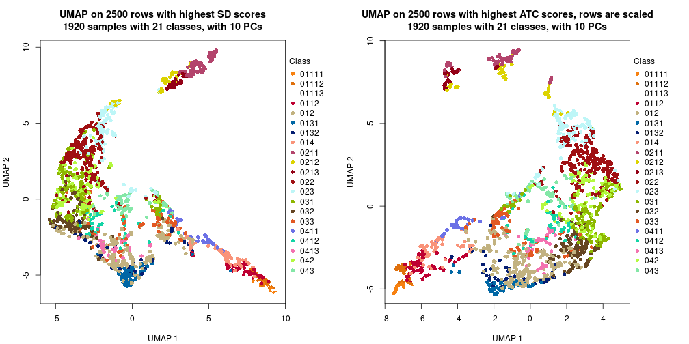</p>

</div>
<div id='tab-dimension-reduction-by-depth-13'>
<pre><code class="r">par(mfrow = c(1, 2))
dimension_reduction(res_rh, merge_node = merge_node_param(min_n_signatures = 1497),
    method = &quot;UMAP&quot;, top_value_method = &quot;SD&quot;, top_n = 2500, scale_rows = FALSE)
dimension_reduction(res_rh, merge_node = merge_node_param(min_n_signatures = 1497),
    method = &quot;UMAP&quot;, top_value_method = &quot;ATC&quot;, top_n = 2500, scale_rows = TRUE)
</code></pre>

<p></p>

</div>
<div id='tab-dimension-reduction-by-depth-14'>
<pre><code class="r">par(mfrow = c(1, 2))
dimension_reduction(res_rh, merge_node = merge_node_param(min_n_signatures = 1938),
    method = &quot;UMAP&quot;, top_value_method = &quot;SD&quot;, top_n = 2500, scale_rows = FALSE)
dimension_reduction(res_rh, merge_node = merge_node_param(min_n_signatures = 1938),
    method = &quot;UMAP&quot;, top_value_method = &quot;ATC&quot;, top_n = 2500, scale_rows = TRUE)
</code></pre>

<p></p>

</div>
<div id='tab-dimension-reduction-by-depth-15'>
<pre><code class="r">par(mfrow = c(1, 2))
dimension_reduction(res_rh, merge_node = merge_node_param(min_n_signatures = 2046),
    method = &quot;UMAP&quot;, top_value_method = &quot;SD&quot;, top_n = 2500, scale_rows = FALSE)
dimension_reduction(res_rh, merge_node = merge_node_param(min_n_signatures = 2046),
    method = &quot;UMAP&quot;, top_value_method = &quot;ATC&quot;, top_n = 2500, scale_rows = TRUE)
</code></pre>

<p></p>

</div>
<div id='tab-dimension-reduction-by-depth-16'>
<pre><code class="r">par(mfrow = c(1, 2))
dimension_reduction(res_rh, merge_node = merge_node_param(min_n_signatures = 2134),
    method = &quot;UMAP&quot;, top_value_method = &quot;SD&quot;, top_n = 2500, scale_rows = FALSE)
dimension_reduction(res_rh, merge_node = merge_node_param(min_n_signatures = 2134),
    method = &quot;UMAP&quot;, top_value_method = &quot;ATC&quot;, top_n = 2500, scale_rows = TRUE)
</code></pre>

<p></p>

</div>
<div id='tab-dimension-reduction-by-depth-17'>
<pre><code class="r">par(mfrow = c(1, 2))
dimension_reduction(res_rh, merge_node = merge_node_param(min_n_signatures = 2897),
    method = &quot;UMAP&quot;, top_value_method = &quot;SD&quot;, top_n = 2500, scale_rows = FALSE)
dimension_reduction(res_rh, merge_node = merge_node_param(min_n_signatures = 2897),
    method = &quot;UMAP&quot;, top_value_method = &quot;ATC&quot;, top_n = 2500, scale_rows = TRUE)
</code></pre>

<p></p>

</div>
<div id='tab-dimension-reduction-by-depth-18'>
<pre><code class="r">par(mfrow = c(1, 2))
dimension_reduction(res_rh, merge_node = merge_node_param(min_n_signatures = 3285),
    method = &quot;UMAP&quot;, top_value_method = &quot;SD&quot;, top_n = 2500, scale_rows = FALSE)
dimension_reduction(res_rh, merge_node = merge_node_param(min_n_signatures = 3285),
    method = &quot;UMAP&quot;, top_value_method = &quot;ATC&quot;, top_n = 2500, scale_rows = TRUE)
</code></pre>

<p></p>

</div>
<div id='tab-dimension-reduction-by-depth-19'>
<pre><code class="r">par(mfrow = c(1, 2))
dimension_reduction(res_rh, merge_node = merge_node_param(min_n_signatures = 3418),
    method = &quot;UMAP&quot;, top_value_method = &quot;SD&quot;, top_n = 2500, scale_rows = FALSE)
dimension_reduction(res_rh, merge_node = merge_node_param(min_n_signatures = 3418),
    method = &quot;UMAP&quot;, top_value_method = &quot;ATC&quot;, top_n = 2500, scale_rows = TRUE)
</code></pre>

<p></p>

</div>
<div id='tab-dimension-reduction-by-depth-20'>
<pre><code class="r">par(mfrow = c(1, 2))
dimension_reduction(res_rh, merge_node = merge_node_param(min_n_signatures = 5481),
    method = &quot;UMAP&quot;, top_value_method = &quot;SD&quot;, top_n = 2500, scale_rows = FALSE)
dimension_reduction(res_rh, merge_node = merge_node_param(min_n_signatures = 5481),
    method = &quot;UMAP&quot;, top_value_method = &quot;ATC&quot;, top_n = 2500, scale_rows = TRUE)
</code></pre>

<p></p>

</div>
<div id='tab-dimension-reduction-by-depth-21'>
<pre><code class="r">par(mfrow = c(1, 2))
dimension_reduction(res_rh, merge_node = merge_node_param(min_n_signatures = 12492),
    method = &quot;UMAP&quot;, top_value_method = &quot;SD&quot;, top_n = 2500, scale_rows = FALSE)
dimension_reduction(res_rh, merge_node = merge_node_param(min_n_signatures = 12492),
    method = &quot;UMAP&quot;, top_value_method = &quot;ATC&quot;, top_n = 2500, scale_rows = TRUE)
</code></pre>

<p></p>

</div>
<div id='tab-dimension-reduction-by-depth-22'>
<pre><code class="r">par(mfrow = c(1, 2))
dimension_reduction(res_rh, merge_node = merge_node_param(min_n_signatures = 12685),
    method = &quot;UMAP&quot;, top_value_method = &quot;SD&quot;, top_n = 2500, scale_rows = FALSE)
dimension_reduction(res_rh, merge_node = merge_node_param(min_n_signatures = 12685),
    method = &quot;UMAP&quot;, top_value_method = &quot;ATC&quot;, top_n = 2500, scale_rows = TRUE)
</code></pre>

<p>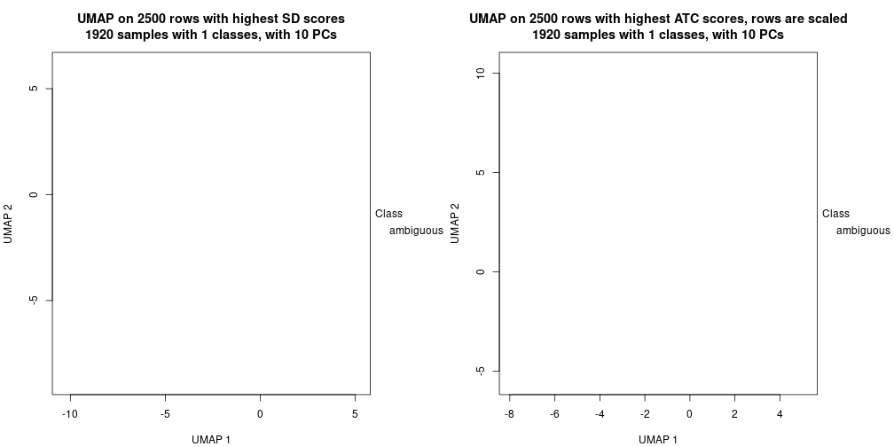</p>

</div>
</div>


### Signature heatmap

Signatures on the heatmap are the union of all signatures found on every node
on the hierarchy. The number of k-means on rows are automatically selected by the function.


<script>
$( function() {
	$( '#tabs-get-signatures-from-hierarchical-partition' ).tabs();
} );
</script>
<div id='tabs-get-signatures-from-hierarchical-partition'>
<ul>
<li><a href='#tab-get-signatures-from-hierarchical-partition-1'>n_signatures ≥ 630</a></li>
<li><a href='#tab-get-signatures-from-hierarchical-partition-2'>n_signatures ≥ 710</a></li>
<li><a href='#tab-get-signatures-from-hierarchical-partition-3'>n_signatures ≥ 741</a></li>
<li><a href='#tab-get-signatures-from-hierarchical-partition-4'>n_signatures ≥ 767</a></li>
<li><a href='#tab-get-signatures-from-hierarchical-partition-5'>n_signatures ≥ 848</a></li>
<li><a href='#tab-get-signatures-from-hierarchical-partition-6'>n_signatures ≥ 871</a></li>
<li><a href='#tab-get-signatures-from-hierarchical-partition-7'>n_signatures ≥ 904</a></li>
<li><a href='#tab-get-signatures-from-hierarchical-partition-8'>n_signatures ≥ 999</a></li>
<li><a href='#tab-get-signatures-from-hierarchical-partition-9'>n_signatures ≥ 1199</a></li>
<li><a href='#tab-get-signatures-from-hierarchical-partition-10'>n_signatures ≥ 1314</a></li>
<li><a href='#tab-get-signatures-from-hierarchical-partition-11'>n_signatures ≥ 1324</a></li>
<li><a href='#tab-get-signatures-from-hierarchical-partition-12'>n_signatures ≥ 1413</a></li>
<li><a href='#tab-get-signatures-from-hierarchical-partition-13'>n_signatures ≥ 1497</a></li>
<li><a href='#tab-get-signatures-from-hierarchical-partition-14'>n_signatures ≥ 1938</a></li>
<li><a href='#tab-get-signatures-from-hierarchical-partition-15'>n_signatures ≥ 2046</a></li>
<li><a href='#tab-get-signatures-from-hierarchical-partition-16'>n_signatures ≥ 2134</a></li>
<li><a href='#tab-get-signatures-from-hierarchical-partition-17'>n_signatures ≥ 2897</a></li>
<li><a href='#tab-get-signatures-from-hierarchical-partition-18'>n_signatures ≥ 3285</a></li>
<li><a href='#tab-get-signatures-from-hierarchical-partition-19'>n_signatures ≥ 3418</a></li>
<li><a href='#tab-get-signatures-from-hierarchical-partition-20'>n_signatures ≥ 5481</a></li>
<li><a href='#tab-get-signatures-from-hierarchical-partition-21'>n_signatures ≥ 12492</a></li>
<li><a href='#tab-get-signatures-from-hierarchical-partition-22'>n_signatures ≥ 12685</a></li>
</ul>
<div id='tab-get-signatures-from-hierarchical-partition-1'>
<pre><code class="r">get_signatures(res_rh, merge_node = merge_node_param(min_n_signatures = 630))
</code></pre>

<p></p>

</div>
<div id='tab-get-signatures-from-hierarchical-partition-2'>
<pre><code class="r">get_signatures(res_rh, merge_node = merge_node_param(min_n_signatures = 710))
</code></pre>

<p></p>

</div>
<div id='tab-get-signatures-from-hierarchical-partition-3'>
<pre><code class="r">get_signatures(res_rh, merge_node = merge_node_param(min_n_signatures = 741))
</code></pre>

<p></p>

</div>
<div id='tab-get-signatures-from-hierarchical-partition-4'>
<pre><code class="r">get_signatures(res_rh, merge_node = merge_node_param(min_n_signatures = 767))
</code></pre>

<p></p>

</div>
<div id='tab-get-signatures-from-hierarchical-partition-5'>
<pre><code class="r">get_signatures(res_rh, merge_node = merge_node_param(min_n_signatures = 848))
</code></pre>

<p></p>

</div>
<div id='tab-get-signatures-from-hierarchical-partition-6'>
<pre><code class="r">get_signatures(res_rh, merge_node = merge_node_param(min_n_signatures = 871))
</code></pre>

<p></p>

</div>
<div id='tab-get-signatures-from-hierarchical-partition-7'>
<pre><code class="r">get_signatures(res_rh, merge_node = merge_node_param(min_n_signatures = 904))
</code></pre>

<p></p>

</div>
<div id='tab-get-signatures-from-hierarchical-partition-8'>
<pre><code class="r">get_signatures(res_rh, merge_node = merge_node_param(min_n_signatures = 999))
</code></pre>

<p></p>

</div>
<div id='tab-get-signatures-from-hierarchical-partition-9'>
<pre><code class="r">get_signatures(res_rh, merge_node = merge_node_param(min_n_signatures = 1199))
</code></pre>

<p></p>

</div>
<div id='tab-get-signatures-from-hierarchical-partition-10'>
<pre><code class="r">get_signatures(res_rh, merge_node = merge_node_param(min_n_signatures = 1314))
</code></pre>

<p></p>

</div>
<div id='tab-get-signatures-from-hierarchical-partition-11'>
<pre><code class="r">get_signatures(res_rh, merge_node = merge_node_param(min_n_signatures = 1324))
</code></pre>

<p></p>

</div>
<div id='tab-get-signatures-from-hierarchical-partition-12'>
<pre><code class="r">get_signatures(res_rh, merge_node = merge_node_param(min_n_signatures = 1413))
</code></pre>

<p></p>

</div>
<div id='tab-get-signatures-from-hierarchical-partition-13'>
<pre><code class="r">get_signatures(res_rh, merge_node = merge_node_param(min_n_signatures = 1497))
</code></pre>

<p></p>

</div>
<div id='tab-get-signatures-from-hierarchical-partition-14'>
<pre><code class="r">get_signatures(res_rh, merge_node = merge_node_param(min_n_signatures = 1938))
</code></pre>

<p></p>

</div>
<div id='tab-get-signatures-from-hierarchical-partition-15'>
<pre><code class="r">get_signatures(res_rh, merge_node = merge_node_param(min_n_signatures = 2046))
</code></pre>

<p></p>

</div>
<div id='tab-get-signatures-from-hierarchical-partition-16'>
<pre><code class="r">get_signatures(res_rh, merge_node = merge_node_param(min_n_signatures = 2134))
</code></pre>

<p></p>

</div>
<div id='tab-get-signatures-from-hierarchical-partition-17'>
<pre><code class="r">get_signatures(res_rh, merge_node = merge_node_param(min_n_signatures = 2897))
</code></pre>

<p></p>

</div>
<div id='tab-get-signatures-from-hierarchical-partition-18'>
<pre><code class="r">get_signatures(res_rh, merge_node = merge_node_param(min_n_signatures = 3285))
</code></pre>

<p></p>

</div>
<div id='tab-get-signatures-from-hierarchical-partition-19'>
<pre><code class="r">get_signatures(res_rh, merge_node = merge_node_param(min_n_signatures = 3418))
</code></pre>

<p></p>

</div>
<div id='tab-get-signatures-from-hierarchical-partition-20'>
<pre><code class="r">get_signatures(res_rh, merge_node = merge_node_param(min_n_signatures = 5481))
</code></pre>

<p></p>

</div>
<div id='tab-get-signatures-from-hierarchical-partition-21'>
<pre><code class="r">get_signatures(res_rh, merge_node = merge_node_param(min_n_signatures = 12492))
</code></pre>

<p></p>

</div>
<div id='tab-get-signatures-from-hierarchical-partition-22'>
<pre><code class="r">get_signatures(res_rh, merge_node = merge_node_param(min_n_signatures = 12685))
</code></pre>

<pre><code>#&gt; Error in names(x) &lt;- value: &#39;names&#39; attribute [1] must be the same length as the vector [0]
</code></pre>

</div>
</div>


Compare signatures from different nodes:


```r
compare_signatures(res_rh, verbose = FALSE)
```


If there are too many signatures, `top_signatures = ...` can be set to only show the 
signatures with the highest FDRs. Note it only works on every node and the final signatures
are the union of all signatures of all nodes.


```r
# code only for demonstration
# e.g. to show the top 500 most significant rows on each node.
tb = get_signature(res_rh, top_signatures = 500)
```


## Results for each node


---------------------------------------------------


### Node0


Child nodes: 
                [Node01](#Node01)
        ,
                [Node02](#Node02)
        ,
                [Node03](#Node03)
        ,
                [Node04](#Node04)
        .


The object with results only for a single top-value method and a single partitioning method 
can be extracted as:

```r
res = res_rh["0"]
```

A summary of `res` and all the functions that can be applied to it:

```r
res
```

```
#> A 'DownSamplingConsensusPartition' object with k = 2, 3, 4.
#>   On a matrix with 22269 rows and 500 columns, randomly sampled from 1920 columns.
#>   Top rows (2037) are extracted by 'ATC' method.
#>   Subgroups are detected by 'skmeans' method.
#>   Performed in total 150 partitions by row resampling.
#>   Best k for subgroups seems to be 4.
#> 
#> Following methods can be applied to this 'DownSamplingConsensusPartition' object:
#>  [1] "cola_report"             "collect_classes"         "collect_plots"          
#>  [4] "collect_stats"           "colnames"                "compare_partitions"     
#>  [7] "compare_signatures"      "consensus_heatmap"       "dimension_reduction"    
#> [10] "functional_enrichment"   "get_anno_col"            "get_anno"               
#> [13] "get_classes"             "get_consensus"           "get_matrix"             
#> [16] "get_membership"          "get_param"               "get_signatures"         
#> [19] "get_stats"               "is_best_k"               "is_stable_k"            
#> [22] "membership_heatmap"      "ncol"                    "nrow"                   
#> [25] "plot_ecdf"               "predict_classes"         "rownames"               
#> [28] "select_partition_number" "show"                    "suggest_best_k"         
#> [31] "test_to_known_factors"   "top_rows_heatmap"
```

`collect_plots()` function collects all the plots made from `res` for all `k` (number of subgroups)
into one single page to provide an easy and fast comparison between different `k`.

```r
collect_plots(res)
```


The plots are:

- The first row: a plot of the eCDF (empirical cumulative distribution
  function) curves of the consensus matrix for each `k` and the heatmap of
  predicted classes for each `k`.
- The second row: heatmaps of the consensus matrix for each `k`.
- The third row: heatmaps of the membership matrix for each `k`.
- The fouth row: heatmaps of the signatures for each `k`.

All the plots in panels can be made by individual functions and they are
plotted later in this section.

`select_partition_number()` produces several plots showing different
statistics for choosing "optimized" `k`. There are following statistics:

- eCDF curves of the consensus matrix for each `k`;
- 1-PAC. [The PAC score](https://en.wikipedia.org/wiki/Consensus_clustering#Over-interpretation_potential_of_consensus_clustering)
  measures the proportion of the ambiguous subgrouping.
- Mean silhouette score.
- Concordance. The mean probability of fiting the consensus subgroup labels in all
  partitions.
- Area increased. Denote $A_k$ as the area under the eCDF curve for current
  `k`, the area increased is defined as $A_k - A_{k-1}$.
- Rand index. The percent of pairs of samples that are both in a same cluster
  or both are not in a same cluster in the partition of k and k-1.
- Jaccard index. The ratio of pairs of samples are both in a same cluster in
  the partition of k and k-1 and the pairs of samples are both in a same
  cluster in the partition k or k-1.

The detailed explanations of these statistics can be found in [the _cola_
vignette](https://jokergoo.github.io/cola_vignettes/cola.html#toc_13).

Generally speaking, higher 1-PAC score, higher mean silhouette score or higher
concordance corresponds to better partition. Rand index and Jaccard index
measure how similar the current partition is compared to partition with `k-1`.
If they are too similar, we won't accept `k` is better than `k-1`.

```r
select_partition_number(res)
```


The numeric values for all these statistics can be obtained by `get_stats()`.

```r
get_stats(res)
```

```
#>   k 1-PAC mean_silhouette concordance area_increased  Rand Jaccard
#> 2 2 1.000           0.990       0.996         0.5013 0.499   0.499
#> 3 3 1.000           0.982       0.993         0.2099 0.878   0.760
#> 4 4 0.997           0.955       0.979         0.0647 0.955   0.886
```

`suggest_best_k()` suggests the best $k$ based on these statistics. The rules are as follows:

- All $k$ with Jaccard index larger than 0.95 are removed because increasing
  $k$ does not provide enough extra information. If all $k$ are removed, it is
  marked as no subgroup is detected.
- For all $k$ with 1-PAC score larger than 0.9, the maximal $k$ is taken as
  the best $k$, and other $k$ are marked as optional $k$.
- If it does not fit the second rule. The $k$ with the maximal vote of the
  highest 1-PAC score, highest mean silhouette, and highest concordance is
  taken as the best $k$.

```r
suggest_best_k(res)
```

```
#> [1] 4
#> attr(,"optional")
#> [1] 2 3
```

There is also optional best $k$ = 2 3 that is worth to check.

Following is the table of the partitions (You need to click the **show/hide
code output** link to see it). The membership matrix (columns with name `p*`)
is inferred by
[`clue::cl_consensus()`](https://www.rdocumentation.org/link/cl_consensus?package=clue)
function with the `SE` method. Basically the value in the membership matrix
represents the probability to belong to a certain group. The finall subgroup
label for an item is determined with the group with highest probability it
belongs to.

In `get_classes()` function, the entropy is calculated from the membership
matrix and the silhouette score is calculated from the consensus matrix.


<script>
$( function() {
	$( '#tabs-node-0-get-classes' ).tabs();
} );
</script>
<div id='tabs-node-0-get-classes'>
<ul>
<li><a href='#tab-node-0-get-classes-1'>k = 2</a></li>
<li><a href='#tab-node-0-get-classes-2'>k = 3</a></li>
<li><a href='#tab-node-0-get-classes-3'>k = 4</a></li>
</ul>

<div id='tab-node-0-get-classes-1'>
<p><a id='tab-node-0-get-classes-1-a' style='color:#0366d6' href='#'>show/hide code output</a></p>
<pre><code class="r">get_classes(res, k = 2)
</code></pre>

<pre><code>#&gt;            class     p
#&gt; HSPC_007       2 0.000
#&gt; HSPC_013       2 1.000
#&gt; HSPC_019       2 0.000
#&gt; HSPC_025       2 1.000
#&gt; HSPC_031       1 1.000
#&gt; HSPC_037       2 0.000
#&gt; LT-HSC_001     2 0.000
#&gt; HSPC_001       1 0.747
#&gt; HSPC_008       2 0.249
#&gt; HSPC_014       2 0.249
#&gt; HSPC_020       2 0.000
#&gt; HSPC_026       1 0.000
#&gt; HSPC_032       2 0.000
#&gt; HSPC_038       2 1.000
#&gt; LT-HSC_002     2 0.751
#&gt; HSPC_002       2 0.000
#&gt; HSPC_009       2 1.000
#&gt; HSPC_015       2 0.000
#&gt; HSPC_021       2 1.000
#&gt; HSPC_027       1 0.000
#&gt; HSPC_033       2 0.751
#&gt; HSPC_039       2 0.000
#&gt; LT-HSC_003     2 0.502
#&gt; HSPC_003       1 0.498
#&gt; HSPC_010       2 0.000
#&gt; HSPC_016       1 0.000
#&gt; HSPC_022       1 0.000
#&gt; HSPC_028       1 1.000
#&gt; HSPC_034       1 0.000
#&gt; HSPC_040       1 0.502
#&gt; LT-HSC_004     2 0.000
#&gt; HSPC_004       1 1.000
#&gt; HSPC_011       2 0.502
#&gt; HSPC_017       2 0.000
#&gt; HSPC_023       2 0.249
#&gt; HSPC_029       2 0.000
#&gt; HSPC_035       2 0.253
#&gt; HSPC_041       2 0.000
#&gt; LT-HSC_005     2 0.000
#&gt; HSPC_005       2 0.000
#&gt; HSPC_012       2 1.000
#&gt; HSPC_018       2 0.253
#&gt; HSPC_024       2 0.000
#&gt; HSPC_030       1 0.498
#&gt; HSPC_036       1 0.000
#&gt; HSPC_042       1 1.000
#&gt; LT-HSC_006     2 0.249
#&gt; HSPC_006       1 0.000
#&gt; Prog_007       1 0.502
#&gt; Prog_013       1 0.747
#&gt; Prog_019       1 0.000
#&gt; Prog_025       1 0.000
#&gt; Prog_031       1 1.000
#&gt; Prog_037       1 0.000
#&gt; LT-HSC_007     2 0.249
#&gt; Prog_001       1 0.751
#&gt; Prog_008       1 0.000
#&gt; Prog_014       1 0.000
#&gt; Prog_020       1 0.000
#&gt; Prog_026       1 1.000
#&gt; Prog_032       1 0.000
#&gt; Prog_038       1 0.000
#&gt; LT-HSC_008     2 0.498
#&gt; Prog_002       1 0.000
#&gt; Prog_009       1 0.000
#&gt; Prog_015       1 0.000
#&gt; Prog_021       1 0.000
#&gt; Prog_027       1 0.000
#&gt; Prog_033       1 0.000
#&gt; Prog_039       1 0.000
#&gt; LT-HSC_009     2 0.253
#&gt; Prog_003       1 0.000
#&gt; Prog_010       2 0.000
#&gt; Prog_016       1 0.000
#&gt; Prog_022       1 0.000
#&gt; Prog_028       1 0.000
#&gt; Prog_034       2 0.000
#&gt; Prog_040       1 0.000
#&gt; LT-HSC_010     1 0.000
#&gt; Prog_004       1 0.249
#&gt; Prog_011       1 0.000
#&gt; Prog_017       1 0.000
#&gt; Prog_023       1 0.000
#&gt; Prog_029       1 0.000
#&gt; Prog_035       1 0.000
#&gt; Prog_041       2 0.747
#&gt; LT-HSC_011     2 1.000
#&gt; Prog_005       2 0.502
#&gt; Prog_012       2 0.000
#&gt; Prog_018       2 0.751
#&gt; Prog_024       1 0.000
#&gt; Prog_030       1 0.000
#&gt; Prog_036       1 0.000
#&gt; Prog_042       1 0.000
#&gt; LT-HSC_012     1 0.000
#&gt; Prog_006       1 0.000
#&gt; HSPC_049       1 1.000
#&gt; HSPC_055       2 0.751
#&gt; HSPC_061       2 0.253
#&gt; HSPC_067       2 0.502
#&gt; HSPC_073       2 0.000
#&gt; HSPC_079       1 0.000
#&gt; LT-HSC_013     2 0.000
#&gt; HSPC_043       2 0.751
#&gt; HSPC_050       2 1.000
#&gt; HSPC_056       2 0.498
#&gt; HSPC_062       1 0.000
#&gt; HSPC_068       2 0.249
#&gt; HSPC_074       2 0.498
#&gt; HSPC_080       1 0.751
#&gt; LT-HSC_014     2 0.000
#&gt; HSPC_044       2 1.000
#&gt; HSPC_051       1 1.000
#&gt; HSPC_057       2 0.502
#&gt; HSPC_063       1 0.000
#&gt; HSPC_069       1 1.000
#&gt; HSPC_075       2 0.751
#&gt; HSPC_081       1 0.249
#&gt; LT-HSC_015     2 0.000
#&gt; HSPC_045       1 0.751
#&gt; HSPC_052       2 1.000
#&gt; HSPC_058       2 0.000
#&gt; HSPC_064       1 0.000
#&gt; HSPC_070       1 1.000
#&gt; HSPC_076       1 0.249
#&gt; HSPC_082       2 0.000
#&gt; LT-HSC_016     2 0.000
#&gt; HSPC_046       1 0.751
#&gt; HSPC_053       1 0.751
#&gt; HSPC_059       2 0.000
#&gt; HSPC_065       1 0.000
#&gt; HSPC_071       1 0.000
#&gt; HSPC_077       1 0.000
#&gt; HSPC_083       2 0.000
#&gt; LT-HSC_017     2 0.000
#&gt; HSPC_047       2 0.249
#&gt; HSPC_054       2 0.000
#&gt; HSPC_060       1 1.000
#&gt; HSPC_066       1 1.000
#&gt; HSPC_072       1 0.000
#&gt; HSPC_078       2 1.000
#&gt; HSPC_084       2 0.751
#&gt; LT-HSC_018     2 0.000
#&gt; HSPC_048       1 1.000
#&gt; Prog_049       1 0.000
#&gt; Prog_055       1 0.000
#&gt; Prog_061       1 0.000
#&gt; Prog_067       1 0.000
#&gt; Prog_073       1 1.000
#&gt; Prog_079       1 0.000
#&gt; LT-HSC_019     2 0.000
#&gt; Prog_043       1 0.000
#&gt; Prog_050       1 0.000
#&gt; Prog_056       1 0.000
#&gt; Prog_062       2 1.000
#&gt; Prog_068       1 0.747
#&gt; Prog_074       1 0.000
#&gt; Prog_080       2 0.249
#&gt; LT-HSC_020     1 1.000
#&gt; Prog_044       1 0.751
#&gt; Prog_051       1 0.000
#&gt; Prog_057       1 0.000
#&gt; Prog_063       2 0.000
#&gt; Prog_069       1 0.000
#&gt; Prog_075       1 0.000
#&gt; Prog_081       1 0.000
#&gt; LT-HSC_021     1 0.253
#&gt; Prog_045       1 0.000
#&gt; Prog_052       2 0.751
#&gt; Prog_058       1 0.000
#&gt; Prog_064       1 0.000
#&gt; Prog_070       1 0.249
#&gt; Prog_076       1 0.000
#&gt; Prog_082       1 0.000
#&gt; LT-HSC_022     2 0.000
#&gt; Prog_046       1 0.000
#&gt; Prog_053       1 0.000
#&gt; Prog_059       1 0.000
#&gt; Prog_065       1 0.000
#&gt; Prog_071       1 0.000
#&gt; Prog_077       1 0.751
#&gt; Prog_083       1 0.000
#&gt; LT-HSC_023     2 0.000
#&gt; Prog_047       1 0.000
#&gt; Prog_054       1 0.000
#&gt; Prog_060       2 0.000
#&gt; Prog_066       1 0.751
#&gt; Prog_072       1 0.502
#&gt; Prog_078       1 0.000
#&gt; Prog_084       1 0.000
#&gt; LT-HSC_024     1 0.253
#&gt; Prog_048       1 0.253
#&gt; HSPC_091       2 1.000
#&gt; HSPC_097       2 1.000
#&gt; HSPC_103       2 0.253
#&gt; HSPC_109       2 1.000
#&gt; HSPC_115       2 0.249
#&gt; HSPC_121       2 0.000
#&gt; LT-HSC_025     2 0.498
#&gt; HSPC_085       2 0.249
#&gt; HSPC_092       2 0.000
#&gt; HSPC_098       2 0.751
#&gt; HSPC_104       2 0.000
#&gt; HSPC_110       2 1.000
#&gt; HSPC_116       2 0.000
#&gt; HSPC_122       2 0.000
#&gt; LT-HSC_026     2 0.751
#&gt; HSPC_086       2 0.000
#&gt; HSPC_093       2 0.249
#&gt; HSPC_099       2 0.249
#&gt; HSPC_105       2 0.000
#&gt; HSPC_111       2 0.000
#&gt; HSPC_117       2 1.000
#&gt; HSPC_123       2 0.249
#&gt; LT-HSC_027     2 0.000
#&gt; HSPC_087       2 0.000
#&gt; HSPC_094       1 0.000
#&gt; HSPC_100       1 1.000
#&gt; HSPC_106       2 0.000
#&gt; HSPC_112       2 0.000
#&gt; HSPC_118       1 0.502
#&gt; HSPC_124       2 0.000
#&gt; LT-HSC_028     1 0.249
#&gt; HSPC_088       1 0.751
#&gt; HSPC_095       2 0.000
#&gt; HSPC_101       1 0.000
#&gt; HSPC_107       2 0.000
#&gt; HSPC_113       2 1.000
#&gt; HSPC_119       2 0.000
#&gt; HSPC_125       1 0.498
#&gt; LT-HSC_029     2 0.000
#&gt; HSPC_089       1 0.249
#&gt; HSPC_096       2 0.751
#&gt; HSPC_102       1 0.000
#&gt; HSPC_108       1 1.000
#&gt; HSPC_114       1 1.000
#&gt; HSPC_120       2 0.000
#&gt; HSPC_126       1 1.000
#&gt; LT-HSC_030     2 0.000
#&gt; HSPC_090       1 0.747
#&gt; Prog_091       1 0.000
#&gt; Prog_097       1 0.000
#&gt; Prog_103       1 0.751
#&gt; Prog_109       1 0.000
#&gt; Prog_115       1 0.000
#&gt; Prog_121       2 0.000
#&gt; LT-HSC_031     1 0.751
#&gt; Prog_085       1 0.000
#&gt; Prog_092       1 0.249
#&gt; Prog_098       1 0.000
#&gt; Prog_104       2 0.502
#&gt; Prog_110       1 0.000
#&gt; Prog_116       1 0.751
#&gt; Prog_122       1 1.000
#&gt; LT-HSC_032     1 0.000
#&gt; Prog_086       2 0.498
#&gt; Prog_093       1 0.000
#&gt; Prog_099       1 0.498
#&gt; Prog_105       1 0.000
#&gt; Prog_111       1 0.000
#&gt; Prog_117       1 0.253
#&gt; Prog_123       1 0.000
#&gt; LT-HSC_033     2 0.000
#&gt; Prog_087       1 0.000
#&gt; Prog_094       1 0.000
#&gt; Prog_100       1 0.000
#&gt; Prog_106       1 1.000
#&gt; Prog_112       1 0.000
#&gt; Prog_118       1 0.000
#&gt; Prog_124       1 0.502
#&gt; LT-HSC_034     2 0.502
#&gt; Prog_088       2 1.000
#&gt; Prog_095       1 0.000
#&gt; Prog_101       1 0.000
#&gt; Prog_107       1 0.000
#&gt; Prog_113       1 0.000
#&gt; Prog_119       1 0.000
#&gt; Prog_125       1 0.000
#&gt; LT-HSC_035     2 1.000
#&gt; Prog_089       1 0.000
#&gt; Prog_096       1 0.747
#&gt; Prog_102       2 0.000
#&gt; Prog_108       1 0.000
#&gt; Prog_114       1 0.000
#&gt; Prog_120       2 1.000
#&gt; Prog_126       1 0.000
#&gt; LT-HSC_036     1 0.751
#&gt; Prog_090       1 0.000
#&gt; HSPC_133       2 1.000
#&gt; HSPC_139       2 0.000
#&gt; HSPC_145       2 0.249
#&gt; HSPC_151       2 1.000
#&gt; HSPC_157       2 1.000
#&gt; HSPC_163       2 0.000
#&gt; LT-HSC_037     2 0.000
#&gt; HSPC_127       1 0.000
#&gt; HSPC_134       2 1.000
#&gt; HSPC_140       2 0.498
#&gt; HSPC_146       2 1.000
#&gt; HSPC_152       2 0.249
#&gt; HSPC_158       2 1.000
#&gt; HSPC_164       2 0.249
#&gt; LT-HSC_038     2 0.000
#&gt; HSPC_128       2 0.000
#&gt; HSPC_135       2 0.000
#&gt; HSPC_141       2 0.751
#&gt; HSPC_147       2 0.000
#&gt; HSPC_153       2 0.751
#&gt; HSPC_159       2 0.751
#&gt; HSPC_165       2 0.751
#&gt; LT-HSC_039     2 0.249
#&gt; HSPC_129       2 0.000
#&gt; HSPC_136       2 0.249
#&gt; HSPC_142       1 0.747
#&gt; HSPC_148       2 0.751
#&gt; HSPC_154       2 1.000
#&gt; HSPC_160       2 0.498
#&gt; HSPC_166       2 1.000
#&gt; LT-HSC_040     2 1.000
#&gt; HSPC_130       2 0.502
#&gt; HSPC_137       2 0.000
#&gt; HSPC_143       2 1.000
#&gt; HSPC_149       2 0.249
#&gt; HSPC_155       2 0.502
#&gt; HSPC_161       2 1.000
#&gt; HSPC_167       2 0.498
#&gt; LT-HSC_041     2 0.502
#&gt; HSPC_131       2 1.000
#&gt; HSPC_138       1 0.498
#&gt; HSPC_144       1 0.253
#&gt; HSPC_150       2 0.000
#&gt; HSPC_156       1 1.000
#&gt; HSPC_162       1 1.000
#&gt; HSPC_168       1 0.000
#&gt; LT-HSC_042     2 0.249
#&gt; HSPC_132       1 0.249
#&gt; Prog_133       1 0.253
#&gt; Prog_139       1 0.000
#&gt; Prog_145       1 0.000
#&gt; Prog_151       1 1.000
#&gt; Prog_157       1 0.000
#&gt; Prog_163       1 0.000
#&gt; LT-HSC_043     1 0.000
#&gt; Prog_127       1 0.000
#&gt; Prog_134       2 1.000
#&gt; Prog_140       1 0.000
#&gt; Prog_146       1 0.000
#&gt; Prog_152       2 1.000
#&gt; Prog_158       1 0.000
#&gt; Prog_164       2 1.000
#&gt; LT-HSC_044     2 0.751
#&gt; Prog_128       1 0.000
#&gt; Prog_135       1 1.000
#&gt; Prog_141       1 0.000
#&gt; Prog_147       2 0.000
#&gt; Prog_153       1 0.000
#&gt; Prog_159       1 0.000
#&gt; Prog_165       2 1.000
#&gt; LT-HSC_045     2 1.000
#&gt; Prog_129       1 0.000
#&gt; Prog_136       1 0.000
#&gt; Prog_142       1 0.747
#&gt; Prog_148       2 1.000
#&gt; Prog_154       1 1.000
#&gt; Prog_160       2 0.498
#&gt; Prog_166       1 0.000
#&gt; LT-HSC_046     2 0.000
#&gt; Prog_130       1 0.000
#&gt; Prog_137       1 0.253
#&gt; Prog_143       1 0.000
#&gt; Prog_149       1 0.000
#&gt; Prog_155       1 0.000
#&gt; Prog_161       1 0.000
#&gt; Prog_167       1 0.000
#&gt; LT-HSC_047     2 0.000
#&gt; Prog_131       1 0.498
#&gt; Prog_138       2 0.000
#&gt; Prog_144       2 1.000
#&gt; Prog_150       1 0.000
#&gt; Prog_156       2 0.253
#&gt; Prog_162       1 0.000
#&gt; Prog_168       1 0.000
#&gt; LT-HSC_048     2 1.000
#&gt; Prog_132       1 0.000
#&gt; HSPC_175       2 1.000
#&gt; HSPC_181       2 0.000
#&gt; HSPC_187       2 0.751
#&gt; HSPC_193       1 0.000
#&gt; HSPC_199       1 0.751
#&gt; HSPC_205       2 1.000
#&gt; LT-HSC_049     2 1.000
#&gt; HSPC_169       2 0.000
#&gt; HSPC_176       2 0.000
#&gt; HSPC_182       2 0.000
#&gt; HSPC_188       2 0.000
#&gt; HSPC_194       2 0.000
#&gt; HSPC_200       2 0.000
#&gt; HSPC_206       1 0.000
#&gt; LT-HSC_050     2 0.751
#&gt; HSPC_170       2 0.249
#&gt; HSPC_177       2 0.000
#&gt; HSPC_183       1 1.000
#&gt; HSPC_189       2 0.000
#&gt; HSPC_195       1 0.000
#&gt; HSPC_201       2 0.000
#&gt; HSPC_207       1 0.498
#&gt; LT-HSC_051     2 0.000
#&gt; HSPC_171       2 0.249
#&gt; HSPC_178       2 0.000
#&gt; HSPC_184       2 0.747
#&gt; HSPC_190       1 0.000
#&gt; HSPC_196       2 0.000
#&gt; HSPC_202       1 1.000
#&gt; HSPC_208       2 0.249
#&gt; LT-HSC_052     1 0.000
#&gt; HSPC_172       1 0.498
#&gt; HSPC_179       1 0.000
#&gt; HSPC_185       2 0.502
#&gt; HSPC_191       2 0.000
#&gt; HSPC_197       2 0.000
#&gt; HSPC_203       2 0.249
#&gt; HSPC_209       2 0.498
#&gt; LT-HSC_053     2 0.000
#&gt; HSPC_173       2 0.000
#&gt; HSPC_180       2 1.000
#&gt; HSPC_186       1 0.000
#&gt; HSPC_192       2 0.249
#&gt; HSPC_198       2 0.000
#&gt; HSPC_204       1 0.000
#&gt; HSPC_210       2 0.751
#&gt; LT-HSC_054     2 0.000
#&gt; HSPC_174       1 1.000
#&gt; Prog_175       1 0.000
#&gt; Prog_181       2 0.498
#&gt; Prog_187       1 0.249
#&gt; Prog_193       2 0.000
#&gt; Prog_199       1 0.498
#&gt; Prog_205       1 0.000
#&gt; LT-HSC_055     1 1.000
#&gt; Prog_169       2 0.000
#&gt; Prog_176       1 1.000
#&gt; Prog_182       2 1.000
#&gt; Prog_188       1 0.000
#&gt; Prog_194       2 0.751
#&gt; Prog_200       2 1.000
#&gt; Prog_206       1 0.000
#&gt; LT-HSC_056     1 0.000
#&gt; Prog_170       1 0.000
#&gt; Prog_177       1 0.751
#&gt; Prog_183       1 0.253
#&gt; Prog_189       1 0.502
#&gt; Prog_195       2 0.502
#&gt; Prog_201       1 0.000
#&gt; Prog_207       1 0.000
#&gt; LT-HSC_057     2 0.000
#&gt; Prog_171       2 1.000
#&gt; Prog_178       1 0.000
#&gt; Prog_184       1 0.000
#&gt; Prog_190       1 0.000
#&gt; Prog_196       1 0.000
#&gt; Prog_202       2 0.000
#&gt; Prog_208       1 0.751
#&gt; LT-HSC_058     1 1.000
#&gt; Prog_172       1 0.000
#&gt; Prog_179       1 0.000
#&gt; Prog_185       1 0.000
#&gt; Prog_191       1 0.751
#&gt; Prog_197       1 0.000
#&gt; Prog_203       1 1.000
#&gt; Prog_209       1 0.000
#&gt; LT-HSC_059     2 0.747
#&gt; Prog_173       2 1.000
#&gt; Prog_180       1 1.000
#&gt; Prog_186       1 0.502
#&gt; Prog_192       1 0.000
#&gt; Prog_198       2 0.000
#&gt; Prog_204       2 0.249
#&gt; Prog_210       1 1.000
#&gt; LT-HSC_060     1 0.000
#&gt; Prog_174       2 0.000
#&gt; HSPC_217       2 0.000
#&gt; HSPC_223       2 0.000
#&gt; HSPC_229       2 0.751
#&gt; HSPC_235       2 0.000
#&gt; HSPC_241       2 0.000
#&gt; HSPC_247       2 0.747
#&gt; LT-HSC_061     2 0.000
#&gt; HSPC_211       2 1.000
#&gt; HSPC_218       2 0.498
#&gt; HSPC_224       2 0.000
#&gt; HSPC_230       2 0.751
#&gt; HSPC_236       2 1.000
#&gt; HSPC_242       2 0.498
#&gt; HSPC_248       2 0.498
#&gt; LT-HSC_062     2 0.000
#&gt; HSPC_212       2 0.000
#&gt; HSPC_219       1 1.000
#&gt; HSPC_225       2 0.498
#&gt; HSPC_231       2 0.498
#&gt; HSPC_237       2 0.249
#&gt; HSPC_243       1 0.000
#&gt; HSPC_249       2 0.249
#&gt; LT-HSC_063     1 0.000
#&gt; HSPC_213       1 0.000
#&gt; HSPC_220       2 1.000
#&gt; HSPC_226       2 0.000
#&gt; HSPC_232       2 0.000
#&gt; HSPC_238       2 0.747
#&gt; HSPC_244       1 1.000
#&gt; HSPC_250       1 0.000
#&gt; LT-HSC_064     1 0.000
#&gt; HSPC_214       1 0.000
#&gt; HSPC_221       2 0.000
#&gt; HSPC_227       2 0.253
#&gt; HSPC_233       2 0.249
#&gt; HSPC_239       2 1.000
#&gt; HSPC_245       2 0.253
#&gt; HSPC_251       1 0.253
#&gt; LT-HSC_065     2 0.000
#&gt; HSPC_215       2 1.000
#&gt; HSPC_222       2 0.000
#&gt; HSPC_228       2 0.751
#&gt; HSPC_234       2 0.000
#&gt; HSPC_240       1 0.751
#&gt; HSPC_246       2 0.253
#&gt; HSPC_252       2 0.000
#&gt; LT-HSC_066     2 0.000
#&gt; HSPC_216       1 0.249
#&gt; Prog_217       1 0.000
#&gt; Prog_223       2 0.751
#&gt; Prog_229       1 0.000
#&gt; Prog_235       2 1.000
#&gt; Prog_241       2 0.751
#&gt; Prog_247       1 0.000
#&gt; LT-HSC_067     2 0.000
#&gt; Prog_211       1 0.000
#&gt; Prog_218       1 0.000
#&gt; Prog_224       1 0.000
#&gt; Prog_230       1 0.000
#&gt; Prog_236       1 0.751
#&gt; Prog_242       1 0.000
#&gt; Prog_248       2 0.249
#&gt; LT-HSC_068     1 1.000
#&gt; Prog_212       1 0.000
#&gt; Prog_219       2 0.249
#&gt; Prog_225       1 0.498
#&gt; Prog_231       1 0.498
#&gt; Prog_237       2 0.249
#&gt; Prog_243       1 0.249
#&gt; Prog_249       1 0.000
#&gt; LT-HSC_069     1 1.000
#&gt; Prog_213       1 0.502
#&gt; Prog_220       2 0.751
#&gt; Prog_226       1 1.000
#&gt; Prog_232       1 0.000
#&gt; Prog_238       1 0.000
#&gt; Prog_244       1 1.000
#&gt; Prog_250       1 0.000
#&gt; LT-HSC_070     2 1.000
#&gt; Prog_214       1 0.000
#&gt; Prog_221       1 0.000
#&gt; Prog_227       1 0.000
#&gt; Prog_233       1 0.000
#&gt; Prog_239       1 0.000
#&gt; Prog_245       1 1.000
#&gt; Prog_251       2 1.000
#&gt; LT-HSC_071     1 1.000
#&gt; Prog_215       1 0.000
#&gt; Prog_222       1 1.000
#&gt; Prog_228       1 0.000
#&gt; Prog_234       1 0.249
#&gt; Prog_240       1 0.747
#&gt; Prog_246       1 0.000
#&gt; Prog_252       1 0.751
#&gt; LT-HSC_072     1 0.000
#&gt; Prog_216       1 0.000
#&gt; HSPC_259       2 0.000
#&gt; HSPC_265       2 0.253
#&gt; HSPC_271       1 0.000
#&gt; HSPC_277       2 0.000
#&gt; HSPC_283       2 0.249
#&gt; HSPC_289       2 0.751
#&gt; LT-HSC_073     2 0.000
#&gt; HSPC_253       1 0.000
#&gt; HSPC_260       2 0.000
#&gt; HSPC_266       2 1.000
#&gt; HSPC_272       2 0.000
#&gt; HSPC_278       2 0.000
#&gt; HSPC_284       2 0.000
#&gt; HSPC_290       1 0.000
#&gt; LT-HSC_074     2 0.253
#&gt; HSPC_254       2 0.000
#&gt; HSPC_261       1 1.000
#&gt; HSPC_267       1 1.000
#&gt; HSPC_273       2 0.249
#&gt; HSPC_279       2 0.498
#&gt; HSPC_285       1 0.000
#&gt; HSPC_291       1 0.747
#&gt; LT-HSC_075     1 1.000
#&gt; HSPC_255       1 1.000
#&gt; HSPC_262       2 0.000
#&gt; HSPC_268       1 0.000
#&gt; HSPC_274       2 0.000
#&gt; HSPC_280       2 0.751
#&gt; HSPC_286       2 0.000
#&gt; HSPC_292       1 0.498
#&gt; LT-HSC_076     2 0.498
#&gt; HSPC_256       1 0.000
#&gt; HSPC_263       2 1.000
#&gt; HSPC_269       1 0.249
#&gt; HSPC_275       1 0.000
#&gt; HSPC_281       2 0.498
#&gt; HSPC_287       1 0.000
#&gt; HSPC_293       1 0.498
#&gt; LT-HSC_077     2 0.000
#&gt; HSPC_257       1 0.000
#&gt; HSPC_264       2 0.000
#&gt; HSPC_270       1 0.751
#&gt; HSPC_276       1 0.747
#&gt; HSPC_282       1 0.747
#&gt; HSPC_288       1 0.000
#&gt; HSPC_294       1 0.000
#&gt; LT-HSC_078     2 0.000
#&gt; HSPC_258       1 0.249
#&gt; Prog_259       2 0.000
#&gt; Prog_265       1 0.000
#&gt; Prog_271       1 0.000
#&gt; Prog_277       2 0.000
#&gt; Prog_283       2 0.751
#&gt; Prog_289       2 1.000
#&gt; LT-HSC_079     2 0.249
#&gt; Prog_253       1 0.000
#&gt; Prog_260       1 0.000
#&gt; Prog_266       1 0.747
#&gt; Prog_272       1 0.000
#&gt; Prog_278       1 0.000
#&gt; Prog_284       1 0.000
#&gt; Prog_290       1 0.000
#&gt; LT-HSC_080     1 0.751
#&gt; Prog_254       1 0.000
#&gt; Prog_261       1 0.000
#&gt; Prog_267       1 0.000
#&gt; Prog_273       1 0.000
#&gt; Prog_279       1 0.000
#&gt; Prog_285       1 0.000
#&gt; Prog_291       1 0.000
#&gt; LT-HSC_081     1 1.000
#&gt; Prog_255       1 0.000
#&gt; Prog_262       1 0.502
#&gt; Prog_268       1 0.000
#&gt; Prog_274       1 0.000
#&gt; Prog_280       1 1.000
#&gt; Prog_286       1 0.000
#&gt; Prog_292       1 1.000
#&gt; LT-HSC_082     1 1.000
#&gt; Prog_256       2 0.249
#&gt; Prog_263       1 0.000
#&gt; Prog_269       1 0.000
#&gt; Prog_275       1 0.000
#&gt; Prog_281       1 0.000
#&gt; Prog_287       1 0.502
#&gt; Prog_293       1 0.000
#&gt; LT-HSC_083     2 0.000
#&gt; Prog_257       2 1.000
#&gt; Prog_264       2 0.000
#&gt; Prog_270       1 0.000
#&gt; Prog_276       1 1.000
#&gt; Prog_282       1 0.000
#&gt; Prog_288       1 0.000
#&gt; Prog_294       1 0.751
#&gt; LT-HSC_084     1 0.747
#&gt; Prog_258       1 0.253
#&gt; HSPC_301       2 0.498
#&gt; HSPC_307       2 1.000
#&gt; HSPC_313       2 1.000
#&gt; HSPC_319       2 0.751
#&gt; HSPC_325       2 0.249
#&gt; HSPC_331       2 0.249
#&gt; LT-HSC_085     2 0.502
#&gt; HSPC_295       1 0.000
#&gt; HSPC_302       2 1.000
#&gt; HSPC_308       2 1.000
#&gt; HSPC_314       2 1.000
#&gt; HSPC_320       2 0.249
#&gt; HSPC_326       2 0.249
#&gt; HSPC_332       1 0.000
#&gt; LT-HSC_086     2 1.000
#&gt; HSPC_296       2 1.000
#&gt; HSPC_303       1 0.000
#&gt; HSPC_309       2 0.751
#&gt; HSPC_315       2 0.000
#&gt; HSPC_321       2 0.751
#&gt; HSPC_327       1 0.000
#&gt; HSPC_333       1 0.498
#&gt; LT-HSC_087     2 0.502
#&gt; HSPC_297       2 0.751
#&gt; HSPC_304       1 0.498
#&gt; HSPC_310       2 1.000
#&gt; HSPC_316       2 1.000
#&gt; HSPC_322       1 0.747
#&gt; HSPC_328       2 0.249
#&gt; HSPC_334       2 0.751
#&gt; LT-HSC_088     2 1.000
#&gt; HSPC_298       1 0.498
#&gt; HSPC_305       1 0.249
#&gt; HSPC_311       2 1.000
#&gt; HSPC_317       2 0.253
#&gt; HSPC_323       1 0.000
#&gt; HSPC_329       2 0.502
#&gt; HSPC_335       2 0.249
#&gt; LT-HSC_089     2 0.751
#&gt; HSPC_299       1 0.000
#&gt; HSPC_306       1 0.747
#&gt; HSPC_312       1 0.000
#&gt; HSPC_318       2 0.249
#&gt; HSPC_324       2 0.253
#&gt; HSPC_330       2 0.000
#&gt; HSPC_336       2 1.000
#&gt; LT-HSC_090     1 1.000
#&gt; HSPC_300       1 0.498
#&gt; Prog_301       1 0.000
#&gt; Prog_307       1 0.253
#&gt; Prog_313       1 0.000
#&gt; Prog_319       1 0.498
#&gt; Prog_325       1 0.000
#&gt; Prog_331       1 0.000
#&gt; LT-HSC_091     1 0.000
#&gt; Prog_295       1 0.000
#&gt; Prog_302       2 1.000
#&gt; Prog_308       1 0.751
#&gt; Prog_314       1 0.751
#&gt; Prog_320       1 0.000
#&gt; Prog_326       1 0.000
#&gt; Prog_332       1 0.751
#&gt; LT-HSC_092     2 0.747
#&gt; Prog_296       1 0.000
#&gt; Prog_303       2 1.000
#&gt; Prog_309       2 0.751
#&gt; Prog_315       1 0.000
#&gt; Prog_321       1 0.000
#&gt; Prog_327       1 0.000
#&gt; Prog_333       2 1.000
#&gt; LT-HSC_093     2 0.000
#&gt; Prog_297       2 1.000
#&gt; Prog_304       1 0.000
#&gt; Prog_310       2 0.747
#&gt; Prog_316       1 0.000
#&gt; Prog_322       2 0.751
#&gt; Prog_328       1 0.498
#&gt; Prog_334       1 0.000
#&gt; LT-HSC_094     2 0.751
#&gt; Prog_298       1 0.249
#&gt; Prog_305       1 0.000
#&gt; Prog_311       2 1.000
#&gt; Prog_317       2 0.498
#&gt; Prog_323       1 0.000
#&gt; Prog_329       1 0.000
#&gt; Prog_335       1 0.000
#&gt; LT-HSC_095     1 0.000
#&gt; Prog_299       1 0.000
#&gt; Prog_306       2 0.000
#&gt; Prog_312       1 0.000
#&gt; Prog_318       1 0.000
#&gt; Prog_324       1 0.000
#&gt; Prog_330       1 1.000
#&gt; Prog_336       1 0.249
#&gt; LT-HSC_096     1 0.000
#&gt; Prog_300       1 0.000
#&gt; HSPC_343       1 0.000
#&gt; HSPC_349       1 0.498
#&gt; HSPC_355       2 0.000
#&gt; HSPC_361       2 0.751
#&gt; HSPC_367       2 0.751
#&gt; HSPC_373       2 0.249
#&gt; LT-HSC_097     2 0.751
#&gt; HSPC_337       2 1.000
#&gt; HSPC_344       1 0.000
#&gt; HSPC_350       2 0.000
#&gt; HSPC_356       2 0.249
#&gt; HSPC_362       1 0.000
#&gt; HSPC_368       1 0.249
#&gt; HSPC_374       1 0.502
#&gt; LT-HSC_098     1 0.000
#&gt; HSPC_338       1 0.000
#&gt; HSPC_345       2 0.747
#&gt; HSPC_351       2 1.000
#&gt; HSPC_357       2 0.000
#&gt; HSPC_363       2 0.000
#&gt; HSPC_369       2 0.000
#&gt; HSPC_375       2 0.000
#&gt; LT-HSC_099     2 0.502
#&gt; HSPC_339       1 0.253
#&gt; HSPC_346       1 0.000
#&gt; HSPC_352       1 0.249
#&gt; HSPC_358       1 0.000
#&gt; HSPC_364       2 1.000
#&gt; HSPC_370       1 0.000
#&gt; HSPC_376       2 0.000
#&gt; LT-HSC_100     1 0.000
#&gt; HSPC_340       2 1.000
#&gt; HSPC_347       2 0.000
#&gt; HSPC_353       1 0.000
#&gt; HSPC_359       1 0.502
#&gt; HSPC_365       2 0.000
#&gt; HSPC_371       1 0.000
#&gt; HSPC_377       1 0.000
#&gt; LT-HSC_101     2 1.000
#&gt; HSPC_341       1 0.249
#&gt; HSPC_348       1 0.000
#&gt; HSPC_354       2 0.249
#&gt; HSPC_360       2 1.000
#&gt; HSPC_366       2 0.000
#&gt; HSPC_372       1 0.747
#&gt; HSPC_378       2 0.751
#&gt; LT-HSC_102     1 0.000
#&gt; HSPC_342       1 0.000
#&gt; Prog_343       1 0.249
#&gt; Prog_349       1 0.000
#&gt; Prog_355       1 0.000
#&gt; Prog_361       1 0.000
#&gt; Prog_367       1 0.000
#&gt; Prog_373       1 0.000
#&gt; LT-HSC_103     1 1.000
#&gt; Prog_337       1 0.000
#&gt; Prog_344       2 0.000
#&gt; Prog_350       1 0.000
#&gt; Prog_356       1 0.000
#&gt; Prog_362       1 0.000
#&gt; Prog_368       1 0.000
#&gt; Prog_374       1 0.000
#&gt; LT-HSC_104     2 0.000
#&gt; Prog_338       1 1.000
#&gt; Prog_345       1 0.000
#&gt; Prog_351       1 0.000
#&gt; Prog_357       1 0.000
#&gt; Prog_363       1 0.000
#&gt; Prog_369       1 0.000
#&gt; Prog_375       1 0.000
#&gt; LT-HSC_105     1 0.000
#&gt; Prog_339       1 0.000
#&gt; Prog_346       1 0.000
#&gt; Prog_352       1 0.000
#&gt; Prog_358       2 0.253
#&gt; Prog_364       1 0.000
#&gt; Prog_370       1 0.253
#&gt; Prog_376       1 0.000
#&gt; LT-HSC_106     1 0.000
#&gt; Prog_340       1 0.000
#&gt; Prog_347       2 0.498
#&gt; Prog_353       1 0.000
#&gt; Prog_359       1 0.000
#&gt; Prog_365       2 0.747
#&gt; Prog_371       1 0.249
#&gt; Prog_377       1 0.000
#&gt; LT-HSC_107     2 0.747
#&gt; Prog_341       1 0.000
#&gt; Prog_348       2 0.000
#&gt; Prog_354       1 0.000
#&gt; Prog_360       1 0.000
#&gt; Prog_366       1 0.000
#&gt; Prog_372       1 0.000
#&gt; Prog_378       1 0.000
#&gt; LT-HSC_108     1 0.000
#&gt; Prog_342       1 0.000
#&gt; HSPC_385       2 1.000
#&gt; HSPC_391       1 0.000
#&gt; HSPC_397       2 0.000
#&gt; HSPC_403       1 1.000
#&gt; HSPC_409       2 0.000
#&gt; HSPC_415       2 0.000
#&gt; HSPC_421       1 0.000
#&gt; HSPC_379       2 0.000
#&gt; HSPC_386       2 0.249
#&gt; HSPC_392       1 1.000
#&gt; HSPC_398       1 0.502
#&gt; HSPC_404       1 0.000
#&gt; HSPC_410       1 0.000
#&gt; HSPC_416       1 0.249
#&gt; HSPC_422       1 1.000
#&gt; HSPC_380       1 0.000
#&gt; HSPC_387       1 0.000
#&gt; HSPC_393       1 0.000
#&gt; HSPC_399       2 0.751
#&gt; HSPC_405       1 1.000
#&gt; HSPC_411       1 0.000
#&gt; HSPC_417       1 1.000
#&gt; HSPC_423       1 0.000
#&gt; HSPC_381       2 0.000
#&gt; HSPC_388       1 1.000
#&gt; HSPC_394       2 0.000
#&gt; HSPC_400       1 1.000
#&gt; HSPC_406       2 0.000
#&gt; HSPC_412       1 0.000
#&gt; HSPC_418       1 1.000
#&gt; HSPC_424       1 1.000
#&gt; HSPC_382       1 0.000
#&gt; HSPC_389       1 0.000
#&gt; HSPC_395       2 0.751
#&gt; HSPC_401       2 0.249
#&gt; HSPC_407       1 0.253
#&gt; HSPC_413       1 0.751
#&gt; HSPC_419       1 0.000
#&gt; HSPC_425       1 0.000
#&gt; HSPC_383       2 0.747
#&gt; HSPC_390       2 1.000
#&gt; HSPC_396       1 1.000
#&gt; HSPC_402       1 1.000
#&gt; HSPC_408       1 0.000
#&gt; HSPC_414       2 0.249
#&gt; HSPC_420       1 1.000
#&gt; HSPC_426       2 0.249
#&gt; HSPC_384       2 0.000
#&gt; Prog_385       1 0.000
#&gt; Prog_391       2 0.751
#&gt; Prog_397       1 0.000
#&gt; Prog_403       1 0.000
#&gt; Prog_409       1 0.000
#&gt; Prog_415       1 0.000
#&gt; Prog_421       1 0.000
#&gt; Prog_379       1 0.000
#&gt; Prog_386       1 0.000
#&gt; Prog_392       1 1.000
#&gt; Prog_398       1 0.000
#&gt; Prog_404       1 0.000
#&gt; Prog_410       1 0.000
#&gt; Prog_416       1 0.000
#&gt; Prog_422       1 0.000
#&gt; Prog_380       1 0.000
#&gt; Prog_387       1 0.000
#&gt; Prog_393       1 0.000
#&gt; Prog_399       1 0.000
#&gt; Prog_405       1 0.253
#&gt; Prog_411       2 0.751
#&gt; Prog_417       1 0.000
#&gt; Prog_423       1 0.000
#&gt; Prog_381       1 0.000
#&gt; Prog_388       1 0.000
#&gt; Prog_394       1 0.000
#&gt; Prog_400       2 0.000
#&gt; Prog_406       1 0.000
#&gt; Prog_412       1 0.000
#&gt; Prog_418       1 0.000
#&gt; Prog_424       1 0.000
#&gt; Prog_382       1 0.751
#&gt; Prog_389       1 0.000
#&gt; Prog_395       1 0.000
#&gt; Prog_401       1 0.000
#&gt; Prog_407       1 0.000
#&gt; Prog_413       1 0.502
#&gt; Prog_419       1 0.000
#&gt; Prog_425       1 0.000
#&gt; Prog_383       1 0.000
#&gt; Prog_390       2 1.000
#&gt; Prog_396       1 0.000
#&gt; Prog_402       1 0.000
#&gt; Prog_408       1 0.000
#&gt; Prog_414       1 0.000
#&gt; Prog_420       1 0.000
#&gt; Prog_426       1 0.000
#&gt; Prog_384       1 0.000
#&gt; HSPC_433       2 0.249
#&gt; HSPC_439       2 0.253
#&gt; HSPC_445       2 0.000
#&gt; HSPC_451       2 0.000
#&gt; HSPC_457       2 0.000
#&gt; HSPC_463       1 1.000
#&gt; LT-HSC_109     2 0.000
#&gt; HSPC_427       2 0.498
#&gt; HSPC_434       2 0.249
#&gt; HSPC_440       2 1.000
#&gt; HSPC_446       2 0.498
#&gt; HSPC_452       2 0.000
#&gt; HSPC_458       2 0.249
#&gt; HSPC_464       2 0.000
#&gt; LT-HSC_110     2 0.000
#&gt; HSPC_428       2 0.000
#&gt; HSPC_435       2 0.000
#&gt; HSPC_441       1 1.000
#&gt; HSPC_447       1 0.000
#&gt; HSPC_453       1 1.000
#&gt; HSPC_459       1 0.000
#&gt; HSPC_465       2 0.000
#&gt; LT-HSC_111     2 0.000
#&gt; HSPC_429       2 0.000
#&gt; HSPC_436       1 0.000
#&gt; HSPC_442       1 1.000
#&gt; HSPC_448       1 1.000
#&gt; HSPC_454       1 1.000
#&gt; HSPC_460       1 0.249
#&gt; HSPC_466       2 0.253
#&gt; LT-HSC_112     1 1.000
#&gt; HSPC_430       1 1.000
#&gt; HSPC_437       2 0.000
#&gt; HSPC_443       2 0.253
#&gt; HSPC_449       2 0.000
#&gt; HSPC_455       2 0.502
#&gt; HSPC_461       2 0.000
#&gt; HSPC_467       1 1.000
#&gt; LT-HSC_113     1 1.000
#&gt; HSPC_431       2 0.000
#&gt; HSPC_438       2 0.000
#&gt; HSPC_444       2 0.000
#&gt; HSPC_450       2 0.000
#&gt; HSPC_456       1 1.000
#&gt; HSPC_462       1 1.000
#&gt; HSPC_468       1 1.000
#&gt; LT-HSC_114     2 0.000
#&gt; HSPC_432       2 0.253
#&gt; Prog_433       2 0.000
#&gt; Prog_439       1 1.000
#&gt; Prog_445       1 0.249
#&gt; Prog_451       1 0.000
#&gt; Prog_457       1 0.000
#&gt; Prog_463       1 0.000
#&gt; LT-HSC_115     1 0.498
#&gt; Prog_427       2 0.000
#&gt; Prog_434       1 0.000
#&gt; Prog_440       1 0.751
#&gt; Prog_446       1 1.000
#&gt; Prog_452       2 0.000
#&gt; Prog_458       2 1.000
#&gt; Prog_464       1 1.000
#&gt; LT-HSC_116     2 0.249
#&gt; Prog_428       1 0.502
#&gt; Prog_435       1 0.000
#&gt; Prog_441       1 0.000
#&gt; Prog_447       1 0.000
#&gt; Prog_453       1 0.000
#&gt; Prog_459       1 0.249
#&gt; Prog_465       2 0.498
#&gt; LT-HSC_117     2 0.000
#&gt; Prog_429       1 0.000
#&gt; Prog_436       1 0.249
#&gt; Prog_442       2 0.498
#&gt; Prog_448       1 0.502
#&gt; Prog_454       1 0.000
#&gt; Prog_460       2 1.000
#&gt; Prog_466       1 0.000
#&gt; LT-HSC_118     2 0.751
#&gt; Prog_430       1 0.000
#&gt; Prog_437       1 0.249
#&gt; Prog_443       1 0.000
#&gt; Prog_449       1 0.000
#&gt; Prog_455       1 1.000
#&gt; Prog_461       2 0.000
#&gt; Prog_467       1 1.000
#&gt; LT-HSC_119     2 0.000
#&gt; Prog_431       1 0.502
#&gt; Prog_438       2 0.000
#&gt; Prog_444       1 0.000
#&gt; Prog_450       1 0.000
#&gt; Prog_456       1 0.000
#&gt; Prog_462       2 0.249
#&gt; Prog_468       1 0.000
#&gt; LT-HSC_120     1 0.502
#&gt; Prog_432       2 1.000
#&gt; HSPC_475       2 0.000
#&gt; HSPC_481       2 0.249
#&gt; HSPC_487       2 0.000
#&gt; HSPC_493       2 0.502
#&gt; HSPC_499       2 0.249
#&gt; HSPC_505       2 0.000
#&gt; LT-HSC_121     2 0.000
#&gt; HSPC_469       2 0.000
#&gt; HSPC_476       2 0.000
#&gt; HSPC_482       2 0.249
#&gt; HSPC_488       2 1.000
#&gt; HSPC_494       2 0.253
#&gt; HSPC_500       2 0.000
#&gt; HSPC_506       2 0.000
#&gt; LT-HSC_122     2 0.253
#&gt; HSPC_470       2 1.000
#&gt; HSPC_477       1 1.000
#&gt; HSPC_483       2 0.000
#&gt; HSPC_489       1 1.000
#&gt; HSPC_495       2 1.000
#&gt; HSPC_501       2 1.000
#&gt; HSPC_507       2 0.000
#&gt; LT-HSC_123     2 0.000
#&gt; HSPC_471       2 0.000
#&gt; HSPC_478       2 0.000
#&gt; HSPC_484       2 0.000
#&gt; HSPC_490       2 0.000
#&gt; HSPC_496       2 0.000
#&gt; HSPC_502       1 0.751
#&gt; HSPC_508       1 0.000
#&gt; LT-HSC_124     2 1.000
#&gt; HSPC_472       1 1.000
#&gt; HSPC_479       1 1.000
#&gt; HSPC_485       1 0.000
#&gt; HSPC_491       1 0.253
#&gt; HSPC_497       2 0.000
#&gt; HSPC_503       1 0.000
#&gt; HSPC_509       2 0.000
#&gt; LT-HSC_125     1 1.000
#&gt; HSPC_473       1 1.000
#&gt; HSPC_480       1 0.000
#&gt; HSPC_486       2 0.000
#&gt; HSPC_492       1 0.249
#&gt; HSPC_498       1 0.751
#&gt; HSPC_504       2 0.253
#&gt; HSPC_510       1 0.000
#&gt; LT-HSC_126     1 1.000
#&gt; HSPC_474       1 0.498
#&gt; Prog_475       1 0.000
#&gt; Prog_481       1 0.502
#&gt; Prog_487       1 0.000
#&gt; Prog_493       1 0.498
#&gt; Prog_499       1 0.000
#&gt; Prog_505       1 0.000
#&gt; LT-HSC_127     2 0.000
#&gt; Prog_469       2 0.498
#&gt; Prog_476       1 0.249
#&gt; Prog_482       1 0.747
#&gt; Prog_488       1 0.249
#&gt; Prog_494       2 1.000
#&gt; Prog_500       1 0.000
#&gt; Prog_506       1 0.000
#&gt; LT-HSC_128     1 0.751
#&gt; Prog_470       1 0.000
#&gt; Prog_477       1 0.000
#&gt; Prog_483       2 1.000
#&gt; Prog_489       1 0.502
#&gt; Prog_495       1 0.751
#&gt; Prog_501       1 1.000
#&gt; Prog_507       1 0.000
#&gt; LT-HSC_129     2 0.000
#&gt; Prog_471       1 0.000
#&gt; Prog_478       1 0.000
#&gt; Prog_484       1 0.000
#&gt; Prog_490       2 1.000
#&gt; Prog_496       1 1.000
#&gt; Prog_502       1 0.000
#&gt; Prog_508       1 0.000
#&gt; LT-HSC_130     1 1.000
#&gt; Prog_472       2 0.249
#&gt; Prog_479       1 0.498
#&gt; Prog_485       1 0.249
#&gt; Prog_491       1 0.000
#&gt; Prog_497       1 0.000
#&gt; Prog_503       2 0.747
#&gt; Prog_509       1 0.751
#&gt; LT-HSC_131     2 0.000
#&gt; Prog_473       1 0.000
#&gt; Prog_480       2 1.000
#&gt; Prog_486       1 0.000
#&gt; Prog_492       2 1.000
#&gt; Prog_498       2 0.000
#&gt; Prog_504       1 0.000
#&gt; Prog_510       2 0.253
#&gt; LT-HSC_132     1 0.000
#&gt; Prog_474       1 1.000
#&gt; HSPC_517       2 0.000
#&gt; HSPC_523       1 0.502
#&gt; HSPC_529       2 0.000
#&gt; HSPC_535       2 1.000
#&gt; HSPC_541       2 0.751
#&gt; HSPC_547       1 0.747
#&gt; LT-HSC_133     2 0.000
#&gt; HSPC_511       2 0.249
#&gt; HSPC_518       2 0.000
#&gt; HSPC_524       2 0.000
#&gt; HSPC_530       2 0.000
#&gt; HSPC_536       2 0.000
#&gt; HSPC_542       2 0.000
#&gt; HSPC_548       2 0.000
#&gt; LT-HSC_134     2 0.249
#&gt; HSPC_512       1 1.000
#&gt; HSPC_519       2 0.000
#&gt; HSPC_525       2 0.000
#&gt; HSPC_531       2 0.498
#&gt; HSPC_537       2 0.747
#&gt; HSPC_543       2 0.000
#&gt; HSPC_549       2 0.000
#&gt; LT-HSC_135     2 0.000
#&gt; HSPC_513       2 0.000
#&gt; HSPC_520       2 0.000
#&gt; HSPC_526       1 1.000
#&gt; HSPC_532       1 0.249
#&gt; HSPC_538       1 1.000
#&gt; HSPC_544       1 0.000
#&gt; HSPC_550       2 0.502
#&gt; LT-HSC_136     2 0.000
#&gt; HSPC_514       2 0.000
#&gt; HSPC_521       2 0.000
#&gt; HSPC_527       1 0.751
#&gt; HSPC_533       1 1.000
#&gt; HSPC_539       2 0.000
#&gt; HSPC_545       2 0.249
#&gt; HSPC_551       2 0.000
#&gt; LT-HSC_137     2 0.000
#&gt; HSPC_515       1 1.000
#&gt; HSPC_522       2 0.249
#&gt; HSPC_528       1 0.000
#&gt; HSPC_534       2 0.000
#&gt; HSPC_540       1 0.751
#&gt; HSPC_546       2 0.000
#&gt; HSPC_552       2 0.000
#&gt; LT-HSC_138     2 0.502
#&gt; HSPC_516       1 1.000
#&gt; Prog_517       1 0.000
#&gt; Prog_523       1 0.000
#&gt; Prog_529       1 0.000
#&gt; Prog_535       1 0.000
#&gt; Prog_541       1 0.000
#&gt; Prog_547       1 0.000
#&gt; LT-HSC_139     2 0.000
#&gt; Prog_511       1 1.000
#&gt; Prog_518       1 0.000
#&gt; Prog_524       2 0.751
#&gt; Prog_530       1 0.000
#&gt; Prog_536       1 0.000
#&gt; Prog_542       1 0.000
#&gt; Prog_548       1 0.000
#&gt; LT-HSC_140     2 0.000
#&gt; Prog_512       1 0.000
#&gt; Prog_519       2 0.249
#&gt; Prog_525       2 1.000
#&gt; Prog_531       1 0.000
#&gt; Prog_537       2 0.498
#&gt; Prog_543       1 0.000
#&gt; Prog_549       1 0.000
#&gt; LT-HSC_141     2 0.000
#&gt; Prog_513       1 0.000
#&gt; Prog_520       1 0.000
#&gt; Prog_526       2 0.751
#&gt; Prog_532       2 0.751
#&gt; Prog_538       2 0.502
#&gt; Prog_544       2 0.498
#&gt; Prog_550       1 0.000
#&gt; LT-HSC_142     1 0.000
#&gt; Prog_514       1 0.000
#&gt; Prog_521       1 0.000
#&gt; Prog_527       1 0.000
#&gt; Prog_533       2 1.000
#&gt; Prog_539       1 0.000
#&gt; Prog_545       1 0.000
#&gt; Prog_551       1 0.000
#&gt; LT-HSC_143     1 0.751
#&gt; Prog_515       2 0.502
#&gt; Prog_522       2 0.000
#&gt; Prog_528       1 0.000
#&gt; Prog_534       2 1.000
#&gt; Prog_540       2 0.000
#&gt; Prog_546       2 0.747
#&gt; Prog_552       1 0.000
#&gt; LT-HSC_144     1 0.498
#&gt; Prog_516       1 0.000
#&gt; HSPC_559       2 0.000
#&gt; HSPC_565       2 0.000
#&gt; HSPC_571       1 0.498
#&gt; HSPC_577       2 0.000
#&gt; HSPC_583       2 0.000
#&gt; HSPC_589       2 0.000
#&gt; LT-HSC_145     2 1.000
#&gt; HSPC_553       1 0.747
#&gt; HSPC_560       2 0.000
#&gt; HSPC_566       2 0.000
#&gt; HSPC_572       2 0.000
#&gt; HSPC_578       2 0.000
#&gt; HSPC_584       2 0.000
#&gt; HSPC_590       1 1.000
#&gt; LT-HSC_146     2 0.000
#&gt; HSPC_554       2 0.000
#&gt; HSPC_561       2 0.000
#&gt; HSPC_567       1 0.751
#&gt; HSPC_573       2 0.000
#&gt; HSPC_579       2 0.000
#&gt; HSPC_585       2 0.000
#&gt; HSPC_591       2 0.000
#&gt; LT-HSC_147     2 0.000
#&gt; HSPC_555       2 0.000
#&gt; HSPC_562       2 0.000
#&gt; HSPC_568       2 0.249
#&gt; HSPC_574       1 0.000
#&gt; HSPC_580       1 1.000
#&gt; HSPC_586       1 1.000
#&gt; HSPC_592       1 1.000
#&gt; LT-HSC_148     2 0.498
#&gt; HSPC_556       1 1.000
#&gt; HSPC_563       2 0.249
#&gt; HSPC_569       1 0.000
#&gt; HSPC_575       1 1.000
#&gt; HSPC_581       2 0.249
#&gt; HSPC_587       2 0.498
#&gt; HSPC_593       2 0.751
#&gt; LT-HSC_149     2 0.498
#&gt; HSPC_557       1 1.000
#&gt; HSPC_564       2 0.000
#&gt; HSPC_570       2 0.000
#&gt; HSPC_576       2 0.498
#&gt; HSPC_582       2 0.249
#&gt; HSPC_588       2 0.000
#&gt; HSPC_594       2 0.502
#&gt; LT-HSC_150     2 0.000
#&gt; HSPC_558       2 0.000
#&gt; Prog_559       1 0.000
#&gt; Prog_565       1 0.502
#&gt; Prog_571       1 0.000
#&gt; Prog_577       1 0.000
#&gt; Prog_583       2 1.000
#&gt; Prog_589       2 0.000
#&gt; LT-HSC_151     1 1.000
#&gt; Prog_553       2 1.000
#&gt; Prog_560       1 0.000
#&gt; Prog_566       1 0.000
#&gt; Prog_572       1 0.751
#&gt; Prog_578       1 0.000
#&gt; Prog_584       1 0.000
#&gt; Prog_590       1 0.000
#&gt; LT-HSC_152     2 0.000
#&gt; Prog_554       2 0.000
#&gt; Prog_561       1 0.751
#&gt; Prog_567       1 0.000
#&gt; Prog_573       2 0.000
#&gt; Prog_579       1 0.253
#&gt; Prog_585       1 0.249
#&gt; Prog_591       2 0.249
#&gt; LT-HSC_153     2 0.000
#&gt; Prog_555       1 1.000
#&gt; Prog_562       1 0.000
#&gt; Prog_568       1 0.000
#&gt; Prog_574       1 0.000
#&gt; Prog_580       1 0.249
#&gt; Prog_586       2 0.751
#&gt; Prog_592       1 0.000
#&gt; LT-HSC_154     2 0.000
#&gt; Prog_556       1 0.249
#&gt; Prog_563       2 0.498
#&gt; Prog_569       1 0.498
#&gt; Prog_575       1 0.000
#&gt; Prog_581       1 0.000
#&gt; Prog_587       1 0.249
#&gt; Prog_593       1 0.249
#&gt; LT-HSC_155     2 0.000
#&gt; Prog_557       1 0.000
#&gt; Prog_564       1 1.000
#&gt; Prog_570       1 0.000
#&gt; Prog_576       1 0.249
#&gt; Prog_582       1 0.000
#&gt; Prog_588       1 1.000
#&gt; Prog_594       1 0.000
#&gt; LT-HSC_156     1 0.747
#&gt; Prog_558       2 0.502
#&gt; HSPC_601       2 0.249
#&gt; HSPC_607       2 0.000
#&gt; HSPC_613       2 0.249
#&gt; HSPC_619       2 0.000
#&gt; HSPC_625       2 0.000
#&gt; HSPC_631       1 0.502
#&gt; LT-HSC_157     2 0.000
#&gt; HSPC_595       1 1.000
#&gt; HSPC_602       2 0.249
#&gt; HSPC_608       2 0.000
#&gt; HSPC_614       2 0.751
#&gt; HSPC_620       2 1.000
#&gt; HSPC_626       2 0.000
#&gt; HSPC_632       2 0.249
#&gt; LT-HSC_158     2 0.249
#&gt; HSPC_596       2 0.253
#&gt; HSPC_603       1 0.249
#&gt; HSPC_609       2 0.000
#&gt; HSPC_615       2 0.000
#&gt; HSPC_621       2 0.000
#&gt; HSPC_627       2 0.000
#&gt; HSPC_633       2 0.000
#&gt; LT-HSC_159     1 0.000
#&gt; HSPC_597       2 0.249
#&gt; HSPC_604       2 0.000
#&gt; HSPC_610       2 0.000
#&gt; HSPC_616       2 0.000
#&gt; HSPC_622       2 0.000
#&gt; HSPC_628       2 0.253
#&gt; HSPC_634       2 0.000
#&gt; LT-HSC_160     2 0.000
#&gt; HSPC_598       2 0.000
#&gt; HSPC_605       2 0.000
#&gt; HSPC_611       2 0.000
#&gt; HSPC_617       1 1.000
#&gt; HSPC_623       2 0.498
#&gt; HSPC_629       2 0.751
#&gt; HSPC_635       2 0.000
#&gt; LT-HSC_161     2 0.000
#&gt; HSPC_599       2 0.000
#&gt; HSPC_606       2 0.498
#&gt; HSPC_612       2 0.253
#&gt; HSPC_618       2 0.000
#&gt; HSPC_624       1 1.000
#&gt; HSPC_630       2 1.000
#&gt; HSPC_636       1 0.498
#&gt; LT-HSC_162     2 0.000
#&gt; HSPC_600       2 0.502
#&gt; Prog_601       2 0.000
#&gt; Prog_607       1 0.000
#&gt; Prog_613       1 0.502
#&gt; Prog_619       2 1.000
#&gt; Prog_625       1 0.000
#&gt; Prog_631       1 1.000
#&gt; LT-HSC_163     2 0.000
#&gt; Prog_595       2 0.249
#&gt; Prog_602       1 1.000
#&gt; Prog_608       1 0.000
#&gt; Prog_614       1 1.000
#&gt; Prog_620       2 0.751
#&gt; Prog_626       1 0.000
#&gt; Prog_632       1 0.498
#&gt; LT-HSC_164     2 0.000
#&gt; Prog_596       1 0.502
#&gt; Prog_603       1 0.000
#&gt; Prog_609       1 1.000
#&gt; Prog_615       1 0.000
#&gt; Prog_621       1 0.000
#&gt; Prog_627       2 0.000
#&gt; Prog_633       2 1.000
#&gt; LT-HSC_165     2 0.000
#&gt; Prog_597       1 1.000
#&gt; Prog_604       1 0.000
#&gt; Prog_610       1 0.498
#&gt; Prog_616       1 0.000
#&gt; Prog_622       1 0.000
#&gt; Prog_628       1 0.249
#&gt; Prog_634       2 1.000
#&gt; LT-HSC_166     1 0.747
#&gt; Prog_598       1 0.000
#&gt; Prog_605       1 0.000
#&gt; Prog_611       1 0.498
#&gt; Prog_617       1 0.000
#&gt; Prog_623       1 0.000
#&gt; Prog_629       1 0.249
#&gt; Prog_635       1 1.000
#&gt; LT-HSC_167     2 0.000
#&gt; Prog_599       1 0.249
#&gt; Prog_606       2 0.000
#&gt; Prog_612       1 1.000
#&gt; Prog_618       1 0.498
#&gt; Prog_624       1 0.000
#&gt; Prog_630       1 0.000
#&gt; Prog_636       2 0.000
#&gt; LT-HSC_168     1 0.000
#&gt; Prog_600       1 0.498
#&gt; HSPC_643       2 0.249
#&gt; HSPC_649       1 0.751
#&gt; HSPC_655       2 0.751
#&gt; HSPC_661       2 0.000
#&gt; HSPC_667       2 0.253
#&gt; HSPC_673       2 0.249
#&gt; LT-HSC_169     2 0.502
#&gt; HSPC_637       2 0.000
#&gt; HSPC_644       1 1.000
#&gt; HSPC_650       2 0.000
#&gt; HSPC_656       2 0.000
#&gt; HSPC_662       2 0.000
#&gt; HSPC_668       1 0.249
#&gt; HSPC_674       1 1.000
#&gt; LT-HSC_170     2 0.000
#&gt; HSPC_638       1 1.000
#&gt; HSPC_645       1 1.000
#&gt; HSPC_651       1 0.249
#&gt; HSPC_657       2 0.000
#&gt; HSPC_663       1 0.502
#&gt; HSPC_669       2 0.000
#&gt; HSPC_675       2 0.000
#&gt; LT-HSC_171     2 0.000
#&gt; HSPC_639       2 0.000
#&gt; HSPC_646       2 0.000
#&gt; HSPC_652       2 0.000
#&gt; HSPC_658       1 0.000
#&gt; HSPC_664       1 1.000
#&gt; HSPC_670       2 0.000
#&gt; HSPC_676       2 0.000
#&gt; LT-HSC_172     2 0.000
#&gt; HSPC_640       1 1.000
#&gt; HSPC_647       2 0.000
#&gt; HSPC_653       2 0.000
#&gt; HSPC_659       2 0.000
#&gt; HSPC_665       2 0.000
#&gt; HSPC_671       1 0.498
#&gt; HSPC_677       2 0.000
#&gt; LT-HSC_173     2 0.000
#&gt; HSPC_641       1 1.000
#&gt; HSPC_648       2 0.000
#&gt; HSPC_654       2 0.249
#&gt; HSPC_660       2 0.249
#&gt; HSPC_666       1 0.000
#&gt; HSPC_672       1 0.747
#&gt; HSPC_678       2 0.000
#&gt; LT-HSC_174     1 1.000
#&gt; HSPC_642       2 0.000
#&gt; Prog_643       1 0.000
#&gt; Prog_649       1 0.000
#&gt; Prog_655       1 0.000
#&gt; Prog_661       1 0.000
#&gt; Prog_667       1 1.000
#&gt; Prog_673       1 0.502
#&gt; LT-HSC_175     2 0.000
#&gt; Prog_637       1 0.000
#&gt; Prog_644       1 0.498
#&gt; Prog_650       1 0.000
#&gt; Prog_656       1 0.249
#&gt; Prog_662       1 0.751
#&gt; Prog_668       2 0.502
#&gt; Prog_674       1 0.000
#&gt; LT-HSC_176     2 0.000
#&gt; Prog_638       1 0.000
#&gt; Prog_645       2 0.498
#&gt; Prog_651       1 0.498
#&gt; Prog_657       1 0.000
#&gt; Prog_663       1 0.000
#&gt; Prog_669       2 0.000
#&gt; Prog_675       1 0.000
#&gt; LT-HSC_177     2 1.000
#&gt; Prog_639       1 0.000
#&gt; Prog_646       1 0.000
#&gt; Prog_652       1 0.000
#&gt; Prog_658       1 0.249
#&gt; Prog_664       2 0.249
#&gt; Prog_670       1 0.249
#&gt; Prog_676       1 0.751
#&gt; LT-HSC_178     2 0.000
#&gt; Prog_640       1 0.000
#&gt; Prog_647       2 0.000
#&gt; Prog_653       2 0.249
#&gt; Prog_659       1 0.000
#&gt; Prog_665       1 1.000
#&gt; Prog_671       1 0.747
#&gt; Prog_677       1 0.000
#&gt; LT-HSC_179     1 1.000
#&gt; Prog_641       2 0.751
#&gt; Prog_648       1 0.249
#&gt; Prog_654       1 1.000
#&gt; Prog_660       1 0.498
#&gt; Prog_666       1 0.000
#&gt; Prog_672       1 1.000
#&gt; Prog_678       1 0.000
#&gt; LT-HSC_180     2 1.000
#&gt; Prog_642       1 0.249
#&gt; HSPC_685       2 0.000
#&gt; HSPC_691       2 0.249
#&gt; HSPC_697       1 0.000
#&gt; HSPC_703       2 0.000
#&gt; HSPC_709       2 0.751
#&gt; HSPC_715       2 0.000
#&gt; LT-HSC_181     2 0.000
#&gt; HSPC_679       2 1.000
#&gt; HSPC_686       2 0.000
#&gt; HSPC_692       2 0.000
#&gt; HSPC_698       2 0.253
#&gt; HSPC_704       2 0.000
#&gt; HSPC_710       2 0.000
#&gt; HSPC_716       2 0.000
#&gt; LT-HSC_182     2 0.000
#&gt; HSPC_680       2 1.000
#&gt; HSPC_687       2 0.498
#&gt; HSPC_693       2 0.000
#&gt; HSPC_699       2 1.000
#&gt; HSPC_705       1 0.502
#&gt; HSPC_711       2 0.000
#&gt; HSPC_717       1 0.253
#&gt; LT-HSC_183     2 0.000
#&gt; HSPC_681       2 0.000
#&gt; HSPC_688       2 0.000
#&gt; HSPC_694       2 0.000
#&gt; HSPC_700       1 0.000
#&gt; HSPC_706       1 0.747
#&gt; HSPC_712       2 0.000
#&gt; HSPC_718       2 0.000
#&gt; LT-HSC_184     2 0.000
#&gt; HSPC_682       1 0.000
#&gt; HSPC_689       2 1.000
#&gt; HSPC_695       1 0.000
#&gt; HSPC_701       1 0.751
#&gt; HSPC_707       1 0.747
#&gt; HSPC_713       2 0.000
#&gt; HSPC_719       2 0.000
#&gt; LT-HSC_185     2 0.000
#&gt; HSPC_683       1 1.000
#&gt; HSPC_690       2 0.253
#&gt; HSPC_696       2 0.249
#&gt; HSPC_702       2 0.249
#&gt; HSPC_708       2 0.253
#&gt; HSPC_714       2 0.000
#&gt; HSPC_720       1 0.000
#&gt; LT-HSC_186     2 0.000
#&gt; HSPC_684       2 0.253
#&gt; Prog_685       1 0.000
#&gt; Prog_691       2 0.000
#&gt; Prog_697       1 0.000
#&gt; Prog_703       2 1.000
#&gt; Prog_709       1 0.000
#&gt; Prog_715       1 0.000
#&gt; LT-HSC_187     2 0.000
#&gt; Prog_679       1 0.249
#&gt; Prog_686       1 0.000
#&gt; Prog_692       1 1.000
#&gt; Prog_698       1 0.249
#&gt; Prog_704       1 1.000
#&gt; Prog_710       1 0.747
#&gt; Prog_716       1 1.000
#&gt; LT-HSC_188     2 0.000
#&gt; Prog_680       1 1.000
#&gt; Prog_687       1 0.000
#&gt; Prog_693       1 1.000
#&gt; Prog_699       1 0.751
#&gt; Prog_705       1 1.000
#&gt; Prog_711       1 0.249
#&gt; Prog_717       1 0.249
#&gt; LT-HSC_189     2 0.249
#&gt; Prog_681       1 0.000
#&gt; Prog_688       1 0.253
#&gt; Prog_694       1 0.502
#&gt; Prog_700       1 0.000
#&gt; Prog_706       1 0.000
#&gt; Prog_712       1 1.000
#&gt; Prog_718       1 0.747
#&gt; LT-HSC_190     2 0.498
#&gt; Prog_682       1 0.249
#&gt; Prog_689       1 0.502
#&gt; Prog_695       1 0.000
#&gt; Prog_701       1 0.000
#&gt; Prog_707       1 0.249
#&gt; Prog_713       1 0.000
#&gt; Prog_719       1 0.000
#&gt; LT-HSC_191     2 0.000
#&gt; Prog_683       2 1.000
#&gt; Prog_690       1 0.751
#&gt; Prog_696       1 0.000
#&gt; Prog_702       1 0.000
#&gt; Prog_708       1 0.000
#&gt; Prog_714       1 0.000
#&gt; Prog_720       1 0.502
#&gt; LT-HSC_192     1 1.000
#&gt; Prog_684       1 1.000
#&gt; HSPC_727       2 0.000
#&gt; HSPC_733       2 0.000
#&gt; HSPC_739       2 0.498
#&gt; HSPC_745       2 0.502
#&gt; HSPC_751       2 0.751
#&gt; HSPC_757       2 0.000
#&gt; LT-HSC_193     2 0.000
#&gt; HSPC_721       2 0.498
#&gt; HSPC_728       2 0.000
#&gt; HSPC_734       1 0.000
#&gt; HSPC_740       2 0.000
#&gt; HSPC_746       2 1.000
#&gt; HSPC_752       2 0.751
#&gt; HSPC_758       1 1.000
#&gt; LT-HSC_194     2 0.000
#&gt; HSPC_722       2 0.000
#&gt; HSPC_729       1 1.000
#&gt; HSPC_735       2 0.000
#&gt; HSPC_741       2 0.249
#&gt; HSPC_747       2 1.000
#&gt; HSPC_753       1 1.000
#&gt; HSPC_759       1 0.249
#&gt; LT-HSC_195     1 1.000
#&gt; HSPC_723       1 1.000
#&gt; HSPC_730       2 0.000
#&gt; HSPC_736       1 1.000
#&gt; HSPC_742       1 1.000
#&gt; HSPC_748       2 0.000
#&gt; HSPC_754       2 0.000
#&gt; HSPC_760       1 0.751
#&gt; LT-HSC_196     2 0.000
#&gt; HSPC_724       1 1.000
#&gt; HSPC_731       1 0.747
#&gt; HSPC_737       1 0.000
#&gt; HSPC_743       1 0.502
#&gt; HSPC_749       2 0.000
#&gt; HSPC_755       2 0.000
#&gt; HSPC_761       1 1.000
#&gt; LT-HSC_197     2 0.000
#&gt; HSPC_725       2 0.000
#&gt; HSPC_732       1 1.000
#&gt; HSPC_738       2 0.000
#&gt; HSPC_744       2 0.751
#&gt; HSPC_750       1 0.751
#&gt; HSPC_756       2 0.253
#&gt; HSPC_762       2 0.751
#&gt; LT-HSC_198     2 0.000
#&gt; HSPC_726       2 0.000
#&gt; Prog_727       1 0.000
#&gt; Prog_733       1 0.000
#&gt; Prog_739       1 0.000
#&gt; Prog_745       1 1.000
#&gt; Prog_751       1 0.000
#&gt; Prog_757       1 0.000
#&gt; LT-HSC_199     2 0.000
#&gt; Prog_721       1 0.000
#&gt; Prog_728       1 1.000
#&gt; Prog_734       1 0.000
#&gt; Prog_740       1 0.000
#&gt; Prog_746       2 1.000
#&gt; Prog_752       1 0.000
#&gt; Prog_758       1 0.502
#&gt; LT-HSC_200     2 0.000
#&gt; Prog_722       1 0.000
#&gt; Prog_729       2 0.249
#&gt; Prog_735       1 0.000
#&gt; Prog_741       2 0.249
#&gt; Prog_747       1 0.751
#&gt; Prog_753       1 0.000
#&gt; Prog_759       1 0.000
#&gt; LT-HSC_201     2 0.000
#&gt; Prog_723       1 0.000
#&gt; Prog_730       1 0.000
#&gt; Prog_736       1 0.249
#&gt; Prog_742       2 0.249
#&gt; Prog_748       1 0.000
#&gt; Prog_754       1 0.751
#&gt; Prog_760       1 0.000
#&gt; LT-HSC_202     2 0.000
#&gt; Prog_724       1 0.000
#&gt; Prog_731       1 0.000
#&gt; Prog_737       1 1.000
#&gt; Prog_743       1 0.000
#&gt; Prog_749       2 0.751
#&gt; Prog_755       2 0.249
#&gt; Prog_761       1 0.000
#&gt; LT-HSC_203     2 0.000
#&gt; Prog_725       1 0.747
#&gt; Prog_732       2 1.000
#&gt; Prog_738       1 0.751
#&gt; Prog_744       1 0.000
#&gt; Prog_750       1 0.249
#&gt; Prog_756       2 0.751
#&gt; Prog_762       1 1.000
#&gt; LT-HSC_204     1 1.000
#&gt; Prog_726       2 0.000
#&gt; HSPC_769       2 1.000
#&gt; HSPC_775       2 0.249
#&gt; HSPC_781       2 0.000
#&gt; HSPC_787       2 0.747
#&gt; HSPC_793       2 0.747
#&gt; HSPC_799       2 0.000
#&gt; LT-HSC_205     2 0.000
#&gt; HSPC_763       2 0.000
#&gt; HSPC_770       2 1.000
#&gt; HSPC_776       2 0.249
#&gt; HSPC_782       2 0.502
#&gt; HSPC_788       2 0.000
#&gt; HSPC_794       1 1.000
#&gt; HSPC_800       1 0.249
#&gt; LT-HSC_206     2 0.000
#&gt; HSPC_764       2 0.000
#&gt; HSPC_771       1 1.000
#&gt; HSPC_777       1 0.751
#&gt; HSPC_783       2 0.751
#&gt; HSPC_789       1 1.000
#&gt; HSPC_795       1 1.000
#&gt; HSPC_801       1 1.000
#&gt; LT-HSC_207     2 1.000
#&gt; HSPC_765       2 0.000
#&gt; HSPC_772       2 0.249
#&gt; HSPC_778       2 0.000
#&gt; HSPC_784       2 0.000
#&gt; HSPC_790       2 0.000
#&gt; HSPC_796       1 0.000
#&gt; HSPC_802       2 0.253
#&gt; LT-HSC_208     2 0.000
#&gt; HSPC_766       1 0.498
#&gt; HSPC_773       1 1.000
#&gt; HSPC_779       2 0.000
#&gt; HSPC_785       2 0.249
#&gt; HSPC_791       2 1.000
#&gt; HSPC_797       1 1.000
#&gt; HSPC_803       2 1.000
#&gt; LT-HSC_209     2 0.000
#&gt; HSPC_767       1 0.747
#&gt; HSPC_774       1 0.249
#&gt; HSPC_780       1 0.249
#&gt; HSPC_786       1 1.000
#&gt; HSPC_792       2 0.747
#&gt; HSPC_798       2 0.000
#&gt; HSPC_804       2 0.000
#&gt; LT-HSC_210     2 0.000
#&gt; HSPC_768       2 0.000
#&gt; Prog_769       1 1.000
#&gt; Prog_775       1 0.000
#&gt; Prog_781       1 0.502
#&gt; Prog_787       2 1.000
#&gt; Prog_793       1 1.000
#&gt; Prog_799       1 0.000
#&gt; LT-HSC_211     2 0.000
#&gt; Prog_763       1 1.000
#&gt; Prog_770       1 0.000
#&gt; Prog_776       1 0.000
#&gt; Prog_782       1 1.000
#&gt; Prog_788       1 0.000
#&gt; Prog_794       1 0.000
#&gt; Prog_800       1 0.253
#&gt; LT-HSC_212     2 0.253
#&gt; Prog_764       1 0.000
#&gt; Prog_771       1 0.253
#&gt; Prog_777       1 0.000
#&gt; Prog_783       1 0.000
#&gt; Prog_789       1 0.249
#&gt; Prog_795       1 0.502
#&gt; Prog_801       1 0.751
#&gt; LT-HSC_213     2 0.000
#&gt; Prog_765       1 0.000
#&gt; Prog_772       1 0.249
#&gt; Prog_778       2 1.000
#&gt; Prog_784       1 1.000
#&gt; Prog_790       1 0.000
#&gt; Prog_796       1 0.000
#&gt; Prog_802       1 0.000
#&gt; LT-HSC_214     1 1.000
#&gt; Prog_766       2 0.000
#&gt; Prog_773       2 0.498
#&gt; Prog_779       1 0.502
#&gt; Prog_785       1 0.249
#&gt; Prog_791       1 0.000
#&gt; Prog_797       2 0.000
#&gt; Prog_803       2 0.751
#&gt; LT-HSC_215     1 1.000
#&gt; Prog_767       1 0.000
#&gt; Prog_774       1 0.000
#&gt; Prog_780       1 0.000
#&gt; Prog_786       1 0.000
#&gt; Prog_792       1 0.000
#&gt; Prog_798       1 0.751
#&gt; Prog_804       1 0.751
#&gt; LT-HSC_216     1 0.000
#&gt; Prog_768       1 0.751
#&gt; HSPC_811       2 0.000
#&gt; HSPC_817       2 0.498
#&gt; HSPC_823       2 0.000
#&gt; HSPC_829       2 0.751
#&gt; HSPC_835       1 1.000
#&gt; HSPC_841       2 0.000
#&gt; HSPC_847       2 0.000
#&gt; HSPC_805       2 0.000
#&gt; HSPC_812       1 0.249
#&gt; HSPC_818       1 1.000
#&gt; HSPC_824       1 1.000
#&gt; HSPC_830       2 0.751
#&gt; HSPC_836       2 0.000
#&gt; HSPC_842       2 0.249
#&gt; HSPC_848       2 0.000
#&gt; HSPC_806       2 0.498
#&gt; HSPC_813       1 0.747
#&gt; HSPC_819       1 0.498
#&gt; HSPC_825       2 0.000
#&gt; HSPC_831       1 1.000
#&gt; HSPC_837       1 0.000
#&gt; HSPC_843       1 0.747
#&gt; HSPC_849       2 0.000
#&gt; HSPC_807       1 1.000
#&gt; HSPC_814       1 0.000
#&gt; HSPC_820       1 1.000
#&gt; HSPC_826       2 0.000
#&gt; HSPC_832       1 0.751
#&gt; HSPC_838       1 1.000
#&gt; HSPC_844       2 0.000
#&gt; HSPC_850       2 0.000
#&gt; HSPC_808       1 0.747
#&gt; HSPC_815       1 0.751
#&gt; HSPC_821       2 0.000
#&gt; HSPC_827       2 0.249
#&gt; HSPC_833       1 0.502
#&gt; HSPC_839       1 0.000
#&gt; HSPC_845       1 1.000
#&gt; HSPC_851       2 0.000
#&gt; HSPC_809       2 0.747
#&gt; HSPC_816       1 1.000
#&gt; HSPC_822       2 0.000
#&gt; HSPC_828       1 1.000
#&gt; HSPC_834       1 0.751
#&gt; HSPC_840       2 0.502
#&gt; HSPC_846       2 0.249
#&gt; HSPC_852       2 0.000
#&gt; HSPC_810       2 0.747
#&gt; Prog_811       1 0.000
#&gt; Prog_817       1 1.000
#&gt; Prog_823       1 1.000
#&gt; Prog_829       1 0.249
#&gt; Prog_835       1 0.000
#&gt; Prog_841       1 0.000
#&gt; Prog_847       1 0.249
#&gt; Prog_805       2 0.253
#&gt; Prog_812       2 1.000
#&gt; Prog_818       1 0.000
#&gt; Prog_824       1 0.502
#&gt; Prog_830       1 0.000
#&gt; Prog_836       1 0.000
#&gt; Prog_842       1 0.000
#&gt; Prog_848       2 0.502
#&gt; Prog_806       1 0.253
#&gt; Prog_813       1 0.000
#&gt; Prog_819       1 0.000
#&gt; Prog_825       1 0.000
#&gt; Prog_831       1 0.000
#&gt; Prog_837       1 0.000
#&gt; Prog_843       1 1.000
#&gt; Prog_849       2 0.000
#&gt; Prog_807       1 0.000
#&gt; Prog_814       1 0.000
#&gt; Prog_820       1 1.000
#&gt; Prog_826       1 0.000
#&gt; Prog_832       1 0.000
#&gt; Prog_838       1 0.000
#&gt; Prog_844       1 0.000
#&gt; Prog_850       1 0.000
#&gt; Prog_808       1 1.000
#&gt; Prog_815       1 0.000
#&gt; Prog_821       1 0.000
#&gt; Prog_827       1 0.249
#&gt; Prog_833       1 1.000
#&gt; Prog_839       1 0.000
#&gt; Prog_845       1 0.000
#&gt; Prog_851       1 0.249
#&gt; Prog_809       1 0.502
#&gt; Prog_816       1 0.000
#&gt; Prog_822       1 0.000
#&gt; Prog_828       1 0.000
#&gt; Prog_834       1 1.000
#&gt; Prog_840       1 1.000
#&gt; Prog_846       1 0.751
#&gt; Prog_852       1 0.000
#&gt; Prog_810       1 0.747
</code></pre>

<script>
$('#tab-node-0-get-classes-1-a').parent().next().next().hide();
$('#tab-node-0-get-classes-1-a').click(function(){
  $('#tab-node-0-get-classes-1-a').parent().next().next().toggle();
  return(false);
});
</script>
</div>

<div id='tab-node-0-get-classes-2'>
<p><a id='tab-node-0-get-classes-2-a' style='color:#0366d6' href='#'>show/hide code output</a></p>
<pre><code class="r">get_classes(res, k = 3)
</code></pre>

<pre><code>#&gt;            class     p
#&gt; HSPC_007       2 0.000
#&gt; HSPC_013       2 0.249
#&gt; HSPC_019       2 0.000
#&gt; HSPC_025       3 0.000
#&gt; HSPC_031       3 0.000
#&gt; HSPC_037       3 0.000
#&gt; LT-HSC_001     2 0.000
#&gt; HSPC_001       1 1.000
#&gt; HSPC_008       2 1.000
#&gt; HSPC_014       2 1.000
#&gt; HSPC_020       3 0.000
#&gt; HSPC_026       3 0.000
#&gt; HSPC_032       2 0.000
#&gt; HSPC_038       2 1.000
#&gt; LT-HSC_002     3 0.000
#&gt; HSPC_002       2 0.249
#&gt; HSPC_009       2 0.747
#&gt; HSPC_015       2 0.000
#&gt; HSPC_021       2 1.000
#&gt; HSPC_027       3 0.000
#&gt; HSPC_033       3 0.000
#&gt; HSPC_039       2 0.000
#&gt; LT-HSC_003     2 0.000
#&gt; HSPC_003       1 0.253
#&gt; HSPC_010       2 0.000
#&gt; HSPC_016       1 1.000
#&gt; HSPC_022       3 1.000
#&gt; HSPC_028       3 0.000
#&gt; HSPC_034       1 0.000
#&gt; HSPC_040       3 0.000
#&gt; LT-HSC_004     2 1.000
#&gt; HSPC_004       3 0.000
#&gt; HSPC_011       3 0.000
#&gt; HSPC_017       2 1.000
#&gt; HSPC_023       3 0.000
#&gt; HSPC_029       2 0.000
#&gt; HSPC_035       2 1.000
#&gt; HSPC_041       3 0.000
#&gt; LT-HSC_005     2 0.000
#&gt; HSPC_005       2 0.000
#&gt; HSPC_012       3 0.751
#&gt; HSPC_018       3 0.000
#&gt; HSPC_024       2 1.000
#&gt; HSPC_030       3 0.000
#&gt; HSPC_036       1 0.000
#&gt; HSPC_042       3 0.000
#&gt; LT-HSC_006     2 1.000
#&gt; HSPC_006       3 1.000
#&gt; Prog_007       1 0.000
#&gt; Prog_013       1 1.000
#&gt; Prog_019       1 0.000
#&gt; Prog_025       3 1.000
#&gt; Prog_031       3 0.000
#&gt; Prog_037       3 0.751
#&gt; LT-HSC_007     3 0.751
#&gt; Prog_001       3 1.000
#&gt; Prog_008       1 0.000
#&gt; Prog_014       1 0.000
#&gt; Prog_020       1 0.000
#&gt; Prog_026       3 0.000
#&gt; Prog_032       1 0.000
#&gt; Prog_038       1 0.000
#&gt; LT-HSC_008     3 0.000
#&gt; Prog_002       1 0.000
#&gt; Prog_009       1 0.000
#&gt; Prog_015       1 0.498
#&gt; Prog_021       1 0.000
#&gt; Prog_027       1 0.502
#&gt; Prog_033       1 0.000
#&gt; Prog_039       1 0.000
#&gt; LT-HSC_009     2 1.000
#&gt; Prog_003       1 0.000
#&gt; Prog_010       3 0.498
#&gt; Prog_016       3 1.000
#&gt; Prog_022       3 1.000
#&gt; Prog_028       1 0.000
#&gt; Prog_034       2 0.000
#&gt; Prog_040       3 0.249
#&gt; LT-HSC_010     3 1.000
#&gt; Prog_004       3 0.000
#&gt; Prog_011       1 0.000
#&gt; Prog_017       1 0.000
#&gt; Prog_023       1 0.000
#&gt; Prog_029       1 0.000
#&gt; Prog_035       1 0.000
#&gt; Prog_041       2 0.000
#&gt; LT-HSC_011     2 0.000
#&gt; Prog_005       2 0.000
#&gt; Prog_012       2 0.747
#&gt; Prog_018       2 0.000
#&gt; Prog_024       1 0.000
#&gt; Prog_030       3 1.000
#&gt; Prog_036       3 1.000
#&gt; Prog_042       1 0.000
#&gt; LT-HSC_012     3 1.000
#&gt; Prog_006       1 0.000
#&gt; HSPC_049       3 0.000
#&gt; HSPC_055       3 0.751
#&gt; HSPC_061       3 0.000
#&gt; HSPC_067       3 0.000
#&gt; HSPC_073       2 1.000
#&gt; HSPC_079       3 1.000
#&gt; LT-HSC_013     2 1.000
#&gt; HSPC_043       3 0.249
#&gt; HSPC_050       3 1.000
#&gt; HSPC_056       2 0.249
#&gt; HSPC_062       3 1.000
#&gt; HSPC_068       2 0.747
#&gt; HSPC_074       2 1.000
#&gt; HSPC_080       3 0.000
#&gt; LT-HSC_014     2 1.000
#&gt; HSPC_044       3 1.000
#&gt; HSPC_051       3 0.000
#&gt; HSPC_057       2 1.000
#&gt; HSPC_063       3 1.000
#&gt; HSPC_069       3 0.000
#&gt; HSPC_075       2 1.000
#&gt; HSPC_081       1 1.000
#&gt; LT-HSC_015     2 1.000
#&gt; HSPC_045       3 0.000
#&gt; HSPC_052       2 0.249
#&gt; HSPC_058       3 0.000
#&gt; HSPC_064       3 1.000
#&gt; HSPC_070       3 0.000
#&gt; HSPC_076       3 0.000
#&gt; HSPC_082       3 0.000
#&gt; LT-HSC_016     2 1.000
#&gt; HSPC_046       3 0.000
#&gt; HSPC_053       1 1.000
#&gt; HSPC_059       2 0.000
#&gt; HSPC_065       1 0.000
#&gt; HSPC_071       1 0.000
#&gt; HSPC_077       1 0.000
#&gt; HSPC_083       2 1.000
#&gt; LT-HSC_017     2 1.000
#&gt; HSPC_047       2 0.000
#&gt; HSPC_054       3 0.000
#&gt; HSPC_060       3 0.000
#&gt; HSPC_066       3 0.000
#&gt; HSPC_072       1 0.000
#&gt; HSPC_078       3 0.253
#&gt; HSPC_084       3 0.000
#&gt; LT-HSC_018     2 1.000
#&gt; HSPC_048       3 0.000
#&gt; Prog_049       1 0.000
#&gt; Prog_055       1 0.000
#&gt; Prog_061       1 0.000
#&gt; Prog_067       1 0.000
#&gt; Prog_073       3 0.000
#&gt; Prog_079       1 0.000
#&gt; LT-HSC_019     2 0.000
#&gt; Prog_043       1 0.751
#&gt; Prog_050       1 0.000
#&gt; Prog_056       1 0.000
#&gt; Prog_062       3 0.000
#&gt; Prog_068       3 0.000
#&gt; Prog_074       3 1.000
#&gt; Prog_080       3 1.000
#&gt; LT-HSC_020     3 0.000
#&gt; Prog_044       3 0.000
#&gt; Prog_051       1 0.000
#&gt; Prog_057       1 0.000
#&gt; Prog_063       3 1.000
#&gt; Prog_069       1 1.000
#&gt; Prog_075       1 0.000
#&gt; Prog_081       1 0.000
#&gt; LT-HSC_021     3 1.000
#&gt; Prog_045       1 1.000
#&gt; Prog_052       3 1.000
#&gt; Prog_058       1 0.000
#&gt; Prog_064       1 0.000
#&gt; Prog_070       3 0.000
#&gt; Prog_076       1 0.000
#&gt; Prog_082       1 0.000
#&gt; LT-HSC_022     2 1.000
#&gt; Prog_046       1 0.000
#&gt; Prog_053       1 0.000
#&gt; Prog_059       1 0.253
#&gt; Prog_065       1 0.000
#&gt; Prog_071       1 0.000
#&gt; Prog_077       1 0.253
#&gt; Prog_083       1 0.000
#&gt; LT-HSC_023     2 1.000
#&gt; Prog_047       1 0.000
#&gt; Prog_054       3 1.000
#&gt; Prog_060       2 0.000
#&gt; Prog_066       1 0.253
#&gt; Prog_072       3 0.000
#&gt; Prog_078       1 0.000
#&gt; Prog_084       1 0.000
#&gt; LT-HSC_024     3 0.000
#&gt; Prog_048       3 0.000
#&gt; HSPC_091       2 0.000
#&gt; HSPC_097       2 0.502
#&gt; HSPC_103       2 0.502
#&gt; HSPC_109       3 1.000
#&gt; HSPC_115       2 0.751
#&gt; HSPC_121       2 0.751
#&gt; LT-HSC_025     2 0.000
#&gt; HSPC_085       3 0.000
#&gt; HSPC_092       2 0.000
#&gt; HSPC_098       3 1.000
#&gt; HSPC_104       2 0.502
#&gt; HSPC_110       2 0.000
#&gt; HSPC_116       2 0.000
#&gt; HSPC_122       3 0.000
#&gt; LT-HSC_026     2 0.502
#&gt; HSPC_086       2 0.000
#&gt; HSPC_093       2 0.000
#&gt; HSPC_099       3 0.000
#&gt; HSPC_105       2 1.000
#&gt; HSPC_111       2 1.000
#&gt; HSPC_117       2 0.249
#&gt; HSPC_123       2 0.502
#&gt; LT-HSC_027     2 0.000
#&gt; HSPC_087       2 1.000
#&gt; HSPC_094       1 0.000
#&gt; HSPC_100       3 0.000
#&gt; HSPC_106       2 1.000
#&gt; HSPC_112       2 0.000
#&gt; HSPC_118       3 0.000
#&gt; HSPC_124       2 0.000
#&gt; LT-HSC_028     3 0.000
#&gt; HSPC_088       3 0.000
#&gt; HSPC_095       2 1.000
#&gt; HSPC_101       1 0.000
#&gt; HSPC_107       3 0.000
#&gt; HSPC_113       2 0.000
#&gt; HSPC_119       2 1.000
#&gt; HSPC_125       3 0.000
#&gt; LT-HSC_029     2 0.000
#&gt; HSPC_089       1 1.000
#&gt; HSPC_096       3 1.000
#&gt; HSPC_102       1 0.000
#&gt; HSPC_108       3 0.000
#&gt; HSPC_114       3 0.000
#&gt; HSPC_120       3 0.000
#&gt; HSPC_126       3 0.000
#&gt; LT-HSC_030     2 0.000
#&gt; HSPC_090       1 1.000
#&gt; Prog_091       1 0.000
#&gt; Prog_097       1 0.000
#&gt; Prog_103       1 1.000
#&gt; Prog_109       3 1.000
#&gt; Prog_115       1 0.000
#&gt; Prog_121       2 0.000
#&gt; LT-HSC_031     3 0.000
#&gt; Prog_085       1 0.000
#&gt; Prog_092       1 1.000
#&gt; Prog_098       1 0.000
#&gt; Prog_104       2 0.000
#&gt; Prog_110       1 0.000
#&gt; Prog_116       1 1.000
#&gt; Prog_122       3 0.000
#&gt; LT-HSC_032     1 0.000
#&gt; Prog_086       2 0.000
#&gt; Prog_093       1 0.249
#&gt; Prog_099       1 1.000
#&gt; Prog_105       1 0.000
#&gt; Prog_111       1 0.000
#&gt; Prog_117       1 0.751
#&gt; Prog_123       1 0.000
#&gt; LT-HSC_033     3 0.000
#&gt; Prog_087       1 0.000
#&gt; Prog_094       1 0.000
#&gt; Prog_100       1 0.000
#&gt; Prog_106       3 0.000
#&gt; Prog_112       1 0.000
#&gt; Prog_118       3 0.498
#&gt; Prog_124       3 1.000
#&gt; LT-HSC_034     3 0.000
#&gt; Prog_088       2 0.000
#&gt; Prog_095       1 0.000
#&gt; Prog_101       1 0.000
#&gt; Prog_107       1 0.000
#&gt; Prog_113       1 0.000
#&gt; Prog_119       1 0.000
#&gt; Prog_125       3 0.000
#&gt; LT-HSC_035     2 0.000
#&gt; Prog_089       1 0.000
#&gt; Prog_096       3 1.000
#&gt; Prog_102       3 0.000
#&gt; Prog_108       3 1.000
#&gt; Prog_114       3 1.000
#&gt; Prog_120       2 0.000
#&gt; Prog_126       1 0.000
#&gt; LT-HSC_036     3 0.000
#&gt; Prog_090       1 0.000
#&gt; HSPC_133       2 0.000
#&gt; HSPC_139       2 1.000
#&gt; HSPC_145       2 0.000
#&gt; HSPC_151       2 1.000
#&gt; HSPC_157       2 0.000
#&gt; HSPC_163       2 0.000
#&gt; LT-HSC_037     2 0.000
#&gt; HSPC_127       3 0.000
#&gt; HSPC_134       2 0.000
#&gt; HSPC_140       2 0.000
#&gt; HSPC_146       3 1.000
#&gt; HSPC_152       2 0.747
#&gt; HSPC_158       3 0.000
#&gt; HSPC_164       2 1.000
#&gt; LT-HSC_038     2 0.498
#&gt; HSPC_128       2 1.000
#&gt; HSPC_135       3 0.000
#&gt; HSPC_141       2 0.498
#&gt; HSPC_147       2 0.000
#&gt; HSPC_153       2 1.000
#&gt; HSPC_159       3 0.000
#&gt; HSPC_165       3 1.000
#&gt; LT-HSC_039     2 0.000
#&gt; HSPC_129       2 0.000
#&gt; HSPC_136       3 0.000
#&gt; HSPC_142       3 0.000
#&gt; HSPC_148       2 0.000
#&gt; HSPC_154       2 0.000
#&gt; HSPC_160       2 0.000
#&gt; HSPC_166       3 0.751
#&gt; LT-HSC_040     2 0.000
#&gt; HSPC_130       2 1.000
#&gt; HSPC_137       2 0.000
#&gt; HSPC_143       2 0.000
#&gt; HSPC_149       2 1.000
#&gt; HSPC_155       2 0.249
#&gt; HSPC_161       2 1.000
#&gt; HSPC_167       2 0.000
#&gt; LT-HSC_041     2 0.747
#&gt; HSPC_131       2 0.000
#&gt; HSPC_138       1 1.000
#&gt; HSPC_144       3 0.000
#&gt; HSPC_150       2 0.000
#&gt; HSPC_156       1 1.000
#&gt; HSPC_162       3 0.751
#&gt; HSPC_168       3 1.000
#&gt; LT-HSC_042     2 1.000
#&gt; HSPC_132       1 1.000
#&gt; Prog_133       1 0.000
#&gt; Prog_139       1 0.000
#&gt; Prog_145       1 0.000
#&gt; Prog_151       3 0.000
#&gt; Prog_157       1 1.000
#&gt; Prog_163       1 0.000
#&gt; LT-HSC_043     1 1.000
#&gt; Prog_127       1 1.000
#&gt; Prog_134       2 0.000
#&gt; Prog_140       1 0.000
#&gt; Prog_146       1 0.000
#&gt; Prog_152       3 1.000
#&gt; Prog_158       1 0.000
#&gt; Prog_164       2 0.000
#&gt; LT-HSC_044     2 0.000
#&gt; Prog_128       1 0.000
#&gt; Prog_135       3 0.000
#&gt; Prog_141       1 0.000
#&gt; Prog_147       2 0.000
#&gt; Prog_153       1 1.000
#&gt; Prog_159       3 1.000
#&gt; Prog_165       3 1.000
#&gt; LT-HSC_045     3 1.000
#&gt; Prog_129       1 0.000
#&gt; Prog_136       1 0.000
#&gt; Prog_142       3 0.000
#&gt; Prog_148       2 1.000
#&gt; Prog_154       3 0.000
#&gt; Prog_160       2 1.000
#&gt; Prog_166       1 0.000
#&gt; LT-HSC_046     3 0.000
#&gt; Prog_130       1 0.000
#&gt; Prog_137       1 1.000
#&gt; Prog_143       1 0.000
#&gt; Prog_149       3 1.000
#&gt; Prog_155       1 0.249
#&gt; Prog_161       3 0.000
#&gt; Prog_167       1 0.000
#&gt; LT-HSC_047     2 0.000
#&gt; Prog_131       3 0.000
#&gt; Prog_138       2 0.000
#&gt; Prog_144       3 0.000
#&gt; Prog_150       1 0.000
#&gt; Prog_156       2 0.000
#&gt; Prog_162       3 1.000
#&gt; Prog_168       1 0.000
#&gt; LT-HSC_048     2 0.000
#&gt; Prog_132       1 0.000
#&gt; HSPC_175       3 0.502
#&gt; HSPC_181       2 0.498
#&gt; HSPC_187       2 0.000
#&gt; HSPC_193       3 1.000
#&gt; HSPC_199       3 0.000
#&gt; HSPC_205       2 0.249
#&gt; LT-HSC_049     2 0.751
#&gt; HSPC_169       3 0.000
#&gt; HSPC_176       2 1.000
#&gt; HSPC_182       2 0.000
#&gt; HSPC_188       2 0.000
#&gt; HSPC_194       2 0.000
#&gt; HSPC_200       2 1.000
#&gt; HSPC_206       1 1.000
#&gt; LT-HSC_050     2 0.751
#&gt; HSPC_170       2 1.000
#&gt; HSPC_177       2 1.000
#&gt; HSPC_183       3 0.000
#&gt; HSPC_189       3 0.000
#&gt; HSPC_195       1 0.000
#&gt; HSPC_201       2 0.000
#&gt; HSPC_207       3 0.000
#&gt; LT-HSC_051     2 0.502
#&gt; HSPC_171       2 1.000
#&gt; HSPC_178       3 0.000
#&gt; HSPC_184       2 0.000
#&gt; HSPC_190       3 1.000
#&gt; HSPC_196       3 0.000
#&gt; HSPC_202       3 0.000
#&gt; HSPC_208       2 0.498
#&gt; LT-HSC_052     1 1.000
#&gt; HSPC_172       1 1.000
#&gt; HSPC_179       1 1.000
#&gt; HSPC_185       2 0.000
#&gt; HSPC_191       2 1.000
#&gt; HSPC_197       2 0.000
#&gt; HSPC_203       3 0.000
#&gt; HSPC_209       2 0.000
#&gt; LT-HSC_053     2 0.000
#&gt; HSPC_173       2 1.000
#&gt; HSPC_180       3 1.000
#&gt; HSPC_186       3 1.000
#&gt; HSPC_192       2 1.000
#&gt; HSPC_198       3 0.000
#&gt; HSPC_204       3 1.000
#&gt; HSPC_210       3 1.000
#&gt; LT-HSC_054     2 1.000
#&gt; HSPC_174       3 0.000
#&gt; Prog_175       3 1.000
#&gt; Prog_181       2 0.000
#&gt; Prog_187       3 0.000
#&gt; Prog_193       3 0.000
#&gt; Prog_199       3 0.502
#&gt; Prog_205       3 1.000
#&gt; LT-HSC_055     1 1.000
#&gt; Prog_169       2 0.000
#&gt; Prog_176       1 1.000
#&gt; Prog_182       3 1.000
#&gt; Prog_188       1 0.000
#&gt; Prog_194       2 0.000
#&gt; Prog_200       3 1.000
#&gt; Prog_206       1 1.000
#&gt; LT-HSC_056     1 0.000
#&gt; Prog_170       1 0.000
#&gt; Prog_177       3 0.000
#&gt; Prog_183       1 0.000
#&gt; Prog_189       1 1.000
#&gt; Prog_195       3 0.000
#&gt; Prog_201       3 1.000
#&gt; Prog_207       1 0.000
#&gt; LT-HSC_057     3 0.000
#&gt; Prog_171       3 1.000
#&gt; Prog_178       1 0.000
#&gt; Prog_184       1 0.000
#&gt; Prog_190       1 0.000
#&gt; Prog_196       1 0.000
#&gt; Prog_202       2 0.000
#&gt; Prog_208       3 0.000
#&gt; LT-HSC_058     3 0.000
#&gt; Prog_172       1 0.000
#&gt; Prog_179       1 0.000
#&gt; Prog_185       1 0.000
#&gt; Prog_191       3 0.000
#&gt; Prog_197       1 0.000
#&gt; Prog_203       1 1.000
#&gt; Prog_209       1 0.249
#&gt; LT-HSC_059     2 0.000
#&gt; Prog_173       3 1.000
#&gt; Prog_180       3 0.000
#&gt; Prog_186       1 0.000
#&gt; Prog_192       1 0.502
#&gt; Prog_198       2 0.000
#&gt; Prog_204       2 0.000
#&gt; Prog_210       3 0.000
#&gt; LT-HSC_060     1 1.000
#&gt; Prog_174       2 0.000
#&gt; HSPC_217       2 0.000
#&gt; HSPC_223       2 0.000
#&gt; HSPC_229       2 1.000
#&gt; HSPC_235       2 0.249
#&gt; HSPC_241       2 0.000
#&gt; HSPC_247       2 0.000
#&gt; LT-HSC_061     2 0.000
#&gt; HSPC_211       3 0.000
#&gt; HSPC_218       2 1.000
#&gt; HSPC_224       2 1.000
#&gt; HSPC_230       3 0.751
#&gt; HSPC_236       3 1.000
#&gt; HSPC_242       2 0.000
#&gt; HSPC_248       2 1.000
#&gt; LT-HSC_062     2 1.000
#&gt; HSPC_212       2 0.249
#&gt; HSPC_219       3 0.000
#&gt; HSPC_225       2 0.751
#&gt; HSPC_231       2 0.000
#&gt; HSPC_237       2 0.000
#&gt; HSPC_243       3 1.000
#&gt; HSPC_249       2 1.000
#&gt; LT-HSC_063     1 0.498
#&gt; HSPC_213       3 0.498
#&gt; HSPC_220       2 0.000
#&gt; HSPC_226       2 0.000
#&gt; HSPC_232       2 0.000
#&gt; HSPC_238       2 0.000
#&gt; HSPC_244       3 0.000
#&gt; HSPC_250       3 1.000
#&gt; LT-HSC_064     1 0.000
#&gt; HSPC_214       1 0.000
#&gt; HSPC_221       3 0.000
#&gt; HSPC_227       2 1.000
#&gt; HSPC_233       3 0.000
#&gt; HSPC_239       2 0.000
#&gt; HSPC_245       2 1.000
#&gt; HSPC_251       3 1.000
#&gt; LT-HSC_065     3 0.000
#&gt; HSPC_215       3 1.000
#&gt; HSPC_222       3 0.000
#&gt; HSPC_228       2 0.253
#&gt; HSPC_234       2 0.000
#&gt; HSPC_240       3 0.000
#&gt; HSPC_246       2 1.000
#&gt; HSPC_252       2 0.000
#&gt; LT-HSC_066     3 0.000
#&gt; HSPC_216       1 0.498
#&gt; Prog_217       1 0.000
#&gt; Prog_223       3 0.000
#&gt; Prog_229       1 0.000
#&gt; Prog_235       2 0.000
#&gt; Prog_241       2 1.000
#&gt; Prog_247       3 0.000
#&gt; LT-HSC_067     2 0.000
#&gt; Prog_211       1 0.253
#&gt; Prog_218       1 1.000
#&gt; Prog_224       1 0.000
#&gt; Prog_230       3 1.000
#&gt; Prog_236       1 0.249
#&gt; Prog_242       1 0.000
#&gt; Prog_248       3 1.000
#&gt; LT-HSC_068     1 1.000
#&gt; Prog_212       1 0.000
#&gt; Prog_219       2 0.000
#&gt; Prog_225       3 0.000
#&gt; Prog_231       1 1.000
#&gt; Prog_237       3 0.000
#&gt; Prog_243       1 0.000
#&gt; Prog_249       1 0.000
#&gt; LT-HSC_069     3 0.000
#&gt; Prog_213       3 0.249
#&gt; Prog_220       2 0.000
#&gt; Prog_226       3 0.000
#&gt; Prog_232       1 0.751
#&gt; Prog_238       1 0.000
#&gt; Prog_244       3 0.000
#&gt; Prog_250       1 0.000
#&gt; LT-HSC_070     2 0.000
#&gt; Prog_214       3 1.000
#&gt; Prog_221       1 0.000
#&gt; Prog_227       1 0.000
#&gt; Prog_233       1 1.000
#&gt; Prog_239       1 0.000
#&gt; Prog_245       1 0.751
#&gt; Prog_251       2 0.000
#&gt; LT-HSC_071     3 0.000
#&gt; Prog_215       1 0.000
#&gt; Prog_222       3 0.000
#&gt; Prog_228       1 0.000
#&gt; Prog_234       1 0.000
#&gt; Prog_240       1 1.000
#&gt; Prog_246       1 1.000
#&gt; Prog_252       3 0.000
#&gt; LT-HSC_072     1 1.000
#&gt; Prog_216       1 0.000
#&gt; HSPC_259       2 0.000
#&gt; HSPC_265       2 1.000
#&gt; HSPC_271       3 1.000
#&gt; HSPC_277       2 0.000
#&gt; HSPC_283       2 0.747
#&gt; HSPC_289       2 1.000
#&gt; LT-HSC_073     2 0.249
#&gt; HSPC_253       3 1.000
#&gt; HSPC_260       2 0.000
#&gt; HSPC_266       2 0.000
#&gt; HSPC_272       2 0.000
#&gt; HSPC_278       2 1.000
#&gt; HSPC_284       2 0.000
#&gt; HSPC_290       3 1.000
#&gt; LT-HSC_074     2 1.000
#&gt; HSPC_254       2 1.000
#&gt; HSPC_261       1 1.000
#&gt; HSPC_267       3 0.000
#&gt; HSPC_273       2 0.000
#&gt; HSPC_279       3 1.000
#&gt; HSPC_285       1 0.000
#&gt; HSPC_291       3 0.000
#&gt; LT-HSC_075     3 0.000
#&gt; HSPC_255       3 0.000
#&gt; HSPC_262       2 0.000
#&gt; HSPC_268       1 0.000
#&gt; HSPC_274       2 1.000
#&gt; HSPC_280       3 0.253
#&gt; HSPC_286       3 0.000
#&gt; HSPC_292       3 0.000
#&gt; LT-HSC_076     3 0.000
#&gt; HSPC_256       1 0.000
#&gt; HSPC_263       3 1.000
#&gt; HSPC_269       1 0.249
#&gt; HSPC_275       1 0.000
#&gt; HSPC_281       2 0.498
#&gt; HSPC_287       3 1.000
#&gt; HSPC_293       3 0.000
#&gt; LT-HSC_077     2 1.000
#&gt; HSPC_257       3 1.000
#&gt; HSPC_264       2 1.000
#&gt; HSPC_270       3 0.000
#&gt; HSPC_276       3 0.000
#&gt; HSPC_282       1 1.000
#&gt; HSPC_288       1 0.000
#&gt; HSPC_294       3 1.000
#&gt; LT-HSC_078     2 1.000
#&gt; HSPC_258       1 0.000
#&gt; Prog_259       3 0.000
#&gt; Prog_265       1 0.000
#&gt; Prog_271       3 1.000
#&gt; Prog_277       3 0.000
#&gt; Prog_283       3 0.000
#&gt; Prog_289       3 1.000
#&gt; LT-HSC_079     2 0.000
#&gt; Prog_253       1 1.000
#&gt; Prog_260       1 0.000
#&gt; Prog_266       1 1.000
#&gt; Prog_272       1 1.000
#&gt; Prog_278       1 0.000
#&gt; Prog_284       1 0.000
#&gt; Prog_290       1 0.000
#&gt; LT-HSC_080     3 0.000
#&gt; Prog_254       1 0.000
#&gt; Prog_261       1 0.000
#&gt; Prog_267       1 0.000
#&gt; Prog_273       1 0.000
#&gt; Prog_279       1 0.000
#&gt; Prog_285       1 0.000
#&gt; Prog_291       3 1.000
#&gt; LT-HSC_081     1 1.000
#&gt; Prog_255       1 0.000
#&gt; Prog_262       1 0.000
#&gt; Prog_268       1 0.000
#&gt; Prog_274       1 0.000
#&gt; Prog_280       3 0.000
#&gt; Prog_286       1 0.000
#&gt; Prog_292       1 1.000
#&gt; LT-HSC_082     3 1.000
#&gt; Prog_256       3 0.000
#&gt; Prog_263       1 0.000
#&gt; Prog_269       1 0.000
#&gt; Prog_275       1 0.000
#&gt; Prog_281       1 0.000
#&gt; Prog_287       1 0.000
#&gt; Prog_293       3 0.000
#&gt; LT-HSC_083     2 0.000
#&gt; Prog_257       2 0.000
#&gt; Prog_264       2 0.249
#&gt; Prog_270       1 0.000
#&gt; Prog_276       1 1.000
#&gt; Prog_282       1 0.000
#&gt; Prog_288       1 0.000
#&gt; Prog_294       1 1.000
#&gt; LT-HSC_084     1 1.000
#&gt; Prog_258       1 0.000
#&gt; HSPC_301       2 0.000
#&gt; HSPC_307       2 0.000
#&gt; HSPC_313       3 1.000
#&gt; HSPC_319       2 0.000
#&gt; HSPC_325       2 1.000
#&gt; HSPC_331       2 0.751
#&gt; LT-HSC_085     2 1.000
#&gt; HSPC_295       3 1.000
#&gt; HSPC_302       2 0.000
#&gt; HSPC_308       2 0.249
#&gt; HSPC_314       3 0.000
#&gt; HSPC_320       3 0.000
#&gt; HSPC_326       2 1.000
#&gt; HSPC_332       1 0.000
#&gt; LT-HSC_086     3 0.000
#&gt; HSPC_296       2 0.000
#&gt; HSPC_303       1 1.000
#&gt; HSPC_309       2 1.000
#&gt; HSPC_315       2 0.249
#&gt; HSPC_321       3 0.000
#&gt; HSPC_327       1 0.000
#&gt; HSPC_333       1 0.751
#&gt; LT-HSC_087     2 0.000
#&gt; HSPC_297       2 1.000
#&gt; HSPC_304       3 0.000
#&gt; HSPC_310       2 0.498
#&gt; HSPC_316       2 1.000
#&gt; HSPC_322       3 0.000
#&gt; HSPC_328       3 0.000
#&gt; HSPC_334       2 1.000
#&gt; LT-HSC_088     2 0.000
#&gt; HSPC_298       3 0.000
#&gt; HSPC_305       3 0.249
#&gt; HSPC_311       2 0.000
#&gt; HSPC_317       2 1.000
#&gt; HSPC_323       3 0.000
#&gt; HSPC_329       3 1.000
#&gt; HSPC_335       2 1.000
#&gt; LT-HSC_089     2 1.000
#&gt; HSPC_299       3 0.000
#&gt; HSPC_306       3 0.000
#&gt; HSPC_312       3 0.751
#&gt; HSPC_318       2 1.000
#&gt; HSPC_324       3 0.000
#&gt; HSPC_330       3 0.000
#&gt; HSPC_336       2 0.000
#&gt; LT-HSC_090     3 0.000
#&gt; HSPC_300       1 1.000
#&gt; Prog_301       1 0.000
#&gt; Prog_307       3 1.000
#&gt; Prog_313       3 1.000
#&gt; Prog_319       1 1.000
#&gt; Prog_325       1 0.000
#&gt; Prog_331       1 0.000
#&gt; LT-HSC_091     1 0.000
#&gt; Prog_295       3 1.000
#&gt; Prog_302       2 0.000
#&gt; Prog_308       1 0.000
#&gt; Prog_314       3 0.000
#&gt; Prog_320       1 0.751
#&gt; Prog_326       1 0.000
#&gt; Prog_332       1 1.000
#&gt; LT-HSC_092     2 0.000
#&gt; Prog_296       1 1.000
#&gt; Prog_303       2 0.000
#&gt; Prog_309       2 1.000
#&gt; Prog_315       3 1.000
#&gt; Prog_321       3 1.000
#&gt; Prog_327       1 0.000
#&gt; Prog_333       3 1.000
#&gt; LT-HSC_093     3 0.000
#&gt; Prog_297       3 1.000
#&gt; Prog_304       1 0.000
#&gt; Prog_310       3 1.000
#&gt; Prog_316       3 1.000
#&gt; Prog_322       3 0.000
#&gt; Prog_328       3 0.000
#&gt; Prog_334       1 0.000
#&gt; LT-HSC_094     3 0.000
#&gt; Prog_298       1 0.502
#&gt; Prog_305       3 1.000
#&gt; Prog_311       3 1.000
#&gt; Prog_317       2 0.000
#&gt; Prog_323       3 1.000
#&gt; Prog_329       3 1.000
#&gt; Prog_335       3 1.000
#&gt; LT-HSC_095     1 0.000
#&gt; Prog_299       1 0.000
#&gt; Prog_306       2 0.249
#&gt; Prog_312       1 0.000
#&gt; Prog_318       1 0.000
#&gt; Prog_324       1 0.000
#&gt; Prog_330       1 1.000
#&gt; Prog_336       1 1.000
#&gt; LT-HSC_096     1 0.000
#&gt; Prog_300       1 0.000
#&gt; HSPC_343       1 0.000
#&gt; HSPC_349       3 0.000
#&gt; HSPC_355       2 0.000
#&gt; HSPC_361       2 0.249
#&gt; HSPC_367       2 0.249
#&gt; HSPC_373       2 0.000
#&gt; LT-HSC_097     2 0.000
#&gt; HSPC_337       2 0.000
#&gt; HSPC_344       3 0.502
#&gt; HSPC_350       2 1.000
#&gt; HSPC_356       3 0.000
#&gt; HSPC_362       1 0.751
#&gt; HSPC_368       3 0.000
#&gt; HSPC_374       3 0.000
#&gt; LT-HSC_098     1 0.000
#&gt; HSPC_338       1 0.000
#&gt; HSPC_345       3 1.000
#&gt; HSPC_351       2 0.249
#&gt; HSPC_357       2 0.000
#&gt; HSPC_363       2 1.000
#&gt; HSPC_369       2 0.000
#&gt; HSPC_375       2 0.000
#&gt; LT-HSC_099     2 0.000
#&gt; HSPC_339       3 0.000
#&gt; HSPC_346       1 0.000
#&gt; HSPC_352       3 0.000
#&gt; HSPC_358       3 0.249
#&gt; HSPC_364       3 0.000
#&gt; HSPC_370       1 0.000
#&gt; HSPC_376       3 0.000
#&gt; LT-HSC_100     1 0.000
#&gt; HSPC_340       2 0.000
#&gt; HSPC_347       2 0.000
#&gt; HSPC_353       1 0.000
#&gt; HSPC_359       3 0.000
#&gt; HSPC_365       2 0.000
#&gt; HSPC_371       1 0.000
#&gt; HSPC_377       3 1.000
#&gt; LT-HSC_101     3 1.000
#&gt; HSPC_341       1 1.000
#&gt; HSPC_348       3 0.000
#&gt; HSPC_354       2 1.000
#&gt; HSPC_360       3 0.000
#&gt; HSPC_366       2 0.000
#&gt; HSPC_372       3 0.000
#&gt; HSPC_378       2 0.000
#&gt; LT-HSC_102     1 0.000
#&gt; HSPC_342       1 0.000
#&gt; Prog_343       1 1.000
#&gt; Prog_349       3 1.000
#&gt; Prog_355       3 0.498
#&gt; Prog_361       1 0.000
#&gt; Prog_367       1 0.000
#&gt; Prog_373       1 0.000
#&gt; LT-HSC_103     1 1.000
#&gt; Prog_337       1 0.000
#&gt; Prog_344       2 0.000
#&gt; Prog_350       1 0.000
#&gt; Prog_356       1 0.000
#&gt; Prog_362       3 0.000
#&gt; Prog_368       1 0.000
#&gt; Prog_374       1 0.000
#&gt; LT-HSC_104     2 0.000
#&gt; Prog_338       1 1.000
#&gt; Prog_345       3 1.000
#&gt; Prog_351       1 0.000
#&gt; Prog_357       1 0.000
#&gt; Prog_363       1 0.000
#&gt; Prog_369       3 1.000
#&gt; Prog_375       1 0.000
#&gt; LT-HSC_105     3 1.000
#&gt; Prog_339       1 0.000
#&gt; Prog_346       1 0.000
#&gt; Prog_352       1 0.000
#&gt; Prog_358       3 0.000
#&gt; Prog_364       1 0.253
#&gt; Prog_370       3 1.000
#&gt; Prog_376       1 0.000
#&gt; LT-HSC_106     3 0.502
#&gt; Prog_340       1 0.000
#&gt; Prog_347       2 0.000
#&gt; Prog_353       1 1.000
#&gt; Prog_359       1 0.000
#&gt; Prog_365       2 0.000
#&gt; Prog_371       1 1.000
#&gt; Prog_377       1 0.000
#&gt; LT-HSC_107     2 1.000
#&gt; Prog_341       1 0.000
#&gt; Prog_348       2 0.000
#&gt; Prog_354       3 0.249
#&gt; Prog_360       1 0.000
#&gt; Prog_366       1 0.000
#&gt; Prog_372       1 0.000
#&gt; Prog_378       1 1.000
#&gt; LT-HSC_108     1 0.000
#&gt; Prog_342       1 0.000
#&gt; HSPC_385       2 0.000
#&gt; HSPC_391       3 0.000
#&gt; HSPC_397       2 0.000
#&gt; HSPC_403       3 0.000
#&gt; HSPC_409       2 1.000
#&gt; HSPC_415       2 0.000
#&gt; HSPC_421       3 1.000
#&gt; HSPC_379       2 0.000
#&gt; HSPC_386       3 0.000
#&gt; HSPC_392       3 0.000
#&gt; HSPC_398       3 0.000
#&gt; HSPC_404       1 0.000
#&gt; HSPC_410       1 0.000
#&gt; HSPC_416       3 0.000
#&gt; HSPC_422       3 0.000
#&gt; HSPC_380       3 0.000
#&gt; HSPC_387       3 1.000
#&gt; HSPC_393       3 0.000
#&gt; HSPC_399       3 0.000
#&gt; HSPC_405       3 0.000
#&gt; HSPC_411       1 0.000
#&gt; HSPC_417       1 1.000
#&gt; HSPC_423       1 1.000
#&gt; HSPC_381       2 0.000
#&gt; HSPC_388       1 1.000
#&gt; HSPC_394       2 0.000
#&gt; HSPC_400       3 1.000
#&gt; HSPC_406       3 0.000
#&gt; HSPC_412       1 0.000
#&gt; HSPC_418       3 0.000
#&gt; HSPC_424       3 0.000
#&gt; HSPC_382       1 1.000
#&gt; HSPC_389       1 0.000
#&gt; HSPC_395       3 0.502
#&gt; HSPC_401       2 0.000
#&gt; HSPC_407       1 0.000
#&gt; HSPC_413       3 0.000
#&gt; HSPC_419       1 0.000
#&gt; HSPC_425       3 1.000
#&gt; HSPC_383       2 1.000
#&gt; HSPC_390       3 0.000
#&gt; HSPC_396       3 0.000
#&gt; HSPC_402       1 1.000
#&gt; HSPC_408       1 0.000
#&gt; HSPC_414       2 0.000
#&gt; HSPC_420       1 1.000
#&gt; HSPC_426       3 0.000
#&gt; HSPC_384       2 0.000
#&gt; Prog_385       1 0.000
#&gt; Prog_391       2 0.000
#&gt; Prog_397       1 0.000
#&gt; Prog_403       1 0.000
#&gt; Prog_409       1 0.000
#&gt; Prog_415       1 0.000
#&gt; Prog_421       1 0.000
#&gt; Prog_379       1 0.000
#&gt; Prog_386       1 0.000
#&gt; Prog_392       1 1.000
#&gt; Prog_398       1 0.000
#&gt; Prog_404       1 0.000
#&gt; Prog_410       1 0.000
#&gt; Prog_416       1 0.000
#&gt; Prog_422       1 0.000
#&gt; Prog_380       1 0.000
#&gt; Prog_387       1 0.000
#&gt; Prog_393       1 0.000
#&gt; Prog_399       1 0.000
#&gt; Prog_405       1 0.249
#&gt; Prog_411       3 0.000
#&gt; Prog_417       3 1.000
#&gt; Prog_423       3 0.751
#&gt; Prog_381       1 0.000
#&gt; Prog_388       1 0.000
#&gt; Prog_394       3 0.000
#&gt; Prog_400       2 0.000
#&gt; Prog_406       1 0.000
#&gt; Prog_412       1 0.249
#&gt; Prog_418       1 0.000
#&gt; Prog_424       1 0.000
#&gt; Prog_382       3 0.000
#&gt; Prog_389       1 0.000
#&gt; Prog_395       1 0.000
#&gt; Prog_401       1 1.000
#&gt; Prog_407       1 1.000
#&gt; Prog_413       1 0.751
#&gt; Prog_419       1 0.000
#&gt; Prog_425       1 0.000
#&gt; Prog_383       1 0.000
#&gt; Prog_390       3 1.000
#&gt; Prog_396       1 0.000
#&gt; Prog_402       3 1.000
#&gt; Prog_408       1 0.000
#&gt; Prog_414       1 0.000
#&gt; Prog_420       1 0.000
#&gt; Prog_426       1 0.000
#&gt; Prog_384       3 1.000
#&gt; HSPC_433       2 0.000
#&gt; HSPC_439       2 0.000
#&gt; HSPC_445       2 0.000
#&gt; HSPC_451       2 1.000
#&gt; HSPC_457       2 1.000
#&gt; HSPC_463       3 0.000
#&gt; LT-HSC_109     2 1.000
#&gt; HSPC_427       2 0.000
#&gt; HSPC_434       2 0.000
#&gt; HSPC_440       3 0.000
#&gt; HSPC_446       2 1.000
#&gt; HSPC_452       2 0.000
#&gt; HSPC_458       2 0.000
#&gt; HSPC_464       2 0.000
#&gt; LT-HSC_110     3 0.000
#&gt; HSPC_428       2 0.000
#&gt; HSPC_435       3 0.000
#&gt; HSPC_441       3 0.000
#&gt; HSPC_447       3 0.000
#&gt; HSPC_453       3 0.000
#&gt; HSPC_459       3 0.000
#&gt; HSPC_465       3 0.000
#&gt; LT-HSC_111     2 1.000
#&gt; HSPC_429       2 0.000
#&gt; HSPC_436       1 1.000
#&gt; HSPC_442       1 1.000
#&gt; HSPC_448       3 0.000
#&gt; HSPC_454       1 1.000
#&gt; HSPC_460       3 0.000
#&gt; HSPC_466       3 0.000
#&gt; LT-HSC_112     3 0.000
#&gt; HSPC_430       3 0.000
#&gt; HSPC_437       2 0.000
#&gt; HSPC_443       3 0.000
#&gt; HSPC_449       3 0.000
#&gt; HSPC_455       2 1.000
#&gt; HSPC_461       3 0.000
#&gt; HSPC_467       3 0.000
#&gt; LT-HSC_113     3 0.000
#&gt; HSPC_431       3 0.000
#&gt; HSPC_438       2 0.000
#&gt; HSPC_444       2 1.000
#&gt; HSPC_450       2 1.000
#&gt; HSPC_456       1 1.000
#&gt; HSPC_462       3 0.000
#&gt; HSPC_468       3 0.000
#&gt; LT-HSC_114     2 1.000
#&gt; HSPC_432       2 1.000
#&gt; Prog_433       3 0.000
#&gt; Prog_439       3 0.000
#&gt; Prog_445       3 0.000
#&gt; Prog_451       1 0.000
#&gt; Prog_457       1 0.000
#&gt; Prog_463       3 0.000
#&gt; LT-HSC_115     1 1.000
#&gt; Prog_427       2 1.000
#&gt; Prog_434       1 0.000
#&gt; Prog_440       3 0.249
#&gt; Prog_446       3 0.000
#&gt; Prog_452       2 0.000
#&gt; Prog_458       3 1.000
#&gt; Prog_464       3 0.000
#&gt; LT-HSC_116     3 1.000
#&gt; Prog_428       1 1.000
#&gt; Prog_435       3 1.000
#&gt; Prog_441       1 0.000
#&gt; Prog_447       1 0.747
#&gt; Prog_453       1 0.000
#&gt; Prog_459       3 0.000
#&gt; Prog_465       3 0.253
#&gt; LT-HSC_117     3 0.000
#&gt; Prog_429       1 0.000
#&gt; Prog_436       1 1.000
#&gt; Prog_442       2 0.000
#&gt; Prog_448       3 1.000
#&gt; Prog_454       3 0.000
#&gt; Prog_460       3 1.000
#&gt; Prog_466       3 1.000
#&gt; LT-HSC_118     2 0.000
#&gt; Prog_430       1 0.000
#&gt; Prog_437       1 1.000
#&gt; Prog_443       1 1.000
#&gt; Prog_449       1 0.000
#&gt; Prog_455       3 0.000
#&gt; Prog_461       2 0.751
#&gt; Prog_467       3 0.000
#&gt; LT-HSC_119     2 0.000
#&gt; Prog_431       3 0.000
#&gt; Prog_438       2 1.000
#&gt; Prog_444       1 0.000
#&gt; Prog_450       1 0.000
#&gt; Prog_456       1 1.000
#&gt; Prog_462       3 0.000
#&gt; Prog_468       3 1.000
#&gt; LT-HSC_120     3 1.000
#&gt; Prog_432       3 0.249
#&gt; HSPC_475       2 1.000
#&gt; HSPC_481       2 1.000
#&gt; HSPC_487       2 0.000
#&gt; HSPC_493       2 1.000
#&gt; HSPC_499       2 1.000
#&gt; HSPC_505       3 0.000
#&gt; LT-HSC_121     2 0.000
#&gt; HSPC_469       2 1.000
#&gt; HSPC_476       2 0.000
#&gt; HSPC_482       2 0.000
#&gt; HSPC_488       2 1.000
#&gt; HSPC_494       2 1.000
#&gt; HSPC_500       2 1.000
#&gt; HSPC_506       2 1.000
#&gt; LT-HSC_122     3 0.000
#&gt; HSPC_470       2 0.000
#&gt; HSPC_477       1 1.000
#&gt; HSPC_483       2 1.000
#&gt; HSPC_489       3 0.000
#&gt; HSPC_495       3 1.000
#&gt; HSPC_501       2 0.000
#&gt; HSPC_507       2 1.000
#&gt; LT-HSC_123     2 1.000
#&gt; HSPC_471       2 1.000
#&gt; HSPC_478       2 1.000
#&gt; HSPC_484       2 0.000
#&gt; HSPC_490       3 0.000
#&gt; HSPC_496       3 1.000
#&gt; HSPC_502       3 0.000
#&gt; HSPC_508       1 0.498
#&gt; LT-HSC_124     3 0.000
#&gt; HSPC_472       3 0.000
#&gt; HSPC_479       3 0.000
#&gt; HSPC_485       1 0.249
#&gt; HSPC_491       3 0.000
#&gt; HSPC_497       2 1.000
#&gt; HSPC_503       1 1.000
#&gt; HSPC_509       3 0.249
#&gt; LT-HSC_125     3 0.000
#&gt; HSPC_473       3 0.000
#&gt; HSPC_480       3 0.000
#&gt; HSPC_486       3 0.000
#&gt; HSPC_492       3 0.000
#&gt; HSPC_498       3 0.000
#&gt; HSPC_504       2 0.751
#&gt; HSPC_510       3 1.000
#&gt; LT-HSC_126     3 0.000
#&gt; HSPC_474       3 0.000
#&gt; Prog_475       1 0.000
#&gt; Prog_481       3 0.000
#&gt; Prog_487       1 0.000
#&gt; Prog_493       1 0.502
#&gt; Prog_499       1 0.000
#&gt; Prog_505       1 0.000
#&gt; LT-HSC_127     2 0.000
#&gt; Prog_469       3 0.000
#&gt; Prog_476       1 0.000
#&gt; Prog_482       1 1.000
#&gt; Prog_488       1 0.000
#&gt; Prog_494       3 0.751
#&gt; Prog_500       1 0.000
#&gt; Prog_506       1 0.000
#&gt; LT-HSC_128     3 0.000
#&gt; Prog_470       1 0.000
#&gt; Prog_477       1 0.000
#&gt; Prog_483       3 0.502
#&gt; Prog_489       1 0.000
#&gt; Prog_495       3 0.000
#&gt; Prog_501       1 1.000
#&gt; Prog_507       3 1.000
#&gt; LT-HSC_129     2 0.000
#&gt; Prog_471       1 0.000
#&gt; Prog_478       1 0.000
#&gt; Prog_484       1 0.000
#&gt; Prog_490       2 1.000
#&gt; Prog_496       3 0.000
#&gt; Prog_502       1 0.000
#&gt; Prog_508       1 0.000
#&gt; LT-HSC_130     1 1.000
#&gt; Prog_472       3 0.000
#&gt; Prog_479       1 1.000
#&gt; Prog_485       1 1.000
#&gt; Prog_491       1 0.000
#&gt; Prog_497       3 1.000
#&gt; Prog_503       3 0.249
#&gt; Prog_509       3 0.000
#&gt; LT-HSC_131     3 0.000
#&gt; Prog_473       1 0.502
#&gt; Prog_480       2 0.000
#&gt; Prog_486       1 0.000
#&gt; Prog_492       3 0.000
#&gt; Prog_498       2 0.000
#&gt; Prog_504       1 0.000
#&gt; Prog_510       3 0.000
#&gt; LT-HSC_132     1 0.000
#&gt; Prog_474       1 1.000
#&gt; HSPC_517       2 0.000
#&gt; HSPC_523       1 1.000
#&gt; HSPC_529       2 0.000
#&gt; HSPC_535       2 0.000
#&gt; HSPC_541       2 1.000
#&gt; HSPC_547       3 0.000
#&gt; LT-HSC_133     2 0.000
#&gt; HSPC_511       2 0.000
#&gt; HSPC_518       2 1.000
#&gt; HSPC_524       2 0.747
#&gt; HSPC_530       2 1.000
#&gt; HSPC_536       2 0.000
#&gt; HSPC_542       2 0.000
#&gt; HSPC_548       2 1.000
#&gt; LT-HSC_134     2 0.249
#&gt; HSPC_512       3 0.000
#&gt; HSPC_519       2 0.000
#&gt; HSPC_525       2 0.253
#&gt; HSPC_531       2 1.000
#&gt; HSPC_537       2 1.000
#&gt; HSPC_543       3 0.000
#&gt; HSPC_549       2 1.000
#&gt; LT-HSC_135     2 1.000
#&gt; HSPC_513       2 0.000
#&gt; HSPC_520       3 0.000
#&gt; HSPC_526       3 0.000
#&gt; HSPC_532       3 0.253
#&gt; HSPC_538       3 0.000
#&gt; HSPC_544       1 0.000
#&gt; HSPC_550       3 0.000
#&gt; LT-HSC_136     2 1.000
#&gt; HSPC_514       3 0.000
#&gt; HSPC_521       2 1.000
#&gt; HSPC_527       1 1.000
#&gt; HSPC_533       3 0.000
#&gt; HSPC_539       2 1.000
#&gt; HSPC_545       2 1.000
#&gt; HSPC_551       3 0.000
#&gt; LT-HSC_137     2 1.000
#&gt; HSPC_515       3 0.000
#&gt; HSPC_522       2 0.000
#&gt; HSPC_528       1 0.000
#&gt; HSPC_534       3 0.000
#&gt; HSPC_540       3 0.000
#&gt; HSPC_546       2 1.000
#&gt; HSPC_552       3 0.000
#&gt; LT-HSC_138     2 1.000
#&gt; HSPC_516       3 0.000
#&gt; Prog_517       3 0.253
#&gt; Prog_523       1 0.000
#&gt; Prog_529       1 0.000
#&gt; Prog_535       1 1.000
#&gt; Prog_541       1 0.000
#&gt; Prog_547       1 0.000
#&gt; LT-HSC_139     3 0.000
#&gt; Prog_511       3 0.000
#&gt; Prog_518       1 0.000
#&gt; Prog_524       3 0.000
#&gt; Prog_530       1 0.000
#&gt; Prog_536       1 0.000
#&gt; Prog_542       3 1.000
#&gt; Prog_548       1 1.000
#&gt; LT-HSC_140     2 1.000
#&gt; Prog_512       3 1.000
#&gt; Prog_519       3 0.000
#&gt; Prog_525       3 0.000
#&gt; Prog_531       1 0.000
#&gt; Prog_537       2 1.000
#&gt; Prog_543       1 0.000
#&gt; Prog_549       3 1.000
#&gt; LT-HSC_141     2 0.000
#&gt; Prog_513       3 0.000
#&gt; Prog_520       1 0.000
#&gt; Prog_526       2 0.000
#&gt; Prog_532       2 1.000
#&gt; Prog_538       2 0.000
#&gt; Prog_544       2 0.000
#&gt; Prog_550       1 1.000
#&gt; LT-HSC_142     1 0.000
#&gt; Prog_514       1 0.253
#&gt; Prog_521       1 0.747
#&gt; Prog_527       1 0.000
#&gt; Prog_533       2 1.000
#&gt; Prog_539       3 1.000
#&gt; Prog_545       1 0.000
#&gt; Prog_551       1 0.000
#&gt; LT-HSC_143     1 1.000
#&gt; Prog_515       3 0.000
#&gt; Prog_522       2 0.747
#&gt; Prog_528       1 0.000
#&gt; Prog_534       3 1.000
#&gt; Prog_540       2 0.498
#&gt; Prog_546       2 0.000
#&gt; Prog_552       3 1.000
#&gt; LT-HSC_144     3 0.000
#&gt; Prog_516       1 0.000
#&gt; HSPC_559       2 1.000
#&gt; HSPC_565       2 1.000
#&gt; HSPC_571       3 0.000
#&gt; HSPC_577       2 1.000
#&gt; HSPC_583       2 0.000
#&gt; HSPC_589       2 1.000
#&gt; LT-HSC_145     2 1.000
#&gt; HSPC_553       1 1.000
#&gt; HSPC_560       2 1.000
#&gt; HSPC_566       2 1.000
#&gt; HSPC_572       2 1.000
#&gt; HSPC_578       2 1.000
#&gt; HSPC_584       2 1.000
#&gt; HSPC_590       3 0.000
#&gt; LT-HSC_146     3 0.000
#&gt; HSPC_554       2 1.000
#&gt; HSPC_561       2 0.000
#&gt; HSPC_567       3 0.000
#&gt; HSPC_573       2 1.000
#&gt; HSPC_579       3 0.000
#&gt; HSPC_585       2 1.000
#&gt; HSPC_591       2 0.751
#&gt; LT-HSC_147     2 1.000
#&gt; HSPC_555       2 1.000
#&gt; HSPC_562       2 0.502
#&gt; HSPC_568       2 1.000
#&gt; HSPC_574       1 0.000
#&gt; HSPC_580       3 0.000
#&gt; HSPC_586       3 0.000
#&gt; HSPC_592       3 0.000
#&gt; LT-HSC_148     3 0.000
#&gt; HSPC_556       3 0.000
#&gt; HSPC_563       3 0.000
#&gt; HSPC_569       1 0.000
#&gt; HSPC_575       3 0.000
#&gt; HSPC_581       2 0.000
#&gt; HSPC_587       2 0.000
#&gt; HSPC_593       2 0.000
#&gt; LT-HSC_149     2 0.498
#&gt; HSPC_557       3 0.000
#&gt; HSPC_564       2 0.000
#&gt; HSPC_570       2 0.000
#&gt; HSPC_576       2 1.000
#&gt; HSPC_582       2 1.000
#&gt; HSPC_588       2 0.000
#&gt; HSPC_594       2 1.000
#&gt; LT-HSC_150     2 1.000
#&gt; HSPC_558       2 0.000
#&gt; Prog_559       1 0.249
#&gt; Prog_565       1 1.000
#&gt; Prog_571       1 0.747
#&gt; Prog_577       1 0.000
#&gt; Prog_583       2 0.000
#&gt; Prog_589       2 0.498
#&gt; LT-HSC_151     3 0.000
#&gt; Prog_553       3 1.000
#&gt; Prog_560       1 0.000
#&gt; Prog_566       1 0.000
#&gt; Prog_572       3 0.000
#&gt; Prog_578       3 1.000
#&gt; Prog_584       1 0.000
#&gt; Prog_590       1 1.000
#&gt; LT-HSC_152     2 1.000
#&gt; Prog_554       3 0.000
#&gt; Prog_561       3 0.000
#&gt; Prog_567       1 0.000
#&gt; Prog_573       2 0.000
#&gt; Prog_579       1 0.000
#&gt; Prog_585       3 0.000
#&gt; Prog_591       2 1.000
#&gt; LT-HSC_153     2 0.502
#&gt; Prog_555       3 0.000
#&gt; Prog_562       1 0.000
#&gt; Prog_568       1 0.000
#&gt; Prog_574       1 0.000
#&gt; Prog_580       3 0.000
#&gt; Prog_586       3 1.000
#&gt; Prog_592       1 0.000
#&gt; LT-HSC_154     2 0.000
#&gt; Prog_556       3 0.000
#&gt; Prog_563       2 0.000
#&gt; Prog_569       1 0.000
#&gt; Prog_575       1 0.000
#&gt; Prog_581       1 1.000
#&gt; Prog_587       1 1.000
#&gt; Prog_593       1 1.000
#&gt; LT-HSC_155     2 0.000
#&gt; Prog_557       1 1.000
#&gt; Prog_564       3 0.000
#&gt; Prog_570       1 0.000
#&gt; Prog_576       1 0.000
#&gt; Prog_582       1 0.000
#&gt; Prog_588       3 0.000
#&gt; Prog_594       3 0.000
#&gt; LT-HSC_156     1 1.000
#&gt; Prog_558       3 0.000
#&gt; HSPC_601       3 0.000
#&gt; HSPC_607       2 1.000
#&gt; HSPC_613       3 0.000
#&gt; HSPC_619       2 0.000
#&gt; HSPC_625       2 1.000
#&gt; HSPC_631       3 0.000
#&gt; LT-HSC_157     2 1.000
#&gt; HSPC_595       3 0.000
#&gt; HSPC_602       2 1.000
#&gt; HSPC_608       2 1.000
#&gt; HSPC_614       3 0.000
#&gt; HSPC_620       2 1.000
#&gt; HSPC_626       2 1.000
#&gt; HSPC_632       2 0.000
#&gt; LT-HSC_158     2 1.000
#&gt; HSPC_596       3 0.000
#&gt; HSPC_603       3 0.000
#&gt; HSPC_609       2 0.502
#&gt; HSPC_615       2 1.000
#&gt; HSPC_621       2 0.000
#&gt; HSPC_627       3 0.000
#&gt; HSPC_633       2 0.498
#&gt; LT-HSC_159     3 1.000
#&gt; HSPC_597       3 0.000
#&gt; HSPC_604       2 1.000
#&gt; HSPC_610       2 1.000
#&gt; HSPC_616       2 0.000
#&gt; HSPC_622       2 0.000
#&gt; HSPC_628       3 0.000
#&gt; HSPC_634       3 0.000
#&gt; LT-HSC_160     2 1.000
#&gt; HSPC_598       3 0.000
#&gt; HSPC_605       2 0.000
#&gt; HSPC_611       2 0.000
#&gt; HSPC_617       3 0.000
#&gt; HSPC_623       3 1.000
#&gt; HSPC_629       3 0.000
#&gt; HSPC_635       3 0.000
#&gt; LT-HSC_161     2 1.000
#&gt; HSPC_599       2 1.000
#&gt; HSPC_606       3 0.000
#&gt; HSPC_612       3 0.000
#&gt; HSPC_618       2 1.000
#&gt; HSPC_624       3 0.000
#&gt; HSPC_630       2 0.249
#&gt; HSPC_636       3 0.000
#&gt; LT-HSC_162     2 0.747
#&gt; HSPC_600       2 1.000
#&gt; Prog_601       2 0.000
#&gt; Prog_607       1 0.253
#&gt; Prog_613       3 0.000
#&gt; Prog_619       2 1.000
#&gt; Prog_625       3 1.000
#&gt; Prog_631       3 0.000
#&gt; LT-HSC_163     2 1.000
#&gt; Prog_595       2 1.000
#&gt; Prog_602       1 1.000
#&gt; Prog_608       1 0.000
#&gt; Prog_614       1 1.000
#&gt; Prog_620       3 0.253
#&gt; Prog_626       1 0.000
#&gt; Prog_632       1 1.000
#&gt; LT-HSC_164     3 0.000
#&gt; Prog_596       3 0.751
#&gt; Prog_603       1 0.000
#&gt; Prog_609       1 1.000
#&gt; Prog_615       1 0.000
#&gt; Prog_621       1 0.000
#&gt; Prog_627       3 0.000
#&gt; Prog_633       2 0.000
#&gt; LT-HSC_165     2 1.000
#&gt; Prog_597       3 0.000
#&gt; Prog_604       3 0.000
#&gt; Prog_610       3 0.000
#&gt; Prog_616       1 0.000
#&gt; Prog_622       1 0.000
#&gt; Prog_628       1 0.000
#&gt; Prog_634       3 1.000
#&gt; LT-HSC_166     3 0.000
#&gt; Prog_598       1 0.000
#&gt; Prog_605       1 0.000
#&gt; Prog_611       3 0.000
#&gt; Prog_617       3 0.000
#&gt; Prog_623       1 1.000
#&gt; Prog_629       1 1.000
#&gt; Prog_635       3 0.000
#&gt; LT-HSC_167     2 1.000
#&gt; Prog_599       1 1.000
#&gt; Prog_606       3 0.000
#&gt; Prog_612       1 1.000
#&gt; Prog_618       1 1.000
#&gt; Prog_624       1 1.000
#&gt; Prog_630       1 0.000
#&gt; Prog_636       2 0.000
#&gt; LT-HSC_168     1 0.000
#&gt; Prog_600       1 1.000
#&gt; HSPC_643       2 1.000
#&gt; HSPC_649       3 0.000
#&gt; HSPC_655       2 0.000
#&gt; HSPC_661       3 0.000
#&gt; HSPC_667       2 1.000
#&gt; HSPC_673       2 1.000
#&gt; LT-HSC_169     2 0.751
#&gt; HSPC_637       3 0.000
#&gt; HSPC_644       1 1.000
#&gt; HSPC_650       2 0.000
#&gt; HSPC_656       2 1.000
#&gt; HSPC_662       2 1.000
#&gt; HSPC_668       1 1.000
#&gt; HSPC_674       3 0.000
#&gt; LT-HSC_170     3 0.000
#&gt; HSPC_638       1 1.000
#&gt; HSPC_645       3 0.000
#&gt; HSPC_651       3 1.000
#&gt; HSPC_657       2 0.249
#&gt; HSPC_663       3 0.000
#&gt; HSPC_669       2 1.000
#&gt; HSPC_675       2 0.000
#&gt; LT-HSC_171     3 0.000
#&gt; HSPC_639       3 0.000
#&gt; HSPC_646       3 0.000
#&gt; HSPC_652       3 0.000
#&gt; HSPC_658       3 1.000
#&gt; HSPC_664       3 0.000
#&gt; HSPC_670       2 0.000
#&gt; HSPC_676       2 1.000
#&gt; LT-HSC_172     2 1.000
#&gt; HSPC_640       3 0.000
#&gt; HSPC_647       2 0.751
#&gt; HSPC_653       2 0.000
#&gt; HSPC_659       2 0.000
#&gt; HSPC_665       3 0.000
#&gt; HSPC_671       3 0.000
#&gt; HSPC_677       2 0.000
#&gt; LT-HSC_173     2 1.000
#&gt; HSPC_641       3 0.000
#&gt; HSPC_648       2 1.000
#&gt; HSPC_654       3 0.000
#&gt; HSPC_660       3 0.502
#&gt; HSPC_666       3 0.751
#&gt; HSPC_672       3 0.000
#&gt; HSPC_678       2 1.000
#&gt; LT-HSC_174     3 0.000
#&gt; HSPC_642       2 0.000
#&gt; Prog_643       3 1.000
#&gt; Prog_649       1 0.000
#&gt; Prog_655       1 0.000
#&gt; Prog_661       1 0.000
#&gt; Prog_667       3 0.000
#&gt; Prog_673       3 1.000
#&gt; LT-HSC_175     2 0.000
#&gt; Prog_637       1 0.000
#&gt; Prog_644       3 0.249
#&gt; Prog_650       1 0.000
#&gt; Prog_656       3 1.000
#&gt; Prog_662       1 0.249
#&gt; Prog_668       2 0.249
#&gt; Prog_674       3 1.000
#&gt; LT-HSC_176     2 0.747
#&gt; Prog_638       1 0.000
#&gt; Prog_645       3 0.000
#&gt; Prog_651       3 0.000
#&gt; Prog_657       1 0.000
#&gt; Prog_663       1 0.000
#&gt; Prog_669       2 0.747
#&gt; Prog_675       1 0.000
#&gt; LT-HSC_177     2 1.000
#&gt; Prog_639       1 0.000
#&gt; Prog_646       1 0.000
#&gt; Prog_652       1 0.253
#&gt; Prog_658       1 0.000
#&gt; Prog_664       2 0.000
#&gt; Prog_670       1 0.000
#&gt; Prog_676       3 0.000
#&gt; LT-HSC_178     2 0.000
#&gt; Prog_640       1 0.000
#&gt; Prog_647       3 0.000
#&gt; Prog_653       3 0.751
#&gt; Prog_659       3 0.000
#&gt; Prog_665       3 0.000
#&gt; Prog_671       3 0.000
#&gt; Prog_677       1 0.000
#&gt; LT-HSC_179     3 0.000
#&gt; Prog_641       2 0.000
#&gt; Prog_648       3 0.000
#&gt; Prog_654       1 1.000
#&gt; Prog_660       3 0.000
#&gt; Prog_666       3 1.000
#&gt; Prog_672       3 0.000
#&gt; Prog_678       3 1.000
#&gt; LT-HSC_180     3 0.000
#&gt; Prog_642       3 0.000
#&gt; HSPC_685       2 0.000
#&gt; HSPC_691       2 0.000
#&gt; HSPC_697       3 1.000
#&gt; HSPC_703       2 1.000
#&gt; HSPC_709       2 0.000
#&gt; HSPC_715       2 0.000
#&gt; LT-HSC_181     2 0.000
#&gt; HSPC_679       3 0.000
#&gt; HSPC_686       2 0.000
#&gt; HSPC_692       2 1.000
#&gt; HSPC_698       2 0.000
#&gt; HSPC_704       2 1.000
#&gt; HSPC_710       2 0.000
#&gt; HSPC_716       2 1.000
#&gt; LT-HSC_182     2 0.000
#&gt; HSPC_680       2 1.000
#&gt; HSPC_687       2 1.000
#&gt; HSPC_693       2 0.000
#&gt; HSPC_699       2 0.498
#&gt; HSPC_705       1 0.000
#&gt; HSPC_711       2 0.000
#&gt; HSPC_717       3 1.000
#&gt; LT-HSC_183     3 0.000
#&gt; HSPC_681       3 0.000
#&gt; HSPC_688       2 0.000
#&gt; HSPC_694       2 0.000
#&gt; HSPC_700       3 1.000
#&gt; HSPC_706       3 0.000
#&gt; HSPC_712       2 0.000
#&gt; HSPC_718       2 0.000
#&gt; LT-HSC_184     3 0.000
#&gt; HSPC_682       1 0.000
#&gt; HSPC_689       2 1.000
#&gt; HSPC_695       1 0.751
#&gt; HSPC_701       3 0.000
#&gt; HSPC_707       3 1.000
#&gt; HSPC_713       2 0.000
#&gt; HSPC_719       2 1.000
#&gt; LT-HSC_185     2 0.249
#&gt; HSPC_683       3 0.000
#&gt; HSPC_690       2 0.000
#&gt; HSPC_696       3 0.253
#&gt; HSPC_702       2 1.000
#&gt; HSPC_708       3 0.000
#&gt; HSPC_714       2 1.000
#&gt; HSPC_720       1 0.000
#&gt; LT-HSC_186     2 0.000
#&gt; HSPC_684       2 1.000
#&gt; Prog_685       1 0.000
#&gt; Prog_691       2 0.000
#&gt; Prog_697       1 0.000
#&gt; Prog_703       2 1.000
#&gt; Prog_709       1 0.000
#&gt; Prog_715       1 0.000
#&gt; LT-HSC_187     3 0.000
#&gt; Prog_679       1 0.000
#&gt; Prog_686       3 1.000
#&gt; Prog_692       3 0.000
#&gt; Prog_698       1 0.000
#&gt; Prog_704       3 0.000
#&gt; Prog_710       3 0.000
#&gt; Prog_716       3 0.000
#&gt; LT-HSC_188     3 0.000
#&gt; Prog_680       1 1.000
#&gt; Prog_687       1 0.000
#&gt; Prog_693       1 1.000
#&gt; Prog_699       1 1.000
#&gt; Prog_705       1 0.751
#&gt; Prog_711       3 0.000
#&gt; Prog_717       1 0.000
#&gt; LT-HSC_189     2 0.000
#&gt; Prog_681       1 0.000
#&gt; Prog_688       1 0.000
#&gt; Prog_694       3 0.000
#&gt; Prog_700       1 0.000
#&gt; Prog_706       1 0.000
#&gt; Prog_712       1 1.000
#&gt; Prog_718       1 0.000
#&gt; LT-HSC_190     2 0.502
#&gt; Prog_682       1 1.000
#&gt; Prog_689       3 0.000
#&gt; Prog_695       1 0.000
#&gt; Prog_701       1 0.000
#&gt; Prog_707       1 1.000
#&gt; Prog_713       1 0.000
#&gt; Prog_719       1 0.000
#&gt; LT-HSC_191     3 0.000
#&gt; Prog_683       2 0.000
#&gt; Prog_690       3 0.000
#&gt; Prog_696       3 1.000
#&gt; Prog_702       1 0.000
#&gt; Prog_708       1 0.000
#&gt; Prog_714       1 0.000
#&gt; Prog_720       1 0.000
#&gt; LT-HSC_192     1 1.000
#&gt; Prog_684       3 0.000
#&gt; HSPC_727       2 1.000
#&gt; HSPC_733       2 1.000
#&gt; HSPC_739       2 0.502
#&gt; HSPC_745       2 0.751
#&gt; HSPC_751       2 1.000
#&gt; HSPC_757       2 1.000
#&gt; LT-HSC_193     2 1.000
#&gt; HSPC_721       2 1.000
#&gt; HSPC_728       2 0.000
#&gt; HSPC_734       1 0.000
#&gt; HSPC_740       2 1.000
#&gt; HSPC_746       2 0.000
#&gt; HSPC_752       2 0.000
#&gt; HSPC_758       3 0.000
#&gt; LT-HSC_194     2 1.000
#&gt; HSPC_722       3 0.000
#&gt; HSPC_729       3 0.000
#&gt; HSPC_735       3 0.000
#&gt; HSPC_741       2 0.000
#&gt; HSPC_747       2 0.000
#&gt; HSPC_753       3 0.000
#&gt; HSPC_759       3 0.000
#&gt; LT-HSC_195     3 0.000
#&gt; HSPC_723       3 0.000
#&gt; HSPC_730       3 0.000
#&gt; HSPC_736       3 0.000
#&gt; HSPC_742       3 0.000
#&gt; HSPC_748       2 1.000
#&gt; HSPC_754       2 0.000
#&gt; HSPC_760       3 0.000
#&gt; LT-HSC_196     2 0.000
#&gt; HSPC_724       3 0.000
#&gt; HSPC_731       3 0.000
#&gt; HSPC_737       1 0.000
#&gt; HSPC_743       3 0.000
#&gt; HSPC_749       2 1.000
#&gt; HSPC_755       3 0.000
#&gt; HSPC_761       3 0.000
#&gt; LT-HSC_197     2 1.000
#&gt; HSPC_725       2 1.000
#&gt; HSPC_732       3 0.000
#&gt; HSPC_738       2 1.000
#&gt; HSPC_744       3 0.000
#&gt; HSPC_750       3 0.000
#&gt; HSPC_756       2 1.000
#&gt; HSPC_762       3 0.000
#&gt; LT-HSC_198     2 1.000
#&gt; HSPC_726       2 0.000
#&gt; Prog_727       1 0.000
#&gt; Prog_733       3 0.000
#&gt; Prog_739       3 1.000
#&gt; Prog_745       3 0.000
#&gt; Prog_751       1 0.000
#&gt; Prog_757       3 1.000
#&gt; LT-HSC_199     2 0.000
#&gt; Prog_721       1 0.000
#&gt; Prog_728       3 0.000
#&gt; Prog_734       1 0.000
#&gt; Prog_740       3 0.502
#&gt; Prog_746       3 1.000
#&gt; Prog_752       3 0.498
#&gt; Prog_758       3 0.000
#&gt; LT-HSC_200     2 1.000
#&gt; Prog_722       1 0.000
#&gt; Prog_729       2 0.000
#&gt; Prog_735       1 0.000
#&gt; Prog_741       2 0.000
#&gt; Prog_747       3 1.000
#&gt; Prog_753       1 0.000
#&gt; Prog_759       1 0.000
#&gt; LT-HSC_201     2 1.000
#&gt; Prog_723       1 0.000
#&gt; Prog_730       1 0.000
#&gt; Prog_736       1 1.000
#&gt; Prog_742       2 0.000
#&gt; Prog_748       3 1.000
#&gt; Prog_754       1 0.000
#&gt; Prog_760       1 1.000
#&gt; LT-HSC_202     3 0.000
#&gt; Prog_724       3 0.000
#&gt; Prog_731       1 0.000
#&gt; Prog_737       3 0.000
#&gt; Prog_743       1 0.000
#&gt; Prog_749       3 1.000
#&gt; Prog_755       2 0.000
#&gt; Prog_761       3 1.000
#&gt; LT-HSC_203     2 0.000
#&gt; Prog_725       3 0.000
#&gt; Prog_732       2 0.498
#&gt; Prog_738       3 0.747
#&gt; Prog_744       3 1.000
#&gt; Prog_750       1 1.000
#&gt; Prog_756       3 1.000
#&gt; Prog_762       3 0.000
#&gt; LT-HSC_204     3 1.000
#&gt; Prog_726       3 0.000
#&gt; HSPC_769       2 0.000
#&gt; HSPC_775       2 0.000
#&gt; HSPC_781       2 1.000
#&gt; HSPC_787       2 1.000
#&gt; HSPC_793       2 0.000
#&gt; HSPC_799       2 1.000
#&gt; LT-HSC_205     2 1.000
#&gt; HSPC_763       2 0.000
#&gt; HSPC_770       3 0.747
#&gt; HSPC_776       2 1.000
#&gt; HSPC_782       2 1.000
#&gt; HSPC_788       2 1.000
#&gt; HSPC_794       3 0.000
#&gt; HSPC_800       3 0.502
#&gt; LT-HSC_206     2 1.000
#&gt; HSPC_764       2 1.000
#&gt; HSPC_771       3 0.000
#&gt; HSPC_777       3 0.000
#&gt; HSPC_783       2 0.498
#&gt; HSPC_789       3 0.000
#&gt; HSPC_795       1 1.000
#&gt; HSPC_801       3 0.000
#&gt; LT-HSC_207     2 0.502
#&gt; HSPC_765       2 1.000
#&gt; HSPC_772       3 0.000
#&gt; HSPC_778       3 0.000
#&gt; HSPC_784       3 0.000
#&gt; HSPC_790       3 0.000
#&gt; HSPC_796       1 0.000
#&gt; HSPC_802       2 1.000
#&gt; LT-HSC_208     2 1.000
#&gt; HSPC_766       1 1.000
#&gt; HSPC_773       3 0.000
#&gt; HSPC_779       3 0.000
#&gt; HSPC_785       3 0.000
#&gt; HSPC_791       2 0.249
#&gt; HSPC_797       3 0.000
#&gt; HSPC_803       2 0.751
#&gt; LT-HSC_209     2 0.000
#&gt; HSPC_767       1 1.000
#&gt; HSPC_774       3 0.000
#&gt; HSPC_780       3 0.000
#&gt; HSPC_786       3 0.000
#&gt; HSPC_792       2 0.000
#&gt; HSPC_798       2 1.000
#&gt; HSPC_804       2 0.502
#&gt; LT-HSC_210     2 1.000
#&gt; HSPC_768       2 1.000
#&gt; Prog_769       1 1.000
#&gt; Prog_775       3 1.000
#&gt; Prog_781       1 0.000
#&gt; Prog_787       3 1.000
#&gt; Prog_793       1 1.000
#&gt; Prog_799       3 0.000
#&gt; LT-HSC_211     3 0.000
#&gt; Prog_763       1 1.000
#&gt; Prog_770       1 0.000
#&gt; Prog_776       1 0.000
#&gt; Prog_782       1 1.000
#&gt; Prog_788       1 0.000
#&gt; Prog_794       1 1.000
#&gt; Prog_800       1 0.000
#&gt; LT-HSC_212     3 0.000
#&gt; Prog_764       1 1.000
#&gt; Prog_771       1 0.000
#&gt; Prog_777       1 0.000
#&gt; Prog_783       1 0.000
#&gt; Prog_789       1 0.000
#&gt; Prog_795       1 0.000
#&gt; Prog_801       1 1.000
#&gt; LT-HSC_213     2 1.000
#&gt; Prog_765       1 0.000
#&gt; Prog_772       1 0.000
#&gt; Prog_778       2 0.000
#&gt; Prog_784       3 1.000
#&gt; Prog_790       1 0.000
#&gt; Prog_796       3 1.000
#&gt; Prog_802       1 0.000
#&gt; LT-HSC_214     3 0.000
#&gt; Prog_766       2 0.000
#&gt; Prog_773       2 0.000
#&gt; Prog_779       1 0.000
#&gt; Prog_785       3 0.000
#&gt; Prog_791       1 0.000
#&gt; Prog_797       3 0.000
#&gt; Prog_803       3 0.502
#&gt; LT-HSC_215     3 0.000
#&gt; Prog_767       1 0.000
#&gt; Prog_774       1 0.000
#&gt; Prog_780       1 0.000
#&gt; Prog_786       1 0.000
#&gt; Prog_792       1 0.000
#&gt; Prog_798       1 1.000
#&gt; Prog_804       1 1.000
#&gt; LT-HSC_216     3 1.000
#&gt; Prog_768       1 1.000
#&gt; HSPC_811       2 0.253
#&gt; HSPC_817       2 0.000
#&gt; HSPC_823       2 0.000
#&gt; HSPC_829       2 0.000
#&gt; HSPC_835       3 0.000
#&gt; HSPC_841       3 1.000
#&gt; HSPC_847       2 0.249
#&gt; HSPC_805       2 0.000
#&gt; HSPC_812       1 1.000
#&gt; HSPC_818       3 0.000
#&gt; HSPC_824       3 0.000
#&gt; HSPC_830       2 0.000
#&gt; HSPC_836       2 1.000
#&gt; HSPC_842       2 1.000
#&gt; HSPC_848       2 1.000
#&gt; HSPC_806       2 0.502
#&gt; HSPC_813       1 1.000
#&gt; HSPC_819       3 0.000
#&gt; HSPC_825       3 0.000
#&gt; HSPC_831       3 0.000
#&gt; HSPC_837       3 1.000
#&gt; HSPC_843       3 0.000
#&gt; HSPC_849       2 1.000
#&gt; HSPC_807       1 0.000
#&gt; HSPC_814       3 1.000
#&gt; HSPC_820       1 1.000
#&gt; HSPC_826       3 0.000
#&gt; HSPC_832       3 0.000
#&gt; HSPC_838       3 0.000
#&gt; HSPC_844       2 1.000
#&gt; HSPC_850       2 0.000
#&gt; HSPC_808       1 1.000
#&gt; HSPC_815       3 0.000
#&gt; HSPC_821       3 0.000
#&gt; HSPC_827       2 1.000
#&gt; HSPC_833       1 0.000
#&gt; HSPC_839       3 1.000
#&gt; HSPC_845       3 0.000
#&gt; HSPC_851       2 1.000
#&gt; HSPC_809       2 1.000
#&gt; HSPC_816       3 0.000
#&gt; HSPC_822       3 0.000
#&gt; HSPC_828       3 0.000
#&gt; HSPC_834       3 0.000
#&gt; HSPC_840       2 1.000
#&gt; HSPC_846       3 0.000
#&gt; HSPC_852       2 1.000
#&gt; HSPC_810       2 0.751
#&gt; Prog_811       1 0.000
#&gt; Prog_817       1 1.000
#&gt; Prog_823       3 0.000
#&gt; Prog_829       1 0.000
#&gt; Prog_835       1 0.000
#&gt; Prog_841       1 1.000
#&gt; Prog_847       1 0.000
#&gt; Prog_805       2 1.000
#&gt; Prog_812       2 0.000
#&gt; Prog_818       1 0.000
#&gt; Prog_824       1 0.000
#&gt; Prog_830       1 0.000
#&gt; Prog_836       1 0.000
#&gt; Prog_842       1 0.000
#&gt; Prog_848       2 1.000
#&gt; Prog_806       3 0.000
#&gt; Prog_813       1 0.000
#&gt; Prog_819       1 0.000
#&gt; Prog_825       1 0.000
#&gt; Prog_831       1 0.000
#&gt; Prog_837       1 0.000
#&gt; Prog_843       1 0.253
#&gt; Prog_849       3 0.000
#&gt; Prog_807       1 0.000
#&gt; Prog_814       1 0.000
#&gt; Prog_820       1 1.000
#&gt; Prog_826       1 0.000
#&gt; Prog_832       1 0.000
#&gt; Prog_838       1 0.000
#&gt; Prog_844       1 0.000
#&gt; Prog_850       1 0.000
#&gt; Prog_808       1 1.000
#&gt; Prog_815       1 0.000
#&gt; Prog_821       1 0.000
#&gt; Prog_827       3 0.000
#&gt; Prog_833       1 1.000
#&gt; Prog_839       1 0.000
#&gt; Prog_845       1 0.000
#&gt; Prog_851       3 1.000
#&gt; Prog_809       1 0.253
#&gt; Prog_816       1 0.000
#&gt; Prog_822       1 0.000
#&gt; Prog_828       1 0.000
#&gt; Prog_834       1 1.000
#&gt; Prog_840       1 1.000
#&gt; Prog_846       1 0.000
#&gt; Prog_852       3 1.000
#&gt; Prog_810       1 1.000
</code></pre>

<script>
$('#tab-node-0-get-classes-2-a').parent().next().next().hide();
$('#tab-node-0-get-classes-2-a').click(function(){
  $('#tab-node-0-get-classes-2-a').parent().next().next().toggle();
  return(false);
});
</script>
</div>

<div id='tab-node-0-get-classes-3'>
<p><a id='tab-node-0-get-classes-3-a' style='color:#0366d6' href='#'>show/hide code output</a></p>
<pre><code class="r">get_classes(res, k = 4)
</code></pre>

<pre><code>#&gt;            class     p
#&gt; HSPC_007       2 0.000
#&gt; HSPC_013       2 1.000
#&gt; HSPC_019       2 0.000
#&gt; HSPC_025       4 0.000
#&gt; HSPC_031       3 0.000
#&gt; HSPC_037       4 0.747
#&gt; LT-HSC_001     2 1.000
#&gt; HSPC_001       1 1.000
#&gt; HSPC_008       4 0.249
#&gt; HSPC_014       2 0.502
#&gt; HSPC_020       4 1.000
#&gt; HSPC_026       4 0.000
#&gt; HSPC_032       2 0.000
#&gt; HSPC_038       2 0.000
#&gt; LT-HSC_002     4 0.498
#&gt; HSPC_002       2 1.000
#&gt; HSPC_009       2 1.000
#&gt; HSPC_015       2 0.000
#&gt; HSPC_021       2 1.000
#&gt; HSPC_027       3 0.253
#&gt; HSPC_033       3 1.000
#&gt; HSPC_039       2 0.000
#&gt; LT-HSC_003     2 1.000
#&gt; HSPC_003       1 0.751
#&gt; HSPC_010       2 0.000
#&gt; HSPC_016       1 1.000
#&gt; HSPC_022       4 0.000
#&gt; HSPC_028       3 0.751
#&gt; HSPC_034       1 0.000
#&gt; HSPC_040       3 0.000
#&gt; LT-HSC_004     2 0.751
#&gt; HSPC_004       3 0.498
#&gt; HSPC_011       4 1.000
#&gt; HSPC_017       2 1.000
#&gt; HSPC_023       4 0.000
#&gt; HSPC_029       2 0.000
#&gt; HSPC_035       2 0.498
#&gt; HSPC_041       4 1.000
#&gt; LT-HSC_005     2 0.000
#&gt; HSPC_005       2 0.000
#&gt; HSPC_012       4 0.000
#&gt; HSPC_018       4 0.000
#&gt; HSPC_024       2 1.000
#&gt; HSPC_030       3 0.000
#&gt; HSPC_036       1 0.000
#&gt; HSPC_042       3 0.000
#&gt; LT-HSC_006     2 0.000
#&gt; HSPC_006       4 0.000
#&gt; Prog_007       1 0.000
#&gt; Prog_013       1 1.000
#&gt; Prog_019       1 0.000
#&gt; Prog_025       4 0.000
#&gt; Prog_031       3 0.000
#&gt; Prog_037       3 0.747
#&gt; LT-HSC_007     4 0.502
#&gt; Prog_001       4 1.000
#&gt; Prog_008       1 0.000
#&gt; Prog_014       1 0.000
#&gt; Prog_020       1 0.000
#&gt; Prog_026       3 0.000
#&gt; Prog_032       1 0.000
#&gt; Prog_038       1 0.000
#&gt; LT-HSC_008     3 1.000
#&gt; Prog_002       1 0.000
#&gt; Prog_009       1 0.000
#&gt; Prog_015       1 0.249
#&gt; Prog_021       1 0.000
#&gt; Prog_027       1 1.000
#&gt; Prog_033       1 0.000
#&gt; Prog_039       1 0.000
#&gt; LT-HSC_009     2 0.249
#&gt; Prog_003       1 0.000
#&gt; Prog_010       4 0.000
#&gt; Prog_016       4 0.000
#&gt; Prog_022       4 0.000
#&gt; Prog_028       1 0.000
#&gt; Prog_034       2 0.000
#&gt; Prog_040       4 0.000
#&gt; LT-HSC_010     4 0.000
#&gt; Prog_004       3 0.000
#&gt; Prog_011       1 0.000
#&gt; Prog_017       1 0.000
#&gt; Prog_023       1 0.000
#&gt; Prog_029       1 0.000
#&gt; Prog_035       1 0.000
#&gt; Prog_041       2 0.000
#&gt; LT-HSC_011     2 0.000
#&gt; Prog_005       2 0.000
#&gt; Prog_012       2 1.000
#&gt; Prog_018       2 1.000
#&gt; Prog_024       1 0.000
#&gt; Prog_030       4 0.000
#&gt; Prog_036       4 0.000
#&gt; Prog_042       4 1.000
#&gt; LT-HSC_012     4 0.000
#&gt; Prog_006       1 0.000
#&gt; HSPC_049       3 0.249
#&gt; HSPC_055       4 0.000
#&gt; HSPC_061       4 1.000
#&gt; HSPC_067       4 1.000
#&gt; HSPC_073       2 0.751
#&gt; HSPC_079       4 0.000
#&gt; LT-HSC_013     2 0.000
#&gt; HSPC_043       4 0.000
#&gt; HSPC_050       4 0.000
#&gt; HSPC_056       2 1.000
#&gt; HSPC_062       4 0.000
#&gt; HSPC_068       2 1.000
#&gt; HSPC_074       2 1.000
#&gt; HSPC_080       3 0.000
#&gt; LT-HSC_014     2 0.000
#&gt; HSPC_044       4 0.000
#&gt; HSPC_051       3 0.000
#&gt; HSPC_057       2 0.000
#&gt; HSPC_063       4 0.000
#&gt; HSPC_069       3 0.502
#&gt; HSPC_075       2 0.502
#&gt; HSPC_081       3 0.000
#&gt; LT-HSC_015     2 0.000
#&gt; HSPC_045       4 0.249
#&gt; HSPC_052       4 1.000
#&gt; HSPC_058       3 1.000
#&gt; HSPC_064       4 1.000
#&gt; HSPC_070       3 0.000
#&gt; HSPC_076       3 0.253
#&gt; HSPC_082       4 1.000
#&gt; LT-HSC_016     2 0.249
#&gt; HSPC_046       3 0.000
#&gt; HSPC_053       1 1.000
#&gt; HSPC_059       2 0.000
#&gt; HSPC_065       3 1.000
#&gt; HSPC_071       4 0.502
#&gt; HSPC_077       1 0.000
#&gt; HSPC_083       2 1.000
#&gt; LT-HSC_017     2 0.502
#&gt; HSPC_047       2 0.249
#&gt; HSPC_054       3 1.000
#&gt; HSPC_060       3 0.000
#&gt; HSPC_066       3 0.000
#&gt; HSPC_072       4 1.000
#&gt; HSPC_078       4 0.000
#&gt; HSPC_084       4 1.000
#&gt; LT-HSC_018     2 0.000
#&gt; HSPC_048       3 0.000
#&gt; Prog_049       1 0.000
#&gt; Prog_055       1 0.000
#&gt; Prog_061       1 0.000
#&gt; Prog_067       1 0.000
#&gt; Prog_073       3 0.000
#&gt; Prog_079       1 0.000
#&gt; LT-HSC_019     2 0.000
#&gt; Prog_043       1 1.000
#&gt; Prog_050       1 0.000
#&gt; Prog_056       1 0.000
#&gt; Prog_062       4 0.000
#&gt; Prog_068       3 0.000
#&gt; Prog_074       4 0.000
#&gt; Prog_080       4 0.751
#&gt; LT-HSC_020     3 0.000
#&gt; Prog_044       3 0.000
#&gt; Prog_051       1 0.000
#&gt; Prog_057       1 0.000
#&gt; Prog_063       4 1.000
#&gt; Prog_069       1 1.000
#&gt; Prog_075       1 0.000
#&gt; Prog_081       1 0.000
#&gt; LT-HSC_021     4 0.000
#&gt; Prog_045       1 1.000
#&gt; Prog_052       4 0.000
#&gt; Prog_058       1 0.000
#&gt; Prog_064       1 0.000
#&gt; Prog_070       4 0.502
#&gt; Prog_076       1 0.000
#&gt; Prog_082       1 0.000
#&gt; LT-HSC_022     2 1.000
#&gt; Prog_046       1 0.000
#&gt; Prog_053       1 0.000
#&gt; Prog_059       1 0.000
#&gt; Prog_065       1 0.000
#&gt; Prog_071       1 0.000
#&gt; Prog_077       1 0.498
#&gt; Prog_083       1 0.000
#&gt; LT-HSC_023     2 0.000
#&gt; Prog_047       1 0.000
#&gt; Prog_054       4 0.000
#&gt; Prog_060       2 0.000
#&gt; Prog_066       1 0.502
#&gt; Prog_072       3 0.000
#&gt; Prog_078       1 0.000
#&gt; Prog_084       1 0.000
#&gt; LT-HSC_024     3 0.000
#&gt; Prog_048       3 0.000
#&gt; HSPC_091       2 0.000
#&gt; HSPC_097       2 0.249
#&gt; HSPC_103       2 1.000
#&gt; HSPC_109       4 0.000
#&gt; HSPC_115       2 1.000
#&gt; HSPC_121       2 1.000
#&gt; LT-HSC_025     2 1.000
#&gt; HSPC_085       4 1.000
#&gt; HSPC_092       2 0.000
#&gt; HSPC_098       4 0.249
#&gt; HSPC_104       2 0.498
#&gt; HSPC_110       4 0.000
#&gt; HSPC_116       2 0.000
#&gt; HSPC_122       3 1.000
#&gt; LT-HSC_026     2 1.000
#&gt; HSPC_086       2 0.000
#&gt; HSPC_093       2 0.000
#&gt; HSPC_099       4 1.000
#&gt; HSPC_105       2 1.000
#&gt; HSPC_111       2 0.000
#&gt; HSPC_117       4 0.000
#&gt; HSPC_123       2 1.000
#&gt; LT-HSC_027     2 0.502
#&gt; HSPC_087       2 0.253
#&gt; HSPC_094       1 0.000
#&gt; HSPC_100       3 0.000
#&gt; HSPC_106       2 0.000
#&gt; HSPC_112       2 0.000
#&gt; HSPC_118       3 0.249
#&gt; HSPC_124       2 0.000
#&gt; LT-HSC_028     3 0.000
#&gt; HSPC_088       3 0.000
#&gt; HSPC_095       2 0.000
#&gt; HSPC_101       1 0.000
#&gt; HSPC_107       4 1.000
#&gt; HSPC_113       2 1.000
#&gt; HSPC_119       2 1.000
#&gt; HSPC_125       3 1.000
#&gt; LT-HSC_029     2 0.000
#&gt; HSPC_089       3 1.000
#&gt; HSPC_096       4 0.000
#&gt; HSPC_102       1 0.000
#&gt; HSPC_108       3 0.000
#&gt; HSPC_114       3 0.000
#&gt; HSPC_120       3 1.000
#&gt; HSPC_126       3 0.000
#&gt; LT-HSC_030     2 0.498
#&gt; HSPC_090       1 1.000
#&gt; Prog_091       1 0.000
#&gt; Prog_097       1 0.000
#&gt; Prog_103       1 1.000
#&gt; Prog_109       4 0.000
#&gt; Prog_115       1 0.000
#&gt; Prog_121       2 0.000
#&gt; LT-HSC_031     3 0.000
#&gt; Prog_085       1 0.000
#&gt; Prog_092       3 0.000
#&gt; Prog_098       1 0.000
#&gt; Prog_104       2 0.000
#&gt; Prog_110       1 0.000
#&gt; Prog_116       1 1.000
#&gt; Prog_122       3 0.000
#&gt; LT-HSC_032     1 0.000
#&gt; Prog_086       2 0.000
#&gt; Prog_093       1 0.751
#&gt; Prog_099       1 1.000
#&gt; Prog_105       1 0.000
#&gt; Prog_111       1 0.000
#&gt; Prog_117       1 0.747
#&gt; Prog_123       1 0.000
#&gt; LT-HSC_033     3 1.000
#&gt; Prog_087       1 0.000
#&gt; Prog_094       1 0.000
#&gt; Prog_100       1 0.000
#&gt; Prog_106       3 0.000
#&gt; Prog_112       1 0.000
#&gt; Prog_118       4 1.000
#&gt; Prog_124       3 0.000
#&gt; LT-HSC_034     3 1.000
#&gt; Prog_088       4 0.000
#&gt; Prog_095       1 0.000
#&gt; Prog_101       1 0.000
#&gt; Prog_107       1 0.000
#&gt; Prog_113       1 0.000
#&gt; Prog_119       1 0.000
#&gt; Prog_125       3 1.000
#&gt; LT-HSC_035     2 1.000
#&gt; Prog_089       1 0.000
#&gt; Prog_096       3 1.000
#&gt; Prog_102       3 1.000
#&gt; Prog_108       4 0.000
#&gt; Prog_114       4 0.000
#&gt; Prog_120       2 1.000
#&gt; Prog_126       1 0.000
#&gt; LT-HSC_036     3 0.000
#&gt; Prog_090       1 0.000
#&gt; HSPC_133       2 1.000
#&gt; HSPC_139       2 1.000
#&gt; HSPC_145       2 0.751
#&gt; HSPC_151       4 0.000
#&gt; HSPC_157       4 0.000
#&gt; HSPC_163       2 0.000
#&gt; LT-HSC_037     2 1.000
#&gt; HSPC_127       4 0.249
#&gt; HSPC_134       2 1.000
#&gt; HSPC_140       2 1.000
#&gt; HSPC_146       4 0.000
#&gt; HSPC_152       2 1.000
#&gt; HSPC_158       4 0.249
#&gt; HSPC_164       2 1.000
#&gt; LT-HSC_038     2 0.000
#&gt; HSPC_128       2 0.000
#&gt; HSPC_135       3 1.000
#&gt; HSPC_141       2 1.000
#&gt; HSPC_147       2 1.000
#&gt; HSPC_153       2 1.000
#&gt; HSPC_159       4 0.000
#&gt; HSPC_165       4 0.000
#&gt; LT-HSC_039     2 1.000
#&gt; HSPC_129       2 0.000
#&gt; HSPC_136       4 0.000
#&gt; HSPC_142       4 0.747
#&gt; HSPC_148       4 1.000
#&gt; HSPC_154       4 0.000
#&gt; HSPC_160       2 0.000
#&gt; HSPC_166       4 0.000
#&gt; LT-HSC_040     2 1.000
#&gt; HSPC_130       4 0.000
#&gt; HSPC_137       2 0.000
#&gt; HSPC_143       2 1.000
#&gt; HSPC_149       2 1.000
#&gt; HSPC_155       2 1.000
#&gt; HSPC_161       4 0.000
#&gt; HSPC_167       2 1.000
#&gt; LT-HSC_041     2 1.000
#&gt; HSPC_131       2 1.000
#&gt; HSPC_138       1 1.000
#&gt; HSPC_144       3 0.000
#&gt; HSPC_150       2 0.000
#&gt; HSPC_156       1 1.000
#&gt; HSPC_162       3 0.000
#&gt; HSPC_168       4 0.000
#&gt; LT-HSC_042     2 0.000
#&gt; HSPC_132       1 1.000
#&gt; Prog_133       1 0.000
#&gt; Prog_139       1 0.000
#&gt; Prog_145       1 0.000
#&gt; Prog_151       3 0.000
#&gt; Prog_157       1 0.498
#&gt; Prog_163       1 0.000
#&gt; LT-HSC_043     1 1.000
#&gt; Prog_127       3 0.000
#&gt; Prog_134       4 0.000
#&gt; Prog_140       1 0.000
#&gt; Prog_146       1 0.000
#&gt; Prog_152       4 0.000
#&gt; Prog_158       1 0.000
#&gt; Prog_164       2 0.747
#&gt; LT-HSC_044     4 1.000
#&gt; Prog_128       1 0.000
#&gt; Prog_135       3 0.000
#&gt; Prog_141       1 0.502
#&gt; Prog_147       2 0.000
#&gt; Prog_153       1 1.000
#&gt; Prog_159       4 0.000
#&gt; Prog_165       4 0.000
#&gt; LT-HSC_045     4 0.000
#&gt; Prog_129       1 0.000
#&gt; Prog_136       1 0.000
#&gt; Prog_142       3 0.000
#&gt; Prog_148       2 0.000
#&gt; Prog_154       3 0.000
#&gt; Prog_160       2 0.000
#&gt; Prog_166       1 0.000
#&gt; LT-HSC_046     3 0.498
#&gt; Prog_130       1 0.000
#&gt; Prog_137       1 1.000
#&gt; Prog_143       1 0.000
#&gt; Prog_149       4 1.000
#&gt; Prog_155       1 0.000
#&gt; Prog_161       3 0.000
#&gt; Prog_167       1 0.502
#&gt; LT-HSC_047     2 0.000
#&gt; Prog_131       3 0.000
#&gt; Prog_138       2 0.000
#&gt; Prog_144       4 0.249
#&gt; Prog_150       1 0.000
#&gt; Prog_156       2 0.000
#&gt; Prog_162       4 0.000
#&gt; Prog_168       1 0.000
#&gt; LT-HSC_048     2 1.000
#&gt; Prog_132       1 0.000
#&gt; HSPC_175       4 0.000
#&gt; HSPC_181       2 1.000
#&gt; HSPC_187       2 1.000
#&gt; HSPC_193       3 0.000
#&gt; HSPC_199       3 0.000
#&gt; HSPC_205       2 1.000
#&gt; LT-HSC_049     2 1.000
#&gt; HSPC_169       4 0.000
#&gt; HSPC_176       2 1.000
#&gt; HSPC_182       2 0.751
#&gt; HSPC_188       2 0.000
#&gt; HSPC_194       2 0.000
#&gt; HSPC_200       2 0.751
#&gt; HSPC_206       1 1.000
#&gt; LT-HSC_050     2 1.000
#&gt; HSPC_170       2 0.000
#&gt; HSPC_177       2 0.249
#&gt; HSPC_183       3 0.000
#&gt; HSPC_189       3 1.000
#&gt; HSPC_195       1 0.000
#&gt; HSPC_201       2 0.000
#&gt; HSPC_207       3 0.000
#&gt; LT-HSC_051     2 1.000
#&gt; HSPC_171       2 0.000
#&gt; HSPC_178       3 0.747
#&gt; HSPC_184       2 0.000
#&gt; HSPC_190       4 1.000
#&gt; HSPC_196       4 1.000
#&gt; HSPC_202       3 0.000
#&gt; HSPC_208       2 1.000
#&gt; LT-HSC_052     1 1.000
#&gt; HSPC_172       1 1.000
#&gt; HSPC_179       1 1.000
#&gt; HSPC_185       2 0.751
#&gt; HSPC_191       2 0.000
#&gt; HSPC_197       2 0.000
#&gt; HSPC_203       4 1.000
#&gt; HSPC_209       2 0.000
#&gt; LT-HSC_053     2 0.000
#&gt; HSPC_173       2 0.000
#&gt; HSPC_180       4 0.000
#&gt; HSPC_186       3 0.498
#&gt; HSPC_192       2 0.000
#&gt; HSPC_198       3 1.000
#&gt; HSPC_204       4 0.000
#&gt; HSPC_210       4 0.000
#&gt; LT-HSC_054     2 0.000
#&gt; HSPC_174       3 0.000
#&gt; Prog_175       4 0.000
#&gt; Prog_181       2 0.000
#&gt; Prog_187       3 0.000
#&gt; Prog_193       4 1.000
#&gt; Prog_199       3 0.249
#&gt; Prog_205       4 1.000
#&gt; LT-HSC_055     1 1.000
#&gt; Prog_169       2 0.000
#&gt; Prog_176       1 1.000
#&gt; Prog_182       4 1.000
#&gt; Prog_188       1 0.000
#&gt; Prog_194       2 1.000
#&gt; Prog_200       4 0.000
#&gt; Prog_206       1 1.000
#&gt; LT-HSC_056     1 0.000
#&gt; Prog_170       1 0.000
#&gt; Prog_177       4 1.000
#&gt; Prog_183       1 0.000
#&gt; Prog_189       1 1.000
#&gt; Prog_195       4 0.751
#&gt; Prog_201       4 0.000
#&gt; Prog_207       1 0.000
#&gt; LT-HSC_057     3 0.000
#&gt; Prog_171       4 0.000
#&gt; Prog_178       1 0.000
#&gt; Prog_184       1 0.000
#&gt; Prog_190       1 0.000
#&gt; Prog_196       1 0.000
#&gt; Prog_202       2 0.000
#&gt; Prog_208       3 0.000
#&gt; LT-HSC_058     3 0.000
#&gt; Prog_172       1 0.000
#&gt; Prog_179       1 0.000
#&gt; Prog_185       1 0.000
#&gt; Prog_191       3 0.000
#&gt; Prog_197       1 0.000
#&gt; Prog_203       1 1.000
#&gt; Prog_209       1 1.000
#&gt; LT-HSC_059     2 0.747
#&gt; Prog_173       4 0.253
#&gt; Prog_180       3 0.000
#&gt; Prog_186       1 0.000
#&gt; Prog_192       1 0.498
#&gt; Prog_198       2 0.000
#&gt; Prog_204       2 0.000
#&gt; Prog_210       3 0.000
#&gt; LT-HSC_060     1 1.000
#&gt; Prog_174       2 0.000
#&gt; HSPC_217       2 0.751
#&gt; HSPC_223       2 1.000
#&gt; HSPC_229       2 1.000
#&gt; HSPC_235       2 1.000
#&gt; HSPC_241       2 0.000
#&gt; HSPC_247       2 1.000
#&gt; LT-HSC_061     2 0.000
#&gt; HSPC_211       4 0.000
#&gt; HSPC_218       2 0.249
#&gt; HSPC_224       2 1.000
#&gt; HSPC_230       4 0.000
#&gt; HSPC_236       4 0.000
#&gt; HSPC_242       2 1.000
#&gt; HSPC_248       2 1.000
#&gt; LT-HSC_062     2 0.000
#&gt; HSPC_212       2 0.751
#&gt; HSPC_219       4 0.249
#&gt; HSPC_225       2 1.000
#&gt; HSPC_231       2 1.000
#&gt; HSPC_237       2 1.000
#&gt; HSPC_243       4 0.000
#&gt; HSPC_249       2 0.249
#&gt; LT-HSC_063     3 0.249
#&gt; HSPC_213       4 0.000
#&gt; HSPC_220       2 1.000
#&gt; HSPC_226       2 0.000
#&gt; HSPC_232       2 1.000
#&gt; HSPC_238       2 0.000
#&gt; HSPC_244       3 0.000
#&gt; HSPC_250       4 0.000
#&gt; LT-HSC_064     1 0.000
#&gt; HSPC_214       1 0.000
#&gt; HSPC_221       3 1.000
#&gt; HSPC_227       2 1.000
#&gt; HSPC_233       4 0.498
#&gt; HSPC_239       2 1.000
#&gt; HSPC_245       2 0.747
#&gt; HSPC_251       4 0.498
#&gt; LT-HSC_065     3 0.000
#&gt; HSPC_215       4 0.000
#&gt; HSPC_222       4 1.000
#&gt; HSPC_228       2 0.253
#&gt; HSPC_234       2 0.000
#&gt; HSPC_240       3 0.000
#&gt; HSPC_246       2 0.000
#&gt; HSPC_252       2 0.000
#&gt; LT-HSC_066     3 1.000
#&gt; HSPC_216       1 1.000
#&gt; Prog_217       1 0.000
#&gt; Prog_223       4 0.000
#&gt; Prog_229       1 0.000
#&gt; Prog_235       2 1.000
#&gt; Prog_241       2 1.000
#&gt; Prog_247       3 0.751
#&gt; LT-HSC_067     2 0.000
#&gt; Prog_211       1 0.502
#&gt; Prog_218       1 1.000
#&gt; Prog_224       1 0.000
#&gt; Prog_230       4 0.498
#&gt; Prog_236       1 0.253
#&gt; Prog_242       1 0.000
#&gt; Prog_248       4 0.000
#&gt; LT-HSC_068     1 1.000
#&gt; Prog_212       1 0.000
#&gt; Prog_219       2 0.000
#&gt; Prog_225       3 0.000
#&gt; Prog_231       1 1.000
#&gt; Prog_237       4 0.747
#&gt; Prog_243       1 0.000
#&gt; Prog_249       1 0.000
#&gt; LT-HSC_069     3 0.000
#&gt; Prog_213       4 0.249
#&gt; Prog_220       2 0.000
#&gt; Prog_226       3 0.751
#&gt; Prog_232       3 0.253
#&gt; Prog_238       1 0.000
#&gt; Prog_244       3 0.000
#&gt; Prog_250       1 0.000
#&gt; LT-HSC_070     4 0.000
#&gt; Prog_214       4 0.751
#&gt; Prog_221       1 0.000
#&gt; Prog_227       1 0.000
#&gt; Prog_233       1 1.000
#&gt; Prog_239       1 0.000
#&gt; Prog_245       1 1.000
#&gt; Prog_251       2 0.000
#&gt; LT-HSC_071     3 0.000
#&gt; Prog_215       1 0.000
#&gt; Prog_222       3 0.000
#&gt; Prog_228       1 0.000
#&gt; Prog_234       1 0.000
#&gt; Prog_240       1 1.000
#&gt; Prog_246       3 1.000
#&gt; Prog_252       3 0.000
#&gt; LT-HSC_072     1 1.000
#&gt; Prog_216       1 0.000
#&gt; HSPC_259       2 0.498
#&gt; HSPC_265       2 1.000
#&gt; HSPC_271       4 0.000
#&gt; HSPC_277       2 0.249
#&gt; HSPC_283       2 1.000
#&gt; HSPC_289       2 0.502
#&gt; LT-HSC_073     2 1.000
#&gt; HSPC_253       4 0.000
#&gt; HSPC_260       2 0.000
#&gt; HSPC_266       2 1.000
#&gt; HSPC_272       2 0.000
#&gt; HSPC_278       4 0.000
#&gt; HSPC_284       2 0.000
#&gt; HSPC_290       4 1.000
#&gt; LT-HSC_074     2 0.751
#&gt; HSPC_254       2 1.000
#&gt; HSPC_261       1 1.000
#&gt; HSPC_267       3 0.000
#&gt; HSPC_273       2 0.000
#&gt; HSPC_279       4 0.000
#&gt; HSPC_285       1 0.000
#&gt; HSPC_291       3 0.000
#&gt; LT-HSC_075     3 0.000
#&gt; HSPC_255       3 0.000
#&gt; HSPC_262       2 0.000
#&gt; HSPC_268       1 0.000
#&gt; HSPC_274       2 1.000
#&gt; HSPC_280       4 0.000
#&gt; HSPC_286       4 1.000
#&gt; HSPC_292       4 1.000
#&gt; LT-HSC_076     4 1.000
#&gt; HSPC_256       1 0.000
#&gt; HSPC_263       4 0.000
#&gt; HSPC_269       1 0.000
#&gt; HSPC_275       1 0.000
#&gt; HSPC_281       2 1.000
#&gt; HSPC_287       4 0.000
#&gt; HSPC_293       4 0.000
#&gt; LT-HSC_077     2 0.000
#&gt; HSPC_257       4 0.000
#&gt; HSPC_264       2 0.000
#&gt; HSPC_270       3 1.000
#&gt; HSPC_276       3 0.000
#&gt; HSPC_282       1 1.000
#&gt; HSPC_288       1 0.000
#&gt; HSPC_294       4 0.000
#&gt; LT-HSC_078     2 0.751
#&gt; HSPC_258       1 0.000
#&gt; Prog_259       3 0.000
#&gt; Prog_265       1 0.000
#&gt; Prog_271       3 1.000
#&gt; Prog_277       3 1.000
#&gt; Prog_283       4 0.751
#&gt; Prog_289       4 0.000
#&gt; LT-HSC_079     2 0.000
#&gt; Prog_253       1 1.000
#&gt; Prog_260       1 0.000
#&gt; Prog_266       1 1.000
#&gt; Prog_272       1 0.751
#&gt; Prog_278       1 0.000
#&gt; Prog_284       1 0.000
#&gt; Prog_290       1 0.000
#&gt; LT-HSC_080     3 0.000
#&gt; Prog_254       1 0.000
#&gt; Prog_261       1 0.000
#&gt; Prog_267       1 0.000
#&gt; Prog_273       1 0.000
#&gt; Prog_279       1 0.000
#&gt; Prog_285       1 0.000
#&gt; Prog_291       4 0.000
#&gt; LT-HSC_081     1 1.000
#&gt; Prog_255       1 0.000
#&gt; Prog_262       1 0.000
#&gt; Prog_268       1 0.000
#&gt; Prog_274       1 0.000
#&gt; Prog_280       3 1.000
#&gt; Prog_286       1 0.000
#&gt; Prog_292       1 1.000
#&gt; LT-HSC_082     3 0.000
#&gt; Prog_256       4 1.000
#&gt; Prog_263       1 0.000
#&gt; Prog_269       1 0.000
#&gt; Prog_275       1 0.000
#&gt; Prog_281       1 0.000
#&gt; Prog_287       1 0.000
#&gt; Prog_293       3 0.253
#&gt; LT-HSC_083     2 0.000
#&gt; Prog_257       2 0.000
#&gt; Prog_264       2 1.000
#&gt; Prog_270       1 0.000
#&gt; Prog_276       1 1.000
#&gt; Prog_282       1 0.000
#&gt; Prog_288       1 0.000
#&gt; Prog_294       1 1.000
#&gt; LT-HSC_084     3 0.249
#&gt; Prog_258       1 0.000
#&gt; HSPC_301       2 0.747
#&gt; HSPC_307       2 1.000
#&gt; HSPC_313       4 0.000
#&gt; HSPC_319       2 0.249
#&gt; HSPC_325       2 1.000
#&gt; HSPC_331       2 1.000
#&gt; LT-HSC_085     2 0.498
#&gt; HSPC_295       4 1.000
#&gt; HSPC_302       2 1.000
#&gt; HSPC_308       4 0.000
#&gt; HSPC_314       4 0.000
#&gt; HSPC_320       4 0.000
#&gt; HSPC_326       2 0.751
#&gt; HSPC_332       1 0.249
#&gt; LT-HSC_086     4 0.498
#&gt; HSPC_296       2 1.000
#&gt; HSPC_303       1 1.000
#&gt; HSPC_309       2 1.000
#&gt; HSPC_315       2 1.000
#&gt; HSPC_321       4 0.000
#&gt; HSPC_327       1 0.000
#&gt; HSPC_333       1 0.000
#&gt; LT-HSC_087     2 1.000
#&gt; HSPC_297       2 0.751
#&gt; HSPC_304       3 0.000
#&gt; HSPC_310       2 1.000
#&gt; HSPC_316       2 0.751
#&gt; HSPC_322       3 0.000
#&gt; HSPC_328       4 1.000
#&gt; HSPC_334       2 1.000
#&gt; LT-HSC_088     4 0.000
#&gt; HSPC_298       3 0.000
#&gt; HSPC_305       4 0.000
#&gt; HSPC_311       2 1.000
#&gt; HSPC_317       2 1.000
#&gt; HSPC_323       3 0.000
#&gt; HSPC_329       4 1.000
#&gt; HSPC_335       2 0.751
#&gt; LT-HSC_089     2 1.000
#&gt; HSPC_299       3 0.249
#&gt; HSPC_306       3 0.000
#&gt; HSPC_312       4 1.000
#&gt; HSPC_318       2 1.000
#&gt; HSPC_324       3 1.000
#&gt; HSPC_330       3 0.000
#&gt; HSPC_336       2 1.000
#&gt; LT-HSC_090     3 0.000
#&gt; HSPC_300       1 1.000
#&gt; Prog_301       4 1.000
#&gt; Prog_307       4 0.498
#&gt; Prog_313       4 0.000
#&gt; Prog_319       1 1.000
#&gt; Prog_325       1 0.000
#&gt; Prog_331       1 0.000
#&gt; LT-HSC_091     1 0.000
#&gt; Prog_295       4 0.000
#&gt; Prog_302       2 1.000
#&gt; Prog_308       1 0.000
#&gt; Prog_314       3 0.000
#&gt; Prog_320       1 1.000
#&gt; Prog_326       1 0.000
#&gt; Prog_332       1 1.000
#&gt; LT-HSC_092     2 1.000
#&gt; Prog_296       1 1.000
#&gt; Prog_303       2 1.000
#&gt; Prog_309       2 1.000
#&gt; Prog_315       4 0.000
#&gt; Prog_321       4 0.000
#&gt; Prog_327       1 0.000
#&gt; Prog_333       4 0.000
#&gt; LT-HSC_093     4 0.249
#&gt; Prog_297       4 0.000
#&gt; Prog_304       1 0.000
#&gt; Prog_310       4 0.000
#&gt; Prog_316       4 0.000
#&gt; Prog_322       4 0.000
#&gt; Prog_328       4 0.253
#&gt; Prog_334       1 0.000
#&gt; LT-HSC_094     4 1.000
#&gt; Prog_298       1 0.747
#&gt; Prog_305       4 0.000
#&gt; Prog_311       4 0.000
#&gt; Prog_317       2 0.000
#&gt; Prog_323       4 0.000
#&gt; Prog_329       4 0.000
#&gt; Prog_335       4 0.000
#&gt; LT-HSC_095     1 0.000
#&gt; Prog_299       1 0.000
#&gt; Prog_306       2 1.000
#&gt; Prog_312       1 0.000
#&gt; Prog_318       1 0.000
#&gt; Prog_324       1 0.000
#&gt; Prog_330       1 1.000
#&gt; Prog_336       1 1.000
#&gt; LT-HSC_096     1 0.000
#&gt; Prog_300       1 0.000
#&gt; HSPC_343       1 0.000
#&gt; HSPC_349       3 0.000
#&gt; HSPC_355       2 0.000
#&gt; HSPC_361       2 0.751
#&gt; HSPC_367       2 1.000
#&gt; HSPC_373       2 1.000
#&gt; LT-HSC_097     2 1.000
#&gt; HSPC_337       2 1.000
#&gt; HSPC_344       4 0.000
#&gt; HSPC_350       2 1.000
#&gt; HSPC_356       4 0.249
#&gt; HSPC_362       4 0.249
#&gt; HSPC_368       4 0.000
#&gt; HSPC_374       3 0.000
#&gt; LT-HSC_098     1 0.000
#&gt; HSPC_338       1 0.000
#&gt; HSPC_345       4 0.000
#&gt; HSPC_351       4 0.000
#&gt; HSPC_357       2 0.000
#&gt; HSPC_363       2 0.751
#&gt; HSPC_369       2 0.000
#&gt; HSPC_375       2 0.000
#&gt; LT-HSC_099     2 0.000
#&gt; HSPC_339       3 0.000
#&gt; HSPC_346       1 0.000
#&gt; HSPC_352       4 0.000
#&gt; HSPC_358       4 0.249
#&gt; HSPC_364       4 1.000
#&gt; HSPC_370       1 0.000
#&gt; HSPC_376       4 0.000
#&gt; LT-HSC_100     1 0.000
#&gt; HSPC_340       2 0.747
#&gt; HSPC_347       2 0.000
#&gt; HSPC_353       1 0.000
#&gt; HSPC_359       3 0.000
#&gt; HSPC_365       2 1.000
#&gt; HSPC_371       1 0.000
#&gt; HSPC_377       4 0.000
#&gt; LT-HSC_101     4 0.000
#&gt; HSPC_341       1 1.000
#&gt; HSPC_348       3 0.000
#&gt; HSPC_354       2 1.000
#&gt; HSPC_360       4 0.000
#&gt; HSPC_366       2 0.000
#&gt; HSPC_372       4 0.000
#&gt; HSPC_378       2 0.249
#&gt; LT-HSC_102     1 0.000
#&gt; HSPC_342       1 0.000
#&gt; Prog_343       1 1.000
#&gt; Prog_349       4 0.000
#&gt; Prog_355       4 0.253
#&gt; Prog_361       1 0.000
#&gt; Prog_367       1 0.000
#&gt; Prog_373       1 0.000
#&gt; LT-HSC_103     1 1.000
#&gt; Prog_337       1 0.000
#&gt; Prog_344       2 0.000
#&gt; Prog_350       1 0.000
#&gt; Prog_356       1 0.000
#&gt; Prog_362       4 0.751
#&gt; Prog_368       1 0.000
#&gt; Prog_374       1 0.000
#&gt; LT-HSC_104     2 0.000
#&gt; Prog_338       1 1.000
#&gt; Prog_345       4 0.000
#&gt; Prog_351       1 0.000
#&gt; Prog_357       1 0.000
#&gt; Prog_363       1 0.000
#&gt; Prog_369       4 0.000
#&gt; Prog_375       1 0.000
#&gt; LT-HSC_105     4 1.000
#&gt; Prog_339       1 0.000
#&gt; Prog_346       1 0.000
#&gt; Prog_352       1 0.000
#&gt; Prog_358       3 1.000
#&gt; Prog_364       1 0.000
#&gt; Prog_370       4 0.000
#&gt; Prog_376       1 0.000
#&gt; LT-HSC_106     4 0.000
#&gt; Prog_340       1 0.000
#&gt; Prog_347       2 0.000
#&gt; Prog_353       1 1.000
#&gt; Prog_359       1 0.000
#&gt; Prog_365       2 0.000
#&gt; Prog_371       1 1.000
#&gt; Prog_377       1 0.000
#&gt; LT-HSC_107     2 0.000
#&gt; Prog_341       1 0.000
#&gt; Prog_348       2 0.000
#&gt; Prog_354       4 0.498
#&gt; Prog_360       1 0.000
#&gt; Prog_366       1 0.000
#&gt; Prog_372       1 0.000
#&gt; Prog_378       3 1.000
#&gt; LT-HSC_108     1 0.000
#&gt; Prog_342       1 0.000
#&gt; HSPC_385       2 0.000
#&gt; HSPC_391       3 0.000
#&gt; HSPC_397       2 0.000
#&gt; HSPC_403       4 0.249
#&gt; HSPC_409       2 1.000
#&gt; HSPC_415       2 0.498
#&gt; HSPC_421       4 0.000
#&gt; HSPC_379       2 0.000
#&gt; HSPC_386       4 0.498
#&gt; HSPC_392       3 0.000
#&gt; HSPC_398       3 0.000
#&gt; HSPC_404       1 0.000
#&gt; HSPC_410       1 0.000
#&gt; HSPC_416       3 0.000
#&gt; HSPC_422       3 0.000
#&gt; HSPC_380       3 0.502
#&gt; HSPC_387       4 0.000
#&gt; HSPC_393       4 0.502
#&gt; HSPC_399       3 1.000
#&gt; HSPC_405       3 0.249
#&gt; HSPC_411       1 0.000
#&gt; HSPC_417       1 1.000
#&gt; HSPC_423       1 1.000
#&gt; HSPC_381       2 0.000
#&gt; HSPC_388       1 1.000
#&gt; HSPC_394       2 0.000
#&gt; HSPC_400       4 0.751
#&gt; HSPC_406       4 1.000
#&gt; HSPC_412       1 0.000
#&gt; HSPC_418       3 0.000
#&gt; HSPC_424       4 0.000
#&gt; HSPC_382       1 1.000
#&gt; HSPC_389       1 0.000
#&gt; HSPC_395       4 1.000
#&gt; HSPC_401       2 0.000
#&gt; HSPC_407       1 0.000
#&gt; HSPC_413       4 0.249
#&gt; HSPC_419       1 0.000
#&gt; HSPC_425       4 0.502
#&gt; HSPC_383       2 0.000
#&gt; HSPC_390       4 0.747
#&gt; HSPC_396       3 0.000
#&gt; HSPC_402       3 0.000
#&gt; HSPC_408       1 0.000
#&gt; HSPC_414       2 0.000
#&gt; HSPC_420       1 1.000
#&gt; HSPC_426       4 1.000
#&gt; HSPC_384       2 0.000
#&gt; Prog_385       1 0.000
#&gt; Prog_391       2 0.000
#&gt; Prog_397       1 0.000
#&gt; Prog_403       1 0.000
#&gt; Prog_409       1 0.000
#&gt; Prog_415       1 0.000
#&gt; Prog_421       1 0.000
#&gt; Prog_379       1 0.000
#&gt; Prog_386       1 0.000
#&gt; Prog_392       1 1.000
#&gt; Prog_398       1 0.000
#&gt; Prog_404       1 0.000
#&gt; Prog_410       1 0.000
#&gt; Prog_416       1 0.000
#&gt; Prog_422       4 1.000
#&gt; Prog_380       1 0.000
#&gt; Prog_387       1 0.000
#&gt; Prog_393       1 0.000
#&gt; Prog_399       1 1.000
#&gt; Prog_405       1 0.751
#&gt; Prog_411       4 1.000
#&gt; Prog_417       4 0.000
#&gt; Prog_423       4 0.000
#&gt; Prog_381       1 0.000
#&gt; Prog_388       1 0.000
#&gt; Prog_394       3 1.000
#&gt; Prog_400       2 0.000
#&gt; Prog_406       1 0.000
#&gt; Prog_412       1 0.000
#&gt; Prog_418       1 0.000
#&gt; Prog_424       1 0.000
#&gt; Prog_382       3 0.751
#&gt; Prog_389       1 0.000
#&gt; Prog_395       1 0.000
#&gt; Prog_401       1 0.498
#&gt; Prog_407       3 0.249
#&gt; Prog_413       1 1.000
#&gt; Prog_419       1 0.000
#&gt; Prog_425       1 0.000
#&gt; Prog_383       1 0.000
#&gt; Prog_390       4 0.000
#&gt; Prog_396       1 0.000
#&gt; Prog_402       4 0.000
#&gt; Prog_408       1 0.000
#&gt; Prog_414       1 0.000
#&gt; Prog_420       1 0.000
#&gt; Prog_426       1 0.000
#&gt; Prog_384       4 1.000
#&gt; HSPC_433       2 0.000
#&gt; HSPC_439       2 0.000
#&gt; HSPC_445       2 0.249
#&gt; HSPC_451       2 0.000
#&gt; HSPC_457       2 0.000
#&gt; HSPC_463       3 0.000
#&gt; LT-HSC_109     2 0.000
#&gt; HSPC_427       2 1.000
#&gt; HSPC_434       2 0.000
#&gt; HSPC_440       4 1.000
#&gt; HSPC_446       2 0.000
#&gt; HSPC_452       2 0.000
#&gt; HSPC_458       2 0.000
#&gt; HSPC_464       2 0.000
#&gt; LT-HSC_110     3 0.000
#&gt; HSPC_428       2 0.000
#&gt; HSPC_435       3 0.000
#&gt; HSPC_441       3 0.000
#&gt; HSPC_447       3 0.498
#&gt; HSPC_453       3 0.000
#&gt; HSPC_459       3 0.000
#&gt; HSPC_465       3 1.000
#&gt; LT-HSC_111     2 0.249
#&gt; HSPC_429       2 0.000
#&gt; HSPC_436       1 1.000
#&gt; HSPC_442       1 1.000
#&gt; HSPC_448       3 0.000
#&gt; HSPC_454       1 1.000
#&gt; HSPC_460       3 0.000
#&gt; HSPC_466       4 0.747
#&gt; LT-HSC_112     3 0.000
#&gt; HSPC_430       3 0.000
#&gt; HSPC_437       2 0.000
#&gt; HSPC_443       3 1.000
#&gt; HSPC_449       3 1.000
#&gt; HSPC_455       2 1.000
#&gt; HSPC_461       4 1.000
#&gt; HSPC_467       3 0.249
#&gt; LT-HSC_113     3 0.000
#&gt; HSPC_431       3 0.249
#&gt; HSPC_438       2 0.000
#&gt; HSPC_444       2 0.000
#&gt; HSPC_450       2 0.000
#&gt; HSPC_456       1 1.000
#&gt; HSPC_462       3 0.000
#&gt; HSPC_468       3 0.249
#&gt; LT-HSC_114     2 0.000
#&gt; HSPC_432       2 0.000
#&gt; Prog_433       3 0.747
#&gt; Prog_439       3 0.000
#&gt; Prog_445       3 0.000
#&gt; Prog_451       1 0.000
#&gt; Prog_457       1 0.000
#&gt; Prog_463       3 0.000
#&gt; LT-HSC_115     1 1.000
#&gt; Prog_427       2 0.000
#&gt; Prog_434       1 0.000
#&gt; Prog_440       4 0.253
#&gt; Prog_446       3 0.000
#&gt; Prog_452       2 0.000
#&gt; Prog_458       4 0.000
#&gt; Prog_464       3 0.000
#&gt; LT-HSC_116     3 0.000
#&gt; Prog_428       1 1.000
#&gt; Prog_435       4 0.000
#&gt; Prog_441       1 0.000
#&gt; Prog_447       1 0.253
#&gt; Prog_453       1 0.000
#&gt; Prog_459       3 0.000
#&gt; Prog_465       4 0.000
#&gt; LT-HSC_117     3 1.000
#&gt; Prog_429       1 0.000
#&gt; Prog_436       1 1.000
#&gt; Prog_442       2 0.000
#&gt; Prog_448       3 1.000
#&gt; Prog_454       4 0.000
#&gt; Prog_460       4 0.000
#&gt; Prog_466       4 0.249
#&gt; LT-HSC_118     2 0.000
#&gt; Prog_430       1 0.000
#&gt; Prog_437       1 1.000
#&gt; Prog_443       1 1.000
#&gt; Prog_449       1 0.000
#&gt; Prog_455       3 0.751
#&gt; Prog_461       2 1.000
#&gt; Prog_467       3 0.000
#&gt; LT-HSC_119     2 0.000
#&gt; Prog_431       3 0.000
#&gt; Prog_438       2 0.751
#&gt; Prog_444       1 0.000
#&gt; Prog_450       1 0.000
#&gt; Prog_456       1 1.000
#&gt; Prog_462       4 1.000
#&gt; Prog_468       4 0.000
#&gt; LT-HSC_120     4 1.000
#&gt; Prog_432       4 0.000
#&gt; HSPC_475       2 1.000
#&gt; HSPC_481       2 0.000
#&gt; HSPC_487       2 0.000
#&gt; HSPC_493       2 1.000
#&gt; HSPC_499       2 0.000
#&gt; HSPC_505       4 1.000
#&gt; LT-HSC_121     2 0.000
#&gt; HSPC_469       2 0.000
#&gt; HSPC_476       2 0.000
#&gt; HSPC_482       2 1.000
#&gt; HSPC_488       2 1.000
#&gt; HSPC_494       2 0.000
#&gt; HSPC_500       2 0.502
#&gt; HSPC_506       2 0.498
#&gt; LT-HSC_122     4 1.000
#&gt; HSPC_470       2 1.000
#&gt; HSPC_477       1 1.000
#&gt; HSPC_483       2 0.751
#&gt; HSPC_489       4 1.000
#&gt; HSPC_495       4 0.000
#&gt; HSPC_501       2 1.000
#&gt; HSPC_507       2 0.502
#&gt; LT-HSC_123     2 0.000
#&gt; HSPC_471       2 1.000
#&gt; HSPC_478       2 1.000
#&gt; HSPC_484       2 0.000
#&gt; HSPC_490       3 1.000
#&gt; HSPC_496       3 0.747
#&gt; HSPC_502       3 0.000
#&gt; HSPC_508       1 0.249
#&gt; LT-HSC_124     3 1.000
#&gt; HSPC_472       3 0.000
#&gt; HSPC_479       3 0.751
#&gt; HSPC_485       1 0.000
#&gt; HSPC_491       4 0.000
#&gt; HSPC_497       2 0.249
#&gt; HSPC_503       1 0.751
#&gt; HSPC_509       4 0.000
#&gt; LT-HSC_125     3 0.000
#&gt; HSPC_473       3 0.000
#&gt; HSPC_480       3 0.000
#&gt; HSPC_486       4 1.000
#&gt; HSPC_492       3 1.000
#&gt; HSPC_498       3 1.000
#&gt; HSPC_504       2 0.502
#&gt; HSPC_510       4 0.000
#&gt; LT-HSC_126     3 0.000
#&gt; HSPC_474       3 0.000
#&gt; Prog_475       1 0.000
#&gt; Prog_481       3 0.000
#&gt; Prog_487       1 0.000
#&gt; Prog_493       1 0.498
#&gt; Prog_499       1 0.000
#&gt; Prog_505       1 0.000
#&gt; LT-HSC_127     2 0.000
#&gt; Prog_469       4 1.000
#&gt; Prog_476       1 0.000
#&gt; Prog_482       1 1.000
#&gt; Prog_488       1 0.000
#&gt; Prog_494       4 1.000
#&gt; Prog_500       1 0.000
#&gt; Prog_506       1 0.000
#&gt; LT-HSC_128     3 0.000
#&gt; Prog_470       1 0.000
#&gt; Prog_477       1 0.000
#&gt; Prog_483       4 0.000
#&gt; Prog_489       1 0.000
#&gt; Prog_495       3 0.000
#&gt; Prog_501       1 1.000
#&gt; Prog_507       4 0.000
#&gt; LT-HSC_129     2 0.000
#&gt; Prog_471       1 0.000
#&gt; Prog_478       1 0.000
#&gt; Prog_484       1 0.751
#&gt; Prog_490       4 0.000
#&gt; Prog_496       3 0.000
#&gt; Prog_502       1 0.000
#&gt; Prog_508       1 0.000
#&gt; LT-HSC_130     1 1.000
#&gt; Prog_472       4 1.000
#&gt; Prog_479       1 1.000
#&gt; Prog_485       1 1.000
#&gt; Prog_491       1 0.000
#&gt; Prog_497       4 0.000
#&gt; Prog_503       4 0.000
#&gt; Prog_509       3 1.000
#&gt; LT-HSC_131     3 0.000
#&gt; Prog_473       1 0.000
#&gt; Prog_480       2 0.000
#&gt; Prog_486       1 0.000
#&gt; Prog_492       3 1.000
#&gt; Prog_498       2 0.000
#&gt; Prog_504       1 0.000
#&gt; Prog_510       4 1.000
#&gt; LT-HSC_132     1 0.000
#&gt; Prog_474       3 1.000
#&gt; HSPC_517       2 1.000
#&gt; HSPC_523       3 1.000
#&gt; HSPC_529       2 0.000
#&gt; HSPC_535       2 1.000
#&gt; HSPC_541       2 1.000
#&gt; HSPC_547       3 0.000
#&gt; LT-HSC_133     2 0.000
#&gt; HSPC_511       2 1.000
#&gt; HSPC_518       2 0.751
#&gt; HSPC_524       2 1.000
#&gt; HSPC_530       2 0.253
#&gt; HSPC_536       2 0.000
#&gt; HSPC_542       2 0.000
#&gt; HSPC_548       2 0.502
#&gt; LT-HSC_134     2 0.751
#&gt; HSPC_512       3 0.000
#&gt; HSPC_519       2 0.000
#&gt; HSPC_525       2 1.000
#&gt; HSPC_531       2 0.000
#&gt; HSPC_537       4 0.498
#&gt; HSPC_543       4 0.000
#&gt; HSPC_549       2 0.502
#&gt; LT-HSC_135     2 0.751
#&gt; HSPC_513       2 0.000
#&gt; HSPC_520       4 1.000
#&gt; HSPC_526       3 0.498
#&gt; HSPC_532       4 0.000
#&gt; HSPC_538       3 0.000
#&gt; HSPC_544       1 0.000
#&gt; HSPC_550       4 0.000
#&gt; LT-HSC_136     2 0.502
#&gt; HSPC_514       3 1.000
#&gt; HSPC_521       2 0.000
#&gt; HSPC_527       1 1.000
#&gt; HSPC_533       3 0.000
#&gt; HSPC_539       2 1.000
#&gt; HSPC_545       2 1.000
#&gt; HSPC_551       4 1.000
#&gt; LT-HSC_137     2 0.253
#&gt; HSPC_515       3 0.000
#&gt; HSPC_522       2 1.000
#&gt; HSPC_528       4 1.000
#&gt; HSPC_534       3 0.000
#&gt; HSPC_540       3 0.000
#&gt; HSPC_546       2 1.000
#&gt; HSPC_552       4 1.000
#&gt; LT-HSC_138     2 1.000
#&gt; HSPC_516       3 0.000
#&gt; Prog_517       3 1.000
#&gt; Prog_523       1 0.000
#&gt; Prog_529       1 0.000
#&gt; Prog_535       1 1.000
#&gt; Prog_541       1 0.000
#&gt; Prog_547       1 0.000
#&gt; LT-HSC_139     3 0.000
#&gt; Prog_511       3 0.751
#&gt; Prog_518       4 0.000
#&gt; Prog_524       4 1.000
#&gt; Prog_530       1 0.000
#&gt; Prog_536       1 0.000
#&gt; Prog_542       4 1.000
#&gt; Prog_548       1 0.751
#&gt; LT-HSC_140     2 1.000
#&gt; Prog_512       4 0.000
#&gt; Prog_519       4 1.000
#&gt; Prog_525       4 0.000
#&gt; Prog_531       1 0.000
#&gt; Prog_537       2 1.000
#&gt; Prog_543       1 0.000
#&gt; Prog_549       4 0.000
#&gt; LT-HSC_141     2 0.000
#&gt; Prog_513       3 0.000
#&gt; Prog_520       1 0.000
#&gt; Prog_526       2 1.000
#&gt; Prog_532       2 0.502
#&gt; Prog_538       2 0.502
#&gt; Prog_544       2 0.751
#&gt; Prog_550       1 0.000
#&gt; LT-HSC_142     1 0.000
#&gt; Prog_514       1 0.502
#&gt; Prog_521       1 1.000
#&gt; Prog_527       1 0.000
#&gt; Prog_533       2 1.000
#&gt; Prog_539       4 0.000
#&gt; Prog_545       1 0.000
#&gt; Prog_551       1 0.000
#&gt; LT-HSC_143     1 1.000
#&gt; Prog_515       4 1.000
#&gt; Prog_522       2 0.751
#&gt; Prog_528       1 0.000
#&gt; Prog_534       4 0.000
#&gt; Prog_540       2 0.502
#&gt; Prog_546       2 1.000
#&gt; Prog_552       4 0.000
#&gt; LT-HSC_144     4 0.751
#&gt; Prog_516       1 0.000
#&gt; HSPC_559       2 1.000
#&gt; HSPC_565       2 0.000
#&gt; HSPC_571       3 0.000
#&gt; HSPC_577       2 1.000
#&gt; HSPC_583       2 0.000
#&gt; HSPC_589       2 0.000
#&gt; LT-HSC_145     2 1.000
#&gt; HSPC_553       1 1.000
#&gt; HSPC_560       2 0.000
#&gt; HSPC_566       2 1.000
#&gt; HSPC_572       2 0.000
#&gt; HSPC_578       2 0.000
#&gt; HSPC_584       2 1.000
#&gt; HSPC_590       4 0.747
#&gt; LT-HSC_146     3 1.000
#&gt; HSPC_554       2 0.751
#&gt; HSPC_561       2 0.000
#&gt; HSPC_567       3 0.000
#&gt; HSPC_573       2 1.000
#&gt; HSPC_579       3 1.000
#&gt; HSPC_585       2 0.000
#&gt; HSPC_591       2 0.000
#&gt; LT-HSC_147     2 0.253
#&gt; HSPC_555       2 1.000
#&gt; HSPC_562       2 0.502
#&gt; HSPC_568       2 1.000
#&gt; HSPC_574       1 0.000
#&gt; HSPC_580       3 0.000
#&gt; HSPC_586       3 0.000
#&gt; HSPC_592       3 0.000
#&gt; LT-HSC_148     4 1.000
#&gt; HSPC_556       3 0.000
#&gt; HSPC_563       3 1.000
#&gt; HSPC_569       4 1.000
#&gt; HSPC_575       3 0.000
#&gt; HSPC_581       2 0.000
#&gt; HSPC_587       2 0.000
#&gt; HSPC_593       2 1.000
#&gt; LT-HSC_149     2 1.000
#&gt; HSPC_557       3 0.000
#&gt; HSPC_564       2 0.000
#&gt; HSPC_570       2 0.000
#&gt; HSPC_576       2 1.000
#&gt; HSPC_582       2 1.000
#&gt; HSPC_588       2 0.000
#&gt; HSPC_594       2 1.000
#&gt; LT-HSC_150     2 0.000
#&gt; HSPC_558       2 0.000
#&gt; Prog_559       1 0.502
#&gt; Prog_565       1 0.747
#&gt; Prog_571       1 0.751
#&gt; Prog_577       1 0.000
#&gt; Prog_583       2 1.000
#&gt; Prog_589       2 0.000
#&gt; LT-HSC_151     3 0.000
#&gt; Prog_553       4 0.000
#&gt; Prog_560       1 0.000
#&gt; Prog_566       1 0.000
#&gt; Prog_572       3 0.000
#&gt; Prog_578       4 0.000
#&gt; Prog_584       1 0.000
#&gt; Prog_590       1 1.000
#&gt; LT-HSC_152     2 0.000
#&gt; Prog_554       3 0.000
#&gt; Prog_561       4 0.751
#&gt; Prog_567       1 0.000
#&gt; Prog_573       2 0.000
#&gt; Prog_579       1 0.000
#&gt; Prog_585       3 0.000
#&gt; Prog_591       2 1.000
#&gt; LT-HSC_153     2 0.249
#&gt; Prog_555       3 0.000
#&gt; Prog_562       1 0.000
#&gt; Prog_568       3 0.249
#&gt; Prog_574       1 0.000
#&gt; Prog_580       3 0.249
#&gt; Prog_586       4 0.000
#&gt; Prog_592       1 0.000
#&gt; LT-HSC_154     2 0.000
#&gt; Prog_556       3 0.000
#&gt; Prog_563       2 0.000
#&gt; Prog_569       1 0.000
#&gt; Prog_575       1 0.000
#&gt; Prog_581       1 1.000
#&gt; Prog_587       1 1.000
#&gt; Prog_593       1 1.000
#&gt; LT-HSC_155     2 0.000
#&gt; Prog_557       1 1.000
#&gt; Prog_564       3 0.249
#&gt; Prog_570       4 1.000
#&gt; Prog_576       1 0.249
#&gt; Prog_582       1 0.000
#&gt; Prog_588       3 0.000
#&gt; Prog_594       3 0.249
#&gt; LT-HSC_156     1 1.000
#&gt; Prog_558       3 1.000
#&gt; HSPC_601       4 0.000
#&gt; HSPC_607       2 0.502
#&gt; HSPC_613       4 0.747
#&gt; HSPC_619       2 0.000
#&gt; HSPC_625       2 1.000
#&gt; HSPC_631       4 0.000
#&gt; LT-HSC_157     2 0.249
#&gt; HSPC_595       3 0.000
#&gt; HSPC_602       2 0.000
#&gt; HSPC_608       2 0.000
#&gt; HSPC_614       4 1.000
#&gt; HSPC_620       2 1.000
#&gt; HSPC_626       2 0.249
#&gt; HSPC_632       2 0.000
#&gt; LT-HSC_158     2 1.000
#&gt; HSPC_596       4 1.000
#&gt; HSPC_603       3 0.498
#&gt; HSPC_609       2 0.000
#&gt; HSPC_615       2 0.249
#&gt; HSPC_621       2 0.000
#&gt; HSPC_627       4 0.747
#&gt; HSPC_633       2 1.000
#&gt; LT-HSC_159     4 0.000
#&gt; HSPC_597       4 1.000
#&gt; HSPC_604       2 0.498
#&gt; HSPC_610       2 1.000
#&gt; HSPC_616       2 0.000
#&gt; HSPC_622       2 0.000
#&gt; HSPC_628       4 1.000
#&gt; HSPC_634       4 1.000
#&gt; LT-HSC_160     2 0.000
#&gt; HSPC_598       4 0.747
#&gt; HSPC_605       2 0.000
#&gt; HSPC_611       2 0.000
#&gt; HSPC_617       3 0.000
#&gt; HSPC_623       4 0.000
#&gt; HSPC_629       4 0.249
#&gt; HSPC_635       4 0.000
#&gt; LT-HSC_161     2 0.000
#&gt; HSPC_599       2 0.000
#&gt; HSPC_606       3 0.000
#&gt; HSPC_612       3 1.000
#&gt; HSPC_618       2 0.751
#&gt; HSPC_624       3 0.000
#&gt; HSPC_630       2 1.000
#&gt; HSPC_636       3 0.498
#&gt; LT-HSC_162     2 0.000
#&gt; HSPC_600       2 0.249
#&gt; Prog_601       2 0.000
#&gt; Prog_607       1 0.253
#&gt; Prog_613       3 0.000
#&gt; Prog_619       2 1.000
#&gt; Prog_625       4 0.000
#&gt; Prog_631       3 0.000
#&gt; LT-HSC_163     2 0.000
#&gt; Prog_595       2 1.000
#&gt; Prog_602       1 1.000
#&gt; Prog_608       1 0.000
#&gt; Prog_614       1 1.000
#&gt; Prog_620       4 0.000
#&gt; Prog_626       1 0.000
#&gt; Prog_632       1 1.000
#&gt; LT-HSC_164     3 1.000
#&gt; Prog_596       3 0.000
#&gt; Prog_603       1 0.000
#&gt; Prog_609       1 1.000
#&gt; Prog_615       4 0.498
#&gt; Prog_621       1 0.000
#&gt; Prog_627       3 1.000
#&gt; Prog_633       4 1.000
#&gt; LT-HSC_165     2 0.253
#&gt; Prog_597       3 0.000
#&gt; Prog_604       3 0.000
#&gt; Prog_610       3 0.000
#&gt; Prog_616       1 0.000
#&gt; Prog_622       1 0.000
#&gt; Prog_628       1 0.000
#&gt; Prog_634       4 0.000
#&gt; LT-HSC_166     4 0.502
#&gt; Prog_598       1 0.000
#&gt; Prog_605       1 0.000
#&gt; Prog_611       3 0.249
#&gt; Prog_617       3 0.000
#&gt; Prog_623       1 0.751
#&gt; Prog_629       1 1.000
#&gt; Prog_635       3 0.000
#&gt; LT-HSC_167     2 0.498
#&gt; Prog_599       1 1.000
#&gt; Prog_606       3 1.000
#&gt; Prog_612       1 1.000
#&gt; Prog_618       1 1.000
#&gt; Prog_624       1 1.000
#&gt; Prog_630       1 0.000
#&gt; Prog_636       2 0.000
#&gt; LT-HSC_168     1 0.000
#&gt; Prog_600       1 1.000
#&gt; HSPC_643       4 0.751
#&gt; HSPC_649       3 0.000
#&gt; HSPC_655       2 0.000
#&gt; HSPC_661       4 0.249
#&gt; HSPC_667       2 0.000
#&gt; HSPC_673       2 0.747
#&gt; LT-HSC_169     2 1.000
#&gt; HSPC_637       3 1.000
#&gt; HSPC_644       1 1.000
#&gt; HSPC_650       2 0.000
#&gt; HSPC_656       2 0.000
#&gt; HSPC_662       2 0.751
#&gt; HSPC_668       3 0.249
#&gt; HSPC_674       3 0.000
#&gt; LT-HSC_170     4 1.000
#&gt; HSPC_638       1 1.000
#&gt; HSPC_645       3 0.000
#&gt; HSPC_651       4 0.000
#&gt; HSPC_657       2 0.000
#&gt; HSPC_663       4 0.502
#&gt; HSPC_669       2 0.502
#&gt; HSPC_675       2 0.000
#&gt; LT-HSC_171     4 0.747
#&gt; HSPC_639       3 0.000
#&gt; HSPC_646       3 0.000
#&gt; HSPC_652       4 1.000
#&gt; HSPC_658       4 0.000
#&gt; HSPC_664       3 0.000
#&gt; HSPC_670       2 0.751
#&gt; HSPC_676       2 0.249
#&gt; LT-HSC_172     2 0.000
#&gt; HSPC_640       3 0.000
#&gt; HSPC_647       2 0.000
#&gt; HSPC_653       2 0.000
#&gt; HSPC_659       2 0.000
#&gt; HSPC_665       4 1.000
#&gt; HSPC_671       3 0.000
#&gt; HSPC_677       2 0.498
#&gt; LT-HSC_173     2 0.000
#&gt; HSPC_641       3 0.000
#&gt; HSPC_648       2 0.000
#&gt; HSPC_654       4 1.000
#&gt; HSPC_660       4 0.000
#&gt; HSPC_666       4 0.253
#&gt; HSPC_672       3 0.000
#&gt; HSPC_678       2 0.253
#&gt; LT-HSC_174     3 0.000
#&gt; HSPC_642       2 0.000
#&gt; Prog_643       4 0.000
#&gt; Prog_649       1 0.000
#&gt; Prog_655       1 0.000
#&gt; Prog_661       1 0.000
#&gt; Prog_667       4 1.000
#&gt; Prog_673       4 0.502
#&gt; LT-HSC_175     2 0.000
#&gt; Prog_637       1 0.000
#&gt; Prog_644       3 0.000
#&gt; Prog_650       1 0.000
#&gt; Prog_656       3 0.747
#&gt; Prog_662       3 1.000
#&gt; Prog_668       2 1.000
#&gt; Prog_674       3 1.000
#&gt; LT-HSC_176     2 0.000
#&gt; Prog_638       1 0.000
#&gt; Prog_645       4 1.000
#&gt; Prog_651       3 0.000
#&gt; Prog_657       1 0.000
#&gt; Prog_663       1 0.000
#&gt; Prog_669       2 1.000
#&gt; Prog_675       1 0.000
#&gt; LT-HSC_177     2 1.000
#&gt; Prog_639       1 0.000
#&gt; Prog_646       1 0.000
#&gt; Prog_652       1 0.249
#&gt; Prog_658       1 0.000
#&gt; Prog_664       2 0.253
#&gt; Prog_670       1 0.000
#&gt; Prog_676       3 0.000
#&gt; LT-HSC_178     2 0.000
#&gt; Prog_640       1 0.000
#&gt; Prog_647       4 1.000
#&gt; Prog_653       4 0.751
#&gt; Prog_659       3 0.498
#&gt; Prog_665       3 0.000
#&gt; Prog_671       3 0.751
#&gt; Prog_677       1 0.000
#&gt; LT-HSC_179     3 0.000
#&gt; Prog_641       2 1.000
#&gt; Prog_648       4 0.253
#&gt; Prog_654       1 1.000
#&gt; Prog_660       3 0.000
#&gt; Prog_666       3 0.000
#&gt; Prog_672       3 0.000
#&gt; Prog_678       4 0.000
#&gt; LT-HSC_180     4 0.751
#&gt; Prog_642       3 0.000
#&gt; HSPC_685       2 0.000
#&gt; HSPC_691       2 0.249
#&gt; HSPC_697       4 0.000
#&gt; HSPC_703       2 0.751
#&gt; HSPC_709       2 1.000
#&gt; HSPC_715       2 0.000
#&gt; LT-HSC_181     2 0.000
#&gt; HSPC_679       3 1.000
#&gt; HSPC_686       2 0.000
#&gt; HSPC_692       2 0.000
#&gt; HSPC_698       2 1.000
#&gt; HSPC_704       2 1.000
#&gt; HSPC_710       2 0.000
#&gt; HSPC_716       2 0.000
#&gt; LT-HSC_182     2 0.000
#&gt; HSPC_680       2 0.000
#&gt; HSPC_687       2 0.000
#&gt; HSPC_693       2 1.000
#&gt; HSPC_699       2 1.000
#&gt; HSPC_705       1 0.000
#&gt; HSPC_711       2 0.000
#&gt; HSPC_717       4 1.000
#&gt; LT-HSC_183     3 0.498
#&gt; HSPC_681       4 1.000
#&gt; HSPC_688       2 0.000
#&gt; HSPC_694       2 0.000
#&gt; HSPC_700       4 0.751
#&gt; HSPC_706       3 0.751
#&gt; HSPC_712       2 0.000
#&gt; HSPC_718       2 0.000
#&gt; LT-HSC_184     3 1.000
#&gt; HSPC_682       1 0.000
#&gt; HSPC_689       2 0.751
#&gt; HSPC_695       1 1.000
#&gt; HSPC_701       4 1.000
#&gt; HSPC_707       4 0.000
#&gt; HSPC_713       2 0.000
#&gt; HSPC_719       2 0.000
#&gt; LT-HSC_185     2 0.000
#&gt; HSPC_683       4 0.751
#&gt; HSPC_690       2 1.000
#&gt; HSPC_696       4 0.253
#&gt; HSPC_702       2 0.253
#&gt; HSPC_708       3 1.000
#&gt; HSPC_714       2 0.000
#&gt; HSPC_720       1 0.000
#&gt; LT-HSC_186     2 0.000
#&gt; HSPC_684       2 0.000
#&gt; Prog_685       1 0.000
#&gt; Prog_691       2 0.000
#&gt; Prog_697       1 0.000
#&gt; Prog_703       4 0.000
#&gt; Prog_709       1 0.000
#&gt; Prog_715       1 0.000
#&gt; LT-HSC_187     3 1.000
#&gt; Prog_679       1 0.000
#&gt; Prog_686       4 0.000
#&gt; Prog_692       3 0.000
#&gt; Prog_698       1 0.000
#&gt; Prog_704       3 0.000
#&gt; Prog_710       3 0.000
#&gt; Prog_716       3 0.000
#&gt; LT-HSC_188     3 1.000
#&gt; Prog_680       1 1.000
#&gt; Prog_687       1 0.000
#&gt; Prog_693       1 1.000
#&gt; Prog_699       1 0.751
#&gt; Prog_705       1 0.000
#&gt; Prog_711       3 0.000
#&gt; Prog_717       1 0.000
#&gt; LT-HSC_189     2 0.000
#&gt; Prog_681       1 0.000
#&gt; Prog_688       1 0.000
#&gt; Prog_694       3 0.253
#&gt; Prog_700       1 0.000
#&gt; Prog_706       1 0.000
#&gt; Prog_712       1 1.000
#&gt; Prog_718       1 0.000
#&gt; LT-HSC_190     2 0.000
#&gt; Prog_682       1 1.000
#&gt; Prog_689       3 0.000
#&gt; Prog_695       1 0.000
#&gt; Prog_701       1 0.000
#&gt; Prog_707       3 1.000
#&gt; Prog_713       1 0.000
#&gt; Prog_719       1 0.000
#&gt; LT-HSC_191     3 1.000
#&gt; Prog_683       2 1.000
#&gt; Prog_690       3 0.000
#&gt; Prog_696       4 0.000
#&gt; Prog_702       1 0.000
#&gt; Prog_708       1 0.000
#&gt; Prog_714       1 0.000
#&gt; Prog_720       1 0.000
#&gt; LT-HSC_192     1 1.000
#&gt; Prog_684       3 0.000
#&gt; HSPC_727       2 0.000
#&gt; HSPC_733       2 0.249
#&gt; HSPC_739       2 0.249
#&gt; HSPC_745       2 0.249
#&gt; HSPC_751       2 0.000
#&gt; HSPC_757       2 0.751
#&gt; LT-HSC_193     2 0.751
#&gt; HSPC_721       2 0.000
#&gt; HSPC_728       2 0.000
#&gt; HSPC_734       1 0.000
#&gt; HSPC_740       2 0.000
#&gt; HSPC_746       2 1.000
#&gt; HSPC_752       2 1.000
#&gt; HSPC_758       3 0.000
#&gt; LT-HSC_194     2 0.000
#&gt; HSPC_722       3 0.000
#&gt; HSPC_729       3 0.000
#&gt; HSPC_735       4 1.000
#&gt; HSPC_741       2 0.000
#&gt; HSPC_747       2 1.000
#&gt; HSPC_753       3 0.000
#&gt; HSPC_759       3 0.000
#&gt; LT-HSC_195     3 0.000
#&gt; HSPC_723       3 0.000
#&gt; HSPC_730       3 1.000
#&gt; HSPC_736       3 0.000
#&gt; HSPC_742       3 0.000
#&gt; HSPC_748       2 0.747
#&gt; HSPC_754       2 0.000
#&gt; HSPC_760       4 0.751
#&gt; LT-HSC_196     2 0.000
#&gt; HSPC_724       3 0.000
#&gt; HSPC_731       4 1.000
#&gt; HSPC_737       1 0.000
#&gt; HSPC_743       3 0.000
#&gt; HSPC_749       2 0.498
#&gt; HSPC_755       3 0.000
#&gt; HSPC_761       3 0.000
#&gt; LT-HSC_197     2 0.000
#&gt; HSPC_725       2 0.000
#&gt; HSPC_732       3 0.000
#&gt; HSPC_738       2 0.000
#&gt; HSPC_744       4 0.249
#&gt; HSPC_750       3 0.000
#&gt; HSPC_756       2 0.000
#&gt; HSPC_762       4 1.000
#&gt; LT-HSC_198     2 0.000
#&gt; HSPC_726       2 0.000
#&gt; Prog_727       1 0.000
#&gt; Prog_733       3 0.000
#&gt; Prog_739       4 0.000
#&gt; Prog_745       3 0.000
#&gt; Prog_751       3 1.000
#&gt; Prog_757       4 0.000
#&gt; LT-HSC_199     2 0.000
#&gt; Prog_721       1 0.000
#&gt; Prog_728       3 0.000
#&gt; Prog_734       1 0.000
#&gt; Prog_740       3 0.000
#&gt; Prog_746       4 0.000
#&gt; Prog_752       3 0.253
#&gt; Prog_758       3 0.249
#&gt; LT-HSC_200     2 0.000
#&gt; Prog_722       1 0.000
#&gt; Prog_729       2 0.000
#&gt; Prog_735       1 0.000
#&gt; Prog_741       2 0.000
#&gt; Prog_747       3 0.751
#&gt; Prog_753       1 0.000
#&gt; Prog_759       1 0.000
#&gt; LT-HSC_201     2 0.000
#&gt; Prog_723       1 0.000
#&gt; Prog_730       1 0.000
#&gt; Prog_736       1 1.000
#&gt; Prog_742       2 0.000
#&gt; Prog_748       4 0.000
#&gt; Prog_754       1 0.000
#&gt; Prog_760       1 1.000
#&gt; LT-HSC_202     3 0.498
#&gt; Prog_724       3 0.000
#&gt; Prog_731       1 0.000
#&gt; Prog_737       3 0.000
#&gt; Prog_743       1 0.000
#&gt; Prog_749       4 0.000
#&gt; Prog_755       2 0.000
#&gt; Prog_761       4 1.000
#&gt; LT-HSC_203     2 0.000
#&gt; Prog_725       3 0.000
#&gt; Prog_732       4 0.000
#&gt; Prog_738       3 1.000
#&gt; Prog_744       3 1.000
#&gt; Prog_750       4 1.000
#&gt; Prog_756       4 0.000
#&gt; Prog_762       3 0.000
#&gt; LT-HSC_204     3 0.000
#&gt; Prog_726       3 1.000
#&gt; HSPC_769       2 1.000
#&gt; HSPC_775       2 0.000
#&gt; HSPC_781       2 0.000
#&gt; HSPC_787       2 0.000
#&gt; HSPC_793       2 0.000
#&gt; HSPC_799       2 0.000
#&gt; LT-HSC_205     2 0.000
#&gt; HSPC_763       2 0.000
#&gt; HSPC_770       4 0.000
#&gt; HSPC_776       2 0.253
#&gt; HSPC_782       2 0.000
#&gt; HSPC_788       2 0.000
#&gt; HSPC_794       3 0.000
#&gt; HSPC_800       4 0.249
#&gt; LT-HSC_206     2 0.000
#&gt; HSPC_764       2 0.000
#&gt; HSPC_771       3 0.000
#&gt; HSPC_777       3 0.000
#&gt; HSPC_783       2 0.751
#&gt; HSPC_789       4 1.000
#&gt; HSPC_795       3 1.000
#&gt; HSPC_801       3 0.000
#&gt; LT-HSC_207     4 0.000
#&gt; HSPC_765       2 0.000
#&gt; HSPC_772       4 1.000
#&gt; HSPC_778       3 1.000
#&gt; HSPC_784       3 0.000
#&gt; HSPC_790       4 1.000
#&gt; HSPC_796       1 0.000
#&gt; HSPC_802       2 0.502
#&gt; LT-HSC_208     2 1.000
#&gt; HSPC_766       1 0.747
#&gt; HSPC_773       3 0.000
#&gt; HSPC_779       4 1.000
#&gt; HSPC_785       3 0.249
#&gt; HSPC_791       4 0.000
#&gt; HSPC_797       3 0.000
#&gt; HSPC_803       2 1.000
#&gt; LT-HSC_209     2 0.000
#&gt; HSPC_767       1 1.000
#&gt; HSPC_774       3 0.751
#&gt; HSPC_780       3 0.000
#&gt; HSPC_786       3 0.000
#&gt; HSPC_792       2 0.000
#&gt; HSPC_798       2 0.000
#&gt; HSPC_804       2 0.498
#&gt; LT-HSC_210     2 0.000
#&gt; HSPC_768       2 0.000
#&gt; Prog_769       1 1.000
#&gt; Prog_775       3 0.000
#&gt; Prog_781       1 0.000
#&gt; Prog_787       4 0.000
#&gt; Prog_793       1 1.000
#&gt; Prog_799       3 0.249
#&gt; LT-HSC_211     4 1.000
#&gt; Prog_763       1 1.000
#&gt; Prog_770       1 0.000
#&gt; Prog_776       1 0.000
#&gt; Prog_782       1 1.000
#&gt; Prog_788       1 0.000
#&gt; Prog_794       1 1.000
#&gt; Prog_800       1 0.000
#&gt; LT-HSC_212     3 0.000
#&gt; Prog_764       1 1.000
#&gt; Prog_771       1 0.000
#&gt; Prog_777       1 0.000
#&gt; Prog_783       1 0.000
#&gt; Prog_789       1 0.000
#&gt; Prog_795       1 0.000
#&gt; Prog_801       1 1.000
#&gt; LT-HSC_213     2 0.000
#&gt; Prog_765       1 0.000
#&gt; Prog_772       1 0.000
#&gt; Prog_778       2 1.000
#&gt; Prog_784       3 0.000
#&gt; Prog_790       1 0.000
#&gt; Prog_796       4 0.000
#&gt; Prog_802       1 0.000
#&gt; LT-HSC_214     3 0.000
#&gt; Prog_766       2 0.000
#&gt; Prog_773       2 0.000
#&gt; Prog_779       1 0.000
#&gt; Prog_785       3 0.249
#&gt; Prog_791       1 0.000
#&gt; Prog_797       3 1.000
#&gt; Prog_803       4 1.000
#&gt; LT-HSC_215     3 0.000
#&gt; Prog_767       1 0.000
#&gt; Prog_774       1 0.000
#&gt; Prog_780       1 0.000
#&gt; Prog_786       1 0.000
#&gt; Prog_792       1 0.000
#&gt; Prog_798       1 1.000
#&gt; Prog_804       1 1.000
#&gt; LT-HSC_216     4 0.000
#&gt; Prog_768       1 0.751
#&gt; HSPC_811       2 0.000
#&gt; HSPC_817       2 0.000
#&gt; HSPC_823       2 0.000
#&gt; HSPC_829       2 0.000
#&gt; HSPC_835       3 0.000
#&gt; HSPC_841       4 0.000
#&gt; HSPC_847       2 0.000
#&gt; HSPC_805       2 0.000
#&gt; HSPC_812       1 1.000
#&gt; HSPC_818       3 0.000
#&gt; HSPC_824       3 0.249
#&gt; HSPC_830       2 0.000
#&gt; HSPC_836       2 0.249
#&gt; HSPC_842       2 0.000
#&gt; HSPC_848       2 0.000
#&gt; HSPC_806       2 0.000
#&gt; HSPC_813       1 1.000
#&gt; HSPC_819       4 1.000
#&gt; HSPC_825       3 0.000
#&gt; HSPC_831       3 0.000
#&gt; HSPC_837       4 0.253
#&gt; HSPC_843       3 0.000
#&gt; HSPC_849       2 0.000
#&gt; HSPC_807       1 0.000
#&gt; HSPC_814       4 0.000
#&gt; HSPC_820       1 1.000
#&gt; HSPC_826       3 1.000
#&gt; HSPC_832       3 0.000
#&gt; HSPC_838       3 0.000
#&gt; HSPC_844       2 0.502
#&gt; HSPC_850       2 0.000
#&gt; HSPC_808       1 1.000
#&gt; HSPC_815       3 0.000
#&gt; HSPC_821       4 1.000
#&gt; HSPC_827       2 0.000
#&gt; HSPC_833       1 0.000
#&gt; HSPC_839       4 0.751
#&gt; HSPC_845       3 0.000
#&gt; HSPC_851       2 0.000
#&gt; HSPC_809       2 0.747
#&gt; HSPC_816       4 1.000
#&gt; HSPC_822       3 1.000
#&gt; HSPC_828       3 0.000
#&gt; HSPC_834       3 0.000
#&gt; HSPC_840       2 1.000
#&gt; HSPC_846       4 1.000
#&gt; HSPC_852       2 0.000
#&gt; HSPC_810       2 1.000
#&gt; Prog_811       1 0.000
#&gt; Prog_817       1 1.000
#&gt; Prog_823       3 0.000
#&gt; Prog_829       1 0.000
#&gt; Prog_835       1 0.000
#&gt; Prog_841       4 0.000
#&gt; Prog_847       1 0.000
#&gt; Prog_805       4 0.502
#&gt; Prog_812       2 1.000
#&gt; Prog_818       1 0.000
#&gt; Prog_824       1 0.000
#&gt; Prog_830       1 0.000
#&gt; Prog_836       1 0.000
#&gt; Prog_842       1 0.000
#&gt; Prog_848       2 0.000
#&gt; Prog_806       3 0.000
#&gt; Prog_813       1 0.000
#&gt; Prog_819       1 0.000
#&gt; Prog_825       1 0.000
#&gt; Prog_831       1 0.000
#&gt; Prog_837       1 0.000
#&gt; Prog_843       1 0.751
#&gt; Prog_849       4 0.747
#&gt; Prog_807       1 0.000
#&gt; Prog_814       1 0.000
#&gt; Prog_820       1 1.000
#&gt; Prog_826       1 0.000
#&gt; Prog_832       1 0.000
#&gt; Prog_838       1 0.000
#&gt; Prog_844       1 0.000
#&gt; Prog_850       1 0.000
#&gt; Prog_808       1 1.000
#&gt; Prog_815       1 0.000
#&gt; Prog_821       1 0.000
#&gt; Prog_827       3 0.249
#&gt; Prog_833       1 1.000
#&gt; Prog_839       1 0.000
#&gt; Prog_845       1 0.000
#&gt; Prog_851       3 0.000
#&gt; Prog_809       1 0.249
#&gt; Prog_816       1 0.000
#&gt; Prog_822       1 0.000
#&gt; Prog_828       1 0.000
#&gt; Prog_834       1 1.000
#&gt; Prog_840       1 1.000
#&gt; Prog_846       1 0.000
#&gt; Prog_852       4 1.000
#&gt; Prog_810       1 1.000
</code></pre>

<script>
$('#tab-node-0-get-classes-3-a').parent().next().next().hide();
$('#tab-node-0-get-classes-3-a').click(function(){
  $('#tab-node-0-get-classes-3-a').parent().next().next().toggle();
  return(false);
});
</script>
</div>
</div>

Heatmaps for the consensus matrix. It visualizes the probability of two
samples to be in a same group.


<script>
$( function() {
	$( '#tabs-node-0-consensus-heatmap' ).tabs();
} );
</script>
<div id='tabs-node-0-consensus-heatmap'>
<ul>
<li><a href='#tab-node-0-consensus-heatmap-1'>k = 2</a></li>
<li><a href='#tab-node-0-consensus-heatmap-2'>k = 3</a></li>
<li><a href='#tab-node-0-consensus-heatmap-3'>k = 4</a></li>
</ul>
<div id='tab-node-0-consensus-heatmap-1'>
<pre><code class="r">consensus_heatmap(res, k = 2)
</code></pre>

<p></p>

</div>
<div id='tab-node-0-consensus-heatmap-2'>
<pre><code class="r">consensus_heatmap(res, k = 3)
</code></pre>

<p></p>

</div>
<div id='tab-node-0-consensus-heatmap-3'>
<pre><code class="r">consensus_heatmap(res, k = 4)
</code></pre>

<p></p>

</div>
</div>

Heatmaps for the membership of samples in all partitions to see how consistent they are:


<script>
$( function() {
	$( '#tabs-node-0-membership-heatmap' ).tabs();
} );
</script>
<div id='tabs-node-0-membership-heatmap'>
<ul>
<li><a href='#tab-node-0-membership-heatmap-1'>k = 2</a></li>
<li><a href='#tab-node-0-membership-heatmap-2'>k = 3</a></li>
<li><a href='#tab-node-0-membership-heatmap-3'>k = 4</a></li>
</ul>
<div id='tab-node-0-membership-heatmap-1'>
<pre><code class="r">membership_heatmap(res, k = 2)
</code></pre>

<p></p>

</div>
<div id='tab-node-0-membership-heatmap-2'>
<pre><code class="r">membership_heatmap(res, k = 3)
</code></pre>

<p></p>

</div>
<div id='tab-node-0-membership-heatmap-3'>
<pre><code class="r">membership_heatmap(res, k = 4)
</code></pre>

<p></p>

</div>
</div>

As soon as the classes for columns are determined, the signatures
that are significantly different between subgroups can be looked for. 
Following are the heatmaps for signatures.


Signature heatmaps where rows are scaled:


<script>
$( function() {
	$( '#tabs-node-0-get-signatures' ).tabs();
} );
</script>
<div id='tabs-node-0-get-signatures'>
<ul>
<li><a href='#tab-node-0-get-signatures-1'>k = 2</a></li>
<li><a href='#tab-node-0-get-signatures-2'>k = 3</a></li>
<li><a href='#tab-node-0-get-signatures-3'>k = 4</a></li>
</ul>
<div id='tab-node-0-get-signatures-1'>
<pre><code class="r">get_signatures(res, k = 2)
</code></pre>

<p></p>

</div>
<div id='tab-node-0-get-signatures-2'>
<pre><code class="r">get_signatures(res, k = 3)
</code></pre>

<p></p>

</div>
<div id='tab-node-0-get-signatures-3'>
<pre><code class="r">get_signatures(res, k = 4)
</code></pre>

<p></p>

</div>
</div>


Signature heatmaps where rows are not scaled:


<script>
$( function() {
	$( '#tabs-node-0-get-signatures-no-scale' ).tabs();
} );
</script>
<div id='tabs-node-0-get-signatures-no-scale'>
<ul>
<li><a href='#tab-node-0-get-signatures-no-scale-1'>k = 2</a></li>
<li><a href='#tab-node-0-get-signatures-no-scale-2'>k = 3</a></li>
<li><a href='#tab-node-0-get-signatures-no-scale-3'>k = 4</a></li>
</ul>
<div id='tab-node-0-get-signatures-no-scale-1'>
<pre><code class="r">get_signatures(res, k = 2, scale_rows = FALSE)
</code></pre>

<p></p>

</div>
<div id='tab-node-0-get-signatures-no-scale-2'>
<pre><code class="r">get_signatures(res, k = 3, scale_rows = FALSE)
</code></pre>

<p></p>

</div>
<div id='tab-node-0-get-signatures-no-scale-3'>
<pre><code class="r">get_signatures(res, k = 4, scale_rows = FALSE)
</code></pre>

<p></p>

</div>
</div>


Compare the overlap of signatures from different k:

```r
compare_signatures(res)
```


`get_signature()` returns a data frame invisibly. To get the list of signatures, the function
call should be assigned to a variable explicitly. In following code, if `plot` argument is set
to `FALSE`, no heatmap is plotted while only the differential analysis is performed.

```r
# code only for demonstration
tb = get_signature(res, k = ..., plot = FALSE)
```

An example of the output of `tb` is:

```
#>   which_row         fdr    mean_1    mean_2 scaled_mean_1 scaled_mean_2 km
#> 1        38 0.042760348  8.373488  9.131774    -0.5533452     0.5164555  1
#> 2        40 0.018707592  7.106213  8.469186    -0.6173731     0.5762149  1
#> 3        55 0.019134737 10.221463 11.207825    -0.6159697     0.5749050  1
#> 4        59 0.006059896  5.921854  7.869574    -0.6899429     0.6439467  1
#> 5        60 0.018055526  8.928898 10.211722    -0.6204761     0.5791110  1
#> 6        98 0.009384629 15.714769 14.887706     0.6635654    -0.6193277  2
...
```

The columns in `tb` are:

1. `which_row`: row indices corresponding to the input matrix.
2. `fdr`: FDR for the differential test. 
3. `mean_x`: The mean value in group x.
4. `scaled_mean_x`: The mean value in group x after rows are scaled.
5. `km`: Row groups if k-means clustering is applied to rows (which is done by automatically selecting number of clusters).

If there are too many signatures, `top_signatures = ...` can be set to only show the 
signatures with the highest FDRs:

```r
# code only for demonstration
# e.g. to show the top 500 most significant rows
tb = get_signature(res, k = ..., top_signatures = 500)
```

If the signatures are defined as these which are uniquely high in current group, `diff_method` argument
can be set to `"uniquely_high_in_one_group"`:

```r
# code only for demonstration
tb = get_signature(res, k = ..., diff_method = "uniquely_high_in_one_group")
```


UMAP plot which shows how samples are separated.


<script>
$( function() {
	$( '#tabs-node-0-dimension-reduction' ).tabs();
} );
</script>
<div id='tabs-node-0-dimension-reduction'>
<ul>
<li><a href='#tab-node-0-dimension-reduction-1'>k = 2</a></li>
<li><a href='#tab-node-0-dimension-reduction-2'>k = 3</a></li>
<li><a href='#tab-node-0-dimension-reduction-3'>k = 4</a></li>
</ul>
<div id='tab-node-0-dimension-reduction-1'>
<pre><code class="r">dimension_reduction(res, k = 2, method = &quot;UMAP&quot;)
</code></pre>

<p></p>

</div>
<div id='tab-node-0-dimension-reduction-2'>
<pre><code class="r">dimension_reduction(res, k = 3, method = &quot;UMAP&quot;)
</code></pre>

<p></p>

</div>
<div id='tab-node-0-dimension-reduction-3'>
<pre><code class="r">dimension_reduction(res, k = 4, method = &quot;UMAP&quot;)
</code></pre>

<p></p>

</div>
</div>


Following heatmap shows how subgroups are split when increasing `k`:

```r
collect_classes(res)
```


If matrix rows can be associated to genes, consider to use `functional_enrichment(res,
...)` to perform function enrichment for the signature genes. See [this vignette](https://jokergoo.github.io/cola_vignettes/functional_enrichment.html) for more detailed explanations.


 

---------------------------------------------------


### Node01


Parent node: [Node0](#Node0).
Child nodes: 
                [Node011](#Node011)
        ,
                [Node012](#Node012)
        ,
                [Node013](#Node013)
        ,
                [Node014](#Node014)
        ,
                [Node021](#Node021)
        ,
                Node022-leaf
        ,
                Node023-leaf
        ,
                [Node031](#Node031)
        ,
                [Node032](#Node032)
        ,
                [Node033](#Node033)
        ,
                [Node041](#Node041)
        ,
                [Node042](#Node042)
        ,
                Node043-leaf
        .


The object with results only for a single top-value method and a single partitioning method 
can be extracted as:

```r
res = res_rh["01"]
```

A summary of `res` and all the functions that can be applied to it:

```r
res
```

```
#> A 'DownSamplingConsensusPartition' object with k = 2, 3, 4.
#>   On a matrix with 22269 rows and 500 columns, randomly sampled from 598 columns.
#>   Top rows (1911) are extracted by 'ATC' method.
#>   Subgroups are detected by 'skmeans' method.
#>   Performed in total 150 partitions by row resampling.
#>   Best k for subgroups seems to be 4.
#> 
#> Following methods can be applied to this 'DownSamplingConsensusPartition' object:
#>  [1] "cola_report"             "collect_classes"         "collect_plots"          
#>  [4] "collect_stats"           "colnames"                "compare_partitions"     
#>  [7] "compare_signatures"      "consensus_heatmap"       "dimension_reduction"    
#> [10] "functional_enrichment"   "get_anno_col"            "get_anno"               
#> [13] "get_classes"             "get_consensus"           "get_matrix"             
#> [16] "get_membership"          "get_param"               "get_signatures"         
#> [19] "get_stats"               "is_best_k"               "is_stable_k"            
#> [22] "membership_heatmap"      "ncol"                    "nrow"                   
#> [25] "plot_ecdf"               "predict_classes"         "rownames"               
#> [28] "select_partition_number" "show"                    "suggest_best_k"         
#> [31] "test_to_known_factors"   "top_rows_heatmap"
```

`collect_plots()` function collects all the plots made from `res` for all `k` (number of subgroups)
into one single page to provide an easy and fast comparison between different `k`.

```r
collect_plots(res)
```


The plots are:

- The first row: a plot of the eCDF (empirical cumulative distribution
  function) curves of the consensus matrix for each `k` and the heatmap of
  predicted classes for each `k`.
- The second row: heatmaps of the consensus matrix for each `k`.
- The third row: heatmaps of the membership matrix for each `k`.
- The fouth row: heatmaps of the signatures for each `k`.

All the plots in panels can be made by individual functions and they are
plotted later in this section.

`select_partition_number()` produces several plots showing different
statistics for choosing "optimized" `k`. There are following statistics:

- eCDF curves of the consensus matrix for each `k`;
- 1-PAC. [The PAC score](https://en.wikipedia.org/wiki/Consensus_clustering#Over-interpretation_potential_of_consensus_clustering)
  measures the proportion of the ambiguous subgrouping.
- Mean silhouette score.
- Concordance. The mean probability of fiting the consensus subgroup labels in all
  partitions.
- Area increased. Denote $A_k$ as the area under the eCDF curve for current
  `k`, the area increased is defined as $A_k - A_{k-1}$.
- Rand index. The percent of pairs of samples that are both in a same cluster
  or both are not in a same cluster in the partition of k and k-1.
- Jaccard index. The ratio of pairs of samples are both in a same cluster in
  the partition of k and k-1 and the pairs of samples are both in a same
  cluster in the partition k or k-1.

The detailed explanations of these statistics can be found in [the _cola_
vignette](https://jokergoo.github.io/cola_vignettes/cola.html#toc_13).

Generally speaking, higher 1-PAC score, higher mean silhouette score or higher
concordance corresponds to better partition. Rand index and Jaccard index
measure how similar the current partition is compared to partition with `k-1`.
If they are too similar, we won't accept `k` is better than `k-1`.

```r
select_partition_number(res)
```


The numeric values for all these statistics can be obtained by `get_stats()`.

```r
get_stats(res)
```

```
#>   k 1-PAC mean_silhouette concordance area_increased  Rand Jaccard
#> 2 2     1           0.987       0.995         0.4993 0.502   0.502
#> 3 3     1           0.982       0.989         0.2551 0.825   0.667
#> 4 4     1           0.987       0.995         0.0975 0.922   0.795
```

`suggest_best_k()` suggests the best $k$ based on these statistics. The rules are as follows:

- All $k$ with Jaccard index larger than 0.95 are removed because increasing
  $k$ does not provide enough extra information. If all $k$ are removed, it is
  marked as no subgroup is detected.
- For all $k$ with 1-PAC score larger than 0.9, the maximal $k$ is taken as
  the best $k$, and other $k$ are marked as optional $k$.
- If it does not fit the second rule. The $k$ with the maximal vote of the
  highest 1-PAC score, highest mean silhouette, and highest concordance is
  taken as the best $k$.

```r
suggest_best_k(res)
```

```
#> [1] 4
#> attr(,"optional")
#> [1] 2 3
```

There is also optional best $k$ = 2 3 that is worth to check.

Following is the table of the partitions (You need to click the **show/hide
code output** link to see it). The membership matrix (columns with name `p*`)
is inferred by
[`clue::cl_consensus()`](https://www.rdocumentation.org/link/cl_consensus?package=clue)
function with the `SE` method. Basically the value in the membership matrix
represents the probability to belong to a certain group. The finall subgroup
label for an item is determined with the group with highest probability it
belongs to.

In `get_classes()` function, the entropy is calculated from the membership
matrix and the silhouette score is calculated from the consensus matrix.


<script>
$( function() {
	$( '#tabs-node-01-get-classes' ).tabs();
} );
</script>
<div id='tabs-node-01-get-classes'>
<ul>
<li><a href='#tab-node-01-get-classes-1'>k = 2</a></li>
<li><a href='#tab-node-01-get-classes-2'>k = 3</a></li>
<li><a href='#tab-node-01-get-classes-3'>k = 4</a></li>
</ul>

<div id='tab-node-01-get-classes-1'>
<p><a id='tab-node-01-get-classes-1-a' style='color:#0366d6' href='#'>show/hide code output</a></p>
<pre><code class="r">get_classes(res, k = 2)
</code></pre>

<pre><code>#&gt;            class     p
#&gt; HSPC_001       2 0.502
#&gt; HSPC_003       2 0.000
#&gt; HSPC_016       2 0.000
#&gt; HSPC_034       2 0.000
#&gt; HSPC_036       2 0.000
#&gt; Prog_007       2 0.253
#&gt; Prog_013       2 0.000
#&gt; Prog_019       1 0.000
#&gt; Prog_008       1 0.000
#&gt; Prog_014       1 0.000
#&gt; Prog_020       2 0.000
#&gt; Prog_032       2 0.000
#&gt; Prog_038       1 0.502
#&gt; Prog_002       2 0.000
#&gt; Prog_009       1 0.000
#&gt; Prog_015       2 0.000
#&gt; Prog_021       2 0.000
#&gt; Prog_027       2 0.000
#&gt; Prog_033       1 0.000
#&gt; Prog_039       1 0.000
#&gt; Prog_003       2 0.000
#&gt; Prog_028       1 0.000
#&gt; Prog_011       2 0.000
#&gt; Prog_017       2 0.000
#&gt; Prog_023       2 0.000
#&gt; Prog_029       2 0.000
#&gt; Prog_035       1 0.000
#&gt; Prog_024       2 0.000
#&gt; Prog_006       1 0.000
#&gt; HSPC_053       2 0.000
#&gt; HSPC_077       2 0.000
#&gt; Prog_049       1 0.000
#&gt; Prog_055       2 0.498
#&gt; Prog_061       1 0.000
#&gt; Prog_067       2 0.747
#&gt; Prog_079       1 0.000
#&gt; Prog_043       1 0.502
#&gt; Prog_050       2 0.000
#&gt; Prog_056       2 0.000
#&gt; Prog_051       2 0.000
#&gt; Prog_057       1 0.000
#&gt; Prog_069       2 0.253
#&gt; Prog_075       2 0.000
#&gt; Prog_081       1 0.000
#&gt; Prog_045       1 0.000
#&gt; Prog_058       2 0.000
#&gt; Prog_064       1 0.502
#&gt; Prog_076       2 0.000
#&gt; Prog_082       1 0.000
#&gt; Prog_046       1 0.000
#&gt; Prog_053       1 0.751
#&gt; Prog_059       2 0.000
#&gt; Prog_065       1 0.000
#&gt; Prog_071       2 0.000
#&gt; Prog_077       2 0.000
#&gt; Prog_083       2 0.000
#&gt; Prog_047       2 0.000
#&gt; Prog_066       2 0.000
#&gt; Prog_078       2 0.000
#&gt; Prog_084       1 0.751
#&gt; HSPC_094       2 0.000
#&gt; HSPC_101       2 0.000
#&gt; HSPC_102       2 0.000
#&gt; HSPC_090       2 0.000
#&gt; Prog_091       1 0.000
#&gt; Prog_097       2 0.000
#&gt; Prog_103       2 0.000
#&gt; Prog_115       2 0.000
#&gt; Prog_085       2 0.751
#&gt; Prog_098       1 0.000
#&gt; Prog_110       1 0.000
#&gt; Prog_116       2 0.000
#&gt; LT-HSC_032     1 0.000
#&gt; Prog_093       2 0.000
#&gt; Prog_099       2 0.747
#&gt; Prog_105       2 0.000
#&gt; Prog_111       2 0.000
#&gt; Prog_117       2 1.000
#&gt; Prog_123       2 0.000
#&gt; Prog_087       2 0.000
#&gt; Prog_094       2 0.000
#&gt; Prog_100       1 0.253
#&gt; Prog_112       1 0.000
#&gt; Prog_095       1 0.000
#&gt; Prog_101       1 0.000
#&gt; Prog_107       1 0.000
#&gt; Prog_113       2 0.249
#&gt; Prog_119       1 0.000
#&gt; Prog_089       2 0.249
#&gt; Prog_126       1 0.000
#&gt; Prog_090       1 0.000
#&gt; HSPC_138       2 0.000
#&gt; HSPC_156       2 0.000
#&gt; HSPC_132       1 0.000
#&gt; Prog_133       2 0.751
#&gt; Prog_139       1 0.000
#&gt; Prog_145       2 0.249
#&gt; Prog_157       2 0.751
#&gt; Prog_163       1 0.000
#&gt; LT-HSC_043     1 0.000
#&gt; Prog_140       1 0.000
#&gt; Prog_146       1 0.000
#&gt; Prog_158       1 0.000
#&gt; Prog_128       2 0.000
#&gt; Prog_141       1 0.000
#&gt; Prog_153       2 0.249
#&gt; Prog_129       1 0.000
#&gt; Prog_136       1 0.000
#&gt; Prog_166       2 0.000
#&gt; Prog_130       1 0.000
#&gt; Prog_137       2 1.000
#&gt; Prog_143       1 0.000
#&gt; Prog_155       2 1.000
#&gt; Prog_167       2 0.000
#&gt; Prog_150       1 0.000
#&gt; Prog_168       1 0.000
#&gt; Prog_132       1 0.000
#&gt; HSPC_206       2 0.000
#&gt; HSPC_195       2 0.000
#&gt; LT-HSC_052     2 0.000
#&gt; HSPC_172       2 0.000
#&gt; HSPC_179       2 0.502
#&gt; LT-HSC_055     2 1.000
#&gt; Prog_176       2 0.000
#&gt; Prog_188       2 0.000
#&gt; Prog_206       2 0.000
#&gt; LT-HSC_056     1 0.000
#&gt; Prog_170       1 0.000
#&gt; Prog_183       2 1.000
#&gt; Prog_189       2 0.000
#&gt; Prog_207       2 0.000
#&gt; Prog_178       1 0.000
#&gt; Prog_184       1 0.502
#&gt; Prog_190       2 0.000
#&gt; Prog_196       1 0.000
#&gt; Prog_172       2 0.249
#&gt; Prog_179       1 0.000
#&gt; Prog_185       1 0.000
#&gt; Prog_197       1 0.000
#&gt; Prog_203       1 0.249
#&gt; Prog_209       1 0.000
#&gt; Prog_186       2 0.000
#&gt; Prog_192       2 0.751
#&gt; LT-HSC_060     1 0.000
#&gt; LT-HSC_064     1 0.498
#&gt; HSPC_214       2 0.000
#&gt; HSPC_216       2 0.000
#&gt; Prog_217       1 0.000
#&gt; Prog_229       1 0.000
#&gt; Prog_211       1 0.502
#&gt; Prog_218       2 0.751
#&gt; Prog_224       1 0.000
#&gt; Prog_236       2 0.253
#&gt; Prog_242       2 0.000
#&gt; LT-HSC_068     2 0.751
#&gt; Prog_212       1 0.253
#&gt; Prog_231       1 0.000
#&gt; Prog_243       1 1.000
#&gt; Prog_249       1 0.000
#&gt; Prog_238       2 0.000
#&gt; Prog_250       2 0.000
#&gt; Prog_221       1 0.000
#&gt; Prog_227       1 0.498
#&gt; Prog_233       2 1.000
#&gt; Prog_239       1 0.000
#&gt; Prog_245       2 0.000
#&gt; Prog_215       1 0.000
#&gt; Prog_228       1 0.000
#&gt; Prog_234       2 0.000
#&gt; Prog_240       2 0.000
#&gt; LT-HSC_072     2 0.253
#&gt; Prog_216       1 0.000
#&gt; HSPC_261       2 1.000
#&gt; HSPC_285       2 0.000
#&gt; HSPC_268       2 0.000
#&gt; HSPC_256       1 0.000
#&gt; HSPC_269       1 0.498
#&gt; HSPC_275       1 0.000
#&gt; HSPC_282       2 0.000
#&gt; HSPC_288       2 0.000
#&gt; HSPC_258       2 0.249
#&gt; Prog_265       1 1.000
#&gt; Prog_253       2 0.249
#&gt; Prog_260       2 0.000
#&gt; Prog_266       2 0.502
#&gt; Prog_272       2 0.000
#&gt; Prog_278       1 0.000
#&gt; Prog_284       2 0.000
#&gt; Prog_290       1 0.000
#&gt; Prog_254       1 0.000
#&gt; Prog_261       2 0.249
#&gt; Prog_267       1 0.000
#&gt; Prog_273       1 0.000
#&gt; Prog_279       1 0.000
#&gt; Prog_285       1 0.502
#&gt; LT-HSC_081     2 0.000
#&gt; Prog_255       2 0.000
#&gt; Prog_262       2 0.000
#&gt; Prog_268       2 0.000
#&gt; Prog_274       2 0.000
#&gt; Prog_286       1 0.000
#&gt; Prog_292       2 0.000
#&gt; Prog_263       1 0.000
#&gt; Prog_269       1 0.000
#&gt; Prog_275       2 0.000
#&gt; Prog_281       2 0.000
#&gt; Prog_287       1 0.249
#&gt; Prog_270       1 0.000
#&gt; Prog_276       2 0.000
#&gt; Prog_282       1 0.000
#&gt; Prog_288       1 0.000
#&gt; Prog_294       2 0.000
#&gt; Prog_258       1 0.000
#&gt; HSPC_332       2 0.000
#&gt; HSPC_303       2 0.000
#&gt; HSPC_327       2 0.000
#&gt; HSPC_333       2 0.000
#&gt; HSPC_300       2 0.000
#&gt; Prog_319       1 0.000
#&gt; Prog_325       2 0.000
#&gt; Prog_331       2 0.000
#&gt; LT-HSC_091     1 0.000
#&gt; Prog_308       2 0.000
#&gt; Prog_320       2 0.000
#&gt; Prog_326       1 0.000
#&gt; Prog_332       2 0.249
#&gt; Prog_296       2 0.253
#&gt; Prog_327       2 0.000
#&gt; Prog_304       2 0.000
#&gt; Prog_334       2 0.000
#&gt; Prog_298       2 0.000
#&gt; LT-HSC_095     1 0.000
#&gt; Prog_299       1 0.502
#&gt; Prog_312       1 0.000
#&gt; Prog_318       1 0.000
#&gt; Prog_324       1 0.000
#&gt; Prog_330       2 1.000
#&gt; Prog_336       1 0.000
#&gt; LT-HSC_096     2 0.000
#&gt; Prog_300       1 0.000
#&gt; HSPC_343       1 0.000
#&gt; LT-HSC_098     1 0.000
#&gt; HSPC_338       1 0.000
#&gt; HSPC_346       2 0.000
#&gt; HSPC_370       1 0.000
#&gt; LT-HSC_100     1 0.000
#&gt; HSPC_353       2 0.747
#&gt; HSPC_371       2 0.000
#&gt; HSPC_341       2 0.000
#&gt; LT-HSC_102     1 0.000
#&gt; HSPC_342       1 0.000
#&gt; Prog_343       2 1.000
#&gt; Prog_361       1 0.253
#&gt; Prog_367       1 0.000
#&gt; Prog_373       1 0.000
#&gt; LT-HSC_103     2 0.751
#&gt; Prog_337       1 0.000
#&gt; Prog_350       2 0.498
#&gt; Prog_356       1 0.000
#&gt; Prog_368       2 0.747
#&gt; Prog_374       1 0.253
#&gt; Prog_338       2 0.498
#&gt; Prog_351       2 0.249
#&gt; Prog_357       1 0.000
#&gt; Prog_363       2 0.000
#&gt; Prog_375       1 0.000
#&gt; Prog_339       1 0.000
#&gt; Prog_346       1 0.000
#&gt; Prog_352       1 0.000
#&gt; Prog_364       1 0.000
#&gt; Prog_376       1 0.000
#&gt; Prog_340       2 0.249
#&gt; Prog_353       2 0.751
#&gt; Prog_359       1 0.000
#&gt; Prog_371       2 0.498
#&gt; Prog_377       1 0.000
#&gt; Prog_341       2 0.000
#&gt; Prog_360       1 0.000
#&gt; Prog_366       1 0.000
#&gt; Prog_372       1 0.000
#&gt; LT-HSC_108     2 0.249
#&gt; Prog_342       1 0.000
#&gt; HSPC_404       1 0.000
#&gt; HSPC_410       2 0.000
#&gt; HSPC_411       2 0.747
#&gt; HSPC_417       2 0.253
#&gt; HSPC_423       2 0.000
#&gt; HSPC_388       2 0.249
#&gt; HSPC_412       1 0.000
#&gt; HSPC_382       2 0.502
#&gt; HSPC_389       2 0.747
#&gt; HSPC_407       1 0.000
#&gt; HSPC_419       1 0.000
#&gt; HSPC_408       1 0.000
#&gt; HSPC_420       2 0.751
#&gt; Prog_385       1 0.000
#&gt; Prog_397       1 0.000
#&gt; Prog_403       1 0.000
#&gt; Prog_409       1 0.000
#&gt; Prog_415       1 0.000
#&gt; Prog_421       1 0.000
#&gt; Prog_379       1 0.000
#&gt; Prog_386       1 0.000
#&gt; Prog_392       2 0.502
#&gt; Prog_398       1 0.000
#&gt; Prog_404       1 0.000
#&gt; Prog_410       1 0.000
#&gt; Prog_416       1 0.000
#&gt; Prog_380       1 0.000
#&gt; Prog_387       1 0.000
#&gt; Prog_393       1 0.000
#&gt; Prog_399       2 0.000
#&gt; Prog_405       2 0.000
#&gt; Prog_381       1 0.000
#&gt; Prog_388       1 0.000
#&gt; Prog_406       1 0.253
#&gt; Prog_412       2 0.000
#&gt; Prog_418       1 1.000
#&gt; Prog_424       1 0.000
#&gt; Prog_389       2 1.000
#&gt; Prog_395       1 0.000
#&gt; Prog_401       1 0.000
#&gt; Prog_413       2 1.000
#&gt; Prog_419       1 0.000
#&gt; Prog_425       2 0.000
#&gt; Prog_383       1 0.000
#&gt; Prog_396       2 0.249
#&gt; Prog_408       2 0.249
#&gt; Prog_414       2 1.000
#&gt; Prog_420       2 1.000
#&gt; Prog_426       2 0.747
#&gt; HSPC_436       1 0.000
#&gt; HSPC_442       2 0.498
#&gt; HSPC_454       2 1.000
#&gt; HSPC_456       2 0.000
#&gt; Prog_451       2 1.000
#&gt; Prog_457       2 0.249
#&gt; LT-HSC_115     2 1.000
#&gt; Prog_434       1 0.000
#&gt; Prog_428       2 0.000
#&gt; Prog_441       2 1.000
#&gt; Prog_447       2 0.000
#&gt; Prog_453       2 0.000
#&gt; Prog_429       1 0.000
#&gt; Prog_436       2 0.502
#&gt; Prog_430       1 0.000
#&gt; Prog_437       1 0.000
#&gt; Prog_443       1 0.000
#&gt; Prog_449       1 0.000
#&gt; Prog_444       1 0.000
#&gt; Prog_450       2 0.000
#&gt; Prog_456       2 0.000
#&gt; HSPC_477       2 0.000
#&gt; HSPC_508       1 0.000
#&gt; HSPC_485       2 0.253
#&gt; HSPC_503       2 0.000
#&gt; Prog_475       1 0.249
#&gt; Prog_487       1 0.000
#&gt; Prog_493       2 1.000
#&gt; Prog_499       2 0.498
#&gt; Prog_505       1 0.000
#&gt; Prog_476       2 0.000
#&gt; Prog_482       2 0.747
#&gt; Prog_488       1 0.000
#&gt; Prog_500       1 0.000
#&gt; Prog_506       2 0.000
#&gt; Prog_470       2 1.000
#&gt; Prog_477       1 0.000
#&gt; Prog_489       2 0.000
#&gt; Prog_501       2 0.000
#&gt; Prog_471       2 0.253
#&gt; Prog_478       1 0.000
#&gt; Prog_484       2 0.000
#&gt; Prog_502       1 0.000
#&gt; Prog_508       1 0.000
#&gt; LT-HSC_130     2 0.502
#&gt; Prog_479       2 0.249
#&gt; Prog_485       1 0.000
#&gt; Prog_491       1 0.000
#&gt; Prog_473       2 0.249
#&gt; Prog_486       2 0.498
#&gt; Prog_504       2 0.498
#&gt; LT-HSC_132     1 0.751
#&gt; HSPC_544       2 0.000
#&gt; HSPC_527       2 1.000
#&gt; Prog_523       1 0.000
#&gt; Prog_529       1 0.000
#&gt; Prog_535       1 0.000
#&gt; Prog_541       1 0.000
#&gt; Prog_547       1 0.000
#&gt; Prog_530       2 0.000
#&gt; Prog_536       1 0.000
#&gt; Prog_548       1 0.000
#&gt; Prog_531       2 1.000
#&gt; Prog_543       2 0.502
#&gt; Prog_520       1 0.000
#&gt; Prog_550       2 0.249
#&gt; LT-HSC_142     2 0.000
#&gt; Prog_514       2 0.249
#&gt; Prog_521       2 0.502
#&gt; Prog_527       2 0.000
#&gt; Prog_545       1 0.502
#&gt; Prog_551       2 1.000
#&gt; LT-HSC_143     2 1.000
#&gt; Prog_528       2 0.253
#&gt; Prog_516       1 0.000
#&gt; HSPC_553       1 0.249
#&gt; HSPC_574       2 0.000
#&gt; Prog_559       2 0.000
#&gt; Prog_565       2 0.502
#&gt; Prog_571       2 0.000
#&gt; Prog_577       2 0.751
#&gt; Prog_560       2 0.498
#&gt; Prog_566       2 0.000
#&gt; Prog_584       2 0.502
#&gt; Prog_590       2 0.249
#&gt; Prog_567       2 0.249
#&gt; Prog_579       2 0.000
#&gt; Prog_562       1 0.000
#&gt; Prog_574       2 0.000
#&gt; Prog_592       1 0.000
#&gt; Prog_569       1 0.249
#&gt; Prog_575       1 0.000
#&gt; Prog_581       2 0.249
#&gt; Prog_587       1 0.000
#&gt; Prog_593       2 0.751
#&gt; Prog_557       2 0.000
#&gt; Prog_576       2 0.000
#&gt; Prog_582       2 0.498
#&gt; LT-HSC_156     2 0.502
#&gt; Prog_607       2 1.000
#&gt; Prog_602       2 1.000
#&gt; Prog_608       1 0.502
#&gt; Prog_614       2 0.502
#&gt; Prog_626       2 0.000
#&gt; Prog_632       2 0.000
#&gt; Prog_603       1 0.000
#&gt; Prog_609       2 0.000
#&gt; Prog_621       2 0.000
#&gt; Prog_616       1 0.000
#&gt; Prog_622       2 0.000
#&gt; Prog_628       2 0.249
#&gt; Prog_598       2 1.000
#&gt; Prog_605       1 1.000
#&gt; Prog_623       1 0.000
#&gt; Prog_629       2 0.000
#&gt; Prog_599       2 0.000
#&gt; Prog_612       1 0.000
#&gt; Prog_618       2 0.498
#&gt; Prog_624       2 0.249
#&gt; Prog_630       1 0.000
#&gt; LT-HSC_168     1 0.000
#&gt; Prog_600       2 0.000
#&gt; HSPC_644       2 0.498
#&gt; HSPC_638       2 1.000
#&gt; Prog_649       1 0.000
#&gt; Prog_655       1 0.000
#&gt; Prog_661       1 1.000
#&gt; Prog_637       1 0.751
#&gt; Prog_650       2 0.000
#&gt; Prog_638       1 0.000
#&gt; Prog_657       1 0.000
#&gt; Prog_663       1 1.000
#&gt; Prog_675       2 0.000
#&gt; Prog_639       2 0.000
#&gt; Prog_646       2 0.000
#&gt; Prog_652       2 0.000
#&gt; Prog_658       2 0.000
#&gt; Prog_670       2 0.000
#&gt; Prog_640       1 0.000
#&gt; Prog_677       1 0.253
#&gt; Prog_654       2 1.000
#&gt; HSPC_705       2 0.000
#&gt; HSPC_682       2 0.000
#&gt; HSPC_695       1 0.000
#&gt; HSPC_720       2 0.000
#&gt; Prog_685       2 0.751
#&gt; Prog_697       1 0.000
#&gt; Prog_709       1 0.502
#&gt; Prog_715       2 0.000
#&gt; Prog_679       2 0.000
#&gt; Prog_698       1 0.249
#&gt; Prog_680       2 0.498
#&gt; Prog_687       2 0.253
#&gt; Prog_693       2 0.000
#&gt; Prog_699       2 0.000
#&gt; Prog_705       2 0.000
#&gt; Prog_717       2 0.502
#&gt; Prog_681       2 1.000
#&gt; Prog_688       1 0.000
#&gt; Prog_700       1 0.000
#&gt; Prog_706       1 0.000
#&gt; Prog_712       1 0.249
#&gt; Prog_718       2 0.000
#&gt; Prog_682       1 0.000
#&gt; Prog_695       1 0.000
#&gt; Prog_701       1 0.000
#&gt; Prog_713       1 0.000
#&gt; Prog_719       1 0.751
#&gt; Prog_702       2 0.000
#&gt; Prog_708       2 0.000
#&gt; Prog_714       1 1.000
#&gt; Prog_720       1 1.000
#&gt; LT-HSC_192     2 0.000
#&gt; HSPC_734       2 0.000
#&gt; HSPC_737       2 0.000
#&gt; Prog_727       2 0.000
#&gt; Prog_721       2 0.000
#&gt; Prog_734       2 0.000
#&gt; Prog_722       2 0.000
#&gt; Prog_735       2 0.000
#&gt; Prog_753       1 0.000
#&gt; Prog_759       2 0.000
#&gt; Prog_723       1 0.000
#&gt; Prog_730       1 0.253
#&gt; Prog_736       1 0.000
#&gt; Prog_754       1 0.498
#&gt; Prog_760       2 0.000
#&gt; Prog_731       1 0.502
#&gt; Prog_743       2 0.000
#&gt; HSPC_796       2 0.751
#&gt; HSPC_766       2 0.000
#&gt; HSPC_767       2 0.751
#&gt; Prog_769       2 0.000
#&gt; Prog_781       2 0.000
#&gt; Prog_793       2 1.000
#&gt; Prog_763       2 0.000
#&gt; Prog_770       2 0.000
#&gt; Prog_776       1 0.000
#&gt; Prog_782       2 0.000
#&gt; Prog_788       1 0.000
#&gt; Prog_794       2 0.498
#&gt; Prog_800       2 0.000
#&gt; Prog_764       2 0.000
#&gt; Prog_771       2 0.000
#&gt; Prog_777       2 0.000
#&gt; Prog_783       2 0.000
#&gt; Prog_789       2 0.000
#&gt; Prog_795       2 0.000
#&gt; Prog_801       1 0.000
#&gt; Prog_765       1 0.000
#&gt; Prog_772       2 0.000
#&gt; Prog_790       1 0.000
#&gt; Prog_802       2 0.000
#&gt; Prog_779       1 0.000
#&gt; Prog_791       2 0.000
#&gt; Prog_767       1 0.000
#&gt; Prog_774       2 0.000
#&gt; Prog_780       1 0.000
#&gt; Prog_786       1 0.000
#&gt; Prog_792       1 1.000
#&gt; Prog_798       1 0.249
#&gt; Prog_804       2 0.000
#&gt; Prog_768       2 0.000
#&gt; HSPC_812       2 0.000
#&gt; HSPC_813       2 0.000
#&gt; HSPC_807       2 0.000
#&gt; HSPC_820       2 0.253
#&gt; HSPC_808       2 0.000
#&gt; HSPC_833       2 0.000
#&gt; Prog_811       2 0.000
#&gt; Prog_817       2 1.000
#&gt; Prog_829       2 0.000
#&gt; Prog_835       2 0.000
#&gt; Prog_847       2 0.000
#&gt; Prog_818       2 0.000
#&gt; Prog_824       2 0.000
#&gt; Prog_830       1 0.000
#&gt; Prog_836       1 0.000
#&gt; Prog_842       1 0.253
#&gt; Prog_813       1 0.751
#&gt; Prog_819       1 1.000
#&gt; Prog_825       1 0.000
#&gt; Prog_831       2 0.000
#&gt; Prog_837       2 0.000
#&gt; Prog_843       1 1.000
#&gt; Prog_807       2 0.000
#&gt; Prog_814       1 0.000
#&gt; Prog_820       1 0.751
#&gt; Prog_826       1 0.249
#&gt; Prog_832       2 0.000
#&gt; Prog_838       1 0.000
#&gt; Prog_844       2 0.000
#&gt; Prog_850       2 0.000
#&gt; Prog_808       2 0.000
#&gt; Prog_815       2 0.000
#&gt; Prog_821       1 0.000
#&gt; Prog_833       2 0.000
#&gt; Prog_839       1 0.000
#&gt; Prog_845       1 0.000
#&gt; Prog_809       1 1.000
#&gt; Prog_816       2 0.000
#&gt; Prog_822       1 0.000
#&gt; Prog_828       1 0.249
#&gt; Prog_834       2 0.000
#&gt; Prog_840       2 0.000
#&gt; Prog_846       2 0.000
#&gt; Prog_810       1 0.000
</code></pre>

<script>
$('#tab-node-01-get-classes-1-a').parent().next().next().hide();
$('#tab-node-01-get-classes-1-a').click(function(){
  $('#tab-node-01-get-classes-1-a').parent().next().next().toggle();
  return(false);
});
</script>
</div>

<div id='tab-node-01-get-classes-2'>
<p><a id='tab-node-01-get-classes-2-a' style='color:#0366d6' href='#'>show/hide code output</a></p>
<pre><code class="r">get_classes(res, k = 3)
</code></pre>

<pre><code>#&gt;            class     p
#&gt; HSPC_001       2 0.249
#&gt; HSPC_003       2 0.000
#&gt; HSPC_016       2 0.000
#&gt; HSPC_034       2 0.000
#&gt; HSPC_036       2 0.000
#&gt; Prog_007       2 0.000
#&gt; Prog_013       2 1.000
#&gt; Prog_019       3 0.000
#&gt; Prog_008       1 0.000
#&gt; Prog_014       1 0.000
#&gt; Prog_020       2 0.000
#&gt; Prog_032       1 0.000
#&gt; Prog_038       1 0.000
#&gt; Prog_002       2 0.000
#&gt; Prog_009       1 0.000
#&gt; Prog_015       2 0.000
#&gt; Prog_021       1 1.000
#&gt; Prog_027       2 0.000
#&gt; Prog_033       1 0.000
#&gt; Prog_039       1 0.000
#&gt; Prog_003       2 0.000
#&gt; Prog_028       1 0.000
#&gt; Prog_011       2 1.000
#&gt; Prog_017       2 0.000
#&gt; Prog_023       2 0.000
#&gt; Prog_029       2 1.000
#&gt; Prog_035       1 0.000
#&gt; Prog_024       2 1.000
#&gt; Prog_006       1 0.000
#&gt; HSPC_053       2 0.000
#&gt; HSPC_077       2 0.249
#&gt; Prog_049       1 0.000
#&gt; Prog_055       2 0.000
#&gt; Prog_061       1 0.000
#&gt; Prog_067       1 0.000
#&gt; Prog_079       1 0.000
#&gt; Prog_043       1 1.000
#&gt; Prog_050       2 1.000
#&gt; Prog_056       2 0.000
#&gt; Prog_051       1 0.000
#&gt; Prog_057       3 0.000
#&gt; Prog_069       2 0.000
#&gt; Prog_075       2 0.253
#&gt; Prog_081       1 0.000
#&gt; Prog_045       3 1.000
#&gt; Prog_058       1 0.000
#&gt; Prog_064       1 0.000
#&gt; Prog_076       1 0.000
#&gt; Prog_082       1 0.000
#&gt; Prog_046       1 0.000
#&gt; Prog_053       1 0.000
#&gt; Prog_059       2 0.000
#&gt; Prog_065       3 0.000
#&gt; Prog_071       2 0.000
#&gt; Prog_077       2 0.000
#&gt; Prog_083       2 0.000
#&gt; Prog_047       2 0.000
#&gt; Prog_066       2 0.000
#&gt; Prog_078       2 0.000
#&gt; Prog_084       1 0.000
#&gt; HSPC_094       2 0.000
#&gt; HSPC_101       2 0.000
#&gt; HSPC_102       2 0.000
#&gt; HSPC_090       2 0.000
#&gt; Prog_091       1 0.000
#&gt; Prog_097       2 0.000
#&gt; Prog_103       2 0.000
#&gt; Prog_115       2 1.000
#&gt; Prog_085       2 0.000
#&gt; Prog_098       1 0.000
#&gt; Prog_110       1 0.000
#&gt; Prog_116       2 0.000
#&gt; LT-HSC_032     1 0.000
#&gt; Prog_093       2 0.000
#&gt; Prog_099       2 0.253
#&gt; Prog_105       2 0.000
#&gt; Prog_111       2 1.000
#&gt; Prog_117       2 1.000
#&gt; Prog_123       2 0.000
#&gt; Prog_087       2 0.000
#&gt; Prog_094       1 0.000
#&gt; Prog_100       1 0.000
#&gt; Prog_112       1 0.000
#&gt; Prog_095       1 0.000
#&gt; Prog_101       3 0.000
#&gt; Prog_107       1 0.000
#&gt; Prog_113       2 0.000
#&gt; Prog_119       1 0.000
#&gt; Prog_089       1 0.000
#&gt; Prog_126       1 0.000
#&gt; Prog_090       1 0.000
#&gt; HSPC_138       2 0.000
#&gt; HSPC_156       2 0.000
#&gt; HSPC_132       3 0.000
#&gt; Prog_133       2 1.000
#&gt; Prog_139       1 0.000
#&gt; Prog_145       2 0.249
#&gt; Prog_157       2 0.000
#&gt; Prog_163       3 1.000
#&gt; LT-HSC_043     3 0.000
#&gt; Prog_140       1 0.000
#&gt; Prog_146       1 0.000
#&gt; Prog_158       1 0.000
#&gt; Prog_128       2 0.000
#&gt; Prog_141       3 0.000
#&gt; Prog_153       2 0.000
#&gt; Prog_129       3 0.000
#&gt; Prog_136       3 0.000
#&gt; Prog_166       1 0.000
#&gt; Prog_130       3 0.000
#&gt; Prog_137       2 0.502
#&gt; Prog_143       3 0.000
#&gt; Prog_155       2 0.000
#&gt; Prog_167       2 1.000
#&gt; Prog_150       3 0.000
#&gt; Prog_168       3 0.000
#&gt; Prog_132       3 0.000
#&gt; HSPC_206       2 0.000
#&gt; HSPC_195       2 0.000
#&gt; LT-HSC_052     2 0.000
#&gt; HSPC_172       2 0.000
#&gt; HSPC_179       2 0.000
#&gt; LT-HSC_055     2 1.000
#&gt; Prog_176       2 1.000
#&gt; Prog_188       2 1.000
#&gt; Prog_206       2 0.000
#&gt; LT-HSC_056     3 0.000
#&gt; Prog_170       1 0.000
#&gt; Prog_183       3 1.000
#&gt; Prog_189       2 0.000
#&gt; Prog_207       2 0.498
#&gt; Prog_178       1 0.000
#&gt; Prog_184       3 0.000
#&gt; Prog_190       2 0.000
#&gt; Prog_196       1 0.000
#&gt; Prog_172       1 0.000
#&gt; Prog_179       3 0.000
#&gt; Prog_185       1 0.000
#&gt; Prog_197       3 0.000
#&gt; Prog_203       3 0.000
#&gt; Prog_209       3 0.000
#&gt; Prog_186       2 0.000
#&gt; Prog_192       2 1.000
#&gt; LT-HSC_060     3 0.000
#&gt; LT-HSC_064     1 0.000
#&gt; HSPC_214       2 0.000
#&gt; HSPC_216       2 0.000
#&gt; Prog_217       1 0.000
#&gt; Prog_229       1 0.000
#&gt; Prog_211       1 0.000
#&gt; Prog_218       2 0.000
#&gt; Prog_224       3 0.000
#&gt; Prog_236       2 0.253
#&gt; Prog_242       2 0.000
#&gt; LT-HSC_068     2 1.000
#&gt; Prog_212       1 0.000
#&gt; Prog_231       3 0.000
#&gt; Prog_243       3 0.000
#&gt; Prog_249       1 0.000
#&gt; Prog_238       2 0.000
#&gt; Prog_250       1 0.249
#&gt; Prog_221       1 0.000
#&gt; Prog_227       3 0.000
#&gt; Prog_233       2 0.000
#&gt; Prog_239       1 0.000
#&gt; Prog_245       2 0.000
#&gt; Prog_215       1 0.000
#&gt; Prog_228       3 0.000
#&gt; Prog_234       2 0.000
#&gt; Prog_240       2 0.000
#&gt; LT-HSC_072     2 0.751
#&gt; Prog_216       1 0.000
#&gt; HSPC_261       3 0.502
#&gt; HSPC_285       2 0.000
#&gt; HSPC_268       2 0.000
#&gt; HSPC_256       1 0.000
#&gt; HSPC_269       3 0.000
#&gt; HSPC_275       3 0.000
#&gt; HSPC_282       2 0.249
#&gt; HSPC_288       2 0.000
#&gt; HSPC_258       2 0.000
#&gt; Prog_265       1 0.000
#&gt; Prog_253       2 0.000
#&gt; Prog_260       2 0.000
#&gt; Prog_266       2 0.751
#&gt; Prog_272       2 0.000
#&gt; Prog_278       1 0.000
#&gt; Prog_284       2 1.000
#&gt; Prog_290       1 0.000
#&gt; Prog_254       1 0.000
#&gt; Prog_261       1 0.000
#&gt; Prog_267       3 0.000
#&gt; Prog_273       3 0.000
#&gt; Prog_279       1 0.000
#&gt; Prog_285       1 0.000
#&gt; LT-HSC_081     2 0.000
#&gt; Prog_255       2 0.000
#&gt; Prog_262       2 0.000
#&gt; Prog_268       2 0.000
#&gt; Prog_274       1 0.000
#&gt; Prog_286       1 0.000
#&gt; Prog_292       2 0.000
#&gt; Prog_263       3 0.000
#&gt; Prog_269       1 0.502
#&gt; Prog_275       2 0.000
#&gt; Prog_281       2 1.000
#&gt; Prog_287       3 0.000
#&gt; Prog_270       3 0.000
#&gt; Prog_276       2 0.000
#&gt; Prog_282       1 0.000
#&gt; Prog_288       1 0.000
#&gt; Prog_294       2 0.000
#&gt; Prog_258       3 0.000
#&gt; HSPC_332       2 0.000
#&gt; HSPC_303       2 0.000
#&gt; HSPC_327       2 0.000
#&gt; HSPC_333       2 0.000
#&gt; HSPC_300       2 0.000
#&gt; Prog_319       3 0.000
#&gt; Prog_325       2 0.000
#&gt; Prog_331       2 0.000
#&gt; LT-HSC_091     1 0.000
#&gt; Prog_308       2 0.000
#&gt; Prog_320       2 0.000
#&gt; Prog_326       1 0.000
#&gt; Prog_332       2 0.000
#&gt; Prog_296       2 0.000
#&gt; Prog_327       2 0.000
#&gt; Prog_304       2 0.000
#&gt; Prog_334       2 0.000
#&gt; Prog_298       2 0.000
#&gt; LT-HSC_095     1 0.000
#&gt; Prog_299       1 0.000
#&gt; Prog_312       1 0.000
#&gt; Prog_318       1 0.000
#&gt; Prog_324       1 0.000
#&gt; Prog_330       2 1.000
#&gt; Prog_336       3 0.000
#&gt; LT-HSC_096     2 0.000
#&gt; Prog_300       3 0.000
#&gt; HSPC_343       3 0.000
#&gt; LT-HSC_098     1 0.000
#&gt; HSPC_338       1 0.000
#&gt; HSPC_346       2 0.000
#&gt; HSPC_370       3 0.000
#&gt; LT-HSC_100     1 0.000
#&gt; HSPC_353       2 1.000
#&gt; HSPC_371       2 0.498
#&gt; HSPC_341       2 0.000
#&gt; LT-HSC_102     1 0.000
#&gt; HSPC_342       3 0.000
#&gt; Prog_343       3 1.000
#&gt; Prog_361       1 0.000
#&gt; Prog_367       3 0.000
#&gt; Prog_373       1 0.000
#&gt; LT-HSC_103     3 0.000
#&gt; Prog_337       1 0.000
#&gt; Prog_350       1 0.000
#&gt; Prog_356       1 0.000
#&gt; Prog_368       1 0.000
#&gt; Prog_374       1 0.000
#&gt; Prog_338       2 0.751
#&gt; Prog_351       1 1.000
#&gt; Prog_357       1 0.000
#&gt; Prog_363       1 0.000
#&gt; Prog_375       1 0.000
#&gt; Prog_339       1 0.000
#&gt; Prog_346       1 0.000
#&gt; Prog_352       1 0.000
#&gt; Prog_364       1 0.000
#&gt; Prog_376       1 0.000
#&gt; Prog_340       2 0.000
#&gt; Prog_353       3 1.000
#&gt; Prog_359       1 0.000
#&gt; Prog_371       2 0.000
#&gt; Prog_377       1 0.000
#&gt; Prog_341       2 0.000
#&gt; Prog_360       1 0.000
#&gt; Prog_366       1 0.000
#&gt; Prog_372       1 0.000
#&gt; LT-HSC_108     2 0.000
#&gt; Prog_342       1 0.000
#&gt; HSPC_404       1 0.000
#&gt; HSPC_410       2 0.000
#&gt; HSPC_411       3 1.000
#&gt; HSPC_417       2 1.000
#&gt; HSPC_423       2 0.000
#&gt; HSPC_388       2 0.000
#&gt; HSPC_412       3 0.000
#&gt; HSPC_382       2 0.000
#&gt; HSPC_389       1 0.000
#&gt; HSPC_407       3 0.000
#&gt; HSPC_419       3 0.000
#&gt; HSPC_408       1 0.000
#&gt; HSPC_420       2 0.249
#&gt; Prog_385       1 0.000
#&gt; Prog_397       1 0.000
#&gt; Prog_403       1 0.000
#&gt; Prog_409       1 0.000
#&gt; Prog_415       1 0.000
#&gt; Prog_421       1 0.000
#&gt; Prog_379       1 0.000
#&gt; Prog_386       1 0.000
#&gt; Prog_392       2 0.000
#&gt; Prog_398       1 0.000
#&gt; Prog_404       1 0.751
#&gt; Prog_410       1 0.000
#&gt; Prog_416       1 0.000
#&gt; Prog_380       1 0.000
#&gt; Prog_387       3 0.000
#&gt; Prog_393       1 0.000
#&gt; Prog_399       2 0.000
#&gt; Prog_405       2 0.000
#&gt; Prog_381       1 0.000
#&gt; Prog_388       1 0.000
#&gt; Prog_406       1 0.000
#&gt; Prog_412       2 0.000
#&gt; Prog_418       1 0.000
#&gt; Prog_424       1 0.000
#&gt; Prog_389       3 0.000
#&gt; Prog_395       1 0.000
#&gt; Prog_401       3 0.000
#&gt; Prog_413       2 1.000
#&gt; Prog_419       1 0.000
#&gt; Prog_425       2 0.000
#&gt; Prog_383       1 0.000
#&gt; Prog_396       2 1.000
#&gt; Prog_408       1 0.000
#&gt; Prog_414       3 0.000
#&gt; Prog_420       2 0.000
#&gt; Prog_426       2 0.000
#&gt; HSPC_436       3 0.000
#&gt; HSPC_442       2 0.253
#&gt; HSPC_454       3 0.000
#&gt; HSPC_456       2 0.249
#&gt; Prog_451       3 0.000
#&gt; Prog_457       1 0.751
#&gt; LT-HSC_115     2 1.000
#&gt; Prog_434       1 0.000
#&gt; Prog_428       2 0.000
#&gt; Prog_441       2 0.000
#&gt; Prog_447       2 0.000
#&gt; Prog_453       2 0.502
#&gt; Prog_429       1 0.000
#&gt; Prog_436       2 0.000
#&gt; Prog_430       1 0.000
#&gt; Prog_437       3 0.000
#&gt; Prog_443       3 0.000
#&gt; Prog_449       1 0.000
#&gt; Prog_444       1 0.000
#&gt; Prog_450       2 0.000
#&gt; Prog_456       2 0.000
#&gt; HSPC_477       2 0.000
#&gt; HSPC_508       3 0.000
#&gt; HSPC_485       2 1.000
#&gt; HSPC_503       2 0.000
#&gt; Prog_475       3 0.000
#&gt; Prog_487       3 0.000
#&gt; Prog_493       2 0.000
#&gt; Prog_499       2 0.502
#&gt; Prog_505       3 0.000
#&gt; Prog_476       2 0.000
#&gt; Prog_482       2 0.000
#&gt; Prog_488       3 0.000
#&gt; Prog_500       3 0.000
#&gt; Prog_506       2 0.000
#&gt; Prog_470       2 1.000
#&gt; Prog_477       1 0.000
#&gt; Prog_489       2 0.751
#&gt; Prog_501       2 0.000
#&gt; Prog_471       2 0.249
#&gt; Prog_478       1 0.000
#&gt; Prog_484       2 0.000
#&gt; Prog_502       1 0.000
#&gt; Prog_508       1 0.000
#&gt; LT-HSC_130     3 1.000
#&gt; Prog_479       2 0.000
#&gt; Prog_485       3 0.000
#&gt; Prog_491       3 0.000
#&gt; Prog_473       2 0.000
#&gt; Prog_486       2 1.000
#&gt; Prog_504       2 0.000
#&gt; LT-HSC_132     1 0.000
#&gt; HSPC_544       2 0.000
#&gt; HSPC_527       2 0.751
#&gt; Prog_523       1 0.000
#&gt; Prog_529       3 0.000
#&gt; Prog_535       1 0.249
#&gt; Prog_541       3 0.000
#&gt; Prog_547       3 0.000
#&gt; Prog_530       2 0.000
#&gt; Prog_536       1 0.000
#&gt; Prog_548       1 0.000
#&gt; Prog_531       3 0.498
#&gt; Prog_543       2 0.000
#&gt; Prog_520       3 0.000
#&gt; Prog_550       2 0.000
#&gt; LT-HSC_142     2 0.000
#&gt; Prog_514       2 0.000
#&gt; Prog_521       2 0.000
#&gt; Prog_527       2 0.000
#&gt; Prog_545       1 0.000
#&gt; Prog_551       2 1.000
#&gt; LT-HSC_143     3 0.249
#&gt; Prog_528       2 0.000
#&gt; Prog_516       1 0.000
#&gt; HSPC_553       3 0.000
#&gt; HSPC_574       2 0.000
#&gt; Prog_559       2 1.000
#&gt; Prog_565       2 0.751
#&gt; Prog_571       2 0.000
#&gt; Prog_577       2 0.000
#&gt; Prog_560       2 1.000
#&gt; Prog_566       2 0.000
#&gt; Prog_584       2 0.000
#&gt; Prog_590       2 0.000
#&gt; Prog_567       2 1.000
#&gt; Prog_579       2 0.000
#&gt; Prog_562       1 0.000
#&gt; Prog_574       2 0.000
#&gt; Prog_592       1 0.000
#&gt; Prog_569       3 0.000
#&gt; Prog_575       1 0.000
#&gt; Prog_581       2 0.498
#&gt; Prog_587       3 0.000
#&gt; Prog_593       2 0.000
#&gt; Prog_557       2 0.000
#&gt; Prog_576       1 0.000
#&gt; Prog_582       2 0.000
#&gt; LT-HSC_156     2 0.000
#&gt; Prog_607       2 1.000
#&gt; Prog_602       3 0.000
#&gt; Prog_608       1 0.000
#&gt; Prog_614       2 1.000
#&gt; Prog_626       2 0.000
#&gt; Prog_632       2 0.000
#&gt; Prog_603       1 0.000
#&gt; Prog_609       2 1.000
#&gt; Prog_621       2 0.000
#&gt; Prog_616       1 0.000
#&gt; Prog_622       2 0.000
#&gt; Prog_628       2 1.000
#&gt; Prog_598       2 1.000
#&gt; Prog_605       1 0.000
#&gt; Prog_623       3 0.000
#&gt; Prog_629       2 0.000
#&gt; Prog_599       2 0.000
#&gt; Prog_612       3 0.000
#&gt; Prog_618       2 0.498
#&gt; Prog_624       2 0.249
#&gt; Prog_630       3 0.000
#&gt; LT-HSC_168     3 0.000
#&gt; Prog_600       2 0.249
#&gt; HSPC_644       3 0.000
#&gt; HSPC_638       2 1.000
#&gt; Prog_649       1 0.000
#&gt; Prog_655       1 0.000
#&gt; Prog_661       3 0.000
#&gt; Prog_637       1 0.000
#&gt; Prog_650       2 0.000
#&gt; Prog_638       1 0.000
#&gt; Prog_657       1 0.000
#&gt; Prog_663       1 0.000
#&gt; Prog_675       2 0.000
#&gt; Prog_639       2 0.000
#&gt; Prog_646       2 0.000
#&gt; Prog_652       2 0.000
#&gt; Prog_658       2 1.000
#&gt; Prog_670       2 0.000
#&gt; Prog_640       1 0.000
#&gt; Prog_677       1 0.000
#&gt; Prog_654       3 0.000
#&gt; HSPC_705       2 0.000
#&gt; HSPC_682       2 0.000
#&gt; HSPC_695       3 0.000
#&gt; HSPC_720       2 0.000
#&gt; Prog_685       2 0.502
#&gt; Prog_697       1 0.000
#&gt; Prog_709       1 0.751
#&gt; Prog_715       2 1.000
#&gt; Prog_679       2 0.000
#&gt; Prog_698       3 0.000
#&gt; Prog_680       2 0.000
#&gt; Prog_687       2 1.000
#&gt; Prog_693       2 0.000
#&gt; Prog_699       2 0.000
#&gt; Prog_705       2 0.000
#&gt; Prog_717       2 1.000
#&gt; Prog_681       3 0.000
#&gt; Prog_688       1 0.000
#&gt; Prog_700       1 0.000
#&gt; Prog_706       3 0.000
#&gt; Prog_712       3 0.000
#&gt; Prog_718       2 0.000
#&gt; Prog_682       3 0.000
#&gt; Prog_695       1 0.000
#&gt; Prog_701       1 0.000
#&gt; Prog_713       3 0.000
#&gt; Prog_719       1 0.000
#&gt; Prog_702       1 0.000
#&gt; Prog_708       1 0.000
#&gt; Prog_714       1 0.000
#&gt; Prog_720       1 0.000
#&gt; LT-HSC_192     2 0.000
#&gt; HSPC_734       2 0.498
#&gt; HSPC_737       2 0.000
#&gt; Prog_727       2 0.000
#&gt; Prog_721       1 0.000
#&gt; Prog_734       2 0.000
#&gt; Prog_722       2 0.000
#&gt; Prog_735       2 0.000
#&gt; Prog_753       3 0.000
#&gt; Prog_759       2 1.000
#&gt; Prog_723       1 0.000
#&gt; Prog_730       1 0.000
#&gt; Prog_736       3 0.000
#&gt; Prog_754       3 0.000
#&gt; Prog_760       2 0.000
#&gt; Prog_731       1 0.000
#&gt; Prog_743       2 0.000
#&gt; HSPC_796       2 1.000
#&gt; HSPC_766       2 0.000
#&gt; HSPC_767       2 1.000
#&gt; Prog_769       2 0.000
#&gt; Prog_781       2 0.000
#&gt; Prog_793       3 1.000
#&gt; Prog_763       2 1.000
#&gt; Prog_770       2 0.751
#&gt; Prog_776       1 0.000
#&gt; Prog_782       2 0.000
#&gt; Prog_788       1 0.000
#&gt; Prog_794       2 0.000
#&gt; Prog_800       2 0.000
#&gt; Prog_764       2 0.000
#&gt; Prog_771       2 0.000
#&gt; Prog_777       2 0.000
#&gt; Prog_783       1 0.000
#&gt; Prog_789       2 0.000
#&gt; Prog_795       2 0.000
#&gt; Prog_801       3 0.000
#&gt; Prog_765       3 0.000
#&gt; Prog_772       2 0.000
#&gt; Prog_790       1 0.000
#&gt; Prog_802       1 0.000
#&gt; Prog_779       3 0.000
#&gt; Prog_791       2 0.000
#&gt; Prog_767       3 1.000
#&gt; Prog_774       2 0.000
#&gt; Prog_780       1 0.000
#&gt; Prog_786       1 0.000
#&gt; Prog_792       3 0.000
#&gt; Prog_798       3 0.000
#&gt; Prog_804       2 0.751
#&gt; Prog_768       2 0.000
#&gt; HSPC_812       2 0.000
#&gt; HSPC_813       2 0.000
#&gt; HSPC_807       2 0.000
#&gt; HSPC_820       2 0.000
#&gt; HSPC_808       2 0.751
#&gt; HSPC_833       2 0.000
#&gt; Prog_811       2 0.000
#&gt; Prog_817       3 0.000
#&gt; Prog_829       2 0.249
#&gt; Prog_835       2 1.000
#&gt; Prog_847       2 0.000
#&gt; Prog_818       2 0.249
#&gt; Prog_824       2 0.000
#&gt; Prog_830       1 0.000
#&gt; Prog_836       3 0.000
#&gt; Prog_842       1 0.000
#&gt; Prog_813       1 0.000
#&gt; Prog_819       1 0.000
#&gt; Prog_825       1 0.000
#&gt; Prog_831       3 1.000
#&gt; Prog_837       1 0.000
#&gt; Prog_843       3 0.000
#&gt; Prog_807       1 0.000
#&gt; Prog_814       1 0.000
#&gt; Prog_820       3 0.000
#&gt; Prog_826       1 0.000
#&gt; Prog_832       2 0.000
#&gt; Prog_838       1 0.000
#&gt; Prog_844       1 0.000
#&gt; Prog_850       2 1.000
#&gt; Prog_808       2 0.000
#&gt; Prog_815       1 0.000
#&gt; Prog_821       1 0.000
#&gt; Prog_833       2 0.000
#&gt; Prog_839       3 0.253
#&gt; Prog_845       3 0.000
#&gt; Prog_809       3 0.000
#&gt; Prog_816       2 0.000
#&gt; Prog_822       1 0.000
#&gt; Prog_828       1 0.000
#&gt; Prog_834       2 1.000
#&gt; Prog_840       2 0.000
#&gt; Prog_846       2 0.000
#&gt; Prog_810       3 0.000
</code></pre>

<script>
$('#tab-node-01-get-classes-2-a').parent().next().next().hide();
$('#tab-node-01-get-classes-2-a').click(function(){
  $('#tab-node-01-get-classes-2-a').parent().next().next().toggle();
  return(false);
});
</script>
</div>

<div id='tab-node-01-get-classes-3'>
<p><a id='tab-node-01-get-classes-3-a' style='color:#0366d6' href='#'>show/hide code output</a></p>
<pre><code class="r">get_classes(res, k = 4)
</code></pre>

<pre><code>#&gt;            class     p
#&gt; HSPC_001       2 0.000
#&gt; HSPC_003       2 0.000
#&gt; HSPC_016       2 0.000
#&gt; HSPC_034       2 0.000
#&gt; HSPC_036       2 0.000
#&gt; Prog_007       2 0.000
#&gt; Prog_013       2 0.000
#&gt; Prog_019       3 0.000
#&gt; Prog_008       1 0.000
#&gt; Prog_014       1 0.000
#&gt; Prog_020       4 0.000
#&gt; Prog_032       4 0.000
#&gt; Prog_038       4 0.000
#&gt; Prog_002       2 1.000
#&gt; Prog_009       1 0.000
#&gt; Prog_015       2 0.000
#&gt; Prog_021       4 0.000
#&gt; Prog_027       2 0.000
#&gt; Prog_033       1 0.249
#&gt; Prog_039       1 0.000
#&gt; Prog_003       2 1.000
#&gt; Prog_028       1 0.000
#&gt; Prog_011       4 0.000
#&gt; Prog_017       2 0.000
#&gt; Prog_023       2 0.000
#&gt; Prog_029       4 0.000
#&gt; Prog_035       1 0.000
#&gt; Prog_024       4 0.000
#&gt; Prog_006       1 0.000
#&gt; HSPC_053       2 0.000
#&gt; HSPC_077       2 0.000
#&gt; Prog_049       1 0.000
#&gt; Prog_055       2 0.000
#&gt; Prog_061       1 0.000
#&gt; Prog_067       4 0.000
#&gt; Prog_079       1 0.000
#&gt; Prog_043       3 1.000
#&gt; Prog_050       2 0.000
#&gt; Prog_056       2 1.000
#&gt; Prog_051       4 0.000
#&gt; Prog_057       3 0.000
#&gt; Prog_069       2 0.000
#&gt; Prog_075       2 0.000
#&gt; Prog_081       1 0.000
#&gt; Prog_045       3 1.000
#&gt; Prog_058       4 0.000
#&gt; Prog_064       4 1.000
#&gt; Prog_076       4 0.000
#&gt; Prog_082       1 0.000
#&gt; Prog_046       1 1.000
#&gt; Prog_053       1 0.498
#&gt; Prog_059       2 0.498
#&gt; Prog_065       3 0.000
#&gt; Prog_071       2 0.000
#&gt; Prog_077       2 1.000
#&gt; Prog_083       2 0.000
#&gt; Prog_047       2 0.000
#&gt; Prog_066       4 1.000
#&gt; Prog_078       4 1.000
#&gt; Prog_084       1 0.000
#&gt; HSPC_094       2 0.000
#&gt; HSPC_101       2 0.000
#&gt; HSPC_102       2 0.000
#&gt; HSPC_090       2 0.000
#&gt; Prog_091       1 0.000
#&gt; Prog_097       2 0.000
#&gt; Prog_103       2 0.000
#&gt; Prog_115       4 0.000
#&gt; Prog_085       2 0.000
#&gt; Prog_098       1 0.000
#&gt; Prog_110       1 0.000
#&gt; Prog_116       2 0.000
#&gt; LT-HSC_032     1 0.000
#&gt; Prog_093       2 0.000
#&gt; Prog_099       2 0.000
#&gt; Prog_105       2 0.000
#&gt; Prog_111       4 0.000
#&gt; Prog_117       3 0.751
#&gt; Prog_123       2 0.000
#&gt; Prog_087       2 0.000
#&gt; Prog_094       4 0.000
#&gt; Prog_100       1 0.000
#&gt; Prog_112       1 0.000
#&gt; Prog_095       1 0.000
#&gt; Prog_101       3 0.000
#&gt; Prog_107       1 0.000
#&gt; Prog_113       2 0.000
#&gt; Prog_119       1 0.000
#&gt; Prog_089       4 0.000
#&gt; Prog_126       4 0.000
#&gt; Prog_090       1 0.000
#&gt; HSPC_138       2 0.000
#&gt; HSPC_156       2 0.000
#&gt; HSPC_132       3 0.000
#&gt; Prog_133       2 0.000
#&gt; Prog_139       1 0.000
#&gt; Prog_145       2 0.000
#&gt; Prog_157       2 0.000
#&gt; Prog_163       1 1.000
#&gt; LT-HSC_043     3 0.000
#&gt; Prog_140       1 0.000
#&gt; Prog_146       1 0.000
#&gt; Prog_158       1 0.000
#&gt; Prog_128       2 0.000
#&gt; Prog_141       3 0.000
#&gt; Prog_153       2 0.000
#&gt; Prog_129       3 0.000
#&gt; Prog_136       3 0.000
#&gt; Prog_166       4 0.000
#&gt; Prog_130       3 0.000
#&gt; Prog_137       2 0.000
#&gt; Prog_143       3 0.000
#&gt; Prog_155       2 0.000
#&gt; Prog_167       2 0.502
#&gt; Prog_150       3 0.000
#&gt; Prog_168       3 0.000
#&gt; Prog_132       3 0.000
#&gt; HSPC_206       2 0.000
#&gt; HSPC_195       2 0.000
#&gt; LT-HSC_052     2 0.000
#&gt; HSPC_172       2 0.000
#&gt; HSPC_179       2 0.000
#&gt; LT-HSC_055     3 1.000
#&gt; Prog_176       2 0.249
#&gt; Prog_188       4 0.000
#&gt; Prog_206       2 0.000
#&gt; LT-HSC_056     3 0.000
#&gt; Prog_170       1 0.000
#&gt; Prog_183       3 0.498
#&gt; Prog_189       2 0.000
#&gt; Prog_207       4 0.000
#&gt; Prog_178       1 0.000
#&gt; Prog_184       3 0.000
#&gt; Prog_190       2 0.000
#&gt; Prog_196       1 0.000
#&gt; Prog_172       4 0.000
#&gt; Prog_179       3 0.000
#&gt; Prog_185       1 0.000
#&gt; Prog_197       3 0.000
#&gt; Prog_203       3 0.000
#&gt; Prog_209       3 0.000
#&gt; Prog_186       2 0.000
#&gt; Prog_192       2 0.000
#&gt; LT-HSC_060     3 0.000
#&gt; LT-HSC_064     1 0.000
#&gt; HSPC_214       2 0.000
#&gt; HSPC_216       2 0.000
#&gt; Prog_217       1 0.000
#&gt; Prog_229       1 0.000
#&gt; Prog_211       1 0.747
#&gt; Prog_218       2 0.000
#&gt; Prog_224       3 0.000
#&gt; Prog_236       2 0.000
#&gt; Prog_242       4 1.000
#&gt; LT-HSC_068     2 0.751
#&gt; Prog_212       4 0.000
#&gt; Prog_231       3 0.000
#&gt; Prog_243       3 0.000
#&gt; Prog_249       1 0.000
#&gt; Prog_238       2 0.000
#&gt; Prog_250       4 0.000
#&gt; Prog_221       1 0.000
#&gt; Prog_227       3 0.000
#&gt; Prog_233       2 0.000
#&gt; Prog_239       1 0.000
#&gt; Prog_245       2 0.000
#&gt; Prog_215       1 0.000
#&gt; Prog_228       3 0.000
#&gt; Prog_234       2 0.000
#&gt; Prog_240       2 0.000
#&gt; LT-HSC_072     2 0.249
#&gt; Prog_216       1 0.000
#&gt; HSPC_261       3 0.000
#&gt; HSPC_285       2 0.000
#&gt; HSPC_268       2 0.000
#&gt; HSPC_256       1 0.000
#&gt; HSPC_269       3 0.000
#&gt; HSPC_275       3 0.000
#&gt; HSPC_282       2 0.000
#&gt; HSPC_288       2 0.000
#&gt; HSPC_258       2 0.000
#&gt; Prog_265       1 0.000
#&gt; Prog_253       4 1.000
#&gt; Prog_260       2 0.000
#&gt; Prog_266       2 0.000
#&gt; Prog_272       2 1.000
#&gt; Prog_278       1 0.000
#&gt; Prog_284       4 0.000
#&gt; Prog_290       1 0.000
#&gt; Prog_254       1 0.747
#&gt; Prog_261       4 0.000
#&gt; Prog_267       3 0.000
#&gt; Prog_273       3 0.000
#&gt; Prog_279       1 0.000
#&gt; Prog_285       4 0.498
#&gt; LT-HSC_081     2 0.000
#&gt; Prog_255       2 0.000
#&gt; Prog_262       2 0.000
#&gt; Prog_268       2 0.000
#&gt; Prog_274       4 0.000
#&gt; Prog_286       1 0.000
#&gt; Prog_292       2 0.000
#&gt; Prog_263       3 0.000
#&gt; Prog_269       1 0.000
#&gt; Prog_275       2 1.000
#&gt; Prog_281       4 0.000
#&gt; Prog_287       3 0.000
#&gt; Prog_270       3 0.000
#&gt; Prog_276       2 0.000
#&gt; Prog_282       1 0.000
#&gt; Prog_288       1 0.000
#&gt; Prog_294       2 0.000
#&gt; Prog_258       3 0.000
#&gt; HSPC_332       2 0.000
#&gt; HSPC_303       2 0.000
#&gt; HSPC_327       2 0.000
#&gt; HSPC_333       2 0.000
#&gt; HSPC_300       2 0.000
#&gt; Prog_319       3 0.000
#&gt; Prog_325       2 0.000
#&gt; Prog_331       2 0.000
#&gt; LT-HSC_091     1 0.000
#&gt; Prog_308       2 0.000
#&gt; Prog_320       2 0.000
#&gt; Prog_326       1 0.000
#&gt; Prog_332       2 0.000
#&gt; Prog_296       2 0.000
#&gt; Prog_327       2 0.000
#&gt; Prog_304       2 0.000
#&gt; Prog_334       4 0.000
#&gt; Prog_298       4 1.000
#&gt; LT-HSC_095     1 0.000
#&gt; Prog_299       1 0.000
#&gt; Prog_312       1 0.000
#&gt; Prog_318       1 0.000
#&gt; Prog_324       1 0.000
#&gt; Prog_330       3 0.000
#&gt; Prog_336       3 0.249
#&gt; LT-HSC_096     2 0.000
#&gt; Prog_300       3 0.000
#&gt; HSPC_343       3 0.000
#&gt; LT-HSC_098     1 0.000
#&gt; HSPC_338       1 0.000
#&gt; HSPC_346       2 0.000
#&gt; HSPC_370       3 0.000
#&gt; LT-HSC_100     1 0.000
#&gt; HSPC_353       2 0.000
#&gt; HSPC_371       2 0.000
#&gt; HSPC_341       2 0.000
#&gt; LT-HSC_102     1 0.000
#&gt; HSPC_342       3 0.000
#&gt; Prog_343       3 0.000
#&gt; Prog_361       4 0.000
#&gt; Prog_367       3 0.000
#&gt; Prog_373       1 0.000
#&gt; LT-HSC_103     3 0.000
#&gt; Prog_337       1 0.000
#&gt; Prog_350       4 0.000
#&gt; Prog_356       1 0.000
#&gt; Prog_368       4 0.000
#&gt; Prog_374       4 0.000
#&gt; Prog_338       2 0.000
#&gt; Prog_351       4 0.000
#&gt; Prog_357       1 0.000
#&gt; Prog_363       4 0.000
#&gt; Prog_375       1 0.000
#&gt; Prog_339       1 0.000
#&gt; Prog_346       4 1.000
#&gt; Prog_352       1 0.000
#&gt; Prog_364       1 0.000
#&gt; Prog_376       1 0.000
#&gt; Prog_340       4 1.000
#&gt; Prog_353       3 0.249
#&gt; Prog_359       1 0.000
#&gt; Prog_371       2 0.000
#&gt; Prog_377       1 0.000
#&gt; Prog_341       2 0.000
#&gt; Prog_360       1 0.000
#&gt; Prog_366       4 0.747
#&gt; Prog_372       1 0.000
#&gt; LT-HSC_108     2 0.000
#&gt; Prog_342       1 0.000
#&gt; HSPC_404       1 0.000
#&gt; HSPC_410       2 0.000
#&gt; HSPC_411       2 1.000
#&gt; HSPC_417       2 1.000
#&gt; HSPC_423       2 0.000
#&gt; HSPC_388       2 0.000
#&gt; HSPC_412       3 0.000
#&gt; HSPC_382       2 0.000
#&gt; HSPC_389       4 0.000
#&gt; HSPC_407       3 0.000
#&gt; HSPC_419       3 0.000
#&gt; HSPC_408       1 0.000
#&gt; HSPC_420       2 0.000
#&gt; Prog_385       1 0.000
#&gt; Prog_397       1 0.000
#&gt; Prog_403       1 0.000
#&gt; Prog_409       1 0.000
#&gt; Prog_415       1 0.000
#&gt; Prog_421       1 0.000
#&gt; Prog_379       1 0.000
#&gt; Prog_386       1 0.000
#&gt; Prog_392       2 0.000
#&gt; Prog_398       1 0.000
#&gt; Prog_404       1 0.000
#&gt; Prog_410       1 0.000
#&gt; Prog_416       1 0.000
#&gt; Prog_380       1 0.000
#&gt; Prog_387       3 0.000
#&gt; Prog_393       1 0.000
#&gt; Prog_399       2 0.000
#&gt; Prog_405       2 1.000
#&gt; Prog_381       1 0.000
#&gt; Prog_388       1 0.000
#&gt; Prog_406       1 0.498
#&gt; Prog_412       2 0.000
#&gt; Prog_418       4 0.000
#&gt; Prog_424       1 0.000
#&gt; Prog_389       3 0.000
#&gt; Prog_395       1 0.000
#&gt; Prog_401       3 0.249
#&gt; Prog_413       2 1.000
#&gt; Prog_419       1 0.000
#&gt; Prog_425       4 0.000
#&gt; Prog_383       1 0.000
#&gt; Prog_396       4 0.000
#&gt; Prog_408       4 0.000
#&gt; Prog_414       3 0.000
#&gt; Prog_420       2 0.000
#&gt; Prog_426       2 0.000
#&gt; HSPC_436       3 0.000
#&gt; HSPC_442       2 0.000
#&gt; HSPC_454       3 0.000
#&gt; HSPC_456       2 0.000
#&gt; Prog_451       3 0.000
#&gt; Prog_457       4 0.000
#&gt; LT-HSC_115     2 0.000
#&gt; Prog_434       1 0.000
#&gt; Prog_428       2 0.000
#&gt; Prog_441       2 0.000
#&gt; Prog_447       2 0.000
#&gt; Prog_453       4 0.000
#&gt; Prog_429       1 0.000
#&gt; Prog_436       2 0.000
#&gt; Prog_430       1 0.000
#&gt; Prog_437       3 0.000
#&gt; Prog_443       3 0.000
#&gt; Prog_449       1 0.000
#&gt; Prog_444       1 0.000
#&gt; Prog_450       2 0.000
#&gt; Prog_456       2 0.000
#&gt; HSPC_477       2 0.000
#&gt; HSPC_508       3 0.000
#&gt; HSPC_485       2 1.000
#&gt; HSPC_503       2 0.000
#&gt; Prog_475       3 0.000
#&gt; Prog_487       3 0.000
#&gt; Prog_493       2 0.000
#&gt; Prog_499       2 0.000
#&gt; Prog_505       3 0.000
#&gt; Prog_476       2 0.000
#&gt; Prog_482       2 0.000
#&gt; Prog_488       3 0.000
#&gt; Prog_500       3 0.000
#&gt; Prog_506       2 0.000
#&gt; Prog_470       2 1.000
#&gt; Prog_477       1 0.000
#&gt; Prog_489       2 0.000
#&gt; Prog_501       2 0.000
#&gt; Prog_471       2 0.000
#&gt; Prog_478       1 0.000
#&gt; Prog_484       2 0.000
#&gt; Prog_502       1 0.000
#&gt; Prog_508       1 0.000
#&gt; LT-HSC_130     3 0.000
#&gt; Prog_479       2 0.000
#&gt; Prog_485       3 0.000
#&gt; Prog_491       3 0.000
#&gt; Prog_473       2 0.000
#&gt; Prog_486       2 0.000
#&gt; Prog_504       2 0.000
#&gt; LT-HSC_132     4 0.000
#&gt; HSPC_544       2 0.000
#&gt; HSPC_527       2 0.000
#&gt; Prog_523       1 0.000
#&gt; Prog_529       3 0.000
#&gt; Prog_535       1 0.498
#&gt; Prog_541       3 0.000
#&gt; Prog_547       3 0.000
#&gt; Prog_530       2 0.000
#&gt; Prog_536       1 0.000
#&gt; Prog_548       1 0.000
#&gt; Prog_531       3 0.502
#&gt; Prog_543       4 0.249
#&gt; Prog_520       3 0.000
#&gt; Prog_550       2 0.000
#&gt; LT-HSC_142     2 0.000
#&gt; Prog_514       2 0.000
#&gt; Prog_521       2 0.000
#&gt; Prog_527       2 0.000
#&gt; Prog_545       4 0.000
#&gt; Prog_551       2 0.502
#&gt; LT-HSC_143     3 0.000
#&gt; Prog_528       4 1.000
#&gt; Prog_516       1 0.000
#&gt; HSPC_553       3 0.000
#&gt; HSPC_574       2 0.000
#&gt; Prog_559       2 0.000
#&gt; Prog_565       2 0.000
#&gt; Prog_571       2 0.249
#&gt; Prog_577       2 0.000
#&gt; Prog_560       2 1.000
#&gt; Prog_566       4 0.498
#&gt; Prog_584       2 0.000
#&gt; Prog_590       2 0.000
#&gt; Prog_567       2 0.000
#&gt; Prog_579       2 0.000
#&gt; Prog_562       1 0.000
#&gt; Prog_574       2 0.000
#&gt; Prog_592       1 0.000
#&gt; Prog_569       3 0.000
#&gt; Prog_575       1 0.000
#&gt; Prog_581       2 0.000
#&gt; Prog_587       3 0.000
#&gt; Prog_593       2 0.000
#&gt; Prog_557       2 0.000
#&gt; Prog_576       4 0.000
#&gt; Prog_582       2 0.000
#&gt; LT-HSC_156     2 0.000
#&gt; Prog_607       2 0.000
#&gt; Prog_602       3 0.000
#&gt; Prog_608       1 0.000
#&gt; Prog_614       3 0.253
#&gt; Prog_626       2 0.000
#&gt; Prog_632       2 1.000
#&gt; Prog_603       1 0.000
#&gt; Prog_609       2 0.751
#&gt; Prog_621       2 0.000
#&gt; Prog_616       1 0.000
#&gt; Prog_622       2 0.000
#&gt; Prog_628       2 0.000
#&gt; Prog_598       2 0.000
#&gt; Prog_605       4 0.000
#&gt; Prog_623       3 0.000
#&gt; Prog_629       2 0.000
#&gt; Prog_599       2 0.000
#&gt; Prog_612       3 0.000
#&gt; Prog_618       2 0.000
#&gt; Prog_624       2 0.000
#&gt; Prog_630       3 0.000
#&gt; LT-HSC_168     3 0.000
#&gt; Prog_600       2 0.000
#&gt; HSPC_644       3 0.000
#&gt; HSPC_638       3 0.747
#&gt; Prog_649       1 0.000
#&gt; Prog_655       1 0.000
#&gt; Prog_661       3 0.000
#&gt; Prog_637       4 1.000
#&gt; Prog_650       2 0.000
#&gt; Prog_638       1 0.000
#&gt; Prog_657       1 0.000
#&gt; Prog_663       1 1.000
#&gt; Prog_675       2 0.000
#&gt; Prog_639       4 1.000
#&gt; Prog_646       2 1.000
#&gt; Prog_652       2 0.000
#&gt; Prog_658       2 0.000
#&gt; Prog_670       2 0.000
#&gt; Prog_640       1 0.000
#&gt; Prog_677       1 0.000
#&gt; Prog_654       3 0.000
#&gt; HSPC_705       2 0.000
#&gt; HSPC_682       2 0.000
#&gt; HSPC_695       3 0.000
#&gt; HSPC_720       2 0.000
#&gt; Prog_685       2 0.000
#&gt; Prog_697       1 0.000
#&gt; Prog_709       4 1.000
#&gt; Prog_715       2 0.000
#&gt; Prog_679       2 0.000
#&gt; Prog_698       3 0.000
#&gt; Prog_680       2 0.000
#&gt; Prog_687       2 0.249
#&gt; Prog_693       2 0.000
#&gt; Prog_699       2 0.000
#&gt; Prog_705       2 0.000
#&gt; Prog_717       2 1.000
#&gt; Prog_681       3 0.000
#&gt; Prog_688       1 0.000
#&gt; Prog_700       1 0.000
#&gt; Prog_706       3 0.000
#&gt; Prog_712       3 0.000
#&gt; Prog_718       2 0.502
#&gt; Prog_682       3 0.000
#&gt; Prog_695       1 0.000
#&gt; Prog_701       1 0.000
#&gt; Prog_713       3 0.751
#&gt; Prog_719       1 0.249
#&gt; Prog_702       4 0.000
#&gt; Prog_708       4 0.000
#&gt; Prog_714       4 0.000
#&gt; Prog_720       4 1.000
#&gt; LT-HSC_192     2 0.000
#&gt; HSPC_734       2 0.000
#&gt; HSPC_737       2 0.000
#&gt; Prog_727       2 0.000
#&gt; Prog_721       4 0.000
#&gt; Prog_734       4 1.000
#&gt; Prog_722       4 1.000
#&gt; Prog_735       2 0.000
#&gt; Prog_753       3 0.000
#&gt; Prog_759       2 0.000
#&gt; Prog_723       1 0.000
#&gt; Prog_730       1 0.000
#&gt; Prog_736       3 0.000
#&gt; Prog_754       3 0.000
#&gt; Prog_760       2 0.000
#&gt; Prog_731       1 1.000
#&gt; Prog_743       2 0.000
#&gt; HSPC_796       2 0.253
#&gt; HSPC_766       2 0.000
#&gt; HSPC_767       2 0.000
#&gt; Prog_769       2 0.000
#&gt; Prog_781       2 0.000
#&gt; Prog_793       3 0.751
#&gt; Prog_763       2 0.000
#&gt; Prog_770       4 0.000
#&gt; Prog_776       1 0.000
#&gt; Prog_782       2 0.000
#&gt; Prog_788       1 0.000
#&gt; Prog_794       2 0.253
#&gt; Prog_800       2 0.000
#&gt; Prog_764       2 0.000
#&gt; Prog_771       4 0.000
#&gt; Prog_777       2 0.000
#&gt; Prog_783       4 0.000
#&gt; Prog_789       2 0.000
#&gt; Prog_795       2 0.000
#&gt; Prog_801       3 0.000
#&gt; Prog_765       3 0.000
#&gt; Prog_772       2 0.000
#&gt; Prog_790       1 0.000
#&gt; Prog_802       4 0.000
#&gt; Prog_779       3 0.000
#&gt; Prog_791       2 0.000
#&gt; Prog_767       1 1.000
#&gt; Prog_774       2 0.000
#&gt; Prog_780       1 0.000
#&gt; Prog_786       1 0.000
#&gt; Prog_792       3 0.000
#&gt; Prog_798       3 0.000
#&gt; Prog_804       2 1.000
#&gt; Prog_768       2 0.000
#&gt; HSPC_812       2 0.000
#&gt; HSPC_813       2 0.000
#&gt; HSPC_807       2 0.000
#&gt; HSPC_820       2 0.000
#&gt; HSPC_808       2 0.000
#&gt; HSPC_833       2 0.000
#&gt; Prog_811       4 0.000
#&gt; Prog_817       3 0.000
#&gt; Prog_829       2 0.000
#&gt; Prog_835       4 0.000
#&gt; Prog_847       2 0.000
#&gt; Prog_818       4 0.000
#&gt; Prog_824       2 0.000
#&gt; Prog_830       1 0.000
#&gt; Prog_836       3 0.000
#&gt; Prog_842       4 1.000
#&gt; Prog_813       1 0.000
#&gt; Prog_819       1 0.000
#&gt; Prog_825       1 0.000
#&gt; Prog_831       4 0.253
#&gt; Prog_837       4 0.000
#&gt; Prog_843       3 0.000
#&gt; Prog_807       4 0.000
#&gt; Prog_814       1 0.000
#&gt; Prog_820       3 0.000
#&gt; Prog_826       1 1.000
#&gt; Prog_832       2 0.000
#&gt; Prog_838       1 0.000
#&gt; Prog_844       4 0.000
#&gt; Prog_850       4 0.000
#&gt; Prog_808       2 0.000
#&gt; Prog_815       4 0.000
#&gt; Prog_821       1 0.000
#&gt; Prog_833       2 0.000
#&gt; Prog_839       3 1.000
#&gt; Prog_845       3 0.000
#&gt; Prog_809       3 0.000
#&gt; Prog_816       2 1.000
#&gt; Prog_822       1 0.000
#&gt; Prog_828       1 0.000
#&gt; Prog_834       2 0.502
#&gt; Prog_840       2 0.000
#&gt; Prog_846       2 0.000
#&gt; Prog_810       3 0.000
</code></pre>

<script>
$('#tab-node-01-get-classes-3-a').parent().next().next().hide();
$('#tab-node-01-get-classes-3-a').click(function(){
  $('#tab-node-01-get-classes-3-a').parent().next().next().toggle();
  return(false);
});
</script>
</div>
</div>

Heatmaps for the consensus matrix. It visualizes the probability of two
samples to be in a same group.


<script>
$( function() {
	$( '#tabs-node-01-consensus-heatmap' ).tabs();
} );
</script>
<div id='tabs-node-01-consensus-heatmap'>
<ul>
<li><a href='#tab-node-01-consensus-heatmap-1'>k = 2</a></li>
<li><a href='#tab-node-01-consensus-heatmap-2'>k = 3</a></li>
<li><a href='#tab-node-01-consensus-heatmap-3'>k = 4</a></li>
</ul>
<div id='tab-node-01-consensus-heatmap-1'>
<pre><code class="r">consensus_heatmap(res, k = 2)
</code></pre>

<p></p>

</div>
<div id='tab-node-01-consensus-heatmap-2'>
<pre><code class="r">consensus_heatmap(res, k = 3)
</code></pre>

<p>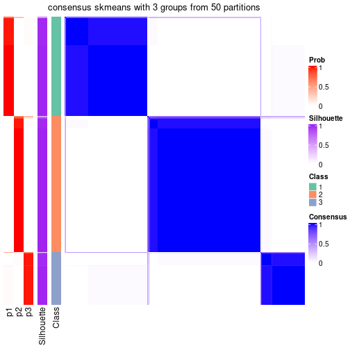</p>

</div>
<div id='tab-node-01-consensus-heatmap-3'>
<pre><code class="r">consensus_heatmap(res, k = 4)
</code></pre>

<p></p>

</div>
</div>

Heatmaps for the membership of samples in all partitions to see how consistent they are:


<script>
$( function() {
	$( '#tabs-node-01-membership-heatmap' ).tabs();
} );
</script>
<div id='tabs-node-01-membership-heatmap'>
<ul>
<li><a href='#tab-node-01-membership-heatmap-1'>k = 2</a></li>
<li><a href='#tab-node-01-membership-heatmap-2'>k = 3</a></li>
<li><a href='#tab-node-01-membership-heatmap-3'>k = 4</a></li>
</ul>
<div id='tab-node-01-membership-heatmap-1'>
<pre><code class="r">membership_heatmap(res, k = 2)
</code></pre>

<p></p>

</div>
<div id='tab-node-01-membership-heatmap-2'>
<pre><code class="r">membership_heatmap(res, k = 3)
</code></pre>

<p></p>

</div>
<div id='tab-node-01-membership-heatmap-3'>
<pre><code class="r">membership_heatmap(res, k = 4)
</code></pre>

<p></p>

</div>
</div>

As soon as the classes for columns are determined, the signatures
that are significantly different between subgroups can be looked for. 
Following are the heatmaps for signatures.


Signature heatmaps where rows are scaled:


<script>
$( function() {
	$( '#tabs-node-01-get-signatures' ).tabs();
} );
</script>
<div id='tabs-node-01-get-signatures'>
<ul>
<li><a href='#tab-node-01-get-signatures-1'>k = 2</a></li>
<li><a href='#tab-node-01-get-signatures-2'>k = 3</a></li>
<li><a href='#tab-node-01-get-signatures-3'>k = 4</a></li>
</ul>
<div id='tab-node-01-get-signatures-1'>
<pre><code class="r">get_signatures(res, k = 2)
</code></pre>

<p></p>

</div>
<div id='tab-node-01-get-signatures-2'>
<pre><code class="r">get_signatures(res, k = 3)
</code></pre>

<p></p>

</div>
<div id='tab-node-01-get-signatures-3'>
<pre><code class="r">get_signatures(res, k = 4)
</code></pre>

<p></p>

</div>
</div>


Signature heatmaps where rows are not scaled:


<script>
$( function() {
	$( '#tabs-node-01-get-signatures-no-scale' ).tabs();
} );
</script>
<div id='tabs-node-01-get-signatures-no-scale'>
<ul>
<li><a href='#tab-node-01-get-signatures-no-scale-1'>k = 2</a></li>
<li><a href='#tab-node-01-get-signatures-no-scale-2'>k = 3</a></li>
<li><a href='#tab-node-01-get-signatures-no-scale-3'>k = 4</a></li>
</ul>
<div id='tab-node-01-get-signatures-no-scale-1'>
<pre><code class="r">get_signatures(res, k = 2, scale_rows = FALSE)
</code></pre>

<p></p>

</div>
<div id='tab-node-01-get-signatures-no-scale-2'>
<pre><code class="r">get_signatures(res, k = 3, scale_rows = FALSE)
</code></pre>

<p></p>

</div>
<div id='tab-node-01-get-signatures-no-scale-3'>
<pre><code class="r">get_signatures(res, k = 4, scale_rows = FALSE)
</code></pre>

<p></p>

</div>
</div>


Compare the overlap of signatures from different k:

```r
compare_signatures(res)
```


`get_signature()` returns a data frame invisibly. To get the list of signatures, the function
call should be assigned to a variable explicitly. In following code, if `plot` argument is set
to `FALSE`, no heatmap is plotted while only the differential analysis is performed.

```r
# code only for demonstration
tb = get_signature(res, k = ..., plot = FALSE)
```

An example of the output of `tb` is:

```
#>   which_row         fdr    mean_1    mean_2 scaled_mean_1 scaled_mean_2 km
#> 1        38 0.042760348  8.373488  9.131774    -0.5533452     0.5164555  1
#> 2        40 0.018707592  7.106213  8.469186    -0.6173731     0.5762149  1
#> 3        55 0.019134737 10.221463 11.207825    -0.6159697     0.5749050  1
#> 4        59 0.006059896  5.921854  7.869574    -0.6899429     0.6439467  1
#> 5        60 0.018055526  8.928898 10.211722    -0.6204761     0.5791110  1
#> 6        98 0.009384629 15.714769 14.887706     0.6635654    -0.6193277  2
...
```

The columns in `tb` are:

1. `which_row`: row indices corresponding to the input matrix.
2. `fdr`: FDR for the differential test. 
3. `mean_x`: The mean value in group x.
4. `scaled_mean_x`: The mean value in group x after rows are scaled.
5. `km`: Row groups if k-means clustering is applied to rows (which is done by automatically selecting number of clusters).

If there are too many signatures, `top_signatures = ...` can be set to only show the 
signatures with the highest FDRs:

```r
# code only for demonstration
# e.g. to show the top 500 most significant rows
tb = get_signature(res, k = ..., top_signatures = 500)
```

If the signatures are defined as these which are uniquely high in current group, `diff_method` argument
can be set to `"uniquely_high_in_one_group"`:

```r
# code only for demonstration
tb = get_signature(res, k = ..., diff_method = "uniquely_high_in_one_group")
```


UMAP plot which shows how samples are separated.


<script>
$( function() {
	$( '#tabs-node-01-dimension-reduction' ).tabs();
} );
</script>
<div id='tabs-node-01-dimension-reduction'>
<ul>
<li><a href='#tab-node-01-dimension-reduction-1'>k = 2</a></li>
<li><a href='#tab-node-01-dimension-reduction-2'>k = 3</a></li>
<li><a href='#tab-node-01-dimension-reduction-3'>k = 4</a></li>
</ul>
<div id='tab-node-01-dimension-reduction-1'>
<pre><code class="r">dimension_reduction(res, k = 2, method = &quot;UMAP&quot;)
</code></pre>

<p></p>

</div>
<div id='tab-node-01-dimension-reduction-2'>
<pre><code class="r">dimension_reduction(res, k = 3, method = &quot;UMAP&quot;)
</code></pre>

<p></p>

</div>
<div id='tab-node-01-dimension-reduction-3'>
<pre><code class="r">dimension_reduction(res, k = 4, method = &quot;UMAP&quot;)
</code></pre>

<p></p>

</div>
</div>


Following heatmap shows how subgroups are split when increasing `k`:

```r
collect_classes(res)
```


If matrix rows can be associated to genes, consider to use `functional_enrichment(res,
...)` to perform function enrichment for the signature genes. See [this vignette](https://jokergoo.github.io/cola_vignettes/functional_enrichment.html) for more detailed explanations.


 

---------------------------------------------------


### Node011


Parent node: [Node01](#Node01).
Child nodes: 
                [Node0111](#Node0111)
        ,
                [Node0112](#Node0112)
        ,
                [Node0121](#Node0121)
        ,
                [Node0122](#Node0122)
        ,
                [Node0131](#Node0131)
        ,
                Node0132-leaf
        ,
                Node0141-leaf
        ,
                Node0142-leaf
        ,
                [Node0211](#Node0211)
        ,
                [Node0212](#Node0212)
        ,
                Node0213-leaf
        ,
                Node0311-leaf
        ,
                Node0312-leaf
        ,
                Node0321-leaf
        ,
                Node0322-leaf
        ,
                Node0331-leaf
        ,
                Node0332-leaf
        ,
                Node0411-leaf
        ,
                Node0412-leaf
        ,
                Node0413-leaf
        ,
                Node0421-leaf
        ,
                Node0422-leaf
        ,
                Node0423-leaf
        .


The object with results only for a single top-value method and a single partitioning method 
can be extracted as:

```r
res = res_rh["011"]
```

A summary of `res` and all the functions that can be applied to it:

```r
res
```

```
#> A 'ConsensusPartition' object with k = 2, 3, 4.
#>   On a matrix with 17974 rows and 154 columns.
#>   Top rows (1797) are extracted by 'ATC' method.
#>   Subgroups are detected by 'skmeans' method.
#>   Performed in total 150 partitions by row resampling.
#>   Best k for subgroups seems to be 2.
#> 
#> Following methods can be applied to this 'ConsensusPartition' object:
#>  [1] "cola_report"             "collect_classes"         "collect_plots"          
#>  [4] "collect_stats"           "colnames"                "compare_partitions"     
#>  [7] "compare_signatures"      "consensus_heatmap"       "dimension_reduction"    
#> [10] "functional_enrichment"   "get_anno_col"            "get_anno"               
#> [13] "get_classes"             "get_consensus"           "get_matrix"             
#> [16] "get_membership"          "get_param"               "get_signatures"         
#> [19] "get_stats"               "is_best_k"               "is_stable_k"            
#> [22] "membership_heatmap"      "ncol"                    "nrow"                   
#> [25] "plot_ecdf"               "predict_classes"         "rownames"               
#> [28] "select_partition_number" "show"                    "suggest_best_k"         
#> [31] "test_to_known_factors"   "top_rows_heatmap"
```

`collect_plots()` function collects all the plots made from `res` for all `k` (number of subgroups)
into one single page to provide an easy and fast comparison between different `k`.

```r
collect_plots(res)
```


The plots are:

- The first row: a plot of the eCDF (empirical cumulative distribution
  function) curves of the consensus matrix for each `k` and the heatmap of
  predicted classes for each `k`.
- The second row: heatmaps of the consensus matrix for each `k`.
- The third row: heatmaps of the membership matrix for each `k`.
- The fouth row: heatmaps of the signatures for each `k`.

All the plots in panels can be made by individual functions and they are
plotted later in this section.

`select_partition_number()` produces several plots showing different
statistics for choosing "optimized" `k`. There are following statistics:

- eCDF curves of the consensus matrix for each `k`;
- 1-PAC. [The PAC score](https://en.wikipedia.org/wiki/Consensus_clustering#Over-interpretation_potential_of_consensus_clustering)
  measures the proportion of the ambiguous subgrouping.
- Mean silhouette score.
- Concordance. The mean probability of fiting the consensus subgroup labels in all
  partitions.
- Area increased. Denote $A_k$ as the area under the eCDF curve for current
  `k`, the area increased is defined as $A_k - A_{k-1}$.
- Rand index. The percent of pairs of samples that are both in a same cluster
  or both are not in a same cluster in the partition of k and k-1.
- Jaccard index. The ratio of pairs of samples are both in a same cluster in
  the partition of k and k-1 and the pairs of samples are both in a same
  cluster in the partition k or k-1.

The detailed explanations of these statistics can be found in [the _cola_
vignette](https://jokergoo.github.io/cola_vignettes/cola.html#toc_13).

Generally speaking, higher 1-PAC score, higher mean silhouette score or higher
concordance corresponds to better partition. Rand index and Jaccard index
measure how similar the current partition is compared to partition with `k-1`.
If they are too similar, we won't accept `k` is better than `k-1`.

```r
select_partition_number(res)
```


The numeric values for all these statistics can be obtained by `get_stats()`.

```r
get_stats(res)
```

```
#>   k 1-PAC mean_silhouette concordance area_increased  Rand Jaccard
#> 2 2 1.000           0.986       0.994         0.5017 0.499   0.499
#> 3 3 0.785           0.799       0.919         0.2734 0.805   0.628
#> 4 4 0.870           0.856       0.939         0.0802 0.816   0.570
```

`suggest_best_k()` suggests the best $k$ based on these statistics. The rules are as follows:

- All $k$ with Jaccard index larger than 0.95 are removed because increasing
  $k$ does not provide enough extra information. If all $k$ are removed, it is
  marked as no subgroup is detected.
- For all $k$ with 1-PAC score larger than 0.9, the maximal $k$ is taken as
  the best $k$, and other $k$ are marked as optional $k$.
- If it does not fit the second rule. The $k$ with the maximal vote of the
  highest 1-PAC score, highest mean silhouette, and highest concordance is
  taken as the best $k$.

```r
suggest_best_k(res)
```

```
#> [1] 2
```


Following is the table of the partitions (You need to click the **show/hide
code output** link to see it). The membership matrix (columns with name `p*`)
is inferred by
[`clue::cl_consensus()`](https://www.rdocumentation.org/link/cl_consensus?package=clue)
function with the `SE` method. Basically the value in the membership matrix
represents the probability to belong to a certain group. The finall subgroup
label for an item is determined with the group with highest probability it
belongs to.

In `get_classes()` function, the entropy is calculated from the membership
matrix and the silhouette score is calculated from the consensus matrix.


<script>
$( function() {
	$( '#tabs-node-011-get-classes' ).tabs();
} );
</script>
<div id='tabs-node-011-get-classes'>
<ul>
<li><a href='#tab-node-011-get-classes-1'>k = 2</a></li>
<li><a href='#tab-node-011-get-classes-2'>k = 3</a></li>
<li><a href='#tab-node-011-get-classes-3'>k = 4</a></li>
</ul>

<div id='tab-node-011-get-classes-1'>
<p><a id='tab-node-011-get-classes-1-a' style='color:#0366d6' href='#'>show/hide code output</a></p>
<pre><code class="r">cbind(get_classes(res, k = 2), get_membership(res, k = 2))
</code></pre>

<pre><code>#&gt;            class entropy silhouette   p1   p2
#&gt; Prog_008       1   0.000      0.993 1.00 0.00
#&gt; Prog_014       2   0.000      0.994 0.00 1.00
#&gt; Prog_009       1   0.000      0.993 1.00 0.00
#&gt; Prog_033       2   0.000      0.994 0.00 1.00
#&gt; Prog_039       1   0.000      0.993 1.00 0.00
#&gt; Prog_028       2   0.000      0.994 0.00 1.00
#&gt; Prog_035       1   0.000      0.993 1.00 0.00
#&gt; Prog_006       1   0.000      0.993 1.00 0.00
#&gt; Prog_049       1   0.000      0.993 1.00 0.00
#&gt; Prog_061       2   0.000      0.994 0.00 1.00
#&gt; Prog_079       1   0.000      0.993 1.00 0.00
#&gt; Prog_081       1   0.000      0.993 1.00 0.00
#&gt; Prog_082       1   0.000      0.993 1.00 0.00
#&gt; Prog_046       2   0.000      0.994 0.00 1.00
#&gt; Prog_053       2   0.000      0.994 0.00 1.00
#&gt; Prog_084       2   0.000      0.994 0.00 1.00
#&gt; Prog_091       1   0.000      0.993 1.00 0.00
#&gt; Prog_098       2   0.680      0.781 0.18 0.82
#&gt; Prog_110       1   0.000      0.993 1.00 0.00
#&gt; LT-HSC_032     1   0.000      0.993 1.00 0.00
#&gt; Prog_100       2   0.000      0.994 0.00 1.00
#&gt; Prog_112       1   0.000      0.993 1.00 0.00
#&gt; Prog_095       2   0.000      0.994 0.00 1.00
#&gt; Prog_107       1   0.000      0.993 1.00 0.00
#&gt; Prog_119       1   0.000      0.993 1.00 0.00
#&gt; Prog_090       2   0.000      0.994 0.00 1.00
#&gt; Prog_139       2   0.000      0.994 0.00 1.00
#&gt; Prog_163       1   0.000      0.993 1.00 0.00
#&gt; Prog_140       1   0.000      0.993 1.00 0.00
#&gt; Prog_146       1   0.000      0.993 1.00 0.00
#&gt; Prog_158       1   0.000      0.993 1.00 0.00
#&gt; Prog_170       1   0.000      0.993 1.00 0.00
#&gt; Prog_178       2   0.000      0.994 0.00 1.00
#&gt; Prog_196       1   0.000      0.993 1.00 0.00
#&gt; Prog_185       1   0.000      0.993 1.00 0.00
#&gt; LT-HSC_064     2   0.000      0.994 0.00 1.00
#&gt; Prog_217       1   0.000      0.993 1.00 0.00
#&gt; Prog_229       1   0.000      0.993 1.00 0.00
#&gt; Prog_211       2   0.000      0.994 0.00 1.00
#&gt; Prog_249       1   0.000      0.993 1.00 0.00
#&gt; Prog_221       1   0.000      0.993 1.00 0.00
#&gt; Prog_239       1   0.000      0.993 1.00 0.00
#&gt; Prog_215       1   0.000      0.993 1.00 0.00
#&gt; Prog_216       1   0.000      0.993 1.00 0.00
#&gt; HSPC_256       2   0.000      0.994 0.00 1.00
#&gt; Prog_265       2   0.000      0.994 0.00 1.00
#&gt; Prog_278       2   0.000      0.994 0.00 1.00
#&gt; Prog_290       2   0.000      0.994 0.00 1.00
#&gt; Prog_254       2   0.000      0.994 0.00 1.00
#&gt; Prog_279       1   0.000      0.993 1.00 0.00
#&gt; Prog_286       2   0.000      0.994 0.00 1.00
#&gt; Prog_269       2   0.000      0.994 0.00 1.00
#&gt; Prog_282       1   0.000      0.993 1.00 0.00
#&gt; Prog_288       2   0.000      0.994 0.00 1.00
#&gt; LT-HSC_091     1   0.000      0.993 1.00 0.00
#&gt; Prog_326       1   0.000      0.993 1.00 0.00
#&gt; LT-HSC_095     1   0.000      0.993 1.00 0.00
#&gt; Prog_299       2   0.000      0.994 0.00 1.00
#&gt; Prog_312       1   0.000      0.993 1.00 0.00
#&gt; Prog_318       1   0.000      0.993 1.00 0.00
#&gt; Prog_324       2   0.000      0.994 0.00 1.00
#&gt; LT-HSC_098     2   0.000      0.994 0.00 1.00
#&gt; HSPC_338       1   0.000      0.993 1.00 0.00
#&gt; LT-HSC_100     1   0.000      0.993 1.00 0.00
#&gt; LT-HSC_102     1   0.000      0.993 1.00 0.00
#&gt; Prog_373       1   0.000      0.993 1.00 0.00
#&gt; Prog_337       1   0.000      0.993 1.00 0.00
#&gt; Prog_356       2   0.000      0.994 0.00 1.00
#&gt; Prog_357       1   0.000      0.993 1.00 0.00
#&gt; Prog_375       1   0.000      0.993 1.00 0.00
#&gt; Prog_339       2   0.000      0.994 0.00 1.00
#&gt; Prog_352       1   0.000      0.993 1.00 0.00
#&gt; Prog_364       2   0.242      0.955 0.04 0.96
#&gt; Prog_376       2   0.000      0.994 0.00 1.00
#&gt; Prog_359       2   0.000      0.994 0.00 1.00
#&gt; Prog_377       1   0.000      0.993 1.00 0.00
#&gt; Prog_360       1   0.000      0.993 1.00 0.00
#&gt; Prog_372       2   0.000      0.994 0.00 1.00
#&gt; Prog_342       1   0.000      0.993 1.00 0.00
#&gt; HSPC_404       2   0.000      0.994 0.00 1.00
#&gt; HSPC_408       1   0.000      0.993 1.00 0.00
#&gt; Prog_385       1   0.000      0.993 1.00 0.00
#&gt; Prog_397       1   0.000      0.993 1.00 0.00
#&gt; Prog_403       2   0.000      0.994 0.00 1.00
#&gt; Prog_409       1   0.000      0.993 1.00 0.00
#&gt; Prog_415       1   0.000      0.993 1.00 0.00
#&gt; Prog_421       1   0.000      0.993 1.00 0.00
#&gt; Prog_379       2   0.000      0.994 0.00 1.00
#&gt; Prog_386       1   0.000      0.993 1.00 0.00
#&gt; Prog_398       1   0.000      0.993 1.00 0.00
#&gt; Prog_404       1   0.000      0.993 1.00 0.00
#&gt; Prog_410       2   0.000      0.994 0.00 1.00
#&gt; Prog_416       2   0.000      0.994 0.00 1.00
#&gt; Prog_380       2   0.000      0.994 0.00 1.00
#&gt; Prog_393       2   0.000      0.994 0.00 1.00
#&gt; Prog_381       2   0.000      0.994 0.00 1.00
#&gt; Prog_388       1   0.000      0.993 1.00 0.00
#&gt; Prog_406       2   0.000      0.994 0.00 1.00
#&gt; Prog_424       2   0.000      0.994 0.00 1.00
#&gt; Prog_395       1   0.000      0.993 1.00 0.00
#&gt; Prog_419       1   0.000      0.993 1.00 0.00
#&gt; Prog_383       1   0.000      0.993 1.00 0.00
#&gt; Prog_434       1   0.000      0.993 1.00 0.00
#&gt; Prog_429       1   0.000      0.993 1.00 0.00
#&gt; Prog_430       2   0.000      0.994 0.00 1.00
#&gt; Prog_449       1   0.000      0.993 1.00 0.00
#&gt; Prog_444       1   0.000      0.993 1.00 0.00
#&gt; Prog_477       2   0.000      0.994 0.00 1.00
#&gt; Prog_478       1   0.000      0.993 1.00 0.00
#&gt; Prog_502       2   0.000      0.994 0.00 1.00
#&gt; Prog_508       1   0.000      0.993 1.00 0.00
#&gt; Prog_523       2   0.000      0.994 0.00 1.00
#&gt; Prog_535       2   0.000      0.994 0.00 1.00
#&gt; Prog_536       2   0.000      0.994 0.00 1.00
#&gt; Prog_548       2   0.000      0.994 0.00 1.00
#&gt; Prog_516       1   0.000      0.993 1.00 0.00
#&gt; Prog_562       2   0.000      0.994 0.00 1.00
#&gt; Prog_592       1   0.000      0.993 1.00 0.00
#&gt; Prog_575       1   0.000      0.993 1.00 0.00
#&gt; Prog_608       2   0.000      0.994 0.00 1.00
#&gt; Prog_603       2   0.000      0.994 0.00 1.00
#&gt; Prog_616       1   0.000      0.993 1.00 0.00
#&gt; Prog_649       2   0.000      0.994 0.00 1.00
#&gt; Prog_655       2   0.000      0.994 0.00 1.00
#&gt; Prog_638       2   0.000      0.994 0.00 1.00
#&gt; Prog_657       1   0.000      0.993 1.00 0.00
#&gt; Prog_663       2   0.000      0.994 0.00 1.00
#&gt; Prog_640       1   0.000      0.993 1.00 0.00
#&gt; Prog_677       2   0.000      0.994 0.00 1.00
#&gt; Prog_697       2   0.000      0.994 0.00 1.00
#&gt; Prog_688       2   0.000      0.994 0.00 1.00
#&gt; Prog_700       1   0.000      0.993 1.00 0.00
#&gt; Prog_695       1   0.000      0.993 1.00 0.00
#&gt; Prog_701       1   0.000      0.993 1.00 0.00
#&gt; Prog_719       2   0.000      0.994 0.00 1.00
#&gt; Prog_723       2   0.000      0.994 0.00 1.00
#&gt; Prog_730       2   0.000      0.994 0.00 1.00
#&gt; Prog_731       2   0.000      0.994 0.00 1.00
#&gt; Prog_776       2   0.000      0.994 0.00 1.00
#&gt; Prog_788       2   0.000      0.994 0.00 1.00
#&gt; Prog_790       2   0.680      0.781 0.18 0.82
#&gt; Prog_767       1   0.000      0.993 1.00 0.00
#&gt; Prog_780       1   0.000      0.993 1.00 0.00
#&gt; Prog_786       1   0.000      0.993 1.00 0.00
#&gt; Prog_830       2   0.000      0.994 0.00 1.00
#&gt; Prog_813       2   0.000      0.994 0.00 1.00
#&gt; Prog_819       2   0.000      0.994 0.00 1.00
#&gt; Prog_825       1   0.925      0.485 0.66 0.34
#&gt; Prog_814       2   0.000      0.994 0.00 1.00
#&gt; Prog_826       2   0.000      0.994 0.00 1.00
#&gt; Prog_838       2   0.000      0.994 0.00 1.00
#&gt; Prog_821       1   0.000      0.993 1.00 0.00
#&gt; Prog_822       1   0.722      0.749 0.80 0.20
#&gt; Prog_828       1   0.000      0.993 1.00 0.00
</code></pre>

<script>
$('#tab-node-011-get-classes-1-a').parent().next().next().hide();
$('#tab-node-011-get-classes-1-a').click(function(){
  $('#tab-node-011-get-classes-1-a').parent().next().next().toggle();
  return(false);
});
</script>
</div>

<div id='tab-node-011-get-classes-2'>
<p><a id='tab-node-011-get-classes-2-a' style='color:#0366d6' href='#'>show/hide code output</a></p>
<pre><code class="r">cbind(get_classes(res, k = 3), get_membership(res, k = 3))
</code></pre>

<pre><code>#&gt;            class entropy silhouette   p1   p2   p3
#&gt; Prog_008       3  0.0000     0.7919 0.00 0.00 1.00
#&gt; Prog_014       2  0.4291     0.7253 0.00 0.82 0.18
#&gt; Prog_009       1  0.0000     0.9701 1.00 0.00 0.00
#&gt; Prog_033       2  0.5560     0.5807 0.00 0.70 0.30
#&gt; Prog_039       1  0.0000     0.9701 1.00 0.00 0.00
#&gt; Prog_028       2  0.0000     0.8676 0.00 1.00 0.00
#&gt; Prog_035       1  0.0000     0.9701 1.00 0.00 0.00
#&gt; Prog_006       1  0.0000     0.9701 1.00 0.00 0.00
#&gt; Prog_049       1  0.0000     0.9701 1.00 0.00 0.00
#&gt; Prog_061       3  0.0000     0.7919 0.00 0.00 1.00
#&gt; Prog_079       1  0.0000     0.9701 1.00 0.00 0.00
#&gt; Prog_081       1  0.0000     0.9701 1.00 0.00 0.00
#&gt; Prog_082       1  0.0000     0.9701 1.00 0.00 0.00
#&gt; Prog_046       2  0.0000     0.8676 0.00 1.00 0.00
#&gt; Prog_053       3  0.3686     0.7297 0.00 0.14 0.86
#&gt; Prog_084       3  0.0892     0.7882 0.00 0.02 0.98
#&gt; Prog_091       1  0.0000     0.9701 1.00 0.00 0.00
#&gt; Prog_098       3  0.8587     0.1060 0.10 0.40 0.50
#&gt; Prog_110       1  0.0000     0.9701 1.00 0.00 0.00
#&gt; LT-HSC_032     1  0.0000     0.9701 1.00 0.00 0.00
#&gt; Prog_100       3  0.0000     0.7919 0.00 0.00 1.00
#&gt; Prog_112       1  0.0000     0.9701 1.00 0.00 0.00
#&gt; Prog_095       2  0.0000     0.8676 0.00 1.00 0.00
#&gt; Prog_107       3  0.4002     0.6645 0.16 0.00 0.84
#&gt; Prog_119       1  0.0000     0.9701 1.00 0.00 0.00
#&gt; Prog_090       3  0.0000     0.7919 0.00 0.00 1.00
#&gt; Prog_139       3  0.0000     0.7919 0.00 0.00 1.00
#&gt; Prog_163       1  0.0000     0.9701 1.00 0.00 0.00
#&gt; Prog_140       1  0.0000     0.9701 1.00 0.00 0.00
#&gt; Prog_146       1  0.0000     0.9701 1.00 0.00 0.00
#&gt; Prog_158       1  0.5835     0.4780 0.66 0.00 0.34
#&gt; Prog_170       1  0.0000     0.9701 1.00 0.00 0.00
#&gt; Prog_178       3  0.0000     0.7919 0.00 0.00 1.00
#&gt; Prog_196       1  0.0000     0.9701 1.00 0.00 0.00
#&gt; Prog_185       1  0.0000     0.9701 1.00 0.00 0.00
#&gt; LT-HSC_064     3  0.0000     0.7919 0.00 0.00 1.00
#&gt; Prog_217       1  0.0000     0.9701 1.00 0.00 0.00
#&gt; Prog_229       3  0.0000     0.7919 0.00 0.00 1.00
#&gt; Prog_211       3  0.5948     0.3493 0.00 0.36 0.64
#&gt; Prog_249       1  0.0000     0.9701 1.00 0.00 0.00
#&gt; Prog_221       1  0.0000     0.9701 1.00 0.00 0.00
#&gt; Prog_239       1  0.0000     0.9701 1.00 0.00 0.00
#&gt; Prog_215       1  0.0000     0.9701 1.00 0.00 0.00
#&gt; Prog_216       1  0.0000     0.9701 1.00 0.00 0.00
#&gt; HSPC_256       3  0.0000     0.7919 0.00 0.00 1.00
#&gt; Prog_265       3  0.3686     0.7297 0.00 0.14 0.86
#&gt; Prog_278       3  0.0892     0.7882 0.00 0.02 0.98
#&gt; Prog_290       2  0.5706     0.5486 0.00 0.68 0.32
#&gt; Prog_254       3  0.3686     0.7297 0.00 0.14 0.86
#&gt; Prog_279       3  0.0000     0.7919 0.00 0.00 1.00
#&gt; Prog_286       3  0.4291     0.6838 0.00 0.18 0.82
#&gt; Prog_269       2  0.0000     0.8676 0.00 1.00 0.00
#&gt; Prog_282       1  0.0000     0.9701 1.00 0.00 0.00
#&gt; Prog_288       2  0.0000     0.8676 0.00 1.00 0.00
#&gt; LT-HSC_091     1  0.0000     0.9701 1.00 0.00 0.00
#&gt; Prog_326       1  0.0000     0.9701 1.00 0.00 0.00
#&gt; LT-HSC_095     3  0.6244     0.1856 0.44 0.00 0.56
#&gt; Prog_299       3  0.0000     0.7919 0.00 0.00 1.00
#&gt; Prog_312       1  0.0000     0.9701 1.00 0.00 0.00
#&gt; Prog_318       1  0.0000     0.9701 1.00 0.00 0.00
#&gt; Prog_324       2  0.0000     0.8676 0.00 1.00 0.00
#&gt; LT-HSC_098     2  0.0000     0.8676 0.00 1.00 0.00
#&gt; HSPC_338       1  0.4291     0.7686 0.82 0.00 0.18
#&gt; LT-HSC_100     1  0.0000     0.9701 1.00 0.00 0.00
#&gt; LT-HSC_102     1  0.0000     0.9701 1.00 0.00 0.00
#&gt; Prog_373       1  0.0000     0.9701 1.00 0.00 0.00
#&gt; Prog_337       1  0.0000     0.9701 1.00 0.00 0.00
#&gt; Prog_356       2  0.0000     0.8676 0.00 1.00 0.00
#&gt; Prog_357       1  0.0000     0.9701 1.00 0.00 0.00
#&gt; Prog_375       1  0.0000     0.9701 1.00 0.00 0.00
#&gt; Prog_339       2  0.6045     0.4345 0.00 0.62 0.38
#&gt; Prog_352       3  0.6126     0.3001 0.40 0.00 0.60
#&gt; Prog_364       2  0.0000     0.8676 0.00 1.00 0.00
#&gt; Prog_376       3  0.3686     0.7297 0.00 0.14 0.86
#&gt; Prog_359       2  0.5835     0.5142 0.00 0.66 0.34
#&gt; Prog_377       1  0.0000     0.9701 1.00 0.00 0.00
#&gt; Prog_360       1  0.0000     0.9701 1.00 0.00 0.00
#&gt; Prog_372       3  0.0892     0.7882 0.00 0.02 0.98
#&gt; Prog_342       1  0.0000     0.9701 1.00 0.00 0.00
#&gt; HSPC_404       2  0.6309     0.0872 0.00 0.50 0.50
#&gt; HSPC_408       1  0.0000     0.9701 1.00 0.00 0.00
#&gt; Prog_385       1  0.0000     0.9701 1.00 0.00 0.00
#&gt; Prog_397       1  0.0000     0.9701 1.00 0.00 0.00
#&gt; Prog_403       3  0.3686     0.7297 0.00 0.14 0.86
#&gt; Prog_409       1  0.0000     0.9701 1.00 0.00 0.00
#&gt; Prog_415       1  0.0000     0.9701 1.00 0.00 0.00
#&gt; Prog_421       1  0.0000     0.9701 1.00 0.00 0.00
#&gt; Prog_379       2  0.0000     0.8676 0.00 1.00 0.00
#&gt; Prog_386       1  0.0000     0.9701 1.00 0.00 0.00
#&gt; Prog_398       3  0.5948     0.3941 0.36 0.00 0.64
#&gt; Prog_404       1  0.6302     0.1378 0.52 0.48 0.00
#&gt; Prog_410       3  0.0000     0.7919 0.00 0.00 1.00
#&gt; Prog_416       3  0.6045     0.2954 0.00 0.38 0.62
#&gt; Prog_380       2  0.6192     0.3373 0.00 0.58 0.42
#&gt; Prog_393       2  0.0000     0.8676 0.00 1.00 0.00
#&gt; Prog_381       2  0.5835     0.5142 0.00 0.66 0.34
#&gt; Prog_388       1  0.2959     0.8691 0.90 0.00 0.10
#&gt; Prog_406       2  0.6302     0.1573 0.00 0.52 0.48
#&gt; Prog_424       3  0.0000     0.7919 0.00 0.00 1.00
#&gt; Prog_395       1  0.0000     0.9701 1.00 0.00 0.00
#&gt; Prog_419       1  0.0000     0.9701 1.00 0.00 0.00
#&gt; Prog_383       1  0.0000     0.9701 1.00 0.00 0.00
#&gt; Prog_434       1  0.0000     0.9701 1.00 0.00 0.00
#&gt; Prog_429       1  0.0000     0.9701 1.00 0.00 0.00
#&gt; Prog_430       2  0.5397     0.6025 0.00 0.72 0.28
#&gt; Prog_449       1  0.0000     0.9701 1.00 0.00 0.00
#&gt; Prog_444       1  0.0000     0.9701 1.00 0.00 0.00
#&gt; Prog_477       3  0.3340     0.7429 0.00 0.12 0.88
#&gt; Prog_478       1  0.4002     0.7925 0.84 0.16 0.00
#&gt; Prog_502       2  0.5835     0.5172 0.00 0.66 0.34
#&gt; Prog_508       1  0.0000     0.9701 1.00 0.00 0.00
#&gt; Prog_523       2  0.0000     0.8676 0.00 1.00 0.00
#&gt; Prog_535       2  0.0000     0.8676 0.00 1.00 0.00
#&gt; Prog_536       3  0.6244     0.1029 0.00 0.44 0.56
#&gt; Prog_548       2  0.0000     0.8676 0.00 1.00 0.00
#&gt; Prog_516       1  0.0000     0.9701 1.00 0.00 0.00
#&gt; Prog_562       3  0.6302    -0.0461 0.00 0.48 0.52
#&gt; Prog_592       1  0.0000     0.9701 1.00 0.00 0.00
#&gt; Prog_575       1  0.0000     0.9701 1.00 0.00 0.00
#&gt; Prog_608       2  0.0000     0.8676 0.00 1.00 0.00
#&gt; Prog_603       2  0.0000     0.8676 0.00 1.00 0.00
#&gt; Prog_616       1  0.0000     0.9701 1.00 0.00 0.00
#&gt; Prog_649       2  0.6126     0.2357 0.00 0.60 0.40
#&gt; Prog_655       3  0.3686     0.7297 0.00 0.14 0.86
#&gt; Prog_638       2  0.0000     0.8676 0.00 1.00 0.00
#&gt; Prog_657       1  0.0000     0.9701 1.00 0.00 0.00
#&gt; Prog_663       2  0.0000     0.8676 0.00 1.00 0.00
#&gt; Prog_640       1  0.6045     0.4193 0.62 0.38 0.00
#&gt; Prog_677       3  0.0000     0.7919 0.00 0.00 1.00
#&gt; Prog_697       2  0.0000     0.8676 0.00 1.00 0.00
#&gt; Prog_688       2  0.0000     0.8676 0.00 1.00 0.00
#&gt; Prog_700       1  0.0000     0.9701 1.00 0.00 0.00
#&gt; Prog_695       1  0.0000     0.9701 1.00 0.00 0.00
#&gt; Prog_701       3  0.6280     0.1279 0.46 0.00 0.54
#&gt; Prog_719       2  0.0000     0.8676 0.00 1.00 0.00
#&gt; Prog_723       2  0.0000     0.8676 0.00 1.00 0.00
#&gt; Prog_730       3  0.0000     0.7919 0.00 0.00 1.00
#&gt; Prog_731       3  0.3686     0.7297 0.00 0.14 0.86
#&gt; Prog_776       2  0.0000     0.8676 0.00 1.00 0.00
#&gt; Prog_788       2  0.0000     0.8676 0.00 1.00 0.00
#&gt; Prog_790       2  0.1781     0.8435 0.02 0.96 0.02
#&gt; Prog_767       1  0.0000     0.9701 1.00 0.00 0.00
#&gt; Prog_780       1  0.0000     0.9701 1.00 0.00 0.00
#&gt; Prog_786       1  0.0000     0.9701 1.00 0.00 0.00
#&gt; Prog_830       2  0.0000     0.8676 0.00 1.00 0.00
#&gt; Prog_813       2  0.0000     0.8676 0.00 1.00 0.00
#&gt; Prog_819       2  0.5216     0.6351 0.00 0.74 0.26
#&gt; Prog_825       2  0.0892     0.8456 0.02 0.98 0.00
#&gt; Prog_814       3  0.2959     0.7541 0.00 0.10 0.90
#&gt; Prog_826       2  0.0000     0.8676 0.00 1.00 0.00
#&gt; Prog_838       2  0.0000     0.8676 0.00 1.00 0.00
#&gt; Prog_821       1  0.0000     0.9701 1.00 0.00 0.00
#&gt; Prog_822       3  0.8619     0.1831 0.42 0.10 0.48
#&gt; Prog_828       1  0.5706     0.5257 0.68 0.00 0.32
</code></pre>

<script>
$('#tab-node-011-get-classes-2-a').parent().next().next().hide();
$('#tab-node-011-get-classes-2-a').click(function(){
  $('#tab-node-011-get-classes-2-a').parent().next().next().toggle();
  return(false);
});
</script>
</div>

<div id='tab-node-011-get-classes-3'>
<p><a id='tab-node-011-get-classes-3-a' style='color:#0366d6' href='#'>show/hide code output</a></p>
<pre><code class="r">cbind(get_classes(res, k = 4), get_membership(res, k = 4))
</code></pre>

<pre><code>#&gt;            class entropy silhouette   p1   p2   p3   p4
#&gt; Prog_008       3  0.0000     0.8436 0.00 0.00 1.00 0.00
#&gt; Prog_014       2  0.0000     0.8932 0.00 1.00 0.00 0.00
#&gt; Prog_009       1  0.0000     0.9898 1.00 0.00 0.00 0.00
#&gt; Prog_033       2  0.0000     0.8932 0.00 1.00 0.00 0.00
#&gt; Prog_039       1  0.0000     0.9898 1.00 0.00 0.00 0.00
#&gt; Prog_028       2  0.2647     0.8661 0.00 0.88 0.00 0.12
#&gt; Prog_035       1  0.0000     0.9898 1.00 0.00 0.00 0.00
#&gt; Prog_006       1  0.0000     0.9898 1.00 0.00 0.00 0.00
#&gt; Prog_049       1  0.0000     0.9898 1.00 0.00 0.00 0.00
#&gt; Prog_061       3  0.1211     0.8237 0.00 0.04 0.96 0.00
#&gt; Prog_079       1  0.0000     0.9898 1.00 0.00 0.00 0.00
#&gt; Prog_081       1  0.0000     0.9898 1.00 0.00 0.00 0.00
#&gt; Prog_082       1  0.0000     0.9898 1.00 0.00 0.00 0.00
#&gt; Prog_046       2  0.2647     0.8661 0.00 0.88 0.00 0.12
#&gt; Prog_053       2  0.0000     0.8932 0.00 1.00 0.00 0.00
#&gt; Prog_084       2  0.4134     0.5915 0.00 0.74 0.26 0.00
#&gt; Prog_091       1  0.0000     0.9898 1.00 0.00 0.00 0.00
#&gt; Prog_098       3  0.8870     0.2042 0.08 0.36 0.40 0.16
#&gt; Prog_110       1  0.0000     0.9898 1.00 0.00 0.00 0.00
#&gt; LT-HSC_032     1  0.0000     0.9898 1.00 0.00 0.00 0.00
#&gt; Prog_100       3  0.2921     0.7415 0.00 0.14 0.86 0.00
#&gt; Prog_112       1  0.0707     0.9683 0.98 0.00 0.02 0.00
#&gt; Prog_095       4  0.0000     0.8729 0.00 0.00 0.00 1.00
#&gt; Prog_107       3  0.0000     0.8436 0.00 0.00 1.00 0.00
#&gt; Prog_119       1  0.0000     0.9898 1.00 0.00 0.00 0.00
#&gt; Prog_090       3  0.5000     0.0233 0.00 0.50 0.50 0.00
#&gt; Prog_139       3  0.0000     0.8436 0.00 0.00 1.00 0.00
#&gt; Prog_163       1  0.0000     0.9898 1.00 0.00 0.00 0.00
#&gt; Prog_140       1  0.0000     0.9898 1.00 0.00 0.00 0.00
#&gt; Prog_146       1  0.0000     0.9898 1.00 0.00 0.00 0.00
#&gt; Prog_158       3  0.0000     0.8436 0.00 0.00 1.00 0.00
#&gt; Prog_170       1  0.0000     0.9898 1.00 0.00 0.00 0.00
#&gt; Prog_178       2  0.4907     0.2126 0.00 0.58 0.42 0.00
#&gt; Prog_196       1  0.0000     0.9898 1.00 0.00 0.00 0.00
#&gt; Prog_185       1  0.0000     0.9898 1.00 0.00 0.00 0.00
#&gt; LT-HSC_064     2  0.4977     0.0734 0.00 0.54 0.46 0.00
#&gt; Prog_217       1  0.0000     0.9898 1.00 0.00 0.00 0.00
#&gt; Prog_229       3  0.0000     0.8436 0.00 0.00 1.00 0.00
#&gt; Prog_211       2  0.0000     0.8932 0.00 1.00 0.00 0.00
#&gt; Prog_249       1  0.0000     0.9898 1.00 0.00 0.00 0.00
#&gt; Prog_221       1  0.0000     0.9898 1.00 0.00 0.00 0.00
#&gt; Prog_239       1  0.0000     0.9898 1.00 0.00 0.00 0.00
#&gt; Prog_215       1  0.3801     0.6956 0.78 0.00 0.00 0.22
#&gt; Prog_216       1  0.0000     0.9898 1.00 0.00 0.00 0.00
#&gt; HSPC_256       2  0.4855     0.2735 0.00 0.60 0.40 0.00
#&gt; Prog_265       2  0.0000     0.8932 0.00 1.00 0.00 0.00
#&gt; Prog_278       2  0.1637     0.8535 0.00 0.94 0.06 0.00
#&gt; Prog_290       2  0.0707     0.8912 0.00 0.98 0.00 0.02
#&gt; Prog_254       2  0.0000     0.8932 0.00 1.00 0.00 0.00
#&gt; Prog_279       3  0.0000     0.8436 0.00 0.00 1.00 0.00
#&gt; Prog_286       2  0.0707     0.8830 0.00 0.98 0.02 0.00
#&gt; Prog_269       4  0.0000     0.8729 0.00 0.00 0.00 1.00
#&gt; Prog_282       1  0.4624     0.4450 0.66 0.00 0.00 0.34
#&gt; Prog_288       2  0.2011     0.8824 0.00 0.92 0.00 0.08
#&gt; LT-HSC_091     1  0.0000     0.9898 1.00 0.00 0.00 0.00
#&gt; Prog_326       1  0.0000     0.9898 1.00 0.00 0.00 0.00
#&gt; LT-HSC_095     3  0.0000     0.8436 0.00 0.00 1.00 0.00
#&gt; Prog_299       3  0.5000     0.0261 0.00 0.50 0.50 0.00
#&gt; Prog_312       1  0.0000     0.9898 1.00 0.00 0.00 0.00
#&gt; Prog_318       1  0.0000     0.9898 1.00 0.00 0.00 0.00
#&gt; Prog_324       2  0.2647     0.8661 0.00 0.88 0.00 0.12
#&gt; LT-HSC_098     2  0.2647     0.8661 0.00 0.88 0.00 0.12
#&gt; HSPC_338       3  0.0000     0.8436 0.00 0.00 1.00 0.00
#&gt; LT-HSC_100     1  0.0000     0.9898 1.00 0.00 0.00 0.00
#&gt; LT-HSC_102     1  0.0000     0.9898 1.00 0.00 0.00 0.00
#&gt; Prog_373       4  0.4994     0.0974 0.48 0.00 0.00 0.52
#&gt; Prog_337       1  0.0000     0.9898 1.00 0.00 0.00 0.00
#&gt; Prog_356       4  0.1211     0.8509 0.00 0.04 0.00 0.96
#&gt; Prog_357       1  0.0000     0.9898 1.00 0.00 0.00 0.00
#&gt; Prog_375       1  0.0000     0.9898 1.00 0.00 0.00 0.00
#&gt; Prog_339       2  0.0000     0.8932 0.00 1.00 0.00 0.00
#&gt; Prog_352       3  0.0000     0.8436 0.00 0.00 1.00 0.00
#&gt; Prog_364       4  0.0000     0.8729 0.00 0.00 0.00 1.00
#&gt; Prog_376       2  0.0000     0.8932 0.00 1.00 0.00 0.00
#&gt; Prog_359       2  0.0000     0.8932 0.00 1.00 0.00 0.00
#&gt; Prog_377       1  0.0000     0.9898 1.00 0.00 0.00 0.00
#&gt; Prog_360       1  0.0000     0.9898 1.00 0.00 0.00 0.00
#&gt; Prog_372       2  0.4977     0.0707 0.00 0.54 0.46 0.00
#&gt; Prog_342       1  0.0000     0.9898 1.00 0.00 0.00 0.00
#&gt; HSPC_404       2  0.0000     0.8932 0.00 1.00 0.00 0.00
#&gt; HSPC_408       1  0.0000     0.9898 1.00 0.00 0.00 0.00
#&gt; Prog_385       1  0.0000     0.9898 1.00 0.00 0.00 0.00
#&gt; Prog_397       1  0.0000     0.9898 1.00 0.00 0.00 0.00
#&gt; Prog_403       2  0.0000     0.8932 0.00 1.00 0.00 0.00
#&gt; Prog_409       1  0.0000     0.9898 1.00 0.00 0.00 0.00
#&gt; Prog_415       1  0.0000     0.9898 1.00 0.00 0.00 0.00
#&gt; Prog_421       1  0.0000     0.9898 1.00 0.00 0.00 0.00
#&gt; Prog_379       2  0.2647     0.8661 0.00 0.88 0.00 0.12
#&gt; Prog_386       1  0.0000     0.9898 1.00 0.00 0.00 0.00
#&gt; Prog_398       3  0.0000     0.8436 0.00 0.00 1.00 0.00
#&gt; Prog_404       4  0.0000     0.8729 0.00 0.00 0.00 1.00
#&gt; Prog_410       3  0.0000     0.8436 0.00 0.00 1.00 0.00
#&gt; Prog_416       2  0.0000     0.8932 0.00 1.00 0.00 0.00
#&gt; Prog_380       2  0.0707     0.8912 0.00 0.98 0.00 0.02
#&gt; Prog_393       2  0.3801     0.7612 0.00 0.78 0.00 0.22
#&gt; Prog_381       2  0.0707     0.8912 0.00 0.98 0.00 0.02
#&gt; Prog_388       3  0.3400     0.6271 0.18 0.00 0.82 0.00
#&gt; Prog_406       2  0.0000     0.8932 0.00 1.00 0.00 0.00
#&gt; Prog_424       2  0.4624     0.4299 0.00 0.66 0.34 0.00
#&gt; Prog_395       1  0.0000     0.9898 1.00 0.00 0.00 0.00
#&gt; Prog_419       1  0.0000     0.9898 1.00 0.00 0.00 0.00
#&gt; Prog_383       1  0.0000     0.9898 1.00 0.00 0.00 0.00
#&gt; Prog_434       1  0.0000     0.9898 1.00 0.00 0.00 0.00
#&gt; Prog_429       1  0.0000     0.9898 1.00 0.00 0.00 0.00
#&gt; Prog_430       2  0.1637     0.8865 0.00 0.94 0.00 0.06
#&gt; Prog_449       1  0.0000     0.9898 1.00 0.00 0.00 0.00
#&gt; Prog_444       1  0.0000     0.9898 1.00 0.00 0.00 0.00
#&gt; Prog_477       2  0.0000     0.8932 0.00 1.00 0.00 0.00
#&gt; Prog_478       4  0.2011     0.8169 0.08 0.00 0.00 0.92
#&gt; Prog_502       2  0.0000     0.8932 0.00 1.00 0.00 0.00
#&gt; Prog_508       4  0.2647     0.7739 0.12 0.00 0.00 0.88
#&gt; Prog_523       2  0.2647     0.8661 0.00 0.88 0.00 0.12
#&gt; Prog_535       2  0.2647     0.8661 0.00 0.88 0.00 0.12
#&gt; Prog_536       2  0.0000     0.8932 0.00 1.00 0.00 0.00
#&gt; Prog_548       2  0.2647     0.8661 0.00 0.88 0.00 0.12
#&gt; Prog_516       1  0.0000     0.9898 1.00 0.00 0.00 0.00
#&gt; Prog_562       2  0.0000     0.8932 0.00 1.00 0.00 0.00
#&gt; Prog_592       1  0.0000     0.9898 1.00 0.00 0.00 0.00
#&gt; Prog_575       4  0.2647     0.7739 0.12 0.00 0.00 0.88
#&gt; Prog_608       2  0.2011     0.8806 0.00 0.92 0.00 0.08
#&gt; Prog_603       4  0.0000     0.8729 0.00 0.00 0.00 1.00
#&gt; Prog_616       1  0.0000     0.9898 1.00 0.00 0.00 0.00
#&gt; Prog_649       2  0.5860     0.3283 0.00 0.58 0.04 0.38
#&gt; Prog_655       2  0.0000     0.8932 0.00 1.00 0.00 0.00
#&gt; Prog_638       2  0.2345     0.8725 0.00 0.90 0.00 0.10
#&gt; Prog_657       1  0.0000     0.9898 1.00 0.00 0.00 0.00
#&gt; Prog_663       2  0.2647     0.8661 0.00 0.88 0.00 0.12
#&gt; Prog_640       4  0.0707     0.8653 0.02 0.00 0.00 0.98
#&gt; Prog_677       3  0.1637     0.8111 0.00 0.06 0.94 0.00
#&gt; Prog_697       2  0.2647     0.8661 0.00 0.88 0.00 0.12
#&gt; Prog_688       4  0.0000     0.8729 0.00 0.00 0.00 1.00
#&gt; Prog_700       1  0.0000     0.9898 1.00 0.00 0.00 0.00
#&gt; Prog_695       1  0.0000     0.9898 1.00 0.00 0.00 0.00
#&gt; Prog_701       3  0.0000     0.8436 0.00 0.00 1.00 0.00
#&gt; Prog_719       2  0.0707     0.8923 0.00 0.98 0.00 0.02
#&gt; Prog_723       2  0.2647     0.8661 0.00 0.88 0.00 0.12
#&gt; Prog_730       3  0.0707     0.8350 0.00 0.02 0.98 0.00
#&gt; Prog_731       2  0.0000     0.8932 0.00 1.00 0.00 0.00
#&gt; Prog_776       2  0.1637     0.8864 0.00 0.94 0.00 0.06
#&gt; Prog_788       2  0.2647     0.8661 0.00 0.88 0.00 0.12
#&gt; Prog_790       4  0.1211     0.8484 0.00 0.04 0.00 0.96
#&gt; Prog_767       1  0.0000     0.9898 1.00 0.00 0.00 0.00
#&gt; Prog_780       1  0.0000     0.9898 1.00 0.00 0.00 0.00
#&gt; Prog_786       1  0.0000     0.9898 1.00 0.00 0.00 0.00
#&gt; Prog_830       4  0.3801     0.6064 0.00 0.22 0.00 0.78
#&gt; Prog_813       2  0.2011     0.8806 0.00 0.92 0.00 0.08
#&gt; Prog_819       2  0.0000     0.8932 0.00 1.00 0.00 0.00
#&gt; Prog_825       4  0.0000     0.8729 0.00 0.00 0.00 1.00
#&gt; Prog_814       2  0.0000     0.8932 0.00 1.00 0.00 0.00
#&gt; Prog_826       2  0.2647     0.8661 0.00 0.88 0.00 0.12
#&gt; Prog_838       2  0.2011     0.8806 0.00 0.92 0.00 0.08
#&gt; Prog_821       1  0.0000     0.9898 1.00 0.00 0.00 0.00
#&gt; Prog_822       3  0.4472     0.6024 0.00 0.02 0.76 0.22
#&gt; Prog_828       3  0.4472     0.5542 0.22 0.00 0.76 0.02
</code></pre>

<script>
$('#tab-node-011-get-classes-3-a').parent().next().next().hide();
$('#tab-node-011-get-classes-3-a').click(function(){
  $('#tab-node-011-get-classes-3-a').parent().next().next().toggle();
  return(false);
});
</script>
</div>
</div>

Heatmaps for the consensus matrix. It visualizes the probability of two
samples to be in a same group.


<script>
$( function() {
	$( '#tabs-node-011-consensus-heatmap' ).tabs();
} );
</script>
<div id='tabs-node-011-consensus-heatmap'>
<ul>
<li><a href='#tab-node-011-consensus-heatmap-1'>k = 2</a></li>
<li><a href='#tab-node-011-consensus-heatmap-2'>k = 3</a></li>
<li><a href='#tab-node-011-consensus-heatmap-3'>k = 4</a></li>
</ul>
<div id='tab-node-011-consensus-heatmap-1'>
<pre><code class="r">consensus_heatmap(res, k = 2)
</code></pre>

<p></p>

</div>
<div id='tab-node-011-consensus-heatmap-2'>
<pre><code class="r">consensus_heatmap(res, k = 3)
</code></pre>

<p></p>

</div>
<div id='tab-node-011-consensus-heatmap-3'>
<pre><code class="r">consensus_heatmap(res, k = 4)
</code></pre>

<p></p>

</div>
</div>

Heatmaps for the membership of samples in all partitions to see how consistent they are:


<script>
$( function() {
	$( '#tabs-node-011-membership-heatmap' ).tabs();
} );
</script>
<div id='tabs-node-011-membership-heatmap'>
<ul>
<li><a href='#tab-node-011-membership-heatmap-1'>k = 2</a></li>
<li><a href='#tab-node-011-membership-heatmap-2'>k = 3</a></li>
<li><a href='#tab-node-011-membership-heatmap-3'>k = 4</a></li>
</ul>
<div id='tab-node-011-membership-heatmap-1'>
<pre><code class="r">membership_heatmap(res, k = 2)
</code></pre>

<p></p>

</div>
<div id='tab-node-011-membership-heatmap-2'>
<pre><code class="r">membership_heatmap(res, k = 3)
</code></pre>

<p></p>

</div>
<div id='tab-node-011-membership-heatmap-3'>
<pre><code class="r">membership_heatmap(res, k = 4)
</code></pre>

<p></p>

</div>
</div>

As soon as the classes for columns are determined, the signatures
that are significantly different between subgroups can be looked for. 
Following are the heatmaps for signatures.


Signature heatmaps where rows are scaled:


<script>
$( function() {
	$( '#tabs-node-011-get-signatures' ).tabs();
} );
</script>
<div id='tabs-node-011-get-signatures'>
<ul>
<li><a href='#tab-node-011-get-signatures-1'>k = 2</a></li>
<li><a href='#tab-node-011-get-signatures-2'>k = 3</a></li>
<li><a href='#tab-node-011-get-signatures-3'>k = 4</a></li>
</ul>
<div id='tab-node-011-get-signatures-1'>
<pre><code class="r">get_signatures(res, k = 2)
</code></pre>

<p></p>

</div>
<div id='tab-node-011-get-signatures-2'>
<pre><code class="r">get_signatures(res, k = 3)
</code></pre>

<p></p>

</div>
<div id='tab-node-011-get-signatures-3'>
<pre><code class="r">get_signatures(res, k = 4)
</code></pre>

<p></p>

</div>
</div>


Signature heatmaps where rows are not scaled:


<script>
$( function() {
	$( '#tabs-node-011-get-signatures-no-scale' ).tabs();
} );
</script>
<div id='tabs-node-011-get-signatures-no-scale'>
<ul>
<li><a href='#tab-node-011-get-signatures-no-scale-1'>k = 2</a></li>
<li><a href='#tab-node-011-get-signatures-no-scale-2'>k = 3</a></li>
<li><a href='#tab-node-011-get-signatures-no-scale-3'>k = 4</a></li>
</ul>
<div id='tab-node-011-get-signatures-no-scale-1'>
<pre><code class="r">get_signatures(res, k = 2, scale_rows = FALSE)
</code></pre>

<p></p>

</div>
<div id='tab-node-011-get-signatures-no-scale-2'>
<pre><code class="r">get_signatures(res, k = 3, scale_rows = FALSE)
</code></pre>

<p></p>

</div>
<div id='tab-node-011-get-signatures-no-scale-3'>
<pre><code class="r">get_signatures(res, k = 4, scale_rows = FALSE)
</code></pre>

<p></p>

</div>
</div>


Compare the overlap of signatures from different k:

```r
compare_signatures(res)
```


`get_signature()` returns a data frame invisibly. To get the list of signatures, the function
call should be assigned to a variable explicitly. In following code, if `plot` argument is set
to `FALSE`, no heatmap is plotted while only the differential analysis is performed.

```r
# code only for demonstration
tb = get_signature(res, k = ..., plot = FALSE)
```

An example of the output of `tb` is:

```
#>   which_row         fdr    mean_1    mean_2 scaled_mean_1 scaled_mean_2 km
#> 1        38 0.042760348  8.373488  9.131774    -0.5533452     0.5164555  1
#> 2        40 0.018707592  7.106213  8.469186    -0.6173731     0.5762149  1
#> 3        55 0.019134737 10.221463 11.207825    -0.6159697     0.5749050  1
#> 4        59 0.006059896  5.921854  7.869574    -0.6899429     0.6439467  1
#> 5        60 0.018055526  8.928898 10.211722    -0.6204761     0.5791110  1
#> 6        98 0.009384629 15.714769 14.887706     0.6635654    -0.6193277  2
...
```

The columns in `tb` are:

1. `which_row`: row indices corresponding to the input matrix.
2. `fdr`: FDR for the differential test. 
3. `mean_x`: The mean value in group x.
4. `scaled_mean_x`: The mean value in group x after rows are scaled.
5. `km`: Row groups if k-means clustering is applied to rows (which is done by automatically selecting number of clusters).

If there are too many signatures, `top_signatures = ...` can be set to only show the 
signatures with the highest FDRs:

```r
# code only for demonstration
# e.g. to show the top 500 most significant rows
tb = get_signature(res, k = ..., top_signatures = 500)
```

If the signatures are defined as these which are uniquely high in current group, `diff_method` argument
can be set to `"uniquely_high_in_one_group"`:

```r
# code only for demonstration
tb = get_signature(res, k = ..., diff_method = "uniquely_high_in_one_group")
```


UMAP plot which shows how samples are separated.


<script>
$( function() {
	$( '#tabs-node-011-dimension-reduction' ).tabs();
} );
</script>
<div id='tabs-node-011-dimension-reduction'>
<ul>
<li><a href='#tab-node-011-dimension-reduction-1'>k = 2</a></li>
<li><a href='#tab-node-011-dimension-reduction-2'>k = 3</a></li>
<li><a href='#tab-node-011-dimension-reduction-3'>k = 4</a></li>
</ul>
<div id='tab-node-011-dimension-reduction-1'>
<pre><code class="r">dimension_reduction(res, k = 2, method = &quot;UMAP&quot;)
</code></pre>

<p></p>

</div>
<div id='tab-node-011-dimension-reduction-2'>
<pre><code class="r">dimension_reduction(res, k = 3, method = &quot;UMAP&quot;)
</code></pre>

<p></p>

</div>
<div id='tab-node-011-dimension-reduction-3'>
<pre><code class="r">dimension_reduction(res, k = 4, method = &quot;UMAP&quot;)
</code></pre>

<p></p>

</div>
</div>


Following heatmap shows how subgroups are split when increasing `k`:

```r
collect_classes(res)
```


If matrix rows can be associated to genes, consider to use `functional_enrichment(res,
...)` to perform function enrichment for the signature genes. See [this vignette](https://jokergoo.github.io/cola_vignettes/functional_enrichment.html) for more detailed explanations.


 

---------------------------------------------------


### Node0111


Parent node: [Node011](#Node011).
Child nodes: 
                Node01111-leaf
        ,
                Node01112-leaf
        ,
                Node01113-leaf
        ,
                Node01121-leaf
        ,
                Node01122-leaf
        ,
                Node01211-leaf
        ,
                Node01212-leaf
        ,
                Node01213-leaf
        ,
                Node01221-leaf
        ,
                Node01222-leaf
        ,
                Node01223-leaf
        ,
                Node01311-leaf
        ,
                Node01312-leaf
        ,
                Node02111-leaf
        ,
                Node02112-leaf
        ,
                Node02121-leaf
        ,
                Node02122-leaf
        .


The object with results only for a single top-value method and a single partitioning method 
can be extracted as:

```r
res = res_rh["0111"]
```

A summary of `res` and all the functions that can be applied to it:

```r
res
```

```
#> A 'ConsensusPartition' object with k = 2, 3, 4.
#>   On a matrix with 20396 rows and 82 columns.
#>   Top rows (1627) are extracted by 'ATC' method.
#>   Subgroups are detected by 'skmeans' method.
#>   Performed in total 150 partitions by row resampling.
#>   Best k for subgroups seems to be 3.
#> 
#> Following methods can be applied to this 'ConsensusPartition' object:
#>  [1] "cola_report"             "collect_classes"         "collect_plots"          
#>  [4] "collect_stats"           "colnames"                "compare_partitions"     
#>  [7] "compare_signatures"      "consensus_heatmap"       "dimension_reduction"    
#> [10] "functional_enrichment"   "get_anno_col"            "get_anno"               
#> [13] "get_classes"             "get_consensus"           "get_matrix"             
#> [16] "get_membership"          "get_param"               "get_signatures"         
#> [19] "get_stats"               "is_best_k"               "is_stable_k"            
#> [22] "membership_heatmap"      "ncol"                    "nrow"                   
#> [25] "plot_ecdf"               "predict_classes"         "rownames"               
#> [28] "select_partition_number" "show"                    "suggest_best_k"         
#> [31] "test_to_known_factors"   "top_rows_heatmap"
```

`collect_plots()` function collects all the plots made from `res` for all `k` (number of subgroups)
into one single page to provide an easy and fast comparison between different `k`.

```r
collect_plots(res)
```


The plots are:

- The first row: a plot of the eCDF (empirical cumulative distribution
  function) curves of the consensus matrix for each `k` and the heatmap of
  predicted classes for each `k`.
- The second row: heatmaps of the consensus matrix for each `k`.
- The third row: heatmaps of the membership matrix for each `k`.
- The fouth row: heatmaps of the signatures for each `k`.

All the plots in panels can be made by individual functions and they are
plotted later in this section.

`select_partition_number()` produces several plots showing different
statistics for choosing "optimized" `k`. There are following statistics:

- eCDF curves of the consensus matrix for each `k`;
- 1-PAC. [The PAC score](https://en.wikipedia.org/wiki/Consensus_clustering#Over-interpretation_potential_of_consensus_clustering)
  measures the proportion of the ambiguous subgrouping.
- Mean silhouette score.
- Concordance. The mean probability of fiting the consensus subgroup labels in all
  partitions.
- Area increased. Denote $A_k$ as the area under the eCDF curve for current
  `k`, the area increased is defined as $A_k - A_{k-1}$.
- Rand index. The percent of pairs of samples that are both in a same cluster
  or both are not in a same cluster in the partition of k and k-1.
- Jaccard index. The ratio of pairs of samples are both in a same cluster in
  the partition of k and k-1 and the pairs of samples are both in a same
  cluster in the partition k or k-1.

The detailed explanations of these statistics can be found in [the _cola_
vignette](https://jokergoo.github.io/cola_vignettes/cola.html#toc_13).

Generally speaking, higher 1-PAC score, higher mean silhouette score or higher
concordance corresponds to better partition. Rand index and Jaccard index
measure how similar the current partition is compared to partition with `k-1`.
If they are too similar, we won't accept `k` is better than `k-1`.

```r
select_partition_number(res)
```


The numeric values for all these statistics can be obtained by `get_stats()`.

```r
get_stats(res)
```

```
#>   k 1-PAC mean_silhouette concordance area_increased  Rand Jaccard
#> 2 2 1.000           0.988       0.995         0.5058 0.495   0.495
#> 3 3 1.000           0.970       0.989         0.2965 0.804   0.623
#> 4 4 0.824           0.851       0.909         0.0859 0.929   0.801
```

`suggest_best_k()` suggests the best $k$ based on these statistics. The rules are as follows:

- All $k$ with Jaccard index larger than 0.95 are removed because increasing
  $k$ does not provide enough extra information. If all $k$ are removed, it is
  marked as no subgroup is detected.
- For all $k$ with 1-PAC score larger than 0.9, the maximal $k$ is taken as
  the best $k$, and other $k$ are marked as optional $k$.
- If it does not fit the second rule. The $k$ with the maximal vote of the
  highest 1-PAC score, highest mean silhouette, and highest concordance is
  taken as the best $k$.

```r
suggest_best_k(res)
```

```
#> [1] 3
#> attr(,"optional")
#> [1] 2
```

There is also optional best $k$ = 2 that is worth to check.

Following is the table of the partitions (You need to click the **show/hide
code output** link to see it). The membership matrix (columns with name `p*`)
is inferred by
[`clue::cl_consensus()`](https://www.rdocumentation.org/link/cl_consensus?package=clue)
function with the `SE` method. Basically the value in the membership matrix
represents the probability to belong to a certain group. The finall subgroup
label for an item is determined with the group with highest probability it
belongs to.

In `get_classes()` function, the entropy is calculated from the membership
matrix and the silhouette score is calculated from the consensus matrix.


<script>
$( function() {
	$( '#tabs-node-0111-get-classes' ).tabs();
} );
</script>
<div id='tabs-node-0111-get-classes'>
<ul>
<li><a href='#tab-node-0111-get-classes-1'>k = 2</a></li>
<li><a href='#tab-node-0111-get-classes-2'>k = 3</a></li>
<li><a href='#tab-node-0111-get-classes-3'>k = 4</a></li>
</ul>

<div id='tab-node-0111-get-classes-1'>
<p><a id='tab-node-0111-get-classes-1-a' style='color:#0366d6' href='#'>show/hide code output</a></p>
<pre><code class="r">cbind(get_classes(res, k = 2), get_membership(res, k = 2))
</code></pre>

<pre><code>#&gt;            class entropy silhouette   p1   p2
#&gt; Prog_008       2   0.000      0.991 0.00 1.00
#&gt; Prog_009       2   0.000      0.991 0.00 1.00
#&gt; Prog_039       2   0.000      0.991 0.00 1.00
#&gt; Prog_035       1   0.000      1.000 1.00 0.00
#&gt; Prog_006       1   0.000      1.000 1.00 0.00
#&gt; Prog_049       2   0.000      0.991 0.00 1.00
#&gt; Prog_079       2   0.000      0.991 0.00 1.00
#&gt; Prog_081       2   0.000      0.991 0.00 1.00
#&gt; Prog_082       1   0.000      1.000 1.00 0.00
#&gt; Prog_091       1   0.000      1.000 1.00 0.00
#&gt; Prog_110       2   0.000      0.991 0.00 1.00
#&gt; LT-HSC_032     1   0.000      1.000 1.00 0.00
#&gt; Prog_112       2   0.000      0.991 0.00 1.00
#&gt; Prog_107       2   0.000      0.991 0.00 1.00
#&gt; Prog_119       1   0.000      1.000 1.00 0.00
#&gt; Prog_163       1   0.000      1.000 1.00 0.00
#&gt; Prog_140       1   0.000      1.000 1.00 0.00
#&gt; Prog_146       1   0.000      1.000 1.00 0.00
#&gt; Prog_158       2   0.000      0.991 0.00 1.00
#&gt; Prog_170       2   0.000      0.991 0.00 1.00
#&gt; Prog_196       1   0.000      1.000 1.00 0.00
#&gt; Prog_185       1   0.000      1.000 1.00 0.00
#&gt; Prog_217       1   0.000      1.000 1.00 0.00
#&gt; Prog_229       2   0.000      0.991 0.00 1.00
#&gt; Prog_249       1   0.000      1.000 1.00 0.00
#&gt; Prog_221       1   0.000      1.000 1.00 0.00
#&gt; Prog_239       1   0.000      1.000 1.00 0.00
#&gt; Prog_215       1   0.000      1.000 1.00 0.00
#&gt; Prog_216       1   0.000      1.000 1.00 0.00
#&gt; Prog_279       2   0.000      0.991 0.00 1.00
#&gt; Prog_282       2   0.000      0.991 0.00 1.00
#&gt; LT-HSC_091     1   0.000      1.000 1.00 0.00
#&gt; Prog_326       1   0.000      1.000 1.00 0.00
#&gt; LT-HSC_095     2   0.000      0.991 0.00 1.00
#&gt; Prog_312       1   0.000      1.000 1.00 0.00
#&gt; Prog_318       1   0.000      1.000 1.00 0.00
#&gt; HSPC_338       2   0.000      0.991 0.00 1.00
#&gt; LT-HSC_100     2   0.000      0.991 0.00 1.00
#&gt; LT-HSC_102     2   0.000      0.991 0.00 1.00
#&gt; Prog_373       2   0.000      0.991 0.00 1.00
#&gt; Prog_337       1   0.000      1.000 1.00 0.00
#&gt; Prog_357       2   0.000      0.991 0.00 1.00
#&gt; Prog_375       2   0.000      0.991 0.00 1.00
#&gt; Prog_352       2   0.000      0.991 0.00 1.00
#&gt; Prog_377       1   0.000      1.000 1.00 0.00
#&gt; Prog_360       2   0.000      0.991 0.00 1.00
#&gt; Prog_342       2   0.000      0.991 0.00 1.00
#&gt; HSPC_408       1   0.000      1.000 1.00 0.00
#&gt; Prog_385       1   0.000      1.000 1.00 0.00
#&gt; Prog_397       2   0.000      0.991 0.00 1.00
#&gt; Prog_409       2   0.000      0.991 0.00 1.00
#&gt; Prog_415       2   0.000      0.991 0.00 1.00
#&gt; Prog_421       2   0.000      0.991 0.00 1.00
#&gt; Prog_386       2   0.000      0.991 0.00 1.00
#&gt; Prog_398       2   0.000      0.991 0.00 1.00
#&gt; Prog_404       2   0.000      0.991 0.00 1.00
#&gt; Prog_388       2   0.000      0.991 0.00 1.00
#&gt; Prog_395       2   0.000      0.991 0.00 1.00
#&gt; Prog_419       2   0.000      0.991 0.00 1.00
#&gt; Prog_383       1   0.000      1.000 1.00 0.00
#&gt; Prog_434       1   0.000      1.000 1.00 0.00
#&gt; Prog_429       1   0.000      1.000 1.00 0.00
#&gt; Prog_449       1   0.000      1.000 1.00 0.00
#&gt; Prog_444       1   0.000      1.000 1.00 0.00
#&gt; Prog_478       2   0.958      0.387 0.38 0.62
#&gt; Prog_508       1   0.000      1.000 1.00 0.00
#&gt; Prog_516       1   0.000      1.000 1.00 0.00
#&gt; Prog_592       1   0.000      1.000 1.00 0.00
#&gt; Prog_575       1   0.000      1.000 1.00 0.00
#&gt; Prog_616       2   0.000      0.991 0.00 1.00
#&gt; Prog_657       2   0.000      0.991 0.00 1.00
#&gt; Prog_640       1   0.000      1.000 1.00 0.00
#&gt; Prog_700       2   0.000      0.991 0.00 1.00
#&gt; Prog_695       1   0.000      1.000 1.00 0.00
#&gt; Prog_701       2   0.000      0.991 0.00 1.00
#&gt; Prog_767       1   0.000      1.000 1.00 0.00
#&gt; Prog_780       1   0.000      1.000 1.00 0.00
#&gt; Prog_786       2   0.000      0.991 0.00 1.00
#&gt; Prog_825       2   0.000      0.991 0.00 1.00
#&gt; Prog_821       1   0.000      1.000 1.00 0.00
#&gt; Prog_822       2   0.000      0.991 0.00 1.00
#&gt; Prog_828       2   0.000      0.991 0.00 1.00
</code></pre>

<script>
$('#tab-node-0111-get-classes-1-a').parent().next().next().hide();
$('#tab-node-0111-get-classes-1-a').click(function(){
  $('#tab-node-0111-get-classes-1-a').parent().next().next().toggle();
  return(false);
});
</script>
</div>

<div id='tab-node-0111-get-classes-2'>
<p><a id='tab-node-0111-get-classes-2-a' style='color:#0366d6' href='#'>show/hide code output</a></p>
<pre><code class="r">cbind(get_classes(res, k = 3), get_membership(res, k = 3))
</code></pre>

<pre><code>#&gt;            class entropy silhouette   p1   p2   p3
#&gt; Prog_008       2  0.0000    0.98989 0.00 1.00 0.00
#&gt; Prog_009       2  0.0000    0.98989 0.00 1.00 0.00
#&gt; Prog_039       2  0.0000    0.98989 0.00 1.00 0.00
#&gt; Prog_035       1  0.0000    0.98190 1.00 0.00 0.00
#&gt; Prog_006       1  0.0000    0.98190 1.00 0.00 0.00
#&gt; Prog_049       2  0.0000    0.98989 0.00 1.00 0.00
#&gt; Prog_079       2  0.0892    0.96916 0.02 0.98 0.00
#&gt; Prog_081       2  0.5706    0.53200 0.00 0.68 0.32
#&gt; Prog_082       1  0.0000    0.98190 1.00 0.00 0.00
#&gt; Prog_091       1  0.0000    0.98190 1.00 0.00 0.00
#&gt; Prog_110       2  0.0000    0.98989 0.00 1.00 0.00
#&gt; LT-HSC_032     1  0.0000    0.98190 1.00 0.00 0.00
#&gt; Prog_112       2  0.0000    0.98989 0.00 1.00 0.00
#&gt; Prog_107       2  0.0000    0.98989 0.00 1.00 0.00
#&gt; Prog_119       1  0.0000    0.98190 1.00 0.00 0.00
#&gt; Prog_163       3  0.0000    0.99755 0.00 0.00 1.00
#&gt; Prog_140       1  0.0000    0.98190 1.00 0.00 0.00
#&gt; Prog_146       3  0.1529    0.95671 0.04 0.00 0.96
#&gt; Prog_158       2  0.0000    0.98989 0.00 1.00 0.00
#&gt; Prog_170       2  0.0000    0.98989 0.00 1.00 0.00
#&gt; Prog_196       1  0.0000    0.98190 1.00 0.00 0.00
#&gt; Prog_185       1  0.0000    0.98190 1.00 0.00 0.00
#&gt; Prog_217       1  0.0000    0.98190 1.00 0.00 0.00
#&gt; Prog_229       2  0.0000    0.98989 0.00 1.00 0.00
#&gt; Prog_249       1  0.0000    0.98190 1.00 0.00 0.00
#&gt; Prog_221       1  0.0000    0.98190 1.00 0.00 0.00
#&gt; Prog_239       1  0.0000    0.98190 1.00 0.00 0.00
#&gt; Prog_215       3  0.0000    0.99755 0.00 0.00 1.00
#&gt; Prog_216       3  0.0000    0.99755 0.00 0.00 1.00
#&gt; Prog_279       2  0.0000    0.98989 0.00 1.00 0.00
#&gt; Prog_282       3  0.0000    0.99755 0.00 0.00 1.00
#&gt; LT-HSC_091     1  0.0000    0.98190 1.00 0.00 0.00
#&gt; Prog_326       1  0.0000    0.98190 1.00 0.00 0.00
#&gt; LT-HSC_095     2  0.0000    0.98989 0.00 1.00 0.00
#&gt; Prog_312       1  0.6309   -0.00473 0.50 0.00 0.50
#&gt; Prog_318       1  0.0000    0.98190 1.00 0.00 0.00
#&gt; HSPC_338       2  0.0000    0.98989 0.00 1.00 0.00
#&gt; LT-HSC_100     2  0.0000    0.98989 0.00 1.00 0.00
#&gt; LT-HSC_102     2  0.0000    0.98989 0.00 1.00 0.00
#&gt; Prog_373       3  0.0000    0.99755 0.00 0.00 1.00
#&gt; Prog_337       1  0.0000    0.98190 1.00 0.00 0.00
#&gt; Prog_357       2  0.0000    0.98989 0.00 1.00 0.00
#&gt; Prog_375       2  0.0000    0.98989 0.00 1.00 0.00
#&gt; Prog_352       2  0.0000    0.98989 0.00 1.00 0.00
#&gt; Prog_377       1  0.0000    0.98190 1.00 0.00 0.00
#&gt; Prog_360       2  0.0000    0.98989 0.00 1.00 0.00
#&gt; Prog_342       2  0.0000    0.98989 0.00 1.00 0.00
#&gt; HSPC_408       1  0.0000    0.98190 1.00 0.00 0.00
#&gt; Prog_385       1  0.0000    0.98190 1.00 0.00 0.00
#&gt; Prog_397       2  0.0000    0.98989 0.00 1.00 0.00
#&gt; Prog_409       2  0.0000    0.98989 0.00 1.00 0.00
#&gt; Prog_415       2  0.0000    0.98989 0.00 1.00 0.00
#&gt; Prog_421       2  0.0000    0.98989 0.00 1.00 0.00
#&gt; Prog_386       2  0.0000    0.98989 0.00 1.00 0.00
#&gt; Prog_398       2  0.0000    0.98989 0.00 1.00 0.00
#&gt; Prog_404       3  0.0000    0.99755 0.00 0.00 1.00
#&gt; Prog_388       2  0.0000    0.98989 0.00 1.00 0.00
#&gt; Prog_395       2  0.0000    0.98989 0.00 1.00 0.00
#&gt; Prog_419       2  0.0000    0.98989 0.00 1.00 0.00
#&gt; Prog_383       1  0.0000    0.98190 1.00 0.00 0.00
#&gt; Prog_434       1  0.0000    0.98190 1.00 0.00 0.00
#&gt; Prog_429       1  0.0000    0.98190 1.00 0.00 0.00
#&gt; Prog_449       1  0.0000    0.98190 1.00 0.00 0.00
#&gt; Prog_444       1  0.0000    0.98190 1.00 0.00 0.00
#&gt; Prog_478       3  0.0000    0.99755 0.00 0.00 1.00
#&gt; Prog_508       3  0.0000    0.99755 0.00 0.00 1.00
#&gt; Prog_516       1  0.0000    0.98190 1.00 0.00 0.00
#&gt; Prog_592       1  0.0000    0.98190 1.00 0.00 0.00
#&gt; Prog_575       3  0.0000    0.99755 0.00 0.00 1.00
#&gt; Prog_616       2  0.0000    0.98989 0.00 1.00 0.00
#&gt; Prog_657       2  0.0000    0.98989 0.00 1.00 0.00
#&gt; Prog_640       3  0.0000    0.99755 0.00 0.00 1.00
#&gt; Prog_700       2  0.0000    0.98989 0.00 1.00 0.00
#&gt; Prog_695       1  0.0000    0.98190 1.00 0.00 0.00
#&gt; Prog_701       2  0.0000    0.98989 0.00 1.00 0.00
#&gt; Prog_767       3  0.0000    0.99755 0.00 0.00 1.00
#&gt; Prog_780       3  0.0000    0.99755 0.00 0.00 1.00
#&gt; Prog_786       3  0.0000    0.99755 0.00 0.00 1.00
#&gt; Prog_825       3  0.0000    0.99755 0.00 0.00 1.00
#&gt; Prog_821       3  0.0000    0.99755 0.00 0.00 1.00
#&gt; Prog_822       3  0.0000    0.99755 0.00 0.00 1.00
#&gt; Prog_828       3  0.0000    0.99755 0.00 0.00 1.00
</code></pre>

<script>
$('#tab-node-0111-get-classes-2-a').parent().next().next().hide();
$('#tab-node-0111-get-classes-2-a').click(function(){
  $('#tab-node-0111-get-classes-2-a').parent().next().next().toggle();
  return(false);
});
</script>
</div>

<div id='tab-node-0111-get-classes-3'>
<p><a id='tab-node-0111-get-classes-3-a' style='color:#0366d6' href='#'>show/hide code output</a></p>
<pre><code class="r">cbind(get_classes(res, k = 4), get_membership(res, k = 4))
</code></pre>

<pre><code>#&gt;            class entropy silhouette   p1   p2   p3   p4
#&gt; Prog_008       2  0.3610      0.859 0.00 0.80 0.00 0.20
#&gt; Prog_009       2  0.4406      0.767 0.00 0.70 0.00 0.30
#&gt; Prog_039       2  0.3801      0.847 0.00 0.78 0.00 0.22
#&gt; Prog_035       1  0.0000      0.978 1.00 0.00 0.00 0.00
#&gt; Prog_006       1  0.0707      0.964 0.98 0.00 0.02 0.00
#&gt; Prog_049       2  0.3801      0.847 0.00 0.78 0.00 0.22
#&gt; Prog_079       2  0.5224      0.832 0.04 0.76 0.02 0.18
#&gt; Prog_081       4  0.0707      0.673 0.00 0.00 0.02 0.98
#&gt; Prog_082       1  0.0707      0.964 0.98 0.00 0.02 0.00
#&gt; Prog_091       1  0.0000      0.978 1.00 0.00 0.00 0.00
#&gt; Prog_110       2  0.2921      0.890 0.00 0.86 0.00 0.14
#&gt; LT-HSC_032     1  0.0000      0.978 1.00 0.00 0.00 0.00
#&gt; Prog_112       2  0.2011      0.908 0.00 0.92 0.00 0.08
#&gt; Prog_107       2  0.0000      0.916 0.00 1.00 0.00 0.00
#&gt; Prog_119       1  0.0000      0.978 1.00 0.00 0.00 0.00
#&gt; Prog_163       3  0.4624      0.449 0.00 0.00 0.66 0.34
#&gt; Prog_140       1  0.0000      0.978 1.00 0.00 0.00 0.00
#&gt; Prog_146       3  0.2011      0.738 0.08 0.00 0.92 0.00
#&gt; Prog_158       2  0.2345      0.904 0.00 0.90 0.00 0.10
#&gt; Prog_170       2  0.4277      0.792 0.00 0.72 0.00 0.28
#&gt; Prog_196       1  0.0000      0.978 1.00 0.00 0.00 0.00
#&gt; Prog_185       1  0.0000      0.978 1.00 0.00 0.00 0.00
#&gt; Prog_217       1  0.0000      0.978 1.00 0.00 0.00 0.00
#&gt; Prog_229       2  0.2011      0.908 0.00 0.92 0.00 0.08
#&gt; Prog_249       4  0.4713      0.309 0.36 0.00 0.00 0.64
#&gt; Prog_221       1  0.0000      0.978 1.00 0.00 0.00 0.00
#&gt; Prog_239       1  0.0000      0.978 1.00 0.00 0.00 0.00
#&gt; Prog_215       4  0.2647      0.756 0.00 0.00 0.12 0.88
#&gt; Prog_216       3  0.3610      0.684 0.00 0.00 0.80 0.20
#&gt; Prog_279       2  0.3610      0.859 0.00 0.80 0.00 0.20
#&gt; Prog_282       4  0.3801      0.782 0.00 0.00 0.22 0.78
#&gt; LT-HSC_091     1  0.0000      0.978 1.00 0.00 0.00 0.00
#&gt; Prog_326       1  0.0000      0.978 1.00 0.00 0.00 0.00
#&gt; LT-HSC_095     2  0.3610      0.859 0.00 0.80 0.00 0.20
#&gt; Prog_312       3  0.3610      0.602 0.20 0.00 0.80 0.00
#&gt; Prog_318       1  0.0000      0.978 1.00 0.00 0.00 0.00
#&gt; HSPC_338       2  0.0000      0.916 0.00 1.00 0.00 0.00
#&gt; LT-HSC_100     2  0.0707      0.911 0.00 0.98 0.02 0.00
#&gt; LT-HSC_102     2  0.0707      0.911 0.00 0.98 0.02 0.00
#&gt; Prog_373       4  0.3801      0.781 0.00 0.00 0.22 0.78
#&gt; Prog_337       1  0.0000      0.978 1.00 0.00 0.00 0.00
#&gt; Prog_357       2  0.0000      0.916 0.00 1.00 0.00 0.00
#&gt; Prog_375       2  0.0000      0.916 0.00 1.00 0.00 0.00
#&gt; Prog_352       2  0.2345      0.904 0.00 0.90 0.00 0.10
#&gt; Prog_377       1  0.0000      0.978 1.00 0.00 0.00 0.00
#&gt; Prog_360       2  0.2345      0.904 0.00 0.90 0.00 0.10
#&gt; Prog_342       2  0.0707      0.911 0.00 0.98 0.02 0.00
#&gt; HSPC_408       1  0.0707      0.964 0.98 0.00 0.02 0.00
#&gt; Prog_385       1  0.0000      0.978 1.00 0.00 0.00 0.00
#&gt; Prog_397       2  0.0707      0.916 0.00 0.98 0.00 0.02
#&gt; Prog_409       2  0.0000      0.916 0.00 1.00 0.00 0.00
#&gt; Prog_415       2  0.0000      0.916 0.00 1.00 0.00 0.00
#&gt; Prog_421       2  0.0000      0.916 0.00 1.00 0.00 0.00
#&gt; Prog_386       2  0.0707      0.911 0.00 0.98 0.02 0.00
#&gt; Prog_398       2  0.0000      0.916 0.00 1.00 0.00 0.00
#&gt; Prog_404       3  0.4855      0.278 0.00 0.00 0.60 0.40
#&gt; Prog_388       2  0.0000      0.916 0.00 1.00 0.00 0.00
#&gt; Prog_395       2  0.2647      0.898 0.00 0.88 0.00 0.12
#&gt; Prog_419       2  0.0707      0.911 0.00 0.98 0.02 0.00
#&gt; Prog_383       1  0.0000      0.978 1.00 0.00 0.00 0.00
#&gt; Prog_434       1  0.0000      0.978 1.00 0.00 0.00 0.00
#&gt; Prog_429       1  0.0000      0.978 1.00 0.00 0.00 0.00
#&gt; Prog_449       1  0.0000      0.978 1.00 0.00 0.00 0.00
#&gt; Prog_444       1  0.0000      0.978 1.00 0.00 0.00 0.00
#&gt; Prog_478       4  0.3610      0.797 0.00 0.00 0.20 0.80
#&gt; Prog_508       4  0.3610      0.797 0.00 0.00 0.20 0.80
#&gt; Prog_516       1  0.5355      0.393 0.62 0.00 0.02 0.36
#&gt; Prog_592       1  0.2335      0.911 0.92 0.00 0.02 0.06
#&gt; Prog_575       4  0.4134      0.725 0.00 0.00 0.26 0.74
#&gt; Prog_616       2  0.4406      0.611 0.00 0.70 0.00 0.30
#&gt; Prog_657       4  0.2647      0.509 0.00 0.12 0.00 0.88
#&gt; Prog_640       4  0.3610      0.797 0.00 0.00 0.20 0.80
#&gt; Prog_700       2  0.0707      0.909 0.00 0.98 0.02 0.00
#&gt; Prog_695       1  0.1211      0.944 0.96 0.00 0.04 0.00
#&gt; Prog_701       2  0.0000      0.916 0.00 1.00 0.00 0.00
#&gt; Prog_767       3  0.2921      0.741 0.00 0.00 0.86 0.14
#&gt; Prog_780       3  0.0707      0.779 0.02 0.00 0.98 0.00
#&gt; Prog_786       3  0.0707      0.780 0.00 0.02 0.98 0.00
#&gt; Prog_825       4  0.3610      0.797 0.00 0.00 0.20 0.80
#&gt; Prog_821       3  0.2011      0.771 0.00 0.00 0.92 0.08
#&gt; Prog_822       3  0.3525      0.676 0.00 0.10 0.86 0.04
#&gt; Prog_828       3  0.0707      0.780 0.00 0.02 0.98 0.00
</code></pre>

<script>
$('#tab-node-0111-get-classes-3-a').parent().next().next().hide();
$('#tab-node-0111-get-classes-3-a').click(function(){
  $('#tab-node-0111-get-classes-3-a').parent().next().next().toggle();
  return(false);
});
</script>
</div>
</div>

Heatmaps for the consensus matrix. It visualizes the probability of two
samples to be in a same group.


<script>
$( function() {
	$( '#tabs-node-0111-consensus-heatmap' ).tabs();
} );
</script>
<div id='tabs-node-0111-consensus-heatmap'>
<ul>
<li><a href='#tab-node-0111-consensus-heatmap-1'>k = 2</a></li>
<li><a href='#tab-node-0111-consensus-heatmap-2'>k = 3</a></li>
<li><a href='#tab-node-0111-consensus-heatmap-3'>k = 4</a></li>
</ul>
<div id='tab-node-0111-consensus-heatmap-1'>
<pre><code class="r">consensus_heatmap(res, k = 2)
</code></pre>

<p></p>

</div>
<div id='tab-node-0111-consensus-heatmap-2'>
<pre><code class="r">consensus_heatmap(res, k = 3)
</code></pre>

<p>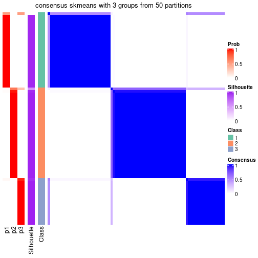</p>

</div>
<div id='tab-node-0111-consensus-heatmap-3'>
<pre><code class="r">consensus_heatmap(res, k = 4)
</code></pre>

<p></p>

</div>
</div>

Heatmaps for the membership of samples in all partitions to see how consistent they are:


<script>
$( function() {
	$( '#tabs-node-0111-membership-heatmap' ).tabs();
} );
</script>
<div id='tabs-node-0111-membership-heatmap'>
<ul>
<li><a href='#tab-node-0111-membership-heatmap-1'>k = 2</a></li>
<li><a href='#tab-node-0111-membership-heatmap-2'>k = 3</a></li>
<li><a href='#tab-node-0111-membership-heatmap-3'>k = 4</a></li>
</ul>
<div id='tab-node-0111-membership-heatmap-1'>
<pre><code class="r">membership_heatmap(res, k = 2)
</code></pre>

<p></p>

</div>
<div id='tab-node-0111-membership-heatmap-2'>
<pre><code class="r">membership_heatmap(res, k = 3)
</code></pre>

<p></p>

</div>
<div id='tab-node-0111-membership-heatmap-3'>
<pre><code class="r">membership_heatmap(res, k = 4)
</code></pre>

<p></p>

</div>
</div>

As soon as the classes for columns are determined, the signatures
that are significantly different between subgroups can be looked for. 
Following are the heatmaps for signatures.


Signature heatmaps where rows are scaled:


<script>
$( function() {
	$( '#tabs-node-0111-get-signatures' ).tabs();
} );
</script>
<div id='tabs-node-0111-get-signatures'>
<ul>
<li><a href='#tab-node-0111-get-signatures-1'>k = 2</a></li>
<li><a href='#tab-node-0111-get-signatures-2'>k = 3</a></li>
<li><a href='#tab-node-0111-get-signatures-3'>k = 4</a></li>
</ul>
<div id='tab-node-0111-get-signatures-1'>
<pre><code class="r">get_signatures(res, k = 2)
</code></pre>

<p></p>

</div>
<div id='tab-node-0111-get-signatures-2'>
<pre><code class="r">get_signatures(res, k = 3)
</code></pre>

<p></p>

</div>
<div id='tab-node-0111-get-signatures-3'>
<pre><code class="r">get_signatures(res, k = 4)
</code></pre>

<p></p>

</div>
</div>


Signature heatmaps where rows are not scaled:


<script>
$( function() {
	$( '#tabs-node-0111-get-signatures-no-scale' ).tabs();
} );
</script>
<div id='tabs-node-0111-get-signatures-no-scale'>
<ul>
<li><a href='#tab-node-0111-get-signatures-no-scale-1'>k = 2</a></li>
<li><a href='#tab-node-0111-get-signatures-no-scale-2'>k = 3</a></li>
<li><a href='#tab-node-0111-get-signatures-no-scale-3'>k = 4</a></li>
</ul>
<div id='tab-node-0111-get-signatures-no-scale-1'>
<pre><code class="r">get_signatures(res, k = 2, scale_rows = FALSE)
</code></pre>

<p></p>

</div>
<div id='tab-node-0111-get-signatures-no-scale-2'>
<pre><code class="r">get_signatures(res, k = 3, scale_rows = FALSE)
</code></pre>

<p></p>

</div>
<div id='tab-node-0111-get-signatures-no-scale-3'>
<pre><code class="r">get_signatures(res, k = 4, scale_rows = FALSE)
</code></pre>

<p></p>

</div>
</div>


Compare the overlap of signatures from different k:

```r
compare_signatures(res)
```


`get_signature()` returns a data frame invisibly. To get the list of signatures, the function
call should be assigned to a variable explicitly. In following code, if `plot` argument is set
to `FALSE`, no heatmap is plotted while only the differential analysis is performed.

```r
# code only for demonstration
tb = get_signature(res, k = ..., plot = FALSE)
```

An example of the output of `tb` is:

```
#>   which_row         fdr    mean_1    mean_2 scaled_mean_1 scaled_mean_2 km
#> 1        38 0.042760348  8.373488  9.131774    -0.5533452     0.5164555  1
#> 2        40 0.018707592  7.106213  8.469186    -0.6173731     0.5762149  1
#> 3        55 0.019134737 10.221463 11.207825    -0.6159697     0.5749050  1
#> 4        59 0.006059896  5.921854  7.869574    -0.6899429     0.6439467  1
#> 5        60 0.018055526  8.928898 10.211722    -0.6204761     0.5791110  1
#> 6        98 0.009384629 15.714769 14.887706     0.6635654    -0.6193277  2
...
```

The columns in `tb` are:

1. `which_row`: row indices corresponding to the input matrix.
2. `fdr`: FDR for the differential test. 
3. `mean_x`: The mean value in group x.
4. `scaled_mean_x`: The mean value in group x after rows are scaled.
5. `km`: Row groups if k-means clustering is applied to rows (which is done by automatically selecting number of clusters).

If there are too many signatures, `top_signatures = ...` can be set to only show the 
signatures with the highest FDRs:

```r
# code only for demonstration
# e.g. to show the top 500 most significant rows
tb = get_signature(res, k = ..., top_signatures = 500)
```

If the signatures are defined as these which are uniquely high in current group, `diff_method` argument
can be set to `"uniquely_high_in_one_group"`:

```r
# code only for demonstration
tb = get_signature(res, k = ..., diff_method = "uniquely_high_in_one_group")
```


UMAP plot which shows how samples are separated.


<script>
$( function() {
	$( '#tabs-node-0111-dimension-reduction' ).tabs();
} );
</script>
<div id='tabs-node-0111-dimension-reduction'>
<ul>
<li><a href='#tab-node-0111-dimension-reduction-1'>k = 2</a></li>
<li><a href='#tab-node-0111-dimension-reduction-2'>k = 3</a></li>
<li><a href='#tab-node-0111-dimension-reduction-3'>k = 4</a></li>
</ul>
<div id='tab-node-0111-dimension-reduction-1'>
<pre><code class="r">dimension_reduction(res, k = 2, method = &quot;UMAP&quot;)
</code></pre>

<p></p>

</div>
<div id='tab-node-0111-dimension-reduction-2'>
<pre><code class="r">dimension_reduction(res, k = 3, method = &quot;UMAP&quot;)
</code></pre>

<p></p>

</div>
<div id='tab-node-0111-dimension-reduction-3'>
<pre><code class="r">dimension_reduction(res, k = 4, method = &quot;UMAP&quot;)
</code></pre>

<p></p>

</div>
</div>


Following heatmap shows how subgroups are split when increasing `k`:

```r
collect_classes(res)
```


If matrix rows can be associated to genes, consider to use `functional_enrichment(res,
...)` to perform function enrichment for the signature genes. See [this vignette](https://jokergoo.github.io/cola_vignettes/functional_enrichment.html) for more detailed explanations.


 

---------------------------------------------------


### Node0112


Parent node: [Node011](#Node011).
Child nodes: 
                Node01111-leaf
        ,
                Node01112-leaf
        ,
                Node01113-leaf
        ,
                Node01121-leaf
        ,
                Node01122-leaf
        ,
                Node01211-leaf
        ,
                Node01212-leaf
        ,
                Node01213-leaf
        ,
                Node01221-leaf
        ,
                Node01222-leaf
        ,
                Node01223-leaf
        ,
                Node01311-leaf
        ,
                Node01312-leaf
        ,
                Node02111-leaf
        ,
                Node02112-leaf
        ,
                Node02121-leaf
        ,
                Node02122-leaf
        .


The object with results only for a single top-value method and a single partitioning method 
can be extracted as:

```r
res = res_rh["0112"]
```

A summary of `res` and all the functions that can be applied to it:

```r
res
```

```
#> A 'ConsensusPartition' object with k = 2, 3, 4.
#>   On a matrix with 16676 rows and 72 columns.
#>   Top rows (1668) are extracted by 'ATC' method.
#>   Subgroups are detected by 'skmeans' method.
#>   Performed in total 150 partitions by row resampling.
#>   Best k for subgroups seems to be 2.
#> 
#> Following methods can be applied to this 'ConsensusPartition' object:
#>  [1] "cola_report"             "collect_classes"         "collect_plots"          
#>  [4] "collect_stats"           "colnames"                "compare_partitions"     
#>  [7] "compare_signatures"      "consensus_heatmap"       "dimension_reduction"    
#> [10] "functional_enrichment"   "get_anno_col"            "get_anno"               
#> [13] "get_classes"             "get_consensus"           "get_matrix"             
#> [16] "get_membership"          "get_param"               "get_signatures"         
#> [19] "get_stats"               "is_best_k"               "is_stable_k"            
#> [22] "membership_heatmap"      "ncol"                    "nrow"                   
#> [25] "plot_ecdf"               "predict_classes"         "rownames"               
#> [28] "select_partition_number" "show"                    "suggest_best_k"         
#> [31] "test_to_known_factors"   "top_rows_heatmap"
```

`collect_plots()` function collects all the plots made from `res` for all `k` (number of subgroups)
into one single page to provide an easy and fast comparison between different `k`.

```r
collect_plots(res)
```


The plots are:

- The first row: a plot of the eCDF (empirical cumulative distribution
  function) curves of the consensus matrix for each `k` and the heatmap of
  predicted classes for each `k`.
- The second row: heatmaps of the consensus matrix for each `k`.
- The third row: heatmaps of the membership matrix for each `k`.
- The fouth row: heatmaps of the signatures for each `k`.

All the plots in panels can be made by individual functions and they are
plotted later in this section.

`select_partition_number()` produces several plots showing different
statistics for choosing "optimized" `k`. There are following statistics:

- eCDF curves of the consensus matrix for each `k`;
- 1-PAC. [The PAC score](https://en.wikipedia.org/wiki/Consensus_clustering#Over-interpretation_potential_of_consensus_clustering)
  measures the proportion of the ambiguous subgrouping.
- Mean silhouette score.
- Concordance. The mean probability of fiting the consensus subgroup labels in all
  partitions.
- Area increased. Denote $A_k$ as the area under the eCDF curve for current
  `k`, the area increased is defined as $A_k - A_{k-1}$.
- Rand index. The percent of pairs of samples that are both in a same cluster
  or both are not in a same cluster in the partition of k and k-1.
- Jaccard index. The ratio of pairs of samples are both in a same cluster in
  the partition of k and k-1 and the pairs of samples are both in a same
  cluster in the partition k or k-1.

The detailed explanations of these statistics can be found in [the _cola_
vignette](https://jokergoo.github.io/cola_vignettes/cola.html#toc_13).

Generally speaking, higher 1-PAC score, higher mean silhouette score or higher
concordance corresponds to better partition. Rand index and Jaccard index
measure how similar the current partition is compared to partition with `k-1`.
If they are too similar, we won't accept `k` is better than `k-1`.

```r
select_partition_number(res)
```

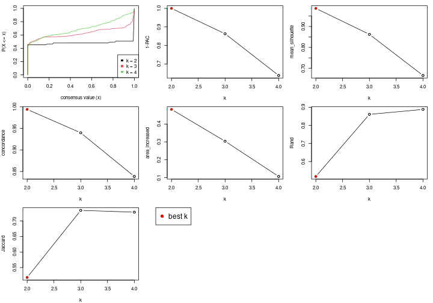

The numeric values for all these statistics can be obtained by `get_stats()`.

```r
get_stats(res)
```

```
#>   k 1-PAC mean_silhouette concordance area_increased  Rand Jaccard
#> 2 2 1.000           0.987       0.994          0.482 0.518   0.518
#> 3 3 0.863           0.862       0.940          0.304 0.861   0.734
#> 4 4 0.638           0.666       0.838          0.107 0.888   0.729
```

`suggest_best_k()` suggests the best $k$ based on these statistics. The rules are as follows:

- All $k$ with Jaccard index larger than 0.95 are removed because increasing
  $k$ does not provide enough extra information. If all $k$ are removed, it is
  marked as no subgroup is detected.
- For all $k$ with 1-PAC score larger than 0.9, the maximal $k$ is taken as
  the best $k$, and other $k$ are marked as optional $k$.
- If it does not fit the second rule. The $k$ with the maximal vote of the
  highest 1-PAC score, highest mean silhouette, and highest concordance is
  taken as the best $k$.

```r
suggest_best_k(res)
```

```
#> [1] 2
```


Following is the table of the partitions (You need to click the **show/hide
code output** link to see it). The membership matrix (columns with name `p*`)
is inferred by
[`clue::cl_consensus()`](https://www.rdocumentation.org/link/cl_consensus?package=clue)
function with the `SE` method. Basically the value in the membership matrix
represents the probability to belong to a certain group. The finall subgroup
label for an item is determined with the group with highest probability it
belongs to.

In `get_classes()` function, the entropy is calculated from the membership
matrix and the silhouette score is calculated from the consensus matrix.


<script>
$( function() {
	$( '#tabs-node-0112-get-classes' ).tabs();
} );
</script>
<div id='tabs-node-0112-get-classes'>
<ul>
<li><a href='#tab-node-0112-get-classes-1'>k = 2</a></li>
<li><a href='#tab-node-0112-get-classes-2'>k = 3</a></li>
<li><a href='#tab-node-0112-get-classes-3'>k = 4</a></li>
</ul>

<div id='tab-node-0112-get-classes-1'>
<p><a id='tab-node-0112-get-classes-1-a' style='color:#0366d6' href='#'>show/hide code output</a></p>
<pre><code class="r">cbind(get_classes(res, k = 2), get_membership(res, k = 2))
</code></pre>

<pre><code>#&gt;            class entropy silhouette   p1   p2
#&gt; Prog_014       1   0.000      0.996 1.00 0.00
#&gt; Prog_033       1   0.680      0.778 0.82 0.18
#&gt; Prog_028       2   0.000      0.991 0.00 1.00
#&gt; Prog_061       1   0.000      0.996 1.00 0.00
#&gt; Prog_046       2   0.000      0.991 0.00 1.00
#&gt; Prog_053       1   0.000      0.996 1.00 0.00
#&gt; Prog_084       1   0.000      0.996 1.00 0.00
#&gt; Prog_098       1   0.000      0.996 1.00 0.00
#&gt; Prog_100       1   0.000      0.996 1.00 0.00
#&gt; Prog_095       2   0.000      0.991 0.00 1.00
#&gt; Prog_090       1   0.000      0.996 1.00 0.00
#&gt; Prog_139       1   0.000      0.996 1.00 0.00
#&gt; Prog_178       1   0.000      0.996 1.00 0.00
#&gt; LT-HSC_064     1   0.000      0.996 1.00 0.00
#&gt; Prog_211       1   0.000      0.996 1.00 0.00
#&gt; HSPC_256       1   0.000      0.996 1.00 0.00
#&gt; Prog_265       1   0.000      0.996 1.00 0.00
#&gt; Prog_278       1   0.000      0.996 1.00 0.00
#&gt; Prog_290       2   0.000      0.991 0.00 1.00
#&gt; Prog_254       1   0.000      0.996 1.00 0.00
#&gt; Prog_286       1   0.000      0.996 1.00 0.00
#&gt; Prog_269       2   0.000      0.991 0.00 1.00
#&gt; Prog_288       2   0.000      0.991 0.00 1.00
#&gt; Prog_299       1   0.000      0.996 1.00 0.00
#&gt; Prog_324       2   0.000      0.991 0.00 1.00
#&gt; LT-HSC_098     2   0.000      0.991 0.00 1.00
#&gt; Prog_356       1   0.000      0.996 1.00 0.00
#&gt; Prog_339       2   0.000      0.991 0.00 1.00
#&gt; Prog_364       2   0.000      0.991 0.00 1.00
#&gt; Prog_376       1   0.000      0.996 1.00 0.00
#&gt; Prog_359       2   0.000      0.991 0.00 1.00
#&gt; Prog_372       1   0.000      0.996 1.00 0.00
#&gt; HSPC_404       1   0.000      0.996 1.00 0.00
#&gt; Prog_403       1   0.000      0.996 1.00 0.00
#&gt; Prog_379       2   0.000      0.991 0.00 1.00
#&gt; Prog_410       1   0.000      0.996 1.00 0.00
#&gt; Prog_416       1   0.000      0.996 1.00 0.00
#&gt; Prog_380       2   0.000      0.991 0.00 1.00
#&gt; Prog_393       1   0.000      0.996 1.00 0.00
#&gt; Prog_381       2   0.000      0.991 0.00 1.00
#&gt; Prog_406       1   0.000      0.996 1.00 0.00
#&gt; Prog_424       1   0.000      0.996 1.00 0.00
#&gt; Prog_430       1   0.000      0.996 1.00 0.00
#&gt; Prog_477       1   0.000      0.996 1.00 0.00
#&gt; Prog_502       1   0.000      0.996 1.00 0.00
#&gt; Prog_523       2   0.000      0.991 0.00 1.00
#&gt; Prog_535       2   0.000      0.991 0.00 1.00
#&gt; Prog_536       2   0.000      0.991 0.00 1.00
#&gt; Prog_548       2   0.000      0.991 0.00 1.00
#&gt; Prog_562       1   0.000      0.996 1.00 0.00
#&gt; Prog_608       2   0.000      0.991 0.00 1.00
#&gt; Prog_603       2   0.000      0.991 0.00 1.00
#&gt; Prog_649       1   0.000      0.996 1.00 0.00
#&gt; Prog_655       1   0.000      0.996 1.00 0.00
#&gt; Prog_638       2   0.795      0.682 0.24 0.76
#&gt; Prog_663       2   0.000      0.991 0.00 1.00
#&gt; Prog_677       1   0.000      0.996 1.00 0.00
#&gt; Prog_697       2   0.000      0.991 0.00 1.00
#&gt; Prog_688       2   0.000      0.991 0.00 1.00
#&gt; Prog_719       1   0.000      0.996 1.00 0.00
#&gt; Prog_723       2   0.000      0.991 0.00 1.00
#&gt; Prog_730       1   0.000      0.996 1.00 0.00
#&gt; Prog_731       1   0.000      0.996 1.00 0.00
#&gt; Prog_776       1   0.000      0.996 1.00 0.00
#&gt; Prog_788       2   0.000      0.991 0.00 1.00
#&gt; Prog_790       1   0.000      0.996 1.00 0.00
#&gt; Prog_830       2   0.000      0.991 0.00 1.00
#&gt; Prog_813       1   0.000      0.996 1.00 0.00
#&gt; Prog_819       1   0.000      0.996 1.00 0.00
#&gt; Prog_814       1   0.000      0.996 1.00 0.00
#&gt; Prog_826       2   0.000      0.991 0.00 1.00
#&gt; Prog_838       1   0.000      0.996 1.00 0.00
</code></pre>

<script>
$('#tab-node-0112-get-classes-1-a').parent().next().next().hide();
$('#tab-node-0112-get-classes-1-a').click(function(){
  $('#tab-node-0112-get-classes-1-a').parent().next().next().toggle();
  return(false);
});
</script>
</div>

<div id='tab-node-0112-get-classes-2'>
<p><a id='tab-node-0112-get-classes-2-a' style='color:#0366d6' href='#'>show/hide code output</a></p>
<pre><code class="r">cbind(get_classes(res, k = 3), get_membership(res, k = 3))
</code></pre>

<pre><code>#&gt;            class entropy silhouette   p1   p2   p3
#&gt; Prog_014       3  0.0000      0.885 0.00 0.00 1.00
#&gt; Prog_033       3  0.0000      0.885 0.00 0.00 1.00
#&gt; Prog_028       2  0.0000      0.976 0.00 1.00 0.00
#&gt; Prog_061       1  0.0000      0.913 1.00 0.00 0.00
#&gt; Prog_046       2  0.0000      0.976 0.00 1.00 0.00
#&gt; Prog_053       1  0.0892      0.909 0.98 0.00 0.02
#&gt; Prog_084       1  0.0000      0.913 1.00 0.00 0.00
#&gt; Prog_098       1  0.2537      0.868 0.92 0.00 0.08
#&gt; Prog_100       1  0.0000      0.913 1.00 0.00 0.00
#&gt; Prog_095       2  0.0000      0.976 0.00 1.00 0.00
#&gt; Prog_090       1  0.0000      0.913 1.00 0.00 0.00
#&gt; Prog_139       1  0.0000      0.913 1.00 0.00 0.00
#&gt; Prog_178       1  0.0000      0.913 1.00 0.00 0.00
#&gt; LT-HSC_064     1  0.0000      0.913 1.00 0.00 0.00
#&gt; Prog_211       1  0.1529      0.902 0.96 0.00 0.04
#&gt; HSPC_256       1  0.0000      0.913 1.00 0.00 0.00
#&gt; Prog_265       1  0.0892      0.909 0.98 0.00 0.02
#&gt; Prog_278       1  0.0892      0.909 0.98 0.00 0.02
#&gt; Prog_290       2  0.0000      0.976 0.00 1.00 0.00
#&gt; Prog_254       1  0.0892      0.909 0.98 0.00 0.02
#&gt; Prog_286       1  0.0892      0.906 0.98 0.00 0.02
#&gt; Prog_269       2  0.0000      0.976 0.00 1.00 0.00
#&gt; Prog_288       2  0.1529      0.943 0.00 0.96 0.04
#&gt; Prog_299       1  0.0000      0.913 1.00 0.00 0.00
#&gt; Prog_324       2  0.0000      0.976 0.00 1.00 0.00
#&gt; LT-HSC_098     2  0.2537      0.905 0.00 0.92 0.08
#&gt; Prog_356       3  0.2537      0.861 0.08 0.00 0.92
#&gt; Prog_339       2  0.0000      0.976 0.00 1.00 0.00
#&gt; Prog_364       2  0.0000      0.976 0.00 1.00 0.00
#&gt; Prog_376       1  0.2066      0.886 0.94 0.00 0.06
#&gt; Prog_359       3  0.2959      0.829 0.00 0.10 0.90
#&gt; Prog_372       1  0.0000      0.913 1.00 0.00 0.00
#&gt; HSPC_404       1  0.2537      0.868 0.92 0.00 0.08
#&gt; Prog_403       1  0.6045      0.374 0.62 0.00 0.38
#&gt; Prog_379       2  0.0000      0.976 0.00 1.00 0.00
#&gt; Prog_410       1  0.0000      0.913 1.00 0.00 0.00
#&gt; Prog_416       3  0.6192      0.251 0.42 0.00 0.58
#&gt; Prog_380       2  0.0000      0.976 0.00 1.00 0.00
#&gt; Prog_393       3  0.0892      0.884 0.02 0.00 0.98
#&gt; Prog_381       2  0.0000      0.976 0.00 1.00 0.00
#&gt; Prog_406       3  0.2537      0.865 0.08 0.00 0.92
#&gt; Prog_424       1  0.0892      0.909 0.98 0.00 0.02
#&gt; Prog_430       1  0.2066      0.880 0.94 0.00 0.06
#&gt; Prog_477       1  0.0892      0.909 0.98 0.00 0.02
#&gt; Prog_502       1  0.1529      0.902 0.96 0.00 0.04
#&gt; Prog_523       2  0.0000      0.976 0.00 1.00 0.00
#&gt; Prog_535       2  0.0000      0.976 0.00 1.00 0.00
#&gt; Prog_536       2  0.0892      0.961 0.00 0.98 0.02
#&gt; Prog_548       2  0.0000      0.976 0.00 1.00 0.00
#&gt; Prog_562       1  0.5835      0.522 0.66 0.00 0.34
#&gt; Prog_608       2  0.6192      0.276 0.00 0.58 0.42
#&gt; Prog_603       2  0.0000      0.976 0.00 1.00 0.00
#&gt; Prog_649       1  0.0892      0.906 0.98 0.00 0.02
#&gt; Prog_655       1  0.0892      0.906 0.98 0.00 0.02
#&gt; Prog_638       3  0.3686      0.788 0.00 0.14 0.86
#&gt; Prog_663       2  0.0000      0.976 0.00 1.00 0.00
#&gt; Prog_677       1  0.0000      0.913 1.00 0.00 0.00
#&gt; Prog_697       2  0.0892      0.961 0.00 0.98 0.02
#&gt; Prog_688       2  0.0000      0.976 0.00 1.00 0.00
#&gt; Prog_719       3  0.3340      0.830 0.12 0.00 0.88
#&gt; Prog_723       2  0.0000      0.976 0.00 1.00 0.00
#&gt; Prog_730       1  0.0000      0.913 1.00 0.00 0.00
#&gt; Prog_731       1  0.0892      0.909 0.98 0.00 0.02
#&gt; Prog_776       1  0.5948      0.466 0.64 0.00 0.36
#&gt; Prog_788       2  0.0000      0.976 0.00 1.00 0.00
#&gt; Prog_790       1  0.4796      0.720 0.78 0.00 0.22
#&gt; Prog_830       2  0.0000      0.976 0.00 1.00 0.00
#&gt; Prog_813       3  0.0000      0.885 0.00 0.00 1.00
#&gt; Prog_819       1  0.6280      0.221 0.54 0.00 0.46
#&gt; Prog_814       1  0.0000      0.913 1.00 0.00 0.00
#&gt; Prog_826       2  0.0000      0.976 0.00 1.00 0.00
#&gt; Prog_838       1  0.6302      0.105 0.52 0.00 0.48
</code></pre>

<script>
$('#tab-node-0112-get-classes-2-a').parent().next().next().hide();
$('#tab-node-0112-get-classes-2-a').click(function(){
  $('#tab-node-0112-get-classes-2-a').parent().next().next().toggle();
  return(false);
});
</script>
</div>

<div id='tab-node-0112-get-classes-3'>
<p><a id='tab-node-0112-get-classes-3-a' style='color:#0366d6' href='#'>show/hide code output</a></p>
<pre><code class="r">cbind(get_classes(res, k = 4), get_membership(res, k = 4))
</code></pre>

<pre><code>#&gt;            class entropy silhouette   p1   p2   p3   p4
#&gt; Prog_014       3  0.2647      0.661 0.00 0.00 0.88 0.12
#&gt; Prog_033       3  0.2345      0.668 0.00 0.00 0.90 0.10
#&gt; Prog_028       2  0.0707      0.877 0.00 0.98 0.00 0.02
#&gt; Prog_061       1  0.0000      0.848 1.00 0.00 0.00 0.00
#&gt; Prog_046       2  0.4406      0.618 0.00 0.70 0.30 0.00
#&gt; Prog_053       1  0.0000      0.848 1.00 0.00 0.00 0.00
#&gt; Prog_084       1  0.0000      0.848 1.00 0.00 0.00 0.00
#&gt; Prog_098       4  0.5487      0.453 0.40 0.00 0.02 0.58
#&gt; Prog_100       1  0.0000      0.848 1.00 0.00 0.00 0.00
#&gt; Prog_095       2  0.3853      0.788 0.00 0.82 0.16 0.02
#&gt; Prog_090       1  0.0000      0.848 1.00 0.00 0.00 0.00
#&gt; Prog_139       1  0.2647      0.760 0.88 0.00 0.00 0.12
#&gt; Prog_178       1  0.0000      0.848 1.00 0.00 0.00 0.00
#&gt; LT-HSC_064     1  0.0000      0.848 1.00 0.00 0.00 0.00
#&gt; Prog_211       1  0.0000      0.848 1.00 0.00 0.00 0.00
#&gt; HSPC_256       1  0.0000      0.848 1.00 0.00 0.00 0.00
#&gt; Prog_265       1  0.0000      0.848 1.00 0.00 0.00 0.00
#&gt; Prog_278       1  0.0000      0.848 1.00 0.00 0.00 0.00
#&gt; Prog_290       2  0.2011      0.867 0.00 0.92 0.00 0.08
#&gt; Prog_254       1  0.0000      0.848 1.00 0.00 0.00 0.00
#&gt; Prog_286       1  0.3801      0.611 0.78 0.00 0.00 0.22
#&gt; Prog_269       2  0.1637      0.862 0.00 0.94 0.06 0.00
#&gt; Prog_288       2  0.4284      0.791 0.00 0.78 0.02 0.20
#&gt; Prog_299       1  0.0707      0.838 0.98 0.00 0.00 0.02
#&gt; Prog_324       2  0.0707      0.876 0.00 0.98 0.00 0.02
#&gt; LT-HSC_098     2  0.6104      0.675 0.00 0.68 0.14 0.18
#&gt; Prog_356       4  0.4472      0.125 0.02 0.00 0.22 0.76
#&gt; Prog_339       2  0.3853      0.827 0.00 0.82 0.02 0.16
#&gt; Prog_364       2  0.2706      0.860 0.00 0.90 0.02 0.08
#&gt; Prog_376       1  0.3335      0.713 0.86 0.00 0.02 0.12
#&gt; Prog_359       4  0.6605     -0.421 0.00 0.08 0.44 0.48
#&gt; Prog_372       1  0.2647      0.763 0.88 0.00 0.00 0.12
#&gt; HSPC_404       1  0.4088      0.677 0.82 0.00 0.04 0.14
#&gt; Prog_403       1  0.6855      0.193 0.60 0.00 0.20 0.20
#&gt; Prog_379       2  0.3037      0.853 0.00 0.88 0.02 0.10
#&gt; Prog_410       1  0.1211      0.822 0.96 0.00 0.00 0.04
#&gt; Prog_416       1  0.7674     -0.185 0.46 0.00 0.26 0.28
#&gt; Prog_380       2  0.3853      0.826 0.00 0.82 0.02 0.16
#&gt; Prog_393       4  0.6831     -0.127 0.10 0.00 0.42 0.48
#&gt; Prog_381       2  0.3037      0.853 0.00 0.88 0.02 0.10
#&gt; Prog_406       3  0.6766      0.333 0.10 0.00 0.52 0.38
#&gt; Prog_424       1  0.0000      0.848 1.00 0.00 0.00 0.00
#&gt; Prog_430       4  0.4855      0.461 0.40 0.00 0.00 0.60
#&gt; Prog_477       1  0.0000      0.848 1.00 0.00 0.00 0.00
#&gt; Prog_502       1  0.2830      0.778 0.90 0.00 0.04 0.06
#&gt; Prog_523       2  0.3400      0.784 0.00 0.82 0.18 0.00
#&gt; Prog_535       2  0.0000      0.875 0.00 1.00 0.00 0.00
#&gt; Prog_536       2  0.6089      0.626 0.00 0.64 0.08 0.28
#&gt; Prog_548       2  0.0707      0.876 0.00 0.98 0.00 0.02
#&gt; Prog_562       4  0.6216      0.493 0.22 0.00 0.12 0.66
#&gt; Prog_608       3  0.5256      0.489 0.00 0.26 0.70 0.04
#&gt; Prog_603       2  0.3610      0.765 0.00 0.80 0.20 0.00
#&gt; Prog_649       1  0.4284      0.619 0.78 0.00 0.02 0.20
#&gt; Prog_655       1  0.4624      0.326 0.66 0.00 0.00 0.34
#&gt; Prog_638       3  0.5428      0.549 0.00 0.12 0.74 0.14
#&gt; Prog_663       2  0.1637      0.862 0.00 0.94 0.06 0.00
#&gt; Prog_677       1  0.0707      0.838 0.98 0.00 0.00 0.02
#&gt; Prog_697       2  0.3198      0.854 0.00 0.88 0.04 0.08
#&gt; Prog_688       2  0.1637      0.862 0.00 0.94 0.06 0.00
#&gt; Prog_719       3  0.3606      0.564 0.14 0.00 0.84 0.02
#&gt; Prog_723       2  0.0000      0.875 0.00 1.00 0.00 0.00
#&gt; Prog_730       1  0.4522      0.372 0.68 0.00 0.00 0.32
#&gt; Prog_731       1  0.0000      0.848 1.00 0.00 0.00 0.00
#&gt; Prog_776       4  0.6011      0.257 0.48 0.00 0.04 0.48
#&gt; Prog_788       2  0.1637      0.862 0.00 0.94 0.06 0.00
#&gt; Prog_790       4  0.5428      0.482 0.38 0.00 0.02 0.60
#&gt; Prog_830       2  0.2011      0.867 0.00 0.92 0.00 0.08
#&gt; Prog_813       3  0.5173      0.579 0.02 0.00 0.66 0.32
#&gt; Prog_819       4  0.2647      0.420 0.12 0.00 0.00 0.88
#&gt; Prog_814       1  0.0000      0.848 1.00 0.00 0.00 0.00
#&gt; Prog_826       2  0.1211      0.868 0.00 0.96 0.04 0.00
#&gt; Prog_838       1  0.7544     -0.292 0.46 0.00 0.20 0.34
</code></pre>

<script>
$('#tab-node-0112-get-classes-3-a').parent().next().next().hide();
$('#tab-node-0112-get-classes-3-a').click(function(){
  $('#tab-node-0112-get-classes-3-a').parent().next().next().toggle();
  return(false);
});
</script>
</div>
</div>

Heatmaps for the consensus matrix. It visualizes the probability of two
samples to be in a same group.


<script>
$( function() {
	$( '#tabs-node-0112-consensus-heatmap' ).tabs();
} );
</script>
<div id='tabs-node-0112-consensus-heatmap'>
<ul>
<li><a href='#tab-node-0112-consensus-heatmap-1'>k = 2</a></li>
<li><a href='#tab-node-0112-consensus-heatmap-2'>k = 3</a></li>
<li><a href='#tab-node-0112-consensus-heatmap-3'>k = 4</a></li>
</ul>
<div id='tab-node-0112-consensus-heatmap-1'>
<pre><code class="r">consensus_heatmap(res, k = 2)
</code></pre>

<p></p>

</div>
<div id='tab-node-0112-consensus-heatmap-2'>
<pre><code class="r">consensus_heatmap(res, k = 3)
</code></pre>

<p></p>

</div>
<div id='tab-node-0112-consensus-heatmap-3'>
<pre><code class="r">consensus_heatmap(res, k = 4)
</code></pre>

<p></p>

</div>
</div>

Heatmaps for the membership of samples in all partitions to see how consistent they are:


<script>
$( function() {
	$( '#tabs-node-0112-membership-heatmap' ).tabs();
} );
</script>
<div id='tabs-node-0112-membership-heatmap'>
<ul>
<li><a href='#tab-node-0112-membership-heatmap-1'>k = 2</a></li>
<li><a href='#tab-node-0112-membership-heatmap-2'>k = 3</a></li>
<li><a href='#tab-node-0112-membership-heatmap-3'>k = 4</a></li>
</ul>
<div id='tab-node-0112-membership-heatmap-1'>
<pre><code class="r">membership_heatmap(res, k = 2)
</code></pre>

<p>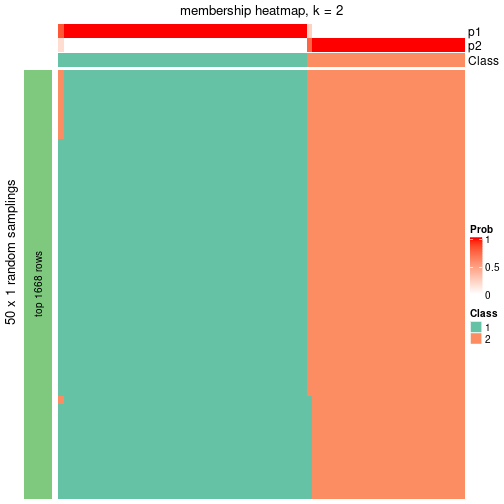</p>

</div>
<div id='tab-node-0112-membership-heatmap-2'>
<pre><code class="r">membership_heatmap(res, k = 3)
</code></pre>

<p></p>

</div>
<div id='tab-node-0112-membership-heatmap-3'>
<pre><code class="r">membership_heatmap(res, k = 4)
</code></pre>

<p></p>

</div>
</div>

As soon as the classes for columns are determined, the signatures
that are significantly different between subgroups can be looked for. 
Following are the heatmaps for signatures.


Signature heatmaps where rows are scaled:


<script>
$( function() {
	$( '#tabs-node-0112-get-signatures' ).tabs();
} );
</script>
<div id='tabs-node-0112-get-signatures'>
<ul>
<li><a href='#tab-node-0112-get-signatures-1'>k = 2</a></li>
<li><a href='#tab-node-0112-get-signatures-2'>k = 3</a></li>
<li><a href='#tab-node-0112-get-signatures-3'>k = 4</a></li>
</ul>
<div id='tab-node-0112-get-signatures-1'>
<pre><code class="r">get_signatures(res, k = 2)
</code></pre>

<p></p>

</div>
<div id='tab-node-0112-get-signatures-2'>
<pre><code class="r">get_signatures(res, k = 3)
</code></pre>

<p></p>

</div>
<div id='tab-node-0112-get-signatures-3'>
<pre><code class="r">get_signatures(res, k = 4)
</code></pre>

<p></p>

</div>
</div>


Signature heatmaps where rows are not scaled:


<script>
$( function() {
	$( '#tabs-node-0112-get-signatures-no-scale' ).tabs();
} );
</script>
<div id='tabs-node-0112-get-signatures-no-scale'>
<ul>
<li><a href='#tab-node-0112-get-signatures-no-scale-1'>k = 2</a></li>
<li><a href='#tab-node-0112-get-signatures-no-scale-2'>k = 3</a></li>
<li><a href='#tab-node-0112-get-signatures-no-scale-3'>k = 4</a></li>
</ul>
<div id='tab-node-0112-get-signatures-no-scale-1'>
<pre><code class="r">get_signatures(res, k = 2, scale_rows = FALSE)
</code></pre>

<p></p>

</div>
<div id='tab-node-0112-get-signatures-no-scale-2'>
<pre><code class="r">get_signatures(res, k = 3, scale_rows = FALSE)
</code></pre>

<p></p>

</div>
<div id='tab-node-0112-get-signatures-no-scale-3'>
<pre><code class="r">get_signatures(res, k = 4, scale_rows = FALSE)
</code></pre>

<p></p>

</div>
</div>


Compare the overlap of signatures from different k:

```r
compare_signatures(res)
```


`get_signature()` returns a data frame invisibly. To get the list of signatures, the function
call should be assigned to a variable explicitly. In following code, if `plot` argument is set
to `FALSE`, no heatmap is plotted while only the differential analysis is performed.

```r
# code only for demonstration
tb = get_signature(res, k = ..., plot = FALSE)
```

An example of the output of `tb` is:

```
#>   which_row         fdr    mean_1    mean_2 scaled_mean_1 scaled_mean_2 km
#> 1        38 0.042760348  8.373488  9.131774    -0.5533452     0.5164555  1
#> 2        40 0.018707592  7.106213  8.469186    -0.6173731     0.5762149  1
#> 3        55 0.019134737 10.221463 11.207825    -0.6159697     0.5749050  1
#> 4        59 0.006059896  5.921854  7.869574    -0.6899429     0.6439467  1
#> 5        60 0.018055526  8.928898 10.211722    -0.6204761     0.5791110  1
#> 6        98 0.009384629 15.714769 14.887706     0.6635654    -0.6193277  2
...
```

The columns in `tb` are:

1. `which_row`: row indices corresponding to the input matrix.
2. `fdr`: FDR for the differential test. 
3. `mean_x`: The mean value in group x.
4. `scaled_mean_x`: The mean value in group x after rows are scaled.
5. `km`: Row groups if k-means clustering is applied to rows (which is done by automatically selecting number of clusters).

If there are too many signatures, `top_signatures = ...` can be set to only show the 
signatures with the highest FDRs:

```r
# code only for demonstration
# e.g. to show the top 500 most significant rows
tb = get_signature(res, k = ..., top_signatures = 500)
```

If the signatures are defined as these which are uniquely high in current group, `diff_method` argument
can be set to `"uniquely_high_in_one_group"`:

```r
# code only for demonstration
tb = get_signature(res, k = ..., diff_method = "uniquely_high_in_one_group")
```


UMAP plot which shows how samples are separated.


<script>
$( function() {
	$( '#tabs-node-0112-dimension-reduction' ).tabs();
} );
</script>
<div id='tabs-node-0112-dimension-reduction'>
<ul>
<li><a href='#tab-node-0112-dimension-reduction-1'>k = 2</a></li>
<li><a href='#tab-node-0112-dimension-reduction-2'>k = 3</a></li>
<li><a href='#tab-node-0112-dimension-reduction-3'>k = 4</a></li>
</ul>
<div id='tab-node-0112-dimension-reduction-1'>
<pre><code class="r">dimension_reduction(res, k = 2, method = &quot;UMAP&quot;)
</code></pre>

<p>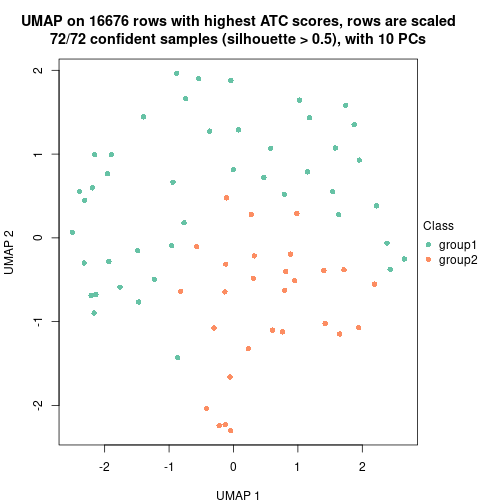</p>

</div>
<div id='tab-node-0112-dimension-reduction-2'>
<pre><code class="r">dimension_reduction(res, k = 3, method = &quot;UMAP&quot;)
</code></pre>

<p></p>

</div>
<div id='tab-node-0112-dimension-reduction-3'>
<pre><code class="r">dimension_reduction(res, k = 4, method = &quot;UMAP&quot;)
</code></pre>

<p></p>

</div>
</div>


Following heatmap shows how subgroups are split when increasing `k`:

```r
collect_classes(res)
```


If matrix rows can be associated to genes, consider to use `functional_enrichment(res,
...)` to perform function enrichment for the signature genes. See [this vignette](https://jokergoo.github.io/cola_vignettes/functional_enrichment.html) for more detailed explanations.


 

---------------------------------------------------


### Node012


Parent node: [Node01](#Node01).
Child nodes: 
                [Node0111](#Node0111)
        ,
                [Node0112](#Node0112)
        ,
                [Node0121](#Node0121)
        ,
                [Node0122](#Node0122)
        ,
                [Node0131](#Node0131)
        ,
                Node0132-leaf
        ,
                Node0141-leaf
        ,
                Node0142-leaf
        ,
                [Node0211](#Node0211)
        ,
                [Node0212](#Node0212)
        ,
                Node0213-leaf
        ,
                Node0311-leaf
        ,
                Node0312-leaf
        ,
                Node0321-leaf
        ,
                Node0322-leaf
        ,
                Node0331-leaf
        ,
                Node0332-leaf
        ,
                Node0411-leaf
        ,
                Node0412-leaf
        ,
                Node0413-leaf
        ,
                Node0421-leaf
        ,
                Node0422-leaf
        ,
                Node0423-leaf
        .


The object with results only for a single top-value method and a single partitioning method 
can be extracted as:

```r
res = res_rh["012"]
```

A summary of `res` and all the functions that can be applied to it:

```r
res
```

```
#> A 'ConsensusPartition' object with k = 2, 3, 4.
#>   On a matrix with 17327 rows and 248 columns.
#>   Top rows (1733) are extracted by 'ATC' method.
#>   Subgroups are detected by 'skmeans' method.
#>   Performed in total 150 partitions by row resampling.
#>   Best k for subgroups seems to be 4.
#> 
#> Following methods can be applied to this 'ConsensusPartition' object:
#>  [1] "cola_report"             "collect_classes"         "collect_plots"          
#>  [4] "collect_stats"           "colnames"                "compare_partitions"     
#>  [7] "compare_signatures"      "consensus_heatmap"       "dimension_reduction"    
#> [10] "functional_enrichment"   "get_anno_col"            "get_anno"               
#> [13] "get_classes"             "get_consensus"           "get_matrix"             
#> [16] "get_membership"          "get_param"               "get_signatures"         
#> [19] "get_stats"               "is_best_k"               "is_stable_k"            
#> [22] "membership_heatmap"      "ncol"                    "nrow"                   
#> [25] "plot_ecdf"               "predict_classes"         "rownames"               
#> [28] "select_partition_number" "show"                    "suggest_best_k"         
#> [31] "test_to_known_factors"   "top_rows_heatmap"
```

`collect_plots()` function collects all the plots made from `res` for all `k` (number of subgroups)
into one single page to provide an easy and fast comparison between different `k`.

```r
collect_plots(res)
```


The plots are:

- The first row: a plot of the eCDF (empirical cumulative distribution
  function) curves of the consensus matrix for each `k` and the heatmap of
  predicted classes for each `k`.
- The second row: heatmaps of the consensus matrix for each `k`.
- The third row: heatmaps of the membership matrix for each `k`.
- The fouth row: heatmaps of the signatures for each `k`.

All the plots in panels can be made by individual functions and they are
plotted later in this section.

`select_partition_number()` produces several plots showing different
statistics for choosing "optimized" `k`. There are following statistics:

- eCDF curves of the consensus matrix for each `k`;
- 1-PAC. [The PAC score](https://en.wikipedia.org/wiki/Consensus_clustering#Over-interpretation_potential_of_consensus_clustering)
  measures the proportion of the ambiguous subgrouping.
- Mean silhouette score.
- Concordance. The mean probability of fiting the consensus subgroup labels in all
  partitions.
- Area increased. Denote $A_k$ as the area under the eCDF curve for current
  `k`, the area increased is defined as $A_k - A_{k-1}$.
- Rand index. The percent of pairs of samples that are both in a same cluster
  or both are not in a same cluster in the partition of k and k-1.
- Jaccard index. The ratio of pairs of samples are both in a same cluster in
  the partition of k and k-1 and the pairs of samples are both in a same
  cluster in the partition k or k-1.

The detailed explanations of these statistics can be found in [the _cola_
vignette](https://jokergoo.github.io/cola_vignettes/cola.html#toc_13).

Generally speaking, higher 1-PAC score, higher mean silhouette score or higher
concordance corresponds to better partition. Rand index and Jaccard index
measure how similar the current partition is compared to partition with `k-1`.
If they are too similar, we won't accept `k` is better than `k-1`.

```r
select_partition_number(res)
```


The numeric values for all these statistics can be obtained by `get_stats()`.

```r
get_stats(res)
```

```
#>   k 1-PAC mean_silhouette concordance area_increased  Rand Jaccard
#> 2 2 1.000           0.980       0.992          0.502 0.498   0.498
#> 3 3 0.884           0.909       0.958          0.305 0.767   0.566
#> 4 4 0.971           0.944       0.977          0.134 0.790   0.482
```

`suggest_best_k()` suggests the best $k$ based on these statistics. The rules are as follows:

- All $k$ with Jaccard index larger than 0.95 are removed because increasing
  $k$ does not provide enough extra information. If all $k$ are removed, it is
  marked as no subgroup is detected.
- For all $k$ with 1-PAC score larger than 0.9, the maximal $k$ is taken as
  the best $k$, and other $k$ are marked as optional $k$.
- If it does not fit the second rule. The $k$ with the maximal vote of the
  highest 1-PAC score, highest mean silhouette, and highest concordance is
  taken as the best $k$.

```r
suggest_best_k(res)
```

```
#> [1] 4
#> attr(,"optional")
#> [1] 2
```

There is also optional best $k$ = 2 that is worth to check.

Following is the table of the partitions (You need to click the **show/hide
code output** link to see it). The membership matrix (columns with name `p*`)
is inferred by
[`clue::cl_consensus()`](https://www.rdocumentation.org/link/cl_consensus?package=clue)
function with the `SE` method. Basically the value in the membership matrix
represents the probability to belong to a certain group. The finall subgroup
label for an item is determined with the group with highest probability it
belongs to.

In `get_classes()` function, the entropy is calculated from the membership
matrix and the silhouette score is calculated from the consensus matrix.


<script>
$( function() {
	$( '#tabs-node-012-get-classes' ).tabs();
} );
</script>
<div id='tabs-node-012-get-classes'>
<ul>
<li><a href='#tab-node-012-get-classes-1'>k = 2</a></li>
<li><a href='#tab-node-012-get-classes-2'>k = 3</a></li>
<li><a href='#tab-node-012-get-classes-3'>k = 4</a></li>
</ul>

<div id='tab-node-012-get-classes-1'>
<p><a id='tab-node-012-get-classes-1-a' style='color:#0366d6' href='#'>show/hide code output</a></p>
<pre><code class="r">cbind(get_classes(res, k = 2), get_membership(res, k = 2))
</code></pre>

<pre><code>#&gt;            class entropy silhouette   p1   p2
#&gt; HSPC_001       2   0.000      0.994 0.00 1.00
#&gt; HSPC_003       1   0.827      0.651 0.74 0.26
#&gt; HSPC_016       2   0.000      0.994 0.00 1.00
#&gt; HSPC_034       1   0.000      0.990 1.00 0.00
#&gt; HSPC_036       1   0.000      0.990 1.00 0.00
#&gt; Prog_007       2   0.242      0.954 0.04 0.96
#&gt; Prog_013       1   0.000      0.990 1.00 0.00
#&gt; Prog_002       1   0.000      0.990 1.00 0.00
#&gt; Prog_015       1   0.000      0.990 1.00 0.00
#&gt; Prog_027       2   0.000      0.994 0.00 1.00
#&gt; Prog_003       2   0.000      0.994 0.00 1.00
#&gt; Prog_017       1   0.000      0.990 1.00 0.00
#&gt; Prog_023       2   0.000      0.994 0.00 1.00
#&gt; HSPC_053       1   0.000      0.990 1.00 0.00
#&gt; HSPC_077       1   0.000      0.990 1.00 0.00
#&gt; Prog_055       1   0.000      0.990 1.00 0.00
#&gt; Prog_050       1   0.000      0.990 1.00 0.00
#&gt; Prog_056       2   0.000      0.994 0.00 1.00
#&gt; Prog_069       2   0.000      0.994 0.00 1.00
#&gt; Prog_075       1   0.000      0.990 1.00 0.00
#&gt; Prog_059       2   0.000      0.994 0.00 1.00
#&gt; Prog_071       2   0.000      0.994 0.00 1.00
#&gt; Prog_077       2   0.000      0.994 0.00 1.00
#&gt; Prog_083       1   0.000      0.990 1.00 0.00
#&gt; Prog_047       1   0.000      0.990 1.00 0.00
#&gt; HSPC_094       2   0.000      0.994 0.00 1.00
#&gt; HSPC_101       1   0.000      0.990 1.00 0.00
#&gt; HSPC_102       1   0.000      0.990 1.00 0.00
#&gt; HSPC_090       2   0.000      0.994 0.00 1.00
#&gt; Prog_097       1   0.000      0.990 1.00 0.00
#&gt; Prog_103       2   0.000      0.994 0.00 1.00
#&gt; Prog_085       2   0.000      0.994 0.00 1.00
#&gt; Prog_116       2   0.000      0.994 0.00 1.00
#&gt; Prog_093       2   0.000      0.994 0.00 1.00
#&gt; Prog_099       2   0.000      0.994 0.00 1.00
#&gt; Prog_105       1   0.000      0.990 1.00 0.00
#&gt; Prog_123       1   0.000      0.990 1.00 0.00
#&gt; Prog_087       1   0.000      0.990 1.00 0.00
#&gt; Prog_113       2   0.000      0.994 0.00 1.00
#&gt; HSPC_138       2   0.000      0.994 0.00 1.00
#&gt; HSPC_156       2   0.000      0.994 0.00 1.00
#&gt; Prog_133       1   0.000      0.990 1.00 0.00
#&gt; Prog_145       1   0.000      0.990 1.00 0.00
#&gt; Prog_157       2   0.000      0.994 0.00 1.00
#&gt; Prog_128       1   0.000      0.990 1.00 0.00
#&gt; Prog_153       2   0.000      0.994 0.00 1.00
#&gt; Prog_137       2   0.000      0.994 0.00 1.00
#&gt; Prog_155       1   0.000      0.990 1.00 0.00
#&gt; Prog_167       1   0.000      0.990 1.00 0.00
#&gt; HSPC_206       2   0.000      0.994 0.00 1.00
#&gt; HSPC_195       1   0.000      0.990 1.00 0.00
#&gt; LT-HSC_052     2   0.000      0.994 0.00 1.00
#&gt; HSPC_172       2   0.000      0.994 0.00 1.00
#&gt; HSPC_179       2   0.000      0.994 0.00 1.00
#&gt; Prog_176       2   0.000      0.994 0.00 1.00
#&gt; Prog_206       2   0.000      0.994 0.00 1.00
#&gt; Prog_189       2   0.000      0.994 0.00 1.00
#&gt; Prog_190       1   0.000      0.990 1.00 0.00
#&gt; Prog_186       2   0.000      0.994 0.00 1.00
#&gt; Prog_192       1   0.000      0.990 1.00 0.00
#&gt; HSPC_214       1   0.000      0.990 1.00 0.00
#&gt; HSPC_216       1   0.000      0.990 1.00 0.00
#&gt; Prog_218       2   0.000      0.994 0.00 1.00
#&gt; Prog_236       1   0.000      0.990 1.00 0.00
#&gt; LT-HSC_068     2   0.000      0.994 0.00 1.00
#&gt; Prog_238       1   0.000      0.990 1.00 0.00
#&gt; Prog_233       2   0.000      0.994 0.00 1.00
#&gt; Prog_245       1   0.000      0.990 1.00 0.00
#&gt; Prog_234       1   0.000      0.990 1.00 0.00
#&gt; Prog_240       2   0.000      0.994 0.00 1.00
#&gt; LT-HSC_072     1   0.000      0.990 1.00 0.00
#&gt; HSPC_285       1   0.000      0.990 1.00 0.00
#&gt; HSPC_268       1   0.000      0.990 1.00 0.00
#&gt; HSPC_282       1   0.000      0.990 1.00 0.00
#&gt; HSPC_288       1   0.000      0.990 1.00 0.00
#&gt; HSPC_258       2   0.000      0.994 0.00 1.00
#&gt; Prog_260       2   0.000      0.994 0.00 1.00
#&gt; Prog_266       2   0.000      0.994 0.00 1.00
#&gt; Prog_272       2   0.000      0.994 0.00 1.00
#&gt; LT-HSC_081     2   0.000      0.994 0.00 1.00
#&gt; Prog_255       1   0.000      0.990 1.00 0.00
#&gt; Prog_262       2   0.000      0.994 0.00 1.00
#&gt; Prog_268       2   0.000      0.994 0.00 1.00
#&gt; Prog_292       2   0.000      0.994 0.00 1.00
#&gt; Prog_275       2   0.000      0.994 0.00 1.00
#&gt; Prog_276       1   0.000      0.990 1.00 0.00
#&gt; Prog_294       2   0.000      0.994 0.00 1.00
#&gt; HSPC_332       1   0.000      0.990 1.00 0.00
#&gt; HSPC_303       2   0.000      0.994 0.00 1.00
#&gt; HSPC_327       1   0.000      0.990 1.00 0.00
#&gt; HSPC_333       1   0.000      0.990 1.00 0.00
#&gt; HSPC_300       2   0.000      0.994 0.00 1.00
#&gt; Prog_325       1   0.000      0.990 1.00 0.00
#&gt; Prog_331       1   0.000      0.990 1.00 0.00
#&gt; Prog_308       2   0.000      0.994 0.00 1.00
#&gt; Prog_320       2   0.141      0.974 0.02 0.98
#&gt; Prog_332       2   0.000      0.994 0.00 1.00
#&gt; Prog_296       2   0.000      0.994 0.00 1.00
#&gt; Prog_327       1   0.000      0.990 1.00 0.00
#&gt; Prog_304       1   0.000      0.990 1.00 0.00
#&gt; LT-HSC_096     1   0.000      0.990 1.00 0.00
#&gt; HSPC_346       1   0.000      0.990 1.00 0.00
#&gt; HSPC_353       1   0.000      0.990 1.00 0.00
#&gt; HSPC_371       1   0.000      0.990 1.00 0.00
#&gt; HSPC_341       2   0.000      0.994 0.00 1.00
#&gt; Prog_338       2   0.000      0.994 0.00 1.00
#&gt; Prog_371       1   0.000      0.990 1.00 0.00
#&gt; Prog_341       1   0.000      0.990 1.00 0.00
#&gt; LT-HSC_108     1   0.000      0.990 1.00 0.00
#&gt; HSPC_410       1   0.000      0.990 1.00 0.00
#&gt; HSPC_411       1   0.000      0.990 1.00 0.00
#&gt; HSPC_417       2   0.990      0.208 0.44 0.56
#&gt; HSPC_423       2   0.000      0.994 0.00 1.00
#&gt; HSPC_388       2   0.000      0.994 0.00 1.00
#&gt; HSPC_382       2   0.000      0.994 0.00 1.00
#&gt; HSPC_420       2   0.000      0.994 0.00 1.00
#&gt; Prog_392       2   0.000      0.994 0.00 1.00
#&gt; Prog_399       2   0.000      0.994 0.00 1.00
#&gt; Prog_405       2   0.000      0.994 0.00 1.00
#&gt; Prog_412       1   0.000      0.990 1.00 0.00
#&gt; Prog_413       1   0.000      0.990 1.00 0.00
#&gt; Prog_420       1   0.000      0.990 1.00 0.00
#&gt; Prog_426       1   0.000      0.990 1.00 0.00
#&gt; HSPC_442       2   0.000      0.994 0.00 1.00
#&gt; HSPC_456       2   0.000      0.994 0.00 1.00
#&gt; LT-HSC_115     2   0.000      0.994 0.00 1.00
#&gt; Prog_428       2   0.000      0.994 0.00 1.00
#&gt; Prog_441       1   0.000      0.990 1.00 0.00
#&gt; Prog_447       2   0.000      0.994 0.00 1.00
#&gt; Prog_436       2   0.000      0.994 0.00 1.00
#&gt; Prog_450       2   0.000      0.994 0.00 1.00
#&gt; Prog_456       2   0.000      0.994 0.00 1.00
#&gt; HSPC_477       2   0.000      0.994 0.00 1.00
#&gt; HSPC_485       1   0.000      0.990 1.00 0.00
#&gt; HSPC_503       1   0.000      0.990 1.00 0.00
#&gt; Prog_493       2   0.000      0.994 0.00 1.00
#&gt; Prog_499       1   0.000      0.990 1.00 0.00
#&gt; Prog_476       1   0.000      0.990 1.00 0.00
#&gt; Prog_482       2   0.000      0.994 0.00 1.00
#&gt; Prog_506       1   0.000      0.990 1.00 0.00
#&gt; Prog_470       1   0.000      0.990 1.00 0.00
#&gt; Prog_489       1   0.000      0.990 1.00 0.00
#&gt; Prog_501       2   0.000      0.994 0.00 1.00
#&gt; Prog_471       2   0.000      0.994 0.00 1.00
#&gt; Prog_484       2   0.000      0.994 0.00 1.00
#&gt; Prog_479       2   0.000      0.994 0.00 1.00
#&gt; Prog_473       2   0.000      0.994 0.00 1.00
#&gt; Prog_486       1   0.000      0.990 1.00 0.00
#&gt; Prog_504       1   0.000      0.990 1.00 0.00
#&gt; HSPC_544       1   0.000      0.990 1.00 0.00
#&gt; HSPC_527       2   0.000      0.994 0.00 1.00
#&gt; Prog_530       1   0.000      0.990 1.00 0.00
#&gt; Prog_550       1   0.943      0.441 0.64 0.36
#&gt; LT-HSC_142     1   0.000      0.990 1.00 0.00
#&gt; Prog_514       2   0.000      0.994 0.00 1.00
#&gt; Prog_521       1   0.981      0.281 0.58 0.42
#&gt; Prog_527       1   0.000      0.990 1.00 0.00
#&gt; Prog_551       1   0.000      0.990 1.00 0.00
#&gt; HSPC_574       1   0.000      0.990 1.00 0.00
#&gt; Prog_559       2   0.000      0.994 0.00 1.00
#&gt; Prog_565       1   0.680      0.779 0.82 0.18
#&gt; Prog_571       2   0.000      0.994 0.00 1.00
#&gt; Prog_577       1   0.000      0.990 1.00 0.00
#&gt; Prog_560       1   0.000      0.990 1.00 0.00
#&gt; Prog_584       1   0.000      0.990 1.00 0.00
#&gt; Prog_590       2   0.000      0.994 0.00 1.00
#&gt; Prog_567       1   0.000      0.990 1.00 0.00
#&gt; Prog_579       2   0.000      0.994 0.00 1.00
#&gt; Prog_574       1   0.000      0.990 1.00 0.00
#&gt; Prog_581       2   0.000      0.994 0.00 1.00
#&gt; Prog_593       2   0.000      0.994 0.00 1.00
#&gt; Prog_557       2   0.000      0.994 0.00 1.00
#&gt; Prog_582       2   0.000      0.994 0.00 1.00
#&gt; LT-HSC_156     2   0.000      0.994 0.00 1.00
#&gt; Prog_607       1   0.000      0.990 1.00 0.00
#&gt; Prog_626       1   0.000      0.990 1.00 0.00
#&gt; Prog_632       2   0.000      0.994 0.00 1.00
#&gt; Prog_609       1   0.000      0.990 1.00 0.00
#&gt; Prog_621       1   0.000      0.990 1.00 0.00
#&gt; Prog_622       1   0.000      0.990 1.00 0.00
#&gt; Prog_628       1   0.000      0.990 1.00 0.00
#&gt; Prog_598       1   0.000      0.990 1.00 0.00
#&gt; Prog_629       2   0.000      0.994 0.00 1.00
#&gt; Prog_599       2   0.000      0.994 0.00 1.00
#&gt; Prog_618       2   0.000      0.994 0.00 1.00
#&gt; Prog_624       2   0.000      0.994 0.00 1.00
#&gt; Prog_600       2   0.000      0.994 0.00 1.00
#&gt; Prog_650       1   0.000      0.990 1.00 0.00
#&gt; Prog_675       2   0.000      0.994 0.00 1.00
#&gt; Prog_646       2   0.000      0.994 0.00 1.00
#&gt; Prog_652       2   0.000      0.994 0.00 1.00
#&gt; Prog_658       1   0.000      0.990 1.00 0.00
#&gt; Prog_670       1   0.000      0.990 1.00 0.00
#&gt; HSPC_705       1   0.000      0.990 1.00 0.00
#&gt; HSPC_682       1   0.000      0.990 1.00 0.00
#&gt; HSPC_720       1   0.000      0.990 1.00 0.00
#&gt; Prog_685       1   0.000      0.990 1.00 0.00
#&gt; Prog_715       1   0.000      0.990 1.00 0.00
#&gt; Prog_679       2   0.000      0.994 0.00 1.00
#&gt; Prog_680       2   0.000      0.994 0.00 1.00
#&gt; Prog_687       1   0.000      0.990 1.00 0.00
#&gt; Prog_693       2   0.000      0.994 0.00 1.00
#&gt; Prog_699       1   0.000      0.990 1.00 0.00
#&gt; Prog_705       1   0.000      0.990 1.00 0.00
#&gt; Prog_717       1   0.000      0.990 1.00 0.00
#&gt; Prog_718       2   0.000      0.994 0.00 1.00
#&gt; LT-HSC_192     2   0.000      0.994 0.00 1.00
#&gt; HSPC_734       1   0.000      0.990 1.00 0.00
#&gt; HSPC_737       1   0.000      0.990 1.00 0.00
#&gt; Prog_727       1   0.000      0.990 1.00 0.00
#&gt; Prog_735       1   0.000      0.990 1.00 0.00
#&gt; Prog_759       1   0.000      0.990 1.00 0.00
#&gt; Prog_760       2   0.000      0.994 0.00 1.00
#&gt; Prog_743       1   0.000      0.990 1.00 0.00
#&gt; HSPC_796       1   0.000      0.990 1.00 0.00
#&gt; HSPC_766       2   0.000      0.994 0.00 1.00
#&gt; HSPC_767       2   0.000      0.994 0.00 1.00
#&gt; Prog_769       2   0.000      0.994 0.00 1.00
#&gt; Prog_781       2   0.000      0.994 0.00 1.00
#&gt; Prog_763       2   0.000      0.994 0.00 1.00
#&gt; Prog_782       2   0.000      0.994 0.00 1.00
#&gt; Prog_794       2   0.141      0.974 0.02 0.98
#&gt; Prog_800       2   0.000      0.994 0.00 1.00
#&gt; Prog_764       2   0.000      0.994 0.00 1.00
#&gt; Prog_777       1   0.000      0.990 1.00 0.00
#&gt; Prog_789       1   0.000      0.990 1.00 0.00
#&gt; Prog_795       1   0.141      0.970 0.98 0.02
#&gt; Prog_772       2   0.000      0.994 0.00 1.00
#&gt; Prog_791       1   0.000      0.990 1.00 0.00
#&gt; Prog_774       1   0.000      0.990 1.00 0.00
#&gt; Prog_804       1   0.000      0.990 1.00 0.00
#&gt; Prog_768       2   0.000      0.994 0.00 1.00
#&gt; HSPC_812       2   0.000      0.994 0.00 1.00
#&gt; HSPC_813       2   0.000      0.994 0.00 1.00
#&gt; HSPC_807       1   0.000      0.990 1.00 0.00
#&gt; HSPC_820       2   0.000      0.994 0.00 1.00
#&gt; HSPC_808       2   0.795      0.681 0.24 0.76
#&gt; HSPC_833       2   0.141      0.974 0.02 0.98
#&gt; Prog_829       1   0.000      0.990 1.00 0.00
#&gt; Prog_847       2   0.000      0.994 0.00 1.00
#&gt; Prog_824       2   0.000      0.994 0.00 1.00
#&gt; Prog_832       1   0.000      0.990 1.00 0.00
#&gt; Prog_808       1   0.000      0.990 1.00 0.00
#&gt; Prog_833       2   0.000      0.994 0.00 1.00
#&gt; Prog_816       2   0.000      0.994 0.00 1.00
#&gt; Prog_834       1   0.000      0.990 1.00 0.00
#&gt; Prog_840       1   0.000      0.990 1.00 0.00
#&gt; Prog_846       1   0.000      0.990 1.00 0.00
</code></pre>

<script>
$('#tab-node-012-get-classes-1-a').parent().next().next().hide();
$('#tab-node-012-get-classes-1-a').click(function(){
  $('#tab-node-012-get-classes-1-a').parent().next().next().toggle();
  return(false);
});
</script>
</div>

<div id='tab-node-012-get-classes-2'>
<p><a id='tab-node-012-get-classes-2-a' style='color:#0366d6' href='#'>show/hide code output</a></p>
<pre><code class="r">cbind(get_classes(res, k = 3), get_membership(res, k = 3))
</code></pre>

<pre><code>#&gt;            class entropy silhouette   p1   p2   p3
#&gt; HSPC_001       2  0.0000     0.9587 0.00 1.00 0.00
#&gt; HSPC_003       3  0.6956     0.5572 0.04 0.30 0.66
#&gt; HSPC_016       2  0.0000     0.9587 0.00 1.00 0.00
#&gt; HSPC_034       3  0.2537     0.8778 0.08 0.00 0.92
#&gt; HSPC_036       1  0.0000     0.9677 1.00 0.00 0.00
#&gt; Prog_007       3  0.0000     0.9254 0.00 0.00 1.00
#&gt; Prog_013       1  0.0000     0.9677 1.00 0.00 0.00
#&gt; Prog_002       1  0.3686     0.8138 0.86 0.00 0.14
#&gt; Prog_015       1  0.0000     0.9677 1.00 0.00 0.00
#&gt; Prog_027       2  0.0000     0.9587 0.00 1.00 0.00
#&gt; Prog_003       3  0.1529     0.9078 0.00 0.04 0.96
#&gt; Prog_017       1  0.0000     0.9677 1.00 0.00 0.00
#&gt; Prog_023       2  0.0000     0.9587 0.00 1.00 0.00
#&gt; HSPC_053       1  0.0000     0.9677 1.00 0.00 0.00
#&gt; HSPC_077       1  0.0000     0.9677 1.00 0.00 0.00
#&gt; Prog_055       3  0.0000     0.9254 0.00 0.00 1.00
#&gt; Prog_050       1  0.0000     0.9677 1.00 0.00 0.00
#&gt; Prog_056       3  0.0000     0.9254 0.00 0.00 1.00
#&gt; Prog_069       2  0.4555     0.7712 0.00 0.80 0.20
#&gt; Prog_075       1  0.0892     0.9529 0.98 0.00 0.02
#&gt; Prog_059       2  0.0000     0.9587 0.00 1.00 0.00
#&gt; Prog_071       2  0.2537     0.8972 0.00 0.92 0.08
#&gt; Prog_077       3  0.1529     0.9078 0.00 0.04 0.96
#&gt; Prog_083       1  0.0000     0.9677 1.00 0.00 0.00
#&gt; Prog_047       3  0.0000     0.9254 0.00 0.00 1.00
#&gt; HSPC_094       2  0.0000     0.9587 0.00 1.00 0.00
#&gt; HSPC_101       1  0.0000     0.9677 1.00 0.00 0.00
#&gt; HSPC_102       3  0.4555     0.7655 0.20 0.00 0.80
#&gt; HSPC_090       2  0.0000     0.9587 0.00 1.00 0.00
#&gt; Prog_097       1  0.3686     0.8241 0.86 0.00 0.14
#&gt; Prog_103       2  0.0000     0.9587 0.00 1.00 0.00
#&gt; Prog_085       2  0.5397     0.6544 0.00 0.72 0.28
#&gt; Prog_116       2  0.0000     0.9587 0.00 1.00 0.00
#&gt; Prog_093       2  0.4796     0.7454 0.00 0.78 0.22
#&gt; Prog_099       2  0.0000     0.9587 0.00 1.00 0.00
#&gt; Prog_105       3  0.4796     0.7392 0.22 0.00 0.78
#&gt; Prog_123       3  0.4555     0.7655 0.20 0.00 0.80
#&gt; Prog_087       3  0.4555     0.7655 0.20 0.00 0.80
#&gt; Prog_113       3  0.0000     0.9254 0.00 0.00 1.00
#&gt; HSPC_138       2  0.0000     0.9587 0.00 1.00 0.00
#&gt; HSPC_156       2  0.0000     0.9587 0.00 1.00 0.00
#&gt; Prog_133       1  0.1529     0.9372 0.96 0.00 0.04
#&gt; Prog_145       1  0.0000     0.9677 1.00 0.00 0.00
#&gt; Prog_157       2  0.4555     0.7712 0.00 0.80 0.20
#&gt; Prog_128       3  0.4555     0.7655 0.20 0.00 0.80
#&gt; Prog_153       2  0.0000     0.9587 0.00 1.00 0.00
#&gt; Prog_137       2  0.5216     0.6872 0.00 0.74 0.26
#&gt; Prog_155       1  0.0000     0.9677 1.00 0.00 0.00
#&gt; Prog_167       1  0.0000     0.9677 1.00 0.00 0.00
#&gt; HSPC_206       3  0.6126     0.3197 0.00 0.40 0.60
#&gt; HSPC_195       1  0.0000     0.9677 1.00 0.00 0.00
#&gt; LT-HSC_052     2  0.0000     0.9587 0.00 1.00 0.00
#&gt; HSPC_172       2  0.0000     0.9587 0.00 1.00 0.00
#&gt; HSPC_179       2  0.0000     0.9587 0.00 1.00 0.00
#&gt; Prog_176       2  0.0000     0.9587 0.00 1.00 0.00
#&gt; Prog_206       2  0.0000     0.9587 0.00 1.00 0.00
#&gt; Prog_189       2  0.0000     0.9587 0.00 1.00 0.00
#&gt; Prog_190       1  0.1529     0.9372 0.96 0.00 0.04
#&gt; Prog_186       3  0.0000     0.9254 0.00 0.00 1.00
#&gt; Prog_192       1  0.0000     0.9677 1.00 0.00 0.00
#&gt; HSPC_214       3  0.5016     0.7125 0.24 0.00 0.76
#&gt; HSPC_216       1  0.0892     0.9512 0.98 0.00 0.02
#&gt; Prog_218       3  0.2066     0.8907 0.00 0.06 0.94
#&gt; Prog_236       1  0.0892     0.9512 0.98 0.00 0.02
#&gt; LT-HSC_068     2  0.0000     0.9587 0.00 1.00 0.00
#&gt; Prog_238       1  0.0000     0.9677 1.00 0.00 0.00
#&gt; Prog_233       2  0.0000     0.9587 0.00 1.00 0.00
#&gt; Prog_245       3  0.0000     0.9254 0.00 0.00 1.00
#&gt; Prog_234       1  0.0000     0.9677 1.00 0.00 0.00
#&gt; Prog_240       2  0.0000     0.9587 0.00 1.00 0.00
#&gt; LT-HSC_072     1  0.0000     0.9677 1.00 0.00 0.00
#&gt; HSPC_285       3  0.6309     0.0955 0.50 0.00 0.50
#&gt; HSPC_268       1  0.0000     0.9677 1.00 0.00 0.00
#&gt; HSPC_282       1  0.4555     0.7368 0.80 0.20 0.00
#&gt; HSPC_288       1  0.0000     0.9677 1.00 0.00 0.00
#&gt; HSPC_258       3  0.1529     0.9078 0.00 0.04 0.96
#&gt; Prog_260       3  0.0000     0.9254 0.00 0.00 1.00
#&gt; Prog_266       2  0.0000     0.9587 0.00 1.00 0.00
#&gt; Prog_272       2  0.4555     0.7712 0.00 0.80 0.20
#&gt; LT-HSC_081     2  0.0000     0.9587 0.00 1.00 0.00
#&gt; Prog_255       1  0.5948     0.4010 0.64 0.00 0.36
#&gt; Prog_262       3  0.0000     0.9254 0.00 0.00 1.00
#&gt; Prog_268       3  0.0000     0.9254 0.00 0.00 1.00
#&gt; Prog_292       2  0.0000     0.9587 0.00 1.00 0.00
#&gt; Prog_275       3  0.0000     0.9254 0.00 0.00 1.00
#&gt; Prog_276       1  0.4555     0.7368 0.80 0.20 0.00
#&gt; Prog_294       2  0.2537     0.8976 0.00 0.92 0.08
#&gt; HSPC_332       3  0.0000     0.9254 0.00 0.00 1.00
#&gt; HSPC_303       2  0.0000     0.9587 0.00 1.00 0.00
#&gt; HSPC_327       1  0.0000     0.9677 1.00 0.00 0.00
#&gt; HSPC_333       1  0.0000     0.9677 1.00 0.00 0.00
#&gt; HSPC_300       2  0.0000     0.9587 0.00 1.00 0.00
#&gt; Prog_325       3  0.0000     0.9254 0.00 0.00 1.00
#&gt; Prog_331       1  0.0000     0.9677 1.00 0.00 0.00
#&gt; Prog_308       3  0.0000     0.9254 0.00 0.00 1.00
#&gt; Prog_320       2  0.0000     0.9587 0.00 1.00 0.00
#&gt; Prog_332       2  0.2537     0.8972 0.00 0.92 0.08
#&gt; Prog_296       2  0.5216     0.6872 0.00 0.74 0.26
#&gt; Prog_327       1  0.0000     0.9677 1.00 0.00 0.00
#&gt; Prog_304       3  0.0000     0.9254 0.00 0.00 1.00
#&gt; LT-HSC_096     1  0.0000     0.9677 1.00 0.00 0.00
#&gt; HSPC_346       1  0.0000     0.9677 1.00 0.00 0.00
#&gt; HSPC_353       1  0.0000     0.9677 1.00 0.00 0.00
#&gt; HSPC_371       1  0.0000     0.9677 1.00 0.00 0.00
#&gt; HSPC_341       2  0.0000     0.9587 0.00 1.00 0.00
#&gt; Prog_338       2  0.0000     0.9587 0.00 1.00 0.00
#&gt; Prog_371       1  0.0000     0.9677 1.00 0.00 0.00
#&gt; Prog_341       1  0.0000     0.9677 1.00 0.00 0.00
#&gt; LT-HSC_108     1  0.1529     0.9372 0.96 0.00 0.04
#&gt; HSPC_410       1  0.0000     0.9677 1.00 0.00 0.00
#&gt; HSPC_411       1  0.0000     0.9677 1.00 0.00 0.00
#&gt; HSPC_417       2  0.0000     0.9587 0.00 1.00 0.00
#&gt; HSPC_423       2  0.0000     0.9587 0.00 1.00 0.00
#&gt; HSPC_388       2  0.0000     0.9587 0.00 1.00 0.00
#&gt; HSPC_382       2  0.0000     0.9587 0.00 1.00 0.00
#&gt; HSPC_420       2  0.0000     0.9587 0.00 1.00 0.00
#&gt; Prog_392       2  0.0000     0.9587 0.00 1.00 0.00
#&gt; Prog_399       2  0.0000     0.9587 0.00 1.00 0.00
#&gt; Prog_405       3  0.1529     0.9078 0.00 0.04 0.96
#&gt; Prog_412       1  0.0000     0.9677 1.00 0.00 0.00
#&gt; Prog_413       1  0.0000     0.9677 1.00 0.00 0.00
#&gt; Prog_420       1  0.0000     0.9677 1.00 0.00 0.00
#&gt; Prog_426       1  0.1529     0.9372 0.96 0.00 0.04
#&gt; HSPC_442       2  0.0000     0.9587 0.00 1.00 0.00
#&gt; HSPC_456       2  0.0000     0.9587 0.00 1.00 0.00
#&gt; LT-HSC_115     2  0.0000     0.9587 0.00 1.00 0.00
#&gt; Prog_428       2  0.0000     0.9587 0.00 1.00 0.00
#&gt; Prog_441       1  0.1529     0.9372 0.96 0.00 0.04
#&gt; Prog_447       2  0.0000     0.9587 0.00 1.00 0.00
#&gt; Prog_436       2  0.0000     0.9587 0.00 1.00 0.00
#&gt; Prog_450       2  0.5706     0.5812 0.00 0.68 0.32
#&gt; Prog_456       2  0.0000     0.9587 0.00 1.00 0.00
#&gt; HSPC_477       2  0.0000     0.9587 0.00 1.00 0.00
#&gt; HSPC_485       1  0.0000     0.9677 1.00 0.00 0.00
#&gt; HSPC_503       1  0.4291     0.7632 0.82 0.18 0.00
#&gt; Prog_493       3  0.0000     0.9254 0.00 0.00 1.00
#&gt; Prog_499       1  0.0000     0.9677 1.00 0.00 0.00
#&gt; Prog_476       1  0.0000     0.9677 1.00 0.00 0.00
#&gt; Prog_482       2  0.0000     0.9587 0.00 1.00 0.00
#&gt; Prog_506       3  0.4555     0.7655 0.20 0.00 0.80
#&gt; Prog_470       1  0.0000     0.9677 1.00 0.00 0.00
#&gt; Prog_489       1  0.1529     0.9372 0.96 0.00 0.04
#&gt; Prog_501       2  0.1529     0.9279 0.00 0.96 0.04
#&gt; Prog_471       3  0.1529     0.9078 0.00 0.04 0.96
#&gt; Prog_484       3  0.0000     0.9254 0.00 0.00 1.00
#&gt; Prog_479       2  0.0000     0.9587 0.00 1.00 0.00
#&gt; Prog_473       3  0.1529     0.9078 0.00 0.04 0.96
#&gt; Prog_486       1  0.0000     0.9677 1.00 0.00 0.00
#&gt; Prog_504       1  0.0000     0.9677 1.00 0.00 0.00
#&gt; HSPC_544       1  0.0000     0.9677 1.00 0.00 0.00
#&gt; HSPC_527       2  0.0000     0.9587 0.00 1.00 0.00
#&gt; Prog_530       1  0.0000     0.9677 1.00 0.00 0.00
#&gt; Prog_550       2  0.4551     0.7956 0.14 0.84 0.02
#&gt; LT-HSC_142     1  0.0000     0.9677 1.00 0.00 0.00
#&gt; Prog_514       3  0.0000     0.9254 0.00 0.00 1.00
#&gt; Prog_521       3  0.0000     0.9254 0.00 0.00 1.00
#&gt; Prog_527       3  0.0000     0.9254 0.00 0.00 1.00
#&gt; Prog_551       1  0.0000     0.9677 1.00 0.00 0.00
#&gt; HSPC_574       3  0.0892     0.9176 0.02 0.00 0.98
#&gt; Prog_559       2  0.2414     0.9145 0.04 0.94 0.02
#&gt; Prog_565       2  0.4555     0.7323 0.20 0.80 0.00
#&gt; Prog_571       2  0.4796     0.7454 0.00 0.78 0.22
#&gt; Prog_577       1  0.0000     0.9677 1.00 0.00 0.00
#&gt; Prog_560       1  0.0000     0.9677 1.00 0.00 0.00
#&gt; Prog_584       3  0.0000     0.9254 0.00 0.00 1.00
#&gt; Prog_590       2  0.0000     0.9587 0.00 1.00 0.00
#&gt; Prog_567       1  0.0000     0.9677 1.00 0.00 0.00
#&gt; Prog_579       3  0.0000     0.9254 0.00 0.00 1.00
#&gt; Prog_574       3  0.4555     0.7655 0.20 0.00 0.80
#&gt; Prog_581       2  0.0000     0.9587 0.00 1.00 0.00
#&gt; Prog_593       2  0.0000     0.9587 0.00 1.00 0.00
#&gt; Prog_557       2  0.0000     0.9587 0.00 1.00 0.00
#&gt; Prog_582       3  0.1529     0.9078 0.00 0.04 0.96
#&gt; LT-HSC_156     2  0.0000     0.9587 0.00 1.00 0.00
#&gt; Prog_607       1  0.0000     0.9677 1.00 0.00 0.00
#&gt; Prog_626       1  0.1529     0.9372 0.96 0.00 0.04
#&gt; Prog_632       2  0.5948     0.4972 0.00 0.64 0.36
#&gt; Prog_609       2  0.2537     0.8825 0.08 0.92 0.00
#&gt; Prog_621       1  0.0000     0.9677 1.00 0.00 0.00
#&gt; Prog_622       1  0.0000     0.9677 1.00 0.00 0.00
#&gt; Prog_628       1  0.0000     0.9677 1.00 0.00 0.00
#&gt; Prog_598       1  0.0000     0.9677 1.00 0.00 0.00
#&gt; Prog_629       2  0.0000     0.9587 0.00 1.00 0.00
#&gt; Prog_599       2  0.4796     0.7454 0.00 0.78 0.22
#&gt; Prog_618       2  0.0000     0.9587 0.00 1.00 0.00
#&gt; Prog_624       2  0.0000     0.9587 0.00 1.00 0.00
#&gt; Prog_600       2  0.0000     0.9587 0.00 1.00 0.00
#&gt; Prog_650       1  0.0000     0.9677 1.00 0.00 0.00
#&gt; Prog_675       3  0.0000     0.9254 0.00 0.00 1.00
#&gt; Prog_646       3  0.1529     0.9078 0.00 0.04 0.96
#&gt; Prog_652       2  0.0000     0.9587 0.00 1.00 0.00
#&gt; Prog_658       1  0.0000     0.9677 1.00 0.00 0.00
#&gt; Prog_670       3  0.5016     0.7106 0.24 0.00 0.76
#&gt; HSPC_705       1  0.0000     0.9677 1.00 0.00 0.00
#&gt; HSPC_682       1  0.0000     0.9677 1.00 0.00 0.00
#&gt; HSPC_720       1  0.0000     0.9677 1.00 0.00 0.00
#&gt; Prog_685       1  0.4291     0.7674 0.82 0.00 0.18
#&gt; Prog_715       1  0.0000     0.9677 1.00 0.00 0.00
#&gt; Prog_679       3  0.1529     0.9078 0.00 0.04 0.96
#&gt; Prog_680       2  0.0000     0.9587 0.00 1.00 0.00
#&gt; Prog_687       1  0.0000     0.9677 1.00 0.00 0.00
#&gt; Prog_693       2  0.0000     0.9587 0.00 1.00 0.00
#&gt; Prog_699       1  0.0000     0.9677 1.00 0.00 0.00
#&gt; Prog_705       1  0.0000     0.9677 1.00 0.00 0.00
#&gt; Prog_717       1  0.0000     0.9677 1.00 0.00 0.00
#&gt; Prog_718       3  0.1529     0.9078 0.00 0.04 0.96
#&gt; LT-HSC_192     2  0.0000     0.9587 0.00 1.00 0.00
#&gt; HSPC_734       1  0.0000     0.9677 1.00 0.00 0.00
#&gt; HSPC_737       1  0.0000     0.9677 1.00 0.00 0.00
#&gt; Prog_727       1  0.0000     0.9677 1.00 0.00 0.00
#&gt; Prog_735       1  0.0000     0.9677 1.00 0.00 0.00
#&gt; Prog_759       1  0.0000     0.9677 1.00 0.00 0.00
#&gt; Prog_760       2  0.0000     0.9587 0.00 1.00 0.00
#&gt; Prog_743       1  0.0000     0.9677 1.00 0.00 0.00
#&gt; HSPC_796       1  0.0000     0.9677 1.00 0.00 0.00
#&gt; HSPC_766       2  0.0000     0.9587 0.00 1.00 0.00
#&gt; HSPC_767       2  0.0000     0.9587 0.00 1.00 0.00
#&gt; Prog_769       3  0.1529     0.9078 0.00 0.04 0.96
#&gt; Prog_781       3  0.1529     0.9078 0.00 0.04 0.96
#&gt; Prog_763       2  0.0000     0.9587 0.00 1.00 0.00
#&gt; Prog_782       2  0.0000     0.9587 0.00 1.00 0.00
#&gt; Prog_794       1  0.6302     0.0669 0.52 0.48 0.00
#&gt; Prog_800       3  0.0000     0.9254 0.00 0.00 1.00
#&gt; Prog_764       2  0.2066     0.9119 0.00 0.94 0.06
#&gt; Prog_777       3  0.0000     0.9254 0.00 0.00 1.00
#&gt; Prog_789       3  0.0000     0.9254 0.00 0.00 1.00
#&gt; Prog_795       3  0.0892     0.9168 0.02 0.00 0.98
#&gt; Prog_772       3  0.0000     0.9254 0.00 0.00 1.00
#&gt; Prog_791       3  0.4796     0.7392 0.22 0.00 0.78
#&gt; Prog_774       1  0.0000     0.9677 1.00 0.00 0.00
#&gt; Prog_804       1  0.0000     0.9677 1.00 0.00 0.00
#&gt; Prog_768       2  0.0000     0.9587 0.00 1.00 0.00
#&gt; HSPC_812       2  0.0000     0.9587 0.00 1.00 0.00
#&gt; HSPC_813       2  0.0000     0.9587 0.00 1.00 0.00
#&gt; HSPC_807       1  0.0000     0.9677 1.00 0.00 0.00
#&gt; HSPC_820       2  0.0000     0.9587 0.00 1.00 0.00
#&gt; HSPC_808       2  0.0892     0.9411 0.02 0.98 0.00
#&gt; HSPC_833       2  0.0000     0.9587 0.00 1.00 0.00
#&gt; Prog_829       1  0.0000     0.9677 1.00 0.00 0.00
#&gt; Prog_847       3  0.0000     0.9254 0.00 0.00 1.00
#&gt; Prog_824       3  0.0000     0.9254 0.00 0.00 1.00
#&gt; Prog_832       1  0.1529     0.9372 0.96 0.00 0.04
#&gt; Prog_808       1  0.6244     0.2326 0.56 0.44 0.00
#&gt; Prog_833       2  0.0000     0.9587 0.00 1.00 0.00
#&gt; Prog_816       3  0.0000     0.9254 0.00 0.00 1.00
#&gt; Prog_834       1  0.0000     0.9677 1.00 0.00 0.00
#&gt; Prog_840       1  0.0000     0.9677 1.00 0.00 0.00
#&gt; Prog_846       1  0.0000     0.9677 1.00 0.00 0.00
</code></pre>

<script>
$('#tab-node-012-get-classes-2-a').parent().next().next().hide();
$('#tab-node-012-get-classes-2-a').click(function(){
  $('#tab-node-012-get-classes-2-a').parent().next().next().toggle();
  return(false);
});
</script>
</div>

<div id='tab-node-012-get-classes-3'>
<p><a id='tab-node-012-get-classes-3-a' style='color:#0366d6' href='#'>show/hide code output</a></p>
<pre><code class="r">cbind(get_classes(res, k = 4), get_membership(res, k = 4))
</code></pre>

<pre><code>#&gt;            class entropy silhouette   p1   p2   p3   p4
#&gt; HSPC_001       2  0.0000      0.980 0.00 1.00 0.00 0.00
#&gt; HSPC_003       2  0.2345      0.881 0.00 0.90 0.10 0.00
#&gt; HSPC_016       2  0.0000      0.980 0.00 1.00 0.00 0.00
#&gt; HSPC_034       1  0.4855      0.302 0.60 0.00 0.40 0.00
#&gt; HSPC_036       1  0.0000      0.974 1.00 0.00 0.00 0.00
#&gt; Prog_007       3  0.0000      0.958 0.00 0.00 1.00 0.00
#&gt; Prog_013       1  0.4134      0.648 0.74 0.26 0.00 0.00
#&gt; Prog_002       4  0.0000      0.986 0.00 0.00 0.00 1.00
#&gt; Prog_015       1  0.0707      0.955 0.98 0.02 0.00 0.00
#&gt; Prog_027       4  0.0000      0.986 0.00 0.00 0.00 1.00
#&gt; Prog_003       4  0.0000      0.986 0.00 0.00 0.00 1.00
#&gt; Prog_017       1  0.0000      0.974 1.00 0.00 0.00 0.00
#&gt; Prog_023       4  0.0000      0.986 0.00 0.00 0.00 1.00
#&gt; HSPC_053       1  0.0000      0.974 1.00 0.00 0.00 0.00
#&gt; HSPC_077       1  0.0000      0.974 1.00 0.00 0.00 0.00
#&gt; Prog_055       3  0.0000      0.958 0.00 0.00 1.00 0.00
#&gt; Prog_050       1  0.0000      0.974 1.00 0.00 0.00 0.00
#&gt; Prog_056       4  0.0000      0.986 0.00 0.00 0.00 1.00
#&gt; Prog_069       4  0.0000      0.986 0.00 0.00 0.00 1.00
#&gt; Prog_075       3  0.4855      0.363 0.40 0.00 0.60 0.00
#&gt; Prog_059       4  0.0000      0.986 0.00 0.00 0.00 1.00
#&gt; Prog_071       4  0.0000      0.986 0.00 0.00 0.00 1.00
#&gt; Prog_077       4  0.0000      0.986 0.00 0.00 0.00 1.00
#&gt; Prog_083       1  0.0000      0.974 1.00 0.00 0.00 0.00
#&gt; Prog_047       3  0.0000      0.958 0.00 0.00 1.00 0.00
#&gt; HSPC_094       2  0.0000      0.980 0.00 1.00 0.00 0.00
#&gt; HSPC_101       1  0.0000      0.974 1.00 0.00 0.00 0.00
#&gt; HSPC_102       3  0.0000      0.958 0.00 0.00 1.00 0.00
#&gt; HSPC_090       2  0.0000      0.980 0.00 1.00 0.00 0.00
#&gt; Prog_097       3  0.0000      0.958 0.00 0.00 1.00 0.00
#&gt; Prog_103       2  0.0000      0.980 0.00 1.00 0.00 0.00
#&gt; Prog_085       4  0.0000      0.986 0.00 0.00 0.00 1.00
#&gt; Prog_116       2  0.0000      0.980 0.00 1.00 0.00 0.00
#&gt; Prog_093       4  0.0000      0.986 0.00 0.00 0.00 1.00
#&gt; Prog_099       4  0.0000      0.986 0.00 0.00 0.00 1.00
#&gt; Prog_105       3  0.0000      0.958 0.00 0.00 1.00 0.00
#&gt; Prog_123       3  0.0000      0.958 0.00 0.00 1.00 0.00
#&gt; Prog_087       3  0.0000      0.958 0.00 0.00 1.00 0.00
#&gt; Prog_113       3  0.0000      0.958 0.00 0.00 1.00 0.00
#&gt; HSPC_138       2  0.0000      0.980 0.00 1.00 0.00 0.00
#&gt; HSPC_156       2  0.0000      0.980 0.00 1.00 0.00 0.00
#&gt; Prog_133       3  0.0000      0.958 0.00 0.00 1.00 0.00
#&gt; Prog_145       1  0.0000      0.974 1.00 0.00 0.00 0.00
#&gt; Prog_157       4  0.0000      0.986 0.00 0.00 0.00 1.00
#&gt; Prog_128       3  0.0000      0.958 0.00 0.00 1.00 0.00
#&gt; Prog_153       4  0.0000      0.986 0.00 0.00 0.00 1.00
#&gt; Prog_137       4  0.0000      0.986 0.00 0.00 0.00 1.00
#&gt; Prog_155       3  0.4948      0.241 0.44 0.00 0.56 0.00
#&gt; Prog_167       1  0.0000      0.974 1.00 0.00 0.00 0.00
#&gt; HSPC_206       3  0.0000      0.958 0.00 0.00 1.00 0.00
#&gt; HSPC_195       1  0.0000      0.974 1.00 0.00 0.00 0.00
#&gt; LT-HSC_052     2  0.0000      0.980 0.00 1.00 0.00 0.00
#&gt; HSPC_172       2  0.0000      0.980 0.00 1.00 0.00 0.00
#&gt; HSPC_179       2  0.0000      0.980 0.00 1.00 0.00 0.00
#&gt; Prog_176       2  0.0000      0.980 0.00 1.00 0.00 0.00
#&gt; Prog_206       4  0.0000      0.986 0.00 0.00 0.00 1.00
#&gt; Prog_189       4  0.0000      0.986 0.00 0.00 0.00 1.00
#&gt; Prog_190       1  0.3975      0.670 0.76 0.00 0.24 0.00
#&gt; Prog_186       3  0.0000      0.958 0.00 0.00 1.00 0.00
#&gt; Prog_192       1  0.0000      0.974 1.00 0.00 0.00 0.00
#&gt; HSPC_214       1  0.1411      0.942 0.96 0.00 0.02 0.02
#&gt; HSPC_216       1  0.0000      0.974 1.00 0.00 0.00 0.00
#&gt; Prog_218       4  0.0000      0.986 0.00 0.00 0.00 1.00
#&gt; Prog_236       1  0.0000      0.974 1.00 0.00 0.00 0.00
#&gt; LT-HSC_068     2  0.0000      0.980 0.00 1.00 0.00 0.00
#&gt; Prog_238       1  0.0000      0.974 1.00 0.00 0.00 0.00
#&gt; Prog_233       4  0.0000      0.986 0.00 0.00 0.00 1.00
#&gt; Prog_245       3  0.0000      0.958 0.00 0.00 1.00 0.00
#&gt; Prog_234       1  0.0000      0.974 1.00 0.00 0.00 0.00
#&gt; Prog_240       2  0.0000      0.980 0.00 1.00 0.00 0.00
#&gt; LT-HSC_072     3  0.4977      0.176 0.46 0.00 0.54 0.00
#&gt; HSPC_285       1  0.2011      0.896 0.92 0.00 0.08 0.00
#&gt; HSPC_268       1  0.0000      0.974 1.00 0.00 0.00 0.00
#&gt; HSPC_282       2  0.3400      0.774 0.18 0.82 0.00 0.00
#&gt; HSPC_288       1  0.0000      0.974 1.00 0.00 0.00 0.00
#&gt; HSPC_258       4  0.0000      0.986 0.00 0.00 0.00 1.00
#&gt; Prog_260       4  0.4277      0.606 0.00 0.00 0.28 0.72
#&gt; Prog_266       2  0.0000      0.980 0.00 1.00 0.00 0.00
#&gt; Prog_272       4  0.0000      0.986 0.00 0.00 0.00 1.00
#&gt; LT-HSC_081     2  0.0000      0.980 0.00 1.00 0.00 0.00
#&gt; Prog_255       3  0.2345      0.864 0.10 0.00 0.90 0.00
#&gt; Prog_262       3  0.0000      0.958 0.00 0.00 1.00 0.00
#&gt; Prog_268       3  0.0000      0.958 0.00 0.00 1.00 0.00
#&gt; Prog_292       4  0.0000      0.986 0.00 0.00 0.00 1.00
#&gt; Prog_275       4  0.0000      0.986 0.00 0.00 0.00 1.00
#&gt; Prog_276       2  0.0000      0.980 0.00 1.00 0.00 0.00
#&gt; Prog_294       4  0.0000      0.986 0.00 0.00 0.00 1.00
#&gt; HSPC_332       3  0.0000      0.958 0.00 0.00 1.00 0.00
#&gt; HSPC_303       2  0.0000      0.980 0.00 1.00 0.00 0.00
#&gt; HSPC_327       1  0.0000      0.974 1.00 0.00 0.00 0.00
#&gt; HSPC_333       1  0.0000      0.974 1.00 0.00 0.00 0.00
#&gt; HSPC_300       2  0.0000      0.980 0.00 1.00 0.00 0.00
#&gt; Prog_325       3  0.0000      0.958 0.00 0.00 1.00 0.00
#&gt; Prog_331       1  0.0000      0.974 1.00 0.00 0.00 0.00
#&gt; Prog_308       3  0.0000      0.958 0.00 0.00 1.00 0.00
#&gt; Prog_320       2  0.0000      0.980 0.00 1.00 0.00 0.00
#&gt; Prog_332       4  0.0000      0.986 0.00 0.00 0.00 1.00
#&gt; Prog_296       4  0.0000      0.986 0.00 0.00 0.00 1.00
#&gt; Prog_327       1  0.0000      0.974 1.00 0.00 0.00 0.00
#&gt; Prog_304       3  0.0000      0.958 0.00 0.00 1.00 0.00
#&gt; LT-HSC_096     1  0.0000      0.974 1.00 0.00 0.00 0.00
#&gt; HSPC_346       1  0.0000      0.974 1.00 0.00 0.00 0.00
#&gt; HSPC_353       1  0.0000      0.974 1.00 0.00 0.00 0.00
#&gt; HSPC_371       1  0.0000      0.974 1.00 0.00 0.00 0.00
#&gt; HSPC_341       2  0.0000      0.980 0.00 1.00 0.00 0.00
#&gt; Prog_338       2  0.0000      0.980 0.00 1.00 0.00 0.00
#&gt; Prog_371       1  0.0000      0.974 1.00 0.00 0.00 0.00
#&gt; Prog_341       1  0.0000      0.974 1.00 0.00 0.00 0.00
#&gt; LT-HSC_108     3  0.0000      0.958 0.00 0.00 1.00 0.00
#&gt; HSPC_410       1  0.0000      0.974 1.00 0.00 0.00 0.00
#&gt; HSPC_411       1  0.0000      0.974 1.00 0.00 0.00 0.00
#&gt; HSPC_417       2  0.0000      0.980 0.00 1.00 0.00 0.00
#&gt; HSPC_423       2  0.0000      0.980 0.00 1.00 0.00 0.00
#&gt; HSPC_388       2  0.0000      0.980 0.00 1.00 0.00 0.00
#&gt; HSPC_382       2  0.0000      0.980 0.00 1.00 0.00 0.00
#&gt; HSPC_420       2  0.0000      0.980 0.00 1.00 0.00 0.00
#&gt; Prog_392       2  0.3172      0.805 0.00 0.84 0.00 0.16
#&gt; Prog_399       2  0.2647      0.858 0.00 0.88 0.00 0.12
#&gt; Prog_405       4  0.0000      0.986 0.00 0.00 0.00 1.00
#&gt; Prog_412       1  0.4277      0.615 0.72 0.00 0.00 0.28
#&gt; Prog_413       1  0.0000      0.974 1.00 0.00 0.00 0.00
#&gt; Prog_420       1  0.0000      0.974 1.00 0.00 0.00 0.00
#&gt; Prog_426       3  0.0000      0.958 0.00 0.00 1.00 0.00
#&gt; HSPC_442       2  0.0000      0.980 0.00 1.00 0.00 0.00
#&gt; HSPC_456       2  0.0000      0.980 0.00 1.00 0.00 0.00
#&gt; LT-HSC_115     2  0.0000      0.980 0.00 1.00 0.00 0.00
#&gt; Prog_428       2  0.0000      0.980 0.00 1.00 0.00 0.00
#&gt; Prog_441       3  0.0000      0.958 0.00 0.00 1.00 0.00
#&gt; Prog_447       4  0.0000      0.986 0.00 0.00 0.00 1.00
#&gt; Prog_436       2  0.0000      0.980 0.00 1.00 0.00 0.00
#&gt; Prog_450       4  0.0000      0.986 0.00 0.00 0.00 1.00
#&gt; Prog_456       4  0.0000      0.986 0.00 0.00 0.00 1.00
#&gt; HSPC_477       2  0.0000      0.980 0.00 1.00 0.00 0.00
#&gt; HSPC_485       1  0.0000      0.974 1.00 0.00 0.00 0.00
#&gt; HSPC_503       2  0.1211      0.939 0.04 0.96 0.00 0.00
#&gt; Prog_493       4  0.0000      0.986 0.00 0.00 0.00 1.00
#&gt; Prog_499       1  0.0000      0.974 1.00 0.00 0.00 0.00
#&gt; Prog_476       2  0.4855      0.320 0.40 0.60 0.00 0.00
#&gt; Prog_482       4  0.0000      0.986 0.00 0.00 0.00 1.00
#&gt; Prog_506       3  0.0000      0.958 0.00 0.00 1.00 0.00
#&gt; Prog_470       1  0.0000      0.974 1.00 0.00 0.00 0.00
#&gt; Prog_489       3  0.1211      0.922 0.04 0.00 0.96 0.00
#&gt; Prog_501       2  0.0000      0.980 0.00 1.00 0.00 0.00
#&gt; Prog_471       4  0.0000      0.986 0.00 0.00 0.00 1.00
#&gt; Prog_484       3  0.0000      0.958 0.00 0.00 1.00 0.00
#&gt; Prog_479       4  0.0000      0.986 0.00 0.00 0.00 1.00
#&gt; Prog_473       4  0.0000      0.986 0.00 0.00 0.00 1.00
#&gt; Prog_486       1  0.0000      0.974 1.00 0.00 0.00 0.00
#&gt; Prog_504       1  0.0000      0.974 1.00 0.00 0.00 0.00
#&gt; HSPC_544       1  0.0000      0.974 1.00 0.00 0.00 0.00
#&gt; HSPC_527       2  0.0000      0.980 0.00 1.00 0.00 0.00
#&gt; Prog_530       1  0.0000      0.974 1.00 0.00 0.00 0.00
#&gt; Prog_550       2  0.0000      0.980 0.00 1.00 0.00 0.00
#&gt; LT-HSC_142     1  0.0000      0.974 1.00 0.00 0.00 0.00
#&gt; Prog_514       3  0.0000      0.958 0.00 0.00 1.00 0.00
#&gt; Prog_521       3  0.0000      0.958 0.00 0.00 1.00 0.00
#&gt; Prog_527       3  0.4624      0.498 0.34 0.00 0.66 0.00
#&gt; Prog_551       1  0.0000      0.974 1.00 0.00 0.00 0.00
#&gt; HSPC_574       1  0.2345      0.874 0.90 0.00 0.10 0.00
#&gt; Prog_559       4  0.0000      0.986 0.00 0.00 0.00 1.00
#&gt; Prog_565       2  0.0000      0.980 0.00 1.00 0.00 0.00
#&gt; Prog_571       4  0.0000      0.986 0.00 0.00 0.00 1.00
#&gt; Prog_577       1  0.0000      0.974 1.00 0.00 0.00 0.00
#&gt; Prog_560       1  0.0000      0.974 1.00 0.00 0.00 0.00
#&gt; Prog_584       3  0.0000      0.958 0.00 0.00 1.00 0.00
#&gt; Prog_590       2  0.0000      0.980 0.00 1.00 0.00 0.00
#&gt; Prog_567       1  0.0000      0.974 1.00 0.00 0.00 0.00
#&gt; Prog_579       3  0.0000      0.958 0.00 0.00 1.00 0.00
#&gt; Prog_574       3  0.0000      0.958 0.00 0.00 1.00 0.00
#&gt; Prog_581       2  0.0000      0.980 0.00 1.00 0.00 0.00
#&gt; Prog_593       4  0.0000      0.986 0.00 0.00 0.00 1.00
#&gt; Prog_557       4  0.0000      0.986 0.00 0.00 0.00 1.00
#&gt; Prog_582       4  0.1637      0.925 0.00 0.00 0.06 0.94
#&gt; LT-HSC_156     2  0.0000      0.980 0.00 1.00 0.00 0.00
#&gt; Prog_607       1  0.1211      0.938 0.96 0.00 0.00 0.04
#&gt; Prog_626       3  0.0000      0.958 0.00 0.00 1.00 0.00
#&gt; Prog_632       4  0.0000      0.986 0.00 0.00 0.00 1.00
#&gt; Prog_609       2  0.0000      0.980 0.00 1.00 0.00 0.00
#&gt; Prog_621       1  0.0000      0.974 1.00 0.00 0.00 0.00
#&gt; Prog_622       1  0.0707      0.956 0.98 0.00 0.00 0.02
#&gt; Prog_628       1  0.0000      0.974 1.00 0.00 0.00 0.00
#&gt; Prog_598       1  0.0000      0.974 1.00 0.00 0.00 0.00
#&gt; Prog_629       2  0.0000      0.980 0.00 1.00 0.00 0.00
#&gt; Prog_599       4  0.0000      0.986 0.00 0.00 0.00 1.00
#&gt; Prog_618       4  0.4713      0.430 0.00 0.36 0.00 0.64
#&gt; Prog_624       4  0.0000      0.986 0.00 0.00 0.00 1.00
#&gt; Prog_600       4  0.0000      0.986 0.00 0.00 0.00 1.00
#&gt; Prog_650       1  0.0000      0.974 1.00 0.00 0.00 0.00
#&gt; Prog_675       3  0.0000      0.958 0.00 0.00 1.00 0.00
#&gt; Prog_646       4  0.0000      0.986 0.00 0.00 0.00 1.00
#&gt; Prog_652       4  0.0707      0.966 0.00 0.02 0.00 0.98
#&gt; Prog_658       1  0.0000      0.974 1.00 0.00 0.00 0.00
#&gt; Prog_670       3  0.0000      0.958 0.00 0.00 1.00 0.00
#&gt; HSPC_705       1  0.0000      0.974 1.00 0.00 0.00 0.00
#&gt; HSPC_682       1  0.0000      0.974 1.00 0.00 0.00 0.00
#&gt; HSPC_720       1  0.0000      0.974 1.00 0.00 0.00 0.00
#&gt; Prog_685       3  0.0000      0.958 0.00 0.00 1.00 0.00
#&gt; Prog_715       1  0.0000      0.974 1.00 0.00 0.00 0.00
#&gt; Prog_679       4  0.0000      0.986 0.00 0.00 0.00 1.00
#&gt; Prog_680       2  0.0000      0.980 0.00 1.00 0.00 0.00
#&gt; Prog_687       1  0.0000      0.974 1.00 0.00 0.00 0.00
#&gt; Prog_693       2  0.0000      0.980 0.00 1.00 0.00 0.00
#&gt; Prog_699       1  0.3172      0.803 0.84 0.16 0.00 0.00
#&gt; Prog_705       1  0.0000      0.974 1.00 0.00 0.00 0.00
#&gt; Prog_717       1  0.0000      0.974 1.00 0.00 0.00 0.00
#&gt; Prog_718       4  0.0000      0.986 0.00 0.00 0.00 1.00
#&gt; LT-HSC_192     2  0.0000      0.980 0.00 1.00 0.00 0.00
#&gt; HSPC_734       1  0.0000      0.974 1.00 0.00 0.00 0.00
#&gt; HSPC_737       1  0.0000      0.974 1.00 0.00 0.00 0.00
#&gt; Prog_727       1  0.0000      0.974 1.00 0.00 0.00 0.00
#&gt; Prog_735       1  0.0000      0.974 1.00 0.00 0.00 0.00
#&gt; Prog_759       1  0.0000      0.974 1.00 0.00 0.00 0.00
#&gt; Prog_760       4  0.0000      0.986 0.00 0.00 0.00 1.00
#&gt; Prog_743       1  0.0000      0.974 1.00 0.00 0.00 0.00
#&gt; HSPC_796       1  0.0000      0.974 1.00 0.00 0.00 0.00
#&gt; HSPC_766       2  0.0000      0.980 0.00 1.00 0.00 0.00
#&gt; HSPC_767       2  0.0000      0.980 0.00 1.00 0.00 0.00
#&gt; Prog_769       4  0.0000      0.986 0.00 0.00 0.00 1.00
#&gt; Prog_781       4  0.0000      0.986 0.00 0.00 0.00 1.00
#&gt; Prog_763       2  0.0000      0.980 0.00 1.00 0.00 0.00
#&gt; Prog_782       2  0.0000      0.980 0.00 1.00 0.00 0.00
#&gt; Prog_794       4  0.0000      0.986 0.00 0.00 0.00 1.00
#&gt; Prog_800       3  0.0000      0.958 0.00 0.00 1.00 0.00
#&gt; Prog_764       2  0.3400      0.779 0.00 0.82 0.18 0.00
#&gt; Prog_777       3  0.0000      0.958 0.00 0.00 1.00 0.00
#&gt; Prog_789       3  0.0000      0.958 0.00 0.00 1.00 0.00
#&gt; Prog_795       3  0.1211      0.921 0.00 0.00 0.96 0.04
#&gt; Prog_772       3  0.0000      0.958 0.00 0.00 1.00 0.00
#&gt; Prog_791       3  0.0000      0.958 0.00 0.00 1.00 0.00
#&gt; Prog_774       1  0.0000      0.974 1.00 0.00 0.00 0.00
#&gt; Prog_804       1  0.0000      0.974 1.00 0.00 0.00 0.00
#&gt; Prog_768       2  0.0000      0.980 0.00 1.00 0.00 0.00
#&gt; HSPC_812       2  0.0000      0.980 0.00 1.00 0.00 0.00
#&gt; HSPC_813       2  0.0000      0.980 0.00 1.00 0.00 0.00
#&gt; HSPC_807       1  0.0000      0.974 1.00 0.00 0.00 0.00
#&gt; HSPC_820       2  0.0000      0.980 0.00 1.00 0.00 0.00
#&gt; HSPC_808       2  0.0000      0.980 0.00 1.00 0.00 0.00
#&gt; HSPC_833       2  0.0000      0.980 0.00 1.00 0.00 0.00
#&gt; Prog_829       1  0.0000      0.974 1.00 0.00 0.00 0.00
#&gt; Prog_847       3  0.0000      0.958 0.00 0.00 1.00 0.00
#&gt; Prog_824       3  0.0000      0.958 0.00 0.00 1.00 0.00
#&gt; Prog_832       3  0.0000      0.958 0.00 0.00 1.00 0.00
#&gt; Prog_808       2  0.0000      0.980 0.00 1.00 0.00 0.00
#&gt; Prog_833       2  0.0000      0.980 0.00 1.00 0.00 0.00
#&gt; Prog_816       4  0.0000      0.986 0.00 0.00 0.00 1.00
#&gt; Prog_834       1  0.4277      0.611 0.72 0.28 0.00 0.00
#&gt; Prog_840       1  0.0000      0.974 1.00 0.00 0.00 0.00
#&gt; Prog_846       1  0.0000      0.974 1.00 0.00 0.00 0.00
</code></pre>

<script>
$('#tab-node-012-get-classes-3-a').parent().next().next().hide();
$('#tab-node-012-get-classes-3-a').click(function(){
  $('#tab-node-012-get-classes-3-a').parent().next().next().toggle();
  return(false);
});
</script>
</div>
</div>

Heatmaps for the consensus matrix. It visualizes the probability of two
samples to be in a same group.


<script>
$( function() {
	$( '#tabs-node-012-consensus-heatmap' ).tabs();
} );
</script>
<div id='tabs-node-012-consensus-heatmap'>
<ul>
<li><a href='#tab-node-012-consensus-heatmap-1'>k = 2</a></li>
<li><a href='#tab-node-012-consensus-heatmap-2'>k = 3</a></li>
<li><a href='#tab-node-012-consensus-heatmap-3'>k = 4</a></li>
</ul>
<div id='tab-node-012-consensus-heatmap-1'>
<pre><code class="r">consensus_heatmap(res, k = 2)
</code></pre>

<p></p>

</div>
<div id='tab-node-012-consensus-heatmap-2'>
<pre><code class="r">consensus_heatmap(res, k = 3)
</code></pre>

<p></p>

</div>
<div id='tab-node-012-consensus-heatmap-3'>
<pre><code class="r">consensus_heatmap(res, k = 4)
</code></pre>

<p></p>

</div>
</div>

Heatmaps for the membership of samples in all partitions to see how consistent they are:


<script>
$( function() {
	$( '#tabs-node-012-membership-heatmap' ).tabs();
} );
</script>
<div id='tabs-node-012-membership-heatmap'>
<ul>
<li><a href='#tab-node-012-membership-heatmap-1'>k = 2</a></li>
<li><a href='#tab-node-012-membership-heatmap-2'>k = 3</a></li>
<li><a href='#tab-node-012-membership-heatmap-3'>k = 4</a></li>
</ul>
<div id='tab-node-012-membership-heatmap-1'>
<pre><code class="r">membership_heatmap(res, k = 2)
</code></pre>

<p></p>

</div>
<div id='tab-node-012-membership-heatmap-2'>
<pre><code class="r">membership_heatmap(res, k = 3)
</code></pre>

<p></p>

</div>
<div id='tab-node-012-membership-heatmap-3'>
<pre><code class="r">membership_heatmap(res, k = 4)
</code></pre>

<p></p>

</div>
</div>

As soon as the classes for columns are determined, the signatures
that are significantly different between subgroups can be looked for. 
Following are the heatmaps for signatures.


Signature heatmaps where rows are scaled:


<script>
$( function() {
	$( '#tabs-node-012-get-signatures' ).tabs();
} );
</script>
<div id='tabs-node-012-get-signatures'>
<ul>
<li><a href='#tab-node-012-get-signatures-1'>k = 2</a></li>
<li><a href='#tab-node-012-get-signatures-2'>k = 3</a></li>
<li><a href='#tab-node-012-get-signatures-3'>k = 4</a></li>
</ul>
<div id='tab-node-012-get-signatures-1'>
<pre><code class="r">get_signatures(res, k = 2)
</code></pre>

<p></p>

</div>
<div id='tab-node-012-get-signatures-2'>
<pre><code class="r">get_signatures(res, k = 3)
</code></pre>

<p>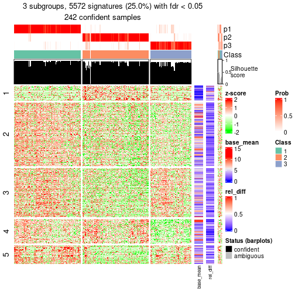</p>

</div>
<div id='tab-node-012-get-signatures-3'>
<pre><code class="r">get_signatures(res, k = 4)
</code></pre>

<p></p>

</div>
</div>


Signature heatmaps where rows are not scaled:


<script>
$( function() {
	$( '#tabs-node-012-get-signatures-no-scale' ).tabs();
} );
</script>
<div id='tabs-node-012-get-signatures-no-scale'>
<ul>
<li><a href='#tab-node-012-get-signatures-no-scale-1'>k = 2</a></li>
<li><a href='#tab-node-012-get-signatures-no-scale-2'>k = 3</a></li>
<li><a href='#tab-node-012-get-signatures-no-scale-3'>k = 4</a></li>
</ul>
<div id='tab-node-012-get-signatures-no-scale-1'>
<pre><code class="r">get_signatures(res, k = 2, scale_rows = FALSE)
</code></pre>

<p></p>

</div>
<div id='tab-node-012-get-signatures-no-scale-2'>
<pre><code class="r">get_signatures(res, k = 3, scale_rows = FALSE)
</code></pre>

<p></p>

</div>
<div id='tab-node-012-get-signatures-no-scale-3'>
<pre><code class="r">get_signatures(res, k = 4, scale_rows = FALSE)
</code></pre>

<p></p>

</div>
</div>


Compare the overlap of signatures from different k:

```r
compare_signatures(res)
```


`get_signature()` returns a data frame invisibly. To get the list of signatures, the function
call should be assigned to a variable explicitly. In following code, if `plot` argument is set
to `FALSE`, no heatmap is plotted while only the differential analysis is performed.

```r
# code only for demonstration
tb = get_signature(res, k = ..., plot = FALSE)
```

An example of the output of `tb` is:

```
#>   which_row         fdr    mean_1    mean_2 scaled_mean_1 scaled_mean_2 km
#> 1        38 0.042760348  8.373488  9.131774    -0.5533452     0.5164555  1
#> 2        40 0.018707592  7.106213  8.469186    -0.6173731     0.5762149  1
#> 3        55 0.019134737 10.221463 11.207825    -0.6159697     0.5749050  1
#> 4        59 0.006059896  5.921854  7.869574    -0.6899429     0.6439467  1
#> 5        60 0.018055526  8.928898 10.211722    -0.6204761     0.5791110  1
#> 6        98 0.009384629 15.714769 14.887706     0.6635654    -0.6193277  2
...
```

The columns in `tb` are:

1. `which_row`: row indices corresponding to the input matrix.
2. `fdr`: FDR for the differential test. 
3. `mean_x`: The mean value in group x.
4. `scaled_mean_x`: The mean value in group x after rows are scaled.
5. `km`: Row groups if k-means clustering is applied to rows (which is done by automatically selecting number of clusters).

If there are too many signatures, `top_signatures = ...` can be set to only show the 
signatures with the highest FDRs:

```r
# code only for demonstration
# e.g. to show the top 500 most significant rows
tb = get_signature(res, k = ..., top_signatures = 500)
```

If the signatures are defined as these which are uniquely high in current group, `diff_method` argument
can be set to `"uniquely_high_in_one_group"`:

```r
# code only for demonstration
tb = get_signature(res, k = ..., diff_method = "uniquely_high_in_one_group")
```


UMAP plot which shows how samples are separated.


<script>
$( function() {
	$( '#tabs-node-012-dimension-reduction' ).tabs();
} );
</script>
<div id='tabs-node-012-dimension-reduction'>
<ul>
<li><a href='#tab-node-012-dimension-reduction-1'>k = 2</a></li>
<li><a href='#tab-node-012-dimension-reduction-2'>k = 3</a></li>
<li><a href='#tab-node-012-dimension-reduction-3'>k = 4</a></li>
</ul>
<div id='tab-node-012-dimension-reduction-1'>
<pre><code class="r">dimension_reduction(res, k = 2, method = &quot;UMAP&quot;)
</code></pre>

<p></p>

</div>
<div id='tab-node-012-dimension-reduction-2'>
<pre><code class="r">dimension_reduction(res, k = 3, method = &quot;UMAP&quot;)
</code></pre>

<p></p>

</div>
<div id='tab-node-012-dimension-reduction-3'>
<pre><code class="r">dimension_reduction(res, k = 4, method = &quot;UMAP&quot;)
</code></pre>

<p></p>

</div>
</div>


Following heatmap shows how subgroups are split when increasing `k`:

```r
collect_classes(res)
```


If matrix rows can be associated to genes, consider to use `functional_enrichment(res,
...)` to perform function enrichment for the signature genes. See [this vignette](https://jokergoo.github.io/cola_vignettes/functional_enrichment.html) for more detailed explanations.


 

---------------------------------------------------


### Node0121


Parent node: [Node012](#Node012).
Child nodes: 
                Node01111-leaf
        ,
                Node01112-leaf
        ,
                Node01113-leaf
        ,
                Node01121-leaf
        ,
                Node01122-leaf
        ,
                Node01211-leaf
        ,
                Node01212-leaf
        ,
                Node01213-leaf
        ,
                Node01221-leaf
        ,
                Node01222-leaf
        ,
                Node01223-leaf
        ,
                Node01311-leaf
        ,
                Node01312-leaf
        ,
                Node02111-leaf
        ,
                Node02112-leaf
        ,
                Node02121-leaf
        ,
                Node02122-leaf
        .


The object with results only for a single top-value method and a single partitioning method 
can be extracted as:

```r
res = res_rh["0121"]
```

A summary of `res` and all the functions that can be applied to it:

```r
res
```

```
#> A 'ConsensusPartition' object with k = 2, 3, 4.
#>   On a matrix with 16820 rows and 124 columns.
#>   Top rows (1661) are extracted by 'ATC' method.
#>   Subgroups are detected by 'skmeans' method.
#>   Performed in total 150 partitions by row resampling.
#>   Best k for subgroups seems to be 3.
#> 
#> Following methods can be applied to this 'ConsensusPartition' object:
#>  [1] "cola_report"             "collect_classes"         "collect_plots"          
#>  [4] "collect_stats"           "colnames"                "compare_partitions"     
#>  [7] "compare_signatures"      "consensus_heatmap"       "dimension_reduction"    
#> [10] "functional_enrichment"   "get_anno_col"            "get_anno"               
#> [13] "get_classes"             "get_consensus"           "get_matrix"             
#> [16] "get_membership"          "get_param"               "get_signatures"         
#> [19] "get_stats"               "is_best_k"               "is_stable_k"            
#> [22] "membership_heatmap"      "ncol"                    "nrow"                   
#> [25] "plot_ecdf"               "predict_classes"         "rownames"               
#> [28] "select_partition_number" "show"                    "suggest_best_k"         
#> [31] "test_to_known_factors"   "top_rows_heatmap"
```

`collect_plots()` function collects all the plots made from `res` for all `k` (number of subgroups)
into one single page to provide an easy and fast comparison between different `k`.

```r
collect_plots(res)
```


The plots are:

- The first row: a plot of the eCDF (empirical cumulative distribution
  function) curves of the consensus matrix for each `k` and the heatmap of
  predicted classes for each `k`.
- The second row: heatmaps of the consensus matrix for each `k`.
- The third row: heatmaps of the membership matrix for each `k`.
- The fouth row: heatmaps of the signatures for each `k`.

All the plots in panels can be made by individual functions and they are
plotted later in this section.

`select_partition_number()` produces several plots showing different
statistics for choosing "optimized" `k`. There are following statistics:

- eCDF curves of the consensus matrix for each `k`;
- 1-PAC. [The PAC score](https://en.wikipedia.org/wiki/Consensus_clustering#Over-interpretation_potential_of_consensus_clustering)
  measures the proportion of the ambiguous subgrouping.
- Mean silhouette score.
- Concordance. The mean probability of fiting the consensus subgroup labels in all
  partitions.
- Area increased. Denote $A_k$ as the area under the eCDF curve for current
  `k`, the area increased is defined as $A_k - A_{k-1}$.
- Rand index. The percent of pairs of samples that are both in a same cluster
  or both are not in a same cluster in the partition of k and k-1.
- Jaccard index. The ratio of pairs of samples are both in a same cluster in
  the partition of k and k-1 and the pairs of samples are both in a same
  cluster in the partition k or k-1.

The detailed explanations of these statistics can be found in [the _cola_
vignette](https://jokergoo.github.io/cola_vignettes/cola.html#toc_13).

Generally speaking, higher 1-PAC score, higher mean silhouette score or higher
concordance corresponds to better partition. Rand index and Jaccard index
measure how similar the current partition is compared to partition with `k-1`.
If they are too similar, we won't accept `k` is better than `k-1`.

```r
select_partition_number(res)
```


The numeric values for all these statistics can be obtained by `get_stats()`.

```r
get_stats(res)
```

```
#>   k 1-PAC mean_silhouette concordance area_increased  Rand Jaccard
#> 2 2 1.000           0.973       0.990          0.496 0.504   0.504
#> 3 3 0.977           0.957       0.982          0.344 0.749   0.538
#> 4 4 0.723           0.723       0.857          0.111 0.924   0.778
```

`suggest_best_k()` suggests the best $k$ based on these statistics. The rules are as follows:

- All $k$ with Jaccard index larger than 0.95 are removed because increasing
  $k$ does not provide enough extra information. If all $k$ are removed, it is
  marked as no subgroup is detected.
- For all $k$ with 1-PAC score larger than 0.9, the maximal $k$ is taken as
  the best $k$, and other $k$ are marked as optional $k$.
- If it does not fit the second rule. The $k$ with the maximal vote of the
  highest 1-PAC score, highest mean silhouette, and highest concordance is
  taken as the best $k$.

```r
suggest_best_k(res)
```

```
#> [1] 3
#> attr(,"optional")
#> [1] 2
```

There is also optional best $k$ = 2 that is worth to check.

Following is the table of the partitions (You need to click the **show/hide
code output** link to see it). The membership matrix (columns with name `p*`)
is inferred by
[`clue::cl_consensus()`](https://www.rdocumentation.org/link/cl_consensus?package=clue)
function with the `SE` method. Basically the value in the membership matrix
represents the probability to belong to a certain group. The finall subgroup
label for an item is determined with the group with highest probability it
belongs to.

In `get_classes()` function, the entropy is calculated from the membership
matrix and the silhouette score is calculated from the consensus matrix.


<script>
$( function() {
	$( '#tabs-node-0121-get-classes' ).tabs();
} );
</script>
<div id='tabs-node-0121-get-classes'>
<ul>
<li><a href='#tab-node-0121-get-classes-1'>k = 2</a></li>
<li><a href='#tab-node-0121-get-classes-2'>k = 3</a></li>
<li><a href='#tab-node-0121-get-classes-3'>k = 4</a></li>
</ul>

<div id='tab-node-0121-get-classes-1'>
<p><a id='tab-node-0121-get-classes-1-a' style='color:#0366d6' href='#'>show/hide code output</a></p>
<pre><code class="r">cbind(get_classes(res, k = 2), get_membership(res, k = 2))
</code></pre>

<pre><code>#&gt;            class entropy silhouette   p1   p2
#&gt; HSPC_003       1   0.000     0.9862 1.00 0.00
#&gt; HSPC_034       1   0.000     0.9862 1.00 0.00
#&gt; HSPC_036       2   0.000     0.9917 0.00 1.00
#&gt; Prog_013       2   0.000     0.9917 0.00 1.00
#&gt; Prog_002       2   0.000     0.9917 0.00 1.00
#&gt; Prog_015       2   0.000     0.9917 0.00 1.00
#&gt; Prog_017       1   0.000     0.9862 1.00 0.00
#&gt; HSPC_053       2   0.000     0.9917 0.00 1.00
#&gt; HSPC_077       2   0.000     0.9917 0.00 1.00
#&gt; Prog_055       1   0.000     0.9862 1.00 0.00
#&gt; Prog_050       1   0.000     0.9862 1.00 0.00
#&gt; Prog_075       1   0.000     0.9862 1.00 0.00
#&gt; Prog_083       2   0.000     0.9917 0.00 1.00
#&gt; Prog_047       1   0.000     0.9862 1.00 0.00
#&gt; HSPC_101       2   0.000     0.9917 0.00 1.00
#&gt; HSPC_102       1   0.000     0.9862 1.00 0.00
#&gt; Prog_097       1   0.000     0.9862 1.00 0.00
#&gt; Prog_105       1   0.000     0.9862 1.00 0.00
#&gt; Prog_123       1   0.000     0.9862 1.00 0.00
#&gt; Prog_087       1   0.000     0.9862 1.00 0.00
#&gt; Prog_133       1   0.000     0.9862 1.00 0.00
#&gt; Prog_145       2   0.141     0.9730 0.02 0.98
#&gt; Prog_128       1   0.000     0.9862 1.00 0.00
#&gt; Prog_155       1   0.000     0.9862 1.00 0.00
#&gt; Prog_167       2   0.000     0.9917 0.00 1.00
#&gt; HSPC_195       2   0.000     0.9917 0.00 1.00
#&gt; Prog_190       1   0.000     0.9862 1.00 0.00
#&gt; Prog_192       1   0.000     0.9862 1.00 0.00
#&gt; HSPC_214       1   0.971     0.3372 0.60 0.40
#&gt; HSPC_216       2   0.000     0.9917 0.00 1.00
#&gt; Prog_236       2   0.999     0.0587 0.48 0.52
#&gt; Prog_238       1   0.000     0.9862 1.00 0.00
#&gt; Prog_245       1   0.000     0.9862 1.00 0.00
#&gt; Prog_234       2   0.000     0.9917 0.00 1.00
#&gt; LT-HSC_072     1   0.000     0.9862 1.00 0.00
#&gt; HSPC_285       1   0.000     0.9862 1.00 0.00
#&gt; HSPC_268       2   0.000     0.9917 0.00 1.00
#&gt; HSPC_282       2   0.000     0.9917 0.00 1.00
#&gt; HSPC_288       2   0.000     0.9917 0.00 1.00
#&gt; Prog_255       1   0.000     0.9862 1.00 0.00
#&gt; Prog_276       2   0.000     0.9917 0.00 1.00
#&gt; HSPC_332       1   0.000     0.9862 1.00 0.00
#&gt; HSPC_327       2   0.000     0.9917 0.00 1.00
#&gt; HSPC_333       2   0.000     0.9917 0.00 1.00
#&gt; Prog_325       1   0.000     0.9862 1.00 0.00
#&gt; Prog_331       2   0.000     0.9917 0.00 1.00
#&gt; Prog_327       1   0.000     0.9862 1.00 0.00
#&gt; Prog_304       1   0.000     0.9862 1.00 0.00
#&gt; LT-HSC_096     2   0.000     0.9917 0.00 1.00
#&gt; HSPC_346       2   0.000     0.9917 0.00 1.00
#&gt; HSPC_353       2   0.000     0.9917 0.00 1.00
#&gt; HSPC_371       2   0.000     0.9917 0.00 1.00
#&gt; Prog_371       2   0.000     0.9917 0.00 1.00
#&gt; Prog_341       2   0.000     0.9917 0.00 1.00
#&gt; LT-HSC_108     1   0.000     0.9862 1.00 0.00
#&gt; HSPC_410       2   0.000     0.9917 0.00 1.00
#&gt; HSPC_411       2   0.000     0.9917 0.00 1.00
#&gt; Prog_412       2   0.000     0.9917 0.00 1.00
#&gt; Prog_413       2   0.000     0.9917 0.00 1.00
#&gt; Prog_420       2   0.000     0.9917 0.00 1.00
#&gt; Prog_426       1   0.000     0.9862 1.00 0.00
#&gt; Prog_441       1   0.000     0.9862 1.00 0.00
#&gt; HSPC_485       2   0.000     0.9917 0.00 1.00
#&gt; HSPC_503       2   0.000     0.9917 0.00 1.00
#&gt; Prog_499       2   0.000     0.9917 0.00 1.00
#&gt; Prog_476       2   0.141     0.9731 0.02 0.98
#&gt; Prog_506       1   0.000     0.9862 1.00 0.00
#&gt; Prog_470       1   0.000     0.9862 1.00 0.00
#&gt; Prog_489       1   0.000     0.9862 1.00 0.00
#&gt; Prog_486       1   0.242     0.9471 0.96 0.04
#&gt; Prog_504       2   0.141     0.9730 0.02 0.98
#&gt; HSPC_544       2   0.000     0.9917 0.00 1.00
#&gt; Prog_530       2   0.000     0.9917 0.00 1.00
#&gt; Prog_550       1   0.000     0.9862 1.00 0.00
#&gt; LT-HSC_142     2   0.000     0.9917 0.00 1.00
#&gt; Prog_521       1   0.000     0.9862 1.00 0.00
#&gt; Prog_527       1   0.000     0.9862 1.00 0.00
#&gt; Prog_551       2   0.000     0.9917 0.00 1.00
#&gt; HSPC_574       1   0.000     0.9862 1.00 0.00
#&gt; Prog_565       2   0.000     0.9917 0.00 1.00
#&gt; Prog_577       2   0.000     0.9917 0.00 1.00
#&gt; Prog_560       1   0.000     0.9862 1.00 0.00
#&gt; Prog_584       1   0.000     0.9862 1.00 0.00
#&gt; Prog_567       2   0.000     0.9917 0.00 1.00
#&gt; Prog_574       1   0.000     0.9862 1.00 0.00
#&gt; Prog_607       2   0.000     0.9917 0.00 1.00
#&gt; Prog_626       1   0.000     0.9862 1.00 0.00
#&gt; Prog_609       2   0.000     0.9917 0.00 1.00
#&gt; Prog_621       2   0.000     0.9917 0.00 1.00
#&gt; Prog_622       2   0.000     0.9917 0.00 1.00
#&gt; Prog_628       2   0.000     0.9917 0.00 1.00
#&gt; Prog_598       2   0.000     0.9917 0.00 1.00
#&gt; Prog_650       2   0.000     0.9917 0.00 1.00
#&gt; Prog_658       2   0.141     0.9731 0.02 0.98
#&gt; Prog_670       1   0.000     0.9862 1.00 0.00
#&gt; HSPC_705       1   0.855     0.6119 0.72 0.28
#&gt; HSPC_682       2   0.000     0.9917 0.00 1.00
#&gt; HSPC_720       2   0.000     0.9917 0.00 1.00
#&gt; Prog_685       1   0.000     0.9862 1.00 0.00
#&gt; Prog_715       2   0.000     0.9917 0.00 1.00
#&gt; Prog_687       2   0.000     0.9917 0.00 1.00
#&gt; Prog_699       1   0.000     0.9862 1.00 0.00
#&gt; Prog_705       2   0.000     0.9917 0.00 1.00
#&gt; Prog_717       2   0.000     0.9917 0.00 1.00
#&gt; HSPC_734       2   0.000     0.9917 0.00 1.00
#&gt; HSPC_737       2   0.000     0.9917 0.00 1.00
#&gt; Prog_727       2   0.000     0.9917 0.00 1.00
#&gt; Prog_735       1   0.000     0.9862 1.00 0.00
#&gt; Prog_759       2   0.000     0.9917 0.00 1.00
#&gt; Prog_743       1   0.000     0.9862 1.00 0.00
#&gt; HSPC_796       2   0.000     0.9917 0.00 1.00
#&gt; Prog_777       1   0.000     0.9862 1.00 0.00
#&gt; Prog_789       1   0.000     0.9862 1.00 0.00
#&gt; Prog_795       1   0.000     0.9862 1.00 0.00
#&gt; Prog_791       1   0.000     0.9862 1.00 0.00
#&gt; Prog_774       2   0.000     0.9917 0.00 1.00
#&gt; Prog_804       2   0.000     0.9917 0.00 1.00
#&gt; HSPC_807       2   0.000     0.9917 0.00 1.00
#&gt; Prog_829       2   0.000     0.9917 0.00 1.00
#&gt; Prog_832       1   0.000     0.9862 1.00 0.00
#&gt; Prog_808       2   0.000     0.9917 0.00 1.00
#&gt; Prog_834       2   0.000     0.9917 0.00 1.00
#&gt; Prog_840       2   0.000     0.9917 0.00 1.00
#&gt; Prog_846       1   0.000     0.9862 1.00 0.00
</code></pre>

<script>
$('#tab-node-0121-get-classes-1-a').parent().next().next().hide();
$('#tab-node-0121-get-classes-1-a').click(function(){
  $('#tab-node-0121-get-classes-1-a').parent().next().next().toggle();
  return(false);
});
</script>
</div>

<div id='tab-node-0121-get-classes-2'>
<p><a id='tab-node-0121-get-classes-2-a' style='color:#0366d6' href='#'>show/hide code output</a></p>
<pre><code class="r">cbind(get_classes(res, k = 3), get_membership(res, k = 3))
</code></pre>

<pre><code>#&gt;            class entropy silhouette   p1   p2   p3
#&gt; HSPC_003       3  0.0000     0.9607 0.00 0.00 1.00
#&gt; HSPC_034       3  0.0000     0.9607 0.00 0.00 1.00
#&gt; HSPC_036       2  0.1529     0.9553 0.00 0.96 0.04
#&gt; Prog_013       2  0.0000     0.9927 0.00 1.00 0.00
#&gt; Prog_002       3  0.4291     0.7837 0.00 0.18 0.82
#&gt; Prog_015       2  0.0000     0.9927 0.00 1.00 0.00
#&gt; Prog_017       1  0.0000     0.9843 1.00 0.00 0.00
#&gt; HSPC_053       2  0.0000     0.9927 0.00 1.00 0.00
#&gt; HSPC_077       2  0.0000     0.9927 0.00 1.00 0.00
#&gt; Prog_055       1  0.0000     0.9843 1.00 0.00 0.00
#&gt; Prog_050       1  0.0000     0.9843 1.00 0.00 0.00
#&gt; Prog_075       1  0.0000     0.9843 1.00 0.00 0.00
#&gt; Prog_083       2  0.0000     0.9927 0.00 1.00 0.00
#&gt; Prog_047       1  0.0000     0.9843 1.00 0.00 0.00
#&gt; HSPC_101       3  0.0000     0.9607 0.00 0.00 1.00
#&gt; HSPC_102       1  0.0000     0.9843 1.00 0.00 0.00
#&gt; Prog_097       1  0.0000     0.9843 1.00 0.00 0.00
#&gt; Prog_105       1  0.0000     0.9843 1.00 0.00 0.00
#&gt; Prog_123       1  0.0000     0.9843 1.00 0.00 0.00
#&gt; Prog_087       1  0.0000     0.9843 1.00 0.00 0.00
#&gt; Prog_133       1  0.0000     0.9843 1.00 0.00 0.00
#&gt; Prog_145       3  0.0000     0.9607 0.00 0.00 1.00
#&gt; Prog_128       1  0.0000     0.9843 1.00 0.00 0.00
#&gt; Prog_155       1  0.0000     0.9843 1.00 0.00 0.00
#&gt; Prog_167       2  0.0000     0.9927 0.00 1.00 0.00
#&gt; HSPC_195       3  0.0000     0.9607 0.00 0.00 1.00
#&gt; Prog_190       1  0.0000     0.9843 1.00 0.00 0.00
#&gt; Prog_192       1  0.0000     0.9843 1.00 0.00 0.00
#&gt; HSPC_214       3  0.0000     0.9607 0.00 0.00 1.00
#&gt; HSPC_216       3  0.0000     0.9607 0.00 0.00 1.00
#&gt; Prog_236       3  0.0000     0.9607 0.00 0.00 1.00
#&gt; Prog_238       1  0.0000     0.9843 1.00 0.00 0.00
#&gt; Prog_245       1  0.0000     0.9843 1.00 0.00 0.00
#&gt; Prog_234       2  0.0000     0.9927 0.00 1.00 0.00
#&gt; LT-HSC_072     1  0.0000     0.9843 1.00 0.00 0.00
#&gt; HSPC_285       3  0.0000     0.9607 0.00 0.00 1.00
#&gt; HSPC_268       2  0.0000     0.9927 0.00 1.00 0.00
#&gt; HSPC_282       2  0.0000     0.9927 0.00 1.00 0.00
#&gt; HSPC_288       2  0.0000     0.9927 0.00 1.00 0.00
#&gt; Prog_255       1  0.0000     0.9843 1.00 0.00 0.00
#&gt; Prog_276       2  0.0000     0.9927 0.00 1.00 0.00
#&gt; HSPC_332       1  0.0000     0.9843 1.00 0.00 0.00
#&gt; HSPC_327       2  0.0000     0.9927 0.00 1.00 0.00
#&gt; HSPC_333       3  0.0000     0.9607 0.00 0.00 1.00
#&gt; Prog_325       1  0.0000     0.9843 1.00 0.00 0.00
#&gt; Prog_331       2  0.0000     0.9927 0.00 1.00 0.00
#&gt; Prog_327       1  0.0000     0.9843 1.00 0.00 0.00
#&gt; Prog_304       1  0.0000     0.9843 1.00 0.00 0.00
#&gt; LT-HSC_096     2  0.0000     0.9927 0.00 1.00 0.00
#&gt; HSPC_346       3  0.0000     0.9607 0.00 0.00 1.00
#&gt; HSPC_353       2  0.0000     0.9927 0.00 1.00 0.00
#&gt; HSPC_371       2  0.0000     0.9927 0.00 1.00 0.00
#&gt; Prog_371       2  0.0000     0.9927 0.00 1.00 0.00
#&gt; Prog_341       2  0.0000     0.9927 0.00 1.00 0.00
#&gt; LT-HSC_108     1  0.0000     0.9843 1.00 0.00 0.00
#&gt; HSPC_410       2  0.2959     0.8870 0.00 0.90 0.10
#&gt; HSPC_411       2  0.0000     0.9927 0.00 1.00 0.00
#&gt; Prog_412       3  0.0000     0.9607 0.00 0.00 1.00
#&gt; Prog_413       2  0.0000     0.9927 0.00 1.00 0.00
#&gt; Prog_420       2  0.0000     0.9927 0.00 1.00 0.00
#&gt; Prog_426       1  0.0000     0.9843 1.00 0.00 0.00
#&gt; Prog_441       1  0.0000     0.9843 1.00 0.00 0.00
#&gt; HSPC_485       2  0.0000     0.9927 0.00 1.00 0.00
#&gt; HSPC_503       2  0.0000     0.9927 0.00 1.00 0.00
#&gt; Prog_499       2  0.0000     0.9927 0.00 1.00 0.00
#&gt; Prog_476       3  0.0000     0.9607 0.00 0.00 1.00
#&gt; Prog_506       1  0.0000     0.9843 1.00 0.00 0.00
#&gt; Prog_470       3  0.0000     0.9607 0.00 0.00 1.00
#&gt; Prog_489       1  0.0000     0.9843 1.00 0.00 0.00
#&gt; Prog_486       1  0.6126     0.3342 0.60 0.40 0.00
#&gt; Prog_504       3  0.7074     0.0611 0.02 0.48 0.50
#&gt; HSPC_544       3  0.0000     0.9607 0.00 0.00 1.00
#&gt; Prog_530       3  0.0000     0.9607 0.00 0.00 1.00
#&gt; Prog_550       3  0.0000     0.9607 0.00 0.00 1.00
#&gt; LT-HSC_142     3  0.0892     0.9465 0.00 0.02 0.98
#&gt; Prog_521       3  0.1529     0.9278 0.04 0.00 0.96
#&gt; Prog_527       3  0.0000     0.9607 0.00 0.00 1.00
#&gt; Prog_551       2  0.0000     0.9927 0.00 1.00 0.00
#&gt; HSPC_574       3  0.0000     0.9607 0.00 0.00 1.00
#&gt; Prog_565       3  0.0000     0.9607 0.00 0.00 1.00
#&gt; Prog_577       2  0.2537     0.9116 0.00 0.92 0.08
#&gt; Prog_560       1  0.0892     0.9647 0.98 0.02 0.00
#&gt; Prog_584       1  0.0000     0.9843 1.00 0.00 0.00
#&gt; Prog_567       2  0.0000     0.9927 0.00 1.00 0.00
#&gt; Prog_574       1  0.0000     0.9843 1.00 0.00 0.00
#&gt; Prog_607       3  0.4555     0.7572 0.00 0.20 0.80
#&gt; Prog_626       1  0.0000     0.9843 1.00 0.00 0.00
#&gt; Prog_609       2  0.0000     0.9927 0.00 1.00 0.00
#&gt; Prog_621       2  0.0000     0.9927 0.00 1.00 0.00
#&gt; Prog_622       3  0.0000     0.9607 0.00 0.00 1.00
#&gt; Prog_628       2  0.0000     0.9927 0.00 1.00 0.00
#&gt; Prog_598       2  0.0000     0.9927 0.00 1.00 0.00
#&gt; Prog_650       2  0.0000     0.9927 0.00 1.00 0.00
#&gt; Prog_658       3  0.0000     0.9607 0.00 0.00 1.00
#&gt; Prog_670       1  0.0000     0.9843 1.00 0.00 0.00
#&gt; HSPC_705       3  0.0000     0.9607 0.00 0.00 1.00
#&gt; HSPC_682       3  0.0000     0.9607 0.00 0.00 1.00
#&gt; HSPC_720       3  0.0000     0.9607 0.00 0.00 1.00
#&gt; Prog_685       1  0.0000     0.9843 1.00 0.00 0.00
#&gt; Prog_715       2  0.0000     0.9927 0.00 1.00 0.00
#&gt; Prog_687       2  0.0000     0.9927 0.00 1.00 0.00
#&gt; Prog_699       3  0.2959     0.8649 0.10 0.00 0.90
#&gt; Prog_705       3  0.0892     0.9465 0.00 0.02 0.98
#&gt; Prog_717       2  0.0000     0.9927 0.00 1.00 0.00
#&gt; HSPC_734       3  0.0000     0.9607 0.00 0.00 1.00
#&gt; HSPC_737       2  0.0000     0.9927 0.00 1.00 0.00
#&gt; Prog_727       3  0.5216     0.6650 0.00 0.26 0.74
#&gt; Prog_735       3  0.0000     0.9607 0.00 0.00 1.00
#&gt; Prog_759       2  0.0000     0.9927 0.00 1.00 0.00
#&gt; Prog_743       3  0.0000     0.9607 0.00 0.00 1.00
#&gt; HSPC_796       2  0.0000     0.9927 0.00 1.00 0.00
#&gt; Prog_777       1  0.3340     0.8558 0.88 0.00 0.12
#&gt; Prog_789       1  0.0000     0.9843 1.00 0.00 0.00
#&gt; Prog_795       1  0.1529     0.9461 0.96 0.00 0.04
#&gt; Prog_791       1  0.0000     0.9843 1.00 0.00 0.00
#&gt; Prog_774       2  0.2959     0.8870 0.00 0.90 0.10
#&gt; Prog_804       2  0.0000     0.9927 0.00 1.00 0.00
#&gt; HSPC_807       2  0.0000     0.9927 0.00 1.00 0.00
#&gt; Prog_829       2  0.0000     0.9927 0.00 1.00 0.00
#&gt; Prog_832       1  0.0000     0.9843 1.00 0.00 0.00
#&gt; Prog_808       2  0.0000     0.9927 0.00 1.00 0.00
#&gt; Prog_834       2  0.0000     0.9927 0.00 1.00 0.00
#&gt; Prog_840       2  0.0000     0.9927 0.00 1.00 0.00
#&gt; Prog_846       1  0.0000     0.9843 1.00 0.00 0.00
</code></pre>

<script>
$('#tab-node-0121-get-classes-2-a').parent().next().next().hide();
$('#tab-node-0121-get-classes-2-a').click(function(){
  $('#tab-node-0121-get-classes-2-a').parent().next().next().toggle();
  return(false);
});
</script>
</div>

<div id='tab-node-0121-get-classes-3'>
<p><a id='tab-node-0121-get-classes-3-a' style='color:#0366d6' href='#'>show/hide code output</a></p>
<pre><code class="r">cbind(get_classes(res, k = 4), get_membership(res, k = 4))
</code></pre>

<pre><code>#&gt;            class entropy silhouette   p1   p2   p3   p4
#&gt; HSPC_003       3  0.0000      0.898 0.00 0.00 1.00 0.00
#&gt; HSPC_034       3  0.0000      0.898 0.00 0.00 1.00 0.00
#&gt; HSPC_036       2  0.5957      0.113 0.00 0.54 0.42 0.04
#&gt; Prog_013       2  0.4624      0.604 0.00 0.66 0.00 0.34
#&gt; Prog_002       4  0.5962      0.718 0.00 0.26 0.08 0.66
#&gt; Prog_015       2  0.3335      0.661 0.00 0.86 0.12 0.02
#&gt; Prog_017       1  0.5619      0.599 0.64 0.04 0.00 0.32
#&gt; HSPC_053       2  0.1411      0.733 0.00 0.96 0.02 0.02
#&gt; HSPC_077       2  0.0000      0.742 0.00 1.00 0.00 0.00
#&gt; Prog_055       1  0.0000      0.910 1.00 0.00 0.00 0.00
#&gt; Prog_050       1  0.4522      0.648 0.68 0.00 0.00 0.32
#&gt; Prog_075       1  0.0000      0.910 1.00 0.00 0.00 0.00
#&gt; Prog_083       2  0.4624      0.604 0.00 0.66 0.00 0.34
#&gt; Prog_047       1  0.0000      0.910 1.00 0.00 0.00 0.00
#&gt; HSPC_101       3  0.0000      0.898 0.00 0.00 1.00 0.00
#&gt; HSPC_102       1  0.0000      0.910 1.00 0.00 0.00 0.00
#&gt; Prog_097       1  0.0000      0.910 1.00 0.00 0.00 0.00
#&gt; Prog_105       1  0.0000      0.910 1.00 0.00 0.00 0.00
#&gt; Prog_123       1  0.0000      0.910 1.00 0.00 0.00 0.00
#&gt; Prog_087       1  0.0000      0.910 1.00 0.00 0.00 0.00
#&gt; Prog_133       1  0.0707      0.898 0.98 0.00 0.00 0.02
#&gt; Prog_145       4  0.6110      0.669 0.00 0.10 0.24 0.66
#&gt; Prog_128       1  0.0000      0.910 1.00 0.00 0.00 0.00
#&gt; Prog_155       1  0.0000      0.910 1.00 0.00 0.00 0.00
#&gt; Prog_167       2  0.0000      0.742 0.00 1.00 0.00 0.00
#&gt; HSPC_195       3  0.0000      0.898 0.00 0.00 1.00 0.00
#&gt; Prog_190       1  0.0000      0.910 1.00 0.00 0.00 0.00
#&gt; Prog_192       1  0.7198      0.421 0.52 0.16 0.00 0.32
#&gt; HSPC_214       3  0.0000      0.898 0.00 0.00 1.00 0.00
#&gt; HSPC_216       3  0.2921      0.783 0.00 0.00 0.86 0.14
#&gt; Prog_236       3  0.3172      0.760 0.00 0.00 0.84 0.16
#&gt; Prog_238       1  0.3400      0.782 0.82 0.00 0.00 0.18
#&gt; Prog_245       1  0.0000      0.910 1.00 0.00 0.00 0.00
#&gt; Prog_234       4  0.2345      0.587 0.00 0.10 0.00 0.90
#&gt; LT-HSC_072     1  0.0000      0.910 1.00 0.00 0.00 0.00
#&gt; HSPC_285       3  0.0000      0.898 0.00 0.00 1.00 0.00
#&gt; HSPC_268       2  0.3400      0.614 0.00 0.82 0.00 0.18
#&gt; HSPC_282       2  0.0707      0.740 0.00 0.98 0.00 0.02
#&gt; HSPC_288       2  0.3400      0.614 0.00 0.82 0.00 0.18
#&gt; Prog_255       1  0.0000      0.910 1.00 0.00 0.00 0.00
#&gt; Prog_276       2  0.0707      0.740 0.00 0.98 0.00 0.02
#&gt; HSPC_332       1  0.0000      0.910 1.00 0.00 0.00 0.00
#&gt; HSPC_327       2  0.3172      0.636 0.00 0.84 0.00 0.16
#&gt; HSPC_333       3  0.1411      0.871 0.00 0.02 0.96 0.02
#&gt; Prog_325       1  0.0000      0.910 1.00 0.00 0.00 0.00
#&gt; Prog_331       2  0.4522      0.612 0.00 0.68 0.00 0.32
#&gt; Prog_327       1  0.4522      0.648 0.68 0.00 0.00 0.32
#&gt; Prog_304       1  0.0000      0.910 1.00 0.00 0.00 0.00
#&gt; LT-HSC_096     2  0.0000      0.742 0.00 1.00 0.00 0.00
#&gt; HSPC_346       3  0.0000      0.898 0.00 0.00 1.00 0.00
#&gt; HSPC_353       2  0.3400      0.614 0.00 0.82 0.00 0.18
#&gt; HSPC_371       2  0.3610      0.587 0.00 0.80 0.00 0.20
#&gt; Prog_371       2  0.4994     -0.354 0.00 0.52 0.00 0.48
#&gt; Prog_341       2  0.3172      0.664 0.00 0.84 0.00 0.16
#&gt; LT-HSC_108     1  0.0000      0.910 1.00 0.00 0.00 0.00
#&gt; HSPC_410       4  0.5271      0.646 0.00 0.34 0.02 0.64
#&gt; HSPC_411       2  0.4522      0.612 0.00 0.68 0.00 0.32
#&gt; Prog_412       4  0.5512      0.580 0.00 0.04 0.30 0.66
#&gt; Prog_413       2  0.0000      0.742 0.00 1.00 0.00 0.00
#&gt; Prog_420       2  0.4522      0.612 0.00 0.68 0.00 0.32
#&gt; Prog_426       1  0.0000      0.910 1.00 0.00 0.00 0.00
#&gt; Prog_441       1  0.3610      0.764 0.80 0.00 0.00 0.20
#&gt; HSPC_485       2  0.3172      0.636 0.00 0.84 0.00 0.16
#&gt; HSPC_503       2  0.0707      0.740 0.00 0.98 0.00 0.02
#&gt; Prog_499       2  0.2011      0.704 0.00 0.92 0.00 0.08
#&gt; Prog_476       3  0.5915      0.191 0.00 0.04 0.56 0.40
#&gt; Prog_506       1  0.0000      0.910 1.00 0.00 0.00 0.00
#&gt; Prog_470       3  0.4277      0.568 0.00 0.00 0.72 0.28
#&gt; Prog_489       1  0.0000      0.910 1.00 0.00 0.00 0.00
#&gt; Prog_486       2  0.7845      0.229 0.28 0.40 0.00 0.32
#&gt; Prog_504       4  0.4894      0.667 0.00 0.12 0.10 0.78
#&gt; HSPC_544       3  0.0000      0.898 0.00 0.00 1.00 0.00
#&gt; Prog_530       4  0.5570      0.332 0.00 0.02 0.44 0.54
#&gt; Prog_550       3  0.0707      0.883 0.02 0.00 0.98 0.00
#&gt; LT-HSC_142     3  0.5256      0.478 0.00 0.04 0.70 0.26
#&gt; Prog_521       3  0.4277      0.543 0.28 0.00 0.72 0.00
#&gt; Prog_527       3  0.0000      0.898 0.00 0.00 1.00 0.00
#&gt; Prog_551       2  0.3172      0.636 0.00 0.84 0.00 0.16
#&gt; HSPC_574       3  0.0000      0.898 0.00 0.00 1.00 0.00
#&gt; Prog_565       3  0.1411      0.871 0.00 0.02 0.96 0.02
#&gt; Prog_577       2  0.6808      0.492 0.00 0.56 0.12 0.32
#&gt; Prog_560       1  0.7016      0.454 0.54 0.14 0.00 0.32
#&gt; Prog_584       1  0.0000      0.910 1.00 0.00 0.00 0.00
#&gt; Prog_567       2  0.0000      0.742 0.00 1.00 0.00 0.00
#&gt; Prog_574       1  0.0000      0.910 1.00 0.00 0.00 0.00
#&gt; Prog_607       4  0.5962      0.721 0.00 0.26 0.08 0.66
#&gt; Prog_626       1  0.0000      0.910 1.00 0.00 0.00 0.00
#&gt; Prog_609       2  0.1211      0.740 0.00 0.96 0.00 0.04
#&gt; Prog_621       2  0.4624      0.606 0.00 0.66 0.00 0.34
#&gt; Prog_622       4  0.6110      0.669 0.00 0.10 0.24 0.66
#&gt; Prog_628       2  0.4522      0.612 0.00 0.68 0.00 0.32
#&gt; Prog_598       2  0.4624      0.604 0.00 0.66 0.00 0.34
#&gt; Prog_650       4  0.3172      0.521 0.00 0.16 0.00 0.84
#&gt; Prog_658       4  0.5487      0.372 0.00 0.02 0.40 0.58
#&gt; Prog_670       1  0.0000      0.910 1.00 0.00 0.00 0.00
#&gt; HSPC_705       3  0.0000      0.898 0.00 0.00 1.00 0.00
#&gt; HSPC_682       3  0.0000      0.898 0.00 0.00 1.00 0.00
#&gt; HSPC_720       3  0.0000      0.898 0.00 0.00 1.00 0.00
#&gt; Prog_685       1  0.0000      0.910 1.00 0.00 0.00 0.00
#&gt; Prog_715       2  0.4277      0.436 0.00 0.72 0.00 0.28
#&gt; Prog_687       2  0.4522      0.612 0.00 0.68 0.00 0.32
#&gt; Prog_699       3  0.2706      0.814 0.08 0.00 0.90 0.02
#&gt; Prog_705       3  0.3037      0.781 0.00 0.10 0.88 0.02
#&gt; Prog_717       2  0.0000      0.742 0.00 1.00 0.00 0.00
#&gt; HSPC_734       3  0.0000      0.898 0.00 0.00 1.00 0.00
#&gt; HSPC_737       2  0.3400      0.614 0.00 0.82 0.00 0.18
#&gt; Prog_727       4  0.5512      0.691 0.00 0.30 0.04 0.66
#&gt; Prog_735       3  0.3172      0.760 0.00 0.00 0.84 0.16
#&gt; Prog_759       4  0.4855      0.541 0.00 0.40 0.00 0.60
#&gt; Prog_743       3  0.0000      0.898 0.00 0.00 1.00 0.00
#&gt; HSPC_796       2  0.0000      0.742 0.00 1.00 0.00 0.00
#&gt; Prog_777       1  0.3400      0.724 0.82 0.00 0.18 0.00
#&gt; Prog_789       1  0.0000      0.910 1.00 0.00 0.00 0.00
#&gt; Prog_795       1  0.4994      0.073 0.52 0.00 0.00 0.48
#&gt; Prog_791       1  0.0000      0.910 1.00 0.00 0.00 0.00
#&gt; Prog_774       4  0.5173      0.668 0.00 0.32 0.02 0.66
#&gt; Prog_804       2  0.0000      0.742 0.00 1.00 0.00 0.00
#&gt; HSPC_807       2  0.0707      0.740 0.00 0.98 0.00 0.02
#&gt; Prog_829       2  0.2345      0.725 0.00 0.90 0.00 0.10
#&gt; Prog_832       1  0.0000      0.910 1.00 0.00 0.00 0.00
#&gt; Prog_808       2  0.2011      0.731 0.00 0.92 0.00 0.08
#&gt; Prog_834       2  0.3610      0.674 0.00 0.80 0.00 0.20
#&gt; Prog_840       2  0.4522      0.612 0.00 0.68 0.00 0.32
#&gt; Prog_846       1  0.4522      0.648 0.68 0.00 0.00 0.32
</code></pre>

<script>
$('#tab-node-0121-get-classes-3-a').parent().next().next().hide();
$('#tab-node-0121-get-classes-3-a').click(function(){
  $('#tab-node-0121-get-classes-3-a').parent().next().next().toggle();
  return(false);
});
</script>
</div>
</div>

Heatmaps for the consensus matrix. It visualizes the probability of two
samples to be in a same group.


<script>
$( function() {
	$( '#tabs-node-0121-consensus-heatmap' ).tabs();
} );
</script>
<div id='tabs-node-0121-consensus-heatmap'>
<ul>
<li><a href='#tab-node-0121-consensus-heatmap-1'>k = 2</a></li>
<li><a href='#tab-node-0121-consensus-heatmap-2'>k = 3</a></li>
<li><a href='#tab-node-0121-consensus-heatmap-3'>k = 4</a></li>
</ul>
<div id='tab-node-0121-consensus-heatmap-1'>
<pre><code class="r">consensus_heatmap(res, k = 2)
</code></pre>

<p></p>

</div>
<div id='tab-node-0121-consensus-heatmap-2'>
<pre><code class="r">consensus_heatmap(res, k = 3)
</code></pre>

<p></p>

</div>
<div id='tab-node-0121-consensus-heatmap-3'>
<pre><code class="r">consensus_heatmap(res, k = 4)
</code></pre>

<p></p>

</div>
</div>

Heatmaps for the membership of samples in all partitions to see how consistent they are:


<script>
$( function() {
	$( '#tabs-node-0121-membership-heatmap' ).tabs();
} );
</script>
<div id='tabs-node-0121-membership-heatmap'>
<ul>
<li><a href='#tab-node-0121-membership-heatmap-1'>k = 2</a></li>
<li><a href='#tab-node-0121-membership-heatmap-2'>k = 3</a></li>
<li><a href='#tab-node-0121-membership-heatmap-3'>k = 4</a></li>
</ul>
<div id='tab-node-0121-membership-heatmap-1'>
<pre><code class="r">membership_heatmap(res, k = 2)
</code></pre>

<p></p>

</div>
<div id='tab-node-0121-membership-heatmap-2'>
<pre><code class="r">membership_heatmap(res, k = 3)
</code></pre>

<p></p>

</div>
<div id='tab-node-0121-membership-heatmap-3'>
<pre><code class="r">membership_heatmap(res, k = 4)
</code></pre>

<p>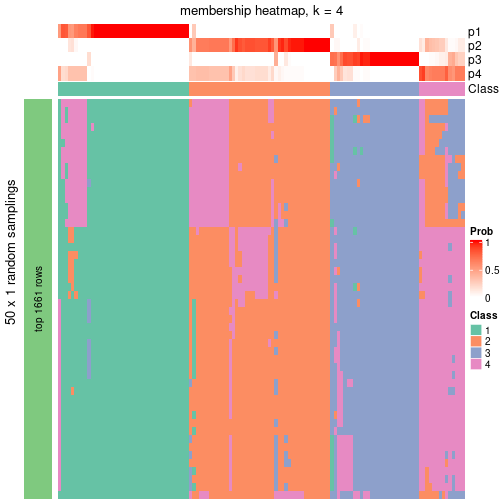</p>

</div>
</div>

As soon as the classes for columns are determined, the signatures
that are significantly different between subgroups can be looked for. 
Following are the heatmaps for signatures.


Signature heatmaps where rows are scaled:


<script>
$( function() {
	$( '#tabs-node-0121-get-signatures' ).tabs();
} );
</script>
<div id='tabs-node-0121-get-signatures'>
<ul>
<li><a href='#tab-node-0121-get-signatures-1'>k = 2</a></li>
<li><a href='#tab-node-0121-get-signatures-2'>k = 3</a></li>
<li><a href='#tab-node-0121-get-signatures-3'>k = 4</a></li>
</ul>
<div id='tab-node-0121-get-signatures-1'>
<pre><code class="r">get_signatures(res, k = 2)
</code></pre>

<p></p>

</div>
<div id='tab-node-0121-get-signatures-2'>
<pre><code class="r">get_signatures(res, k = 3)
</code></pre>

<p></p>

</div>
<div id='tab-node-0121-get-signatures-3'>
<pre><code class="r">get_signatures(res, k = 4)
</code></pre>

<p></p>

</div>
</div>


Signature heatmaps where rows are not scaled:


<script>
$( function() {
	$( '#tabs-node-0121-get-signatures-no-scale' ).tabs();
} );
</script>
<div id='tabs-node-0121-get-signatures-no-scale'>
<ul>
<li><a href='#tab-node-0121-get-signatures-no-scale-1'>k = 2</a></li>
<li><a href='#tab-node-0121-get-signatures-no-scale-2'>k = 3</a></li>
<li><a href='#tab-node-0121-get-signatures-no-scale-3'>k = 4</a></li>
</ul>
<div id='tab-node-0121-get-signatures-no-scale-1'>
<pre><code class="r">get_signatures(res, k = 2, scale_rows = FALSE)
</code></pre>

<p></p>

</div>
<div id='tab-node-0121-get-signatures-no-scale-2'>
<pre><code class="r">get_signatures(res, k = 3, scale_rows = FALSE)
</code></pre>

<p></p>

</div>
<div id='tab-node-0121-get-signatures-no-scale-3'>
<pre><code class="r">get_signatures(res, k = 4, scale_rows = FALSE)
</code></pre>

<p></p>

</div>
</div>


Compare the overlap of signatures from different k:

```r
compare_signatures(res)
```


`get_signature()` returns a data frame invisibly. To get the list of signatures, the function
call should be assigned to a variable explicitly. In following code, if `plot` argument is set
to `FALSE`, no heatmap is plotted while only the differential analysis is performed.

```r
# code only for demonstration
tb = get_signature(res, k = ..., plot = FALSE)
```

An example of the output of `tb` is:

```
#>   which_row         fdr    mean_1    mean_2 scaled_mean_1 scaled_mean_2 km
#> 1        38 0.042760348  8.373488  9.131774    -0.5533452     0.5164555  1
#> 2        40 0.018707592  7.106213  8.469186    -0.6173731     0.5762149  1
#> 3        55 0.019134737 10.221463 11.207825    -0.6159697     0.5749050  1
#> 4        59 0.006059896  5.921854  7.869574    -0.6899429     0.6439467  1
#> 5        60 0.018055526  8.928898 10.211722    -0.6204761     0.5791110  1
#> 6        98 0.009384629 15.714769 14.887706     0.6635654    -0.6193277  2
...
```

The columns in `tb` are:

1. `which_row`: row indices corresponding to the input matrix.
2. `fdr`: FDR for the differential test. 
3. `mean_x`: The mean value in group x.
4. `scaled_mean_x`: The mean value in group x after rows are scaled.
5. `km`: Row groups if k-means clustering is applied to rows (which is done by automatically selecting number of clusters).

If there are too many signatures, `top_signatures = ...` can be set to only show the 
signatures with the highest FDRs:

```r
# code only for demonstration
# e.g. to show the top 500 most significant rows
tb = get_signature(res, k = ..., top_signatures = 500)
```

If the signatures are defined as these which are uniquely high in current group, `diff_method` argument
can be set to `"uniquely_high_in_one_group"`:

```r
# code only for demonstration
tb = get_signature(res, k = ..., diff_method = "uniquely_high_in_one_group")
```


UMAP plot which shows how samples are separated.


<script>
$( function() {
	$( '#tabs-node-0121-dimension-reduction' ).tabs();
} );
</script>
<div id='tabs-node-0121-dimension-reduction'>
<ul>
<li><a href='#tab-node-0121-dimension-reduction-1'>k = 2</a></li>
<li><a href='#tab-node-0121-dimension-reduction-2'>k = 3</a></li>
<li><a href='#tab-node-0121-dimension-reduction-3'>k = 4</a></li>
</ul>
<div id='tab-node-0121-dimension-reduction-1'>
<pre><code class="r">dimension_reduction(res, k = 2, method = &quot;UMAP&quot;)
</code></pre>

<p></p>

</div>
<div id='tab-node-0121-dimension-reduction-2'>
<pre><code class="r">dimension_reduction(res, k = 3, method = &quot;UMAP&quot;)
</code></pre>

<p></p>

</div>
<div id='tab-node-0121-dimension-reduction-3'>
<pre><code class="r">dimension_reduction(res, k = 4, method = &quot;UMAP&quot;)
</code></pre>

<p>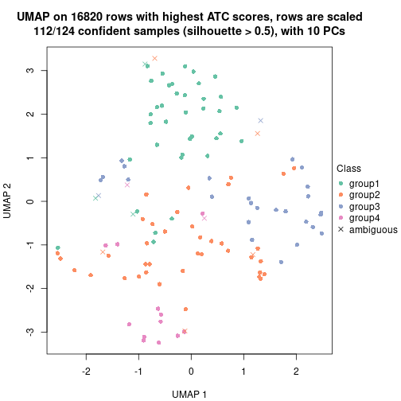</p>

</div>
</div>


Following heatmap shows how subgroups are split when increasing `k`:

```r
collect_classes(res)
```


If matrix rows can be associated to genes, consider to use `functional_enrichment(res,
...)` to perform function enrichment for the signature genes. See [this vignette](https://jokergoo.github.io/cola_vignettes/functional_enrichment.html) for more detailed explanations.


 

---------------------------------------------------


### Node0122


Parent node: [Node012](#Node012).
Child nodes: 
                Node01111-leaf
        ,
                Node01112-leaf
        ,
                Node01113-leaf
        ,
                Node01121-leaf
        ,
                Node01122-leaf
        ,
                Node01211-leaf
        ,
                Node01212-leaf
        ,
                Node01213-leaf
        ,
                Node01221-leaf
        ,
                Node01222-leaf
        ,
                Node01223-leaf
        ,
                Node01311-leaf
        ,
                Node01312-leaf
        ,
                Node02111-leaf
        ,
                Node02112-leaf
        ,
                Node02121-leaf
        ,
                Node02122-leaf
        .


The object with results only for a single top-value method and a single partitioning method 
can be extracted as:

```r
res = res_rh["0122"]
```

A summary of `res` and all the functions that can be applied to it:

```r
res
```

```
#> A 'ConsensusPartition' object with k = 2, 3, 4.
#>   On a matrix with 16789 rows and 124 columns.
#>   Top rows (1679) are extracted by 'ATC' method.
#>   Subgroups are detected by 'skmeans' method.
#>   Performed in total 150 partitions by row resampling.
#>   Best k for subgroups seems to be 3.
#> 
#> Following methods can be applied to this 'ConsensusPartition' object:
#>  [1] "cola_report"             "collect_classes"         "collect_plots"          
#>  [4] "collect_stats"           "colnames"                "compare_partitions"     
#>  [7] "compare_signatures"      "consensus_heatmap"       "dimension_reduction"    
#> [10] "functional_enrichment"   "get_anno_col"            "get_anno"               
#> [13] "get_classes"             "get_consensus"           "get_matrix"             
#> [16] "get_membership"          "get_param"               "get_signatures"         
#> [19] "get_stats"               "is_best_k"               "is_stable_k"            
#> [22] "membership_heatmap"      "ncol"                    "nrow"                   
#> [25] "plot_ecdf"               "predict_classes"         "rownames"               
#> [28] "select_partition_number" "show"                    "suggest_best_k"         
#> [31] "test_to_known_factors"   "top_rows_heatmap"
```

`collect_plots()` function collects all the plots made from `res` for all `k` (number of subgroups)
into one single page to provide an easy and fast comparison between different `k`.

```r
collect_plots(res)
```


The plots are:

- The first row: a plot of the eCDF (empirical cumulative distribution
  function) curves of the consensus matrix for each `k` and the heatmap of
  predicted classes for each `k`.
- The second row: heatmaps of the consensus matrix for each `k`.
- The third row: heatmaps of the membership matrix for each `k`.
- The fouth row: heatmaps of the signatures for each `k`.

All the plots in panels can be made by individual functions and they are
plotted later in this section.

`select_partition_number()` produces several plots showing different
statistics for choosing "optimized" `k`. There are following statistics:

- eCDF curves of the consensus matrix for each `k`;
- 1-PAC. [The PAC score](https://en.wikipedia.org/wiki/Consensus_clustering#Over-interpretation_potential_of_consensus_clustering)
  measures the proportion of the ambiguous subgrouping.
- Mean silhouette score.
- Concordance. The mean probability of fiting the consensus subgroup labels in all
  partitions.
- Area increased. Denote $A_k$ as the area under the eCDF curve for current
  `k`, the area increased is defined as $A_k - A_{k-1}$.
- Rand index. The percent of pairs of samples that are both in a same cluster
  or both are not in a same cluster in the partition of k and k-1.
- Jaccard index. The ratio of pairs of samples are both in a same cluster in
  the partition of k and k-1 and the pairs of samples are both in a same
  cluster in the partition k or k-1.

The detailed explanations of these statistics can be found in [the _cola_
vignette](https://jokergoo.github.io/cola_vignettes/cola.html#toc_13).

Generally speaking, higher 1-PAC score, higher mean silhouette score or higher
concordance corresponds to better partition. Rand index and Jaccard index
measure how similar the current partition is compared to partition with `k-1`.
If they are too similar, we won't accept `k` is better than `k-1`.

```r
select_partition_number(res)
```


The numeric values for all these statistics can be obtained by `get_stats()`.

```r
get_stats(res)
```

```
#>   k 1-PAC mean_silhouette concordance area_increased  Rand Jaccard
#> 2 2 1.000           0.985       0.994          0.504 0.496   0.496
#> 3 3 1.000           0.959       0.983          0.320 0.745   0.531
#> 4 4 0.767           0.721       0.837          0.102 0.878   0.663
```

`suggest_best_k()` suggests the best $k$ based on these statistics. The rules are as follows:

- All $k$ with Jaccard index larger than 0.95 are removed because increasing
  $k$ does not provide enough extra information. If all $k$ are removed, it is
  marked as no subgroup is detected.
- For all $k$ with 1-PAC score larger than 0.9, the maximal $k$ is taken as
  the best $k$, and other $k$ are marked as optional $k$.
- If it does not fit the second rule. The $k$ with the maximal vote of the
  highest 1-PAC score, highest mean silhouette, and highest concordance is
  taken as the best $k$.

```r
suggest_best_k(res)
```

```
#> [1] 3
#> attr(,"optional")
#> [1] 2
```

There is also optional best $k$ = 2 that is worth to check.

Following is the table of the partitions (You need to click the **show/hide
code output** link to see it). The membership matrix (columns with name `p*`)
is inferred by
[`clue::cl_consensus()`](https://www.rdocumentation.org/link/cl_consensus?package=clue)
function with the `SE` method. Basically the value in the membership matrix
represents the probability to belong to a certain group. The finall subgroup
label for an item is determined with the group with highest probability it
belongs to.

In `get_classes()` function, the entropy is calculated from the membership
matrix and the silhouette score is calculated from the consensus matrix.


<script>
$( function() {
	$( '#tabs-node-0122-get-classes' ).tabs();
} );
</script>
<div id='tabs-node-0122-get-classes'>
<ul>
<li><a href='#tab-node-0122-get-classes-1'>k = 2</a></li>
<li><a href='#tab-node-0122-get-classes-2'>k = 3</a></li>
<li><a href='#tab-node-0122-get-classes-3'>k = 4</a></li>
</ul>

<div id='tab-node-0122-get-classes-1'>
<p><a id='tab-node-0122-get-classes-1-a' style='color:#0366d6' href='#'>show/hide code output</a></p>
<pre><code class="r">cbind(get_classes(res, k = 2), get_membership(res, k = 2))
</code></pre>

<pre><code>#&gt;            class entropy silhouette   p1   p2
#&gt; HSPC_001       1   0.000      0.988 1.00 0.00
#&gt; HSPC_016       1   0.000      0.988 1.00 0.00
#&gt; Prog_007       2   0.000      1.000 0.00 1.00
#&gt; Prog_027       1   0.881      0.576 0.70 0.30
#&gt; Prog_003       2   0.000      1.000 0.00 1.00
#&gt; Prog_023       2   0.000      1.000 0.00 1.00
#&gt; Prog_056       2   0.000      1.000 0.00 1.00
#&gt; Prog_069       2   0.000      1.000 0.00 1.00
#&gt; Prog_059       2   0.000      1.000 0.00 1.00
#&gt; Prog_071       2   0.000      1.000 0.00 1.00
#&gt; Prog_077       2   0.000      1.000 0.00 1.00
#&gt; HSPC_094       1   0.000      0.988 1.00 0.00
#&gt; HSPC_090       1   0.000      0.988 1.00 0.00
#&gt; Prog_103       1   0.000      0.988 1.00 0.00
#&gt; Prog_085       2   0.000      1.000 0.00 1.00
#&gt; Prog_116       1   0.000      0.988 1.00 0.00
#&gt; Prog_093       2   0.000      1.000 0.00 1.00
#&gt; Prog_099       2   0.000      1.000 0.00 1.00
#&gt; Prog_113       2   0.000      1.000 0.00 1.00
#&gt; HSPC_138       1   0.000      0.988 1.00 0.00
#&gt; HSPC_156       1   0.000      0.988 1.00 0.00
#&gt; Prog_157       2   0.000      1.000 0.00 1.00
#&gt; Prog_153       2   0.000      1.000 0.00 1.00
#&gt; Prog_137       2   0.000      1.000 0.00 1.00
#&gt; HSPC_206       2   0.141      0.979 0.02 0.98
#&gt; LT-HSC_052     1   0.000      0.988 1.00 0.00
#&gt; HSPC_172       1   0.000      0.988 1.00 0.00
#&gt; HSPC_179       1   0.000      0.988 1.00 0.00
#&gt; Prog_176       1   0.000      0.988 1.00 0.00
#&gt; Prog_206       2   0.000      1.000 0.00 1.00
#&gt; Prog_189       2   0.000      1.000 0.00 1.00
#&gt; Prog_186       2   0.000      1.000 0.00 1.00
#&gt; Prog_218       2   0.000      1.000 0.00 1.00
#&gt; LT-HSC_068     1   0.000      0.988 1.00 0.00
#&gt; Prog_233       2   0.000      1.000 0.00 1.00
#&gt; Prog_240       1   0.000      0.988 1.00 0.00
#&gt; HSPC_258       2   0.000      1.000 0.00 1.00
#&gt; Prog_260       2   0.000      1.000 0.00 1.00
#&gt; Prog_266       1   0.000      0.988 1.00 0.00
#&gt; Prog_272       2   0.000      1.000 0.00 1.00
#&gt; LT-HSC_081     1   0.000      0.988 1.00 0.00
#&gt; Prog_262       2   0.000      1.000 0.00 1.00
#&gt; Prog_268       2   0.000      1.000 0.00 1.00
#&gt; Prog_292       2   0.000      1.000 0.00 1.00
#&gt; Prog_275       2   0.000      1.000 0.00 1.00
#&gt; Prog_294       2   0.000      1.000 0.00 1.00
#&gt; HSPC_303       1   0.000      0.988 1.00 0.00
#&gt; HSPC_300       1   0.000      0.988 1.00 0.00
#&gt; Prog_308       2   0.000      1.000 0.00 1.00
#&gt; Prog_320       1   0.000      0.988 1.00 0.00
#&gt; Prog_332       2   0.000      1.000 0.00 1.00
#&gt; Prog_296       2   0.000      1.000 0.00 1.00
#&gt; HSPC_341       1   0.000      0.988 1.00 0.00
#&gt; Prog_338       1   0.000      0.988 1.00 0.00
#&gt; HSPC_417       1   0.000      0.988 1.00 0.00
#&gt; HSPC_423       1   0.000      0.988 1.00 0.00
#&gt; HSPC_388       1   0.000      0.988 1.00 0.00
#&gt; HSPC_382       1   0.000      0.988 1.00 0.00
#&gt; HSPC_420       1   0.000      0.988 1.00 0.00
#&gt; Prog_392       1   0.000      0.988 1.00 0.00
#&gt; Prog_399       1   0.141      0.969 0.98 0.02
#&gt; Prog_405       2   0.000      1.000 0.00 1.00
#&gt; HSPC_442       1   0.000      0.988 1.00 0.00
#&gt; HSPC_456       1   0.000      0.988 1.00 0.00
#&gt; LT-HSC_115     1   0.000      0.988 1.00 0.00
#&gt; Prog_428       1   0.000      0.988 1.00 0.00
#&gt; Prog_447       2   0.000      1.000 0.00 1.00
#&gt; Prog_436       1   0.000      0.988 1.00 0.00
#&gt; Prog_450       2   0.000      1.000 0.00 1.00
#&gt; Prog_456       2   0.000      1.000 0.00 1.00
#&gt; HSPC_477       1   0.000      0.988 1.00 0.00
#&gt; Prog_493       2   0.000      1.000 0.00 1.00
#&gt; Prog_482       2   0.000      1.000 0.00 1.00
#&gt; Prog_501       1   0.000      0.988 1.00 0.00
#&gt; Prog_471       2   0.000      1.000 0.00 1.00
#&gt; Prog_484       2   0.000      1.000 0.00 1.00
#&gt; Prog_479       2   0.000      1.000 0.00 1.00
#&gt; Prog_473       2   0.000      1.000 0.00 1.00
#&gt; HSPC_527       1   0.000      0.988 1.00 0.00
#&gt; Prog_514       2   0.000      1.000 0.00 1.00
#&gt; Prog_559       2   0.000      1.000 0.00 1.00
#&gt; Prog_571       2   0.000      1.000 0.00 1.00
#&gt; Prog_590       1   0.000      0.988 1.00 0.00
#&gt; Prog_579       2   0.000      1.000 0.00 1.00
#&gt; Prog_581       1   0.000      0.988 1.00 0.00
#&gt; Prog_593       2   0.000      1.000 0.00 1.00
#&gt; Prog_557       2   0.000      1.000 0.00 1.00
#&gt; Prog_582       2   0.000      1.000 0.00 1.00
#&gt; LT-HSC_156     1   0.000      0.988 1.00 0.00
#&gt; Prog_632       2   0.000      1.000 0.00 1.00
#&gt; Prog_629       1   0.000      0.988 1.00 0.00
#&gt; Prog_599       2   0.000      1.000 0.00 1.00
#&gt; Prog_618       1   0.000      0.988 1.00 0.00
#&gt; Prog_624       2   0.000      1.000 0.00 1.00
#&gt; Prog_600       2   0.000      1.000 0.00 1.00
#&gt; Prog_675       2   0.000      1.000 0.00 1.00
#&gt; Prog_646       2   0.000      1.000 0.00 1.00
#&gt; Prog_652       1   0.000      0.988 1.00 0.00
#&gt; Prog_679       2   0.000      1.000 0.00 1.00
#&gt; Prog_680       1   0.000      0.988 1.00 0.00
#&gt; Prog_693       1   0.000      0.988 1.00 0.00
#&gt; Prog_718       2   0.000      1.000 0.00 1.00
#&gt; LT-HSC_192     1   0.000      0.988 1.00 0.00
#&gt; Prog_760       1   0.000      0.988 1.00 0.00
#&gt; HSPC_766       1   0.000      0.988 1.00 0.00
#&gt; HSPC_767       1   0.000      0.988 1.00 0.00
#&gt; Prog_769       2   0.000      1.000 0.00 1.00
#&gt; Prog_781       2   0.000      1.000 0.00 1.00
#&gt; Prog_763       1   0.000      0.988 1.00 0.00
#&gt; Prog_782       1   0.000      0.988 1.00 0.00
#&gt; Prog_794       2   0.000      1.000 0.00 1.00
#&gt; Prog_800       2   0.000      1.000 0.00 1.00
#&gt; Prog_764       1   0.000      0.988 1.00 0.00
#&gt; Prog_772       2   0.000      1.000 0.00 1.00
#&gt; Prog_768       1   0.000      0.988 1.00 0.00
#&gt; HSPC_812       1   0.000      0.988 1.00 0.00
#&gt; HSPC_813       1   0.000      0.988 1.00 0.00
#&gt; HSPC_820       1   0.000      0.988 1.00 0.00
#&gt; HSPC_808       1   0.000      0.988 1.00 0.00
#&gt; HSPC_833       1   0.000      0.988 1.00 0.00
#&gt; Prog_847       1   0.971      0.340 0.60 0.40
#&gt; Prog_824       2   0.000      1.000 0.00 1.00
#&gt; Prog_833       1   0.000      0.988 1.00 0.00
#&gt; Prog_816       2   0.000      1.000 0.00 1.00
</code></pre>

<script>
$('#tab-node-0122-get-classes-1-a').parent().next().next().hide();
$('#tab-node-0122-get-classes-1-a').click(function(){
  $('#tab-node-0122-get-classes-1-a').parent().next().next().toggle();
  return(false);
});
</script>
</div>

<div id='tab-node-0122-get-classes-2'>
<p><a id='tab-node-0122-get-classes-2-a' style='color:#0366d6' href='#'>show/hide code output</a></p>
<pre><code class="r">cbind(get_classes(res, k = 3), get_membership(res, k = 3))
</code></pre>

<pre><code>#&gt;            class entropy silhouette   p1   p2   p3
#&gt; HSPC_001       1  0.0000      0.998 1.00 0.00 0.00
#&gt; HSPC_016       1  0.0000      0.998 1.00 0.00 0.00
#&gt; Prog_007       3  0.0000      0.971 0.00 0.00 1.00
#&gt; Prog_027       2  0.0000      0.971 0.00 1.00 0.00
#&gt; Prog_003       2  0.0000      0.971 0.00 1.00 0.00
#&gt; Prog_023       2  0.0000      0.971 0.00 1.00 0.00
#&gt; Prog_056       2  0.4555      0.733 0.00 0.80 0.20
#&gt; Prog_069       2  0.0000      0.971 0.00 1.00 0.00
#&gt; Prog_059       2  0.0000      0.971 0.00 1.00 0.00
#&gt; Prog_071       3  0.0892      0.961 0.00 0.02 0.98
#&gt; Prog_077       2  0.0000      0.971 0.00 1.00 0.00
#&gt; HSPC_094       1  0.1529      0.959 0.96 0.00 0.04
#&gt; HSPC_090       1  0.0000      0.998 1.00 0.00 0.00
#&gt; Prog_103       1  0.1529      0.959 0.96 0.00 0.04
#&gt; Prog_085       2  0.0000      0.971 0.00 1.00 0.00
#&gt; Prog_116       1  0.0000      0.998 1.00 0.00 0.00
#&gt; Prog_093       3  0.5397      0.616 0.00 0.28 0.72
#&gt; Prog_099       2  0.0000      0.971 0.00 1.00 0.00
#&gt; Prog_113       3  0.0000      0.971 0.00 0.00 1.00
#&gt; HSPC_138       1  0.0000      0.998 1.00 0.00 0.00
#&gt; HSPC_156       1  0.0000      0.998 1.00 0.00 0.00
#&gt; Prog_157       2  0.2066      0.917 0.00 0.94 0.06
#&gt; Prog_153       2  0.0000      0.971 0.00 1.00 0.00
#&gt; Prog_137       2  0.0892      0.956 0.00 0.98 0.02
#&gt; HSPC_206       3  0.0000      0.971 0.00 0.00 1.00
#&gt; LT-HSC_052     1  0.0000      0.998 1.00 0.00 0.00
#&gt; HSPC_172       1  0.0000      0.998 1.00 0.00 0.00
#&gt; HSPC_179       1  0.0000      0.998 1.00 0.00 0.00
#&gt; Prog_176       1  0.0000      0.998 1.00 0.00 0.00
#&gt; Prog_206       2  0.0000      0.971 0.00 1.00 0.00
#&gt; Prog_189       2  0.0000      0.971 0.00 1.00 0.00
#&gt; Prog_186       3  0.0000      0.971 0.00 0.00 1.00
#&gt; Prog_218       2  0.0000      0.971 0.00 1.00 0.00
#&gt; LT-HSC_068     1  0.0000      0.998 1.00 0.00 0.00
#&gt; Prog_233       2  0.0000      0.971 0.00 1.00 0.00
#&gt; Prog_240       1  0.0000      0.998 1.00 0.00 0.00
#&gt; HSPC_258       2  0.0892      0.956 0.00 0.98 0.02
#&gt; Prog_260       3  0.0000      0.971 0.00 0.00 1.00
#&gt; Prog_266       1  0.0000      0.998 1.00 0.00 0.00
#&gt; Prog_272       3  0.1529      0.945 0.00 0.04 0.96
#&gt; LT-HSC_081     1  0.0000      0.998 1.00 0.00 0.00
#&gt; Prog_262       3  0.0000      0.971 0.00 0.00 1.00
#&gt; Prog_268       3  0.0000      0.971 0.00 0.00 1.00
#&gt; Prog_292       2  0.6244      0.201 0.00 0.56 0.44
#&gt; Prog_275       3  0.0892      0.961 0.00 0.02 0.98
#&gt; Prog_294       2  0.0000      0.971 0.00 1.00 0.00
#&gt; HSPC_303       1  0.0000      0.998 1.00 0.00 0.00
#&gt; HSPC_300       1  0.0000      0.998 1.00 0.00 0.00
#&gt; Prog_308       3  0.0000      0.971 0.00 0.00 1.00
#&gt; Prog_320       1  0.0000      0.998 1.00 0.00 0.00
#&gt; Prog_332       2  0.0000      0.971 0.00 1.00 0.00
#&gt; Prog_296       2  0.0000      0.971 0.00 1.00 0.00
#&gt; HSPC_341       1  0.0000      0.998 1.00 0.00 0.00
#&gt; Prog_338       1  0.0000      0.998 1.00 0.00 0.00
#&gt; HSPC_417       1  0.0000      0.998 1.00 0.00 0.00
#&gt; HSPC_423       1  0.0000      0.998 1.00 0.00 0.00
#&gt; HSPC_388       1  0.0000      0.998 1.00 0.00 0.00
#&gt; HSPC_382       1  0.0000      0.998 1.00 0.00 0.00
#&gt; HSPC_420       1  0.0000      0.998 1.00 0.00 0.00
#&gt; Prog_392       2  0.5560      0.569 0.30 0.70 0.00
#&gt; Prog_399       3  0.0000      0.971 0.00 0.00 1.00
#&gt; Prog_405       3  0.0892      0.961 0.00 0.02 0.98
#&gt; HSPC_442       1  0.0000      0.998 1.00 0.00 0.00
#&gt; HSPC_456       1  0.0000      0.998 1.00 0.00 0.00
#&gt; LT-HSC_115     1  0.0000      0.998 1.00 0.00 0.00
#&gt; Prog_428       1  0.0000      0.998 1.00 0.00 0.00
#&gt; Prog_447       3  0.0892      0.961 0.00 0.02 0.98
#&gt; Prog_436       1  0.0000      0.998 1.00 0.00 0.00
#&gt; Prog_450       2  0.0000      0.971 0.00 1.00 0.00
#&gt; Prog_456       3  0.0892      0.961 0.00 0.02 0.98
#&gt; HSPC_477       1  0.0000      0.998 1.00 0.00 0.00
#&gt; Prog_493       2  0.0892      0.956 0.00 0.98 0.02
#&gt; Prog_482       2  0.0000      0.971 0.00 1.00 0.00
#&gt; Prog_501       3  0.0000      0.971 0.00 0.00 1.00
#&gt; Prog_471       2  0.0892      0.956 0.00 0.98 0.02
#&gt; Prog_484       3  0.0000      0.971 0.00 0.00 1.00
#&gt; Prog_479       2  0.0000      0.971 0.00 1.00 0.00
#&gt; Prog_473       3  0.0892      0.961 0.00 0.02 0.98
#&gt; HSPC_527       1  0.0000      0.998 1.00 0.00 0.00
#&gt; Prog_514       3  0.0000      0.971 0.00 0.00 1.00
#&gt; Prog_559       2  0.0000      0.971 0.00 1.00 0.00
#&gt; Prog_571       3  0.0892      0.961 0.00 0.02 0.98
#&gt; Prog_590       1  0.0000      0.998 1.00 0.00 0.00
#&gt; Prog_579       3  0.0000      0.971 0.00 0.00 1.00
#&gt; Prog_581       2  0.0000      0.971 0.00 1.00 0.00
#&gt; Prog_593       2  0.0000      0.971 0.00 1.00 0.00
#&gt; Prog_557       2  0.0000      0.971 0.00 1.00 0.00
#&gt; Prog_582       3  0.0000      0.971 0.00 0.00 1.00
#&gt; LT-HSC_156     2  0.0000      0.971 0.00 1.00 0.00
#&gt; Prog_632       2  0.0000      0.971 0.00 1.00 0.00
#&gt; Prog_629       1  0.0000      0.998 1.00 0.00 0.00
#&gt; Prog_599       2  0.0000      0.971 0.00 1.00 0.00
#&gt; Prog_618       2  0.0000      0.971 0.00 1.00 0.00
#&gt; Prog_624       2  0.0000      0.971 0.00 1.00 0.00
#&gt; Prog_600       2  0.0000      0.971 0.00 1.00 0.00
#&gt; Prog_675       3  0.0000      0.971 0.00 0.00 1.00
#&gt; Prog_646       3  0.6280      0.157 0.00 0.46 0.54
#&gt; Prog_652       2  0.0000      0.971 0.00 1.00 0.00
#&gt; Prog_679       3  0.0000      0.971 0.00 0.00 1.00
#&gt; Prog_680       1  0.0000      0.998 1.00 0.00 0.00
#&gt; Prog_693       1  0.0000      0.998 1.00 0.00 0.00
#&gt; Prog_718       2  0.0000      0.971 0.00 1.00 0.00
#&gt; LT-HSC_192     1  0.0000      0.998 1.00 0.00 0.00
#&gt; Prog_760       2  0.0000      0.971 0.00 1.00 0.00
#&gt; HSPC_766       1  0.0000      0.998 1.00 0.00 0.00
#&gt; HSPC_767       1  0.0000      0.998 1.00 0.00 0.00
#&gt; Prog_769       3  0.0000      0.971 0.00 0.00 1.00
#&gt; Prog_781       3  0.0000      0.971 0.00 0.00 1.00
#&gt; Prog_763       1  0.0000      0.998 1.00 0.00 0.00
#&gt; Prog_782       1  0.0000      0.998 1.00 0.00 0.00
#&gt; Prog_794       2  0.0000      0.971 0.00 1.00 0.00
#&gt; Prog_800       3  0.0000      0.971 0.00 0.00 1.00
#&gt; Prog_764       3  0.0000      0.971 0.00 0.00 1.00
#&gt; Prog_772       3  0.0000      0.971 0.00 0.00 1.00
#&gt; Prog_768       1  0.0000      0.998 1.00 0.00 0.00
#&gt; HSPC_812       1  0.0000      0.998 1.00 0.00 0.00
#&gt; HSPC_813       1  0.0000      0.998 1.00 0.00 0.00
#&gt; HSPC_820       1  0.0000      0.998 1.00 0.00 0.00
#&gt; HSPC_808       1  0.0000      0.998 1.00 0.00 0.00
#&gt; HSPC_833       1  0.0000      0.998 1.00 0.00 0.00
#&gt; Prog_847       3  0.0000      0.971 0.00 0.00 1.00
#&gt; Prog_824       3  0.0000      0.971 0.00 0.00 1.00
#&gt; Prog_833       1  0.0000      0.998 1.00 0.00 0.00
#&gt; Prog_816       3  0.0000      0.971 0.00 0.00 1.00
</code></pre>

<script>
$('#tab-node-0122-get-classes-2-a').parent().next().next().hide();
$('#tab-node-0122-get-classes-2-a').click(function(){
  $('#tab-node-0122-get-classes-2-a').parent().next().next().toggle();
  return(false);
});
</script>
</div>

<div id='tab-node-0122-get-classes-3'>
<p><a id='tab-node-0122-get-classes-3-a' style='color:#0366d6' href='#'>show/hide code output</a></p>
<pre><code class="r">cbind(get_classes(res, k = 4), get_membership(res, k = 4))
</code></pre>

<pre><code>#&gt;            class entropy silhouette   p1   p2   p3   p4
#&gt; HSPC_001       1  0.0000     0.9757 1.00 0.00 0.00 0.00
#&gt; HSPC_016       1  0.0000     0.9757 1.00 0.00 0.00 0.00
#&gt; Prog_007       4  0.4134     0.4803 0.00 0.00 0.26 0.74
#&gt; Prog_027       2  0.7004     0.4457 0.00 0.58 0.20 0.22
#&gt; Prog_003       2  0.4277     0.6060 0.00 0.72 0.00 0.28
#&gt; Prog_023       2  0.0707     0.8539 0.00 0.98 0.00 0.02
#&gt; Prog_056       4  0.3611     0.6072 0.00 0.08 0.06 0.86
#&gt; Prog_069       4  0.5151     0.5548 0.00 0.14 0.10 0.76
#&gt; Prog_059       2  0.2011     0.8257 0.00 0.92 0.00 0.08
#&gt; Prog_071       3  0.7148     0.4115 0.00 0.22 0.56 0.22
#&gt; Prog_077       4  0.3801     0.6765 0.00 0.22 0.00 0.78
#&gt; HSPC_094       3  0.6941     0.3082 0.36 0.00 0.52 0.12
#&gt; HSPC_090       1  0.1211     0.9418 0.96 0.00 0.04 0.00
#&gt; Prog_103       3  0.6370     0.4028 0.28 0.00 0.62 0.10
#&gt; Prog_085       4  0.4907     0.5389 0.00 0.42 0.00 0.58
#&gt; Prog_116       1  0.0000     0.9757 1.00 0.00 0.00 0.00
#&gt; Prog_093       4  0.7913    -0.1542 0.00 0.32 0.32 0.36
#&gt; Prog_099       2  0.0000     0.8602 0.00 1.00 0.00 0.00
#&gt; Prog_113       3  0.3400     0.5907 0.00 0.00 0.82 0.18
#&gt; HSPC_138       1  0.0000     0.9757 1.00 0.00 0.00 0.00
#&gt; HSPC_156       1  0.0000     0.9757 1.00 0.00 0.00 0.00
#&gt; Prog_157       4  0.6840     0.2680 0.00 0.18 0.22 0.60
#&gt; Prog_153       2  0.0000     0.8602 0.00 1.00 0.00 0.00
#&gt; Prog_137       4  0.4642     0.6694 0.00 0.24 0.02 0.74
#&gt; HSPC_206       3  0.0000     0.6338 0.00 0.00 1.00 0.00
#&gt; LT-HSC_052     1  0.0000     0.9757 1.00 0.00 0.00 0.00
#&gt; HSPC_172       1  0.0000     0.9757 1.00 0.00 0.00 0.00
#&gt; HSPC_179       1  0.0000     0.9757 1.00 0.00 0.00 0.00
#&gt; Prog_176       1  0.0000     0.9757 1.00 0.00 0.00 0.00
#&gt; Prog_206       2  0.0000     0.8602 0.00 1.00 0.00 0.00
#&gt; Prog_189       2  0.1637     0.8371 0.00 0.94 0.00 0.06
#&gt; Prog_186       3  0.3801     0.6014 0.00 0.00 0.78 0.22
#&gt; Prog_218       4  0.4907     0.5389 0.00 0.42 0.00 0.58
#&gt; LT-HSC_068     1  0.0000     0.9757 1.00 0.00 0.00 0.00
#&gt; Prog_233       2  0.0000     0.8602 0.00 1.00 0.00 0.00
#&gt; Prog_240       1  0.0000     0.9757 1.00 0.00 0.00 0.00
#&gt; HSPC_258       4  0.4284     0.6789 0.00 0.20 0.02 0.78
#&gt; Prog_260       4  0.4406     0.4261 0.00 0.00 0.30 0.70
#&gt; Prog_266       1  0.0000     0.9757 1.00 0.00 0.00 0.00
#&gt; Prog_272       3  0.7654     0.1756 0.00 0.34 0.44 0.22
#&gt; LT-HSC_081     1  0.0000     0.9757 1.00 0.00 0.00 0.00
#&gt; Prog_262       4  0.4277     0.4554 0.00 0.00 0.28 0.72
#&gt; Prog_268       3  0.3610     0.6241 0.00 0.00 0.80 0.20
#&gt; Prog_292       2  0.6104     0.5520 0.00 0.68 0.18 0.14
#&gt; Prog_275       4  0.4713    -0.0338 0.00 0.00 0.36 0.64
#&gt; Prog_294       2  0.2647     0.7952 0.00 0.88 0.00 0.12
#&gt; HSPC_303       1  0.0000     0.9757 1.00 0.00 0.00 0.00
#&gt; HSPC_300       1  0.0000     0.9757 1.00 0.00 0.00 0.00
#&gt; Prog_308       3  0.3801     0.6017 0.00 0.00 0.78 0.22
#&gt; Prog_320       1  0.2706     0.8790 0.90 0.08 0.00 0.02
#&gt; Prog_332       4  0.4713     0.5948 0.00 0.36 0.00 0.64
#&gt; Prog_296       4  0.4907     0.5389 0.00 0.42 0.00 0.58
#&gt; HSPC_341       1  0.0000     0.9757 1.00 0.00 0.00 0.00
#&gt; Prog_338       1  0.3172     0.8063 0.84 0.00 0.16 0.00
#&gt; HSPC_417       1  0.0000     0.9757 1.00 0.00 0.00 0.00
#&gt; HSPC_423       1  0.0000     0.9757 1.00 0.00 0.00 0.00
#&gt; HSPC_388       1  0.0000     0.9757 1.00 0.00 0.00 0.00
#&gt; HSPC_382       1  0.0707     0.9596 0.98 0.00 0.02 0.00
#&gt; HSPC_420       1  0.0000     0.9757 1.00 0.00 0.00 0.00
#&gt; Prog_392       2  0.7004     0.4457 0.00 0.58 0.20 0.22
#&gt; Prog_399       3  0.3801     0.5709 0.00 0.00 0.78 0.22
#&gt; Prog_405       4  0.4907    -0.0941 0.00 0.00 0.42 0.58
#&gt; HSPC_442       1  0.0000     0.9757 1.00 0.00 0.00 0.00
#&gt; HSPC_456       1  0.0000     0.9757 1.00 0.00 0.00 0.00
#&gt; LT-HSC_115     1  0.0000     0.9757 1.00 0.00 0.00 0.00
#&gt; Prog_428       1  0.0000     0.9757 1.00 0.00 0.00 0.00
#&gt; Prog_447       3  0.7654     0.1715 0.00 0.34 0.44 0.22
#&gt; Prog_436       1  0.1637     0.9196 0.94 0.06 0.00 0.00
#&gt; Prog_450       4  0.4907     0.5389 0.00 0.42 0.00 0.58
#&gt; Prog_456       3  0.7610     0.2223 0.00 0.32 0.46 0.22
#&gt; HSPC_477       1  0.0000     0.9757 1.00 0.00 0.00 0.00
#&gt; Prog_493       4  0.4284     0.6789 0.00 0.20 0.02 0.78
#&gt; Prog_482       2  0.0000     0.8602 0.00 1.00 0.00 0.00
#&gt; Prog_501       3  0.2011     0.6237 0.00 0.00 0.92 0.08
#&gt; Prog_471       4  0.4284     0.6789 0.00 0.20 0.02 0.78
#&gt; Prog_484       3  0.3610     0.6241 0.00 0.00 0.80 0.20
#&gt; Prog_479       2  0.0000     0.8602 0.00 1.00 0.00 0.00
#&gt; Prog_473       3  0.7198     0.3960 0.00 0.18 0.54 0.28
#&gt; HSPC_527       1  0.0000     0.9757 1.00 0.00 0.00 0.00
#&gt; Prog_514       3  0.3610     0.6241 0.00 0.00 0.80 0.20
#&gt; Prog_559       4  0.4907     0.5389 0.00 0.42 0.00 0.58
#&gt; Prog_571       3  0.7382     0.3451 0.00 0.26 0.52 0.22
#&gt; Prog_590       1  0.6262     0.2164 0.54 0.00 0.40 0.06
#&gt; Prog_579       3  0.3610     0.6241 0.00 0.00 0.80 0.20
#&gt; Prog_581       2  0.0000     0.8602 0.00 1.00 0.00 0.00
#&gt; Prog_593       2  0.0000     0.8602 0.00 1.00 0.00 0.00
#&gt; Prog_557       2  0.2647     0.7952 0.00 0.88 0.00 0.12
#&gt; Prog_582       3  0.3610     0.6241 0.00 0.00 0.80 0.20
#&gt; LT-HSC_156     2  0.0000     0.8602 0.00 1.00 0.00 0.00
#&gt; Prog_632       4  0.5256     0.5546 0.00 0.26 0.04 0.70
#&gt; Prog_629       1  0.0000     0.9757 1.00 0.00 0.00 0.00
#&gt; Prog_599       2  0.2345     0.8117 0.00 0.90 0.00 0.10
#&gt; Prog_618       2  0.0000     0.8602 0.00 1.00 0.00 0.00
#&gt; Prog_624       2  0.0000     0.8602 0.00 1.00 0.00 0.00
#&gt; Prog_600       2  0.0000     0.8602 0.00 1.00 0.00 0.00
#&gt; Prog_675       3  0.3610     0.6241 0.00 0.00 0.80 0.20
#&gt; Prog_646       4  0.2011     0.6351 0.00 0.08 0.00 0.92
#&gt; Prog_652       2  0.0000     0.8602 0.00 1.00 0.00 0.00
#&gt; Prog_679       3  0.3975     0.6267 0.00 0.00 0.76 0.24
#&gt; Prog_680       1  0.0000     0.9757 1.00 0.00 0.00 0.00
#&gt; Prog_693       1  0.0000     0.9757 1.00 0.00 0.00 0.00
#&gt; Prog_718       4  0.3801     0.6765 0.00 0.22 0.00 0.78
#&gt; LT-HSC_192     1  0.0000     0.9757 1.00 0.00 0.00 0.00
#&gt; Prog_760       2  0.7004     0.4457 0.00 0.58 0.20 0.22
#&gt; HSPC_766       1  0.1637     0.9247 0.94 0.00 0.06 0.00
#&gt; HSPC_767       1  0.0000     0.9757 1.00 0.00 0.00 0.00
#&gt; Prog_769       4  0.3801     0.5201 0.00 0.00 0.22 0.78
#&gt; Prog_781       3  0.3801     0.5709 0.00 0.00 0.78 0.22
#&gt; Prog_763       1  0.0000     0.9757 1.00 0.00 0.00 0.00
#&gt; Prog_782       1  0.0000     0.9757 1.00 0.00 0.00 0.00
#&gt; Prog_794       4  0.4907     0.5389 0.00 0.42 0.00 0.58
#&gt; Prog_800       3  0.3610     0.6241 0.00 0.00 0.80 0.20
#&gt; Prog_764       3  0.2345     0.6184 0.00 0.00 0.90 0.10
#&gt; Prog_772       3  0.3610     0.6241 0.00 0.00 0.80 0.20
#&gt; Prog_768       1  0.0000     0.9757 1.00 0.00 0.00 0.00
#&gt; HSPC_812       1  0.4088     0.7779 0.82 0.00 0.14 0.04
#&gt; HSPC_813       1  0.0000     0.9757 1.00 0.00 0.00 0.00
#&gt; HSPC_820       1  0.0000     0.9757 1.00 0.00 0.00 0.00
#&gt; HSPC_808       1  0.0000     0.9757 1.00 0.00 0.00 0.00
#&gt; HSPC_833       1  0.0000     0.9757 1.00 0.00 0.00 0.00
#&gt; Prog_847       3  0.0707     0.6360 0.00 0.00 0.98 0.02
#&gt; Prog_824       3  0.3610     0.6241 0.00 0.00 0.80 0.20
#&gt; Prog_833       1  0.0000     0.9757 1.00 0.00 0.00 0.00
#&gt; Prog_816       4  0.4277     0.0982 0.00 0.00 0.28 0.72
</code></pre>

<script>
$('#tab-node-0122-get-classes-3-a').parent().next().next().hide();
$('#tab-node-0122-get-classes-3-a').click(function(){
  $('#tab-node-0122-get-classes-3-a').parent().next().next().toggle();
  return(false);
});
</script>
</div>
</div>

Heatmaps for the consensus matrix. It visualizes the probability of two
samples to be in a same group.


<script>
$( function() {
	$( '#tabs-node-0122-consensus-heatmap' ).tabs();
} );
</script>
<div id='tabs-node-0122-consensus-heatmap'>
<ul>
<li><a href='#tab-node-0122-consensus-heatmap-1'>k = 2</a></li>
<li><a href='#tab-node-0122-consensus-heatmap-2'>k = 3</a></li>
<li><a href='#tab-node-0122-consensus-heatmap-3'>k = 4</a></li>
</ul>
<div id='tab-node-0122-consensus-heatmap-1'>
<pre><code class="r">consensus_heatmap(res, k = 2)
</code></pre>

<p></p>

</div>
<div id='tab-node-0122-consensus-heatmap-2'>
<pre><code class="r">consensus_heatmap(res, k = 3)
</code></pre>

<p></p>

</div>
<div id='tab-node-0122-consensus-heatmap-3'>
<pre><code class="r">consensus_heatmap(res, k = 4)
</code></pre>

<p></p>

</div>
</div>

Heatmaps for the membership of samples in all partitions to see how consistent they are:


<script>
$( function() {
	$( '#tabs-node-0122-membership-heatmap' ).tabs();
} );
</script>
<div id='tabs-node-0122-membership-heatmap'>
<ul>
<li><a href='#tab-node-0122-membership-heatmap-1'>k = 2</a></li>
<li><a href='#tab-node-0122-membership-heatmap-2'>k = 3</a></li>
<li><a href='#tab-node-0122-membership-heatmap-3'>k = 4</a></li>
</ul>
<div id='tab-node-0122-membership-heatmap-1'>
<pre><code class="r">membership_heatmap(res, k = 2)
</code></pre>

<p></p>

</div>
<div id='tab-node-0122-membership-heatmap-2'>
<pre><code class="r">membership_heatmap(res, k = 3)
</code></pre>

<p></p>

</div>
<div id='tab-node-0122-membership-heatmap-3'>
<pre><code class="r">membership_heatmap(res, k = 4)
</code></pre>

<p></p>

</div>
</div>

As soon as the classes for columns are determined, the signatures
that are significantly different between subgroups can be looked for. 
Following are the heatmaps for signatures.


Signature heatmaps where rows are scaled:


<script>
$( function() {
	$( '#tabs-node-0122-get-signatures' ).tabs();
} );
</script>
<div id='tabs-node-0122-get-signatures'>
<ul>
<li><a href='#tab-node-0122-get-signatures-1'>k = 2</a></li>
<li><a href='#tab-node-0122-get-signatures-2'>k = 3</a></li>
<li><a href='#tab-node-0122-get-signatures-3'>k = 4</a></li>
</ul>
<div id='tab-node-0122-get-signatures-1'>
<pre><code class="r">get_signatures(res, k = 2)
</code></pre>

<p></p>

</div>
<div id='tab-node-0122-get-signatures-2'>
<pre><code class="r">get_signatures(res, k = 3)
</code></pre>

<p></p>

</div>
<div id='tab-node-0122-get-signatures-3'>
<pre><code class="r">get_signatures(res, k = 4)
</code></pre>

<p></p>

</div>
</div>


Signature heatmaps where rows are not scaled:


<script>
$( function() {
	$( '#tabs-node-0122-get-signatures-no-scale' ).tabs();
} );
</script>
<div id='tabs-node-0122-get-signatures-no-scale'>
<ul>
<li><a href='#tab-node-0122-get-signatures-no-scale-1'>k = 2</a></li>
<li><a href='#tab-node-0122-get-signatures-no-scale-2'>k = 3</a></li>
<li><a href='#tab-node-0122-get-signatures-no-scale-3'>k = 4</a></li>
</ul>
<div id='tab-node-0122-get-signatures-no-scale-1'>
<pre><code class="r">get_signatures(res, k = 2, scale_rows = FALSE)
</code></pre>

<p></p>

</div>
<div id='tab-node-0122-get-signatures-no-scale-2'>
<pre><code class="r">get_signatures(res, k = 3, scale_rows = FALSE)
</code></pre>

<p></p>

</div>
<div id='tab-node-0122-get-signatures-no-scale-3'>
<pre><code class="r">get_signatures(res, k = 4, scale_rows = FALSE)
</code></pre>

<p>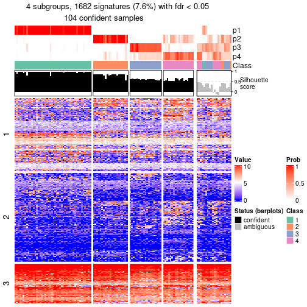</p>

</div>
</div>


Compare the overlap of signatures from different k:

```r
compare_signatures(res)
```


`get_signature()` returns a data frame invisibly. To get the list of signatures, the function
call should be assigned to a variable explicitly. In following code, if `plot` argument is set
to `FALSE`, no heatmap is plotted while only the differential analysis is performed.

```r
# code only for demonstration
tb = get_signature(res, k = ..., plot = FALSE)
```

An example of the output of `tb` is:

```
#>   which_row         fdr    mean_1    mean_2 scaled_mean_1 scaled_mean_2 km
#> 1        38 0.042760348  8.373488  9.131774    -0.5533452     0.5164555  1
#> 2        40 0.018707592  7.106213  8.469186    -0.6173731     0.5762149  1
#> 3        55 0.019134737 10.221463 11.207825    -0.6159697     0.5749050  1
#> 4        59 0.006059896  5.921854  7.869574    -0.6899429     0.6439467  1
#> 5        60 0.018055526  8.928898 10.211722    -0.6204761     0.5791110  1
#> 6        98 0.009384629 15.714769 14.887706     0.6635654    -0.6193277  2
...
```

The columns in `tb` are:

1. `which_row`: row indices corresponding to the input matrix.
2. `fdr`: FDR for the differential test. 
3. `mean_x`: The mean value in group x.
4. `scaled_mean_x`: The mean value in group x after rows are scaled.
5. `km`: Row groups if k-means clustering is applied to rows (which is done by automatically selecting number of clusters).

If there are too many signatures, `top_signatures = ...` can be set to only show the 
signatures with the highest FDRs:

```r
# code only for demonstration
# e.g. to show the top 500 most significant rows
tb = get_signature(res, k = ..., top_signatures = 500)
```

If the signatures are defined as these which are uniquely high in current group, `diff_method` argument
can be set to `"uniquely_high_in_one_group"`:

```r
# code only for demonstration
tb = get_signature(res, k = ..., diff_method = "uniquely_high_in_one_group")
```


UMAP plot which shows how samples are separated.


<script>
$( function() {
	$( '#tabs-node-0122-dimension-reduction' ).tabs();
} );
</script>
<div id='tabs-node-0122-dimension-reduction'>
<ul>
<li><a href='#tab-node-0122-dimension-reduction-1'>k = 2</a></li>
<li><a href='#tab-node-0122-dimension-reduction-2'>k = 3</a></li>
<li><a href='#tab-node-0122-dimension-reduction-3'>k = 4</a></li>
</ul>
<div id='tab-node-0122-dimension-reduction-1'>
<pre><code class="r">dimension_reduction(res, k = 2, method = &quot;UMAP&quot;)
</code></pre>

<p></p>

</div>
<div id='tab-node-0122-dimension-reduction-2'>
<pre><code class="r">dimension_reduction(res, k = 3, method = &quot;UMAP&quot;)
</code></pre>

<p></p>

</div>
<div id='tab-node-0122-dimension-reduction-3'>
<pre><code class="r">dimension_reduction(res, k = 4, method = &quot;UMAP&quot;)
</code></pre>

<p></p>

</div>
</div>


Following heatmap shows how subgroups are split when increasing `k`:

```r
collect_classes(res)
```


If matrix rows can be associated to genes, consider to use `functional_enrichment(res,
...)` to perform function enrichment for the signature genes. See [this vignette](https://jokergoo.github.io/cola_vignettes/functional_enrichment.html) for more detailed explanations.


 

---------------------------------------------------


### Node013


Parent node: [Node01](#Node01).
Child nodes: 
                [Node0111](#Node0111)
        ,
                [Node0112](#Node0112)
        ,
                [Node0121](#Node0121)
        ,
                [Node0122](#Node0122)
        ,
                [Node0131](#Node0131)
        ,
                Node0132-leaf
        ,
                Node0141-leaf
        ,
                Node0142-leaf
        ,
                [Node0211](#Node0211)
        ,
                [Node0212](#Node0212)
        ,
                Node0213-leaf
        ,
                Node0311-leaf
        ,
                Node0312-leaf
        ,
                Node0321-leaf
        ,
                Node0322-leaf
        ,
                Node0331-leaf
        ,
                Node0332-leaf
        ,
                Node0411-leaf
        ,
                Node0412-leaf
        ,
                Node0413-leaf
        ,
                Node0421-leaf
        ,
                Node0422-leaf
        ,
                Node0423-leaf
        .


The object with results only for a single top-value method and a single partitioning method 
can be extracted as:

```r
res = res_rh["013"]
```

A summary of `res` and all the functions that can be applied to it:

```r
res
```

```
#> A 'ConsensusPartition' object with k = 2, 3, 4.
#>   On a matrix with 16862 rows and 115 columns.
#>   Top rows (1686) are extracted by 'ATC' method.
#>   Subgroups are detected by 'skmeans' method.
#>   Performed in total 150 partitions by row resampling.
#>   Best k for subgroups seems to be 2.
#> 
#> Following methods can be applied to this 'ConsensusPartition' object:
#>  [1] "cola_report"             "collect_classes"         "collect_plots"          
#>  [4] "collect_stats"           "colnames"                "compare_partitions"     
#>  [7] "compare_signatures"      "consensus_heatmap"       "dimension_reduction"    
#> [10] "functional_enrichment"   "get_anno_col"            "get_anno"               
#> [13] "get_classes"             "get_consensus"           "get_matrix"             
#> [16] "get_membership"          "get_param"               "get_signatures"         
#> [19] "get_stats"               "is_best_k"               "is_stable_k"            
#> [22] "membership_heatmap"      "ncol"                    "nrow"                   
#> [25] "plot_ecdf"               "predict_classes"         "rownames"               
#> [28] "select_partition_number" "show"                    "suggest_best_k"         
#> [31] "test_to_known_factors"   "top_rows_heatmap"
```

`collect_plots()` function collects all the plots made from `res` for all `k` (number of subgroups)
into one single page to provide an easy and fast comparison between different `k`.

```r
collect_plots(res)
```


The plots are:

- The first row: a plot of the eCDF (empirical cumulative distribution
  function) curves of the consensus matrix for each `k` and the heatmap of
  predicted classes for each `k`.
- The second row: heatmaps of the consensus matrix for each `k`.
- The third row: heatmaps of the membership matrix for each `k`.
- The fouth row: heatmaps of the signatures for each `k`.

All the plots in panels can be made by individual functions and they are
plotted later in this section.

`select_partition_number()` produces several plots showing different
statistics for choosing "optimized" `k`. There are following statistics:

- eCDF curves of the consensus matrix for each `k`;
- 1-PAC. [The PAC score](https://en.wikipedia.org/wiki/Consensus_clustering#Over-interpretation_potential_of_consensus_clustering)
  measures the proportion of the ambiguous subgrouping.
- Mean silhouette score.
- Concordance. The mean probability of fiting the consensus subgroup labels in all
  partitions.
- Area increased. Denote $A_k$ as the area under the eCDF curve for current
  `k`, the area increased is defined as $A_k - A_{k-1}$.
- Rand index. The percent of pairs of samples that are both in a same cluster
  or both are not in a same cluster in the partition of k and k-1.
- Jaccard index. The ratio of pairs of samples are both in a same cluster in
  the partition of k and k-1 and the pairs of samples are both in a same
  cluster in the partition k or k-1.

The detailed explanations of these statistics can be found in [the _cola_
vignette](https://jokergoo.github.io/cola_vignettes/cola.html#toc_13).

Generally speaking, higher 1-PAC score, higher mean silhouette score or higher
concordance corresponds to better partition. Rand index and Jaccard index
measure how similar the current partition is compared to partition with `k-1`.
If they are too similar, we won't accept `k` is better than `k-1`.

```r
select_partition_number(res)
```


The numeric values for all these statistics can be obtained by `get_stats()`.

```r
get_stats(res)
```

```
#>   k 1-PAC mean_silhouette concordance area_increased  Rand Jaccard
#> 2 2 0.999           0.973       0.989          0.490 0.512   0.512
#> 3 3 0.844           0.879       0.948          0.369 0.743   0.533
#> 4 4 0.616           0.604       0.773          0.105 0.902   0.720
```

`suggest_best_k()` suggests the best $k$ based on these statistics. The rules are as follows:

- All $k$ with Jaccard index larger than 0.95 are removed because increasing
  $k$ does not provide enough extra information. If all $k$ are removed, it is
  marked as no subgroup is detected.
- For all $k$ with 1-PAC score larger than 0.9, the maximal $k$ is taken as
  the best $k$, and other $k$ are marked as optional $k$.
- If it does not fit the second rule. The $k$ with the maximal vote of the
  highest 1-PAC score, highest mean silhouette, and highest concordance is
  taken as the best $k$.

```r
suggest_best_k(res)
```

```
#> [1] 2
```


Following is the table of the partitions (You need to click the **show/hide
code output** link to see it). The membership matrix (columns with name `p*`)
is inferred by
[`clue::cl_consensus()`](https://www.rdocumentation.org/link/cl_consensus?package=clue)
function with the `SE` method. Basically the value in the membership matrix
represents the probability to belong to a certain group. The finall subgroup
label for an item is determined with the group with highest probability it
belongs to.

In `get_classes()` function, the entropy is calculated from the membership
matrix and the silhouette score is calculated from the consensus matrix.


<script>
$( function() {
	$( '#tabs-node-013-get-classes' ).tabs();
} );
</script>
<div id='tabs-node-013-get-classes'>
<ul>
<li><a href='#tab-node-013-get-classes-1'>k = 2</a></li>
<li><a href='#tab-node-013-get-classes-2'>k = 3</a></li>
<li><a href='#tab-node-013-get-classes-3'>k = 4</a></li>
</ul>

<div id='tab-node-013-get-classes-1'>
<p><a id='tab-node-013-get-classes-1-a' style='color:#0366d6' href='#'>show/hide code output</a></p>
<pre><code class="r">cbind(get_classes(res, k = 2), get_membership(res, k = 2))
</code></pre>

<pre><code>#&gt;            class entropy silhouette   p1   p2
#&gt; Prog_019       1   0.000    0.98669 1.00 0.00
#&gt; Prog_043       2   0.000    0.99118 0.00 1.00
#&gt; Prog_057       1   0.000    0.98669 1.00 0.00
#&gt; Prog_045       2   0.000    0.99118 0.00 1.00
#&gt; Prog_065       1   0.000    0.98669 1.00 0.00
#&gt; Prog_117       2   0.000    0.99118 0.00 1.00
#&gt; Prog_101       1   0.000    0.98669 1.00 0.00
#&gt; HSPC_132       2   0.000    0.99118 0.00 1.00
#&gt; LT-HSC_043     2   0.000    0.99118 0.00 1.00
#&gt; Prog_141       2   0.000    0.99118 0.00 1.00
#&gt; Prog_129       1   0.000    0.98669 1.00 0.00
#&gt; Prog_136       2   0.529    0.86398 0.12 0.88
#&gt; Prog_130       1   0.000    0.98669 1.00 0.00
#&gt; Prog_143       1   0.000    0.98669 1.00 0.00
#&gt; Prog_150       1   0.402    0.90798 0.92 0.08
#&gt; Prog_168       1   0.000    0.98669 1.00 0.00
#&gt; Prog_132       1   1.000   -0.00455 0.50 0.50
#&gt; LT-HSC_055     2   0.000    0.99118 0.00 1.00
#&gt; LT-HSC_056     1   0.000    0.98669 1.00 0.00
#&gt; Prog_183       2   0.000    0.99118 0.00 1.00
#&gt; Prog_184       1   0.000    0.98669 1.00 0.00
#&gt; Prog_179       1   0.000    0.98669 1.00 0.00
#&gt; Prog_197       1   0.000    0.98669 1.00 0.00
#&gt; Prog_203       2   0.000    0.99118 0.00 1.00
#&gt; Prog_209       1   0.529    0.86263 0.88 0.12
#&gt; LT-HSC_060     1   0.000    0.98669 1.00 0.00
#&gt; Prog_224       2   0.000    0.99118 0.00 1.00
#&gt; Prog_231       2   0.000    0.99118 0.00 1.00
#&gt; Prog_243       1   0.000    0.98669 1.00 0.00
#&gt; Prog_227       2   0.000    0.99118 0.00 1.00
#&gt; Prog_228       1   0.000    0.98669 1.00 0.00
#&gt; HSPC_261       2   0.000    0.99118 0.00 1.00
#&gt; HSPC_269       2   0.141    0.97303 0.02 0.98
#&gt; HSPC_275       1   0.000    0.98669 1.00 0.00
#&gt; Prog_267       1   0.000    0.98669 1.00 0.00
#&gt; Prog_273       1   0.000    0.98669 1.00 0.00
#&gt; Prog_263       1   0.000    0.98669 1.00 0.00
#&gt; Prog_287       1   0.000    0.98669 1.00 0.00
#&gt; Prog_270       1   0.000    0.98669 1.00 0.00
#&gt; Prog_258       2   0.760    0.72143 0.22 0.78
#&gt; Prog_319       2   0.000    0.99118 0.00 1.00
#&gt; Prog_330       2   0.000    0.99118 0.00 1.00
#&gt; Prog_336       2   0.000    0.99118 0.00 1.00
#&gt; Prog_300       1   0.000    0.98669 1.00 0.00
#&gt; HSPC_343       2   0.242    0.95380 0.04 0.96
#&gt; HSPC_370       1   0.000    0.98669 1.00 0.00
#&gt; HSPC_342       1   0.000    0.98669 1.00 0.00
#&gt; Prog_343       2   0.000    0.99118 0.00 1.00
#&gt; Prog_367       1   0.000    0.98669 1.00 0.00
#&gt; LT-HSC_103     2   0.000    0.99118 0.00 1.00
#&gt; Prog_353       2   0.000    0.99118 0.00 1.00
#&gt; HSPC_412       1   0.000    0.98669 1.00 0.00
#&gt; HSPC_407       1   0.000    0.98669 1.00 0.00
#&gt; HSPC_419       1   0.000    0.98669 1.00 0.00
#&gt; Prog_387       1   0.000    0.98669 1.00 0.00
#&gt; Prog_389       2   0.000    0.99118 0.00 1.00
#&gt; Prog_401       2   0.000    0.99118 0.00 1.00
#&gt; Prog_414       1   0.000    0.98669 1.00 0.00
#&gt; HSPC_436       2   0.000    0.99118 0.00 1.00
#&gt; HSPC_454       2   0.000    0.99118 0.00 1.00
#&gt; Prog_451       1   0.402    0.90798 0.92 0.08
#&gt; Prog_437       2   0.000    0.99118 0.00 1.00
#&gt; Prog_443       1   0.000    0.98669 1.00 0.00
#&gt; HSPC_508       1   0.469    0.88588 0.90 0.10
#&gt; Prog_475       1   0.000    0.98669 1.00 0.00
#&gt; Prog_487       1   0.000    0.98669 1.00 0.00
#&gt; Prog_505       1   0.000    0.98669 1.00 0.00
#&gt; Prog_488       1   0.000    0.98669 1.00 0.00
#&gt; Prog_500       1   0.000    0.98669 1.00 0.00
#&gt; LT-HSC_130     2   0.000    0.99118 0.00 1.00
#&gt; Prog_485       2   0.000    0.99118 0.00 1.00
#&gt; Prog_491       1   0.000    0.98669 1.00 0.00
#&gt; Prog_529       1   0.000    0.98669 1.00 0.00
#&gt; Prog_541       1   0.000    0.98669 1.00 0.00
#&gt; Prog_547       2   0.000    0.99118 0.00 1.00
#&gt; Prog_531       1   0.000    0.98669 1.00 0.00
#&gt; Prog_520       1   0.000    0.98669 1.00 0.00
#&gt; LT-HSC_143     2   0.000    0.99118 0.00 1.00
#&gt; HSPC_553       1   0.000    0.98669 1.00 0.00
#&gt; Prog_569       1   0.000    0.98669 1.00 0.00
#&gt; Prog_587       2   0.000    0.99118 0.00 1.00
#&gt; Prog_602       2   0.000    0.99118 0.00 1.00
#&gt; Prog_614       2   0.000    0.99118 0.00 1.00
#&gt; Prog_623       2   0.000    0.99118 0.00 1.00
#&gt; Prog_612       1   0.000    0.98669 1.00 0.00
#&gt; Prog_630       1   0.000    0.98669 1.00 0.00
#&gt; LT-HSC_168     1   0.000    0.98669 1.00 0.00
#&gt; HSPC_644       2   0.000    0.99118 0.00 1.00
#&gt; HSPC_638       2   0.000    0.99118 0.00 1.00
#&gt; Prog_661       1   0.000    0.98669 1.00 0.00
#&gt; Prog_654       2   0.000    0.99118 0.00 1.00
#&gt; HSPC_695       2   0.000    0.99118 0.00 1.00
#&gt; Prog_698       1   0.000    0.98669 1.00 0.00
#&gt; Prog_681       1   0.000    0.98669 1.00 0.00
#&gt; Prog_706       1   0.000    0.98669 1.00 0.00
#&gt; Prog_712       2   0.000    0.99118 0.00 1.00
#&gt; Prog_682       2   0.000    0.99118 0.00 1.00
#&gt; Prog_713       1   0.000    0.98669 1.00 0.00
#&gt; Prog_753       1   0.000    0.98669 1.00 0.00
#&gt; Prog_736       1   0.000    0.98669 1.00 0.00
#&gt; Prog_754       1   0.000    0.98669 1.00 0.00
#&gt; Prog_793       2   0.000    0.99118 0.00 1.00
#&gt; Prog_801       2   0.000    0.99118 0.00 1.00
#&gt; Prog_765       1   0.000    0.98669 1.00 0.00
#&gt; Prog_779       1   0.000    0.98669 1.00 0.00
#&gt; Prog_792       1   0.000    0.98669 1.00 0.00
#&gt; Prog_798       1   0.000    0.98669 1.00 0.00
#&gt; Prog_817       2   0.000    0.99118 0.00 1.00
#&gt; Prog_836       1   0.000    0.98669 1.00 0.00
#&gt; Prog_843       1   0.000    0.98669 1.00 0.00
#&gt; Prog_820       2   0.000    0.99118 0.00 1.00
#&gt; Prog_839       1   0.000    0.98669 1.00 0.00
#&gt; Prog_845       1   0.000    0.98669 1.00 0.00
#&gt; Prog_809       2   0.000    0.99118 0.00 1.00
#&gt; Prog_810       1   0.000    0.98669 1.00 0.00
</code></pre>

<script>
$('#tab-node-013-get-classes-1-a').parent().next().next().hide();
$('#tab-node-013-get-classes-1-a').click(function(){
  $('#tab-node-013-get-classes-1-a').parent().next().next().toggle();
  return(false);
});
</script>
</div>

<div id='tab-node-013-get-classes-2'>
<p><a id='tab-node-013-get-classes-2-a' style='color:#0366d6' href='#'>show/hide code output</a></p>
<pre><code class="r">cbind(get_classes(res, k = 3), get_membership(res, k = 3))
</code></pre>

<pre><code>#&gt;            class entropy silhouette   p1   p2   p3
#&gt; Prog_019       1  0.0000      0.917 1.00 0.00 0.00
#&gt; Prog_043       2  0.0000      0.970 0.00 1.00 0.00
#&gt; Prog_057       1  0.0892      0.907 0.98 0.00 0.02
#&gt; Prog_045       2  0.0000      0.970 0.00 1.00 0.00
#&gt; Prog_065       1  0.0000      0.917 1.00 0.00 0.00
#&gt; Prog_117       2  0.0000      0.970 0.00 1.00 0.00
#&gt; Prog_101       1  0.0000      0.917 1.00 0.00 0.00
#&gt; HSPC_132       2  0.2537      0.898 0.00 0.92 0.08
#&gt; LT-HSC_043     2  0.6280      0.135 0.00 0.54 0.46
#&gt; Prog_141       2  0.0000      0.970 0.00 1.00 0.00
#&gt; Prog_129       3  0.0000      0.941 0.00 0.00 1.00
#&gt; Prog_136       1  0.3686      0.803 0.86 0.14 0.00
#&gt; Prog_130       1  0.0000      0.917 1.00 0.00 0.00
#&gt; Prog_143       3  0.1529      0.909 0.04 0.00 0.96
#&gt; Prog_150       1  0.0000      0.917 1.00 0.00 0.00
#&gt; Prog_168       1  0.0000      0.917 1.00 0.00 0.00
#&gt; Prog_132       1  0.8538      0.159 0.52 0.10 0.38
#&gt; LT-HSC_055     2  0.0000      0.970 0.00 1.00 0.00
#&gt; LT-HSC_056     1  0.0000      0.917 1.00 0.00 0.00
#&gt; Prog_183       2  0.0000      0.970 0.00 1.00 0.00
#&gt; Prog_184       1  0.0000      0.917 1.00 0.00 0.00
#&gt; Prog_179       3  0.0000      0.941 0.00 0.00 1.00
#&gt; Prog_197       1  0.0000      0.917 1.00 0.00 0.00
#&gt; Prog_203       2  0.0000      0.970 0.00 1.00 0.00
#&gt; Prog_209       3  0.0000      0.941 0.00 0.00 1.00
#&gt; LT-HSC_060     3  0.0000      0.941 0.00 0.00 1.00
#&gt; Prog_224       2  0.0892      0.953 0.00 0.98 0.02
#&gt; Prog_231       2  0.0000      0.970 0.00 1.00 0.00
#&gt; Prog_243       3  0.5948      0.467 0.36 0.00 0.64
#&gt; Prog_227       2  0.0000      0.970 0.00 1.00 0.00
#&gt; Prog_228       3  0.0000      0.941 0.00 0.00 1.00
#&gt; HSPC_261       2  0.0000      0.970 0.00 1.00 0.00
#&gt; HSPC_269       3  0.7683      0.529 0.08 0.28 0.64
#&gt; HSPC_275       3  0.2066      0.892 0.06 0.00 0.94
#&gt; Prog_267       3  0.0000      0.941 0.00 0.00 1.00
#&gt; Prog_273       1  0.0000      0.917 1.00 0.00 0.00
#&gt; Prog_263       3  0.0000      0.941 0.00 0.00 1.00
#&gt; Prog_287       1  0.0000      0.917 1.00 0.00 0.00
#&gt; Prog_270       3  0.0000      0.941 0.00 0.00 1.00
#&gt; Prog_258       1  0.2959      0.841 0.90 0.10 0.00
#&gt; Prog_319       2  0.0000      0.970 0.00 1.00 0.00
#&gt; Prog_330       2  0.0000      0.970 0.00 1.00 0.00
#&gt; Prog_336       2  0.1529      0.937 0.00 0.96 0.04
#&gt; Prog_300       3  0.0000      0.941 0.00 0.00 1.00
#&gt; HSPC_343       1  0.0000      0.917 1.00 0.00 0.00
#&gt; HSPC_370       1  0.0000      0.917 1.00 0.00 0.00
#&gt; HSPC_342       3  0.0000      0.941 0.00 0.00 1.00
#&gt; Prog_343       2  0.0000      0.970 0.00 1.00 0.00
#&gt; Prog_367       3  0.0000      0.941 0.00 0.00 1.00
#&gt; LT-HSC_103     2  0.0000      0.970 0.00 1.00 0.00
#&gt; Prog_353       2  0.0000      0.970 0.00 1.00 0.00
#&gt; HSPC_412       1  0.0000      0.917 1.00 0.00 0.00
#&gt; HSPC_407       3  0.2066      0.892 0.06 0.00 0.94
#&gt; HSPC_419       1  0.0000      0.917 1.00 0.00 0.00
#&gt; Prog_387       3  0.5706      0.490 0.32 0.00 0.68
#&gt; Prog_389       2  0.0000      0.970 0.00 1.00 0.00
#&gt; Prog_401       1  0.2959      0.838 0.90 0.10 0.00
#&gt; Prog_414       1  0.0000      0.917 1.00 0.00 0.00
#&gt; HSPC_436       2  0.0000      0.970 0.00 1.00 0.00
#&gt; HSPC_454       2  0.0000      0.970 0.00 1.00 0.00
#&gt; Prog_451       1  0.0000      0.917 1.00 0.00 0.00
#&gt; Prog_437       2  0.0000      0.970 0.00 1.00 0.00
#&gt; Prog_443       3  0.0000      0.941 0.00 0.00 1.00
#&gt; HSPC_508       3  0.0000      0.941 0.00 0.00 1.00
#&gt; Prog_475       1  0.0000      0.917 1.00 0.00 0.00
#&gt; Prog_487       1  0.4796      0.727 0.78 0.00 0.22
#&gt; Prog_505       1  0.0000      0.917 1.00 0.00 0.00
#&gt; Prog_488       3  0.0000      0.941 0.00 0.00 1.00
#&gt; Prog_500       1  0.0000      0.917 1.00 0.00 0.00
#&gt; LT-HSC_130     2  0.0000      0.970 0.00 1.00 0.00
#&gt; Prog_485       2  0.0000      0.970 0.00 1.00 0.00
#&gt; Prog_491       1  0.4796      0.727 0.78 0.00 0.22
#&gt; Prog_529       3  0.0000      0.941 0.00 0.00 1.00
#&gt; Prog_541       3  0.0000      0.941 0.00 0.00 1.00
#&gt; Prog_547       3  0.4796      0.687 0.00 0.22 0.78
#&gt; Prog_531       1  0.0000      0.917 1.00 0.00 0.00
#&gt; Prog_520       1  0.5016      0.700 0.76 0.00 0.24
#&gt; LT-HSC_143     2  0.0000      0.970 0.00 1.00 0.00
#&gt; HSPC_553       1  0.0000      0.917 1.00 0.00 0.00
#&gt; Prog_569       3  0.0000      0.941 0.00 0.00 1.00
#&gt; Prog_587       2  0.0000      0.970 0.00 1.00 0.00
#&gt; Prog_602       2  0.0000      0.970 0.00 1.00 0.00
#&gt; Prog_614       2  0.0000      0.970 0.00 1.00 0.00
#&gt; Prog_623       2  0.0000      0.970 0.00 1.00 0.00
#&gt; Prog_612       3  0.0000      0.941 0.00 0.00 1.00
#&gt; Prog_630       3  0.5948      0.451 0.36 0.00 0.64
#&gt; LT-HSC_168     3  0.0000      0.941 0.00 0.00 1.00
#&gt; HSPC_644       2  0.0000      0.970 0.00 1.00 0.00
#&gt; HSPC_638       2  0.0000      0.970 0.00 1.00 0.00
#&gt; Prog_661       1  0.0892      0.906 0.98 0.00 0.02
#&gt; Prog_654       2  0.4796      0.708 0.22 0.78 0.00
#&gt; HSPC_695       2  0.0000      0.970 0.00 1.00 0.00
#&gt; Prog_698       1  0.0000      0.917 1.00 0.00 0.00
#&gt; Prog_681       1  0.0000      0.917 1.00 0.00 0.00
#&gt; Prog_706       1  0.4796      0.727 0.78 0.00 0.22
#&gt; Prog_712       2  0.0000      0.970 0.00 1.00 0.00
#&gt; Prog_682       2  0.2537      0.900 0.00 0.92 0.08
#&gt; Prog_713       3  0.0000      0.941 0.00 0.00 1.00
#&gt; Prog_753       3  0.0000      0.941 0.00 0.00 1.00
#&gt; Prog_736       3  0.0000      0.941 0.00 0.00 1.00
#&gt; Prog_754       1  0.0000      0.917 1.00 0.00 0.00
#&gt; Prog_793       2  0.0000      0.970 0.00 1.00 0.00
#&gt; Prog_801       2  0.0000      0.970 0.00 1.00 0.00
#&gt; Prog_765       1  0.6045      0.452 0.62 0.00 0.38
#&gt; Prog_779       3  0.0000      0.941 0.00 0.00 1.00
#&gt; Prog_792       1  0.0000      0.917 1.00 0.00 0.00
#&gt; Prog_798       1  0.4796      0.727 0.78 0.00 0.22
#&gt; Prog_817       2  0.0000      0.970 0.00 1.00 0.00
#&gt; Prog_836       3  0.0000      0.941 0.00 0.00 1.00
#&gt; Prog_843       1  0.0000      0.917 1.00 0.00 0.00
#&gt; Prog_820       2  0.4796      0.705 0.22 0.78 0.00
#&gt; Prog_839       3  0.0000      0.941 0.00 0.00 1.00
#&gt; Prog_845       1  0.4796      0.727 0.78 0.00 0.22
#&gt; Prog_809       1  0.6280      0.124 0.54 0.46 0.00
#&gt; Prog_810       1  0.1529      0.893 0.96 0.00 0.04
</code></pre>

<script>
$('#tab-node-013-get-classes-2-a').parent().next().next().hide();
$('#tab-node-013-get-classes-2-a').click(function(){
  $('#tab-node-013-get-classes-2-a').parent().next().next().toggle();
  return(false);
});
</script>
</div>

<div id='tab-node-013-get-classes-3'>
<p><a id='tab-node-013-get-classes-3-a' style='color:#0366d6' href='#'>show/hide code output</a></p>
<pre><code class="r">cbind(get_classes(res, k = 4), get_membership(res, k = 4))
</code></pre>

<pre><code>#&gt;            class entropy silhouette   p1   p2   p3   p4
#&gt; Prog_019       1  0.4713     0.4085 0.64 0.00 0.00 0.36
#&gt; Prog_043       2  0.4522     0.6784 0.00 0.68 0.00 0.32
#&gt; Prog_057       1  0.4406     0.3932 0.70 0.00 0.00 0.30
#&gt; Prog_045       2  0.3172     0.8171 0.00 0.84 0.00 0.16
#&gt; Prog_065       1  0.4134     0.4779 0.74 0.00 0.00 0.26
#&gt; Prog_117       2  0.3610     0.7616 0.00 0.80 0.00 0.20
#&gt; Prog_101       4  0.4790     0.1604 0.38 0.00 0.00 0.62
#&gt; HSPC_132       2  0.4797     0.6746 0.00 0.72 0.26 0.02
#&gt; LT-HSC_043     2  0.5535     0.4349 0.00 0.56 0.42 0.02
#&gt; Prog_141       2  0.1637     0.8480 0.00 0.94 0.00 0.06
#&gt; Prog_129       3  0.4277     0.8162 0.28 0.00 0.72 0.00
#&gt; Prog_136       4  0.5657     0.4889 0.12 0.16 0.00 0.72
#&gt; Prog_130       1  0.4977     0.2438 0.54 0.00 0.00 0.46
#&gt; Prog_143       3  0.6104     0.7305 0.18 0.00 0.68 0.14
#&gt; Prog_150       4  0.2921     0.5307 0.14 0.00 0.00 0.86
#&gt; Prog_168       1  0.0707     0.5470 0.98 0.00 0.00 0.02
#&gt; Prog_132       4  0.7446     0.3432 0.12 0.04 0.24 0.60
#&gt; LT-HSC_055     2  0.0000     0.8604 0.00 1.00 0.00 0.00
#&gt; LT-HSC_056     4  0.5957     0.0101 0.42 0.00 0.04 0.54
#&gt; Prog_183       2  0.4994     0.2913 0.00 0.52 0.00 0.48
#&gt; Prog_184       1  0.3172     0.5299 0.84 0.00 0.00 0.16
#&gt; Prog_179       3  0.4277     0.8162 0.28 0.00 0.72 0.00
#&gt; Prog_197       1  0.4522     0.4452 0.68 0.00 0.00 0.32
#&gt; Prog_203       2  0.1211     0.8547 0.00 0.96 0.00 0.04
#&gt; Prog_209       3  0.0000     0.7763 0.00 0.00 1.00 0.00
#&gt; LT-HSC_060     3  0.4277     0.8162 0.28 0.00 0.72 0.00
#&gt; Prog_224       2  0.4553     0.7379 0.00 0.78 0.18 0.04
#&gt; Prog_231       2  0.1637     0.8502 0.00 0.94 0.00 0.06
#&gt; Prog_243       1  0.7745     0.1370 0.42 0.00 0.34 0.24
#&gt; Prog_227       2  0.2647     0.8358 0.00 0.88 0.00 0.12
#&gt; Prog_228       3  0.0000     0.7763 0.00 0.00 1.00 0.00
#&gt; HSPC_261       2  0.0000     0.8604 0.00 1.00 0.00 0.00
#&gt; HSPC_269       3  0.7845    -0.0391 0.00 0.28 0.40 0.32
#&gt; HSPC_275       3  0.5487     0.6234 0.40 0.00 0.58 0.02
#&gt; Prog_267       3  0.4277     0.8162 0.28 0.00 0.72 0.00
#&gt; Prog_273       1  0.4624     0.4050 0.66 0.00 0.00 0.34
#&gt; Prog_263       3  0.1637     0.8036 0.06 0.00 0.94 0.00
#&gt; Prog_287       1  0.4977     0.2097 0.54 0.00 0.00 0.46
#&gt; Prog_270       3  0.4277     0.8162 0.28 0.00 0.72 0.00
#&gt; Prog_258       4  0.6449     0.4245 0.22 0.14 0.00 0.64
#&gt; Prog_319       2  0.1211     0.8496 0.00 0.96 0.00 0.04
#&gt; Prog_330       2  0.2011     0.8387 0.00 0.92 0.00 0.08
#&gt; Prog_336       2  0.5489     0.6738 0.00 0.70 0.24 0.06
#&gt; Prog_300       3  0.0000     0.7763 0.00 0.00 1.00 0.00
#&gt; HSPC_343       4  0.2345     0.5388 0.10 0.00 0.00 0.90
#&gt; HSPC_370       1  0.4624     0.4311 0.66 0.00 0.00 0.34
#&gt; HSPC_342       3  0.3801     0.8225 0.22 0.00 0.78 0.00
#&gt; Prog_343       2  0.1637     0.8502 0.00 0.94 0.00 0.06
#&gt; Prog_367       3  0.3335     0.8169 0.12 0.00 0.86 0.02
#&gt; LT-HSC_103     2  0.1637     0.8539 0.00 0.94 0.00 0.06
#&gt; Prog_353       2  0.4907     0.5282 0.00 0.58 0.00 0.42
#&gt; HSPC_412       1  0.4855     0.3528 0.60 0.00 0.00 0.40
#&gt; HSPC_407       3  0.5271     0.7172 0.34 0.00 0.64 0.02
#&gt; HSPC_419       1  0.4855     0.3528 0.60 0.00 0.00 0.40
#&gt; Prog_387       1  0.6262    -0.2244 0.54 0.00 0.40 0.06
#&gt; Prog_389       2  0.4522     0.6784 0.00 0.68 0.00 0.32
#&gt; Prog_401       4  0.4332     0.4709 0.16 0.04 0.00 0.80
#&gt; Prog_414       4  0.4790     0.2726 0.38 0.00 0.00 0.62
#&gt; HSPC_436       2  0.0000     0.8604 0.00 1.00 0.00 0.00
#&gt; HSPC_454       2  0.4277     0.6740 0.00 0.72 0.00 0.28
#&gt; Prog_451       4  0.4790     0.2681 0.38 0.00 0.00 0.62
#&gt; Prog_437       2  0.0000     0.8604 0.00 1.00 0.00 0.00
#&gt; Prog_443       3  0.4277     0.8162 0.28 0.00 0.72 0.00
#&gt; HSPC_508       3  0.0000     0.7763 0.00 0.00 1.00 0.00
#&gt; Prog_475       1  0.4624     0.4311 0.66 0.00 0.00 0.34
#&gt; Prog_487       1  0.0000     0.5461 1.00 0.00 0.00 0.00
#&gt; Prog_505       1  0.4790     0.3831 0.62 0.00 0.00 0.38
#&gt; Prog_488       3  0.4277     0.8162 0.28 0.00 0.72 0.00
#&gt; Prog_500       1  0.4713     0.4085 0.64 0.00 0.00 0.36
#&gt; LT-HSC_130     2  0.0000     0.8604 0.00 1.00 0.00 0.00
#&gt; Prog_485       2  0.0707     0.8577 0.00 0.98 0.02 0.00
#&gt; Prog_491       1  0.0000     0.5461 1.00 0.00 0.00 0.00
#&gt; Prog_529       3  0.0000     0.7763 0.00 0.00 1.00 0.00
#&gt; Prog_541       3  0.4277     0.8162 0.28 0.00 0.72 0.00
#&gt; Prog_547       3  0.4491     0.5798 0.00 0.14 0.80 0.06
#&gt; Prog_531       4  0.3975     0.4667 0.24 0.00 0.00 0.76
#&gt; Prog_520       1  0.4292     0.4054 0.82 0.00 0.10 0.08
#&gt; LT-HSC_143     2  0.0000     0.8604 0.00 1.00 0.00 0.00
#&gt; HSPC_553       1  0.4907     0.3235 0.58 0.00 0.00 0.42
#&gt; Prog_569       3  0.7028     0.6885 0.28 0.00 0.56 0.16
#&gt; Prog_587       2  0.6320     0.6916 0.00 0.66 0.16 0.18
#&gt; Prog_602       2  0.0000     0.8604 0.00 1.00 0.00 0.00
#&gt; Prog_614       2  0.3975     0.7622 0.00 0.76 0.00 0.24
#&gt; Prog_623       2  0.1211     0.8496 0.00 0.96 0.00 0.04
#&gt; Prog_612       3  0.2647     0.8184 0.12 0.00 0.88 0.00
#&gt; Prog_630       1  0.5327     0.3653 0.72 0.00 0.22 0.06
#&gt; LT-HSC_168     3  0.3172     0.8237 0.16 0.00 0.84 0.00
#&gt; HSPC_644       2  0.0000     0.8604 0.00 1.00 0.00 0.00
#&gt; HSPC_638       2  0.0000     0.8604 0.00 1.00 0.00 0.00
#&gt; Prog_661       1  0.4797     0.2997 0.72 0.00 0.02 0.26
#&gt; Prog_654       4  0.4277     0.3545 0.00 0.28 0.00 0.72
#&gt; HSPC_695       2  0.1411     0.8565 0.00 0.96 0.02 0.02
#&gt; Prog_698       1  0.3801     0.5009 0.78 0.00 0.00 0.22
#&gt; Prog_681       4  0.4406     0.3762 0.30 0.00 0.00 0.70
#&gt; Prog_706       1  0.0000     0.5461 1.00 0.00 0.00 0.00
#&gt; Prog_712       2  0.2830     0.8380 0.00 0.90 0.04 0.06
#&gt; Prog_682       2  0.6382     0.5370 0.00 0.58 0.34 0.08
#&gt; Prog_713       3  0.0707     0.7646 0.00 0.00 0.98 0.02
#&gt; Prog_753       3  0.4277     0.8162 0.28 0.00 0.72 0.00
#&gt; Prog_736       3  0.1637     0.8035 0.06 0.00 0.94 0.00
#&gt; Prog_754       1  0.4624     0.3257 0.66 0.00 0.00 0.34
#&gt; Prog_793       2  0.0707     0.8598 0.00 0.98 0.00 0.02
#&gt; Prog_801       2  0.0707     0.8589 0.00 0.98 0.00 0.02
#&gt; Prog_765       1  0.6594     0.1807 0.62 0.00 0.14 0.24
#&gt; Prog_779       3  0.4277     0.8162 0.28 0.00 0.72 0.00
#&gt; Prog_792       1  0.0000     0.5461 1.00 0.00 0.00 0.00
#&gt; Prog_798       1  0.0000     0.5461 1.00 0.00 0.00 0.00
#&gt; Prog_817       2  0.1211     0.8548 0.00 0.96 0.00 0.04
#&gt; Prog_836       3  0.3975     0.8232 0.24 0.00 0.76 0.00
#&gt; Prog_843       1  0.3975     0.4934 0.76 0.00 0.00 0.24
#&gt; Prog_820       4  0.6201     0.2645 0.08 0.30 0.00 0.62
#&gt; Prog_839       3  0.0000     0.7763 0.00 0.00 1.00 0.00
#&gt; Prog_845       1  0.0000     0.5461 1.00 0.00 0.00 0.00
#&gt; Prog_809       1  0.7456    -0.1396 0.46 0.36 0.00 0.18
#&gt; Prog_810       1  0.0000     0.5461 1.00 0.00 0.00 0.00
</code></pre>

<script>
$('#tab-node-013-get-classes-3-a').parent().next().next().hide();
$('#tab-node-013-get-classes-3-a').click(function(){
  $('#tab-node-013-get-classes-3-a').parent().next().next().toggle();
  return(false);
});
</script>
</div>
</div>

Heatmaps for the consensus matrix. It visualizes the probability of two
samples to be in a same group.


<script>
$( function() {
	$( '#tabs-node-013-consensus-heatmap' ).tabs();
} );
</script>
<div id='tabs-node-013-consensus-heatmap'>
<ul>
<li><a href='#tab-node-013-consensus-heatmap-1'>k = 2</a></li>
<li><a href='#tab-node-013-consensus-heatmap-2'>k = 3</a></li>
<li><a href='#tab-node-013-consensus-heatmap-3'>k = 4</a></li>
</ul>
<div id='tab-node-013-consensus-heatmap-1'>
<pre><code class="r">consensus_heatmap(res, k = 2)
</code></pre>

<p></p>

</div>
<div id='tab-node-013-consensus-heatmap-2'>
<pre><code class="r">consensus_heatmap(res, k = 3)
</code></pre>

<p></p>

</div>
<div id='tab-node-013-consensus-heatmap-3'>
<pre><code class="r">consensus_heatmap(res, k = 4)
</code></pre>

<p></p>

</div>
</div>

Heatmaps for the membership of samples in all partitions to see how consistent they are:


<script>
$( function() {
	$( '#tabs-node-013-membership-heatmap' ).tabs();
} );
</script>
<div id='tabs-node-013-membership-heatmap'>
<ul>
<li><a href='#tab-node-013-membership-heatmap-1'>k = 2</a></li>
<li><a href='#tab-node-013-membership-heatmap-2'>k = 3</a></li>
<li><a href='#tab-node-013-membership-heatmap-3'>k = 4</a></li>
</ul>
<div id='tab-node-013-membership-heatmap-1'>
<pre><code class="r">membership_heatmap(res, k = 2)
</code></pre>

<p></p>

</div>
<div id='tab-node-013-membership-heatmap-2'>
<pre><code class="r">membership_heatmap(res, k = 3)
</code></pre>

<p></p>

</div>
<div id='tab-node-013-membership-heatmap-3'>
<pre><code class="r">membership_heatmap(res, k = 4)
</code></pre>

<p></p>

</div>
</div>

As soon as the classes for columns are determined, the signatures
that are significantly different between subgroups can be looked for. 
Following are the heatmaps for signatures.


Signature heatmaps where rows are scaled:


<script>
$( function() {
	$( '#tabs-node-013-get-signatures' ).tabs();
} );
</script>
<div id='tabs-node-013-get-signatures'>
<ul>
<li><a href='#tab-node-013-get-signatures-1'>k = 2</a></li>
<li><a href='#tab-node-013-get-signatures-2'>k = 3</a></li>
<li><a href='#tab-node-013-get-signatures-3'>k = 4</a></li>
</ul>
<div id='tab-node-013-get-signatures-1'>
<pre><code class="r">get_signatures(res, k = 2)
</code></pre>

<p></p>

</div>
<div id='tab-node-013-get-signatures-2'>
<pre><code class="r">get_signatures(res, k = 3)
</code></pre>

<p></p>

</div>
<div id='tab-node-013-get-signatures-3'>
<pre><code class="r">get_signatures(res, k = 4)
</code></pre>

<p></p>

</div>
</div>


Signature heatmaps where rows are not scaled:


<script>
$( function() {
	$( '#tabs-node-013-get-signatures-no-scale' ).tabs();
} );
</script>
<div id='tabs-node-013-get-signatures-no-scale'>
<ul>
<li><a href='#tab-node-013-get-signatures-no-scale-1'>k = 2</a></li>
<li><a href='#tab-node-013-get-signatures-no-scale-2'>k = 3</a></li>
<li><a href='#tab-node-013-get-signatures-no-scale-3'>k = 4</a></li>
</ul>
<div id='tab-node-013-get-signatures-no-scale-1'>
<pre><code class="r">get_signatures(res, k = 2, scale_rows = FALSE)
</code></pre>

<p></p>

</div>
<div id='tab-node-013-get-signatures-no-scale-2'>
<pre><code class="r">get_signatures(res, k = 3, scale_rows = FALSE)
</code></pre>

<p></p>

</div>
<div id='tab-node-013-get-signatures-no-scale-3'>
<pre><code class="r">get_signatures(res, k = 4, scale_rows = FALSE)
</code></pre>

<p></p>

</div>
</div>


Compare the overlap of signatures from different k:

```r
compare_signatures(res)
```


`get_signature()` returns a data frame invisibly. To get the list of signatures, the function
call should be assigned to a variable explicitly. In following code, if `plot` argument is set
to `FALSE`, no heatmap is plotted while only the differential analysis is performed.

```r
# code only for demonstration
tb = get_signature(res, k = ..., plot = FALSE)
```

An example of the output of `tb` is:

```
#>   which_row         fdr    mean_1    mean_2 scaled_mean_1 scaled_mean_2 km
#> 1        38 0.042760348  8.373488  9.131774    -0.5533452     0.5164555  1
#> 2        40 0.018707592  7.106213  8.469186    -0.6173731     0.5762149  1
#> 3        55 0.019134737 10.221463 11.207825    -0.6159697     0.5749050  1
#> 4        59 0.006059896  5.921854  7.869574    -0.6899429     0.6439467  1
#> 5        60 0.018055526  8.928898 10.211722    -0.6204761     0.5791110  1
#> 6        98 0.009384629 15.714769 14.887706     0.6635654    -0.6193277  2
...
```

The columns in `tb` are:

1. `which_row`: row indices corresponding to the input matrix.
2. `fdr`: FDR for the differential test. 
3. `mean_x`: The mean value in group x.
4. `scaled_mean_x`: The mean value in group x after rows are scaled.
5. `km`: Row groups if k-means clustering is applied to rows (which is done by automatically selecting number of clusters).

If there are too many signatures, `top_signatures = ...` can be set to only show the 
signatures with the highest FDRs:

```r
# code only for demonstration
# e.g. to show the top 500 most significant rows
tb = get_signature(res, k = ..., top_signatures = 500)
```

If the signatures are defined as these which are uniquely high in current group, `diff_method` argument
can be set to `"uniquely_high_in_one_group"`:

```r
# code only for demonstration
tb = get_signature(res, k = ..., diff_method = "uniquely_high_in_one_group")
```


UMAP plot which shows how samples are separated.


<script>
$( function() {
	$( '#tabs-node-013-dimension-reduction' ).tabs();
} );
</script>
<div id='tabs-node-013-dimension-reduction'>
<ul>
<li><a href='#tab-node-013-dimension-reduction-1'>k = 2</a></li>
<li><a href='#tab-node-013-dimension-reduction-2'>k = 3</a></li>
<li><a href='#tab-node-013-dimension-reduction-3'>k = 4</a></li>
</ul>
<div id='tab-node-013-dimension-reduction-1'>
<pre><code class="r">dimension_reduction(res, k = 2, method = &quot;UMAP&quot;)
</code></pre>

<p></p>

</div>
<div id='tab-node-013-dimension-reduction-2'>
<pre><code class="r">dimension_reduction(res, k = 3, method = &quot;UMAP&quot;)
</code></pre>

<p></p>

</div>
<div id='tab-node-013-dimension-reduction-3'>
<pre><code class="r">dimension_reduction(res, k = 4, method = &quot;UMAP&quot;)
</code></pre>

<p></p>

</div>
</div>


Following heatmap shows how subgroups are split when increasing `k`:

```r
collect_classes(res)
```


If matrix rows can be associated to genes, consider to use `functional_enrichment(res,
...)` to perform function enrichment for the signature genes. See [this vignette](https://jokergoo.github.io/cola_vignettes/functional_enrichment.html) for more detailed explanations.


 

---------------------------------------------------


### Node0131


Parent node: [Node013](#Node013).
Child nodes: 
                Node01111-leaf
        ,
                Node01112-leaf
        ,
                Node01113-leaf
        ,
                Node01121-leaf
        ,
                Node01122-leaf
        ,
                Node01211-leaf
        ,
                Node01212-leaf
        ,
                Node01213-leaf
        ,
                Node01221-leaf
        ,
                Node01222-leaf
        ,
                Node01223-leaf
        ,
                Node01311-leaf
        ,
                Node01312-leaf
        ,
                Node02111-leaf
        ,
                Node02112-leaf
        ,
                Node02121-leaf
        ,
                Node02122-leaf
        .


The object with results only for a single top-value method and a single partitioning method 
can be extracted as:

```r
res = res_rh["0131"]
```

A summary of `res` and all the functions that can be applied to it:

```r
res
```

```
#> A 'ConsensusPartition' object with k = 2, 3, 4.
#>   On a matrix with 16730 rows and 68 columns.
#>   Top rows (1673) are extracted by 'ATC' method.
#>   Subgroups are detected by 'skmeans' method.
#>   Performed in total 150 partitions by row resampling.
#>   Best k for subgroups seems to be 2.
#> 
#> Following methods can be applied to this 'ConsensusPartition' object:
#>  [1] "cola_report"             "collect_classes"         "collect_plots"          
#>  [4] "collect_stats"           "colnames"                "compare_partitions"     
#>  [7] "compare_signatures"      "consensus_heatmap"       "dimension_reduction"    
#> [10] "functional_enrichment"   "get_anno_col"            "get_anno"               
#> [13] "get_classes"             "get_consensus"           "get_matrix"             
#> [16] "get_membership"          "get_param"               "get_signatures"         
#> [19] "get_stats"               "is_best_k"               "is_stable_k"            
#> [22] "membership_heatmap"      "ncol"                    "nrow"                   
#> [25] "plot_ecdf"               "predict_classes"         "rownames"               
#> [28] "select_partition_number" "show"                    "suggest_best_k"         
#> [31] "test_to_known_factors"   "top_rows_heatmap"
```

`collect_plots()` function collects all the plots made from `res` for all `k` (number of subgroups)
into one single page to provide an easy and fast comparison between different `k`.

```r
collect_plots(res)
```


The plots are:

- The first row: a plot of the eCDF (empirical cumulative distribution
  function) curves of the consensus matrix for each `k` and the heatmap of
  predicted classes for each `k`.
- The second row: heatmaps of the consensus matrix for each `k`.
- The third row: heatmaps of the membership matrix for each `k`.
- The fouth row: heatmaps of the signatures for each `k`.

All the plots in panels can be made by individual functions and they are
plotted later in this section.

`select_partition_number()` produces several plots showing different
statistics for choosing "optimized" `k`. There are following statistics:

- eCDF curves of the consensus matrix for each `k`;
- 1-PAC. [The PAC score](https://en.wikipedia.org/wiki/Consensus_clustering#Over-interpretation_potential_of_consensus_clustering)
  measures the proportion of the ambiguous subgrouping.
- Mean silhouette score.
- Concordance. The mean probability of fiting the consensus subgroup labels in all
  partitions.
- Area increased. Denote $A_k$ as the area under the eCDF curve for current
  `k`, the area increased is defined as $A_k - A_{k-1}$.
- Rand index. The percent of pairs of samples that are both in a same cluster
  or both are not in a same cluster in the partition of k and k-1.
- Jaccard index. The ratio of pairs of samples are both in a same cluster in
  the partition of k and k-1 and the pairs of samples are both in a same
  cluster in the partition k or k-1.

The detailed explanations of these statistics can be found in [the _cola_
vignette](https://jokergoo.github.io/cola_vignettes/cola.html#toc_13).

Generally speaking, higher 1-PAC score, higher mean silhouette score or higher
concordance corresponds to better partition. Rand index and Jaccard index
measure how similar the current partition is compared to partition with `k-1`.
If they are too similar, we won't accept `k` is better than `k-1`.

```r
select_partition_number(res)
```


The numeric values for all these statistics can be obtained by `get_stats()`.

```r
get_stats(res)
```

```
#>   k 1-PAC mean_silhouette concordance area_increased  Rand Jaccard
#> 2 2 1.000           0.954       0.981          0.508 0.493   0.493
#> 3 3 0.769           0.810       0.899          0.273 0.815   0.644
#> 4 4 0.682           0.723       0.855          0.105 0.932   0.815
```

`suggest_best_k()` suggests the best $k$ based on these statistics. The rules are as follows:

- All $k$ with Jaccard index larger than 0.95 are removed because increasing
  $k$ does not provide enough extra information. If all $k$ are removed, it is
  marked as no subgroup is detected.
- For all $k$ with 1-PAC score larger than 0.9, the maximal $k$ is taken as
  the best $k$, and other $k$ are marked as optional $k$.
- If it does not fit the second rule. The $k$ with the maximal vote of the
  highest 1-PAC score, highest mean silhouette, and highest concordance is
  taken as the best $k$.

```r
suggest_best_k(res)
```

```
#> [1] 2
```


Following is the table of the partitions (You need to click the **show/hide
code output** link to see it). The membership matrix (columns with name `p*`)
is inferred by
[`clue::cl_consensus()`](https://www.rdocumentation.org/link/cl_consensus?package=clue)
function with the `SE` method. Basically the value in the membership matrix
represents the probability to belong to a certain group. The finall subgroup
label for an item is determined with the group with highest probability it
belongs to.

In `get_classes()` function, the entropy is calculated from the membership
matrix and the silhouette score is calculated from the consensus matrix.


<script>
$( function() {
	$( '#tabs-node-0131-get-classes' ).tabs();
} );
</script>
<div id='tabs-node-0131-get-classes'>
<ul>
<li><a href='#tab-node-0131-get-classes-1'>k = 2</a></li>
<li><a href='#tab-node-0131-get-classes-2'>k = 3</a></li>
<li><a href='#tab-node-0131-get-classes-3'>k = 4</a></li>
</ul>

<div id='tab-node-0131-get-classes-1'>
<p><a id='tab-node-0131-get-classes-1-a' style='color:#0366d6' href='#'>show/hide code output</a></p>
<pre><code class="r">cbind(get_classes(res, k = 2), get_membership(res, k = 2))
</code></pre>

<pre><code>#&gt;            class entropy silhouette   p1   p2
#&gt; Prog_019       2   0.000      0.964 0.00 1.00
#&gt; Prog_057       2   0.000      0.964 0.00 1.00
#&gt; Prog_065       2   0.000      0.964 0.00 1.00
#&gt; Prog_101       2   0.000      0.964 0.00 1.00
#&gt; Prog_129       1   0.000      0.999 1.00 0.00
#&gt; Prog_130       2   0.000      0.964 0.00 1.00
#&gt; Prog_143       2   0.000      0.964 0.00 1.00
#&gt; Prog_150       2   0.000      0.964 0.00 1.00
#&gt; Prog_168       2   0.000      0.964 0.00 1.00
#&gt; Prog_132       2   0.000      0.964 0.00 1.00
#&gt; LT-HSC_056     2   0.000      0.964 0.00 1.00
#&gt; Prog_184       2   0.000      0.964 0.00 1.00
#&gt; Prog_179       1   0.000      0.999 1.00 0.00
#&gt; Prog_197       2   0.000      0.964 0.00 1.00
#&gt; Prog_209       1   0.000      0.999 1.00 0.00
#&gt; LT-HSC_060     1   0.000      0.999 1.00 0.00
#&gt; Prog_243       2   0.000      0.964 0.00 1.00
#&gt; Prog_228       1   0.000      0.999 1.00 0.00
#&gt; HSPC_275       2   0.327      0.910 0.06 0.94
#&gt; Prog_267       1   0.000      0.999 1.00 0.00
#&gt; Prog_273       2   0.000      0.964 0.00 1.00
#&gt; Prog_263       1   0.000      0.999 1.00 0.00
#&gt; Prog_287       2   0.000      0.964 0.00 1.00
#&gt; Prog_270       1   0.000      0.999 1.00 0.00
#&gt; Prog_300       1   0.000      0.999 1.00 0.00
#&gt; HSPC_370       2   0.000      0.964 0.00 1.00
#&gt; HSPC_342       1   0.000      0.999 1.00 0.00
#&gt; Prog_367       2   0.958      0.406 0.38 0.62
#&gt; HSPC_412       2   0.000      0.964 0.00 1.00
#&gt; HSPC_407       1   0.242      0.956 0.96 0.04
#&gt; HSPC_419       2   0.000      0.964 0.00 1.00
#&gt; Prog_387       1   0.000      0.999 1.00 0.00
#&gt; Prog_414       2   0.000      0.964 0.00 1.00
#&gt; Prog_451       2   0.000      0.964 0.00 1.00
#&gt; Prog_443       1   0.000      0.999 1.00 0.00
#&gt; HSPC_508       1   0.000      0.999 1.00 0.00
#&gt; Prog_475       2   0.000      0.964 0.00 1.00
#&gt; Prog_487       2   0.958      0.415 0.38 0.62
#&gt; Prog_505       2   0.000      0.964 0.00 1.00
#&gt; Prog_488       1   0.000      0.999 1.00 0.00
#&gt; Prog_500       2   0.000      0.964 0.00 1.00
#&gt; Prog_491       1   0.000      0.999 1.00 0.00
#&gt; Prog_529       1   0.000      0.999 1.00 0.00
#&gt; Prog_541       1   0.000      0.999 1.00 0.00
#&gt; Prog_531       2   0.000      0.964 0.00 1.00
#&gt; Prog_520       1   0.000      0.999 1.00 0.00
#&gt; HSPC_553       2   0.000      0.964 0.00 1.00
#&gt; Prog_569       1   0.000      0.999 1.00 0.00
#&gt; Prog_612       1   0.000      0.999 1.00 0.00
#&gt; Prog_630       2   0.000      0.964 0.00 1.00
#&gt; LT-HSC_168     1   0.000      0.999 1.00 0.00
#&gt; Prog_661       2   0.000      0.964 0.00 1.00
#&gt; Prog_698       2   0.000      0.964 0.00 1.00
#&gt; Prog_681       2   0.000      0.964 0.00 1.00
#&gt; Prog_706       1   0.000      0.999 1.00 0.00
#&gt; Prog_713       1   0.000      0.999 1.00 0.00
#&gt; Prog_753       1   0.000      0.999 1.00 0.00
#&gt; Prog_736       1   0.000      0.999 1.00 0.00
#&gt; Prog_754       2   0.971      0.365 0.40 0.60
#&gt; Prog_765       1   0.000      0.999 1.00 0.00
#&gt; Prog_779       1   0.000      0.999 1.00 0.00
#&gt; Prog_792       2   0.000      0.964 0.00 1.00
#&gt; Prog_798       1   0.000      0.999 1.00 0.00
#&gt; Prog_836       1   0.000      0.999 1.00 0.00
#&gt; Prog_843       2   0.000      0.964 0.00 1.00
#&gt; Prog_839       1   0.000      0.999 1.00 0.00
#&gt; Prog_845       1   0.000      0.999 1.00 0.00
#&gt; Prog_810       1   0.000      0.999 1.00 0.00
</code></pre>

<script>
$('#tab-node-0131-get-classes-1-a').parent().next().next().hide();
$('#tab-node-0131-get-classes-1-a').click(function(){
  $('#tab-node-0131-get-classes-1-a').parent().next().next().toggle();
  return(false);
});
</script>
</div>

<div id='tab-node-0131-get-classes-2'>
<p><a id='tab-node-0131-get-classes-2-a' style='color:#0366d6' href='#'>show/hide code output</a></p>
<pre><code class="r">cbind(get_classes(res, k = 3), get_membership(res, k = 3))
</code></pre>

<pre><code>#&gt;            class entropy silhouette   p1   p2   p3
#&gt; Prog_019       2  0.0000     0.9493 0.00 1.00 0.00
#&gt; Prog_057       2  0.0892     0.9307 0.00 0.98 0.02
#&gt; Prog_065       2  0.0892     0.9304 0.00 0.98 0.02
#&gt; Prog_101       2  0.0000     0.9493 0.00 1.00 0.00
#&gt; Prog_129       1  0.0000     0.7491 1.00 0.00 0.00
#&gt; Prog_130       2  0.0000     0.9493 0.00 1.00 0.00
#&gt; Prog_143       2  0.5706     0.5425 0.00 0.68 0.32
#&gt; Prog_150       2  0.0000     0.9493 0.00 1.00 0.00
#&gt; Prog_168       2  0.5397     0.5434 0.00 0.72 0.28
#&gt; Prog_132       2  0.0000     0.9493 0.00 1.00 0.00
#&gt; LT-HSC_056     2  0.0000     0.9493 0.00 1.00 0.00
#&gt; Prog_184       2  0.0000     0.9493 0.00 1.00 0.00
#&gt; Prog_179       1  0.0000     0.7491 1.00 0.00 0.00
#&gt; Prog_197       2  0.0000     0.9493 0.00 1.00 0.00
#&gt; Prog_209       1  0.5706     0.7927 0.68 0.00 0.32
#&gt; LT-HSC_060     1  0.0000     0.7491 1.00 0.00 0.00
#&gt; Prog_243       2  0.0000     0.9493 0.00 1.00 0.00
#&gt; Prog_228       1  0.5706     0.7927 0.68 0.00 0.32
#&gt; HSPC_275       2  0.9593    -0.0428 0.20 0.42 0.38
#&gt; Prog_267       1  0.2959     0.7700 0.90 0.00 0.10
#&gt; Prog_273       2  0.0000     0.9493 0.00 1.00 0.00
#&gt; Prog_263       1  0.5706     0.7927 0.68 0.00 0.32
#&gt; Prog_287       2  0.0000     0.9493 0.00 1.00 0.00
#&gt; Prog_270       1  0.0000     0.7491 1.00 0.00 0.00
#&gt; Prog_300       1  0.5706     0.7927 0.68 0.00 0.32
#&gt; HSPC_370       2  0.0000     0.9493 0.00 1.00 0.00
#&gt; HSPC_342       1  0.5706     0.7927 0.68 0.00 0.32
#&gt; Prog_367       1  0.9083     0.6298 0.52 0.16 0.32
#&gt; HSPC_412       2  0.0000     0.9493 0.00 1.00 0.00
#&gt; HSPC_407       1  0.8587     0.6384 0.50 0.10 0.40
#&gt; HSPC_419       2  0.0000     0.9493 0.00 1.00 0.00
#&gt; Prog_387       1  0.6045     0.7570 0.62 0.00 0.38
#&gt; Prog_414       2  0.0000     0.9493 0.00 1.00 0.00
#&gt; Prog_451       2  0.0000     0.9493 0.00 1.00 0.00
#&gt; Prog_443       1  0.0000     0.7491 1.00 0.00 0.00
#&gt; HSPC_508       1  0.5706     0.7927 0.68 0.00 0.32
#&gt; Prog_475       2  0.0000     0.9493 0.00 1.00 0.00
#&gt; Prog_487       3  0.5706     0.8429 0.32 0.00 0.68
#&gt; Prog_505       2  0.0000     0.9493 0.00 1.00 0.00
#&gt; Prog_488       1  0.0000     0.7491 1.00 0.00 0.00
#&gt; Prog_500       2  0.0000     0.9493 0.00 1.00 0.00
#&gt; Prog_491       3  0.5706     0.8429 0.32 0.00 0.68
#&gt; Prog_529       1  0.5706     0.7927 0.68 0.00 0.32
#&gt; Prog_541       1  0.0000     0.7491 1.00 0.00 0.00
#&gt; Prog_531       2  0.0000     0.9493 0.00 1.00 0.00
#&gt; Prog_520       3  0.5835     0.8246 0.34 0.00 0.66
#&gt; HSPC_553       2  0.0000     0.9493 0.00 1.00 0.00
#&gt; Prog_569       1  0.0000     0.7491 1.00 0.00 0.00
#&gt; Prog_612       1  0.0000     0.7491 1.00 0.00 0.00
#&gt; Prog_630       2  0.0000     0.9493 0.00 1.00 0.00
#&gt; LT-HSC_168     1  0.5560     0.7931 0.70 0.00 0.30
#&gt; Prog_661       2  0.0000     0.9493 0.00 1.00 0.00
#&gt; Prog_698       3  0.5835     0.4966 0.00 0.34 0.66
#&gt; Prog_681       2  0.0000     0.9493 0.00 1.00 0.00
#&gt; Prog_706       3  0.5706     0.8429 0.32 0.00 0.68
#&gt; Prog_713       1  0.5706     0.7927 0.68 0.00 0.32
#&gt; Prog_753       1  0.0000     0.7491 1.00 0.00 0.00
#&gt; Prog_736       1  0.5706     0.7927 0.68 0.00 0.32
#&gt; Prog_754       3  0.5706     0.8429 0.32 0.00 0.68
#&gt; Prog_765       3  0.5706     0.8429 0.32 0.00 0.68
#&gt; Prog_779       1  0.0000     0.7491 1.00 0.00 0.00
#&gt; Prog_792       3  0.5835     0.5007 0.00 0.34 0.66
#&gt; Prog_798       3  0.6045     0.7744 0.38 0.00 0.62
#&gt; Prog_836       1  0.0000     0.7491 1.00 0.00 0.00
#&gt; Prog_843       3  0.6045     0.4181 0.00 0.38 0.62
#&gt; Prog_839       1  0.5706     0.7927 0.68 0.00 0.32
#&gt; Prog_845       3  0.5706     0.8429 0.32 0.00 0.68
#&gt; Prog_810       3  0.5706     0.8429 0.32 0.00 0.68
</code></pre>

<script>
$('#tab-node-0131-get-classes-2-a').parent().next().next().hide();
$('#tab-node-0131-get-classes-2-a').click(function(){
  $('#tab-node-0131-get-classes-2-a').parent().next().next().toggle();
  return(false);
});
</script>
</div>

<div id='tab-node-0131-get-classes-3'>
<p><a id='tab-node-0131-get-classes-3-a' style='color:#0366d6' href='#'>show/hide code output</a></p>
<pre><code class="r">cbind(get_classes(res, k = 4), get_membership(res, k = 4))
</code></pre>

<pre><code>#&gt;            class entropy silhouette   p1   p2   p3   p4
#&gt; Prog_019       2  0.0000      0.900 0.00 1.00 0.00 0.00
#&gt; Prog_057       2  0.4894      0.783 0.00 0.78 0.12 0.10
#&gt; Prog_065       2  0.0707      0.902 0.00 0.98 0.00 0.02
#&gt; Prog_101       2  0.2830      0.878 0.00 0.90 0.06 0.04
#&gt; Prog_129       1  0.0000      0.796 1.00 0.00 0.00 0.00
#&gt; Prog_130       2  0.1913      0.898 0.00 0.94 0.04 0.02
#&gt; Prog_143       4  0.3606      0.629 0.00 0.14 0.02 0.84
#&gt; Prog_150       2  0.0707      0.900 0.00 0.98 0.02 0.00
#&gt; Prog_168       2  0.4642      0.601 0.00 0.74 0.24 0.02
#&gt; Prog_132       2  0.5512      0.664 0.00 0.66 0.04 0.30
#&gt; LT-HSC_056     2  0.2830      0.888 0.00 0.90 0.04 0.06
#&gt; Prog_184       2  0.0000      0.900 0.00 1.00 0.00 0.00
#&gt; Prog_179       1  0.0000      0.796 1.00 0.00 0.00 0.00
#&gt; Prog_197       2  0.1211      0.902 0.00 0.96 0.00 0.04
#&gt; Prog_209       1  0.4713      0.505 0.64 0.00 0.00 0.36
#&gt; LT-HSC_060     1  0.0707      0.792 0.98 0.00 0.00 0.02
#&gt; Prog_243       2  0.4755      0.782 0.00 0.76 0.04 0.20
#&gt; Prog_228       1  0.4522      0.565 0.68 0.00 0.00 0.32
#&gt; HSPC_275       4  0.4011      0.711 0.04 0.06 0.04 0.86
#&gt; Prog_267       1  0.2011      0.769 0.92 0.00 0.00 0.08
#&gt; Prog_273       2  0.0000      0.900 0.00 1.00 0.00 0.00
#&gt; Prog_263       1  0.4406      0.590 0.70 0.00 0.00 0.30
#&gt; Prog_287       2  0.0000      0.900 0.00 1.00 0.00 0.00
#&gt; Prog_270       1  0.1211      0.767 0.96 0.00 0.00 0.04
#&gt; Prog_300       4  0.5000     -0.299 0.50 0.00 0.00 0.50
#&gt; HSPC_370       2  0.1211      0.902 0.00 0.96 0.00 0.04
#&gt; HSPC_342       1  0.4994      0.195 0.52 0.00 0.00 0.48
#&gt; Prog_367       4  0.2706      0.738 0.08 0.02 0.00 0.90
#&gt; HSPC_412       2  0.1211      0.902 0.00 0.96 0.00 0.04
#&gt; HSPC_407       4  0.3522      0.734 0.06 0.04 0.02 0.88
#&gt; HSPC_419       2  0.1637      0.896 0.00 0.94 0.00 0.06
#&gt; Prog_387       4  0.4553      0.616 0.18 0.00 0.04 0.78
#&gt; Prog_414       2  0.1211      0.902 0.00 0.96 0.00 0.04
#&gt; Prog_451       2  0.4088      0.838 0.00 0.82 0.04 0.14
#&gt; Prog_443       1  0.0000      0.796 1.00 0.00 0.00 0.00
#&gt; HSPC_508       1  0.3172      0.726 0.84 0.00 0.00 0.16
#&gt; Prog_475       2  0.1211      0.902 0.00 0.96 0.00 0.04
#&gt; Prog_487       3  0.1411      0.754 0.02 0.02 0.96 0.00
#&gt; Prog_505       2  0.0707      0.902 0.00 0.98 0.00 0.02
#&gt; Prog_488       1  0.0000      0.796 1.00 0.00 0.00 0.00
#&gt; Prog_500       2  0.0000      0.900 0.00 1.00 0.00 0.00
#&gt; Prog_491       3  0.2921      0.752 0.14 0.00 0.86 0.00
#&gt; Prog_529       1  0.3801      0.677 0.78 0.00 0.00 0.22
#&gt; Prog_541       1  0.0000      0.796 1.00 0.00 0.00 0.00
#&gt; Prog_531       2  0.1913      0.898 0.00 0.94 0.04 0.02
#&gt; Prog_520       3  0.6477      0.547 0.30 0.00 0.60 0.10
#&gt; HSPC_553       2  0.5256      0.725 0.00 0.70 0.04 0.26
#&gt; Prog_569       1  0.1637      0.747 0.94 0.00 0.00 0.06
#&gt; Prog_612       1  0.0000      0.796 1.00 0.00 0.00 0.00
#&gt; Prog_630       2  0.5512      0.669 0.00 0.66 0.04 0.30
#&gt; LT-HSC_168     1  0.2647      0.748 0.88 0.00 0.00 0.12
#&gt; Prog_661       2  0.5077      0.759 0.00 0.76 0.08 0.16
#&gt; Prog_698       3  0.6262      0.354 0.00 0.40 0.54 0.06
#&gt; Prog_681       2  0.0707      0.900 0.00 0.98 0.02 0.00
#&gt; Prog_706       3  0.1211      0.758 0.04 0.00 0.96 0.00
#&gt; Prog_713       1  0.4994      0.195 0.52 0.00 0.00 0.48
#&gt; Prog_753       1  0.0000      0.796 1.00 0.00 0.00 0.00
#&gt; Prog_736       1  0.4790      0.468 0.62 0.00 0.00 0.38
#&gt; Prog_754       3  0.4211      0.720 0.02 0.04 0.84 0.10
#&gt; Prog_765       3  0.6477      0.527 0.30 0.00 0.60 0.10
#&gt; Prog_779       1  0.0000      0.796 1.00 0.00 0.00 0.00
#&gt; Prog_792       3  0.2647      0.717 0.00 0.12 0.88 0.00
#&gt; Prog_798       3  0.3400      0.720 0.18 0.00 0.82 0.00
#&gt; Prog_836       1  0.0000      0.796 1.00 0.00 0.00 0.00
#&gt; Prog_843       3  0.4790      0.430 0.00 0.38 0.62 0.00
#&gt; Prog_839       1  0.4855      0.412 0.60 0.00 0.00 0.40
#&gt; Prog_845       3  0.2647      0.759 0.12 0.00 0.88 0.00
#&gt; Prog_810       3  0.2011      0.762 0.08 0.00 0.92 0.00
</code></pre>

<script>
$('#tab-node-0131-get-classes-3-a').parent().next().next().hide();
$('#tab-node-0131-get-classes-3-a').click(function(){
  $('#tab-node-0131-get-classes-3-a').parent().next().next().toggle();
  return(false);
});
</script>
</div>
</div>

Heatmaps for the consensus matrix. It visualizes the probability of two
samples to be in a same group.


<script>
$( function() {
	$( '#tabs-node-0131-consensus-heatmap' ).tabs();
} );
</script>
<div id='tabs-node-0131-consensus-heatmap'>
<ul>
<li><a href='#tab-node-0131-consensus-heatmap-1'>k = 2</a></li>
<li><a href='#tab-node-0131-consensus-heatmap-2'>k = 3</a></li>
<li><a href='#tab-node-0131-consensus-heatmap-3'>k = 4</a></li>
</ul>
<div id='tab-node-0131-consensus-heatmap-1'>
<pre><code class="r">consensus_heatmap(res, k = 2)
</code></pre>

<p></p>

</div>
<div id='tab-node-0131-consensus-heatmap-2'>
<pre><code class="r">consensus_heatmap(res, k = 3)
</code></pre>

<p></p>

</div>
<div id='tab-node-0131-consensus-heatmap-3'>
<pre><code class="r">consensus_heatmap(res, k = 4)
</code></pre>

<p></p>

</div>
</div>

Heatmaps for the membership of samples in all partitions to see how consistent they are:


<script>
$( function() {
	$( '#tabs-node-0131-membership-heatmap' ).tabs();
} );
</script>
<div id='tabs-node-0131-membership-heatmap'>
<ul>
<li><a href='#tab-node-0131-membership-heatmap-1'>k = 2</a></li>
<li><a href='#tab-node-0131-membership-heatmap-2'>k = 3</a></li>
<li><a href='#tab-node-0131-membership-heatmap-3'>k = 4</a></li>
</ul>
<div id='tab-node-0131-membership-heatmap-1'>
<pre><code class="r">membership_heatmap(res, k = 2)
</code></pre>

<p></p>

</div>
<div id='tab-node-0131-membership-heatmap-2'>
<pre><code class="r">membership_heatmap(res, k = 3)
</code></pre>

<p></p>

</div>
<div id='tab-node-0131-membership-heatmap-3'>
<pre><code class="r">membership_heatmap(res, k = 4)
</code></pre>

<p></p>

</div>
</div>

As soon as the classes for columns are determined, the signatures
that are significantly different between subgroups can be looked for. 
Following are the heatmaps for signatures.


Signature heatmaps where rows are scaled:


<script>
$( function() {
	$( '#tabs-node-0131-get-signatures' ).tabs();
} );
</script>
<div id='tabs-node-0131-get-signatures'>
<ul>
<li><a href='#tab-node-0131-get-signatures-1'>k = 2</a></li>
<li><a href='#tab-node-0131-get-signatures-2'>k = 3</a></li>
<li><a href='#tab-node-0131-get-signatures-3'>k = 4</a></li>
</ul>
<div id='tab-node-0131-get-signatures-1'>
<pre><code class="r">get_signatures(res, k = 2)
</code></pre>

<p></p>

</div>
<div id='tab-node-0131-get-signatures-2'>
<pre><code class="r">get_signatures(res, k = 3)
</code></pre>

<p></p>

</div>
<div id='tab-node-0131-get-signatures-3'>
<pre><code class="r">get_signatures(res, k = 4)
</code></pre>

<p></p>

</div>
</div>


Signature heatmaps where rows are not scaled:


<script>
$( function() {
	$( '#tabs-node-0131-get-signatures-no-scale' ).tabs();
} );
</script>
<div id='tabs-node-0131-get-signatures-no-scale'>
<ul>
<li><a href='#tab-node-0131-get-signatures-no-scale-1'>k = 2</a></li>
<li><a href='#tab-node-0131-get-signatures-no-scale-2'>k = 3</a></li>
<li><a href='#tab-node-0131-get-signatures-no-scale-3'>k = 4</a></li>
</ul>
<div id='tab-node-0131-get-signatures-no-scale-1'>
<pre><code class="r">get_signatures(res, k = 2, scale_rows = FALSE)
</code></pre>

<p></p>

</div>
<div id='tab-node-0131-get-signatures-no-scale-2'>
<pre><code class="r">get_signatures(res, k = 3, scale_rows = FALSE)
</code></pre>

<p></p>

</div>
<div id='tab-node-0131-get-signatures-no-scale-3'>
<pre><code class="r">get_signatures(res, k = 4, scale_rows = FALSE)
</code></pre>

<p></p>

</div>
</div>


Compare the overlap of signatures from different k:

```r
compare_signatures(res)
```


`get_signature()` returns a data frame invisibly. To get the list of signatures, the function
call should be assigned to a variable explicitly. In following code, if `plot` argument is set
to `FALSE`, no heatmap is plotted while only the differential analysis is performed.

```r
# code only for demonstration
tb = get_signature(res, k = ..., plot = FALSE)
```

An example of the output of `tb` is:

```
#>   which_row         fdr    mean_1    mean_2 scaled_mean_1 scaled_mean_2 km
#> 1        38 0.042760348  8.373488  9.131774    -0.5533452     0.5164555  1
#> 2        40 0.018707592  7.106213  8.469186    -0.6173731     0.5762149  1
#> 3        55 0.019134737 10.221463 11.207825    -0.6159697     0.5749050  1
#> 4        59 0.006059896  5.921854  7.869574    -0.6899429     0.6439467  1
#> 5        60 0.018055526  8.928898 10.211722    -0.6204761     0.5791110  1
#> 6        98 0.009384629 15.714769 14.887706     0.6635654    -0.6193277  2
...
```

The columns in `tb` are:

1. `which_row`: row indices corresponding to the input matrix.
2. `fdr`: FDR for the differential test. 
3. `mean_x`: The mean value in group x.
4. `scaled_mean_x`: The mean value in group x after rows are scaled.
5. `km`: Row groups if k-means clustering is applied to rows (which is done by automatically selecting number of clusters).

If there are too many signatures, `top_signatures = ...` can be set to only show the 
signatures with the highest FDRs:

```r
# code only for demonstration
# e.g. to show the top 500 most significant rows
tb = get_signature(res, k = ..., top_signatures = 500)
```

If the signatures are defined as these which are uniquely high in current group, `diff_method` argument
can be set to `"uniquely_high_in_one_group"`:

```r
# code only for demonstration
tb = get_signature(res, k = ..., diff_method = "uniquely_high_in_one_group")
```


UMAP plot which shows how samples are separated.


<script>
$( function() {
	$( '#tabs-node-0131-dimension-reduction' ).tabs();
} );
</script>
<div id='tabs-node-0131-dimension-reduction'>
<ul>
<li><a href='#tab-node-0131-dimension-reduction-1'>k = 2</a></li>
<li><a href='#tab-node-0131-dimension-reduction-2'>k = 3</a></li>
<li><a href='#tab-node-0131-dimension-reduction-3'>k = 4</a></li>
</ul>
<div id='tab-node-0131-dimension-reduction-1'>
<pre><code class="r">dimension_reduction(res, k = 2, method = &quot;UMAP&quot;)
</code></pre>

<p></p>

</div>
<div id='tab-node-0131-dimension-reduction-2'>
<pre><code class="r">dimension_reduction(res, k = 3, method = &quot;UMAP&quot;)
</code></pre>

<p></p>

</div>
<div id='tab-node-0131-dimension-reduction-3'>
<pre><code class="r">dimension_reduction(res, k = 4, method = &quot;UMAP&quot;)
</code></pre>

<p></p>

</div>
</div>


Following heatmap shows how subgroups are split when increasing `k`:

```r
collect_classes(res)
```


If matrix rows can be associated to genes, consider to use `functional_enrichment(res,
...)` to perform function enrichment for the signature genes. See [this vignette](https://jokergoo.github.io/cola_vignettes/functional_enrichment.html) for more detailed explanations.


 

---------------------------------------------------


### Node014


Parent node: [Node01](#Node01).
Child nodes: 
                [Node0111](#Node0111)
        ,
                [Node0112](#Node0112)
        ,
                [Node0121](#Node0121)
        ,
                [Node0122](#Node0122)
        ,
                [Node0131](#Node0131)
        ,
                Node0132-leaf
        ,
                Node0141-leaf
        ,
                Node0142-leaf
        ,
                [Node0211](#Node0211)
        ,
                [Node0212](#Node0212)
        ,
                Node0213-leaf
        ,
                Node0311-leaf
        ,
                Node0312-leaf
        ,
                Node0321-leaf
        ,
                Node0322-leaf
        ,
                Node0331-leaf
        ,
                Node0332-leaf
        ,
                Node0411-leaf
        ,
                Node0412-leaf
        ,
                Node0413-leaf
        ,
                Node0421-leaf
        ,
                Node0422-leaf
        ,
                Node0423-leaf
        .


The object with results only for a single top-value method and a single partitioning method 
can be extracted as:

```r
res = res_rh["014"]
```

A summary of `res` and all the functions that can be applied to it:

```r
res
```

```
#> A 'ConsensusPartition' object with k = 2, 3, 4.
#>   On a matrix with 16323 rows and 81 columns.
#>   Top rows (1632) are extracted by 'ATC' method.
#>   Subgroups are detected by 'skmeans' method.
#>   Performed in total 150 partitions by row resampling.
#>   Best k for subgroups seems to be 3.
#> 
#> Following methods can be applied to this 'ConsensusPartition' object:
#>  [1] "cola_report"             "collect_classes"         "collect_plots"          
#>  [4] "collect_stats"           "colnames"                "compare_partitions"     
#>  [7] "compare_signatures"      "consensus_heatmap"       "dimension_reduction"    
#> [10] "functional_enrichment"   "get_anno_col"            "get_anno"               
#> [13] "get_classes"             "get_consensus"           "get_matrix"             
#> [16] "get_membership"          "get_param"               "get_signatures"         
#> [19] "get_stats"               "is_best_k"               "is_stable_k"            
#> [22] "membership_heatmap"      "ncol"                    "nrow"                   
#> [25] "plot_ecdf"               "predict_classes"         "rownames"               
#> [28] "select_partition_number" "show"                    "suggest_best_k"         
#> [31] "test_to_known_factors"   "top_rows_heatmap"
```

`collect_plots()` function collects all the plots made from `res` for all `k` (number of subgroups)
into one single page to provide an easy and fast comparison between different `k`.

```r
collect_plots(res)
```


The plots are:

- The first row: a plot of the eCDF (empirical cumulative distribution
  function) curves of the consensus matrix for each `k` and the heatmap of
  predicted classes for each `k`.
- The second row: heatmaps of the consensus matrix for each `k`.
- The third row: heatmaps of the membership matrix for each `k`.
- The fouth row: heatmaps of the signatures for each `k`.

All the plots in panels can be made by individual functions and they are
plotted later in this section.

`select_partition_number()` produces several plots showing different
statistics for choosing "optimized" `k`. There are following statistics:

- eCDF curves of the consensus matrix for each `k`;
- 1-PAC. [The PAC score](https://en.wikipedia.org/wiki/Consensus_clustering#Over-interpretation_potential_of_consensus_clustering)
  measures the proportion of the ambiguous subgrouping.
- Mean silhouette score.
- Concordance. The mean probability of fiting the consensus subgroup labels in all
  partitions.
- Area increased. Denote $A_k$ as the area under the eCDF curve for current
  `k`, the area increased is defined as $A_k - A_{k-1}$.
- Rand index. The percent of pairs of samples that are both in a same cluster
  or both are not in a same cluster in the partition of k and k-1.
- Jaccard index. The ratio of pairs of samples are both in a same cluster in
  the partition of k and k-1 and the pairs of samples are both in a same
  cluster in the partition k or k-1.

The detailed explanations of these statistics can be found in [the _cola_
vignette](https://jokergoo.github.io/cola_vignettes/cola.html#toc_13).

Generally speaking, higher 1-PAC score, higher mean silhouette score or higher
concordance corresponds to better partition. Rand index and Jaccard index
measure how similar the current partition is compared to partition with `k-1`.
If they are too similar, we won't accept `k` is better than `k-1`.

```r
select_partition_number(res)
```


The numeric values for all these statistics can be obtained by `get_stats()`.

```r
get_stats(res)
```

```
#>   k 1-PAC mean_silhouette concordance area_increased  Rand Jaccard
#> 2 2 1.000           0.988       0.995          0.499 0.500   0.500
#> 3 3 0.904           0.939       0.969          0.258 0.836   0.684
#> 4 4 0.683           0.658       0.841          0.108 0.923   0.804
```

`suggest_best_k()` suggests the best $k$ based on these statistics. The rules are as follows:

- All $k$ with Jaccard index larger than 0.95 are removed because increasing
  $k$ does not provide enough extra information. If all $k$ are removed, it is
  marked as no subgroup is detected.
- For all $k$ with 1-PAC score larger than 0.9, the maximal $k$ is taken as
  the best $k$, and other $k$ are marked as optional $k$.
- If it does not fit the second rule. The $k$ with the maximal vote of the
  highest 1-PAC score, highest mean silhouette, and highest concordance is
  taken as the best $k$.

```r
suggest_best_k(res)
```

```
#> [1] 3
#> attr(,"optional")
#> [1] 2
```

There is also optional best $k$ = 2 that is worth to check.

Following is the table of the partitions (You need to click the **show/hide
code output** link to see it). The membership matrix (columns with name `p*`)
is inferred by
[`clue::cl_consensus()`](https://www.rdocumentation.org/link/cl_consensus?package=clue)
function with the `SE` method. Basically the value in the membership matrix
represents the probability to belong to a certain group. The finall subgroup
label for an item is determined with the group with highest probability it
belongs to.

In `get_classes()` function, the entropy is calculated from the membership
matrix and the silhouette score is calculated from the consensus matrix.


<script>
$( function() {
	$( '#tabs-node-014-get-classes' ).tabs();
} );
</script>
<div id='tabs-node-014-get-classes'>
<ul>
<li><a href='#tab-node-014-get-classes-1'>k = 2</a></li>
<li><a href='#tab-node-014-get-classes-2'>k = 3</a></li>
<li><a href='#tab-node-014-get-classes-3'>k = 4</a></li>
</ul>

<div id='tab-node-014-get-classes-1'>
<p><a id='tab-node-014-get-classes-1-a' style='color:#0366d6' href='#'>show/hide code output</a></p>
<pre><code class="r">cbind(get_classes(res, k = 2), get_membership(res, k = 2))
</code></pre>

<pre><code>#&gt;            class entropy silhouette   p1   p2
#&gt; Prog_020       2   0.000      0.989 0.00 1.00
#&gt; Prog_032       1   0.000      1.000 1.00 0.00
#&gt; Prog_038       1   0.000      1.000 1.00 0.00
#&gt; Prog_021       1   0.000      1.000 1.00 0.00
#&gt; Prog_011       2   0.000      0.989 0.00 1.00
#&gt; Prog_029       2   0.000      0.989 0.00 1.00
#&gt; Prog_024       2   0.958      0.387 0.38 0.62
#&gt; Prog_067       2   0.000      0.989 0.00 1.00
#&gt; Prog_051       1   0.000      1.000 1.00 0.00
#&gt; Prog_058       2   0.000      0.989 0.00 1.00
#&gt; Prog_064       1   0.000      1.000 1.00 0.00
#&gt; Prog_076       1   0.000      1.000 1.00 0.00
#&gt; Prog_066       2   0.000      0.989 0.00 1.00
#&gt; Prog_078       2   0.000      0.989 0.00 1.00
#&gt; Prog_115       2   0.000      0.989 0.00 1.00
#&gt; Prog_111       2   0.000      0.989 0.00 1.00
#&gt; Prog_094       1   0.000      1.000 1.00 0.00
#&gt; Prog_089       2   0.000      0.989 0.00 1.00
#&gt; Prog_126       1   0.000      1.000 1.00 0.00
#&gt; Prog_166       1   0.000      1.000 1.00 0.00
#&gt; Prog_188       1   0.000      1.000 1.00 0.00
#&gt; Prog_207       2   0.000      0.989 0.00 1.00
#&gt; Prog_172       1   0.000      1.000 1.00 0.00
#&gt; Prog_242       2   0.000      0.989 0.00 1.00
#&gt; Prog_212       1   0.000      1.000 1.00 0.00
#&gt; Prog_250       1   0.000      1.000 1.00 0.00
#&gt; Prog_253       2   0.000      0.989 0.00 1.00
#&gt; Prog_284       2   0.000      0.989 0.00 1.00
#&gt; Prog_261       1   0.000      1.000 1.00 0.00
#&gt; Prog_285       1   0.000      1.000 1.00 0.00
#&gt; Prog_274       1   0.000      1.000 1.00 0.00
#&gt; Prog_281       2   0.000      0.989 0.00 1.00
#&gt; Prog_334       2   0.000      0.989 0.00 1.00
#&gt; Prog_298       2   0.000      0.989 0.00 1.00
#&gt; Prog_361       1   0.000      1.000 1.00 0.00
#&gt; Prog_350       1   0.000      1.000 1.00 0.00
#&gt; Prog_368       2   0.000      0.989 0.00 1.00
#&gt; Prog_374       1   0.000      1.000 1.00 0.00
#&gt; Prog_351       2   0.000      0.989 0.00 1.00
#&gt; Prog_363       1   0.000      1.000 1.00 0.00
#&gt; Prog_346       1   0.000      1.000 1.00 0.00
#&gt; Prog_340       2   0.000      0.989 0.00 1.00
#&gt; Prog_366       2   0.000      0.989 0.00 1.00
#&gt; HSPC_389       1   0.000      1.000 1.00 0.00
#&gt; Prog_418       1   0.000      1.000 1.00 0.00
#&gt; Prog_425       2   0.000      0.989 0.00 1.00
#&gt; Prog_396       1   0.000      1.000 1.00 0.00
#&gt; Prog_408       1   0.000      1.000 1.00 0.00
#&gt; Prog_457       1   0.000      1.000 1.00 0.00
#&gt; Prog_453       2   0.000      0.989 0.00 1.00
#&gt; LT-HSC_132     1   0.000      1.000 1.00 0.00
#&gt; Prog_543       2   0.000      0.989 0.00 1.00
#&gt; Prog_545       1   0.000      1.000 1.00 0.00
#&gt; Prog_528       2   0.000      0.989 0.00 1.00
#&gt; Prog_566       2   0.000      0.989 0.00 1.00
#&gt; Prog_576       1   0.000      1.000 1.00 0.00
#&gt; Prog_605       1   0.000      1.000 1.00 0.00
#&gt; Prog_637       1   0.000      1.000 1.00 0.00
#&gt; Prog_639       2   0.000      0.989 0.00 1.00
#&gt; Prog_709       1   0.000      1.000 1.00 0.00
#&gt; Prog_702       2   0.000      0.989 0.00 1.00
#&gt; Prog_708       1   0.000      1.000 1.00 0.00
#&gt; Prog_714       1   0.000      1.000 1.00 0.00
#&gt; Prog_720       1   0.000      1.000 1.00 0.00
#&gt; Prog_721       1   0.000      1.000 1.00 0.00
#&gt; Prog_734       2   0.000      0.989 0.00 1.00
#&gt; Prog_722       2   0.000      0.989 0.00 1.00
#&gt; Prog_770       2   0.000      0.989 0.00 1.00
#&gt; Prog_771       2   0.000      0.989 0.00 1.00
#&gt; Prog_783       1   0.000      1.000 1.00 0.00
#&gt; Prog_802       1   0.000      1.000 1.00 0.00
#&gt; Prog_811       2   0.000      0.989 0.00 1.00
#&gt; Prog_835       1   0.000      1.000 1.00 0.00
#&gt; Prog_818       2   0.000      0.989 0.00 1.00
#&gt; Prog_842       1   0.000      1.000 1.00 0.00
#&gt; Prog_831       1   0.000      1.000 1.00 0.00
#&gt; Prog_837       1   0.000      1.000 1.00 0.00
#&gt; Prog_807       1   0.000      1.000 1.00 0.00
#&gt; Prog_844       1   0.000      1.000 1.00 0.00
#&gt; Prog_850       2   0.000      0.989 0.00 1.00
#&gt; Prog_815       1   0.000      1.000 1.00 0.00
</code></pre>

<script>
$('#tab-node-014-get-classes-1-a').parent().next().next().hide();
$('#tab-node-014-get-classes-1-a').click(function(){
  $('#tab-node-014-get-classes-1-a').parent().next().next().toggle();
  return(false);
});
</script>
</div>

<div id='tab-node-014-get-classes-2'>
<p><a id='tab-node-014-get-classes-2-a' style='color:#0366d6' href='#'>show/hide code output</a></p>
<pre><code class="r">cbind(get_classes(res, k = 3), get_membership(res, k = 3))
</code></pre>

<pre><code>#&gt;            class entropy silhouette   p1   p2   p3
#&gt; Prog_020       2  0.0000      0.977 0.00 1.00 0.00
#&gt; Prog_032       3  0.5216      0.683 0.26 0.00 0.74
#&gt; Prog_038       1  0.0000      0.983 1.00 0.00 0.00
#&gt; Prog_021       1  0.5406      0.723 0.78 0.02 0.20
#&gt; Prog_011       2  0.1529      0.953 0.00 0.96 0.04
#&gt; Prog_029       3  0.1529      0.891 0.00 0.04 0.96
#&gt; Prog_024       3  0.0000      0.901 0.00 0.00 1.00
#&gt; Prog_067       3  0.5560      0.548 0.00 0.30 0.70
#&gt; Prog_051       3  0.1529      0.890 0.04 0.00 0.96
#&gt; Prog_058       2  0.0892      0.965 0.00 0.98 0.02
#&gt; Prog_064       1  0.0000      0.983 1.00 0.00 0.00
#&gt; Prog_076       1  0.0000      0.983 1.00 0.00 0.00
#&gt; Prog_066       2  0.0000      0.977 0.00 1.00 0.00
#&gt; Prog_078       2  0.0000      0.977 0.00 1.00 0.00
#&gt; Prog_115       2  0.0000      0.977 0.00 1.00 0.00
#&gt; Prog_111       2  0.1529      0.953 0.00 0.96 0.04
#&gt; Prog_094       1  0.1529      0.948 0.96 0.00 0.04
#&gt; Prog_089       2  0.2066      0.938 0.00 0.94 0.06
#&gt; Prog_126       1  0.0000      0.983 1.00 0.00 0.00
#&gt; Prog_166       1  0.0000      0.983 1.00 0.00 0.00
#&gt; Prog_188       3  0.3340      0.840 0.12 0.00 0.88
#&gt; Prog_207       3  0.2066      0.880 0.00 0.06 0.94
#&gt; Prog_172       1  0.1529      0.948 0.96 0.00 0.04
#&gt; Prog_242       2  0.0000      0.977 0.00 1.00 0.00
#&gt; Prog_212       1  0.0000      0.983 1.00 0.00 0.00
#&gt; Prog_250       1  0.0000      0.983 1.00 0.00 0.00
#&gt; Prog_253       2  0.0000      0.977 0.00 1.00 0.00
#&gt; Prog_284       3  0.0000      0.901 0.00 0.00 1.00
#&gt; Prog_261       3  0.4555      0.768 0.20 0.00 0.80
#&gt; Prog_285       1  0.0000      0.983 1.00 0.00 0.00
#&gt; Prog_274       1  0.0000      0.983 1.00 0.00 0.00
#&gt; Prog_281       2  0.2537      0.921 0.00 0.92 0.08
#&gt; Prog_334       2  0.3686      0.858 0.00 0.86 0.14
#&gt; Prog_298       2  0.0000      0.977 0.00 1.00 0.00
#&gt; Prog_361       1  0.0000      0.983 1.00 0.00 0.00
#&gt; Prog_350       1  0.0000      0.983 1.00 0.00 0.00
#&gt; Prog_368       2  0.4291      0.802 0.00 0.82 0.18
#&gt; Prog_374       1  0.0000      0.983 1.00 0.00 0.00
#&gt; Prog_351       3  0.0000      0.901 0.00 0.00 1.00
#&gt; Prog_363       1  0.0000      0.983 1.00 0.00 0.00
#&gt; Prog_346       1  0.0000      0.983 1.00 0.00 0.00
#&gt; Prog_340       2  0.0000      0.977 0.00 1.00 0.00
#&gt; Prog_366       2  0.0000      0.977 0.00 1.00 0.00
#&gt; HSPC_389       1  0.0000      0.983 1.00 0.00 0.00
#&gt; Prog_418       1  0.0000      0.983 1.00 0.00 0.00
#&gt; Prog_425       3  0.0000      0.901 0.00 0.00 1.00
#&gt; Prog_396       1  0.0000      0.983 1.00 0.00 0.00
#&gt; Prog_408       1  0.0000      0.983 1.00 0.00 0.00
#&gt; Prog_457       3  0.4002      0.808 0.16 0.00 0.84
#&gt; Prog_453       3  0.1529      0.891 0.00 0.04 0.96
#&gt; LT-HSC_132     1  0.0000      0.983 1.00 0.00 0.00
#&gt; Prog_543       2  0.0000      0.977 0.00 1.00 0.00
#&gt; Prog_545       1  0.0000      0.983 1.00 0.00 0.00
#&gt; Prog_528       2  0.0000      0.977 0.00 1.00 0.00
#&gt; Prog_566       2  0.0000      0.977 0.00 1.00 0.00
#&gt; Prog_576       1  0.0000      0.983 1.00 0.00 0.00
#&gt; Prog_605       1  0.0000      0.983 1.00 0.00 0.00
#&gt; Prog_637       1  0.0000      0.983 1.00 0.00 0.00
#&gt; Prog_639       2  0.0000      0.977 0.00 1.00 0.00
#&gt; Prog_709       1  0.0892      0.964 0.98 0.02 0.00
#&gt; Prog_702       3  0.0000      0.901 0.00 0.00 1.00
#&gt; Prog_708       1  0.0000      0.983 1.00 0.00 0.00
#&gt; Prog_714       1  0.0000      0.983 1.00 0.00 0.00
#&gt; Prog_720       1  0.0000      0.983 1.00 0.00 0.00
#&gt; Prog_721       1  0.0000      0.983 1.00 0.00 0.00
#&gt; Prog_734       2  0.0000      0.977 0.00 1.00 0.00
#&gt; Prog_722       2  0.0000      0.977 0.00 1.00 0.00
#&gt; Prog_770       2  0.0000      0.977 0.00 1.00 0.00
#&gt; Prog_771       2  0.0000      0.977 0.00 1.00 0.00
#&gt; Prog_783       1  0.4002      0.813 0.84 0.00 0.16
#&gt; Prog_802       1  0.0000      0.983 1.00 0.00 0.00
#&gt; Prog_811       3  0.2066      0.880 0.00 0.06 0.94
#&gt; Prog_835       1  0.4002      0.804 0.84 0.00 0.16
#&gt; Prog_818       2  0.0000      0.977 0.00 1.00 0.00
#&gt; Prog_842       1  0.0000      0.983 1.00 0.00 0.00
#&gt; Prog_831       1  0.0000      0.983 1.00 0.00 0.00
#&gt; Prog_837       1  0.0000      0.983 1.00 0.00 0.00
#&gt; Prog_807       1  0.0000      0.983 1.00 0.00 0.00
#&gt; Prog_844       1  0.0000      0.983 1.00 0.00 0.00
#&gt; Prog_850       3  0.0000      0.901 0.00 0.00 1.00
#&gt; Prog_815       1  0.0000      0.983 1.00 0.00 0.00
</code></pre>

<script>
$('#tab-node-014-get-classes-2-a').parent().next().next().hide();
$('#tab-node-014-get-classes-2-a').click(function(){
  $('#tab-node-014-get-classes-2-a').parent().next().next().toggle();
  return(false);
});
</script>
</div>

<div id='tab-node-014-get-classes-3'>
<p><a id='tab-node-014-get-classes-3-a' style='color:#0366d6' href='#'>show/hide code output</a></p>
<pre><code class="r">cbind(get_classes(res, k = 4), get_membership(res, k = 4))
</code></pre>

<pre><code>#&gt;            class entropy silhouette   p1   p2   p3   p4
#&gt; Prog_020       2  0.3400      0.746 0.00 0.82 0.00 0.18
#&gt; Prog_032       4  0.7179      0.552 0.38 0.00 0.14 0.48
#&gt; Prog_038       1  0.4277      0.588 0.72 0.00 0.00 0.28
#&gt; Prog_021       4  0.7706      0.267 0.32 0.08 0.06 0.54
#&gt; Prog_011       2  0.4277      0.570 0.00 0.72 0.28 0.00
#&gt; Prog_029       3  0.2830      0.740 0.00 0.06 0.90 0.04
#&gt; Prog_024       3  0.4277      0.410 0.00 0.00 0.72 0.28
#&gt; Prog_067       3  0.7394      0.454 0.00 0.24 0.52 0.24
#&gt; Prog_051       4  0.7220      0.330 0.14 0.00 0.42 0.44
#&gt; Prog_058       2  0.7394      0.266 0.00 0.52 0.24 0.24
#&gt; Prog_064       1  0.0000      0.813 1.00 0.00 0.00 0.00
#&gt; Prog_076       1  0.0707      0.803 0.98 0.00 0.00 0.02
#&gt; Prog_066       2  0.0000      0.873 0.00 1.00 0.00 0.00
#&gt; Prog_078       2  0.0707      0.867 0.00 0.98 0.02 0.00
#&gt; Prog_115       2  0.0000      0.873 0.00 1.00 0.00 0.00
#&gt; Prog_111       2  0.3172      0.750 0.00 0.84 0.16 0.00
#&gt; Prog_094       1  0.3975      0.520 0.76 0.00 0.00 0.24
#&gt; Prog_089       3  0.7365      0.114 0.00 0.40 0.44 0.16
#&gt; Prog_126       1  0.1637      0.806 0.94 0.00 0.00 0.06
#&gt; Prog_166       1  0.2011      0.798 0.92 0.00 0.00 0.08
#&gt; Prog_188       4  0.7653      0.542 0.24 0.00 0.30 0.46
#&gt; Prog_207       3  0.0707      0.762 0.00 0.02 0.98 0.00
#&gt; Prog_172       1  0.4855      0.032 0.60 0.00 0.00 0.40
#&gt; Prog_242       2  0.0707      0.867 0.00 0.98 0.00 0.02
#&gt; Prog_212       1  0.0000      0.813 1.00 0.00 0.00 0.00
#&gt; Prog_250       1  0.4406      0.363 0.70 0.00 0.00 0.30
#&gt; Prog_253       2  0.0000      0.873 0.00 1.00 0.00 0.00
#&gt; Prog_284       3  0.0707      0.757 0.00 0.00 0.98 0.02
#&gt; Prog_261       4  0.6248      0.253 0.10 0.00 0.26 0.64
#&gt; Prog_285       1  0.0000      0.813 1.00 0.00 0.00 0.00
#&gt; Prog_274       1  0.0000      0.813 1.00 0.00 0.00 0.00
#&gt; Prog_281       2  0.5535      0.199 0.00 0.56 0.42 0.02
#&gt; Prog_334       3  0.6074      0.389 0.00 0.34 0.60 0.06
#&gt; Prog_298       2  0.0707      0.867 0.00 0.98 0.00 0.02
#&gt; Prog_361       1  0.1211      0.811 0.96 0.00 0.00 0.04
#&gt; Prog_350       1  0.1211      0.811 0.96 0.00 0.00 0.04
#&gt; Prog_368       2  0.7699     -0.139 0.00 0.40 0.38 0.22
#&gt; Prog_374       1  0.1211      0.811 0.96 0.00 0.00 0.04
#&gt; Prog_351       3  0.2345      0.729 0.00 0.00 0.90 0.10
#&gt; Prog_363       1  0.0000      0.813 1.00 0.00 0.00 0.00
#&gt; Prog_346       1  0.2647      0.771 0.88 0.00 0.00 0.12
#&gt; Prog_340       2  0.0000      0.873 0.00 1.00 0.00 0.00
#&gt; Prog_366       2  0.4292      0.748 0.00 0.82 0.08 0.10
#&gt; HSPC_389       1  0.1637      0.807 0.94 0.00 0.00 0.06
#&gt; Prog_418       1  0.0000      0.813 1.00 0.00 0.00 0.00
#&gt; Prog_425       3  0.1913      0.747 0.00 0.02 0.94 0.04
#&gt; Prog_396       1  0.2345      0.785 0.90 0.00 0.00 0.10
#&gt; Prog_408       1  0.0707      0.813 0.98 0.00 0.00 0.02
#&gt; Prog_457       1  0.7869     -0.556 0.38 0.00 0.28 0.34
#&gt; Prog_453       3  0.1913      0.751 0.00 0.02 0.94 0.04
#&gt; LT-HSC_132     1  0.0000      0.813 1.00 0.00 0.00 0.00
#&gt; Prog_543       2  0.1637      0.844 0.00 0.94 0.00 0.06
#&gt; Prog_545       1  0.0000      0.813 1.00 0.00 0.00 0.00
#&gt; Prog_528       2  0.0707      0.867 0.00 0.98 0.02 0.00
#&gt; Prog_566       2  0.0000      0.873 0.00 1.00 0.00 0.00
#&gt; Prog_576       1  0.3400      0.628 0.82 0.00 0.00 0.18
#&gt; Prog_605       1  0.1211      0.811 0.96 0.00 0.00 0.04
#&gt; Prog_637       1  0.4522      0.532 0.68 0.00 0.00 0.32
#&gt; Prog_639       2  0.0000      0.873 0.00 1.00 0.00 0.00
#&gt; Prog_709       1  0.5271      0.464 0.64 0.02 0.00 0.34
#&gt; Prog_702       3  0.2345      0.726 0.00 0.00 0.90 0.10
#&gt; Prog_708       1  0.2647      0.711 0.88 0.00 0.00 0.12
#&gt; Prog_714       1  0.0000      0.813 1.00 0.00 0.00 0.00
#&gt; Prog_720       1  0.1637      0.805 0.94 0.00 0.00 0.06
#&gt; Prog_721       1  0.4134      0.636 0.74 0.00 0.00 0.26
#&gt; Prog_734       2  0.0000      0.873 0.00 1.00 0.00 0.00
#&gt; Prog_722       2  0.1637      0.844 0.00 0.94 0.00 0.06
#&gt; Prog_770       2  0.0000      0.873 0.00 1.00 0.00 0.00
#&gt; Prog_771       2  0.0707      0.866 0.00 0.98 0.02 0.00
#&gt; Prog_783       4  0.6323      0.424 0.44 0.00 0.06 0.50
#&gt; Prog_802       1  0.4522      0.310 0.68 0.00 0.00 0.32
#&gt; Prog_811       3  0.0000      0.759 0.00 0.00 1.00 0.00
#&gt; Prog_835       1  0.5713      0.176 0.62 0.00 0.04 0.34
#&gt; Prog_818       2  0.0000      0.873 0.00 1.00 0.00 0.00
#&gt; Prog_842       1  0.1211      0.811 0.96 0.00 0.00 0.04
#&gt; Prog_831       1  0.4624      0.500 0.66 0.00 0.00 0.34
#&gt; Prog_837       1  0.0707      0.803 0.98 0.00 0.00 0.02
#&gt; Prog_807       1  0.2345      0.783 0.90 0.00 0.00 0.10
#&gt; Prog_844       1  0.3400      0.715 0.82 0.00 0.00 0.18
#&gt; Prog_850       3  0.1211      0.756 0.00 0.00 0.96 0.04
#&gt; Prog_815       1  0.0000      0.813 1.00 0.00 0.00 0.00
</code></pre>

<script>
$('#tab-node-014-get-classes-3-a').parent().next().next().hide();
$('#tab-node-014-get-classes-3-a').click(function(){
  $('#tab-node-014-get-classes-3-a').parent().next().next().toggle();
  return(false);
});
</script>
</div>
</div>

Heatmaps for the consensus matrix. It visualizes the probability of two
samples to be in a same group.


<script>
$( function() {
	$( '#tabs-node-014-consensus-heatmap' ).tabs();
} );
</script>
<div id='tabs-node-014-consensus-heatmap'>
<ul>
<li><a href='#tab-node-014-consensus-heatmap-1'>k = 2</a></li>
<li><a href='#tab-node-014-consensus-heatmap-2'>k = 3</a></li>
<li><a href='#tab-node-014-consensus-heatmap-3'>k = 4</a></li>
</ul>
<div id='tab-node-014-consensus-heatmap-1'>
<pre><code class="r">consensus_heatmap(res, k = 2)
</code></pre>

<p></p>

</div>
<div id='tab-node-014-consensus-heatmap-2'>
<pre><code class="r">consensus_heatmap(res, k = 3)
</code></pre>

<p></p>

</div>
<div id='tab-node-014-consensus-heatmap-3'>
<pre><code class="r">consensus_heatmap(res, k = 4)
</code></pre>

<p></p>

</div>
</div>

Heatmaps for the membership of samples in all partitions to see how consistent they are:


<script>
$( function() {
	$( '#tabs-node-014-membership-heatmap' ).tabs();
} );
</script>
<div id='tabs-node-014-membership-heatmap'>
<ul>
<li><a href='#tab-node-014-membership-heatmap-1'>k = 2</a></li>
<li><a href='#tab-node-014-membership-heatmap-2'>k = 3</a></li>
<li><a href='#tab-node-014-membership-heatmap-3'>k = 4</a></li>
</ul>
<div id='tab-node-014-membership-heatmap-1'>
<pre><code class="r">membership_heatmap(res, k = 2)
</code></pre>

<p></p>

</div>
<div id='tab-node-014-membership-heatmap-2'>
<pre><code class="r">membership_heatmap(res, k = 3)
</code></pre>

<p></p>

</div>
<div id='tab-node-014-membership-heatmap-3'>
<pre><code class="r">membership_heatmap(res, k = 4)
</code></pre>

<p></p>

</div>
</div>

As soon as the classes for columns are determined, the signatures
that are significantly different between subgroups can be looked for. 
Following are the heatmaps for signatures.


Signature heatmaps where rows are scaled:


<script>
$( function() {
	$( '#tabs-node-014-get-signatures' ).tabs();
} );
</script>
<div id='tabs-node-014-get-signatures'>
<ul>
<li><a href='#tab-node-014-get-signatures-1'>k = 2</a></li>
<li><a href='#tab-node-014-get-signatures-2'>k = 3</a></li>
<li><a href='#tab-node-014-get-signatures-3'>k = 4</a></li>
</ul>
<div id='tab-node-014-get-signatures-1'>
<pre><code class="r">get_signatures(res, k = 2)
</code></pre>

<p></p>

</div>
<div id='tab-node-014-get-signatures-2'>
<pre><code class="r">get_signatures(res, k = 3)
</code></pre>

<p></p>

</div>
<div id='tab-node-014-get-signatures-3'>
<pre><code class="r">get_signatures(res, k = 4)
</code></pre>

<p>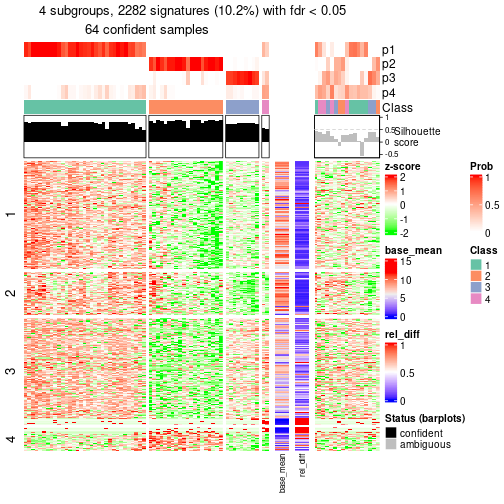</p>

</div>
</div>


Signature heatmaps where rows are not scaled:


<script>
$( function() {
	$( '#tabs-node-014-get-signatures-no-scale' ).tabs();
} );
</script>
<div id='tabs-node-014-get-signatures-no-scale'>
<ul>
<li><a href='#tab-node-014-get-signatures-no-scale-1'>k = 2</a></li>
<li><a href='#tab-node-014-get-signatures-no-scale-2'>k = 3</a></li>
<li><a href='#tab-node-014-get-signatures-no-scale-3'>k = 4</a></li>
</ul>
<div id='tab-node-014-get-signatures-no-scale-1'>
<pre><code class="r">get_signatures(res, k = 2, scale_rows = FALSE)
</code></pre>

<p></p>

</div>
<div id='tab-node-014-get-signatures-no-scale-2'>
<pre><code class="r">get_signatures(res, k = 3, scale_rows = FALSE)
</code></pre>

<p>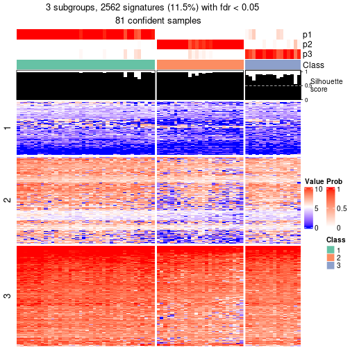</p>

</div>
<div id='tab-node-014-get-signatures-no-scale-3'>
<pre><code class="r">get_signatures(res, k = 4, scale_rows = FALSE)
</code></pre>

<p></p>

</div>
</div>


Compare the overlap of signatures from different k:

```r
compare_signatures(res)
```


`get_signature()` returns a data frame invisibly. To get the list of signatures, the function
call should be assigned to a variable explicitly. In following code, if `plot` argument is set
to `FALSE`, no heatmap is plotted while only the differential analysis is performed.

```r
# code only for demonstration
tb = get_signature(res, k = ..., plot = FALSE)
```

An example of the output of `tb` is:

```
#>   which_row         fdr    mean_1    mean_2 scaled_mean_1 scaled_mean_2 km
#> 1        38 0.042760348  8.373488  9.131774    -0.5533452     0.5164555  1
#> 2        40 0.018707592  7.106213  8.469186    -0.6173731     0.5762149  1
#> 3        55 0.019134737 10.221463 11.207825    -0.6159697     0.5749050  1
#> 4        59 0.006059896  5.921854  7.869574    -0.6899429     0.6439467  1
#> 5        60 0.018055526  8.928898 10.211722    -0.6204761     0.5791110  1
#> 6        98 0.009384629 15.714769 14.887706     0.6635654    -0.6193277  2
...
```

The columns in `tb` are:

1. `which_row`: row indices corresponding to the input matrix.
2. `fdr`: FDR for the differential test. 
3. `mean_x`: The mean value in group x.
4. `scaled_mean_x`: The mean value in group x after rows are scaled.
5. `km`: Row groups if k-means clustering is applied to rows (which is done by automatically selecting number of clusters).

If there are too many signatures, `top_signatures = ...` can be set to only show the 
signatures with the highest FDRs:

```r
# code only for demonstration
# e.g. to show the top 500 most significant rows
tb = get_signature(res, k = ..., top_signatures = 500)
```

If the signatures are defined as these which are uniquely high in current group, `diff_method` argument
can be set to `"uniquely_high_in_one_group"`:

```r
# code only for demonstration
tb = get_signature(res, k = ..., diff_method = "uniquely_high_in_one_group")
```


UMAP plot which shows how samples are separated.


<script>
$( function() {
	$( '#tabs-node-014-dimension-reduction' ).tabs();
} );
</script>
<div id='tabs-node-014-dimension-reduction'>
<ul>
<li><a href='#tab-node-014-dimension-reduction-1'>k = 2</a></li>
<li><a href='#tab-node-014-dimension-reduction-2'>k = 3</a></li>
<li><a href='#tab-node-014-dimension-reduction-3'>k = 4</a></li>
</ul>
<div id='tab-node-014-dimension-reduction-1'>
<pre><code class="r">dimension_reduction(res, k = 2, method = &quot;UMAP&quot;)
</code></pre>

<p></p>

</div>
<div id='tab-node-014-dimension-reduction-2'>
<pre><code class="r">dimension_reduction(res, k = 3, method = &quot;UMAP&quot;)
</code></pre>

<p></p>

</div>
<div id='tab-node-014-dimension-reduction-3'>
<pre><code class="r">dimension_reduction(res, k = 4, method = &quot;UMAP&quot;)
</code></pre>

<p></p>

</div>
</div>


Following heatmap shows how subgroups are split when increasing `k`:

```r
collect_classes(res)
```


If matrix rows can be associated to genes, consider to use `functional_enrichment(res,
...)` to perform function enrichment for the signature genes. See [this vignette](https://jokergoo.github.io/cola_vignettes/functional_enrichment.html) for more detailed explanations.


 

---------------------------------------------------


### Node02


Parent node: [Node0](#Node0).
Child nodes: 
                [Node011](#Node011)
        ,
                [Node012](#Node012)
        ,
                [Node013](#Node013)
        ,
                [Node014](#Node014)
        ,
                [Node021](#Node021)
        ,
                Node022-leaf
        ,
                Node023-leaf
        ,
                [Node031](#Node031)
        ,
                [Node032](#Node032)
        ,
                [Node033](#Node033)
        ,
                [Node041](#Node041)
        ,
                [Node042](#Node042)
        ,
                Node043-leaf
        .


The object with results only for a single top-value method and a single partitioning method 
can be extracted as:

```r
res = res_rh["02"]
```

A summary of `res` and all the functions that can be applied to it:

```r
res
```

```
#> A 'DownSamplingConsensusPartition' object with k = 2, 3, 4.
#>   On a matrix with 22269 rows and 500 columns, randomly sampled from 584 columns.
#>   Top rows (2030) are extracted by 'ATC' method.
#>   Subgroups are detected by 'skmeans' method.
#>   Performed in total 150 partitions by row resampling.
#>   Best k for subgroups seems to be 4.
#> 
#> Following methods can be applied to this 'DownSamplingConsensusPartition' object:
#>  [1] "cola_report"             "collect_classes"         "collect_plots"          
#>  [4] "collect_stats"           "colnames"                "compare_partitions"     
#>  [7] "compare_signatures"      "consensus_heatmap"       "dimension_reduction"    
#> [10] "functional_enrichment"   "get_anno_col"            "get_anno"               
#> [13] "get_classes"             "get_consensus"           "get_matrix"             
#> [16] "get_membership"          "get_param"               "get_signatures"         
#> [19] "get_stats"               "is_best_k"               "is_stable_k"            
#> [22] "membership_heatmap"      "ncol"                    "nrow"                   
#> [25] "plot_ecdf"               "predict_classes"         "rownames"               
#> [28] "select_partition_number" "show"                    "suggest_best_k"         
#> [31] "test_to_known_factors"   "top_rows_heatmap"
```

`collect_plots()` function collects all the plots made from `res` for all `k` (number of subgroups)
into one single page to provide an easy and fast comparison between different `k`.

```r
collect_plots(res)
```


The plots are:

- The first row: a plot of the eCDF (empirical cumulative distribution
  function) curves of the consensus matrix for each `k` and the heatmap of
  predicted classes for each `k`.
- The second row: heatmaps of the consensus matrix for each `k`.
- The third row: heatmaps of the membership matrix for each `k`.
- The fouth row: heatmaps of the signatures for each `k`.

All the plots in panels can be made by individual functions and they are
plotted later in this section.

`select_partition_number()` produces several plots showing different
statistics for choosing "optimized" `k`. There are following statistics:

- eCDF curves of the consensus matrix for each `k`;
- 1-PAC. [The PAC score](https://en.wikipedia.org/wiki/Consensus_clustering#Over-interpretation_potential_of_consensus_clustering)
  measures the proportion of the ambiguous subgrouping.
- Mean silhouette score.
- Concordance. The mean probability of fiting the consensus subgroup labels in all
  partitions.
- Area increased. Denote $A_k$ as the area under the eCDF curve for current
  `k`, the area increased is defined as $A_k - A_{k-1}$.
- Rand index. The percent of pairs of samples that are both in a same cluster
  or both are not in a same cluster in the partition of k and k-1.
- Jaccard index. The ratio of pairs of samples are both in a same cluster in
  the partition of k and k-1 and the pairs of samples are both in a same
  cluster in the partition k or k-1.

The detailed explanations of these statistics can be found in [the _cola_
vignette](https://jokergoo.github.io/cola_vignettes/cola.html#toc_13).

Generally speaking, higher 1-PAC score, higher mean silhouette score or higher
concordance corresponds to better partition. Rand index and Jaccard index
measure how similar the current partition is compared to partition with `k-1`.
If they are too similar, we won't accept `k` is better than `k-1`.

```r
select_partition_number(res)
```


The numeric values for all these statistics can be obtained by `get_stats()`.

```r
get_stats(res)
```

```
#>   k 1-PAC mean_silhouette concordance area_increased  Rand Jaccard
#> 2 2 1.000           0.995       0.998         0.4765 0.523   0.523
#> 3 3 0.977           0.951       0.978         0.2332 0.881   0.774
#> 4 4 0.923           0.923       0.969         0.0377 0.940   0.859
```

`suggest_best_k()` suggests the best $k$ based on these statistics. The rules are as follows:

- All $k$ with Jaccard index larger than 0.95 are removed because increasing
  $k$ does not provide enough extra information. If all $k$ are removed, it is
  marked as no subgroup is detected.
- For all $k$ with 1-PAC score larger than 0.9, the maximal $k$ is taken as
  the best $k$, and other $k$ are marked as optional $k$.
- If it does not fit the second rule. The $k$ with the maximal vote of the
  highest 1-PAC score, highest mean silhouette, and highest concordance is
  taken as the best $k$.

```r
suggest_best_k(res)
```

```
#> [1] 4
#> attr(,"optional")
#> [1] 2 3
```

There is also optional best $k$ = 2 3 that is worth to check.

Following is the table of the partitions (You need to click the **show/hide
code output** link to see it). The membership matrix (columns with name `p*`)
is inferred by
[`clue::cl_consensus()`](https://www.rdocumentation.org/link/cl_consensus?package=clue)
function with the `SE` method. Basically the value in the membership matrix
represents the probability to belong to a certain group. The finall subgroup
label for an item is determined with the group with highest probability it
belongs to.

In `get_classes()` function, the entropy is calculated from the membership
matrix and the silhouette score is calculated from the consensus matrix.


<script>
$( function() {
	$( '#tabs-node-02-get-classes' ).tabs();
} );
</script>
<div id='tabs-node-02-get-classes'>
<ul>
<li><a href='#tab-node-02-get-classes-1'>k = 2</a></li>
<li><a href='#tab-node-02-get-classes-2'>k = 3</a></li>
<li><a href='#tab-node-02-get-classes-3'>k = 4</a></li>
</ul>

<div id='tab-node-02-get-classes-1'>
<p><a id='tab-node-02-get-classes-1-a' style='color:#0366d6' href='#'>show/hide code output</a></p>
<pre><code class="r">get_classes(res, k = 2)
</code></pre>

<pre><code>#&gt;            class     p
#&gt; HSPC_007       1 0.000
#&gt; HSPC_013       2 0.000
#&gt; HSPC_019       1 0.000
#&gt; LT-HSC_001     2 0.751
#&gt; HSPC_014       2 0.249
#&gt; HSPC_032       1 0.000
#&gt; HSPC_038       2 0.000
#&gt; HSPC_002       2 0.000
#&gt; HSPC_009       2 0.000
#&gt; HSPC_015       2 0.000
#&gt; HSPC_021       2 1.000
#&gt; HSPC_039       1 0.000
#&gt; LT-HSC_003     2 0.498
#&gt; HSPC_010       1 0.000
#&gt; LT-HSC_004     2 0.000
#&gt; HSPC_017       2 0.000
#&gt; HSPC_029       1 0.000
#&gt; HSPC_035       2 0.000
#&gt; LT-HSC_005     1 0.000
#&gt; HSPC_005       1 0.000
#&gt; HSPC_024       2 0.000
#&gt; LT-HSC_006     2 0.000
#&gt; LT-HSC_009     2 0.000
#&gt; Prog_034       1 0.000
#&gt; Prog_041       1 0.000
#&gt; LT-HSC_011     1 0.000
#&gt; Prog_005       1 0.000
#&gt; Prog_012       2 0.000
#&gt; Prog_018       2 1.000
#&gt; HSPC_073       2 0.000
#&gt; LT-HSC_013     2 0.000
#&gt; HSPC_056       2 1.000
#&gt; HSPC_068       2 0.751
#&gt; HSPC_074       2 0.751
#&gt; LT-HSC_014     2 0.000
#&gt; HSPC_057       2 0.000
#&gt; HSPC_075       2 0.000
#&gt; LT-HSC_015     2 0.000
#&gt; LT-HSC_016     2 0.000
#&gt; HSPC_059       1 0.000
#&gt; HSPC_083       2 0.000
#&gt; LT-HSC_017     2 0.000
#&gt; HSPC_047       2 0.000
#&gt; LT-HSC_018     2 0.000
#&gt; LT-HSC_019     1 0.000
#&gt; LT-HSC_022     2 0.000
#&gt; LT-HSC_023     2 0.000
#&gt; Prog_060       1 0.000
#&gt; HSPC_091       1 0.000
#&gt; HSPC_097       2 0.000
#&gt; HSPC_103       2 0.000
#&gt; HSPC_115       2 0.000
#&gt; HSPC_121       2 0.000
#&gt; LT-HSC_025     1 0.000
#&gt; HSPC_092       1 1.000
#&gt; HSPC_104       2 0.000
#&gt; HSPC_116       1 0.000
#&gt; LT-HSC_026     2 0.498
#&gt; HSPC_086       1 0.000
#&gt; HSPC_093       1 0.000
#&gt; HSPC_105       2 0.000
#&gt; HSPC_111       2 0.000
#&gt; HSPC_123       2 0.498
#&gt; LT-HSC_027     2 1.000
#&gt; HSPC_087       2 0.000
#&gt; HSPC_106       2 0.253
#&gt; HSPC_112       1 0.000
#&gt; HSPC_124       1 0.000
#&gt; HSPC_095       2 0.000
#&gt; HSPC_113       1 0.000
#&gt; HSPC_119       2 0.253
#&gt; LT-HSC_029     1 0.000
#&gt; LT-HSC_030     1 0.000
#&gt; Prog_121       1 0.000
#&gt; Prog_104       1 0.000
#&gt; Prog_086       1 0.000
#&gt; LT-HSC_035     1 0.000
#&gt; Prog_120       2 0.249
#&gt; HSPC_133       2 1.000
#&gt; HSPC_139       2 0.000
#&gt; HSPC_145       2 0.249
#&gt; HSPC_163       1 0.747
#&gt; LT-HSC_037     2 0.747
#&gt; HSPC_134       2 0.751
#&gt; HSPC_140       2 1.000
#&gt; HSPC_152       2 0.000
#&gt; HSPC_164       2 0.000
#&gt; LT-HSC_038     2 0.000
#&gt; HSPC_128       2 0.000
#&gt; HSPC_141       2 0.000
#&gt; HSPC_147       2 0.253
#&gt; HSPC_153       2 0.000
#&gt; LT-HSC_039     2 1.000
#&gt; HSPC_129       1 0.000
#&gt; HSPC_160       1 0.000
#&gt; LT-HSC_040     2 1.000
#&gt; HSPC_137       1 0.000
#&gt; HSPC_143       2 1.000
#&gt; HSPC_149       2 1.000
#&gt; HSPC_155       2 0.249
#&gt; HSPC_167       2 0.249
#&gt; LT-HSC_041     2 0.502
#&gt; HSPC_131       2 0.249
#&gt; HSPC_150       1 0.000
#&gt; LT-HSC_042     2 0.000
#&gt; Prog_164       1 0.000
#&gt; Prog_147       1 0.000
#&gt; Prog_148       2 0.000
#&gt; Prog_160       2 0.000
#&gt; LT-HSC_047     1 0.000
#&gt; Prog_138       1 0.000
#&gt; Prog_156       1 1.000
#&gt; LT-HSC_048     2 0.000
#&gt; HSPC_181       2 0.751
#&gt; HSPC_187       2 1.000
#&gt; HSPC_205       2 1.000
#&gt; LT-HSC_049     2 0.249
#&gt; HSPC_176       2 0.000
#&gt; HSPC_182       2 0.498
#&gt; HSPC_188       1 0.000
#&gt; HSPC_194       1 0.000
#&gt; HSPC_200       2 0.000
#&gt; LT-HSC_050     2 0.502
#&gt; HSPC_170       2 0.000
#&gt; HSPC_177       2 0.000
#&gt; HSPC_201       1 0.000
#&gt; LT-HSC_051     2 0.000
#&gt; HSPC_171       2 0.000
#&gt; HSPC_184       1 0.000
#&gt; HSPC_208       2 0.249
#&gt; HSPC_185       2 0.253
#&gt; HSPC_191       2 0.000
#&gt; HSPC_197       1 0.000
#&gt; HSPC_209       1 0.000
#&gt; LT-HSC_053     1 0.000
#&gt; HSPC_173       2 0.000
#&gt; HSPC_192       2 0.000
#&gt; LT-HSC_054     2 0.253
#&gt; Prog_181       1 0.000
#&gt; Prog_169       1 0.000
#&gt; Prog_194       2 0.249
#&gt; Prog_202       1 0.000
#&gt; LT-HSC_059     1 0.000
#&gt; Prog_198       1 0.000
#&gt; Prog_204       2 1.000
#&gt; Prog_174       1 0.000
#&gt; HSPC_217       1 0.000
#&gt; HSPC_223       2 1.000
#&gt; HSPC_229       2 0.000
#&gt; HSPC_235       2 0.000
#&gt; HSPC_241       1 0.000
#&gt; HSPC_247       2 0.000
#&gt; LT-HSC_061     1 0.000
#&gt; HSPC_218       2 0.253
#&gt; HSPC_224       2 0.249
#&gt; HSPC_242       1 0.000
#&gt; HSPC_248       2 0.502
#&gt; LT-HSC_062     2 0.000
#&gt; HSPC_212       2 0.249
#&gt; HSPC_225       2 1.000
#&gt; HSPC_231       2 1.000
#&gt; HSPC_237       2 1.000
#&gt; HSPC_249       2 0.000
#&gt; HSPC_220       2 1.000
#&gt; HSPC_226       1 0.000
#&gt; HSPC_232       2 1.000
#&gt; HSPC_238       1 0.000
#&gt; HSPC_227       2 0.249
#&gt; HSPC_239       2 1.000
#&gt; HSPC_245       2 0.000
#&gt; HSPC_228       2 0.249
#&gt; HSPC_234       1 0.000
#&gt; HSPC_246       2 0.000
#&gt; HSPC_252       1 0.000
#&gt; Prog_235       2 0.249
#&gt; Prog_241       2 0.000
#&gt; LT-HSC_067     1 0.000
#&gt; Prog_219       1 0.000
#&gt; Prog_220       1 0.000
#&gt; Prog_251       1 0.000
#&gt; HSPC_259       2 0.000
#&gt; HSPC_265       2 0.253
#&gt; HSPC_277       2 0.502
#&gt; HSPC_283       2 0.502
#&gt; HSPC_289       2 0.249
#&gt; LT-HSC_073     2 0.249
#&gt; HSPC_260       1 0.000
#&gt; HSPC_266       2 1.000
#&gt; HSPC_272       1 0.000
#&gt; HSPC_284       1 0.000
#&gt; LT-HSC_074     2 0.000
#&gt; HSPC_254       2 0.000
#&gt; HSPC_273       1 0.000
#&gt; HSPC_262       1 0.000
#&gt; HSPC_274       2 0.000
#&gt; HSPC_281       2 0.249
#&gt; LT-HSC_077     2 0.000
#&gt; HSPC_264       2 0.000
#&gt; LT-HSC_078     2 0.000
#&gt; LT-HSC_079     1 0.000
#&gt; LT-HSC_083     1 0.000
#&gt; Prog_257       1 0.000
#&gt; Prog_264       2 0.249
#&gt; HSPC_301       2 0.249
#&gt; HSPC_307       2 1.000
#&gt; HSPC_319       1 0.000
#&gt; HSPC_325       2 0.249
#&gt; HSPC_331       2 0.000
#&gt; LT-HSC_085     2 0.000
#&gt; HSPC_302       2 1.000
#&gt; HSPC_326       2 0.000
#&gt; HSPC_296       2 1.000
#&gt; HSPC_309       2 0.000
#&gt; HSPC_315       2 1.000
#&gt; LT-HSC_087     1 0.000
#&gt; HSPC_297       2 1.000
#&gt; HSPC_310       2 0.751
#&gt; HSPC_316       2 0.000
#&gt; HSPC_334       2 0.000
#&gt; HSPC_311       1 0.000
#&gt; HSPC_317       2 0.000
#&gt; HSPC_335       2 0.000
#&gt; LT-HSC_089     2 0.498
#&gt; HSPC_318       2 0.000
#&gt; HSPC_336       2 0.249
#&gt; Prog_302       1 0.000
#&gt; LT-HSC_092     1 0.000
#&gt; Prog_303       2 1.000
#&gt; Prog_309       2 0.000
#&gt; Prog_317       1 0.000
#&gt; Prog_306       2 0.751
#&gt; HSPC_355       1 0.000
#&gt; HSPC_361       2 0.000
#&gt; HSPC_367       2 0.000
#&gt; HSPC_373       2 0.000
#&gt; LT-HSC_097     1 1.000
#&gt; HSPC_337       2 0.498
#&gt; HSPC_350       2 0.000
#&gt; HSPC_357       1 0.000
#&gt; HSPC_363       2 0.000
#&gt; HSPC_369       1 0.000
#&gt; HSPC_375       1 0.000
#&gt; LT-HSC_099     2 0.000
#&gt; HSPC_340       1 0.000
#&gt; HSPC_347       1 0.000
#&gt; HSPC_365       2 1.000
#&gt; HSPC_354       2 0.000
#&gt; HSPC_366       1 0.000
#&gt; HSPC_378       1 0.000
#&gt; Prog_344       1 0.000
#&gt; LT-HSC_104     1 1.000
#&gt; Prog_347       1 0.000
#&gt; Prog_365       1 0.000
#&gt; LT-HSC_107     2 0.000
#&gt; Prog_348       1 0.000
#&gt; HSPC_385       1 0.000
#&gt; HSPC_397       1 0.000
#&gt; HSPC_409       2 0.249
#&gt; HSPC_415       1 0.751
#&gt; HSPC_379       1 1.000
#&gt; HSPC_381       1 0.000
#&gt; HSPC_394       1 0.000
#&gt; HSPC_401       1 0.000
#&gt; HSPC_383       2 0.000
#&gt; HSPC_414       1 0.000
#&gt; HSPC_384       1 0.000
#&gt; Prog_391       1 0.000
#&gt; Prog_400       1 0.000
#&gt; HSPC_433       1 0.000
#&gt; HSPC_439       1 1.000
#&gt; HSPC_445       1 0.000
#&gt; HSPC_451       2 0.000
#&gt; HSPC_457       2 0.000
#&gt; LT-HSC_109     2 0.000
#&gt; HSPC_427       2 1.000
#&gt; HSPC_434       1 0.000
#&gt; HSPC_446       2 0.000
#&gt; HSPC_452       1 0.000
#&gt; HSPC_458       1 0.000
#&gt; HSPC_464       1 0.000
#&gt; HSPC_428       1 1.000
#&gt; LT-HSC_111     2 0.000
#&gt; HSPC_429       1 0.000
#&gt; HSPC_437       1 0.000
#&gt; HSPC_455       2 0.249
#&gt; HSPC_438       1 0.000
#&gt; HSPC_444       2 0.000
#&gt; HSPC_450       2 0.000
#&gt; LT-HSC_114     2 0.000
#&gt; HSPC_432       2 0.000
#&gt; Prog_427       2 0.000
#&gt; Prog_452       1 0.000
#&gt; Prog_442       1 0.000
#&gt; LT-HSC_118     1 0.249
#&gt; Prog_461       2 0.000
#&gt; LT-HSC_119     1 0.000
#&gt; Prog_438       2 0.498
#&gt; HSPC_475       2 0.000
#&gt; HSPC_481       2 0.000
#&gt; HSPC_487       1 0.498
#&gt; HSPC_493       2 0.000
#&gt; HSPC_499       2 0.000
#&gt; LT-HSC_121     1 0.000
#&gt; HSPC_469       2 0.000
#&gt; HSPC_476       1 0.000
#&gt; HSPC_482       2 1.000
#&gt; HSPC_488       2 0.000
#&gt; HSPC_494       2 0.000
#&gt; HSPC_500       2 0.498
#&gt; HSPC_506       2 0.502
#&gt; HSPC_470       2 0.000
#&gt; HSPC_483       2 0.000
#&gt; HSPC_501       2 1.000
#&gt; HSPC_507       2 0.000
#&gt; LT-HSC_123     2 0.000
#&gt; HSPC_471       2 0.000
#&gt; HSPC_478       2 0.000
#&gt; HSPC_484       1 0.000
#&gt; HSPC_497       2 0.000
#&gt; HSPC_504       2 0.000
#&gt; LT-HSC_127     1 0.000
#&gt; LT-HSC_129     1 0.000
#&gt; Prog_480       2 0.000
#&gt; Prog_498       1 0.000
#&gt; HSPC_517       2 0.000
#&gt; HSPC_529       1 0.000
#&gt; HSPC_535       2 1.000
#&gt; HSPC_541       2 0.000
#&gt; LT-HSC_133     1 0.502
#&gt; HSPC_511       2 0.000
#&gt; HSPC_518       2 0.000
#&gt; HSPC_524       2 0.000
#&gt; HSPC_530       2 0.000
#&gt; HSPC_536       1 0.000
#&gt; HSPC_542       1 0.000
#&gt; HSPC_548       2 0.000
#&gt; LT-HSC_134     2 0.498
#&gt; HSPC_519       1 0.000
#&gt; HSPC_525       2 0.751
#&gt; HSPC_531       2 0.000
#&gt; HSPC_549       2 0.000
#&gt; LT-HSC_135     2 0.000
#&gt; HSPC_513       1 1.000
#&gt; LT-HSC_136     2 0.000
#&gt; HSPC_521       2 0.000
#&gt; HSPC_539       2 0.253
#&gt; HSPC_545       2 0.000
#&gt; LT-HSC_137     2 0.000
#&gt; HSPC_522       2 1.000
#&gt; HSPC_546       2 0.000
#&gt; LT-HSC_138     2 0.000
#&gt; LT-HSC_140     2 0.502
#&gt; Prog_537       2 0.000
#&gt; LT-HSC_141     1 1.000
#&gt; Prog_526       2 0.502
#&gt; Prog_532       2 0.000
#&gt; Prog_538       1 1.000
#&gt; Prog_544       2 0.498
#&gt; Prog_533       2 0.000
#&gt; Prog_522       2 0.498
#&gt; Prog_540       2 0.000
#&gt; Prog_546       2 1.000
#&gt; HSPC_559       2 0.000
#&gt; HSPC_565       2 0.000
#&gt; HSPC_577       2 0.253
#&gt; HSPC_583       1 0.000
#&gt; HSPC_589       2 0.000
#&gt; LT-HSC_145     2 0.000
#&gt; HSPC_560       2 0.000
#&gt; HSPC_566       2 0.000
#&gt; HSPC_572       2 0.000
#&gt; HSPC_578       2 0.000
#&gt; HSPC_584       2 0.000
#&gt; HSPC_554       2 0.000
#&gt; HSPC_561       1 0.000
#&gt; HSPC_573       2 0.000
#&gt; HSPC_585       2 0.000
#&gt; HSPC_591       1 1.000
#&gt; LT-HSC_147     2 0.000
#&gt; HSPC_555       2 0.000
#&gt; HSPC_562       2 0.249
#&gt; HSPC_568       2 0.000
#&gt; HSPC_581       1 0.000
#&gt; HSPC_587       1 0.000
#&gt; HSPC_593       2 0.498
#&gt; LT-HSC_149     2 0.502
#&gt; HSPC_564       1 0.000
#&gt; HSPC_570       1 0.000
#&gt; HSPC_576       2 0.000
#&gt; HSPC_582       2 0.000
#&gt; HSPC_588       1 0.000
#&gt; HSPC_594       2 0.000
#&gt; LT-HSC_150     2 0.000
#&gt; HSPC_558       1 0.000
#&gt; Prog_583       2 0.498
#&gt; Prog_589       2 0.000
#&gt; LT-HSC_152     2 0.000
#&gt; Prog_573       2 0.000
#&gt; Prog_591       2 0.000
#&gt; LT-HSC_153     2 0.000
#&gt; LT-HSC_154     1 0.000
#&gt; Prog_563       1 0.000
#&gt; LT-HSC_155     1 0.000
#&gt; HSPC_607       2 0.000
#&gt; HSPC_619       1 0.000
#&gt; HSPC_625       2 0.000
#&gt; LT-HSC_157     2 0.000
#&gt; HSPC_602       2 0.000
#&gt; HSPC_608       2 0.000
#&gt; HSPC_620       2 0.000
#&gt; HSPC_626       2 0.000
#&gt; HSPC_632       1 0.000
#&gt; LT-HSC_158     2 0.000
#&gt; HSPC_609       2 0.000
#&gt; HSPC_615       2 0.502
#&gt; HSPC_621       1 0.000
#&gt; HSPC_633       2 0.000
#&gt; HSPC_604       2 0.000
#&gt; HSPC_610       2 0.000
#&gt; HSPC_616       1 0.000
#&gt; HSPC_622       1 0.000
#&gt; LT-HSC_160     2 0.000
#&gt; HSPC_605       1 0.000
#&gt; HSPC_611       1 0.000
#&gt; LT-HSC_161     2 0.000
#&gt; HSPC_599       2 0.000
#&gt; HSPC_618       2 0.000
#&gt; HSPC_630       2 0.751
#&gt; LT-HSC_162     1 1.000
#&gt; HSPC_600       2 0.000
#&gt; Prog_601       1 0.000
#&gt; Prog_619       2 0.249
#&gt; LT-HSC_163     2 0.000
#&gt; Prog_595       2 0.000
#&gt; LT-HSC_165     2 0.000
#&gt; LT-HSC_167     2 0.000
#&gt; Prog_636       1 0.000
#&gt; HSPC_655       1 0.000
#&gt; HSPC_667       2 0.000
#&gt; HSPC_673       2 0.000
#&gt; LT-HSC_169     2 0.000
#&gt; HSPC_650       1 0.000
#&gt; HSPC_656       2 0.000
#&gt; HSPC_662       2 0.000
#&gt; HSPC_657       1 1.000
#&gt; HSPC_669       2 0.000
#&gt; HSPC_675       1 0.502
#&gt; HSPC_670       2 0.751
#&gt; HSPC_676       2 0.000
#&gt; LT-HSC_172     2 0.000
#&gt; HSPC_647       2 0.000
#&gt; HSPC_653       1 0.000
#&gt; HSPC_659       1 0.000
#&gt; HSPC_677       2 0.498
#&gt; LT-HSC_173     2 0.000
#&gt; HSPC_648       2 0.000
#&gt; HSPC_678       2 0.000
#&gt; HSPC_642       1 0.000
#&gt; LT-HSC_175     1 0.000
#&gt; Prog_668       2 0.502
#&gt; LT-HSC_176     2 0.000
#&gt; Prog_669       2 0.000
#&gt; LT-HSC_177     2 0.000
#&gt; Prog_664       2 0.249
#&gt; LT-HSC_178     1 0.000
#&gt; Prog_641       2 0.000
#&gt; HSPC_685       1 0.000
#&gt; HSPC_691       1 0.000
#&gt; HSPC_703       2 0.000
#&gt; HSPC_709       2 1.000
#&gt; HSPC_715       1 0.000
#&gt; LT-HSC_181     1 1.000
#&gt; HSPC_686       1 0.000
#&gt; HSPC_692       2 0.000
#&gt; HSPC_698       2 0.751
#&gt; HSPC_704       2 0.000
#&gt; HSPC_710       1 0.000
#&gt; HSPC_716       2 0.000
#&gt; LT-HSC_182     1 0.000
#&gt; HSPC_680       2 0.000
#&gt; HSPC_687       2 0.000
#&gt; HSPC_693       2 0.498
#&gt; HSPC_699       2 1.000
#&gt; HSPC_711       1 0.000
#&gt; HSPC_688       1 0.000
#&gt; HSPC_694       1 0.000
#&gt; HSPC_712       1 0.000
#&gt; HSPC_718       1 0.000
#&gt; HSPC_689       2 0.000
#&gt; HSPC_713       1 0.000
#&gt; HSPC_719       2 0.000
#&gt; LT-HSC_185     2 0.498
#&gt; HSPC_690       2 1.000
#&gt; HSPC_702       2 0.000
#&gt; HSPC_714       2 0.000
#&gt; LT-HSC_186     1 0.000
#&gt; HSPC_684       2 0.000
#&gt; Prog_691       1 0.000
#&gt; LT-HSC_189     1 0.000
#&gt; LT-HSC_190     1 0.751
#&gt; Prog_683       2 0.249
#&gt; HSPC_727       2 0.000
#&gt; HSPC_733       2 0.000
#&gt; HSPC_739       2 0.498
#&gt; HSPC_745       2 0.000
#&gt; HSPC_751       2 0.000
#&gt; HSPC_757       2 0.000
#&gt; LT-HSC_193     2 0.249
#&gt; HSPC_721       2 0.000
#&gt; HSPC_728       1 0.000
#&gt; HSPC_740       2 0.000
#&gt; HSPC_746       2 0.751
#&gt; HSPC_752       2 0.000
#&gt; LT-HSC_194     2 0.249
#&gt; HSPC_741       1 0.000
#&gt; HSPC_747       2 1.000
#&gt; HSPC_748       2 0.000
#&gt; HSPC_754       1 0.000
#&gt; LT-HSC_196     1 0.000
#&gt; HSPC_749       2 0.000
#&gt; LT-HSC_197     2 0.000
#&gt; HSPC_725       2 0.000
#&gt; HSPC_738       2 0.000
#&gt; HSPC_756       2 0.000
#&gt; LT-HSC_198     2 0.502
#&gt; HSPC_726       1 0.000
#&gt; LT-HSC_199     1 0.000
#&gt; LT-HSC_200     2 0.000
#&gt; Prog_729       2 0.498
#&gt; Prog_741       1 0.000
#&gt; LT-HSC_201     2 0.000
#&gt; Prog_742       1 0.000
#&gt; Prog_755       1 0.000
#&gt; LT-HSC_203     1 0.000
#&gt; HSPC_769       2 0.253
#&gt; HSPC_775       2 0.000
#&gt; HSPC_781       2 0.000
#&gt; HSPC_787       2 0.000
#&gt; HSPC_793       1 0.751
#&gt; HSPC_799       2 0.000
#&gt; LT-HSC_205     2 0.000
#&gt; HSPC_763       1 1.000
#&gt; HSPC_776       2 0.000
#&gt; HSPC_782       2 0.000
#&gt; HSPC_788       2 0.253
#&gt; LT-HSC_206     2 0.000
#&gt; HSPC_764       2 0.000
#&gt; HSPC_783       2 0.000
#&gt; HSPC_765       2 0.000
#&gt; HSPC_802       2 0.249
#&gt; LT-HSC_208     2 0.751
#&gt; HSPC_803       2 1.000
#&gt; LT-HSC_209     1 0.000
#&gt; HSPC_792       1 0.000
#&gt; HSPC_798       2 0.249
#&gt; HSPC_804       2 0.751
#&gt; LT-HSC_210     2 0.000
#&gt; HSPC_768       2 0.000
#&gt; LT-HSC_213     2 0.000
#&gt; Prog_778       2 0.751
#&gt; Prog_766       1 0.751
#&gt; Prog_773       1 0.000
#&gt; HSPC_811       1 1.000
#&gt; HSPC_817       1 0.000
#&gt; HSPC_823       1 1.000
#&gt; HSPC_829       1 0.000
#&gt; HSPC_847       2 0.253
#&gt; HSPC_805       1 0.249
#&gt; HSPC_830       1 1.000
#&gt; HSPC_836       2 0.000
#&gt; HSPC_842       2 0.000
#&gt; HSPC_848       2 0.000
#&gt; HSPC_806       2 0.000
#&gt; HSPC_849       2 0.253
#&gt; HSPC_844       2 0.000
#&gt; HSPC_850       1 0.000
#&gt; HSPC_827       2 0.000
#&gt; HSPC_851       2 0.000
#&gt; HSPC_809       2 0.498
#&gt; HSPC_840       2 0.751
#&gt; HSPC_852       2 0.751
#&gt; HSPC_810       2 1.000
#&gt; Prog_812       2 1.000
#&gt; Prog_848       2 0.000
</code></pre>

<script>
$('#tab-node-02-get-classes-1-a').parent().next().next().hide();
$('#tab-node-02-get-classes-1-a').click(function(){
  $('#tab-node-02-get-classes-1-a').parent().next().next().toggle();
  return(false);
});
</script>
</div>

<div id='tab-node-02-get-classes-2'>
<p><a id='tab-node-02-get-classes-2-a' style='color:#0366d6' href='#'>show/hide code output</a></p>
<pre><code class="r">get_classes(res, k = 3)
</code></pre>

<pre><code>#&gt;            class     p
#&gt; HSPC_007       1 0.000
#&gt; HSPC_013       3 0.000
#&gt; HSPC_019       1 0.000
#&gt; LT-HSC_001     3 1.000
#&gt; HSPC_014       2 0.000
#&gt; HSPC_032       1 0.000
#&gt; HSPC_038       2 0.000
#&gt; HSPC_002       2 1.000
#&gt; HSPC_009       2 0.000
#&gt; HSPC_015       3 1.000
#&gt; HSPC_021       2 0.249
#&gt; HSPC_039       1 0.000
#&gt; LT-HSC_003     3 1.000
#&gt; HSPC_010       1 0.000
#&gt; LT-HSC_004     2 1.000
#&gt; HSPC_017       2 0.000
#&gt; HSPC_029       1 0.000
#&gt; HSPC_035       2 1.000
#&gt; LT-HSC_005     1 0.000
#&gt; HSPC_005       1 0.000
#&gt; HSPC_024       2 0.000
#&gt; LT-HSC_006     2 0.751
#&gt; LT-HSC_009     2 0.249
#&gt; Prog_034       1 0.000
#&gt; Prog_041       1 0.000
#&gt; LT-HSC_011     1 0.000
#&gt; Prog_005       1 0.000
#&gt; Prog_012       2 0.000
#&gt; Prog_018       2 0.000
#&gt; HSPC_073       2 0.000
#&gt; LT-HSC_013     2 0.249
#&gt; HSPC_056       2 0.000
#&gt; HSPC_068       2 1.000
#&gt; HSPC_074       2 0.000
#&gt; LT-HSC_014     2 0.000
#&gt; HSPC_057       2 0.249
#&gt; HSPC_075       2 0.502
#&gt; LT-HSC_015     2 0.000
#&gt; LT-HSC_016     2 0.000
#&gt; HSPC_059       1 0.000
#&gt; HSPC_083       2 0.000
#&gt; LT-HSC_017     2 0.000
#&gt; HSPC_047       3 0.000
#&gt; LT-HSC_018     2 0.000
#&gt; LT-HSC_019     1 0.000
#&gt; LT-HSC_022     2 0.000
#&gt; LT-HSC_023     2 0.000
#&gt; Prog_060       1 0.000
#&gt; HSPC_091       1 1.000
#&gt; HSPC_097       3 0.000
#&gt; HSPC_103       2 0.000
#&gt; HSPC_115       2 0.000
#&gt; HSPC_121       3 1.000
#&gt; LT-HSC_025     1 1.000
#&gt; HSPC_092       1 1.000
#&gt; HSPC_104       3 1.000
#&gt; HSPC_116       1 0.000
#&gt; LT-HSC_026     2 1.000
#&gt; HSPC_086       1 0.000
#&gt; HSPC_093       1 0.000
#&gt; HSPC_105       2 0.253
#&gt; HSPC_111       2 0.000
#&gt; HSPC_123       2 0.747
#&gt; LT-HSC_027     3 1.000
#&gt; HSPC_087       2 0.000
#&gt; HSPC_106       2 1.000
#&gt; HSPC_112       1 0.000
#&gt; HSPC_124       1 0.000
#&gt; HSPC_095       2 0.498
#&gt; HSPC_113       3 0.000
#&gt; HSPC_119       3 1.000
#&gt; LT-HSC_029     1 0.000
#&gt; LT-HSC_030     1 0.000
#&gt; Prog_121       1 0.000
#&gt; Prog_104       1 0.000
#&gt; Prog_086       1 0.000
#&gt; LT-HSC_035     1 0.498
#&gt; Prog_120       3 0.000
#&gt; HSPC_133       2 1.000
#&gt; HSPC_139       2 0.000
#&gt; HSPC_145       3 0.498
#&gt; HSPC_163       3 0.000
#&gt; LT-HSC_037     3 1.000
#&gt; HSPC_134       3 0.502
#&gt; HSPC_140       3 0.000
#&gt; HSPC_152       2 0.000
#&gt; HSPC_164       2 0.000
#&gt; LT-HSC_038     3 1.000
#&gt; HSPC_128       3 0.000
#&gt; HSPC_141       2 1.000
#&gt; HSPC_147       3 1.000
#&gt; HSPC_153       2 0.751
#&gt; LT-HSC_039     2 1.000
#&gt; HSPC_129       1 0.000
#&gt; HSPC_160       1 0.000
#&gt; LT-HSC_040     2 1.000
#&gt; HSPC_137       1 0.000
#&gt; HSPC_143       2 1.000
#&gt; HSPC_149       2 0.000
#&gt; HSPC_155       3 1.000
#&gt; HSPC_167       3 1.000
#&gt; LT-HSC_041     2 0.000
#&gt; HSPC_131       2 1.000
#&gt; HSPC_150       1 0.000
#&gt; LT-HSC_042     2 1.000
#&gt; Prog_164       1 0.000
#&gt; Prog_147       1 0.000
#&gt; Prog_148       3 0.000
#&gt; Prog_160       2 1.000
#&gt; LT-HSC_047     1 0.000
#&gt; Prog_138       1 0.000
#&gt; Prog_156       1 1.000
#&gt; LT-HSC_048     3 0.502
#&gt; HSPC_181       2 0.000
#&gt; HSPC_187       2 0.000
#&gt; HSPC_205       2 1.000
#&gt; LT-HSC_049     2 1.000
#&gt; HSPC_176       2 0.000
#&gt; HSPC_182       3 1.000
#&gt; HSPC_188       1 0.000
#&gt; HSPC_194       1 0.000
#&gt; HSPC_200       2 0.000
#&gt; LT-HSC_050     2 0.000
#&gt; HSPC_170       3 0.751
#&gt; HSPC_177       2 0.249
#&gt; HSPC_201       1 0.000
#&gt; LT-HSC_051     2 0.000
#&gt; HSPC_171       2 0.000
#&gt; HSPC_184       1 0.000
#&gt; HSPC_208       2 0.751
#&gt; HSPC_185       3 1.000
#&gt; HSPC_191       2 0.000
#&gt; HSPC_197       1 0.000
#&gt; HSPC_209       1 0.000
#&gt; LT-HSC_053     1 0.000
#&gt; HSPC_173       3 0.000
#&gt; HSPC_192       2 1.000
#&gt; LT-HSC_054     2 0.000
#&gt; Prog_181       1 0.000
#&gt; Prog_169       1 0.000
#&gt; Prog_194       3 0.000
#&gt; Prog_202       1 0.000
#&gt; LT-HSC_059     1 0.000
#&gt; Prog_198       1 0.000
#&gt; Prog_204       3 0.000
#&gt; Prog_174       1 0.000
#&gt; HSPC_217       1 0.000
#&gt; HSPC_223       2 0.000
#&gt; HSPC_229       3 0.000
#&gt; HSPC_235       2 0.747
#&gt; HSPC_241       1 0.000
#&gt; HSPC_247       3 0.000
#&gt; LT-HSC_061     1 0.000
#&gt; HSPC_218       2 1.000
#&gt; HSPC_224       2 0.000
#&gt; HSPC_242       3 1.000
#&gt; HSPC_248       2 0.000
#&gt; LT-HSC_062     3 1.000
#&gt; HSPC_212       3 1.000
#&gt; HSPC_225       2 0.000
#&gt; HSPC_231       3 0.000
#&gt; HSPC_237       2 0.502
#&gt; HSPC_249       2 0.249
#&gt; HSPC_220       2 0.000
#&gt; HSPC_226       1 0.000
#&gt; HSPC_232       3 0.249
#&gt; HSPC_238       1 0.000
#&gt; HSPC_227       2 0.000
#&gt; HSPC_239       2 1.000
#&gt; HSPC_245       2 0.249
#&gt; HSPC_228       3 0.000
#&gt; HSPC_234       1 0.000
#&gt; HSPC_246       2 0.000
#&gt; HSPC_252       1 0.000
#&gt; Prog_235       3 0.000
#&gt; Prog_241       2 0.000
#&gt; LT-HSC_067     1 0.000
#&gt; Prog_219       1 0.000
#&gt; Prog_220       1 0.000
#&gt; Prog_251       1 0.000
#&gt; HSPC_259       3 0.000
#&gt; HSPC_265       2 0.000
#&gt; HSPC_277       3 1.000
#&gt; HSPC_283       2 0.751
#&gt; HSPC_289       2 1.000
#&gt; LT-HSC_073     3 1.000
#&gt; HSPC_260       1 0.000
#&gt; HSPC_266       2 1.000
#&gt; HSPC_272       1 0.000
#&gt; HSPC_284       1 0.000
#&gt; LT-HSC_074     2 0.000
#&gt; HSPC_254       2 1.000
#&gt; HSPC_273       1 0.000
#&gt; HSPC_262       1 0.000
#&gt; HSPC_274       2 0.000
#&gt; HSPC_281       3 0.000
#&gt; LT-HSC_077     3 1.000
#&gt; HSPC_264       2 0.249
#&gt; LT-HSC_078     2 0.000
#&gt; LT-HSC_079     1 0.000
#&gt; LT-HSC_083     1 0.000
#&gt; Prog_257       1 0.000
#&gt; Prog_264       3 0.000
#&gt; HSPC_301       3 0.000
#&gt; HSPC_307       2 0.000
#&gt; HSPC_319       1 0.000
#&gt; HSPC_325       2 0.000
#&gt; HSPC_331       2 0.000
#&gt; LT-HSC_085     2 0.000
#&gt; HSPC_302       3 0.498
#&gt; HSPC_326       2 0.000
#&gt; HSPC_296       2 0.000
#&gt; HSPC_309       2 0.000
#&gt; HSPC_315       2 0.000
#&gt; LT-HSC_087     1 0.000
#&gt; HSPC_297       2 0.000
#&gt; HSPC_310       2 0.000
#&gt; HSPC_316       3 1.000
#&gt; HSPC_334       2 0.000
#&gt; HSPC_311       1 0.000
#&gt; HSPC_317       3 1.000
#&gt; HSPC_335       2 0.000
#&gt; LT-HSC_089     2 0.000
#&gt; HSPC_318       2 0.000
#&gt; HSPC_336       2 1.000
#&gt; Prog_302       1 0.498
#&gt; LT-HSC_092     1 0.000
#&gt; Prog_303       2 1.000
#&gt; Prog_309       2 0.498
#&gt; Prog_317       1 0.000
#&gt; Prog_306       2 0.000
#&gt; HSPC_355       1 0.747
#&gt; HSPC_361       3 0.000
#&gt; HSPC_367       2 0.498
#&gt; HSPC_373       3 1.000
#&gt; LT-HSC_097     1 1.000
#&gt; HSPC_337       2 0.000
#&gt; HSPC_350       2 0.000
#&gt; HSPC_357       1 0.000
#&gt; HSPC_363       2 1.000
#&gt; HSPC_369       1 0.000
#&gt; HSPC_375       1 0.000
#&gt; LT-HSC_099     3 0.000
#&gt; HSPC_340       1 0.000
#&gt; HSPC_347       1 0.000
#&gt; HSPC_365       3 1.000
#&gt; HSPC_354       2 0.000
#&gt; HSPC_366       1 0.000
#&gt; HSPC_378       1 0.000
#&gt; Prog_344       1 0.000
#&gt; LT-HSC_104     1 1.000
#&gt; Prog_347       1 0.000
#&gt; Prog_365       1 0.000
#&gt; LT-HSC_107     3 0.000
#&gt; Prog_348       1 0.000
#&gt; HSPC_385       1 0.000
#&gt; HSPC_397       1 0.000
#&gt; HSPC_409       3 0.000
#&gt; HSPC_415       3 1.000
#&gt; HSPC_379       1 1.000
#&gt; HSPC_381       1 0.000
#&gt; HSPC_394       1 0.000
#&gt; HSPC_401       1 0.000
#&gt; HSPC_383       2 1.000
#&gt; HSPC_414       1 0.000
#&gt; HSPC_384       1 0.000
#&gt; Prog_391       1 0.000
#&gt; Prog_400       1 0.000
#&gt; HSPC_433       1 0.000
#&gt; HSPC_439       1 1.000
#&gt; HSPC_445       1 0.000
#&gt; HSPC_451       3 0.000
#&gt; HSPC_457       2 0.751
#&gt; LT-HSC_109     2 0.751
#&gt; HSPC_427       3 0.000
#&gt; HSPC_434       1 0.000
#&gt; HSPC_446       2 1.000
#&gt; HSPC_452       1 0.000
#&gt; HSPC_458       1 0.000
#&gt; HSPC_464       1 0.000
#&gt; HSPC_428       1 1.000
#&gt; LT-HSC_111     2 0.751
#&gt; HSPC_429       1 0.000
#&gt; HSPC_437       1 0.000
#&gt; HSPC_455       2 0.000
#&gt; HSPC_438       1 0.000
#&gt; HSPC_444       2 0.751
#&gt; HSPC_450       2 0.000
#&gt; LT-HSC_114     3 1.000
#&gt; HSPC_432       2 1.000
#&gt; Prog_427       2 0.000
#&gt; Prog_452       1 1.000
#&gt; Prog_442       1 0.000
#&gt; LT-HSC_118     1 1.000
#&gt; Prog_461       2 0.751
#&gt; LT-HSC_119     1 0.000
#&gt; Prog_438       2 0.000
#&gt; HSPC_475       2 0.000
#&gt; HSPC_481       3 0.000
#&gt; HSPC_487       1 1.000
#&gt; HSPC_493       2 0.000
#&gt; HSPC_499       2 0.253
#&gt; LT-HSC_121     1 0.000
#&gt; HSPC_469       3 0.000
#&gt; HSPC_476       1 0.000
#&gt; HSPC_482       2 1.000
#&gt; HSPC_488       2 0.751
#&gt; HSPC_494       2 1.000
#&gt; HSPC_500       2 0.000
#&gt; HSPC_506       2 1.000
#&gt; HSPC_470       2 0.498
#&gt; HSPC_483       2 1.000
#&gt; HSPC_501       3 0.000
#&gt; HSPC_507       2 0.249
#&gt; LT-HSC_123     2 0.000
#&gt; HSPC_471       2 1.000
#&gt; HSPC_478       2 0.000
#&gt; HSPC_484       1 0.000
#&gt; HSPC_497       2 1.000
#&gt; HSPC_504       2 0.253
#&gt; LT-HSC_127     1 0.249
#&gt; LT-HSC_129     1 0.000
#&gt; Prog_480       3 0.000
#&gt; Prog_498       1 0.000
#&gt; HSPC_517       3 0.498
#&gt; HSPC_529       1 0.000
#&gt; HSPC_535       2 0.249
#&gt; HSPC_541       2 0.000
#&gt; LT-HSC_133     1 0.249
#&gt; HSPC_511       3 0.000
#&gt; HSPC_518       2 0.000
#&gt; HSPC_524       2 0.000
#&gt; HSPC_530       2 1.000
#&gt; HSPC_536       1 0.000
#&gt; HSPC_542       1 0.000
#&gt; HSPC_548       2 0.000
#&gt; LT-HSC_134     3 0.000
#&gt; HSPC_519       1 0.000
#&gt; HSPC_525       3 1.000
#&gt; HSPC_531       2 1.000
#&gt; HSPC_549       2 0.000
#&gt; LT-HSC_135     2 0.751
#&gt; HSPC_513       1 1.000
#&gt; LT-HSC_136     3 1.000
#&gt; HSPC_521       2 0.000
#&gt; HSPC_539       2 0.000
#&gt; HSPC_545       2 0.000
#&gt; LT-HSC_137     2 0.249
#&gt; HSPC_522       2 1.000
#&gt; HSPC_546       2 0.498
#&gt; LT-HSC_138     2 0.000
#&gt; LT-HSC_140     2 0.000
#&gt; Prog_537       2 1.000
#&gt; LT-HSC_141     1 0.751
#&gt; Prog_526       3 0.747
#&gt; Prog_532       2 1.000
#&gt; Prog_538       1 1.000
#&gt; Prog_544       3 0.000
#&gt; Prog_533       2 1.000
#&gt; Prog_522       2 0.000
#&gt; Prog_540       3 1.000
#&gt; Prog_546       3 0.000
#&gt; HSPC_559       2 0.253
#&gt; HSPC_565       3 0.000
#&gt; HSPC_577       2 0.249
#&gt; HSPC_583       1 0.000
#&gt; HSPC_589       2 0.000
#&gt; LT-HSC_145     2 0.498
#&gt; HSPC_560       2 1.000
#&gt; HSPC_566       2 1.000
#&gt; HSPC_572       3 0.502
#&gt; HSPC_578       2 0.000
#&gt; HSPC_584       2 0.000
#&gt; HSPC_554       2 0.000
#&gt; HSPC_561       1 0.000
#&gt; HSPC_573       2 0.000
#&gt; HSPC_585       2 0.000
#&gt; HSPC_591       3 1.000
#&gt; LT-HSC_147     2 1.000
#&gt; HSPC_555       2 0.000
#&gt; HSPC_562       3 1.000
#&gt; HSPC_568       2 0.000
#&gt; HSPC_581       1 0.000
#&gt; HSPC_587       1 0.000
#&gt; HSPC_593       2 0.253
#&gt; LT-HSC_149     2 0.000
#&gt; HSPC_564       1 0.000
#&gt; HSPC_570       1 0.000
#&gt; HSPC_576       2 0.000
#&gt; HSPC_582       2 0.747
#&gt; HSPC_588       1 0.000
#&gt; HSPC_594       2 0.000
#&gt; LT-HSC_150     2 0.000
#&gt; HSPC_558       1 0.000
#&gt; Prog_583       3 0.498
#&gt; Prog_589       3 0.000
#&gt; LT-HSC_152     2 0.000
#&gt; Prog_573       3 0.498
#&gt; Prog_591       3 0.000
#&gt; LT-HSC_153     2 1.000
#&gt; LT-HSC_154     1 0.000
#&gt; Prog_563       1 0.000
#&gt; LT-HSC_155     1 0.000
#&gt; HSPC_607       3 0.000
#&gt; HSPC_619       1 0.253
#&gt; HSPC_625       2 0.000
#&gt; LT-HSC_157     3 1.000
#&gt; HSPC_602       2 1.000
#&gt; HSPC_608       2 1.000
#&gt; HSPC_620       2 0.000
#&gt; HSPC_626       3 1.000
#&gt; HSPC_632       1 0.000
#&gt; LT-HSC_158     2 0.000
#&gt; HSPC_609       3 1.000
#&gt; HSPC_615       3 1.000
#&gt; HSPC_621       1 0.000
#&gt; HSPC_633       3 1.000
#&gt; HSPC_604       2 0.000
#&gt; HSPC_610       2 0.000
#&gt; HSPC_616       1 0.000
#&gt; HSPC_622       1 0.000
#&gt; LT-HSC_160     3 1.000
#&gt; HSPC_605       1 0.000
#&gt; HSPC_611       1 0.000
#&gt; LT-HSC_161     3 1.000
#&gt; HSPC_599       2 1.000
#&gt; HSPC_618       2 0.000
#&gt; HSPC_630       2 0.000
#&gt; LT-HSC_162     3 1.000
#&gt; HSPC_600       3 1.000
#&gt; Prog_601       1 0.000
#&gt; Prog_619       2 0.000
#&gt; LT-HSC_163     2 0.000
#&gt; Prog_595       2 1.000
#&gt; LT-HSC_165     2 0.000
#&gt; LT-HSC_167     2 0.000
#&gt; Prog_636       1 0.000
#&gt; HSPC_655       1 0.000
#&gt; HSPC_667       2 0.000
#&gt; HSPC_673       2 0.000
#&gt; LT-HSC_169     3 1.000
#&gt; HSPC_650       1 0.000
#&gt; HSPC_656       2 1.000
#&gt; HSPC_662       2 0.000
#&gt; HSPC_657       3 0.000
#&gt; HSPC_669       2 0.000
#&gt; HSPC_675       1 0.000
#&gt; HSPC_670       3 1.000
#&gt; HSPC_676       2 0.000
#&gt; LT-HSC_172     2 1.000
#&gt; HSPC_647       2 1.000
#&gt; HSPC_653       1 0.000
#&gt; HSPC_659       1 0.000
#&gt; HSPC_677       3 0.000
#&gt; LT-HSC_173     2 0.000
#&gt; HSPC_648       2 0.502
#&gt; HSPC_678       2 0.000
#&gt; HSPC_642       1 0.000
#&gt; LT-HSC_175     1 0.000
#&gt; Prog_668       3 1.000
#&gt; LT-HSC_176     2 0.747
#&gt; Prog_669       3 0.000
#&gt; LT-HSC_177     2 1.000
#&gt; Prog_664       3 0.000
#&gt; LT-HSC_178     1 0.000
#&gt; Prog_641       3 0.000
#&gt; HSPC_685       1 0.000
#&gt; HSPC_691       1 0.000
#&gt; HSPC_703       2 0.498
#&gt; HSPC_709       3 0.000
#&gt; HSPC_715       1 1.000
#&gt; LT-HSC_181     1 0.000
#&gt; HSPC_686       1 0.000
#&gt; HSPC_692       3 0.000
#&gt; HSPC_698       2 0.000
#&gt; HSPC_704       2 0.000
#&gt; HSPC_710       1 0.000
#&gt; HSPC_716       2 0.000
#&gt; LT-HSC_182     1 0.000
#&gt; HSPC_680       2 0.000
#&gt; HSPC_687       3 0.000
#&gt; HSPC_693       3 0.249
#&gt; HSPC_699       2 1.000
#&gt; HSPC_711       1 0.000
#&gt; HSPC_688       1 0.000
#&gt; HSPC_694       1 0.000
#&gt; HSPC_712       1 0.000
#&gt; HSPC_718       1 0.000
#&gt; HSPC_689       2 1.000
#&gt; HSPC_713       1 1.000
#&gt; HSPC_719       2 0.000
#&gt; LT-HSC_185     3 1.000
#&gt; HSPC_690       2 0.000
#&gt; HSPC_702       2 0.000
#&gt; HSPC_714       2 0.000
#&gt; LT-HSC_186     1 0.000
#&gt; HSPC_684       3 0.000
#&gt; Prog_691       1 0.000
#&gt; LT-HSC_189     1 0.000
#&gt; LT-HSC_190     3 1.000
#&gt; Prog_683       3 0.000
#&gt; HSPC_727       2 0.000
#&gt; HSPC_733       2 0.000
#&gt; HSPC_739       3 0.249
#&gt; HSPC_745       3 1.000
#&gt; HSPC_751       2 1.000
#&gt; HSPC_757       2 0.000
#&gt; LT-HSC_193     2 0.000
#&gt; HSPC_721       3 0.000
#&gt; HSPC_728       1 0.000
#&gt; HSPC_740       2 0.253
#&gt; HSPC_746       3 1.000
#&gt; HSPC_752       3 0.000
#&gt; LT-HSC_194     2 0.000
#&gt; HSPC_741       1 0.000
#&gt; HSPC_747       2 0.000
#&gt; HSPC_748       2 0.000
#&gt; HSPC_754       1 0.000
#&gt; LT-HSC_196     1 0.000
#&gt; HSPC_749       2 0.000
#&gt; LT-HSC_197     2 1.000
#&gt; HSPC_725       3 0.000
#&gt; HSPC_738       2 0.000
#&gt; HSPC_756       2 0.000
#&gt; LT-HSC_198     2 0.249
#&gt; HSPC_726       1 0.000
#&gt; LT-HSC_199     1 0.000
#&gt; LT-HSC_200     2 0.000
#&gt; Prog_729       3 0.000
#&gt; Prog_741       1 0.000
#&gt; LT-HSC_201     2 0.000
#&gt; Prog_742       1 0.000
#&gt; Prog_755       1 0.000
#&gt; LT-HSC_203     1 0.000
#&gt; HSPC_769       3 1.000
#&gt; HSPC_775       3 0.000
#&gt; HSPC_781       2 1.000
#&gt; HSPC_787       3 0.000
#&gt; HSPC_793       1 1.000
#&gt; HSPC_799       3 0.498
#&gt; LT-HSC_205     3 1.000
#&gt; HSPC_763       1 1.000
#&gt; HSPC_776       3 0.249
#&gt; HSPC_782       2 1.000
#&gt; HSPC_788       3 0.751
#&gt; LT-HSC_206     2 0.000
#&gt; HSPC_764       2 1.000
#&gt; HSPC_783       2 0.000
#&gt; HSPC_765       3 0.000
#&gt; HSPC_802       2 0.000
#&gt; LT-HSC_208     2 0.000
#&gt; HSPC_803       2 1.000
#&gt; LT-HSC_209     1 0.000
#&gt; HSPC_792       1 0.000
#&gt; HSPC_798       2 0.000
#&gt; HSPC_804       2 0.000
#&gt; LT-HSC_210     2 0.000
#&gt; HSPC_768       3 1.000
#&gt; LT-HSC_213     2 0.000
#&gt; Prog_778       3 0.000
#&gt; Prog_766       1 1.000
#&gt; Prog_773       1 0.000
#&gt; HSPC_811       1 1.000
#&gt; HSPC_817       1 0.000
#&gt; HSPC_823       1 1.000
#&gt; HSPC_829       1 0.000
#&gt; HSPC_847       3 1.000
#&gt; HSPC_805       1 1.000
#&gt; HSPC_830       1 1.000
#&gt; HSPC_836       3 0.249
#&gt; HSPC_842       3 1.000
#&gt; HSPC_848       2 0.253
#&gt; HSPC_806       3 0.000
#&gt; HSPC_849       2 0.498
#&gt; HSPC_844       2 1.000
#&gt; HSPC_850       1 0.000
#&gt; HSPC_827       2 0.000
#&gt; HSPC_851       3 0.000
#&gt; HSPC_809       2 0.000
#&gt; HSPC_840       2 0.000
#&gt; HSPC_852       2 0.253
#&gt; HSPC_810       2 1.000
#&gt; Prog_812       3 0.000
#&gt; Prog_848       2 1.000
</code></pre>

<script>
$('#tab-node-02-get-classes-2-a').parent().next().next().hide();
$('#tab-node-02-get-classes-2-a').click(function(){
  $('#tab-node-02-get-classes-2-a').parent().next().next().toggle();
  return(false);
});
</script>
</div>

<div id='tab-node-02-get-classes-3'>
<p><a id='tab-node-02-get-classes-3-a' style='color:#0366d6' href='#'>show/hide code output</a></p>
<pre><code class="r">get_classes(res, k = 4)
</code></pre>

<pre><code>#&gt;            class     p
#&gt; HSPC_007       1 0.000
#&gt; HSPC_013       3 0.000
#&gt; HSPC_019       1 0.000
#&gt; LT-HSC_001     4 0.000
#&gt; HSPC_014       2 0.000
#&gt; HSPC_032       1 0.000
#&gt; HSPC_038       2 0.000
#&gt; HSPC_002       4 0.000
#&gt; HSPC_009       2 0.253
#&gt; HSPC_015       4 0.000
#&gt; HSPC_021       2 0.249
#&gt; HSPC_039       1 0.000
#&gt; LT-HSC_003     4 0.000
#&gt; HSPC_010       1 0.000
#&gt; LT-HSC_004     2 1.000
#&gt; HSPC_017       2 0.000
#&gt; HSPC_029       1 0.000
#&gt; HSPC_035       2 1.000
#&gt; LT-HSC_005     1 0.000
#&gt; HSPC_005       1 0.000
#&gt; HSPC_024       2 0.000
#&gt; LT-HSC_006     2 0.498
#&gt; LT-HSC_009     2 0.000
#&gt; Prog_034       1 0.000
#&gt; Prog_041       1 0.000
#&gt; LT-HSC_011     1 0.000
#&gt; Prog_005       1 0.000
#&gt; Prog_012       2 0.000
#&gt; Prog_018       2 0.000
#&gt; HSPC_073       2 0.000
#&gt; LT-HSC_013     2 0.253
#&gt; HSPC_056       2 0.000
#&gt; HSPC_068       2 1.000
#&gt; HSPC_074       2 0.000
#&gt; LT-HSC_014     2 0.000
#&gt; HSPC_057       2 0.751
#&gt; HSPC_075       2 0.498
#&gt; LT-HSC_015     2 0.000
#&gt; LT-HSC_016     2 0.000
#&gt; HSPC_059       1 0.000
#&gt; HSPC_083       2 0.000
#&gt; LT-HSC_017     2 0.000
#&gt; HSPC_047       4 0.751
#&gt; LT-HSC_018     2 0.000
#&gt; LT-HSC_019     1 0.000
#&gt; LT-HSC_022     2 0.000
#&gt; LT-HSC_023     2 0.000
#&gt; Prog_060       1 0.000
#&gt; HSPC_091       1 0.000
#&gt; HSPC_097       3 0.000
#&gt; HSPC_103       2 0.000
#&gt; HSPC_115       2 0.000
#&gt; HSPC_121       4 0.249
#&gt; LT-HSC_025     1 0.000
#&gt; HSPC_092       4 1.000
#&gt; HSPC_104       4 0.000
#&gt; HSPC_116       1 0.000
#&gt; LT-HSC_026     2 0.747
#&gt; HSPC_086       1 0.000
#&gt; HSPC_093       1 0.000
#&gt; HSPC_105       2 1.000
#&gt; HSPC_111       2 0.000
#&gt; HSPC_123       2 1.000
#&gt; LT-HSC_027     4 0.000
#&gt; HSPC_087       2 0.000
#&gt; HSPC_106       2 1.000
#&gt; HSPC_112       1 0.000
#&gt; HSPC_124       1 0.000
#&gt; HSPC_095       2 0.498
#&gt; HSPC_113       4 1.000
#&gt; HSPC_119       4 0.000
#&gt; LT-HSC_029     1 0.000
#&gt; LT-HSC_030     1 0.000
#&gt; Prog_121       1 0.000
#&gt; Prog_104       1 0.000
#&gt; Prog_086       1 0.000
#&gt; LT-HSC_035     1 0.000
#&gt; Prog_120       3 0.000
#&gt; HSPC_133       2 1.000
#&gt; HSPC_139       2 0.249
#&gt; HSPC_145       4 0.000
#&gt; HSPC_163       4 0.751
#&gt; LT-HSC_037     4 0.000
#&gt; HSPC_134       3 1.000
#&gt; HSPC_140       3 1.000
#&gt; HSPC_152       2 0.000
#&gt; HSPC_164       2 0.000
#&gt; LT-HSC_038     4 0.000
#&gt; HSPC_128       3 0.000
#&gt; HSPC_141       4 0.000
#&gt; HSPC_147       4 0.000
#&gt; HSPC_153       2 1.000
#&gt; LT-HSC_039     4 1.000
#&gt; HSPC_129       1 0.000
#&gt; HSPC_160       1 0.000
#&gt; LT-HSC_040     2 1.000
#&gt; HSPC_137       1 0.000
#&gt; HSPC_143       2 1.000
#&gt; HSPC_149       2 0.000
#&gt; HSPC_155       4 0.000
#&gt; HSPC_167       4 0.000
#&gt; LT-HSC_041     2 0.000
#&gt; HSPC_131       2 1.000
#&gt; HSPC_150       1 0.000
#&gt; LT-HSC_042     2 1.000
#&gt; Prog_164       1 0.000
#&gt; Prog_147       1 0.000
#&gt; Prog_148       3 0.000
#&gt; Prog_160       2 1.000
#&gt; LT-HSC_047     1 0.000
#&gt; Prog_138       1 0.000
#&gt; Prog_156       1 0.000
#&gt; LT-HSC_048     3 0.502
#&gt; HSPC_181       2 0.000
#&gt; HSPC_187       2 0.249
#&gt; HSPC_205       2 1.000
#&gt; LT-HSC_049     2 1.000
#&gt; HSPC_176       2 0.000
#&gt; HSPC_182       4 0.000
#&gt; HSPC_188       1 0.000
#&gt; HSPC_194       1 0.000
#&gt; HSPC_200       2 0.000
#&gt; LT-HSC_050     2 0.000
#&gt; HSPC_170       4 0.000
#&gt; HSPC_177       2 0.747
#&gt; HSPC_201       1 0.000
#&gt; LT-HSC_051     2 0.000
#&gt; HSPC_171       2 0.000
#&gt; HSPC_184       1 0.000
#&gt; HSPC_208       2 0.000
#&gt; HSPC_185       4 0.000
#&gt; HSPC_191       2 0.000
#&gt; HSPC_197       1 0.000
#&gt; HSPC_209       1 0.000
#&gt; LT-HSC_053     1 0.000
#&gt; HSPC_173       3 0.000
#&gt; HSPC_192       2 0.751
#&gt; LT-HSC_054     4 0.000
#&gt; Prog_181       1 0.000
#&gt; Prog_169       1 0.000
#&gt; Prog_194       3 0.751
#&gt; Prog_202       1 0.000
#&gt; LT-HSC_059     1 0.000
#&gt; Prog_198       1 0.000
#&gt; Prog_204       3 1.000
#&gt; Prog_174       1 0.000
#&gt; HSPC_217       1 0.000
#&gt; HSPC_223       2 0.000
#&gt; HSPC_229       3 0.000
#&gt; HSPC_235       2 0.249
#&gt; HSPC_241       1 0.000
#&gt; HSPC_247       3 0.000
#&gt; LT-HSC_061     1 1.000
#&gt; HSPC_218       2 0.502
#&gt; HSPC_224       2 0.000
#&gt; HSPC_242       4 0.000
#&gt; HSPC_248       2 0.000
#&gt; LT-HSC_062     4 0.000
#&gt; HSPC_212       4 0.000
#&gt; HSPC_225       2 0.000
#&gt; HSPC_231       3 0.000
#&gt; HSPC_237       2 0.747
#&gt; HSPC_249       2 0.498
#&gt; HSPC_220       2 0.000
#&gt; HSPC_226       1 0.000
#&gt; HSPC_232       4 0.000
#&gt; HSPC_238       1 0.000
#&gt; HSPC_227       2 0.000
#&gt; HSPC_239       2 1.000
#&gt; HSPC_245       2 0.498
#&gt; HSPC_228       3 0.000
#&gt; HSPC_234       1 0.000
#&gt; HSPC_246       2 0.000
#&gt; HSPC_252       1 0.000
#&gt; Prog_235       3 0.000
#&gt; Prog_241       2 0.751
#&gt; LT-HSC_067     1 0.000
#&gt; Prog_219       1 0.000
#&gt; Prog_220       1 0.000
#&gt; Prog_251       1 0.000
#&gt; HSPC_259       4 1.000
#&gt; HSPC_265       2 0.000
#&gt; HSPC_277       4 0.000
#&gt; HSPC_283       2 1.000
#&gt; HSPC_289       2 1.000
#&gt; LT-HSC_073     4 0.000
#&gt; HSPC_260       1 0.000
#&gt; HSPC_266       2 1.000
#&gt; HSPC_272       1 0.000
#&gt; HSPC_284       1 0.000
#&gt; LT-HSC_074     2 0.000
#&gt; HSPC_254       2 1.000
#&gt; HSPC_273       1 0.000
#&gt; HSPC_262       1 0.000
#&gt; HSPC_274       2 0.000
#&gt; HSPC_281       3 0.000
#&gt; LT-HSC_077     2 0.502
#&gt; HSPC_264       2 0.000
#&gt; LT-HSC_078     2 0.000
#&gt; LT-HSC_079     1 0.000
#&gt; LT-HSC_083     1 0.000
#&gt; Prog_257       1 0.000
#&gt; Prog_264       3 0.000
#&gt; HSPC_301       3 0.000
#&gt; HSPC_307       2 0.000
#&gt; HSPC_319       1 1.000
#&gt; HSPC_325       2 0.000
#&gt; HSPC_331       2 0.000
#&gt; LT-HSC_085     2 0.000
#&gt; HSPC_302       3 1.000
#&gt; HSPC_326       2 0.000
#&gt; HSPC_296       2 0.000
#&gt; HSPC_309       2 0.000
#&gt; HSPC_315       4 1.000
#&gt; LT-HSC_087     1 0.000
#&gt; HSPC_297       2 0.000
#&gt; HSPC_310       2 0.000
#&gt; HSPC_316       2 0.751
#&gt; HSPC_334       2 0.000
#&gt; HSPC_311       1 0.000
#&gt; HSPC_317       4 0.000
#&gt; HSPC_335       2 0.000
#&gt; LT-HSC_089     2 0.000
#&gt; HSPC_318       2 0.000
#&gt; HSPC_336       4 0.000
#&gt; Prog_302       4 1.000
#&gt; LT-HSC_092     4 1.000
#&gt; Prog_303       2 1.000
#&gt; Prog_309       2 1.000
#&gt; Prog_317       1 0.000
#&gt; Prog_306       2 0.000
#&gt; HSPC_355       1 0.000
#&gt; HSPC_361       3 0.000
#&gt; HSPC_367       2 1.000
#&gt; HSPC_373       4 0.000
#&gt; LT-HSC_097     4 1.000
#&gt; HSPC_337       2 0.000
#&gt; HSPC_350       2 0.000
#&gt; HSPC_357       1 0.000
#&gt; HSPC_363       2 1.000
#&gt; HSPC_369       1 0.000
#&gt; HSPC_375       1 0.000
#&gt; LT-HSC_099     3 1.000
#&gt; HSPC_340       1 0.000
#&gt; HSPC_347       1 0.000
#&gt; HSPC_365       4 0.000
#&gt; HSPC_354       2 0.000
#&gt; HSPC_366       1 0.000
#&gt; HSPC_378       1 0.000
#&gt; Prog_344       1 0.000
#&gt; LT-HSC_104     1 0.000
#&gt; Prog_347       1 0.000
#&gt; Prog_365       1 0.000
#&gt; LT-HSC_107     3 0.249
#&gt; Prog_348       1 0.000
#&gt; HSPC_385       1 0.000
#&gt; HSPC_397       1 0.000
#&gt; HSPC_409       3 0.000
#&gt; HSPC_415       4 0.000
#&gt; HSPC_379       1 0.000
#&gt; HSPC_381       1 0.000
#&gt; HSPC_394       1 0.000
#&gt; HSPC_401       1 0.000
#&gt; HSPC_383       2 1.000
#&gt; HSPC_414       1 0.000
#&gt; HSPC_384       1 0.000
#&gt; Prog_391       1 0.000
#&gt; Prog_400       1 0.000
#&gt; HSPC_433       1 0.000
#&gt; HSPC_439       1 1.000
#&gt; HSPC_445       1 0.000
#&gt; HSPC_451       3 0.000
#&gt; HSPC_457       2 0.253
#&gt; LT-HSC_109     2 0.502
#&gt; HSPC_427       3 0.000
#&gt; HSPC_434       1 0.000
#&gt; HSPC_446       2 1.000
#&gt; HSPC_452       1 0.000
#&gt; HSPC_458       1 0.000
#&gt; HSPC_464       1 0.000
#&gt; HSPC_428       1 0.000
#&gt; LT-HSC_111     2 0.249
#&gt; HSPC_429       1 0.000
#&gt; HSPC_437       1 0.000
#&gt; HSPC_455       2 0.000
#&gt; HSPC_438       1 0.000
#&gt; HSPC_444       2 0.000
#&gt; HSPC_450       2 0.000
#&gt; LT-HSC_114     4 0.000
#&gt; HSPC_432       2 1.000
#&gt; Prog_427       2 0.000
#&gt; Prog_452       1 0.000
#&gt; Prog_442       1 0.000
#&gt; LT-HSC_118     1 0.000
#&gt; Prog_461       3 0.751
#&gt; LT-HSC_119     1 0.000
#&gt; Prog_438       2 0.000
#&gt; HSPC_475       2 0.000
#&gt; HSPC_481       3 1.000
#&gt; HSPC_487       1 0.000
#&gt; HSPC_493       2 0.000
#&gt; HSPC_499       2 0.502
#&gt; LT-HSC_121     1 0.000
#&gt; HSPC_469       4 1.000
#&gt; HSPC_476       1 0.000
#&gt; HSPC_482       4 0.000
#&gt; HSPC_488       2 1.000
#&gt; HSPC_494       2 0.502
#&gt; HSPC_500       2 0.000
#&gt; HSPC_506       2 1.000
#&gt; HSPC_470       2 0.751
#&gt; HSPC_483       2 1.000
#&gt; HSPC_501       3 0.000
#&gt; HSPC_507       2 0.000
#&gt; LT-HSC_123     2 0.000
#&gt; HSPC_471       2 1.000
#&gt; HSPC_478       2 0.253
#&gt; HSPC_484       1 0.000
#&gt; HSPC_497       2 0.502
#&gt; HSPC_504       2 0.000
#&gt; LT-HSC_127     1 0.000
#&gt; LT-HSC_129     1 0.000
#&gt; Prog_480       3 0.000
#&gt; Prog_498       1 0.000
#&gt; HSPC_517       4 0.000
#&gt; HSPC_529       1 0.000
#&gt; HSPC_535       2 0.498
#&gt; HSPC_541       2 0.000
#&gt; LT-HSC_133     1 1.000
#&gt; HSPC_511       3 0.000
#&gt; HSPC_518       2 0.000
#&gt; HSPC_524       2 0.000
#&gt; HSPC_530       2 1.000
#&gt; HSPC_536       1 0.000
#&gt; HSPC_542       1 0.000
#&gt; HSPC_548       2 0.000
#&gt; LT-HSC_134     4 0.000
#&gt; HSPC_519       1 0.000
#&gt; HSPC_525       4 0.000
#&gt; HSPC_531       2 1.000
#&gt; HSPC_549       2 0.000
#&gt; LT-HSC_135     2 0.000
#&gt; HSPC_513       1 1.000
#&gt; LT-HSC_136     2 1.000
#&gt; HSPC_521       2 0.249
#&gt; HSPC_539       2 0.000
#&gt; HSPC_545       2 0.000
#&gt; LT-HSC_137     2 0.000
#&gt; HSPC_522       2 1.000
#&gt; HSPC_546       4 0.000
#&gt; LT-HSC_138     2 0.000
#&gt; LT-HSC_140     4 1.000
#&gt; Prog_537       2 1.000
#&gt; LT-HSC_141     1 1.000
#&gt; Prog_526       3 1.000
#&gt; Prog_532       2 1.000
#&gt; Prog_538       4 0.751
#&gt; Prog_544       3 1.000
#&gt; Prog_533       2 1.000
#&gt; Prog_522       2 0.000
#&gt; Prog_540       4 0.000
#&gt; Prog_546       3 0.000
#&gt; HSPC_559       2 0.502
#&gt; HSPC_565       3 1.000
#&gt; HSPC_577       2 0.747
#&gt; HSPC_583       1 0.000
#&gt; HSPC_589       2 0.000
#&gt; LT-HSC_145     2 0.502
#&gt; HSPC_560       2 1.000
#&gt; HSPC_566       4 0.000
#&gt; HSPC_572       2 1.000
#&gt; HSPC_578       2 0.249
#&gt; HSPC_584       2 0.000
#&gt; HSPC_554       2 0.000
#&gt; HSPC_561       1 0.000
#&gt; HSPC_573       2 0.000
#&gt; HSPC_585       2 0.000
#&gt; HSPC_591       4 0.000
#&gt; LT-HSC_147     4 0.000
#&gt; HSPC_555       2 0.000
#&gt; HSPC_562       4 0.000
#&gt; HSPC_568       2 0.000
#&gt; HSPC_581       1 0.000
#&gt; HSPC_587       1 0.000
#&gt; HSPC_593       2 0.253
#&gt; LT-HSC_149     2 0.000
#&gt; HSPC_564       1 0.000
#&gt; HSPC_570       1 0.000
#&gt; HSPC_576       2 0.000
#&gt; HSPC_582       2 0.747
#&gt; HSPC_588       1 1.000
#&gt; HSPC_594       2 0.000
#&gt; LT-HSC_150     2 0.000
#&gt; HSPC_558       1 0.000
#&gt; Prog_583       3 1.000
#&gt; Prog_589       3 0.000
#&gt; LT-HSC_152     2 0.000
#&gt; Prog_573       3 1.000
#&gt; Prog_591       4 1.000
#&gt; LT-HSC_153     2 1.000
#&gt; LT-HSC_154     1 0.000
#&gt; Prog_563       1 0.000
#&gt; LT-HSC_155     1 0.000
#&gt; HSPC_607       3 0.000
#&gt; HSPC_619       1 0.000
#&gt; HSPC_625       2 0.000
#&gt; LT-HSC_157     4 0.000
#&gt; HSPC_602       2 1.000
#&gt; HSPC_608       2 1.000
#&gt; HSPC_620       2 0.000
#&gt; HSPC_626       4 0.000
#&gt; HSPC_632       1 0.000
#&gt; LT-HSC_158     2 0.000
#&gt; HSPC_609       4 0.000
#&gt; HSPC_615       4 0.000
#&gt; HSPC_621       1 0.000
#&gt; HSPC_633       4 0.000
#&gt; HSPC_604       2 0.000
#&gt; HSPC_610       2 0.000
#&gt; HSPC_616       1 0.000
#&gt; HSPC_622       1 0.000
#&gt; LT-HSC_160     4 0.000
#&gt; HSPC_605       1 0.000
#&gt; HSPC_611       1 0.000
#&gt; LT-HSC_161     4 0.000
#&gt; HSPC_599       2 1.000
#&gt; HSPC_618       2 0.000
#&gt; HSPC_630       2 0.249
#&gt; LT-HSC_162     4 0.000
#&gt; HSPC_600       3 1.000
#&gt; Prog_601       1 0.000
#&gt; Prog_619       2 0.000
#&gt; LT-HSC_163     2 0.000
#&gt; Prog_595       2 1.000
#&gt; LT-HSC_165     2 0.000
#&gt; LT-HSC_167     2 0.000
#&gt; Prog_636       1 0.000
#&gt; HSPC_655       1 0.000
#&gt; HSPC_667       2 0.000
#&gt; HSPC_673       2 0.000
#&gt; LT-HSC_169     4 0.000
#&gt; HSPC_650       1 0.000
#&gt; HSPC_656       2 1.000
#&gt; HSPC_662       2 0.000
#&gt; HSPC_657       4 1.000
#&gt; HSPC_669       2 0.000
#&gt; HSPC_675       1 1.000
#&gt; HSPC_670       4 0.000
#&gt; HSPC_676       2 0.000
#&gt; LT-HSC_172     4 0.000
#&gt; HSPC_647       2 1.000
#&gt; HSPC_653       1 0.000
#&gt; HSPC_659       1 0.000
#&gt; HSPC_677       4 0.000
#&gt; LT-HSC_173     2 0.000
#&gt; HSPC_648       2 0.000
#&gt; HSPC_678       2 0.000
#&gt; HSPC_642       1 0.000
#&gt; LT-HSC_175     1 0.000
#&gt; Prog_668       3 1.000
#&gt; LT-HSC_176     4 0.000
#&gt; Prog_669       3 0.253
#&gt; LT-HSC_177     2 1.000
#&gt; Prog_664       3 0.000
#&gt; LT-HSC_178     1 0.000
#&gt; Prog_641       3 0.000
#&gt; HSPC_685       1 0.000
#&gt; HSPC_691       1 0.000
#&gt; HSPC_703       2 1.000
#&gt; HSPC_709       3 0.000
#&gt; HSPC_715       1 0.502
#&gt; LT-HSC_181     4 0.000
#&gt; HSPC_686       1 0.000
#&gt; HSPC_692       3 0.000
#&gt; HSPC_698       2 0.000
#&gt; HSPC_704       2 0.000
#&gt; HSPC_710       1 0.000
#&gt; HSPC_716       2 0.000
#&gt; LT-HSC_182     1 0.000
#&gt; HSPC_680       2 0.000
#&gt; HSPC_687       3 0.000
#&gt; HSPC_693       4 0.751
#&gt; HSPC_699       2 1.000
#&gt; HSPC_711       1 0.000
#&gt; HSPC_688       1 0.000
#&gt; HSPC_694       1 0.000
#&gt; HSPC_712       1 0.000
#&gt; HSPC_718       1 0.000
#&gt; HSPC_689       2 1.000
#&gt; HSPC_713       4 0.498
#&gt; HSPC_719       2 0.000
#&gt; LT-HSC_185     4 0.000
#&gt; HSPC_690       2 0.751
#&gt; HSPC_702       2 0.000
#&gt; HSPC_714       2 0.249
#&gt; LT-HSC_186     1 0.000
#&gt; HSPC_684       3 1.000
#&gt; Prog_691       1 0.000
#&gt; LT-HSC_189     1 0.000
#&gt; LT-HSC_190     4 1.000
#&gt; Prog_683       3 0.000
#&gt; HSPC_727       2 0.000
#&gt; HSPC_733       2 0.000
#&gt; HSPC_739       2 1.000
#&gt; HSPC_745       4 0.000
#&gt; HSPC_751       2 1.000
#&gt; HSPC_757       2 0.000
#&gt; LT-HSC_193     2 0.000
#&gt; HSPC_721       3 0.000
#&gt; HSPC_728       1 0.000
#&gt; HSPC_740       2 0.000
#&gt; HSPC_746       3 1.000
#&gt; HSPC_752       3 0.000
#&gt; LT-HSC_194     2 0.249
#&gt; HSPC_741       1 0.000
#&gt; HSPC_747       2 0.502
#&gt; HSPC_748       2 0.000
#&gt; HSPC_754       1 0.000
#&gt; LT-HSC_196     1 0.000
#&gt; HSPC_749       2 0.000
#&gt; LT-HSC_197     4 0.000
#&gt; HSPC_725       3 0.000
#&gt; HSPC_738       2 0.000
#&gt; HSPC_756       2 0.000
#&gt; LT-HSC_198     2 0.000
#&gt; HSPC_726       1 0.000
#&gt; LT-HSC_199     1 0.000
#&gt; LT-HSC_200     2 0.000
#&gt; Prog_729       3 0.000
#&gt; Prog_741       1 0.000
#&gt; LT-HSC_201     2 0.000
#&gt; Prog_742       1 0.000
#&gt; Prog_755       1 0.000
#&gt; LT-HSC_203     1 0.000
#&gt; HSPC_769       2 1.000
#&gt; HSPC_775       4 1.000
#&gt; HSPC_781       2 1.000
#&gt; HSPC_787       3 0.000
#&gt; HSPC_793       4 1.000
#&gt; HSPC_799       4 0.249
#&gt; LT-HSC_205     4 0.000
#&gt; HSPC_763       1 0.000
#&gt; HSPC_776       3 0.249
#&gt; HSPC_782       2 1.000
#&gt; HSPC_788       3 1.000
#&gt; LT-HSC_206     2 0.000
#&gt; HSPC_764       2 1.000
#&gt; HSPC_783       2 0.249
#&gt; HSPC_765       3 0.498
#&gt; HSPC_802       2 0.249
#&gt; LT-HSC_208     2 0.000
#&gt; HSPC_803       2 1.000
#&gt; LT-HSC_209     1 0.000
#&gt; HSPC_792       1 0.000
#&gt; HSPC_798       2 0.000
#&gt; HSPC_804       2 0.000
#&gt; LT-HSC_210     2 0.000
#&gt; HSPC_768       3 1.000
#&gt; LT-HSC_213     2 0.000
#&gt; Prog_778       3 0.000
#&gt; Prog_766       1 0.000
#&gt; Prog_773       1 0.000
#&gt; HSPC_811       4 0.502
#&gt; HSPC_817       1 0.000
#&gt; HSPC_823       1 0.000
#&gt; HSPC_829       1 0.000
#&gt; HSPC_847       4 0.000
#&gt; HSPC_805       1 0.000
#&gt; HSPC_830       1 0.000
#&gt; HSPC_836       3 0.253
#&gt; HSPC_842       2 1.000
#&gt; HSPC_848       2 0.000
#&gt; HSPC_806       3 0.000
#&gt; HSPC_849       2 1.000
#&gt; HSPC_844       2 1.000
#&gt; HSPC_850       1 0.000
#&gt; HSPC_827       2 0.000
#&gt; HSPC_851       3 0.249
#&gt; HSPC_809       2 0.000
#&gt; HSPC_840       2 0.000
#&gt; HSPC_852       2 0.000
#&gt; HSPC_810       2 1.000
#&gt; Prog_812       3 0.249
#&gt; Prog_848       2 1.000
</code></pre>

<script>
$('#tab-node-02-get-classes-3-a').parent().next().next().hide();
$('#tab-node-02-get-classes-3-a').click(function(){
  $('#tab-node-02-get-classes-3-a').parent().next().next().toggle();
  return(false);
});
</script>
</div>
</div>

Heatmaps for the consensus matrix. It visualizes the probability of two
samples to be in a same group.


<script>
$( function() {
	$( '#tabs-node-02-consensus-heatmap' ).tabs();
} );
</script>
<div id='tabs-node-02-consensus-heatmap'>
<ul>
<li><a href='#tab-node-02-consensus-heatmap-1'>k = 2</a></li>
<li><a href='#tab-node-02-consensus-heatmap-2'>k = 3</a></li>
<li><a href='#tab-node-02-consensus-heatmap-3'>k = 4</a></li>
</ul>
<div id='tab-node-02-consensus-heatmap-1'>
<pre><code class="r">consensus_heatmap(res, k = 2)
</code></pre>

<p></p>

</div>
<div id='tab-node-02-consensus-heatmap-2'>
<pre><code class="r">consensus_heatmap(res, k = 3)
</code></pre>

<p></p>

</div>
<div id='tab-node-02-consensus-heatmap-3'>
<pre><code class="r">consensus_heatmap(res, k = 4)
</code></pre>

<p></p>

</div>
</div>

Heatmaps for the membership of samples in all partitions to see how consistent they are:


<script>
$( function() {
	$( '#tabs-node-02-membership-heatmap' ).tabs();
} );
</script>
<div id='tabs-node-02-membership-heatmap'>
<ul>
<li><a href='#tab-node-02-membership-heatmap-1'>k = 2</a></li>
<li><a href='#tab-node-02-membership-heatmap-2'>k = 3</a></li>
<li><a href='#tab-node-02-membership-heatmap-3'>k = 4</a></li>
</ul>
<div id='tab-node-02-membership-heatmap-1'>
<pre><code class="r">membership_heatmap(res, k = 2)
</code></pre>

<p></p>

</div>
<div id='tab-node-02-membership-heatmap-2'>
<pre><code class="r">membership_heatmap(res, k = 3)
</code></pre>

<p></p>

</div>
<div id='tab-node-02-membership-heatmap-3'>
<pre><code class="r">membership_heatmap(res, k = 4)
</code></pre>

<p></p>

</div>
</div>

As soon as the classes for columns are determined, the signatures
that are significantly different between subgroups can be looked for. 
Following are the heatmaps for signatures.


Signature heatmaps where rows are scaled:


<script>
$( function() {
	$( '#tabs-node-02-get-signatures' ).tabs();
} );
</script>
<div id='tabs-node-02-get-signatures'>
<ul>
<li><a href='#tab-node-02-get-signatures-1'>k = 2</a></li>
<li><a href='#tab-node-02-get-signatures-2'>k = 3</a></li>
<li><a href='#tab-node-02-get-signatures-3'>k = 4</a></li>
</ul>
<div id='tab-node-02-get-signatures-1'>
<pre><code class="r">get_signatures(res, k = 2)
</code></pre>

<p></p>

</div>
<div id='tab-node-02-get-signatures-2'>
<pre><code class="r">get_signatures(res, k = 3)
</code></pre>

<p></p>

</div>
<div id='tab-node-02-get-signatures-3'>
<pre><code class="r">get_signatures(res, k = 4)
</code></pre>

<p></p>

</div>
</div>


Signature heatmaps where rows are not scaled:


<script>
$( function() {
	$( '#tabs-node-02-get-signatures-no-scale' ).tabs();
} );
</script>
<div id='tabs-node-02-get-signatures-no-scale'>
<ul>
<li><a href='#tab-node-02-get-signatures-no-scale-1'>k = 2</a></li>
<li><a href='#tab-node-02-get-signatures-no-scale-2'>k = 3</a></li>
<li><a href='#tab-node-02-get-signatures-no-scale-3'>k = 4</a></li>
</ul>
<div id='tab-node-02-get-signatures-no-scale-1'>
<pre><code class="r">get_signatures(res, k = 2, scale_rows = FALSE)
</code></pre>

<p>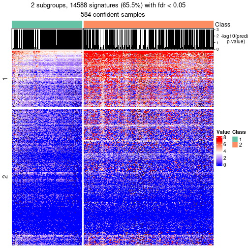</p>

</div>
<div id='tab-node-02-get-signatures-no-scale-2'>
<pre><code class="r">get_signatures(res, k = 3, scale_rows = FALSE)
</code></pre>

<p></p>

</div>
<div id='tab-node-02-get-signatures-no-scale-3'>
<pre><code class="r">get_signatures(res, k = 4, scale_rows = FALSE)
</code></pre>

<p></p>

</div>
</div>


Compare the overlap of signatures from different k:

```r
compare_signatures(res)
```


`get_signature()` returns a data frame invisibly. To get the list of signatures, the function
call should be assigned to a variable explicitly. In following code, if `plot` argument is set
to `FALSE`, no heatmap is plotted while only the differential analysis is performed.

```r
# code only for demonstration
tb = get_signature(res, k = ..., plot = FALSE)
```

An example of the output of `tb` is:

```
#>   which_row         fdr    mean_1    mean_2 scaled_mean_1 scaled_mean_2 km
#> 1        38 0.042760348  8.373488  9.131774    -0.5533452     0.5164555  1
#> 2        40 0.018707592  7.106213  8.469186    -0.6173731     0.5762149  1
#> 3        55 0.019134737 10.221463 11.207825    -0.6159697     0.5749050  1
#> 4        59 0.006059896  5.921854  7.869574    -0.6899429     0.6439467  1
#> 5        60 0.018055526  8.928898 10.211722    -0.6204761     0.5791110  1
#> 6        98 0.009384629 15.714769 14.887706     0.6635654    -0.6193277  2
...
```

The columns in `tb` are:

1. `which_row`: row indices corresponding to the input matrix.
2. `fdr`: FDR for the differential test. 
3. `mean_x`: The mean value in group x.
4. `scaled_mean_x`: The mean value in group x after rows are scaled.
5. `km`: Row groups if k-means clustering is applied to rows (which is done by automatically selecting number of clusters).

If there are too many signatures, `top_signatures = ...` can be set to only show the 
signatures with the highest FDRs:

```r
# code only for demonstration
# e.g. to show the top 500 most significant rows
tb = get_signature(res, k = ..., top_signatures = 500)
```

If the signatures are defined as these which are uniquely high in current group, `diff_method` argument
can be set to `"uniquely_high_in_one_group"`:

```r
# code only for demonstration
tb = get_signature(res, k = ..., diff_method = "uniquely_high_in_one_group")
```


UMAP plot which shows how samples are separated.


<script>
$( function() {
	$( '#tabs-node-02-dimension-reduction' ).tabs();
} );
</script>
<div id='tabs-node-02-dimension-reduction'>
<ul>
<li><a href='#tab-node-02-dimension-reduction-1'>k = 2</a></li>
<li><a href='#tab-node-02-dimension-reduction-2'>k = 3</a></li>
<li><a href='#tab-node-02-dimension-reduction-3'>k = 4</a></li>
</ul>
<div id='tab-node-02-dimension-reduction-1'>
<pre><code class="r">dimension_reduction(res, k = 2, method = &quot;UMAP&quot;)
</code></pre>

<p></p>

</div>
<div id='tab-node-02-dimension-reduction-2'>
<pre><code class="r">dimension_reduction(res, k = 3, method = &quot;UMAP&quot;)
</code></pre>

<p></p>

</div>
<div id='tab-node-02-dimension-reduction-3'>
<pre><code class="r">dimension_reduction(res, k = 4, method = &quot;UMAP&quot;)
</code></pre>

<p></p>

</div>
</div>


Following heatmap shows how subgroups are split when increasing `k`:

```r
collect_classes(res)
```


If matrix rows can be associated to genes, consider to use `functional_enrichment(res,
...)` to perform function enrichment for the signature genes. See [this vignette](https://jokergoo.github.io/cola_vignettes/functional_enrichment.html) for more detailed explanations.


 

---------------------------------------------------


### Node021


Parent node: [Node02](#Node02).
Child nodes: 
                [Node0111](#Node0111)
        ,
                [Node0112](#Node0112)
        ,
                [Node0121](#Node0121)
        ,
                [Node0122](#Node0122)
        ,
                [Node0131](#Node0131)
        ,
                Node0132-leaf
        ,
                Node0141-leaf
        ,
                Node0142-leaf
        ,
                [Node0211](#Node0211)
        ,
                [Node0212](#Node0212)
        ,
                Node0213-leaf
        ,
                Node0311-leaf
        ,
                Node0312-leaf
        ,
                Node0321-leaf
        ,
                Node0322-leaf
        ,
                Node0331-leaf
        ,
                Node0332-leaf
        ,
                Node0411-leaf
        ,
                Node0412-leaf
        ,
                Node0413-leaf
        ,
                Node0421-leaf
        ,
                Node0422-leaf
        ,
                Node0423-leaf
        .


The object with results only for a single top-value method and a single partitioning method 
can be extracted as:

```r
res = res_rh["021"]
```

A summary of `res` and all the functions that can be applied to it:

```r
res
```

```
#> A 'ConsensusPartition' object with k = 2, 3, 4.
#>   On a matrix with 17718 rows and 197 columns.
#>   Top rows (1772) are extracted by 'ATC' method.
#>   Subgroups are detected by 'skmeans' method.
#>   Performed in total 150 partitions by row resampling.
#>   Best k for subgroups seems to be 4.
#> 
#> Following methods can be applied to this 'ConsensusPartition' object:
#>  [1] "cola_report"             "collect_classes"         "collect_plots"          
#>  [4] "collect_stats"           "colnames"                "compare_partitions"     
#>  [7] "compare_signatures"      "consensus_heatmap"       "dimension_reduction"    
#> [10] "functional_enrichment"   "get_anno_col"            "get_anno"               
#> [13] "get_classes"             "get_consensus"           "get_matrix"             
#> [16] "get_membership"          "get_param"               "get_signatures"         
#> [19] "get_stats"               "is_best_k"               "is_stable_k"            
#> [22] "membership_heatmap"      "ncol"                    "nrow"                   
#> [25] "plot_ecdf"               "predict_classes"         "rownames"               
#> [28] "select_partition_number" "show"                    "suggest_best_k"         
#> [31] "test_to_known_factors"   "top_rows_heatmap"
```

`collect_plots()` function collects all the plots made from `res` for all `k` (number of subgroups)
into one single page to provide an easy and fast comparison between different `k`.

```r
collect_plots(res)
```


The plots are:

- The first row: a plot of the eCDF (empirical cumulative distribution
  function) curves of the consensus matrix for each `k` and the heatmap of
  predicted classes for each `k`.
- The second row: heatmaps of the consensus matrix for each `k`.
- The third row: heatmaps of the membership matrix for each `k`.
- The fouth row: heatmaps of the signatures for each `k`.

All the plots in panels can be made by individual functions and they are
plotted later in this section.

`select_partition_number()` produces several plots showing different
statistics for choosing "optimized" `k`. There are following statistics:

- eCDF curves of the consensus matrix for each `k`;
- 1-PAC. [The PAC score](https://en.wikipedia.org/wiki/Consensus_clustering#Over-interpretation_potential_of_consensus_clustering)
  measures the proportion of the ambiguous subgrouping.
- Mean silhouette score.
- Concordance. The mean probability of fiting the consensus subgroup labels in all
  partitions.
- Area increased. Denote $A_k$ as the area under the eCDF curve for current
  `k`, the area increased is defined as $A_k - A_{k-1}$.
- Rand index. The percent of pairs of samples that are both in a same cluster
  or both are not in a same cluster in the partition of k and k-1.
- Jaccard index. The ratio of pairs of samples are both in a same cluster in
  the partition of k and k-1 and the pairs of samples are both in a same
  cluster in the partition k or k-1.

The detailed explanations of these statistics can be found in [the _cola_
vignette](https://jokergoo.github.io/cola_vignettes/cola.html#toc_13).

Generally speaking, higher 1-PAC score, higher mean silhouette score or higher
concordance corresponds to better partition. Rand index and Jaccard index
measure how similar the current partition is compared to partition with `k-1`.
If they are too similar, we won't accept `k` is better than `k-1`.

```r
select_partition_number(res)
```


The numeric values for all these statistics can be obtained by `get_stats()`.

```r
get_stats(res)
```

```
#>   k 1-PAC mean_silhouette concordance area_increased  Rand Jaccard
#> 2 2 1.000           0.997       0.998          0.492 0.508   0.508
#> 3 3 1.000           0.966       0.983          0.260 0.836   0.689
#> 4 4 0.948           0.930       0.971          0.206 0.813   0.546
```

`suggest_best_k()` suggests the best $k$ based on these statistics. The rules are as follows:

- All $k$ with Jaccard index larger than 0.95 are removed because increasing
  $k$ does not provide enough extra information. If all $k$ are removed, it is
  marked as no subgroup is detected.
- For all $k$ with 1-PAC score larger than 0.9, the maximal $k$ is taken as
  the best $k$, and other $k$ are marked as optional $k$.
- If it does not fit the second rule. The $k$ with the maximal vote of the
  highest 1-PAC score, highest mean silhouette, and highest concordance is
  taken as the best $k$.

```r
suggest_best_k(res)
```

```
#> [1] 4
#> attr(,"optional")
#> [1] 2 3
```

There is also optional best $k$ = 2 3 that is worth to check.

Following is the table of the partitions (You need to click the **show/hide
code output** link to see it). The membership matrix (columns with name `p*`)
is inferred by
[`clue::cl_consensus()`](https://www.rdocumentation.org/link/cl_consensus?package=clue)
function with the `SE` method. Basically the value in the membership matrix
represents the probability to belong to a certain group. The finall subgroup
label for an item is determined with the group with highest probability it
belongs to.

In `get_classes()` function, the entropy is calculated from the membership
matrix and the silhouette score is calculated from the consensus matrix.


<script>
$( function() {
	$( '#tabs-node-021-get-classes' ).tabs();
} );
</script>
<div id='tabs-node-021-get-classes'>
<ul>
<li><a href='#tab-node-021-get-classes-1'>k = 2</a></li>
<li><a href='#tab-node-021-get-classes-2'>k = 3</a></li>
<li><a href='#tab-node-021-get-classes-3'>k = 4</a></li>
</ul>

<div id='tab-node-021-get-classes-1'>
<p><a id='tab-node-021-get-classes-1-a' style='color:#0366d6' href='#'>show/hide code output</a></p>
<pre><code class="r">cbind(get_classes(res, k = 2), get_membership(res, k = 2))
</code></pre>

<pre><code>#&gt;            class entropy silhouette   p1   p2
#&gt; HSPC_007       2   0.000      0.997 0.00 1.00
#&gt; HSPC_019       1   0.000      0.999 1.00 0.00
#&gt; HSPC_032       1   0.000      0.999 1.00 0.00
#&gt; HSPC_039       1   0.000      0.999 1.00 0.00
#&gt; HSPC_010       1   0.000      0.999 1.00 0.00
#&gt; HSPC_029       1   0.000      0.999 1.00 0.00
#&gt; LT-HSC_005     1   0.000      0.999 1.00 0.00
#&gt; HSPC_005       1   0.000      0.999 1.00 0.00
#&gt; Prog_034       1   0.000      0.999 1.00 0.00
#&gt; Prog_041       2   0.000      0.997 0.00 1.00
#&gt; LT-HSC_011     2   0.000      0.997 0.00 1.00
#&gt; Prog_005       2   0.000      0.997 0.00 1.00
#&gt; HSPC_059       1   0.000      0.999 1.00 0.00
#&gt; LT-HSC_019     1   0.000      0.999 1.00 0.00
#&gt; Prog_060       2   0.000      0.997 0.00 1.00
#&gt; HSPC_091       2   0.000      0.997 0.00 1.00
#&gt; LT-HSC_025     2   0.000      0.997 0.00 1.00
#&gt; HSPC_092       2   0.000      0.997 0.00 1.00
#&gt; HSPC_116       1   0.000      0.999 1.00 0.00
#&gt; HSPC_086       1   0.000      0.999 1.00 0.00
#&gt; HSPC_093       1   0.000      0.999 1.00 0.00
#&gt; HSPC_112       1   0.000      0.999 1.00 0.00
#&gt; HSPC_124       1   0.000      0.999 1.00 0.00
#&gt; LT-HSC_029     2   0.000      0.997 0.00 1.00
#&gt; LT-HSC_030     2   0.000      0.997 0.00 1.00
#&gt; Prog_121       2   0.000      0.997 0.00 1.00
#&gt; Prog_104       1   0.000      0.999 1.00 0.00
#&gt; Prog_086       2   0.000      0.997 0.00 1.00
#&gt; LT-HSC_035     2   0.000      0.997 0.00 1.00
#&gt; HSPC_129       1   0.000      0.999 1.00 0.00
#&gt; HSPC_160       1   0.000      0.999 1.00 0.00
#&gt; HSPC_137       1   0.000      0.999 1.00 0.00
#&gt; HSPC_150       1   0.000      0.999 1.00 0.00
#&gt; Prog_164       2   0.000      0.997 0.00 1.00
#&gt; Prog_147       1   0.000      0.999 1.00 0.00
#&gt; LT-HSC_047     2   0.000      0.997 0.00 1.00
#&gt; Prog_138       1   0.000      0.999 1.00 0.00
#&gt; Prog_156       2   0.000      0.997 0.00 1.00
#&gt; HSPC_188       1   0.000      0.999 1.00 0.00
#&gt; HSPC_194       1   0.000      0.999 1.00 0.00
#&gt; HSPC_201       1   0.000      0.999 1.00 0.00
#&gt; HSPC_184       2   0.000      0.997 0.00 1.00
#&gt; HSPC_197       1   0.000      0.999 1.00 0.00
#&gt; HSPC_209       1   0.000      0.999 1.00 0.00
#&gt; LT-HSC_053     1   0.000      0.999 1.00 0.00
#&gt; Prog_181       1   0.000      0.999 1.00 0.00
#&gt; Prog_169       1   0.000      0.999 1.00 0.00
#&gt; Prog_202       2   0.000      0.997 0.00 1.00
#&gt; LT-HSC_059     2   0.000      0.997 0.00 1.00
#&gt; Prog_198       1   0.000      0.999 1.00 0.00
#&gt; Prog_174       2   0.000      0.997 0.00 1.00
#&gt; HSPC_217       2   0.000      0.997 0.00 1.00
#&gt; HSPC_241       1   0.000      0.999 1.00 0.00
#&gt; LT-HSC_061     2   0.000      0.997 0.00 1.00
#&gt; HSPC_226       1   0.000      0.999 1.00 0.00
#&gt; HSPC_238       2   0.000      0.997 0.00 1.00
#&gt; HSPC_234       1   0.000      0.999 1.00 0.00
#&gt; HSPC_252       1   0.000      0.999 1.00 0.00
#&gt; LT-HSC_067     2   0.000      0.997 0.00 1.00
#&gt; Prog_219       2   0.000      0.997 0.00 1.00
#&gt; Prog_220       2   0.000      0.997 0.00 1.00
#&gt; Prog_251       2   0.000      0.997 0.00 1.00
#&gt; HSPC_260       1   0.000      0.999 1.00 0.00
#&gt; HSPC_272       1   0.000      0.999 1.00 0.00
#&gt; HSPC_284       1   0.000      0.999 1.00 0.00
#&gt; HSPC_273       1   0.000      0.999 1.00 0.00
#&gt; HSPC_262       2   0.000      0.997 0.00 1.00
#&gt; LT-HSC_079     1   0.000      0.999 1.00 0.00
#&gt; LT-HSC_083     1   0.242      0.958 0.96 0.04
#&gt; Prog_257       2   0.000      0.997 0.00 1.00
#&gt; HSPC_319       2   0.000      0.997 0.00 1.00
#&gt; LT-HSC_087     2   0.000      0.997 0.00 1.00
#&gt; HSPC_311       2   0.000      0.997 0.00 1.00
#&gt; Prog_302       2   0.000      0.997 0.00 1.00
#&gt; LT-HSC_092     2   0.000      0.997 0.00 1.00
#&gt; Prog_317       2   0.000      0.997 0.00 1.00
#&gt; HSPC_355       2   0.000      0.997 0.00 1.00
#&gt; LT-HSC_097     2   0.000      0.997 0.00 1.00
#&gt; HSPC_357       1   0.000      0.999 1.00 0.00
#&gt; HSPC_369       1   0.000      0.999 1.00 0.00
#&gt; HSPC_375       1   0.000      0.999 1.00 0.00
#&gt; HSPC_340       2   0.000      0.997 0.00 1.00
#&gt; HSPC_347       1   0.000      0.999 1.00 0.00
#&gt; HSPC_366       2   0.000      0.997 0.00 1.00
#&gt; HSPC_378       2   0.000      0.997 0.00 1.00
#&gt; Prog_344       1   0.000      0.999 1.00 0.00
#&gt; LT-HSC_104     2   0.000      0.997 0.00 1.00
#&gt; Prog_347       2   0.000      0.997 0.00 1.00
#&gt; Prog_365       2   0.000      0.997 0.00 1.00
#&gt; Prog_348       2   0.000      0.997 0.00 1.00
#&gt; HSPC_385       1   0.000      0.999 1.00 0.00
#&gt; HSPC_397       1   0.000      0.999 1.00 0.00
#&gt; HSPC_379       2   0.469      0.890 0.10 0.90
#&gt; HSPC_381       1   0.000      0.999 1.00 0.00
#&gt; HSPC_394       1   0.000      0.999 1.00 0.00
#&gt; HSPC_401       1   0.000      0.999 1.00 0.00
#&gt; HSPC_414       1   0.000      0.999 1.00 0.00
#&gt; HSPC_384       1   0.000      0.999 1.00 0.00
#&gt; Prog_391       1   0.141      0.979 0.98 0.02
#&gt; Prog_400       1   0.000      0.999 1.00 0.00
#&gt; HSPC_433       2   0.000      0.997 0.00 1.00
#&gt; HSPC_439       2   0.000      0.997 0.00 1.00
#&gt; HSPC_445       2   0.000      0.997 0.00 1.00
#&gt; HSPC_434       1   0.000      0.999 1.00 0.00
#&gt; HSPC_452       1   0.000      0.999 1.00 0.00
#&gt; HSPC_458       1   0.000      0.999 1.00 0.00
#&gt; HSPC_464       1   0.000      0.999 1.00 0.00
#&gt; HSPC_428       2   0.000      0.997 0.00 1.00
#&gt; HSPC_429       1   0.000      0.999 1.00 0.00
#&gt; HSPC_437       1   0.000      0.999 1.00 0.00
#&gt; HSPC_438       2   0.000      0.997 0.00 1.00
#&gt; Prog_452       2   0.000      0.997 0.00 1.00
#&gt; Prog_442       1   0.000      0.999 1.00 0.00
#&gt; LT-HSC_118     1   0.000      0.999 1.00 0.00
#&gt; LT-HSC_119     2   0.000      0.997 0.00 1.00
#&gt; HSPC_487       2   0.000      0.997 0.00 1.00
#&gt; LT-HSC_121     1   0.000      0.999 1.00 0.00
#&gt; HSPC_476       1   0.000      0.999 1.00 0.00
#&gt; HSPC_484       1   0.000      0.999 1.00 0.00
#&gt; LT-HSC_127     2   0.000      0.997 0.00 1.00
#&gt; LT-HSC_129     1   0.000      0.999 1.00 0.00
#&gt; Prog_498       2   0.000      0.997 0.00 1.00
#&gt; HSPC_529       1   0.000      0.999 1.00 0.00
#&gt; LT-HSC_133     2   0.000      0.997 0.00 1.00
#&gt; HSPC_536       1   0.000      0.999 1.00 0.00
#&gt; HSPC_542       1   0.000      0.999 1.00 0.00
#&gt; HSPC_519       1   0.000      0.999 1.00 0.00
#&gt; HSPC_513       2   0.000      0.997 0.00 1.00
#&gt; LT-HSC_141     1   0.000      0.999 1.00 0.00
#&gt; Prog_538       2   0.000      0.997 0.00 1.00
#&gt; HSPC_583       1   0.000      0.999 1.00 0.00
#&gt; HSPC_561       1   0.000      0.999 1.00 0.00
#&gt; HSPC_581       1   0.000      0.999 1.00 0.00
#&gt; HSPC_587       1   0.000      0.999 1.00 0.00
#&gt; HSPC_564       1   0.000      0.999 1.00 0.00
#&gt; HSPC_570       1   0.000      0.999 1.00 0.00
#&gt; HSPC_588       2   0.000      0.997 0.00 1.00
#&gt; HSPC_558       1   0.000      0.999 1.00 0.00
#&gt; LT-HSC_154     1   0.000      0.999 1.00 0.00
#&gt; Prog_563       2   0.000      0.997 0.00 1.00
#&gt; LT-HSC_155     1   0.000      0.999 1.00 0.00
#&gt; HSPC_619       1   0.000      0.999 1.00 0.00
#&gt; HSPC_632       1   0.000      0.999 1.00 0.00
#&gt; HSPC_621       1   0.000      0.999 1.00 0.00
#&gt; HSPC_616       1   0.000      0.999 1.00 0.00
#&gt; HSPC_622       1   0.000      0.999 1.00 0.00
#&gt; HSPC_605       1   0.000      0.999 1.00 0.00
#&gt; HSPC_611       1   0.000      0.999 1.00 0.00
#&gt; Prog_601       1   0.000      0.999 1.00 0.00
#&gt; Prog_636       1   0.000      0.999 1.00 0.00
#&gt; HSPC_655       2   0.000      0.997 0.00 1.00
#&gt; HSPC_650       1   0.000      0.999 1.00 0.00
#&gt; HSPC_675       2   0.000      0.997 0.00 1.00
#&gt; HSPC_653       1   0.000      0.999 1.00 0.00
#&gt; HSPC_659       1   0.000      0.999 1.00 0.00
#&gt; HSPC_642       1   0.000      0.999 1.00 0.00
#&gt; LT-HSC_175     1   0.000      0.999 1.00 0.00
#&gt; LT-HSC_178     1   0.000      0.999 1.00 0.00
#&gt; HSPC_685       2   0.584      0.838 0.14 0.86
#&gt; HSPC_691       2   0.000      0.997 0.00 1.00
#&gt; HSPC_715       2   0.000      0.997 0.00 1.00
#&gt; LT-HSC_181     2   0.000      0.997 0.00 1.00
#&gt; HSPC_686       1   0.000      0.999 1.00 0.00
#&gt; HSPC_710       1   0.000      0.999 1.00 0.00
#&gt; LT-HSC_182     1   0.000      0.999 1.00 0.00
#&gt; HSPC_711       1   0.000      0.999 1.00 0.00
#&gt; HSPC_688       1   0.000      0.999 1.00 0.00
#&gt; HSPC_694       1   0.000      0.999 1.00 0.00
#&gt; HSPC_712       1   0.000      0.999 1.00 0.00
#&gt; HSPC_718       1   0.000      0.999 1.00 0.00
#&gt; HSPC_713       2   0.000      0.997 0.00 1.00
#&gt; LT-HSC_186     1   0.000      0.999 1.00 0.00
#&gt; Prog_691       2   0.000      0.997 0.00 1.00
#&gt; LT-HSC_189     1   0.000      0.999 1.00 0.00
#&gt; HSPC_728       2   0.000      0.997 0.00 1.00
#&gt; HSPC_741       1   0.000      0.999 1.00 0.00
#&gt; HSPC_754       2   0.000      0.997 0.00 1.00
#&gt; LT-HSC_196     1   0.000      0.999 1.00 0.00
#&gt; HSPC_726       2   0.000      0.997 0.00 1.00
#&gt; LT-HSC_199     1   0.000      0.999 1.00 0.00
#&gt; Prog_741       1   0.000      0.999 1.00 0.00
#&gt; Prog_742       1   0.000      0.999 1.00 0.00
#&gt; Prog_755       2   0.000      0.997 0.00 1.00
#&gt; LT-HSC_203     2   0.000      0.997 0.00 1.00
#&gt; HSPC_793       2   0.000      0.997 0.00 1.00
#&gt; HSPC_763       2   0.000      0.997 0.00 1.00
#&gt; LT-HSC_209     1   0.000      0.999 1.00 0.00
#&gt; HSPC_792       2   0.000      0.997 0.00 1.00
#&gt; Prog_766       2   0.000      0.997 0.00 1.00
#&gt; Prog_773       2   0.000      0.997 0.00 1.00
#&gt; HSPC_811       2   0.000      0.997 0.00 1.00
#&gt; HSPC_817       2   0.000      0.997 0.00 1.00
#&gt; HSPC_823       2   0.000      0.997 0.00 1.00
#&gt; HSPC_829       2   0.000      0.997 0.00 1.00
#&gt; HSPC_805       2   0.000      0.997 0.00 1.00
#&gt; HSPC_830       2   0.000      0.997 0.00 1.00
#&gt; HSPC_850       1   0.000      0.999 1.00 0.00
</code></pre>

<script>
$('#tab-node-021-get-classes-1-a').parent().next().next().hide();
$('#tab-node-021-get-classes-1-a').click(function(){
  $('#tab-node-021-get-classes-1-a').parent().next().next().toggle();
  return(false);
});
</script>
</div>

<div id='tab-node-021-get-classes-2'>
<p><a id='tab-node-021-get-classes-2-a' style='color:#0366d6' href='#'>show/hide code output</a></p>
<pre><code class="r">cbind(get_classes(res, k = 3), get_membership(res, k = 3))
</code></pre>

<pre><code>#&gt;            class entropy silhouette   p1   p2   p3
#&gt; HSPC_007       3  0.0000      0.960 0.00 0.00 1.00
#&gt; HSPC_019       1  0.0000      0.988 1.00 0.00 0.00
#&gt; HSPC_032       1  0.0000      0.988 1.00 0.00 0.00
#&gt; HSPC_039       1  0.0892      0.983 0.98 0.00 0.02
#&gt; HSPC_010       3  0.0000      0.960 0.00 0.00 1.00
#&gt; HSPC_029       1  0.0892      0.983 0.98 0.00 0.02
#&gt; LT-HSC_005     1  0.0892      0.983 0.98 0.00 0.02
#&gt; HSPC_005       1  0.0892      0.983 0.98 0.00 0.02
#&gt; Prog_034       1  0.0000      0.988 1.00 0.00 0.00
#&gt; Prog_041       3  0.0892      0.964 0.00 0.02 0.98
#&gt; LT-HSC_011     3  0.0000      0.960 0.00 0.00 1.00
#&gt; Prog_005       3  0.0892      0.964 0.00 0.02 0.98
#&gt; HSPC_059       1  0.0892      0.983 0.98 0.00 0.02
#&gt; LT-HSC_019     1  0.0000      0.988 1.00 0.00 0.00
#&gt; Prog_060       3  0.0892      0.964 0.00 0.02 0.98
#&gt; HSPC_091       2  0.0000      0.988 0.00 1.00 0.00
#&gt; LT-HSC_025     2  0.0000      0.988 0.00 1.00 0.00
#&gt; HSPC_092       2  0.0000      0.988 0.00 1.00 0.00
#&gt; HSPC_116       1  0.0000      0.988 1.00 0.00 0.00
#&gt; HSPC_086       1  0.0892      0.983 0.98 0.00 0.02
#&gt; HSPC_093       1  0.0000      0.988 1.00 0.00 0.00
#&gt; HSPC_112       1  0.0000      0.988 1.00 0.00 0.00
#&gt; HSPC_124       1  0.0000      0.988 1.00 0.00 0.00
#&gt; LT-HSC_029     2  0.0000      0.988 0.00 1.00 0.00
#&gt; LT-HSC_030     2  0.0000      0.988 0.00 1.00 0.00
#&gt; Prog_121       3  0.0892      0.964 0.00 0.02 0.98
#&gt; Prog_104       1  0.0000      0.988 1.00 0.00 0.00
#&gt; Prog_086       2  0.0000      0.988 0.00 1.00 0.00
#&gt; LT-HSC_035     2  0.0000      0.988 0.00 1.00 0.00
#&gt; HSPC_129       1  0.0000      0.988 1.00 0.00 0.00
#&gt; HSPC_160       1  0.0892      0.983 0.98 0.00 0.02
#&gt; HSPC_137       1  0.0000      0.988 1.00 0.00 0.00
#&gt; HSPC_150       1  0.0000      0.988 1.00 0.00 0.00
#&gt; Prog_164       3  0.3340      0.872 0.00 0.12 0.88
#&gt; Prog_147       1  0.0892      0.983 0.98 0.00 0.02
#&gt; LT-HSC_047     3  0.0892      0.964 0.00 0.02 0.98
#&gt; Prog_138       1  0.0000      0.988 1.00 0.00 0.00
#&gt; Prog_156       2  0.0000      0.988 0.00 1.00 0.00
#&gt; HSPC_188       1  0.0000      0.988 1.00 0.00 0.00
#&gt; HSPC_194       1  0.0000      0.988 1.00 0.00 0.00
#&gt; HSPC_201       1  0.0000      0.988 1.00 0.00 0.00
#&gt; HSPC_184       2  0.0000      0.988 0.00 1.00 0.00
#&gt; HSPC_197       1  0.0000      0.988 1.00 0.00 0.00
#&gt; HSPC_209       1  0.0000      0.988 1.00 0.00 0.00
#&gt; LT-HSC_053     1  0.0892      0.983 0.98 0.00 0.02
#&gt; Prog_181       1  0.0000      0.988 1.00 0.00 0.00
#&gt; Prog_169       1  0.0892      0.983 0.98 0.00 0.02
#&gt; Prog_202       3  0.0892      0.964 0.00 0.02 0.98
#&gt; LT-HSC_059     2  0.0000      0.988 0.00 1.00 0.00
#&gt; Prog_198       1  0.0892      0.983 0.98 0.00 0.02
#&gt; Prog_174       3  0.0892      0.964 0.00 0.02 0.98
#&gt; HSPC_217       2  0.0000      0.988 0.00 1.00 0.00
#&gt; HSPC_241       1  0.0000      0.988 1.00 0.00 0.00
#&gt; LT-HSC_061     2  0.0000      0.988 0.00 1.00 0.00
#&gt; HSPC_226       1  0.0892      0.983 0.98 0.00 0.02
#&gt; HSPC_238       2  0.0000      0.988 0.00 1.00 0.00
#&gt; HSPC_234       1  0.0000      0.988 1.00 0.00 0.00
#&gt; HSPC_252       3  0.0000      0.960 0.00 0.00 1.00
#&gt; LT-HSC_067     3  0.0892      0.964 0.00 0.02 0.98
#&gt; Prog_219       3  0.0892      0.964 0.00 0.02 0.98
#&gt; Prog_220       3  0.0892      0.964 0.00 0.02 0.98
#&gt; Prog_251       2  0.0000      0.988 0.00 1.00 0.00
#&gt; HSPC_260       1  0.0892      0.983 0.98 0.00 0.02
#&gt; HSPC_272       1  0.0000      0.988 1.00 0.00 0.00
#&gt; HSPC_284       1  0.0000      0.988 1.00 0.00 0.00
#&gt; HSPC_273       1  0.0000      0.988 1.00 0.00 0.00
#&gt; HSPC_262       2  0.0000      0.988 0.00 1.00 0.00
#&gt; LT-HSC_079     1  0.0892      0.983 0.98 0.00 0.02
#&gt; LT-HSC_083     2  0.0892      0.965 0.02 0.98 0.00
#&gt; Prog_257       3  0.0892      0.964 0.00 0.02 0.98
#&gt; HSPC_319       2  0.0000      0.988 0.00 1.00 0.00
#&gt; LT-HSC_087     2  0.0000      0.988 0.00 1.00 0.00
#&gt; HSPC_311       2  0.0000      0.988 0.00 1.00 0.00
#&gt; Prog_302       2  0.0000      0.988 0.00 1.00 0.00
#&gt; LT-HSC_092     2  0.0000      0.988 0.00 1.00 0.00
#&gt; Prog_317       2  0.0000      0.988 0.00 1.00 0.00
#&gt; HSPC_355       3  0.0892      0.964 0.00 0.02 0.98
#&gt; LT-HSC_097     2  0.0000      0.988 0.00 1.00 0.00
#&gt; HSPC_357       1  0.0000      0.988 1.00 0.00 0.00
#&gt; HSPC_369       1  0.0000      0.988 1.00 0.00 0.00
#&gt; HSPC_375       1  0.0000      0.988 1.00 0.00 0.00
#&gt; HSPC_340       3  0.4291      0.798 0.00 0.18 0.82
#&gt; HSPC_347       1  0.0892      0.983 0.98 0.00 0.02
#&gt; HSPC_366       3  0.0000      0.960 0.00 0.00 1.00
#&gt; HSPC_378       2  0.5216      0.632 0.00 0.74 0.26
#&gt; Prog_344       1  0.0892      0.983 0.98 0.00 0.02
#&gt; LT-HSC_104     2  0.0000      0.988 0.00 1.00 0.00
#&gt; Prog_347       3  0.0892      0.964 0.00 0.02 0.98
#&gt; Prog_365       3  0.0892      0.964 0.00 0.02 0.98
#&gt; Prog_348       2  0.0892      0.965 0.02 0.98 0.00
#&gt; HSPC_385       1  0.0000      0.988 1.00 0.00 0.00
#&gt; HSPC_397       1  0.0000      0.988 1.00 0.00 0.00
#&gt; HSPC_379       2  0.0892      0.965 0.02 0.98 0.00
#&gt; HSPC_381       1  0.0892      0.983 0.98 0.00 0.02
#&gt; HSPC_394       1  0.0000      0.988 1.00 0.00 0.00
#&gt; HSPC_401       1  0.0000      0.988 1.00 0.00 0.00
#&gt; HSPC_414       1  0.0000      0.988 1.00 0.00 0.00
#&gt; HSPC_384       1  0.0892      0.983 0.98 0.00 0.02
#&gt; Prog_391       3  0.0000      0.960 0.00 0.00 1.00
#&gt; Prog_400       1  0.0000      0.988 1.00 0.00 0.00
#&gt; HSPC_433       2  0.0000      0.988 0.00 1.00 0.00
#&gt; HSPC_439       2  0.0000      0.988 0.00 1.00 0.00
#&gt; HSPC_445       2  0.0000      0.988 0.00 1.00 0.00
#&gt; HSPC_434       3  0.0000      0.960 0.00 0.00 1.00
#&gt; HSPC_452       1  0.0000      0.988 1.00 0.00 0.00
#&gt; HSPC_458       1  0.0000      0.988 1.00 0.00 0.00
#&gt; HSPC_464       1  0.0000      0.988 1.00 0.00 0.00
#&gt; HSPC_428       2  0.0000      0.988 0.00 1.00 0.00
#&gt; HSPC_429       1  0.0000      0.988 1.00 0.00 0.00
#&gt; HSPC_437       1  0.4002      0.807 0.84 0.16 0.00
#&gt; HSPC_438       3  0.0000      0.960 0.00 0.00 1.00
#&gt; Prog_452       2  0.0000      0.988 0.00 1.00 0.00
#&gt; Prog_442       1  0.0892      0.983 0.98 0.00 0.02
#&gt; LT-HSC_118     1  0.0892      0.983 0.98 0.00 0.02
#&gt; LT-HSC_119     3  0.0892      0.964 0.00 0.02 0.98
#&gt; HSPC_487       2  0.0000      0.988 0.00 1.00 0.00
#&gt; LT-HSC_121     3  0.0000      0.960 0.00 0.00 1.00
#&gt; HSPC_476       1  0.0000      0.988 1.00 0.00 0.00
#&gt; HSPC_484       1  0.0000      0.988 1.00 0.00 0.00
#&gt; LT-HSC_127     2  0.0000      0.988 0.00 1.00 0.00
#&gt; LT-HSC_129     1  0.0892      0.983 0.98 0.00 0.02
#&gt; Prog_498       3  0.5216      0.675 0.00 0.26 0.74
#&gt; HSPC_529       1  0.0000      0.988 1.00 0.00 0.00
#&gt; LT-HSC_133     2  0.0000      0.988 0.00 1.00 0.00
#&gt; HSPC_536       1  0.0000      0.988 1.00 0.00 0.00
#&gt; HSPC_542       1  0.0000      0.988 1.00 0.00 0.00
#&gt; HSPC_519       1  0.0892      0.983 0.98 0.00 0.02
#&gt; HSPC_513       2  0.0000      0.988 0.00 1.00 0.00
#&gt; LT-HSC_141     1  0.0000      0.988 1.00 0.00 0.00
#&gt; Prog_538       2  0.0000      0.988 0.00 1.00 0.00
#&gt; HSPC_583       1  0.0000      0.988 1.00 0.00 0.00
#&gt; HSPC_561       1  0.0000      0.988 1.00 0.00 0.00
#&gt; HSPC_581       1  0.0892      0.983 0.98 0.00 0.02
#&gt; HSPC_587       1  0.0892      0.983 0.98 0.00 0.02
#&gt; HSPC_564       1  0.0892      0.983 0.98 0.00 0.02
#&gt; HSPC_570       1  0.0892      0.983 0.98 0.00 0.02
#&gt; HSPC_588       2  0.0000      0.988 0.00 1.00 0.00
#&gt; HSPC_558       1  0.0892      0.983 0.98 0.00 0.02
#&gt; LT-HSC_154     1  0.0892      0.983 0.98 0.00 0.02
#&gt; Prog_563       3  0.0892      0.964 0.00 0.02 0.98
#&gt; LT-HSC_155     1  0.0000      0.988 1.00 0.00 0.00
#&gt; HSPC_619       1  0.0892      0.983 0.98 0.00 0.02
#&gt; HSPC_632       1  0.0892      0.983 0.98 0.00 0.02
#&gt; HSPC_621       1  0.0000      0.988 1.00 0.00 0.00
#&gt; HSPC_616       1  0.0000      0.988 1.00 0.00 0.00
#&gt; HSPC_622       1  0.0000      0.988 1.00 0.00 0.00
#&gt; HSPC_605       3  0.0000      0.960 0.00 0.00 1.00
#&gt; HSPC_611       1  0.0892      0.983 0.98 0.00 0.02
#&gt; Prog_601       1  0.0892      0.983 0.98 0.00 0.02
#&gt; Prog_636       3  0.0000      0.960 0.00 0.00 1.00
#&gt; HSPC_655       2  0.1529      0.948 0.00 0.96 0.04
#&gt; HSPC_650       1  0.0892      0.983 0.98 0.00 0.02
#&gt; HSPC_675       2  0.0000      0.988 0.00 1.00 0.00
#&gt; HSPC_653       1  0.0000      0.988 1.00 0.00 0.00
#&gt; HSPC_659       1  0.0892      0.983 0.98 0.00 0.02
#&gt; HSPC_642       1  0.6045      0.418 0.62 0.00 0.38
#&gt; LT-HSC_175     1  0.0000      0.988 1.00 0.00 0.00
#&gt; LT-HSC_178     1  0.0892      0.983 0.98 0.00 0.02
#&gt; HSPC_685       3  0.2414      0.929 0.04 0.02 0.94
#&gt; HSPC_691       2  0.0000      0.988 0.00 1.00 0.00
#&gt; HSPC_715       2  0.5016      0.668 0.00 0.76 0.24
#&gt; LT-HSC_181     2  0.0000      0.988 0.00 1.00 0.00
#&gt; HSPC_686       1  0.0000      0.988 1.00 0.00 0.00
#&gt; HSPC_710       1  0.0000      0.988 1.00 0.00 0.00
#&gt; LT-HSC_182     3  0.0000      0.960 0.00 0.00 1.00
#&gt; HSPC_711       1  0.0000      0.988 1.00 0.00 0.00
#&gt; HSPC_688       1  0.0000      0.988 1.00 0.00 0.00
#&gt; HSPC_694       1  0.0000      0.988 1.00 0.00 0.00
#&gt; HSPC_712       1  0.0000      0.988 1.00 0.00 0.00
#&gt; HSPC_718       1  0.0000      0.988 1.00 0.00 0.00
#&gt; HSPC_713       2  0.0000      0.988 0.00 1.00 0.00
#&gt; LT-HSC_186     1  0.0000      0.988 1.00 0.00 0.00
#&gt; Prog_691       3  0.2066      0.933 0.00 0.06 0.94
#&gt; LT-HSC_189     1  0.0000      0.988 1.00 0.00 0.00
#&gt; HSPC_728       3  0.0892      0.964 0.00 0.02 0.98
#&gt; HSPC_741       1  0.0000      0.988 1.00 0.00 0.00
#&gt; HSPC_754       3  0.6302      0.121 0.00 0.48 0.52
#&gt; LT-HSC_196     1  0.0000      0.988 1.00 0.00 0.00
#&gt; HSPC_726       3  0.0000      0.960 0.00 0.00 1.00
#&gt; LT-HSC_199     1  0.0892      0.983 0.98 0.00 0.02
#&gt; Prog_741       3  0.0000      0.960 0.00 0.00 1.00
#&gt; Prog_742       3  0.0000      0.960 0.00 0.00 1.00
#&gt; Prog_755       3  0.0892      0.964 0.00 0.02 0.98
#&gt; LT-HSC_203     3  0.0892      0.964 0.00 0.02 0.98
#&gt; HSPC_793       2  0.0000      0.988 0.00 1.00 0.00
#&gt; HSPC_763       2  0.0000      0.988 0.00 1.00 0.00
#&gt; LT-HSC_209     1  0.0892      0.983 0.98 0.00 0.02
#&gt; HSPC_792       3  0.0000      0.960 0.00 0.00 1.00
#&gt; Prog_766       2  0.0000      0.988 0.00 1.00 0.00
#&gt; Prog_773       2  0.0000      0.988 0.00 1.00 0.00
#&gt; HSPC_811       2  0.0000      0.988 0.00 1.00 0.00
#&gt; HSPC_817       2  0.0000      0.988 0.00 1.00 0.00
#&gt; HSPC_823       2  0.0000      0.988 0.00 1.00 0.00
#&gt; HSPC_829       3  0.0892      0.964 0.00 0.02 0.98
#&gt; HSPC_805       2  0.0000      0.988 0.00 1.00 0.00
#&gt; HSPC_830       2  0.0000      0.988 0.00 1.00 0.00
#&gt; HSPC_850       1  0.0000      0.988 1.00 0.00 0.00
</code></pre>

<script>
$('#tab-node-021-get-classes-2-a').parent().next().next().hide();
$('#tab-node-021-get-classes-2-a').click(function(){
  $('#tab-node-021-get-classes-2-a').parent().next().next().toggle();
  return(false);
});
</script>
</div>

<div id='tab-node-021-get-classes-3'>
<p><a id='tab-node-021-get-classes-3-a' style='color:#0366d6' href='#'>show/hide code output</a></p>
<pre><code class="r">cbind(get_classes(res, k = 4), get_membership(res, k = 4))
</code></pre>

<pre><code>#&gt;            class entropy silhouette   p1   p2   p3   p4
#&gt; HSPC_007       3  0.0000      0.973 0.00 0.00 1.00 0.00
#&gt; HSPC_019       4  0.4907      0.321 0.42 0.00 0.00 0.58
#&gt; HSPC_032       1  0.0000      0.980 1.00 0.00 0.00 0.00
#&gt; HSPC_039       4  0.0000      0.949 0.00 0.00 0.00 1.00
#&gt; HSPC_010       4  0.0000      0.949 0.00 0.00 0.00 1.00
#&gt; HSPC_029       4  0.0000      0.949 0.00 0.00 0.00 1.00
#&gt; LT-HSC_005     4  0.0000      0.949 0.00 0.00 0.00 1.00
#&gt; HSPC_005       4  0.0000      0.949 0.00 0.00 0.00 1.00
#&gt; Prog_034       1  0.0000      0.980 1.00 0.00 0.00 0.00
#&gt; Prog_041       3  0.0000      0.973 0.00 0.00 1.00 0.00
#&gt; LT-HSC_011     3  0.0000      0.973 0.00 0.00 1.00 0.00
#&gt; Prog_005       3  0.0000      0.973 0.00 0.00 1.00 0.00
#&gt; HSPC_059       4  0.0000      0.949 0.00 0.00 0.00 1.00
#&gt; LT-HSC_019     1  0.0000      0.980 1.00 0.00 0.00 0.00
#&gt; Prog_060       3  0.0000      0.973 0.00 0.00 1.00 0.00
#&gt; HSPC_091       2  0.0000      0.971 0.00 1.00 0.00 0.00
#&gt; LT-HSC_025     2  0.0000      0.971 0.00 1.00 0.00 0.00
#&gt; HSPC_092       2  0.0000      0.971 0.00 1.00 0.00 0.00
#&gt; HSPC_116       1  0.0000      0.980 1.00 0.00 0.00 0.00
#&gt; HSPC_086       4  0.0000      0.949 0.00 0.00 0.00 1.00
#&gt; HSPC_093       1  0.0707      0.962 0.98 0.00 0.00 0.02
#&gt; HSPC_112       1  0.0000      0.980 1.00 0.00 0.00 0.00
#&gt; HSPC_124       1  0.0000      0.980 1.00 0.00 0.00 0.00
#&gt; LT-HSC_029     2  0.0000      0.971 0.00 1.00 0.00 0.00
#&gt; LT-HSC_030     2  0.0000      0.971 0.00 1.00 0.00 0.00
#&gt; Prog_121       3  0.0000      0.973 0.00 0.00 1.00 0.00
#&gt; Prog_104       1  0.0000      0.980 1.00 0.00 0.00 0.00
#&gt; Prog_086       2  0.0000      0.971 0.00 1.00 0.00 0.00
#&gt; LT-HSC_035     2  0.0000      0.971 0.00 1.00 0.00 0.00
#&gt; HSPC_129       1  0.0000      0.980 1.00 0.00 0.00 0.00
#&gt; HSPC_160       4  0.0000      0.949 0.00 0.00 0.00 1.00
#&gt; HSPC_137       1  0.0000      0.980 1.00 0.00 0.00 0.00
#&gt; HSPC_150       1  0.0000      0.980 1.00 0.00 0.00 0.00
#&gt; Prog_164       3  0.0000      0.973 0.00 0.00 1.00 0.00
#&gt; Prog_147       4  0.0000      0.949 0.00 0.00 0.00 1.00
#&gt; LT-HSC_047     3  0.0000      0.973 0.00 0.00 1.00 0.00
#&gt; Prog_138       1  0.0000      0.980 1.00 0.00 0.00 0.00
#&gt; Prog_156       2  0.0000      0.971 0.00 1.00 0.00 0.00
#&gt; HSPC_188       1  0.3400      0.769 0.82 0.00 0.00 0.18
#&gt; HSPC_194       1  0.0000      0.980 1.00 0.00 0.00 0.00
#&gt; HSPC_201       4  0.2011      0.887 0.08 0.00 0.00 0.92
#&gt; HSPC_184       2  0.0000      0.971 0.00 1.00 0.00 0.00
#&gt; HSPC_197       1  0.0000      0.980 1.00 0.00 0.00 0.00
#&gt; HSPC_209       4  0.4134      0.667 0.26 0.00 0.00 0.74
#&gt; LT-HSC_053     4  0.0000      0.949 0.00 0.00 0.00 1.00
#&gt; Prog_181       1  0.3801      0.713 0.78 0.00 0.00 0.22
#&gt; Prog_169       4  0.0000      0.949 0.00 0.00 0.00 1.00
#&gt; Prog_202       3  0.0000      0.973 0.00 0.00 1.00 0.00
#&gt; LT-HSC_059     2  0.3801      0.722 0.00 0.78 0.22 0.00
#&gt; Prog_198       4  0.0000      0.949 0.00 0.00 0.00 1.00
#&gt; Prog_174       3  0.0000      0.973 0.00 0.00 1.00 0.00
#&gt; HSPC_217       2  0.0000      0.971 0.00 1.00 0.00 0.00
#&gt; HSPC_241       1  0.0000      0.980 1.00 0.00 0.00 0.00
#&gt; LT-HSC_061     2  0.0000      0.971 0.00 1.00 0.00 0.00
#&gt; HSPC_226       4  0.0000      0.949 0.00 0.00 0.00 1.00
#&gt; HSPC_238       2  0.4277      0.613 0.00 0.72 0.28 0.00
#&gt; HSPC_234       4  0.2345      0.869 0.10 0.00 0.00 0.90
#&gt; HSPC_252       4  0.0000      0.949 0.00 0.00 0.00 1.00
#&gt; LT-HSC_067     3  0.0000      0.973 0.00 0.00 1.00 0.00
#&gt; Prog_219       3  0.0000      0.973 0.00 0.00 1.00 0.00
#&gt; Prog_220       3  0.0000      0.973 0.00 0.00 1.00 0.00
#&gt; Prog_251       3  0.0000      0.973 0.00 0.00 1.00 0.00
#&gt; HSPC_260       4  0.0000      0.949 0.00 0.00 0.00 1.00
#&gt; HSPC_272       4  0.1211      0.919 0.04 0.00 0.00 0.96
#&gt; HSPC_284       1  0.0000      0.980 1.00 0.00 0.00 0.00
#&gt; HSPC_273       1  0.4522      0.502 0.68 0.00 0.00 0.32
#&gt; HSPC_262       2  0.0000      0.971 0.00 1.00 0.00 0.00
#&gt; LT-HSC_079     4  0.0000      0.949 0.00 0.00 0.00 1.00
#&gt; LT-HSC_083     1  0.2921      0.825 0.86 0.14 0.00 0.00
#&gt; Prog_257       3  0.0000      0.973 0.00 0.00 1.00 0.00
#&gt; HSPC_319       2  0.0000      0.971 0.00 1.00 0.00 0.00
#&gt; LT-HSC_087     2  0.0000      0.971 0.00 1.00 0.00 0.00
#&gt; HSPC_311       2  0.0000      0.971 0.00 1.00 0.00 0.00
#&gt; Prog_302       2  0.0000      0.971 0.00 1.00 0.00 0.00
#&gt; LT-HSC_092     2  0.0000      0.971 0.00 1.00 0.00 0.00
#&gt; Prog_317       2  0.0000      0.971 0.00 1.00 0.00 0.00
#&gt; HSPC_355       3  0.0000      0.973 0.00 0.00 1.00 0.00
#&gt; LT-HSC_097     2  0.0000      0.971 0.00 1.00 0.00 0.00
#&gt; HSPC_357       1  0.0000      0.980 1.00 0.00 0.00 0.00
#&gt; HSPC_369       1  0.1211      0.944 0.96 0.00 0.00 0.04
#&gt; HSPC_375       1  0.0000      0.980 1.00 0.00 0.00 0.00
#&gt; HSPC_340       3  0.0000      0.973 0.00 0.00 1.00 0.00
#&gt; HSPC_347       4  0.0000      0.949 0.00 0.00 0.00 1.00
#&gt; HSPC_366       3  0.0000      0.973 0.00 0.00 1.00 0.00
#&gt; HSPC_378       3  0.2011      0.899 0.00 0.08 0.92 0.00
#&gt; Prog_344       4  0.0000      0.949 0.00 0.00 0.00 1.00
#&gt; LT-HSC_104     2  0.0000      0.971 0.00 1.00 0.00 0.00
#&gt; Prog_347       3  0.0000      0.973 0.00 0.00 1.00 0.00
#&gt; Prog_365       3  0.0000      0.973 0.00 0.00 1.00 0.00
#&gt; Prog_348       2  0.4948      0.210 0.44 0.56 0.00 0.00
#&gt; HSPC_385       1  0.0000      0.980 1.00 0.00 0.00 0.00
#&gt; HSPC_397       1  0.0000      0.980 1.00 0.00 0.00 0.00
#&gt; HSPC_379       2  0.0000      0.971 0.00 1.00 0.00 0.00
#&gt; HSPC_381       4  0.0000      0.949 0.00 0.00 0.00 1.00
#&gt; HSPC_394       1  0.0000      0.980 1.00 0.00 0.00 0.00
#&gt; HSPC_401       1  0.0000      0.980 1.00 0.00 0.00 0.00
#&gt; HSPC_414       4  0.4994      0.118 0.48 0.00 0.00 0.52
#&gt; HSPC_384       4  0.0000      0.949 0.00 0.00 0.00 1.00
#&gt; Prog_391       3  0.0707      0.956 0.00 0.00 0.98 0.02
#&gt; Prog_400       1  0.0000      0.980 1.00 0.00 0.00 0.00
#&gt; HSPC_433       2  0.0000      0.971 0.00 1.00 0.00 0.00
#&gt; HSPC_439       2  0.0000      0.971 0.00 1.00 0.00 0.00
#&gt; HSPC_445       2  0.0000      0.971 0.00 1.00 0.00 0.00
#&gt; HSPC_434       4  0.0000      0.949 0.00 0.00 0.00 1.00
#&gt; HSPC_452       1  0.0000      0.980 1.00 0.00 0.00 0.00
#&gt; HSPC_458       4  0.3172      0.807 0.16 0.00 0.00 0.84
#&gt; HSPC_464       4  0.3975      0.701 0.24 0.00 0.00 0.76
#&gt; HSPC_428       2  0.0000      0.971 0.00 1.00 0.00 0.00
#&gt; HSPC_429       1  0.0000      0.980 1.00 0.00 0.00 0.00
#&gt; HSPC_437       1  0.0000      0.980 1.00 0.00 0.00 0.00
#&gt; HSPC_438       3  0.0000      0.973 0.00 0.00 1.00 0.00
#&gt; Prog_452       2  0.2647      0.855 0.00 0.88 0.12 0.00
#&gt; Prog_442       4  0.0000      0.949 0.00 0.00 0.00 1.00
#&gt; LT-HSC_118     4  0.0000      0.949 0.00 0.00 0.00 1.00
#&gt; LT-HSC_119     3  0.0000      0.973 0.00 0.00 1.00 0.00
#&gt; HSPC_487       2  0.0000      0.971 0.00 1.00 0.00 0.00
#&gt; LT-HSC_121     4  0.0000      0.949 0.00 0.00 0.00 1.00
#&gt; HSPC_476       1  0.0000      0.980 1.00 0.00 0.00 0.00
#&gt; HSPC_484       1  0.1637      0.922 0.94 0.00 0.00 0.06
#&gt; LT-HSC_127     2  0.0000      0.971 0.00 1.00 0.00 0.00
#&gt; LT-HSC_129     4  0.0000      0.949 0.00 0.00 0.00 1.00
#&gt; Prog_498       3  0.3400      0.773 0.00 0.18 0.82 0.00
#&gt; HSPC_529       1  0.0000      0.980 1.00 0.00 0.00 0.00
#&gt; LT-HSC_133     2  0.0000      0.971 0.00 1.00 0.00 0.00
#&gt; HSPC_536       1  0.0000      0.980 1.00 0.00 0.00 0.00
#&gt; HSPC_542       1  0.0000      0.980 1.00 0.00 0.00 0.00
#&gt; HSPC_519       4  0.0000      0.949 0.00 0.00 0.00 1.00
#&gt; HSPC_513       2  0.0000      0.971 0.00 1.00 0.00 0.00
#&gt; LT-HSC_141     1  0.0000      0.980 1.00 0.00 0.00 0.00
#&gt; Prog_538       2  0.0000      0.971 0.00 1.00 0.00 0.00
#&gt; HSPC_583       1  0.0000      0.980 1.00 0.00 0.00 0.00
#&gt; HSPC_561       4  0.4277      0.637 0.28 0.00 0.00 0.72
#&gt; HSPC_581       4  0.0000      0.949 0.00 0.00 0.00 1.00
#&gt; HSPC_587       4  0.0000      0.949 0.00 0.00 0.00 1.00
#&gt; HSPC_564       4  0.0000      0.949 0.00 0.00 0.00 1.00
#&gt; HSPC_570       4  0.0000      0.949 0.00 0.00 0.00 1.00
#&gt; HSPC_588       2  0.0000      0.971 0.00 1.00 0.00 0.00
#&gt; HSPC_558       4  0.0000      0.949 0.00 0.00 0.00 1.00
#&gt; LT-HSC_154     4  0.0000      0.949 0.00 0.00 0.00 1.00
#&gt; Prog_563       3  0.0000      0.973 0.00 0.00 1.00 0.00
#&gt; LT-HSC_155     1  0.0000      0.980 1.00 0.00 0.00 0.00
#&gt; HSPC_619       4  0.0000      0.949 0.00 0.00 0.00 1.00
#&gt; HSPC_632       4  0.0000      0.949 0.00 0.00 0.00 1.00
#&gt; HSPC_621       1  0.0000      0.980 1.00 0.00 0.00 0.00
#&gt; HSPC_616       1  0.0000      0.980 1.00 0.00 0.00 0.00
#&gt; HSPC_622       1  0.0000      0.980 1.00 0.00 0.00 0.00
#&gt; HSPC_605       4  0.0000      0.949 0.00 0.00 0.00 1.00
#&gt; HSPC_611       4  0.0000      0.949 0.00 0.00 0.00 1.00
#&gt; Prog_601       4  0.0000      0.949 0.00 0.00 0.00 1.00
#&gt; Prog_636       3  0.4977      0.156 0.00 0.00 0.54 0.46
#&gt; HSPC_655       2  0.3400      0.781 0.00 0.82 0.18 0.00
#&gt; HSPC_650       4  0.0000      0.949 0.00 0.00 0.00 1.00
#&gt; HSPC_675       2  0.0000      0.971 0.00 1.00 0.00 0.00
#&gt; HSPC_653       1  0.0000      0.980 1.00 0.00 0.00 0.00
#&gt; HSPC_659       4  0.0000      0.949 0.00 0.00 0.00 1.00
#&gt; HSPC_642       4  0.0000      0.949 0.00 0.00 0.00 1.00
#&gt; LT-HSC_175     1  0.0000      0.980 1.00 0.00 0.00 0.00
#&gt; LT-HSC_178     4  0.0000      0.949 0.00 0.00 0.00 1.00
#&gt; HSPC_685       3  0.1411      0.943 0.02 0.02 0.96 0.00
#&gt; HSPC_691       2  0.0000      0.971 0.00 1.00 0.00 0.00
#&gt; HSPC_715       3  0.0000      0.973 0.00 0.00 1.00 0.00
#&gt; LT-HSC_181     2  0.0000      0.971 0.00 1.00 0.00 0.00
#&gt; HSPC_686       1  0.0000      0.980 1.00 0.00 0.00 0.00
#&gt; HSPC_710       1  0.0000      0.980 1.00 0.00 0.00 0.00
#&gt; LT-HSC_182     4  0.0000      0.949 0.00 0.00 0.00 1.00
#&gt; HSPC_711       1  0.0000      0.980 1.00 0.00 0.00 0.00
#&gt; HSPC_688       1  0.0000      0.980 1.00 0.00 0.00 0.00
#&gt; HSPC_694       1  0.0000      0.980 1.00 0.00 0.00 0.00
#&gt; HSPC_712       1  0.0000      0.980 1.00 0.00 0.00 0.00
#&gt; HSPC_718       1  0.0000      0.980 1.00 0.00 0.00 0.00
#&gt; HSPC_713       2  0.0000      0.971 0.00 1.00 0.00 0.00
#&gt; LT-HSC_186     1  0.0000      0.980 1.00 0.00 0.00 0.00
#&gt; Prog_691       3  0.0000      0.973 0.00 0.00 1.00 0.00
#&gt; LT-HSC_189     1  0.0000      0.980 1.00 0.00 0.00 0.00
#&gt; HSPC_728       3  0.0000      0.973 0.00 0.00 1.00 0.00
#&gt; HSPC_741       4  0.4855      0.382 0.40 0.00 0.00 0.60
#&gt; HSPC_754       3  0.3172      0.801 0.00 0.16 0.84 0.00
#&gt; LT-HSC_196     1  0.0000      0.980 1.00 0.00 0.00 0.00
#&gt; HSPC_726       3  0.0000      0.973 0.00 0.00 1.00 0.00
#&gt; LT-HSC_199     4  0.0707      0.935 0.02 0.00 0.00 0.98
#&gt; Prog_741       4  0.0707      0.933 0.00 0.00 0.02 0.98
#&gt; Prog_742       4  0.0707      0.933 0.00 0.00 0.02 0.98
#&gt; Prog_755       3  0.0000      0.973 0.00 0.00 1.00 0.00
#&gt; LT-HSC_203     3  0.0000      0.973 0.00 0.00 1.00 0.00
#&gt; HSPC_793       2  0.0000      0.971 0.00 1.00 0.00 0.00
#&gt; HSPC_763       2  0.0000      0.971 0.00 1.00 0.00 0.00
#&gt; LT-HSC_209     4  0.0000      0.949 0.00 0.00 0.00 1.00
#&gt; HSPC_792       3  0.0000      0.973 0.00 0.00 1.00 0.00
#&gt; Prog_766       2  0.0000      0.971 0.00 1.00 0.00 0.00
#&gt; Prog_773       2  0.2011      0.897 0.00 0.92 0.08 0.00
#&gt; HSPC_811       2  0.0000      0.971 0.00 1.00 0.00 0.00
#&gt; HSPC_817       2  0.0000      0.971 0.00 1.00 0.00 0.00
#&gt; HSPC_823       2  0.0000      0.971 0.00 1.00 0.00 0.00
#&gt; HSPC_829       3  0.0000      0.973 0.00 0.00 1.00 0.00
#&gt; HSPC_805       2  0.0000      0.971 0.00 1.00 0.00 0.00
#&gt; HSPC_830       2  0.0000      0.971 0.00 1.00 0.00 0.00
#&gt; HSPC_850       1  0.0000      0.980 1.00 0.00 0.00 0.00
</code></pre>

<script>
$('#tab-node-021-get-classes-3-a').parent().next().next().hide();
$('#tab-node-021-get-classes-3-a').click(function(){
  $('#tab-node-021-get-classes-3-a').parent().next().next().toggle();
  return(false);
});
</script>
</div>
</div>

Heatmaps for the consensus matrix. It visualizes the probability of two
samples to be in a same group.


<script>
$( function() {
	$( '#tabs-node-021-consensus-heatmap' ).tabs();
} );
</script>
<div id='tabs-node-021-consensus-heatmap'>
<ul>
<li><a href='#tab-node-021-consensus-heatmap-1'>k = 2</a></li>
<li><a href='#tab-node-021-consensus-heatmap-2'>k = 3</a></li>
<li><a href='#tab-node-021-consensus-heatmap-3'>k = 4</a></li>
</ul>
<div id='tab-node-021-consensus-heatmap-1'>
<pre><code class="r">consensus_heatmap(res, k = 2)
</code></pre>

<p></p>

</div>
<div id='tab-node-021-consensus-heatmap-2'>
<pre><code class="r">consensus_heatmap(res, k = 3)
</code></pre>

<p></p>

</div>
<div id='tab-node-021-consensus-heatmap-3'>
<pre><code class="r">consensus_heatmap(res, k = 4)
</code></pre>

<p>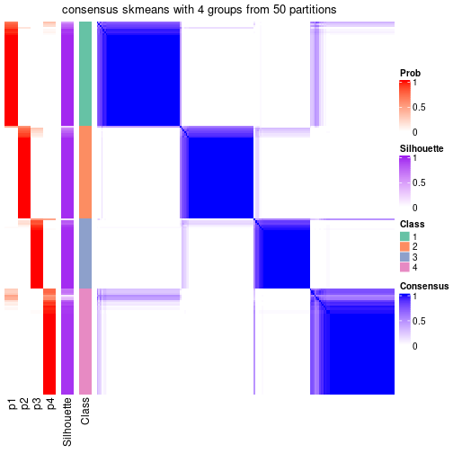</p>

</div>
</div>

Heatmaps for the membership of samples in all partitions to see how consistent they are:


<script>
$( function() {
	$( '#tabs-node-021-membership-heatmap' ).tabs();
} );
</script>
<div id='tabs-node-021-membership-heatmap'>
<ul>
<li><a href='#tab-node-021-membership-heatmap-1'>k = 2</a></li>
<li><a href='#tab-node-021-membership-heatmap-2'>k = 3</a></li>
<li><a href='#tab-node-021-membership-heatmap-3'>k = 4</a></li>
</ul>
<div id='tab-node-021-membership-heatmap-1'>
<pre><code class="r">membership_heatmap(res, k = 2)
</code></pre>

<p></p>

</div>
<div id='tab-node-021-membership-heatmap-2'>
<pre><code class="r">membership_heatmap(res, k = 3)
</code></pre>

<p></p>

</div>
<div id='tab-node-021-membership-heatmap-3'>
<pre><code class="r">membership_heatmap(res, k = 4)
</code></pre>

<p></p>

</div>
</div>

As soon as the classes for columns are determined, the signatures
that are significantly different between subgroups can be looked for. 
Following are the heatmaps for signatures.


Signature heatmaps where rows are scaled:


<script>
$( function() {
	$( '#tabs-node-021-get-signatures' ).tabs();
} );
</script>
<div id='tabs-node-021-get-signatures'>
<ul>
<li><a href='#tab-node-021-get-signatures-1'>k = 2</a></li>
<li><a href='#tab-node-021-get-signatures-2'>k = 3</a></li>
<li><a href='#tab-node-021-get-signatures-3'>k = 4</a></li>
</ul>
<div id='tab-node-021-get-signatures-1'>
<pre><code class="r">get_signatures(res, k = 2)
</code></pre>

<p></p>

</div>
<div id='tab-node-021-get-signatures-2'>
<pre><code class="r">get_signatures(res, k = 3)
</code></pre>

<p></p>

</div>
<div id='tab-node-021-get-signatures-3'>
<pre><code class="r">get_signatures(res, k = 4)
</code></pre>

<p></p>

</div>
</div>


Signature heatmaps where rows are not scaled:


<script>
$( function() {
	$( '#tabs-node-021-get-signatures-no-scale' ).tabs();
} );
</script>
<div id='tabs-node-021-get-signatures-no-scale'>
<ul>
<li><a href='#tab-node-021-get-signatures-no-scale-1'>k = 2</a></li>
<li><a href='#tab-node-021-get-signatures-no-scale-2'>k = 3</a></li>
<li><a href='#tab-node-021-get-signatures-no-scale-3'>k = 4</a></li>
</ul>
<div id='tab-node-021-get-signatures-no-scale-1'>
<pre><code class="r">get_signatures(res, k = 2, scale_rows = FALSE)
</code></pre>

<p></p>

</div>
<div id='tab-node-021-get-signatures-no-scale-2'>
<pre><code class="r">get_signatures(res, k = 3, scale_rows = FALSE)
</code></pre>

<p></p>

</div>
<div id='tab-node-021-get-signatures-no-scale-3'>
<pre><code class="r">get_signatures(res, k = 4, scale_rows = FALSE)
</code></pre>

<p></p>

</div>
</div>


Compare the overlap of signatures from different k:

```r
compare_signatures(res)
```


`get_signature()` returns a data frame invisibly. To get the list of signatures, the function
call should be assigned to a variable explicitly. In following code, if `plot` argument is set
to `FALSE`, no heatmap is plotted while only the differential analysis is performed.

```r
# code only for demonstration
tb = get_signature(res, k = ..., plot = FALSE)
```

An example of the output of `tb` is:

```
#>   which_row         fdr    mean_1    mean_2 scaled_mean_1 scaled_mean_2 km
#> 1        38 0.042760348  8.373488  9.131774    -0.5533452     0.5164555  1
#> 2        40 0.018707592  7.106213  8.469186    -0.6173731     0.5762149  1
#> 3        55 0.019134737 10.221463 11.207825    -0.6159697     0.5749050  1
#> 4        59 0.006059896  5.921854  7.869574    -0.6899429     0.6439467  1
#> 5        60 0.018055526  8.928898 10.211722    -0.6204761     0.5791110  1
#> 6        98 0.009384629 15.714769 14.887706     0.6635654    -0.6193277  2
...
```

The columns in `tb` are:

1. `which_row`: row indices corresponding to the input matrix.
2. `fdr`: FDR for the differential test. 
3. `mean_x`: The mean value in group x.
4. `scaled_mean_x`: The mean value in group x after rows are scaled.
5. `km`: Row groups if k-means clustering is applied to rows (which is done by automatically selecting number of clusters).

If there are too many signatures, `top_signatures = ...` can be set to only show the 
signatures with the highest FDRs:

```r
# code only for demonstration
# e.g. to show the top 500 most significant rows
tb = get_signature(res, k = ..., top_signatures = 500)
```

If the signatures are defined as these which are uniquely high in current group, `diff_method` argument
can be set to `"uniquely_high_in_one_group"`:

```r
# code only for demonstration
tb = get_signature(res, k = ..., diff_method = "uniquely_high_in_one_group")
```


UMAP plot which shows how samples are separated.


<script>
$( function() {
	$( '#tabs-node-021-dimension-reduction' ).tabs();
} );
</script>
<div id='tabs-node-021-dimension-reduction'>
<ul>
<li><a href='#tab-node-021-dimension-reduction-1'>k = 2</a></li>
<li><a href='#tab-node-021-dimension-reduction-2'>k = 3</a></li>
<li><a href='#tab-node-021-dimension-reduction-3'>k = 4</a></li>
</ul>
<div id='tab-node-021-dimension-reduction-1'>
<pre><code class="r">dimension_reduction(res, k = 2, method = &quot;UMAP&quot;)
</code></pre>

<p></p>

</div>
<div id='tab-node-021-dimension-reduction-2'>
<pre><code class="r">dimension_reduction(res, k = 3, method = &quot;UMAP&quot;)
</code></pre>

<p></p>

</div>
<div id='tab-node-021-dimension-reduction-3'>
<pre><code class="r">dimension_reduction(res, k = 4, method = &quot;UMAP&quot;)
</code></pre>

<p></p>

</div>
</div>


Following heatmap shows how subgroups are split when increasing `k`:

```r
collect_classes(res)
```


If matrix rows can be associated to genes, consider to use `functional_enrichment(res,
...)` to perform function enrichment for the signature genes. See [this vignette](https://jokergoo.github.io/cola_vignettes/functional_enrichment.html) for more detailed explanations.


 

---------------------------------------------------


### Node0211


Parent node: [Node021](#Node021).
Child nodes: 
                Node01111-leaf
        ,
                Node01112-leaf
        ,
                Node01113-leaf
        ,
                Node01121-leaf
        ,
                Node01122-leaf
        ,
                Node01211-leaf
        ,
                Node01212-leaf
        ,
                Node01213-leaf
        ,
                Node01221-leaf
        ,
                Node01222-leaf
        ,
                Node01223-leaf
        ,
                Node01311-leaf
        ,
                Node01312-leaf
        ,
                Node02111-leaf
        ,
                Node02112-leaf
        ,
                Node02121-leaf
        ,
                Node02122-leaf
        .


The object with results only for a single top-value method and a single partitioning method 
can be extracted as:

```r
res = res_rh["0211"]
```

A summary of `res` and all the functions that can be applied to it:

```r
res
```

```
#> A 'ConsensusPartition' object with k = 2, 3, 4.
#>   On a matrix with 15416 rows and 102 columns.
#>   Top rows (1542) are extracted by 'ATC' method.
#>   Subgroups are detected by 'skmeans' method.
#>   Performed in total 150 partitions by row resampling.
#>   Best k for subgroups seems to be 3.
#> 
#> Following methods can be applied to this 'ConsensusPartition' object:
#>  [1] "cola_report"             "collect_classes"         "collect_plots"          
#>  [4] "collect_stats"           "colnames"                "compare_partitions"     
#>  [7] "compare_signatures"      "consensus_heatmap"       "dimension_reduction"    
#> [10] "functional_enrichment"   "get_anno_col"            "get_anno"               
#> [13] "get_classes"             "get_consensus"           "get_matrix"             
#> [16] "get_membership"          "get_param"               "get_signatures"         
#> [19] "get_stats"               "is_best_k"               "is_stable_k"            
#> [22] "membership_heatmap"      "ncol"                    "nrow"                   
#> [25] "plot_ecdf"               "predict_classes"         "rownames"               
#> [28] "select_partition_number" "show"                    "suggest_best_k"         
#> [31] "test_to_known_factors"   "top_rows_heatmap"
```

`collect_plots()` function collects all the plots made from `res` for all `k` (number of subgroups)
into one single page to provide an easy and fast comparison between different `k`.

```r
collect_plots(res)
```


The plots are:

- The first row: a plot of the eCDF (empirical cumulative distribution
  function) curves of the consensus matrix for each `k` and the heatmap of
  predicted classes for each `k`.
- The second row: heatmaps of the consensus matrix for each `k`.
- The third row: heatmaps of the membership matrix for each `k`.
- The fouth row: heatmaps of the signatures for each `k`.

All the plots in panels can be made by individual functions and they are
plotted later in this section.

`select_partition_number()` produces several plots showing different
statistics for choosing "optimized" `k`. There are following statistics:

- eCDF curves of the consensus matrix for each `k`;
- 1-PAC. [The PAC score](https://en.wikipedia.org/wiki/Consensus_clustering#Over-interpretation_potential_of_consensus_clustering)
  measures the proportion of the ambiguous subgrouping.
- Mean silhouette score.
- Concordance. The mean probability of fiting the consensus subgroup labels in all
  partitions.
- Area increased. Denote $A_k$ as the area under the eCDF curve for current
  `k`, the area increased is defined as $A_k - A_{k-1}$.
- Rand index. The percent of pairs of samples that are both in a same cluster
  or both are not in a same cluster in the partition of k and k-1.
- Jaccard index. The ratio of pairs of samples are both in a same cluster in
  the partition of k and k-1 and the pairs of samples are both in a same
  cluster in the partition k or k-1.

The detailed explanations of these statistics can be found in [the _cola_
vignette](https://jokergoo.github.io/cola_vignettes/cola.html#toc_13).

Generally speaking, higher 1-PAC score, higher mean silhouette score or higher
concordance corresponds to better partition. Rand index and Jaccard index
measure how similar the current partition is compared to partition with `k-1`.
If they are too similar, we won't accept `k` is better than `k-1`.

```r
select_partition_number(res)
```


The numeric values for all these statistics can be obtained by `get_stats()`.

```r
get_stats(res)
```

```
#>   k 1-PAC mean_silhouette concordance area_increased  Rand Jaccard
#> 2 2 1.000           0.983       0.993         0.4918 0.507   0.507
#> 3 3 0.922           0.934       0.970         0.3018 0.814   0.646
#> 4 4 0.782           0.775       0.905         0.0613 0.908   0.763
```

`suggest_best_k()` suggests the best $k$ based on these statistics. The rules are as follows:

- All $k$ with Jaccard index larger than 0.95 are removed because increasing
  $k$ does not provide enough extra information. If all $k$ are removed, it is
  marked as no subgroup is detected.
- For all $k$ with 1-PAC score larger than 0.9, the maximal $k$ is taken as
  the best $k$, and other $k$ are marked as optional $k$.
- If it does not fit the second rule. The $k$ with the maximal vote of the
  highest 1-PAC score, highest mean silhouette, and highest concordance is
  taken as the best $k$.

```r
suggest_best_k(res)
```

```
#> [1] 3
#> attr(,"optional")
#> [1] 2
```

There is also optional best $k$ = 2 that is worth to check.

Following is the table of the partitions (You need to click the **show/hide
code output** link to see it). The membership matrix (columns with name `p*`)
is inferred by
[`clue::cl_consensus()`](https://www.rdocumentation.org/link/cl_consensus?package=clue)
function with the `SE` method. Basically the value in the membership matrix
represents the probability to belong to a certain group. The finall subgroup
label for an item is determined with the group with highest probability it
belongs to.

In `get_classes()` function, the entropy is calculated from the membership
matrix and the silhouette score is calculated from the consensus matrix.


<script>
$( function() {
	$( '#tabs-node-0211-get-classes' ).tabs();
} );
</script>
<div id='tabs-node-0211-get-classes'>
<ul>
<li><a href='#tab-node-0211-get-classes-1'>k = 2</a></li>
<li><a href='#tab-node-0211-get-classes-2'>k = 3</a></li>
<li><a href='#tab-node-0211-get-classes-3'>k = 4</a></li>
</ul>

<div id='tab-node-0211-get-classes-1'>
<p><a id='tab-node-0211-get-classes-1-a' style='color:#0366d6' href='#'>show/hide code output</a></p>
<pre><code class="r">cbind(get_classes(res, k = 2), get_membership(res, k = 2))
</code></pre>

<pre><code>#&gt;            class entropy silhouette   p1   p2
#&gt; HSPC_019       2   0.141      0.977 0.02 0.98
#&gt; HSPC_032       1   0.000      0.987 1.00 0.00
#&gt; HSPC_039       2   0.000      0.996 0.00 1.00
#&gt; HSPC_029       2   0.000      0.996 0.00 1.00
#&gt; LT-HSC_005     2   0.000      0.996 0.00 1.00
#&gt; HSPC_005       2   0.000      0.996 0.00 1.00
#&gt; Prog_034       2   0.000      0.996 0.00 1.00
#&gt; HSPC_059       2   0.000      0.996 0.00 1.00
#&gt; LT-HSC_019     2   0.000      0.996 0.00 1.00
#&gt; HSPC_116       1   0.000      0.987 1.00 0.00
#&gt; HSPC_086       2   0.000      0.996 0.00 1.00
#&gt; HSPC_093       2   0.000      0.996 0.00 1.00
#&gt; HSPC_112       1   0.000      0.987 1.00 0.00
#&gt; HSPC_124       1   0.000      0.987 1.00 0.00
#&gt; Prog_104       1   0.000      0.987 1.00 0.00
#&gt; HSPC_129       1   0.000      0.987 1.00 0.00
#&gt; HSPC_160       2   0.000      0.996 0.00 1.00
#&gt; HSPC_137       1   0.000      0.987 1.00 0.00
#&gt; HSPC_150       1   0.000      0.987 1.00 0.00
#&gt; Prog_147       2   0.000      0.996 0.00 1.00
#&gt; Prog_138       1   0.000      0.987 1.00 0.00
#&gt; HSPC_188       1   0.722      0.750 0.80 0.20
#&gt; HSPC_194       2   0.327      0.935 0.06 0.94
#&gt; HSPC_201       2   0.000      0.996 0.00 1.00
#&gt; HSPC_197       2   0.000      0.996 0.00 1.00
#&gt; HSPC_209       2   0.000      0.996 0.00 1.00
#&gt; LT-HSC_053     2   0.000      0.996 0.00 1.00
#&gt; Prog_181       2   0.000      0.996 0.00 1.00
#&gt; Prog_169       2   0.000      0.996 0.00 1.00
#&gt; Prog_198       2   0.000      0.996 0.00 1.00
#&gt; HSPC_241       2   0.000      0.996 0.00 1.00
#&gt; HSPC_226       2   0.000      0.996 0.00 1.00
#&gt; HSPC_234       2   0.000      0.996 0.00 1.00
#&gt; HSPC_260       2   0.000      0.996 0.00 1.00
#&gt; HSPC_272       2   0.000      0.996 0.00 1.00
#&gt; HSPC_284       2   0.000      0.996 0.00 1.00
#&gt; HSPC_273       2   0.000      0.996 0.00 1.00
#&gt; LT-HSC_079     2   0.000      0.996 0.00 1.00
#&gt; HSPC_357       1   0.000      0.987 1.00 0.00
#&gt; HSPC_369       1   0.000      0.987 1.00 0.00
#&gt; HSPC_375       1   0.000      0.987 1.00 0.00
#&gt; HSPC_347       2   0.000      0.996 0.00 1.00
#&gt; Prog_344       2   0.000      0.996 0.00 1.00
#&gt; HSPC_385       1   0.000      0.987 1.00 0.00
#&gt; HSPC_397       1   0.000      0.987 1.00 0.00
#&gt; HSPC_381       2   0.000      0.996 0.00 1.00
#&gt; HSPC_394       1   0.000      0.987 1.00 0.00
#&gt; HSPC_401       1   0.000      0.987 1.00 0.00
#&gt; HSPC_414       2   0.000      0.996 0.00 1.00
#&gt; HSPC_384       2   0.000      0.996 0.00 1.00
#&gt; Prog_400       1   0.000      0.987 1.00 0.00
#&gt; HSPC_452       1   0.000      0.987 1.00 0.00
#&gt; HSPC_458       2   0.000      0.996 0.00 1.00
#&gt; HSPC_464       2   0.000      0.996 0.00 1.00
#&gt; HSPC_429       1   0.000      0.987 1.00 0.00
#&gt; HSPC_437       2   0.000      0.996 0.00 1.00
#&gt; Prog_442       2   0.000      0.996 0.00 1.00
#&gt; LT-HSC_118     2   0.000      0.996 0.00 1.00
#&gt; HSPC_476       1   0.000      0.987 1.00 0.00
#&gt; HSPC_484       2   0.000      0.996 0.00 1.00
#&gt; LT-HSC_129     2   0.000      0.996 0.00 1.00
#&gt; HSPC_529       1   0.000      0.987 1.00 0.00
#&gt; HSPC_536       1   0.000      0.987 1.00 0.00
#&gt; HSPC_542       1   0.000      0.987 1.00 0.00
#&gt; HSPC_519       2   0.000      0.996 0.00 1.00
#&gt; LT-HSC_141     1   0.000      0.987 1.00 0.00
#&gt; HSPC_583       1   0.000      0.987 1.00 0.00
#&gt; HSPC_561       1   0.925      0.490 0.66 0.34
#&gt; HSPC_581       2   0.000      0.996 0.00 1.00
#&gt; HSPC_587       2   0.000      0.996 0.00 1.00
#&gt; HSPC_564       2   0.000      0.996 0.00 1.00
#&gt; HSPC_570       2   0.000      0.996 0.00 1.00
#&gt; HSPC_558       2   0.000      0.996 0.00 1.00
#&gt; LT-HSC_154     2   0.000      0.996 0.00 1.00
#&gt; LT-HSC_155     1   0.000      0.987 1.00 0.00
#&gt; HSPC_619       2   0.000      0.996 0.00 1.00
#&gt; HSPC_632       2   0.000      0.996 0.00 1.00
#&gt; HSPC_621       1   0.000      0.987 1.00 0.00
#&gt; HSPC_616       1   0.000      0.987 1.00 0.00
#&gt; HSPC_622       1   0.000      0.987 1.00 0.00
#&gt; HSPC_611       2   0.000      0.996 0.00 1.00
#&gt; Prog_601       2   0.000      0.996 0.00 1.00
#&gt; HSPC_650       2   0.000      0.996 0.00 1.00
#&gt; HSPC_653       1   0.000      0.987 1.00 0.00
#&gt; HSPC_659       2   0.000      0.996 0.00 1.00
#&gt; HSPC_642       2   0.000      0.996 0.00 1.00
#&gt; LT-HSC_175     1   0.000      0.987 1.00 0.00
#&gt; LT-HSC_178     2   0.000      0.996 0.00 1.00
#&gt; HSPC_686       2   0.000      0.996 0.00 1.00
#&gt; HSPC_710       1   0.000      0.987 1.00 0.00
#&gt; HSPC_711       1   0.000      0.987 1.00 0.00
#&gt; HSPC_688       1   0.000      0.987 1.00 0.00
#&gt; HSPC_694       1   0.000      0.987 1.00 0.00
#&gt; HSPC_712       1   0.000      0.987 1.00 0.00
#&gt; HSPC_718       1   0.000      0.987 1.00 0.00
#&gt; LT-HSC_186     1   0.000      0.987 1.00 0.00
#&gt; LT-HSC_189     1   0.000      0.987 1.00 0.00
#&gt; HSPC_741       2   0.529      0.862 0.12 0.88
#&gt; LT-HSC_196     1   0.000      0.987 1.00 0.00
#&gt; LT-HSC_199     2   0.000      0.996 0.00 1.00
#&gt; LT-HSC_209     2   0.000      0.996 0.00 1.00
#&gt; HSPC_850       1   0.000      0.987 1.00 0.00
</code></pre>

<script>
$('#tab-node-0211-get-classes-1-a').parent().next().next().hide();
$('#tab-node-0211-get-classes-1-a').click(function(){
  $('#tab-node-0211-get-classes-1-a').parent().next().next().toggle();
  return(false);
});
</script>
</div>

<div id='tab-node-0211-get-classes-2'>
<p><a id='tab-node-0211-get-classes-2-a' style='color:#0366d6' href='#'>show/hide code output</a></p>
<pre><code class="r">cbind(get_classes(res, k = 3), get_membership(res, k = 3))
</code></pre>

<pre><code>#&gt;            class entropy silhouette   p1   p2   p3
#&gt; HSPC_019       2  0.6302    0.00981 0.00 0.52 0.48
#&gt; HSPC_032       1  0.0000    0.99370 1.00 0.00 0.00
#&gt; HSPC_039       2  0.0000    0.96247 0.00 1.00 0.00
#&gt; HSPC_029       2  0.0000    0.96247 0.00 1.00 0.00
#&gt; LT-HSC_005     2  0.0000    0.96247 0.00 1.00 0.00
#&gt; HSPC_005       2  0.0000    0.96247 0.00 1.00 0.00
#&gt; Prog_034       3  0.2066    0.90043 0.00 0.06 0.94
#&gt; HSPC_059       3  0.1529    0.91015 0.00 0.04 0.96
#&gt; LT-HSC_019     3  0.0000    0.92086 0.00 0.00 1.00
#&gt; HSPC_116       1  0.0000    0.99370 1.00 0.00 0.00
#&gt; HSPC_086       2  0.0000    0.96247 0.00 1.00 0.00
#&gt; HSPC_093       2  0.5016    0.67452 0.00 0.76 0.24
#&gt; HSPC_112       1  0.0000    0.99370 1.00 0.00 0.00
#&gt; HSPC_124       1  0.0000    0.99370 1.00 0.00 0.00
#&gt; Prog_104       1  0.0000    0.99370 1.00 0.00 0.00
#&gt; HSPC_129       1  0.0000    0.99370 1.00 0.00 0.00
#&gt; HSPC_160       3  0.4796    0.75437 0.00 0.22 0.78
#&gt; HSPC_137       1  0.0000    0.99370 1.00 0.00 0.00
#&gt; HSPC_150       1  0.0000    0.99370 1.00 0.00 0.00
#&gt; Prog_147       2  0.0000    0.96247 0.00 1.00 0.00
#&gt; Prog_138       1  0.0000    0.99370 1.00 0.00 0.00
#&gt; HSPC_188       2  0.2959    0.85031 0.10 0.90 0.00
#&gt; HSPC_194       3  0.0000    0.92086 0.00 0.00 1.00
#&gt; HSPC_201       2  0.2537    0.89461 0.00 0.92 0.08
#&gt; HSPC_197       3  0.0000    0.92086 0.00 0.00 1.00
#&gt; HSPC_209       3  0.0000    0.92086 0.00 0.00 1.00
#&gt; LT-HSC_053     2  0.0000    0.96247 0.00 1.00 0.00
#&gt; Prog_181       3  0.0000    0.92086 0.00 0.00 1.00
#&gt; Prog_169       2  0.0000    0.96247 0.00 1.00 0.00
#&gt; Prog_198       2  0.0000    0.96247 0.00 1.00 0.00
#&gt; HSPC_241       3  0.0000    0.92086 0.00 0.00 1.00
#&gt; HSPC_226       3  0.1529    0.90987 0.00 0.04 0.96
#&gt; HSPC_234       2  0.0000    0.96247 0.00 1.00 0.00
#&gt; HSPC_260       3  0.2537    0.88974 0.00 0.08 0.92
#&gt; HSPC_272       2  0.0000    0.96247 0.00 1.00 0.00
#&gt; HSPC_284       3  0.0000    0.92086 0.00 0.00 1.00
#&gt; HSPC_273       2  0.4291    0.76894 0.00 0.82 0.18
#&gt; LT-HSC_079     3  0.5560    0.62775 0.00 0.30 0.70
#&gt; HSPC_357       1  0.0000    0.99370 1.00 0.00 0.00
#&gt; HSPC_369       1  0.0000    0.99370 1.00 0.00 0.00
#&gt; HSPC_375       1  0.0000    0.99370 1.00 0.00 0.00
#&gt; HSPC_347       2  0.0000    0.96247 0.00 1.00 0.00
#&gt; Prog_344       2  0.0000    0.96247 0.00 1.00 0.00
#&gt; HSPC_385       1  0.4555    0.74570 0.80 0.00 0.20
#&gt; HSPC_397       1  0.0000    0.99370 1.00 0.00 0.00
#&gt; HSPC_381       2  0.0000    0.96247 0.00 1.00 0.00
#&gt; HSPC_394       1  0.0000    0.99370 1.00 0.00 0.00
#&gt; HSPC_401       1  0.0000    0.99370 1.00 0.00 0.00
#&gt; HSPC_414       3  0.4796    0.75799 0.00 0.22 0.78
#&gt; HSPC_384       2  0.0000    0.96247 0.00 1.00 0.00
#&gt; Prog_400       1  0.0000    0.99370 1.00 0.00 0.00
#&gt; HSPC_452       1  0.0000    0.99370 1.00 0.00 0.00
#&gt; HSPC_458       2  0.0000    0.96247 0.00 1.00 0.00
#&gt; HSPC_464       2  0.0000    0.96247 0.00 1.00 0.00
#&gt; HSPC_429       1  0.0000    0.99370 1.00 0.00 0.00
#&gt; HSPC_437       3  0.0000    0.92086 0.00 0.00 1.00
#&gt; Prog_442       2  0.0000    0.96247 0.00 1.00 0.00
#&gt; LT-HSC_118     2  0.0000    0.96247 0.00 1.00 0.00
#&gt; HSPC_476       1  0.1529    0.95455 0.96 0.00 0.04
#&gt; HSPC_484       3  0.0000    0.92086 0.00 0.00 1.00
#&gt; LT-HSC_129     2  0.0000    0.96247 0.00 1.00 0.00
#&gt; HSPC_529       1  0.0000    0.99370 1.00 0.00 0.00
#&gt; HSPC_536       1  0.0000    0.99370 1.00 0.00 0.00
#&gt; HSPC_542       1  0.0000    0.99370 1.00 0.00 0.00
#&gt; HSPC_519       2  0.0000    0.96247 0.00 1.00 0.00
#&gt; LT-HSC_141     1  0.0000    0.99370 1.00 0.00 0.00
#&gt; HSPC_583       1  0.0000    0.99370 1.00 0.00 0.00
#&gt; HSPC_561       2  0.1529    0.92262 0.04 0.96 0.00
#&gt; HSPC_581       2  0.0000    0.96247 0.00 1.00 0.00
#&gt; HSPC_587       2  0.0000    0.96247 0.00 1.00 0.00
#&gt; HSPC_564       2  0.0000    0.96247 0.00 1.00 0.00
#&gt; HSPC_570       2  0.0000    0.96247 0.00 1.00 0.00
#&gt; HSPC_558       2  0.0000    0.96247 0.00 1.00 0.00
#&gt; LT-HSC_154     2  0.0000    0.96247 0.00 1.00 0.00
#&gt; LT-HSC_155     1  0.0000    0.99370 1.00 0.00 0.00
#&gt; HSPC_619       2  0.0000    0.96247 0.00 1.00 0.00
#&gt; HSPC_632       2  0.0000    0.96247 0.00 1.00 0.00
#&gt; HSPC_621       1  0.0000    0.99370 1.00 0.00 0.00
#&gt; HSPC_616       1  0.0000    0.99370 1.00 0.00 0.00
#&gt; HSPC_622       1  0.0000    0.99370 1.00 0.00 0.00
#&gt; HSPC_611       2  0.0000    0.96247 0.00 1.00 0.00
#&gt; Prog_601       2  0.0892    0.94656 0.00 0.98 0.02
#&gt; HSPC_650       2  0.0000    0.96247 0.00 1.00 0.00
#&gt; HSPC_653       1  0.0000    0.99370 1.00 0.00 0.00
#&gt; HSPC_659       2  0.0000    0.96247 0.00 1.00 0.00
#&gt; HSPC_642       2  0.0000    0.96247 0.00 1.00 0.00
#&gt; LT-HSC_175     1  0.0000    0.99370 1.00 0.00 0.00
#&gt; LT-HSC_178     2  0.0000    0.96247 0.00 1.00 0.00
#&gt; HSPC_686       3  0.0000    0.92086 0.00 0.00 1.00
#&gt; HSPC_710       1  0.0000    0.99370 1.00 0.00 0.00
#&gt; HSPC_711       1  0.0000    0.99370 1.00 0.00 0.00
#&gt; HSPC_688       1  0.0000    0.99370 1.00 0.00 0.00
#&gt; HSPC_694       1  0.0000    0.99370 1.00 0.00 0.00
#&gt; HSPC_712       1  0.0000    0.99370 1.00 0.00 0.00
#&gt; HSPC_718       1  0.0000    0.99370 1.00 0.00 0.00
#&gt; LT-HSC_186     1  0.0000    0.99370 1.00 0.00 0.00
#&gt; LT-HSC_189     3  0.3686    0.80075 0.14 0.00 0.86
#&gt; HSPC_741       2  0.5334    0.78557 0.06 0.82 0.12
#&gt; LT-HSC_196     1  0.0000    0.99370 1.00 0.00 0.00
#&gt; LT-HSC_199     3  0.5397    0.66375 0.00 0.28 0.72
#&gt; LT-HSC_209     2  0.3340    0.84762 0.00 0.88 0.12
#&gt; HSPC_850       1  0.0000    0.99370 1.00 0.00 0.00
</code></pre>

<script>
$('#tab-node-0211-get-classes-2-a').parent().next().next().hide();
$('#tab-node-0211-get-classes-2-a').click(function(){
  $('#tab-node-0211-get-classes-2-a').parent().next().next().toggle();
  return(false);
});
</script>
</div>

<div id='tab-node-0211-get-classes-3'>
<p><a id='tab-node-0211-get-classes-3-a' style='color:#0366d6' href='#'>show/hide code output</a></p>
<pre><code class="r">cbind(get_classes(res, k = 4), get_membership(res, k = 4))
</code></pre>

<pre><code>#&gt;            class entropy silhouette   p1   p2   p3   p4
#&gt; HSPC_019       4  0.7473     0.4807 0.02 0.22 0.18 0.58
#&gt; HSPC_032       1  0.0000     0.9630 1.00 0.00 0.00 0.00
#&gt; HSPC_039       2  0.0000     0.8825 0.00 1.00 0.00 0.00
#&gt; HSPC_029       2  0.0707     0.8715 0.00 0.98 0.00 0.02
#&gt; LT-HSC_005     2  0.0000     0.8825 0.00 1.00 0.00 0.00
#&gt; HSPC_005       2  0.0000     0.8825 0.00 1.00 0.00 0.00
#&gt; Prog_034       3  0.6477     0.4094 0.00 0.30 0.60 0.10
#&gt; HSPC_059       3  0.4713     0.4529 0.00 0.36 0.64 0.00
#&gt; LT-HSC_019     3  0.0707     0.7021 0.00 0.02 0.98 0.00
#&gt; HSPC_116       1  0.0000     0.9630 1.00 0.00 0.00 0.00
#&gt; HSPC_086       2  0.0707     0.8703 0.00 0.98 0.00 0.02
#&gt; HSPC_093       4  0.6286     0.5820 0.00 0.20 0.14 0.66
#&gt; HSPC_112       1  0.0000     0.9630 1.00 0.00 0.00 0.00
#&gt; HSPC_124       1  0.0000     0.9630 1.00 0.00 0.00 0.00
#&gt; Prog_104       1  0.0000     0.9630 1.00 0.00 0.00 0.00
#&gt; HSPC_129       1  0.0000     0.9630 1.00 0.00 0.00 0.00
#&gt; HSPC_160       3  0.4994     0.1109 0.00 0.48 0.52 0.00
#&gt; HSPC_137       1  0.0000     0.9630 1.00 0.00 0.00 0.00
#&gt; HSPC_150       1  0.0000     0.9630 1.00 0.00 0.00 0.00
#&gt; Prog_147       2  0.0000     0.8825 0.00 1.00 0.00 0.00
#&gt; Prog_138       1  0.0000     0.9630 1.00 0.00 0.00 0.00
#&gt; HSPC_188       4  0.2706     0.6824 0.02 0.08 0.00 0.90
#&gt; HSPC_194       3  0.4079     0.5757 0.02 0.00 0.80 0.18
#&gt; HSPC_201       2  0.6366     0.4242 0.00 0.64 0.12 0.24
#&gt; HSPC_197       3  0.0707     0.6930 0.00 0.00 0.98 0.02
#&gt; HSPC_209       3  0.3525     0.6883 0.00 0.10 0.86 0.04
#&gt; LT-HSC_053     2  0.1637     0.8488 0.00 0.94 0.06 0.00
#&gt; Prog_181       3  0.3172     0.6508 0.00 0.16 0.84 0.00
#&gt; Prog_169       2  0.1211     0.8625 0.00 0.96 0.04 0.00
#&gt; Prog_198       2  0.2830     0.8209 0.00 0.90 0.04 0.06
#&gt; HSPC_241       3  0.1637     0.6756 0.00 0.00 0.94 0.06
#&gt; HSPC_226       3  0.4790     0.4263 0.00 0.38 0.62 0.00
#&gt; HSPC_234       2  0.3975     0.5926 0.00 0.76 0.00 0.24
#&gt; HSPC_260       2  0.4994    -0.0409 0.00 0.52 0.48 0.00
#&gt; HSPC_272       2  0.2335     0.8377 0.00 0.92 0.06 0.02
#&gt; HSPC_284       3  0.3037     0.6924 0.00 0.10 0.88 0.02
#&gt; HSPC_273       2  0.6554    -0.0332 0.00 0.52 0.08 0.40
#&gt; LT-HSC_079     2  0.4713     0.3759 0.00 0.64 0.36 0.00
#&gt; HSPC_357       1  0.0707     0.9491 0.98 0.00 0.00 0.02
#&gt; HSPC_369       4  0.4277     0.4471 0.28 0.00 0.00 0.72
#&gt; HSPC_375       1  0.0000     0.9630 1.00 0.00 0.00 0.00
#&gt; HSPC_347       2  0.0707     0.8731 0.00 0.98 0.02 0.00
#&gt; Prog_344       2  0.0000     0.8825 0.00 1.00 0.00 0.00
#&gt; HSPC_385       1  0.6797     0.3929 0.60 0.00 0.24 0.16
#&gt; HSPC_397       1  0.0000     0.9630 1.00 0.00 0.00 0.00
#&gt; HSPC_381       2  0.0000     0.8825 0.00 1.00 0.00 0.00
#&gt; HSPC_394       1  0.0000     0.9630 1.00 0.00 0.00 0.00
#&gt; HSPC_401       1  0.0000     0.9630 1.00 0.00 0.00 0.00
#&gt; HSPC_414       2  0.4977     0.0299 0.00 0.54 0.46 0.00
#&gt; HSPC_384       2  0.0000     0.8825 0.00 1.00 0.00 0.00
#&gt; Prog_400       1  0.0000     0.9630 1.00 0.00 0.00 0.00
#&gt; HSPC_452       1  0.3975     0.6927 0.76 0.00 0.00 0.24
#&gt; HSPC_458       4  0.4790     0.4811 0.00 0.38 0.00 0.62
#&gt; HSPC_464       2  0.4790     0.2549 0.00 0.62 0.00 0.38
#&gt; HSPC_429       1  0.0000     0.9630 1.00 0.00 0.00 0.00
#&gt; HSPC_437       3  0.0000     0.6964 0.00 0.00 1.00 0.00
#&gt; Prog_442       2  0.0000     0.8825 0.00 1.00 0.00 0.00
#&gt; LT-HSC_118     2  0.1211     0.8635 0.00 0.96 0.04 0.00
#&gt; HSPC_476       1  0.4610     0.7606 0.80 0.00 0.10 0.10
#&gt; HSPC_484       3  0.0707     0.6935 0.00 0.00 0.98 0.02
#&gt; LT-HSC_129     2  0.0000     0.8825 0.00 1.00 0.00 0.00
#&gt; HSPC_529       1  0.0000     0.9630 1.00 0.00 0.00 0.00
#&gt; HSPC_536       1  0.0000     0.9630 1.00 0.00 0.00 0.00
#&gt; HSPC_542       1  0.0000     0.9630 1.00 0.00 0.00 0.00
#&gt; HSPC_519       2  0.0000     0.8825 0.00 1.00 0.00 0.00
#&gt; LT-HSC_141     1  0.0707     0.9491 0.98 0.00 0.00 0.02
#&gt; HSPC_583       1  0.0000     0.9630 1.00 0.00 0.00 0.00
#&gt; HSPC_561       4  0.1637     0.6674 0.00 0.06 0.00 0.94
#&gt; HSPC_581       2  0.0000     0.8825 0.00 1.00 0.00 0.00
#&gt; HSPC_587       2  0.0000     0.8825 0.00 1.00 0.00 0.00
#&gt; HSPC_564       2  0.0000     0.8825 0.00 1.00 0.00 0.00
#&gt; HSPC_570       2  0.1211     0.8538 0.00 0.96 0.00 0.04
#&gt; HSPC_558       2  0.0000     0.8825 0.00 1.00 0.00 0.00
#&gt; LT-HSC_154     2  0.0000     0.8825 0.00 1.00 0.00 0.00
#&gt; LT-HSC_155     1  0.0000     0.9630 1.00 0.00 0.00 0.00
#&gt; HSPC_619       2  0.0000     0.8825 0.00 1.00 0.00 0.00
#&gt; HSPC_632       2  0.0000     0.8825 0.00 1.00 0.00 0.00
#&gt; HSPC_621       1  0.0707     0.9491 0.98 0.00 0.00 0.02
#&gt; HSPC_616       1  0.2921     0.8331 0.86 0.00 0.00 0.14
#&gt; HSPC_622       1  0.0000     0.9630 1.00 0.00 0.00 0.00
#&gt; HSPC_611       2  0.0000     0.8825 0.00 1.00 0.00 0.00
#&gt; Prog_601       2  0.1637     0.8488 0.00 0.94 0.06 0.00
#&gt; HSPC_650       2  0.0000     0.8825 0.00 1.00 0.00 0.00
#&gt; HSPC_653       1  0.0000     0.9630 1.00 0.00 0.00 0.00
#&gt; HSPC_659       2  0.0000     0.8825 0.00 1.00 0.00 0.00
#&gt; HSPC_642       2  0.0000     0.8825 0.00 1.00 0.00 0.00
#&gt; LT-HSC_175     1  0.0000     0.9630 1.00 0.00 0.00 0.00
#&gt; LT-HSC_178     2  0.0000     0.8825 0.00 1.00 0.00 0.00
#&gt; HSPC_686       3  0.1211     0.6880 0.00 0.00 0.96 0.04
#&gt; HSPC_710       1  0.0000     0.9630 1.00 0.00 0.00 0.00
#&gt; HSPC_711       1  0.0000     0.9630 1.00 0.00 0.00 0.00
#&gt; HSPC_688       1  0.0000     0.9630 1.00 0.00 0.00 0.00
#&gt; HSPC_694       1  0.0707     0.9485 0.98 0.00 0.00 0.02
#&gt; HSPC_712       1  0.0000     0.9630 1.00 0.00 0.00 0.00
#&gt; HSPC_718       1  0.0000     0.9630 1.00 0.00 0.00 0.00
#&gt; LT-HSC_186     1  0.0000     0.9630 1.00 0.00 0.00 0.00
#&gt; LT-HSC_189     3  0.5661     0.3564 0.22 0.00 0.70 0.08
#&gt; HSPC_741       4  0.4841     0.6522 0.00 0.14 0.08 0.78
#&gt; LT-HSC_196     1  0.5594     0.6462 0.72 0.00 0.10 0.18
#&gt; LT-HSC_199     2  0.4907     0.2087 0.00 0.58 0.42 0.00
#&gt; LT-HSC_209     2  0.3172     0.7517 0.00 0.84 0.16 0.00
#&gt; HSPC_850       1  0.0707     0.9491 0.98 0.00 0.00 0.02
</code></pre>

<script>
$('#tab-node-0211-get-classes-3-a').parent().next().next().hide();
$('#tab-node-0211-get-classes-3-a').click(function(){
  $('#tab-node-0211-get-classes-3-a').parent().next().next().toggle();
  return(false);
});
</script>
</div>
</div>

Heatmaps for the consensus matrix. It visualizes the probability of two
samples to be in a same group.


<script>
$( function() {
	$( '#tabs-node-0211-consensus-heatmap' ).tabs();
} );
</script>
<div id='tabs-node-0211-consensus-heatmap'>
<ul>
<li><a href='#tab-node-0211-consensus-heatmap-1'>k = 2</a></li>
<li><a href='#tab-node-0211-consensus-heatmap-2'>k = 3</a></li>
<li><a href='#tab-node-0211-consensus-heatmap-3'>k = 4</a></li>
</ul>
<div id='tab-node-0211-consensus-heatmap-1'>
<pre><code class="r">consensus_heatmap(res, k = 2)
</code></pre>

<p></p>

</div>
<div id='tab-node-0211-consensus-heatmap-2'>
<pre><code class="r">consensus_heatmap(res, k = 3)
</code></pre>

<p></p>

</div>
<div id='tab-node-0211-consensus-heatmap-3'>
<pre><code class="r">consensus_heatmap(res, k = 4)
</code></pre>

<p></p>

</div>
</div>

Heatmaps for the membership of samples in all partitions to see how consistent they are:


<script>
$( function() {
	$( '#tabs-node-0211-membership-heatmap' ).tabs();
} );
</script>
<div id='tabs-node-0211-membership-heatmap'>
<ul>
<li><a href='#tab-node-0211-membership-heatmap-1'>k = 2</a></li>
<li><a href='#tab-node-0211-membership-heatmap-2'>k = 3</a></li>
<li><a href='#tab-node-0211-membership-heatmap-3'>k = 4</a></li>
</ul>
<div id='tab-node-0211-membership-heatmap-1'>
<pre><code class="r">membership_heatmap(res, k = 2)
</code></pre>

<p></p>

</div>
<div id='tab-node-0211-membership-heatmap-2'>
<pre><code class="r">membership_heatmap(res, k = 3)
</code></pre>

<p></p>

</div>
<div id='tab-node-0211-membership-heatmap-3'>
<pre><code class="r">membership_heatmap(res, k = 4)
</code></pre>

<p></p>

</div>
</div>

As soon as the classes for columns are determined, the signatures
that are significantly different between subgroups can be looked for. 
Following are the heatmaps for signatures.


Signature heatmaps where rows are scaled:


<script>
$( function() {
	$( '#tabs-node-0211-get-signatures' ).tabs();
} );
</script>
<div id='tabs-node-0211-get-signatures'>
<ul>
<li><a href='#tab-node-0211-get-signatures-1'>k = 2</a></li>
<li><a href='#tab-node-0211-get-signatures-2'>k = 3</a></li>
<li><a href='#tab-node-0211-get-signatures-3'>k = 4</a></li>
</ul>
<div id='tab-node-0211-get-signatures-1'>
<pre><code class="r">get_signatures(res, k = 2)
</code></pre>

<p></p>

</div>
<div id='tab-node-0211-get-signatures-2'>
<pre><code class="r">get_signatures(res, k = 3)
</code></pre>

<p></p>

</div>
<div id='tab-node-0211-get-signatures-3'>
<pre><code class="r">get_signatures(res, k = 4)
</code></pre>

<p></p>

</div>
</div>


Signature heatmaps where rows are not scaled:


<script>
$( function() {
	$( '#tabs-node-0211-get-signatures-no-scale' ).tabs();
} );
</script>
<div id='tabs-node-0211-get-signatures-no-scale'>
<ul>
<li><a href='#tab-node-0211-get-signatures-no-scale-1'>k = 2</a></li>
<li><a href='#tab-node-0211-get-signatures-no-scale-2'>k = 3</a></li>
<li><a href='#tab-node-0211-get-signatures-no-scale-3'>k = 4</a></li>
</ul>
<div id='tab-node-0211-get-signatures-no-scale-1'>
<pre><code class="r">get_signatures(res, k = 2, scale_rows = FALSE)
</code></pre>

<p></p>

</div>
<div id='tab-node-0211-get-signatures-no-scale-2'>
<pre><code class="r">get_signatures(res, k = 3, scale_rows = FALSE)
</code></pre>

<p></p>

</div>
<div id='tab-node-0211-get-signatures-no-scale-3'>
<pre><code class="r">get_signatures(res, k = 4, scale_rows = FALSE)
</code></pre>

<p></p>

</div>
</div>


Compare the overlap of signatures from different k:

```r
compare_signatures(res)
```


`get_signature()` returns a data frame invisibly. To get the list of signatures, the function
call should be assigned to a variable explicitly. In following code, if `plot` argument is set
to `FALSE`, no heatmap is plotted while only the differential analysis is performed.

```r
# code only for demonstration
tb = get_signature(res, k = ..., plot = FALSE)
```

An example of the output of `tb` is:

```
#>   which_row         fdr    mean_1    mean_2 scaled_mean_1 scaled_mean_2 km
#> 1        38 0.042760348  8.373488  9.131774    -0.5533452     0.5164555  1
#> 2        40 0.018707592  7.106213  8.469186    -0.6173731     0.5762149  1
#> 3        55 0.019134737 10.221463 11.207825    -0.6159697     0.5749050  1
#> 4        59 0.006059896  5.921854  7.869574    -0.6899429     0.6439467  1
#> 5        60 0.018055526  8.928898 10.211722    -0.6204761     0.5791110  1
#> 6        98 0.009384629 15.714769 14.887706     0.6635654    -0.6193277  2
...
```

The columns in `tb` are:

1. `which_row`: row indices corresponding to the input matrix.
2. `fdr`: FDR for the differential test. 
3. `mean_x`: The mean value in group x.
4. `scaled_mean_x`: The mean value in group x after rows are scaled.
5. `km`: Row groups if k-means clustering is applied to rows (which is done by automatically selecting number of clusters).

If there are too many signatures, `top_signatures = ...` can be set to only show the 
signatures with the highest FDRs:

```r
# code only for demonstration
# e.g. to show the top 500 most significant rows
tb = get_signature(res, k = ..., top_signatures = 500)
```

If the signatures are defined as these which are uniquely high in current group, `diff_method` argument
can be set to `"uniquely_high_in_one_group"`:

```r
# code only for demonstration
tb = get_signature(res, k = ..., diff_method = "uniquely_high_in_one_group")
```


UMAP plot which shows how samples are separated.


<script>
$( function() {
	$( '#tabs-node-0211-dimension-reduction' ).tabs();
} );
</script>
<div id='tabs-node-0211-dimension-reduction'>
<ul>
<li><a href='#tab-node-0211-dimension-reduction-1'>k = 2</a></li>
<li><a href='#tab-node-0211-dimension-reduction-2'>k = 3</a></li>
<li><a href='#tab-node-0211-dimension-reduction-3'>k = 4</a></li>
</ul>
<div id='tab-node-0211-dimension-reduction-1'>
<pre><code class="r">dimension_reduction(res, k = 2, method = &quot;UMAP&quot;)
</code></pre>

<p></p>

</div>
<div id='tab-node-0211-dimension-reduction-2'>
<pre><code class="r">dimension_reduction(res, k = 3, method = &quot;UMAP&quot;)
</code></pre>

<p></p>

</div>
<div id='tab-node-0211-dimension-reduction-3'>
<pre><code class="r">dimension_reduction(res, k = 4, method = &quot;UMAP&quot;)
</code></pre>

<p></p>

</div>
</div>


Following heatmap shows how subgroups are split when increasing `k`:

```r
collect_classes(res)
```


If matrix rows can be associated to genes, consider to use `functional_enrichment(res,
...)` to perform function enrichment for the signature genes. See [this vignette](https://jokergoo.github.io/cola_vignettes/functional_enrichment.html) for more detailed explanations.


 

---------------------------------------------------


### Node0212


Parent node: [Node021](#Node021).
Child nodes: 
                Node01111-leaf
        ,
                Node01112-leaf
        ,
                Node01113-leaf
        ,
                Node01121-leaf
        ,
                Node01122-leaf
        ,
                Node01211-leaf
        ,
                Node01212-leaf
        ,
                Node01213-leaf
        ,
                Node01221-leaf
        ,
                Node01222-leaf
        ,
                Node01223-leaf
        ,
                Node01311-leaf
        ,
                Node01312-leaf
        ,
                Node02111-leaf
        ,
                Node02112-leaf
        ,
                Node02121-leaf
        ,
                Node02122-leaf
        .


The object with results only for a single top-value method and a single partitioning method 
can be extracted as:

```r
res = res_rh["0212"]
```

A summary of `res` and all the functions that can be applied to it:

```r
res
```

```
#> A 'ConsensusPartition' object with k = 2, 3, 4.
#>   On a matrix with 13512 rows and 53 columns.
#>   Top rows (1351) are extracted by 'ATC' method.
#>   Subgroups are detected by 'skmeans' method.
#>   Performed in total 150 partitions by row resampling.
#>   Best k for subgroups seems to be 2.
#> 
#> Following methods can be applied to this 'ConsensusPartition' object:
#>  [1] "cola_report"             "collect_classes"         "collect_plots"          
#>  [4] "collect_stats"           "colnames"                "compare_partitions"     
#>  [7] "compare_signatures"      "consensus_heatmap"       "dimension_reduction"    
#> [10] "functional_enrichment"   "get_anno_col"            "get_anno"               
#> [13] "get_classes"             "get_consensus"           "get_matrix"             
#> [16] "get_membership"          "get_param"               "get_signatures"         
#> [19] "get_stats"               "is_best_k"               "is_stable_k"            
#> [22] "membership_heatmap"      "ncol"                    "nrow"                   
#> [25] "plot_ecdf"               "predict_classes"         "rownames"               
#> [28] "select_partition_number" "show"                    "suggest_best_k"         
#> [31] "test_to_known_factors"   "top_rows_heatmap"
```

`collect_plots()` function collects all the plots made from `res` for all `k` (number of subgroups)
into one single page to provide an easy and fast comparison between different `k`.

```r
collect_plots(res)
```


The plots are:

- The first row: a plot of the eCDF (empirical cumulative distribution
  function) curves of the consensus matrix for each `k` and the heatmap of
  predicted classes for each `k`.
- The second row: heatmaps of the consensus matrix for each `k`.
- The third row: heatmaps of the membership matrix for each `k`.
- The fouth row: heatmaps of the signatures for each `k`.

All the plots in panels can be made by individual functions and they are
plotted later in this section.

`select_partition_number()` produces several plots showing different
statistics for choosing "optimized" `k`. There are following statistics:

- eCDF curves of the consensus matrix for each `k`;
- 1-PAC. [The PAC score](https://en.wikipedia.org/wiki/Consensus_clustering#Over-interpretation_potential_of_consensus_clustering)
  measures the proportion of the ambiguous subgrouping.
- Mean silhouette score.
- Concordance. The mean probability of fiting the consensus subgroup labels in all
  partitions.
- Area increased. Denote $A_k$ as the area under the eCDF curve for current
  `k`, the area increased is defined as $A_k - A_{k-1}$.
- Rand index. The percent of pairs of samples that are both in a same cluster
  or both are not in a same cluster in the partition of k and k-1.
- Jaccard index. The ratio of pairs of samples are both in a same cluster in
  the partition of k and k-1 and the pairs of samples are both in a same
  cluster in the partition k or k-1.

The detailed explanations of these statistics can be found in [the _cola_
vignette](https://jokergoo.github.io/cola_vignettes/cola.html#toc_13).

Generally speaking, higher 1-PAC score, higher mean silhouette score or higher
concordance corresponds to better partition. Rand index and Jaccard index
measure how similar the current partition is compared to partition with `k-1`.
If they are too similar, we won't accept `k` is better than `k-1`.

```r
select_partition_number(res)
```


The numeric values for all these statistics can be obtained by `get_stats()`.

```r
get_stats(res)
```

```
#>   k 1-PAC mean_silhouette concordance area_increased  Rand Jaccard
#> 2 2 0.999           0.965       0.985          0.501 0.499   0.499
#> 3 3 0.713           0.900       0.936          0.303 0.808   0.632
#> 4 4 0.647           0.721       0.837          0.116 0.901   0.723
```

`suggest_best_k()` suggests the best $k$ based on these statistics. The rules are as follows:

- All $k$ with Jaccard index larger than 0.95 are removed because increasing
  $k$ does not provide enough extra information. If all $k$ are removed, it is
  marked as no subgroup is detected.
- For all $k$ with 1-PAC score larger than 0.9, the maximal $k$ is taken as
  the best $k$, and other $k$ are marked as optional $k$.
- If it does not fit the second rule. The $k$ with the maximal vote of the
  highest 1-PAC score, highest mean silhouette, and highest concordance is
  taken as the best $k$.

```r
suggest_best_k(res)
```

```
#> [1] 2
```


Following is the table of the partitions (You need to click the **show/hide
code output** link to see it). The membership matrix (columns with name `p*`)
is inferred by
[`clue::cl_consensus()`](https://www.rdocumentation.org/link/cl_consensus?package=clue)
function with the `SE` method. Basically the value in the membership matrix
represents the probability to belong to a certain group. The finall subgroup
label for an item is determined with the group with highest probability it
belongs to.

In `get_classes()` function, the entropy is calculated from the membership
matrix and the silhouette score is calculated from the consensus matrix.


<script>
$( function() {
	$( '#tabs-node-0212-get-classes' ).tabs();
} );
</script>
<div id='tabs-node-0212-get-classes'>
<ul>
<li><a href='#tab-node-0212-get-classes-1'>k = 2</a></li>
<li><a href='#tab-node-0212-get-classes-2'>k = 3</a></li>
<li><a href='#tab-node-0212-get-classes-3'>k = 4</a></li>
</ul>

<div id='tab-node-0212-get-classes-1'>
<p><a id='tab-node-0212-get-classes-1-a' style='color:#0366d6' href='#'>show/hide code output</a></p>
<pre><code class="r">cbind(get_classes(res, k = 2), get_membership(res, k = 2))
</code></pre>

<pre><code>#&gt;            class entropy silhouette   p1   p2
#&gt; HSPC_091       2   0.000      0.981 0.00 1.00
#&gt; LT-HSC_025     1   0.000      0.986 1.00 0.00
#&gt; HSPC_092       1   0.000      0.986 1.00 0.00
#&gt; LT-HSC_029     2   0.000      0.981 0.00 1.00
#&gt; LT-HSC_030     1   0.000      0.986 1.00 0.00
#&gt; Prog_086       2   0.000      0.981 0.00 1.00
#&gt; LT-HSC_035     2   0.000      0.981 0.00 1.00
#&gt; Prog_156       2   0.000      0.981 0.00 1.00
#&gt; HSPC_184       1   0.000      0.986 1.00 0.00
#&gt; LT-HSC_059     2   0.000      0.981 0.00 1.00
#&gt; HSPC_217       2   0.000      0.981 0.00 1.00
#&gt; LT-HSC_061     1   0.000      0.986 1.00 0.00
#&gt; HSPC_238       2   0.680      0.787 0.18 0.82
#&gt; Prog_251       2   0.000      0.981 0.00 1.00
#&gt; HSPC_262       1   0.000      0.986 1.00 0.00
#&gt; LT-HSC_083     1   0.000      0.986 1.00 0.00
#&gt; HSPC_319       2   0.000      0.981 0.00 1.00
#&gt; LT-HSC_087     2   0.000      0.981 0.00 1.00
#&gt; HSPC_311       2   0.000      0.981 0.00 1.00
#&gt; Prog_302       2   0.000      0.981 0.00 1.00
#&gt; LT-HSC_092     2   0.000      0.981 0.00 1.00
#&gt; Prog_317       2   0.000      0.981 0.00 1.00
#&gt; LT-HSC_097     1   0.000      0.986 1.00 0.00
#&gt; HSPC_378       1   0.000      0.986 1.00 0.00
#&gt; LT-HSC_104     2   0.000      0.981 0.00 1.00
#&gt; Prog_348       1   0.000      0.986 1.00 0.00
#&gt; HSPC_379       1   0.000      0.986 1.00 0.00
#&gt; HSPC_433       1   0.000      0.986 1.00 0.00
#&gt; HSPC_439       1   0.402      0.903 0.92 0.08
#&gt; HSPC_445       1   0.000      0.986 1.00 0.00
#&gt; HSPC_428       1   0.000      0.986 1.00 0.00
#&gt; Prog_452       1   0.000      0.986 1.00 0.00
#&gt; HSPC_487       1   0.000      0.986 1.00 0.00
#&gt; LT-HSC_127     2   0.000      0.981 0.00 1.00
#&gt; LT-HSC_133     1   0.000      0.986 1.00 0.00
#&gt; HSPC_513       1   0.000      0.986 1.00 0.00
#&gt; Prog_538       1   0.000      0.986 1.00 0.00
#&gt; HSPC_588       1   0.000      0.986 1.00 0.00
#&gt; HSPC_655       1   0.000      0.986 1.00 0.00
#&gt; HSPC_675       1   0.000      0.986 1.00 0.00
#&gt; HSPC_691       1   0.000      0.986 1.00 0.00
#&gt; HSPC_715       2   0.000      0.981 0.00 1.00
#&gt; LT-HSC_181     1   0.000      0.986 1.00 0.00
#&gt; HSPC_713       1   0.904      0.527 0.68 0.32
#&gt; HSPC_793       1   0.000      0.986 1.00 0.00
#&gt; HSPC_763       1   0.000      0.986 1.00 0.00
#&gt; Prog_766       2   0.000      0.981 0.00 1.00
#&gt; Prog_773       2   0.000      0.981 0.00 1.00
#&gt; HSPC_811       2   0.327      0.929 0.06 0.94
#&gt; HSPC_817       2   0.000      0.981 0.00 1.00
#&gt; HSPC_823       1   0.000      0.986 1.00 0.00
#&gt; HSPC_805       2   0.680      0.788 0.18 0.82
#&gt; HSPC_830       1   0.000      0.986 1.00 0.00
</code></pre>

<script>
$('#tab-node-0212-get-classes-1-a').parent().next().next().hide();
$('#tab-node-0212-get-classes-1-a').click(function(){
  $('#tab-node-0212-get-classes-1-a').parent().next().next().toggle();
  return(false);
});
</script>
</div>

<div id='tab-node-0212-get-classes-2'>
<p><a id='tab-node-0212-get-classes-2-a' style='color:#0366d6' href='#'>show/hide code output</a></p>
<pre><code class="r">cbind(get_classes(res, k = 3), get_membership(res, k = 3))
</code></pre>

<pre><code>#&gt;            class entropy silhouette   p1   p2   p3
#&gt; HSPC_091       2  0.0000     0.9789 0.00 1.00 0.00
#&gt; LT-HSC_025     1  0.2959     0.8894 0.90 0.00 0.10
#&gt; HSPC_092       1  0.2959     0.8873 0.90 0.00 0.10
#&gt; LT-HSC_029     2  0.0000     0.9789 0.00 1.00 0.00
#&gt; LT-HSC_030     1  0.2959     0.8894 0.90 0.00 0.10
#&gt; Prog_086       2  0.3686     0.8264 0.00 0.86 0.14
#&gt; LT-HSC_035     2  0.0000     0.9789 0.00 1.00 0.00
#&gt; Prog_156       3  0.2959     0.8532 0.00 0.10 0.90
#&gt; HSPC_184       1  0.0892     0.9216 0.98 0.00 0.02
#&gt; LT-HSC_059     2  0.0000     0.9789 0.00 1.00 0.00
#&gt; HSPC_217       2  0.2959     0.8946 0.00 0.90 0.10
#&gt; LT-HSC_061     1  0.2959     0.8894 0.90 0.00 0.10
#&gt; HSPC_238       3  0.2959     0.9233 0.10 0.00 0.90
#&gt; Prog_251       2  0.0000     0.9789 0.00 1.00 0.00
#&gt; HSPC_262       3  0.3686     0.8994 0.14 0.00 0.86
#&gt; LT-HSC_083     1  0.0000     0.9258 1.00 0.00 0.00
#&gt; HSPC_319       2  0.0000     0.9789 0.00 1.00 0.00
#&gt; LT-HSC_087     2  0.0000     0.9789 0.00 1.00 0.00
#&gt; HSPC_311       2  0.0000     0.9789 0.00 1.00 0.00
#&gt; Prog_302       2  0.0000     0.9789 0.00 1.00 0.00
#&gt; LT-HSC_092     2  0.0000     0.9789 0.00 1.00 0.00
#&gt; Prog_317       2  0.2959     0.8946 0.00 0.90 0.10
#&gt; LT-HSC_097     1  0.2959     0.8894 0.90 0.00 0.10
#&gt; HSPC_378       3  0.3340     0.9133 0.12 0.00 0.88
#&gt; LT-HSC_104     2  0.0000     0.9789 0.00 1.00 0.00
#&gt; Prog_348       1  0.2066     0.8889 0.94 0.00 0.06
#&gt; HSPC_379       1  0.0000     0.9258 1.00 0.00 0.00
#&gt; HSPC_433       1  0.2537     0.8995 0.92 0.00 0.08
#&gt; HSPC_439       3  0.2959     0.9233 0.10 0.00 0.90
#&gt; HSPC_445       1  0.0000     0.9258 1.00 0.00 0.00
#&gt; HSPC_428       1  0.3340     0.8193 0.88 0.00 0.12
#&gt; Prog_452       3  0.5016     0.7777 0.24 0.00 0.76
#&gt; HSPC_487       1  0.0000     0.9258 1.00 0.00 0.00
#&gt; LT-HSC_127     2  0.0000     0.9789 0.00 1.00 0.00
#&gt; LT-HSC_133     1  0.0000     0.9258 1.00 0.00 0.00
#&gt; HSPC_513       1  0.0000     0.9258 1.00 0.00 0.00
#&gt; Prog_538       1  0.0000     0.9258 1.00 0.00 0.00
#&gt; HSPC_588       1  0.0000     0.9258 1.00 0.00 0.00
#&gt; HSPC_655       3  0.2959     0.9233 0.10 0.00 0.90
#&gt; HSPC_675       1  0.0000     0.9258 1.00 0.00 0.00
#&gt; HSPC_691       1  0.3686     0.8713 0.86 0.00 0.14
#&gt; HSPC_715       2  0.0000     0.9789 0.00 1.00 0.00
#&gt; LT-HSC_181     1  0.0000     0.9258 1.00 0.00 0.00
#&gt; HSPC_713       1  0.4449     0.8623 0.86 0.04 0.10
#&gt; HSPC_793       1  0.1529     0.9041 0.96 0.00 0.04
#&gt; HSPC_763       3  0.2959     0.9233 0.10 0.00 0.90
#&gt; Prog_766       3  0.4555     0.7532 0.00 0.20 0.80
#&gt; Prog_773       2  0.0000     0.9789 0.00 1.00 0.00
#&gt; HSPC_811       3  0.4209     0.8223 0.02 0.12 0.86
#&gt; HSPC_817       2  0.0000     0.9789 0.00 1.00 0.00
#&gt; HSPC_823       1  0.0000     0.9258 1.00 0.00 0.00
#&gt; HSPC_805       3  0.2959     0.9233 0.10 0.00 0.90
#&gt; HSPC_830       1  0.6280    -0.0445 0.54 0.00 0.46
</code></pre>

<script>
$('#tab-node-0212-get-classes-2-a').parent().next().next().hide();
$('#tab-node-0212-get-classes-2-a').click(function(){
  $('#tab-node-0212-get-classes-2-a').parent().next().next().toggle();
  return(false);
});
</script>
</div>

<div id='tab-node-0212-get-classes-3'>
<p><a id='tab-node-0212-get-classes-3-a' style='color:#0366d6' href='#'>show/hide code output</a></p>
<pre><code class="r">cbind(get_classes(res, k = 4), get_membership(res, k = 4))
</code></pre>

<pre><code>#&gt;            class entropy silhouette   p1   p2   p3   p4
#&gt; HSPC_091       2  0.0000      0.931 0.00 1.00 0.00 0.00
#&gt; LT-HSC_025     4  0.4713      0.735 0.36 0.00 0.00 0.64
#&gt; HSPC_092       1  0.6513      0.399 0.64 0.00 0.18 0.18
#&gt; LT-HSC_029     2  0.6104      0.595 0.00 0.68 0.14 0.18
#&gt; LT-HSC_030     4  0.4713      0.735 0.36 0.00 0.00 0.64
#&gt; Prog_086       2  0.7653      0.168 0.00 0.46 0.24 0.30
#&gt; LT-HSC_035     2  0.0000      0.931 0.00 1.00 0.00 0.00
#&gt; Prog_156       3  0.5284      0.697 0.02 0.10 0.78 0.10
#&gt; HSPC_184       1  0.1211      0.814 0.96 0.00 0.00 0.04
#&gt; LT-HSC_059     2  0.0000      0.931 0.00 1.00 0.00 0.00
#&gt; HSPC_217       4  0.5306      0.468 0.02 0.24 0.02 0.72
#&gt; LT-HSC_061     4  0.4713      0.735 0.36 0.00 0.00 0.64
#&gt; HSPC_238       3  0.5106      0.638 0.00 0.04 0.72 0.24
#&gt; Prog_251       2  0.0000      0.931 0.00 1.00 0.00 0.00
#&gt; HSPC_262       3  0.6497      0.658 0.20 0.00 0.64 0.16
#&gt; LT-HSC_083     1  0.0707      0.828 0.98 0.00 0.00 0.02
#&gt; HSPC_319       2  0.0000      0.931 0.00 1.00 0.00 0.00
#&gt; LT-HSC_087     2  0.0000      0.931 0.00 1.00 0.00 0.00
#&gt; HSPC_311       2  0.0000      0.931 0.00 1.00 0.00 0.00
#&gt; Prog_302       2  0.0000      0.931 0.00 1.00 0.00 0.00
#&gt; LT-HSC_092     2  0.0000      0.931 0.00 1.00 0.00 0.00
#&gt; Prog_317       4  0.5173      0.443 0.02 0.32 0.00 0.66
#&gt; LT-HSC_097     4  0.4713      0.735 0.36 0.00 0.00 0.64
#&gt; HSPC_378       3  0.7148      0.567 0.22 0.00 0.56 0.22
#&gt; LT-HSC_104     2  0.1913      0.890 0.00 0.94 0.04 0.02
#&gt; Prog_348       1  0.4292      0.734 0.82 0.00 0.10 0.08
#&gt; HSPC_379       1  0.1211      0.825 0.96 0.00 0.04 0.00
#&gt; HSPC_433       1  0.2345      0.743 0.90 0.00 0.00 0.10
#&gt; HSPC_439       3  0.1913      0.735 0.04 0.00 0.94 0.02
#&gt; HSPC_445       1  0.0707      0.828 0.98 0.00 0.00 0.02
#&gt; HSPC_428       1  0.3400      0.713 0.82 0.00 0.18 0.00
#&gt; Prog_452       3  0.6262      0.317 0.40 0.00 0.54 0.06
#&gt; HSPC_487       1  0.1211      0.825 0.96 0.00 0.04 0.00
#&gt; LT-HSC_127     2  0.0000      0.931 0.00 1.00 0.00 0.00
#&gt; LT-HSC_133     1  0.0000      0.834 1.00 0.00 0.00 0.00
#&gt; HSPC_513       1  0.1211      0.825 0.96 0.00 0.04 0.00
#&gt; Prog_538       1  0.0000      0.834 1.00 0.00 0.00 0.00
#&gt; HSPC_588       1  0.0000      0.834 1.00 0.00 0.00 0.00
#&gt; HSPC_655       3  0.2345      0.732 0.10 0.00 0.90 0.00
#&gt; HSPC_675       1  0.0000      0.834 1.00 0.00 0.00 0.00
#&gt; HSPC_691       1  0.6611     -0.155 0.46 0.00 0.08 0.46
#&gt; HSPC_715       2  0.0000      0.931 0.00 1.00 0.00 0.00
#&gt; LT-HSC_181     1  0.0000      0.834 1.00 0.00 0.00 0.00
#&gt; HSPC_713       4  0.5139      0.684 0.22 0.02 0.02 0.74
#&gt; HSPC_793       1  0.5147      0.605 0.74 0.00 0.20 0.06
#&gt; HSPC_763       3  0.2830      0.733 0.06 0.00 0.90 0.04
#&gt; Prog_766       3  0.7008      0.548 0.02 0.24 0.62 0.12
#&gt; Prog_773       2  0.0000      0.931 0.00 1.00 0.00 0.00
#&gt; HSPC_811       3  0.8204      0.526 0.06 0.16 0.54 0.24
#&gt; HSPC_817       2  0.3525      0.829 0.00 0.86 0.04 0.10
#&gt; HSPC_823       1  0.0707      0.828 0.98 0.00 0.00 0.02
#&gt; HSPC_805       3  0.3198      0.728 0.04 0.00 0.88 0.08
#&gt; HSPC_830       1  0.5915      0.174 0.56 0.00 0.40 0.04
</code></pre>

<script>
$('#tab-node-0212-get-classes-3-a').parent().next().next().hide();
$('#tab-node-0212-get-classes-3-a').click(function(){
  $('#tab-node-0212-get-classes-3-a').parent().next().next().toggle();
  return(false);
});
</script>
</div>
</div>

Heatmaps for the consensus matrix. It visualizes the probability of two
samples to be in a same group.


<script>
$( function() {
	$( '#tabs-node-0212-consensus-heatmap' ).tabs();
} );
</script>
<div id='tabs-node-0212-consensus-heatmap'>
<ul>
<li><a href='#tab-node-0212-consensus-heatmap-1'>k = 2</a></li>
<li><a href='#tab-node-0212-consensus-heatmap-2'>k = 3</a></li>
<li><a href='#tab-node-0212-consensus-heatmap-3'>k = 4</a></li>
</ul>
<div id='tab-node-0212-consensus-heatmap-1'>
<pre><code class="r">consensus_heatmap(res, k = 2)
</code></pre>

<p></p>

</div>
<div id='tab-node-0212-consensus-heatmap-2'>
<pre><code class="r">consensus_heatmap(res, k = 3)
</code></pre>

<p></p>

</div>
<div id='tab-node-0212-consensus-heatmap-3'>
<pre><code class="r">consensus_heatmap(res, k = 4)
</code></pre>

<p></p>

</div>
</div>

Heatmaps for the membership of samples in all partitions to see how consistent they are:


<script>
$( function() {
	$( '#tabs-node-0212-membership-heatmap' ).tabs();
} );
</script>
<div id='tabs-node-0212-membership-heatmap'>
<ul>
<li><a href='#tab-node-0212-membership-heatmap-1'>k = 2</a></li>
<li><a href='#tab-node-0212-membership-heatmap-2'>k = 3</a></li>
<li><a href='#tab-node-0212-membership-heatmap-3'>k = 4</a></li>
</ul>
<div id='tab-node-0212-membership-heatmap-1'>
<pre><code class="r">membership_heatmap(res, k = 2)
</code></pre>

<p></p>

</div>
<div id='tab-node-0212-membership-heatmap-2'>
<pre><code class="r">membership_heatmap(res, k = 3)
</code></pre>

<p></p>

</div>
<div id='tab-node-0212-membership-heatmap-3'>
<pre><code class="r">membership_heatmap(res, k = 4)
</code></pre>

<p></p>

</div>
</div>

As soon as the classes for columns are determined, the signatures
that are significantly different between subgroups can be looked for. 
Following are the heatmaps for signatures.


Signature heatmaps where rows are scaled:


<script>
$( function() {
	$( '#tabs-node-0212-get-signatures' ).tabs();
} );
</script>
<div id='tabs-node-0212-get-signatures'>
<ul>
<li><a href='#tab-node-0212-get-signatures-1'>k = 2</a></li>
<li><a href='#tab-node-0212-get-signatures-2'>k = 3</a></li>
<li><a href='#tab-node-0212-get-signatures-3'>k = 4</a></li>
</ul>
<div id='tab-node-0212-get-signatures-1'>
<pre><code class="r">get_signatures(res, k = 2)
</code></pre>

<p></p>

</div>
<div id='tab-node-0212-get-signatures-2'>
<pre><code class="r">get_signatures(res, k = 3)
</code></pre>

<p></p>

</div>
<div id='tab-node-0212-get-signatures-3'>
<pre><code class="r">get_signatures(res, k = 4)
</code></pre>

<p></p>

</div>
</div>


Signature heatmaps where rows are not scaled:


<script>
$( function() {
	$( '#tabs-node-0212-get-signatures-no-scale' ).tabs();
} );
</script>
<div id='tabs-node-0212-get-signatures-no-scale'>
<ul>
<li><a href='#tab-node-0212-get-signatures-no-scale-1'>k = 2</a></li>
<li><a href='#tab-node-0212-get-signatures-no-scale-2'>k = 3</a></li>
<li><a href='#tab-node-0212-get-signatures-no-scale-3'>k = 4</a></li>
</ul>
<div id='tab-node-0212-get-signatures-no-scale-1'>
<pre><code class="r">get_signatures(res, k = 2, scale_rows = FALSE)
</code></pre>

<p></p>

</div>
<div id='tab-node-0212-get-signatures-no-scale-2'>
<pre><code class="r">get_signatures(res, k = 3, scale_rows = FALSE)
</code></pre>

<p></p>

</div>
<div id='tab-node-0212-get-signatures-no-scale-3'>
<pre><code class="r">get_signatures(res, k = 4, scale_rows = FALSE)
</code></pre>

<p></p>

</div>
</div>


Compare the overlap of signatures from different k:

```r
compare_signatures(res)
```


`get_signature()` returns a data frame invisibly. To get the list of signatures, the function
call should be assigned to a variable explicitly. In following code, if `plot` argument is set
to `FALSE`, no heatmap is plotted while only the differential analysis is performed.

```r
# code only for demonstration
tb = get_signature(res, k = ..., plot = FALSE)
```

An example of the output of `tb` is:

```
#>   which_row         fdr    mean_1    mean_2 scaled_mean_1 scaled_mean_2 km
#> 1        38 0.042760348  8.373488  9.131774    -0.5533452     0.5164555  1
#> 2        40 0.018707592  7.106213  8.469186    -0.6173731     0.5762149  1
#> 3        55 0.019134737 10.221463 11.207825    -0.6159697     0.5749050  1
#> 4        59 0.006059896  5.921854  7.869574    -0.6899429     0.6439467  1
#> 5        60 0.018055526  8.928898 10.211722    -0.6204761     0.5791110  1
#> 6        98 0.009384629 15.714769 14.887706     0.6635654    -0.6193277  2
...
```

The columns in `tb` are:

1. `which_row`: row indices corresponding to the input matrix.
2. `fdr`: FDR for the differential test. 
3. `mean_x`: The mean value in group x.
4. `scaled_mean_x`: The mean value in group x after rows are scaled.
5. `km`: Row groups if k-means clustering is applied to rows (which is done by automatically selecting number of clusters).

If there are too many signatures, `top_signatures = ...` can be set to only show the 
signatures with the highest FDRs:

```r
# code only for demonstration
# e.g. to show the top 500 most significant rows
tb = get_signature(res, k = ..., top_signatures = 500)
```

If the signatures are defined as these which are uniquely high in current group, `diff_method` argument
can be set to `"uniquely_high_in_one_group"`:

```r
# code only for demonstration
tb = get_signature(res, k = ..., diff_method = "uniquely_high_in_one_group")
```


UMAP plot which shows how samples are separated.


<script>
$( function() {
	$( '#tabs-node-0212-dimension-reduction' ).tabs();
} );
</script>
<div id='tabs-node-0212-dimension-reduction'>
<ul>
<li><a href='#tab-node-0212-dimension-reduction-1'>k = 2</a></li>
<li><a href='#tab-node-0212-dimension-reduction-2'>k = 3</a></li>
<li><a href='#tab-node-0212-dimension-reduction-3'>k = 4</a></li>
</ul>
<div id='tab-node-0212-dimension-reduction-1'>
<pre><code class="r">dimension_reduction(res, k = 2, method = &quot;UMAP&quot;)
</code></pre>

<p></p>

</div>
<div id='tab-node-0212-dimension-reduction-2'>
<pre><code class="r">dimension_reduction(res, k = 3, method = &quot;UMAP&quot;)
</code></pre>

<p></p>

</div>
<div id='tab-node-0212-dimension-reduction-3'>
<pre><code class="r">dimension_reduction(res, k = 4, method = &quot;UMAP&quot;)
</code></pre>

<p></p>

</div>
</div>


Following heatmap shows how subgroups are split when increasing `k`:

```r
collect_classes(res)
```


If matrix rows can be associated to genes, consider to use `functional_enrichment(res,
...)` to perform function enrichment for the signature genes. See [this vignette](https://jokergoo.github.io/cola_vignettes/functional_enrichment.html) for more detailed explanations.


 

---------------------------------------------------


### Node03


Parent node: [Node0](#Node0).
Child nodes: 
                [Node011](#Node011)
        ,
                [Node012](#Node012)
        ,
                [Node013](#Node013)
        ,
                [Node014](#Node014)
        ,
                [Node021](#Node021)
        ,
                Node022-leaf
        ,
                Node023-leaf
        ,
                [Node031](#Node031)
        ,
                [Node032](#Node032)
        ,
                [Node033](#Node033)
        ,
                [Node041](#Node041)
        ,
                [Node042](#Node042)
        ,
                Node043-leaf
        .


The object with results only for a single top-value method and a single partitioning method 
can be extracted as:

```r
res = res_rh["03"]
```

A summary of `res` and all the functions that can be applied to it:

```r
res
```

```
#> A 'ConsensusPartition' object with k = 2, 3, 4.
#>   On a matrix with 18187 rows and 373 columns.
#>   Top rows (1819) are extracted by 'ATC' method.
#>   Subgroups are detected by 'skmeans' method.
#>   Performed in total 150 partitions by row resampling.
#>   Best k for subgroups seems to be 3.
#> 
#> Following methods can be applied to this 'ConsensusPartition' object:
#>  [1] "cola_report"             "collect_classes"         "collect_plots"          
#>  [4] "collect_stats"           "colnames"                "compare_partitions"     
#>  [7] "compare_signatures"      "consensus_heatmap"       "dimension_reduction"    
#> [10] "functional_enrichment"   "get_anno_col"            "get_anno"               
#> [13] "get_classes"             "get_consensus"           "get_matrix"             
#> [16] "get_membership"          "get_param"               "get_signatures"         
#> [19] "get_stats"               "is_best_k"               "is_stable_k"            
#> [22] "membership_heatmap"      "ncol"                    "nrow"                   
#> [25] "plot_ecdf"               "predict_classes"         "rownames"               
#> [28] "select_partition_number" "show"                    "suggest_best_k"         
#> [31] "test_to_known_factors"   "top_rows_heatmap"
```

`collect_plots()` function collects all the plots made from `res` for all `k` (number of subgroups)
into one single page to provide an easy and fast comparison between different `k`.

```r
collect_plots(res)
```


The plots are:

- The first row: a plot of the eCDF (empirical cumulative distribution
  function) curves of the consensus matrix for each `k` and the heatmap of
  predicted classes for each `k`.
- The second row: heatmaps of the consensus matrix for each `k`.
- The third row: heatmaps of the membership matrix for each `k`.
- The fouth row: heatmaps of the signatures for each `k`.

All the plots in panels can be made by individual functions and they are
plotted later in this section.

`select_partition_number()` produces several plots showing different
statistics for choosing "optimized" `k`. There are following statistics:

- eCDF curves of the consensus matrix for each `k`;
- 1-PAC. [The PAC score](https://en.wikipedia.org/wiki/Consensus_clustering#Over-interpretation_potential_of_consensus_clustering)
  measures the proportion of the ambiguous subgrouping.
- Mean silhouette score.
- Concordance. The mean probability of fiting the consensus subgroup labels in all
  partitions.
- Area increased. Denote $A_k$ as the area under the eCDF curve for current
  `k`, the area increased is defined as $A_k - A_{k-1}$.
- Rand index. The percent of pairs of samples that are both in a same cluster
  or both are not in a same cluster in the partition of k and k-1.
- Jaccard index. The ratio of pairs of samples are both in a same cluster in
  the partition of k and k-1 and the pairs of samples are both in a same
  cluster in the partition k or k-1.

The detailed explanations of these statistics can be found in [the _cola_
vignette](https://jokergoo.github.io/cola_vignettes/cola.html#toc_13).

Generally speaking, higher 1-PAC score, higher mean silhouette score or higher
concordance corresponds to better partition. Rand index and Jaccard index
measure how similar the current partition is compared to partition with `k-1`.
If they are too similar, we won't accept `k` is better than `k-1`.

```r
select_partition_number(res)
```


The numeric values for all these statistics can be obtained by `get_stats()`.

```r
get_stats(res)
```

```
#>   k 1-PAC mean_silhouette concordance area_increased  Rand Jaccard
#> 2 2 1.000           0.981       0.992          0.501 0.500   0.500
#> 3 3 0.993           0.968       0.987          0.302 0.796   0.613
#> 4 4 0.764           0.827       0.887          0.101 0.910   0.754
```

`suggest_best_k()` suggests the best $k$ based on these statistics. The rules are as follows:

- All $k$ with Jaccard index larger than 0.95 are removed because increasing
  $k$ does not provide enough extra information. If all $k$ are removed, it is
  marked as no subgroup is detected.
- For all $k$ with 1-PAC score larger than 0.9, the maximal $k$ is taken as
  the best $k$, and other $k$ are marked as optional $k$.
- If it does not fit the second rule. The $k$ with the maximal vote of the
  highest 1-PAC score, highest mean silhouette, and highest concordance is
  taken as the best $k$.

```r
suggest_best_k(res)
```

```
#> [1] 3
#> attr(,"optional")
#> [1] 2
```

There is also optional best $k$ = 2 that is worth to check.

Following is the table of the partitions (You need to click the **show/hide
code output** link to see it). The membership matrix (columns with name `p*`)
is inferred by
[`clue::cl_consensus()`](https://www.rdocumentation.org/link/cl_consensus?package=clue)
function with the `SE` method. Basically the value in the membership matrix
represents the probability to belong to a certain group. The finall subgroup
label for an item is determined with the group with highest probability it
belongs to.

In `get_classes()` function, the entropy is calculated from the membership
matrix and the silhouette score is calculated from the consensus matrix.


<script>
$( function() {
	$( '#tabs-node-03-get-classes' ).tabs();
} );
</script>
<div id='tabs-node-03-get-classes'>
<ul>
<li><a href='#tab-node-03-get-classes-1'>k = 2</a></li>
<li><a href='#tab-node-03-get-classes-2'>k = 3</a></li>
<li><a href='#tab-node-03-get-classes-3'>k = 4</a></li>
</ul>

<div id='tab-node-03-get-classes-1'>
<p><a id='tab-node-03-get-classes-1-a' style='color:#0366d6' href='#'>show/hide code output</a></p>
<pre><code class="r">cbind(get_classes(res, k = 2), get_membership(res, k = 2))
</code></pre>

<pre><code>#&gt;            class entropy silhouette   p1   p2
#&gt; HSPC_031       2   0.000     0.9900 0.00 1.00
#&gt; HSPC_027       2   0.000     0.9900 0.00 1.00
#&gt; HSPC_033       1   0.000     0.9951 1.00 0.00
#&gt; HSPC_028       1   0.000     0.9951 1.00 0.00
#&gt; HSPC_040       2   0.000     0.9900 0.00 1.00
#&gt; HSPC_004       1   0.000     0.9951 1.00 0.00
#&gt; HSPC_030       1   0.000     0.9951 1.00 0.00
#&gt; HSPC_042       2   0.000     0.9900 0.00 1.00
#&gt; Prog_031       2   0.000     0.9900 0.00 1.00
#&gt; Prog_037       2   0.000     0.9900 0.00 1.00
#&gt; Prog_026       2   0.995     0.1524 0.46 0.54
#&gt; LT-HSC_008     1   0.000     0.9951 1.00 0.00
#&gt; Prog_004       2   0.000     0.9900 0.00 1.00
#&gt; HSPC_049       1   0.469     0.8871 0.90 0.10
#&gt; HSPC_080       2   0.000     0.9900 0.00 1.00
#&gt; HSPC_051       2   0.000     0.9900 0.00 1.00
#&gt; HSPC_069       1   0.000     0.9951 1.00 0.00
#&gt; HSPC_081       2   0.000     0.9900 0.00 1.00
#&gt; HSPC_058       1   0.000     0.9951 1.00 0.00
#&gt; HSPC_070       2   0.000     0.9900 0.00 1.00
#&gt; HSPC_076       2   0.000     0.9900 0.00 1.00
#&gt; HSPC_046       2   0.000     0.9900 0.00 1.00
#&gt; HSPC_065       2   0.000     0.9900 0.00 1.00
#&gt; HSPC_054       1   0.000     0.9951 1.00 0.00
#&gt; HSPC_060       1   0.000     0.9951 1.00 0.00
#&gt; HSPC_066       1   0.000     0.9951 1.00 0.00
#&gt; HSPC_048       2   0.000     0.9900 0.00 1.00
#&gt; Prog_073       2   0.000     0.9900 0.00 1.00
#&gt; Prog_068       2   0.000     0.9900 0.00 1.00
#&gt; LT-HSC_020     1   0.000     0.9951 1.00 0.00
#&gt; Prog_044       2   0.000     0.9900 0.00 1.00
#&gt; Prog_072       2   0.000     0.9900 0.00 1.00
#&gt; LT-HSC_024     2   0.000     0.9900 0.00 1.00
#&gt; Prog_048       2   0.000     0.9900 0.00 1.00
#&gt; HSPC_122       1   0.000     0.9951 1.00 0.00
#&gt; HSPC_100       2   0.000     0.9900 0.00 1.00
#&gt; HSPC_118       1   0.000     0.9951 1.00 0.00
#&gt; LT-HSC_028     2   0.000     0.9900 0.00 1.00
#&gt; HSPC_088       2   0.000     0.9900 0.00 1.00
#&gt; HSPC_125       1   0.000     0.9951 1.00 0.00
#&gt; HSPC_089       2   0.000     0.9900 0.00 1.00
#&gt; HSPC_108       1   0.000     0.9951 1.00 0.00
#&gt; HSPC_114       2   0.000     0.9900 0.00 1.00
#&gt; HSPC_120       1   0.000     0.9951 1.00 0.00
#&gt; HSPC_126       2   0.000     0.9900 0.00 1.00
#&gt; LT-HSC_031     2   0.000     0.9900 0.00 1.00
#&gt; Prog_092       2   0.000     0.9900 0.00 1.00
#&gt; Prog_122       2   0.000     0.9900 0.00 1.00
#&gt; LT-HSC_033     1   0.000     0.9951 1.00 0.00
#&gt; Prog_106       1   0.000     0.9951 1.00 0.00
#&gt; Prog_124       2   0.000     0.9900 0.00 1.00
#&gt; LT-HSC_034     1   0.000     0.9951 1.00 0.00
#&gt; Prog_125       1   0.000     0.9951 1.00 0.00
#&gt; Prog_096       2   0.000     0.9900 0.00 1.00
#&gt; Prog_102       1   0.000     0.9951 1.00 0.00
#&gt; LT-HSC_036     2   0.000     0.9900 0.00 1.00
#&gt; HSPC_135       1   0.000     0.9951 1.00 0.00
#&gt; HSPC_144       1   0.000     0.9951 1.00 0.00
#&gt; HSPC_162       2   0.000     0.9900 0.00 1.00
#&gt; Prog_151       2   0.000     0.9900 0.00 1.00
#&gt; Prog_127       2   0.000     0.9900 0.00 1.00
#&gt; Prog_135       2   0.000     0.9900 0.00 1.00
#&gt; Prog_142       2   0.000     0.9900 0.00 1.00
#&gt; Prog_154       2   0.000     0.9900 0.00 1.00
#&gt; LT-HSC_046     1   0.000     0.9951 1.00 0.00
#&gt; Prog_161       2   0.000     0.9900 0.00 1.00
#&gt; Prog_131       2   0.000     0.9900 0.00 1.00
#&gt; HSPC_193       2   0.000     0.9900 0.00 1.00
#&gt; HSPC_199       1   0.000     0.9951 1.00 0.00
#&gt; HSPC_183       2   0.000     0.9900 0.00 1.00
#&gt; HSPC_189       1   0.000     0.9951 1.00 0.00
#&gt; HSPC_207       2   0.000     0.9900 0.00 1.00
#&gt; HSPC_178       1   0.000     0.9951 1.00 0.00
#&gt; HSPC_202       2   0.000     0.9900 0.00 1.00
#&gt; HSPC_186       2   0.000     0.9900 0.00 1.00
#&gt; HSPC_198       1   0.000     0.9951 1.00 0.00
#&gt; HSPC_174       1   0.000     0.9951 1.00 0.00
#&gt; Prog_187       2   0.000     0.9900 0.00 1.00
#&gt; Prog_199       2   0.000     0.9900 0.00 1.00
#&gt; LT-HSC_057     1   0.000     0.9951 1.00 0.00
#&gt; Prog_208       2   0.000     0.9900 0.00 1.00
#&gt; LT-HSC_058     1   0.000     0.9951 1.00 0.00
#&gt; Prog_191       2   0.000     0.9900 0.00 1.00
#&gt; Prog_180       2   0.000     0.9900 0.00 1.00
#&gt; Prog_210       2   0.000     0.9900 0.00 1.00
#&gt; LT-HSC_063     2   0.000     0.9900 0.00 1.00
#&gt; HSPC_244       2   0.000     0.9900 0.00 1.00
#&gt; HSPC_221       1   0.000     0.9951 1.00 0.00
#&gt; LT-HSC_065     1   0.000     0.9951 1.00 0.00
#&gt; HSPC_240       1   0.000     0.9951 1.00 0.00
#&gt; LT-HSC_066     1   0.000     0.9951 1.00 0.00
#&gt; Prog_247       1   0.000     0.9951 1.00 0.00
#&gt; Prog_225       2   0.000     0.9900 0.00 1.00
#&gt; LT-HSC_069     2   0.000     0.9900 0.00 1.00
#&gt; Prog_226       1   0.000     0.9951 1.00 0.00
#&gt; Prog_232       2   0.000     0.9900 0.00 1.00
#&gt; Prog_244       2   0.000     0.9900 0.00 1.00
#&gt; LT-HSC_071     2   0.000     0.9900 0.00 1.00
#&gt; Prog_222       2   0.000     0.9900 0.00 1.00
#&gt; Prog_246       2   0.000     0.9900 0.00 1.00
#&gt; Prog_252       2   0.000     0.9900 0.00 1.00
#&gt; HSPC_267       1   0.000     0.9951 1.00 0.00
#&gt; HSPC_291       2   0.141     0.9706 0.02 0.98
#&gt; LT-HSC_075     1   0.000     0.9951 1.00 0.00
#&gt; HSPC_255       1   0.000     0.9951 1.00 0.00
#&gt; HSPC_270       2   0.000     0.9900 0.00 1.00
#&gt; HSPC_276       2   0.000     0.9900 0.00 1.00
#&gt; Prog_259       1   0.000     0.9951 1.00 0.00
#&gt; Prog_271       2   0.000     0.9900 0.00 1.00
#&gt; Prog_277       1   0.000     0.9951 1.00 0.00
#&gt; LT-HSC_080     2   0.000     0.9900 0.00 1.00
#&gt; Prog_280       1   0.000     0.9951 1.00 0.00
#&gt; LT-HSC_082     2   0.000     0.9900 0.00 1.00
#&gt; Prog_293       2   0.000     0.9900 0.00 1.00
#&gt; LT-HSC_084     2   0.000     0.9900 0.00 1.00
#&gt; HSPC_304       2   0.000     0.9900 0.00 1.00
#&gt; HSPC_322       1   0.000     0.9951 1.00 0.00
#&gt; HSPC_298       2   0.000     0.9900 0.00 1.00
#&gt; HSPC_323       1   0.000     0.9951 1.00 0.00
#&gt; HSPC_299       2   0.000     0.9900 0.00 1.00
#&gt; HSPC_306       2   0.000     0.9900 0.00 1.00
#&gt; HSPC_324       1   0.000     0.9951 1.00 0.00
#&gt; HSPC_330       1   0.000     0.9951 1.00 0.00
#&gt; LT-HSC_090     2   0.000     0.9900 0.00 1.00
#&gt; Prog_314       2   0.000     0.9900 0.00 1.00
#&gt; HSPC_349       1   0.000     0.9951 1.00 0.00
#&gt; HSPC_374       2   0.000     0.9900 0.00 1.00
#&gt; HSPC_339       2   0.000     0.9900 0.00 1.00
#&gt; HSPC_359       2   0.000     0.9900 0.00 1.00
#&gt; HSPC_348       2   0.000     0.9900 0.00 1.00
#&gt; Prog_358       1   0.000     0.9951 1.00 0.00
#&gt; Prog_378       2   0.000     0.9900 0.00 1.00
#&gt; HSPC_391       1   0.000     0.9951 1.00 0.00
#&gt; HSPC_392       2   0.000     0.9900 0.00 1.00
#&gt; HSPC_398       2   0.000     0.9900 0.00 1.00
#&gt; HSPC_416       1   0.000     0.9951 1.00 0.00
#&gt; HSPC_422       2   0.000     0.9900 0.00 1.00
#&gt; HSPC_380       2   0.469     0.8834 0.10 0.90
#&gt; HSPC_399       1   0.000     0.9951 1.00 0.00
#&gt; HSPC_405       2   0.000     0.9900 0.00 1.00
#&gt; HSPC_418       1   0.000     0.9951 1.00 0.00
#&gt; HSPC_396       2   0.000     0.9900 0.00 1.00
#&gt; HSPC_402       2   0.000     0.9900 0.00 1.00
#&gt; Prog_394       2   0.000     0.9900 0.00 1.00
#&gt; Prog_382       1   0.000     0.9951 1.00 0.00
#&gt; Prog_407       2   0.000     0.9900 0.00 1.00
#&gt; HSPC_463       2   0.000     0.9900 0.00 1.00
#&gt; LT-HSC_110     1   0.000     0.9951 1.00 0.00
#&gt; HSPC_435       1   0.000     0.9951 1.00 0.00
#&gt; HSPC_441       1   0.000     0.9951 1.00 0.00
#&gt; HSPC_447       2   0.000     0.9900 0.00 1.00
#&gt; HSPC_453       2   0.000     0.9900 0.00 1.00
#&gt; HSPC_459       1   0.000     0.9951 1.00 0.00
#&gt; HSPC_465       1   0.000     0.9951 1.00 0.00
#&gt; HSPC_448       1   0.000     0.9951 1.00 0.00
#&gt; HSPC_460       1   0.000     0.9951 1.00 0.00
#&gt; LT-HSC_112     2   0.000     0.9900 0.00 1.00
#&gt; HSPC_430       1   0.000     0.9951 1.00 0.00
#&gt; HSPC_443       1   0.000     0.9951 1.00 0.00
#&gt; HSPC_449       1   0.000     0.9951 1.00 0.00
#&gt; HSPC_467       1   0.000     0.9951 1.00 0.00
#&gt; LT-HSC_113     2   0.000     0.9900 0.00 1.00
#&gt; HSPC_431       1   0.000     0.9951 1.00 0.00
#&gt; HSPC_462       1   0.000     0.9951 1.00 0.00
#&gt; HSPC_468       1   0.000     0.9951 1.00 0.00
#&gt; Prog_433       1   0.000     0.9951 1.00 0.00
#&gt; Prog_439       2   0.000     0.9900 0.00 1.00
#&gt; Prog_445       2   0.000     0.9900 0.00 1.00
#&gt; Prog_463       2   0.795     0.6842 0.24 0.76
#&gt; Prog_446       2   0.000     0.9900 0.00 1.00
#&gt; Prog_464       2   0.141     0.9706 0.02 0.98
#&gt; LT-HSC_116     1   0.000     0.9951 1.00 0.00
#&gt; Prog_459       1   0.141     0.9754 0.98 0.02
#&gt; LT-HSC_117     1   0.000     0.9951 1.00 0.00
#&gt; Prog_448       2   0.000     0.9900 0.00 1.00
#&gt; Prog_455       1   0.000     0.9951 1.00 0.00
#&gt; Prog_467       2   0.000     0.9900 0.00 1.00
#&gt; Prog_431       2   0.000     0.9900 0.00 1.00
#&gt; HSPC_490       1   0.000     0.9951 1.00 0.00
#&gt; HSPC_496       1   0.000     0.9951 1.00 0.00
#&gt; HSPC_502       2   0.000     0.9900 0.00 1.00
#&gt; LT-HSC_124     1   0.000     0.9951 1.00 0.00
#&gt; HSPC_472       1   0.000     0.9951 1.00 0.00
#&gt; HSPC_479       1   0.000     0.9951 1.00 0.00
#&gt; LT-HSC_125     1   0.000     0.9951 1.00 0.00
#&gt; HSPC_473       1   0.000     0.9951 1.00 0.00
#&gt; HSPC_480       2   0.000     0.9900 0.00 1.00
#&gt; HSPC_492       2   0.000     0.9900 0.00 1.00
#&gt; HSPC_498       1   0.000     0.9951 1.00 0.00
#&gt; LT-HSC_126     1   0.000     0.9951 1.00 0.00
#&gt; HSPC_474       2   0.000     0.9900 0.00 1.00
#&gt; Prog_481       2   0.000     0.9900 0.00 1.00
#&gt; LT-HSC_128     1   0.000     0.9951 1.00 0.00
#&gt; Prog_495       2   0.000     0.9900 0.00 1.00
#&gt; Prog_496       2   0.000     0.9900 0.00 1.00
#&gt; Prog_509       1   0.000     0.9951 1.00 0.00
#&gt; LT-HSC_131     1   0.000     0.9951 1.00 0.00
#&gt; Prog_492       1   0.000     0.9951 1.00 0.00
#&gt; Prog_474       2   0.000     0.9900 0.00 1.00
#&gt; HSPC_523       2   0.000     0.9900 0.00 1.00
#&gt; HSPC_547       2   0.000     0.9900 0.00 1.00
#&gt; HSPC_512       2   0.000     0.9900 0.00 1.00
#&gt; HSPC_526       1   0.000     0.9951 1.00 0.00
#&gt; HSPC_538       1   0.000     0.9951 1.00 0.00
#&gt; HSPC_514       1   0.000     0.9951 1.00 0.00
#&gt; HSPC_533       2   0.000     0.9900 0.00 1.00
#&gt; HSPC_515       1   0.000     0.9951 1.00 0.00
#&gt; HSPC_534       1   0.000     0.9951 1.00 0.00
#&gt; HSPC_540       2   0.000     0.9900 0.00 1.00
#&gt; HSPC_516       2   0.000     0.9900 0.00 1.00
#&gt; Prog_517       2   0.000     0.9900 0.00 1.00
#&gt; LT-HSC_139     1   0.000     0.9951 1.00 0.00
#&gt; Prog_511       1   0.000     0.9951 1.00 0.00
#&gt; Prog_513       1   0.634     0.8088 0.84 0.16
#&gt; HSPC_571       1   0.000     0.9951 1.00 0.00
#&gt; LT-HSC_146     1   0.000     0.9951 1.00 0.00
#&gt; HSPC_567       1   0.000     0.9951 1.00 0.00
#&gt; HSPC_579       1   0.000     0.9951 1.00 0.00
#&gt; HSPC_580       2   0.000     0.9900 0.00 1.00
#&gt; HSPC_586       2   0.999     0.0822 0.48 0.52
#&gt; HSPC_592       1   0.000     0.9951 1.00 0.00
#&gt; HSPC_556       1   0.795     0.6834 0.76 0.24
#&gt; HSPC_563       1   0.000     0.9951 1.00 0.00
#&gt; HSPC_575       1   0.000     0.9951 1.00 0.00
#&gt; HSPC_557       2   0.000     0.9900 0.00 1.00
#&gt; LT-HSC_151     2   0.000     0.9900 0.00 1.00
#&gt; Prog_572       2   0.000     0.9900 0.00 1.00
#&gt; Prog_554       1   0.000     0.9951 1.00 0.00
#&gt; Prog_585       2   0.000     0.9900 0.00 1.00
#&gt; Prog_555       1   0.000     0.9951 1.00 0.00
#&gt; Prog_568       2   0.000     0.9900 0.00 1.00
#&gt; Prog_580       1   0.000     0.9951 1.00 0.00
#&gt; Prog_556       2   0.000     0.9900 0.00 1.00
#&gt; Prog_564       1   0.000     0.9951 1.00 0.00
#&gt; Prog_588       1   0.000     0.9951 1.00 0.00
#&gt; Prog_594       2   0.000     0.9900 0.00 1.00
#&gt; Prog_558       1   0.000     0.9951 1.00 0.00
#&gt; HSPC_595       1   0.000     0.9951 1.00 0.00
#&gt; HSPC_603       2   0.000     0.9900 0.00 1.00
#&gt; HSPC_617       2   0.000     0.9900 0.00 1.00
#&gt; HSPC_606       1   0.000     0.9951 1.00 0.00
#&gt; HSPC_612       1   0.000     0.9951 1.00 0.00
#&gt; HSPC_624       2   0.000     0.9900 0.00 1.00
#&gt; HSPC_636       1   0.000     0.9951 1.00 0.00
#&gt; Prog_613       2   0.000     0.9900 0.00 1.00
#&gt; Prog_631       2   0.000     0.9900 0.00 1.00
#&gt; LT-HSC_164     1   0.000     0.9951 1.00 0.00
#&gt; Prog_596       2   0.000     0.9900 0.00 1.00
#&gt; Prog_627       1   0.000     0.9951 1.00 0.00
#&gt; Prog_597       1   0.855     0.6100 0.72 0.28
#&gt; Prog_604       1   0.000     0.9951 1.00 0.00
#&gt; Prog_610       2   0.000     0.9900 0.00 1.00
#&gt; Prog_611       1   0.000     0.9951 1.00 0.00
#&gt; Prog_617       1   0.000     0.9951 1.00 0.00
#&gt; Prog_635       2   0.000     0.9900 0.00 1.00
#&gt; Prog_606       1   0.000     0.9951 1.00 0.00
#&gt; HSPC_649       2   0.000     0.9900 0.00 1.00
#&gt; HSPC_637       1   0.000     0.9951 1.00 0.00
#&gt; HSPC_668       2   0.000     0.9900 0.00 1.00
#&gt; HSPC_674       1   0.000     0.9951 1.00 0.00
#&gt; HSPC_645       2   0.000     0.9900 0.00 1.00
#&gt; HSPC_639       1   0.000     0.9951 1.00 0.00
#&gt; HSPC_646       1   0.000     0.9951 1.00 0.00
#&gt; HSPC_664       2   0.000     0.9900 0.00 1.00
#&gt; HSPC_640       1   0.000     0.9951 1.00 0.00
#&gt; HSPC_671       2   0.000     0.9900 0.00 1.00
#&gt; HSPC_641       1   0.000     0.9951 1.00 0.00
#&gt; HSPC_672       2   0.000     0.9900 0.00 1.00
#&gt; LT-HSC_174     1   0.000     0.9951 1.00 0.00
#&gt; Prog_644       2   0.000     0.9900 0.00 1.00
#&gt; Prog_656       2   0.000     0.9900 0.00 1.00
#&gt; Prog_662       2   0.000     0.9900 0.00 1.00
#&gt; Prog_674       2   0.000     0.9900 0.00 1.00
#&gt; Prog_651       1   0.000     0.9951 1.00 0.00
#&gt; Prog_676       2   0.000     0.9900 0.00 1.00
#&gt; Prog_659       2   0.000     0.9900 0.00 1.00
#&gt; Prog_665       1   0.000     0.9951 1.00 0.00
#&gt; Prog_671       1   0.000     0.9951 1.00 0.00
#&gt; LT-HSC_179     1   0.000     0.9951 1.00 0.00
#&gt; Prog_660       1   0.000     0.9951 1.00 0.00
#&gt; Prog_666       2   0.000     0.9900 0.00 1.00
#&gt; Prog_672       1   0.000     0.9951 1.00 0.00
#&gt; Prog_642       2   0.000     0.9900 0.00 1.00
#&gt; HSPC_679       1   0.000     0.9951 1.00 0.00
#&gt; LT-HSC_183     1   0.000     0.9951 1.00 0.00
#&gt; HSPC_706       2   0.000     0.9900 0.00 1.00
#&gt; LT-HSC_184     1   0.000     0.9951 1.00 0.00
#&gt; HSPC_708       1   0.000     0.9951 1.00 0.00
#&gt; LT-HSC_187     1   0.000     0.9951 1.00 0.00
#&gt; Prog_692       2   0.000     0.9900 0.00 1.00
#&gt; Prog_704       1   0.000     0.9951 1.00 0.00
#&gt; Prog_710       1   0.000     0.9951 1.00 0.00
#&gt; Prog_716       2   0.000     0.9900 0.00 1.00
#&gt; LT-HSC_188     1   0.000     0.9951 1.00 0.00
#&gt; Prog_711       2   0.000     0.9900 0.00 1.00
#&gt; Prog_694       2   0.000     0.9900 0.00 1.00
#&gt; Prog_689       2   0.000     0.9900 0.00 1.00
#&gt; Prog_707       2   0.000     0.9900 0.00 1.00
#&gt; LT-HSC_191     1   0.000     0.9951 1.00 0.00
#&gt; Prog_690       2   0.000     0.9900 0.00 1.00
#&gt; Prog_684       2   0.000     0.9900 0.00 1.00
#&gt; HSPC_758       2   0.000     0.9900 0.00 1.00
#&gt; HSPC_722       1   0.000     0.9951 1.00 0.00
#&gt; HSPC_729       1   0.000     0.9951 1.00 0.00
#&gt; HSPC_753       1   0.000     0.9951 1.00 0.00
#&gt; HSPC_759       1   0.000     0.9951 1.00 0.00
#&gt; LT-HSC_195     1   0.000     0.9951 1.00 0.00
#&gt; HSPC_723       2   0.000     0.9900 0.00 1.00
#&gt; HSPC_730       1   0.000     0.9951 1.00 0.00
#&gt; HSPC_736       2   0.000     0.9900 0.00 1.00
#&gt; HSPC_742       1   0.000     0.9951 1.00 0.00
#&gt; HSPC_724       2   0.000     0.9900 0.00 1.00
#&gt; HSPC_743       1   0.000     0.9951 1.00 0.00
#&gt; HSPC_755       1   0.000     0.9951 1.00 0.00
#&gt; HSPC_761       2   0.000     0.9900 0.00 1.00
#&gt; HSPC_732       2   0.000     0.9900 0.00 1.00
#&gt; HSPC_750       1   0.000     0.9951 1.00 0.00
#&gt; Prog_733       2   0.000     0.9900 0.00 1.00
#&gt; Prog_745       2   0.000     0.9900 0.00 1.00
#&gt; Prog_751       2   0.000     0.9900 0.00 1.00
#&gt; Prog_728       2   0.990     0.2195 0.44 0.56
#&gt; Prog_740       2   0.000     0.9900 0.00 1.00
#&gt; Prog_752       2   0.000     0.9900 0.00 1.00
#&gt; Prog_758       2   0.000     0.9900 0.00 1.00
#&gt; Prog_747       2   0.000     0.9900 0.00 1.00
#&gt; LT-HSC_202     1   0.000     0.9951 1.00 0.00
#&gt; Prog_724       2   0.000     0.9900 0.00 1.00
#&gt; Prog_737       1   0.000     0.9951 1.00 0.00
#&gt; Prog_725       1   0.000     0.9951 1.00 0.00
#&gt; Prog_738       2   0.000     0.9900 0.00 1.00
#&gt; Prog_744       2   0.000     0.9900 0.00 1.00
#&gt; Prog_762       1   0.000     0.9951 1.00 0.00
#&gt; LT-HSC_204     2   0.000     0.9900 0.00 1.00
#&gt; Prog_726       1   0.000     0.9951 1.00 0.00
#&gt; HSPC_794       2   0.680     0.7785 0.18 0.82
#&gt; HSPC_771       2   0.000     0.9900 0.00 1.00
#&gt; HSPC_777       2   0.000     0.9900 0.00 1.00
#&gt; HSPC_795       2   0.000     0.9900 0.00 1.00
#&gt; HSPC_801       1   0.000     0.9951 1.00 0.00
#&gt; HSPC_778       1   0.000     0.9951 1.00 0.00
#&gt; HSPC_784       1   0.000     0.9951 1.00 0.00
#&gt; HSPC_773       1   0.327     0.9335 0.94 0.06
#&gt; HSPC_785       1   0.000     0.9951 1.00 0.00
#&gt; HSPC_797       2   0.000     0.9900 0.00 1.00
#&gt; HSPC_774       2   0.000     0.9900 0.00 1.00
#&gt; HSPC_780       1   0.000     0.9951 1.00 0.00
#&gt; HSPC_786       1   0.000     0.9951 1.00 0.00
#&gt; Prog_775       2   0.000     0.9900 0.00 1.00
#&gt; Prog_799       2   0.000     0.9900 0.00 1.00
#&gt; LT-HSC_212     1   0.000     0.9951 1.00 0.00
#&gt; Prog_784       2   0.000     0.9900 0.00 1.00
#&gt; LT-HSC_214     1   0.000     0.9951 1.00 0.00
#&gt; Prog_785       2   0.000     0.9900 0.00 1.00
#&gt; Prog_797       1   0.000     0.9951 1.00 0.00
#&gt; LT-HSC_215     2   0.000     0.9900 0.00 1.00
#&gt; HSPC_835       2   0.000     0.9900 0.00 1.00
#&gt; HSPC_818       1   0.000     0.9951 1.00 0.00
#&gt; HSPC_824       1   0.000     0.9951 1.00 0.00
#&gt; HSPC_825       1   0.000     0.9951 1.00 0.00
#&gt; HSPC_831       1   0.000     0.9951 1.00 0.00
#&gt; HSPC_843       1   0.000     0.9951 1.00 0.00
#&gt; HSPC_826       1   0.000     0.9951 1.00 0.00
#&gt; HSPC_832       2   0.000     0.9900 0.00 1.00
#&gt; HSPC_838       2   0.000     0.9900 0.00 1.00
#&gt; HSPC_815       2   0.000     0.9900 0.00 1.00
#&gt; HSPC_845       1   0.000     0.9951 1.00 0.00
#&gt; HSPC_822       1   0.000     0.9951 1.00 0.00
#&gt; HSPC_828       2   0.000     0.9900 0.00 1.00
#&gt; HSPC_834       1   0.000     0.9951 1.00 0.00
#&gt; Prog_823       1   0.000     0.9951 1.00 0.00
#&gt; Prog_806       2   0.000     0.9900 0.00 1.00
#&gt; Prog_827       2   0.000     0.9900 0.00 1.00
#&gt; Prog_851       2   0.000     0.9900 0.00 1.00
</code></pre>

<script>
$('#tab-node-03-get-classes-1-a').parent().next().next().hide();
$('#tab-node-03-get-classes-1-a').click(function(){
  $('#tab-node-03-get-classes-1-a').parent().next().next().toggle();
  return(false);
});
</script>
</div>

<div id='tab-node-03-get-classes-2'>
<p><a id='tab-node-03-get-classes-2-a' style='color:#0366d6' href='#'>show/hide code output</a></p>
<pre><code class="r">cbind(get_classes(res, k = 3), get_membership(res, k = 3))
</code></pre>

<pre><code>#&gt;            class entropy silhouette   p1   p2   p3
#&gt; HSPC_031       2  0.0000     0.9748 0.00 1.00 0.00
#&gt; HSPC_027       3  0.0000     0.9877 0.00 0.00 1.00
#&gt; HSPC_033       1  0.0000     0.9930 1.00 0.00 0.00
#&gt; HSPC_028       1  0.0000     0.9930 1.00 0.00 0.00
#&gt; HSPC_040       2  0.0000     0.9748 0.00 1.00 0.00
#&gt; HSPC_004       1  0.0000     0.9930 1.00 0.00 0.00
#&gt; HSPC_030       1  0.0000     0.9930 1.00 0.00 0.00
#&gt; HSPC_042       2  0.0000     0.9748 0.00 1.00 0.00
#&gt; Prog_031       3  0.0000     0.9877 0.00 0.00 1.00
#&gt; Prog_037       3  0.0000     0.9877 0.00 0.00 1.00
#&gt; Prog_026       3  0.0000     0.9877 0.00 0.00 1.00
#&gt; LT-HSC_008     1  0.0000     0.9930 1.00 0.00 0.00
#&gt; Prog_004       3  0.0000     0.9877 0.00 0.00 1.00
#&gt; HSPC_049       1  0.5858     0.6589 0.74 0.24 0.02
#&gt; HSPC_080       2  0.0000     0.9748 0.00 1.00 0.00
#&gt; HSPC_051       2  0.0000     0.9748 0.00 1.00 0.00
#&gt; HSPC_069       2  0.0000     0.9748 0.00 1.00 0.00
#&gt; HSPC_081       2  0.0000     0.9748 0.00 1.00 0.00
#&gt; HSPC_058       1  0.0000     0.9930 1.00 0.00 0.00
#&gt; HSPC_070       3  0.0000     0.9877 0.00 0.00 1.00
#&gt; HSPC_076       2  0.0000     0.9748 0.00 1.00 0.00
#&gt; HSPC_046       2  0.0000     0.9748 0.00 1.00 0.00
#&gt; HSPC_065       2  0.1529     0.9393 0.00 0.96 0.04
#&gt; HSPC_054       1  0.0000     0.9930 1.00 0.00 0.00
#&gt; HSPC_060       1  0.0000     0.9930 1.00 0.00 0.00
#&gt; HSPC_066       1  0.0000     0.9930 1.00 0.00 0.00
#&gt; HSPC_048       2  0.0000     0.9748 0.00 1.00 0.00
#&gt; Prog_073       2  0.0000     0.9748 0.00 1.00 0.00
#&gt; Prog_068       2  0.3340     0.8544 0.00 0.88 0.12
#&gt; LT-HSC_020     1  0.0000     0.9930 1.00 0.00 0.00
#&gt; Prog_044       2  0.0000     0.9748 0.00 1.00 0.00
#&gt; Prog_072       3  0.0000     0.9877 0.00 0.00 1.00
#&gt; LT-HSC_024     3  0.0000     0.9877 0.00 0.00 1.00
#&gt; Prog_048       2  0.0000     0.9748 0.00 1.00 0.00
#&gt; HSPC_122       1  0.0000     0.9930 1.00 0.00 0.00
#&gt; HSPC_100       2  0.0000     0.9748 0.00 1.00 0.00
#&gt; HSPC_118       1  0.0000     0.9930 1.00 0.00 0.00
#&gt; LT-HSC_028     2  0.0000     0.9748 0.00 1.00 0.00
#&gt; HSPC_088       2  0.0000     0.9748 0.00 1.00 0.00
#&gt; HSPC_125       1  0.0000     0.9930 1.00 0.00 0.00
#&gt; HSPC_089       2  0.0000     0.9748 0.00 1.00 0.00
#&gt; HSPC_108       1  0.0000     0.9930 1.00 0.00 0.00
#&gt; HSPC_114       2  0.0000     0.9748 0.00 1.00 0.00
#&gt; HSPC_120       1  0.0000     0.9930 1.00 0.00 0.00
#&gt; HSPC_126       2  0.0000     0.9748 0.00 1.00 0.00
#&gt; LT-HSC_031     2  0.0000     0.9748 0.00 1.00 0.00
#&gt; Prog_092       3  0.0000     0.9877 0.00 0.00 1.00
#&gt; Prog_122       3  0.0000     0.9877 0.00 0.00 1.00
#&gt; LT-HSC_033     1  0.0000     0.9930 1.00 0.00 0.00
#&gt; Prog_106       1  0.0000     0.9930 1.00 0.00 0.00
#&gt; Prog_124       3  0.0000     0.9877 0.00 0.00 1.00
#&gt; LT-HSC_034     1  0.0000     0.9930 1.00 0.00 0.00
#&gt; Prog_125       1  0.0000     0.9930 1.00 0.00 0.00
#&gt; Prog_096       2  0.0000     0.9748 0.00 1.00 0.00
#&gt; Prog_102       1  0.0000     0.9930 1.00 0.00 0.00
#&gt; LT-HSC_036     3  0.0000     0.9877 0.00 0.00 1.00
#&gt; HSPC_135       1  0.0000     0.9930 1.00 0.00 0.00
#&gt; HSPC_144       1  0.0000     0.9930 1.00 0.00 0.00
#&gt; HSPC_162       2  0.0000     0.9748 0.00 1.00 0.00
#&gt; Prog_151       2  0.0000     0.9748 0.00 1.00 0.00
#&gt; Prog_127       2  0.0000     0.9748 0.00 1.00 0.00
#&gt; Prog_135       2  0.0000     0.9748 0.00 1.00 0.00
#&gt; Prog_142       3  0.0000     0.9877 0.00 0.00 1.00
#&gt; Prog_154       3  0.0000     0.9877 0.00 0.00 1.00
#&gt; LT-HSC_046     1  0.0000     0.9930 1.00 0.00 0.00
#&gt; Prog_161       3  0.0000     0.9877 0.00 0.00 1.00
#&gt; Prog_131       3  0.0000     0.9877 0.00 0.00 1.00
#&gt; HSPC_193       3  0.0000     0.9877 0.00 0.00 1.00
#&gt; HSPC_199       1  0.0000     0.9930 1.00 0.00 0.00
#&gt; HSPC_183       3  0.4555     0.7449 0.00 0.20 0.80
#&gt; HSPC_189       1  0.0000     0.9930 1.00 0.00 0.00
#&gt; HSPC_207       2  0.0000     0.9748 0.00 1.00 0.00
#&gt; HSPC_178       1  0.0000     0.9930 1.00 0.00 0.00
#&gt; HSPC_202       2  0.0000     0.9748 0.00 1.00 0.00
#&gt; HSPC_186       3  0.0000     0.9877 0.00 0.00 1.00
#&gt; HSPC_198       1  0.0000     0.9930 1.00 0.00 0.00
#&gt; HSPC_174       1  0.0000     0.9930 1.00 0.00 0.00
#&gt; Prog_187       3  0.0000     0.9877 0.00 0.00 1.00
#&gt; Prog_199       2  0.0000     0.9748 0.00 1.00 0.00
#&gt; LT-HSC_057     1  0.0000     0.9930 1.00 0.00 0.00
#&gt; Prog_208       3  0.0000     0.9877 0.00 0.00 1.00
#&gt; LT-HSC_058     2  0.1529     0.9353 0.04 0.96 0.00
#&gt; Prog_191       3  0.0000     0.9877 0.00 0.00 1.00
#&gt; Prog_180       2  0.0000     0.9748 0.00 1.00 0.00
#&gt; Prog_210       2  0.0000     0.9748 0.00 1.00 0.00
#&gt; LT-HSC_063     3  0.0000     0.9877 0.00 0.00 1.00
#&gt; HSPC_244       2  0.0000     0.9748 0.00 1.00 0.00
#&gt; HSPC_221       1  0.0000     0.9930 1.00 0.00 0.00
#&gt; LT-HSC_065     1  0.0000     0.9930 1.00 0.00 0.00
#&gt; HSPC_240       1  0.0000     0.9930 1.00 0.00 0.00
#&gt; LT-HSC_066     1  0.0000     0.9930 1.00 0.00 0.00
#&gt; Prog_247       3  0.0000     0.9877 0.00 0.00 1.00
#&gt; Prog_225       3  0.0000     0.9877 0.00 0.00 1.00
#&gt; LT-HSC_069     2  0.0000     0.9748 0.00 1.00 0.00
#&gt; Prog_226       1  0.0000     0.9930 1.00 0.00 0.00
#&gt; Prog_232       3  0.0000     0.9877 0.00 0.00 1.00
#&gt; Prog_244       2  0.6126     0.3451 0.00 0.60 0.40
#&gt; LT-HSC_071     2  0.0000     0.9748 0.00 1.00 0.00
#&gt; Prog_222       2  0.0000     0.9748 0.00 1.00 0.00
#&gt; Prog_246       3  0.0000     0.9877 0.00 0.00 1.00
#&gt; Prog_252       2  0.0000     0.9748 0.00 1.00 0.00
#&gt; HSPC_267       1  0.0892     0.9730 0.98 0.02 0.00
#&gt; HSPC_291       3  0.0000     0.9877 0.00 0.00 1.00
#&gt; LT-HSC_075     1  0.0000     0.9930 1.00 0.00 0.00
#&gt; HSPC_255       2  0.4002     0.7958 0.16 0.84 0.00
#&gt; HSPC_270       2  0.4796     0.7183 0.00 0.78 0.22
#&gt; HSPC_276       2  0.0000     0.9748 0.00 1.00 0.00
#&gt; Prog_259       1  0.0000     0.9930 1.00 0.00 0.00
#&gt; Prog_271       3  0.0000     0.9877 0.00 0.00 1.00
#&gt; Prog_277       1  0.0000     0.9930 1.00 0.00 0.00
#&gt; LT-HSC_080     2  0.0000     0.9748 0.00 1.00 0.00
#&gt; Prog_280       3  0.0000     0.9877 0.00 0.00 1.00
#&gt; LT-HSC_082     2  0.0000     0.9748 0.00 1.00 0.00
#&gt; Prog_293       3  0.0000     0.9877 0.00 0.00 1.00
#&gt; LT-HSC_084     3  0.0000     0.9877 0.00 0.00 1.00
#&gt; HSPC_304       2  0.0000     0.9748 0.00 1.00 0.00
#&gt; HSPC_322       1  0.0000     0.9930 1.00 0.00 0.00
#&gt; HSPC_298       2  0.0000     0.9748 0.00 1.00 0.00
#&gt; HSPC_323       1  0.0892     0.9731 0.98 0.02 0.00
#&gt; HSPC_299       3  0.0000     0.9877 0.00 0.00 1.00
#&gt; HSPC_306       3  0.0892     0.9684 0.00 0.02 0.98
#&gt; HSPC_324       1  0.0000     0.9930 1.00 0.00 0.00
#&gt; HSPC_330       1  0.0000     0.9930 1.00 0.00 0.00
#&gt; LT-HSC_090     2  0.0000     0.9748 0.00 1.00 0.00
#&gt; Prog_314       3  0.4002     0.8044 0.00 0.16 0.84
#&gt; HSPC_349       1  0.0000     0.9930 1.00 0.00 0.00
#&gt; HSPC_374       2  0.0000     0.9748 0.00 1.00 0.00
#&gt; HSPC_339       2  0.0000     0.9748 0.00 1.00 0.00
#&gt; HSPC_359       2  0.0000     0.9748 0.00 1.00 0.00
#&gt; HSPC_348       3  0.0000     0.9877 0.00 0.00 1.00
#&gt; Prog_358       1  0.0000     0.9930 1.00 0.00 0.00
#&gt; Prog_378       2  0.6045     0.3928 0.00 0.62 0.38
#&gt; HSPC_391       1  0.0000     0.9930 1.00 0.00 0.00
#&gt; HSPC_392       2  0.0000     0.9748 0.00 1.00 0.00
#&gt; HSPC_398       2  0.0000     0.9748 0.00 1.00 0.00
#&gt; HSPC_416       1  0.0000     0.9930 1.00 0.00 0.00
#&gt; HSPC_422       2  0.0000     0.9748 0.00 1.00 0.00
#&gt; HSPC_380       2  0.0000     0.9748 0.00 1.00 0.00
#&gt; HSPC_399       1  0.0000     0.9930 1.00 0.00 0.00
#&gt; HSPC_405       2  0.0000     0.9748 0.00 1.00 0.00
#&gt; HSPC_418       1  0.0000     0.9930 1.00 0.00 0.00
#&gt; HSPC_396       2  0.0000     0.9748 0.00 1.00 0.00
#&gt; HSPC_402       2  0.0000     0.9748 0.00 1.00 0.00
#&gt; Prog_394       3  0.0000     0.9877 0.00 0.00 1.00
#&gt; Prog_382       1  0.4002     0.8121 0.84 0.00 0.16
#&gt; Prog_407       3  0.0000     0.9877 0.00 0.00 1.00
#&gt; HSPC_463       2  0.0000     0.9748 0.00 1.00 0.00
#&gt; LT-HSC_110     1  0.0000     0.9930 1.00 0.00 0.00
#&gt; HSPC_435       1  0.0000     0.9930 1.00 0.00 0.00
#&gt; HSPC_441       1  0.0000     0.9930 1.00 0.00 0.00
#&gt; HSPC_447       3  0.0000     0.9877 0.00 0.00 1.00
#&gt; HSPC_453       2  0.0000     0.9748 0.00 1.00 0.00
#&gt; HSPC_459       1  0.0000     0.9930 1.00 0.00 0.00
#&gt; HSPC_465       1  0.0000     0.9930 1.00 0.00 0.00
#&gt; HSPC_448       1  0.0000     0.9930 1.00 0.00 0.00
#&gt; HSPC_460       1  0.0000     0.9930 1.00 0.00 0.00
#&gt; LT-HSC_112     2  0.0000     0.9748 0.00 1.00 0.00
#&gt; HSPC_430       1  0.0000     0.9930 1.00 0.00 0.00
#&gt; HSPC_443       1  0.0000     0.9930 1.00 0.00 0.00
#&gt; HSPC_449       1  0.0000     0.9930 1.00 0.00 0.00
#&gt; HSPC_467       1  0.0000     0.9930 1.00 0.00 0.00
#&gt; LT-HSC_113     2  0.0000     0.9748 0.00 1.00 0.00
#&gt; HSPC_431       1  0.0000     0.9930 1.00 0.00 0.00
#&gt; HSPC_462       1  0.0000     0.9930 1.00 0.00 0.00
#&gt; HSPC_468       1  0.0000     0.9930 1.00 0.00 0.00
#&gt; Prog_433       1  0.0000     0.9930 1.00 0.00 0.00
#&gt; Prog_439       3  0.0000     0.9877 0.00 0.00 1.00
#&gt; Prog_445       2  0.0000     0.9748 0.00 1.00 0.00
#&gt; Prog_463       3  0.0000     0.9877 0.00 0.00 1.00
#&gt; Prog_446       2  0.0000     0.9748 0.00 1.00 0.00
#&gt; Prog_464       2  0.0000     0.9748 0.00 1.00 0.00
#&gt; LT-HSC_116     1  0.0000     0.9930 1.00 0.00 0.00
#&gt; Prog_459       3  0.0000     0.9877 0.00 0.00 1.00
#&gt; LT-HSC_117     1  0.0000     0.9930 1.00 0.00 0.00
#&gt; Prog_448       3  0.0000     0.9877 0.00 0.00 1.00
#&gt; Prog_455       1  0.3340     0.8650 0.88 0.00 0.12
#&gt; Prog_467       3  0.6302     0.0647 0.00 0.48 0.52
#&gt; Prog_431       3  0.0000     0.9877 0.00 0.00 1.00
#&gt; HSPC_490       1  0.0000     0.9930 1.00 0.00 0.00
#&gt; HSPC_496       1  0.0000     0.9930 1.00 0.00 0.00
#&gt; HSPC_502       2  0.0000     0.9748 0.00 1.00 0.00
#&gt; LT-HSC_124     1  0.0000     0.9930 1.00 0.00 0.00
#&gt; HSPC_472       2  0.1529     0.9353 0.04 0.96 0.00
#&gt; HSPC_479       1  0.0000     0.9930 1.00 0.00 0.00
#&gt; LT-HSC_125     1  0.0000     0.9930 1.00 0.00 0.00
#&gt; HSPC_473       1  0.0000     0.9930 1.00 0.00 0.00
#&gt; HSPC_480       2  0.0000     0.9748 0.00 1.00 0.00
#&gt; HSPC_492       2  0.5948     0.4477 0.00 0.64 0.36
#&gt; HSPC_498       1  0.0000     0.9930 1.00 0.00 0.00
#&gt; LT-HSC_126     2  0.0000     0.9748 0.00 1.00 0.00
#&gt; HSPC_474       2  0.0000     0.9748 0.00 1.00 0.00
#&gt; Prog_481       3  0.0000     0.9877 0.00 0.00 1.00
#&gt; LT-HSC_128     1  0.0000     0.9930 1.00 0.00 0.00
#&gt; Prog_495       2  0.0000     0.9748 0.00 1.00 0.00
#&gt; Prog_496       3  0.0000     0.9877 0.00 0.00 1.00
#&gt; Prog_509       1  0.0000     0.9930 1.00 0.00 0.00
#&gt; LT-HSC_131     1  0.0000     0.9930 1.00 0.00 0.00
#&gt; Prog_492       1  0.0000     0.9930 1.00 0.00 0.00
#&gt; Prog_474       2  0.0000     0.9748 0.00 1.00 0.00
#&gt; HSPC_523       2  0.0000     0.9748 0.00 1.00 0.00
#&gt; HSPC_547       2  0.0000     0.9748 0.00 1.00 0.00
#&gt; HSPC_512       2  0.0000     0.9748 0.00 1.00 0.00
#&gt; HSPC_526       1  0.0000     0.9930 1.00 0.00 0.00
#&gt; HSPC_538       1  0.0000     0.9930 1.00 0.00 0.00
#&gt; HSPC_514       1  0.0000     0.9930 1.00 0.00 0.00
#&gt; HSPC_533       2  0.0000     0.9748 0.00 1.00 0.00
#&gt; HSPC_515       1  0.0000     0.9930 1.00 0.00 0.00
#&gt; HSPC_534       1  0.0000     0.9930 1.00 0.00 0.00
#&gt; HSPC_540       2  0.0000     0.9748 0.00 1.00 0.00
#&gt; HSPC_516       2  0.0000     0.9748 0.00 1.00 0.00
#&gt; Prog_517       3  0.0000     0.9877 0.00 0.00 1.00
#&gt; LT-HSC_139     1  0.0000     0.9930 1.00 0.00 0.00
#&gt; Prog_511       1  0.0000     0.9930 1.00 0.00 0.00
#&gt; Prog_513       3  0.0000     0.9877 0.00 0.00 1.00
#&gt; HSPC_571       1  0.0000     0.9930 1.00 0.00 0.00
#&gt; LT-HSC_146     1  0.0000     0.9930 1.00 0.00 0.00
#&gt; HSPC_567       1  0.0000     0.9930 1.00 0.00 0.00
#&gt; HSPC_579       1  0.0000     0.9930 1.00 0.00 0.00
#&gt; HSPC_580       2  0.0000     0.9748 0.00 1.00 0.00
#&gt; HSPC_586       2  0.0000     0.9748 0.00 1.00 0.00
#&gt; HSPC_592       1  0.0000     0.9930 1.00 0.00 0.00
#&gt; HSPC_556       2  0.0000     0.9748 0.00 1.00 0.00
#&gt; HSPC_563       1  0.0000     0.9930 1.00 0.00 0.00
#&gt; HSPC_575       1  0.0000     0.9930 1.00 0.00 0.00
#&gt; HSPC_557       2  0.0000     0.9748 0.00 1.00 0.00
#&gt; LT-HSC_151     2  0.0000     0.9748 0.00 1.00 0.00
#&gt; Prog_572       2  0.0000     0.9748 0.00 1.00 0.00
#&gt; Prog_554       1  0.0000     0.9930 1.00 0.00 0.00
#&gt; Prog_585       3  0.0000     0.9877 0.00 0.00 1.00
#&gt; Prog_555       1  0.0000     0.9930 1.00 0.00 0.00
#&gt; Prog_568       3  0.0000     0.9877 0.00 0.00 1.00
#&gt; Prog_580       1  0.0000     0.9930 1.00 0.00 0.00
#&gt; Prog_556       3  0.0000     0.9877 0.00 0.00 1.00
#&gt; Prog_564       1  0.0000     0.9930 1.00 0.00 0.00
#&gt; Prog_588       1  0.0000     0.9930 1.00 0.00 0.00
#&gt; Prog_594       3  0.0000     0.9877 0.00 0.00 1.00
#&gt; Prog_558       1  0.0000     0.9930 1.00 0.00 0.00
#&gt; HSPC_595       1  0.0000     0.9930 1.00 0.00 0.00
#&gt; HSPC_603       2  0.2066     0.9199 0.00 0.94 0.06
#&gt; HSPC_617       2  0.0000     0.9748 0.00 1.00 0.00
#&gt; HSPC_606       1  0.0000     0.9930 1.00 0.00 0.00
#&gt; HSPC_612       1  0.0000     0.9930 1.00 0.00 0.00
#&gt; HSPC_624       2  0.0000     0.9748 0.00 1.00 0.00
#&gt; HSPC_636       1  0.0000     0.9930 1.00 0.00 0.00
#&gt; Prog_613       3  0.0000     0.9877 0.00 0.00 1.00
#&gt; Prog_631       2  0.0000     0.9748 0.00 1.00 0.00
#&gt; LT-HSC_164     1  0.0000     0.9930 1.00 0.00 0.00
#&gt; Prog_596       3  0.0000     0.9877 0.00 0.00 1.00
#&gt; Prog_627       1  0.0000     0.9930 1.00 0.00 0.00
#&gt; Prog_597       3  0.0000     0.9877 0.00 0.00 1.00
#&gt; Prog_604       3  0.2959     0.8769 0.10 0.00 0.90
#&gt; Prog_610       3  0.0000     0.9877 0.00 0.00 1.00
#&gt; Prog_611       3  0.0000     0.9877 0.00 0.00 1.00
#&gt; Prog_617       1  0.0000     0.9930 1.00 0.00 0.00
#&gt; Prog_635       3  0.0000     0.9877 0.00 0.00 1.00
#&gt; Prog_606       1  0.0000     0.9930 1.00 0.00 0.00
#&gt; HSPC_649       2  0.0000     0.9748 0.00 1.00 0.00
#&gt; HSPC_637       1  0.0000     0.9930 1.00 0.00 0.00
#&gt; HSPC_668       2  0.0000     0.9748 0.00 1.00 0.00
#&gt; HSPC_674       1  0.0000     0.9930 1.00 0.00 0.00
#&gt; HSPC_645       2  0.0000     0.9748 0.00 1.00 0.00
#&gt; HSPC_639       1  0.0000     0.9930 1.00 0.00 0.00
#&gt; HSPC_646       1  0.0000     0.9930 1.00 0.00 0.00
#&gt; HSPC_664       2  0.0000     0.9748 0.00 1.00 0.00
#&gt; HSPC_640       1  0.0000     0.9930 1.00 0.00 0.00
#&gt; HSPC_671       2  0.0000     0.9748 0.00 1.00 0.00
#&gt; HSPC_641       1  0.0000     0.9930 1.00 0.00 0.00
#&gt; HSPC_672       2  0.0000     0.9748 0.00 1.00 0.00
#&gt; LT-HSC_174     1  0.3340     0.8616 0.88 0.12 0.00
#&gt; Prog_644       3  0.0000     0.9877 0.00 0.00 1.00
#&gt; Prog_656       3  0.0000     0.9877 0.00 0.00 1.00
#&gt; Prog_662       3  0.0000     0.9877 0.00 0.00 1.00
#&gt; Prog_674       3  0.0000     0.9877 0.00 0.00 1.00
#&gt; Prog_651       1  0.0000     0.9930 1.00 0.00 0.00
#&gt; Prog_676       3  0.0000     0.9877 0.00 0.00 1.00
#&gt; Prog_659       3  0.0000     0.9877 0.00 0.00 1.00
#&gt; Prog_665       1  0.0000     0.9930 1.00 0.00 0.00
#&gt; Prog_671       1  0.0000     0.9930 1.00 0.00 0.00
#&gt; LT-HSC_179     1  0.0000     0.9930 1.00 0.00 0.00
#&gt; Prog_660       1  0.0000     0.9930 1.00 0.00 0.00
#&gt; Prog_666       3  0.0000     0.9877 0.00 0.00 1.00
#&gt; Prog_672       1  0.0000     0.9930 1.00 0.00 0.00
#&gt; Prog_642       2  0.0000     0.9748 0.00 1.00 0.00
#&gt; HSPC_679       1  0.0000     0.9930 1.00 0.00 0.00
#&gt; LT-HSC_183     1  0.0000     0.9930 1.00 0.00 0.00
#&gt; HSPC_706       3  0.0000     0.9877 0.00 0.00 1.00
#&gt; LT-HSC_184     1  0.0000     0.9930 1.00 0.00 0.00
#&gt; HSPC_708       1  0.0000     0.9930 1.00 0.00 0.00
#&gt; LT-HSC_187     1  0.0000     0.9930 1.00 0.00 0.00
#&gt; Prog_692       2  0.0000     0.9748 0.00 1.00 0.00
#&gt; Prog_704       1  0.0000     0.9930 1.00 0.00 0.00
#&gt; Prog_710       1  0.4796     0.7226 0.78 0.00 0.22
#&gt; Prog_716       3  0.0000     0.9877 0.00 0.00 1.00
#&gt; LT-HSC_188     1  0.0000     0.9930 1.00 0.00 0.00
#&gt; Prog_711       3  0.0000     0.9877 0.00 0.00 1.00
#&gt; Prog_694       3  0.0000     0.9877 0.00 0.00 1.00
#&gt; Prog_689       3  0.0000     0.9877 0.00 0.00 1.00
#&gt; Prog_707       3  0.0000     0.9877 0.00 0.00 1.00
#&gt; LT-HSC_191     1  0.0000     0.9930 1.00 0.00 0.00
#&gt; Prog_690       3  0.0000     0.9877 0.00 0.00 1.00
#&gt; Prog_684       2  0.0000     0.9748 0.00 1.00 0.00
#&gt; HSPC_758       2  0.0000     0.9748 0.00 1.00 0.00
#&gt; HSPC_722       1  0.0000     0.9930 1.00 0.00 0.00
#&gt; HSPC_729       1  0.0000     0.9930 1.00 0.00 0.00
#&gt; HSPC_753       1  0.0000     0.9930 1.00 0.00 0.00
#&gt; HSPC_759       2  0.3340     0.8448 0.12 0.88 0.00
#&gt; LT-HSC_195     2  0.0000     0.9748 0.00 1.00 0.00
#&gt; HSPC_723       2  0.0000     0.9748 0.00 1.00 0.00
#&gt; HSPC_730       1  0.0000     0.9930 1.00 0.00 0.00
#&gt; HSPC_736       2  0.0000     0.9748 0.00 1.00 0.00
#&gt; HSPC_742       2  0.6244     0.2230 0.44 0.56 0.00
#&gt; HSPC_724       2  0.0000     0.9748 0.00 1.00 0.00
#&gt; HSPC_743       1  0.0000     0.9930 1.00 0.00 0.00
#&gt; HSPC_755       1  0.0000     0.9930 1.00 0.00 0.00
#&gt; HSPC_761       2  0.0000     0.9748 0.00 1.00 0.00
#&gt; HSPC_732       2  0.0000     0.9748 0.00 1.00 0.00
#&gt; HSPC_750       1  0.1529     0.9525 0.96 0.04 0.00
#&gt; Prog_733       3  0.2959     0.8831 0.00 0.10 0.90
#&gt; Prog_745       3  0.0000     0.9877 0.00 0.00 1.00
#&gt; Prog_751       3  0.0000     0.9877 0.00 0.00 1.00
#&gt; Prog_728       2  0.0000     0.9748 0.00 1.00 0.00
#&gt; Prog_740       3  0.0000     0.9877 0.00 0.00 1.00
#&gt; Prog_752       3  0.0000     0.9877 0.00 0.00 1.00
#&gt; Prog_758       3  0.0000     0.9877 0.00 0.00 1.00
#&gt; Prog_747       3  0.0000     0.9877 0.00 0.00 1.00
#&gt; LT-HSC_202     1  0.0000     0.9930 1.00 0.00 0.00
#&gt; Prog_724       3  0.0000     0.9877 0.00 0.00 1.00
#&gt; Prog_737       1  0.0000     0.9930 1.00 0.00 0.00
#&gt; Prog_725       1  0.0000     0.9930 1.00 0.00 0.00
#&gt; Prog_738       3  0.0000     0.9877 0.00 0.00 1.00
#&gt; Prog_744       3  0.0000     0.9877 0.00 0.00 1.00
#&gt; Prog_762       1  0.0000     0.9930 1.00 0.00 0.00
#&gt; LT-HSC_204     2  0.0000     0.9748 0.00 1.00 0.00
#&gt; Prog_726       1  0.0000     0.9930 1.00 0.00 0.00
#&gt; HSPC_794       2  0.0000     0.9748 0.00 1.00 0.00
#&gt; HSPC_771       2  0.0892     0.9577 0.00 0.98 0.02
#&gt; HSPC_777       2  0.0000     0.9748 0.00 1.00 0.00
#&gt; HSPC_795       2  0.0000     0.9748 0.00 1.00 0.00
#&gt; HSPC_801       1  0.0000     0.9930 1.00 0.00 0.00
#&gt; HSPC_778       1  0.0000     0.9930 1.00 0.00 0.00
#&gt; HSPC_784       1  0.0000     0.9930 1.00 0.00 0.00
#&gt; HSPC_773       2  0.4555     0.7434 0.20 0.80 0.00
#&gt; HSPC_785       1  0.0000     0.9930 1.00 0.00 0.00
#&gt; HSPC_797       2  0.0000     0.9748 0.00 1.00 0.00
#&gt; HSPC_774       2  0.4555     0.7489 0.00 0.80 0.20
#&gt; HSPC_780       1  0.0000     0.9930 1.00 0.00 0.00
#&gt; HSPC_786       1  0.0000     0.9930 1.00 0.00 0.00
#&gt; Prog_775       3  0.0000     0.9877 0.00 0.00 1.00
#&gt; Prog_799       3  0.0000     0.9877 0.00 0.00 1.00
#&gt; LT-HSC_212     1  0.0000     0.9930 1.00 0.00 0.00
#&gt; Prog_784       2  0.0000     0.9748 0.00 1.00 0.00
#&gt; LT-HSC_214     1  0.0000     0.9930 1.00 0.00 0.00
#&gt; Prog_785       3  0.0000     0.9877 0.00 0.00 1.00
#&gt; Prog_797       1  0.0000     0.9930 1.00 0.00 0.00
#&gt; LT-HSC_215     2  0.0000     0.9748 0.00 1.00 0.00
#&gt; HSPC_835       2  0.0000     0.9748 0.00 1.00 0.00
#&gt; HSPC_818       1  0.0000     0.9930 1.00 0.00 0.00
#&gt; HSPC_824       1  0.0000     0.9930 1.00 0.00 0.00
#&gt; HSPC_825       1  0.0000     0.9930 1.00 0.00 0.00
#&gt; HSPC_831       1  0.0000     0.9930 1.00 0.00 0.00
#&gt; HSPC_843       1  0.0000     0.9930 1.00 0.00 0.00
#&gt; HSPC_826       1  0.0000     0.9930 1.00 0.00 0.00
#&gt; HSPC_832       2  0.0000     0.9748 0.00 1.00 0.00
#&gt; HSPC_838       2  0.0000     0.9748 0.00 1.00 0.00
#&gt; HSPC_815       2  0.0000     0.9748 0.00 1.00 0.00
#&gt; HSPC_845       1  0.0000     0.9930 1.00 0.00 0.00
#&gt; HSPC_822       1  0.0000     0.9930 1.00 0.00 0.00
#&gt; HSPC_828       2  0.0000     0.9748 0.00 1.00 0.00
#&gt; HSPC_834       2  0.2537     0.8911 0.08 0.92 0.00
#&gt; Prog_823       1  0.3340     0.8648 0.88 0.00 0.12
#&gt; Prog_806       3  0.0000     0.9877 0.00 0.00 1.00
#&gt; Prog_827       3  0.0000     0.9877 0.00 0.00 1.00
#&gt; Prog_851       3  0.0000     0.9877 0.00 0.00 1.00
</code></pre>

<script>
$('#tab-node-03-get-classes-2-a').parent().next().next().hide();
$('#tab-node-03-get-classes-2-a').click(function(){
  $('#tab-node-03-get-classes-2-a').parent().next().next().toggle();
  return(false);
});
</script>
</div>

<div id='tab-node-03-get-classes-3'>
<p><a id='tab-node-03-get-classes-3-a' style='color:#0366d6' href='#'>show/hide code output</a></p>
<pre><code class="r">cbind(get_classes(res, k = 4), get_membership(res, k = 4))
</code></pre>

<pre><code>#&gt;            class entropy silhouette   p1   p2   p3   p4
#&gt; HSPC_031       2  0.0000    0.91216 0.00 1.00 0.00 0.00
#&gt; HSPC_027       3  0.1637    0.84599 0.00 0.00 0.94 0.06
#&gt; HSPC_033       1  0.1637    0.90361 0.94 0.00 0.00 0.06
#&gt; HSPC_028       1  0.0000    0.91719 1.00 0.00 0.00 0.00
#&gt; HSPC_040       2  0.0707    0.90907 0.00 0.98 0.00 0.02
#&gt; HSPC_004       1  0.1637    0.90361 0.94 0.00 0.00 0.06
#&gt; HSPC_030       1  0.3400    0.84834 0.82 0.00 0.00 0.18
#&gt; HSPC_042       2  0.0000    0.91216 0.00 1.00 0.00 0.00
#&gt; Prog_031       4  0.4624    0.76097 0.00 0.00 0.34 0.66
#&gt; Prog_037       3  0.0000    0.86049 0.00 0.00 1.00 0.00
#&gt; Prog_026       4  0.3975    0.69990 0.00 0.00 0.24 0.76
#&gt; LT-HSC_008     1  0.0000    0.91719 1.00 0.00 0.00 0.00
#&gt; Prog_004       4  0.4624    0.76097 0.00 0.00 0.34 0.66
#&gt; HSPC_049       3  0.7414    0.33690 0.18 0.00 0.48 0.34
#&gt; HSPC_080       2  0.7139    0.22097 0.00 0.50 0.36 0.14
#&gt; HSPC_051       2  0.0000    0.91216 0.00 1.00 0.00 0.00
#&gt; HSPC_069       2  0.6382    0.57663 0.08 0.58 0.00 0.34
#&gt; HSPC_081       2  0.0707    0.90907 0.00 0.98 0.00 0.02
#&gt; HSPC_058       1  0.0000    0.91719 1.00 0.00 0.00 0.00
#&gt; HSPC_070       3  0.1637    0.84599 0.00 0.00 0.94 0.06
#&gt; HSPC_076       2  0.7707    0.17585 0.00 0.44 0.32 0.24
#&gt; HSPC_046       2  0.0000    0.91216 0.00 1.00 0.00 0.00
#&gt; HSPC_065       3  0.6104    0.61237 0.00 0.18 0.68 0.14
#&gt; HSPC_054       1  0.0000    0.91719 1.00 0.00 0.00 0.00
#&gt; HSPC_060       1  0.2011    0.89688 0.92 0.00 0.00 0.08
#&gt; HSPC_066       1  0.0000    0.91719 1.00 0.00 0.00 0.00
#&gt; HSPC_048       2  0.0000    0.91216 0.00 1.00 0.00 0.00
#&gt; Prog_073       2  0.2921    0.85836 0.00 0.86 0.00 0.14
#&gt; Prog_068       2  0.7016    0.34006 0.00 0.54 0.32 0.14
#&gt; LT-HSC_020     1  0.3610    0.83631 0.80 0.00 0.00 0.20
#&gt; Prog_044       2  0.0707    0.90907 0.00 0.98 0.00 0.02
#&gt; Prog_072       4  0.4624    0.76097 0.00 0.00 0.34 0.66
#&gt; LT-HSC_024     4  0.4624    0.76097 0.00 0.00 0.34 0.66
#&gt; Prog_048       2  0.0707    0.90907 0.00 0.98 0.00 0.02
#&gt; HSPC_122       1  0.1211    0.90914 0.96 0.00 0.00 0.04
#&gt; HSPC_100       2  0.4277    0.75156 0.00 0.72 0.00 0.28
#&gt; HSPC_118       1  0.3610    0.83631 0.80 0.00 0.00 0.20
#&gt; LT-HSC_028     2  0.2921    0.86176 0.00 0.86 0.00 0.14
#&gt; HSPC_088       2  0.0707    0.90907 0.00 0.98 0.00 0.02
#&gt; HSPC_125       1  0.3172    0.85948 0.84 0.00 0.00 0.16
#&gt; HSPC_089       2  0.1637    0.89702 0.00 0.94 0.00 0.06
#&gt; HSPC_108       1  0.3610    0.83631 0.80 0.00 0.00 0.20
#&gt; HSPC_114       2  0.0000    0.91216 0.00 1.00 0.00 0.00
#&gt; HSPC_120       1  0.0000    0.91719 1.00 0.00 0.00 0.00
#&gt; HSPC_126       2  0.0000    0.91216 0.00 1.00 0.00 0.00
#&gt; LT-HSC_031     2  0.2647    0.87015 0.00 0.88 0.00 0.12
#&gt; Prog_092       3  0.0000    0.86049 0.00 0.00 1.00 0.00
#&gt; Prog_122       4  0.6370    0.69037 0.00 0.10 0.28 0.62
#&gt; LT-HSC_033     1  0.0000    0.91719 1.00 0.00 0.00 0.00
#&gt; Prog_106       1  0.3610    0.83631 0.80 0.00 0.00 0.20
#&gt; Prog_124       3  0.0000    0.86049 0.00 0.00 1.00 0.00
#&gt; LT-HSC_034     1  0.0000    0.91719 1.00 0.00 0.00 0.00
#&gt; Prog_125       4  0.5489    0.65716 0.24 0.00 0.06 0.70
#&gt; Prog_096       2  0.0000    0.91216 0.00 1.00 0.00 0.00
#&gt; Prog_102       1  0.3610    0.83631 0.80 0.00 0.00 0.20
#&gt; LT-HSC_036     4  0.4624    0.76097 0.00 0.00 0.34 0.66
#&gt; HSPC_135       1  0.0000    0.91719 1.00 0.00 0.00 0.00
#&gt; HSPC_144       1  0.0000    0.91719 1.00 0.00 0.00 0.00
#&gt; HSPC_162       2  0.0000    0.91216 0.00 1.00 0.00 0.00
#&gt; Prog_151       2  0.5151    0.76459 0.00 0.76 0.10 0.14
#&gt; Prog_127       2  0.2647    0.87015 0.00 0.88 0.00 0.12
#&gt; Prog_135       2  0.0000    0.91216 0.00 1.00 0.00 0.00
#&gt; Prog_142       3  0.2921    0.74795 0.00 0.00 0.86 0.14
#&gt; Prog_154       4  0.4790    0.72811 0.00 0.00 0.38 0.62
#&gt; LT-HSC_046     1  0.0000    0.91719 1.00 0.00 0.00 0.00
#&gt; Prog_161       3  0.0000    0.86049 0.00 0.00 1.00 0.00
#&gt; Prog_131       4  0.6201    0.70761 0.00 0.08 0.30 0.62
#&gt; HSPC_193       3  0.0000    0.86049 0.00 0.00 1.00 0.00
#&gt; HSPC_199       1  0.0000    0.91719 1.00 0.00 0.00 0.00
#&gt; HSPC_183       3  0.4088    0.77175 0.00 0.04 0.82 0.14
#&gt; HSPC_189       1  0.1637    0.90447 0.94 0.00 0.00 0.06
#&gt; HSPC_207       2  0.2921    0.85836 0.00 0.86 0.00 0.14
#&gt; HSPC_178       1  0.0000    0.91719 1.00 0.00 0.00 0.00
#&gt; HSPC_202       2  0.0000    0.91216 0.00 1.00 0.00 0.00
#&gt; HSPC_186       3  0.1211    0.81929 0.00 0.00 0.96 0.04
#&gt; HSPC_198       1  0.0000    0.91719 1.00 0.00 0.00 0.00
#&gt; HSPC_174       1  0.3610    0.83631 0.80 0.00 0.00 0.20
#&gt; Prog_187       4  0.4948    0.63570 0.00 0.00 0.44 0.56
#&gt; Prog_199       2  0.5677    0.71044 0.00 0.72 0.14 0.14
#&gt; LT-HSC_057     1  0.0000    0.91719 1.00 0.00 0.00 0.00
#&gt; Prog_208       4  0.4790    0.72811 0.00 0.00 0.38 0.62
#&gt; LT-HSC_058     2  0.3801    0.67804 0.22 0.78 0.00 0.00
#&gt; Prog_191       4  0.5355    0.72962 0.00 0.02 0.36 0.62
#&gt; Prog_180       2  0.0000    0.91216 0.00 1.00 0.00 0.00
#&gt; Prog_210       2  0.0000    0.91216 0.00 1.00 0.00 0.00
#&gt; LT-HSC_063     3  0.0000    0.86049 0.00 0.00 1.00 0.00
#&gt; HSPC_244       2  0.0000    0.91216 0.00 1.00 0.00 0.00
#&gt; HSPC_221       1  0.0000    0.91719 1.00 0.00 0.00 0.00
#&gt; LT-HSC_065     1  0.0000    0.91719 1.00 0.00 0.00 0.00
#&gt; HSPC_240       1  0.0707    0.90555 0.98 0.02 0.00 0.00
#&gt; LT-HSC_066     1  0.0000    0.91719 1.00 0.00 0.00 0.00
#&gt; Prog_247       4  0.4624    0.76097 0.00 0.00 0.34 0.66
#&gt; Prog_225       4  0.4790    0.72811 0.00 0.00 0.38 0.62
#&gt; LT-HSC_069     2  0.0000    0.91216 0.00 1.00 0.00 0.00
#&gt; Prog_226       4  0.4522    0.58021 0.32 0.00 0.00 0.68
#&gt; Prog_232       3  0.1637    0.84599 0.00 0.00 0.94 0.06
#&gt; Prog_244       3  0.5902    0.63720 0.00 0.16 0.70 0.14
#&gt; LT-HSC_071     2  0.0000    0.91216 0.00 1.00 0.00 0.00
#&gt; Prog_222       2  0.0000    0.91216 0.00 1.00 0.00 0.00
#&gt; Prog_246       3  0.0000    0.86049 0.00 0.00 1.00 0.00
#&gt; Prog_252       2  0.0000    0.91216 0.00 1.00 0.00 0.00
#&gt; HSPC_267       1  0.3975    0.80284 0.76 0.00 0.00 0.24
#&gt; HSPC_291       3  0.4406    0.65069 0.00 0.00 0.70 0.30
#&gt; LT-HSC_075     1  0.0000    0.91719 1.00 0.00 0.00 0.00
#&gt; HSPC_255       2  0.4277    0.58499 0.28 0.72 0.00 0.00
#&gt; HSPC_270       3  0.5677    0.66288 0.00 0.14 0.72 0.14
#&gt; HSPC_276       2  0.4277    0.75156 0.00 0.72 0.00 0.28
#&gt; Prog_259       1  0.0000    0.91719 1.00 0.00 0.00 0.00
#&gt; Prog_271       3  0.0000    0.86049 0.00 0.00 1.00 0.00
#&gt; Prog_277       1  0.1211    0.89142 0.96 0.00 0.00 0.04
#&gt; LT-HSC_080     2  0.0000    0.91216 0.00 1.00 0.00 0.00
#&gt; Prog_280       3  0.4522    0.61698 0.00 0.00 0.68 0.32
#&gt; LT-HSC_082     2  0.0000    0.91216 0.00 1.00 0.00 0.00
#&gt; Prog_293       3  0.0000    0.86049 0.00 0.00 1.00 0.00
#&gt; LT-HSC_084     3  0.0000    0.86049 0.00 0.00 1.00 0.00
#&gt; HSPC_304       2  0.1637    0.89575 0.00 0.94 0.00 0.06
#&gt; HSPC_322       1  0.0000    0.91719 1.00 0.00 0.00 0.00
#&gt; HSPC_298       2  0.0000    0.91216 0.00 1.00 0.00 0.00
#&gt; HSPC_323       1  0.3335    0.86246 0.86 0.02 0.00 0.12
#&gt; HSPC_299       3  0.2921    0.80240 0.00 0.00 0.86 0.14
#&gt; HSPC_306       3  0.3606    0.78895 0.00 0.02 0.84 0.14
#&gt; HSPC_324       1  0.0000    0.91719 1.00 0.00 0.00 0.00
#&gt; HSPC_330       1  0.0000    0.91719 1.00 0.00 0.00 0.00
#&gt; LT-HSC_090     2  0.0000    0.91216 0.00 1.00 0.00 0.00
#&gt; Prog_314       3  0.3611    0.79001 0.00 0.08 0.86 0.06
#&gt; HSPC_349       1  0.1637    0.90361 0.94 0.00 0.00 0.06
#&gt; HSPC_374       2  0.2647    0.87047 0.00 0.88 0.00 0.12
#&gt; HSPC_339       2  0.2647    0.87015 0.00 0.88 0.00 0.12
#&gt; HSPC_359       2  0.0707    0.90907 0.00 0.98 0.00 0.02
#&gt; HSPC_348       3  0.1411    0.85010 0.00 0.02 0.96 0.02
#&gt; Prog_358       1  0.2345    0.87514 0.90 0.00 0.00 0.10
#&gt; Prog_378       2  0.3821    0.79377 0.00 0.84 0.12 0.04
#&gt; HSPC_391       1  0.4277    0.76256 0.72 0.00 0.00 0.28
#&gt; HSPC_392       2  0.2921    0.85836 0.00 0.86 0.00 0.14
#&gt; HSPC_398       2  0.2647    0.87015 0.00 0.88 0.00 0.12
#&gt; HSPC_416       1  0.4624    0.68933 0.66 0.00 0.00 0.34
#&gt; HSPC_422       2  0.2921    0.85836 0.00 0.86 0.00 0.14
#&gt; HSPC_380       2  0.4624    0.68450 0.00 0.66 0.00 0.34
#&gt; HSPC_399       1  0.1211    0.90914 0.96 0.00 0.00 0.04
#&gt; HSPC_405       2  0.2921    0.85836 0.00 0.86 0.00 0.14
#&gt; HSPC_418       1  0.4522    0.71515 0.68 0.00 0.00 0.32
#&gt; HSPC_396       2  0.0000    0.91216 0.00 1.00 0.00 0.00
#&gt; HSPC_402       2  0.2647    0.87015 0.00 0.88 0.00 0.12
#&gt; Prog_394       4  0.5000    0.50893 0.00 0.00 0.50 0.50
#&gt; Prog_382       4  0.3335    0.59720 0.12 0.00 0.02 0.86
#&gt; Prog_407       3  0.0000    0.86049 0.00 0.00 1.00 0.00
#&gt; HSPC_463       2  0.0000    0.91216 0.00 1.00 0.00 0.00
#&gt; LT-HSC_110     1  0.0000    0.91719 1.00 0.00 0.00 0.00
#&gt; HSPC_435       1  0.0000    0.91719 1.00 0.00 0.00 0.00
#&gt; HSPC_441       1  0.0000    0.91719 1.00 0.00 0.00 0.00
#&gt; HSPC_447       3  0.2921    0.80240 0.00 0.00 0.86 0.14
#&gt; HSPC_453       2  0.0000    0.91216 0.00 1.00 0.00 0.00
#&gt; HSPC_459       1  0.3610    0.83631 0.80 0.00 0.00 0.20
#&gt; HSPC_465       1  0.1211    0.90914 0.96 0.00 0.00 0.04
#&gt; HSPC_448       1  0.3610    0.83631 0.80 0.00 0.00 0.20
#&gt; HSPC_460       1  0.0000    0.91719 1.00 0.00 0.00 0.00
#&gt; LT-HSC_112     2  0.0000    0.91216 0.00 1.00 0.00 0.00
#&gt; HSPC_430       1  0.0000    0.91719 1.00 0.00 0.00 0.00
#&gt; HSPC_443       1  0.1211    0.90914 0.96 0.00 0.00 0.04
#&gt; HSPC_449       1  0.1211    0.90914 0.96 0.00 0.00 0.04
#&gt; HSPC_467       1  0.0000    0.91719 1.00 0.00 0.00 0.00
#&gt; LT-HSC_113     2  0.0000    0.91216 0.00 1.00 0.00 0.00
#&gt; HSPC_431       1  0.0000    0.91719 1.00 0.00 0.00 0.00
#&gt; HSPC_462       1  0.0000    0.91719 1.00 0.00 0.00 0.00
#&gt; HSPC_468       1  0.3400    0.84834 0.82 0.00 0.00 0.18
#&gt; Prog_433       1  0.1211    0.90914 0.96 0.00 0.00 0.04
#&gt; Prog_439       4  0.4790    0.72811 0.00 0.00 0.38 0.62
#&gt; Prog_445       2  0.2647    0.87015 0.00 0.88 0.00 0.12
#&gt; Prog_463       4  0.4624    0.76097 0.00 0.00 0.34 0.66
#&gt; Prog_446       2  0.0000    0.91216 0.00 1.00 0.00 0.00
#&gt; Prog_464       2  0.2921    0.81726 0.00 0.86 0.00 0.14
#&gt; LT-HSC_116     1  0.0000    0.91719 1.00 0.00 0.00 0.00
#&gt; Prog_459       4  0.5173    0.75809 0.02 0.00 0.32 0.66
#&gt; LT-HSC_117     1  0.0000    0.91719 1.00 0.00 0.00 0.00
#&gt; Prog_448       3  0.0000    0.86049 0.00 0.00 1.00 0.00
#&gt; Prog_455       4  0.5820    0.66657 0.24 0.00 0.08 0.68
#&gt; Prog_467       4  0.5173    0.49289 0.00 0.32 0.02 0.66
#&gt; Prog_431       3  0.0000    0.86049 0.00 0.00 1.00 0.00
#&gt; HSPC_490       1  0.3400    0.84878 0.82 0.00 0.00 0.18
#&gt; HSPC_496       1  0.0000    0.91719 1.00 0.00 0.00 0.00
#&gt; HSPC_502       2  0.0000    0.91216 0.00 1.00 0.00 0.00
#&gt; LT-HSC_124     1  0.0000    0.91719 1.00 0.00 0.00 0.00
#&gt; HSPC_472       2  0.6933    0.51222 0.14 0.56 0.00 0.30
#&gt; HSPC_479       1  0.0000    0.91719 1.00 0.00 0.00 0.00
#&gt; LT-HSC_125     1  0.0000    0.91719 1.00 0.00 0.00 0.00
#&gt; HSPC_473       1  0.2345    0.88904 0.90 0.00 0.00 0.10
#&gt; HSPC_480       2  0.2921    0.85836 0.00 0.86 0.00 0.14
#&gt; HSPC_492       3  0.5428    0.68648 0.00 0.12 0.74 0.14
#&gt; HSPC_498       1  0.3610    0.83631 0.80 0.00 0.00 0.20
#&gt; LT-HSC_126     2  0.1211    0.88624 0.04 0.96 0.00 0.00
#&gt; HSPC_474       2  0.0707    0.90907 0.00 0.98 0.00 0.02
#&gt; Prog_481       3  0.0000    0.86049 0.00 0.00 1.00 0.00
#&gt; LT-HSC_128     1  0.2921    0.78520 0.86 0.14 0.00 0.00
#&gt; Prog_495       2  0.3801    0.78284 0.00 0.78 0.00 0.22
#&gt; Prog_496       4  0.4624    0.76097 0.00 0.00 0.34 0.66
#&gt; Prog_509       4  0.4522    0.58021 0.32 0.00 0.00 0.68
#&gt; LT-HSC_131     1  0.0000    0.91719 1.00 0.00 0.00 0.00
#&gt; Prog_492       4  0.4522    0.58021 0.32 0.00 0.00 0.68
#&gt; Prog_474       2  0.0000    0.91216 0.00 1.00 0.00 0.00
#&gt; HSPC_523       2  0.0000    0.91216 0.00 1.00 0.00 0.00
#&gt; HSPC_547       2  0.0000    0.91216 0.00 1.00 0.00 0.00
#&gt; HSPC_512       2  0.2011    0.88835 0.00 0.92 0.00 0.08
#&gt; HSPC_526       1  0.3610    0.83631 0.80 0.00 0.00 0.20
#&gt; HSPC_538       1  0.3610    0.83631 0.80 0.00 0.00 0.20
#&gt; HSPC_514       1  0.0000    0.91719 1.00 0.00 0.00 0.00
#&gt; HSPC_533       2  0.0000    0.91216 0.00 1.00 0.00 0.00
#&gt; HSPC_515       1  0.1211    0.90914 0.96 0.00 0.00 0.04
#&gt; HSPC_534       1  0.3400    0.84834 0.82 0.00 0.00 0.18
#&gt; HSPC_540       2  0.0000    0.91216 0.00 1.00 0.00 0.00
#&gt; HSPC_516       2  0.0707    0.90907 0.00 0.98 0.00 0.02
#&gt; Prog_517       3  0.0000    0.86049 0.00 0.00 1.00 0.00
#&gt; LT-HSC_139     1  0.0000    0.91719 1.00 0.00 0.00 0.00
#&gt; Prog_511       4  0.4624    0.60139 0.34 0.00 0.00 0.66
#&gt; Prog_513       4  0.4624    0.76097 0.00 0.00 0.34 0.66
#&gt; HSPC_571       1  0.0707    0.91379 0.98 0.00 0.00 0.02
#&gt; LT-HSC_146     1  0.0000    0.91719 1.00 0.00 0.00 0.00
#&gt; HSPC_567       1  0.3610    0.83631 0.80 0.00 0.00 0.20
#&gt; HSPC_579       1  0.0707    0.91372 0.98 0.00 0.00 0.02
#&gt; HSPC_580       2  0.0000    0.91216 0.00 1.00 0.00 0.00
#&gt; HSPC_586       2  0.0707    0.90434 0.00 0.98 0.00 0.02
#&gt; HSPC_592       1  0.3610    0.83631 0.80 0.00 0.00 0.20
#&gt; HSPC_556       2  0.0707    0.90872 0.00 0.98 0.00 0.02
#&gt; HSPC_563       1  0.0000    0.91719 1.00 0.00 0.00 0.00
#&gt; HSPC_575       1  0.3610    0.83631 0.80 0.00 0.00 0.20
#&gt; HSPC_557       2  0.1211    0.90345 0.00 0.96 0.00 0.04
#&gt; LT-HSC_151     2  0.0000    0.91216 0.00 1.00 0.00 0.00
#&gt; Prog_572       2  0.4134    0.77132 0.00 0.74 0.00 0.26
#&gt; Prog_554       1  0.0000    0.91719 1.00 0.00 0.00 0.00
#&gt; Prog_585       4  0.4624    0.76097 0.00 0.00 0.34 0.66
#&gt; Prog_555       4  0.4624    0.60139 0.34 0.00 0.00 0.66
#&gt; Prog_568       3  0.3172    0.62166 0.00 0.00 0.84 0.16
#&gt; Prog_580       4  0.5489    0.65716 0.24 0.00 0.06 0.70
#&gt; Prog_556       4  0.4790    0.72811 0.00 0.00 0.38 0.62
#&gt; Prog_564       1  0.0000    0.91719 1.00 0.00 0.00 0.00
#&gt; Prog_588       4  0.4624    0.60139 0.34 0.00 0.00 0.66
#&gt; Prog_594       4  0.4907    0.67198 0.00 0.00 0.42 0.58
#&gt; Prog_558       1  0.1211    0.90914 0.96 0.00 0.00 0.04
#&gt; HSPC_595       1  0.0000    0.91719 1.00 0.00 0.00 0.00
#&gt; HSPC_603       3  0.6104    0.61237 0.00 0.18 0.68 0.14
#&gt; HSPC_617       2  0.0000    0.91216 0.00 1.00 0.00 0.00
#&gt; HSPC_606       1  0.0000    0.91719 1.00 0.00 0.00 0.00
#&gt; HSPC_612       1  0.1211    0.90914 0.96 0.00 0.00 0.04
#&gt; HSPC_624       2  0.0000    0.91216 0.00 1.00 0.00 0.00
#&gt; HSPC_636       1  0.4522    0.71557 0.68 0.00 0.00 0.32
#&gt; Prog_613       4  0.4624    0.76097 0.00 0.00 0.34 0.66
#&gt; Prog_631       2  0.0000    0.91216 0.00 1.00 0.00 0.00
#&gt; LT-HSC_164     1  0.0000    0.91719 1.00 0.00 0.00 0.00
#&gt; Prog_596       3  0.0000    0.86049 0.00 0.00 1.00 0.00
#&gt; Prog_627       1  0.2647    0.87983 0.88 0.00 0.00 0.12
#&gt; Prog_597       4  0.4624    0.76097 0.00 0.00 0.34 0.66
#&gt; Prog_604       4  0.6216    0.72363 0.12 0.00 0.22 0.66
#&gt; Prog_610       3  0.3400    0.57800 0.00 0.00 0.82 0.18
#&gt; Prog_611       4  0.4624    0.76097 0.00 0.00 0.34 0.66
#&gt; Prog_617       1  0.3610    0.83631 0.80 0.00 0.00 0.20
#&gt; Prog_635       4  0.4624    0.76097 0.00 0.00 0.34 0.66
#&gt; Prog_606       1  0.0000    0.91719 1.00 0.00 0.00 0.00
#&gt; HSPC_649       2  0.0000    0.91216 0.00 1.00 0.00 0.00
#&gt; HSPC_637       1  0.0000    0.91719 1.00 0.00 0.00 0.00
#&gt; HSPC_668       2  0.2921    0.85836 0.00 0.86 0.00 0.14
#&gt; HSPC_674       1  0.2011    0.89697 0.92 0.00 0.00 0.08
#&gt; HSPC_645       2  0.0000    0.91216 0.00 1.00 0.00 0.00
#&gt; HSPC_639       1  0.0000    0.91719 1.00 0.00 0.00 0.00
#&gt; HSPC_646       1  0.0000    0.91719 1.00 0.00 0.00 0.00
#&gt; HSPC_664       2  0.0000    0.91216 0.00 1.00 0.00 0.00
#&gt; HSPC_640       1  0.0000    0.91719 1.00 0.00 0.00 0.00
#&gt; HSPC_671       2  0.2647    0.87047 0.00 0.88 0.00 0.12
#&gt; HSPC_641       1  0.1637    0.87376 0.94 0.06 0.00 0.00
#&gt; HSPC_672       2  0.2921    0.85836 0.00 0.86 0.00 0.14
#&gt; LT-HSC_174     1  0.3801    0.66668 0.78 0.22 0.00 0.00
#&gt; Prog_644       3  0.0000    0.86049 0.00 0.00 1.00 0.00
#&gt; Prog_656       3  0.0000    0.86049 0.00 0.00 1.00 0.00
#&gt; Prog_662       3  0.0000    0.86049 0.00 0.00 1.00 0.00
#&gt; Prog_674       3  0.0000    0.86049 0.00 0.00 1.00 0.00
#&gt; Prog_651       4  0.5767    0.64851 0.28 0.00 0.06 0.66
#&gt; Prog_676       4  0.4790    0.72811 0.00 0.00 0.38 0.62
#&gt; Prog_659       3  0.1637    0.84599 0.00 0.00 0.94 0.06
#&gt; Prog_665       1  0.4522    0.71628 0.68 0.00 0.00 0.32
#&gt; Prog_671       4  0.4713    0.56650 0.36 0.00 0.00 0.64
#&gt; LT-HSC_179     1  0.0000    0.91719 1.00 0.00 0.00 0.00
#&gt; Prog_660       4  0.5767    0.64851 0.28 0.00 0.06 0.66
#&gt; Prog_666       3  0.0000    0.86049 0.00 0.00 1.00 0.00
#&gt; Prog_672       1  0.0000    0.91719 1.00 0.00 0.00 0.00
#&gt; Prog_642       2  0.0000    0.91216 0.00 1.00 0.00 0.00
#&gt; HSPC_679       1  0.0000    0.91719 1.00 0.00 0.00 0.00
#&gt; LT-HSC_183     1  0.0000    0.91719 1.00 0.00 0.00 0.00
#&gt; HSPC_706       3  0.3172    0.78944 0.00 0.00 0.84 0.16
#&gt; LT-HSC_184     1  0.1211    0.90914 0.96 0.00 0.00 0.04
#&gt; HSPC_708       1  0.1211    0.90914 0.96 0.00 0.00 0.04
#&gt; LT-HSC_187     1  0.0000    0.91719 1.00 0.00 0.00 0.00
#&gt; Prog_692       2  0.1211    0.90374 0.00 0.96 0.00 0.04
#&gt; Prog_704       1  0.3610    0.83631 0.80 0.00 0.00 0.20
#&gt; Prog_710       4  0.5594    0.68163 0.18 0.00 0.10 0.72
#&gt; Prog_716       4  0.4624    0.76097 0.00 0.00 0.34 0.66
#&gt; LT-HSC_188     1  0.0000    0.91719 1.00 0.00 0.00 0.00
#&gt; Prog_711       4  0.4907    0.67356 0.00 0.00 0.42 0.58
#&gt; Prog_694       3  0.0000    0.86049 0.00 0.00 1.00 0.00
#&gt; Prog_689       3  0.0000    0.86049 0.00 0.00 1.00 0.00
#&gt; Prog_707       3  0.0000    0.86049 0.00 0.00 1.00 0.00
#&gt; LT-HSC_191     1  0.0000    0.91719 1.00 0.00 0.00 0.00
#&gt; Prog_690       3  0.1637    0.84599 0.00 0.00 0.94 0.06
#&gt; Prog_684       2  0.1637    0.89706 0.00 0.94 0.00 0.06
#&gt; HSPC_758       2  0.0000    0.91216 0.00 1.00 0.00 0.00
#&gt; HSPC_722       1  0.0000    0.91719 1.00 0.00 0.00 0.00
#&gt; HSPC_729       1  0.0000    0.91719 1.00 0.00 0.00 0.00
#&gt; HSPC_753       1  0.0000    0.91719 1.00 0.00 0.00 0.00
#&gt; HSPC_759       2  0.7922    0.05622 0.32 0.34 0.00 0.34
#&gt; LT-HSC_195     2  0.0707    0.90113 0.02 0.98 0.00 0.00
#&gt; HSPC_723       2  0.0000    0.91216 0.00 1.00 0.00 0.00
#&gt; HSPC_730       1  0.0000    0.91719 1.00 0.00 0.00 0.00
#&gt; HSPC_736       2  0.0000    0.91216 0.00 1.00 0.00 0.00
#&gt; HSPC_742       2  0.5000    0.03934 0.50 0.50 0.00 0.00
#&gt; HSPC_724       2  0.0000    0.91216 0.00 1.00 0.00 0.00
#&gt; HSPC_743       1  0.3610    0.83631 0.80 0.00 0.00 0.20
#&gt; HSPC_755       1  0.0000    0.91719 1.00 0.00 0.00 0.00
#&gt; HSPC_761       2  0.0000    0.91216 0.00 1.00 0.00 0.00
#&gt; HSPC_732       2  0.0000    0.91216 0.00 1.00 0.00 0.00
#&gt; HSPC_750       1  0.4624    0.68933 0.66 0.00 0.00 0.34
#&gt; Prog_733       3  0.4406    0.53491 0.00 0.30 0.70 0.00
#&gt; Prog_745       3  0.2921    0.80240 0.00 0.00 0.86 0.14
#&gt; Prog_751       3  0.0000    0.86049 0.00 0.00 1.00 0.00
#&gt; Prog_728       2  0.5713    0.63411 0.04 0.62 0.00 0.34
#&gt; Prog_740       3  0.0000    0.86049 0.00 0.00 1.00 0.00
#&gt; Prog_752       3  0.0707    0.84206 0.00 0.00 0.98 0.02
#&gt; Prog_758       3  0.0707    0.84206 0.00 0.00 0.98 0.02
#&gt; Prog_747       3  0.2921    0.80240 0.00 0.00 0.86 0.14
#&gt; LT-HSC_202     1  0.0000    0.91719 1.00 0.00 0.00 0.00
#&gt; Prog_724       3  0.2921    0.80240 0.00 0.00 0.86 0.14
#&gt; Prog_737       1  0.2345    0.83216 0.90 0.00 0.00 0.10
#&gt; Prog_725       1  0.0000    0.91719 1.00 0.00 0.00 0.00
#&gt; Prog_738       3  0.1637    0.84599 0.00 0.00 0.94 0.06
#&gt; Prog_744       3  0.2921    0.80240 0.00 0.00 0.86 0.14
#&gt; Prog_762       1  0.4277    0.76187 0.72 0.00 0.00 0.28
#&gt; LT-HSC_204     2  0.0000    0.91216 0.00 1.00 0.00 0.00
#&gt; Prog_726       1  0.0707    0.91358 0.98 0.00 0.00 0.02
#&gt; HSPC_794       2  0.3610    0.80153 0.00 0.80 0.00 0.20
#&gt; HSPC_771       3  0.5271    0.58651 0.00 0.02 0.64 0.34
#&gt; HSPC_777       2  0.0000    0.91216 0.00 1.00 0.00 0.00
#&gt; HSPC_795       2  0.0000    0.91216 0.00 1.00 0.00 0.00
#&gt; HSPC_801       1  0.3610    0.83631 0.80 0.00 0.00 0.20
#&gt; HSPC_778       1  0.0000    0.91719 1.00 0.00 0.00 0.00
#&gt; HSPC_784       1  0.0000    0.91719 1.00 0.00 0.00 0.00
#&gt; HSPC_773       1  0.8426    0.00717 0.46 0.34 0.06 0.14
#&gt; HSPC_785       1  0.3172    0.85948 0.84 0.00 0.00 0.16
#&gt; HSPC_797       2  0.0707    0.90907 0.00 0.98 0.00 0.02
#&gt; HSPC_774       3  0.5677    0.66288 0.00 0.14 0.72 0.14
#&gt; HSPC_780       1  0.3610    0.83631 0.80 0.00 0.00 0.20
#&gt; HSPC_786       1  0.3610    0.83631 0.80 0.00 0.00 0.20
#&gt; Prog_775       3  0.0000    0.86049 0.00 0.00 1.00 0.00
#&gt; Prog_799       3  0.0000    0.86049 0.00 0.00 1.00 0.00
#&gt; LT-HSC_212     1  0.0000    0.91719 1.00 0.00 0.00 0.00
#&gt; Prog_784       2  0.2647    0.87015 0.00 0.88 0.00 0.12
#&gt; LT-HSC_214     1  0.3610    0.83631 0.80 0.00 0.00 0.20
#&gt; Prog_785       3  0.0000    0.86049 0.00 0.00 1.00 0.00
#&gt; Prog_797       1  0.3610    0.83631 0.80 0.00 0.00 0.20
#&gt; LT-HSC_215     2  0.0000    0.91216 0.00 1.00 0.00 0.00
#&gt; HSPC_835       2  0.2647    0.87015 0.00 0.88 0.00 0.12
#&gt; HSPC_818       1  0.0000    0.91719 1.00 0.00 0.00 0.00
#&gt; HSPC_824       1  0.3610    0.83631 0.80 0.00 0.00 0.20
#&gt; HSPC_825       1  0.2011    0.89697 0.92 0.00 0.00 0.08
#&gt; HSPC_831       1  0.4522    0.71515 0.68 0.00 0.00 0.32
#&gt; HSPC_843       1  0.3610    0.83631 0.80 0.00 0.00 0.20
#&gt; HSPC_826       1  0.1211    0.90914 0.96 0.00 0.00 0.04
#&gt; HSPC_832       2  0.2921    0.85513 0.00 0.86 0.00 0.14
#&gt; HSPC_838       2  0.0707    0.90907 0.00 0.98 0.00 0.02
#&gt; HSPC_815       2  0.0707    0.90907 0.00 0.98 0.00 0.02
#&gt; HSPC_845       1  0.3610    0.83631 0.80 0.00 0.00 0.20
#&gt; HSPC_822       1  0.0000    0.91719 1.00 0.00 0.00 0.00
#&gt; HSPC_828       2  0.0000    0.91216 0.00 1.00 0.00 0.00
#&gt; HSPC_834       2  0.3801    0.67844 0.22 0.78 0.00 0.00
#&gt; Prog_823       4  0.5863    0.68862 0.18 0.00 0.12 0.70
#&gt; Prog_806       3  0.0000    0.86049 0.00 0.00 1.00 0.00
#&gt; Prog_827       4  0.4624    0.76097 0.00 0.00 0.34 0.66
#&gt; Prog_851       3  0.0000    0.86049 0.00 0.00 1.00 0.00
</code></pre>

<script>
$('#tab-node-03-get-classes-3-a').parent().next().next().hide();
$('#tab-node-03-get-classes-3-a').click(function(){
  $('#tab-node-03-get-classes-3-a').parent().next().next().toggle();
  return(false);
});
</script>
</div>
</div>

Heatmaps for the consensus matrix. It visualizes the probability of two
samples to be in a same group.


<script>
$( function() {
	$( '#tabs-node-03-consensus-heatmap' ).tabs();
} );
</script>
<div id='tabs-node-03-consensus-heatmap'>
<ul>
<li><a href='#tab-node-03-consensus-heatmap-1'>k = 2</a></li>
<li><a href='#tab-node-03-consensus-heatmap-2'>k = 3</a></li>
<li><a href='#tab-node-03-consensus-heatmap-3'>k = 4</a></li>
</ul>
<div id='tab-node-03-consensus-heatmap-1'>
<pre><code class="r">consensus_heatmap(res, k = 2)
</code></pre>

<p></p>

</div>
<div id='tab-node-03-consensus-heatmap-2'>
<pre><code class="r">consensus_heatmap(res, k = 3)
</code></pre>

<p></p>

</div>
<div id='tab-node-03-consensus-heatmap-3'>
<pre><code class="r">consensus_heatmap(res, k = 4)
</code></pre>

<p></p>

</div>
</div>

Heatmaps for the membership of samples in all partitions to see how consistent they are:


<script>
$( function() {
	$( '#tabs-node-03-membership-heatmap' ).tabs();
} );
</script>
<div id='tabs-node-03-membership-heatmap'>
<ul>
<li><a href='#tab-node-03-membership-heatmap-1'>k = 2</a></li>
<li><a href='#tab-node-03-membership-heatmap-2'>k = 3</a></li>
<li><a href='#tab-node-03-membership-heatmap-3'>k = 4</a></li>
</ul>
<div id='tab-node-03-membership-heatmap-1'>
<pre><code class="r">membership_heatmap(res, k = 2)
</code></pre>

<p></p>

</div>
<div id='tab-node-03-membership-heatmap-2'>
<pre><code class="r">membership_heatmap(res, k = 3)
</code></pre>

<p></p>

</div>
<div id='tab-node-03-membership-heatmap-3'>
<pre><code class="r">membership_heatmap(res, k = 4)
</code></pre>

<p></p>

</div>
</div>

As soon as the classes for columns are determined, the signatures
that are significantly different between subgroups can be looked for. 
Following are the heatmaps for signatures.


Signature heatmaps where rows are scaled:


<script>
$( function() {
	$( '#tabs-node-03-get-signatures' ).tabs();
} );
</script>
<div id='tabs-node-03-get-signatures'>
<ul>
<li><a href='#tab-node-03-get-signatures-1'>k = 2</a></li>
<li><a href='#tab-node-03-get-signatures-2'>k = 3</a></li>
<li><a href='#tab-node-03-get-signatures-3'>k = 4</a></li>
</ul>
<div id='tab-node-03-get-signatures-1'>
<pre><code class="r">get_signatures(res, k = 2)
</code></pre>

<p></p>

</div>
<div id='tab-node-03-get-signatures-2'>
<pre><code class="r">get_signatures(res, k = 3)
</code></pre>

<p></p>

</div>
<div id='tab-node-03-get-signatures-3'>
<pre><code class="r">get_signatures(res, k = 4)
</code></pre>

<p></p>

</div>
</div>


Signature heatmaps where rows are not scaled:


<script>
$( function() {
	$( '#tabs-node-03-get-signatures-no-scale' ).tabs();
} );
</script>
<div id='tabs-node-03-get-signatures-no-scale'>
<ul>
<li><a href='#tab-node-03-get-signatures-no-scale-1'>k = 2</a></li>
<li><a href='#tab-node-03-get-signatures-no-scale-2'>k = 3</a></li>
<li><a href='#tab-node-03-get-signatures-no-scale-3'>k = 4</a></li>
</ul>
<div id='tab-node-03-get-signatures-no-scale-1'>
<pre><code class="r">get_signatures(res, k = 2, scale_rows = FALSE)
</code></pre>

<p></p>

</div>
<div id='tab-node-03-get-signatures-no-scale-2'>
<pre><code class="r">get_signatures(res, k = 3, scale_rows = FALSE)
</code></pre>

<p></p>

</div>
<div id='tab-node-03-get-signatures-no-scale-3'>
<pre><code class="r">get_signatures(res, k = 4, scale_rows = FALSE)
</code></pre>

<p></p>

</div>
</div>


Compare the overlap of signatures from different k:

```r
compare_signatures(res)
```


`get_signature()` returns a data frame invisibly. To get the list of signatures, the function
call should be assigned to a variable explicitly. In following code, if `plot` argument is set
to `FALSE`, no heatmap is plotted while only the differential analysis is performed.

```r
# code only for demonstration
tb = get_signature(res, k = ..., plot = FALSE)
```

An example of the output of `tb` is:

```
#>   which_row         fdr    mean_1    mean_2 scaled_mean_1 scaled_mean_2 km
#> 1        38 0.042760348  8.373488  9.131774    -0.5533452     0.5164555  1
#> 2        40 0.018707592  7.106213  8.469186    -0.6173731     0.5762149  1
#> 3        55 0.019134737 10.221463 11.207825    -0.6159697     0.5749050  1
#> 4        59 0.006059896  5.921854  7.869574    -0.6899429     0.6439467  1
#> 5        60 0.018055526  8.928898 10.211722    -0.6204761     0.5791110  1
#> 6        98 0.009384629 15.714769 14.887706     0.6635654    -0.6193277  2
...
```

The columns in `tb` are:

1. `which_row`: row indices corresponding to the input matrix.
2. `fdr`: FDR for the differential test. 
3. `mean_x`: The mean value in group x.
4. `scaled_mean_x`: The mean value in group x after rows are scaled.
5. `km`: Row groups if k-means clustering is applied to rows (which is done by automatically selecting number of clusters).

If there are too many signatures, `top_signatures = ...` can be set to only show the 
signatures with the highest FDRs:

```r
# code only for demonstration
# e.g. to show the top 500 most significant rows
tb = get_signature(res, k = ..., top_signatures = 500)
```

If the signatures are defined as these which are uniquely high in current group, `diff_method` argument
can be set to `"uniquely_high_in_one_group"`:

```r
# code only for demonstration
tb = get_signature(res, k = ..., diff_method = "uniquely_high_in_one_group")
```


UMAP plot which shows how samples are separated.


<script>
$( function() {
	$( '#tabs-node-03-dimension-reduction' ).tabs();
} );
</script>
<div id='tabs-node-03-dimension-reduction'>
<ul>
<li><a href='#tab-node-03-dimension-reduction-1'>k = 2</a></li>
<li><a href='#tab-node-03-dimension-reduction-2'>k = 3</a></li>
<li><a href='#tab-node-03-dimension-reduction-3'>k = 4</a></li>
</ul>
<div id='tab-node-03-dimension-reduction-1'>
<pre><code class="r">dimension_reduction(res, k = 2, method = &quot;UMAP&quot;)
</code></pre>

<p></p>

</div>
<div id='tab-node-03-dimension-reduction-2'>
<pre><code class="r">dimension_reduction(res, k = 3, method = &quot;UMAP&quot;)
</code></pre>

<p>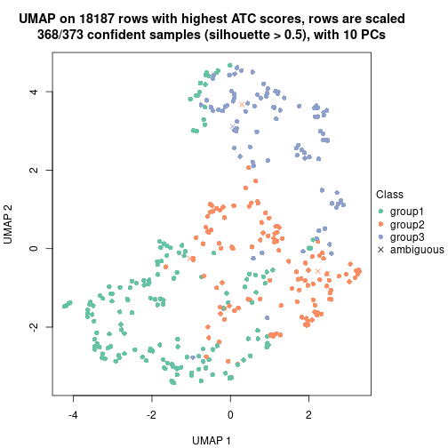</p>

</div>
<div id='tab-node-03-dimension-reduction-3'>
<pre><code class="r">dimension_reduction(res, k = 4, method = &quot;UMAP&quot;)
</code></pre>

<p></p>

</div>
</div>


Following heatmap shows how subgroups are split when increasing `k`:

```r
collect_classes(res)
```


If matrix rows can be associated to genes, consider to use `functional_enrichment(res,
...)` to perform function enrichment for the signature genes. See [this vignette](https://jokergoo.github.io/cola_vignettes/functional_enrichment.html) for more detailed explanations.


 

---------------------------------------------------


### Node031


Parent node: [Node03](#Node03).
Child nodes: 
                [Node0111](#Node0111)
        ,
                [Node0112](#Node0112)
        ,
                [Node0121](#Node0121)
        ,
                [Node0122](#Node0122)
        ,
                [Node0131](#Node0131)
        ,
                Node0132-leaf
        ,
                Node0141-leaf
        ,
                Node0142-leaf
        ,
                [Node0211](#Node0211)
        ,
                [Node0212](#Node0212)
        ,
                Node0213-leaf
        ,
                Node0311-leaf
        ,
                Node0312-leaf
        ,
                Node0321-leaf
        ,
                Node0322-leaf
        ,
                Node0331-leaf
        ,
                Node0332-leaf
        ,
                Node0411-leaf
        ,
                Node0412-leaf
        ,
                Node0413-leaf
        ,
                Node0421-leaf
        ,
                Node0422-leaf
        ,
                Node0423-leaf
        .


The object with results only for a single top-value method and a single partitioning method 
can be extracted as:

```r
res = res_rh["031"]
```

A summary of `res` and all the functions that can be applied to it:

```r
res
```

```
#> A 'ConsensusPartition' object with k = 2, 3, 4.
#>   On a matrix with 17257 rows and 159 columns.
#>   Top rows (1526) are extracted by 'ATC' method.
#>   Subgroups are detected by 'skmeans' method.
#>   Performed in total 150 partitions by row resampling.
#>   Best k for subgroups seems to be 2.
#> 
#> Following methods can be applied to this 'ConsensusPartition' object:
#>  [1] "cola_report"             "collect_classes"         "collect_plots"          
#>  [4] "collect_stats"           "colnames"                "compare_partitions"     
#>  [7] "compare_signatures"      "consensus_heatmap"       "dimension_reduction"    
#> [10] "functional_enrichment"   "get_anno_col"            "get_anno"               
#> [13] "get_classes"             "get_consensus"           "get_matrix"             
#> [16] "get_membership"          "get_param"               "get_signatures"         
#> [19] "get_stats"               "is_best_k"               "is_stable_k"            
#> [22] "membership_heatmap"      "ncol"                    "nrow"                   
#> [25] "plot_ecdf"               "predict_classes"         "rownames"               
#> [28] "select_partition_number" "show"                    "suggest_best_k"         
#> [31] "test_to_known_factors"   "top_rows_heatmap"
```

`collect_plots()` function collects all the plots made from `res` for all `k` (number of subgroups)
into one single page to provide an easy and fast comparison between different `k`.

```r
collect_plots(res)
```


The plots are:

- The first row: a plot of the eCDF (empirical cumulative distribution
  function) curves of the consensus matrix for each `k` and the heatmap of
  predicted classes for each `k`.
- The second row: heatmaps of the consensus matrix for each `k`.
- The third row: heatmaps of the membership matrix for each `k`.
- The fouth row: heatmaps of the signatures for each `k`.

All the plots in panels can be made by individual functions and they are
plotted later in this section.

`select_partition_number()` produces several plots showing different
statistics for choosing "optimized" `k`. There are following statistics:

- eCDF curves of the consensus matrix for each `k`;
- 1-PAC. [The PAC score](https://en.wikipedia.org/wiki/Consensus_clustering#Over-interpretation_potential_of_consensus_clustering)
  measures the proportion of the ambiguous subgrouping.
- Mean silhouette score.
- Concordance. The mean probability of fiting the consensus subgroup labels in all
  partitions.
- Area increased. Denote $A_k$ as the area under the eCDF curve for current
  `k`, the area increased is defined as $A_k - A_{k-1}$.
- Rand index. The percent of pairs of samples that are both in a same cluster
  or both are not in a same cluster in the partition of k and k-1.
- Jaccard index. The ratio of pairs of samples are both in a same cluster in
  the partition of k and k-1 and the pairs of samples are both in a same
  cluster in the partition k or k-1.

The detailed explanations of these statistics can be found in [the _cola_
vignette](https://jokergoo.github.io/cola_vignettes/cola.html#toc_13).

Generally speaking, higher 1-PAC score, higher mean silhouette score or higher
concordance corresponds to better partition. Rand index and Jaccard index
measure how similar the current partition is compared to partition with `k-1`.
If they are too similar, we won't accept `k` is better than `k-1`.

```r
select_partition_number(res)
```


The numeric values for all these statistics can be obtained by `get_stats()`.

```r
get_stats(res)
```

```
#>   k 1-PAC mean_silhouette concordance area_increased  Rand Jaccard
#> 2 2 0.947           0.939       0.974          0.503 0.497   0.497
#> 3 3 0.640           0.829       0.901          0.326 0.747   0.533
#> 4 4 0.753           0.804       0.897          0.111 0.692   0.313
```

`suggest_best_k()` suggests the best $k$ based on these statistics. The rules are as follows:

- All $k$ with Jaccard index larger than 0.95 are removed because increasing
  $k$ does not provide enough extra information. If all $k$ are removed, it is
  marked as no subgroup is detected.
- For all $k$ with 1-PAC score larger than 0.9, the maximal $k$ is taken as
  the best $k$, and other $k$ are marked as optional $k$.
- If it does not fit the second rule. The $k$ with the maximal vote of the
  highest 1-PAC score, highest mean silhouette, and highest concordance is
  taken as the best $k$.

```r
suggest_best_k(res)
```

```
#> [1] 2
```


Following is the table of the partitions (You need to click the **show/hide
code output** link to see it). The membership matrix (columns with name `p*`)
is inferred by
[`clue::cl_consensus()`](https://www.rdocumentation.org/link/cl_consensus?package=clue)
function with the `SE` method. Basically the value in the membership matrix
represents the probability to belong to a certain group. The finall subgroup
label for an item is determined with the group with highest probability it
belongs to.

In `get_classes()` function, the entropy is calculated from the membership
matrix and the silhouette score is calculated from the consensus matrix.


<script>
$( function() {
	$( '#tabs-node-031-get-classes' ).tabs();
} );
</script>
<div id='tabs-node-031-get-classes'>
<ul>
<li><a href='#tab-node-031-get-classes-1'>k = 2</a></li>
<li><a href='#tab-node-031-get-classes-2'>k = 3</a></li>
<li><a href='#tab-node-031-get-classes-3'>k = 4</a></li>
</ul>

<div id='tab-node-031-get-classes-1'>
<p><a id='tab-node-031-get-classes-1-a' style='color:#0366d6' href='#'>show/hide code output</a></p>
<pre><code class="r">cbind(get_classes(res, k = 2), get_membership(res, k = 2))
</code></pre>

<pre><code>#&gt;            class entropy silhouette   p1   p2
#&gt; HSPC_033       1   0.000     0.9759 1.00 0.00
#&gt; HSPC_028       2   0.000     0.9705 0.00 1.00
#&gt; HSPC_004       1   0.000     0.9759 1.00 0.00
#&gt; HSPC_030       1   0.141     0.9618 0.98 0.02
#&gt; LT-HSC_008     2   0.000     0.9705 0.00 1.00
#&gt; HSPC_049       1   0.141     0.9618 0.98 0.02
#&gt; HSPC_058       1   0.242     0.9457 0.96 0.04
#&gt; HSPC_054       2   0.000     0.9705 0.00 1.00
#&gt; HSPC_060       1   0.958     0.3746 0.62 0.38
#&gt; HSPC_066       1   0.999     0.0408 0.52 0.48
#&gt; LT-HSC_020     1   0.000     0.9759 1.00 0.00
#&gt; HSPC_122       1   0.000     0.9759 1.00 0.00
#&gt; HSPC_118       1   0.000     0.9759 1.00 0.00
#&gt; HSPC_125       1   0.000     0.9759 1.00 0.00
#&gt; HSPC_108       1   0.000     0.9759 1.00 0.00
#&gt; HSPC_120       2   0.000     0.9705 0.00 1.00
#&gt; LT-HSC_033     2   0.000     0.9705 0.00 1.00
#&gt; Prog_106       1   0.000     0.9759 1.00 0.00
#&gt; LT-HSC_034     2   0.000     0.9705 0.00 1.00
#&gt; Prog_125       1   0.242     0.9431 0.96 0.04
#&gt; Prog_102       1   0.000     0.9759 1.00 0.00
#&gt; HSPC_135       2   0.141     0.9556 0.02 0.98
#&gt; HSPC_144       2   0.000     0.9705 0.00 1.00
#&gt; LT-HSC_046     2   0.000     0.9705 0.00 1.00
#&gt; HSPC_199       2   0.000     0.9705 0.00 1.00
#&gt; HSPC_189       1   0.000     0.9759 1.00 0.00
#&gt; HSPC_178       1   0.827     0.6544 0.74 0.26
#&gt; HSPC_198       2   0.000     0.9705 0.00 1.00
#&gt; HSPC_174       1   0.000     0.9759 1.00 0.00
#&gt; LT-HSC_057     2   0.000     0.9705 0.00 1.00
#&gt; HSPC_221       2   0.000     0.9705 0.00 1.00
#&gt; LT-HSC_065     2   0.000     0.9705 0.00 1.00
#&gt; HSPC_240       2   0.000     0.9705 0.00 1.00
#&gt; LT-HSC_066     2   0.141     0.9556 0.02 0.98
#&gt; Prog_226       1   0.000     0.9759 1.00 0.00
#&gt; HSPC_267       1   0.141     0.9618 0.98 0.02
#&gt; LT-HSC_075     2   0.000     0.9705 0.00 1.00
#&gt; Prog_259       2   0.000     0.9705 0.00 1.00
#&gt; Prog_277       2   0.000     0.9705 0.00 1.00
#&gt; HSPC_322       2   0.000     0.9705 0.00 1.00
#&gt; HSPC_323       1   0.242     0.9457 0.96 0.04
#&gt; HSPC_324       2   0.855     0.6147 0.28 0.72
#&gt; HSPC_330       1   0.327     0.9267 0.94 0.06
#&gt; HSPC_349       1   0.000     0.9759 1.00 0.00
#&gt; Prog_358       1   0.000     0.9759 1.00 0.00
#&gt; HSPC_391       1   0.000     0.9759 1.00 0.00
#&gt; HSPC_416       1   0.000     0.9759 1.00 0.00
#&gt; HSPC_399       1   0.000     0.9759 1.00 0.00
#&gt; HSPC_418       1   0.000     0.9759 1.00 0.00
#&gt; Prog_382       1   0.000     0.9759 1.00 0.00
#&gt; LT-HSC_110     2   0.141     0.9556 0.02 0.98
#&gt; HSPC_435       2   0.000     0.9705 0.00 1.00
#&gt; HSPC_441       2   0.000     0.9705 0.00 1.00
#&gt; HSPC_459       1   0.000     0.9759 1.00 0.00
#&gt; HSPC_465       1   0.000     0.9759 1.00 0.00
#&gt; HSPC_448       1   0.000     0.9759 1.00 0.00
#&gt; HSPC_460       2   0.000     0.9705 0.00 1.00
#&gt; HSPC_430       2   0.000     0.9705 0.00 1.00
#&gt; HSPC_443       1   0.000     0.9759 1.00 0.00
#&gt; HSPC_449       1   0.000     0.9759 1.00 0.00
#&gt; HSPC_467       2   0.000     0.9705 0.00 1.00
#&gt; HSPC_431       2   0.000     0.9705 0.00 1.00
#&gt; HSPC_462       2   0.469     0.8805 0.10 0.90
#&gt; HSPC_468       1   0.000     0.9759 1.00 0.00
#&gt; Prog_433       1   0.000     0.9759 1.00 0.00
#&gt; LT-HSC_116     2   0.000     0.9705 0.00 1.00
#&gt; LT-HSC_117     2   0.141     0.9556 0.02 0.98
#&gt; Prog_455       2   0.855     0.6223 0.28 0.72
#&gt; HSPC_490       1   0.000     0.9759 1.00 0.00
#&gt; HSPC_496       2   0.000     0.9705 0.00 1.00
#&gt; LT-HSC_124     2   0.000     0.9705 0.00 1.00
#&gt; HSPC_479       2   0.000     0.9705 0.00 1.00
#&gt; LT-HSC_125     2   0.000     0.9705 0.00 1.00
#&gt; HSPC_473       1   0.141     0.9610 0.98 0.02
#&gt; HSPC_498       1   0.000     0.9759 1.00 0.00
#&gt; LT-HSC_128     2   0.000     0.9705 0.00 1.00
#&gt; Prog_509       1   0.000     0.9759 1.00 0.00
#&gt; LT-HSC_131     2   0.000     0.9705 0.00 1.00
#&gt; Prog_492       1   0.000     0.9759 1.00 0.00
#&gt; HSPC_526       1   0.000     0.9759 1.00 0.00
#&gt; HSPC_538       1   0.000     0.9759 1.00 0.00
#&gt; HSPC_514       2   0.141     0.9556 0.02 0.98
#&gt; HSPC_515       1   0.000     0.9759 1.00 0.00
#&gt; HSPC_534       1   0.000     0.9759 1.00 0.00
#&gt; LT-HSC_139     2   0.000     0.9705 0.00 1.00
#&gt; Prog_511       2   0.000     0.9705 0.00 1.00
#&gt; HSPC_571       1   0.000     0.9759 1.00 0.00
#&gt; LT-HSC_146     2   0.000     0.9705 0.00 1.00
#&gt; HSPC_567       1   0.000     0.9759 1.00 0.00
#&gt; HSPC_579       1   0.141     0.9618 0.98 0.02
#&gt; HSPC_592       1   0.000     0.9759 1.00 0.00
#&gt; HSPC_563       2   0.000     0.9705 0.00 1.00
#&gt; HSPC_575       1   0.000     0.9759 1.00 0.00
#&gt; Prog_554       1   0.402     0.9024 0.92 0.08
#&gt; Prog_555       2   0.402     0.9016 0.08 0.92
#&gt; Prog_580       1   0.722     0.7451 0.80 0.20
#&gt; Prog_564       2   0.000     0.9705 0.00 1.00
#&gt; Prog_588       2   0.000     0.9705 0.00 1.00
#&gt; Prog_558       1   0.000     0.9759 1.00 0.00
#&gt; HSPC_595       2   0.000     0.9705 0.00 1.00
#&gt; HSPC_606       2   0.680     0.7761 0.18 0.82
#&gt; HSPC_612       1   0.000     0.9759 1.00 0.00
#&gt; HSPC_636       1   0.141     0.9618 0.98 0.02
#&gt; LT-HSC_164     2   0.000     0.9705 0.00 1.00
#&gt; Prog_627       1   0.000     0.9759 1.00 0.00
#&gt; Prog_617       1   0.000     0.9759 1.00 0.00
#&gt; Prog_606       2   0.000     0.9705 0.00 1.00
#&gt; HSPC_637       2   0.000     0.9705 0.00 1.00
#&gt; HSPC_674       1   0.000     0.9759 1.00 0.00
#&gt; HSPC_639       2   0.000     0.9705 0.00 1.00
#&gt; HSPC_646       2   0.000     0.9705 0.00 1.00
#&gt; HSPC_640       2   0.000     0.9705 0.00 1.00
#&gt; HSPC_641       2   0.000     0.9705 0.00 1.00
#&gt; LT-HSC_174     2   0.000     0.9705 0.00 1.00
#&gt; Prog_651       2   0.000     0.9705 0.00 1.00
#&gt; Prog_665       1   0.000     0.9759 1.00 0.00
#&gt; Prog_671       2   0.000     0.9705 0.00 1.00
#&gt; LT-HSC_179     2   0.000     0.9705 0.00 1.00
#&gt; Prog_660       2   0.000     0.9705 0.00 1.00
#&gt; Prog_672       2   0.000     0.9705 0.00 1.00
#&gt; HSPC_679       2   0.000     0.9705 0.00 1.00
#&gt; LT-HSC_183     2   0.000     0.9705 0.00 1.00
#&gt; LT-HSC_184     1   0.000     0.9759 1.00 0.00
#&gt; HSPC_708       1   0.000     0.9759 1.00 0.00
#&gt; LT-HSC_187     2   0.000     0.9705 0.00 1.00
#&gt; Prog_704       1   0.000     0.9759 1.00 0.00
#&gt; Prog_710       1   0.000     0.9759 1.00 0.00
#&gt; LT-HSC_188     2   0.990     0.2332 0.44 0.56
#&gt; LT-HSC_191     2   0.000     0.9705 0.00 1.00
#&gt; HSPC_722       2   0.000     0.9705 0.00 1.00
#&gt; HSPC_729       2   0.000     0.9705 0.00 1.00
#&gt; HSPC_753       2   0.981     0.2722 0.42 0.58
#&gt; HSPC_730       1   0.141     0.9618 0.98 0.02
#&gt; HSPC_743       1   0.000     0.9759 1.00 0.00
#&gt; HSPC_755       2   0.000     0.9705 0.00 1.00
#&gt; HSPC_750       1   0.000     0.9759 1.00 0.00
#&gt; LT-HSC_202     2   0.000     0.9705 0.00 1.00
#&gt; Prog_737       2   0.141     0.9556 0.02 0.98
#&gt; Prog_725       1   0.634     0.8097 0.84 0.16
#&gt; Prog_762       1   0.000     0.9759 1.00 0.00
#&gt; Prog_726       1   0.000     0.9759 1.00 0.00
#&gt; HSPC_801       1   0.000     0.9759 1.00 0.00
#&gt; HSPC_778       2   0.000     0.9705 0.00 1.00
#&gt; HSPC_784       2   0.855     0.6269 0.28 0.72
#&gt; HSPC_785       1   0.000     0.9759 1.00 0.00
#&gt; HSPC_780       1   0.000     0.9759 1.00 0.00
#&gt; HSPC_786       1   0.000     0.9759 1.00 0.00
#&gt; LT-HSC_212     2   0.000     0.9705 0.00 1.00
#&gt; LT-HSC_214     1   0.000     0.9759 1.00 0.00
#&gt; Prog_797       1   0.000     0.9759 1.00 0.00
#&gt; HSPC_818       2   0.000     0.9705 0.00 1.00
#&gt; HSPC_824       1   0.000     0.9759 1.00 0.00
#&gt; HSPC_825       1   0.000     0.9759 1.00 0.00
#&gt; HSPC_831       1   0.000     0.9759 1.00 0.00
#&gt; HSPC_843       1   0.000     0.9759 1.00 0.00
#&gt; HSPC_826       1   0.000     0.9759 1.00 0.00
#&gt; HSPC_845       1   0.000     0.9759 1.00 0.00
#&gt; HSPC_822       2   0.000     0.9705 0.00 1.00
#&gt; Prog_823       1   0.000     0.9759 1.00 0.00
</code></pre>

<script>
$('#tab-node-031-get-classes-1-a').parent().next().next().hide();
$('#tab-node-031-get-classes-1-a').click(function(){
  $('#tab-node-031-get-classes-1-a').parent().next().next().toggle();
  return(false);
});
</script>
</div>

<div id='tab-node-031-get-classes-2'>
<p><a id='tab-node-031-get-classes-2-a' style='color:#0366d6' href='#'>show/hide code output</a></p>
<pre><code class="r">cbind(get_classes(res, k = 3), get_membership(res, k = 3))
</code></pre>

<pre><code>#&gt;            class entropy silhouette   p1   p2   p3
#&gt; HSPC_033       1  0.0000     0.8916 1.00 0.00 0.00
#&gt; HSPC_028       2  0.0892     0.9080 0.00 0.98 0.02
#&gt; HSPC_004       1  0.1529     0.8788 0.96 0.04 0.00
#&gt; HSPC_030       1  0.3340     0.8440 0.88 0.12 0.00
#&gt; LT-HSC_008     2  0.3686     0.9041 0.00 0.86 0.14
#&gt; HSPC_049       1  0.3340     0.8440 0.88 0.12 0.00
#&gt; HSPC_058       1  0.5416     0.8059 0.82 0.08 0.10
#&gt; HSPC_054       2  0.0000     0.9126 0.00 1.00 0.00
#&gt; HSPC_060       1  0.8310     0.0973 0.50 0.42 0.08
#&gt; HSPC_066       3  0.1781     0.8763 0.02 0.02 0.96
#&gt; LT-HSC_020     1  0.0000     0.8916 1.00 0.00 0.00
#&gt; HSPC_122       3  0.5216     0.7437 0.26 0.00 0.74
#&gt; HSPC_118       1  0.0000     0.8916 1.00 0.00 0.00
#&gt; HSPC_125       1  0.0000     0.8916 1.00 0.00 0.00
#&gt; HSPC_108       1  0.0000     0.8916 1.00 0.00 0.00
#&gt; HSPC_120       2  0.3340     0.9093 0.00 0.88 0.12
#&gt; LT-HSC_033     2  0.3340     0.9093 0.00 0.88 0.12
#&gt; Prog_106       1  0.3340     0.7857 0.88 0.00 0.12
#&gt; LT-HSC_034     3  0.0892     0.8735 0.00 0.02 0.98
#&gt; Prog_125       3  0.3415     0.8764 0.08 0.02 0.90
#&gt; Prog_102       1  0.0000     0.8916 1.00 0.00 0.00
#&gt; HSPC_135       3  0.0892     0.8735 0.00 0.02 0.98
#&gt; HSPC_144       2  0.0892     0.9080 0.00 0.98 0.02
#&gt; LT-HSC_046     2  0.2959     0.9176 0.00 0.90 0.10
#&gt; HSPC_199       2  0.2537     0.9213 0.00 0.92 0.08
#&gt; HSPC_189       3  0.6302     0.2517 0.48 0.00 0.52
#&gt; HSPC_178       1  0.3686     0.8300 0.86 0.14 0.00
#&gt; HSPC_198       2  0.0000     0.9126 0.00 1.00 0.00
#&gt; HSPC_174       1  0.0000     0.8916 1.00 0.00 0.00
#&gt; LT-HSC_057     2  0.3340     0.9093 0.00 0.88 0.12
#&gt; HSPC_221       2  0.3340     0.9093 0.00 0.88 0.12
#&gt; LT-HSC_065     2  0.2537     0.9213 0.00 0.92 0.08
#&gt; HSPC_240       2  0.0000     0.9126 0.00 1.00 0.00
#&gt; LT-HSC_066     3  0.0892     0.8735 0.00 0.02 0.98
#&gt; Prog_226       3  0.3415     0.8764 0.08 0.02 0.90
#&gt; HSPC_267       1  0.3340     0.8440 0.88 0.12 0.00
#&gt; LT-HSC_075     2  0.2959     0.9143 0.00 0.90 0.10
#&gt; Prog_259       2  0.0892     0.9080 0.00 0.98 0.02
#&gt; Prog_277       2  0.1529     0.9098 0.00 0.96 0.04
#&gt; HSPC_322       2  0.2537     0.9213 0.00 0.92 0.08
#&gt; HSPC_323       1  0.3340     0.8440 0.88 0.12 0.00
#&gt; HSPC_324       1  0.6309     0.1532 0.50 0.50 0.00
#&gt; HSPC_330       1  0.3340     0.8440 0.88 0.12 0.00
#&gt; HSPC_349       3  0.3340     0.8701 0.12 0.00 0.88
#&gt; Prog_358       3  0.2959     0.8759 0.10 0.00 0.90
#&gt; HSPC_391       1  0.0000     0.8916 1.00 0.00 0.00
#&gt; HSPC_416       1  0.0000     0.8916 1.00 0.00 0.00
#&gt; HSPC_399       3  0.3415     0.8795 0.08 0.02 0.90
#&gt; HSPC_418       1  0.0000     0.8916 1.00 0.00 0.00
#&gt; Prog_382       3  0.5835     0.6125 0.34 0.00 0.66
#&gt; LT-HSC_110     3  0.0892     0.8735 0.00 0.02 0.98
#&gt; HSPC_435       2  0.0892     0.9080 0.00 0.98 0.02
#&gt; HSPC_441       2  0.2537     0.9213 0.00 0.92 0.08
#&gt; HSPC_459       1  0.0000     0.8916 1.00 0.00 0.00
#&gt; HSPC_465       3  0.3340     0.8713 0.12 0.00 0.88
#&gt; HSPC_448       1  0.0000     0.8916 1.00 0.00 0.00
#&gt; HSPC_460       2  0.3340     0.9093 0.00 0.88 0.12
#&gt; HSPC_430       2  0.1529     0.9098 0.00 0.96 0.04
#&gt; HSPC_443       1  0.6309    -0.2091 0.50 0.00 0.50
#&gt; HSPC_449       3  0.5706     0.6505 0.32 0.00 0.68
#&gt; HSPC_467       2  0.0892     0.9080 0.00 0.98 0.02
#&gt; HSPC_431       2  0.2537     0.9223 0.00 0.92 0.08
#&gt; HSPC_462       2  0.6793     0.7693 0.16 0.74 0.10
#&gt; HSPC_468       1  0.0000     0.8916 1.00 0.00 0.00
#&gt; Prog_433       3  0.3340     0.8701 0.12 0.00 0.88
#&gt; LT-HSC_116     3  0.0000     0.8736 0.00 0.00 1.00
#&gt; LT-HSC_117     3  0.0892     0.8735 0.00 0.02 0.98
#&gt; Prog_455       3  0.3572     0.8732 0.06 0.04 0.90
#&gt; HSPC_490       1  0.6045     0.2419 0.62 0.00 0.38
#&gt; HSPC_496       2  0.6126     0.5467 0.00 0.60 0.40
#&gt; LT-HSC_124     2  0.3340     0.9093 0.00 0.88 0.12
#&gt; HSPC_479       2  0.0892     0.9080 0.00 0.98 0.02
#&gt; LT-HSC_125     2  0.2959     0.9143 0.00 0.90 0.10
#&gt; HSPC_473       1  0.7029     0.0631 0.54 0.02 0.44
#&gt; HSPC_498       1  0.0000     0.8916 1.00 0.00 0.00
#&gt; LT-HSC_128     2  0.1529     0.9213 0.00 0.96 0.04
#&gt; Prog_509       3  0.3340     0.8701 0.12 0.00 0.88
#&gt; LT-HSC_131     2  0.3340     0.9093 0.00 0.88 0.12
#&gt; Prog_492       3  0.3340     0.8701 0.12 0.00 0.88
#&gt; HSPC_526       1  0.0000     0.8916 1.00 0.00 0.00
#&gt; HSPC_538       1  0.2537     0.8297 0.92 0.00 0.08
#&gt; HSPC_514       3  0.0892     0.8735 0.00 0.02 0.98
#&gt; HSPC_515       1  0.0000     0.8916 1.00 0.00 0.00
#&gt; HSPC_534       1  0.0000     0.8916 1.00 0.00 0.00
#&gt; LT-HSC_139     2  0.2537     0.9223 0.00 0.92 0.08
#&gt; Prog_511       2  0.0892     0.9080 0.00 0.98 0.02
#&gt; HSPC_571       1  0.3340     0.8440 0.88 0.12 0.00
#&gt; LT-HSC_146     2  0.4796     0.8195 0.00 0.78 0.22
#&gt; HSPC_567       1  0.2537     0.8636 0.92 0.08 0.00
#&gt; HSPC_579       1  0.3340     0.8440 0.88 0.12 0.00
#&gt; HSPC_592       1  0.0000     0.8916 1.00 0.00 0.00
#&gt; HSPC_563       2  0.1529     0.9098 0.00 0.96 0.04
#&gt; HSPC_575       1  0.0000     0.8916 1.00 0.00 0.00
#&gt; Prog_554       1  0.4555     0.7765 0.80 0.20 0.00
#&gt; Prog_555       3  0.5397     0.6385 0.00 0.28 0.72
#&gt; Prog_580       3  0.3572     0.8655 0.04 0.06 0.90
#&gt; Prog_564       2  0.2537     0.9213 0.00 0.92 0.08
#&gt; Prog_588       2  0.1529     0.9098 0.00 0.96 0.04
#&gt; Prog_558       3  0.5016     0.7716 0.24 0.00 0.76
#&gt; HSPC_595       2  0.2959     0.9192 0.00 0.90 0.10
#&gt; HSPC_606       2  0.3340     0.8076 0.12 0.88 0.00
#&gt; HSPC_612       1  0.2959     0.8112 0.90 0.00 0.10
#&gt; HSPC_636       1  0.3340     0.8440 0.88 0.12 0.00
#&gt; LT-HSC_164     2  0.3340     0.9093 0.00 0.88 0.12
#&gt; Prog_627       1  0.1529     0.8648 0.96 0.00 0.04
#&gt; Prog_617       1  0.0000     0.8916 1.00 0.00 0.00
#&gt; Prog_606       2  0.3686     0.9041 0.00 0.86 0.14
#&gt; HSPC_637       2  0.0000     0.9126 0.00 1.00 0.00
#&gt; HSPC_674       1  0.0000     0.8916 1.00 0.00 0.00
#&gt; HSPC_639       2  0.2537     0.9223 0.00 0.92 0.08
#&gt; HSPC_646       2  0.0000     0.9126 0.00 1.00 0.00
#&gt; HSPC_640       2  0.2537     0.9213 0.00 0.92 0.08
#&gt; HSPC_641       2  0.2066     0.9226 0.00 0.94 0.06
#&gt; LT-HSC_174     2  0.2537     0.9213 0.00 0.92 0.08
#&gt; Prog_651       2  0.1529     0.9098 0.00 0.96 0.04
#&gt; Prog_665       1  0.2959     0.8540 0.90 0.10 0.00
#&gt; Prog_671       2  0.5016     0.6932 0.00 0.76 0.24
#&gt; LT-HSC_179     2  0.2537     0.9213 0.00 0.92 0.08
#&gt; Prog_660       2  0.1529     0.9098 0.00 0.96 0.04
#&gt; Prog_672       2  0.0000     0.9126 0.00 1.00 0.00
#&gt; HSPC_679       3  0.2066     0.8620 0.00 0.06 0.94
#&gt; LT-HSC_183     3  0.0892     0.8735 0.00 0.02 0.98
#&gt; LT-HSC_184     3  0.2959     0.8770 0.10 0.00 0.90
#&gt; HSPC_708       3  0.3340     0.8713 0.12 0.00 0.88
#&gt; LT-HSC_187     3  0.0892     0.8735 0.00 0.02 0.98
#&gt; Prog_704       1  0.0000     0.8916 1.00 0.00 0.00
#&gt; Prog_710       3  0.3340     0.8701 0.12 0.00 0.88
#&gt; LT-HSC_188     3  0.1781     0.8763 0.02 0.02 0.96
#&gt; LT-HSC_191     3  0.0892     0.8735 0.00 0.02 0.98
#&gt; HSPC_722       2  0.3340     0.9143 0.00 0.88 0.12
#&gt; HSPC_729       2  0.2537     0.9213 0.00 0.92 0.08
#&gt; HSPC_753       2  0.6302    -0.1046 0.48 0.52 0.00
#&gt; HSPC_730       1  0.3340     0.8440 0.88 0.12 0.00
#&gt; HSPC_743       1  0.0000     0.8916 1.00 0.00 0.00
#&gt; HSPC_755       2  0.0000     0.9126 0.00 1.00 0.00
#&gt; HSPC_750       1  0.0892     0.8852 0.98 0.02 0.00
#&gt; LT-HSC_202     3  0.4291     0.6659 0.00 0.18 0.82
#&gt; Prog_737       3  0.2959     0.8431 0.00 0.10 0.90
#&gt; Prog_725       1  0.4796     0.7537 0.78 0.22 0.00
#&gt; Prog_762       1  0.2537     0.8636 0.92 0.08 0.00
#&gt; Prog_726       3  0.2959     0.8759 0.10 0.00 0.90
#&gt; HSPC_801       1  0.0000     0.8916 1.00 0.00 0.00
#&gt; HSPC_778       3  0.0892     0.8722 0.00 0.02 0.98
#&gt; HSPC_784       3  0.2414     0.8797 0.04 0.02 0.94
#&gt; HSPC_785       1  0.6045     0.2436 0.62 0.00 0.38
#&gt; HSPC_780       1  0.0000     0.8916 1.00 0.00 0.00
#&gt; HSPC_786       1  0.3686     0.7601 0.86 0.00 0.14
#&gt; LT-HSC_212     3  0.2959     0.8089 0.00 0.10 0.90
#&gt; LT-HSC_214     3  0.6229     0.6321 0.28 0.02 0.70
#&gt; Prog_797       1  0.0000     0.8916 1.00 0.00 0.00
#&gt; HSPC_818       2  0.2537     0.9213 0.00 0.92 0.08
#&gt; HSPC_824       3  0.5016     0.7734 0.24 0.00 0.76
#&gt; HSPC_825       3  0.4796     0.7930 0.22 0.00 0.78
#&gt; HSPC_831       1  0.0000     0.8916 1.00 0.00 0.00
#&gt; HSPC_843       1  0.0000     0.8916 1.00 0.00 0.00
#&gt; HSPC_826       3  0.3340     0.8713 0.12 0.00 0.88
#&gt; HSPC_845       1  0.0000     0.8916 1.00 0.00 0.00
#&gt; HSPC_822       3  0.0892     0.8735 0.00 0.02 0.98
#&gt; Prog_823       3  0.3340     0.8701 0.12 0.00 0.88
</code></pre>

<script>
$('#tab-node-031-get-classes-2-a').parent().next().next().hide();
$('#tab-node-031-get-classes-2-a').click(function(){
  $('#tab-node-031-get-classes-2-a').parent().next().next().toggle();
  return(false);
});
</script>
</div>

<div id='tab-node-031-get-classes-3'>
<p><a id='tab-node-031-get-classes-3-a' style='color:#0366d6' href='#'>show/hide code output</a></p>
<pre><code class="r">cbind(get_classes(res, k = 4), get_membership(res, k = 4))
</code></pre>

<pre><code>#&gt;            class entropy silhouette   p1   p2   p3   p4
#&gt; HSPC_033       1  0.0000     0.9279 1.00 0.00 0.00 0.00
#&gt; HSPC_028       4  0.0000     0.8619 0.00 0.00 0.00 1.00
#&gt; HSPC_004       1  0.6831    -0.0968 0.48 0.00 0.10 0.42
#&gt; HSPC_030       4  0.2345     0.8573 0.10 0.00 0.00 0.90
#&gt; LT-HSC_008     3  0.4284     0.7452 0.00 0.20 0.78 0.02
#&gt; HSPC_049       4  0.2345     0.8573 0.10 0.00 0.00 0.90
#&gt; HSPC_058       4  0.6317     0.6730 0.22 0.02 0.08 0.68
#&gt; HSPC_054       4  0.0000     0.8619 0.00 0.00 0.00 1.00
#&gt; HSPC_060       2  0.6089     0.6553 0.08 0.64 0.00 0.28
#&gt; HSPC_066       2  0.0000     0.8132 0.00 1.00 0.00 0.00
#&gt; LT-HSC_020     1  0.0000     0.9279 1.00 0.00 0.00 0.00
#&gt; HSPC_122       1  0.2011     0.8880 0.92 0.08 0.00 0.00
#&gt; HSPC_118       1  0.0000     0.9279 1.00 0.00 0.00 0.00
#&gt; HSPC_125       1  0.0000     0.9279 1.00 0.00 0.00 0.00
#&gt; HSPC_108       1  0.0000     0.9279 1.00 0.00 0.00 0.00
#&gt; HSPC_120       2  0.2011     0.8210 0.00 0.92 0.00 0.08
#&gt; LT-HSC_033     2  0.2011     0.8210 0.00 0.92 0.00 0.08
#&gt; Prog_106       1  0.0000     0.9279 1.00 0.00 0.00 0.00
#&gt; LT-HSC_034     2  0.0000     0.8132 0.00 1.00 0.00 0.00
#&gt; Prog_125       3  0.0000     0.9199 0.00 0.00 1.00 0.00
#&gt; Prog_102       1  0.0000     0.9279 1.00 0.00 0.00 0.00
#&gt; HSPC_135       2  0.0000     0.8132 0.00 1.00 0.00 0.00
#&gt; HSPC_144       4  0.0000     0.8619 0.00 0.00 0.00 1.00
#&gt; LT-HSC_046     2  0.4713     0.6564 0.00 0.64 0.00 0.36
#&gt; HSPC_199       4  0.4907    -0.1502 0.00 0.42 0.00 0.58
#&gt; HSPC_189       1  0.1211     0.9112 0.96 0.04 0.00 0.00
#&gt; HSPC_178       4  0.2011     0.8618 0.08 0.00 0.00 0.92
#&gt; HSPC_198       4  0.0000     0.8619 0.00 0.00 0.00 1.00
#&gt; HSPC_174       1  0.1637     0.8778 0.94 0.00 0.00 0.06
#&gt; LT-HSC_057     2  0.2345     0.8190 0.00 0.90 0.00 0.10
#&gt; HSPC_221       2  0.1637     0.8216 0.00 0.94 0.00 0.06
#&gt; LT-HSC_065     2  0.4713     0.6564 0.00 0.64 0.00 0.36
#&gt; HSPC_240       4  0.0000     0.8619 0.00 0.00 0.00 1.00
#&gt; LT-HSC_066     2  0.0000     0.8132 0.00 1.00 0.00 0.00
#&gt; Prog_226       3  0.0000     0.9199 0.00 0.00 1.00 0.00
#&gt; HSPC_267       4  0.2647     0.8455 0.12 0.00 0.00 0.88
#&gt; LT-HSC_075     2  0.3172     0.7997 0.00 0.84 0.00 0.16
#&gt; Prog_259       4  0.0707     0.8551 0.00 0.00 0.02 0.98
#&gt; Prog_277       3  0.0000     0.9199 0.00 0.00 1.00 0.00
#&gt; HSPC_322       2  0.4790     0.6321 0.00 0.62 0.00 0.38
#&gt; HSPC_323       4  0.2345     0.8573 0.10 0.00 0.00 0.90
#&gt; HSPC_324       4  0.0707     0.8642 0.02 0.00 0.00 0.98
#&gt; HSPC_330       4  0.2345     0.8573 0.10 0.00 0.00 0.90
#&gt; HSPC_349       3  0.0000     0.9199 0.00 0.00 1.00 0.00
#&gt; Prog_358       3  0.0000     0.9199 0.00 0.00 1.00 0.00
#&gt; HSPC_391       1  0.0000     0.9279 1.00 0.00 0.00 0.00
#&gt; HSPC_416       1  0.0000     0.9279 1.00 0.00 0.00 0.00
#&gt; HSPC_399       2  0.4522     0.3671 0.32 0.68 0.00 0.00
#&gt; HSPC_418       1  0.0000     0.9279 1.00 0.00 0.00 0.00
#&gt; Prog_382       1  0.2647     0.8428 0.88 0.00 0.12 0.00
#&gt; LT-HSC_110     2  0.0000     0.8132 0.00 1.00 0.00 0.00
#&gt; HSPC_435       4  0.0000     0.8619 0.00 0.00 0.00 1.00
#&gt; HSPC_441       2  0.4790     0.6321 0.00 0.62 0.00 0.38
#&gt; HSPC_459       1  0.0000     0.9279 1.00 0.00 0.00 0.00
#&gt; HSPC_465       1  0.4713     0.5458 0.64 0.36 0.00 0.00
#&gt; HSPC_448       1  0.0000     0.9279 1.00 0.00 0.00 0.00
#&gt; HSPC_460       2  0.2011     0.8210 0.00 0.92 0.00 0.08
#&gt; HSPC_430       3  0.6366     0.5848 0.00 0.12 0.64 0.24
#&gt; HSPC_443       1  0.2011     0.8872 0.92 0.08 0.00 0.00
#&gt; HSPC_449       1  0.1637     0.9008 0.94 0.06 0.00 0.00
#&gt; HSPC_467       4  0.0000     0.8619 0.00 0.00 0.00 1.00
#&gt; HSPC_431       2  0.4713     0.6564 0.00 0.64 0.00 0.36
#&gt; HSPC_462       2  0.2647     0.8157 0.00 0.88 0.00 0.12
#&gt; HSPC_468       1  0.0000     0.9279 1.00 0.00 0.00 0.00
#&gt; Prog_433       3  0.0000     0.9199 0.00 0.00 1.00 0.00
#&gt; LT-HSC_116     3  0.2921     0.8323 0.00 0.14 0.86 0.00
#&gt; LT-HSC_117     2  0.0000     0.8132 0.00 1.00 0.00 0.00
#&gt; Prog_455       3  0.0000     0.9199 0.00 0.00 1.00 0.00
#&gt; HSPC_490       1  0.1637     0.9008 0.94 0.06 0.00 0.00
#&gt; HSPC_496       2  0.1913     0.8154 0.00 0.94 0.02 0.04
#&gt; LT-HSC_124     2  0.1211     0.8192 0.00 0.96 0.00 0.04
#&gt; HSPC_479       4  0.0000     0.8619 0.00 0.00 0.00 1.00
#&gt; LT-HSC_125     2  0.2921     0.8075 0.00 0.86 0.00 0.14
#&gt; HSPC_473       2  0.4948     0.0413 0.44 0.56 0.00 0.00
#&gt; HSPC_498       1  0.0000     0.9279 1.00 0.00 0.00 0.00
#&gt; LT-HSC_128     4  0.2921     0.6833 0.00 0.14 0.00 0.86
#&gt; Prog_509       3  0.0000     0.9199 0.00 0.00 1.00 0.00
#&gt; LT-HSC_131     2  0.2011     0.8215 0.00 0.92 0.00 0.08
#&gt; Prog_492       3  0.0000     0.9199 0.00 0.00 1.00 0.00
#&gt; HSPC_526       1  0.0000     0.9279 1.00 0.00 0.00 0.00
#&gt; HSPC_538       1  0.1637     0.9008 0.94 0.06 0.00 0.00
#&gt; HSPC_514       2  0.0000     0.8132 0.00 1.00 0.00 0.00
#&gt; HSPC_515       1  0.4134     0.5745 0.74 0.00 0.00 0.26
#&gt; HSPC_534       1  0.0000     0.9279 1.00 0.00 0.00 0.00
#&gt; LT-HSC_139     2  0.4713     0.6564 0.00 0.64 0.00 0.36
#&gt; Prog_511       3  0.0000     0.9199 0.00 0.00 1.00 0.00
#&gt; HSPC_571       4  0.3172     0.8169 0.16 0.00 0.00 0.84
#&gt; LT-HSC_146     2  0.0707     0.8171 0.00 0.98 0.00 0.02
#&gt; HSPC_567       4  0.4713     0.5231 0.36 0.00 0.00 0.64
#&gt; HSPC_579       4  0.3975     0.7295 0.24 0.00 0.00 0.76
#&gt; HSPC_592       1  0.0000     0.9279 1.00 0.00 0.00 0.00
#&gt; HSPC_563       4  0.0000     0.8619 0.00 0.00 0.00 1.00
#&gt; HSPC_575       1  0.0000     0.9279 1.00 0.00 0.00 0.00
#&gt; Prog_554       4  0.3853     0.8026 0.16 0.00 0.02 0.82
#&gt; Prog_555       3  0.0000     0.9199 0.00 0.00 1.00 0.00
#&gt; Prog_580       3  0.0000     0.9199 0.00 0.00 1.00 0.00
#&gt; Prog_564       2  0.4790     0.6321 0.00 0.62 0.00 0.38
#&gt; Prog_588       3  0.0707     0.9093 0.00 0.00 0.98 0.02
#&gt; Prog_558       1  0.3335     0.8353 0.86 0.02 0.12 0.00
#&gt; HSPC_595       3  0.5077     0.7302 0.00 0.16 0.76 0.08
#&gt; HSPC_606       4  0.0707     0.8586 0.00 0.00 0.02 0.98
#&gt; HSPC_612       1  0.0000     0.9279 1.00 0.00 0.00 0.00
#&gt; HSPC_636       4  0.2345     0.8573 0.10 0.00 0.00 0.90
#&gt; LT-HSC_164     2  0.2345     0.8190 0.00 0.90 0.00 0.10
#&gt; Prog_627       1  0.0000     0.9279 1.00 0.00 0.00 0.00
#&gt; Prog_617       1  0.0000     0.9279 1.00 0.00 0.00 0.00
#&gt; Prog_606       3  0.5392     0.6349 0.00 0.28 0.68 0.04
#&gt; HSPC_637       4  0.0000     0.8619 0.00 0.00 0.00 1.00
#&gt; HSPC_674       1  0.0000     0.9279 1.00 0.00 0.00 0.00
#&gt; HSPC_639       2  0.4713     0.6564 0.00 0.64 0.00 0.36
#&gt; HSPC_646       4  0.0000     0.8619 0.00 0.00 0.00 1.00
#&gt; HSPC_640       2  0.4790     0.6321 0.00 0.62 0.00 0.38
#&gt; HSPC_641       2  0.4790     0.6321 0.00 0.62 0.00 0.38
#&gt; LT-HSC_174     2  0.4713     0.6564 0.00 0.64 0.00 0.36
#&gt; Prog_651       3  0.0000     0.9199 0.00 0.00 1.00 0.00
#&gt; Prog_665       4  0.6074     0.5125 0.34 0.00 0.06 0.60
#&gt; Prog_671       3  0.0000     0.9199 0.00 0.00 1.00 0.00
#&gt; LT-HSC_179     2  0.4790     0.6321 0.00 0.62 0.00 0.38
#&gt; Prog_660       3  0.1211     0.8963 0.00 0.00 0.96 0.04
#&gt; Prog_672       4  0.0000     0.8619 0.00 0.00 0.00 1.00
#&gt; HSPC_679       3  0.0707     0.9113 0.00 0.02 0.98 0.00
#&gt; LT-HSC_183     2  0.0000     0.8132 0.00 1.00 0.00 0.00
#&gt; LT-HSC_184     1  0.4713     0.5458 0.64 0.36 0.00 0.00
#&gt; HSPC_708       1  0.4713     0.5458 0.64 0.36 0.00 0.00
#&gt; LT-HSC_187     2  0.0000     0.8132 0.00 1.00 0.00 0.00
#&gt; Prog_704       1  0.0000     0.9279 1.00 0.00 0.00 0.00
#&gt; Prog_710       3  0.0000     0.9199 0.00 0.00 1.00 0.00
#&gt; LT-HSC_188     2  0.0000     0.8132 0.00 1.00 0.00 0.00
#&gt; LT-HSC_191     2  0.0000     0.8132 0.00 1.00 0.00 0.00
#&gt; HSPC_722       3  0.6605     0.1145 0.00 0.44 0.48 0.08
#&gt; HSPC_729       2  0.4277     0.7257 0.00 0.72 0.00 0.28
#&gt; HSPC_753       4  0.2011     0.8616 0.08 0.00 0.00 0.92
#&gt; HSPC_730       4  0.2345     0.8573 0.10 0.00 0.00 0.90
#&gt; HSPC_743       1  0.0000     0.9279 1.00 0.00 0.00 0.00
#&gt; HSPC_755       4  0.0000     0.8619 0.00 0.00 0.00 1.00
#&gt; HSPC_750       1  0.1637     0.8779 0.94 0.00 0.00 0.06
#&gt; LT-HSC_202     3  0.4406     0.6560 0.00 0.30 0.70 0.00
#&gt; Prog_737       3  0.0000     0.9199 0.00 0.00 1.00 0.00
#&gt; Prog_725       4  0.1637     0.8636 0.06 0.00 0.00 0.94
#&gt; Prog_762       4  0.4713     0.5231 0.36 0.00 0.00 0.64
#&gt; Prog_726       3  0.0000     0.9199 0.00 0.00 1.00 0.00
#&gt; HSPC_801       1  0.0000     0.9279 1.00 0.00 0.00 0.00
#&gt; HSPC_778       3  0.1637     0.8921 0.00 0.06 0.94 0.00
#&gt; HSPC_784       2  0.0000     0.8132 0.00 1.00 0.00 0.00
#&gt; HSPC_785       1  0.1211     0.9112 0.96 0.04 0.00 0.00
#&gt; HSPC_780       1  0.0000     0.9279 1.00 0.00 0.00 0.00
#&gt; HSPC_786       1  0.1637     0.9008 0.94 0.06 0.00 0.00
#&gt; LT-HSC_212     2  0.0000     0.8132 0.00 1.00 0.00 0.00
#&gt; LT-HSC_214     2  0.2345     0.7445 0.10 0.90 0.00 0.00
#&gt; Prog_797       1  0.0000     0.9279 1.00 0.00 0.00 0.00
#&gt; HSPC_818       2  0.3610     0.7790 0.00 0.80 0.00 0.20
#&gt; HSPC_824       1  0.2345     0.8721 0.90 0.10 0.00 0.00
#&gt; HSPC_825       1  0.1637     0.9008 0.94 0.06 0.00 0.00
#&gt; HSPC_831       1  0.0000     0.9279 1.00 0.00 0.00 0.00
#&gt; HSPC_843       1  0.0000     0.9279 1.00 0.00 0.00 0.00
#&gt; HSPC_826       1  0.4713     0.5458 0.64 0.36 0.00 0.00
#&gt; HSPC_845       1  0.0000     0.9279 1.00 0.00 0.00 0.00
#&gt; HSPC_822       2  0.0000     0.8132 0.00 1.00 0.00 0.00
#&gt; Prog_823       3  0.0000     0.9199 0.00 0.00 1.00 0.00
</code></pre>

<script>
$('#tab-node-031-get-classes-3-a').parent().next().next().hide();
$('#tab-node-031-get-classes-3-a').click(function(){
  $('#tab-node-031-get-classes-3-a').parent().next().next().toggle();
  return(false);
});
</script>
</div>
</div>

Heatmaps for the consensus matrix. It visualizes the probability of two
samples to be in a same group.


<script>
$( function() {
	$( '#tabs-node-031-consensus-heatmap' ).tabs();
} );
</script>
<div id='tabs-node-031-consensus-heatmap'>
<ul>
<li><a href='#tab-node-031-consensus-heatmap-1'>k = 2</a></li>
<li><a href='#tab-node-031-consensus-heatmap-2'>k = 3</a></li>
<li><a href='#tab-node-031-consensus-heatmap-3'>k = 4</a></li>
</ul>
<div id='tab-node-031-consensus-heatmap-1'>
<pre><code class="r">consensus_heatmap(res, k = 2)
</code></pre>

<p></p>

</div>
<div id='tab-node-031-consensus-heatmap-2'>
<pre><code class="r">consensus_heatmap(res, k = 3)
</code></pre>

<p></p>

</div>
<div id='tab-node-031-consensus-heatmap-3'>
<pre><code class="r">consensus_heatmap(res, k = 4)
</code></pre>

<p></p>

</div>
</div>

Heatmaps for the membership of samples in all partitions to see how consistent they are:


<script>
$( function() {
	$( '#tabs-node-031-membership-heatmap' ).tabs();
} );
</script>
<div id='tabs-node-031-membership-heatmap'>
<ul>
<li><a href='#tab-node-031-membership-heatmap-1'>k = 2</a></li>
<li><a href='#tab-node-031-membership-heatmap-2'>k = 3</a></li>
<li><a href='#tab-node-031-membership-heatmap-3'>k = 4</a></li>
</ul>
<div id='tab-node-031-membership-heatmap-1'>
<pre><code class="r">membership_heatmap(res, k = 2)
</code></pre>

<p></p>

</div>
<div id='tab-node-031-membership-heatmap-2'>
<pre><code class="r">membership_heatmap(res, k = 3)
</code></pre>

<p></p>

</div>
<div id='tab-node-031-membership-heatmap-3'>
<pre><code class="r">membership_heatmap(res, k = 4)
</code></pre>

<p></p>

</div>
</div>

As soon as the classes for columns are determined, the signatures
that are significantly different between subgroups can be looked for. 
Following are the heatmaps for signatures.


Signature heatmaps where rows are scaled:


<script>
$( function() {
	$( '#tabs-node-031-get-signatures' ).tabs();
} );
</script>
<div id='tabs-node-031-get-signatures'>
<ul>
<li><a href='#tab-node-031-get-signatures-1'>k = 2</a></li>
<li><a href='#tab-node-031-get-signatures-2'>k = 3</a></li>
<li><a href='#tab-node-031-get-signatures-3'>k = 4</a></li>
</ul>
<div id='tab-node-031-get-signatures-1'>
<pre><code class="r">get_signatures(res, k = 2)
</code></pre>

<p></p>

</div>
<div id='tab-node-031-get-signatures-2'>
<pre><code class="r">get_signatures(res, k = 3)
</code></pre>

<p></p>

</div>
<div id='tab-node-031-get-signatures-3'>
<pre><code class="r">get_signatures(res, k = 4)
</code></pre>

<p></p>

</div>
</div>


Signature heatmaps where rows are not scaled:


<script>
$( function() {
	$( '#tabs-node-031-get-signatures-no-scale' ).tabs();
} );
</script>
<div id='tabs-node-031-get-signatures-no-scale'>
<ul>
<li><a href='#tab-node-031-get-signatures-no-scale-1'>k = 2</a></li>
<li><a href='#tab-node-031-get-signatures-no-scale-2'>k = 3</a></li>
<li><a href='#tab-node-031-get-signatures-no-scale-3'>k = 4</a></li>
</ul>
<div id='tab-node-031-get-signatures-no-scale-1'>
<pre><code class="r">get_signatures(res, k = 2, scale_rows = FALSE)
</code></pre>

<p>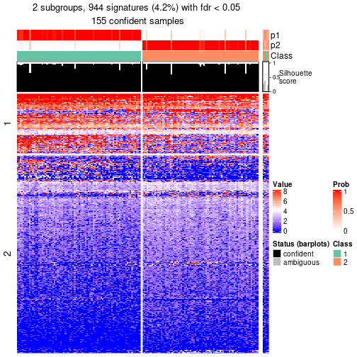</p>

</div>
<div id='tab-node-031-get-signatures-no-scale-2'>
<pre><code class="r">get_signatures(res, k = 3, scale_rows = FALSE)
</code></pre>

<p></p>

</div>
<div id='tab-node-031-get-signatures-no-scale-3'>
<pre><code class="r">get_signatures(res, k = 4, scale_rows = FALSE)
</code></pre>

<p></p>

</div>
</div>


Compare the overlap of signatures from different k:

```r
compare_signatures(res)
```


`get_signature()` returns a data frame invisibly. To get the list of signatures, the function
call should be assigned to a variable explicitly. In following code, if `plot` argument is set
to `FALSE`, no heatmap is plotted while only the differential analysis is performed.

```r
# code only for demonstration
tb = get_signature(res, k = ..., plot = FALSE)
```

An example of the output of `tb` is:

```
#>   which_row         fdr    mean_1    mean_2 scaled_mean_1 scaled_mean_2 km
#> 1        38 0.042760348  8.373488  9.131774    -0.5533452     0.5164555  1
#> 2        40 0.018707592  7.106213  8.469186    -0.6173731     0.5762149  1
#> 3        55 0.019134737 10.221463 11.207825    -0.6159697     0.5749050  1
#> 4        59 0.006059896  5.921854  7.869574    -0.6899429     0.6439467  1
#> 5        60 0.018055526  8.928898 10.211722    -0.6204761     0.5791110  1
#> 6        98 0.009384629 15.714769 14.887706     0.6635654    -0.6193277  2
...
```

The columns in `tb` are:

1. `which_row`: row indices corresponding to the input matrix.
2. `fdr`: FDR for the differential test. 
3. `mean_x`: The mean value in group x.
4. `scaled_mean_x`: The mean value in group x after rows are scaled.
5. `km`: Row groups if k-means clustering is applied to rows (which is done by automatically selecting number of clusters).

If there are too many signatures, `top_signatures = ...` can be set to only show the 
signatures with the highest FDRs:

```r
# code only for demonstration
# e.g. to show the top 500 most significant rows
tb = get_signature(res, k = ..., top_signatures = 500)
```

If the signatures are defined as these which are uniquely high in current group, `diff_method` argument
can be set to `"uniquely_high_in_one_group"`:

```r
# code only for demonstration
tb = get_signature(res, k = ..., diff_method = "uniquely_high_in_one_group")
```


UMAP plot which shows how samples are separated.


<script>
$( function() {
	$( '#tabs-node-031-dimension-reduction' ).tabs();
} );
</script>
<div id='tabs-node-031-dimension-reduction'>
<ul>
<li><a href='#tab-node-031-dimension-reduction-1'>k = 2</a></li>
<li><a href='#tab-node-031-dimension-reduction-2'>k = 3</a></li>
<li><a href='#tab-node-031-dimension-reduction-3'>k = 4</a></li>
</ul>
<div id='tab-node-031-dimension-reduction-1'>
<pre><code class="r">dimension_reduction(res, k = 2, method = &quot;UMAP&quot;)
</code></pre>

<p></p>

</div>
<div id='tab-node-031-dimension-reduction-2'>
<pre><code class="r">dimension_reduction(res, k = 3, method = &quot;UMAP&quot;)
</code></pre>

<p></p>

</div>
<div id='tab-node-031-dimension-reduction-3'>
<pre><code class="r">dimension_reduction(res, k = 4, method = &quot;UMAP&quot;)
</code></pre>

<p></p>

</div>
</div>


Following heatmap shows how subgroups are split when increasing `k`:

```r
collect_classes(res)
```


If matrix rows can be associated to genes, consider to use `functional_enrichment(res,
...)` to perform function enrichment for the signature genes. See [this vignette](https://jokergoo.github.io/cola_vignettes/functional_enrichment.html) for more detailed explanations.


 

---------------------------------------------------


### Node032


Parent node: [Node03](#Node03).
Child nodes: 
                [Node0111](#Node0111)
        ,
                [Node0112](#Node0112)
        ,
                [Node0121](#Node0121)
        ,
                [Node0122](#Node0122)
        ,
                [Node0131](#Node0131)
        ,
                Node0132-leaf
        ,
                Node0141-leaf
        ,
                Node0142-leaf
        ,
                [Node0211](#Node0211)
        ,
                [Node0212](#Node0212)
        ,
                Node0213-leaf
        ,
                Node0311-leaf
        ,
                Node0312-leaf
        ,
                Node0321-leaf
        ,
                Node0322-leaf
        ,
                Node0331-leaf
        ,
                Node0332-leaf
        ,
                Node0411-leaf
        ,
                Node0412-leaf
        ,
                Node0413-leaf
        ,
                Node0421-leaf
        ,
                Node0422-leaf
        ,
                Node0423-leaf
        .


The object with results only for a single top-value method and a single partitioning method 
can be extracted as:

```r
res = res_rh["032"]
```

A summary of `res` and all the functions that can be applied to it:

```r
res
```

```
#> A 'ConsensusPartition' object with k = 2, 3, 4.
#>   On a matrix with 16870 rows and 124 columns.
#>   Top rows (1353) are extracted by 'ATC' method.
#>   Subgroups are detected by 'skmeans' method.
#>   Performed in total 150 partitions by row resampling.
#>   Best k for subgroups seems to be 2.
#> 
#> Following methods can be applied to this 'ConsensusPartition' object:
#>  [1] "cola_report"             "collect_classes"         "collect_plots"          
#>  [4] "collect_stats"           "colnames"                "compare_partitions"     
#>  [7] "compare_signatures"      "consensus_heatmap"       "dimension_reduction"    
#> [10] "functional_enrichment"   "get_anno_col"            "get_anno"               
#> [13] "get_classes"             "get_consensus"           "get_matrix"             
#> [16] "get_membership"          "get_param"               "get_signatures"         
#> [19] "get_stats"               "is_best_k"               "is_stable_k"            
#> [22] "membership_heatmap"      "ncol"                    "nrow"                   
#> [25] "plot_ecdf"               "predict_classes"         "rownames"               
#> [28] "select_partition_number" "show"                    "suggest_best_k"         
#> [31] "test_to_known_factors"   "top_rows_heatmap"
```

`collect_plots()` function collects all the plots made from `res` for all `k` (number of subgroups)
into one single page to provide an easy and fast comparison between different `k`.

```r
collect_plots(res)
```


The plots are:

- The first row: a plot of the eCDF (empirical cumulative distribution
  function) curves of the consensus matrix for each `k` and the heatmap of
  predicted classes for each `k`.
- The second row: heatmaps of the consensus matrix for each `k`.
- The third row: heatmaps of the membership matrix for each `k`.
- The fouth row: heatmaps of the signatures for each `k`.

All the plots in panels can be made by individual functions and they are
plotted later in this section.

`select_partition_number()` produces several plots showing different
statistics for choosing "optimized" `k`. There are following statistics:

- eCDF curves of the consensus matrix for each `k`;
- 1-PAC. [The PAC score](https://en.wikipedia.org/wiki/Consensus_clustering#Over-interpretation_potential_of_consensus_clustering)
  measures the proportion of the ambiguous subgrouping.
- Mean silhouette score.
- Concordance. The mean probability of fiting the consensus subgroup labels in all
  partitions.
- Area increased. Denote $A_k$ as the area under the eCDF curve for current
  `k`, the area increased is defined as $A_k - A_{k-1}$.
- Rand index. The percent of pairs of samples that are both in a same cluster
  or both are not in a same cluster in the partition of k and k-1.
- Jaccard index. The ratio of pairs of samples are both in a same cluster in
  the partition of k and k-1 and the pairs of samples are both in a same
  cluster in the partition k or k-1.

The detailed explanations of these statistics can be found in [the _cola_
vignette](https://jokergoo.github.io/cola_vignettes/cola.html#toc_13).

Generally speaking, higher 1-PAC score, higher mean silhouette score or higher
concordance corresponds to better partition. Rand index and Jaccard index
measure how similar the current partition is compared to partition with `k-1`.
If they are too similar, we won't accept `k` is better than `k-1`.

```r
select_partition_number(res)
```


The numeric values for all these statistics can be obtained by `get_stats()`.

```r
get_stats(res)
```

```
#>   k 1-PAC mean_silhouette concordance area_increased  Rand Jaccard
#> 2 2 1.000           0.990       0.995          0.499 0.501   0.501
#> 3 3 0.787           0.834       0.928          0.323 0.785   0.592
#> 4 4 0.526           0.462       0.707          0.111 0.919   0.768
```

`suggest_best_k()` suggests the best $k$ based on these statistics. The rules are as follows:

- All $k$ with Jaccard index larger than 0.95 are removed because increasing
  $k$ does not provide enough extra information. If all $k$ are removed, it is
  marked as no subgroup is detected.
- For all $k$ with 1-PAC score larger than 0.9, the maximal $k$ is taken as
  the best $k$, and other $k$ are marked as optional $k$.
- If it does not fit the second rule. The $k$ with the maximal vote of the
  highest 1-PAC score, highest mean silhouette, and highest concordance is
  taken as the best $k$.

```r
suggest_best_k(res)
```

```
#> [1] 2
```


Following is the table of the partitions (You need to click the **show/hide
code output** link to see it). The membership matrix (columns with name `p*`)
is inferred by
[`clue::cl_consensus()`](https://www.rdocumentation.org/link/cl_consensus?package=clue)
function with the `SE` method. Basically the value in the membership matrix
represents the probability to belong to a certain group. The finall subgroup
label for an item is determined with the group with highest probability it
belongs to.

In `get_classes()` function, the entropy is calculated from the membership
matrix and the silhouette score is calculated from the consensus matrix.


<script>
$( function() {
	$( '#tabs-node-032-get-classes' ).tabs();
} );
</script>
<div id='tabs-node-032-get-classes'>
<ul>
<li><a href='#tab-node-032-get-classes-1'>k = 2</a></li>
<li><a href='#tab-node-032-get-classes-2'>k = 3</a></li>
<li><a href='#tab-node-032-get-classes-3'>k = 4</a></li>
</ul>

<div id='tab-node-032-get-classes-1'>
<p><a id='tab-node-032-get-classes-1-a' style='color:#0366d6' href='#'>show/hide code output</a></p>
<pre><code class="r">cbind(get_classes(res, k = 2), get_membership(res, k = 2))
</code></pre>

<pre><code>#&gt;            class entropy silhouette   p1   p2
#&gt; HSPC_031       2   0.000      0.991 0.00 1.00
#&gt; HSPC_040       1   0.000      0.999 1.00 0.00
#&gt; HSPC_042       2   0.000      0.991 0.00 1.00
#&gt; HSPC_080       1   0.000      0.999 1.00 0.00
#&gt; HSPC_051       2   0.000      0.991 0.00 1.00
#&gt; HSPC_069       1   0.000      0.999 1.00 0.00
#&gt; HSPC_081       1   0.327      0.936 0.94 0.06
#&gt; HSPC_076       1   0.000      0.999 1.00 0.00
#&gt; HSPC_046       2   0.000      0.991 0.00 1.00
#&gt; HSPC_065       1   0.000      0.999 1.00 0.00
#&gt; HSPC_048       2   0.000      0.991 0.00 1.00
#&gt; Prog_073       1   0.000      0.999 1.00 0.00
#&gt; Prog_068       1   0.000      0.999 1.00 0.00
#&gt; Prog_044       1   0.000      0.999 1.00 0.00
#&gt; Prog_048       1   0.000      0.999 1.00 0.00
#&gt; HSPC_100       1   0.000      0.999 1.00 0.00
#&gt; LT-HSC_028     1   0.000      0.999 1.00 0.00
#&gt; HSPC_088       1   0.000      0.999 1.00 0.00
#&gt; HSPC_089       1   0.000      0.999 1.00 0.00
#&gt; HSPC_114       2   0.000      0.991 0.00 1.00
#&gt; HSPC_126       2   0.242      0.952 0.04 0.96
#&gt; LT-HSC_031     1   0.000      0.999 1.00 0.00
#&gt; Prog_096       2   0.000      0.991 0.00 1.00
#&gt; HSPC_162       2   0.000      0.991 0.00 1.00
#&gt; Prog_151       1   0.000      0.999 1.00 0.00
#&gt; Prog_127       1   0.000      0.999 1.00 0.00
#&gt; Prog_135       2   0.000      0.991 0.00 1.00
#&gt; HSPC_207       1   0.000      0.999 1.00 0.00
#&gt; HSPC_202       2   0.000      0.991 0.00 1.00
#&gt; Prog_199       1   0.000      0.999 1.00 0.00
#&gt; LT-HSC_058     2   0.000      0.991 0.00 1.00
#&gt; Prog_180       2   0.000      0.991 0.00 1.00
#&gt; Prog_210       2   0.000      0.991 0.00 1.00
#&gt; HSPC_244       2   0.000      0.991 0.00 1.00
#&gt; LT-HSC_069     2   0.000      0.991 0.00 1.00
#&gt; Prog_244       1   0.000      0.999 1.00 0.00
#&gt; LT-HSC_071     2   0.000      0.991 0.00 1.00
#&gt; Prog_222       2   0.000      0.991 0.00 1.00
#&gt; Prog_252       2   0.000      0.991 0.00 1.00
#&gt; HSPC_255       2   0.000      0.991 0.00 1.00
#&gt; HSPC_270       1   0.000      0.999 1.00 0.00
#&gt; HSPC_276       1   0.000      0.999 1.00 0.00
#&gt; LT-HSC_080     1   0.000      0.999 1.00 0.00
#&gt; LT-HSC_082     2   0.000      0.991 0.00 1.00
#&gt; HSPC_304       2   0.000      0.991 0.00 1.00
#&gt; HSPC_298       2   0.000      0.991 0.00 1.00
#&gt; LT-HSC_090     2   0.000      0.991 0.00 1.00
#&gt; HSPC_374       1   0.000      0.999 1.00 0.00
#&gt; HSPC_339       1   0.000      0.999 1.00 0.00
#&gt; HSPC_359       1   0.000      0.999 1.00 0.00
#&gt; Prog_378       2   0.000      0.991 0.00 1.00
#&gt; HSPC_392       1   0.000      0.999 1.00 0.00
#&gt; HSPC_398       1   0.000      0.999 1.00 0.00
#&gt; HSPC_422       1   0.000      0.999 1.00 0.00
#&gt; HSPC_380       1   0.000      0.999 1.00 0.00
#&gt; HSPC_405       1   0.000      0.999 1.00 0.00
#&gt; HSPC_396       1   0.000      0.999 1.00 0.00
#&gt; HSPC_402       1   0.000      0.999 1.00 0.00
#&gt; HSPC_463       2   0.000      0.991 0.00 1.00
#&gt; HSPC_453       2   0.000      0.991 0.00 1.00
#&gt; LT-HSC_112     2   0.000      0.991 0.00 1.00
#&gt; LT-HSC_113     2   0.000      0.991 0.00 1.00
#&gt; Prog_445       1   0.000      0.999 1.00 0.00
#&gt; Prog_446       1   0.000      0.999 1.00 0.00
#&gt; Prog_464       1   0.000      0.999 1.00 0.00
#&gt; HSPC_502       1   0.000      0.999 1.00 0.00
#&gt; HSPC_472       1   0.000      0.999 1.00 0.00
#&gt; HSPC_480       1   0.000      0.999 1.00 0.00
#&gt; HSPC_492       1   0.000      0.999 1.00 0.00
#&gt; LT-HSC_126     2   0.000      0.991 0.00 1.00
#&gt; HSPC_474       1   0.000      0.999 1.00 0.00
#&gt; Prog_495       1   0.000      0.999 1.00 0.00
#&gt; Prog_474       2   0.000      0.991 0.00 1.00
#&gt; HSPC_523       2   0.000      0.991 0.00 1.00
#&gt; HSPC_547       2   0.000      0.991 0.00 1.00
#&gt; HSPC_512       1   0.000      0.999 1.00 0.00
#&gt; HSPC_533       2   0.000      0.991 0.00 1.00
#&gt; HSPC_540       1   0.000      0.999 1.00 0.00
#&gt; HSPC_516       1   0.000      0.999 1.00 0.00
#&gt; HSPC_580       2   0.722      0.753 0.20 0.80
#&gt; HSPC_586       1   0.000      0.999 1.00 0.00
#&gt; HSPC_556       1   0.000      0.999 1.00 0.00
#&gt; HSPC_557       1   0.000      0.999 1.00 0.00
#&gt; LT-HSC_151     2   0.000      0.991 0.00 1.00
#&gt; Prog_572       1   0.000      0.999 1.00 0.00
#&gt; HSPC_603       1   0.000      0.999 1.00 0.00
#&gt; HSPC_617       2   0.000      0.991 0.00 1.00
#&gt; HSPC_624       2   0.000      0.991 0.00 1.00
#&gt; Prog_631       2   0.000      0.991 0.00 1.00
#&gt; HSPC_649       2   0.000      0.991 0.00 1.00
#&gt; HSPC_668       1   0.000      0.999 1.00 0.00
#&gt; HSPC_645       2   0.000      0.991 0.00 1.00
#&gt; HSPC_664       2   0.000      0.991 0.00 1.00
#&gt; HSPC_671       1   0.000      0.999 1.00 0.00
#&gt; HSPC_672       1   0.000      0.999 1.00 0.00
#&gt; Prog_642       2   0.000      0.991 0.00 1.00
#&gt; Prog_692       1   0.000      0.999 1.00 0.00
#&gt; Prog_684       1   0.000      0.999 1.00 0.00
#&gt; HSPC_758       2   0.000      0.991 0.00 1.00
#&gt; HSPC_759       1   0.000      0.999 1.00 0.00
#&gt; LT-HSC_195     2   0.000      0.991 0.00 1.00
#&gt; HSPC_723       2   0.000      0.991 0.00 1.00
#&gt; HSPC_736       2   0.000      0.991 0.00 1.00
#&gt; HSPC_742       2   0.000      0.991 0.00 1.00
#&gt; HSPC_724       2   0.000      0.991 0.00 1.00
#&gt; HSPC_761       2   0.000      0.991 0.00 1.00
#&gt; HSPC_732       2   0.000      0.991 0.00 1.00
#&gt; Prog_728       1   0.000      0.999 1.00 0.00
#&gt; LT-HSC_204     2   0.000      0.991 0.00 1.00
#&gt; HSPC_794       1   0.000      0.999 1.00 0.00
#&gt; HSPC_771       1   0.000      0.999 1.00 0.00
#&gt; HSPC_777       1   0.000      0.999 1.00 0.00
#&gt; HSPC_795       2   0.827      0.653 0.26 0.74
#&gt; HSPC_773       2   0.000      0.991 0.00 1.00
#&gt; HSPC_797       1   0.000      0.999 1.00 0.00
#&gt; HSPC_774       1   0.000      0.999 1.00 0.00
#&gt; Prog_784       1   0.000      0.999 1.00 0.00
#&gt; LT-HSC_215     2   0.000      0.991 0.00 1.00
#&gt; HSPC_835       1   0.000      0.999 1.00 0.00
#&gt; HSPC_832       1   0.000      0.999 1.00 0.00
#&gt; HSPC_838       1   0.000      0.999 1.00 0.00
#&gt; HSPC_815       1   0.000      0.999 1.00 0.00
#&gt; HSPC_828       1   0.000      0.999 1.00 0.00
#&gt; HSPC_834       2   0.000      0.991 0.00 1.00
</code></pre>

<script>
$('#tab-node-032-get-classes-1-a').parent().next().next().hide();
$('#tab-node-032-get-classes-1-a').click(function(){
  $('#tab-node-032-get-classes-1-a').parent().next().next().toggle();
  return(false);
});
</script>
</div>

<div id='tab-node-032-get-classes-2'>
<p><a id='tab-node-032-get-classes-2-a' style='color:#0366d6' href='#'>show/hide code output</a></p>
<pre><code class="r">cbind(get_classes(res, k = 3), get_membership(res, k = 3))
</code></pre>

<pre><code>#&gt;            class entropy silhouette   p1   p2   p3
#&gt; HSPC_031       2  0.0000     0.9548 0.00 1.00 0.00
#&gt; HSPC_040       1  0.0000     0.9142 1.00 0.00 0.00
#&gt; HSPC_042       2  0.0000     0.9548 0.00 1.00 0.00
#&gt; HSPC_080       1  0.0000     0.9142 1.00 0.00 0.00
#&gt; HSPC_051       2  0.0000     0.9548 0.00 1.00 0.00
#&gt; HSPC_069       3  0.2066     0.8540 0.06 0.00 0.94
#&gt; HSPC_081       1  0.2959     0.8158 0.90 0.10 0.00
#&gt; HSPC_076       1  0.6302    -0.0253 0.52 0.00 0.48
#&gt; HSPC_046       2  0.0000     0.9548 0.00 1.00 0.00
#&gt; HSPC_065       1  0.0000     0.9142 1.00 0.00 0.00
#&gt; HSPC_048       2  0.3340     0.8379 0.12 0.88 0.00
#&gt; Prog_073       1  0.0000     0.9142 1.00 0.00 0.00
#&gt; Prog_068       1  0.0000     0.9142 1.00 0.00 0.00
#&gt; Prog_044       1  0.0892     0.9056 0.98 0.00 0.02
#&gt; Prog_048       1  0.2947     0.8751 0.92 0.02 0.06
#&gt; HSPC_100       1  0.0000     0.9142 1.00 0.00 0.00
#&gt; LT-HSC_028     3  0.2066     0.8540 0.06 0.00 0.94
#&gt; HSPC_088       1  0.5560     0.5418 0.70 0.00 0.30
#&gt; HSPC_089       1  0.0000     0.9142 1.00 0.00 0.00
#&gt; HSPC_114       2  0.0000     0.9548 0.00 1.00 0.00
#&gt; HSPC_126       2  0.6302     0.0887 0.48 0.52 0.00
#&gt; LT-HSC_031     1  0.2959     0.8444 0.90 0.00 0.10
#&gt; Prog_096       2  0.0000     0.9548 0.00 1.00 0.00
#&gt; HSPC_162       2  0.0000     0.9548 0.00 1.00 0.00
#&gt; Prog_151       1  0.0000     0.9142 1.00 0.00 0.00
#&gt; Prog_127       1  0.0000     0.9142 1.00 0.00 0.00
#&gt; Prog_135       2  0.0000     0.9548 0.00 1.00 0.00
#&gt; HSPC_207       1  0.0000     0.9142 1.00 0.00 0.00
#&gt; HSPC_202       2  0.0000     0.9548 0.00 1.00 0.00
#&gt; Prog_199       1  0.0000     0.9142 1.00 0.00 0.00
#&gt; LT-HSC_058     2  0.0000     0.9548 0.00 1.00 0.00
#&gt; Prog_180       2  0.0000     0.9548 0.00 1.00 0.00
#&gt; Prog_210       2  0.0000     0.9548 0.00 1.00 0.00
#&gt; HSPC_244       2  0.0000     0.9548 0.00 1.00 0.00
#&gt; LT-HSC_069     2  0.0000     0.9548 0.00 1.00 0.00
#&gt; Prog_244       1  0.0000     0.9142 1.00 0.00 0.00
#&gt; LT-HSC_071     2  0.0000     0.9548 0.00 1.00 0.00
#&gt; Prog_222       2  0.0000     0.9548 0.00 1.00 0.00
#&gt; Prog_252       2  0.0000     0.9548 0.00 1.00 0.00
#&gt; HSPC_255       2  0.0000     0.9548 0.00 1.00 0.00
#&gt; HSPC_270       1  0.0000     0.9142 1.00 0.00 0.00
#&gt; HSPC_276       1  0.0000     0.9142 1.00 0.00 0.00
#&gt; LT-HSC_080     3  0.0000     0.8611 0.00 0.00 1.00
#&gt; LT-HSC_082     2  0.0000     0.9548 0.00 1.00 0.00
#&gt; HSPC_304       2  0.0892     0.9407 0.00 0.98 0.02
#&gt; HSPC_298       2  0.0000     0.9548 0.00 1.00 0.00
#&gt; LT-HSC_090     2  0.0000     0.9548 0.00 1.00 0.00
#&gt; HSPC_374       3  0.0000     0.8611 0.00 0.00 1.00
#&gt; HSPC_339       1  0.0000     0.9142 1.00 0.00 0.00
#&gt; HSPC_359       3  0.0000     0.8611 0.00 0.00 1.00
#&gt; Prog_378       2  0.0892     0.9380 0.02 0.98 0.00
#&gt; HSPC_392       1  0.0000     0.9142 1.00 0.00 0.00
#&gt; HSPC_398       1  0.5016     0.6568 0.76 0.00 0.24
#&gt; HSPC_422       1  0.5948     0.3959 0.64 0.00 0.36
#&gt; HSPC_380       3  0.5016     0.6945 0.24 0.00 0.76
#&gt; HSPC_405       1  0.3340     0.8231 0.88 0.00 0.12
#&gt; HSPC_396       1  0.0000     0.9142 1.00 0.00 0.00
#&gt; HSPC_402       3  0.6244     0.2766 0.44 0.00 0.56
#&gt; HSPC_463       2  0.0000     0.9548 0.00 1.00 0.00
#&gt; HSPC_453       3  0.0000     0.8611 0.00 0.00 1.00
#&gt; LT-HSC_112     2  0.6126     0.4108 0.00 0.60 0.40
#&gt; LT-HSC_113     2  0.0000     0.9548 0.00 1.00 0.00
#&gt; Prog_445       1  0.0892     0.9044 0.98 0.00 0.02
#&gt; Prog_446       1  0.2066     0.8834 0.94 0.00 0.06
#&gt; Prog_464       1  0.6045     0.3439 0.62 0.00 0.38
#&gt; HSPC_502       3  0.0000     0.8611 0.00 0.00 1.00
#&gt; HSPC_472       3  0.1529     0.8583 0.04 0.00 0.96
#&gt; HSPC_480       3  0.4002     0.7815 0.16 0.00 0.84
#&gt; HSPC_492       1  0.0000     0.9142 1.00 0.00 0.00
#&gt; LT-HSC_126     2  0.5835     0.5419 0.00 0.66 0.34
#&gt; HSPC_474       1  0.0000     0.9142 1.00 0.00 0.00
#&gt; Prog_495       3  0.6302     0.1428 0.48 0.00 0.52
#&gt; Prog_474       2  0.0000     0.9548 0.00 1.00 0.00
#&gt; HSPC_523       2  0.5016     0.6998 0.00 0.76 0.24
#&gt; HSPC_547       2  0.4291     0.7814 0.00 0.82 0.18
#&gt; HSPC_512       3  0.0892     0.8606 0.02 0.00 0.98
#&gt; HSPC_533       2  0.0000     0.9548 0.00 1.00 0.00
#&gt; HSPC_540       1  0.1529     0.8968 0.96 0.00 0.04
#&gt; HSPC_516       1  0.0000     0.9142 1.00 0.00 0.00
#&gt; HSPC_580       1  0.5835     0.4586 0.66 0.34 0.00
#&gt; HSPC_586       1  0.2066     0.8817 0.94 0.00 0.06
#&gt; HSPC_556       3  0.0000     0.8611 0.00 0.00 1.00
#&gt; HSPC_557       1  0.1529     0.8961 0.96 0.00 0.04
#&gt; LT-HSC_151     2  0.0000     0.9548 0.00 1.00 0.00
#&gt; Prog_572       3  0.5835     0.5286 0.34 0.00 0.66
#&gt; HSPC_603       1  0.0000     0.9142 1.00 0.00 0.00
#&gt; HSPC_617       2  0.0000     0.9548 0.00 1.00 0.00
#&gt; HSPC_624       2  0.0000     0.9548 0.00 1.00 0.00
#&gt; Prog_631       2  0.0000     0.9548 0.00 1.00 0.00
#&gt; HSPC_649       2  0.0000     0.9548 0.00 1.00 0.00
#&gt; HSPC_668       1  0.0000     0.9142 1.00 0.00 0.00
#&gt; HSPC_645       2  0.0000     0.9548 0.00 1.00 0.00
#&gt; HSPC_664       2  0.0000     0.9548 0.00 1.00 0.00
#&gt; HSPC_671       1  0.1529     0.8945 0.96 0.00 0.04
#&gt; HSPC_672       1  0.0000     0.9142 1.00 0.00 0.00
#&gt; Prog_642       2  0.0000     0.9548 0.00 1.00 0.00
#&gt; Prog_692       3  0.4002     0.7843 0.16 0.00 0.84
#&gt; Prog_684       1  0.2066     0.8817 0.94 0.00 0.06
#&gt; HSPC_758       2  0.0000     0.9548 0.00 1.00 0.00
#&gt; HSPC_759       3  0.0000     0.8611 0.00 0.00 1.00
#&gt; LT-HSC_195     3  0.0000     0.8611 0.00 0.00 1.00
#&gt; HSPC_723       2  0.0892     0.9409 0.00 0.98 0.02
#&gt; HSPC_736       2  0.0892     0.9409 0.00 0.98 0.02
#&gt; HSPC_742       3  0.0000     0.8611 0.00 0.00 1.00
#&gt; HSPC_724       2  0.0000     0.9548 0.00 1.00 0.00
#&gt; HSPC_761       2  0.0000     0.9548 0.00 1.00 0.00
#&gt; HSPC_732       2  0.0000     0.9548 0.00 1.00 0.00
#&gt; Prog_728       3  0.2537     0.8424 0.08 0.00 0.92
#&gt; LT-HSC_204     2  0.0000     0.9548 0.00 1.00 0.00
#&gt; HSPC_794       3  0.4555     0.7444 0.20 0.00 0.80
#&gt; HSPC_771       3  0.2066     0.8540 0.06 0.00 0.94
#&gt; HSPC_777       3  0.4291     0.7641 0.18 0.00 0.82
#&gt; HSPC_795       3  0.0000     0.8611 0.00 0.00 1.00
#&gt; HSPC_773       3  0.6192     0.1457 0.00 0.42 0.58
#&gt; HSPC_797       1  0.4002     0.7808 0.84 0.00 0.16
#&gt; HSPC_774       1  0.0000     0.9142 1.00 0.00 0.00
#&gt; Prog_784       3  0.2066     0.8540 0.06 0.00 0.94
#&gt; LT-HSC_215     3  0.0000     0.8611 0.00 0.00 1.00
#&gt; HSPC_835       3  0.0000     0.8611 0.00 0.00 1.00
#&gt; HSPC_832       3  0.6244     0.2780 0.44 0.00 0.56
#&gt; HSPC_838       3  0.0892     0.8612 0.02 0.00 0.98
#&gt; HSPC_815       3  0.5706     0.5763 0.32 0.00 0.68
#&gt; HSPC_828       3  0.0892     0.8610 0.02 0.00 0.98
#&gt; HSPC_834       2  0.5216     0.6739 0.00 0.74 0.26
</code></pre>

<script>
$('#tab-node-032-get-classes-2-a').parent().next().next().hide();
$('#tab-node-032-get-classes-2-a').click(function(){
  $('#tab-node-032-get-classes-2-a').parent().next().next().toggle();
  return(false);
});
</script>
</div>

<div id='tab-node-032-get-classes-3'>
<p><a id='tab-node-032-get-classes-3-a' style='color:#0366d6' href='#'>show/hide code output</a></p>
<pre><code class="r">cbind(get_classes(res, k = 4), get_membership(res, k = 4))
</code></pre>

<pre><code>#&gt;            class entropy silhouette   p1   p2   p3   p4
#&gt; HSPC_031       4  0.5570     0.0899 0.00 0.44 0.02 0.54
#&gt; HSPC_040       1  0.4713     0.3886 0.64 0.00 0.00 0.36
#&gt; HSPC_042       4  0.4994    -0.3467 0.00 0.48 0.00 0.52
#&gt; HSPC_080       1  0.0000     0.7359 1.00 0.00 0.00 0.00
#&gt; HSPC_051       2  0.4907     0.4645 0.00 0.58 0.00 0.42
#&gt; HSPC_069       3  0.3610     0.6390 0.20 0.00 0.80 0.00
#&gt; HSPC_081       4  0.6611    -0.1340 0.46 0.02 0.04 0.48
#&gt; HSPC_076       3  0.4977     0.3064 0.46 0.00 0.54 0.00
#&gt; HSPC_046       2  0.2345     0.6133 0.00 0.90 0.00 0.10
#&gt; HSPC_065       1  0.0000     0.7359 1.00 0.00 0.00 0.00
#&gt; HSPC_048       2  0.6212     0.3859 0.06 0.56 0.00 0.38
#&gt; Prog_073       1  0.3172     0.6631 0.84 0.00 0.00 0.16
#&gt; Prog_068       1  0.3525     0.7330 0.86 0.00 0.04 0.10
#&gt; Prog_044       1  0.5392     0.4814 0.68 0.00 0.28 0.04
#&gt; Prog_048       1  0.7310     0.3084 0.48 0.00 0.16 0.36
#&gt; HSPC_100       1  0.2345     0.7078 0.90 0.00 0.00 0.10
#&gt; LT-HSC_028     3  0.3801     0.6338 0.22 0.00 0.78 0.00
#&gt; HSPC_088       1  0.5594    -0.0680 0.52 0.00 0.46 0.02
#&gt; HSPC_089       1  0.3172     0.6605 0.84 0.00 0.00 0.16
#&gt; HSPC_114       2  0.4406     0.5785 0.00 0.70 0.00 0.30
#&gt; HSPC_126       4  0.7544     0.2021 0.20 0.34 0.00 0.46
#&gt; LT-HSC_031     1  0.5383     0.6140 0.74 0.00 0.16 0.10
#&gt; Prog_096       2  0.0707     0.6018 0.00 0.98 0.00 0.02
#&gt; HSPC_162       2  0.4994     0.3349 0.00 0.52 0.00 0.48
#&gt; Prog_151       1  0.1913     0.7336 0.94 0.00 0.04 0.02
#&gt; Prog_127       1  0.3801     0.5894 0.78 0.00 0.00 0.22
#&gt; Prog_135       2  0.3610     0.6110 0.00 0.80 0.00 0.20
#&gt; HSPC_207       1  0.1637     0.7268 0.94 0.00 0.00 0.06
#&gt; HSPC_202       2  0.1211     0.6060 0.00 0.96 0.00 0.04
#&gt; Prog_199       1  0.3400     0.6277 0.82 0.00 0.00 0.18
#&gt; LT-HSC_058     2  0.3198     0.5034 0.00 0.88 0.08 0.04
#&gt; Prog_180       2  0.0000     0.6081 0.00 1.00 0.00 0.00
#&gt; Prog_210       2  0.4948     0.4072 0.00 0.56 0.00 0.44
#&gt; HSPC_244       2  0.0000     0.6081 0.00 1.00 0.00 0.00
#&gt; LT-HSC_069     2  0.0000     0.6081 0.00 1.00 0.00 0.00
#&gt; Prog_244       1  0.2335     0.7350 0.92 0.00 0.02 0.06
#&gt; LT-HSC_071     2  0.0000     0.6081 0.00 1.00 0.00 0.00
#&gt; Prog_222       2  0.4936     0.2690 0.00 0.70 0.02 0.28
#&gt; Prog_252       2  0.4624     0.5481 0.00 0.66 0.00 0.34
#&gt; HSPC_255       2  0.3610     0.6126 0.00 0.80 0.00 0.20
#&gt; HSPC_270       1  0.3172     0.6496 0.84 0.00 0.00 0.16
#&gt; HSPC_276       1  0.3821     0.6856 0.84 0.00 0.12 0.04
#&gt; LT-HSC_080     3  0.3198     0.6106 0.04 0.00 0.88 0.08
#&gt; LT-HSC_082     2  0.4907     0.4644 0.00 0.58 0.00 0.42
#&gt; HSPC_304       2  0.3400     0.5409 0.00 0.82 0.00 0.18
#&gt; HSPC_298       2  0.3975     0.6022 0.00 0.76 0.00 0.24
#&gt; LT-HSC_090     2  0.0000     0.6081 0.00 1.00 0.00 0.00
#&gt; HSPC_374       3  0.3821     0.6405 0.12 0.00 0.84 0.04
#&gt; HSPC_339       1  0.2011     0.7141 0.92 0.00 0.08 0.00
#&gt; HSPC_359       3  0.3935     0.6333 0.10 0.00 0.84 0.06
#&gt; Prog_378       4  0.4713    -0.0575 0.00 0.36 0.00 0.64
#&gt; HSPC_392       1  0.1211     0.7261 0.96 0.00 0.04 0.00
#&gt; HSPC_398       1  0.4907     0.1005 0.58 0.00 0.42 0.00
#&gt; HSPC_422       1  0.4977    -0.0899 0.54 0.00 0.46 0.00
#&gt; HSPC_380       3  0.4713     0.5032 0.36 0.00 0.64 0.00
#&gt; HSPC_405       1  0.4522     0.3788 0.68 0.00 0.32 0.00
#&gt; HSPC_396       1  0.6074     0.4478 0.60 0.00 0.06 0.34
#&gt; HSPC_402       3  0.4948     0.3328 0.44 0.00 0.56 0.00
#&gt; HSPC_463       2  0.4977     0.3709 0.00 0.54 0.00 0.46
#&gt; HSPC_453       3  0.6686     0.2855 0.00 0.18 0.62 0.20
#&gt; LT-HSC_112     2  0.7845    -0.1152 0.00 0.40 0.32 0.28
#&gt; LT-HSC_113     2  0.0000     0.6081 0.00 1.00 0.00 0.00
#&gt; Prog_445       1  0.1913     0.7323 0.94 0.00 0.04 0.02
#&gt; Prog_446       4  0.7016    -0.0227 0.32 0.00 0.14 0.54
#&gt; Prog_464       1  0.6005    -0.0667 0.50 0.00 0.46 0.04
#&gt; HSPC_502       3  0.4731     0.4702 0.00 0.06 0.78 0.16
#&gt; HSPC_472       3  0.4755     0.6394 0.20 0.00 0.76 0.04
#&gt; HSPC_480       3  0.6011     0.1457 0.48 0.00 0.48 0.04
#&gt; HSPC_492       1  0.3853     0.6414 0.82 0.00 0.16 0.02
#&gt; LT-HSC_126     2  0.7493    -0.0272 0.00 0.48 0.32 0.20
#&gt; HSPC_474       1  0.4731     0.6628 0.78 0.00 0.16 0.06
#&gt; Prog_495       3  0.5535     0.3624 0.42 0.00 0.56 0.02
#&gt; Prog_474       2  0.4713     0.5379 0.00 0.64 0.00 0.36
#&gt; HSPC_523       4  0.6836     0.2700 0.00 0.28 0.14 0.58
#&gt; HSPC_547       4  0.7261     0.1620 0.00 0.34 0.16 0.50
#&gt; HSPC_512       3  0.4553     0.6430 0.18 0.00 0.78 0.04
#&gt; HSPC_533       2  0.3975     0.4314 0.00 0.76 0.00 0.24
#&gt; HSPC_540       1  0.7261     0.4305 0.50 0.00 0.16 0.34
#&gt; HSPC_516       4  0.4948    -0.0380 0.44 0.00 0.00 0.56
#&gt; HSPC_580       4  0.6855     0.2862 0.20 0.20 0.00 0.60
#&gt; HSPC_586       1  0.7357     0.4370 0.50 0.00 0.18 0.32
#&gt; HSPC_556       3  0.3172     0.5296 0.00 0.00 0.84 0.16
#&gt; HSPC_557       1  0.3611     0.7121 0.86 0.00 0.08 0.06
#&gt; LT-HSC_151     2  0.4522     0.5682 0.00 0.68 0.00 0.32
#&gt; Prog_572       3  0.5793     0.4320 0.36 0.00 0.60 0.04
#&gt; HSPC_603       1  0.2011     0.7293 0.92 0.00 0.00 0.08
#&gt; HSPC_617       4  0.4977    -0.2730 0.00 0.46 0.00 0.54
#&gt; HSPC_624       2  0.4713     0.5352 0.00 0.64 0.00 0.36
#&gt; Prog_631       2  0.4406     0.5785 0.00 0.70 0.00 0.30
#&gt; HSPC_649       2  0.4406     0.5772 0.00 0.70 0.00 0.30
#&gt; HSPC_668       1  0.0000     0.7359 1.00 0.00 0.00 0.00
#&gt; HSPC_645       2  0.4406     0.5772 0.00 0.70 0.00 0.30
#&gt; HSPC_664       2  0.4790     0.5170 0.00 0.62 0.00 0.38
#&gt; HSPC_671       1  0.3935     0.7079 0.84 0.00 0.10 0.06
#&gt; HSPC_672       1  0.0707     0.7360 0.98 0.00 0.00 0.02
#&gt; Prog_642       2  0.4277     0.5862 0.00 0.72 0.00 0.28
#&gt; Prog_692       3  0.4855     0.4431 0.40 0.00 0.60 0.00
#&gt; Prog_684       1  0.5106     0.5344 0.72 0.00 0.24 0.04
#&gt; HSPC_758       2  0.4522     0.5680 0.00 0.68 0.00 0.32
#&gt; HSPC_759       3  0.2921     0.5465 0.00 0.00 0.86 0.14
#&gt; LT-HSC_195     3  0.6686     0.2723 0.00 0.20 0.62 0.18
#&gt; HSPC_723       2  0.6005     0.2295 0.00 0.50 0.04 0.46
#&gt; HSPC_736       2  0.3198     0.5014 0.00 0.88 0.04 0.08
#&gt; HSPC_742       3  0.6686     0.2723 0.00 0.20 0.62 0.18
#&gt; HSPC_724       2  0.0707     0.5954 0.00 0.98 0.00 0.02
#&gt; HSPC_761       2  0.0707     0.6143 0.00 0.98 0.00 0.02
#&gt; HSPC_732       2  0.0707     0.6143 0.00 0.98 0.00 0.02
#&gt; Prog_728       3  0.4642     0.6139 0.24 0.00 0.74 0.02
#&gt; LT-HSC_204     2  0.4624     0.4907 0.00 0.66 0.00 0.34
#&gt; HSPC_794       3  0.5062     0.5670 0.30 0.00 0.68 0.02
#&gt; HSPC_771       3  0.4406     0.5800 0.30 0.00 0.70 0.00
#&gt; HSPC_777       3  0.5512     0.5389 0.30 0.00 0.66 0.04
#&gt; HSPC_795       3  0.7347     0.2467 0.02 0.12 0.56 0.30
#&gt; HSPC_773       2  0.7249     0.0947 0.00 0.54 0.26 0.20
#&gt; HSPC_797       1  0.6370     0.4412 0.62 0.00 0.28 0.10
#&gt; HSPC_774       1  0.0000     0.7359 1.00 0.00 0.00 0.00
#&gt; Prog_784       3  0.3801     0.6338 0.22 0.00 0.78 0.00
#&gt; LT-HSC_215     3  0.7497     0.0913 0.00 0.26 0.50 0.24
#&gt; HSPC_835       3  0.2335     0.6108 0.02 0.00 0.92 0.06
#&gt; HSPC_832       3  0.5271     0.5174 0.34 0.00 0.64 0.02
#&gt; HSPC_838       3  0.3606     0.6453 0.14 0.00 0.84 0.02
#&gt; HSPC_815       3  0.6336     0.2071 0.46 0.00 0.48 0.06
#&gt; HSPC_828       3  0.4079     0.6348 0.18 0.00 0.80 0.02
#&gt; HSPC_834       2  0.6797     0.1213 0.00 0.60 0.24 0.16
</code></pre>

<script>
$('#tab-node-032-get-classes-3-a').parent().next().next().hide();
$('#tab-node-032-get-classes-3-a').click(function(){
  $('#tab-node-032-get-classes-3-a').parent().next().next().toggle();
  return(false);
});
</script>
</div>
</div>

Heatmaps for the consensus matrix. It visualizes the probability of two
samples to be in a same group.


<script>
$( function() {
	$( '#tabs-node-032-consensus-heatmap' ).tabs();
} );
</script>
<div id='tabs-node-032-consensus-heatmap'>
<ul>
<li><a href='#tab-node-032-consensus-heatmap-1'>k = 2</a></li>
<li><a href='#tab-node-032-consensus-heatmap-2'>k = 3</a></li>
<li><a href='#tab-node-032-consensus-heatmap-3'>k = 4</a></li>
</ul>
<div id='tab-node-032-consensus-heatmap-1'>
<pre><code class="r">consensus_heatmap(res, k = 2)
</code></pre>

<p></p>

</div>
<div id='tab-node-032-consensus-heatmap-2'>
<pre><code class="r">consensus_heatmap(res, k = 3)
</code></pre>

<p></p>

</div>
<div id='tab-node-032-consensus-heatmap-3'>
<pre><code class="r">consensus_heatmap(res, k = 4)
</code></pre>

<p></p>

</div>
</div>

Heatmaps for the membership of samples in all partitions to see how consistent they are:


<script>
$( function() {
	$( '#tabs-node-032-membership-heatmap' ).tabs();
} );
</script>
<div id='tabs-node-032-membership-heatmap'>
<ul>
<li><a href='#tab-node-032-membership-heatmap-1'>k = 2</a></li>
<li><a href='#tab-node-032-membership-heatmap-2'>k = 3</a></li>
<li><a href='#tab-node-032-membership-heatmap-3'>k = 4</a></li>
</ul>
<div id='tab-node-032-membership-heatmap-1'>
<pre><code class="r">membership_heatmap(res, k = 2)
</code></pre>

<p></p>

</div>
<div id='tab-node-032-membership-heatmap-2'>
<pre><code class="r">membership_heatmap(res, k = 3)
</code></pre>

<p></p>

</div>
<div id='tab-node-032-membership-heatmap-3'>
<pre><code class="r">membership_heatmap(res, k = 4)
</code></pre>

<p></p>

</div>
</div>

As soon as the classes for columns are determined, the signatures
that are significantly different between subgroups can be looked for. 
Following are the heatmaps for signatures.


Signature heatmaps where rows are scaled:


<script>
$( function() {
	$( '#tabs-node-032-get-signatures' ).tabs();
} );
</script>
<div id='tabs-node-032-get-signatures'>
<ul>
<li><a href='#tab-node-032-get-signatures-1'>k = 2</a></li>
<li><a href='#tab-node-032-get-signatures-2'>k = 3</a></li>
<li><a href='#tab-node-032-get-signatures-3'>k = 4</a></li>
</ul>
<div id='tab-node-032-get-signatures-1'>
<pre><code class="r">get_signatures(res, k = 2)
</code></pre>

<p></p>

</div>
<div id='tab-node-032-get-signatures-2'>
<pre><code class="r">get_signatures(res, k = 3)
</code></pre>

<p></p>

</div>
<div id='tab-node-032-get-signatures-3'>
<pre><code class="r">get_signatures(res, k = 4)
</code></pre>

<p></p>

</div>
</div>


Signature heatmaps where rows are not scaled:


<script>
$( function() {
	$( '#tabs-node-032-get-signatures-no-scale' ).tabs();
} );
</script>
<div id='tabs-node-032-get-signatures-no-scale'>
<ul>
<li><a href='#tab-node-032-get-signatures-no-scale-1'>k = 2</a></li>
<li><a href='#tab-node-032-get-signatures-no-scale-2'>k = 3</a></li>
<li><a href='#tab-node-032-get-signatures-no-scale-3'>k = 4</a></li>
</ul>
<div id='tab-node-032-get-signatures-no-scale-1'>
<pre><code class="r">get_signatures(res, k = 2, scale_rows = FALSE)
</code></pre>

<p></p>

</div>
<div id='tab-node-032-get-signatures-no-scale-2'>
<pre><code class="r">get_signatures(res, k = 3, scale_rows = FALSE)
</code></pre>

<p></p>

</div>
<div id='tab-node-032-get-signatures-no-scale-3'>
<pre><code class="r">get_signatures(res, k = 4, scale_rows = FALSE)
</code></pre>

<p></p>

</div>
</div>


Compare the overlap of signatures from different k:

```r
compare_signatures(res)
```


`get_signature()` returns a data frame invisibly. To get the list of signatures, the function
call should be assigned to a variable explicitly. In following code, if `plot` argument is set
to `FALSE`, no heatmap is plotted while only the differential analysis is performed.

```r
# code only for demonstration
tb = get_signature(res, k = ..., plot = FALSE)
```

An example of the output of `tb` is:

```
#>   which_row         fdr    mean_1    mean_2 scaled_mean_1 scaled_mean_2 km
#> 1        38 0.042760348  8.373488  9.131774    -0.5533452     0.5164555  1
#> 2        40 0.018707592  7.106213  8.469186    -0.6173731     0.5762149  1
#> 3        55 0.019134737 10.221463 11.207825    -0.6159697     0.5749050  1
#> 4        59 0.006059896  5.921854  7.869574    -0.6899429     0.6439467  1
#> 5        60 0.018055526  8.928898 10.211722    -0.6204761     0.5791110  1
#> 6        98 0.009384629 15.714769 14.887706     0.6635654    -0.6193277  2
...
```

The columns in `tb` are:

1. `which_row`: row indices corresponding to the input matrix.
2. `fdr`: FDR for the differential test. 
3. `mean_x`: The mean value in group x.
4. `scaled_mean_x`: The mean value in group x after rows are scaled.
5. `km`: Row groups if k-means clustering is applied to rows (which is done by automatically selecting number of clusters).

If there are too many signatures, `top_signatures = ...` can be set to only show the 
signatures with the highest FDRs:

```r
# code only for demonstration
# e.g. to show the top 500 most significant rows
tb = get_signature(res, k = ..., top_signatures = 500)
```

If the signatures are defined as these which are uniquely high in current group, `diff_method` argument
can be set to `"uniquely_high_in_one_group"`:

```r
# code only for demonstration
tb = get_signature(res, k = ..., diff_method = "uniquely_high_in_one_group")
```


UMAP plot which shows how samples are separated.


<script>
$( function() {
	$( '#tabs-node-032-dimension-reduction' ).tabs();
} );
</script>
<div id='tabs-node-032-dimension-reduction'>
<ul>
<li><a href='#tab-node-032-dimension-reduction-1'>k = 2</a></li>
<li><a href='#tab-node-032-dimension-reduction-2'>k = 3</a></li>
<li><a href='#tab-node-032-dimension-reduction-3'>k = 4</a></li>
</ul>
<div id='tab-node-032-dimension-reduction-1'>
<pre><code class="r">dimension_reduction(res, k = 2, method = &quot;UMAP&quot;)
</code></pre>

<p></p>

</div>
<div id='tab-node-032-dimension-reduction-2'>
<pre><code class="r">dimension_reduction(res, k = 3, method = &quot;UMAP&quot;)
</code></pre>

<p></p>

</div>
<div id='tab-node-032-dimension-reduction-3'>
<pre><code class="r">dimension_reduction(res, k = 4, method = &quot;UMAP&quot;)
</code></pre>

<p></p>

</div>
</div>


Following heatmap shows how subgroups are split when increasing `k`:

```r
collect_classes(res)
```


If matrix rows can be associated to genes, consider to use `functional_enrichment(res,
...)` to perform function enrichment for the signature genes. See [this vignette](https://jokergoo.github.io/cola_vignettes/functional_enrichment.html) for more detailed explanations.


 

---------------------------------------------------


### Node033


Parent node: [Node03](#Node03).
Child nodes: 
                [Node0111](#Node0111)
        ,
                [Node0112](#Node0112)
        ,
                [Node0121](#Node0121)
        ,
                [Node0122](#Node0122)
        ,
                [Node0131](#Node0131)
        ,
                Node0132-leaf
        ,
                Node0141-leaf
        ,
                Node0142-leaf
        ,
                [Node0211](#Node0211)
        ,
                [Node0212](#Node0212)
        ,
                Node0213-leaf
        ,
                Node0311-leaf
        ,
                Node0312-leaf
        ,
                Node0321-leaf
        ,
                Node0322-leaf
        ,
                Node0331-leaf
        ,
                Node0332-leaf
        ,
                Node0411-leaf
        ,
                Node0412-leaf
        ,
                Node0413-leaf
        ,
                Node0421-leaf
        ,
                Node0422-leaf
        ,
                Node0423-leaf
        .


The object with results only for a single top-value method and a single partitioning method 
can be extracted as:

```r
res = res_rh["033"]
```

A summary of `res` and all the functions that can be applied to it:

```r
res
```

```
#> A 'ConsensusPartition' object with k = 2, 3, 4.
#>   On a matrix with 16563 rows and 90 columns.
#>   Top rows (1656) are extracted by 'ATC' method.
#>   Subgroups are detected by 'skmeans' method.
#>   Performed in total 150 partitions by row resampling.
#>   Best k for subgroups seems to be 3.
#> 
#> Following methods can be applied to this 'ConsensusPartition' object:
#>  [1] "cola_report"             "collect_classes"         "collect_plots"          
#>  [4] "collect_stats"           "colnames"                "compare_partitions"     
#>  [7] "compare_signatures"      "consensus_heatmap"       "dimension_reduction"    
#> [10] "functional_enrichment"   "get_anno_col"            "get_anno"               
#> [13] "get_classes"             "get_consensus"           "get_matrix"             
#> [16] "get_membership"          "get_param"               "get_signatures"         
#> [19] "get_stats"               "is_best_k"               "is_stable_k"            
#> [22] "membership_heatmap"      "ncol"                    "nrow"                   
#> [25] "plot_ecdf"               "predict_classes"         "rownames"               
#> [28] "select_partition_number" "show"                    "suggest_best_k"         
#> [31] "test_to_known_factors"   "top_rows_heatmap"
```

`collect_plots()` function collects all the plots made from `res` for all `k` (number of subgroups)
into one single page to provide an easy and fast comparison between different `k`.

```r
collect_plots(res)
```


The plots are:

- The first row: a plot of the eCDF (empirical cumulative distribution
  function) curves of the consensus matrix for each `k` and the heatmap of
  predicted classes for each `k`.
- The second row: heatmaps of the consensus matrix for each `k`.
- The third row: heatmaps of the membership matrix for each `k`.
- The fouth row: heatmaps of the signatures for each `k`.

All the plots in panels can be made by individual functions and they are
plotted later in this section.

`select_partition_number()` produces several plots showing different
statistics for choosing "optimized" `k`. There are following statistics:

- eCDF curves of the consensus matrix for each `k`;
- 1-PAC. [The PAC score](https://en.wikipedia.org/wiki/Consensus_clustering#Over-interpretation_potential_of_consensus_clustering)
  measures the proportion of the ambiguous subgrouping.
- Mean silhouette score.
- Concordance. The mean probability of fiting the consensus subgroup labels in all
  partitions.
- Area increased. Denote $A_k$ as the area under the eCDF curve for current
  `k`, the area increased is defined as $A_k - A_{k-1}$.
- Rand index. The percent of pairs of samples that are both in a same cluster
  or both are not in a same cluster in the partition of k and k-1.
- Jaccard index. The ratio of pairs of samples are both in a same cluster in
  the partition of k and k-1 and the pairs of samples are both in a same
  cluster in the partition k or k-1.

The detailed explanations of these statistics can be found in [the _cola_
vignette](https://jokergoo.github.io/cola_vignettes/cola.html#toc_13).

Generally speaking, higher 1-PAC score, higher mean silhouette score or higher
concordance corresponds to better partition. Rand index and Jaccard index
measure how similar the current partition is compared to partition with `k-1`.
If they are too similar, we won't accept `k` is better than `k-1`.

```r
select_partition_number(res)
```


The numeric values for all these statistics can be obtained by `get_stats()`.

```r
get_stats(res)
```

```
#>   k 1-PAC mean_silhouette concordance area_increased  Rand Jaccard
#> 2 2 0.889           0.949       0.976          0.505 0.495   0.495
#> 3 3 0.906           0.942       0.974          0.305 0.799   0.613
#> 4 4 0.731           0.746       0.880          0.121 0.845   0.590
```

`suggest_best_k()` suggests the best $k$ based on these statistics. The rules are as follows:

- All $k$ with Jaccard index larger than 0.95 are removed because increasing
  $k$ does not provide enough extra information. If all $k$ are removed, it is
  marked as no subgroup is detected.
- For all $k$ with 1-PAC score larger than 0.9, the maximal $k$ is taken as
  the best $k$, and other $k$ are marked as optional $k$.
- If it does not fit the second rule. The $k$ with the maximal vote of the
  highest 1-PAC score, highest mean silhouette, and highest concordance is
  taken as the best $k$.

```r
suggest_best_k(res)
```

```
#> [1] 3
```


Following is the table of the partitions (You need to click the **show/hide
code output** link to see it). The membership matrix (columns with name `p*`)
is inferred by
[`clue::cl_consensus()`](https://www.rdocumentation.org/link/cl_consensus?package=clue)
function with the `SE` method. Basically the value in the membership matrix
represents the probability to belong to a certain group. The finall subgroup
label for an item is determined with the group with highest probability it
belongs to.

In `get_classes()` function, the entropy is calculated from the membership
matrix and the silhouette score is calculated from the consensus matrix.


<script>
$( function() {
	$( '#tabs-node-033-get-classes' ).tabs();
} );
</script>
<div id='tabs-node-033-get-classes'>
<ul>
<li><a href='#tab-node-033-get-classes-1'>k = 2</a></li>
<li><a href='#tab-node-033-get-classes-2'>k = 3</a></li>
<li><a href='#tab-node-033-get-classes-3'>k = 4</a></li>
</ul>

<div id='tab-node-033-get-classes-1'>
<p><a id='tab-node-033-get-classes-1-a' style='color:#0366d6' href='#'>show/hide code output</a></p>
<pre><code class="r">cbind(get_classes(res, k = 2), get_membership(res, k = 2))
</code></pre>

<pre><code>#&gt;            class entropy silhouette   p1   p2
#&gt; HSPC_027       2   0.000      0.961 0.00 1.00
#&gt; Prog_031       1   0.000      0.990 1.00 0.00
#&gt; Prog_037       2   0.795      0.716 0.24 0.76
#&gt; Prog_026       1   0.000      0.990 1.00 0.00
#&gt; Prog_004       1   0.000      0.990 1.00 0.00
#&gt; HSPC_070       2   0.000      0.961 0.00 1.00
#&gt; Prog_072       1   0.000      0.990 1.00 0.00
#&gt; LT-HSC_024     1   0.000      0.990 1.00 0.00
#&gt; Prog_092       1   0.000      0.990 1.00 0.00
#&gt; Prog_122       1   0.000      0.990 1.00 0.00
#&gt; Prog_124       2   0.000      0.961 0.00 1.00
#&gt; LT-HSC_036     1   0.000      0.990 1.00 0.00
#&gt; Prog_142       2   0.000      0.961 0.00 1.00
#&gt; Prog_154       1   0.000      0.990 1.00 0.00
#&gt; Prog_161       2   0.925      0.538 0.34 0.66
#&gt; Prog_131       1   0.000      0.990 1.00 0.00
#&gt; HSPC_193       2   0.000      0.961 0.00 1.00
#&gt; HSPC_183       2   0.000      0.961 0.00 1.00
#&gt; HSPC_186       1   0.000      0.990 1.00 0.00
#&gt; Prog_187       1   0.000      0.990 1.00 0.00
#&gt; Prog_208       1   0.000      0.990 1.00 0.00
#&gt; Prog_191       1   0.000      0.990 1.00 0.00
#&gt; LT-HSC_063     2   0.000      0.961 0.00 1.00
#&gt; Prog_247       1   0.000      0.990 1.00 0.00
#&gt; Prog_225       1   0.000      0.990 1.00 0.00
#&gt; Prog_232       2   0.000      0.961 0.00 1.00
#&gt; Prog_246       2   0.760      0.744 0.22 0.78
#&gt; HSPC_291       2   0.000      0.961 0.00 1.00
#&gt; Prog_271       2   0.000      0.961 0.00 1.00
#&gt; Prog_280       2   0.000      0.961 0.00 1.00
#&gt; Prog_293       2   0.000      0.961 0.00 1.00
#&gt; LT-HSC_084     2   0.000      0.961 0.00 1.00
#&gt; HSPC_299       2   0.000      0.961 0.00 1.00
#&gt; HSPC_306       2   0.000      0.961 0.00 1.00
#&gt; Prog_314       1   0.000      0.990 1.00 0.00
#&gt; HSPC_348       1   0.634      0.805 0.84 0.16
#&gt; Prog_394       1   0.000      0.990 1.00 0.00
#&gt; Prog_407       1   0.000      0.990 1.00 0.00
#&gt; HSPC_447       2   0.000      0.961 0.00 1.00
#&gt; Prog_439       1   0.000      0.990 1.00 0.00
#&gt; Prog_463       1   0.000      0.990 1.00 0.00
#&gt; Prog_459       1   0.000      0.990 1.00 0.00
#&gt; Prog_448       2   0.000      0.961 0.00 1.00
#&gt; Prog_467       1   0.000      0.990 1.00 0.00
#&gt; Prog_431       1   0.141      0.971 0.98 0.02
#&gt; Prog_481       2   0.000      0.961 0.00 1.00
#&gt; Prog_496       1   0.000      0.990 1.00 0.00
#&gt; Prog_517       2   0.000      0.961 0.00 1.00
#&gt; Prog_513       1   0.000      0.990 1.00 0.00
#&gt; Prog_585       1   0.000      0.990 1.00 0.00
#&gt; Prog_568       1   0.000      0.990 1.00 0.00
#&gt; Prog_556       1   0.000      0.990 1.00 0.00
#&gt; Prog_594       1   0.000      0.990 1.00 0.00
#&gt; Prog_613       1   0.000      0.990 1.00 0.00
#&gt; Prog_596       2   0.000      0.961 0.00 1.00
#&gt; Prog_597       1   0.000      0.990 1.00 0.00
#&gt; Prog_604       1   0.000      0.990 1.00 0.00
#&gt; Prog_610       1   0.000      0.990 1.00 0.00
#&gt; Prog_611       1   0.000      0.990 1.00 0.00
#&gt; Prog_635       1   0.000      0.990 1.00 0.00
#&gt; Prog_644       2   0.327      0.913 0.06 0.94
#&gt; Prog_656       2   0.000      0.961 0.00 1.00
#&gt; Prog_662       2   0.000      0.961 0.00 1.00
#&gt; Prog_674       2   0.000      0.961 0.00 1.00
#&gt; Prog_676       1   0.000      0.990 1.00 0.00
#&gt; Prog_659       2   0.000      0.961 0.00 1.00
#&gt; Prog_666       2   0.971      0.399 0.40 0.60
#&gt; HSPC_706       2   0.000      0.961 0.00 1.00
#&gt; Prog_716       1   0.000      0.990 1.00 0.00
#&gt; Prog_711       1   0.000      0.990 1.00 0.00
#&gt; Prog_694       2   0.529      0.860 0.12 0.88
#&gt; Prog_689       2   0.000      0.961 0.00 1.00
#&gt; Prog_707       2   0.000      0.961 0.00 1.00
#&gt; Prog_690       2   0.000      0.961 0.00 1.00
#&gt; Prog_733       1   0.760      0.716 0.78 0.22
#&gt; Prog_745       2   0.000      0.961 0.00 1.00
#&gt; Prog_751       2   0.760      0.744 0.22 0.78
#&gt; Prog_740       2   0.000      0.961 0.00 1.00
#&gt; Prog_752       1   0.000      0.990 1.00 0.00
#&gt; Prog_758       1   0.000      0.990 1.00 0.00
#&gt; Prog_747       2   0.000      0.961 0.00 1.00
#&gt; Prog_724       2   0.000      0.961 0.00 1.00
#&gt; Prog_738       2   0.000      0.961 0.00 1.00
#&gt; Prog_744       2   0.000      0.961 0.00 1.00
#&gt; Prog_775       2   0.000      0.961 0.00 1.00
#&gt; Prog_799       2   0.242      0.932 0.04 0.96
#&gt; Prog_785       2   0.469      0.880 0.10 0.90
#&gt; Prog_806       2   0.000      0.961 0.00 1.00
#&gt; Prog_827       1   0.000      0.990 1.00 0.00
#&gt; Prog_851       2   0.000      0.961 0.00 1.00
</code></pre>

<script>
$('#tab-node-033-get-classes-1-a').parent().next().next().hide();
$('#tab-node-033-get-classes-1-a').click(function(){
  $('#tab-node-033-get-classes-1-a').parent().next().next().toggle();
  return(false);
});
</script>
</div>

<div id='tab-node-033-get-classes-2'>
<p><a id='tab-node-033-get-classes-2-a' style='color:#0366d6' href='#'>show/hide code output</a></p>
<pre><code class="r">cbind(get_classes(res, k = 3), get_membership(res, k = 3))
</code></pre>

<pre><code>#&gt;            class entropy silhouette   p1   p2   p3
#&gt; HSPC_027       2   0.000     1.0000 0.00 1.00 0.00
#&gt; Prog_031       1   0.000     0.9502 1.00 0.00 0.00
#&gt; Prog_037       3   0.000     0.9661 0.00 0.00 1.00
#&gt; Prog_026       1   0.000     0.9502 1.00 0.00 0.00
#&gt; Prog_004       1   0.000     0.9502 1.00 0.00 0.00
#&gt; HSPC_070       2   0.000     1.0000 0.00 1.00 0.00
#&gt; Prog_072       1   0.000     0.9502 1.00 0.00 0.00
#&gt; LT-HSC_024     1   0.000     0.9502 1.00 0.00 0.00
#&gt; Prog_092       3   0.296     0.8783 0.10 0.00 0.90
#&gt; Prog_122       1   0.000     0.9502 1.00 0.00 0.00
#&gt; Prog_124       2   0.000     1.0000 0.00 1.00 0.00
#&gt; LT-HSC_036     1   0.000     0.9502 1.00 0.00 0.00
#&gt; Prog_142       2   0.000     1.0000 0.00 1.00 0.00
#&gt; Prog_154       1   0.000     0.9502 1.00 0.00 0.00
#&gt; Prog_161       3   0.000     0.9661 0.00 0.00 1.00
#&gt; Prog_131       1   0.000     0.9502 1.00 0.00 0.00
#&gt; HSPC_193       2   0.000     1.0000 0.00 1.00 0.00
#&gt; HSPC_183       2   0.000     1.0000 0.00 1.00 0.00
#&gt; HSPC_186       3   0.000     0.9661 0.00 0.00 1.00
#&gt; Prog_187       1   0.000     0.9502 1.00 0.00 0.00
#&gt; Prog_208       1   0.000     0.9502 1.00 0.00 0.00
#&gt; Prog_191       1   0.000     0.9502 1.00 0.00 0.00
#&gt; LT-HSC_063     2   0.000     1.0000 0.00 1.00 0.00
#&gt; Prog_247       1   0.334     0.8548 0.88 0.00 0.12
#&gt; Prog_225       1   0.000     0.9502 1.00 0.00 0.00
#&gt; Prog_232       2   0.000     1.0000 0.00 1.00 0.00
#&gt; Prog_246       3   0.000     0.9661 0.00 0.00 1.00
#&gt; HSPC_291       2   0.000     1.0000 0.00 1.00 0.00
#&gt; Prog_271       2   0.000     1.0000 0.00 1.00 0.00
#&gt; Prog_280       2   0.000     1.0000 0.00 1.00 0.00
#&gt; Prog_293       3   0.296     0.8861 0.00 0.10 0.90
#&gt; LT-HSC_084     3   0.254     0.9057 0.00 0.08 0.92
#&gt; HSPC_299       2   0.000     1.0000 0.00 1.00 0.00
#&gt; HSPC_306       2   0.000     1.0000 0.00 1.00 0.00
#&gt; Prog_314       1   0.482     0.8160 0.84 0.04 0.12
#&gt; HSPC_348       1   0.429     0.7667 0.82 0.18 0.00
#&gt; Prog_394       3   0.000     0.9661 0.00 0.00 1.00
#&gt; Prog_407       3   0.000     0.9661 0.00 0.00 1.00
#&gt; HSPC_447       2   0.000     1.0000 0.00 1.00 0.00
#&gt; Prog_439       1   0.000     0.9502 1.00 0.00 0.00
#&gt; Prog_463       1   0.000     0.9502 1.00 0.00 0.00
#&gt; Prog_459       1   0.000     0.9502 1.00 0.00 0.00
#&gt; Prog_448       3   0.296     0.8861 0.00 0.10 0.90
#&gt; Prog_467       1   0.000     0.9502 1.00 0.00 0.00
#&gt; Prog_431       1   0.000     0.9502 1.00 0.00 0.00
#&gt; Prog_481       2   0.000     1.0000 0.00 1.00 0.00
#&gt; Prog_496       1   0.000     0.9502 1.00 0.00 0.00
#&gt; Prog_517       2   0.000     1.0000 0.00 1.00 0.00
#&gt; Prog_513       1   0.000     0.9502 1.00 0.00 0.00
#&gt; Prog_585       1   0.000     0.9502 1.00 0.00 0.00
#&gt; Prog_568       3   0.522     0.6303 0.26 0.00 0.74
#&gt; Prog_556       1   0.000     0.9502 1.00 0.00 0.00
#&gt; Prog_594       1   0.153     0.9235 0.96 0.00 0.04
#&gt; Prog_613       1   0.000     0.9502 1.00 0.00 0.00
#&gt; Prog_596       2   0.000     1.0000 0.00 1.00 0.00
#&gt; Prog_597       1   0.000     0.9502 1.00 0.00 0.00
#&gt; Prog_604       1   0.000     0.9502 1.00 0.00 0.00
#&gt; Prog_610       1   0.296     0.8721 0.90 0.00 0.10
#&gt; Prog_611       1   0.296     0.8739 0.90 0.00 0.10
#&gt; Prog_635       1   0.000     0.9502 1.00 0.00 0.00
#&gt; Prog_644       2   0.000     1.0000 0.00 1.00 0.00
#&gt; Prog_656       2   0.000     1.0000 0.00 1.00 0.00
#&gt; Prog_662       2   0.000     1.0000 0.00 1.00 0.00
#&gt; Prog_674       2   0.000     1.0000 0.00 1.00 0.00
#&gt; Prog_676       1   0.000     0.9502 1.00 0.00 0.00
#&gt; Prog_659       2   0.000     1.0000 0.00 1.00 0.00
#&gt; Prog_666       3   0.000     0.9661 0.00 0.00 1.00
#&gt; HSPC_706       2   0.000     1.0000 0.00 1.00 0.00
#&gt; Prog_716       1   0.000     0.9502 1.00 0.00 0.00
#&gt; Prog_711       1   0.480     0.7327 0.78 0.00 0.22
#&gt; Prog_694       3   0.000     0.9661 0.00 0.00 1.00
#&gt; Prog_689       2   0.000     1.0000 0.00 1.00 0.00
#&gt; Prog_707       3   0.000     0.9661 0.00 0.00 1.00
#&gt; Prog_690       2   0.000     1.0000 0.00 1.00 0.00
#&gt; Prog_733       1   0.630     0.0955 0.52 0.48 0.00
#&gt; Prog_745       2   0.000     1.0000 0.00 1.00 0.00
#&gt; Prog_751       3   0.000     0.9661 0.00 0.00 1.00
#&gt; Prog_740       3   0.000     0.9661 0.00 0.00 1.00
#&gt; Prog_752       3   0.000     0.9661 0.00 0.00 1.00
#&gt; Prog_758       3   0.000     0.9661 0.00 0.00 1.00
#&gt; Prog_747       2   0.000     1.0000 0.00 1.00 0.00
#&gt; Prog_724       2   0.000     1.0000 0.00 1.00 0.00
#&gt; Prog_738       2   0.000     1.0000 0.00 1.00 0.00
#&gt; Prog_744       2   0.000     1.0000 0.00 1.00 0.00
#&gt; Prog_775       2   0.000     1.0000 0.00 1.00 0.00
#&gt; Prog_799       3   0.000     0.9661 0.00 0.00 1.00
#&gt; Prog_785       3   0.000     0.9661 0.00 0.00 1.00
#&gt; Prog_806       2   0.000     1.0000 0.00 1.00 0.00
#&gt; Prog_827       1   0.540     0.6368 0.72 0.00 0.28
#&gt; Prog_851       3   0.000     0.9661 0.00 0.00 1.00
</code></pre>

<script>
$('#tab-node-033-get-classes-2-a').parent().next().next().hide();
$('#tab-node-033-get-classes-2-a').click(function(){
  $('#tab-node-033-get-classes-2-a').parent().next().next().toggle();
  return(false);
});
</script>
</div>

<div id='tab-node-033-get-classes-3'>
<p><a id='tab-node-033-get-classes-3-a' style='color:#0366d6' href='#'>show/hide code output</a></p>
<pre><code class="r">cbind(get_classes(res, k = 4), get_membership(res, k = 4))
</code></pre>

<pre><code>#&gt;            class entropy silhouette   p1   p2   p3   p4
#&gt; HSPC_027       2  0.1637     0.8637 0.00 0.94 0.00 0.06
#&gt; Prog_031       1  0.0707     0.9140 0.98 0.00 0.00 0.02
#&gt; Prog_037       3  0.2921     0.7308 0.00 0.00 0.86 0.14
#&gt; Prog_026       1  0.0707     0.9140 0.98 0.00 0.00 0.02
#&gt; Prog_004       1  0.0000     0.9166 1.00 0.00 0.00 0.00
#&gt; HSPC_070       2  0.1637     0.8637 0.00 0.94 0.00 0.06
#&gt; Prog_072       1  0.0707     0.9140 0.98 0.00 0.00 0.02
#&gt; LT-HSC_024     1  0.0000     0.9166 1.00 0.00 0.00 0.00
#&gt; Prog_092       3  0.0707     0.7763 0.00 0.00 0.98 0.02
#&gt; Prog_122       1  0.0000     0.9166 1.00 0.00 0.00 0.00
#&gt; Prog_124       4  0.2345     0.7916 0.00 0.10 0.00 0.90
#&gt; LT-HSC_036     1  0.0000     0.9166 1.00 0.00 0.00 0.00
#&gt; Prog_142       2  0.0000     0.9032 0.00 1.00 0.00 0.00
#&gt; Prog_154       1  0.0707     0.9140 0.98 0.00 0.00 0.02
#&gt; Prog_161       3  0.1211     0.7740 0.00 0.00 0.96 0.04
#&gt; Prog_131       1  0.0707     0.9140 0.98 0.00 0.00 0.02
#&gt; HSPC_193       4  0.1411     0.7537 0.00 0.02 0.02 0.96
#&gt; HSPC_183       2  0.0000     0.9032 0.00 1.00 0.00 0.00
#&gt; HSPC_186       3  0.2647     0.7336 0.00 0.00 0.88 0.12
#&gt; Prog_187       1  0.0000     0.9166 1.00 0.00 0.00 0.00
#&gt; Prog_208       1  0.0000     0.9166 1.00 0.00 0.00 0.00
#&gt; Prog_191       1  0.0707     0.9140 0.98 0.00 0.00 0.02
#&gt; LT-HSC_063     4  0.2345     0.7916 0.00 0.10 0.00 0.90
#&gt; Prog_247       1  0.5606    -0.0357 0.50 0.00 0.48 0.02
#&gt; Prog_225       1  0.0000     0.9166 1.00 0.00 0.00 0.00
#&gt; Prog_232       2  0.0707     0.8904 0.00 0.98 0.00 0.02
#&gt; Prog_246       4  0.3975     0.6017 0.00 0.00 0.24 0.76
#&gt; HSPC_291       2  0.0000     0.9032 0.00 1.00 0.00 0.00
#&gt; Prog_271       4  0.3610     0.7560 0.00 0.20 0.00 0.80
#&gt; Prog_280       2  0.0000     0.9032 0.00 1.00 0.00 0.00
#&gt; Prog_293       3  0.7261     0.2433 0.00 0.16 0.50 0.34
#&gt; LT-HSC_084     3  0.4491     0.6657 0.00 0.14 0.80 0.06
#&gt; HSPC_299       2  0.0000     0.9032 0.00 1.00 0.00 0.00
#&gt; HSPC_306       2  0.0000     0.9032 0.00 1.00 0.00 0.00
#&gt; Prog_314       2  0.6611    -0.0254 0.04 0.48 0.46 0.02
#&gt; HSPC_348       1  0.6323     0.0803 0.50 0.44 0.00 0.06
#&gt; Prog_394       3  0.1637     0.7602 0.06 0.00 0.94 0.00
#&gt; Prog_407       3  0.0707     0.7763 0.00 0.00 0.98 0.02
#&gt; HSPC_447       2  0.0000     0.9032 0.00 1.00 0.00 0.00
#&gt; Prog_439       1  0.0000     0.9166 1.00 0.00 0.00 0.00
#&gt; Prog_463       1  0.0000     0.9166 1.00 0.00 0.00 0.00
#&gt; Prog_459       1  0.0707     0.9140 0.98 0.00 0.00 0.02
#&gt; Prog_448       3  0.7206     0.1058 0.00 0.14 0.46 0.40
#&gt; Prog_467       1  0.0707     0.9140 0.98 0.00 0.00 0.02
#&gt; Prog_431       1  0.3935     0.8278 0.86 0.02 0.06 0.06
#&gt; Prog_481       2  0.2345     0.8115 0.00 0.90 0.00 0.10
#&gt; Prog_496       1  0.0000     0.9166 1.00 0.00 0.00 0.00
#&gt; Prog_517       4  0.4522     0.6111 0.00 0.32 0.00 0.68
#&gt; Prog_513       1  0.0707     0.9050 0.98 0.00 0.02 0.00
#&gt; Prog_585       1  0.0000     0.9166 1.00 0.00 0.00 0.00
#&gt; Prog_568       3  0.7904     0.0970 0.30 0.00 0.36 0.34
#&gt; Prog_556       1  0.2647     0.8130 0.88 0.00 0.12 0.00
#&gt; Prog_594       3  0.4713     0.4281 0.36 0.00 0.64 0.00
#&gt; Prog_613       1  0.0000     0.9166 1.00 0.00 0.00 0.00
#&gt; Prog_596       4  0.2345     0.7916 0.00 0.10 0.00 0.90
#&gt; Prog_597       1  0.3172     0.7957 0.84 0.00 0.00 0.16
#&gt; Prog_604       1  0.0000     0.9166 1.00 0.00 0.00 0.00
#&gt; Prog_610       3  0.4277     0.5839 0.28 0.00 0.72 0.00
#&gt; Prog_611       1  0.4894     0.7052 0.78 0.00 0.10 0.12
#&gt; Prog_635       1  0.0707     0.9140 0.98 0.00 0.00 0.02
#&gt; Prog_644       2  0.6570     0.2897 0.10 0.58 0.00 0.32
#&gt; Prog_656       4  0.2345     0.7916 0.00 0.10 0.00 0.90
#&gt; Prog_662       4  0.4907     0.4140 0.00 0.42 0.00 0.58
#&gt; Prog_674       4  0.4855     0.4098 0.00 0.40 0.00 0.60
#&gt; Prog_676       1  0.0707     0.9140 0.98 0.00 0.00 0.02
#&gt; Prog_659       2  0.2011     0.8376 0.00 0.92 0.00 0.08
#&gt; Prog_666       4  0.3975     0.6017 0.00 0.00 0.24 0.76
#&gt; HSPC_706       2  0.0000     0.9032 0.00 1.00 0.00 0.00
#&gt; Prog_716       1  0.0707     0.9055 0.98 0.00 0.02 0.00
#&gt; Prog_711       1  0.7179     0.1381 0.48 0.00 0.14 0.38
#&gt; Prog_694       3  0.1637     0.7714 0.00 0.00 0.94 0.06
#&gt; Prog_689       2  0.0000     0.9032 0.00 1.00 0.00 0.00
#&gt; Prog_707       4  0.3801     0.5838 0.00 0.00 0.22 0.78
#&gt; Prog_690       2  0.0707     0.8904 0.00 0.98 0.00 0.02
#&gt; Prog_733       2  0.5535     0.2114 0.42 0.56 0.00 0.02
#&gt; Prog_745       2  0.0000     0.9032 0.00 1.00 0.00 0.00
#&gt; Prog_751       3  0.2647     0.7336 0.00 0.00 0.88 0.12
#&gt; Prog_740       4  0.2921     0.6758 0.00 0.00 0.14 0.86
#&gt; Prog_752       3  0.1411     0.7721 0.02 0.00 0.96 0.02
#&gt; Prog_758       3  0.1411     0.7721 0.02 0.00 0.96 0.02
#&gt; Prog_747       2  0.0000     0.9032 0.00 1.00 0.00 0.00
#&gt; Prog_724       2  0.0000     0.9032 0.00 1.00 0.00 0.00
#&gt; Prog_738       2  0.0000     0.9032 0.00 1.00 0.00 0.00
#&gt; Prog_744       2  0.0000     0.9032 0.00 1.00 0.00 0.00
#&gt; Prog_775       4  0.3400     0.7705 0.00 0.18 0.00 0.82
#&gt; Prog_799       3  0.3400     0.6952 0.00 0.00 0.82 0.18
#&gt; Prog_785       3  0.1211     0.7740 0.00 0.00 0.96 0.04
#&gt; Prog_806       4  0.3172     0.7719 0.00 0.16 0.00 0.84
#&gt; Prog_827       3  0.3172     0.6950 0.16 0.00 0.84 0.00
#&gt; Prog_851       4  0.2647     0.6914 0.00 0.00 0.12 0.88
</code></pre>

<script>
$('#tab-node-033-get-classes-3-a').parent().next().next().hide();
$('#tab-node-033-get-classes-3-a').click(function(){
  $('#tab-node-033-get-classes-3-a').parent().next().next().toggle();
  return(false);
});
</script>
</div>
</div>

Heatmaps for the consensus matrix. It visualizes the probability of two
samples to be in a same group.


<script>
$( function() {
	$( '#tabs-node-033-consensus-heatmap' ).tabs();
} );
</script>
<div id='tabs-node-033-consensus-heatmap'>
<ul>
<li><a href='#tab-node-033-consensus-heatmap-1'>k = 2</a></li>
<li><a href='#tab-node-033-consensus-heatmap-2'>k = 3</a></li>
<li><a href='#tab-node-033-consensus-heatmap-3'>k = 4</a></li>
</ul>
<div id='tab-node-033-consensus-heatmap-1'>
<pre><code class="r">consensus_heatmap(res, k = 2)
</code></pre>

<p>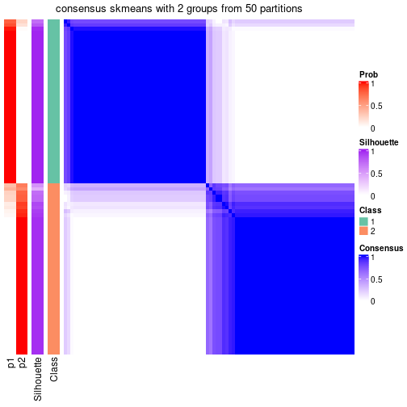</p>

</div>
<div id='tab-node-033-consensus-heatmap-2'>
<pre><code class="r">consensus_heatmap(res, k = 3)
</code></pre>

<p></p>

</div>
<div id='tab-node-033-consensus-heatmap-3'>
<pre><code class="r">consensus_heatmap(res, k = 4)
</code></pre>

<p></p>

</div>
</div>

Heatmaps for the membership of samples in all partitions to see how consistent they are:


<script>
$( function() {
	$( '#tabs-node-033-membership-heatmap' ).tabs();
} );
</script>
<div id='tabs-node-033-membership-heatmap'>
<ul>
<li><a href='#tab-node-033-membership-heatmap-1'>k = 2</a></li>
<li><a href='#tab-node-033-membership-heatmap-2'>k = 3</a></li>
<li><a href='#tab-node-033-membership-heatmap-3'>k = 4</a></li>
</ul>
<div id='tab-node-033-membership-heatmap-1'>
<pre><code class="r">membership_heatmap(res, k = 2)
</code></pre>

<p>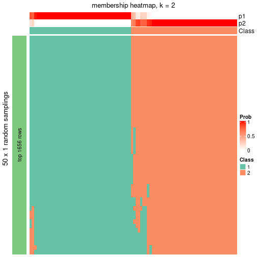</p>

</div>
<div id='tab-node-033-membership-heatmap-2'>
<pre><code class="r">membership_heatmap(res, k = 3)
</code></pre>

<p></p>

</div>
<div id='tab-node-033-membership-heatmap-3'>
<pre><code class="r">membership_heatmap(res, k = 4)
</code></pre>

<p>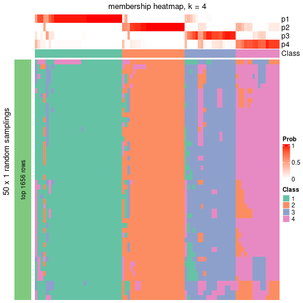</p>

</div>
</div>

As soon as the classes for columns are determined, the signatures
that are significantly different between subgroups can be looked for. 
Following are the heatmaps for signatures.


Signature heatmaps where rows are scaled:


<script>
$( function() {
	$( '#tabs-node-033-get-signatures' ).tabs();
} );
</script>
<div id='tabs-node-033-get-signatures'>
<ul>
<li><a href='#tab-node-033-get-signatures-1'>k = 2</a></li>
<li><a href='#tab-node-033-get-signatures-2'>k = 3</a></li>
<li><a href='#tab-node-033-get-signatures-3'>k = 4</a></li>
</ul>
<div id='tab-node-033-get-signatures-1'>
<pre><code class="r">get_signatures(res, k = 2)
</code></pre>

<p></p>

</div>
<div id='tab-node-033-get-signatures-2'>
<pre><code class="r">get_signatures(res, k = 3)
</code></pre>

<p></p>

</div>
<div id='tab-node-033-get-signatures-3'>
<pre><code class="r">get_signatures(res, k = 4)
</code></pre>

<p></p>

</div>
</div>


Signature heatmaps where rows are not scaled:


<script>
$( function() {
	$( '#tabs-node-033-get-signatures-no-scale' ).tabs();
} );
</script>
<div id='tabs-node-033-get-signatures-no-scale'>
<ul>
<li><a href='#tab-node-033-get-signatures-no-scale-1'>k = 2</a></li>
<li><a href='#tab-node-033-get-signatures-no-scale-2'>k = 3</a></li>
<li><a href='#tab-node-033-get-signatures-no-scale-3'>k = 4</a></li>
</ul>
<div id='tab-node-033-get-signatures-no-scale-1'>
<pre><code class="r">get_signatures(res, k = 2, scale_rows = FALSE)
</code></pre>

<p></p>

</div>
<div id='tab-node-033-get-signatures-no-scale-2'>
<pre><code class="r">get_signatures(res, k = 3, scale_rows = FALSE)
</code></pre>

<p></p>

</div>
<div id='tab-node-033-get-signatures-no-scale-3'>
<pre><code class="r">get_signatures(res, k = 4, scale_rows = FALSE)
</code></pre>

<p></p>

</div>
</div>


Compare the overlap of signatures from different k:

```r
compare_signatures(res)
```


`get_signature()` returns a data frame invisibly. To get the list of signatures, the function
call should be assigned to a variable explicitly. In following code, if `plot` argument is set
to `FALSE`, no heatmap is plotted while only the differential analysis is performed.

```r
# code only for demonstration
tb = get_signature(res, k = ..., plot = FALSE)
```

An example of the output of `tb` is:

```
#>   which_row         fdr    mean_1    mean_2 scaled_mean_1 scaled_mean_2 km
#> 1        38 0.042760348  8.373488  9.131774    -0.5533452     0.5164555  1
#> 2        40 0.018707592  7.106213  8.469186    -0.6173731     0.5762149  1
#> 3        55 0.019134737 10.221463 11.207825    -0.6159697     0.5749050  1
#> 4        59 0.006059896  5.921854  7.869574    -0.6899429     0.6439467  1
#> 5        60 0.018055526  8.928898 10.211722    -0.6204761     0.5791110  1
#> 6        98 0.009384629 15.714769 14.887706     0.6635654    -0.6193277  2
...
```

The columns in `tb` are:

1. `which_row`: row indices corresponding to the input matrix.
2. `fdr`: FDR for the differential test. 
3. `mean_x`: The mean value in group x.
4. `scaled_mean_x`: The mean value in group x after rows are scaled.
5. `km`: Row groups if k-means clustering is applied to rows (which is done by automatically selecting number of clusters).

If there are too many signatures, `top_signatures = ...` can be set to only show the 
signatures with the highest FDRs:

```r
# code only for demonstration
# e.g. to show the top 500 most significant rows
tb = get_signature(res, k = ..., top_signatures = 500)
```

If the signatures are defined as these which are uniquely high in current group, `diff_method` argument
can be set to `"uniquely_high_in_one_group"`:

```r
# code only for demonstration
tb = get_signature(res, k = ..., diff_method = "uniquely_high_in_one_group")
```


UMAP plot which shows how samples are separated.


<script>
$( function() {
	$( '#tabs-node-033-dimension-reduction' ).tabs();
} );
</script>
<div id='tabs-node-033-dimension-reduction'>
<ul>
<li><a href='#tab-node-033-dimension-reduction-1'>k = 2</a></li>
<li><a href='#tab-node-033-dimension-reduction-2'>k = 3</a></li>
<li><a href='#tab-node-033-dimension-reduction-3'>k = 4</a></li>
</ul>
<div id='tab-node-033-dimension-reduction-1'>
<pre><code class="r">dimension_reduction(res, k = 2, method = &quot;UMAP&quot;)
</code></pre>

<p></p>

</div>
<div id='tab-node-033-dimension-reduction-2'>
<pre><code class="r">dimension_reduction(res, k = 3, method = &quot;UMAP&quot;)
</code></pre>

<p></p>

</div>
<div id='tab-node-033-dimension-reduction-3'>
<pre><code class="r">dimension_reduction(res, k = 4, method = &quot;UMAP&quot;)
</code></pre>

<p></p>

</div>
</div>


Following heatmap shows how subgroups are split when increasing `k`:

```r
collect_classes(res)
```


If matrix rows can be associated to genes, consider to use `functional_enrichment(res,
...)` to perform function enrichment for the signature genes. See [this vignette](https://jokergoo.github.io/cola_vignettes/functional_enrichment.html) for more detailed explanations.


 

---------------------------------------------------


### Node04


Parent node: [Node0](#Node0).
Child nodes: 
                [Node011](#Node011)
        ,
                [Node012](#Node012)
        ,
                [Node013](#Node013)
        ,
                [Node014](#Node014)
        ,
                [Node021](#Node021)
        ,
                Node022-leaf
        ,
                Node023-leaf
        ,
                [Node031](#Node031)
        ,
                [Node032](#Node032)
        ,
                [Node033](#Node033)
        ,
                [Node041](#Node041)
        ,
                [Node042](#Node042)
        ,
                Node043-leaf
        .


The object with results only for a single top-value method and a single partitioning method 
can be extracted as:

```r
res = res_rh["04"]
```

A summary of `res` and all the functions that can be applied to it:

```r
res
```

```
#> A 'ConsensusPartition' object with k = 2, 3, 4.
#>   On a matrix with 17778 rows and 365 columns.
#>   Top rows (1778) are extracted by 'ATC' method.
#>   Subgroups are detected by 'skmeans' method.
#>   Performed in total 150 partitions by row resampling.
#>   Best k for subgroups seems to be 3.
#> 
#> Following methods can be applied to this 'ConsensusPartition' object:
#>  [1] "cola_report"             "collect_classes"         "collect_plots"          
#>  [4] "collect_stats"           "colnames"                "compare_partitions"     
#>  [7] "compare_signatures"      "consensus_heatmap"       "dimension_reduction"    
#> [10] "functional_enrichment"   "get_anno_col"            "get_anno"               
#> [13] "get_classes"             "get_consensus"           "get_matrix"             
#> [16] "get_membership"          "get_param"               "get_signatures"         
#> [19] "get_stats"               "is_best_k"               "is_stable_k"            
#> [22] "membership_heatmap"      "ncol"                    "nrow"                   
#> [25] "plot_ecdf"               "predict_classes"         "rownames"               
#> [28] "select_partition_number" "show"                    "suggest_best_k"         
#> [31] "test_to_known_factors"   "top_rows_heatmap"
```

`collect_plots()` function collects all the plots made from `res` for all `k` (number of subgroups)
into one single page to provide an easy and fast comparison between different `k`.

```r
collect_plots(res)
```


The plots are:

- The first row: a plot of the eCDF (empirical cumulative distribution
  function) curves of the consensus matrix for each `k` and the heatmap of
  predicted classes for each `k`.
- The second row: heatmaps of the consensus matrix for each `k`.
- The third row: heatmaps of the membership matrix for each `k`.
- The fouth row: heatmaps of the signatures for each `k`.

All the plots in panels can be made by individual functions and they are
plotted later in this section.

`select_partition_number()` produces several plots showing different
statistics for choosing "optimized" `k`. There are following statistics:

- eCDF curves of the consensus matrix for each `k`;
- 1-PAC. [The PAC score](https://en.wikipedia.org/wiki/Consensus_clustering#Over-interpretation_potential_of_consensus_clustering)
  measures the proportion of the ambiguous subgrouping.
- Mean silhouette score.
- Concordance. The mean probability of fiting the consensus subgroup labels in all
  partitions.
- Area increased. Denote $A_k$ as the area under the eCDF curve for current
  `k`, the area increased is defined as $A_k - A_{k-1}$.
- Rand index. The percent of pairs of samples that are both in a same cluster
  or both are not in a same cluster in the partition of k and k-1.
- Jaccard index. The ratio of pairs of samples are both in a same cluster in
  the partition of k and k-1 and the pairs of samples are both in a same
  cluster in the partition k or k-1.

The detailed explanations of these statistics can be found in [the _cola_
vignette](https://jokergoo.github.io/cola_vignettes/cola.html#toc_13).

Generally speaking, higher 1-PAC score, higher mean silhouette score or higher
concordance corresponds to better partition. Rand index and Jaccard index
measure how similar the current partition is compared to partition with `k-1`.
If they are too similar, we won't accept `k` is better than `k-1`.

```r
select_partition_number(res)
```


The numeric values for all these statistics can be obtained by `get_stats()`.

```r
get_stats(res)
```

```
#>   k 1-PAC mean_silhouette concordance area_increased  Rand Jaccard
#> 2 2 1.000           0.986       0.994          0.492 0.508   0.508
#> 3 3 1.000           0.970       0.988          0.312 0.809   0.638
#> 4 4 0.863           0.921       0.942          0.119 0.893   0.712
```

`suggest_best_k()` suggests the best $k$ based on these statistics. The rules are as follows:

- All $k$ with Jaccard index larger than 0.95 are removed because increasing
  $k$ does not provide enough extra information. If all $k$ are removed, it is
  marked as no subgroup is detected.
- For all $k$ with 1-PAC score larger than 0.9, the maximal $k$ is taken as
  the best $k$, and other $k$ are marked as optional $k$.
- If it does not fit the second rule. The $k$ with the maximal vote of the
  highest 1-PAC score, highest mean silhouette, and highest concordance is
  taken as the best $k$.

```r
suggest_best_k(res)
```

```
#> [1] 3
#> attr(,"optional")
#> [1] 2
```

There is also optional best $k$ = 2 that is worth to check.

Following is the table of the partitions (You need to click the **show/hide
code output** link to see it). The membership matrix (columns with name `p*`)
is inferred by
[`clue::cl_consensus()`](https://www.rdocumentation.org/link/cl_consensus?package=clue)
function with the `SE` method. Basically the value in the membership matrix
represents the probability to belong to a certain group. The finall subgroup
label for an item is determined with the group with highest probability it
belongs to.

In `get_classes()` function, the entropy is calculated from the membership
matrix and the silhouette score is calculated from the consensus matrix.


<script>
$( function() {
	$( '#tabs-node-04-get-classes' ).tabs();
} );
</script>
<div id='tabs-node-04-get-classes'>
<ul>
<li><a href='#tab-node-04-get-classes-1'>k = 2</a></li>
<li><a href='#tab-node-04-get-classes-2'>k = 3</a></li>
<li><a href='#tab-node-04-get-classes-3'>k = 4</a></li>
</ul>

<div id='tab-node-04-get-classes-1'>
<p><a id='tab-node-04-get-classes-1-a' style='color:#0366d6' href='#'>show/hide code output</a></p>
<pre><code class="r">cbind(get_classes(res, k = 2), get_membership(res, k = 2))
</code></pre>

<pre><code>#&gt;            class entropy silhouette   p1   p2
#&gt; HSPC_025       2   0.000    0.99358 0.00 1.00
#&gt; HSPC_037       2   0.000    0.99358 0.00 1.00
#&gt; HSPC_008       2   0.000    0.99358 0.00 1.00
#&gt; HSPC_020       2   0.000    0.99358 0.00 1.00
#&gt; HSPC_026       1   0.000    0.99457 1.00 0.00
#&gt; LT-HSC_002     2   0.000    0.99358 0.00 1.00
#&gt; HSPC_022       1   0.000    0.99457 1.00 0.00
#&gt; HSPC_011       2   0.000    0.99358 0.00 1.00
#&gt; HSPC_023       2   0.000    0.99358 0.00 1.00
#&gt; HSPC_041       2   0.000    0.99358 0.00 1.00
#&gt; HSPC_012       2   0.000    0.99358 0.00 1.00
#&gt; HSPC_018       2   0.000    0.99358 0.00 1.00
#&gt; HSPC_006       1   0.000    0.99457 1.00 0.00
#&gt; Prog_025       1   0.000    0.99457 1.00 0.00
#&gt; LT-HSC_007     2   0.000    0.99358 0.00 1.00
#&gt; Prog_001       2   0.000    0.99358 0.00 1.00
#&gt; Prog_010       1   0.000    0.99457 1.00 0.00
#&gt; Prog_016       1   0.000    0.99457 1.00 0.00
#&gt; Prog_022       1   0.000    0.99457 1.00 0.00
#&gt; Prog_040       1   0.000    0.99457 1.00 0.00
#&gt; LT-HSC_010     1   0.000    0.99457 1.00 0.00
#&gt; Prog_030       1   0.000    0.99457 1.00 0.00
#&gt; Prog_036       1   0.000    0.99457 1.00 0.00
#&gt; Prog_042       1   0.000    0.99457 1.00 0.00
#&gt; LT-HSC_012     1   0.000    0.99457 1.00 0.00
#&gt; HSPC_055       2   0.000    0.99358 0.00 1.00
#&gt; HSPC_061       2   0.000    0.99358 0.00 1.00
#&gt; HSPC_067       2   0.000    0.99358 0.00 1.00
#&gt; HSPC_079       1   0.000    0.99457 1.00 0.00
#&gt; HSPC_043       2   0.000    0.99358 0.00 1.00
#&gt; HSPC_050       2   0.000    0.99358 0.00 1.00
#&gt; HSPC_062       1   0.000    0.99457 1.00 0.00
#&gt; HSPC_044       2   0.000    0.99358 0.00 1.00
#&gt; HSPC_063       1   0.000    0.99457 1.00 0.00
#&gt; HSPC_045       2   0.000    0.99358 0.00 1.00
#&gt; HSPC_052       2   0.000    0.99358 0.00 1.00
#&gt; HSPC_064       1   0.000    0.99457 1.00 0.00
#&gt; HSPC_082       2   0.000    0.99358 0.00 1.00
#&gt; HSPC_071       1   0.000    0.99457 1.00 0.00
#&gt; HSPC_072       1   0.000    0.99457 1.00 0.00
#&gt; HSPC_078       2   0.000    0.99358 0.00 1.00
#&gt; HSPC_084       2   0.000    0.99358 0.00 1.00
#&gt; Prog_062       2   0.000    0.99358 0.00 1.00
#&gt; Prog_074       1   0.000    0.99457 1.00 0.00
#&gt; Prog_080       2   0.000    0.99358 0.00 1.00
#&gt; Prog_063       2   0.000    0.99358 0.00 1.00
#&gt; LT-HSC_021     1   0.000    0.99457 1.00 0.00
#&gt; Prog_052       2   0.000    0.99358 0.00 1.00
#&gt; Prog_070       1   0.000    0.99457 1.00 0.00
#&gt; Prog_054       1   0.000    0.99457 1.00 0.00
#&gt; HSPC_109       2   0.584    0.83871 0.14 0.86
#&gt; HSPC_085       2   0.000    0.99358 0.00 1.00
#&gt; HSPC_098       2   0.000    0.99358 0.00 1.00
#&gt; HSPC_110       2   0.000    0.99358 0.00 1.00
#&gt; HSPC_099       2   0.000    0.99358 0.00 1.00
#&gt; HSPC_117       2   0.000    0.99358 0.00 1.00
#&gt; HSPC_107       2   0.000    0.99358 0.00 1.00
#&gt; HSPC_096       2   0.000    0.99358 0.00 1.00
#&gt; Prog_109       1   0.000    0.99457 1.00 0.00
#&gt; Prog_118       1   0.000    0.99457 1.00 0.00
#&gt; Prog_088       2   0.000    0.99358 0.00 1.00
#&gt; Prog_108       1   0.000    0.99457 1.00 0.00
#&gt; Prog_114       1   0.000    0.99457 1.00 0.00
#&gt; HSPC_151       2   0.000    0.99358 0.00 1.00
#&gt; HSPC_157       2   0.000    0.99358 0.00 1.00
#&gt; HSPC_127       1   0.000    0.99457 1.00 0.00
#&gt; HSPC_146       1   0.000    0.99457 1.00 0.00
#&gt; HSPC_158       2   0.000    0.99358 0.00 1.00
#&gt; HSPC_159       2   0.000    0.99358 0.00 1.00
#&gt; HSPC_165       2   0.000    0.99358 0.00 1.00
#&gt; HSPC_136       2   0.000    0.99358 0.00 1.00
#&gt; HSPC_142       1   0.000    0.99457 1.00 0.00
#&gt; HSPC_148       2   0.000    0.99358 0.00 1.00
#&gt; HSPC_154       2   0.000    0.99358 0.00 1.00
#&gt; HSPC_166       2   0.000    0.99358 0.00 1.00
#&gt; HSPC_130       2   0.000    0.99358 0.00 1.00
#&gt; HSPC_161       2   0.000    0.99358 0.00 1.00
#&gt; HSPC_168       1   0.000    0.99457 1.00 0.00
#&gt; Prog_134       2   0.000    0.99358 0.00 1.00
#&gt; Prog_152       2   0.000    0.99358 0.00 1.00
#&gt; LT-HSC_044     2   0.000    0.99358 0.00 1.00
#&gt; Prog_159       1   0.000    0.99457 1.00 0.00
#&gt; Prog_165       2   0.000    0.99358 0.00 1.00
#&gt; LT-HSC_045     1   0.000    0.99457 1.00 0.00
#&gt; Prog_149       1   0.000    0.99457 1.00 0.00
#&gt; Prog_144       2   0.000    0.99358 0.00 1.00
#&gt; Prog_162       1   0.000    0.99457 1.00 0.00
#&gt; HSPC_175       2   0.141    0.97460 0.02 0.98
#&gt; HSPC_169       2   0.000    0.99358 0.00 1.00
#&gt; HSPC_190       1   0.000    0.99457 1.00 0.00
#&gt; HSPC_196       2   0.000    0.99358 0.00 1.00
#&gt; HSPC_203       2   0.000    0.99358 0.00 1.00
#&gt; HSPC_180       2   0.000    0.99358 0.00 1.00
#&gt; HSPC_204       1   0.000    0.99457 1.00 0.00
#&gt; HSPC_210       2   0.000    0.99358 0.00 1.00
#&gt; Prog_175       1   0.000    0.99457 1.00 0.00
#&gt; Prog_193       2   0.000    0.99358 0.00 1.00
#&gt; Prog_205       1   0.000    0.99457 1.00 0.00
#&gt; Prog_182       2   0.000    0.99358 0.00 1.00
#&gt; Prog_200       2   0.000    0.99358 0.00 1.00
#&gt; Prog_177       2   0.000    0.99358 0.00 1.00
#&gt; Prog_195       2   0.000    0.99358 0.00 1.00
#&gt; Prog_201       1   0.000    0.99457 1.00 0.00
#&gt; Prog_171       2   0.000    0.99358 0.00 1.00
#&gt; Prog_173       2   0.000    0.99358 0.00 1.00
#&gt; HSPC_211       2   0.000    0.99358 0.00 1.00
#&gt; HSPC_230       2   0.000    0.99358 0.00 1.00
#&gt; HSPC_236       2   0.000    0.99358 0.00 1.00
#&gt; HSPC_219       1   1.000   -0.00963 0.50 0.50
#&gt; HSPC_243       1   0.000    0.99457 1.00 0.00
#&gt; HSPC_213       1   0.000    0.99457 1.00 0.00
#&gt; HSPC_250       1   0.000    0.99457 1.00 0.00
#&gt; HSPC_233       2   0.000    0.99358 0.00 1.00
#&gt; HSPC_251       1   0.000    0.99457 1.00 0.00
#&gt; HSPC_215       1   0.000    0.99457 1.00 0.00
#&gt; HSPC_222       2   0.000    0.99358 0.00 1.00
#&gt; Prog_223       2   0.000    0.99358 0.00 1.00
#&gt; Prog_230       1   0.000    0.99457 1.00 0.00
#&gt; Prog_248       2   0.000    0.99358 0.00 1.00
#&gt; Prog_237       2   0.000    0.99358 0.00 1.00
#&gt; Prog_213       2   0.795    0.68902 0.24 0.76
#&gt; LT-HSC_070     2   0.000    0.99358 0.00 1.00
#&gt; Prog_214       1   0.000    0.99457 1.00 0.00
#&gt; HSPC_271       1   0.000    0.99457 1.00 0.00
#&gt; HSPC_253       1   0.000    0.99457 1.00 0.00
#&gt; HSPC_278       2   0.000    0.99358 0.00 1.00
#&gt; HSPC_290       1   0.000    0.99457 1.00 0.00
#&gt; HSPC_279       2   0.000    0.99358 0.00 1.00
#&gt; HSPC_280       1   0.000    0.99457 1.00 0.00
#&gt; HSPC_286       2   0.000    0.99358 0.00 1.00
#&gt; HSPC_292       1   0.000    0.99457 1.00 0.00
#&gt; LT-HSC_076     2   0.000    0.99358 0.00 1.00
#&gt; HSPC_263       1   0.000    0.99457 1.00 0.00
#&gt; HSPC_287       1   0.000    0.99457 1.00 0.00
#&gt; HSPC_293       1   0.000    0.99457 1.00 0.00
#&gt; HSPC_257       1   0.000    0.99457 1.00 0.00
#&gt; HSPC_294       1   0.000    0.99457 1.00 0.00
#&gt; Prog_283       2   0.000    0.99358 0.00 1.00
#&gt; Prog_289       1   0.000    0.99457 1.00 0.00
#&gt; Prog_291       1   0.000    0.99457 1.00 0.00
#&gt; Prog_256       2   0.000    0.99358 0.00 1.00
#&gt; HSPC_313       2   0.000    0.99358 0.00 1.00
#&gt; HSPC_295       1   0.000    0.99457 1.00 0.00
#&gt; HSPC_308       2   0.000    0.99358 0.00 1.00
#&gt; HSPC_314       2   0.000    0.99358 0.00 1.00
#&gt; HSPC_320       2   0.000    0.99358 0.00 1.00
#&gt; LT-HSC_086     2   0.000    0.99358 0.00 1.00
#&gt; HSPC_321       2   0.242    0.95464 0.04 0.96
#&gt; HSPC_328       2   0.000    0.99358 0.00 1.00
#&gt; LT-HSC_088     2   0.000    0.99358 0.00 1.00
#&gt; HSPC_305       1   0.000    0.99457 1.00 0.00
#&gt; HSPC_329       2   0.000    0.99358 0.00 1.00
#&gt; HSPC_312       1   0.000    0.99457 1.00 0.00
#&gt; Prog_301       1   0.000    0.99457 1.00 0.00
#&gt; Prog_307       1   0.000    0.99457 1.00 0.00
#&gt; Prog_313       1   0.000    0.99457 1.00 0.00
#&gt; Prog_295       1   0.000    0.99457 1.00 0.00
#&gt; Prog_315       1   0.000    0.99457 1.00 0.00
#&gt; Prog_321       1   0.000    0.99457 1.00 0.00
#&gt; Prog_333       2   0.000    0.99358 0.00 1.00
#&gt; LT-HSC_093     2   0.000    0.99358 0.00 1.00
#&gt; Prog_297       2   0.000    0.99358 0.00 1.00
#&gt; Prog_310       1   0.000    0.99457 1.00 0.00
#&gt; Prog_316       1   0.000    0.99457 1.00 0.00
#&gt; Prog_322       2   0.000    0.99358 0.00 1.00
#&gt; Prog_328       1   0.000    0.99457 1.00 0.00
#&gt; LT-HSC_094     2   0.000    0.99358 0.00 1.00
#&gt; Prog_305       1   0.000    0.99457 1.00 0.00
#&gt; Prog_311       1   0.000    0.99457 1.00 0.00
#&gt; Prog_323       1   0.000    0.99457 1.00 0.00
#&gt; Prog_329       1   0.000    0.99457 1.00 0.00
#&gt; Prog_335       1   0.000    0.99457 1.00 0.00
#&gt; HSPC_344       1   0.000    0.99457 1.00 0.00
#&gt; HSPC_356       2   0.000    0.99358 0.00 1.00
#&gt; HSPC_362       1   0.000    0.99457 1.00 0.00
#&gt; HSPC_368       1   0.000    0.99457 1.00 0.00
#&gt; HSPC_345       2   0.000    0.99358 0.00 1.00
#&gt; HSPC_351       2   0.000    0.99358 0.00 1.00
#&gt; HSPC_352       1   0.000    0.99457 1.00 0.00
#&gt; HSPC_358       1   0.000    0.99457 1.00 0.00
#&gt; HSPC_364       2   0.000    0.99358 0.00 1.00
#&gt; HSPC_376       2   0.680    0.78423 0.18 0.82
#&gt; HSPC_377       1   0.000    0.99457 1.00 0.00
#&gt; LT-HSC_101     1   0.000    0.99457 1.00 0.00
#&gt; HSPC_360       2   0.000    0.99358 0.00 1.00
#&gt; HSPC_372       2   0.000    0.99358 0.00 1.00
#&gt; Prog_349       1   0.000    0.99457 1.00 0.00
#&gt; Prog_355       1   0.000    0.99457 1.00 0.00
#&gt; Prog_362       1   0.000    0.99457 1.00 0.00
#&gt; Prog_345       1   0.000    0.99457 1.00 0.00
#&gt; Prog_369       1   0.000    0.99457 1.00 0.00
#&gt; LT-HSC_105     1   0.000    0.99457 1.00 0.00
#&gt; Prog_370       1   0.000    0.99457 1.00 0.00
#&gt; LT-HSC_106     1   0.000    0.99457 1.00 0.00
#&gt; Prog_354       1   0.000    0.99457 1.00 0.00
#&gt; HSPC_403       2   0.680    0.78349 0.18 0.82
#&gt; HSPC_421       2   0.402    0.91167 0.08 0.92
#&gt; HSPC_386       2   0.000    0.99358 0.00 1.00
#&gt; HSPC_387       1   0.000    0.99457 1.00 0.00
#&gt; HSPC_393       1   0.000    0.99457 1.00 0.00
#&gt; HSPC_400       1   0.000    0.99457 1.00 0.00
#&gt; HSPC_406       2   0.000    0.99358 0.00 1.00
#&gt; HSPC_424       1   0.000    0.99457 1.00 0.00
#&gt; HSPC_395       2   0.000    0.99358 0.00 1.00
#&gt; HSPC_413       2   0.000    0.99358 0.00 1.00
#&gt; HSPC_425       1   0.000    0.99457 1.00 0.00
#&gt; HSPC_390       2   0.000    0.99358 0.00 1.00
#&gt; HSPC_426       2   0.000    0.99358 0.00 1.00
#&gt; Prog_422       1   0.000    0.99457 1.00 0.00
#&gt; Prog_411       2   0.000    0.99358 0.00 1.00
#&gt; Prog_417       1   0.000    0.99457 1.00 0.00
#&gt; Prog_423       1   0.000    0.99457 1.00 0.00
#&gt; Prog_390       2   0.000    0.99358 0.00 1.00
#&gt; Prog_402       1   0.000    0.99457 1.00 0.00
#&gt; Prog_384       1   0.000    0.99457 1.00 0.00
#&gt; HSPC_440       2   0.000    0.99358 0.00 1.00
#&gt; HSPC_466       2   0.000    0.99358 0.00 1.00
#&gt; HSPC_461       2   0.000    0.99358 0.00 1.00
#&gt; Prog_440       2   0.000    0.99358 0.00 1.00
#&gt; Prog_458       2   0.000    0.99358 0.00 1.00
#&gt; Prog_435       1   0.000    0.99457 1.00 0.00
#&gt; Prog_465       2   0.000    0.99358 0.00 1.00
#&gt; Prog_454       1   0.000    0.99457 1.00 0.00
#&gt; Prog_460       2   0.795    0.68844 0.24 0.76
#&gt; Prog_466       1   0.000    0.99457 1.00 0.00
#&gt; Prog_462       2   0.000    0.99358 0.00 1.00
#&gt; Prog_468       1   0.000    0.99457 1.00 0.00
#&gt; LT-HSC_120     1   0.000    0.99457 1.00 0.00
#&gt; Prog_432       2   0.000    0.99358 0.00 1.00
#&gt; HSPC_505       2   0.000    0.99358 0.00 1.00
#&gt; LT-HSC_122     2   0.000    0.99358 0.00 1.00
#&gt; HSPC_489       2   0.000    0.99358 0.00 1.00
#&gt; HSPC_495       2   0.000    0.99358 0.00 1.00
#&gt; HSPC_491       1   0.000    0.99457 1.00 0.00
#&gt; HSPC_509       2   0.000    0.99358 0.00 1.00
#&gt; HSPC_486       2   0.000    0.99358 0.00 1.00
#&gt; HSPC_510       1   0.000    0.99457 1.00 0.00
#&gt; Prog_469       2   0.000    0.99358 0.00 1.00
#&gt; Prog_494       2   0.000    0.99358 0.00 1.00
#&gt; Prog_483       2   0.000    0.99358 0.00 1.00
#&gt; Prog_507       1   0.000    0.99457 1.00 0.00
#&gt; Prog_490       2   0.000    0.99358 0.00 1.00
#&gt; Prog_472       2   0.000    0.99358 0.00 1.00
#&gt; Prog_497       1   0.000    0.99457 1.00 0.00
#&gt; Prog_503       2   0.000    0.99358 0.00 1.00
#&gt; Prog_510       2   0.000    0.99358 0.00 1.00
#&gt; HSPC_537       2   0.000    0.99358 0.00 1.00
#&gt; HSPC_543       2   0.000    0.99358 0.00 1.00
#&gt; HSPC_520       2   0.000    0.99358 0.00 1.00
#&gt; HSPC_532       1   0.000    0.99457 1.00 0.00
#&gt; HSPC_550       2   0.000    0.99358 0.00 1.00
#&gt; HSPC_551       2   0.000    0.99358 0.00 1.00
#&gt; HSPC_528       1   0.000    0.99457 1.00 0.00
#&gt; HSPC_552       2   0.000    0.99358 0.00 1.00
#&gt; Prog_518       1   0.000    0.99457 1.00 0.00
#&gt; Prog_524       2   0.000    0.99358 0.00 1.00
#&gt; Prog_542       1   0.000    0.99457 1.00 0.00
#&gt; Prog_512       1   0.000    0.99457 1.00 0.00
#&gt; Prog_519       2   0.000    0.99358 0.00 1.00
#&gt; Prog_525       2   0.000    0.99358 0.00 1.00
#&gt; Prog_549       1   0.000    0.99457 1.00 0.00
#&gt; Prog_539       1   0.000    0.99457 1.00 0.00
#&gt; Prog_515       2   0.000    0.99358 0.00 1.00
#&gt; Prog_534       1   0.000    0.99457 1.00 0.00
#&gt; Prog_552       1   0.000    0.99457 1.00 0.00
#&gt; LT-HSC_144     2   0.680    0.78359 0.18 0.82
#&gt; HSPC_590       2   0.000    0.99358 0.00 1.00
#&gt; LT-HSC_148     2   0.000    0.99358 0.00 1.00
#&gt; HSPC_569       1   0.000    0.99457 1.00 0.00
#&gt; Prog_553       2   0.000    0.99358 0.00 1.00
#&gt; Prog_578       1   0.000    0.99457 1.00 0.00
#&gt; Prog_561       2   0.000    0.99358 0.00 1.00
#&gt; Prog_586       2   0.000    0.99358 0.00 1.00
#&gt; Prog_570       1   0.000    0.99457 1.00 0.00
#&gt; HSPC_601       2   0.000    0.99358 0.00 1.00
#&gt; HSPC_613       2   0.000    0.99358 0.00 1.00
#&gt; HSPC_631       1   0.000    0.99457 1.00 0.00
#&gt; HSPC_614       2   0.000    0.99358 0.00 1.00
#&gt; HSPC_596       2   0.000    0.99358 0.00 1.00
#&gt; HSPC_627       2   0.000    0.99358 0.00 1.00
#&gt; LT-HSC_159     1   0.000    0.99457 1.00 0.00
#&gt; HSPC_597       2   0.000    0.99358 0.00 1.00
#&gt; HSPC_628       2   0.000    0.99358 0.00 1.00
#&gt; HSPC_634       2   0.000    0.99358 0.00 1.00
#&gt; HSPC_598       2   0.000    0.99358 0.00 1.00
#&gt; HSPC_623       2   0.000    0.99358 0.00 1.00
#&gt; HSPC_629       2   0.000    0.99358 0.00 1.00
#&gt; HSPC_635       2   0.000    0.99358 0.00 1.00
#&gt; Prog_625       1   0.000    0.99457 1.00 0.00
#&gt; Prog_620       2   0.000    0.99358 0.00 1.00
#&gt; Prog_615       1   0.000    0.99457 1.00 0.00
#&gt; Prog_633       2   0.000    0.99358 0.00 1.00
#&gt; Prog_634       2   0.000    0.99358 0.00 1.00
#&gt; LT-HSC_166     1   0.327    0.93171 0.94 0.06
#&gt; HSPC_643       2   0.000    0.99358 0.00 1.00
#&gt; HSPC_661       2   0.000    0.99358 0.00 1.00
#&gt; LT-HSC_170     2   0.000    0.99358 0.00 1.00
#&gt; HSPC_651       1   0.000    0.99457 1.00 0.00
#&gt; HSPC_663       1   0.000    0.99457 1.00 0.00
#&gt; LT-HSC_171     2   0.000    0.99358 0.00 1.00
#&gt; HSPC_652       2   0.000    0.99358 0.00 1.00
#&gt; HSPC_658       1   0.000    0.99457 1.00 0.00
#&gt; HSPC_665       2   0.000    0.99358 0.00 1.00
#&gt; HSPC_654       2   0.000    0.99358 0.00 1.00
#&gt; HSPC_660       2   0.000    0.99358 0.00 1.00
#&gt; HSPC_666       1   0.000    0.99457 1.00 0.00
#&gt; Prog_643       1   0.000    0.99457 1.00 0.00
#&gt; Prog_667       2   0.000    0.99358 0.00 1.00
#&gt; Prog_673       2   0.000    0.99358 0.00 1.00
#&gt; Prog_645       2   0.000    0.99358 0.00 1.00
#&gt; Prog_647       2   0.000    0.99358 0.00 1.00
#&gt; Prog_653       2   0.000    0.99358 0.00 1.00
#&gt; Prog_648       2   0.000    0.99358 0.00 1.00
#&gt; Prog_678       1   0.000    0.99457 1.00 0.00
#&gt; LT-HSC_180     2   0.000    0.99358 0.00 1.00
#&gt; HSPC_697       1   0.000    0.99457 1.00 0.00
#&gt; HSPC_717       1   0.000    0.99457 1.00 0.00
#&gt; HSPC_681       2   0.000    0.99358 0.00 1.00
#&gt; HSPC_700       1   0.000    0.99457 1.00 0.00
#&gt; HSPC_701       2   0.000    0.99358 0.00 1.00
#&gt; HSPC_707       1   0.855    0.60798 0.72 0.28
#&gt; HSPC_683       1   0.000    0.99457 1.00 0.00
#&gt; HSPC_696       2   0.000    0.99358 0.00 1.00
#&gt; Prog_703       2   0.000    0.99358 0.00 1.00
#&gt; Prog_686       1   0.000    0.99457 1.00 0.00
#&gt; Prog_696       1   0.000    0.99457 1.00 0.00
#&gt; HSPC_735       2   0.000    0.99358 0.00 1.00
#&gt; HSPC_760       2   0.141    0.97460 0.02 0.98
#&gt; HSPC_731       1   0.000    0.99457 1.00 0.00
#&gt; HSPC_744       2   0.000    0.99358 0.00 1.00
#&gt; HSPC_762       2   0.000    0.99358 0.00 1.00
#&gt; Prog_739       1   0.000    0.99457 1.00 0.00
#&gt; Prog_757       1   0.000    0.99457 1.00 0.00
#&gt; Prog_746       1   0.000    0.99457 1.00 0.00
#&gt; Prog_748       1   0.000    0.99457 1.00 0.00
#&gt; Prog_749       2   0.000    0.99358 0.00 1.00
#&gt; Prog_761       1   0.000    0.99457 1.00 0.00
#&gt; Prog_732       2   0.000    0.99358 0.00 1.00
#&gt; Prog_750       1   0.000    0.99457 1.00 0.00
#&gt; Prog_756       2   0.000    0.99358 0.00 1.00
#&gt; HSPC_770       2   0.000    0.99358 0.00 1.00
#&gt; HSPC_800       1   0.000    0.99457 1.00 0.00
#&gt; HSPC_789       2   0.000    0.99358 0.00 1.00
#&gt; LT-HSC_207     2   0.000    0.99358 0.00 1.00
#&gt; HSPC_772       2   0.000    0.99358 0.00 1.00
#&gt; HSPC_790       2   0.000    0.99358 0.00 1.00
#&gt; HSPC_779       2   0.000    0.99358 0.00 1.00
#&gt; HSPC_791       2   0.000    0.99358 0.00 1.00
#&gt; Prog_787       2   0.000    0.99358 0.00 1.00
#&gt; LT-HSC_211     2   0.000    0.99358 0.00 1.00
#&gt; Prog_796       1   0.000    0.99457 1.00 0.00
#&gt; Prog_803       2   0.000    0.99358 0.00 1.00
#&gt; LT-HSC_216     1   0.000    0.99457 1.00 0.00
#&gt; HSPC_841       2   0.000    0.99358 0.00 1.00
#&gt; HSPC_819       2   0.000    0.99358 0.00 1.00
#&gt; HSPC_837       1   0.000    0.99457 1.00 0.00
#&gt; HSPC_814       1   0.000    0.99457 1.00 0.00
#&gt; HSPC_821       2   0.000    0.99358 0.00 1.00
#&gt; HSPC_839       1   0.000    0.99457 1.00 0.00
#&gt; HSPC_816       2   0.000    0.99358 0.00 1.00
#&gt; HSPC_846       2   0.000    0.99358 0.00 1.00
#&gt; Prog_841       1   0.000    0.99457 1.00 0.00
#&gt; Prog_805       2   0.000    0.99358 0.00 1.00
#&gt; Prog_849       2   0.000    0.99358 0.00 1.00
#&gt; Prog_852       1   0.000    0.99457 1.00 0.00
</code></pre>

<script>
$('#tab-node-04-get-classes-1-a').parent().next().next().hide();
$('#tab-node-04-get-classes-1-a').click(function(){
  $('#tab-node-04-get-classes-1-a').parent().next().next().toggle();
  return(false);
});
</script>
</div>

<div id='tab-node-04-get-classes-2'>
<p><a id='tab-node-04-get-classes-2-a' style='color:#0366d6' href='#'>show/hide code output</a></p>
<pre><code class="r">cbind(get_classes(res, k = 3), get_membership(res, k = 3))
</code></pre>

<pre><code>#&gt;            class entropy silhouette   p1   p2   p3
#&gt; HSPC_025       2  0.0000    0.98830 0.00 1.00 0.00
#&gt; HSPC_037       2  0.0000    0.98830 0.00 1.00 0.00
#&gt; HSPC_008       2  0.0000    0.98830 0.00 1.00 0.00
#&gt; HSPC_020       2  0.0000    0.98830 0.00 1.00 0.00
#&gt; HSPC_026       1  0.0000    0.98965 1.00 0.00 0.00
#&gt; LT-HSC_002     2  0.0000    0.98830 0.00 1.00 0.00
#&gt; HSPC_022       1  0.0000    0.98965 1.00 0.00 0.00
#&gt; HSPC_011       2  0.0000    0.98830 0.00 1.00 0.00
#&gt; HSPC_023       2  0.0000    0.98830 0.00 1.00 0.00
#&gt; HSPC_041       2  0.0000    0.98830 0.00 1.00 0.00
#&gt; HSPC_012       2  0.5397    0.60819 0.00 0.72 0.28
#&gt; HSPC_018       2  0.0000    0.98830 0.00 1.00 0.00
#&gt; HSPC_006       1  0.0000    0.98965 1.00 0.00 0.00
#&gt; Prog_025       1  0.0000    0.98965 1.00 0.00 0.00
#&gt; LT-HSC_007     2  0.0000    0.98830 0.00 1.00 0.00
#&gt; Prog_001       3  0.0000    0.98077 0.00 0.00 1.00
#&gt; Prog_010       1  0.2959    0.88341 0.90 0.00 0.10
#&gt; Prog_016       1  0.0000    0.98965 1.00 0.00 0.00
#&gt; Prog_022       1  0.0000    0.98965 1.00 0.00 0.00
#&gt; Prog_040       2  0.0892    0.96708 0.02 0.98 0.00
#&gt; LT-HSC_010     1  0.0000    0.98965 1.00 0.00 0.00
#&gt; Prog_030       1  0.0000    0.98965 1.00 0.00 0.00
#&gt; Prog_036       1  0.0000    0.98965 1.00 0.00 0.00
#&gt; Prog_042       1  0.0000    0.98965 1.00 0.00 0.00
#&gt; LT-HSC_012     1  0.0000    0.98965 1.00 0.00 0.00
#&gt; HSPC_055       2  0.0000    0.98830 0.00 1.00 0.00
#&gt; HSPC_061       2  0.0000    0.98830 0.00 1.00 0.00
#&gt; HSPC_067       2  0.0000    0.98830 0.00 1.00 0.00
#&gt; HSPC_079       1  0.0000    0.98965 1.00 0.00 0.00
#&gt; HSPC_043       2  0.0000    0.98830 0.00 1.00 0.00
#&gt; HSPC_050       3  0.0000    0.98077 0.00 0.00 1.00
#&gt; HSPC_062       1  0.0000    0.98965 1.00 0.00 0.00
#&gt; HSPC_044       3  0.0000    0.98077 0.00 0.00 1.00
#&gt; HSPC_063       1  0.0000    0.98965 1.00 0.00 0.00
#&gt; HSPC_045       2  0.0000    0.98830 0.00 1.00 0.00
#&gt; HSPC_052       3  0.0000    0.98077 0.00 0.00 1.00
#&gt; HSPC_064       1  0.0000    0.98965 1.00 0.00 0.00
#&gt; HSPC_082       2  0.0000    0.98830 0.00 1.00 0.00
#&gt; HSPC_071       1  0.0000    0.98965 1.00 0.00 0.00
#&gt; HSPC_072       1  0.0000    0.98965 1.00 0.00 0.00
#&gt; HSPC_078       3  0.0000    0.98077 0.00 0.00 1.00
#&gt; HSPC_084       2  0.0000    0.98830 0.00 1.00 0.00
#&gt; Prog_062       2  0.0000    0.98830 0.00 1.00 0.00
#&gt; Prog_074       1  0.0000    0.98965 1.00 0.00 0.00
#&gt; Prog_080       3  0.0000    0.98077 0.00 0.00 1.00
#&gt; Prog_063       3  0.0000    0.98077 0.00 0.00 1.00
#&gt; LT-HSC_021     1  0.0000    0.98965 1.00 0.00 0.00
#&gt; Prog_052       3  0.0000    0.98077 0.00 0.00 1.00
#&gt; Prog_070       1  0.0000    0.98965 1.00 0.00 0.00
#&gt; Prog_054       1  0.0000    0.98965 1.00 0.00 0.00
#&gt; HSPC_109       3  0.0000    0.98077 0.00 0.00 1.00
#&gt; HSPC_085       2  0.0000    0.98830 0.00 1.00 0.00
#&gt; HSPC_098       3  0.0000    0.98077 0.00 0.00 1.00
#&gt; HSPC_110       3  0.0000    0.98077 0.00 0.00 1.00
#&gt; HSPC_099       2  0.0000    0.98830 0.00 1.00 0.00
#&gt; HSPC_117       2  0.2066    0.92933 0.00 0.94 0.06
#&gt; HSPC_107       2  0.0000    0.98830 0.00 1.00 0.00
#&gt; HSPC_096       3  0.0000    0.98077 0.00 0.00 1.00
#&gt; Prog_109       1  0.0000    0.98965 1.00 0.00 0.00
#&gt; Prog_118       1  0.0000    0.98965 1.00 0.00 0.00
#&gt; Prog_088       3  0.0000    0.98077 0.00 0.00 1.00
#&gt; Prog_108       1  0.0000    0.98965 1.00 0.00 0.00
#&gt; Prog_114       1  0.0000    0.98965 1.00 0.00 0.00
#&gt; HSPC_151       2  0.0892    0.96998 0.00 0.98 0.02
#&gt; HSPC_157       3  0.0000    0.98077 0.00 0.00 1.00
#&gt; HSPC_127       1  0.1529    0.94632 0.96 0.04 0.00
#&gt; HSPC_146       1  0.0000    0.98965 1.00 0.00 0.00
#&gt; HSPC_158       2  0.0000    0.98830 0.00 1.00 0.00
#&gt; HSPC_159       2  0.0000    0.98830 0.00 1.00 0.00
#&gt; HSPC_165       3  0.0000    0.98077 0.00 0.00 1.00
#&gt; HSPC_136       2  0.0000    0.98830 0.00 1.00 0.00
#&gt; HSPC_142       2  0.0000    0.98830 0.00 1.00 0.00
#&gt; HSPC_148       3  0.0000    0.98077 0.00 0.00 1.00
#&gt; HSPC_154       3  0.0000    0.98077 0.00 0.00 1.00
#&gt; HSPC_166       2  0.0000    0.98830 0.00 1.00 0.00
#&gt; HSPC_130       2  0.0000    0.98830 0.00 1.00 0.00
#&gt; HSPC_161       2  0.0000    0.98830 0.00 1.00 0.00
#&gt; HSPC_168       1  0.0000    0.98965 1.00 0.00 0.00
#&gt; Prog_134       3  0.0000    0.98077 0.00 0.00 1.00
#&gt; Prog_152       3  0.4555    0.74862 0.00 0.20 0.80
#&gt; LT-HSC_044     3  0.0000    0.98077 0.00 0.00 1.00
#&gt; Prog_159       1  0.0000    0.98965 1.00 0.00 0.00
#&gt; Prog_165       3  0.0000    0.98077 0.00 0.00 1.00
#&gt; LT-HSC_045     1  0.1529    0.95056 0.96 0.00 0.04
#&gt; Prog_149       1  0.0000    0.98965 1.00 0.00 0.00
#&gt; Prog_144       3  0.2959    0.88162 0.00 0.10 0.90
#&gt; Prog_162       1  0.5560    0.57272 0.70 0.00 0.30
#&gt; HSPC_175       2  0.0000    0.98830 0.00 1.00 0.00
#&gt; HSPC_169       2  0.0000    0.98830 0.00 1.00 0.00
#&gt; HSPC_190       1  0.0000    0.98965 1.00 0.00 0.00
#&gt; HSPC_196       2  0.0000    0.98830 0.00 1.00 0.00
#&gt; HSPC_203       2  0.0000    0.98830 0.00 1.00 0.00
#&gt; HSPC_180       3  0.0000    0.98077 0.00 0.00 1.00
#&gt; HSPC_204       1  0.0000    0.98965 1.00 0.00 0.00
#&gt; HSPC_210       3  0.0000    0.98077 0.00 0.00 1.00
#&gt; Prog_175       1  0.0000    0.98965 1.00 0.00 0.00
#&gt; Prog_193       2  0.0000    0.98830 0.00 1.00 0.00
#&gt; Prog_205       1  0.0000    0.98965 1.00 0.00 0.00
#&gt; Prog_182       3  0.0000    0.98077 0.00 0.00 1.00
#&gt; Prog_200       3  0.0000    0.98077 0.00 0.00 1.00
#&gt; Prog_177       2  0.0000    0.98830 0.00 1.00 0.00
#&gt; Prog_195       2  0.0000    0.98830 0.00 1.00 0.00
#&gt; Prog_201       1  0.0000    0.98965 1.00 0.00 0.00
#&gt; Prog_171       2  0.0000    0.98830 0.00 1.00 0.00
#&gt; Prog_173       3  0.0000    0.98077 0.00 0.00 1.00
#&gt; HSPC_211       2  0.0000    0.98830 0.00 1.00 0.00
#&gt; HSPC_230       2  0.0892    0.97012 0.00 0.98 0.02
#&gt; HSPC_236       3  0.0000    0.98077 0.00 0.00 1.00
#&gt; HSPC_219       2  0.0000    0.98830 0.00 1.00 0.00
#&gt; HSPC_243       1  0.0000    0.98965 1.00 0.00 0.00
#&gt; HSPC_213       1  0.0000    0.98965 1.00 0.00 0.00
#&gt; HSPC_250       1  0.0000    0.98965 1.00 0.00 0.00
#&gt; HSPC_233       2  0.0000    0.98830 0.00 1.00 0.00
#&gt; HSPC_251       1  0.0000    0.98965 1.00 0.00 0.00
#&gt; HSPC_215       1  0.0000    0.98965 1.00 0.00 0.00
#&gt; HSPC_222       2  0.0000    0.98830 0.00 1.00 0.00
#&gt; Prog_223       2  0.0000    0.98830 0.00 1.00 0.00
#&gt; Prog_230       1  0.0000    0.98965 1.00 0.00 0.00
#&gt; Prog_248       3  0.0000    0.98077 0.00 0.00 1.00
#&gt; Prog_237       2  0.0000    0.98830 0.00 1.00 0.00
#&gt; Prog_213       3  0.0000    0.98077 0.00 0.00 1.00
#&gt; LT-HSC_070     3  0.0000    0.98077 0.00 0.00 1.00
#&gt; Prog_214       1  0.0000    0.98965 1.00 0.00 0.00
#&gt; HSPC_271       1  0.0000    0.98965 1.00 0.00 0.00
#&gt; HSPC_253       1  0.0000    0.98965 1.00 0.00 0.00
#&gt; HSPC_278       2  0.0000    0.98830 0.00 1.00 0.00
#&gt; HSPC_290       1  0.0000    0.98965 1.00 0.00 0.00
#&gt; HSPC_279       3  0.0000    0.98077 0.00 0.00 1.00
#&gt; HSPC_280       1  0.0000    0.98965 1.00 0.00 0.00
#&gt; HSPC_286       2  0.0000    0.98830 0.00 1.00 0.00
#&gt; HSPC_292       1  0.0000    0.98965 1.00 0.00 0.00
#&gt; LT-HSC_076     2  0.0000    0.98830 0.00 1.00 0.00
#&gt; HSPC_263       1  0.0000    0.98965 1.00 0.00 0.00
#&gt; HSPC_287       1  0.0000    0.98965 1.00 0.00 0.00
#&gt; HSPC_293       1  0.0000    0.98965 1.00 0.00 0.00
#&gt; HSPC_257       1  0.0000    0.98965 1.00 0.00 0.00
#&gt; HSPC_294       1  0.0000    0.98965 1.00 0.00 0.00
#&gt; Prog_283       2  0.0000    0.98830 0.00 1.00 0.00
#&gt; Prog_289       1  0.0892    0.97065 0.98 0.00 0.02
#&gt; Prog_291       1  0.0000    0.98965 1.00 0.00 0.00
#&gt; Prog_256       2  0.0892    0.97014 0.00 0.98 0.02
#&gt; HSPC_313       2  0.5397    0.60674 0.00 0.72 0.28
#&gt; HSPC_295       1  0.0000    0.98965 1.00 0.00 0.00
#&gt; HSPC_308       3  0.0000    0.98077 0.00 0.00 1.00
#&gt; HSPC_314       2  0.0000    0.98830 0.00 1.00 0.00
#&gt; HSPC_320       3  0.0000    0.98077 0.00 0.00 1.00
#&gt; LT-HSC_086     2  0.0000    0.98830 0.00 1.00 0.00
#&gt; HSPC_321       2  0.0000    0.98830 0.00 1.00 0.00
#&gt; HSPC_328       2  0.0000    0.98830 0.00 1.00 0.00
#&gt; LT-HSC_088     3  0.0000    0.98077 0.00 0.00 1.00
#&gt; HSPC_305       1  0.0000    0.98965 1.00 0.00 0.00
#&gt; HSPC_329       2  0.0000    0.98830 0.00 1.00 0.00
#&gt; HSPC_312       1  0.0000    0.98965 1.00 0.00 0.00
#&gt; Prog_301       1  0.0000    0.98965 1.00 0.00 0.00
#&gt; Prog_307       1  0.0000    0.98965 1.00 0.00 0.00
#&gt; Prog_313       1  0.0000    0.98965 1.00 0.00 0.00
#&gt; Prog_295       1  0.0000    0.98965 1.00 0.00 0.00
#&gt; Prog_315       1  0.0000    0.98965 1.00 0.00 0.00
#&gt; Prog_321       1  0.0000    0.98965 1.00 0.00 0.00
#&gt; Prog_333       3  0.0000    0.98077 0.00 0.00 1.00
#&gt; LT-HSC_093     2  0.0000    0.98830 0.00 1.00 0.00
#&gt; Prog_297       3  0.0000    0.98077 0.00 0.00 1.00
#&gt; Prog_310       1  0.0000    0.98965 1.00 0.00 0.00
#&gt; Prog_316       1  0.0000    0.98965 1.00 0.00 0.00
#&gt; Prog_322       3  0.0000    0.98077 0.00 0.00 1.00
#&gt; Prog_328       1  0.0000    0.98965 1.00 0.00 0.00
#&gt; LT-HSC_094     2  0.0000    0.98830 0.00 1.00 0.00
#&gt; Prog_305       1  0.0000    0.98965 1.00 0.00 0.00
#&gt; Prog_311       3  0.0000    0.98077 0.00 0.00 1.00
#&gt; Prog_323       1  0.0000    0.98965 1.00 0.00 0.00
#&gt; Prog_329       1  0.0000    0.98965 1.00 0.00 0.00
#&gt; Prog_335       1  0.0000    0.98965 1.00 0.00 0.00
#&gt; HSPC_344       1  0.0000    0.98965 1.00 0.00 0.00
#&gt; HSPC_356       3  0.0000    0.98077 0.00 0.00 1.00
#&gt; HSPC_362       1  0.0000    0.98965 1.00 0.00 0.00
#&gt; HSPC_368       2  0.0000    0.98830 0.00 1.00 0.00
#&gt; HSPC_345       3  0.0000    0.98077 0.00 0.00 1.00
#&gt; HSPC_351       3  0.0000    0.98077 0.00 0.00 1.00
#&gt; HSPC_352       1  0.0000    0.98965 1.00 0.00 0.00
#&gt; HSPC_358       2  0.0892    0.96708 0.02 0.98 0.00
#&gt; HSPC_364       2  0.0000    0.98830 0.00 1.00 0.00
#&gt; HSPC_376       2  0.0000    0.98830 0.00 1.00 0.00
#&gt; HSPC_377       1  0.0000    0.98965 1.00 0.00 0.00
#&gt; LT-HSC_101     1  0.0000    0.98965 1.00 0.00 0.00
#&gt; HSPC_360       2  0.0000    0.98830 0.00 1.00 0.00
#&gt; HSPC_372       2  0.0000    0.98830 0.00 1.00 0.00
#&gt; Prog_349       1  0.0000    0.98965 1.00 0.00 0.00
#&gt; Prog_355       1  0.0000    0.98965 1.00 0.00 0.00
#&gt; Prog_362       1  0.6045    0.38496 0.62 0.38 0.00
#&gt; Prog_345       1  0.0000    0.98965 1.00 0.00 0.00
#&gt; Prog_369       1  0.0000    0.98965 1.00 0.00 0.00
#&gt; LT-HSC_105     1  0.0000    0.98965 1.00 0.00 0.00
#&gt; Prog_370       1  0.0000    0.98965 1.00 0.00 0.00
#&gt; LT-HSC_106     1  0.0000    0.98965 1.00 0.00 0.00
#&gt; Prog_354       1  0.0000    0.98965 1.00 0.00 0.00
#&gt; HSPC_403       2  0.0000    0.98830 0.00 1.00 0.00
#&gt; HSPC_421       3  0.0000    0.98077 0.00 0.00 1.00
#&gt; HSPC_386       2  0.0000    0.98830 0.00 1.00 0.00
#&gt; HSPC_387       1  0.0000    0.98965 1.00 0.00 0.00
#&gt; HSPC_393       1  0.0000    0.98965 1.00 0.00 0.00
#&gt; HSPC_400       1  0.0000    0.98965 1.00 0.00 0.00
#&gt; HSPC_406       2  0.0000    0.98830 0.00 1.00 0.00
#&gt; HSPC_424       1  0.0000    0.98965 1.00 0.00 0.00
#&gt; HSPC_395       3  0.0000    0.98077 0.00 0.00 1.00
#&gt; HSPC_413       2  0.0000    0.98830 0.00 1.00 0.00
#&gt; HSPC_425       1  0.0000    0.98965 1.00 0.00 0.00
#&gt; HSPC_390       2  0.0000    0.98830 0.00 1.00 0.00
#&gt; HSPC_426       2  0.0000    0.98830 0.00 1.00 0.00
#&gt; Prog_422       1  0.0000    0.98965 1.00 0.00 0.00
#&gt; Prog_411       2  0.0000    0.98830 0.00 1.00 0.00
#&gt; Prog_417       1  0.0000    0.98965 1.00 0.00 0.00
#&gt; Prog_423       1  0.0000    0.98965 1.00 0.00 0.00
#&gt; Prog_390       3  0.0000    0.98077 0.00 0.00 1.00
#&gt; Prog_402       1  0.0000    0.98965 1.00 0.00 0.00
#&gt; Prog_384       1  0.0000    0.98965 1.00 0.00 0.00
#&gt; HSPC_440       2  0.0000    0.98830 0.00 1.00 0.00
#&gt; HSPC_466       2  0.0000    0.98830 0.00 1.00 0.00
#&gt; HSPC_461       2  0.0000    0.98830 0.00 1.00 0.00
#&gt; Prog_440       3  0.0000    0.98077 0.00 0.00 1.00
#&gt; Prog_458       3  0.0000    0.98077 0.00 0.00 1.00
#&gt; Prog_435       1  0.0000    0.98965 1.00 0.00 0.00
#&gt; Prog_465       3  0.0000    0.98077 0.00 0.00 1.00
#&gt; Prog_454       1  0.0000    0.98965 1.00 0.00 0.00
#&gt; Prog_460       2  0.2066    0.92094 0.06 0.94 0.00
#&gt; Prog_466       1  0.0000    0.98965 1.00 0.00 0.00
#&gt; Prog_462       2  0.0000    0.98830 0.00 1.00 0.00
#&gt; Prog_468       1  0.0000    0.98965 1.00 0.00 0.00
#&gt; LT-HSC_120     1  0.0000    0.98965 1.00 0.00 0.00
#&gt; Prog_432       3  0.6280    0.15425 0.00 0.46 0.54
#&gt; HSPC_505       2  0.0000    0.98830 0.00 1.00 0.00
#&gt; LT-HSC_122     2  0.0000    0.98830 0.00 1.00 0.00
#&gt; HSPC_489       2  0.0000    0.98830 0.00 1.00 0.00
#&gt; HSPC_495       3  0.0000    0.98077 0.00 0.00 1.00
#&gt; HSPC_491       1  0.6244    0.21420 0.56 0.44 0.00
#&gt; HSPC_509       2  0.0000    0.98830 0.00 1.00 0.00
#&gt; HSPC_486       2  0.0000    0.98830 0.00 1.00 0.00
#&gt; HSPC_510       1  0.0000    0.98965 1.00 0.00 0.00
#&gt; Prog_469       2  0.2959    0.88443 0.00 0.90 0.10
#&gt; Prog_494       3  0.0000    0.98077 0.00 0.00 1.00
#&gt; Prog_483       3  0.0000    0.98077 0.00 0.00 1.00
#&gt; Prog_507       1  0.0000    0.98965 1.00 0.00 0.00
#&gt; Prog_490       3  0.0000    0.98077 0.00 0.00 1.00
#&gt; Prog_472       3  0.2537    0.90330 0.00 0.08 0.92
#&gt; Prog_497       1  0.0000    0.98965 1.00 0.00 0.00
#&gt; Prog_503       3  0.0000    0.98077 0.00 0.00 1.00
#&gt; Prog_510       2  0.0000    0.98830 0.00 1.00 0.00
#&gt; HSPC_537       2  0.0000    0.98830 0.00 1.00 0.00
#&gt; HSPC_543       2  0.0000    0.98830 0.00 1.00 0.00
#&gt; HSPC_520       2  0.0000    0.98830 0.00 1.00 0.00
#&gt; HSPC_532       2  0.0000    0.98830 0.00 1.00 0.00
#&gt; HSPC_550       2  0.0000    0.98830 0.00 1.00 0.00
#&gt; HSPC_551       2  0.0000    0.98830 0.00 1.00 0.00
#&gt; HSPC_528       1  0.0000    0.98965 1.00 0.00 0.00
#&gt; HSPC_552       2  0.0000    0.98830 0.00 1.00 0.00
#&gt; Prog_518       1  0.0000    0.98965 1.00 0.00 0.00
#&gt; Prog_524       2  0.0000    0.98830 0.00 1.00 0.00
#&gt; Prog_542       1  0.0000    0.98965 1.00 0.00 0.00
#&gt; Prog_512       1  0.0000    0.98965 1.00 0.00 0.00
#&gt; Prog_519       2  0.0000    0.98830 0.00 1.00 0.00
#&gt; Prog_525       3  0.0000    0.98077 0.00 0.00 1.00
#&gt; Prog_549       1  0.0000    0.98965 1.00 0.00 0.00
#&gt; Prog_539       1  0.0000    0.98965 1.00 0.00 0.00
#&gt; Prog_515       3  0.0000    0.98077 0.00 0.00 1.00
#&gt; Prog_534       3  0.0000    0.98077 0.00 0.00 1.00
#&gt; Prog_552       1  0.0000    0.98965 1.00 0.00 0.00
#&gt; LT-HSC_144     2  0.0000    0.98830 0.00 1.00 0.00
#&gt; HSPC_590       2  0.0000    0.98830 0.00 1.00 0.00
#&gt; LT-HSC_148     2  0.0000    0.98830 0.00 1.00 0.00
#&gt; HSPC_569       1  0.0000    0.98965 1.00 0.00 0.00
#&gt; Prog_553       3  0.0000    0.98077 0.00 0.00 1.00
#&gt; Prog_578       1  0.0000    0.98965 1.00 0.00 0.00
#&gt; Prog_561       2  0.0000    0.98830 0.00 1.00 0.00
#&gt; Prog_586       3  0.2959    0.88080 0.00 0.10 0.90
#&gt; Prog_570       1  0.0000    0.98965 1.00 0.00 0.00
#&gt; HSPC_601       2  0.0000    0.98830 0.00 1.00 0.00
#&gt; HSPC_613       2  0.0000    0.98830 0.00 1.00 0.00
#&gt; HSPC_631       1  0.2066    0.92334 0.94 0.06 0.00
#&gt; HSPC_614       2  0.0000    0.98830 0.00 1.00 0.00
#&gt; HSPC_596       2  0.0000    0.98830 0.00 1.00 0.00
#&gt; HSPC_627       2  0.0000    0.98830 0.00 1.00 0.00
#&gt; LT-HSC_159     1  0.0000    0.98965 1.00 0.00 0.00
#&gt; HSPC_597       2  0.0000    0.98830 0.00 1.00 0.00
#&gt; HSPC_628       2  0.0000    0.98830 0.00 1.00 0.00
#&gt; HSPC_634       2  0.0000    0.98830 0.00 1.00 0.00
#&gt; HSPC_598       2  0.0000    0.98830 0.00 1.00 0.00
#&gt; HSPC_623       2  0.0000    0.98830 0.00 1.00 0.00
#&gt; HSPC_629       2  0.0000    0.98830 0.00 1.00 0.00
#&gt; HSPC_635       2  0.0000    0.98830 0.00 1.00 0.00
#&gt; Prog_625       1  0.0000    0.98965 1.00 0.00 0.00
#&gt; Prog_620       2  0.0000    0.98830 0.00 1.00 0.00
#&gt; Prog_615       1  0.0000    0.98965 1.00 0.00 0.00
#&gt; Prog_633       3  0.0000    0.98077 0.00 0.00 1.00
#&gt; Prog_634       3  0.0000    0.98077 0.00 0.00 1.00
#&gt; LT-HSC_166     2  0.0000    0.98830 0.00 1.00 0.00
#&gt; HSPC_643       2  0.0000    0.98830 0.00 1.00 0.00
#&gt; HSPC_661       2  0.0000    0.98830 0.00 1.00 0.00
#&gt; LT-HSC_170     2  0.0000    0.98830 0.00 1.00 0.00
#&gt; HSPC_651       1  0.0000    0.98965 1.00 0.00 0.00
#&gt; HSPC_663       1  0.0000    0.98965 1.00 0.00 0.00
#&gt; LT-HSC_171     2  0.0000    0.98830 0.00 1.00 0.00
#&gt; HSPC_652       2  0.0000    0.98830 0.00 1.00 0.00
#&gt; HSPC_658       1  0.0000    0.98965 1.00 0.00 0.00
#&gt; HSPC_665       2  0.0000    0.98830 0.00 1.00 0.00
#&gt; HSPC_654       2  0.0000    0.98830 0.00 1.00 0.00
#&gt; HSPC_660       3  0.0000    0.98077 0.00 0.00 1.00
#&gt; HSPC_666       1  0.0000    0.98965 1.00 0.00 0.00
#&gt; Prog_643       1  0.0000    0.98965 1.00 0.00 0.00
#&gt; Prog_667       3  0.0000    0.98077 0.00 0.00 1.00
#&gt; Prog_673       2  0.0000    0.98830 0.00 1.00 0.00
#&gt; Prog_645       3  0.0000    0.98077 0.00 0.00 1.00
#&gt; Prog_647       3  0.0000    0.98077 0.00 0.00 1.00
#&gt; Prog_653       3  0.0000    0.98077 0.00 0.00 1.00
#&gt; Prog_648       2  0.0000    0.98830 0.00 1.00 0.00
#&gt; Prog_678       1  0.0000    0.98965 1.00 0.00 0.00
#&gt; LT-HSC_180     3  0.0000    0.98077 0.00 0.00 1.00
#&gt; HSPC_697       1  0.0000    0.98965 1.00 0.00 0.00
#&gt; HSPC_717       1  0.0000    0.98965 1.00 0.00 0.00
#&gt; HSPC_681       2  0.0000    0.98830 0.00 1.00 0.00
#&gt; HSPC_700       1  0.0000    0.98965 1.00 0.00 0.00
#&gt; HSPC_701       2  0.0000    0.98830 0.00 1.00 0.00
#&gt; HSPC_707       2  0.6126    0.32586 0.40 0.60 0.00
#&gt; HSPC_683       1  0.0000    0.98965 1.00 0.00 0.00
#&gt; HSPC_696       3  0.0000    0.98077 0.00 0.00 1.00
#&gt; Prog_703       3  0.0000    0.98077 0.00 0.00 1.00
#&gt; Prog_686       1  0.0000    0.98965 1.00 0.00 0.00
#&gt; Prog_696       1  0.0000    0.98965 1.00 0.00 0.00
#&gt; HSPC_735       2  0.0000    0.98830 0.00 1.00 0.00
#&gt; HSPC_760       2  0.0000    0.98830 0.00 1.00 0.00
#&gt; HSPC_731       1  0.0000    0.98965 1.00 0.00 0.00
#&gt; HSPC_744       2  0.0000    0.98830 0.00 1.00 0.00
#&gt; HSPC_762       2  0.0000    0.98830 0.00 1.00 0.00
#&gt; Prog_739       1  0.0000    0.98965 1.00 0.00 0.00
#&gt; Prog_757       1  0.0000    0.98965 1.00 0.00 0.00
#&gt; Prog_746       1  0.0000    0.98965 1.00 0.00 0.00
#&gt; Prog_748       1  0.0000    0.98965 1.00 0.00 0.00
#&gt; Prog_749       3  0.0000    0.98077 0.00 0.00 1.00
#&gt; Prog_761       1  0.0000    0.98965 1.00 0.00 0.00
#&gt; Prog_732       3  0.0000    0.98077 0.00 0.00 1.00
#&gt; Prog_750       1  0.0000    0.98965 1.00 0.00 0.00
#&gt; Prog_756       3  0.0000    0.98077 0.00 0.00 1.00
#&gt; HSPC_770       2  0.0000    0.98830 0.00 1.00 0.00
#&gt; HSPC_800       1  0.0000    0.98965 1.00 0.00 0.00
#&gt; HSPC_789       2  0.0000    0.98830 0.00 1.00 0.00
#&gt; LT-HSC_207     2  0.0000    0.98830 0.00 1.00 0.00
#&gt; HSPC_772       2  0.0000    0.98830 0.00 1.00 0.00
#&gt; HSPC_790       2  0.0000    0.98830 0.00 1.00 0.00
#&gt; HSPC_779       2  0.2066    0.92947 0.00 0.94 0.06
#&gt; HSPC_791       3  0.6309    0.00462 0.00 0.50 0.50
#&gt; Prog_787       3  0.0000    0.98077 0.00 0.00 1.00
#&gt; LT-HSC_211     2  0.0000    0.98830 0.00 1.00 0.00
#&gt; Prog_796       1  0.0000    0.98965 1.00 0.00 0.00
#&gt; Prog_803       3  0.0000    0.98077 0.00 0.00 1.00
#&gt; LT-HSC_216     1  0.0000    0.98965 1.00 0.00 0.00
#&gt; HSPC_841       3  0.0000    0.98077 0.00 0.00 1.00
#&gt; HSPC_819       2  0.0000    0.98830 0.00 1.00 0.00
#&gt; HSPC_837       1  0.0000    0.98965 1.00 0.00 0.00
#&gt; HSPC_814       1  0.0000    0.98965 1.00 0.00 0.00
#&gt; HSPC_821       2  0.0000    0.98830 0.00 1.00 0.00
#&gt; HSPC_839       1  0.0000    0.98965 1.00 0.00 0.00
#&gt; HSPC_816       2  0.0000    0.98830 0.00 1.00 0.00
#&gt; HSPC_846       2  0.0000    0.98830 0.00 1.00 0.00
#&gt; Prog_841       1  0.0000    0.98965 1.00 0.00 0.00
#&gt; Prog_805       2  0.0000    0.98830 0.00 1.00 0.00
#&gt; Prog_849       2  0.4291    0.77793 0.00 0.82 0.18
#&gt; Prog_852       1  0.0000    0.98965 1.00 0.00 0.00
</code></pre>

<script>
$('#tab-node-04-get-classes-2-a').parent().next().next().hide();
$('#tab-node-04-get-classes-2-a').click(function(){
  $('#tab-node-04-get-classes-2-a').parent().next().next().toggle();
  return(false);
});
</script>
</div>

<div id='tab-node-04-get-classes-3'>
<p><a id='tab-node-04-get-classes-3-a' style='color:#0366d6' href='#'>show/hide code output</a></p>
<pre><code class="r">cbind(get_classes(res, k = 4), get_membership(res, k = 4))
</code></pre>

<pre><code>#&gt;            class entropy silhouette   p1   p2   p3   p4
#&gt; HSPC_025       2  0.0000     0.9609 0.00 1.00 0.00 0.00
#&gt; HSPC_037       2  0.0000     0.9609 0.00 1.00 0.00 0.00
#&gt; HSPC_008       2  0.0000     0.9609 0.00 1.00 0.00 0.00
#&gt; HSPC_020       2  0.0000     0.9609 0.00 1.00 0.00 0.00
#&gt; HSPC_026       1  0.0000     0.9152 1.00 0.00 0.00 0.00
#&gt; LT-HSC_002     2  0.0000     0.9609 0.00 1.00 0.00 0.00
#&gt; HSPC_022       1  0.2345     0.8702 0.90 0.00 0.00 0.10
#&gt; HSPC_011       2  0.0000     0.9609 0.00 1.00 0.00 0.00
#&gt; HSPC_023       2  0.0000     0.9609 0.00 1.00 0.00 0.00
#&gt; HSPC_041       2  0.0000     0.9609 0.00 1.00 0.00 0.00
#&gt; HSPC_012       2  0.2647     0.8513 0.00 0.88 0.12 0.00
#&gt; HSPC_018       2  0.0000     0.9609 0.00 1.00 0.00 0.00
#&gt; HSPC_006       1  0.2921     0.8471 0.86 0.00 0.00 0.14
#&gt; Prog_025       4  0.3172     0.9920 0.16 0.00 0.00 0.84
#&gt; LT-HSC_007     2  0.0000     0.9609 0.00 1.00 0.00 0.00
#&gt; Prog_001       3  0.0000     0.9796 0.00 0.00 1.00 0.00
#&gt; Prog_010       1  0.2647     0.8003 0.88 0.00 0.12 0.00
#&gt; Prog_016       4  0.3172     0.9920 0.16 0.00 0.00 0.84
#&gt; Prog_022       4  0.3172     0.9920 0.16 0.00 0.00 0.84
#&gt; Prog_040       1  0.3172     0.8350 0.84 0.00 0.00 0.16
#&gt; LT-HSC_010     1  0.0000     0.9152 1.00 0.00 0.00 0.00
#&gt; Prog_030       4  0.3172     0.9920 0.16 0.00 0.00 0.84
#&gt; Prog_036       1  0.2011     0.8378 0.92 0.00 0.00 0.08
#&gt; Prog_042       4  0.3172     0.9920 0.16 0.00 0.00 0.84
#&gt; LT-HSC_012     4  0.3172     0.9920 0.16 0.00 0.00 0.84
#&gt; HSPC_055       2  0.0000     0.9609 0.00 1.00 0.00 0.00
#&gt; HSPC_061       2  0.0000     0.9609 0.00 1.00 0.00 0.00
#&gt; HSPC_067       2  0.0000     0.9609 0.00 1.00 0.00 0.00
#&gt; HSPC_079       1  0.2647     0.8588 0.88 0.00 0.00 0.12
#&gt; HSPC_043       2  0.3172     0.8576 0.00 0.84 0.00 0.16
#&gt; HSPC_050       3  0.0707     0.9607 0.00 0.02 0.98 0.00
#&gt; HSPC_062       1  0.0000     0.9152 1.00 0.00 0.00 0.00
#&gt; HSPC_044       3  0.0000     0.9796 0.00 0.00 1.00 0.00
#&gt; HSPC_063       1  0.4522     0.3755 0.68 0.00 0.00 0.32
#&gt; HSPC_045       2  0.3172     0.8576 0.00 0.84 0.00 0.16
#&gt; HSPC_052       3  0.0000     0.9796 0.00 0.00 1.00 0.00
#&gt; HSPC_064       1  0.0000     0.9152 1.00 0.00 0.00 0.00
#&gt; HSPC_082       2  0.2921     0.8727 0.00 0.86 0.00 0.14
#&gt; HSPC_071       1  0.0000     0.9152 1.00 0.00 0.00 0.00
#&gt; HSPC_072       1  0.0000     0.9152 1.00 0.00 0.00 0.00
#&gt; HSPC_078       3  0.0000     0.9796 0.00 0.00 1.00 0.00
#&gt; HSPC_084       2  0.0000     0.9609 0.00 1.00 0.00 0.00
#&gt; Prog_062       2  0.0000     0.9609 0.00 1.00 0.00 0.00
#&gt; Prog_074       4  0.4277     0.8274 0.28 0.00 0.00 0.72
#&gt; Prog_080       3  0.0000     0.9796 0.00 0.00 1.00 0.00
#&gt; Prog_063       3  0.0000     0.9796 0.00 0.00 1.00 0.00
#&gt; LT-HSC_021     1  0.0000     0.9152 1.00 0.00 0.00 0.00
#&gt; Prog_052       3  0.0000     0.9796 0.00 0.00 1.00 0.00
#&gt; Prog_070       1  0.3172     0.8350 0.84 0.00 0.00 0.16
#&gt; Prog_054       4  0.3172     0.9920 0.16 0.00 0.00 0.84
#&gt; HSPC_109       3  0.0000     0.9796 0.00 0.00 1.00 0.00
#&gt; HSPC_085       2  0.0000     0.9609 0.00 1.00 0.00 0.00
#&gt; HSPC_098       3  0.0000     0.9796 0.00 0.00 1.00 0.00
#&gt; HSPC_110       3  0.0000     0.9796 0.00 0.00 1.00 0.00
#&gt; HSPC_099       2  0.0000     0.9609 0.00 1.00 0.00 0.00
#&gt; HSPC_117       2  0.0000     0.9609 0.00 1.00 0.00 0.00
#&gt; HSPC_107       2  0.0000     0.9609 0.00 1.00 0.00 0.00
#&gt; HSPC_096       3  0.0000     0.9796 0.00 0.00 1.00 0.00
#&gt; Prog_109       4  0.3400     0.9686 0.18 0.00 0.00 0.82
#&gt; Prog_118       1  0.3172     0.8350 0.84 0.00 0.00 0.16
#&gt; Prog_088       3  0.0000     0.9796 0.00 0.00 1.00 0.00
#&gt; Prog_108       4  0.3172     0.9920 0.16 0.00 0.00 0.84
#&gt; Prog_114       1  0.0000     0.9152 1.00 0.00 0.00 0.00
#&gt; HSPC_151       2  0.0000     0.9609 0.00 1.00 0.00 0.00
#&gt; HSPC_157       3  0.0000     0.9796 0.00 0.00 1.00 0.00
#&gt; HSPC_127       1  0.3172     0.8350 0.84 0.00 0.00 0.16
#&gt; HSPC_146       1  0.0000     0.9152 1.00 0.00 0.00 0.00
#&gt; HSPC_158       2  0.0000     0.9609 0.00 1.00 0.00 0.00
#&gt; HSPC_159       2  0.0000     0.9609 0.00 1.00 0.00 0.00
#&gt; HSPC_165       3  0.0000     0.9796 0.00 0.00 1.00 0.00
#&gt; HSPC_136       2  0.0000     0.9609 0.00 1.00 0.00 0.00
#&gt; HSPC_142       1  0.6497     0.5860 0.64 0.20 0.00 0.16
#&gt; HSPC_148       3  0.0000     0.9796 0.00 0.00 1.00 0.00
#&gt; HSPC_154       3  0.0000     0.9796 0.00 0.00 1.00 0.00
#&gt; HSPC_166       2  0.0000     0.9609 0.00 1.00 0.00 0.00
#&gt; HSPC_130       2  0.0000     0.9609 0.00 1.00 0.00 0.00
#&gt; HSPC_161       2  0.0000     0.9609 0.00 1.00 0.00 0.00
#&gt; HSPC_168       1  0.0000     0.9152 1.00 0.00 0.00 0.00
#&gt; Prog_134       3  0.0000     0.9796 0.00 0.00 1.00 0.00
#&gt; Prog_152       3  0.3975     0.6799 0.00 0.24 0.76 0.00
#&gt; LT-HSC_044     3  0.0000     0.9796 0.00 0.00 1.00 0.00
#&gt; Prog_159       1  0.0000     0.9152 1.00 0.00 0.00 0.00
#&gt; Prog_165       3  0.0000     0.9796 0.00 0.00 1.00 0.00
#&gt; LT-HSC_045     1  0.0000     0.9152 1.00 0.00 0.00 0.00
#&gt; Prog_149       1  0.0000     0.9152 1.00 0.00 0.00 0.00
#&gt; Prog_144       3  0.4855     0.3531 0.00 0.40 0.60 0.00
#&gt; Prog_162       1  0.6382     0.3626 0.58 0.00 0.34 0.08
#&gt; HSPC_175       2  0.4581     0.8093 0.08 0.80 0.00 0.12
#&gt; HSPC_169       2  0.0000     0.9609 0.00 1.00 0.00 0.00
#&gt; HSPC_190       1  0.0000     0.9152 1.00 0.00 0.00 0.00
#&gt; HSPC_196       2  0.0000     0.9609 0.00 1.00 0.00 0.00
#&gt; HSPC_203       2  0.0000     0.9609 0.00 1.00 0.00 0.00
#&gt; HSPC_180       3  0.0000     0.9796 0.00 0.00 1.00 0.00
#&gt; HSPC_204       1  0.0000     0.9152 1.00 0.00 0.00 0.00
#&gt; HSPC_210       3  0.0000     0.9796 0.00 0.00 1.00 0.00
#&gt; Prog_175       4  0.3172     0.9920 0.16 0.00 0.00 0.84
#&gt; Prog_193       2  0.0000     0.9609 0.00 1.00 0.00 0.00
#&gt; Prog_205       1  0.0000     0.9152 1.00 0.00 0.00 0.00
#&gt; Prog_182       3  0.0000     0.9796 0.00 0.00 1.00 0.00
#&gt; Prog_200       3  0.0707     0.9607 0.00 0.02 0.98 0.00
#&gt; Prog_177       2  0.0000     0.9609 0.00 1.00 0.00 0.00
#&gt; Prog_195       2  0.0000     0.9609 0.00 1.00 0.00 0.00
#&gt; Prog_201       1  0.0000     0.9152 1.00 0.00 0.00 0.00
#&gt; Prog_171       2  0.3172     0.8576 0.00 0.84 0.00 0.16
#&gt; Prog_173       3  0.0000     0.9796 0.00 0.00 1.00 0.00
#&gt; HSPC_211       2  0.0000     0.9609 0.00 1.00 0.00 0.00
#&gt; HSPC_230       2  0.0000     0.9609 0.00 1.00 0.00 0.00
#&gt; HSPC_236       3  0.0000     0.9796 0.00 0.00 1.00 0.00
#&gt; HSPC_219       2  0.3172     0.8576 0.00 0.84 0.00 0.16
#&gt; HSPC_243       1  0.0000     0.9152 1.00 0.00 0.00 0.00
#&gt; HSPC_213       1  0.0000     0.9152 1.00 0.00 0.00 0.00
#&gt; HSPC_250       1  0.0000     0.9152 1.00 0.00 0.00 0.00
#&gt; HSPC_233       2  0.2011     0.9139 0.00 0.92 0.00 0.08
#&gt; HSPC_251       1  0.0000     0.9152 1.00 0.00 0.00 0.00
#&gt; HSPC_215       1  0.4277     0.4834 0.72 0.00 0.00 0.28
#&gt; HSPC_222       2  0.0000     0.9609 0.00 1.00 0.00 0.00
#&gt; Prog_223       2  0.3172     0.8576 0.00 0.84 0.00 0.16
#&gt; Prog_230       1  0.0000     0.9152 1.00 0.00 0.00 0.00
#&gt; Prog_248       3  0.0000     0.9796 0.00 0.00 1.00 0.00
#&gt; Prog_237       2  0.0000     0.9609 0.00 1.00 0.00 0.00
#&gt; Prog_213       3  0.0707     0.9626 0.00 0.00 0.98 0.02
#&gt; LT-HSC_070     3  0.0000     0.9796 0.00 0.00 1.00 0.00
#&gt; Prog_214       1  0.0000     0.9152 1.00 0.00 0.00 0.00
#&gt; HSPC_271       1  0.0000     0.9152 1.00 0.00 0.00 0.00
#&gt; HSPC_253       1  0.0000     0.9152 1.00 0.00 0.00 0.00
#&gt; HSPC_278       2  0.0000     0.9609 0.00 1.00 0.00 0.00
#&gt; HSPC_290       1  0.2011     0.8805 0.92 0.00 0.00 0.08
#&gt; HSPC_279       3  0.0000     0.9796 0.00 0.00 1.00 0.00
#&gt; HSPC_280       1  0.3172     0.8350 0.84 0.00 0.00 0.16
#&gt; HSPC_286       2  0.0000     0.9609 0.00 1.00 0.00 0.00
#&gt; HSPC_292       1  0.3172     0.8350 0.84 0.00 0.00 0.16
#&gt; LT-HSC_076     2  0.1211     0.9384 0.00 0.96 0.00 0.04
#&gt; HSPC_263       1  0.0000     0.9152 1.00 0.00 0.00 0.00
#&gt; HSPC_287       1  0.0000     0.9152 1.00 0.00 0.00 0.00
#&gt; HSPC_293       1  0.3172     0.8350 0.84 0.00 0.00 0.16
#&gt; HSPC_257       1  0.0000     0.9152 1.00 0.00 0.00 0.00
#&gt; HSPC_294       1  0.0000     0.9152 1.00 0.00 0.00 0.00
#&gt; Prog_283       2  0.0707     0.9499 0.00 0.98 0.00 0.02
#&gt; Prog_289       1  0.7310    -0.1666 0.48 0.00 0.16 0.36
#&gt; Prog_291       4  0.3172     0.9920 0.16 0.00 0.00 0.84
#&gt; Prog_256       2  0.0000     0.9609 0.00 1.00 0.00 0.00
#&gt; HSPC_313       2  0.2345     0.8747 0.00 0.90 0.10 0.00
#&gt; HSPC_295       1  0.0000     0.9152 1.00 0.00 0.00 0.00
#&gt; HSPC_308       3  0.0000     0.9796 0.00 0.00 1.00 0.00
#&gt; HSPC_314       2  0.0000     0.9609 0.00 1.00 0.00 0.00
#&gt; HSPC_320       3  0.0000     0.9796 0.00 0.00 1.00 0.00
#&gt; LT-HSC_086     2  0.0000     0.9609 0.00 1.00 0.00 0.00
#&gt; HSPC_321       2  0.3172     0.8576 0.00 0.84 0.00 0.16
#&gt; HSPC_328       2  0.0000     0.9609 0.00 1.00 0.00 0.00
#&gt; LT-HSC_088     3  0.0000     0.9796 0.00 0.00 1.00 0.00
#&gt; HSPC_305       1  0.1211     0.8986 0.96 0.00 0.00 0.04
#&gt; HSPC_329       2  0.0000     0.9609 0.00 1.00 0.00 0.00
#&gt; HSPC_312       1  0.0000     0.9152 1.00 0.00 0.00 0.00
#&gt; Prog_301       4  0.3172     0.9920 0.16 0.00 0.00 0.84
#&gt; Prog_307       4  0.3172     0.9920 0.16 0.00 0.00 0.84
#&gt; Prog_313       1  0.0000     0.9152 1.00 0.00 0.00 0.00
#&gt; Prog_295       4  0.3172     0.9920 0.16 0.00 0.00 0.84
#&gt; Prog_315       4  0.3172     0.9920 0.16 0.00 0.00 0.84
#&gt; Prog_321       4  0.3172     0.9920 0.16 0.00 0.00 0.84
#&gt; Prog_333       3  0.0000     0.9796 0.00 0.00 1.00 0.00
#&gt; LT-HSC_093     2  0.0000     0.9609 0.00 1.00 0.00 0.00
#&gt; Prog_297       3  0.0000     0.9796 0.00 0.00 1.00 0.00
#&gt; Prog_310       4  0.3172     0.9920 0.16 0.00 0.00 0.84
#&gt; Prog_316       4  0.3172     0.9920 0.16 0.00 0.00 0.84
#&gt; Prog_322       3  0.0000     0.9796 0.00 0.00 1.00 0.00
#&gt; Prog_328       4  0.3172     0.9920 0.16 0.00 0.00 0.84
#&gt; LT-HSC_094     2  0.0000     0.9609 0.00 1.00 0.00 0.00
#&gt; Prog_305       1  0.0000     0.9152 1.00 0.00 0.00 0.00
#&gt; Prog_311       3  0.2011     0.8996 0.00 0.00 0.92 0.08
#&gt; Prog_323       4  0.3172     0.9920 0.16 0.00 0.00 0.84
#&gt; Prog_329       4  0.3172     0.9920 0.16 0.00 0.00 0.84
#&gt; Prog_335       1  0.0707     0.8994 0.98 0.00 0.00 0.02
#&gt; HSPC_344       1  0.3172     0.8350 0.84 0.00 0.00 0.16
#&gt; HSPC_356       3  0.0000     0.9796 0.00 0.00 1.00 0.00
#&gt; HSPC_362       4  0.3172     0.9920 0.16 0.00 0.00 0.84
#&gt; HSPC_368       1  0.3172     0.8350 0.84 0.00 0.00 0.16
#&gt; HSPC_345       3  0.0000     0.9796 0.00 0.00 1.00 0.00
#&gt; HSPC_351       3  0.0000     0.9796 0.00 0.00 1.00 0.00
#&gt; HSPC_352       1  0.3172     0.8350 0.84 0.00 0.00 0.16
#&gt; HSPC_358       1  0.3172     0.8350 0.84 0.00 0.00 0.16
#&gt; HSPC_364       2  0.0000     0.9609 0.00 1.00 0.00 0.00
#&gt; HSPC_376       2  0.3853     0.8397 0.02 0.82 0.00 0.16
#&gt; HSPC_377       1  0.0000     0.9152 1.00 0.00 0.00 0.00
#&gt; LT-HSC_101     4  0.3172     0.9920 0.16 0.00 0.00 0.84
#&gt; HSPC_360       2  0.0000     0.9609 0.00 1.00 0.00 0.00
#&gt; HSPC_372       2  0.3172     0.8576 0.00 0.84 0.00 0.16
#&gt; Prog_349       4  0.3172     0.9920 0.16 0.00 0.00 0.84
#&gt; Prog_355       1  0.0000     0.9152 1.00 0.00 0.00 0.00
#&gt; Prog_362       4  0.0707     0.7786 0.00 0.02 0.00 0.98
#&gt; Prog_345       4  0.3172     0.9920 0.16 0.00 0.00 0.84
#&gt; Prog_369       4  0.3172     0.9920 0.16 0.00 0.00 0.84
#&gt; LT-HSC_105     4  0.3172     0.9920 0.16 0.00 0.00 0.84
#&gt; Prog_370       4  0.3172     0.9920 0.16 0.00 0.00 0.84
#&gt; LT-HSC_106     1  0.0000     0.9152 1.00 0.00 0.00 0.00
#&gt; Prog_354       1  0.3172     0.8350 0.84 0.00 0.00 0.16
#&gt; HSPC_403       2  0.3172     0.8576 0.00 0.84 0.00 0.16
#&gt; HSPC_421       3  0.0000     0.9796 0.00 0.00 1.00 0.00
#&gt; HSPC_386       2  0.0000     0.9609 0.00 1.00 0.00 0.00
#&gt; HSPC_387       1  0.3172     0.8350 0.84 0.00 0.00 0.16
#&gt; HSPC_393       1  0.1211     0.8819 0.96 0.00 0.00 0.04
#&gt; HSPC_400       1  0.3172     0.8350 0.84 0.00 0.00 0.16
#&gt; HSPC_406       2  0.0000     0.9609 0.00 1.00 0.00 0.00
#&gt; HSPC_424       1  0.3172     0.8350 0.84 0.00 0.00 0.16
#&gt; HSPC_395       3  0.0000     0.9796 0.00 0.00 1.00 0.00
#&gt; HSPC_413       2  0.3172     0.8576 0.00 0.84 0.00 0.16
#&gt; HSPC_425       1  0.2011     0.8805 0.92 0.00 0.00 0.08
#&gt; HSPC_390       2  0.0000     0.9609 0.00 1.00 0.00 0.00
#&gt; HSPC_426       2  0.0000     0.9609 0.00 1.00 0.00 0.00
#&gt; Prog_422       1  0.0000     0.9152 1.00 0.00 0.00 0.00
#&gt; Prog_411       2  0.0000     0.9609 0.00 1.00 0.00 0.00
#&gt; Prog_417       4  0.3172     0.9920 0.16 0.00 0.00 0.84
#&gt; Prog_423       1  0.0000     0.9152 1.00 0.00 0.00 0.00
#&gt; Prog_390       3  0.0000     0.9796 0.00 0.00 1.00 0.00
#&gt; Prog_402       1  0.0000     0.9152 1.00 0.00 0.00 0.00
#&gt; Prog_384       4  0.3172     0.9920 0.16 0.00 0.00 0.84
#&gt; HSPC_440       2  0.0000     0.9609 0.00 1.00 0.00 0.00
#&gt; HSPC_466       2  0.1637     0.9264 0.00 0.94 0.00 0.06
#&gt; HSPC_461       2  0.0000     0.9609 0.00 1.00 0.00 0.00
#&gt; Prog_440       3  0.1637     0.9171 0.00 0.06 0.94 0.00
#&gt; Prog_458       3  0.0000     0.9796 0.00 0.00 1.00 0.00
#&gt; Prog_435       4  0.3172     0.9920 0.16 0.00 0.00 0.84
#&gt; Prog_465       3  0.0000     0.9796 0.00 0.00 1.00 0.00
#&gt; Prog_454       1  0.1637     0.8615 0.94 0.00 0.00 0.06
#&gt; Prog_460       1  0.6656     0.5559 0.62 0.22 0.00 0.16
#&gt; Prog_466       4  0.3172     0.9920 0.16 0.00 0.00 0.84
#&gt; Prog_462       2  0.0000     0.9609 0.00 1.00 0.00 0.00
#&gt; Prog_468       4  0.3172     0.9920 0.16 0.00 0.00 0.84
#&gt; LT-HSC_120     1  0.0000     0.9152 1.00 0.00 0.00 0.00
#&gt; Prog_432       2  0.4522     0.5208 0.00 0.68 0.32 0.00
#&gt; HSPC_505       2  0.0000     0.9609 0.00 1.00 0.00 0.00
#&gt; LT-HSC_122     2  0.0000     0.9609 0.00 1.00 0.00 0.00
#&gt; HSPC_489       2  0.2647     0.8870 0.00 0.88 0.00 0.12
#&gt; HSPC_495       3  0.0000     0.9796 0.00 0.00 1.00 0.00
#&gt; HSPC_491       1  0.3172     0.8350 0.84 0.00 0.00 0.16
#&gt; HSPC_509       2  0.0000     0.9609 0.00 1.00 0.00 0.00
#&gt; HSPC_486       2  0.0000     0.9609 0.00 1.00 0.00 0.00
#&gt; HSPC_510       1  0.3172     0.8350 0.84 0.00 0.00 0.16
#&gt; Prog_469       2  0.0000     0.9609 0.00 1.00 0.00 0.00
#&gt; Prog_494       3  0.0000     0.9796 0.00 0.00 1.00 0.00
#&gt; Prog_483       3  0.0000     0.9796 0.00 0.00 1.00 0.00
#&gt; Prog_507       4  0.3172     0.9920 0.16 0.00 0.00 0.84
#&gt; Prog_490       3  0.0000     0.9796 0.00 0.00 1.00 0.00
#&gt; Prog_472       2  0.4994     0.0452 0.00 0.52 0.48 0.00
#&gt; Prog_497       4  0.3172     0.9920 0.16 0.00 0.00 0.84
#&gt; Prog_503       3  0.0000     0.9796 0.00 0.00 1.00 0.00
#&gt; Prog_510       2  0.0000     0.9609 0.00 1.00 0.00 0.00
#&gt; HSPC_537       2  0.0000     0.9609 0.00 1.00 0.00 0.00
#&gt; HSPC_543       2  0.0000     0.9609 0.00 1.00 0.00 0.00
#&gt; HSPC_520       2  0.0000     0.9609 0.00 1.00 0.00 0.00
#&gt; HSPC_532       1  0.3172     0.8350 0.84 0.00 0.00 0.16
#&gt; HSPC_550       2  0.0000     0.9609 0.00 1.00 0.00 0.00
#&gt; HSPC_551       2  0.3172     0.8576 0.00 0.84 0.00 0.16
#&gt; HSPC_528       1  0.2011     0.8805 0.92 0.00 0.00 0.08
#&gt; HSPC_552       2  0.0000     0.9609 0.00 1.00 0.00 0.00
#&gt; Prog_518       1  0.0000     0.9152 1.00 0.00 0.00 0.00
#&gt; Prog_524       2  0.0000     0.9609 0.00 1.00 0.00 0.00
#&gt; Prog_542       1  0.0000     0.9152 1.00 0.00 0.00 0.00
#&gt; Prog_512       4  0.3172     0.9920 0.16 0.00 0.00 0.84
#&gt; Prog_519       2  0.0000     0.9609 0.00 1.00 0.00 0.00
#&gt; Prog_525       3  0.0000     0.9796 0.00 0.00 1.00 0.00
#&gt; Prog_549       1  0.0000     0.9152 1.00 0.00 0.00 0.00
#&gt; Prog_539       4  0.3172     0.9920 0.16 0.00 0.00 0.84
#&gt; Prog_515       3  0.0000     0.9796 0.00 0.00 1.00 0.00
#&gt; Prog_534       3  0.0000     0.9796 0.00 0.00 1.00 0.00
#&gt; Prog_552       1  0.0000     0.9152 1.00 0.00 0.00 0.00
#&gt; LT-HSC_144     2  0.3172     0.8576 0.00 0.84 0.00 0.16
#&gt; HSPC_590       2  0.3172     0.8576 0.00 0.84 0.00 0.16
#&gt; LT-HSC_148     2  0.0000     0.9609 0.00 1.00 0.00 0.00
#&gt; HSPC_569       1  0.0000     0.9152 1.00 0.00 0.00 0.00
#&gt; Prog_553       3  0.1211     0.9398 0.00 0.04 0.96 0.00
#&gt; Prog_578       1  0.0000     0.9152 1.00 0.00 0.00 0.00
#&gt; Prog_561       2  0.3172     0.8576 0.00 0.84 0.00 0.16
#&gt; Prog_586       3  0.4277     0.6274 0.00 0.28 0.72 0.00
#&gt; Prog_570       4  0.3172     0.9920 0.16 0.00 0.00 0.84
#&gt; HSPC_601       2  0.0000     0.9609 0.00 1.00 0.00 0.00
#&gt; HSPC_613       2  0.0000     0.9609 0.00 1.00 0.00 0.00
#&gt; HSPC_631       1  0.3172     0.8350 0.84 0.00 0.00 0.16
#&gt; HSPC_614       2  0.0000     0.9609 0.00 1.00 0.00 0.00
#&gt; HSPC_596       2  0.0000     0.9609 0.00 1.00 0.00 0.00
#&gt; HSPC_627       2  0.0000     0.9609 0.00 1.00 0.00 0.00
#&gt; LT-HSC_159     4  0.3172     0.9920 0.16 0.00 0.00 0.84
#&gt; HSPC_597       2  0.0000     0.9609 0.00 1.00 0.00 0.00
#&gt; HSPC_628       2  0.0000     0.9609 0.00 1.00 0.00 0.00
#&gt; HSPC_634       2  0.0000     0.9609 0.00 1.00 0.00 0.00
#&gt; HSPC_598       2  0.0000     0.9609 0.00 1.00 0.00 0.00
#&gt; HSPC_623       2  0.0000     0.9609 0.00 1.00 0.00 0.00
#&gt; HSPC_629       2  0.0000     0.9609 0.00 1.00 0.00 0.00
#&gt; HSPC_635       2  0.0000     0.9609 0.00 1.00 0.00 0.00
#&gt; Prog_625       1  0.0000     0.9152 1.00 0.00 0.00 0.00
#&gt; Prog_620       2  0.0000     0.9609 0.00 1.00 0.00 0.00
#&gt; Prog_615       4  0.3172     0.9920 0.16 0.00 0.00 0.84
#&gt; Prog_633       3  0.0000     0.9796 0.00 0.00 1.00 0.00
#&gt; Prog_634       3  0.0000     0.9796 0.00 0.00 1.00 0.00
#&gt; LT-HSC_166     2  0.6656     0.5403 0.22 0.62 0.00 0.16
#&gt; HSPC_643       2  0.0000     0.9609 0.00 1.00 0.00 0.00
#&gt; HSPC_661       2  0.0000     0.9609 0.00 1.00 0.00 0.00
#&gt; LT-HSC_170     2  0.0000     0.9609 0.00 1.00 0.00 0.00
#&gt; HSPC_651       4  0.3172     0.9920 0.16 0.00 0.00 0.84
#&gt; HSPC_663       1  0.0000     0.9152 1.00 0.00 0.00 0.00
#&gt; LT-HSC_171     2  0.0000     0.9609 0.00 1.00 0.00 0.00
#&gt; HSPC_652       2  0.0000     0.9609 0.00 1.00 0.00 0.00
#&gt; HSPC_658       1  0.0000     0.9152 1.00 0.00 0.00 0.00
#&gt; HSPC_665       2  0.0000     0.9609 0.00 1.00 0.00 0.00
#&gt; HSPC_654       2  0.0000     0.9609 0.00 1.00 0.00 0.00
#&gt; HSPC_660       3  0.0000     0.9796 0.00 0.00 1.00 0.00
#&gt; HSPC_666       1  0.0000     0.9152 1.00 0.00 0.00 0.00
#&gt; Prog_643       1  0.3610     0.6559 0.80 0.00 0.00 0.20
#&gt; Prog_667       3  0.0000     0.9796 0.00 0.00 1.00 0.00
#&gt; Prog_673       2  0.2345     0.9007 0.00 0.90 0.00 0.10
#&gt; Prog_645       3  0.0000     0.9796 0.00 0.00 1.00 0.00
#&gt; Prog_647       3  0.0000     0.9796 0.00 0.00 1.00 0.00
#&gt; Prog_653       3  0.0000     0.9796 0.00 0.00 1.00 0.00
#&gt; Prog_648       2  0.3172     0.8576 0.00 0.84 0.00 0.16
#&gt; Prog_678       4  0.3172     0.9920 0.16 0.00 0.00 0.84
#&gt; LT-HSC_180     3  0.1211     0.9398 0.00 0.04 0.96 0.00
#&gt; HSPC_697       1  0.0000     0.9152 1.00 0.00 0.00 0.00
#&gt; HSPC_717       1  0.3172     0.8350 0.84 0.00 0.00 0.16
#&gt; HSPC_681       2  0.0000     0.9609 0.00 1.00 0.00 0.00
#&gt; HSPC_700       1  0.0000     0.9152 1.00 0.00 0.00 0.00
#&gt; HSPC_701       2  0.3172     0.8576 0.00 0.84 0.00 0.16
#&gt; HSPC_707       1  0.3172     0.8350 0.84 0.00 0.00 0.16
#&gt; HSPC_683       1  0.3172     0.8350 0.84 0.00 0.00 0.16
#&gt; HSPC_696       3  0.0000     0.9796 0.00 0.00 1.00 0.00
#&gt; Prog_703       3  0.0000     0.9796 0.00 0.00 1.00 0.00
#&gt; Prog_686       1  0.0000     0.9152 1.00 0.00 0.00 0.00
#&gt; Prog_696       4  0.3172     0.9920 0.16 0.00 0.00 0.84
#&gt; HSPC_735       2  0.0000     0.9609 0.00 1.00 0.00 0.00
#&gt; HSPC_760       2  0.3172     0.8576 0.00 0.84 0.00 0.16
#&gt; HSPC_731       1  0.2011     0.8806 0.92 0.00 0.00 0.08
#&gt; HSPC_744       2  0.0000     0.9609 0.00 1.00 0.00 0.00
#&gt; HSPC_762       2  0.0000     0.9609 0.00 1.00 0.00 0.00
#&gt; Prog_739       1  0.0000     0.9152 1.00 0.00 0.00 0.00
#&gt; Prog_757       4  0.3172     0.9920 0.16 0.00 0.00 0.84
#&gt; Prog_746       4  0.3172     0.9920 0.16 0.00 0.00 0.84
#&gt; Prog_748       1  0.0000     0.9152 1.00 0.00 0.00 0.00
#&gt; Prog_749       3  0.0000     0.9796 0.00 0.00 1.00 0.00
#&gt; Prog_761       1  0.0000     0.9152 1.00 0.00 0.00 0.00
#&gt; Prog_732       3  0.0000     0.9796 0.00 0.00 1.00 0.00
#&gt; Prog_750       1  0.0000     0.9152 1.00 0.00 0.00 0.00
#&gt; Prog_756       3  0.0000     0.9796 0.00 0.00 1.00 0.00
#&gt; HSPC_770       2  0.0000     0.9609 0.00 1.00 0.00 0.00
#&gt; HSPC_800       1  0.0000     0.9152 1.00 0.00 0.00 0.00
#&gt; HSPC_789       2  0.0000     0.9609 0.00 1.00 0.00 0.00
#&gt; LT-HSC_207     2  0.0000     0.9609 0.00 1.00 0.00 0.00
#&gt; HSPC_772       2  0.0000     0.9609 0.00 1.00 0.00 0.00
#&gt; HSPC_790       2  0.0000     0.9609 0.00 1.00 0.00 0.00
#&gt; HSPC_779       2  0.0000     0.9609 0.00 1.00 0.00 0.00
#&gt; HSPC_791       2  0.3610     0.7452 0.00 0.80 0.20 0.00
#&gt; Prog_787       3  0.0000     0.9796 0.00 0.00 1.00 0.00
#&gt; LT-HSC_211     2  0.0000     0.9609 0.00 1.00 0.00 0.00
#&gt; Prog_796       1  0.0000     0.9152 1.00 0.00 0.00 0.00
#&gt; Prog_803       3  0.0000     0.9796 0.00 0.00 1.00 0.00
#&gt; LT-HSC_216     4  0.3172     0.9920 0.16 0.00 0.00 0.84
#&gt; HSPC_841       3  0.0707     0.9594 0.02 0.00 0.98 0.00
#&gt; HSPC_819       2  0.3172     0.8576 0.00 0.84 0.00 0.16
#&gt; HSPC_837       1  0.0000     0.9152 1.00 0.00 0.00 0.00
#&gt; HSPC_814       1  0.0000     0.9152 1.00 0.00 0.00 0.00
#&gt; HSPC_821       2  0.0000     0.9609 0.00 1.00 0.00 0.00
#&gt; HSPC_839       1  0.0000     0.9152 1.00 0.00 0.00 0.00
#&gt; HSPC_816       2  0.2921     0.8727 0.00 0.86 0.00 0.14
#&gt; HSPC_846       2  0.0000     0.9609 0.00 1.00 0.00 0.00
#&gt; Prog_841       4  0.3172     0.9920 0.16 0.00 0.00 0.84
#&gt; Prog_805       2  0.0000     0.9609 0.00 1.00 0.00 0.00
#&gt; Prog_849       2  0.1211     0.9303 0.00 0.96 0.04 0.00
#&gt; Prog_852       4  0.3172     0.9920 0.16 0.00 0.00 0.84
</code></pre>

<script>
$('#tab-node-04-get-classes-3-a').parent().next().next().hide();
$('#tab-node-04-get-classes-3-a').click(function(){
  $('#tab-node-04-get-classes-3-a').parent().next().next().toggle();
  return(false);
});
</script>
</div>
</div>

Heatmaps for the consensus matrix. It visualizes the probability of two
samples to be in a same group.


<script>
$( function() {
	$( '#tabs-node-04-consensus-heatmap' ).tabs();
} );
</script>
<div id='tabs-node-04-consensus-heatmap'>
<ul>
<li><a href='#tab-node-04-consensus-heatmap-1'>k = 2</a></li>
<li><a href='#tab-node-04-consensus-heatmap-2'>k = 3</a></li>
<li><a href='#tab-node-04-consensus-heatmap-3'>k = 4</a></li>
</ul>
<div id='tab-node-04-consensus-heatmap-1'>
<pre><code class="r">consensus_heatmap(res, k = 2)
</code></pre>

<p></p>

</div>
<div id='tab-node-04-consensus-heatmap-2'>
<pre><code class="r">consensus_heatmap(res, k = 3)
</code></pre>

<p></p>

</div>
<div id='tab-node-04-consensus-heatmap-3'>
<pre><code class="r">consensus_heatmap(res, k = 4)
</code></pre>

<p></p>

</div>
</div>

Heatmaps for the membership of samples in all partitions to see how consistent they are:


<script>
$( function() {
	$( '#tabs-node-04-membership-heatmap' ).tabs();
} );
</script>
<div id='tabs-node-04-membership-heatmap'>
<ul>
<li><a href='#tab-node-04-membership-heatmap-1'>k = 2</a></li>
<li><a href='#tab-node-04-membership-heatmap-2'>k = 3</a></li>
<li><a href='#tab-node-04-membership-heatmap-3'>k = 4</a></li>
</ul>
<div id='tab-node-04-membership-heatmap-1'>
<pre><code class="r">membership_heatmap(res, k = 2)
</code></pre>

<p></p>

</div>
<div id='tab-node-04-membership-heatmap-2'>
<pre><code class="r">membership_heatmap(res, k = 3)
</code></pre>

<p></p>

</div>
<div id='tab-node-04-membership-heatmap-3'>
<pre><code class="r">membership_heatmap(res, k = 4)
</code></pre>

<p></p>

</div>
</div>

As soon as the classes for columns are determined, the signatures
that are significantly different between subgroups can be looked for. 
Following are the heatmaps for signatures.


Signature heatmaps where rows are scaled:


<script>
$( function() {
	$( '#tabs-node-04-get-signatures' ).tabs();
} );
</script>
<div id='tabs-node-04-get-signatures'>
<ul>
<li><a href='#tab-node-04-get-signatures-1'>k = 2</a></li>
<li><a href='#tab-node-04-get-signatures-2'>k = 3</a></li>
<li><a href='#tab-node-04-get-signatures-3'>k = 4</a></li>
</ul>
<div id='tab-node-04-get-signatures-1'>
<pre><code class="r">get_signatures(res, k = 2)
</code></pre>

<p></p>

</div>
<div id='tab-node-04-get-signatures-2'>
<pre><code class="r">get_signatures(res, k = 3)
</code></pre>

<p></p>

</div>
<div id='tab-node-04-get-signatures-3'>
<pre><code class="r">get_signatures(res, k = 4)
</code></pre>

<p></p>

</div>
</div>


Signature heatmaps where rows are not scaled:


<script>
$( function() {
	$( '#tabs-node-04-get-signatures-no-scale' ).tabs();
} );
</script>
<div id='tabs-node-04-get-signatures-no-scale'>
<ul>
<li><a href='#tab-node-04-get-signatures-no-scale-1'>k = 2</a></li>
<li><a href='#tab-node-04-get-signatures-no-scale-2'>k = 3</a></li>
<li><a href='#tab-node-04-get-signatures-no-scale-3'>k = 4</a></li>
</ul>
<div id='tab-node-04-get-signatures-no-scale-1'>
<pre><code class="r">get_signatures(res, k = 2, scale_rows = FALSE)
</code></pre>

<p></p>

</div>
<div id='tab-node-04-get-signatures-no-scale-2'>
<pre><code class="r">get_signatures(res, k = 3, scale_rows = FALSE)
</code></pre>

<p></p>

</div>
<div id='tab-node-04-get-signatures-no-scale-3'>
<pre><code class="r">get_signatures(res, k = 4, scale_rows = FALSE)
</code></pre>

<p></p>

</div>
</div>


Compare the overlap of signatures from different k:

```r
compare_signatures(res)
```


`get_signature()` returns a data frame invisibly. To get the list of signatures, the function
call should be assigned to a variable explicitly. In following code, if `plot` argument is set
to `FALSE`, no heatmap is plotted while only the differential analysis is performed.

```r
# code only for demonstration
tb = get_signature(res, k = ..., plot = FALSE)
```

An example of the output of `tb` is:

```
#>   which_row         fdr    mean_1    mean_2 scaled_mean_1 scaled_mean_2 km
#> 1        38 0.042760348  8.373488  9.131774    -0.5533452     0.5164555  1
#> 2        40 0.018707592  7.106213  8.469186    -0.6173731     0.5762149  1
#> 3        55 0.019134737 10.221463 11.207825    -0.6159697     0.5749050  1
#> 4        59 0.006059896  5.921854  7.869574    -0.6899429     0.6439467  1
#> 5        60 0.018055526  8.928898 10.211722    -0.6204761     0.5791110  1
#> 6        98 0.009384629 15.714769 14.887706     0.6635654    -0.6193277  2
...
```

The columns in `tb` are:

1. `which_row`: row indices corresponding to the input matrix.
2. `fdr`: FDR for the differential test. 
3. `mean_x`: The mean value in group x.
4. `scaled_mean_x`: The mean value in group x after rows are scaled.
5. `km`: Row groups if k-means clustering is applied to rows (which is done by automatically selecting number of clusters).

If there are too many signatures, `top_signatures = ...` can be set to only show the 
signatures with the highest FDRs:

```r
# code only for demonstration
# e.g. to show the top 500 most significant rows
tb = get_signature(res, k = ..., top_signatures = 500)
```

If the signatures are defined as these which are uniquely high in current group, `diff_method` argument
can be set to `"uniquely_high_in_one_group"`:

```r
# code only for demonstration
tb = get_signature(res, k = ..., diff_method = "uniquely_high_in_one_group")
```


UMAP plot which shows how samples are separated.


<script>
$( function() {
	$( '#tabs-node-04-dimension-reduction' ).tabs();
} );
</script>
<div id='tabs-node-04-dimension-reduction'>
<ul>
<li><a href='#tab-node-04-dimension-reduction-1'>k = 2</a></li>
<li><a href='#tab-node-04-dimension-reduction-2'>k = 3</a></li>
<li><a href='#tab-node-04-dimension-reduction-3'>k = 4</a></li>
</ul>
<div id='tab-node-04-dimension-reduction-1'>
<pre><code class="r">dimension_reduction(res, k = 2, method = &quot;UMAP&quot;)
</code></pre>

<p></p>

</div>
<div id='tab-node-04-dimension-reduction-2'>
<pre><code class="r">dimension_reduction(res, k = 3, method = &quot;UMAP&quot;)
</code></pre>

<p></p>

</div>
<div id='tab-node-04-dimension-reduction-3'>
<pre><code class="r">dimension_reduction(res, k = 4, method = &quot;UMAP&quot;)
</code></pre>

<p></p>

</div>
</div>


Following heatmap shows how subgroups are split when increasing `k`:

```r
collect_classes(res)
```


If matrix rows can be associated to genes, consider to use `functional_enrichment(res,
...)` to perform function enrichment for the signature genes. See [this vignette](https://jokergoo.github.io/cola_vignettes/functional_enrichment.html) for more detailed explanations.


 

---------------------------------------------------


### Node041


Parent node: [Node04](#Node04).
Child nodes: 
                [Node0111](#Node0111)
        ,
                [Node0112](#Node0112)
        ,
                [Node0121](#Node0121)
        ,
                [Node0122](#Node0122)
        ,
                [Node0131](#Node0131)
        ,
                Node0132-leaf
        ,
                Node0141-leaf
        ,
                Node0142-leaf
        ,
                [Node0211](#Node0211)
        ,
                [Node0212](#Node0212)
        ,
                Node0213-leaf
        ,
                Node0311-leaf
        ,
                Node0312-leaf
        ,
                Node0321-leaf
        ,
                Node0322-leaf
        ,
                Node0331-leaf
        ,
                Node0332-leaf
        ,
                Node0411-leaf
        ,
                Node0412-leaf
        ,
                Node0413-leaf
        ,
                Node0421-leaf
        ,
                Node0422-leaf
        ,
                Node0423-leaf
        .


The object with results only for a single top-value method and a single partitioning method 
can be extracted as:

```r
res = res_rh["041"]
```

A summary of `res` and all the functions that can be applied to it:

```r
res
```

```
#> A 'ConsensusPartition' object with k = 2, 3, 4.
#>   On a matrix with 16765 rows and 147 columns.
#>   Top rows (1676) are extracted by 'ATC' method.
#>   Subgroups are detected by 'skmeans' method.
#>   Performed in total 150 partitions by row resampling.
#>   Best k for subgroups seems to be 3.
#> 
#> Following methods can be applied to this 'ConsensusPartition' object:
#>  [1] "cola_report"             "collect_classes"         "collect_plots"          
#>  [4] "collect_stats"           "colnames"                "compare_partitions"     
#>  [7] "compare_signatures"      "consensus_heatmap"       "dimension_reduction"    
#> [10] "functional_enrichment"   "get_anno_col"            "get_anno"               
#> [13] "get_classes"             "get_consensus"           "get_matrix"             
#> [16] "get_membership"          "get_param"               "get_signatures"         
#> [19] "get_stats"               "is_best_k"               "is_stable_k"            
#> [22] "membership_heatmap"      "ncol"                    "nrow"                   
#> [25] "plot_ecdf"               "predict_classes"         "rownames"               
#> [28] "select_partition_number" "show"                    "suggest_best_k"         
#> [31] "test_to_known_factors"   "top_rows_heatmap"
```

`collect_plots()` function collects all the plots made from `res` for all `k` (number of subgroups)
into one single page to provide an easy and fast comparison between different `k`.

```r
collect_plots(res)
```


The plots are:

- The first row: a plot of the eCDF (empirical cumulative distribution
  function) curves of the consensus matrix for each `k` and the heatmap of
  predicted classes for each `k`.
- The second row: heatmaps of the consensus matrix for each `k`.
- The third row: heatmaps of the membership matrix for each `k`.
- The fouth row: heatmaps of the signatures for each `k`.

All the plots in panels can be made by individual functions and they are
plotted later in this section.

`select_partition_number()` produces several plots showing different
statistics for choosing "optimized" `k`. There are following statistics:

- eCDF curves of the consensus matrix for each `k`;
- 1-PAC. [The PAC score](https://en.wikipedia.org/wiki/Consensus_clustering#Over-interpretation_potential_of_consensus_clustering)
  measures the proportion of the ambiguous subgrouping.
- Mean silhouette score.
- Concordance. The mean probability of fiting the consensus subgroup labels in all
  partitions.
- Area increased. Denote $A_k$ as the area under the eCDF curve for current
  `k`, the area increased is defined as $A_k - A_{k-1}$.
- Rand index. The percent of pairs of samples that are both in a same cluster
  or both are not in a same cluster in the partition of k and k-1.
- Jaccard index. The ratio of pairs of samples are both in a same cluster in
  the partition of k and k-1 and the pairs of samples are both in a same
  cluster in the partition k or k-1.

The detailed explanations of these statistics can be found in [the _cola_
vignette](https://jokergoo.github.io/cola_vignettes/cola.html#toc_13).

Generally speaking, higher 1-PAC score, higher mean silhouette score or higher
concordance corresponds to better partition. Rand index and Jaccard index
measure how similar the current partition is compared to partition with `k-1`.
If they are too similar, we won't accept `k` is better than `k-1`.

```r
select_partition_number(res)
```


The numeric values for all these statistics can be obtained by `get_stats()`.

```r
get_stats(res)
```

```
#>   k 1-PAC mean_silhouette concordance area_increased  Rand Jaccard
#> 2 2 1.000           0.990       0.996          0.441 0.562   0.562
#> 3 3 0.990           0.956       0.982          0.515 0.750   0.562
#> 4 4 0.856           0.798       0.904          0.112 0.892   0.691
```

`suggest_best_k()` suggests the best $k$ based on these statistics. The rules are as follows:

- All $k$ with Jaccard index larger than 0.95 are removed because increasing
  $k$ does not provide enough extra information. If all $k$ are removed, it is
  marked as no subgroup is detected.
- For all $k$ with 1-PAC score larger than 0.9, the maximal $k$ is taken as
  the best $k$, and other $k$ are marked as optional $k$.
- If it does not fit the second rule. The $k$ with the maximal vote of the
  highest 1-PAC score, highest mean silhouette, and highest concordance is
  taken as the best $k$.

```r
suggest_best_k(res)
```

```
#> [1] 3
#> attr(,"optional")
#> [1] 2
```

There is also optional best $k$ = 2 that is worth to check.

Following is the table of the partitions (You need to click the **show/hide
code output** link to see it). The membership matrix (columns with name `p*`)
is inferred by
[`clue::cl_consensus()`](https://www.rdocumentation.org/link/cl_consensus?package=clue)
function with the `SE` method. Basically the value in the membership matrix
represents the probability to belong to a certain group. The finall subgroup
label for an item is determined with the group with highest probability it
belongs to.

In `get_classes()` function, the entropy is calculated from the membership
matrix and the silhouette score is calculated from the consensus matrix.


<script>
$( function() {
	$( '#tabs-node-041-get-classes' ).tabs();
} );
</script>
<div id='tabs-node-041-get-classes'>
<ul>
<li><a href='#tab-node-041-get-classes-1'>k = 2</a></li>
<li><a href='#tab-node-041-get-classes-2'>k = 3</a></li>
<li><a href='#tab-node-041-get-classes-3'>k = 4</a></li>
</ul>

<div id='tab-node-041-get-classes-1'>
<p><a id='tab-node-041-get-classes-1-a' style='color:#0366d6' href='#'>show/hide code output</a></p>
<pre><code class="r">cbind(get_classes(res, k = 2), get_membership(res, k = 2))
</code></pre>

<pre><code>#&gt;            class entropy silhouette   p1   p2
#&gt; HSPC_026       2   0.000      0.994 0.00 1.00
#&gt; HSPC_022       2   0.000      0.994 0.00 1.00
#&gt; HSPC_006       2   0.000      0.994 0.00 1.00
#&gt; Prog_025       1   0.000      0.998 1.00 0.00
#&gt; Prog_010       2   0.000      0.994 0.00 1.00
#&gt; Prog_016       1   0.000      0.998 1.00 0.00
#&gt; Prog_022       1   0.000      0.998 1.00 0.00
#&gt; LT-HSC_010     2   0.000      0.994 0.00 1.00
#&gt; Prog_030       1   0.000      0.998 1.00 0.00
#&gt; Prog_036       2   0.584      0.838 0.14 0.86
#&gt; Prog_042       1   0.000      0.998 1.00 0.00
#&gt; LT-HSC_012     1   0.000      0.998 1.00 0.00
#&gt; HSPC_079       2   0.000      0.994 0.00 1.00
#&gt; HSPC_062       2   0.000      0.994 0.00 1.00
#&gt; HSPC_063       2   0.000      0.994 0.00 1.00
#&gt; HSPC_064       2   0.000      0.994 0.00 1.00
#&gt; HSPC_071       2   0.000      0.994 0.00 1.00
#&gt; HSPC_072       2   0.000      0.994 0.00 1.00
#&gt; Prog_074       1   0.000      0.998 1.00 0.00
#&gt; LT-HSC_021     2   0.000      0.994 0.00 1.00
#&gt; Prog_070       2   0.000      0.994 0.00 1.00
#&gt; Prog_054       1   0.000      0.998 1.00 0.00
#&gt; Prog_109       2   0.000      0.994 0.00 1.00
#&gt; Prog_118       2   0.000      0.994 0.00 1.00
#&gt; Prog_108       1   0.000      0.998 1.00 0.00
#&gt; Prog_114       2   0.000      0.994 0.00 1.00
#&gt; HSPC_127       2   0.000      0.994 0.00 1.00
#&gt; HSPC_146       2   0.000      0.994 0.00 1.00
#&gt; HSPC_168       2   0.000      0.994 0.00 1.00
#&gt; Prog_159       2   0.000      0.994 0.00 1.00
#&gt; LT-HSC_045     2   0.000      0.994 0.00 1.00
#&gt; Prog_149       2   0.000      0.994 0.00 1.00
#&gt; Prog_162       2   0.000      0.994 0.00 1.00
#&gt; HSPC_190       2   0.000      0.994 0.00 1.00
#&gt; HSPC_204       2   0.000      0.994 0.00 1.00
#&gt; Prog_175       1   0.000      0.998 1.00 0.00
#&gt; Prog_205       2   0.000      0.994 0.00 1.00
#&gt; Prog_201       2   0.000      0.994 0.00 1.00
#&gt; HSPC_243       2   0.000      0.994 0.00 1.00
#&gt; HSPC_213       2   0.000      0.994 0.00 1.00
#&gt; HSPC_250       2   0.000      0.994 0.00 1.00
#&gt; HSPC_251       2   0.000      0.994 0.00 1.00
#&gt; HSPC_215       2   0.000      0.994 0.00 1.00
#&gt; Prog_230       2   0.000      0.994 0.00 1.00
#&gt; Prog_214       2   0.000      0.994 0.00 1.00
#&gt; HSPC_271       2   0.000      0.994 0.00 1.00
#&gt; HSPC_253       2   0.000      0.994 0.00 1.00
#&gt; HSPC_290       2   0.000      0.994 0.00 1.00
#&gt; HSPC_280       2   0.000      0.994 0.00 1.00
#&gt; HSPC_292       2   0.000      0.994 0.00 1.00
#&gt; HSPC_263       2   0.000      0.994 0.00 1.00
#&gt; HSPC_287       2   0.000      0.994 0.00 1.00
#&gt; HSPC_293       2   0.000      0.994 0.00 1.00
#&gt; HSPC_257       2   0.000      0.994 0.00 1.00
#&gt; HSPC_294       2   0.000      0.994 0.00 1.00
#&gt; Prog_289       2   0.000      0.994 0.00 1.00
#&gt; Prog_291       1   0.000      0.998 1.00 0.00
#&gt; HSPC_295       2   0.000      0.994 0.00 1.00
#&gt; HSPC_305       2   0.000      0.994 0.00 1.00
#&gt; HSPC_312       2   0.000      0.994 0.00 1.00
#&gt; Prog_301       1   0.000      0.998 1.00 0.00
#&gt; Prog_307       2   0.000      0.994 0.00 1.00
#&gt; Prog_313       2   0.000      0.994 0.00 1.00
#&gt; Prog_295       2   0.000      0.994 0.00 1.00
#&gt; Prog_315       1   0.000      0.998 1.00 0.00
#&gt; Prog_321       1   0.000      0.998 1.00 0.00
#&gt; Prog_310       2   0.000      0.994 0.00 1.00
#&gt; Prog_316       1   0.000      0.998 1.00 0.00
#&gt; Prog_328       1   0.000      0.998 1.00 0.00
#&gt; Prog_305       2   0.000      0.994 0.00 1.00
#&gt; Prog_323       1   0.000      0.998 1.00 0.00
#&gt; Prog_329       1   0.000      0.998 1.00 0.00
#&gt; Prog_335       2   0.000      0.994 0.00 1.00
#&gt; HSPC_344       2   0.000      0.994 0.00 1.00
#&gt; HSPC_362       1   0.000      0.998 1.00 0.00
#&gt; HSPC_352       2   0.000      0.994 0.00 1.00
#&gt; HSPC_377       2   0.000      0.994 0.00 1.00
#&gt; LT-HSC_101     1   0.000      0.998 1.00 0.00
#&gt; Prog_349       1   0.000      0.998 1.00 0.00
#&gt; Prog_355       2   0.000      0.994 0.00 1.00
#&gt; Prog_362       1   0.000      0.998 1.00 0.00
#&gt; Prog_345       1   0.000      0.998 1.00 0.00
#&gt; Prog_369       1   0.000      0.998 1.00 0.00
#&gt; LT-HSC_105     1   0.000      0.998 1.00 0.00
#&gt; Prog_370       1   0.000      0.998 1.00 0.00
#&gt; LT-HSC_106     2   0.000      0.994 0.00 1.00
#&gt; Prog_354       2   0.000      0.994 0.00 1.00
#&gt; HSPC_387       2   0.000      0.994 0.00 1.00
#&gt; HSPC_393       1   0.000      0.998 1.00 0.00
#&gt; HSPC_400       2   0.000      0.994 0.00 1.00
#&gt; HSPC_424       2   0.000      0.994 0.00 1.00
#&gt; HSPC_425       2   0.000      0.994 0.00 1.00
#&gt; Prog_422       2   0.795      0.687 0.24 0.76
#&gt; Prog_417       1   0.000      0.998 1.00 0.00
#&gt; Prog_423       2   0.000      0.994 0.00 1.00
#&gt; Prog_402       2   0.000      0.994 0.00 1.00
#&gt; Prog_384       1   0.000      0.998 1.00 0.00
#&gt; Prog_435       1   0.000      0.998 1.00 0.00
#&gt; Prog_454       2   0.722      0.752 0.20 0.80
#&gt; Prog_466       1   0.000      0.998 1.00 0.00
#&gt; Prog_468       1   0.000      0.998 1.00 0.00
#&gt; LT-HSC_120     2   0.000      0.994 0.00 1.00
#&gt; HSPC_491       2   0.000      0.994 0.00 1.00
#&gt; HSPC_510       2   0.000      0.994 0.00 1.00
#&gt; Prog_507       1   0.000      0.998 1.00 0.00
#&gt; Prog_497       1   0.000      0.998 1.00 0.00
#&gt; HSPC_528       2   0.000      0.994 0.00 1.00
#&gt; Prog_518       2   0.000      0.994 0.00 1.00
#&gt; Prog_542       2   0.000      0.994 0.00 1.00
#&gt; Prog_512       1   0.000      0.998 1.00 0.00
#&gt; Prog_549       2   0.000      0.994 0.00 1.00
#&gt; Prog_539       1   0.000      0.998 1.00 0.00
#&gt; Prog_552       2   0.000      0.994 0.00 1.00
#&gt; HSPC_569       2   0.000      0.994 0.00 1.00
#&gt; Prog_578       2   0.000      0.994 0.00 1.00
#&gt; Prog_570       1   0.000      0.998 1.00 0.00
#&gt; HSPC_631       2   0.000      0.994 0.00 1.00
#&gt; LT-HSC_159     1   0.000      0.998 1.00 0.00
#&gt; Prog_625       2   0.000      0.994 0.00 1.00
#&gt; Prog_615       1   0.000      0.998 1.00 0.00
#&gt; HSPC_651       1   0.000      0.998 1.00 0.00
#&gt; HSPC_663       2   0.000      0.994 0.00 1.00
#&gt; HSPC_658       2   0.000      0.994 0.00 1.00
#&gt; HSPC_666       2   0.000      0.994 0.00 1.00
#&gt; Prog_643       2   0.000      0.994 0.00 1.00
#&gt; Prog_678       1   0.000      0.998 1.00 0.00
#&gt; HSPC_697       2   0.000      0.994 0.00 1.00
#&gt; HSPC_717       2   0.000      0.994 0.00 1.00
#&gt; HSPC_700       2   0.000      0.994 0.00 1.00
#&gt; HSPC_683       2   0.000      0.994 0.00 1.00
#&gt; Prog_686       2   0.000      0.994 0.00 1.00
#&gt; Prog_696       1   0.000      0.998 1.00 0.00
#&gt; HSPC_731       2   0.000      0.994 0.00 1.00
#&gt; Prog_739       2   0.000      0.994 0.00 1.00
#&gt; Prog_757       1   0.402      0.912 0.92 0.08
#&gt; Prog_746       1   0.000      0.998 1.00 0.00
#&gt; Prog_748       2   0.000      0.994 0.00 1.00
#&gt; Prog_761       2   0.000      0.994 0.00 1.00
#&gt; Prog_750       2   0.000      0.994 0.00 1.00
#&gt; HSPC_800       2   0.000      0.994 0.00 1.00
#&gt; Prog_796       2   0.000      0.994 0.00 1.00
#&gt; LT-HSC_216     1   0.000      0.998 1.00 0.00
#&gt; HSPC_837       2   0.000      0.994 0.00 1.00
#&gt; HSPC_814       2   0.000      0.994 0.00 1.00
#&gt; HSPC_839       2   0.000      0.994 0.00 1.00
#&gt; Prog_841       1   0.000      0.998 1.00 0.00
#&gt; Prog_852       1   0.000      0.998 1.00 0.00
</code></pre>

<script>
$('#tab-node-041-get-classes-1-a').parent().next().next().hide();
$('#tab-node-041-get-classes-1-a').click(function(){
  $('#tab-node-041-get-classes-1-a').parent().next().next().toggle();
  return(false);
});
</script>
</div>

<div id='tab-node-041-get-classes-2'>
<p><a id='tab-node-041-get-classes-2-a' style='color:#0366d6' href='#'>show/hide code output</a></p>
<pre><code class="r">cbind(get_classes(res, k = 3), get_membership(res, k = 3))
</code></pre>

<pre><code>#&gt;            class entropy silhouette   p1   p2   p3
#&gt; HSPC_026       2  0.0000      0.982 0.00 1.00 0.00
#&gt; HSPC_022       2  0.0000      0.982 0.00 1.00 0.00
#&gt; HSPC_006       2  0.0000      0.982 0.00 1.00 0.00
#&gt; Prog_025       1  0.0000      0.995 1.00 0.00 0.00
#&gt; Prog_010       2  0.0000      0.982 0.00 1.00 0.00
#&gt; Prog_016       1  0.0000      0.995 1.00 0.00 0.00
#&gt; Prog_022       1  0.0000      0.995 1.00 0.00 0.00
#&gt; LT-HSC_010     2  0.0000      0.982 0.00 1.00 0.00
#&gt; Prog_030       1  0.0000      0.995 1.00 0.00 0.00
#&gt; Prog_036       2  0.0000      0.982 0.00 1.00 0.00
#&gt; Prog_042       1  0.0000      0.995 1.00 0.00 0.00
#&gt; LT-HSC_012     1  0.0000      0.995 1.00 0.00 0.00
#&gt; HSPC_079       2  0.0000      0.982 0.00 1.00 0.00
#&gt; HSPC_062       3  0.0000      0.967 0.00 0.00 1.00
#&gt; HSPC_063       2  0.0000      0.982 0.00 1.00 0.00
#&gt; HSPC_064       3  0.0000      0.967 0.00 0.00 1.00
#&gt; HSPC_071       3  0.0000      0.967 0.00 0.00 1.00
#&gt; HSPC_072       3  0.0000      0.967 0.00 0.00 1.00
#&gt; Prog_074       1  0.0000      0.995 1.00 0.00 0.00
#&gt; LT-HSC_021     3  0.4291      0.776 0.00 0.18 0.82
#&gt; Prog_070       2  0.0000      0.982 0.00 1.00 0.00
#&gt; Prog_054       1  0.0000      0.995 1.00 0.00 0.00
#&gt; Prog_109       2  0.0000      0.982 0.00 1.00 0.00
#&gt; Prog_118       2  0.0000      0.982 0.00 1.00 0.00
#&gt; Prog_108       1  0.0000      0.995 1.00 0.00 0.00
#&gt; Prog_114       3  0.0000      0.967 0.00 0.00 1.00
#&gt; HSPC_127       2  0.0000      0.982 0.00 1.00 0.00
#&gt; HSPC_146       2  0.0000      0.982 0.00 1.00 0.00
#&gt; HSPC_168       3  0.5560      0.581 0.00 0.30 0.70
#&gt; Prog_159       2  0.0000      0.982 0.00 1.00 0.00
#&gt; LT-HSC_045     2  0.0000      0.982 0.00 1.00 0.00
#&gt; Prog_149       3  0.0000      0.967 0.00 0.00 1.00
#&gt; Prog_162       2  0.0000      0.982 0.00 1.00 0.00
#&gt; HSPC_190       3  0.0000      0.967 0.00 0.00 1.00
#&gt; HSPC_204       2  0.0000      0.982 0.00 1.00 0.00
#&gt; Prog_175       1  0.0000      0.995 1.00 0.00 0.00
#&gt; Prog_205       3  0.0000      0.967 0.00 0.00 1.00
#&gt; Prog_201       2  0.0000      0.982 0.00 1.00 0.00
#&gt; HSPC_243       2  0.0000      0.982 0.00 1.00 0.00
#&gt; HSPC_213       3  0.0000      0.967 0.00 0.00 1.00
#&gt; HSPC_250       3  0.5216      0.657 0.00 0.26 0.74
#&gt; HSPC_251       3  0.0000      0.967 0.00 0.00 1.00
#&gt; HSPC_215       2  0.0000      0.982 0.00 1.00 0.00
#&gt; Prog_230       3  0.0000      0.967 0.00 0.00 1.00
#&gt; Prog_214       3  0.0000      0.967 0.00 0.00 1.00
#&gt; HSPC_271       2  0.0000      0.982 0.00 1.00 0.00
#&gt; HSPC_253       3  0.0000      0.967 0.00 0.00 1.00
#&gt; HSPC_290       3  0.0000      0.967 0.00 0.00 1.00
#&gt; HSPC_280       2  0.0000      0.982 0.00 1.00 0.00
#&gt; HSPC_292       2  0.0000      0.982 0.00 1.00 0.00
#&gt; HSPC_263       2  0.0000      0.982 0.00 1.00 0.00
#&gt; HSPC_287       3  0.0000      0.967 0.00 0.00 1.00
#&gt; HSPC_293       2  0.0000      0.982 0.00 1.00 0.00
#&gt; HSPC_257       3  0.0000      0.967 0.00 0.00 1.00
#&gt; HSPC_294       3  0.0000      0.967 0.00 0.00 1.00
#&gt; Prog_289       2  0.0000      0.982 0.00 1.00 0.00
#&gt; Prog_291       1  0.0000      0.995 1.00 0.00 0.00
#&gt; HSPC_295       3  0.0000      0.967 0.00 0.00 1.00
#&gt; HSPC_305       2  0.0000      0.982 0.00 1.00 0.00
#&gt; HSPC_312       3  0.0000      0.967 0.00 0.00 1.00
#&gt; Prog_301       1  0.0000      0.995 1.00 0.00 0.00
#&gt; Prog_307       2  0.0892      0.963 0.00 0.98 0.02
#&gt; Prog_313       3  0.0000      0.967 0.00 0.00 1.00
#&gt; Prog_295       2  0.0000      0.982 0.00 1.00 0.00
#&gt; Prog_315       1  0.0000      0.995 1.00 0.00 0.00
#&gt; Prog_321       1  0.0000      0.995 1.00 0.00 0.00
#&gt; Prog_310       2  0.0000      0.982 0.00 1.00 0.00
#&gt; Prog_316       1  0.0000      0.995 1.00 0.00 0.00
#&gt; Prog_328       1  0.4291      0.780 0.82 0.18 0.00
#&gt; Prog_305       3  0.0000      0.967 0.00 0.00 1.00
#&gt; Prog_323       1  0.0000      0.995 1.00 0.00 0.00
#&gt; Prog_329       1  0.0000      0.995 1.00 0.00 0.00
#&gt; Prog_335       3  0.0000      0.967 0.00 0.00 1.00
#&gt; HSPC_344       2  0.0000      0.982 0.00 1.00 0.00
#&gt; HSPC_362       1  0.0000      0.995 1.00 0.00 0.00
#&gt; HSPC_352       2  0.0000      0.982 0.00 1.00 0.00
#&gt; HSPC_377       3  0.0000      0.967 0.00 0.00 1.00
#&gt; LT-HSC_101     1  0.0000      0.995 1.00 0.00 0.00
#&gt; Prog_349       1  0.0000      0.995 1.00 0.00 0.00
#&gt; Prog_355       3  0.0000      0.967 0.00 0.00 1.00
#&gt; Prog_362       2  0.0000      0.982 0.00 1.00 0.00
#&gt; Prog_345       1  0.0000      0.995 1.00 0.00 0.00
#&gt; Prog_369       1  0.0000      0.995 1.00 0.00 0.00
#&gt; LT-HSC_105     1  0.0000      0.995 1.00 0.00 0.00
#&gt; Prog_370       1  0.0000      0.995 1.00 0.00 0.00
#&gt; LT-HSC_106     2  0.0000      0.982 0.00 1.00 0.00
#&gt; Prog_354       2  0.0000      0.982 0.00 1.00 0.00
#&gt; HSPC_387       2  0.0000      0.982 0.00 1.00 0.00
#&gt; HSPC_393       1  0.0000      0.995 1.00 0.00 0.00
#&gt; HSPC_400       2  0.0000      0.982 0.00 1.00 0.00
#&gt; HSPC_424       3  0.6280      0.149 0.00 0.46 0.54
#&gt; HSPC_425       3  0.0000      0.967 0.00 0.00 1.00
#&gt; Prog_422       3  0.0000      0.967 0.00 0.00 1.00
#&gt; Prog_417       1  0.0000      0.995 1.00 0.00 0.00
#&gt; Prog_423       2  0.6192      0.255 0.00 0.58 0.42
#&gt; Prog_402       2  0.0000      0.982 0.00 1.00 0.00
#&gt; Prog_384       1  0.0000      0.995 1.00 0.00 0.00
#&gt; Prog_435       1  0.1529      0.954 0.96 0.04 0.00
#&gt; Prog_454       2  0.0000      0.982 0.00 1.00 0.00
#&gt; Prog_466       1  0.0000      0.995 1.00 0.00 0.00
#&gt; Prog_468       1  0.0000      0.995 1.00 0.00 0.00
#&gt; LT-HSC_120     3  0.0000      0.967 0.00 0.00 1.00
#&gt; HSPC_491       2  0.0000      0.982 0.00 1.00 0.00
#&gt; HSPC_510       2  0.0000      0.982 0.00 1.00 0.00
#&gt; Prog_507       1  0.0000      0.995 1.00 0.00 0.00
#&gt; Prog_497       1  0.0000      0.995 1.00 0.00 0.00
#&gt; HSPC_528       3  0.0000      0.967 0.00 0.00 1.00
#&gt; Prog_518       3  0.0000      0.967 0.00 0.00 1.00
#&gt; Prog_542       3  0.0000      0.967 0.00 0.00 1.00
#&gt; Prog_512       1  0.0000      0.995 1.00 0.00 0.00
#&gt; Prog_549       3  0.0000      0.967 0.00 0.00 1.00
#&gt; Prog_539       1  0.0000      0.995 1.00 0.00 0.00
#&gt; Prog_552       2  0.2537      0.902 0.00 0.92 0.08
#&gt; HSPC_569       3  0.0000      0.967 0.00 0.00 1.00
#&gt; Prog_578       3  0.0000      0.967 0.00 0.00 1.00
#&gt; Prog_570       1  0.0000      0.995 1.00 0.00 0.00
#&gt; HSPC_631       2  0.0000      0.982 0.00 1.00 0.00
#&gt; LT-HSC_159     1  0.0000      0.995 1.00 0.00 0.00
#&gt; Prog_625       3  0.0000      0.967 0.00 0.00 1.00
#&gt; Prog_615       1  0.0000      0.995 1.00 0.00 0.00
#&gt; HSPC_651       1  0.0000      0.995 1.00 0.00 0.00
#&gt; HSPC_663       2  0.0000      0.982 0.00 1.00 0.00
#&gt; HSPC_658       2  0.0000      0.982 0.00 1.00 0.00
#&gt; HSPC_666       3  0.0000      0.967 0.00 0.00 1.00
#&gt; Prog_643       2  0.0000      0.982 0.00 1.00 0.00
#&gt; Prog_678       1  0.0000      0.995 1.00 0.00 0.00
#&gt; HSPC_697       3  0.0000      0.967 0.00 0.00 1.00
#&gt; HSPC_717       2  0.0000      0.982 0.00 1.00 0.00
#&gt; HSPC_700       3  0.0000      0.967 0.00 0.00 1.00
#&gt; HSPC_683       2  0.0000      0.982 0.00 1.00 0.00
#&gt; Prog_686       3  0.0000      0.967 0.00 0.00 1.00
#&gt; Prog_696       1  0.0000      0.995 1.00 0.00 0.00
#&gt; HSPC_731       2  0.0000      0.982 0.00 1.00 0.00
#&gt; Prog_739       2  0.0000      0.982 0.00 1.00 0.00
#&gt; Prog_757       2  0.0000      0.982 0.00 1.00 0.00
#&gt; Prog_746       1  0.0000      0.995 1.00 0.00 0.00
#&gt; Prog_748       3  0.0000      0.967 0.00 0.00 1.00
#&gt; Prog_761       2  0.5560      0.551 0.00 0.70 0.30
#&gt; Prog_750       3  0.0000      0.967 0.00 0.00 1.00
#&gt; HSPC_800       3  0.0000      0.967 0.00 0.00 1.00
#&gt; Prog_796       2  0.0000      0.982 0.00 1.00 0.00
#&gt; LT-HSC_216     1  0.0000      0.995 1.00 0.00 0.00
#&gt; HSPC_837       2  0.3340      0.852 0.00 0.88 0.12
#&gt; HSPC_814       3  0.5216      0.655 0.00 0.26 0.74
#&gt; HSPC_839       3  0.0000      0.967 0.00 0.00 1.00
#&gt; Prog_841       1  0.0000      0.995 1.00 0.00 0.00
#&gt; Prog_852       1  0.0000      0.995 1.00 0.00 0.00
</code></pre>

<script>
$('#tab-node-041-get-classes-2-a').parent().next().next().hide();
$('#tab-node-041-get-classes-2-a').click(function(){
  $('#tab-node-041-get-classes-2-a').parent().next().next().toggle();
  return(false);
});
</script>
</div>

<div id='tab-node-041-get-classes-3'>
<p><a id='tab-node-041-get-classes-3-a' style='color:#0366d6' href='#'>show/hide code output</a></p>
<pre><code class="r">cbind(get_classes(res, k = 4), get_membership(res, k = 4))
</code></pre>

<pre><code>#&gt;            class entropy silhouette   p1   p2   p3   p4
#&gt; HSPC_026       2  0.0000     0.8725 0.00 1.00 0.00 0.00
#&gt; HSPC_022       2  0.0000     0.8725 0.00 1.00 0.00 0.00
#&gt; HSPC_006       2  0.3975     0.7045 0.00 0.76 0.00 0.24
#&gt; Prog_025       1  0.0000     0.9719 1.00 0.00 0.00 0.00
#&gt; Prog_010       2  0.0000     0.8725 0.00 1.00 0.00 0.00
#&gt; Prog_016       1  0.0000     0.9719 1.00 0.00 0.00 0.00
#&gt; Prog_022       1  0.0000     0.9719 1.00 0.00 0.00 0.00
#&gt; LT-HSC_010     2  0.4522     0.6224 0.00 0.68 0.00 0.32
#&gt; Prog_030       1  0.2011     0.9120 0.92 0.00 0.00 0.08
#&gt; Prog_036       2  0.4994     0.4271 0.00 0.52 0.00 0.48
#&gt; Prog_042       1  0.0000     0.9719 1.00 0.00 0.00 0.00
#&gt; LT-HSC_012     1  0.0707     0.9613 0.98 0.00 0.00 0.02
#&gt; HSPC_079       2  0.0000     0.8725 0.00 1.00 0.00 0.00
#&gt; HSPC_062       3  0.4855     0.4338 0.00 0.40 0.60 0.00
#&gt; HSPC_063       4  0.1211     0.7783 0.00 0.04 0.00 0.96
#&gt; HSPC_064       3  0.0707     0.8455 0.00 0.02 0.98 0.00
#&gt; HSPC_071       3  0.0000     0.8580 0.00 0.00 1.00 0.00
#&gt; HSPC_072       4  0.4907     0.5271 0.00 0.00 0.42 0.58
#&gt; Prog_074       1  0.1211     0.9478 0.96 0.00 0.00 0.04
#&gt; LT-HSC_021     2  0.4855     0.1591 0.00 0.60 0.40 0.00
#&gt; Prog_070       2  0.0000     0.8725 0.00 1.00 0.00 0.00
#&gt; Prog_054       1  0.0000     0.9719 1.00 0.00 0.00 0.00
#&gt; Prog_109       4  0.1211     0.7783 0.00 0.04 0.00 0.96
#&gt; Prog_118       4  0.1211     0.7783 0.00 0.04 0.00 0.96
#&gt; Prog_108       1  0.0000     0.9719 1.00 0.00 0.00 0.00
#&gt; Prog_114       4  0.4948     0.4869 0.00 0.00 0.44 0.56
#&gt; HSPC_127       2  0.0000     0.8725 0.00 1.00 0.00 0.00
#&gt; HSPC_146       2  0.0000     0.8725 0.00 1.00 0.00 0.00
#&gt; HSPC_168       3  0.5487     0.2190 0.00 0.02 0.58 0.40
#&gt; Prog_159       2  0.4948     0.4482 0.00 0.56 0.00 0.44
#&gt; LT-HSC_045     2  0.4907     0.4891 0.00 0.58 0.00 0.42
#&gt; Prog_149       3  0.0000     0.8580 0.00 0.00 1.00 0.00
#&gt; Prog_162       4  0.1211     0.7783 0.00 0.04 0.00 0.96
#&gt; HSPC_190       4  0.4907     0.5271 0.00 0.00 0.42 0.58
#&gt; HSPC_204       2  0.0000     0.8725 0.00 1.00 0.00 0.00
#&gt; Prog_175       1  0.0000     0.9719 1.00 0.00 0.00 0.00
#&gt; Prog_205       4  0.4907     0.5271 0.00 0.00 0.42 0.58
#&gt; Prog_201       2  0.4790     0.5493 0.00 0.62 0.00 0.38
#&gt; HSPC_243       2  0.0000     0.8725 0.00 1.00 0.00 0.00
#&gt; HSPC_213       3  0.4522     0.5690 0.00 0.32 0.68 0.00
#&gt; HSPC_250       3  0.4977     0.2919 0.00 0.46 0.54 0.00
#&gt; HSPC_251       3  0.0000     0.8580 0.00 0.00 1.00 0.00
#&gt; HSPC_215       4  0.1211     0.7783 0.00 0.04 0.00 0.96
#&gt; Prog_230       4  0.2345     0.7463 0.00 0.00 0.10 0.90
#&gt; Prog_214       4  0.4907     0.5271 0.00 0.00 0.42 0.58
#&gt; HSPC_271       2  0.0000     0.8725 0.00 1.00 0.00 0.00
#&gt; HSPC_253       3  0.0707     0.8455 0.00 0.02 0.98 0.00
#&gt; HSPC_290       3  0.0000     0.8580 0.00 0.00 1.00 0.00
#&gt; HSPC_280       2  0.0000     0.8725 0.00 1.00 0.00 0.00
#&gt; HSPC_292       2  0.0000     0.8725 0.00 1.00 0.00 0.00
#&gt; HSPC_263       2  0.4855     0.5201 0.00 0.60 0.00 0.40
#&gt; HSPC_287       3  0.0000     0.8580 0.00 0.00 1.00 0.00
#&gt; HSPC_293       2  0.0000     0.8725 0.00 1.00 0.00 0.00
#&gt; HSPC_257       3  0.4134     0.6319 0.00 0.26 0.74 0.00
#&gt; HSPC_294       3  0.0000     0.8580 0.00 0.00 1.00 0.00
#&gt; Prog_289       4  0.1211     0.7783 0.00 0.04 0.00 0.96
#&gt; Prog_291       1  0.0000     0.9719 1.00 0.00 0.00 0.00
#&gt; HSPC_295       3  0.0000     0.8580 0.00 0.00 1.00 0.00
#&gt; HSPC_305       2  0.0000     0.8725 0.00 1.00 0.00 0.00
#&gt; HSPC_312       3  0.0000     0.8580 0.00 0.00 1.00 0.00
#&gt; Prog_301       1  0.0000     0.9719 1.00 0.00 0.00 0.00
#&gt; Prog_307       4  0.1211     0.7783 0.00 0.04 0.00 0.96
#&gt; Prog_313       4  0.4907     0.5271 0.00 0.00 0.42 0.58
#&gt; Prog_295       4  0.1211     0.7783 0.00 0.04 0.00 0.96
#&gt; Prog_315       1  0.0000     0.9719 1.00 0.00 0.00 0.00
#&gt; Prog_321       1  0.0000     0.9719 1.00 0.00 0.00 0.00
#&gt; Prog_310       2  0.4994     0.3568 0.00 0.52 0.00 0.48
#&gt; Prog_316       1  0.0000     0.9719 1.00 0.00 0.00 0.00
#&gt; Prog_328       1  0.6299     0.1428 0.52 0.42 0.00 0.06
#&gt; Prog_305       3  0.0000     0.8580 0.00 0.00 1.00 0.00
#&gt; Prog_323       1  0.0000     0.9719 1.00 0.00 0.00 0.00
#&gt; Prog_329       1  0.0000     0.9719 1.00 0.00 0.00 0.00
#&gt; Prog_335       4  0.4907     0.5271 0.00 0.00 0.42 0.58
#&gt; HSPC_344       2  0.1211     0.8486 0.00 0.96 0.00 0.04
#&gt; HSPC_362       1  0.0000     0.9719 1.00 0.00 0.00 0.00
#&gt; HSPC_352       2  0.0000     0.8725 0.00 1.00 0.00 0.00
#&gt; HSPC_377       3  0.0000     0.8580 0.00 0.00 1.00 0.00
#&gt; LT-HSC_101     1  0.0000     0.9719 1.00 0.00 0.00 0.00
#&gt; Prog_349       1  0.0000     0.9719 1.00 0.00 0.00 0.00
#&gt; Prog_355       3  0.0000     0.8580 0.00 0.00 1.00 0.00
#&gt; Prog_362       2  0.3172     0.7933 0.00 0.84 0.00 0.16
#&gt; Prog_345       1  0.0707     0.9613 0.98 0.00 0.00 0.02
#&gt; Prog_369       1  0.0000     0.9719 1.00 0.00 0.00 0.00
#&gt; LT-HSC_105     1  0.0000     0.9719 1.00 0.00 0.00 0.00
#&gt; Prog_370       1  0.1211     0.9478 0.96 0.00 0.00 0.04
#&gt; LT-HSC_106     2  0.0000     0.8725 0.00 1.00 0.00 0.00
#&gt; Prog_354       2  0.1211     0.8486 0.00 0.96 0.00 0.04
#&gt; HSPC_387       2  0.0000     0.8725 0.00 1.00 0.00 0.00
#&gt; HSPC_393       1  0.1211     0.9478 0.96 0.00 0.00 0.04
#&gt; HSPC_400       2  0.2921     0.7900 0.00 0.86 0.00 0.14
#&gt; HSPC_424       2  0.0707     0.8567 0.00 0.98 0.02 0.00
#&gt; HSPC_425       3  0.0000     0.8580 0.00 0.00 1.00 0.00
#&gt; Prog_422       3  0.0000     0.8580 0.00 0.00 1.00 0.00
#&gt; Prog_417       1  0.0000     0.9719 1.00 0.00 0.00 0.00
#&gt; Prog_423       2  0.1913     0.8394 0.00 0.94 0.02 0.04
#&gt; Prog_402       4  0.1211     0.7783 0.00 0.04 0.00 0.96
#&gt; Prog_384       1  0.0000     0.9719 1.00 0.00 0.00 0.00
#&gt; Prog_435       1  0.4948     0.3200 0.56 0.00 0.00 0.44
#&gt; Prog_454       2  0.2921     0.8067 0.00 0.86 0.00 0.14
#&gt; Prog_466       1  0.0000     0.9719 1.00 0.00 0.00 0.00
#&gt; Prog_468       1  0.0000     0.9719 1.00 0.00 0.00 0.00
#&gt; LT-HSC_120     3  0.0000     0.8580 0.00 0.00 1.00 0.00
#&gt; HSPC_491       2  0.0000     0.8725 0.00 1.00 0.00 0.00
#&gt; HSPC_510       2  0.0000     0.8725 0.00 1.00 0.00 0.00
#&gt; Prog_507       1  0.0000     0.9719 1.00 0.00 0.00 0.00
#&gt; Prog_497       1  0.0707     0.9613 0.98 0.00 0.00 0.02
#&gt; HSPC_528       3  0.0000     0.8580 0.00 0.00 1.00 0.00
#&gt; Prog_518       3  0.0000     0.8580 0.00 0.00 1.00 0.00
#&gt; Prog_542       3  0.4855    -0.0463 0.00 0.00 0.60 0.40
#&gt; Prog_512       1  0.0707     0.9613 0.98 0.00 0.00 0.02
#&gt; Prog_549       3  0.0000     0.8580 0.00 0.00 1.00 0.00
#&gt; Prog_539       1  0.0707     0.9613 0.98 0.00 0.00 0.02
#&gt; Prog_552       4  0.1211     0.7783 0.00 0.04 0.00 0.96
#&gt; HSPC_569       3  0.0000     0.8580 0.00 0.00 1.00 0.00
#&gt; Prog_578       3  0.2011     0.7679 0.00 0.00 0.92 0.08
#&gt; Prog_570       1  0.0000     0.9719 1.00 0.00 0.00 0.00
#&gt; HSPC_631       2  0.0000     0.8725 0.00 1.00 0.00 0.00
#&gt; LT-HSC_159     1  0.0000     0.9719 1.00 0.00 0.00 0.00
#&gt; Prog_625       4  0.4277     0.6461 0.00 0.00 0.28 0.72
#&gt; Prog_615       1  0.0000     0.9719 1.00 0.00 0.00 0.00
#&gt; HSPC_651       1  0.0000     0.9719 1.00 0.00 0.00 0.00
#&gt; HSPC_663       2  0.0000     0.8725 0.00 1.00 0.00 0.00
#&gt; HSPC_658       2  0.0000     0.8725 0.00 1.00 0.00 0.00
#&gt; HSPC_666       3  0.1211     0.8308 0.00 0.04 0.96 0.00
#&gt; Prog_643       2  0.4855     0.5201 0.00 0.60 0.00 0.40
#&gt; Prog_678       1  0.0000     0.9719 1.00 0.00 0.00 0.00
#&gt; HSPC_697       3  0.0000     0.8580 0.00 0.00 1.00 0.00
#&gt; HSPC_717       2  0.0000     0.8725 0.00 1.00 0.00 0.00
#&gt; HSPC_700       3  0.0000     0.8580 0.00 0.00 1.00 0.00
#&gt; HSPC_683       2  0.0000     0.8725 0.00 1.00 0.00 0.00
#&gt; Prog_686       4  0.4948     0.4869 0.00 0.00 0.44 0.56
#&gt; Prog_696       1  0.0000     0.9719 1.00 0.00 0.00 0.00
#&gt; HSPC_731       2  0.0000     0.8725 0.00 1.00 0.00 0.00
#&gt; Prog_739       4  0.1211     0.7783 0.00 0.04 0.00 0.96
#&gt; Prog_757       2  0.4948     0.4982 0.00 0.56 0.00 0.44
#&gt; Prog_746       1  0.0000     0.9719 1.00 0.00 0.00 0.00
#&gt; Prog_748       3  0.3975     0.6519 0.00 0.24 0.76 0.00
#&gt; Prog_761       4  0.1211     0.7783 0.00 0.04 0.00 0.96
#&gt; Prog_750       3  0.0000     0.8580 0.00 0.00 1.00 0.00
#&gt; HSPC_800       3  0.4406     0.5915 0.00 0.30 0.70 0.00
#&gt; Prog_796       2  0.3975     0.7083 0.00 0.76 0.00 0.24
#&gt; LT-HSC_216     1  0.0000     0.9719 1.00 0.00 0.00 0.00
#&gt; HSPC_837       2  0.0000     0.8725 0.00 1.00 0.00 0.00
#&gt; HSPC_814       3  0.4855     0.4334 0.00 0.40 0.60 0.00
#&gt; HSPC_839       3  0.0000     0.8580 0.00 0.00 1.00 0.00
#&gt; Prog_841       1  0.0000     0.9719 1.00 0.00 0.00 0.00
#&gt; Prog_852       1  0.0000     0.9719 1.00 0.00 0.00 0.00
</code></pre>

<script>
$('#tab-node-041-get-classes-3-a').parent().next().next().hide();
$('#tab-node-041-get-classes-3-a').click(function(){
  $('#tab-node-041-get-classes-3-a').parent().next().next().toggle();
  return(false);
});
</script>
</div>
</div>

Heatmaps for the consensus matrix. It visualizes the probability of two
samples to be in a same group.


<script>
$( function() {
	$( '#tabs-node-041-consensus-heatmap' ).tabs();
} );
</script>
<div id='tabs-node-041-consensus-heatmap'>
<ul>
<li><a href='#tab-node-041-consensus-heatmap-1'>k = 2</a></li>
<li><a href='#tab-node-041-consensus-heatmap-2'>k = 3</a></li>
<li><a href='#tab-node-041-consensus-heatmap-3'>k = 4</a></li>
</ul>
<div id='tab-node-041-consensus-heatmap-1'>
<pre><code class="r">consensus_heatmap(res, k = 2)
</code></pre>

<p></p>

</div>
<div id='tab-node-041-consensus-heatmap-2'>
<pre><code class="r">consensus_heatmap(res, k = 3)
</code></pre>

<p></p>

</div>
<div id='tab-node-041-consensus-heatmap-3'>
<pre><code class="r">consensus_heatmap(res, k = 4)
</code></pre>

<p></p>

</div>
</div>

Heatmaps for the membership of samples in all partitions to see how consistent they are:


<script>
$( function() {
	$( '#tabs-node-041-membership-heatmap' ).tabs();
} );
</script>
<div id='tabs-node-041-membership-heatmap'>
<ul>
<li><a href='#tab-node-041-membership-heatmap-1'>k = 2</a></li>
<li><a href='#tab-node-041-membership-heatmap-2'>k = 3</a></li>
<li><a href='#tab-node-041-membership-heatmap-3'>k = 4</a></li>
</ul>
<div id='tab-node-041-membership-heatmap-1'>
<pre><code class="r">membership_heatmap(res, k = 2)
</code></pre>

<p></p>

</div>
<div id='tab-node-041-membership-heatmap-2'>
<pre><code class="r">membership_heatmap(res, k = 3)
</code></pre>

<p></p>

</div>
<div id='tab-node-041-membership-heatmap-3'>
<pre><code class="r">membership_heatmap(res, k = 4)
</code></pre>

<p></p>

</div>
</div>

As soon as the classes for columns are determined, the signatures
that are significantly different between subgroups can be looked for. 
Following are the heatmaps for signatures.


Signature heatmaps where rows are scaled:


<script>
$( function() {
	$( '#tabs-node-041-get-signatures' ).tabs();
} );
</script>
<div id='tabs-node-041-get-signatures'>
<ul>
<li><a href='#tab-node-041-get-signatures-1'>k = 2</a></li>
<li><a href='#tab-node-041-get-signatures-2'>k = 3</a></li>
<li><a href='#tab-node-041-get-signatures-3'>k = 4</a></li>
</ul>
<div id='tab-node-041-get-signatures-1'>
<pre><code class="r">get_signatures(res, k = 2)
</code></pre>

<p></p>

</div>
<div id='tab-node-041-get-signatures-2'>
<pre><code class="r">get_signatures(res, k = 3)
</code></pre>

<p></p>

</div>
<div id='tab-node-041-get-signatures-3'>
<pre><code class="r">get_signatures(res, k = 4)
</code></pre>

<p></p>

</div>
</div>


Signature heatmaps where rows are not scaled:


<script>
$( function() {
	$( '#tabs-node-041-get-signatures-no-scale' ).tabs();
} );
</script>
<div id='tabs-node-041-get-signatures-no-scale'>
<ul>
<li><a href='#tab-node-041-get-signatures-no-scale-1'>k = 2</a></li>
<li><a href='#tab-node-041-get-signatures-no-scale-2'>k = 3</a></li>
<li><a href='#tab-node-041-get-signatures-no-scale-3'>k = 4</a></li>
</ul>
<div id='tab-node-041-get-signatures-no-scale-1'>
<pre><code class="r">get_signatures(res, k = 2, scale_rows = FALSE)
</code></pre>

<p></p>

</div>
<div id='tab-node-041-get-signatures-no-scale-2'>
<pre><code class="r">get_signatures(res, k = 3, scale_rows = FALSE)
</code></pre>

<p></p>

</div>
<div id='tab-node-041-get-signatures-no-scale-3'>
<pre><code class="r">get_signatures(res, k = 4, scale_rows = FALSE)
</code></pre>

<p></p>

</div>
</div>


Compare the overlap of signatures from different k:

```r
compare_signatures(res)
```


`get_signature()` returns a data frame invisibly. To get the list of signatures, the function
call should be assigned to a variable explicitly. In following code, if `plot` argument is set
to `FALSE`, no heatmap is plotted while only the differential analysis is performed.

```r
# code only for demonstration
tb = get_signature(res, k = ..., plot = FALSE)
```

An example of the output of `tb` is:

```
#>   which_row         fdr    mean_1    mean_2 scaled_mean_1 scaled_mean_2 km
#> 1        38 0.042760348  8.373488  9.131774    -0.5533452     0.5164555  1
#> 2        40 0.018707592  7.106213  8.469186    -0.6173731     0.5762149  1
#> 3        55 0.019134737 10.221463 11.207825    -0.6159697     0.5749050  1
#> 4        59 0.006059896  5.921854  7.869574    -0.6899429     0.6439467  1
#> 5        60 0.018055526  8.928898 10.211722    -0.6204761     0.5791110  1
#> 6        98 0.009384629 15.714769 14.887706     0.6635654    -0.6193277  2
...
```

The columns in `tb` are:

1. `which_row`: row indices corresponding to the input matrix.
2. `fdr`: FDR for the differential test. 
3. `mean_x`: The mean value in group x.
4. `scaled_mean_x`: The mean value in group x after rows are scaled.
5. `km`: Row groups if k-means clustering is applied to rows (which is done by automatically selecting number of clusters).

If there are too many signatures, `top_signatures = ...` can be set to only show the 
signatures with the highest FDRs:

```r
# code only for demonstration
# e.g. to show the top 500 most significant rows
tb = get_signature(res, k = ..., top_signatures = 500)
```

If the signatures are defined as these which are uniquely high in current group, `diff_method` argument
can be set to `"uniquely_high_in_one_group"`:

```r
# code only for demonstration
tb = get_signature(res, k = ..., diff_method = "uniquely_high_in_one_group")
```


UMAP plot which shows how samples are separated.


<script>
$( function() {
	$( '#tabs-node-041-dimension-reduction' ).tabs();
} );
</script>
<div id='tabs-node-041-dimension-reduction'>
<ul>
<li><a href='#tab-node-041-dimension-reduction-1'>k = 2</a></li>
<li><a href='#tab-node-041-dimension-reduction-2'>k = 3</a></li>
<li><a href='#tab-node-041-dimension-reduction-3'>k = 4</a></li>
</ul>
<div id='tab-node-041-dimension-reduction-1'>
<pre><code class="r">dimension_reduction(res, k = 2, method = &quot;UMAP&quot;)
</code></pre>

<p></p>

</div>
<div id='tab-node-041-dimension-reduction-2'>
<pre><code class="r">dimension_reduction(res, k = 3, method = &quot;UMAP&quot;)
</code></pre>

<p></p>

</div>
<div id='tab-node-041-dimension-reduction-3'>
<pre><code class="r">dimension_reduction(res, k = 4, method = &quot;UMAP&quot;)
</code></pre>

<p></p>

</div>
</div>


Following heatmap shows how subgroups are split when increasing `k`:

```r
collect_classes(res)
```


If matrix rows can be associated to genes, consider to use `functional_enrichment(res,
...)` to perform function enrichment for the signature genes. See [this vignette](https://jokergoo.github.io/cola_vignettes/functional_enrichment.html) for more detailed explanations.


 

---------------------------------------------------


### Node042


Parent node: [Node04](#Node04).
Child nodes: 
                [Node0111](#Node0111)
        ,
                [Node0112](#Node0112)
        ,
                [Node0121](#Node0121)
        ,
                [Node0122](#Node0122)
        ,
                [Node0131](#Node0131)
        ,
                Node0132-leaf
        ,
                Node0141-leaf
        ,
                Node0142-leaf
        ,
                [Node0211](#Node0211)
        ,
                [Node0212](#Node0212)
        ,
                Node0213-leaf
        ,
                Node0311-leaf
        ,
                Node0312-leaf
        ,
                Node0321-leaf
        ,
                Node0322-leaf
        ,
                Node0331-leaf
        ,
                Node0332-leaf
        ,
                Node0411-leaf
        ,
                Node0412-leaf
        ,
                Node0413-leaf
        ,
                Node0421-leaf
        ,
                Node0422-leaf
        ,
                Node0423-leaf
        .


The object with results only for a single top-value method and a single partitioning method 
can be extracted as:

```r
res = res_rh["042"]
```

A summary of `res` and all the functions that can be applied to it:

```r
res
```

```
#> A 'ConsensusPartition' object with k = 2, 3, 4.
#>   On a matrix with 16911 rows and 141 columns.
#>   Top rows (1476) are extracted by 'ATC' method.
#>   Subgroups are detected by 'skmeans' method.
#>   Performed in total 150 partitions by row resampling.
#>   Best k for subgroups seems to be 3.
#> 
#> Following methods can be applied to this 'ConsensusPartition' object:
#>  [1] "cola_report"             "collect_classes"         "collect_plots"          
#>  [4] "collect_stats"           "colnames"                "compare_partitions"     
#>  [7] "compare_signatures"      "consensus_heatmap"       "dimension_reduction"    
#> [10] "functional_enrichment"   "get_anno_col"            "get_anno"               
#> [13] "get_classes"             "get_consensus"           "get_matrix"             
#> [16] "get_membership"          "get_param"               "get_signatures"         
#> [19] "get_stats"               "is_best_k"               "is_stable_k"            
#> [22] "membership_heatmap"      "ncol"                    "nrow"                   
#> [25] "plot_ecdf"               "predict_classes"         "rownames"               
#> [28] "select_partition_number" "show"                    "suggest_best_k"         
#> [31] "test_to_known_factors"   "top_rows_heatmap"
```

`collect_plots()` function collects all the plots made from `res` for all `k` (number of subgroups)
into one single page to provide an easy and fast comparison between different `k`.

```r
collect_plots(res)
```


The plots are:

- The first row: a plot of the eCDF (empirical cumulative distribution
  function) curves of the consensus matrix for each `k` and the heatmap of
  predicted classes for each `k`.
- The second row: heatmaps of the consensus matrix for each `k`.
- The third row: heatmaps of the membership matrix for each `k`.
- The fouth row: heatmaps of the signatures for each `k`.

All the plots in panels can be made by individual functions and they are
plotted later in this section.

`select_partition_number()` produces several plots showing different
statistics for choosing "optimized" `k`. There are following statistics:

- eCDF curves of the consensus matrix for each `k`;
- 1-PAC. [The PAC score](https://en.wikipedia.org/wiki/Consensus_clustering#Over-interpretation_potential_of_consensus_clustering)
  measures the proportion of the ambiguous subgrouping.
- Mean silhouette score.
- Concordance. The mean probability of fiting the consensus subgroup labels in all
  partitions.
- Area increased. Denote $A_k$ as the area under the eCDF curve for current
  `k`, the area increased is defined as $A_k - A_{k-1}$.
- Rand index. The percent of pairs of samples that are both in a same cluster
  or both are not in a same cluster in the partition of k and k-1.
- Jaccard index. The ratio of pairs of samples are both in a same cluster in
  the partition of k and k-1 and the pairs of samples are both in a same
  cluster in the partition k or k-1.

The detailed explanations of these statistics can be found in [the _cola_
vignette](https://jokergoo.github.io/cola_vignettes/cola.html#toc_13).

Generally speaking, higher 1-PAC score, higher mean silhouette score or higher
concordance corresponds to better partition. Rand index and Jaccard index
measure how similar the current partition is compared to partition with `k-1`.
If they are too similar, we won't accept `k` is better than `k-1`.

```r
select_partition_number(res)
```


The numeric values for all these statistics can be obtained by `get_stats()`.

```r
get_stats(res)
```

```
#>   k 1-PAC mean_silhouette concordance area_increased  Rand Jaccard
#> 2 2 0.941           0.931       0.971          0.501 0.501   0.501
#> 3 3 0.996           0.968       0.986          0.337 0.736   0.519
#> 4 4 0.675           0.630       0.823          0.114 0.887   0.680
```

`suggest_best_k()` suggests the best $k$ based on these statistics. The rules are as follows:

- All $k$ with Jaccard index larger than 0.95 are removed because increasing
  $k$ does not provide enough extra information. If all $k$ are removed, it is
  marked as no subgroup is detected.
- For all $k$ with 1-PAC score larger than 0.9, the maximal $k$ is taken as
  the best $k$, and other $k$ are marked as optional $k$.
- If it does not fit the second rule. The $k$ with the maximal vote of the
  highest 1-PAC score, highest mean silhouette, and highest concordance is
  taken as the best $k$.

```r
suggest_best_k(res)
```

```
#> [1] 3
#> attr(,"optional")
#> [1] 2
```

There is also optional best $k$ = 2 that is worth to check.

Following is the table of the partitions (You need to click the **show/hide
code output** link to see it). The membership matrix (columns with name `p*`)
is inferred by
[`clue::cl_consensus()`](https://www.rdocumentation.org/link/cl_consensus?package=clue)
function with the `SE` method. Basically the value in the membership matrix
represents the probability to belong to a certain group. The finall subgroup
label for an item is determined with the group with highest probability it
belongs to.

In `get_classes()` function, the entropy is calculated from the membership
matrix and the silhouette score is calculated from the consensus matrix.


<script>
$( function() {
	$( '#tabs-node-042-get-classes' ).tabs();
} );
</script>
<div id='tabs-node-042-get-classes'>
<ul>
<li><a href='#tab-node-042-get-classes-1'>k = 2</a></li>
<li><a href='#tab-node-042-get-classes-2'>k = 3</a></li>
<li><a href='#tab-node-042-get-classes-3'>k = 4</a></li>
</ul>

<div id='tab-node-042-get-classes-1'>
<p><a id='tab-node-042-get-classes-1-a' style='color:#0366d6' href='#'>show/hide code output</a></p>
<pre><code class="r">cbind(get_classes(res, k = 2), get_membership(res, k = 2))
</code></pre>

<pre><code>#&gt;            class entropy silhouette   p1   p2
#&gt; HSPC_025       1   1.000    -0.0641 0.50 0.50
#&gt; HSPC_037       2   0.000     0.9629 0.00 1.00
#&gt; HSPC_008       2   0.000     0.9629 0.00 1.00
#&gt; HSPC_020       2   0.722     0.7610 0.20 0.80
#&gt; LT-HSC_002     2   0.242     0.9398 0.04 0.96
#&gt; HSPC_011       1   0.141     0.9631 0.98 0.02
#&gt; HSPC_023       2   0.242     0.9398 0.04 0.96
#&gt; HSPC_041       1   0.141     0.9631 0.98 0.02
#&gt; HSPC_012       2   0.000     0.9629 0.00 1.00
#&gt; HSPC_018       1   0.000     0.9767 1.00 0.00
#&gt; LT-HSC_007     2   0.000     0.9629 0.00 1.00
#&gt; Prog_040       1   0.000     0.9767 1.00 0.00
#&gt; HSPC_055       2   0.000     0.9629 0.00 1.00
#&gt; HSPC_061       2   0.000     0.9629 0.00 1.00
#&gt; HSPC_067       1   0.000     0.9767 1.00 0.00
#&gt; HSPC_043       1   0.000     0.9767 1.00 0.00
#&gt; HSPC_045       1   0.000     0.9767 1.00 0.00
#&gt; HSPC_082       1   0.000     0.9767 1.00 0.00
#&gt; HSPC_084       1   0.141     0.9631 0.98 0.02
#&gt; Prog_062       2   0.000     0.9629 0.00 1.00
#&gt; HSPC_085       1   0.000     0.9767 1.00 0.00
#&gt; HSPC_099       2   0.000     0.9629 0.00 1.00
#&gt; HSPC_117       2   0.000     0.9629 0.00 1.00
#&gt; HSPC_107       2   0.402     0.9050 0.08 0.92
#&gt; HSPC_151       2   0.000     0.9629 0.00 1.00
#&gt; HSPC_158       2   0.000     0.9629 0.00 1.00
#&gt; HSPC_159       2   0.141     0.9518 0.02 0.98
#&gt; HSPC_136       2   0.141     0.9518 0.02 0.98
#&gt; HSPC_142       1   0.000     0.9767 1.00 0.00
#&gt; HSPC_166       1   0.000     0.9767 1.00 0.00
#&gt; HSPC_130       2   0.000     0.9629 0.00 1.00
#&gt; HSPC_161       2   0.000     0.9629 0.00 1.00
#&gt; HSPC_175       1   0.000     0.9767 1.00 0.00
#&gt; HSPC_169       1   0.141     0.9631 0.98 0.02
#&gt; HSPC_196       1   0.000     0.9767 1.00 0.00
#&gt; HSPC_203       2   0.000     0.9629 0.00 1.00
#&gt; Prog_193       2   0.000     0.9629 0.00 1.00
#&gt; Prog_177       2   0.760     0.7146 0.22 0.78
#&gt; Prog_195       1   0.000     0.9767 1.00 0.00
#&gt; Prog_171       1   0.141     0.9631 0.98 0.02
#&gt; HSPC_211       2   0.000     0.9629 0.00 1.00
#&gt; HSPC_230       2   0.141     0.9518 0.02 0.98
#&gt; HSPC_219       1   0.000     0.9767 1.00 0.00
#&gt; HSPC_233       1   0.000     0.9767 1.00 0.00
#&gt; HSPC_222       2   0.000     0.9629 0.00 1.00
#&gt; Prog_223       1   0.000     0.9767 1.00 0.00
#&gt; Prog_237       2   0.000     0.9629 0.00 1.00
#&gt; HSPC_278       2   0.000     0.9629 0.00 1.00
#&gt; HSPC_286       2   0.000     0.9629 0.00 1.00
#&gt; LT-HSC_076     1   0.000     0.9767 1.00 0.00
#&gt; Prog_283       1   0.141     0.9631 0.98 0.02
#&gt; Prog_256       2   0.000     0.9629 0.00 1.00
#&gt; HSPC_313       2   0.469     0.8798 0.10 0.90
#&gt; HSPC_314       2   0.000     0.9629 0.00 1.00
#&gt; LT-HSC_086     2   0.855     0.6171 0.28 0.72
#&gt; HSPC_321       1   0.000     0.9767 1.00 0.00
#&gt; HSPC_328       1   0.242     0.9454 0.96 0.04
#&gt; HSPC_329       2   0.000     0.9629 0.00 1.00
#&gt; LT-HSC_093     1   0.141     0.9631 0.98 0.02
#&gt; LT-HSC_094     2   0.000     0.9629 0.00 1.00
#&gt; HSPC_368       1   0.000     0.9767 1.00 0.00
#&gt; HSPC_358       1   0.000     0.9767 1.00 0.00
#&gt; HSPC_364       2   0.000     0.9629 0.00 1.00
#&gt; HSPC_376       1   0.000     0.9767 1.00 0.00
#&gt; HSPC_360       2   0.242     0.9398 0.04 0.96
#&gt; HSPC_372       1   0.000     0.9767 1.00 0.00
#&gt; HSPC_403       1   0.000     0.9767 1.00 0.00
#&gt; HSPC_386       1   0.000     0.9767 1.00 0.00
#&gt; HSPC_406       1   0.000     0.9767 1.00 0.00
#&gt; HSPC_413       1   0.000     0.9767 1.00 0.00
#&gt; HSPC_390       2   0.000     0.9629 0.00 1.00
#&gt; HSPC_426       2   0.000     0.9629 0.00 1.00
#&gt; Prog_411       2   0.881     0.5994 0.30 0.70
#&gt; HSPC_440       2   0.000     0.9629 0.00 1.00
#&gt; HSPC_466       1   0.000     0.9767 1.00 0.00
#&gt; HSPC_461       2   0.000     0.9629 0.00 1.00
#&gt; Prog_460       1   0.000     0.9767 1.00 0.00
#&gt; Prog_462       2   0.000     0.9629 0.00 1.00
#&gt; HSPC_505       1   0.000     0.9767 1.00 0.00
#&gt; LT-HSC_122     2   0.000     0.9629 0.00 1.00
#&gt; HSPC_489       1   0.000     0.9767 1.00 0.00
#&gt; HSPC_509       2   0.242     0.9398 0.04 0.96
#&gt; HSPC_486       2   0.000     0.9629 0.00 1.00
#&gt; Prog_469       2   0.000     0.9629 0.00 1.00
#&gt; Prog_510       2   0.000     0.9629 0.00 1.00
#&gt; HSPC_537       2   0.000     0.9629 0.00 1.00
#&gt; HSPC_543       1   0.000     0.9767 1.00 0.00
#&gt; HSPC_520       2   0.141     0.9518 0.02 0.98
#&gt; HSPC_532       1   0.000     0.9767 1.00 0.00
#&gt; HSPC_550       2   0.242     0.9398 0.04 0.96
#&gt; HSPC_551       1   0.000     0.9767 1.00 0.00
#&gt; HSPC_552       1   0.000     0.9767 1.00 0.00
#&gt; Prog_524       2   0.981     0.3118 0.42 0.58
#&gt; Prog_519       2   0.000     0.9629 0.00 1.00
#&gt; LT-HSC_144     1   0.000     0.9767 1.00 0.00
#&gt; HSPC_590       1   0.000     0.9767 1.00 0.00
#&gt; LT-HSC_148     1   0.242     0.9454 0.96 0.04
#&gt; Prog_561       1   0.000     0.9767 1.00 0.00
#&gt; HSPC_601       1   0.000     0.9767 1.00 0.00
#&gt; HSPC_613       1   0.000     0.9767 1.00 0.00
#&gt; HSPC_614       1   0.000     0.9767 1.00 0.00
#&gt; HSPC_596       2   0.000     0.9629 0.00 1.00
#&gt; HSPC_627       2   0.242     0.9398 0.04 0.96
#&gt; HSPC_597       2   0.000     0.9629 0.00 1.00
#&gt; HSPC_628       2   0.242     0.9398 0.04 0.96
#&gt; HSPC_634       2   0.000     0.9629 0.00 1.00
#&gt; HSPC_598       2   0.000     0.9629 0.00 1.00
#&gt; HSPC_623       1   0.881     0.5490 0.70 0.30
#&gt; HSPC_629       1   0.000     0.9767 1.00 0.00
#&gt; HSPC_635       1   0.000     0.9767 1.00 0.00
#&gt; Prog_620       2   0.990     0.2517 0.44 0.56
#&gt; LT-HSC_166     1   0.000     0.9767 1.00 0.00
#&gt; HSPC_643       2   0.000     0.9629 0.00 1.00
#&gt; HSPC_661       2   0.881     0.6004 0.30 0.70
#&gt; LT-HSC_170     2   0.000     0.9629 0.00 1.00
#&gt; LT-HSC_171     2   0.000     0.9629 0.00 1.00
#&gt; HSPC_652       2   0.000     0.9629 0.00 1.00
#&gt; HSPC_665       1   0.141     0.9615 0.98 0.02
#&gt; HSPC_654       2   0.000     0.9629 0.00 1.00
#&gt; Prog_673       1   0.141     0.9631 0.98 0.02
#&gt; Prog_648       1   0.000     0.9767 1.00 0.00
#&gt; HSPC_681       2   0.000     0.9629 0.00 1.00
#&gt; HSPC_701       1   0.000     0.9767 1.00 0.00
#&gt; HSPC_707       1   0.000     0.9767 1.00 0.00
#&gt; HSPC_735       2   0.000     0.9629 0.00 1.00
#&gt; HSPC_760       1   0.000     0.9767 1.00 0.00
#&gt; HSPC_744       1   0.000     0.9767 1.00 0.00
#&gt; HSPC_762       2   0.000     0.9629 0.00 1.00
#&gt; HSPC_770       2   0.242     0.9398 0.04 0.96
#&gt; HSPC_789       1   0.000     0.9767 1.00 0.00
#&gt; LT-HSC_207     2   0.141     0.9518 0.02 0.98
#&gt; HSPC_772       2   0.000     0.9629 0.00 1.00
#&gt; HSPC_790       2   0.000     0.9629 0.00 1.00
#&gt; HSPC_779       2   0.000     0.9629 0.00 1.00
#&gt; LT-HSC_211     2   0.000     0.9629 0.00 1.00
#&gt; HSPC_819       1   0.000     0.9767 1.00 0.00
#&gt; HSPC_821       2   0.000     0.9629 0.00 1.00
#&gt; HSPC_816       1   0.000     0.9767 1.00 0.00
#&gt; HSPC_846       1   0.904     0.5072 0.68 0.32
#&gt; Prog_805       2   0.000     0.9629 0.00 1.00
#&gt; Prog_849       2   0.000     0.9629 0.00 1.00
</code></pre>

<script>
$('#tab-node-042-get-classes-1-a').parent().next().next().hide();
$('#tab-node-042-get-classes-1-a').click(function(){
  $('#tab-node-042-get-classes-1-a').parent().next().next().toggle();
  return(false);
});
</script>
</div>

<div id='tab-node-042-get-classes-2'>
<p><a id='tab-node-042-get-classes-2-a' style='color:#0366d6' href='#'>show/hide code output</a></p>
<pre><code class="r">cbind(get_classes(res, k = 3), get_membership(res, k = 3))
</code></pre>

<pre><code>#&gt;            class entropy silhouette   p1   p2   p3
#&gt; HSPC_025       2  0.0000      0.995 0.00 1.00 0.00
#&gt; HSPC_037       2  0.0000      0.995 0.00 1.00 0.00
#&gt; HSPC_008       3  0.0892      0.961 0.00 0.02 0.98
#&gt; HSPC_020       3  0.3572      0.897 0.06 0.04 0.90
#&gt; LT-HSC_002     2  0.0000      0.995 0.00 1.00 0.00
#&gt; HSPC_011       1  0.0000      0.984 1.00 0.00 0.00
#&gt; HSPC_023       2  0.0000      0.995 0.00 1.00 0.00
#&gt; HSPC_041       1  0.1781      0.954 0.96 0.02 0.02
#&gt; HSPC_012       2  0.0000      0.995 0.00 1.00 0.00
#&gt; HSPC_018       1  0.0000      0.984 1.00 0.00 0.00
#&gt; LT-HSC_007     3  0.0000      0.978 0.00 0.00 1.00
#&gt; Prog_040       1  0.0000      0.984 1.00 0.00 0.00
#&gt; HSPC_055       2  0.0000      0.995 0.00 1.00 0.00
#&gt; HSPC_061       2  0.0000      0.995 0.00 1.00 0.00
#&gt; HSPC_067       1  0.4002      0.811 0.84 0.16 0.00
#&gt; HSPC_043       1  0.0000      0.984 1.00 0.00 0.00
#&gt; HSPC_045       1  0.0000      0.984 1.00 0.00 0.00
#&gt; HSPC_082       1  0.0000      0.984 1.00 0.00 0.00
#&gt; HSPC_084       1  0.5216      0.652 0.74 0.00 0.26
#&gt; Prog_062       3  0.0000      0.978 0.00 0.00 1.00
#&gt; HSPC_085       1  0.0000      0.984 1.00 0.00 0.00
#&gt; HSPC_099       2  0.0000      0.995 0.00 1.00 0.00
#&gt; HSPC_117       2  0.0000      0.995 0.00 1.00 0.00
#&gt; HSPC_107       2  0.0000      0.995 0.00 1.00 0.00
#&gt; HSPC_151       2  0.0000      0.995 0.00 1.00 0.00
#&gt; HSPC_158       2  0.0000      0.995 0.00 1.00 0.00
#&gt; HSPC_159       2  0.0000      0.995 0.00 1.00 0.00
#&gt; HSPC_136       2  0.0000      0.995 0.00 1.00 0.00
#&gt; HSPC_142       1  0.0000      0.984 1.00 0.00 0.00
#&gt; HSPC_166       2  0.0000      0.995 0.00 1.00 0.00
#&gt; HSPC_130       2  0.0000      0.995 0.00 1.00 0.00
#&gt; HSPC_161       2  0.0000      0.995 0.00 1.00 0.00
#&gt; HSPC_175       1  0.0000      0.984 1.00 0.00 0.00
#&gt; HSPC_169       3  0.1529      0.943 0.04 0.00 0.96
#&gt; HSPC_196       1  0.0000      0.984 1.00 0.00 0.00
#&gt; HSPC_203       3  0.0000      0.978 0.00 0.00 1.00
#&gt; Prog_193       2  0.0000      0.995 0.00 1.00 0.00
#&gt; Prog_177       3  0.0000      0.978 0.00 0.00 1.00
#&gt; Prog_195       1  0.2959      0.887 0.90 0.10 0.00
#&gt; Prog_171       1  0.4002      0.810 0.84 0.00 0.16
#&gt; HSPC_211       3  0.0000      0.978 0.00 0.00 1.00
#&gt; HSPC_230       2  0.0000      0.995 0.00 1.00 0.00
#&gt; HSPC_219       1  0.0000      0.984 1.00 0.00 0.00
#&gt; HSPC_233       1  0.0000      0.984 1.00 0.00 0.00
#&gt; HSPC_222       3  0.0000      0.978 0.00 0.00 1.00
#&gt; Prog_223       1  0.0000      0.984 1.00 0.00 0.00
#&gt; Prog_237       3  0.0000      0.978 0.00 0.00 1.00
#&gt; HSPC_278       3  0.0000      0.978 0.00 0.00 1.00
#&gt; HSPC_286       3  0.0000      0.978 0.00 0.00 1.00
#&gt; LT-HSC_076     1  0.0000      0.984 1.00 0.00 0.00
#&gt; Prog_283       1  0.0000      0.984 1.00 0.00 0.00
#&gt; Prog_256       3  0.0000      0.978 0.00 0.00 1.00
#&gt; HSPC_313       2  0.0000      0.995 0.00 1.00 0.00
#&gt; HSPC_314       3  0.0000      0.978 0.00 0.00 1.00
#&gt; LT-HSC_086     3  0.0000      0.978 0.00 0.00 1.00
#&gt; HSPC_321       1  0.0000      0.984 1.00 0.00 0.00
#&gt; HSPC_328       3  0.0000      0.978 0.00 0.00 1.00
#&gt; HSPC_329       3  0.0000      0.978 0.00 0.00 1.00
#&gt; LT-HSC_093     3  0.0000      0.978 0.00 0.00 1.00
#&gt; LT-HSC_094     3  0.0000      0.978 0.00 0.00 1.00
#&gt; HSPC_368       1  0.0000      0.984 1.00 0.00 0.00
#&gt; HSPC_358       1  0.0000      0.984 1.00 0.00 0.00
#&gt; HSPC_364       2  0.0000      0.995 0.00 1.00 0.00
#&gt; HSPC_376       1  0.0000      0.984 1.00 0.00 0.00
#&gt; HSPC_360       2  0.0000      0.995 0.00 1.00 0.00
#&gt; HSPC_372       1  0.0000      0.984 1.00 0.00 0.00
#&gt; HSPC_403       1  0.0000      0.984 1.00 0.00 0.00
#&gt; HSPC_386       1  0.1529      0.949 0.96 0.00 0.04
#&gt; HSPC_406       1  0.0892      0.967 0.98 0.00 0.02
#&gt; HSPC_413       1  0.0000      0.984 1.00 0.00 0.00
#&gt; HSPC_390       3  0.0000      0.978 0.00 0.00 1.00
#&gt; HSPC_426       2  0.0000      0.995 0.00 1.00 0.00
#&gt; Prog_411       2  0.0000      0.995 0.00 1.00 0.00
#&gt; HSPC_440       3  0.0000      0.978 0.00 0.00 1.00
#&gt; HSPC_466       1  0.0000      0.984 1.00 0.00 0.00
#&gt; HSPC_461       3  0.0000      0.978 0.00 0.00 1.00
#&gt; Prog_460       1  0.1529      0.949 0.96 0.04 0.00
#&gt; Prog_462       3  0.0000      0.978 0.00 0.00 1.00
#&gt; HSPC_505       1  0.0000      0.984 1.00 0.00 0.00
#&gt; LT-HSC_122     3  0.0000      0.978 0.00 0.00 1.00
#&gt; HSPC_489       1  0.0000      0.984 1.00 0.00 0.00
#&gt; HSPC_509       2  0.0000      0.995 0.00 1.00 0.00
#&gt; HSPC_486       3  0.0000      0.978 0.00 0.00 1.00
#&gt; Prog_469       3  0.0000      0.978 0.00 0.00 1.00
#&gt; Prog_510       2  0.0000      0.995 0.00 1.00 0.00
#&gt; HSPC_537       2  0.0000      0.995 0.00 1.00 0.00
#&gt; HSPC_543       2  0.1529      0.956 0.04 0.96 0.00
#&gt; HSPC_520       2  0.0000      0.995 0.00 1.00 0.00
#&gt; HSPC_532       1  0.0000      0.984 1.00 0.00 0.00
#&gt; HSPC_550       2  0.0000      0.995 0.00 1.00 0.00
#&gt; HSPC_551       1  0.0000      0.984 1.00 0.00 0.00
#&gt; HSPC_552       1  0.0000      0.984 1.00 0.00 0.00
#&gt; Prog_524       2  0.0000      0.995 0.00 1.00 0.00
#&gt; Prog_519       2  0.0892      0.976 0.00 0.98 0.02
#&gt; LT-HSC_144     1  0.0000      0.984 1.00 0.00 0.00
#&gt; HSPC_590       1  0.0000      0.984 1.00 0.00 0.00
#&gt; LT-HSC_148     3  0.0000      0.978 0.00 0.00 1.00
#&gt; Prog_561       1  0.0000      0.984 1.00 0.00 0.00
#&gt; HSPC_601       2  0.3340      0.864 0.12 0.88 0.00
#&gt; HSPC_613       1  0.0000      0.984 1.00 0.00 0.00
#&gt; HSPC_614       1  0.0000      0.984 1.00 0.00 0.00
#&gt; HSPC_596       3  0.0000      0.978 0.00 0.00 1.00
#&gt; HSPC_627       2  0.0000      0.995 0.00 1.00 0.00
#&gt; HSPC_597       3  0.0892      0.961 0.00 0.02 0.98
#&gt; HSPC_628       2  0.0000      0.995 0.00 1.00 0.00
#&gt; HSPC_634       2  0.0000      0.995 0.00 1.00 0.00
#&gt; HSPC_598       3  0.0000      0.978 0.00 0.00 1.00
#&gt; HSPC_623       2  0.0000      0.995 0.00 1.00 0.00
#&gt; HSPC_629       1  0.0000      0.984 1.00 0.00 0.00
#&gt; HSPC_635       1  0.0000      0.984 1.00 0.00 0.00
#&gt; Prog_620       2  0.0000      0.995 0.00 1.00 0.00
#&gt; LT-HSC_166     1  0.0000      0.984 1.00 0.00 0.00
#&gt; HSPC_643       2  0.0000      0.995 0.00 1.00 0.00
#&gt; HSPC_661       2  0.0000      0.995 0.00 1.00 0.00
#&gt; LT-HSC_170     3  0.0000      0.978 0.00 0.00 1.00
#&gt; LT-HSC_171     3  0.0000      0.978 0.00 0.00 1.00
#&gt; HSPC_652       3  0.0000      0.978 0.00 0.00 1.00
#&gt; HSPC_665       3  0.0892      0.961 0.02 0.00 0.98
#&gt; HSPC_654       3  0.0000      0.978 0.00 0.00 1.00
#&gt; Prog_673       3  0.6280      0.130 0.46 0.00 0.54
#&gt; Prog_648       1  0.0000      0.984 1.00 0.00 0.00
#&gt; HSPC_681       3  0.0000      0.978 0.00 0.00 1.00
#&gt; HSPC_701       1  0.0000      0.984 1.00 0.00 0.00
#&gt; HSPC_707       1  0.0000      0.984 1.00 0.00 0.00
#&gt; HSPC_735       3  0.0000      0.978 0.00 0.00 1.00
#&gt; HSPC_760       1  0.0000      0.984 1.00 0.00 0.00
#&gt; HSPC_744       1  0.0000      0.984 1.00 0.00 0.00
#&gt; HSPC_762       3  0.0000      0.978 0.00 0.00 1.00
#&gt; HSPC_770       2  0.0000      0.995 0.00 1.00 0.00
#&gt; HSPC_789       1  0.0000      0.984 1.00 0.00 0.00
#&gt; LT-HSC_207     2  0.0000      0.995 0.00 1.00 0.00
#&gt; HSPC_772       3  0.0000      0.978 0.00 0.00 1.00
#&gt; HSPC_790       3  0.5216      0.645 0.00 0.26 0.74
#&gt; HSPC_779       2  0.0000      0.995 0.00 1.00 0.00
#&gt; LT-HSC_211     3  0.0000      0.978 0.00 0.00 1.00
#&gt; HSPC_819       1  0.0000      0.984 1.00 0.00 0.00
#&gt; HSPC_821       3  0.0000      0.978 0.00 0.00 1.00
#&gt; HSPC_816       1  0.0000      0.984 1.00 0.00 0.00
#&gt; HSPC_846       2  0.0892      0.977 0.02 0.98 0.00
#&gt; Prog_805       2  0.0000      0.995 0.00 1.00 0.00
#&gt; Prog_849       2  0.0000      0.995 0.00 1.00 0.00
</code></pre>

<script>
$('#tab-node-042-get-classes-2-a').parent().next().next().hide();
$('#tab-node-042-get-classes-2-a').click(function(){
  $('#tab-node-042-get-classes-2-a').parent().next().next().toggle();
  return(false);
});
</script>
</div>

<div id='tab-node-042-get-classes-3'>
<p><a id='tab-node-042-get-classes-3-a' style='color:#0366d6' href='#'>show/hide code output</a></p>
<pre><code class="r">cbind(get_classes(res, k = 4), get_membership(res, k = 4))
</code></pre>

<pre><code>#&gt;            class entropy silhouette   p1   p2   p3   p4
#&gt; HSPC_025       2  0.1637     0.8882 0.06 0.94 0.00 0.00
#&gt; HSPC_037       2  0.1637     0.9033 0.00 0.94 0.06 0.00
#&gt; HSPC_008       3  0.5986     0.4558 0.00 0.06 0.62 0.32
#&gt; HSPC_020       4  0.0000     0.5367 0.00 0.00 0.00 1.00
#&gt; LT-HSC_002     2  0.0000     0.9197 0.00 1.00 0.00 0.00
#&gt; HSPC_011       1  0.4994     0.1426 0.52 0.00 0.48 0.00
#&gt; HSPC_023       2  0.0000     0.9197 0.00 1.00 0.00 0.00
#&gt; HSPC_041       1  0.4936     0.5349 0.70 0.02 0.28 0.00
#&gt; HSPC_012       2  0.3172     0.8212 0.00 0.84 0.16 0.00
#&gt; HSPC_018       1  0.3525     0.7219 0.86 0.00 0.10 0.04
#&gt; LT-HSC_007     3  0.1211     0.6974 0.00 0.00 0.96 0.04
#&gt; Prog_040       1  0.0000     0.7582 1.00 0.00 0.00 0.00
#&gt; HSPC_055       2  0.1637     0.9006 0.00 0.94 0.06 0.00
#&gt; HSPC_061       2  0.0707     0.9156 0.00 0.98 0.02 0.00
#&gt; HSPC_067       1  0.4553     0.6381 0.78 0.04 0.18 0.00
#&gt; HSPC_043       1  0.2345     0.7144 0.90 0.00 0.10 0.00
#&gt; HSPC_045       1  0.0000     0.7582 1.00 0.00 0.00 0.00
#&gt; HSPC_082       1  0.0000     0.7582 1.00 0.00 0.00 0.00
#&gt; HSPC_084       3  0.7028     0.1981 0.28 0.00 0.56 0.16
#&gt; Prog_062       3  0.1211     0.6976 0.00 0.00 0.96 0.04
#&gt; HSPC_085       1  0.1211     0.7447 0.96 0.00 0.04 0.00
#&gt; HSPC_099       2  0.1211     0.9119 0.00 0.96 0.04 0.00
#&gt; HSPC_117       2  0.1637     0.9021 0.00 0.94 0.06 0.00
#&gt; HSPC_107       2  0.0000     0.9197 0.00 1.00 0.00 0.00
#&gt; HSPC_151       2  0.0000     0.9197 0.00 1.00 0.00 0.00
#&gt; HSPC_158       2  0.2647     0.8595 0.00 0.88 0.12 0.00
#&gt; HSPC_159       2  0.2345     0.8605 0.00 0.90 0.00 0.10
#&gt; HSPC_136       2  0.0000     0.9197 0.00 1.00 0.00 0.00
#&gt; HSPC_142       1  0.0000     0.7582 1.00 0.00 0.00 0.00
#&gt; HSPC_166       2  0.4134     0.6595 0.26 0.74 0.00 0.00
#&gt; HSPC_130       2  0.0000     0.9197 0.00 1.00 0.00 0.00
#&gt; HSPC_161       2  0.0707     0.9156 0.00 0.98 0.02 0.00
#&gt; HSPC_175       1  0.3610     0.6485 0.80 0.00 0.20 0.00
#&gt; HSPC_169       3  0.4948     0.2328 0.00 0.00 0.56 0.44
#&gt; HSPC_196       1  0.4406     0.5224 0.70 0.00 0.30 0.00
#&gt; HSPC_203       3  0.0000     0.6821 0.00 0.00 1.00 0.00
#&gt; Prog_193       2  0.1211     0.9103 0.00 0.96 0.04 0.00
#&gt; Prog_177       3  0.0707     0.6923 0.00 0.00 0.98 0.02
#&gt; Prog_195       1  0.6049     0.5369 0.68 0.12 0.20 0.00
#&gt; Prog_171       3  0.6104     0.3617 0.14 0.00 0.68 0.18
#&gt; HSPC_211       3  0.3975     0.6141 0.00 0.00 0.76 0.24
#&gt; HSPC_230       2  0.0000     0.9197 0.00 1.00 0.00 0.00
#&gt; HSPC_219       1  0.4948     0.4972 0.56 0.00 0.00 0.44
#&gt; HSPC_233       1  0.4277     0.6457 0.72 0.00 0.00 0.28
#&gt; HSPC_222       3  0.0000     0.6821 0.00 0.00 1.00 0.00
#&gt; Prog_223       1  0.0707     0.7525 0.98 0.00 0.02 0.00
#&gt; Prog_237       3  0.1211     0.6976 0.00 0.00 0.96 0.04
#&gt; HSPC_278       3  0.4907     0.2949 0.00 0.00 0.58 0.42
#&gt; HSPC_286       3  0.3610     0.6452 0.00 0.00 0.80 0.20
#&gt; LT-HSC_076     4  0.3400     0.3796 0.18 0.00 0.00 0.82
#&gt; Prog_283       3  0.5535     0.0573 0.42 0.00 0.56 0.02
#&gt; Prog_256       3  0.0707     0.6923 0.00 0.00 0.98 0.02
#&gt; HSPC_313       2  0.5147     0.6934 0.06 0.74 0.20 0.00
#&gt; HSPC_314       3  0.5106     0.5940 0.00 0.04 0.72 0.24
#&gt; LT-HSC_086     4  0.4522     0.4192 0.00 0.00 0.32 0.68
#&gt; HSPC_321       1  0.4948     0.4972 0.56 0.00 0.00 0.44
#&gt; HSPC_328       3  0.2921     0.6396 0.00 0.00 0.86 0.14
#&gt; HSPC_329       3  0.1211     0.6904 0.00 0.00 0.96 0.04
#&gt; LT-HSC_093     4  0.1211     0.5234 0.00 0.00 0.04 0.96
#&gt; LT-HSC_094     4  0.4522     0.4192 0.00 0.00 0.32 0.68
#&gt; HSPC_368       1  0.0000     0.7582 1.00 0.00 0.00 0.00
#&gt; HSPC_358       1  0.0000     0.7582 1.00 0.00 0.00 0.00
#&gt; HSPC_364       2  0.1211     0.9114 0.00 0.96 0.04 0.00
#&gt; HSPC_376       1  0.0000     0.7582 1.00 0.00 0.00 0.00
#&gt; HSPC_360       2  0.0000     0.9197 0.00 1.00 0.00 0.00
#&gt; HSPC_372       1  0.0000     0.7582 1.00 0.00 0.00 0.00
#&gt; HSPC_403       1  0.0000     0.7582 1.00 0.00 0.00 0.00
#&gt; HSPC_386       4  0.2345     0.5045 0.10 0.00 0.00 0.90
#&gt; HSPC_406       4  0.2345     0.5044 0.10 0.00 0.00 0.90
#&gt; HSPC_413       1  0.0000     0.7582 1.00 0.00 0.00 0.00
#&gt; HSPC_390       4  0.4406     0.4435 0.00 0.00 0.30 0.70
#&gt; HSPC_426       2  0.0000     0.9197 0.00 1.00 0.00 0.00
#&gt; Prog_411       2  0.0000     0.9197 0.00 1.00 0.00 0.00
#&gt; HSPC_440       3  0.4277     0.5753 0.00 0.00 0.72 0.28
#&gt; HSPC_466       1  0.1211     0.7513 0.96 0.00 0.00 0.04
#&gt; HSPC_461       3  0.4277     0.5753 0.00 0.00 0.72 0.28
#&gt; Prog_460       1  0.4284     0.6395 0.78 0.02 0.20 0.00
#&gt; Prog_462       3  0.1211     0.6976 0.00 0.00 0.96 0.04
#&gt; HSPC_505       1  0.2335     0.7412 0.92 0.02 0.00 0.06
#&gt; LT-HSC_122     3  0.4491     0.6425 0.00 0.06 0.80 0.14
#&gt; HSPC_489       1  0.0000     0.7582 1.00 0.00 0.00 0.00
#&gt; HSPC_509       2  0.0000     0.9197 0.00 1.00 0.00 0.00
#&gt; HSPC_486       3  0.4406     0.5425 0.00 0.00 0.70 0.30
#&gt; Prog_469       3  0.2011     0.6912 0.00 0.00 0.92 0.08
#&gt; Prog_510       2  0.3853     0.8011 0.00 0.82 0.16 0.02
#&gt; HSPC_537       2  0.0707     0.9156 0.00 0.98 0.02 0.00
#&gt; HSPC_543       2  0.4977     0.1985 0.46 0.54 0.00 0.00
#&gt; HSPC_520       2  0.4994     0.2046 0.00 0.52 0.00 0.48
#&gt; HSPC_532       1  0.4406     0.6314 0.70 0.00 0.00 0.30
#&gt; HSPC_550       2  0.0000     0.9197 0.00 1.00 0.00 0.00
#&gt; HSPC_551       1  0.0000     0.7582 1.00 0.00 0.00 0.00
#&gt; HSPC_552       4  0.5487    -0.2037 0.40 0.00 0.02 0.58
#&gt; Prog_524       2  0.0000     0.9197 0.00 1.00 0.00 0.00
#&gt; Prog_519       2  0.4522     0.5816 0.00 0.68 0.32 0.00
#&gt; LT-HSC_144     1  0.4277     0.6455 0.72 0.00 0.00 0.28
#&gt; HSPC_590       4  0.4624    -0.0128 0.34 0.00 0.00 0.66
#&gt; LT-HSC_148     4  0.0000     0.5367 0.00 0.00 0.00 1.00
#&gt; Prog_561       1  0.4284     0.6841 0.78 0.00 0.02 0.20
#&gt; HSPC_601       1  0.5713     0.3464 0.62 0.34 0.04 0.00
#&gt; HSPC_613       1  0.5606     0.4119 0.50 0.02 0.00 0.48
#&gt; HSPC_614       1  0.4472     0.6754 0.76 0.02 0.00 0.22
#&gt; HSPC_596       3  0.4855     0.3606 0.00 0.00 0.60 0.40
#&gt; HSPC_627       2  0.0000     0.9197 0.00 1.00 0.00 0.00
#&gt; HSPC_597       4  0.5173     0.3977 0.00 0.02 0.32 0.66
#&gt; HSPC_628       2  0.0000     0.9197 0.00 1.00 0.00 0.00
#&gt; HSPC_634       2  0.2411     0.8930 0.04 0.92 0.04 0.00
#&gt; HSPC_598       4  0.4624     0.3901 0.00 0.00 0.34 0.66
#&gt; HSPC_623       2  0.0000     0.9197 0.00 1.00 0.00 0.00
#&gt; HSPC_629       1  0.0707     0.7525 0.98 0.00 0.02 0.00
#&gt; HSPC_635       1  0.4948     0.4972 0.56 0.00 0.00 0.44
#&gt; Prog_620       2  0.0000     0.9197 0.00 1.00 0.00 0.00
#&gt; LT-HSC_166     1  0.4948     0.4972 0.56 0.00 0.00 0.44
#&gt; HSPC_643       2  0.0000     0.9197 0.00 1.00 0.00 0.00
#&gt; HSPC_661       2  0.3610     0.7574 0.00 0.80 0.00 0.20
#&gt; LT-HSC_170     4  0.4522     0.4208 0.00 0.00 0.32 0.68
#&gt; LT-HSC_171     4  0.4406     0.4435 0.00 0.00 0.30 0.70
#&gt; HSPC_652       4  0.4948     0.1406 0.00 0.00 0.44 0.56
#&gt; HSPC_665       4  0.0000     0.5367 0.00 0.00 0.00 1.00
#&gt; HSPC_654       3  0.4277     0.5753 0.00 0.00 0.72 0.28
#&gt; Prog_673       3  0.2830     0.6132 0.04 0.00 0.90 0.06
#&gt; Prog_648       1  0.4948     0.4972 0.56 0.00 0.00 0.44
#&gt; HSPC_681       4  0.4713     0.3566 0.00 0.00 0.36 0.64
#&gt; HSPC_701       1  0.4948     0.4972 0.56 0.00 0.00 0.44
#&gt; HSPC_707       1  0.0000     0.7582 1.00 0.00 0.00 0.00
#&gt; HSPC_735       4  0.4994     0.0130 0.00 0.00 0.48 0.52
#&gt; HSPC_760       1  0.4948     0.4972 0.56 0.00 0.00 0.44
#&gt; HSPC_744       4  0.4994    -0.3862 0.48 0.00 0.00 0.52
#&gt; HSPC_762       4  0.4994    -0.0137 0.00 0.00 0.48 0.52
#&gt; HSPC_770       2  0.0000     0.9197 0.00 1.00 0.00 0.00
#&gt; HSPC_789       1  0.4855     0.5415 0.60 0.00 0.00 0.40
#&gt; LT-HSC_207     2  0.1637     0.8910 0.00 0.94 0.00 0.06
#&gt; HSPC_772       3  0.4790     0.3949 0.00 0.00 0.62 0.38
#&gt; HSPC_790       3  0.7028     0.3444 0.00 0.28 0.56 0.16
#&gt; HSPC_779       2  0.1211     0.9114 0.00 0.96 0.04 0.00
#&gt; LT-HSC_211     4  0.4713     0.3484 0.00 0.00 0.36 0.64
#&gt; HSPC_819       1  0.4948     0.4972 0.56 0.00 0.00 0.44
#&gt; HSPC_821       4  0.2921     0.5136 0.00 0.00 0.14 0.86
#&gt; HSPC_816       1  0.4948     0.4972 0.56 0.00 0.00 0.44
#&gt; HSPC_846       2  0.4553     0.7198 0.18 0.78 0.00 0.04
#&gt; Prog_805       2  0.1211     0.9114 0.00 0.96 0.04 0.00
#&gt; Prog_849       2  0.1637     0.9021 0.00 0.94 0.06 0.00
</code></pre>

<script>
$('#tab-node-042-get-classes-3-a').parent().next().next().hide();
$('#tab-node-042-get-classes-3-a').click(function(){
  $('#tab-node-042-get-classes-3-a').parent().next().next().toggle();
  return(false);
});
</script>
</div>
</div>

Heatmaps for the consensus matrix. It visualizes the probability of two
samples to be in a same group.


<script>
$( function() {
	$( '#tabs-node-042-consensus-heatmap' ).tabs();
} );
</script>
<div id='tabs-node-042-consensus-heatmap'>
<ul>
<li><a href='#tab-node-042-consensus-heatmap-1'>k = 2</a></li>
<li><a href='#tab-node-042-consensus-heatmap-2'>k = 3</a></li>
<li><a href='#tab-node-042-consensus-heatmap-3'>k = 4</a></li>
</ul>
<div id='tab-node-042-consensus-heatmap-1'>
<pre><code class="r">consensus_heatmap(res, k = 2)
</code></pre>

<p></p>

</div>
<div id='tab-node-042-consensus-heatmap-2'>
<pre><code class="r">consensus_heatmap(res, k = 3)
</code></pre>

<p></p>

</div>
<div id='tab-node-042-consensus-heatmap-3'>
<pre><code class="r">consensus_heatmap(res, k = 4)
</code></pre>

<p></p>

</div>
</div>

Heatmaps for the membership of samples in all partitions to see how consistent they are:


<script>
$( function() {
	$( '#tabs-node-042-membership-heatmap' ).tabs();
} );
</script>
<div id='tabs-node-042-membership-heatmap'>
<ul>
<li><a href='#tab-node-042-membership-heatmap-1'>k = 2</a></li>
<li><a href='#tab-node-042-membership-heatmap-2'>k = 3</a></li>
<li><a href='#tab-node-042-membership-heatmap-3'>k = 4</a></li>
</ul>
<div id='tab-node-042-membership-heatmap-1'>
<pre><code class="r">membership_heatmap(res, k = 2)
</code></pre>

<p></p>

</div>
<div id='tab-node-042-membership-heatmap-2'>
<pre><code class="r">membership_heatmap(res, k = 3)
</code></pre>

<p></p>

</div>
<div id='tab-node-042-membership-heatmap-3'>
<pre><code class="r">membership_heatmap(res, k = 4)
</code></pre>

<p>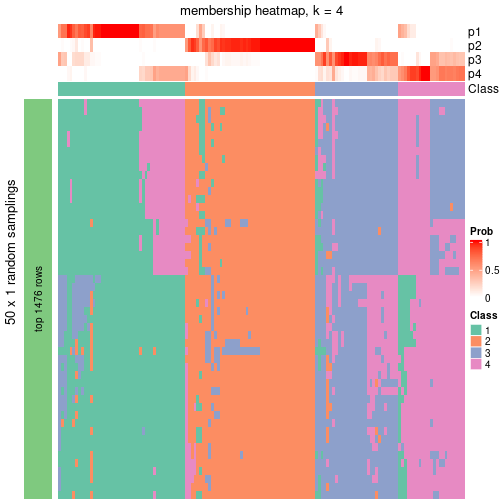</p>

</div>
</div>

As soon as the classes for columns are determined, the signatures
that are significantly different between subgroups can be looked for. 
Following are the heatmaps for signatures.


Signature heatmaps where rows are scaled:


<script>
$( function() {
	$( '#tabs-node-042-get-signatures' ).tabs();
} );
</script>
<div id='tabs-node-042-get-signatures'>
<ul>
<li><a href='#tab-node-042-get-signatures-1'>k = 2</a></li>
<li><a href='#tab-node-042-get-signatures-2'>k = 3</a></li>
<li><a href='#tab-node-042-get-signatures-3'>k = 4</a></li>
</ul>
<div id='tab-node-042-get-signatures-1'>
<pre><code class="r">get_signatures(res, k = 2)
</code></pre>

<p></p>

</div>
<div id='tab-node-042-get-signatures-2'>
<pre><code class="r">get_signatures(res, k = 3)
</code></pre>

<p>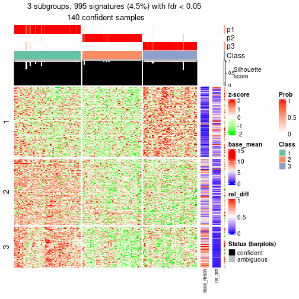</p>

</div>
<div id='tab-node-042-get-signatures-3'>
<pre><code class="r">get_signatures(res, k = 4)
</code></pre>

<p></p>

</div>
</div>


Signature heatmaps where rows are not scaled:


<script>
$( function() {
	$( '#tabs-node-042-get-signatures-no-scale' ).tabs();
} );
</script>
<div id='tabs-node-042-get-signatures-no-scale'>
<ul>
<li><a href='#tab-node-042-get-signatures-no-scale-1'>k = 2</a></li>
<li><a href='#tab-node-042-get-signatures-no-scale-2'>k = 3</a></li>
<li><a href='#tab-node-042-get-signatures-no-scale-3'>k = 4</a></li>
</ul>
<div id='tab-node-042-get-signatures-no-scale-1'>
<pre><code class="r">get_signatures(res, k = 2, scale_rows = FALSE)
</code></pre>

<p></p>

</div>
<div id='tab-node-042-get-signatures-no-scale-2'>
<pre><code class="r">get_signatures(res, k = 3, scale_rows = FALSE)
</code></pre>

<p></p>

</div>
<div id='tab-node-042-get-signatures-no-scale-3'>
<pre><code class="r">get_signatures(res, k = 4, scale_rows = FALSE)
</code></pre>

<p></p>

</div>
</div>


Compare the overlap of signatures from different k:

```r
compare_signatures(res)
```


`get_signature()` returns a data frame invisibly. To get the list of signatures, the function
call should be assigned to a variable explicitly. In following code, if `plot` argument is set
to `FALSE`, no heatmap is plotted while only the differential analysis is performed.

```r
# code only for demonstration
tb = get_signature(res, k = ..., plot = FALSE)
```

An example of the output of `tb` is:

```
#>   which_row         fdr    mean_1    mean_2 scaled_mean_1 scaled_mean_2 km
#> 1        38 0.042760348  8.373488  9.131774    -0.5533452     0.5164555  1
#> 2        40 0.018707592  7.106213  8.469186    -0.6173731     0.5762149  1
#> 3        55 0.019134737 10.221463 11.207825    -0.6159697     0.5749050  1
#> 4        59 0.006059896  5.921854  7.869574    -0.6899429     0.6439467  1
#> 5        60 0.018055526  8.928898 10.211722    -0.6204761     0.5791110  1
#> 6        98 0.009384629 15.714769 14.887706     0.6635654    -0.6193277  2
...
```

The columns in `tb` are:

1. `which_row`: row indices corresponding to the input matrix.
2. `fdr`: FDR for the differential test. 
3. `mean_x`: The mean value in group x.
4. `scaled_mean_x`: The mean value in group x after rows are scaled.
5. `km`: Row groups if k-means clustering is applied to rows (which is done by automatically selecting number of clusters).

If there are too many signatures, `top_signatures = ...` can be set to only show the 
signatures with the highest FDRs:

```r
# code only for demonstration
# e.g. to show the top 500 most significant rows
tb = get_signature(res, k = ..., top_signatures = 500)
```

If the signatures are defined as these which are uniquely high in current group, `diff_method` argument
can be set to `"uniquely_high_in_one_group"`:

```r
# code only for demonstration
tb = get_signature(res, k = ..., diff_method = "uniquely_high_in_one_group")
```


UMAP plot which shows how samples are separated.


<script>
$( function() {
	$( '#tabs-node-042-dimension-reduction' ).tabs();
} );
</script>
<div id='tabs-node-042-dimension-reduction'>
<ul>
<li><a href='#tab-node-042-dimension-reduction-1'>k = 2</a></li>
<li><a href='#tab-node-042-dimension-reduction-2'>k = 3</a></li>
<li><a href='#tab-node-042-dimension-reduction-3'>k = 4</a></li>
</ul>
<div id='tab-node-042-dimension-reduction-1'>
<pre><code class="r">dimension_reduction(res, k = 2, method = &quot;UMAP&quot;)
</code></pre>

<p></p>

</div>
<div id='tab-node-042-dimension-reduction-2'>
<pre><code class="r">dimension_reduction(res, k = 3, method = &quot;UMAP&quot;)
</code></pre>

<p></p>

</div>
<div id='tab-node-042-dimension-reduction-3'>
<pre><code class="r">dimension_reduction(res, k = 4, method = &quot;UMAP&quot;)
</code></pre>

<p></p>

</div>
</div>


Following heatmap shows how subgroups are split when increasing `k`:

```r
collect_classes(res)
```


If matrix rows can be associated to genes, consider to use `functional_enrichment(res,
...)` to perform function enrichment for the signature genes. See [this vignette](https://jokergoo.github.io/cola_vignettes/functional_enrichment.html) for more detailed explanations.


 

## Session info


```r
sessionInfo()
```

```
#> R version 4.1.0 (2021-05-18)
#> Platform: x86_64-pc-linux-gnu (64-bit)
#> Running under: CentOS Linux 7 (Core)
#> 
#> Matrix products: default
#> BLAS/LAPACK: /usr/lib64/libopenblas-r0.3.3.so
#> 
#> locale:
#>  [1] LC_CTYPE=en_US.UTF-8       LC_NUMERIC=C               LC_TIME=en_US.UTF-8       
#>  [4] LC_COLLATE=en_US.UTF-8     LC_MONETARY=en_US.UTF-8    LC_MESSAGES=en_US.UTF-8   
#>  [7] LC_PAPER=en_US.UTF-8       LC_NAME=C                  LC_ADDRESS=C              
#> [10] LC_TELEPHONE=C             LC_MEASUREMENT=en_US.UTF-8 LC_IDENTIFICATION=C       
#> 
#> attached base packages:
#>  [1] grid      parallel  stats4    stats     graphics  grDevices utils     datasets  methods  
#> [10] base     
#> 
#> other attached packages:
#>  [1] genefilter_1.74.0           ComplexHeatmap_2.8.0        markdown_1.1               
#>  [4] knitr_1.33                  scRNAseq_2.6.1              SingleCellExperiment_1.14.1
#>  [7] SummarizedExperiment_1.22.0 Biobase_2.52.0              GenomicRanges_1.44.0       
#> [10] GenomeInfoDb_1.28.1         IRanges_2.26.0              S4Vectors_0.30.0           
#> [13] BiocGenerics_0.38.0         MatrixGenerics_1.4.0        matrixStats_0.59.0         
#> [16] cola_1.9.4                 
#> 
#> loaded via a namespace (and not attached):
#>   [1] circlize_0.4.13               AnnotationHub_3.0.1           BiocFileCache_2.0.0          
#>   [4] lazyeval_0.2.2                polylabelr_0.2.0              splines_4.1.0                
#>   [7] Polychrome_1.3.1              BiocParallel_1.26.1           ggplot2_3.3.5                
#>  [10] digest_0.6.27                 foreach_1.5.1                 ensembldb_2.16.3             
#>  [13] htmltools_0.5.1.1             viridis_0.6.1                 fansi_0.5.0                  
#>  [16] magrittr_2.0.1                memoise_2.0.0                 cluster_2.1.2                
#>  [19] doParallel_1.0.16             Biostrings_2.60.1             annotate_1.70.0              
#>  [22] askpass_1.1                   prettyunits_1.1.1             colorspace_2.0-2             
#>  [25] blob_1.2.1                    rappdirs_0.3.3                xfun_0.24                    
#>  [28] dplyr_1.0.7                   crayon_1.4.1                  RCurl_1.98-1.3               
#>  [31] microbenchmark_1.4-7          jsonlite_1.7.2                impute_1.66.0                
#>  [34] brew_1.0-6                    survival_3.2-11               iterators_1.0.13             
#>  [37] glue_1.4.2                    polyclip_1.10-0               gtable_0.3.0                 
#>  [40] zlibbioc_1.38.0               XVector_0.32.0                GetoptLong_1.0.5             
#>  [43] DelayedArray_0.18.0           shape_1.4.6                   scales_1.1.1                 
#>  [46] data.tree_1.0.0               DBI_1.1.1                     Rcpp_1.0.7                   
#>  [49] viridisLite_0.4.0             xtable_1.8-4                  progress_1.2.2               
#>  [52] clue_0.3-59                   reticulate_1.20               bit_4.0.4                    
#>  [55] mclust_5.4.7                  umap_0.2.7.0                  httr_1.4.2                   
#>  [58] RColorBrewer_1.1-2            ellipsis_0.3.2                pkgconfig_2.0.3              
#>  [61] XML_3.99-0.6                  dbplyr_2.1.1                  utf8_1.2.1                   
#>  [64] tidyselect_1.1.1              rlang_0.4.11                  later_1.2.0                  
#>  [67] AnnotationDbi_1.54.1          munsell_0.5.0                 BiocVersion_3.13.1           
#>  [70] tools_4.1.0                   cachem_1.0.5                  generics_0.1.0               
#>  [73] RSQLite_2.2.7                 ExperimentHub_2.0.0           evaluate_0.14                
#>  [76] stringr_1.4.0                 fastmap_1.1.0                 yaml_2.2.1                   
#>  [79] bit64_4.0.5                   purrr_0.3.4                   dendextend_1.15.1            
#>  [82] KEGGREST_1.32.0               AnnotationFilter_1.16.0       mime_0.11                    
#>  [85] slam_0.1-48                   xml2_1.3.2                    biomaRt_2.48.2               
#>  [88] compiler_4.1.0                rstudioapi_0.13               filelock_1.0.2               
#>  [91] curl_4.3.2                    png_0.1-7                     interactiveDisplayBase_1.30.0
#>  [94] tibble_3.1.2                  stringi_1.7.3                 highr_0.9                    
#>  [97] GenomicFeatures_1.44.0        RSpectra_0.16-0               lattice_0.20-44              
#> [100] ProtGenerics_1.24.0           Matrix_1.3-4                  vctrs_0.3.8                  
#> [103] pillar_1.6.1                  lifecycle_1.0.0               BiocManager_1.30.16          
#> [106] eulerr_6.1.0                  GlobalOptions_0.1.2           bitops_1.0-7                 
#> [109] irlba_2.3.3                   httpuv_1.6.1                  rtracklayer_1.52.0           
#> [112] R6_2.5.0                      BiocIO_1.2.0                  promises_1.2.0.1             
#> [115] gridExtra_2.3                 codetools_0.2-18              assertthat_0.2.1             
#> [118] openssl_1.4.4                 rjson_0.2.20                  GenomicAlignments_1.28.0     
#> [121] Rsamtools_2.8.0               GenomeInfoDbData_1.2.6        hms_1.1.0                    
#> [124] skmeans_0.2-13                Cairo_1.5-12.2                scatterplot3d_0.3-41         
#> [127] shiny_1.6.0                   restfulr_0.0.13
```


